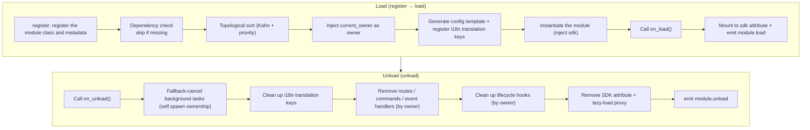

# Module Core Concepts

> [!NOTE]
> **L1 Core Must-Read** — one of the five core documents in the "Reading Path" on the homepage, essential for module development.

This article gives you a clear picture of a module's complete lifecycle from loading to unloading, along with how to use declarative configuration and storage — what the framework automatically handles for you and what you need to write yourself. After reading it, you'll know exactly where you stand.

## Module Lifecycle

### Load Strategy

```python
from ErisPulse.Core.Bases import BaseModule
from ErisPulse.loaders import ModuleLoadStrategy

class MyModule(BaseModule):
    @staticmethod
    def get_load_strategy():
        """Returns the module load strategy"""
        return ModuleLoadStrategy(
            lazy_load=True,   # Lazy load or immediate load
            priority=0,       # Load priority (higher values load first)
            depends=["OtherModule"]  # Optional: declare other modules this one depends on
        )
```

> If a module declared in `depends` is not registered, the current module will be skipped and a warning logged. Load order is determined by topological sorting; modules at the same level are sorted by `priority` in descending order.

> [!NOTE]
> **Cascading Unload / Cascading Reload** (ErisPulse **2.8.0+**): when unloading a module that other modules depend on, the dependent modules are **unloaded first in cascade** (the logs explain the cascade chain); when hot-reloading any module (local plugin / runtime registration / PyPI-installed package), the modules that depend on it are likewise **reloaded in cascade**, preventing dependents from continuing to run while holding stale instance references. Declared circular dependencies are rejected with a `RuntimeError` at load time.
>
> **reload Is a Full Reload** (ErisPulse **2.11.0+**): `reload()` by default clears the import cache by top-level package name and re-imports dependent code, performs an automatic syntax pre-check before unloading (on failure, unloading is refused and the old instance keeps serving), and verifies code identity after success (fake-reload warnings / `stale` flag); load failure details can be queried directly via `sdk.module.last_error(name)` (including the traceback).

### on_load Method

Called when the module loads, used to initialize resources and register event handlers:

```python
async def on_load(self, event):
    # Register event handlers
    @command("hello", help="Greeting command")
    async def hello_handler(event):
        await event.reply("Hello!")
    
    # Use the SDK built-in HTTP client (connection pool managed automatically, no need to create a session manually)
    # Send requests simply via sdk.client
```

### on_unload Method

Called when the module unloads, used to clean up resources:

```python
async def on_unload(self, event):
    # Clean up custom resources
    # sdk.client is managed by the framework, no need to close it manually
    
    # Cancel event handlers (handled automatically by the framework)
    self.logger.info("Module unloaded")
```

> For background task creation and cleanup (`self.spawn()` / framework fallback cancellation), see [Lifecycle Management](../../advanced/lifecycle.md#background-task-ownership-and-automatic-cancellation).

### on_before_unload Method

> [!NOTE]
> This hook requires ErisPulse **2.11.0+**.

An optional hook triggered as the **first step** of the unload pipeline (before `on_unload` and resource reclamation) — at this point all of the module's resources are still intact, making it the right place to save state to `sdk.storage` before unload / dormancy / reload, to be restored on the next `on_load` (lazy-load dormancy state continuation is based on this):

```python
async def on_before_unload(self, event):
    # event["reason"] indicates the purpose: unload / reload / disable / cascade / dormant
    if event["reason"] in ("reload", "dormant"):
        await self.sdk.storage.aset(f"{self._module_name}:state", self.collect_state())
```

Hook failures only produce a warning and do not block the unload process; modules that do not declare this hook behave unchanged. For dormancy / wake-up semantics, see [Lazy-Load Dormancy](../../advanced/lazy-loading.md#lazy-load-dormancy-dormant_after).

### Unload and Full Unload (purge)

> [!NOTE]
> This feature requires ErisPulse **2.8.0+**.

By default, `unload()` only **cancels loading** (unloads the instance and resources) but keeps the registration stub (module class and metadata) — the module can still be rediscovered by discover and re-instantiated with `load()`, without needing to `register()` again.

When a **full unload** is needed (releasing module class references and cleaning `sys.modules` so the plugin and its exclusive dependencies can be garbage collected), pass `purge=True`:

```python
# Unload only: keeps the registration stub, can be re-loaded at any time with load()
await sdk.module.unload("MyModule")

# Full unload: deletes the registration stub + cleans sys.modules (plugin sources)
await sdk.module.unload("MyModule", purge=True)
```

| Semantics | `unload()` default | `unload(purge=True)` |
|------|-----------------|----------------------|
| Unload instance and resources (events/tasks/routes/lifecycle/i18n) | ✅ | ✅ |
| Keep registration stub (module class and metadata) | ✅ | ❌ Deleted |
| Clean `sys.modules` (plugin folder sources only) | ❌ | ✅ |
| Module class can be garbage collected | ❌ | ✅ |
| Reload | `load()` works directly | Requires `register()` + `load()` first |

> With `purge=True`, dependents unloaded in cascade are purged as well; after unloading, the framework runs `gc.collect()` and checks whether the module class/instance can be collected, warning in the logs about lingering references (including the referencers, DEBUG level).

### Full Lifecycle Overview

Tying the methods above together, here is **everything the framework does behind the scenes** when loading and unloading a module:


```mermaid
flowchart TD
    subgraph Load["Load (register → load)"]
        L1["register: register the module class and metadata"] --> L2["Dependency check<br/>skip if missing"]
        L2 --> L3["Topological sort (Kahn + priority)"]
        L3 --> L4["Inject current_owner as owner"]
        L4 --> L5["Generate config template + register i18n translation keys"]
        L5 --> L6["Instantiate the module (inject sdk)"]
        L6 --> L7["Call on_load()"]
        L7 --> L8["Mount to sdk attribute + emit module.load"]
    end

    subgraph Unload["Unload (unload)"]
        U1["Call on_unload()"] --> U2["Fallback-cancel background tasks (self.spawn ownership)"]
        U2 --> U3["Clean up i18n translation keys"]
        U3 --> U4["Remove routes / commands / event handlers (by owner)"]
        U4 --> U5["Clean up lifecycle hooks (by owner)"]
        U5 --> U6["Remove SDK attribute + lazy-load proxy"]
        U6 --> U7["emit module.unload"]
    end

    Load --> Unload
```

**What the framework does for you during loading** (you only write `on_load`; the rest is done automatically):

| Step | What the framework does automatically |
|------|-------------|
| Owner injection | During instantiation the module name is wrapped with `owner_scope` — commands/events/hooks/background tasks registered in your `on_load` are **automatically attributed to this module**, and cleaned up in one go by owner at unload |
| Config template | For modules declaring `ConfigClass`, the framework automatically generates/fills the `ErisPulse.<ModuleName>` config section |
| i18n translation keys | For modules declaring `I18nClass`, translation keys are registered automatically (and unregistered automatically at unload) |
| Dependency topology | Sorted by `depends` declarations to ensure depended-on modules load first; circular dependencies are rejected with a `RuntimeError` |
| SDK mounting | After instantiation, mounted to `sdk.<ModuleName>` so that you can access it via `sdk.MyModule.xxx` |

**What the framework cleans up for you at unload** (corresponding to U1→U7 above): after `on_unload` finishes, fallback cleanup runs — background tasks are force-cancelled (those created via `self.spawn`; do graceful wrap-up yourself in `on_unload`), i18n keys, routes, command/event handlers, and lifecycle hooks, and finally the SDK attribute is removed. `purge=True` additionally deletes the registration stub + cleans `sys.modules`.

> This automatic cleanup is exactly what backs the promise that "you only write `on_load`/`on_unload` and never need to unregister manually" — using owner attribution, the framework turns "whoever registers it cleans it up" into a one-click operation.

## The SDK Object

### Accessing Core Modules

```python
from ErisPulse import sdk

# Access all core modules via the sdk object
sdk.logger.info("Log")
sdk.storage.set("key", "value")
config = sdk.config.getConfig("MyModule")
```

### Inter-Module Communication

```python
# Access other modules
other_module = sdk.OtherModule
result = await other_module.some_method()
```

## Adapter Send Method Queries

Because the new standard specification requires overriding the `__getattr__` method to implement the fallback send mechanism, `hasattr` can no longer be used to check whether a method exists. Starting from `2.3.5`, the ability to query send methods has been added.

### Listing Supported Send Methods

```python
# List all send methods supported by the platform
methods = sdk.adapter.list_sends("onebot11")
# Returns: ["Text", "Image", "Voice", "Markdown", ...]
```

### Getting Method Details

```python
# Get detailed information about a method
info = sdk.adapter.send_info("onebot11", "Text")
# Returns:
# {
#     "name": "Text",
#     "parameters": [
#         {"name": "text", "type": "str", "default": null, "annotation": "str"}
#     ],
#     "return_type": "Awaitable[Any]",
#     "docstring": "Send a text message..."
# }
```

## Configuration Management

### Declarative Configuration (Recommended)

Since v2.5.2, modules can declare a config class via `ConfigClass`, using the same config Schema system as adapters. Configuration is read in real time via `self.cfg` and takes effect immediately after modification:

```python
from dataclasses import dataclass, field
from ErisPulse.Core.Bases import BaseModule
from ErisPulse.Core.Bases import BaseConfig

@dataclass
class MyModuleConfig(BaseConfig):
    api_key: str = field(
        default="",
        metadata={
            "description": {"i18n": "my_module.api_key", "default": "API key"},
            "required": True,
            "secret": True,
            "ui": {"widget": "password", "group": "basic", "order": 1},
        },
    )
    timeout: int = field(
        default=30,
        metadata={
            "description": {"i18n": "my_module.timeout", "default": "Timeout (seconds)"},
            "ui": {"widget": "number", "group": "advanced", "order": 2},
        },
    )

class MyModule(BaseModule):
    ConfigClass = MyModuleConfig

    def __init__(self, sdk):
        self.sdk = sdk
        self.logger = sdk.logger.get_child("MyModule")

    async def on_load(self, event):
        self.logger.info("Module loaded")

    async def on_unload(self, event):
        pass

    async def do_something(self):
        cfg = self.cfg  # Read in real time, type-safe
        api_key = cfg.api_key
        timeout = cfg.timeout
```

`BaseConfig` is a general-purpose config base class suitable for adapters, modules, external projects, and any other scenario. Config fields support i18n multilingual descriptions (see the [i18n documentation](../../advanced/i18n.md#multilingual-config-fields)).

> [!NOTE]
> The lifecycle of modules (including adapters) — loading, unloading, enabling/disabling, etc. — is managed uniformly by the framework (the `module manager` / `scope` provide query and control APIs). `ConfigClass` should only carry business parameters; modules do not need to nest additional logic inside that decides "whether I should start".

The config Schema system also supports (v2.8.0+, see [adapter core-concepts](../adapters/core-concepts.md#metadata-conventions)):

- **Automatic field descriptions from docstrings**: when metadata `description` is not declared, fallbacks are automatically extracted from the docstring's `:ivar field: description` entries or the `Attributes:` section
- **Nested dataclass configuration**: when a field's type is a nested dataclass, schema/template/validation are processed recursively and rendered as nested groups in the WebUI
- **`example` fields not persisted**: fields with `metadata={"example": True}` are not written to config.toml, only recorded in `config.full.example` (suitable for verbose, rarely touched advanced config items); once the user sets them manually they persist normally

### Declarative Translation Keys (v2.7.0+)

Since v2.7.0, modules can also declare translation keys centrally via a nested `I18nClass`, just like declaring `ConfigClass`. The framework **automatically registers** all declared translation keys at load time — no need to call `i18n.register()` manually — and registration happens before config template generation, ensuring that the i18n keys referenced in config descriptions are already available.

```python
from ErisPulse.Core.Bases import BaseConfig, BaseI18n, I18nKey

class MyModule(BaseModule):
    # Config class (optional)
    @dataclass
    class ConfigClass(BaseConfig):
        welcome_msg: str = field(
            default="Welcome",
            metadata={
                "description": {"i18n": "mymodule.welcome_msg", "default": "Welcome message"},
            },
        )

    # Translation key collection class (optional)
    class I18nClass(BaseI18n):
        # Attribute names are automatically concatenated into the full key path: <ModuleName>.<AttributeName>
        welcome_msg: I18nKey = I18nKey(
            default="Welcome Message",   # Language-independent fallback
            zh_CN="Welcome message",
            zh_TW="Welcome message",
            en="Welcome Message",
            ja="ウェルカムメッセージ",
            ru="Приветственное сообщение",
        )
        hello: I18nKey = I18nKey(
            default="Hello, {name}!",
            zh_CN="Hello, {name}!",
            zh_TW="Hello, {name}!",
            en="Hello, {name}!",
            ja="こんにちは、{name}！",
            ru="Привет, {name}!",
        )
```

For details, see [i18n Recommended Approach](../../advanced/i18n.md#recommended-approach-declaring-translation-keys-via-i18nclass-v270).

### Manual Config Reading (Deprecated)

> **Deprecated**: Please use [Declarative Configuration](#declarative-configuration-recommended) + `self.cfg` real-time reading instead.

```python
class MyModule(BaseModule):
    def __init__(self, sdk):
        self.sdk = sdk

    def _load_config(self):
        config = self.sdk.config.getConfig("MyModule")
        if not config:
            self.sdk.config.setConfig("MyModule", {"api_key": "", "timeout": 30})
            return {"api_key": "", "timeout": 30}
        return config
```

## Storage System

### Basic Usage

```python
# Store data
sdk.storage.set("user:123", {"name": "Zhang San"})

# Get data
user = sdk.storage.get("user:123", {})

# Delete data
sdk.storage.delete("user:123")
```

### Using Transactions

```python
# Use transactions to ensure data consistency
with sdk.storage.transaction():
    sdk.storage.set("key1", "value1")
    sdk.storage.set("key2", "value2")
    # If any operation fails, all changes are rolled back
```

## Event Handling

### Registering Event Handlers

```python
from ErisPulse.Core.Event import command, message

# Register a command
@command("info", help="Get information")
async def info_handler(event):
    await event.reply("This is the information")

# Register a message handler
@message.on_group_message()
async def group_handler(event):
    sdk.logger.info(f"Group message received: {event.get_text()}")
```

### Event Handler Lifecycle

The framework automatically manages event handler registration and unregistration; you only need to register them in `on_load`.

## Lazy Loading Mechanism

### How It Works

```python
# The module is initialized only on first access
result = await sdk.my_module.some_method()
# ↑ This triggers module initialization
```

### Immediate Loading

For modules that need to be initialized immediately (such as listeners, timers):

```python
@staticmethod
def get_load_strategy():
    return ModuleLoadStrategy(
        lazy_load=False,  # Immediate loading
        priority=100
    )
```

## Error Handling

### Catching Exceptions

```python
async def handle_event(self, event):
    try:
        # Business logic
        await self.process_event(event)
    except ValueError as e:
        self.logger.warning(f"Invalid parameter: {e}")
        await event.reply(f"Invalid parameter: {e}")
    except Exception as e:
        self.logger.error(f"Processing failed: {e}")
        raise
```

### Logging

```python
# Use different log levels
self.logger.debug("Debug message")    # Detailed debug information
self.logger.info("Running status")      # Normal operation information
self.logger.warning("Warning message")  # Warning message
self.logger.error("Error message")    # Error message
self.logger.critical("Fatal error") # Fatal error
```

## Related Documentation

### Continue the Learning Path

- [Event Wrapper Class](event-wrapper.md) - Event handling in detail

### Going Deeper and Troubleshooting

- [Module Best Practices](best-practices.md) - Developing high-quality modules
- [Module Development Getting Started](getting-started.md) - Review the steps for building your first module