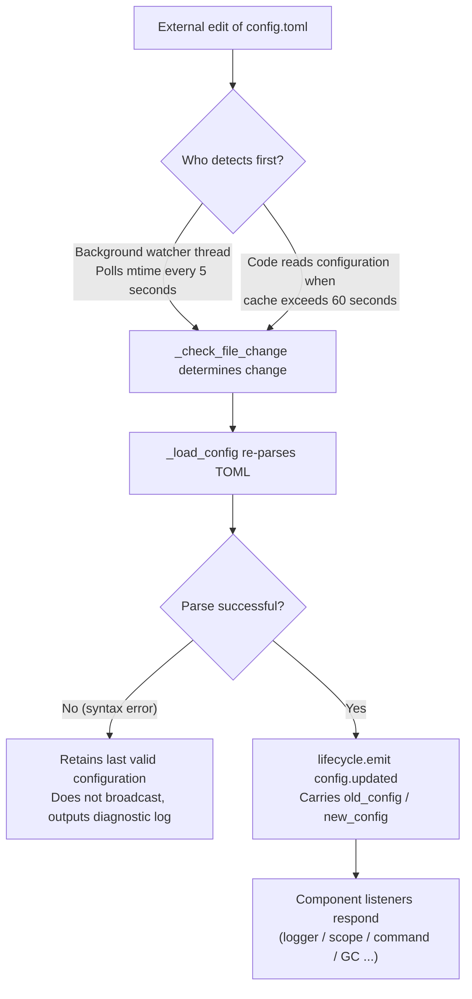

# Configuration File Documentation
> This document will introduce the framework's configuration file. If any third-party modules require configuration, please refer to the module's documentation.

ErisPulse uses a TOML-formatted configuration file `config/config.toml` to manage project configurations.

## Configuration File Location

The configuration file is located in the `config/` folder in the project root directory:

```
project/
├── config/
│   └── config.toml
├── main.py
```

### Multi-Instance Warning and Lock File

When the framework starts, it creates a `.erispulse_config.lock` lock file in the `config/` directory and holds it until the process exits (for detecting multiple instances sharing the same configuration directory). If the log shows a warning like "Detected that the configuration file might be simultaneously used by another ErisPulse instance," it means there are **two or more ErisPulse processes writing to the same configuration** (typical scenario: multiple containers mounted with the same host `config/` directory) — concurrent writes will overwrite each other. Please use separate configuration directories for each instance.

## Configuration Loading Error Handling

The framework distinguishes three error states when loading `config.toml` and provides **actionable diagnostic information**, rather than silently falling back to default configurations:

| Error State | Trigger Condition | Framework Behavior |
|---------|---------|---------|
| File Missing | `config.toml` does not exist | Normal on first startup, silently uses empty configuration (no warning) |
| TOML Syntax Error | File exists but format is invalid (e.g., missing quotes, unclosed parentheses) | Outputs **line/column number and reason for error**, and indicates that default configuration has been reverted |
| Permission/Other Errors | No read permission, IO errors, etc. | Outputs **explicit reason**, and indicates that default configuration has been reverted |

For example, if you accidentally write the configuration as `port = 8000` (missing quotes for a string), the log will output something like:

```
[ERROR] [Config] Configuration file config/config.toml has a syntax error (Line 3, Column 1): ...
[WARNING] [Config] Failed to read configuration file. Continuing with last valid configuration, changes in this file did not take effect this time — please fix and reload or restart
```

This way, you can immediately locate the issue at the **default INFO level** and avoid confusion about why your configuration changes did not take effect.

> **Running and Editing Configuration File?** If you manually edit `config.toml` during robot operation and introduce a syntax error, the framework will output "Configuration file is damaged (syntax error, line X), unable to merge and write — please fix the configuration file and restart" when attempting to write next time, instead of a confusing "write failed." The configuration items to be written will be retained and not lost.

## Comment Retention and Minimal Disk Write

**Comments and key order in config.toml are fully preserved after framework write**: Whether through code `setConfig()`, CLI configuration wizard save, or adapter/module first-generation configuration template, the framework only modifies relevant keys. Your comments and sorted order will not be erased or rearranged (based on tomlkit comment-retaining round-trip implementation).

The framework keeps disk writes minimal:

- **Default framework configurations are not automatically written**: `gc`, `scope`, `transcript`, and other built-in defaults only reside in memory. `config.toml` only contains keys explicitly set by you, keeping it minimal. Refer to `config/config.full.example` in the project for a complete list of configurable items. Copy and modify as needed (unconfigured items always use built-in defaults, behavior unchanged).
- **`config.full.example` is automatically maintained**: Regardless of whether `epsdk init` has been executed, as long as the framework is started (`epsdk run` / `main.py`), `config/config.full.example` will be automatically generated if missing. The first line of the file is a framework-maintained marker. When the generator content updates (e.g., new configuration items, newly installed components), it will be refreshed at startup. Deleting or modifying the first line switches to manual takeover, and the framework will no longer overwrite.
- **Adapter/Module Configuration Templates**: First initialization saves a template with comments (field descriptions are comments); fields marked as `example` do not write to disk, only recorded in `config.full.example` for reference

## Environment Variable Overrides

The framework supports overriding `ErisPulse.*` configuration items using environment variables (ideal for Docker / containerized / CI deployments, without modifying `config.toml`).

Naming convention: Convert the dot-separated path `ErisPulse.<section>.<key>` to all uppercase, replace `.` with `_`, and add the `ERISPULSE_` prefix:

| Configuration Item | Environment Variable | Example Value |
|--------------------|----------------------|---------------|
| `ErisPulse.server.port` | `ERISPULSE_SERVER_PORT` | `9000` |
| `ErisPulse.server.host` | `ERISPULSE_SERVER_HOST` | `0.0.0.0` |
| `ErisPulse.logger.level` | `ERISPULSE_LOGGER_LEVEL` | `DEBUG` |
| `ErisPulse.framework.strict_mode` | `ERISPULSE_FRAMEWORK_STRICT_MODE` | `false` |

Behavior description:
- **Highest priority**: Environment variables override both "configuration file" and "default values", automatically converting to the original value type (`bool` / `int` / `float` / comma-separated `list` / string)
- **Non-persistent**: The override only takes effect during runtime and does not write back to `config.toml`
- **Supports hot reload**: After modifying environment variables during runtime, configuration reload with monitoring will take effect

```bash
# Example for Docker deployment: Override port without modifying config.toml
ERISPULSE_SERVER_PORT=9000 docker compose up -d
```

> Note: Framework configuration such as `ErisPulse.server.port` is read via APIs like `get_server_config()`, and is affected by environment variable overrides.

### Environment Variable Binding for Module Configuration (2.9.0+)

Module-specific declarative configurations (`ConfigClass`) support field-level environment variable binding—declare `env` in `field(metadata=...)`:

```python
@dataclass
class MyConfig(BaseConfig):
    api_key: str = field(default="", metadata={
        "description": "API Key",
        "env": "MYMODULE_API_KEY",   # Environment variable binding
    })
    retries: int = field(default=3, metadata={"env": "MYMODULE_RETRIES"})
```

Behavior description:

- **Priority**: Environment variable > `config.toml` > declared default value (this priority is maintained even after configuration file hot reload)
- **Type conversion**: Environment variable values are automatically converted according to field annotations—`str` remains unchanged, `int` / `float` / `bool` (`true` / `1` / `yes` / `on`) are automatically converted, `list` / `dict` are parsed via JSON; if conversion fails, the override is ignored (fallback to configuration file / default value) and a warning is issued
- **One declaration, everywhere effective**: Configuration reading, hot reload, and validation use the same pipeline; the configuration panel Schema will mark the `env` name, and `config.toml` template comments will also prompt available environment variables (the template does not write actual values of environment variables to avoid leakage)
- **Fully compatible**: Fields without `env` declaration behave unchanged; directly instantiating ConfigClass (without using the framework configuration pipeline) is not affected by environment variables

```bash
# Example for Docker deployment: Inject module key without modifying config.toml
MYMODULE_API_KEY=sk-xxx docker compose up -d
```

> **When to choose Configuration Class vs Model Field?** Configuration classes manage "how the module operates" (behavior parameters, hot reload), while ORM's `Field()` manages "what data the user generates" (database tables, queries). Both share the same set of constraint keywords and validator engine; see the comparison table in [Data Model Layer · When to Use Which Declaration](../developer-guide/orm.md#when-to-use-which-declaration).

## Configuration Hot Update

Since version 2.7.0, the framework has provided **systematic support for configuration hot updates**. After external modification of `config.toml` (background watcher checks every 5 seconds), or code calls `setConfig()`, each component automatically responds:

| Component | Configurable for Hot Updates | Behavior |
|------|----------------|------|
| **Logger** | `logger.level` / `log_files` / `log_dir` (including segmentation parameters) / `memory_limit` / `format` / `exclude_levels` | Automatically reapplies (with change detection) |
| **Command System** | `event.command.prefix` / `case_sensitive` / `allow_space_prefix` / `must_at_bot` | Takes effect on the next message |
| **Adapter Concurrency** | `framework.handler_max_concurrency` | Invalidates cached semaphore, rebuilds with new value |
| **Proactive GC** | `framework.proactive_gc_*` | Configuration change immediately restarts GC task, supports runtime adjustment/disable/re-enable |
| **Master System** | `master.users` | Each `is_master()` check reads in real-time, no restart needed |
| **Modules/Adapters** | Their respective configuration items | Triggers `on_config_update(old, new)` callback |

**Configurations that require restart** (cannot be safely hot-swapped, warning is output when changed "requires process restart to take effect"):

| Configuration | Reason |
|------|------|
| `router.cors.*` / `router.security.*` | Middleware is written into FastAPI at service startup, cannot be safely hot-swapped at runtime |
| `storage.use_global_db` | SQLite file handle is already opened at runtime, switching paths is unsafe |

> **Mid-edit Save Error?** If a transient syntax error occurs while editing `config.toml`, the framework will **retain the last valid configuration** and output diagnostic logs, avoiding broadcasting an empty configuration to all components (preventing `on_config_update` from receiving empty values and mistakenly reverting to default).

### Internal Breakdown of Hot Update Chain

"How do components know when the configuration is changed?" — Behind this is a detection → reload → broadcast chain:



**Two detection paths** (either one suffices, both can serve as a fallback):

| Path | Mechanism | Trigger Timing |
|------|------|---------|
| Background watcher | Daemon thread `config-watcher` polls file `mtime` every **5 seconds** | External file modification is detected within at most 5 seconds |
| Lazy detection | Any `getConfig()` read, if cache exceeds **60 seconds**, first checks file | Next time configuration is read |

> **Framework does not self-harm**: When `setConfig()` writes to disk, it records the "mtime written by itself," and the watcher excludes it during comparison, recognizing only **external edits** as changes.

**Two types of configuration change events**:

| Event | Trigger | Data | Typical Scenario |
|------|--------|------|---------|
| `config.set` | Code / Dashboard calls `setConfig()` | `{key, old_value, new_value}` | Single key write (template generation, status recording, runtime configuration change) |
| `config.updated` | External edit detected by watcher/lazy detection | `{old_config, new_config, config_file}` | Manual edit of `config.toml` |

> `setConfig()` defaults to **delayed disk write** (combines multiple writes) with a 5-second delay; `immediate=True` writes immediately. After the watcher detects an external modification, it only updates the in-memory cache and **does not** write the external changes back to the file.

**List of Automatic Responders** (both event types are typically subscribed to, with consistent response content):

| Component | Listener | Response |
|------|------|------|
| Logger | `config.set` + `config.updated` | Reapplies level/file/directory segmentation/memory limit/format/level exclusion (with change detection, no change means no action) |
| Scope | `config.updated` | Rebuilds scope binding cache |
| Command System | `config.updated` | Refreshes prefix/case sensitivity/space prefix/must_at_bot parsing parameters, takes effect on next message |
| Adapter Concurrency | `config.set` + `config.updated` | Invalidates and rebuilds semaphore with `handler_max_concurrency` |
| Proactive GC | `config.set` + `config.updated` | Immediately restarts GC background task with `proactive_gc_*` |
| Adapter | Routes to `on_config_update` | Each adapter's `on_config_update(old, new)` callback |
| Module | Routes to `on_config_update` | Each module's `on_config_update(old, new)` callback |
| Storage | `config.updated` | `use_global_db` change only **warns** (requires restart) |
| Router | `config.updated` | `cors.*` / `security.*` change only **warns** (requires restart) |

## Complete Configuration Example

```toml
[ErisPulse.server]
host = "0.0.0.0"
port = 8000
auto_start = true
ssl_certfile = ""
ssl_keyfile = ""

[ErisPulse.master]
# users supports two writing methods (choose one):
#   Global master (effective on all platforms): users = ["123456", "789012"]
#   Master per platform: users = { yunhu = ["123456"], telegram = ["789012"] }
users = {}

[ErisPulse.logger]
level = "INFO"
format = "rich"
log_files = []
log_dir = ""
log_rotation = "size"
log_max_size_mb = 10
log_backup_count = 5
log_rotation_when = "midnight"
memory_limit = 1000
exclude_levels = []

[ErisPulse.framework]
enable_lazy_loading = true
uninit_timeout = 30
strict_mode = 0

[ErisPulse.framework.strict_mode_exceptions]
modules = []
adapters = []

[ErisPulse.storage]
backend = "sqlite"
use_global_db = false

[ErisPulse.event.command]
prefix = "/"
case_sensitive = true
allow_space_prefix = false
must_at_bot = false

[ErisPulse.event.message]
ignore_self = true

[ErisPulse.i18n]
language = "auto"
```

## Server Configuration

```toml
[ErisPulse.server]
host = "0.0.0.0"
port = 8000
auto_start = true
ssl_certfile = "/path/to/cert.pem"
ssl_keyfile = "/path/to/key.pem"
```

| Configuration Item | Type | Default Value | Description |
|---------|------|---------|------|
| host | string | 0.0.0.0 | Listening address, 0.0.0.0 means all interfaces |
| port | integer | 8000 | Listening port number |
| auto_start | boolean | true | Whether to automatically start the routing server in `sdk.init()`. Set to `false` to skip routing server startup (pure event/no WebUI scenario) |
| ssl_certfile | string | empty | SSL certificate file path |
| ssl_keyfile | string | empty | SSL private key file path |

## Master System Configuration

The master system is used to identify the "master" account (e.g., bot administrator). `master.users` supports two writing methods:

```toml
[ErisPulse.master]
# Method 1: Global master (effective on all platforms)
users = ["123456", "789012"]

# Method 2: Master per platform (dict)
# users = { yunhu = ["123456"], telegram = ["789012"] }
```

| Configuration Item | Type | Default Value | Description |
|---------|------|---------|------|
| users | array / object | empty | List of master account IDs. `list` format is global master (effective on all platforms); `dict` format specifies per platform (key is platform name, value is list of master account IDs for that platform) |

Code checks via `master.is_master(event)` or `master.is_master(platform, user_id)`, each call reads the configuration in real-time (supports hot updates, no restart needed):

```python
from ErisPulse.Core import master

if master.is_master(event):
    await event.reply("Hello, Master")
```

### Determination Chain and Runtime Additions/Removals

The master determination chain is **configuration master → runtime record → provider chain**:

```python
from ErisPulse.Core import master

master.is_master(event)                      # Determine from event
master.is_master("yunhu", "123")             # Explicit determination
master.add("yunhu", "123")                   # Add at runtime (default persistent; persist=False only in-memory)
master.remove("yunhu", "123")                # Remove (default persistent)
master.list()                                # Aggregate: {"global": [...], "<platform>": [...]}
```

### Custom Identity Source (provider)

In addition to configuration, custom identity sources can be registered: `fn(platform, user_id) -> bool`, which are tried in sequence if built-in identity sources (configuration + runtime record) do not match. Any provider that allows access is recognized as a master. Suitable for integrating with adapter administrator interfaces, database roles, and other external identity systems.

Registration entry `master.provider` supports both decorator and function-style writing. Unregistering is done via the registered function's `fn.unregister()`:

```python
from ErisPulse.Core import master

# Method 1: Decorator (persistent identity source, recommended)
@master.provider
def admin_provider(platform, user_id):
    return user_id in {"999"}     # Custom determination logic

master.is_master("yunhu", "999")   # True
admin_provider.unregister()        # Unregister when no longer needed

# Method 2: Function-style (register during module load / unregister during unload)
fn = master.provider(admin_provider)
fn.unregister()
```

> Provider exceptions are caught and skipped, not blocking the identity determination chain.
> Binding instance methods cannot attach `unregister`, use **module-level functions** for paired registration/unregistration scenarios.

### User Priority: Master Scope Decided by User

The `master=True` of a command is only a **developer default**: The user can override it via
`ErisPulse.event.overrides.command.<module>.<cmd>.master = true/false` (see [Unified Event Override Configuration](#unified-event-override-configurationeventoverrides), explicit user configuration takes effect).

## Logging Configuration

```toml
[ErisPulse.logger]
level = "INFO"
log_files = []                # Explicit list of log files (mutually exclusive with log_dir, higher priority)
log_dir = ""                  # Log directory (automatically created). Set to automatically segment and rotate logs into `erispulse.log` in the directory, with `log_rotation` automatic segmentation; mutually exclusive with `log_files`, `log_files` has higher priority
log_rotation = "size"         # Segmentation method: "size" / "date" / "none"
log_max_size_mb = 10          # Size mode single file size limit (MB), rotates to `.1`/`.2` backup when exceeded
log_backup_count = 5          # Number of historical log files retained, oldest backups beyond this are automatically deleted
log_rotation_when = "midnight"  # Date mode rotation period: S/M/H/D/midnight
memory_limit = 1000
exclude_levels = ["EVENT"]
```

| Configuration Item | Type | Default Value | Description |
|---------|------|---------|------|
| level | string | INFO | Log level: TRACE, DEBUG, INFO, WARNING, ERROR, CRITICAL (TRACE is the lowest level, outputs detailed debugging information from the framework) |
| format | string | rich | Log output format: `rich` (colored, default), `plain` (plain text without color, suitable for log collection/pipeline redirection), `json` (JSON structured, suitable for ELK, etc.) |
| log_files | array | empty | List of log output files (explicit paths, not segmented) |
| log_dir | string | empty | Log output directory (automatically created). Set to write into `erispulse.log` in the directory with `log_rotation` automatic segmentation; mutually exclusive with `log_files`, `log_files` has higher priority |
| log_rotation | string | size | Segmentation method: `size` (by size) / `date` (by time) / `none` (no segmentation) |
| log_max_size_mb | float | 10 | Single file size limit (MB) in size mode, rotates to `.1`/`.2` backup when exceeded |
| log_backup_count | integer | 5 | Number of historical log files retained, oldest backups beyond this are automatically deleted |
| log_rotation_when | string | midnight | Date mode rotation period: `S`/`M`/`H`/`D`/`midnight` (default is midnight daily) |
| memory_limit | integer | 1000 | Number of log entries saved in memory |
| exclude_levels | array | empty | Levels to exclude. Logs of excluded levels are **completely discarded** (not written to memory, not pushed to Dashboard subscribers, not printed, not written to file). Supports hot updates |

You can also dynamically switch in code:

```python
from ErisPulse.Core import logger

# Size-based segmentation: single file 10MB, retain 5 copies
logger.set_output_dir("logs", rotation="size", max_size_mb=10, backup_count=5)

# Time-based segmentation: rotate daily at midnight, retain 7 copies
logger.set_output_dir("logs", rotation="date", backup_count=7)
```

> [!NOTE]
> `log_dir` and related segmentation configurations require ErisPulse **2.8.0+**.

> **Privacy Protection**: Message reception and sending content are logged at the **EVENT level** (value 21). Setting `exclude_levels = ["EVENT"]` prevents the backend (such as the Dashboard log panel) from seeing message content in groups/private chats, while not affecting logs of other levels.

> [!NOTE]
> The `exclude_levels` feature requires ErisPulse **2.8.0+**.

## Framework Configuration

```toml
[ErisPulse.framework]
enable_lazy_loading = true
uninit_timeout = 30
strict_mode = 0

[ErisPulse.framework.strict_mode_exceptions]
modules = []
adapters = []
```

| Configuration Item | Type | Default Value | Description |
|---------|------|---------|------|
| enable_lazy_loading | boolean | true | Whether to enable module lazy loading |
| uninit_timeout | integer | 30 | Graceful shutdown timeout (seconds), forcibly terminates after exceeding. 0 means no timeout set |
| strict_mode | integer | 0 | Strict mode level, see "Strict Mode" below |
| handler_max_concurrency | integer | 64 | Maximum concurrent Task count for event handlers, increasing improves throughput but increases memory usage |
| offline_bot_expiry | integer | 3600 | Automatic expiration time for offline bot records (seconds), 0 means no expiration |

### Proactive GC Configuration

After SDK initialization, a proactive GC background task is started, periodically performing Python GC and internal resource recycling (such as cleaning up offline bots). All parameters support hot updates, and tasks are restarted immediately upon configuration changes, supporting runtime adjustments, disabling, and re-enabling.

| Configuration Item | Type | Default Value | Description |
|---------|------|---------|------|
| proactive_gc_interval | number | 300 | Recycling interval (seconds), supports decimals. 0 means disable proactive GC |
| proactive_gc_generation | integer | 0 | Regular round recycling generation (0/1/2, clamped to 0..2). Note that `gc.collect(2)` is equivalent to full recycling, default 0 keeps it lightweight; deep recycling is triggered periodically by `proactive_gc_full_every` |
| proactive_gc_full_every | integer | 20 | Full recycling every N rounds, 0 means disable periodic full recycling. Full recycling is constrained by the `proactive_gc_memory_growth_mb` threshold |
| proactive_gc_memory_growth_mb | integer | 32 | Memory growth threshold (MB) for full recycling: compared with the memory baseline after the last full recycling (prefers tracemalloc, otherwise RSS), full recycling is only performed when the growth reaches this value. 0 means no threshold set |
| proactive_gc_idle_only | boolean | false | When enabled, during event spikes (pending handlers exist), this round skips Python GC to avoid pauses and competition with message processing; internal resource recycling is unaffected |
| proactive_gc_gen0_min | integer | 500 | Lower bound for triggering regular round recycling of gen0 garbage: `gc.get_count()[0]` below this value directly skips (empty rounds are nearly zero-cost). 0 means always recycle |

> **2.7.1 Change**: The default `proactive_gc_generation` was adjusted from `2` to `0`, and `proactive_gc_full_every` was adjusted from `0` to `20`. Previously, `generation=2` meant full recycling every round; the new default maintains recycling coverage while significantly reducing empty round overhead. Explicitly configured old values still take effect as literal semantics.

### Strict Mode

Strict mode controls the handling strategy for modules/adapters when they are non-compliant or fail during the loading phase. Modern modules/adapters should inherit corresponding base classes (`BaseModule`/`BaseAdapter`); components not inheriting base classes affect the framework's context system and fallback cleanup, potentially causing resource leaks.

> **2.5.2 Change**: The default level was adjusted from `1` (skip) to `0` (lenient) to reduce loading issues for new users. Components not inheriting base classes will be warned and still attempted to load, rather than directly rejected. To restore the old behavior, explicitly set `strict_mode = 1`.

| Level | Name | Behavior |
|------|------|------|
| 0 | Lenient (Default) | Non-compliance only warns, components not inheriting base classes are still attempted to load (compatible with old components) |
| 1 | Strict-Skip | Rejects components not inheriting base classes and skips them, other components start normally |
| 2 | Strict-Critical | Collects all non-compliance issues and reports them together, halting the entire startup |

In all levels, component self-crashes during the "loading/registration/initialization" phase are always skipped; the difference lies in:

- **0 → 1**: The only behavioral change is that "not inheriting base class" changes from "still loaded" to "skipped."
- **1 → 2**: All non-compliance issues (not inheriting base class, loading failure, registration failure, initialization failure, etc.) are upgraded to critical, collected at the startup checkpoint, and output as a list of violations before halting.

#### Exemption List

If certain components temporarily cannot migrate (e.g., dependent on old modules), they can be added to the exemption list. Components listed will be treated leniently and continue to load even if non-compliant:

```toml
[ErisPulse.framework.strict_mode_exceptions]
modules = ["SeTu", "SomeLegacyModule"]
adapters = ["OldAdapter"]
```

> When a component is rejected by strict mode, the log will clearly indicate how to restore loading (add to exemption list or lower the level).

## Storage Configuration

Since version 2.8.0, the storage engine supports three asynchronous backends, **with completely consistent APIs and one-click configuration switching**:

| Backend | Driver | Installation | Features |
|------|------|------|------|
| SQLite (Default) | aiosqlite | Ready to use out of the box | Zero configuration, single file, WAL concurrency |
| MySQL / MariaDB | aiomysql | `pip install ErisPulse[mysql]` | Existing MySQL infrastructure, shared across multiple instances |
| PostgreSQL | asyncpg | `pip install ErisPulse[postgres]` | Strong transaction capability, high concurrency |

```toml
[ErisPulse.storage]
backend = "sqlite"        # "sqlite" (default) / "mysql" / "postgres"
use_global_db = false     # Only for SQLite: use the global database in the package data/config.db

[ErisPulse.storage.mysql]      # Effective when backend = "mysql"
host = "127.0.0.1"
port = 3306
user = "erispulse"
password = ""
database = "erispulse"
# charset = "utf8mb4"
# pool_min = 1
# pool_max = 10

[ErisPulse.storage.postgres]   # Effective when backend = "postgres"
host = "127.0.0.1"
port = 5432
user = "erispulse"
password = ""
database = "erispulse"
# pool_min = 1
# pool_max = 10
```

| Configuration Item | Type | Default Value | Description |
|---------|------|---------|------|
| backend | string | sqlite | Storage backend: `sqlite` / `mysql` / `postgres`, switching requires zero code changes |
| use_global_db | boolean | false | Only for SQLite: whether to use the global database in the package rather than the project-specific database |
| storage.mysql.* | table | See above | MySQL connection parameters (host / port / user / password / database / charset / pool) |
| storage.postgres.* | table | See above | PostgreSQL connection parameters (host / port / user / password / database / pool) |

Environment variables are also supported for override (Docker / 12-factor): `ErisPulse.storage.postgres.host` → `ERISPULSE_STORAGE_POSTGRES_HOST`.

> [!TIP]
> - Connection parameter changes require framework restart to take effect; automatic exponential backoff retry occurs if connection pool creation fails momentarily
> - Use a verification script before switching backends: `python tests/devs/test_storage_backend_verify.py --backend mysql`
> - For complete explanations on transactions, dialect differences, and custom backends, see [Storage Backends](../advanced/storage-backends.md)

## Event Configuration

### Command Configuration

```toml
[ErisPulse.event.command]
prefix = "/"
case_sensitive = true
allow_space_prefix = false
```

| Configuration Item | Type | Default Value | Description |
|---------|------|---------|------|
| prefix | string | / | Command prefix |
| case_sensitive | boolean | true | Whether to distinguish case (`/Help` and `/help` as different commands) |
| allow_space_prefix | boolean | false | Whether to allow space as prefix |
| must_at_bot | boolean | false | Whether to require mentioning the bot to trigger the command (private chats are not restricted) |

### Message Configuration

```toml
[ErisPulse.event.message]
ignore_self = true
```

| Configuration Item | Type | Default Value | Description |
|---------|------|---------|------|
| ignore_self | boolean | true | Whether to ignore the robot's own messages |

## Internationalization Configuration

```toml
[ErisPulse.i18n]
language = "auto"
```

| Configuration Item | Type | Default Value | Description |
|---------|------|---------|------|
| language | string | auto | Language for displaying framework built-in text. Set to `auto` to automatically detect system language, or set to a specific code: `zh-CN`, `zh-TW`, `en`, `ja`, `ru` |

## Module Configuration

Each module can define its own configuration in the configuration file:

```toml
[MyModule]
api_url = "https://api.example.com"
timeout = 30
enabled = true
```

Read and write configuration within the module:

```python
from ErisPulse import sdk

# Read configuration
config = sdk.config.getConfig("MyModule", {})
api_url = config.get("api_url", "https://default.api.com")

# Write configuration at runtime (delayed save)
sdk.config.setConfig("MyModule.timeout", 60)

# Immediately save to file
sdk.config.setConfig("MyModule.timeout", 60, immediate=True)
```

> `setConfig` defaults to delayed write (batched save to file every ~5 seconds), setting `immediate=True` saves immediately. Configuration changes trigger the `config.set` lifecycle event.

## Scope Configuration (scope)

> [!NOTE]
> This feature requires ErisPulse **2.8.0+**.

Scope declares "**what scope it applies to**"—which modules are available in what platform / Bot / session (① module dimension), whether events from which user / group / Bot / adapter are received (② identity dimension), and which outbound calls a module can initiate (③ outbound dimension):

```toml
[ErisPulse.scope]
default_allow = true        # Global default (false = implicit deny strict mode; does not affect outbound dimension)
cache_size = 1024           # LRU cache size

# ① Module dimension (priority: session > Bot > platform; entries support exact / glob / re: regular expressions)
[ErisPulse.scope.platforms.onebot11]
modules = ["Chat", "Tool*"]
blocked = ["re:^Danger"]

# Sub-level binding with merge = true merges item by item with lower priority (default is overall overwrite)
[ErisPulse.scope.bots.onebot11."123456"]
modules = ["Music"]
merge = true

# ② Identity dimension (priority: user > session > Bot > adapter; only allow or deny per level)
[ErisPulse.scope.identity.adapters.onebot11]
deny = true                 # All events from this platform are discarded at the entry
[ErisPulse.scope.identity.users.onebot11]
allow = ["u_admin"]         # User keys support glob / re: regular expressions
deny = ["u_bad", "spam_*"]

# ③ Outbound dimension (default is fully allowed; rules are inline tables, entries support exact / glob / re: regular expressions)
[ErisPulse.scope.actions.MyModule]
send = { deny = true }                    # Deny all sending
api = { allow = ["get_*"] }               # Allow only standard query APIs
request = { deny = true }                 # Deny processing requests
```

| Configuration Item | Type | Description |
|---------|------|------|
| `scope.default_allow` | boolean | Global default: allow/deny for modules/identity not matched by rules (`true`) |
| `scope.cache_size` | integer | LRU cache size (default 1024) |
| `scope.platforms / bots / sessions` | table | ① Module three-level binding: `{modules=[...], blocked=[...], merge=bool?}` |
| `scope.identity.adapters / bots / sessions / users` | table | ② Identity four-level binding: `{allow=true}` / `{deny=true}` |
| `scope.actions.<module>.<action>` | table | ③ Outbound rules: `{allow=[...], deny=true|[...]}` (actions are send / api / request) |

> Detailed explanation and runtime API (dimensional `sdk.scope.set_module()` / `set_identity()` / `set_action()`, determination `is_allowed()` / `is_identity_allowed()` / `is_action_allowed()`, and dictionary-style fallback `get()` / `set()` / `delete()`) can be found in [Scope](../advanced/scope.md).

## Unified Event Override Configuration (event.overrides)

Unified override system: Overwrite behaviors of any module handler by **event type** without modifying module code. OneBot12 standard types (meta / message / notice / request) and extended types (command) each have their own overridable parameters:

```toml
[ErisPulse.event.overrides]

# message: Text trigger conditions (AND with code conditions)
[ErisPulse.event.overrides.message.ChatModule]
pattern = "闲聊*"

# notice / request / meta: detail_type whitelist (entries support exact / glob / re: regular expressions)
[ErisPulse.event.overrides.notice.MyModule]
detail_types = ["group_increase"]

# command (extended type): Overwrite parameters (user priority; disable via acl deny)
[ErisPulse.event.overrides.command.MyModule.restart]
master = true               # Override to only allow framework masters (false opens developer's master restriction)
hidden = true               # Hide in help list
aliases = ["rs"]            # Effective alias

# acl (command exclusive): User allow/deny list (command names support glob / re: regular expressions, exact keys take precedence)
[ErisPulse.event.overrides.acl."roll*"]
allow = ["onebot11:u_vip"]  # User identifier "platform:user_id"
deny = ["onebot11:u_bad"]

# ACL fallback: Allow (true) / strictly deny (false) commands without ACL configuration
acl_default_allow = true
```

| Configuration Item | Type | Description |
|---------|------|------|
| `event.overrides.message.<module>` | table | Text condition: `{pattern="...", regex="..."}` |
| `event.overrides.notice / request.<module>` | table | `{detail_types=[...], pattern, regex}` |
| `event.overrides.meta.<module>` | table | `{detail_types=[...]}` |
| `event.overrides.command.<module>` | table | Module-level parameter override (scalar like `hidden = true`) |
| `event.overrides.command.<module>.<command>` | table | Command-level override (command-level takes precedence) |
| `event.overrides.acl.<command name>` | table | User allow/deny list: `{allow=[...], deny=[...]}` |
| `event.overrides.acl_default_allow` | boolean | ACL fallback: allow (true) / strictly deny (false) commands without ACL configuration |

> Runtime API (after `from ErisPulse.Core.Event import overrides`, call `overrides.message.set()` / `overrides.command.set()` / `overrides.acl.set()` via type sub-namespace, or access via `sdk.Event.overrides`)
> See [Event Handling Introduction · Event Override](../getting-started/event-handling.md#event-override-no-code-modification-overwrite-behavior-of-any-event-type).

## Command Parsing Configuration (event.command)

## Next Steps

- [CLI Command Reference](cli-reference.md) - Learn all command-line commands
- [Developer Guide](../developer-guide/) - Learn to develop custom modules