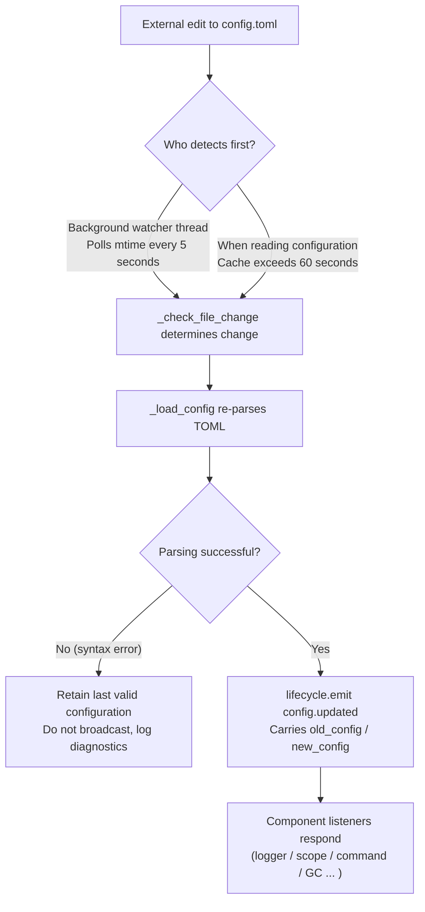

# Configuration File Description
> This document will introduce the framework's configuration file. If third-party modules require configuration, please refer to the module's documentation.

ErisPulse uses a TOML-formatted configuration file `config/config.toml` to manage project configurations.

## Configuration File Location

The configuration file is located in the `config/` folder at the root of the project:

```
project/
├── config/
│   └── config.toml
├── main.py
```

## Configuration Loading Error Handling

When loading `config.toml`, the framework distinguishes three error states and provides **actionable diagnostic information**, instead of silently falling back to default configurations:

| Error State | Trigger Condition | Framework Behavior |
|-------------|-------------------|--------------------|
| File Missing | `config.toml` does not exist | On normal first startup, silently use an empty configuration (no warning issued) |
| TOML Syntax Error | File exists but has invalid format (e.g., missing quotes, unclosed parentheses) | Output **line number/col number and reason**, and indicate that default configuration has been reverted |
| Permission/Other Errors | No read permission, IO error, etc. | Output **clear reason**, and indicate that default configuration has been reverted |

For example, if you accidentally write the configuration as `port = 8000` (a string without quotes), the log will output something like:

```
[ERROR] [Config] Configuration file config/config.toml has a syntax error (line 3, column 1): ...
[WARNING] [Config] Failed to read configuration file. Continuing with last valid configuration. Changes in this file did not take effect—please fix and reload or restart
```

This allows you to immediately locate the issue at the **default INFO level** without confusion about why your configuration changes did not take effect.

> **Bad configuration file edited during runtime?** If you manually edit `config.toml` during robot operation and introduce a syntax error, the framework will output on the next write (merging configuration): "Configuration file is corrupted (syntax error, line X), unable to merge and write—please fix the configuration file and restart" instead of the confusing "write failed". The configuration items to be written will be retained and will not be lost.

## Environment Variable Override

The framework supports **overriding** `ErisPulse.*` configuration items using environment variables (ideal for Docker / containerized / CI deployments, without modifying `config.toml`).

Naming convention: Convert the dot-separated path `ErisPulse.<section>.<key>` into all uppercase, replace `.` with `_`, and add the `ERISPULSE_` prefix:

| Configuration Item | Environment Variable | Example Value |
|--------------------|----------------------|---------------|
| `ErisPulse.server.port` | `ERISPULSE_SERVER_PORT` | `9000` |
| `ErisPulse.server.host` | `ERISPULSE_SERVER_HOST` | `0.0.0.0` |
| `ErisPulse.logger.level` | `ERISPULSE_LOGGER_LEVEL` | `DEBUG` |
| `ErisPulse.framework.strict_mode` | `ERISPULSE_FRAMEWORK_STRICT_MODE` | `false` |

Behavior description:
- **Highest priority**: Environment variables override both "configuration file" and "default values", automatically converting to the original value type (`bool` / `int` / `float` / comma-separated `list` / string)
- **Non-persistent**: The override only takes effect during runtime and does not write back to `config.toml`
- **Supports hot reload**: After modifying environment variables during runtime, configuration reload via monitoring will take effect

```bash
# Example of Docker deployment: Override port directly without modifying config.toml
ERISPULSE_SERVER_PORT=9000 docker compose up -d
```

> Note: Framework configurations such as `ErisPulse.server.port` are read through APIs like `get_server_config()`, and are all affected by environment variable overrides.

## Hot Configuration Reload

Starting from version 2.7.0, the framework provides **systematic support** for hot configuration reload. After external modification of `config.toml` (detected by a background watcher every 5 seconds) or after calling `setConfig()` in code, all components automatically respond:

| Component | Configurations Supporting Hot Reload | Behavior |
|-----------|--------------------------------------|----------|
| **Logger** | `logger.level` / `log_files` / `log_dir` (including segmentation parameters) / `memory_limit` / `format` / `exclude_levels` | Automatically reapply (with change detection) |
| **Command System CommandHandler** | `event.command.prefix` / `case_sensitive` / `allow_space_prefix` / `must_at_bot` | Takes effect on the next message |
| **Adapter Concurrency** | `framework.handler_max_concurrency` | Invalidates cached semaphore, rebuilds with new value |
| **Proactive GC** | `framework.proactive_gc_*` | Configuration changes immediately restart GC tasks, supports runtime adjustment/disable/reenable |
| **Master System Master** | `master.users` | Each `is_master()` check reads real-time values, no restart required |
| **Module/Adapter Configurations** | Their respective configuration items | Triggers `on_config_update(old, new)` callback |

**Configurations Requiring Restart** (cannot be safely hot-switched; warning "Process restart required for changes to take effect" is output on modification):

| Configuration | Reason |
|----------------|--------|
| `router.cors.*` / `router.security.*` | Middleware is written into FastAPI at service startup, cannot be safely hot-switched at runtime |
| `storage.use_global_db` | SQLite file handle is already open at runtime, switching paths is unsafe |

> **Error during mid-edit save?** If a transient syntax error occurs while editing `config.toml`, the framework will **retain the last valid configuration** and output diagnostic logs, without broadcasting an empty configuration to components (to avoid `on_config_update` receiving empty values and mistakenly reverting to default).

### Internal Breakdown of Hot Reload Chain

"How do components know when the configuration changes?" — Behind this is a detection → reload → broadcast chain:



**Two detection paths** (either one suffices, both provide backup):

| Path | Mechanism | Trigger Timing |
|------|-----------|----------------|
| Background watcher | Daemon thread `config-watcher` polls file `mtime` every **5 seconds** | Up to 5 seconds after external file change |
| Lazy detection | Any `getConfig()` read checks file if cache exceeds **60 seconds** | Next time configuration is read |

> **Framework does not self-damage**: When `setConfig()` writes to disk, it records the "mtime written by itself", and the watcher excludes it, treating only **external edits** as changes.

**Two types of configuration change events:**

| Event | Triggerer | Data | Typical Scenario |
|-------|-----------|------|------------------|
| `config.set` | Code / Dashboard calls `setConfig()` | `{key, old_value, new_value}` | Single key write (template generation, status recording, runtime config change) |
| `config.updated` | External edit detected by watcher/lazy detection | `{old_config, new_config, config_file}` | Manual edit of `config.toml` |

> `setConfig()` defaults to **delayed disk write for 5 seconds** (merges multiple writes), `immediate=True` writes immediately. After watcher detects external modification, only the in-memory cache is updated, and **external changes are not written back to the file**.

**List of automatically responding components** (both events are usually subscribed to, with consistent responses):

| Component | Listens to | Response |
|-----------|------------|----------|
| Logger | `config.set` + `config.updated` | Reapply level/file/directory segmentation/memory limit/format/exclude level (with change detection, no change means no action) |
| Scope | `config.updated` | Rebuild scope binding cache |
| Command System | `config.updated` | Refresh prefix/case sensitivity/space prefix/must_at_bot parsing parameters, takes effect on next message |
| Adapter Concurrency | `config.set` + `config.updated` | Invalidate and rebuild semaphore for `handler_max_concurrency` |
| Proactive GC | `config.set` + `config.updated` | Immediately restart GC background tasks for `proactive_gc_*` |
| Adapter | Routes to `on_config_update` | Each adapter's `on_config_update(old, new)` callback |
| Module | Routes to `on_config_update` | Each module's `on_config_update(old, new)` callback |
| Storage | `config.updated` | `use_global_db` change only warns (restart required) |
| Router | `config.updated` | `cors.*` / `security.*` change only warns (restart required) |

## Complete Configuration Example

```toml
[ErisPulse.server]
host = "0.0.0.0"
port = 8000
auto_start = true
ssl_certfile = ""
ssl_keyfile = ""

[ErisPulse.master]
# users supports two writing methods (choose one):
#   Global owner (effective for all platforms): users = ["123456", "789012"]
#   Specify owner per platform: users = { yunhu = ["123456"], telegram = ["789012"] }
users = {}

[ErisPulse.logger]
level = "INFO"
format = "rich"
log_files = []
log_dir = ""
log_rotation = "size"
log_max_size_mb = 10
log_backup_count = 5
log_rotation_when = "midnight"
memory_limit = 1000
exclude_levels = []

[ErisPulse.framework]
enable_lazy_loading = true
uninit_timeout = 30
strict_mode = 0

[ErisPulse.framework.strict_mode_exceptions]
modules = []
adapters = []

[ErisPulse.storage]
use_global_db = false

[ErisPulse.event.command]
prefix = "/"
case_sensitive = true
allow_space_prefix = false
must_at_bot = false

[ErisPulse.event.message]
ignore_self = true

[ErisPulse.i18n]
language = "auto"
```

## Server Configuration

```toml
[ErisPulse.server]
host = "0.0.0.0"
port = 8000
auto_start = true
ssl_certfile = "/path/to/cert.pem"
ssl_keyfile = "/path/to/key.pem"
```

| Configuration Item | Type | Default Value | Description |
|---------|------|---------|------|
| host | string | 0.0.0.0 | Listening address, 0.0.0.0 means all interfaces |
| port | integer | 8000 | Listening port number |
| auto_start | boolean | true | Whether to automatically start the routing server when `sdk.init()`. Setting it to `false` skips the routing server startup (pure event/no WebUI scenario) |
| ssl_certfile | string | empty | SSL certificate file path |
| ssl_keyfile | string | empty | SSL private key file path |

## Master System Configuration

The master system is used to identify "framework master" accounts (e.g., Bot administrators). `master.users` supports two syntaxes:

```toml
[ErisPulse.master]
# Syntax 1: Global master (effective across all platforms)
users = ["123456", "789012"]

# Syntax 2: Specify masters per platform (dict)
# users = { yunhu = ["123456"], telegram = ["789012"] }
```

| Configuration Item | Type | Default Value | Description |
|---------|------|---------|------|
| users | array / object | empty | List of master account IDs. If in `list` format, it applies globally (effective across all platforms); if in `dict` format, specify masters per platform (key is the platform name, value is the list of master account IDs for that platform) |

Code checks are performed via `master.is_master(event)` or `master.is_master(platform, user_id)`. Configuration is read in real-time on each call (supports hot reload, no restart required):

```python
from ErisPulse.Core import master

if master.is_master(event):
    await event.reply("Hello master")
```

### Determination Chain and Runtime Add/Remove

The master determination chain is **configured masters → runtime records → provider chain**:

```python
from ErisPulse.Core import master

master.is_master(event)                      # Determine from event
master.is_master("yunhu", "123")             # Explicit determination
master.add("yunhu", "123")                   # Add at runtime (default persists; persist=False only in memory)
master.remove("yunhu", "123")                # Remove (default persists)
master.list()                                # Aggregate: {"global": [...], "<platform>": [...]}
```

### Custom Identity Sources (Provider)

In addition to configuration, custom identity sources can be registered: `fn(platform, user_id) -> bool`. When built-in identity sources (configuration + runtime records) fail to match, they are tried in sequence, and if any provider grants access, the user is considered a master. This is suitable for integrating with adapter administrator interfaces, database roles, or other external identity systems.

The registration entry `master.provider` supports both decorator and function-based syntax. Unregistration is done via `fn.unregister()` on the registered function:

```python
from ErisPulse.Core import master

# Syntax 1: Decorator (persistent identity source, recommended)
@master.provider
def admin_provider(platform, user_id):
    return user_id in {"999"}     # Custom determination logic

master.is_master("yunhu", "999")   # True
admin_provider.unregister()        # Unregister when no longer needed

# Syntax 2: Function-based (register during module loading / unregister during module unloading)
fn = master.provider(admin_provider)
fn.unregister()
```

> Exceptions in providers are caught and skipped, without blocking the identity determination chain.
> Binding instance methods cannot attach `unregister`, so for scenarios requiring paired registration/unregistration, use **module-level functions**.

### User Priority: Master Scope is Ultimately Decided by the User

The `master=True` in commands is only a **developer default**: users can override it by setting
`ErisPulse.event.overrides.command.<module>.<cmd>.master = true/false`
to tighten or loosen access (see [Unified Event Override Configuration](#unified-event-override-configuration-eventoverrides), explicit user configuration takes effect).

## Logging Configuration

```toml
[ErisPulse.logger]
level = "INFO"
log_files = []                # Explicit list of log files (mutually exclusive with log_dir, higher priority)
log_dir = ""                  # Log directory (automatic segmentation and rotation when set)
log_rotation = "size"         # Segmentation method: "size" / "date" / "none"
log_max_size_mb = 10          # Maximum single file size limit (MB) for size mode
log_backup_count = 5          # Number of historical log files to retain
log_rotation_when = "midnight"  # Rotation cycle for date mode: S/M/H/D/midnight
memory_limit = 1000
exclude_levels = ["EVENT"]
```

| Configuration | Type | Default | Description |
|---------------|------|---------|-------------|
| level | string | INFO | Log level: TRACE, DEBUG, INFO, WARNING, ERROR, CRITICAL (TRACE is the lowest level, outputs detailed internal framework debug information) |
| format | string | rich | Log output format: `rich` (colored, default), `plain` (plain text without color, suitable for log collection/pipeline redirection), `json` (JSON structured, suitable for ELK, etc.) |
| log_files | array | empty | List of log output files (explicit paths, no segmentation) |
| log_dir | string | empty | Log output directory (automatically created). When set, logs are written to `erispulse.log` in the directory and segmented automatically based on `log_rotation`; mutually exclusive with `log_files`, `log_files` has higher priority |
| log_rotation | string | size | Segmentation method: `size` (by size) / `date` (by date) / `none` (no segmentation) |
| log_max_size_mb | float | 10 | Maximum single file size limit (MB) for size mode, rotates to `.1`/`.2` backups when exceeded |
| log_backup_count | integer | 5 | Number of historical log files to retain, oldest backups beyond this limit are automatically deleted |
| log_rotation_when | string | midnight | Rotation cycle for date mode: `S`/`M`/`H`/`D`/`midnight` (default: daily at midnight) |
| memory_limit | integer | 1000 | Number of log entries to keep in memory |
| exclude_levels | array | empty | Levels of logs to exclude. Logs at excluded levels are **completely discarded** (not written to memory, not pushed to Dashboard or other subscribers, not printed, not written to file). Supports hot reload |

You can also dynamically switch in code:

```python
from ErisPulse.Core import logger

# Segment by size: single file 10MB, retain 5 files
logger.set_output_dir("logs", rotation="size", max_size_mb=10, backup_count=5)

# Segment by date: rotate daily at midnight, retain 7 files
logger.set_output_dir("logs", rotation="date", backup_count=7)
```

> [!NOTE]
> `log_dir` and segmentation-related configurations require ErisPulse **2.8.0+**.

> **Privacy Protection**: Message sending and receiving content is logged at the **EVENT level** (value 21). Setting `exclude_levels = ["EVENT"]` prevents the backend (e.g., Dashboard log panel) from seeing message content in groups/private chats, while not affecting other log levels.

> [!NOTE]
> The `exclude_levels` feature requires ErisPulse **2.8.0+**.

## Framework Configuration

```toml
[ErisPulse.framework]
enable_lazy_loading = true
uninit_timeout = 30
strict_mode = 0

[ErisPulse.framework.strict_mode_exceptions]
modules = []
adapters = []
```

| Configuration Item | Type | Default Value | Description |
|---------|------|---------|------|
| enable_lazy_loading | boolean | true | Whether to enable lazy loading of modules |
| uninit_timeout | integer | 30 | Total timeout (in seconds) for graceful shutdown; after which the process is forcibly terminated. 0 means no timeout is set |
| strict_mode | integer | 0 | Strict mode level, see the "Strict Mode" section below |
| handler_max_concurrency | integer | 64 | Maximum concurrent Task count for event handlers; increasing this raises throughput but increases memory usage |
| offline_bot_expiry | integer | 3600 | Automatic expiration time (in seconds) for offline Bot records; 0 means no expiration |

### Proactive GC Configuration

After SDK initialization, a background task for proactive garbage collection (GC) is started, periodically executing Python GC and internal resource cleanup (such as offline Bot cleanup). All parameters support hot updates, and tasks are restarted immediately upon changes.

| Configuration Item | Type | Default Value | Description |
|---------|------|---------|------|
| proactive_gc_interval | number | 300 | Recycling interval (in seconds), supports decimal values. 0 means disabling proactive GC |
| proactive_gc_generation | integer | 0 | Regular round generation for recycling (0/1/2, clamped to 0..2). Note that `gc.collect(2)` is equivalent to a full GC; the default of 0 keeps it lightweight. Deep recycling is triggered periodically by `proactive_gc_full_every` |
| proactive_gc_full_every | integer | 20 | Perform a full GC every N rounds; 0 means disabling periodic full GC. Full GC is constrained by the `proactive_gc_memory_growth_mb` threshold |
| proactive_gc_memory_growth_mb | integer | 32 | Memory growth threshold (in MB) for full GC: compared against the baseline memory after the last full GC (prioritizing tracemalloc, then RSS), full GC is only performed when the growth reaches this value. 0 means no threshold is set |
| proactive_gc_idle_only | boolean | false | When enabled, skip Python GC during event surges (when pending handlers exist) to avoid pauses and message processing contention; internal resource cleanup is unaffected |
| proactive_gc_gen0_min | integer | 500 | Lower bound for triggering regular round GC based on gen0 garbage: if `gc.get_count()[0]` is below this value, the round is skipped (almost zero overhead for idle rounds). 0 means always perform GC |

> **Change in 2.7.1**: The default `proactive_gc_generation` was adjusted from `2` to `0`, and `proactive_gc_full_every` was adjusted from `0` to `20`. Previously, `generation=2` meant every round performed the heaviest full GC; the new default maintains coverage while significantly reducing idle overhead. Explicitly configured old values still function as intended.

### Strict Mode

Strict mode controls the framework's handling strategy for non-compliant or failed modules/adapters during the loading phase. Modern modules/adapters should inherit their corresponding base classes (`BaseModule`/`BaseAdapter`); components not inheriting base classes affect the framework's context system and fallback cleanup, potentially causing resource leaks.

> **Change in 2.5.2**: The default level was adjusted from `1` (skip) to `0` (lenient), to reduce loading issues for new users. Components not inheriting base classes will be warned and attempted to load, rather than directly rejected. To restore the previous behavior, explicitly set `strict_mode = 1`.

| Level | Name | Behavior |
|------|------|------|
| 0 | Lenient (default) | Non-compliant components only trigger warnings; components not inheriting base classes will still be attempted to load (for compatibility with old components) |
| 1 | Strict-Skip | Reject and skip components not inheriting base classes; other components start normally |
| 2 | Strict-Fatal | Collect all non-compliant components (not inheriting base classes, loading failures, registration failures, initialization failures, etc.) and report them together, then terminate the entire startup process |

In all levels, component crashes during the "loading/registration/initialization" phase are always skipped. The differences are as follows:

- **0 → 1**: The only behavioral change is that components "not inheriting base classes" change from "still loaded" to "skipped."
- **1 → 2**: All non-compliant components (not inheriting base classes, loading failures, registration failures, initialization failures, etc.) are upgraded to fatal errors. A list of non-compliant components is collected at the startup checkpoint and the process is terminated.

#### Exemption List

If certain components cannot be migrated temporarily (for example, depending on old modules), they can be added to the exemption list. Components listed here will be treated as lenient mode, continuing to load even if they are non-compliant:

```toml
[ErisPulse.framework.strict_mode_exceptions]
modules = ["SeTu", "SomeLegacyModule"]
adapters = ["OldAdapter"]
```

> When a component is rejected by strict mode, the log will clearly indicate how to restore loading (by adding to the exemption list or lowering the level).

## Storage Configuration

```toml
[ErisPulse.storage]
use_global_db = false
```

| Configuration Item | Type | Default Value | Description |
|---------------------|------|----------------|-------------|
| use_global_db | boolean | false | Whether to use the global database (within the package) instead of the project database. When set to `true`, all projects share the SQLite database within the ErisPulse package; when set to `false` (default), each project uses an independent database located in the `config/` directory. |

## Event Configuration

### Command Configuration

```toml
[ErisPulse.event.command]
prefix = "/"
case_sensitive = true
allow_space_prefix = false
```

| Configuration Item | Type | Default Value | Description |
|---------|------|---------|------|
| prefix | string | / | Command prefix |
| case_sensitive | boolean | true | Whether to distinguish case (`/Help` and `/help` are treated as different commands) |
| allow_space_prefix | boolean | false | Whether to allow spaces as a prefix |
| must_at_bot | boolean | false | Whether the command must be triggered by mentioning the bot (not restricted in private chats) |

### Message Configuration

```toml
[ErisPulse.event.message]
ignore_self = true
```

| Configuration Item | Type | Default Value | Description |
|---------|------|---------|------|
| ignore_self | boolean | true | Whether to ignore messages sent by the bot itself |

## Internationalization Configuration

```toml
[ErisPulse.i18n]
language = "auto"
```

| Configuration Item | Type | Default Value | Description |
|---------|------|---------|------|
| language | string | auto | The display language for the framework's built-in text. Set to `auto` to automatically detect the system language, or specify a language code: `zh-CN`, `zh-TW`, `en`, `ja`, `ru`. |

## Module Configuration

Each module can define its own configuration in the configuration file:

```toml
[MyModule]
api_url = "https://api.example.com"
timeout = 30
enabled = true
```

Read and write configurations within the module:

```python
from ErisPulse import sdk

# Read configuration
config = sdk.config.getConfig("MyModule", {})
api_url = config.get("api_url", "https://default.api.com")

# Write configuration at runtime (delayed save)
sdk.config.setConfig("MyModule.timeout", 60)

# Immediately save to file
sdk.config.setConfig("MyModule.timeout", 60, immediate=True)
```

> By default, `setConfig` uses delayed writing (batched to file approximately every 5 seconds). Setting `immediate=True` will persist immediately. Configuration changes will trigger the `config.set` lifecycle event.

## Scope Configuration

> [!NOTE]  
> This feature requires ErisPulse **2.8.0+**.

The scope declaration defines "**what is effective within a given scope**"—which modules are available on a specific platform / Bot / session (① module level), whether events from a specific user / group / Bot / adapter are received (② identity level), and which outbound calls a module can initiate (③ outbound level):

```toml
[ErisPulse.scope]
default_allow = true        # Global fallback (false = strict deny mode; does not affect outbound level)
cache_size = 1024           # LRU cache size

# ① Module Level (priority: session > Bot > platform; entries support exact / glob / re: regex)
[ErisPulse.scope.platforms.onebot11]
modules = ["Chat", "Tool*"]
blocked = ["re:^Danger"]

# Sub-level bindings with merge = true merge each entry with lower-priority entries (default is overall overwrite)
[ErisPulse.scope.bots.onebot11."123456"]
modules = ["Music"]
merge = true

# ② Identity Level (priority: user > session > Bot > adapter; only allow or deny per level)
[ErisPulse.scope.identity.adapters.onebot11]
deny = true                 # Discard all events from this platform at the entry point
[ErisPulse.scope.identity.users.onebot11]
allow = ["u_admin"]         # User keys support glob / re: regex
deny = ["u_bad", "spam_*"]

# ③ Outbound Level (default is fully allowed; rules are inline tables, entries support exact / glob / re: regex)
[ErisPulse.scope.actions.MyModule]
send = { deny = true }                    # Deny all sending
api = { allow = ["get_*"] }               # Allow only standard query-type APIs
request = { deny = true }                 # Deny handling requests
```

| Configuration Item | Type | Description |
|---------------------|------|-------------|
| `scope.default_allow` | boolean | Global fallback: allow or deny modules/identities not matched by rules (`true`) |
| `scope.cache_size` | integer | LRU cache size (default 1024) |
| `scope.platforms / bots / sessions` | table | ① Module three-level binding: `{modules=[...], blocked=[...], merge=bool?}` |
| `scope.identity.adapters / bots / sessions / users` | table | ② Identity four-level binding: `{allow=true}` / `{deny=true}` |
| `scope.actions.<module>.<action>` | table | ③ Outbound rules: `{allow=[...], deny=true|[...]}` (actions are send / api / request) |

> For detailed explanations and runtime APIs (dimensional `sdk.scope.set_module()` / `set_identity()` / `set_action()`, determination `is_allowed()` / `is_identity_allowed()` / `is_action_allowed()`, and dictionary-style fallback `get()` / `set()` / `delete()`) see [Scope](../advanced/scope.md).

## Unified Event Override Configuration (event.overrides)

Unified Override System: Override the behavior of any module handler by **event type** without modifying module code.  
OneBot12 standard types (meta / message / notice / request) and extended types (command) each have their own set of overridable parameters:

```toml
[ErisPulse.event.overrides]

# message: Text trigger conditions (AND with conditions in code)
[ErisPulse.event.overrides.message.ChatModule]
pattern = "闲聊*"

# notice / request / meta: detail_type whitelist (entries support exact / glob / re: regular expressions)
[ErisPulse.event.overrides.notice.MyModule]
detail_types = ["group_increase"]

# command (extended type): Implement parameter overrides (user priority; disable via acl deny)
[ErisPulse.event.overrides.command.MyModule.restart]
master = true               # Override to allow only framework owner (false to relax developer owner restrictions)
hidden = true               # Hide from help list
aliases = ["rs"]            #生效别名

# acl (command exclusive): Command user allow/deny lists (command names support glob / re: regex, exact keys have priority)
[ErisPulse.event.overrides.acl."roll*"]
allow = ["onebot11:u_vip"]  # User identifier "platform:user_id"
deny = ["onebot11:u_bad"]

# ACL fallback: Allow (true) / strictly deny (false) commands without configured ACL
acl_default_allow = true
```

| Configuration Item | Type | Description |
|---------|------|------|
| `event.overrides.message.<module>` | table | Text condition: `{pattern="...", regex="..."}` |
| `event.overrides.notice / request.<module>` | table | `{detail_types=[...], pattern, regex}` |
| `event.overrides.meta.<module>` | table | `{detail_types=[...]}` |
| `event.overrides.command.<module>` | table | Module-level parameter override (e.g., scalar values like `hidden = true`) |
| `event.overrides.command.<module>.<command>` | table | Command-level override (command-level takes precedence) |
| `event.overrides.acl.<command name>` | table | User allow/deny lists: `{allow=[...], deny=[...]}` |
| `event.overrides.acl_default_allow` | boolean | ACL fallback: Allow (true) / strictly deny (false) commands without configured ACL |

> Runtime API (after `from ErisPulse.Core.Event import overrides`, call by type sub-namespace such as `overrides.message.set()` / `overrides.command.set()` / `overrides.acl.set()` etc., or access via `sdk.Event.overrides`)
> See [Event Handling Introduction · Event Override](../getting-started/event-handling.md#event-override-override-behavior-of-any-event-type-without-modifying-module-code).

## Command Parsing Configuration (event.command)

## Next Steps

- [CLI Command Reference](cli-reference.md) - Learn about all command line commands
- [Developer Guide](../developer-guide/) - Learn how to develop custom modules