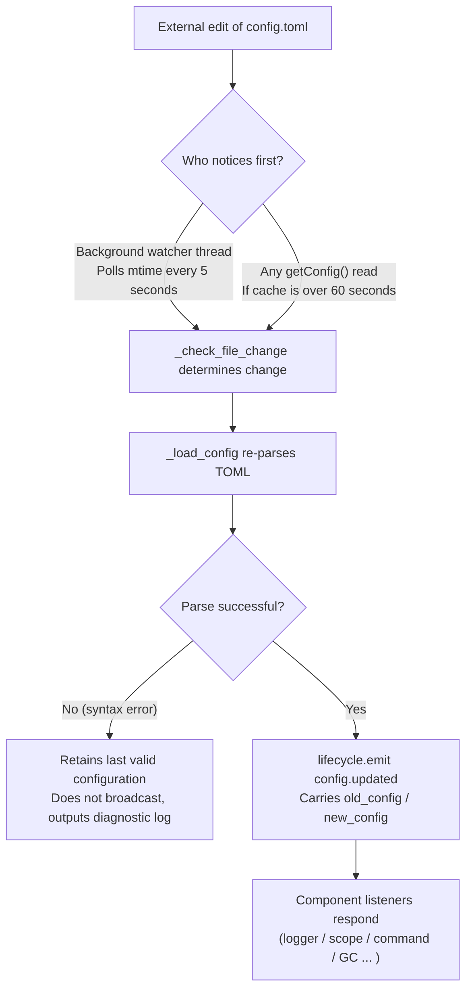

# Configuration File Documentation
> This document introduces the framework's configuration file. If a third-party module requires configuration, please refer to the module's documentation.

ErisPulse uses a TOML-formatted configuration file `config/config.toml` to manage project settings.

## Configuration File Location

The configuration file is located in the `config/` folder at the root of the project:

```
project/
├── config/
│   └── config.toml
├── main.py
```

## Configuration Loading Error Handling

The framework distinguishes three error states when loading `config.toml` and provides **actionable diagnostic information** instead of silently falling back to default configurations:

| Error State | Trigger Condition | Framework Behavior |
|-------------|-------------------|--------------------|
| File Missing | `config.toml` does not exist | Normal on first startup, silently uses empty configuration (no warning) |
| TOML Syntax Error | File exists but format is invalid (e.g., missing quotes, un-closed parentheses) | Outputs **line/column number and reason**, and indicates fallback to default configuration |
| Permission/Other Error | No read permission, IO errors, etc. | Outputs **clear reason**, and indicates fallback to default configuration |

For example, if you accidentally write the configuration as `port = 8000` (missing quotes for a string), the log will output something like:

```
[ERROR] [Config] Syntax error in config file config/config.toml (line 3, column 1): ...
[WARNING] [Config] Failed to read configuration file. Continuing with last valid configuration; changes in this file did not take effect—please fix and reload or restart
```

This allows you to immediately locate the issue at the **default INFO level** without confusion over why your configuration changes didn't take effect.

> **What if you break the config file during runtime?** If you manually edit `config.toml` during bot operation and introduce a syntax error, the framework will output "Configuration file damaged (syntax error, line X), unable to merge and write—please fix the configuration file and restart" when it next attempts to write (merge configuration), rather than a confusing "write failed". The configuration items to be written are retained and not lost.

## Comment Preservation and Minimal Disk Write

Comments and key order in `config.toml` are **fully preserved after framework write**: whether through code `setConfig()`, CLI configuration wizard save, or adapter/module first-generation configuration template, the framework only modifies the relevant keys, and your comments and arranged order are not erased or reordered (based on tomlkit comment-preserving round-trip implementation).

The framework is restrained about what is written to disk:

- **Default framework configuration is not automatically written to disk**: `gc`, `scope`, `transcript`, and other built-in default values only reside in memory; `config.toml` only contains keys you explicitly set, keeping it minimal. Refer to the project's `config/config.full.example` for a complete list of configurable items. Copy and modify as needed (unconfigured items always use built-in defaults, behavior unchanged).
- **`config.full.example` is automatically maintained**: Regardless of whether `epsdk init` is executed, as long as the framework is started (`epsdk run` / `main.py`), a complete configuration reference will be automatically generated in `config/config.full.example` if the file is missing. The file's first line is a framework-maintained marker; when the generator content updates (e.g., new configuration items, newly installed components), the startup will refresh once. Deleting or modifying the first line switches to manual takeover, and the framework will no longer overwrite.
- **Adapter/Module Configuration Templates**: First initialization saves templates with comments (field descriptions are comments); fields marked as `example` do not write to disk, only recorded in `config.full.example` for reference.

## Environment Variable Override

The framework supports overriding `ErisPulse.*` configuration items using environment variables (suitable for Docker/containerized/CI deployment, no need to modify `config.toml`).

Naming rule: Replace the dot-separated path `ErisPulse.<section>.<key>` with all uppercase, replace `.` with `_`, and add the `ERISPULSE_` prefix:

| Configuration Item | Environment Variable | Example Value |
|----------------------|----------------------|---------------|
| `ErisPulse.server.port` | `ERISPULSE_SERVER_PORT` | `9000` |
| `ErisPulse.server.host` | `ERISPULSE_SERVER_HOST` | `0.0.0.0` |
| `ErisPulse.logger.level` | `ERISPULSE_LOGGER_LEVEL` | `DEBUG` |
| `ErisPulse.framework.strict_mode` | `ERISPULSE_FRAMEWORK_STRICT_MODE` | `false` |

Behavior description:
- **Highest priority**: Environment variables override "configuration file" and "default values", automatically converting to the original value type (`bool` / `int` / `float` / comma-separated `list` / string).
- **Not persistent**: The override only takes effect during runtime, not written back to `config.toml`.
- **Supports hot update**: After modifying environment variables during runtime, combined with configuration monitoring reload, the changes take effect.

```bash
# Example of Docker deployment: No need to modify config.toml, directly override port
ERISPULSE_SERVER_PORT=9000 docker compose up -d
```

> Note: `ErisPulse.server.port` and other framework configurations accessed via `get_server_config()` and similar APIs are affected by environment variable overrides.

## Configuration Hot Update

Starting from version 2.7.0, the framework has implemented **systematic support for configuration hot updates**. After external modification of `config.toml` (detected every 5 seconds by a background watcher) or code calling `setConfig()`, components automatically respond:

| Component | Hot-updated Configuration | Behavior |
|-----------|---------------------------|----------|
| **Logger** | `logger.level` / `log_files` / `log_dir` (including segment parameters) / `memory_limit` / `format` / `exclude_levels` | Automatically reapplies (with change detection) |
| **Command System** | `event.command.prefix` / `case_sensitive` / `allow_space_prefix` / `must_at_bot` | Takes effect on the next message |
| **Adapter Concurrency** | `framework.handler_max_concurrency` | Invalidates cached semaphore, rebuilds with new value |
| **Proactive GC** | `framework.proactive_gc_*` | Configuration change immediately restarts GC task, supports runtime adjustment/disable/re-enable |
| **Master System** | `master.users` | Each `is_master()` check reads in real-time, no restart needed |
| **Modules/Adapters** | Their respective configuration items | Triggers `on_config_update(old, new)` callback |

**Configuration that requires restart** (cannot be safely hot-switched, warning "needs process restart to take effect" is output on change):

| Configuration | Reason |
|---------------|--------|
| `router.cors.*` / `router.security.*` | Middleware is written into FastAPI at service startup, cannot be safely hot-switched at runtime |
| `storage.use_global_db` | SQLite file handle is already open at runtime, switching paths is unsafe |

> **What if editing and saving goes wrong midway?** If a transient syntax error occurs while editing `config.toml`, the framework will **retain the last valid configuration** and output diagnostic logs, avoiding broadcasting an empty configuration to components (preventing `on_config_update` from receiving empty values and mistakenly reverting to default).

### Internal Breakdown of Hot Update Chain

"How do components know when the configuration changes?" — Behind the scenes is a detection → reload → broadcast chain:



**Two detection paths** (either one suffices, both provide fallback):

| Path | Mechanism | Trigger Timing |
|------|-----------|----------------|
| Background watcher | Daemon thread `config-watcher` polls file `mtime` every **5 seconds** | External file modification detected within 5 seconds at most |
| Lazy detection | Any `getConfig()` read checks file if cache is over **60 seconds** | Next time configuration is read |

> **The framework does not hurt itself**: When `setConfig()` writes to disk, it records the "mtime written by itself", and the watcher excludes it, treating only **external edits** as changes.

**Two types of configuration change events**:

| Event | Triggerer | Data | Typical Scenario |
|-------|-----------|------|------------------|
| `config.set` | Code / Dashboard calls `setConfig()` | `{key, old_value, new_value}` | Single key write (template generation, status recording, runtime configuration change) |
| `config.updated` | External edit detected by watcher/lazy detection | `{old_config, new_config, config_file}` | Hand-editing `config.toml` |

> `setConfig()` defaults to **delayed disk write** (5 seconds, merges multiple writes), `immediate=True` writes immediately. The watcher detects external changes and only updates the in-memory cache, **does not** write external changes back to the file.

**List of automatic response components** (both event types are typically subscribed to, response content is consistent):

| Component | Listener | Response |
|-----------|----------|----------|
| Logger | `config.set` + `config.updated` | Level/file/directory segment/memory limit/format/level exclusion reapplies (with change detection, no change means no action) |
| Scope | `config.updated` | Scope binding cache rebuilds |
| Command System | `config.updated` | Prefix/case sensitivity/space prefix/must_at_bot parsing parameters refresh, takes effect on next message |
| Adapter Concurrency | `config.set` + `config.updated` | `handler_max_concurrency` invalidates and rebuilds semaphore |
| Proactive GC | `config.set` + `config.updated` | `proactive_gc_*` immediately restarts GC background task |
| Adapter | Routes to `on_config_update` | Each adapter's `on_config_update(old, new)` callback |
| Module | Routes to `on_config_update` | Each module's `on_config_update(old, new)` callback |
| Storage | `config.updated` | `use_global_db` change **only warns** (needs restart) |
| Router | `config.updated` | `cors.*` / `security.*` change **only warns** (needs restart) |

## Complete Configuration Example

```toml
[ErisPulse.server]
host = "0.0.0.0"
port = 8000
auto_start = true
ssl_certfile = ""
ssl_keyfile = ""

[ErisPulse.master]
# users supports two writing methods (choose one):
#   Global master (effective on all platforms): users = ["123456", "789012"]
#   Specify master per platform: users = { yunhu = ["123456"], telegram = ["789012"] }
users = {}

[ErisPulse.logger]
level = "INFO"
format = "rich"
log_files = []
log_dir = ""
log_rotation = "size"
log_max_size_mb = 10
log_backup_count = 5
log_rotation_when = "midnight"
memory_limit = 1000
exclude_levels = []

[ErisPulse.framework]
enable_lazy_loading = true
uninit_timeout = 30
strict_mode = 0

[ErisPulse.framework.strict_mode_exceptions]
modules = []
adapters = []

[ErisPulse.storage]
use_global_db = false

[ErisPulse.event.command]
prefix = "/"
case_sensitive = true
allow_space_prefix = false
must_at_bot = false

[ErisPulse.event.message]
ignore_self = true

[ErisPulse.i18n]
language = "auto"
```

## Server Configuration

```toml
[ErisPulse.server]
host = "0.0.0.0"
port = 8000
auto_start = true
ssl_certfile = "/path/to/cert.pem"
ssl_keyfile = "/path/to/key.pem"
```

| Configuration Item | Type | Default Value | Description |
|---------------------|------|---------------|-------------|
| host | string | 0.0.0.0 | Listening address, 0.0.0.0 means all interfaces |
| port | integer | 8000 | Listening port number |
| auto_start | boolean | true | Whether to automatically start the routing server during `sdk.init()`. Set to `false` to skip starting the routing server (pure event/no WebUI scenario) |
| ssl_certfile | string | empty | SSL certificate file path |
| ssl_keyfile | string | empty | SSL private key file path |

## Master System Configuration

The master system is used to identify the "master account" of the framework (e.g., bot administrator). `master.users` supports two writing methods:

```toml
[ErisPulse.master]
# Method 1: Global master (effective on all platforms)
users = ["123456", "789012"]

# Method 2: Specify master per platform (dict)
# users = { yunhu = ["123456"], telegram = ["789012"] }
```

| Configuration Item | Type | Default Value | Description |
|---------------------|------|---------------|-------------|
| users | array / object | empty | Master account list. `list` form is global master (effective on all platforms); `dict` form specifies per platform (key is platform name, value is the master account list for that platform) |

Code checks using `master.is_master(event)` or `master.is_master(platform, user_id)`, each call reads the configuration in real-time (supports hot update, no restart needed):

```python
from ErisPulse.Core import master

if master.is_master(event):
    await event.reply("Hello master")
```

### Master Determination Chain and Runtime Additions/Removals

The master determination chain is **configuration master → runtime record → provider chain**:

```python
from ErisPulse.Core import master

master.is_master(event)                      # Determine from event
master.is_master("yunhu", "123")             # Explicit determination
master.add("yunhu", "123")                   # Runtime addition (default persistent; persist=False is only in-memory)
master.remove("yunhu", "123")                # Removal (default persistent)
master.list()                                # Aggregation: {"global": [...], "<platform>": [...]}
```

### Custom Identity Source (Provider)

In addition to configuration, custom identity sources can be registered: `fn(platform, user_id) -> bool`, which are tried in sequence when built-in identity sources (configuration + runtime record) do not match; any provider that allows access is recognized as a master. Suitable for integrating adapter administrator interfaces, database roles, and other external identity systems.

The registration entry `master.provider` supports both decorator and function-based writing methods, and unregistration is done through the unregistered function:

```python
from ErisPulse.Core import master

# Method 1: Decorator (persistent identity source, recommended)
@master.provider
def admin_provider(platform, user_id):
    return user_id in {"999"}     # Custom determination logic

master.is_master("yunhu", "999")   # True
admin_provider.unregister()        # Unregister when no longer needed

# Method 2: Function-based (register during module loading / unregister during unloading)
fn = master.provider(admin_provider)
fn.unregister()
```

> Provider exceptions are caught and skipped, not blocking the identity determination chain. Binding instance methods cannot attach `unregister`, so for paired registration/unregistration scenarios, use a **module-level function**.

### User Priority: Master Effect Scope Decided by User

The `master=True` of a command is only a **developer default**: The user can override or loosen it via `ErisPulse.event.overrides.command.<module>.<cmd>.master = true/false` (see [Unified Event Override Configuration](#unified-event-override-configuration-eventoverrides), explicit user configuration takes effect).

## Logging Configuration

```toml
[ErisPulse.logger]
level = "INFO"
log_files = []                # Explicit list of log files (mutually exclusive with log_dir, higher priority)
log_dir = ""                  # Log directory (automatically segment-rotates after setting; mutually exclusive with log_files, log_files has higher priority)
log_rotation = "size"         # Segmenting method: "size" / "date" / "none"
log_max_size_mb = 10          # Single file size limit in size mode (MB), rotates to .1/.2 backup after exceeding
log_backup_count = 5          # Number of retained historical log files, oldest backups beyond this are automatically deleted
log_rotation_when = "midnight"  # Date mode rotation cycle: S/M/H/D/midnight (default is midnight daily)
memory_limit = 1000
exclude_levels = ["EVENT"]
```

| Configuration Item | Type | Default Value | Description |
|---------------------|------|---------------|-------------|
| level | string | INFO | Log level: TRACE, DEBUG, INFO, WARNING, ERROR, CRITICAL (TRACE is the lowest level, outputs detailed debugging information of the framework internal) |
| format | string | rich | Log output format: `rich` (colorful, default), `plain` (plain text without color, suitable for log collection/pipeline redirection), `json` (structured JSON, suitable for ELK, etc.) |
| log_files | array | empty | List of log output files (explicit paths, not segmented) |
| log_dir | string | empty | Log output directory (automatically created). After setting, writes to `erispulse.log` in the directory and automatically segments according to `log_rotation`; mutually exclusive with `log_files`, `log_files` has higher priority |
| log_rotation | string | size | Segmenting method: `size` (by size) / `date` (by time) / `none` (no segmentation) |
| log_max_size_mb | float | 10 | Single file size limit in size mode (MB), rotates to .1/.2 backup after exceeding |
| log_backup_count | integer | 5 | Number of retained historical log files, oldest backups beyond this are automatically deleted |
| log_rotation_when | string | midnight | Date mode rotation cycle: `S`/`M`/`H`/`D`/`midnight` (default is midnight daily) |
| memory_limit | integer | 1000 | Number of log entries saved in memory |
| exclude_levels | array | empty | Levels to exclude. Logs of excluded levels are **completely discarded** (not written to memory, not pushed to Dashboard subscribers, not printed, not written to file). Supports hot update |

You can also dynamically switch in code:

```python
from ErisPulse.Core import logger

# Segment by size: single file 10MB, retain 5 copies
logger.set_output_dir("logs", rotation="size", max_size_mb=10, backup_count=5)

# Segment by time: rotate daily at midnight, retain 7 copies
logger.set_output_dir("logs", rotation="date", backup_count=7)
```

> [!NOTE]
> `log_dir` and related segmentation configuration require ErisPulse **2.8.0+**.

> **Privacy Protection**: Message receiving and sending content is recorded at the **EVENT level** (value 21). Setting `exclude_levels = ["EVENT"]` prevents the backend (such as the Dashboard log panel) from seeing message content in various groups/private chats, while not affecting other log levels.

> [!NOTE]
> The `exclude_levels` feature requires ErisPulse **2.8.0+**.

## Framework Configuration

```toml
[ErisPulse.framework]
enable_lazy_loading = true
uninit_timeout = 30
strict_mode = 0

[ErisPulse.framework.strict_mode_exceptions]
modules = []
adapters = []
```

| Configuration Item | Type | Default Value | Description |
|---------------------|------|---------------|-------------|
| enable_lazy_loading | boolean | true | Whether to enable module lazy loading |
| uninit_timeout | integer | 30 | Graceful shutdown timeout (seconds), forcibly terminates after exceeding. 0 means no timeout set |
| strict_mode | integer | 0 | Strict mode level, see "Strict Mode" section below |
| handler_max_concurrency | integer | 64 | Maximum concurrent Task count for event handlers, increasing this improves throughput but increases memory usage |
| offline_bot_expiry | integer | 3600 | Automatic expiration time for offline bot records (seconds), 0 means never expires |

### Proactive GC Configuration

After SDK initialization, a proactive GC background task is started, periodically performing Python GC and internal resource recycling (such as cleaning offline bots). All parameters support hot updates, and the task is immediately restarted when changes occur.

| Configuration Item | Type | Default Value | Description |
|---------------------|------|---------------|-------------|
| proactive_gc_interval | number | 300 | Recycling interval (seconds), supports decimals. 0 means disable proactive GC |
| proactive_gc_generation | integer | 0 | Regular round recycling generation (0/1/2, clamped to 0..2). Note that `gc.collect(2)` is equivalent to full recycling, default 0 maintains lightness; deep recycling is triggered periodically by `proactive_gc_full_every` |
| proactive_gc_full_every | integer | 20 | Full recycling every N rounds, 0 means disable periodic full recycling. Full recycling is constrained by the `proactive_gc_memory_growth_mb` threshold |
| proactive_gc_memory_growth_mb | integer | 32 | Full recycling memory growth threshold (MB): compared against the memory baseline after the last full recycling (preferring tracemalloc, then RSS), full recycling only occurs when growth reaches this value. 0 means no threshold set |
| proactive_gc_idle_only | boolean | false | When enabled, Python GC is skipped in this round during event peaks (pending handlers exist), avoiding pauses and message processing competition; internal resource recycling is unaffected |
| proactive_gc_gen0_min | integer | 500 | Lower bound for triggering regular round recycling of gen0 garbage: `gc.get_count()[0]` below this value directly skips (empty round has almost zero overhead). 0 means always recycle |

> **Change in 2.7.1**: The default `proactive_gc_generation` is adjusted from `2` to `0`, and `proactive_gc_full_every` is adjusted from `0` to `20`. Previously `generation=2` meant full recycling every round; the new default maintains recycling coverage while significantly reducing empty round overhead. Explicitly configured old values still behave as intended.

### Strict Mode

Strict mode controls the handling strategy for modules/adapters when they are non-compliant or fail during the loading phase. Modern modules/adapters should inherit corresponding base classes (`BaseModule`/`BaseAdapter`); components that do not inherit base classes affect the framework's context system and fallback cleanup, potentially causing resource leaks.

> **Change in 2.5.2**: The default level is adjusted from `1` (skip) to `0` (lenient) to reduce loading issues for new users. Components that do not inherit base classes will still be attempted to load with a WARNING, rather than being directly rejected. To restore the previous behavior, explicitly set `strict_mode = 1`.

| Level | Name | Behavior |
|-------|------|----------|
| 0 | Lenient (default) | Violations only warn, components that do not inherit base classes are still attempted to load (compatible with old components) |
| 1 | Strict-Skip | Reject components that do not inherit base classes and skip, other components start normally |
| 2 | Strict-Fatal | Collect all violations and report them together, then terminate the entire startup |

In all levels, "loading/registration/initialization phase errors" from components themselves are always skipped; the difference is in:

- **0 → 1**: The only behavioral change is that "not inheriting base classes" changes from "still loading" to "skipping".
- **1 → 2**: All violations (not inheriting base classes, loading failure, registration failure, initialization failure, etc.) are upgraded to fatal, collected at the startup checkpoint and reported as a violation list, then terminated.

#### Exemption List

If some components temporarily cannot migrate (e.g., dependent old modules), they can be added to the exemption list. Components listed here will be treated leniently even if non-compliant, and continue loading:

```toml
[ErisPulse.framework.strict_mode_exceptions]
modules = ["SeTu", "SomeLegacyModule"]
adapters = ["OldAdapter"]
```

> When a component is rejected by strict mode, the log will clearly indicate how to resume loading (add to the exemption list or lower the level).

## Storage Configuration

```toml
[ErisPulse.storage]
use_global_db = false
```

| Configuration Item | Type | Default Value | Description |
|---------------------|------|---------------|-------------|
| use_global_db | boolean | false | Whether to use a global database (within package) instead of the project database. When `true`, all projects share the SQLite database within the ErisPulse package; when `false` (default), each project uses an independent database in the `config/` directory |

## Event Configuration

### Command Configuration

```toml
[ErisPulse.event.command]
prefix = "/"
case_sensitive = true
allow_space_prefix = false
```

| Configuration Item | Type | Default Value | Description |
|---------------------|------|---------------|-------------|
| prefix | string | / | Command prefix |
| case_sensitive | boolean | true | Whether to distinguish case (`/Help` and `/help` are different commands) |
| allow_space_prefix | boolean | false | Whether to allow space as a prefix |
| must_at_bot | boolean | false | Whether to require @bot to trigger the command (private chat is not restricted) |

### Message Configuration

```toml
[ErisPulse.event.message]
ignore_self = true
```

| Configuration Item | Type | Default Value | Description |
|---------------------|------|---------------|-------------|
| ignore_self | boolean | true | Whether to ignore the bot's own messages |

## Internationalization Configuration

```toml
[ErisPulse.i18n]
language = "auto"
```

| Configuration Item | Type | Default Value | Description |
|---------------------|------|---------------|-------------|
| language | string | auto | Language for displaying framework built-in text. Set to `auto` to automatically detect system language, or set to a specific code: `zh-CN`, `zh-TW`, `en`, `ja`, `ru` |

## Module Configuration

Each module can define its own configuration in the configuration file:

```toml
[MyModule]
api_url = "https://api.example.com"
timeout = 30
enabled = true
```

In the module, read and write configuration:

```python
from ErisPulse import sdk

# Read configuration
config = sdk.config.getConfig("MyModule", {})
api_url = config.get("api_url", "https://default.api.com")

# Write configuration at runtime (delayed save)
sdk.config.setConfig("MyModule.timeout", 60)

# Immediately save to file
sdk.config.setConfig("MyModule.timeout", 60, immediate=True)
```

> `setConfig` defaults to delayed write (about every 5 seconds batched to file), set `immediate=True` to immediately persist. Configuration changes trigger the `config.set` lifecycle event.

## Scope Configuration (scope)

> [!NOTE]
> This feature requires ErisPulse **2.8.0+**.

Scope declares "what range it is effective in" — which modules are available in a certain platform/Bot/session (① module dimension), whether events are received for a certain user/group/Bot/adapter (② identity dimension), and which outbound calls a module can initiate (③ outbound dimension):

```toml
[ErisPulse.scope]
default_allow = true        # Global default (false = implicit deny strict mode; does not affect outbound dimension)
cache_size = 1024           # LRU cache size

# ① Module dimension (priority: session > Bot > platform; entries support exact/glob/re: regex)
[ErisPulse.scope.platforms.onebot11]
modules = ["Chat", "Tool*"]
blocked = ["re:^Danger"]

# Sub-level binding write merge = true merges with lower priority entry by entry (default overall overwrite)
[ErisPulse.scope.bots.onebot11."123456"]
modules = ["Music"]
merge = true

# ② Identity dimension (priority: user > session > Bot > adapter; only allow or deny in each level)
[ErisPulse.scope.identity.adapters.onebot11]
deny = true                 # All events on this platform are discarded at the entry
[ErisPulse.scope.identity.users.onebot11]
allow = ["u_admin"]         # User key supports glob / re: regex
deny = ["u_bad", "spam_*"]

# ③ Outbound dimension (default all allowed; rules are inline tables, entries support exact/glob/re: regex)
[ErisPulse.scope.actions.MyModule]
send = { deny = true }                    # Completely deny sending
api = { allow = ["get_*"] }               # Only allow standard API query types
request = { deny = true }                 # Deny handling requests
```

| Configuration Item | Type | Description |
|---------------------|------|-------------|
| `scope.default_allow` | boolean | Global default: allow/deny for modules/identity not matched by rules (`true`) |
| `scope.cache_size` | integer | LRU cache size (default 1024) |
| `scope.platforms / bots / sessions` | table | ① Module three-level binding: `{modules=[...], blocked=[...], merge=bool?}` |
| `scope.identity.adapters / bots / sessions / users` | table | ② Identity four-level binding: `{allow=true}` / `{deny=true}` |
| `scope.actions.<module>.<action>` | table | ③ Outbound rules: `{allow=[...], deny=true|[...]}` (action takes send / api / request) |

> Detailed explanation and runtime API (dimensional `sdk.scope.set_module()` / `set_identity()` / `set_action()`, determination `is_allowed()` / `is_identity_allowed()` / `is_action_allowed()`, and dictionary-style fallback `get()` / `set()` / `delete()`) are available in [Scope (scope)](../advanced/scope.md).

## Unified Event Override Configuration (event.overrides)

Unified override system: Overwrite behavior of any module handler by **event type** without modifying module code. Standard types (meta / message / notice / request) and extended types (command) each have their own overridable parameters:

```toml
[ErisPulse.event.overrides]

# message: text trigger conditions (AND with conditions in code)
[ErisPulse.event.overrides.message.ChatModule]
pattern = "闲聊*"

# notice / request / meta: detail_type whitelist (entries support exact/glob/re: regex)
[ErisPulse.event.overrides.notice.MyModule]
detail_types = ["group_increase"]

# command (extended type): implement parameter override (user priority; disable via acl deny)
[ErisPulse.event.overrides.command.MyModule.restart]
master = true               # Override to only framework master (false opens developer's master restriction)
hidden = true               # Hide in help list
aliases = ["rs"]            #生效别名

# acl (command exclusive): command user allow/deny lists (command names support glob / re: regex, exact keys take priority)
[ErisPulse.event.overrides.acl."roll*"]
allow = ["onebot11:u_vip"]  # User identifier "platform:user_id"
deny = ["onebot11:u_bad"]

# ACL default: allow unconfigured commands (true) / strictly deny (false)
acl_default_allow = true
```

| Configuration Item | Type | Description |
|---------------------|------|-------------|
| `event.overrides.message.<module>` | table | Text condition: `{pattern="...", regex="..."}` |
| `event.overrides.notice / request.<module>` | table | `{detail_types=[...], pattern, regex}` |
| `event.overrides.meta.<module>` | table | `{detail_types=[...]}` |
| `event.overrides.command.<module>` | table | Module-level parameter override (e.g., `hidden = true`) |
| `event.overrides.command.<module>.<command>` | table | Command-level override (command-level priority) |
| `event.overrides.acl.<command name>` | table | User allow/deny lists: `{allow=[...], deny=[...]}` |
| `event.overrides.acl_default_allow` | boolean | ACL default: allow unconfigured commands (true) / strictly deny (false) |

> Runtime API (after `from ErisPulse.Core.Event import overrides`, call `overrides.message.set()` / `overrides.command.set()` / `overrides.acl.set()` via type sub-namespace, or access via `sdk.Event.overrides`) is available in [Event Handling Introduction · Event Override](../getting-started/event-handling.md#event-override-dont-modify-module-code-override-behavior-of-any-event-type).

## Command Parsing Configuration (event.command)

## Next Steps

- [CLI Command Reference](cli-reference.md) - Learn all command-line commands
- [Developer Guide](../developer-guide/) - Learn how to develop custom modules