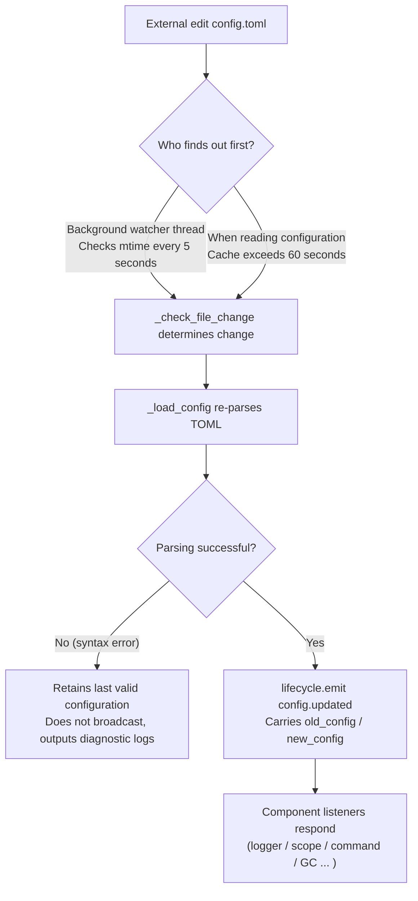

# Configuration File Guide
> This document introduces the framework's configuration file. For third-party module configurations, please refer to the module's documentation.

ErisPulse uses a TOML-formatted configuration file `config/config.toml` to manage project configurations.

## Configuration File Location

The configuration file is located in the `config/` folder at the project root:

```
project/
├── config/
│   └── config.toml
├── main.py
```

## Configuration Loading Error Handling

When loading `config.toml`, the framework distinguishes three error states and provides **actionable diagnostic information**, instead of silently falling back to default configurations:

| Error State | Trigger Condition | Framework Behavior |
|---------|---------|---------|
| File Missing | `config.toml` does not exist | Normal on first startup, silently uses empty configuration (no warning) |
| TOML Syntax Error | File exists but format is invalid (e.g., missing quotes, unclosed brackets) | Outputs **line/column number and reason**, and indicates fallback to default configuration |
| Permission/Other Errors | No read permission, IO errors, etc. | Outputs **clear reason**, and indicates fallback to default configuration |

For example, if you accidentally write the configuration as `port = 8000` (missing string quotes), the log will output something like:

```
[ERROR] [Config] Configuration file config/config.toml has a syntax error (line 3, column 1): ...
[WARNING] [Config] Failed to read configuration file. Continuing with last valid configuration, modifications to this file are not effective this time—please fix and reload or restart
```

This allows you to immediately identify the issue at the **default INFO level**, rather than being confused about why your configuration changes are not effective.

> **Running with a broken configuration file?** If you manually edit `config.toml` during robot operation and introduce a syntax error, the framework will output "Configuration file is damaged (syntax error, line X), unable to merge and write—please fix the configuration file and restart" when attempting to write (merge) next time, rather than a confusing "write failed". The configuration items to be written will be retained and not lost.

## Environment Variable Override

The framework supports overriding `ErisPulse.*` configuration items using environment variables (suitable for Docker/containerized/CI deployment, without modifying `config.toml`).

Naming Convention: Convert the dot-separated path `ErisPulse.<section>.<key>` to all uppercase, replace `.` with `_`, and add the `ERISPULSE_` prefix:

| Configuration Item | Environment Variable | Example Value |
|--------|---------|--------|
| `ErisPulse.server.port` | `ERISPULSE_SERVER_PORT` | `9000` |
| `ErisPulse.server.host` | `ERISPULSE_SERVER_HOST` | `0.0.0.0` |
| `ErisPulse.logger.level` | `ERISPULSE_LOGGER_LEVEL` | `DEBUG` |
| `ErisPulse.framework.strict_mode` | `ERISPULSE_FRAMEWORK_STRICT_MODE` | `false` |

Behavior Description:
- **Highest Priority**: Environment variables override "configuration file" and "default values", automatically converting to the original value type (`bool` / `int` / `float` / comma-separated `list` / string)
- **Non-Persistent**: The override only takes effect at runtime and is not written back to `config.toml`
- **Supports Hot Update**: After modifying environment variables at runtime, combined with configuration monitoring reload, it takes effect

```bash
# Docker deployment example: no need to modify config.toml, directly override port
ERISPULSE_SERVER_PORT=9000 docker compose up -d
```

> Note: Framework configurations like `ErisPulse.server.port` are read via APIs such as `get_server_config()`, and are affected by environment variable overrides.

## Configuration Hot Update

Since version 2.7.0, the framework has provided **systematic support** for configuration hot updates. After external modification of `config.toml` (background watcher checks every 5 seconds), or code calls `setConfig()`, each component automatically responds:

| Component | Configuration Support Hot Update | Behavior |
|------|----------------|------|
| **Logger** | `logger.level` / `log_files` / `log_dir` (including segmentation parameters) / `memory_limit` / `format` / `exclude_levels` | Automatically reapply (with change detection) |
| **Command System CommandHandler** | `event.command.prefix` / `case_sensitive` / `allow_space_prefix` / `must_at_bot` | Takes effect on the next message |
| **Adapter Concurrency** | `framework.handler_max_concurrency` | Invalidates cached semaphore, rebuilds with new value |
| **Proactive GC** | `framework.proactive_gc_*` | Configuration changes immediately restart GC tasks, supports runtime adjustment/disable/reenable |
| **Master System Master** | `master.users` | Each `is_master()` check reads in real-time, no restart needed |
| **Module/Adapter Configuration** | Their own configuration items | Triggers `on_config_update(old, new)` callback |

**Configuration that requires restart** (cannot be safely hot-switched, warning is output when changed "needs to restart the process to take effect"):

| Configuration | Reason |
|------|------|
| `router.cors.*` / `router.security.*` | Middleware is written into FastAPI at service startup, cannot be safely hot-switched at runtime |
| `storage.use_global_db` | SQLite file handle is already opened at runtime, switching paths is unsafe |

> **Mid-edit save error?** If a transient syntax error occurs while editing `config.toml`, the framework will **retain the last valid configuration** and output diagnostic logs, rather than broadcasting an empty configuration to all components (avoiding `on_config_update` receiving empty values and mistakenly reverting to default).

### Internal Breakdown of Hot Update Chain

"How do components know when the configuration changes?"—Behind this is a detection → reload → broadcast chain:



**Two detection paths** (either one is sufficient, both can serve as a fallback):

| Path | Mechanism | Trigger Timing |
|------|------|---------|
| Background watcher | Daemon thread `config-watcher` every **5 seconds** `wait` polls file `mtime` | After external file modification, at most 5 seconds later |
| Lazy detection | Any `getConfig()` read, if cache exceeds **60 seconds** then checks file first | Next time configuration is read |

> **The framework does not hurt itself**: When `setConfig()` writes to disk, it records the "mtime written by itself", and the watcher excludes it when comparing, treating only **external edits** as changes.

**Two types of configuration change events**:

| Event | Triggerer | Data | Typical Scenario |
|------|--------|------|---------|
| `config.set` | Code / Dashboard calls `setConfig()` | `{key, old_value, new_value}` | Single key write (template generation, status recording, runtime configuration change) |
| `config.updated` | External edit after watcher/lazy detection captures | `{old_config, new_config, config_file}` | Hand-editing `config.toml` |

> `setConfig()` defaults to **delayed 5-second disk write** (merges multiple writes), `immediate=True` writes immediately. After the watcher detects an external modification, it only updates the in-memory cache and **does not** write the external changes back to the file.

**List of automatic response parties** (both event types are usually subscribed, response content is consistent):

| Component | Listener | Response |
|------|------|------|
| Logger | `config.set` + `config.updated` | Level/file/directory segmentation/memory limit/format/level exclusion reapplication (with change detection, no change means no action) |
| Scope | `config.updated` | Scope binding cache rebuild |
| Command System | `config.updated` | Prefix/case sensitivity/space prefix/must_at_bot parsing parameter refresh, takes effect on the next message |
| Adapter Concurrency | `config.set` + `config.updated` | `handler_max_concurrency` invalidates and rebuilds semaphore |
| Proactive GC | `config.set` + `config.updated` | `proactive_gc_*` immediately restarts GC background tasks |
| Adapter | Route to `on_config_update` | Each adapter's `on_config_update(old, new)` callback |
| Module | Route to `on_config_update` | Each module's `on_config_update(old, new)` callback |
| Storage | `config.updated` | `use_global_db` change **only warns** (needs restart) |
| Router | `config.updated` | `cors.*` / `security.*` change **only warns** (needs restart) |

## Complete Configuration Example

```toml
[ErisPulse.server]
host = "0.0.0.0"
port = 8000
auto_start = true
ssl_certfile = ""
ssl_keyfile = ""

[ErisPulse.master]
# users supports two writing methods (choose one):
#   Global master (effective on all platforms): users = ["123456", "789012"]
#   Platform-specific master: users = { yunhu = ["123456"], telegram = ["789012"] }
users = {}

[ErisPulse.logger]
level = "INFO"
format = "rich"
log_files = []
log_dir = ""
log_rotation = "size"
log_max_size_mb = 10
log_backup_count = 5
log_rotation_when = "midnight"
memory_limit = 1000
exclude_levels = []

[ErisPulse.framework]
enable_lazy_loading = true
uninit_timeout = 30
strict_mode = 0

[ErisPulse.framework.strict_mode_exceptions]
modules = []
adapters = []

[ErisPulse.storage]
use_global_db = false

[ErisPulse.event.command]
prefix = "/"
case_sensitive = true
allow_space_prefix = false
must_at_bot = false

[ErisPulse.event.message]
ignore_self = true

[ErisPulse.i18n]
language = "auto"
```

## Server Configuration

```toml
[ErisPulse.server]
host = "0.0.0.0"
port = 8000
auto_start = true
ssl_certfile = "/path/to/cert.pem"
ssl_keyfile = "/path/to/key.pem"
```

| Configuration Item | Type | Default Value | Description |
|---------|------|---------|------|
| host | string | 0.0.0.0 | Listening address, 0.0.0.0 means all interfaces |
| port | integer | 8000 | Listening port number |
| auto_start | boolean | true | Whether to automatically start the routing server when `sdk.init()`. Set to `false` to skip the routing server startup (pure event/no WebUI scenario) |
| ssl_certfile | string | empty | SSL certificate file path |
| ssl_keyfile | string | empty | SSL private key file path |

## Master System Configuration

The master system is used to identify the "master" account of the framework (e.g., Bot administrator). `master.users` supports two writing methods:

```toml
[ErisPulse.master]
# Writing method one: Global master (effective on all platforms)
users = ["123456", "789012"]

# Writing method two: Platform-specific master (dict)
# users = { yunhu = ["123456"], telegram = ["789012"] }
```

| Configuration Item | Type | Default Value | Description |
|---------|------|---------|------|
| users | array / object | empty | List of master account IDs. `list` format is global master (effective on all platforms); `dict` format specifies by platform (key is platform name, value is the list of master account IDs for that platform) |

In code, check using `master.is_master(event)` or `master.is_master(platform, user_id)`. Each call reads the configuration in real-time (supports hot updates, no restart needed):

```python
from ErisPulse.Core import master

if master.is_master(event):
    await event.reply("Hello, Master")
```

> The complete identity verification API (runtime add/remove, **custom identity source provider chain**) and "user priority" override semantics (users can放开/收紧 `master=True` via control panel) are described in
> [Unified Control Panel · Master Identity and Custom Identity Source Provider](../advanced/scope.md#Master Identity and Custom Identity Source Provider).

## Logging Configuration

```toml
[ErisPulse.logger]
level = "INFO"
log_files = []                # Explicit log file list (mutually exclusive with log_dir, higher priority)
log_dir = ""                  # Log directory (auto-creates directory). When set, automatically segments and rotates logs into `erispulse.log` in the directory according to `log_rotation`; mutually exclusive with `log_files`, `log_files` has higher priority
log_rotation = "size"         # Segmentation method: "size" / "date" / "none"
log_max_size_mb = 10          # Single file size limit (MB) in size mode, rotates to `.1`/`.2` backup when exceeded
log_backup_count = 5          # Number of retained historical log files, oldest backups beyond this are automatically deleted
log_rotation_when = "midnight"  # Rotation period in date mode: S/M/H/D/midnight
memory_limit = 1000
exclude_levels = ["EVENT"]
```

| Configuration Item | Type | Default Value | Description |
|---------|------|---------|------|
| level | string | INFO | Log level: TRACE, DEBUG, INFO, WARNING, ERROR, CRITICAL (TRACE is the lowest level, outputs detailed debugging information from the framework) |
| format | string | rich | Log output format: `rich` (colored, default), `plain` (plain text without color, suitable for log collection/pipeline redirection), `json` (JSON structured, suitable for ELK, etc.) |
| log_files | array | empty | List of log output files (explicit paths, no segmentation) |
| log_dir | string | empty | Log output directory (auto-creates). When set, logs are written into `erispulse.log` in the directory and automatically segmented according to `log_rotation`; mutually exclusive with `log_files`, `log_files` has higher priority |
| log_rotation | string | size | Segmentation method: `size` (by size) / `date` (by time) / `none` (no segmentation) |
| log_max_size_mb | float | 10 | Single file size limit (MB) in size mode, rotates to `.1`/`.2` backup when exceeded |
| log_backup_count | integer | 5 | Number of retained historical log files, oldest backups beyond this are automatically deleted |
| log_rotation_when | string | midnight | Rotation period in date mode: `S`/`M`/`H`/`D`/`midnight` (default is midnight every day) |
| memory_limit | integer | 1000 | Number of log entries saved in memory |
| exclude_levels | array | empty | Levels to exclude. Logs of excluded levels are **completely discarded** (not written to memory, not pushed to Dashboard or other subscribers, not printed, not written to file). Supports hot updates |

You can also dynamically switch in code:

```python
from ErisPulse.Core import logger

# Segment by size: single file 10MB, retain 5 copies
logger.set_output_dir("logs", rotation="size", max_size_mb=10, backup_count=5)

# Segment by time: rotate daily at midnight, retain 7 copies
logger.set_output_dir("logs", rotation="date", backup_count=7)
```

> [!NOTE]
> `log_dir` and related segmentation configurations require ErisPulse **2.8.0+**.

> **Privacy Protection**: Message content is recorded at the **EVENT level** (value 21). Setting `exclude_levels = ["EVENT"]` allows the backend (e.g., Dashboard log panel) to not see message content from each group/private chat, while not affecting logs of other levels.

> [!NOTE]
> The `exclude_levels` feature requires ErisPulse **2.8.0+**.

## Framework Configuration

```toml
[ErisPulse.framework]
enable_lazy_loading = true
uninit_timeout = 30
strict_mode = 0

[ErisPulse.framework.strict_mode_exceptions]
modules = []
adapters = []
```

| Configuration Item | Type | Default Value | Description |
|---------|------|---------|------|
| enable_lazy_loading | boolean | true | Whether to enable module lazy loading |
| uninit_timeout | integer | 30 | Total timeout time (seconds) for graceful shutdown, force termination after exceeding. 0 means no timeout set |
| strict_mode | integer | 0 | Strict mode level, see "Strict Mode" section below |
| handler_max_concurrency | integer | 64 | Maximum number of concurrent tasks for event handlers, increasing this boosts throughput but increases memory usage |
| offline_bot_expiry | integer | 3600 | Automatic expiration time (seconds) for offline bot records, 0 means no expiration |

### Proactive GC Configuration

After SDK initialization, a proactive GC background task starts, periodically performing Python GC and internal resource recycling (e.g., cleanup of offline bots). All parameters support hot updates, and the task restarts immediately when configuration changes.

| Configuration Item | Type | Default Value | Description |
|---------|------|---------|------|
| proactive_gc_interval | number | 300 | Recycling interval (seconds), supports decimals. 0 means disable proactive GC |
| proactive_gc_generation | integer | 0 | Regular round recycling generation (0/1/2, clamped to 0..2). Note that `gc.collect(2)` is equivalent to full recycling, default 0 keeps it lightweight; deep recycling is triggered periodically by `proactive_gc_full_every` |
| proactive_gc_full_every | integer | 20 | Perform full recycling every N rounds, 0 means disable periodic full recycling. Full recycling is subject to the memory growth threshold `proactive_gc_memory_growth_mb` |
| proactive_gc_memory_growth_mb | integer | 32 | Memory growth threshold (MB) for full recycling: compared against the memory baseline (prioritized tracemalloc, then RSS) after the last full recycling, full recycling is only performed when the growth reaches this value. 0 means no threshold set |
| proactive_gc_idle_only | boolean | false | When enabled, skip Python GC in this round during event peaks (when there are pending handlers), avoiding pauses and message processing competition; internal resource recycling is unaffected |
| proactive_gc_gen0_min | integer | 500 | Minimum number of garbage items in gen0 to trigger regular round recycling: if `gc.get_count()[0]` is below this value, skip (empty rounds are nearly zero-cost). 0 means always recycle |

> **2.7.1 Change**: The default `proactive_gc_generation` is adjusted from `2` to `0`, and `proactive_gc_full_every` is adjusted from `0` to `20`. Previously `generation=2` meant full recycling every round; the new default maintains recycling coverage while significantly reducing idle round overhead. Explicitly configured old values still behave as specified.

### Strict Mode

Strict mode controls the handling strategy for components during the loading phase when non-compliant or failed. Modern modules/adapters should inherit corresponding base classes (`BaseModule`/`BaseAdapter`). Components that do not inherit base classes affect the framework's context system and fallback cleanup, potentially leading to resource leaks.

> **2.5.2 Change**: The default level is adjusted from `1` (skip) to `0` (lenient), to reduce loading issues for new users. Components that do not inherit base classes will be attempted to load with a WARNING, rather than being directly rejected. To restore the old behavior, explicitly set `strict_mode = 1`.

| Level | Name | Behavior |
|------|------|------|
| 0 | Lenient (default) | Violations only warn, components that do not inherit base classes will still be attempted to load (compatible with old components) |
| 1 | Strict-Skip | Reject components that do not inherit base classes and skip them, other normal startup |
| 2 | Strict-Fatal | Collect all violations and report them together, then terminate the entire startup |

In all levels, "loading/registration/initialization phase errors" (component self-crashes) are always skipped; the difference lies in:

- **0 → 1**: The only behavioral change is that "not inheriting base class" changes from "still loading" to "skipping".
- **1 → 2**: All violations (not inheriting base class, loading failure, registration failure, initialization failure, etc.) are escalated to fatal, collected at the startup checkpoint and output a list of violations before terminating.

#### Exception List

If certain components temporarily cannot migrate (e.g., dependent old modules), they can be added to the exception list. Components listed here will be treated as lenient mode even if non-compliant, and continue to load:

```toml
[ErisPulse.framework.strict_mode_exceptions]
modules = ["SeTu", "SomeLegacyModule"]
adapters = ["OldAdapter"]
```

> When a component is rejected by strict mode, the log will clearly indicate how to resume loading (add to the exception list or lower the level).

## Storage Configuration

```toml
[ErisPulse.storage]
use_global_db = false
```

| Configuration Item | Type | Default Value | Description |
|---------|------|---------|------|
| use_global_db | boolean | false | Whether to use a global database (within package) instead of project database. `true` means all projects share the SQLite database within the ErisPulse package; `false` (default) means each project uses an independent database in the `config/` directory |

## Event Configuration

### Command Configuration

```toml
[ErisPulse.event.command]
prefix = "/"
case_sensitive = true
allow_space_prefix = false
```

| Configuration Item | Type | Default Value | Description |
|---------|------|---------|------|
| prefix | string | / | Command prefix |
| case_sensitive | boolean | true | Whether to distinguish case (whether `/Help` and `/help` are different commands) |
| allow_space_prefix | boolean | false | Whether to allow space as prefix |
| must_at_bot | boolean | false | Whether to require @bot to trigger command (private chat is not restricted) |

### Message Configuration

```toml
[ErisPulse.event.message]
ignore_self = true
```

| Configuration Item | Type | Default Value | Description |
|---------|------|---------|------|
| ignore_self | boolean | true | Whether to ignore the robot's own messages |

## Internationalization Configuration

```toml
[ErisPulse.i18n]
language = "auto"
```

| Configuration Item | Type | Default Value | Description |
|---------|------|---------|------|
| language | string | auto | Language for displaying framework built-in text. Set to `auto` to automatically detect system language, or set to specific code: `zh-CN`, `zh-TW`, `en`, `ja`, `ru` |

## Module Configuration

Each module can define its own configuration in the configuration file:

```toml
[MyModule]
api_url = "https://api.example.com"
timeout = 30
enabled = true
```

Read and write configuration in the module:

```python
from ErisPulse import sdk

# Read configuration
config = sdk.config.getConfig("MyModule", {})
api_url = config.get("api_url", "https://default.api.com")

# Write configuration at runtime (delayed save)
sdk.config.setConfig("MyModule.timeout", 60)

# Immediately save to file
sdk.config.setConfig("MyModule.timeout", 60, immediate=True)
```

> `setConfig` defaults to delayed write (about every 5 seconds batch save to file), set `immediate=True` to save immediately. Configuration changes trigger the `config.set` lifecycle event.

## Control Panel Configuration (scope)

> [!NOTE]
> This feature requires ErisPulse **2.8.0+**.

The unified control panel is the **only** entry point for permission/access control, with a five-dimensional configuration tree:

| Dimension | Controls What | Configuration Path |
|------|---------|---------|
| ① Module | Which modules are available in a platform/Bot/session | `scope.platforms / bots / sessions` |
| ② Identity | Whether to receive events for a user/group/Bot/adapter | `scope.identity.*` |
| ③ Command | Who can execute a specific command (command names support glob) | `scope.commands` |
| ④ Processor | Filter processors of a module by text | `scope.handlers` |
| ⑤ Override | Override module/command implementation parameters | `scope.overrides` |

```toml
[ErisPulse.scope]
default_allow = true        # Global default (false = implicit deny strict mode)
cache_size = 1024           # LRU cache size

# ① Module dimension (priority: session > Bot > platform; entries support exact / glob / re: regex)
[ErisPulse.scope.platforms.onebot11]
modules = ["Chat", "Tool*"]
blocked = ["re:^Danger"]

# ② Identity dimension (priority: user > session > Bot > adapter; only allow or deny in each level)
[ErisPulse.scope.identity.adapters.onebot11]
deny = true                 # All events from this platform are discarded at entry
[ErisPulse.scope.identity.users.onebot11]
allow = ["u_admin"]         # User keys support glob / re: regex
deny = ["u_bad", "spam_*"]

# ③ Command dimension (user identifier "platform:user_id")
[ErisPulse.scope.commands."roll*"]
allow = ["onebot11:u_vip"]
deny = ["onebot11:u_bad"]

# ④ Processor/Text dimension (AND with code conditions)
[ErisPulse.scope.handlers.MyModule]
pattern = "签到*"

# ⑤ Implementation parameter override (disable via command deny, not here)
[ErisPulse.scope.overrides.MyModule.restart]
master = true
hidden = true
```

| Configuration Item | Type | Description |
|---------|------|------|
| `scope.default_allow` | boolean | Global default: allow/deny for entries not matched (true). Modules/identity "no rule means deny"; commands "no ACL means deny" |
| `scope.cache_size` | integer | LRU cache size (default 1024) |
| `scope.platforms / bots / sessions` | table | ① Module three-level binding: `{modules=[...], blocked=[...]}` |
| `scope.identity.adapters / bots / sessions / users` | table | ② Identity four-level binding: `{allow=true}` / `{deny=true}` |
| `scope.commands.<command name>` | table | ③ Command ACL: `{allow=[...], deny=[...]}` |
| `scope.handlers.<module>` | table | ④ Text filtering: `{pattern="...", regex="..."}` |
| `scope.overrides.<module>[.<command>]` | table | ⑤ Parameter override: `master` / `hidden` / `aliases` / `prefix` etc. |

> Matching entries use a unified syntax: exact name / glob (`*` `?` `[seq]`) / `re:` regex, case-insensitive.
> Detailed explanations of the five dimensions and runtime APIs (`sdk.scope.bind_module()` / `bind_identity()` / `block_user()` /
> `allow_user()` / `override()` etc.) are detailed in [Unified Control Panel](../advanced/scope.md).

## Next Steps

- [CLI Command Reference](cli-reference.md) - Learn all command-line commands
- [Developer Guide](../developer-guide/) - Learn how to develop custom modules