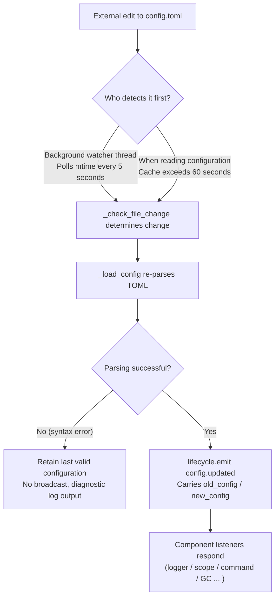

# Configuration File Guide
> This document will introduce the framework's configuration file. If third-party modules require configuration, please refer to the module's documentation.

ErisPulse uses a TOML-formatted configuration file `config/config.toml` to manage project settings.

## Configuration File Location

The configuration file is located in the `config/` folder at the root of the project:

```
project/
├── config/
│   └── config.toml
├── main.py
```

## Configuration Loading Error Handling

When loading the `config.toml` file, the framework distinguishes three error states and provides **actionable diagnostic information** instead of silently falling back to default configuration:

| Error State | Trigger Condition | Framework Behavior |
|-------------|-------------------|--------------------|
| File Missing | `config.toml` does not exist | Normal on first startup, silently uses empty configuration (no warning issued) |
| TOML Syntax Error | File exists but is invalid (e.g., missing quotes, unclosed parentheses) | Outputs **line number/column number and reason**, and indicates fallback to default configuration |
| Permission/Other Errors | No read permission, IO errors, etc. | Outputs **clear reason**, and indicates fallback to default configuration |

For example, if you accidentally write the configuration as `port = 8000` (missing quotes for a string), the log will output something like:

```
[ERROR] [Config] Syntax error in config file config/config.toml (Line 3, Column 1): ...
[WARNING] [Config] Failed to read configuration file. Continuing with last valid configuration; changes in this file did not take effect—please fix and reload or restart
```

This allows you to immediately locate the issue at the **default INFO level**, rather than being confused about why your configuration changes didn’t take effect.

> **What if you accidentally break the configuration file while the bot is running?** If you manually edit `config.toml` during runtime and introduce a syntax error, the framework will output "Configuration file is corrupted (syntax error, line X), cannot merge and write—please fix the configuration file and restart" the next time it attempts to write (merge configuration), instead of the confusing "write failed". The pending configuration changes will be preserved and not lost.

## Environment Variable Override

The framework supports **overriding** `ErisPulse.*` configuration items using environment variables (ideal for Docker / containerized / CI deployments, without modifying `config.toml`).

Naming convention: Convert the dot-separated path `ErisPulse.<section>.<key>` to all uppercase, replace `.` with `_`, and add the `ERISPULSE_` prefix:

| Configuration Item | Environment Variable | Example Value |
|--------------------|----------------------|---------------|
| `ErisPulse.server.port` | `ERISPULSE_SERVER_PORT` | `9000` |
| `ErisPulse.server.host` | `ERISPULSE_SERVER_HOST` | `0.0.0.0` |
| `ErisPulse.logger.level` | `ERISPULSE_LOGGER_LEVEL` | `DEBUG` |
| `ErisPulse.framework.strict_mode` | `ERISPULSE_FRAMEWORK_STRICT_MODE` | `false` |

Behavior description:
- **Highest priority**: Environment variables override both "configuration file" and "default values", automatically converted to the original value type (`bool` / `int` / `float` / comma-separated `list` / string)
- **Non-persistent**: The override only takes effect during runtime and does not write back to `config.toml`
- **Supports hot reload**: After modifying environment variables during runtime, configuration reload with monitoring can take effect

```bash
# Example for Docker deployment: Override port directly without modifying config.toml
ERISPULSE_SERVER_PORT=9000 docker compose up -d
```

> Note: Framework configurations like `ErisPulse.server.port` are read via APIs such as `get_server_config()`, and are all affected by environment variable overrides.

## Hot Configuration Reload

Starting from version 2.7.0, the framework provides **systematic support** for hot configuration reloading. After external modifications to `config.toml` (detected every 5 seconds by a background watcher) or after code calls `setConfig()`, all components automatically respond:

| Component | Configurations Supporting Hot Reload | Behavior |
|-----------|--------------------------------------|----------|
| **Logger** | `logger.level` / `log_files` / `log_dir` (including segment parameters) / `memory_limit` / `format` / `exclude_levels` | Automatically reapplies (with change detection) |
| **Command System (CommandHandler)** | `event.command.prefix` / `case_sensitive` / `allow_space_prefix` / `must_at_bot` | Takes effect on the next message |
| **Adapter Concurrency** | `framework.handler_max_concurrency` | Invalidates cached semaphore and rebuilds with new value |
| **Proactive GC** | `framework.proactive_gc_*` | Configuration changes immediately restart GC tasks, supporting runtime adjustment/disable/enable |
| **Master System** | `master.users` | Each call to `is_master()` checks real-time values, no restart needed |
| **Module/Adapter Configurations** | Their respective configuration items | Triggers `on_config_update(old, new)` callback |

**Configurations Requiring Restart** (cannot be safely reloaded, warnings are output when changed: "Process needs to be restarted for changes to take effect"):

| Configuration | Reason |
|---------------|--------|
| `router.cors.*` / `router.security.*` | Middlewares are written into FastAPI at service startup, cannot be safely reloaded at runtime |
| `storage.use_global_db` | SQLite file handle is already open at runtime, switching paths is unsafe |

> **What if editing and saving `config.toml` fails?** If a transient syntax error occurs while editing `config.toml`, the framework will **retain the last valid configuration** and output diagnostic logs, without broadcasting an empty configuration to components (avoiding `on_config_update` receiving empty values and mistakenly reverting to defaults).

### Internal Breakdown of Hot Reload Chain

"How do components know when the configuration is changed?" — Behind the scenes is a chain of detection → reload → broadcast:



**Two detection paths** (either one suffices, both provide fallback):

| Path | Mechanism | Trigger Timing |
|------|-----------|----------------|
| Background watcher | Daemon thread `config-watcher` polls file `mtime` every **5 seconds** | Up to 5 seconds after external file modification |
| Lazy detection | Any `getConfig()` read checks file if cache exceeds **60 seconds** | Next time configuration is read |

> **The framework does not interfere with itself**: When `setConfig()` writes to disk, it records the "mtime written by itself," and the watcher excludes this from comparisons, treating only **external edits** as changes.

**Two types of configuration change events:**

| Event | Trigger | Data | Typical Scenario |
|-------|---------|------|------------------|
| `config.set` | Code / Dashboard calls `setConfig()` | `{key, old_value, new_value}` | Single key write (template generation, status recording, runtime config change) |
| `config.updated` | External edit detected by watcher/lazy detection | `{old_config, new_config, config_file}` | Manual edit of `config.toml` |

> `setConfig()` defaults to **delayed disk write** (merges multiple writes) for 5 seconds; `immediate=True` writes immediately. After the watcher detects an external modification, it only updates the in-memory cache and **does not** write the external changes back to the file.

**List of Automatic Responders** (both event types are usually subscribed to, with consistent responses):

| Component | Listens | Response |
|-----------|---------|----------|
| Logger | `config.set` + `config.updated` | Reapplies level/file/directory segments/memory limit/format/exclude levels (with change detection, no change means no action) |
| Scope | `config.updated` | Rebuilds scope binding cache |
| Command System | `config.updated` | Refreshes prefix/case sensitivity/space prefix/must_at_bot parameters, takes effect on next message |
| Adapter Concurrency | `config.set` + `config.updated` | Invalidates and rebuilds semaphore with new `handler_max_concurrency` |
| Proactive GC | `config.set` + `config.updated` | Immediately restarts GC background task with `proactive_gc_*` |
| Adapters | Routes to `on_config_update` | Each adapter's `on_config_update(old, new)` callback |
| Modules | Routes to `on_config_update` | Each module's `on_config_update(old, new)` callback |
| Storage | `config.updated` | `use_global_db` change only warns (restart required) |
| Router | `config.updated` | `cors.*` / `security.*` change only warns (restart required) |

## Complete Configuration Example

```toml
[ErisPulse.server]
host = "0.0.0.0"
port = 8000
auto_start = true
ssl_certfile = ""
ssl_keyfile = ""

[ErisPulse.master]
# users supports two writing formats (choose one):
#   Global master (effective for all platforms): users = ["123456", "789012"]
#   Master specified by platform: users = { yunhu = ["123456"], telegram = ["789012"] }
users = {}

[ErisPulse.logger]
level = "INFO"
format = "rich"
log_files = []
log_dir = ""
log_rotation = "size"
log_max_size_mb = 10
log_backup_count = 5
log_rotation_when = "midnight"
memory_limit = 1000
exclude_levels = []

[ErisPulse.framework]
enable_lazy_loading = true
uninit_timeout = 30
strict_mode = 0

[ErisPulse.framework.strict_mode_exceptions]
modules = []
adapters = []

[ErisPulse.storage]
use_global_db = false

[ErisPulse.event.command]
prefix = "/"
case_sensitive = true
allow_space_prefix = false
must_at_bot = false

[ErisPulse.event.message]
ignore_self = true

[ErisPulse.i18n]
language = "auto"
```

## Server Configuration

```toml
[ErisPulse.server]
host = "0.0.0.0"
port = 8000
auto_start = true
ssl_certfile = "/path/to/cert.pem"
ssl_keyfile = "/path/to/key.pem"
```

| Configuration Item | Type | Default Value | Description |
|---------|------|---------|------|
| host | string | 0.0.0.0 | Listening address, 0.0.0.0 means all interfaces |
| port | integer | 8000 | Listening port number |
| auto_start | boolean | true | Whether to automatically start the routing server when `sdk.init()`. Setting to `false` skips routing server startup (pure event/without WebUI scenario) |
| ssl_certfile | string | empty | SSL certificate file path |
| ssl_keyfile | string | empty | SSL private key file path |

## Master System Configuration

The master system is used to identify the "framework master" account (such as Bot administrator). `master.users` supports two writing styles:

```toml
[ErisPulse.master]
# Style 1: Global master (applies to all platforms)
users = ["123456", "789012"]

# Style 2: Specify masters by platform (dict)
# users = { yunhu = ["123456"], telegram = ["789012"] }
```

| Configuration Item | Type | Default Value | Description |
|---------|------|---------|------|
| users | array / object | empty | List of master account IDs. In `list` format, it applies globally (all platforms); in `dict` format, specify masters by platform (key is platform name, value is the list of master account IDs for that platform) |

Code checks via `master.is_master(event)` or `master.is_master(platform, user_id)`. Each call reads the configuration in real time (supports hot updates, no restart required):

```python
from ErisPulse.Core import master

if master.is_master(event):
    await event.reply("Hello, Master")
```

## Logging Configuration

```toml
[ErisPulse.logger]
level = "INFO"
log_files = []                # Explicit list of log files (mutually exclusive with log_dir, higher priority)
log_dir = ""                  # Log directory (automatic segmentation and rotation enabled)
log_rotation = "size"         # Segmentation method: "size" / "date" / "none"
log_max_size_mb = 10          # Maximum single file size limit (MB) for size-based rotation
log_backup_count = 5          # Number of historical log files to retain
log_rotation_when = "midnight"  # Rotation period for date-based mode: S/M/H/D/midnight
memory_limit = 1000
exclude_levels = ["EVENT"]
```

| Configuration Item | Type | Default Value | Description |
|---------------------|------|---------------|-------------|
| level | string | INFO | Log level: TRACE, DEBUG, INFO, WARNING, ERROR, CRITICAL (TRACE is the lowest level, outputs detailed internal framework debug information) |
| format | string | rich | Log output format: `rich` (colored, default), `plain` (plain text without color, suitable for log collection/pipeline redirection), `json` (JSON structured, suitable for ELK, etc.) |
| log_files | array | empty | List of log output files (explicit paths, no segmentation) |
| log_dir | string | empty | Log output directory (automatically created). When set, logs will be written to `erispulse.log` within the directory and automatically segmented according to `log_rotation`; mutually exclusive with `log_files`, `log_files` takes precedence |
| log_rotation | string | size | Segmentation method: `size` (by size) / `date` (by time) / `none` (no segmentation) |
| log_max_size_mb | float | 10 | Maximum single file size limit (MB) for size-based rotation. Files exceeding this limit will be rotated into `.1`, `.2` backups |
| log_backup_count | integer | 5 | Number of historical log files to retain. Oldest backups beyond this number are automatically deleted |
| log_rotation_when | string | midnight | Rotation period for date-based mode: `S`/`M`/`H`/`D`/`midnight` (default: midnight daily) |
| memory_limit | integer | 1000 | Number of log entries to keep in memory |
| exclude_levels | array | empty | Levels to exclude. Logs of excluded levels are **completely discarded** (not written to memory, not pushed to Dashboard or other subscribers, not printed, not written to files). Supports hot updates |

You can also dynamically switch in code:

```python
from ErisPulse.Core import logger

# Segmentation by size: single file 10MB, retain 5 copies
logger.set_output_dir("logs", rotation="size", max_size_mb=10, backup_count=5)

# Segmentation by date: rotate daily at midnight, retain 7 copies
logger.set_output_dir("logs", rotation="date", backup_count=7)
```

> [!NOTE]
> `log_dir` and related segmentation settings require ErisPulse **2.8.0+**.

> **Privacy Protection**: Message sending and receiving content is recorded at the **EVENT level** (value 21). Setting `exclude_levels = ["EVENT"]` prevents the backend (e.g., Dashboard log panel) from seeing message content in groups/private chats, while not affecting logs of other levels.

> [!NOTE]
> The `exclude_levels` feature requires ErisPulse **2.8.0+**.

## Framework Configuration

```toml
[ErisPulse.framework]
enable_lazy_loading = true
uninit_timeout = 30
strict_mode = 0

[ErisPulse.framework.strict_mode_exceptions]
modules = []
adapters = []
```

| Configuration | Type | Default | Description |
|---------------|------|---------|-------------|
| enable_lazy_loading | boolean | true | Whether to enable lazy loading of modules |
| uninit_timeout | integer | 30 | Graceful shutdown timeout (seconds), after which processes are forcibly terminated. 0 means no timeout |
| strict_mode | integer | 0 | Strict mode level, see below "Strict Mode" section |
| handler_max_concurrency | integer | 64 | Maximum number of concurrent tasks for event handlers. Larger values increase throughput but also memory usage |
| offline_bot_expiry | integer | 3600 | Automatic expiration time for offline bot records (seconds). 0 means never expire |

### Proactive GC Configuration

After SDK initialization, a background task for proactive garbage collection (GC) is started, which periodically executes Python GC and internal resource cleanup (such as offline bot cleanup). All parameters support hot updates, and the task restarts immediately when changed.

| Configuration | Type | Default | Description |
|---------------|------|---------|-------------|
| proactive_gc_interval | number | 300 | Collection interval (seconds), supports decimals. 0 means disable proactive GC |
| proactive_gc_generation | integer | 0 | Regular round collection generation (0/1/2, clamped to 0..2). Note that `gc.collect(2)` is equivalent to full collection, default 0 keeps it lightweight; deep collection is triggered periodically by `proactive_gc_full_every` |
| proactive_gc_full_every | integer | 20 | Perform a full collection every N rounds, 0 means disable periodic full collection. Full collection is constrained by the `proactive_gc_memory_growth_mb` threshold |
| proactive_gc_memory_growth_mb | integer | 32 | Memory growth threshold (MB) for full collection: compared against the memory baseline after the last full collection (preferring tracemalloc, then RSS), full collection is only performed when growth reaches this value. 0 means no threshold |
| proactive_gc_idle_only | boolean | false | When enabled, skip Python GC during event bursts (when there are unfinished pending handlers) to avoid pauses and message processing contention; internal resource cleanup is unaffected |
| proactive_gc_gen0_min | integer | 500 | Minimum amount of gen0 garbage to trigger regular round collection: if `gc.get_count()[0]` is below this value, skip directly (near-zero overhead for idle rounds). 0 means always collect |

> **2.7.1 Change**: The default `proactive_gc_generation` is adjusted from `2` to `0`, and `proactive_gc_full_every` is adjusted from `0` to `20`. Previously, `generation=2` meant a full collection every round, which was the heaviest; the new default maintains collection coverage while significantly reducing idle round overhead. Explicitly configured old values still function as intended.

### Strict Mode

Strict mode controls the framework's handling strategy when modules/adapters are loaded with non-compliance or failures during the loading phase. Modern modules/adapters should inherit the corresponding base classes (`BaseModule`/`BaseAdapter`). Components that do not inherit these base classes affect the framework's context system and fallback cleanup, potentially leading to resource leaks.

> **2.5.2 Change**: The default level is adjusted from `1` (skip) to `0` (lenient) to reduce loading issues for new users. Components that do not inherit base classes will be warned and attempted to load, rather than directly rejected. To restore the previous behavior, explicitly set `strict_mode = 1`.

| Level | Name | Behavior |
|-------|------|----------|
| 0 | Lenient (default) | Non-compliant components only warn, and components that do not inherit base classes will still be attempted to load (compatible with old components) |
| 1 | Strict-Skip | Reject components that do not inherit base classes and skip them, while other components start normally |
| 2 | Strict-Fatal | Collect all violations and report them together, then terminate the entire startup process |

In all levels, component crashes during the loading/registration/initialization phases are always skipped. The differences are as follows:

- **0 → 1**: The only behavioral change is that components that do not inherit base classes change from "still loaded" to "skipped".
- **1 → 2**: All violations (not inheriting base classes, loading failure, registration failure, initialization failure, etc.) are upgraded to fatal, and a list of violations is output at the startup checkpoint before termination.

#### Exemption List

If certain components cannot be migrated temporarily (e.g., legacy modules they depend on), they can be added to the exemption list. Components listed will be treated as lenient mode even if non-compliant, and continue to load:

```toml
[ErisPulse.framework.strict_mode_exceptions]
modules = ["SeTu", "SomeLegacyModule"]
adapters = ["OldAdapter"]
```

> When a component is rejected by strict mode, the log will explicitly prompt how to restore loading (add to the exemption list or lower the level).

## Storage Configuration

```toml
[ErisPulse.storage]
use_global_db = false
```

| Configuration Item | Type | Default Value | Description |
|---------|------|---------|------|
| use_global_db | boolean | false | Whether to use the global database (within the package) instead of the project database. If `true`, all projects share the SQLite database within the ErisPulse package; if `false` (default), each project uses an independent database in the `config/` directory |

## Event Configuration

### Command Configuration

```toml
[ErisPulse.event.command]
prefix = "/"
case_sensitive = true
allow_space_prefix = false
```

| Configuration Item | Type | Default Value | Description |
|---------|------|---------|------|
| prefix | string | / | Command prefix |
| case_sensitive | boolean | true | Whether to distinguish case (whether `/Help` and `/help` are different commands) |
| allow_space_prefix | boolean | false | Whether to allow space as a prefix |
| must_at_bot | boolean | false | Whether the command must be triggered by mentioning the bot (not restricted in private chats) |

### Message Configuration

```toml
[ErisPulse.event.message]
ignore_self = true
```

| Configuration Item | Type | Default Value | Description |
|---------|------|---------|------|
| ignore_self | boolean | true | Whether to ignore messages from the bot itself |

## Internationalization Configuration

```toml
[ErisPulse.i18n]
language = "auto"
```

| Configuration Item | Type | Default Value | Description |
|---------|------|---------|------|
| language | string | auto | The display language for built-in framework text. Set to `auto` to automatically detect the system language, or specify a language code: `zh-CN`, `zh-TW`, `en`, `ja`, `ru` |

## Module Configuration

Each module can define its own configuration in the configuration file:

```toml
[MyModule]
api_url = "https://api.example.com"
timeout = 30
enabled = true
```

Read and write configuration within the module:

```python
from ErisPulse import sdk

# Read configuration
config = sdk.config.getConfig("MyModule", {})
api_url = config.get("api_url", "https://default.api.com")

# Write configuration at runtime (with delayed save)
sdk.config.setConfig("MyModule.timeout", 60)

# Save immediately to file
sdk.config.setConfig("MyModule.timeout", 60, immediate=True)
```

> By default, `setConfig` uses delayed writing (batch saved to file every ~5 seconds). Setting `immediate=True` will persist immediately. Configuration changes trigger the `config.set` lifecycle event.

## Control Plane Configuration (scope)

> [!NOTE]
> This feature requires ErisPulse **2.8.0+**.

The unified control plane is the **only** entry point for permissions and access control, organized in a five-dimensional configuration tree:

| Dimension | What is controlled | Configuration Path |
|-----------|--------------------|--------------------|
| ① Module | Which modules are available in a platform / Bot / session | `scope.platforms / bots / sessions` |
| ② Identity | Whether events from a user / group / Bot / adapter are accepted | `scope.identity.*` |
| ③ Command | Who can execute a specific command (command names support glob) | `scope.commands` |
| ④ Handler | Filtering module handlers by text | `scope.handlers` |
| ⑤ Override | Overriding module/command implementation parameters | `scope.overrides` |

```toml
[ErisPulse.scope]
default_allow = true        # Global fallback (false = strict deny mode)
cache_size = 1024           # LRU cache size

# ① Module dimension (priority: session > Bot > platform; entries support exact / glob / re: regex)
[ErisPulse.scope.platforms.onebot11]
modules = ["Chat", "Tool*"]
blocked = ["re:^Danger"]

# ② Identity dimension (priority: user > session > Bot > adapter; only allow or deny per level)
[ErisPulse.scope.identity.adapters.onebot11]
deny = true                 # All events from this platform are discarded at the entry point
[ErisPulse.scope.identity.users.onebot11]
allow = ["u_admin"]         # User keys support glob / re: regex
deny = ["u_bad", "spam_*"]

# ③ Command dimension (user identifier "platform:user_id")
[ErisPulse.scope.commands."roll*"]
allow = ["onebot11:u_vip"]
deny = ["onebot11:u_bad"]

# ④ Handler/Text dimension (AND with code-side conditions)
[ErisPulse.scope.handlers.MyModule]
pattern = "签到*"

# ⑤ Implementation parameter override (disable via command deny, not here)
[ErisPulse.scope.overrides.MyModule.restart]
master = true
hidden = true
```

| Configuration Item | Type | Description |
|----------------------|------|-------------|
| `scope.default_allow` | boolean | Global fallback: allow/deny for entries not matched by rules (`true`). Modules/identity "no rule = deny"; commands "no ACL = deny" |
| `scope.cache_size` | integer | LRU cache size (default 1024) |
| `scope.platforms / bots / sessions` | table | ① Module three-level binding: `{modules=[...], blocked=[...]}` |
| `scope.identity.adapters / bots / sessions / users` | table | ② Identity four-level binding: `{allow=true}` / `{deny=true}` |
| `scope.commands.<command name>` | table | ③ Command ACL: `{allow=[...], deny=[...]}` |
| `scope.handlers.<module>` | table | ④ Text filtering: `{pattern="...", regex="..."}` |
| `scope.overrides.<module>[.<command>]` | table | ⑤ Parameter override: `master` / `hidden` / `aliases` / `prefix` etc. |

> Matching entries use unified syntax: exact name / glob (`*` `?` `[seq]`) / `re:` regex, case-insensitive.
> Detailed explanations of the five dimensions and runtime APIs (`sdk.scope.bind_module()` / `bind_identity()` / `block_user()` /
> `allow_user()` / `override()` etc.) are available in [Unified Control Plane](../advanced/scope.md).

## Next Steps

- [CLI Command Reference](cli-reference.md) - Learn about all command-line commands
- [Developer Guide](../developer-guide/) - Learn how to develop custom modules