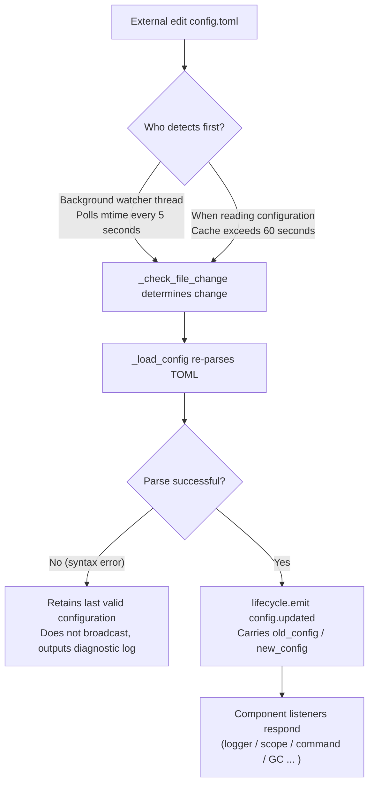

# Configuration File Documentation
> This document will introduce the framework's configuration file. If third-party modules require configuration, please refer to the module's documentation.

ErisPulse uses a TOML-formatted configuration file `config/config.toml` to manage project configurations.


## Configuration File Location

The configuration file is located in the `config/` folder at the root of the project:

```
project/
├── config/
│   └── config.toml
├── main.py
```


## Configuration Loading Error Handling

The framework distinguishes three error states when loading `config.toml`, providing **actionable diagnostic information** instead of silently falling back to default configurations:

| Error State | Trigger Condition | Framework Behavior |
|-------------|-------------------|--------------------|
| File Missing | `config.toml` does not exist | On normal first startup, silently use an empty configuration (no warning issued) |
| TOML Syntax Error | File exists but has invalid format (e.g., missing quotes, unclosed parentheses) | Output **line/column number and reason for error**, and indicate that default configuration has been reverted |
| Permission/Other Errors | No read permission, IO errors, etc. | Output **clear reason**, and indicate that default configuration has been reverted |

For example, if you accidentally write the configuration as `port = 8000` (missing quotes around the string), the log will output something similar to:

```
[ERROR] [Config] Syntax error in configuration file config/config.toml (line 3, column 1): ...
[WARNING] [Config] Failed to read configuration file. Continuing with last valid configuration; changes in this file were not applied—please fix and reload or restart
```

This allows you to immediately identify the issue at the **default INFO level**, rather than being confused about why your configuration changes did not take effect.

> **What if you accidentally corrupt the configuration file while the bot is running?** If you manually edit `config.toml` during runtime and introduce a syntax error, the framework will output "Configuration file is corrupted (syntax error, line X), unable to merge and write—please fix the configuration file and restart" on the next write (merge configuration), instead of the confusing "write failed". The configuration items awaiting write will be preserved and will not be lost.


## Environment Variable Override

The framework supports **overriding** `ErisPulse.*` configuration items using environment variables (suitable for Docker / containerization / CI deployment, without modifying `config.toml`).

Naming convention: Convert the dot-separated path `ErisPulse.<section>.<key>` to all uppercase, replace `.` with `_`, and add the `ERISPULSE_` prefix:

| Configuration Item | Environment Variable | Example Value |
|--------------------|----------------------|---------------|
| `ErisPulse.server.port` | `ERISPULSE_SERVER_PORT` | `9000` |
| `ErisPulse.server.host` | `ERISPULSE_SERVER_HOST` | `0.0.0.0` |
| `ErisPulse.logger.level` | `ERISPULSE_LOGGER_LEVEL` | `DEBUG` |
| `ErisPulse.framework.strict_mode` | `ERISPULSE_FRAMEWORK_STRICT_MODE` | `false` |

Behavior description:
- **Highest priority**: Environment variables override "configuration file" and "default values", automatically converting to the original value type (`bool` / `int` / `float` / comma-separated `list` / string)
- **Non-persistent**: The override only takes effect during runtime and is not written back to `config.toml`
- **Supports hot reload**: After modifying environment variables during runtime, the changes take effect when combined with configuration monitoring reload

```bash
# Docker deployment example: Do not modify config.toml, directly override the port
ERISPULSE_SERVER_PORT=9000 docker compose up -d
```

> Note: Framework configurations such as `ErisPulse.server.port` that are read via APIs like `get_server_config()` are all affected by environment variable overrides.


## Configuration Hot Reload

Starting from version 2.7.0, the framework provides **systematic support** for configuration hot reload. After external modification of `config.toml` (detected every 5 seconds by a background watcher), or after code calls `setConfig()`, components automatically respond:

| Component | Configurations Supporting Hot Reload | Behavior |
|-----------|--------------------------------------|----------|
| **Logger** | `logger.level` / `log_files` / `log_dir` (including segmentation parameters) / `memory_limit` / `format` / `exclude_levels` | Automatically reapplies (with change detection) |
| **Command System CommandHandler** | `event.command.prefix` / `case_sensitive` / `allow_space_prefix` / `must_at_bot` | Takes effect on the next message |
| **Adapter Concurrency** | `framework.handler_max_concurrency` | Invalidates cached semaphore and rebuilds with new value |
| **Proactive GC** | `framework.proactive_gc_*` | Configuration change immediately restarts GC task, supports runtime adjustment/disable/reenable |
| **Master System Master** | `master.users` | Each `is_master()` check reads in real-time, no restart required |
| **Module/Adapter Configurations** | Their respective configuration items | Triggers `on_config_update(old, new)` callback |

**Configurations Requiring Restart** (cannot be safely hot-switched; a warning "Requires process restart to take effect" is output when changed):

| Configuration | Reason |
|----------------|--------|
| `router.cors.*` / `router.security.*` | Middleware is written into FastAPI at service startup, cannot be safely hot-switched at runtime |
| `storage.use_global_db` | SQLite file handle is already open at runtime, switching paths is unsafe |

> **Error during editing and saving?** If a transient syntax error occurs while editing `config.toml`, the framework will **retain the last valid configuration** and output diagnostic logs, and will not broadcast an empty configuration to components (to prevent `on_config_update` receiving null values and mistakenly reverting to defaults).

### Internal Breakdown of Hot Reload Chain

"How do components know when the configuration is changed?" — Behind this is a chain of detection → reload → broadcast:



**Two detection paths** (either one is sufficient, both serve as fallback):

| Path | Mechanism | Trigger Timing |
|------|-----------|----------------|
| Background watcher | Daemon thread `config-watcher` polls file `mtime` every **5 seconds** | Within 5 seconds after external file modification |
| Lazy detection | Any `getConfig()` read, if cache exceeds **60 seconds**, checks file first | On next configuration read |

> **Framework does not self-damage**: When `setConfig()` writes to disk, it records the "mtime written by itself"; the watcher excludes it during comparison, treating only **external edits** as changes.

**Two types of configuration change events:**

| Event | Trigger | Data | Typical Scenario |
|-------|---------|------|------------------|
| `config.set` | Code / Dashboard calls `setConfig()` | `{key, old_value, new_value}` | Single key write (template generation, status recording, runtime config change) |
| `config.updated` | Captured by watcher/lazy detection after external edit | `{old_config, new_config, config_file}` | Manual edit of `config.toml` |

> `setConfig()` defaults to **delayed disk write for 5 seconds** (merges multiple writes), `immediate=True` writes immediately. After watcher detects external modification, it only updates the in-memory cache, **does not** write external changes back to the file.

**List of automatic responders** (both event types are typically subscribed, with consistent responses):

| Component | Listener | Response |
|-----------|----------|----------|
| Logger | `config.set` + `config.updated` | Reapplies level/file/directory segmentation/memory limit/format/exclude levels (with change detection, no change means no action) |
| Scope | `config.updated` | Rebuilds scope binding cache |
| Command System | `config.updated` | Refreshes prefix/case-sensitive/space prefix/must_at_bot parsing parameters, takes effect on next message |
| Adapter Concurrency | `config.set` + `config.updated` | Invalidates and rebuilds semaphore for `handler_max_concurrency` |
| Proactive GC | `config.set` + `config.updated` | Immediately restarts GC background task for `proactive_gc_*` |
| Adapters | Routes to `on_config_update` | Each adapter's `on_config_update(old, new)` callback |
| Modules | Routes to `on_config_update` | Each module's `on_config_update(old, new)` callback |
| Storage | `config.updated` | Change of `use_global_db` only warns (requires restart) |
| Router | `config.updated` | Change of `cors.*` / `security.*` only warns (requires restart) |

## Complete Configuration Example

```toml
[ErisPulse.server]
host = "0.0.0.0"
port = 8000
auto_start = true
ssl_certfile = ""
ssl_keyfile = ""

[ErisPulse.master]
# users supports two writing methods (choose one):
#   Global owner (effective on all platforms): users = ["123456", "789012"]
#   Owner specified by platform: users = { yunhu = ["123456"], telegram = ["789012"] }
users = {}

[ErisPulse.logger]
level = "INFO"
format = "rich"
log_files = []
log_dir = ""
log_rotation = "size"
log_max_size_mb = 10
log_backup_count = 5
log_rotation_when = "midnight"
memory_limit = 1000
exclude_levels = []

[ErisPulse.framework]
enable_lazy_loading = true
uninit_timeout = 30
strict_mode = 0

[ErisPulse.framework.strict_mode_exceptions]
modules = []
adapters = []

[ErisPulse.storage]
use_global_db = false

[ErisPulse.event.command]
prefix = "/"
case_sensitive = true
allow_space_prefix = false
must_at_bot = false

[ErisPulse.event.message]
ignore_self = true

[ErisPulse.i18n]
language = "auto"

## Server Configuration

```toml
[ErisPulse.server]
host = "0.0.0.0"
port = 8000
auto_start = true
ssl_certfile = "/path/to/cert.pem"
ssl_keyfile = "/path/to/key.pem"
```

| Configuration Item | Type | Default Value | Description |
|---------|------|---------|------|
| host | string | 0.0.0.0 | Listening address, 0.0.0.0 means all interfaces |
| port | integer | 8000 | Listening port number |
| auto_start | boolean | true | Whether to automatically start the routing server when `sdk.init()`. Setting to `false` skips the routing server startup (pure event/without WebUI scenario) |
| ssl_certfile | string | empty | SSL certificate file path |
| ssl_keyfile | string | empty | SSL private key file path |

Please directly return the translated complete Markdown content, without any additional text.


## Master System Configuration

The master system is used to identify the "framework master" account (such as Bot administrator). `master.users` supports two writing styles:

```toml
[ErisPulse.master]
# Style 1: Global master (effective on all platforms)
users = ["123456", "789012"]

# Style 2: Specify master per platform (dict)
# users = { yunhu = ["123456"], telegram = ["789012"] }
```

| Configuration Item | Type | Default Value | Description |
|---------|------|---------|------|
| users | array / object | empty | List of master account IDs. In `list` form, it represents a global master (effective on all platforms); in `dict` form, it specifies masters per platform (key is the platform name, value is the list of master account IDs for that platform) |

The code checks using `master.is_master(event)` or `master.is_master(platform, user_id)`. The configuration is read in real time during each call (supports hot updates, no restart required):

```python
from ErisPulse.Core import master

if master.is_master(event):
    await event.reply("Hello master")

## Logging Configuration

```toml
[ErisPulse.logger]
level = "INFO"
log_files = []                # Explicit list of log files (mutually exclusive with log_dir, higher priority)
log_dir = ""                  # Log directory (automatically segmented and rotated upon setting)
log_rotation = "size"         # Segmentation method: "size" / "date" / "none"
log_max_size_mb = 10          # Maximum file size for size-based segmentation (MB)
log_backup_count = 5          # Number of historical log files to retain
log_rotation_when = "midnight"  # Rotation cycle for date-based segmentation: S/M/H/D/midnight
memory_limit = 1000
exclude_levels = ["EVENT"]
```

| Configuration Item | Type | Default Value | Description |
|---------|------|---------|------|
| level | string | INFO | Log level: TRACE, DEBUG, INFO, WARNING, ERROR, CRITICAL (TRACE is the lowest level, outputs detailed internal framework debug information) |
| format | string | rich | Log output format: `rich` (colored, default), `plain` (plain text without color, suitable for log collection/pipeline redirection), `json` (JSON structured, suitable for ELK, etc.) |
| log_files | array | empty | List of log output files (explicit paths, no segmentation) |
| log_dir | string | empty | Log output directory (automatically created). Upon setting, logs are written to `erispulse.log` within the directory and automatically segmented according to `log_rotation`; mutually exclusive with `log_files`, `log_files` takes precedence |
| log_rotation | string | size | Segmentation method: `size` (by size) / `date` (by time) / `none` (no segmentation) |
| log_max_size_mb | float | 10 | Maximum file size for size-based segmentation (MB); logs exceeding this size are rotated to `.1`/`.2` backups |
| log_backup_count | integer | 5 | Number of historical log files to retain; oldest backups beyond this limit are automatically deleted |
| log_rotation_when | string | midnight | Rotation cycle for date-based segmentation: `S`/`M`/`H`/`D`/`midnight` (default: daily at midnight) |
| memory_limit | integer | 1000 | Number of log entries to keep in memory |
| exclude_levels | array | empty | Levels of logs to suppress. Logs of suppressed levels are **completely discarded** (not written to memory, not pushed to Dashboard or other subscribers, not printed, not written to file). Supports hot updates |

You can also dynamically switch in code:

```python
from ErisPulse.Core import logger

# Segmentation by size: single file 10MB, retain 5 copies
logger.set_output_dir("logs", rotation="size", max_size_mb=10, backup_count=5)

# Segmentation by date: rotate at midnight, retain 7 copies
logger.set_output_dir("logs", rotation="date", backup_count=7)
```

> [!NOTE]
> `log_dir` and related segmentation configurations require ErisPulse **2.8.0+**.

> **Privacy Protection**: Message sending and receiving content is recorded at the **EVENT** level (value 21). Setting `exclude_levels = ["EVENT"]` prevents the backend (such as the Dashboard log panel) from seeing message content in groups/private chats, without affecting logs of other levels.

> [!NOTE]
> The `exclude_levels` feature requires ErisPulse **2.8.0+**.

## Framework Configuration

```toml
[ErisPulse.framework]
enable_lazy_loading = true
uninit_timeout = 30
strict_mode = 0

[ErisPulse.framework.strict_mode_exceptions]
modules = []
adapters = []
```

| Configuration Item | Type | Default Value | Description |
|---------|------|---------|------|
| enable_lazy_loading | boolean | true | Whether to enable lazy loading of modules |
| uninit_timeout | integer | 30 | Total timeout (seconds) for graceful shutdown, after which the process is forcibly terminated. 0 means no timeout is set |
| strict_mode | integer | 0 | Strict mode level, see the "Strict Mode" section below |
| handler_max_concurrency | integer | 64 | Maximum number of concurrent Tasks for event handlers. Setting this higher increases throughput but also memory usage |
| offline_bot_expiry | integer | 3600 | Automatic expiration time (seconds) for offline Bot records. 0 means no expiration |

### Proactive GC Configuration

After SDK initialization, a background task for proactive garbage collection (GC) is started, periodically executing Python GC and internal resource cleanup (such as offline Bot cleanup). All parameters support hot updates, and the task is restarted immediately upon change.

| Configuration Item | Type | Default Value | Description |
|---------|------|---------|------|
| proactive_gc_interval | number | 300 | Recycling interval (seconds), supports decimals. 0 means disable proactive GC |
| proactive_gc_generation | integer | 0 | Regular round recycling generation (0/1/2, clamped to 0..2). Note that `gc.collect(2)` is equivalent to full recycling, and the default of 0 keeps it lightweight; deep recycling is triggered periodically by `proactive_gc_full_every` |
| proactive_gc_full_every | integer | 20 | Perform a full recycling every N rounds, 0 means disable periodic full recycling. Full recycling is constrained by the `proactive_gc_memory_growth_mb` threshold |
| proactive_gc_memory_growth_mb | integer | 32 | Memory growth threshold (MB) for full recycling: compared against the memory baseline (prefer tracemalloc, then RSS) after the last full recycling, only if the growth reaches this value will a full recycling be executed. 0 means no threshold is set |
| proactive_gc_idle_only | boolean | false | When enabled, skip Python GC during event peaks (when there are pending handlers), to avoid pauses and message processing contention; internal resource recycling is unaffected |
| proactive_gc_gen0_min | integer | 500 | Lower bound of garbage in gen0 to trigger regular round recycling: if `gc.get_count()[0]` is below this value, skip directly (idle rounds have nearly zero overhead). 0 means always recycle |

> **Change in 2.7.1**: The default `proactive_gc_generation` was adjusted from `2` to `0`, and the default `proactive_gc_full_every` was adjusted from `0` to `20`. Previously, `generation=2` meant that the heaviest full recycling was performed every round; the new default maintains recycling coverage while significantly reducing idle overhead. Explicitly configured old values still take effect as their literal meaning.

### Strict Mode

Strict mode controls the handling strategy for modules/adapters that are non-compliant or fail during the loading phase. Modern modules/adapters should inherit the corresponding base class (`BaseModule`/`BaseAdapter`). Components that do not inherit the base class affect the framework's context system and fallback cleanup, potentially causing resource leaks.

> **Change in 2.5.2**: The default level was adjusted from `1` (skip) to `0` (lenient), to reduce loading issues encountered by new users. Components that do not inherit the base class will be warned and attempted to load, rather than being directly rejected. To restore the old behavior, explicitly set `strict_mode = 1`.

| Level | Name | Behavior |
|------|------|------|
| 0 | Lenient (Default) | Non-compliance only issues a warning; components that do not inherit the base class will still be attempted to load (compatibility with old components) |
| 1 | Strict-Skip | Reject components that do not inherit the base class and skip them, while other components start normally |
| 2 | Strict-Fatal | Collect all non-compliant components and report them together before terminating the entire startup process |

Under each level, errors reported during the "loading/registration/initialization phase" (such as component crashes) are always skipped; the difference lies in:

- **0 → 1**: The only behavioral change is that "not inheriting the base class" changes from "still loading" to "skipping".
- **1 → 2**: All non-compliance (not inheriting the base class, loading failure, registration failure, initialization failure, etc.) is upgraded to fatal, and a list of non-compliant components is output at the startup checkpoint before terminating.

#### Exception List

If certain components cannot be migrated temporarily (for example, due to dependencies on old modules), they can be added to the exception list. Components listed will be treated as lenient mode even if they are non-compliant, and will continue to be loaded:

```toml
[ErisPulse.framework.strict_mode_exceptions]
modules = ["SeTu", "SomeLegacyModule"]
adapters = ["OldAdapter"]
```

> When a component is rejected by strict mode, the log will clearly indicate how to restore loading (add to the exception list or lower the level).

## Storage Configuration

```toml
[ErisPulse.storage]
use_global_db = false
```

| Configuration Item | Type | Default Value | Description |
|---------|------|---------|------|
| use_global_db | boolean | false | Whether to use the global database (within the package) instead of the project database. When set to `true`, all projects share the SQLite database within the ErisPulse package; when set to `false` (default), each project uses an independent database in the `config/` directory |

Please directly return the fully translated Markdown content, without any additional text.


## Event Configuration

### Command Configuration

```toml
[ErisPulse.event.command]
prefix = "/"
case_sensitive = true
allow_space_prefix = false
```

| Configuration Item | Type | Default Value | Description |
|---------|------|---------|------|
| prefix | string | / | Command prefix |
| case_sensitive | boolean | true | Whether to distinguish case (whether `/Help` and `/help` are different commands) |
| allow_space_prefix | boolean | false | Whether to allow space as a prefix |
| must_at_bot | boolean | false | Whether the command must be triggered by mentioning the bot (not restricted in private chats) |

### Message Configuration

```toml
[ErisPulse.event.message]
ignore_self = true
```

| Configuration Item | Type | Default Value | Description |
|---------|------|---------|------|
| ignore_self | boolean | true | Whether to ignore the robot's own messages |


## Internationalization Configuration

```toml
[ErisPulse.i18n]
language = "auto"
```

| Configuration Item | Type | Default Value | Description |
|---------|------|---------|------|
| language | string | auto | The display language for framework built-in text. Set to `auto` to automatically detect the system language, or set to a specific code: `zh-CN`, `zh-TW`, `en`, `ja`, `ru` |

## Module Configuration

Each module can define its own configuration in the configuration file:

```toml
[MyModule]
api_url = "https://api.example.com"
timeout = 30
enabled = true
```

Reading and writing configuration within the module:

```python
from ErisPulse import sdk

# Reading configuration
config = sdk.config.getConfig("MyModule", {})
api_url = config.get("api_url", "https://default.api.com")

# Writing configuration at runtime (delayed save)
sdk.config.setConfig("MyModule.timeout", 60)

# Saving immediately to file
sdk.config.setConfig("MyModule.timeout", 60, immediate=True)
```

> By default, `setConfig` uses delayed writing (approximately batch saving to file every 5 seconds). Setting `immediate=True` will persist immediately. Configuration changes will trigger the `config.set` lifecycle event.


## Scope Configuration

> [!NOTE]
> This feature requires ErisPulse **2.8.0+**.

The module scope system is used to control which modules a "certain Bot" can use. By default, all modules are open to all Bots, and filtering only begins after configuration binding. Modules and adapters can be adapted without any changes.

```toml
[ErisPulse.scope]
default_allow = true        # Allow all by default (false = implicit deny strict mode)
cache_size = 1024           # LRU cache size for is_allowed
```

| Configuration | Type | Description |
|---------------|------|-------------|
| `scope.default_allow` | boolean | Allow all modules by default (`true`). `false` = implicit deny strict mode, only modules in the whitelist are available |
| `scope.cache_size` | integer | LRU cache size for `is_allowed` (default 1024) |
| `scope.platforms.<platform>.modules` | array | Platform-level whitelist: only listed modules are allowed (empty = no restriction) |
| `scope.platforms.<platform>.blocked` | array | Platform-level blacklist: listed modules are disabled (empty = no restriction) |
| `scope.bots.<platform>.<bot_id>.modules` | array | Bot-level whitelist, overrides platform-level |
| `scope.bots.<platform>.<bot_id>.blocked` | array | Bot-level blacklist, overrides platform-level |
| `scope.sessions.<platform>.<session_id>.modules` | array | Session-level whitelist (group/channel/private chat), highest priority |
| `scope.sessions.<platform>.<session_id>.blocked` | array | Session-level blacklist, highest priority |

> Resolution priority: **Session-level > Bot-level > Platform-level**. For a complete TOML example of the three-level binding, case-insensitive module names, session identifiers isolated across platforms, and runtime `sdk.scope.bind()` / `unbind()` dynamic addition and removal (with `merge=True` for merging), please refer to the [Scope System](../advanced/scope.md).

docs/en/scope.md

## Next Steps

- [CLI Command Reference](cli-reference.md) - Learn about all command-line commands
- [Developer Guide](../developer-guide/) - Learn how to develop custom modules

