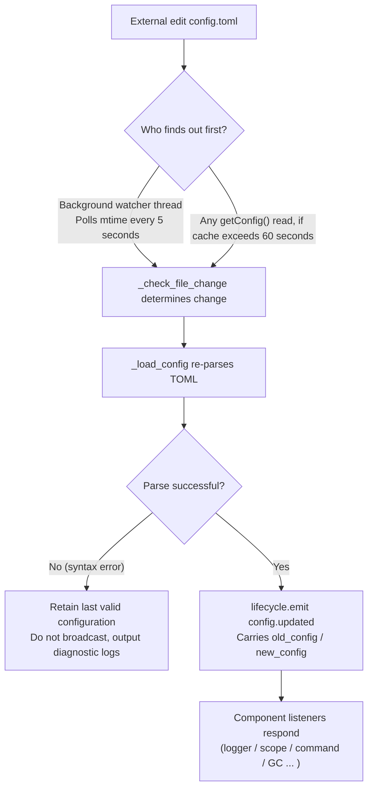

# Configuration File Documentation

> This document will introduce the framework's configuration file. If any third-party modules require configuration, please refer to the module's documentation.

ErisPulse uses a TOML-formatted configuration file `config/config.toml` to manage project configurations.

## Configuration File Location

The configuration file is located in the `config/` folder at the root of the project:

```
project/
├── config/
│   └── config.toml
├── main.py
```

## Configuration Loading Error Handling

The framework distinguishes three error states when loading `config.toml` and provides **actionable diagnostic information** instead of silently falling back to default configurations:

| Error State | Trigger Condition | Framework Behavior |
|---------|---------|---------|
| File Missing | `config.toml` does not exist | Normal on first startup, silently use empty configuration (no warning) |
| TOML Syntax Error | File exists but format is invalid (e.g., missing quotes, unclosed parentheses) | Output **line/column number and reason**, and indicate that default configuration has been reverted |
| Permission/Other Error | No read permission, IO errors, etc. | Output **clear reason**, and indicate that default configuration has been reverted |

For example, if you accidentally write the configuration as `port = 8000` (missing quotes for a string), the log will output something like:

```
[ERROR] [Config] Configuration file config/config.toml has a syntax error (line 3, column 1): ...
[WARNING] [Config] Failed to read configuration file. Continuing with last valid configuration, modifications in this file did not take effect—please fix and reload or restart
```

This allows you to immediately locate the issue at the **default INFO level** instead of being confused about why your configuration changes did not take effect.

> **What if the configuration file is corrupted during runtime?** If you manually edit `config.toml` during robot operation and introduce a syntax error, the framework will output "Configuration file is damaged (syntax error, line X), unable to merge and write—please fix the configuration file and restart" when attempting to write (merge) next time, rather than a confusing "write failure." The configuration items to be written will be retained and not lost.

## Comment Retention and Minimal Disk Write

Comments and key order in `config.toml` are **fully retained after framework writes**: whether through code `setConfig()`, CLI configuration wizard save, or adapter/module initial configuration template, the framework only modifies the involved keys. Your comments and sorted order will not be erased or reordered (based on tomlkit comment-retaining round-trip implementation).

The framework keeps disk writes minimal:

- **Framework default configurations are not automatically written to disk**: `gc`, `scope`, `transcript`, and other built-in defaults only reside in memory; `config.toml` only contains your explicitly set keys, keeping it minimal. Refer to `config/config.full.example` in the project for a complete list of configurable items. Copy and modify as needed (unconfigured items always use built-in defaults, behavior remains unchanged).
- **`config.full.example` is automatically maintained**: Regardless of whether `epsdk init` has been executed, as long as the framework is started (`epsdk run` / `main.py`), a complete configuration reference will be automatically generated in `config/config.full.example` if the file is missing. The first line is a marker for framework self-maintenance. When generators update (e.g., new configuration items, newly installed components), the startup will refresh once. If the first line is deleted or modified, manual takeover is assumed and the framework will no longer overwrite.
- **Adapter/Module Configuration Templates**: First initialization saves a template with comments (field descriptions are comments); fields marked as `example` do not write to disk, only recorded in `config.full.example` for reference.

## Environment Variable Override

The framework supports overriding `ErisPulse.*` configuration items using environment variables (suitable for Docker/containerization/CI deployment, no need to modify `config.toml`).

Naming rule: Convert the dot-separated path `ErisPulse.<section>.<key>` to all uppercase, replace `.` with `_`, and add the `ERISPULSE_` prefix:

| Configuration Item | Environment Variable | Example Value |
|--------|---------|--------|
| `ErisPulse.server.port` | `ERISPULSE_SERVER_PORT` | `9000` |
| `ErisPulse.server.host` | `ERISPULSE_SERVER_HOST` | `0.0.0.0` |
| `ErisPulse.logger.level` | `ERISPULSE_LOGGER_LEVEL` | `DEBUG` |
| `ErisPulse.framework.strict_mode` | `ERISPULSE_FRAMEWORK_STRICT_MODE` | `false` |

Behavior description:
- **Highest priority**: Environment variables override "configuration file" and "default values," automatically converting to the original value type (`bool` / `int` / `float` / comma-separated `list` / string)
- **Not persistent**: The override only takes effect during runtime and does not write back to `config.toml`
- **Supports hot updates**: After modifying environment variables during runtime, combined with configuration monitoring reload, changes take effect

```bash
# Docker deployment example: Deploy without modifying config.toml, directly override port
ERISPULSE_SERVER_PORT=9000 docker compose up -d
```

> Note: `ErisPulse.server.port` and other framework configurations accessed via `get_server_config()` and similar APIs are affected by environment variable overrides.

## Configuration Hot Update

Since version 2.7.0, the framework has provided **systematic support for configuration hot updates**. After external modification of `config.toml` (background watcher checks every 5 seconds), or code calls `setConfig()`, each component automatically responds:

| Component | Configurations Supporting Hot Updates | Behavior |
|------|----------------|------|
| **Logger** | `logger.level` / `log_files` / `log_dir` (including segmentation parameters) / `memory_limit` / `format` / `exclude_levels` | Automatically reapplies (with change detection) |
| **Command System** | `event.command.prefix` / `case_sensitive` / `allow_space_prefix` / `must_at_bot` | Takes effect on the next message |
| **Adapter Concurrency** | `framework.handler_max_concurrency` | Invalidates cached semaphore, rebuilds with new value |
| **Proactive GC** | `framework.proactive_gc_*` | Configuration changes immediately restart GC tasks, supports runtime adjustment/disable/re-enable |
| **Master System** | `master.users` | Each `is_master()` check reads in real-time, no restart needed |
| **Modules/Adapters** | Their respective configuration items | Triggers `on_config_update(old, new)` callback |

**Configurations requiring restart** (cannot be safely hot-switched, warnings output when changed "requires process restart to take effect"):

| Configuration | Reason |
|------|------|
| `router.cors.*` / `router.security.*` | Middleware written to FastAPI at service startup, cannot be safely hot-switched at runtime |
| `storage.use_global_db` | SQLite file handle already opened at runtime, switching paths is unsafe |

> **What if editing and saving the file fails midway?** If a transient syntax error occurs while editing `config.toml`, the framework will **retain the last valid configuration** and output diagnostic logs, not broadcast empty configuration to components (avoiding `on_config_update` receiving empty values and mistakenly reverting to defaults).

### Internal Breakdown of Hot Update Chain

"How do components know when the configuration is changed?" Behind the scenes is a detection → reload → broadcast chain:



**Two detection paths** (either one suffices, both provide fallback):

| Path | Mechanism | Trigger Timing |
|------|------|---------|
| Background watcher | Daemon thread `config-watcher` polls file `mtime` every **5 seconds** | Changes to external files are detected within 5 seconds at most |
| Lazy detection | Any `getConfig()` read, if cache exceeds **60 seconds** then checks file first | Next time configuration is read |

> **The framework will not harm itself**: `setConfig()` records the "mtime written by itself" when writing to disk. The watcher compares it and excludes it, treating only **external edits** as changes.

**Two types of configuration change events**:

| Event | Triggerer | Data | Typical Scenario |
|------|--------|------|---------|
| `config.set` | Code / Dashboard calls `setConfig()` | `{key, old_value, new_value}` | Single-key write (template generation, status recording, runtime configuration change) |
| `config.updated` | External edit detected by watcher/lazy detection | `{old_config, new_config, config_file}` | Manual edit of `config.toml` |

> `setConfig()` defaults to **delayed disk write (5 seconds)** (merging multiple writes), `immediate=True` writes immediately. The watcher detects external modifications and only updates the in-memory cache, **does not** write external changes back to the file.

**List of automatic response components** (both event types are usually subscribed, response content is consistent):

| Component | Listener | Response |
|------|------|------|
| Logger | `config.set` + `config.updated` | Reapply level/file/directory segmentation/memory limit/format/level exclusion (with change detection, no change means no action) |
| Scope | `config.updated` | Rebuild scope binding cache |
| Command System | `config.updated` | Refresh prefix/case sensitivity/space prefix/must_at_bot parsing parameters, takes effect on next message |
| Adapter Concurrency | `config.set` + `config.updated` | Invalidate and rebuild semaphore with `handler_max_concurrency` |
| Proactive GC | `config.set` + `config.updated` | Immediately restart GC background task with `proactive_gc_*` |
| Adapter | Route to `on_config_update` | Each adapter's `on_config_update(old, new)` callback |
| Module | Route to `on_config_update` | Each module's `on_config_update(old, new)` callback |
| Storage | `config.updated` | `use_global_db` change **only warns** (requires restart) |
| Router | `config.updated` | `cors.*` / `security.*` change **only warns** (requires restart) |

## Complete Configuration Example

```toml
[ErisPulse.server]
host = "0.0.0.0"
port = 8000
auto_start = true
ssl_certfile = ""
ssl_keyfile = ""

[ErisPulse.master]
# users supports two writing methods (choose one):
#   Global master (effective on all platforms): users = ["123456", "789012"]
#   Specify master per platform: users = { yunhu = ["123456"], telegram = ["789012"] }
users = {}

[ErisPulse.logger]
level = "INFO"
format = "rich"
log_files = []
log_dir = ""
log_rotation = "size"
log_max_size_mb = 10
log_backup_count = 5
log_rotation_when = "midnight"
memory_limit = 1000
exclude_levels = []

[ErisPulse.framework]
enable_lazy_loading = true
uninit_timeout = 30
strict_mode = 0

[ErisPulse.framework.strict_mode_exceptions]
modules = []
adapters = []

[ErisPulse.storage]
backend = "sqlite"
use_global_db = false

[ErisPulse.event.command]
prefix = "/"
case_sensitive = true
allow_space_prefix = false
must_at_bot = false

[ErisPulse.event.message]
ignore_self = true

[ErisPulse.i18n]
language = "auto"
```

## Server Configuration

```toml
[ErisPulse.server]
host = "0.0.0.0"
port = 8000
auto_start = true
ssl_certfile = "/path/to/cert.pem"
ssl_keyfile = "/path/to/key.pem"
```

| Configuration Item | Type | Default Value | Description |
|---------|------|---------|------|
| host | string | 0.0.0.0 | Listening address, 0.0.0.0 means all interfaces |
| port | integer | 8000 | Listening port number |
| auto_start | boolean | true | Whether to automatically start the routing server in `sdk.init()`. Set to `false` to skip the routing server startup (pure event/no WebUI scenario) |
| ssl_certfile | string | empty | SSL certificate file path |
| ssl_keyfile | string | empty | SSL private key file path |

## Master System Configuration

The master system is used to identify the "framework master" account (e.g., Bot administrator). `master.users` supports two writing methods:

```toml
[ErisPulse.master]
# Method 1: Global master (effective on all platforms)
users = ["123456", "789012"]

# Method 2: Specify master per platform (dict)
# users = { yunhu = ["123456"], telegram = ["789012"] }
```

| Configuration Item | Type | Default Value | Description |
|---------|------|---------|------|
| users | array / object | empty | List of master account IDs. `list` form is global master (effective on all platforms); `dict` form specifies per platform (key is platform name, value is the list of master account IDs for that platform) |

Code checks using `master.is_master(event)` or `master.is_master(platform, user_id)`, each call reads the configuration in real-time (supports hot updates, no restart needed):

```python
from ErisPulse.Core import master

if master.is_master(event):
    await event.reply("Hello, Master")
```

### Master Identification Chain and Runtime Additions/Deletions

The master identification chain is **configuration master → runtime record → provider chain**:

```python
from ErisPulse.Core import master

master.is_master(event)                      # Determine from event
master.is_master("yunhu", "123")             # Explicit determination
master.add("yunhu", "123")                   # Add at runtime (defaults to persistence; persist=False only in memory)
master.remove("yunhu", "123")                # Remove (defaults to persistence)
master.list()                                # Aggregate: {"global": [...], "<platform>": [...]}
```

### Custom Identity Source (Provider)

In addition to configuration, you can register a custom identity source: `fn(platform, user_id) -> bool`, which is tried in sequence when built-in identity sources (configuration + runtime record) do not match. If any provider allows, the user is recognized as a master. Suitable for integrating with adapter administrator interfaces, database roles, and other external identity systems.

Registration entry `master.provider` supports both decorator and function-based writing methods. Unregister is done through the registered function's `fn.unregister()`:

```python
from ErisPulse.Core import master

# Method 1: Decorator (persistent identity source, recommended)
@master.provider
def admin_provider(platform, user_id):
    return user_id in {"999"}     # Custom determination logic

master.is_master("yunhu", "999")   # True
admin_provider.unregister()        # Unregister when no longer needed

# Method 2: Function-based (register at module loading, unregister at unload)
fn = master.provider(admin_provider)
fn.unregister()
```

> Provider exceptions are caught and skipped, not blocking the identity determination chain.
> Binding instance methods cannot attach `unregister`, for paired registration/unregistration scenarios, use a **module-level function**.

### User Priority: Master Effect Scope Decided by User

The `master=True` of a command is only a **developer's default**: users can override or loosen it in `ErisPulse.event.overrides.command.<module>.<cmd>.master = true/false` (see [Unified Event Override Configuration](#unified-event-override-configuration-eventoverrides), explicit user configuration takes effect).

## Logging Configuration

```toml
[ErisPulse.logger]
level = "INFO"
log_files = []                # Explicit list of log files (mutually exclusive with log_dir, higher priority)
log_dir = ""                  # Log directory (auto-created). After setting, automatically segments and rotates logs in `erispulse.log` in the directory according to `log_rotation`; mutually exclusive with `log_files`, `log_files` has higher priority
log_rotation = "size"         # Segmentation method: "size" / "date" / "none"
log_max_size_mb = 10          # Single file size limit (MB) in size mode, rotates to `.1`/`.2` backup when exceeded
log_backup_count = 5          # Number of retained historical log files, oldest backups beyond this are automatically deleted
log_rotation_when = "midnight"  # Date mode rotation cycle: S/M/H/D/midnight (default daily at midnight)
memory_limit = 1000
exclude_levels = ["EVENT"]
```

| Configuration Item | Type | Default Value | Description |
|---------|------|---------|------|
| level | string | INFO | Log level: TRACE, DEBUG, INFO, WARNING, ERROR, CRITICAL (TRACE is the lowest level, outputs detailed debugging information from the framework) |
| format | string | rich | Log output format: `rich` (colored, default), `plain` (plain text without color, suitable for log collection/pipeline redirection), `json` (structured JSON, suitable for ELK, etc.) |
| log_files | array | empty | List of log output files (explicit paths, no segmentation) |
| log_dir | string | empty | Log output directory (auto-created). After setting, logs are written to `erispulse.log` in the directory and automatically segmented according to `log_rotation`; mutually exclusive with `log_files`, `log_files` has higher priority |
| log_rotation | string | size | Segmentation method: `size` (by size) / `date` (by time) / `none` (no segmentation) |
| log_max_size_mb | float | 10 | Single file size limit (MB) in size mode, rotates to `.1`/`.2` backup when exceeded |
| log_backup_count | integer | 5 | Number of retained historical log files, oldest backups beyond this are automatically deleted |
| log_rotation_when | string | midnight | Date mode rotation cycle: `S`/`M`/`H`/`D`/`midnight` (default daily at midnight) |
| memory_limit | integer | 1000 | Number of log entries saved in memory |
| exclude_levels | array | empty | Levels to exclude. Logs of excluded levels are **completely discarded** (not written to memory, not pushed to Dashboard or other subscribers, not printed, not written to file). Supports hot updates |

You can also dynamically switch in code:

```python
from ErisPulse.Core import logger

# Segment by size: single file 10MB, retain 5 copies
logger.set_output_dir("logs", rotation="size", max_size_mb=10, backup_count=5)

# Segment by time: rotate daily at midnight, retain 7 copies
logger.set_output_dir("logs", rotation="date", backup_count=7)
```

> [!NOTE]
> `log_dir` and related segmentation configuration require ErisPulse **2.8.0+**.

> **Privacy Protection**: Message content is recorded at the **EVENT level** (value 21). Setting `exclude_levels = ["EVENT"]` prevents the backend (e.g., Dashboard log panel) from seeing message content in groups/private chats, while not affecting logs of other levels.

> [!NOTE]
> The `exclude_levels` feature requires ErisPulse **2.8.0+**.

## Framework Configuration

```toml
[ErisPulse.framework]
enable_lazy_loading = true
uninit_timeout = 30
strict_mode = 0

[ErisPulse.framework.strict_mode_exceptions]
modules = []
adapters = []
```

| Configuration Item | Type | Default Value | Description |
|---------|------|---------|------|
| enable_lazy_loading | boolean | true | Whether to enable lazy loading of modules |
| uninit_timeout | integer | 30 | Graceful shutdown timeout (seconds), forcibly terminates after exceeding. 0 means no timeout set |
| strict_mode | integer | 0 | Strict mode level, see "Strict Mode" below |
| handler_max_concurrency | integer | 64 | Maximum number of concurrent tasks for event handlers, increasing improves throughput but increases memory usage |
| offline_bot_expiry | integer | 3600 | Automatic expiration time for offline bot records (seconds), 0 means no expiration |

### Proactive GC Configuration

After SDK initialization, a proactive GC background task is started, periodically performing Python GC and internal resource recycling (e.g., cleaning up offline bots). All parameters support hot updates, and changes immediately restart the task.

| Configuration Item | Type | Default Value | Description |
|---------|------|---------|------|
| proactive_gc_interval | number | 300 | Recycling interval (seconds), supports decimals. 0 means disable proactive GC |
| proactive_gc_generation | integer | 0 | Regular round recycling generation (0/1/2, clamped to 0..2). Note that `gc.collect(2)` is equivalent to full recycling, default 0 keeps it lightweight; deep recycling is triggered periodically by `proactive_gc_full_every` |
| proactive_gc_full_every | integer | 20 | Full recycling every N rounds, 0 means disable periodic full recycling. Full recycling is constrained by `proactive_gc_memory_growth_mb` threshold |
| proactive_gc_memory_growth_mb | integer | 32 | Full recycling memory growth threshold (MB): compares the memory baseline after the last full recycling (prioritizing tracemalloc, then RSS), only performs full recycling when the growth reaches this value. 0 means no threshold set |
| proactive_gc_idle_only | boolean | false | When enabled, skips Python GC during event peaks (pending handlers exist), avoiding pauses and message processing competition; internal resource recycling is unaffected |
| proactive_gc_gen0_min | integer | 500 | Lower bound for triggering regular round recycling of gen0 garbage: `gc.get_count()[0]` below this value directly skips (empty rounds nearly zero overhead). 0 means always recycle |

> **Change in 2.7.1**: The default `proactive_gc_generation` is adjusted from `2` to `0`, and `proactive_gc_full_every` is adjusted from `0` to `20`. Previously, `generation=2` meant full recycling every round; the new default maintains coverage while significantly reducing empty round overhead. Explicitly configured old values still follow literal semantics.

### Strict Mode

Strict mode controls the handling strategy for modules/adapters that are non-compliant or fail during the loading phase. Modern modules/adapters should inherit corresponding base classes (`BaseModule`/`BaseAdapter`); components not inheriting base classes affect the framework's context system and fallback cleanup, potentially causing resource leaks.

> **Change in 2.5.2**: The default level is adjusted from `1` (skip) to `0` (lenient) to reduce loading issues for new users. Components not inheriting base classes will be warned and attempted to load, rather than directly rejected. To restore old behavior, explicitly set `strict_mode = 1`.

| Level | Name | Behavior |
|------|------|------|
| 0 | Lenient (default) | Non-compliance only warns, components not inheriting base classes are still attempted to load (compatible with old components) |
| 1 | Strict-Skip | Rejects components not inheriting base classes and skips them, other components start normally |
| 2 | Strict-Fatal | Collects all violations and reports them collectively, then terminates the entire startup |

In all levels, "errors during loading/registration/initialization phase" (component self-crash) are always skipped. The difference lies in:

- **0 → 1**: The only behavioral change is that "not inheriting base class" changes from "still loading" to "skipping."
- **1 → 2**: All violations (not inheriting base class, loading failure, registration failure, initialization failure, etc.) are upgraded to fatal, collected at the startup checkpoint and output as a violation list before terminating.

#### Exception List

If certain components temporarily cannot migrate (e.g., dependent old modules), you can add them to the exception list. Components listed here will be treated leniently even if non-compliant, continuing to load:

```toml
[ErisPulse.framework.strict_mode_exceptions]
modules = ["SeTu", "SomeLegacyModule"]
adapters = ["OldAdapter"]
```

> When a component is rejected by strict mode, the log will clearly indicate how to restore loading (add to exception list or lower level).

## Storage Configuration

Since version 2.8.0, the storage engine supports three asynchronous backends, with **completely consistent APIs and one-click configuration switching**:

| Backend | Driver | Installation | Characteristics |
|------|------|------|------|
| SQLite (Default) | aiosqlite | Ready to use out of the box | Zero configuration, single file, WAL concurrency |
| MySQL / MariaDB | aiomysql | `pip install ErisPulse[mysql]` | Existing MySQL infrastructure, shared multi-instance |
| PostgreSQL | asyncpg | `pip install ErisPulse[postgres]` | Strong transaction capability, high concurrency |

```toml
[ErisPulse.storage]
backend = "sqlite"        # "sqlite" (default) / "mysql" / "postgres"
use_global_db = false     # Only for SQLite: use package-wide global database data/config.db

[ErisPulse.storage.mysql]      #生效于backend = "mysql"时
host = "127.0.0.1"
port = 3306
user = "erispulse"
password = ""
database = "erispulse"
# charset = "utf8mb4"
# pool_min = 1
# pool_max = 10

[ErisPulse.storage.postgres]   #生效于backend = "postgres"时
host = "127.0.0.1"
port = 5432
user = "erispulse"
password = ""
database = "erispulse"
# pool_min = 1
# pool_max = 10
```

| Configuration Item | Type | Default Value | Description |
|---------|------|---------|------|
| backend | string | sqlite | Storage backend: `sqlite` / `mysql` / `postgres`, switch with zero code changes |
| use_global_db | boolean | false | Only for SQLite: whether to use the package-wide global database instead of the project-specific database |
| storage.mysql.* | table | see above | MySQL connection parameters (host / port / user / password / database / charset / pool) |
| storage.postgres.* | table | see above | PostgreSQL connection parameters (host / port / user / password / database / pool) |

Environment variables are also supported for overriding (Docker / 12-factor): `ErisPulse.storage.postgres.host` → `ERISPULSE_STORAGE_POSTGRES_HOST`.

> [!TIP]
> - Connection parameters require a framework restart to take effect after changes; automatic exponential backoff retry on initial connection pool creation failure
> - Use a verification script before switching backends: `python tests/devs/test_storage_backend_verify.py --backend mysql`
> - For complete details on transactions, dialect differences, and custom backends, see [Storage Backends](../advanced/storage-backends.md)

## Event Configuration

### Command Configuration

```toml
[ErisPulse.event.command]
prefix = "/"
case_sensitive = true
allow_space_prefix = false
```

| Configuration Item | Type | Default Value | Description |
|---------|------|---------|------|
| prefix | string | / | Command prefix |
| case_sensitive | boolean | true | Whether to distinguish case (`/Help` and `/help` as different commands) |
| allow_space_prefix | boolean | false | Whether to allow space as a prefix |
| must_at_bot | boolean | false | Whether the command must be triggered by @ing the bot (private chats are not restricted) |

### Message Configuration

```toml
[ErisPulse.event.message]
ignore_self = true
```

| Configuration Item | Type | Default Value | Description |
|---------|------|---------|------|
| ignore_self | boolean | true | Whether to ignore messages from the bot itself |

## Internationalization Configuration

```toml
[ErisPulse.i18n]
language = "auto"
```

| Configuration Item | Type | Default Value | Description |
|---------|------|---------|------|
| language | string | auto | The display language for framework built-in text. Set to `auto` to automatically detect system language, or set to a specific code: `zh-CN`, `zh-TW`, `en`, `ja`, `ru` |

## Module Configuration

Each module can define its own configuration in the configuration file:

```toml
[MyModule]
api_url = "https://api.example.com"
timeout = 30
enabled = true
```

In the module, read and write configuration:

```python
from ErisPulse import sdk

# Read configuration
config = sdk.config.getConfig("MyModule", {})
api_url = config.get("api_url", "https://default.api.com")

# Write configuration at runtime (delayed save)
sdk.config.setConfig("MyModule.timeout", 60)

# Immediately save to file
sdk.config.setConfig("MyModule.timeout", 60, immediate=True)
```

> `setConfig` defaults to delayed write (about every 5 seconds batch save to file), setting `immediate=True` immediately persists. Configuration changes trigger the `config.set` lifecycle event.

## Scope Configuration (scope)

> [!NOTE]
> This feature requires ErisPulse **2.8.0+**.

Scope declares "**what range it is effective in**"—which modules are available in a certain platform/Bot/session (① module dimension), which events of a certain user/group/Bot/adapter are received (② identity dimension), and which outbound calls a module can initiate (③ outbound dimension):

```toml
[ErisPulse.scope]
default_allow = true        # Global default (false = implicit denial in strict mode; does not affect outbound dimension)
cache_size = 1024           # LRU cache size

# ① Module dimension (priority: session > Bot > platform; entries support precise/glob/re: regex)
[ErisPulse.scope.platforms.onebot11]
modules = ["Chat", "Tool*"]
blocked = ["re:^Danger"]

# Sub-level binding with merge=true merges entries with lower priority (default is overall overwrite)
[ErisPulse.scope.bots.onebot11."123456"]
modules = ["Music"]
merge = true

# ② Identity dimension (priority: user > session > Bot > adapter; only allow or deny per level)
[ErisPulse.scope.identity.adapters.onebot11]
deny = true                 # Deny all events on this platform at entry
[ErisPulse.scope.identity.users.onebot11]
allow = ["u_admin"]         # User keys support glob/re: regex
deny = ["u_bad", "spam_*"]

# ③ Outbound dimension (default is fully allowed; rules are inline tables, entries support precise/glob/re: regex)
[ErisPulse.scope.actions.MyModule]
send = { deny = true }                    # Deny all sending
api = { allow = ["get_*"] }               # Only allow standard query APIs
request = { deny = true }                 # Deny request handling
```

| Configuration Item | Type | Description |
|---------|------|------|
| `scope.default_allow` | boolean | Global default: allow/deny for modules/identity not matched by rules (true) |
| `scope.cache_size` | integer | LRU cache size (default 1024) |
| `scope.platforms / bots / sessions` | table | ① Module three-level binding: `{modules=[...], blocked=[...], merge=bool?}` |
| `scope.identity.adapters / bots / sessions / users` | table | ② Identity four-level binding: `{allow=true}` / `{deny=true}` |
| `scope.actions.<module>.<action>` | table | ③ Outbound rules: `{allow=[...], deny=true|[...]}` (actions are send/api/request) |

> Detailed explanation and runtime API (dimensional `sdk.scope.set_module()` / `set_identity()` /
> `set_action()`, determination `is_allowed()` / `is_identity_allowed()` / `is_action_allowed()`,
> and dictionary-style default `get()` / `set()` / `delete()`) can be found in [Scope (scope)](../advanced/scope.md).

## Unified Event Override Configuration (event.overrides)

Unified override system: Override behavior of any module handler by **event type** without modifying module code. OneBot12 standard types (meta/message/notice/request) and extended types (command) each have their own configurable parameters:

```toml
[ErisPulse.event.overrides]

# message: Text trigger conditions (AND with code-side conditions)
[ErisPulse.event.overrides.message.ChatModule]
pattern = "闲聊*"

# notice / request / meta: detail_type whitelist (entries support exact/glob/re: regex)
[ErisPulse.event.overrides.notice.MyModule]
detail_types = ["group_increase"]

# command (extended type): Implement parameter override (user priority; disable via acl deny)
[ErisPulse.event.overrides.command.MyModule.restart]
master = true               # Override to only allow framework master (false opens developer's master restriction)
hidden = true               # Hide in help list
aliases = ["rs"]            # Effective alias

# acl (command-specific): User allow/deny lists (command names support glob/re: regex, exact keys have priority)
[ErisPulse.event.overrides.acl."roll*"]
allow = ["onebot11:u_vip"]  # User identifier "platform:user_id"
deny = ["onebot11:u_bad"]

# ACL default: Allow (true) / strictly deny (false) commands without ACL configuration
acl_default_allow = true
```

| Configuration Item | Type | Description |
|---------|------|------|
| `event.overrides.message.<module>` | table | Text condition: `{pattern="...", regex="..."}` |
| `event.overrides.notice / request.<module>` | table | `{detail_types=[...], pattern, regex}` |
| `event.overrides.meta.<module>` | table | `{detail_types=[...]}` |
| `event.overrides.command.<module>` | table | Module-level parameter override (scalar values like `hidden = true`) |
| `event.overrides.command.<module>.<command>` | table | Command-level override (command-level priority) |
| `event.overrides.acl.<command_name>` | table | User allow/deny lists: `{allow=[...], deny=[...]}` |
| `event.overrides.acl_default_allow` | boolean | ACL default: Allow (true) / strictly deny (false) commands without ACL configuration |

> Runtime API (after `from ErisPulse.Core.Event import overrides` call sub-namespace by type `overrides.message.set()` / `overrides.command.set()` / `overrides.acl.set()` etc.,
> or access via `sdk.Event.overrides`)
> See [Event Handling Introduction · Event Override](../getting-started/event-handling.md#event-override-does-not-modify-module-code-override-behavior-of-any-event-type) for details.

## Command Parsing Configuration (event.command)

## Next Steps

- [CLI Command Reference](cli-reference.md) - Learn all command-line commands
- [Developer Guide](../developer-guide/) - Learn to develop custom modules