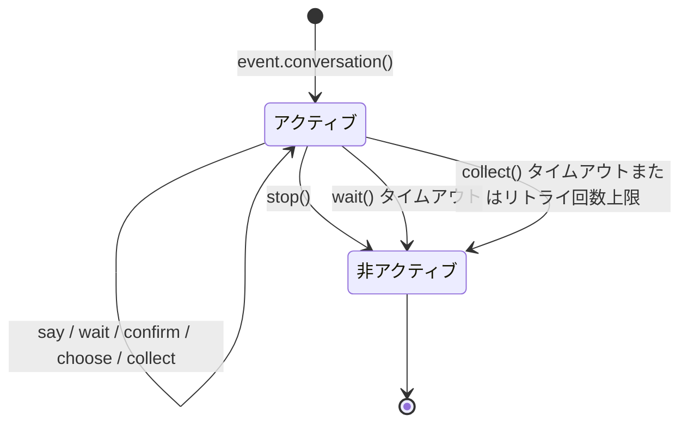

# Conversation 多輪対話

`Conversation` クラスは、同じセッション内で複数回のインタラクションを行うための便利なメソッドを提供し、ガイド付き操作、情報収集、対話型の質問応答などのシナリオに適しています。

# Conversation Multi-turn Dialogue

The `Conversation` class provides convenient methods for conducting multi-turn interactions within the same session, suitable for scenarios such as guided operations, information collection, and conversational question-and-answer.


## 会話の作成

`Event` オブジェクトの `conversation()` メソッドを使用して会話を作成します：

```python
from ErisPulse.Core.Event import command

@command("quiz")
async def quiz_handler(event):
    conv = event.conversation(timeout=30)

    await conv.say("🎮 知識クイズへようこそ！")

    answer = await conv.choose("第1問：Pythonの生みの親は誰ですか？", [
        "Guido van Rossum",
        "James Gosling",
        "Dennis Ritchie",
    ])

    if answer is None:
        await conv.say("タイムアウトしました。また挑戦してください！")
        return

    if answer == 0:
        await conv.say("正解です！")
    else:
        await conv.say("不正解です。正解は Guido van Rossum です。")

    conv.stop()
```

[**English**](docs/en/quick-start.md) | [**简体中文**](docs/ja/quick-start.md) | [**日本語**](docs/ja/quick-start.md)

## コア API

### say(content, **kwargs)

メッセージを送信し、`self` を返してメソッドチェーンを可能にします：

```python
await conv.say("第一行").say("第二行").say("第三行")
```

送信方法を指定することもできます：

```python
await conv.say("https://example.com/image.jpg", method="Image")
```

### wait(prompt=None, timeout=None)

ユーザーからの返信を待ち、`Event` オブジェクトまたは `None`（タイムアウト時）を返します：

```python
# 簡単な待機
resp = await conv.wait()
if resp:
    text = resp.get_text()

# プロンプトを送信して待機
resp = await conv.wait(prompt="あなたの名前を入力してください：")

# カスタムタイムアウトを使用（対話のデフォルトタイムアウトを上書き）
resp = await conv.wait(prompt="10秒以内に返信してください：", timeout=10)
```

### confirm(prompt=None, **kwargs)

ユーザーの確認（はい/いいえ）を待ち、`True` / `False` / `None`（タイムアウト時）を返します：

```python
result = await conv.confirm("すべてのデータを削除してもよろしいですか？")
if result is True:
    await conv.say("削除しました")
elif result is False:
    await conv.say("キャンセルしました")
else:
    await conv.say("タイムアウトしました")
```

内部的に認識される確認用語：`はい/yes/y/確認/確定/好/ok/true/対/うん/行/同意/問題ない/可能/当然...`

内部的に認識される否定用語：`否/no/n/キャンセル/不/不要/行かない/cancel/false/間違っている/対でない/別/拒否...`

### choose(prompt, options, **kwargs)

ユーザーが選択肢から選択するのを待ち、選択肢のインデックス（0ベース）または `None` を返します：

```python
choice = await conv.choose("色を選択してください：", ["赤", "緑", "青"])
if choice is not None:
    colors = ["赤", "緑", "青"]
    await conv.say(f"選択した色は {colors[choice]} です")
```

ユーザーは番号（`1`/`2`/`3`）または選択肢のテキスト（`赤`）を入力して選択できます。

`options_format="auto"`（デフォルト）は、method に応じて自動的に組み込みのスタイルを選択します：Markdown→無序リスト、Html→順序リスト、その他→プレーンテキストのリスト。
また、`"list"`、`"inline"`、`"md"`、`"html"`、またはカスタム関数もサポートしています。

`merge_prompt=True` を使用して、プロンプトを1つのメッセージに統合し、オプションの挿入位置を制御するプレースホルダー（デフォルトは `{options}`、`placeholder` でカスタム指定可能）もサポートしています：

```python
choice = await conv.choose(
    "## 選択してください\n{options}",
    ["オプションA", "オプションB"],
    method="Markdown",
    merge_prompt=True,
)

# カスタムプレースホルダー
choice = await conv.choose(
    "選択してください: [choices]",
    ["オプションA", "オプションB"],
    placeholder="[choices]",
)
```

### collect(fields, **kwargs)

複数ステップで情報を収集し、データの辞書または `None` を返します：

```python
data = await conv.collect([
    {"key": "name", "prompt": "名前を入力してください"},
    {"key": "age", "prompt": "年齢を入力してください",
     "validator": lambda e: e.get("alt_message", "").strip().isdigit(),
     "retry_prompt": "年齢は数字でなければなりません。もう一度入力してください"},
    {"key": "city", "prompt": "都市を入力してください"},
])

if data:
    await conv.say(f"登録が完了しました！\n名前: {data['name']}\n年齢: {data['age']}\n都市: {data['city']}")
else:
    await conv.say("登録が中断されました")
```

フィールド設定：

| パラメータ | 説明 | デフォルト値 |
|------|------|--------|
| `key` | フィールドのキー名（必須） | - |
| `prompt` | プロンプトメッセージ | `"{key} を入力してください"` |
| `validator` | 関数を受け取り、bool を返すバリデータ | 無し |
| `retry_prompt` | バリデーション失敗時の再入力プロンプト | `"入力が無効です。もう一度入力してください"` |
| `max_retries` | 最大リトライ回数 | 3 |
| `condition` | 関数を受け取り、dict を返す条件 | 無し |

**条件付きフィールド**：`condition` を使用すると、動的なフォームを実現でき、条件が満たされた場合にのみフィールドを収集できます：

```python
data = await conv.collect([
    {"key": "has_car", "prompt": "車をお持ちですか？（はい/いいえ）"},
    {"key": "car_brand", "prompt": "車種を入力してください",
     "condition": lambda d: d.get("has_car", "").lower() in ("はい", "yes", "y")},
])
```

### stop()

手動で対話を終了し、`is_active` を `False` に設定します：

```python
conv.stop()
```

### is_active

対話がアクティブかどうかを返します：

```python
if conv.is_active:
    await conv.say("対話はまだ進行中です")

## アクティブ状態管理



会話は以下のいずれかの状況で自動的に非アクティブ状態になります：

1. `stop()` メソッドを呼び出す
2. `wait()` がタイムアウトして `None` を返す
3. `collect()` がステップのタイムアウトまたはリトライ回数上限により `None` を返す

非アクティブ状態になると、すべてのインタラクションメソッド（`wait`/`confirm`/`choose`/`collect`）は即座に `None` を返し、ユーザー入力の待機は継続されません。

## 分岐とジャンプ

### @conv.branch(name) デコレータ

`branch()` を使用して会話の分岐を登録し、`goto()` を使用して分岐間でジャンプします：

```python
@command("menu")
async def menu_handler(event):
    conv = event.conversation(timeout=60)

    @conv.branch("main")
    async def main_menu():
        await conv.say("=== メインメニュー ===\n1. 本人情報\n2. 設定\n3. 終了")
        resp = await conv.wait()
        if resp is None:
            return
        text = resp.get_text().strip()
        if text == "1":
            await conv.goto("profile")
        elif text == "2":
            await conv.goto("settings")
        elif text == "3":
            await conv.say("さようなら！")
            conv.stop()

    @conv.branch("profile")
    async def profile():
        await conv.say("=== 本人情報 ===\n名前: Alice\n0. 戻る")
        resp = await conv.wait()
        if resp and resp.get_text().strip() == "0":
            await conv.goto("main")

    @conv.branch("settings")
    async def settings():
        await conv.say("=== 設定 ===\n1. 通知の切り替え\n0. 戻る")
        resp = await conv.wait()
        if resp and resp.get_text().strip() == "0":
            await conv.goto("main")

    await conv.start()  # 最初に登録された分岐から開始
```

### conv.start(name=None)

会話を開始します。デフォルトでは最初に登録された分岐から開始されます：

```python
await conv.start()          # 最初の分岐から開始
await conv.start("settings") # 指定された分岐から開始

## コンテキストと永続化

### conv.context

各会話インスタンスには、分岐間で状態を共有するための組み込み `context` 辞書があります：

```python
@conv.branch("step1")
async def step1():
    conv.context["username"] = resp.get_text().strip()
    await conv.goto("step2")

@conv.branch("step2")
async def step2():
    name = conv.context.get("username", "未知")
    await conv.say(f"こんにちは、{name}！")
```

### save() / resume() / clear_saved()

会話は永続化をサポートしており、タイムアウトや中断後に再開できます：

```python
# 会話の状態を保存
conv_id = conv.save()
# conv_id = "user_123_group_456"  # ユーザーとグループに基づいて自動生成

# ... その後、同じセッションで再開 ...
conv2 = event.conversation()
if conv2.resume():
    await conv2.say("おかえり！以前の会話を続けましょう")
else:
    await conv2.say("以前の会話が見つかりません")

# 保存された会話を削除
conv.clear_saved()
```

**言語切り替え:**
[English](docs/en/quick-start.md) | [简体中文](docs/ja/quick-start.md) | [日本語](docs/ja/quick-start.md)

## 典型的なフローのパターン

### ガイド付き登録

```python
@command("register")
async def register_handler(event):
    conv = event.conversation(timeout=60)

    await conv.say("ようこそ登録へ！")

    data = await conv.collect([
        {"key": "username", "prompt": "ユーザー名を入力してください（3-20文字）",
         "validator": lambda e: 3 <= len(e.get_text().strip()) <= 20},
        {"key": "email", "prompt": "メールアドレスを入力してください",
         "validator": lambda e: "@" in e.get_text() and "." in e.get_text(),
         "retry_prompt": "メールアドレスの形式が正しくありません。再度入力してください。"},
    ])

    if not data:
        await event.reply("登録がキャンセルされました")
        return

    confirmed = await conv.confirm(
        f"登録情報を確認しますか？\nユーザー名: {data['username']}\nメールアドレス: {data['email']}"
    )

    if confirmed:
        await conv.say("✅ 登録が完了しました！")
    else:
        await conv.say("❌ 登録がキャンセルされました")
```

### ループによる対話

```python
@command("chat")
async def chat_handler(event):
    conv = event.conversation(timeout=120)
    await conv.say("対話モードに入りました。「退出」で終了します")

    while conv.is_active:
        resp = await conv.wait()
        if resp is None:
            await conv.say("タイムアウトしました。対話が終了します")
            break

        text = resp.get_text().strip()

        if text == "退出":
            await conv.say("さようなら！")
            conv.stop()
        elif text == "帮助":
            await conv.say("利用可能なコマンド：退出、帮助、状态")
        elif text == "状态":
            await conv.say("対話がアクティブです")
        else:
            await conv.say(f"あなたが入力した内容：{text}")

## 関連ドキュメント

- [Event 包装クラス](../developer-guide/modules/event-wrapper.md) - Event オブジェクトのすべてのメソッド
- [イベント処理の入門](../getting-started/event-handling.md) - イベント処理の基礎