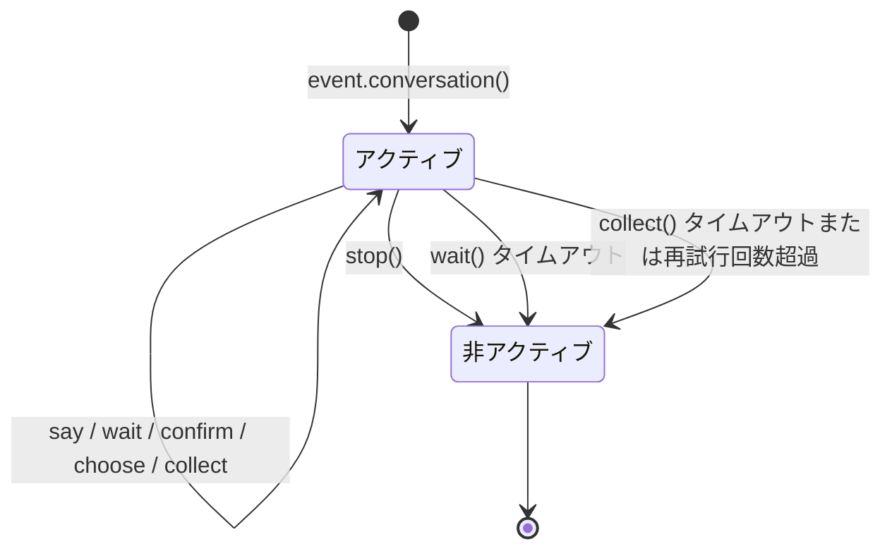

# Conversation 多輪対話

`Conversation` クラスは、同じ会話の中で複数のやりとりを行うための便利なメソッドを提供します。ガイド付き操作、情報収集、対話式の質問応答などのシナリオに適しています。

## 対話の作成

`Event` オブジェクトの `conversation()` メソッドを使用して作成します：

```python
from ErisPulse.Core.Event import command

@command("quiz")
async def quiz_handler(event):
    conv = event.conversation(timeout=30)

    await conv.say("🎮 知識クイズへようこそ！")

    answer = await conv.choose("第1問：Pythonの生みの親は誰ですか？", [
        "Guido van Rossum",
        "James Gosling",
        "Dennis Ritchie",
    ])

    if answer is None:
        await conv.say("タイムアウトしました。また次回お試しください！")
        return

    if answer == 0:
        await conv.say("正解です！")
    else:
        await conv.say("不正解です。正解は Guido van Rossum です")

    conv.stop()
```

## コア API

### say(content, **kwargs)

メッセージを送信し、`self` を返してメソッドチェーンを可能にします：

```python
await conv.say("1行目").say("2行目").say("3行目")
```

送信方法を指定することもできます：

```python
await conv.say("https://example.com/image.jpg", method="Image")
```

### wait(prompt=None, timeout=None)

ユーザーからの返信を待機し、`Event` オブジェクトまたは `None`（タイムアウト）を返します：

```python
# 単純な待機
resp = await conv.wait()
if resp:
    text = resp.get_text()

# プロンプトを送信して待機
resp = await conv.wait(prompt="名前を入力してください：")

# カスタムタイムアウトを使用（対話のデフォルトタイムアウトを上書き）
resp = await conv.wait(prompt="10秒以内に返信してください：", timeout=10)
```

### confirm(prompt=None, **kwargs)

ユーザーの確認（はい/いいえ）を待機し、`True` / `False` / `None`（タイムアウト）を返します：

```python
result = await conv.confirm("すべてのデータを削除してもよろしいですか？")
if result is True:
    await conv.say("削除しました")
elif result is False:
    await conv.say("キャンセルしました")
else:
    await conv.say("タイムアウトしました")
```

内蔵の確認用語：`はい/yes/y/確認/確定/好/ok/true/対/うん/行/同意/問題ない/可能/当然...`

内蔵の否定用語：`否/no/n/キャンセル/不/不要/行かない/cancel/false/間違った/間違った/別/拒否...`

### choose(prompt, options, **kwargs)

ユーザーが選択肢から選ぶのを待機し、選択肢のインデックス（0ベース）または `None` を返します：

```python
choice = await conv.choose("色を選択してください：", ["赤", "緑", "青"])
if choice is not None:
    colors = ["赤", "緑", "青"]
    await conv.say(f"選択した色は {colors[choice]} です")
```

ユーザーは番号（`1`/`2`/`3`）または選択肢のテキスト（`赤`）を入力して選択できます。

`options_format="auto"`（デフォルト）は、method に応じて自動的に内蔵のスタイルを選択します：Markdown→無序リスト、Html→順序付きリスト、その他→純粋なテキストリスト。
また、`"list"`、`"inline"`、`"md"`、`"html"`、またはカスタム関数もサポートします。

`merge_prompt=True` を使用して、プロンプトと選択肢を1つのメッセージに統合することもできます。また、オプション挿入位置を制御するプレースホルダ（デフォルトは `{options}`、`placeholder` でカスタマイズ可能）もサポートします：

```python
choice = await conv.choose(
    "## 選択してください\n{options}",
    ["オプションA", "オプションB"],
    method="Markdown",
    merge_prompt=True,
)

# カスタムプレースホルダ
choice = await conv.choose(
    "選択してください: [choices]",
    ["オプションA", "オプションB"],
    placeholder="[choices]",
)
```

### collect(fields, **kwargs)

複数ステップで情報を収集し、データ辞書または `None` を返します：

```python
data = await conv.collect([
    {"key": "name", "prompt": "名前を入力してください"},
    {"key": "age", "prompt": "年齢を入力してください",
     "validator": lambda e: e.get("alt_message", "").strip().isdigit(),
     "retry_prompt": "年齢は数字でなければなりません。再度入力してください"},
    {"key": "city", "prompt": "都市を入力してください"},
])

if data:
    await conv.say(f"登録完了！\n名前: {data['name']}\n年齢: {data['age']}\n都市: {data['city']}")
else:
    await conv.say("登録が中断されました")
```

フィールドの設定：

| パラメータ | 説明 | デフォルト値 |
|------|------|--------|
| `key` | フィールドのキー名（必須） | - |
| `prompt` | プロンプトメッセージ | `"{key} を入力してください"` |
| `validator` | 関数、Event を受け取り、bool を返す | なし |
| `retry_prompt` | 検証失敗時の再試行プロンプト | `"入力が無効です。再度入力してください"` |
| `max_retries` | 最大再試行回数 | 3 |
| `condition` | 関数、既に収集されたデータの辞書を受け取り、bool を返す | なし |

**条件付きフィールド**：`condition` を使用して、条件が満たされた場合にのみフィールドを収集する動的フォームを実現できます：

```python
data = await conv.collect([
    {"key": "has_car", "prompt": "車をお持ちですか？（はい/いいえ）"},
    {"key": "car_brand", "prompt": "車のブランドを入力してください",
     "condition": lambda d: d.get("has_car", "").lower() in ("はい", "yes", "y")},
])
```

### stop()

手動で対話を終了し、`is_active` を `False` に設定します：

```python
conv.stop()
```

### is_active

対話がアクティブかどうかを返します：

```python
if conv.is_active:
    await conv.say("対話はまだ進行中です")
```

## アクティブ状態の管理


```mermaid
stateDiagram-v2
    state "アクティブ" as active
    state "非アクティブ" as inactive
    [*] --> active: event.conversation()
    active --> active: say / wait / confirm / choose / collect
    active --> inactive: stop()
    active --> inactive: wait() タイムアウト
    active --> inactive: collect() タイムアウトまたは再試行回数超過
    inactive --> [*]
```

以下の状況で対話は自動的に非アクティブになります：

1. `stop()` メソッドを呼び出す
2. `wait()` がタイムアウトして `None` を返す
3. `collect()` がステップのタイムアウトまたは再試行回数超過で `None` を返す

非アクティブになった後、`wait`/`confirm`/`choose`/`collect` のすべてのインタラクションメソッドは即座に `None` を返し、ユーザーからの入力を待続しません。

## 分岐とジャンプ

### @conv.branch(name) デコレータ

`branch()` を使用して対話の分岐を登録し、`goto()` で分岐間をジャンプします：

```python
@command("menu")
async def menu_handler(event):
    conv = event.conversation(timeout=60)

    @conv.branch("main")
    async def main_menu():
        await conv.say("=== メインメニュー ===\n1. 本人情報\n2. 設定\n3. 終了")
        resp = await conv.wait()
        if resp is None:
            return
        text = resp.get_text().strip()
        if text == "1":
            await conv.goto("profile")
        elif text == "2":
            await conv.goto("settings")
        elif text == "3":
            await conv.say("さようなら！")
            conv.stop()

    @conv.branch("profile")
    async def profile():
        await conv.say("=== 本人情報 ===\n名前: Alice\n0. 戻る")
        resp = await conv.wait()
        if resp and resp.get_text().strip() == "0":
            await conv.goto("main")

    @conv.branch("settings")
    async def settings():
        await conv.say("=== 設定 ===\n1. 通知のオン/オフ\n0. 戻る")
        resp = await conv.wait()
        if resp and resp.get_text().strip() == "0":
            await conv.goto("main")

    await conv.start()  # 最初に登録された分岐から開始
```

### conv.start(name=None)

対話を開始し、デフォルトでは最初に登録された分岐から開始します：

```python
await conv.start()          # 最初の分岐から開始
await conv.start("settings") # 指定された分岐から開始
```

## コンテキストと永続化

### conv.context

各対話インスタンスには、分岐間で状態を共有するための `context` 辞書が内蔵されています：

```python
@conv.branch("step1")
async def step1():
    conv.context["username"] = resp.get_text().strip()
    await conv.goto("step2")

@conv.branch("step2")
async def step2():
    name = conv.context.get("username", "未知")
    await conv.say(f"こんにちは、{name}！")
```

### save() / resume() / clear_saved()

対話は永続化をサポートし、タイムアウトや中断後に復元できます：

```python
# 対話状態を保存する（通常は手動で呼び出す必要はありません、下記の「自動チェックポイント」を参照）
await conv.save()

# ... その後、同じセッションで復元する ...
conv2 = event.conversation()
if await conv2.resume():
    await conv2.say("お帰りなさい！以前の対話を続けましょう")
else:
    await conv2.say("以前の対話は見つかりませんでした")

# 保存された対話を削除する
await conv.clear_saved()
```

ストレージキーにはターゲットの次元が含まれます（`conversation:{platform}:{user_id}:{target_id}`）、同じユーザーの異なるセッション間の対話は互いに上書きされません。`resume()` 時に、ターゲットを含まない旧形式のアーカイブは自動的に移行されます。

## 自動チェックポイントと再起動時の復元

### 自動アーカイブ

フレームワークは以下のタイミングで自動的にチェックポイントを管理します。通常、`save()` を手動で呼び出す必要はありません：

| 時機 | 行動 |
|------|------|
| `goto()` / `start()` で分岐をジャンプする | 自動保存（現在の分岐 + context） |
| `stop()` / `wait()` タイムアウト / `collect()` 失敗 | 自動削除（対話の終端状態） |

### チェックポイント TTL

アーカイブにはタイムスタンプが付いており、`ErisPulse.interaction.checkpoint_ttl`（デフォルト 24 時間）を超えるアーカイブはクリーンアップされます：

- **惰性削除**：復元時にアーカイブが期限切れであることが判明した場合、自動的に削除されます
- **バックグラウンドの自動クリーンアップ**：フレームワークには定期的な GC タスクがあり、最初にチェックポイントを使用した後に惰性で起動され、期限切れのアーカイブを列挙して削除し、長期稼働時にストレージ内の期限切れのチェックポイントが無限に蓄積されることを防ぎます。自動的にクリーンアップされたアーカイブは、その後会話メッセージを受け取った場合、"チェックポイントなし"として扱われます

```toml
[ErisPulse.interaction]
checkpoint_ttl = 86400  # 秒
```

### 再起動時の自動復元

フレームワークが再起動した後、メモリ内の待機中のコルーチンは失われますが、チェックポイントは残ります。`register_resume_handler` を使用して**復元ファクトリ**を登録することで、フレームワークは再起動後にその会話の最初のメッセージを受け取ったときに自動的に対話を継続します：

```python
from ErisPulse.Core.Event.wrapper import Conversation

@Conversation.register_resume_handler()  # platform="onebot11" を渡すことでプラットフォームを限定することも可能
def make_conversation(event) -> Conversation:
    # ファクトリの役割：対話を再構築し、すべての分岐を再登録する
    conv = event.conversation(timeout=60)

    @conv.branch("menu")
    async def menu(conv, event):
        ...

    return conv
```

登録後、`menu` 分岐にあったユーザーが再起動前に最初のメッセージを送信した場合、フレームワークは自動的に：コンテキストを復元 → そのメッセージを認証 → 保存された分岐から対話を継続します。ファクトリを登録していない場合、このメカニズムは無駄なコストがかかりません。

### 復元は即座に引き継ぎ

`resume()` が成功した場合、フレームワークは自動的に2つのことを完了します：

1. **セッションの引き継ぎ**：自動的にそのセッションの排他リースを取得します——他のモジュールは `sdk.interaction.get_owner_of(event)` を使用して「このユーザーが対話で占有されている」ことを感知できます；セッションが他のモジュールによって占有されている場合、復元は失敗（False を返す）し、2つの対話が競合することを防ぎます
2. **履歴の持ち込み**：会話の受信箱から最近の10件のメッセージを `conv.recent_history` に取り込みます（AI モジュールが復元された後、LLM のコンテキストが途切れません）；`resume(with_history=0)` でこの機能をオフにできます

```python
if await conv.resume(with_history=20):
    for m in conv.recent_history:
        print(m["role"], ":", m["text"])
```

### 手動復元（自動メカニズムを使用しない場合）

```python
@command("continue")
async def continue_handler(event):
    conv = event.conversation()
    # ... 分岐を登録する ...
    if await conv.resume():
        conv.goto(conv.get_current_branch())
```

## 代表的なフロー・パターン

### ガイド付き登録

```python
@command("register")
async def register_handler(event):
    conv = event.conversation(timeout=60)

    await conv.say("ようこそ、登録へ！")

    data = await conv.collect([
        {"key": "username", "prompt": "ユーザー名を入力してください（3-20文字）",
         "validator": lambda e: 3 <= len(e.get_text().strip()) <= 20},
        {"key": "email", "prompt": "メールアドレスを入力してください",
         "validator": lambda e: "@" in e.get_text() and "." in e.get_text(),
         "retry_prompt": "メールアドレスの形式が正しくありません。再度入力してください"},
    ])

    if not data:
        await event.reply("登録がキャンセルされました")
        return

    confirmed = await conv.confirm(
        f"登録情報を確認しますか？\nユーザー名: {data['username']}\nメールアドレス: {data['email']}"
    )

    if confirmed:
        await conv.say("✅ 登録完了！")
    else:
        await conv.say("❌ 登録がキャンセルされました")
```

### ループ対話

```python
@command("chat")
async def chat_handler(event):
    conv = event.conversation(timeout=120)
    await conv.say("対話モードに入りました。「終了」で終了します")

    while conv.is_active:
        resp = await conv.wait()
        if resp is None:
            await conv.say("タイムアウトしました。対話は終了します")
            break

        text = resp.get_text().strip()

        if text == "終了":
            await conv.say("さようなら！")
            conv.stop()
        elif text == "help":
            await conv.say("利用可能なコマンド：終了、help、status")
        elif text == "status":
            await conv.say("対話はアクティブです")
        else:
            await conv.say(f"あなたが言ったのは：{text}")
```

## 関連ドキュメント

- [Event 包装クラス](../developer-guide/modules/event-wrapper.md) - Event オブジェクトのすべてのメソッド
- [イベント処理の入門](../getting-started/event-handling.md) - イベント処理の基礎