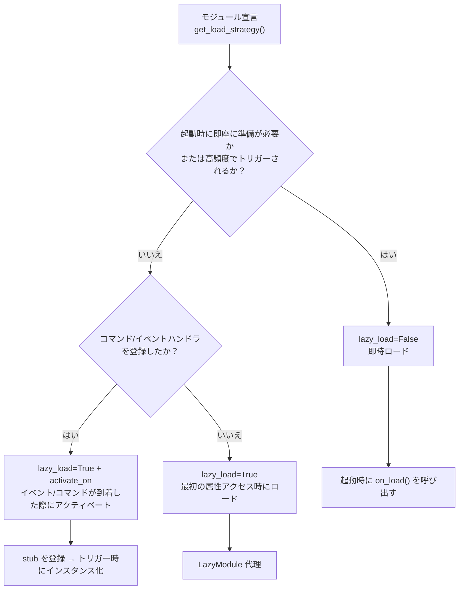

# ラグ遅延ロードモジュールシステム

ErisPulse SDK は強力なラグ遅延ロードモジュールシステムを提供しており、モジュールを実際に必要になるまで初期化しないことで、アプリケーションの起動速度とメモリ効率を大幅に向上させることができます。

[**English**](docs/en/quick-start.md) | [**日本語**](docs/ja/quick-start.md) | [**简体中文**](docs/ja/quick-start.md) | [**한국어**](docs/ko/quick-start.md)

## 概要

ErisPulseのラジオロードモジュールシステムは、以下の方法で動作するコア機能の1つです：

- **遅延初期化**：モジュールは、初めてアクセスされたときにのみ実際にロードおよび初期化されます
- **透明な使用**：開発者にとって、ラジオロードモジュールは通常のモジュールとほとんど区別がつきません
- **自動依存管理**：モジュールの依存関係は、使用時に自動的に初期化されます
- **ライフサイクルサポート**：`BaseModule` を継承するモジュールに対しては、ライフサイクルメソッドが自動的に呼び出されます

[**English**](docs/en/overview.md) | [**日本語**](docs/ja/overview.md) | [**简体中文**](docs/ja/overview.md)

## 動作原理

### LazyModule クラス

遅延ロードシステムの中心となるのは `LazyModule` クラスです。これは、最初にアクセスされたときにのみモジュールを実際に初期化するラッパーです。

### 初期化プロセス

モジュールが初めてアクセスされたとき、`LazyModule` は以下の操作を実行します：

1. モジュールクラスの `__init__` パラメータ情報を取得します
2. パラメータに基づいて `sdk` リファレンスを渡すかどうかを決定します
3. モジュールの `moduleInfo` 属性を設定します
4. `BaseModule` を継承したモジュールの場合、`on_load` メソッドを呼び出します
5. `module.init` ライフサイクルイベントをトリガーします

[**English**](docs/ja/quick-start.md)

## イベント駆動型遅延起動（activate_on）

> [!NOTE]
> この機能は ErisPulse **2.8.0+** が必要です。

`lazy_load=True` のモジュールはデフォルトで**最初の属性アクセス時**にのみロードされます。モジュールがコマンド/イベントハンドラを登録している場合、従来の方法では `lazy_load=False` にして即時ロードするしかありませんでした。`activate_on` は第三の選択肢を提供します：**トリガを宣言し、最初の一致するイベント/コマンドが到着した時点でモジュールを自動的にアクティブ化する**——メモリ上に常駐させることなく、トリガのエントリポイントを失うこともありません。

```python
from ErisPulse.loaders import ModuleLoadStrategy

class MyModule(BaseModule):
    @staticmethod
    def get_load_strategy():
        return ModuleLoadStrategy(
            lazy_load=True,
            activate_on=[
                # ---- イベントトリガ（受動的到着、ユーザーの意識を必要としない）----
                "message",                                    # タイプレベル：任意のメッセージイベント
                {"notice": "group_member_increase"},          # タイプ + 単一 detail_type
                {"message": ["private", "group"]},            # タイプ + 複数 detail_type

                # ---- コマンドトリガ（能動的な入力、Help で表示されるプレースホルダーコマンド）----
                {"command": "roll"},                          # 略記：コマンド名
                {"command": ["roll", "dice"]},                # コマンド名リスト
                {"command": {                                 # dict 形式の宣言（name は必須）
                    "name": "dice",
                    "help": "サイコロを振る",
                    "usage": "/dice",
                    "group": "娯楽",
                    "aliases": ["d"],
                    "hidden": False,
                }},
            ],
        )
```

### コマンド dict 形式の宣言パラメータ

dict 形式は `@command()` デコレーターのユーザー側パラメータをミラーしており、モジュールのロード前にプレースホルダーコマンドを登録するのに使用されます：

| パラメータ | 型 | デフォルト | 説明 |
|------|------|------|------|
| `name` | `str` | **必須** | コマンド名；`on_load` 内の `@command(name)` と一致する必要がある。一致しないと、アクティブ化後にプレースホルダーが削除され、コマンドが存在しなくなる |
| `help` | `str` | フォールバックチェーン | Help に表示される説明；宣言されていない場合はフォールバックチェーンから値を取得する（下記参照） |
| `usage` | `str` | 自動生成 | 使用方法行；デフォルトは `{prefix}{name}` |
| `group` | `str` | `None` | コマンドグループ |
| `aliases` | `list[str]` | `[]` | 別名も同時に登録され、**別名の入力でもアクティブ化がトリガされる** |
| `hidden` | `bool` | `False` | `True` の場合、プレースホルダーコマンドも非表示（アクティブ化後の実際のコマンドの非表示の意味と一致）；コマンド名を知っているユーザーが入力してもトリガされる |

**サポートされていない** `priority` / `permission` / `master`：プレースホルダーコマンドの役割はアクティブ化のトリガのみであり、権限チェックはアクティブ化後の実際のコマンドが実行する（プレースホルダー段階で権限をブロックしてしまうと、「コマンド入力でアクティブ化」が無効になってしまう）。

### プレースホルダーコマンドの help フォールバックチェーン

モジュールがロードされていない場合、Help に表示されるコマンドの説明は以下の順序で値を取得します（取得した時点で終了）：

1. dict 形式で宣言されたコマンドレベルの `help`（最も正確）
2. モジュールの `get_meta()` の `description`
3. モジュールの `__description__` 属性
4. パッケージのメタデータの `Summary`（PyPI パッケージの概要）
5. 一般的なヒント：「このコマンドは遅延ロードモジュール X から来ています。初めて使用すると、そのモジュールが自動的にロードされます」

### トリガの意味

- **イベントスタブ**：対応するイベントマネージャーに非常に低い優先度（`ACTIVATION_STUB_PRIORITY`）で登録され、すべての通常のハンドラの後にバックアップとしてトリガされる。アクティブ化後は、現在のイベントをモジュールの実際のハンドラに転送する
- **コマンドスタブ**：プレースホルダーコマンドを登録する。アクティブ化後は、プレースホルダーが削除され、実際のコマンドがそのトリガを引き継ぐ
- **再入防止**：`asyncio.Lock` を使用して、並行トリガの下でも一度だけアクティブ化されるように保証する
- **スコープフィルタリング**：スタブにはモジュールのオーナーのアイデンティティが含まれており、モジュールが Bot / セッション / プラットフォームに対して有効でない場合はトリガされない
- **失敗時の意味**：アクティブ化に失敗した場合、再試行はせず、スタブも一緒に削除される
- **重複排除**：同名のコマンドが略記 + dict 混合で宣言された場合、重複を排除する（dict が優先）。dict に `name` が欠落している場合、またはイベントの `detail_type` を dict として誤って書いた場合は、警告を出して無視する

> アーキテクチャ図と完全な意味については、[アーキテクチャ概要](../architecture.md#イベント駆動型遅延起動activate_onのトリガアーキテクチャ)を参照してください。

## 懒惰ロードの構成

### グローバル構成

構成ファイルでグローバルな lazy loading を有効または無効にします：

```toml
[ErisPulse.framework]
enable_lazy_loading = true  # true=lazy loadingを有効にする(デフォルト), false=lazy loadingを無効にする
```

### モジュールレベルの制御

モジュールは `get_load_strategy()` 静的メソッドを実装することで、ロード戦略を制御できます：

```python
from ErisPulse.Core.Bases import BaseModule
from ErisPulse.loaders import ModuleLoadStrategy

class MyModule(BaseModule):
    @staticmethod
    def get_load_strategy():
        """モジュールのロード戦略を返す"""
        return ModuleLoadStrategy(
            lazy_load=False,  # Falseを返すと即時ロード
            priority=100      # ロード優先度、数値が大きいほど優先度が高い
        )

## ラグロードモジュールの使用

### 基本的な使用方法

開発者にとって、ラグロードモジュールは通常のモジュールと使用方法にほとんど違いはありません：

```python
# SDKを介してラグロードモジュールにアクセス
from ErisPulse import sdk

# 以下のようにアクセスするとモジュールのラグロードがトリガーされます
result = await sdk.my_module.my_method()
```

### モジュールの取得エントリの統一

SDK属性、モジュールマネージャ属性、または`module.get()`を介してアクセスする場合、
「登録済みだがまだロードされていない」ラグロードモジュールに対しては、
すべて同じラグロードプロキシが返されます。プロパティにアクセスすることで、
実際に初期化がトリガーされます：

```python
# 3つの方法で取得されるのはすべてラグロードプロキシ（モジュールがロードされていない場合）、
# 振る舞いは一貫しており、ユーザーには透明です
sdk.my_module          # ロードをトリガーするエントリ
sdk.module.my_module   # 同じくラグロードプロキシを返します
sdk.module.get("my_module")  # ラグロードプロキシを返しますが、ロードはトリガーしません

# プロキシの任意のプロパティにアクセスすることで、実際にモジュールの初期化が行われます
result = await sdk.my_module.my_method()
```

`module.get()`は**検索**インターフェースであり、ロードをトリガーしません：
- モジュールがロード済み → 実際のインスタンスを返します
- モジュールが登録済みだがロードされていない → ラグロードプロキシを返します（プロパティにアクセスして初めて初期化されます）
- モジュールが登録されていない → `None`を返します

明示的にロードをトリガーしたい場合は、`await sdk.load_module("my_module")`を使用してください。

### 非同期初期化

非同期初期化が必要なモジュールについては、まず明示的にロードすることを推奨します：

```python
# まずモジュールを明示的にロードします
await sdk.load_module("my_module")

# その後、モジュールを使用します
result = await sdk.my_module.my_method()
```

### 同期初期化

非同期初期化を必要としないモジュールについては、直接アクセスできます：

```python
# 直接アクセスすると自動的に同期初期化されます
result = sdk.my_module.some_sync_method()

## 最佳実践

ロード戦略を選択する際には、以下の意思決定フローを参考にしてください：



### lazy_load=True を推奨するシナリオ

- 他のモジュールによって呼び出されるだけの受動的なユーティリティモジュール（例：データクエリモジュール、フォーマット変換器など）
- コマンド/イベントハンドラを登録しているが高頻度で使用されないモジュール — `activate_on` でトリガーを宣言し、最初の一致するイベント/コマンドが到着した際に自動的にアクティベートするため、遅延ロードを放棄する必要がない

### lazy_load=False を推奨するシナリオ

- 起動時に即座に準備が必要なモジュール（他のモジュールに基礎サービスを提供するコアモジュールなど）
- 高頻度でトリガーされるリスナー（各メッセージを処理する必要がある） — `activate_on` の転送には一度のアクティベートオーバーヘッドがあるため、高頻度のシナリオでは即時ロードの方が直接的
- 定時タスクモジュール
- アプリケーション起動時に初期化が必要なモジュール

> `priority` パラメータは、即時ロードモジュール間の初期化順序を制御し、値が大きいほど先に初期化されます。同じ優先度のモジュールは登録順にロードされます。

[**English**](docs/en/quick-start.md) | [**日本語**](docs/ja/quick-start.md) | [**简体中文**](docs/ja/quick-start.md) | [**繁體中文**](docs/zh-TW/quick-start.md)

## 注意事項

1. モジュールが遅延ロードを使用している場合、ErisPulse内で他のモジュールが一度も呼び出されたことがない場合、そのモジュールは決して初期化されません。
2. モジュールにイベントをリッスンするモジュール、またはその他の類似モジュールを積極的にリッスンするモジュールが含まれている場合、2つの選択肢があります：`activate_on` トリガーを宣言して遅延ロードを維持し、イベントが到着したときに自動的にアクティブ化するか、または即時ロードが必要であることを宣言する（`lazy_load=False`）、さもなければモジュールの正常な業務に影響を与える可能性があります。
3. 特殊な要件がない限り、遅延ロードを無効にすることは推奨しません。そうしないと、依存管理やライフサイクルイベントなどの問題が発生する可能性があります。
4. `activate_on` のコマンド dict 声明において、`name` はモジュールの `on_load` 中の `@command()` で登録された実際のコマンド名と一致している必要があります。一致していない場合、モジュールがアクティブ化された後にプレースホルダーコマンドが登録解除され、宣言と実装が一致しないコマンドは存在しません。

[**English**](docs/en/advanced.md) | [**日本語**](docs/ja/advanced.md)

## 関連ドキュメント

- [モジュール開発ガイド](../developer-guide/modules/getting-started.md) - モジュールの開発方法を学ぶ
- [ベストプラクティス](../developer-guide/modules/best-practices.md) - さらにベストプラクティスを学ぶ