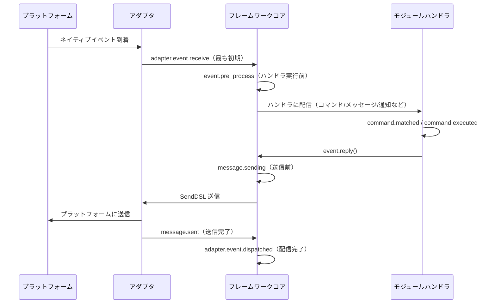

# ライフサイクル管理

ErisPulse は、システムの各コンポーネントの実行状態を監視し、監査、統計、カスタムロジックなどの拡張機能を実現するための統一されたフック/ライフサイクルシステムを提供します。

システムは以下の3つのトリガー方式をサポートします：
- `await lifecycle.emit("event", data)` — 精簡版、任意のデータを渡す（`to="Owner"` の場合、指定された宛先に投递）
- `lifecycle.emit_sync("event", data)` — 同期版（非非同期コンテキスト用）
- `await lifecycle.submit_event("event", ...)` — 従来版と互換性があり、標準イベント形式を自動的に構築

## イベント処理メカニズム

### ハンドラの登録

```python
from ErisPulse import sdk

# デコレータ形式
@sdk.lifecycle.on("module.load")
async def on_module_load(data):
    print(f"モジュールのロード: {data}")

# プログラム的な登録
sdk.lifecycle.register("module.load", on_module_load, priority=10)

# 登録解除
sdk.lifecycle.unregister("module.load", on_module_load)

# 所有者ごとの一括登録解除（モジュール/アダプタのアンロード時にフレームワークが自動的に呼び出す）
removed = sdk.lifecycle.unregister_by_owner("MyModule")
print(f"クリーンアップしたライフサイクルフック数: {removed}")
```

### 優先度

ハンドラは `priority` パラメータをサポートし、数値が大きいほど先に実行されます（モジュールローダーと同様）：

```python
@sdk.lifecycle.on("adapter.event.receive", priority=10)  # 最初に実行
async def first_handler(data):
    pass

@sdk.lifecycle.on("adapter.event.receive", priority=0)  # 後に実行
async def second_handler(data):
    pass
```

### ポイント構造イベント

具体的なイベントをトリガーすると、その親イベントもトリガーされます：
- `module.load` をトリガーすると、`module` もトリガーされます
- `adapter.event.receive` をトリガーすると、`adapter.event` と `adapter` もトリガーされます

### ワイルドカード

`*` を登録すると、すべてのイベントをキャッチできます：

```python
@sdk.lifecycle.on("*")
async def on_anything(data):
    print(f"イベント受信: {data}")
```

### 指定送信（emit to=）

> [!NOTE]
> この機能は ErisPulse **2.8.0+** が必要です。

`emit()` で `to` パラメータを指定すると、指定された所有者（owner）として登録されたハンドラにのみイベントが配信されます（モジュールは `on_load` 内で登録されたフックは自動的に自身の所有者に属します）。他のモジュールやワイルドカード `*` ハンドラは感知しません。

```python
# 送信側：イベントは Chat モジュールが登録したフックにのみ配信される
await sdk.lifecycle.emit("message_received", {"text": "hi"}, to="Chat")

# 受信側（Chat モジュール内）：同名のフックを登録し、owner は登録時に自動的に記録
@sdk.lifecycle.on("message_received")
async def on_message_received(data): ...

@sdk.lifecycle.on("message")   # ポイント構造の親プレフィックスも同様に効果あり（owner でフィルタリング）
async def on_any(data): ...
```

- 目標の owner に登録されたフックがない場合 → イベントは**静かに破棄**されます（`has_handlers()` で事前に検出可能）
- `data` が dict の場合、自動的に `_trace_id` を付与（既存値を上書きしない）
- `emit_sync` / `submit_event` も同様に `to=` パラメータをサポート
- モジュール間通信の3層モデル（RPC / 指定送信 / ブロードキャスト）は
  [モジュール間通信](module-communication.md) を参照してください

### 一回限りの登録（once）

2.7.0 から、`lifecycle.once()` で登録されたハンドラは**1回実行後に自動的に登録解除**されます。これは「初期準備完了」のような一回限りのフックに適しています。

```python
@sdk.lifecycle.once("core.init.complete")
async def on_first_ready(data):
    print("初期準備完了、以降はトリガーされません")
```

- `on()` と同じ優先度パラメータの意味（`priority` 数値が大きいほど先に実行）
- 自動的に登録解除され、手動での `unregister` は不要
- 同期/非同期のハンドラ両方に対応

### 監視者照会（has_handlers）

ホットパスの短絡処理では、`has_handlers()` を使って監視者がいるかどうかを事前に判断し、不要なイベントのループやタスクスケジューリングを避けることができます。

```python
if sdk.lifecycle.has_handlers("message.sending"):
    await sdk.lifecycle.emit("message.sending", send_ctx)
```

- **正確なイベント名、ワイルドカード `*`、親イベント**の3種類のマッチングをカバー
- 監視者がいない場合、`False` を返し、`emit` を安全にスキップ可能

## フックの断点一覧

プラットフォームからフレームワークに入り、処理が完了するまでの典型的なライフサイクルイベントの順序：



フレームワークは以下のフック断点を内蔵しており、ユーザーは `@sdk.lifecycle.on()` を使って任意の断点を監視し、カスタムロジックを実装できます。

### コア初期化

| フック名 | トリガータイミング | データ |
|---------|---------|------|
| `core.init.start` | SDK 初期化開始 | `{}` |
| `core.init.complete` | SDK 初期化完了 | `{"duration": float, "success": bool, "adapters": {"enabled": [str], "disabled": [str]}, "modules": {"enabled": [str], "disabled": [str]}, "error": str(失敗時のみ)}` |
| `core.uninit.complete` | SDK 反初期化完了 | `{"duration": float, "success": bool, "adapters_closed": int, "modules_unloaded": int, "module_properties_cleared": int, "module_properties_to_clear": [str], "error": str(失敗時のみ)}` |

### 設定変更

| フック名 | トリガータイミング | データ |
|---------|---------|------|
| `config.set` | 設定項目が変更された | `{"key": str, "old_value": Any, "new_value": Any}` |
| `config.updated` | 外部から config.toml を編集した後にツリー全体の変更が検出された | `{"old_config": dict, "new_config": dict, "config_file": str}` |

**例：設定監査**

```python
@sdk.lifecycle.on("config.set")
def audit_config(data):
    print(f"[監査] {data['key']}: {data['old_value']} -> {data['new_value']}")
```

### モジュールのライフサイクル

| フック名 | トリガータイミング | データ |
|---------|---------|------|
| `module.register` | モジュールクラスがマネージャーに登録された | `{"module_name": str, "success": bool}` |
| `module.load` | モジュールのロード完了（インスタンス化成功） | `{"module_name": str, "success": bool}` |
| `module.init` | モジュールの初期化完了（遅延ロード含む） | `{"module_name": str, "success": bool}` |
| `module.unload` | モジュールのアンロード | `{"module_name": str, "success": bool}` |

### アダプタのライフサイクル

| フック名 | トリガータイミング | データ |
|---------|---------|------|
| `adapter.load` | アダプタの登録完了 | `{"platform": str, "success": bool}` |
| `adapter.start` | アダプタの起動 | `{"platforms": [str]}` |
| `adapter.status.change` | アダプタの状態変化 | `{"platform": str, "status": str, "retry_count": int, "error": str(失敗時のみ)}` |
| `adapter.stop` | アダプタの停止 | `{"platforms": [str]}` |
| `adapter.stopped` | アダプタの停止完了 | `{"platforms": [str]}` |
| `adapter.bot.online` | Bot のオンライン | `{"platform": str, "bot_id": str, "info": dict, "status": str}` |
| `adapter.bot.offline` | Bot のオフライン | `{"platform": str, "bot_id": str, "status": str}` |

### イベントの受信と処理

| フック名 | トリガータイミング | データ |
|---------|---------|------|
| `adapter.event.receive` | 外部プラットフォームイベントを受信した（最も初期） | `{"platform": str, "event_type": str, "raw_event_type": str}` |
| `adapter.event.dispatched` | イベントの配信完了 | `{"platform": str, "event_type": str, "raw_event_type": str, "onebot_handlers_count": int}` |
| `event.pre_process` | イベントハンドラの実行前に | `{"event_type": str, "platform": str, "detail_type": str}` |

**例：イベント統計**

```python
event_counter = {}

@sdk.lifecycle.on("adapter.event.receive")
def count_events(data):
    platform = data["platform"]
    event_counter[platform] = event_counter.get(platform, 0) + 1

@sdk.lifecycle.on("adapter.event.dispatched")
def log_unhandled(data):
    if data["onebot_handlers_count"] == 0:
        print(f"[未処理] {data['platform']}/{data['event_type']}")
```

### メッセージ送信

| フック名 | トリガータイミング | データ |
|---------|---------|------|
| `message.sending` | メッセージの送信直前 | `{"platform": str, "method": str, "detail_type": str, "target_id": str, "bot_id": str}` |
| `message.sent` | メッセージの送信完了 | `{"platform": str, "method": str, "detail_type": str, "target_id": str, "bot_id": str}` |

**例：メッセージ送信監査**

```python
@sdk.lifecycle.on("message.sending")
def log_sending(data):
    print(f"[送信] -> {data['platform']}/{data['detail_type']}/{data['target_id']} via {data['method']}")
```

### コマンドシステム

| フック名 | トリガータイミング | データ |
|---------|---------|------|
| `command.matched` | コマンドがマッチし、実行直前 | `{"command": str, "args": list[str], "platform": str, "user_id": str}` |
| `command.executed` | コマンドの実行完了 | `{"command": str, "args": list[str], "platform": str, "user_id": str, "success": bool, "error": str(失敗時のみ)}` |

**例：コマンド統計**

```python
@sdk.lifecycle.on("command.matched")
def count_commands(data):
    print(f"[コマンド] /{data['command']} from {data['user_id']}@{data['platform']}")
```

### HTTP ルーティング

| フック名 | トリガータイミング | データ |
|---------|---------|------|
| `server.request` | HTTPリクエスト受信 | `{"method": str, "path": str, "client_ip": str}` |
| `server.response` | HTTPレスポンス送信 | `{"method": str, "path": str, "status_code": int, "client_ip": str}` |

**例：リクエストログ**

```python
@sdk.lifecycle.on("server.response")
def log_http(data):
    print(f"[HTTP] {data['method']} {data['path']} -> {data['status_code']}")
```

### WebSocket

| フック名 | トリガータイミング | データ |
|---------|---------|------|
| `server.start` | ルーティングサーバー起動 | `{"base_url": str, "host": str, "port": int}` |
| `server.stop` | ルーティングサーバー停止 | `{}` |
| `server.websocket.connect` | WebSocket接続確立 | `{"path": str, "module_name": str, "client_ip": str}` |
| `server.websocket.disconnect` | WebSocket接続切断 | `{"path": str, "module_name": str, "reason": str, "error": str(異常時のみ)}` |

**例：WebSocket接続監視**

```python
@sdk.lifecycle.on("server.websocket.connect")
def on_ws_connect(data):
    print(f"[WS] 接続: {data['path']} from {data['client_ip']}")

@sdk.lifecycle.on("server.websocket.disconnect")
def on_ws_disconnect(data):
    print(f"[WS] 切断: {data['path']} ({data['reason']})")
```

## 標準イベント定義

```python
STANDARD_EVENTS = {
    "core": ["init.start", "init.complete", "uninit.complete"],
    "module": ["load", "init", "unload", "register"],
    "adapter": [
        "load", "start", "status.change", "stop", "stopped",
        "event.receive", "event.dispatched",
        "bot.online", "bot.offline",
    ],
    "server": [
        "start", "stop",
        "request", "response",
        "websocket.connect", "websocket.disconnect",
    ],
    "event": ["pre_process"],
    "message": ["sending", "sent"],
    "command": ["matched", "executed"],
    "config": ["set"],
}
```

## 完全なAPIリファレンス

### 登録と解除

| メソッド | 説明 |
|------|------|
| `@lifecycle.on(event, *, priority=0)` | デコレータでハンドラを登録 |
| `lifecycle.register(event, handler, *, priority=0)` | プログラム的な登録 |
| `lifecycle.unregister(event, handler=None)` | 登録解除（handler=None の場合、該当イベントのすべてのハンドラを解除） |

### トリガー

| メソッド | 説明 |
|------|------|
| `await lifecycle.emit(event, data=None, *, to=None)` | 非同期でトリガー、ハンドラが非 None を返すと data を変更可能；`to` で所有者を指定すると宛先送信 |
| `lifecycle.emit_sync(event, data=None, *, to=None)` | 同期でトリガー、非同期ハンドラは create_task でスケジューリング |
| `await lifecycle.submit_event(event_type, *, source, msg, data, to=None)` | 従来版と互換性があり、標準イベント形式を自動的に構築 |

### ユーティリティ

| メソッド | 説明 |
|------|------|
| `lifecycle.start_timer(timer_id)` | タイマー開始 |
| `lifecycle.get_duration(timer_id)` | 経過時間（秒）を取得 |
| `lifecycle.stop_timer(timer_id)` | タイマー停止し、経過時間を返す |
| `lifecycle.list_hooks()` | すべての登録済みフックとハンドラ数をリストアップ |
| `lifecycle.clear()` | すべてのハンドラとタイマーをクリア |

## モジュールでの使用例

```python
from ErisPulse.Core.Bases import BaseModule
from ErisPulse import sdk

class Main(BaseModule):
    async def on_load(self, event):
        # 単純なメッセージ統計の実装
        self.msg_count = 0
        
        @sdk.lifecycle.on("adapter.event.receive")
        async def count(data):
            if data["event_type"] == "message":
                self.msg_count += 1
        
        # すべてのコマンドを監視
        @sdk.lifecycle.on("command.matched")
        async def log_cmd(data):
            sdk.logger.info(f"コマンド実行: /{data['command']} by {data['user_id']}")
        
        # 設定変更監査
        @sdk.lifecycle.on("config.set")
        def audit(data):
            sdk.logger.info(f"設定変更: {data['key']} = {data['new_value']}")
```

## バックグラウンドタスクの所有者と自動解除

> [!NOTE]
> この機能は ErisPulse **2.8.0+** が必要です。

モジュールが作成した asyncio バックグラウンドタスクが `on_unload` でキャンセルされない場合、`self` の参照が保持され、モジュールのインスタンスが回収されず（ホットリロード後に古いインスタンスが残る）ます。フレームワークは以下のバックアップメカニズムを提供します：

- **`self.spawn(coro)`**（モジュール内で推奨）：タスクは自動的にモジュール名に所有者として登録され、モジュールのアンロード時にフレームワークが `on_unload` **後に**未終了のタスクをバックアップでキャンセルし、警告を記録します
- **`spawn_background(coro)`**（`ErisPulse.runtime`）：現在の `owner_scope` コンテキストを自動的にキャプチャします；`cancel_owner_tasks(owner)` で所有者ごとにキャンセル、`cancel_all_background_tasks()` は `sdk.uninit()` のバックアップとして使用
- **アダプタ**：プラットフォーム名に属するバックグラウンドタスクも同様にアンロード時にバックアップでキャンセルされます

```python
async def on_load(self, event):
    # 推奨：バックグラウンドタスクは self.spawn() を使用し、アンロード時にフレームワークがバックアップでキャンセル
    self.spawn(self._poll())

async def on_unload(self, event):
    # 精密な制御が必要な場合は、手動でキャンセルし、終了処理を待つ
    if self._poll_task:
        self._poll_task.cancel()
        await asyncio.gather(self._poll_task, return_exceptions=True)

async def _poll(self):
    while True:
        await asyncio.sleep(60)
        ...
```

> [!IMPORTANT]
> フレームワークのバックアップは**強制キャンセル**（`cancel_owner_tasks`）であり、`on_unload` の返り値の後に実行されます。そのため、優雅な終了処理が必要なタスク（バッファのフラッシュ、状態の永続化、接続の切断）は**必ず**`on_unload` で `cancel()` + `await` で完了させる必要があります — バックアップが終了処理を保証するとは限りません。フレームワークは「`self` を保持するタスクが残らない」ことを保証しますが、「優雅」を保証するわけではありません。`await` の結果が必要なタスクは、直接 `await` してください。バックグラウンドタスクに投げないでください。

## 注意事項

1. **ハンドラは同期または非同期**：システムは自動的に認識し、正しく呼び出します
2. **データの渡し方**：`emit()` モードでは、ハンドラが非 None を返すと、後続のハンドラに渡される data が変更されます
3. **イベント名の命名規則**：点構造のイベント名を使用することを推奨し、親イベントの監視に便利です
4. **エラーの隔離**：個々のハンドラの例外は他のハンドラの実行に影響しません
5. **同期トリガーの制限**：`emit_sync()` 中の非同期ハンドラは fire-and-forget 方式でスケジューリングされ、返り値は戻りません
6. **ライフサイクルのクリーンアップ**：`sdk.uninit()` を呼び出すと、すべての登録済みハンドラとタイマーがクリアされます
7. **ロード優先性**：フレームワークの初期化段階でイベントを監視したい場合は、高優先度を設定し、遅延ロードを無効にすることを推奨します

## 関連文書

- [モジュール開発ガイド](../developer-guide/modules/getting-started.md) - モジュールのライフサイクルメソッドの理解
- [ベストプラクティス](../developer-guide/modules/best-practices.md) - ライフサイクルイベントの使用に関する推奨事項