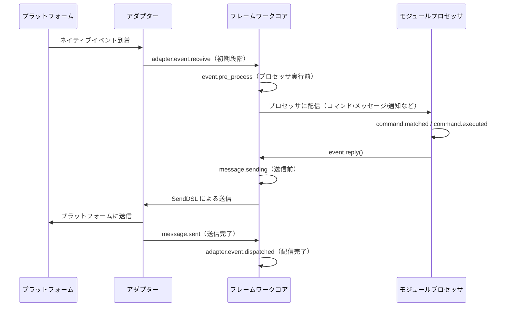

# ライフサイクル管理

ErisPulse は、システムコンポーネントの実行状態を監視し、監査、統計、カスタムロジックなどの拡張機能を実現するための、統一されたフック/ライフサイクルシステムを提供します。

システムは3種類のトリガー方式をサポートしています：
- `await lifecycle.emit("event", data)` — 精選版、任意のデータを渡す
- `lifecycle.emit_sync("event", data)` — 同期版（非非同期コンテキストで使用）
- `await lifecycle.submit_event("event", ...)` — 旧版と互換性を持ち、標準イベント形式を自動的に構築する

## イベント処理メカニズム

### ハンドラの登録

```python
from ErisPulse import sdk

# デコレータ形式
@sdk.lifecycle.on("module.load")
async def on_module_load(data):
    print(f"モジュールのロード: {data}")

# プログラミング形式での登録
sdk.lifecycle.register("module.load", on_module_load, priority=10)

# 登録の解除
sdk.lifecycle.unregister("module.load", on_module_load)

# 所有者ごとの一括登録解除（モジュール/アダプタのアンロード時にフレームワークが自動的に呼び出す）
removed = sdk.lifecycle.unregister_by_owner("MyModule")
print(f"クリーンアップしたライフサイクルフック数: {removed}")
```

### 優先度

ハンドラは `priority` パラメータをサポートし、数値が大きいほど先に実行されます（モジュールローダーと同様）：

```python
@sdk.lifecycle.on("adapter.event.receive", priority=10)  # 最初に実行
async def first_handler(data):
    pass

@sdk.lifecycle.on("adapter.event.receive", priority=0)  # 後に実行
async def second_handler(data):
    pass
```

### 点構造イベント

具体的なイベントをトリガーすると、その親イベントも同時にトリガーされます：
- `module.load` をトリガーすると、`module` もトリガーされます。
- `adapter.event.receive` をトリガーすると、`adapter.event` と `adapter` もトリガーされます。

### ワイルドカード

`*` を登録してすべてのイベントをキャプチャします：

```python
@sdk.lifecycle.on("*")
async def on_anything(data):
    print(f"イベント受信: {data}")
```

### 一回限りの登録（once）

2.7.0 以降、`lifecycle.once()` で登録したハンドラは**一度実行後、自動的に登録解除**されます。これは「初回準備完了」のような一回限りのフックに適しています：

```python
@sdk.lifecycle.once("core.init.complete")
async def on_first_ready(data):
    print("初回準備完了、以降は再びトリガーされません")
```

- `on()` と同じ優先度パラメータの意味（`priority` の数値が大きいほど先に実行されます）
- 自動的に登録解除され、手動での `unregister` は不要です
- 同期/非同期のハンドラが両方サポートされています

### リスナーの照会（has_handlers）

ホットパスの短絡処理では、`has_handlers()` を使って事前にリスナーが存在するかを確認し、無駄なイベントのループやタスクのスケジューリングを避けることができます：

```python
if sdk.lifecycle.has_handlers("message.sending"):
    await sdk.lifecycle.emit("message.sending", send_ctx)
```

- 精確なイベント名、ワイルドカード `*`、親イベントの3種類のマッチをカバーします
- リスナーが存在しない場合は `False` を返し、`emit` を安全にスキップできます

## フックブレークポイント一覧

プラットフォームからフレームワークにメッセージが入力されて処理が完了するまでの典型的なライフサイクルイベントの時系列：



フレームワークは以下のフックブレークポイントを内蔵しており、`@sdk.lifecycle.on()` を使って任意のブレークポイントを監視し、カスタムロジックを実装できます。

### コア初期化

| フック名 | 発生タイミング | データ |
|---------|---------|------|
| `core.init.start` | SDKの初期化開始 | `{}` |
| `core.init.complete` | SDKの初期化完了 | `{"duration": float, "success": bool, "adapters": {"enabled": [str], "disabled": [str]}, "modules": {"enabled": [str], "disabled": [str]}, "error": str(失敗時のみ)}` |
| `core.uninit.complete` | SDKの逆初期化完了 | `{"duration": float, "success": bool, "adapters_closed": int, "modules_unloaded": int, "module_properties_cleared": int, "module_properties_to_clear": [str], "error": str(失敗時のみ)}` |

### 設定変更

| フック名 | 発生タイミング | データ |
|---------|---------|------|
| `config.set` | 設定項目が変更された時 | `{"key": str, "old_value": Any, "new_value": Any}` |
| `config.updated` | 外部から config.toml を編集した後にツリー全体の変更を検知した時 | `{"old_config": dict, "new_config": dict, "config_file": str}` |

**例：設定監査**

```python
@sdk.lifecycle.on("config.set")
def audit_config(data):
    print(f"[監査] {data['key']}: {data['old_value']} -> {data['new_value']}")
```

### モジュールライフサイクル

| フック名 | 発生タイミング | データ |
|---------|---------|------|
| `module.register` | モジュールクラスがマネージャーに登録された時 | `{"module_name": str, "success": bool}` |
| `module.load` | モジュールのロード完了（インスタンス化成功） | `{"module_name": str, "success": bool}` |
| `module.init` | モジュールの初期化完了（遅延ロード含む） | `{"module_name": str, "success": bool}` |
| `module.unload` | モジュールのアンロード | `{"module_name": str, "success": bool}` |

### アダプターライフサイクル

| フック名 | 発生タイミング | データ |
|---------|---------|------|
| `adapter.load` | アダプターの登録完了 | `{"platform": str, "success": bool}` |
| `adapter.start` | アダプターの起動 | `{"platforms": [str]}` |
| `adapter.status.change` | アダプターのステータス変更 | `{"platform": str, "status": str, "retry_count": int, "error": str(失敗時のみ)}` |
| `adapter.stop` | アダプターの停止 | `{"platforms": [str]}` |
| `adapter.stopped` | アダプターの停止完了 | `{"platforms": [str]}` |
| `adapter.bot.online` | Botのオンライン | `{"platform": str, "bot_id": str, "info": dict, "status": str}` |
| `adapter.bot.offline` | Botのオフライン | `{"platform": str, "bot_id": str, "status": str}` |

### イベント受信と処理

| フック名 | 発生タイミング | データ |
|---------|---------|------|
| `adapter.event.receive` | 外部プラットフォームのイベントを受信した時（初期段階） | `{"platform": str, "event_type": str, "raw_event_type": str}` |
| `adapter.event.dispatched` | イベントの配信完了 | `{"platform": str, "event_type": str, "raw_event_type": str, "onebot_handlers_count": int}` |
| `event.pre_process` | イベントプロセッサが実行される直前 | `{"event_type": str, "platform": str, "detail_type": str}` |

**例：イベント統計**

```python
event_counter = {}

@sdk.lifecycle.on("adapter.event.receive")
def count_events(data):
    platform = data["platform"]
    event_counter[platform] = event_counter.get(platform, 0) + 1

@sdk.lifecycle.on("adapter.event.dispatched")
def log_unhandled(data):
    if data["onebot_handlers_count"] == 0:
        print(f"[未処理] {data['platform']}/{data['event_type']}")
```

### メッセージ送信

| フック名 | 発生タイミング | データ |
|---------|---------|------|
| `message.sending` | メッセージの送信直前 | `{"platform": str, "method": str, "detail_type": str, "target_id": str, "bot_id": str}` |
| `message.sent` | メッセージの送信完了 | `{"platform": str, "method": str, "detail_type": str, "target_id": str, "bot_id": str}` |

**例：メッセージ送信監査**

```python
@sdk.lifecycle.on("message.sending")
def log_sending(data):
    print(f"[送信] -> {data['platform']}/{data['detail_type']}/{data['target_id']} via {data['method']}")
```

### コマンドシステム

| フック名 | 発生タイミング | データ |
|---------|---------|------|
| `command.matched` | コマンドがマッチし、実行される直前 | `{"command": str, "args": list[str], "platform": str, "user_id": str}` |
| `command.executed` | コマンドの実行完了 | `{"command": str, "args": list[str], "platform": str, "user_id": str, "success": bool, "error": str(失敗時のみ)}` |

**例：コマンド統計**

```python
@sdk.lifecycle.on("command.matched")
def count_commands(data):
    print(f"[コマンド] /{data['command']} from {data['user_id']}@{data['platform']}")
```

### HTTPルーティング

| フック名 | 発生タイミング | データ |
|---------|---------|------|
| `server.request` | HTTPリクエストの受信 | `{"method": str, "path": str, "client_ip": str}` |
| `server.response` | HTTPレスポンスの送信 | `{"method": str, "path": str, "status_code": int, "client_ip": str}` |

**例：リクエストログ**

```python
@sdk.lifecycle.on("server.response")
def log_http(data):
    print(f"[HTTP] {data['method']} {data['path']} -> {data['status_code']}")
```

### WebSocket

| フック名 | 発生タイミング | データ |
|---------|---------|------|
| `server.start` | ルーティングサーバーの起動 | `{"base_url": str, "host": str, "port": int}` |
| `server.stop` | ルーティングサーバーの停止 | `{}` |
| `server.websocket.connect` | WebSocket接続の確立 | `{"path": str, "module_name": str, "client_ip": str}` |
| `server.websocket.disconnect` | WebSocket接続の切断 | `{"path": str, "module_name": str, "reason": str, "error": str(異常時のみ)}` |

**例：WebSocket接続監視**

```python
@sdk.lifecycle.on("server.websocket.connect")
def on_ws_connect(data):
    print(f"[WS] 接続: {data['path']} from {data['client_ip']}")

@sdk.lifecycle.on("server.websocket.disconnect")
def on_ws_disconnect(data):
    print(f"[WS] 切断: {data['path']} ({data['reason']})")
```

## 標準イベント定義

```python
STANDARD_EVENTS = {
    "core": ["init.start", "init.complete", "uninit.complete"],
    "module": ["load", "init", "unload", "register"],
    "adapter": [
        "load", "start", "status.change", "stop", "stopped",
        "event.receive", "event.dispatched",
        "bot.online", "bot.offline",
    ],
    "server": [
        "start", "stop",
        "request", "response",
        "websocket.connect", "websocket.disconnect",
    ],
    "event": ["pre_process"],
    "message": ["sending", "sent"],
    "command": ["matched", "executed"],
    "config": ["set"],
}
```

## 完全な API リファレンス

### 登録と解除

| メソッド | 説明 |
|------|------|
| `@lifecycle.on(event, *, priority=0)` | デコレータによるハンドラの登録 |
| `lifecycle.register(event, handler, *, priority=0)` | プログラム的登録 |
| `lifecycle.unregister(event, handler=None)` | 登録解除（handler=None の場合、該当イベントの全ハンドラを解除） |

### トリガー

| メソッド | 説明 |
|------|------|
| `await lifecycle.emit(event, data=None)` | 非同期でトリガーを発生、ハンドラが None 以外を返すと data を変更可能 |
| `lifecycle.emit_sync(event, data=None)` | 同期でトリガーを発生、非同期ハンドラは create_task でスケジュール |
| `await lifecycle.submit_event(event_type, *, source, msg, data)` | 旧バージョンとの互換性、自動的に標準イベント形式を構築 |

### ユーティリティ

| メソッド | 説明 |
|------|------|
| `lifecycle.start_timer(timer_id)` | タイマーを開始 |
| `lifecycle.get_duration(timer_id)` | 経過時間を取得（秒） |
| `lifecycle.stop_timer(timer_id)` | タイマーを停止し、経過時間を返す |
| `lifecycle.list_hooks()` | 登録済みのすべてのフックとハンドラ数をリスト表示 |
| `lifecycle.clear()` | 全てのハンドラとタイマーをクリア |

## モジュールでの使用例

```python
from ErisPulse.Core.Bases import BaseModule
from ErisPulse import sdk

class Main(BaseModule):
    async def on_load(self, event):
        # 簡単なメッセージの統計を実装
        self.msg_count = 0
        
        @sdk.lifecycle.on("adapter.event.receive")
        async def count(data):
            if data["event_type"] == "message":
                self.msg_count += 1
        
        # すべてのコマンドを監視
        @sdk.lifecycle.on("command.matched")
        async def log_cmd(data):
            sdk.logger.info(f"コマンド実行: /{data['command']} by {data['user_id']}")
        
        # 設定変更の監査
        @sdk.lifecycle.on("config.set")
        def audit(data):
            sdk.logger.info(f"設定変更: {data['key']} = {data['new_value']}")
```

## バックグラウンドタスクの所有と自動キャンセル

> [!NOTE]
> この機能は ErisPulse **2.8.0+** が必要です。

モジュールが作成した asyncio のバックグラウンドタスクが `on_unload` でキャンセルされない場合、`self` の参照を保持し、モジュールのインスタンスが回収されず（ホットリロード後に古いインスタンスが残る）ます。フレームワークは以下のバックアップメカニズムを提供します：

- **`self.spawn(coro)`**（モジュール内で推奨）：タスクは自動的にモジュール名に所有され、モジュールのアンロード時にフレームワークは `on_unload` **の後**に未終了のタスクをバックアップキャンセルし、警告を記録します。
- **`spawn_background(coro)`**（`ErisPulse.runtime`）：自動的に現在の `owner_scope` コンテキストをキャプチャします。`cancel_owner_tasks(owner)` は所有者に応じてキャンセルし、`cancel_all_background_tasks()` は `sdk.uninit()` のバックアップとして使用されます。
- **アダプター**：閉じる際にプラットフォーム名以下のバックグラウンドタスクも同様にバックアップキャンセルされます。

```python
async def on_load(self, event):
    # 推奨：バックグラウンドタスクは self.spawn() を使用し、アンロード時にフレームワークがバックアップキャンセルします。
    self.spawn(self._poll())

async def on_unload(self, event):
    # 精密制御が必要な場面では、自らキャンセルして終了処理を待つことを推奨します。
    if self._poll_task:
        self._poll_task.cancel()
        await asyncio.gather(self._poll_task, return_exceptions=True)

async def _poll(self):
    while True:
        await asyncio.sleep(60)
        ...
```

> [!IMPORTANT]
> フレームワークのバックアップは**強制キャンセル**（`cancel_owner_tasks`）です。これは `on_unload` の返り値の後に発生します。したがって、優雅な終了処理が必要なタスク（バッファのフラッシュ、状態の永続化、接続の閉じる）は、`on_unload` で自ら `cancel()` + `await` して完了させる必要があります。バックアップが終了処理を保持することを期待しないでください。フレームワークは「`self` を保持するタスクが残らないこと」を保証しますが、「優雅な終了」は保証しません。`await` の結果が必要なタスクは、直接 `await` してください。バックグラウンドタスクに投げないでください。

## 注意事項

1. **プロセッサは同期または非同期のいずれでも使用可能**：システムは自動的に識別し、正しく呼び出します。
2. **データの渡し方**：`emit()` モードでは、プロセッサが None 以外の値を返すと、次のプロセッサに渡される data が変更されます。
3. **イベント名の命名規則**：親イベントを監視しやすいよう、ドット構造を使用した命名を推奨します。
4. **エラーの隔離**：個々のプロセッサの例外は、他のプロセッサの実行に影響しません。
5. **同期トリガーの制限**：`emit_sync()` では、非同期プロセッサは fire-and-forget 方式でスケジュールされ、戻り値は返却できません。
6. **ライフサイクルのクリーンアップ**：`sdk.uninit()` を呼び出すと、すべての登録済みプロセッサとタイマーがクリーンアップされます。
7. **ロード優先度**：フレームワークの初期化段階でイベントを監視したい場合は、高優先度を設定し、ラグジュアリー読み込みを無効にすることを推奨します。

## 関連ドキュメント

- [モジュール開発ガイド](../developer-guide/modules/getting-started.md) - モジュールのライフサイクルメソッドについて理解する
- [ベストプラクティス](../developer-guide/modules/best-practices.md) - ライフサイクルイベントの使用に関する推奨事項