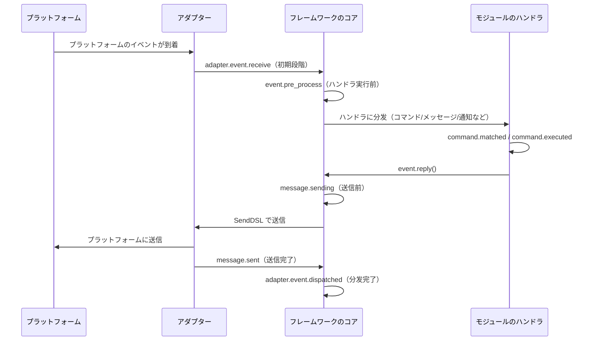

# ライフサイクル管理

ErisPulse は、システムの各コンポーネントの実行状態を監視し、監査、統計、カスタムロジックなどの拡張機能を実現するための統一されたフック/ライフサイクルシステムを提供します。

システムは以下の3つのトリガ方法をサポートしています：
- `await lifecycle.emit("event", data)` — 精簡版、任意のデータを渡す（`to="Owner"` で指定送信）
- `lifecycle.emit_sync("event", data)` — 同期版（非非同期コンテキストで使用）
- `await lifecycle.submit_event("event", ...)` — 旧版との互換性、標準イベント形式を自動構築

## イベント処理メカニズム

### ハンドラの登録

```python
from ErisPulse import sdk

# デコレータ方式
@sdk.lifecycle.on("module.load")
async def on_module_load(data):
    print(f"モジュールのロード: {data}")

# プログラム的登録
sdk.lifecycle.register("module.load", on_module_load, priority=10)

# 登録解除
sdk.lifecycle.unregister("module.load", on_module_load)

# 所有者毎に一括解除（モジュール/アダプターのアンロード時にフレームワークが自動的に呼び出す）
removed = sdk.lifecycle.unregister_by_owner("MyModule")
print(f"クリーンアップしたライフサイクルフック: {removed}")
```

### 優先度

ハンドラは `priority` パラメータをサポートし、数値が大きいほど先に実行されます（モジュールローダーと同様）：

```python
@sdk.lifecycle.on("adapter.event.receive", priority=10)  # 最初に実行
async def first_handler(data):
    pass

@sdk.lifecycle.on("adapter.event.receive", priority=0)  # 後に実行
async def second_handler(data):
    pass
```

### 点構造イベント

具体的なイベントをトリガーすると、その親イベントもトリガーされます：
- `module.load` をトリガーすると、`module` もトリガーされます
- `adapter.event.receive` をトリガーすると、`adapter.event` と `adapter` もトリガーされます

### ワイルドカード

`*` を登録すると、すべてのイベントをキャッチできます：

```python
@sdk.lifecycle.on("*")
async def on_anything(data):
    print(f"イベントを受信: {data}")
```

### 定向送信（emit to=）

> [!NOTE]
> この機能は ErisPulse **2.8.0+** が必要です。

`emit()` に `to` パラメータを指定すると、定向送信モードになります：イベントは、その所有者（owner）として登録されたハンドラにのみ配信されます（モジュールは `on_load` 内で登録されたフックは自動的に自身の所有者になります）。他のモジュールやワイルドカード `*` ハンドラは感知しません。

```python
# 送信元：イベントは Chat モジュールが登録したハンドラにのみ送信
await sdk.lifecycle.emit("message_received", {"text": "hi"}, to="Chat")

# 受信元（Chat モジュール内）：同名のハンドラを登録し、owner は登録時に自動的に記録されます
@sdk.lifecycle.on("message_received")
async def on_message_received(data): ...

@sdk.lifecycle.on("message")   # 点式の親プレフィックスも同様に有効（owner でフィルタリング）
async def on_any(data): ...
```

- 目標の owner に登録されたハンドラがない場合 → イベントは**消費されません**（`has_handlers()` で事前に検出できます）
- `data` が dict の場合、自動的に `_trace_id` を含みます（既存の値は上書きされません）
- `emit_sync` / `submit_event` でも `to=` パラメータをサポートします
- モジュール間通信の3層モデル（RPC / 定向 / ブロードキャスト）は
  [モジュール間通信](module-communication.md) を参照してください

### 1回限りの登録（once）

2.7.0 から、`lifecycle.once()` で登録されたハンドラは**1回実行後に自動的に登録解除**されます。これは「初回準備完了」のような1回限りのフックに適しています：

```python
@sdk.lifecycle.once("core.init.complete")
async def on_first_ready(data):
    print("初回準備完了、以降はトリガーされません")
```

- `on()` と同じ優先度パラメータの意味（`priority` 数値が大きいほど先に実行）
- 自動的に登録解除、手動の `unregister` は不要
- 同期/非同期ハンドラの両方をサポート

### 監視者クエリ（has_handlers）

ホットパスの短絡処理では、`has_handlers()` を使って事前に監視者がいるかどうかを判断し、不要なイベントのループとタスクのスケジューリングを避けることができます：

```python
if sdk.lifecycle.has_handlers("message.sending"):
    await sdk.lifecycle.emit("message.sending", send_ctx)
```

- **正確なイベント名、ワイルドカード `*`、親イベント**の3種類のマッチングをカバー
- 監視者がいない場合、`False` を返し、`emit` を安全にスキップできます

## フックの断点一覧

プラットフォームからフレームワークにメッセージが届き、処理が完了する典型的なライフサイクルイベントの順序：


```mermaid
sequenceDiagram
    participant P as プラットフォーム
    participant A as アダプター
    participant F as フレームワークのコア
    participant M as モジュールのハンドラ

    P->>A: プラットフォームのイベントが到着
    A->>F: adapter.event.receive（初期段階）
    F->>F: event.pre_process（ハンドラ実行前）
    F->>M: ハンドラに分发（コマンド/メッセージ/通知など）
    M->>M: command.matched / command.executed
    M->>F: event.reply()
    F->>F: message.sending（送信前）
    F->>A: SendDSL で送信
    A->>P: プラットフォームに送信
    A->>F: message.sent（送信完了）
    F->>F: adapter.event.dispatched（分发完了）
```

フレームワークは以下のフックの断点を内蔵しており、ユーザーは `@sdk.lifecycle.on()` で任意の断点を監視してカスタムロジックを実装できます。

### コア初期化

| フック名 | トリガータイミング | データ |
|---------|---------|------|
| `core.init.start` | SDK の初期化開始 | `{}` |
| `core.init.stage` | 初期化の各段階開始（バックグラウンドで発行） | `{"stage": str}`、値は `discovery` / `adapter_register` / `adapter_start` / `module_register` / `module_init` / `adapter_start_deferred` / `router_start` |
| `core.init.complete` | SDK の初期化完了 | `{"duration": float, "success": bool, "stages": {stage: float}, "adapters": {"enabled": [str], "disabled": [str]}, "modules": {"enabled": [str], "disabled": [str]}, "error": str(失敗時のみ)}` |
| `core.uninit.complete` | SDK の反初期化完了 | `{"duration": float, "success": bool, "adapters_closed": int, "modules_unloaded": int, "module_properties_cleared": int, "module_properties_to_clear": [str], "error": str(失敗時のみ)}` |

**例：起動の進行状況表示**

```python
@sdk.lifecycle.on("core.init.stage")
def show_stage(data):
    print(f"[起動] 階段に到達: {data['stage']}")
```

### 設定の変更

| フック名 | トリガータイミング | データ |
|---------|---------|------|
| `config.set` | 設定項目が変更された | `{"key": str, "old_value": Any, "new_value": Any}` |
| `config.updated` | 外部から config.toml を編集した後にツリー全体の変更を検出 | `{"old_config": dict, "new_config": dict, "config_file": str}` |

**例：設定の監査**

```python
@sdk.lifecycle.on("config.set")
def audit_config(data):
    print(f"[監査] {data['key']}: {data['old_value']} -> {data['new_value']}")
```

### モジュールのライフサイクル

| フック名 | トリガータイミング | データ |
|---------|---------|------|
| `module.register` | モジュールクラスがマネージャーに登録された | `{"module_name": str, "success": bool}` |
| `module.load` | モジュールのロード完了（インスタンス化成功） | `{"module_name": str, "success": bool}` |
| `module.init` | モジュールの初期化完了（遅延ロードも含む） | `{"module_name": str, "success": bool}` |
| `module.unload` | モジュールのアンロード | `{"module_name": str, "success": bool}` |
| `module.reload` | モジュールのホットリロード完了（依存するモジュールも再ロード） | `{"module_name": str, "success": bool}` |

### アダプターのライフサイクル

| フック名 | トリガータイミング | データ |
|---------|---------|------|
| `adapter.load` | アダプターの登録完了 | `{"platform": str, "success": bool}` |
| `adapter.start` | アダプターの起動 | `{"platforms": [str]}` |
| `adapter.status.change` | アダプターの状態変化 | `{"platform": str, "status": str, "retry_count": int, "error": str(失敗時のみ)}` |
| `adapter.stop` | アダプターの停止 | `{"platforms": [str]}` |
| `adapter.stopped` | アダプターの停止完了 | `{"platforms": [str]}` |
| `adapter.bot.online` | Bot のオンライン | `{"platform": str, "bot_id": str, "info": dict, "status": str}` |
| `adapter.bot.offline` | Bot のオフライン | `{"platform": str, "bot_id": str, "status": str}` |

### イベントの受信と処理

| フック名 | トリガータイミング | データ |
|---------|---------|------|
| `adapter.event.receive` | 外部プラットフォームイベントの受信（初期段階） | `{"platform": str, "event_type": str, "raw_event_type": str}` |
| `adapter.event.blocked` | ミドルウェアがイベントをブロック（`False` を返すと、イベントは処理されず他のハンドラにも渡されない） | `{"middleware": str, "platform": str, "event_type": str, "detail_type": str, "event": dict, "_trace_id": str}` |
| `adapter.event.dispatched` | イベントの分发完了 | `{"platform": str, "event_type": str, "raw_event_type": str, "onebot_handlers_count": int}` |
| `event.pre_process` | イベントハンドラの実行前 | `{"event_type": str, "platform": str, "detail_type": str}` |

**例：イベントの統計**

```python
event_counter = {}

@sdk.lifecycle.on("adapter.event.receive")
def count_events(data):
    platform = data["platform"]
    event_counter[platform] = event_counter.get(platform, 0) + 1

@sdk.lifecycle.on("adapter.event.dispatched")
def log_unhandled(data):
    if data["onebot_handlers_count"] == 0:
        print(f"[未処理] {data['platform']}/{data['event_type']}")
```

### メッセージの送信

| フック名 | トリガータイミング | データ |
|---------|---------|------|
| `message.sending` | メッセージの送信直前 | `{"platform": str, "method": str, "detail_type": str, "target_id": str, "bot_id": str}` |
| `message.sent` | メッセージの送信完了 | `{"platform": str, "method": str, "detail_type": str, "target_id": str, "bot_id": str}` |

**例：メッセージ送信の監査**

```python
@sdk.lifecycle.on("message.sending")
def log_sending(data):
    print(f"[送信] -> {data['platform']}/{data['detail_type']}/{data['target_id']} via {data['method']}")
```

### コマンドシステム

| フック名 | トリガータイミング | データ |
|---------|---------|------|
| `command.matched` | コマンドがマッチして実行直前 | `{"command": str, "args": list[str], "platform": str, "user_id": str}` |
| `command.executed` | コマンドの実行完了 | `{"command": str, "args": list[str], "platform": str, "user_id": str, "success": bool, "error": str(失敗時のみ)}` |

**例：コマンドの統計**

```python
@sdk.lifecycle.on("command.matched")
def count_commands(data):
    print(f"[コマンド] /{data['command']} from {data['user_id']}@{data['platform']}")
```

### HTTP ルーティング

| フック名 | トリガータイミング | データ |
|---------|---------|------|
| `server.request` | HTTPリクエストの受信 | `{"method": str, "path": str, "client_ip": str}` |
| `server.response` | HTTPレスポンスの送信 | `{"method": str, "path": str, "status_code": int, "client_ip": str}` |

**例：リクエストログ**

```python
@sdk.lifecycle.on("server.response")
def log_http(data):
    print(f"[HTTP] {data['method']} {data['path']} -> {data['status_code']}")
```

### WebSocket

| フック名 | トリガータイミング | データ |
|---------|---------|------|
| `server.start` | ルーティングサーバーの起動 | `{"base_url": str, "host": str, "port": int, "success": bool, "error": str(失敗時のみ)}` |
| `server.stop` | ルーティングサーバーの停止 | `{}` |
| `server.websocket.connect` | WebSocket接続の確立 | `{"path": str, "module_name": str, "client_ip": str}` |
| `server.websocket.disconnect` | WebSocket接続の切断 | `{"path": str, "module_name": str, "reason": str, "error": str(例外時のみ)}` |

**例：WebSocket接続の監視**

```python
@sdk.lifecycle.on("server.websocket.connect")
def on_ws_connect(data):
    print(f"[WS] 接続: {data['path']} from {data['client_ip']}")

@sdk.lifecycle.on("server.websocket.disconnect")
def on_ws_disconnect(data):
    print(f"[WS] 切断: {data['path']} ({data['reason']})")
```

### ストレージ接続状態

ストレージバックエンドの接続プールの確立、障害、回復（すべてバックグラウンドで発行され、ストレージ操作をブロックしません）：

| フック名 | トリガータイミング | データ |
|---------|---------|------|
| `storage.ready` | ストレージバックエンドの接続プールが準備完了（各イベントループで最初にプール確立に成功した場合） | `{"backend": str}` |
| `storage.unreachable` | 接続リトライが尽きてクールダウン期間に入る（この間は操作は即座に失敗する） | `{"backend": str, "error": str, "cooldown": float}` |
| `storage.recovered` | クールダウン終了後、再接続に成功し、ストレージが再利用可能になる | `{"backend": str}` |

**例：ストレージ障害のアラート**

```python
@sdk.lifecycle.on("storage.unreachable")
def alert_storage_down(data):
    print(f"[アラート] ストレージバックエンド {data['backend']} が利用不能: {data['error']}、{data['cooldown']}秒後に自動再接続")

@sdk.lifecycle.on("storage.recovered")
def notify_storage_back(data):
    print(f"[回復] ストレージバックエンド {data['backend']} が再利用可能になりました")
```

### HTTPクライアント

`sdk.client` のリクエストと接続イベント（すべてバックグラウンドで発行）：

| フック名 | トリガータイミング | データ |
|---------|---------|------|
| `client.request.success` | HTTPリクエストが成功 | `{"method": str, "url": str, "status": int, "elapsed": float}` |
| `client.request.failed` | HTTPリクエストがリトライを尽して最終的に失敗 | `{"method": str, "url": str, "error": str, "attempts": int, "elapsed": float}` |
| `client.ws.connect` | WebSocket接続の確立 | `{"url": str}` |

### 国際化

| フック名 | トリガータイミング | データ |
|---------|---------|------|
| `i18n.language.changed` | フレームワークの言語が切り替わる（`i18n.set_language`） | `{"language": str, "previous": str}` |

## 標準イベント定義

```python
STANDARD_EVENTS = {
    "core": ["init.start", "init.stage", "init.complete", "uninit.complete"],
    "module": ["load", "init", "unload", "register", "reload"],
    "adapter": [
        "load", "start", "status.change", "stop", "stopped",
        "event.receive", "event.dispatched",
        "bot.online", "bot.offline",
    ],
    "server": [
        "start", "stop",
        "request", "response",
        "websocket.connect", "websocket.disconnect",
    ],
    "event": ["pre_process"],
    "message": ["sending", "sent"],
    "command": ["matched", "executed"],
    "config": ["set", "updated"],
    "storage": ["ready", "unreachable", "recovered"],
    "client": ["request.success", "request.failed", "ws.connect"],
    "i18n": ["language.changed"],
}
```

## 完全なAPIリファレンス

### 登録と解除

| メソッド | 説明 |
|------|------|
| `@lifecycle.on(event, *, priority=0)` | デコレータでハンドラを登録 |
| `lifecycle.register(event, handler, *, priority=0)` | プログラム的に登録 |
| `lifecycle.unregister(event, handler=None)` | 登録解除（handler=None の場合は、そのイベントのすべてのハンドラを解除） |

### トリガー

| メソッド | 説明 |
|------|------|
| `await lifecycle.emit(event, data=None, *, to=None)` | 非同期でトリガー、ハンドラは**並列に実行**（互いにブロッキングせず、戻り値はすべて完了時に返る）、`to` パラメータを指定すると、owner に限定して送信 |
| `lifecycle.fire(event, data=None, *, to=None)` | **バックグラウンドで発行（投げたらすぐ）**：ハンドラはバックグラウンドタスクで並列に実行、待機せず、戻り値なし；ハンドラがいない場合、コストゼロ。高頻度のホットパスや純粋な観測イベントに適している。停止シーケンスや順序依存の消費（例: `config.set`）は `emit` を使用 |
| `lifecycle.emit_sync(event, data=None, *, to=None)` | 同期でトリガー、非同期ハンドラは `create_task` でスケジュール |
| `await lifecycle.submit_event(event_type, *, source, msg, data, to=None, background=False)` | 旧版との互換性、標準イベント形式を自動構築；`background=True` の場合は `fire` でバックグラウンドで発行 |

### ユーティリティ

| メソッド | 説明 |
|------|------|
| `lifecycle.start_timer(timer_id)` | タイマーを開始 |
| `lifecycle.get_duration(timer_id)` | 経過時間を取得（秒） |
| `lifecycle.stop_timer(timer_id)` | タイマーを停止し、経過時間を返す |
| `lifecycle.list_hooks()` | すべての登録されたフックとハンドラ数を表示 |
| `lifecycle.clear()` | すべてのハンドラとタイマーをクリア |

## モジュールでの使用例

```python
from ErisPulse.Core.Bases import BaseModule
from ErisPulse import sdk

class Main(BaseModule):
    async def on_load(self, event):
        # 簡単なメッセージ統計を実装
        self.msg_count = 0
        
        @sdk.lifecycle.on("adapter.event.receive")
        async def count(data):
            if data["event_type"] == "message":
                self.msg_count += 1
        
        # すべてのコマンドを監視
        @sdk.lifecycle.on("command.matched")
        async def log_cmd(data):
            sdk.logger.info(f"コマンド実行: /{data['command']} by {data['user_id']}")
        
        # 設定変更の監査
        @sdk.lifecycle.on("config.set")
        def audit(data):
            sdk.logger.info(f"設定変更: {data['key']} = {data['new_value']}")
```

## バックグラウンドタスクの所有者と自動キャンセル

> [!NOTE]
> この機能は ErisPulse **2.8.0+** が必要です。

モジュールが作成した asyncio バックグラウンドタスクは、`on_unload` でキャンセルしない場合、`self` の参照を保持し、モジュールインスタンスが回収されず（ホットリロード後に古いインスタンスが残る）。フレームワークは以下のバックアップメカニズムを提供します：

- **`self.spawn(coro)`**（モジュール内で推奨）：タスクはモジュール名に自動的に所有者として割り当てられ、モジュールのアンロード時にフレームワークが `on_unload` **後に**未終了のタスクをバックアップでキャンセルし、警告を記録します
- **`spawn_background(coro)`**（`ErisPulse.runtime`）：現在の `owner_scope` コンテキストを自動的にキャプチャします；`cancel_owner_tasks(owner)` で所有者に属するタスクをキャンセル、`cancel_all_background_tasks()` は `sdk.uninit()` のバックアップ用
- **アダプター**：プラットフォーム名の下のバックグラウンドタスクも同様にバックアップでキャンセル

```python
async def on_load(self, event):
    # 推奨：バックグラウンドタスクは self.spawn() を使用し、アンロード時にフレームワークがバックアップで自動キャンセル
    self.spawn(self._poll())

async def on_unload(self, event):
    # 精密制御の場面では、手動でキャンセルし、終了処理を待つことを推奨
    if self._poll_task:
        self._poll_task.cancel()
        await asyncio.gather(self._poll_task, return_exceptions=True)

async def _poll(self):
    while True:
        await asyncio.sleep(60)
        ...
```

> [!IMPORTANT]
> フレームワークのバックアップは**強制キャンセル**（`cancel_owner_tasks`）です。これは `on_unload` の返り値後に発生します。したがって、優雅に終了処理が必要なタスク（バッファのフラッシュ、ステートの永続化、接続の終了）は**必ず** `on_unload` で `cancel()` + `await` で完了させる必要があります——バックアップが終了処理を保持することを期待しないでください。フレームワークは「`self` を保持するタスクが残らないようにする」ことを保証しますが、「優雅に」は保証しません。`await` の結果が必要なタスクは、`await` してバックグラウンドタスクに投げないでください。

## 注意事項

1. **ハンドラは同期または非同期**：システムは自動的に識別し、適切に呼び出します
2. **データの渡し方**：`emit()` モードでは、ハンドラが `None` 以外の値を返すと、次のハンドラに渡される `data` を変更します
3. **イベント名の命名規則**：点構造のイベント名を使用することを推奨し、親イベントの監視が容易になります
4. **エラーの隔離**：1つのハンドラのエラーは他のハンドラの実行に影響しません
5. **同期トリガーの制限**：`emit_sync()` では、非同期ハンドラは fire-and-forget でスケジュールされ、返り値は戻りません
6. **ライフサイクルのクリーンアップ**：`sdk.uninit()` を呼び出すと、すべての登録されたハンドラとタイマーがクリーンアップされます
7. **ロードの優先性**：フレームワークの初期化段階でイベントを監視したい場合は、高優先度を設定し、遅延ロードを無効にすることを推奨します

## 関連ドキュメント

- [モジュール開発ガイド](../developer-guide/modules/getting-started.md) - モジュールのライフサイクルメソッドを理解する
- [ベストプラクティス](../developer-guide/modules/best-practices.md) - ライフサイクルイベントの使用に関する推奨事項