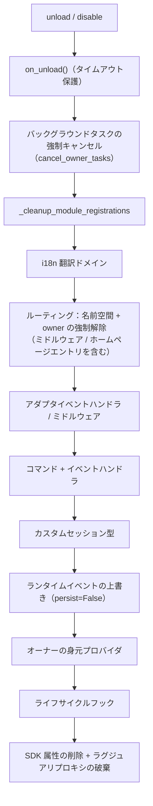

# 所有者（owner）システム

所有者システムは、モジュールの「プラグイン・アンド・プレイ」機能の基盤です。モジュールがロード時に登録するフレームワークリソースはすべて自動的に所有者に記名され、モジュールのアンロード/無効化時に所有者に基づいて一括して回収されます。モジュールの作者はリソースを宣言するだけで、手動でクリーンアップロジックを書く必要はありません。

> **関連システム**：スコープ（scope）はイベントの配信時に「リソースが有効かどうか」を決定します。  
> 所有者システムはライフサイクル中に「リソースは誰のものか、誰がアンロード時に回収されるか」を決定します。  
> スコープの詳細は [統一制御面（scope）](docs/ja/scope.md) を参照してください。バックグラウンドタスクの詳細は、  
> [ライフサイクル管理](docs/ja/lifecycle.md#バックグラウンドタスクの所有と自動キャンセル) を参照してください。

{!--< tips >!--}
1. 所有者は**登録の瞬間**に `current_owner` に基づいて自動的に記録されます。モジュールのコードを変更する必要はありません。
2. アンロード/無効化は同じクリーンアップ処理（`_cleanup_module_registrations`）を使用します。各ステップで失敗しても警告のみ出力され、処理は中断されません。
3. ユーザー設定のリソース（永続化された上書き / scopeルール / コマンドACL）は、モジュールのアンロード時にクリーンアップされません。
{!--< /tips >!--}

## owner コンテキスト機構

owner は、コンテキスト変数 `current_owner` を介して `ErisPulse.runtime.context` に渡されます。

```python
from ErisPulse.runtime import owner_scope, get_current_owner

with owner_scope("MyModule"):
    # この範囲内で登録されるすべてのリソースは自動的に MyModule に属します
    assert get_current_owner() == "MyModule"
```

フレームワークは以下のタイミングで自動的に owner を注入します（モジュールやアダプタのコードでは手動でラップする必要はありません）：

| 時機 | owner 値 | 位置 |
|------|----------|------|
| モジュール `load()` | モジュール名 | インスタンス化 + `on_load` 全過程 |
| アダプタ `start()` / `restart()` | プラットフォーム名 | アダプタ起動全過程 |
| `activate_on` ラグジュアリスタブ登録 | モジュール名 | 占位コマンド/ハンドラの登録 |
| イベントハンドラ実行中 | ハンドラ所属モジュール名 | handler / コマンドエントリ再注入 |

実行中の再注入とは、`on_load` 内で宣言したコマンドハンドラが**実行中**に登録型 API（例: `sdk.adapter.on()`、`overrides.*.set(persist=False)`）を呼び出す場合、それらも自動的に本モジュールに属することを意味します。

## 所属リソースの概要

モジュールは、ロードコンテキスト内で以下のリソースを登録し、それぞれの所有者として記録します。モジュールのアンロードや無効化時には、これらのリソースは自動的に回収されます。

| リソース | 登録方法 | クリーンアップ呼び出し |
|------|----------|----------|
| コマンド | `@command()` / コマンド dict 宣言 | `command.unregister_by_owner()` |
| イベントハンドラ | `@message` / `@notice` / `@request` / `@meta` | `handler.unregister_by_owner()` |
| アダプタイベントリスナー | `sdk.adapter.on()` / `raw=True` | `adapter.unregister_handlers_by_owner()` |
| アダプタミドルウェア | `@sdk.adapter.middleware` | 同上 |
| ルーティング（HTTP/WS/SSE） | `router.http()` / `websocket()` / `sse()` | 名前空間 + owner による二重保証 |
| ルーティングミドルウェア | `@router.middleware()` / `add_middleware()` | `router.unregister_all_by_owner()` |
| Dashboard ホームエントリ | `router.register_home_entry()` | `unregister_home_entries_by_owner()` |
| 自定义会話タイプ | `register_custom_type()` | `unregister_custom_types_by_owner()` |
| バックグラウンドタスク | `self.spawn()` | `cancel_owner_tasks()` |
| ライフサイクルフック | `lifecycle.register()` | `lifecycle.unregister_by_owner()` |
| 主人身源 provider | `master.provider` | `master.unregister_by_owner()` |
| i18n 翻訳キー | `I18nClass` 宣言（domain=モジュール名） | `i18n.unregister_domain()` |
| イベントオーバーライド（実行時） | `overrides.*.set(persist=False)` | `overrides.unregister_by_owner()` |
| コンテキストデータ | `runtime/context` は owner ごとに記録 | モジュールごとに正確にクリーンアップ |

アダプタ側の対応するリソース（プラットフォーム名を owner として）は、アダプタの `shutdown()` / `restart()` 時に `_cleanup_adapter_resources` によって回収されます。また、以下のリソースも含まれます：

| リソース | クリーンアップ呼び出し |
|------|----------|
| アダプタ独自の `on()` ハンドラとミドルウェア | `adapter.unregister_handlers_by_owner(platform)` |
| プラットフォームイベントメソッド拡張（`EventMixin`） | `unregister_platform_event_methods(platform)` |
| 自定义会話タイプ | `unregister_custom_types_by_owner(platform)` |
| i18n 翻訳ドメイン（domain=設定キー） | `i18n.unregister_domain(設定キー)` |
| 細かい粒度の名前空間ルーティング | `router.unregister_all_by_owner(platform)` |

## アンロード/無効化のクリーンアップシーケンス

`unload()` と `disable()` は、それぞれ独立した try/except で保護された 1 ステップずつ、**失敗しても後続のクリーンアップを中断しない** 1 本のクリーンアップチェーンを共有します。



`sdk.uninit()` が終了する際には、以下のグローバルな強制クリーンアップが行われます：すべてのアダプタのシャットダウン → すべてのモジュールのアンロード → `router.stop()`（ルーティング / ミドルウェア / ホームページエントリのクリア）→ `cancel_all_background_tasks()` → イベントハンドラとフックのクリア。

## デザインの境界：アンインストール時にクリーンアップされないリソース

所有権は、**モジュールコードが登録したランタイムリソース**のみを回収します。以下のリソースは**ユーザーの設定の意味**（制御権はユーザーにあり、意図的に設定される可能性がある）に属し、モジュールのアンインストール後も設定に従って永続的に保持されます：

| リソース | 意味 | 説明 |
|------|------|------|
| `overrides.*.set(persist=True)` | 永続化されたオーバーライド | 設定ファイルに書き込まれ、再起動後も有効；モジュールのアンインストール時に削除されない（ユーザーが明示的に設定） |
| `scope.set_action()` などのスコープルール | 権限制御面 | ユーザー/Dashboard によって管理され、モジュールのアンインストール時にルールは回収されない |
| `overrides.acl.set(persist=True)` | コマンド ACL | 同上 |
| Conversation `save()` による永続化 | 多輪対話のアーカイブ | データ資産はクリーンアップされない |

ランタイムに一時的に書き込まれたもの（`persist=False`）は、owner に従って回収されます。**永続化の有無が「ユーザーの資産」と「モジュールのランタイム状態」の境界線です**。

## モジュール作成者ガイド

### 推奨される書き方

```python
from ErisPulse import sdk
from ErisPulse.Core.Event import command
from ErisPulse.runtime import owner_scope, spawn_background

class MyModule(BaseModule):
    async def on_load(self, event):
        # フレームワークリソース：自動帰属、手動のリソース解放は不要
        self.task = self.spawn(self.polling())      # バックグラウンドタスク
        sdk.router.register_home_entry("私のモジュール", "/my")  # ホームページエントリ

        # モジュール独自リソース：owner_scope に包むことで帰属体系に組み込まれる
        with owner_scope("MyModule"):
            self.client.on_event(self._handle)      # 假想のカスタム登録

    async def on_unload(self, event):
        # フレームワークリソースは自動的に回収されるため、owner_scope でカバーされない独自リソースのみをクリーンアップする
        await self.client.close()
```

### 注意事項

- **import 時の登録は帰属されない**：モジュールのトップレベル（import 時）に登録されたフック/ハンドラは `owner_scope` 以前に発生するため、フレームワークレベルのリソース（owner=None）として扱われ、**リソース解放が行われない**。すべて `on_load()` 内で登録すること。
- **カスタム domain の i18n 登録**：`i18n.register(domain=...)` で domain がモジュール名と異なる場合、自動回収されないため、domain=モジュール名を維持すること。
- **バックグラウンドタスクは必ず self.spawn() を使用**：裸の `asyncio.create_task` はモジュールに帰属せず、アンロード時にキャンセルされない（詳細は[ライフサイクル管理](lifecycle.md#バックグラウンドタスクの帰属と自動キャンセル)を参照）。
- **リソース解放の失敗は警告のみ**：1ステップのリソース解放で例外が発生しても、他のリソースの回収は中断されず、ログの DEBUG/WARNING レベルで確認可能。トラブルシューティング時は TRACE モードを有効化すること。