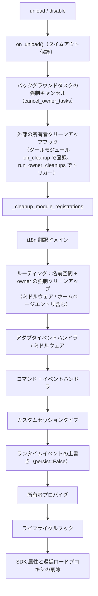

# 所有者（owner）システム

所有者（owner）は、モジュールの「プラグイン方式」の基盤です。モジュールが読み込まれる際に登録するすべてのフレームワークリソースは自動的に所有者に記名され、モジュールのアンロードや無効化時に、記名されたリソースを所有者が一括して回収します。モジュール開発者はリソースを宣言するだけで、手動でのクリーンアップロジックを書く必要はありません。

> **関連システム**：スコープ（scope）は、イベントの配信時に「リソースが有効かどうか」を決定します。  
> 所有者は、モジュールのライフサイクル中に「どの所有者がリソースを所有しているか」、「誰がアンロード時にリソースを回収するか」を決定します。  
> スコープの詳細は[統一制御面（scope）](scope.md)を参照してください。バックグラウンドタスクの詳細は、[ライフサイクル管理](lifecycle.md#バックグラウンドタスクの所有と自動キャンセル)を参照してください。

{!--< tips >!--}
1. 所有者は**登録の瞬間**に `current_owner` に基づいて自動的に記録されます。モジュールコードの変更は一切不要です。
2. アンロード/無効化は共通のクリーンアップチェーン（`_cleanup_module_registrations`）を使用します。各ステップで失敗しても警告のみを表示し、処理を中断しません。
3. ユーザー設定のリソース（永続化された上書き / スコープルール / コマンドACL）は、モジュールのアンロード時にクリーンアップされません。
4. ツールモジュールが外部ハンドルをホストしている場合、`on_cleanup(cb)` を使用してクリーンアップチェーンに登録できます。他のモジュールがアンロードされた際に、自動的にコールバックされます（[ツールモジュールガイド](#ツールモジュールガイド外部モジュールのハンドルをホストする)を参照してください）。
{!--< /tips >!--}

## owner コンテキストメカニズム

owner は、コンテキスト変数 `current_owner` を介して `ErisPulse.runtime.context` に渡されます：

```python
from ErisPulse.runtime import owner_scope, get_current_owner

with owner_scope("MyModule"):
    # このスコープ内に登録されたすべてのリソースは自動的に MyModule に属します
    assert get_current_owner() == "MyModule"
```

フレームワークは、以下のタイミングで自動的に owner を注入します（モジュールやアダプターのコードで手動でラップする必要はありません）：

| 時点 | owner 値 | 位置 |
|------|----------|------|
| モジュール `load()` | モジュール名 | インスタンス化 + `on_load` 全体 |
| アダプター `start()` / `restart()` | プラットフォーム名 | アダプター起動全体 |
| `activate_on` ラグジュアリスタブ登録 | モジュール名 | 占位コマンド/ハンドラの登録 |
| イベントハンドラ実行中 | ハンドラ所属モジュール名 | handler / コマンドエントリポイントの再注入 |

実行中の再注入とは、モジュールが `on_load` で宣言したコマンドハンドラが**実行中**に登録型 API（例：`sdk.adapter.on()`、`overrides.*.set(persist=False)`）を呼び出す場合、それらも自動的にこのモジュールに属することを意味します。

## 所属リソースの概要

モジュールは、ロードコンテキスト内で以下のリソースを登録し、それらの所属を記録します。アンロードまたは無効化時に、これらのリソースは自動的に回収されます。

| リソース | 登録方法 | クリーンアップ呼び出し |
|------|----------|----------|
| コマンド | `@command()` / コマンド dict 声明 | `command.unregister_by_owner()` |
| イベントハンドラー | `@message` / `@notice` / `@request` / `@meta` | `handler.unregister_by_owner()` |
| 适配器イベントリスナー | `sdk.adapter.on()` / `raw=True` | `adapter.unregister_handlers_by_owner()` |
| 适配器ミドルウェア | `@sdk.adapter.middleware` | 同上 |
| ルーティング（HTTP/WS/SSE） | `router.http()` / `websocket()` / `sse()` | 名前空間 + owner による二重保証 |
| ルーティングミドルウェア | `@router.middleware()` / `add_middleware()` | `router.unregister_all_by_owner()` |
| Dashboard ホームエントリー | `router.register_home_entry()` | `unregister_home_entries_by_owner()` |
| 自定义会話タイプ | `register_custom_type()` | `unregister_custom_types_by_owner()` |
| バックグラウンドタスク | `self.spawn()` | `cancel_owner_tasks()` |
| 外部所属クリーンアップフック（ツールモジュール管理） | `runtime.on_cleanup(cb)` | `run_owner_cleanups()`（アンロード/無効化/适配器終了時） |
| ライフサイクルフック | `lifecycle.register()` | `lifecycle.unregister_by_owner()` |
| 主人身源プロバイダ | `master.provider` | `master.unregister_by_owner()` |
| i18n 翻訳キー | `I18nClass` 声明（domain=モジュール名） | `i18n.unregister_domain()` |
| イベントオーバーライド（実行時） | `overrides.*.set(persist=False)` | `overrides.unregister_by_owner()` |
| 交互会話（wait_reply 等待 / リース） | `event.wait_reply()` / `sdk.interaction.acquire()` | `interaction.cancel_by_owner()`（待機側が即座にキャンセルを受け取る） |
| コンテキストデータ | `runtime/context` は owner ごとに記録 | モジュール単位で正確にクリーンアップ |

适配器側の対応リソース（プラットフォーム名を owner として）は、适配器の `shutdown()` / `restart()` 時に `_cleanup_adapter_resources` によって回収されます。以下も含まれます：

| リソース | クリーンアップ呼び出し |
|------|----------|
| 适配器独自の `on()` ハンドラーとミドルウェア | `adapter.unregister_handlers_by_owner(platform)` |
| プラットフォームイベントメソッド拡張（`EventMixin`） | `unregister_platform_event_methods(platform)` |
| 自定义会話タイプ | `unregister_custom_types_by_owner(platform)` |
| 交互会話（該当プラットフォームで待機中の wait_reply / リース） | `interaction.cancel_by_platform(platform)` |
| i18n 翻訳ドメイン（domain=設定キー） | `i18n.unregister_domain(設定キー)` |
| 細粒度の名前空間ルーティング | `router.unregister_all_by_owner(platform)` |

## 卸載/無効化のクリーンアップシーケンス

`unload()` と `disable()` は、それぞれ独立した try/except で処理されるクリーンアップチェーンを共有します。失敗してもログに記録されるのみで、**後続のクリーンアップを中断することはありません**。



`sdk.uninit()` で終了する際には、以下のグローバルな強制クリーンアップが行われます：すべてのアダプタのシャットダウン → すべてのモジュールの unload → `router.stop()`（ルーティング/ミドルウェア/ホームページエントリのクリア）→ `cancel_all_background_tasks()` → イベントハンドラとフックのクリア。

## 設計の境界：アンインストール時にクリーンアップされないリソース

所有権は**モジュールコードが登録したランタイムリソース**のみを回収します。以下のリソースは**ユーザーの設定の意味**（制御権はユーザーにあり、意図的に設定している可能性がある）に属し、モジュールのアンインストール後も設定に従って永続的に保持されます：

| リソース | 意味 | 説明 |
|------|------|------|
| `overrides.*.set(persist=True)` | 永続化されたオーバーライド | 設定ファイルに書き込まれ、再起動後に有効。モジュールのアンインストール時に削除されない（ユーザーが明示的に設定） |
| `scope.set_action()` などのスコープルール | 権限制御面 | ユーザー/Dashboard によって管理され、モジュールのアンインストール時にルールは回収されない |
| `overrides.acl.set(persist=True)` | コマンド ACL | 上記と同じ |
| Conversation `save()` による永続化 | 複数回の対話の保存 | データ資産はクリーンアップされない |

ランタイムに一時的に書き込まれたもの（`persist=False`）は、所有者に従って回収されます。**永続化の有無が「ユーザーの資産」と「モジュールのランタイム状態」の境界線です**。

## モジュール開発者ガイド

### 推奨される書き方

```python
from ErisPulse import sdk
from ErisPulse.Core.Event import command
from ErisPulse.runtime import owner_scope, spawn_background

class MyModule(BaseModule):
    async def on_load(self, event):
        # フレームワークリソース：自動帰属、手動クリーンアップ不要
        self.task = self.spawn(self.polling())      # バックグラウンドタスク
        sdk.router.register_home_entry("私のモジュール", "/my")  # ホームページエントリ

        # モジュール独自リソース：owner_scope に包むことで帰属体系に組み込む
        with owner_scope("MyModule"):
            self.client.on_event(self._handle)      # 仮想のカスタム登録

    async def on_unload(self, event):
        # フレームワークリソースは自動回収済み、owner_scope がカバーしない独自リソースのみクリーンアップ
        await self.client.close()
```

### 注意事項

- **import 時の登録は帰属対象外**：モジュールの最上層（import 時）に登録されたフック/ハンドラーは
  `owner_scope` より前に行われ、フレームワークレベルのリソース（owner=None）として扱われ、**クリーンアップされません**。
  すべて `on_load()` 内で登録してください。
- **カスタム domain の i18n 登録**：`i18n.register(domain=...)` の domain がモジュール名と異なる場合、自動回収されません。domain=モジュール名を維持してください。
- **バックグラウンドタスクは必ず self.spawn() を使用**：裸の `asyncio.create_task` はモジュールに帰属せず、アンロード時にキャンセルされません（詳細は[ライフサイクル管理](lifecycle.md#バックグラウンドタスクの帰属と自動キャンセル)を参照）。
- クリーンアップの「失敗は警告のみ」：1ステップのクリーンアップで異常が発生しても、他のリソースの回収は妨げられません。デバッグ/警告レベルのログで確認でき、トラブルシューティング時には TRACE を有効にしてください。

## ツールモジュールガイド：他のモジュールのハンドルを管理する

**シナリオ**：定時タスク、レジストリ、コネクションプールなど「ツールモジュール」は、他のモジュールが保管するものを代わりに管理します。  
相手が `on_load` で `sdk.Cron.on_trigger(handler)` を呼び出すと、あなたのコンテナは相手のインスタンスを指すコールバックを保持します。  
フレームワークは相手が登録したフレームワークリソースを自動的にクリーンアップしますが、  
**あなたが私有コンテナに保持している参照**はクリーンアップできません：  
相手がアンロードされた後も、あなたのコンテナは相手のインスタンスを保持しているため、  
GC で回収されず（メモリリーク）、`purge` のリーク診断では「回収不可」と表示されます。

**解決策**：相手のものを登録する関数内で `on_cleanup()` を呼び出します。  
フレームワークは相手がアンロード / 禁用されたときに、あなたのクリーンアップ関数を自動的にコールバックします：

```python
from ErisPulse.Core.Bases import BaseModule
from ErisPulse.runtime import off_cleanup, on_cleanup

class CronModule(BaseModule):
    def __init__(self):
        self._entries = {}  # {モジュール名: そのモジュールが管理するコールバックリスト}

    def on_trigger(self, handler):
        # 自動的に呼び出し元のモジュール名を識別します（on_load からの直接呼び出し / module.call いずれでも正しく動作）。
        # 戻り値は解析された owner で、そのまま記名キーとして使用できます。
        owner = on_cleanup(self._drop)
        self._entries.setdefault(owner, []).append(handler)

    def _drop(self, owner: str):
        """相手のモジュールがアンロード / 禁用されたときにフレームワークが自動的に呼び出す：
        そのハンドルを破棄するだけです。"""
        self._entries.pop(owner, None)

    async def on_unload(self, event):
        off_cleanup(self._drop)  # ③ 自分がアンロードされる前にフックを解除し、フック表が self を保持しないようにします。
```

フレームワークが保証する動作：

| 注目点 | 行動 |
|--------|------|
| 発動タイミング | 相手のモジュールがアンロード / 禁用される時、またはアダプタが閉じられる時——いずれもフレームワークのクリーンアップチェーン内で発動し、purge のリーク診断より前に行われます。 |
| 呼び出し元の識別 | 直接呼び出しでは `current_owner` を取得、`module.call()` を経由して呼び出された場合は呼び出し元（`current_caller`）を取得、または `on_cleanup(cb, owner="モジュール名")` で明示的に指定することもできます。 |
| コールバックの署名 | `cb(owner: str)`、同期 / 非同期のどちらでも可；非同期は `CLEANUP_CALLBACK_TIMEOUT_SECS`（デフォルト 10 秒）のタイムアウト保護付き。 |
| 容錯 | 1 件のコールバックが例外 / タイムアウトしてもログを記録するだけで、他のフックやクリーンアップチェーンには影響しません。 |
| 重複登録 | 同じ `(owner, callback)` は冪等的に重複除去されます。 |

**不要な場合**：相手が登録するのはフレームワークリソース（コマンド、イベントハンドラ、ルーティング、バックグラウンドタスクなど）であれば、  
フレームワークが自動的にクリーンアップします（上記の[リソースの所有権](#リソースの所有権)を参照）。  
フレームワークリソースではない、**あなたが私有コンテナに保持している相手のハンドル**のみ、  
`on_cleanup` が必要です。  
モジュール開発者向けの速見版は、[ベストプラクティス · ツールモジュール](../developer-guide/modules/best-practices.md#ツールモジュール相手のものを管理する際にはアンロード通知を受け止める) を参照してください。