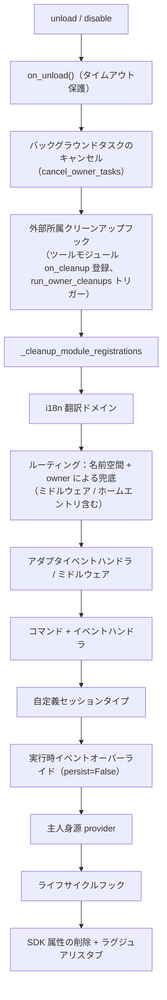

# 所属権（owner）システム

所属権は、モジュールの「プラグイン・アンド・プレイ」の基盤です。モジュールがロード時に登録するすべてのフレームワークリソースは自動的に所有者として記名され、アンロード/無効化時には所有者に応じて一括で回収されます。モジュールの開発者はリソースを宣言するだけで、手動でクリーンアップロジックを書く必要はありません。

> **関連システム**：スコープ（scope）は、イベントの配信時に「リソースが有効かどうか」を決定し、所属権はライフサイクルの中で「リソースは誰のものか、誰がアンロード時に回収されるか」を決定します。スコープについては [統一制御面（scope）](scope.md) を参照し、バックグラウンドタスクについては [ライフサイクル管理](lifecycle.md#バックグラウンドタスクの所有と自動キャンセル) を参照してください。

{!--< tips >!--}
1. 所属は**登録瞬間**に `current_owner` によって自動的に記録され、モジュールのコードは変更を必要としません。
2. アンロード/無効化は共通のクリーンアップチェーン（`_cleanup_module_registrations`）を使用し、各ステップで失敗しても警告のみで中断されません。
3. ユーザーの設定語義のリソース（永続化オーバーライド / scope 規則 / コマンド ACL）は、モジュールのアンロード時にクリーンアップされません。
4. ツールモジュールが外部ハンドルをホストしている場合、`on_cleanup(cb)` を使ってクリーンアップチェーンに登録し、他のモジュールがアンロードされた際に自動的にコールバックされます（[ツールモジュールガイド](#ツールモジュールガイド他のモジュールのハンドルをホストする) を参照）。
{!--< /tips >!--}

## owner コンテキストメカニズム

owner は `current_owner` というコンテキスト変数を通じて `ErisPulse.runtime.context` に渡されます：

```python
from ErisPulse.runtime import owner_scope, get_current_owner

with owner_scope("MyModule"):
    # この区間で登録されるすべてのリソースは自動的に MyModule に所属します
    assert get_current_owner() == "MyModule"
```

フレームワークは以下のタイミングで owner を自動的に注入します（モジュール/アダプタのコードは手動でラップする必要はありません）：

| 時機 | owner 値 | 位置 |
|------|----------|------|
| モジュール `load()` | モジュール名 | インスタンス化 + `on_load` 全体 |
| アダプタ `start()` / `restart()` | プラットフォーム名 | アダプタの起動全体 |
| `activate_on` ラグジュアリスタブ登録 | モジュール名 | 位置コマンド/ハンドラの登録 |
| イベントハンドラ実行中 | ハンドラの所属モジュール名 | handler / コマンドエントリポイントの再注入 |

実行中の再注入とは、モジュールが `on_load` で宣言したコマンドハンドラが**実行中**に登録型 API（`sdk.adapter.on()`、`overrides.*.set(persist=False)`）を呼び出す場合、それらも自動的に本モジュールに所属することを意味します。

## 所属リソースの全貌

モジュールがロードコンテキスト内で登録する以下のリソースはすべて所属が記録され、アンロード/無効化時に自動的に回収されます：

| リソース | 登録方法 | クリーンアップ呼び出し |
|------|----------|----------|
| コマンド | `@command()` / コマンド dict 宣言 | `command.unregister_by_owner()` |
| イベントハンドラ | `@message` / `@notice` / `@request` / `@meta` | `handler.unregister_by_owner()` |
| アダプタイベントリスナー | `sdk.adapter.on()` / `raw=True` | `adapter.unregister_handlers_by_owner()` |
| アダプタミドルウェア | `@sdk.adapter.middleware` | 同上 |
| ルーティング（HTTP/WS/SSE） | `router.http()` / `websocket()` / `sse()` | 名前空間と owner による二重保証 |
| ルーティングミドルウェア | `@router.middleware()` / `add_middleware()` | `router.unregister_all_by_owner()` |
| Dashboard ホームエントリ | `router.register_home_entry()` | `unregister_home_entries_by_owner()` |
| 自定義セッションタイプ | `register_custom_type()` | `unregister_custom_types_by_owner()` |
| バックグラウンドタスク | `self.spawn()` | `cancel_owner_tasks()` |
| 外部所属クリーンアップフック（ツールモジュールが他のモジュールのハンドルをホスト） | `runtime.on_cleanup(cb)` | `run_owner_cleanups()`（アンロード/無効化/アダプタのシャットダウンチェーン内でトリガー） |
| ライフサイクルフック | `lifecycle.register()` | `lifecycle.unregister_by_owner()` |
| 主人身源 provider | `master.provider` | `master.unregister_by_owner()` |
| i18n 翻訳キー | `I18nClass` 宣言（domain=モジュール名） | `i18n.unregister_domain()` |
| イベントオーバーライド（実行時） | `overrides.*.set(persist=False)` | `overrides.unregister_by_owner()` |
| 交互セッション（wait_reply 等待 / リース） | `event.wait_reply()` / `sdk.interaction.acquire()` | `interaction.cancel_by_owner()`（待機側が即座にキャンセルを受け取る） |
| コンテキストデータ | `runtime/context` は owner ごとに記録 | モジュールごとに正確にクリーンアップ |

アダプタ側の対応するリソース（プラットフォーム名を owner として）は、アダプタ `shutdown()` / `restart()` 時に `_cleanup_adapter_resources` によって回収され、以下も含まれます：

| リソース | クリーンアップ呼び出し |
|------|----------|
| アダプタ独自の `on()` ハンドラとミドルウェア | `adapter.unregister_handlers_by_owner(platform)` |
| プラットフォームイベントメソッド拡張（`EventMixin`） | `unregister_platform_event_methods(platform)` |
| 自定義セッションタイプ | `unregister_custom_types_by_owner(platform)` |
| 交互セッション（そのプラットフォームで待機中の wait_reply / リース） | `interaction.cancel_by_platform(platform)` |
| i18n 翻訳ドメイン（domain=設定キー） | `i18n.unregister_domain(設定キー)` |
| 細かい粒度の名前空間ルーティング | `router.unregister_all_by_owner(platform)` |

## アンロード/無効化クリーンアップシーケンス

`unload()` と `disable()` は共通のクリーンアップチェーンを使用します（各ステップは独立した try/except で、失敗してもログに記録され、**後続のクリーンアップを中断しません**）：



`sdk.uninit()` による終了時には、以下のグローバルな兜底処理が行われます：すべてのアダプタのシャットダウン → すべてのモジュールのアンロード → `router.stop()`（ルーティング/ミドルウェア/ホームエントリのクリア）→ `cancel_all_background_tasks()` → イベントハンドラとフックのクリア。

## 設計境界：アンロード時にクリーンアップされないリソース

所属権は**モジュールコードが登録した実行時リソース**のみを回収します。以下のリソースは**ユーザーの設定語義**（制御権はユーザーにあり、意図的に設定されている）に属し、モジュールのアンロード後も設定に従って永続的に保持されます：

| リソース | 語義 | 説明 |
|------|------|------|
| `overrides.*.set(persist=True)` | 永続化オーバーライド | 設定ファイルに書き込まれ、再起動後も有効；モジュールのアンロード時に削除されない（ユーザーが明示的に設定） |
| `scope.set_action()` などのスコープルール | 権限制御面 | ユーザー/Dashboard によって管理され、モジュールをアンロードしてもルールは回収されない |
| `overrides.acl.set(persist=True)` | コマンド ACL | 同上 |
| Conversation `save()` 永続化 | 多回対話の保存 | データ資産はクリーンアップされない |

実行時に一時的に書き込まれたもの（`persist=False`）は owner に応じて回収されます。**永続化の有無が「ユーザー資産」と「モジュールの実行時状態」の境界線です**。

## 内部実装：所属権がどのように機能するか

所属権システムは**2つの独立したチェーン**で構成されており、所属権の問題を調査するためには、それらの役割を理解することが前提です。

### 課題チェーン（contextvar 伝播）

`runtime/context.py` の `current_owner` などの ContextVar は**課題**（「このコードが登録するリソース/発生する呼び出しが誰のものか」）を担当します。伝播ルールは Python の contextvars 言語仕様に従います：

| 実行経路 | context が伝播するか | 課題結果 |
|---------|----------------|---------|
| 同期呼び出しチェーン / `await` チェーン | ✅ 伝播 | 正しい課題 |
| `owner_scope` 内の `asyncio.create_task` | ✅ 伝播（task は作成時の context をコピー） | その task 内のフレームワーク呼び出しが正しい課題になる |
| `run_in_executor` / ブルートスレッド | ❌ 伝播しない | 課題が失われる |
| 自作のイベントループ | ❌ 伝播しない | 課題が失われる |

> 課題 ≠ 登録：context の伝播は「誰のものか」を決定するだけです。リソースがクリーンアップされるかどうかは、登録チェーンに進んでいるかどうかにかかっています。

### キャンセルチェーン（タスク登録表）

`runtime/tasks.py` の `_owner_tasks` 登録表は**ライフサイクル**（「owner 名下に未完了のタスクが何個あるか、アンロード時に一括でキャンセルする」）を担当します。タスクが登録表に入る経路は以下の通りです：

1. **明示的なスケジュール**：`spawn_background()` / `self.spawn()` → 作成時に `current_owner`（または明示的な `owner=` パラメータ）をキャプチャ → 登録表に登録；
2. **Task Factory の自動登録**（2.8.3）：`install_owner_task_factory()` はフレームワークの起動時にメインイベントループにインストールされ、**すべてのタスクの作成**（サードパーティライブラリの内部の `create_task` を含む）がファクトリを経由するときに `current_owner` を読み取り、None でなければ登録されます。

登録表は自動的にクリーンアップされます：各タスクは `done_callback` を持っていて、完了すると表から削除され、リークがありません。

### キャンセルタイミング（モジュールアンロード）

```
module.unload()
  → on_unload(event)                    # モジュール独自のクリーンアップ（兜底タイムアウト保護）
  → フレームワークがこの owner のコマンド/イベント/フック/ルーティングを登録解除
  → cancel_owner_tasks(owner)           # タスク登録表による兜底キャンセル
      → 各 task.cancel()                # 自身のキャンセルロジックを実行中のタスクを除外
      → await gather(pending, timeout)  # 回収を待つ（タイムアウト後もブロックしない）
```

### 調査の考え方

- **リソースがクリーンアップされない** → 登録表をチェック：`get_owner_tasks("MyModule")` に該当タスクが含まれているか確認します。含まれていない場合は、登録経路が所属チェーンを経ていない（import 時 / スレッド / 独立ループ）ことが原因です。上記表を参照して位置を特定します。
- **課題が間違っている** → `get_current_owner()` をエラーが発生した瞬間の値で確認します。非同期の遅延実行（コールバック/タスク）の課題は、作成時の context に基づき、実行時の値とは異なります。

## モジュール開発者ガイド

### 推奨書き方

```python
from ErisPulse import sdk
from ErisPulse.Core.Event import command
from ErisPulse.runtime import owner_scope, spawn_background

class MyModule(BaseModule):
    async def on_load(self, event):
        # フレームワークリソース：自動的に所属し、手動でクリーンアップする必要はありません
        self.task = self.spawn(self.polling())      # バックグラウンドタスク
        sdk.router.register_home_entry("私のモジュール", "/my")  # ホームエントリ

        # モジュール独自のリソース：owner_scope に包むと所属体系に組み込まれます
        with owner_scope("MyModule"):
            self.client.on_event(self._handle)      # 假想の独自登録

    async def on_unload(self, event):
        # フレームワークリソースはすでに自動的に回収されているので、owner_scope がカバーしていない独自リソースのみクリーンアップします
        await self.client.close()
```

### 注意事項

- **import 時の登録には所属がありません**：モジュールのトップレベル（import 時）に登録されたフック/ハンドラは `owner_scope` より前に発生し、フレームワークリソース（owner=None）として扱われ、**クリーンアップされません**。すべて `on_load()` 内で登録してください。
- **独自の domain を持つ i18n 登録**：`i18n.register(domain=...)` の domain がモジュール名と異なる場合、自動的に回収されません。domain=モジュール名を保つようにしてください。
- **バックグラウンドタスクの推奨 `self.spawn()`**：2.8.3 以降、裸の `asyncio.create_task` も**自動的に所属**（Task Factory が自動登録し、アンロード時に兜底キャンセル）されます。ただし、`self.spawn()` は依然として推奨です —— 非メインループスレッドからメインループにスケジューリングできる、明示的な `owner=` 指定、fire-and-forget による GC 防止が可能です。**2.8.3 以前のバージョンでは、裸のタスクは所属せず、`self.spawn()` を使用する必要があります**。
- クリーンアップチェーンの「失敗は警告のみ」：1ステップのクリーンアップエラーは残りのリソース回収を中断せず、ログの DEBUG/WARNING レベルで確認できます。トラブルシューティング時には TRACE を有効化できます。

### 登録タイミング → 所属結果対照表

| 登録状況 | 所属結果 | 説明 |
|---------|---------|------|
| `on_load()` 内でフレームワーク API（コマンド/イベント/lifecycle/ルーティングデコレータ）を使って登録 | 所属モジュール | アンロード時に自動的に登録解除 |
| モジュールのトップレベル（import 時）に登録 | **所属なし**（owner=None） | クリーンアップされません。使用しないでください |
| `self.spawn()` で作成されたバックグラウンドタスク | 所属モジュール | アンロード時に自動的にキャンセル |
| `owner_scope("Name")` 内でサードパーティ API を使って登録 | 所属モジュール | サードパーティのコールバックが scope 内で同期的に実行されていることを前提とします |
| 裸の `asyncio.create_task`（`loop.create_task` / `ensure_future` を含む） | **自動的に所属**（Task Factory、2.8.3+） | 作成瞬間に `current_owner` を読み取り、owner コンテキスト内では自動的に登録され、アンロード時に兜底キャンセルされます。詳細は下記の [内部実装](#内部実装所属権がどのように機能するか) を参照 |
| 第三者ライブラリの非同期コールバック（aiohttp / APScheduler 等）内で作成されたタスク | **自動的に所属**（Task Factory、2.8.3+） | コールバックが実行されるときに `current_owner` が注入されている場合（フレームワークハンドラの実行中など）、タスクは自動的に登録されます |
| `run_in_executor`（スレッドプール） | **所属なし**（asyncio.Task ではない） | スレッドはタスクファクトリの管理外であり、ライフサイクルを手動で管理する必要があります |
| 独自のイベントループ（自作ループ）での登録 | **所属なし** | Task Factory はメインループにのみインストールされています。contextvars もイベントループ間で伝播しません |

> 原則：**所属は登録瞬間の `current_owner` コンテキストに従います**。非同期の遅延、スレッドプール、独自ループはすべてこのコンテキストから外れます —— 所属が必要な場合は、明示的に `owner_scope` に入ります。

## ツールモジュールガイド：他のモジュールのハンドルをホストする

**シナリオ**：定時タスク、レジストリ、接続プールなど「ツールモジュール」は他のモジュールが保持するもの（ハンドル）を代わりに管理します。たとえば、他のモジュールが `sdk.Cron.on_trigger(handler)` を呼び出すと、あなたのコンテナにはそのモジュールのインスタンスを指すコールバックが保存されます。フレームワークは他のモジュールが登録したすべてのフレームワークリソースを自動的にクリーンアップしますが、**あなたが****私有コンテナに保持している参照**はクリーンアップできません。他のモジュールがアンロードされた後も、あなたのコンテナはそのインスタンスを保持しているため、GC で回収されず（メモリリーク）、`purge` デバッグ診断では「回収不能」と表示されます。

**解決策**：他のモジュールのものを登録する関数内で `on_cleanup()` を呼び出し、フレームワークは他のモジュールがアンロード/無効化されたときに自動的にあなたのクリーンアップ関数を呼び出します：

```python
from ErisPulse.Core.Bases import BaseModule
from ErisPulse.runtime import off_cleanup, on_cleanup

class CronModule(BaseModule):
    def __init__(self):
        self._entries = {}  # {モジュール名: そのモジュールがホストするコールバックのリスト}

    def on_trigger(self, handler):
        # 自動的に呼び出し元モジュール名を識別（on_load からの直接呼び出し / module.call のいずれでも正しく動作）
        # 戻り値は解析された owner で、記名キーとして直接使用できます
        owner = on_cleanup(self._drop)
        self._entries.setdefault(owner, []).append(handler)

    def _drop(self, owner: str):
        """他のモジュールがアンロード/無効化された際にフレームワークが自動的に呼び出す：そのハンドルを破棄するだけ"""
        self._entries.pop(owner, None)

    async def on_unload(self, event):
        off_cleanup(self._drop)  # ③ 自分がアンロードする前にフックを登録解除し、self を保持しないようにする
```

フレームワークが保証する動作は以下の通りです：

| 点 | 行動 |
|--------|------|
| トリガーのタイミング | 他のモジュールがアンロード/無効化されたとき、またはアダプタが閉じられたとき —— いずれもフレームワークのクリーンアップチェーン内でトリガーされ、purge デバッグ診断より前に発生します |
| 呼び出し元の識別 | 直接呼び出しの場合は `current_owner` を取得、`module.call()` を通じて呼び出された場合は呼び出し元（`current_caller`）を取得、または `on_cleanup(cb, owner="モジュール名")` で明示的に指定することもできます |
| コールバックの署名 | `cb(owner: str)`、同期/非同期の両方をサポート、非同期の場合はタイムアウト保護（`CLEANUP_CALLBACK_TIMEOUT_SECS`、デフォルト 10 秒）が付与されます |
| 容赦 | 1つのコールバックのエラー/タイムアウトは、他のフックやクリーンアップチェーンに影響を与えません |
| 重複登録 | 同じ `(owner, callback)` は冪等的に重複登録を除去します |

**不要な場合**：もし他のモジュールが登録したリソースがフレームワークリソース（コマンド、イベントハンドラ、ルーティング、バックグラウンドタスク……）であれば、フレームワークが既に自動的にクリーンアップしています（上記 [所属リソースの全貌](#所属リソースの全貌) を参照）。あなたが私有コンテナに保持している他のモジュールのハンドルだけが `on_cleanup` が必要です。モジュール開発者の視点からの速查版は [ベストプラクティス・ツールモジュール](../developer-guide/modules/best-practices.md#ツールモジュールが他のモジュールのものをホストする場合にアンロード通知を受け取る必要がある) を参照してください。