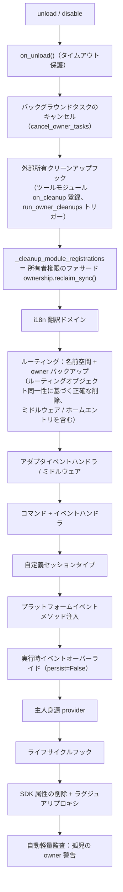

# 所有者（owner）システム

所有者（owner）は、モジュールの「プラグインとして即時利用」の基盤です。モジュールがロード時に登録するフレームワークリソースはすべて自動的に所有者に記名され、モジュールのアンロード/無効化時に所有者ごとに一括で回収されます。モジュール開発者はリソースを宣言するだけで、手動でクリーンアップロジックを書く必要はありません。

> **関連システム**：スコープ（scope）はイベント配信時に「リソースが有効かどうか」を決定し、所有者はライフサイクル中に「リソースは誰のものか、誰がアンロード時に回収されるか」を決定します。スコープの詳細は[統一制御面（scope）](scope.md)、バックグラウンドタスクの詳細は[ライフサイクル管理](lifecycle.md#バックグラウンドタスクの所有と自動キャンセル)をご覧ください。

{!--< tips >!--}
1. 所有者は**登録瞬間**に `current_owner` によって自動的に記録され、モジュールコードは変更不要です。
2. アンロード/無効化は共通のクリーンアップチェーン（`_cleanup_module_registrations`）を使用し、各ステップで失敗しても警告のみ表示され、処理は中断されません。
3. ユーザー設定のリソース（永続化オーバーライド / scope 規則 / コマンド ACL）は、モジュールのアンロード時にクリーンアップされません。
4. ツールモジュールが管理する外部ハンドルは、`on_cleanup(cb)` を使ってクリーンアップチェーンに登録し、他のモジュールがアンロードされた際に自動的にコールバックされます（[ツールモジュールガイド](#ツールモジュールガイド他のモジュールのハンドルを管理する)を参照）。
{!--< /tips >!--}

## owner コンテキストメカニズム

owner はコンテキスト変数 `current_owner` によって伝達されます（`ErisPulse.runtime.context`）：

```python
from ErisPulse.runtime import owner_scope, get_current_owner

with owner_scope("MyModule"):
    # この区間内で登録されるすべてのリソースは自動的に MyModule に所有されます
    assert get_current_owner() == "MyModule"
```

フレームワークは以下のタイミングで owner を自動的に注入します（モジュール/アダプタのコードは手動でラップする必要はありません）：

| タイミング | owner 値 | 位置 |
|------|----------|------|
| モジュール `load()` | モジュール名 | インスタンス化 + `on_load` 全体 |
| アダプタ `start()` / `restart()` | プラットフォーム名 | アダプタ起動全体 |
| `activate_on` ラグジュアリスタブ登録 | モジュール名 | 占位コマンド/ハンドラ登録 |
| イベントハンドラ実行中 | ハンドラの所有モジュール名 | handler / コマンドエントリ再注入 |

実行中の再注入とは、モジュールが `on_load` で宣言したコマンドハンドラが**実行中**に登録型 API（`sdk.adapter.on()`、`overrides.*.set(persist=False)`）を呼び出す場合でも、自動的に本モジュールに所有されることを意味します。

## 所有リソースの全貌

モジュールがロードコンテキスト内で登録した以下のリソースはすべて所有を記録し、アンロード/無効化時に自動的に回収されます：

| リソース | 登録方法 | クリーンアップ呼び出し |
|------|----------|----------|
| コマンド | `@command()` / コマンド dict 宣言 | `command.unregister_by_owner()` |
| イベントハンドラ | `@message` / `@notice` / `@request` / `@meta` | `handler.unregister_by_owner()` |
| アダプタイベントリスナー | `sdk.adapter.on()` / `raw=True` | `adapter.unregister_handlers_by_owner()` |
| アダプタミドルウェア | `@sdk.adapter.middleware` | 同上 |
| ルーティング（HTTP/WS/SSE） | `router.http()` / `websocket()` / `sse()` | 名前空間 + 所有者による二重バックアップ |
| ルーティングミドルウェア | `@router.middleware()` / `add_middleware()` | `router.unregister_all_by_owner()` |
| Dashboard ホームエントリ | `router.register_home_entry()` | `unregister_home_entries_by_owner()` |
| 自定義セッションタイプ | `register_custom_type()` | `unregister_custom_types_by_owner()` |
| プラットフォームイベントメソッド注入 | `register_event_method()` / `register_event_mixin()` | `unregister_event_methods_by_owner()`（モジュールアンロード時に自動回収、古いクロージャはリークしない） |
| バックグラウンドタスク | `self.spawn()` | `cancel_owner_tasks()` |
| 外部所有クリーンアップフック（ツールモジュール管理） | `runtime.on_cleanup(cb)` | `run_owner_cleanups()`（アンロード/無効化/アダプタ閉じチェーン内でトリガー） |
| ライフサイクルフック | `lifecycle.register()` | `lifecycle.unregister_by_owner()` |
| 主人身源 provider | `master.provider` | `master.unregister_by_owner()` |
| i18n 翻訳キー | `I18nClass` 宣言（domain=モジュール名） | `i18n.unregister_domain()` |
| イベントオーバーライド（実行時） | `overrides.*.set(persist=False)` | `overrides.unregister_by_owner()` |
| 交互セッション（wait_reply 等待 / リース） | `event.wait_reply()` / `sdk.interaction.acquire()` | `interaction.cancel_by_owner()`（待機側は即座にキャンセルを受信） |
| コンテキストデータ | `runtime/context` は所有者ごとに記録 | モジュールごとに正確にクリーンアップ |

アダプタ側の対応リソース（プラットフォーム名を所有者として）は、アダプタ `shutdown()` / `restart()` 時に `_cleanup_adapter_resources` によって回収され、以下も含まれます：

| リソース | クリーンアップ呼び出し |
|------|----------|
| アダプタ独自の `on()` ハンドラとミドルウェア | `adapter.unregister_handlers_by_owner(platform)` |
| プラットフォームイベントメソッド拡張（`EventMixin`） | `unregister_platform_event_methods(platform)` |
| 自定義セッションタイプ | `unregister_custom_types_by_owner(platform)` |
| 交互セッション（該当プラットフォームで待機中の wait_reply / リース） | `interaction.cancel_by_platform(platform)` |
| i18n 翻訳ドメイン（domain=設定キー） | `i18n.unregister_domain(設定キー)` |
| 細粒度名前空間ルーティング | `router.unregister_all_by_owner(platform)` |

## アンロード/無効化クリーンアップシーケンス

`unload()` と `disable()` は共通のクリーンアップチェーンを使用します（各ステップは独立して try/except で、失敗してもログに記録され、**後続のクリーンアップは中断されません**）：



`sdk.uninit()` による終了時には、以下のグローバルバックアップ処理が実行されます：すべてのアダプタの shutdown → すべてのモジュールの unload → `router.stop()`（ルーティング/ミドルウェア/ホームエントリのクリア）→ `cancel_all_background_tasks()` → イベントハンドラとフックのクリア。

## 所有者権限統一ファサード（ownership）

クリーンアップチェーンの16ステップは、所有者権限統一ファサード `ErisPulse.Core.ownership` に収束され、4つの動詞が「登録解除、カウント、スキャン、監査」をカバーします。サブシステム独自の `*_by_owner` 登録関数は変更されず、ファサードの内部実装として残ります：

| 動詞 | 用途 |
|------|------|
| `ownership.reclaim(owner)` | owner名下のすべてのリソースを一括で登録解除（タスクキャンセル → クリーンアップフック → 登録リソース；非同期完全版） |
| `ownership.reclaim_sync(owner)` | 登録リソースの登録解除（同期版、同期アンロード経路用） |
| `ownership.counts(owner=None)` | ただ読むだけの所有者登録リソースのカウント（Noneはすべての所有者） |
| `ownership.orphans()` | 孤児スキャン：リソースは登録されているが、所有者は登録解除されている（リークの確証リスト） |
| `ownership.audit(owner, deep=)` | リーク監査レポート（カウント + 孤児 + オプション gc インスタンス調査） |

```python
from ErisPulse.Core import ownership

ownership.reclaim_sync("MyModule")       # {'commands': 1, 'routes_http': 2, ...}
ownership.counts("MyModule")             # 登録リソースのカウント
ownership.orphans()                      # [{"owner": "ghost", "total": 2, ...}]
```

**監査エントリポイント**：

- アンロード / 再ロード後に**自動軽量監査**：孤児の所有者リソースが見つかると WARNING 警告（コストゼロのカウントスキャン）
- `sdk.module.audit(name, deep=True)`：モジュールインスタンスの gc 調査——インスタンスが再利用できない場合、参照元のタイプを示す（「誰が古いインスタンスを保持しているか」を特定）；グローバル停止のコストがかかるため、明示的なトラブルシューティングでのみ使用
- 深層調査は明示的操作であり、設定キーは設定せず、自動修復も行いません。

## ホットリロード失敗ロールバック

ホットリロードは「**アンロード前のスナップショット → 失敗時に自動回復**」に変更されました：新バージョンの構文エラー、依存性の欠落、ロード失敗時には、旧インスタンスと登録状態（登録表エントリ、sdk 属性、sys.modules エントリ）が自動的に復元され、サービスは中断されず、ログに「旧インスタンスにロールバックしてサービスを継続しました」と表示されます。

可能な限りの意味（ドキュメント化された境界）：

- `on_unload` で既に実行された副作用（切断された接続、キャンセルされたタスク）は取り消せません——復元後、旧インスタンスは「終了済み」状態になり、完全に利用可能になるには再びロードをトリガーする必要があります
- 実行時に第三者が手動でキャッシュした旧インスタンスへの参照は復元範囲外です
- 目標パッケージがアンロード済み（entry-point が消滅）の場合は、アンロード成功と見なし、ロールバックは行いません

## 設計境界：アンロード時にクリーンアップされないリソース

所有者権限は**モジュールコードが登録する実行時リソース**のみを回収します。以下のリソースは**ユーザー設定の意味**（コントロール権はユーザーにあり、意図的に設定される）に属し、モジュールのアンロード後も設定に従って永続的に保持されます：

| リソース | 意味 | 説明 |
|------|------|------|
| `overrides.*.set(persist=True)` | 永続化オーバーライド | 設定ファイルに書き込まれ、再起動にわたって有効；モジュールのアンロード時に削除されない（ユーザーが明示的に設定） |
| `scope.set_action()` などのスコープルール | 権限制御面 | ユーザー/Dashboard によって管理され、モジュールのアンロード時にルールは回収されない |
| `overrides.acl.set(persist=True)` | コマンド ACL | 同上 |
| Conversation `save()` 永続化 | 多回対話保存 | データ資産はクリーンアップされない |

実行時に一時的に書き込まれたもの（`persist=False`）は、owner に従って回収されます。**永続化の有無が「ユーザー資産」と「モジュール実行時状態」の境界線です**。

## 内部実装：所有権の仕組み

所有権システムは**2つの独立したチェーン**で構成されており、それらの役割を理解することは、所有権の問題を解決するための前提です。

### 帰属チェーン（contextvar 伝播）

`runtime/context.py` の `current_owner` などの ContextVar は**帰属**を担当します——「このコードが登録するリソース/呼び出しが誰の名前に記録されるか」。伝播ルールは Python の contextvars 言語仕様に従います：

| 実行経路 | context が伝播するか | 帰属結果 |
|---------|----------------|---------|
| 同期呼び出しチェーン / `await` チェーン | ✅ 伝播 | 正確な帰属 |
| `owner_scope` 内の `asyncio.create_task` | ✅ 伝播（task は作成時の context をコピー） | task 内部のフレームワーク呼び出しが正確に帰属 |
| `run_in_executor` / 裸スレッド | ❌ 伝播しない | 帰属が失われる |
| 自作イベントループ | ❌ 伝播しない | 帰属が失われる |

> 帰属 ≠ 登録：context 伝播は「誰の名前に記録されるか」を決定しますが、リソースがクリーンアップされるかどうかは、登録チェーンに入っているかどうかにかかっています。

### キャンセルチェーン（タスク登録表）

`runtime/tasks.py` の `_owner_tasks` 登録表は**ライフサイクル**を担当します——「owner 名下に未完了のタスクが何個あるか、アンロード時に一括でキャンセルするか」。タスクが登録表に入る方法：

1. **明示的なスケジューリング**：`spawn_background()` / `self.spawn()` → 作成時に `current_owner`（または明示的な `owner=` パラメータ）をキャプチャ → 登録表に登録；
2. **Task Factory 自動登録**（2.8.3）：`install_owner_task_factory()` はフレームワーク起動時にメインイベントループにインストールされる——**すべての**タスク作成（サードパーティライブラリの内部の `create_task` を含む）は、ファクトリを経由して `current_owner` を読み取り、None でなければ登録される。

登録表は自動でクリーンアップされます：各タスクには `done_callback` が付いており、完了すると表から削除され、リークしません。

### キャンセルタイミング（モジュールアンロード）

```
module.unload()
  → on_unload(event)                    # モジュール独自のクリーンアップ（バックアップタイムアウト保護）
  → フレームワークがこの owner のコマンド/イベント/フック/ルーティングを登録解除
  → cancel_owner_tasks(owner)           # タスク登録表のバックアップキャンセル
      → 各タスク.cancel()              # キャンセルロジック自体のタスクは除外
      → await gather(pending, timeout)  # 回収を待つ（タイムアウト後にブロックしない）
```

### 問題解決のアプローチ

- **リソースがクリーンアップされない** → 登録表を確認：`get_owner_tasks("MyModule")` に該当タスクが含まれているかを確認；含まれていない場合は登録経路が所有権チェーンを通過していない（import 時 / スレッド / 独立ループ）、上表を参照して位置を特定。
- **帰属が間違っている** → `get_current_owner()` をエラー発生時の値で確認；非同期遅延実行（コールバック/タスク）の帰属は作成時の context に従い、実行時の値とは異なる。

## モジュール開発者ガイド

### 推奨書き方

```python
from ErisPulse import sdk
from ErisPulse.Core.Event import command
from ErisPulse.runtime import owner_scope, spawn_background

class MyModule(BaseModule):
    async def on_load(self, event):
        # フレームワークリソース：自動的に所有される、手動でクリーンアップする必要はない
        self.task = self.spawn(self.polling())      # バックグラウンドタスク
        sdk.router.register_home_entry("私のモジュール", "/my")  # ホームエントリ

        # モジュール独自リソース：owner_scope に包むことで所有権体系に組み込む
        with owner_scope("MyModule"):
            self.client.on_event(self._handle)      # 假想の独自登録

    async def on_unload(self, event):
        # フレームワークリソースは自動的に回収される、owner_scope でカバーできない独自リソースのみクリーンアップする
        await self.client.close()
```

### 注意事項

- **import 時の登録には所有権がない**：モジュールのトップレベル（import 時）に登録されたフック/ハンドラは `owner_scope` 以前に発生するため、フレームワークリソース（owner=None）として扱われ、**クリーンアップされない**。すべて `on_load()` 内に登録すること。
- **独自 domain の i18n 登録**：`i18n.register(domain=...)` の domain がモジュール名と異なる場合、自動回収されないため、domain=モジュール名を保持すること。
- **バックグラウンドタスクは `self.spawn()` を推奨**：2.8.3 以降、裸の `asyncio.create_task` も**自動的に暗黙的に所有**（Task Factory が自動登録、アンロード時にバックアップキャンセル）される。ただし、`self.spawn()` は非メインループスレッドからメインループにスケジューリング、明示的な `owner=` 指定、fire-and-forget の GC 防止のため、引き続き推奨書き方です。**2.8.3 以前のバージョンでは、裸のタスクは所有されず、`self.spawn()` を使用する必要がある**。
- クリーンアップチェーンは「失敗しても警告のみ」：1ステップのクリーンアップエラーは他のリソースの回収を中断せず、ログの DEBUG/WARNING レベルで確認可能。トラブルシューティング時は TRACE を有効にすること。

### 登録タイミング → 所有結果対照表

| 登録状況 | 所有結果 | 説明 |
|---------|---------|------|
| `on_load()` 内でフレームワーク API（コマンド/イベント/lifecycle/ルーティングデコレータ）を使って登録 | 所有モジュール | アンロード時に自動的に登録解除 |
| モジュールのトップレベル（import 時）に登録 | **所有権なし**（owner=None） | クリーンアップされない、使用しないでください |
| `self.spawn()` で作成されたバックグラウンドタスク | 所有モジュール | アンロード時に自動的にキャンセル |
| `owner_scope("Name")` 内でサードパーティ API を使って登録 | 所有モジュール | 第三者がスコープ内で同期的に実行するコールバックに依存 |
| 裸の `asyncio.create_task`（`loop.create_task` / `ensure_future` を含む） | **自動所有**（Task Factory、2.8.3+） | 作成瞬間に `current_owner` を読み取り、owner コンテキスト内で自動登録、アンロード時にバックアップキャンセル；以下[内部実装](#内部実装所有権の仕組み)を参照 |
| サードパーティライブラリの非同期コールバック（aiohttp / APScheduler など）内で作成されたタスク | **自動所有**（Task Factory、2.8.3+） | コールバック実行時に `current_owner` が注入されている場合（フレームワークハンドラ実行中など）、タスクは自動登録される |
| `run_in_executor`（スレッドプール） | **所有権なし**（非 asyncio.Task） | スレッドはタスクファクトリの管理外、ライフサイクルを自分で管理する必要がある |
| 独自イベントループ（自作ループ）での登録 | **所有権なし** | Task Factory はメインループにのみインストールされる；contextvars もイベントループ間で伝播しない |

> 原則：**所有は登録瞬間の `current_owner` コンテキストに従う**；非同期の遅延、スレッドプール、独自ループはすべてこのコンテキストから外れるため、所有が必要な場合は明示的に `owner_scope` に入る必要がある。

## ツールモジュールガイド：他のモジュールのハンドルを管理する

**シナリオ**：定期タスク、レジストリ、接続プールのような「ツールモジュール」は他のモジュールのものを保管します——相手が `sdk.Cron.on_trigger(handler)` を呼び出すと、あなたのコンテナには相手のインスタンスを指すコールバックが格納されます。フレームワークは相手が登録したすべてのフレームワークリソースを自動的にクリーンアップしますが、**あなたが**私有コンテナに保持している参照はクリーンアップされません：相手がアンロードされた後もあなたのコンテナがインスタンスを保持しているため、GC で回収されず（メモリリーク、`purge` 泄漏診断で「再利用不可」と表示される）。

**解決策**：相手のものを登録する関数内で `on_cleanup()` を呼び出し、相手のモジュールがアンロード/無効化された際にフレームワークが自動的にあなたのクリーンアップ関数を呼び出します：

```python
from ErisPulse.Core.Bases import BaseModule
from ErisPulse.runtime import off_cleanup, on_cleanup

class CronModule(BaseModule):
    def __init__(self):
        self._entries = {}  # {モジュール名: そのモジュールの管理するコールバックリスト}

    def on_trigger(self, handler):
        # 自動的に呼び出し元モジュール名を識別（on_load 直接呼び出し / module.call どちらでも正しく動作）、戻り値は解析された owner で、記名キーとして直接使用可能
        owner = on_cleanup(self._drop)
        self._entries.setdefault(owner, []).append(handler)

    def _drop(self, owner: str):
        """相手のモジュールがアンロード/無効化された際にフレームワークが自動的に呼び出す：そのモジュールのハンドルを破棄するだけ"""
        self._entries.pop(owner, None)

    async def on_unload(self, event):
        off_cleanup(self._drop)  # ③ 自分自身がアンロード前にフックを解除し、フック表が self を保持しないようにする
```

フレームワークが保証する動作：

| 注目点 | 動作 |
|--------|------|
| トリガタイミング | 相手のモジュール unload / disable、またはアダプタの閉じる —— いずれもフレームワークのクリーンアップチェーン内でトリガされ、purge 泄漏診断よりも早い |
| 呼び出し元識別 | 直接呼び出しは `current_owner` を取得、`module.call()` で呼び出された場合は呼び出し元（`current_caller`）を取得、`on_cleanup(cb, owner="モジュール名")` で明示的に指定することも可能 |
| コールバック署名 | `cb(owner: str)`、同期 / 非同期どちらでも可、非同期はタイムアウト保護（`CLEANUP_CALLBACK_TIMEOUT_SECS`、デフォルト 10 秒） |
| 容錯 | 1つのコールバックが例外 / タイムアウトしてもログに記録され、他のフックやクリーンアップチェーンには影響しない |
| 重複登録 | 同じ `(owner, callback)` は冪等で重複削除される |

**必要ないケース**：相手が登録したのはフレームワークリソース（コマンド、イベントハンドラ、ルーティング、バックグラウンドタスク……）であれば、フレームワークが自動的にクリーンアップされます（上記[所有リソースの全貌](#所有リソースの全貌)参照）。あなたが私有コンテナに保持している相手のハンドルだけが `on_cleanup` が必要です。モジュール開発者の視点でのクイックリファレンスは[ベストプラクティス · ツールモジュール](../developer-guide/modules/best-practices.md#ツールモジュールが他人のものを管理する場合の通知を受け取る必要がある)を参照してください。