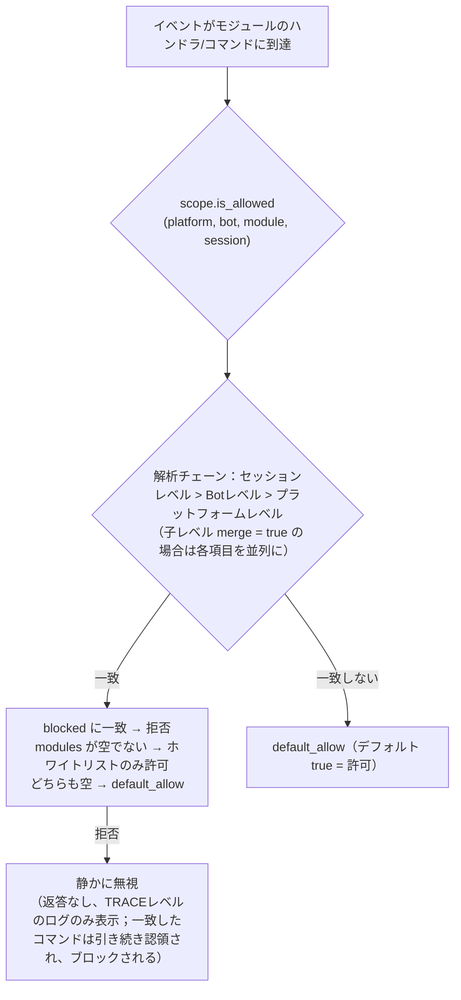

# スコープ (scope)

> [!NOTE]  
> この機能は ErisPulse **2.8.0+** が必要です。

スコープは以下の4つの質問に答えます：**どのモジュールが利用可能か、どのイベントを受信するか、特定のモジュールがどのテキストを処理するか、モジュールが外部に何ができるか**。  
コントロール権はすべてユーザーに委ねられ、モジュール / アダプター / プロセッサ / 出力呼び出しの登録の**上位**（`ErisPulse.scope` の設定または実行時 `sdk.scope`）で一括して宣言されます。イベントパイプラインはエントリ、プロセッサフィルタ、出力ゲートで自動的に読み取り、実行されます。

| ディメンション | コントロール対象 | 拒否動作 | 設定パス |
|------|---------|---------|---------|
| **① モジュール** | 利用可能なモジュール（プラットフォーム / Bot / セッションの3段階） | 静かに無視（返答なし；一致したコマンドは引き続き認領され、ブロックされる） | `scope.platforms / bots / sessions` |
| **② 身元** | イベントの受信（アダプター / Bot / セッション / ユーザーの4段階） | エントリで完全に破棄（静かに） | `scope.identity.*` |
| **③ 出力** | モジュールがどのような出力呼び出しを開始できるか（メッセージ / API / リクエスト、メソッドレベルのホワイト/ブラックリスト） | 失敗応答（`retcode=34601`） | `scope.actions` |

> **関連システム**：コマンドは特殊なメッセージイベントハンドラであり、そのユーザーブラック/ホワイトリスト（ACL）と実装パラメータのオーバーライドはコマンドシステムが保持します（`ErisPulse.event.command`）。  
> [イベント処理入門](../getting-started/event-handling.md) と [設定ガイド](../user-guide/configuration.md) を参照してください。

{!--< tips >!--}
1. `from ErisPulse.Core import scope` をインポートしてシングルトンを使用（`sdk.scope` は同じオブジェクト）
2. 判定：`scope.is_allowed(...)` / `scope.is_identity_allowed(...)` /  
   `scope.is_action_allowed(...)` はそれぞれ①②③の3つのゲートに対応
3. 読み書き：ディメンション化されたパラメータメソッド（IDEで補完可能）——  
   `scope.set_module(...)` / `scope.set_identity(...)` / `scope.set_action(...)`；  
   また、辞書形式のバックアップ `scope.get(path)` / `scope.set(path, v)` / `scope.delete(path)`
4. イベントハンドラのテキスト条件オーバーライドは  
   [イベント処理入門 · イベントオーバーライド](../getting-started/event-handling.md#イベントオーバーライド-モジュールコードを変更せずに任意のイベントタイプの動作をオーバーライド) を参照。  
   コマンド ACL / パラメータオーバーライドは [イベント処理入門](../getting-started/event-handling.md) を参照
{!--< /tips >!--}

## マッチング条目構文（全システム共通）

スコープのすべての「名前リスト」（モジュール名、身元キー、出力条目）は、同一のマッチング構文（`ErisPulse.Core.text_match`）を使用します：

| 構文 | 例 | 説明 |
|------|------|------|
| 精確名 | `"Chat"` | 完全一致比較、**大文字小文字は区別しない** |
| glob | `"Tool*"`、`"spam_*"` | `*` 任意文字列 / `?` 1文字 / `[seq]` 文字集合、大文字小文字は区別しない |
| 正規表現 | `"re:^Danger.*"` | `re:` 前置詞で宣言、正規表現の `search` で一致、デフォルトで大文字小文字は区別しない |

- 不正な正規表現は**静かに降格**される（エラーを投げず、クラッシュしない）
- デコレータ引数（`pattern=` / `regex=`）は固定の意味を持つ：`pattern` は glob、`regex` は正規表現ソースコード（`re:` 前置詞なし）；スコープ設定の正規表現条目は**必ず** `re:` 前置詞が必要

## グローバルバックアップ：`default_allow`

`default_allow` は**グローバルで唯一**のバックアップスイッチ（デフォルト `true`）で、以下の2つの判定次元に一括して効果します：

- **モジュール次元**：すべてのバインドに一致しない → `default_allow` で許可 / 拒否を決定
- **身元次元**：すべての戦略に一致しない → `default_allow` で許可 / 拒否を決定

`false` に設定すると「暗黙の拒否」厳格モードが有効になり、ホワイトリスト式の管理が可能で、**明示的に許可されていないものはすべて拒否**されます。

> **例外**：③ 出力次元は `default_allow` の影響を受けない——これは独立した絞り込みスイッチで、デフォルトはすべて許可され、明示的なルールのみが制限される（フレームワーク層の owner が空の呼び出しは常に許可される）。  
> これにより、厳格なグローバルモードでも、すべてのモジュールのメッセージ返信が意図せず遮断されることはない。  
> コマンド ACL には独立した `ErisPulse.event.command.default_allow` バックアップがあり、互いに影響しない。

## 設定ファイル

```toml
[ErisPulse.scope]
default_allow = true        # グローバルバックアップ（false = 暗黙の拒否厳格モード）
cache_size = 1024           # LRUキャッシュサイズ

# ── ① モジュール次元（優先度：セッション > Bot > プラットフォーム）──
[ErisPulse.scope.platforms.onebot11]
modules = ["Chat", "Tool*"]   # ホワイトリスト：正確名 / glob / re: 正規表現
blocked = ["re:^Danger"]
[ErisPulse.scope.bots.onebot11."123456"]
modules = ["Chat"]
merge = true                  # プラットフォームレベルのバインドに追加（デフォルトは全体上書き）
[ErisPulse.scope.sessions.onebot11."789012345"]
modules = ["Chat"]

# ── ② 身元次元（優先度：ユーザー > セッション > Bot > アダプター）──
[ErisPulse.scope.identity.adapters.onebot11]
deny = true                   # アダプター全体のイベントを完全に破棄
[ErisPulse.scope.identity.bots.onebot11."123456"]
deny = true
[ErisPulse.scope.identity.sessions.onebot11."g_blocked"]
deny = true
[ErisPulse.scope.identity.users.onebot11]
allow = ["u_admin"]           # ユーザー識別子に glob / re: 正規表現をサポート
deny = ["u_bad", "spam_*"]

# ── ③ 出力次元（デフォルトはすべて許可、明示的に絞る場合のみ制限）──
[ErisPulse.scope.actions.MyModule]
send = { deny = true }                                    # 送信を全禁止
api = { allow = ["get_*"] }                               # クエリ系の標準APIのみ許可
request = { deny = true }                                 # リクエスト処理を禁止
```

## ① モジュール次元

あるコンテキストで、どのモジュールが利用可能かを回答します。デフォルトではすべて開放されており、設定バインド後からフィルタリングが始まります。**モジュールとアダプターは変更を必要としません**。



- **解析優先度：セッションレベル > Botレベル > プラットフォームレベル**。高優先度のバインドは低優先度を**全体的に上書き**します。  
  子レベルのバインドに `merge = true` を書くと、低優先度と**各項目を並列に**します（`modules` / `blocked` はそれぞれマージされ、`merge` 自体は制御キーとして扱われ、項目には含まれません）
- **静かの意味**：フィルタリングされたモジュールのコマンドとハンドラは実行されず、返答もされず、`core.scope.denied` のTRACEレベルのログのみが表示されます。  
  一致した**コマンド**は引き続き認領され、ブロックされます——コマンドが拒否された後に低優先度のメッセージハンドラが再度応答する「二重応答」の矛盾を排除します
- **フレームワークレベルのハンドラ**（`scope_exempt=True` または owner が空）は影響を受けません；モジュール名が空（フレームワーク層のリソース）は常に許可されます
- **セッション感知のヘルプとコマンド照会**：コマンド照会API（`command.help` / `get_command` / `get_commands` / `get_group_commands` / `get_visible_commands`、および `module.get_commands_overview`）は、オプションの `event=` または明示的な `platform=` / `bot_id=` / `session_id=` キーワードをサポートします——現在のセッションで利用できないモジュールのコマンドは結果に含まれません（`get_command` は None を返し、単一コマンドのヘルプは「未登録」として扱われ、静かの意味と一致）；コンテキストを渡さない場合は、全量の動作が維持されます

### バインド継承（merge）

デフォルトでは、上書きの意味が明確で予測可能です。上位レベルの内容に**追加**したい場合は、子レベルに `merge = true` を書きます：

```toml
[ErisPulse.scope.platforms.onebot11]
modules = ["Chat", "Tool"]      # プラットフォームレベル：Chat、Tool を許可

[ErisPulse.scope.bots.onebot11."123456"]
modules = ["Music"]
merge = true                    # この Bot で実行される = ["Chat", "Tool", "Music"]
```

- 合併ルール：`modules` と `blocked` は**並列に**マージされます；バインド内では `blocked` が `modules` より優先されます
- 鏈式のマージ：プラットフォーム → Bot → セッションの順に段階的に追加され、各段階で `merge` または上書きを個別に決定します

## ② 身元次元（イベント受信）

「誰のイベントを受信するか」を回答します。拒否されたイベントは**イベント配信のエントリで完全に破棄**されます——ミドルウェアやどのハンドラにも送られず（フレームワークレベルも含む）、`core.scope.identity_denied` のTRACEレベルのログのみが表示されます。

- **解析優先度：ユーザー > セッション > Bot > アダプター**。最も具体的な設定された戦略を取る；`deny` は `allow` より優先
- 各レベルのバインドは二元戦略：`{ allow = true }` または `{ deny = true }`
- ユーザー識別子は glob / 正規表現をサポート（例：`"spam_*"` で一括した迷惑ユーザーをブロック）
- 一般的な使い方——上位で deny、個人で allow で「例外許可」：

```toml
[ErisPulse.scope.identity.adapters.onebot11]
deny = true
[ErisPulse.scope.identity.users.onebot11]
allow = ["u_admin"]   # アダプター全体が拒否していても、u_admin のイベントは許可される
```

## ③ 出力次元（モジュールの出力呼び出し制限）

モジュールが**出力アクション**（メッセージ送信 / 標準APIアクション / リクエスト操作）を開始することを制限します。  
3つのアクションはそれぞれのDSLに対応：`Event.reply` と `Send`（send）、`Api` / `call_api`（api）、`Request` の accept/reject（request）。イベントハンドラ実行中に出力呼び出しが発生した場合、モジュールの owner が含まれ、この次元で一括して判定されます。

### 規則の形態（インライン表）

各アクションのルールはインライン表です：`{ allow = [...], deny = true|[...] }`。  
同一アクションには1つのルールしか設定できません（TOMLのキーは重複不可、全禁止と細粒度はどちらか一方のみ）：

```toml
[ErisPulse.scope.actions.MyModule]
send = { deny = true }                                  # 送信を全禁止（Event.reply / Send DSL）
# または方法レベルの細粒度：send = { allow = ["Text", "Image*"], deny = ["File"] }
api = { allow = ["get_*"] }                             # クエリ系の標準APIのみ許可
# またはアクションレベルのブラックリスト：api = { deny = ["set_*", "leave_*"] }
request = { deny = true }                               # リクエストの処理を禁止（accept/reject）
```

- `send` の条目は**送信メソッド名**（`Text` / `Image` / `File` ...）に一致します、  
  `api` の条目は**標準アクション名**（`get_group_info` / `set_group_name` ...）に一致します
- 条目は正確名 / glob / `re:` 正規表現（全システムの統一構文に一致し、大文字小文字は区別しない）をサポート
- `allow` に1つの文字列を書くことは、1つのリスト条目と同等です：`send = { allow = "Text" }`

### 判定の意味

**デフォルトはすべて許可**——設定されていない場合、または owner が空（フレームワーク層の内部呼び出し）の場合はすべて許可されます。  
設定ルールがある場合、以下の順序で判定されます：

1. `deny = true` → 拒否
2. `deny` リストに呼び出し名が一致 → 拒否
3. `allow` リストが空でないかつ呼び出し名が一致しない（または呼び出し名がない）→ 拒否
4. その他の場合は許可

拒否された呼び出しはネットワークリクエストを開始せず、直接標準の失敗応答（`retcode = 34601`、[api-response §5.3](../standards/api-response.md#53-フレームワーク拡張返却コード34xxx-プラットフォームエラー段の下3桁のカスタム定義)）を返します。  
3つのアクションは互いに独立しており、1つだけ制限できます。

```python
# 実行時API
sdk.scope.set_action("MyModule", "send", deny=True)              # 送信を全禁止
sdk.scope.set_action("MyModule", "send", allow=["Text"])         # 送信可能なのはテキストのみ
sdk.scope.is_action_allowed("MyModule", "send", name="Image")    # False
sdk.scope.is_action_allowed("MyModule", "api", name="get_user_info")  # 規則に従って判定
sdk.scope.delete_action("MyModule", "send")                      # 許可を復元
sdk.scope.get_action("MyModule", "send")                         # そのアクションの現在のルール
```

## 実行時API

スコープの実行時APIは3つの層に分かれています：**判定**（3つの質問）、**ディメンション化された読み書き**（各層の `set` / `get` / `delete` パラメータ化メソッド、すべての型注釈が付いており、IDEで補完可能）、**辞書形式のバックアップ**（ドット区切りパスで任意の節に直接アクセス）。

```python
from ErisPulse import sdk

scope = sdk.scope
```

### 判定（3つの質問）

```python
scope.is_allowed("onebot11", "123456", "Chat")                 # ① モジュール次元
scope.is_allowed("onebot11", "123456", "Chat", "789012345")    # セッションレベルを含む
scope.is_allowed("onebot11", "123456", None)                   # フレームワーク層のリソース -> True

scope.is_identity_allowed("onebot11", "123456", "group_9", "u1")   # ② 身元次元

scope.is_action_allowed("MyModule", "send")                    # ④ 出力次元
scope.is_action_allowed("MyModule", "send", name="Image")      # メソッドレベルの細粒度
```

### ① モジュール次元

```python
# バインド（パラメータによって階層が決定：session_id > bot_id > プラットフォームレベル）
scope.set_module("onebot11", bot_id="123456", modules=["Chat", "Tool*"])
scope.set_module("onebot11", blocked=["re:^Danger"])                       # プラットフォームレベル
scope.set_module("onebot11", bot_id="123456", session_id="g9", modules=["Chat"])  # セッションレベル
scope.set_module("onebot11", bot_id="123456", modules=["Music"], merge=True)      # 現在のバインドと並列に追加
scope.set_module("onebot11", bot_id="123456", modules=["Chat"], persist=False)    # 実行時のみ

# 読み取り / 削除
scope.get_module("onebot11", bot_id="123456")   # {"modules": ["Chat"], "blocked": []}
scope.delete_module("onebot11", bot_id="123456")
```

> `merge=True` は**書き込み時の並列**（現在のバインドと条目を並列に）です；階層解析時の `merge = true` 設定は上記の[バインド継承](#バインド継承merge)を参照してください——これらは独立したメカニズムです。

> **実行時バインド（`persist=False`）の意味**：実行時バインドは独立したオーバーライド層に保存され、**その後のすべての設定書き込み / 設定ファイルのホットアップデートによっても破棄されません**（設定ツリーの再構築後に書き込み順序で自動的に再実行され、実行時削除も含む）。それらは永続化されず、プロセスの再起動後に失われる。モジュールのアンロード時に、そのモジュールが書き込んだ実行時バインドはバックアップでクリーンアップされる。その後、同じパスに対して `persist=True` で書き込み（ユーザー永続化の意味）を行うと、実行時ルールが上書きされます。

### ② 身元次元

```python
# 戦略のバインド（パラメータによって階層が決定：user > session > bot > adapter；allow / deny は二択）
scope.set_identity("onebot11", user_id="u_bad", deny=True)
scope.set_identity("onebot11", user_id="spam_*", deny=True)    # キーに glob / re: 正規表現をサポート
scope.set_identity("onebot11", bot_id="123456", session_id="g9", allow=True)

# 読み取り / 削除
scope.get_identity("onebot11", user_id="u_bad")   # {"deny": True}
scope.delete_identity("onebot11", user_id="u_bad")
```

### ③ 出力次元

```python
# 制限ルールの設定（allow: str|list；deny: bool|str|list；ルール全体の置換）
scope.set_action("MyModule", "send", deny=True)                    # 送信を全禁止
scope.set_action("MyModule", "send", allow=["Text"])               # 送信可能なのはテキストのみ
scope.set_action("MyModule", "api", deny=["set_*", "leave_*"])     # 管理系APIを禁止

# 読み取り / 削除
scope.get_action("MyModule", "send")       # {"allow": ["Text"]} 元のルール
scope.delete_action("MyModule", "send")    # 単一アクションを削除
scope.delete_action("MyModule")            # モジュールの全アクション制限を削除
```

### 一般的な操作

```python
scope.get("platforms")   # 辞書形式のバックアップ：ドット区切りパスで任意の節を読み取り
scope.topology()         # 全ての設定ツリー（ダッシュボード用）
scope.stats()
# {"module_calls": .., "module_filtered": .., "identity_checks": .., "identity_denied": ..,
#  "action_checks": .., "action_denied": .., "cache_hits": .., "cache_misses": ..}
scope.reset_stats()
scope.clear()           # 全ての設定をクリア（メモリ内のみ有効）
```

### 高度操作：辞書形式のドット区切りパスバックアップ

ディメンション化されたメソッドは日常的なシナリオをカバーします。任意のノード（または将来追加されるディメンション）に直接アクセスする必要がある場合は、辞書形式のAPIを使用します——`get` / `set` / `delete` はドット区切りパスを受け取り（dictの深いマージ、書き込み後に即座に読み取り可能）、`scope[path]` / `scope[path] = v` / `del scope[path]` / `path in scope` のプロトコルも提供します：

```python
scope.set("bots.onebot11.123456", {"modules": ["Chat"], "blocked": []})
scope.set("identity.users.onebot11.u_bad", {"deny": True})
scope.get("actions.MyModule.send")

scope["platforms.onebot11"]        # 読み取り（存在しない場合はKeyError）
scope["platforms.onebot11"] = {...}  # 書き込み
del scope["platforms.onebot11"]      # 削除
"actions.MyModule" in scope          # 存在確認
```

## キャッシュとホットアップデート

- `is_allowed` / `is_identity_allowed` / `is_action_allowed` の結果は **LRUキャッシュ**（`scope.cache_size` で調整可能）が付いており、`set` / `delete` /  
  設定のホットアップデート（`config.updated` / `config.set`）で自動的に無効化されます
- すべてのディメンションの設定は**即座に有効**になり、再起動は不要
- スコープは「イベントごとに」判断されるため、イベント間で状態を保持しない：設定が変わると、次のイベントから新しいルールで判断される

## 設定フォーマットの検証

ロード時またはホットアップデート時に、各セクションの設定フォーマットを検証します：型エラーのセクション（例：`platforms` が文字列になっている）、不正な出力ルール（例：`allow` が数字になっている）、未知のアクション名、未知のトップレベルのキー（例：`alow` のスペルミス）は **WARNING** として出力され、対応するセクション / 条目は無視され、他の合法な設定は正常に有効になります——間違った設定は静かに無効になることはありません。

## 一般的な問題と注意事項

### 1. 設定の階層と上書き

- モジュール次元：セッションレベル > Botレベル > プラットフォームレベル、**全体上書き**（子レベルで `merge = true` の場合は各項目を並列に）。  
  「プラットフォームで Chat を許可し、Bot で Music を追加したい」場合は、Bot レベルで `merge = true` を書くか、両方をリストに書く
- 身元次元：ユーザー > セッション > Bot > アダプター、**最も具体的な**設定された戦略を取る（例外許可が可能）
- コマンドのユーザーブラック/ホワイトリスト：正確なコマンド名が glob キーに優先されます（`event.command.acl` を参照）

### 2. モジュール/コマンドが反応しない

まず、モジュール自体ではなくスコープの問題を疑う：

```python
from ErisPulse import sdk

print(sdk.scope.is_allowed(event.get_platform(), bot_id, "MyModule", session_id))
print(sdk.scope.is_identity_allowed(event.get_platform(), bot_id, session_id, user_id))
print(sdk.scope.stats())   # module_filtered / identity_denied > 0 は静かにフィルタされていることを示す
```

フィルタリングは**静か**です（モジュール次元と身元次元では返答せず、ルールを暴露しない）、統計は累積されます；ACL で拒否されたコマンドは「権限不足」という明示的な返答をします。

### 3. 出力アクションが拒否されたときのトラブルシューティング

```python
from ErisPulse import sdk

print(sdk.scope.get("actions.MyModule"))
print(sdk.scope.stats())   # action_denied > 0 は呼び出しがブロックされていることを示す
```

ブロックは**明示的**です：拒否された呼び出しは `retcode = 34601` の標準の失敗応答を返し（ネットワークリクエストを開始しない）。

### 4. セッション識別子のプラットフォーム間隔離

`(platform, session_id)` の組み合わせが唯一の識別子です。`scope.sessions.onebot11."789"` は onebot11 でのみ有効で、telegram で同じ `789` のセッションには影響しません。身元次元のユーザー識別子も同様です。

## トポロジツリーAPI

`ModuleManager.get_topology()` と `AdapterManager.get_topology()` は、モジュール/アダプターの所属関係データを提供します。`sdk.get_topology()` は、スコープ `scope` を含む一括集約を提供します：

```python
from ErisPulse import sdk

topology = sdk.get_topology()
# {
#   "modules": {                                   # モジュール → 持有するリソース
#     "Chat": {
#       "loaded": True, "enabled": True,
#       "commands": ["chat", "translate"],
#       "handlers": {"message": 2, "notice": 1},
#       "routes": {"http": ["/Chat/api"], "ws": [], "sse": []},
#       "lifecycle_hooks": 3,
#     }
#   },
#   "adapters": {                                  # アダプター → Bot → スコープ
#     "onebot11": {
#       "status": "started", "enabled": True,
#       "bots": {"123456": {"status": "online", "scope": {...}}},
#       "scope": {"modules": [...], "blocked": [...]},
#     }
#   },
#   "scope": {                                     # スコープ（モジュール / 身元 / 出力アクション）
#     "platforms": {...}, "bots": {...}, "sessions": {...},
#     "identity": {"adapters": {...}, "bots": {...}, "sessions": {...}, "users": {...}},
#     "actions": {...},
#   },
# }
```

- モジュールトポロジーは、登録されたコマンド、イベントハンドラ、HTTP/WS/SSEルート、ライフサイクルフックを集約し、モジュールリソースツリーの描画に便利です。
- アダプタートポロジーは、各アダプターのステータス、所属するBotのステータス、およびプラットフォーム/Botレベルのスコープバインド（モジュール次元）を集約します。
- **JSON安全出力**：`get_topology(json_safe=...)` はデフォルトで `True` で、返された構造は `json.dumps` で直接シリアライズ可能——モジュール `info` は純粋なデータの `meta` サブテーブルのみを保持し（`module_class` / `strategy` などの実行時オブジェクトは除外）、その他のノード（アダプター作者が Bot `info` に追加した任意のオブジェクトを含む）はバックアップで浄化されます（クラスオブジェクトは `__name__` を取得、シリアライズできないオブジェクトは `str()` に退化）。ダッシュボード / WebUI は直接シリアライズして返すことができる；元のオブジェクトが必要な場合は `json_safe=False` を渡す。