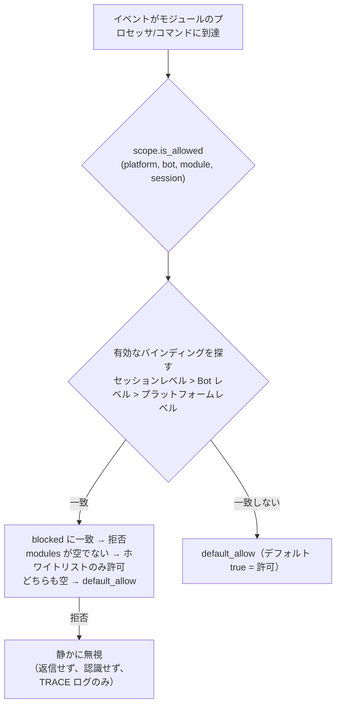

# 統一制御面（scope）

> [!NOTE]
> この機能は ErisPulse **2.8.0+** が必要です。

統一制御面は5つの問いに答える：**どのモジュールが利用可能か、どのイベントを受け取るか、誰が特定のコマンドを実行できるか、特定のモジュールがどのようなテキストを処理するか、どの実装パラメータをオーバーライドするか**。制御権は完全にユーザーに委ねられ、モジュール / アダプタ / コマンド / プロセッサの登録の**上層**（`ErisPulse.scope` の設定または実行時の `sdk.scope`）で一括して宣言され、イベントパイプラインは各段階で自動的に読み取り実行されます。

制御面は従来の複数の権限システムを統合し、2.8.0の権限/アクセス制御の**唯一**のエントリーポイントです：

| 維度 | 制御対象 | 拒絶動作 | 設定経路 |
|------|---------|---------|---------|
| **① モジュール** | 利用可能なモジュール（プラットフォーム / Bot / セッションの3段階） | 静かに無視（返信せず、認識しない） | `scope.platforms / bots / sessions` |
| **② 身元** | イベントの受信（アダプタ / Bot / セッション / ユーザーの4段階） | イベントの入口で完全に破棄（静かに） | `scope.identity.*` |
| **③ コマンド** | 特定のコマンドを誰が実行できるか（コマンド名はglob対応） | 「権限不足」を返信（明示的に） | `scope.commands` |
| **④ プロセッサ** | 特定のモジュールのイベントプロセッサがテキストをフィルタリング | トリガーしない（静かに） | `scope.handlers` |
| **⑤ オーバーライド** | モジュール/コマンドの実装パラメータ（master/hidden/aliases/prefix）をオーバーライド | ——（パラメータのみ変更） | `scope.overrides` |

{!--< tips >!--}
1. `from ErisPulse.Core import scope` でシングルトンをインポート（`sdk.scope` は同じオブジェクト）
2. `scope.is_allowed(platform, bot_id, module, session_id)` でモジュールが利用可能かどうか判断
3. `scope.is_identity_allowed(platform, bot_id, session_id, user_id)` でイベントが許可されるかどうか判断
4. `scope.allow_user("roll*", platform, uid)` / `deny_user(...)` コマンド ACL（glob対応）
5. `scope.override("MyModule", "restart", master=True)` 実装パラメータをオーバーライド
6. `scope.get_stats()` でフィルタ統計を確認；`scope.get_topology()` で5次元トポロジーを確認
{!--< /tips >!--}

## マッチング項目の構文（全システムで統一）

制御面のすべての「名前リスト」（モジュール名、身元キー、コマンド名）は共通のマッチング構文（`ErisPulse.Core.text_match`）を使用します：

| 構文 | 例 | 説明 |
|------|------|------|
| 精確名 | `"Chat"` | 全値比較、**大文字小文字無視** |
| glob | `"Tool*"`、`"spam_*"` | `*` 任意文字列 / `?` 1文字 / `[seq]` 文字集合、大文字小文字無視 |
| 正規表現 | `"re:^Danger.*"` | `re:` 前置詞で宣言、正規表現 `search` でマッチ、デフォルト大文字小文字無視 |

- 不正な正規表現は**静かに不一致**と判定（エラー発生せず、クラッシュしない）
- デコレータのパラメータ（`pattern=` / `regex=`）は固定の意味：`pattern` は glob、`regex` は正規表現ソース（`re:` 前置詞なし）；制御面の設定内の正規表現項目は**必ず** `re:` 前置詞が必要

## グローバルデフォルト：`default_allow`

`default_allow` は**唯一**のグローバルデフォルトスイッチ（デフォルト `true`）で、3つの判定次元に統一的に効果があります：

- **モジュール次元**：どのバインディングにも一致しない → `default_allow` で許可 / 拒否を決定
- **身元次元**：どのポリシーにも一致しない → `default_allow` で許可 / 拒否を決定
- **コマンド次元**：ACLが設定されていない → `default_allow=true` で開発者のデフォルト権限チェーンに委ねる；`false`（厳密モード）はACLが設定されていないコマンドを拒否

`false` に設定すると「暗黙の拒否」厳密モードが有効になり、**明示的に許可されていないものはすべて拒否**されます。

## 設定ファイル

```toml
[ErisPulse.scope]
default_allow = true        # グローバルデフォルト（false = 暗黙の拒否厳密モード）
cache_size = 1024           # LRUキャッシュサイズ

# ── ① モジュール次元（優先度：セッション > Bot > プラットフォーム）──
[ErisPulse.scope.platforms.onebot11]
modules = ["Chat", "Tool*"]   # ホワイトリスト：精確名 / glob / re: 正規表現
blocked = ["re:^Danger"]
[ErisPulse.scope.bots.onebot11."123456"]
modules = ["Chat"]
[ErisPulse.scope.sessions.onebot11."789012345"]
modules = ["Chat"]

# ── ② 身元次元（優先度：ユーザー > セッション > Bot > アダプタ）──
[ErisPulse.scope.identity.adapters.onebot11]
deny = true                   # アダプタ全体のイベントを完全に破棄
[ErisPulse.scope.identity.bots.onebot11."123456"]
deny = true
[ErisPulse.scope.identity.sessions.onebot11."g_blocked"]
deny = true
[ErisPulse.scope.identity.users.onebot11]
allow = ["u_admin"]           # ユーザー鍵は glob / re: 正規表現に対応
deny = ["u_bad", "spam_*"]

# ── ③ コマンド次元（コマンド名は glob に対応）──
[ErisPulse.scope.commands."roll*"]
allow = ["onebot11:u_vip"]    # ユーザー識別子 "platform:user_id"
deny = ["onebot11:u_bad"]

# ── ④ プロセッサ/テキスト次元 ──
[ErisPulse.scope.handlers.MyModule]
pattern = "签到*"             # コード内の pattern/regex 条件と AND
regex = "re:\\d+\\s*元"

# ── ⑤ 実装パラメータのオーバーライド ──
[ErisPulse.scope.overrides.MyModule.restart]
master = true                 # フレームワークの所有者のみ利用可能
hidden = true                 # ヘルプに表示しない
aliases = ["rs"]              # 別名を追加
prefix = "!"                  # トリガ前缀を追加
```

## ① モジュール次元

「あるコンテキストの中で、どのモジュールが利用可能か」を回答します。デフォルトではすべて開放されています；設定をバインディングした後フィルタリングを開始し、**モジュールとアダプタは変更を必要としません**。



- **解析優先度：セッションレベル > Bot レベル > プラットフォームレベル**、高優先度のバインディングは低優先度を**全体的に上書き**します
- **静かの意味**：フィルタリングされたモジュールのコマンドとプロセッサはトリガーされず、返信も認識もされず（コマンド間の誤一致を防ぐ）、TRACE レベルのログ（`core.scope.denied`）のみ表示されます
- **フレームワークレベルのプロセッサ**（`scope_exempt=True` または owner が空）は影響を受けず、モジュール名が空（フレームワーク層のリソース）は常に許可されます

## ② 身元次元（イベントの受容）

「誰のイベントを受け取るか」を回答します。拒否されたイベントは**配信の入口で完全に破棄**されます—ミドルウェアやすべてのプロセッサ（フレームワークレベルを含む）には届かず、TRACE レベルのログのみ表示されます（`core.scope.identity_denied`）。

- **解析優先度：ユーザー > セッション > Bot > アダプタ**、最も具体的な設定されたポリシーを取得；deny は allow より優先
- 各レベルのバインディングは二元ポリシー：`{ allow = true }` または `{ deny = true }`
- ユーザー鍵は glob / 正規表現に対応（例：`"spam_*"` で一括してスパムユーザーをブロック）
- 一般的な用途—上位の deny、個人の allow で「例外許可」を行う：

```toml
[ErisPulse.scope.identity.adapters.onebot11]
deny = true
[ErisPulse.scope.identity.users.onebot11]
allow = ["u_admin"]   # アダプタレベルで拒否されても、u_admin のイベントは許可される
```

## ③ コマンド次元（コマンド ACL）

「誰が特定のコマンドを実行できるか」を回答します。判定順序：**deny に一致 → 拒否；allow ホワイトリストが空でないかつ一致しない → 拒否；いずれも設定されていない → `default_allow` に従う**（`true` で開発者のデフォルト権限チェーンに委ねる）。拒否されたコマンドは「権限不足」という明示的な返信をします。

- コマンド名は glob に対応：`"roll*"` は `roll`、`roll_dice` などの一連のコマンドを1つのルールでカバー
- 精確な鍵は glob 鍵よりも優先（`commands.roll` に一致した場合は `commands."roll*"` はチェックされない）
- ユーザー識別子のフォーマットは `"platform:user_id"`（フレームワークの所有者システムと一致）
- この次元は**ユーザー側の追加のゲート**であり、コマンドの `master` / `permission` パラメータと連動する：ACL が通過した後も開発者が宣言したデフォルト権限チェーンを実行する

## ④ プロセッサ/テキスト次元

モジュールごとに「どのようなテキストを処理するか」をフィルタリング：モジュールに `pattern` / `regex` を設定した後、そのモジュールのすべてのイベントプロセッサはテキストが一致する場合にのみトリガーされます（コード内の条件と AND、両方を満たす必要がある）。モジュールのコードを変更せずにトリガー範囲を狭めるのに適しています。

```toml
[ErisPulse.scope.handlers.ChatModule]
pattern = "闲聊*"     # ChatModule のプロセッサは「闲聊」で始まるメッセージにのみ反応
```

## ⑤ 実装パラメータのオーバーライド

モジュール/コマンドの登録の**上層**で実装パラメータをオーバーライドし、モジュールのコードを変更せずに：

```toml
[ErisPulse.scope.overrides.MyModule.restart]
master = true      # 仅框架主人
hidden = true      # 帮助列表中隐藏
aliases = ["rs"]   # 生效别名
```

> オーバーライドは**実装パラメータ**（master / hidden / aliases / prefix / help / usage など）のみを変更します。**コマンドの無効化はここにはありません**—統一してコマンド次元の deny（`scope.commands` または `scope.deny_user()`）で行い、2つの「無効化」の意味が衝突しないようにします。

## 実行時 API

### モジュール次元

```python
from ErisPulse import sdk

# 判断
sdk.scope.is_allowed("onebot11", "123456", "Chat")
sdk.scope.is_allowed("onebot11", "123456", "Chat", "789012345")
sdk.scope.is_allowed("onebot11", "123456", None)      # 框架层资源 -> True

# 绑定 / 解绑
sdk.scope.bind_module("onebot11", "123456", modules=["Chat", "Tool*"])
sdk.scope.bind_module("onebot11", blocked=["Danger"])             # 平台级
sdk.scope.bind_module("onebot11", "123456", "789012345", modules=["Chat"])  # 会话级
sdk.scope.bind_module("onebot11", "123456", modules=["Music"], merge=True)  # 合并
sdk.scope.bind_module("onebot11", "123456", modules=["Chat"], persist=False)  # 仅运行时
sdk.scope.unbind_module("onebot11", "123456")

# 查询
sdk.scope.get("onebot11", "123456")   # {"modules": ["Chat"], "blocked": []}
```

### 身元次元

```python
# 判断事件是否放行
sdk.scope.is_identity_allowed("onebot11", "123456", "group_9", "u1")

# 绑定策略（层级由参数决定：user > session > bot > adapter）
sdk.scope.bind_identity("onebot11", user_id="u_bad", deny=True)
sdk.scope.bind_identity("onebot11", user_id="spam_*", deny=True)   # glob
sdk.scope.bind_identity("onebot11", "123456", "group_9", allow=True)
sdk.scope.unbind_identity("onebot11", user_id="u_bad")

# 用户黑名单便捷 API
sdk.scope.block_user("onebot11", "u_bad")
sdk.scope.is_user_blocked("onebot11", "u_bad")
sdk.scope.get_blocked_users()        # {"onebot11": ["u_bad"]}
sdk.scope.unblock_user("onebot11", "u_bad")
```

### コマンド次元

```python
sdk.scope.is_command_allowed("roll", "onebot11", "u1")
sdk.scope.allow_user("roll*", "onebot11", "u_vip")   # 命令名支持 glob
sdk.scope.deny_user("roll*", "onebot11", "u_bad")
sdk.scope.get_acl("roll*")
sdk.scope.remove_acl("roll*")

# 也可通过命令系统门面（等价委托）
from ErisPulse.Core.Event import command
command.allow_user("restart", "onebot11", "123456")
```

### プロセッサとオーバーライド次元

```python
sdk.scope.bind_handler("MyModule", pattern="签到*", regex=r"\d+号")
sdk.scope.unbind_handler("MyModule")

sdk.scope.override("MyModule", "restart", master=True, hidden=True)
sdk.scope.get_override("MyModule", "restart")
sdk.scope.remove_override("MyModule", "restart")
```

### 一般

```python
sdk.scope.list_bindings()   # 五维全量绑定
sdk.scope.get_topology()    # 五维拓扑（供 Dashboard）
sdk.scope.get_stats()
# {"module_calls": .., "module_filtered": .., "identity_checks": .., "identity_denied": ..,
#  "command_checks": .., "command_denied": .., "cache_hits": .., "cache_misses": ..}
sdk.scope.reset_stats()
sdk.scope.clear()           # 清空全部绑定（仅内存生效）
```

## キャッシュとホットアップデート

- `is_allowed` / `is_identity_allowed` の結果は **LRU キャッシュ**（`scope.cache_size` で調整可能）付き、`bind_*` / `unbind_*` / 設定のホットアップデート（`config.updated` / `config.set`）で自動的に無効化されます
- すべての次元の設定は**即時有効**で、再起動は不要
- 制御面は「イベントごとの」判断で、イベント間の記憶は持たない：設定が変わると、次のイベントは即座に新しいルールに従う

## 一般的な問題と注意事項

### 1. 設定の階層とオーバーライド

- モジュール次元：セッションレベル > Bot レベル > プラットフォームレベル、**全体的に**オーバーライド。プラットフォームで Chat を許可し、Bot で Music を追加したい場合は、Bot レベルで両方をリストする必要があります
- 身元次元：ユーザー > セッション > Bot > アダプタ、**最も具体的**な設定されたポリシーを取得（例外許可が可能）
- コマンド次元：精確なコマンド名が glob 鍵よりも優先

### 2. モジュール/コマンドのコードを変更するよりも制御面を使う

モジュールが宣言するのは「開発者のデフォルト」（`master=True`、`permission=...`、`pattern=...`）；制御面が宣言するのは「ユーザーの最終決定」。両者が衝突した場合**制御面のより厳格な方**が有効（例：開発者が master を設定していない場合、ユーザーは `master = true` で制御して厳しくできる；ユーザーは開発者が明示的に制限したものを制御面で解除することはできない—無効化/許可の制御はコマンド deny / 身元 allow で行う）

### 3. モジュール/コマンドが反応しない

まず制御面ではなくモジュール自体を疑う：

```python
from ErisPulse import sdk

print(sdk.scope.is_allowed(event.get_platform(), bot_id, "MyModule", session_id))
print(sdk.scope.is_identity_allowed(event.get_platform(), bot_id, session_id, user_id))
print(sdk.scope.get_stats())   # module_filtered / identity_denied > 0 なら静かにフィルタされている
```

フィルタは**静か**です（モジュール次元と身元次元は返信せず、ルールを暴露しない）、統計は累積されます；コマンド次元で ACL に拒否された場合は「権限不足」という明示的な返信がされます。

### 4. 会話識別子はプラットフォームごとに隔離

`(platform, session_id)` の組み合わせが唯一の識別子です。`scope.sessions.onebot11."789"` は onebot11 でのみ有効で、telegram 上で同じ `789` の会話には影響しません。身元次元のユーザー鍵も同様です。

## 拓撲ツリー API

`ModuleManager.get_topology()` と `AdapterManager.get_topology()` はモジュール/アダプタの所属関係データを提供し、`sdk.get_topology()` は一括して集約（制御面 `scope` の5次元を含む）：

```python
from ErisPulse import sdk

topology = sdk.get_topology()
# {
#   "modules": {                                   # モジュール → 持有するリソース
#     "Chat": {
#       "loaded": True, "enabled": True,
#       "commands": ["chat", "translate"],
#       "handlers": {"message": 2, "notice": 1},
#       "routes": {"http": ["/Chat/api"], "ws": [], "sse": []},
#       "lifecycle_hooks": 3,
#     }
#   },
#   "adapters": {                                  # アダプタ → Bot → スコープ
#     "onebot11": {
#       "status": "started", "enabled": True,
#       "bots": {"123456": {"status": "online", "scope": {...}}},
#       "scope": {"modules": [...], "blocked": [...]},
#     }
#   },
#   "scope": {                                     # 統一制御面（5次元）
#     "platforms": {...}, "bots": {...}, "sessions": {...},
#     "identity": {"adapters": {...}, "bots": {...}, "sessions": {...}, "users": {...}},
#     "commands": {...}, "handlers": {...}, "overrides": {...},
#   },
# }
```

- モジュールのトポロジーは、登録されたコマンド、イベントプロセッサ、HTTP/WS/SSEルート、ライフサイクルフックを統合し、モジュールリソースツリーの描画に便利です。
- アダプタのトポロジーは、各アダプタのステータス、所属する Bot のステータス、プラットフォームレベル/Bot レベルのスコープバインディングを統合します。