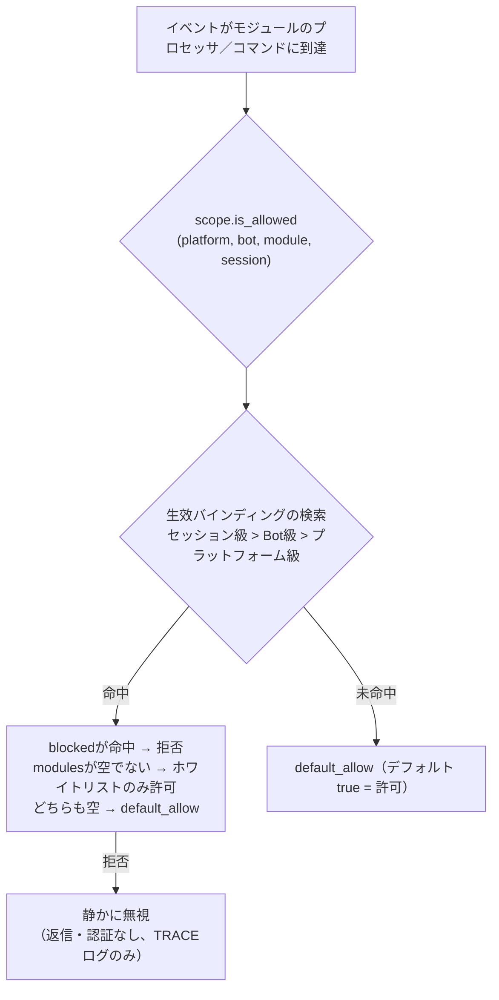

# 統一制御面（scope）

> [!NOTE]
> この機能は ErisPulse **2.8.0+** が必要です。

統一制御面は以下の6つの問いに答える：**どのモジュールが利用可能か、どのイベントを受信するか、誰が特定のコマンドを実行できるか、特定のモジュールがどのようなテキストを処理するか、どの実装パラメータをオーバーライドするか、どのモジュールがどの出力呼び出しを禁止するか**。制御権はすべてユーザーに委ねられる：モジュール／アダプター／コマンド／プロセッサの登録の**上層**（設定 `ErisPulse.scope` または実行時 `sdk.scope`）で宣言し、イベントパイプラインは各レベルで自動的に読み取り実行する。

制御面は従来の複数の権限システムを統合し、2.8.0の権限／アクセス制御の**唯一**のエントリーポイントとなる：

| 維度 | 制御対象 | 拒否動作 | 設定経路 |
|------|---------|---------|---------|
| **① モジュール** | どのモジュールが利用可能か（プラットフォーム／Bot／セッションの3段階） | 静かに無視（返信・認証なし） | `scope.platforms / bots / sessions` |
| **② 身分** | イベントを受信するか（アダプター／Bot／セッション／ユーザーの4段階） | 入口で完全に破棄（静か） | `scope.identity.*` |
| **③ コマンド** | 誰が特定のコマンドを実行できるか（コマンド名はglob対応） | 「権限不足」を返信（明示的） | `scope.commands` |
| **④ プロセッサ** | 特定のモジュールのイベントプロセッサがテキストでフィルタリングするか | トリガーしない（静か） | `scope.handlers` |
| **⑤ オーバーライド** | モジュール／コマンドの実装パラメータをオーバーライド（master/hidden/aliases/prefix） | ——（パラメータのみ変更） | `scope.overrides` |
| **⑥ 出力アクション** | モジュールがメッセージ送信／標準API呼び出し／リクエスト処理を禁止するか | 失敗レスポンス（`retcode=34601`） | `scope.actions` |

{!--< tips >!--}
1. `from ErisPulse.Core import scope` でシングルトンをインポート（`sdk.scope` は同一オブジェクト）
2. `scope.is_allowed(platform, bot_id, module, session_id)` でモジュールが利用可能かを判断
3. `scope.is_identity_allowed(platform, bot_id, session_id, user_id)` でイベントが許可されるかを判断
4. `scope.allow_user("roll*", platform, uid)` / `deny_user(...)` コマンドACL（glob対応）
5. `scope.override("MyModule", "restart", master=True)` 実装パラメータをオーバーライド
6. `scope.set_action("MyModule", "send", False)` モジュールが返信／送信を禁止
7. `scope.get_stats()` でフィルタ統計を確認；`scope.get_topology()` でトポロジを確認
{!--< /tips >!--}

## マッチング条目構文（全システム統一）

制御面のすべての「名前リスト」（モジュール名、身分キー、コマンド名）は同一のマッチング構文（`ErisPulse.Core.text_match`）を共用する：

| 構文 | 例 | 説明 |
|------|------|------|
| 精確名 | `"Chat"` | 全値比較、**大文字小文字区別なし** |
| glob | `"Tool*"`、`"spam_*"` | `*` 任意文字列 / `?` 1文字 / `[seq]` 文字集合、大文字小文字区別なし |
| 正規表現 | `"re:^Danger.*"` | `re:` 前置きで宣言、正規表現 `search` でマッチ、デフォルト大文字小文字区別なし |

- 不正な正規表現は**静かに降格**（エラー発生せず、クラッシュしない）
- デコレータ引数（`pattern=` / `regex=`）は固定の意味：`pattern` はglob、`regex` は正規表現ソースコード（`re:` 前置きなし）；制御面設定の正規表現条目は**必ず** `re:` 前置きが必要

## グローバルデフォルト：`default_allow`

`default_allow` は**グローバル唯一**のデフォルトスイッチ（デフォルト `true`）で、3つの判定次元に統一的に効果がある：

- **モジュール次元**：すべてのバインディングにマッチしない → `default_allow` で許可／拒否を決定
- **身分次元**：すべての戦略にマッチしない → `default_allow` で許可／拒否を決定
- **コマンド次元**：ACLが設定されていない → `default_allow=true` は開発者のデフォルト権限チェーンに委ねる；`false`（厳密モード）はACLが設定されていないコマンドは拒否

`false` に設定すると「暗黙の拒否」厳密モードが有効になり、**明示的に許可されていないものはすべて拒否**される。

> **例外**：⑥ 出力アクション次元は `default_allow` の影響を受けない——それは独立した絞り込みスイッチで、デフォルトはすべて許可され、明示的に `false` に設定した場合のみ禁止（フレームワーク層の owner が空の呼び出しは常に許可）。このように厳密なグローバルモードでも、すべてのモジュールのメッセージ返信が意図せず遮断されることはない。

## 設定ファイル

```toml
[ErisPulse.scope]
default_allow = true        # グローバルデフォルト（false = 暗黙の拒否厳密モード）
cache_size = 1024           # LRUキャッシュサイズ

# ── ① モジュール次元（優先度：セッション > Bot > プラットフォーム）──
[ErisPulse.scope.platforms.onebot11]
modules = ["Chat", "Tool*"]   # ホワイトリスト：正確名 / glob / re: 正規表現
blocked = ["re:^Danger"]
[ErisPulse.scope.bots.onebot11."123456"]
modules = ["Chat"]
[ErisPulse.scope.sessions.onebot11."789012345"]
modules = ["Chat"]

# ── ② 身分次元（優先度：ユーザー > セッション > Bot > アダプター）──
[ErisPulse.scope.identity.adapters.onebot11]
deny = true                   # アダプターのイベントをすべて破棄
[ErisPulse.scope.identity.bots.onebot11."123456"]
deny = true
[ErisPulse.scope.identity.sessions.onebot11."g_blocked"]
deny = true
[ErisPulse.scope.identity.users.onebot11]
allow = ["u_admin"]           # ユーザー識別子はglob / re: 正規表現対応
deny = ["u_bad", "spam_*"]

# ── ③ コマンド次元（コマンド名はglob対応）──
[ErisPulse.scope.commands."roll*"]
allow = ["onebot11:u_vip"]    # ユーザー識別子 "platform:user_id"
deny = ["onebot11:u_bad"]

# ── ④ プロセッサ／テキスト次元 ──
[ErisPulse.scope.handlers.MyModule]
pattern = "签到*"             # コード内の pattern/regex 条件とAND
regex = "re:\\d+\\s*元"

# ── ⑤ 実装パラメータオーバーライド ──
[ErisPulse.scope.overrides.MyModule.restart]
master = true                 # フレームワークのオーナーのみ使用可能
hidden = true                 # ヘルプに表示しない
aliases = ["rs"]              # 別名を追加
prefix = "!"                  # トリガ前接を追加

# ── ⑥ 出力アクション次元（デフォルトはすべて許可、明示的に禁止する場合のみ絞り込み）──
[ErisPulse.scope.actions.MyModule]
send = false                  # MyModuleの返信／送信を禁止
api = false                   # MyModuleの標準API呼び出し（callエスケープ）を禁止
request = false               # MyModuleのリクエスト操作（accept/reject）を禁止
```

## ① モジュール次元

あるコンテキストでどのモジュールが利用可能かを回答する。デフォルトはすべて開放；バインディングが設定されるとフィルタリングが始まり、**モジュールとアダプターは変更不要**。



- **解析優先度：セッション級 > Bot級 > プラットフォーム級**、高優先度のバインディングは低優先度を**全体的に上書き**する
- **静かの意味**：フィルタリングされたモジュールのコマンドとプロセッサはトリガー／返信／認証されない（コマンド間の誤マッチを防ぐ）、TRACEレベルのログのみ表示（`core.scope.denied`）
- **フレームワークプロセッサ**（`scope_exempt=True` または owner が空）は影響を受けない；モジュール名が空（フレームワークリソース）は常に許可される
- **セッション感知ヘルプとコマンド照会**：コマンド照会API（`command.help` /
  `get_command` / `get_commands` / `get_group_commands` / `get_visible_commands`、
  および `module.get_commands_overview`）はオプションの `event=` または明示的な
  `platform=` / `bot_id=` / `session_id=` キーワードをサポートする——現在のセッションで利用できないモジュールのコマンドは結果に含まれない（`get_command` は None を返し、単一コマンドヘルプは「未登録」として扱われる、静かの意味と一致）、上下文を渡さない場合は全量動作を保つ。コマンド照会が返す
  help / hidden 等のフィールドはマージされた有効値（ユーザー優先）

## ② 身分次元（イベント准入）

「誰のイベントを受信するか」を回答する。拒否されたイベントは**配信入口で完全に破棄**される——ミドルウェアやプロセッサ（フレームワークプロセッサ含む）には届かない（TRACEレベルのログのみ表示、`core.scope.identity_denied`）。

- **解析優先度：ユーザー > セッション > Bot > アダプター**、最も具体的な設定戦略を採用；deny は allow より優先
- 各級のバインディングは二元戦略：`{ allow = true }` または `{ deny = true }`
- ユーザー識別子は glob / 正規表現に対応（例：`"spam_*"` で一括的にスパムユーザーをブロック）
- 一般的な用途——上位 deny、個人 allow で「例外許可」：

```toml
[ErisPulse.scope.identity.adapters.onebot11]
deny = true
[ErisPulse.scope.identity.users.onebot11]
allow = ["u_admin"]   # アダプター級が拒否しても、u_adminのイベントは許可される
```

## ③ コマンド次元（コマンドACL）

「誰が特定のコマンドを実行できるか」を回答する。判定順序：**denyが命中 → 拒否；allowホワイトリストが空でないかつ命中しない → 拒否；いずれも設定されていない → `default_allow` に従う**（`true` は開発者のデフォルト権限チェーンに委ねる）。拒否されたコマンドは「権限不足」という明示的な返信を行う。

- コマンド名は glob に対応：`"roll*"` は `roll`、`roll_dice` など一族のコマンドを1つのルールでカバー
- 精確なキーは glob キーに優先（`commands.roll` が命中した場合、`commands."roll*"` はチェックされない）
- ユーザー識別子のフォーマットは `"platform:user_id"`（フレームワークオーナーシステムと一致）
- この次元は**ユーザー側の追加ゲート**であり、コマンドの `master` / `permission` パラメータと連動する：ACLが通過した後も開発者が宣言したデフォルト権限チェーンを実行する（このデフォルトチェーンは ⑤ オーバーライドで調整可能）

## ④ プロセッサ／テキスト次元

モジュールごとに「どのテキストを処理するか」をフィルタリングする：モジュールに `pattern` / `regex` を設定した場合、そのモジュールのすべてのイベントプロセッサはテキストが一致した場合にのみトリガーされる（コード内の条件とAND、両方を満たす必要がある）。モジュールコードを変更せずにトリガー範囲を狭めることができる。

```toml
[ErisPulse.scope.handlers.ChatModule]
pattern = "闲聊*"     # ChatModuleのプロセッサは「闲聊」で始まるメッセージにのみ応答
```

## ⑤ 実装パラメータオーバーライド

モジュール／コマンド登録の**上層**で実装パラメータをオーバーライドし、モジュールコードを変更しない：

```toml
[ErisPulse.scope.overrides.MyModule.restart]
master = true      # オーバーライドでフレームワークオーナーのみ（falseに設定して開発者のオーナー制限を解除することも可能）
hidden = true      # ヘルプリストに表示しない
aliases = ["rs"]   # 有効な別名
```

> オーバーライドは**ユーザー優先**に従う：開発者が宣言した `master` / `hidden` などはデフォルト値に過ぎず、ユーザーがここで明示的に設定した後はユーザー設定が優先される（厳しくも開放的にもできる）。オーバーライドは**実装パラメータ**（master / hidden / aliases / prefix / help / usage など）のみを変更し、コマンド実行判定とヘルプレンダリングは同じマージ結果を共用する：`hidden` オーバーライドは即座にヘルプリストの可視性を変更し、`help` / `usage` オーバーライドは即座に `/help` の表示を変更する。**コマンドの無効化はここでは行わない**——統一的にコマンド次元 deny（`scope.commands` または
`scope.deny_user()`）で行い、2つの「無効化」の意味が衝突しないようにする。

## ⑥ 出力アクション次元（モジュールの出力呼び出し禁止）

モジュールが**出力アクションを発生させる**ことを制約する：メッセージ送信／標準APIアクション／リクエスト操作。3つのアクションはそれぞれのDSLに対応する：`Event.reply` と `Send`（send）、`Api` / `call_api`（api）、`Request` の accept/reject（request）。イベントハンドラ実行中にモジュールが発生させる出力呼び出しはモジュールオーナーを含み、この次元で統一的に判定される。

```toml
[ErisPulse.scope.actions.MyModule]
send = false      # MyModuleの返信／送信を禁止
api = false       # MyModuleの標準APIアクション（callエスケープを含む）を禁止
request = false   # MyModuleのリクエストイベントに対するaccept/rejectを禁止
```

判定の意味：**デフォルトはすべて許可**——設定されていない場合、またはオーナーが空（フレームワーク層の内部呼び出し）の場合は許可される；ユーザーが明示的に `false` に設定した場合のみ拒否され、拒否された呼び出しはネットワークリクエストを発生させず、直接
標準の失敗レスポンス（`retcode = 34601`、[api-response §5.3](../standards/api-response.md#53-框架扩展返回码34xxx-平台错误段的低三位自定义)を参照）を返す。3つのアクションは互いに独立しており、1つだけ禁止することも可能。

```python
# 実行時API
sdk.scope.set_action("MyModule", "send", False)   # メッセージ送信を禁止
sdk.scope.is_action_allowed("MyModule", "send")   # False
sdk.scope.unset_action("MyModule", "send")        # 許可を復元
sdk.scope.get_action_rules("MyModule")            # {"send": False, "api": True, "request": True}
```

## 実行時API

### モジュール次元

```python
from ErisPulse import sdk

# 判断
sdk.scope.is_allowed("onebot11", "123456", "Chat")
sdk.scope.is_allowed("onebot11", "123456", "Chat", "789012345")
sdk.scope.is_allowed("onebot11", "123456", None)      # フレームワーク層リソース -> True

# バインディング／アンバインディング
sdk.scope.bind_module("onebot11", "123456", modules=["Chat", "Tool*"])
sdk.scope.bind_module("onebot11", blocked=["Danger"])             # プラットフォーム級
sdk.scope.bind_module("onebot11", "123456", "789012345", modules=["Chat"])  # セッション級
sdk.scope.bind_module("onebot11", "123456", modules=["Music"], merge=True)  # マージ
sdk.scope.bind_module("onebot11", "123456", modules=["Chat"], persist=False)  # 実行時のみ
sdk.scope.unbind_module("onebot11", "123456")

# クエリ
sdk.scope.get("onebot11", "123456")   # {"modules": ["Chat"], "blocked": []}
```

### 身分次元

```python
# イベントが許可されるかを判断
sdk.scope.is_identity_allowed("onebot11", "123456", "group_9", "u1")

# 戦略のバインディング（階層はパラメータで決まる：user > session > bot > adapter）
sdk.scope.bind_identity("onebot11", user_id="u_bad", deny=True)
sdk.scope.bind_identity("onebot11", user_id="spam_*", deny=True)   # glob
sdk.scope.bind_identity("onebot11", "123456", "group_9", allow=True)
sdk.scope.unbind_identity("onebot11", user_id="u_bad")

# ユーザーブラックリストの便利API
sdk.scope.block_user("onebot11", "u_bad")
sdk.scope.is_user_blocked("onebot11", "u_bad")
sdk.scope.get_blocked_users()        # {"onebot11": ["u_bad"]}
sdk.scope.unblock_user("onebot11", "u_bad")
```

### コマンド次元

```python
sdk.scope.is_command_allowed("roll", "onebot11", "u1")
sdk.scope.allow_user("roll*", "onebot11", "u_vip")   # コマンド名はglob対応
sdk.scope.deny_user("roll*", "onebot11", "u_bad")
sdk.scope.get_acl("roll*")
sdk.scope.remove_acl("roll*")

# コマンドシステムのエントリーポイントを介しても等価に委任可能
from ErisPulse.Core.Event import command
command.allow_user("restart", "onebot11", "123456")
```

### プロセッサとオーバーライド次元

```python
sdk.scope.bind_handler("MyModule", pattern="签到*", regex=r"\d+号")
sdk.scope.unbind_handler("MyModule")

sdk.scope.override("MyModule", "restart", master=True, hidden=True)
sdk.scope.get_override("MyModule", "restart")
sdk.scope.remove_override("MyModule", "restart")
```

### 一般

```python
sdk.scope.list_bindings()   # 全バインディング
sdk.scope.get_topology()    # トポロジ（ダッシュボード用）
sdk.scope.get_stats()
# {"module_calls": .., "module_filtered": .., "identity_checks": .., "identity_denied": ..,
#  "command_checks": .., "command_denied": .., "action_checks": .., "action_denied": ..,
#  "cache_hits": .., "cache_misses": ..}
sdk.scope.reset_stats()
sdk.scope.clear()           # 全バインディングをクリア（メモリ内のみ有効）
```

## オーナー身分とカスタム身分ソース（provider）

オーナーシステムは「誰がフレームワークのオーナーか」を回答する：コマンドの `master=True` パラメータと業務層の
`master.is_master()` は同一の身分判定を共有し、判定チェーンは
**設定オーナー → 実行時記録 → providerチェーン**である。

オーナー設定（`ErisPulse.master.users`、グローバルlistとプラットフォームごとのdictがサポート）は
[設定ドキュメント](../user-guide/configuration.md#オーナーシステム設定)を参照；本節は身分判定APIと拡張ポイントに焦点を当てる。

### 判定と実行時追加／削除

```python
from ErisPulse.Core import master

master.is_master(event)                      # イベントから判定
master.is_master("yunhu", "123")             # 明示的に判定
master.add("yunhu", "123")                   # 実行時追加（デフォルトは永続化；persist=Falseはメモリ内のみ）
master.remove("yunhu", "123")                # 削除（デフォルトは永続化）
master.list()                                # 総合：{"global": [...], "<platform>": [...]}
```

### カスタム身分ソース（provider）

設定の他に、カスタム身分ソースを登録できる：`fn(platform, user_id) -> bool`、
ビルトイン身分ソース（設定 + 実行時記録）がヒットしなかった場合に順次試行され、いずれかのproviderが許可すればオーナーと判定される。アダプター管理者インターフェース、データベースロールなど外部身分体系への接続に適している。

登録エントリ `master.provider` はデコレータ／関数式の2種類の書き方が可能、
登録解除は登録された関数の `fn.unregister()` を通じて統一される：

```python
from ErisPulse.Core import master

# 書き方1：デコレータ（常駐身分ソース、推奨）
@master.provider
def admin_provider(platform, user_id):
    return user_id in {"999"}     # 自定義判定ロジック

master.is_master("yunhu", "999")   # True
admin_provider.unregister()        # 不要になったら登録解除

# 書き方2：関数式（モジュールロード期に登録／アンロード期に登録解除）
fn = master.provider(admin_provider)
fn.unregister()
```

> providerの例外はキャッチされ、判定チェーンをブロックしない。インスタンスメソッドをバインドして `unregister` を登録できないため、登録／登録解除のペアが必要な場合は**モジュールレベルの関数**を使用する。

### ユーザー優先：オーナーの有効範囲はユーザーが最終的に決定

コマンドの `master=True` は**開発者のデフォルト**に過ぎず、ユーザーは制御面
`ErisPulse.scope.overrides.<module>.<cmd>.master = true/false`
で絞り込みや開放をオーバーライドできる（上記 ⑤ 実装パラメータオーバーライド、ユーザーが明示的に設定すれば有効）。

## キャッシュとホットアップデート

- `is_allowed` / `is_identity_allowed` の結果は **LRUキャッシュ**（`scope.cache_size` で調整可能）付き、`bind_*` / `unbind_*` / 設定ホットアップデート（`config.updated` / `config.set`）で自動的に無効化される
- すべての次元の設定は**即時有効**、再起動は不要
- 制御面は「イベントごとの判定」であり、イベント間で記憶しない：設定が変わると、次のイベントから新しいルールが適用される

## 一般的な質問と注意事項

### 1. 設定階層とオーバーライド

- モジュール次元：セッション級 > Bot級 > プラットフォーム級、**全体を上書き**。プラットフォームでChatを許可し、BotでさらにMusicを追加したい場合、Bot級で両方をリストアップする必要がある
- 身分次元：ユーザー > セッション > Bot > アダプター、**最も具体的な**設定戦略を採用（例外許可が可能）
- コマンド次元：正確なコマンド名がglobキーに優先

### 2. モジュール／コマンドのコードを変更するのではなく、制御面を使う

モジュール宣言は「開発者のデフォルト」（`master=True`、`permission=...`、`pattern=...`）を示す；制御面宣言は「ユーザーの最終決定」を示す。実装パラメータオーバーライドは**ユーザー優先**に従う：ユーザーが明示的に設定した `master = true/false` は直接有効（絞り込みも開放も可能）。開発者が設定していない制限はユーザーが独自に絞り込み可能；禁止／開放制御はコマンドdeny／身分allowで行う。

### 3. モジュール／コマンドが反応しない

まず制御面が原因か、モジュール自体が原因かを疑う：

```python
from ErisPulse import sdk

print(sdk.scope.is_allowed(event.get_platform(), bot_id, "MyModule", session_id))
print(sdk.scope.is_identity_allowed(event.get_platform(), bot_id, session_id, user_id))
print(sdk.scope.get_stats())   # module_filtered / identity_denied > 0 なら静かにフィルタリングされている
```

フィルタリングは**静か**（モジュール次元と身分次元は返信しない、ルールを暴露しない）、統計は累積される；コマンド次元でACLに拒否された場合は「権限不足」という明示的な返信がされる。

### 4. セッション識別子はプラットフォームごとに隔離

`(platform, session_id)` 組み合わせが唯一の識別子である。`scope.sessions.onebot11."789"` は onebot11 でのみ有効で、telegram 上で同じ `789` のセッションには影響しない。身分次元のユーザー識別子も同様。

## トポロジAPI

`ModuleManager.get_topology()` と `AdapterManager.get_topology()` はモジュール／アダプターの所属関係データを提供し、`sdk.get_topology()` は一括して集約（制御面の5次元を含む）：

```python
from ErisPulse import sdk

topology = sdk.get_topology()
# {
#   "modules": {                                   # モジュール → 持有リソース
#     "Chat": {
#       "loaded": True, "enabled": True,
#       "commands": ["chat", "translate"],
#       "handlers": {"message": 2, "notice": 1},
#       "routes": {"http": ["/Chat/api"], "ws": [], "sse": []},
#       "lifecycle_hooks": 3,
#     }
#   },
#   "adapters": {                                  # アダプター → Bot → 作用域
#     "onebot11": {
#       "status": "started", "enabled": True,
#       "bots": {"123456": {"status": "online", "scope": {...}}},
#       "scope": {"modules": [...], "blocked": [...]},
#     }
#   },
#   "scope": {                                     # 統一制御面（5次元）
#     "platforms": {...}, "bots": {...}, "sessions": {...},
#     "identity": {"adapters": {...}, "bots": {...}, "sessions": {...}, "users": {...}},
#     "commands": {...}, "handlers": {...}, "overrides": {...},
#   },
# }
```

- モジュールトポロジは、登録されたコマンド、イベントプロセッサ、HTTP/WS/SSEルート、ライフサイクルフックを統合し、モジュールリソースツリーを描画するのに便利
- アダプタートポロジは、各アダプターのステータス、所属Botのステータス、プラットフォーム級／Bot級の作用域バインディングを統合