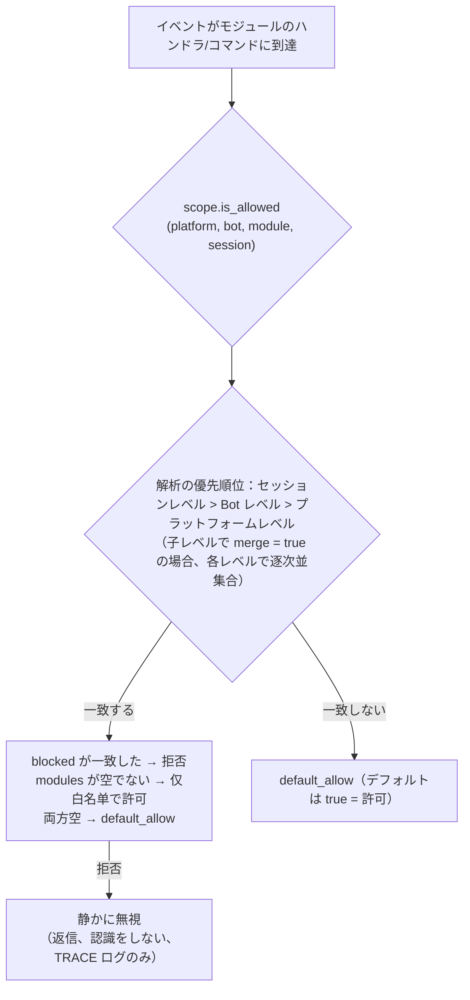

# スコープ (scope)

> [!NOTE]  
> この機能は ErisPulse **2.8.0+** が必要です。

スコープは以下の4つの質問に答えます：**どのモジュールが利用可能か、どのイベントを受け取るか、特定のモジュールがどのようなテキストを処理するか、モジュールが外部に何ができるか**。  
制御権はすべてユーザーに委ねられます。モジュール / アダプタ / プロセッサ / 出力呼び出しの登録の**上位**（設定 `ErisPulse.scope` または実行時 `sdk.scope`）で一括して宣言し、イベントパイプラインはエントリ、プロセッサフィルタ、出力ゲートで自動的に読み取り、実行します。

| 維度 | 控制するもの | 拒否される動作 | 設定パス |
|------|---------|---------|---------|
| **① モジュール** | 利用可能なモジュール（プラットフォーム / Bot / セッションの3段階） | 静かに無視（返信せず、認識しない） | `scope.platforms / bots / sessions` |
| **② 身元** | イベントの受信可否（アダプタ / Bot / セッション / ユーザーの4段階） | エントリで完全に破棄（静かに） | `scope.identity.*` |
| **③ 出力** | モジュールがどのような出力呼び出し（メッセージ / API / リクエスト、メソッドレベルのホワイトリスト・ブラックリスト）を発行できるか | 失敗応答（`retcode=34601`） | `scope.actions` |

> **関連システム**：コマンドは特別なメッセージイベントプロセッサであり、そのユーザーブラックリスト・ホワイトリスト（ACL）と実装パラメータの上書きはコマンドシステムが独自に管理します（`ErisPulse.event.command`）。  
> [イベント処理の入門](../getting-started/event-handling.md) と [設定ガイド](../user-guide/configuration.md) を参照してください。

{!--< tips >!--}
1. `from ErisPulse.Core import scope` でシングルトンをインポート（`sdk.scope` は同じオブジェクト）
2. 判定：`scope.is_allowed(...)` / `scope.is_identity_allowed(...)` / `scope.is_action_allowed(...)` はそれぞれ①②③の3つのゲートに対応
3. 読み書き：次元化されたパラメータメソッド（IDEで補完可能）——  
   `scope.set_module(...)` / `scope.set_identity(...)` / `scope.set_action(...)`；  
   また、辞書形式のバックアップメソッドとして `scope.get(path)` / `scope.set(path, v)` / `scope.delete(path)` もあります
4. イベントプロセッサのテキスト条件上書きについては、  
   [イベント処理の入門 · イベント上書き](../getting-started/event-handling.md#イベント覆写不改模块代码覆写任意事件类型的行为) を参照してください；  
   コマンド ACL / パラメータ上書きについては [イベント処理の入門](../getting-started/event-handling.md) を参照してください
{!--< /tips >!--}

## マッチング条目構文（全システム共通）

スコープ内のすべての「名前リスト」（モジュール名、アイデンティティキー、出力条目）は、同一のマッチング構文（`ErisPulse.Core.text_match`）を使用します。

| 構文 | 例 | 説明 |
|------|------|------|
| 精確名 | `"Chat"` | 全値比較、**大文字小文字は区別しない** |
| glob | `"Tool*"`、`"spam_*"` | `*` 任意の文字列 / `?` 1文字 / `[seq]` 文字集合、大文字小文字は区別しない |
| 正規表現 | `"re:^Danger.*"` | `re:` で始まるプレフィックスを宣言し、正規表現 `search` でマッチ、デフォルトで大文字小文字は区別しない |

- 不正な正規表現は**静かにマッチしない**（エラーは発生せず、クラッシュもしない）
- デコレーター引数（`pattern=` / `regex=`）は固定の意味を持つ：`pattern` は glob、`regex` は正規表現のソースコード（`re:` プレフィックスを付けない）；スコープ設定内の正規表現条目は**必ず**`re:` プレフィックスを付ける必要がある

## グローバルデフォルト：`default_allow`

`default_allow` は**グローバルで唯一**のデフォルトスイッチ（デフォルト値は `true`）で、2つの判定次元に統一的に効果を及ぼします：

- **モジュール次元**：どのバインディングにも一致しない場合 → `default_allow` が許可 / 拒否を決定します
- **アイデンティティ次元**：どのポリシーにも一致しない場合 → `default_allow` が許可 / 拒否を決定します

`false` に設定すると「暗黙の拒否」厳格モードが有効になります。つまり、ホワイトリスト方式での管理となり、**明示的に許可されていないものはすべて拒否**されます。

> **例外**：③ 出力次元は `default_allow` の影響を受けません。これは独立した制限スイッチで、デフォルトではすべて許可され、明示的なルールによってのみ制限されます（フレームワーク層の owner が空の呼び出しは常に許可されます）。このように厳格なグローバルモードでも、すべてのモジュールのメッセージ返信が意図せず切断されることはありません。コマンド ACL には独立した `ErisPulse.event.command.default_allow` がデフォルトとして存在し、互いに影響しません。

## 設定ファイル

```toml
[ErisPulse.scope]
default_allow = true        # グローバルなデフォルト（false = 隠式拒否の厳密モード）
cache_size = 1024           # LRU キャッシュサイズ

# ── ① モジュール次元（優先度：セッション > Bot > プラットフォーム）──
[ErisPulse.scope.platforms.onebot11]
modules = ["Chat", "Tool*"]   # ホワイトリスト：正確な名前 / glob / re: 正規表現
blocked = ["re:^Danger"]
[ErisPulse.scope.bots.onebot11."123456"]
modules = ["Chat"]
merge = true                  # プラットフォームレベルのバインディングに追加（デフォルトでは全体を上書き）
[ErisPulse.scope.sessions.onebot11."789012345"]
modules = ["Chat"]

# ── ② 身元次元（優先度：ユーザー > セッション > Bot > アダプター）──
[ErisPulse.scope.identity.adapters.onebot11]
deny = true                   # アダプター全体のイベントをすべて破棄
[ErisPulse.scope.identity.bots.onebot11."123456"]
deny = true
[ErisPulse.scope.identity.sessions.onebot11."g_blocked"]
deny = true
[ErisPulse.scope.identity.users.onebot11]
allow = ["u_admin"]           # ユーザーのキーは glob / re: 正規表現をサポート
deny = ["u_bad", "spam_*"]

# ── ③ 出力次元（デフォルトで全許可、明示的に制限する場合のみ禁止）──
[ErisPulse.scope.actions.MyModule]
send = { deny = true }                                    # 送信を完全に禁止
api = { allow = ["get_*"] }                               # 検索系の標準 API に限定
request = { deny = true }                                 # リクエストの処理を禁止
```

## ① モジュール次元

あるコンテキストの中で、どのモジュールが利用可能かを回答します。デフォルトではすべてが開放されており、設定のバインディングが行われた時点でフィルタリングが開始されます。  
**モジュールとアダプタは、何の変更も必要ありません。**



- **解析の優先順位：セッションレベル > Bot レベル > プラットフォームレベル**。高優先度のバインディングは低優先度を**全体的に上書き**します。  
  子レベルのバインディングで `merge = true` と指定した場合、低優先度のバインディングと**各項目の並集合**になります（modules / blocked はそれぞれ独立にマージされ、`merge` 自体は制御キーとして扱われ、項目としてはカウントされません）。
- **静かに無視の意味**：フィルタリングされたモジュールのコマンドやハンドラは、トリガーされず、返信や認識もされません（コマンド間の誤一致を防ぐため）。TRACE レベルのログのみ (`core.scope.denied`) に表示されます。
- **フレームワークレベルのハンドラ**（`scope_exempt=True` または owner が空）は影響を受けません。モジュール名が空（フレームワーク層のリソース）の場合は、常に許可されます。
- **セッション感知のヘルプとコマンド検索**：コマンド検索 API（`command.help` / `get_command` / `get_commands` / `get_group_commands` / `get_visible_commands`、および `module.get_commands_overview`）は、オプションで `event=` または明示的な `platform=` / `bot_id=` / `session_id=` キーワードをサポートします。現在のセッションで利用できないモジュールのコマンドは、結果に含まれなくなります（`get_command` は None を返し、単一コマンドのヘルプは「未登録」として扱われ、静かに無視の動作と一致します）。コンテキストを指定しない場合は、全量の動作を維持します。

### バインディングの継承（merge）

デフォルトでは、全体を上書きする動作が明確で予測可能です。上位レベルのバインディングに**追加**したい場合は、子レベルで `merge = true` を指定します：

```toml
[ErisPulse.scope.platforms.onebot11]
modules = ["Chat", "Tool"]      # プラットフォームレベル：Chat、Tool を許可

[ErisPulse.scope.bots.onebot11."123456"]
modules = ["Music"]
merge = true                    # この Bot で実際の有効なモジュールは ["Chat", "Tool", "Music"] になります
```

- **マージのルール**：`modules` と `blocked` はそれぞれ**並集合**をとります。バインディング内では `blocked` は `modules` よりも優先されます。
- **連鎖的なマージ**：プラットフォーム → Bot → セッションの順に各レベルで独立して `merge` または上書きが決定されます。

## ② 身元次元（イベントの受付）

「誰のイベントを受け取るか」を回答します。拒否されたイベントは**配信の入口で完全に破棄**されます——
ミドルウェアや任意のハンドラ（フレームワークレベルも含む）には一切渡らず、TRACE レベルのログでのみ確認できます（`core.scope.identity_denied`）。

- **解析優先度：ユーザー > 会話 > Bot > アダプタ**、最も具体的に設定された戦略が優先されます。`deny` は `allow` より優先されます
- 各階層のバインディングは二元的な戦略です：`{ allow = true }` または `{ deny = true }`
- ユーザーのキーには glob / 正規表現がサポートされています（例：`"spam_*"` で一括的にスパムユーザーをブロック）
- 一般的な使い方——上位階層で `deny`、個別に `allow` で「例外として許可」する：

```toml
[ErisPulse.scope.identity.adapters.onebot11]
deny = true
[ErisPulse.scope.identity.users.onebot11]
allow = ["u_admin"]   # アダプタ階層で拒否されても、u_admin のイベントは許可されます
```

## ③ 出站次元（制限モジュールが発信する呼び出しを制限）

制約モジュールが**発信する出站動作**：メッセージ送信 / 標準 API 動作 / 要求操作。  
三つの動作はそれぞれ下層の DSL に対応する：`Event.reply` と `Send`（send）、`Api` / `call_api`（api）、  
`Request` の accept/reject（request）。モジュールがイベントハンドラ実行中に発信する呼び出しは  
モジュールの所有者（owner）を含み、この次元が一括して判定する。

### 規則の形態（インライン表）

各動作の規則はインライン表である：`{ allow = [...], deny = true|[...] }`。  
同一の動作には一つの規則しか設定できない（TOML のキーは重複不可、全禁止と細粒度の二択）：

```toml
[ErisPulse.scope.actions.MyModule]
send = { deny = true }                                  # 全ての送信を禁止（Event.reply / Send DSL）
# またはメソッドレベルの細粒度設定：send = { allow = ["Text", "Image*"], deny = ["File"] }
api = { allow = ["get_*"] }                             # 一部の標準 API 動作のみを許可
# または動作レベルのブラックリスト：api = { deny = ["set_*", "leave_*"] }
request = { deny = true }                               # 要求の accept/reject を禁止
```

- `send` の条目は**送信メソッド名**（`Text` / `Image` / `File` ...）と一致する。
- `api` の条目は**標準動作名**（`get_group_info` / `set_group_name` ...）と一致する。
- 条目は正確な名前 / glob / `re:` 正規表現（全システムで共通の構文で、大文字小文字は区別しない）をサポート。
- `allow` に単一の文字列を記述することも可能で、これは単一の条目リストと同等である：`send = { allow = "Text" }`

### 判定の意味

**デフォルトはすべて許可**——設定がなければ、または owner が空（フレームワーク層の内部呼び出し）の場合は許可される。  
設定された規則に従って以下の順序で判定する：

1. `deny = true` → 拒否
2. `deny` リストに呼び出し名が一致 → 拒否
3. `allow` リストが空でないかつ呼び出し名が一致しない（または呼び出しに名前がない）→ 拒否
4. その他の場合は許可

拒否された呼び出しはネットワークリクエストを発生させず、直接標準の失敗レスポンスを返す。  
（`retcode = 34601`、詳細は [api-response §5.3](../standards/api-response.md#53-フレームワーク拡張返却コード34xxx-プラットフォームエラーセグメントの下3桁を独自に定義) を参照）。  
三つの動作は互いに独立しており、そのうち一つだけを制限することも可能。

```python
# 実行時 API
sdk.scope.set_action("MyModule", "send", deny=True)              # 全てのメッセージ送信を禁止
sdk.scope.set_action("MyModule", "send", allow=["Text"])         # テキストのみ送信を許可
sdk.scope.is_action_allowed("MyModule", "send", name="Image")    # False
sdk.scope.is_action_allowed("MyModule", "api", name="get_user_info")  # 規則に従って判定
sdk.scope.delete_action("MyModule", "send")                      # 許可を復元
sdk.scope.get_action("MyModule", "send")                         # その動作の現在の規則を取得
```

## 実行時 API

スコープ実行時 API は 3 層に分かれています：**判定**（3 つの質問）、**次元化読み書き**（各次元ごとに `set` / `get` / `delete` パラメータ化メソッド、署名は全型注釈付き、IDE で補完可能）、**辞書式のデフォルト**（ドット区切りパスで任意の節に直接アクセス）。

```python
from ErisPulse import sdk

scope = sdk.scope
```

### 判定（3 つの質問）

```python
scope.is_allowed("onebot11", "123456", "Chat")                 # ① モジュール次元
scope.is_allowed("onebot11", "123456", "Chat", "789012345")    # 会話レベルを含む
scope.is_allowed("onebot11", "123456", None)                   # フレームワーク層のリソース -> True

scope.is_identity_allowed("onebot11", "123456", "group_9", "u1")   # ② 身份次元

scope.is_action_allowed("MyModule", "send")                    # ④ 出力次元
scope.is_action_allowed("MyModule", "send", name="Image")      # メソッドレベルの細粒度
```

### ① モジュール次元

```python
# バインディング（パラメータによって階層が決定：session_id > bot_id > プラットフォームレベル）
scope.set_module("onebot11", bot_id="123456", modules=["Chat", "Tool*"])
scope.set_module("onebot11", blocked=["re:^Danger"])                       # プラットフォームレベル
scope.set_module("onebot11", bot_id="123456", session_id="g9", modules=["Chat"])  # 会話レベル
scope.set_module("onebot11", bot_id="123456", modules=["Music"], merge=True)      # 既存のエントリと結合
scope.set_module("onebot11", bot_id="123456", modules=["Chat"], persist=False)    # 実行時のみ

# 読み取り / 削除
scope.get_module("onebot11", bot_id="123456")   # {"modules": ["Chat"], "blocked": []}
scope.delete_module("onebot11", bot_id="123456")
```

> `merge=True` は**書き込み時に結合**（該当レベルの既存バインディングと条目を結合）です。階層間の解析期の `merge = true` 設定キーは上記の[バインディング継承](#binding-inheritance-merge)を参照してください。これらは独立したメカニズムです。

> **実行時バインディング（`persist=False`）の意味**：実行時バインディングは独立したオーバーライド層に保存され、**その後の任意の設定書き込み / 設定ファイルのホットアップデートによって上書きされません**（設定ツリーの再構築後に書き込み順序で自動的に再実行され、実行時削除も含みます）。これらは永続化されず、プロセスの再起動後に失われます。モジュールがアンロードされた際には、そのモジュールが書き込んだ実行時バインディングはデフォルトでクリーンアップされます。その後、同じパスに対して `persist=True` で書き込み（ユーザー永続化の意味）を行うと、実行時ルールが上書きされます。

### ② 身份次元

```python
# バインディング戦略（パラメータによって階層が決定：user > session > bot > adapter；allow / deny の 2 つの選択肢）
scope.set_identity("onebot11", user_id="u_bad", deny=True)
scope.set_identity("onebot11", user_id="spam_*", deny=True)    # キーは glob / re: 正規表現をサポート
scope.set_identity("onebot11", bot_id="123456", session_id="g9", allow=True)

# 読み取り / 削除
scope.get_identity("onebot11", user_id="u_bad")   # {"deny": True}
scope.delete_identity("onebot11", user_id="u_bad")
```

### ③ 出力次元

```python
# 制限ルールの設定（allow: str|list；deny: bool|str|list；ルール全体の置換の意味）
scope.set_action("MyModule", "send", deny=True)                    # 全ての送信を禁止
scope.set_action("MyModule", "send", allow=["Text"])               # 本文のみ送信を許可
scope.set_action("MyModule", "api", deny=["set_*", "leave_*"])     # 管理系 API を禁止

# 読み取り / 削除
scope.get_action("MyModule", "send")       # {"allow": ["Text"]} 元のルール
scope.delete_action("MyModule", "send")    # 単一のアクションを削除
scope.delete_action("MyModule")            # モジュールのすべてのアクション制限を削除
```

### 一般的な操作

```python
scope.get("platforms")   # 辞書式のデフォルト：ドット区切りパスで任意の節を読み取り
scope.topology()         # 全量の設定ツリー（Dashboard 用）
scope.stats()
# {"module_calls": .., "module_filtered": .., "identity_checks": .., "identity_denied": ..,
#  "action_checks": .., "action_denied": .., "cache_hits": .., "cache_misses": ..}
scope.reset_stats()
scope.clear()           # 全ての設定をクリア（メモリ上でのみ有効）
```

### 高度な操作：辞書式のドット区切りパスによるデフォルト

次元化メソッドは日常的なシナリオをカバーします。任意のノード（または将来追加される次元）に直接アクセスする必要がある場合、辞書式 API を使用してください。`get` / `set` / `delete` はドット区切りパスを受け取り（dict の深い結合、書き込み後すぐに読み取り可能）、`scope[path]` / `scope[path] = v` / `del scope[path]` / `path in scope` のプロトコルを提供します：

```python
scope.set("bots.onebot11.123456", {"modules": ["Chat"], "blocked": []})
scope.set("identity.users.onebot11.u_bad", {"deny": True})
scope.get("actions.MyModule.send")

scope["platforms.onebot11"]        # 読み取り（存在しない場合は KeyError を投げる）
scope["platforms.onebot11"] = {...}  # 書き込み
del scope["platforms.onebot11"]      # 削除
"actions.MyModule" in scope          # 存在確認
```

## キャッシュとホットアップデート

- `is_allowed` / `is_identity_allowed` / `is_action_allowed` の結果は **LRU キャッシュ**を付与
  （`scope.cache_size` で調整可能）、`set` / `delete` /
  設定のホットアップデート（`config.updated` / `config.set`）で自動的に無効化
- すべての次元の設定は**即座に有効**となり、再起動は不要
- スコープは「イベントごとに」判断し、イベント間で記憶しない：設定が変更されると、次のイベントから新しいルールに従う

## 設定形式の検証

ロード時およびホットアップデート時に、設定の形式をセクションごとに検証します。型が間違ったセクション（例：`platforms` が文字列として記述されている場合）、不正なアウトバウンドルール（例：`allow` が数値として記述されている場合）、不明なアクション名、不明なトップレベルのキー（例：`alow` がスペルミスされている場合）は、**WARNING** を出力し、対応するセクション／項目は無視されます。それ以外の有効な設定は通常通り有効になります。誤って書いた設定が静かに無効になることはなくなります。

## 一般的質問と注意事項

### 1. 設定の階層と上書き

- モジュール次元：セッションレベル > Bot レベル > プラットフォームレベル、**全体的な上書き**（子レベルで `merge = true` の場合、各項目を並列に結合）。
  「プラットフォームで Chat が許可され、Bot で Music を追加したい」場合は、Bot レベルで `merge = true` を設定するか、両方をリストアップする。
- 身元次元：ユーザー > セッション > Bot > アダプタ、**最も具体的**な設定されたポリシーを適用（例外として許可することも可能）。
- コマンドのユーザーのブラックリスト/ホワイトリスト：正確なコマンド名は glob キーに優先する（`event.command.acl` を参照）。

### 2. モジュール/コマンドが反応しない場合

モジュール自体ではなく、作用域を最初に疑う：

```python
from ErisPulse import sdk

print(sdk.scope.is_allowed(event.get_platform(), bot_id, "MyModule", session_id))
print(sdk.scope.is_identity_allowed(event.get_platform(), bot_id, session_id, user_id))
print(sdk.scope.stats())   # module_filtered / identity_denied > 0 なら、静かにフィルターされたことを示す
```

フィルターは**静かに**行われる（モジュール次元と身元次元では返信しない、ルールを暴露しないようにする）、しかし統計は蓄積される。
コマンド次元で ACL によって拒否された場合は、「権限不足」という明示的な返信が行われる。

### 3. 出力アクションが拒否された場合のトラブルシューティング

```python
from ErisPulse import sdk

print(sdk.scope.get("actions.MyModule"))
print(sdk.scope.stats())   # action_denied > 0 なら、呼び出しがブロックされたことを示す
```

ブロックは**明示的**に行われる：拒否された呼び出しは `retcode = 34601` の標準的な失敗応答を返す（ネットワークリクエストは発生しない）。

### 4. セッション識別子のプラットフォーム間の隔離

`(platform, session_id)` の組み合わせが唯一の識別子である。`scope.sessions.onebot11."789"` は onebot11 でのみ有効で、telegram 上で同じ `789` のセッションには影響しない。身元次元のユーザーのキーも同様である。

## 拓扑ツリー API

`ModuleManager.get_topology()` と `AdapterManager.get_topology()` は、モジュール/アダプタの所属関係データを提供します。  
`sdk.get_topology()` は、スコープ（作用域）を含むデータを一括して取得します。

```python
from ErisPulse import sdk

topology = sdk.get_topology()
# {
#   "modules": {                                   # モジュール → 所有するリソース
#     "Chat": {
#       "loaded": True, "enabled": True,
#       "commands": ["chat", "translate"],
#       "handlers": {"message": 2, "notice": 1},
#       "routes": {"http": ["/Chat/api"], "ws": [], "sse": []},
#       "lifecycle_hooks": 3,
#     }
#   },
#   "adapters": {                                  # アダプタ → Bot → スコープ
#     "onebot11": {
#       "status": "started", "enabled": True,
#       "bots": {"123456": {"status": "online", "scope": {...}}},
#       "scope": {"modules": [...], "blocked": [...]},
#     }
#   },
#   "scope": {                                     # スコープ（モジュール / 身元 / 出力アクション）
#     "platforms": {...}, "bots": {...}, "sessions": {...},
#     "identity": {"adapters": {...}, "bots": {...}, "sessions": {...}, "users": {...}},
#     "actions": {...},
#   },
# }
```

- モジュールのトポロジーは、登録されたコマンド、イベントハンドラ、HTTP/WS/SSEルート、ライフサイクルフックを統合し、モジュールリソースツリーの描画に便利です。
- アダプタのトポロジーは、各アダプタのステータス、所属するBotのステータス、プラットフォーム/Botレベルのスコープバインディング（モジュール次元）を統合します。
- **JSON セーフ出力**：`get_topology(json_safe=...)` はデフォルトで `True` です。返却される構造は `json.dumps` で直接シリアライズ可能です。モジュールの `info` は純粋なデータの `meta`サブテーブルのみ保持し、`module_class` / `strategy` などの実行時オブジェクトは破棄されます。また、その他のノード（アダプタがBotの `info` に挿入した任意のオブジェクトを含む）は、デフォルトで処理されます（クラスオブジェクトは `__name__` を取得、シリアライズできないオブジェクトは `str()` に変換）。Dashboard / WebUI は返却値を直接シリアライズできます。元のオブジェクトが必要な場合は `json_safe=False` を指定してください。