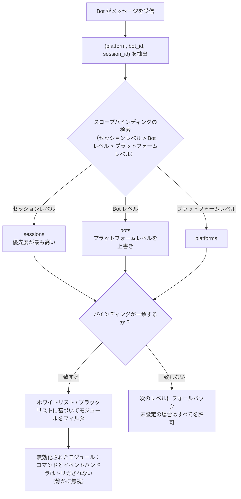

# モジュールスコープシステム

> [!NOTE]
> この機能には ErisPulse **2.8.0+** が必要です。

モジュールスコープシステムは、「特定の Bot がどのモジュールを使用できるか」を制御し、複数 Bot 環境におけるモジュールの隔離を実現します。  
デフォルトでは、すべてのモジュールがすべての Bot に対して開放されています。設定のバインディング後のみフィルタリングが開始され、**モジュールとアダプタは変更なしで対応可能です**。

{!--< tips >!--}
1. スコープは「アダプタプラットフォーム + Bot 識別子 + セッション識別子」を次元としてモジュールをバインディングします
2. ホワイトリスト（`modules`）とブラックリスト（`blocked`）の両方の方式をサポートしています
3. スコープによって禁止されたモジュールは、メッセージを受け取った際に無言で無視し、返信や通知は行いません
4. 実行時 `sdk.scope.bind()` / `unbind()` による動的な追加・削除が可能で、永続化もサポートしています
{!--< /tips >!--}

[**English**](docs/en/quick-start.md) | [**中文**](docs/ja/quick-start.md) | [**日本語**](docs/ja/quick-start.md)

## 動作原理



- **解析優先度：セッションレベル > Bot レベル > プラットフォームレベル**、より高い優先度でルールがバインディングされていない場合は次のレベルにフォールバックします。すべて未設定の場合はすべてのモジュールを許可します。
- イベントデータに `self` が含まれていない場合（Bot を識別できない）、Bot レベルをスキップし、セッションレベルまたはプラットフォームレベルで判断します。
- フレームワーク層のリソース（owner が空のハンドラ、コマンドディスパッチャー、イベントバス）は常に通過し、スコープの影響を受けません。

- [**English**](docs/en/quick-start.md) | [**简体中文**](docs/ja/quick-start.md) | [**日本語**](docs/ja/quick-start.md)

## 設定ファイル

```toml
[ErisPulse.scope]
default_allow = true        # デフォルトで全許可（false = 厳格モードでの暗黙拒否）
cache_size = 1024           # is_allowed の LRU キャッシュサイズ

# プラットフォームレベルのバインド（そのプラットフォームのすべての Bot / セッションに適用）
[ErisPulse.scope.platforms.onebot11]
modules = ["Chat", "Translate"]   # ホワイトリスト：そのプラットフォームの Bot はこれらのモジュールのみ使用可能
blocked = ["Danger"]              # ブラックリスト：これらのモジュールはそのプラットフォームで無効化

# Bot レベルのバインド（その Bot のすべてのセッションに適用、プラットフォームレベルより優先）
[ErisPulse.scope.bots.onebot11."123456"]
modules = ["Chat"]
blocked = []

# セッションレベルのバインド（特定のグループ / チャンネル / 個人チャットに適用、最も具体的）
[ErisPulse.scope.sessions.onebot11."789012345"]
modules = ["Chat"]                # そのグループは Chat のみ使用可能
blocked = []
```

意味合い（モジュール名は**大文字・小文字を区別しない**）：

| 設定 | 効果 |
|------|------|
| `modules` のみ（ホワイトリスト） | リストされたモジュールのみ使用可能 |
| `blocked` のみ（ブラックリスト） | リストされたモジュールは使用禁止、それ以外は全て許可 |
| 両方を設定 | ホワイトリストで範囲を限定し、ホワイトリスト内のモジュールからブラックリストを除外 |
| 両方が空 / 未設定 | `default_allow` に従う：`true`（デフォルト）は全て許可、`false` は暗黙的に拒否 |

> `modules` と `blocked` はいずれも文字列または文字列のリストをサポートします。モジュール名は大文字・小文字を区別しません（`"Chat"` と `"chat"` は等価）。
> セッション識別子は、グループ ID（`group_id`）、チャンネル ID（`channel_id`）またはプライベートチャットのユーザー ID（`user_id`）です。
> **セッション識別子はプラットフォームごとに分離されます**：`(platform, session_id)` の組み合わせでセッションを一意に識別し、`onebot11` の `789` と `telegram` の `789` は互いに影響を与えません。

## ランタイム API

### モジュールの許可状態を確認

```python
from ErisPulse import sdk

# 特定の Bot が特定のモジュールを使用可能か判定する
allowed = sdk.scope.is_allowed("onebot11", "123456", "Chat")

# 特定のセッション（グループ / チャンネル / DM）で判定する
allowed = sdk.scope.is_allowed("onebot11", "123456", "Chat", "789012345")
```

### 動的バインド / アンバインド

```python
# Bot レベルのホワイトリストに追加（設定に永続化）
sdk.scope.bind("onebot11", "123456", modules=["Chat", "Translate"])

# セッションレベルのホワイトリストに追加（第三引数は session_id）
sdk.scope.bind("onebot11", "123456", "789012345", modules=["Chat"])

# プラットフォームレベルのブラックリストに追加
sdk.scope.bind("onebot11", blocked=["Danger"])

# 常時有効（リロードのみで永続化しない）
sdk.scope.bind("onebot11", "123456", modules=["Chat"], persist=False)

# マージモード（Music を既存のホワイトリストに追加する）：
# デフォルトの bind は置換であることに注意
sdk.scope.bind("onebot11", "123456", modules=["Music"], merge=True)

# バインドを解除（すべて許可に戻す）；
# session_id を指定するとセッションレベルのバインドのみ解除できる
sdk.scope.unbind("onebot11", "123456")
sdk.scope.unbind("onebot11", "123456", "789012345")
```

> `bind()` はデフォルトでターゲットのすべてのバインドを**置換**します；`merge=True` の場合は、新規モジュール/無効化設定を既存のバインドにマージします。

### バインド情報の取得

```python
# 有効なバインドを取得（セッションを指定可能）
sdk.scope.get("onebot11", "123456")              # {"modules": ["Chat"], "blocked": []}
sdk.scope.get("onebot11", "123456", "789012345") # セッションレベルで有効なバインド
sdk.scope.get("onebot11")                        # プラットフォームレベルのバインド、存在しなければ None

# 全てのバインドをリスト表示（platforms / bots / sessions の3つのカテゴリ）
sdk.scope.list_bindings()
```

### フィルタリング統計（デバッグ）

```python
# スコープによって静的にフィルタリングされた回数とキャッシュのヒット状況を表示
sdk.scope.get_stats()
# {"is_allowed_calls": 10, "filtered_count": 3, "cache_hits": 5, "cache_misses": 5}

sdk.scope.reset_stats()
```

### トポロジー木データ

```python
# スコープ部分（Dashboard 用）
sdk.scope.get_topology()

## よくある質問と注意点

### 1. 設定の階層

優先度：**セッション級 > Bot 級 > プラットフォーム級**。優先度が高いものが、優先度が低いものを**全体で上書き**します。

```toml
# プラットフォーム級は Chat のみ許可
[ErisPulse.scope.platforms.onebot11]
modules = ["Chat"]

# しかし Bot 級は Music のみ許可 → その Bot は最終的に Music のみ使用可能！
[ErisPulse.scope.bots.onebot11."123456"]
modules = ["Music"]
```

- "プラットフォーム級で Chat を許可し、Bot 紧に Music を追加" したい場合、**Bot 紧で両方を同時にリストアップする必要があります**：`modules = ["Chat", "Music"]`。
- 同様に、下位のブラックリストは上位のホワイトリストによって上書きされます。プラットフォーム級 `blocked=["Danger"]` + Bot 级 `modules=["Danger"]` → Bot 级の設定が全体で優先されるため、Danger は使用可能です。階層が高く、より具体的なものが優先されます。

### 2. これは「イベントごと」の判断であり、**付着しない**

スコープ判定は**現在の単一のイベントに対してのみ**行われ、イベントをまたいで記憶することはありません。
- セッション g1 でモジュール A が無効化されている → g1 の**この**メッセージでは A はトリガーされません。**次の**メッセージでは独立して再判定されます。バインドが変更されていない限り引き続きトリガーされず、変更されれば即座に有効になります（LRU キャッシュが自動的に無効になります）。
- セッション g2 でバインドが未設定 → Bot 级 / プラットフォーム级の判定にフォールバックします。両方ともない場合は `default_allow` に従います。

### 3. モジュールに反応がない

メッセージを送信したのにモジュールが反応しない場合は、まずスコープ（適用範囲）を疑い、モジュールやアダプターではありません。

```python
# モジュールのコードや一時スクリプトに一行追加して位置特定
from ErisPulse import sdk
print(sdk.scope.is_allowed(event.get_platform(), <bot_id>, "MyModule", <session_id>))
print(sdk.scope.get_stats())          # filtered_count > 0 は確実にフィルタされたことを示します
```

フィルタリングは**静かに**行われます（ユーザーにスコープのルールを明かさないようにメッセージを返さず、応答しません）、ですが `filtered_count` は累積されます。

### 4. セッション識別子はプラットフォームごとに分離

`(platform, session_id)` の組み合わせが唯一の識別子となります。`[ErisPulse.scope.sessions.onebot11."789"]` は onebot11 プラットフォームにのみ適用され、telegram で同じ `789` のセッションには影響しません。

### 5. パフォーマンス

`is_allowed()` の結果には **LRU キャッシュ**が含まれています（デフォルト 1024 件、`scope.cache_size` で調整可能）。
設定の変更 / `bind()` / `unbind()` で自動的にキャッシュが無効になり、高頻度のイベント処理においてオーバーヘッドは極めて小さくなります。

## 拓扑ツリー API

`ModuleManager.get_topology()` と `AdapterManager.get_topology()` はモジュール/アダプタの所属関係データを提供します。
`sdk.get_topology()` はこれら3つをワンクリックで集約します。

```python
from ErisPulse import sdk

topology = sdk.get_topology()
# {
#   "modules": {                                   # モジュール → 所持リソース
#     "Chat": {
#       "loaded": True, "enabled": True,
#       "load_strategy": {"lazy": False, "priority": 50},
#       "info": {...},
#       "commands": ["chat", "translate"],
#       "handlers": {"message": 2, "notice": 1},
#       "routes": {"http": ["/Chat/api"], "ws": [], "sse": []},
#       "lifecycle_hooks": 3,
#       "scope_applies": True,
#     }
#   },
#   "adapters": {                                  # アダプタ → Bot → スコープ
#     "onebot11": {
#       "status": "started", "enabled": True,
#       "bots": {"123456": {"status": "online", "last_active": ..., "info": {...}, "scope": {...}}},
#       "scope": {"modules": [...], "blocked": [...]},
#     }
#   },
#   "scope": {"platforms": {...}, "bots": {...}, "sessions": {...}}   # 全スコープのバインド
# }
```

- モジュールのトポロジは、そのモジュールが登録したコマンド、イベントハンドラー、HTTP/WS/SSE ルート、ライフサイクルフックを集約しており、モジュールリソースツリーを描画するのに便利です。
- アダプタのトポロジは、各アダプタの状態、配下の Bot の状態、およびプラットフォームレベル / Bot レベルのスコープバインドを集約しています。