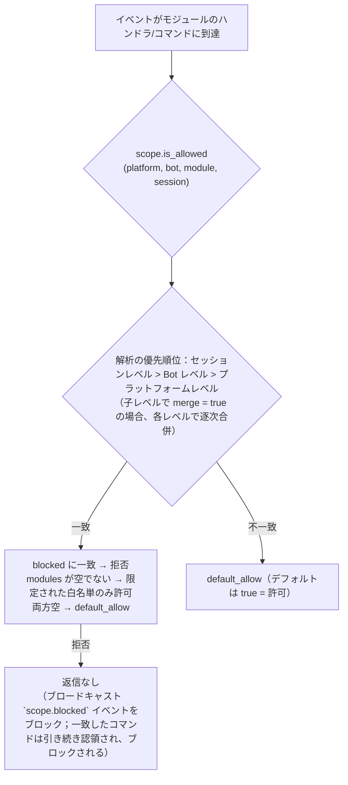

# スコープ (scope)

> [!NOTE]
> この機能は ErisPulse **2.8.0+** が必要です。

スコープは以下の4つの質問に答えます：**どのモジュールが利用可能か、どのイベントを受け取るか、特定のモジュールがどのようなテキストを処理するか、モジュールが外部に何ができるか**。  
コントロールはすべてユーザーに委ねられます。モジュール / アダプタ / プロセッサ / 出力呼び出しの登録の**上層**（`ErisPulse.scope` または実行時 `sdk.scope` での設定）で一括して宣言し、イベントパイプラインはエントリ、プロセッサフィルタ、出力ゲートで自動的に読み取り、実行します。

| 次元 | コントロール対象 | 拒否される動作 | 設定パス |
|------|---------|---------|---------|
| **① モジュール** | 利用可能なモジュール（プラットフォーム / Bot / セッションの3段階） | フィルタされたモジュールはトリガーされず、返信されません（ブロードキャスト `scope.blocked` イベントをブロック；一致したコマンドは引き続き認定され、ブロックされます） | `scope.platforms / bots / sessions` |
| **② 身分** | イベントの受信可否（アダプタ / Bot / セッション / ユーザーの4段階） | エントリで完全に破棄されます（ブロードキャスト `scope.blocked` イベントをブロック） | `scope.identity.*` |
| **③ 出力** | モジュールがどの出力呼び出し（メッセージ / API / 要求、メソッドレベルのホワイトリスト/ブラックリスト）を発行できるか | 失敗応答（`retcode=34601`） | `scope.actions` |

> **関連システム**：コマンドは特別なメッセージイベントプロセッサであり、そのユーザーのホワイトリスト/ブラックリスト（ACL）と実装パラメータのオーバーライドはコマンドシステムが独自に管理します（`ErisPulse.event.command`）。  
> [イベント処理の入門](../getting-started/event-handling.md) および [設定ガイド](../user-guide/configuration.md) を参照してください。

{!--< tips >!--}
1. 単例を `from ErisPulse.Core import scope` でインポート（`sdk.scope` は同じオブジェクト）
2. 判定：`scope.is_allowed(...)` / `scope.is_identity_allowed(...)` /  
   `scope.is_action_allowed(...)` はそれぞれ ①②③ の3つのゲートに対応します
3. 読み書き：次元化されたパラメータメソッド（IDEで補完可能）——  
   `scope.set_module(...)` / `scope.set_identity(...)` / `scope.set_action(...)`；  
   また、辞書式のバックアップメソッドとして `scope.get(path)` / `scope.set(path, v)` / `scope.delete(path)` もあります
4. イベントプロセッサのテキスト条件オーバーライドについては、  
   [イベント処理の入門 · イベントオーバーライド](../getting-started/event-handling.md#イベントオーバーライド-モジュールコードを変更せずに任意のイベントタイプの挙動をオーバーライド) を参照してください。  
   コマンド ACL / パラメータオーバーライドについては、[イベント処理の入門](../getting-started/event-handling.md) を参照してください。
{!--< /tips >!--}

## マッチング条目構文（全システム共通）

スコープのすべての「名前リスト」（モジュール名、身元キー、出力条目）は、同一のマッチング構文（`ErisPulse.Core.text_match`）を使用します：

| 構文 | 例 | 説明 |
|------|------|------|
| 精確名 | `"Chat"` | 完全一致比較、**大文字小文字は区別しない** |
| glob | `"Tool*"`、`"spam_*"` | `*` 任意文字列 / `?` 1文字 / `[seq]` 文字集合、大文字小文字は区別しない |
| 正規表現 | `"re:^Danger.*"` | `re:` 前置詞で宣言、正規表現の `search` で一致、デフォルトで大文字小文字は区別しない |

- 不正な正規表現は**静かに降格**される（エラーを投げず、クラッシュしない）
- デコレータ引数（`pattern=` / `regex=`）は固定の意味を持つ：`pattern` は glob、`regex` は正規表現ソースコード（`re:` 前置詞なし）；スコープ設定の正規表現条目は**必ず** `re:` 前置詞が必要

## グローバルバックアップ：`default_allow`

`default_allow` は**グローバルで唯一**のバックアップスイッチ（デフォルト `true`）で、以下の2つの判定次元に一括して効果します：

- **モジュール次元**：すべてのバインドに一致しない → `default_allow` で許可 / 拒否を決定
- **身元次元**：すべての戦略に一致しない → `default_allow` で許可 / 拒否を決定

`false` に設定すると「暗黙の拒否」厳格モードが有効になり、ホワイトリスト式の管理が可能で、**明示的に許可されていないものはすべて拒否**されます。

> **例外**：③ 出力次元は `default_allow` の影響を受けない——これは独立した絞り込みスイッチで、デフォルトはすべて許可され、明示的なルールのみが制限される（フレームワーク層の owner が空の呼び出しは常に許可される）。  
> これにより、厳格なグローバルモードでも、すべてのモジュールのメッセージ返信が意図せず遮断されることはない。  
> コマンド ACL には独立した `ErisPulse.event.command.default_allow` バックアップがあり、互いに影響しない。

## 設定ファイル

```toml
[ErisPulse.scope]
default_allow = true        # グローバルバックアップ（false = 暗黙の拒否厳格モード）
cache_size = 1024           # LRUキャッシュサイズ

# ── ① モジュール次元（優先度：セッション > Bot > プラットフォーム）──
[ErisPulse.scope.platforms.onebot11]
modules = ["Chat", "Tool*"]   # ホワイトリスト：正確名 / glob / re: 正規表現
blocked = ["re:^Danger"]
[ErisPulse.scope.bots.onebot11."123456"]
modules = ["Chat"]
merge = true                  # プラットフォームレベルのバインドに追加（デフォルトは全体上書き）
[ErisPulse.scope.sessions.onebot11."789012345"]
modules = ["Chat"]

# ── ② 身元次元（優先度：ユーザー > セッション > Bot > アダプター）──
[ErisPulse.scope.identity.adapters.onebot11]
deny = true                   # アダプター全体のイベントを完全に破棄
[ErisPulse.scope.identity.bots.onebot11."123456"]
deny = true
[ErisPulse.scope.identity.sessions.onebot11."g_blocked"]
deny = true
[ErisPulse.scope.identity.users.onebot11]
allow = ["u_admin"]           # ユーザー識別子に glob / re: 正規表現をサポート
deny = ["u_bad", "spam_*"]

# ── ③ 出力次元（デフォルトはすべて許可、明示的に絞る場合のみ制限）──
[ErisPulse.scope.actions.MyModule]
send = { deny = true }                                    # 送信を全禁止
api = { allow = ["get_*"] }                               # クエリ系の標準APIのみ許可
request = { deny = true }                                 # リクエスト処理を禁止
```

## ① モジュール次元

「あるコンテキストの中で、どのモジュールが利用可能か？」という質問に答える。デフォルトではすべてが開放されており、設定のバインディングが有効になってからフィルタリングが開始されるため、**モジュールとアダプタは一切変更不要**。


```mermaid
flowchart TD
    A["イベントがモジュールのハンドラ/コマンドに到達"] --> B{"scope.is_allowed<br/>(platform, bot, module, session)"}
    B --> C{"解析の優先順位：セッションレベル > Bot レベル > プラットフォームレベル<br/>（子レベルで merge = true の場合、各レベルで逐次合併）"}
    C -->|"一致"| D["blocked に一致 → 拒否<br/>modules が空でない → 限定された白名単のみ許可<br/>両方空 → default_allow"]
    C -->|"不一致"| E["default_allow（デフォルトは true = 許可）"]
    D -->|"拒否"| Z["返信なし<br/>（ブロードキャスト `scope.blocked` イベントをブロック；一致したコマンドは引き続き認領され、ブロックされる）"]
```

- **解析の優先順位：セッションレベル > Bot レベル > プラットフォームレベル**。高優先度のバインディングは低優先度を**全体的に上書き**する。子レベルで `merge = true` を設定すると、低優先度と**各項目ごとの合併**（modules / blocked はそれぞれ独立に合併）に変更される（`merge` 自体は制御キーであり、項目としてはカウントされない）。
- **デフォルトの意味**：フィルタリングされたモジュールのコマンドとハンドラはトリガされず、返信もされない。TRACE レベルのログで確認可能（`core.scope.denied`）。同時に `scope.blocked` ライフサイクルイベントがブロードキャストされ、何がブロックされたのか、なぜブロックされたのかをサブスクライブすることで観測可能。一致した**コマンド**は引き続き認領され、ブロックされる——コマンドのテキストは低優先度のメッセージハンドラに漏れることなく、二重応答の曖昧さ（コマンドが拒否された後にメッセージハンドラが再度反応する）を解消する。
- **フレームワークレベルのハンドラ**（`scope_exempt=True` または owner が空）は影響を受けない。モジュール名が空（フレームワーク層のリソース）の場合は常に許可される。
- **セッション感知によるヘルプとコマンド照会**：コマンド照会 API（`command.help` / `get_command` / `get_commands` / `get_group_commands` / `get_visible_commands`、および `module.get_commands_overview`）は、オプションで `event=` または明示的に `platform=` / `bot_id=` / `session_id=` を指定できる。現在のセッションで利用できないモジュールのコマンドは結果に含まれない（`get_command` は None を返し、単一のコマンドヘルプは「未登録」として扱われる。これはデフォルトの意味と一致する）。コンテキストを渡さない場合は、全量の動作を維持する。

### バインディングの継承（merge）

デフォルトの上書きの意味は明確で予測可能である。上位レベルのバインディングに**追加**したい場合は、子レベルで `merge = true` を設定する：

```toml
[ErisPulse.scope.platforms.onebot11]
modules = ["Chat", "Tool"]      # プラットフォームレベル：Chat、Tool を許可

[ErisPulse.scope.bots.onebot11."123456"]
modules = ["Music"]
merge = true                    # その Bot で実効する = ["Chat", "Tool", "Music"]
```

- 合併ルール：`modules` と `blocked` はそれぞれ**合併**される。バインディング内では `blocked` は `modules` よりも優先される。
- 鏈式の合併：プラットフォーム → Bot → セッションの順に段階的に追加され、各レベルで `merge` または上書きを個別に決定する。

## ② 身元次元（イベント受信）

「誰のイベントを受信するか」を回答します。拒否されたイベントは**イベント配信のエントリで完全に破棄**されます——ミドルウェアやどのハンドラにも送られず（フレームワークレベルも含む）、`core.scope.identity_denied` のTRACEレベルのログのみが表示されます。

- **解析優先度：ユーザー > セッション > Bot > アダプター**。最も具体的な設定された戦略を取る；`deny` は `allow` より優先
- 各レベルのバインドは二元戦略：`{ allow = true }` または `{ deny = true }`
- ユーザー識別子は glob / 正規表現をサポート（例：`"spam_*"` で一括した迷惑ユーザーをブロック）
- 一般的な使い方——上位で deny、個人で allow で「例外許可」：

```toml
[ErisPulse.scope.identity.adapters.onebot11]
deny = true
[ErisPulse.scope.identity.users.onebot11]
allow = ["u_admin"]   # アダプター全体が拒否していても、u_admin のイベントは許可される
```

## ③ 出力次元（モジュールの出力呼び出し制限）

モジュールが**出力アクション**（メッセージ送信 / 標準APIアクション / リクエスト操作）を開始することを制限します。  
3つのアクションはそれぞれのDSLに対応：`Event.reply` と `Send`（send）、`Api` / `call_api`（api）、`Request` の accept/reject（request）。イベントハンドラ実行中に出力呼び出しが発生した場合、モジュールの owner が含まれ、この次元で一括して判定されます。

### 規則の形態（インライン表）

各アクションのルールはインライン表です：`{ allow = [...], deny = true|[...] }`。  
同一アクションには1つのルールしか設定できません（TOMLのキーは重複不可、全禁止と細粒度はどちらか一方のみ）：

```toml
[ErisPulse.scope.actions.MyModule]
send = { deny = true }                                  # 送信を全禁止（Event.reply / Send DSL）
# または方法レベルの細粒度：send = { allow = ["Text", "Image*"], deny = ["File"] }
api = { allow = ["get_*"] }                             # クエリ系の標準APIのみ許可
# またはアクションレベルのブラックリスト：api = { deny = ["set_*", "leave_*"] }
request = { deny = true }                               # リクエストの処理を禁止（accept/reject）
```

- `send` の条目は**送信メソッド名**（`Text` / `Image` / `File` ...）に一致します、  
  `api` の条目は**標準アクション名**（`get_group_info` / `set_group_name` ...）に一致します
- 条目は正確名 / glob / `re:` 正規表現（全システムの統一構文に一致し、大文字小文字は区別しない）をサポート
- `allow` に1つの文字列を書くことは、1つのリスト条目と同等です：`send = { allow = "Text" }`

### 判定の意味

**デフォルトはすべて許可**——設定されていない場合、または owner が空（フレームワーク層の内部呼び出し）の場合はすべて許可されます。  
設定ルールがある場合、以下の順序で判定されます：

1. `deny = true` → 拒否
2. `deny` リストに呼び出し名が一致 → 拒否
3. `allow` リストが空でないかつ呼び出し名が一致しない（または呼び出し名がない）→ 拒否
4. その他の場合は許可

拒否された呼び出しはネットワークリクエストを開始せず、直接標準の失敗応答（`retcode = 34601`、[api-response §5.3](../standards/api-response.md#53-フレームワーク拡張返却コード34xxx-プラットフォームエラー段の下3桁のカスタム定義)）を返します。  
3つのアクションは互いに独立しており、1つだけ制限できます。

```python
# 実行時API
sdk.scope.set_action("MyModule", "send", deny=True)              # 送信を全禁止
sdk.scope.set_action("MyModule", "send", allow=["Text"])         # 送信可能なのはテキストのみ
sdk.scope.is_action_allowed("MyModule", "send", name="Image")    # False
sdk.scope.is_action_allowed("MyModule", "api", name="get_user_info")  # 規則に従って判定
sdk.scope.delete_action("MyModule", "send")                      # 許可を復元
sdk.scope.get_action("MyModule", "send")                         # そのアクションの現在のルール
```

## 実行時API

スコープの実行時APIは3つの層に分かれています：**判定**（3つの質問）、**ディメンション化された読み書き**（各層の `set` / `get` / `delete` パラメータ化メソッド、すべての型注釈が付いており、IDEで補完可能）、**辞書形式のバックアップ**（ドット区切りパスで任意の節に直接アクセス）。

```python
from ErisPulse import sdk

scope = sdk.scope
```

### 判定（3つの質問）

```python
scope.is_allowed("onebot11", "123456", "Chat")                 # ① モジュール次元
scope.is_allowed("onebot11", "123456", "Chat", "789012345")    # セッションレベルを含む
scope.is_allowed("onebot11", "123456", None)                   # フレームワーク層のリソース -> True

scope.is_identity_allowed("onebot11", "123456", "group_9", "u1")   # ② 身元次元

scope.is_action_allowed("MyModule", "send")                    # ④ 出力次元
scope.is_action_allowed("MyModule", "send", name="Image")      # メソッドレベルの細粒度
```

### ① モジュール次元

```python
# バインド（パラメータによって階層が決定：session_id > bot_id > プラットフォームレベル）
scope.set_module("onebot11", bot_id="123456", modules=["Chat", "Tool*"])
scope.set_module("onebot11", blocked=["re:^Danger"])                       # プラットフォームレベル
scope.set_module("onebot11", bot_id="123456", session_id="g9", modules=["Chat"])  # セッションレベル
scope.set_module("onebot11", bot_id="123456", modules=["Music"], merge=True)      # 現在のバインドと並列に追加
scope.set_module("onebot11", bot_id="123456", modules=["Chat"], persist=False)    # 実行時のみ

# 読み取り / 削除
scope.get_module("onebot11", bot_id="123456")   # {"modules": ["Chat"], "blocked": []}
scope.delete_module("onebot11", bot_id="123456")
```

> `merge=True` は**書き込み時の並列**（現在のバインドと条目を並列に）です；階層解析時の `merge = true` 設定は上記の[バインド継承](#バインド継承merge)を参照してください——これらは独立したメカニズムです。

> **実行時バインド（`persist=False`）の意味**：実行時バインドは独立したオーバーライド層に保存され、**その後のすべての設定書き込み / 設定ファイルのホットアップデートによっても破棄されません**（設定ツリーの再構築後に書き込み順序で自動的に再実行され、実行時削除も含む）。それらは永続化されず、プロセスの再起動後に失われる。モジュールのアンロード時に、そのモジュールが書き込んだ実行時バインドはバックアップでクリーンアップされる。その後、同じパスに対して `persist=True` で書き込み（ユーザー永続化の意味）を行うと、実行時ルールが上書きされます。

### ② 身元次元

```python
# 戦略のバインド（パラメータによって階層が決定：user > session > bot > adapter；allow / deny は二択）
scope.set_identity("onebot11", user_id="u_bad", deny=True)
scope.set_identity("onebot11", user_id="spam_*", deny=True)    # キーに glob / re: 正規表現をサポート
scope.set_identity("onebot11", bot_id="123456", session_id="g9", allow=True)

# 読み取り / 削除
scope.get_identity("onebot11", user_id="u_bad")   # {"deny": True}
scope.delete_identity("onebot11", user_id="u_bad")
```

### ③ 出力次元

```python
# 制限ルールの設定（allow: str|list；deny: bool|str|list；ルール全体の置換）
scope.set_action("MyModule", "send", deny=True)                    # 送信を全禁止
scope.set_action("MyModule", "send", allow=["Text"])               # 送信可能なのはテキストのみ
scope.set_action("MyModule", "api", deny=["set_*", "leave_*"])     # 管理系APIを禁止

# 読み取り / 削除
scope.get_action("MyModule", "send")       # {"allow": ["Text"]} 元のルール
scope.delete_action("MyModule", "send")    # 単一アクションを削除
scope.delete_action("MyModule")            # モジュールの全アクション制限を削除
```

### 一般的な操作

```python
scope.get("platforms")   # 辞書形式のバックアップ：ドット区切りパスで任意の節を読み取り
scope.topology()         # 全ての設定ツリー（ダッシュボード用）
scope.stats()
# {"module_calls": .., "module_filtered": .., "identity_checks": .., "identity_denied": ..,
#  "action_checks": .., "action_denied": .., "cache_hits": .., "cache_misses": ..}
scope.reset_stats()
scope.clear()           # 全ての設定をクリア（メモリ内のみ有効）
```

### 高度操作：辞書形式のドット区切りパスバックアップ

ディメンション化されたメソッドは日常的なシナリオをカバーします。任意のノード（または将来追加されるディメンション）に直接アクセスする必要がある場合は、辞書形式のAPIを使用します——`get` / `set` / `delete` はドット区切りパスを受け取り（dictの深いマージ、書き込み後に即座に読み取り可能）、`scope[path]` / `scope[path] = v` / `del scope[path]` / `path in scope` のプロトコルも提供します：

```python
scope.set("bots.onebot11.123456", {"modules": ["Chat"], "blocked": []})
scope.set("identity.users.onebot11.u_bad", {"deny": True})
scope.get("actions.MyModule.send")

scope["platforms.onebot11"]        # 読み取り（存在しない場合はKeyError）
scope["platforms.onebot11"] = {...}  # 書き込み
del scope["platforms.onebot11"]      # 削除
"actions.MyModule" in scope          # 存在確認
```

## 拦截の可観測性: `scope.blocked` イベント

スコープのブロッキング（モジュールフィルタリング / アイデンティティ拒否）が発生すると、ライフサイクルイベント **`scope.blocked`** がブロードキャストされます。  
これにより、「誰がブロックされたのか、どの層でブロックされたのか」をサブスクライブし、統計を取ることができ、ダッシュボード上に表示することも可能になります。ブロッキングはデフォルトではレスポンスを返しませんが、もはやブラックボックスではなくなります。

| フィールド | 説明 |
|------|------|
| `dimension` | `"module"`（モジュール次元のフィルタリング）/ `"identity"`（アイデンティティのアクセス拒否） |
| `module` | フィルタリングされたモジュール名（モジュール次元のみ） |
| `platform` / `bot_id` / `session_id` / `user_id` | ブロッキングが発生したソースコンテキスト |

```python
from ErisPulse.Core.lifecycle import lifecycle

@lifecycle.on("scope.blocked")
def on_blocked(data):
    print(f"ブロックされました：{data['dimension']} {data.get('module') or data.get('user_id')}")
```

- イベントは `fire` バックグラウンドでブロードキャストされます（リスナーがいない場合、オーバーヘッドはゼロで、ホットパスを遅らせません）
- キャッシュヒットによる重複ブロッキングは**再ブロードキャストされません**——同じコンビネーションはキャッシュが失効した場合にのみ1回だけブロードキャストされます
- `adapter.event.blocked`（ミドルウェアによる拒否）とは区別されます：前者はイベントレベルでの破棄であり、本イベントはスコープのアクセス制御におけるモジュール / アイデンティティのフィルタリングです。

## キャッシュとホットアップデート

- `is_allowed` / `is_identity_allowed` / `is_action_allowed` の結果は **LRUキャッシュ**（`scope.cache_size` で調整可能）が付いており、`set` / `delete` /  
  設定のホットアップデート（`config.updated` / `config.set`）で自動的に無効化されます
- すべてのディメンションの設定は**即座に有効**になり、再起動は不要
- スコープは「イベントごとに」判断されるため、イベント間で状態を保持しない：設定が変わると、次のイベントから新しいルールで判断される

## 設定フォーマットの検証

ロード時またはホットアップデート時に、各セクションの設定フォーマットを検証します：型エラーのセクション（例：`platforms` が文字列になっている）、不正な出力ルール（例：`allow` が数字になっている）、未知のアクション名、未知のトップレベルのキー（例：`alow` のスペルミス）は **WARNING** として出力され、対応するセクション / 条目は無視され、他の合法な設定は正常に有効になります——間違った設定は静かに無効になることはありません。

## 常見問題與注意事項

### 1. 配置層級與覆蓋

- モジュール次元：セッションレベル > Bot レベル > プラットフォームレベル。**全体的な上書き**（子レベルで `merge = true` の場合、各項目を並列にマージ）。
  「プラットフォームで Chat を許可し、Bot で Music を追加したい」場合は、Bot レベルで `merge = true` を設定するか、両方を明示的にリストに追加します。
- 身元次元：ユーザー > セッション > Bot > アダプター。**最も具体的な**設定された戦略を採用します（例外として許可する場合も可能）。
- コマンドのユーザーブラックリスト/ホワイトリスト：正確なコマンド名が glob キーに優先されます（`event.command.acl` を参照）。

### 2. モジュール/コマンドが反応しない場合

まず、モジュール自体ではなく作用域を疑ってください：

```python
from ErisPulse import sdk

print(sdk.scope.is_allowed(event.get_platform(), bot_id, "MyModule", session_id))
print(sdk.scope.is_identity_allowed(event.get_platform(), bot_id, session_id, user_id))
print(sdk.scope.stats())   # module_filtered / identity_denied > 0 なら、フィルタリング記録があります
```

フィルタリングされた場合、デフォルトでは返信されません（モジュール次元と身元次元で、ルールを露出しないようにします）。ただし、`scope.blocked` ライフサイクルイベントがブロードキャストされ、統計は継続的に累積されます。コマンド次元で ACL に拒否された場合は、「権限不足」という明示的な返信がされます。

### 3. 出力アクションが拒否された場合のトラブルシューティング

```python
from ErisPulse import sdk

print(sdk.scope.get("actions.MyModule"))
print(sdk.scope.stats())   # action_denied > 0 なら、呼び出しがブロックされています
```

ブロックは**明示的**です：拒否された呼び出しは `retcode = 34601` の標準的な失敗レスポンスを返し、ネットワークリクエストは発生しません。

### 4. セッション識別子のプラットフォーム間の隔離

`(platform, session_id)` の組み合わせが一意の識別子です。`scope.sessions.onebot11."789"` は onebot11 上でのみ有効で、Telegram 上で同じ `789` であるセッションには影響しません。身元次元のユーザー識別子も同様です。

## トポロジツリーAPI

`ModuleManager.get_topology()` と `AdapterManager.get_topology()` は、モジュール/アダプターの所属関係データを提供します。`sdk.get_topology()` は、スコープ `scope` を含む一括集約を提供します：

```python
from ErisPulse import sdk

topology = sdk.get_topology()
# {
#   "modules": {                                   # モジュール → 持有するリソース
#     "Chat": {
#       "loaded": True, "enabled": True,
#       "commands": ["chat", "translate"],
#       "handlers": {"message": 2, "notice": 1},
#       "routes": {"http": ["/Chat/api"], "ws": [], "sse": []},
#       "lifecycle_hooks": 3,
#     }
#   },
#   "adapters": {                                  # アダプター → Bot → スコープ
#     "onebot11": {
#       "status": "started", "enabled": True,
#       "bots": {"123456": {"status": "online", "scope": {...}}},
#       "scope": {"modules": [...], "blocked": [...]},
#     }
#   },
#   "scope": {                                     # スコープ（モジュール / 身元 / 出力アクション）
#     "platforms": {...}, "bots": {...}, "sessions": {...},
#     "identity": {"adapters": {...}, "bots": {...}, "sessions": {...}, "users": {...}},
#     "actions": {...},
#   },
# }
```

- モジュールトポロジーは、登録されたコマンド、イベントハンドラ、HTTP/WS/SSEルート、ライフサイクルフックを集約し、モジュールリソースツリーの描画に便利です。
- アダプタートポロジーは、各アダプターのステータス、所属するBotのステータス、およびプラットフォーム/Botレベルのスコープバインド（モジュール次元）を集約します。
- **JSON安全出力**：`get_topology(json_safe=...)` はデフォルトで `True` で、返された構造は `json.dumps` で直接シリアライズ可能——モジュール `info` は純粋なデータの `meta` サブテーブルのみを保持し（`module_class` / `strategy` などの実行時オブジェクトは除外）、その他のノード（アダプター作者が Bot `info` に追加した任意のオブジェクトを含む）はバックアップで浄化されます（クラスオブジェクトは `__name__` を取得、シリアライズできないオブジェクトは `str()` に退化）。ダッシュボード / WebUI は直接シリアライズして返すことができる；元のオブジェクトが必要な場合は `json_safe=False` を渡す。