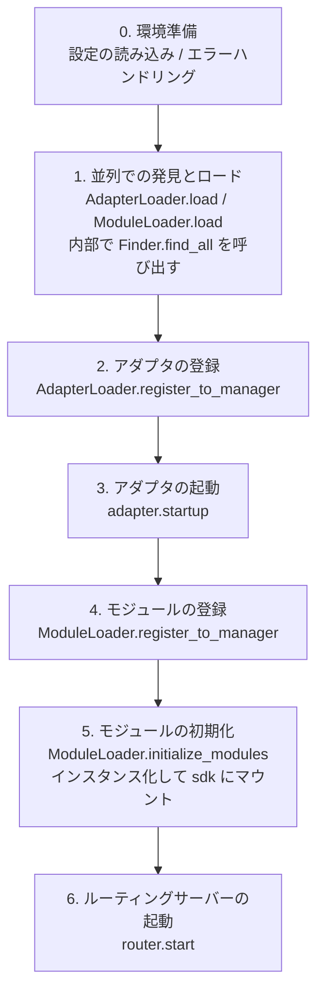

# 起動プロセスと手動制御

ErisPulse の `await sdk.run()` / `await sdk.init()` は、一連の起動フローを「一行のコード」に抽象化しています。しかし、部分的なロード、動的な登録、ホットプラグ、カスタムロード戦略の注入など、起動フローを完全にカスタマイズする必要がある場合は、このフローの内部で何が起こっているのか、そして各ステップを手動で駆動する方法を理解する必要があります。

本文では、起動フローを個々のステップに分解し、それぞれの役割と呼び出し順序を説明し、手動で完全な起動を行うための例を示します。

> 本文では、[最初のロボット](../getting-started/first-bot.md)を実行した前提があり、`sdk.run(keep_running=True/False)` の2つのモードについて理解しているものとします。本文では、`init()` **内部**のフローの分解、および `init()` / `init_task()` / `init_sync()` などのより下層のエントリポイントに焦点を当てます。

- [English](docs/en/quick-start.md) | **日本語** | [简体中文](docs/ja/quick-start.md) | [繁體中文](docs/zh-TW/quick-start.md) | [한국어](docs/ko/quick-start.md)

## SDK トップレベルエントリーポイント一覧

`run()` の 2 つの `keep_running` モードに加えて、SDK はいくつかのより下層の初期化エントリーポイントを提供しています。これらは、**非同期性、戻り値、例外のラッピング有無**によって区別されます：

| エントリーポイント | 非同期性 | 戻り値 | 例外処理 | 適用場面 |
|------|--------|--------|----------|----------|
| `await sdk.run(True)` | async、ブロッキングを維持 | `None`（終了時に自動 `uninit`） | モジュール/アダプターのエラーはキャッチされ、プロセスをクラッシュさせない | ボット専用アプリケーション |
| `await sdk.run(False)` | async、ブロッキングしない | `None`（自動アンロードしない） | 同上 | 初期化後にカスタムロジックを実行する |
| `await sdk.init()` | async、awaitが必要 | `bool` | 内部でコンポーネントの例外をキャッチし、失敗時は `False` を返す | 手動でライフサイクルを制御する（`uninit()` と併用） |
| `sdk.init_task()` | async、Task を返すことでブロッキングしない | `asyncio.Task` | `init()` と同じ | 並行的に他の初期化処理を実行する、またはイベントループがまだ実行されていない場合 |
| `sdk.init_sync()` | **同期**、現在のスレッドをブロッキング | `bool` | `init()` と同じ | コマンドラインスクリプト、イベントループのない同期エントリーポイント |

> **よくある誤解**：`await sdk.init()` は `await sdk.run(keep_running=False)` と**等価ではありません**。2 点の違いがあります：① `init()` は `bool` を返します（失敗時は `False` を返す）、`run()` は `None` を返します；② `init()` は初期化のみを行い、**自動アンロードは行いません**、`run()` はイベントループが終了した際に自動で `uninit()` を実行します。したがって、手動でアンロードやカスタムライフサイクルを制御する必要がある場合は、`init()` + `uninit()` を使用してください。

## 開始フローの概要

`sdk.init()`（正確には内部の `Initializer.init()`）は、以下の順序でフレームワーク全体を起動します：



対応するコアコンポーネント：

| 層 | コンポーネント | 機能 |
|----|------|------|
| 発見 | `AdapterFinder` / `ModuleFinder` | インストール済みパッケージの entry-points から**発見**する |
| 加載 | `AdapterLoader` / `ModuleLoader` | 発見 + インポート + メタデータの読み取り + 有効/無効の判定を行い、オブジェクトのリストを返す |
| 登録 | `*Loader.register_to_manager` | オブジェクトを対応するマネージャーに登録する |
| 管理 | `sdk.adapter` / `sdk.module` | アダプタ/モジュールのインスタンスを管理し、起動/停止のインターフェースを提供する |
| 初期化 | `ModuleLoader.initialize_modules` | モジュールのインスタンスを作成して `sdk` にマウントする（依存関係のトポロジカルソート処理） |
| ルーティング | `sdk.router` | HTTP / WebSocket サーバー |

> **重要**：`Finder` と `Loader` は2つの層です。`Loader` 内部では**すでに** `Finder` を保持しています（`AdapterLoader` は `AdapterFinder` を内包し、`ModuleLoader` は `ModuleFinder` を内包しています）。ほとんどの場合、`Loader` を使用するだけで十分です。"リスト表示のみ、インポートしない"が必要な場合にのみ、`Finder` を個別に使用します。

[**English**](docs/en/quick-start.md) | [**日本語**](docs/ja/quick-start.md) | [**简体中文**](docs/ja/quick-start.md)

## 各段階の詳細説明

### 1. 検出層：Finder

Finder は「どのパッケージがアダプタ/モジュールを提供しているかを検出する」ことだけを担当し、インポートやインスタンス化は行いません。

```python
from ErisPulse.finders import AdapterFinder, ModuleFinder

adapter_finder = AdapterFinder()
module_finder = ModuleFinder()

# インストール済みの全てのアダプタ/モジュールの entry-points を検索
adapter_entries = adapter_finder.find_all()    # list[EntryPoint]
module_entries = module_finder.find_all()      # list[EntryPoint]

# 名称で単一のエントリポイントを検索
entry = module_finder.find_by_name("MyModule")  # EntryPoint | None
```

各 `EntryPoint` は `.load()` を呼ぶことで対応するクラスを得られますが、通常は手動で呼び出す必要はありません——Loader が処理を行います。

### 2. 加載層：Loader

Loader は Finder の上に「インポート + メタデータの読込 + 有効/無効の判断」を行います。

```python
from ErisPulse.loaders import AdapterLoader, ModuleLoader
from ErisPulse import sdk

adapter_loader = AdapterLoader()
module_loader = ModuleLoader()

# load() 内部：finder.find_all() を呼び出す → 各 entry-point を順次処理 → 三つ組を返す
adapter_objs, enabled_adapters, disabled_adapters = await adapter_loader.load(sdk.adapter)
module_objs, enabled_modules, disabled_modules = await module_loader.load(sdk.module)
```

`load()` が返す三つ組：

| 戻り値 | 意味 |
|--------|------|
| `objs` (`dict`) | 名称 → オブジェクト（アダプタクラス / モジュールラッパー） |
| `enabled` (`list[str]`) | 有効化された名称（設定で無効化されていない） |
| `disabled` (`list[str]`) | 無効化された名称 |

#### 加載失敗時の診断情報

モジュール/アダプタが加載または初期化段階で例外を送出した場合、フレームワークはそのコンポーネントをスキップして他のコンポーネントの加載を継続し、**ユーザコードのフレームサマリー**を出力します。これにより、デフォルトの INFO レベルでエラー箇所を特定でき、手動で DEBUG モードに切り替える必要がありません。

```
[ERROR] [ModuleLoader] entry-point からモジュール MyModule の加載に失敗しました。スキップしました: 'NoneType' object has no attribute 'platform'
  → MyModule/Core.py:42 in on_load
      adapter = sdk.platform
  → AttributeError: 'NoneType' object has no attribute 'platform'
  → ヒント: ログレベルを DEBUG に上げると完全なスタックトレースを確認できます。モジュール MyModule の実装コードを確認してください。
```

診断情報は `ErisPulse.runtime.diagnostics` モジュールによって生成され、フレームワーク内部のフレームは自動的にフィルタされ、ユーザコードのフレームのみが保持されます。カスタム加載ロジックで再利用する場合は：

```python
from ErisPulse.runtime import log_diagnostic

try:
    risky_init()
except Exception as e:
    log_diagnostic(e)  # 自動的にユーザコードのフレームを抽出し、ERROR ログに書き込みます
```

このモジュールには `extract_user_frame()`（構造化されたフレーム情報を返す）と `format_diagnostic_block()`（複数行のテキストを返す）という2つの低レベル関数も提供されています。

### 3. 登録層：register_to_manager

Loader が出力したオブジェクトをマネージャーに登録し、`sdk.adapter` / `sdk.module` がそれらを認識できるようにします。

```python
# アダプタの登録（全登録が成功したかを表す bool を返す）
await adapter_loader.register_to_manager(enabled_adapters, adapter_objs, sdk.adapter)

# モジュールの登録
await module_loader.register_to_manager(enabled_modules, module_objs, sdk.module)
```

登録後、アダプタはアダプタマネージャーに、モジュールはモジュールマネージャーに登録されますが、**まだ起動/インスタンス化は行われていません**。

### 4. アダプタの起動

```python
# すべての登録済みアダプタを起動
await sdk.adapter.startup()
# または特定のプラットフォームを指定
await sdk.adapter.startup("yunhu")
await sdk.adapter.startup(["yunhu", "telegram"])
```

> 登録 ≠ 起動。`register_to_manager` は単に登録を行うだけです。`startup` を呼ぶことでアダプタの `start()` が呼び出され、プラットフォームとの接続が確立されます。

### 5. モジュールの初期化

モジュールはアダプタよりも1つステップ多く、**インスタンス化**して `sdk` にマウントする必要があります（これにより `sdk.MyModule.xxx` で呼び出せるようになります）。この段階では、モジュール間の依存宣言とトポロジカルソートも処理されます。

```python
success = await module_loader.initialize_modules(
    enabled_modules, module_objs, sdk.module, sdk
)
```

インスタンス化が成功すると、モジュールは `sdk.<ModuleName>` に登録されます。

### 6. ルーティングサーバーの起動

```python
await sdk.router.start(
    host="0.0.0.0",
    port=8000,
    ssl_certfile=None,
    ssl_keyfile=None,
)
```

ルーティングサーバーは、アダプタからの Webhook / WebSocket コールバックを受信する役割を担います。これを起動しないと、server モードのアダプタはメッセージを受け取れません。

[**English**](docs/en/quick-start.md) | [**日本語**](docs/ja/quick-start.md)

## 完全な手動起動の例

以下のコードは `await sdk.init()` のコアな処理と**等価**ですが、各ステップが明示的に公開されており、任意の段階でカスタムロジックを挿入することができます。

```python
import asyncio
from ErisPulse import sdk
from ErisPulse.loaders import AdapterLoader, ModuleLoader

async def manual_startup():
    # 0. 環境の準備（設定の読み込み、グローバルな例外処理の登録）
    #    _prepare_environment は init() 内部の前置処理です。手動プロセスでも最初に呼び出す必要があります。
    #    そうでないと、Loader は設定を読み取れず、すべてのアダプター/モジュールを無効と誤認します。
    if not await sdk._prepare_environment():
        print("環境の準備に失敗しました")
        return False

    # 1. ローダーの作成（内部で Finder を保持）
    adapter_loader = AdapterLoader()
    module_loader = ModuleLoader()

    # 2. 並行して発見とロード（init() 内部と同じ gather を使用）
    (adapter_objs, enabled_adapters, disabled_adapters), \
    (module_objs, enabled_modules, disabled_modules) = await asyncio.gather(
        adapter_loader.load(sdk.adapter),
        module_loader.load(sdk.module),
    )

    # 3. アダプターの登録
    await adapter_loader.register_to_manager(
        enabled_adapters, adapter_objs, sdk.adapter
    )

    # 4. アダプターの起動
    if enabled_adapters:
        await sdk.adapter.startup()

    # 5. モジュールの登録
    await module_loader.register_to_manager(
        enabled_modules, module_objs, sdk.module
    )

    # 6. モジュールの初期化（インスタンス化 + sdk にマウント）
    if enabled_modules:
        await module_loader.initialize_modules(
            enabled_modules, module_objs, sdk.module, sdk
        )

    # 7. ルーティングサーバーの起動
    await sdk.router.start(host="0.0.0.0", port=8000)

    print("手動起動が完了しました")
    return True

async def main():
    ok = await manual_startup()
    if ok:
        # 実行を維持するためのブロッキング（手動プロセスでは自動的にブロッキングされません）
        await asyncio.Event().wait()

if __name__ == "__main__":
    asyncio.run(main())
```

### 手動起動が必要な場合

ほとんどの場合、手動起動は**不要**です。`await sdk.run()` は上記のすべてを自動的に行います。手動起動は以下のシナリオでのみ価値があります：

- **部分的なロード**：指定されたアダプター/モジュールのみをロードし、他の部分はスキップ
- **動的登録**：実行時に条件に応じて新しいアダプター/モジュールを登録
- **カスタム順序**：デフォルトのロード順序を変更したい場合（例えば、特定のモジュールを先に起動してからアダプターを起動する）
- **注入戦略**：Loader にカスタムの厳格モードマネージャー、ロード戦略などを注入
- **デバッグ/診断**：特定の段階で失敗した際に、手動でプロセスを進めることで問題の原因を特定

## 実行時細粒度制御

`sdk.run()` を使用して起動しても、SDK 全体を再起動することなく、実行時に個々のサブシステムを個別に制御することができます。

### アダプタのホット起動/停止

```python
# あるアダプタをホットリスタート（接続の修復、他のプラットフォームへの影響なし）
await sdk.adapter.shutdown("yunhu")
await sdk.adapter.startup("yunhu")

# 実行中に新しいプラットフォームを起動
await sdk.adapter.startup("telegram")

# 一時的に特定のプラットフォームをオフラインにする
await sdk.adapter.shutdown("telegram")
```

> `adapter.startup()` は、アダプタが**マネージャーに登録済み**であることを要求します。登録は `init()` / `run()` の内部で行われるため、これは起動**後の**細粒度制御になります。

### ルーターサーバー

```python
# 一時的に webhook サーバーをオフラインにする
await sdk.router.stop()

# 再起動（たとえばポートが変更された場合）
await sdk.router.start(host="0.0.0.0", port=9000)
```

### モジュールのオンデマンドロード

```python
# 手動でロード（遅延ロードされている可能性のある）モジュールをロード
await sdk.load_module("MyModule")

## エレガントなシャットダウン

2.7.0 以降、`sdk.shutdown()` は**プログラムによるエレガントなシャットダウン**を提供します：シャットダウンイベントを設定し、`await sdk.run(keep_running=True)` で待機中のメインループが返り、`uninit()` をトリガーしてリソースのクリーンアップを完了します。

```python
# 任意のコルーチンで呼び出すことで、エレガントな終了をトリガー（run() が待機から戻り、自動的に uninit() が実行される）
sdk.shutdown()
```

典型的な用途：

```python
async def shutdown_after_idle():
    await asyncio.sleep(3600)
    sdk.shutdown()  # 空き状態が1時間続いたらエレガントに終了
```

**シグナル処理**：`run()` 内部では `SIGTERM` / `SIGHUP` ハンドラを登録し、システムシグナルをエレガントなシャットダウンに変換します——コンテナオーケストレーション（Docker `docker stop`）や `systemd` でサービスを停止する場合、プロセスは強制終了ではなく `uninit()` のクリーンアップを完了します。

- Windows では `loop.add_signal_handler` はサポートされていないため、シグナルハンドラは自動的にスキップされます（`sdk.shutdown()` または Ctrl+C でシャットダウンをトリガーすることは可能です）
- `sdk.shutdown()` を繰り返し呼び出しても安全です（イベントが設定された後、再び呼び出しても無効になります）

[**English**](docs/ja/quick-start.md)

## アンインストールのフロー

初期化の逆操作は `await sdk.uninit()` であり、これは逆の順序でクリーンアップを行います：

1. すべてのアダプタを閉じる（`adapter.shutdown()`）
2. すべてのモジュールをアンロードする
3. すべてのイベントハンドラをクリーンアップする
4. マネージャーと SDK 上のモジュール属性をクリーンアップする

手動で起動する場合、正常終了を保証するために終了前に `uninit()` を呼び出すことを忘れないでください：

```python
try:
    await asyncio.Event().wait()   # 実行を維持
finally:
    await sdk.uninit()

## 再起動

SDK は 2 つの再起動方法を提供しており、自分でアンインストールする必要はありません。フレームワークが自動的に処理します。

| 方法 | 呼び出し | 行動 | 適用シーン |
|------|------|------|----------|
| ホット再起動 | `await sdk.restart()` | 同一プロセス内で `uninit()` の後に再び `init()` を実行し、アダプタ/モジュールを再読み込み | 設定の再読み込み、ホットアップデートモジュール |
| ハード再起動 | `await sdk.hard_restart()` | `uninit()` の後にプロセス全体を終了し、親プロセス（`epsdk run`）が新しいプロセスを起動 | メモリ/リソースのリークが疑われる場合、完全にクリーンな再起動が必要な場合 |

```python
# ホット再起動：同一プロセス内で再読み込み（最も一般的）
await sdk.restart()

# ハード再起動：プロセスを終了し、epsdk run で起動する必要あり
await sdk.hard_restart()
```

> **2 点注意**：
> 1. どちらのメソッドもバックグラウンドタスクで再起動を実行し、**即座に `True` を返すのは「再起動タスクがスケジュールされた」ことを意味し、「再起動が完了した」ことを示すものではありません**。実際の再起動はバックグラウンドで行われ、現在のイベントフローを中断しません。
> 2. `hard_restart()` は **`epsdk run main.py` で起動した場合にのみ有効**です。その仕組みは、アンインストール後に**終了コード 42** でプロセスを終了させ、`epsdk run` の親プロセスが 42 を検知すると新しいプロセスを再起動します。`python main.py` で直接起動した場合は、終了コード 42 でプロセスが終了した後、自動的に再起動されません。

### ハード再起動を使用すべきタイミング

ハード再起動は単に「より徹底的な再起動」ではなく、以下のシナリオではホット再起動よりも適切で、場合によっては効率的です：

- **バイナリライブラリ（C拡張）の副作用**：ホット再起動は同一プロセス内で行われるため、C拡張、開かれたファイルディスクリプタ、スレッドなどのプロセスレベルのリソースを解放できません。ハード再起動は新しいプロセスを起動するため、これらの副作用を完全にクリアできます。
- **リソースリークの調査**：メモリやハンドルのリークが疑われる場合、ハード再起動によりクリーンな環境を得ることができます。
- **頻繁な再起動に性能が敏感な場合**：ハード再起動は同一プロセス内でアンロード→再ロードのオーバーヘッドを省くため、実際にはホット再起動よりも効率的です。

> Dashboard 管理パネルの「フレームワーク再起動」機能は、下層で `hard_restart()` を呼び出しています。
> さらに、ハード再起動には 1 つの要件があります！必ず `epsdk` の `run` コマンドを使用して起動する必要があります。そうでない場合、プログラムは単に 42 の終了コードを投げて終了するだけです。`run` コマンドは終了コード 42 を検知してプロセスを再起動するため、この点は注意が必要です！！！

## 関連ドキュメント

- [最初のロボットを作成する](../getting-started/first-bot.md) - `keep_running` の2つの基本的なモードの入門
- [ライフサイクル管理](lifecycle.md) - `core.init.start` / `core.init.complete` などの起動イベントをリッスンする
- [遅延ロードシステム](lazy-loading.md) - モジュールの遅延ロードメカニズムと `load_module`

[**English**](../docs/en/quick-start.md) | [**简体中文**](../docs/ja/quick-start.md) | [**日本語**](../docs/ja/quick-start.md)