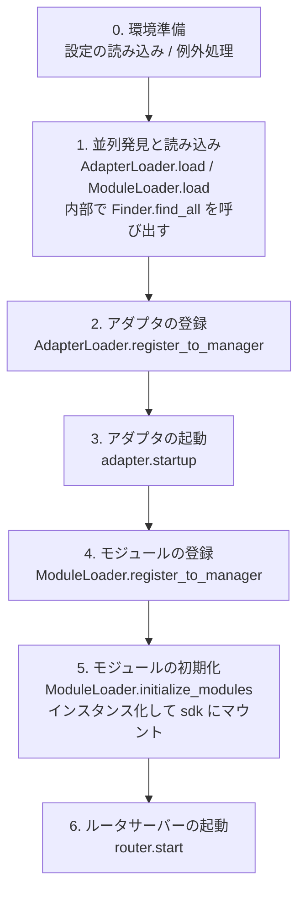

# 起動フローと手動制御

ErisPulse の `await sdk.run()` / `await sdk.init()` は、一連の起動プロセスを「1行のコード」にまとめました。しかし、部分読み込みや動的登録、ホットスワップ、独自の読み込み戦略の注入など、起動プロセスを完全にカスタマイズする必要がある場合、このプロセス内部で何が行われているか、および各ステップをどのように手動で駆動するかを理解する必要があります。

本記事では、起動プロセスを独立したステップに分解し、それぞれの役割と呼び出し順序を説明します。また、手動で完全に起動する例も示します。

> 本記事では、すでに [最初のボット](../getting-started/first-bot.md) を動かしたことがあり、`sdk.run(keep_running=True/False)` の2つのモードを理解していることを前提としています。本記事は `init()` **内部**のプロセス分解に焦点を当て、`init()`/`init_task()`/`init_sync()` などのより低レベルなエントリポイントについて説明します。

## SDK 上位エントリポイントの概要

`run()` の2つの `keep_running` モードに加え、SDK はさらに低レベルの初期化エントリポイントをいくつか提供しています。それらの違いは**非同期性、戻り値、および例外をラップするかどうか**です：

| エントリポイント | 非同期性 | 戻り値 | 例外処理 | 適用シーン |
|------|--------|--------|----------|----------|
| `await sdk.run(True)` | async、ブロックして維持 | `None`（終了時に自動 `uninit`） | モジュール/アダプタエラーをキャッチ、プロセス全体に影響させない | 純粋な bot アプリケーション |
| `await sdk.run(False)` | async、ブロックしない | `None`（自動アンインストールなし） | 同上 | 初期化後にカスタムロジックを実行する場合 |
| `await sdk.init()` | async、await 必要 | `bool` | **ラップしない**、例外を上位に投げる | 手動でライフサイクルを制御する場合（`uninit()` と組み合わせる） |
| `sdk.init_task()` | async、Task を返してブロックしない | `asyncio.Task` | `init()` と同じ | 他の初期化を並列実行する場合、またはイベントループがまだ動いていない場合 |
| `sdk.init_sync()` | **同期**、現在のスレッドをブロック | `bool` | `init()` と同じ | コマンドラインスクリプト、イベントループを持たない同期エントリポイント |

> **よくある誤解**：`await sdk.init()` は `await sdk.run(keep_running=False)` と**等価ではありません**。2つの違い：① `init()` は `bool` を返し、`run()` は `None` を返す；② `run()` は初期化と実行プロセスを try/except でラップする（モジュール/アダプタエラーをキャッチしてクラッシュを防ぐ）、一方で `init()` はラップせず、例外は直接投げられます。アンインストールのペアリングやカスタム例外処理が必要な場合は、`init()` + `uninit()` を使用してください。

## 起動プロセスの概要

`sdk.init()`（正確にはその内部にある `Initializer.init()`）は、以下の順序でフレームワーク全体を起動します：



対応するコアコンポーネント：

| レイヤー | コンポーネント | 役割 |
|----|------|------|
| 発見 | `AdapterFinder` / `ModuleFinder` | インストール済みパッケージの entry-points から**発見**する |
| 読み込み | `AdapterLoader` / `ModuleLoader` | 発見 + インポート + メタデータの読み込み + 有効/無効の判定、オブジェクトの一覧を返す |
| 登録 | `*Loader.register_to_manager` | オブジェクトを対応するマネージャーに登録する |
| 管理 | `sdk.adapter` / `sdk.module` | アダプタ/モジュールインスタンスを維持し、起動/停止インターフェースを提供する |
| 初期化 | `ModuleLoader.initialize_modules` | モジュールインスタンスを作成して `sdk` にマウントする（依存関係のトポロジカルソートを処理） |
| ルーティング | `sdk.router` | HTTP / WebSocket サーバー |

> **重要**：`Finder` と `Loader` は2層構造です。`Loader` 内部では**すでに `Finder` を保持**しています（`AdapterLoader` は `AdapterFinder` を持ち、`ModuleLoader` は `ModuleFinder` を持ちます）。ほとんどの場合は `Loader` のみを使用すればよく、`Finder` は「一覧は取得するがインポートしない」という状況でのみ個別に使用します。

## 各ステップの詳細解説

### 1. 発見層：Finder

Finder は「どのパッケージがアダプタ/モジュールを提供しているか」を見つけるだけの責任を持ちます。インポートもインスタンス化もしません。

```python
from ErisPulse.finders import AdapterFinder, ModuleFinder

adapter_finder = AdapterFinder()
module_finder = ModuleFinder()

# すべてのインストール済みアダプタ/モジュールの entry-points を検索
adapter_entries = adapter_finder.find_all()    # list[EntryPoint]
module_entries = module_finder.find_all()      # list[EntryPoint]

# 名前で単一のものを検索
entry = module_finder.find_by_name("MyModule")  # EntryPoint | None
```

各 `EntryPoint` は `.load()` で対応するクラスを取得できますが、通常は手動で呼び出す必要はありません（Loader が行います）。

### 2. 読み込み層：Loader

Loader は Finder の上に「インポート + メタデータ読み込み + 有効/無効の判定」を行っています。

```python
from ErisPulse.loaders import AdapterLoader, ModuleLoader
from ErisPulse import sdk

adapter_loader = AdapterLoader()
module_loader = ModuleLoader()

# load() 内部：finder.find_all() を呼び出す → entry-point を順に処理 → 3つの値を返す
adapter_objs, enabled_adapters, disabled_adapters = await adapter_loader.load(sdk.adapter)
module_objs, enabled_modules, disabled_modules = await module_loader.load(sdk.module)
```

`load()` が返す3つの値：

| 戻り値 | 意味 |
|--------|------|
| `objs` (`dict`) | 名前 → オブジェクト（アダプタクラス / モジュールラッパーオブジェクト） |
| `enabled` (`list[str]`) | 有効化された名前（設定で無効化されていないもの） |
| `disabled` (`list[str]`) | 無効化された名前 |

### 3. 登録層：register_to_manager

Loader が出力したオブジェクトをマネージャーに登録し、`sdk.adapter` / `sdk.module` がそれらを認識できるようにします。

```python
# アダプタを登録（すべて成功したかどうかを表す bool を返す）
await adapter_loader.register_to_manager(enabled_adapters, adapter_objs, sdk.adapter)

# モジュールを登録
await module_loader.register_to_manager(enabled_modules, module_objs, sdk.module)
```

登録後、アダプタは `sdk.adapter._adapters` に入り、モジュールクラスは `sdk.module` に入りますが、**まだ起動/インスタンス化されていません**。

### 4. アダプタの起動

```python
# 登録されたすべてのアダプタを起動
await sdk.adapter.startup()
# または特定のプラットフォームを指定
await sdk.adapter.startup("yunhu")
await sdk.adapter.startup(["yunhu", "telegram"])
```

> 登録 ≠ 起動。`register_to_manager` は単なる登録であり、`startup` で初めてアダプタの `start()` が呼び出され、プラットフォームへの接続が確立されます。

### 5. モジュールの初期化

モジュールはアダプタよりも1ステップ多く、**インスタンス化**して `sdk` にマウントする必要があります（そうすることで `sdk.MyModule.xxx` を呼び出せるようになります）。このステップでは、モジュール間の依存関係の宣言とトポロジカルソートも処理されます。

```python
success = await module_loader.initialize_modules(
    enabled_modules, module_objs, sdk.module, sdk
)
```

インスタンス化に成功すると、モジュールは `sdk.<ModuleName>` 上に現れます。

### 6. ルータサーバーの起動

```python
await sdk.router.start(
    host="0.0.0.0",
    port=8000,
    ssl_certfile=None,
    ssl_keyfile=None,
)
```

ルータサーバーは、アダプタの Webhook / WebSocket コールバックを受信する責任があります。これを起動しないと、サーバーモードのアダプタでメッセージを受け取ることができません。

## 完全な手動起動の例

以下のコードは `await sdk.init()` のコアプロセスと**等価**ですが、各ステップがあなたの手のひらに乗ります。カスタムロジックを挿入できるのは任意の段階です：

```python
import asyncio
from ErisPulse import sdk
from ErisPulse.loaders import AdapterLoader, ModuleLoader

async def manual_startup():
    # 0. 環境の準備（設定の読み込み、グローバルな例外処理の登録）
    #    _prepare_environment は init() 内部の事前ステップです；手動プロセスでも最初に呼び出す必要があります。
    #    そうしないと、Loader が設定を読み取れず、すべてのアダプタ/モジュールを無効と誤判定します。
    if not await sdk._prepare_environment():
        print("環境準備に失敗しました")
        return False

    # 1. ローダーを作成（内部でそれぞれ Finder を保持しています）
    adapter_loader = AdapterLoader()
    module_loader = ModuleLoader()

    # 2. 並列発見と読み込み（init() 内部と同じく gather を使用）
    (adapter_objs, enabled_adapters, disabled_adapters), \
    (module_objs, enabled_modules, disabled_modules) = await asyncio.gather(
        adapter_loader.load(sdk.adapter),
        module_loader.load(sdk.module),
    )

    # 3. アダプタの登録
    await adapter_loader.register_to_manager(
        enabled_adapters, adapter_objs, sdk.adapter
    )

    # 4. アダプタの起動
    if enabled_adapters:
        await sdk.adapter.startup()

    # 5. モジュールの登録
    await module_loader.register_to_manager(
        enabled_modules, module_objs, sdk.module
    )

    # 6. モジュールの初期化（インスタンス化 + sdk へのマウント）
    if enabled_modules:
        await module_loader.initialize_modules(
            enabled_modules, module_objs, sdk.module, sdk
        )

    # 7. ルータサーバーの起動
    await sdk.router.start(host="0.0.0.0", port=8000)

    print("手動起動が完了しました")
    return True

async def main():
    ok = await manual_startup()
    if ok:
        # ブロックして実行維持（手動プロセスは自動ブロックされません）
        await asyncio.Event().wait()

if __name__ == "__main__":
    asyncio.run(main())
```

### いつ手動起動すべきか？

ほとんどの場合**手動起動は必要ありません**、`await sdk.run()` ですべての上記処理が完了しています。手動起動が価値を持ち得るのは以下のシナリオのみです：

- **部分読み込み**：指定されたアダプタ/モジュールのみを読み込み、その他はスキップする
- **動的登録**：実行時に条件に基づいて新しいアダプタ/モジュールを登録する
- **カスタム順序**：デフォルトの読み込み順序を変更する必要がある（例：あるモジュールを先に起動してからアダプタを起動する）
- **注入戦略**：Loader にカスタムの厳格モードマネージャー、読み込み戦略などを注入する
- **デバッグ/診断**：特定の段階で失敗した場合、手動で駆動して問題を特定する

## 実行時の細かい制御

`sdk.run()` で起動を完了させた後でも、実行時に各サブシステムを個別に制御することができます。そのために、SDK 全体を再起動する必要はありません：

### アダプタのホットスタート/ストップ

```python
# アダプタのホットリスタート（接続を修復し、他のプラットフォームに影響を与えない）
await sdk.adapter.shutdown("yunhu")
await sdk.adapter.startup("yunhu")

# 実行中に新しいプラットフォームを立ち上げる
await sdk.adapter.startup("telegram")

# 一時的にプラットフォームをオフラインにする
await sdk.adapter.shutdown("telegram")
```

> `adapter.startup()` はアダプタがマネージャーに**登録されている**必要があります。登録は `init()`/`run()` 内部で行われるため、これは起動**後**の細かい制御となります。

### ルータサーバー

```python
# 一時的に webhook サーバーを停止する
await sdk.router.stop()

# 再起動する（例えばポートを変更した場合）
await sdk.router.start(host="0.0.0.0", port=9000)
```

### モジュールのオンデマンド読み込み

```python
# 手動でモジュールを読み込む（遅延読み込みである可能性があります）
await sdk.load_module("MyModule")
```

## アンインストール（クリーンアップ）プロセス

起動の逆操作は `await sdk.uninit()` で、これは逆順にクリーンアップを行います：

1. すべてのアダプタを閉じる（`adapter.shutdown()`）
2. すべてのモジュールをアンインストールする
3. すべてのイベントハンドラをクリアする
4. マネージャーと SDK 上のモジュール属性をクリアする

手動起動シナリオの場合、正常なシャットダウンを保証するために、終了前に `uninit()` を呼び出すことを忘れないでください：

```python
try:
    await asyncio.Event().wait()   # 実行維持
finally:
    await sdk.uninit()
```

## 再起動

SDK は2つの再起動方法を提供しており、いずれも事前にアンインストールする必要はありません。フレームワークが独自に処理します：

| 方法 | 呼び出し | 動作 | 適用シーン |
|------|------|------|----------|
| ホットリスタート | `await sdk.restart()` | 同一プロセス内で `uninit()` してから再び `init()`、アダプタ/モジュールを再読み込み | 設定を再読み込み、モジュールのホットアップデート |
| ハード再起動 | `await sdk.hard_restart()` | `uninit()` してプロセス全体を終了し、親プロセス（`epsdk run`）がクリーンなプロセスを起動する | メモリ/リソースリークを疑う場合、完全にクリーンな再起動が必要な場合 |

```python
# ホットリスタート：同一プロセス内で再読み込み（最も一般的）
await sdk.restart()

# ハード再起動：プロセスを終了し、epsdk run で起動した場合のみ有効
await sdk.hard_restart()
```

> **2点の注意**：
> 1. これらのメソッドはどちらもバックグラウンドタスクで再起動を実行し、**即座に `True` を返して「再起動タスクがスケジュールされました」を示します**。「再起動が完了しました」ではありません。実際の再起動はバックグラウンドで行われるため、現在のイベントチェーンを中断しません。
> 2. `hard_restart()` は**`epsdk run main.py` で起動した場合にのみ有効です**。その原理は：アンインストール後に**終了コード 42** でプロセスを終了し、`epsdk run` の親プロセスが 42 を検知してだけ、新しいプロセスを再起動します。直接 `python main.py` で起動した場合、プロセスは 42 で終了してそのまま終了し、自動的に再起動されません。

### ハード再起動を使うべきタイミングは？

ハード再起動は「より徹底的な再起動」以上の意味を持ちます。以下のシナリオではホットリスタートよりも適切で、場合によってはより効率的です：

- **バイナリライブラリ（C 拡張）の副作用**：ホットリスタートは同一プロセス内で行われるため、C 拡張、オープンされたファイルディスクリプタ、スレッドなどのプロセスレベルリソースを解放できません。ハード再起動は全く新しいプロセスになるため、これらの副作用が完全にゼロになります。
- **リソースリークの調査**：メモリまたはハンドルリークがある疑いがある場合、ハード再起動はクリーンな環境を提供します。
- **頻繁な再起動がパフォーマンスに敏感な場合**：ハード再起動は、同一プロセス内でのアンインストール→再読み込みのコストを省き、実際にはホットリスタントよりも効率的です。

> ダッシュボード管理パネルの「フレームワーク再起動」機能は、底層で `hard_restart()` を呼び出しています。
> あと、ハード再起動には1つの重要な要件があります！epsdk の run コマンドを使用して起動しなければなりません。さもないと、プログラムは単に 42 の終了コードで終了するだけです。run コマンドは 42 の終了コードをチェックしてプロセスを再起動するため、これが非常に重要です！！！

## 関連ドキュメント

- [最初のボットを作成する](../getting-started/first-bot.md) - `keep_running` の2つの基本モードへの入門
- [ライフサイクル管理](lifecycle.md) - `core.init.start` / `core.init.complete` などの起動イベントの監視
- [遅延読み込みシステム](lazy-loading.md) - モジュールの遅延読み込みメカニズムと `load_module`