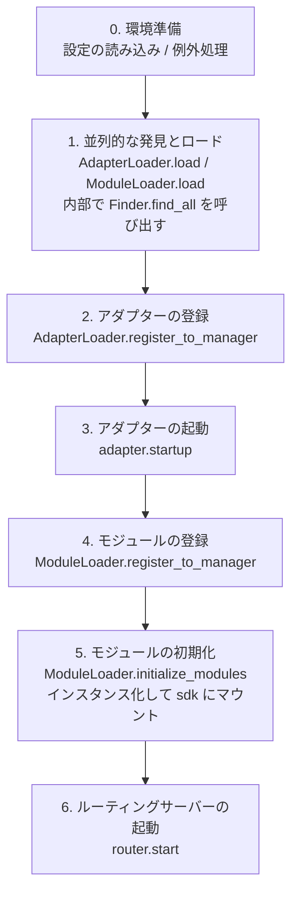

# スタートフローと手動制御

ErisPulse の `await sdk.run()` / `await sdk.init()` は、一連のスタートフローを「一行のコード」に抽象化しています。しかし、部分的な読み込み、動的な登録、ホットプラグ、カスタムロード戦略の注入など、完全にカスタマイズしたスタートフローが必要な場合は、このフローの内部で何が起こっているのか、そして各ステップをどのように手動で駆動するのかを理解する必要があります。

本文では、スタートフローを個々のステップに分解し、それぞれの役割と呼び出し順序を説明します。また、手動で完全にスタートさせるための例も示します。

> 本文では、[最初のロボット](../getting-started/first-bot.md)を実行済みと仮定し、`sdk.run(keep_running=True/False)` の 2 つのモードについて理解している前提でいます。本文では、`init()` の**内部**のフローの分解、および `init()` / `init_task()` / `init_sync()` などのより下層のエントリーポイントに焦点を当てます。

## SDK トップレベルのエントリーポイント一覧

`run()` の 2 種類の `keep_running` モードに加えて、SDK はいくつかのより低レベルの初期化エントリーポイントを提供しています。これらの違いは、**非同期性、戻り値、および例外のラッピング有無**にあります。

| エントリーポイント | 非同期性 | 戻り値 | 例外処理 | 適用される場面 |
|------|--------|--------|----------|----------|
| `await sdk.run(True)` | async、ブロッキングして維持 | `None`（終了時に自動 `uninit`） | モジュール/アダプターのエラーは捕捉され、プロセスをクラッシュさせない | ボット専用アプリケーション |
| `await sdk.run(False)` | async、ブロッキングしない | `None`（自動リリースしない） | 同上 | 初期化後にカスタムロジックを実行する |
| `await sdk.init()` | async、awaitが必要 | `bool` | 内部でコンポーネントの例外を捕捉し、失敗時は `False` を返す | 手動でライフサイクルを制御（`uninit()` と併用） |
| `sdk.init_task()` | async、Task を返す、ブロッキングしない | `asyncio.Task` | `init()` と同じ | 別の初期化処理を並行実行する、またはイベントループがまだ実行されていない場合 |
| `sdk.init_sync()` | **同期**、現在のスレッドをブロッキング | `bool` | `init()` と同じ | コマンドラインスクリプト、イベントループのない同期エントリーポイント |

> **よくある誤解**：`await sdk.init()` は `await sdk.run(keep_running=False)` と**等価ではありません**。2 つの違いがあります：① `init()` は `bool` を返します（失敗時は `False`）、`run()` は `None` を返します；② `init()` は初期化のみを行い、**自動リリースはしません**、`run()` はイベントループの終了時に自動で `uninit()` を呼び出します。したがって、手動でリリースやカスタムライフサイクルを制御する必要がある場合は、`init()` と `uninit()` を併用してください。

## 鍵路の起動概要

`sdk.init()`（正確にはその内部の `Initializer.init()`）は、以下のようにフレームワーク全体を起動します。



対応するコアコンポーネント：

| 層 | コンポーネント | 機能 |
|----|------|------|
| 発見 | `AdapterFinder` / `ModuleFinder` | インストール済みパッケージの entry-points から**発見**する |
| ロード | `AdapterLoader` / `ModuleLoader` | 発見 + インポート + メタデータの読み取り + 有効/無効の判定を行い、オブジェクトのリストを返す |
| 登録 | `*Loader.register_to_manager` | オブジェクトを対応するマネージャーに登録する |
| 管理 | `sdk.adapter` / `sdk.module` | アダプターやモジュールのインスタンスを管理し、起動/停止のインターフェースを提供する |
| 初期化 | `ModuleLoader.initialize_modules` | モジュールのインスタンスを作成し、`sdk` にマウントする（依存関係のトポロジカルソートを処理する） |
| ルーティング | `sdk.router` | HTTP / WebSocket サーバー |

> **重要**：`Finder` と `Loader` は2つの層です。`Loader` は内部で**既に** `Finder` を保持しています（`AdapterLoader` は `AdapterFinder` を内蔵し、`ModuleLoader` は `ModuleFinder` を内蔵しています）。ほとんどの場面では `Loader` を使用するだけで十分です。"インポートせずにリストアップする"必要がある場合にのみ、`Finder` を個別に使用します。

## 各環節の詳細解説

### 1. 探索層：Finder

Finder は「どのパッケージがアダプター/モジュールを提供しているか」を見つけるだけの役割を持ち、インポートやインスタンス化は行いません。

```python
from ErisPulse.finders import AdapterFinder, ModuleFinder

adapter_finder = AdapterFinder()
module_finder = ModuleFinder()

# すべてのインストール済みのアダプター/モジュールエントリポイントを検索
adapter_entries = adapter_finder.find_all()    # list[EntryPoint]
module_entries = module_finder.find_all()      # list[EntryPoint]

# 名称で個別に検索
entry = module_finder.find_by_name("MyModule")  # EntryPoint | None
```

各 `EntryPoint` は `.load()` を呼び出すことで対応するクラスを得られますが、通常は手動で呼び出す必要はありません。Loader が自動的に行います。

### 2. 加載層：Loader

Loader は Finder をベースに「インポート + メタデータの読み込み + 有効/無効の判定」を行います。

```python
from ErisPulse.loaders import AdapterLoader, ModuleLoader
from ErisPulse import sdk

adapter_loader = AdapterLoader()
module_loader = ModuleLoader()

# load() 内部：finder.find_all() を呼び出し → 各エントリポイントを順次処理 → 三つ組を返す
adapter_objs, enabled_adapters, disabled_adapters = await adapter_loader.load(sdk.adapter)
module_objs, enabled_modules, disabled_modules = await module_loader.load(sdk.module)
```

`load()` が返す三つ組：

| 戻り値 | 意味 |
|--------|------|
| `objs` (`dict`) | 名称 → オブジェクト（アダプタークラス / モジュールラッパー） |
| `enabled` (`list[str]`) | 有効化された名称（設定で無効化されていない） |
| `disabled` (`list[str]`) | 無効化された名称 |

#### 加載失敗時の診断情報

モジュール/アダプターが加載または初期化段階で例外を投げた場合、フレームワークはそのコンポーネントをスキップして他のコンポーネントの加載を継続し、**ユーザーのコードフレームの要約**を出力します。これにより、デフォルトの INFO レベルでもエラー箇所を特定でき、手動で DEBUG モードを有効化する必要がありません。

```
[ERROR] [ModuleLoader] entry-point からモジュール MyModule の加載に失敗しました。スキップしました: 'NoneType' object has no attribute 'platform'
  → MyModule/Core.py:42 in on_load
      adapter = sdk.platform
  → AttributeError: 'NoneType' object has no attribute 'platform'
  → ヒント: ログレベルを DEBUG に上げると完全なスタックトレースが表示されます。モジュール MyModule の実装コードを確認してください。
```

診断情報は `ErisPulse.runtime.diagnostics` モジュールによって生成され、フレームワーク内部のフレームは自動的にフィルタリングされ、ユーザーのコードフレームのみが残されます。カスタム加載ロジックで再利用する場合：

```python
from ErisPulse.runtime import log_diagnostic

try:
    risky_init()
except Exception as e:
    log_diagnostic(e)  # ユーザーコードフレームを自動的に抽出し、ERROR ログに記録
```

このモジュールには `extract_user_frame()`（構造化されたフレーム情報を返す）と `format_diagnostic_block()`（複数行のテキストを返す）という2つの低レベル関数も提供されています。

### 3. 登録層：register_to_manager

Loader が出力したオブジェクトをマネージャーに登録し、`sdk.adapter` / `sdk.module` がそれらを認識できるようにします。

```python
# アダプターの登録（すべて成功した場合に True を返す）
await adapter_loader.register_to_manager(enabled_adapters, adapter_objs, sdk.adapter)

# モジュールの登録
await module_loader.register_to_manager(enabled_modules, module_objs, sdk.module)
```

登録後、アダプターはアダプターマネージャーに、モジュールはモジュールマネージャーに登録されますが、**まだ起動/インスタンス化は行われていません**。

### 4. アダプターの起動

```python
# すべての登録済みアダプターを起動
await sdk.adapter.startup()
# 特定のプラットフォームを指定
await sdk.adapter.startup("yunhu")
await sdk.adapter.startup(["yunhu", "telegram"])
```

> 登録 ≠ 起動。`register_to_manager` は単に登録するだけです。`startup` がアダプターの `start()` を呼び出し、プラットフォームとの接続を確立します。

### 5. モジュールの初期化

モジュールはアダプターに比べて1段階多く、**インスタンス化**して `sdk` にアタッチする必要があります（これにより `sdk.MyModule.xxx` で呼び出せるようになります）。この段階では、モジュール間の依存宣言とトポロジカルソートも処理されます。

```python
success = await module_loader.initialize_modules(
    enabled_modules, module_objs, sdk.module, sdk
)
```

インスタンス化が成功すると、モジュールは `sdk.<ModuleName>` に登録されます。

### 6. ルーティングサーバーの起動

```python
await sdk.router.start(
    host="0.0.0.0",
    port=8000,
    ssl_certfile=None,
    ssl_keyfile=None,
)
```

ルーティングサーバーは、アダプターからの Webhook / WebSocket コールバックを受信します。このサーバーを起動しないと、server モードのアダプターはメッセージを受け取れません。

## 完全な手動起動の例

以下のコードは `await sdk.init()` のコアプロセスと**同等**ですが、各ステップが明示的に公開されており、任意の段階でカスタムロジックを挿入できます：

```python
import asyncio
from ErisPulse import sdk
from ErisPulse.loaders import AdapterLoader, ModuleLoader

async def manual_startup():
    # 0. 環境の準備（設定のロード、グローバル例外処理の登録）
    #    _prepare_environment は init() 内部の前置ステップです。手動プロセスでも最初に呼び出す必要があり、
    #    そうでなければ Loader は設定を読み取れず、すべてのアダプタ/モジュールを無効と誤認します。
    if not await sdk._prepare_environment():
        print("環境準備に失敗しました")
        return False

    # 1. ローダーの作成（内部でそれぞれ Finder を保持）
    adapter_loader = AdapterLoader()
    module_loader = ModuleLoader()

    # 2. 並行的な発見とロード（init() 内部と同じ gather を使用）
    (adapter_objs, enabled_adapters, disabled_adapters), \
    (module_objs, enabled_modules, disabled_modules) = await asyncio.gather(
        adapter_loader.load(sdk.adapter),
        module_loader.load(sdk.module),
    )

    # 3. アダプタの登録
    await adapter_loader.register_to_manager(
        enabled_adapters, adapter_objs, sdk.adapter
    )

    # 4. アダプタの起動
    if enabled_adapters:
        await sdk.adapter.startup()

    # 5. モジュールの登録
    await module_loader.register_to_manager(
        enabled_modules, module_objs, sdk.module
    )

    # 6. モジュールの初期化（インスタンス化 + sdk にマウント）
    if enabled_modules:
        await module_loader.initialize_modules(
            enabled_modules, module_objs, sdk.module, sdk
        )

    # 7. ルーティングサーバーの起動
    await sdk.router.start(host="0.0.0.0", port=8000)

    print("手動起動完了")
    return True

async def main():
    ok = await manual_startup()
    if ok:
        # 実行を維持するためのブロッキング（手動プロセスでは自動的にブロックされません）
        await asyncio.Event().wait()

if __name__ == "__main__":
    asyncio.run(main())
```

### 手動起動が必要な場面

ほとんどの場合、手動起動は必要ありません。`await sdk.run()` は上記のすべてをすでに処理しています。手動起動は以下のケースでのみ価値があります：

- **部分的なロード**：指定されたアダプタ/モジュールのみをロードし、他のものはスキップ
- **動的登録**：実行時に条件に応じて新しいアダプタ/モジュールを登録
- **カスタム順序**：デフォルトのロード順序を変更したい場合（例：特定のモジュールを先に起動してからアダプタを起動）
- **注入戦略**：Loader にカスタムの厳格モードマネージャーやロード戦略などを注入
- **デバッグ/診断**：特定の段階で失敗した際に、手動でプロセスを進め問題を特定

## 実行時細粒度制御

`sdk.run()` を使用して起動した後でも、SDK 全体を再起動することなく、実行時に個々のサブシステムを個別に制御できます。

### アダプタのホット起動・停止

```python
# 接続の修復など、特定のアダプタをホットリスタート（他のプラットフォームには影響しない）
await sdk.adapter.shutdown("yunhu")
await sdk.adapter.startup("yunhu")

# 実行中に新しいプラットフォームを起動
await sdk.adapter.startup("telegram")

# 一時的に特定のプラットフォームをオフラインにする
await sdk.adapter.shutdown("telegram")
```

> `adapter.startup()` は、アダプタが**管理者に登録されている**ことを前提としています。登録は `init()`/`run()` の内部で行われるため、起動**後**の細粒度制御となります。

### ルーター・サーバー

```python
# 一時的に webhook サーバーをオフラインにする
await sdk.router.stop()

# 再度起動（たとえばポートを変更した場合）
await sdk.router.start(host="0.0.0.0", port=9000)
```

### モジュールのオンデマンドロード

```python
# モジュールを手動でロード（遅延ロードされる可能性のあるモジュール）
await sdk.load_module("MyModule")
```

## エレガントなシャットダウン

2.7.0 以降、`sdk.shutdown()` は**プログラムによるエレガントなシャットダウン**を提供します。シャットダウンイベントを設定し、`await sdk.run(keep_running=True)` で待機中のメインループが戻り、`uninit()` が実行されてリソースのクリーンアップが完了します。

```python
# 任意のコルーチン内で呼び出すことで、エレガントな終了をトリガー（run() は待機から戻り、自動的に uninit() が実行される）
sdk.shutdown()
```

典型的な用途：

```python
async def shutdown_after_idle():
    await asyncio.sleep(3600)
    sdk.shutdown()  # 空き状態が1時間続いたらエレガントに終了
```

**シグナル処理**：`run()` 内部では `SIGTERM` / `SIGHUP` ハンドラが登録され、システムシグナルをエレガントなシャットダウンに変換します。これにより、コンテナオーケストレーション（Docker `docker stop`）や `systemd` でサービスを停止した場合、プロセスは強制終了されるのではなく、`uninit()` のクリーンアップを完了します。

- Windows では `loop.add_signal_handler` がサポートされていないため、シグナルハンドラは自動的にスキップされます（`sdk.shutdown()` または Ctrl+C でシャットダウンをトリガーできます）
- `sdk.shutdown()` を繰り返し呼び出しても安全です（イベントが設定された後は、再度呼び出しても無操作になります）

## アンインストールの手順

初期化の逆の操作は `await sdk.uninit()` であり、これは逆の順序でクリーンアップを行います：

1. すべてのアダプターを閉じる（`adapter.shutdown()`）
2. すべてのモジュールをアンロードする
3. すべてのイベントハンドラをクリーンアップする
4. マネージャーと SDK 上のモジュール属性をクリーンアップする

手動で起動する場合、正常に終了するために終了前に `uninit()` を呼び出すことを忘れないでください：

```python
try:
    await asyncio.Event().wait()   # 実行を維持する
finally:
    await sdk.uninit()
```

## 再起動

SDK は、自分でアンインストールする必要のない2つの再起動方法を提供しています。フレームワークが自動的に処理します。

| 方法 | 呼び出し | 挙動 | 適用場面 |
|------|------|------|----------|
| ホット再起動 | `await sdk.restart()` | 同一プロセス内で `uninit()` の後に再び `init()` を呼び出し、アダプタ/モジュールを再読み込み | 設定の再読み込み、モジュールのホットアップデート |
| ハード再起動 | `await sdk.hard_restart()` | `uninit()` の後に**終了コード 42**でプロセスを終了し、外部の監督者によって新しいプロセスが起動される | メモリやリソースリークが疑われる場合、完全にクリーンな再起動が必要な場合 |

```python
# ホット再起動：同一プロセス内で再読み込み（最も一般的）
await sdk.restart()

# ハード再起動：プロセスを終了し、外部の監督者に新しいプロセスの起動を任せる（下記「監督者ガイド」参照）
await sdk.hard_restart()
```

> **2点の注意事項**：
> 1. これらのメソッドはバックグラウンドタスクで再起動を実行します。**`True` が返却されたのは「再起動タスクがスケジュールされた」ことを示すだけで、実際の再起動が完了したわけではありません**。現在のイベントフローを中断しないように、実際の再起動はバックグラウンドで行われます。
> 2. `hard_restart()` の仕組みは、アンロードと設定のフラッシュ後、**終了コード 42**（`HARD_RESTART_EXIT_CODE`）でプロセスを終了することです。**自身で新しいプロセスを起動するものではなく、外部の監督者が終了コード 42 を検知した後に再起動を行う必要があります**。`python main.py` で直接実行し、監督者が存在しない場合、終了コード 42 でプロセスが終了した後、**自動的に再起動されません**（フレームワークは警告が表示されます）。

### ハード再起動はいつ使うべきか？

ハード再起動は単に「より徹底的な再起動」ではなく、以下の場面ではホット再起動よりも適切で、場合によってはより効率的です。

- **バイナリライブラリ（C拡張）の副作用**：ホット再起動は同一プロセス内で行われるため、C拡張、開かれたファイルディスクリプタ、スレッドなどのプロセスレベルのリソースを解放できません。ハード再起動は新しいプロセスを起動するため、これらの副作用は完全にクリアされます。
- **リソースリークの調査**：メモリやハンドルリークが疑われる場合、ハード再起動はクリーンな環境を得ることができます。
- **頻繁な再起動に性能が敏感な場合**：ハード再起動は同一プロセス内でアンロード→再読み込みするオーバーヘッドを省くため、実際にはホット再起動よりも効率的です。

> Dashboard管理パネルの「フレームワーク再起動」機能は、内部的に `hard_restart()` を呼び出しています。

### 終了コード 42 の契約

ハード再起動はプロセス間の協力です：**SDK は終了（コード 42）を担当し、監督者はプロセスの再起動を担当**します。

| 角色 | 挙動 |
|------|------|
| SDK（ハード再起動される際） | `uninit()` → 設定のフラッシュ → `os._exit(42)` |
| 監督者 | 子プロセスの終了コードが 42 であることを検知 → 同一コマンドで再起動 |

> `sdk.is_supervised()` を使用して、現在のプロセスが監督者によって起動されたかどうかを確認できます（環境変数 `ERISPULSE_SUPERVISED` を検出）。CLI `run` コマンドでサブプロセスを起動する際は、このマーカーが自動的に注入されます。systemd / Docker などの外部監督者は注入しないため、`is_supervised()` は `False` を返し、この場合ハード再起動後に「監督者を検出できませんでした」という警告が表示されます。

### 監督者ガイド

あなたの環境に適した監督者を選択し、ハード再起動を有効にしましょう。

#### 1. CLI run コマンド（開発/簡単なデプロイ、推奨）

`epsdk run main.py` には、サブプロセスの終了コードを監視し、42 であれば即座に再起動する監督ループが内蔵されています。他の異常終了コードは指数退避で自動的に再試行されます。`Ctrl+C` は、サブプロセスを優雅に終了し（コード 0 を正常終了と見なし、再起動しない）ます。

```bash
epsdk run main.py
```

#### 2. systemd（Linux サーバー）

`RestartForceExitStatus=42` を設定することで、終了コード 42 も再起動をトリガーします（デフォルトの `on-failure` は非ゼロ終了コードのみ対象）。

```ini
[Service]
ExecStart=/usr/bin/python3 /opt/mybot/main.py
Restart=on-failure
RestartForceExitStatus=42
RestartSec=2
User=mybot
```

#### 3. Docker / docker-compose

コンテナ内の PID 1 がアプリケーションプロセスであるため、終了コード 42 でコンテナが終了します。`restart` ポリシーを使用して自動再起動させましょう。

```yaml
services:
  bot:
    build: .
    restart: unless-stopped   # 42 を含むすべての終了コードで再起動
```

#### 4. PM2（Node 生態系の運用）

```bash
pm2 start main.py --name mybot --interpreter python3
# 42 は終了コードとして PM2 がデフォルトで再起動します。`restart_delay` を設定して、防抖します
pm2 set mybot.restart_delay 2000
```

#### 5. supervisord

```ini
[program:mybot]
command=python3 /opt/mybot/main.py
autorestart=true
exitcodes=0,2,42    # 42 も「正常終了で再起動」扱い
```

#### 6. 純粋な Python によるカスタム監督者

```python
import subprocess, sys, time

while True:
    p = subprocess.Popen([sys.executable, "main.py"])
    code = p.wait()
    if code == 42:          # ハード再起動リクエスト
        time.sleep(0.5)
        continue
    if code == 0:           # 正常終了
        break
    time.sleep(3)           # 異常終了、退避して再試行
```

> **監督者がいない場合の挙動**：`python main.py` で直接実行し、`hard_restart()` を呼び出した場合、プロセスは終了コード 42 で終了し、再起動されません。この場合、上記の監督者をいずれかに接続する必要があります。

## 関連ドキュメント

- [最初のボットを作成する](../getting-started/first-bot.md) - `keep_running` の2つの基本的なモードの入門
- [ライフサイクル管理](lifecycle.md) - `core.init.start` / `core.init.complete` などの起動イベントを監視する
- [遅延ロードシステム](lazy-loading.md) - モジュールの遅延ロードメカニズムと `load_module`