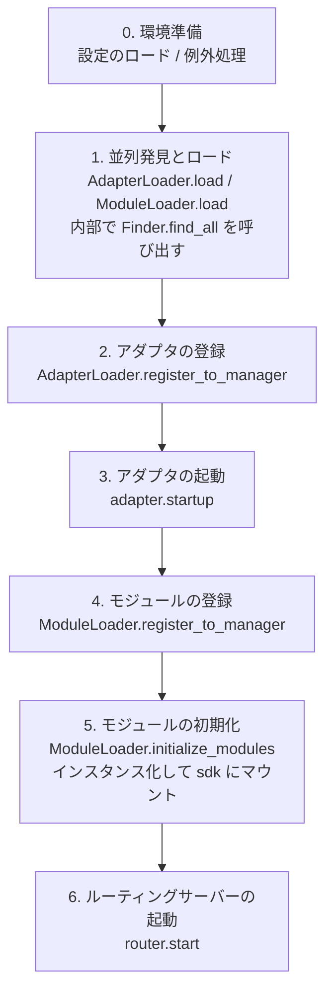

# 起動プロセスと手動制御

ErisPulse の `await sdk.run()` / `await sdk.init()` は、一連の起動プロセスを「一行のコード」にラップしています。しかし、部分的なロード、動的登録、ホットプラグ、カスタムロード戦略の注入など、完全にカスタム起動プロセスが必要な場合、このプロセスの内部で何が起こっているのか、および各ステップを手動で駆動する方法を理解する必要があります。

本文では、起動プロセスを独立したステップに分解し、それぞれの役割と呼び出し順序を説明し、手動で完全な起動を行うための例を示します。

> 本文では、[最初のロボット](../getting-started/first-bot.md)を実行し、`sdk.run(keep_running=True/False)` の2つのモードを理解していることを前提としています。本文では、`init()` **内部**のプロセス分解と、`init()` / `init_task()` / `init_sync()` などのより低レベルなエントリポイントに焦点を当てます。

## SDK トップレベルエントリ一覧

`run()` の2つの `keep_running` モードに加えて、SDK には異なった**非同期性、戻り値、および例外のラッピング**を持ついくつかの低レベルな初期化エントリが提供されています。

| エントリ | 非同期性 | 戻り値 | 例外処理 | 適用シーン |
|------|--------|--------|----------|----------|
| `await sdk.run(True)` | async、ブロックして維持 | `None`（終了時に自動 `uninit`） | モジュール/アダプタエラーが捕捉され、プロセスをクラッシュさせない | ロボットアプリケーションのみ |
| `await sdk.run(False)` | async、ブロックしない | `None`（自動アンロードしない） | 同上 | 初期化後にカスタムロジックを実行 |
| `await sdk.init()` | async、`await` 必須 | `bool` | **ラップしない**、例外は上に投げられる | ライフサイクルを手動で制御（`uninit()` と併用） |
| `sdk.init_task()` | async、`Task` を返してブロックしない | `asyncio.Task` | `init()` と同じ | 並列で他の初期化を実行する、またはイベントループがまだ実行されていない |
| `sdk.init_sync()` | **同期**、現在のスレッドをブロック | `bool` | `init()` と同じ | コマンドラインスクリプト、イベントループのない同期エントリ |

> **よくある誤解**：`await sdk.init()` **は** `await sdk.run(keep_running=False)` **と等価ではありません**。2点の違いがあります：① `init()` は `bool` を返し、`run()` は `None` を返す；② `run()` は初期化と実行プロセスを `try/except` でラップし（モジュール/アダプタエラーを捕捉してクラッシュを防ぐ）、`init()` はラップせず、例外は直接上に投げられます。アンロードやカスタム例外処理が必要な場合は、`init()` + `uninit()` を使用してください。

## 起動プロセスの概要

`sdk.init()`（正確にはその内部の `Initializer.init()`）は、以下の順序でフレームワーク全体を起動します：



対応するコアコンポーネント：

| 層 | コンポーネント | 役割 |
|----|------|------|
| 発見 | `AdapterFinder` / `ModuleFinder` | 既にインストールされたパッケージの entry-points から**発見**する |
| ロード | `AdapterLoader` / `ModuleLoader` | 発見 + インポート + メタデータの読み取り + 有効/無効の判断、オブジェクトリストを返す |
| 登録 | `*Loader.register_to_manager` | オブジェクトを対応するマネージャーに登録する |
| 管理 | `sdk.adapter` / `sdk.module` | アダプタ/モジュールのインスタンスを維持し、起動/停止のインターフェースを提供する |
| 初期化 | `ModuleLoader.initialize_modules` | モジュールのインスタンスを作成し、`sdk` にマウントする（依存関係のトポロジカルソートを処理） |
| ルーティング | `sdk.router` | HTTP / WebSocket サーバー |

> **重要**：`Finder` と `Loader` は2つの層です。`Loader` は内部で**すでに** `Finder` を保持しています（`AdapterLoader` は `AdapterFinder` を、`ModuleLoader` は `ModuleFinder` を持っています）。ほとんどのシーンでは `Loader` を使用するだけで十分です。"インポートせずにリストする"必要がある場合にのみ `Finder` を個別に使用します。

## 各ステップの詳細

### 1. 発見層：Finder

Finder は「どのパッケージがアダプタ/モジュールを提供しているか」を発見するだけです。インポートやインスタンス化はしません。

```python
from ErisPulse.finders import AdapterFinder, ModuleFinder

adapter_finder = AdapterFinder()
module_finder = ModuleFinder()

# すべてのインストール済みアダプタ/モジュールの entry-points を検索
adapter_entries = adapter_finder.find_all()    # list[EntryPoint]
module_entries = module_finder.find_all()      # list[EntryPoint]

# 名前で単一の検索
entry = module_finder.find_by_name("MyModule")  # EntryPoint | None
```

各 `EntryPoint` は `.load()` で対応するクラスを得られますが、通常は手動で呼び出す必要はありません。`Loader` が行います。

### 2. ロード層：Loader

Loader は Finder の上に「インポート + メタデータの読み取り + 有効/無効の判断」を行っています。

```python
from ErisPulse.loaders import AdapterLoader, ModuleLoader
from ErisPulse import sdk

adapter_loader = AdapterLoader()
module_loader = ModuleLoader()

# load() 内部：finder.find_all() を呼び出す → 各 entry-point を処理 → 3タプルを返す
adapter_objs, enabled_adapters, disabled_adapters = await adapter_loader.load(sdk.adapter)
module_objs, enabled_modules, disabled_modules = await module_loader.load(sdk.module)
```

`load()` が返す3タプル：

| 戻り値 | 含意 |
|--------|------|
| `objs` (`dict`) | 名称 → オブジェクト（アダプタクラス / モジュールラッパー） |
| `enabled` (`list[str]`) | 有効化された名称（設定で無効化されていない） |
| `disabled` (`list[str]`) | 無効化された名称 |

#### ロード失敗時の診断情報

モジュール/アダプタがロードまたは初期化段階で例外を送出した場合、フレームワークはそのコンポーネントをスキップして他のコンポーネントのロードを続け、**ユーザーのコードフレームの要約**を出力します。これにより、通常の INFO レベルでもエラー箇所を特定でき、手動で DEBUG モードを再開する必要がありません。

```
[ERROR] [ModuleLoader] entry-point からモジュール MyModule のロードに失敗しました。スキップしました: 'NoneType' object has no attribute 'platform'
  → MyModule/Core.py:42 in on_load
      adapter = sdk.platform
  → AttributeError: 'NoneType' object has no attribute 'platform'
  → ヒント: ログレベルを DEBUG に上げると完全なスタックトレースを表示できます。モジュール MyModule の実装コードを確認してください。
```

診断情報は `ErisPulse.runtime.diagnostics` モジュールによって生成され、フレームワーク内部のフレームは自動的にフィルタリングされ、ユーザーのコードフレームのみが残ります。カスタムロードロジックで再利用する場合は：

```python
from ErisPulse.runtime import log_diagnostic

try:
    risky_init()
except Exception as e:
    log_diagnostic(e)  # 自動的にユーザーのコードフレームを抽出して ERROR ログに記録
```

このモジュールには、`extract_user_frame()`（構造化されたフレーム情報を返す）と `format_diagnostic_block()`（複数行のテキストを返す）という2つの低レベル関数もあります。

### 3. 登録層：register_to_manager

Loader が出力したオブジェクトをマネージャーに登録し、`sdk.adapter` / `sdk.module` がそれらを認識できるようにします。

```python
# アダプタの登録（すべて成功した場合は bool を返す）
await adapter_loader.register_to_manager(enabled_adapters, adapter_objs, sdk.adapter)

# モジュールの登録
await module_loader.register_to_manager(enabled_modules, module_objs, sdk.module)
```

登録後、アダプタは `sdk.adapter._adapters` に、モジュールクラスは `sdk.module` に登録されますが、**まだ起動/インスタンス化されていません**。

### 4. アダプタの起動

```python
# すべての登録済みアダプタを起動
await sdk.adapter.startup()
# または特定のプラットフォームを指定
await sdk.adapter.startup("yunhu")
await sdk.adapter.startup(["yunhu", "telegram"])
```

> 登録 ≠ 起動。`register_to_manager` は単に登録するだけです。`startup` でアダプタの `start()` を呼び出し、プラットフォームとの接続を確立します。

### 5. モジュールの初期化

モジュールはアダプタよりも1ステップ多く、**インスタンス化**して `sdk` にマウントする必要があります（これにより `sdk.MyModule.xxx` で呼び出すことができます）。このステップでは、モジュール間の依存宣言とトポロジカルソートも処理されます。

```python
success = await module_loader.initialize_modules(
    enabled_modules, module_objs, sdk.module, sdk
)
```

インスタンス化に成功すると、モジュールは `sdk.<ModuleName>` に表示されます。

### 6. ルーティングサーバーの起動

```python
await sdk.router.start(
    host="0.0.0.0",
    port=8000,
    ssl_certfile=None,
    ssl_keyfile=None,
)
```

ルーティングサーバーは、アダプタの Webhook / WebSocket コールバックを受け取ります。起動しないと、サーバーモードのアダプタはメッセージを受け取れません。

## 完全な手動起動の例

以下のコードは `await sdk.init()` のコアプロセスと**等価**ですが、各ステップが明示的に表示されており、任意の段階でカスタムロジックを挿入できます。

```python
import asyncio
from ErisPulse import sdk
from ErisPulse.loaders import AdapterLoader, ModuleLoader

async def manual_startup():
    # 0. 環境準備（設定のロード、グローバル例外処理の登録）
    #    _prepare_environment は init() 内部の前置ステップです。手動プロセスでも先に呼び出す必要があります。
    #    そうしないと、Loader は設定を読み取れず、すべてのアダプタ/モジュールを誤って無効化と判断します。
    if not await sdk._prepare_environment():
        print("環境準備に失敗しました")
        return False

    # 1. ローダーの作成（内部でそれぞれ Finder を保持）
    adapter_loader = AdapterLoader()
    module_loader = ModuleLoader()

    # 2. 並列発見とロード（init() 内部と同じ gather を使用）
    (adapter_objs, enabled_adapters, disabled_adapters), \
    (module_objs, enabled_modules, disabled_modules) = await asyncio.gather(
        adapter_loader.load(sdk.adapter),
        module_loader.load(sdk.module),
    )

    # 3. アダプタの登録
    await adapter_loader.register_to_manager(
        enabled_adapters, adapter_objs, sdk.adapter
    )

    # 4. アダプタの起動
    if enabled_adapters:
        await sdk.adapter.startup()

    # 5. モジュールの登録
    await module_loader.register_to_manager(
        enabled_modules, module_objs, sdk.module
    )

    # 6. モジュールの初期化（インスタンス化 + sdk にマウント）
    if enabled_modules:
        await module_loader.initialize_modules(
            enabled_modules, module_objs, sdk.module, sdk
        )

    # 7. ルーティングサーバーの起動
    await sdk.router.start(host="0.0.0.0", port=8000)

    print("手動起動完了")
    return True

async def main():
    ok = await manual_startup()
    if ok:
        # プログラムを維持する（手動プロセスでは自動的にブロックされない）
        await asyncio.Event().wait()

if __name__ == "__main__":
    asyncio.run(main())
```

### いつ手動起動が必要か？

ほとんどの場合、手動起動は必要ありません。`await sdk.run()` で上記のすべてが行われています。手動起動は以下のシナリオでのみ価値があります：

- **部分的なロード**：指定されたアダプタ/モジュールのみをロードし、他のものをスキップ
- **動的登録**：実行時に条件に応じて新しいアダプタ/モジュールを登録
- **カスタム順序**：デフォルトのロード順序を乱す（例：特定のモジュールを起動してからアダプタを起動）
- **戦略の注入**：Loader にカスタムの厳密モードマネージャー、ロード戦略などを注入
- **デバッグ/診断**：特定の段階で失敗した場合、手動で駆動して問題を特定

## 実行時細粒度制御

`sdk.run()` で起動した後でも、SDK 全体を再起動することなく、各サブシステムを個別に制御できます。

### アダプタのホット起動/停止

```python
# アダプタのホットリスタート（接続を修復し、他のプラットフォームに影響しない）
await sdk.adapter.shutdown("yunhu")
await sdk.adapter.startup("yunhu")

# 実行中に新しいプラットフォームを起動
await sdk.adapter.startup("telegram")

# 一時的にプラットフォームをオフラインにする
await sdk.adapter.shutdown("telegram")
```

> `adapter.startup()` はアダプタが**マネージャーに登録されている**ことを要求します。登録は `init()` / `run()` 内部で行われるため、これは起動**後の**細粒度制御です。

### ルーティングサーバー

```python
# 一時的に webhook サーバーをオフラインにする
await sdk.router.stop()

# 再起動（例：ポートを変更した場合）
await sdk.router.start(host="0.0.0.0", port=9000)
```

### モジュールのオンデマンドロード

```python
# モジュールを手動でロードする（おそらく遅延ロードのモジュール）
await sdk.load_module("MyModule")
```

## エレガントなシャットダウン

2.7.0 以降、`sdk.shutdown()` は**プログラムによるエレガントなシャットダウン**を提供します：シャットダウンイベントを設定し、`await sdk.run(keep_running=True)` で待機中のメインループが返り、`uninit()` がリソースのクリーンアップをトリガーします。

```python
# 任意のコルーチンで呼び出し、エレガントな終了をトリガー（run() は待機を返し、自動 uninit）
sdk.shutdown()
```

典型的な用途：

```python
async def shutdown_after_idle():
    await asyncio.sleep(3600)
    sdk.shutdown()  # 空き1時間後にエレガントに終了
```

**シグナル処理**：`run()` 内部では `SIGTERM` / `SIGHUP` ハンドラが登録され、システムシグナルをエレガントなシャットダウンに変換します——コンテナ編成（Docker `docker stop`）や `systemd` でサービスを停止する場合、プロセスは `uninit()` のクリーンアップを完了してから強制終了されます。

- Windows は `loop.add_signal_handler` をサポートしていません。シグナルハンドラは自動的にスキップされます（`sdk.shutdown()` または Ctrl+C でシャットダウンをトリガーできます）
- `sdk.shutdown()` を繰り返し呼び出すことは安全です（イベントが設定された後は無操作になります）

## アンロードプロセス

起動の逆操作は `await sdk.uninit()` で、逆順でリソースを解放します：

1. すべてのアダプタを閉じる（`adapter.shutdown()`）
2. すべてのモジュールをアンロードする
3. すべてのイベントハンドラをクリーンアップする
4. マネージャーと SDK 上のモジュール属性をクリーンアップする

手動起動の場合は、終了前に `uninit()` を呼び出してエレガントなシャットダウンを保証してください：

```python
try:
    await asyncio.Event().wait()   # プログラムを維持
finally:
    await sdk.uninit()
```

## リスタート

SDK には2種類のリスタート方法があります。どちらも事前にアンロードする必要はありません——フレームワークが自動的に処理します：

| 方法 | 呼び出し | 行動 | 適用シーン |
|------|------|------|----------|
| ホットリスタート | `await sdk.restart()` | 同一プロセス内で `uninit()` の後に再 `init()`、アダプタ/モジュールを再ロード | 設定の再ロード、モジュールのホットアップデート |
| ハードリスタート | `await sdk.hard_restart()` | `uninit()` の後にプロセスを終了し、親プロセス（`epsdk run`）が新しいプロセスを起動 | メモリ/リソースリークが疑われる、完全にクリーンなリスタートが必要な場合 |

```python
# ホットリスタート：同一プロセス内で再ロード（最も一般的）
await sdk.restart()

# ハードリスタート：プロセスを終了し、`epsdk run` で起動した場合にのみ有効
await sdk.hard_restart()
```

> **2点注意**：
> 1. これらのメソッドはバックグラウンドタスクで実行され、**即座に `True` を返す**ことで「リスタートタスクがスケジュールされた」ことを示します。リスタートが完了したわけではありません。実際のリスタートはバックグラウンドで行われ、現在のイベントフローを中断しません。
> 2. `hard_restart()` **は `epsdk run main.py` で起動した場合にのみ有効です**。その原理は、アンロード後に**終了コード 42** でプロセスを終了し、`epsdk run` の親プロセスが 42 を検出して新しいプロセスを再起動することです。`python main.py` で直接起動した場合は、42 で終了した後プロセスが終了し、自動的に再起動されません。

### ハードリスタートはいつ使うか？

ハードリスタートは「より徹底的なリスタート」だけでなく、以下のシナリオでより適切で、場合によってはより効率的です：

- **バイナリライブラリ（C拡張）の副作用**：ホットリスタートは同じプロセス内で行われるため、C拡張、開いたファイルディスクリプタ、スレッドなどのプロセスレベルのリソースを解放できません。ハードリスタートでは新しいプロセスが起動され、これらの副作用は完全にクリアされます。
- **リソースリークの調査**：メモリやハンドルのリークが疑われる場合、ハードリスタートはクリーンな環境を得ることができます。
- **頻繁なリスタートに性能が敏感な場合**：ハードリスタートは同じプロセス内でアンロード→再ロードのオーバーヘッドを省くため、実際にはホットリスタートよりも効率的です。

> ダッシュボード管理パネルの「フレームワークリスタート」機能は、下層で `hard_restart()` を呼び出しています。
> また、ハードリスタートは **`epsdk` の `run` コマンドを使用して起動しなければ効果がありません**。`run` コマンドは 42 退出コードを検出してプロセスを再起動するため、`python main.py` で起動した場合は 42 でプロセスが終了し、自動的に再起動されません。この点は注意してください！！

## 関連ドキュメント

- [最初のロボットを作成する](../getting-started/first-bot.md) - `keep_running` 2つの基本モードの入門
- [ライフサイクル管理](lifecycle.md) - `core.init.start` / `core.init.complete` などの起動イベントを監視
- [遅延ロードシステム](lazy-loading.md) - モジュールの遅延ロードメカニズムと `load_module`