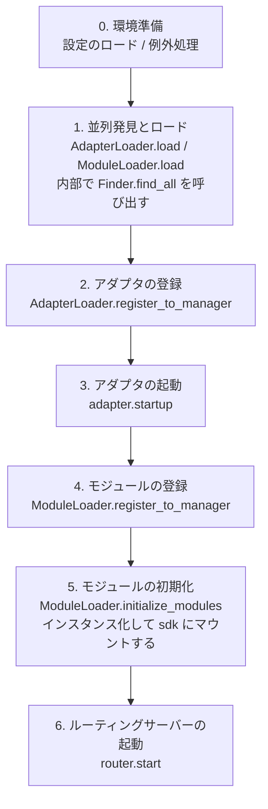

# 起動プロセスと手動制御

ErisPulse の `await sdk.run()` / `await sdk.init()` は、一連の起動フローを「一行のコード」にカプセル化しています。しかし、部分的なロード、動的登録、ホットプラグ、カスタムロード戦略の注入など、完全にカスタマイズした起動フローが必要な場合は、このフローの内部で何が起こっているのか、そして各ステップを手動でどのように駆動するのかを理解する必要があります。

本文では、起動フローを独立したステップに分解し、それぞれの役割と呼び出し順序を説明し、手動で完全な起動を行うための例を示します。

> 本文は、[最初のロボット](../getting-started/first-bot.md)を実行し、`sdk.run(keep_running=True/False)` の2つのモードを理解していることを前提としています。本文では、`init()` **内部**のフローの分解、および `init()` / `init_task()` / `init_sync()` などのより低レベルのエントリポイントに焦点を当てます。

## SDK トップレベルエントリポイント一覧

`run()` の2つの `keep_running` モードに加えて、SDK はいくつかのより低レベルな初期化エントリポイントを提供します。これらは**非同期性、戻り値、および例外のラッピング方法**の点で異なります：

| エントリポイント | 非同期性 | 戻り値 | 例外処理 | 適用場面 |
|------|--------|--------|----------|----------|
| `await sdk.run(True)` | 非同期、イベントループを維持する | `None`（終了時に自動 `uninit`） | モジュール/アダプタのエラーは捕捉され、プロセスを停止しない | ロボットアプリケーション |
| `await sdk.run(False)` | 非同期、イベントループを維持しない | `None`（自動アンロードしない） | 同上 | 初期化後にカスタムロジックを実行する |
| `await sdk.init()` | 非同期、`await` が必要 | `bool` | コンポーネントの例外を内部で捕捉し、失敗時は `False` を返す | 手動でライフサイクルを制御する（`uninit()` と併用） |
| `sdk.init_task()` | 非同期、`Task` を返す、イベントループを維持しない | `asyncio.Task` | `init()` と同じ | 別の初期化を並行実行する、またはイベントループが起動していない場合 |
| `sdk.init_sync()` | **同期**、現在のスレッドをブロックする | `bool` | `init()` と同じ | コマンドラインスクリプト、イベントループのない同期エントリポイント |

> **よくある誤解**：`await sdk.init()` は `await sdk.run(keep_running=False)` と**等価ではありません**。2つの違いがあります：① `init()` は `bool` を返します（失敗時は `False`）、`run()` は `None` を返します；② `init()` は初期化のみを行い、**自動アンロードはしません**、`run()` はイベントループが終了したときに自動的に `uninit()` を実行します。したがって、手動でアンロードやカスタムライフサイクルを管理する必要がある場合は、`init()` + `uninit()` を使用します。

## 起動フローの概要

`sdk.init()`（正確にはその内部の `Initializer.init()`）は、以下の順序でフレームワーク全体を起動します：



対応する主要コンポーネント：

| 層 | コンポーネント | 役割 |
|----|------|------|
| 発見 | `AdapterFinder` / `ModuleFinder` | エントリポイントからアダプタ/モジュールを**発見**する |
| ロード | `AdapterLoader` / `ModuleLoader` | 発見 + インポート + メタデータの読み取り + 有効/無効の判断、オブジェクトリストを返す |
| 登録 | `*Loader.register_to_manager` | オブジェクトを対応するマネージャーに登録する |
| 管理 | `sdk.adapter` / `sdk.module` | アダプタ/モジュールのインスタンスを維持し、起動/停止のインターフェースを提供する |
| 初期化 | `ModuleLoader.initialize_modules` | モジュールのインスタンスを作成し `sdk` にマウントする（依存関係のトポロジカルソートを処理する） |
| ルーティング | `sdk.router` | HTTP / WebSocket サーバー |

> **重要**：`Finder` と `Loader` は2つの層です。`Loader` は内部で `Finder` を保持しています（`AdapterLoader` は `AdapterFinder` を持つ、`ModuleLoader` は `ModuleFinder` を持つ）。ほとんどの場合、`Loader` を使用するだけで十分です。`Finder` を個別に使うのは、"ロードせずにリストアップする"必要がある場合に限られます。

## 各ステップの詳細

### 1. 発見層: Finder

Finder は、アダプタ/モジュールを**見つける**だけを担当し、インポートやインスタンス化は行いません。

```python
from ErisPulse.finders import AdapterFinder, ModuleFinder

adapter_finder = AdapterFinder()
module_finder = ModuleFinder()

# すべてのインストール済みアダプタ/モジュールのエントリポイントを検索
adapter_entries = adapter_finder.find_all()    # list[EntryPoint]
module_entries = module_finder.find_all()      # list[EntryPoint]

# 名称で検索
entry = module_finder.find_by_name("MyModule")  # EntryPoint | None
```

各 `EntryPoint` は `.load()` を呼び出すことで対応するクラスを得られますが、通常は手動で呼び出す必要はありません。`Loader` が処理します。

### 2. ロード層: Loader

Loader は Finder の上に「インポート + メタデータの読み取り + 有効/無効の判断」を行います。

```python
from ErisPulse.loaders import AdapterLoader, ModuleLoader
from ErisPulse import sdk

adapter_loader = AdapterLoader()
module_loader = ModuleLoader()

# load() 内部：finder.find_all() を呼び出す → 各エントリポイントを順次処理 → 三つ組を返す
adapter_objs, enabled_adapters, disabled_adapters = await adapter_loader.load(sdk.adapter)
module_objs, enabled_modules, disabled_modules = await module_loader.load(sdk.module)
```

`load()` が返す三つ組：

| 戻り値 | 意味 |
|--------|------|
| `objs` (`dict`) | 名称 → オブジェクト（アダプタクラス / モジュールラッパー） |
| `enabled` (`list[str]`) | 有効化された名称（設定で無効化されていない） |
| `disabled` (`list[str]`) | 無効化された名称 |

#### ロード失敗時の診断情報

モジュール/アダプタがロードまたは初期化の段階で例外を投げた場合、フレームワークはそのコンポーネントをスキップして他のコンポーネントのロードを継続し、**ユーザーのコードフレームのサマリー**を出力します。これにより、デフォルトの INFO レベルでもエラー箇所を特定でき、手動で DEBUG モードを有効化する必要がありません。

```
[ERROR] [ModuleLoader] entry-point からモジュール MyModule のロードに失敗しました。スキップしました: 'NoneType' object has no attribute 'platform'
  → MyModule/Core.py:42 in on_load
      adapter = sdk.platform
  → AttributeError: 'NoneType' object has no attribute 'platform'
  → ヒント: ログレベルを DEBUG に上げると完全なスタックトレースが表示されます。モジュール MyModule の実装コードを確認してください。
```

診断情報は `ErisPulse.runtime.diagnostics` モジュールによって生成され、フレームワークの内部フレームは自動的にフィルタリングされ、ユーザーのコードフレームのみが残ります。カスタムロードロジックで再利用する場合は：

```python
from ErisPulse.runtime import log_diagnostic

try:
    risky_init()
except Exception as e:
    log_diagnostic(e)  # 自動的にユーザーのコードフレームを抽出して ERROR ログに書き込む
```

このモジュールには、`extract_user_frame()`（構造化されたフレーム情報を返す）と `format_diagnostic_block()`（複数行のテキストを返す）という2つの低レベル関数も提供されています。

### 3. 登録層: register_to_manager

Loader が出力したオブジェクトをマネージャーに登録し、`sdk.adapter` / `sdk.module` がそれらを認識できるようにします。

```python
# アダプタの登録（すべて成功した場合は True を返す）
await adapter_loader.register_to_manager(enabled_adapters, adapter_objs, sdk.adapter)

# モジュールの登録
await module_loader.register_to_manager(enabled_modules, module_objs, sdk.module)
```

登録後、アダプタはアダプタマネージャーに登録され、モジュールはモジュールマネージャーに登録されますが、**まだ起動/インスタンス化されていません**。

### 4. アダプタの起動

```python
# すべての登録済みアダプタを起動する
await sdk.adapter.startup()
# または特定のプラットフォームを指定
await sdk.adapter.startup("yunhu")
await sdk.adapter.startup(["yunhu", "telegram"])
```

> 登録 ≠ 起動。`register_to_manager` は登録のみです。`startup` はアダプタの `start()` を呼び出し、プラットフォームとの接続を確立します。

### 5. モジュールの初期化

モジュールはアダプタに比べて1段階多く、**インスタンス化**して `sdk` にマウントする必要があります（これにより `sdk.MyModule.xxx` で呼び出せるようになります）。この段階では、モジュール間の依存関係の宣言とトポロジカルソートも処理されます。

```python
success = await module_loader.initialize_modules(
    enabled_modules, module_objs, sdk.module, sdk
)
```

インスタンス化が成功すると、モジュールは `sdk.<ModuleName>` に表示されます。

### 6. ルーティングサーバーの起動

```python
await sdk.router.start(
    host="0.0.0.0",
    port=8000,
    ssl_certfile=None,
    ssl_keyfile=None,
)
```

ルーティングサーバーは、アダプタからの Webhook / WebSocket コールバックを受信する責任があります。起動しないと、サーバーモードのアダプタはメッセージを受信できません。

## 完全な手動起動の例

以下のコードは、`await sdk.init()` のコアフローと**等価**ですが、各ステップを明示的に制御できるため、任意の段階でカスタムロジックを挿入できます：

```python
import asyncio
from ErisPulse import sdk
from ErisPulse.loaders import AdapterLoader, ModuleLoader

async def manual_startup():
    # 0. 環境準備（設定のロード、グローバル例外処理の登録）
    #    _prepare_environment は init() 内部の前置ステップです。手動フローでも事前に呼び出す必要があります。
    #    そうでなければ Loader が設定を読み取れず、すべてのアダプタ/モジュールを誤って無効化してしまいます。
    if not await sdk._prepare_environment():
        print("環境準備に失敗しました")
        return False

    # 1. ローダーの作成（それぞれ内部で Finder を保持しています）
    adapter_loader = AdapterLoader()
    module_loader = ModuleLoader()

    # 2. 並列発見とロード（init() 内部と同じ gather を使用）
    (adapter_objs, enabled_adapters, disabled_adapters), \
    (module_objs, enabled_modules, disabled_modules) = await asyncio.gather(
        adapter_loader.load(sdk.adapter),
        module_loader.load(sdk.module),
    )

    # 3. アダプタの登録
    await adapter_loader.register_to_manager(
        enabled_adapters, adapter_objs, sdk.adapter
    )

    # 4. アダプタの起動
    if enabled_adapters:
        await sdk.adapter.startup()

    # 5. モジュールの登録
    await module_loader.register_to_manager(
        enabled_modules, module_objs, sdk.module
    )

    # 6. モジュールの初期化（インスタンス化 + sdk にマウント）
    if enabled_modules:
        await module_loader.initialize_modules(
            enabled_modules, module_objs, sdk.module, sdk
        )

    # 7. ルーティングサーバーの起動
    await sdk.router.start(host="0.0.0.0", port=8000)

    print("手動起動完了")
    return True

async def main():
    ok = await manual_startup()
    if ok:
        # 非同期イベントループを維持する（手動フローでは自動的に維持されません）
        await asyncio.Event().wait()

if __name__ == "__main__":
    asyncio.run(main())
```

### 手動起動が必要な場合

ほとんどの場合、**手動起動は不要**です。`await sdk.run()` がすべての処理を完了します。手動起動は、以下のケースでのみ価値があります：

- **部分的なロード**：指定されたアダプタ/モジュールのみをロードし、他の部分をスキップする
- **動的登録**：条件に応じて実行時に新しいアダプタ/モジュールを登録する
- **カスタム順序**：デフォルトのロード順序を変更する必要がある（例：アダプタの起動前に特定のモジュールを起動する）
- **戦略の注入**：Loader にカスタムの厳格モードマネージャーやロード戦略を注入する
- **デバッグ/診断**：特定の段階で失敗した場合、手動で駆動して問題を特定する

## 実行時の細粒度制御

`sdk.run()` で起動した後でも、各サブシステムを個別に制御して、SDK 全体を再起動する必要はありません。

### アダプタのホット起動/停止

```python
# 特定のアダプタをホットリスタート（接続を修復し、他のプラットフォームには影響しない）
await sdk.adapter.shutdown("yunhu")
await sdk.adapter.startup("yunhu")

# 実行中に新しいプラットフォームを起動する
await sdk.adapter.startup("telegram")

# 一時的に特定のプラットフォームをオフラインにする
await sdk.adapter.shutdown("telegram")
```

> `adapter.startup()` はアダプタが**マネージャーに登録されている**ことを要求します。登録は `init()` / `run()` 内部で行われるため、これは起動**後の**細粒度制御です。

### ルーティングサーバー

```python
# 一時的に Webhook サーバーをオフラインにする
await sdk.router.stop()

# 再度起動する（例：ポートを変更する場合）
await sdk.router.start(host="0.0.0.0", port=9000)
```

### モジュールのオンデマンドロード

```python
# 手動でロードする（おそらく遅延ロードされた）モジュール
await sdk.load_module("MyModule")
```

## エレガントな終了

2.7.0 以降、`sdk.shutdown()` は**プログラム的なエレガントな終了**を提供します：終了イベントを設定し、`await sdk.run(keep_running=True)` で待機しているメインループが戻り、`uninit()` をトリガーしてリソースのクリーンアップを完了します。

```python
# 任意のコルーチンで呼び出すことで、エレガントな終了をトリガー（run() は待機を解除し、自動的に uninit() を実行）
sdk.shutdown()
```

典型的な用途：

```python
async def shutdown_after_idle():
    await asyncio.sleep(3600)
    sdk.shutdown()  # 空き1時間後にエレガントに終了
```

**シグナル処理**：`run()` 内部では `SIGTERM` / `SIGHUP` ハンドラが登録され、システムシグナルをエレガントな終了に変換します。コンテナ編成（Docker `docker stop`）や `systemd` でサービスを停止する場合、プロセスは強制終了ではなく `uninit()` のクリーンアップを完了します。

- Windows では `loop.add_signal_handler` がサポートされていないため、シグナルハンドラは自動的にスキップされます（`sdk.shutdown()` や Ctrl+C で終了をトリガーできます）
- `sdk.shutdown()` を繰り返し呼び出しても安全です（イベントが設定された後は無操作になります）

## アンロードフロー

起動の逆操作は `await sdk.uninit()` で、逆順にクリーンアップします：

1. すべてのアダプタを閉じる（`adapter.shutdown()`）
2. すべてのモジュールをアンロードする
3. すべてのイベントハンドラをクリーンアップする
4. マネージャーと SDK 上のモジュール属性をクリーンアップする

手動起動の場合は、終了前に `uninit()` を呼び出すことを忘れないでください：

```python
try:
    await asyncio.Event().wait()   # 実行を維持
finally:
    await sdk.uninit()
```

## リスタート

SDK は2種類のリスタート方法を提供します。いずれも、自分でアンロードする必要はありません。フレームワークが自動的に処理します：

| 方法 | 呼び出し | 行動 | 適用場面 |
|------|------|------|----------|
| ホットリスタート | `await sdk.restart()` | 同一プロセス内で `uninit()` した後、再び `init()` してアダプタ/モジュールを再ロードする | 設定の再ロード、モジュールのホットアップデート |
| ハードリスタート | `await sdk.hard_restart()` | `uninit()` した後、**終了コード 42** でプロセスを終了し、外部監督者が新しいプロセスを起動する | メモリ/リソースリークが疑われる、完全にクリーンなリスタートが必要な場合 |

```python
# ホットリスタート：同一プロセス内で再ロード（最も一般的）
await sdk.restart()

# ハードリスタート：プロセスを終了し、外部監督者が再起動する（下記「監督者ガイド」参照）
await sdk.hard_restart()
```

> **2点注意**：
> 1. これらのメソッドはバックグラウンドタスクでリスタートを実行するため、**即座に `True` を返す**（リスタートが完了したことを意味するのではなく）。「リスタートタスクがスケジュールされた」ことを示します。実際のリスタートはバックグラウンドで行われ、現在のイベントフローを中断することはありません。
> 2. `hard_restart()` の仕組みは、`uninit()` して設定を保存した後、**終了コード 42**（`HARD_RESTART_EXIT_CODE`）でプロセスを終了することです。**自身で新しいプロセスを起動するわけではなく**、外部監督者が終了コード 42 を検知して再起動する必要があります。`python main.py` で直接実行し、監督者が存在しない場合、終了コード 42 で終了した後、**自動的に再起動しません**（フレームワークは「監督者が検出されない」と警告を出します）。

### ハードリスタートが必要な場合

ハードリスタートは単に「より徹底的なリスタート」ではなく、以下の場面でより適切で、場合によってはより効率的です：

- **バイナリライブラリ（C拡張）の副作用**：ホットリスタートは同一プロセス内で行われるため、C拡張、開かれたファイルディスクリプター、スレッドなどのプロセスレベルのリソースを解放できません。ハードリスタートは新しいプロセスを起動するため、これらの副作用は完全にクリアされます。
- **リソースリークの調査**：メモリやハンドルのリークが疑われる場合、ハードリスタートでクリーンな環境を得られます。
- **頻繁なリスタートに敏感な場合**：ハードリスタートは同一プロセス内のアンロード→再ロードのオーバーヘッドを省くため、ホットリスタートよりも実際には効率的です。

> ダッシュボード管理パネルの「フレームワークリスタート」機能は、下層で `hard_restart()` を呼び出します。

### 終了コード 42 の契約

ハードリスタートはプロセス間の協調です：**SDK が終了（コード 42）し、監督者が再起動する**。

| 役割 | 行動 |
|------|------|
| SDK（ハードリスタートされるとき） | `uninit()` → 設定を保存 → `os._exit(42)` |
| 監督者 | 子プロセスの終了コードが 42 かを検出 → 同じコマンドで再起動する |

> `sdk.is_supervised()` は、現在のプロセスが監督者によって起動されたかどうかを確認できます（環境変数 `ERISPULSE_SUPERVISED` をチェック）。CLI `run` コマンドで起動する場合は、このマーカーが自動的に注入されます。systemd / Docker などの外部監督者は注入しないため、`is_supervised()` は `False` を返します。この場合、ハードリスタート後に「監督者が検出されない」と警告が表示されます。

### 監督者ガイド

適切な監督者を選んで、ハードリスタートを有効にします。

#### 1. CLI run コマンド（開発/簡単なデプロイ、推奨）

`epsdk run main.py` には、監督ループが内蔵されています：子プロセスの終了コードを検出し、42 の場合はすぐに再起動します。他の異常終了コードは指数バックオフで自動的に再試行します。`Ctrl+C` は、まず子プロセスをエレガントに終了します（コード 0 は正常終了と見なされ、再起動されません）。

```bash
epsdk run main.py
```

#### 2. systemd（Linux サーバー）

`RestartForceExitStatus=42` を設定して、終了コード 42 も再起動をトリガーします（デフォルトの `on-failure` は非ゼロコードのみ有効）：

```ini
[Service]
ExecStart=/usr/bin/python3 /opt/mybot/main.py
Restart=on-failure
RestartForceExitStatus=42
RestartSec=2
User=mybot
```

#### 3. Docker / docker-compose

コンテナ内の PID 1 はアプリケーションプロセスです。終了コード 42 でコンテナが終了します → `restart` ポリシーで自動的に再起動させます：

```yaml
services:
  bot:
    build: .
    restart: unless-stopped   # 42 を含むすべての終了コードで再起動
```

#### 4. PM2（Node 生態系の運用）

```bash
pm2 start main.py --name mybot --interpreter python3
# 42 は終了コードと見なされ、PM2 はデフォルトで再起動します。再起動間隔を設定して防ぐ
pm2 set mybot.restart_delay 2000
```

#### 5. supervisord

```ini
[program:mybot]
command=python3 /opt/mybot/main.py
autorestart=true
exitcodes=0,2,42    # 42 も「正常終了」で再起動する
```

#### 6. 純粋な Python 自作監督者

```python
import subprocess, sys, time

while True:
    p = subprocess.Popen([sys.executable, "main.py"])
    code = p.wait()
    if code == 42:          # ハードリスタート要求
        time.sleep(0.5)
        continue
    if code == 0:           # 正常終了
        break
    time.sleep(3)           # 異常終了、指数バックオフで再試行
```

> **監督者がいない場合の動作**：`python main.py` で直接実行し、`hard_restart()` を呼び出した場合、プロセスは終了コード 42 で終了し、再起動されません。この場合は、上記のいずれかの監督者を接続する必要があります。

## 関連ドキュメント

- [最初のロボットを作成する](../getting-started/first-bot.md) - `keep_running` 2つの基本モードの入門
- [ライフサイクル管理](lifecycle.md) - `core.init.start` / `core.init.complete` などの起動イベントの監視
- [遅延ロードシステム](lazy-loading.md) - モジュールの遅延ロードメカニズムと `load_module`