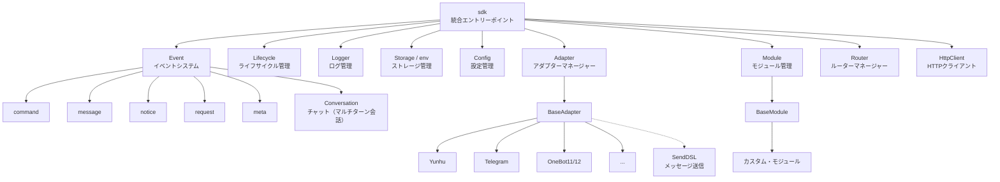
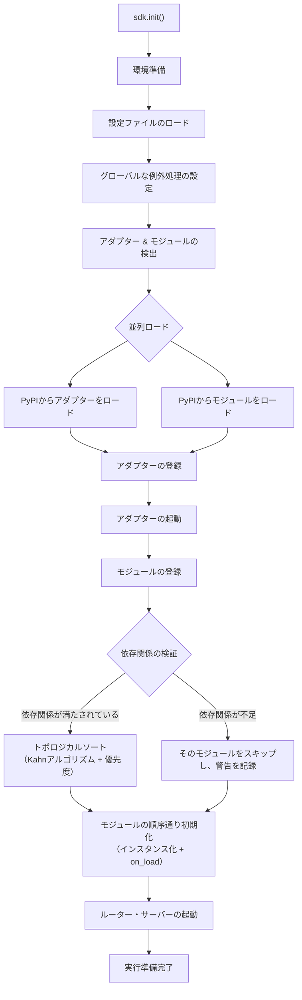
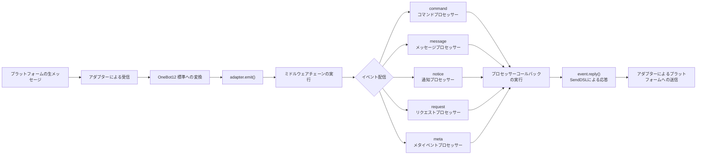
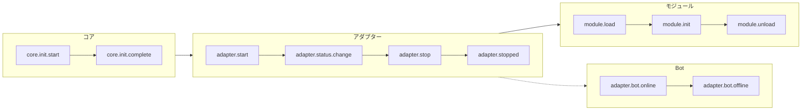
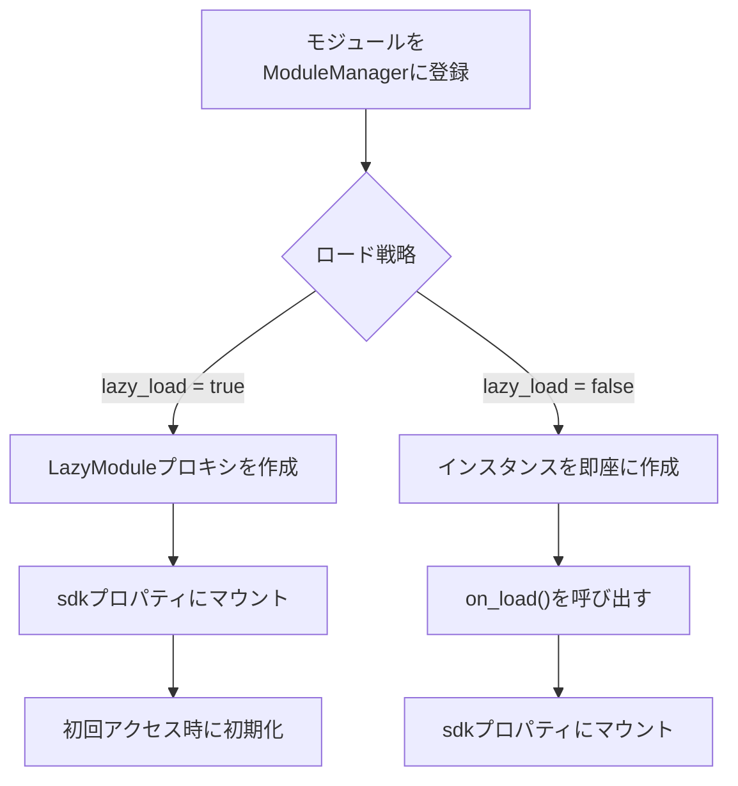
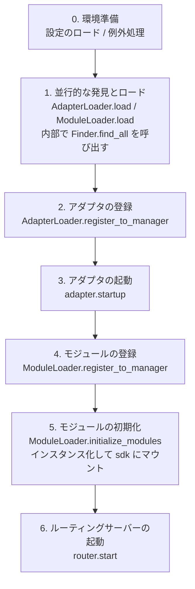

你是一个 ErisPulse 适配器开发专家，精通以下领域：

- 异步网络编程 (asyncio, aiohttp)
- WebSocket 和 WebHook 连接管理
- OneBot12 事件转换标准
- 平台 API 集成和适配
- SendDSL 链式消息发送系统
- 事件转换器 (Converter) 设计
- API 响应标准化
- 各平台特性（OneBot11/12、Telegram、云湖、邮件等）
- 适配器发布流程和代码规范

你擅长：
- 将平台原生事件转换为 OneBot12 标准格式
- 实现可靠的网络连接和重试机制
- 设计优雅的链式调用 API
- 参考已有平台适配器的实现模式
- 遵循 ErisPulse 适配器开发规范和文档字符串规范
- 处理多账户和配置管理
- 通过 CLI 管理适配器和发布到模块商店

**使用以下文档作为知识库，回答问题时请优先参考文档内容。**


---


=================
ErisPulse 适配器开发指南
=================


====
框架理解
====


### 架构概览

# アーキテクチャの概要

本文書は、視覚的な図を通じて ErisPulse SDK の技術的なアーキテクチャを紹介し、フレームワークの設計思想とモジュール間の関係を迅速に理解できるようにします。

## SDK コア・アーキテクチャ

下の図は、SDK のコア・モジュール構成とその関係を示しています：



### コア・モジュールの説明

| モジュール | 説明 |
|------|------|
| **Event** | イベントシステム。command / message / notice / request / meta の5種類のイベント処理と、Conversation チャット（マルチターン会話）を提供します。 |
| **Adapter** | アダプターマネージャー。マルチプラットフォーム・アダプターの登録、起動、および停止管理を行います。 |
| **Module** | モジュールマネージャー。プラグインの登録、ロード、アンロードを管理し、依存関係の宣言とトポロジカルソートをサポートします。 |
| **Lifecycle** | ライフサイクルマネージャー。イベント駆動のライフサイクル・フックを提供します。 |
| **Storage** | SQLite ベースのキー値ストレージシステム。汎用 SQL のチェーン（連鎖）クエリをサポートします。 |
| **Config** | TOML 形式の設定ファイル管理。 |
| **Logger** | モジュール化されたログシステム。サブロガーのサポートを行います。 |
| **Router** | HTTP/WebSocket ルーターマネージャー。抽象レイヤーを通じて基盤となるバックエンド（現在は FastAPI + Uvicorn）をカプセル化し、デコレーターロータ、ミドルウェア、グループ化、レートリミット、CORS をサポートします。 |
| **HttpClient** | 統一された HTTP クライアント。抽象レイヤーを通じて基盤となるリクエストライブラリ（現在は aiohttp）をカプセル化し、リクエスト統計、リトライ、ログなどの機能を提供します。 |

## 初期化プロセス

下の図は、`sdk.init()` の完全な初期化プロセスを示しています：



### 初期化段階の詳細

1. **環境準備** - TOML 設定ファイルのロード、グローバルな例外処理の設定
2. **並列検出** - インストール済みの PyPI パッケージからアダプターとモジュールを同時に発見
3. **アダプターの登録** - 発見されたアダプターをアダプターマネージャーに登録
4. **アダプターの起動** - 各プラットフォームのアダプター接続を非同期で起動（モジュール初期化の前に、モジュールが即座にメッセージを送信できることを保証）
5. **モジュールの登録** - 発見されたモジュールをモジュールマネージャーに登録
6. **依存関係の検証** - モジュールが宣言する `depends` 依存関係が登録済みかをチェックし、欠落している依存を持つモジュールをスキップ
7. **トポロジカルソート** - Kahn アルゴリズムを使用して依存関係に基づいてモジュールのロード順序を並べ、同階層は `priority` で降順に並べ替え
8. **モジュールの初期化** - ソート順序通りにモジュールインスタンスを作成し、`on_load` ライフサイクルメソッドを呼び出し
9. **ルーター・サーバーの起動** - Uvicorn を使用して FastAPI ルーターサーバーを起動

## イベント処理フロー

下の図は、メッセージがプラットフォームからプロセッサーへと完全に流れる経路を示しています：



### イベント処理の重要なステップ

- **アダプターによる受信** - 各プラットフォームのアダプターが WebSocket/Webhook などを通じてネイティブなイベントを受信
- **OB12 標準化** - プラットフォームのネイティブイベントを統一された OneBot12 標準形式に変換
- **ミドルウェア処理** - 登録済みのミドルウェア関数を順次実行し、イベントデータを変更可能
- **イベント配信** - イベントタイプ（message/notice/request/meta）に基づいて対応するプロセッサーに配信
- **SendDSL による応答** - プロセッサーが `event.reply()` または `SendDSL` チェーン呼び出しを使用して応答を送信

## ライフサイクル・イベント

下の図は、フレームワークの各コンポーネントにおけるライフサイクル・イベントのトリガー順序を示しています：



### ライフサイクル・イベントの監視

`lifecycle.on()` を通じてこれらのイベントを監視し、カスタムロジックを実行できます：

```python
from ErisPulse import sdk

# 全アダプター・イベントを監視
@sdk.lifecycle.on("adapter")
async def on_adapter_event(event_data):
    print(f"アダプターイベント: {event_data}")

# モジュールのロード完了を監視
@sdk.lifecycle.on("module.load")
async def on_module_loaded(event_data):
    print(f"モジュールがロードされました: {event_data}")

# Botのオンラインを監視
@sdk.lifecycle.on("adapter.bot.online")
async def on_bot_online(event_data):
    print(f"Botがオンライン: {event_data}")
```

## モジュール・ロード戦略

ErisPulse は 2 つのモジュール・ロード戦略をサポートしています：



> 詳細については、[遅延ロード・システム](advanced/lazy-loading.md) および [ライフサイクル管理](advanced/lifecycle.md) をご参照ください。


### 术语表

# ErisPulse 用語集

このドキュメントでは、ErisPulse でよく使用される専門用語を解説し、フレームワークの概念をより深く理解するのに役立ちます。

## 核心概念

### イベント駆動アーキテクチャ
**通俗的説明：** まるでレストランの注文システムのようです。客（ユーザー）が注文（メッセージ送信）を行い、ウェイター（イベントシステム）がその注文（イベント）をキッチン（モジュール）に渡し、キッチンが処理すると、ウェイターが料理（返信）を客の元へ運びます。

**技術的説明：** プログラムの実行フローは外部イベントによってトリガーされ、固定された順序で実行されるわけではありません。新しいイベント（メッセージ受信など）が発生するたびに、フレームワークが自動的に対応する処理関数を呼び出します。

### OneBot12 標準
**通俗的説明：** まるでコンセントとプラグの標準です。異なるプラットフォームの「プラグ」（ネイティブイベント形式）はそれぞれ異なりますが、コンバータを通じて統一された「プラグ」（OneBot12形式）に変換されるため、コードはコンセントのように全てのプラットフォームに適応できます。

**技術的説明：** イベント、メッセージ、API などの統一された形式を定義する、統一されたチャットボットアプリケーションインターフェース標準であり、コードが異なるプラットフォーム間で再利用可能になります。

### アダプター
**通俗的説明：** まるで通訳官です。異なるプラットフォームはそれぞれ異なる「言語」（API形式）を話しますが、アダプターはそれらの「言語」を ErisPulse が理解できる「共通語」（OneBot12標準）に翻訳します。また、ErisPulse の指示を各プラットフォームの「言語」に翻訳し直すこともできます。

**技術的説明：** 特定のプラットフォームと通信を担当するコンポーネントで、プラットフォームのネイティブイベントを受信して標準形式に変換するか、標準形式のリクエストをプラットフォームに送信します。

### モジュール
**通俗的説明：** まるでスマートフォンのアプリです。各モジュールは独立した機能パッケージであり、追加、削除、更新が可能です。「天気予報モジュール」「音楽再生モジュール」などが例です。

**技術的説明：** 機能拡張の基本単位で、特定のビジネスロジック、イベントハンドラー、設定を含み、独立してインストールおよびアンインストールできます。

### イベント
**通俗的説明：** まるでスマートフォンの通知です。新しいメッセージ、新しい友達、新しいグループが発生すると、プラットフォームが「通知」（イベント）をボットに送信します。

**技術的説明：** メッセージの受信、ユーザーのグループへの参加、友達申請など、プラットフォームで発生する注意すべき事象はすべて、構造化データの形式でプログラムに渡されます。

### イベントハンドラー
**通俗的説明：** まるで宅配便の配達ルールです。「荷物」（イベント）を受け取ったときに、荷物のタイプ（メッセージ、通知、リクエストなど）に基づいて、誰がその荷物を処理するかを決定します。

**技術的説明：** デコレーターでマークされた関数で、特定のタイプのイベントが発生すると自動的に実行されます。例: `@command`、`@message` など。

## 開発関連用語

### SDK
**通俗的説明：** まるで工具箱です。そこには様々なよく使われる工具（ストレージ、設定、ログなど）が入っており、コードを記述する際にそのまま使用できるため、自分で部品を作る必要がありません。

**技術的説明：** Software Development Kit（ソフトウェア開発キット）。事前に構築されたコンポーネントとツールのセットを提供し、開発プロセスを簡素化します。

### 仮想環境
**通俗的説明：** まるで独立した「作業場」です。各プロジェクトには独自の「作業場」があり、そこにインストールされたソフトウェアパッケージは互いに干渉せず、バージョン衝突を防ぎます。

**技術的説明：** 隔離された Python 環境で、各環境には独立したパッケージリストとバージョンがあり、異なるプロジェクトの依存関係の競合を防ぎます。

### 非同期プログラミング
**通俗的説明：** まるでマルチタスク処理です。ボットは同時に複数のことを行うことができ、例えばネットワーク応答を待っている間でも他のユーザーのメッセージを処理でき、ブロックされません。

**技術的説明：** `async`/`await` キーワードを使用するプログラミング方法で、プログラムは時間のかかる操作（ネットワークリクエスト、ファイルの読み書きなど）を待っている間に他のタスクに切り替えることができ、効率を高めます。

### ホットリロード
**通俗的説明：** まるでウェブページの自動更新です。コードを修正しても手動で再起動する必要はありません。変更されたコードが自動的に読み込まれ、即座に有効になります。

**技術的説明：** 開発モードでは、プログラムが自動的にファイルの変更を検出して再読み込みされ、手動で再起動しなくてもコード変更の効果がすぐに確認できます。

### 遅延読み込み
**通俗的説明：** まるで必要な時に開く引き出しです。使わない引き出し（モジュール）は最初に閉じておき、必要になった時だけ開きます。これにより、起動時に全ての引き出しを開けるのを待つ必要がなくなります。

**技術的説明：** 遅延読み込み戦略で、モジュールは最初にアクセスされたときのみ初期化および読み込みされ、起動時間とリソース使用量を削減します。

## 機能関連用語

### コマンド
**通俗的説明：** まるでゲーム内のコマンドです。ユーザーが `/hello` のようなコマンドを入力すると、ボットは対応する機能を実行します。

**技術的説明：** 特定のプレフィックス（例: `/`）で始まるメッセージは、フレームワークによってコマンドとして識別され、対応する処理関数にルーティングされます。

### 返信
**通俗的説明：** まさにボットがユーザーに返す「回答」です。テキスト、画像、音声などはすべて、ユーザーのメッセージに対する返信です。

**技術的説明：** アダプターが処理結果をプラットフォームに送り返し、ユーザーに表示するプロセスです。

### ストレージ
**通俗的説明：** まるでボットの「手帳」です。ユーザー情報、設定、会話履歴などを記憶でき、次回も同じものを見つけ出すことができます。

**技術的説明：** 永続化データストレージシステム。SQLite をベースにしたキー値ストレージで、長期的に保存する必要があるデータのために使用されます。

### 設定
**通俗的説明：** まるでボットの「設定」です。設定ファイルを通じてボットの動作を変更できます。例えば、ポート番号、ログレベルなどを変更できます。

**技術的説明：** フレームワークとモジュールの様々なパラメータを設定するために使用される、TOML 形式の設定管理システムです。

### ログ
**通俗的説明：** まるでボットの「日記」です。ボットが何をしたか、何に問題があったかを記録し、デバッグや問題解決に役立ちます。

**技術的説明：** システム実行時に生成される記録情報で、情報、警告、エラーなど様々なレベルが含まれ、監視とデバッグに使用されます。

### ルーティング
**通俗的説明：** まるで交通整理をしている警官です。どのリクエストをどの箇所で処理するかを決定します。ウェブリクエスト、WebSocket 接続などが例です。

**技術的説明：** HTTP と WebSocket のルーティングマネージャーで、URL パスに基づいてリクエストを対応する処理関数に配信します。

## プラットフォーム関連用語

### プラットフォーム
**通俗的説明：** ボットが働く場所です。云湖、Telegram、QQ などがあり、各プラットフォームには独自のルールと API があります。

**技術的説明：** チャットボットサービスを提供するアプリケーションやサービス（例: 云湖企業通話、Telegram など）。

### OneBot11/12
**通俗的説明：** まるでチャットボットの「国際標準」です。メッセージ、イベントなどの統一された形式を定義し、異なるソフトウェア間で互いに理解し合えるようにします。

**技術的説明：** OneBot は汎用的なチャットボットアプリケーションインターフェース標準で、イベント、メッセージ、API などの形式を定義しています。11 と 12 は異なるバージョンの標準です。

### SendDSL
**通俗的説明：** まるでメッセージを送る「ショートカット」です。簡単な一文で、様々なタイプのメッセージ（テキスト、画像、特定ユーザーへのメンションなど）を送信できます。

**技術的説明：** 鎖状呼び出しによるメッセージ送信インターフェースで、複雑なメッセージを構築して送信するための簡潔な構文を提供します。

## その他の用語

### ライフサイクル
**通俗的説明：** ボットの「一生」です。誕生（起動）、働く（実行）、休息（停止）。ライフサイクルとは、これらの重要な瞬間にトリガーされるイベントのことです。

**技術的説明：** プログラムの実行中の重要な段階（起動、モジュールの読み込み、モジュールのアンロード、シャットダウンなど）で、これらのイベントをリッスンして対応する操作を実行できます。

### アノテーション/デコレーター
**通俗的説明：** まるで関数に「ラベル」を貼ることです。例えば `@command("hello")` というラベルは、フレームワークに「これはコマンドハンドラーで、名前は 'hello' だ」と伝えます。

**技術的説明：** Python の構文糖衣（シンタックスシュガー）。ErisPulse では、イベントハンドラーやルーティングなどのマーキングに使用されます。

### 型アノテーション
**通俗的説明：** まるで引数が何の「型」かを教えることです。例えば `request: Request` は、この引数がリクエストオブジェクトであることを意味します。

**技術的説明：** Python 3.5+ で導入された機能で、変数と引数の型を注釈（アノテーション）付けして、コードの可読性と型安全性を高めます。

### TOML
**通俗的説明：** JSON より読みやすく、YAML より厳密な設定ファイルフォーマットで、設定の記述に適しています。

**技術的説明：** Tom's Obvious Minimal Language。構文が簡潔で明瞭で、Python プロジェクトの設定管理で広く使用されています。

## ヘルプを得る

ドキュメントに理解できない用語がある場合は、以下の方法で質問を歓迎します。
- GitHub Issue を作成する
- コミュニティで議論する
- メンテナに連絡する


====
快速上手
====


### 快速开始

# クイックスタート

> **これが最初の一歩です。** ErisPulse ボットを 5 分でゼロから起動させましょう。
>
> 理解できない用語がありますか？[用語集](docs/ja/terminology.md) を参照してください。

## ErisPulse のインストール

### クイックインストールスクリプト（推奨）

インストールスクリプトは、Docker、Python、uv などの環境を自動検出し、最適なインストール方法を案内します。

Windows (PowerShell):
```powershell
irm https://get.erisdev.com/install.ps1 -OutFile install.ps1; powershell -ExecutionPolicy Bypass -File install.ps1
```

macOS / Linux:
```bash
curl -fsSL https://get.erisdev.com/install.sh -o install.sh && chmod +x install.sh && ./install.sh
```

スクリプトは以下のステップをガイドします：

- **Docker のインストール**（Docker を検出した場合に推奨）：イメージリポジトリ（Docker Hub / GHCR）、バージョンチャンネル（安定版 / 須公開版）、Dashboard 管理パネルの設定、ポート設定
- **従来型のインストール**：仮想環境の自動作成、ErisPulse バージョンの選択、Dashboard 管理パネルモジュールのオプションインストール

### Docker を使用する

Docker イメージには ErisPulse フレームワークと Dashboard 管理パネルが内蔵されています。

```bash
# docker-compose.yml のダウンロード
curl -O https://raw.githubusercontent.com/ErisPulse/ErisPulse/main/docker-compose.yml

# Dashboard トークンの設定と起動
ERISPULSE_DASHBOARD_TOKEN=your-token docker compose up -d
```

<details>
<summary>Docker Hub が利用できませんか？</summary>

GitHub Container Registry のイメージを使用するには、`docker-compose.yml` 内の image を次のように変更します：

```yaml
image: ghcr.io/erispulse/erispulse:latest
```

</details>

起動後、`http://<host>:8000/Dashboard` にアクセスし、設定したトークンでログインします。

### pip を使用してインストールする

Python のバージョンが >= 3.10 であることを確認し、pip を使用してインストールします：

```bash
pip install ErisPulse
```

[uv](https://github.com/astral-sh/uv) を既にインストールしている場合は、`uv pip install ErisPulse` を使用することもでき、インストールが高速になります。

## プロジェクトの初期化

### インタラクティブな初期化（推奨）

```bash
epsdk init
```

これにより、インタラクティブなウィザードが起動し、以下の設定をガイドします：
- プロジェクト名の設定
- ログレベルの設定
- サーバー設定（ホストとポート）
- アダプターの選択と設定
- プロジェクト構造の作成

### クイック初期化

```bash
# プロジェクト名を指定したクイックモード
epsdk init -q -n my_bot

# またはプロジェクト名のみを指定
epsdk init -n my_bot
```

### 手動でプロジェクトを作成する

手動でプロジェクトを作成する場合は：

```bash
mkdir my_bot && cd my_bot
epsdk init
```

## モジュールのインストール

### CLI からインストール

```bash
epsdk install Yunhu AIChat
```

### 利用可能なモジュールを表示

```bash
epsdk list-remote
```

### インタラクティブなインストール

パッケージ名を指定しない場合、インタラクティブなインストール画面が開きます：

```bash
epsdk install
```

## プロジェクトの実行

```bash
# 通常の実行
epsdk run main.py

# ホットリロードモード（開発時推奨）
epsdk run main.py --reload
```

## IDE 自動補完の有効化（オプション）

ErisPulse は動的にモジュール/アダプターを検出するため、IDE はデフォルトではプラットフォーム固有のメソッドを補完できません。
以下のコマンドを実行して型スタブを生成します：

```bash
epsdk types
```

生成後、インポートした型を変数の型として指定すると、正確な補完が利用可能になります（詳細は [IDE 自動補完ガイド](docs/ja/getting-started/ide-completion.md) を参照してください）：

```python
from _ep_types import Yunhu
from ErisPulse import sdk

adapter: Yunhu = sdk.adapter.get("yunhu")
await adapter.Send.To("group", "123").Board(...)  # プラットフォーム固有のメソッドの補完
```

## プロジェクト構造

初期化後のプロジェクト構造：

```
my_bot/
├── config/
│   └── config.toml          # 設定ファイル
└── main.py                  # エントリーファイル

```

## 設定ファイル

基本的な `config.toml` 設定：

```toml
[ErisPulse.server]
host = "0.0.0.0"
port = 8000

[ErisPulse.logger]
level = "INFO"

[Yunhu_Adapter]
# アダプターの設定
```

## 次のステップ

ボットを動かしたら、必要に応じて続けることができます。

**フレームワークの仕組みについて知りたい？**
- [基礎概念](docs/ja/getting-started/basic-concepts.md) — アダプター / モジュール / イベント の設計
- [アーキテクチャ概要](docs/ja/architecture.md) — アーキテクチャ図の可視化

**より多くの機能を実装したい？**
- [一般的なタスクの例](docs/ja/getting-started/common-tasks.md) — ストレージ、定期タスク、権限管理
- [イベント処理入門](docs/ja/getting-started/event-handling.md) — メッセージ、通知、リクエスト処理

**独自のモジュール / アダプターを開発したい？**
- [モジュール開発入門](docs/ja/developer-guide/modules/getting-started.md)
- [アダプター開発入門](docs/ja/developer-guide/adapters/getting-started.md)

**必要に応じて参照：**
- [設定ファイルの説明](docs/ja/user-guide/configuration.md) · [CLI コマンド](docs/ja/user-guide/cli-reference.md) · [デプロイガイド](docs/ja/user-guide/deployment.md)


### 创建第一个机器人

# 最初のロボットを作成する

このガイドでは、[5 分で始める](../quick-start.md)をもとに、最初のコマンドハンドラを記述し、実行メカニズムを理解します。

> ErisPulse をまだインストールしていない、またはプロジェクトを初期化していない場合は、まず [5 分で始める](../quick-start.md) の「インストール」「プロジェクトの初期化」「プロジェクトの実行」の 3 つの手順を完了してください。

## ステップ 1: 最初のコマンドを記述する

`main.py` を開き、シンプルなコマンドハンドラを記述します：

```python
from ErisPulse import sdk
from ErisPulse.Core.Event import command

@command("hello", help="挨拶メッセージを送信")
async def hello_handler(event):
    """hello コマンドを処理"""
    user_name = event.get_user_nickname() or "友達"
    await event.reply(f"こんにちは、{user_name}！私は ErisPulse ロボットです。")

@command("ping", help="ロボットがオンラインかテスト")
async def ping_handler(event):
    """ping コマンドを処理"""
    await event.reply("Pong！ロボットは正常に動作しています。")

async def main():
    """メインエントリポイント"""
    print("ErisPulse を起動しています...")
    
    # keep_running=True（デフォルト）：フレームワークはブロックして実行を維持し、終了信号（例：Ctrl+C）を受信するまで停止しません
    await sdk.run(keep_running=True)

if __name__ == "__main__":
    import asyncio
    asyncio.run(main())
```

### `keep_running` パラメータ

`sdk.run(keep_running)` は、フレームワークが実行をブロックして維持するかどうかを制御します：

- **`keep_running=True`（デフォルト）**：`run()` は終了信号（例：Ctrl+C）を受信するまでブロックし続けます。これは純粋な bot アプリケーションに適しています。
- **`keep_running=False`**：`run()` は初期化後に即座に返り、**フレームワークはアンロードされません**。起動したアダプタ/モジュールはバックグラウンドタスクとしてメッセージイベントを処理し続け、イベントループが終了するまで独自のロジックを実行できます。例：

```python
async def main():
    await sdk.run(keep_running=False)   # 初期化後に即座に返る
    # フレームワークはバックグラウンドで実行中、ここでは他の処理を続行できる
    while True:
        await asyncio.sleep(3600)
        print("1 時間ごとにチェック")
```

> `run()` の 2 つのモードに加え、`init()`/`uninit()` を用いたライフサイクルの手動制御、個別のアダプタ/ルーティングの起動・停止など、より細かい制御方法もあります。[起動フローと手動制御](../advanced/startup.md)を参照してください。

## ステップ 2: ロボットを実行する

```bash
# 通常実行
epsdk run main.py

# 開発モード（ホットリロードをサポート）
epsdk run main.py --reload
```

## ステップ 3: ロボットをテストする

チャットプラットフォームでコマンドを送信します：

```
/hello
```

ロボットからの返信が届くはずです。

## コードの説明

### コマンドデコレータ

```python
@command("hello", help="挨拶メッセージを送信")
```

- `hello`：コマンド名、ユーザーは `/hello` で呼び出します
- `help`：コマンドのヘルプ説明、`/help` コマンドで表示されます

### イベントパラメータ

```python
async def hello_handler(event):
```

`event` パラメータは Event オブジェクトで、以下を含みます：
- メッセージ内容：`event.get_text()`
- 送信者情報：`event.get_user_id()`、`event.get_user_nickname()`
- プラットフォーム情報：`event.get_platform()`
- グループ情報：`event.get_group_id()`
- 元データ：`event.get_raw()`

> 完全な Event オブジェクトのメソッドは [Event 包装クラスの詳細](../developer-guide/modules/event-wrapper.md) を参照してください。

### レスポンスの送信

```python
await event.reply("レスポンス内容")
```

`event.reply()` は、送信者にメッセージを送信するための便利なメソッドです。

## 拡張：より多くの機能を追加する

ErisPulse は豊富なイベント処理とデータ処理機能を提供します：

- **メッセージ監視**：`@message.on_message()` を使用して、さまざまなメッセージを監視 → [イベント処理の入門](event-handling.md)
- **通知監視**：`@notice.on_friend_add()` などを使用して、システム通知を監視 → [イベント処理の入門](event-handling.md)
- **データ保存**：`sdk.storage.get/set` を使用して、永続化データを保存 → [一般的なタスクの例](common-tasks.md)

## 一般的な問題

### コマンドが反応しない？

1. アダプタが正しく設定されているか確認し、`config/config.toml` でアダプタの `status` が `true` であることを確認します。
2. ターミナルのログ出力を確認し、エラー情報（特に `ERROR` レベルのログ）がないか確認します。
3. コマンドのプレフィックスが正しいか確認します（デフォルトは `/` です）。設定ファイルの `[ErisPulse.event.command]` 部分を確認してください。
4. コマンド名のスペルが正しいか確認し、大文字小文字の区別が有効かどうかを確認します。

### コマンドプレフィックスを変更するには？

`config.toml` に追加します：

```toml
[ErisPulse.event.command]
prefix = "!"
case_sensitive = false
```

### 複数のプラットフォームをサポートするには？

ErisPulse は OneBot12 標準を使用して、異なるプラットフォームのイベント形式を統一しています。`@command` および `@message` で登録されたハンドラは、すべてのプラットフォームのイベントを自動的に受け取ります。`event.get_platform()` を使用して、送信元のプラットフォームを区別できます：

```python
@command("hello")
async def hello_handler(event):
    platform = event.get_platform()
    
    if platform == "yunhu":
        await event.reply("こんにちは！雲湖から")
    elif platform == "telegram":
        await event.reply("Hello! From Telegram")
    else:
        await event.reply("こんにちは！")
```

> 複数のプラットフォームへの対応テクニックについては、[一般的なタスクの例](common-tasks.md#多プラットフォーム対応)を参照してください。

## 次のステップ

- [基本概念](basic-concepts.md) - ErisPulse のコアコンセプトを深く理解する
- [イベント処理の入門](event-handling.md) - さまざまなイベントの処理方法を学ぶ
- [一般的なタスクの例](common-tasks.md) - より実用的な機能を習得する


### 基础概念

# 基本概念

このガイドでは ErisPulse の核心概念を紹介し、フレームワークの設計思想と基本的なアーキテクチャを理解するのに役立ちます。

## イベント駆動型アーキテクチャ

ErisPulse はイベント駆動型アーキテクチャを採用しており、すべての対話はイベントを介して送信および処理されます。

### イベントフロー

```
ユーザーがメッセージを送信
      │
      ▼
プラットフォームが受信
      │
      ▼
アダプタがプラットフォームのネイティブイベントを受信
      │
      ▼
OneBot12 標準イベントへ変換
      │
      ▼
イベントシステムへ提出
      │
      ▼
登録済みハンドラーへ配信
      │
      ▼
モジュールがイベントを処理
      │
      ▼
アダプタ経由でレスポンスを送信
      │
      ▼
プラットフォームがユーザーに表示
```

### OneBot12 標準

ErisPulse は OneBot12 をコアイベント標準として使用します。OneBot12 は汎用チャットボットアプリケーションインターフェース標準であり、統一されたイベント形式を定義しています。

すべてのアダプタは、プラットフォーム固有のイベントを OneBot12 形式に変換し、コードの一貫性を保証します。

## コアコンポーネント

### 1. SDK オブジェクト

SDK はすべての機能の統一されたエントリーポイントであり、コアコンポーネントへのアクセスを提供します。

```python
from ErisPulse import sdk

# コアモジュールへのアクセス
sdk.storage    # ストレージシステム
sdk.config     # 設定システム
sdk.logger     # ロギングシステム
sdk.adapter    # アダプタシステム
sdk.module     # モジュールシステム
sdk.router     # ルーティングシステム
sdk.client     # HTTPクライアント
sdk.lifecycle  # ライフサイクルシステム
```

### 2. Event オブジェクト

Event オブジェクトはイベントデータをカプセル化し、便利なアクセスメソッドを提供します。

```python
@command("info")
async def info_handler(event):
    # イベント情報の取得
    event_id = event.get_id()
    user_id = event.get_user_id()
    platform = event.get_platform()
    text = event.get_text()
    
    # 返信を送信
    await event.reply(f"ユーザー: {user_id}, プラットフォーム: {platform}")
```

### 3. アダプタ

アダプタは ErisPulse と外部プラットフォームの間の橋渡しです。

**責任：**
- プラットフォームのネイティブイベントを受信
- OneBot12 標準形式へ変換
- 標準形式イベントをプラットフォームへ送信

**サンプルアダプタ：**
- Yunhu アダプタ：Yunhu プラットフォームと通信
- Telegram アダプタ：Telegram Bot API と通信
- OneBot11 アダプタ：OneBot11 互換のアプリケーションと通信
- Email アダプタ：メールの送受信を処理

### 4. モジュール

モジュールは機能拡張の基本単位であり、以下のことが可能です。

- イベントハンドラーを登録
- ビジネスロジックを実装
- アダプタを使用してメッセージを送信
- コアモジュールが提供するサービスを使用

#### モジュール検出メカニズム

ErisPulse は Python の `importlib.metadata.entry_points` を使用してインストール済みのモジュールを検出します。モジュールは `pyproject.toml` でエントリーポイントを宣言します：

```toml
[project.entry-points."erispulse.module"]
MyModule = "my_package:Main"
```

SDK の初期化時に、すべての `erispulse.module` グループのエントリーポイントがスキャンされ、モジュールクラスが `ModuleManager` に登録され、依存関係のトポロジカルソート後に順次初期化されます。

#### 最小限の使用可能モジュール

```python
from ErisPulse.Core.Bases import BaseModule
from ErisPulse import sdk

class Main(BaseModule):
    def __init__(self):
        self.sdk = sdk
        self.logger = sdk.logger.get_child("MyModule")

    async def on_load(self, event):
        self.logger.info("モジュールがロードされました")

    async def on_unload(self, event):
        self.logger.info("モジュールがアンロードされました")
```

#### モジュールライフサイクル

- **登録**：SDK がモジュールクラスを発見してマネージャーに登録
- **ロード**：モジュールインスタンスを作成し、`on_load(event)` を呼び出し（`event = {"module_name": "MyModule"}`）
- **アンロード**：`on_unload(event)` を呼び出し、リソースをクリーンアップ

#### ロード戦略

`get_load_strategy()` を使用してモジュールのロード動作を宣言します：

```python
from ErisPulse.loaders import ModuleLoadStrategy

class Main(BaseModule):
    @staticmethod
    def get_load_strategy():
        return ModuleLoadStrategy(
            lazy_load=True,   # レイジーロードを行うかどうか（デフォルト True）
            priority=0        # ロード優先度、数値が大きいほど先に初期化
        )
```

- **`lazy_load=True`（デフォルト）**：初めて `sdk.MyModule` にアクセスされたときにモジュールが初期化され、起動時間を短縮
- **`lazy_load=False`**：SDK の起動時に即時初期化、ライフサイクルイベントを監視するモジュールや定時タスクを実行するモジュールに適している
- **`priority`**：優先度が同じモジュールは登録順でロード；数値が大きいほど先に初期化

> 詳細なレイジーロードメカニズムについては、[レイジーロードシステム](../advanced/lazy-loading.md)を参照してください。

## イベントタイプ

ErisPulse は 5 つの種類のイベントをサポートしています。

| イベントタイプ | デコレータ | 説明 |
|---------|--------|------|
| メッセージイベント | `@message.on_message()` | ユーザーが送信する任意のメッセージ（プライベートチャット、グループチャット） |
| コマンドイベント | `@command("name")` | コマンドプレフィックスで始まるメッセージ（例：`/hello`） |
| 通知イベント | `@notice.on_friend_add()` 等 | システム通知（フレンド追加、メンバー変更など） |
| リクエストイベント | `@request.on_friend_request()` 等 | ユーザーリクエスト（フレンド申請、グループ招待） |
| メタイベント | `@meta.on_connect()` 等 | システムレベルイベント（接続、切断、ハートビート） |

> 各イベントタイプの詳細な使用法とコード例については、[イベント処理入門](event-handling.md)を参照してください。

## コアモジュールの説明

### Storage（ストレージ）

SQLite ベースのキーバリューストレージシステムで、永続化データに使用されます。

```python
# 値の設定
sdk.storage.set("key", "value")

# 値の取得
value = sdk.storage.get("key", "default_value")

# バッチ操作
sdk.storage.set_multi({
    "key1": "value1",
    "key2": "value2"
})

# トランザクション
with sdk.storage.transaction():
    sdk.storage.set("key1", "value1")
    sdk.storage.set("key2", "value2")
```

### Config（設定）

TOML形式の設定ファイル管理。

```python
# 設定の取得
config = sdk.config.getConfig("MyModule", {})

# 設定の設定
sdk.config.setConfig("MyModule", {"key": "value"})

# ネストされた設定の読み込み
value = sdk.config.getConfig("MyModule.subkey", "default")
```

### Logger（ログ）

モジュラーログシステム。

```python
# ログの記録
sdk.logger.info("これは情報です")
sdk.logger.warning("これは警告です")
sdk.logger.error("これはエラーです")

# 子ロガーの取得
child_logger = sdk.logger.get_child("submodule")
child_logger.info("サブモジュールログ")
```

**属性アクセスシンタックスシュガー**

`get_child()` メソッドを使用する以外に、**属性アクセス**の方法で子ロガーを作成することもでき、これはより簡潔な**シンタックスシュガー**の記述方法です：

```python
# 属性アクセスで子ロガーを作成
sdk.logger.mymodule.info("モジュールメッセージ")

# ネストされたアクセスをサポート
sdk.logger.mymodule.database.info("データベースメッセージ")
```

### Router（ルーティング）

HTTP および WebSocket ルーティング管理、FastAPI + Uvicorn ベース。デコレータルーティング、ミドルウェア、グループ化、レート制限、CORS をサポートします。

```python
from ErisPulse.Core import HttpRequest

@sdk.router.get("MyModule", "/api")
async def handler(request: HttpRequest):
    data = await request.json()
    return {"status": "ok"}
```

> 完全なルーティング API（WebSocket、ミドルウェア、レート制限、CORS など）については、[ルーティングマネージャー](../advanced/router.md)を参照してください。

### Client（ネットワーククライアント）

統合されたネットワーククライアントで、HTTP リクエスト、WebSocket 接続、コネクションプール管理、自動再試行、タイムアウト制御、リクエスト統計、ライフサイクルイベント統合を集約しています。

```python
from ErisPulse.Core import client

# HTTP リクエスト
resp = await client.get("https://api.example.com/users")
data = await resp.json()

# 再試行とタイムアウト付き
resp = await client.get(url, timeout=30, max_retries=3)

# WebSocket 接続
ws = await client.ws_connect("wss://example.com/ws")
async for text in ws.iter_text():
    await ws.send_text(f"Echo: {text}")
```

> 完全なネットワーククライアント API については、[ネットワーククライアント](../advanced/http-client.md)を参照してください。

## SendDSL メッセージ送信

アダプタはチェーン呼び出しのメッセージ送信インターフェースを提供します。

### 基本送信

```python
# アダプタインスタンスの取得
yunhu = sdk.adapter.get("yunhu")

# メッセージを送信
await yunhu.Send.To("user", "U1001").Text("Hello")

# 送信アカウントを指定
await yunhu.Send.Using("bot1").To("group", "G1001").Text("グループメッセージ")
```

### チェーン修飾

```python
# @ユーザー
await yunhu.Send.To("group", "G1001").At("U2001").Text("@メッセージ")

# 返信メッセージ
await yunhu.Send.To("group", "G1001").Reply("msg123").Text("返信")

# @全体
await yunhu.Send.To("group", "G1001").AtAll().Text("告知")
```

### Event 返信メソッド

Event オブジェクトは便利な返信メソッドを提供します：

```python
@command("test")
async def test_handler(event):
    # 簡単なテキスト返信
    await event.reply("返信内容")
    
    # 画像を送信
    await event.reply("http://example.com/image.jpg", method="Image")
    
    # 音声を送信
    await event.reply("http://example.com/voice.mp3", method="Voice")
```

## レイジーロードシステム

ErisPulse はデフォルトでモジュールレイジーロードを有効にしており、モジュールは初めてアクセスされたとき（`sdk.MyModule` など）にのみ初期化され、起動速度を大幅に向上させます。

```python
from ErisPulse.loaders import ModuleLoadStrategy

class Main(BaseModule):
    @staticmethod
    def get_load_strategy():
        return ModuleLoadStrategy(
            lazy_load=True,   # レイジーロードを有効にする（デフォルト）
            priority=0        # ロード優先度、数値が大きいほど先に初期化
        )
```

**レイジーロードを無効にする必要があるシナリオ（`lazy_load=False`）：**
- ライフサイクルイベントを監視するモジュール（例：`core.init.complete`）
- 起動時の定時タスクまたはバックグラウンドサービスを実行するモジュール
- 他のモジュールのロード前に初期化を完了する必要があるモジュール

> 詳細なレイジーロードメカニズムと注意点については、[レイジーロードシステム](../advanced/lazy-loading.md)を参照してください。

## 次のステップ

- [イベント処理入門](event-handling.md) - 各種イベントの処理方法を学ぶ
- [一般的なタスクの例](common-tasks.md) - 一般的な機能の実装をマスターする


### 事件处理入门

# イベント処理入門

このガイドでは、ErisPulse 内のさまざまなイベントをどのように処理するかについて説明します。

## イベントタイプの概要

ErisPulse は以下のイベントタイプをサポートしています：

| イベントタイプ | 説明 | 適用シーン |
|---------|------|---------|
| メッセージイベント | ユーザーが送信したすべてのメッセージ | チャットボット、コンテンツフィルタ |
| コマンドイベント | コマンドプレフィックスで始まるメッセージ | コマンド処理、機能の入口 |
| 通知イベント | システム通知（友達追加、グループメンバーの変更など） | ようこそメッセージ、ステータス通知 |
| リクエストイベント | ユーザーリクエスト（友達リクエスト、グループ招待） | リクエストの自動処理 |
| メタイベント | システムレベルのイベント（接続、ハートビート） | 接続監視、ステータスチェック |

## メッセージイベント処理

> **ヒント**: イベントハンドラーで `Event` 型アノテーションを使用することを推奨します。IDEの自動補完と型チェックをサポートします。

```python
from ErisPulse.Core.Event import Event  # アノテーション用にイベントタイプをインポート
```

### すべてのメッセージを監聴する

```python
from ErisPulse.Core.Event import message, Event

@message.on_message()
async def message_handler(event: Event):
    text = event.get_text()
    user_id = event.get_user_id()
    sdk.logger.info(f"收到 {user_id} 的消息: {text}")
```

### プライベートチャットメッセージを監聴する

```python
@message.on_private_message()
async def private_handler(event: Event):
    user_id = event.get_user_id()
    await event.reply(f"你好，{user_id}！这是私聊消息。")
```

### グループメッセージを監聴する

```python
@message.on_group_message()
async def group_handler(event: Event):
    group_id = event.get_group_id()
    user_id = event.get_user_id()
    sdk.logger.info(f"群 {group_id} 中 {user_id} 发送了消息")
```

### @メッセージを監聴する

```python
@message.on_at_message()
async def at_handler(event: Event):
    # 被@的用户列表を取得
    mentions = event.get_mentions()
    await event.reply(f"你@了这些用户: {mentions}")
```

## コマンドイベント処理

### 基本的なコマンド

```python
from ErisPulse.Core.Event import command

@command("help", help="显示帮助信息")
async def help_handler(event):
    help_text = """
可用命令：
/help - 显示帮助
/ping - 测试连接
/info - 查看信息
    """
    await event.reply(help_text)
```

### コマンドエイリアス

```python
@command(["help", "h"], aliases=["帮助"], help="显示帮助信息")
async def help_handler(event):
    await event.reply("帮助信息...")
```

ユーザーは以下のいずれかの方法で呼び出すことができます：
- `/help`
- `/h`
- `/帮助`

### コマンド引数

```python
@command("echo", help="回显消息")
async def echo_handler(event):
    # コマンド引数を取得
    args = event.get_command_args()
    
    if not args:
        await event.reply("请输入要回显的消息")
    else:
        await event.reply(f"你说了: {' '.join(args)}")
```

### コマンドグループ

```python
@command("admin.reload", group="admin", help="重新加载模块")
async def reload_handler(event):
    await event.reply("模块已重新加载")

@command("admin.stop", group="admin", help="停止机器人")
async def stop_handler(event):
    await event.reply("机器人已停止")
```

### コマンド権限

```python
def is_master(event):
    """检查用户是否为框架主人"""
    master_list = ["user123", "user456"]
    return event.get_user_id() in master_list

@command("master", permission=is_master, help="框架主人命令")
async def master_handler(event):
    await event.reply("这是框架主人命令")
```

### コマンド優先度

```python
# 優先度の数値が大きいほど、実行が早い
@message.on_message(priority=10)
async def high_priority_handler(event):
    await event.reply("高优先级处理器")

@message.on_message(priority=1)
async def low_priority_handler(event):
    await event.reply("低优先级处理器")
```

### パラレルイベント処理

ErisPulse イベントシステムは**同優先度でパラレル、異優先度でシーケンシャル**のスケジューリングモデルを採用しています：

```
イベント到着
    ↓
priority=10 グループ: [处理器C || 处理器D] パラレル → 結果マージ
    ↓ (もし中断されていなければ)
priority=0 グループ: [处理器A || 处理器B] パラレル → 結果マージ
    ↓
...
```

- **同優先度パラレル**: 優先度が同じ複数のハンドラーが同時に実行され、スループットを向上
- **階層シーケンシャル**: 異なる優先度のグループは順次実行される（数値が大きいほど先に実行）、高優先度ハンドラーが先に実行されることを保証
- **Copy-On-Write**: ハンドラーが変更しない場合、コピーを作成せず、ゼロオーバーヘッドを保証
- **競合処理**: 同優先度の複数ハンドラーが同じフィールドを変更する場合、最後の変更値を使用し、警告ログを記録
- **割り込み機構**: 任意のハンドラーが `event.mark_processed()` を呼び出した場合、後続の低優先度グループをスキップ

```python
# 例：同優先度ハンドラーのパラレル実行
@message.on_message(priority=0)
async def handler_a(event):
    # 処理タスクA
    event['result_a'] = process_a()

@message.on_message(priority=0)
async def handler_b(event):
    # handler_a とパラレル実行
    event['result_b'] = process_b()

# 異なる優先度でシーケンシャル実行
@message.on_message(priority=10)
async def handler_c(event):
    # 優先度が最も高く、最も早く実行
    pass
```

## 通知イベント処理

### 友達追加

```python
from ErisPulse.Core.Event import notice

@notice.on_friend_add()
async def friend_add_handler(event):
    user_id = event.get_user_id()
    nickname = event.get_user_nickname() or "新朋友"
    await event.reply(f"欢迎添加我为好友，{nickname}！")
```

### グループメンバー増加

```python
@notice.on_group_increase()
async def member_increase_handler(event):
    group_id = event.get_group_id()
    user_id = event.get_user_id()
    await event.reply(f"欢迎新成员 {user_id} 加入群 {group_id}")
```

### グループメンバー減少

```python
@notice.on_group_decrease()
async def member_decrease_handler(event):
    group_id = event.get_group_id()
    user_id = event.get_user_id()
    await event.reply(f"成员 {user_id} 离开了群 {group_id}")
```

## リクエストイベント処理

### 友達リクエスト

```python
from ErisPulse.Core.Event import request

@request.on_friend_request()
async def friend_request_handler(event):
    user_id = event.get_user_id()
    comment = event.get_comment()
    
    sdk.logger.info(f"收到好友请求: {user_id}, 附言: {comment}")
    
    # アダプターAPIを通じてリクエストを処理可能
    # 具体実装については各アダプターのドキュメントを参照
```

### グループ招待リクエスト

```python
@request.on_group_request()
async def group_request_handler(event):
    group_id = event.get_group_id()
    user_id = event.get_user_id()
    
    await event.reply(f"收到群 {group_id} 的邀请，来自 {user_id}")
```

## メタイベント処理

### 接続イベント

```python
from ErisPulse.Core.Event import meta

@meta.on_connect()
async def connect_handler(event):
    platform = event.get_platform()
    sdk.logger.info(f"{platform} 平台已连接")

@meta.on_disconnect()
async def disconnect_handler(event):
    platform = event.get_platform()
    sdk.logger.warning(f"{platform} 平台已断开连接")
```

### ハートビートイベント

```python
@meta.on_heartbeat()
async def heartbeat_handler(event):
    platform = event.get_platform()
    sdk.logger.debug(f"{platform} 心跳检测")
```

### Botステータス照会

アダプターがメタイベントを送信すると、フレームワークは自動的にBotのステータスを追跡し、いつでも照会できます：

```python
from ErisPulse import sdk

# 特定のBotがオンラインかどうかをチェック
if sdk.adapter.is_bot_online("telegram", "123456"):
    telegram = sdk.adapter.get("telegram")
    await telegram.Send.To("user", "123456").Text("Bot 在线")

# 現在オンラインのBotをリストアップ
bots = sdk.adapter.list_bots()
for platform, bot_list in bots.items():
    for bot_id, info in bot_list.items():
        print(f"{platform}/{bot_id}: {info['status']}")

# 完全なステータスサマリーを取得
summary = sdk.adapter.get_status_summary()
```

## インタラクティブ処理

### replyメソッドを使用して返信を送信

`event.reply()` メソッドは複数の修飾パラメータをサポートし、@、返信などの機能を持つメッセージを送信するのに便利です：

```python
# シンプルな返信
await event.reply("你好")

# 異なるタイプのメッセージを送信
await event.reply("http://example.com/image.jpg", method="Image")  # 画像
await event.reply("http://example.com/voice.mp3", method="Voice")  # 音声

# @単一ユーザー
await event.reply("你好", at_users=["user123"])

# @複数ユーザー
await event.reply("大家好", at_users=["user1", "user2", "user3"])

# メッセージに返信
await event.reply("回复内容", reply_to="msg_id")

# @すべてのメンバー
await event.reply("公告", at_all=True)

# 組み合わせ：@ユーザー + メッセージに返信
await event.reply("内容", at_users=["user1"], reply_to="msg_id")
```

### ユーザーの返信を待つ

```python
@command("ask", help="询问用户")
async def ask_handler(event):
    await event.reply("请输入你的名字:")
    
    # ユーザーの返信を待つ、タイムアウト30秒
    reply = await event.wait_reply(timeout=30)
    
    if reply:
        name = reply.get_text()
        await event.reply(f"你好，{name}！")
    else:
        await event.reply("等待超时，请重新输入。")
```

### 検証付きの返信待ち

```python
@command("age", help="询问年龄")
async def age_handler(event):
    def validate_age(event_data):
        """验证年龄是否有效"""
        try:
            age = int(event_data.get_text())
            return 0 <= age <= 150
        except ValueError:
            return False
    
    await event.reply("请输入你的年龄 (0-150):")
    
    reply = await event.wait_reply(
        timeout=60,
        validator=validate_age
    )
    
    if reply:
        age = int(reply.get_text())
        await event.reply(f"你的年龄是 {age} 岁")
    else:
        await event.reply("输入无效或超时")
```

### コールバック付きの返信待ち

```python
@command("confirm", help="确认操作")
async def confirm_handler(event):
    async def handle_confirmation(reply_event):
        text = reply_event.get_text().lower()
        
        if text in ["是", "yes", "y"]:
            await event.reply("操作已确认！")
        else:
            await event.reply("操作已取消。")
    
    await event.reply("确认执行此操作吗？(是/否)")
    
    await event.wait_reply(
        timeout=30,
        callback=handle_confirmation
    )
```

### 確認会話 (confirm)

ユーザーの確認または否定を待ち、内蔵の英語/中国語の確認語を自動的に認識します：

```python
@command("confirm", help="确认操作")
async def confirm_handler(event):
    if await event.confirm("确定要执行此操作吗？"):
        await event.reply("已确认，执行中...")
    else:
        await event.reply("已取消")

# カスタム確認語
if await event.confirm("继续吗？", yes_words={"go", "继续"}, no_words={"stop", "停止"}):
    pass
```

### 選択メニュー (choose)

ユーザーはオプションの番号またはオプションのテキストで返信できます：

```python
@command("choose", help="选择")
async def choose_handler(event):
    choice = await event.choose(
        "请选择颜色：",
        ["红色", "绿色", "蓝色"]
    )
    
    if choice is not None:
        colors = ["红色", "绿色", "蓝色"]
        await event.reply(f"你选择了：{colors[choice]}")
    else:
        await event.reply("超时未选择")
```

**マージモード**: `merge_prompt=True` の場合、オプションをプロンプトメッセージに結合し、ユーザーが指定した `method` を使用して1つのメッセージとして送信します：

```python
# Markdownを使用してマージされたプロンプト + オプションを送信
choice = await event.choose(
    "## 请选择颜色\n{options}\n请回复编号",
    ["红色", "绿色", "蓝色"],
    method="Markdown",
    merge_prompt=True,
)
```

> `{options}` プレースホルダーはオプションの挿入位置を制御します。書かない場合はプロンプトの末尾に追加されます。
> `placeholder` パラメータを使用してプレースホルダーをカスタマイズできます（例: `placeholder="[choices]"`）。
> `options_format="auto"`（デフォルト）はmethodに基づいて自動的にスタイルを選択します：Markdown→箇条書きリスト、Html→番号付きリスト、その他→プレーンテキストリスト。
> テキストメソッド（Text/Markdown/Html など）はデフォルトでオプションを末尾にマージします。非テキストメソッド（Image など）はデフォルトで2つのメッセージに分割します。

### フォーム収集 (collect)

複数ステップでユーザー入力を収集：

```python
@command("register", help="注册")
async def register_handler(event):
    data = await event.collect([
        {"key": "name", "prompt": "请输入姓名："},
        {"key": "age", "prompt": "请输入年龄：", 
         "validator": lambda e: e.get_text().isdigit()},
        {"key": "email", "prompt": "请输入邮箱："}
    ])
    
    if data:
        await event.reply(f"注册成功！\n姓名：{data['name']}\n年龄：{data['age']}\n邮箱：{data['email']}")
    else:
        await event.reply("注册超时或输入无效")
```

### 任意のイベントを待つ (wait_for)

条件を満たす任意のイベントを待ち、同じユーザーに限定されません：

```python
@command("wait_member", help="等待新成员")
async def wait_member_handler(event):
    await event.reply("等待群成员加入...")
    
    evt = await event.wait_for(
        event_type="notice",
        condition=lambda e: e.get_detail_type() == "group_member_increase",
        timeout=120
    )
    
    if evt:
        await event.reply(f"欢迎新成员：{evt.get_user_id()}")
    else:
        await event.reply("等待超时")
```

### マルチラウンド会話 (conversation)

インタラクティブなマルチラウンド会話コンテキストを作成：

```python
@command("survey", help="问卷调查")
async def survey_handler(event):
    conv = event.conversation(timeout=60)
    
    await conv.say("欢迎参与问卷调查！")
    
    while conv.is_active:
        reply = await conv.wait()
        
        if reply is None:
            await conv.say("对话超时，再见！")
            break
        
        text = reply.get_text()
        
        if text == "退出":
            await conv.say("再见！")
            break
        
        await conv.say(f"你说了：{text}，继续输入或回复'退出'结束")
```

### 内蔵確認語

ErisPulseは中英語の確認語セットを内蔵しています：

- **確認語** (`CONFIRM_YES_WORDS`): 是、yes、y、确认、确定、好、好的、ok、true、对、嗯、行、同意、没问题...
- **否定語** (`CONFIRM_NO_WORDS`): 否、no、n、取消、不、不要、不行、cancel、false、错、拒绝、不可以...

## イベントデータアクセス

### Eventオブジェクトの共通メソッド

```python
@command("info")
async def info_handler(event):
    # 基本情報
    event_id = event.get_id()
    event_time = event.get_time()
    event_type = event.get_type()
    detail_type = event.get_detail_type()
    
    # 送信者情報
    user_id = event.get_user_id()
    nickname = event.get_user_nickname()
    
    # メッセージ内容
    message_segments = event.get_message()
    alt_message = event.get_alt_message()
    text = event.get_text()
    
    # グループ情報
    group_id = event.get_group_id()
    
    # Bot情報
    self_id = event.get_self_user_id()
    self_platform = event.get_self_platform()
    
    # 原始データ
    raw_data = event.get_raw()
    raw_type = event.get_raw_type()
    
    # プラットフォーム情報
    platform = event.get_platform()
    
    # メッセージタイプ判断
    is_private = event.is_private_message()
    is_group = event.is_group_message()
    is_at = event.is_at_message()
    
    # コマンド情報
    if event.is_command():
        cmd_name = event.get_command_name()
        cmd_args = event.get_command_args()
        cmd_raw = event.get_command_raw()
```

### プラットフォーム拡張メソッド

組み込みメソッドに加えて、各プラットフォームアダプターはプラットフォーム固有のメソッドも登録し、プラットフォーム固有のデータにアクセスするのに役立ちます。

```python
from ErisPulse.Core.Event import message

@message.on_message()
async def handle_message(event):
    platform = event.get_platform()

    # プラットフォームに基づいて固有メソッドを呼び出す
    if platform == "telegram":
        chat_type = event.get_chat_type()      # Telegram 固有メソッド
    elif platform == "email":
        subject = event.get_subject()           # メール固有メソッド
```

プラットフォームが特定のメソッドを登録しているかどうかがわからない場合は、特定のプラットフォームがどのメソッドを登録しているかを照会できます：

```python
from ErisPulse.Core.Event import get_platform_event_methods

methods = get_platform_event_methods("telegram")
# ["get_chat_type", "is_bot_message", ...]
```

> 各プラットフォームが登録した固有メソッドについては、対応する [プラットフォームガイド](../platform-guide/) を参照してください。

## イベント処理のベストプラクティス

### 1. 例外処理

```python
@command("process")
async def process_handler(event):
    try:
        # ビジネスロジック
        result = await do_some_work()
        await event.reply(f"结果: {result}")
    except ValueError as e:
        # 予期されるビジネスエラー
        await event.reply(f"参数错误: {e}")
    except Exception as e:
        # 予期しないエラー
        sdk.logger.error(f"处理失败: {e}")
        await event.reply("处理失败，请稍后重试")
```

### 2. ロギング

```python
@message.on_message()
async def message_handler(event):
    user_id = event.get_user_id()
    text = event.get_text()
    
    sdk.logger.info(f"处理消息: {user_id} - {text}")
    
    # モジュール自身のロガーを使用
    from ErisPulse import sdk
    logger = sdk.logger.get_child("MyHandler")
    logger.debug(f"詳細なデバッグ情報")
```

### 3. 条件処理

```python
@message.on_message(priority=0)
async def conditional_handler(event):
    """条件処理 - ハンドラー内部で判断"""
    # 特定ユーザーのメッセージのみ処理
    if event.get_user_id() in ["bot1", "bot2"]:
        return
    
    # 特定のキーワードを含むメッセージのみ処理
    if "关键词" not in event.get_text():
        return
    
    await event.reply("条件満たし、メッセージを処理")
```

## 次のステップ

- [共通タスクの例](common-tasks.md) - よく使用される機能の実装を学習（メッセージ送信の高度な機能：再試行/タイムアウト/一括含む）
- [プラットフォーム機能ガイド](../platform-guide/README.md) - Send DSL チェーン送信、送信ルール、一括構築の完全な説明
- [Event ラッパークラスの詳細](../developer-guide/modules/event-wrapper.md) - Event オブジェクトを深く理解
- [ユーザーガイド](../user-guide/) - 設定とモジュール管理を理解

直接翻訳された完全なMarkdownコンテンツを返してください。その他のテキストは含めないでください。


### IDE 补全

# タイプのスタブ生成（IDEの補完）

ErisPulse はエントリーポイントを用いてモジュール/アダプターを動的に発見します。エントリーポイントは静的レベルでユーザーのクラスの具体的な型を知ることができません。  
`epsdk types` コマンドは、インストールされているモジュール/アダプターをスキャンして、タイプのスタブファイルを生成し、ユーザーがこれらの型を変数の注釈として使用して IDE の補完を得られるようにします。

## コア設計原則

スタブファイルは**型のみをエクスポート**し、実行時のインスタンスを提供しません：

- すべてのインポートは ``TYPE_CHECKING`` の下にあり、**実行時のオーバーヘッドはゼロ、動作の変更はゼロ**
- クラス名はエントリーポイント名の PascalCase 形式（例：``yunhu`` → ``Yunhu``）を使用し、``sdk.adapter.get()`` / ``sdk.module.get()`` に渡す名前に対応
- ユーザーはコード内で ``sdk.module.get(...)`` / ``sdk.adapter.get(...)`` を通常通り使用してインスタンスを取得しますが、インポートされた型を**変数の注釈**として使用します

## 基本的な使い方

プロジェクトのルートディレクトリで実行します：

```bash
epsdk types
```

現在のディレクトリに `_ep_types.py` を生成し、インストールされているすべてのモジュール/アダプターの型を含みます。

## コードでの使用

```python
from _ep_types import MyModule, Yunhu
from ErisPulse import sdk

# インポートされた型を変数の注釈として使用することで、IDE がそのクラスのメソッドを補完します
my_mod: MyModule = sdk.module.get("MyModule")
my_mod.hello()                  # ← IDE が hello を補完

my_adapter: Yunhu = sdk.adapter.get("yunhu")
await my_adapter.Send.To("group", "123").Board(...)   # ← プラットフォーム固有のメソッドを補完
```

## 動作原理

1. `erispulse.adapter` / `erispulse.module` のエントリーポイントをスキャンします
2. ターゲットの Python 環境でサブプロセスを使用して内部調査を行い、各アダプター/モジュールの実際のクラス情報を収集します（モジュールパスと限定名を含む）
3. `.py` ファイルを生成し、その中で：
   - ``from xxx import Yyy as Zzz`` はすべて ``TYPE_CHECKING`` の下にあります
   - ``Zzz`` はエントリーポイント名の PascalCase 形式です
4. IDE は ``TYPE_CHECKING`` 部分を読み取り、補完を提供します。実行時にはコードは一切実行されません

生成されたスタブの例：

```python
# _ep_types.py（自動生成）
from typing import TYPE_CHECKING

if TYPE_CHECKING:
    # アダプター
    from MyAdapter.Core import MyAdapter as MyAdapter
    from YunhuAdapter.Core import YunhuAdapter as Yunhu

    # モジュール
    from MyModule.Core import Main as MyModule

    __all__ = ['MyAdapter', 'Yunhu', 'MyModule']
```

## コマンドオプション

| オプション | 説明 |
|------|------|
| `-o, --output PATH` | 出力ファイルのパスを指定（デフォルト：`./_ep_types.py`） |
| `--force` | 既存のスタブファイルを上書きします |
| `--adapters-only` | アダプターのみをスキャンします |
| `--modules-only` | モジュールのみをスキャンします |

## 再生成のタイミング

- 新しいモジュールまたはアダプターをインストール/アンインストールした後
- モジュール/アダプターが公開 API を更新した後
- IDE の補完が失効または型が古くなった場合

## SendDSL 標準メソッドとの関係

`SendDSL` 基底クラスには標準の送信メソッド（Text/Image/Voice/Video/File）が既に内蔵されています。どのような方法で取得した SendDSL インスタンスでも、これらのメソッドの補完が可能です。  
`types` コマンドは、**プラットフォーム固有のメソッド**（例：雲湖の `Board`、沙盒の `Dice`）と**モジュール固有のメソッド**の補完を主に行います。

## 関連ドキュメント

- [SendDSL 詳解](../developer-guide/adapters/send-dsl.md) - 標準送信メソッドの説明
- [アダプター開発入門](../developer-guide/adapters/getting-started.md) - アダプターの作成


=====
适配器开发
=====


### 适配器开发入门

# アダプター開発入門

このガイドは、ErisPulse アダプターを開発し、新しいメッセージプラットフォームに接続するための手順を説明します。

## アダプターの概要

### アダプターとは何か

アダプターは、ErisPulse と各メッセージプラットフォームの橋渡し役であり、以下の機能を担います：

1. **正方向変換**：プラットフォームイベントを受け取り、OneBot12 標準形式に変換する (Converter)
2. **逆方向変換**：OneBot12 メッセージセグメントをプラットフォーム API 呼び出しに変換する (`Raw_ob12`)
3. プラットフォームとの接続を管理する (WebSocket/WebHook)
4. 一貫した SendDSL メッセージ送信インターフェースを提供する

### アダプターのアーキテクチャ

```
正方向変換（受信）                        逆方向変換（送信）
─────────────                        ─────────────
プラットフォームイベント                               モジュールが構築したメッセージ
    ↓                                    ↓
Converter.convert()               Send.Raw_ob12()
    ↓                                    ↓
OneBot12 標準イベント                   プラットフォーム固有の API 呼び出し
    ↓                                    ↓
イベントシステム                             標準応答形式
    ↓
モジュール処理
```

## ディレクトリ構造

標準的なアダプターパッケージの構造は以下の通りです：

```
MyAdapter/
├── pyproject.toml          # プロジェクト設定
├── README.md               # プロジェクト説明
├── LICENSE                 # ライセンス
└── MyAdapter/
    ├── __init__.py          # パッケージエントリ
    ├── Core.py               # アダプターの主クラス
    └── Converter.py          # イベント変換器
```

## 速習

### 1. プロジェクトの作成

```bash
mkdir MyAdapter && cd MyAdapter
```

### 2. pyproject.toml の作成

```toml
[project]
name = "ErisPulse-MyAdapter"
version = "1.0.0"
description = "MyAdapter プラットフォームアダプター"
readme = "README.md"
requires-python = ">=3.10"
license = { file = "LICENSE" }
authors = [ { name = "yourname", email = "your@mail.com" } ]

dependencies = [
    "ErisPulse>=2.4.0"  # ErisPulse は aiohttp を内蔵しているため、通常は個別に依存関係を指定する必要はない
]

[project.urls]
"homepage" = "https://github.com/yourname/MyAdapter"

[project.entry-points."erispulse.adapter"]
"MyAdapter" = "MyAdapter:MyAdapter"
```

### 3. アダプターの主クラスの作成

フレームワークは `ConfigClass` / `AccountConfigClass` を用いた宣言的設定管理を提供しており、アダプターは設定クラスを宣言するだけで、自動的に設定の読み込み、検証、テンプレートの生成が行われます。

```python
# MyAdapter/Core.py
from dataclasses import dataclass, field
from ErisPulse.Core import BaseAdapter
from ErisPulse.runtime.config_schema import BaseConfig

@dataclass
class MyAdapterConfig(BaseConfig):
    """MyAdapter 設定"""
    api_endpoint: str = field(
        default="https://api.example.com",
        metadata={
            "description": {"i18n": "my_adapter.api_endpoint", "default": "API アドレス"},
            "required": False,
            "ui": {"widget": "text", "group": "connection", "order": 1},
        },
    )
    token: str = field(
        default="",
        metadata={
            "description": {"i18n": "my_adapter.token", "default": "プラットフォーム Token"},
            "required": True,
            "secret": True,
            "ui": {"widget": "password", "group": "basic", "order": 2},
        },
    )

class MyAdapter(BaseAdapter):
    ConfigClass = MyAdapterConfig  # 設定クラスを宣言し、フレームワークが自動的に管理する
    
    # __init__ をオーバーライドする必要はない！フレームワークが自動的に処理する：
    # - self.sdk / self.logger が自動的に設定される
    # - self.cfg が設定をリアルタイムに読み取る
    # - self.Send / self.Request が自動的に初期化される
    
    def _setup_converter(self):
        from .Converter import MyPlatformConverter
        return MyPlatformConverter()
```

> ⚠️ **__init__ について**：新バージョンでは `BaseAdapter.__init__(self, sdk=None)` が SDK リファレンス、ログ初期化、設定の読み込みを自動的に処理する。ほとんどのアダプターは **__init__ をオーバーライドする必要はない**。詳細は [__init__ 注意事項](#init-注意事项) を参照してください。

> ⚠️ **super().__init__() について**：`BaseAdapter.__init__()` は `Send` と `Request` ファクトリインスタンスを作成する責任を負う。これを忘れると、すべてのメッセージ送信とリクエスト操作が `AttributeError` を発生させる。詳細は [__init__ 注意事項](#init-注意事项) を参照してください。

### 4. 必須メソッドの実装

```python
class MyAdapter(BaseAdapter):
    # ... __init__ コード ...
    
    async def start(self):
        """アダプターの起動（必須実装）"""
        # WebSocket または WebHook ルートを登録
        router.register_websocket(
            module_name="myplatform",
            path="/ws",
            handler=self._ws_handler
        )
        self.logger.info("アダプターが起動しました")
    
    async def shutdown(self):
        """アダプターの停止（必須実装）"""
        router.unregister_websocket(
            module_name="myplatform",
            path="/ws"
        )
        # 接続とリソースのクリーンアップ
        self.logger.info("アダプターが停止しました")
    
    async def call_api(self, endpoint: str, **params):
        """プラットフォーム API を呼び出す（必須実装）"""
        raise NotImplementedError("call_api を実装する必要があります")
```

#### メタイベントの送信

アダプターは Bot のオンライン状態をフレームワークに追跡させるために、メタイベントを送信する必要があります。`emit_meta()` を使用すると、一行で実現できます。

```python
class MyAdapter(BaseAdapter):
    async def _ws_handler(self, websocket):
        bot_id = self._get_bot_id()

        # Bot がオンライン
        await self.emit_meta("connect", bot_id, user_name="MyBot")

        try:
            while True:
                data = await websocket.receive_text()
                event = self.convert(data)
                if event:
                    await self.adapter.emit(event)
        except WebSocketDisconnect:
            pass
        finally:
            # Bot がオフライン
            await self.emit_meta("disconnect", bot_id)
```

> Bot 状態管理とメタイベントの詳細については、[アダプターのベストプラクティス - Bot 状態管理](best-practices.md#bot-状態管理と-meta-イベント) を参照してください。

### 5. Send クラスの実装

`At`/`AtAll`/`Reply` 修飾子は SendDSL 基底クラスに内包されているため、アダプターは `Raw_ob12` と具体的な送信メソッドを実装するだけで済みます。

フレームワークは以下の重要な補助メソッドを提供しています：
- `self._apply_modifiers(message)` — At/AtAll/Reply 修飾子を自動的にメッセージセグメントにマージする
- `self.send_context` — 送信コンテキスト辞書を取得する (`target_type`、`target_id`、`account_id`)

```python
import asyncio

class MyAdapter(BaseAdapter):
    # ... その他のコード ...

    class Send(BaseAdapter.Send):

        def Raw_ob12(self, message, **kwargs):
            """
            OneBot12 形式のメッセージを送信する（必須実装）

            _apply_modifiers を使用して修飾子状態を自動的にマージし、
            send_context を使用して送信コンテキストを取得する。
            """
            async def _do_send():
                segments = self._apply_modifiers(message)
                return await self._adapter.call_api(
                    endpoint="/send_message",
                    message=segments,
                    **self.send_context,
                    **kwargs
                )
            return asyncio.create_task(_do_send())

        # Text/Image/Voice/Video/File は SendDSL 基底クラスから継承されているため、
        # デフォルトで Raw_ob12 に委任する必要はない。
        # プラットフォーム固有のロジックが必要な場合は、個別のメソッドをオーバーライドする：
        # def Text(self, text: str):
        #     return self.Raw_ob12([{"type": "text", "data": {"text": text}}])
```

**メディア送信メソッド（Image/Video/File）の実装ポイント：**

- 基底クラスのデフォルト実装では、`file` パラメータが OneBot12 メッセージセグメントにラップされて `Raw_ob12` に渡されるため、アダプターは `Raw_ob12` でダウンロード/アップロードを処理する必要がある
- `file` パラメータは `bytes` 二進データと `str` URL の両方をサポートする必要がある
- URL を渡した場合は、まずファイルをダウンロードしてからプラットフォームにアップロードする必要がある
- 通常、プラットフォームはまずアップロード API を呼び出してファイル識別子を取得し、次に送信 API を呼び出す

**`__getattr__` マジックメソッド：**

- メソッド名の大小文字を区別しない（`Text`、`text`、`TEXT` はすべて呼び出せる）
- 定義されていないメソッドはエラーではなく、エラーメッセージを返す

**`Raw_ob12` メソッド：**

- OneBot12 標準メッセージ形式をプラットフォーム形式に変換して送信する
- `self._apply_modifiers(message)` を使用して At/AtAll/Reply 修飾子を自動的に処理する
- `**self.send_context` を使用して送信先情報とアカウント情報を渡す

### 6. 変換器の実装

```python
# MyAdapter/Converter.py
import time
import uuid

class MyPlatformConverter:
    def convert(self, raw_event):
        """プラットフォーム固有のイベントを OneBot12 標準形式に変換する"""
        if not isinstance(raw_event, dict):
            return None
        
        onebot_event = {
            "id": str(raw_event.get("event_id", uuid.uuid4())),
            "time": int(time.time()),
            "type": self._convert_event_type(raw_event.get("type")),
            "detail_type": self._convert_detail_type(raw_event),
            "platform": "myplatform",
            "self": {
                "platform": "myplatform",
                "user_id": str(raw_event.get("bot_id", ""))
            },
            "myplatform_raw": raw_event,
            "myplatform_raw_type": raw_event.get("type", "")
        }
        
        return onebot_event
    
    def _convert_event_type(self, event_type):
        """イベントタイプを変換する"""
        type_map = {
            "message": "message",
            "notice": "notice"
        }
        return type_map.get(event_type, "unknown")
    
    def _convert_detail_type(self, raw_event):
        """詳細タイプを変換する"""
        return "private"  # 簡略化のため
```

### 7. Request クラスの実装（リクエスト操作）

プラットフォームがフレンドリクエスト、グループ招待など Bot が決定を下す必要があるリクエストをサポートしている場合、`Request` 内部クラスを実装できます：

```python
from ErisPulse.Core import BaseAdapter, RequestDSL

class MyAdapter(BaseAdapter):
    # ... Send とその他のコード ...

    class Request(RequestDSL):
        """リクエスト操作の実装（フレンドリクエスト、グループ招待など）"""

        def accept(self, **kwargs):
            """リクエストを承認する"""
            async def _do():
                result = await self._adapter.call_api(
                    endpoint="/set_request",
                    request_id=self._request_id,
                    approve=True,
                    **kwargs,
                )
                return {
                    "status": "ok" if result.get("code") == 0 else "failed",
                    "retcode": result.get("code", 0),
                    "data": None,
                    "message_id": "",
                    "message": result.get("message", ""),
                }
            return self._create_task(_do())

        def reject(self, **kwargs):
            """リクエストを拒否する"""
            async def _do():
                result = await self._adapter.call_api(
                    endpoint="/set_request",
                    request_id=self._request_id,
                    approve=False,
                    **kwargs,
                )
                return {
                    "status": "ok" if result.get("code") == 0 else "failed",
                    "retcode": result.get("code", 0),
                    "data": None,
                    "message_id": "",
                    "message": result.get("message", ""),
                }
            return self._create_task(_do())
```

モジュール開発者が使用する方法：

```python
from ErisPulse.Core.Event import request

@request.on_friend_request()
async def handle_friend_request(event):
    # Event 便利メソッドを使用
    await event.approve()
    # またはアダプターを直接操作
    await adapter.myplatform.Request("req_id").accept()
```

> プラットフォームがリクエスト操作をサポートしていない場合は、`Request` 内部クラスを実装する必要はありません。基底クラスはデフォルトで `retcode=10002`（サポートされていない操作）を返します。詳細は [リクエスト操作仕様](../../standards/request-action-spec.md) を参照してください。

### 8. パッケージエントリの作成

```python
# MyAdapter/__init__.py
from .Core import MyAdapter
```

## `__init__` 注意事項

アダプター開発では、`__init__` のオーバーライドが3つのレベルで関与します。以下は各レベルでの正しい実装方法です。

### 1. BaseAdapter 層（多くの場合 `__init__` をオーバーライドする必要はない）

`BaseAdapter.__init__(self, sdk=None)` は `Send` / `Request` ファクトリインスタンスを作成し、以下の自動処理を行います：

- `sdk` パラメータを受け取り、`self.sdk`、`self.logger` を設定する
- `ConfigClass` を宣言した場合、`self.cfg` でグローバル設定をリアルタイムに読み取れる
- `AccountConfigClass` を宣言した場合、`self.accounts` で複数アカウント設定をリアルタイムに読み取れる

**多くの場合、`__init__` をオーバーライドする必要はありません**。`ConfigClass` を宣言するだけで済みます：

```python
class MyAdapter(BaseAdapter):
    ConfigClass = MyAdapterConfig  # 設定クラスを宣言すると、フレームワークが自動的に管理する
    
    async def start(self):
        cfg = self.cfg  # タイプセーフで、リアルタイムに読み取れる
        ...
```

もし本当にカスタム初期化が必要な場合は、`super().__init__(sdk)` を呼び出すだけです：

```python
class MyAdapter(BaseAdapter):
    ConfigClass = MyAdapterConfig
    
    def __init__(self, sdk=None):
        super().__init__(sdk)  # sdk を渡す
        self.converter = self._setup_converter()
        self.convert = self.converter.convert
```

### 2. Send 内部クラス（多くの場合 `__init__` をオーバーライドする必要はない）

`SendDSL.__init__` は、連鎖呼び出しの状態を渡す責任を負います（送信先タイプ、送信先ID、アカウントなど）。**多くの場合、メソッド（`Raw_ob12`、`Text` など）をオーバーライドするだけで済み、`__init__` をオーバーライドする必要はない**。

もし本当に必要（例えば、プラットフォーム特有の状態を初期化する場合）な場合は、**すべてのパラメータを透過する必要がある**：

```python
class MyAdapter(BaseAdapter):
    class Send(BaseAdapter.Send):
        # パラメータ：adapter, target_type, target_id, account_id
        def __init__(self, adapter, target_type=None, target_id=None, account_id=None):
            super().__init__(adapter, target_type, target_id, account_id)  # ← 必須で透過する
            self._my_state = None  # プラットフォーム特有の初期化
```

**なぜ透過する必要があるのか？** 連鎖呼び出しの各ステップは `self.__class__(...)` を使って新しくインスタンスを作成するためです：

```python
adapter.Send.To("user", "123")               # → Send(adapter, "user", "123", None)
adapter.Send.To("user", "123").Using("bot1")  # → Send(adapter, "user", "123", "bot1")
```

もし `__init__` のシグネチャが一致しない、または `super()` を呼び出さないと、連鎖呼び出しは中断します。

### 3. Request 内部クラス（多くの場合 `__init__` をオーバーライドする必要はない）

Send と同じように。パラメータは `adapter`, `request_id`, `account_id` です：

```python
class MyAdapter(BaseAdapter):
    class Request(RequestDSL):
        # パラメータ：adapter, request_id, account_id
        def __init__(self, adapter, request_id=None, account_id=None):
            super().__init__(adapter, request_id, account_id)  # ← 必須で透過する
            self._my_state = None  # プラットフォーム特有の初期化
```

### まとめ

| レベル | いつ `__init__` をオーバーライドするか | 必須なこと |
|------|------------|-----------|
| **BaseAdapter** | カスタム初期化ロジックが必要な場合 | `super().__init__(sdk)` （sdk パラメータを渡す） |
| **Send 内部クラス** | 送信関連の状態を初期化する必要がある場合 | `super().__init__(adapter, target_type, target_id, account_id)` |
| **Request 内部クラス** | リクエスト関連の状態を初期化する必要がある場合 | `super().__init__(adapter, request_id, account_id)` |
| 3つのレベル | 多くの場合 | **ConfigClass を宣言するだけで、`__init__` を触らない** |

### 9. 接続情報とルート発見

アダプターがルートを登録すると、フレームワークはすべてのルート情報を記録します。ユーザーは以下の API を使ってアダプターの接続アドレスを確認できます：

```python
from ErisPulse import sdk

# アダプターの完全な接続情報を取得する
info = sdk.adapter.get_connection_info("myplatform")
# {
#   "platform": "myplatform",
#   "status": "started",
#   "connection": {
#     "base_url": "http://localhost:8080",
#     "http_routes": [
#       {"path": "/myplatform/webhook", "method": "POST",
#        "url": "http://localhost:8080/myplatform/webhook"}
#     ],
#     "websocket_routes": [
#       {"path": "/myplatform/ws",
#        "url": "ws://localhost:8080/myplatform/ws"}
#     ]
#   }
# }

# すべての名前空間（アダプター/モジュール）のルートをリストアップする
namespaces = sdk.router.list_namespaces()
# {"myplatform": {"http": ["/myplatform/webhook"], "websocket": ["/myplatform/ws"]}}

# 名前空間の完全な接続 URL を取得する
urls = sdk.router.get_module_urls("myplatform")
# {"base_url": "http://localhost:8080", "http": [...], "websocket": [...]}

# 名前空間の詳細なルート情報を取得する
routes = sdk.router.get_module_routes("myplatform")
# {"http": [{"path": "/myplatform/webhook", "methods": ["POST"]}],
#  "websocket": [{"path": "/myplatform/ws", "auth": false}]}
```

> **ヒント**：`get_connection_info()` が返す情報は、ユーザーに表示するのに適しています（例：WebUI）。プラットフォーム側のコールバックアドレスや WebSocket 接続アドレスを設定するのに役立ちます。ルート登録時の `module_name` は、ErisPulse で登録した `platform` 名と完全に一致している必要があります。そうしないと、ルート発見が正しく関連付けられません。

### 10. SSE (Server-Sent Events) のサポート

ErisPulse はサーバーに依存しない SSE を内蔵しており、モジュールやアダプターは `@sdk.router.sse()` を使って SSE エンドポイントを登録できます。

#### 基本的な使用法

```python
import asyncio
from ErisPulse import sdk

@sdk.router.sse("MyModule", "/events")
async def event_stream(sse):
    """SSE イベントを送信する"""
    count = 0
    while not sse.closed:
        await sse.send({"count": count}, event="update")
        count += 1
        await asyncio.sleep(1)
```

#### リクエストパラメータの使用

ハンドラは `request` パラメータを宣言してクライアントリクエスト情報をアクセスできます：

```python
@sdk.router.sse("MyModule", "/events")
async def event_stream(request, sse):
    token = request.query_params.get("token")
    if not validate_token(token):
        await sse.close()
        return

    while not sse.closed:
        data = await fetch_data(token)
        await sse.send(data)
        await asyncio.sleep(5)
```

#### SseEmitter API

| メソッド | 説明 |
|------|------|
| `sse.send(data, event=None, id=None, retry=None)` | SSE イベントを送信する。str 以外の data は自動的に JSON シリアライズされる |
| `sse.close()` | SSE 接続を優雅に閉じる（安全に呼び出せる、複数回呼び出しても問題ない） |
| `sse.closed` | 接続が閉じられているかどうか |
| `sse.request` | ベースのリクエストオブジェクト（クエリパラメータ、ヘッダーなどを読み取るのに使用できる） |

#### RouteGroup での使用

```python
api = sdk.router.group("MyModule", "/api", version="1")

@api.sse("/events")
async def events(sse):
    await sse.send({"msg": "hello"})
```

#### ルート発見

SSE ルートは自動的にルート発見 API に含まれるようになります：

```python
# list_namespaces は "sse" キーを含む
sdk.router.list_namespaces()
# {"MyModule": {"http": [...], "websocket": [...], "sse": ["/MyModule/events"]}}

# get_module_routes は streaming: true をマークする
sdk.router.get_module_routes("MyModule")
# {"http": [...], "websocket": [...], "sse": [{"path": "/MyModule/events", "streaming": true}]}

# get_module_urls は完全な URL を生成する
sdk.router.get_module_urls("MyModule")
# {"sse": [{"path": "/MyModule/events", "url": "http://localhost:8080/MyModule/events"}]}
```

> **サーバーに依存しない設計**：`SseEmitter` はコールバックを通じて下位の HTTP フレームワークと分離されている。フレームワークは `register_sse()` と `@sse` デコレータを統一的な登録エントリとして提供しており、アダプターは下位の HTTP フレームワークに直接依存することなく SSE エンドポイントを実装できる。

## 次のステップ

- [アダプターの基本概念](core-concepts.md) - アダプターのアーキテクチャについて学ぶ
- [SendDSL 詳解](send-dsl.md) - メッセージ送信について学ぶ
- [変換器の実装](converter.md) - イベント変換について学ぶ
- [アダプターのベストプラクティス](best-practices.md) - 高品質なアダプターの開発について学ぶ


### 适配器核心概念

# アダプタのコアコンセプト

ErisPulse アダプタのコアコンセプトを理解することは、アダプタを開発するための基礎です。

## アダプタアーキテクチャ

### コンポーネント関係

```
正方向変換（受信方向）                           逆方向変換（送信方向）
─────────────────                           ─────────────────
                                             
┌──────────────────┐                        ┌──────────────────┐
│ プラットフォーム固有イベント     │                        │ モジュール構築メッセージ     │
└────────┬─────────┘                        └────────┬─────────┘
         │                                           │
         ↓                                           ↓
┌──────────────────┐   ┌──────────────────┐   ┌──────────────────┐
│                  │   │  アダプタ (MyAdapter) │   │ Send.Raw_ob12()  │
│  Converter       │   │ ┌──────────────┐ │   │ (逆方向変換エントリ)   │
│  (イベント変換器)    │──→│ │              │ │   │                  │
│                  │   │ │              │ │   │                  │
└──────────────────┘   │ └──────────────┘ │   └────────┬─────────┘
                       └──────────────────┘            │
                                │                      ↓
                                ↓              ┌──────────────────┐
                       ┌──────────────────┐    │ プラットフォーム API 呼び出し    │
                       │ OneBot12 標準イベント │    └────────┬─────────┘
                       └────────┬─────────┘             │
                                │                      ↓
                                ↓              ┌──────────────────┐
                       ┌──────────────────┐    │ 標準レスポンス形式     │
                       │ イベントシステム         │    └──────────────────┘
                       └────────┬─────────┘
                                │
                                ↓
                       ┌──────────────────┐
                       │ モジュール (イベント処理)  │
                       └──────────────────┘
```

**コア対称性**:
- **正方向変換**（Converter）：プラットフォーム固有イベント → OneBot12 標準イベント、元データは`{platform}_raw`に保持
- **逆方向変換**（Raw_ob12）：OneBot12 メッセージセグメント → プラットフォーム API 呼び出し、標準レスポンス形式を返す

## AdapterManager アダプタマネージャー

`AdapterManager` は ErisPulse アダプタシステムのコアコンポーネントで、すべてのプラットフォームアダプタの登録、起動、停止、イベント配信を管理します。

### コア機能

- **アダプタ登録**：複数のプラットフォームアダプタの登録と管理
- **ライフサイクル管理**：アダプタの起動と停止を制御
- **イベント配信**：OneBot12 標準イベントとプラットフォーム固有イベントを配信
- **設定管理**：アダプタの有効/無効状態を管理
- **ミドルウェアサポート**：OneBot12 イベントミドルウェアをサポート

### 基本的な使用法

```python
from ErisPulse import sdk

# アダプタの登録（通常 Loader が自動的に実行）
sdk.adapter.register("myplatform", MyPlatformAdapter)

# すべてのアダプタを起動
await sdk.adapter.startup()

# 指定プラットフォームを起動
await sdk.adapter.startup(["myplatform"])
# すべてのアダプタを起動
await sdk.adapter.startup()

# アダプタインスタンスの取得
my_adapter = sdk.adapter.get("myplatform")
# または属性アクセスで
my_adapter = sdk.adapter.myplatform

# すべてのアダプタを停止
await sdk.adapter.shutdown()
```

### 起動と停止

#### アダプタの起動

```python
# すべての登録済みアダプタを起動
await sdk.adapter.startup()

# 指定プラットフォームを起動
await sdk.adapter.startup(["platform1", "platform2"])
```

**起動プロセス:**

1. `adapter.start` ライフサイクルイベントを送信
2. `adapter.status.change` イベントを送信（starting）
3. 各アダプタを並列に起動
4. 起動に失敗した場合、指数バックオフ戦略で自動リトライ
5. 起動成功後、`adapter.status.change` イベントを送信（started）

**リトライメカニズム:**

- 最初の4回のリトライ：60秒、10分、30分、60分
- 5回目以降：3時間固定間隔

#### アダプタの停止

```python
# すべてのアダプタを停止
await sdk.adapter.shutdown()
```

**停止プロセス:**

1. `adapter.stop` ライフサイクルイベントを送信
2. すべてのアダプタの `shutdown()` メソッドを呼び出す
3. ルーティングサーバーを停止
4. イベントハンドラをクリア
5. `adapter.stopped` ライフサイクルイベントを送信

### 設定管理

#### プラットフォームの状態確認

```python
# プラットフォームが登録されているか確認
exists = sdk.adapter.exists("myplatform")

# プラットフォームが有効か確認
enabled = sdk.adapter.is_enabled("myplatform")

# in 演算子を使用
if "myplatform" in sdk.adapter:
    print("プラットフォームが存在し、有効です")
```

#### プラットフォームの一覧表示

```python
# すべての登録済みプラットフォームをリスト
platforms = sdk.adapter.list_registered()

# すべてのプラットフォームとその状態をリスト
status_dict = sdk.adapter.list_items()
# 戻り値: {"platform1": true, "platform2": false, ...}

# 有効なプラットフォームのリストを取得
enabled_platforms = [p for p, enabled in status_dict.items() if enabled]
```

### イベントの監視

#### OneBot12 標準イベント

```python
from ErisPulse import sdk

# すべてのプラットフォームの標準メッセージイベントを監視
@sdk.adapter.on("message")
async def handle_message(data):
    print(f"OneBot12 メッセージを受信しました: {data}")

# 特定プラットフォームの標準メッセージイベントを監視
@sdk.adapter.on("message", platform="myplatform")
async def handle_platform_message(data):
    print(f"myplatform メッセージを受信しました: {data}")

# すべてのイベントを監視
@sdk.adapter.on("*")
async def handle_any_event(data):
    print(f"イベントを受信しました: {data.get('type')}")
```

#### プラットフォーム固有イベント

```python
# 特定プラットフォームの固有イベントを監視
@sdk.adapter.on("raw_event_type", raw=True, platform="myplatform")
async def handle_raw_event(data):
    print(f"固有イベントを受信しました: {data}")

# すべてのプラットフォームの固有イベントを監視（ワイルドカード）
@sdk.adapter.on("*", raw=True)
async def handle_all_raw_events(data):
    print(f"固有イベントを受信しました: {data}")
```

#### イベント配信メカニズム

`adapter.emit(event_data)` を呼び出すと:

1. **ミドルウェア処理**：まずすべての OneBot12 ミドルウェアを実行
2. **標準イベント配信**：一致する OneBot12 イベントハンドラに配信
3. **固有イベント配信**：元データがあれば、固有イベントハンドラに配信

**一致ルール:**

- 精確一致：`@sdk.adapter.on("message")` は `message` イベントのみに一致
- ワイルドカード：`@sdk.adapter.on("*")` はすべてのイベントに一致
- プラットフォームフィルタ：`platform="myplatform"` は指定プラットフォームのイベントのみに配信

### ミドルウェア

#### ミドルウェアの追加

```python
@sdk.adapter.middleware
async def logging_middleware(data):
    """ログ記録ミドルウェア"""
    print(f"イベントを処理中: {data.get('type')}")
    return data  # 必須でデータを返す

@sdk.adapter.middleware
async def filter_middleware(data):
    """イベントフィルタリングミドルウェア"""
    # 不要なイベントをフィルタ
    if data.get("type") == "notice":
        return None  # None を返した場合、ミドルウェアチェーンはその返り値を無視し、元のデータをそのまま渡す
    return data  # 必須でデータを返して渡し続ける
```

#### ミドルウェアの実行順序

ミドルウェアは登録順に実行され、後から登録されたミドルウェアが先に実行されます。

> **注意**：ミドルウェアが `None` を返した場合（例：`return data` を忘れている）、フレームワークはその返り値を無視し元のデータをそのまま渡し、警告レベルのログを出力します。これにより、単一のミドルウェアのミスがイベントチェーン全体を中断することはありません。

```python
# 登録順
sdk.adapter.middleware(middleware1)  # 最後に実行
sdk.adapter.middleware(middleware2)  # 中間で実行
sdk.adapter.middleware(middleware3)  # 最初に実行

# 実行順：middleware3 -> middleware2 -> middleware1
```

### アダプタインスタンスの取得

#### get() メソッド

```python
adapter = sdk.adapter.get("myplatform")
if adapter:
    await adapter.Send.To("user", "123").Text("Hello")
```

#### 属性アクセス

```python
# 属性名でアクセス（大文字小文字を区別しない）
adapter = sdk.adapter.myplatform
await adapter.Send.To("user", "123").Text("Hello")
```

## BaseAdapter 基底クラス

### 基本構造

```python
from dataclasses import dataclass, field
from ErisPulse.Core import BaseAdapter
from ErisPulse.runtime.config_schema import BaseConfig, BotAccountConfig

@dataclass
class MyConfig(BaseConfig):
    """アダプタの設定（宣言後、フレームワークが自動管理）"""
    token: str = field(
        default="",
        metadata={
            "description": {"i18n": "my_adapter.token", "default": "Bot Token"},
            "required": True,
            "secret": True,
            "ui": {"widget": "password", "group": "basic", "order": 1},
        },
    )

class MyAdapter(BaseAdapter):
    ConfigClass = MyConfig  # 設定クラスを宣言
    
    # __init__ をオーバーライドする必要はない、フレームワークが自動処理:
    # - self.sdk, self.logger
    # - self.cfg（型安全な設定インスタンス、リアルタイム読み取り）
    # - self.Send, self.Request
    
    async def start(self):
        """アダプタを起動する（実装必須）"""
        cfg = self.cfg  # 自動ロードされた型安全な設定
        pass
    
    async def shutdown(self):
        """アダプタを停止する（実装必須）"""
        pass
    
    async def call_api(self, endpoint: str, **params):
        """プラットフォーム API を呼び出す（実装必須）"""
        pass
```

### 設定管理

フレームワークは宣言的設定管理を提供し、dataclass で設定構造を定義し、フレームワークが自動的にロード、検証、テンプレート生成を処理します。

#### 単一アカウント設定

```python
from dataclasses import dataclass, field
from ErisPulse.runtime.config_schema import BaseConfig

@dataclass
class TelegramConfig(BaseConfig):
    token: str = field(default="", metadata={
        "description": {"i18n": "telegram.token", "default": "Bot Token"},
        "required": True,
        "secret": True,
        "ui": {"widget": "password", "group": "basic", "order": 1},
    })
    proxy: str = field(default="", metadata={
        "description": {"i18n": "telegram.proxy", "default": "代理アドレス"},
        "ui": {"widget": "text", "group": "advanced", "order": 10},
    })

class TelegramAdapter(BaseAdapter):
    ConfigClass = TelegramConfig
    
    async def start(self):
        cfg = self.cfg  # 型安全でリアルタイム読み取り
        if not cfg.token:
            raise ValueError("Token が設定されていません")
        await self._connect(cfg.token, proxy=cfg.proxy)
```

#### 複数アカウント設定

`BotAccountConfig` 基底クラスは `enabled` と `name` フィールドを提供します。ほとんどのアダプタはプラットフォームプロトコルやログイン応答から実行時に `bot_id` を自動的に取得でき、イベント変換時にアカウント設定に注入されます。

```python
from dataclasses import dataclass, field
from ErisPulse.runtime.config_schema import BotAccountConfig

# ほとんどのアダプタ：`bot_id` は実行時に自動取得、設定は不要
@dataclass
class MyBotConfig(BotAccountConfig):
    token: str = field(default="", metadata={
        "description": {"i18n": "my_adapter.bot_token", "default": "Token"},
        "required": True,
    })

# ログイン時に `bot_id` を取得できない場合、ユーザーに設定で入力させる
@dataclass
class YunhuBotConfig(BotAccountConfig):
    bot_id: str = field(default="", metadata={
        "description": {"i18n": "yunhu.bot_id", "default": "ロボットID"},
        "required": True,
    })
    token: str = field(default="", metadata={
        "description": {"i18n": "yunhu.token", "default": "Token"},
        "required": True,
    })

class MyAdapter(BaseAdapter):
    AccountConfigClass = MyBotConfig
    
    async def start(self):
        for name, account in self.enabled_accounts.items():
            user_id = await self._login(name, account)
            await self.emit_meta("connect", user_id)
```

#### metadata 約定

フィールドの metadata は TOML コメント生成と WebUI フォームレンダリングの両方に使用されます。

```python
metadata = {
    "description": str | dict,  # フィールド説明（i18n をサポート）
    "required": bool,         # 必須か（検証 + WebUI 必須マーク）
    "secret": bool,           # 敏感データか（WebUI では *** に表示、ログでは脱敏）
    "ui": {                   # WebUI コントロール設定（旧名 "webui" は互換性あり）
        "widget": str,        # コントロールタイプ: "text" | "switch" | "select" | "number" | "password"
        "group": str,         # グループ: "basic" | "advanced" | "connection" など
        "order": int,         # ソートの重み（小さいほど先に表示）
        "options": list,      # select コントロールの選択肢 [{label, value}]、label は i18n をサポート
        "placeholder": str | dict,  # 入力欄のプレースホルダー（i18n をサポート）
    },
    "extra": dict,            # 余分な拡張フィールド（schema に透過的に渡す）
}
```

すべてのユーザーが見られるテキストフィールドは i18n をサポートし、統一的に `{"i18n": "key", "default": "text"}` 形式を使用します。純粋な文字列はそのまま透過されます（後方互換性）。サポートされる i18n フィールド:

| フィールド | 位置 | 説明 |
|------|------|------|
| `description` | field metadata | フィールドの説明 |
| `options[].label` | `ui.options` | select コントロールの選択肢のラベル |
| `placeholder` | `ui.placeholder` | 入力欄のプレースホルダー |
| `group_labels` | `_schema_meta` | グループの表示名（Dashboard のセクションタイトル） |

i18n を使用する場合、翻訳キーを i18n システムに事前に登録する必要があります（[i18n ドキュメント](../../advanced/i18n.md#設定フィールド多言語)を参照）。

**description / placeholder / options label** の例:

```python
token: str = field(
    default="",
    metadata={
        "description": {"i18n": "my_adapter.token", "default": "Bot Token"},
        "ui": {
            "widget": "text",
            "placeholder": {"i18n": "my_adapter.token.ph", "default": "Token を入力してください"},
        },
    },
)
mode: str = field(
    default="a",
    metadata={
        "description": {"i18n": "my_adapter.mode", "default": "モード"},
        "ui": {
            "widget": "select",
            "options": [
                {"label": {"i18n": "my_adapter.mode.a", "default": "オプションA"}, "value": "a"},
                {"label": "純粋な文字列のラベル", "value": "b"},  # 純粋な文字列はそのまま透過
            ],
        },
    },
)
```

**group_labels** の例（構成クラスの定義後に宣言）:

```python
MyConfig._schema_meta = {
    "group_labels": {
        "basic": {"i18n": "my_adapter.group.basic", "default": "基本設定"},
        "advanced": {"i18n": "my_adapter.group.advanced", "default": "高度設定"},
    }
}
```

フレームワークの `resolve_config_schema()` は現在の言語に応じて上記のすべての i18n キーを自動的に解析します。`get_config_schema()` は i18n ディクショナリをそのまま透過し、フロントエンドが独自に解析します。

### 宣言的翻訳キー（v2.7.0+）

アダプタは `ConfigClass` を宣言するのと同じように、`I18nClass` というネストされたクラスを使って翻訳キーを一括宣言することができます。フレームワークは `__init__` 段階（設定テンプレート生成の前）に自動的に宣言されたすべての翻訳キーを登録し、設定説明で参照される i18n キーがテンプレート生成時に利用可能になるようにします。

```python
from ErisPulse.Core.Bases import BaseAdapter, BaseI18n, I18nKey

class MyAdapter(BaseAdapter):
    class I18nClass(BaseI18n):
        endpoint: I18nKey = I18nKey(
            default="API Endpoint",
            zh_CN="API アドレス",
            zh_TW="API 位址",
            en="API Endpoint",
            ja="APIアドレス",
            ru="API адрес",
        )
        token: I18nKey = I18nKey(
            default="Platform Token",
            zh_CN="プラットフォーム Token",
            zh_TW="平台權杖",
            en="Platform Token",
            ja="プラットフォームトークン",
            ru="Токен платформы",
        )
```

> ``I18nKey.default`` は**言語に依存しないバックアップテキスト**で、どの言語にも登録されません。翻訳を有効にするには、少なくとも1つの言語パラメータを明示的に渡す必要があります。

詳細な使い方（キーのパスルール、明示的な key パラメータなど）は [i18n ドキュメント](../../advanced/i18n.md#推奨書き方-i18nclass-で翻訳キーを宣言する-v270) を参照してください。

### 宣言的イベント拡張メソッド（v2.7.0+）

アダプタは `EventMixin` を使ってプラットフォーム固有のイベント拡張メソッドを一括宣言し、フレームワークが自動的に現在のプラットフォームに登録します。

```python
from ErisPulse.Core import BaseAdapter

class MyAdapter(BaseAdapter):
    class EventMixin:
        def get_chat_name(self):
            """チャット名を取得"""
            return self.get("myplatform_raw", {}).get("chat", {}).get("name", "")

        def is_official_message(self):
            """公式メッセージかどうかを判断"""
            raw = self.get("myplatform_raw", {})
            return raw.get("sender", {}).get("is_official", False)
```

登録後、イベントオブジェクトはこれらのメソッドを直接呼び出します:

```python
@message.on_group_message()
async def handler(event):
    if event.is_official_message():
        chat_name = event.get_chat_name()
        await event.reply(f"[{chat_name}] 公式メッセージを受信しました")
```

> アダプタのイベント拡張メソッドは自身のプラットフォーム（``self._platform``）に登録されます。モジュールがプラットフォーム間のイベント拡張を必要とする場合は、従来の ``register_event_mixin()`` API を使用してください。

#### アカウント解析

複数アカウントアダプタは `_resolve_account()` を使って目的のアカウントを自動的に解析できます:

```python
async def call_api(self, endpoint: str, **params):
    account_id = params.pop("account_id", None)
    name, account = self._resolve_account(account_id)
    # name: アカウント名, account: 設定インスタンス
```

解析戦略: アカウント名一致 → `bot_id` フィールド一致 → 他の str フィールド一致 → 最初の有効なアカウント。

#### 設定のホットアップデート

サブクラスは `on_config_update()` をオーバーライドして設定変更に応答できます:

```python
class MyAdapter(BaseAdapter):
    ConfigClass = MyConfig
    
    def on_config_update(self, old_config, new_config):
        if old_config.token != new_config.token:
            self.logger.info("Token が更新されました、再接続します")
```

### 初期化プロセス

フレームワークは `BaseAdapter.__init__(self, sdk=None)` で自動的に以下の作業を行います:

1. **SDK参照**：`self.sdk`、`self.logger` を設定
2. **Send/Request工場**：`self.Send` と `self.Request` を作成
3. **設定テンプレート**：`ConfigClass` を宣言した場合、自動的にデフォルト設定テンプレートを生成（初回）
4. **アカウントテンプレート**：`AccountConfigClass` を宣言した場合、自動的にデフォルトアカウントテンプレートを生成（初回）
5. **EventMixin登録**：`EventMixin` を宣言した場合、`AdapterManager` がプラットフォーム名を注入した後に自動的に登録

設定は `self.cfg` / `self.accounts` でリアルタイムに読み取ります（各アクセス時に設定ストアから最新値を読み取ります）。「self.config」は「self.cfg」の互換エイリアスとして使用できます。

ほとんどのアダプタは `__init__` をオーバーライドする必要はありません。独自の初期化が必要な場合:

```python
class MyAdapter(BaseAdapter):
    ConfigClass = MyConfig
    
    def __init__(self, sdk=None):
        super().__init__(sdk)  # sdk を渡す
        self.converter = self._setup_converter()
        self.convert = self.converter.convert
```

## Send メッセージ送信 DSL

### 継承関係

```python
class MyAdapter(BaseAdapter):
    class Send(BaseAdapter.Send):
        """Send 嵌套クラス、BaseAdapter.Send から継承"""
        pass
```

### 利用可能な属性

`Send` クラスは呼び出されると自動的に以下の属性を設定します:

| 属性 | 説明 | 設定方法 |
|-----|------|---------|
| `_target_id` | 目標ID | `To(id)` または `To(type, id)` |
| `_target_type` | 目標タイプ | `To(type, id)` |
| `_target_to` | 簡略化された目標ID | `To(id)` |
| `_account_id` | 送信アカウントID | `Using(account_id)` |
| `_adapter` | アダプタインスタンス | 自動設定 |
| `_at_user_ids` | @ユーザーIDリスト | `At(user_id)` |
| `_reply_message_id` | 返信メッセージID | `Reply(message_id)` |
| `_at_all` | @全員かどうか | `AtAll()` |

> **推奨**：`self.send_context` 属性を使用して一括に `target_type`、`target_id`、`account_id` を取得する方が、直接インスタンス変数にアクセスするよりも明確です。

### フレームワーク補助メソッド

| メソッド/属性 | 説明 |
|-----------|------|
| `self._apply_modifiers(message)` | At/AtAll/Reply 修飾子の状態をメッセージセグメントリストにマージする |
| `self.send_context` | `{target_type, target_id, account_id}` ディクショナリを返す |

### 基本メソッド

アダプタは `Raw_ob12` を実装するだけで、標準メソッド（Text/Image/Voice/Video/File）は `SendDSL` 基底クラスから継承され、デフォルトで `Raw_ob12` に委譲されます:

```python
class Send(BaseAdapter.Send):
    def Raw_ob12(self, message, **kwargs):
        """OneBot12 メッセージセグメント → プラットフォーム API（必須実装）"""
        async def _do_send():
            segments = self._apply_modifiers(message)
            return await self._adapter.call_api(
                endpoint="/send_message",
                message=segments,
                **self.send_context,
                **kwargs
            )
        return asyncio.create_task(_do_send())

    # Text/Image/Voice/Video/File は基底クラスから継承され、Raw_ob12 に自動的に委譲されるため、再実装は不要
    # プラットフォーム固有のロジックが必要な場合は、個別メソッドをオーバーライドする:
    # def Text(self, text: str):
    #     return self.Raw_ob12([{"type": "text", "data": {"text": text}}])
```

### チェーン式修飾メソッド

```python
class Send(BaseAdapter.Send):

    def __init__(self, adapter, target_type=None, target_id=None, account_id=None):
        super().__init__(adapter, target_type, target_id, account_id)
        self.buttons = []

    def Button(self, content: list) -> 'Send':
        self.buttons.append(content)
        return self
```

## イベント変換器

### 変換プロセス

```
プラットフォームの元イベント
    ↓
Converter.convert()
    ↓
OneBot12 標準イベント
```

### 必須フィールド

変換後のイベントはすべて以下の必須フィールドを含む必要があります:

```python
{
    "id": "イベントの唯一識別子",
    "time": 1234567890,           # 10桁の Unix タイムスタンプ
    "type": "message/notice/request/meta",
    "detail_type": "イベントの詳細タイプ",
    "platform": "プラットフォーム名",
    "self": {
        "platform": "プラットフォーム名",
        "user_id": "ロボットID"     # bot_id と一致する必要がある
    },
    "{platform}_raw": {...},       # 元データ（必須）
    "{platform}_raw_type": "..."    # 元のタイプ（必須）
}
```

### 変換器の例

```python
class MyPlatformConverter:
    def convert(self, raw_event):
        """プラットフォームの元イベントを OneBot12 標準形式に変換"""
        if not isinstance(raw_event, dict):
            return None
        
        # イベント ID の生成
        event_id = raw_event.get("event_id") or str(uuid.uuid4())
        
        # タイムスタンプの変換
        timestamp = raw_event.get("timestamp")
        if timestamp and timestamp > 10**12:
            timestamp = int(timestamp / 1000)
        else:
            timestamp = int(timestamp) if timestamp else int(time.time())
        
        # イベントタイプの変換
        event_type = self._convert_type(raw_event.get("type"))
        detail_type = self._convert_detail_type(raw_event)
        
        # 標準イベントの構築
        onebot_event = {
            "id": str(event_id),
            "time": timestamp,
            "type": event_type,
            "detail_type": detail_type,
            "platform": "myplatform",
            "self": {
                "platform": "myplatform",
                "user_id": str(raw_event.get("bot_id", ""))
            },
            "myplatform_raw": raw_event,
            "myplatform_raw_type": raw_event.get("type", "")
        }
        
        return onebot_event
```

## 接続管理

### WebSocket 接続

```python
class MyAdapter(BaseAdapter):
    async def start(self):
        """WebSocket ルートの登録"""
        router.register_websocket(
            module_name="myplatform",
            path="/ws",
            handler=self._ws_handler,
            auth_handler=self._auth_handler
        )
    
    async def _ws_handler(self, websocket):
        """WebSocket 接続ハンドラ"""
        self.connection = websocket
        
        try:
            while True:
                data = await websocket.receive_text()
                onebot_event = self.convert(data)
                if onebot_event:
                    await self.adapter.emit(onebot_event)
        except WebSocketDisconnect:
            self.logger.info("接続が切断されました")
        finally:
            self.connection = None
    
    async def _auth_handler(self, websocket) -> bool:
        """WebSocket 認証"""
        token = websocket.query_params.get("token")
        return token == "valid_token"
```

### WebHook 接続

```python
class MyAdapter(BaseAdapter):
    async def start(self):
        """WebHook ルートの登録"""
        router.register_http_route(
            module_name="myplatform",
            path="/webhook",
            handler=self._webhook_handler,
            methods=["POST"]
        )
    
    async def _webhook_handler(self, request):
        """WebHook リクエストハンドラ"""
        data = await request.json()
        onebot_event = self.convert(data)
        if onebot_event:
            await self.adapter.emit(onebot_event)
        return {"status": "ok"}
```

> **ルート情報の照会**：アダプタが登録したルート（HTTP、WebSocket、SSE）は、`sdk.adapter.get_connection_info(platform)` および `sdk.router.get_module_urls(module_name)` を使用して、`base_url` + パスを含む完全な接続アドレスを照会できます。詳細は [アダプタ開発入門 - 接続情報とルート発見](getting-started.md#9-接続情報とルート発見) および [SSE サポート](getting-started.md#10-sse-server-sent-events-サポート) を参照してください。

## API レスポンス標準

フレームワークは `make_response()` および `make_error()` メソッドを提供し、標準化されたレスポンスを構築します。手動でレスポンス辞書を構築する必要はありません。

### 成功レスポンス

```python
async def call_api(self, endpoint: str, **params):
    try:
        raw_response = await self._platform_api_call(endpoint, **params)
        
        return self.make_response(
            data=raw_response.get("data"),
            message_id=raw_response.get("data", {}).get("message_id", ""),
            raw=raw_response,
        )
    except Exception as e:
        return self.make_error(message=str(e), raw=None)
```

### 手動レスポンス構築（旧方式も互換性あり）

```python
async def call_api(self, endpoint: str, **params):
    return {
        "status": "ok",
        "retcode": 0,
        "data": {...},
        "message_id": "msg_id",
        "message": "",
        "myplatform_raw": raw_response
    }
```

## 複数アカウントサポート

### 宣言的設定（推奨）

`AccountConfigClass` を宣言した後、フレームワークは自動的に複数アカウントのロード、検証、テンプレート生成を管理します:

```python
from dataclasses import dataclass, field
from ErisPulse.runtime.config_schema import BotAccountConfig

@dataclass
class MyBotConfig(BotAccountConfig):
    bot_id: str = field(default="", metadata={"description": "Bot ID", "required": True})
    token: str = field(default="", metadata={"description": "Token", "required": True, "secret": True})

class MyAdapter(BaseAdapter):
    AccountConfigClass = MyBotConfig
    
    async def start(self):
        for name, account in self.enabled_accounts.items():
            self.logger.info(f"アカウント {name}: {account.bot_id} を起動")
            await self._connect(name, account)
    
    async def call_api(self, endpoint: str, **params):
        account_id = params.pop("account_id", None)
        name, account = self._resolve_account(account_id)
        # account.token, account.bot_id などのフィールドを使用
```

### アカウント設定ファイル

```toml
[MyAdapter.accounts.account1]
bot_id = "bot_001"
token = "token1"
enabled = true

[MyAdapter.accounts.account2]
bot_id = "bot_002"
token = "token2"
enabled = true
```

### 指定アカウントでの送信

```python
# Using メソッドでアカウントを指定
my_adapter = adapter.get("myplatform")

# event の self.user_id を使用（推奨、最も汎用的）
await my_adapter.Send.Using(event["self"]["user_id"]).To("user", "123").Text("Hello")

# アカウント名で指定
await my_adapter.Send.Using("account1").To("user", "123").Text("Hello")
```

### self.user_id と Using の関係

フレームワークのイベント返信メカニズムは、イベントの `self` フィールドから `account_id`（優先）または `user_id` を抽出し、`Using` パラメータとして渡します。アダプタ開発者は、Converter で `self.user_id` の値が `_resolve_account()` で正しくマッチすることを保証する必要があります。

**フレームワーク内部の動作**（`Event._get_adapter_and_target`）:

```python
# フレームワークが bot_id を抽出するロジック
bot_id = self.get("self", {}).get("account_id", "") or self.get("self", {}).get("user_id", "")

# bot_id が空でない場合に Using を呼び出す
if bot_id:
    send_chain = send_chain.Using(bot_id)
```

> **重要な点**：アダプタが 1 つの Bot 設定しか使用しない場合でも、Converter で `self.user_id` を正しく設定していれば、フレームワークはそれを `Using` パラメータとして渡します。アダプタは `self.user_id` が `AccountConfigClass` の識別フィールド（例: `bot_id`）と一致することを保証し、`_resolve_account()` で正しくアカウントをマッチさせる必要があります。`self.user_id` が空の場合、フレームワークは `Using` を呼び出さず、`call_api` に渡される `account_id` は `None` となり、`_resolve_account(None)` は最初の有効なアカウントを返します。

## エラー処理

### 接続リトライ

```python
import asyncio

class MyAdapter(BaseAdapter):
    async def start(self):
        retry_count = 0
        max_retries = 5
        
        while retry_count < max_retries:
            try:
                await self._connect_to_platform()
                break
            except Exception as e:
                retry_count += 1
                if retry_count < max_retries:
                    wait_time = min(60 * (2 ** retry_count), 600)
                    self.logger.warning(f"接続に失敗しました、{wait_time}秒後に再試行します")
                    await asyncio.sleep(wait_time)
                else:
                    raise
```

### API エラー処理

```python
async def call_api(self, endpoint: str, **params):
    try:
        # 推奨される SDK 内部クライアントを使用
        from ErisPulse.Core import client
        from ErisPulse.Core.Bases.errors import ClientError, ClientTimeoutError
        resp = await client.post(
            f"https://api.platform.com/{endpoint}",
            json=params,
            max_retries=2,
        )
        response = await resp.json()
        return self._standardize_response(response)
    except ClientTimeoutError:
        self.logger.error(f"リクエストがタイムアウトしました: {endpoint}")
        return self._error_response("リクエストがタイムアウトしました", 32000)
    except ClientError as e:
        self.logger.error(f"ネットワークエラー: {e}")
        return self._error_response("ネットワークリクエストに失敗しました", 33000)
    except Exception as e:
        self.logger.error(f"未知のエラー: {e}")
        return self._error_response(str(e), 34000)
```

> **後方互換性**：`aiohttp.ClientSession` を使用する古いアダプタコードは影響を受けず、`aiohttp.ClientError` をキャッチできます。両方の方法が共存できます。新しいコードは `sdk.client` + ErisPulse の例外体系を使用することを推奨します。

## Bot 状態管理

AdapterManager には Bot 状態を追跡するシステムが内蔵されており、登録された Bot のオンライン状態、アクティブ時間、メタ情報を自動的に管理します。

### 自動発見メカニズム

アダプタが `adapter.emit()` を使用してイベントを送信するとき、フレームワークは自動的にイベントの `self` フィールドをチェックします:

- **meta イベント**：`detail_type` に応じて対応する操作を実行（connect で Bot を登録、disconnect でオフラインをマーク、heartbeat でアクティブ時間を更新）
- **通常イベント**（message/notice/request）：Bot を自動的に発見し、アクティブ時間を更新

```python
# self フィールドを含むすべてのイベントは自動発見をトリガーします
await self.adapter.emit({
    "type": "message",
    "platform": "myplatform",
    "self": {"platform": "myplatform", "user_id": "bot123"},
    # ...
})
# Bot "bot123" は自動的に登録（初めて出現した場合）され、アクティブ時間を更新されます
```

### Meta イベントタイプ

| `detail_type` | 説明 | フレームワークの動作 |
|---|---|---|
| `connect` | Bot 接続 | Bot を登録し、`adapter.bot.online` ライフサイクルイベントをトリガー |
| `disconnect` | Bot 断開 | Bot をオフラインにマークし、`adapter.bot.offline` ライフサイクルイベントをトリガー |
| `heartbeat` | Bot ハートビート | Bot のアクティブ時間とメタ情報を更新 |

### アダプタによる Meta イベント送信

`emit_meta()` を使用すると一行で Meta イベントを送信できます:

```python
class MyAdapter(BaseAdapter):
    async def _on_bot_connect(self, bot_id: str):
        # 一行で connect イベントを送信
        await self.emit_meta("connect", bot_id, user_name="MyBot", nickname="私のロボット")

    async def _on_bot_disconnect(self, bot_id: str):
        await self.emit_meta("disconnect", bot_id)
```

手動で構築する方法もサポートされています（旧方式も互換性あり）:

```python
await self.adapter.emit({
    "type": "meta",
    "detail_type": "connect",
    "platform": "myplatform",
    "self": {"platform": "myplatform", "user_id": bot_id}
})
```

### `self` フィールドの拡張情報

`self` フィールドには必須の `platform` と `user_id` のほか、以下のオプションフィールドをサポートします:

| フィールド | 説明 |
|---|---|
| `user_name` | Bot のユーザー名 |
| `nickname` | Bot のニックネーム |
| `avatar` | Bot のアバター URL |
| `account_id` | 複数アカウントの識別子 |

### Bot 状態の照会

```python
from ErisPulse import sdk

# 単一 Bot の情報を取得
info = sdk.adapter.get_bot_info("myplatform", "bot123")
# {"status": "online", "last_active": 1712345678.0, "info": {"nickname": "MyBot"}}

# すべての Bot をリスト
all_bots = sdk.adapter.list_bots()

# 指定プラットフォームの Bot をリスト
platform_bots = sdk.adapter.list_bots("myplatform")

# Bot がオンラインか確認
is_online = sdk.adapter.is_bot_online("myplatform", "bot123")

# WebUI に表示するための完全な状態サマリーを取得
summary = sdk.adapter.get_status_summary()
# {"adapters": {"myplatform": {"status": "started", "bots": {...}}}}
```

### Bot ライフサイクルの監視

```python
from ErisPulse import sdk

@sdk.lifecycle.on("adapter.bot.online")
async def on_bot_online(data):
    platform = data.get("platform")
    bot_id = data.get("bot_id")
    sdk.logger.info(f"Bot がオンラインになりました: {platform}/{bot_id}")

@sdk.lifecycle.on("adapter.bot.offline")
async def on_bot_offline(data):
    platform = data.get("platform")
    bot_id = data.get("bot_id")
    sdk.logger.info(f"Bot がオフラインになりました: {platform}/{bot_id}")
```

## 関連ドキュメント

- [アダプタ開発入門](getting-started.md) - 最初のアダプタを作成する
- [SendDSL 詳解](send-dsl.md) - メッセージ送信を学ぶ
- [アダプタのベストプラクティス](best-practices.md) - 高品質なアダプタを開発する


### SendDSL 详解

# SendDSL 詳解

SendDSL は ErisPulse アダプターが提供するチェーン呼び出しスタイルのメッセージ送信インターフェースです。

## 基本的な呼び出し方

### 1. タイプとIDを指定する

```python
await adapter.Send.To("group", "123").Text("Hello")
```

### 2. IDのみを指定する

```python
await adapter.Send.To("123").Text("Hello")
```

### 3. 送信アカウントを指定する

```python
await adapter.Send.Using("bot1").Text("Hello")
```

### 4. 組み合わせて使用する

```python
await adapter.Send.Using("bot1").To("group", "123").Text("Hello")
```

## メソッドチェーン

```
Using/Account() → To() → [修飾メソッド] → [送信メソッド]
```

## 送信メソッド

すべての送信メソッドは `asyncio.Task` オブジェクトを返します。

### 基本メソッド（基底クラスに組み込み済み）

以下の標準メソッドは `SendDSL` 基底クラスに組み込み実装されており、**デフォルトでは `Raw_ob12` に委譲されます**。アダプターのサブクラスで重複して実装しなくても直接使用でき、IDE の補完も効きます：

| メソッド名 | 説明 | 返り値 |
|--------|------|---------|
| `Text(text: str)` | テキストメッセージを送信 | `asyncio.Task` |
| `Image(file: bytes \| str)` | 画像を送信 | `asyncio.Task` |
| `Voice(file: bytes \| str)` | 音声を送信（OneBot12 `audio` セグメント） | `asyncio.Task` |
| `Video(file: bytes \| str)` | ビデオを送信 | `asyncio.Task` |
| `File(file: bytes \| str, filename: str = None)` | ファイルを送信 | `asyncio.Task` |

アダプターは単一の標準メソッドをオーバーライドして、プラットフォーム固有のロジックを提供できます：

```python
class Send(SendDSL):
    def Raw_ob12(self, message, **kwargs):
        # 実装必須
        ...

    # オプション: Text をオーバーライドしてプラットフォーム固有のロジックを提供
    # def Text(self, text: str):
    #     return self.Raw_ob12([{"type": "text", "data": {"text": text}}])
```

### プロトコルメソッド

| メソッド名 | 説明 | 返り値 | 必須 |
|--------|------|---------|---------|
| `Raw_ob12(message)` | OneBot12 形式メッセージを送信 | `asyncio.Task` | **実装必須** |

> **重要**：`Raw_ob12` はアダプターの核心となるメソッドであり、**実装必須**です。これは逆変換（OneBot12 → プラットフォーム）の統一エントリポイントです。未実装の場合、基底クラスはエラーログを記録し、標準エラーレスポンス（`status: "failed"`, `retcode: 10002`）を返します。標準メソッド（`Text`、`Image` など）はデフォルトで `Raw_ob12` に委譲されます。

### プラットフォーム固有のメソッド

アダプターは `Send` サブクラスにプラットフォーム固有の送信メソッドを追加できます（`event.supports()` / `event.available_methods()` によって認識されます）：

```python
class Send(SendDSL):
    def Raw_ob12(self, message, **kwargs): ...

    # プラットフォーム固有のメソッド
    def Sticker(self, sticker_id: str):
        return self.Raw_ob12([{"type": "sticker", "data": {"id": sticker_id}}])
```

## 修飾メソッド

修飾メソッドは `self` を返してチェーン呼び出しをサポートします。

### At メソッド

```python
# @単一ユーザー
await adapter.Send.To("group", "123").At("456").Text("你好")

# @複数ユーザー
await adapter.Send.To("group", "123").At("456").At("789").Text("你们好")
```

### AtAll メソッド

```python
# @全員
await adapter.Send.To("group", "123").AtAll().Text("大家好")
```

### Reply メソッド

```python
# メッセージを返信
await adapter.Send.To("group", "123").Reply("msg_id").Text("回复内容")
```

### 組み合わせ修飾

```python
await adapter.Send.To("group", "123").At("456").Reply("msg_id").Text("回复@的消息")
```

### プラットフォーム固有の修飾メソッド

組み込みの `At`/`AtAll`/`Reply` に加え、アダプターは**プラットフォーム固有の修飾メソッド**を定義できます。これらのメソッドは**`self` を返すだけでよく**、何も装飾子（デコレータ）は必要ありません——フレームワークが自動的に認識します：

- `self` を返す（SendDSL インスタンス）→ 修飾メソッド。送信ラッパー/ライフサイクルイベントはトリガーせず、チェーン継続
- `Task`/`Awaitable` を返す → 送信メソッド

```python
class Send(SendDSL):
    def Raw_ob12(self, message, **kwargs): ...

    # 修飾メソッド: self を返し、送信しない
    def Expire(self, seconds: int):
        self._expire = seconds
        return self

    def ForMember(self, user_id: str):
        self._member = user_id
        return self

    # 送信メソッド: Task を返し、修飾メソッドで設定された状態に依存
    def Board(self, content: str, **kwargs):
        return self.Raw_ob12([{"type": "board", "data": {"text": content}}])
```

使用例：

```python
# 修飾メソッドは連続してチェーンで積み上げられる
await adapter.Send.To("group", "big").Expire(3600).ForMember("114").Board("看板内容")
```

## イベントラッパークラスでの修飾メソッドの使用

`event.reply()` はデフォルトで `at_sender`/`at_users`/`at_all`/`quote` 等の組み込み修飾パラメータのみを公開しています。プラットフォーム固有の修飾メソッドを使用するには、2つの方法があります。

### 方法1: reply() の via パラメータ

少量、既知の修飾メソッドに適しています：

```python
await event.reply("看板内容", method="Board",
                  via=[("Expire", 3600), ("ForMember", "114514")])
```

`via` はリスト形式で、各要素は以下の形式を取れます：

| 形式 | 等価なチェーン呼び出し |
|------|-------------|
| `"Name"` | `.Name()` |
| `("Name", arg1, arg2)` | `.Name(arg1, arg2)` |
| `("Name", (arg1,), {kw: val})` | `.Name(arg1, kw=val)` |

### 方法2: event.send_chain()

**複数の修飾メソッドを連続して**、または**内容パラメータを持たないアクション型メソッド**（例：撤回、削除）に適しています。`send_chain()` は設定済みの `To`/`Using` を持つ送信チェーンを返し、任意の修飾メソッドや送信メソッドを自由に追加できます：

```python
# プラットフォーム固有の修飾メソッド + 看板の送信
await event.send_chain().Expire(3600).Board("一小时后过期")

# 複数の修飾メソッドを連続して
await (event.send_chain()
       .Expire(3600)
       .ForMember("114514")
       .Board("看板内容", content_type="markdown"))

# 組み込みの修飾メソッドも同様に使用可能
await event.send_chain().At("123").Reply("msg_id").Text("hi")

# 内容パラメータを持たないアクション型メソッド
await event.send_chain().DismissBoard()
```

> `send_chain()` は完全な SendDSL インスタンスを返すため、**すべてのチェーン機能が使用可能**です——修飾メソッドだけでなく、送信ルールやバッチ構築も含まれます：

```python
# 送信ルール: リトライ + タイムアウト + 成功時コールバック
await (event.send_chain()
       .Retry(3).Timeout(10)
       .Hook(lambda r: print("发送成功"))
       .Text("可靠发送"))

# 遅延送信 + プラットフォーム修飾 + 看板
await event.send_chain().Defer(5).Expire(3600).Board("延迟看板")

# バッチ構築モード
results = await (event.send_chain()
                 .Build()
                 .Text("第一句").Image("pic.jpg").Text("第二句")
                 .send_all())
```

## アカウント管理

### Using メソッド

`Using()` はメッセージを送信するアカウントを指定するために使用します。渡された識別子は以下の優先順位で `_resolve_account()` によって照合されます：

1. **アカウント名** — 設定のキー名（例：`"default"`、`"bot1"`）
2. **ランタイムで注入された bot_id** — イベント変換時に自動注入される識別子
3. **任意の str フィールド** — 設定内のその他の文字列フィールド
4. **フォールバック** — 最初に有効なアカウント

```python
# アカウント名を使用
await adapter.Send.Using("account1").To("user", "123").Text("Hello")

# bot_idを使用（イベント内の self.user_id に相当）
await adapter.Send.Using("bot_123").To("user", "123").Text("Hello")
```

### Account メソッド

`Account` メソッドは `Using` と等価です：

```python
await adapter.Send.Account("account1").To("user", "123").Text("Hello")
```

## 非同期処理

### 結果を待たない

```python
# メッセージはバックグラウンドで送信
task = adapter.Send.To("user", "123").Text("Hello")

# 他の操作を続行
# ...
```

### 結果を待つ

```python
# 直接 await して結果を取得
result = await adapter.Send.To("user", "123").Text("Hello")
print(f"发送结果: {result}")

# 先に Task を保存し、後で待機
task = adapter.Send.To("user", "123").Text("Hello")
# ... 他の操作 ...
result = await task
```

## 送信ルールシステム

SendDSL はチェーンメソッドでルールを追加し、最終的な送信時に一括して適用する送信ルールデコレータを内蔵しています。ルールは一般的な運用シナリオをカバーしています：タイムアウト制御、失敗時リトライ、成功時コールバック、遅延送信、優先度による廃棄、進捗監視。

ルールメソッドは**`self` を返します**（At/AtAll/Reply と同様）、送信メソッド（Text/Image など）の前に呼び出す必要があります。ルールは `To`/`Using`/`Account` によって作成された新しいインスタンスに伝播します。

### ルールメソッド一覧

| メソッド | 説明 |
|--------|------|
| `.Hook(callback)` | 送信成功後に実行されるコールバック（複数回呼び出せ、順次実行） |
| `.Retry(times=1)` | 失敗時に自動リトライ N 回（最初の試行を含む合計 N+1 回） |
| `.Timeout(seconds)` | 送信ごとのタイムアウト、タイムアウトで現在の試行をキャンセル（Retry と組み合わせ可能） |
| `.Defer(seconds=1.0)` | 遅延送信（プロセス内のタイマー、永続化なし） |
| `.Priority(level, drop_if_busy=False)` | 優先度を設定；キューが滞った際は廃棄可能 |
| `.OnProgress(callback)` | 各段階の進捗コールバック（`SendContext` を受け取る） |
| `.OnError(callback)` | 最終的な失敗時のエラーコールバック（一度のみトリガー） |

### 送信成功後の実行ロジック（Hook）

```python
# 同期コールバック
await (adapter.Send.To("user", "123")
       .Hook(lambda r: print(f"发送成功，消息ID: {r['message_id']}"))
       .Text("你好"))

# 非同期コールバック
async def deduct_points(result):
    await db.update(user_id="123", points=-1)

await adapter.Send.To("user", "123").Hook(deduct_points).Text("扣积分")
```

Hook は送信が最終的に成功（リトライを含む）した場合にのみ実行されます；失敗、タイムアウト、キャンセルではトリガーされません。

### 失敗時の自動リトライ（Retry）

```python
# 最初の失敗後にリトライ 2 回、合計 3 回の試行
result = await adapter.Send.To("user", "123").Retry(2).Text("带重试")
```

リトライのトリガー条件：送信が例外をスローした場合、送信タイムアウト、送信から `status == "failed"` のレスポンスが返された場合。

### タイムアウト時の自動キャンセル（Timeout）

```python
# 送信ごとに 10 秒を超えるとキャンセル
await adapter.Send.To("user", "123").Timeout(10).Text("带超时")

# タイムアウト + リトライ：各試行 10 秒、最大 3 回
await adapter.Send.To("user", "123").Timeout(10).Retry(2).Text("超时重试")
```

### 進捗監視（OnProgress / OnError）

```python
def on_progress(ctx):
    print(f"阶段: {ctx.stage}, 尝试: {ctx.attempt + 1}/{ctx.max_attempts}, 耗时: {ctx.elapsed:.2f}s")
    if ctx.stage == "failed":
        print(f"  错误: {ctx.error!r}")

async def on_error(ctx):
    await notify_admin(f"发送给 {ctx.target_id} 失败: {ctx.error!r}")

await (adapter.Send.To("user", "123")
       .Retry(3).Timeout(10)
       .OnProgress(on_progress)
       .OnError(on_error)
       .Text("监控"))
```

`SendContext` が含むフィールド：`task_id`、`platform`、`method`、`target_type`、`target_id`、`bot_id`、`stage`、`attempt`、`max_attempts`、`started_at`、`finished_at`、`elapsed`、`error`、`result`、`extra`。

`stage` の可能な値：`pending`、`sending`、`retrying`、`success`、`failed`、`timeout`、`cancelled`、`dropped`。

### 遅延送信（Defer）

```python
# 5 秒後に送信
await adapter.Send.To("user", "123").Defer(5).Text("迟到消息")
```

> 注意：遅延はプロセス内のタイマーであり、プロセス再起動で失われます。永続化は提供されません。

### 優先度とキューの廃棄（Priority）

```python
# 低優先度メッセージ、キューが滞った際は自動的に廃棄
result = await (adapter.Send.To("user", "123")
               .Priority(-1, drop_if_busy=True)
               .Text("可放弃的通知"))
# 廃棄された場合、result["status"] == "failed"
```

`drop_if_busy` を有効にすると、送信中のタスク数が閾値を超えたとき（デフォルト 64）に今回の送信を即座に放棄します。グローバルな閾値は `.PriorityThreshold(n)` で調整できます。

### ルールの組み合わせとバックグラウンド実行

```python
# メインプロセスをブロックせず、ルールは正常に適用される
task = (adapter.Send.To("user", "123")
        .Hook(lambda r: print("发送成功！"))
        .Retry(3)
        .Timeout(10)
        .OnProgress(on_progress)
        .Text("你好"))

# 他の操作を続行
await handle_next_action()
```

### ルールの伝播

ルールは `To`/`Using`/`Account` によって作成された新しいインスタンスに伝播し、チェーン呼び出し中でのルールの紛失を防ぎます：

```python
# ルールは To の前に設定されており、To が作成したインスタンスにも伝播する
builder = adapter.Send.Retry(3).Timeout(10)
send = builder.To("user", "123")  # send はまだ Retry(3) と Timeout(10) を持っている
await send.Text("hi")
```

複数のインスタンスのルールは相互に独立です（フックリストはディープコピーされます）。

## バッチ構築モード（Build）

単発モッドに加え、SendDSL はバッチ構築モードもサポートしています：一つのチェーン内で複数の送信メソッドを記述し、最後に一括して実行します。「一度に複数のメッセージを送信する」というシナリオに適しています。

### 構築モードへの移行

送信メソッドの前に `.Build()` を呼び出して、`SendBuilder` を返します。以降、送信メソッド（Text/Image など）は即座に実行されず、送信意図として蓄積されます：

```python
results = await (adapter.Send.To("user", "123")
                 .Build()                    # 構築モードへ移行
                 .Text("第一句")
                 .Image("pic.jpg")
                 .Text("第二句")
                 .send_all())                 # 一括実行
# results = [Text結果, Image結果, Text結果]
```

`.send_all()` は `asyncio.Task` を返し、await 後に結果リスト（意図の順序）を取得できます。

### 並列と直列

デフォルトでは**並列**実行（同時送信、全体の所要時間は最も遅いものに等しくなります）。メッセージの到着順序を保証する必要がある場合は `.Sequential()` を呼び出します：

```python
# 直列：順番に送信
await (adapter.Send.To("group", "456")
       .Build()
       .Sequential()
       .Text("先发这个").Text("再发这个")
       .send_all())

# 並列（デフォルト、明示的に呼び出しても可）
await (adapter.Send.To("group", "456")
       .Build()
       .Parallel()
       .Text("并发1").Text("并发2")
       .send_all())
```

### 失敗時の継続とリトライ

バッチ実行では**失敗時の継続**戦略を採用しています：1つの失敗が他の送信の中断を引き起こさません。`.Retry()` を組み合わせる場合、失敗したエントリは自動的にリトライされます（リトライは個々のエントリに適用され、バッチ全体には適用されません）：

```python
await (adapter.Send.To("user", "123")
       .Build()
       .Retry(2)                       # 各エントリが個別に 2 回リトライ
       .Text("可能失败的").Image("也可能失败的")
       .send_all())
```

### バッチ全体のルールとコールバック

ルールはバッチ全体に統一的に適用されます：

| メソッド | 説明 |
|--------|------|
| `.Timeout(seconds)` | 各送信の単一タイムアウト |
| `.Retry(times)` | 各送信の個別リトライ（失敗時の継続） |
| `.Defer(seconds)` | バッチ全体の遅延送信 |
| `.Hook(callback)` | バッチ全体が成功した後でトリガー、`results` リストを受け取る |
| `.OnError(callback)` | バッチに失敗がある場合トリガー、`BatchContext` を受け取る |
| `.OnProgress(callback)` | 各完了時トリガー、`BatchContext` を受け取る |

```python
def on_progress(ctx):
    print(f"进度: {ctx.completed}/{ctx.total}, 成功 {ctx.succeeded}, 失败 {ctx.failed}")

async def on_error(ctx):
    print(f"批次有 {ctx.failed} 条失败")

results = await (adapter.Send.To("user", "123")
               .Build()
               .Retry(2).Timeout(10)
               .OnProgress(on_progress)
               .OnError(on_error)
               .Hook(lambda rs: print("整批完成"))
               .Text("a").Text("b").Text("c")
               .send_all())
```

`BatchContext` が含むもの：`task_id`、`total`、`completed`、`succeeded`、`failed`、`stage`、`results`、`errors`、`elapsed`、`extra`。

`stage` の可能な値：`pending`、`sending`、`success`（全成功）、`partial`（一部成功）、`failed`（全失敗）。

### 修飾子とルールの継承

`.Build()` 之前の At/AtAll/Reply 修飾子とルールはバッチ全体に継承され、各メッセージに適用されます：

```python
await (adapter.Send.To("group", "456")
       .At("789")                        # 継承：すべてのメッセージが @789
       .Build()
       .Retry(2)                         # 継承 + 追加：各メッセージが個別にリトライ
       .Text("@你的通知")
       .Image("公告图")
       .send_all())
```

Build へ移行した後でも修飾子を追加できます（バッチ全体に適用）：

```python
await (adapter.Send.To("group", "456")
       .Build()
       .At("111").At("222")             # 追加 @、バッチ全体に適用
       .Text("@多人")
       .send_all())
```

### バックグラウンド実行

単発モッドと同様、`.send_all()` は Task を返し、await せずにバックグラウンドで実行させることができます：

```python
task = (adapter.Send.To("user", "123")
        .Build()
        .Hook(lambda rs: print("批量发送完成"))
        .Text("a").Text("b")
        .send_all())

# メインプロセスをブロックしない
await do_something_else()
```

## 命名規則

### PascalCase 命名

すべての送信メソッドは大文字小文字区別のキャメルケース（PascalCase）を使用します：

```python
# ✅ 正しい
def Text(self, text: str):
    pass

def Image(self, file: bytes):
    pass

# ❌ 間違った
def text(self, text: str):
    pass

def send_image(self, file: bytes):
    pass
```

### プラットフォーム固有のメソッド

プラットフォームプレフィックスを持つメソッドの追加は推奨しません：

```python
# ✅ 推奨
def Sticker(self, sticker_id: str):
    pass

# ❌ 推奨しない
def TelegramSticker(self, sticker_id: str):
    pass
```

`Raw` メソッドを使用して置換してください：

```python
# ✅ 推奨
await adapter.Send.Raw_ob12([{"type": "sticker", ...}])

# ❌ 推奨しない
def TelegramSticker(self, ...):
    pass
```

## 返り値

### Task オブジェクト

すべての送信メソッドは `asyncio.Task` を返します。アダプターは `Raw_ob12` のみを実装すればよく、標準メソッド（Text/Image など）はデフォルトで委譲されます：

```python
import asyncio

def Raw_ob12(self, message, **kwargs):
    async def _do_send():
        segments = self._apply_modifiers(message)
        return await self._adapter.call_api(
            endpoint="/send_message",
            message=segments,
            **self.send_context,
            **kwargs,
        )
    return asyncio.create_task(_do_send())

# Text/Image/Voice/File は基底クラスから継承済み、自動的に Raw_ob12 に委譲
# 標準メソッドをオーバーライドする場合は、asyncio.Task を返せばよい：
# def Text(self, text: str):
#     return self.Raw_ob12([{"type": "text", "data": {"text": text}}])
```

### 標準化されたレスポンス

`call_api` は標準化されたレスポンスを返すべきです。`make_response()` / `make_error()` メソッドの使用を推奨します：

```python
async def call_api(self, endpoint: str, **params):
    try:
        result = await self._do_api_call(endpoint, **params)
        return self.make_response(
            data=result.get("data"),
            message_id=result.get("message_id", ""),
            raw=result,
        )
    except Exception as e:
        return self.make_error(message=str(e))
```

手動構築（古い方式も互換性としてサポート）も可能です：

```python
async def call_api(self, endpoint: str, **params):
    return {
        "status": "ok" or "failed",
        "retcode": 0 or error_code,
        "data": {...},
        "message_id": "msg_id" or "",
        "message": "",
        "{platform}_raw": raw_response
    }
```

## 完全な例

### 基本的な使用

```python
from ErisPulse.Core import adapter

my_adapter = adapter.get("myplatform")

# テキストを送信
await my_adapter.Send.To("user", "123").Text("Hello World!")

# 画像を送信
await my_adapter.Send.To("group", "456").Image("https://example.com/image.jpg")

# ファイルを送信
with open("document.pdf", "rb") as f:
    await my_adapter.Send.To("user", "123").File(f.read())
```

### チェーン呼び出し

```python
# @ユーザー + 返信
await my_adapter.Send.To("group", "456").At("789").Reply("msg123").Text("回复@的消息")

# @全員 + 複数の修飾
await my_adapter.Send.Using("bot1").To("group", "456").AtAll().Text("公告消息")
```

### 原始メッセージとメッセージ構築

`Raw_ob12` は逆変換の核心的なエントリポイント（OB12 メッセージセグメントを受け取り → プラットフォーム API の呼び出し）、`MessageBuilder` はそれを補助するチェーン式メッセージセグメント構築ツールです。

> 完全な `Raw_ob12` 実装仕様、`MessageBuilder` の使い方、コード例については以下を参照してください：
> - [送信メソッド仕様 §6 逆変換仕様](../../standards/send-method-spec.md#6-逆変換仕様onebot12--プラットフォーム)
> - [送信メソッド仕様 §11 メッセージビルダー](../../standards/send-method-spec.md#11-メッセージビルダー-messagebuilder)

## 関連ドキュメント

- [アダプター開発入門](getting-started.md) - アダプターの作成
- [アダプターのコア概念](core-concepts.md) - アダプターのアーキテクチャを理解する
- [アダプターのベストプラクティス](best-practices.md) - 高品質なアダプターの開発
- [送信メソッド仕様](../../standards/send-method-spec.md) - 送信メソッドの完全な仕様


### 适配器开发最佳实践

# アダプタ開発のベストプラクティス

このドキュメントは、ErisPulse アダプタ開発におけるベストプラクティスを提供します。

## Bot 状態管理と Meta イベント

アダプタは、`adapter.emit()` を通じてメタイベントを積極的に送信し、フレームワークが Bot の接続状態、ログイン/ログアウト、およびハートビート情報を自動的に追跡できるようにする必要があります。

### 1. メタイベントを送信するタイミング

| イベント | `detail_type` | 発生タイミング | フレームワークの動作 |
|------|--------------|---------|---------|
| 接続 | `"connect"` | Bot がプラットフォームと接続したとき | Bot を登録し、`adapter.bot.online` のライフサイクルイベントをトリガー |
| 切断 | `"disconnect"` | Bot がプラットフォームから切断したとき | Bot をオフラインとしてマークし、`adapter.bot.offline` のライフサイクルイベントをトリガー |
| ハートビート | `"heartbeat"` | 定期的に送信（推奨 30-60 秒） | Bot のアクティブ時間とメタ情報を更新 |

### 2. メタイベントの送信

フレームワークは `emit_meta()` メソッドを提供しており、一行でメタイベントを送信できます：

```python
class MyAdapter(BaseAdapter):
    async def _ws_handler(self, websocket):
        bot_id = self._get_bot_id()

        # Bot のオンライン：一行で connect イベントを送信
        await self.emit_meta("connect", bot_id, user_name="MyBot", nickname="私のロボット")

        try:
            while True:
                data = await websocket.receive_text()
                event = self.convert(data)
                if event:
                    await self.adapter.emit(event)
        except WebSocketDisconnect:
            pass
        finally:
            # Bot のオフライン
            await self.emit_meta("disconnect", bot_id)
```

### 3. ハートビートイベント

アダプタは、接続が有効な間隔で定期的にハートビートイベントを送信し、Bot のアクティブ時間を更新する必要があります：

```python
class MyAdapter(BaseAdapter):
    async def _heartbeat_loop(self, bot_id: str):
        while self._connected:
            # フレームワークに meta heartbeat を送信（一行で完了）
            await self.emit_meta("heartbeat", bot_id)
            await asyncio.sleep(30)
```

### 4. `self` フィールドの自動発見

フレームワークの `adapter.emit()` は、すべてのイベント（メタイベントに限らず）の `self` フィールドを自動的に処理します：

- **通常のイベント**（message/notice/request）の `self` フィールドは自動的に Bot を登録します
- **`self` フィールドの拡張情報**：`user_name`、`nickname`、`avatar`、`account_id` のオプションフィールドがサポートされます

```python
# コンバータに self フィールドを含めることで Bot を自動的に登録
onebot_event = {
    "type": "message",
    "detail_type": "private",
    "platform": "myplatform",
    "self": {
        "platform": "myplatform",
        "user_id": "bot123",
        "user_name": "MyBot",
        "nickname": "私のロボット",
    },
    # ... 他のフィールド
}
await self.adapter.emit(onebot_event)
# Bot "bot123" は自動的に登録され、アクティブ時間が更新されます
```

### 5. Bot 状態の照会

フレームワークは以下の照会メソッドを提供します：

```python
from ErisPulse import sdk

# Bot の詳細情報を取得
info = sdk.adapter.get_bot_info("myplatform", "bot123")
# {"status": "online", "last_active": 1712345678.0, "info": {"nickname": "MyBot"}}

# すべての Bot をリストアップ（プラットフォーム別にグループ化）
all_bots = sdk.adapter.list_bots()

# 指定されたプラットフォームの Bot をリストアップ
platform_bots = sdk.adapter.list_bots("myplatform")

# Bot がオンラインかどうかを確認
is_online = sdk.adapter.is_bot_online("myplatform", "bot123")

# 完全な状態サマリーを取得（WebUI 表示に適しています）
summary = sdk.adapter.get_status_summary()
# {"adapters": {"myplatform": {"status": "started", "bots": {...}}}}
```

## 接続管理

### 1. 接続の再試行の実装

```python
import asyncio

class MyAdapter(BaseAdapter):
    async def start(self):
        retry_count = 0
        max_retries = 5
        
        while retry_count < max_retries:
            try:
                await self._connect_to_platform()
                self.logger.info("接続成功")
                break
            except Exception as e:
                retry_count += 1
                if retry_count < max_retries:
                    # 指数バックオフ戦略
                    wait_time = min(60 * (2 ** retry_count), 600)
                    self.logger.warning(
                        f"接続失敗、{wait_time}秒後に再試行 ({retry_count}/{max_retries}): {e}"
                    )
                    await asyncio.sleep(wait_time)
                else:
                    self.logger.error("接続失敗、最大再試行回数に達しました")
                    raise
```

### 2. 接続状態の管理

```python
class MyAdapter(BaseAdapter):
    async def start(self):
        self.connection = None
        self._connected = False
    
    async def _ws_handler(self, websocket: WebSocket):
        self.connection = websocket
        self._connected = True
        self.logger.info("接続が確立されました")
        
        try:
            while True:
                data = await websocket.receive_text()
                await self._process_event(data)
        except WebSocketDisconnect:
            self.logger.info("接続が切断されました")
        finally:
            self.connection = None
            self._connected = False
```

### 3. ハートビート保活と Meta ハートビート

アダプタのハートビートは、プラットフォームへのハートビート保活とフレームワークへの meta heartbeat イベントの送信の両方を完了する必要があります。

```python
class MyAdapter(BaseAdapter):
    async def start(self):
        self.connection = await self._connect_to_platform()
        self._heartbeat_task = asyncio.create_task(self._heartbeat_loop())

    async def _heartbeat_loop(self):
        while self.connection:
            try:
                # 1. プラットフォームにハートビート保活を送信
                await self.connection.send_json({"type": "ping"})

                # 2. フレームワークに meta heartbeat を送信（emit_meta で一行で完了）
                await self.emit_meta("heartbeat", self._bot_id)

                await asyncio.sleep(30)
            except Exception as e:
                self.logger.error(f"ハートビート失敗: {e}")
                break
```

### 4. 接続情報の公開

アダプタが登録したルートは、ユーザーがプラットフォーム側のコールバックアドレスを設定できるように、ユーザーに見えるようにする必要があります。`start()` で接続情報を積極的に出力することをお勧めします：

```python
class MyAdapter(BaseAdapter):
    async def start(self):
        router.register_websocket(
            module_name=self.platform,
            path="/ws",
            handler=self._ws_handler
        )

        if self.sdk:
            info = self.sdk.adapter.get_connection_info(self.platform)
            if info:
                self.logger.info(f"WebSocket アドレス: "
                    f"{info.get('connection', {}).get('base_url', '')}"
                    f"{info.get('connection', {}).get('websocket_routes', [])}")
```

ユーザーは以下の API を通じて、アダプタのすべてのルートと接続アドレスを照会できます：

```python
from ErisPulse import sdk

# アダプタレベルの接続情報（推奨）
info = sdk.adapter.get_connection_info("myplatform")

# ルートマネージャレベルの照会
sdk.router.list_namespaces()              # すべての名前空間をリストアップ
sdk.router.get_module_routes("myplatform")  # 詳細なルート情報
sdk.router.get_module_urls("myplatform")    # 完全な接続 URL
```

> **注意**: ルート登録時の `module_name` は、ErisPulse で登録されたアダプタの `platform` 名と完全に一致している必要があります。一致しない場合、`get_connection_info()` はルートを関連付けられません。複数アカウント対応アダプタは、異なる `module_name` を使用するのではなく、各アカウントにサブパス（例：`/account1/webhook`、`/account2/webhook`）を登録する必要があります。

## イベント変換

### 1. OneBot12 標準に厳密に従う

```python
class MyPlatformConverter:
    def convert(self, raw_event):
        """イベントを変換"""
        onebot_event = {
            "id": str(raw_event.get("event_id", uuid.uuid4())),
            "time": int(time.time()),
            "type": self._convert_type(raw_event.get("type")),
            "detail_type": self._convert_detail_type(raw_event),
            "platform": "myplatform",
            "self": {
                "platform": "myplatform",
                "user_id": str(raw_event.get("bot_id", ""))
            },
            "myplatform_raw": raw_event,  # 保持したままの元データ（必須）
            "myplatform_raw_type": raw_event.get("type", "")  # 元のタイプ（必須）
        }
        return onebot_event
```

### 2. 時間スタンプの標準化

```python
def _convert_timestamp(self, timestamp):
    """10桁の秒単位時間スタンプに変換"""
    if not timestamp:
        return int(time.time())
    
    # ミリ秒単位の時間スタンプの場合
    if timestamp > 10**12:
        return int(timestamp / 1000)
    
    # 秒単位の時間スタンプの場合
    return int(timestamp)
```

### 3. イベント ID の生成

```python
import uuid

def _generate_event_id(self, raw_event):
    """イベント ID を生成"""
    event_id = raw_event.get("event_id")
    if event_id:
        return str(event_id)
    # プラットフォームが提供していない場合、UUID を生成
    return str(uuid.uuid4())
```

## SendDSL 実装

`At`/`AtAll`/`Reply` 修飾子は、フレームワークの SendDSL 基底クラスに組み込まれており、アダプタは `Raw_ob12` と具体的な送信メソッドを実装するだけで済みます。`self._apply_modifiers(message)` と `self.send_context` を使用して開発を簡素化します。

### 1. 必ず Task オブジェクトを返す

```python
class Send(BaseAdapter.Send):
    def Raw_ob12(self, message, **kwargs):
        """推奨実装：フレームワークの補助メソッドを使用"""
        async def _do_send():
            segments = self._apply_modifiers(message)
            return await self._adapter.call_api(
                endpoint="/send_message",
                message=segments,
                **self.send_context,
                **kwargs
            )
        return asyncio.create_task(_do_send())

    def Text(self, text: str):
        return self.Raw_ob12([{"type": "text", "data": {"text": text}}])
```

### 2. チェーン修飾メソッドは self を返す

```python
class Send(BaseAdapter.Send):

    def __init__(self, adapter, target_type=None, target_id=None, account_id=None):
        super().__init__(adapter, target_type, target_id, account_id)
        self.buttons = []

    def Button(self, content: list) -> 'Send':
        self.buttons.append(content)
        return self # self を返す
```

### 3. プラットフォーム固有のメソッドをサポート

```python
class Send(BaseAdapter.Send):
    def Sticker(self, sticker_id: str):
        """スタンプを送信"""
        return asyncio.create_task(
            self._adapter.call_api(
                endpoint="/send_sticker",
                message=[{"type": "sticker", "data": {"id": sticker_id}}],
                **self.send_context
            )
        )
    
    def Card(self, card_data: dict):
        """カードメッセージを送信"""
        return asyncio.create_task(
            self._adapter.call_api(
                endpoint="/send_card",
                message=[{"type": "card", "data": {"data": card_data}}],
                **self.send_context
            )
        )
```

## API 応答

### 1. 応答形式の標準化

フレームワークは `make_response()` と `make_error()` メソッドを提供し、標準化された応答を構築します：

```python
async def call_api(self, endpoint: str, **params):
    try:
        raw_response = await self._platform_api_call(endpoint, **params)
        
        if raw_response.get("success"):
            return self.make_response(
                data=raw_response.get("data"),
                message_id=raw_response.get("data", {}).get("message_id", ""),
                raw=raw_response,
            )
        else:
            return self.make_error(
                retcode=raw_response.get("code", 10001),
                message=raw_response.get("message", ""),
                raw=raw_response,
            )
    except Exception as e:
        return self.make_error(message=str(e))
```

`make_response()` は、`{platform}_raw` キーを含む応答辞書を自動的に生成します。`make_error()` はデフォルトで `retcode=34000`（Platform Error）を使用します。

### 2. エラーコード規格

OneBot12 標準エラーコードに従います：

```python
# 1xxxx - アクションリクエストエラー
10001: Bad Request
10002: Unsupported Action
10003: Bad Param

# 2xxxx - アクションハンドラエラー
20001: Bad Handler
20002: Internal Handler Error

# 3xxxx - アクション実行エラー
31000: Database Error
32000: Filesystem Error
33000: Network Error
34000: Platform Error
35000: Logic Error
```

## 多アカウント対応

### 1. 宣言的構成（推奨）

`AccountConfigClass` を宣言して構成クラスを定義すると、フレームワークが多アカウントのロード、検証、およびテンプレート生成を自動的に管理します。`BotAccountConfig` 基底クラスは `enabled` と `name` フィールドを提供しており、アダプタは宣言する必要はありません：

```python
from dataclasses import dataclass, field
from ErisPulse.runtime.config_schema import BotAccountConfig

@dataclass
class MyBotConfig(BotAccountConfig):
    token: str = field(default="", metadata={
        "description": {"i18n": "my_adapter.bot_token", "default": "Bot Token"},
        "required": True,
        "secret": True,
    })

class MyAdapter(BaseAdapter):
    AccountConfigClass = MyBotConfig
    
    async def start(self):
        for name, account in self.enabled_accounts.items():
            self.logger.info(f"アカウント {name} を起動")
            await self._connect(name, account.token)
            # bot_id はフレームワークが自動的にプラットフォームプロトコル/ログインレスポンスから取得して戻し埋めします
    
    async def call_api(self, endpoint: str, **params):
        account_id = params.pop("account_id", None)
        name, account = self._resolve_account(account_id)
        # name: アカウント名, account: MyBotConfig インスタンス
```

構成ファイルは自動的に生成されます：

```toml
[MyAdapter.accounts.default]
token = ""
enabled = true
name = ""
```

### 2. アカウント選択メカニズム

フレームワークは `_resolve_account()` メソッドを内蔵しており、優先順位で一致します：

1. **アカウント名** — 構成キー名の正確な一致
2. **`bot_id` フィールド** — 自動的に取得された bot_id（イベントの `event["self"]["user_id"]` から）
3. **任意の str フィールド** — 構成の他の文字列フィールド
4. **バックアップ** — 最初に有効なアカウント

```python
# アカウント名で一致
name, account = self._resolve_account("account1")

# bot_id で一致（最も一般的な方法、イベントから取得）
name, account = self._resolve_account("bot_123")

# 有効な最初のアカウントを取得（None を渡す）
name, account = self._resolve_account(None)
```

## エラー処理

### 1. エラーの分類処理

`make_error()` を使用して標準化されたエラー応答を構築します。`sdk.client` を通じてリクエストする際は、ErisPulse の例外をキャッチします：

```python
from ErisPulse.Core.Bases.errors import ClientError, ClientTimeoutError

async def call_api(self, endpoint: str, **params):
    try:
        from ErisPulse.Core import client
        resp = await client.post(
            f"https://api.platform.com/{endpoint}",
            json=params,
            max_retries=2,
        )
        response = await resp.json()
        return self.make_response(data=response, raw=response)
    except ClientTimeoutError:
        self.logger.error(f"リクエストタイムアウト: {endpoint}")
        return self.make_error(retcode=32000, message="リクエストタイムアウト")
    except ClientError as e:
        self.logger.error(f"ネットワークエラー: {e}")
        return self.make_error(retcode=33000, message="ネットワークリクエスト失敗")
    except json.JSONDecodeError:
        self.logger.error("JSON 解析失敗")
        return self.make_error(retcode=10006, message="レスポンス形式エラー")
    except Exception as e:
        self.logger.error(f"未知のエラー: {e}", exc_info=True)
        return self.make_error(message=str(e))
```

> **後方互換性**: `aiohttp` を直接使用する古いアダプタのコードは影響を受けません。`aiohttp.ClientError` をキャッチし続けます。例外の変換は、`sdk.client` を通じてリクエストを発行する場合にのみ有効です。

### 2. ログ記録

フレームワークは、アダプタごとにサブロガー（`sdk.logger.get_child("MyAdapter")`）を自動的に作成します。手動での初期化は不要です：

```python
class MyAdapter(BaseAdapter):
    # ConfigClass = ...  # 構成クラスを宣言すると self.logger が自動的に利用可能になります
    
    async def start(self):
        self.logger.info("アダプタの起動中...")
        # ...
        self.logger.info("アダプタの起動完了")
    
    async def shutdown(self):
        self.logger.info("アダプタの終了中...")
        # ...
        self.logger.info("アダプタの終了完了")
```

## テスト

### 1. 単体テスト

```python
import pytest
from ErisPulse.Core.Bases import BaseAdapter

class TestMyAdapter:
    def test_converter(self):
        """コンバータのテスト"""
        converter = MyPlatformConverter()
        raw_event = {"type": "message", "content": "Hello"}
        result = converter.convert(raw_event)
        assert result is not None
        assert result["platform"] == "myplatform"
        assert "myplatform_raw" in result
    
    def test_api_response(self):
        """API 応答形式のテスト"""
        adapter = MyAdapter()
        response = adapter.call_api("/test", param="value")
        assert "status" in response
        assert "retcode" in response
```

### 2. 統合テスト

```python
@pytest.mark.asyncio
async def test_adapter_start():
    """アダプタの起動テスト"""
    adapter = MyAdapter()
    await adapter.start()
    assert adapter._connected is True

@pytest.mark.asyncio
async def test_send_message():
    """メッセージ送信のテスト"""
    adapter = MyAdapter()
    await adapter.start()
    
    result = await adapter.Send.To("user", "123").Text("Hello")
    assert result is not None
```

## リバースコンバートとメッセージ構築

`Raw_ob12` は、アダプタが**実装しなければならない**メソッドであり、OneBot12 → プラットフォームのリバースコンバートの統一エントリーポイントです。標準メソッド（`Text`、`Image` など）は `Raw_ob12` に委譲し、修飾子の状態（`At`/`Reply`/`AtAll`）は `Raw_ob12` 内でメッセージセグメントに統合される必要があります。

`MessageBuilder` は、`Raw_ob12` と一緒に使用するメッセージセグメント構築ツールで、チェーン呼び出しと迅速な構築が可能です。

> 完全な実装規格、コード例、および使用方法は、以下のドキュメントを参照してください：
> - [送信メソッド規格 §6 リバースコンバート規格](../../standards/send-method-spec.md#6-リバースコンバート規格onebot12--プラットフォーム)
> - [送信メソッド規格 §11 メッセージビルダー](../../standards/send-method-spec.md#11-メッセージビルダー-messagebuilder)

## プラットフォームイベントメソッド拡張

アダプタは、Event 包装クラスにプラットフォーム固有のメソッドを登録し、モジュール開発者がプラットフォーム固有のデータに簡単にアクセスできるようにすることができます。

### 1. Mixin クラスを使用した一括登録（推奨）

プラットフォームに複数の固有メソッドがある場合、Mixin クラスを使用することをお勧めします：

```python
# アダプタの start() またはモジュールレベルで登録
from ErisPulse.Core.Event import register_event_mixin

class MyPlatformEventMixin:
    def get_chat_name(self):
        """チャット名を取得"""
        return self.get("myplatform_raw", {}).get("chat", {}).get("name", "")

    def is_official_message(self):
        """公式メッセージかどうかを判断"""
        raw = self.get("myplatform_raw", {})
        return raw.get("sender", {}).get("is_official", False)

    def get_message_type(self):
        """プラットフォームのメッセージタイプを取得"""
        return self.get("myplatform_raw", {}).get("msg_type", "text")

# 一括登録
register_event_mixin("myplatform", MyPlatformEventMixin)
```

### 2. デコレーターを使用した個別メソッド登録

```python
from ErisPulse.Core.Event import register_event_method

@register_event_method("myplatform")
def get_chat_name(self):
    return self.get("myplatform_raw", {}).get("chat", {}).get("name", "")
```

### 3. アダプタの終了時のクリーンアップ

```python
from ErisPulse.Core.Event import unregister_platform_event_methods

class MyAdapter(BaseAdapter):
    async def shutdown(self):
        # プラットフォームイベントメソッドの登録をクリーンアップ
        unregister_platform_event_methods("myplatform")
        # ... その他のクリーンアップ
```

> 詳細な登録とアンロードの説明は、[イベントシステム API - プラットフォーム拡張メソッドの登録](../../api-reference/event-system.md#アダプタ登録プラットフォーム拡張メソッド) を参照してください。

## ドキュメントの維持

### 1. プラットフォームの機能ドキュメントの維持

`docs/ja/platform-guide/` 以下に `{platform}.md` ドキュメントを作成します（他の言語バージョンは自動生成されます）：

```markdown
# プラットフォーム名アダプタドキュメント

## 基本情報
- 対応モジュールバージョン: 1.0.0
- 維持者: Your Name

## 支援されるメッセージ送信タイプ
...

## 特有のイベントタイプ
...

## 構成オプション
...
```

### 2. バージョン情報の更新

新しいバージョンをリリースする際、ドキュメント内のバージョン情報を更新します：

```toml
[project]
version = "2.0.0"  # バージョン番号を更新
```

## 関連ドキュメント

- [アダプタ開発入門](getting-started.md) - 最初のアダプタを作成する
- [アダプタのコアコンセプト](core-concepts.md) - アダプタアーキテクチャを理解する
- [SendDSL 詳解](send-dsl.md) - メッセージ送信を学ぶ


### 事件转换器

# イベントコンバーター実装ガイド

イベントコンバーター (Converter) はアダプターのコアコンポーネントの一つであり、プラットフォームのネイティブイベントを ErisPulse 統一の OneBot12 標準イベントフォーマットに変換する役割を担います。

## Converter の役割

```
プラットフォームネイティブイベント ──→ Converter.convert() ──→ OneBot12 標準イベント
```

Converter は**順方向変換**（受信方向）のみを担当します。つまり、プラットフォームのネイティブイベントデータを OneBot12 標準フォーマットに変換します。逆方向変換（送信方向）は `Send.Raw_ob12()` メソッドによって処理されます。

### コア原則

1. **ロスレス変換**：元のデータは `{platform}_raw` フィールドに完全に保持する必要があります
2. **標準互換性**：変換されたイベントは OneBot12 標準フォーマットに準拠している必要があります
3. **プラットフォーム拡張**：プラットフォーム固有のデータは `{platform}_` プレフィックスフィールドを使用して保存します

## convert() メソッド

### メソッドシグネチャ

```python
def convert(self, raw_event: dict) -> dict:
    """
    プラットフォームのネイティブイベントを OneBot12 標準フォーマットに変換します

    :param raw_event: プラットフォームのネイティブイベントデータ
    :return: OneBot12 標準フォーマットのイベント辞書
    """
    pass
```

### 戻り値の構造

変換されたイベント辞書には、以下の標準フィールドが含まれている必要があります：

```python
{
    "id": "イベントの一意のID",
    "time": 1234567890,           # Unixタイムスタンプ（秒）
    "type": "message",             # イベントタイプ
    "detail_type": "private",      # 詳細タイプ
    "platform": "myplatform",      # プラットフォーム名
    "self": {
        "platform": "myplatform",
        "user_id": "bot_user_id"
    },

    # メッセージイベントフィールド
    "user_id": "sender_id",
    "message": [...],              # OneBot12 メッセージセグメントのリスト
    "alt_message": "プレーンテキストの内容",

    # 元のデータを保持する必要があります
    "myplatform_raw": { ... },     # プラットフォームのネイティブイベントの完全なデータ
    "myplatform_raw_type": "ネイティブイベントタイプ名",
}
```

## 必須フィールドのマッピング

### 共通フィールド（すべてのイベントタイプ）

| OB12 フィールド | 型 | 説明 |
|-----------------|------|------|
| `id` | str | イベントの一意の識別子 |
| `time` | int | Unixタイムスタンプ（秒） |
| `type` | str | イベントタイプ：`message` / `notice` / `request` / `meta` |
| `detail_type` | str | 詳細タイプ：`private` / `group` / `friend` など |
| `platform` | str | プラットフォーム名、アダプターの登録名と一致 |
| `self` | dict | ボット情報：`{"platform": "...", "user_id": "..."}` |

### メッセージイベントの追加フィールド

| OB12 フィールド | 型 | 説明 |
|-----------------|------|------|
| `user_id` | str | 送信者 ID |
| `message` | list[dict] | OneBot12 メッセージセグメントのリスト |
| `alt_message` | str | プレーンテキストの代替コンテンツ |

### 通知イベントの追加フィールド

| OB12 フィールド | 型 | 説明 |
|-----------------|------|------|
| `user_id` | str | 関連ユーザー ID |
| `operator_id` | str | 操作者 ID（グループメンバーの変更など） |

## メッセージセグメントの変換

OneBot12 標準は以下のメッセージセグメントタイプを定義しています：

```python
# テキスト
{"type": "text", "data": {"text": "Hello"}}

# 画像
{"type": "image", "data": {"file": "https://example.com/img.jpg"}}

# 音声
{"type": "audio", "data": {"file": "https://example.com/audio.mp3"}}

# 動画
{"type": "video", "data": {"file": "https://example.com/video.mp4"}}

# ファイル
{"type": "file", "data": {"file": "https://example.com/doc.pdf"}}

# メンション（@）
{"type": "mention", "data": {"user_id": "123"}}

# 全体メンション（@all）
{"type": "mention_all", "data": {}}

# 返信
{"type": "reply", "data": {"message_id": "msg_123"}}
```

プラットフォームがサポートしていないメッセージセグメントタイプがある場合、そのセグメントを省略するか、最も近い標準タイプに変換することができます。

## プラットフォーム拡張フィールド

プラットフォーム固有のデータは `{platform}_` プレフィックスを使用して保存し、標準フィールドとの競合を避ける必要があります：

```python
{
    # 標準フィールド
    "type": "message",
    "detail_type": "group",
    # ...

    # プラットフォーム拡張フィールド
    "myplatform_raw": { ... },          # 元のイベントデータ（必須）
    "myplatform_raw_type": "chat",      # 元のイベントタイプ（必須）

    # その他のプラットフォーム固有のフィールド
    "myplatform_group_name": "グループ名",
    "myplatform_sender_role": "admin",
}
```

> **重要**：`{platform}_raw` フィールドは必須です。ErisPulse のイベントシステムやモジュールがプラットフォームの元のデータにアクセスするために依存する可能性があります。

## 完全な例

以下は完全な Converter の実装例です：

```python
class MyConverter:
    def __init__(self, platform: str):
        self.platform = platform

    def convert(self, raw_event: dict) -> dict:
        event_type = raw_event.get("type", "")

        base_event = {
            "id": raw_event.get("id", ""),
            "time": raw_event.get("timestamp", 0),
            "platform": self.platform,
            "self": {
                "platform": self.platform,
                "user_id": raw_event.get("self_id", ""),
            },
            "myplatform_raw": raw_event,
            "myplatform_raw_type": event_type,
        }

        if event_type == "chat":
            return self._convert_message(raw_event, base_event)
        elif event_type == "notification":
            return self._convert_notice(raw_event, base_event)
        elif event_type == "request":
            return self._convert_request(raw_event, base_event)

        return base_event

    def _convert_message(self, raw: dict, base: dict) -> dict:
        base["type"] = "message"
        base["detail_type"] = "group" if raw.get("group_id") else "private"
        base["user_id"] = raw.get("sender_id", "")
        base["message"] = self._convert_message_segments(raw.get("content", ""))
        base["alt_message"] = raw.get("content", "")

        if raw.get("group_id"):
            base["group_id"] = raw["group_id"]

        return base

    def _convert_message_segments(self, content: str) -> list:
        segments = []
        if content:
            segments.append({"type": "text", "data": {"text": content}})
        return segments

    def _convert_notice(self, raw: dict, base: dict) -> dict:
        base["type"] = "notice"
        notification_type = raw.get("notification_type", "")

        if notification_type == "member_join":
            base["detail_type"] = "group_member_increase"
            base["user_id"] = raw.get("user_id", "")
            base["group_id"] = raw.get("group_id", "")
            base["operator_id"] = raw.get("operator_id", "")
        elif notification_type == "friend_add":
            base["detail_type"] = "friend_increase"
            base["user_id"] = raw.get("user_id", "")

        return base

    def _convert_request(self, raw: dict, base: dict) -> dict:
        base["type"] = "request"
        request_type = raw.get("request_type", "")

        if request_type == "friend":
            base["detail_type"] = "friend"
            base["user_id"] = raw.get("user_id", "")
            base["comment"] = raw.get("message", "")
        elif request_type == "group_invite":
            base["detail_type"] = "group"
            base["group_id"] = raw.get("group_id", "")
            base["user_id"] = raw.get("inviter_id", "")

        return base
```

## リッチメディアメッセージ変換例

実際のプラットフォームのメッセージには通常、画像、@メンション、返信などのリッチメディアコンテンツが含まれます。以下は `_convert_message_segments` が複数のメッセージタイプを処理する例です：

```python
def _convert_message_segments(self, raw_content: list) -> list:
    """プラットフォームのネイティブメッセージセグメントリストを OneBot12 標準メッセージセグメントに変換します"""
    segments = []

    for item in raw_content:
        item_type = item.get("type", "")

        if item_type == "text":
            segments.append({
                "type": "text",
                "data": {"text": item.get("content", "")}
            })

        elif item_type == "image":
            file_url = item.get("url") or item.get("file_id", "")
            segments.append({
                "type": "image",
                "data": {"file": file_url}
            })

        elif item_type == "at":
            segments.append({
                "type": "mention",
                "data": {"user_id": item.get("target_id", "")}
            })

        elif item_type == "reply":
            segments.append({
                "type": "reply",
                "data": {"message_id": item.get("reply_to_id", "")}
            })

        elif item_type == "at_all":
            segments.append({"type": "mention_all", "data": {}})

        else:
            segments.append({
                "type": "text",
                "data": {"text": f"[サポートされていないメッセージタイプ: {item_type}]"}
            })

    return segments
```

## よくある落とし穴

### 1. `{platform}_raw` フィールドの欠落

これが最もよくあるエラーです。元のデータフィールドの欠落により、モジュールがプラットフォーム固有の情報にアクセスできなくなります。

```python
base_event["myplatform_raw"] = raw_event        # 必須！
base_event["myplatform_raw_type"] = event_type   # 必須！
```

### 2. タイムスタンプの形式エラー

OneBot12 標準は `time` フィールドを Unix 秒単位のタイムスタンプ（整数）として要求します。もしプラットフォームがミリ秒タイムスタンプまたは ISO 形式の文字列を返す場合、変換が必要です：

```python
import time

# ミリ秒 → 秒
"time": raw_event.get("timestamp", 0) // 1000

# ISO 文字列 → 秒
"time": int(time.mktime(time.strptime(raw_event["created_at"], "%Y-%m-%dT%H:%M:%S")))
```

### 3. `self` フィールドの欠落

`self` フィールドにはボット自身の情報が含まれており、`user_id` はボットのアカウント ID です。マルチボットのシナリオではこのフィールドが重要です：

```python
"self": {
    "platform": self.platform,
    "user_id": raw_event.get("bot_id", ""),   # ボット自身の ID
}
```

### 4. detail_type に非標準の値を使用する

`detail_type` は必ず OneBot12 標準で定義された値（`private`、`group`、`friend_increase`、`group_member_increase` など）を使用してください。プラットフォーム固有の命名を使用しないでください。

### 5. 往復の整合性の確認

Converter が生成したメッセージセグメントタイプが、Send 端でサポートされるメソッドと対応していることを確認してください。例えば、Converter がプラットフォームの画像メッセージを `{"type": "image", ...}` に変換する場合、Send 端の `Image()` メソッドは画像の送信を処理できる必要があります。

## ベストプラクティス

1. **常に元のデータを保持する**：`{platform}_raw` フィールドは省略できません
2. **標準メッセージセグメントを使用する**：プラットフォームのメッセージを OneBot12 標準のメッセージセグメントに変換するように努めてください
3. **detail_type を適切に設定する**：標準タイプ（`private`/`group`/`channel` など）を使用し、独自に定義しないでください
4. **エッジケースの処理**：元のイベントに一部のフィールドが欠落している可能性があるため、`.get()` を使用して適切なデフォルト値を提供してください
5. **パフォーマンスの考慮**：`convert()` は各イベントで呼び出されるため、時間のかかる操作をその中で実行することは避けてください

## 関連ドキュメント

- [アダプターのコアコンセプト](core-concepts.md) - アダプターの全体アーキテクチャ
- [SendDSL 詳解](send-dsl.md) - 逆方向変換（送信方向）
- [イベント変換標準](../../standards/event-conversion.md) - 公式なイベント変換仕様
- [セッションタイピングシステム](../../advanced/session-types.md) - セッションタイプのマッピングルール


=====
发布与工具
=====


### 发布模块到模块商店

# 公開とモジュールストアガイド

開発したモジュールまたはアダプターを ErisPulse モジュールストアに公開し、他のユーザーが簡単に発見・インストールできるようにします。

## モジュールストアの概要

ErisPulse モジュールストアは集中型のモジュールレジストリであり、ユーザーは CLI ツールを通じてコミュニティが貢献したモジュールやアダプターを閲覧・検索・インストールできます。

### 閲覧と検索

```bash
# リモートで利用可能なすべてのパッケージを一覧表示
epsdk list-remote

# モジュールのみ表示
epsdk list-remote -t modules

# アダプターのみ表示
epsdk list-remote -t adapters

# リモートパッケージリストを強制更新
epsdk list-remote -r
```

[ErisPulse 公式サイト](https://www.erisdev.com/#market) にアクセスしてオンラインでモジュールストアを閲覧することもできます。

### サポートされているリリースタイプ

| タイプ | 説明 | Entry-point グループ |
|------|------|----------------|
| モジュール (Module) | ボットの機能拡張、ビジネスロジックの実装 | `erispulse.module` |
| アダプター (Adapter) | 新しいメッセージプラットフォームとの接続 | `erispulse.adapter` |

## クイック公開

プロセスは全工程で3ステップのみです。プロジェクトの設定 → PyPI への公開 → モジュールストアへの登録。

### 1. pyproject.toml の設定

プロジェクトディレクトリに `pyproject.toml`、`README.md` が含まれていることを確認し、タイプに合わせて entry-points を設定します。

#### モジュール

```toml
[project]
name = "ErisPulse-MyModule"
version = "1.0.0"
description = "モジュールの機能説明"
requires-python = ">=3.10"
license = { text = "MIT" }
authors = [ { name = "yourname" } ]
dependencies = [
    "ErisPulse>=2.0.0",
]

[project.entry-points."erispulse.module"]
"MyModule" = "MyModule:Main"
```

#### アダプター

```toml
[project]
name = "ErisPulse-MyAdapter"
version = "1.0.0"
description = "アダプターの機能説明"
requires-python = ">=3.10"

[project.entry-points."erispulse.adapter"]
"myplatform" = "MyAdapter:MyAdapter"
```

> **注意**: パッケージ名は `ErisPulse-` で始まることを推奨します。これはユーザーが識別しやすいためです。Entry-point のキー名（例: `"MyModule"`）は、SDK 内でのモジュールアクセス名になります。

### 2. PyPI への公開

```bash
# ビルド + 公開（PyPI アカウントが必要）
pip install build twine
python -m build
python -m twine upload dist/*
```

公開後、インストールを検証します：

```bash
pip install ErisPulse-MyModule
```

### 3. モジュールストアへの登録

[ErisPulse モジュールストア](https://www.erisdev.com/#market) に移動し、「モジュールを提出」をクリックして、ログイン後にモジュール情報を入力します。

サポートされているログイン方法: **GitHub**、**Codeberg**、**雲湖**（Yunhu）。いずれか一つを選択できます。

入力のポイント:
- モジュール名、説明、リポジトリアドレス
- 最低 SDK バージョン: 不確かな場合は、[ErisPulse 最新版](https://pypi.org/project/ErisPulse/) のバージョン番号を入力してください。

登録後、即座に有効になります。ユーザーはモジュールソースからインストールできます。モジュールは「未検証」でマークされます。メンテナが承認すると「検証済み」に変更されます。

> **検証状態について**:
> - 「未検証」はまだ公式な承認を受けていないことを示しており、モジュールに問題があることを意味しません
> - ユーザーが `epsdk install` で未検証モジュールをインストールするときは、リスクに関する警告が表示されます。続行する前に確認が必要です

### 4. 発行済みモジュールの管理

モジュールストアで「モジュールを提出」をクリックしてログインしたら、「マイモジュール」タブに切り替えて、以下ができます:
- **編集** — モジュールの説明、リポジトリアドレス、タグなどを変更します。バージョン番号は PyPI から自動的に同期されます
- **削除** — モジュールストアからモジュールを削除します（取り消しできません）

> 登録直後のモジュールは、数分かかることがありますが「マイモジュール」リストに表示されます。

## 発行済みモジュールの更新

1. `pyproject.toml` 内の `version` を更新します
2. 再構築してアップロード: `python -m build && python -m twine upload dist/*`
3. モジュールストアは PyPI の最新バージョンを自動的に同期します

ユーザーは `epsdk upgrade MyModule` でアップグレードできます。

## 公開前チェックリスト

PyPI へプッシュする前に、以下の項目を逐一確認してください。

### コード品質

- [ ] すべての公開 API に型注釈（関数のシグネチャと戻り値）
- [ ] すべての公開メソッドにドキュメント文字列（`"""..."""` 形式、`:param` / `:return` / `:raises` を含む）
- [ ] `ruff check` に合格（警告なし）
- [ ] テストカバレッジ ≥ 80%
- [ ] `pytest` がすべてのテストに合格

### 互換性

- [ ] `pyproject.toml` に最低 SDK バージョンを宣言: `dependencies = ["ErisPulse>=x.y.z"]`
- [ ] Python 3.10 / 3.11 / 3.12 / 3.13 をテスト済み
- [ ] ターゲットOS（Windows / Linux / macOS、該当する場合）をテスト済み
- [ ] 循環インポート依存なし

### 設定

- [ ] 宣言的設定（`ConfigClass` + `BaseConfig` / `BotAccountConfig`）を使用している場合、設定フィールドに `description`（推奨 i18n 形式）と `ui` メタデータがあるか
- [ ] i18n 翻訳キーを登録している場合、すべての 5 か国語（zh-CN / zh-TW / en / ja / ru）をカバーしているか
- [ ] 機密フィールドに `secret=True` がマークされているか

### ドキュメント

- [ ] `README.md` にインストール手順と基本的な使用例がある
- [ ] `README.md` に設定方法の説明（設定ファイルの例 + 環境変数）
- [ ] `CHANGELOG.md` にすべての変更を記録している
- [ ] アダプターでプラットフォームの仕様ドキュメントが更新されている（サポートされている Send タイプ、イベントタイプなど）

### 公開

- [ ] `pyproject.toml` のバージョン番号が更新されている
- [ ] ビルド成功: `python -m build`
- [ ] PyPI へのプッシュ完了: `python -m twine upload dist/*`
- [ ] インストール検証成功: `pip install ErisPulse-xxx && epsdk run`

## 開発モードでのテスト

正式に公開する前に、編集可能モードでローカルでテストできます:

```bash
epsdk install -e /path/to/MyModule
# または
pip install -e /path/to/MyModule
```

## よくある質問

### パッケージ名は必ず `ErisPulse-` で始まりますか？

必須ではありませんが、強く推奨します。これによりユーザーは PyPI 上で ErisPulse エコシステムのパッケージを識別しやすくなります。

### 1つのパッケージに複数のモジュールを登録できますか？

はい。`entry-points` で複数のキーバリューペアを設定します:

```toml
[project.entry-points."erispulse.module"]
"ModuleA" = "MyPackage:ModuleA"
"ModuleB" = "MyPackage:ModuleB"
```

### 承認にどのくらい時間がかかりますか？

通常、1〜3 営業日で完了します。モジュールストアの「マイモジュール」で検証状態を確認できます。

## Docker イメージ経由でのアプリ配布

アプリが PyPI に公開するのに適していない場合（プライベート依存関係を含む、事前設定された環境が必要など）、**GitHub Container Registry (GHCR)** を使用して Docker イメージを公開し、他のユーザーが `docker pull` でワンクリックで起動できるようにします。

### 適用シナリオ

- **完全なボットアプリ**（モジュール + 設定 + エントリースクリプト）があり、ワンクリックで配布したい場合
- モジュール/アダプターが**プライベートパッケージ**に依存している、または特殊なインストールフローがあるため PyPI には適さない場合
- ユーザーの使用ハードルを下げるために、**すぐに使える（アンパックして動く）** デプロイソリューションを提供したい場合

### 1. Dockerfile の作成

ErisPulse 公式イメージをベースに構築し、独自のモジュールのみを追加します:

```dockerfile
FROM erispulse/erispulse:latest

LABEL org.opencontainers.image.title="ErisPulse-MyModule" \
      org.opencontainers.image.description="モジュールの説明" \
      org.opencontainers.image.url="https://github.com/yourname/ErisPulse-MyModule" \
      org.opencontainers.image.source="https://github.com/yourname/ErisPulse-MyModule"

COPY pyproject.toml README.md ./
COPY MyModule/ ./MyModule/

RUN uv pip install --system -e .
```

モジュールに追加のシステム依存関係（SSH クライアントなど）が必要な場合は、`RUN uv pip install` の後に追加します:

```dockerfile
RUN apt-get update && apt-get install -y --no-install-recommends \
    openssh-client \
    && rm -rf /var/lib/apt/lists/*
```

> `erispulse/erispulse:latest` には ErisPulse、ErisPulse-Dashboard、Python ランタイム、uv が含まれており、再インストールの必要はありません。

### 2. GitHub Actions ワークフローの作成

`.github/workflows/docker-publish.yml` に作成します:

```yaml
name: Docker イメージを公開

on:
  workflow_dispatch:
  push:
    branches:
      - main
    tags:
      - "v*"

permissions:
  contents: read
  packages: write

env:
  REGISTRY: ghcr.io
  IMAGE_NAME: ${{ github.repository_owner }}/my-bot

jobs:
  docker-publish:
    runs-on: ubuntu-latest

    steps:
      - name: コードのチェックアウト
        uses: actions/checkout@v4

      - name: QEMU のセットアップ (マルチアーキテクチャ対応)
        uses: docker/setup-qemu-action@v3

      - name: Docker Buildx のセットアップ
        uses: docker/setup-buildx-action@v3

      - name: GitHub Container Registry にログイン
        uses: docker/login-action@v3
        with:
          registry: ${{ env.REGISTRY }}
          username: ${{ github.actor }}
          password: ${{ secrets.GITHUB_TOKEN }}

      - name: Docker メタデータの抽出
        id: meta
        uses: docker/metadata-action@v5
        with:
          images: ${{ env.REGISTRY }}/${{ env.IMAGE_NAME }}
          tags: |
            type=semver,pattern={{version}}
            type=semver,pattern={{major}}.{{minor}}
            type=raw,value=latest

      - name: Docker イメージの構築とプッシュ
        uses: docker/build-push-action@v6
        with:
          context: .
          file: ./Dockerfile
          platforms: linux/amd64,linux/arm64
          push: true
          tags: ${{ steps.meta.outputs.tags }}
          labels: ${{ steps.meta.outputs.labels }}
          cache-from: type=gha
          cache-to: type=gha,mode=max
```

> `GITHUB_TOKEN` は GitHub Actions から自動的に提供されるため、手動でシークレットを作成する必要はありません。

### 3. ビルドのトリガー

コードをプッシュまたはタグ付けすると、ビルドが自動的にトリガーされます:

```bash
# main ブランチへのプッシュでトリガー
git push origin main

# またはタグ付けでトリガー
git tag v1.0.0
git push origin v1.0.0
```

GitHub リポジトリの **Actions** ページからでも手動でトリガーできます。

### 4. イメージをパブリックに設定する

GHCR イメージはデフォルトで **private** です。他のユーザーがログインなしでプルできるようにするには、GitHub でパブリックに設定する必要があります:

1. リポジトリへ移動 → **Packages** → 対応するパッケージをクリック
2. **Package settings** → **Danger Zone** → **Change visibility** → **Public**

### 5. ユーザーが使用する方法

ビルドが完了したら、ユーザーは `docker run` で1行で起動できます:

```bash
docker run -d \
  --name my-bot \
  -p 8000:8000 \
  -v $(pwd)/config:/app/config \
  -e TZ=Asia/Shanghai \
  -e ERISPULSE_DASHBOARD_TOKEN=your-token \
  --restart unless-stopped \
  ghcr.io/<your-username>/my-bot:latest
```

または `docker-compose.yml` を使用します:

```yaml
services:
  my-bot:
    image: ghcr.io/<your-username>/my-bot:latest
    container_name: my-bot
    ports:
      - "8000:8000"
    volumes:
      - ./config:/app/config
    environment:
      - TZ=Asia/Shanghai
      - ERISPULSE_DASHBOARD_TOKEN=${ERISPULSE_DASHBOARD_TOKEN:-}
    restart: unless-stopped
```

### Docker Hub へも同時に公開

ワークフローを拡張し、ログインステップの前に Docker Hub ログインを追加し、`images` に Docker Hub のアドレスを追加します:

```yaml
      - name: Docker Hub にログイン
        uses: docker/login-action@v3
        with:
          registry: docker.io
          username: ${{ secrets.DOCKERHUB_USERNAME }}
          password: ${{ secrets.DOCKERHUB_TOKEN }}

      - name: Docker メタデータの抽出
        id: meta
        uses: docker/metadata-action@v5
        with:
          images: |
            docker.io/<your-dockerhub-username>/my-bot
            ghcr.io/${{ github.repository_owner }}/my-bot
```

> リポジトリの **Settings → Secrets** に `DOCKERHUB_USERNAME` と `DOCKERHUB_TOKEN` を追加する必要があります。

### Docker イメージ vs PyPI 公開

| 特徴 | Docker イメージ (GHCR) | PyPI 公開 |
|------|---------------------|-----------|
| 配布方式 | `docker pull` でワンクリック実行 | `pip install` + 手動設定 |
| 対象範囲 | 完全なアプリケーション/ソリューション | 単一のモジュール/アダプター |
| プライベート依存 | 自然にサポート | プライベート PyPI ソースが必要 |
| モジュールストア | 適用外 | モジュールストアに提出可能 |
| マルチアーキテクチャ | amd64/arm64 をサポート | アーキテクチャに依存しない |

2つの方法は競合しません — PyPI を経由してモジュールストアにモジュールを公開しつつ、GHCR を経由してすぐに使える Docker イメージを提供できます。


### CLI 命令参考

# CLI コマンドリファレンス

ErisPulse コマンドラインツール（`epsdk`）は、プロジェクト管理およびパッケージ管理機能を提供します。

> **ヒント**：すべてのコマンドは `epsdk <コマンド> --help` で詳細なパラメータ説明を確認できます。

---

## パッケージ管理コマンド

| コマンド | 別名 | パラメータ | 説明 |
|------|------|------|------|
| `install` | `i`, `add` | `[package]... [--upgrade/-U] [--pre] [-e PATH] [--user] [--no-deps] [-t DIR] [--index-url URL] [--extra-index-url URL] [--no-cache-dir] [-r FILE] [-c FILE] [--force-reinstall] [--ignore-installed] [--compile/--no-compile] [--prefix DIR] [--src DIR] [--config-settings SETTINGS] [--no-binary FORMAT] [--only-binary FORMAT] [--prefer-binary] [--build-isolation/--no-build-isolation] [--upgrade-strategy {eager,only-if-needed,to-satisfy-only}] [--break-system-packages] [--no-uv]` | モジュール/アダプタのインストール |
| `uninstall` | `rm`, `remove` | `<package>... [--no-uv]` | モジュール/アダプタのアンインストール |
| `upgrade` | `up` | `[package]... [--force/-f] [--pre] [--no-uv]` | 指定されたモジュールまたはすべてのモジュールをアップグレード |
| `self-update` | `su`, `update` | `[version] [--pre] [--force/-f] [--no-uv]` | SDK自体を更新 |

### install

ErisPulse モジュールまたはアダプタパッケージをインストールします。パッケージ名を指定しない場合は、対話形式のインストール画面に移行します。

**別名:** `i`, `add`

**パラメータ:**

| パラメータ | 短パラメータ | 説明 |
|------|--------|------|
| `[package]...` | | インストールするパッケージ名。複数指定可能 |
| `--upgrade` | `-U` | 最新バージョンにアップグレードしてインストール |
| `--pre` | | プリリリースバージョンを許可 |
| `--editable` | `-e` | 編集可能なモードでインストール（パスを指定する必要あり） |
| `--user` | | ユーザーの site-packages ディレクトリにインストール |
| `--no-deps` | | 依存パッケージをインストールしない |
| `--target` | `-t` | 指定したディレクトリにインストール |
| `--index-url` | | PyPI ミラーサーバーのアドレスを指定 |
| `--extra-index-url` | | 追加の PyPI ミラーサーバーのアドレス（複数指定可） |
| `--no-cache-dir` | | キャッシュを無効化 |
| `--requirement` | `-r` | requirements ファイルからインストール |
| `--constraint` | `-c` | constraint ファイルからインストール |
| `--force-reinstall` | | 強制的に再インストール |
| `--ignore-installed` | | 既にインストール済みのパッケージを無視 |
| `--compile` | | インストール後に .pyc ファイルをコンパイル |
| `--no-compile` | | インストール後に .pyc ファイルをコンパイルしない |
| `--prefix` | | 指定したプレフィックスディレクトリにインストール |
| `--src` | | 編集可能なインストール時に使用するソースコードディレクトリ |
| `--config-settings` | | ビルドバックエンドに渡す設定（複数指定可） |
| `--no-binary` | | 二進パッケージの使用を制限（形式: `:all:`） |
| `--only-binary` | | 二進パッケージのみを使用する（形式: `:all:`） |
| `--prefer-binary` | | 二進パッケージを優先 |
| `--build-isolation` | | ビルドの隔離を有効化 |
| `--no-build-isolation` | | ビルドの隔離を無効化 |
| `--upgrade-strategy` | | アップグレード戦略: `eager`、`only-if-needed`、`to-satisfy-only` |
| `--break-system-packages` | | システムパッケージマネージャーが管理する Python パッケージを変更を許可 |
| `--no-uv` | | uv に代わる pip を使用 |

**例:**

```bash
# 単一モジュールのインストール
epsdk install Weather

# 複数モジュールのインストール
epsdk install Yunhu Weather

# ミラーサーバーからインストールしてアップグレード
epsdk install Weather -U --index-url https://pypi.tuna.tsinghua.edu.cn/simple

# 編集可能なモードでインストール（開発モード）
epsdk install -e ./my-adapter
```

### uninstall

インストール済みの ErisPulse モジュールまたはアダプタパッケージをアンインストールします。パッケージ名を指定しない場合は、対話形式のアンインストール画面に移行します。

**別名:** `rm`, `remove`

**パラメータ:**

| パラメータ | 説明 |
|------|------|
| `<package>...` | アンインストールするパッケージ名。複数指定可能 |
| `--no-uv` | uv に代わる pip を使用 |

**例:**

```bash
# 単一モジュールのアンインストール
epsdk uninstall Weather

# 複数モジュールのアンインストール
epsdk uninstall Yunhu Weather
```

### upgrade

インストール済みの ErisPulse コンポーネントをアップグレードします。パッケージ名を指定しない場合は、対話形式ですべてをアップグレードします。

**別名:** `up`

**パラメータ:**

| パラメータ | 短パラメータ | 説明 |
|------|--------|------|
| `[package]...` | | アップグレードするパッケージ名。複数指定可能 |
| `--force` | `-f` | 確認をスキップして強制的にアップグレード |
| `--pre` | | プリリリースバージョンへのアップグレードを許可 |
| `--no-uv` | | uv に代わる pip を使用 |

**例:**

```bash
# すべてのパッケージをアップグレード
epsdk upgrade

# 指定されたパッケージをアップグレード
epsdk upgrade Weather

# 強制アップグレード（確認をスキップ）
epsdk upgrade -f
```

### self-update

ErisPulse SDK 自体を最新バージョンに更新します。

**別名:** `su`, `update`

**パラメータ:**

| パラメータ | 短パラメータ | 説明 |
|------|--------|------|
| `[version]` | | 更新するターゲットバージョン番号を指定 |
| `--pre` | | プリリリースバージョンへの更新を許可 |
| `--force` | `-f` | 確認をスキップして強制的に更新 |
| `--no-uv` | | uv に代わる pip を使用 |

**例:**

```bash
# 最新の安定版に更新
epsdk self-update

# 指定されたバージョンに更新
epsdk self-update 1.2.3

# プリリリースバージョンを許可
epsdk self-update --pre

# 強制更新
epsdk self-update -f
```

---

## 情報照会コマンド

| コマンド | 別名 | パラメータ | 説明 |
|------|------|------|------|
| `list` | `l`, `ls` | `[--type/-t {modules,adapters,all}] [--outdated/-o]` | インストール済みのコンポーネントを一覧表示 |
| `list-remote` | `lsr` | `[--type/-t {modules,adapters,all}] [--refresh/-r]` | リモートリポジトリで利用可能なコンポーネントを一覧表示 |

### list

インストール済みの ErisPulse モジュールとアダプタを一覧表示します。

**別名:** `l`, `ls`

**パラメータ:**

| パラメータ | 短パラメータ | 説明 |
|------|--------|------|
| `--type` | `-t` | 指定するタイプ: `modules`、`adapters`、`all`（デフォルト） |
| `--outdated` | `-o` | アップグレード可能なパッケージのみ表示 |

**例:**

```bash
# すべてのインストール済みコンポーネントを一覧表示
epsdk list

# モジュールのみを一覧表示
epsdk list -t modules

# アダプタのみを一覧表示
epsdk list -t adapters

# アップグレード可能なパッケージのみを表示
epsdk list -o
```

### list-remote

リモートリポジトリで利用可能な ErisPulse モジュールとアダプタを一覧表示します。

**別名:** `lsr`

**パラメータ:**

| パラメータ | 短パラメータ | 説明 |
|------|--------|------|
| `--type` | `-t` | 指定するタイプ: `modules`、`adapters`、`all`（デフォルト） |
| `--refresh` | `-r` | リモートパッケージリストのキャッシュを強制的に更新 |

**例:**

```bash
# すべてのリモートで利用可能なコンポーネントを一覧表示
epsdk list-remote

# リモートモジュールのみを一覧表示
epsdk list-remote -t modules

# キャッシュを強制的に更新した後の一覧表示
epsdk list-remote -r
```

---

## 実行制御コマンド

| コマンド | 別名 | パラメータ | 説明 |
|------|------|------|------|
| `run` | `r` | `[script] [--reload]` | 指定されたスクリプトまたは SDK を実行 |

### run

ErisPulse プロジェクトスクリプトまたは SDK を実行します。ホットリロードモードをサポートします。

**別名:** `r`

**パラメータ:**

| パラメータ | 説明 |
|------|------|
| `[script]` | 実行するスクリプトファイル。指定しない場合は SDK を実行 |
| `--reload` | ホットリロードモードを有効化。ファイルの変更を監視して自動的に再起動 |

**例:**

```bash
# SDK を直接実行
epsdk run

# 指定されたスクリプトファイルを実行
epsdk run main.py

# ホットリロードモードで実行（ファイル変更で自動再起動）
epsdk run main.py --reload

# SDK のホットリロードモード
epsdk run --reload
```

---

## プロジェクト管理コマンド

| コマンド | 別名 | パラメータ | 説明 |
|------|------|------|------|
| `init` | — | `[--project-name/-n <name>] [--quick/-q] [--force/-f] [--here] [--no-uv]` | ErisPulse プロジェクトの初期化 |
| `create` | — | `{module,adapter} [--name/-n <name>] [--description/-d <desc>] [--author/-a <name>] [--email/-e <mail>] [--homepage <url>] [--output/-o <dir>] [--force/-f]` | モジュール/アダプタのスクリプト作成 |

### init

新しい ErisPulse プロジェクトを初期化します。対話形式とクイックモードをサポートします。

**パラメータ:**

| パラメータ | 短パラメータ | 説明 |
|------|--------|------|
| `--project-name` | `-n` | プロジェクト名 |
| `--quick` | `-q` | クイックモード。対話形式のガイドをスキップ |
| `--force` | `-f` | 既存の設定ファイルを上書き |
| `--here` | | 現在のディレクトリで初期化。サブディレクトリを作成しない |
| `--no-uv` | | uv に代わる pip を使用 |

**例:**

```bash
# 対話形式で初期化
epsdk init

# クイックモードで初期化
epsdk init -q -n my_bot

# 既存の設定ファイルを上書き
epsdk init -f

# 現在のディレクトリで初期化
epsdk init --here -n my_bot
```

### create

ErisPulse モジュールまたはアダプタのスクリプト作成プロジェクトを作成します。

**パラメータ:**

| パラメータ | 短パラメータ | 説明 |
|------|--------|------|
| `{module,adapter}` | | 作成するタイプ: `module` または `adapter` |
| `--name` | `-n` | プロジェクト名（PascalCase） |
| `--description` | `-d` | プロジェクトの説明 |
| `--author` | `-a` | 作者名 |
| `--email` | `-e` | 作者のメールアドレス |
| `--homepage` | | プロジェクトのホームページ URL |
| `--output` | `-o` | 出力ディレクトリ（デフォルトは現在のディレクトリ） |
| `--force` | `-f` | 既存のディレクトリを上書き |

**例:**

```bash
# 対話形式で作成（タイプの選択と情報入力のガイド）
epsdk create

# Module プロジェクトを直接作成
epsdk create module -n MyModule

# Adapter プロジェクトを直接作成
epsdk create adapter -n MyAdapter

# 完全なパラメータ
epsdk create module -n MyModule -d "モジュールの説明" -a "作者" -e "mail@example.com"

# 出力ディレクトリを指定
epsdk create module -n MyModule -o ./projects

# 既存のディレクトリを上書き
epsdk create module -n MyModule -f
```

---

## 言語コマンド

| コマンド | 別名 | パラメータ | 説明 |
|------|------|------|------|
| `i18n` | `language`, `lang` | `[lang] [--list/-l]` | CLI 表示言語の確認または切り替え |

### i18n

現在の CLI 言語の確認、サポートされている言語の一覧表示、表示言語の切り替え。パラメータを指定しない場合は、対話形式で選択画面に移行します。

**別名:** `language`, `lang`

**パラメータ:**

| パラメータ | 短パラメータ | 説明 |
|------|--------|------|
| `[lang]` | | 切り替える言語コード（例: `zh-CN`、`en`、`ja`、`ru`） |
| `--list` | `-l` | すべてのサポートされている言語を一覧表示 |

**例:**

```bash
# 対話形式で言語を選択
epsdk i18n

# 英語に切り替え
epsdk i18n en

# 日本語に切り替え
epsdk i18n ja

# サポートされている言語を一覧表示
epsdk i18n --list
```

---

## タイプスタブコマンド

| コマンド | 別名 | パラメータ | 説明 |
|------|------|------|------|
| `types` | `t`, `stub` | `[--output/-o <path>] [--force] [--adapters-only] [--modules-only]` | IDE の補完を有効化するためのタイプスタブファイルを生成 |

### types

インストール済みの ErisPulse モジュールとアダプタをスキャンし、`.pyi` タイプスタブファイルを生成します。これにより、IDE で正確なコード補完と型チェックがサポートされます。

**別名:** `t`, `stub`

**パラメータ:**

| パラメータ | 短パラメータ | 説明 |
|------|--------|------|
| `--output` | `-o` | 出力パス（デフォルトは現在のディレクトリの `ep-stubs/`） |
| `--force` | | 既存のスタブファイルを上書き |
| `--adapters-only` | | アダプタのタイプスタブのみを生成 |
| `--modules-only` | | モジュールのタイプスタブのみを生成 |

> **注意:** `--adapters-only` と `--modules-only` は排他的です。両方指定した場合、後者の `--modules-only` が優先されます。

**例:**

```bash
# インストール済みのすべてのモジュールとアダプタにタイプスタブを生成
epsdk types

# アダプタのタイプスタブのみを生成
epsdk types --adapters-only

# 指定されたディレクトリに出力
epsdk types -o ./typings

# 既存のファイルを上書き
epsdk types --force
```

---

## グローバルパラメータ

以下のパラメータはすべてのコマンドに適用されます：

| パラメータ | 短パラメータ | 説明 |
|------|--------|------|
| `--help` | `-h` | ヘルプ情報を表示 |
| `--verbose` | `-v` | 詳細な出力を表示 |

---

## 対話形式でのインストール

`epsdk install` をパッケージ名を指定せずに実行すると、対話形式のインストールに移行します：

```bash
epsdk install
```

対話インターフェースでは以下の機能が提供されます：
1. アダプタの選択
2. モジュールの選択
3. 自由なインストール設定

## 一般的な使い方

### モジュールのインストール

```bash
# 単一モジュールのインストール
epsdk install Weather

# 複数モジュールのインストール
epsdk install Yunhu Weather

# モジュールのアップグレード
epsdk install Weather -U
```

### コンポーネントの一覧表示

```bash
# すべてのコンポーネントを一覧表示
epsdk list

# アダプタのみを一覧表示
epsdk list -t adapters

# アップグレード可能なコンポーネントのみを表示
epsdk list -o

# リモートで利用可能なコンポーネントを確認
epsdk list-remote
```

### コンポーネントのアンインストール

```bash
# 単一コンポーネントのアンインストール
epsdk uninstall Weather

# 複数コンポーネントのアンインストール
epsdk uninstall Yunhu Weather
```

### コンポーネントのアップグレード

```bash
# すべてのコンポーネントをアップグレード
epsdk upgrade

# 指定されたコンポーネントをアップグレード
epsdk upgrade Weather

# 強制的にアップグレード
epsdk upgrade -f
```

### プロジェクトの実行

```bash
# 通常の実行
epsdk run main.py

# ホットリロードモード
epsdk run main.py --reload
```

### 言語の切り替え

```bash
# 対話形式で言語を選択
epsdk i18n

# 英語に直接切り替え
epsdk i18n en

# サポートされている言語を一覧表示
epsdk i18n --list
```

### タイプスタブの生成

```bash
# すべてのタイプスタブを生成
epsdk types

# モジュールのタイプスタブのみを生成
epsdk types --modules-only
```

### プロジェクトの初期化

```bash
# 対話形式で初期化
epsdk init

# クイックモードで初期化
epsdk init -q -n my_bot
```

### スクリプト作成

```bash
# 対話形式で作成（タイプの選択と情報入力のガイド）
epsdk create

# Module プロジェクトを直接作成
epsdk create module -n MyModule

# Adapter プロジェクトを直接作成
epsdk create adapter -n MyAdapter

# 完全なパラメータ
epsdk create module -n MyModule -d "モジュールの説明" -a "作者" -e "mail@example.com"

# 既存のディレクトリを上書き
epsdk create module -n MyModule -f


======
API 参考
======


### 适配器系统 API

# アダプターシステム API

本ドキュメントでは、ErisPulse アダプターシステムの API を詳細に紹介します。

## アダプター マネージャー

### アダプターの取得

```python
from ErisPulse import sdk

# 名前を指定してアダプターを取得
adapter = sdk.adapter.get("platform_name")

# または直接プロパティからアクセスすることも可能です
adapter = sdk.adapter.platform_name
```

### アダプター イベントのリッスン
> 一般的に、イベントのリッスン/処理には`Event`モジュールの使用を推奨します;
>
> また`Event`モジュールは強力なラッパーを提供しており、モジュール開発にさらなる利便性をもたらします

```python
# OneBot12 標準イベントをリッスン
@sdk.adapter.on("message")
async def handle_message(event):
    pass

# 特定プラットフォームの標準イベントをリッスン
@sdk.adapter.on("message", platform="yunhu")
async def handle_yunhu_message(event):
    pass

# プラットフォームのネイティブイベントをリッスン
@sdk.adapter.on("raw_event", raw=True, platform="yunhu")
async def handle_raw_event(data):
    pass
```

### アダプターの管理

```python
# 全プラットフォームを取得
platforms = sdk.adapter.platforms

# アダプターが存在するか確認
exists = sdk.adapter.exists("platform_name")

# アダプターを有効化/無効化
sdk.adapter.enable("platform_name")
sdk.adapter.disable("platform_name")

# アダプターを起動/停止
# 以下のメソッドはいずれも引数を渡す例のみを示しており、引数なしの場合は登録済みの全アダプターを起動/停止します
await sdk.adapter.startup(["platform1", "platform2"])
await sdk.adapter.shutdown(["platform1", "platform2"])

# アダプターが稼働中か確認
is_running = sdk.adapter.is_running("platform_name")

# 稼働中のアダプター一覧を表示
running = sdk.adapter.list_running()
```

## ミドルウェア

ミドルウェアはイベントがハンドラーに配送される前に実行されます。イベントデータの変更、フィルタリング、記録を行うことができます。

### ミドルウェアの登録

```python
@sdk.adapter.middleware
async def my_middleware(event):
    sdk.logger.info(f"ミドルウェア処理: {event}")
    return event
```

### ミドルウェアの実行モデル

- **実行順序**：ミドルウェアは登録順で実行されます（登録順優先）
- **データの受け渡し**：各ミドルウェアは前のミドルウェアから返された`event`データを受け取ります。あるミドルウェアが`None`を返した場合、その戻り値は無視され、元のデータがそのまま引き渡されます（同時に`warning`レベルのログが出力されます）
- **データの変更**：ミドルウェアはイベントデータを変更し、変更後の辞書を返すことができます

```python
@sdk.adapter.middleware
async def add_timestamp(event):
    event["processed_at"] = time.time()
    return event

@sdk.adapter.middleware
async def filter_spam(event):
    if event.get("detail_type") == "private":
        text = event.get("alt_message", "")
        if "垃圾广告" in text:  # 垃圾广告 -> スパム広告 / 無視すべき広告
            return None   # None を返してもイベントの伝播を阻止しません。この戻り値のみ無視されます
    return event
```

> **注意**：ミドルウェアは現在、イベントの伝播をブロックすることをサポートしていません。特定のイベントをフィルタリングする場合は、イベントハンドラー内で条件分岐を実装してください。
> ただし、Eventモジュールで高優先度ハンドラーを設定し、ハンドラー内で`event.mark_processed()`を設定して低優先度イベントハンドラーをブロックすることは可能です

## メッセージ送信

### 基本的な送信

```python
# アダプターを取得
adapter = sdk.adapter.get("platform")

# テキストメッセージを送信
await adapter.Send.To("user", "123").Text("Hello")

# 画像メッセージを送信
await adapter.Send.To("group", "456").Image("https://example.com/image.jpg")
```

### 送信アカウントの指定

```python
# アカウント名を使用
await adapter.Send.Using("account1").To("user", "123").Text("Hello")

# アカウント ID を使用
await adapter.Send.Using("bot_id").To("user", "123").Text("Hello")
```

### サポートされている送信メソッドの確認

```python
# プラットフォームがサポートするすべての送信メソッドを一覧表示
methods = sdk.adapter.list_sends("onebot11")
# 返回: ["Text", "Image", "Voice", "Markdown", ...]

# 特定のメソッドの詳細情報を取得
info = sdk.adapter.send_info("onebot11", "Text")
# 返回:
# {
#     "name": "Text",
#     "parameters": [
#         {"name": "text", "type": "str", "default": null, "annotation": "str"}
#     ],
#     "return_type": "Awaitable[Any]",
#     "docstring": "送信テキストメッセージ..."
# }
```

### チェーンメソッド

```python
# @ユーザー
await adapter.Send.To("group", "456").At("789").Text("こんにちは")

# @全員
await adapter.Send.To("group", "456").AtAll().Text("皆さんこんにちは")

# メッセージへの返信
await adapter.Send.To("group", "456").Reply("msg_id").Text("返信内容")

# 組み合わせ使用
await adapter.Send.To("group", "456").At("789").Reply("msg_id").Text("返信@のメッセージ")
```

## API 呼び出し

### call_api メソッド

> **注意**：`call_api` はプラットフォームのネイティブ API を直接呼び出す底層メソッドです。各プラットフォームのパラメータと戻り値は異なる場合があります。対応するプラットフォームアダプタードキュメントを参照してください。**メッセージ送信には Send DSL の使用を推奨します**。Send DSL がサポートされていないシナリオ（プラットフォーム固有のデータの取得、プラットフォーム管理インターフェースの呼び出しなど）の場合のみ`call_api`を使用してください。

```python
# プラットフォーム API を呼び出し
result = await adapter.call_api(
    endpoint="/send",
    content="Hello",
    recvId="123",
    recvType="user"
)

# 標準化されたレスポンス
{
    "status": "ok",
    "retcode": 0,
    "data": {...},
    "message_id": "msg_id",
    "message": "",
    "{platform}_raw": raw_response
}
```

## アダプター基底クラス

### BaseAdapter メソッド

```python
from ErisPulse import sdk
from ErisPulse.Core import BaseAdapter

class MyAdapter(BaseAdapter):
    def __init__(self):
        super().__init__()
        self.sdk = sdk
        # アダプターを初期化
        pass
    
    async def start(self):
        """アダプターを起動（実装必須）"""
        pass
    
    async def shutdown(self):
        """アダプターを停止（実装必須）"""
        pass
    
    async def call_api(self, endpoint: str, **params):
        """プラットフォーム API を呼び出し（実装必須）"""
        pass
```

### Send ネストクラス

```python
class MyAdapter(BaseAdapter):
    class Send(BaseAdapter.Send):
        def Text(self, text: str):
            """テキストメッセージを送信"""
            import asyncio
            return asyncio.create_task(
                self._adapter.call_api(
                    endpoint="/send",
                    content=text,
                    recvId=self._target_id,
                    recvType=self._target_type
                )
            )
```

## Bot 状態管理

アダプターは、OneBot12 標準の**`meta`イベント**を送信することで、フレームワークに Bot の接続状態を通知します。システムは自動的に Bot 情報を抽出し、状態を追跡します。

### meta イベントの種類

アダプターは以下の 3 種類の`meta`イベントを送信する必要があります：

| `type` | `detail_type` | 説明 | トリガー時期 |
|--------|--------------|------|---------|
| `meta` | `connect` | Bot 接続上线 | アダプターがプラットフォームへの接続に成功した後 |
| `meta` | `heartbeat` | Bot 心跳 | 定期的に送信（推奨 30-60 秒） |
| `meta` | `disconnect` | Bot 断开连接 | 接続が切断されたことを検出した時 |

### self フィールドの拡張

ErisPulse は OneBot12 標準の`self`フィールドに対し、以下のオプションフィールドを拡張しています：

| フィールド | 型 | 説明 |
|------|------|------|
| `self.platform` | string | プラットフォーム名（OB12 標準） |
| `self.user_id` | string | Bot ユーザー ID（OB12 標準） |
| `self.user_name` | string | Bot ニックネーム（ErisPulse 拡張） |
| `self.avatar` | string | Bot アバター URL（ErisPulse 拡張） |
| `self.account_id` | string | マルチアカウント識別子（ErisPulse 拡張） |

### meta イベントのフォーマット

#### connect — 接続上线

```python
await adapter.emit({
    "id": "unique_id",
    "time": 1712345678,
    "type": "meta",
    "detail_type": "connect",
    "platform": "telegram",
    "self": {
        "platform": "telegram",
        "user_id": "123456",
        "user_name": "MyBot",
        "avatar": "https://example.com/avatar.jpg"
    },
    "telegram_raw": {...},
    "telegram_raw_type": "bot_connected"
})
```

システム処理：Bot を登録し、`online`としてマーク、`adapter.bot.online`ライフサイクルイベントをトリガー。

#### heartbeat — 心跳

```python
await adapter.emit({
    "id": "unique_id",
    "time": 1712345708,
    "type": "meta",
    "detail_type": "heartbeat",
    "platform": "telegram",
    "self": {
        "platform": "telegram",
        "user_id": "123456"
    }
})
```

システム処理：`last_active`タイムスタンプを更新（ハートビートでもメタ情報の更新をサポートしています）。

#### disconnect — 断开连接

```python
await adapter.emit({
    "id": "unique_id",
    "time": 1712345738,
    "type": "meta",
    "detail_type": "disconnect",
    "platform": "telegram",
    "self": {
        "platform": "telegram",
        "user_id": "123456"
    }
})
```

システム処理：Bot を `offline`としてマーク、`adapter.bot.offline`ライフサイクルイベントをトリガー。

### 普通イベントの自動発見

`meta`イベントに加え、普通イベント（`message`/`notice`/`request`）内の`self`フィールドも自動的に発見され、Bot が登録され、アクティブ時間が更新されます。これはアダプターが`connect`イベントを送信しなくても、フレームワークが最初の普通イベントから Bot を発見できることを意味します。

### アダプター接続の例

```python
class MyAdapter(BaseAdapter):
    async def start(self):
        # プラットフォームへの接続を確立...
        connection = await self._connect()
        
        # 接続成功、connect イベントを送信
        await adapter.emit({
            "id": str(uuid4()),
            "time": int(time.time()),
            "type": "meta",
            "detail_type": "connect",
            "platform": "myplatform",
            "self": {
                "platform": "myplatform",
                "user_id": self.bot_id,
                "user_name": self.bot_name,
                "avatar": self.bot_avatar
            },
            "myplatform_raw": raw_data,
            "myplatform_raw_type": "connected"
        })
    
    async def on_disconnect(self):
        # 接続切断、disconnect イベントを送信
        await adapter.emit({
            "id": str(uuid4()),
            "time": int(time.time()),
            "type": "meta",
            "detail_type": "disconnect",
            "platform": "myplatform",
            "self": {
                "platform": "myplatform",
                "user_id": self.bot_id
            }
        })
```

### Bot 状態の照会

```python
# 全アダプターと Bot の完全な状態を取得（WebUI に優しい）
summary = sdk.adapter.get_status_summary()
# {
#     "adapters": {
#         "telegram": {
#             "status": "started",
#             "bots": {
#                 "123456": {
#                     "status": "online",
#                     "last_active": 1712345678.0,
#                     "info": {"nickname": "MyBot"}
#                 }
#             }
#         }
#     }
# }

# 全 Bot を一覧表示
all_bots = sdk.adapter.list_bots()

# 指定されたプラットフォームの Bot を一覧表示
tg_bots = sdk.adapter.list_bots("telegram")

# 単一の Bot の詳細を取得
info = sdk.adapter.get_bot_info("telegram", "123456")

# Bot がオンラインか確認
if sdk.adapter.is_bot_online("telegram", "123456"):
    print("Bot 在线")  # Bot 在线 -> Bot はオンラインです
```

### Bot 状態値

| 状態 | 説明 |
|------|------|
| `online` | オンライン（継続的にイベントを受け取っているか、アダプターが主導でマークされた） |
| `offline` | オフライン（アダプターが主導でマークされたか、システムシャットダウン時に自動設定される） |
| `unknown` | 未知（登録済みだが状態が確認されていない） |

### ライフサイクルイベント

| イベント名 | トリガー時期 | データ |
|--------|---------|------|
| `adapter.bot.online` | 初回の自動発見による新規 Bot 発見 | `{platform, bot_id, status}` |
| `adapter.status.change` | アダプターの状態変化（starting/started/stopping/stopped/stop_failed） | `{platform, status}` |

```python
# Bot オンラインイベントをリッスン
@sdk.lifecycle.on("adapter.bot.online")
def on_bot_online(event):
    print(f"Bot 在线: {event['data']['platform']}/{event['data']['bot_id']}")

# アダプター状態の変化をリッスン
@sdk.lifecycle.on("adapter.status.change")
def on_status_change(event):
    print(f"适配器状态: {event['data']['platform']} -> {event['data']['status']}")
```

> システムがシャットダウン（`shutdown`）されると、全 Bot は自動的に `offline` としてマークされます。

## 関連ドキュメント

- [核心模块 API](core-modules.md) - コアモジュール API
- [事件系统 API](event-system.md) - Event モジュール API
- [适配器开发指南](../developer-guide/adapters/) - プラットフォームアダプターの開発


### 核心模块 API

# コアモジュール API

本文書は、ErisPulse コアモジュールの API 速習リファレンスを提供します。メソッドのシグネチャと簡潔な説明が含まれています。詳細な使用法と例については、各モジュールの「完全なドキュメント」リンクをクリックしてください。

## Storage モジュール

SQLite に基づくキー/値ストレージシステムで、汎用 SQL チェーンクエリをサポートします。

### 基本操作

```python
from ErisPulse import sdk

sdk.storage.set("key", "value")
value = sdk.storage.get("key", default_value)
keys = sdk.storage.keys()
sdk.storage.delete("key")
```

### バッチ操作

```python
sdk.storage.set_multi({"key1": "val1", "key2": "val2"})
values = sdk.storage.get_multi(["key1", "key2"])
sdk.storage.delete_multi(["key1", "key2"])
```

### トランザクション操作

```python
with sdk.storage.transaction():
    sdk.storage.set("key1", "value1")
    sdk.storage.set("key2", "value2")
```

### プロパティアクセス

```python
sdk.storage.my_key          # sdk.storage.get("my_key") と同等
sdk.storage.my_key = "val"  # sdk.storage.set("my_key", "val") と同等
```

### SQL チェーンクエリ

Storage モジュールは、チェーン呼び出しスタイルの汎用 SQL クエリビルダーを提供し、カスタムテーブルの CRUD 操作をサポートします。

```python
sdk.storage.CreateTable("users", {
    "id": "INTEGER PRIMARY KEY AUTOINCREMENT",
    "name": "TEXT NOT NULL",
})

sdk.storage.Table("users").Insert({"name": "Alice"}).Execute()
rows = sdk.storage.Table("users").Select("name").Where("id > ?", 0).Execute()
```

> 完全なチェーンクエリ API（Select/Insert/Update/Delete/Where/OrderBy/Limit、AlterTable、トランザクションなど）は、[SQL クエリビルダー](../advanced/sql-builder.md)を参照してください。

### ストレージバックエンド抽象化

`StorageManager` は `BaseStorage` 抽象基底クラスを継承し、他のストレージメディア（Redis、MySQL など）を拡張可能にします。

```python
from ErisPulse.Core.Bases.storage import BaseStorage, BaseQueryBuilder
```

### 非同期インターフェース

Storage と Config モジュールは両方とも非同期メソッド（接頭辞 `a`）を提供し、非同期ハンドラで安全に呼び出すことができます。同期メソッドは引き続き保持され、既存のコードを変更する必要はありません。

```python
# 非同期ストレージ
value = await sdk.storage.aget("key")
await sdk.storage.aset("key", "value")
await sdk.storage.adelete("key")
keys = await sdk.storage.aget_all_keys()
await sdk.storage.aclear()

# 非同期バッチ操作
values = await sdk.storage.aget_multi(["k1", "k2"])
await sdk.storage.aset_multi({"k1": "v1", "k2": "v2"})
await sdk.storage.adelete_multi(["k1", "k2"])

# 非同期設定
value = await sdk.config.agetConfig("MyModule.key")
await sdk.config.asetConfig("MyModule.key", "value")
await sdk.config.aforce_save()
await sdk.config.areload()
```

## Config モジュール

TOML 形式の設定ファイル管理で、ドット区切りのキー経路をサポートします。

### API概要

| メソッド | 説明 |
|------|------|
| `getConfig(key, default)` | 設定を読み込み、ドット経路 `"MyModule.subkey"` などもサポート |
| `setConfig(key, value, immediate=False)` | 設定を書き込み。`immediate=True` の場合、ファイルに即時保存 |
| `force_save()` | メモリ内の設定をファイルに強制的に書き込む |
| `reload()` | ファイルから設定を再読み込み |
| `agetConfig(key, default)` | 非同期で設定を読み込み |
| `asetConfig(key, value, immediate)` | 非同期で設定を書き込み |
| `aforce_save()` | 非同期で強制保存 |
| `areload()` | 非同期で再読み込み |

### 例

```python
config = sdk.config.getConfig("MyModule", {})
value = sdk.config.getConfig("MyModule.timeout", 30)

sdk.config.setConfig("MyModule", {"key": "value"})
sdk.config.setConfig("MyModule.timeout", 60, immediate=True)
```

> `setConfig` はデフォルトで遅延書き込み（5秒ごとのバッチ保存）を使用し、`immediate=True` を設定すると即時永続化されます。設定の変更は `config.set` ライフサイクルイベントをトリガーします。

## Logger モジュール

モジュール化されたロギングシステムで、Rich 出力をベースにし、サブロガーとモジュールレベルの制御をサポートします。

### 基本的な使い方

```python
sdk.logger.debug("デバッグ情報")
sdk.logger.info("実行情報")
sdk.logger.warning("警告情報")
sdk.logger.error("エラー情報")
sdk.logger.critical("致命的なエラー")
```

### サブロガー

```python
child_logger = sdk.logger.get_child("MyModule")
child_logger.info("サブモジュールのログ")

child_logger.get_child("utils")  # 嵌套もサポート
```

### ログレベル制御

```python
sdk.logger.set_level("DEBUG")                          # グローバルレベル
sdk.logger.set_module_level("MyModule", "DEBUG")       # モジュールレベル

# 使用可能なレベル（低い順）:
# TRACE, DEBUG, INFO, WARNING, ERROR, CRITICAL
# TRACE は最低レベルで、フレームワーク内部の詳細なデバッグ情報（イベント配信、ルーティング登録など）を出力
sdk.logger.set_level("TRACE")                          # 全てのログを有効化
```

### ログサブスクリプション（プッシュモード）

Dashboard などのモジュールが構造化されたログをリアルタイムで受信できるようにし、レベルフィルタリングと履歴の再送もサポートします。

```python
# デコレータ方式
@sdk.logger.handler("my-handler", min_level="INFO")
def on_log(log_data: dict):
    # log_data = {
    #     "timestamp": "2026-06-29T22:00:00.123456",
    #     "level": "WARNING", "level_num": 30,
    #     "module": "ErisPulse.Core.adapter",
    #     "message": "厳格モード：...",
    # }
    pass

# 直接呼び出し方式
sdk.logger.handler("my-handler", min_level="INFO")(on_log)
sdk.logger.remove_handler("my-handler")
```

| メソッド | 説明 |
|------|------|
| `handler(id, *, min_level)(func)` | デコレータ/直接呼び出しの両方に対応。`id` が空の場合、関数名を使用。登録時に自動的に履歴ログを補送 |
| `remove_handler(id)` | サブスクライバを削除 |

### 出力制御

```python
sdk.logger.set_output_file("app.log")
sdk.logger.save_logs("log.txt")
sdk.logger.get_logs("MyModule")
sdk.logger.set_memory_limit(1000)
```

## Adapter モジュール

アダプタマネージャーで、複数プラットフォームのアダプタの登録、起動、停止を管理します。

### API概要

| メソッド | 説明 |
|------|------|
| `get(platform)` | アダプタインスタンスを取得 |
| `exists(platform)` | アダプタが登録されているか確認 |
| `enable(platform)` / `disable(platform)` | アダプタを有効化/無効化 |
| `is_enabled(platform)` | 有効化されているか確認 |
| `startup(platforms)` / `shutdown(platforms)` | アダプタを起動/停止 |
| `is_running(platform)` | アダプタが実行中か確認 |
| `list_running()` | 実行中のアダプタをすべてリスト表示 |
| `platforms` | すべてのプラットフォーム名のリストを取得 |

### アダプタイベント

```python
@sdk.adapter.on("message")
async def handle_message(event):
    pass

@sdk.adapter.on("message", platform="yunhu")
async def handle_yunhu_message(event):
    pass
```

### Bot 状態照会

```python
sdk.adapter.get_bot_info("telegram", "123456")
sdk.adapter.list_bots("telegram")
sdk.adapter.is_bot_online("telegram", "123456")
sdk.adapter.get_status_summary()
```

> 完全なアダプタ管理 API は、[アダプタシステム API](adapter-system.md) を参照してください。

## Module モジュール

モジュールマネージャーで、プラグインの登録、ロード、アンロードを管理します。

### API概要

| メソッド | 説明 |
|------|------|
| `get(name)` | モジュールインスタンスまたは遅延ロードプロキシを取得（登録済みだがロードされていない場合はプロキシを返す） |
| `exists(name)` | 登録されているか確認 |
| `is_loaded(name)` | ロードされているか確認 |
| `is_enabled(name)` | 有効化されているか確認 |
| `enable(name)` / `disable(name)` | モジュールを有効化/無効化 |
| `load(name)` / `unload(name)` | モジュールをロード/アンロード |
| `list_registered()` | 登録済みのモジュールをすべてリスト表示 |
| `list_loaded()` | ロード済みのモジュールをすべてリスト表示 |
| `get_info(name)` | モジュール情報を取得 |
| `get_status_summary()` | モジュールの状態概要を取得 |

### プロパティアクセス

```python
module = sdk.module.get("ModuleName")
module = sdk.module.ModuleName
module = sdk.ModuleName  # 等価なショートカット
```

## Lifecycle モジュール

イベント駆動のライフサイクルマネージャーで、イベントの送信と監視機能を提供します。

### API概要

| メソッド | 説明 |
|------|------|
| `on(event, priority=0)` | デコレータでイベントハンドラを登録し、ドットマッチとワイルドカード `*` をサポート |
| `register(event, handler, priority=0)` | 関数形式でハンドラを登録 |
| `unregister(event, handler=None)` | ハンドラを削除 |
| `emit(event, data)` | 非同期でイベントをトリガー |
| `emit_sync(event, data)` | 同期でイベントをトリガー |
| `submit_event(event_type, msg, data, source)` | 標準フォーマットのイベントを送信（旧版と互換性あり） |
| `start_timer(id)` / `stop_timer(id)` | パフォーマンス計測タイマー |

### 例

```python
@sdk.lifecycle.on("module.init")
async def handle_module_init(event_data):
    print(f"モジュール初期化: {event_data}")

@sdk.lifecycle.on("module")
async def handle_any_module_event(event_data):
    print(f"モジュールイベント: {event_data}")

await sdk.lifecycle.emit("custom.event", {"key": "value"})
```

> 完全な標準イベントリストと詳細な使用法は、[ライフサイクル管理](../advanced/lifecycle.md)を参照してください。

## Router モジュール

HTTP/WebSocket ルーティングマネージャーで、FastAPI + Uvicorn をベースにし、デコレータルーティング、ミドルウェア、グループ、リクエスト制限、CORS をサポートします。

> 完全なルーティング API ドキュメント（デコレータルーティング、WebSocket、ミドルウェア、レート制限、CORS、セキュリティヘッダーなど）は、[ルーティングマネージャー](../advanced/router.md)を参照してください。

### 速習リファレンス

```python
# HTTP ルーティング
@sdk.router.get("MyModule", "/api")
async def handler(request: HttpRequest):
    return {"status": "ok"}

# WebSocket ルーティング
@sdk.router.ws("MyModule", "/ws")
async def ws_handler(ws: WebSocketConnection):
    async for text in ws.iter_text():
        await ws.send_text(f"Echo: {text}")

# ルーティンググループ
group = sdk.router.group("MyModule", prefix="/v1")
@group.get("/users")
async def list_users(request: HttpRequest):
    return {"users": []}
```

## HTTP クライアント モジュール

統一されたネットワーククライアントで、HTTPリクエスト、WebSocket接続、接続プール管理、自動リトライ、リクエスト統計、ライフサイクルイベントの統合を提供します。

> 完全なネットワーククライアントドキュメント（リクエストメソッド、レスポンスオブジェクト、WebSocketクライアント、例外体系など）は、[ネットワーククライアント](../advanced/http-client.md)を参照してください。

### 速習リファレンス

```python
from ErisPulse.Core import client

# HTTP リクエスト
resp = await client.get("https://api.example.com/users")
data = await resp.json()

# WebSocket
ws = await client.ws_connect("wss://example.com/ws")
async for text in ws.iter_text():
    await ws.send_text(f"Echo: {text}")
```

## SDK デバッグ

### dump_state()

フレームワークの現在の実行状態のスナップショットをエクスポートし、デバッグと診断に使用します。

```python
import json
state = sdk.dump_state()
print(json.dumps(state, indent=2, ensure_ascii=False, default=str))
```

返却される構造には以下のサブシステムの状態が含まれます：

| フィールド | 説明 |
|------|------|
| `sdk` | SDK の初期化状態、Python バージョン、実行プラットフォーム、タイムスタンプ |
| `adapters` | 登録済み/起動済みのアダプタのリスト、各プラットフォームの Bot のオンライン状態 |
| `modules` | 登録済み/有効化済み/無効化済み/遅延ロード済みのモジュールのリスト |
| `events` | 各種イベントハンドラの数（message/notice/request/meta/commands） |
| `router` | サーバーの実行状態、HTTP/WebSocket ルーティングの数 |

> 2.5.2 で追加

## 関連文書

- [イベントシステム API](event-system.md) - Event モジュール API
- [アダプタシステム API](adapter-system.md) - アダプタ管理 API
- [SQL クエリビルダー](../advanced/sql-builder.md) - SQL チェーンクエリの完全なドキュメント
- [ルーティングマネージャー](../advanced/router.md) - ルーティングマネージャーの完全なドキュメント
- [ネットワーククライアント](../advanced/http-client.md) - ネットワーククライアントの完全なドキュメント
- [ライフサイクル管理](../advanced/lifecycle.md) - ライフサイクルの完全なドキュメント


====
高级主题
====


### HTTP 客户端

# ネットワーククライアント

ErisPulse は、HTTPリクエスト、WebSocket接続、および接続プール管理を統合した統一されたネットワーククライアントを提供しています。モジュールやアダプターは、**aiohttp / httpx / requests** などのサードパーティライブラリを直接インポートするのではなく、このクライアントを優先的に使用する必要があります。

## 概要

ネットワーククライアントの主な機能：

- **統一インターフェース**：`get` / `post` / `put` / `delete` / `patch` / `request` メソッドを提供
- **WebSocketクライアント**：`ws_connect` を通じてクライアント側のWebSocket接続を確立
- **自動ログ**：すべてのリクエストに対して自動的にログと統計情報を記録
- **ライフサイクル統合**：各リクエストは `client.request` ライフサイクルイベントをトリガーし、WebSocket接続は `client.ws.connect` イベントをトリガー
- **リトライサポート**：自動リトライ回数と間隔を設定可能
- **タイムアウト制御**：接続タイムアウトとリクエストタイムアウトを個別に制御
- **接続プールの再利用**：aiohttp.ClientSessionに基づく接続プール管理
- **例外体系**：aiohttpの例外は自動的にErisPulseの例外（ClientError体系）に変換される

## 快速開始

### HTTPリクエスト

```python
from ErisPulse.Core import client

# GETリクエスト
resp = await client.get("https://httpbin.org/get")
data = await resp.json()
print(resp.status)  # 200

# POSTリクエスト
resp = await client.post(
    "https://httpbin.org/post",
    json={"key": "value"},
)
data = await resp.json()
```

### WebSocket接続

```python
from ErisPulse.Core import client

ws = await client.ws_connect("wss://example.com/ws")

async for text in ws.iter_text():
    await ws.send_text(f"Echo: {text}")
```

## HttpResponse

すべてのリクエストメソッドは `HttpResponse` オブジェクトを返します：

```python
from ErisPulse.Core import client

resp = await client.get("https://httpbin.org/get")

resp.status       # int - HTTPステータスコード (例: 200, 404)
resp.reason       # str | None - ステータス説明 (例: "OK")
resp.headers      # レスポンスヘッダー (大文字小文字を区別しない)
resp.content_type # str | None - Content-Type
resp.url          # 最終URL (リダイレクトにより変化する可能性がある)
resp.raw          # ベースの生のレスポンスオブジェクト (現在はaiohttp.ClientResponse)

# レスポンスボディの読み取り
body = await resp.read()       # bytes
text = await resp.text()       # str
data = await resp.json()       # JSONを解析
text = await resp.text("gbk")  # 指定されたエンコーディング
```

## リクエストメソッド

### GET

```python
from ErisPulse.Core import client

resp = await client.get(
    "https://api.example.com/users",
    params={"page": "1", "limit": "10"},
    headers={"Authorization": "Bearer token"},
)
```

### POST

```python
from ErisPulse.Core import client

# JSONリクエストボディ
resp = await client.post(
    "https://api.example.com/users",
    json={"name": "Alice", "age": 30},
)

# フォームリクエストボディ
resp = await client.post(
    "https://api.example.com/login",
    data={"username": "admin", "password": "123"},
)

# バイナリデータ
resp = await client.post(
    "https://api.example.com/upload",
    data=b"raw bytes",
    headers={"Content-Type": "application/octet-stream"},
)

# ファイルアップロード (filesパラメータを使用、aiohttpをインポートする必要なし)
# 形式: {フィールド名: ファイルオブジェクト/bytes/(filename, file)/(filename, file, content_type)}
resp = await client.post(
    "https://api.example.com/upload",
    data={"description": "プロフィール画像"},            # 任意: 通常のフォームフィールドを同時に送信
    files={
        "file": ("photo.png", open("photo.png", "rb"), "image/png"),
    },
)

# 簡略化された書き方: ファイルオブジェクトを直接渡す
resp = await client.post(
    "https://api.example.com/upload",
    files={"file": open("photo.png", "rb")},
)

# メモリ内データを直接アップロード (ファイルを保存する必要なし)
import io

resp = await client.post(
    "https://api.example.com/upload",
    files={"file": ("data.txt", io.BytesIO(b"file content"), "text/plain")},
)
```

### PUT / DELETE / PATCH

```python
from ErisPulse.Core import client

resp = await client.put("https://api.example.com/users/1", json={"name": "Bob"})
resp = await client.delete("https://api.example.com/users/1")
resp = await client.patch("https://api.example.com/users/1", json={"age": 31})
```

### 一般的なrequest

```python
from ErisPulse.Core import client

resp = await client.request(
    "OPTIONS",
    "https://api.example.com/resource",
    headers={"Origin": "https://example.com"},
)
```

## パラメータの説明

### HTTPリクエストパラメータ

| パラメータ | 型 | 説明 |
|------|------|------|
| `url` | `str` | リクエストURL |
| `params` | `dict[str, str]` | クエリパラメータ (オプション) |
| `headers` | `dict[str, str]` | 追加のリクエストヘッダー (オプション) |
| `data` | `Any` | リクエストボディ (フォームまたはバイナリデータ) (オプション) |
| `json` | `Any` | JSONリクエストボディ (オプション) |
| `files` | `dict[str, Any]` | ファイルアップロードフィールド (オプション、multipart/form-dataを自動的に構築) |
| `timeout` | `float` | 今回のリクエストのタイムアウト (秒) (オプション、デフォルト値を上書き) |
| `max_retries` | `int` | 今回の最大リトライ回数 (オプション、デフォルト値を上書き) |

### ws_connect パラメータ

| パラメータ | 型 | 説明 |
|------|------|------|
| `url` | `str` | WebSocketサーバーのURL |
| `headers` | `dict[str, str]` | 追加のリクエストヘッダー (オプション) |
| `heartbeat` | `float` | ハートビート間隔 (秒) (オプション) |

## タイムアウトとリトライ

```python
from ErisPulse.Core import HttpClient

# カスタムタイムアウトを持つクライアントを作成
client = HttpClient(
    timeout=60,           # リクエスト全体のタイムアウト 60秒
    connect_timeout=5,    # 接続のタイムアウト 5秒
    max_retries=3,        # 失敗時の自動リトライ 3回
    retry_delay=2,        # リトライ間隔 2秒
)

# 今回のリクエストでタイムアウトを上書き
resp = await client.get("https://slow-api.example.com/data", timeout=120)
```

## デフォルトヘッダーのカスタマイズ

```python
client = HttpClient(
    headers={
        "Authorization": "Bearer token",
        "X-App-Id": "my-app",
    },
    user_agent="MyBot/1.0",
)
```

## リクエスト統計

```python
from ErisPulse.Core import client

# 統計を確認
stats = client.stats
# {"total_requests": 42, "total_errors": 1, "total_bytes_sent": 0, "total_bytes_received": 0}

# 統計をリセット
client.reset_stats()
```

## ライフサイクルイベント

### HTTPリクエストイベント

各リクエストの完了後に `client.request` イベントがトリガーされ、モニタリングに使用できます：

```python
from ErisPulse.Core import lifecycle

@lifecycle.on("client.request")
async def on_request(event_data):
    print(f"{event_data['method']} {event_data['url']} -> {event_data['status']} ({event_data['elapsed']}s)")
```

### WebSocket接続イベント

WebSocket接続が確立された後に `client.ws.connect` イベントがトリガーされます：

```python
from ErisPulse.Core import lifecycle

@lifecycle.on("client.ws.connect")
async def on_ws_connect(event_data):
    print(f"WS接続: {event_data['url']}")
```

## コンテキストマネージャー

```python
# コンテキストマネージャーとして使用し、セッションを自動的に閉じる
async with HttpClient(timeout=30) as client:
    resp = await client.get("https://httpbin.org/get")
    data = await resp.json()
```

## WebSocketクライアント

`client.ws_connect()` を通じてWebSocketクライアント接続を確立し、`ClientWebSocket` オブジェクトを返します。クライアントとサーバー側のWebSocketは同じ `WebSocketConnectionBase` 基底クラスを共有し、send/receive/iterインターフェースは完全に同じです。

### 基本的な使い方

```python
from ErisPulse.Core import client

ws = await client.ws_connect("wss://example.com/ws", heartbeat=30)

await ws.send_text("Hello")
await ws.send_bytes(b"\x00\x01\x02")
await ws.send_json({"type": "ping"})
```

### メッセージの受信

#### 高レベルメソッド (推奨)

メッセージの種類を自動的にフィルタリングし、切断時に `WebSocketDisconnect` をスローします：

```python
from ErisPulse.Core import client
from ErisPulse.Core.Bases.errors import WebSocketDisconnect

ws = await client.ws_connect("wss://example.com/ws")

# 1件のメッセージを受信
text = await ws.receive_text()    # str
data = await ws.receive_bytes()   # bytes
obj = await ws.receive_json()     # dict / list

# 受信のイテレーション (切断時に自動的に停止)
async for text in ws.iter_text():
    print(text)

async for data in ws.iter_bytes():
    print(data)

async for obj in ws.iter_json():
    print(obj)
```

#### 低レベルメソッド

`receive()` と `iter_messages()` を使用して、元のメッセージの種類を処理し、TEXT / BINARY / CLOSE / ERROR を区別できます：

```python
from ErisPulse.Core import client
from ErisPulse.Core.Bases.websocket import WSMessage

ws = await client.ws_connect("wss://example.com/ws")

# 1件のメッセージを受信
msg = await ws.receive()
# msg.type  -> WSMessage.TEXT / WSMessage.BINARY / WSMessage.CLOSE / WSMessage.ERROR
# msg.data  -> str | bytes | None

# メッセージのイテレーション (CLOSE/ERROR時に自動的に停止)
async for msg in ws.iter_messages():
    if msg.type == WSMessage.TEXT:
        print(f"テキスト: {msg.data}")
    elif msg.type == WSMessage.BINARY:
        print(f"バイナリ: {len(msg.data)} bytes")
```

### WSMessage

`WSMessage` は、下層ライブラリに依存しない統一されたWebSocketメッセージの型です：

| 属性 | 型 | 説明 |
|------|------|------|
| `type` | `str` | メッセージの種類: `WSMessage.TEXT` / `WSMessage.BINARY` / `WSMessage.CLOSE` / `WSMessage.ERROR` |
| `data` | `Any` | メッセージのデータ |

### ClientWebSocket 属性

| 属性 | 型 | 説明 |
|------|------|------|
| `url` | `URL` | 接続URL |
| `headers` | `Headers` | レスポンスヘッダー |
| `closed` | `bool` | 接続が閉じられているかどうか |
| `raw` | `object` | 下層の生のオブジェクト (aiohttp.ClientWebSocketResponse) |

### ライフサイクルフック

`サービス側 WebSocketConnection` と同じで、`on_disconnect` と `on_error` コールバックをサポートします：

```python
from ErisPulse.Core import client

ws = await client.ws_connect("wss://example.com/ws")

@ws.on_disconnect
async def handle_disconnect(ws, reason="unknown"):
    print(f"接続が切断されました: {reason}")

@ws.on_error
async def handle_error(ws, error=""):
    print(f"接続エラー: {error}")
```

### 接続の切断

```python
await ws.close(code=1000, reason="正常な切断")
```

## 例外体系

ErisPulse は、統一された例外階層を定義しています。`sdk.client` からリクエストを発行すると、下層の aiohttp 例外が自動的に ErisPulse 例外に変換されます。

> **後方互換性**：aiohttp.ClientSession を直接使用する古いモジュール/アダプターは、完全に影響を受けません。例外の変換は `sdk.client` からリクエストを発行する場合にのみ有効で、aiohttp を直接使用するコードは依然として `aiohttp.ClientError` などの生の例外をキャッチします。2つの方法は共存可能です。

### 例外階層

```
ErisPulseError
├── ClientError                  # HTTP/WSクライアントリクエスト例外の基底クラス
│   ├── ClientConnectionError    # 接続失敗 (DNS解析失敗、接続拒否、ネットワーク到達不能)
│   ├── ClientTimeoutError       # 接続タイムアウトまたはリクエストタイムアウト
│   └── HTTPStatusError          # HTTP 4xx/5xxステータスコードエラー
└── WebSocketError               # WebSocket例外の基底クラス
    └── WebSocketDisconnect      # WebSocket接続が切断された (クライアントとサーバー共通)
```

### 例外のキャッチ

```python
from ErisPulse.Core import client
from ErisPulse.Core.Bases.errors import (
    ClientError,
    ClientConnectionError,
    ClientTimeoutError,
    HTTPStatusError,
    WebSocketDisconnect,
    WebSocketError,
)

# HTTPリクエスト例外の処理
try:
    resp = await client.get("https://api.example.com/data")
    data = await resp.json()
except ClientConnectionError:
    print("サーバーに接続できません")
except ClientTimeoutError:
    print("リクエストがタイムアウトしました")
except ClientError as e:
    print(f"リクエストが失敗しました: {e}")

# WebSocket例外の処理
try:
    ws = await client.ws_connect("wss://example.com/ws")
    async for text in ws.iter_text():
        await ws.send_text(f"Echo: {text}")
except WebSocketDisconnect as e:
    print(f"接続が切断されました: code={e.code}, reason={e.reason}")
except WebSocketError as e:
    print(f"WebSocketエラー: {e}")
```

### 統一されたキャッチ

`ClientError` を使用して、HTTP/WSクライアントリクエストのすべての例外を統一的にキャッチします：

```python
from ErisPulse.Core.Bases.errors import ClientError

try:
    resp = await client.get("https://api.example.com/data")
except ClientError as e:
    print(f"クライアントエラー: {e}")
```

### HTTPStatusError

リクエスト後にステータスコードをチェックして例外をスローする必要がある場合、手動で使用できます：

```python
from ErisPulse.Core.Bases.errors import HTTPStatusError

resp = await client.get("https://api.example.com/data")
if resp.status >= 400:
    raise HTTPStatusError(resp.status, await resp.text())
```

## アダプターでの使用

アダプターは、グローバルクライアントまたは独自のクライアントインスタンスを使用して、プラットフォームAPIリクエストを送信できます：

```python
from ErisPulse.Core import client
from ErisPulse.Core.Bases import BaseAdapter
from ErisPulse.Core.Bases.errors import ClientError

class MyAdapter(BaseAdapter):
    async def call_api(self, endpoint, **params):
        try:
            resp = await client.post(
                f"https://api.platform.com/{endpoint}",
                json=params,
                headers={"Authorization": f"Bearer {self.token}"},
            )
            return await resp.json()
        except ClientError as e:
            self.logger.error(f"API呼び出しに失敗しました: {e}")
            raise
```

> `from ErisPulse import sdk` を使用して `sdk.client` を使うことも可能で、効果は同じです。

## 最適な実践

1. **グローバルクライアントを優先する**：`from ErisPulse.Core import client` を使用してグローバルシングルトンを取得し、フレームワークの統一管理と監視を容易にする
2. **aiohttpの直接インポートを避ける**：`client` を使用して `aiohttp.ClientSession` を置き換え、将来の下層実装の変更に伴うコードの変更を必要としない。古いコードで直接 aiohttp を使用しても正常に動作し、2つの方法は共存可能
3. **ErisPulseの例外体系を使用する**：`sdk.client` からリクエストする際は `aiohttp.ClientError` ではなく `ClientError` をキャッチし、特定のHTTPライブラリに依存しないコードを確保する。直接 aiohttp を使用する古いコードは影響を受けない
4. **適切なタイムアウトを設定する**：APIの応答速度に応じて適切なタイムアウト時間を設定し、長時間のブロッキングを避ける
5. **リトライメカニズムを使用する**：不安定なAPIに対してリトライを有効化し、信頼性を向上させる
6. **リクエスト統計を監視する**：`sdk.client.stats` または `client.request` ライフサイクルイベントを使用してリクエスト状況を監視する
7. **WebSocketで高レベルメソッドを使用する**：`iter_text` / `iter_json` などの高レベルメソッドを優先し、メッセージの種類を区別する必要がある場合にのみ `iter_messages` を使用する

## 関連ドキュメント

- [ルーターマネージャー](router.md) - HTTP/WebSocket サーバーサイドルーティング（クライアントとサーバーのWebSocketConnectionは同一の基底クラスを共有）
- [アダプター開発ガイド](../developer-guide/adapters/getting-started.md) - アダプターでHTTPクライアントを使用する
- [ライフサイクル管理](lifecycle.md) - リクエストイベントを監視する


### SQL 查询构建器

# SQLクエリビルダー

ErisPulseのStorageモジュールは、メソッドチェーンスタイルの汎用SQLクエリビルダーを提供し、カスタムテーブルの作成、クエリ、更新、削除操作をサポートしています。

## アーキテクチャ設計

```
Bases/storage.py                    Core/storage.py
┌─────────────────────┐             ┌──────────────────────────┐
│  BaseStorage (ABC)  │◄────────────│  StorageManager          │
│  BaseQueryBuilder   │             │  (SQLite concrete impl)  │
│    (ABC)            │             │                          │
└─────────────────────┘             │  SQLiteQueryBuilder      │
                                    │  AlterTableBuilder       │
                                    └──────────────────────────┘
```

- `BaseStorage` / `BaseQueryBuilder` は抽象基底クラスであり、統一されたインターフェースを定義し、将来的に他のストレージメディア（Redis、MySQLなど）への拡張をサポートします。
- `StorageManager` は現在のSQLiteの具体的な実装であり、完全な下位互換性があります。

## インポート

```python
from ErisPulse import sdk
# または
from ErisPulse.Core import storage

# ABC基底クラス（型アノテーションまたはカスタム実装用）
from ErisPulse.Core.Bases.storage import BaseStorage, BaseQueryBuilder
```

## テーブル管理

### テーブルの作成

```python
sdk.storage.CreateTable("users", {
    "id": "INTEGER PRIMARY KEY AUTOINCREMENT",
    "name": "TEXT NOT NULL",
    "age": "INTEGER DEFAULT 0",
    "email": "TEXT"
})
```

### テーブルの存在確認

```python
if sdk.storage.HasTable("users"):
    print("users テーブルは既に存在します")
```

### テーブルの削除

```python
sdk.storage.DropTable("users")
```

### テーブル構造の変更

```python
# 列の追加
sdk.storage.AlterTable("users").AddColumn("email", "TEXT").Execute()

# テーブル名の変更
sdk.storage.AlterTable("users").RenameTo("members").Execute()

# 複数操作のチェーン
sdk.storage.AlterTable("users") \
    .AddColumn("phone", "TEXT") \
    .AddColumn("address", "TEXT") \
    .Execute()
```

## メソッドチェーンによるクエリ

### データの挿入

```python
# 単一行の挿入（辞書を渡す）
sdk.storage.Table("users").Insert({"name": "Alice", "age": 30}).Execute()

# バッチ挿入（辞書のリストを渡す）
sdk.storage.Table("users").InsertMulti([
    {"name": "Bob", "age": 25},
    {"name": "Charlie", "age": 35},
    {"name": "Dave", "age": 40}
]).Execute()
```

### データのクエリ

> **重要**: `Select()` は `list[tuple]`（タプルのリスト）を返し、辞書ではありません。列の順序に従ってインデックスでアクセスする必要があります。

```python
# すべての列をクエリ
rows = sdk.storage.Table("users").Select().Execute()
# rows: [(1, "Alice", 30), (2, "Bob", 25), ...]

# 指定した列をクエリ
rows = sdk.storage.Table("users").Select("name", "age").Execute()
# rows: [("Alice", 30), ("Bob", 25), ...]

# インデックスで値を取得
for row in rows:
    name = row[0]   # "Alice"
    age = row[1]    # 30
```

#### タプルを辞書に変換

```python
columns = ["id", "name", "age"]
rows = sdk.storage.Table("users").Select(*columns).Execute()

# 方法1：ループ内でzipを使用
for row in rows:
    record = dict(zip(columns, row))
    print(record["name"], record["age"])

# 方法2：一括で辞書のリストに変換
records = [dict(zip(columns, row)) for row in rows]
```

#### 単一レコードの取得

```python
row = sdk.storage.Table("users").Select("name", "age") \
    .Where("id = ?", 1) \
    .ExecuteOne()

# rowはtupleまたはNone
if row is not None:
    name = row[0]  # "Alice"
    age = row[1]   # 30
```

### 条件フィルタリング

> `Where(condition, *params)` は複数のパラメータの渡しをサポートし、複数の `?` プレースホルダに対応します。

```python
# 単一条件（1つのプレースホルダ、1つのパラメータ）
rows = sdk.storage.Table("users").Select("name") \
    .Where("age > ?", 18) \
    .Execute()

# 1つのWhereで複数のプレースホルダを使用
rows = sdk.storage.Table("users").Select("name") \
    .Where("age > ? AND age < ?", 20, 40) \
    .Execute()

# Whereの複数呼び出し（ANDで接続）
rows = sdk.storage.Table("users").Select("name") \
    .Where("age > ?", 20) \
    .Where("age < ?", 40) \
    .Execute()
```

### ソート、ページネーション

```python
# 昇順
rows = sdk.storage.Table("users").Select("name", "age") \
    .OrderBy("name") \
    .Execute()

# 降順
rows = sdk.storage.Table("users").Select("name") \
    .OrderBy("age", desc=True) \
    .Execute()

# ページネーション
rows = sdk.storage.Table("users").Select("name") \
    .OrderBy("id") \
    .Limit(10) \
    .Offset(20) \
    .Execute()
```

### データの更新

```python
# 条件付き更新
sdk.storage.Table("users") \
    .Update({"age": 31}) \
    .Where("name = ?", "Alice") \
    .Execute()

# 全件更新
sdk.storage.Table("users") \
    .Update({"status": "active"}) \
    .Execute()
```

### データの削除

```python
# 条件付き削除
sdk.storage.Table("users") \
    .Delete() \
    .Where("name = ?", "Bob") \
    .Execute()

# 全件削除
sdk.storage.Table("users").Delete().Execute()
```

### カウントと存在確認

```python
# カウント
count = sdk.storage.Table("users").Count()
count = sdk.storage.Table("users").Where("age > ?", 18).Count()

# 存在確認
exists = sdk.storage.Table("users").Where("name = ?", "Alice").Exists()
```

## クエリ条件の再利用

`copy()` を使用してビルダーをディープコピーし、基本条件を再利用します：

```python
base = sdk.storage.Table("users").Where("age > ?", 20)

# 同じ条件に基づいてクエリ
rows = base.copy().Select("name").OrderBy("name").Limit(5).Execute()

# 同じ条件に基づいてカウント
count = base.copy().Count()

# 同じ条件に基づいて存在確認
exists = base.copy().Where("name = ?", "Alice").Exists()
```

## ビルダーのリセット

```python
builder = sdk.storage.Table("users").Select("name").Where("age > ?", 18)
builder.clear()

# クエリを再構築
builder.Select("name", "age").Where("name = ?", "Alice")
rows = builder.Execute()
```

## トランザクションでの使用

メソッドチェーン操作はトランザクションを完全にサポートしています：

```python
# トランザクションのコミット
with sdk.storage.transaction():
    sdk.storage.Table("users").Insert({"name": "Eve", "age": 22}).Execute()
    sdk.storage.Table("users").Update({"age": 23}).Where("name = ?", "Eve").Execute()

# ロールバックの例
try:
    with sdk.storage.transaction():
        sdk.storage.Table("users").Delete().Where("name = ?", "Alice").Execute()
        raise Exception("force rollback")
except Exception:
    pass
# Aliceのレコードはまだ存在しています
```

## 戻り値の説明

| 操作 | 戻り値の型 | 説明 |
|------|---------|------|
| `Select().Execute()` | `list[tuple]` | タプルのリスト、列の順序で並び替え |
| `Select().ExecuteOne()` | `tuple \| None` | 単一のタプルまたはNone |
| `Insert().Execute()` | `int` | 影響を受けた行数 |
| `InsertMulti().Execute()` | `int` | 挿入された行数 |
| `Update().Execute()` | `int` | 影響を受けた行数 |
| `Delete().Execute()` | `int` | 影響を受けた行数 |
| `Count()` | `int` | 一致した行数 |
| `Exists()` | `bool` | 存在するかどうか |

### 戻り値の処理例

```python
# Selectはタプルを返し、インデックスで値を取得
rows = sdk.storage.Table("users").Select("name", "age").Execute()
first_name = rows[0][0]  # 最初の行の最初の列 name
first_age = rows[0][1]   # 最初の行の2番目の列 age

# 推奨：列名リスト + zipで辞書に変換すると、コードが読みやすくなります
cols = ["name", "age"]
rows = sdk.storage.Table("users").Select(*cols).Execute()
for row in rows:
    d = dict(zip(cols, row))
    print(d["name"], d["age"])

# ExecuteOneは単一のタプルまたはNoneを返します
row = sdk.storage.Table("users").Select("name").Where("id = ?", 1).ExecuteOne()
name = row[0] if row else None

# Insert/Update/Deleteは影響を受けた行数を返します
affected = sdk.storage.Table("users").Delete().Where("age < ?", 18).Execute()
print(f"{affected} 件のレコードを削除しました")
```

## パラメータ化クエリ

すべてのWHEREパラメータは `?` プレースホルダを使用し、パラメータは `Where()` の後続の引数として渡されます（タプルやリストでは**ありません**）：

```python
# 正しい ✓ — 複数のパラメータを個別に渡す
sdk.storage.Table("users").Where("age > ? AND name = ?", 18, "Alice").Execute()

# 正しい ✓ — Whereの複数呼び出し
sdk.storage.Table("users").Where("age > ?", 18).Where("name = ?", "Alice").Execute()

# 間違い ✗ — タプルを渡さないでください
sdk.storage.Table("users").Where("age > ? AND name = ?", (18, "Alice")).Execute()
# これはタプル全体が最初のプレースホルダの値として扱われます

# 間違い ✗ — SQLインジェクションのリスクがあります
sdk.storage.Table("users").Where(f"name = '{user_input}'").Execute()
```

### Whereのパラメータ渡しルール

```python
# Where(condition: str, *params: Any)
# paramsは可変長引数なので、個別に渡すだけです

# 単一パラメータ
.Where("name = ?", "Alice")

# 複数パラメータ
.Where("age > ? AND age < ?", 18, 60)

# LIKEクエリ
.Where("name LIKE ?", "A%")

# INクエリ（プレースホルダを手動で構築する必要があります）
.Where("name IN (?, ?, ?)", "Alice", "Bob", "Charlie")
```

## カスタムストレージバックエンド

`BaseStorage` と `BaseQueryBuilder` を継承してカスタムストレージバックエンドを実装します：

```python
from ErisPulse.Core.Bases.storage import BaseStorage, BaseQueryBuilder

class MyQueryBuilder(BaseQueryBuilder):
    def Execute(self):
        # 具体的な実行ロジックを実装
        ...

    def ExecuteOne(self):
        ...

    def Count(self):
        ...

    def Exists(self):
        ...


class MyStorage(BaseStorage):
    def get(self, key, default=None):
        ...

    def set(self, key, value):
        ...

    # その他の抽象メソッドを実装...
    def Table(self, table_name):
        return MyQueryBuilder(self, table_name)
```

## 関連ドキュメント

- [コアモジュール API](../api-reference/core-modules.md) - Storage モジュールの完全な API
- [ストレージ基底クラス API](../api-reference/auto_api/ErisPulse/Core/Bases/storage.md) - BaseStorage/BaseQueryBuilder の抽象インターフェース
- [メッセージビルダー](message-builder.md) - MessageBuilder メソッドチェーンスタイルのリファレンス


### 生命周期管理

# 生命周期管理

ErisPulse は、システムの各コンポーネントの稼働状態を監視し、監査、統計、カスタムロジックなどの拡張機能を実装するために、統一されたフック/ライフサイクルシステムを提供します。

システムは3つのトリガーメソッドをサポートしています：
- `await lifecycle.emit("event", data)` — シンプル版、任意のデータを渡すことができます
- `lifecycle.emit_sync("event", data)` — 同期版（非同期コンテキストでの使用）
- `await lifecycle.submit_event("event", ...)` — 旧版との互換性を確保、標準イベント形式を自動構築します

## イベント処理メカニズム

### ハンドラの登録

```python
from ErisPulse import sdk

# デコレータモード
@sdk.lifecycle.on("module.load")
async def on_module_load(data):
    print(f"モジュール読み込み: {data}")

# プログラムによる登録
sdk.lifecycle.register("module.load", on_module_load, priority=10)

# 登録解除
sdk.lifecycle.unregister("module.load", on_module_load)

# オーナー別に一括登録解除（モジュール/アダプターのアンインストール時にフレームワークが自動的に呼び出されます）
removed = sdk.lifecycle.unregister_by_owner("MyModule")
print(f"クリーンアップしたハンドラ数: {removed}")
```

### 優先度

ハンドラは `priority` パラメータをサポートしており、数値が大きいほど先に実行されます（モジュールローダーと整合性があります）：

```python
@sdk.lifecycle.on("adapter.event.receive", priority=10)  # 最優先で実行
async def first_handler(data):
    pass

@sdk.lifecycle.on("adapter.event.receive", priority=0)  # 最後に実行
async def second_handler(data):
    pass
```

### ドット構造イベント

具体的なイベントがトリガーされると、その親イベントもトリガーされます：
- `module.load` がトリガーされると、`module` もトリガーされます
- `adapter.event.receive` がトリガーされると、`adapter.event` と `adapter` もトリガーされます

### ワイルドカード

`*` を登録してすべてのイベントをキャッチします：

```python
@sdk.lifecycle.on("*")
async def on_anything(data):
    print(f"イベント受信: {data}")
```

## フックポイント一覧

フレームワークは以下のフックポイントを内蔵しており、ユーザーは `@sdk.lifecycle.on()` を使用して任意のフックポイントを監視し、カスタムロジックを実装できます。

### コア初期化

| フック名 | トリガー時期 | データ |
|---------|---------|------|
| `core.init.start` | SDK 初期化開始 | `{}` |
| `core.init.complete` | SDK 初期化完了 | `{"duration": float, "success": bool, "adapters": {"enabled": [str], "disabled": [str]}, "modules": {"enabled": [str], "disabled": [str]}, "error": str(失敗時のみ)}` |
| `core.uninit.complete` | SDK 反初期化完了 | `{"duration": float, "success": bool, "adapters_closed": int, "modules_unloaded": int, "module_properties_cleared": int, "module_properties_to_clear": [str], "error": str(失敗時のみ)}` |

### 設定変更

| フック名 | トリガー時期 | データ |
|---------|---------|------|
| `config.set` | 設定項目が変更された | `{"key": str, "old_value": Any, "new_value": Any}` |

**例：設定監査**

```python
@sdk.lifecycle.on("config.set")
def audit_config(data):
    print(f"[監査] {data['key']}: {data['old_value']} -> {data['new_value']}")
```

### モジュールライフサイクル

| フック名 | トリガー時期 | データ |
|---------|---------|------|
| `module.register` | モジュールクラスがマネージャーに登録された | `{"module_name": str, "success": bool}` |
| `module.load` | モジュール読み込み完了（インスタンス化成功） | `{"module_name": str, "success": bool}` |
| `module.init` | モジュール初期化完了（遅延ロード含む） | `{"module_name": str, "success": bool}` |
| `module.unload` | モジュールアンロード | `{"module_name": str, "success": bool}` |

### アダプターライフサイクル

| フック名 | トリガー時期 | データ |
|---------|---------|------|
| `adapter.load` | アダプター登録完了 | `{"platform": str, "success": bool}` |
| `adapter.start` | アダプター起動 | `{"platforms": [str]}` |
| `adapter.status.change` | アダプター状態変更 | `{"platform": str, "status": str, "retry_count": int, "error": str(失敗時のみ)}` |
| `adapter.stop` | アダプター停止 | `{"platforms": [str]}` |
| `adapter.stopped` | アダプター停止完了 | `{"platforms": [str]}` |
| `adapter.bot.online` | Bot オンライン | `{"platform": str, "bot_id": str, "info": dict, "status": str}` |
| `adapter.bot.offline` | Bot オフライン | `{"platform": str, "bot_id": str, "status": str}` |

### イベント受信と処理

| フック名 | トリガー時期 | データ |
|---------|---------|------|
| `adapter.event.receive` | 外部プラットフォームイベントを受信（最優先） | `{"platform": str, "event_type": str, "raw_event_type": str}` |
| `adapter.event.dispatched` | イベント配信完了 | `{"platform": str, "event_type": str, "raw_event_type": str, "onebot_handlers_count": int}` |
| `event.pre_process` | イベントハンドラ実行開始前 | `{"event_type": str, "platform": str, "detail_type": str}` |

**例：イベント統計**

```python
event_counter = {}

@sdk.lifecycle.on("adapter.event.receive")
def count_events(data):
    platform = data["platform"]
    event_counter[platform] = event_counter.get(platform, 0) + 1

@sdk.lifecycle.on("adapter.event.dispatched")
def log_unhandled(data):
    if data["onebot_handlers_count"] == 0:
        print(f"[未処理] {data['platform']}/{data['event_type']}")
```

### メッセージ送信

| フック名 | トリガー時期 | データ |
|---------|---------|------|
| `message.sending` | メッセージ送信直前 | `{"platform": str, "method": str, "detail_type": str, "target_id": str, "bot_id": str}` |
| `message.sent` | メッセージ送信完了 | `{"platform": str, "method": str, "detail_type": str, "target_id": str, "bot_id": str}` |

**例：メッセージ送信監査**

```python
@sdk.lifecycle.on("message.sending")
def log_sending(data):
    print(f"[送信] -> {data['platform']}/{data['detail_type']}/{data['target_id']} via {data['method']}")
```

### コマンドシステム

| フック名 | トリガー時期 | データ |
|---------|---------|------|
| `command.matched` | コマンドがマッチングされ実行直前 | `{"command": str, "args": list[str], "platform": str, "user_id": str}` |
| `command.executed` | コマンド実行完了 | `{"command": str, "args": list[str], "platform": str, "user_id": str, "success": bool, "error": str(失敗時のみ)}` |

**例：コマンド統計**

```python
@sdk.lifecycle.on("command.matched")
def count_commands(data):
    print(f"[コマンド] /{data['command']} from {data['user_id']}@{data['platform']}")
```

### HTTP ルーティング

| フック名 | トリガー時期 | データ |
|---------|---------|------|
| `server.request` | HTTP リクエスト受信 | `{"method": str, "path": str, "client_ip": str}` |
| `server.response` | HTTP レスポンス送信 | `{"method": str, "path": str, "status_code": int, "client_ip": str}` |

**例：リクエストログ**

```python
@sdk.lifecycle.on("server.response")
def log_http(data):
    print(f"[HTTP] {data['method']} {data['path']} -> {data['status_code']}")
```

### WebSocket

| フック名 | トリガー時期 | データ |
|---------|---------|------|
| `server.start` | ルーティングサーバー起動 | `{"base_url": str, "host": str, "port": int}` |
| `server.stop` | ルーティングサーバー停止 | `{}` |
| `server.websocket.connect` | WebSocket 接続確立 | `{"path": str, "module_name": str, "client_ip": str}` |
| `server.websocket.disconnect` | WebSocket 接続切断 | `{"path": str, "module_name": str, "reason": str, "error": str(例外時のみ)}` |

**例：WebSocket 接続監視**

```python
@sdk.lifecycle.on("server.websocket.connect")
def on_ws_connect(data):
    print(f"[WS] 接続: {data['path']} from {data['client_ip']}")

@sdk.lifecycle.on("server.websocket.disconnect")
def on_ws_disconnect(data):
    print(f"[WS] 断開: {data['path']} ({data['reason']})")
```

## 標準イベント定義

```python
STANDARD_EVENTS = {
    "core": ["init.start", "init.complete", "uninit.complete"],
    "module": ["load", "init", "unload", "register"],
    "adapter": [
        "load", "start", "status.change", "stop", "stopped",
        "event.receive", "event.dispatched",
        "bot.online", "bot.offline",
    ],
    "server": [
        "start", "stop",
        "request", "response",
        "websocket.connect", "websocket.disconnect",
    ],
    "event": ["pre_process"],
    "message": ["sending", "sent"],
    "command": ["matched", "executed"],
    "config": ["set"],
}
```

## 完全な API リファレンス

### 登録と解除

| メソッド | 説明 |
|------|------|
| `@lifecycle.on(event, *, priority=0)` | デコレータでハンドラを登録 |
| `lifecycle.register(event, handler, *, priority=0)` | プログラムによる登録 |
| `lifecycle.unregister(event, handler=None)` | 登録解除（handler=None でそのイベントのすべてのハンドラを解除） |

### トリガー

| メソッド | 説明 |
|------|------|
| `await lifecycle.emit(event, data=None)` | 非同期トリガー、ハンドラが非 None を返すと data を変更可能 |
| `lifecycle.emit_sync(event, data=None)` | 同期トリガー、非同期ハンドラは create_task でスケジュール |
| `await lifecycle.submit_event(event_type, *, source, msg, data)` | 旧版との互換性、標準イベント形式を自動構築 |

### ユーティリティ

| メソッド | 説明 |
|------|------|
| `lifecycle.start_timer(timer_id)` | タイマー開始 |
| `lifecycle.get_duration(timer_id)` | 経過時間取得（秒） |
| `lifecycle.stop_timer(timer_id)` | タイマー停止と経過時間の返却 |
| `lifecycle.list_hooks()` | 登録済みフックとハンドラ数のリスト表示 |
| `lifecycle.clear()` | すべてのハンドラとタイマーをクリア |

## モジュールでの使用例

```python
from ErisPulse.Core.Bases import BaseModule
from ErisPulse import sdk

class Main(BaseModule):
    async def on_load(self, event):
        # シンプルなメッセージカウンターを実装
        self.msg_count = 0
        
        @sdk.lifecycle.on("adapter.event.receive")
        async def count(data):
            if data["event_type"] == "message":
                self.msg_count += 1
        
        # すべてのコマンドを監視
        @sdk.lifecycle.on("command.matched")
        async def log_cmd(data):
            sdk.logger.info(f"コマンド実行: /{data['command']} by {data['user_id']}")
        
        # 設定変更監査
        @sdk.lifecycle.on("config.set")
        def audit(data):
            sdk.logger.info(f"設定変更: {data['key']} = {data['new_value']}")
```

## 注意事項

1. **ハンドラは同期または非同期で可**：システムは自動的に識別し、正しく呼び出します
2. **データ受け渡し**：`emit()` モードでは、ハンドラが非 None を返すと、その値で data が変更され、後続のハンドラに渡されます
3. **イベント命名規約**：親イベントの監視を容易にするために、ドット構造でイベント名を付けることを推奨します
4. **エラー隔離**：単一のハンドラでの例外は、他のハンドラの実行に影響しません
5. **同期トリガーの制限**：`emit_sync()` では非同期ハンドラは fire-and-forget 方式でスケジュールされ、戻り値は伝播しません
6. **ライフサイクルクリア**：`sdk.uninit()` を呼び出すと、すべての登録済みハンドラとタイマーがクリアされます
7. **読み込み優先順位**：フレームワーク初期化段階でイベントを監視する場合は、高い優先度を設定し遅延ロードを無効にすることを推奨します

## 関連ドキュメント

- [モジュール開発ガイド](../developer-guide/modules/getting-started.md) - モジュールライフサイクルメソッドについて
- [ベストプラクティス](../developer-guide/modules/best-practices.md) - ライフサイクルイベントの使用に関する推奨事項


### 懒加载系统

# ラグロードモジュールシステム

ErisPulse SDK は、モジュールを実際に必要になるまで初期化しない強力なラグロードモジュールシステムを提供し、アプリケーションの起動速度とメモリ効率を大幅に向上させます。

## 概要

ラグロードモジュールシステムは、ErisPulse のコア機能の一つであり、以下の方法で動作します：

- **遅延初期化**：モジュールは、初めてアクセスされたときにのみ実際にロードおよび初期化されます
- **透明な使用**：開発者にとって、ラグロードモジュールは通常のモジュールと使用方法にほとんど違いがありません
- **自動依存管理**：モジュールの依存関係は、使用時に自動的に初期化されます
- **ライフサイクルサポート**：`BaseModule` を継承したモジュールに対しては、ライフサイクルメソッドが自動的に呼び出されます

## 動作原理

### LazyModule クラス

ラグロードシステムの中心は、`LazyModule` クラスです。これは、最初のアクセス時にのみ実際にモジュールを初期化するラッパーです。

### 初期化プロセス

モジュールが初めてアクセスされたとき、`LazyModule` は以下の操作を実行します：

1. モジュールクラスの `__init__` の引数情報を取得します
2. 引数に基づいて `sdk` 参照を渡すかどうかを決定します
3. モジュールの `moduleInfo` 属性を設定します
4. `BaseModule` を継承したモジュールに対しては `on_load` メソッドを呼び出します
5. `module.init` ライフサイクルイベントを発生させます

## ラグロードの設定

### グローバル設定

設定ファイルでグローバルなラグロードを有効/無効にします：

```toml
[ErisPulse.framework]
enable_lazy_loading = true  # true=ラグロードを有効にする(デフォルト), false=ラグロードを無効にする
```

### モジュールレベルの制御

モジュールは、`get_load_strategy()` 静的メソッドを実装することで、ロード戦略を制御できます：

```python
from ErisPulse.Core.Bases import BaseModule
from ErisPulse.loaders import ModuleLoadStrategy

class MyModule(BaseModule):
    @staticmethod
    def get_load_strategy():
        """モジュールロード戦略を返す"""
        return ModuleLoadStrategy(
            lazy_load=False,  # False を返すと即時ロード
            priority=100      # ロード優先度、数値が大きいほど優先度が高い
        )
```

## ラグロードモジュールの使用

### 基本的な使用

開発者にとって、ラグロードモジュールは通常のモジュールと使用方法にほとんど違いがありません：

```python
# SDK を通じてラグロードモジュールにアクセス
from ErisPulse import sdk

# 以下のようなアクセスはモジュールのラグロードをトリガーします
result = await sdk.my_module.my_method()
```

### 一貫したモジュール取得エントリ

SDK 属性、モジュールマネージャー属性を通じてアクセスする場合、または `module.get()` を使って検索する場合、
「登録済みだがまだロードされていない」ラグロードモジュールに対しては、同じラグロードプロキシが返され、
そのプロパティにアクセスすることで初めて初期化がトリガーされます：

```python
# 3 つの方法で取得されるのはすべてラグロードプロキシ（モジュールがロードされていない場合）、動作は一貫しており、ユーザーには透明です
sdk.my_module          # ロードをトリガーするエントリ
sdk.module.my_module   # 同様にラグロードプロキシを返します
sdk.module.get("my_module")  # ラグロードプロキシを返しますが、自体はロードをトリガーしません

# プロキシの任意のプロパティにアクセスすることで、モジュールが実際に初期化されます
result = await sdk.my_module.my_method()
```

`module.get()` は**検索**インターフェースであり、自体はロードをトリガーしません：
- モジュールがロード済み → 実際のインスタンスを返します
- モジュールが登録済みだがロードされていない → ラグロードプロキシを返します（プロパティにアクセスすることで初期化されます）
- モジュールが登録されていない → `None` を返します

明示的にロードをトリガーするには、`await sdk.load_module("my_module")` を使用してください。

### 非同期初期化

非同期初期化が必要なモジュールについては、まず明示的にロードすることを推奨します：

```python
# まずモジュールを明示的にロードします
await sdk.load_module("my_module")

# その後、モジュールを使用します
result = await sdk.my_module.my_method()
```

### 同期初期化

非同期初期化が必要ないモジュールについては、直接アクセスできます：

```python
# 直接アクセスすることで自動的に同期初期化されます
result = sdk.my_module.some_sync_method()
```

## 最適な実践

### ラグロードを使用することを推奨する場面（lazy_load=True）

- 他のモジュールが呼び出すときにのみ必要な受動的なユーティリティクラス（データクエリモジュール、フォーマット変換器など）

### ラグロードを無効にすることを推奨する場面（lazy_load=False）

- トリガーを登録するモジュール（コマンドプロセッサ、メッセージプロセッサなど）
- ライフサイクルイベントリスナー
- タイミングタスクモジュール
- アプリケーション起動時に初期化が必要なモジュール

> `priority` パラメータは、即時ロードモジュール間の初期化順序を制御します。数値が大きいほど先に初期化されます。同優先度のモジュールは、登録順にロードされます。

## 注意事項

1. あなたのモジュールがラグロードを使用している場合、他のモジュールがErisPulse内で一度も呼び出さない限り、あなたのモジュールは決して初期化されません。
2. あなたのモジュールにイベントを監視するモジュールや、そのようなモジュールを積極的に監視するモジュールが含まれている場合、必ず即時ロードが必要であることを宣言してください。そうしないと、モジュールの正常な業務に影響を与えます。
3. 特殊な要件がない限り、ラグロードを無効にすることは推奨しません。そうしないと、依存管理やライフサイクルイベントなどの問題が発生する可能性があります。

## 関連ドキュメント

- [モジュール開発ガイド](../developer-guide/modules/getting-started.md) - モジュール開発の方法を学ぶ
- [ベストプラクティス](../developer-guide/modules/best-practices.md) - さらに多くのベストプラクティスを学ぶ


### 国际化（i18n）系统

# 国際化 (i18n) システム

ErisPulse v2.5.0 から、フレームワークは完全な国際化 (i18n) 機能を内蔵しています。フレームワークのコアと CLI インターフェースは、システム言語に応じて自動的に表示テキストを切り替えることができ、外部モジュールも独自の翻訳を登録することができます。

## 対応言語

| 言語 | コード | 説明 |
|------|------|------|
| 簡体中国語 | `zh-CN` | デフォルト言語（フレームワークの原生言語） |
| 繁体中国語 | `zh-TW` | 繁体中国語（香港/マカオ/台湾） |
| 英語 | `en` | 英語（一般的なフォールバック言語） |
| 日本語 | `ja` | 日本語 |
| ロシア語 | `ru` | ロシア語 |

## 早速体験

### 環境変数で言語を切り替える

```bash
# Windows PowerShell
$env:ERISPULSE_LANG = "en"
epsdk run

# macOS / Linux
ERISPULSE_LANG=ja epsdk run
```

### 設定ファイルで切り替える

`config/config.toml` に追加：

```toml
[ErisPulse.i18n]
language = "zh-TW"
```

`"auto"`（デフォルト値）に設定すると、システム言語を自動検出します。

### コードで手動で切り替える

```python
from ErisPulse import i18n

# 手動で言語を設定
i18n.set_language("en")
print(i18n.get_language())  # "en"

# 自動検出に戻す
i18n.reset_language()
```

---

## 言語検出メカニズム

フレームワークは以下の優先順位でユーザーの言語を検出します：

1. **環境変数 `ERISPULSE_LANG`** — 最も優先度が高く、テストや一時的な切り替えに使用
2. **Windows API** — `GetUserDefaultLocaleName`（Windows限定、Git Bash などのツールが `LANG` を上書きする影響を受けない）
3. **環境変数** — `LANGUAGE` > `LC_ALL` > `LC_MESSAGES` > `LANG`（Unix/macOSの標準）
4. **システムロケール** — `locale.getlocale()` / `locale.getdefaultlocale()`
5. **フォールバック** — en（英語）

### 近接マッピングの原則

検出された言語が正確に一致しない場合、最も近い対応言語にマッピングされます：

- `zh-TW`, `zh-HK`, `zh-MO`, `zh-Hant` → **繁体中国語**
- その他のすべての `zh-*`（例: `zh-CN`, `zh-SG`） → **簡体中国語**
- `en-US`, `en-GB`, `en-AU` など → **英語**
- `ja-JP` → **日本語**
- `ru-RU` → **ロシア語**
- その他の未認識の言語 → **簡体中国語（フォールバック）**

---

## モジュールで i18n を使用する

独自のモジュールに翻訳テキストを登録することで、多言語対応を実現できます。

### 推奨の書き方：I18nClass で翻訳キーを宣言する (v2.7.0以降)

v2.7.0 以降では、モジュール/アダプターは `ConfigClass` を宣言するように、`I18nClass` というネストされたクラスを使って翻訳キーを宣言できます。フレームワークは読み込み時に**自動的に**宣言された翻訳キーを登録し、`i18n.register()` を手動で呼び出す必要はありません。

```python
from dataclasses import dataclass, field

from ErisPulse.Core.Bases import BaseConfig, BaseI18n, BaseModule, I18nKey


class MyModule(BaseModule):
    # 設定クラス（オプション）
    @dataclass
    class ConfigClass(BaseConfig):
        welcome_msg: str = field(
            default="欢迎",
            metadata={
                # ここでは i18n キー mymodule.welcome_msg を参照
                "description": {"i18n": "mymodule.welcome_msg", "default": "欢迎消息"},
            },
        )

    # 翻訳キー集合クラス（オプション）
    # 宣言されたキーはフレームワークによって自動的に登録され、ConfigClass がデフォルト設定を生成するよりも優先されます
    class I18nClass(BaseI18n):
        # プロパティ名が自動的に完全なキー経路に結合されます：<モジュール名>.<プロパティ名>
        welcome_msg: I18nKey = I18nKey(
            default="Welcome Message",   # 言語に依存しないフォールバック、どの言語にも登録されません
            zh_CN="欢迎消息",
            en="Welcome Message",
            ja="ウェルカムメッセージ",
            ru="Приветственное сообщение",
            zh_TW="歡迎訊息",
        )
        # 他のビジネス用の翻訳キー
        hello: I18nKey = I18nKey(
            default="Hello, {name}!",
            zh_CN="你好，{name}！",
            zh_TW="你好，{name}！",
            en="Hello, {name}!",
            ja="こんにちは、{name}！",
            ru="Привет, {name}!",
        )

        # 完全なキー経路を明示的に指定することもできます（プロパティ名の結合を使用しない）
        custom: I18nKey = I18nKey(
            key="mymodule.deep.nested.key",
            default="Default text",
            zh_CN="默认文本",
            zh_TW="預設文本",
            en="Default text",
            ja="デフォルトテキスト",
            ru="Текст по умолчанию",
        )
```

#### なぜ I18nClass を推奨するのか？

| ステージ | 手動 i18n.register() | I18nClass の宣言的書き方 |
|------|-----------------------|------------------|
| 設定説明が参照する i18n キー | 手動で登録する必要があり、設定生成前に実行する必要がある | フレームワークが設定生成前に自動的に登録する |
| 多言語翻訳の宣言 | on_load() で分散して記述される | クラス内で一括して記述され、一目瞭然 |
| キー名の命名の一貫性 | 拼写ミスしやすい | プロパティ名がキー名の接尾辞として使用され、IDE による補完が可能 |
| アンロード時のクリーンアップ | 手動で unregister_domain() を呼び出す必要がある | フレームワークが統一されたドメインで登録する |

#### I18nClass のキー経路のルール

- **デフォルト**：``<モジュール登録名>.<プロパティ名>`` を完全なキー経路として使用
  - 例：モジュール名が ``MyModule``、プロパティ ``welcome`` → キー経路 ``MyModule.welcome``
- **明示的**：``I18nKey(key="...")`` パラメータで任意の点分経路を指定
  - 深いネストされたキー名（例：``mymodule.config.basic.token``）に適している

#### アダプターで使用する

アダプターも `I18nClass` をサポートしており、使用方法は完全に同じです：

```python
from ErisPulse.Core import BaseAdapter
from ErisPulse.Core.Bases import BaseConfig, BaseI18n, I18nKey


class MyAdapter(BaseAdapter):
    @dataclass
    class ConfigClass(BaseConfig):
        endpoint: str = field(
            default="",
            metadata={
                # 設定説明が adapter.MyAdapter.endpoint キーを参照
                "description": {"i18n": "MyAdapter.endpoint", "default": "API アドレス"},
            },
        )

    class I18nClass(BaseI18n):
        # 設定説明で参照されるキーと他のビジネス用キーの多言語訳を一括で宣言
        endpoint: I18nKey = I18nKey(
            default="API Endpoint",
            zh_CN="API アドレス",
            zh_TW="API 位址",
            en="API Endpoint",
            ja="APIアドレス",
            ru="API アドレス",
        )
```

アダプターの `I18nClass` は `__init__` 階段（つまり設定テンプレート生成の前）に自動的に登録され、設定説明で参照される i18n キーが利用可能になることを保証します。

### 手動でカスタム翻訳を登録する（旧方式）

`I18nClass` を使用しない場合、`i18n.register()` を直接呼び出して翻訳テキストを登録することもできます。

```python
from ErisPulse import i18n

# 中国語の翻訳を登録
i18n.register("zh-CN", {
    "my_module.welcome": "欢迎使用我的模块！",
    "my_module.goodbye": "再见！",
    "my_module.hello": "你好，{name}！",
}, domain="my_module")

# 英語の翻訳を登録
i18n.register("en", {
    "my_module.welcome": "Welcome to my module!",
    "my_module.goodbye": "Goodbye!",
    "my_module.hello": "Hello, {name}!",
}, domain="my_module")
```

### 翻訳を使用する

```python
from ErisPulse import i18n

# 簡単な翻訳
i18n.t("my_module.welcome")  # 自動的に現在の言語を使用

# フォーマットパラメータ付き
i18n.t("my_module.hello", name="Alice")

# デフォルト値を指定（翻訳キーが存在しない場合に返す）
i18n.t("my_module.unknown_key", default="デフォルトテキスト")
```

### モジュールクラスで使用する

```python
from dataclasses import dataclass, field
from ErisPulse import i18n
from ErisPulse.Core.Bases import BaseConfig, BaseModule

@dataclass
class MyModuleConfig(BaseConfig):
    welcome_msg: str = field(
        default="欢迎",
        metadata={
            "description": {"i18n": "my_module.welcome_msg", "default": "欢迎消息"},
            "ui": {"widget": "text", "group": "basic", "order": 1},
        },
    )

class MyModule(BaseModule):
    ConfigClass = MyModuleConfig

    async def on_load(self, event):
        # 実時で設定を読み込む（アクセスするたびに最新の値が反映される）
        self.logger.info(self.cfg.welcome_msg)
        self.logger.info(i18n.t("my_module.welcome"))

    @command("hello")
    async def hello_handler(self, event):
        name = event.get_user_nickname() or "friend"
        await event.reply(i18n.t("my_module.hello", name=name))

    async def on_unload(self, event):
        pass
```

### 翻訳をアンロードする

```python
# ドメイン全体の翻訳をアンロードする
i18n.unregister_domain("my_module")
```

---

## 設定フィールドの多言語対応

v2.5.2 以降、設定の Schema は全面的に i18n をサポートしています。すべてのユーザーが見えるテキストフィールドは、i18n キーを参照でき、WebUI などの消費者は自動的に現在の言語に応じて対応するテキストに解析されます。

### i18n サポートのフィールド

| フィールド | 位置 | 説明 |
|------|------|------|
| `description` | field metadata | フィールドの説明 |
| `options[].label` | `ui.options` | select コントロールのオプションラベル |
| `placeholder` | `ui.placeholder` | 入力欄のプレースホルダ |
| `group_labels` | `_schema_meta` | グループ表示名（ダッシュボードのセクションタイトル） |

すべての i18n フィールドは `{"i18n": "key", "default": "テキスト"}` の形式を使用し、純粋な文字列はそのまま透過的に渡されます（後方互換性）。

### i18n フィールドの宣言

すべてのユーザーが見えるテキストフィールドは i18n をサポートしています：

```python
from dataclasses import dataclass, field
from ErisPulse.Core.Bases import BaseConfig

@dataclass
class MyAdapterConfig(BaseConfig):
    # description i18n
    token: str = field(
        default="",
        metadata={
            "description": {"i18n": "my_adapter.token", "default": "プラットフォーム Token"},
            "required": True,
            "secret": True,
            "ui": {
                "widget": "password",
                "group": "basic",
                "order": 1,
                # placeholder i18n
                "placeholder": {"i18n": "my_adapter.token.ph", "default": "Token を入力してください"},
            },
        },
    )
    # options label i18n
    mode: str = field(
        default="a",
        metadata={
            "description": {"i18n": "my_adapter.mode", "default": "実行モード"},
            "ui": {
                "widget": "select",
                "group": "basic",
                "order": 2,
                "options": [
                    {"label": {"i18n": "my_adapter.mode.a", "default": "モードA"}, "value": "a"},
                    {"label": {"i18n": "my_adapter.mode.b", "default": "モードB"}, "value": "b"},
                ],
            },
        },
    )

    # group_labels i18n（グループ表示名）
    _schema_meta = {
        "group_labels": {
            "basic": {"i18n": "my_adapter.group.basic", "default": "基本設定"},
        }
    }
```

`default` はフォールバックテキストです—翻訳が登録されていない場合や検索に失敗した場合に表示されます。

### 設定翻訳の登録

設定フィールドの i18n キーは通常の翻訳キーと同じように `i18n.register()` を使って登録します：

```python
from ErisPulse import i18n

# 登録（default と一致する場合も、異なる場合も可能です）
i18n.register("zh-CN", {
    "my_adapter.token": "プラットフォーム Token",
}, domain="my_adapter")

# 英語の登録
i18n.register("en", {
    "my_adapter.token": "Platform Token",
}, domain="my_adapter")
```
> **推奨の書き方**：`I18nClass` で翻訳キーを宣言し、フレームワークが自動的に登録する（上記「推奨の書き方」を参照）。
> 手動で `i18n.register()` や `register_config_i18n()` を呼び出す必要はありません。

便利な関数 `register_config_i18n()` も提供されており、設定クラスからキーを自動的に抽出して登録できます：

```python
from ErisPulse.runtime.config_schema import register_config_i18n

# description.default から zh-CN 翻訳を自動的に抽出
register_config_i18n(MyAdapterConfig, "zh-CN")

# 手動で英語の翻訳を提供
register_config_i18n(MyAdapterConfig, "en", {
    "my_adapter.token": "Platform Token",
})
```

### WebUI がどのように消費するか

`get_config_schema()` が返す schema は、i18n ディクショナリをそのまま透過的に渡します。WebUI のフロントエンドは現在の言語に基づいて `i18n.t()` を呼び出して解析します。

i18n をサポートしないフロントエンドに直接文字列を返す必要がある場合（例：サービス側で文字列に解析する）、`resolve_config_schema()` を使用します。この関数は `description`、`options[].label`、`placeholder`、`group_labels` をすべて現在の言語の文字列に解析します：

```python
from ErisPulse.runtime.config_schema import resolve_config_schema

# すべての i18n フィールドが現在の言語の文字列に解析されます
schema = resolve_config_schema(MyAdapterConfig)
print(schema["fields"]["token"]["description"])    # "プラットフォーム Token" または "Platform Token"
print(schema["fields"]["token"]["placeholder"])   # "Token を入力してください" または "Enter Token"
print(schema["fields"]["mode"]["options"][0]["label"])  # "モードA" または "Mode A"
print(schema["group_labels"]["basic"])             # "基本設定" または "Basic"
```

> `BaseConfig`、`BotAccountConfig`、`register_config_i18n()`、`resolve_config_schema()` などの型やツール関数は `ErisPulse.Core.Bases.config_schema` に実際の定義があります。`ErisPulse.runtime.config_schema` は互換性のための shims として残されています。
> **推奨は `ErisPulse.Core.Bases` から一括でインポートすること**（i18n 翻訳キー関連の型は `ErisPulse.Core.Bases.i18n_schema` にあります）。

## API リファレンス

### I18nManager

#### コアメソッド

| メソッド | 説明 |
|------|------|
| `t(key, default=None, **kwargs)` | 翻訳テキストを取得する（`gettext()` は別名） |
| `set_language(lang)` | 手動で言語を設定する |
| `get_language()` | 現在の言語を取得する |
| `reset_language()` | 自動検出に戻す（そして環境を再検出する） |
| `get_supported_languages()` | すべてのサポートされている言語のリストを取得する |
| `has_translation(key, lang=None)` | 翻訳キーが存在するかをチェックする |
| `register(lang, translations, domain)` | カスタム翻訳を登録する |
| `unregister_domain(domain)` | 指定されたドメインのすべての翻訳をアンロードする |
| `reload()` | 内部翻訳を再読み込みし、言語を再検出する |

#### `t()` メソッドの詳細

```python
def t(self, key, /, default=None, **kwargs):
```

- `key` — 翻訳キー（位置引数のみ、`**kwargs` の `key=` と衝突しない）
- `default` — 翻訳が存在しない場合に返すデフォルト値、デフォルトは `None`（キー名そのものを返す）
- `**kwargs` — 翻訳値の `{placeholder}` に埋め込むフォーマットパラメータ

例：

```python
# 翻訳定義: "greeting": "你好，{name}！欢迎来到{place}。"
i18n.t("greeting", name="Alice", place="ErisPulse")
# 戻り値: "你好，Alice！欢迎来到ErisPulse。"
```

### BaseI18n / I18nKey（宣言的翻訳キー）

v2.7.0 以降、`ErisPulse.Core.Bases` はクラス属性に基づく翻訳キー宣言ツールを提供しています（`ErisPulse.Core.Bases` から一括でインポートすることを推奨）：

> ``I18nKey.default`` は**言語に依存しないフォールバックテキスト**であり、どの言語にも登録されません。
> 翻訳を有効にするには、`zh_CN=`` / `en=`` / `ja=`` などの少なくとも1つの言語パラメータを明示的に渡す必要があります。
> これにより、各国の開発者は自分の母語で `default` を自由に記入でき、フレームワークは一切の仮定を行いません。

| 名称 | 説明 |
|------|------|
| `I18nKey(default, *, key=None, zh_CN, zh_TW, en, ja, ru)` | 単一の翻訳キーを宣言する、`default` は言語に依存しないフォールバック |
| `BaseI18n` | 翻訳キー集合の基底クラス（`BaseConfig` に名前を合わせる）、サブクラスは `I18nKey` をクラス属性で宣言する |
| `BaseI18n.register(prefix="", domain="app")` | クラスメソッド：i18nシステムに宣言されたすべてのキーを登録する |
| `key` | `I18nKey` の別名（より簡潔な書式） |

使用例：

```python
from ErisPulse.Core.Bases import BaseI18n, key

class MyKeys(BaseI18n):
    # 簡潔な別名の書き方
    hello = key(
        default="Hello",
        zh_CN="你好",
        zh_TW="你好",
        en="Hello",
        ja="こんにちは",
        ru="Привет",
    )
    bye = key(
        default="Bye",
        zh_CN="再见",
        zh_TW="再見",
        en="Bye",
        ja="さようなら",
        ru="До свидания",
    )

# 独立して使用（手動で登録）
MyKeys.register(prefix="myapp.", domain="myapp")
```

### SDK インスタンスからアクセスする

```python
from ErisPulse import sdk

# sdk.i18n は直接インポートした i18n と同じオブジェクト
sdk.i18n.set_language("en")
print(sdk.i18n.t("core.sdk.init.starting"))
```

---

## 実行時設定

### i18n 設定を API で読み取る

```python
from ErisPulse.Core.Bases import I18nConfig
from ErisPulse.runtime import get_i18n_config

config = get_i18n_config()
print(config["language"])  # "auto" または具体的な言語コード

# I18nConfig は dataclass であり、設定テンプレートの生成に使用できる
schema = I18nConfig.__dataclass_fields__
```

### 設定項目の説明

`config/config.toml` の `[ErisPulse.i18n]` 部分で：

```toml
[ErisPulse.i18n]
# 表示言語、選択肢:
# - "auto"      — システム言語を自動検出（デフォルト）
# - "zh-CN"     — 簡体中国語
# - "zh-TW"     — 繁体中国語
# - "en"        — 英語
# - "ja"        — 日本語
# - "ru"        — ロシア語
language = "auto"
```

---

## 最適な実践方法

### 翻訳キーの命名

ドットで区切られた名前空間形式を推奨します：

```
<モジュール名>.<カテゴリ>.<説明>
```

例：`my_module.command.hello_desc`、`core.adapter.start_failed`

### 多言語のカバー

すべての言語の翻訳を一度に提供する必要はありません。欠落している言語は英語に自動的にフォールバックし、英語もなければキー名そのものを表示します。

### ダイナミックコンテンツ

動的に生成されるコンテンツ（例：ユーザー名、数など）については、`{placeholder}` の形式でフォーマットします：

```python
# 翻訳定義
"user_count": "現在オンラインユーザー：{count} 人"

# 使用
i18n.t("user_count", count=len(users))
```

### ログメッセージ

フレームワークの Logger を使用している場合、これらのメッセージも自動的に現在の言語で表示されます：

```python
self.logger.info(i18n.t("my_module.startup"))
```

---

## CLI i18n との関係

CLI には**独立**した国際化モジュール（`ErisPulse.CLI.i18n`）があり、フレームワークコアの国際化モジュールとは完全に分離されています。

- **Core i18n** — フレームワークコアモジュールで使用、外部モジュールも翻訳を登録できる
- **CLI i18n** — コマンドラインインターフェース内部で使用、Core と翻訳データを共有しない

この設計により、CLI の翻訳変更がフレームワークコアの安定性に影響を与えることを防ぎます。


### Dashboard 视窗注册

# Dashboard View の登録

Dashboard は、他の ErisPulse モジュールがカスタム管理ページを Dashboard のサイドバーに登録することをサポートしています。登録後、ユーザーは Dashboard 内でそのモジュール専用の View ページに切り替えることができ、別途独立したフロントエンド インターフェースの開発は不要になります。

> **前提条件**
>
> Dashboard View の登録は**オプション機能**であり、[ErisPulse-Dashboard](https://pypi.org/project/ErisPulse-Dashboard/) モジュールをインストールして読み込む必要があります。
>
> - Dashboard モジュールが**インストールされていない**または**読み込まれていない**場合、`sdk.Dashboard.register_view()` を呼び出すと例外が発生します
> - 登録コードを `try/except` で囲むことを強くお勧めします。これは、Dashboard モジュール自体の他の機能に影響を与えないようにするためです
> - 登録前に Dashboard が使用可能かを確認することを推奨します：`hasattr(sdk, 'Dashboard') and sdk.Dashboard`

---

## 動作原理

```
モジュール on_load()
  → sdk.Dashboard.register_view(...) の呼び出し
  → Dashboard バックエンドで View 情報を保存
  → WebSocket でフロントエンドへ通知
  → フロントエンドでサイドバーのナビゲーション項目とページコンテナを動的に作成
  → ユーザーがクリックしてモジュール View を表示
```

---

## 登録 API

```python
sdk.Dashboard.register_view(
    id="MyModule",                    # 必須、一意の識別子
    title="我的模块",                  # 中国語名
    title_en="My Module",             # 英語名
    icon_svg='<svg>...</svg>',        # サイドバーのアイコン SVG
    html_content='<div>...</div>',     # ページ HTML コンテンツ
    js_content='function xxx() {}',    # ページ JavaScript ロジック
    css_content='.my-style {}',        # オプションのカスタム CSS
    iframe_url='',                     # iframe モード URL（html_content とのどちらか一方）
    loader="loadMyModuleView",         # そのページに切り替える際に呼び出される JS 関数名
    group="group_extensions",          # サイドバーのグループ
    group_title="",                    # カスタムグループの中国語タイトル
    group_title_en="",                 # カスタムグループの英語タイトル
)
```

### パラメータ説明

| パラメータ | 型 | 必須 | 説明 |
|------|------|------|------|
| `id` | `str` | Yes | View の一意の識別子。モジュール名を使用することを推奨します |
| `title` | `str` | No | 中国語表示名。デフォルトは `id` |
| `title_en` | `str` | No | 英語表示名。デフォルトは `title` |
| `icon_svg` | `str` | No | サイドバーのアイコンの完全な SVG 文字列 |
| `html_content` | `str` | No* | 注入モードのページ HTML コンテンツ |
| `js_content` | `str` | No | ページ JavaScript コード |
| `css_content` | `str` | No | ページのカスタム CSS スタイル |
| `iframe_url` | `str` | No* | iframe モードの URL。設定すると `html_content` は無視されます |
| `loader` | `str` | No | ページがアクティブ化されたときに自動的に呼び出される JS 関数名 |
| `group` | `str` | No | サイドバーのグループ識別子。デフォルトは `group_extensions` |
| `group_title` | `str` | No | カスタムグループの中国語タイトル |
| `group_title_en` | `str` | No | カスタムグループの英語タイトル |

> *`html_content` と `iframe_url` の少なくとも一方を指定する必要があります。そうしないと、ページは空になります。

---

## 2つの注入モード

### モード1：HTML/JS 注入（推奨）

HTML、JS、CSS の文字列を直接提供すると、Dashboard はコンテンツをページ内に注入します。このモードは Dashboard のスタイルと完全に一致しており、Dashboard が提供する CSS クラス名を使用することを推奨します。

```python
sdk.Dashboard.register_view(
    id="HelloPage",
    title="你好页面", title_en="Hello",
    icon_svg='<svg viewBox="0 0 24 24" fill="none" stroke="currentColor" stroke-width="2"><circle cx="12" cy="12" r="10"/></svg>',
    html_content='<h1 class="page-title">Hello World</h1><div class="card"><div class="card-body">这是一个示例页面</div></div>',
    group="group_tools",
)
```

> 完全な天気モジュールの例（API ルート、JS 交互など）は、下記の [完全なモジュールの例](#完全なモジュールの例) を参照してください。

### モード2：iframe 埋め込み

モジュールが独自の HTML ページの URL（ルートの登録が必要）を提供し、Dashboard はそれを iframe で埋め込みます。完全に独立した UI や複雑なインタラクションが必要なシナリオに適しています。

```python
sdk.Dashboard.register_view(
    id="MyVisualizer",
    title="数据可视化", title_en="Data Visualizer",
    iframe_url="/MyVisualizer/view",
    group="group_tools",
)
```

> iframe モードでは、認証のために URL の後に `token` パラメータが自動的に追加されます。

---

## サイドバーのグループ

モジュールは View が属するサイドバーのグループを指定できます。Dashboard には以下の組み込みグループがあります：

| グループ識別子 | 中国語名 | 場所 |
|---------|--------|------|
| `group_overview` | 概览 | 第1グループ |
| `group_events` | 事件 | 第2グループ |
| `group_extensions` | 扩展 | 第3グループ（デフォルト） |
| `group_system` | 系统 | 第4グループ |
| `group_tools` | 工具 | 第5グループ |

組み込みグループ名を指定すると、モジュールの View はそのグループの末尾に追加されます：

```python
group="group_tools"  # "工具" グループに追加
```

カスタムグループ名（`group_` で始まらないもの）を使用することもでき、Dashboard は自動的に新しいグループを作成します：

```python
group="my_group",
group_title="我的分组",
group_title_en="My Group",
```

---

## よく使用される CSS クラス名

モジュール View で HTML 注入モードを使用する場合、視覚的な一貫性を保つために Dashboard で既に定義されている CSS クラス名を直接使用できます：

| クラス名 | 用途 |
|------|------|
| `page-title` | ページタイトル（例：`<h1 class="page-title">タイトル</h1>`） |
| `card` | カードコンテナ |
| `card-header` | カードタイトルバー |
| `card-body` | カードコンテンツエリア |
| `grid-2` | 2列のグリッドレイアウト |
| `grid-3` | 3列のグリッドレイアウト |
| `btn` | 基本ボタン |
| `btn-primary` | メインボタン（青色） |
| `btn-secondary` | 準拠ボタン |
| `btn-icon` | アイコンボタン |
| `btn-danger` | 危険操作ボタン |

Dashboard は CSS 変数を使用してテーマカラーを制御するため、モジュール View で直接それらを参照できます：

| CSS 変数 | 用途 |
|----------|------|
| `var(--bg-p)` | メイン背景色 |
| `var(--bg-s)` | 準拠背景色 |
| `var(--bg-t)` | 3次背景色（カードなど） |
| `var(--tx-p)` | メインテキスト色 |
| `var(--tx-s)` | 準拠テキスト色 |
| `var(--tx-t)` | 補助テキスト色 |
| `var(--bd)` | ボーダー色 |
| `var(--accent)` | アクセント色 |
| `var(--ok-c)` | 成功色 |
| `var(--er-c)` | エラー色 |

これらの変数は、Dashboard のライト/ダークテーマに基づいて自動的に切り替わるため、モジュール側で追加の処理は不要です。

---

## 認証と API 呼び出し

モジュール View の JS でモジュール自身の API を呼び出す場合、認証のために Dashboard の Token を保持する必要があります：

```javascript
var token = localStorage.getItem('__ep_tk__');
var resp = await fetch('/YourModule/api/data', {
    headers: { 'Authorization': 'Bearer ' + token }
});
var data = await resp.json();
```

モジュールの API エンドポイントは、Token の検証を行うかどうかを独自に決定できます。検証が必要な場合は、リクエストヘッダーから抽出できます：

```python
from fastapi.responses import JSONResponse

async def _api_data(self, request):
    token = request.headers.get("Authorization", "").replace("Bearer ", "")
    if not token:
        return JSONResponse({"error": "Unauthorized"}, status_code=401)
    return JSONResponse({"data": "hello"})
```

---

## 完全なモジュールの例

以下は、View の登録、API データの提供、アンインストール時のリソースクリーンアップ方法を示す完全な天気モジュールの例です：

```python
from ErisPulse import sdk
from ErisPulse.Core.Bases import BaseModule
from ErisPulse.Core.Event import command


class Main(BaseModule):
    def __init__(self):
        self.sdk = sdk
        self.logger = sdk.logger.get_child("Weather")
        self.config = self._load_config()

    @staticmethod
    def get_load_strategy():
        from ErisPulse.loaders import ModuleLoadStrategy
        return ModuleLoadStrategy(lazy_load=False, priority=50)

    async def on_load(self, event):
        self._register_routes()
        self._register_dashboard_view()
        self.logger.info("天气模块已加载")

    async def on_unload(self, event):
        self._unregister_routes()
        if hasattr(self.sdk, 'Dashboard') and self.sdk.Dashboard:
            self.sdk.Dashboard.unregister_view("Weather")
        self.logger.info("天气模块已卸载")

    def _load_config(self):
        config = self.sdk.config.getConfig("Weather")
        if not config:
            default = {"city": "北京", "api_key": ""}
            self.sdk.config.setConfig("Weather", default)
            return default
        return config

    def _register_routes(self):
        r = self.sdk.router
        r.register_http_route("Weather", "/api/current",
                              handler=self._api_current, methods=["GET"])

    def _unregister_routes(self):
        r = self.sdk.router
        try:
            r.unregister_http_route("Weather", "/api/current")
        except Exception:
            pass

    async def _api_current(self, request):
        return {
            "city": self.config.get("city", "北京"),
            "temp": 25,
            "humidity": 60,
        }

    def _register_dashboard_view(self):
        try:
            dashboard = self.sdk.Dashboard
            dashboard.register_view(
                id="Weather",
                title="天气", title_en="Weather",
                icon_svg='<svg viewBox="0 0 24 24" fill="none" stroke="currentColor" stroke-width="2"><circle cx="12" cy="12" r="5"/><line x1="12" y1="1" x2="12" y2="3"/><line x1="12" y1="21" x2="12" y2="23"/><line x1="4.22" y1="4.22" x2="5.64" y2="5.64"/><line x1="18.36" y1="18.36" x2="19.78" y2="19.78"/><line x1="1" y1="12" x2="3" y2="12"/><line x1="21" y1="12" x2="23" y2="12"/><line x1="4.22" y1="19.78" x2="5.64" y2="18.36"/><line x1="18.36" y1="5.64" x2="19.78" y2="4.22"/></svg>',
                html_content='''
                    <h1 class="page-title">天气查询</h1>
                    <p style="color:var(--tx-s);margin-bottom:16px">查看当前天气信息</p>
                    <div class="grid-2">
                        <div class="card">
                            <div class="card-header">当前天气</div>
                            <div class="card-body">
                                <div id="weather-info" style="font-size:14px;color:var(--tx-s)">点击刷新加载</div>
                            </div>
                        </div>
                        <div class="card">
                            <div class="card-header">操作</div>
                            <div class="card-body">
                                <button class="btn btn-primary" onclick="refreshWeather()">刷新</button>
                            </div>
                        </div>
                    </div>
                ''',
                js_content='''
                    async function loadWeatherView() { await refreshWeather(); }
                    async function refreshWeather() {
                        var el = document.getElementById('weather-info');
                        if (!el) return;
                        el.textContent = '加载中...';
                        try {
                            var resp = await fetch('/Weather/api/current', {
                                headers: { 'Authorization': 'Bearer ' + localStorage.getItem('__ep_tk__') }
                            });
                            var data = await resp.json();
                            el.innerHTML = '<p>城市: ' + (data.city || '--') + '</p>' +
                                           '<p>温度: ' + (data.temp || '--') + '°C</p>' +
                                           '<p>湿度: ' + (data.humidity || '--') + '%</p>';
                        } catch (e) {
                            el.textContent = '加载失败: ' + e.message;
                        }
                    }
                ''',
                loader="loadWeatherView",
                group="group_tools",
            )
        except Exception as e:
            self.logger.warning(f"注册 Dashboard 视窗失败: {e}")
```

---

## View の登録解除

モジュールをアンインストールする際は、`unregister_view()` を呼び出して登録済みの View をクリーンアップする必要があります：

```python
async def on_unload(self, event):
    if hasattr(self.sdk, 'Dashboard') and self.sdk.Dashboard:
        self.sdk.Dashboard.unregister_view("Weather")
```

登録解除後、Dashboard フロントエンドは WebSocket を介してサイドバーのナビゲーション項目とページコンテンツをリアルタイムで削除するため、ユーザーがページをリフレッシュする必要はありません。

---

## 注意事項

1. **読み込み順序** — Dashboard の読み込み優先度は `99999`（高優先度）です。モジュールの優先度はこれより低い値（例：`50`）である必要があり、Dashboard が先に読み込まれるようにします
2. **防御的プログラミング** — `try/except` で登録を囲むことを行う必要があります。これは、Dashboard モジュールが未インストールや未読み込みである可能性があるためです
3. **リソースクリーンアップ** — `on_unload` で `unregister_view()` を呼び出して登録済みの View を削除してください
4. **ID の一意性** — `id` パラメータは Dashboard 全体で一意である必要があり、モジュール名を直接使用することを推奨します
5. **SVG アイコン** — `icon_svg` は完全な `<svg>` タグである必要があります。サイズには `viewBox="0 0 24 24"` を使用し、Dashboard のテーマカラーを継承するために `stroke="currentColor"` を使用することを推奨します
6. **JS 関数名** — `js_content` 内の関数名は一意である必要があります（例：`loadWeatherView`）。他のモジュールとの競合を避けるためです
7. **動的更新** — モジュールで View を登録/解除した後、Dashboard フロントエンドは WebSocket を介してサイドバーをリアルタイムで更新するため、ページのリフレッシュは不要です


### 启动流程与手动控制

# 起動フローと手動制御

ErisPulse の `await sdk.run()` / `await sdk.init()` は、一連の起動フローを「一行のコード」に抽象化しています。しかし、部分的なロード、動的登録、ホットプラグ、カスタムロード戦略の挿入など、完全にカスタマイズした起動フローが必要な場合は、このフローの内部で何が起こっているのか、そして各ステップをどのように手動で駆動するのかを理解する必要があります。

本文では、起動フローを個別のステップに分解し、それぞれの役割と呼び出し順序を説明し、完全な手動起動の例を示します。

> 本文では、[最初のロボット](../getting-started/first-bot.md)を実行済みと仮定し、`sdk.run(keep_running=True/False)` の2つのモードを理解していることを前提としています。本文では、`init()` **内部**のフローの分解と、`init()`/`init_task()`/`init_sync()` などのより低レベルなエントリーポイントに焦点を当てます。

## SDKのトップレベルエントリーポイント一覧

`run()` の2つの `keep_running` モードに加えて、SDK はいくつかのより低レベルな初期化エントリーポイントを提供します。違いは**非同期性、返り値、および例外のラッピング**です：

| エントリーポイント | 非同期性 | 返り値 | 例外処理 | 適用場面 |
|------|--------|--------|----------|----------|
| `await sdk.run(True)` | async、ブロッキングして維持 | `None`（終了時に自動 `uninit`） | モジュール/アダプタのエラーは捕捉され、プロセスをクラッシュさせない | ロボットアプリケーション |
| `await sdk.run(False)` | async、ブロッキングしない | `None`（自動アンロードしない） | 同上 | 初期化後にカスタムロジックを実行 |
| `await sdk.init()` | async、awaitが必要 | `bool` | **ラッピングしない**、例外は上に投げられる | ライフサイクルを手動で制御する（`uninit()` と併用） |
| `sdk.init_task()` | async、Taskを返す、ブロッキングしない | `asyncio.Task` | `init()` と同じ | 並列で他の初期化を実行する、またはイベントループがまだ実行されていない |
| `sdk.init_sync()` | **同期**、現在のスレッドをブロッキング | `bool` | `init()` と同じ | コマンドラインスクリプト、イベントループのない同期エントリーポイント |

> **よくある誤解**：`await sdk.init()` は `await sdk.run(keep_running=False)` に等価ではありません。2点の違いがあります：① `init()` は `bool` を返し、`run()` は `None` を返す；② `run()` は初期化と実行のプロセスを try/except でラップしている（モジュール/アダプタのエラーを捕捉してクラッシュを防ぐ）、一方 `init()` はラップせず、例外は直接上に投げられます。アンロードやカスタム例外処理が必要な場合は、`init()` + `uninit()` を使用します。

## 起動フローの概要

`sdk.init()`（正確にはその内部の `Initializer.init()`）は、以下の順序でフレームワーク全体を起動します：



対応するコアコンポーネント：

| 層 | コンポーネント | 役割 |
|----|------|------|
| 発見 | `AdapterFinder` / `ModuleFinder` | 既にインストールされたパッケージの entry-points から**発見**する |
| ロード | `AdapterLoader` / `ModuleLoader` | 発見 + インポート + メタデータの読み込み + 有効/無効の判断、オブジェクトリストを返す |
| 登録 | `*Loader.register_to_manager` | オブジェクトを対応するマネージャーに登録する |
| 管理 | `sdk.adapter` / `sdk.module` | アダプタ/モジュールのインスタンスを維持し、起動/停止のインターフェースを提供する |
| 初期化 | `ModuleLoader.initialize_modules` | モジュールのインスタンスを作成して `sdk` にマウントする（依存関係のトポロジカルソートを処理する） |
| ルーティング | `sdk.router` | HTTP / WebSocket サーバー |

> **重要**：`Finder` と `Loader` は2つの層です。`Loader` は内部で**すでに** `Finder` を保持しています（`AdapterLoader` は `AdapterFinder` を持つ、`ModuleLoader` は `ModuleFinder` を持つ）。ほとんどの場合、`Loader` を使用するだけで十分です。"リストアップだけ"が必要な場合にのみ、`Finder` を個別に使用します。

## 各ステップの詳細

### 1. 発見層：Finder

Finder は、どのパッケージがアダプタ/モジュールを提供しているかを**見つけ**るだけです。インポートやインスタンス化はしません。

```python
from ErisPulse.finders import AdapterFinder, ModuleFinder

adapter_finder = AdapterFinder()
module_finder = ModuleFinder()

# すべてのインストール済みのアダプタ/モジュールの entry-points を検索
adapter_entries = adapter_finder.find_all()    # list[EntryPoint]
module_entries = module_finder.find_all()      # list[EntryPoint]

# 名前で個別に検索
entry = module_finder.find_by_name("MyModule")  # EntryPoint | None
```

各 `EntryPoint` は `.load()` で対応するクラスを得られますが、通常は手動で呼び出す必要はありません。`Loader` が処理します。

### 2. ロード層：Loader

Loader は、Finder の上に「インポート + メタデータの読み込み + 有効/無効の判断」を行います。

```python
from ErisPulse.loaders import AdapterLoader, ModuleLoader
from ErisPulse import sdk

adapter_loader = AdapterLoader()
module_loader = ModuleLoader()

# load() 内部：finder.find_all() を呼び出す → 各 entry-point を処理する → 3タプルを返す
adapter_objs, enabled_adapters, disabled_adapters = await adapter_loader.load(sdk.adapter)
module_objs, enabled_modules, disabled_modules = await module_loader.load(sdk.module)
```

`load()` が返す3タプル：

| 返り値 | 含意 |
|--------|------|
| `objs` (`dict`) | 名前 → オブジェクト（アダプタクラス / モジュールラッパー） |
| `enabled` (`list[str]`) | 有効化された名前（設定で無効化されていない） |
| `disabled` (`list[str]`) | 無効化された名前 |

#### ロード失敗時の診断情報

モジュール/アダプタがロードまたは初期化段階で例外を送出した場合、フレームワークはそのコンポーネントをスキップして他のコンポーネントのロードを続け、**ユーザーのコードフレームの要約**を出力します。これにより、デフォルトの INFO レベルでエラー箇所を特定でき、手動で DEBUG に変更する必要はありません。

```
[ERROR] [ModuleLoader] entry-point からモジュール MyModule のロードに失敗しました。スキップしました: 'NoneType' object has no attribute 'platform'
  → MyModule/Core.py:42 in on_load
      adapter = sdk.platform
  → AttributeError: 'NoneType' object has no attribute 'platform'
  → ヒント: ログレベルを DEBUG に上げて完全なスタックを確認する。モジュール MyModule の実装コードを確認する
```

診断情報は `ErisPulse.runtime.diagnostics` モジュールによって生成され、フレームワーク内部のフレームは自動的にフィルタリングされ、ユーザーのコードフレームのみが残ります。カスタムロードロジックで再利用する必要がある場合は：

```python
from ErisPulse.runtime import log_diagnostic

try:
    risky_init()
except Exception as e:
    log_diagnostic(e)  # 自動的にユーザーのコードフレームを抽出して ERROR ログに書き込む
```

このモジュールには `extract_user_frame()`（構造化されたフレーム情報を返す）と `format_diagnostic_block()`（複数行のテキストを返す）という2つの低レベル関数もあります。

### 3. 登録層：register_to_manager

`Loader` が出力したオブジェクトをマネージャーに登録し、`sdk.adapter` / `sdk.module` がそれらを認識できるようにします。

```python
# アダプタの登録（すべて成功した場合は True を返す）
await adapter_loader.register_to_manager(enabled_adapters, adapter_objs, sdk.adapter)

# モジュールの登録
await module_loader.register_to_manager(enabled_modules, module_objs, sdk.module)
```

登録後、アダプタは `sdk.adapter._adapters` に、モジュールクラスは `sdk.module` に登録されますが、**まだ起動/インスタンス化されていません**。

### 4. アダプタの起動

```python
# すべての登録済みアダプタを起動
await sdk.adapter.startup()
# または特定のプラットフォームを指定
await sdk.adapter.startup("yunhu")
await sdk.adapter.startup(["yunhu", "telegram"])
```

> 登録 ≠ 起動。`register_to_manager` は単に登録するだけで、`startup` でアダプタの `start()` を呼び出し、プラットフォームとの接続を確立します。

### 5. モジュールの初期化

モジュールはアダプタよりも1ステップ多く、**インスタンス化**して `sdk` にマウントする必要があります（そうすることで `sdk.MyModule.xxx` と呼び出せるようになります）。このステップでは、モジュール間の依存関係の宣言とトポロジカルソートも処理されます。

```python
success = await module_loader.initialize_modules(
    enabled_modules, module_objs, sdk.module, sdk
)
```

インスタンス化が成功すると、モジュールは `sdk.<ModuleName>` に表示されます。

### 6. ルーティングサーバーの起動

```python
await sdk.router.start(
    host="0.0.0.0",
    port=8000,
    ssl_certfile=None,
    ssl_keyfile=None,
)
```

ルーティングサーバーは、アダプタの Webhook / WebSocket コールバックを受信します。これを起動しないと、サーバーモードのアダプタはメッセージを受け取れません。

## 完全な手動起動の例

以下のコードは、`await sdk.init()` のコアフローと**等価**ですが、各ステップが明示的に公開されており、任意の段階でカスタムロジックを挿入できます：

```python
import asyncio
from ErisPulse import sdk
from ErisPulse.loaders import AdapterLoader, ModuleLoader

async def manual_startup():
    # 0. 環境準備（設定のロード、グローバル例外処理の登録）
    #    _prepare_environment は init() 内部の前処理段階です。手動フローでも事前に呼び出す必要があります。
    #    そうでなければ Loader は設定を読み取れず、すべてのアダプタ/モジュールを誤って無効と判断します。
    if not await sdk._prepare_environment():
        print("環境準備に失敗しました")
        return False

    # 1. ローダーの作成（内部でそれぞれ Finder を保持）
    adapter_loader = AdapterLoader()
    module_loader = ModuleLoader()

    # 2. 並行的な発見とロード（init() 内部と同じ gather を使用）
    (adapter_objs, enabled_adapters, disabled_adapters), \
    (module_objs, enabled_modules, disabled_modules) = await asyncio.gather(
        adapter_loader.load(sdk.adapter),
        module_loader.load(sdk.module),
    )

    # 3. アダプタの登録
    await adapter_loader.register_to_manager(
        enabled_adapters, adapter_objs, sdk.adapter
    )

    # 4. アダプタの起動
    if enabled_adapters:
        await sdk.adapter.startup()

    # 5. モジュールの登録
    await module_loader.register_to_manager(
        enabled_modules, module_objs, sdk.module
    )

    # 6. モジュールの初期化（インスタンス化 + sdk にマウント）
    if enabled_modules:
        await module_loader.initialize_modules(
            enabled_modules, module_objs, sdk.module, sdk
        )

    # 7. ルーティングサーバーの起動
    await sdk.router.start(host="0.0.0.0", port=8000)

    print("手動起動完了")
    return True

async def main():
    ok = await manual_startup()
    if ok:
        # ブロッキングして実行を維持（手動フローでは自動的にブロッキングしない）
        await asyncio.Event().wait()

if __name__ == "__main__":
    asyncio.run(main())
```

### いつ手動起動が必要か？

ほとんどの場合、**手動起動は必要ありません**。`await sdk.run()` は上記すべてをすでに処理しています。手動起動は、以下の場面でのみ価値があります：

- **部分的ロード**：指定されたアダプタ/モジュールのみをロードし、他のものをスキップ
- **動的登録**：実行時に条件に応じて新しいアダプタ/モジュールを登録
- **順序のカスタマイズ**：デフォルトのロード順序を変更したい（例えば、アダプタの起動前に特定のモジュールを起動したい）
- **戦略の注入**：Loader にカスタムの厳格モードマネージャー、ロード戦略などを注入
- **デバッグ/診断**：特定の段階で失敗した場合、手動で駆動して問題を特定

## 実行時での細かい制御

`sdk.run()` で起動が完了しても、SDK 全体の再起動は不要で、実行時に個々のサブシステムを個別に制御できます。

### アダプタのホット起動/停止

```python
# アダプタのホットリスタート（接続を再構築し、他のプラットフォームには影響しない）
await sdk.adapter.shutdown("yunhu")
await sdk.adapter.startup("yunhu")

# 実行中に新しいプラットフォームを起動
await sdk.adapter.startup("telegram")

# 一時的にプラットフォームをオフラインにする
await sdk.adapter.shutdown("telegram")
```

> `adapter.startup()` はアダプタが**マネージャーに登録されている**ことを要求します。登録は `init()`/`run()` 内部で行われるため、これは起動**後の**細かい制御です。

### ルーティングサーバー

```python
# ワークフローのサーバーを一時的にオフラインにする
await sdk.router.stop()

# 再起動（たとえばポートを変更した場合）
await sdk.router.start(host="0.0.0.0", port=9000)
```

### モジュールのオンデマンドロード

```python
# 手動でモジュールをロードする（おそらく遅延ロードのモジュール）
await sdk.load_module("MyModule")
```

## アンロードフロー

起動の逆の操作は `await sdk.uninit()` で、反対の順序でクリーンアップします：

1. すべてのアダプタを閉じる（`adapter.shutdown()`）
2. すべてのモジュールをアンロードする
3. すべてのイベントハンドラをクリーンアップする
4. マネージャーと SDK 上のモジュール属性をクリーンアップする

手動起動の場面では、終了前に `uninit()` を呼び出して優雅な終了を保証してください：

```python
try:
    await asyncio.Event().wait()   # 実行を維持
finally:
    await sdk.uninit()
```

## リスタート

SDK には2つのリスタート方法があります。自分ではアンロードする必要はありません。フレームワークが自動的に処理します：

| 方法 | 呼び出し | 行動 | 適用場面 |
|------|------|------|----------|
| ホットリスタート | `await sdk.restart()` | 同一プロセス内で `uninit()` 後に再度 `init()`、アダプタ/モジュールを再ロード | 設定の再ロード、モジュールのホットアップデート |
| ハードリスタート | `await sdk.hard_restart()` | `uninit()` 後にプロセスを終了し、親プロセス（`epsdk run`）が新しいプロセスを起動 | メモリ/リソースリークが疑われる、完全にクリーンなリスタートが必要な場合 |

```python
# ホットリスタート：同一プロセス内で再ロード（最も一般的）
await sdk.restart()

# ハードリスタート：プロセスを終了し、`epsdk run` で起動された場合にのみ有効
await sdk.hard_restart()
```

> **2点注意**：
> 1. これらのメソッドはバックグラウンドタスクで実行され、**リスタートタスクがスケジュールされたことを示す `True` を即座に返す**。リスタートが完了したことを示すものではありません。実際のリスタートはバックグラウンドで行われ、現在のイベントチェーンを中断しません。
> 2. `hard_restart()` は **`epsdk run main.py` で起動された場合にのみ有効**です。その原理は、アンロード後に**終了コード 42** でプロセスを終了し、`epsdk run` の親プロセスが 42 を検知して新しいプロセスを再起動することです。`python main.py` で直接起動した場合は、終了コード 42 でプロセスが終了した後、自動的に再起動されません。

### ハードリスタートはいつ使うか？

ハードリスタートは単に「より完全なリスタート」ではなく、以下の場面でホットリスタートよりも適している、あるいはより効率的な場合があります：

- **バイナリライブラリ（C拡張）の副作用**：ホットリスタートは同一プロセス内で行われるため、C拡張、開かれたファイルディスクリプタ、スレッドなどのプロセスレベルのリソースを解放できません。ハードリスタートは新しいプロセスを起動するため、これらの副作用は完全にクリアされます。
- **リソースリークの診断**：メモリやハンドルのリークが疑われる場合、ハードリスタートはクリーンな環境を得られます。
- **頻繁なリスタートに性能が敏感な場合**：ハードリスタートは同一プロセス内のアンロード→再ロードのオーバーヘッドを省き、実際にはホットリスタートよりも効率的です。

> ダッシュボード管理パネルの「フレームワークリスタート」機能は、下層で `hard_restart()` を呼び出しています。
> さらに、ハードリスタートは **`epsdk` の `run` コマンドを使用して起動する必要がある**点に注意してください。そうでなければ、プログラムは単に 42 の終了コードを投げて終了し、`run` コマンドが 42 の終了コードを検出してプロセスを再起動するのを待つため、再起動は自動的に行われません。この点は必ず注意してください！！

## 関連文書

- [最初のロボットを作成する](../getting-started/first-bot.md) - `keep_running` の2つの基本モードの入門
- [ライフサイクル管理](lifecycle.md) - `core.init.start` / `core.init.complete` などの起動イベントを監視
- [遅延ロードシステム](lazy-loading.md) - モジュールの遅延ロードメカニズムと `load_module`


====
技术标准
====


### 会话类型标准

# ErisPulse セッション型標準

本ドキュメントでは、ErisPulse がサポートするセッション型標準を定義しています。これには、イベントを受信するための受信型（Receive Type）と、メッセージを送信するための送信先型（Send Type）が含まれます。

## 1. コアコンセプト

### 1.1 受信型 && 送信型

ErisPulse は 2 種類のセッション型を区別します。

- **受信型（Receive Type）**：イベントを受信する際の `detail_type` フィールド
- **送信型（Send Type）**：メッセージを送信する際の `Send.To()` メソッドのターゲット型

### 1.2 型マッピング関係

```
受信型 (detail_type)       送信型 (Send.To)
─────────────────        ────────────────
private                 →        user
group                   →        group
channel                 →        channel
guild                   →        guild
thread                  →        thread
user                    →        user
```

**重要ポイント**：
- `private` は受信時の型であり、送信時には `user` を使用する必要があります
- `group`、`channel`、`guild`、`thread` は受信時と送信時で型は同じです
- システムは自動的に型変換を行うため、手動で処理する必要はありません（受け取った受信型をそのまま送信に使用できることを意味します）。実際には、これらのこと心配する必要はありません。イベントのラッパークラスが存在するため、`event.reply()` メソッドを直接使用でき、型変換について考える必要はありません

## 2. 標準セッション型

### 2.1 OneBot12 標準型

#### private
- **受信型**：`private`
- **送信型**：`user`
- **説明**：1対1のプライベートチャットメッセージ
- **ID フィールド**：`user_id`
- **対象プラットフォーム**：プライベートチャットをサポートするすべてのプラットフォーム

#### group
- **受信型**：`group`
- **送信型**：`group`
- **説明**：グループチャットメッセージ。さまざまな形式のグループ（例：Telegram スーパー群体）を含みます
- **ID フィールド**：`group_id`
- **対象プラットフォーム**：グループチャットをサポートするすべてのプラットフォーム

#### user
- **受信型**：`user`
- **送信型**：`user`
- **説明**：ユーザータイプ。一部のプラットフォーム（例：Telegram）はプライベートチャットを private ではなく user として表現します
- **ID フィールド**：`user_id`
- **対象プラットフォーム**：Telegram などのプラットフォーム

### 2.2 ErisPulse 拡張型

#### channel
- **受信型**：`channel`
- **送信型**：`channel`
- **説明**：チャンネルメッセージ。複数のユーザーへのブロードキャストメッセージをサポート
- **ID フィールド**：`channel_id`
- **対象プラットフォーム**：Discord, Telegram, Line など

#### guild
- **受信型**：`guild`
- **送信型**：`guild`
- **説明**：サーバー/コミュニティメッセージ。通常は Discord Guild レベルのイベントで使用されます
- **ID フィールド**：`guild_id`
- **対象プラットフォーム**：Discord など

#### thread
- **受信型**：`thread`
- **送信型**：`thread`
- **説明**：スレッド/サブチャンネルメッセージ。コミュニティ内のサブディスカッションエリアで使用されます
- **ID フィールド**：`thread_id`
- **対象プラットフォーム**：Discord Threads, Telegram Topics など

## 3. プラットフォーム型マッピング

### 3.1 マッピング原則

アダプターは、プラットフォームのネイティブ型を ErisPulse 標準型にマッピングする責任を負います。

```
プラットフォームネイティブ型 → ErisPulse 標準型 → 送信型
```

### 3.2 一般的なプラットフォームマッピング例

#### Telegram
```
Telegram 型              ErisPulse 受信型      送信型
─────────────────        ────────────────       ───────────
private                private                 user
group                  group                   group  # group にマッピング
supergroup             group                   group
channel                channel                 channel
```

#### Discord
```
Discord 型              ErisPulse 受信型      送信型
─────────────────        ────────────────       ───────────
Direct Message         private                user
Text Channel           channel                channel
Guild                  guild                  guild
Thread                 thread                 thread
```

#### OneBot11
```
OneBot11 型          ErisPulse 受信型      送信型
─────────────────      ────────────────       ───────────
private                private                user
group                  group                  group
discuss                group                  group  # group にマッピング
```

## 4. カスタム型拡張

### 4.1 カスタム型の登録

アダプターはカスタムセッション型を登録できます：

```python
from ErisPulse.Core.Event import register_custom_type

# カスタム型を登録
register_custom_type(
    receive_type="my_custom_type",
    send_type="custom",
    id_field="custom_id",
    platform="MyPlatform"
)
```

### 4.2 カスタム型の使用

登録後、システムはその型の変換と推論を自動的に処理します：

```python
# 自動推論
receive_type = infer_receive_type(event, platform="MyPlatform")
# 返回: "my_custom_type"

# 送信型へ変換
send_type = convert_to_send_type(receive_type, platform="MyPlatform")
# 返回: "custom"

# 対応するIDを取得
target_id = get_target_id(event, platform="MyPlatform")
# 返回: event["custom_id"]
```

### 4.3 カスタム型の解除

```python
from ErisPulse.Core.Event import unregister_custom_type

unregister_custom_type("my_custom_type", platform="MyPlatform")
```

## 5. 自動型推論

イベントに明確な `detail_type` フィールドがない場合、システムは存在する ID フィールドに基づいて型を自動的に推論します：

### 5.1 推論優先順位

```
優先順位（高い順）：
1. group_id     → group
2. channel_id   → channel
3. guild_id     → guild
4. thread_id    → thread
5. user_id      → private
```

### 5.2 使用例

```python
# イベントには group_id のみがある場合
event = {"group_id": "123", "user_id": "456"}
receive_type = infer_receive_type(event)
# 返回: "group"（group_id が優先されるため）

# イベントには user_id のみがある場合
event = {"user_id": "123"}
receive_type = infer_receive_type(event)
# 返回: "private"
```

## 6. API 使用例

### 6.1 メッセージの送信

```python
from ErisPulse import adapter

# ユーザーに送信
await adapter.myplatform.Send.To("user", "123").Text("Hello")

# グループに送信
await adapter.myplatform.Send.To("group", "456").Text("Hello")

# 自動変換 private → user（推奨されません。互換性の問題が発生する可能性があります）
await adapter.myplatform.Send.To("private", "789").Text("Hello")
# 内部で自動的に変換されます: Send.To("user", "789") # userをセッション型として直接使用する方がより良い選択です
```

### 6.2 イベントへの返信

```python
from ErisPulse.Core.Event import Event

# Event.reply() は型変換を自動的に処理します
await event.reply("返信内容")
# 内部で適切な送信型が自動的に使用されます
```

### 6.3 コマンドの処理

```python
from ErisPulse.Core.Event import command

@command(name="test")
async def handle_test(event):
    # システムはセッション型を自動的に処理します
    # 手動で group_id か user_id を判断する必要はありません
    await event.reply("コマンド実行成功")
```

## 7. ベストプラクティス

### 7.1 アダプター開発者向け

1. **標準マッピングの使用**：可能な限り標準型にマッピングし、新しい型を作成しない
2. **正確な変換**：受信型と送信型のマッピング関係が正しいことを確認する
3. **生データの保持**：`{platform}_raw` に元のイベント型を保持する
4. **ドキュメント化**：アダプタードキュメントに型マッピング関係を説明する

### 7.2 モジュール開発者向け

1. **ツールメソッドの使用**：`get_send_type_and_target_id()` などのツールメソッドを使用する
2. **ハードコーディングの回避**：`if group_id else "private"` のようなコードを書かない
3. **すべての型のサポート**：コードはすべての標準型（private/group だけでなく）をサポートする
4. **柔軟な設計**：イベントラッパーのメソッドを使用し、フィールドに直接アクセスしない

### 7.3 型推論

- **detail_type の優先使用**：明確なフィールドがある場合は、推論を行わない
- **推論の適切な使用**：明確な型がない場合のみ使用する
- **優先順位の認識**：推論の優先順位を理解し、意図しない結果を避ける

## 8. よくある質問（FAQ）

### Q1: なぜ送信時に private を user に変換する必要があるのですか？

A: これは OneBot12 標準の要件です。`private` は受信時の概念であり、送信時には `user` を使用する方がより適切な意味合いになります。

### Q2: 新しいセッション型をどのようにサポートしますか？

A: `register_custom_type()` を使用してカスタム型を登録するか、あるいは標準型（`channel`、`guild` など）を直接使用します。

### Q3: イベントに detail_type がない場合はどうしますか？

A: システムは存在する ID フィールドに基づいて自動的に推論します。優先順位は：group > channel > guild > thread > user です。

### Q4: アダプターは Telegram supergroup をどのようにマッピングしますか？

A: アダプターの変換ロジック内で、`supergroup` を標準の `group` 型にマッピングします。

### Q5: メールなどの特殊なプラットフォームはどう処理しますか？

A: 一般的なものやプラットフォーム固有の型については、`{platform}_raw` と `{platform}_raw_type` を使用して生データを保持し、アダプター側で処理します。

## 9. 関連ドキュメント

- [イベント変換標準](event-conversion.md) - 完全なイベント変換仕様
- [送信メソッド仕様](send-method-spec.md) - Send クラスのメソッド命名とパラメータ仕様
- [アダプター開発ガイド](../developer-guide/adapters/) - アダプター開発の完全ガイド


### 事件转换标准

# アダプター標準化変換仕様

## 1. コア原則
1. **厳格な互換性**：すべての標準フィールドは OneBot12 仕様を完全に遵守する必要がある
2. **明確な拡張**：プラットフォーム固有の機能は `{platform}_` プレフィックスを追加する必要がある（例：yunhu_form）
3. **データ整合性**：元のイベントデータは `{platform}_raw` フィールドに、元のイベントタイプは `{platform}_raw_type` フィールドに保持する必要がある
4. **時間の統一**：すべてのタイムスタンプは 10 桁の Unix タイムスタンプ（秒単位）に変換する必要がある
5. **プラットフォームの統一**：`platform` 項目の命名は、ErisPulse で登録された名前/別名と一致させる必要がある

## 2. 標準フィールド要件

### 2.1 必須フィールド
| フィールド | タイプ | 説明 |
|------|------|------|
| id | string | イベント固有の識別子 |
| time | integer | Unix タイムスタンプ（秒単位） |
| type | string | イベントタイプ |
| detail_type | string | イベント詳細タイプ（詳細は[セッションタイプ標準](session-types.md)を参照） |
| platform | string | プラットフォーム名 |
| self | object | ロボット自身の情報 |
| self.platform | string | プラットフォーム名 |
| self.user_id | string | ロボットのユーザーID |

**`detail_type` 規格**：
- ErisPulse 標準のセッションタイプを使用する必要がある（詳細は [セッションタイプ標準](session-types.md) を参照）
- サポートされるタイプ：`private`、`group`、`user`、`channel`、`guild`、`thread`
- アダプターはプラットフォームのネイティブタイプを標準タイプにマッピングする責任を持つ

### 2.2 メッセージイベントフィールド
| フィールド | タイプ | 説明 |
|------|------|------|
| message | array | メッセージセグメントの配列 |
| alt_message | string | メッセージセグメントの代替テキスト |
| user_id | string | ユーザーID |
| user_nickname | string | ユーザーのニックネーム（任意） |

### 2.3 通知イベントフィールド
| フィールド | タイプ | 説明 |
|------|------|------|
| user_id | string | ユーザーID |
| user_nickname | string | ユーザーのニックネーム（任意） |
| operator_id | string | 操作者ID（任意） |

### 2.4 リクエストイベントフィールド
| フィールド | タイプ | 説明 |
|------|------|------|
| user_id | string | ユーザーID |
| user_nickname | string | ユーザーのニックネーム（任意） |
| comment | string | リクエストの補足コメント（任意） |
| request_id | string | リクエスト識別子（**強く推奨**、承諾/拒否操作に使用） |

**`request_id` フィールドの説明**：
- `request_id` はリクエストイベントの唯一の操作識別子であり、`HandleRequest` DSL を介して承諾/拒否操作を実行するために使用される
- アダプターはリクエストイベントを変換する際、プラットフォームのネイティブリクエストIDをこのフィールドにマッピングする必要がある
- プラットフォーム自体にリクエストIDがない場合、アダプターは一意の識別子を生成する必要がある（タイムスタンプ+ユーザーIDに基づくハッシュなど）
- `request_id` が欠落している場合、`event.approve()` / `event.reject()` は `ValueError` をスローする

## 3. イベントフォーマットの例

### 3.1 メッセージイベント (message)
```json
{
  "id": "1234567890",
  "time": 1752241223,
  "type": "message",
  "detail_type": "group",
  "platform": "yunhu",
  "self": {
    "platform": "yunhu",
    "user_id": "bot_123"
  },
  "message": [
    {
      "type": "text",
      "data": {
        "text": "抽選 スーパープレゼント"
      }
    }
  ],
  "alt_message": "抽選 スーパープレゼント",
  "user_id": "user_456",
  "user_nickname": "YingXinche",
  "group_id": "group_789",
  "yunhu_raw": {...},
  "yunhu_raw_type": "message.receive.normal",
  "yunhu_command": {
    "name": "抽選",
    "args": "スーパープレゼント"
  }
}
```

### 3.2 通知イベント (notice)
```json
{
  "id": "1234567891",
  "time": 1752241224,
  "type": "notice",
  "detail_type": "group_member_increase",
  "platform": "yunhu",
  "self": {
    "platform": "yunhu",
    "user_id": "bot_123"
  },
  "user_id": "user_456",
  "user_nickname": "YingXinche",
  "group_id": "group_789",
  "operator_id": "",
  "yunhu_raw": {...},
  "yunhu_raw_type": "bot.followed"
}
```

### 3.3 リクエストイベント (request)
```json
{
  "id": "1234567892",
  "time": 1752241225,
  "type": "request",
  "detail_type": "friend",
  "platform": "onebot11",
  "self": {
    "platform": "onebot11",
    "user_id": "bot_123"
  },
  "user_id": "user_456",
  "user_nickname": "YingXinche",
  "comment": "友達申請",
  "request_id": "req_abc123",
  "onebot11_raw": {...},
  "onebot11_raw_type": "request"
}
```

## 4. メッセージセグメントの標準

### 4.1 標準メッセージセグメント

標準メッセージセグメントタイプには**プラットフォームプレフィックスを追加しません**：

| タイプ | 説明 | data フィールド |
|------|------|----------|
| `text` | 純テキスト | `text: str` |
| `image` | 画像 | `file: str/bytes`, `url: str` |
| `audio` | 音声 | `file: str/bytes`, `url: str` |
| `video` | 動画 | `file: str/bytes`, `url: str` |
| `file` | ファイル | `file: str/bytes`, `url: str`, `filename: str` |
| `mention` | ユーザーへのメンション | `user_id: str`, `user_name: str` |
| `reply` | 返信 | `message_id: str` |
| `face` | 絵文字 | `id: str` |
| `location` | 位置情報 | `latitude: float`, `longitude: float` |

```json
{
  "type": "text",
  "data": {
    "text": "Hello World"
  }
}
```

### 4.2 プラットフォーム拡張メッセージセグメント

プラットフォーム固有のメッセージセグメントにはプラットフォームプレフィックスを追加する必要があります：

```json
// 雲湖 - フォーム
{"type": "yunhu_form", "data": {"form_id": "123456", "form_name": "参加申し込み"}}

// Telegram - スタンプ
{"type": "telegram_sticker", "data": {"file_id": "CAACAgIAAxkBAA...", "emoji": "😂"}}
```

**拡張メッセージセグメントの要件**：
1. **data 内部フィールドにプレフィックスを追加しない**：`{"type": "yunhu_form", "data": {"form_id": "..."}}` とし、`{"type": "yunhu_form", "data": {"yunhu_form_id": "..."}}` としない
2. **フォールバック手段を提供する**：モジュールが拡張メッセージセグメントを認識できない場合があるため、アダプターは `alt_message` にテキストの代替を提供する必要がある
3. **ドキュメントを完全に記述する**：各拡張メッセージセグメントについては、アダプターのドキュメントで `type`、`data` 構造と使用シナリオを説明する必要がある

## 5. 不明イベントの処理

認識できないイベントタイプについては、警告イベントを生成する必要があります：
```json
{
  "id": "1234567893",
  "time": 1752241223,
  "type": "unknown",
  "platform": "yunhu",
  "yunhu_raw": {...},
  "yunhu_raw_type": "unknown",
  "warning": "Unsupported event type: special_event",
  "alt_message": "This event type is not supported by this system."
}
```

---

## 6. 拡張命名規則

### 6.1 フィールド命名

**ルール**：`{platform}_{field_name}`

```
プラットフォームプレフィックス    フィールド名            完全なフィールド名
────────    ───────          ──────────
yunhu       command           yunhu_command
telegram    sticker_file_id   telegram_sticker_file_id
onebot11    anonymous         onebot11_anonymous
email       subject           email_subject
```

**要件**：
- `platform` はアダプターの登録時のプラットフォーム名と完全に一致している必要がある（大文字・小文字を区別する）
- `field_name` は `snake_case` 命名を使用する
- 二重アンダースコア `__` で始まる名前は禁止する（Python で予約されているため）
- 標準フィールドと同じ名前（`type`、`time`、`message` など）の使用は禁止する

### 6.2 メッセージセグメントタイプ命名

**ルール**：`{platform}_{segment_type}`

標準メッセージセグメントタイプ（`text`、`image`、`audio`、`video`、`mention`、`reply` など）には**プラットフォームプレフィックスを追加しない**。プラットフォーム固有のメッセージセグメントタイプの場合にのみ、プレフィックスを追加する必要がある。

### 6.3 原始データフィールド命名

以下のフィールド名は**予約フィールド**であり、すべてのアダプターが遵守する必要があります：

| 予約フィールド | タイプ | 説明 |
|---------|------|------|
| `{platform}_raw` | `any` | プラットフォームの元のイベントデータの完全なコピー |
| `{platform}_raw_type` | `string` | プラットフォームの元のイベントタイプ識別子 |

**要件**：
- `{platform}_raw` は元のデータのディープコピーであり、参照ではない必要がある
- `{platform}_raw_type` は文字列である必要があり、プラットフォームが数値タイプを使用していても文字列に変換する必要がある
- これら2つのフィールドはすべてのイベントに**存在しなければならない**（取得できない場合は `null` と空文字列 `""`）

### 6.4 プラットフォーム固有のフィールド例

```json
{
  "yunhu_command": {
    "name": "抽選",
    "args": "スーパープレゼント"
  },
  "yunhu_form": {
    "form_id": "123456"
  },
  "telegram_sticker": {
    "file_id": "CAACAgIAAxkBAA..."
  }
}
```

### 6.5 ネストされた拡張フィールド

拡張フィールドは単純な値でも、ネストされたオブジェクトでもよい：

```json
{
  "telegram_chat": {
    "id": 123456,
    "type": "supergroup",
    "title": "My Group"
  },
  "telegram_forward_from": {
    "user_id": "789",
    "user_name": "ForwardUser"
  }
}
```

**ネストフィールドの要件**：
- トップレベルのキーにはプラットフォームプレフィックスを付ける必要がある
- ネスト内部のフィールドには**プラットフォームプレフィックスを追加しない**
- ネストの深さは 3 層を超えないことを推奨する

### 6.6 `self` フィールドの拡張

`self` オブジェクトの標準必須フィールド（`platform`、`user_id`）は §2.1 を参照。以下は ErisPulse による拡張の任意フィールドです：

| フィールド | タイプ | 説明 |
|------|------|------|
| `self.user_name` | `string` | ロボットのニックネーム |
| `self.avatar` | `string` | ロボットのアバター URL |
| `self.account_id` | `string` | マルチアカウントモードのアカウント識別子 |

> **Bot 状態追跡**：アダプターは `type: "meta"` イベントを送信してフレームワークに Bot の接続状態を通知します。サポートされる `detail_type`：`connect`（接続開始）、`heartbeat`（ハートビート）、`disconnect`（切断）。システムは自動的に `self` フィールドの Bot メタ情報を抽出して状態追跡を行います。さらに、一般イベント内の `self` フィールドからも Bot が自動的に検出されます。詳細は [アダプターシステム API - Bot 状態管理](../api-reference/adapter-system.md) を参照。

---

## 7. セッションタイプの拡張

ErisPulse は OneBot12 標準の `private`、`group` に加え、以下のセッションタイプを拡張しています：

| タイプ | OneBot12 標準 | ErisPulse 拡張 | 説明 |
|------|:-----------:|:------------:|------|
| `private` | ✅ | — | 1対1のプライベートチャット |
| `group` | ✅ | — | グループチャット |
| `user` | — | ✅ | ユーザータイプ（Telegram など） |
| `channel` | — | ✅ | チャンネル（ブロードキャスト形式） |
| `guild` | — | ✅ | サーバー/コミュニティ |
| `thread` | — | ✅ | スレッド/サブチャンネル |

**アダプターのカスタムタイプ拡張**：

```python
from ErisPulse.Core.Event.session_type import register_custom_type

# アダプター起動時に登録
register_custom_type(
    receive_type="email",      # 受信イベントにおける detail_type
    send_type="email",         # 送信時のターゲットタイプ
    id_field="email_id",       # 対応する ID フィールド名
    platform="email"           # プラットフォーム識別子
)
```

**カスタムタイプの要件**：
- アダプターの `start()` 時に登録し、`shutdown()` 時に解除する必要がある
- `receive_type` は標準タイプと重複しないようにする必要がある
- `id_field` は `{ターゲット}_id` の命名規則に従う必要がある

> 完全なセッションタイプの定義とマッピング関係については [セッションタイプ標準](session-types.md) を参照してください。

---

## 8. モジュール開発者ガイド

### 8.1 拡張フィールドへのアクセス

```python
from ErisPulse.Core.Event import message

@message()
async def handle_message(event):
    # 標準フィールドへのアクセス
    text = event.get_text()
    user_id = event.get_user_id()

    # プラットフォーム拡張フィールドへのアクセス - 方法1: 直接 get
    yunhu_command = event.get("yunhu_command")

    # プラットフォーム拡張フィールドへのアクセス - 方法2: ドット記法（Event ラッパークラス）
    # event.yunhu_command

    # 原始データへのアクセス
    raw_data = event.get("yunhu_raw")
    raw_type = event.get_raw_type()

    # プラットフォームの判定
    platform = event.get_platform()
    if platform == "yunhu":
        pass
    elif platform == "telegram":
        pass
```

### 8.2 拡張メッセージセグメントの処理

```python
@message()
async def handle_message(event):
    message_segments = event.get("message", [])

    for segment in message_segments:
        seg_type = segment.get("type")
        seg_data = segment.get("data", {})

        if seg_type == "text":
            text = seg_data["text"]
        elif seg_type.startswith("yunhu_"):
            if seg_type == "yunhu_form":
                form_id = seg_data["form_id"]
        elif seg_type.startswith("telegram_"):
            if seg_type == "telegram_sticker":
                file_id = seg_data["file_id"]
```

### 8.3 ベストプラクティス

1. **標準フィールドを優先して使用する**：拡張フィールドが必ず存在すると仮定しない
2. **プラットフォームの判定**：拡張フィールドの存在によってプラットフォームを推測するのではなく、`event.get_platform()` を使用して判定する
3. **優雅なフォールバック（デグレード）**：拡張メッセージセグメントを処理できない場合は、`alt_message` を使用してフォールバックとする
4. **プレフィックスをハードコーディングしない**：`platform` 変数を使用して動的に連結する

```python
# ✅ 推奨
platform = event.get_platform()
raw_data = event.get(f"{platform}_raw")

# ❌ 推奨しない
raw_data = event.get("yunhu_raw")
```

### 8.4 リクエストイベントの処理

モジュール開発者は `event.approve()` と `event.reject()` を使用してリクエストイベントを操作できます：

```python
from ErisPulse.Core.Event import request

# 友達リクエスト：自動承諾
@request.on_friend_request()
async def handle_friend_request(event):
    user_name = event.get_user_nickname() or event.get_user_id()
    comment = event.get_comment()
    
    # リクエストを承諾する
    result = await event.approve()
    if result.get("status") == "ok":
        print(f"既に {user_name} の友達リクエストを承諾しました")
    else:
        print(f"友達リクエストの承諾に失敗しました: {result.get('message')}")

# グループ招待：条件に応じて決定する
@request.on_group_request()
async def handle_group_request(event):
    comment = event.get_comment()
    
    # リクエストを拒否する
    result = await event.reject(comment="新しいグループには参加しません")
```

**アダプターを介した直接操作**（イベントハンドラー以外のシナリオで適用）：

```python
from ErisPulse import adapter

# request_id を介して直接操作する
await adapter.myplatform.Request("req_abc123").accept()
await adapter.myplatform.Request("req_abc123").reject()

# 特定の Bot アカウントで操作する
await adapter.myplatform.Request("req_abc123").Using("bot1").accept()

# 注釈を付ける
await adapter.myplatform.Request("req_abc123").accept(comment="ようこそ")
```

---

## 9. notice / request イベントのセッションタイプ推論

### 9.1 問題背景

notice イベントと request イベントの `detail_type` は**意味的サブタイプ**（例：`group_member_increase`、`friend_increase`）であり、セッションタイプ（例：`group`、`private`）ではない。

```
type        detail_type                  意味            セッションタイプ
────        ───────────                  ────            ────────
message     group                        グループメッセージ  group（detail_type がセッションタイプ）
message     private                      プライベートメッセージ private（detail_type がセッションタイプ）
notice      group_member_increase        グループメンバー追加 group（group_id から推論が必要）
notice      friend_increase              友達追加           private（user_id から推論が必要）
request     friend                       友達リクエスト      private（user_id から推論が必要）
request     group                        グループリクエスト  group（detail_type がセッションタイプ）
```

### 9.2 推論ルール

`infer_receive_type()` の推論順序：

1. `detail_type` が既知のセッションタイプ（`private`/`group`/`channel`/`guild`/`thread`/`user`）の場合、そのまま使用
2. `detail_type` がカスタムセッションタイプの場合、そのまま使用
3. それ以外の場合（notice/request の意味的サブタイプ）、ID フィールドに基づいて推論する：
   - `group_id` がある → `"group"`
   - `channel_id` がある → `"channel"`
   - `guild_id` がある → `"guild"`
   - `thread_id` がある → `"thread"`
   - `user_id` がある → `"private"`

### 9.3 `event.reply()` ターゲットの推論

notice/request イベント内の `event.reply()` の送信ターゲットは、セッションタイプの推論によって決定されます：

- グループ通知イベント（`group_id` を含む）→ **グループ**に返信
- 友達通知イベント（`user_id` のみ含む）→ **ユーザーのプライベートチャット**に返信

```python
from ErisPulse.Core.Event import notice

@notice.on_group_increase()
async def handle_welcome(event):
    group_id = event.get("group_id")    # "group_789"
    user_id = event.get("user_id")      # "user_456"

    # event.reply() はグループに送信される（group/group_789）
    await event.reply("グループへようこそ！")

    # 管理者に通知する場合（プライベートチャット）、明示的にターゲットを指定する：
    await adapter.Send.To("user", "admin_id").Text(f"新規メンバー {user_id} が {group_id} に参加しました")
```

### 9.4 アダプター開発の推奨事項

notice/request イベントに正しい ID フィールドが含まれていることを確認する：

| detail_type | 必須な ID フィールド | 推論されたセッションタイプ |
|-------------|-------------------|---------------|
| `group_member_increase` | `group_id` + `user_id` | `group` |
| `group_member_decrease` | `group_id` + `user_id` | `group` |
| `friend_increase` | `user_id` | `private` |
| `friend_decrease` | `user_id` | `private` |
| `friend`（リクエスト） | `user_id` | `private` |
| `group`（リクエスト） | `group_id` | `group` |

---

## 10. 関連ドキュメント

- [各プラットフォーム特性ドキュメント](../platform-guide/README.md) - 各プラットフォームの特性、既知の拡張イベントやメッセージセグメントなどを確認できます。
- [セッションタイプ標準](session-types.md) - セッションタイプの定義とマッピング関係
- [送信メソッド仕様](send-method-spec.md) - Send クラスのメソッド命名、パラメータ規格、および逆変換の要件
- [API レスポンス標準](api-response.md) - アダプター API レスポンスフォーマット規格
- [API アクション標準](api-action-spec.md) - OneBot12 標準 API アクションの統一インターフェース


### API 响应标准

# ErisPulse アダプター標準化戻り値仕様書

## 1. 説明
この仕様書が存在する理由

各プラットフォームが送信するインターフェースの戻り値の一貫性とOneBot12との互換性を確保するため、ErisPulseアダプターはAPI応答フォーマットにおいてOneBot12定義のメッセージ送信戻り構造標準を採用しています。

しかし、ErisPulseのプロトコルにはいくつかの特殊性定義があります:
- 1. 基本フィールドにおいて、`message_id`は必須ですが、OneBot12標準にはこのフィールドはありません
- 2. 戻り値には `{platform_name}_raw` フィールドを追加する必要があります。これは元の応答データを格納するために使用します

## 2. 基本戻り構造
すべてのアクション応答には、以下の基本フィールドを含める必要があります：

| フィールド名 | データ型 | 必須 | 説明 |
|-------|---------|------|------|
| status | string | Yes | 実行状態。"ok" または "failed" である必要があります |
| retcode | int64 | Yes | 戻り値コード。OneBot12の戻り値規則に従います |
| data | any | Yes | 応答データ。成功時はリクエスト結果を含みます。失敗時は null です |
| message_id | string | Yes | メッセージID。メッセージを識別するために使用します。ない場合は空文字です |
| message | string | Yes | エラーメッセージ。成功時は空文字です |
| {platform_name}_raw | any | No | 元の応答データ |

オプションフィールド：
| フィールド名 | データ型 | 必須 | 説明 |
|-------|---------|------|------|
| echo | string | No | リクエストに echo フィールドが含まれている場合、そのまま返します |

## 3. 完全フィールド仕様

### 3.1 通用フィールド

#### 成功応答例
```json
{
    "status": "ok",
    "retcode": 0,
    "data": {
        "message_id": "1234",
        "time": 1632847927.599013
    },
    "message_id": "1234",
    "message": "",
    "echo": "1234",
    "telegram_raw": {...}
}
```

#### 失敗応答例
```json
{
    "status": "failed",
    "retcode": 10003,
    "data": null,
    "message_id": "",
    "message": "必要なパラメータが不足しています: user_id",
    "echo": "1234",
    "telegram_raw": {...}
}
```

### 3.2 戻り値コード仕様

#### 0 成功（OK）
- 0: 成功（OK）

#### 1xxxx アクションリクエストエラー（Request Error）
| エラーコード | エラー名 | 説明 |
|-------|-------|------|
| 10001 | Bad Request | 無効なアクションリクエスト |
| 10002 | Unsupported Action | サポートされていないアクションリクエスト |
| 10003 | Bad Param | 無効なアクションリクエストパラメータ |
| 10004 | Unsupported Param | サポートされていないアクションリクエストパラメータ |
| 10005 | Unsupported Segment | サポートされていないメッセージセグメントタイプ |
| 10006 | Bad Segment Data | 無効なメッセージセグメントパラメータ |
| 10007 | Unsupported Segment Data | サポートされていないメッセージセグメントパラメータ |
| 10101 | Who Am I | ロボットアカウントが指定されていません |
| 10102 | Unknown Self | 未知のロボットアカウント |

#### 2xxxx アクションハンドラー エラー（Handler Error）
| エラーコード | エラー名 | 説明 |
|-------|-------|------|
| 20001 | Bad Handler | アクションハンドラー実装エラー |
| 20002 | Internal Handler Error | アクションハンドラー実行時に例外がスローされました |

#### 3xxxx アクション実行エラー（Execution Error）
| エラーコード範囲 | エラー種別 | 説明 |
|-----------|---------|------|
| 31xxx | Database Error | データベースエラー |
| 32xxx | Filesystem Error | ファイルシステムエラー |
| 33xxx | Network Error | ネットワークエラー |
| 34xxx | Platform Error | ロボットプラットフォームエラー |
| 35xxx | Logic Error | アクションロジックエラー |
| 36xxx | I Am Tired | 実装が罷業しました |

#### 予約済みエラーセグメント
- 4xxxx、5xxxx: 予約済みセグメント。使用しないでください
- 6xxxx～9xxxx: その他のエラーセグメント。実装によるカスタム使用用

## 4. 実装要件
1. すべての応答には、`status`、`retcode`、`data`、`message` フィールドを含める必要があります
2. リクエストに空ではない echo フィールドが含まれている場合、応答には同じ値を持つ echo フィールドが含まれている必要があります
3. 戻り値コードは厳密に OneBot12 規格に従う必要があります
4. エラーメッセージ（message）は、人間が読める説明である必要があります

## 5. 拡張仕様

ErisPulse は OneBot12 標準戻り構造に以下の拡張を行っています：

### 5.1 `message_id` 必須フィールド

OneBot12 標準では `message_id` は `data` オブジェクト内部且つ任意です。ErisPulse ではトップレベル**必須**フィールドとしています：

- `message_id` を取得できない場合は、空文字 `""` に設定する必要があります
- `message_id` が常に存在するようにし、モジュールによる null チェックを行う必要はありません

### 5.2 `{platform}_raw` 元の応答フィールド

戻り値には `{platform}_raw` フィールドを含め、プラットフォームの元の応答データの完全なコピーを格納する必要があります：

```json
{
    "status": "ok",
    "retcode": 0,
    "data": {"message_id": "1234", "time": 1632847927},
    "message_id": "1234",
    "message": "",
    "telegram_raw": {
        "ok": true,
        "result": {"message_id": 1234, "date": 1632847927, ...}
    }
}
```

**要件**：
- `{platform}_raw` は元の応答のディープコピー（参照ではなく値のコピー）である必要があります
- `platform` はアダプター登録時のプラットフォーム名と完全に一致している必要があります（大文字と小文字が区別されます）
- 元の応答のエラーメッセージも保持する必要があります。デバッグに役立ちます

### 5.3 アダプター実装チェックリスト

- [ ] `status`、`retcode`、`data`、`message_id`、`message` フィールドを含める
- [ ] 戻り値コードは OneBot12 規格に従う（詳細は §3.2 を参照）
- [ ] `message_id` は常に存在する（取得できない場合は空文字）
- [ ] `{platform}_raw` にプラットフォームの元の応答データを含める

## 6. 注意事項
- 3xxxx エラーコードについては、下3桁は実装が独自に定義してもよい
- 予約済みエラーセグメント（4xxxx、5xxxx）の使用は避けてください
- エラーメッセージは簡潔で明確なものである必要があり、デバッグに役立つようにしてください


### 发送方法规范

# ErisPulse 送信メソッド規格

本ドキュメントでは、ErisPulseアダプタのSendクラスにおける送信メソッドの命名規則、パラメータ規則、および逆変換要件を定義します。

## 1. 標準メソッド命名

すべての送信メソッドは**大文字キャメルケース（PascalCase）**を使用し、先頭文字を大文字にします。

### 1.1 標準送信メソッド

| メソッド名 | 説明 | パラメータ型 |
|-------|------|---------|
| `Text` | テキストメッセージを送信 | `str` |
| `Image` | 画像を送信 | `bytes` \| `str` (URL/パス) |
| `Voice` | 音声を送信 | `bytes` \| `str` (URL/パス) |
| `Video` | 動画を送信 | `bytes` \| `str` (URL/パス) |
| `File` | ファイルを送信 | `bytes` \| `str` (URL/パス) |
| `At` | ユーザー/グループを@する | `str` (user_id) |
| `Face` | 表情を送信 | `str` (emoji) |
| `Reply` | メッセージを返信する | `str` (message_id) |
| `Forward` | メッセージを転送する | `str` (message_id) |
| `Markdown` | Markdownメッセージを送信 | `str` |
| `HTML` | HTMLメッセージを送信 | `str` |
| `Card` | カードメッセージを送信 | `dict` |

### 1.2 鏈式修飾メソッド

| メソッド名 | 説明 | パラメータ型 |
|-------|------|---------|
| `At` | ユーザーを@する（複数回呼び出し可） | `str` (user_id) |
| `AtAll` | 全員を@する | 無し |
| `Reply` | メッセージを返信する | `str` (message_id) |

### 1.3 プロトコルメソッド

| メソッド名 | 説明 | 必須か |
|-------|------|---------|
| `Raw_ob12` | OneBot12形式メッセージセグメントを送信 | 必須 |

**`Raw_ob12`は必須実装メソッド**です。これはアダプタの中心的な役割の一つであり、OneBot12標準メッセージセグメントを受け取り、それをプラットフォームのネイティブAPI呼び出しに変換します。`Raw_ob12`はOneBot12→プラットフォームの逆変換（OneBot12 → プラットフォーム）の統一エントリーポイントであり、モジュールがプラットフォーム固有のメソッドに依存せずに、標準メッセージセグメントを使ってメッセージを送信できるようにします。

**`Raw_ob12`をオーバーライドしない場合の動作**：基底クラスのデフォルト実装は**errorレベル**のログを記録し、標準エラーレスポンス形式（`status: "failed"`, `retcode: 10002`）を返し、アダプタ開発者がこのメソッドを実装する必要があることを示します。

### 1.4 推奨される拡張命名規約

アダプタがOneBot12形式以外の生データ（プラットフォーム固有のJSON、XMLなど）を送信する機能をサポートする場合、以下の命名規約を推奨します：

| 推奨メソッド名 | 説明 |
|-----------|------|
| `Raw_json` | 任意のJSONデータを送信 |
| `Raw_xml` | 任意のXMLデータを送信 |

**注意**：これらのメソッドは**基底クラスが提供するデフォルトメソッドではなく、実装を強制するものでもありません**。これらは単なる命名規約であり、アダプタは必要に応じて独自に定義できます。これらの形式をサポートしないアダプタは、定義する必要はありません。

**メッセージビルダー（MessageBuilder）**：ErisPulseは`MessageBuilder`ツールクラスを提供しており、OneBot12メッセージセグメントリストを簡単に構築し、`Raw_ob12`と組み合わせて使用できます。詳細は[メッセージビルダー](#11-メッセージビルダー-messagebuilder)節を参照してください。

## 2. パラメータ規則の詳細

### 2.1 メディアメッセージパラメータ規則

メディアメッセージ（`Image`、`Voice`、`Video`、`File`）は2種類のパラメータ型をサポートします。

#### 2.1.1 文字列パラメータ（URLまたはファイルパス）

**形式**：`str`

**サポートするタイプ**：
- **URL**：ネットワークリソースのアドレス（例：`https://example.com/image.jpg`）
- **ファイルパス**：ローカルファイルのパス（例：`/path/to/file.jpg` または `C:\\path\\to\\file.jpg`）

**使用シーン**：
- ファイルがすでにネットワーク上にある場合、URLを直接送信
- ファイルがローカルディスクにある場合、ファイルパスを送信
- アダプタがファイルのアップロードを自動的に処理することを希望する場合

**推奨**：URLを優先的に使用し、URLが利用できない場合はローカルファイルパスを使用

**例**：
```python
# URLを使用
send.Image("https://example.com/image.jpg")

# ローカルファイルパスを使用
send.Image("/path/to/local/image.jpg")
send.Image("C:\\path\\to\\local\\image.jpg")
```

#### 2.1.2 2進数データパラメータ

**形式**：`bytes`

**使用シーン**：
- ファイルがすでにメモリ内にある場合（例：ネットワークからダウンロード、他のソースから読み込み）
- 処理後に送信する必要がある場合（例：画像の圧縮、フォーマットの変換）
- ファイルの再読み込みを避ける場合

**注意事項**：
- 大きなファイルのアップロードは多くのメモリを消費する可能性がある
- 合理的なファイルサイズ制限を設定することを推奨

**例**：
```python
# ネットワークから読み取って送信
import requests
image_data = requests.get("https://example.com/image.jpg").content
send.Image(image_data)

# ファイルから読み取って送信
with open("/path/to/local/image.jpg", "rb") as f:
    image_data = f.read()
send.Image(image_data)
```

#### 2.1.3 パラメータ処理の優先順位

アダプタがメディアメッセージのパラメータを受け取った場合、以下の順序で処理する必要があります：

1. **URLパラメータ**：URLをそのまま使用して送信（一部のプラットフォームアダプタではURLをダウンロードしてからアップロードする操作がある可能性がある）
2. **ファイルパス**：ローカルパスかどうかを検出、ローカルパスであればファイルをアップロード
3. **2進数データ**：2進数データをそのままアップロード

**アダプタ実装の推奨**：
```python
def Image(self, image: Union[bytes, str]):
    if isinstance(image, str):
        # URLかローカルパスかを判断
        if image.startswith(("http://", "https://")):
            # URLをそのまま送信
            return self._send_image_by_url(image)
        else:
            # ローカルパス、読み取ってアップロード
            with open(image, "rb") as f:
                return self._upload_image(f.read())
    elif isinstance(image, bytes):
        # 2進数データ、そのままアップロード
        return self._upload_image(image)
```

### 2.2 @ユーザーのパラメータ規則

**メソッド**：`At`（修飾メソッド）

**パラメータ**：`user_id` (`str`)

**要件**：
- `user_id`は文字列型のユーザー識別子であるべき
- プラットフォームごとの`user_id`の形式は異なる可能性がある（数字、UUID、文字列など）
- アダプタは`user_id`をプラットフォーム固有の形式に変換する責任がある
- 実際の送信メソッドの呼び出しは最後の位置に置くこと

**例**：
```python
# 単一の@ユーザー
Send.To("group", "g123").At("123456").Text("你好")

# 複数の@ユーザー（チェーン呼び出し）
send.To("group", "g123").At("123456").At("789012").Text("大家好")
```

### 2.3 返信メッセージのパラメータ規則

**メソッド**：`Reply`（修飾メソッド）

**パラメータ**：`message_id` (`str`)

**要件**：
- `message_id`は文字列型のメッセージ識別子であるべき
- 以前に受け取ったメッセージのIDであるべき
- 一部のプラットフォームでは返信機能がサポートされていない可能性があり、適切に降格するべき

**例**：
```python
send.To("group", "g123").Reply("msg_123456").Text("收到")
```

## 3. プラットフォーム固有メソッドの命名

Sendクラスに直接プラットフォームプレフィックス付きのメソッドを追加することは**推奨されません**。代わりに、一般的なメソッド名または`Raw_{プロトコル}`メソッドを使用することを推奨します。

**推奨されない**：
```python
def YunhuForm(self, form_id: str):  # ❌ 推奨されない
    pass

def TelegramSticker(self, sticker_id: str):  # ❌ 推奨されない
    pass
```

**推奨される**：
```python
def Form(self, form_id: str):  # ✅ 一般的なメソッド名
    pass

def Sticker(self, sticker_id: str):  # ✅ 一般的なメソッド名
    pass

def Raw_ob12(self, message):  # ✅ OneBot12形式を送信
    pass
```

**拡張メソッドの要件**：
- メソッド名はPascalCaseを使用し、プラットフォームプレフィックスを付けない
- 必須的に`asyncio.Task`オブジェクトを返す
- 完全な型注釈とドキュメント文字列を提供する
- パラメータ設計は標準メソッドのスタイルにできるだけ一致させる

## 4. パラメータ名の規則

| パラメータ名 | 説明 | 型 |
|-------|------|------|
| `text` | テキスト内容 | `str` |
| `url` / `file` | ファイルのURLまたは2進数データ | `str` / `bytes` |
| `user_id` | ユーザーID | `str` / `int` |
| `group_id` | グループID | `str` / `int` |
| `message_id` | メッセージID | `str` |
| `data` | データオブジェクト（例：カードデータ） | `dict` |

## 5. 戻り値の規則

- **送信メソッド**（例：`Text`, `Image`）：`asyncio.Task`オブジェクトを返す必要がある
- **修飾メソッド**（例：`At`, `Reply`, `AtAll`）：`self`を返してチェーン呼び出しをサポートする必要がある

---

## 6. 逆変換規則（OneBot12 → プラットフォーム）

アダプタは、プラットフォームのネイティブイベントをOneBot12形式に変換するだけでなく（正方向変換）、**OneBot12メッセージセグメントをプラットフォームのネイティブAPI呼び出しに変換する能力（逆方向変換）を提供する必要がある**。逆変換の統一エントリーポイントは`Raw_ob12`メソッドである。

### 6.1 変換モデル

```
正方向変換（受信方向）                逆方向変換（送信方向）
─────────────────                ─────────────────
プラットフォームのネイティブイベント                       OneBot12メッセージセグメントリスト
    │                                                  │
    ▼                                                  ▼
Converter.convert()                               Send.Raw_ob12()
    │                                                  │
    ▼                                                  ▼
OneBot12標準イベント（{platform}_rawを含む）             プラットフォームのネイティブAPI呼び出し
（送信応答形式を返す）                                  （送信応答形式を返す）
```

**コアの対称性**：正方向変換では元のデータを`{platform}_raw`に保持し、逆方向変換ではOneBot12標準形式を受け取り、プラットフォームの呼び出しに復元する。

### 6.2 `Raw_ob12`実装規則

`Raw_ob12`はOneBot12標準メッセージセグメントリストを受け取り、それをプラットフォームのネイティブAPI呼び出しに変換する必要がある。

**メソッドシグネチャ**：

```python
def Raw_ob12(self, message_segments: List[Dict]) -> asyncio.Task:
    """
    OneBot12標準メッセージセグメントを送信

    :param message_segments: OneBot12メッセージセグメントリスト
        [
            {"type": "text", "data": {"text": "Hello"}},
            {"type": "image", "data": {"file": "https://..."}},
            {"type": "mention", "data": {"user_id": "123"}},
        ]
    :return: asyncio.Task、await後に送信応答形式を返す
    """
```

**実装要件**：

1. **すべての標準メッセージセグメントタイプを処理する必要がある**：少なくとも`text`、`image`、`audio`、`video`、`file`、`mention`、`reply`をサポート
2. **プラットフォーム拡張メッセージセグメントを処理する必要がある**：`{platform}_xxx`形式のメッセージセグメントは、プラットフォームに対応するネイティブ呼び出しに変換する
3. **送信応答形式を返す必要がある**：[API応答形式](api-response.md)に従う
4. **サポートしていないメッセージセグメントは警告を記録してスキップする**。エラーをスローしてメッセージ全体の送信を失敗させるべきではない

### 6.3 メッセージセグメント変換ルール

#### 6.3.1 標準メッセージセグメント変換

アダプタは以下の標準メッセージセグメントの変換を実装する必要がある：

| OneBot12メッセージセグメント | 変換要件 |
|----------------|---------|
| `text` | `data.text`をそのまま使用 |
| `image` | `data.file`のタイプに応じて処理：URLはそのまま使用、bytesはアップロード、ローカルパスは読み取ってアップロード |
| `audio` | `image`と同じ処理ロジック |
| `video` | `image`と同じ処理ロジック |
| `file` | `image`と同じ処理ロジック、`data.filename`に注意 |
| `mention` | プラットフォームの@ユーザー機能に変換（例：Telegramの`entities`、云湖の`at_uid`） |
| `reply` | プラットフォームの返信引用機能に変換 |
| `face` | プラットフォームの表情送信機能に変換、サポートしない場合はスキップ |
| `location` | プラットフォームの位置送信機能に変換、サポートしない場合はスキップ |

#### 6.3.2 プラットフォーム拡張メッセージセグメント変換

プラットフォームプレフィックス付きのメッセージセグメントについては、アダプタは識別して変換する必要があります：

```python
def _convert_ob12_segments(self, segments: List[Dict]) -> Any:
    """OneBot12メッセージセグメントをプラットフォームのネイティブ形式に変換"""
    platform_prefix = f"{self._platform_name}_"
    
    for segment in segments:
        seg_type = segment["type"]
        seg_data = segment["data"]
        
        if seg_type.startswith(platform_prefix):
            # プラットフォーム拡張メッセージセグメント → プラットフォームのネイティブ呼び出し
            self._handle_platform_segment(seg_type, seg_data)
        elif seg_type in self._standard_segment_handlers:
            # 標準メッセージセグメント → プラットフォームに等しい操作
            self._standard_segment_handlers[seg_type](seg_data)
        else:
            # 未知のメッセージセグメント → 警告を記録してスキップ
            logger.warning(f"サポートしていないメッセージセグメントタイプ: {seg_type}")
```

#### 6.3.3 複合メッセージセグメント処理

1つのメッセージには複数のメッセージセグメントが含まれる可能性があり、アダプタは複合メッセージを正しく処理する必要があります：

```python
# モジュールがテキスト+画像+@ユーザーのメッセージを送信
await send.Raw_ob12([
    {"type": "mention", "data": {"user_id": "123"}},
    {"type": "text", "data": {"text": "你好"}},
    {"type": "image", "data": {"file": "https://example.com/img.jpg"}}
])
```

**処理戦略**：
- **優先的に結合**：プラットフォームが1つのメッセージにテキスト、画像、@などを同時に含めることが可能であれば、結合して送信する
- **退避して分割**：プラットフォームが結合をサポートしない場合は、順番に複数のメッセージに分割して送信する
- **順序を保持**：メッセージセグメントの送信順序はリストの順序と一致する

### 6.4 `Raw_ob12`と標準メソッドの関係

アダプタの標準送信メソッド（`Text`、`Image`など）は**`SendDSL`基底クラスに内蔵され、デフォルトで`Raw_ob12`に委譲されている**ため、アダプタのサブクラスでは再実装する必要はありません：

```python
class Send(SendDSL):
    def Raw_ob12(self, message_segments: List[Dict]) -> asyncio.Task:
        """コア実装：OneBot12メッセージセグメント → プラットフォームAPI（必須実装）"""
        return asyncio.create_task(self._send_ob12(message_segments))

    # Text/Image/Voice/Video/Fileは基底クラスから継承され、Raw_ob12に自動的に委譲される
    # プラットフォーム固有のロジックが必要な場合は、個別のメソッドをオーバーライドする：
    # def Text(self, text: str) -> asyncio.Task:
    #     return self.Raw_ob12([{"type": "text", "data": {"text": text}}])
```

**利点**：
- 変換ロジックは`Raw_ob12`に1か所に集中し、重複コードを減らす
- 標準メソッドと`Raw_ob12`の動作は完全に一致する
- モジュールは`Text()`または`Raw_ob12()`を使用しても同じ結果を得られる
- 基底クラスが型シグネチャを提供し、IDEが標準メソッドを補完できる

### 6.5 実装例

```python
class YunhuSend(SendDSL):
    """云湖プラットフォームのSend実装"""
    
    def Raw_ob12(self, message_segments: list) -> asyncio.Task:
        """OneBot12メッセージセグメント → 云湖API呼び出し"""
        return asyncio.create_task(self._do_send(message_segments))
    
    async def _do_send(self, segments: list) -> dict:
        """実際の送信ロジック"""
        # 1. 修飾子の状態を解析
        at_users = self._at_users or []
        reply_to = self._reply_to
        at_all = self._at_all
        
        # 2. メッセージセグメントを変換
        yunhu_elements = []
        for seg in segments:
            seg_type = seg["type"]
            seg_data = seg["data"]
            
            if seg_type == "text":
                yunhu_elements.append({"type": "text", "content": seg_data["text"]})
            elif seg_type == "image":
                yunhu_elements.append({"type": "image", "url": seg_data["file"]})
            elif seg_type == "mention":
                at_users.append(seg_data["user_id"])
            elif seg_type == "reply":
                reply_to = seg_data["message_id"]
            elif seg_type == "yunhu_form":
                # プラットフォーム拡張メッセージセグメント
                yunhu_elements.append({"type": "form", "form_id": seg_data["form_id"]})
            else:
                logger.warning(f"云湖がサポートしていないメッセージセグメント: {seg_type}")
        
        # 3. 云湖APIを呼び出す
        response = await self._call_yunhu_api(yunhu_elements, at_users, reply_to, at_all)
        
        # 4. 送信応答形式を返す
        return {
            "status": "ok" if response["code"] == 0 else "failed",
            "retcode": response["code"],
            "data": {"message_id": response.get("msg_id", ""), "time": int(time.time())},
            "message_id": response.get("msg_id", ""),
            "message": "",
            "yunhu_raw": response
        }
```

---

## 7. メソッド発見

モジュール開発者はAPIを使ってアダプタがサポートする送信メソッドを照会できます：

```python
from ErisPulse import adapter

# すべての送信メソッドをリストアップ
methods = adapter.list_sends("myplatform")
# ["Batch", "Form", "Image", "Recall", "Sticker", "Text", ...]

# メソッド詳細を照会
info = adapter.send_info("myplatform", "Form")
# {
#     "name": "Form",
#     "parameters": [{"name": "form_id", "type": "str", ...}],
#     "return_type": "Awaitable[Any]",
#     "docstring": "送信云湖表单"
# }
```

---

## 8. 登録済みの送信メソッド拡張

| プラットフォーム | メソッド名 | 説明 |
|------|--------|------|
| onebot12 | `Mention` | @ユーザー（OneBot12スタイル） |
| onebot12 | `Sticker` | ステッカーを送信 |
| onebot12 | `Location` | 位置を送信 |
| onebot12 | `Recall` | メッセージを撤回 |
| onebot12 | `Edit` | メッセージを編集 |
| onebot12 | `Batch` | バッチ送信 |

> **注意**：送信メソッドにはプラットフォームプレフィックスを付けず、異なるプラットフォームの同名メソッドは異なる実装を持つことができる。

---

## 9. アダプタ開発の注意事項

`BaseAdapter`、`Send`、`Request`の`__init__`を正しくオーバーライドする方法については、[アダプタ開発入門 - `__init__` 注意事項](../../developer-guide/adapters/getting-started.md#init-注意事项)を参照してください。

---

---

## 10. アダプタ実装チェックリスト

### 送信メソッド
- [ ] 標準メソッド（`Text`, `Image`など）が実装されている
- [ ] 戻り値はすべて`asyncio.Task`
- [ ] 修飾メソッド（`At`, `Reply`, `AtAll`）は`self`を返す
- [ ] プラットフォーム拡張メソッドはPascalCaseを使用し、プラットフォームプレフィックスを付けない
- [ ] すべてのメソッドに完全な型注釈とドキュメント文字列がある

### 逆変換
- [ ] `Raw_ob12` **が実装されている**（必須、スキップ不可）
- [ ] `Raw_ob12`はすべての標準メッセージセグメント（`text`, `image`, `audio`, `video`, `file`, `mention`, `reply`）を処理できる
- [ ] `Raw_ob12`はプラットフォーム拡張メッセージセグメント（`{platform}_xxx`形式）を処理できる
- [ ] 標準送信メソッド（`Text`, `Image`など）は内部で`Raw_ob12`に委譲しており、個別の変換ロジックを実装していない
- [ ] サポートしていないメッセージセグメントは警告を記録してスキップし、例外をスローしてメッセージ全体の送信を失敗させない
- [ ] 複合メッセージセグメントを正しく処理する（結合または順序に従って分割）

---

## 10. メッセージビルダー（MessageBuilder）

`MessageBuilder`はErisPulseが提供するメッセージセグメント構築ツールであり、`Raw_ob12`と組み合わせて使用することで、OneBot12メッセージセグメントの構築プロセスを簡素化します。

### 11.1 導入

```python
from ErisPulse.Core import MessageBuilder
# または
from ErisPulse.Core.Event import MessageBuilder
```

### 11.2 チェーン呼び出しによる構築

```python
# テキスト、画像、@ユーザーを含むメッセージを構築
segments = (
    MessageBuilder()
    .mention("123456")
    .text("你好，看看这张图")
    .image("https://example.com/img.jpg")
    .reply("msg_789")
    .build()
)

# 送信
await adapter.Send.To("group", "456").Raw_ob12(segments)
```

### 11.3 単一セグメントの高速構築

```python
# 単一メッセージセグメントの高速構築（Raw_ob12に直接渡せるlist[dict]を返す）
await adapter.Send.To("user", "123").Raw_ob12(MessageBuilder.text("Hello"))
await adapter.Send.To("group", "456").Raw_ob12(MessageBuilder.image("https://..."))
await adapter.Send.To("group", "456").Raw_ob12(MessageBuilder.mention("123"))
await adapter.Send.To("group", "456").Raw_ob12(MessageBuilder.reply("msg_id"))
await adapter.Send.To("group", "456").Raw_ob12(MessageBuilder.at_all())
```

### 11.4 Event.reply_ob12と併用

```python
from ErisPulse.Core import MessageBuilder

@message()
async def handle(event: Event):
    await event.reply_ob12(
        MessageBuilder()
        .mention(event.get_user_id())
        .text("收到你的消息")
        .build()
    )
```

### 11.5 支持するメッセージセグメントメソッド

| メソッド | 説明 | dataフィールド |
|------|------|----------|
| `text(text)` | テキスト | `text` |
| `image(file)` | 画像 | `file` |
| `audio(file)` | 音声 | `file` |
| `video(file)` | 動画 | `file` |
| `file(file, filename=None)` | ファイル | `file`, `filename`(オプション) |
| `mention(user_id, user_name=None)` | @ユーザー | `user_id`, `user_name`(オプション) |
| `at(user_id, user_name=None)` | @ユーザー（`mention`の別名） | `mention`と同じ |
| `reply(message_id)` | 返信 | `message_id` |
| `at_all()` | @全員 | `{}` |
| `custom(type, data)` | 自定義/プラットフォーム拡張 | 自定義 |

### 11.6 ユーティルメソッド

```python
builder = MessageBuilder().text("基礎内容")

# コピー（ディープコピー）
msg1 = builder.copy().image("img1").build()
msg2 = builder.copy().image("img2").build()

# クリア
builder.clear().text("新内容").build()

# 空かどうか判定
if builder:
    print(f"メッセージセグメントが{len(builder)}個含まれています")
```

---

## 11. 関連ドキュメント

- [イベント変換標準](event-conversion.md) - 完全なイベント変換規格、拡張命名、メッセージセグメント標準
- [API応答標準](api-response.md) - アダプタAPI応答形式の標準
- [セッションタイプ標準](session-types.md) - セッションタイプの定義とマッピング関係
- [リクエスト操作規格](request-action-spec.md) - リクエストイベントのフィールド要件、HandleRequest DSL、およびアダプタ実装要件


### 请求操作规范

# ErisPulse リクエスト操作仕様書

このドキュメントでは、ErisPulse アダプターにおけるリクエストイベント操作の標準化仕様を定義しています。これには、リクエストイベントのフィールド要件、Request DSL（ドメイン固有言語）の使用方法、およびアダプターの実装要件が含まれます。

## 1. 概要

リクエストイベント（`type: "request"`）は、OneBot12 標準で定義される特殊なイベントタイプで、Bot が決定を下す必要があるリクエスト（友達申請、グループ招待など）を表します。

メッセージイベントとは異なり、リクエストイベントには**双方向の相互作用**が必要です：
1. **受信**：アダプターがプラットフォームのネイティブリクエストを標準のリクエストイベントに変換します
2. **応答**：モジュールが `Request` DSL または `Event.approve()` / `Event.reject()` を使用して操作を実行します

```
プラットフォームのネイティブリクエストイベント
    │
    ▼
Converter.convert()        ← アダプターの実装（正の変換）
    │
    ▼
標準リクエストイベント (含 request_id)
    │
    ├─→ モジュールハンドラー @request.on_friend_request()
    │       │
    │       ├─→ event.approve()     ← リクエストを承認
    │       └─→ event.reject()      ← リクエストを拒否
    │               │
    │               ▼
    │       adapter.Request(request_id).accept()
    │               │
    │               ▼
    │       BaseAdapter.Request.accept()  ← アダプターのオーバーライド
    │               │
    │               ▼
    │       プラットフォーム API の呼び出し
    │
    └─→ またはアダプター経由で直接操作
            await adapter.Request("req_id").accept()
```

## 2. リクエストイベントフィールド要件

### 2.1 標準フィールド

リクエストイベントには、OneBot12 標準のフィールドに加えて、以下のフィールドが含まれている必要があります。

| フィールド | 型 | 必須 | 説明 |
|------|------|------|------|
| `request_id` | string | **強く推奨** | 操作を承認/拒否するためのリクエスト識別子 |
| `user_id` | string | 是 | リクエスト送信者のID |
| `user_nickname` | string | 否 | リクエスト送信者のニックネーム |
| `comment` | string | 否 | リクエストへの付加メッセージ |

### 2.2 `request_id` フィールド

`request_id` はリクエスト操作の中心的な識別子です。

- **用途**：操作可能なリクエストを識別し、`Request` DSL で使用します
- **生成ルール**：
  - プラットフォームのネイティブリクエスト識別子（OneBot11 の `flag` フィールド、Telegram の `chat_invite_link` など）を優先して使用します
  - プラットフォームにネイティブリクエストIDがない場合は、アダプターが一意の識別子を生成する必要があります（推奨フォーマット：`{platform}_{timestamp}_{user_id}`）
- **一意性**：同じプラットフォーム内で一意である必要があります
- **欠損時の挙動**：`request_id` が存在しない場合、`event.approve()` / `event.reject()` は `ValueError` をスローします

### 2.3 リクエストイベントの例

```json
{
  "id": "evt_123456",
  "time": 1752241225,
  "type": "request",
  "detail_type": "friend",
  "platform": "onebot11",
  "self": {
    "platform": "onebot11",
    "user_id": "bot_123"
  },
  "user_id": "user_456",
  "user_nickname": "YingXinche",
  "comment": "友達申請をお願いします",
  "request_id": "flag_abc123",
  "onebot11_raw": {...},
  "onebot11_raw_type": "request"
}
```

## 3. Request DSL

### 3.1 チェーンメソッド (Chain calls)

`Request` は、`Send` スタイルと整合したチェーンメソッドインターフェースを提供します：

```python
# 基本の使用法
await adapter.Request("req_id").accept()
await adapter.Request("req_id").reject()

# Bot アカウントを指定
await adapter.Request("req_id").Using("bot1").accept()

# 注釈の追加 (kwargs経由)
await adapter.Request("req_id").accept(comment="ようこそ")
await adapter.Request("req_id").reject(comment="しばらくお待ちください")

# 組み合わせて使用
await adapter.Request("req_id").Using("bot1").accept(comment="ようこそ")
```

### 3.2 メソッド一覧

| メソッド | 説明 | 戻り値 |
|------|------|--------|
| `Using(account_id)` | 操作を実行する Bot アカウントを指定 | `RequestDSL`（チェーンメソッド対応） |
| `accept(**kwargs)` | リクエストを承認 | `asyncio.Task`（await 後に標準レスポンスを返す） |
| `reject(**kwargs)` | リクエストを拒否 | `asyncio.Task`（await 後に標準レスポンスを返す） |

### 3.3 戻り値の形式

操作は標準の API レスポンス形式を返します。

**成功**：
```json
{
    "status": "ok",
    "retcode": 0,
    "data": null,
    "message_id": "",
    "message": ""
}
```

**失敗**：
```json
{
    "status": "failed",
    "retcode": 34001,
    "data": null,
    "message_id": "",
    "message": "リクエストの有効期限が切れているか存在しません"
}
```

**未実装**（アダプターが `accept`/`reject` をオーバーライドしていない）：
```json
{
    "status": "failed",
    "retcode": 10002,
    "data": null,
    "message_id": "",
    "message": "プラットフォーム MyAdapter がリクエスト操作 (accept) を実装していません"
}
```

## 4. Event 便利メソッド

`Event` ラッパークラスは、リクエストイベントハンドラーで使用するのに適した便利なメソッドを提供します。

```python
from ErisPulse.Core.Event import request

@request.on_friend_request()
async def handle_friend_request(event):
    # リクエストIDを取得
    request_id = event.get_request_id()
    if not request_id:
        print("警告：リクエストイベントに request_id がありません")
        return
    
    # リクエストを承認
    result = await event.approve()
    
    # またはリクエストを拒否
    # result = await event.reject(comment="しばらくお待ちください")
    
    # 結果を確認
    if result.get("status") == "ok":
        print("操作成功")
    else:
        print(f"操作失敗: {result.get('message')}")
```

### 4.1 Eventメソッド一覧

| メソッド | 説明 | 戻り値 |
|------|------|--------|
| `get_request_id()` | リクエストIDを取得 | `str` |
| `approve(comment=None)` | 現在のリクエストイベントを承認 | 標準レスポンス形式 |
| `reject(comment=None)` | 現在のリクエストイベントを拒否 | 標準レスポンス形式 |

## 5. アダプター実装要件

### 5.1 コンバーター要件

アダプターのコンバーターはリクエストイベントを変換する際、**必ず** `request_id` フィールドを正しく設定する必要があります。

```python
def convert_request_event(self, raw_event: dict) -> dict:
    """プラットフォームのネイティブリクエストイベントを変換"""
    return {
        "id": self._generate_event_id(raw_event),
        "time": int(time.time()),
        "type": "request",
        "detail_type": self._map_request_type(raw_event),  # "friend" または "group"
        "platform": self._platform_name,
        "self": {
            "platform": self._platform_name,
            "user_id": str(self._bot_id),
        },
        "user_id": str(raw_event.get("user_id", "")),
        "user_nickname": raw_event.get("nickname", ""),
        "comment": raw_event.get("message", ""),
        "request_id": self._extract_request_id(raw_event),  # ← 重要なフィールド
        f"{self._platform_name}_raw": raw_event,
        f"{self._platform_name}_raw_type": raw_event.get("type", ""),
    }

def _extract_request_id(self, raw_event: dict) -> str:
    """
    プラットフォームのネイティブイベントからリクエストIDを抽出
    
    プラットフォームのネイティブリクエスト識別子を優先し、なければ一意IDを生成します
    """
    # プラットフォームのネイティブIDを優先して使用
    if flag := raw_event.get("flag"):
        return str(flag)
    if request_key := raw_event.get("request_key"):
        return str(request_key)
    
    # フォールバック：一意IDを生成
    import hashlib
    raw = f"{self._platform_name}_{raw_event.get('user_id')}_{raw_event.get('timestamp')}"
    return hashlib.md5(raw.encode()).hexdigest()
```

### 5.2 Request内部クラスの実装

アダプターは、`Request` 内部クラスで `accept` と `reject` をオーバーライドします。

```python
from ErisPulse.Core import BaseAdapter, RequestDSL

class MyAdapter(BaseAdapter):
    
    class Request(RequestDSL):
        """MyPlatform リクエスト操作の実装"""
        
        def accept(self, **kwargs):
            """
            リクエストを承認
            
            :param kwargs: 拡張パラメータ、例: comment="注釈"
            :return: asyncio.Task
            """
            async def _do():
                try:
                    result = await self._adapter.call_api(
                        endpoint="/set_request",
                        request_id=self._request_id,
                        approve=True,
                        **kwargs,
                    )
                    return {
                        "status": "ok" if result.get("code") == 0 else "failed",
                        "retcode": result.get("code", 0),
                        "data": None,
                        "message_id": "",
                        "message": result.get("message", ""),
                    }
                except Exception as e:
                    return {
                        "status": "failed",
                        "retcode": 34001,
                        "data": None,
                        "message_id": "",
                        "message": f"リクエスト操作に失敗: {e}",
                    }
            
            return self._create_task(_do())
        
        def reject(self, **kwargs):
            """リクエストを拒否"""
            async def _do():
                try:
                    result = await self._adapter.call_api(
                        endpoint="/set_request",
                        request_id=self._request_id,
                        approve=False,
                        **kwargs,
                    )
                    return {
                        "status": "ok" if result.get("code") == 0 else "failed",
                        "retcode": result.get("code", 0),
                        "data": None,
                        "message_id": "",
                        "message": result.get("message", ""),
                    }
                except Exception as e:
                    return {
                        "status": "failed",
                        "retcode": 34001,
                        "data": None,
                        "message_id": "",
                        "message": f"リクエスト操作に失敗: {e}",
                    }
            
            return self._create_task(_do())
```

### 5.3 プラットフォームがリクエスト操作をサポートしていない場合

プラットフォーム自体が友達申請/グループ招待操作をサポートしていない場合（一部のプラットフォームはリクエストを自動処理する場合など）、アダプターは以下のいずれかの手法を取ることができます。

1. **`Request` 内部クラスをオーバーライドしない**：基本クラスのデフォルト実装を使用し、`accept()`/`reject()` を呼び出した際に `retcode=10002` を返します
2. **変換時に `request_id` をスキップする**：`request_id` を生成せず、`event.approve()` で `ValueError` がスローされるようにします
3. **ログを出力する**：`accept`/`reject` で警告を記録し、適切なエラーコードを返します

### 5.4 まとめ：Send と Request の並行処理

アダプターには並行して存在する2つの DSL 内部クラスがあり、それぞれが役割を担っています。

```
BaseAdapter
├── Send(SendDSL)     ← メッセージ送信
│   ├── Raw_ob12()    ← 実装必須
│   ├── Text()        ← 推奨実装
│   └── Image()       ← 必要に応じて実装
│
└── Request(RequestDSL) ← リクエスト操作
    ├── accept()        ← 必要に応じて実装
    └── reject()        ← 必要に応じて実装
```

### 5.5 アダプター `__init__` の注意事項

`Request` 内部クラスの `__init__` をオーバーライドする場合、引数を透過し `super().__init__()` を呼び出す必要があります。詳細は [アダプター開発入門 - `__init__` の注意事項](../../developer-guide/adapters/getting-started.md#init-注意事项) を参照してください（`Request` も同様で、パラメータは `adapter, request_id, account_id` です）。

## 6. アダプター実装チェックリスト

### 基本的要件
- [ ] `__init__` をオーバーライドした場合、`super().__init__()` を呼び出しているか（Send / Request ファクトリの初期化を確保）

### リクエストイベントの変換
- [ ] リクエストイベントに `request_id` フィールドが含まれている（強く推奨）
- [ ] `detail_type` が正しく `"friend"` または `"group"` にマップされている
- [ ] プラットフォームの元のデータが `{platform}_raw` フィールドに保持されている
- [ ] `request_id` の生成ルールが文書化されている

### リクエスト操作
- [ ] `Request` 内部クラスが実装されている（プラットフォームがリクエスト操作をサポートする場合）
- [ ] `accept()` メソッドが実装されている
- [ ] `reject()` メソッドが実装されている
- [ ] 操作が標準の API レスポンス形式を返す
- [ ] サポートされていない操作は `retcode=10002` を返す
- [ ] ネットワークエラーは `retcode=33xxx` を返す（API レスポンス標準に従う）

## 7. エラーコードの拡張

リクエスト操作に関連する推奨されるエラーコード（[API レスポンス標準](api-response.md) §3.2 に従います）：

| エラーコード | エラー名 | 説明 |
|-------|-------|------|
| 34001 | Request Not Found | リクエストが存在しないか有効期限が切れています |
| 34002 | Request Already Handled | リクエストは既に処理されました |
| 34003 | Request Not Supported | プラットフォームがこのタイプのリクエスト操作をサポートしていません |
| 34004 | Permission Denied | Bot にこのリクエストを処理する権限がありません |

## 8. 関連ドキュメント

- [イベント変換標準](event-conversion.md) - 完全なイベント変換仕様
- [API レスポンス標準](api-response.md) - アダプター API レスポンス形式の標準
- [送信メソッド仕様](send-method-spec.md) - Send クラスのメソッド命名とパラメータ仕様
- [セッションタイプ標準](session-types.md) - セッションタイプの定義とマッピング関係


### API 动作标准

# ErisPulse API アクション仕様

本ドキュメントは、ErisPulse アダプターにおける **OneBot12 標準 API アクション**の統一インターフェース仕様を定義するものであり、モジュール開発者は標準インターフェース向けにプログラミングし、アダプターがプラットフォームのネイティブ API へマッピングすることを可能にします。

## 1. 設計背景

ErisPulse では、メッセージセグメント（メッセージ送受信）とイベントフォーマットは既に完全に OneBot12 標準に準拠していますが、**API アクション呼び出し**（ユーザー情報取得、グループ一覧取得、メッセージの巻き戻しなど）は以前は統一されていませんでした。そのため、モジュール開発者は各プラットフォームごとに異なる `call_api` 呼び出しを記述する必要がありました。

`ApiDSL` は、強型の標準アクションメソッドを提供することで、この問題を解決します：

```
モジュールコード（クロスプラットフォーム統一）             アダプター実装（プラットフォーム固有）
─────────────────              ──────────────────
adapter.Api.get_user_info("123")  →  アダプター call_api / オーバーライド
adapter.Api.get_group_list()      →  アダプター call_api / オーバーライド
adapter.Api.delete_message("id")  →  アダプター call_api / オーバーライド
```

## 2. 三層の並列構造 DSL

ErisPulse アダプターには、それぞれの役割を持つ 3 つの並列 DSL 内部クラスがあります：

```
BaseAdapter
├── Send(SendDSL)       ← メッセージ送信（Text/Image/Raw_ob12）
├── Request(RequestDSL)  ← リクエスト操作（accept/reject）
└── Api(ApiDSL)          ← 標準 API アクション（情報照会/グループ管理/メッセージ管理/ファイル操作）★
```

| DSL | 役割 | メソッドスタイル | 戻り値 |
|-----|------|---------|--------|
| `Send` | メッセージ送信 | チェーン式 + `asyncio.Task` | 標準レスポンス |
| `Request` | リクエストイベントの処理 | `asyncio.Task` | 標準レスポンス |
| `Api` | 照会/管理操作 | `async` メソッド | 標準レスポンス |

## 3. 標準アクション一覧

### 3.1 ユーザー関連

| メソッド | OB12 アクション | パラメータ | data 戻り値 |
|------|----------|------|----------|
| `get_self_info()` | `get_self_info` | なし | `user_id`, `user_name`, `user_displayname` |
| `get_user_info(user_id)` | `get_user_info` | `user_id: str` | `user_id`, `user_name`, `user_displayname`, `user_remark` |
| `get_friend_list()` | `get_friend_list` | なし | `list[get_user_info 响应]` |

### 3.2 グループ関連

| メソッド | OB12 アクション | パラメータ | data 戻り値 |
|------|----------|------|----------|
| `get_group_info(group_id)` | `get_group_info` | `group_id: str` | `group_id`, `group_name` |
| `get_group_list()` | `get_group_list` | なし | `list[get_group_info 响应]` |
| `get_group_member_info(group_id, user_id)` | `get_group_member_info` | `group_id: str`, `user_id: str` | `user_id`, `user_name`, `user_displayname` |
| `get_group_member_list(group_id)` | `get_group_member_list` | `group_id: str` | `list[get_group_member_info 响应]` |
| `set_group_name(group_id, group_name)` | `set_group_name` | `group_id: str`, `group_name: str` | なし |
| `leave_group(group_id)` | `leave_group` | `group_id: str` | なし |

### 3.3 メッセージ管理

| メソッド | OB12 アクション | パラメータ | 説明 |
|------|----------|------|------|
| `delete_message(message_id)` | `delete_message` | `message_id: str` | メッセージの巻き戻し/削除 |

> **メッセージ送信**（`send_message`）は `SendDSL` の `Raw_ob12` によって処理されるため、`ApiDSL` では重複しません。

### 3.4 ファイル操作

| メソッド | OB12 アクション | パラメータ | data 戻り値 |
|------|----------|------|----------|
| `upload_file(*, type, name, ...)` | `upload_file` | `type`, `name`, `url`/`path`/`data`, `headers?`, `sha256?` | `file_id` |
| `get_file(file_id, type)` | `get_file` | `file_id: str`, `type: str` | `name`, `url`/`path`/`data` |

`upload_file` の `type` パラメータ：
- `"url"`：URL からアップロード（`url` を提供する必要があります）
- `"path"`：ローカルパスからアップロード（`path` を提供する必要があります）
- `"data"`：バイナリデータからアップロード（`data` を提供する必要があります）

### 3.5 一般的な拡張アクション

| メソッド | 説明 |
|------|------|
| `call(action, **params)` | プラットフォーム拡張アクション用のエスケープハッチ。OB12 拡張命名規則 `{prefix}.{action}` に従います |

## 4. 使用方法

### 4.1 基本的な呼び出し

```python
from ErisPulse import adapter

# ユーザー情報の取得（クロスプラットフォーム統一）
result = await adapter.myplatform.Api.get_user_info("123456")
if result["status"] == "ok":
    user_name = result["data"]["user_name"]
    print(f"ユーザー名: {user_name}")

# グループ一覧の取得
result = await adapter.myplatform.Api.get_group_list()
groups = result["data"]

# メッセージの巻き戻し
await adapter.myplatform.Api.delete_message("msg_123456")
```

### 4.2 Bot アカウントの指定（マルチアカウントモード）

```python
# 指定された Bot アカウントを使用して操作を実行
info = await adapter.myplatform.Api.Using("bot1").get_self_info()
```

### 4.3 プラットフォーム拡張アクション

```python
# プラットフォーム固有の拡張アクションの呼び出し（{prefix}.{action} の命名を推奨）
result = await adapter.telegram.Api.call(
    "telegram.send_sticker",
    sticker_id="CAACAgIAAxkBAA...",
)
```

### 4.4 イベントハンドラーでの使用

```python
from ErisPulse.Core.Event import message

@message()
async def handle(event):
    # 送信者の詳細情報を取得
    user_id = event.get_user_id()
    platform = event.get_platform()

    result = await getattr(adapter, platform).Api.get_user_info(user_id)
    if result["status"] == "ok":
        user_name = result["data"]["user_name"]
        await event.reply(f"こんにちは、{user_name}！")
```

## 5. アダプター実装

### 5.1 デフォルト動作（設定不要）

`ApiDSL` のデフォルト実装では、標準アクション名をそのまま `endpoint` として `adapter.call_api()` に渡します：

```python
# ApiDSL のデフォルト実装は以下と同等です：
async def get_user_info(self, user_id: str) -> dict:
    return await self._adapter.call_api("get_user_info", user_id=user_id, account_id=self._account_id)
```

**適用シーン**：アダプターのバックエンド自体が OneBot12 の実装である（NapCat、Lagrange など）、`call_api` は標準アクション名を自然にサポートします。

### 5.2 標準メソッドのオーバーライド（プラットフォームネイティブ API へのマッピング）

アダプターは単一の標準メソッドをオーバーライドし、プラットフォームネイティブ API にマッピングすることができます：

```python
class MyAdapter(BaseAdapter):

    class Api(BaseAdapter.Api):
        """MyPlatform 標準 API アクション実装"""

        async def get_user_info(self, user_id: str) -> dict:
            # プラットフォームネイティブ API にマッピング
            raw = await self._adapter._request("GET", f"/users/{user_id}")
            if raw.get("code") != 0:
                return self._adapter.make_error(retcode=34001, message="ユーザーが存在しません")

            user = raw["data"]
            return self._adapter.make_response(
                data={
                    "user_id": str(user["id"]),
                    "user_name": user.get("nick", ""),
                    "user_displayname": user.get("display_name", ""),
                    "user_remark": user.get("remark", ""),
                },
                raw=raw,
            )

        async def get_friend_list(self) -> dict:
            raw = await self._adapter._request("GET", "/friends")
            friends = [
                {
                    "user_id": str(u["id"]),
                    "user_name": u.get("nick", ""),
                    "user_displayname": u.get("display_name", ""),
                    "user_remark": u.get("remark", ""),
                }
                for u in raw.get("data", [])
            ]
            return self._adapter.make_response(data=friends, raw=raw)
```

### 5.3 サポートしていないアクション

アダプターでオーバーライドされていない標準メソッドは、デフォルト実装（`call_api` へ委譲）になります。もし `call_api` もそのアクションをサポートしていない場合は、標準エラーレスポンスを返す必要があります：

```python
async def call_api(self, endpoint: str, **params):
    if endpoint not in self._supported_endpoints:
        return self.make_error(retcode=10002, message=f"アクションがサポートされていません: {endpoint}")
    # ... プラットフォーム API 呼び出し
```

モジュール開発者は、返り値の `retcode` でサポート判定ができます：

```python
result = await adapter.myplatform.Api.get_friend_list()
if result["retcode"] == 10002:
    print("このプラットフォームは友達リストの取得をサポートしていません")
```

## 6. レスポンス形式

すべての `ApiDSL` メソッドは、標準 API レスポンス形式を返します（詳細は [API レスポンス標準](api-response.md) を参照）：

```json
{
    "status": "ok",
    "retcode": 0,
    "data": { ... },
    "message_id": "",
    "message": "",
    "myplatform_raw": { ... }
}
```

> **注意**：情報照会アクションの `message_id` は空文字列です（メッセージ送信アクションのみ `message_id` を持ちます）。

## 7. SendDSL / RequestDSL との関係

| 場面 | 使用する DSL | 例 |
|------|---------|------|
| メッセージ送信 | `Send` | `adapter.Send.To("group", "123").Text("hi")` |
| リクエストの承認/拒否 | `Request` | `adapter.Request("req_id").accept()` |
| ユーザー/グループ情報の取得 | `Api` | `adapter.Api.get_user_info("123")` |
| メッセージの巻き戻し | `Api` | `adapter.Api.delete_message("msg_id")` |
| グループから退出 | `Api` | `adapter.Api.leave_group("group_id")` |

## 8. アダプター実装チェックリスト

### 標準アクション
- [ ] `call_api` が標準アクション名を処理できる（または対応する `ApiDSL` メソッドをオーバーライド）
- [ ] サポートされていないアクションは `retcode=10002` を返す
- [ ] 戻り値は標準 API レスポンス形式に従う
- [ ] `data` フィールドには OB12 標準定義のフィールドが含まれる

### 拡張アクション
- [ ] プラットフォーム拡張アクションは `{prefix}.{action}` の命名を使用する
- [ ] 拡張アクションのパラメータとレスポンスは、OB12 アクションリクエスト/レスポンス構造に従う

## 9. 関連ドキュメント

- [API レスポンス標準](docs/ja/api-response.md) - アダプター API レスポンス形式標準
- [送信メソッド仕様](docs/ja/send-method-spec.md) - Send クラスのメソッド命名およびパラメータ仕様
- [リクエスト操作仕様](docs/ja/request-action-spec.md) - Request DSL の使用方法
- [イベント変換標準](docs/ja/event-conversion.md) - イベント形式およびメッセージセグメント標準


======
平台特性指南
======


### 平台特性总览

# ErisPulse PlatformFeatures ドキュメント

> 基準プロトコル: [OneBot12](https://12.onebot.dev/) 
> 
> 本文ドキュメントは**プラットフォーム固有の機能ガイド**であり、以下を含む：
> - 各アダプターがサポートするSendメソッドのチェーン呼び出し例
> - プラットフォーム固有のイベント/メッセージフォーマットの説明
> 
> 一般的な使用方法については、以下を参照してください：
> - [基本概念](../getting-started/basic-concepts.md)
> - [イベント変換標準](../standards/event-conversion.md)  
> - [APIレスポンス規格](../standards/api-response.md)

---

## プラットフォーム固有の機能

このセクションは、各アダプター開発者が維持し、OneBot12標準との差異や拡張機能を説明するためのものです。以下の各プラットフォームの詳細ドキュメントを参照してください：

- [維持説明](maintain-notes.md)

- [雲湖プラットフォームの特性](docs/ja/yunhu.md)
- [雲湖ユーザープラットフォームの特性](docs/ja/yunhu_user.md)
- [Telegramプラットフォームの特性](docs/ja/telegram.md)
- [OneBot11プラットフォームの特性](docs/ja/onebot11.md)
- [OneBot12プラットフォームの特性](docs/ja/onebot12.md)
- [メールプラットフォームの特性](docs/ja/email.md)
- [Kook(開黒啦)プラットフォームの特性](docs/ja/kook.md)
- [Matrixプラットフォームの特性](docs/ja/matrix.md)
- [QQ公式ロボットプラットフォームの特性](docs/ja/qqbot.md)
- [花楓コーヒーショップ](docs/ja/ideaura.md)
- [Discord](docs/ja/discord.md)
- [Webhookプロトコルブリッジ](docs/ja/webhook.md)
- [WeChat公式アカウント](docs/ja/wechatmp.md)

> さらに `sandbox` アダプターもありますが、このアダプターにはプラットフォーム固有の機能ドキュメントを維持する必要はありません

---

## 一般的なインターフェース

### Send チェーン呼び出し
すべてのアダプターは以下の標準呼び出し方法をサポートしています：

> **注意:** ドキュメント内の `{AdapterName}` は実際のアダプター名（例: `yunhu`、`telegram`、`onebot11`、`email` など）に置き換えてください。

1. タイプとIDを指定: `To(type,id).Func()`
   ```python
   # アダプターインスタンスを取得
   my_adapter = adapter.get("{AdapterName}")
   
   # メッセージを送信
   await my_adapter.Send.To("user", "U1001").Text("Hello")
   
   # 例:
   yunhu = adapter.get("yunhu")
   await yunhu.Send.To("user", "U1001").Text("Hello")
   ```
2. IDのみを指定: `To(id).Func()`
   ```python
   my_adapter = adapter.get("{AdapterName}")
   await my_adapter.Send.To("U1001").Text("Hello")
   
   # 例:
   telegram = adapter.get("telegram")
   await telegram.Send.To("U1001").Text("Hello")
   ```
3. 送信アカウントを指定: `Using(account_id)`
   ```python
   my_adapter = adapter.get("{AdapterName}")
   await my_adapter.Send.Using("bot1").To("U1001").Text("Hello")
   
   # 例:
   onebot11 = adapter.get("onebot11")
   await onebot11.Send.Using("bot1").To("U1001").Text("Hello")
   ```
4. 直接呼び出し: `Func()`
   ```python
   my_adapter = adapter.get("{AdapterName}")
   await my_adapter.Send.Text("ブロードキャストメッセージ")
   
   # 例:
   email = adapter.get("email")
   await email.Send.Text("ブロードキャストメッセージ")
   ```

#### 非同期送信と結果処理

Send DSL のメソッドは `asyncio.Task` オブジェクトを返します。これは、結果を即座に待つかどうかを選択できるということを意味します：

```python
# アダプターインスタンスを取得
my_adapter = adapter.get("{AdapterName}")

# 結果を待たずに、バックグラウンドでメッセージを送信
task = my_adapter.Send.To("user", "123").Text("Hello")

# 送信結果を取得する必要がある場合は、後で待つことができます
result = await task
```

#### 送信ルールデコレーター

実際の開発では、送信成功後に後続のロジックを実行する、失敗時に自動的にリトライする、タイムアウトで取り消す、送信の進行状況を監視するなどの処理が必要な場合があります。Send DSL には、ルールをチェーンメソッドで追加するための送信ルールデコレーターが組み込まれています：

| メソッド | 説明 |
|--------|------|
| `.Hook(callback)` | 送信成功後に実行されるコールバック（複数回呼び出し可能） |
| `.Retry(times=1)` | 失敗時に自動的に N 回リトライする（最初の送信を含めて合計 N+1 回） |
| `.Timeout(seconds)` | 単一送信のタイムアウト、タイムアウトで取り消す（Retry と重ねて使用可能） |
| `.Defer(seconds)` | 送信を遅延させる（プロセス内でのタイマー、永続化はしない） |
| `.OnProgress(callback)` | 各段階の進行状況コールバック、SendContext を渡す |
| `.OnError(callback)` | 最終的に失敗したときのエラーコールバック（1回のみ発動） |

```python
yunhu = adapter.get("yunhu")

# 送信成功後にポイントを減らす
await (yunhu.Send.To("user", "123")
       .Hook(lambda r: deduct_points("123"))
       .Text("消費成功"))

# 失敗リトライ + タイムアウトキャンセル + 進行状況監視
def on_progress(ctx):
    print(f"段階: {ctx.stage}, 試行: {ctx.attempt + 1}/{ctx.max_attempts}")

task = (yunhu.Send.To("user", "123")
        .Retry(3)              # 最大3回リトライ
        .Timeout(10)           # 各回10秒のタイムアウト
        .OnProgress(on_progress)
        .OnError(lambda ctx: notify_admin(ctx.error))
        .Text("重要な通知"))
```

ルールメソッドは `self` を返すため、送信メソッド（Text/Image など）の前に呼び出す必要があります。`SendContext` には `stage`（pending/sending/retrying/success/failed/timeout）、`attempt`、`elapsed`、`error`、`result` などのフィールドが含まれており、監視に便利です。

#### バッチ構築モード（Build）

1つのチェーンで複数の送信メソッドを構築し、最後に一括で実行します。これは「一気に複数のメッセージを送信する」状況に適しています：

```python
yunhu = adapter.get("yunhu")

# 複数のメッセージを構築し、一括送信
results = await (yunhu.Send.To("user", "123")
                .Build()                     # 構築モードに入る
                .Text("通知1")
                .Image("pic.jpg")
                .Text("通知2")
                .send_all())                 # 一括実行
# results = [Textの結果, Imageの結果, Textの結果]
```

`.send_all()` はデフォルトで**並列**に実行されます（並行送信、効率が高い）。メッセージの到達順序を保証する必要がある場合は、`.Sequential()` を呼び出して逐次実行します：

```python
# 逐次実行（順序を保証）+ 失敗リトライ
await (yunhu.Send.To("group", "456")
       .Build()
       .Sequential()                # 順に送信
       .Retry(2)                     # 失敗した項目は個別にリトライ
       .Text("1番目のメッセージ").Text("2番目のメッセージ")
       .send_all())
```

バッチ実行は**失敗しても継続**する戦略を採用しています：1つのメッセージが失敗しても他のメッセージの送信を中断せず、失敗した項目は自動的にリトライされます。バッチ送信にも全体の `Hook`（すべて成功後に発動）、`OnError`（失敗があった場合に発動）、`OnProgress`（進行状況コールバック）がサポートされています。

> より詳細なルールとバッチ構築の説明は [SendDSL 詳解](../developer-guide/adapters/send-dsl.md) を参照してください。

### イベントのリッスン
3種類のイベントリッスン方法があります：

1. プラットフォーム固有のイベントリッスン：
   ```python
   from ErisPulse.Core import adapter, logger
   
   @adapter.on("event_type", raw=True, platform="{AdapterName}")
   async def handler(data):
       logger.info(f"受信した{AdapterName}プラットフォーム固有のイベント: {data}")
   ```

2. OneBot12標準イベントリッスン：
   ```python
   from ErisPulse.Core import adapter, logger

   # OneBot12標準イベントをリッスン
   @adapter.on("event_type")
   async def handler(data):
       logger.info(f"受信した標準イベント: {data}")

   # 特定プラットフォームの標準イベントをリッスン
   @adapter.on("event_type", platform="{AdapterName}")
   async def handler(data):
       logger.info(f"受信した{AdapterName}標準イベント: {data}")
   ```

3. Eventモジュールによるリッスン：
    `Event`のイベントは `adapter.on()` 関数に基づいているため、`Event`が提供するイベント形式はOneBot12標準イベントです

    ```python
    from ErisPulse.Core.Event import message, notice, request, command

    message.on_message()(message_handler)
    notice.on_notice()(notice_handler)
    request.on_request()(request_handler)
    command("hello", help="挨拶メッセージを送信", usage="hello")(command_handler)

    async def message_handler(event):
        logger.info(f"受信したメッセージ: {event}")
    async def notice_handler(event):
        logger.info(f"受信した通知: {event}")
    async def request_handler(event):
        logger.info(f"受信したリクエスト: {event}")
    async def command_handler(event):
        logger.info(f"受信したコマンド: {event}")
    ```

この中で、最も推奨されるのは `Event` モジュールを使用したイベント処理です。`Event` モジュールは豊富なイベントタイプとイベント処理メソッドを提供するためです。

---

## 標準フォーマット
参考の便宜上、ここでは簡易なイベントフォーマットを示します。詳細情報が必要な場合は、上記のリンクを参照してください。

> **注意:** 以下のフォーマットは基本的な OneBot12 標準フォーマットであり、各アダプターはこの上に拡張フィールドを追加する可能性があります。具体的な内容は、各アダプターの特定機能の説明を参照してください。

### 標準イベントフォーマット
すべてのアダプターが実装しなければならないイベント変換フォーマット：
```json
{
  "id": "event_123",
  "time": 1752241220,
  "type": "message",
  "detail_type": "group",
  "platform": "example_platform",
  "self": {"platform": "example_platform", "user_id": "bot_123"},
  "message_id": "msg_abc",
  "message": [
    {"type": "text", "data": {"text": "こんにちは"}}
  ],
  "alt_message": "こんにちは",
  "user_id": "user_456",
  "user_nickname": "ExampleUser",
  "group_id": "group_789"
}
```

### 標準レスポンスフォーマット
#### メッセージ送信成功
```json
{
  "status": "ok",
  "retcode": 0,
  "data": {
    "message_id": "1234",
    "time": 1632847927.599013
  },
  "message_id": "1234",
  "message": "",
  "echo": "1234",
  "{platform}_raw": {...}
}
```

#### メッセージ送信失敗
```json
{
  "status": "failed",
  "retcode": 10003,
  "data": null,
  "message_id": "",
  "message": "必要なパラメータが不足しています",
  "echo": "1234",
  "{platform}_raw": {...}
}
```

---

## 参考リンク
ErisPulse プロジェクト：
- [メインリポジトリ](https://github.com/ErisPulse/ErisPulse/)
- [Yunhu アダプターリポジトリ](https://github.com/ErisPulse/ErisPulse-YunhuAdapter)
- [Telegram アダプターリポジトリ](https://github.com/ErisPulse/ErisPulse-TelegramAdapter)
- [OneBot アダプターリポジトリ](https://github.com/ErisPulse/ErisPulse-OneBotAdapter)

関連公式ドキュメント：
- [OneBot V11 プロトコルドキュメント](https://github.com/botuniverse/onebot-11)
- [Telegram Bot API 公式ドキュメント](https://core.telegram.org/bots/api)
- [雲湖公式ドキュメント](https://www.yhchat.com/document/1-3)

## 貢献について

私たちは、より多くの開発者の皆様にアダプターのドキュメントの作成と維持にご参加いただきたいと考えています！以下の手順に従って貢献を提出してください：
1. [ErisPuls](https://github.com/ErisPulse/ErisPulse) リポジトリをForkしてください。
2. `docs/platform-features/` ディレクトリ内にMarkdownファイルを作成し、`<プラットフォーム名>.md` の形式で命名してください。
3. 本 `README.md` ファイルに、ご貢献のアダプターへのリンクと関連する公式ドキュメントを追加してください。
4. Pull Requestを提出してください。

皆様のご支援に感謝いたします！


### OneBot11 适配

# OneBot11プラットフォーム特性ドキュメント

OneBot11Adapter は OneBot V11 プロトコルに基づいて構築されたアダプターです。

---

## ドキュメント情報

- 対応モジュールバージョン: 4.0.0
- メンテナー: ErisPulse

## 基本情報

- プラットフォーム概要：OneBot はチャットボットアプリケーションインターフェース標準です
- アダプター名：OneBotAdapter
- サポートするプロトコル/APIバージョン：OneBot V11
- 複数アカウントサポート：デフォルトで複数アカウントアーキテクチャを採用し、複数のOneBotアカウントの同時設定と実行をサポートします
- 設定キー名：`OneBotAdapter`

## サポートするメッセージ送信タイプ

すべての送信メソッドはメソッドチェーン構文によって実装されています。例：
```python
from ErisPulse.Core import adapter
onebot = adapter.get("onebot11")

# デフォルトアカウントで送信
await onebot.Send.To("group", group_id).Text("Hello World!")

# 特定のアカウントを指定して送信
await onebot.Send.Using("main").To("group", group_id).Text("主アカウントからのメッセージ")

# 链式修饰：@用户 + 回复
await onebot.Send.To("group", group_id).At(123456).Reply(msg_id).Text("回复消息")

# @全体成员
await onebot.Send.To("group", group_id).AtAll().Text("公告消息")
```

### 基本送信メソッド

- `.Text(text: str)`：プレーンテキストメッセージを送信します。
- `.Image(file: Union[str, bytes], filename: str = "image.png")`：画像を送信します（URL、Base64、またはbytesをサポート）。
- `.Voice(file: Union[str, bytes], filename: str = "voice.amr")`：音声メッセージを送信します。
- `.Video(file: Union[str, bytes], filename: str = "video.mp4")`：動画メッセージを送信します。
- `.Face(id: Union[str, int])`：QQのスタンプ/顔文字を送信します。
- `.File(file: Union[str, bytes], filename: str = "file.dat")`：ファイルを送信します（タイプを自動判定）。
- `.Raw_ob12(message: List[Dict], **kwargs)`：OneBot12形式のメッセージを送信します（自動的にOB11に変換）。
- `.Recall(message_id: Union[str, int])`：メッセージを取り消します。

### 群操作メソッド

以下のメソッドは `To("group", group_id)` を使用して対象のグループを指定し、グループコンテキストで実行する必要があります：

- `.Kick(user_id, reject_add_request=False)`：グループメンバーをキックします。
- `.Ban(user_id, duration=1800)`：グループメンバーを禁止します（秒単位、0は解禁）。
- `.WholeBan(enable=True)`：全員禁止を有効/無効にします。
- `.SetAdmin(user_id, enable=True)`：グループ管理者を設定/解除します。
- `.SetCard(user_id, card="")`：グループ名前を設定します。
- `.SetGroupName(name)`：グループ名を変更します。
- `.Leave(is_dismiss=False)`：グループから退会します（グループオーナーは解散も可能です）。
- `.SetTitle(user_id, title="")`：グループタイトルを設定します。
- `.SetPortrait(file)`：グループアイコンを設定します。

### 検索メソッド

- `.GetMsg(message_id)`：メッセージ内容を取得します。
- `.GetForwardMsg(id)`：転送メッセージを取得します。
- `.GetLoginInfo()`：現在のログイン情報（BotのQQ番号）を取得します。
- `.GetFriendList()`：友達リストを取得します。
- `.GetGroupInfo()`：グループ情報を取得します（`To("group", group_id)`が必要）。
- `.GetGroupList()`：グループリストを取得します。
- `.GetGroupMemberInfo(user_id)`：グループメンバー情報を取得します（`To("group", group_id)`が必要）。
- `.GetGroupMemberList()`：グループメンバーのリストを取得します（`To("group", group_id)`が必要）。

### 友達操作メソッド

- `.Like(user_id, times=1)`：友達にいいねを送信します（最大10回）。

### メソッドチェーン修飾メソッド（組み合わせ可能）

メソッドチェーン修飾メソッドは `self` を返し、メソッドチェーン呼び出しをサポートします。最終的な送信メソッドの前に呼び出す必要があります：

- `.At(user_id: Union[str, int], name: str = None)`：指定したユーザーにメンションします（複数回呼び出し可能）。
- `.AtAll()`：全員にメンションします。
- `.Reply(message_id: Union[str, int])`：指定したメッセージに返信します。

### メソッドチェーン呼び出しの例

```python
# 基本送信
await onebot.Send.To("group", 123456).Text("Hello")

# @单个用户
await onebot.Send.To("group", 123456).At(789012).Text("你好")

# @多个用户
await onebot.Send.To("group", 123456).At(111).At(222).At(333).Text("大家好")

# 发送 OneBot12 格式消息
ob12_msg = [{"type": "text", "data": {"text": "Hello"}}]
await onebot.Send.To("group", 123456).Raw_ob12(ob12_msg)

# 点赞
await onebot.Send.Like(123456, times=10)

# 禁言群成员
await onebot.Send.To("group", 123456).Ban(789012, duration=3600)

# 解禁
await onebot.Send.To("group", 123456).Ban(789012, duration=0)

# 踢人
await onebot.Send.To("group", 123456).Kick(789012)

# 设置群管理员
await onebot.Send.To("group", 123456).SetAdmin(789012)

# 修改群名
await onebot.Send.To("group", 123456).SetGroupName("新群名")

# 获取群信息
result = await onebot.Send.To("group", 123456).GetGroupInfo()

# 指定账户操作
await onebot.Send.Using("main").To("group", 123456).Ban(789012)
```

### サポートされていないタイプの処理

未定義の送信メソッドが呼び出された場合、アダプターはテキストプロンプトを返します：
```python
# 存在しないメソッドを呼び出し
await onebot.Send.To("group", 123456).SomeUnsupportedMethod(arg1, arg2)
# 実際の送信: "[サポートされていない送信タイプ] メソッド名: SomeUnsupportedMethod, パラメータ: [...]"
```

## 要求操作（Request DSL）

アダプターは要求操作DSLを提供し、友達リクエストとグループリクエスト（グループ追加/招待）の承認/拒否操作に使用できます。

### Event 快捷方法

要求イベントは `event.approve()` と `event.reject()` のショートカットメソッドをサポートし、内部的にRequest DSLを自動的に呼び出します：

```python
from ErisPulse.Core.Event import request

@request.on_friend_request()
async def handle_friend_request(event):
    comment = event.get("comment", "")

    if comment == "passphrase":
        await event.approve()
    else:
        await event.reject()

@request.on_group_request()
async def handle_group_request(event):
    group_id = event.get("group_id")
    await event.approve()
```

### 手动调用 Request DSL

```python
# 同意请求
await onebot.Request("flag_string").accept()

# 拒绝请求
await onebot.Request("flag_string").reject()

# 指定账户操作
await onebot.Request("flag_string").Using("main").accept()
```

### 完整示例

```python
from ErisPulse.Core.Event import request

@request.on_friend_request()
async def handle_friend_request(event):
    comment = event.get("comment", "")

    # 方式一：使用 Event 快捷方法
    if comment == "passphrase":
        await event.approve()
    else:
        await event.reject()

    # 方式二：使用 Request DSL
    flag = event.get("flag")
    if comment == "passphrase":
        await onebot.Request(flag).accept()
    else:
        await onebot.Request(flag).reject()
```

### 要求操作の戻り値

```python
{
    "status": "ok",
    "retcode": 0,
    "data": {...},
    "message_id": "",
    "message": ""
}
```

## イベントタイプのマッピング

### 標準 OB12 マッピング

| OB11 原始タイプ | 変換後の detail_type | 説明 |
|--------------|-------------------|------|
| message_type: private | `private` | プライベートチャットメッセージ |
| message_type: group | `group` | グループチャットメッセージ |
| request_type: friend | `friend` | 友達リクエスト |
| request_type: group | `group` | グループリクエスト |
| meta_event_type: heartbeat | `heartbeat` | ハートビート |
| notice_type: group_upload | `group_file_upload` | グループファイルアップロード |
| notice_type: group_admin | `group_admin_change` | グループ管理者変更 |
| notice_type: group_increase | `group_member_increase` | グループメンバー増加 |
| notice_type: group_decrease | `group_member_decrease` | グループメンバー減少 |
| notice_type: group_ban | `group_ban` | グループ禁止 |
| notice_type: friend_add | `friend_increase` | 友達追加 |
| notice_type: friend_delete | `friend_decrease` | 友達削除 |
| notice_type: group_recall / friend_recall | `message_recall` | メッセージ撤回 |

### 平台特有イベント（onebot11_ 前綴）

| OB11 原始タイプ | 変換後の detail_type | 説明 |
|--------------|-------------------|------|
| meta_event_type: lifecycle | `onebot11_lifecycle` | OneBot 実装のライフサイクル |
| notify + sub_type: honor | `onebot11_honor` | グループの名誉変更 |
| notify + sub_type: poke | `onebot11_poke` | ポケポケ |
| notify + sub_type: lucky_king | `onebot11_lucky_king` | グループのラッキーキング |
| CQ 码未知タイプ | メッセージセグメント `onebot11_{type}` | 未認識の CQ コード |

### イベントの例

```python
// 好友请求
{
  "type": "request",
  "detail_type": "friend",
  "user_id": "789012",
  "comment": "请加好友",
  "request_id": "flag_abc123",
  "flag": "flag_abc123"
}

// 心跳
{
  "type": "meta_event",
  "detail_type": "heartbeat",
  "interval": 5000,
  "status": {...}
}

// 生命周期（プラットフォーム特有）
{
  "type": "meta_event",
  "detail_type": "onebot11_lifecycle",
  "sub_type": "enable"
}

// 戳一戳（プラットフォーム特有）
{
  "type": "notice",
  "detail_type": "onebot11_poke",
  "group_id": "123456",
  "user_id": "789012",
  "target_id": "345678"
}

// 群红包运气王（プラットフォーム特有）
{
  "type": "notice",
  "detail_type": "onebot11_lucky_king",
  "group_id": "123456",
  "user_id": "789012",
  "target_id": "345678"
}

// 荣誉变更（プラットフォーム特有）
{
  "type": "notice",
  "detail_type": "onebot11_honor",
  "group_id": "123456",
  "user_id": "789012",
  "honor_type": "talkative"
}

// CQ 码拡張メッセージセグメント
{
  "type": "message",
  "message": [
    {"type": "onebot11_shake", "data": {}}
  ]
}
```

### 拡張フィールドの説明

- すべての固有フィールドは `onebot11_` プレフィックスで識別されます
- 元のイベントデータは `onebot11_raw` フィールドに保持されます
- 元のイベントタイプは `onebot11_raw_type` フィールドに保持されます
- メッセージ内容のCQコードは対応するメッセージセグメントに変換されます（標準タイプは前綴なし、未知タイプは `onebot11_` 前綴付き）
- 回答メッセージには `reply` タイプのメッセージセグメントが追加されます
- @メッセージには `mention` タイプのメッセージセグメントが追加されます

## イベント拡張メソッド

OneBot11アダプターはイベントオブジェクトに以下のプラットフォーム固有メソッドを登録し、イベントハンドラ内で直接呼び出すことができます：

```python
from ErisPulse.Core.Event import message

@message.on_message()
async def handle_message(event):
    raw_self_id = event.get_raw_self_id()
    sender_info = event.get_sender_info()
    sender_role = event.get_sender_role()
```

### メソッドリスト

| メソッド | 戻り値の型 | 説明 |
|------|----------|------|
| `get_raw_self_id()` | `str` | BotのQQ番号（原始self_id）を取得します |
| `get_sender_info()` | `dict` | 完全な送信者情報（nickname、role、levelなど）を取得します |
| `get_sender_role()` | `str` | 送信者がグループ内の役割（owner/admin/member）を取得します |
| `get_sender_level()` | `int` | 送信者の等級を取得します |
| `get_sender_title()` | `str` | 送信者のグループタイトルを取得します |
| `is_system_message()` | `bool` | システムメッセージかどうかを判定します（sub_type == "system"） |

### 使用例

```python
from ErisPulse.Core.Event import message, command

@message.on_group_message()
async def handle_group(event):
    role = event.get_sender_role()
    if role == "admin" or role == "owner":
        await event.reply("管理员好！")

    title = event.get_sender_title()
    if title:
        await event.reply(f"你的头衔是: {title}")

@command("whoami")
async def whoami(event):
    info = event.get_sender_info()
    nickname = info.get("nickname", "未知")
    level = event.get_sender_level()
    await event.reply(f"昵称: {nickname}, 等级: {level}")
```

## 設定オプション

OneBot11アダプターは多アカウントアーキテクチャを採用し、各アカウントを個別に設定できます。設定キー名は `OneBotAdapter` です。

### アカウント設定フィールド

| フィールド | 型 | 必須 | デフォルト値 | 説明 |
|------|------|------|--------|------|
| `bot_id` | `str` | はい | `""` | ロボットのQQ番号、アカウントを識別するため |
| `mode` | `str` | いいえ | `"server"` | 実行モード：`"server"`（パッシブリッスン）または `"client"`（アクティブ接続） |
| `url` | `str` | いいえ | `"ws://127.0.0.1:3001"` | ClientモードのWebSocketアドレス |
| `token` | `str` | いいえ | `""` | 認証トークン（Clientモード接続トークン / Serverモード検証トークン） |
| `server_path` | `str` | いいえ | `"/"` | ServerモードのWebSocketパス |
| `enabled` | `bool` | いいえ | `true` | このアカウントを有効にするかどうか |
| `name` | `str` | いいえ | `""` | アカウントの備考名 |

### 内蔵デフォルト値

- 再接続間隔：30秒
- API呼び出しタイムアウト：30秒

### 設定例

```toml
[OneBotAdapter.accounts.main]
bot_id = "123456789"
mode = "server"
server_path = "/onebot-main"
token = "main_token"
enabled = true

[OneBotAdapter.accounts.backup]
bot_id = "987654321"
mode = "client"
url = "ws://127.0.0.1:3002"
token = "backup_token"
enabled = true

[OneBotAdapter.accounts.test]
bot_id = "111222333"
mode = "client"
url = "ws://127.0.0.1:3003"
enabled = false
```

### デフォルト設定

アカウントが設定されていない場合、アダプターは自動的に作成します：
```toml
[OneBotAdapter.accounts.default]
bot_id = ""
mode = "server"
server_path = "/"
enabled = true
```

## 送信メソッドの戻り値

すべての送信メソッドはTaskオブジェクトを返し、直接 `await` して送信結果を取得できます。戻り値はErisPulseアダプターの標準化された戻り値仕様に従います：

```python
{
    "status": "ok",
    "retcode": 0,
    "data": {...},
    "message_id": "123456",
    "message": "",
    "onebot11_raw": {...}
}
```

### 多アカウント送信構文

```python
# アカウント選択メソッド
await onebot.Send.Using("main").To("group", 123456).Text("主アカウントメッセージ")
await onebot.Send.Using("backup").To("group", 123456).Image("http://example.com/image.jpg")

# 通过 bot_id 选择账户
await onebot.Send.Using("123456789").To("group", 123456).Text("通过QQ号选择")

# API呼び出し方法
await onebot.call_api("send_msg", account_id="main", group_id=123456, message="Hello")
```

### 账户解析优先级

`call_api` および `Using()` の `account_id` パラメータの解析優先順位は以下の通りです：
1. アカウント名と正確に一致する
2. `bot_id` フィールドと一致する
3. アカウントの任意の `str` 型フィールドと一致する
4. 有効な最初のアカウントに回帰する

## 非同期処理メカニズム

OneBot11アダプターは非同期ノンブロッキング設計を採用し、以下のことを保証します：
1. メッセージ送信がイベント処理ループをブロックしないこと
2. 複数の同時送信操作が並行して行えること
3. APIレスポンスがタイムリーに処理されること
4. WebSocket接続がアクティブな状態を維持すること
5. 複数アカウントの並行処理、各アカウントが独立して実行されること

## エラー処理

アダプターは完全なエラー処理メカニズムを提供します：
1. ネットワーク接続例外の自動再接続（各アカウントの独立した再接続をサポート、間隔は30秒）
2. API呼び出しタイムアウト処理（固定30秒タイムアウト）
3. 送信失敗時のリトライ（最大3回までリトライ）

## イベント処理の強化

多アカウントモードでは、すべてのイベントにアカウント情報が自動的に追加されます：
```python
{
    "type": "message",
    "detail_type": "private",
    "self": {"user_id": "123456789", "platform": "onebot11"},
    "platform": "onebot11",
    // ... その他のイベントフィールド
}
```

アダプターは自動的に `self_id → account_name` のマッピングを維持し、`event.reply()` は手動でアカウントを指定しなくても送信元アカウントに正しくルーティングされます。

## 管理インターフェース

```python
# すべてのアカウント情報を取得
accounts = onebot.accounts

# アカウントの接続状態を確認
connection_status = {
    account_id: connection is not None and not connection.closed
    for account_id, connection in onebot.connections.items()
}

# アカウントを動的に有効化/無効化（アダプターの再起動が必要）
onebot.accounts["test"].enabled = False
```

## self_id 自動マッピング

アダプターはOneBot `self_id`（QQ番号）から `account_name` へのマッピングを自動的に作成し、イベントの返信ルーティングに使用します：

```python
# アダプター内部で自動的に実行
# イベントを受け取ったとき、self.user_idフィールドにbot_idが入力されます
# アダプターは自動的に記録します: self_id("123456789") → account_name("main")

# そのためevent.reply()は正しいアカウントに自動的に送信されます
@message.on_message()
async def handler(event):
    await event.reply("自動的に正しいアカウントにルーティングされます")


### OneBot12 适配

# OneBot12プラットフォームの特徴

OneBot12Adapterは、ErisPulseフレームワークのベースラインプロトコルアダプターとして、OneBot V12プロトコルに基づいて構築されたアダプターです。

---

## ドキュメント情報

- 対応モジュールバージョン: 4.0.0
- メンテナ: ErisPulse
- プロトコルバージョン: OneBot V12

## 基本情報

- プラットフォーム概要：OneBot V12は、汎用チャットボットアプリケーションインターフェース標準であり、ErisPulseフレームワークのベースラインプロトコルです。
- アダプター名：OneBot12Adapter
- サポートされるプロトコル/APIバージョン：OneBot V12
- マルチアカウント対応：完全なマルチアカウントアーキテクチャをサポートしており、複数のOneBot12アカウントを同時に設定および実行することができます。

## サポートされるメッセージ送信タイプ

すべての送信メソッドはチェーン構文で実装されています。例：

```python
from ErisPulse.Core import adapter
onebot12 = adapter.get("onebot12")

# デフォルトのアカウントで送信
await onebot12.Send.To("group", group_id).Text("Hello World!")

# 特定のアカウントを指定して送信
await onebot12.Send.To("group", group_id).Account("main").Text("来自主账户的消息")
```

### 大小写不敏感調用

すべての送信メソッドとチェーン修飾メソッドは、大小文字を区別せずに呼び出すことができます。アダプターは正しい標準メソッド名に自動的にマッピングします：

```python
# 以下のすべての呼び出し方法は等価です
await onebot12.Send.To("user", 123).Text("hello")
await onebot12.Send.To("user", 123).text("hello")
await onebot12.Send.To("user", 123).TEXT("hello")

# チェーン修飾メソッドも同様にサポートされています
await onebot12.Send.To("group", 123).At(456).Text("hello")
await onebot12.Send.To("group", 123).at(456).TEXT("hello")
await onebot12.Send.To("group", 123).AT(456).text("hello")
```

### 不支持的方法調用

存在しないメソッドを呼び出す場合、アダプターは例外をスローするのではなく、親切なテキストメッセージを返します：

```python
# 不支持のメソッドを呼び出す
result = await onebot12.Send.To("user", 123).UnsupportedMethod("test")

# 返却される結果は送信されたテキストメッセージです
# メッセージ内容: [不支持的发送类型] 方法名: UnsupportedMethod, 参数: [args[0]: 'test']
```

### 基本メッセージタイプ

- `.Text(text: str)`：純テキストメッセージを送信
- `.Image(file: Union[str, bytes], filename: str = "image.png")`：画像メッセージを送信（URL、Base64、またはbytesをサポート）
- `.Audio(file: Union[str, bytes], filename: str = "audio.ogg")`：音声メッセージを送信
- `.Voice(file: Union[str, bytes], filename: str = "voice.ogg")`：音声メッセージを送信（Audioの別名、OneBot11と互換性あり）
- `.Video(file: Union[str, bytes], filename: str = "video.mp4")`：動画メッセージを送信

### チェーン修飾メソッド（selfを返すことでチェーン呼び出しをサポート）

- `.At(user_id: Union[str, int])`：メンション（@ユーザー）を送信（複数回呼び出すことができます）
- `.AtAll()`：全員にメンション（@全体）を送信
- `.Reply(message_id: Union[str, int])`：返信メッセージを送信

### 原生メッセージ送信

- `.Raw_ob12(message: Union[Dict, List[Dict]], **kwargs)`：OneBot12の原生フォーマットメッセージを送信（命名規則に準拠）

### その他のメッセージタイプ

- `.Sticker(file_id: str)`：ステッカー/絵文字を送信
- `.Location(latitude: float, longitude: float, title: str = "", content: str = "")`：位置情報を送信

### 管理機能

- `.Recall(message_id: Union[str, int])`：メッセージを撤回
- `.Edit(message_id: Union[str, int], content: Union[str, List[Dict]])`：メッセージを編集
- `.Raw(message_segments: List[Dict])`：ネイティブなOneBot12メッセージセグメントを送信
- `.Batch(target_ids: List[str], message: Union[str, List[Dict]], target_type: str = "user")`：メッセージを一括送信

## OneBot12標準イベント

OneBot12アダプターはOneBot12標準を完全に準拠しており、イベント形式の変換は不要で、そのままフレームワークに送信されます。

### 新機能：元のイベントタイプフィールド

`standards/event-conversion.md`の規格に従い、すべてのイベントに元のイベントタイプフィールド`onebot12_raw_type`が保持されます：

```python
{
    "id": "event-id",
    "type": "message",              # イベントタイプ
    "onebot12_raw_type": "message", # 元のイベントタイプ（typeと同じ）
    "detail_type": "private",
    "self": {"user_id": "bot-id"},
    "user_id": "user-id",
    "message": [{"type": "text", "data": {"text": "Hello"}}],
    "alt_message": "Hello",
    "time": 1234567890
}
```

### メッセージイベント (Message Events)

```python
# プライベートメッセージ
{
    "id": "event-id",
    "type": "message",
    "onebot12_raw_type": "message",
    "detail_type": "private",
    "self": {"user_id": "bot-id"},
    "user_id": "user-id",
    "message": [{"type": "text", "data": {"text": "Hello"}}],
    "alt_message": "Hello",
    "time": 1234567890
}

# グループメッセージ
{
    "id": "event-id",
    "type": "message",
    "onebot12_raw_type": "message",
    "detail_type": "group",
    "self": {"user_id": "bot-id"},
    "user_id": "user-id",
    "group_id": "group-id",
    "message": [{"type": "text", "data": {"text": "Hello group"}}],
    "alt_message": "Hello group",
    "time": 1234567890
}
```

### 通知イベント (Notice Events)

```python
# グループメンバー増加
{
    "id": "event-id",
    "type": "notice",
    "onebot12_raw_type": "notice",
    "detail_type": "group_member_increase",
    "self": {"user_id": "bot-id"},
    "group_id": "group-id",
    "user_id": "user-id",
    "operator_id": "operator-id",
    "sub_type": "approve",
    "time": 1234567890
}

# グループメンバー減少
{
    "id": "event-id",
    "type": "notice",
    "onebot12_raw_type": "notice",
    "detail_type": "group_member_decrease",
    "self": {"user_id": "bot-id"},
    "group_id": "group-id",
    "user_id": "user-id",
    "operator_id": "operator-id",
    "sub_type": "leave",
    "time": 1234567890
}
```

### リクエストイベント (Request Events)

```python
# フレンドリクエスト
{
    "id": "event-id",
    "type": "request",
    "onebot12_raw_type": "request",
    "detail_type": "friend",
    "self": {"user_id": "bot-id"},
    "user_id": "user-id",
    "comment": "申請メッセージ",
    "flag": "request-flag",
    "time": 1234567890
}

# グループ招待リクエスト
{
    "id": "event-id",
    "type": "request",
    "onebot12_raw_type": "request",
    "detail_type": "group",
    "self": {"user_id": "bot-id"},
    "group_id": "group-id",
    "user_id": "user-id",
    "comment": "申請メッセージ",
    "flag": "request-flag",
    "sub_type": "invite",
    "time": 1234567890
}
```

### メタイベント (Meta Events)

```python
# ライフサイクルイベント
{
    "id": "event-id",
    "type": "meta_event",
    "onebot12_raw_type": "meta_event",
    "detail_type": "lifecycle",
    "self": {"user_id": "bot-id"},
    "sub_type": "enable",
    "time": 1234567890
}

# ハートビートイベント
{
    "id": "event-id",
    "type": "meta_event",
    "onebot12_raw_type": "meta_event",
    "detail_type": "heartbeat",
    "self": {"user_id": "bot-id"},
    "interval": 5000,
    "status": {"online": true},
    "time": 1234567890
}
```

## 設定オプション

### アカウント設定

各アカウントは以下のオプションを独立して設定できます：

- `mode`: このアカウントの実行モード（"server" または "client"）
- `server_path`: Serverモード時のWebSocketパス
- `server_token`: Serverモード時の認証トークン（オプション）
- `client_url`: Clientモード時に接続するWebSocketアドレス
- `client_token`: Clientモード時の認証トークン（オプション）
- `enabled`: このアカウントを有効にするか
- `platform`: プラットフォーム識別子（デフォルトは "onebot12"）
- `implementation`: 実装識別子（例: "go-cqhttp"、オプション）

### 設定例

```toml
[OneBotv12_Adapter.accounts.main]
mode = "server"
server_path = "/onebot12-main"
server_token = "main_token"
enabled = true
platform = "onebot12"
implementation = "go-cqhttp"

[OneBotv12_Adapter.accounts.backup]
mode = "client"
client_url = "ws://127.0.0.1:3002"
client_token = "backup_token"
enabled = true
platform = "onebot12"
implementation = "shinonome"

[OneBotv12_Adapter.accounts.test]
mode = "client"
client_url = "ws://127.0.0.1:3003"
enabled = false
```

### デフォルト設定

アカウントが何も設定されていない場合、アダプターは自動的に以下を作成します：

```toml
[OneBotv12_Adapter.accounts.default]
mode = "server"
server_path = "/onebot12"
enabled = true
platform = "onebot12"
```

## 送信メソッドの戻り値

### メッセージ送信メソッド
すべてのメッセージ送信メソッド（`.Text()`、`.Image()`、`.Raw_ob12()`など）は`asyncio.Task`オブジェクトを返し、`await`することで送信結果を取得できます：

```python
task = await onebot12.Send.To("group", 123456).Text("Hello")
```

### チェーン修飾メソッド
すべてのチェーン修飾メソッド（`.At()`、`.AtAll()`、`.Reply()`）は`self`を返し、チェーン呼び出しをサポートします：

```python
# 複数の修飾メソッドを組み合わせて使用
await onebot12.Send.To("group", 123456).Reply("msg123").At(789).At(790).Text("文本")
```

## APIレスポンス標準

アダプターはErisPulseの標準化された返却規格（`standards/api-response.md`）に準拠しています：

```python
# 成功レスポンス
{
    "status": "ok",              // 必須：実行状態
    "retcode": 0,                // 必須：返却コード（0は成功）
    "data": {                     // 必須：レスポンスデータ
        "message_id": "123456",
        "time": 1632847927.599013
    },
    "message_id": "123456",       // 必須：メッセージID（無ければ空文字列）
    "message": "",                // 必須：エラーメッセージ（成功時は空）
    "echo": "1234",               // 可能：リクエスト中のechoをそのまま返す
    "onebot12_raw": {...}        // 可能：元のレスポンスデータ
}

# 失敗レスポンス
{
    "status": "failed",           // 必須：実行状態
    "retcode": 10003,            // 必須：返却コード（0以外は失敗）
    "data": None,                // 必須：失敗時はnull
    "message_id": "",            // 必須：失敗時は空文字列
    "message": "缺少必要参数",    // 必須：エラーメッセージ
    "echo": "1234",              // 可能：リクエスト中のechoをそのまま返す
    "onebot12_raw": {...}        // 可能：元のレスポンスデータ
}
```

### エラーコード規格

OneBot12標準のエラーコードに準拠しています：

- **0**: 成功
- **1xxxx**: 動作リクエストエラー
- **2xxxx**: 動作プロセッサエラー
- **3xxxx**: 動作実行エラー（33001はネットワークタイムアウト）

### マルチアカウント送信構文

```python
# アカウント選択メソッド
await onebot12.Send.Using("main").To("group", 123456).Text("主账户消息")
await onebot12.Send.Using("backup").To("group", 123456).Image("http://example.com/image.jpg")

# API呼び出し方式
await onebot12.call_api("send_message", account_id="main", 
    detail_type="group", group_id=123456, 
    content=[{"type": "text", "data": {"text": "Hello"}}])
```

## 非同期処理メカニズム

OneBot12アダプターは非同期かつ非ブロッキング設計を採用しています：

1. メッセージ送信はイベント処理ループをブロックしません
2. 複数の並行送信操作を同時に行うことができます
3. API応答をタイムリーに処理できます
4. WebSocket接続は常にアクティブな状態を維持します
5. マルチアカウントの並行処理を行い、各アカウントは独立して動作します

## エラーハンドリング

アダプターは包括的なエラーハンドリングメカニズムを提供します：

1. ネットワーク接続の異常は自動的に再接続します（各アカウントごとに独立して再接続、間隔30秒）
2. API呼び出しのタイムアウト処理（固定30秒のタイムアウト）
3. 消息送信の失敗は自動的に再試行します（最大3回）
4. 不支持的方法調用は親切なテキストメッセージを返します

## イベント処理の強化

マルチアカウントモードでは、すべてのイベントにアカウント情報が自動的に追加されます：

```python
{
    "type": "message",
    "onebot12_raw_type": "message",  // 元のイベントタイプ
    "detail_type": "private",
    "self": {"user_id": "123456"},  // 発生したアカウントID（標準フィールド）
    "platform": "onebot12",
    // ... 他のイベントフィールド
}
```

## 管理インターフェース

```python
# すべてのアカウント情報の取得
accounts = onebot12.accounts

# アカウント接続状態の確認
connection_status = {
    account_id: connection is not None and not connection.closed
    for account_id, connection in onebot12.connections.items()
}

# アカウントの有効化/無効化（アダプターの再起動が必要）
onebot12.accounts["test"].enabled = False
```

## OneBot12標準の特徴

### メッセージセグメント標準

OneBot12は標準化されたメッセージセグメントフォーマットを使用します：

```python
# テキストメッセージセグメント
{"type": "text", "data": {"text": "Hello"}}

# 画像メッセージセグメント
{"type": "image", "data": {"file_id": "image-id"}}

# メンションメッセージセグメント
{"type": "mention", "data": {"user_id": "user-id", "user_name": "Username"}}

# 返信メッセージセグメント
{"type": "reply", "data": {"message_id": "msg-id"}}
```

### API標準

OneBot12標準API仕様に準拠しています：

- `send_message`: メッセージを送信
- `delete_message`: メッセージを撤回
- `edit_message`: メッセージを編集
- `get_message`: メッセージを取得
- `get_self_info`: 自身の情報を取得
- `get_user_info`: ユーザー情報を取得
- `get_group_info`: グループ情報を取得

## ベストプラクティス

1. **設定管理**: 複数のアカウント設定を使用することをお勧めします。異なる用途のボットを分けて管理します。
2. **エラーハンドリング**: API呼び出しのリターンステータスを常に確認します。
3. **メッセージ送信**: サポートされているメッセージタイプを適切に使用し、非対応のメッセージを送信しないようにします。
4. **接続監視**: 接続状態を定期的にチェックし、サービスの可用性を確保します。
5. **パフォーマンスの最適化**: バッチ送信時はBatchメソッドを使用して、ネットワークオーバーヘッドを減らします。
6. **メソッド呼び出し**: 推奨される大文字始まりの命名規則（例：`.Text()`）を使用することを推奨しますが、小文字形式もサポートされており、異なるプログラミングスタイルに互換性があります（この方法は旧バージョンと互換性がない可能性があります）。


### Telegram 适配

# Telegramプラットフォーム特性ドキュメント

TelegramAdapterは、Telegram Bot APIに基づいて構築されたアダプターであり、複数のメッセージタイプとイベント処理をサポートしています。

---

## ドキュメント情報

- 対応モジュールバージョン: 4.0.0
- メンテナー: ErisPulse

## 基本情報

- プラットフォーム概要：Telegramはクロスプラットフォームのインスタントメッセージングソフトウェアです
- アダプター名：TelegramAdapter
- サポートするプロトコル/APIバージョン：Telegram Bot API
- セッションタイプのマッピング：`private` → 送信時に `user` を使用、`group`/`supergroup` → `group`、`channel` → `channel`

## サポートするメッセージ送信タイプ

すべての送信メソッドはメソッドチェーン（チェーン構文）によって実装されています。例えば以下の通りです：
```python
from ErisPulse.Core import adapter
telegram = adapter.get("telegram")

await telegram.Send.To("user", user_id).Text("Hello World!")
```

### 基本的な送信メソッド

| メソッド | 説明 | パラメータ |
|------|------|------|
| `.Text(text)` | 純粋なテキストメッセージを送信 | `text: str` |
| `.Face(emoji)` | エモイジスタンプを送信 | `emoji: str`（例：🎲 🎯 🏀） |
| `.Markdown(text, content_type)` | Markdown形式のメッセージを送信 | `content_type` のデフォルトは `"MarkdownV2"` |
| `.HTML(text)` | HTML形式のメッセージを送信 | `text: str` |
| `.Sticker(file)` | ステッカーを送信 | `file: str (file_id/URL) \| bytes` |
| `.Location(lat, lng)` | 位置情報を送信 | `latitude: float, longitude: float` |
| `.Venue(lat, lng, title, addr)` | 場所を送信 | タイトルと住所を含む |
| `.Contact(phone, first, last)` | 連絡先を送信 | 電話番号と名前を含む |

### メディア送信メソッド

すべてのメディアメソッドは、`bytes`（アップロード）と `str`（file_id / URL）の2種類の入力をサポートしています：

| メソッド | 説明 |
|------|------|
| `.Image(file, caption, content_type)` | 画像を送信 |
| `.Video(file, caption, content_type)` | 動画を送信 |
| `.Voice(file, caption)` | 音声を送信 |
| `.Audio(file, caption, content_type)` | オーディオを送信 |
| `.File(file, caption)` | ファイルを送信 |
| `.Document(file, caption, content_type)` | File のエイリアス |

### メッセージ管理メソッド

| メソッド | 説明 |
|------|------|
| `.Edit(message_id, text, content_type)` | 既存のメッセージを編集 |
| `.Recall(message_id)` | 指定されたメッセージを削除 |
| `.Forward(from_chat_id, message_id)` | メッセージを転送（送信元を保持） |
| `.CopyMessage(from_chat_id, message_id)` | メッセージをコピー（送信元なし） |
| `.AnswerCallback(callback_query_id, text, show_alert)` | コールバッククエリに応答 |

### 生メッセージ送信

- `.Raw_ob12(message: List[Dict])`：OneBot12 標準形式のメッセージを送信
- `.Raw_json(json_str: str)`：生の JSON 形式のメッセージを送信

### チェーン修飾メソッド

| メソッド | 説明 |
|------|------|
| `.At(user_id)` | 指定ユーザーをメンション（Telegram entities により実現、複数回呼び出し可能） |
| `.AtAll()` | 全メンバーをメンション（`@All` テキストを送信） |
| `.Reply(message_id)` | 指定されたメッセージに返信 |
| `.Keyboard(inline_keyboard)` | インラインキーボードを設定（`list[list[dict]]`） |
| `.ProtectContent(protect)` | コンテンツを保護（転送と保存を防止） |
| `.Silent(silent)` | サイレント送信（ユーザーに通知しない） |

### 送信例

```python
# 基本的なテキスト送信
await telegram.Send.To("user", user_id).Text("Hello World!")

# インラインキーボード付きメッセージ
from ErisPulse import sdk
telegram = sdk.adapter.get("telegram")
keyboard = [
    [{"text": "ボタン1", "callback_data": "btn1"}, {"text": "ボタン2", "callback_data": "btn2"}],
    [{"text": "公式サイトへ", "url": "https://example.com"}],
]
await telegram.Send.To("group", group_id).Keyboard(keyboard).Text("選択してください：")

# メディア送信（URL方式）
await telegram.Send.To("group", group_id).Image("https://example.com/image.jpg", caption="画像")

# ユーザーのメンション
await telegram.Send.To("group", group_id).At("6117725680").Text("こんにちは！")

# 返信 + コンテンツの保護
await telegram.Send.To("group", group_id).Reply("12345").ProtectContent().Text("機密メッセージ")

# サイレント送信
await telegram.Send.To("group", group_id).Silent().Text("サイレント通知")

# コールバッククエリへの応答
await telegram.Send.AnswerCallback(callback_query_id, text="処理済み", show_alert=False)

# OneBot12 複合メッセージ
ob12_message = [
    {"type": "text", "data": {"text": "複雑なメッセージ："}},
    {"type": "mention", "data": {"user_id": "6117725680", "user_name": "ユーザー名"}},
    {"type": "reply", "data": {"message_id": "12345"}},
    {"type": "image", "data": {"file": "https://http.cat/200"}}
]
await telegram.Send.To("group", group_id).Raw_ob12(ob12_message)

# ステッカーの送信
await telegram.Send.To("user", user_id).Sticker("CAACAgIAAxkBAA...")  # file_id

# 位置情報の送信
await telegram.Send.To("user", user_id).Location(39.9042, 116.4074)
```

## 固有のイベントタイプ

Telegramのイベント変換はOneBot12標準に準拠しつつ、`telegram_` プレフィックスを通じてプラットフォーム拡張を提供します。

### メッセージイベント detail_type マッピング

| Telegram chat.type | OneBot12 detail_type | 送信先タイプ |
|---|---|---|
| `private` | `private` | `user` |
| `group` | `group` | `group` |
| `supergroup` | `group` | `group` |
| `channel` | `channel` | `channel` |

### 固有のイベントタイプ

| detail_type | 説明 |
|------|------|
| `telegram_callback_query` | コールバッククエリ（インラインキーボードボタンのクリック） |
| `telegram_inline_query` | インラインクエリ |
| `telegram_chosen_inline_result` | 選択されたインライン結果 |
| `telegram_poll` | 投票イベント |
| `telegram_poll_answer` | 投票の回答 |
| `telegram_my_chat_member` | Bot 自身のメンバー状態の変更 |
| `telegram_chat_member` | チャットメンバーの変更 |
| `telegram_chat_join_request` | チャット参加リクエスト |
| `telegram_shipping_query` | 配送料金クエリ |
| `telegram_pre_checkout_query` | 支払前クエリ |

### 標準メッセージセグメントタイプ

変換されたメッセージセグメントはOneBot12標準形式を使用します：

| メッセージセグメントタイプ | 説明 | data フィールド |
|---|---|---|
| `text` | 純粋なテキスト（@ユーザー名を含まない） | `text` |
| `mention` | ユーザーのメンション（標準OB12） | `user_id`, `user_name` |
| `reply` | 返信引用 | `message_id`, `user_id` |
| `image` | 画像 | `file_id`, `url` |
| `video` | 動画 | `file_id`, `url`, `duration`, `width`, `height` |
| `voice` | 音声 | `file_id`, `url`, `duration` |
| `audio` | オーディオ | `file_id`, `url`, `duration`, `title`, `performer` |
| `file` | ファイル | `file_id`, `url`, `file_name`, `file_size`, `mime_type` |
| `location` | 位置 | `latitude`, `longitude`, オプションで `title`, `address` |

### プラットフォーム拡張メッセージセグメント

`telegram_` プレフィックスで識別される拡張メッセージセグメント：

| メッセージセグメントタイプ | 説明 | data フィールド |
|---|---|---|
| `telegram_sticker` | ステッカー | `file_id`, `emoji`, `sticker_type`, `url` |
| `telegram_animation` | GIFアニメーション | `file_id`, `url`, `duration`, `caption` |
| `telegram_contact` | 連絡先 | `phone_number`, `first_name`, `last_name`, `user_id` |
| `telegram_inline_keyboard` | インラインキーボード | `inline_keyboard` |

### イベント例

#### グループチャットメッセージ（メンションを含む）
```python
{
  "type": "message",
  "detail_type": "group",
  "platform": "telegram",
  "user_id": "6117725680",
  "user_nickname": "WSu2059",
  "group_id": "-1002850921906",
  "message_id": "172",
  "message": [
    {"type": "text", "data": {"text": "/it.echo "}},
    {"type": "mention", "data": {"user_id": "", "user_name": "@nm123_91178"}}
  ],
  "alt_message": "/it.echo @nm123_91178",
  "telegram_chat": {
    "id": -1002850921906,
    "title": "ErisPulse",
    "username": "erispulse",
    "type": "supergroup"
  }
}
```

#### コールバッククエリイベント
```python
{
  "type": "notice",
  "detail_type": "telegram_callback_query",
  "user_id": "123456",
  "user_nickname": "YingXinche",
  "telegram_callback_id": "cb_123",
  "telegram_callback_data": "callback_data",
  "message_id": "msg_456"
}
```

#### インラインクエリイベント
```python
{
  "type": "request",
  "detail_type": "telegram_inline_query",
  "user_id": "789012",
  "user_nickname": "YingXinche",
  "telegram_query_id": "iq_789",
  "telegram_query_text": "search_text",
  "telegram_query_offset": "0"
}
```

#### インラインキーボード付きメッセージ
```python
{
  "type": "message",
  "detail_type": "group",
  "message": [
    {"type": "text", "data": {"text": "選択してください："}},
    {
      "type": "telegram_inline_keyboard",
      "data": {
        "inline_keyboard": [
          [{"text": "ボタン1", "callback_data": "btn1"}],
          [{"text": "アクセス", "url": "https://example.com"}]
        ]
      }
    }
  ]
}
```

## Event Mixin 拡張メソッド

アダプターは以下のプラットフォーム固有のメソッドを登録しており、`platform == "telegram"` の場合にのみ利用可能です：

### メッセージ関連

| メソッド | 戻り値の型 | 説明 |
|------|----------|------|
| `is_bot_message()` | `bool` | メッセージがボットからのものかを判定 |
| `is_edited_message()` | `bool` | 編集されたメッセージかどうかを判定 |
| `is_topic_message()` | `bool` | トピックメッセージかどうかを判定 |
| `get_update_id()` | `int` | Telegram update ID を取得 |
| `get_chat_title()` | `str` | チャットのタイトルを取得 |
| `get_chat_username()` | `str` | チャットのユーザー名を取得 |
| `get_forward_from()` | `dict` | 転送元情報を取得 |
| `get_topic_id()` | `str` | トピック ID を取得 |

### コールバッククエリ関連

| メソッド | 戻り値の型 | 説明 |
|------|----------|------|
| `get_callback_data()` | `str` | コールバッククエリの callback_data を取得 |
| `get_callback_id()` | `str` | コールバッククエリ ID を取得（応答に使用） |

### メッセージセグメントデータ抽出

| メソッド | 戻り値の型 | 説明 |
|------|----------|------|
| `get_inline_keyboard()` | `list` | メッセージ内のインラインキーボードを取得 |
| `get_sticker_info()` | `dict` | ステッカー情報を取得 |
| `get_contact_info()` | `dict` | 連絡先情報を取得 |
| `get_location()` | `dict` | 位置情報を取得 |

### 使用例

```python
from ErisPulse.Core.Event import message, notice

@message.on_message()
async def handle_message(event):
    if event.get("platform") != "telegram":
        return

    # メッセージ属性
    if event.is_bot_message():
        return  # ボットメッセージを無視

    if event.is_edited_message():
        print("これは編集されたメッセージです")

    # チャット情報
    title = event.get_chat_title()
    username = event.get_chat_username()

    # 転送元
    forward = event.get_forward_from()

    # メッセージセグメントデータ
    sticker = event.get_sticker_info()
    contact = event.get_contact_info()
    location = event.get_location()
    keyboard = event.get_inline_keyboard()

    # トピック
    if event.is_topic_message():
        topic_id = event.get_topic_id()

@notice.on_notice()
async def handle_notice(event):
    if event.get("platform") != "telegram":
        return

    if event.get("detail_type") == "telegram_callback_query":
        callback_data = event.get_callback_data()
        callback_id = event.get_callback_id()

        # コールバッククエリに応答
        telegram = sdk.adapter.get("telegram")
        await telegram.Send.AnswerCallback(callback_id, text="既にクリック")

        # メッセージに返信
        await event.reply(f"{callback_data}をクリックしました")
```

## 拡張フィールド説明

- すべての固有フィールドは `telegram_` プレフィックスで識別されます
- 原始データは `telegram_raw` フィールドに保持されます
- 原始イベントタイプは `telegram_raw_type` フィールドに保持されます
- チャンネルメッセージでは `detail_type="channel"` を使用します
- プライベートチャットメッセージでは `detail_type="private"` を使用します（送信時に `user` に変換する必要があります）
- トピックメッセージには `thread_id` フィールドが含まれます
- `@` メンションは標準の `mention` メッセージセグメントタイプ（`type: "mention"`）を使用し、テキストには `@` ユーザー名が含まれません

## 設定オプション

Telegram アダプターは複数アカウントの設定をサポートしています：

### 設定例
```toml
[Telegram_Adapter.accounts.default]
token = "YOUR_BOT_TOKEN"
enabled = true

[Telegram_Adapter.accounts.bot2]
token = "ANOTHER_BOT_TOKEN"
enabled = true
```

### 実行モード

Telegram アダプターは **Polling（ポーリング）** モードのみをサポートしており、Webhook モードは削除されました。

### プロキシ設定

Telegram API にプロキシ経由で接続する場合は、システムレベルのプロキシ（環境変数 ` + 'ALL_PROXY' + ` / ` + 'HTTPS_PROXY' + `）を使用してください。

### 旧設定のマイグレーション

旧バージョンの単一 token 設定は自動的に互換性があります：
```toml
# 旧形式（まだ使用可能ですが、マイグレーションを推奨します）
[Telegram_Adapter]
token = "YOUR_BOT_TOKEN"
```

新形式へのマイグレーションを推奨します：
```toml
[Telegram_Adapter.accounts.default]
token = "YOUR_BOT_TOKEN"
enabled = true


### 云湖适配

# 雲湖プラットフォーム特性ドキュメント

YunhuAdapterは、雲湖プロトコルに基づいて構築されたアダプターであり、全ての雲湖機能モジュールを統合し、統一されたイベント処理とメッセージ操作インターフェースを提供します。

---

## ドキュメント情報

- 対応モジュールバージョン: 4.0.0
- メンテナ: ErisPulse

## 基本情報

- プラットフォーム概要：雲湖（Yunhu）はエンタープライズレベルのIMプラットフォームです
- アダプター名：YunhuAdapter
- マルチアカウント対応：bot_id を通じて複数の雲湖ボットアカウントを識別・設定できることをサポート
- チェーン修飾子対応：`.Reply()` などのチェーン修飾子メソッドをサポート
- OneBot12互換：OneBot12形式メッセージの送信をサポート

## サポートされるメッセージ送信タイプ

全ての送信メソッドはチェーン構文（メソッドチェーン）で実装されています。例：

```python
from ErisPulse.Core import adapter
yunhu = adapter.get("yunhu")

await yunhu.Send.To("user", user_id).Text("Hello World!")
```

サポートされている送信タイプは以下の通りです：

- `.Text(text: str)`：プレーンテキストメッセージを送信します。
- `.Html(html: str)`：HTML形式メッセージを送信します。
- `.Markdown(markdown: str)`：Markdown形式メッセージを送信します。
- `.A2UI(text: str)`：A2UI形式メッセージを送信します。
- `.Image(file: bytes, stream: bool = False, filename: str = None)`：画像メッセージを送信します。ストリーミングアップロードとカスタムファイル名に対応しています。
- `.Video(file: bytes, stream: bool = False, filename: str = None)`：動画メッセージを送信します。ストリーミングアップロードとカスタムファイル名に対応しています。
- `.File(file: bytes, stream: bool = False, filename: str = None)`：ファイルメッセージを送信します。ストリーミングアップロードとカスタムファイル名に対応しています。
- `.Batch(target_ids: List[str], message: str, content_type: str = "text", **kwargs)`：メッセージを一括送信します。
- `.Edit(msg_id: str, text: str, content_type: str = "text", buttons: List = None)`：既存のメッセージを編集します。
- `.Recall(msg_id: str)`：メッセージを取り消します（撤回）。
- `.Board(scope: str, content: str, **kwargs)`：掲示板を公告します。scope は `local` と `global` をサポートします。
- `.DismissBoard(scope: str, **kwargs)`：公告掲示板を取り消します。
- `.Stream(content_type: str, content_generator: AsyncGenerator, **kwargs)`：ストリーミングメッセージを送信します。

### グループ管理メソッド

全てのグループ管理メソッドはチェーン構文を使用してグループを指定する必要があります。例：

```python
from ErisPulse.Core import adapter
yunhu = adapter.get("yunhu")

await yunhu.Send.To("group", group_id).Kick(user_id)
```

- `.Kick(user_id: str)`：グループメンバーを削除します。ロボットには「グループメンバーを削除する権限」が必要です。
- `.Ban(user_id: str, duration: int = 600)`：ユーザーを禁止します。`duration` は禁止期間（秒）。0は解除、-1は永久禁止です。ロボットには「ユーザーを禁止する権限」が必要です。
- `.CreateTag(tag: str, color: str = None, desc: str = None, sort: int = None)`：グループタグを作成します。`color` は #RRGGBB 形式、`sort` は小さいほど先頭に来ます。ロボットには「タググループを制御する権限」が必要です。
- `.EditTag(tag: str, new_tag: str = None, color: str = None, desc: str = None, sort: int = None)`：グループタグを編集します。各パラメータはオプションで、省略すると変更されません。ロボットには「タググループを制御する権限」が必要です。
- `.DeleteTag(tag: str)`：グループタグを削除します。ロボットには「タググループを制御する権限」が必要です。
- `.GetTagList()`：グループタグリストを取得します。`list` 配列を含むレスポンスデータを返します。
- `.AddUserTag(user_id: str, tag: str)`：ユーザーにタグを追加します。ロボットには「タググループを制御する権限」が必要です。
- `.RemoveUserTag(user_id: str, tag: str)`：ユーザーからタグを削除します。ロボットには「タググループを制御する権限」が必要です。
- `.SetMsgTypeLimit(types: str)`：グループ内のメッセージタイプを制御します。`types` はメッセージタイプ名、複数の場合はカンマ区切り（例：`"text,image,video"`）。空文字は制限なしを示します。ロボットには「グループ情報を変更する権限」が必要です。

### メッセージクエリメソッド

指定されたセッション（ユーザー/グループ）の履歴メッセージリストを取得するには、チェーン構文でターゲットを指定する必要があります。例：

```python
from ErisPulse.Core import adapter
yunhu = adapter.get("yunhu")

result = await yunhu.Send.To("group", group_id).GetMessages(before=10)
```

- `.GetMessages(message_id: str = None, before: int = None, after: int = None)`：セッション履歴メッセージを取得します。`list` 配列と `total` 総数を含むレスポンスデータを返します。
  - `message_id`：メッセージID（オプション）。未入力の場合、`before` と共に最近のN件を返します。
  - `before`：指定されたメッセージIDの前N件を返します。
  - `after`：指定されたメッセージIDの後N件を返します。
  - > **注意：** `before` と `after` は少なくとも一方を指定し、かつ 0 より大きい値である必要があります。そうしないと、サーバーは何も返しません。

Board の board_type は以下のタイプをサポートします：

- `local`：指定ユーザー用掲示板
- `global`：グローバル掲示板

### ボタンパラメータの説明

`buttons` パラメータは、ボタンのレイアウトと機能を表すネストされたリストです。各ボタンオブジェクトには以下のフィールドが含まれています：

| フィールド         | タイプ   | 必須 | 説明                                                                 |
|--------------|--------|----------|----------------------------------------------------------------------|
| `text`       | string | 是       | ボタン上のテキスト                                                         |
| `actionType` | int    | 是       | アクションタイプ：<br>`1`: URLへジャンプ<br>`2`: コピー<br>`3`: レポート |
| `url`        | string | 否       | `actionType=1` の場合に使用、ジャンプ先の URL を示します                 |
| `value`      | string | 否       | `actionType=2` の場合、その値がクリップボードにコピーされます<br>`actionType=3` の場合、その値がサブスクライブ先に送信されます |

例：

```python
buttons = [
    [
        {"text": "复制", "actionType": 2, "value": "xxxx"},
        {"text": "点击跳转", "actionType": 1, "url": "http://www.baidu.com"},
        {"text": "汇报事件", "actionType": 3, "value": "xxxxx"}
    ]
]
await yunhu.Send.To("user", user_id).Buttons(buttons).Text("ボタン付きメッセージ")
```

> **注意：**
> - ユーザーが**ボタンレポート（Report）イベント**のボタンをクリックした場合にのみ、プッシュ通知を受け取ります。**コピー**と**URLジャンプ**ではプッシュ通知を受け取れません。

### チェーン修飾子メソッド（組み合わせて使用可能）

チェーン修飾子メソッドは `self` を返すため、チェーン呼び出しが可能です。最終的な送信メソッドの前に呼び出す必要があります。

- `.Reply(message_id: str)`：指定されたメッセージに返信します。
- `.At(user_id: str)`：指定されたユーザーにメンションします。
- `.AtAll()`：全員にメンションします。
- `.Buttons(buttons: List)`：ボタンを追加します。

### チェーン呼び出しの例

```python
# 基本的な送信
await yunhu.Send.To("user", user_id).Text("Hello")

# メッセージへの返信
await yunhu.Send.To("group", group_id).Reply(msg_id).Text("返信メッセージ")

# 返信 + ボタン
await yunhu.Send.To("group", group_id).Reply(msg_id).Buttons(buttons).Text("返信とボタン付きのメッセージ")
```

### グループ管理の例

```python
from ErisPulse.Core import adapter
yunhu = adapter.get("yunhu")

# グループメンバーを削除
await yunhu.Send.To("group", group_id).Kick(user_id)

# ユーザーを禁止（10分間）
await yunhu.Send.To("group", group_id).Ban(user_id, duration=600)

# 禁止解除
await yunhu.Send.To("group", group_id).Ban(user_id, duration=0)

# 永久禁止
await yunhu.Send.To("group", group_id).Ban(user_id, duration=-1)

# グループタグを作成
await yunhu.Send.To("group", group_id).CreateTag("VIP用户", color="#FF5733", desc="VIP会員")

# グループタグを編集
await yunhu.Send.To("group", group_id).EditTag("VIP用户", new_tag="SVIP用户", color="#33C4FF")

# グループタグを削除
await yunhu.Send.To("group", group_id).DeleteTag("VIPユーザー")

# グループタグリストを取得
result = await yunhu.Send.To("group", group_id).GetTagList()

# ユーザーにタグを追加
await yunhu.Send.To("group", group_id).AddUserTag(user_id, "VIP用户")

# ユーザータグを削除
await yunhu.Send.To("group", group_id).RemoveUserTag(user_id, "VIP用户")

# メッセージタイプの制限を設定
await yunhu.Send.To("group", group_id).SetMsgTypeLimit("text,image,video")

# メッセージタイプの制限を解除
await yunhu.Send.To("group", group_id).SetMsgTypeLimit("")
```

### メッセージクエリの例

```python
from ErisPulse.Core import adapter
yunhu = adapter.get("yunhu")

# グループの最近10件のメッセージを取得（合計10件）
result = await yunhu.Send.To("group", group_id).GetMessages(before=10)

# グループ内の指定されたメッセージIDの前10件を取得（合計11件）
result = await yunhu.Send.To("group", group_id).GetMessages(message_id="msg_xxx", before=10)

# グループ内の指定されたメッセージIDの前後各10件を取得（合計21件）
result = await yunhu.Send.To("group", group_id).GetMessages(message_id="msg_xxx", before=10, after=10)

# ユーザーセッションの履歴メッセージを取得
result = await yunhu.Send.To("user", user_id).GetMessages(message_id="msg_xxx", before=10)
```

### OneBot12メッセージサポート

アダプターは OneBot12 形式のメッセージ送信をサポートしており、クロスプラットフォームのメッセージ互換性を容易にします。

- `.Raw_ob12(message: List[Dict], **kwargs)`：OneBot12 形式メッセージを送信します。

```python
# OneBot12 形式のメッセージを送信
ob12_msg = [{"type": "text", "data": {"text": "Hello"}}]
await yunhu.Send.To("user", user_id).Raw_ob12(ob12_msg)

# チェーン修飾子と組み合わせる
ob12_msg = [{"type": "text", "data": {"text": "返信メッセージ"}}]
await yunhu.Send.To("group", group_id).Reply(msg_id).Raw_ob12(ob12_msg)
```

## 送信メソッドの戻り値

全ての送信メソッドは `Task` オブジェクトを返し、`await` を直接使用して送信結果を取得できます。返却結果は ErisPulse アダプターの標準化された戻り値仕様に従います。

```python
{
    "status": "ok",           // 実行ステータス
    "retcode": 0,             // 返り値コード
    "data": {...},            // レスポンスデータ
    "self": {...},            // 自身情報（bot_id を含む）
    "message_id": "123456",   // メッセージID
    "message": "",            // エラーメッセージ
    "yunhu_raw": {...}        // 原始レスポンスデータ
}
```

## 固有イベントタイプ

このプラットフォームの特性を使用するには、`platform=="yunhu"` を検出する必要があります

### 核心の差異点

1. 固有イベントタイプ：
    - フォーム（フォームコマンドを含む）：yunhu_form
    - スタンプ/絵文字メッセージセグメント：yunhu_expression
    - ボタンクリック：yunhu_button_click
    - A2UIボタンクリック：yunhu_a2ui_button
    - ボット設定：yunhu_bot_setting
    - ショートカットメニュー：yunhu_shortcut_menu
2. 拡張フィールド：
    - 全ての固有フィールドは yunhu_ プレフィックスで識別されます
    - 原始データは yunhu_raw フィールドに保持されます
    - チャットプライベート (`private`) 中の self.user_id はボットIDを表します

### 特殊フィールドの例

```python
# フォームコマンド
{
  "type": "message",
  "detail_type": "private",
  "yunhu_command": {
    "name": "フォームコマンド名",
    "id": "コマンドID",
    "form": {
      "フィールドID1": {
        "id": "フィールドID1",
        "type": "input/textarea/select/radio/checkbox/switch",
        "label": "フィールドラベル",
        "value": "フィールド値"
      }
    }
  }
}

# ボタンイベント
{
  "type": "notice",
  "detail_type": "yunhu_button_click",
  "user_id": "ボタンをクリックしたユーザーID",
  "user_nickname": "ユーザーのニックネーム",
  "message_id": "メッセージID",
  "yunhu_button": {
    "id": "ボタンID（空の場合あり）",
    "value": "ボタンの値"
  }
}

# A2UIボタンイベント
{
  "type": "notice",
  "detail_type": "yunhu_a2ui_button",
  "user_id": "操作ユーザーID",
  "user_nickname": "ユーザーのニックネーム",
  "message_id": "メッセージID",
  "yunhu_a2ui": {
    "recv_id": "受信者ID",
    "recv_type": "受信者タイプ",
    "action_name": "操作名",
    "source_component_id": "ソースコンポーネントID",
    "form_context": {},
    "interaction_json": "インタラクションデータJSON文字列"
  }
}
```

### ボタンクリックイベントの処理例

```python
from ErisPulse.Core.Event import notice

@notice.on_notice()
async def handle_yunhu_notice(event):
    """Yunhu通知イベントを処理します

    すべての通知イベントを処理するために汎用の on_notice() デコレーターを使用し、
    detail_type を通じて異なる種類の通知を区別します
    event.reply() は自動的に Yunhu プラットフォーム経由で返信されます
    """
    # ボタンクリックイベントか確認
    if event.get("detail_type") == "yunhu_button_click":
        user_id = event.get_user_id()
        user_nickname = event.get_user_nickname()
        button_value = event.get("yunhu_button", {}).get("value", "")

        print(f"ユーザー {user_nickname}({user_id}) がボタンをクリックしました: {button_value}")

        # event.reply() を使用して自動返信します（プラットフォームに応じて正しい送信方法を選択します）
        if button_value == "confirm":
            await event.reply("確認ボタンをクリックしました！")
        elif button_value == "cancel":
            await event.reply("操作がキャンセルされました")
        else:
            await event.reply(f"選択を受け取りました: {button_value}")

    # ショートカットメニューイベントを処理
    elif event.get("detail_type") == "yunhu_shortcut_menu":
        menu_id = event.get("yunhu_menu", {}).get("id", "")
        await event.reply(f"ショートカットメニューがトリガーされました: {menu_id}")

    # ボット設定の変更を処理
    elif event.get("detail_type") == "yunhu_bot_setting":
        settings = event.get("yunhu_setting", {})
        await event.reply(f"設定が更新されました: {settings}")

    # A2UIボタンイベントを処理
    elif event.get("detail_type") == "yunhu_a2ui_button":
        a2ui = event.get("yunhu_a2ui", {})
        action_name = a2ui.get("action_name", "")
        form_context = a2ui.get("form_context", {})
        await event.reply(f"A2UI操作: {action_name}, フォームデータ: {form_context}")
```

### ボタン付きメッセージをチェーン呼び出しで送信

```python
from ErisPulse import sdk

yunhu = sdk.adapter.get("yunhu")

buttons = [
    [
        {"text": "確認", "actionType": 3, "value": "confirm"},
        {"text": "キャンセル", "actionType": 3, "value": "cancel"},
        {"text": "詳細を見る", "actionType": 1, "url": "http://example.com/detail"}
    ]
]

# ボタン付きメッセージをグループに送信
await yunhu.Send.To("group", "123456").Buttons(buttons).Text("以下の操作を確認してください")

# ボタン付きメッセージをユーザーのプライベートチャットに送信
await yunhu.Send.To("user", "789").Buttons(buttons).Text("選好設定を選択してください")
```

### A2UIメッセージの送信

```python
from ErisPulse import sdk

yunhu = sdk.adapter.get("yunhu")

# A2UIメッセージを送信
await yunhu.Send.To("user", user_id).A2UI("A2UIインタラクションカードの内容")
```

# ボット設定
{
  "type": "notice",
  "detail_type": "yunhu_bot_setting",
  "group_id": "グループID（空の場合あり）",
  "user_nickname": "ユーザーのニックネーム",
  "yunhu_setting": {
    "設定項目ID": {
      "id": "設定項目ID",
      "type": "input/radio/checkbox/select/switch",
      "value": "設定値"
    }
  }
}

# ショートカットメニュー
{
  "type": "notice",
  "detail_type": "yunhu_shortcut_menu",
  "user_id": "メニューをトリガーしたユーザーID",
  "user_nickname": "ユーザーのニックネーム",
  "group_id": "グループID（グループチャットの場合）",
  "yunhu_menu": {
    "id": "メニューID",
    "type": "メニュータイプ(整数)",
    "action": "メニューアクション(整数)"
  }
}
```

## 拡張フィールドの説明

- 全ての固有フィールドは `yunhu_` プレフィックスで識別され、標準フィールドとの競合を避けます
- 原始データは `yunhu_raw` フィールドに保持され、雲湖プラットフォームの完全な原始データにアクセスするのに便利です
- `self.user_id` はボットIDを表します（設定の bot_id から取得）
- フォームコマンドは `yunhu_command` フィールドを通じて構造化データを提供します
- ボタンクリックイベントは `yunhu_button` フィールドを通じてボタンに関する情報を提供します
- A2UIボタンイベントは `yunhu_a2ui` フィールドを通じて A2UI インタラクションに関する情報を提供します
- ボット設定の変更は `yunhu_setting` フィールドを通じて設定項目データを提供します
- ショートカットメニュー操作は `yunhu_menu` フィールドを通じてメニューに関する情報を提供します
- スタンプ/絵文字メッセージは `yunhu_expression` メッセージセグメントを通じてスタンプデータ（sticker_id、パッケージID、画像サイズなど）を提供します

### スタンプ/絵文字メッセージセグメント (yunhu_expression)

ユーザーがスタンプまたは絵文字を送信すると、メッセージセグメントのタイプは `yunhu_expression` になります：

```json
{
  "type": "yunhu_expression",
  "data": {
    "sticker_id": "35154",
    "sticker_pack_id": "1670",
    "expression_id": "0",
    "image_name": "sticker/fabb9077f2ba302402ea871cab3686ad7a3fc52c.gif",
    "width": 500,
    "height": 500
  }
}
```

| フィールド | タイプ | 説明 |
|------|------|------|
| `sticker_id` | string | スタンプの固有識別子 |
| `sticker_pack_id` | string | スタンプパッケージID |
| `expression_id` | string | 絵文字ID |
| `image_name` | string | 絵文字画像ファイルパス |
| `width` | int | 画像の幅（任意） |
| `height` | int | 画像の高さ（任意） |

使用例：

```python
from ErisPulse.Core.Event import message

@message.on_message()
async def handle_message(event):
    if event.get_platform() == "yunhu":
        for segment in event.get("message", []):
            if segment.get("type") == "yunhu_expression":
                data = segment["data"]
                print(f"スタンプを受け取りました: sticker_id={data['sticker_id']}, パックID={data['sticker_pack_id']}")
```

---

## マルチBot設定

### 設定の説明

Yunhu アダプターは、同時に複数の雲湖ボットアカウントを設定・実行することをサポートしています。

```toml
# config.toml
[Yunhu_Adapter.bots.bot1]
bot_id = "30535459"  # ボットID（必須）
token = "your_bot1_token"  # ボットトークン（必須）
webhook_path = "/webhook/bot1"  # Webhookパス（任意、デフォルトは"/webhook"）
enabled = true  # 有効にするかどうか（任意、デフォルトはtrue）

[Yunhu_Adapter.bots.bot2]
bot_id = "12345678"  # 2番目のボットのID
token = "your_bot2_token"  # 2番目のボットのトークン
webhook_path = "/webhook/bot2"  # 独立したwebhookパス
enabled = true
```

**設定項目の説明：**
- `bot_id`：ボットの固有識別子ID（必須）。どのボットによってトリガーされたイベントかを識別するために使用されます
- `token`：雲湖プラットフォームが提供するAPIトークン（必須）
- `webhook_path`：雲湖イベントを受信するHTTPパス（任意、デフォルトは"/webhook"）
- `enabled`：このbotを有効にするかどうか（任意、デフォルトはtrue）

**重要なヒント：**
1. 雲湖プラットフォームのイベントにはボットIDが含まれていないため、設定で明示的に `bot_id` を指定する必要があります
2. 各botには独自の `webhook_path` を持たせる必要があり、それぞれのwebhookイベントを受信できるようにするためです
3. 雲湖プラットフォームでwebhookを設定する際は、各botに対応するURLを設定してください。例：
   - Bot1: `https://your-domain.com/webhook/bot1`
   - Bot2: `https://your-domain.com/webhook/bot2`

### Send DSLを使用したBotの指定

`Using()` メソッドを使用して、どのbotを使用してメッセージを送信するかを指定できます。このメソッドは2つのパラメータをサポートします：
- **アカウント名**：設定の bot 名（例: `bot1`, `bot2`）
- **bot_id**：設定の `bot_id` 値

```python
from ErisPulse.Core import adapter
yunhu = adapter.get("yunhu")

# アカウント名を使用してメッセージを送信
await yunhu.Send.Using("bot1").To("user", "user123").Text("bot1からのメッセージです！")

# bot_id を使用してメッセージを送信（対応するアカウントを自動的に照合）
await yunhu.Send.Using("30535459").To("group", "group456").Text("botからのメッセージです！")

# 指定がない場合、最初に有効になったbotが使用されます
await yunhu.Send.To("user", "user123").Text("デフォルトbotからのメッセージです！")
```

> **ヒント：** `bot_id` を使用する場合、システムは設定内の一致するアカウントを自動的に検索します。イベントへの返信を処理する際に特に便利です。`event["self"]["user_id"]` を直接使用して、同じアカウントから返信できます。

### イベント内のBot識別子

受信したイベントには、対応する `bot_id` 情報が自動的に含まれます。

```python
from ErisPulse.Core.Event import message

@message.on_message()
async def handle_message(event):
    if event["platform"] == "yunhu":
        # イベントをトリガーしたボットIDを取得
        bot_id = event["self"]["user_id"]
        print(f"メッセージは Bot: {bot_id} から来ました")
        
        # 同じbotで返信メッセージを送信
        yunhu = adapter.get("yunhu")
        await yunhu.Send.Using(bot_id).To(
            event["detail_type"],
            event["user_id"] if event["detail_type"] == "private" else event["group_id"]
        ).Text("返信メッセージ")
```

### ログ情報

アダプターはログに自動的に `bot_id` 情報を含めます。デバッグと追跡を容易にします：

```
[INFO] [yunhu] [bot:30535459] プライベートメッセージを受信 (送信者: user123)
[INFO] [yunhu] [bot:12345678] メッセージ送信成功、message_id: abc123
```

### 管理インターフェース

```python
# 全アカウント情報の取得
bots = yunhu.bots

# アカウントが有効か確認
bot_status = {
    bot_name: bot_config.enabled
    for bot_name, bot_config in yunhu.bots.items()
}

# アカウントの動的有効化/無効化（アダプターの再起動が必要）
yunhu.bots["bot1"].enabled = False
```

### 旧形式の設定との互換性

システムは旧形式の設定を自動的に互換性を持たせますが、より良いマルチbotサポートを得るために、新形式の設定に移行することをお勧めします。

請直接返回翻译后的完整Markdown内容，不要包含任何其他文字。


### 邮件适配

# メールプラットフォームの機能ドキュメント

EmailAdapter は SMTP/IMAP プロトコルに基づいたメールアダプターで、メールの送信、受信、処理をサポートしています。

---

## ドキュメント情報

- 対応モジュールバージョン: 4.1.0
- メンテナー: ErisPulse

## 基本情報

- プラットフォームの概要：標準の SMTP/IMAP プロトコルを使用してメールを送受信する汎用アダプター
- アダプター名：EmailAdapter
- 複数アカウントのサポート：複数のメールアカウントを同時に設定可能
- 接続方式：IMAP 長時間ポーリングによる受信 + SMTP による送信
- 認証方式：メールアドレス + パスワード/認証コード
- OneBot12 の互換性：OneBot12 形式のメッセージ送信をサポート

## 設定説明

### グローバル設定 (EmailAdapter)

| 設定項目 | 型 | デフォルト値 | 説明 |
|--------|------|--------|------|
| `imap_server` | str | `imap.example.com` | デフォルトの IMAP サーバーのアドレス |
| `imap_port` | int | `993` | デフォルトの IMAP ポート番号 |
| `smtp_server` | str | `smtp.example.com` | デフォルトの SMTP サーバーのアドレス |
| `smtp_port` | int | `465` | デフォルトの SMTP ポート番号 |
| `ssl` | bool | `true` | SSL をデフォルトで有効にするか |
| `timeout` | int | `30` | デフォルトの接続タイムアウト（秒） |
| `poll_interval` | int | `60` | IMAP ポーリング間隔（秒） |
| `max_retries` | int | `3` | 接続失敗時の最大リトライ回数 |

### アカウント設定 (EmailAdapter.accounts)

各アカウントは独立したメールアドレスに対応します。アカウントレベルの設定はグローバル設定より優先されます。

```toml
[EmailAdapter.accounts.default]
email = "user@example.com"
password = "your-password-or-auth-code"
imap_server = "imap.example.com"    # オプション、空欄の場合はグローバルのデフォルトを使用
imap_port = 993                      # オプション
smtp_server = "smtp.example.com"    # オプション
smtp_port = 465                      # オプション
ssl = true                           # オプション
timeout = 30                         # オプション
enabled = true

[EmailAdapter.accounts.backup]
email = "backup@example.com"
password = "another-password"
enabled = true
```

## 送信可能なメッセージの種類

すべての送信メソッドはメソッドチェーン構文で実装されています：

```python
from ErisPulse.Core import adapter
mail = adapter.get("email")

# 簡単なテキストメール
await mail.Send.To("private", "to@example.com").Subject("テスト").Text("内容")

# 附件付きの HTML メール
await mail.Send.To("private", "to@example.com") \
    .Subject("HTMLメール") \
    .Cc(["cc1@example.com", "cc2@example.com"]) \
    .Attachment("report.pdf") \
    .Html("<h1>HTML内容</h1>")

# Raw_ob12 を使用して標準の OB12 メッセージを送信
await mail.Send.To("private", "to@example.com").Raw_ob12([
    {"type": "text", "data": {"text": "メール本文"}},
    {"type": "file", "data": {"file": "/path/to/attachment.pdf"}},
])

# 送信アカウントを指定（複数アカウント）
await mail.Send.Using("default").To("private", "to@example.com").Text("内容")
```

> メソッドチェーン構文を使用する際は、パラメータを設定するメソッド（Subject / Cc / Attachment など）は送信メソッド（Text / Html / Raw_ob12）の前に呼び出す必要があります。

### 基本的な送信メソッド

| メソッド | 説明 |
|------|------|
| `.Text(text: str)` | 純粋なテキストメールを送信 |
| `.Html(html: str)` | HTML 形式のメールを送信 |
| `.Raw_ob12(message, **kwargs)` | OneBot12 形式のメッセージを送信 |

### メソッドチェーンの修飾メソッド（self を返すため、組み合わせて使用可能）

| メソッド | 説明 |
|------|------|
| `.Subject(subject: str)` | メールの件名を設定 |
| `.Cc(emails: Union[str, List[str]])` | 送信先の CC アドレスを設定 |
| `.Bcc(emails: Union[str, List[str]])` | 送信先の BCC アドレスを設定 |
| `.ReplyTo(email: str)` | 回信先アドレスを設定 |
| `.Attachment(file, filename: str = None)` | 附件を追加 |

### OB12 メッセージセグメントの逆変換 (Raw_ob12)

| OB12 メッセージセグメント | メールの内容に変換 |
|------------|--------------|
| `text` | 純粋な本文 |
| `image` | 画像の附件 |
| `video` | 動画の附件 |
| `file` | ファイルの附件 |
| `audio` | 音声の附件 |
| `markdown` | HTML 本文に変換 |

## 特有のイベントタイプ

### 核心的な違い

1. メールイベントはすべて `message` タイプで、`detail_type` は固定で `private`
2. `user_id` は送信者の**純粋なメールアドレス**、`user_nickname` は送信者の表示名
3. `message` メッセージセグメントは標準の OB12 形式（text セグメント + file セグメント）
4. メールの件名は `email_subject` 拡張フィールドから取得
5. 完全な元データは `email_raw` フィールドに保存

### 新しいメールイベント (email_new)

```json
{
  "id": "<message-id@example.com>",
  "time": 1751990446,
  "type": "message",
  "detail_type": "private",
  "platform": "email",
  "self": {
    "platform": "email",
    "user_id": "bot@example.com"
  },
  "message": [
    {
      "type": "text",
      "data": {
        "text": "メール本文"
      }
    }
  ],
  "alt_message": "メールの件名",
  "user_id": "sender@example.com",
  "user_nickname": "Saber"
}
```

### 附件付きのメール

```json
{
  "message": [
    {
      "type": "text",
      "data": {
        "text": "添付ファイルをご覧ください"
      }
    },
    {
      "type": "file",
      "data": {
        "file_id": "document.pdf",
        "file_name": "document.pdf",
        "size": 102400
      }
    }
  ]
}
```

### 回答メールイベント (email_reply)

メールに `References` または `In-Reply-To` ヘッダーが含まれている場合、`email_raw_type` は `email_reply` になります：

```json
{
  "email_raw_type": "email_reply",
  "email_raw": {
    "references": "<original-msg-id@example.com>",
    "in_reply_to": "<original-msg-id@example.com>"
  }
}
```

## 拡張フィールドの説明

| フィールド | 型 | 説明 |
|------|------|------|
| `email_raw` | dict | 完全な元のメールデータ（subject/from/to/date/cc/bcc/text_content/html_content/attachments など） |
| `email_raw_type` | str | 元のイベントタイプ：`email_new`（新メール）または `email_reply`（回答メール） |
| `email_subject` | str | メールの件名（アクセスしやすいように） |
| `email_from` | str | 送信者の純粋なメールアドレス（アクセスしやすいように） |
| `attachments` | list | 附件データのリスト（後方互換性のために binary `data` フィールドを含む） |

## 標準的なイベントの例

### 完全なメールイベント

```json
{
  "id": "<abc123@example.com>",
  "time": 1751990446,
  "type": "message",
  "detail_type": "private",
  "platform": "email",
  "self": {
    "platform": "email",
    "user_id": "bot@example.com"
  },
  "message": [
    {
      "type": "text",
      "data": {
        "text": "添付ファイルをご覧ください"
      }
    },
    {
      "type": "file",
      "data": {
        "file_id": "document.pdf",
        "file_name": "document.pdf",
        "size": 102400
      }
    }
  ],
  "alt_message": "会議のお知らせ",
  "user_id": "sender@example.com",
  "user_nickname": "Sender",
  "email_subject": "会議のお知らせ",
  "email_from": "sender@example.com",
  "email_raw": {
    "subject": "会議のお知らせ",
    "from": "\"Sender\" <sender@example.com>",
    "to": "<bot@example.com>",
    "date": "Wed, 9 Jul 2026 02:00:46 +0800",
    "message_id": "<abc123@example.com>",
    "references": "",
    "in_reply_to": "",
    "cc": "",
    "bcc": "",
    "text_content": "添付ファイルをご覧ください",
    "html_content": "<p>添付ファイルをご覧ください</p>",
    "attachments": ["document.pdf"]
  },
  "email_raw_type": "email_new",
  "attachments": [
    {
      "filename": "document.pdf",
      "content_type": "application/pdf",
      "size": 102400,
      "data": "..."
    }
  ]
}
```

## 送信メソッドの返り値

```json
{
  "status": "ok",
  "retcode": 0,
  "data": {
    "message_id": "<sent-msg-id@example.com>",
    "time": 1751990446
  },
  "message_id": "<sent-msg-id@example.com>",
  "message": "",
  "email_raw": {
    "success": true,
    "message": "メールの送信に成功しました"
  }
}
```

## イベント処理の例

```python
from ErisPulse import sdk

@sdk.on_message(platform="email")
async def handle_email(event):
    # 送信者の純粋なメールアドレス
    sender = event["user_id"]              # sender@example.com
    
    # 送信者の表示名
    nickname = event.get("user_nickname")  # Sender
    
    # メールの件名
    subject = event.get("email_subject")   # 会議のお知らせ
    
    # 純粋なテキスト本文（最初の text セグメント）
    text = event.get_text()
    
    # 完全な元のデータ
    raw = event.get("email_raw", {})
    html = raw.get("html_content", "")
    
    # 附件の処理
    for seg in event.get("message", []):
        if seg["type"] == "file":
            filename = seg["data"]["file_name"]
            size = seg["data"]["size"]
    
    # 回答メール
    await event.reply(f"受信しました：{subject}")


### Kook 适配

# Kookプラットフォーム特性ドキュメント

KookAdapter は、Kook（開黒啦）Bot WebSocket プロトコルに基づいて構築されたアダプターで、Kookのすべての機能モジュールを統合し、統一されたイベント処理とメッセージ操作インターフェースを提供します。

---

## 文書情報

- 対応モジュールバージョン: 0.1.0
- メンテナ: ShanFish

## 基本情報

- プラットフォーム紹介：Kook（旧称開黒啦）は、テキスト、音声、ビデオ通信をサポートするコミュニティプラットフォームであり、完全な Bot 開発インターフェースを提供します
- アダプター名：KookAdapter
- 多アカウントサポート：複数の Kook ロボットを同時に設定できます
- 接続方式：WebSocket ロング接続（Kook ゲートウェイ経由）
- 認証方式：Bot Token を使用した認証
- チェーン構文修飾のサポート：`.Reply()`、`.At()`、`.AtAll()` などのチェーン構文修飾メソッドをサポート
- OneBot12互換性：OneBot12 形式メッセージの送信をサポート

## 設定説明

KookAdapter は複数アカウントの設定をサポートし、各アカウントは独立した Kook ロボットに対応します。

```toml
# config.toml
# アカウント1
[KookAdapter.accounts.default]
token = "YOUR_BOT_TOKEN"     # Kook Bot Token（必須、形式: Bot xxx/xxx）
bot_id = ""                   # Bot ユーザーID（任意、未入力の場合は token から解析）
compress = true               # WebSocket 圧縮を有効にするかどうか（任意、デフォルトは true）
enabled = true                # 有効かどうか（任意、デフォルトは true）

# アカウント2
[KookAdapter.accounts.bot2]
token = "ANOTHER_BOT_TOKEN"
bot_id = ""
enabled = true
```

> 旧設定の互換性：旧の単一アカウントの `[KookAdapter]` 設定（token を含む）が検出された場合、自動的に `accounts.default` に移行されます。

**設定項目の説明（各アカウント）：**
- `token`：Kook Bot の Token（必須）。[Kook Developer Center](https://developer.kookapp.cn) から取得、形式は `Bot xxx/xxx`
- `bot_id`：Bot のユーザーID（任意）。未入力の場合、アダプターは token から自動的に解析を試みます。正確性を確保するために手動で入力することを推奨します
- `compress`：WebSocket データ圧縮を有効にするかどうか（任意、デフォルトは `true`）。有効にすると zlib を使用してデータを展開します
- `enabled`：アカウントの有効化（任意、デフォルトは `true`）

**API環境：**
- Kook API ベースアドレス：`https://www.kookapp.cn/api/v3`
- WebSocket ゲートウェイは API を通じて動的に取得：`POST /gateway/index`

## サポートされているメッセージ送信タイプ

すべての送信メソッドはチェーン構文で実装されています。例：

```python
from ErisPulse.Core import adapter
kook = adapter.get("kook")

await kook.Send.To("group", channel_id).Text("Hello World!")
```

サポートされている送信タイプは以下の通りです：
- `.Text(text: str)`：テキストメッセージを送信します。
- `.Image(file: bytes | str)`：画像メッセージを送信します。ファイルパス、URL、バイナリデータをサポート。
- `.Video(file: bytes | str)`：ビデオメッセージを送信します。ファイルパス、URL、バイナリデータをサポート。
- `.File(file: bytes | str, filename: str = None)`：ファイルメッセージを送信します。ファイルパス、URL、バイナリデータをサポート。
- `.Voice(file: bytes | str)`：音声メッセージを送信します。ファイルパス、URL、バイナリデータをサポート。
- `.Markdown(text: str)`：KMarkdown形式メッセージを送信します。
- `.Card(card_data: dict)`：カードメッセージ（CardMessage）を送信します。
- `.Raw_ob12(message: List[Dict], **kwargs)`：OneBot12 形式メッセージを送信します。

### チェーン構文修飾メソッド（組み合わせ可能）

チェーン構文修飾メソッドは `self` を返し、チェーン呼び出しをサポートします。必ず最終的な送信メソッドの前に呼び出す必要があります：

- `.Reply(message_id: str)`：指定されたメッセージへの返信（引用）。
- `.At(user_id: str)`：指定したユーザーにメンションします。複数回呼び出すことで複数のユーザーにメンションできます。
- `.AtAll()`：すべてのユーザーにメンションします。

### チェーン構文の使用例

```python
# 基本的な送信
await kook.Send.To("group", channel_id).Text("Hello")

# メッセージへの返信
await kook.Send.To("group", channel_id).Reply(msg_id).Text("返信メッセージ")

# ユーザーへのメンション
await kook.Send.To("group", channel_id).At("user_id").Text("こんにちは")

# 複数ユーザーへのメンション
await kook.Send.To("group", channel_id).At("user1").At("user2").Text("複数ユーザー@")

# 全体へのメンション
await kook.Send.To("group", channel_id).AtAll().Text("お知らせ")

# 組み合わせた使用例
await kook.Send.To("group", channel_id).Reply(msg_id).At("user_id").Text("複合メッセージ")
```

### OneBot12メッセージサポート

アダプターは OneBot12 形式のメッセージを送信することをサポートし、クロスプラットフォームメッセージ互換性を容易にします：

```python
# OneBot12 形式メッセージを送信
ob12_msg = [{"type": "text", "data": {"text": "Hello"}}]
await kook.Send.To("group", channel_id).Raw_ob12(ob12_msg)

# チェーン構文修飾と組み合わせ
ob12_msg = [{"type": "text", "data": {"text": "返信メッセージ"}}]
await kook.Send.To("group", channel_id).Reply(msg_id).Raw_ob12(ob12_msg)

# Raw_ob12 で mention と reply メッセージセグメントを使用
ob12_msg = [
    {"type": "text", "data": {"text": "Hello "}},
    {"type": "mention", "data": {"user_id": "user_id"}},
    {"type": "reply", "data": {"message_id": "msg_id"}}
]
await kook.Send.To("group", channel_id).Raw_ob12(ob12_msg)
```

### 追加操作メソッド

メッセージ送信に加え、Kookアダプターは以下の操作もサポートします：

```python
# メッセージの編集（KMarkdown type=9 と CardMessage type=10 のみサポート）
await kook.Send.To("group", channel_id).Edit(msg_id, "**更新後の内容**")

# メッセージの撤回
await kook.Send.To("group", channel_id).Recall(msg_id)

# ファイルのアップロード（ファイルURLを取得）
result = await kook.Send.Upload("C:/path/to/file.jpg")
file_url = result["data"]["url"]
```

## 送信メソッドの戻り値

すべての送信メソッドは Task オブジェクトを返し、直接 await して送信結果を取得できます。戻り値は ErisPulse アダプターの標準化された戻り値規則に準拠します：

```python
{
    "status": "ok",           // 実行ステータス: "ok" または "failed"
    "retcode": 0,             // 戻り値コード（Kook API の code）
    "data": {...},            // レスポンスデータ
    "message_id": "xxx",      // メッセージID
    "message": "",            // エラーメッセージ
    "kook_raw": {...}         // 元のレスポンスデータ
}
```

### エラーコードの説明

| retcode | 説明 |
|---------|------|
| 0 | 成功 |
| 40100 | Token が無効、または提供されていない |
| 40101 | Token が期限切れ |
| 40102 | Token と Bot が一致しない |
| 40103 | 権限が不足している |
| 40000 | パラメータエラー |
| 40400 | 対象が存在しない |
| 40300 | 操作する権限がない |
| 50000 | サーバー内部エラー |
| -1 | アダプター内部エラー |

## 固有のイベントタイプ

このプラットフォームの機能を使用するには、`platform=="kook"` を使用して検出する必要があります

### 主な違い

1. **チャンネルシステム**：Kook はサーバー（Guild）とチャンネル（Channel）の二層構造を使用しており、チャンネルがメッセージの基本送信ターゲットとなります
2. **メッセージタイプ**：Kook はテキスト(1)、画像(2)、ビデオ(3)、ファイル(4)、音声(8)、KMarkdown(9)、カードメッセージ(10)など、さまざまなメッセージタイプをサポートします
3. **プライベートメッセージシステム**：Kook はチャンネルメッセージとプライベートメッセージを区別し、異なる API エンドポイントを使用します
4. **メッセージシーケンス**：Kook WebSocket は `sn` シーケンス番号を使用してメッセージの順序性を保証し、メッセージの一時保存と順序を考慮した再アレンジをサポートします
5. **メッセージの編集と撤回**：送信済みメッセージの編集（KMarkdown および CardMessage のみ）とメッセージの撤回をサポートします

### 拡張フィールド

- すべての固有のフィールドは `kook_` プレフィックスで識別されます
- 原始データは `kook_raw` フィールドに保持されます
- `kook_raw_type` は元の Kook メッセージタイプ番号（例：`1` はテキスト、`255` は通知イベント）を識別します

### 特殊フィールドの例

```python
# チャンネルテキストメッセージ
{
  "type": "message",
  "detail_type": "group",
  "user_id": "ユーザーID",
  "group_id": "チャンネルID",
  "channel_id": "チャンネルID",
  "message_id": "メッセージID",
  "kook_raw": {...},
  "kook_raw_type": "1",
  "message": [
    {"type": "text", "data": {"text": "Hello"}}
  ],
  "alt_message": "Hello"
}

# 画像付きメッセージ
{
  "type": "message",
  "detail_type": "group",
  "user_id": "ユーザーID",
  "group_id": "チャンネルID",
  "channel_id": "チャンネルID",
  "message_id": "メッセージID",
  "kook_raw": {...},
  "kook_raw_type": "2",
  "message": [
    {"type": "image", "data": {"file": "画像URL", "url": "画像URL"}}
  ],
  "alt_message": "画像内容"
}

# KMarkdownメッセージ
{
  "type": "message",
  "detail_type": "group",
  "user_id": "ユーザーID",
  "group_id": "チャンネルID",
  "message_id": "メッセージID",
  "kook_raw": {...},
  "kook_raw_type": "9",
  "message": [
    {"type": "text", "data": {"text": "解析済みテキスト"}}
  ]
}

# カードメッセージ
{
  "type": "message",
  "detail_type": "group",
  "user_id": "ユーザーID",
  "group_id": "チャンネルID",
  "message_id": "メッセージID",
  "kook_raw": {...},
  "kook_raw_type": "10",
  "message": [
    {"type": "json", "data": {"data": "カードJSON内容"}}
  ]
}

# プライベートメッセージ
{
  "type": "message",
  "detail_type": "private",
  "user_id": "ユーザーID",
  "message_id": "メッセージID",
  "kook_raw": {...},
  "kook_raw_type": "1",
  "message": [
    {"type": "text", "data": {"text": "プライベートメッセージ内容"}}
  ]
}
```

### メッセージセグメントタイプ

Kook のメッセージタイプは、`type` フィールドに基づいて対応するメッセージセグメントに自動的に変換されます：

| Kook type | 変換タイプ | 説明 |
|---|---|---|
| 1 | `text` | テキストメッセージ |
| 2 | `image` | 画像メッセージ |
| 3 | `video` | ビデオメッセージ |
| 4 | `file` | ファイルメッセージ |
| 8 | `record` | 音声メッセージ |
| 9 | `text` | KMarkdownメッセージ（純テキストコンテンツを抽出） |
| 10 | `json` | カードメッセージ（元のJSON） |

メッセージセグメント構造の例：
```json
{
  "type": "image",
  "data": {
    "file": "画像URL",
    "url": "画像URL"
  }
}
```

### Mentionメッセージセグメント

メッセージに@情報が含まれている場合、メッセージセグメントの前に `mention` メッセージセグメントが挿入されます：

```json
{
  "type": "mention",
  "data": {
    "user_id": "メンションされたユーザーID"
  }
}
```

### mention_allメッセージセグメント

メッセージが@全体の場合、`mention_all` メッセージセグメントが挿入されます：

```json
{
  "type": "mention_all",
  "data": {}
}
```

## WebSocket接続

### 接続フロー

1. Bot Token を使用して `POST /gateway/index` を呼び出し、WebSocket ゲートウェイアドレスを取得します
2. WebSocket ゲートウェイに接続します
3. HELLO（s=1）シグナルを受信し、接続状態を検証します
4. ハートビートループを開始します（PING、s=2、30秒ごと）
5. メッセージイベント（s=0）を受信し、`sn` シーケンス番号を使用して順序性を保証します
6. ハートビート応答 PONG（s=3）を受信します

### シグナルタイプ

| シグナル | s値 | 説明 |
|------|-----|------|
| HELLO | 1 | サーバーの歓迎シグナル、接続成功後に受信 |
| PING | 2 | クライアントのハートビート、30秒ごとに送信、現在の sn を持ちます |
| PONG | 3 | ハートビート応答 |
| RESUME | 4 | 接続復帰シグナル、sn を持ち会話を復元します |
| RECONNECT | 5 | サーバーからの再接続要求、ゲートウェイの再取得が必要 |
| RESUME_ACK | 6 | RESUME 成功応答 |

### 接続切断時の再接続

- 接続が異常で切断された場合、アダプターは自動的に再接続を試行します
- 前に `sn > 0` が存在する場合、まず RESUME（s=4）を使用して接続を復帰しようとします
- RESUME に失敗した場合、sn とメッセージキューをリセットし、新しい接続を再開します（HELLO フロー）
- RECONNECT（s=5）シグナルを受信した場合、ステータスをクリアして再接続します

### メッセージシーケンス番号機構

Kook WebSocket は `sn`（増分シーケンス番号）を使用してメッセージの順序性を保証します：

- 各メッセージイベント（s=0）を受信すると、sn が増加します
- 受信したメッセージの sn が連続していない場合、一時保存モードに入ります
- 一時保存領域内のメッセージは sn で並べ替えられ、不足しているメッセージが到着したら順序通りに処理されます
- 一時保存領域がクリアされると、一時保存モードから自動的に退出します

## 使用例

### チャンネルメッセージの処理

```python
from ErisPulse.Core.Event import message
from ErisPulse import sdk

kook = sdk.adapter.get("kook")

@message.on_message()
async def handle_group_msg(event):
    if event.get("platform") != "kook":
        return
    if event.get("detail_type") != "group":
        return

    text = event.get_text()
    channel_id = event.get("group_id")

    if text == "hello":
        await kook.Send.To("group", channel_id).Text("Hello!")
```

### プライベートメッセージの処理

```python
@message.on_message()
async def handle_private_msg(event):
    if event.get("platform") != "kook":
        return
    if event.get("detail_type") != "private":
        return

    text = event.get_text()
    user_id = event.get("user_id")

    await kook.Send.To("user", user_id).Text(f"あなたは言いました: {text}")
```

### 通知イベントの処理（絵文字反応など）

```python
from ErisPulse.Core.Event import notice

@notice.on_notice()
async def handle_notice(event):
    if event.get("platform") != "kook":
        return

    sub_type = event.get("sub_type")

    if sub_type == "added_reaction":
        emoji = event.get("emoji", {})
        user_id = event.get("user_id")
        msg_id = event.get("message_id")
        print(f"ユーザー {user_id} がメッセージ {msg_id} に絵文字反応を追加しました")

    elif sub_type == "deleted_reaction":
        emoji = event.get("emoji", {})
        user_id = event.get("user_id")
        msg_id = event.get("message_id")
        print(f"ユーザー {user_id} がメッセージ {msg_id} の絵文字反応を削除しました")
```

### メディアメッセージの送信

```python
# 画像の送信（URL）
await kook.Send.To("group", channel_id).Image("https://example.com/image.png")

# 画像の送信（バイナリ）
with open("image.png", "rb") as f:
    image_bytes = f.read()
await kook.Send.To("group", channel_id).Image(image_bytes)

# ビデオの送信
await kook.Send.To("group", channel_id).Video("https://example.com/video.mp4")

# ファイルの送信
await kook.Send.To("group", channel_id).File("https://example.com/file.pdf", filename="document.pdf")

# 音声の送信
await kook.Send.To("group", channel_id).Voice("https://example.com/voice.mp3")
```

### KMarkdownとカードメッセージの送信

```python
# KMarkdown
await kook.Send.To("group", channel_id).Markdown("**太字** *斜体* [リンク](https://example.com)")

# カードメッセージ
card = {
    "type": "card",
    "theme": "primary",
    "size": "lg",
    "modules": [
        {"type": "header", "text": {"type": "plain-text", "content": "タイトル"}},
        {"type": "section", "text": {"type": "kmarkdown", "content": "内容"}}
    ]
}
await kook.Send.To("group", channel_id).Card(card)
```

### メッセージの編集と撤回

```python
# メッセージの送信
result = await kook.Send.To("group", channel_id).Markdown("**元の内容**")
msg_id = result["data"]["msg_id"]

# メッセージの編集（KMarkdown および CardMessage のみサポート）
await kook.Send.To("group", channel_id).Edit(msg_id, "**更新後の内容**")

# メッセージの撤回
await kook.Send.To("group", channel_id).Recall(msg_id)
```

### プライベートメッセージの編集と削除通知の処理

```python
@notice.on_notice()
async def handle_private_notice(event):
    if event.get("platform") != "kook":
        return

    sub_type = event.get("sub_type")

    if sub_type == "updated_private_message":
        msg_id = event.get("message_id")
        content = event.get("content")
        print(f"プライベートメッセージが更新されました: {msg_id}, 新しい内容: {content}")

    elif sub_type == "deleted_private_message":
        msg_id = event.get("message_id")
        print(f"プライベートメッセージが削除されました: {msg_id}")


### Matrix 适配

# Matrixプラットフォーム特性ドキュメント

MatrixAdapterは[Matrixプロトコル](https://spec.matrix.org/)に基づいて構築されたアダプターであり、Matrixプロトコルのすべての核心的な機能モジュールを統合し、統一されたイベント処理およびメッセージ操作インターフェースを提供します。

---

## ドキュメント情報

- 対応モジュールバージョン: 1.0.0
- メンテナ: ErisPulse

## 基本情報

- プラットフォーム概要：Matrixはオープンな非中央集権型通信プロトコルであり、プライベートメッセージ（ダイレクトメッセージ）、グループなど複数のシナリオをサポートしています。
- アダプター名：MatrixAdapter
- 複数アカウントサポート：同時に複数のMatrixアカウントを設定することが可能です。
- 接続方式：Long Polling（Matrix Sync API `/sync` 経由）
- 認証方式：access_tokenまたはuser_id+passwordのログインに基づいてトークンを取得
- メソッドチェーン修飾サポート：`.Reply()`、`.At()`、`.AtAll()`などのメソッドチェーン修飾をサポート
- OneBot12互換：OneBot12フォーマットのメッセージ送信をサポート

## 設定説明

MatrixAdapterは複数アカウント設定をサポートしており、各アカウントはhomeserverと認証情報を独立して設定します。

```toml
# config.toml
# アカウント1
[Matrix_Adapter.accounts.default]
homeserver = "https://matrix.org"          # Matrixサーバーアドレス（必須）
access_token = "YOUR_ACCESS_TOKEN"          # アクセストークン（user_id+password と二択）
user_id = ""                                # MatrixユーザーID（例: @bot:matrix.org）
password = ""                               # Matrixユーザーパスワード
auto_accept_invites = true                  # ルームへの招待を自動的に承諾するか（任意、デフォルトはtrue）
enabled = true                              # 有効にするか（任意、デフォルトはtrue）

# アカウント2
[Matrix_Adapter.accounts.bot2]
homeserver = "https://matrix.example.com"
access_token = "ANOTHER_TOKEN"
enabled = true
```

> 旧設定との互換性：古い単一アカウントの`[Matrix_Adapter]`設定（access_tokenを含む）を検出した場合、自動的に`accounts.default`に移行されます。

**設定項目の説明（各アカウント）：**
- `homeserver`：Matrixサーバーアドレス（必須）、デフォルトは`https://matrix.org`
- `access_token`：アクセストークン。Matrixクライアントから取得可能。既存のトークンがある場合は直接入力します。
- `user_id`：MatrixユーザーID（例: `@bot:matrix.org`）、`password`と組み合わせてログインに使用します。
- `password`：Matrixユーザーパスワード。自動ログインでaccess_tokenを取得するために使用します。
- `auto_accept_invites`：ルームへの招待を自動的に承諾するかどうか。デフォルトは`true`。
- `enabled`：このアカウントを有効にするかどうか（任意、デフォルトはtrue）。

**認証方式：**
- 方式1（推奨）：直接`access_token`を提供する
- 方式2：`user_id`と`password`を提供すると、アダプターが自動的にログインAPIを呼び出してトークンを取得します。

## サポートするメッセージ送信タイプ

すべての送信メソッドはメソッドチェーン構文で実装されています。例：
```python
from ErisPulse.Core import adapter
matrix = adapter.get("matrix")

await matrix.Send.To("group", room_id).Text("Hello World!")
```

サポートする送信タイプは以下の通りです：
- `.Text(text: str)`：プレーンテキストメッセージを送信します。
- `.Image(file: bytes | str)`：画像メッセージを送信します。ファイルパス、URL、MXC URI、バイナリデータをサポートします。
- `.Voice(file: bytes | str)`：音声メッセージを送信します。ファイルパス、URL、MXC URI、バイナリデータをサポートします。
- `.Video(file: bytes | str)`：動画メッセージを送信します。ファイルパス、URL、MXC URI、バイナリデータをサポートします。
- `.File(file: bytes | str, filename: str = "")`：ファイルメッセージを送信します。ファイルパス、URL、MXC URI、バイナリデータをサポートします。
- `.Notice(text: str)`：通知メッセージ（Matrixのm.noticeタイプ）を送信します。
- `.Html(html: str, fallback: str = "")`：HTMLフォーマットのメッセージを送信します。リッチテキストコンテンツをサポートします。
- `.Raw_ob12(message: List[Dict], **kwargs)`：OneBot12フォーマットのメッセージを送信します。

### メソッドチェーン修飾メソッド（組み合わせて使用可能）

メソッドチェーン修飾メソッドは`self`を返し、メソッドチェーン呼び出しをサポートします。最終的な送信メソッドの前に呼び出す必要があります：

- `.Reply(message_id: str)`：指定したメッセージに返信します（Matrixの`m.in_reply_to`リレーション経由）。
- `.At(user_id: str)`：指定したユーザーにメンションします（Matrixの`m.mentions`フィールドで実装）。
- `.AtAll()`：ルーム内の全員にメンションします（Matrixの`@room`メンションで実装）。

### メソッドチェーン呼び出し例

```python
# 基本的な送信
await matrix.Send.To("user", dm_room_id).Text("Hello")

# 返信メッセージ
await matrix.Send.To("group", room_id).Reply("$event_id").Text("返信メッセージ")

# ユーザーへのメンション
await matrix.Send.To("group", room_id).At("@user:matrix.org").Text("こんにちは")

# 全員へのメンション
await matrix.Send.To("group", room_id).AtAll().Text("お知らせ")

# 組み合わせ：返信 + メンション
await matrix.Send.To("group", room_id).Reply("$event_id").At("@user:matrix.org").Text("複合メッセージ")

# HTMLメッセージの送信
await matrix.Send.To("group", room_id).Html("<h1>タイトル</h1><p>内容</p>", fallback="タイトル\n内容")

# 通知メッセージの送信
await matrix.Send.To("group", room_id).Notice("システム通知")
```

### OneBot12メッセージサポート

アダプターはOneBot12フォーマットのメッセージ送信をサポートしており、クロスプラットフォームのメッセージ互換性に役立ちます：

```python
# OneBot12フォーマットのメッセージを送信
ob12_msg = [{"type": "text", "data": {"text": "Hello"}}]
await matrix.Send.To("user", dm_room_id).Raw_ob12(ob12_msg)

# メソッドチェーン修飾と組み合わせ
ob12_msg = [{"type": "text", "data": {"text": "返信メッセージ"}}]
await matrix.Send.To("group", room_id).Reply("$event_id").Raw_ob12(ob12_msg)

# 複雑なメッセージ
ob12_msg = [
    {"type": "text", "data": {"text": "この画像を見て："}},
    {"type": "image", "data": {"file": "https://example.com/image.png"}},
    {"type": "text", "data": {"text": "いいよね？"}}
]
await matrix.Send.To("group", room_id).Raw_ob12(ob12_msg)
```

## 送信メソッドの戻り値

すべての送信メソッドはTaskオブジェクトを返し、直接`await`して送信結果を取得できます。戻り値はErisPulseアダプターの標準化された戻り値の仕様に従います：

```python
{
    "status": "ok",           // 実行ステータス: "ok" または "failed"
    "retcode": 0,             // リターンコード
    "data": {...},            // レスポンスデータ
    "message_id": "$event_id", // MatrixイベントID
    "message": "",            // エラーメッセージ
    "matrix_raw": {...}       // 生のレスポンスデータ
}
```

### エラーコードの説明

| retcode | 説明 |
|---------|------|
| 0 | 成功 |
| 32000 | リクエストタイムアウトまたはメディアのアップロード失敗 |
| 33000 | API呼び出し例外 |
| 34000 | APIが予期しないフォーマットまたはビジネスエラーを返しました |

## 固有のイベントタイプ

`platform=="matrix"`で検出してからこのプラットフォームの特性を使用する必要があります。

### 核心な違い

1. **非中央集権型アーキテクチャ**：Matrixは非中央集権型の通信プロトコルであり、ユーザーIDのフォーマットは`@user:server.domain`、ルームIDのフォーマットは`!room_id:server.domain`です。
2. **ルームの概念**：Matrixはグループチャットとダイレクトメッセージを区別せず、すべての会話は「ルーム」です。アダプターはDM（Direct Message）アカウントデータを通じてダイレクトメッセージのルームを自動的に識別します。
3. **ロングポーリング同期**：WebSocketではなく、`/sync` APIを使用してロングポーリングを行い、新しいイベントを取得します。
4. **MXC URI**：メディアファイルは`mxc://server.domain/media_id`フォーマットで参照されます。
5. **HTMLリッチテキスト**：`formatted_body`を通じたHTMLフォーマットのメッセージ送信をサポートします。
6. **絵文字リアクション**：従来の返信メッセージとは異なる、メッセージレベルの絵文字リアクション（Reaction）をサポートします。
7. **メッセージ編集**：`m.replace`リレーションによる送信済みメッセージの編集をサポートします。
8. **メッセージの削除**：`m.room.redaction`によるメッセージの削除をサポートします。

### 拡張フィールド

- すべての固有フィールドは`matrix_`プレフィックスで識別されます。
- 生のデータは`matrix_raw`フィールドに保持されます。
- `matrix_raw_type`は生のMatrixイベントタイプ（例: `m.room.message`、`m.room.member`）を識別します。

### 特殊フィールドの例

```python
# グループメッセージ
{
  "type": "message",
  "detail_type": "group",
  "user_id": "@user:matrix.org",
  "group_id": "!room_id:matrix.org",
  "matrix_room_id": "!room_id:matrix.org"
}

# ダイレクトメッセージ
{
  "type": "message",
  "detail_type": "private",
  "user_id": "@user:matrix.org",
  "matrix_room_id": "!dm_room_id:matrix.org"
}

# 絵文字リアクション
{
  "type": "notice",
  "detail_type": "matrix_reaction",
  "matrix_reaction_event_id": "$reacted_msg_id",
  "matrix_reaction_key": "👍"
}

# メッセージの削除
{
  "type": "notice",
  "detail_type": "matrix_redaction",
  "matrix_redacted_event_id": "$deleted_msg_id"
}

# メッセージ編集
{
  "type": "message",
  "detail_type": "group",
  "matrix_edit": true,
  "matrix_original_event_id": "$original_event_id"
}

# スレッドメッセージ
{
  "type": "message",
  "detail_type": "group",
  "thread_id": "$thread_root_id"
}
```

### メッセージセグメントタイプ

Matrixメッセージは`msgtype`に基づいて対応するメッセージセグメントに自動的に変換されます：

| msgtype | 変換タイプ | 説明 |
|---|---|---|
| m.text | `text` | テキストメッセージ |
| m.notice | `text` | 通知メッセージ |
| m.emote | `text` | アクションメッセージ |
| m.image | `image` | 画像メッセージ |
| m.audio | `voice` | 音声メッセージ |
| m.video | `video` | 動画メッセージ |
| m.file | `file` | ファイルメッセージ |
| m.location | `location` | 位置情報メッセージ |

メッセージセグメントの構造例：

```json
// テキストメッセージ（HTML付き）
{
  "type": "text",
  "data": {
    "text": "プレーンテキスト内容",
    "html": "<b>HTML内容</b>"
  }
}

// 画像メッセージ
{
  "type": "image",
  "data": {
    "url": "mxc://matrix.org/abc123",
    "filename": "photo.png",
    "matrix_mxc": "mxc://matrix.org/abc123",
    "info": {
      "mimetype": "image/png",
      "w": 800,
      "h": 600,
      "size": 123456
    }
  }
}

// 位置情報メッセージ
{
  "type": "location",
  "data": {
    "latitude": 0.0,
    "longitude": 0.0,
    "matrix_geo_uri": "geo:39.9,116.4",
    "text": "北京市"
  }
}
```

### Event Mixin メソッド

MatrixAdapterは以下のイベントミックスインメソッドを登録しており、イベント処理内で直接呼び出すことができます：

| メソッド | 戻り値の型 | 説明 |
|------|----------|------|
| `get_room_id()` | `str` | ルームIDを取得 |
| `get_matrix_event_type()` | `str` | 生のMatrixイベントタイプを取得 |
| `get_matrix_sender()` | `str` | 生の送信者IDを取得 |
| `get_reaction_key()` | `str` | リアクションの絵文字を取得 |
| `is_edited()` | `bool` | メッセージが編集されたものか判定 |
| `is_notice()` | `bool` | メッセージがm.noticeタイプか判定 |

```python
@message.on_message()
async def handle_message(event):
    if event.get("platform") != "matrix":
        return

    room_id = event.get_room_id()
    event_type = event.get_matrix_event_type()
    sender = event.get_matrix_sender()
    is_edited = event.is_edited()
    is_notice = event.is_notice()
```

## Sync API 接続

### 同期フロー

1. access_tokenまたはuser_id+passwordを使用して認証
2. `/_matrix/client/v3/account/whoami`を呼び出してbot_user_idを取得
3. connectメタイベントを発火
4. 初期同期（`/_matrix/client/v3/sync?timeout=0`）を実行し、`next_batch`トークンを取得
5. DMルームを検出（`/_matrix/client/v3/user/{user_id}/account_data/m.direct`）
6. ロングポーリング同期ループを開始（`/_matrix/client/v3/sync?since={next_batch}&timeout=30000`）
7. 毎回の同期で返された新しいイベントを処理し、変換して発火

### ハートビートメカニズム

- アダプターは30秒ごとに1回`heartbeat`メタイベントを発火します。
- 接続成功時に`connect`メタイベントを発火します。
- 終了時に`disconnect`メタイベントを発火します。

### ルームへの招待

- ルームへの招待（`invite`ステータスのルーム）を受信した際、`auto_accept_invites`が`true`（デフォルト）に設定されている場合、アダプターは自動的にルームに参加します。
- ルームへの参加は`/_matrix/client/v3/join/{room_id}`インターフェースを呼び出します。

## 使用例

### グループメッセージの処理

```python
from ErisPulse.Core.Event import message
from ErisPulse import sdk

matrix = sdk.adapter.get("matrix")

@message.on_message()
async def handle_group_msg(event):
    if event.get("platform") != "matrix":
        return
    if event.get("detail_type") != "group":
        return

    text = event.get_text()
    room_id = event.get("group_id")

    if text == "hello":
        await matrix.Send.To("group", room_id).Reply(
            event.get("message_id")
        ).Text("Hello!")
```

### 絵文字リアクションの処理

```python
from ErisPulse.Core.Event import notice

@notice.on_notice()
async def handle_reaction(event):
    if event.get("platform") != "matrix":
        return

    if event.get("detail_type") == "matrix_reaction":
        reaction_key = event.get("matrix_reaction_key")
        reacted_event_id = event.get("matrix_reaction_event_id")
        room_id = event.get_room_id()
        # 絵文字リアクションの処理...
```

### メディアメッセージの送信

```python
# 画像を送信（URL）
await matrix.Send.To("group", room_id).Image("https://example.com/image.png")

# 画像を送信（MXC URI）
await matrix.Send.To("group", room_id).Image("mxc://matrix.org/abc123")

# 画像を送信（バイナリデータ）
with open("image.png", "rb") as f:
    image_bytes = f.read()
await matrix.Send.To("group", room_id).Image(image_bytes)

# 画像を送信（ローカルファイルパス）
await matrix.Send.To("group", room_id).Image("/path/to/image.png")

# ファイルを送信（ファイル名付き）
await matrix.Send.To("group", room_id).File("/path/to/document.pdf", filename="ドキュメント.pdf")
```

### メッセージ編集の処理

```python
@message.on_message()
async def handle_edited_message(event):
    if event.get("platform") != "matrix":
        return

    if event.is_edited():
        original_id = event.get("matrix_original_event_id")
        # 編集されたメッセージの処理...
```

### メンバー変更の監視

```python
@notice.on_notice()
async def handle_member_change(event):
    if event.get("platform") != "matrix":
        return

    detail_type = event.get("detail_type")

    if detail_type == "group_member_increase":
        user_id = event.get("user_id")
        nickname = event.get("user_nickname")
        print(f"ユーザー {nickname} ({user_id}) がルームに参加しました")

    elif detail_type == "group_member_decrease":
        user_id = event.get("user_id")
        operator_id = event.get("operator_id")
        print(f"ユーザー {user_id} が削除されました。操作者: {operator_id}")


### QQBot 适配

# QQBotプラットフォーム特性

QQBotAdapterはQQBot（QQロボットのドキュメント）プロトコルに基づいて構築されたアダプタで、QQBotのすべての機能モジュールを統合し、統一されたイベント処理とメッセージ操作インターフェースを提供します。

---

## ドキュメント情報

- 対応モジュールバージョン: 1.0.0
- メンテナ: ErisPulse

## 基本情報

- プラットフォーム概要：QQBotはQQ公式が提供するロボットの開発インターフェースであり、グループチャット、プライベートチャット、チャンネルなどの多彩なシナリオをサポートしています。
- アダプター名：QQBotAdapter
- 接続方式：WebSocket ロング接続（QQBotゲートウェイを経由）
- 認証方式：appId + clientSecret に基づいて access_token を取得
- チェーン修飾子のサポート：`.Reply()`、`.At()`、`.AtAll()`、`.Keyboard()` などのチェーン修飾メソッドをサポート
- OneBot12互換性：OneBot12フォーマットメッセージの送信をサポート

## 設定説明

```toml
# config.toml
[QQBot_Adapter]
appid = "YOUR_APPID"          # QQロボットアプリID（必須）
secret = "YOUR_CLIENT_SECRET"  # QQロボットクライアントシークレット（必須）
sandbox = false                 # サンドボックス環境を使用するか（任意、デフォルトはfalse）
intents = [1, 30, 25]          # イベントのインテントビットを購読（任意）
gateway_url = "wss://api.sgroup.qq.com/websocket/"  # カスタムゲートウェイアドレス（任意）
```

**設定項目の説明：**
- `appid`：QQロボットのアプリID（必須）、QQオープンプラットフォームから取得
- `secret`：QQロボットのクライアントシークレット（必須）、QQオープンプラットフォームから取得
- `sandbox`：サンドボックス環境を使用するかどうか。サンドボックス環境APIアドレスは `https://sandbox.api.sgroup.qq.com`
- `intents`：イベント購読インテントリスト。各値は左シフト演算子（<<）を行い、ビットOR演算（|）されます
  - `1`：チャンネル関連イベント
  - `25`：チャンネルメッセージイベント
  - `30`：グループ@メッセージイベント
- `gateway_url`：WebSocketゲートウェイアドレス。デフォルトは `wss://api.sgroup.qq.com/websocket/`

**API環境：**
- 本番環境：`https://api.sgroup.qq.com`
- サンドボックス環境：`https://sandbox.api.sgroup.qq.com`

## サポートされているメッセージ送信タイプ

すべての送信メソッドはチェーン構文を介して実装されています。例：

```python
from ErisPulse.Core import adapter
qqbot = adapter.get("qqbot")

await qqbot.Send.To("user", user_openid).Text("Hello World!")
```

サポートされている送信タイプは以下の通りです：

- `.Text(text: str)`：プレーンテキストメッセージを送信。
- `.Image(file: bytes | str)`：画像メッセージを送信。ファイルパス、URL、バイナリデータをサポート。
- `.Markdown(content: str)`：Markdown形式のメッセージを送信。
- `.Ark(template_id: int, kv: list)`：Arkテンプレートメッセージを送信。
- `.Embed(embed_data: dict)`：Embedメッセージを送信。
- `.Raw_ob12(message: List[Dict], **kwargs)`：OneBot12形式のメッセージを送信。

### チェーン修飾子メソッド（組み合わせ可能）

チェーン修飾子メソッドは `self` を返し、チェーン呼び出しをサポートします。最終的な送信メソッドの前に呼び出す必要があります：

- `.Reply(message_id: str)`：指定されたメッセージに返信。
- `.At(user_id: str)`：指定されたユーザーに@する（`<@user_id>` 形式で内容を挿入）。
- `.AtAll()`：全員に@する（`@所有人` テキストを挿入）。
- `.Keyboard(keyboard: dict)`：キーボードボタンを追加。

### チェーン呼び出しの例

```python
# 基本的な送信
await qqbot.Send.To("user", user_openid).Text("Hello")

# メッセージに返信
await qqbot.Send.To("group", group_openid).Reply(msg_id).Text("返信メッセージ")

# 返信 + ボタン
await qqbot.Send.To("group", group_openid).Reply(msg_id).Keyboard(keyboard).Text("返信とボタン付きのメッセージ")

# ユーザーに@する
await qqbot.Send.To("group", group_openid).At("member_openid").Text("こんにちは")

# 組み合わせて使用
await qqbot.Send.To("group", group_openid).Reply(msg_id).At("member_openid").Keyboard(keyboard).Text("複合メッセージ")
```

### OneBot12メッセージサポート

アダプターはOneBot12形式のメッセージ送信をサポートしており、クロスプラットフォームメッセージの互換性を容易にします：

```python
# OneBot12形式のメッセージを送信
ob12_msg = [{"type": "text", "data": {"text": "Hello"}}]
await qqbot.Send.To("user", user_openid).Raw_ob12(ob12_msg)

# チェーン修飾子と組み合わせる
ob12_msg = [{"type": "text", "data": {"text": "返信メッセージ"}}]
await qqbot.Send.To("group", group_openid).Reply(msg_id).Raw_ob12(ob12_msg)
```

## 送信メソッドの戻り値

すべての送信メソッドは Task オブジェクトを返し、直接 await を行って送信結果を取得できます。戻り値は ErisPulse アダプターの標準化された戻り値規格に従います：

```python
{
    "status": "ok",           // 実行ステータス: "ok" または "failed"
    "retcode": 0,             // 返りコード
    "data": {...},            // レスポンスデータ
    "message_id": "123456",   // メッセージID
    "message": "",            // エラーメッセージ
    "qqbot_raw": {...}        // 元のレスポンスデータ
}
```

### エラーコードの説明

| retcode | 説明 |
|---------|------|
| 0 | 成功 |
| 10003 | 送信先を特定できない |
| 32000 | リクエストがタイムアウトした |
| 33000 | API呼び出しの異常 |
| 34000 | APIが予期しない形式を返した、またはビジネスエラー |

## 特有のイベントタイプ

本プラットフォームの機能を使用するには、`platform=="qqbot"` の検出が必要です

### 主な差異点

1.  **openid体系**：QQBotはQQ番号ではなくopenidを使用します。ユーザーとグループの識別子はすべてopenid文字列です。
2.  **グループメッセージは必ず@する**：グループ内のメッセージは、ユーザーがロボットに@した場合のみ受信されます（`GROUP_AT_MESSAGE_CREATE`）。
3.  **チャンネルシステム**：QQBotはチャンネル（Guild）とサブチャンネル（Channel）のメッセージとイベントをサポートします。
4.  **メッセージ審査**：送信されたメッセージには審査が必要な場合があり、`qqbot_audit_pass`/`qqbot_audit_reject` イベントで結果が通知されます。
5.  **受動的な返信**：グループメッセージとプライベートチャットメッセージは受動的な返信メカニズムをサポートしており、送信時に `msg_id` を携带する必要があります。

### 拡張フィールド

- すべての特有のフィールドは `qqbot_` プレフィックスで識別されます。
- 元のデータは `qqbot_raw` フィールドに保持されます。
- `qqbot_raw_type` は元のQQBotイベントタイプを識別します（例: `C2C_MESSAGE_CREATE`）。
- 添付ファイルデータは `qqbot_attachment` フィールドを介して元の添付ファイル情報を保存します。

### 特殊フィールドの例

```python
# グループ@メッセージ
{
  "type": "message",
  "detail_type": "group",
  "user_id": "MEMBER_OPENID",
  "group_id": "GROUP_OPENID",
  "qqbot_group_openid": "GROUP_OPENID",
  "qqbot_member_openid": "MEMBER_OPENID",
  "qqbot_event_id": "メッセージイベントID",
  "qqbot_reply_token": "返信トークン"
}

# プライベートチャットメッセージ
{
  "type": "message",
  "detail_type": "private",
  "user_id": "USER_OPENID",
  "qqbot_openid": "USER_OPENID",
  "qqbot_event_id": "メッセージイベントID",
  "qqbot_reply_token": "返信トークン"
}

# インタラクションイベント
{
  "type": "notice",
  "detail_type": "qqbot_interaction",
  "qqbot_interaction_id": "インタラクションID",
  "qqbot_interaction_type": "インタラクションタイプ",
  "qqbot_interaction_data": {
    "...": "インタラクションデータ"
  }
}

# メッセージ審査
{
  "type": "notice",
  "detail_type": "qqbot_audit_pass",
  "qqbot_audit_id": "審査ID",
  "qqbot_message_id": "メッセージID"
}

# メッセージ削除
{
  "type": "notice",
  "detail_type": "qqbot_message_delete",
  "message_id": "削除されたメッセージID",
  "operator_id": "操作者ID"
}

# 絵文字の反応
{
  "type": "notice",
  "detail_type": "qqbot_reaction_add",
  "qqbot_raw": {
    "...": "元のデータ"
  }
}
```

### チャンネルメッセージセグメント

チャンネルメッセージは `mentions` フィールドをサポートし、変換後は `mention` メッセージセグメントとして表現されます：

```json
{
  "type": "mention",
  "data": {
    "user_id": "被@ユーザーID",
    "user_name": "被@ユーザーのニックネーム"
  }
}
```

### 添付ファイルメッセージセグメント

QQBotの添付ファイルは `content_type` に基づいて対応するメッセージセグメントに自動的に変換されます：

| content_type プレフィックス | 変換タイプ | 説明 |
|---|---|---|
| `image` | `image` | 画像メッセージ |
| `video` | `video` | 動画メッセージ |
| `audio` | `voice` | 音声メッセージ |
| その他 | `file` | ファイルメッセージ |

添付ファイルメッセージセグメントの構造：

```json
{
  "type": "image",
  "data": {
    "url": "添付ファイルURL",
    "qqbot_attachment": {
      "content_type": "image/png",
      "url": "元の添付ファイルURL"
    }
  }
}
```

## WebSocket接続

### 接続手順

1.  appId + clientSecret を使用して access_token を取得
2.  WebSocketゲートウェイに接続
3.  OP_HELLO（op=10）メッセージを受信し、ハートビート間隔を取得
4.  OP_IDENTIFY（op=2）を送信して認証
5.  READY イベントを受信し、session_id と bot_id を取得
6.  ハートビートループを開始（OP_HEARTBEAT、op=1）
7.  イベントの配信を受信（OP_DISPATCH、op=0）

### 再接続（切断時の再接続）

- 自動再接続をサポート。最大再接続回数は50回です。
- 再接続待ち時間には指数バックオフアルゴリズムを使用：`min(5 * 2^min(count, 6), 300)` 秒
- セッションの復帰（OP_RESUME、op=6）をサポート。session_id + seq を使用して復元します。
- OP_RECONNECT（op=7）または OP_INVALID_SESSION（op=9）を受信したら自動的に再接続がトリガーされます。

### Token更新

- access_token の有効期限は通常7200秒です。
- アダプターは毎回7080秒（7200-120）でtokenを自動更新します。
- 更新インターフェース：`POST https://bots.qq.com/app/getAppAccessToken`

## イベント購読

intents値はビット演算で組み合わせます：

```python
intents = [1, 30, 25]
value = 0
for intent in intents:
    value |= (1 << intent)
```

一般的なintentビット：

| intent値 | 説明 |
|----------|------|
| 1 | チャンネル関連イベント（GUILD_CREATEなど） |
| 25 | チャンネルメッセージイベント（AT_MESSAGE_CREATEなど） |
| 30 | グループ@メッセージイベント（GROUP_AT_MESSAGE_CREATEなど） |

## 使用例

### グループメッセージの処理

```python
from ErisPulse.Core.Event import message
from ErisPulse import sdk

qqbot = sdk.adapter.get("qqbot")

@message.on_message()
async def handle_group_msg(event):
    if event.get("platform") != "qqbot":
        return
    if event.get("detail_type") != "group":
        return

    text = event.get_text()
    group_id = event.get("group_id")

    if text == "hello":
        await qqbot.Send.To("group", group_id).Reply(
            event.get("message_id")
        ).Text("Hello!")
```

### インタラクションイベントの処理

```python
from ErisPulse.Core.Event import notice

@notice.on_notice()
async def handle_interaction(event):
    if event.get("platform") != "qqbot":
        return

    if event.get("detail_type") == "qqbot_interaction":
        interaction_id = event.get("qqbot_interaction_id", "")
        interaction_data = event.get("qqbot_interaction_data", {})
        # インタラクションを処理...
```

### メディアメッセージの送信

```python
# 画像を送信（URL）
await qqbot.Send.To("group", group_openid).Image("https://example.com/image.png")

# 画像を送信（バイナリ）
with open("image.png", "rb") as f:
    image_bytes = f.read()
await qqbot.Send.To("user", user_openid).Image(image_bytes)
```

### メッセージ審査結果の監視

```python
@notice.on_notice()
async def handle_audit(event):
    if event.get("platform") != "qqbot":
        return

    detail_type = event.get("detail_type")

    if detail_type == "qqbot_audit_pass":
        msg_id = event.get("qqbot_message_id")
        print(f"メッセージ審査通過: {msg_id}")

    elif detail_type == "qqbot_audit_reject":
        reason = event.get("qqbot_audit_reject_reason", "")
        print(f"メッセージ審査拒否: {reason}")


### 云湖用户端适配

# Yunhu ユーザープラットフォーム特性ドキュメント

YunhuUserAdapter は、Yunhu ユーザーアカウントプロトコルに基づいて構築されたアダプターです。ユーザーのメールアカウントでログインし、WebSocket を使用してイベントを受信し、統一されたイベント処理およびメッセージ操作インターフェースを提供します。

---

## ドキュメント情報

- 対応モジュールバージョン: 1.4.0
- メンテナ: wsu2059

## 基本情報

- プラットフォーム概要：Yunhu（Yunhu）はエンタープライズ級のインスタントメッセージングプラットフォームです。このアダプターは、**ユーザーアカウント**（ボットアカウントではなく）を通じて対話します。
- アダプター名：YunhuUserAdapter
- マルチアカウントサポート：アカウント名による識別と複数のユーザーアカウントの設定をサポートしています。
- メソッドチェーンサポート：`.Reply()` などのメソッドチェーンによる修飾をサポートしています。
- OneBot12 互換：OneBot12 フォーマットのメッセージ送信をサポートしています。
- 通信方式：メールログインで token を取得し、WebSocket を使用してイベントを受信し、HTTP + Protobuf プロトコルでメッセージを送信します。
- セッションタイプ：プライベートチャット (user)、グループチャット (group)、ボットセッション (bot) をサポートしています。

## サポートするメッセージ送信タイプ

すべての送信メソッドはメソッドチェーン構文で実装されています。例えば：
```python
from ErisPulse.Core import adapter
yunhu_user = adapter.get("yunhu_user")

await yunhu_user.Send.To("user", user_id).Text("Hello World!")
```

サポートされている送信タイプは以下の通りです：
- `.Text(text: str, buttons: Optional[List] = None)`：プレーンテキストメッセージを送信します。
- `.Html(html: str, buttons: Optional[List] = None)`：HTMLフォーマットのメッセージを送信します。
- `.Markdown(markdown: str, buttons: Optional[List] = None)`：Markdownフォーマットのメッセージを送信します。
- `.Image(file: Union[str, bytes], buttons: Optional[List] = None)`：画像メッセージを送信します。URL、ローカルパス、またはバイナリデータをサポートします。
- `.Video(file: Union[str, bytes], buttons: Optional[List] = None)`：動画メッセージを送信します。URL、ローカルパス、またはバイナリデータをサポートします。
- `.Audio(file: Union[str, bytes], buttons: Optional[List] = None)`：音声メッセージを送信します。URL、ローカルパス、またはバイナリデータをサポートし、再生時間を自動検出します。
- `.Voice(file: Union[str, bytes], buttons: Optional[List] = None)`：`.Audio()` のエイリアス。
- `.File(file: Union[str, bytes], file_name: Optional[str] = None, buttons: Optional[List] = None)`：ファイルメッセージを送信します。URL、ローカルパス、またはバイナリデータをサポートします。
- `.Face(file: Union[str, bytes], buttons: Optional[List] = None)`：表情/ステッカーメッセージを送信します。ステッカーID、ステッカーURL、または画像のバイナリデータをサポートします。
- `.A2ui(a2ui_data: Union[str, Dict, List], buttons: Optional[List] = None)`：A2UIメッセージ（メッセージタイプ14）を送信します。A2UI JSONデータは text フィールドに挿入されて送信されます。
- `.Edit(msg_id: str, text: str, content_type: str = "text")`：既存のメッセージを編集します。
- `.Recall(msg_id: str)`：メッセージを取り消します（撤回）。
- `.Raw_ob12(message: Union[List, Dict])`：OneBot12 フォーマットのメッセージを送信します。

### メディアファイルの処理

すべてのメディアタイプ（画像、動画、音声、ファイル）は以下の入力方法をサポートしています：
- **URL**：`"https://example.com/image.jpg"` — 自動的にダウンロードしてからアップロードします
- **ローカルパス**：`"/path/to/file.jpg"` — 自動的に読み込んでからアップロードします
- **バイナリデータ**：`open("file.jpg", "rb").read()` — 直接アップロードします

メディアファイルは自動的に七牛雲ストレージにアップロードされ、以下の機能をサポートします：
- `filetype` ライブラリによるファイルタイプと MIME の自動検出
- ファイルサイズの自動計算
- 音声ファイルの再生時間の自動検出（MP3、MP4/M4A フォーマットをサポート）

### ボタン引数の説明

`buttons` 引数はネストされたリストであり、ボタンのレイアウトと機能を表します。各ボタンオブジェクトには以下のフィールドが含まれます：

| フィールド   | タイプ | 必須     | 説明                                                                 |
|--------------|--------|----------|----------------------------------------------------------------------|
| `text`       | string | はい     | ボタンに表示されるテキスト                                           |
| `actionType` | int    | はい     | アクションタイプ：<br>`1`: URLに遷移<br>`2`: コピー<br>`3`: クリックレポート            |
| `url`        | string | いいえ   | `actionType=1` の時に使用され、遷移先の URL を表します                         |
| `value`      | string | いいえ   | `actionType=2` の時、この値がクリップボードにコピーされます<br>`actionType=3` の時、この値がサブスクライバ側に送信されます |

例：
```python
buttons = [
    [
        {"text": "コピー", "actionType": 2, "value": "xxxx"},
        {"text": "クリックして遷移", "actionType": 1, "url": "http://www.baidu.com"},
        {"text": "イベントをレポート", "actionType": 3, "value": "xxxxx"}
    ]
]
await yunhu_user.Send.To("user", user_id).Buttons(buttons).Text("ボタン付きメッセージ")
```

### メソッドチェーンによる修飾（組み合わせ可能）

メソッドチェーンの修飾メソッドは `self` を返し、チェーン呼び出しをサポートしています。最終的な送信メソッドの前に呼び出す必要があります：

- `.Reply(message_id: str)`：指定されたメッセージに返信します。
- `.At(user_id: str)`：指定されたユーザーを @ します（テキスト形式で @user_id）。
- `.AtAll()`：全員を @ します（擬似的な全員 @ で、@all テキストを送信します）。
- `.Buttons(buttons: List)`：ボタンを追加します。

> **注意：** ユーザーアカウントは特殊であるため、管理者でなくても全員を @ することができますが、ここの `AtAll()` は全員を @ するテキストを送信するだけで、擬似的な全員 @ です。

### メソッドチェーンの呼び出し例

```python
# 基本的な送信
await yunhu_user.Send.To("user", user_id).Text("Hello")

# メッセージへの返信
await yunhu_user.Send.To("group", group_id).Reply(msg_id).Text("返信メッセージ")

# 返信 + ボタン
await yunhu_user.Send.To("group", group_id).Reply(msg_id).Buttons(buttons).Text("返信とボタン付きのメッセージ")

# アカウント指定 + 返信 + ボタン
await yunhu_user.Send.Using("default").To("group", group_id).Reply(msg_id).Buttons(buttons).Text("完全なメソッドチェーン呼び出し")
```

### OneBot12 メッセージサポート

アダプターは OneBot12 フォーマットのメッセージ送信をサポートしており、クロスプラットフォームのメッセージ互換性に役立ちます：

- `.Raw_ob12(message: List[Dict], **kwargs)`：OneBot12 フォーマットのメッセージを送信します。

```python
# OneBot12 フォーマットのメッセージを送信
ob12_msg = [{"type": "text", "data": {"text": "Hello"}}]
await yunhu_user.Send.To("user", user_id).Raw_ob12(ob12_msg)

# メソッドチェーンによる修飾と組み合わせ
ob12_msg = [{"type": "text", "data": {"text": "返信メッセージ"}}]
await yunhu_user.Send.To("group", group_id).Reply(msg_id).Raw_ob12(ob12_msg)
```

Raw_ob12 は混合メッセージセグメントの自動グループ化処理をサポートしています：
- `text`、`mention` タイプは1つのグループにまとめて送信できます
- `image`、`video`、`audio`、`file`、`face`、`markdown`、`html`、`a2ui` などのタイプはそれぞれ独立したグループになります
- `reply` タイプは任意のグループに添付できます

## 送信メソッドの戻り値

すべての送信メソッドは Task オブジェクトを返し、直接 await することで送信結果を取得できます。戻り値は ErisPulse アダプターの標準化された戻り値の仕様に従っています：

```python
{
    "status": "ok",           // 実行ステータス
    "retcode": 0,             // リターンコード
    "data": {...},            // レスポンスデータ
    "message_id": "123456",   // メッセージID
    "message": "",            // エラーメッセージ
    "yunhu_user_raw": {...}   // 生のレスポンスデータ
}
```

## 固有のイベントタイプ

`platform == "yunhu_user"` の検出が必要で、その後このプラットフォームの機能を使用します。

### コアとなる相違点

1. 固有のイベントタイプ：
    - スーパーファイル共有：`yunhu_user_file_send`
    - 机器人公告看板：`yunhu_user_bot_board`
    - メッセージ編集通知：`message_edit`
    - メッセージ削除通知：`message_delete`（取り消し）
2. 固有のメッセージセグメントタイプ：
    - 表单消息段：`yunhu_user_form`
    - 文章消息段：`yunhu_user_post`
    - 贴纸消息段：`yunhu_user_sticker`
    - 按钮消息段：`yunhu_user_button`
    - A2UI 消息段：`a2ui`
3. 拡張フィールド：
    - すべての固有フィールドは `yunhu_user_` プレフィックスで識別されます
    - 生データは `yunhu_user_raw` フィールドに保持されます
    - 生のイベントタイプは `yunhu_user_raw_type` フィールドに記録されます
    - プライベートチャットにおいて、`self.user_id` は現在ログインしているユーザーIDを表します

### サポートする生のイベントタイプ

| 生のイベントタイプ | OneBot12 タイプ | 説明 |
|-------------|--------------|------|
| `push_message` | `message` | メッセージのプッシュ（プライベートチャット、グループチャット、Botセッション） |
| `edit_message` | `notice` (`message_edit`) | メッセージ編集イベント |
| `file_send_message` | `notice` (`yunhu_user_file_send`) | スーパーファイル共有イベント |
| `bot_board_message` | `notice` (`yunhu_user_bot_board`) | 机器人公告看板イベント |

> その他のイベントタイプ（`heartbeat_ack`、`draft_input`、`stream_message` など）は無視されます。

### OneBot12 がサポートする detail_type

| OneBot12 detail_type | Yunhu chat_type | 説明 |
|---------------------|---------------|------|
| `private` | 1 | プライベートチャットメッセージ |
| `group` | 2 | グループチャットメッセージ |
| `bot` | 3 | ボットセッション |

### 消息事件の例

```python
{
    "id": "event_id",
    "time": 1234567890,
    "type": "message",
    "detail_type": "group",
    "platform": "yunhu_user",
    "self": {
        "platform": "yunhu_user",
        "user_id": "your_user_id"
    },
    "message": [
        {"type": "text", "data": {"text": "メッセージ内容"}}
    ],
    "alt_message": "メッセージ内容",
    "user_id": "sender_user_id",
    "user_nickname": "送信者のニックネーム",
    "group_id": "group_id",
    "message_id": "msg_id",
    "yunhu_user_raw": {...},
    "yunhu_user_raw_type": "push_message"
}
```

### 消息编辑通知の例

```python
{
    "type": "notice",
    "detail_type": "message_edit",
    "platform": "yunhu_user",
    "self": {
        "platform": "yunhu_user",
        "user_id": "your_user_id"
    },
    "message_id": "msg_id",
    "user_id": "sender_user_id",
    "user_nickname": "送信者のニックネーム",
    "edit_time": 1234567890,
    "group_id": "group_id",
    "yunhu_user_raw": {...},
    "yunhu_user_raw_type": "edit_message"
}
```

### 超级文件分享事件の例

```python
{
    "type": "notice",
    "detail_type": "yunhu_user_file_send",
    "platform": "yunhu_user",
    "self": {
        "platform": "yunhu_user",
        "user_id": "your_user_id"
    },
    "user_id": "send_user_id",
    "user_nickname": "",
    "yunhu_user_file_send": {
        "send_user_id": "送信者ID",
        "user_id": "受信ユーザーID",
        "send_type": "送信タイプ",
        "data": "ファイルデータ"
    },
    "yunhu_user_raw": {...},
    "yunhu_user_raw_type": "file_send_message"
}
```

### 机器人公告看板事件の例

```python
{
    "type": "notice",
    "detail_type": "yunhu_user_bot_board",
    "platform": "yunhu_user",
    "self": {
        "platform": "yunhu_user",
        "user_id": "your_user_id"
    },
    "bot_id": "bot_id",
    "bot_name": "机器人名称",
    "yunhu_user_bot_board": {
        "bot_id": "bot_id",
        "chat_id": "chat_id",
        "chat_type": 1,
        "content": "公告内容",
        "content_type": 1,
        "last_update_time": 1234567890
    },
    "yunhu_user_raw": {...},
    "yunhu_user_raw_type": "bot_board_message"
}
```

### イベント処理の例

```python
from ErisPulse.Core.Event import message, notice

@message.on_message()
async def handle_yunhu_user_message(event):
    """Yunhu ユーザーメッセージを処理"""
    if event.get("platform") != "yunhu_user":
        return
    
    user_id = event.get("user_id", "")
    user_nickname = event.get("user_nickname", "")
    alt_message = event.get("alt_message", "")
    
    print(f"ユーザー {user_nickname}({user_id}): {alt_message}")
    
    # メッセージセグメント内の固有タイプをチェック
    for segment in event.get("message", []):
        seg_type = segment.get("type", "")
        
        if seg_type == "yunhu_user_form":
            form_data = segment["data"]["form"]
            print(f"フォームメッセージを受信: {form_data}")
        
        elif seg_type == "yunhu_user_post":
            post_data = segment["data"]
            print(f"記事メッセージを受信: {post_data.get('post_title', '')}")
        
        elif seg_type == "yunhu_user_sticker":
            sticker_url = segment["data"]["file_id"]
            print(f"ステッカーメッセージを受信: {sticker_url}")
        
        elif seg_type == "yunhu_user_button":
            buttons = segment["data"]["buttons"]
            print(f"ボタンを含むメッセージ: {buttons}")
        
        elif seg_type == "a2ui":
            a2ui_data = segment["data"]["a2ui"]
            print(f"A2UIメッセージを受信: {a2ui_data}")
    
    # event.reply() を使って自動返信
    await event.reply(f"Echo: {alt_message}")

@notice.on_notice()
async def handle_yunhu_user_notice(event):
    """Yunhu ユーザー通知イベントを処理"""
    if event.get("platform") != "yunhu_user":
        return
    
    detail_type = event.get("detail_type", "")
    
    if detail_type == "message_edit":
        message_id = event.get("message_id", "")
        user_nickname = event.get("user_nickname", "")
        edit_time = event.get("edit_time", 0)
        print(f"ユーザー {user_nickname} がメッセージ {message_id} を編集しました")
    
    elif detail_type == "yunhu_user_file_send":
        file_data = event.get("yunhu_user_file_send", {})
        print(f"スーパーファイル共有を受信: {file_data}")
    
    elif detail_type == "yunhu_user_bot_board":
        board_data = event.get("yunhu_user_bot_board", {})
        bot_name = event.get("bot_name", "")
        print(f"机器人 {bot_name} が公告を公開しました: {board_data.get('content', '')}")
```

## 拡張フィールドの説明

- すべての固有フィールドは `yunhu_user_` プレフィックスで識別され、標準フィールドとの競合を避けます
- 生データは `yunhu_user_raw` フィールドに保持され、Yunhu プラットフォームの完全な生データへのアクセスが容易になります
- 原始イベントタイプは `yunhu_user_raw_type` フィールドに記録されます（例：`push_message`、`edit_message` など）
- `self.user_id` は現在ログインしているユーザーIDを表します（ログインレスポンスから取得）
- 超级文件分享は `yunhu_user_file_send` フィールドを通じてファイル共有データを提供します
- 机器人公告看板は `yunhu_user_bot_board` フィールドを通じて公告データを提供します

### 固有のメッセージセグメントタイプ

#### 表单消息段 (yunhu_user_form)

content_type が 5 の場合、メッセージセグメントタイプは `yunhu_user_form` になります：

```json
{
    "type": "yunhu_user_form",
    "data": {
        "form": "フォームデータ"
    }
}
```

#### 文章消息段 (yunhu_user_post)

content_type が 6 の場合、メッセージセグメントタイプは `yunhu_user_post` になります：

```json
{
    "type": "yunhu_user_post",
    "data": {
        "post_id": "文章ID",
        "post_title": "文章タイトル",
        "post_content": "記事内容"
    }
}
```

| フィールド | タイプ | 説明 |
|------|------|------|
| `post_id` | string | 記事のユニーク識別子 |
| `post_title` | string | 記事のタイトル |
| `post_content` | string | 記事の内容 |

#### 贴纸消息段 (yunhu_user_sticker)

content_type が 7 の場合、メッセージセグメントタイプは `yunhu_user_sticker` になります：

```json
{
    "type": "yunhu_user_sticker",
    "data": {
        "file_id": "贴纸图片URL"
    }
}
```

| フィールド | タイプ | 説明 |
|------|------|------|
| `file_id` | string | 贴纸画像のURL |

#### 按钮消息段 (yunhu_user_button)

メッセージにボタンが含まれている場合、`yunhu_user_button` メッセージセグメントが追加されます：

```json
{
    "type": "yunhu_user_button",
    "data": {
        "buttons": [[{"text": "ボタンテキスト", "actionType": 3, "value": "値"}]]
    }
}
```

#### A2UI 消息段 (a2ui)

content_type が 14 の場合、メッセージセグメントタイプは `a2ui` になります：

```json
{
    "type": "a2ui",
    "data": {
        "a2ui": "A2UI JSONデータ"
    }
}
```

---

## マルチアカウント設定

### 設定説明

YunhuUserAdapter は複数のユーザーアカウントの同時設定と実行をサポートしています。

```toml
# config.toml
[YunhuUserAdapter]
ws_reconnect_interval = 30  # WebSocket 再接続間隔（秒）
ws_timeout = 70             # WebSocket タイムアウト時間（秒）

[YunhuUserAdapter.accounts.default]
email = "user1@example.com"  # ユーザーメール（必須）
password = "password1"       # ユーザーパスワード（必須）
platform = "windows"         # ログインプラットフォーム（任意、デフォルトは windows）
device_id = ""               # デバイスID（任意、未入力の場合は自動生成）
enabled = true               # 有効にするかどうか（任意、デフォルトは true）

[YunhuUserAdapter.accounts.account2]
email = "user2@example.com"
password = "password2"
platform = "android"
device_id = "fixed_device_id_2"
enabled = true
```

**設定項目説明：**
- `email`：ユーザーメール（必填）、Yunhu プラットフォームにログインするために使用されます
- `password`：ユーザーパスワード（必須）
- `platform`：ログインプラットフォーム識別子（任意、デフォルトは `windows`）。選択可能な値：`windows`、`macos`、`linux`、`ios`、`android`
- `device_id`：デバイスID（任意、未入力の場合は自動生成）。一貫したセッションを維持するために固定値を設定することを推奨します
- `enabled`：そのアカウントを有効にするかどうか（任意、デフォルトは `true`）

**アダプターレベル設定：**
- `ws_reconnect_interval`：WebSocket 再接続間隔（秒、デフォルト 30）
- `ws_timeout`：WebSocket タイムアウト時間（秒、デフォルト 70）

**重要なヒント：**
1. アダプターはメールログイン方式で token を取得し、ログイン後に WebSocket を使用してイベントを受信します
2. WebSocket 接続が切断されると自動的に再接続され、最大 3 回再試行されます
3. 各アカウントに固定の `device_id` を設定することを推奨します。これによりセッションの一貫性が維持されます
4. 未変更のテンプレートアカウント（デフォルトのメールアドレスとパスワード）は自動的にスキップされます

### Send DSL を使用したアカウント指定

`Using()` メソッドを使用して、どのアカウントでメッセージを送信するかを指定できます。このメソッドは2つのパラメータをサポートしています：
- **アカウント名**：設定内のアカウント名（例：`default`、`account2`）
- **user_id**：ログイン後に取得されるユーザー ID

```python
from ErisPulse.Core import adapter
yunhu_user = adapter.get("yunhu_user")

# アカウント名を使用してメッセージを送信
await yunhu_user.Send.Using("default").To("user", "user123").Text("Hello from account1!")

# user_id を使用してメッセージを送信（対応するアカウントを自動的に照合）
await yunhu_user.Send.Using("user_id_here").To("group", "group456").Text("Hello from user!")

# 指定しない場合は最初に有効なアカウントが使用されます
await yunhu_user.Send.To("user", "user123").Text("Hello from default account!")
```

> **ヒント：** `user_id` を使用すると、システムは設定内で一致するアカウントを自動的に検索します。これはイベントへの返信を処理する場合に特に便利で、`event["self"]["user_id"]` を直接使用して同じアカウントで返信できます。

### イベント内のアカウント識別

受信したイベントは自動的に対応するユーザーID情報を含みます：

```python
from ErisPulse.Core.Event import message

@message.on_message()
async def handle_message(event):
    if event["platform"] == "yunhu_user":
        # 現在ログインしているユーザーIDを取得
        my_user_id = event["self"]["user_id"]
        print(f"メッセージはアカウントから届きました: {my_user_id}")
        
        # 同じアカウントでメッセージに返信
        yunhu_user = adapter.get("yunhu_user")
        await yunhu_user.Send.Using(my_user_id).To(
            event["detail_type"],
            event["user_id"] if event["detail_type"] == "private" else event["group_id"]
        ).Text("回复消息")
```

### ログ情報

アダプターはログに自動的にアカウント情報を含めます。デバッグと追跡に役立ちます：

```
[INFO] 账户 default (user1@example.com) 登录成功，用户ID: 12345678
[INFO] 账户 default WebSocket 监听任务已启动
[INFO] 账户 account2 (user2@example.com) 登录成功，用户ID: 87654321
```

### 管理インターフェース

```python
# すべてのアカウント情報を取得
accounts = yunhu_user.accounts
# 戻り値の形式: {"default": {"name": "default", "email": "...", "token": "...", "user_id": "...", ...}, ...}

# アカウントが有効になっているかチェック
for account_name, account_config in yunhu_user._account_configs.items():
    print(f"{account_name}: enabled={account_config.enabled}")

# アカウント名から HTTP クライアントを取得
http_client = yunhu_user._get_http_client("default")

# user_id でアカウントを検索
account_name = yunhu_user._get_account_by_user_id("12345678")
```

## API 呼び出し

アダプターは `call_api` メソッドを提供し、プラットフォーム API への直接呼び出しをサポートします：

```python
# 发送消息
result = await yunhu_user.call_api("/send", 
    target_type="group", 
    target_id="group_id",
    account_id="default",
    message={"text": "Hello", "msg_type": 1}
)

# 编辑消息
result = await yunhu_user.call_api("/edit",
    target_type="group",
    target_id="group_id",
    msg_id="msg_id",
    text="新内容",
    content_type="text"
)

# 撤回消息
result = await yunhu_user.call_api("/recall",
    target_type="group",
    target_id="group_id",
    msg_id="msg_id"
)

# 批量撤回消息
result = await yunhu_user.call_api("/recall_batch",
    target_type="group",
    target_id="group_id",
    msg_id_list=["msg_id_1", "msg_id_2"]
)

# 获取消息列表
result = await yunhu_user.call_api("/list",
    chat_id="group_id",
    chat_type=2,
    msg_count=10,
    msg_id=""
)

# 获取消息编辑记录
result = await yunhu_user.call_api("/list_edit_record",
    msg_id="msg_id",
    size=10,
    page=1
)

# 按钮事件报告
result = await yunhu_user.call_api("/button_report",
    chat_id="group_id",
    chat_type=2,
    msg_id="msg_id",
    user_id="user_id",
    button_value="button_value"
)
```

**サポートされる API エンドポイント：**

| 端点 | 説明 |
|------|------|
| `/send` | 发送消息 |
| `/edit` | 编辑消息 |
| `/recall` | 撤回消息 |
| `/recall_batch` | 批量撤回消息 |
| `/list` | 获取消息列表 |
| `/list_by_seq` | 通过序列获取消息 |
| `/list_by_mid_seq` | 通过消息ID和序列获取消息 |
| `/list_edit_record` | 获取消息编辑记录 |
| `/button_report` | 按钮事件报告 |


### 平台文档维护说明

# ドキュメントメンテナンス手順

このドキュメントは各アダプタの開発者がメンテナンスし、そのアダプタがOneBot12標準とどのような差異や拡張機能を持つかを説明するために使用されます。アダプタの開発者は、新バージョンをリリースする際、このドキュメントを同期して更新してください。

## 更新要件

1. プラットフォーム固有の送信メソッドとパラメータを正確に記述する
2. OneBot12標準との差異点を詳細に説明する
3. 明確なコード例とパラメータの説明を提供する
4. ドキュメントのフォーマットを統一し、ユーザーが参照しやすいようにする
5. バージョン情報とメンテナナーの連絡先をタイムリーに更新する

## ドキュメント構造の基準

### 1. 基本情報のセクション
各プラットフォームの特性ドキュメントには、以下の基本情報が含まれている必要があります：
```markdown
# [プラットフォーム名] アダプタドキュメント

アダプタ名：[アダプタクラス名]
プラットフォーム概要：[プラットフォームの簡略な紹介]
サポートプロトコル/APIバージョン：[具体的なプロトコルまたはAPIバージョン]
メンテナナー：[メンテナナー名/チーム]
対応モジュールバージョン: [バージョン番号]
```

### 2. サポートされているメッセージ送信タイプ
サポートされているすべての送信メソッドとそのパラメータを詳細に記述する：
```markdown
## サポートされているメッセージ送信タイプ

すべての送信メソッドはチェーン構文で実装されています。例：
[コード例]

サポートされている送信タイプは以下の通りです：
- メソッド1：説明
- メソッド2：説明
- ...

### パラメータ説明
| パラメータ | タイプ | 説明 |
|------|------|------|
| パラメータ名 | タイプ | 説明 |
```

### 3. プラットフォーム固有のイベントタイプ
プラットフォーム固有のイベントタイプとフォーマットを詳細に説明する：
```markdown
## プラットフォーム固有のイベントタイプ

[プラットフォーム名]イベントをOneBot12プロトコルに変換します。標準フィールドはOneBot12プロトコルに完全準拠していますが、以下の差異が存在します：

### 主要な差異点
1. 固有のイベントタイプ：
   - イベントタイプ1：説明
   - イベントタイプ2：説明
2. 拡張フィールド：
   - フィールドの説明

### 特殊フィールドの例
[JSONサンプル]
```

### 4. 拡張フィールドの説明
```markdown
## 拡張フィールドの説明

- すべての固有フィールドは `[platform]_` というプレフィックスで識別されます
- 元のデータは `[platform]_raw` フィールドに保持されます
- [その他の特殊フィールドの説明]
```

### 5. 設定オプション（該当する場合）
```markdown
## 設定オプション

[プラットフォーム名] アダプタは、以下の設定オプションをサポートしています：

### 基本設定
- 設定項目1：説明
- 設定項目2：説明

### 特殊設定
- 特殊設定項目1：説明
```

## コンテンツ作成の基準

### コード例の基準
1. すべてのコード例は実行可能な完全な例でなければなりません
2. 標準的なインポート方法を使用する：
```python
from ErisPulse.Core import adapter
[アダプタインスタンス] = adapter.get("[アダプタ名]")
```
3. 様々な使用シナリオの例を提供する

### ドキュメントフォーマットの基準
1. 標準のMarkdown構文を使用する
2. 見出しの階層を明確にし、最大で4段階の見出しを使用する
3. テーブルは標準のMarkdownテーブル形式を使用する
4. コードブロックは適切な言語識別子を使用する

### バージョン更新の説明
ドキュメントを更新する際は、ドキュメントの上部にバージョン情報を更新する：
```markdown
## ドキュメント情報

- 対応モジュールバージョン: [新しいバージョン番号]
- メンテナナー: [メンテナナー情報]
- 最終更新: [日付]
```

## 品質チェックリスト

ドキュメントの更新を提出する前に、以下の項目を確認してください：

- [ ] ドキュメント構造が基準を満たしている
- [ ] すべてのコード例が正常に実行できる
- [ ] パラメータ説明が完全かつ正確である
- [ ] イベントフォーマットの例が実際の出力に一致している
- [ ] リンクや参照が正しい
- [ ] 文法とスペルミスがない
- [ ] バージョン情報が更新されている
- [ ] メンテナナー情報が正確である

## 参考ドキュメント

記述時は、一貫性を保つために以下のドキュメントを参照してください：
- [OneBot12標準ドキュメント](https://12.onebot.dev/)
- [ErisPulseコアコンセプト](../getting-started/basic-concepts.md)
- [イベント変換基準](../standards/event-conversion.md)
- [API応答仕様](../standards/api-response.md)
- [その他のプラットフォームアダプタドキュメント](./)

## コントリビューションフロー

1. [ErisPulse](https://github.com/ErisPulse/ErisPulse) リポジトリをフォークする
2. `docs/platform-features/` ディレクトリ内の該当するプラットフォームドキュメントを修正する
3. ドキュメントが上記の基準に準拠していることを確認する
4. プルリクエストを提出し、修正内容を詳細に説明する

ご不明な点がございましたら、関連するアダプタのメンテナナーに連絡するか、プロジェクトのIssuesでお尋ねください。


### 花枫咖啡馆适配

# 花楓カフェ（Ideaura）プラットフォーム特性ドキュメント

IdeauraAdapterは、花楓カフェ（Allons）プラットフォームのAPIに基づいて構築されたアダプターであり、すべてのプラットフォーム機能モジュールを統合し、統一されたイベント処理およびメッセージ操作インターフェースを提供します。

---

## ドキュメント情報

- 対応モジュール: ErisPulse-Ideaura
- メンテナ: ErisPulse

## 基本情報

- プラットフォーム紹介：花楓カフェ（Allons）はインスタントメッセージングプラットフォームです
- アダプター名：IdeauraAdapter
- マルチアカウントサポート：tokenまたはemail/passwordによる複数アカウントの設定をサポート
- メソッドチェーンサポート：`.At()`、`.AtAll()`、`.Reply()`などのメソッドチェーンによる修飾をサポート
- OneBot12互換：OneBot12形式のメッセージ送信をサポート

## サポートするメッセージ送信タイプ

すべての送信メソッドはメソッドチェーン構文によって実装されています。例えば：
```python
from ErisPulse.Core import adapter
ideaura = adapter.get("ideaura")

await ideaura.Send.To("group", "chatroom").Text("Hello World!")
```

サポートされている送信タイプは以下の通りです：
- `.Text(text: str)`：純粋なテキストメッセージを送信します。
- `.Image(file, filename: str = None)`：画像メッセージを送信します。bytes/URL/ローカルパスをサポートしています。
- `.Video(file, filename: str = None)`：動画メッセージを送信します。bytes/URL/ローカルパスをサポートしています。
- `.File(file, filename: str = None)`：ファイルメッセージを送信します。bytes/URL/ローカルパスをサポートしています。
- `.Voice(file, filename: str = None)`：音声メッセージを送信します（ファイルとして送信されます）。
- `.Face(face_id: str)`：絵文字を送信します（純粋なテキスト形式の絵文字として送信されます）。
- `.Markdown(text: str)`：Markdown形式のメッセージを送信します。
- `.Html(html: str)`：HTML形式のメッセージを送信します。
- `.Edit(message_id: str, text: str, content_type: str = "text")`：既存のメッセージを編集します。
- `.Recall(message_id: str)`：メッセージを取り消します。

### メソッドチェーンによる修飾（組み合わせ可能）

メソッドチェーンによる修飾メソッドは `self` を返し、チェーン呼び出しをサポートします。最終的な送信メソッドの前に呼び出す必要があります：

- `.At(user_id: str, name: str = None)`：指定したユーザーを@します。
- `.AtAll()`：全員を@します。
- `.Reply(message_id: str)`：指定したメッセージに返信します。

### メソッドチェーン呼び出しの例

```python
# 基本的な送信
await ideaura.Send.To("user", user_id).Text("Hello")

# ユーザーを@する
await ideaura.Send.To("group", "chatroom").At("456").Text("@李四 こんにちは")

# 複数人を@する
await ideaura.Send.To("group", "chatroom").At("456").At("789").Text("@複数人")

# メッセージに返信する
await ideaura.Send.To("group", "chatroom").Reply(msg_id).Text("返信メッセージ")

# 返信 + @
await ideaura.Send.To("group", "chatroom").Reply(msg_id).At("456").Text("返信して@する")
```

### 異なるターゲットへの送信

```python
# チャットルームに送信
await ideaura.Send.To("group", "chatroom").Text("チャットルームメッセージ")

# トピックに送信
await ideaura.Send.To("group", "topic_id").Text("トピックメッセージ")

# プライベートメッセージを送信
await ideaura.Send.To("user", "user_id").Text("プライベートメッセージ")
```

### OneBot12メッセージサポート

アダプターはOneBot12形式のメッセージ送信をサポートしており、クロスプラットフォームのメッセージ互換性に役立ちます：

- `.Raw_ob12(message: List[Dict], **kwargs)`：OneBot12形式のメッセージを送信します。

```python
# OneBot12形式のメッセージを送信
ob12_msg = [{"type": "text", "data": {"text": "Hello"}}]
await ideaura.Send.To("user", user_id).Raw_ob12(ob12_msg)

# メソッドチェーンによる修飾と組み合わせ
ob12_msg = [{"type": "text", "data": {"text": "返信メッセージ"}}]
await ideaura.Send.To("group", "chatroom").Reply(msg_id).Raw_ob12(ob12_msg)
```

## 送信メソッドの戻り値

すべての送信メソッドはTaskオブジェクトを返し、直接 `await` することで送信結果を取得できます。戻り値はErisPulseアダプターの標準化された戻り値仕様に従います：

```python
{
    "status": "ok",           // 実行ステータス
    "retcode": 0,             // リターンコード
    "data": {...},            // レスポンスデータ
    "self": {...},            // 自身の情報（user_idを含む）
    "message_id": "123456",   // メッセージID
    "message": "",            // エラーメッセージ
    "ideaura_raw": {...}      // 生のレスポンスデータ
}
```

## 固有のイベントタイプ

このプラットフォームの特性を使用する前に、`platform=="ideaura"` で検出する必要があります。

### 主要な相違点

1. 固有のイベントタイプ：
    - メッセージ編集：ideaura_message_edit
    - メッセージ取り消し：ideaura_message_recall
    - メッセージ転送：ideaura_message_forward
    - メッセージ既読：ideaura_message_read
    - 友達拒否：ideaura_friend_rejected
    - 友達オンライン：ideaura_friend_online
    - 友達オフライン：ideaura_friend_offline
    - ユーザーステータス変更：ideaura_user_status_change
    - 転送メッセージセグメント：ideaura_forwarded
    - 編集マークセグメント：ideaura_edited
    - Markdownメッセージセグメント：ideaura_markdown
    - HTMLメッセージセグメント：ideaura_html
2. 拡張フィールド：
    - すべての固有フィールドは `ideaura_` プレフィックスで識別されます
    - 生データは `ideaura_raw` フィールドに保持されます
    - `self.user_id` は現在のアカウントのユーザーIDを示します

### メッセージ編集イベント

```python
{
  "type": "notice",
  "detail_type": "ideaura_message_edit",
  "platform": "ideaura",
  "message_id": "メッセージID",
  "user_id": "編集者ID",
  "ideaura_new_content": "編集後的内容",
  "ideaura_updated_message": { ... },
  "ideaura_source_type": "chatroom/topic/private"
}
```

### メッセージ取り消しイベント

```python
{
  "type": "notice",
  "detail_type": "ideaura_message_recall",
  "platform": "ideaura",
  "message_id": "取り消されたメッセージID",
  "user_id": "取り消し者ID",
  "group_id": "chatroom",
  "ideaura_source_type": "chatroom",
  "ideaura_recall_time": "取り消し時間",
  "ideaura_is_self": false
}
```

### メッセージ転送イベント

```python
{
  "type": "notice",
  "detail_type": "ideaura_message_forward",
  "platform": "ideaura",
  "message_id": "元のメッセージID",
  "user_id": "転送者ID",
  "ideaura_forward_to": "転送先トピックID",
  "ideaura_original_message_id": "元のメッセージID",
  "ideaura_forwarded_message_id": "転送後の新しいメッセージID"
}
```

### メッセージ既読イベント

```python
{
  "type": "notice",
  "detail_type": "ideaura_message_read",
  "platform": "ideaura",
  "message_id": "メッセージID",
  "ideaura_reader_id": "既読者ID",
  "ideaura_reader_name": "既読者のニックネーム"
}
```

### 友達オンラインイベント

```python
{
  "type": "notice",
  "detail_type": "ideaura_friend_online",
  "platform": "ideaura",
  "user_id": "友達ID",
  "user_nickname": "友達のニックネーム",
  "ideaura_friend_avatar": "プロフィール画像URL",
  "ideaura_presence_status": "online"
}
```

### 友達オフラインイベント

```python
{
  "type": "notice",
  "detail_type": "ideaura_friend_offline",
  "platform": "ideaura",
  "user_id": "友達ID",
  "ideaura_presence_status": "offline"
}
```

### ユーザーステータス変更イベント

```python
{
  "type": "notice",
  "detail_type": "ideaura_user_status_change",
  "platform": "ideaura",
  "user_id": "ユーザーID",
  "ideaura_status": "新しいステータス",
  "ideaura_previous_status": "前のステータス"
}
```

### 友達リクエストイベント

```python
{
  "type": "request",
  "detail_type": "friend",
  "platform": "ideaura",
  "user_id": "リクエスト者ID",
  "user_nickname": "リクエスト者のニックネーム",
  "ideaura_request_id": "リクエストID",
  "ideaura_message": "確認メッセージ"
}
```

### 友達拒否イベント

```python
{
  "type": "notice",
  "detail_type": "ideaura_friend_rejected",
  "platform": "ideaura",
  "user_id": "拒否者ID",
  "user_nickname": "拒否者のニックネーム",
  "ideaura_request_id": "リクエストID",
  "ideaura_requester_id": "リクエスト発起者ID",
  "ideaura_requester_name": "リクエスト発起者のニックネーム"
}
```

### 転送メッセージセグメント (ideaura_forwarded)

転送メッセージを受け取った場合、メッセージセグメントのタイプは `ideaura_forwarded` になります：

```json
{
  "type": "ideaura_forwarded",
  "data": {
    "forward_source_id": "1001",
    "original_message_id": "1001"
  }
}
```

| フィールド | タイプ | 説明 |
|------|------|------|
| `forward_source_id` | string | 転送元メッセージID |
| `original_message_id` | string | 元のメッセージID |

### イベント処理の例

```python
from ErisPulse.Core.Event import notice, message

@message.on_message()
async def handle_message(event):
    if event.get_platform() == "ideaura":
        # メッセージイベントを処理
        for segment in event.get("message", []):
            if segment.get("type") == "ideaura_forwarded":
                data = segment["data"]
                print(f"転送メッセージ、元ID: {data['forward_source_id']}")

@notice.on_notice()
async def handle_notice(event):
    if event.get_platform() != "ideaura":
        return

    detail_type = event.get("detail_type")

    if detail_type == "ideaura_message_edit":
        new_content = event.get("ideaura_new_content", "")
        print(f"メッセージが編集されました: {new_content}")

    elif detail_type == "ideaura_message_recall":
        message_id = event.get("message_id")
        print(f"メッセージが取り消されました: {message_id}")

    elif detail_type == "ideaura_friend_online":
        friend_name = event.get_user_nickname()
        print(f"友達がオンラインになりました: {friend_name}")

    elif detail_type == "ideaura_user_status_change":
        status = event.get("ideaura_status")
        print(f"ユーザーのステータスが変更されました: {status}")
```

---

## マルチアカウント設定

### 設定説明

IdeauraAdapterは複数のアカウントを同時に設定および実行することができ、各アカウントはTokenログインまたはメール/パスワードログイン（どちらか一方）を選択できます。

```toml
# config.toml
# アカウント1：Tokenログイン（推奨、メール/パスワード不要）
[IdeauraAdapter.accounts.default]
token = "your-token-here"        # ログインToken（email+passwordと二択）
enabled = true                   # 有効化するかどうか（オプション、デフォルトはtrue）

# アカウント2：メール/パスワードログイン
[IdeauraAdapter.accounts.bot2]
email = "user2@example.com"      # ログインメールアドレス
password = "password2"           # ログインパスワード
enabled = true

# オプション：カスタムサーバーのアドレス
[IdeauraAdapter]
base_url = "https://api-cofe.allons-y.uk:3009"
ws_url = "wss://api-cofe.allons-y.uk:3009/mqtt"
heartbeat_interval = 30
```

**設定項目の説明：**
- `token`：ログインToken（オプション、記入するとTokenログインが優先され、メール/パスワードは不要）
- `email`：ログインメールアドレス（Tokenログイン時は不要、メール/パスワードログイン時は必須）
- `password`：ログインパスワード（Tokenログイン時は不要、メール/パスワードログイン時は必須）
- `enabled`：アカウントを有効にするかどうか（オプション、デフォルトはtrue）

**グローバル設定項目：**
- `base_url`：APIサーバーのアドレス（オプション、デフォルトは花楓カフェの公式アドレス）
- `ws_url`：WebSocketサーバーのアドレス（オプション、デフォルトは花楓カフェの公式アドレス）
- `heartbeat_interval`：ハートビートの間隔（秒）（オプション、デフォルトは30秒）

### Send DSLを使用してアカウントを指定

`Using()`メソッドを使用してどのアカウントでメッセージを送信するかを指定できます：

```python
from ErisPulse.Core import adapter
ideaura = adapter.get("ideaura")

# アカウント名を使用してメッセージを送信
await ideaura.Send.Using("default").To("user", "user123").Text("アカウント1から送信されたHello!")

# user_idを使用してメッセージを送信（自動的に対応するアカウントにマッチ）
await ideaura.Send.Using("456").To("group", "chatroom").Text("アカウント2から送信されたHello!")

# 指定しない場合は、最初に有効化されたアカウントが使用されます
await ideaura.Send.To("user", "user123").Text("デフォルトアカウントから送信されたHello!")
```

### イベントにおけるアカウント識別

イベントは自動的に対応するアカウント情報を含みます：

```python
from ErisPulse.Core.Event import message

@message.on_message()
async def handle_message(event):
    if event["platform"] == "ideaura":
        account_id = event["self"]["user_id"]
        print(f"メッセージはアカウントから来ています: {account_id}")
```

---

## 拡張フィールドの説明

- すべての固有フィールドは `ideaura_` プレフィックスで識別され、標準フィールドとの衝突を避ける
- 生データは `ideaura_raw` フィールドに保持され、プラットフォームの完全な生データにアクセスできる
- `self.user_id` は現在のログインアカウントのユーザーIDを示す
- `ideaura_source_type`：メッセージの送信元タイプ（`chatroom`/`topic`/`private`）
- `ideaura_sender_name`：送信者のニックネーム
- `ideaura_sender_avatar`：送信者のプロフィール画像URL
- `ideaura_sender_is_bot`：送信者がボットかどうか
- `ideaura_is_self`：自ら送信したメッセージかどうか（自メッセージはフィルタリング済み）
- `ideaura_topic_name`：トピックの名前
- `ideaura_message_type`：メッセージのタイプ（normal/edited/forwarded/quoted）
- `ideaura_message_subtype`：メッセージのサブタイプ（text/image/video/file/markdown/html）

### ファイル処理の特徴

- ファイルサイズ制限：10MB（ダウンロードとローカル読み込みの両方に制限あり）
- 自動ファイルタイプ検出：ファイルヘッダーの魔法バイトで実際のタイプを検出
- スマートなファイル名解析：`.bin`/`.dat`/`.tmp`などの意味のない拡張子を自動的に修正
- bytes、URL、ローカルパスの3種類のファイル入力方式をサポート
- URLファイルは自動的にダウンロードしてサーバーにアップロード

### サポートされるファイルタイプ

魔法バイトで自動検出：

| タイプ | 拡張子 |
|------|--------|
| 画像 | png, jpg, gif, webp |
| 動画 | mp4, avi, flv |
| 音声 | mp3, wav, ogg |
| ドキュメント | pdf, docx |

---

## 注意事項

1. サーバーのアドレス `api-cofe.allons-y.uk` はプラットフォーム固有のアドレスであり、アダプター名の変更に応じて変化しません
2. アダプターはWebSocketの長時間接続を使ってイベントを受け取り、自動再接続（固定5秒の遅延）をサポートします
3. 自身が送信したメッセージ（`isSelf: true`）は自動的にフィルタリングされ、イベントとして送信されません
4. `@全員（AtAll()）` は管理者権限が必要です
5. ファイルのアップロードサイズ制限は10MBです
6. 音声ファイルは `file` サブタイプとして送信されます（プラットフォームでは独立した音声タイプを区別しません）
7. 表情（`Face()`）は純粋なテキスト形式のemojiとして送信されます
8. プログラムを終了する際は `shutdown()` を呼び出してリソースの解放を確実にしてください


### Discord 适配

# Discord プラットフォーム仕様ドキュメント

DiscordAdapter は Discord Gateway (WebSocket) および REST API v10 プロトコルに基づいて構築されたアダプタであり、Discord Bot のコア機能を統合し、統一されたイベント処理とメッセージ操作インターフェースを提供します。

---

## ドキュメント情報

- 対応モジュールバージョン: 4.0.0
- メンテナー: ErisPulse
- Discord API バージョン: v10

## 基本情報

- プラットフォームの概要：Discord は広く人気のあるコミュニティ通話プラットフォームであり、サーバー、チャンネル、DM（DM: Direct Message）など、多様な会話形式をサポートし、完全な Bot 開発インターフェースを提供します
- アダプタ名：DiscordAdapter
- マルチアカウントサポート：複数の Discord Bot を同時に設定可能
- 接続方式：Gateway WebSocket（イベント受信）+ REST API（メッセージ送信/インターフェース呼び出し）
- 認証方式：Bot Token（HTTP ヘッダー `Authorization: Bot {token}`、Gateway IDENTIFY payload に token を含める）
- チェーン修飾サポート：`.Reply()`、`.At()`、`.AtAll()` などのチェーン修飾メソッドをサポート
- OneBot12 互換性：OneBot12 形式メッセージの送信をサポート

## 設定説明

DiscordAdapter はマルチアカウント設定をサポートしており、各アカウントは独立した Discord Bot に対応します。

```toml
# config.toml

# アカウント1
[DiscordAdapter.accounts.default]
token = "YOUR_BOT_TOKEN"       # Discord Bot Token（必須）
intents = 33281                 # Gateway Intents（オプション、デフォルト 33281）
enabled = true                  # 有効にするかどうか（オプション、デフォルト true）

# アカウント2
[DiscordAdapter.accounts.bot2]
token = "ANOTHER_BOT_TOKEN"
intents = 33281
enabled = true
```

**設定項目説明（各アカウントについて）：**

- `token`：Discord Bot Token（必須）。[Discord Developer Portal](https://discord.com/developers/applications) から取得
- `intents`：Gateway Intents ビットマスク（オプション、デフォルト `33281`）。Bot が訂閲するイベントタイプを決定します
- `bot_id`：Bot のユーザー ID（オプション、実行時 READY イベントから自動的に取得されるため手動で入力する必要はありません）
- `enabled`：このアカウントを有効にするかどうか（オプション、デフォルト `true`）

### Gateway Intents

Intents はビットマスクを使用し、各 Intent 値のビット OR（`|`）演算で計算されます：

| Intent | ビット | 値 | 説明 | Privileged |
|-------|------|------|------|------|
| GUILDS | `1 << 0` | 1 | サーバー作成/削除/更新、チャンネル、ロールの変更 | 否 |
| GUILD_MEMBERS | `1 << 1` | 2 | メンバーの追加/削除/更新 | 是 |
| GUILD_MESSAGES | `1 << 9` | 512 | サーバーメッセージの送受信 | 否 |
| MESSAGE_CONTENT | `1 << 15` | 32768 | メッセージコンテンツ（この Intentsがない場合 content は空） | 是 |

デフォルト値 `33281` = `GUILDS(1) | GUILD_MESSAGES(512) | MESSAGE_CONTENT(32768)`。

> **注意**：Privileged Intents は Discord Developer Portal → Bot → Privileged Gateway Intents で有効にする必要があります。Bot が100個以上のサーバーにある場合は、Discord の承認を通過する必要があります。

**API 環境：**
- Discord REST API ベース URL：`https://discord.com/api/v10`
- Gateway WebSocket URL：`GET /gateway/bot` で動的に取得します。通常は `wss://gateway.discord.gg/?v=10&encoding=json`

## サポートされるメッセージ送信タイプ

すべての送信メソッドはチェーン構文を実装しており、例えば以下のようになります：
```python
from ErisPulse.Core import adapter
discord = adapter.get("discord")

await discord.Send.To("group", channel_id).Text("Hello World!")
```

サポートされる送信タイプは以下の通りです：
- `.Text(text: str)`：純テキストメッセージを送信します。
- `.Embed(embed: dict | list)`：Embed 埋め込みメッセージを送信します。単一または複数の Embed をサポートします。
- `.Image(file: bytes | str, filename: str = "image.png")`：画像を送信します。バイナリデータまたは URL をサポートします。
- `.File(file: bytes | str, filename: str = None)`：ファイルを送信します。バイナリデータまたは URL をサポートします。
- `.Reply(content: str, message_id: str)`：指定されたメッセージに返信します（便利なショートカットメソッド）。
- `.Raw_ob12(message: List[Dict], **kwargs)`：OneBot12 形式のメッセージを送信します。
- `.Raw_json(json_str: str)`：任意の Discord API リクエスト JSON を送信します。

### チェーン修飾メソッド（組み合わせ可能）

チェーン修飾メソッドは `self` を返し、チェーン呼び出しをサポートします。最終的な送信メソッドの前に呼び出す必要があります：

- `.Reply(message_id: str)`：メッセージを返信（参照）し、`message_reference` を設定します。
- `.At(user_id: str)`：指定したユーザーに@を付与します。`<@user_id>` に変換され、複数回呼び出すことができます。
- `.AtAll()`：全員に@を付与します。`@everyone` に変換されます。

### チェーン呼び出しの例

```python
# 基本的な送信
await discord.Send.To("group", channel_id).Text("Hello")

# メッセージに返信
await discord.Send.To("group", channel_id).Reply(msg_id).Text("返信メッセージ")

# 便利な返信（ワンステップ）
await discord.Send.To("group", channel_id).Reply("返信内容", msg_id)

# ユーザーに@を付ける
await discord.Send.To("group", channel_id).At("user_id").Text("こんにちは")

# 複数のユーザーに@を付ける
await discord.Send.To("group", channel_id).At("user1").At("user2").Text("複数ユーザー@")

# 全員に@を付ける
await discord.Send.To("group", channel_id).AtAll().Text("お知らせ")

# 組み合わせて使用
await discord.Send.To("group", channel_id).Reply(msg_id).At("user_id").Text("複合メッセージ")

# Embed 埋め込みメッセージ
embed = {
    "title": "通知",
    "description": "これは埋め込みメッセージです",
    "color": 5814783,
    "fields": [{"name": "フィールド", "value": "値", "inline": True}],
}
await discord.Send.To("group", channel_id).Embed(embed)

# 画像を送信
await discord.Send.To("group", channel_id).Image("https://example.com/image.png")
```

### DM（Direct Message）送信

DM を送信する際、アダプタは自動的に DM チャンネルを作成します：

```python
# DM を送信
await discord.Send.To("user", user_id).Text("DMコンテンツ")
await discord.Send.To("user", user_id).Embed(embed)
```

### メッセージ操作

```python
# メッセージを取り消す（撤回）
await discord.Send.To("group", channel_id).Recall(msg_id)

# OneBot12 形式
ob12_msg = [
    {"type": "text", "data": {"text": "Hello "}},
    {"type": "mention", "data": {"user_id": "user_id"}},
]
await discord.Send.To("group", channel_id).Raw_ob12(ob12_msg)
```

## 送信メソッドの戻り値

すべての送信メソッドは Task オブジェクトを返し、直接 await して送信結果を取得できます。戻り値は ErisPulse アダプタの標準化された戻り値仕様に従います：

```python
{
    "status": "ok",           // 実行状態: "ok" または "failed"
    "retcode": 0,             // 戻りコード（0 は成功）
    "data": {...},            // Discord API の元のレスポンス
    "message_id": "xxx",      // メッセージID（メッセージを送信する場合）
    "message": "",            // エラーメッセージ
    "discord_raw": {...}      // 元のレスポンスデータ
}
```

### エラーコードの説明

| retcode | 説明 |
|---------|------|
| 0 | 成功 |
| 33001 | ネットワークエラー（接続失敗、タイムアウトなど） |
| 34000 | Discord API エラー（権限不足、パラメータエラーなど） |

## 固有のイベントタイプ

プラットフォーム固有の機能を使用するには、`platform == "discord"` の検査が必要です。

### コアの違い点

1. **サーバー/チャンネルシステム**：Discord はサーバー（Guild）とチャンネル（Channel）の2層構造を使用しており、チャンネルがメッセージの基本的な送信ターゲットです
2. **Gateway イベント**：すべてのイベントは WebSocket Gateway 経由で受信され、Opcode + Dispatch メカニズムを使用します
3. **Intents 訂閲**：ビットマスクを使用してイベントタイプを訂閲し、`MESSAGE_CONTENT` には Privileged 権限が必要です
4. **メッセージセグメントタイプ**：テキスト、画像、ファイル、動画、音声、Embed、Sticker などのメッセージセグメントをサポート
5. **Mention 形式**：Discord はユーザー参照に `<@user_id>` 形式を使用します

### 拡張フィールド

すべての固有フィールドは `discord_` プレフィックスで識別されます：
- `discord_raw`：元の Discord イベントデータ
- `discord_raw_type`：元のイベントタイプ名（例：`MESSAGE_CREATE`）
- `discord_guild_id`：サーバー ID
- `discord_channel_id`：チャンネル ID

### detail_type マッピング

| Discord のシナリオ | detail_type | 説明 |
|---|---|---|
| チャンネルメッセージ | `channel` | ErisPulse 拡張タイプ |
| DM（プライベートメッセージ） | `private` | OneBot12 標準タイプ |

### イベントタイプマッピング

| Discord イベント | OneBot12 type | detail_type | 説明 |
|---|---|---|---|
| MESSAGE_CREATE | message | channel/private | メッセージ作成 |
| MESSAGE_UPDATE | message | channel/private | メッセージ編集 |
| MESSAGE_DELETE | notice | group_message_delete / private_message_delete | メッセージ削除 |
| GUILD_MEMBER_ADD | notice | group_member_increase | メンバー追加 |
| GUILD_MEMBER_REMOVE | notice | group_member_decrease | メンバー削除 |
| GUILD_MEMBER_UPDATE | notice | group_member_update | メンバー情報更新 |
| GUILD_ROLE_CREATE | notice | group_role_create | ロール作成 |
| GUILD_ROLE_DELETE | notice | group_role_delete | ロール削除 |
| CHANNEL_CREATE | notice | channel_create | チャンネル作成 |
| CHANNEL_DELETE | notice | channel_delete | チャンネル削除 |
| INTERACTION_CREATE | request | interaction | インタラクション（ボタン、コマンドなど） |

### 特殊フィールドの例

```python
# チャンネルテキストメッセージ
{
  "type": "message",
  "detail_type": "channel",
  "user_id": "送信者ID",
  "user_nickname": "ユーザー名",
  "group_id": "チャンネルID",
  "message_id": "メッセージID",
  "discord_raw": {...},
  "discord_raw_type": "MESSAGE_CREATE",
  "discord_guild_id": "サーバーID",
  "discord_channel_id": "チャンネルID",
  "message": [
    {"type": "text", "data": {"text": "Hello"}}
  ],
  "alt_message": "Hello"
}

# DMメッセージ
{
  "type": "message",
  "detail_type": "private",
  "user_id": "送信者ID",
  "user_nickname": "ユーザー名",
  "message_id": "メッセージID",
  "discord_raw": {...},
  "discord_raw_type": "MESSAGE_CREATE",
  "discord_channel_id": "DMチャンネルID",
  "message": [
    {"type": "text", "data": {"text": "DMコンテンツ"}}
  ],
  "alt_message": "DMコンテンツ"
}

# Embed を含むメッセージ
{
  "type": "message",
  "detail_type": "channel",
  "message": [
    {"type": "discord_embed", "data": {"embed": {...}}}
  ],
  "alt_message": "[埋め込みメッセージ]"
}

# 添付ファイルを含むメッセージ
{
  "type": "message",
  "detail_type": "channel",
  "message": [
    {"type": "text", "data": {"text": "この画像を見て"}},
    {"type": "image", "data": {"file": "画像URL", "url": "画像URL", "file_name": "image.png"}}
  ],
  "alt_message": "この画像を見て[画像]"
}
```

### メッセージセグメントタイプ

Discord のメッセージコンテンツは、`content`、`attachments`、`embeds` フィールドに基づいて対応するメッセージセグメントに自動的に変換されます：

| 出典 | 変換タイプ | 説明 |
|---|---|---|
| content テキスト | `text` | 純テキストコンテンツ |
| content `<@id>` | `mention` | ユーザー参照 |
| content `<@&id>` | `discord_role_mention` | ロール参照 |
| content `<#id>` | `discord_channel_mention` | チャンネル参照 |
| attachments (image/*) | `image` | 画像添付ファイル |
| attachments (video/*) | `video` | 動画添付ファイル |
| attachments (audio/*) | `audio` | 音声添付ファイル |
| attachments (その他) | `file` | ファイル添付ファイル |
| embeds | `discord_embed` | 埋め込みメッセージ |
| sticker_items | `discord_sticker` | スタンプ |

### discord_embed メッセージセグメント

```json
{
  "type": "discord_embed",
  "data": {
    "embed": {
      "title": "タイトル",
      "description": "説明",
      "color": 12345,
      "fields": [...],
      "image": {"url": "..."},
      "thumbnail": {"url": "..."},
      "footer": {"text": "..."}
    }
  }
}
```

## Gateway 接続

### 接続フロー

1. `GET /gateway/bot` を呼び出して WebSocket Gateway URL を取得
2. `wss://gateway.discord.gg/?v=10&encoding=json` に接続
3. opcode 10 HELLO を受信：`heartbeat_interval` を含みます
4. opcode 2 IDENTIFY を送信：token、intents、properties を含みます
5. ハートビートループ開始：`heartbeat_interval` ごとに opcode 1 Heartbeat を送信
6. opcode 0 Dispatch を受信：イベント配信（`t`=イベント名、`s`=シーケンス番号、`d`=データ）
7. opcode 11 Heartbeat ACK を受信：ハートビート確認

### Opcode の説明

| Opcode | 名前 | 方向 | 説明 |
|--------|------|------|------|
| 0 | Dispatch | 受信 | イベント配信（`t`、`s`、`d` フィールドを含む） |
| 1 | Heartbeat | 送信/受信 | ハートビート（最後の seq を含む） |
| 2 | Identify | 送信 | 認証 |
| 6 | Resume | 送信 | セッション復旧 |
| 7 | Reconnect | 受信 | サーバーによる再接続要求 |
| 9 | Invalid Session | 受信 | 無効なセッション |
| 10 | Hello | 受信 | 接続ハンドシェイク（`heartbeat_interval` を含む） |
| 11 | Heartbeat ACK | 受信 | ハートビート確認 |

### 切断再接続と RESUME

- 接続が切断された後、アダプタは自動的に再接続を試みます
- 前回の `session_id` がある場合は、RESUME（opcode 6）を優先してセッションを復旧します
- RESUME は `token`、`session_id`、最後の `seq` を含みます。復旧後、漏れているイベントを送信し足します
- opcode 7（Reconnect）を受信した場合は、セッション状態を維持したまま再接続します
- opcode 9（Invalid Session）を受信して `d=false` の場合は、セッションをクリアして再び IDENTIFY を行います

### ハートビートメカニズム

- HELLO を受信した後、`heartbeat_interval * random()` ミリ秒待って最初のハートビートを送信します
- その後は、`heartbeat_interval` ミリ秒ごとにハートビートを送信します
- ハートビートは最後の `seq` 値を含みます（opcode 1、`d: seq`）
- ハートビートを送信してから `heartbeat_interval` 内に ACK（opcode 11）を受信しなかった場合は、接続異常とみなして再接続します

## 使用例

### チャンネルメッセージの処理

```python
from ErisPulse.Core.Event import message
from ErisPulse import sdk

discord = sdk.adapter.get("discord")

@message.on_message()
async def handle_group_msg(event):
    if event.get("platform") != "discord":
        return

    text = event.get_text()
    channel_id = event.get("group_id")

    if text == "hello":
        await discord.Send.To("group", channel_id).Text("Hello!")
```

### DMの処理

```python
@message.on_message()
async def handle_private_msg(event):
    if event.get("platform") != "discord":
        return
    if not event.is_dm():
        return

    text = event.get_text()
    user_id = event.get("user_id")

    await discord.Send.To("user", user_id).Text(f"あなたは言いました: {text}")
```

### Embed メッセージの送信

```python
embed = {
    "title": "サーバーのお知らせ",
    "description": "ErisPulse Discord アダプターへようこそ",
    "color": 3447003,
    "fields": [
        {"name": "バージョン", "value": "4.0.0", "inline": True},
        {"name": "フレームワーク", "value": "ErisPulse", "inline": True},
    ],
    "footer": {"text": "Powered by ErisPulse"},
    "timestamp": "2025-01-01T00:00:00.000Z",
}
await discord.Send.To("group", channel_id).Embed(embed)
```

### Discord 固有メソッドの使用

```python
@message.on_message()
async def handle(event):
    if event.get("platform") != "discord":
        return

    channel_id = event.get_channel_id()
    guild_id = event.get_guild_id()
    is_dm = event.is_dm()
    embeds = event.get_embeds()
    attachments = event.get_attachments()

    if embeds:
        await discord.Send.To("group", channel_id).Text(
            f"{len(embeds)} 個の Embed を受け取りました"
        )
```

### インタラクションイベントの処理

```python
from ErisPulse.Core.Event import request

@request.on_request()
async def handle_interaction(event):
    if event.get("platform") != "discord":
        return

    interaction = event.get_interaction_data()
    if interaction.get("type") == 3:  # MESSAGE_COMPONENT
        await event.reply("ボタンがクリックされました！")


### Webhook 适配

# プラットフォームの特徴説明 — Webhook 一般ブリッジアダプタ

このドキュメントは、Webhookアダプタの双方向ブリッジプロトコル、フィールドマッピング、実装の特徴について詳しく説明します。

## 概要

Webhookアダプタは**プロトコルレベルのブリッジ**であり、特定のプラットフォームに縛られていません。HTTP経由でメッセージを送受信することで、HTTPリクエストを発行可能な任意のシステムをErisPulseに接続できます。

```
インバウンド方向                                オットバウンド方向
────────                                ────────
外部システム                                ErisPulse モジュール
   │                                       │
   │ POST JSON                             │ Send.Text(...)
   ▼                                       ▼
┌──────────────────────────────────────────────────┐
│              WebhookAdapter                       │
│  ┌──────────────────┐   ┌──────────────────┐    │
│  │ 入力ルーティング  │   │ 出力フォワード    │    │
│  │ GET  (ヘルスチェック)   │   │ client.post()    │    │
│  │ POST (イベント受信)   │   │ → outgoing_url   │    │
│  └────────┬─────────┘   └────────▲─────────┘    │
│           │                      │               │
│           ▼                      │               │
│  ┌──────────────────┐   ┌──────────────────┐    │
│  │ WebhookConverter │   │ Send クラス        │    │
│  │ JSON → OneBot12  │   │ メッセージセグメント → JSON │    │
│  └────────┬─────────┘   └────────▲─────────┘    │
└───────────┼──────────────────────┼───────────────┘
            ▼                      │
     adapter.emit(event)    call_api("send_message")
            │                      │
            ▼                      │
       ErisPulse イベントシステム ◄────────┘
```

## 複数アカウントモデル

各アカウントは独立したブリッジ設定であり、互いに影響しません。

| アカウント | bot_id | callback_path | outgoing_url | secret |
|------|--------|---------------|--------------|--------|
| `default` | `webhook_bot` | `/webhook/default` | `https://a.com/recv` | `key1` |
| `discord` | `discord_bot` | `/webhook/discord` | `https://b.com/send` | `key2` |

各アカウントは起動時に独立したルーティングを登録し、独立して emit connect を行います。

## 入力プロトコル

### 1. ヘルスチェック（GET）

- **パス**: `{callback_path}`
- **メソッド**: `GET`
- **認証**: なし
- **レスポンス**:

```json
{"status": "ok", "account": "default"}
```

### 2. イベント受信（POST）

- **パス**: `{callback_path}`
- **メソッド**: `POST`
- **Content-Type**: `application/json`
- **認証**（secretを設定した場合）: ヘッダー `X-Webhook-Secret` またはクエリ `?secret=`

#### リクエストボディ

```json
{
  "user_id": "u123",
  "user_nickname": "ユーザー名",
  "group_id": "グループID（グループ会話のみ）",
  "detail_type": "private",
  "message": [
    {"type": "text", "data": {"text": "メッセージ内容"}}
  ],
  "raw": {}
}
```

| フィールド | 必須 | 説明 |
|------|------|------|
| `user_id` | はい | 送信者ID |
| `user_nickname` | いいえ | 送信者ニックネーム |
| `group_id` | いいえ | グループ/チャンネルID（グループ会話時に提供） |
| `detail_type` | いいえ | 会話タイプ（`private`/`group`）、未指定時はアカウントのデフォルト値を使用 |
| `message` | はい | OneBot12 メッセージセグメント配列 |
| `raw` | いいえ | 送信元データ、`webhook_raw` にそのまま格納 |

#### レスポンス

```json
{"status": "ok"}
```

エラーの場合はHTTPステータスコードを含みます：

| ステータスコード | 意味 |
|--------|------|
| 400 | 不正なJSON / bodyがオブジェクトでない |
| 401 | 認証失敗 |
| 404 | 未知のアカウント |
| 500 | イベントの配信失敗 |

### 3. フィールドマッピング（入力JSON → OneBot12 イベント）

| 入力JSON | OneBot12 イベントフィールド | 説明 |
|-----------|-------------------|------|
| — | `id` | 自動生成 |
| — | `time` | 現在のUnixタイムスタンプ（秒） |
| — | `type` | 固定 `message` |
| `detail_type` | `detail_type` | 未指定時はアカウントのデフォルト値を使用 |
| — | `platform` | 固定 `webhook` |
| — | `self.platform` | 固定 `webhook` |
| — | `self.user_id` | アカウント `bot_id` |
| `user_id` | `user_id` | そのまま透過 |
| `user_nickname` | `user_nickname` | そのまま透過（オプション） |
| `group_id` | `group_id` | そのまま透過（オプション） |
| `message` | `message` | そのまま透過 |
| 完全なbody | `webhook_raw` | 元のリクエスト |
| アカウント名 | `webhook_account` | イベントを生成したアカウント名 |
| `type` または `message` | `webhook_raw_type` | 元のイベントタイプ |

## 出力プロトコル

### 1. メッセージ送信

モジュールが `Send.To(...).Text(...)` などのメソッドを呼び出すと、アダプタは `outgoing_url` にPOSTリクエストを送信します：

- **メソッド**: `POST`
- **Content-Type**: `application/json`
- **認証ヘッダー**（secretを設定した場合）: `X-Webhook-Secret: {secret}`

#### リクエストボディ

```json
{
  "target_type": "private",
  "target_id": "target_user_id",
  "account": "default",
  "message": [
    {"type": "text", "data": {"text": "メッセージ内容"}}
  ],
  "timestamp": 1700000000
}
```

| フィールド | 説明 |
|------|------|
| `target_type` | 目標タイプ（`Send.To(type, id)` から取得）、未指定時はアカウントのデフォルト値を使用 |
| `target_id` | 目標ID（`Send.To` から取得） |
| `account` | 送信アカウント名 |
| `message` | OneBot12 メッセージセグメント配列 |
| `timestamp` | 送信タイムスタンプ（秒） |

### 2. レスポンスの標準化

アダプタは出力先が返すレスポンスをErisPulseの標準レスポンス形式に標準化します：

```json
{
  "status": "ok",
  "retcode": 0,
  "data": {"message_id": "...", ...},
  "message_id": "...",
  "message": "",
  "webhook_raw": {}
}
```

出力先のレスポンスJSONの `message_id` フィールドからメッセージIDを抽出します。出力先が `message_id` を返さない場合は空文字列です。

リクエストが失敗した場合はエラーレスポンスを返します（`status: "failed"`, `retcode: 33001`）。

## Send メソッド

| メソッド | 説明 |
|------|------|
| `Text(text)` | テキストを送信し、`[{"type":"text","data":{"text":text}}]` にラップ |
| `Image(file)` | 画像を送信し、`[{"type":"image","data":{"file":file}}]` にラップ |
| `Raw_ob12(message)` | OneBot12の元のメッセージセグメントを送信 |
| `Json(data)` | 元のJSONを透過し、`[{"type":"json","data":{"raw":data}}]` にラップ |

`At` / `AtAll` / `Reply` 修飾子はフレームワークの基底クラスが提供し、`_apply_modifiers` でメッセージセグメントにマージされます。

## イベント拡張メソッド（WebhookEventMixin）

| メソッド | 説明 |
|------|------|
| `get_raw_data()` | 元のリクエストbody（`webhook_raw`）を取得 |
| `get_detail_type()` | 会話タイプを取得 |
| `get_webhook_account()` | このイベントを生成したアカウント名を取得 |

## 特性マトリクス

| 特性 | 対応状況 |
|------|----------|
| 複数アカウント | ✅ 各アカウントが独立したブリッジを提供 |
| 入力認証 | ✅ ヘッダー / クエリの両モード |
| ヘルスチェック | ✅ GETでステータスを返す |
| 出力認証 | ✅ ヘッダーにsecretを含む |
| OneBot12標準イベント | ✅ 完全な標準フィールド |
| Metaイベント | ✅ connect / disconnect |
| ルーティング発見 | ✅ `webhook`名前空間に登録 |
| WebSocket | ❌ HTTPのみ |
| メディアアップロード | ❌ URLを透過するのみ、バイナリデータの代行送信は行わない |

## 注意事項

1. **単方向出力**: `outgoing_url` が空の場合は、このアカウントは入力受信のみを行い、送信操作はエラーを返します。
2. **秘密鍵のセキュリティ**: `secret` は設定で暗号化された形式で保存され（metadata secret）、転送にはHTTPSの使用を推奨します。
3. **パスのユニーク性**: 複数のアカウントの `callback_path` は互いに異なる必要があります。ルーティングの競合を避けるためです。
4. **冪等性**: アダプタは入力イベントの重複除去を保証しません。外部システムはリトライ処理を独自に行う必要があります。
5. **タイムアウト**: 出力リクエストはErisPulseの組み込み `client` を使用し、グローバルのタイムアウト設定を継承します。


### 微信公众号适配

# WeChat 公衆アカウント (WechatMp) アダプタ - プラットフォーム特性ドキュメント

## 基本情報
- モジュール名: `ErisPulse-WechatMpAdapter`
- プラットフォーム識別子: `mp`（別名: `wechat_mp`）
- モジュールバージョン: 4.0.0
- メンテナ: ErisPulse
- 依存関係: `cryptography`

## サポートされているメッセージ送信タイプ

| メソッド | 説明 | WeChat API |
|------|------|---------|
| `Text(text)` | テキスト送信 | カスタマーサービスメッセージ `message/custom/send` |
| `Image(file)` | 画像送信（自動アップロードして media_id を取得） | カスタマーサービスメッセージ + `media/upload` |
| `Voice(file)` | 音声送信（自動アップロードして media_id を取得） | カスタマーサービスメッセージ + `media/upload` |
| `Video(file, title, description)` | 動画送信（自動アップロードして media_id を取得） | カスタマーサービスメッセージ + `media/upload` |
| `Music(url, title, description, ...)` | 音楽送信 | カスタマーサービスメッセージ |
| `News(articles)` | 記事グループ送信 | カスタマーサービスメッセージ |
| `Template(template_id, data, url)` | テンプレートメッセージ送信 | `message/template/send` |
| `Menu(head_content, list, tail_content)` | メニューメッセージ送信 | カスタマーサービスメッセージ `msgmenu` |
| `Raw_ob12(message)` | OneBot12 標準メッセージセグメント送信 | - |

### メディアファイルの説明
- サポートされているパラメータタイプは3種類です：
  - `str` URL（`http://` / `https://` で始まる）：自動ダウンロード後にアップロード
  - `str` ローカルファイルパス：自動読み込み後にアップロード
  - `bytes` バイナリデータ：直接アップロード
  - `str` media_id：`media:` プレフィックスを使用して、既にアップロード済みの media_id を直接再利用可能
- アップロード後、有効期間 3 日の一時メディア `media_id` を取得します

### 重要な制限
- カスタマーサービスメッセージは、ユーザーが公衆アカウントと対話した後 **48時間以内** にのみ、主動的に送信可能です
- 48時間を超える場合、テンプレートメッセージを使用する必要があります（ユーザー承認が必要なシナリオ）

## イベントタイプ

### メッセージイベント (message)
すべてのユーザーメッセージは `detail_type: private` です（公衆アカウント 1v1 シナリオ）。

| WeChat MsgType | メッセージセグメントタイプ | 説明 |
|-------------|-----------|------|
| `text` | `text` | テキストメッセージ |
| `image` | `image` | 画像メッセージ |
| `voice` | `voice` | 音声メッセージ（音声認識結果を含む） |
| `video` | `video` | 動画メッセージ |
| `shortvideo` | `video` | ショート動画（マーク `mp_shortvideo`） |
| `location` | `location` | 場所メッセージ |
| `link` | `text` | リンクメッセージ（テキストに変換） |

### 通知イベント (notice)
イベントは `mp_event` フィールドで具体的なタイプを区別します。

| WeChat Event | `mp_event` | 説明 |
|-----------|-----------|------|
| `subscribe` | `subscribe` | 公衆アカウントフォロー |
| `unsubscribe` | `unsubscribe` | アンフォロー |
| `SCAN` | `scan` | パラメータ付きQRコードスキャン |
| `LOCATION` | `location_report` | 場所報告 |
| `CLICK` | `menu_click` | カスタムメニュークリック |
| `VIEW` | `menu_view` | メニューリンク移動 |
| `TEMPLATESENDJOBFINISH` | `template_send_finish` | テンプレートメッセージ送信結果 |
| `MASSSENDJOBFINISH` | `mass_send_finish` | グループ送信メッセージ送信結果 |

## プラットフォーム拡張フィールド

イベントオブジェクト内の WeChat 固有のフィールド（`mp_` プレフィックス）：

| フィールド | 型 | 説明 |
|------|------|------|
| `mp_raw` | str | 原始 XML データ |
| `mp_raw_type` | str | 原始メッセージ/イベントタイプ |
| `mp_msg_id` | str | WeChat メッセージ ID |
| `mp_event` | str | イベントタイプ（イベント通知のみ） |
| `mp_event_key` | str | イベントキー（メニュークリック/スキャンなど） |
| `mp_to_user` | str | 受信側 WeChat ID（公衆アカウント元ID） |
| `mp_from_user` | str | 送信側 OpenID |
| `mp_data` | dict | 解析された XML 辞書データ |

## イベント拡張メソッド

`register_event_mixin("mp", ...)` 経由で登録し、イベントオブジェクト上で直接呼び出せます：

| メソッド | 戻り値 | 説明 |
|------|--------|------|
| `get_openid()` | str | 送信者 OpenID |
| `get_msg_type()` | str | WeChat 原始メッセージタイプ |
| `get_event()` | str | イベントタイプ（イベント通知のみ） |
| `get_content()` | str | メッセージの純テキスト内容 |
| `get_raw_xml()` | str | 原始 XML データ |

## 設定オプション

### 複数アカウント設定

各アカウントは一つの公衆アカウントに対応します：

```toml
[WechatMpAdapter.accounts.main]
appid = "wx1234567890abcdef"
appsecret = "your_app_secret_here"
token = "your_callback_token"
encoding_aes_key = ""                    # セキュアモード/互換モードのみ必要（43桁）
callback_path = "/mp/main"               # コールバックパス
enable = true

[WechatMpAdapter.accounts.secondary]
appid = "wx0987654321fedcba"
appsecret = "another_app_secret"
token = "another_callback_token"
callback_path = "/mp/secondary"
enable = true
```

### 設定フィールドの説明

| フィールド | 必須 | 説明 |
|------|------|------|
| `appid` | Yes | 公衆アカウント AppID |
| `appsecret` | Yes | 公衆アカウント AppSecret（secret） |
| `token` | No | コールバック検証 Token（署名検証を有効にするために推奨） |
| `encoding_aes_key` | No | メッセージの暗号化/復号化キー（43桁、セキュアモード必須） |
| `callback_path` | No | コールバックパステンプレート、デフォルト `/mp/{account}`、`{account}` はアカウント名で置換されます |
| `enable` | No | 有効かどうか、デフォルト true |

## 暗号化モードの説明

WeChat 公衆アカウントは3種類のメッセージ暗号化/復号化モードを提供します：

| モード | 説明 | encoding_aes_key | 検証フィールド |
|------|------|-----------------|---------|
| 明文モード | XML 明文転送 | 必要なし | `signature` |
| 互換モード | 明文+暗文が共存 | オプション | `signature` / `msg_signature` |
| セキュアモード | 完全暗号化 | 必須 | `msg_signature` |

このアダプタは自動的に処理します：
- 明文モード：`signature` を検証し、XML を直接解析
- セキュア/互換モード：`Encrypt` フィールドを検出し、`msg_signature` を検証、AES-256-CBC で復号
- 復号は `cryptography` ライブラリに依存します（依存関係に宣言済み）

## コールバックルーティング

アダプタは有効になっている各アカウントに対して2つのルート（GET + POST）を登録します：

- **GET**：WeChat サーバー接入検証、署名検証後に `echostr` を返す
- **POST**：ユーザーメッセージとイベントを受け取り、署名検証→復号（必要な場合）→変換→emit

実際のアクセスパスにはモジュールプレフィックスが自動的に追加されます。例えば、登録パス `/mp/main` の場合、
実際のアクセスパスは `/mp_{account}_verify/mp/main` と `/mp_{account}_message/mp/main` になります。

## API レスポンス

すべての `call_api` 呼び出しは標準化されたレスポンスを返します：

- 成功：`status: "ok"`, `retcode: 0`
- 失敗：`status: "failed"`, `retcode: 34000+errcode`
- 常に `mp_raw`（原始レスポンス）、`message_id` を含みます


====
代码规范
====


### 文档字符串规范

# ErisPulse コメントスタイルガイドライン

EPのコアメソッドを作成する際、メソッドコメントを必ず追加してください。コメントのフォーマットは以下の通りです：

## モジュールドキュメントコメント

各モジュールファイルの先頭には、モジュールドキュメントを含める必要があります：
```python
"""
[モジュール名]
[モジュール機能の説明]

{!--< tips >!--}
重要な使用方法や注意事項
{!--< /tips >!--}
"""
```

## メソッドコメント

### 基本フォーマット
```python
def func(param1: type1, param2: type2) -> return_type:
    """
    [機能の説明]
    
    :param param1: [型1] [パラメータの説明1]
    :param param2: [型2] [パラメータの説明2]
    :return: [戻り値の型] [戻り値の説明]
    """
    pass
```

### 完全フォーマット（複雑なメソッドに適用）
```python
def complex_func(param1: type1, param2: type2 = None) -> Tuple[type1, type2]:
    """
    [機能の詳細な説明]
    [複数行の説明を含めることができます]
    
    :param param1: [型1] [パラメータの説明1]
    :param param2: [型2] [オプションパラメータの説明2] (デフォルト: None)
    
    :return: 
        type1: [戻り値パラメータ1の説明]
        type2: [戻り値パラメータ2の説明]
    
    :raises ErrorType: [エラーの説明]
    """
    pass
```

## 特殊タグ（APIドキュメントの生成に使用）

メソッドコメントに以下の内容が含まれている場合、APIドキュメントの構築時に対応する効果が生じます：

| タグフォーマット | 役割 | 例 |
|---------|------|------|
| `{!--< internal-use >!--}` | 内部使用としてマークし、ドキュメントを生成しない | `{!--< internal-use >!--}` |
| `{!--< ignore >!--}` | このメソッドを無視し、ドキュメントを生成しない | `{!--< ignore >!--}` |
| `{!--< deprecated >!--}` | 非推奨メソッドとしてマークする | `{!--< deprecated >!--} new_func()を使用してください` |
| `{!--< experimental >!--}` | 実験的機能としてマークする | `{!--< experimental >!--} 不安定な可能性があります` |
| `{!--< tips >!--}...{!--< /tips >!--}` | 複数行のヒント内容 | `{!--< tips >!--}\n重要なヒント内容\n{!--< /tips >!--}` |
| `{!--< tips >!--}` | 単一行のヒント内容 | `{!--< tips >!--} 注意: このメソッドは事前に初期化する必要があります` |

## ベストプラクティス

1. **型アノテーション**：Pythonの型アノテーション構文を使用する
   ```python
   def func(param: int) -> str:
   ```

2. **パラメータの説明**：オプションパラメータにはデフォルト値を明記する
   ```python
   :param timeout: [int] タイムアウト時間(秒) (デフォルト: 30)
   ```

3. **戻り値**：複数の戻り値には`Tuple`を使用するか、明確に説明する
   ```python
   :return: 
       str: ステータス情報
       int: ステータスコード
   ```

4. **例外の説明**：`:raises`を使用してスローされる可能性のある例外をマークする
   ```python
   :raises ValueError: パラメータが無効な場合にスローされます
   ```

5. **内部メソッド**：非公開APIには`{!--< internal-use >!--}`タグを追加する

6. **非推奨メソッド**：非推奨メソッドをマークし、代替案を提供する
   ```python
   {!--< deprecated >!--} new_method()を使用してください | 2025-07-09
