你是一个 ErisPulse 全栈开发专家，精通以下领域：

- ErisPulse 框架的核心架构和设计理念
- 模块开发和适配器开发
- 异步编程和事件驱动架构
- OneBot12 事件标准和平台适配
- SDK 核心模块 (Storage, Config, Logger, Router, Lifecycle)
- Event 包装类和事件处理系统
- 懒加载系统和生命周期管理
- SendDSL 消息发送系统
- 路由系统和 FastAPI 集成
- 各平台特性指南（OneBot11/12、Telegram、云湖、邮件等）
- 模块/适配器发布流程和模块商店
- 代码规范和文档字符串规范

你擅长：
- 编写高质量的异步 Python 代码
- 设计模块化、可扩展的架构
- 开发模块、适配器
- 使用 ErisPulse 的所有核心功能
- 遵循 ErisPulse 的最佳实践和代码规范
- 解决跨平台兼容性问题
- 通过 CLI 管理项目和发布

**使用以下文档作为知识库，回答问题时请优先参考文档内容。**


---


# ErisPulse 完整开发物料
> **注意**：本文档内容较多，建议仅用于具有强大上下文能力的 AI 模型


---


====
框架理解
====


### 架构概览

# 架構概要

このドキュメントでは、ErisPulse SDK の技術的アーキテクチャを可視化した図を通じて紹介し、フレームワークの設計思想とモジュール間の関係を素早く理解できるようにします。

## SDK のコアアーキテクチャ

下図は、SDK のコアモジュール構成とその関係を示しています：

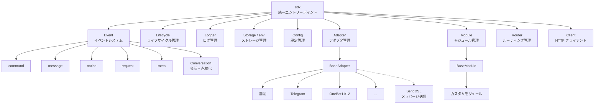

### コアモジュールの説明

| モジュール | 説明 |
|------|------|
| **Event** | イベントシステム。command / message / notice / request / meta の 5 種類のイベント処理と、Conversation 多段会話に対応。|
| **Adapter** | アダプタ管理器。複数プラットフォームのアダプタの登録、起動、停止を管理。|
| **Module** | モジュール管理器。プラグインの登録、ロード、アンロードを管理。依存関係宣言とトポロジカルソートに対応。|
| **Lifecycle** | ライフサイクル管理器。イベント駆動のライフサイクルフックを提供。|
| **Storage** | SQLite をベースとしたキーバリューストレージシステム。一般的な SQL チェーンクエリをサポート。|
| **Config** | TOML 形式の設定ファイル管理。|
| **Logger** | モジュール化されたログシステム。サブロガーをサポート。|
| **Router** | HTTP/WebSocket ルーティング管理。抽象層を介して下層バックエンド（現在は FastAPI + Uvicorn）をカプセル化。デコレータールーティング、ミドルウェア、グループ、リクエスト制限、CORS をサポート。|
| **Client** | 統一された HTTP/WS クライアント（2.8.0 以前は `HttpClient`、互換エイリアスを保持）。抽象層を介して下層リクエストライブラリ（現在は aiohttp）をカプセル化。リクエスト統計、リトライ、ログ、WebSocket クライアント、ErisPulse の例外体系等功能を提供。クライアントとサーバーの WebSocket は `WebSocketConnectionBase` 基底クラスを共有。|

## 初期化プロセス

下図は、`sdk.init()` の完全な初期化プロセスを示しています：

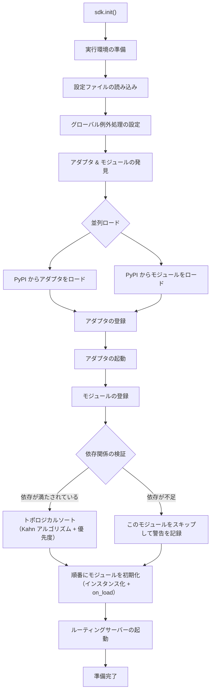

### 初期化段階の詳細

> 完全な初期化の流れの分解（Finder / Loader / Manager / Router）、下層エントリーポイント（`init()` / `init_task()` / `init_sync()`）と手動の完全起動については [起動プロセスと手動制御](advanced/startup.md) を参照してください。

## イベント処理プロセス

下図は、プラットフォームからハンドラへのメッセージの完全な流れを示しています：


### イベント処理の流れの詳細

上記の図は「結果」です。以下は `adapter.emit()` の後でフレームワークが**裏で何をしたか**を分解したものです。これは 3 層の分散の流れです：

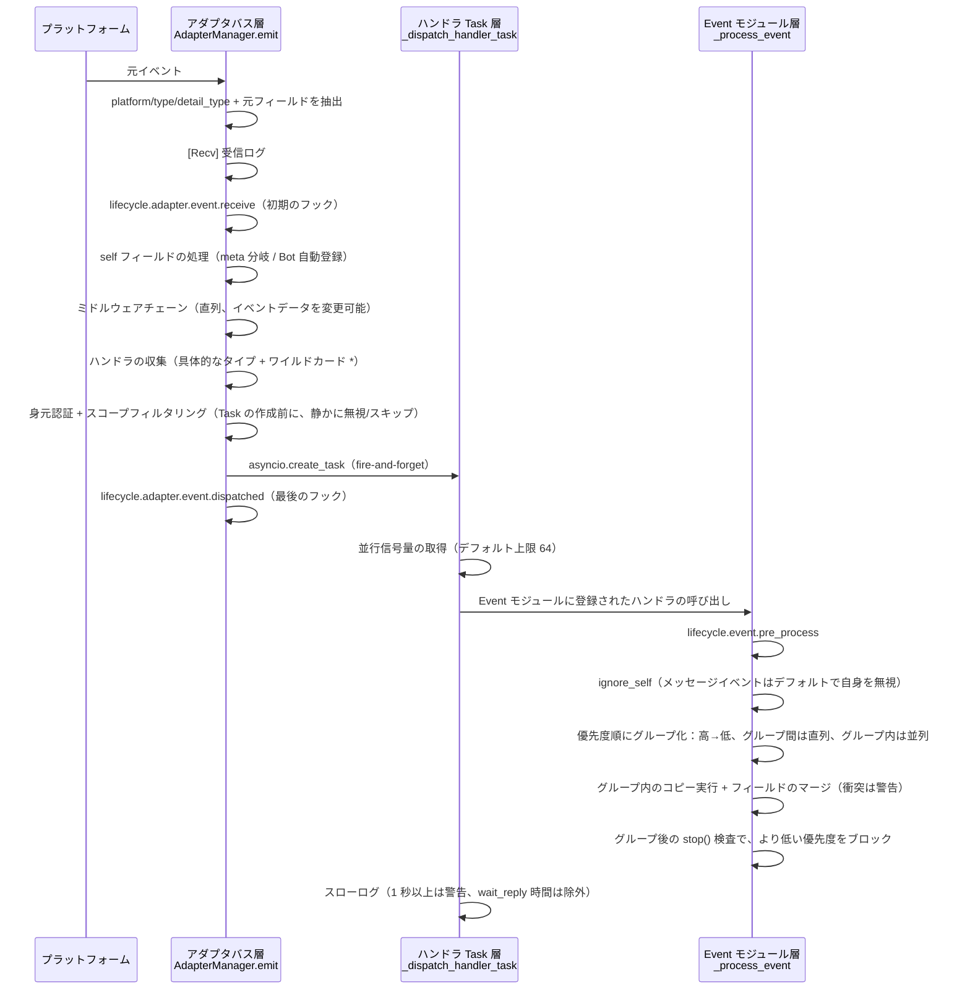

**フレームワークが何をしたか、そしてあなたが介入できるポイント：**

| 段階 | フレームワークが何をしたか | 介入できるポイント |
|------|-------------|-----------|
| 受信 | 標準フィールドを抽出、`{platform}_raw` 元データを保持；`[Recv]` ログを記録 | `adapter.event.receive` を監視して初期イベントを取得 |
| self フィールド | meta イベントは connect/disconnect/heartbeat 分岐を経る；通常のイベントでは Bot を自動登録し、`adapter.bot.online` をトリガー | `adapter.bot.online` / `bot.offline` を監視 |
| ミドルウェア | **直列**実行、戻り値が None でなければイベントデータを置き換え | ミドルウェアを登録してイベントを変更/ブロック |
| 分発収集 | 先に具体的なタイプのハンドラを取得し、次に `*` ワイルドカードハンドラを取得 | — |
| 身元次元 | 分発エントリはユーザー>会話>Bot>アダプタの順に判定し、**拒否された場合はイベント全体を無視** | `ErisPulse.scope.identity` をバインド |
| スコープフィルタリング | モジュールの所有者に従って `scope.is_allowed` を判定（会話レベル>Botレベル>プラットフォームレベル）、**通過しない場合は静かにスキップ** | スコープのホワイトリスト/ブラックリストを設定 |
| スケジューリング | 各マッチするハンドラごとに独立した `asyncio.Task` を作成、`emit()` はハンドラの完了を待たずに即座に返却 | — |
| 優先度 | 高優先度のグループが先に実行；**グループ間は直列、グループ内は並列**（グループ内はイベントのコピーを持ち、フィールドをマージし、衝突は WARNING で警告）、`mark_processed(stop=True)` は**より低い優先度をブロック** | `@command(..., priority=N)` / 登録時に priority を指定 |
| ブロッキング | 各グループの処理後に `event.is_stopped()` をチェックし、ヒットした場合は**より低い優先度を実行しない** | `event.mark_processed(stop=True)` / `event.done()` |

> **よくある誤解**：
> 1. **スコープフィルタリングは静かに**— フィルタリングされたハンドラはエラーもレスポンスもせず、TRACE レベルのログ（`core.scope.denied`）にのみ表示されます。「私のモジュールがメッセージを受け取っていない」場合は、まずスコープのバインディングを確認してください。
> 2. **ハンドラは天然並列**— フレームワークは各ハンドラに独立した Task を作成しており、**自分で `asyncio.create_task` をラップする必要はありません**。
> 3. **同じ優先度グループ内はブロックしない**— `mark_processed(stop=True)` は**より低い優先度のグループのみをブロック**し、同じグループ内で並列実行されたハンドラは途中で中断されません。
> 4. **スローログの閾値は固定 1 秒**— ハンドラの処理時間が 1 秒を超えるとログに WARNING が表示されます（`wait_reply` は処理時間から除外されます）、ただし実行は中断されません。

> スコープ（scope）のモジュール次元の 3 級バインディング、身元認証と出力アクション制限の詳細は [スコープ（scope）](advanced/scope.md) を参照してください。イベントスコープのテキストフィルタリングとコマンドユーザー ACL は [イベント処理入門](getting-started/event-handling.md) を参照してください。並列上限の設定は [設定ガイド](user-guide/configuration.md#フレームワーク設定) を参照してください。

## ライフサイクルイベント

下図は、フレームワークの各コンポーネントのライフサイクルイベントの発生順序を示しています：

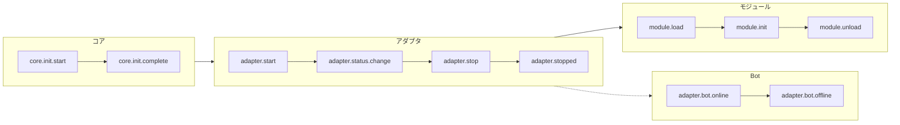

### ライフサイクルイベントの監視

> 完全なイベント監視方法（`lifecycle.on()` / `once()` / `has_handlers()`）、すべてのライフサイクルイベントのリストとデータ形式は [ライフサイクル管理](advanced/lifecycle.md) を参照してください。

## モジュールのロード戦略

ErisPulse は 3 種類のモジュールロード戦略をサポートし、`get_load_strategy()` が返す `ModuleLoadStrategy` で宣言されます：

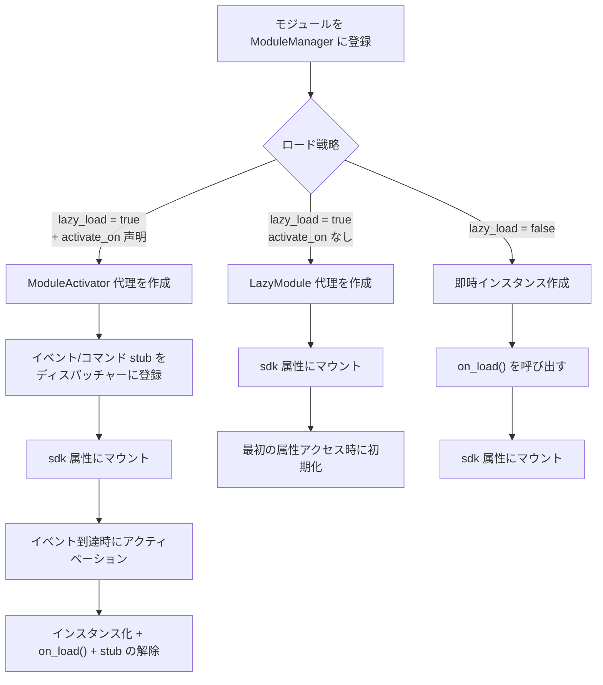

> 詳細は [遅延ロードシステム](advanced/lazy-loading.md)、[ライフサイクル管理](advanced/lifecycle.md) およびモジュールドキュメントを参照してください。

### イベント駆動遅延アクティベーション（`activate_on`）のトリガーアーキテクチャ

> [!NOTE]
> この機能は ErisPulse **2.8.0+** が必要です。

`activate_on` を使用すると、モジュールは**最初のマッチするイベント/コマンドが到達したときに初めてロード**され、常駐メモリを避けると同時にイベントのロスを防ぎます：

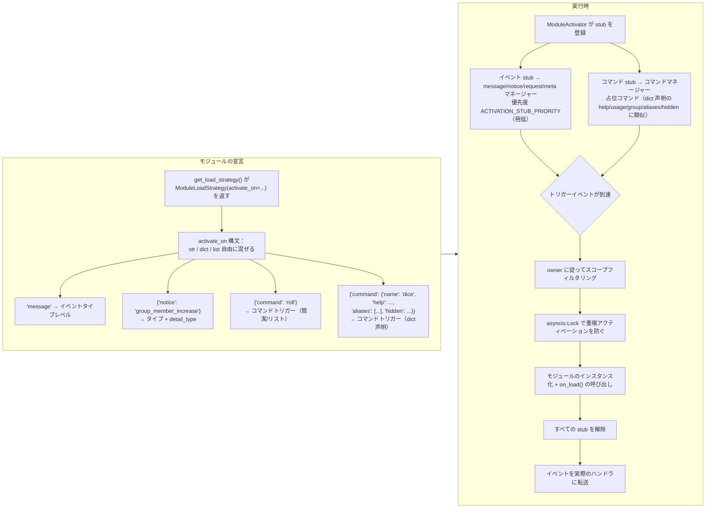

**トリガの意味の要点：**

> 完全な `activate_on` 構文（str / dict / list）、コマンド dict 声明、占位コマンド help 回帰チェーン、スコープフィルタリングと失敗の意味は [遅延ロードシステム](advanced/lazy-loading.md#イベント駆動遅延アクティベーションactivate_on) を参照してください。

## ローカルプラグインフォルダアーキテクチャ

> [!NOTE]
> この機能は ErisPulse **2.8.0+** が必要です。

ローカルプラグイン（`plugins/` ディレクトリ）は、パッケージ化して公開する必要がなく、フレームワークの起動時に自動的に発見され、ロードされます：

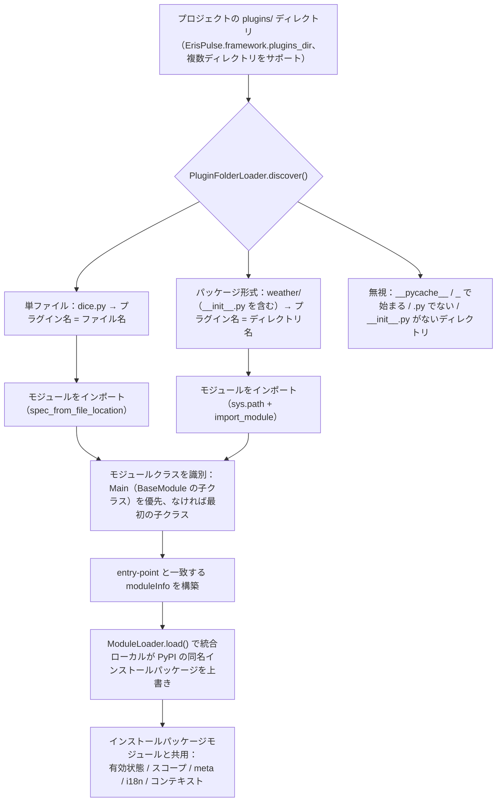

**規約と特性：**

- プラグイン名の出典：単ファイルはファイル名、パッケージ形式はディレクトリ名
- ローカルプラグイン `moduleInfo.meta.source == "plugin_folder"` で、PyPI インストールパッケージモジュールとシームレスに共存
- 同名の場合はローカルが優先（ローカルの上書きデバッグに便利）、無効化された場合は同名の entry-point 条目も削除される

## モジュールのホットリロードアーキテクチャ

ホットリロードは**すべてのモジュールソース**に対して一貫して適用されます：ローカルプラグインはファイル変更を監視して自動的にトリガし、任意のモジュールは `sdk.reload_module()` / `sdk.module.reload()` で手動でリロードできます（PyPI インストールパッケージモジュールは pip でアップグレード後に呼び出すことで有効になります）：

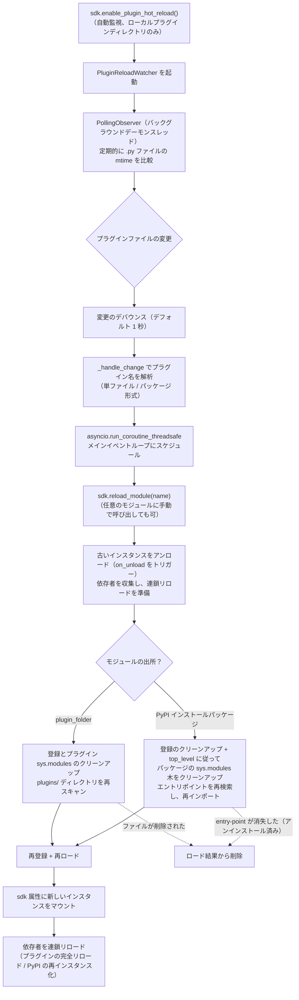

**2 つの出所の違いは発見段階のみ**、登録、ロード、連鎖リロードは完全に同じです：

- **ローカルプラグイン**（`moduleInfo.meta.source == "plugin_folder"`）：`sys.modules` のプラグイン名に対応するクリーンアップ後、`plugins/` ディレクトリを再スキャンします。ファイルが削除された場合は、ロード結果から削除されます。
- **PyPI インストールパッケージ**：`meta.top_level` に従って、`sys.modules` のパッケージのサブツリーをクリーンアップし、エントリポイントの 60 秒キャッシュを突破するためのインポートキャッシュをリフレッシュした後、再検索して再インポートします。entry-point が消失した（pip でアンインストールした）場合は、ロード結果から削除されます。


====
快速开始
====

# すぐに始める

> **これはあなたの最初の一歩です。** 5 分でゼロから ErisPulse ロボットを立ち上げましょう。

## ErisPulse のインストール

### 1 本レールインストールスクリプト（推奨）

インストールスクリプトは、Docker、Python、uv などの環境を自動的に検出し、最適なインストール方法を選択するよう誘導します。

Windows (PowerShell):
```powershell
irm https://get.erisdev.com/install.ps1 -OutFile install.ps1; powershell -ExecutionPolicy Bypass -File install.ps1
```

macOS / Linux:
```bash
curl -fsSL https://get.erisdev.com/install.sh -o install.sh && chmod +x install.sh && ./install.sh
```

スクリプトは、以下の手順を誘導します：

- **Docker インストール**（Docker が検出された場合に推奨）：イメージソース（Docker Hub / GHCR）、バージョンチャネル（安定版 / プレビュー版）、Dashboard 管理パネルの設定、ポートの設定を選択
- **従来のインストール**：仮想環境の自動作成、ErisPulse のバージョン選択、オプションで Dashboard 管理パネルモジュールのインストール

### Docker を使用する

Docker イメージには、ErisPulse フレームワークと Dashboard 管理パネルが事前インストールされています。

```bash
# docker-compose.yml をダウンロード
curl -O https://raw.githubusercontent.com/ErisPulse/ErisPulse/main/docker-compose.yml

# Dashboard トークンを設定して起動
ERISPULSE_DASHBOARD_TOKEN=your-token docker compose up -d
```

<details>
<summary>Docker Hub が利用できない場合</summary>

GitHub Container Registry のイメージを使用するには、`docker-compose.yml` の image を次のように変更します：

```yaml
image: ghcr.io/erispulse/erispulse:latest
```

</details>

起動後、`http://<host>:8000/Dashboard` にアクセスし、設定したトークンでログインします。

### pip を使用したインストール

Python のバージョンが 3.10 以上であることを確認し、pip を使用してインストールします：

```bash
pip install ErisPulse
```

既に [uv](https://github.com/astral-sh/uv) をインストールしている場合は、`uv pip install ErisPulse` を使用することで、より高速にインストールできます。

## プロジェクトの初期化

### インタラクティブな初期化（推奨）

```bash
epsdk init
```

これにより、インタラクティブなガイドが起動し、以下の手順をガイドします：
- プロジェクト名の設定
- ログレベルの設定
- サーバー設定（ホストとポート）
- アダプターの選択と設定
- プロジェクト構造の作成

### ファスト初期化

```bash
# プロジェクト名を指定する高速モード
epsdk init -q -n my_bot

# または、プロジェクト名のみを指定
epsdk init -n my_bot
```

### 手動でのプロジェクト作成

手動でプロジェクトを作成したい場合は：

```bash
mkdir my_bot && cd my_bot
epsdk init
```

## モジュールのインストール

### CLI によるインストール

```bash
epsdk install Yunhu AIChat
```

### 利用可能なモジュールの確認

```bash
epsdk list-remote
```

### インタラクティブなインストール

パッケージ名を指定しない場合、インタラクティブなインストール画面に移行します。

```bash
epsdk install
```

## プロジェクトの実行

```bash
# 通常実行
epsdk run main.py

# ホットリロードモード（開発時に推奨）
epsdk run main.py --reload
```

## IDE補完の有効化（オプション）

ErisPulse はモジュール/アダプターを動的に発見するため、IDE はデフォルトではプラットフォーム固有のメソッドを補完できません。  
以下のコマンドを実行して型のスタブを生成してください：

```bash
epsdk types
```

生成後、インポートした型を変数の型ヒントとして使用することで、正確な補完が得られます（詳細は [IDE補完ガイド](./getting-started/ide-completion.md) を参照してください）：

```python
from _ep_types import Yunhu
from ErisPulse import sdk

adapter: Yunhu = sdk.adapter.get("yunhu")
await adapter.Send.To("group", "123").Board(...)  # プラットフォーム固有のメソッドの補完
```

## プロジェクト構造

初期化後のプロジェクト構造：

```
my_bot/
├── config/
│   └── config.toml          # 設定ファイル
└── main.py                  # エントリーファイル

```

## 設定ファイル

基本的な `config.toml` 設定：

```toml
[ErisPulse.server]
host = "0.0.0.0"
port = 8000

[ErisPulse.logger]
level = "INFO"

[Yunhu_Adapter]
# アダプターの設定
```

## 次のステップ

ロボットが起動した後、必要に応じて以下を進めてください。

**フレームワークの仕組みを知りたい?**
- [基本概念](getting-started/basic-concepts.md) — アダプター / モジュール / イベントの設計
- [アーキテクチャ概要](architecture.md) — 可視化されたアーキテクチャ図

**もっと多くの機能を実装したい?**
- [一般的なタスクの例](getting-started/common-tasks.md) — ストレージ、スケジューリング、権限制御
- [イベント処理の入門](getting-started/event-handling.md) — メッセージ、通知、リクエストの処理

**独自のモジュール / アダプターを開発したい?**
- [モジュール開発の入門](developer-guide/modules/getting-started.md)
- [アダプター開発の入門](developer-guide/adapters/getting-started.md)

**必要に応じて参照:**
- [設定ファイルの説明](user-guide/configuration.md) · [CLI コマンド](user-guide/cli-reference.md) · [デプロイガイド](user-guide/deployment.md)


====
入门指南
====


### 入门指南总览

# 入門ガイド

> 本ガイドは [5 分鐘で始める](../quick-start.md) の**詳細な補足**です。まだ最初のロボットを起動していない場合は、まずクイックスタートを完了してください。

ロボットを起動した後、ここではフレームワークの中心的な概念と一般的な機能を体系的に理解するための内容をご紹介します。

## 学習パス

以下の順序で読むことを推奨します：

| ステップ | テーマ | 説明 |
|------|------|------|
| 1 | [最初のロボットを作成する](first-bot.md) | コマンドハンドラを書き、実行メカニズムを理解する |
| 2 | [基本概念](basic-concepts.md) | ErisPulse のコアアーキテクチャとモジュール設計を理解する |
| 3 | [イベント処理の入門](event-handling.md) | メッセージ、コマンド、通知などのイベントを処理する方法を学ぶ |
| 4 | [一般的なタスクの例](common-tasks.md) | データの永続化、タイマー、権限制御などの一般的な機能をマスターする |
| 5 | [IDE補完ガイド](ide-completion.md) | タイプストアムを生成し、プラットフォーム固有のメソッドの IDE 自動補完を有効にする |

## 開発方法の選択

ErisPulse は以下の2つの開発方法をサポートしています。

| 方法 | 適用シーン | 説明 |
|------|---------|------|
| **埋め込み開発** | プロトタイプ作成、プロジェクト内の機能 | `main.py` にプロセッサを直接記述し、独立したモジュールを作成する必要はありません。 |
| **モジュール開発**（推奨） | 本番環境、機能の配布 | 独立した Python パッケージを作成し、`epsdk install` を使用してインストールして使用します。 |

> 両方の方法の詳細な比較と例については、[最初のロボットを作成する](first-bot.md) および [モジュール開発の入門](../developer-guide/modules/getting-started.md) を参照してください。

## アーキテクチャ概要

ErisPulse はイベント駆動アーキテクチャを採用しており、以下の主要なシステムで構成されています。

- **アダプタシステム** — 各プラットフォームとの通信を行い、プラットフォームのイベントを統一された OneBot12 標準形式に変換します。
- **イベントシステム** — メッセージ、コマンド、通知、リクエスト、メタイベントの5種類のイベントを処理します。
- **モジュールシステム** — 独立したモジュールにより機能を拡張でき、依存管理や遅延読み込みをサポートします。
- **コアモジュール** — Storage（ストレージ）、Config（設定）、Logger（ログ）、Router（ルーティング）などの基本的な機能を提供します。

> 詳細なアーキテクチャ図と初期化の流れについては、[アーキテクチャ概要](../architecture.md) をご参照ください。

## 初心者向け

準備はできていますか？

- [最初のボットを作成する](first-bot.md) — 5分で始められる


### 创建第一个机器人

# 最初のロボットを作成する

このガイドでは、[5 分鐘のクイックスタート](../quick-start.md) をベースに、最初のコマンド処理プログラムを書き、その実行メカニズムを理解します。

> ErisPulse のインストールやプロジェクトの初期化をまだ完了していない場合は、まず [クイックスタート](../quick-start.md) の「インストール」「プロジェクトの初期化」「プロジェクトの実行」の 3 つの手順を完了してください。

## 最初のステップ：最初のコマンドを記述する

`main.py` を開き、シンプルなコマンドハンドラを記述します。

```python
from ErisPulse import sdk
from ErisPulse.Core.Event import command

@command("hello", help="挨拶メッセージを送信します")
async def hello_handler(event):
    """hello コマンドを処理します"""
    user_name = event.get_user_nickname() or "友達"
    await event.reply(f"こんにちは、{user_name}！私は ErisPulse ロボットです。")

@command("ping", help="ロボットがオンラインかどうかをテストします")
async def ping_handler(event):
    """ping コマンドを処理します"""
    await event.reply("Pong！ロボットは正常に動作しています。")

async def main():
    """メインエントリーポイント関数"""
    print("ErisPulse を起動しています...")
    
    # keep_running=True（デフォルト）：フレームワークはブロックして実行を維持し、終了信号（例：Ctrl+C）が受信されるまで待ちます
    await sdk.run(keep_running=True)

if __name__ == "__main__":
    import asyncio
    asyncio.run(main())
```

### `keep_running` パラメータ

`sdk.run(keep_running)` は、フレームワークがブロックして実行を維持するかどうかを制御します。

- **`keep_running=True`（デフォルト）**：`run()` はブロックし続け、終了信号（例：Ctrl+C）が受信されるまで待ちます。これは純粋な bot アプリケーションに適しています。
- **`keep_running=False`**：`run()` は初期化後に即座に返ります。**フレームワークはアンロードされません**——起動されたアダプタ/モジュールはバックグラウンドタスクとしてメッセージイベントの処理を続けます。その後、独自のロジックを実行し、イベントループが終了するまでフレームワークは閉じられません。例：

```python
async def main():
    await sdk.run(keep_running=False)   # 初期化後に即座に返ります
    # フレームワークはバックグラウンドで実行中です。ここでは他の処理を続行できます
    while True:
        await asyncio.sleep(3600)
        print("1時間ごとにチェックします")
```

> `run()` の2つのモードに加えて、`init()`/`uninit()` を使用したライフサイクルの手動制御、個別のアダプタ/ルーティングの起動/停止など、より細かい制御方法もあります。詳細は [起動プロセスと手動制御](../advanced/startup.md) を参照してください。

## 第二ステップ：ロボットの実行

```bash
# 通常実行
epsdk run main.py

# 開発モード（ホットリロードをサポート）
epsdk run main.py --reload
```

## 第三段階：ロボットのテスト

チャットプラットフォームで次のコマンドを送信します：

```
/hello
```

これで、ロボットからの返信が届くはずです。

## コード説明

### コマンドデコレータ

```python
@command("hello", help="挨拶メッセージを送信")
```

- `hello`：コマンド名。ユーザーは `/hello` で呼び出します。
- `help`：コマンドのヘルプ説明。`/help` コマンドで表示されます。

### イベントパラメータ

```python
async def hello_handler(event):
```

`event` パラメータは Event オブジェクトであり、以下を含みます：
- メッセージ内容：`event.get_text()`
- 送信者情報：`event.get_user_id()`、`event.get_user_nickname()`
- プラットフォーム情報：`event.get_platform()`
- グループ情報：`event.get_group_id()`
- 元のデータ：`event.get_raw()`

> 完全な Event オブジェクトのメソッドについては、[Event 包装クラスの詳細](../developer-guide/modules/event-wrapper.md) を参照してください。

### レスポンスの送信

```python
await event.reply("レスポンスの内容")
```

`event.reply()` は、送信者にメッセージを送信するための便利なメソッドです。

## 拡張機能：追加の機能を追加

ErisPulse は、豊富なイベント処理とデータ処理機能を提供します：

- **メッセージの監視**：`@message.on_message()` を使用して、さまざまなメッセージを監視します → [イベント処理の入門](event-handling.md)
- **通知の監視**：`@notice.on_friend_add()` などの通知を監視します → [イベント処理の入門](event-handling.md)
- **データの保存**：`sdk.storage.get/set` を使用してデータを永続化します → [一般的なタスクの例](common-tasks.md)

## よくある質問

### コマンドが反応しない？

1. アダプタが正しく設定されているか確認し、`config/config.toml` 内のアダプタの `status` が `true` であることを確認します。
2. ターミナルのログ出力を確認し、エラー情報（特に `ERROR` レベルのログ）がないか確認します。
3. コマンドのプレフィックスが正しいか確認します（デフォルトは `/` です）。設定ファイルの `[ErisPulse.event.command]` 部分で確認できます。
4. コマンド名のスペルが正しいか、大文字小文字の区別が正しく設定されているか確認します。

### コマンドのプレフィックスを変更するには？

`config.toml` に以下を追加します：

```toml
[ErisPulse.event.command]
prefix = "!"
case_sensitive = false
```

### 複数のプラットフォームをサポートするには？

ErisPulse は OneBot12 標準を用いて、異なるプラットフォームのイベント形式を統一しています。`@command` および `@message` で登録されたハンドラは、すべてのプラットフォームからのイベントを自動的に受け取ります。イベントの元プラットフォームを区別するには、`event.get_platform()` を使用します：

```python
@command("hello")
async def hello_handler(event):
    platform = event.get_platform()
    
    if platform == "yunhu":
        await event.reply("你好！来自云湖")
    elif platform == "telegram":
        await event.reply("Hello! From Telegram")
    else:
        await event.reply("你好！")
```

> 詳細な多プラットフォーム対応のテクニックについては、[よくあるタスクの例](common-tasks.md#多プラットフォーム適応) を参照してください。

## 次のステップ

- [基本概念](basic-concepts.md) - ErisPulse のコアコンセプトを詳しく理解する
- [イベント処理の入門](event-handling.md) - さまざまなイベントの処理方法を学ぶ
- [一般的なタスクの例](common-tasks.md) - より多くの実用的な機能を習得する


### 基础概念

# 基本概念

このガイドでは、ErisPulse のコアコンセプトを紹介し、フレームワークの設計思想と基本的なアーキテクチャを理解するのに役立ちます。

## イベント駆動アーキテクチャ

ErisPulse はイベント駆動アーキテクチャを採用しており、すべての相互作用はイベントを通じて送信および処理されます。

### イベントフロー

```
ユーザーがメッセージを送信
      │
      ▼
プラットフォームが受信
      │
      ▼
アダプタがプラットフォーム固有のイベントを受信
      │
      ▼
OneBot12 標準イベントに変換
      │
      ▼
イベントシステムに送信
      │
      ▼
登録されたハンドラに配信
      │
      ▼
モジュールがイベントを処理
      │
      ▼
アダプタを通じて応答を送信
      │
      ▼
プラットフォームがユーザーに表示
```

### OneBot12 標準

ErisPulse は、コアイベント標準として OneBot12 を使用しています。OneBot12 は、統一されたイベント形式を定義する汎用的なチャットボットアプリケーションインターフェース標準です。

すべてのアダプタは、プラットフォーム固有のイベントを OneBot12 形式に変換し、コードの一貫性を確保します。

## コアコンポーネント

### 1. SDK オブジェクト

SDK はすべての機能の統一エントリーポイントであり、コアコンポーネントへのアクセスを提供します。

```python
from ErisPulse import sdk

# コアモジュールへのアクセス
sdk.storage    # ストレージシステム
sdk.config     # 設定システム
sdk.logger     # ログシステム
sdk.adapter    # アダプタシステム
sdk.module     # モジュールシステム
sdk.router     # ルーティングシステム
sdk.client     # HTTPクライアント
sdk.lifecycle  # ライフサイクルシステム
```

### 2. Event オブジェクト

Event オブジェクトはイベントデータをカプセル化し、便利なアクセスメソッドを提供します。

```python
@command("info")
async def info_handler(event):
    # イベント情報を取得
    event_id = event.get_id()
    user_id = event.get_user_id()
    platform = event.get_platform()
    text = event.get_text()
    
    # 返信を送信
    await event.reply(f"ユーザー: {user_id}, プラットフォーム: {platform}")
```

### 3. アダプタ

アダプタは ErisPulse と外部プラットフォームの間の橋渡しの役割を果たします。

**役割:**
- プラットフォームのネイティブイベントを受信
- OneBot12 標準形式に変換
- 標準形式のイベントをプラットフォームに送信

**例のアダプタ:**
- Yunhu アダプタ：雲湖プラットフォームとの通信
- Telegram アダプタ：Telegram Bot API との通信
- OneBot11 アダプタ：OneBot11 互換アプリとの通信
- Email アダプタ：メールの送受信処理

### 4. モジュール

モジュールは機能拡張の基本単位であり、以下を実現できます：

- イベントハンドラの登録
- ビジネスロジックの実装
- アダプタを呼び出してメッセージを送信
- コアモジュールが提供するサービスの利用

#### モジュール発見メカニズム

ErisPulse は Python の `importlib.metadata.entry_points` を使用して、インストールされたモジュールを発見します。モジュールは `pyproject.toml` でエントリーポイントを宣言します：

```toml
[project.entry-points."erispulse.module"]
MyModule = "my_package:Main"
```

SDK の初期化時に、`erispulse.module` グループのすべてのエントリーポイントをスキャンし、モジュールクラスを `ModuleManager` に登録します。その後、依存関係に基づいてトポロジカルソートを行い、順次初期化されます。

#### 最小限のモジュール

```python
from ErisPulse.Core.Bases import BaseModule
from ErisPulse import sdk

class Main(BaseModule):
    def __init__(self):
        self.sdk = sdk
        self.logger = sdk.logger.get_child("MyModule")

    async def on_load(self, event):
        self.logger.info("モジュールがロードされました")

    async def on_unload(self, event):
        self.logger.info("モジュールがアンロードされました")
```

#### モジュールのライフサイクル

- **登録**: SDK がモジュールクラスを発見し、マネージャに登録
- **ロード**: モジュールのインスタンスを作成し、`on_load(event)` を呼び出す（`event = {"module_name": "MyModule"}`）
- **アンロード**: `on_unload(event)` を呼び出し、リソースをクリーンアップ

#### ロード戦略

`get_load_strategy()` を使ってモジュールのロード動作を宣言します：

```python
from ErisPulse.loaders import ModuleLoadStrategy

class Main(BaseModule):
    @staticmethod
    def get_load_strategy():
        return ModuleLoadStrategy(
            lazy_load=True,   # ラグジュアリー読み込みかどうか（デフォルトは True）
            priority=0        # ロード優先度、数値が大きいほど先に初期化される
        )
```

- **`lazy_load=True`（デフォルト）**: モジュールは `sdk.MyModule` に初めてアクセスしたときに初期化され、起動時間を短縮
- **`lazy_load=False`**: SDK の起動時に即座に初期化され、ライフサイクルイベントを監視する必要があるモジュールや、定期的なタスクを実行するモジュールに適しています
- **`priority`**: 同じ優先度のモジュールは登録順にロードされ、数値が大きいほど先に初期化されます

> ラグジュアリー読み込みの詳細については、[ラグジュアリー読み込みシステム](../advanced/lazy-loading.md)を参照してください。

## イベントの種類

ErisPulse は 5 種類のイベントをサポートしています：

| イベントの種類 | デコレータ | 説明 |
|---------|--------|------|
| メッセージイベント | `@message.on_message()` | ユーザーが送信したメッセージ（プライベートチャット、グループチャット） |
| コマンドイベント | `@command("name")` | コマンドプレフィックスで始まるメッセージ（例：`/hello`） |
| 通知イベント | `@notice.on_friend_add()` など | システム通知（友達追加、グループメンバーの変更など） |
| 要求イベント | `@request.on_friend_request()` など | ユーザーからの要求（友達リクエスト、グループ招待） |
| 元イベント | `@meta.on_connect()` など | システムレベルのイベント（接続、切断、ハートビート） |

> 各イベントの詳細な使用方法とコード例については、[イベント処理の入門](event-handling.md)を参照してください。

## 核心モジュールの説明

### Storage（ストレージ）

SQLite に基づくキー/値ストレージシステムで、永続的なデータを保存します。

```python
# 値の設定
sdk.storage.set("key", "value")

# 値の取得
value = sdk.storage.get("key", "default_value")

# バッチ操作
sdk.storage.set_multi({
    "key1": "value1",
    "key2": "value2"
})

# トランザクション
with sdk.storage.transaction():
    sdk.storage.set("key1", "value1")
    sdk.storage.set("key2", "value2")
```

### Config（設定）

TOML 形式の設定ファイルを管理します。

```python
# 設定の取得
config = sdk.config.getConfig("MyModule", {})

# 設定の設定
sdk.config.setConfig("MyModule", {"key": "value"})

# 嵌套された設定の読み取り
value = sdk.config.getConfig("MyModule.subkey", "default")
```

### Logger（ロガー）

モジュール化されたログシステム。

```python
# ログの記録
sdk.logger.info("これは情報です")
sdk.logger.warning("これは警告です")
sdk.logger.error("これはエラーです")

# 子ロガーの取得
child_logger = sdk.logger.get_child("submodule")
child_logger.info("サブモジュールのログ")
```

**属性アクセスの糖衣構文**

`get_child()` メソッドを使わずに、**属性アクセス**を使ってサブロガーを作成することもできます。これはより簡潔な**糖衣構文**です。

```python
# 属性アクセスでサブロガーを作成
sdk.logger.mymodule.info("モジュールのメッセージ")

# 嵌套されたアクセスもサポート
sdk.logger.mymodule.database.info("データベースのメッセージ")
```

### Router（ルーター）

HTTP および WebSocket のルート管理。FastAPI + Uvicorn をベースに、デコレータルート、ミドルウェア、グループ化、リクエスト制限、CORS をサポートします。

```python
from ErisPulse.Core import HttpRequest

@sdk.router.get("MyModule", "/api")
async def handler(request: HttpRequest):
    data = await request.json()
    return {"status": "ok"}
```

> 完全なルート API（WebSocket、ミドルウェア、レート制限、CORS など）については、[ルートマネージャー](../advanced/router.md)を参照してください。

### Client（ネットワーククライアント）

HTTPリクエスト、WebSocket接続、接続プール管理、自動リトライ、タイムアウト制御、リクエスト統計、ライフサイクルイベントの統合を提供する統一されたネットワーククライアント。

```python
from ErisPulse.Core import client

# HTTPリクエスト
resp = await client.get("https://api.example.com/users")
data = await resp.json()

# リトライとタイムアウト付き
resp = await client.get(url, timeout=30, max_retries=3)

# WebSocket接続
ws = await client.ws_connect("wss://example.com/ws")
async for text in ws.iter_text():
    await ws.send_text(f"Echo: {text}")
```

> 完全なネットワーククライアント API については、[ネットワーククライアント](../advanced/http-client.md)を参照してください。

## SendDSL メッセージ送信

アダプターは、チェーン呼び出し可能なメッセージ送信インターフェースを提供します。

### 基本的な送信

```python
# アダプターのインスタンスを取得
yunhu = sdk.adapter.get("yunhu")

# メッセージを送信
await yunhu.Send.To("user", "U1001").Text("Hello")

# 送信アカウントを指定
await yunhu.Send.Using("bot1").To("group", "G1001").Text("グループメッセージ")
```

### チェーン修飾

```python
# ユーザーにメンション
await yunhu.Send.To("group", "G1001").At("U2001").Text("@メッセージ")

# メッセージに返信
await yunhu.Send.To("group", "G1001").Reply("msg123").Text("返信")

# 全員にメンション
await yunhu.Send.To("group", "G1001").AtAll().Text("公告")
```

### Event への返信メソッド

Event オブジェクトは、便利な返信メソッドを提供します：

```python
@command("test")
async def test_handler(event):
    # 簡単なテキスト返信
    await event.reply("返信内容")
    
    # 画像を送信
    await event.reply("http://example.com/image.jpg", method="Image")
    
    # 音声を送信
    await event.reply("http://example.com/voice.mp3", method="Voice")
```

## ラグドロードシステム

ErisPulse はデフォルトでモジュールのラグドロードを有効にしており、モジュールは `sdk.MyModule` のように初めてアクセスされたときにのみ初期化されます。これにより、起動速度が大幅に向上します。

```python
from ErisPulse.loaders import ModuleLoadStrategy

class Main(BaseModule):
    @staticmethod
    def get_load_strategy():
        return ModuleLoadStrategy(
            lazy_load=True,   # ラグドロードを有効化（デフォルト）
            priority=0        # 加載優先度、数値が大きいほど先に初期化されます
        )
```

**ラグドロードを無効にする必要があるシナリオ（`lazy_load=False`）：**
- ライフサイクルイベントを監視するモジュール（例：`core.init.complete`）
- タイマーまたはバックグラウンドサービスを起動するモジュール
- 他のモジュールがロードされる前に初期化を完了させる必要があるモジュール

> ラグドロードの詳細なメカニズムと注意事項については、[ラグドロードシステム](../advanced/lazy-loading.md)を参照してください。

## 次のステップ

- [イベント処理の入門](event-handling.md) - さまざまなイベントの処理方法を学ぶ
- [一般的なタスクの例](common-tasks.md) - 一般的な機能の実装方法を習得する


### 事件处理入门

# イベント処理入門

このガイドでは、ErisPulse におけるさまざまなイベントの処理方法について説明します。

## イベントタイプ概要

ErisPulse は以下のイベントタイプをサポートしています：

| イベントタイプ | 説明 | 適用シーン |
|---------|------|---------|
| メッセージイベント | ユーザーが送信した任意のメッセージ | チャットボット、コンテンツフィルタ |
| コマンドイベント | コマンドプレフィックスで始まるメッセージ | コマンド処理、機能エントリ |
| 通知イベント | システム通知（友達追加、グループメンバーの変更など） | メッセージの歓迎、ステータス通知 |
| 要求イベント | ユーザーの要求（友達リクエスト、グループ招待） | 要求の自動処理 |
| 元イベント | システムレベルのイベント（接続、ハートビート） | 接続監視、ステータスチェック |

## メッセージイベントの処理

> **ヒント**: IDEの自動補完と型チェックのサポートを得るため、イベントハンドラで `Event` クラスの型アノテーションを使用することを推奨します。

```python
from ErisPulse.Core.Event import Event  # イベント型の注釈に使用
```

### すべてのメッセージを監視

```python
from ErisPulse.Core.Event import message, Event

@message.on_message()
async def message_handler(event: Event):
    text = event.get_text()
    user_id = event.get_user_id()
    sdk.logger.info(f"{user_id} からのメッセージを受信: {text}")
```

### プライベートメッセージを監視

```python
@message.on_private_message()
async def private_handler(event: Event):
    user_id = event.get_user_id()
    await event.reply(f"こんにちは、{user_id}さん！これはプライベートメッセージです。")
```

### グループメッセージを監視

```python
@message.on_group_message()
async def group_handler(event: Event):
    group_id = event.get_group_id()
    user_id = event.get_user_id()
    sdk.logger.info(f"グループ {group_id} 内で {user_id} がメッセージを送信しました")
```

### @メッセージを監視

```python
@message.on_at_message()
async def at_handler(event: Event):
    # @されたユーザーのリストを取得
    mentions = event.get_mentions()
    await event.reply(f"これらのユーザーを@しました: {mentions}")
```

### ワイルドカードと正規表現による監視

4つのメッセージデコレータ（`on_message` / `on_private_message` / `on_group_message` / `on_at_message`）は、`pattern`（globワイルドカード）と `regex`（正規表現）の両方に対応しており、一致しないメッセージは **ハンドラのトリガーになりません**:

```python
# globワイルドカード: * 任意の文字列、? 単一文字、[seq] 文字集合
@message.on_message(pattern="签到*")
async def signin_handler(event: Event):
    await event.reply("サインイン成功")

# 正規表現: 金額をマッチ
@message.on_message(regex=r"\d+\s*元")
async def price_handler(event: Event):
    await event.reply(f"受信した金額: {event.get_text()}")

# pattern と regex 両方指定 → 両方一致する必要がある
@message.on_message(pattern="*元", regex=r"\d+\s*元")
async def combined_handler(event: Event):
    pass
```

`wait_reply` は同様にこの2つのパラメータをサポートします（[返信の待ち機能](../developer-guide/modules/event-wrapper.md#返信の待ち機能)を参照）。

## コマンドイベント処理

### 基本コマンド

```python
from ErisPulse.Core.Event import command

@command("help", help="ヘルプ情報を表示")
async def help_handler(event):
    help_text = """
利用可能なコマンド：
/help - ヘルプを表示
/ping - 接続をテスト
/info - 情報を表示
    """
    await event.reply(help_text)
```

### コマンドのエイリアス

```python
@command(["help", "h"], aliases=["help", "h"], help="ヘルプ情報を表示")
async def help_handler(event):
    await event.reply("ヘルプ情報...")
```

ユーザーは以下のいずれかの方法で呼び出すことができます：
- `/help`
- `/h`
- `/help`

### コマンド引数

```python
@command("echo", help="メッセージを返す")
async def echo_handler(event):
    # コマンド引数を取得
    args = event.get_command_args()
    
    if not args:
        await event.reply("返すメッセージを入力してください")
    else:
        await event.reply(f"あなたが言った: {' '.join(args)}")
```

### コマンドグループ

```python
@command("admin.reload", group="admin", help="モジュールを再読み込み")
async def reload_handler(event):
    await event.reply("モジュールを再読み込みしました")

@command("admin.stop", group="admin", help="ロボットを停止")
async def stop_handler(event):
    await event.reply("ロボットを停止しました")
```

### コマンドの権限とアクセス制御

コマンドの権限は3層に分かれ、上から順に判定されます（**上層が拒否された場合、下層は判定されません**）：

```python
# ① コマンドのACL（ユーザー側の設定）：コマンドごとのユーザーの白黒リスト、拒否時は「権限不足」を返す
# ② master=True —— フレームワークの所有者のみ実行可能（フレームワークが自動でチェック、拒否時は「権限不足」を返す）
@command("restart", master=True, help="モジュールを再起動")
async def restart_handler(event):
    await event.reply("モジュールを再起動しました")

# ③ permission=関数 —— コマンド自身の制御ロジック（Trueを返す場合のみ実行）
def is_admin(event):
    return event.get_user_id() in {"user123", "user456"}

@command("panel", permission=is_admin, help="管理パネル")
async def panel_handler(event):
    await event.reply("管理パネルへようこそ")
```

**コマンドユーザーACL**（`ErisPulse.event.command.acl`）：ユーザーは任意のコマンドにユーザーの白黒リストを設定できます。
コマンド名は正確な一致とglobパターン（例: `"roll*"`）をサポートし、拒否時は「権限不足」を返します：

```toml
# config.toml —— restartコマンドは123456のみ実行可能；666は一律拒否
[ErisPulse.event.command.acl.restart]
allow = ["onebot11:123456"]
deny = ["onebot11:666"]
```

判定順序：`deny`が一致 → 拒否；`allow`が空でないかつ一致しない → 拒否；ACLが設定されていない場合は
`event.command.default_allow`（`false` = 厳格モード、ACLがなければ拒否；`true`の場合は開発者が
`master=True` / `permission`をデフォルトとする）に従います。実行時のAPI（コマンド名はglobパターンをサポート）：

```python
from ErisPulse.Core.Event import command

command.allow_user("restart", "onebot11", "123456")   # 允許リスト
command.deny_user("restart", "onebot11", "666")       # 拒否リスト
command.remove_acl("restart")                          # 白黒リストを削除
command.get_acl("restart")                             # 現在のリストを取得
```

> コマンドハンドラはイベントパッケージからインポートします：`from ErisPulse.Core.Event import command`；
> SDKイベントパッケージからもアクセスできます：`sdk.Event.command`（両者は同一のシングルトンです）。
> モジュール内では通常、コマンドデコレータと共にインポートされます（`from ErisPulse.Core.Event import command`）。

コマンド間 / ユーザー間の**イベントレベル**のアクセス制御（特定のユーザー / グループ / Botのメッセージを受信するか）は、**スコープのアイデンティティ次元**（`scope.identity`）を通じて行います。**モジュールレベル**の可用性（どのモジュールが使えるか）は、**スコープのモジュール次元**（`scope.platforms / bots / sessions`）を通じて行います。
詳しくは[スコープ（scope）](../advanced/scope.md)を参照してください。

> 建議：コマンド内部でビジネスロジックと連動する必要がある場合は`master=True` / `permission`を使用してください。ユーザー / グループによるアクセス制御のみ必要な場合はスコープのアイデンティティ次元を使用し、モジュールの可用性を制御する場合はスコープのモジュール次元を使用してください。

### コマンドの優先度

```python
# 優先度の値が大きいほど、実行が早くなります
@message.on_message(priority=10)
async def high_priority_handler(event):
    await event.reply("高優先度のハンドラ")

@message.on_message(priority=1)
async def low_priority_handler(event):
    await event.reply("低優先度のハンドラ")
```

### 並行イベント処理

ErisPulseのイベントシステムは**同優先度並行、異優先度直列**のスケジューリングモデルを採用しています：

```
イベント到着
    ↓
priority=10 組: [ハンドラC || ハンドラD] 並行 → 結果を結合
    ↓ (中断されていない場合)
priority=0 組: [ハンドラA || ハンドラB] 並行 → 結果を結合
    ↓
...
```

- **同優先度並行**：優先度が同じ複数のハンドラは同時に実行され、スループットが向上します
- **跨級直列**：異なる優先度のグループは順番に実行されます（値が大きいほど先に実行）、高優先度ハンドラが先に実行されることを保証します
- **Copy-On-Write**：ハンドラが変更しない限りコピーを作成せず、ゼロオーバーヘッドを確保します
- **競合処理**：同優先度の複数ハンドラが同じフィールドを変更する場合、最後に変更された値を使用し、警告ログを記録します
- **中断メカニズム**：任意のハンドラが`event.done()`（デフォルト）または`event.done(claim=False)`を呼び出した後、以降の低優先度グループはスキップされます。認領とブロックの違いは下記の[「チェーン制御：認領とブロック」](#チェーン制御認領とブロック)を参照してください。

```python
# 例：同優先度ハンドラが並行実行
@message.on_message(priority=0)
async def handler_a(event):
    # タスクAを処理
    event['result_a'] = process_a()

@message.on_message(priority=0)
async def handler_b(event):
    # handler_aと並行実行
    event['result_b'] = process_b()

# 異優先度直列実行
@message.on_message(priority=10)
async def handler_c(event):
    # 最も優先度が高い、最初に実行
    pass
```

> **並行上限**：すべてのマッチするハンドラのTaskは**即座に作成**されますが、同時に実行される数を制限するシグナルマネージャーを用いています。デフォルトの上限は **64**（`ErisPulse.framework.handler_max_concurrency`、ホットアップデートが可能です）。上限を超えたTaskはシグナルマネージャー上で待ち、前の処理が完了した後に実行されます。イベントの急増時に、これが「圧力調整弁」となります。
>
> **遅延ログ**：ハンドラの処理が1秒以上かかる場合、フレームワークはログにWARNINGを出力します（`handler_slow`）。`wait_reply`の待機時間は処理時間から除外され、ユーザーの返信を待つことで誤った遅延ログが発生することはありません。

## スコープフィルタリング：なぜ私のモジュールはメッセージを受け取らないのか？

イベントが到着した後、2つの**静か**なフィルタリング（返答もエラーも発生しない）が行われます。

1. **アイデンティティ次元**（`ErisPulse.scope.identity`）：イベントが配信エントリに到着した時点で、ユーザー > グループ > Bot > アダプタの順に判定し、受信するか否かを決定します。  
   拒否された**イベント全体**は直接破棄され、コマンドディスパッチャーを含むすべてのハンドラはトリガされません。

2. **モジュール次元**（`ErisPulse.scope`）：イベントが特定のモジュールのハンドラ/コマンドに到着した時点で、セッション > Bot > プラットフォームの順に判定し、そのモジュールが有効かどうかを判断します。**判定に失敗した場合、静かにスキップされます。**

```toml
# 例1：特定のグループのすべてのメッセージを配信しない
[ErisPulse.scope.identity.sessions.onebot11."group_123"]
deny = true

# 例2：特定のBotで MyModule を無効化する
[ErisPulse.scope.bots.onebot11."123456"]
blocked = ["MyModule"]
```

この場合、そのグループのメッセージが到着したとき、`MyModule` のコマンドとイベントハンドラは**どちらもスケジュールされません**。これはバグではなく、フィルタリング機構です。モジュールが反応しない問題を調査する際は、まずスコープのアイデンティティとモジュールのバインディングを確認してください。

- フィルタリングログは **TRACE** レベルでのみ表示されます（`core.scope.identity_denied` / `core.scope.denied`）、デフォルトの INFO レベルでは痕跡は一切見られません。
- フレームワークレベルのハンドラ（例えばコマンドディスパッチャー `scope_exempt=True`）は**モジュール次元**の影響を受けませんが、**アイデンティティ次元**の影響を受けます（イベント全体が破棄されているため）。
- コマンド実行前には3番目のフィルタリングがあります：コマンドユーザー ACL（拒否された場合、「権限不足」と返信します。前節を参照）。
- 4番目のフィルタリングは**イベントオーバーライド**（次節を参照）です。

> スコープの設定、マッチングの構文、実行時の API については [スコープ（scope）](../../advanced/scope.md) を参照してください。

## イベントのオーバーライド：モジュールのコードを変更せずに、任意のイベントタイプの動作を上書き

> [!NOTE]  
> この機能は ErisPulse **2.8.0+** が必要です。

イベントハンドラの登録時に宣言されたパラメータ（`pattern` / `regex` / `master` / `hidden` など）は、単なる**開発者のデフォルト**にすぎません。  
統一されたオーバーライドシステムにより、ユーザーは**イベントタイプ**ごとに任意のモジュールの動作を上書きできます。OneBot12 標準タイプ（meta / message / notice / request）と ErisPulse 拡張タイプ（command）はそれぞれ独自の上書き可能なパラメータを持ちます：

| イベントタイプ | 上書き可能なパラメータ | 機能 |
|---------|-----------|------|
| `message` | `pattern` / `regex` / `detail_types` | テキストのトリガ条件 + メッセージのサブタイプホワイトリスト |
| `notice` | `detail_types` / `pattern` / `regex` | 通知のサブタイプホワイトリスト + テキスト条件 |
| `request` | `detail_types` / `pattern` / `regex` | リクエストのサブタイプホワイトリスト + テキスト条件 |
| `meta` | `detail_types` | 元イベントのサブタイプホワイトリスト（connect / heartbeat など） |
| `command` | `master` / `hidden` / `aliases` / `prefix` / `help` / `usage` | コマンドの実装パラメータ（ユーザーの優先度） |
| `acl`（command専用） | `allow` / `deny` | コマンドのユーザーのホワイトリスト/ブラックリスト（コマンド名の glob による） |

```toml
# message：テキストのトリガ条件を上書き（コード内の条件と AND で作用）
[ErisPulse.event.overrides.message.ChatModule]
pattern = "闲聊*"

# notice：特定の通知サブタイプのみ応答
[ErisPulse.event.overrides.notice.MyModule]
detail_types = ["group_increase"]

# command：実装パラメータを上書き（ユーザーの優先度——開発者のデフォルトを厳しくしたり緩めたりできる）
[ErisPulse.event.overrides.command.MyModule.restart]
master = true
hidden = true

# acl：コマンドのユーザーのホワイトリスト/ブラックリスト（コマンド間の glob）
[ErisPulse.event.overrides.acl."roll*"]
allow = ["onebot11:u_vip"]

# ACLのデフォルト（false = 厳格モード：ACLがない場合は拒否）
acl_default_allow = true
```

実行時API（`from ErisPulse.Core.Event import overrides` または `sdk.Event.overrides`、**タイプのサブネームスペース**——各タイプごとに `set` / `get` / `delete` の三つの操作が対称的）：

```python
from ErisPulse.Core.Event import overrides

overrides.message.set("ChatModule", pattern="闲聊*")   # messageのテキスト条件
overrides.notice.set("MyModule", detail_types=["group_increase"])
overrides.command.set("MyModule", "restart", master=True)  # コマンドパラメータ
overrides.acl.set("roll*", deny=["onebot11:u_bad"])    # コマンドのユーザーのブラックリスト

overrides.message.get("ChatModule")     # {"pattern": "闲聊*"}
overrides.message.delete("ChatModule")  # 開発者のデフォルトに戻す
```

- 上書き条件とハンドラのコード内の条件は**同時に有効**（AND 論理）です。`command` のパラメータは開発者が宣言した内容と**深くマージ**されます（上書きが優先）。
- `detail_types`：イベントに `detail_type` がない場合は許可（未知のイベントを誤って拒否しない）。
- `pattern` / `regex`：テキストがないイベント（connect / heartbeat など）は制約を受けず、直接許可されます。
- `command` の上書きキー `master` は同期的にストレージキー `must_master` にマッピングされます。コマンドの無効化はすべて `acl` deny を通ります。
- 設定の変更は即座に有効になります（ホットアップデート）、形式の検証がアラートされます（未知のパラメータ / 不正な項目は無視されます）。

## リンク制御：認領とブロック

> [!NOTE]
> `event.done()` / `event.mark_processed()` の `claim=` / `stop=` パラメータは、ErisPulse **2.7.1+** が必要です。

ErisPulse では、「認領」と「ブロック」の2つの正交的な意味を分離し、`event.done()` によって統一的に制御することで、コマンド処理の周囲にログ、監査、権限などの観測層を重ねやすくしています。

**2つの概念の正確な定義は以下の通りです：**

- **認領（claim）**：イベントがこのプロセッサによって処理されたことをマークします（`_processed` に書き込みます）。コマンドディスパッチャは、認領済みのイベントを見ると**重複処理をスキップ**します——同じメッセージが複数のコマンドプロセッサによって繰り返し処理されるのを防ぎます。典型的な場面：コマンドがマッチした後に認領し、コマンドディスパッチャが再び介入しないようにします。
- **ブロック（stop）**：イベントが**より低い優先度**のプロセッサに伝播するのを阻止します（`_propagation_stopped` に書き込みます）。低い優先度のプロセッサ（例：`on_message`）は、このイベントを見なくなります。典型的な場面：高い優先度のプロセッサがイベントを完全に処理したので、低い優先度のプロセッサが実行されないようにします。

| `event.done(...)` | 認領 | ブロック | 場面 |
|-------------------|------|------|------|
| `event.done()` | ✔ | ✔ | コマンド / プロセッサが処理を終えた際の標準的な方法 |
| `event.done(stop=False)` | ✔ | ✘ | 認領のみ：低い優先度の観測者（ログ / 統計）は引き続きイベントを見ることができます |
| `event.done(claim=False)` | ✘ | ✔ | ブロックのみ（例：ファイアウォール / 限流）：認領は行わず、重複処理は防ぎません |

`event.done(claim=, stop=)` は `event.mark_processed(claim=, stop=)` のエイリアスであり、両者はパラメータと動作が完全に等価です。

```python
@command("help")
async def help_cmd(event):
    event.done()            # 認領 + ブロック（コマンド処理完了時の標準的な方法）

@message.on_message(priority=50)
async def observer(event):
    event.done(stop=False)  # 認領のみ：低い優先度の処理は継続されます（ログ / 統計）

@message.on_message(priority=100)
async def firewall(event):
    if denied(event):
        event.done(claim=False)  # ブロックのみ：低い優先度の処理は実行されませんが、重複処理は防ぎません
```

### コマンドと返信の block 設定

コマンドがマッチした場合 / `wait_reply` が返信をマッチした場合、デフォルトでは伝播がブロックされます（後方互換性のため）。これを設定で解除することで、低い優先度のプロセッサ（ログ / 監査 / 権限）がこれらのメッセージを観測できるようにできます：

```toml
[ErisPulse.event.command]
block = false   # コマンドメッセージは低い優先度のプロセッサに伝播します

[ErisPulse.event.wait_reply]
block = false   # wait_reply によって消費された返信は低い優先度のプロセッサに伝播します
```

## 通知イベント処理

### 友達追加

```python
from ErisPulse.Core.Event import notice

@notice.on_friend_add()
async def friend_add_handler(event):
    user_id = event.get_user_id()
    nickname = event.get_user_nickname() or "新朋友"
    await event.reply(f"欢迎添加我为好友，{nickname}！")
```

### 群メンバーの増加

```python
@notice.on_group_increase()
async def member_increase_handler(event):
    group_id = event.get_group_id()
    user_id = event.get_user_id()
    await event.reply(f"欢迎新成员 {user_id} 加入群 {group_id}")
```

### 群メンバーの減少

```python
@notice.on_group_decrease()
async def member_decrease_handler(event):
    group_id = event.get_group_id()
    user_id = event.get_user_id()
    await event.reply(f"成员 {user_id} 离开了群 {group_id}")
```

## リクエストイベント処理

### フレンドリクエスト

```python
from ErisPulse.Core.Event import request

@request.on_friend_request()
async def friend_request_handler(event):
    user_id = event.get_user_id()
    comment = event.get_comment()
    
    sdk.logger.info(f"フレンドリクエストを受信: {user_id}, 附言: {comment}")
    
    # アダプタAPIを使ってリクエストを処理できます
    # 具体的な実装は各アダプタのドキュメントを参照してください
```

### グループ招待リクエスト

```python
@request.on_group_request()
async def group_request_handler(event):
    group_id = event.get_group_id()
    user_id = event.get_user_id()
    
    await event.reply(f"グループ {group_id} からの招待を受信しました。送信元: {user_id}")
```

## 元イベント処理

### 接続イベント

```python
from ErisPulse.Core.Event import meta

@meta.on_connect()
async def connect_handler(event):
    platform = event.get_platform()
    sdk.logger.info(f"{platform} プラットフォームが接続されました")

@meta.on_disconnect()
async def disconnect_handler(event):
    platform = event.get_platform()
    sdk.logger.warning(f"{platform} プラットフォームが切断されました")
```

### ハートビートイベント

```python
@meta.on_heartbeat()
async def heartbeat_handler(event):
    platform = event.get_platform()
    sdk.logger.debug(f"{platform} ハートビート検出")
```

### Bot 状態の照会

アダプターが meta イベントを送信すると、フレームワークは自動的に Bot 状態を追跡します。いつでも照会できます：

```python
from ErisPulse import sdk

# 特定の Bot がオンラインかどうかを確認
if sdk.adapter.is_bot_online("telegram", "123456"):
    telegram = sdk.adapter.get("telegram")
    await telegram.Send.To("user", "123456").Text("Bot はオンラインです")

# 現在オンラインのすべての Bot をリストアップ
bots = sdk.adapter.list_bots()
for platform, bot_list in bots.items():
    for bot_id, info in bot_list.items():
        print(f"{platform}/{bot_id}: {info['status']}")

# 完全な状態のサマリーを取得
summary = sdk.adapter.get_status_summary()
```

## インタラクティブ処理

### reply メソッドを使用した返信の送信

`event.reply()` メソッドは、@、返信などの機能を備えた様々な修飾パラメータをサポートしています。

```python
# 簡単な返信
await event.reply("こんにちは")

# 異なるタイプのメッセージの送信
await event.reply("http://example.com/image.jpg", method="Image")  # 画像
await event.reply("http://example.com/voice.mp3", method="Voice")  # 音声

# 1人のユーザーを@する
await event.reply("こんにちは", at_users=["user123"])

# 複数のユーザーを@する
await event.reply("皆さんこんにちは", at_users=["user1", "user2", "user3"])

# メッセージを返信する
await event.reply("返信内容", reply_to="msg_id")

# 全員を@する
await event.reply("お知らせ", at_all=True)

# 組み合わせ：ユーザーの@ + メッセージの返信
await event.reply("内容", at_users=["user1"], reply_to="msg_id")
```

### ユーザーの返信を待つ

```python
@command("ask", help="ユーザーに質問する")
async def ask_handler(event):
    await event.reply("あなたの名前を入力してください:")
    
    # ユーザーの返信を待つ、タイムアウトは30秒
    reply = await event.wait_reply(timeout=30)
    
    if reply:
        name = reply.get_text()
        await event.reply(f"こんにちは、{name}！")
    else:
        await event.reply("タイムアウトしました、もう一度入力してください。")
```

### 検証付きの返信を待つ

```python
@command("age", help="年齢を尋ねる")
async def age_handler(event):
    def validate_age(event_data):
        """年齢が有効かどうかを検証する"""
        try:
            age = int(event_data.get_text())
            return 0 <= age <= 150
        except ValueError:
            return False
    
    await event.reply("あなたの年齢を入力してください (0-150):")
    
    reply = await event.wait_reply(
        timeout=60,
        validator=validate_age
    )
    
    if reply:
        age = int(reply.get_text())
        await event.reply(f"あなたの年齢は {age} 歳です")
    else:
        await event.reply("入力が無効またはタイムアウトしました")
```

### コールバック付きの返信を待つ

```python
@command("confirm", help="操作を確認する")
async def confirm_handler(event):
    async def handle_confirmation(reply_event):
        text = reply_event.get_text().lower()
        
        if text in ["はい", "yes", "y"]:
            await event.reply("操作が確認されました！")
        else:
            await event.reply("操作がキャンセルされました。")
    
    await event.reply("この操作を実行しますか？(はい/いいえ)")
    
    await event.wait_reply(
        timeout=30,
        callback=handle_confirmation
    )
```

### 確認対話 (confirm)

ユーザーの確認または否定を待つ。組み込みの中英確認語を自動的に認識する。

```python
@command("confirm", help="操作を確認する")
async def confirm_handler(event):
    if await event.confirm("この操作を実行しますか？"):
        await event.reply("確認しました、実行中...")
    else:
        await event.reply("キャンセルしました")

# 確認語をカスタマイズ
if await event.confirm("続行しますか？", yes_words={"go", "続行"}, no_words={"stop", "停止"}):
    pass
```

### 選択メニュー (choose)

ユーザーは選択番号または選択肢のテキストを返信することができる。

```python
@command("choose", help="選択する")
async def choose_handler(event):
    choice = await event.choose(
        "色を選択してください：",
        ["赤", "緑", "青"]
    )
    
    if choice is not None:
        colors = ["赤", "緑", "青"]
        await event.reply(f"選択した色は：{colors[choice]}")
    else:
        await event.reply("選択がタイムアウトしました")
```

**マージモード**：`merge_prompt=True` の場合、選択肢はプロンプトメッセージに結合され、`method` で指定された方法で1つのメッセージとして送信されます。

```python
# Markdown で結合されたプロンプト + 選択肢を送信
choice = await event.choose(
    "## 色を選択してください\n{options}\n番号を返信してください",
    ["赤", "緑", "青"],
    method="Markdown",
    merge_prompt=True,
)
```

> `{options}` は選択肢の挿入位置を制御するプレースホルダです。指定しない場合はプロンプトの末尾に追加されます。  
> `placeholder` パラメータでプレースホルダをカスタマイズできます（例：`placeholder="[choices]"`）。  
> `options_format="auto"`（デフォルト）は、`method` に応じて自動的にスタイルを選択します：Markdown→無番号リスト、Html→番号付きリスト、それ以外→テキストリスト。  
> テキスト系メソッド（Text/Markdown/Html など）はデフォルトで選択肢をプロンプト末尾にマージします。非テキスト系メソッド（Image など）はデフォルトで選択肢を別メッセージとして送信します。

### フォーム収集 (collect)

複数ステップでユーザーの入力を収集する。

```python
@command("register", help="登録する")
async def register_handler(event):
    data = await event.collect([
        {"key": "name", "prompt": "名前を入力してください："},
        {"key": "age", "prompt": "年齢を入力してください：", 
         "validator": lambda e: e.get_text().isdigit()},
        {"key": "email", "prompt": "メールアドレスを入力してください："}
    ])
    
    if data:
        await event.reply(f"登録が完了しました！\n名前：{data['name']}\n年齢：{data['age']}\nメール：{data['email']}")
    else:
        await event.reply("登録がタイムアウトまたは入力が無効です")
```

### 任意イベントの待機 (wait_for)

同一ユーザーに限らず、条件を満たす任意のイベントを待つ。

```python
@command("wait_member", help="新メンバーを待つ")
async def wait_member_handler(event):
    await event.reply("グループにメンバーが追加されるのを待っています...")
    
    evt = await event.wait_for(
        event_type="notice",
        condition=lambda e: e.get_detail_type() == "group_member_increase",
        timeout=120
    )
    
    if evt:
        await event.reply(f"新メンバーを歓迎します：{evt.get_user_id()}")
    else:
        await event.reply("タイムアウトしました")
```

### 多段対話 (conversation)

インタラクティブな多段対話コンテキストを作成する。

```python
@command("survey", help="アンケート調査")
async def survey_handler(event):
    conv = event.conversation(timeout=60)
    
    await conv.say("アンケート調査にようこそ！")
    
    while conv.is_active:
        reply = await conv.wait()
        
        if reply is None:
            await conv.say("対話がタイムアウトしました、さようなら！")
            break
        
        text = reply.get_text()
        
        if text == "退出":
            await conv.say("さようなら！")
            break
        
        await conv.say(f"入力内容：{text}、継続するか、'退出'で終了します")
```

### 組み込みの確認語

ErisPulse には中英の確認語が組み込まれています。

- **確認語** (`CONFIRM_YES_WORDS`): はい、yes、y、確認、確定、好、いい、ok、true、対、うん、行、同意、大丈夫...
- **否定語** (`CONFIRM_NO_WORDS`): いいえ、no、n、キャンセル、不、不要、不行、cancel、false、間違い、拒否、できません...

## イベントデータのアクセス

### Event オブジェクトの一般的なメソッド

```python
@command("info")
async def info_handler(event):
    # 基本情報
    event_id = event.get_id()
    event_time = event.get_time()
    event_type = event.get_type()
    detail_type = event.get_detail_type()
    
    # 送信者情報
    user_id = event.get_user_id()
    nickname = event.get_user_nickname()
    
    # メッセージ内容
    message_segments = event.get_message()
    alt_message = event.get_alt_message()
    text = event.get_text()
    
    # グループ情報
    group_id = event.get_group_id()
    
    # ロボット情報
    self_id = event.get_self_user_id()
    self_platform = event.get_self_platform()
    
    # 元データ
    raw_data = event.get_raw()
    raw_type = event.get_raw_type()
    
    # プラットフォーム情報
    platform = event.get_platform()
    
    # メッセージタイプの判定
    is_private = event.is_private_message()
    is_group = event.is_group_message()
    is_at = event.is_at_message()
    
    # コマンド情報
    if event.is_command():
        cmd_name = event.get_command_name()
        cmd_args = event.get_command_args()
        cmd_raw = event.get_command_raw()
```

### プラットフォーム拡張メソッド

内蔵メソッドに加えて、各プラットフォームアダプターはプラットフォーム固有のメソッドを登録し、プラットフォーム特有のデータにアクセスしやすくします。

```python
from ErisPulse.Core.Event import message

@message.on_message()
async def handle_message(event):
    platform = event.get_platform()

    # プラットフォームごとに固有メソッドを呼び出す
    if platform == "telegram":
        chat_type = event.get_chat_type()      # Telegram 固有メソッド
    elif platform == "email":
        subject = event.get_subject()           # メール固有メソッド
```

プラットフォームが特定のメソッドを登録しているかどうか不明な場合は、どのメソッドが登録されているかを確認できます：

```python
from ErisPulse.Core.Event import get_platform_event_methods

methods = get_platform_event_methods("telegram")
# ["get_chat_type", "is_bot_message", ...]
```

> 各プラットフォームが登録する固有メソッドについては、対応する [プラットフォームドキュメント](../platform-guide/) を参照してください。

## イベント処理のベストプラクティス

### 1. 例外処理

```python
@command("process")
async def process_handler(event):
    try:
        # ビジネスロジック
        result = await do_some_work()
        await event.reply(f"結果: {result}")
    except ValueError as e:
        # 予期されたビジネスエラー
        await event.reply(f"パラメータエラー: {e}")
    except Exception as e:
        # 予期されないエラー
        sdk.logger.error(f"処理失敗: {e}")
        await event.reply("処理に失敗しました。後でもう一度お試しください")
```

### 2. ログ記録

```python
@message.on_message()
async def message_handler(event):
    user_id = event.get_user_id()
    text = event.get_text()
    
    sdk.logger.info(f"メッセージを処理中: {user_id} - {text}")
    
    # モジュール独自のログを使用
    from ErisPulse import sdk
    logger = sdk.logger.get_child("MyHandler")
    logger.debug(f"詳細なデバッグ情報")
```

### 3. 条件処理

```python
@message.on_message(priority=0)
async def conditional_handler(event):
    """条件処理 - ハンドラ内部で判断"""
    # 特定のユーザーのメッセージのみ処理
    if event.get_user_id() in ["bot1", "bot2"]:
        return
    
    # 特定のキーワードを含むメッセージのみ処理
    if "キーワード" not in event.get_text():
        return
    
    await event.reply("条件が満たされ、メッセージを処理します")
```

## 次のステップ

- [一般的なタスクの例](common-tasks.md) - 一般的な機能の実装方法を学びます（メッセージ送信の高度な機能：リトライ/タイムアウト/バッチ処理を含む）
- [プラットフォームの機能ガイド](../platform-guide/README.md) - Send DSLのチェーン送信、送信ルール、バッチ構築の完全な説明
- [Eventラッパークラスの詳細](../developer-guide/modules/event-wrapper.md) - Eventオブジェクトの詳細を理解します
- [ユーザー使用ガイド](../user-guide/) - 設定とモジュール管理について学びます


### 常见任务示例

# 一般的タスクの例

このガイドでは、一般的な機能の実装例を提供し、一般的な機能を迅速に実装できるようにします。

## 内容リスト

1. データの永続化
2. 定期タスク
3. メッセージフィルタリング
4. 多プラットフォーム対応
5. メッセージ送信の高度機能（再試行/タイムアウト/一括送信）
6. 権限制御
7. メッセージ統計
8. 検索機能
9. 画像処理

## データ永続化

### シンプルなカウンター

```python
from ErisPulse import sdk
from ErisPulse.Core.Event import command

@command("count", help="コマンドの呼び出し回数を表示")
async def count_handler(event):
    # カウントを取得
    count = sdk.storage.get("command_count", 0)
    
    # カウントを増加
    count += 1
    sdk.storage.set("command_count", count)
    
    await event.reply(f"このコマンドは {count} 回目の呼び出しです")
```

### ユーザーデータの保存

```python
@command("profile", help="個人情報の表示")
async def profile_handler(event):
    user_id = event.get_user_id()
    
    # ユーザーデータを取得
    user_data = sdk.storage.get(f"user:{user_id}", {
        "nickname": "",
        "join_date": None,
        "message_count": 0
    })
    
    profile_text = f"""
名前: {user_data['nickname']}
加入日: {user_data['join_date']}
メッセージ数: {user_data['message_count']}
    """
    
    await event.reply(profile_text.strip())

@command("setnick", help="名前を設定")
async def setnick_handler(event):
    user_id = event.get_user_id()
    args = event.get_command_args()
    
    if not args:
        await event.reply("名前を入力してください")
        return
    
    # ユーザーデータを更新
    user_data = sdk.storage.get(f"user:{user_id}", {})
    user_data["nickname"] = " ".join(args)
    sdk.storage.set(f"user:{user_id}", user_data)
    
    await event.reply(f"名前を {' '.join(args)} に設定しました")
```

## タイマー

### シンプルなタイマー

```python
from ErisPulse import sdk
from ErisPulse.Core.Event import command
import asyncio

class TimerModule:
    def __init__(self):
        self.sdk = sdk
        self._tasks = []
    
    async def on_load(self, event):
        """モジュールのロード時にタイマーを開始"""
        self._start_timers()
        
        @command("timer", help="タイマー管理")
        async def timer_handler(event):
            await event.reply("タイマーが実行中です...")
    
    def _start_timers(self):
        """タイマーを開始"""
        # 60秒ごとに実行
        task = asyncio.create_task(self._every_minute())
        self._tasks.append(task)
        
        # 毎日午前0時に実行
        task = asyncio.create_task(self._daily_task())
        self._tasks.append(task)
    
    async def _every_minute(self):
        """1分ごとに実行されるタスク"""
        self.sdk.logger.info("1分ごとのタスクを実行")
        # ここに処理を記述してください...
    
    async def _daily_task(self):
        """毎日午前0時に実行されるタスク（注：UTC時間に基づいて計算されます。ローカル時間が必要な場合は、独自に調整してください）"""
        import time
        
        while True:
            # 午前0時までの時間を計算
            now = time.time()
            midnight = now + (86400 - now % 86400)
            
            await asyncio.sleep(midnight - now)
            
            # タスクを実行
            self.sdk.logger.info("毎日のタスクを実行")
            # ここに処理を記述してください...
```

### ライフサイクルイベントの使用

```python
@sdk.lifecycle.on("core.init.complete")
async def init_complete_handler(event_data):
    """SDKの初期化完了後にタイマーを開始"""
    import asyncio
    
    async def daily_reminder():
        """毎日のリマインダー"""
        await asyncio.sleep(86400)  # 24時間
        sdk.logger.info("毎日のタスクを実行")
    
    # バックグラウンドタスクを開始
    asyncio.create_task(daily_reminder())
```

## メッセージフィルタリング

### キーワードフィルタリング

```python
from ErisPulse.Core.Event import message

blocked_words = ["ゴミ", "広告", "フィッシング"]

@message.on_message()
async def filter_handler(event):
    text = event.get_text()
    
    # 敏感語を含むかチェック
    for word in blocked_words:
        if word in text:
            sdk.logger.warning(f"フィルタリングされたメッセージ: {word}")
            return  # このメッセージは処理しない
    
    # 通常のメッセージ処理
    await event.reply(f"受信: {text}")
```

### ブラックリストフィルタリング

```python
# 設定ファイルやストレージからブラックリストを読み込む
blacklist = sdk.storage.get("user_blacklist", [])

@message.on_message()
async def blacklist_handler(event):
    user_id = event.get_user_id()
    
    if user_id in blacklist:
        sdk.logger.info(f"ブラックリストユーザー: {user_id}")
        return  # 処理しない
    
    # 通常の処理
    await event.reply(f"こんにちは、{user_id}")
```

## 多プラットフォーム対応

### プラットフォーム固有の応答

```python
@command("help", help="ヘルプを表示します")
async def help_handler(event):
    platform = event.get_platform()
    
    if platform == "yunhu":
        await event.reply("雲湖プラットフォームのヘルプ...")
    elif platform == "telegram":
        await event.reply("Telegram プラットフォームのヘルプ...")
    elif platform == "onebot11":
        await event.reply("OneBot11 のヘルプ...")
    else:
        await event.reply("一般的なヘルプ情報")
```

### プラットフォームの機能検出

```python
@command("rich", help="富文本メッセージを送信します")
async def rich_handler(event):
    platform = event.get_platform()
    
    if platform == "yunhu":
        # 雲湖は HTML をサポート
        yunhu = sdk.adapter.get("yunhu")
        await yunhu.Send.To("user", event.get_user_id()).Html(
            "<b>太字のテキスト</b><i>斜体のテキスト</i>"
        )
    elif platform == "telegram":
        # Telegram は Markdown をサポート
        telegram = sdk.adapter.get("telegram")
        await telegram.Send.To("user", event.get_user_id()).Markdown(
            "**太字のテキスト** *斜体のテキスト*"
        )
    else:
        # 他のプラットフォームはプレーンテキストを使用
        await event.reply("太字のテキスト 斜体のテキスト")
```

## メッセージ送信の高度な機能（再試行/タイムアウト/一括送信）

単純な `event.reply()` に加えて、アダプターの Send DSL を使って、より複雑な送信シナリオを実現できます。例えば、送信失敗時の自動再試行、タイムアウトによるキャンセル、送信成功後に実行するロジック、複数メッセージの一括送信などです。

> 以下の例では、`event.get_detail_type()` と `event.get_target_id()` を使用して、イベントから送信先のタイプと ID を取得しています（グループチャットでは `group_id`、プライベートチャットでは `user_id` が自動的に取得されます）。これにより、送信先をハードコーディングする必要がありません。

### 送信成功後に実行するロジック

```python
@command("pay", help="支払いをシミュレート")
async def pay_handler(event):
    yunhu = sdk.adapter.get(event.get_platform())
    user_id = event.get_user_id()
    # 送信が成功した後にのみポイントを減算
    await (yunhu.Send.To(event.get_detail_type(), event.get_target_id())
           .Hook(lambda r: sdk.storage.set(f"points:{user_id}", -10))
           .Text("支払い成功。10ポイントを減算しました。"))
```

### 失敗時の再試行 + タイムアウトによるキャンセル

```python
@command("notice", help="重要な通知を送信")
async def notice_handler(event):
    adapter_inst = sdk.adapter.get(event.get_platform())
    # 最大3回再試行、各試行のタイムアウトは10秒
    task = (adapter_inst.Send.To(event.get_detail_type(), event.get_target_id())
            .Retry(3)
            .Timeout(10)
            .OnError(lambda ctx: sdk.logger.error(f"通知送信失敗: {ctx.error}"))
            .Text("これは重要な通知です。"))
    # 送信結果を待たずにバックグラウンドで送信
```

### 複数メッセージの一括送信

1つのチェーンで複数のメッセージを送信し、統一して処理できます。

```python
@command("announce", help="公告を送信")
async def announce_handler(event):
    adapter_inst = sdk.adapter.get(event.get_platform())
    # 複数のメッセージを構築し、一括で送信（デフォルトでは並行実行）
    results = await (adapter_inst.Send.To(event.get_detail_type(), event.get_target_id())
                    .Build()
                    .Text("📋 今日の公告")
                    .Image("https://example.com/banner.jpg")
                    .Text("詳細は上記画像をご覧ください。")
                    .Retry(2)            # 失敗したメッセージは個別に再試行
                    .send_all())
    sdk.logger.info(f"一括送信完了。合計 {len(results)} 件のメッセージを送信しました。")
```

> 送信ルールの詳細と一括送信に関する説明については、[プラットフォームの特徴ガイド](../platform-guide/README.md#送信ルールデコレーター)をご覧ください。

## 権限制御

### 管理者チェック

```python
# 管理者リストの設定
MASTERS = ["user123", "user456"]

def is_master(user_id):
    """フレームワークの管理者かどうかをチェック"""
    return user_id in MASTERS

@command("master", help="フレームワーク管理者用コマンド")
async def master_handler(event):
    user_id = event.get_user_id()
    
    if not is_master(user_id):
        await event.reply("権限がありません。このコマンドはフレームワーク管理者のみ使用可能です。")
        return
    
    await event.reply("フレームワーク管理者用コマンドが正常に実行されました。")

@command("addmaster", help="フレームワーク管理者を追加")
async def addmaster_handler(event):
    if not is_master(event.get_user_id()):
        return
    
    args = event.get("text", "").split()
    if len(args) < 2:
        await event.reply("使用方法: /addmaster <ユーザーID>")
        return
    
    new_master = args[0]
    MASTERS.append(new_master)
    await event.reply(f"フレームワーク管理者として追加しました: {new_master}")
```

### グループ権限

```python
@command("groupinfo", help="グループ情報を表示")
async def groupinfo_handler(event):
    if not event.is_group_message():
        await event.reply("このコマンドはグループチャットでのみ使用可能です。")
        return
    
    group_id = event.get_group_id()
    user_id = event.get_user_id()
    
    await event.reply(f"グループ ID: {group_id}, あなたの ID: {user_id}")
```

## メッセージ統計

### メッセージ数のカウント

> **注意**: 以下の例では、`sdk.storage.get/set` を使用して簡単なカウントを行っています。高並行なシナリオでは、原子性を保証するために `sdk.storage.transaction()` を使用することを推奨します。

```python
@message.on_message()
async def count_handler(event):
    # 統計の取得
    stats = sdk.storage.get("message_stats", {
        "total": 0,
        "by_user": {},
        "by_day": {}
    })
    
    # 統計の更新
    stats["total"] += 1
    
    user_id = event.get_user_id()
    stats["by_user"][user_id] = stats["by_user"].get(user_id, 0) + 1
    
    # 保存
    sdk.storage.set("message_stats", stats)

@command("stats", help="メッセージの統計を表示")
async def stats_handler(event):
    stats = sdk.storage.get("message_stats", {
        "total": 0,
        "by_user": {},
        "by_day": {}
    })
    
    top_users = sorted(
        stats["by_user"].items(),
        key=lambda x: x[1],
        reverse=True
    )[:5]
    
    top_text = "\n".join(
        f"{uid}: {count} 件のメッセージ" for uid, count in top_users
    )
    
    await event.reply(f"総メッセージ数: {stats['total']}\n\n活発なユーザー:\n{top_text}")
```

## 検索機能

### 簡単な検索

> **注意**：以下の例では、メッセージ履歴をメモリ内のリストに保存しています。**アプリケーションを再起動するとデータは失われます**。本番環境では、`sdk.storage` または SQLite テーブルを使用して永続化を推奨します。

```python
from ErisPulse.Core.Event import command, message

# メッセージ履歴を保存
message_history = []

@message.on_message()
async def store_handler(event):
    """検索用にメッセージを保存"""
    user_id = event.get_user_id()
    text = event.get_text()
    
    message_history.append({
        "user_id": user_id,
        "text": text,
        "time": event.get_time()
    })
    
    # 履歴記録数を制限
    if len(message_history) > 1000:
        message_history.pop(0)

@command("search", help="メッセージを検索")
async def search_handler(event):
    args = event.get_command_args()
    
    if not args:
        await event.reply("検索キーワードを入力してください")
        return
    
    keyword = " ".join(args)
    results = []
    
    # 履歴を検索
    for msg in message_history:
        if keyword in msg["text"]:
            results.append(msg)
    
    if not results:
        await event.reply("一致するメッセージが見つかりませんでした")
        return
    
    # 結果を表示
    result_text = f"{len(results)} 件の一致するメッセージが見つかりました:\n\n"
    for i, msg in enumerate(results[:10], 1):  # 最大 10 件表示
        result_text += f"{i}. {msg['text']}\n"
    
    await event.reply(result_text)
```

## 画像処理

### 画像のダウンロードと保存

```python
from ErisPulse.Core import client

@message.on_message()
async def image_handler(event):
    """画像メッセージを処理する"""
    message_segments = event.get_message()
    
    for segment in message_segments:
        if segment.get("type") == "image":
            file_url = segment.get("data", {}).get("file")
            
            if file_url:
                # SDK 内のクライアントを使用して画像をダウンロードすることを推奨します
                resp = await client.get(file_url)
                if resp.status == 200:
                    image_data = await resp.read()
                    
                    # ファイルに保存
                    filename = f"images/{event.get_time()}.jpg"
                    with open(filename, "wb") as f:
                        f.write(image_data)
                    
                    sdk.logger.info(f"画像を保存しました: {filename}")
                    await event.reply("画像を保存しました")
```

### 画像認識の例

> **注意**: 以下の例では占め API アドレスを使用しています。実際の使用時には、自分の画像認識サービスに置き換えてください。

```python
from ErisPulse.Core import client

@command("identify", help="画像を識別する")
async def identify_handler(event):
    """メッセージ中の画像を識別する"""
    message_segments = event.get_message()
    
    for segment in message_segments:
        if segment.get("type") == "image":
            file_url = segment.get("data", {}).get("file")
            
            # 画像認識 API を呼び出す
            result = await _identify_image(file_url)
            
            await event.reply(f"識別結果: {result}")
            return
    
    await event.reply("画像が見つかりません")

async def _identify_image(url):
    """画像認識 API を呼び出す（例）- SDK 内のクライアントを使用"""
    resp = await client.post(
        "https://api.example.com/identify",
        json={"url": url}
    )
    data = await resp.json()
    return data.get("description", "識別に失敗しました")
```

## 次のステップ

- [ユーザー使用ガイド](../user-guide/) - 設定とモジュール管理の方法を学ぶ
- [開発者ガイド](../developer-guide/) - モジュールやアダプターの開発方法を学ぶ
- [高度なトピック](../advanced/) - フレームワークの機能をさらに詳しく理解する


### IDE 补全

# タイプ スタンプ生成（IDE の補完）

ErisPulse はエントリーポイントを介してモジュール/アダプターを動的に発見しますが、エントリーポイントは静的レベルでユーザー定義クラスの具体的な型を把握できません。  
`epsdk types` コマンドは、インストール済みのモジュール/アダプターをスキャンし、タイプ スタンプファイルを生成することで、ユーザーがこれらの型を変数の型注釈として使用し、IDE の補完を得られるようにします。

## 核心設計原則

スタブファイルは**型のみをエクスポート**し、実行時のインスタンスは一切提供しません。

- すべてのインポートは ``TYPE_CHECKING`` の下で行われ、**実行時のオーバーヘッドはゼロ、動作の変更も一切ありません**
- クラス名はエントリーポイント名の PascalCase 形式を採用します（例: ``yunhu`` → ``Yunhu``）。これは ``sdk.adapter.get()`` / ``sdk.module.get()`` に渡す名前に対応しています
- ユーザーはコード内で通常通り ``sdk.module.get(...)`` / ``sdk.adapter.get(...)`` を使用してインスタンスを取得しますが、インポートされた型は**変数の型注釈**にのみ使用します

## 基本的な使い方

プロジェクトのルートディレクトリで実行します：

```bash
epsdk types
```

現在のディレクトリに `_ep_types.py` が生成され、インストール済みのすべてのモジュール/アダプタの型が含まれます。

## コード内での使用方法

```python
from _ep_types import MyModule, Yunhu
from ErisPulse import sdk

# 導入された型を変数の型ヒントとして使用することで、IDE がそのクラスのメソッドを補完します
my_mod: MyModule = sdk.module.get("MyModule")
my_mod.hello()                  # ← IDE が hello を補完

my_adapter: Yunhu = sdk.adapter.get("yunhu")
await my_adapter.Send.To("group", "123").Board(...)   # ← プラットフォーム固有のメソッドを補完
```

## 動作原理

1. `erispulse.adapter` / `erispulse.module` entry-points のスキャン
2. サブプロセスを介して、対象の Python 環境内でインスペクションを行い、各アダプタ/モジュールの実際のクラス情報を収集（モジュールパスと限定名を含む）
3. `.py` ファイルを生成し、以下を含む：
   - `TYPE_CHECKING` の下ではすべての ``from xxx import Yyy as Zzz`` が有効
   - ``Zzz`` は entry-point 名の PascalCase 形式
4. IDE は ``TYPE_CHECKING`` 部分を読み取り、補完を提供する。実行時にはコードは一切実行されない

生成されたスタブの例：

```python
# _ep_types.py（自動生成）
from typing import TYPE_CHECKING

if TYPE_CHECKING:
    # アダプタ
    from MyAdapter.Core import MyAdapter as MyAdapter
    from YunhuAdapter.Core import YunhuAdapter as Yunhu

    # モジュール
    from MyModule.Core import Main as MyModule

    __all__ = ['MyAdapter', 'Yunhu', 'MyModule']
```

## コマンドオプション

| オプション | 説明 |
|------|------|
| `-o, --output PATH` | 出力ファイルのパスを指定します（デフォルト: `./_ep_types.py`） |
| `--force` | 既存のスタブファイルを上書きします |
| `--adapters-only` | アダプターのみをスキャンします |
| `--modules-only` | モジュールのみをスキャンします |

## 再生成のタイミング

- 新しいモジュールやアダプターをインストール/アンインストールした後
- モジュール/アダプターが公開 API を更新した後
- IDEの補完が機能しない、または型が期限切れになった場合

## SendDSL 標準メソッドとの関係

`SendDSL` 基底クラスには、標準の送信メソッド（Text/Image/Voice/Video/File）が既に組み込まれており、どのような方法で取得した `SendDSL` インスタンスでも、これらのメソッドが補完されます。  
`types` コマンドは主に、**プラットフォーム固有のメソッド**（例：雲湖の `Board`、沙盒の `Dice`）および**モジュール固有のメソッド**を補完するために使用されます。


====
用户指南
====


### 安装和配置

# インストールの参考

> 本文はインストール方法の**完全な参考**（pip / uv / Docker / 問題解決）です。  
> すぐに起動したい場合は、[5分で始める](../quick-start.md)が最も簡易な手順をカバーしています。

## システム要件

- Python 3.10 以上
- pip または uv（推奨）
- 十分なディスク容量（少なくとも 100MB）

## インストール方法

### 方法1：pipを使用したインストール

```bash
# ErisPulseのインストール
pip install ErisPulse

# 最新バージョンへのアップグレード
pip install ErisPulse --upgrade
```

### 方法2：uvを使用したインストール（推奨）

uvは、より高速なPythonツールチェーンであり、開発環境での使用が推奨されています。

#### uvのインストール

```bash
# pipを使用してuvをインストール
pip install uv

# インストールの確認
uv --version
```

#### 仮想環境の作成

```bash
# プロジェクトディレクトリの作成
mkdir my_bot && cd my_bot

# Python 3.12のインストール
uv python install 3.12

# 仮想環境の作成
uv venv
```

#### 仮想環境の有効化

```bash
# Windows
.venv\Scripts\activate

# Linux/Mac
source .venv/bin/activate
```

#### ErisPulseのインストール

```bash
# ErisPulseのインストール
uv pip install ErisPulse --upgrade
```

## プロジェクトの初期化とモジュールのインストール

インストール後、プロジェクトの初期化、モジュールのインストール、実行の完全な手順は、[5分間のクイックスタート](../quick-start.md)をご覧ください。

### 方法3：ErisPulse-Appクライアントの使用（ターミナル不要）

Python環境をインストールしたくないですか？[ErisPulse-App](../ecosystem/app.md) は公式の全プラットフォーム対応クライアントです（Android / Windows / Linux / macOS）。**スマートフォンで直接実行**でき、デスクトップ版はシステムトレイに最小化して常時バックグラウンドで実行可能です。内部にPythonランタイムとErisPulse SDKを内蔵しており、ターミナルや手動の設定は不要です。

- [GitHub Releases](https://github.com/ErisPulse/ErisPulse-App/releases) から、対応するプラットフォームに応じてダウンロードしてください（Android `online`/`offline` APK、Windows `setup.exe`/`zip`、Linux `tar.gz`、macOS `zip`）
- App内でインスタンスを作成して起動し、ネイティブのインターフェースでアダプタとモジュールを管理し、モジュールストアを閲覧します

> 詳細な説明は、[ErisPulse-Appのインストールと使用方法](../ecosystem/app.md)をご覧ください。

## インストールの確認

### インストールの確認

```bash
# ErisPulse のバージョンを確認
epsdk --version
```

### テストの実行

```bash
# プロジェクトを実行
epsdk run main.py
```

上記のような出力が表示された場合、インストールが正常に完了しています。

```
[INFO] ErisPulse の初期化を開始しています...
[INFO] アダプタをロードしました: Yunhu
[INFO] モジュールをロードしました: MyModule
[INFO] ErisPulse の初期化が完了しました
```

## 常見問題

### インストール失敗

1. Python のバージョンが 3.10 以上かどうかを確認してください（推奨バージョンは 3.10 - 3.13）
2. `pip install` の代わりに `uv pip install ErisPulse` を試してください
3. 権限エラーが発生した場合は、`pip install --user ErisPulse` を試すか、仮想環境を使用してください
4. 企業のプロキシ環境で SSL 証明書エラーが発生した場合は、`pip install --trusted-host pypi.org --trusted-host files.pythonhosted.org ErisPulse` を試してください
5. ネットワーク接続が正常であることを確認し、pip ソースがアクセス可能であることを確認してください

### 設定エラー

1. `config.toml` の構文が正しいかどうかを確認してください（TOML 形式はインデントや引用符に敏感です）
2. 必須の設定項目がすべて記入されていることを確認してください
3. ターミナルのログを確認して詳細なエラー情報を取得してください
4. `epsdk init` を使用して設定ファイルを再生成してください

### モジュールインストール失敗

1. モジュール名のスペルが正しいことを確認してください（大文字・小文字が区別されます）
2. ネットワーク接続を確認してください
3. `epsdk list-remote` を使用して利用可能なモジュール一覧を確認してください
4. モジュールが現在使用している SDK バージョンと互換性があることを確認してください

### Windows PowerShell 実行ポリシー

PowerShell で「このシステムではスクリプトの実行が禁止されています」というメッセージが表示された場合：

```powershell
Set-ExecutionPolicy -ExecutionPolicy RemoteSigned -Scope CurrentUser
```

### Debian/Ubuntu 仮想環境の作成失敗

インストールスクリプトで「仮想環境の作成に失敗しました」と表示され、エラーメッセージに `ensurepip is not available` が含まれている場合は、Debian/Ubuntu ではデフォルトで `python3-venv` がインストールされていないためです（システム Python の `ensurepip` が無効化されています）：

```bash
sudo apt install python3.13-venv   # 実際の Python バージョンに応じて対応パッケージをインストール
# または、汎用的なメタパッケージをインストール：
sudo apt install python3-venv
```

インストール後にインストールスクリプトを再実行してください。新しいインストールスクリプトでは、この問題が検出された場合、自動的に対応するシステムパッケージのインストールを促すか、`uv venv` を使用して `ensurepip` に依存しない仮想環境を作成することもできます。

## 次のステップ

- [CLI コマンドリファレンス](cli-reference.md) - すべてのコマンドラインコマンドを確認
- [設定ファイルの説明](configuration.md) - 設定オプションの詳細を確認


### CLI 命令参考

# CLI コマンドリファレンス

ErisPulse コマンドラインツール（`epsdk`）は、プロジェクト管理とパッケージ管理機能を提供します。

> **ヒント**：すべてのコマンドは `epsdk <コマンド> --help` で詳細なパラメータ説明を確認できます。

---

## パッケージ管理コマンド

| コマンド | 別名 | パラメータ | 説明 |
|------|------|------|------|
| `install` | `i`, `add` | `[package]... [--upgrade/-U] [--pre] [-e PATH] [--user] [--no-deps] [-t DIR] [--index-url URL] [--extra-index-url URL] [--no-cache-dir] [-r FILE] [-c FILE] [--force-reinstall] [--ignore-installed] [--compile/--no-compile] [--prefix DIR] [--src DIR] [--config-settings SETTINGS] [--no-binary FORMAT] [--only-binary FORMAT] [--prefer-binary] [--build-isolation/--no-build-isolation] [--upgrade-strategy {eager,only-if-needed,to-satisfy-only}] [--break-system-packages] [--no-uv]` | モジュール/アダプターのインストール |
| `uninstall` | `rm`, `remove` | `<package>... [--no-uv]` | モジュール/アダプターのアンインストール |
| `upgrade` | `up` | `[package]... [--force/-f] [--pre] [--no-uv]` | 指定モジュールまたは全モジュールのアップグレード |
| `self-update` | `su`, `update` | `[version] [--pre] [--force/-f] [--no-uv]` | SDK 自体の更新 |

## ディアグノスティクスコマンド

| コマンド | 別名 | パラメータ | 説明 |
|------|------|------|------|
| `doctor` | `diag` | `[--verbose]` | 環境診断とヘルスレポートの出力 |

### install

ErisPulse モジュールまたはアダプターパッケージをインストールします。パッケージ名を指定しない場合は、対話形式のインストール画面に移行します。

**別名：** `i`, `add`

**パラメータ：**

| パラメータ | 短引数 | 説明 |
|------|--------|------|
| `[package]...` | | インストールするパッケージ名。複数指定可 |
| `--upgrade` | `-U` | 最新バージョンにアップグレードしてインストール |
| `--pre` | | プリリリース版のインストールを許可 |
| `--editable` | `-e` | 編集可能なモードでインストール（パスを指定する必要あり） |
| `--user` | | ユーザーの site-packages ディレクトリにインストール |
| `--no-deps` | | 依存関係をインストールしない |
| `--target` | `-t` | 指定ディレクトリにインストール |
| `--index-url` | | PyPI イメージソースの URL |
| `--extra-index-url` | | 追加 PyPI イメージソースの URL（複数指定可） |
| `--no-cache-dir` | | キャッシュディレクトリを使用しない |
| `--requirement` | `-r` | requirements ファイルからインストール |
| `--constraint` | `-c` | 約束ファイルからインストール |
| `--force-reinstall` | | 強制的に再インストール |
| `--ignore-installed` | | 既にインストール済みのパッケージを無視 |
| `--compile` | | インストール後に .pyc ファイルをコンパイル |
| `--no-compile` | | インストール後に .pyc ファイルをコンパイルしない |
| `--prefix` | | 指定プレフィックスディレクトリにインストール |
| `--src` | | 編集可能なインストール時に使用するソースコードディレクトリ |
| `--config-settings` | | ビルドバックエンドに渡す設定（複数指定可） |
| `--no-binary` | | 二進数パッケージの使用を制限（形式は `:all:` のよう） |
| `--only-binary` | | 二進数パッケージのみを使用（形式は `:all:` のよう） |
| `--prefer-binary` | | 二進数パッケージを優先 |
| `--build-isolation` | | ビルドの分離を有効化 |
| `--no-build-isolation` | | ビルドの分離を無効化 |
| `--upgrade-strategy` | | アップグレード戦略：`eager`、`only-if-needed`、`to-satisfy-only` |
| `--break-system-packages` | | システムパッケージマネージャーが管理する Python パッケージを変更可能 |
| `--no-uv` | | uv ではなく pip を使用 |

**例：**

```bash
# 単一モジュールのインストール
epsdk install Weather

# 複数モジュールのインストール
epsdk install Yunhu Weather

# イメージソースからインストールしてアップグレード
epsdk install Weather -U --index-url https://pypi.tuna.tsinghua.edu.cn/simple

# 編集可能なモードでインストール（開発モード）
epsdk install -e ./my-adapter
```

### uninstall

インストール済みの ErisPulse モジュールまたはアダプターパッケージをアンインストールします。パッケージ名を指定しない場合は、対話形式のアンインストール画面に移行します。

**別名：** `rm`, `remove`

**パラメータ：**

| パラメータ | 説明 |
|------|------|
| `<package>...` | アンインストールするパッケージ名。複数指定可 |
| `--no-uv` | uv ではなく pip を使用 |

**例：**

```bash
# 単一モジュールのアンインストール
epsdk uninstall Weather

# 複数モジュールのアンインストール
epsdk uninstall Yunhu Weather
```

### upgrade

インストール済みの ErisPulse コンポーネントをアップグレードします。パッケージ名を指定しない場合は、対話形式で全アップグレードを行います。

**別名：** `up`

**パラメータ：**

| パラメータ | 短引数 | 説明 |
|------|--------|------|
| `[package]...` | | アップグレードするパッケージ名。複数指定可 |
| `--force` | `-f` | 強制アップグレード。確認をスキップ |
| `--pre` | | プリリリース版へのアップグレードを許可 |
| `--no-uv` | | uv ではなく pip を使用 |

**例：**

```bash
# 全パッケージのアップグレード
epsdk upgrade

# 指定パッケージのアップグレード
epsdk upgrade Weather

# 強制アップグレード（確認をスキップ）
epsdk upgrade -f
```

### self-update

ErisPulse SDK 自体を最新版に更新します。

**別名：** `su`, `update`

**パラメータ：**

| パラメータ | 短引数 | 説明 |
|------|--------|------|
| `[version]` | | 更新対象のバージョン番号 |
| `--pre` | | プリリリース版への更新を許可 |
| `--force` | `-f` | 強制更新。確認をスキップ |
| `--no-uv` | | uv ではなく pip を使用 |

**例：**

```bash
# 最新の安定版に更新
epsdk self-update

# 指定バージョンに更新
epsdk self-update 1.2.3

# プリリリース版を許可
epsdk self-update --pre

# 強制更新
epsdk self-update -f
```

---

## 情報照会コマンド

| コマンド | 別名 | パラメータ | 説明 |
|------|------|------|------|
| `list` | `l`, `ls` | `[--type/-t {modules,adapters,all}] [--outdated/-o]` | インストール済みのコンポーネントを表示 |
| `list-remote` | `lsr` | `[--type/-t {modules,adapters,all}] [--refresh/-r]` | リモートリポジトリで利用可能なコンポーネントを表示 |

### list

インストール済みの ErisPulse モジュールとアダプターを表示します。

**別名：** `l`, `ls`

**パラメータ：**

| パラメータ | 短引数 | 説明 |
|------|--------|------|
| `--type` | `-t` | タイプ指定：`modules`、`adapters`、`all`（デフォルト） |
| `--outdated` | `-o` | 更新可能なパッケージのみ表示 |

**例：**

```bash
# インストール済みのすべてのコンポーネントを表示
epsdk list

# モジュールのみ表示
epsdk list -t modules

# アダプターのみ表示
epsdk list -t adapters

# 更新可能なパッケージのみ表示
epsdk list -o
```

### list-remote

リモートリポジトリで利用可能な ErisPulse モジュールとアダプターを表示します。

**別名：** `lsr`

**パラメータ：**

| パラメータ | 短引数 | 説明 |
|------|--------|------|
| `--type` | `-t` | タイプ指定：`modules`、`adapters`、`all`（デフォルト） |
| `--refresh` | `-r` | リモートパッケージリストのキャッシュを強制的に更新 |

**例：**

```bash
# リモートで利用可能なすべてのコンポーネントを表示
epsdk list-remote

# リモートのモジュールのみ表示
epsdk list-remote -t modules

# キャッシュを強制的に更新して表示
epsdk list-remote -r
```

---

## 設定コマンド

| コマンド | 別名 | パラメータ | 説明 |
|------|------|------|------|
| `config` | `cfg`, `conf` | `[name] [--list/-l]` | 対話形式でアダプター/モジュールの宣言的設定項目を設定 |

### config

対話形式でアダプター/モジュールの宣言的設定項目を入力します。アダプター/モジュールが宣言した設定クラス（`ConfigClass` / `AccountConfigClass`）によって、自動的にフォームが生成され、検証が行われ、config.toml を手動で書く必要がありません。

アダプターは追加の多アカウント（botアカウント）管理もサポート：アカウントの追加/編集/削除、および有効化/無効化の切り替え。

**別名：** `cfg`, `conf`

**パラメータ：**

| パラメータ | 短引数 | 説明 |
|------|--------|------|
| `[name]` | | 目標名（アダプタープラットフォーム名またはモジュール名）。空欄の場合は対話形式で選択 |
| `--list` | `-l` | 設定状態を一覧表示するだけ。対話形式には移行しない |

**例：**

```bash
# すべてのアダプター/モジュールの設定状態を表示
epsdk config --list

# 対話形式で目標を選択して設定
epsdk config

# 指定アダプターを直接設定
epsdk config yunhu

# 指定モジュールを直接設定
epsdk config MyModule
```

**説明：**

- 設定状態は4段階に分類されます：`既に準備完了`（検証通過）、`未完成`（必須項目が不足または検証失敗）、`未設定`（未生成）、`設定なし`（目標が設定クラスを宣言していない）
- フィールド値にソースが付いて表示されます：既に設定済みは `（現在:値）`、未設定は schema のデフォルト値が `（デフォルト:値）` として表示されます。直接 Enter を押すとその値を保持します
- `secret` と宣言された鍵類のフィールドは入力時に表示されず、Enter を押すと既に設定された値を保持します
- 対話形式で、1つのフォームが終了すると選択メニューに戻ります（状態は更新済み）、複数の目標を連続して設定でき、空欄で終了します
- グローバルフォームの検証が失敗し、再入力を放棄した場合、今回の対話は中断され、設定は一切書き込まれません（「有効化済みだが設定が不完全」の半完成状態を避ける）
- 保存後、`config/config.toml` に即時書き込まれ、ダッシュボードと実行中の SDK で共通で確認できます。実行中のアダプターが新しいアカウント設定を適用するには、プロセスを再起動する必要があります
- `epsdk install`（対話形式のインストール）と `epsdk init` でアダプターをインストール成功後、設定の宣言を検出すると自動的に本対話に導きます。コマンドラインで直接パッケージ名を指定してインストールする場合は、設定の提示のみ出力されます

---

## 実行制御コマンド

| コマンド | 別名 | パラメータ | 説明 |
|------|------|------|------|
| `run` | `r` | `[script] [--reload]` | 指定スクリプトまたは SDK を実行 |

### run

ErisPulse プロジェクトのスクリプトまたは SDK を実行します。ホットリロードモードもサポート。

**別名：** `r`

**パラメータ：**

| パラメータ | 説明 |
|------|------|
| `[script]` | 実行するスクリプトファイル。指定しない場合は SDK を実行 |
| `--reload` | ホットリロードモードを有効化。ファイルの変更を監視して自動的に再起動 |

**例：**

```bash
# SDK を直接実行
epsdk run

# 指定スクリプトファイルを実行
epsdk run main.py

# ホットリロードモードで実行（ファイル変更で自動再起動）
epsdk run main.py --reload

# SDK のホットリロードモード
epsdk run --reload
```

---

## プロジェクト管理コマンド

| コマンド | 別名 | パラメータ | 説明 |
|------|------|------|------|
| `init` | — | `[--project-name/-n <name>] [--quick/-q] [--force/-f] [--here] [--no-uv]` | ErisPulse プロジェクトを初期化 |
| `create` | — | `{module,adapter} [--name/-n <name>] [--description/-d <desc>] [--author/-a <name>] [--email/-e <mail>] [--homepage <url>] [--output/-o <dir>] [--force/-f]` | モジュール/アダプターのフットスタジプロジェクトを作成 |

### init

新しい ErisPulse プロジェクトを初期化します。対話形式とクイックモードをサポート。

**パラメータ：**

| パラメータ | 短引数 | 説明 |
|------|--------|------|
| `--project-name` | `-n` | プロジェクト名 |
| `--quick` | `-q` | クイックモード。対話形式の向導をスキップ |
| `--force` | `-f` | 既存の設定ファイルを上書き |
| `--here` | | 現在のディレクトリで初期化。サブディレクトリを作成しない |
| `--no-uv` | | uv ではなく pip を使用 |

**例：**

```bash
# 対話形式で初期化
epsdk init

# クイックモードで初期化
epsdk init -q -n my_bot

# 既存の設定ファイルを強制的に上書き
epsdk init -f

# 現在のディレクトリで初期化
epsdk init --here -n my_bot
```

### create

ErisPulse モジュールまたはアダプターのフットスタジプロジェクトを作成します。

**パラメータ：**

| パラメータ | 短引数 | 説明 |
|------|--------|------|
| `{module,adapter}` | | 作成するタイプ：`module` または `adapter` |
| `--name` | `-n` | プロジェクト名（PascalCase） |
| `--description` | `-d` | プロジェクトの説明 |
| `--author` | `-a` | 作者名 |
| `--email` | `-e` | 作者のメールアドレス |
| `--homepage` | | プロジェクトのホームページ URL |
| `--output` | `-o` | 出力ディレクトリ（デフォルトは現在のディレクトリ） |
| `--force` | `-f` | 既存のディレクトリを上書き |
| `--local` | | ローカルプラグインを作成（`module` にのみ有効）：`plugins/<name>/` パッケージ構造を生成し、パッケージングなしでインストール可能 |

**例：**

```bash
# 対話形式で作成（タイプの選択と情報を入力する向導）
epsdk create

# Module プロジェクトを直接作成
epsdk create module -n MyModule

# ローカルプラグインを作成（プロジェクトの plugins/ ディレクトリに配置し、起動時に自動検出、ホットリロード対応）
epsdk create module -n MyModule --local

# Adapter プロジェクトを直接作成
epsdk create adapter -n MyAdapter

# 完全なパラメータ
epsdk create module -n MyModule -d "モジュールの説明" -a "作者" -e "mail@example.com"

# 出力ディレクトリを指定
epsdk create module -n MyModule -o ./projects

# 既存のディレクトリを強制的に上書き
epsdk create module -n MyModule -f
```

---

## 言語コマンド

| コマンド | 別名 | パラメータ | 説明 |
|------|------|------|------|
| `i18n` | `language`, `lang` | `[lang] [--list/-l]` | CLI の表示言語を確認または切り替え |

### i18n

CLI の現在の言語を確認し、サポートされている言語をリストアップし、表示言語を切り替えます。パラメータを指定しない場合は対話形式で選択画面に移行します。

**別名：** `language`, `lang`

**パラメータ：**

| パラメータ | 短引数 | 説明 |
|------|--------|------|
| `[lang]` | | 切り替えたい言語コード（例: `zh-CN`、`en`、`ja`、`ru`） |
| `--list` | `-l` | サポートされているすべての言語をリストアップ |

**例：**

```bash
# 対話形式で言語を選択
epsdk i18n

# 英語に切り替え
epsdk i18n en

# 日本語に切り替え
epsdk i18n ja

# サポートされているすべての言語をリストアップ
epsdk i18n --list
```

---

## タイプストアブコマンド

| コマンド | 別名 | パラメータ | 説明 |
|------|------|------|------|
| `types` | `t`, `stub` | `[--output/-o <path>] [--force] [--adapters-only] [--modules-only]` | IDE の補完を有効にするためのタイプストアブファイルを生成 |

### types

インストール済みの ErisPulse モジュールとアダプターをスキャンし、それらに `.pyi` タイプストアブファイルを生成します。これにより、IDE で正確なコード補完と型検査が可能になります。

**別名：** `t`, `stub`

**パラメータ：**

| パラメータ | 短引数 | 説明 |
|------|--------|------|
| `--output` | `-o` | 出力パス（デフォルトは現在のディレクトリの `ep-stubs/`） |
| `--force` | | 既存のストアブファイルを上書き |
| `--adapters-only` | | アダプターのタイプストアブのみ生成 |
| `--modules-only` | | モジュールのタイプストアブのみ生成 |

> **注意：** `--adapters-only` と `--modules-only` は互いに排他的で、両方指定した場合は後者（`--modules-only`）が有効になります。

**例：**

```bash
# インストール済みのすべてのモジュールとアダプターにタイプストアブを生成
epsdk types

# アダプターのタイプストアブのみ生成
epsdk types --adapters-only

# 指定ディレクトリに出力
epsdk types -o ./typings

# 既存ファイルを強制的に上書き
epsdk types --force
```

---

## グローバルパラメータ

以下のパラメータはすべてのコマンドに適用されます：

| パラメータ | 短引数 | 説明 |
|------|--------|------|
| `--help` | `-h` | ヘルプ情報を表示 |
| `--version` | `-V` | バージョン情報を表示 |
| `--verbose` | `-v` | 詳細な出力を表示（`-vv`/`-vvv` で重ねて使用可） |
| `--no-color` | | カラーアウトプットを無効化（CI / ログ収集に適） |
| `--yes` | `-y` | すべての対話プロンプトを自動的に確認（非対話実行） |

---

## 環境診断

### doctor

> [!NOTE]
> 本コマンドは ErisPulse **2.7.0+** が必要です。

現在の CLI 実行環境を診断し、ヘルスレポートを出力します。"なぜインストールできない / 接続できない" などの問題を診断するのに使用します。

| パラメータ | 説明 |
|------|------|
| `--verbose` | 詳細な診断情報を表示 |

**チェック項目：**
- **Python**：実行環境のバージョンとパス
- **インストールバックエンド**：`uv` か `pip` を使用しているか
- **ターゲット実行環境**：パッケージが実際にインストールされた Python 環境
- **設定ファイル**：`config/config.toml` が存在するか
- **PyPI 接続性**：PyPI にアクセスできるか（発見されたコンポーネント数を表示）
- **システムプロキシ**：プロキシが検出されているか

```bash
# 実行環境の診断
epsdk doctor

# 別名を使用
epsdk diag
```

---

## 対話形式のインストール

`epsdk install` をパッケージ名を指定せずに実行すると、対話形式のインストールに移行します：

```bash
epsdk install
```

対話画面では以下の機能が提供されます：
1. アダプターの選択
2. モジュールの選択
3. カスタムインストール

## 一般的な使用方法

### モジュールのインストール

```bash
# 単一モジュールのインストール
epsdk install Weather

# 複数モジュールのインストール
epsdk install Yunhu Weather

# モジュールのアップグレード
epsdk install Weather -U
```

### コンポーネントの一覧表示

```bash
# すべてのコンポーネントを表示
epsdk list

# アダプターのみ表示
epsdk list -t adapters

# 更新可能なコンポーネントのみ表示
epsdk list -o

# リモートで利用可能なコンポーネントを表示
epsdk list-remote
```

### コンポーネントのアンインストール

```bash
# 単一コンポーネントのアンインストール
epsdk uninstall Weather

# 複数コンポーネントのアンインストール
epsdk uninstall Yunhu Weather
```

### コンポーネントの設定

```bash
# 設定状態を表示
epsdk config --list

# 対話形式で目標を選択して設定
epsdk config

# 指定アダプターを直接設定
epsdk config yunhu
```

### コンポーネントのアップグレード

```bash
# すべてのコンポーネントをアップグレード
epsdk upgrade

# 指定コンポーネントをアップグレード
epsdk upgrade Weather

# 強制アップグレード
epsdk upgrade -f
```

### プロジェクトの実行

```bash
# 普通の実行
epsdk run main.py

# ホットリロードモード
epsdk run main.py --reload
```

### 言語の切り替え

```bash
# 対話形式で言語を選択
epsdk i18n

# 直接英語に切り替え
epsdk i18n en

# サポートされている言語をリストアップ
epsdk i18n --list
```

### タイプストアブの生成

```bash
# すべてのタイプストアブを生成
epsdk types

# モジュールのタイプストアブのみ生成
epsdk types --modules-only
```

### プロジェクトの初期化

```bash
# 対話形式で初期化
epsdk init

# クイックモードで初期化
epsdk init -q -n my_bot
```

### フットスタジの作成

```bash
# 対話形式で作成（タイプの選択と情報を入力する向導）
epsdk create

# Module プロジェクトを直接作成
epsdk create module -n MyModule

# Adapter プロジェクトを直接作成
epsdk create adapter -n MyAdapter

# 完全なパラメータ
epsdk create module -n MyModule -d "モジュールの説明" -a "作者" -e "mail@example.com"

# 強制的に既存のディレクトリを上書き
epsdk create module -n MyModule -f
```


### 配置文件说明

# 設定ファイルの説明
> このドキュメントでは、フレームワークの設定ファイルについて説明します。サードパーティのモジュールに設定が必要な場合は、モジュールのドキュメントを参照してください。

ErisPulse は、プロジェクトの設定を管理するために TOML 形式の設定ファイル `config/config.toml` を使用します。

## 設定ファイルの場所

設定ファイルはプロジェクトのルートディレクトリにある `config/` フォルダにあります：

```
project/
├── config/
│   └── config.toml
├── main.py
```

## 設定の読み込みエラー処理

フレームワークは `config.toml` の読み込み時に、3 種類のエラー状態を区別し、**操作可能な診断情報を提供**します。静かにデフォルト設定に回復するのではなく、明確なエラーメッセージを出力します。

| エラー状態 | 発生条件 | フレームワークの動作 |
|---------|---------|---------|
| ファイルの欠落 | `config.toml` が存在しない | 初回起動時は正常に動作し、空の設定を使用（警告を出さない） |
| TOML 構文エラー | ファイルは存在するが構文が不正（例：引用符が欠けている、括弧が閉じられていない） | **行番号/列番号と原因**を出力し、デフォルト設定に回復する旨を通知 |
| 権限/その他のエラー | 読み取り権限がない、IO エラーなど | **明確な原因**を出力し、デフォルト設定に回復する旨を通知 |

たとえば、誤って設定を `port = 8000`（文字列の引用符が欠けている）と記述した場合、ログには次のような内容が出力されます：

```
[ERROR] [Config] 設定ファイル config/config.toml の構文エラー（第 3 行 第 1 列）: ...
[WARNING] [Config] 設定ファイルの読み込みに失敗しました。前回有効な設定を使用して続行します。今回のファイルの変更は有効になりません。— 設定ファイルを修正して再読み込みまたは再起動してください。
```

このように、**INFO レベルのログ**でも問題をすぐに特定でき、「なぜ設定を変更しても効果がないのか」という困惑を解消します。

> **実行中に設定ファイルを誤って編集した場合**？ ロボットが実行中の間に `config.toml` を手動で編集して構文エラーを含ませた場合、フレームワークは次回の書き込み（設定のマージ）時に「設定ファイルが破損しました（構文エラー、第 X 行）、マージ書き込みできません。— まず設定ファイルを修正して再起動してください」と出力します。不明瞭な「書き込み失敗」ではなく、明確なエラーメッセージになります。書き込み保留中の設定項目は保持され、失われることはありません。

## 環境変数による上書き

フレームワークは、`ErisPulse.*` の設定項目を環境変数で**上書き**することをサポートしています（Docker / コンテナ化 / CI 部署に適しており、`config.toml` を変更する必要はありません）。

命名規則：ドット区切りのパス `ErisPulse.<section>.<key>` をすべて大文字にし、`.` を `_` に置き換え、`ERISPULSE_` をプレフィックスとして追加します：

| 設定項目 | 環境変数 | 例値 |
|--------|---------|--------|
| `ErisPulse.server.port` | `ERISPULSE_SERVER_PORT` | `9000` |
| `ErisPulse.server.host` | `ERISPULSE_SERVER_HOST` | `0.0.0.0` |
| `ErisPulse.logger.level` | `ERISPULSE_LOGGER_LEVEL` | `DEBUG` |
| `ErisPulse.framework.strict_mode` | `ERISPULSE_FRAMEWORK_STRICT_MODE` | `false` |

動作の説明：
- **優先度が最も高い**：環境変数は「設定ファイル」および「デフォルト値」を上書きし、元の値の型に応じて自動的に変換されます（`bool` / `int` / `float` / カンマ区切りの `list` / 文字列）
- **永続化されない**：上書きは実行時にのみ有効であり、`config.toml` には書き戻されません
- **ホット更新をサポート**：実行中に環境変数を変更し、設定監視のリロードを組み合わせることで、即座に有効になります

```bash
# Docker 部署の例：config.toml を変更せずに、直接ポートを上書き
ERISPULSE_SERVER_PORT=9000 docker compose up -d
```

> 注：`ErisPulse.server.port` のようなフレームワーク設定は `get_server_config()` などの API で読み取られ、いずれも環境変数による上書きの影響を受けます。

## 設定のホットアップデート

2.7.0 以降、フレームワークは設定のホットアップデートに対して**体系的なサポート**を行っています。外部から `config.toml` を変更した場合（バックグラウンドの watcher が 5 秒ごとに検出）、またはコードで `setConfig()` を呼び出した場合、各コンポーネントは自動的に応答します。

| コンポーネント | ホットアップデート可能な設定 | 行動 |
|------|----------------|------|
| **ログ Logger** | `logger.level` / `log_files` / `log_dir`（分割パラメータを含む）/ `memory_limit` / `format` / `exclude_levels` | 変更検出付きで自動的に再適用 |
| **コマンドシステム CommandHandler** | `event.command.prefix` / `case_sensitive` / `allow_space_prefix` / `must_at_bot` | 次のメッセージで即座に有効化 |
| **アダプタの並行処理** | `framework.handler_max_concurrency` | キャッシュされた信号量を無効化し、新しい値で再構築 |
| **プロアクティブ GC** | `framework.proactive_gc_*` | 設定の変更に即座に GC タスクを再起動し、実行時調整/無効化/再有効化が可能 |
| **マスターシステム Master** | `master.users` | `is_master()` 検査のたびにリアルタイムで読み取り、再起動は不要 |
| **モジュール/アダプタの設定** | 各々の設定項目 | `on_config_update(old, new)` コールバックをトリガー |

**再起動が必要な設定**（安全なホット切り替えができないため、変更時に「プロセスを再起動後に有効化」という警告が出力される）：

| 設定 | 理由 |
|------|------|
| `router.cors.*` / `router.security.*` | 中間件が FastAPI の起動時に書き込まれており、実行時に安全なホット切り替えができない |
| `storage.use_global_db` | SQLite ファイルハンドルが既に実行時に開かれているため、パスの切り替えは安全ではない |

> **途中で編集保存に失敗した場合**：`config.toml` を編集する際に一時的な構文エラーが発生した場合、フレームワークは**前回の有効な設定を保持**し、診断ログを出力します。空の設定を各コンポーネントにブロードキャストすることはありません（`on_config_update` が空値を受け取ってデフォルトに戻るのを防ぐため）。

### ホットアップデートの内部処理の詳細

「設定を変更した後、各コンポーネントはどのように知るのか？」——その背後には、検出 → 再読み込み → ブロードキャストの処理チェーンがあります。

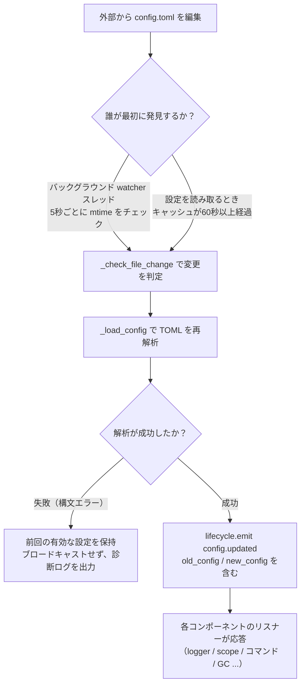

**2つの検出経路**（どちらか1つで十分、どちらもバックアップになります）：

| 経路 | 機制 | トリガタイミング |
|------|------|---------|
| バックグラウンド watcher | デーモンスレッド `config-watcher` が **5秒**ごとに `wait` でファイル `mtime` をチェック | 外部でファイルを変更した後、最大5秒以内に |
| 慣性検出 | 任意の `getConfig()` 読取時に、キャッシュが **60秒**以上経過している場合、先にファイルをチェック | 次回の設定読取時 |

> **フレームワークは自分自身を誤って傷つけない**：`setConfig()` でファイルに書き込む際、フレームワークは「自身が書き込んだ mtime」を記録し、watcher が比較する際にそれを除外します。**外部編集のみ**を変更として認識します。

**2種類の設定変更イベント**：

| イベント | トリガ元 | データ | 代表的な場面 |
|------|--------|------|---------|
| `config.set` | コード / Dashboard が `setConfig()` を呼び出す | `{key, old_value, new_value}` | 単一キーの書き込み（テンプレート生成、状態記録、実行時設定変更） |
| `config.updated` | 外部編集後に watcher/慣性検出が捕捉 | `{old_config, new_config, config_file}` | `config.toml` を手動で編集した場合 |

> `setConfig()` はデフォルトで**5秒遅延してファイルに書き込み**（複数回の書き込みをまとめる）、`immediate=True` で即時書き込み。watcher が外部変更を検出した場合、メモリキャッシュのみ更新され、**外部変更はファイルに書き戻されない**。

**自動応答対象一覧**（2種類のイベントは通常両方サブスクライブし、応答内容は同じ）：

| コンポーネント | 監視 | 応答 |
|------|------|------|
| Logger | `config.set` + `config.updated` | レベル/ファイル/ディレクトリの分割/メモリ上限/フォーマット/除外レベルを再適用（変更検出付き、変更がない場合は処理しない） |
| Scope | `config.updated` | スコープバインディングのキャッシュを再構築 |
| コマンドシステム | `config.updated` | プレフィックス/大文字小文字/スペースプレフィックス/must_at_bot のパラメータ解析を更新し、次のメッセージで有効化 |
| アダプタの並行処理 | `config.set` + `config.updated` | `handler_max_concurrency` で無効化し、信号量を再構築 |
| プロアクティブ GC | `config.set` + `config.updated` | `proactive_gc_*` で即時 GC タスクを再起動 |
| アダプタ | `on_config_update` にルーティング | 各アダプタの `on_config_update(old, new)` コールバック |
| モジュール | `on_config_update` にルーティング | 各モジュールの `on_config_update(old, new)` コールバック |
| ストレージ | `config.updated` | `use_global_db` の変更は**警告のみ**（再起動が必要） |
| ルーティング | `config.updated` | `cors.*` / `security.*` の変更は**警告のみ**（再起動が必要） |

## 完全な設定例

```toml
[ErisPulse.server]
host = "0.0.0.0"
port = 8000
auto_start = true
ssl_certfile = ""
ssl_keyfile = ""

[ErisPulse.master]
# users には2種類の書き方が可能です（どちらか1つを選択してください）：
#   グローバルなオーナー（すべてのプラットフォームに適用）：users = ["123456", "789012"]
#   プラットフォームごとにオーナーを指定：users = { yunhu = ["123456"], telegram = ["789012"] }
users = {}

[ErisPulse.logger]
level = "INFO"
format = "rich"
log_files = []
log_dir = ""
log_rotation = "size"
log_max_size_mb = 10
log_backup_count = 5
log_rotation_when = "midnight"
memory_limit = 1000
exclude_levels = []

[ErisPulse.framework]
enable_lazy_loading = true
uninit_timeout = 30
strict_mode = 0

[ErisPulse.framework.strict_mode_exceptions]
modules = []
adapters = []

[ErisPulse.storage]
use_global_db = false

[ErisPulse.event.command]
prefix = "/"
case_sensitive = true
allow_space_prefix = false
must_at_bot = false

[ErisPulse.event.message]
ignore_self = true

[ErisPulse.i18n]
language = "auto"
```

## サーバーの設定

```toml
[ErisPulse.server]
host = "0.0.0.0"
port = 8000
auto_start = true
ssl_certfile = "/path/to/cert.pem"
ssl_keyfile = "/path/to/key.pem"
```

| 設定項目 | 型 | デフォルト値 | 説明 |
|---------|------|---------|------|
| host | string | 0.0.0.0 | 監視するアドレス。0.0.0.0 はすべてのインターフェースを意味します |
| port | integer | 8000 | 監視するポート番号 |
| auto_start | boolean | true | `sdk.init()` 時にルーティングサーバーを自動的に起動するかどうか。`false` に設定するとルーティングサーバーの起動をスキップできます（純粋なイベント/WebUI なしの状況） |
| ssl_certfile | string | 空 | SSL 証明書ファイルのパス |
| ssl_keyfile | string | 空 | SSL 秘密鍵ファイルのパス |

## 主人システム設定

主人システムは「フレームワークの所有者」アカウント（Bot管理者など）を識別するために使用されます。`master.users` には2種類の書き方が可能です：

```toml
[ErisPulse.master]
# 書き方1：グローバルな所有者（すべてのプラットフォームに適用）
users = ["123456", "789012"]

# 書き方2：プラットフォームごとに所有者を指定（dict）
# users = { yunhu = ["123456"], telegram = ["789012"] }
```

| 設定項目 | 型 | デフォルト値 | 説明 |
|---------|------|---------|------|
| users | array / object | 空 | 所有者アカウントのリスト。`list` 形式はグローバル所有者（すべてのプラットフォームに適用）；`dict` 形式はプラットフォームごとに指定（キーはプラットフォーム名、値はそのプラットフォームの所有者アカウントのリスト） |

コードでは `master.is_master(event)` または `master.is_master(platform, user_id)` を使用してチェックし、各呼び出し時に設定をリアルタイムで読み込みます（ホットアップデートが可能で、再起動は不要です）：

```python
from ErisPulse.Core import master

if master.is_master(event):
    await event.reply("主人你好")
```

### 判定チェーンと実行時追加・削除

主人の判定チェーンは **設定された所有者 → 実行時記録 → providerチェーン** です：

```python
from ErisPulse.Core import master

master.is_master(event)                      # イベントから判定
master.is_master("yunhu", "123")             # 明示的に判定
master.add("yunhu", "123")                   # 実行時に追加（デフォルトで永続化；persist=False はメモリ内のみ）
master.remove("yunhu", "123")                # 削除（デフォルトで永続化）
master.list()                                # リスト化：{"global": [...], "<platform>": [...]}
```

### 自定义アイデンティティソース（provider）

設定に加えて、独自のアイデンティティソースを登録することも可能です：`fn(platform, user_id) -> bool`。
ビルトインのアイデンティティソース（設定 + 実行時記録）がヒットしなかった場合、順次試行され、いずれかの provider が許可すれば所有者と判定されます。
アダプタの管理者インターフェース、データベースのロールなど、外部のアイデンティティ体系との統合に適しています。

登録エントリポイント `master.provider` はデコレータ / 関数形式の2種類の書き方が可能で、登録解除は登録された関数の `fn.unregister()` を通じて行います：

```python
from ErisPulse.Core import master

# 書き方1：デコレータ（常駐アイデンティティソース、推奨）
@master.provider
def admin_provider(platform, user_id):
    return user_id in {"999"}     # 自己定義の判定ロジック

master.is_master("yunhu", "999")   # True
admin_provider.unregister()        # 不要になった場合に登録解除

# 書き方2：関数形式（モジュールロード時登録 / アンロード時登録解除）
fn = master.provider(admin_provider)
fn.unregister()
```

> provider で発生した例外はキャッチされ、判定チェーンをブロックすることはありません。
> インスタンスメソッドにバインドした場合、`unregister` を設定できません。登録/登録解除が対になって必要な場合は**モジュールレベルの関数**を使用してください。

### ユーザー優先：主人生効果範囲はユーザーが最終決定

コマンドの `master=True` は**開発者のデフォルト**です：ユーザーは
`ErisPulse.event.overrides.command.<module>.<cmd>.master = true/false`
を設定することで、強化または緩和（[統一イベント覆写設定](#統一イベント覆写設定eventoverrides)参照）を覆写できます。ユーザーが明示的に設定した場合、それが有効になります。

## ログ設定

```toml
[ErisPulse.logger]
level = "INFO"
log_files = []                # 明示的なログファイルリスト（log_dir と排他、優先度が高い）
log_dir = ""                  # ログディレクトリ（設定後、自動的に分割ローテーション）
log_rotation = "size"         # 分割方法: "size" / "date" / "none"
log_max_size_mb = 10          # size モードでの単一ファイルの上限サイズ（MB）
log_backup_count = 5          # 保持する履歴ログファイル数
log_rotation_when = "midnight"  # date モードのローテーション周期: S/M/H/D/midnight
memory_limit = 1000
exclude_levels = ["EVENT"]
```

| 設定項目 | 型 | デフォルト値 | 説明 |
|---------|------|---------|------|
| level | string | INFO | ログレベル：TRACE, DEBUG, INFO, WARNING, ERROR, CRITICAL（TRACE は最低レベルで、フレームワーク内部の詳細なデバッグ情報を出力） |
| format | string | rich | ログ出力形式：`rich`（カラー表示、デフォルト）、`plain`（カラーなしのプレーンテキスト、ログ収集/パイプリダイレクトに適している）、`json`（JSON 構造化、ELK などに適している） |
| log_files | array | 空 | ログ出力ファイルリスト（明示的なパス、分割しない） |
| log_dir | string | 空 | ログ出力ディレクトリ（自動作成）。設定後、`erispulse.log` に書き込み、`log_rotation` に従って自動的に分割する。`log_files` と排他で、`log_files` が優先 |
| log_rotation | string | size | 分割方法：`size`（サイズ別）/ `date`（日付別）/ `none`（分割しない） |
| log_max_size_mb | float | 10 | size モードでの単一ファイルのサイズ上限（MB）。上限を超えると `.1`/`.2` などのバックアップにローテーション |
| log_backup_count | integer | 5 | 保持する履歴ログファイル数。古いファイルは自動的に削除される |
| log_rotation_when | string | midnight | date モードのローテーション周期：`S`/`M`/`H`/`D`/`midnight`（デフォルトは毎日0時） |
| memory_limit | integer | 1000 | メモリに保持するログの件数 |
| exclude_levels | array | 空 | 指定されたログレベルを除外。除外されたレベルのログは**完全に破棄**される（メモリに書き込まず、Dashboard などのサブスクライバーに送信せず、表示もファイルへの出力もしない）。ホットアップデートをサポート |

コード内で動的に切り替えることも可能です：

```python
from ErisPulse.Core import logger

# サイズ別分割：単一ファイル 10MB、5 件保持
logger.set_output_dir("logs", rotation="size", max_size_mb=10, backup_count=5)

# 日付別分割：毎日0時ローテーション、7 件保持
logger.set_output_dir("logs", rotation="date", backup_count=7)
```

> [!NOTE]
> `log_dir` および分割関連の設定は ErisPulse **2.8.0+** が必要です。

> **プライバシー保護**：メッセージの送受信内容は **EVENT レベル**（数値 21）で記録されます。`exclude_levels = ["EVENT"]` を設定することで、バックエンド（例：Dashboard のログパネル）が各グループ/プライベートチャットのメッセージ内容を表示できなくなります。ただし、他のレベルのログには影響しません。

> [!NOTE]
> `exclude_levels` の機能は ErisPulse **2.8.0+** が必要です。

## 框架設定

```toml
[ErisPulse.framework]
enable_lazy_loading = true
uninit_timeout = 30
strict_mode = 0

[ErisPulse.framework.strict_mode_exceptions]
modules = []
adapters = []
```

| 設定項目 | 型 | デフォルト値 | 説明 |
|---------|------|---------|------|
| enable_lazy_loading | boolean | true | モジュールの遅延ロードを有効にするかどうか |
| uninit_timeout | integer | 30 | エレガントなシャットダウンの総タイムアウト時間（秒）。これを超えると強制的に終了する。0 はタイムアウトを設定しないことを意味する |
| strict_mode | integer | 0 | 厳格モードのレベル。下記「厳格モード」の説明を参照 |
| handler_max_concurrency | integer | 64 | イベントハンドラの最大並行タスク数。大きい値は処理能力を高めるがメモリ使用量も増加する |
| offline_bot_expiry | integer | 3600 | 離線 Bot 記録の自動期限切れ時間（秒）。0 は期限切れをしないことを意味する |

### プロアクティブGC設定

SDK の初期化完了後にプロアクティブGCのバックグラウンドタスクを起動し、周期的に Python GC と内部リソースの回収（離線 Bot のクリーンアップなど）を実行する。すべてのパラメータはホットアップデートが可能で、変更時に即座にタスクの再起動が行われる。

| 設定項目 | 型 | デフォルト値 | 説明 |
|---------|------|---------|------|
| proactive_gc_interval | number | 300 | 回収間隔（秒）。小数もサポート。0 はプロアクティブGCを無効化することを意味する |
| proactive_gc_generation | integer | 0 | 通常の回収世代（0/1/2、0..2 に制限）。注意：`gc.collect(2)` は全量回収に相当し、デフォルトの 0 は軽量な状態を維持する。深い回収は `proactive_gc_full_every` で周期的にトリガーされる |
| proactive_gc_full_every | integer | 20 | N 回ごとに全量回収を行う。0 は周期的な全量回収を無効化することを意味する。全量回収は `proactive_gc_memory_growth_mb` のしきい値によって制約される |
| proactive_gc_memory_growth_mb | integer | 32 | 全量回収のメモリ増加しきい値（MB）：前回の全量回収後のメモリベースライン（優先的に tracemalloc、次に RSS）と比較し、この値に達した場合に全量回収が実行される。0 はしきい値を設定しないことを意味する |
| proactive_gc_idle_only | boolean | false | 有効化すると、イベントのピーク時（未完了の pending handler がある）に、Python GC をスキップして、内部リソースの回収は影響を受けない |
| proactive_gc_gen0_min | integer | 500 | 通常の回収をトリガーする gen0 のガベージ量の下限：`gc.get_count()[0]` がこの値より小さい場合は、回収をスキップする（空回しのラウンドはほぼオーバーヘッドがゼロ）。0 は常に回収することを意味する |

> **2.7.1 変更**：デフォルトの `proactive_gc_generation` は `2` から `0` に変更され、`proactive_gc_full_every` は `0` から `20` に変更された。以前は `generation=2` は毎回最も重い全量回収を意味していたが、新しいデフォルトでは回収のカバレッジを維持しつつ、空回しのオーバーヘッドを大幅に削減する。明示的に設定された旧値はそのままの意味で動作する。

### 厳格モード

厳格モードは、モジュール/アダプターがロード段階で不正な状態や失敗した場合の処理戦略を制御する。現代のモジュール/アダプターはすべて対応する基底クラス（`BaseModule` / `BaseAdapter`）を継承するべきであり、基底クラスを継承していないコンポーネントはフレームワークのコンテキストシステムとデフォルトのクリーンアップに影響を与え、リソースリークを引き起こす可能性がある。

> **2.5.2 変更**：デフォルトのレベルは `1`（スキップ）から `0`（緩和）に変更され、新規ユーザーが初めて使用する際に遭遇するロードの問題を減らす。基底クラスを継承していないコンポーネントは警告として表示され、ロードを試みる。以前の動作に戻したい場合は、`strict_mode = 1` を明示的に設定する。

| レベル | 名前 | 行動 |
|------|------|------|
| 0 | 緩和（デフォルト） | 不正な状態は警告として扱い、基底クラスを継承していないコンポーネントもロードを試みる（旧コンポーネントの互換性） |
| 1 | 厳格-スキップ | 基底クラスを継承していないコンポーネントを拒否し、スキップする。他のコンポーネントは正常に起動する |
| 2 | 厳格-致命 | すべての不正な状態（基底クラスを継承していない、ロード失敗、登録失敗、初期化失敗など）を致命的なエラーとして扱い、起動チェックポイントで一括して不正なリストを出力して中止する |

各レベルにおいて、「ロード/登録/初期化段階でエラー」のようなコンポーネント自身のクラッシュは常にスキップされる。違いは以下の通りである：

- **0 → 1**：唯一の動作変化は「基底クラスを継承していない」が「ロードをスキップする」に変わる点である。
- **1 → 2**：すべての不正な状態（基底クラスを継承していない、ロード失敗、登録失敗、初期化失敗など）が致命的なエラーに昇格し、起動チェックポイントで一括して不正なリストを出力して中止する。

#### 豁免リスト

もし特定のコンポーネントが一時的に移行できない（例えば依存する旧モジュールなど）場合、そのコンポーネントを豁免リストに追加することで、不正なコンポーネントでも緩和モードで扱い、ロードを続けることができる：

```toml
[ErisPulse.framework.strict_mode_exceptions]
modules = ["SeTu", "SomeLegacyModule"]
adapters = ["OldAdapter"]
```

> コンポーネントが厳格モードで拒否された場合、ログにはロードを回復する方法（豁免リストに追加するか、レベルを下げること）が明確に表示される。

## ストレージ設定

```toml
[ErisPulse.storage]
use_global_db = false
```

| 設定項目 | 型 | デフォルト値 | 説明 |
|---------|------|---------|------|
| use_global_db | boolean | false | グローバルデータベース（パッケージ内）を使用するかどうか。`true` の場合、すべてのプロジェクトが ErisPulse パッケージ内の SQLite データベースを共有します。`false`（デフォルト）の場合は、各プロジェクトが `config/` ディレクトリ下の独立したデータベースを使用します。 |

## イベント設定

### コマンド設定

```toml
[ErisPulse.event.command]
prefix = "/"
case_sensitive = true
allow_space_prefix = false
```

| 設定項目 | 型 | デフォルト値 | 説明 |
|---------|------|---------|------|
| prefix | string | / | コマンドのプレフィックス |
| case_sensitive | boolean | true | 大文字小文字を区別するかどうか（`/Help` と `/help` が異なるコマンドになるかどうか） |
| allow_space_prefix | boolean | false | 空白文字をプレフィックスとして許可するかどうか |
| must_at_bot | boolean | false | コマンドの発動に@機械人を付ける必要があるかどうか（プライベートチャットは制限されない） |

### メッセージ設定

```toml
[ErisPulse.event.message]
ignore_self = true
```

| 設定項目 | 型 | デフォルト値 | 説明 |
|---------|------|---------|------|
| ignore_self | boolean | true | ロボット自身のメッセージを無視するかどうか |

## 国際化設定

```toml
[ErisPulse.i18n]
language = "auto"
```

| 設定項目 | 型 | デフォルト値 | 説明 |
|---------|------|---------|------|
| language | string | auto | フレームワークの内部テキストの表示言語。`auto` に設定するとシステム言語を自動検出します。また、具体的な言語コード `zh-CN`、`zh-TW`、`en`、`ja`、`ru` に設定することも可能です。 |

## モジュールの設定

各モジュールは設定ファイルで独自の設定を定義できます：

```toml
[MyModule]
api_url = "https://api.example.com"
timeout = 30
enabled = true
```

モジュール内で設定を読み取り、書き込みます：

```python
from ErisPulse import sdk

# 設定の読み込み
config = sdk.config.getConfig("MyModule", {})
api_url = config.get("api_url", "https://default.api.com")

# 実行時に設定を書き込む（遅延保存）
sdk.config.setConfig("MyModule.timeout", 60)

# ファイルに即時保存
sdk.config.setConfig("MyModule.timeout", 60, immediate=True)
```

> `setConfig` はデフォルトで遅延書き込み（約5秒ごとに一括保存）を使用します。`immediate=True` を設定すると即時永続化されます。設定の変更は `config.set` ライフサイクルイベントをトリガーします。

## スコープの設定（scope）

> [!NOTE]
> この機能は ErisPulse **2.8.0+** が必要です。

スコープ宣言は「**どの範囲で有効か**」を定義します。具体的には、以下3つの次元で制御されます：

- ① **モジュール次元**：特定のプラットフォーム / Bot / セッションでどのモジュールが利用可能か
- ② **アイデンティティ次元**：特定のユーザー / グループ / Bot / アダプターのイベントを受信するかどうか
- ③ **出力次元**：モジュールがどのような出力呼び出しを行うか

```toml
[ErisPulse.scope]
default_allow = true        # 全局的なデフォルト値（false = 厳格な拒否モード；出力次元には影響しない）
cache_size = 1024           # LRUキャッシュのサイズ

# ① 模塊次元（優先順位：セッション > Bot > プラットフォーム；エントリには正確な一致 / glob / re: 正規表現が使用可能）
[ErisPulse.scope.platforms.onebot11]
modules = ["Chat", "Tool*"]
blocked = ["re:^Danger"]

# 子レベルのバインディングで merge = true を指定すると、優先度の低いレベルとエントリごとに集合をマージする（デフォルトは全体を上書き）
[ErisPulse.scope.bots.onebot11."123456"]
modules = ["Music"]
merge = true

# ② アイデンティティ次元（優先順位：ユーザー > セッション > Bot > アダプター；各レベルでは allow または deny の一方のみを指定可能）
[ErisPulse.scope.identity.adapters.onebot11]
deny = true                 # このプラットフォームのすべてのイベントを入口で破棄
[ErisPulse.scope.identity.users.onebot11]
allow = ["u_admin"]         # ユーザーのキーには glob / re: 正規表現が使用可能
deny = ["u_bad", "spam_*"]

# ③ 出力次元（デフォルトでは全許可；ルールはインラインテーブル、エントリには正確な一致 / glob / re: 正規表現が使用可能）
[ErisPulse.scope.actions.MyModule]
send = { deny = true }                    # 送信を全禁止
api = { allow = ["get_*"] }               # 一部のクエリ系標準APIのみ許可
request = { deny = true }                 # リクエストの処理を禁止
```

| 設定項目 | 型 | 説明 |
|---------|------|------|
| `scope.default_allow` | boolean | 全局的なデフォルト値：ルールに該当しないモジュール/アイデンティティは許可/拒否（`true`） |
| `scope.cache_size` | integer | LRUキャッシュのサイズ（デフォルト 1024） |
| `scope.platforms / bots / sessions` | table | ① モジュールの3段階バインディング：`{modules=[...], blocked=[...], merge=bool?}` |
| `scope.identity.adapters / bots / sessions / users` | table | ② アイデンティティの4段階バインディング：`{allow=true}` / `{deny=true}` |
| `scope.actions.<module>.<アクション>` | table | ③ 出力ルール：`{allow=[...], deny=true|[...]}`（アクションは send / api / request のいずれか） |

> 詳細と実行時API（次元化された `sdk.scope.set_module()` / `set_identity()` /
> `set_action()`、判定用の `is_allowed()` / `is_identity_allowed()` / `is_action_allowed()`、
> および辞書形式のデフォルト値 `get()` / `set()` / `delete()`）は[作用域（scope）](../advanced/scope.md)をご覧ください。

## 統一イベントオーバーライド設定 (event.overrides)

統一オーバーライドシステム：**イベントタイプ**に基づいて、モジュールのコードを変更せずに任意のモジュールハンドラの動作をオーバーライドします。  
OneBot12 標準タイプ（meta / message / notice / request）と拡張タイプ（command）  
それぞれに専用のオーバーライド可能なパラメータがあります：

```toml
[ErisPulse.event.overrides]

# message：テキストトリガー条件（コード内の条件と AND）
[ErisPulse.event.overrides.message.ChatModule]
pattern = "闲聊*"

# notice / request / meta：detail_type ホワイトリスト（エントリは正確 / glob / re: 正規表現に対応）
[ErisPulse.event.overrides.notice.MyModule]
detail_types = ["group_increase"]

# command（拡張タイプ）：パラメータのオーバーライドを実装（ユーザー優先；統一ACL denyを無効化）
[ErisPulse.event.overrides.command.MyModule.restart]
master = true               # オーバーライド：フレームワークのオーナーのみ（falseにすると開発者のオーナー制限を解除）
hidden = true               # ヘルプリストから非表示
aliases = ["rs"]            # 有効なエイリアス

# acl（command専用）：コマンドのユーザーホワイト/ブラックリスト（コマンド名はglob / re: 正規表現に対応、正確なキーが優先）
[ErisPulse.event.overrides.acl."roll*"]
allow = ["onebot11:u_vip"]  # ユーザー識別子 "platform:user_id"
deny = ["onebot11:u_bad"]

# ACLのデフォルト：ACLが設定されていないコマンドを許可（true）/ 严格拒否（false）
acl_default_allow = true
```

| 設定項目 | タイプ | 説明 |
|---------|------|------|
| `event.overrides.message.<module>` | table | テキスト条件：`{pattern="...", regex="..."}` |
| `event.overrides.notice / request.<module>` | table | `{detail_types=[...], pattern, regex}` |
| `event.overrides.meta.<module>` | table | `{detail_types=[...]}` |
| `event.overrides.command.<module>` | table | モジュールレベルのパラメータオーバーライド（`hidden = true` などのスカラー） |
| `event.overrides.command.<module>.<command>` | table | コマンドレベルのオーバーライド（コマンドレベルが優先） |
| `event.overrides.acl.<コマンド名>` | table | ユーザーのホワイト/ブラックリスト：`{allow=[...], deny=[...]}` |
| `event.overrides.acl_default_allow` | boolean | ACLのデフォルト：ACLが設定されていないコマンドを許可（`true`）/ 严格拒否（`false`） |

> 実行時API（`from ErisPulse.Core.Event import overrides`の後、タイプのサブネームスペースを呼び出す：`overrides.message.set()` / `overrides.command.set()` / `overrides.acl.set()` など、または `sdk.Event.overrides` でアクセス）  
> 詳細は [イベント処理入門 · イベントオーバーライド](../getting-started/event-handling.md#イベントオーバーライド不改模块代码覆写任意事件类型的行为) を参照してください。

## コマンド解析の設定（event.command）

## 次に進む

- [CLI コマンドリファレンス](cli-reference.md) - すべてのコマンドラインコマンドについて学ぶ
- [開発者ガイド](../developer-guide/) - カスタムモジュールの開発方法を学ぶ


### 部署指南

# 部署ガイド

ErisPulse ロボットを本番環境にデプロイするためのベストプラクティス。

## Docker 部署（推奨）

ErisPulse は公式の Docker イメージを提供しており、ErisPulse フレームワークと Dashboard 管理パネルが内蔵されており、`linux/amd64` および `linux/arm64` アーキテクチャに対応しています。

### 早速起動

```bash
# イメージを取得
docker pull erispulse/erispulse:latest

# docker-compose.yml をダウンロード
curl -O https://raw.githubusercontent.com/ErisPulse/ErisPulse/main/docker-compose.yml

# Dashboard のログイントークンを設定して起動
ERISPULSE_DASHBOARD_TOKEN=your-token docker compose up -d
```

起動後、`http://localhost:8000/Dashboard` にアクセスし、設定したトークンをパスワードとしてログインしてください。

### 国内でのイメージ加速

Docker Hub にアクセスできない場合は、GitHub Container Registry を使用してイメージを取得できます：

```bash
docker pull ghcr.io/erispulse/erispulse:latest
```

`ghcr.io` のイメージを使用する場合、`docker-compose.yml` の `image` を変更する必要があります：

```yaml
services:
  erispulse:
    image: ghcr.io/erispulse/erispulse:latest
```

### docker-compose.yml

```yaml
services:
  erispulse:
    image: erispulse/erispulse:latest
    container_name: erispulse
    ports:
      - "${ERISPULSE_PORT:-8000}:8000"
    volumes:
      - ./config:/app/config
      # Python パッケージディレクトリの永続化
      - ./config/.packages:/usr/local/lib/python3.13/site-packages
    environment:
      - TZ=${TZ:-Asia/Shanghai}
      - ERISPULSE_DASHBOARD_TOKEN=${ERISPULSE_DASHBOARD_TOKEN:-}
    init: true
    stop_grace_period: 30s
    restart: unless-stopped
```

> 上記の設定と健全性チェック、タイムゾーンおよび言語環境変数が含まれている、リポジトリのルートにある [docker-compose.yml](https://github.com/ErisPulse/ErisPulse/blob/main/docker-compose.yml) を直接使用することを推奨します。

### 環境変数

| 変数 | デフォルト値 | 説明 |
|------|--------|------|
| `ERISPULSE_PORT` | `8000` | Dashboard のポートマッピング |
| `ERISPULSE_DASHBOARD_TOKEN` | 自動生成 | Dashboard のログイントークン（強く設定することを推奨） |
| `TZ` | `Asia/Shanghai` | タイムゾーン |
| `LANG` | `en_US.UTF-8` | システム言語、起動時のインターフェース言語を自動検出 |
| `ERISPULSE_LANG` | 空 | 起動時のインターフェース言語を強制指定：`zh` / `zh_TW` / `en` / `ja` / `ru`（`LANG` を上書き） |

### データの永続化

`./config` ディレクトリは設定ファイルとデータベースをマウントしており、以下を含んでいます：

- `config/config.toml` — 設定ファイル
- `config/config.db` — SQLite ストレージデータベース
- `config/.packages` — Python site-packages の永続化ボリューム、フレームワーク、アダプタ、およびインストール済みモジュールを保存（初期起動時にエントリポイントからイメージ内に含まれるバックアップから自動的に初期化され、その後のモジュールのインストールおよびフレームワークのホットアップデートはこのディレクトリに書き込まれます）

## Dashboard 管理面板

ErisPulse Docker イメージには、Web による視覚化管理インターフェースを提供する Dashboard モジュールが内蔵されています。

### 機能概要

| 機能 | 説明 |
|------|------|
| 仪表盘 | システム概要、CPU/メモリ監視、稼働時間、イベント統計 |
| ロボット管理 | 各プラットフォームのロボットのオンライン状態と情報を表示 |
| 事件表示 | 実時イベントストリーム、タイプやプラットフォームでフィルタリング可能 |
| ログ表示 | モジュールとレベルでフィルタリング可能なログビューア |
| モジュール管理 | インストール済みのモジュールとアダプターの表示、読み込み、アンロード |
| モジュールストア | リモートで利用可能なパッケージを閲覧し、ワンクリックでインストール |
| 設定編集 | `config.toml` のオンライン編集 |
| ストレージ管理 | Key-Value ストレージデータの閲覧と編集 |
| バックアップ | 設定とストレージデータのエクスポート/インポート |
| 審計ログ | すべての管理操作を記録 |

### Dashboard によるモジュールのインストール

Dashboard にはモジュールストア機能が統合されており、以下の方法でモジュールをインストールできます。

1. **ストアからインストール**：リモートのモジュールリストを閲覧し、必要なモジュールを選択してワンクリックでインストール
2. **ローカルのパッケージをアップロード**：`.whl` または `.zip` ファイルを直接アップロードしてインストール。個人開発のモジュールをテストする際に便利です。

> **モジュール開発者のための迅速なテストフロー**：Docker でデプロイ後、Dashboard の「ローカルパッケージのアップロード」機能を使って、ビルドした `.whl` ファイルを直接アップロードしてテストを行えます。コンテナの手動操作は不要です。

## プロセス監督とハードリスタート

ErisPulse のハードリスタート（`sdk.hard_restart()`）は、**外部監督者**がプロセスの終了コードが 42 のときにプロセスを再起動することに依存しています。SDK 自体は新しいプロセスを起動しません。本番環境では監督者の設定を必須とし、そうでなければハードリスタート後にプロセスが自動的に復旧しません。

- Docker: `restart: unless-stopped`（終了コードが何であれ、42 を含むすべての終了コードで再起動）
- systemd: `Restart=on-failure` + `RestartForceExitStatus=42`
- PM2 / supervisord: 42 を再起動可能な終了コードに追加
- 純粋な Python によるカスタム監督者: `Popen` のループ + `returncode == 42` の検出

各監督者の完全な設定例と終了コード 42 の契約に関する説明は、[起動フロー → 監督者ガイド](../advanced/startup.md#監督者ガイド)をご覧ください。

## ヘルスチェック

SDK には、ヘルスチェック用エンドポイントが内蔵されています：

```bash
# ヘルスチェック
curl http://localhost:8000/health
```

Docker でのヘルスチェックは、`docker-compose.yml` に追加することで設定できます：

```yaml
services:
  erispulse:
    healthcheck:
      test: ["CMD", "python", "-c", "import urllib.request; urllib.request.urlopen('http://localhost:8000/ping')"]
      interval: 30s
      timeout: 5s
      start_period: 20s
      retries: 3
```

## リバースプロキシ

Nginx などのリバースプロキシを使用してダッシュボードを公開する必要がある場合：

```nginx
server {
    listen 80;
    server_name bot.example.com;

    location / {
        proxy_pass http://127.0.0.1:8000;
        proxy_set_header Host $host;
        proxy_set_header X-Real-IP $remote_addr;
        proxy_set_header X-Forwarded-For $proxy_add_x_forwarded_for;
    }

    # WebSocket のサポート（ダッシュボードのリアルタイムイベントストリームが必要）
    location /Dashboard/ws {
        proxy_pass http://127.0.0.1:8000;
        proxy_http_version 1.1;
        proxy_set_header Upgrade $http_upgrade;
        proxy_set_header Connection "upgrade";
    }
}
```

SSL には Let's Encrypt を使用できます：

```bash
sudo certbot --nginx -d bot.example.com
```

## 手動デプロイ（pip）

Docker を使わずに、手動でデプロイすることも可能です。

### 本番環境の設定

```toml
# config/config.toml

[ErisPulse.server]
host = "0.0.0.0"
port = 8000

[ErisPulse.logger]
level = "INFO"
log_files = ["app.log"]
memory_limit = 5000

[ErisPulse.framework]
enable_lazy_loading = true
```

### systemd (Linux)

`/etc/systemd/system/erispulse-bot.service` を作成します：

```ini
[Unit]
Description=ErisPulse Bot
After=network.target

[Service]
Type=simple
User=bot
WorkingDirectory=/opt/erispulse-bot
ExecStart=/opt/erispulse-bot/venv/bin/epsdk run main.py
Restart=always
RestartSec=5
StandardOutput=journal
StandardError=journal

[Install]
WantedBy=multi-user.target
```

管理コマンド：

```bash
sudo systemctl daemon-reload
sudo systemctl start erispulse-bot
sudo systemctl enable erispulse-bot
sudo journalctl -u erispulse-bot -f
```

### Supervisor

`/etc/supervisor/conf.d/erispulse-bot.conf` を作成します：

```ini
[program:erispulse-bot]
command=/opt/erispulse-bot/venv/bin/python -m ErisPulse run main.py
directory=/opt/erispulse-bot
user=bot
autostart=true
autorestart=true
stderr_logfile=/var/log/erispulse-bot/err.log
stdout_logfile=/var/log/erispulse-bot/out.log
```

## セキュリティに関する推奨事項

1. **Dashboard トークンの設定**：強力なランダムトークンを使用し、デフォルト値を使用しないでください。
2. **ポートをパブリックに公開しない**：リバースプロキシ + SSL を使用しない限り、Dashboard のポートをローカルネットワークに制限してください。
3. **データディレクトリを保護する**：`config/` ディレクトリには設定とデータベースが含まれているため、適切なファイル権限を設定してください。
4. **定期的なアップデート**：`epsdk self-update` を使用するか、最新の Docker イメージを取得してください。
5. **root で実行しない**：手動でデプロイする場合は、専用のユーザーを作成してください。
6. **Docker のリスタートポリシーを使用する**：`restart: unless-stopped` を使用して、異常終了後に自動的に再起動するようにしてください。

## 多インスタンスデプロイ

複数のロボットインスタンスを実行する場合：

1. 各インスタンスは独立したプロジェクトディレクトリと `docker-compose.yml` を使用します。
2. 異なるポート番号を使用します：`ERISPULSE_PORT=8001`
3. 異なるコンテナ名を使用します：`container_name: erispulse-bot2`

## 更新とメンテナンス

### Docker 方式

```bash
# 最新のイメージを取得
docker compose pull

# 新しいイメージを使用して再起動
docker compose up -d
```

### pip 方式

```bash
epsdk self-update
epsdk upgrade
```

### バックアップ

`config/` ディレクトリを定期的にバックアップしてください：

```bash
# Docker 部署の場合
tar czf erispulse-backup-$(date +%Y%m%d).tar.gz config/

# または Dashboard の「バックアップ」機能を使用してエクスポート
```


=====
开发者指南
=====


### 开发者指南总览

# 開発者ガイド

このガイドは、ErisPulse の機能を拡張するためのカスタムモジュールやアダプターを開発する方法を説明します。

## 内容リスト

### モジュール開発

1. [モジュール開発入門](modules/getting-started.md) - 最初のモジュールを作成する
2. [モジュールのコアコンセプト](modules/core-concepts.md) - モジュールのコアコンセプトとアーキテクチャ
3. [Event ウェラーラップの詳細](modules/event-wrapper.md) - Event オブジェクトの完全な説明
4. [モジュールのベストプラクティス](modules/best-practices.md) - 高品質なモジュールを開発するための提案

### アダプター開発

1. [アダプター開発入門](adapters/getting-started.md) - 最初のアダプターを作成する
2. [アダプターのコアコンセプト](adapters/core-concepts.md) - アダプターのコアコンセプト
3. [SendDSL 詳解](adapters/send-dsl.md) - Send メッセージ送信 DSL の完全な説明
4. [イベントコンバーター](adapters/converter.md) - イベントコンバーターの実装
5. [アダプターのベストプラクティス](adapters/best-practices.md) - 高品質なアダプターを開発するための提案

### リリースガイド

- [リリースとモジュールストアガイド](publishing.md) - あなたの作品を PyPI と ErisPulse モジュールストアに公開する方法

## 開発の準備

開発を始める前に、以下の点を確認してください：

1. [基本概念](../getting-started/basic-concepts.md) を読みましたか。
2. [イベント処理](../getting-started/event-handling.md) に精通していますか。
3. 開発環境をインストールしました（Python >= 3.10）。
4. ErisPulse SDK をインストールしました。

## 開発タイプの選択

ニーズに応じて、適切な開発タイプを選択してください。

| 開発タイプ | 適用シーン | 入門ガイド |
|---------|---------|---------|
| **モジュール開発** | ロボット機能の拡張、ビジネスロジックの実装、コマンドやメッセージ処理の提供 | [モジュール開発入門](modules/getting-started.md) |
| **アダプタ開発** | 新しいメッセージプラットフォームへの接続、クロスプラットフォーム通信の実現、プラットフォーム固有機能の提供 | [アダプタ開発入門](adapters/getting-started.md) |

> ロボットの機能を拡張したい場合（コマンドの追加やメッセージ処理など）、**モジュール開発**を選択してください。ロボットを新しいプラットフォームに接続したい場合は、**アダプタ開発**を選択してください。

## 開発ツール

### プロジェクトテンプレート

ErisPulse には、参考用のサンプルプロジェクトが用意されています：

- [モジュールの例](https://github.com/ErisPulse/ErisPulse/tree/main/examples/example-module) - モジュールの完全なプロジェクト構造
- [アダプターの例](https://github.com/ErisPulse/ErisPulse/tree/main/examples/example-adapter) - アダプターの完全なプロジェクト構造

### 開発モード

ホットリロードモードを使用して開発を行い、コードの変更後は自動的に再読み込みされます：

```bash
epsdk run main.py --reload
```

### デバッグのコツ

`config/config.toml` で DEBUG または TRACE レベルのログを有効にします：

```toml
[ErisPulse.logger]
# DEBUG: モジュールのロード、ルートの登録などの開発デバッグ情報を出力
# TRACE: 最低レベルで、イベントの配信、ストレージへの書き込み、遅延ロードなどのフレームワーク内部の詳細なフローを出力
level = "DEBUG"
```

## モジュールの公開

完全な公開フローについては、[公開とモジュールストアのガイド](publishing.md)を参照してください。PyPI での公開手順や ErisPulse モジュールストアへの提出プロセスなども含まれています。


====
模块开发
====


模块开发
----


### 模块开发入门

# モジュール開発入門

このガイドでは、ErisPulse モジュールをゼロから作成する方法を説明します。

## プロジェクト構造

標準的なモジュール構造は次のとおりです。

```
MyModule/
├── pyproject.toml
├── README.md
├── LICENSE
└── MyModule/
    ├── __init__.py
    └── Core.py
```

## pyproject.toml の設定

```toml
[project]
name = "ErisPulse-MyModule"
version = "1.0.0"
description = "モジュールの機能説明"
readme = "README.md"
requires-python = ">=3.10"
license = { file = "LICENSE" }
authors = [ { name = "yourname", email = "your@mail.com" } ]
dependencies = []

[project.urls]
"homepage" = "https://github.com/yourname/MyModule"

[project.entry-points."erispulse.module"]
"MyModule" = "MyModule:Main"
```

## __init__.py

```python
from .Core import Main
```

## Core.py - 基礎モジュール

```python
from ErisPulse import sdk
from ErisPulse.Core.Bases import BaseModule
from ErisPulse.Core.Event import command

class Main(BaseModule):
    def __init__(self, sdk):
        self.sdk = sdk
        self.logger = sdk.logger.get_child("MyModule")
        self.storage = sdk.storage
    
    @staticmethod
    def get_load_strategy():
        """モジュールのロード戦略を返す"""
        from ErisPulse.loaders import ModuleLoadStrategy
        return ModuleLoadStrategy(
            lazy_load=True,
            priority=0,
            depends=[],  # オプション：他のモジュールへの依存リスト
            # オプション：イベント駆動の遅延活性化——トリガーを宣言し、最初の一致するイベント/コマンドが到着した時点で自動的にロード
            # activate_on=[{"command": {"name": "hello", "help": "挨拶を送信"}}],
        )
    
    async def on_load(self, event):
        """モジュールがロードされたときに呼び出される"""
        @command("hello", help="挨拶を送信")
        async def hello_command(event):
            name = event.get_user_nickname() or "友達"
            await event.reply(f"こんにちは、{name}！")
        
        self.logger.info("モジュールがロードされました")
    
    async def on_unload(self, event):
        """モジュールがアンロードされたときに呼び出される"""
        self.logger.info("モジュールがアンロードされました")
```

> **設定の読み込み**：上記の基本的な例では設定は使用していません。設定を読み込む必要がある場合は、`ConfigClass` をネストして宣言し、`self.cfg` を通じてリアルタイムに読み取ることを推奨します（[モジュールのコア概念](docs/ja/core-concepts.md#宣言的設定の推奨)を参照）。手動で `_load_config()` を呼び出す旧い書き方は廃止されました。

## テストモジュール

### ローカルテスト

```bash
# プロジェクトディレクトリにモジュールをインストール
epsdk install ./MyModule

# プロジェクトを実行
epsdk run main.py --reload
```

### テストコマンド

コマンドを送信してテストします：

```
/hello
```

## 核心概念

### BaseModule 基底クラス

すべてのモジュールは `BaseModule` を継承し、以下のメソッドを提供する必要があります：

| メソッド | 説明 | 必須 |
|------|------|------|
| `__init__(self, sdk)` | コンストラクタ（フレームワークから `sdk` インスタンスが渡される） | いいえ |
| `get_load_strategy()` | ロード戦略を返す | いいえ |
| `get_meta()` | モジュールの説明メタ情報を返す（オプション） | いいえ |
| `on_load(self, event)` | モジュールがロードされたときに呼び出される | はい |
| `on_unload(self, event)` | モジュールがアンロードされたときに呼び出される | はい |

### モジュール紹介メタ情報

> [!NOTE]
> この機能は ErisPulse **2.8.0+** が必要です。

`get_meta()` を使ってモジュールの紹介メタ情報を宣言します（このモジュールが何をするものか、どのカテゴリに属するかなど）。  
メタ情報はモジュールの**一般的な紹介データ**であり、help モジュール、Dashboard モジュールリスト、モジュールストアなど、さまざまなインターフェースやエコシステムモジュールが利用できます。

`get_load_strategy()` が `ModuleLoadStrategy` を返すのと同様に、**推奨されるのは `ModuleMeta` 設定クラスのインスタンスを返すこと**（属性の型付け、IDE の補完機能）、dict で直接返すこともサポートされています：

```python
class MyModule(BaseModule):
    @staticmethod
    def get_meta() -> ModuleMeta:
        return ModuleMeta(
            name="天気",               # 表示名（デフォルトの登録名）
            description="都市の天気を照会",  # モジュールの概要
            version="1.0.0",
            author="ErisDev",
            group="ツール",               # 機能分類
            tags=["天気", "照会"],
        )
```

互換性のある書き方（dict）：

```python
class MyModule(BaseModule):
    @staticmethod
    def get_meta() -> dict:
        return {
            "name": "天気",
            "description": "都市の天気を照会",
            "version": "1.0.0",
            "author": "ErisDev",
            "group": "ツール",
            "tags": ["天気", "照会"],
        }
```

- `module.get_meta("MyModule")` は、解析済みのメタ情報を読み取ります（クラス宣言 > 登録情報、自動的にこのモジュールのコマンド名が補完されます）。
- `module.get_commands_overview()` は、「モジュールメタ情報 + 登録されたコマンド（エイリアス/グループ/ヘルプ）」を統合し、モジュールごとに整理されたコマンドの概要を提供します。
- コマンドが属するモジュールは、`cmd_info["owner"]` で取得できます（登録時にコンテキストシステムが自動的に注入します）。

#### メタフィールドの i18n 支援

メタ情報のフィールド値は、単純な文字列または i18n ディクショナリ `{"i18n": "key.path", "default": "バックアップテキスト"}`（設定 `description` と同様の約束）で指定できます。  
翻訳キーは `I18nClass` で宣言・登録され、`module.get_meta()` で読み取る際に、自動的に現在の言語に翻訳されます：

```python
class MyModule(BaseModule):
    class I18nClass(BaseI18n):
        meta_description: I18nKey = I18nKey(
            default="Weather lookup",
            zh_CN="都市の天気を照会",
            en="Weather lookup",
        )

    @staticmethod
    def get_meta() -> ModuleMeta:
        return ModuleMeta(
            name="天気",
            description={"i18n": "MyModule.meta_description", "default": "Weather lookup"},
        )
```

### SDK オブジェクト

`sdk` オブジェクトを通じて、コア機能にアクセスします：

```python
from ErisPulse import sdk

sdk.storage    # ストレージシステム
sdk.config     # 設定システム
sdk.logger     # ログシステム
sdk.adapter    # アダプタシステム
sdk.router     # ルーティングシステム
sdk.lifecycle  # ライフサイクルシステム
```

## 次に進む

- [モジュールのコアコンセプト](core-concepts.md) - モジュールアーキテクチャの詳細
- [Eventラッパークラスの詳細](event-wrapper.md) - Eventオブジェクトの学習
- [モジュールのベストプラクティス](best-practices.md) - 高品質なモジュールの開発


### 模块核心概念

# モジュールのコアコンセプト

ErisPulse モジュールのコアコンセプトを理解することは、高品質なモジュールを開発するための基礎です。

## モジュールのライフサイクル

### 加载戦略

```python
from ErisPulse.Core.Bases import BaseModule
from ErisPulse.loaders import ModuleLoadStrategy

class MyModule(BaseModule):
    @staticmethod
    def get_load_strategy():
        """モジュールの加载戦略を返す"""
        return ModuleLoadStrategy(
            lazy_load=True,   # 慣性加载か即時加载か
            priority=0,       # 加载の優先度（数値が大きいほど先に加载）
            depends=["OtherModule"]  # オプション：依存する他のモジュールを宣言
        )
```

> `depends` で宣言されたモジュールが登録されていない場合、現在のモジュールはスキップされ、警告が記録されます。加载順序はトポロジカルソートによって決定され、同レベルでは `priority` の降順にされます。

> [!NOTE]
> **連鎖アンロード / 連鎖リロード**（ErisPulse **2.8.0+**）：他のモジュールに依存しているモジュールをアンロードする場合、それを依存するモジュールは**先に連鎖的にアンロード**されます（日志に連鎖チェーンの説明）。ローカルプラグイン / PyPI からインストールされたモジュールをホットリロードする際、それを依存するモジュールも**連鎖的にリロード**されます。依存者が無効なインスタンス参照を保持したまま実行されないようにします。循環依存を宣言すると、加载時に `RuntimeError` で拒否されます。

### on_load メソッド

モジュール加载時に呼び出され、リソースの初期化とイベントハンドラの登録に使用されます：

```python
async def on_load(self, event):
    # イベントハンドラの登録
    @command("hello", help="挨拶コマンド")
    async def hello_handler(event):
        await event.reply("こんにちは！")
    
    # SDK 内部の HTTP クライアントを使用（接続プールの管理は自動的、手動の session 作成は不要）
    # sdk.client を使用してリクエストを送信
```

### on_unload メソッド

モジュールアンロード時に呼び出され、リソースのクリーンアップに使用されます：

```python
async def on_unload(self, event):
    # 自作リソースのクリーンアップ
    # sdk.client はフレームワークが管理するため、手動で閉じる必要はありません
    
    # イベントハンドラのキャンセル（フレームワークが自動処理）
    self.logger.info("モジュールがアンロードされました")
```

> バックグラウンドタスクの作成とクリーンアップ（`self.spawn()` / フレームワークによるキャンセル）については、[ライフサイクル管理](../../advanced/lifecycle.md#バックグラウンドタスクの所有と自動キャンセル)を参照してください。

### アンロードと完全アンロード（purge）

> [!NOTE]
> この機能は ErisPulse **2.8.0+** が必要です。

`unload()` はデフォルトで**加载の解除**（アンロードインスタンスとリソース）のみを行い、登録の残骸（モジュールクラスとメタ情報）は保持します。モジュールは再発見され、`load()` で再インスタンス化可能で、再登録（`register()`）は不要です。

**完全アンロード**（モジュールクラスの参照を解放し、`sys.modules` をクリーンアップして、プラグインとその排他的な依存が GC で回収できるようにする）が必要な場合は、`purge=True` を渡します：

```python
# 加载の解除のみ：登録の残骸を保持し、いつでも再 `load()` が可能
await sdk.module.unload("MyModule")

# 完全アンロード：登録の残骸と `sys.modules` のクリーンアップ（プラグインフォルダからのみ）
await sdk.module.unload("MyModule", purge=True)
```

| 意味 | `unload()` デフォルト | `unload(purge=True)` |
|------|-----------------|----------------------|
| アンロードインスタンスとリソース（イベント/task/ルート/lifecycle/i18n） | ✅ | ✅ |
| 登録の残骸（モジュールクラスとメタ情報）の保持 | ✅ | ❌ 削除 |
| `sys.modules` のクリーンアップ（プラグインフォルダからのみ） | ❌ | ✅ |
| モジュールクラスの GC 回収 | ❌ | ✅ |
| 再加载 | `load()` で直接利用可能 | 再 `register()` + `load()` が必要 |

> `purge=True` の場合、連鎖アンロードされる依存モジュールも purge されます。アンロード後、フレームワークは `gc.collect()` を実行し、モジュールクラス/インスタンスが回収可能かどうかを確認します。残留参照は日志に警告（含む参照元、DEBUG レベル）として表示されます。

### ライフサイクルの全体像

上記のメソッドを組み合わせると、フレームワークがモジュールの加载とアンロードの際に**背後で行うすべての処理**がわかります：

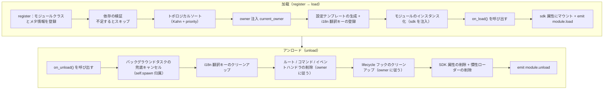

**加载時にフレームワークが自動で行う処理**（`on_load` のみ実装すれば、残りは自動）：

| フェーズ | フレームワークが自動で行う |
|------|-------------|
| owner 注入 | インスタンス化時に `owner_scope` でモジュール名をラップするため、`on_load` で登録したコマンド/イベント/フック/バックグラウンドタスクは**自動的に本モジュールに所有**され、アンロード時に owner に従って一括クリーンアップされる |
| 設定テンプレート | `ConfigClass` を宣言したモジュールは、フレームワークが自動的に `ErisPulse.<ModuleName>` の設定セグメントを生成/埋め込む |
| i18n 翻訳キー | `I18nClass` を宣言したモジュールは、翻訳キーが自動登録され（アンロード時に自動解除） |
| 依存トポロジー | `depends` で宣言した順序に従い、依存されるモジュールが先に加载されるようにする；循環依存は `RuntimeError` で拒否される |
| SDK へのマウント | インスタンス化後に `sdk.<ModuleName>` にマウントされ、`sdk.MyModule.xxx` でアクセス可能になる |

**アンロード時にフレームワークがクリーンアップする処理**（上記の U1→U7 に対応）：`on_unload` 実行後に兜底クリーンアップを行う——バックグラウンドタスクは強制キャンセル（`self.spawn` で作成されたもの、優雅な終了は `on_unload` で実装する）；i18n キー、ルート、コマンド/イベントハンドラ、lifecycle フック、最後に SDK 属性を削除。`purge=True` では追加で登録の残骸と `sys.modules` をクリーンアップ。

> この自動クリーンアップが「`on_load`/`on_unload` のみ実装すれば、手動で unregister する必要がない」という自信の源です——フレームワークは owner 归属によって「誰が登録したか、誰がクリーンアップするか」を一括処理にしています。

## SDK オブジェクト

### コアモジュールへのアクセス

```python
from ErisPulse import sdk

# sdk オブジェクトを介してすべてのコアモジュールにアクセス
sdk.logger.info("ログ")
sdk.storage.set("key", "value")
config = sdk.config.getConfig("MyModule")
```

### モジュール間通信

```python
# 他のモジュールにアクセス
other_module = sdk.OtherModule
result = await other_module.some_method()
```

## 适配器送信メソッドの照会

新しい標準規格では、デフォルト送信メカニズムを実装するために `__getattr__` メソッドのオーバーライドを使用するよう求められており、このため `hasattr` メソッドを用いてメソッドの存在をチェックできなくなりました。`2.3.5` 以降では、送信メソッドを照会する機能が追加されました。

### 対応する送信メソッドの一覧表示

```python
# プラットフォームが対応するすべての送信メソッドを一覧表示
methods = sdk.adapter.list_sends("onebot11")
# 戻り値: ["Text", "Image", "Voice", "Markdown", ...]
```

### メソッドの詳細情報の取得

```python
# 特定のメソッドの詳細情報を取得
info = sdk.adapter.send_info("onebot11", "Text")
# 戻り値:
# {
#     "name": "Text",
#     "parameters": [
#         {"name": "text", "type": "str", "default": null, "annotation": "str"}
#     ],
#     "return_type": "Awaitable[Any]",
#     "docstring": "テキストメッセージを送信..."
# }
```

## 設定管理

### 宣言的な設定（推奨）

v2.5.2 以降、モジュールは `ConfigClass` を使って設定クラスを宣言し、アダプターと同じ設定 Schema システムを使用できます。設定は `self.cfg` を通じてリアルタイムに読み取ることができ、変更後は即座に反映されます：

```python
from dataclasses import dataclass, field
from ErisPulse.Core.Bases import BaseModule
from ErisPulse.Core.Bases import BaseConfig

@dataclass
class MyModuleConfig(BaseConfig):
    api_key: str = field(
        default="",
        metadata={
            "description": {"i18n": "my_module.api_key", "default": "API 密钥"},
            "required": True,
            "secret": True,
            "ui": {"widget": "password", "group": "basic", "order": 1},
        },
    )
    timeout: int = field(
        default=30,
        metadata={
            "description": {"i18n": "my_module.timeout", "default": "超时时间（秒）"},
            "ui": {"widget": "number", "group": "advanced", "order": 2},
        },
    )

class MyModule(BaseModule):
    ConfigClass = MyModuleConfig

    def __init__(self, sdk):
        self.sdk = sdk
        self.logger = sdk.logger.get_child("MyModule")

    async def on_load(self, event):
        self.logger.info("モジュールがロードされました")

    async def on_unload(self, event):
        pass

    async def do_something(self):
        cfg = self.cfg  # 実時読み取り、型安全
        api_key = cfg.api_key
        timeout = cfg.timeout
```

`BaseConfig` は、アダプター、モジュール、外部プロジェクトなど、あらゆる場面で使用できる汎用的な設定基底クラスです。設定フィールドは i18n 多言語説明をサポートしています（詳しくは [i18n ドキュメント](../../advanced/i18n.md#配置字段多语言）をご覧ください）。

### 宣言的翻訳キー（v2.7.0+）

v2.7.0 以降、モジュールは `ConfigClass` を宣言するのと同じように、`I18nClass` というネストされたクラスを使って翻訳キーを一括で宣言できます。フレームワークはロード時に**自動的に**宣言されたすべての翻訳キーを登録し、手動で `i18n.register()` を呼び出す必要がなく、また設定テンプレート生成よりも前に行われます。これにより、設定の説明で参照される i18n キーが利用可能になります。

```python
from ErisPulse.Core.Bases import BaseConfig, BaseI18n, I18nKey

class MyModule(BaseModule):
    # 設定クラス（オプション）
    @dataclass
    class ConfigClass(BaseConfig):
        welcome_msg: str = field(
            default="欢迎",
            metadata={
                "description": {"i18n": "mymodule.welcome_msg", "default": "欢迎消息"},
            },
        )

    # 翻訳キー集合クラス（オプション）
    class I18nClass(BaseI18n):
        # プロパティ名が自動的に完全なキー経路：<モジュール名>.<プロパティ名> に連結されます
        welcome_msg: I18nKey = I18nKey(
            default="Welcome Message",   # 言語に依存しないデフォルト
            zh_CN="欢迎消息",
            zh_TW="歡迎訊息",
            en="Welcome Message",
            ja="ウェルカムメッセージ",
            ru="Приветственное сообщение",
        )
        hello: I18nKey = I18nKey(
            default="Hello, {name}!",
            zh_CN="你好，{name}！",
            zh_TW="你好，{name}！",
            en="Hello, {name}!",
            ja="こんにちは、{name}！",
            ru="Привет, {name}!",
        )
```

詳細は [i18n 推奨書き方](../../advanced/i18n.md#推荐写法通过-i18nclass-声明翻译键-v270) を参照してください。

### 手動で設定を読み取る（廃止済み）

> **廃止済み**：宣言的設定 ([宣言式設定](#宣言式設定)) と `self.cfg` を通じたリアルタイム読み取りを使用してください。

```python
class MyModule(BaseModule):
    def __init__(self, sdk):
        self.sdk = sdk

    def _load_config(self):
        config = self.sdk.config.getConfig("MyModule")
        if not config:
            self.sdk.config.setConfig("MyModule", {"api_key": "", "timeout": 30})
            return {"api_key": "", "timeout": 30}
        return config
```

## ストレージシステム

### 基本的な使用方法

```python
# データを保存
sdk.storage.set("user:123", {"name": "張三"})

# データを取得
user = sdk.storage.get("user:123", {})

# データを削除
sdk.storage.delete("user:123")
```

### トランザクションの使用

```python
# トランザクションを使用してデータの一貫性を確保
with sdk.storage.transaction():
    sdk.storage.set("key1", "value1")
    sdk.storage.set("key2", "value2")
    # いずれかの操作が失敗した場合、すべての変更はロールバックされます
```

## イベント処理

### イベントハンドラの登録

```python
from ErisPulse.Core.Event import command, message

# コマンドの登録
@command("info", help="情報を取得します")
async def info_handler(event):
    await event.reply("これは情報です")

# メッセージハンドラの登録
@message.on_group_message()
async def group_handler(event):
    sdk.logger.info(f"グループメッセージを受け取りました: {event.get_text()}")
```

### イベントハンドラのライフサイクル

フレームワークはイベントハンドラの登録とアンロードを自動的に管理します。`on_load` で登録するだけで済みます。

## ラグロードメカニズム

### 動作原理

```python
# モジュールが初めてアクセスされたときにのみ初期化されます
result = await sdk.my_module.some_method()
# ↑ ここでモジュールの初期化がトリガーされます
```

### 立即ロード

初期化が即座に必要なモジュール（例：リスナー、タイマー）の場合：

```python
@staticmethod
def get_load_strategy():
    return ModuleLoadStrategy(
        lazy_load=False,  # 立即ロード
        priority=100
    )
```

## エラー処理

### 例外のキャッチ

```python
async def handle_event(self, event):
    try:
        # ビジネスロジック
        await self.process_event(event)
    except ValueError as e:
        self.logger.warning(f"パラメータエラー: {e}")
        await event.reply(f"パラメータエラー: {e}")
    except Exception as e:
        self.logger.error(f"処理失敗: {e}")
        raise
```

### ログ記録

```python
# 異なるログレベルを使用
self.logger.debug("デバッグ情報")    # 詳細なデバッグ情報
self.logger.info("実行状態")      # 正常な実行情報
self.logger.warning("警告情報")  # 警告情報
self.logger.error("エラー情報")    # エラー情報
self.logger.critical("致命的エラー") # 致命的エラー
```


### Event 包装类详解

# Event 包装クラスの詳細

Event モジュールは、強力な Event 包装クラスを提供し、イベント処理を簡素化します。

## event パラメータに型注釈を追加する

イベントハンドラの `event` パラメータは **Event 包装クラス**（dict のサブクラス）です。このパラメータに型注釈を付けることを強く推奨します：

```python
from ErisPulse.Core.Event import Event

@message.on_private_message()
async def handler(event: Event):
    text = event.get_text()   # IDE が便利なメソッドをすべて自動補完
    await event.reply(text)   # 静的チェック時に誤字が発見される
```

型注釈を付けない場合、IDE は Event 上のメソッド（`get_text()` / `reply()` / `wait_reply()` / プラットフォーム拡張メソッドなど）を認識できず、すべて手動で記憶して入力する必要があります。

> **注意**：イベントハンドラのコールバックの `event` は **Event 包装クラス**（注釈は `Event`）です。一方、モジュールのライフサイクルメソッド `on_load` / `on_unload` の `event` は普通の **dict**（注釈は `dict`）です。これらは混同しないでください。

## 核心特性

- **完全互換性**：Event は dict を継承しています
- **便利なメソッド**：多数の便利なメソッドを提供しています
- **プロパティアクセス**：イベントフィールドにドット演算子でアクセスできます
- **後方互換性**：すべてのメソッドはオプションです

## 核心フィールドメソッド

```python
from ErisPulse.Core.Event import command

@command("info")
async def info_command(event: Event):
    event_id = event.get_id()
    platform = event.get_platform()
    time = event.get_time()
    print(f"ID: {event_id}, プラットフォーム: {platform}, 時間: {time}")
```

## メッセージイベントメソッド

```python
from ErisPulse.Core.Event import message

@message.on_private_message()
async def private_handler(event: Event):
    text = event.get_text()
    user_id = event.get_user_id()
    nickname = event.get_user_nickname()
    await event.reply(f"こんにちは、{nickname}！")
```

## メッセージタイプの判断

```python
from ErisPulse.Core.Event import message

@message.on_group_message()
async def group_handler(event: Event):
    is_private = event.is_private_message()
    is_group = event.is_group_message()
    is_at = event.is_at_message()
    await event.reply(f"タイプ: {'プライベートチャット' if is_private else 'グループチャット'}")
```

## 回答機能

```python
from ErisPulse.Core.Event import command

@command("ask")
async def ask_command(event: Event):
    await event.reply("あなたの名前を入力してください:")
    reply = await event.wait_reply(timeout=30)
    if reply:
        name = reply.get_text()
        await event.reply(f"こんにちは、{name}！")

@command("price")
async def price_command(event: Event):
    await event.reply("金額を入力してください（例：5元）:")
    # 回答が正規表現に一致しない場合、タイムアウトするまで待機し続ける
    reply = await event.wait_reply(timeout=30, regex=r"\d+\s*元")
    if reply:
        await event.reply(f"金額を受け取りました: {reply.get_text()}")
```

## コマンド情報の取得

```python
from ErisPulse.Core.Event import command

@command("cmdinfo")
async def cmdinfo_command(event: Event):
    cmd_name = event.get_command_name()
    cmd_args = event.get_command_args()
    await event.reply(f"コマンド: {cmd_name}, 引数: {cmd_args}")
```

## 通知イベントメソッド

```python
from ErisPulse.Core.Event import notice

@notice.on_friend_add()
async def friend_add_handler(event: Event):
    await event.reply("友達追加してくれてありがとう！")
```

## 方法速查表

### 核心方法

#### 事件基础信息
- `get_id()` - イベントIDを取得
- `get_time()` - イベントのタイムスタンプ（Unix秒単位）を取得
- `get_type()` - イベントのタイプ（message/notice/request/meta）を取得
- `get_detail_type()` - イベントの詳細タイプ（private/group/friend等）を取得
- `get_platform()` - プラットフォーム名を取得

#### ロボット情報
- `get_self_platform()` - ロボットのプラットフォーム名を取得
- `get_self_user_id()` - ロボットのユーザーIDを取得
- `get_self_account_id()` - ロボットのアカウントID（複数Botモード）を取得
- `get_self_info()` - ロボットの完全な情報辞書を取得

#### 会話識別子
- `get_target_id()` - 統一されたターゲットIDを取得（グループチャットは `group_id`、チャンネルは `channel_id`、プライベートチャットは `user_id` を返す。group → channel → guild → thread → userの順に最初の非空値を返す）
- `get_session_id()` - セッションの唯一の識別子を取得、形式は `{platform}:{detail_type}:{target_id}`

### メッセージイベントメソッド

#### メッセージ内容
- `get_message()` - メッセージセグメントの配列を取得（OneBot12形式）
- `get_alt_message()` - メッセージの代替テキストを取得
- `get_text()` - 純粋なテキスト内容を取得（`get_alt_message()`のエイリアス）
- `get_message_text()` - 純粋なテキスト内容を取得（`get_alt_message()`のエイリアス）

#### 送信者情報
- `get_user_id()` - 送信者のユーザーIDを取得
- `get_user_nickname()` - 送信者のニックネームを取得
- `get_sender()` - 送信者の完全な情報辞書を取得

#### グループ/チャンネル情報
- `get_group_id()` - グループIDを取得（グループメッセージ）
- `get_channel_id()` - チャンネルIDを取得（チャンネルメッセージ）
- `get_guild_id()` - サーバーIDを取得（サーバーメッセージ）
- `get_thread_id()` - トピック/サブチャンネルIDを取得（トピックメッセージ）

#### @メッセージ関連
- `has_mention()` - @ロボットが含まれているか
- `get_mentions()` - すべての@されたユーザーIDのリストを取得

### メッセージタイプ判断

#### 基礎判断
- `is_message()` - メッセージイベントであるか
- `is_private_message()` - プライベートチャットメッセージか
- `is_group_message()` - グループチャットメッセージか
- `is_at_message()` - @メッセージか（`has_mention()`のエイリアス）

### 通知イベントメソッド

#### 通知操作者
- `get_operator_id()` - 操作者のIDを取得
- `get_operator_nickname()` - 操作者のニックネームを取得

#### 通知タイプ判断
- `is_notice()` - 通知イベントであるか
- `is_group_member_increase()` - グループメンバー増加イベント
- `is_group_member_decrease()` - グループメンバー減少イベント
- `is_friend_add()` - 友達追加イベント（`detail_type == "friend_increase"`に一致）
- `is_friend_delete()` - 友達削除イベント（`detail_type == "friend_decrease"`に一致）

### 要求イベントメソッド

#### 要求情報
- `get_comment()` - 要求の付言を取得

#### 要求タイプ判断
- `is_request()` - 要求イベントであるか
- `is_friend_request()` - 友達要求か
- `is_group_request()` - グループ要求か

### 返信機能

#### 基礎返信
- `reply(content, method="Text", at_sender=False, quote=False, at_users=None, reply_to=None, at_all=False, via=None, **kwargs)` - 一般的な返信メソッド
  - `content`: 送信内容（テキスト、URLなど）
  - `method`: 送信方法、デフォルトは "Text"、"Image"/"Voice"/"Video"/"File" など
  - `at_sender`: 送信者を@するか（自動的に user_id を抽出）
  - `quote`: 現在のメッセージを引用して返信するか（自動的に message_id を抽出）
  - `at_users`: @するユーザーIDのリスト、例: `["user1", "user2"]`
  - `reply_to`: 手動で返信するメッセージIDを指定
  - `at_all`: 全員を@するか
  - `**kwargs`: 余分なパラメータ（例: Mentionメソッドの user_id）

- `reply_ob12(message)` - OneBot12メッセージセグメントを使って返信
  - `message`: OneBot12メッセージセグメントのリストまたは辞書、MessageBuilderを使って構築

#### プラットフォーム機能の確認
- `supports(method)` - 現在のプラットフォームが特定の送信方法（例: `"Image"`、`"Voice"`）をサポートしているか確認、`bool`を返す
- `available_methods()` - 現在のプラットフォームで利用可能な送信方法の一覧を取得、メソッド名のリストを返す

#### 転送機能

> **注意**: 転送機能はアダプターのSend DSLによって実装される必要があり、Eventラッパークラス自体は直接の転送メソッドを提供しない。

```python
# メッセージをグループに転送
adapter = sdk.adapter.get(event.get_platform())
target_id = event.get_group_id()  # または他のグループIDを指定
await adapter.Send.To("group", target_id).Text(event.get_text())
```

### 返信待ち機能

- `wait_reply(prompt=None, timeout=60.0, callback=None, validator=None, method="Text", pattern=None, regex=None)` - ユーザーからの返信を待つ
  - `prompt`: プロンプトメッセージ、提供された場合ユーザーに送信される
  - `timeout`: 待ち時間のタイムアウト（秒）、デフォルトは60秒
  - `callback`: 返信を受け取ったときに実行されるコールバック関数
  - `validator`: 返信が有効かどうかを検証する関数
  - `method`: プロンプトメッセージの送信方法、デフォルトは "Text"
  - `pattern`: globワイルドカード（`*` / `?` / `[seq]`）、返信テキストが一致する必要がある、一致しない場合は待機を続ける
  - `regex`: 正規表現、返信テキストが一致する必要がある（`pattern` と `regex` のどちらか一方を選択）、一致しない場合は待機を続ける
  - ユーザーの返信のEventオブジェクトを返す、タイムアウト時は`None`を返す

#### 交互メソッド

- `confirm(prompt=None, timeout=60.0, yes_words=None, no_words=None, method="Text", hint=False)` - 確認対話
  - `True`（確認）/ `False`（否定）/ `None`（タイムアウト）を返す
  - 内部的に中英語の確認語を自動認識し、カスタム語集を指定可能
  - `method`: 送信方法、デフォルトは "Text"、"Image"/"Markdown" などの非テキスト方式もサポート
  - `hint`: プロンプトの末尾に自動的に確認語のヒント（例: "（はい/いいえ）"）を追加するか、デフォルトは`False`

- `choose(prompt, options, timeout=60.0, method="Text", options_format="auto", merge_prompt=False, placeholder="{options}")` - 選択メニュー
  - `options`: 選択肢のテキストリスト
  - 選択肢のインデックス（0ベース）を返す、タイムアウト時は`None`を返す
  - `method`: 送信方法、デフォルトは "Text"、テキスト系メソッド (Text/Markdown/md/Html/h5) はデフォルトで選択肢を末尾にマージ
  - `options_format`: 選択肢のフォーマット（デフォルト: "auto"、methodに応じて自動的に組み込みスタイルを選択）
    - `"auto"`: Markdown→箇条書き（`- 1.選択肢`）、Html→順序付きリスト（`<ol>`）、その他の場合は純粋なテキストリスト
    - `"list"`: 各行に1つずつ、例: ``1. 選択肢A\n2. 選択肢B``
    - `"inline"`: 1行に表示、例: ``1.A | 2.B``
    - `"md"`: Markdownの箇条書き
    - `"html"`: Htmlの順序付きリスト
    - `callable`: 自作の関数、``list[str]``を受け取り``str``を返す
  - `merge_prompt`: 強制的に1つのメッセージにマージして送信するか、デフォルトは`False`
    - `False`（デフォルト）: テキスト系メソッドは自動的にマージ、非テキスト系メソッドはまずpromptを送信してからTextの選択肢を送信
    - `True`: どんなmethodでも1つのメッセージにマージしてユーザーが指定したmethodで送信
  - `placeholder`: 選択肢を挿入する占位符、デフォルトは`{options}`、promptにこのマーカーが含まれる場所に選択肢のテキストを置き換え、空文字に設定すると常に末尾に追加

- `collect(fields, timeout_per_field=60.0)` - フォーム収集
  - `fields`: フィールドのリスト、各項目には`key`、`prompt`、オプション`validator`、オプション`method`が含まれる
  - `{key: value}`の辞書を返す、いずれかのフィールドがタイムアウトすると`None`を返す
  - 各フィールドは`method`キーで送信方法を指定可能、例: 画像を収集する場合 ``{"key": "avatar", "prompt": "プロフィール画像を送ってください", "method": "Image"}``
  - 各フィールドは`options`キー（リスト）をオプションで提供可能、提供された場合、該当フィールドは選択問題になる（`choose`のロジックを自動的に呼び出す）
  - 各フィールドは`options_format`、`merge_prompt`、`placeholder`キーをオプションで提供可能、選択肢のフォーマット、メッセージのマージ動作、占位符を制御

- `wait_for(event_type="message", condition=None, timeout=60.0)` - 任意のイベントを待つ
  - `condition`: 条件関数、`True`を返した場合に一致する
  - 一致するEventオブジェクトを返す、タイムアウト時は`None`を返す

- `conversation(timeout=60.0)` - 複数回対話コンテキストを作成
  - `Conversation`オブジェクトを返す、`say()`/`wait()`/`confirm()`/`choose()`/`collect()`/`stop()`がサポートされる
  - `is_active`属性は対話がアクティブかどうかを示す

#### 交互メソッドの例

**confirm() - 確認対話:**

```python
@command("delete", help="データを削除")
async def delete_handler(event: Event):
    if await event.confirm("すべてのデータを削除してもよろしいですか？"):
        sdk.storage.delete("all_data")
        await event.reply("データを削除しました")
    else:
        await event.reply("キャンセルしました")
```

**confirm() - ヒント付き:**

```python
# hint=True はプロンプトの末尾に "（はい/いいえ）" を追加
if await event.confirm("続行してもよろしいですか？", hint=True):
    await event.reply("続行しました")
# ユーザーが表示する: 続行してもよろしいですか？（はい/いいえ）
```

**choose() - 選択メニュー:**

```python
@command("color", help="色を選択")
async def color_handler(event: Event):
    choice = await event.choose("色を選択してください：", ["赤", "緑", "青"])
    if choice is not None:
        colors = ["赤", "緑", "青"]
        await event.reply(f"選択した色は：{colors[choice]}")
```

**choose() - 選択肢のフォーマットとメッセージのマージ:**

```python
# inline形式：選択肢を1行に表示
choice = await event.choose("選択してください：", ["A", "B", "C"], options_format="inline")
# 出力: 1.A | 2.B | 3.C

# 自作のフォーマット
choice = await event.choose("選択してください：", ["猫", "犬"],
    options_format=lambda opts: " / ".join(opts))
# 出力: 猫 / 犬

# options_format="auto"（デフォルト）：methodに応じて自動的に組み込みスタイルを選択
# Markdown → 箇条書き
choice = await event.choose(
    "## 選択してください", ["猫", "犬"],
    method="Markdown",  # autoは自動的にmdリストを認識
)
# 出力:
# ## 選択してください
# - 1. 猫
# - 2. 犬

# Html → 順序付きリスト
choice = await event.choose(
    "<h2>選択してください</h2>", ["猫", "犬"],
    method="Html", merge_prompt=True,  # autoは自動的にhtmlリストを認識
)
# 出力:
# <h2>選択してください</h2>
# <ol><li>1. 猫</li><li>2. 犬</li></ol>

# マージモード + 占位符
choice = await event.choose(
    "## 選択してください\n{options}\n番号を返信してください",
    ["猫", "犬"],
    method="Markdown", merge_prompt=True,
)

# 自作の占位符
choice = await event.choose(
    "選択してください: [choices]",
    ["猫", "犬"],
    placeholder="[choices]",
)
```

**collect() - フォーム収集:**

```python
@command("register", help="登録")
async def register_handler(event: Event):
    data = await event.collect([
        {"key": "name", "prompt": "お名前を入力してください："},
        {"key": "age", "prompt": "年齢を入力してください：",
         "validator": lambda e: e.get_text().isdigit()},
    ])
    if data:
        await event.reply(f"登録完了！{data['name']}、{data['age']}歳")
```

**非テキストメソッドのreply:**

```python
await event.reply("http://example.com/img.jpg", method="Image")
await event.reply("http://example.com/audio.mp3", method="Voice")

from ErisPulse.Core.Event import MessageBuilder
segments = MessageBuilder.text("この画像を見てください：").image("http://example.com/img.jpg").build()
await event.reply_ob12(segments)
```

> 完全なConversation多回対話の使い方は[Conversation多回対話](../../advanced/conversation.md)を参照してください。

### コマンド情報

#### コマンド基礎
- `get_command_name()` - コマンド名を取得
- `get_command_args()` - コマンド引数のリストを取得
- `get_command_raw()` - コマンドの元のテキストを取得
- `get_command_info()` - 完全なコマンド情報の辞書を取得
- `is_command()` - コマンドか

### 元データ

- `get_raw()` - プラットフォームの元のイベントデータを取得
- `get_raw_type()` - プラットフォームの元のイベントタイプを取得

### プラットフォーム拡張メソッド

アダプターはEventラッパークラスにプラットフォーム固有のメソッドを登録できる。メソッドは対応するプラットフォームのEventインスタンスでのみ利用可能で、他のプラットフォームでアクセスすると`AttributeError`が発生する。

プラットフォームメソッドは`Event.__getattribute__`により、内蔵メソッドよりも優先して有効になるため、`confirm`、`choose`、`collect`、`wait_reply`などの内蔵インタラクティブメソッドを覆い、プラットフォーム特有の実装（例: ボタン、カードなど）を提供できる。内蔵実装は`_builtin_*`関数としてエクスポートされ、覆い書き側で利用可能。

```python
# メールイベント - メールメソッドのみ
event = Event({"platform": "email", "email_raw": {"subject": "Hello"}})
event.get_subject()      # ✅ "Hello"を返す
event.get_chat_type()    # ❌ AttributeError

# Telegramイベント - Telegramメソッドのみ
event = Event({"platform": "telegram", "telegram_raw": {"chat": {"type": "private"}}})
event.get_chat_type()    # ✅ "private"を返す
event.get_subject()      # ❌ AttributeError

# 内蔵メソッドは常に利用可能
event.get_text()         # ✅ どのプラットフォームでも
event.reply("hi")        # ✅ どのプラットフォームでも
```

### 登録されたメソッドの照会

```python
from ErisPulse.Core.Event import get_platform_event_methods

methods = get_platform_event_methods("email")
# ["get_subject", "get_from", ...]
```

### `hasattr` と `dir` のサポート

```python
hasattr(event, "get_subject")   # platform="email"のときのみTrueを返す
"get_subject" in dir(event)     # 同上
```

### 跨プラットフォーム拡張（ワイルドカード）

`register_event_method`と`register_event_mixin`はプラットフォーム名として`"*"`を渡すことができ、登録されたメソッドは**すべてのプラットフォーム**のEventインスタンスで利用可能になる。AI対話、コンテキスト管理など、跨プラットフォームで再利用可能な機能に適している。

```python
from ErisPulse.Core.Event.wrapper import register_event_method

@register_event_method("*")
async def ai_chat(self, prompt: str):
    # selfはEventインスタンス、イベントデータと内蔵メソッドにアクセス可能
    await self.reply(f"AI: {prompt}")
```

登録後、どのプラットフォームのイベントハンドラでも`event.ai_chat(...)`を呼び出すことができる。

メソッドの優先順位（高い順）: プラットフォーム固有メソッド → ワイルドカードメソッド → 内蔵メソッド → 辞書キーアクセス。

> アダプター開発者が拡張メソッドを登録する方法は[イベントシステムAPI - 跨プラットフォーム拡張ワイルドカード](../../api-reference/event-system.md#跨平台扩展通配符)を参照してください。


### 模块开发最佳实践

# モジュール開発のベストプラクティス

このドキュメントでは、ErisPulse モジュール開発におけるベストプラクティスの推奨事項を提供します。

## モジュール設計

### 1. 単一責任原則

各モジュールは1つのコア機能のみを担当するべきです：

```python
# 良い設計：各モジュールは1つの機能のみを担当
class WeatherModule(BaseModule):
    """天気照会モジュール"""
    pass

class NewsModule(BaseModule):
    """ニュース照会モジュール"""
    pass

# 悪い設計：1つのモジュールが複数の無関係な機能を担当
class UtilityModule(BaseModule):
    """天気、ニュース、ジョーク等多个の機能を含む"""
    pass
```

### 2. モジュール命名規則

```toml
[project]
name = "ErisPulse-ModuleName"  # ErisPulse- プレフィックスを使用
```

### 3. 明確な設定管理

宣言的設定（`ConfigClass` + `BaseConfig`）を使用することを推奨します。これにより、型安全、自動テンプレート生成、WebUIフォームサポートなどの機能が得られます：

```python
from dataclasses import dataclass, field
from ErisPulse.Core.Bases import BaseConfig

@dataclass
class MyModuleConfig(BaseConfig):
    api_url: str = field(default="https://api.example.com", metadata={
        "description": {"i18n": "my_module.api_url", "default": "API アドレス"},
    })
    timeout: int = field(default=30, metadata={
        "description": {"i18n": "my_module.timeout", "default": "タイムアウト時間（秒）"},
    })
    cache_ttl: int = field(default=3600, metadata={
        "description": {"i18n": "my_module.cache_ttl", "default": "キャッシュの有効時間（秒）"},
    })

class MyModule(BaseModule):
    ConfigClass = MyModuleConfig

    async def do_something(self):
        cfg = self.cfg  # 型安全、リアルタイム読み取り
        await self._fetch(cfg.api_url, timeout=cfg.timeout)
```

また、[モジュールのコア概念](core-concepts.md#設定管理)に記載されているように、手動で設定ストアを読み書きすることも可能です。

### 宣言的翻訳キー（v2.7.0+）

モジュールは `I18nClass` を使って翻訳キーを一括で宣言することで、フレームワークが自動的にi18nシステムに登録し、手動で `i18n.register()` を呼び出す必要がありません。

```python
from ErisPulse.Core.Bases import BaseI18n, I18nKey

class MyModule(BaseModule):
    class I18nClass(BaseI18n):
        # プレースホルダー付きの業務翻訳キー
        welcome: I18nKey = I18nKey(
            default="Welcome, {name}!",
            zh_CN="ようこそ、{name}！",
            zh_TW="ようこそ、{name}！",
            en="Welcome, {name}!",
            ja="ようこそ、{name}！",
            ru="Добро пожаловать, {name}!",
        )
        # 設定フィールドの説明の翻訳
        api_url: I18nKey = I18nKey(
            default="API URL",
            zh_CN="API アドレス",
            zh_TW="API 位址",
            en="API URL",
            ja="API URL",
            ru="API URL",
        )
```

詳細な使い方は [i18n ドキュメント](../../advanced/i18n.md#推奨書き方-through-i18nclass-宣言翻訳キー-v270) を参照してください。

## 非同期プログラミング

### 1. 非同期ライブラリの使用

```python
# SDK 内蔵の HTTP クライアント（非同期、自動ログと統計機能付き）の使用が推奨
from ErisPulse.Core import client

class MyModule(BaseModule):
    async def fetch_data(self, url):
        resp = await client.get(url)
        return await resp.json()

# sdk.client を直接使用しても同様の効果
from ErisPulse import sdk

class MyModule(BaseModule):
    async def fetch_data(self, url):
        resp = await sdk.client.get(url)
        return await resp.json()

# aiohttp を直接インポートしないこと（フレームワークによる統一管理が難しい）
import aiohttp

class MyModule(BaseModule):
    async def fetch_data(self, url):
        async with aiohttp.ClientSession() as session:
            async with session.get(url) as response:
                return await response.json()

# requests を使用しないこと（同期的でイベントループをブロックする）
import requests

class MyModule(BaseModule):
    def fetch_data(self, url):
        return requests.get(url).json()  # イベントループをブロックする
```

### 2. 正しい非同期操作

```python
from ErisPulse.Core.Event import Event  # event: Event 注釈により IDE の補完が得られる

async def handle_command(self, event: Event):
    # 結果を待つ必要のある処理：直接 await（ライフサイクルが明確）
    result = await self._long_operation()

async def on_load(self, event: dict):
    # バックグラウンドタスク（ポーリング/定時実行/fire-and-forget）：self.spawn() を使用
    # モジュールのアンロード時にフレームワークが on_unload の後にタスクをキャンセルし、
    # self の保持を防ぎ、リソースリークを回避する
    self.spawn(self._poll())
```

> [!NOTE]
> バックグラウンドタスクは `self.spawn()`（ErisPulse **2.8.0+**）を使用することを推奨します。`asyncio.create_task` で作成されるタスクはモジュールに属さず、アンロード時に自動的にキャンセルされません。`self` の参照を保持したままになるため、モジュールのインスタンスが回収されず、ホットリロード時にリソースリークが発生します。詳細は [ライフサイクル管理](../../advanced/lifecycle.md#バックグラウンドタスクの所属と自動キャンセル) を参照してください。

### 3. リソース管理

```python
async def on_load(self, event):
    # SDK クライアントは接続プールを自動的に管理しているため、session を手動で作成する必要はない
    pass
    
async def on_unload(self, event):
    # 自前でクライアントを使用する場合は、リソースの解放を忘れずに
    pass
```

## イベント処理

### 1. Event パッケージクラスの使用

```python
# Event パッケージクラスを使用する便利な方法
@command("info")
async def info_command(event: Event):
    user_id = event.get_user_id()
    nickname = event.get_user_nickname()
    await event.reply(f"こんにちは、{nickname}！")

# ダイクショナリに直接アクセスするのではなく
@command("info")
async def info_command(event: Event):
    user_id = event["user_id"]  # よく分からない、間違いやすい
```

### 2. 懒惰ロードの適切な使用

```python
# 低頻度コマンドモジュール：activate_on トリガを宣言し、最初の一致するコマンドが到着したときに自動的に有効化（怠惰ロードを維持）
class CommandModule(BaseModule):
    @staticmethod
    def get_load_strategy():
        return ModuleLoadStrategy(lazy_load=True, activate_on=[
            {"command": {"name": "dice", "help": "サイコロを振る", "aliases": ["d"]}},
        ])

# 低頻度リスナーモジュール：イベントトリガを宣言し、イベントが到着したときに自動的に有効化
class ListenerModule(BaseModule):
    @staticmethod
    def get_load_strategy():
        return ModuleLoadStrategy(lazy_load=True, activate_on=[
            {"notice": "group_member_increase"},
        ])

# 高頻度トリガ（各メッセージを処理する必要がある）または起動時に即座に準備が必要なモジュール：即時ロード
class HotListenerModule(BaseModule):
    @staticmethod
    def get_load_strategy():
        return ModuleLoadStrategy(lazy_load=False)

# ユーティリティモジュールは怠惰ロードに適している
class UtilityModule(BaseModule):
    @staticmethod
    def get_load_strategy():
        return ModuleLoadStrategy(lazy_load=True)
```

> `activate_on` の完全な構文（イベント三形式 / コマンドの簡易表記と dict 宣言 / help フォールバックチェーン）については、[怠惰ロードモジュールシステム](../../advanced/lazy-loading.md#イベント駆動怠惰有効化activate_on)を参照してください。

### 3. イベントハンドラの登録

```python
async def on_load(self, event):
    # on_load でイベントハンドラを登録
    @command("hello")
    async def hello_handler(event: Event):
        await event.reply("こんにちは！")
    
    @message.on_group_message()
    async def group_handler(event: Event):
        self.logger.info("グループメッセージを受信しました")
    
    # 手動で解除する必要はなく、フレームワークが自動的に処理します
```

## エラー処理

### 1. 例外の分類処理

```python
async def handle_event(self, event: Event):
    try:
        result = await self._process(event)
    except ValueError as e:
        # 予期されたビジネスエラー
        self.logger.warning(f"ビジネス警告: {e}")
        await event.reply(f"パラメータエラー: {e}")
    except aiohttp.ClientError as e:
        # ネットワークエラー（推奨は sdk.client + ClientError による置き換え）
        # 旧コードでは直接 aiohttp を使っても正常に動作しますが、新規コードでは ErisPulse の例外体系の使用を推奨します
        self.logger.error(f"ネットワークエラー: {e}")
        await event.reply("ネットワークリクエストに失敗しました。後でもう一度お試しください。")
    except Exception as e:
        # 予期しないエラー
        self.logger.error(f"未知のエラー: {e}", exc_info=True)
        await event.reply("処理に失敗しました。管理者にお問い合わせください。")
        raise
```

### 2. タイムアウト処理

```python
# 推奨は SDK 内部のクライアント（タイムアウトと再試行機能を内蔵）
from ErisPulse.Core import client
from ErisPulse.Core.Bases.errors import ClientTimeoutError

async def fetch_with_timeout(self, url, timeout=30):
    try:
        resp = await client.get(url, timeout=timeout)
        return await resp.json()
    except ClientTimeoutError:
        self.logger.warning(f"リクエストがタイムアウトしました: {url}")
        raise
```

## ストレージシステム

### 1. トランザクションの使用

```python
# トランザクションを使用してデータの一貫性を確保
async def update_user(self, user_id, data):
    with self.sdk.storage.transaction():
        self.sdk.storage.set(f"user:{user_id}:profile", data["profile"])
        self.sdk.storage.set(f"user:{user_id}:settings", data["settings"])

# ❌ トランザクションを使用しないと、データの一貫性が保証されない
async def update_user(self, user_id, data):
    self.sdk.storage.set(f"user:{user_id}:profile", data["profile"])
    # ここでエラーが発生すると、前の設定はロールバックできない
    self.sdk.storage.set(f"user:{user_id}:settings", data["settings"])
```

### 2. バッチ操作

```python
# バッチ操作を使用してパフォーマンスを向上
def cache_multiple_items(self, items):
    self.sdk.storage.set_multi({
        f"item:{k}": v for k, v in items.items()
    })

# ❌ 複数回の呼び出しは効率が悪い
def cache_multiple_items(self, items):
    for k, v in items.items():
        self.sdk.storage.set(f"item:{k}", v)
```

## ログ記録

### 1. ログレベルの適切な使用

```python
# DEBUG: 詳細なデバッグ情報（開発時のみ）
self.logger.debug(f"入力パラメータ: {params}")

# INFO: 正常な実行情報
self.logger.info("モジュールがロードされました")
self.logger.info(f"リクエストを処理: {request_id}")

# WARNING: 警告情報、主要機能には影響しません
self.logger.warning(f"設定項目 {key} が設定されていません、デフォルト値を使用します")
self.logger.warning("APIのレスポンスが遅い、最適化が必要かもしれません")

# ERROR: エラー情報
self.logger.error(f"APIリクエストに失敗しました: {e}")
self.logger.error(f"イベントの処理に失敗しました: {e}", exc_info=True)

# CRITICAL: 致命的なエラー、即時対応が必要です
self.logger.critical("データベース接続に失敗しました、ロボットが正常に動作できません")
```

### 2. 構造化ログ

```python
# 構造化ログを使用し、解析しやすくします
self.logger.info(f"リクエストを処理: request_id={request_id}, user_id={user_id}, duration={duration}ms")

# ❌ 非構造化ログの使用
self.logger.info(f"リクエストを処理しました、ユーザー {user_id} から、所要時間 {duration} ミリ秒")
```

## パフォーマンス最適化

### 1. キャッシュの使用

```python
class MyModule(BaseModule):
    def __init__(self):
        self._cache = {}
        self._cache_lock = asyncio.Lock()
    
    async def get_data(self, key):
        async with self._cache_lock:
            if key in self._cache:
                return self._cache[key]
            
            # データベースから取得
            data = await self._fetch_from_db(key)
            
            # データをキャッシュ
            self._cache[key] = data
            return data
```

### 2. ブロッキング操作の回避

```python
# 非同期操作を使用
async def process_message(self, event: Event):
    # 非同期処理
    await self._async_process(event)

# ❌ ブロッキング操作
async def process_message(self, event: Event):
    # 同期操作、イベントループをブロック
    result = self._sync_process(event)
```

## セキュリティ

### 1. 敏感データの保護

```python
# 敏感データは設定に保存されます（宣言的 ConfigClass、secret フィールドはログ/エクスポートに含まれません）
from dataclasses import dataclass, field
from ErisPulse.Core.Bases import BaseModule, BaseConfig

@dataclass
class MyModuleConfig(BaseConfig):
    api_key: str = field(
        default="",
        metadata={"description": "API キー", "secret": True},
    )

class MyModule(BaseModule):
    ConfigClass = MyModuleConfig

    def check_api_key(self):
        if not self.cfg.api_key or self.cfg.api_key == "YOUR_API_KEY_HERE":
            raise ValueError("config.toml に有効な API キーを設定してください")

# ❌ 敏感データのハードコーディング
class MyModule(BaseModule):
    API_KEY = "sk-1234567890"  # これを行わないでください！
```

### 2. 入力検証

```python
# ユーザー入力の検証
async def process_command(self, event: Event):
    user_input = event.get_text()
    
    # 入力長さの検証
    if len(user_input) > 1000:
        await event.reply("入力が長すぎます。再度入力してください")
        return
    
    # 入力形式の検証
    if not re.match(r'^[a-zA-Z0-9]+$', user_input):
        await event.reply("入力形式が正しくありません")
        return
```

## テスト

### 1. 単体テスト

```python
import pytest
from ErisPulse.Core.Bases import BaseModule

class TestMyModule:
    def test_config_defaults(self):
        """テストのデフォルト設定"""
        config = MyModule.ConfigClass()
        assert config.timeout == 30
```

### 2. 統合テスト

```python
@pytest.mark.asyncio
async def test_command_handling():
    """コマンド処理のテスト"""
    module = MyModule()
    await module.on_load({})
    
    # コマンドイベントをシミュレート
    event = create_test_command_event("hello")
    await module.handle_command(event)
```

## 部署

### 1. バージョン管理

```toml
[project]
name = "ErisPulse-MyModule"
version = "1.0.0"
```

セマンティックバージョニングに従います：
- MAJOR.MINOR.PATCH
- 主バージョン：互換性のないAPIの変更
- 次バージョン：互換性のある機能の追加
- 修訂番号：互換性のある問題の修正

### 2. READMEのヘッダー

`epsdk create`で生成されたREADMEには、ErisPulseのヘッダー識別子（ロゴ + バッジ行）が既に含まれています。2つの推奨モードがあります：

**モードA — 仅ErisPulseロゴ（デフォルト）：**

```markdown
<div align="center">


# MyModule

**一文で説明**

<p>
  <a href="https://pypi.org/project/ErisPulse-MyModule/"></a>
  <a href="https://pypi.org/project/ErisPulse-MyModule/"></a>
  <a href="./LICENSE"></a>
  <a href="https://github.com/ErisPulse/ErisPulse"></a>
</p>

</div>
```

**モードB — モジュールアイコン × ErisPulseロゴ（独自アイコンがある場合）：**

```markdown
<div align="center">


<span style="font-size:44px;color:#c8c8c8;margin:0 18px;vertical-align:middle;">×</span>


# MyModule
（バッジ行は上記と同様）
</div>
```

GitHubのStarsやDownloadsなどのバッジを必要に応じて追加できます。ロゴはプロジェクトのローカルにダウンロードし（`.github/assets/ErisPulseLogo.png`）、相対パスで参照することもできます。


=====
适配器开发
=====


适配器开发
-----


### 适配器开发入门

# アダプター開発入門

このガイドでは、ErisPulse アダプターを開発し、新しいメッセージプラットフォームを接続する方法を紹介します。

## アダプターの概要

### アダプターとは

アダプターは ErisPulse と各種メッセージプラットフォームの間の橋渡し役であり、以下の機能を担います：

1. **正方向変換**：プラットフォームイベントを受け取り、OneBot12 標準フォーマットに変換します（Converter）
2. **逆方向変換**：OneBot12 メッセージセグメントをプラットフォーム API 呼び出しに変換します（`Raw_ob12`）
3. プラットフォームとの接続管理（WebSocket/WebHook）
4. 統一された SendDSL メッセージ送信インターフェースを提供

### アダプターのアーキテクチャ

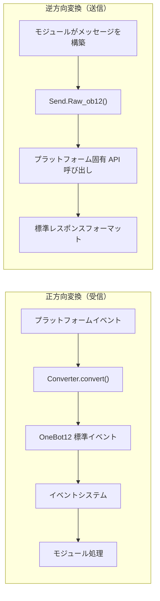

## 目录構造

標準的なアダプターパッケージの構造：

```
MyAdapter/
├── pyproject.toml          # プロジェクト設定
├── README.md               # プロジェクト説明
├── LICENSE                 # ライセンス
└── MyAdapter/
    ├── __init__.py          # パッケージエントリ
    ├── Core.py               # アダプターのメインクラス
    └── Converter.py          # イベント変換器
```

## 快速開始

### 1. プロジェクトの作成

```bash
mkdir MyAdapter && cd MyAdapter
```

### 2. pyproject.toml の作成

```toml
[project]
name = "ErisPulse-MyAdapter"
version = "1.0.0"
description = "MyAdapterプラットフォームアダプター"
readme = "README.md"
requires-python = ">=3.10"
license = { file = "LICENSE" }
authors = [ { name = "yourname", email = "your@mail.com" } ]

dependencies = [
    "ErisPulse>=2.4.0"  # ErisPulse には aiohttp が内蔵されているため、通常は別途依存関係を指定する必要はない
]

[project.urls]
"homepage" = "https://github.com/yourname/MyAdapter"

[project.entry-points."erispulse.adapter"]
"MyAdapter" = "MyAdapter:MyAdapter"
```

### 3. アダプターのメインクラスの作成

フレームワークは `ConfigClass` / `AccountConfigClass` を提供しており、宣言的な設定管理が可能。アダプターは単に設定クラスを宣言するだけで、自動的に読み込み、検証、設定テンプレートの生成が行われる。

```python
# MyAdapter/Core.py
from dataclasses import dataclass, field
from ErisPulse.Core import BaseAdapter
from ErisPulse.Core.Bases import BaseConfig

@dataclass
class MyAdapterConfig(BaseConfig):
    """MyAdapter 設定"""
    api_endpoint: str = field(
        default="https://api.example.com",
        metadata={
            "description": {"i18n": "my_adapter.api_endpoint", "default": "API アドレス"},
            "required": False,
            "ui": {"widget": "text", "group": "connection", "order": 1},
        },
    )
    token: str = field(
        default="",
        metadata={
            "description": {"i18n": "my_adapter.token", "default": "プラットフォーム Token"},
            "required": True,
            "secret": True,
            "ui": {"widget": "password", "group": "basic", "order": 2},
        },
    )

class MyAdapter(BaseAdapter):
    ConfigClass = MyAdapterConfig  # 設定クラスを宣言することで、フレームワークが自動的に管理する
    
    # __init__ をオーバーライドする必要はない！フレームワークが自動的に処理する：
    # - self.sdk / self.logger が自動的に設定される
    # - self.cfg は設定をリアルタイムで読み取る
    # - self.Send / self.Request は自動的に初期化される
    
    def _setup_converter(self):
        from .Converter import MyPlatformConverter
        return MyPlatformConverter()
```

> ⚠️ **`__init__` について**：新バージョンでは `BaseAdapter.__init__(self, sdk=None)` が SDK の参照、ログの初期化、設定の読み込みを自動的に処理する。ほとんどのアダプターは `__init__` をオーバーライドする必要はない。詳細は [__init__ 注意事項](#init-注意事项) を参照。

> ⚠️ **`super().__init__()` について**：`BaseAdapter.__init__()` は `Send` と `Request` ファクトリのインスタンスを作成する責任を持つ。これを忘れると、すべてのメッセージ送信とリクエスト操作で `AttributeError` が発生する。詳細は [__init__ 注意事項](#init-注意事项) を参照。

### 4. 必須メソッドの実装

```python
class MyAdapter(BaseAdapter):
    # ... __init__ のコード ...
    
    async def start(self):
        """アダプターの起動（必須実装）"""
        # WebSocket または WebHook ルートを登録
        router.register_websocket(
            module_name="myplatform",
            path="/ws",
            handler=self._ws_handler
        )
        self.logger.info("アダプターが起動しました")
    
    async def shutdown(self):
        """アダプターの終了（必須実装）"""
        router.unregister_websocket(
            module_name="myplatform",
            path="/ws"
        )
        # 接続とリソースのクリーンアップ
        self.logger.info("アダプターが終了しました")
    
    async def call_api(self, endpoint: str, **params):
        """プラットフォーム API の呼び出し（必須実装）"""
        raise NotImplementedError("call_api を実装する必要があります")
```

#### メタイベントの送信

アダプターは、Bot のオンライン状態をフレームワークが追跡できるように、メタイベントを送信する必要がある。`emit_meta()` を使用すれば、一行で完了できる：

```python
class MyAdapter(BaseAdapter):
    async def _ws_handler(self, websocket):
        bot_id = self._get_bot_id()

        # Bot がオンライン
        await self.emit_meta("connect", bot_id, user_name="MyBot")

        try:
            while True:
                data = await websocket.receive_text()
                event = self.convert(data)
                if event:
                    await self.adapter.emit(event)
        except WebSocketDisconnect:
            pass
        finally:
            # Bot がオフライン
            await self.emit_meta("disconnect", bot_id)
```

> Bot の状態管理とメタイベントの詳細については、[アダプターのベストプラクティス - Bot 状態管理とメタイベント](best-practices.md#bot-状態管理と-meta-イベント) を参照。

### 5. Send クラスの実装

`At`/`AtAll`/`Reply` 修飾子は、フレームワークの SendDSL 基底クラスに内蔵されているため、アダプターは `Raw_ob12` と具体的な送信メソッドを実装するだけでよい。

フレームワークは以下の重要な補助メソッドを提供する：
- `self._apply_modifiers(message)` — 修飾子（At/AtAll/Reply）をメッセージセグメントに自動的に統合する
- `self.send_context` — 送信コンテキスト辞書（`target_type`、`target_id`、`account_id`）を取得する

```python
import asyncio

class MyAdapter(BaseAdapter):
    # ... 他のコード ...
    
    class Send(BaseAdapter.Send):
        
        def Raw_ob12(self, message, **kwargs):
            """
            OneBot12 形式のメッセージを送信する（必須実装）

            _apply_modifiers を使用して修飾子の状態を自動的に統合し、
            send_context を使用して送信コンテキストを取得する。
            """
            async def _do_send():
                segments = self._apply_modifiers(message)
                return await self._adapter.call_api(
                    endpoint="/send_message",
                    message=segments,
                    **self.send_context,
                    **kwargs
                )
            return asyncio.create_task(_do_send())

        # Text/Image/Voice/Video/File は SendDSL 基底クラスから継承されているため、
        # 通常は Raw_ob12 に委任するだけで、再実装する必要はない。
        # プラットフォーム固有のロジックが必要な場合は、個別のメソッドをオーバーライドできる：
        # def Text(self, text: str):
        #     return self.Raw_ob12([{"type": "text", "data": {"text": text}}])
```

**メディア送信メソッド（Image/Video/File）の実装のポイント：**

- 基底クラスのデフォルト実装は、`file` パラメータを OneBot12 メッセージセグメントにラップして `Raw_ob12` に渡す。アダプターは `Raw_ob12` でダウンロード/アップロードを処理する必要がある。
- `file` パラメータは `bytes` 二進データと `str` URL の両方に対応する必要がある。
- URL を渡した場合は、まずファイルをダウンロードしてから、プラットフォームにアップロードする必要がある。
- プラットフォームでは、通常はまずアップロードインターフェースを呼び出してファイル識別子を取得し、次に送信インターフェースを呼び出す。

**`__getattr__` マジックメソッド：**

- メソッド名の大小文字を区別しないようにする（`Text`、`text`、`TEXT` はすべて同じメソッドを呼び出す）。
- 定義されていないメソッドは、エラーではなく、メッセージを返す。

**`Raw_ob12` メソッド：**

- OneBot12 標準メッセージ形式をプラットフォーム形式に変換して送信する。
- `self._apply_modifiers(message)` を使用して、At/AtAll/Reply 修飾子を自動的に処理する。
- `**self.send_context` を使用して、送信対象情報とアカウント情報を渡す。

### 6. 変換器の実装

```python
# MyAdapter/Converter.py
import time
import uuid

class MyPlatformConverter:
    def convert(self, raw_event):
        """プラットフォームの生イベントを OneBot12 標準形式に変換する"""
        if not isinstance(raw_event, dict):
            return None
        
        onebot_event = {
            "id": str(raw_event.get("event_id", uuid.uuid4())),
            "time": int(time.time()),
            "type": self._convert_event_type(raw_event.get("type")),
            "detail_type": self._convert_detail_type(raw_event),
            "platform": "myplatform",
            "self": {
                "platform": "myplatform",
                "user_id": str(raw_event.get("bot_id", ""))
            },
            "myplatform_raw": raw_event,
            "myplatform_raw_type": raw_event.get("type", "")
        }
        
        return onebot_event
    
    def _convert_event_type(self, event_type):
        """イベントタイプを変換する"""
        type_map = {
            "message": "message",
            "notice": "notice"
        }
        return type_map.get(event_type, "unknown")
    
    def _convert_detail_type(self, raw_event):
        """詳細タイプを変換する"""
        return "private"  # 簡単な例として
```

### 7. Request クラスの実装（リクエスト操作）

プラットフォームがフレンドリクエスト、グループ招待などの、Bot が決定を下す必要があるリクエストをサポートしている場合は、`Request` 内部クラスを実装できる。

```python
from ErisPulse.Core import BaseAdapter, RequestDSL

class MyAdapter(BaseAdapter):
    # ... Send と他のコード ...
    
    class Request(RequestDSL):
        """リクエスト操作の実装（フレンドリクエスト、グループ招待など）"""

        def accept(self, **kwargs):
            """リクエストを承認する"""
            async def _do():
                result = await self._adapter.call_api(
                    endpoint="/set_request",
                    request_id=self._request_id,
                    approve=True,
                    **kwargs,
                )
                return {
                    "status": "ok" if result.get("code") == 0 else "failed",
                    "retcode": result.get("code", 0),
                    "data": None,
                    "message_id": "",
                    "message": result.get("message", ""),
                }
            return self._create_task(_do())

        def reject(self, **kwargs):
            """リクエストを拒否する"""
            async def _do():
                result = await self._adapter.call_api(
                    endpoint="/set_request",
                    request_id=self._request_id,
                    approve=False,
                    **kwargs,
                )
                return {
                    "status": "ok" if result.get("code") == 0 else "failed",
                    "retcode": result.get("code", 0),
                    "data": None,
                    "message_id": "",
                    "message": result.get("message", ""),
                }
            return self._create_task(_do())
```

モジュール開発者が使用する方法：

```python
from ErisPulse.Core.Event import request

@request.on_friend_request()
async def handle_friend_request(event):
    # Event の便利なメソッドを使用
    await event.approve()
    # またはアダプターを直接操作
    await adapter.myplatform.Request("req_id").accept()
```

> プラットフォームがリクエスト操作をサポートしていない場合は、`Request` 内部クラスを実装する必要はない。基底クラスはデフォルトで `retcode=10002`（サポートされていない操作）を返す。詳細は [リクエスト操作の規格](../../standards/request-action-spec.md) を参照。

### 8. パッケージエントリの作成

```python
# MyAdapter/__init__.py
from .Core import MyAdapter
```

## 依存関係の宣言（オプション、2.8.0以降）

アダプタは、他のアダプタやモジュールへの依存を宣言することで、アダプタ間の連携やオプション機能を実現できます。

```python
from typing import ClassVar

class MyAdapter(BaseAdapter):
    # 硬的依存：存在しない場合、起動をスキップ（警告 + status=skipped-dependency イベント）
    depends: ClassVar[dict] = {
        "adapters": ["onebot11"],   # 依存するアダプタ（プラットフォーム名で指定）
        "modules": ["TranslateEngine"],  # 依存するモジュール（登録名で指定）
    }
    # ソフトな依存：存在しない場合、起動に影響しない；モジュールのロード/アンロード時にコールバックを受ける（オプション機能モード）
    optional_modules: ClassVar[list] = ["TranslateEngine"]
```

- **起動順序**：モジュールの硬的依存を宣言したアダプタは、**モジュールの初期化完了後に起動される**。
- **ソフト依存の通知**：`optional_modules`（またはモジュールの硬的依存）に含まれるモジュールがロードされたときに `on_dependency_ready(module_name)` を呼び出す；アンロードされたときに `on_dependency_lost(module_name)` を呼び出す（デフォルトでは空実装、オーバーライド可能）——遅延ロードやホットリロードの場面に対応：

```python
async def on_dependency_ready(self, module_name):
    """ソフト依存モジュールの準備完了：対応するオプション機能を有効化"""
    if module_name == "TranslateEngine":
        self._translate = self.sdk.TranslateEngine

async def on_dependency_lost(self, module_name):
    """ソフト依存モジュールの喪失：機能を降格"""
    if module_name == "TranslateEngine":
        self._translate = None
```

> [!NOTE]
> この機能は ErisPulse **2.8.0以降**が必要です。

## `__init__` の注意点

アダプター開発において、`__init__` のオーバーライドは3つのレベルで考慮する必要があります。それぞれの正しい実装方法を以下に示します。

### 1. BaseAdapter 層（通常はオーバーライド不要）

`BaseAdapter.__init__(self, sdk=None)` は `Send` / `Request` ファクトリのインスタンスを作成し、以下の自動処理を行います：

- `sdk` パラメータを受け取り、`self.sdk` および `self.logger` を設定
- `ConfigClass` を宣言した場合、`self.cfg` でグローバル設定をリアルタイムに読み取れる
- `AccountConfigClass` を宣言した場合、`self.accounts` で複数アカウントの設定をリアルタイムに読み取れる

**通常は `__init__` をオーバーライドする必要はありません**。`ConfigClass` を宣言するだけで十分です：

```python
class MyAdapter(BaseAdapter):
    ConfigClass = MyAdapterConfig  # 声明後、フレームワークが自動的に設定を管理
    
    async def start(self):
        cfg = self.cfg  # タイプセーフ、リアルタイムに読み取る
        ...
```

もし本当にカスタム初期化が必要な場合は、`super().__init__(sdk)` を呼び出せばよいです：

```python
class MyAdapter(BaseAdapter):
    ConfigClass = MyAdapterConfig
    
    def __init__(self, sdk=None):
        super().__init__(sdk)  # sdk を渡す
        self.converter = self._setup_converter()
        self.convert = self.converter.convert
```

### 2. Send 内部クラス（通常はオーバーライド不要）

`SendDSL.__init__` は、連鎖呼び出しにおける状態の伝達（対象タイプ、対象ID、アカウントなど）を担当します。**通常は、`Raw_ob12`、`Text` などのメソッドをオーバーライドするだけで十分で、`__init__` をオーバーライドする必要はありません**。

もし本当に必要（例えば、プラットフォーム特有の状態を初期化する場合）であれば、**すべてのパラメータを渡す必要があります**：

```python
class MyAdapter(BaseAdapter):
    class Send(BaseAdapter.Send):
        # パラメータ：adapter, target_type, target_id, account_id
        def __init__(self, adapter, target_type=None, target_id=None, account_id=None):
            super().__init__(adapter, target_type, target_id, account_id)  # ← 必須で渡す
            self._my_state = None  # プラットフォーム特有の初期化
```

**なぜ渡す必要があるのか？** 連鎖呼び出しの各ステップは `self.__class__(...)` で新しいインスタンスを作成するためです：

```python
adapter.Send.To("user", "123")               # → Send(adapter, "user", "123", None)
adapter.Send.To("user", "123").Using("bot1")  # → Send(adapter, "user", "123", "bot1")
```

もし `__init__` のシグネチャが一致しない、または `super()` を呼び出さない場合、連鎖呼び出しは中断されます。

### 3. Request 内部クラス（通常はオーバーライド不要）

Send と同じです。パラメータは `adapter`, `request_id`, `account_id` です：

```python
class MyAdapter(BaseAdapter):
    class Request(RequestDSL):
        # パラメータ：adapter, request_id, account_id
        def __init__(self, adapter, request_id=None, account_id=None):
            super().__init__(adapter, request_id, account_id)  # ← 必須で渡す
            self._my_state = None  # プラットフォーム特有の初期化
```

### まとめ

| 層 | 什么时候重写 | 必须做的事 |
|------|------------|-----------|
| **BaseAdapter** | 需要自定义初始化逻辑时 | `super().__init__(sdk)` （传入 sdk 参数） |
| **Send 内部类** | 需要初始化发送相关状态时 | `super().__init__(adapter, target_type, target_id, account_id)` |
| **Request 内部类** | 需要初始化请求相关状态时 | `super().__init__(adapter, request_id, account_id)` |
| 三个层面 | 大多数情况 | **声明 ConfigClass 即可，不碰 `__init__`** |

### 9. 接続情報とルーティング発見

アダプターがルーティングを登録した後、フレームワークはすべてのルーティング情報を記録します。ユーザーは以下の API を使ってアダプターの接続アドレスを確認できます：

```python
from ErisPulse import sdk

# アダプターの完全な接続情報を取得
info = sdk.adapter.get_connection_info("myplatform")
# {
#   "platform": "myplatform",
#   "status": "started",
#   "connection": {
#     "base_url": "http://localhost:8080",
#     "http_routes": [
#       {"path": "/myplatform/webhook", "method": "POST",
#        "url": "http://localhost:8080/myplatform/webhook"}
#     ],
#     "websocket_routes": [
#       {"path": "/myplatform/ws",
#        "url": "ws://localhost:8080/myplatform/ws"}
#     ]
#   }
# }

# すべてのネームスペース（アダプター/モジュール）のルーティングをリストアップ
namespaces = sdk.router.list_namespaces()
# {"myplatform": {"http": ["/myplatform/webhook"], "websocket": ["/myplatform/ws"]}}

# ネームスペースの完全な接続 URL を取得
urls = sdk.router.get_module_urls("myplatform")
# {"base_url": "http://localhost:8080", "http": [...], "websocket": [...]}

# ネームスペースの詳細なルーティング情報を取得
routes = sdk.router.get_module_routes("myplatform")
# {"http": [{"path": "/myplatform/webhook", "methods": ["POST"]}],
#  "websocket": [{"path": "/myplatform/ws", "auth": false}]}
```

> **ヒント**：`get_connection_info()` が返す情報は、ユーザーに表示するのに適しています（例：WebUI）。プラットフォーム側のコールバックアドレスや WebSocket 接続アドレスを設定するのに役立ちます。ルーティング登録時の `module_name` は、ErisPulse で登録されたアダプターの `platform` 名と完全に一致している必要があります。そうでなければ、ルーティングの発見は正しく関連付けられません。

### 10. SSE (Server-Sent Events) のサポート

ErisPulse にはサーバーに依存しない SSE サポートが内蔵されており、モジュールやアダプターは `@sdk.router.sse()` を使って SSE エンドポイントを登録できます。

#### 基本的な使用法

```python
import asyncio
from ErisPulse import sdk

@sdk.router.sse("MyModule", "/events")
async def event_stream(sse):
    """SSE イベントを送信"""
    count = 0
    while not sse.closed:
        await sse.send({"count": count}, event="update")
        count += 1
        await asyncio.sleep(1)
```

#### リクエストパラメータの使用

ハンドラは `request` パラメータを宣言してクライアントリクエスト情報をアクセスできます：

```python
@sdk.router.sse("MyModule", "/events")
async def event_stream(request, sse):
    token = request.query_params.get("token")
    if not validate_token(token):
        await sse.close()
        return

    while not sse.closed:
        data = await fetch_data(token)
        await sse.send(data)
        await asyncio.sleep(5)
```

#### SseEmitter API

| メソッド | 説明 |
|------|------|
| `sse.send(data, event=None, id=None, retry=None)` | SSE イベントを送信。str 以外の data は自動的に JSON シリアライズされる |
| `sse.close()` | SSE 接続を優雅に閉じる（安全に呼び出せる、複数回呼び出せる） |
| `sse.closed` | 接続が閉じられているかどうか |
| `sse.request` | ベースとなるリクエストオブジェクト（クエリパラメータ、headers を読み取るのに使用可能） |

#### RouteGroup での使用

```python
api = sdk.router.group("MyModule", "/api", version="1")

@api.sse("/events")
async def events(sse):
    await sse.send({"msg": "hello"})
```

#### ルーティングの発見

SSE ルーティングは自動的にルーティング発見 API に含まれます：

```python
# list_namespaces は "sse" キーを含む
sdk.router.list_namespaces()
# {"MyModule": {"http": [...], "websocket": [...], "sse": ["/MyModule/events"]}}

# get_module_routes は streaming: true でマークされる
sdk.router.get_module_routes("MyModule")
# {"http": [...], "websocket": [...], "sse": [{"path": "/MyModule/events", "streaming": true}]}

# get_module_urls は完全な URL を生成する
sdk.router.get_module_urls("MyModule")
# {"sse": [{"path": "/MyModule/events", "url": "http://localhost:8080/MyModule/events"}]}
```

> **サーバーに依存しない設計**：`SseEmitter` はコールバックを通じて下層の HTTP フレームワークと分離されています。フレームワークは `register_sse()` および `@sse` デコレーターを統一的な登録エントリとして提供しており、アダプターは下層の HTTP フレームワークに直接依存することなく SSE エンドポイントを実装できます。

## 次のステップ

- [アダプタのコアコンセプト](core-concepts.md) - アダプタのアーキテクチャを理解する
- [SendDSL 詳解](send-dsl.md) - メッセージ送信を学ぶ
- [コンバーターの実装](converter.md) - イベント変換を理解する
- [アダプタのベストプラクティス](best-practices.md) - 高品質なアダプタの開発


### 适配器核心概念

# アダプタのコアコンセプト

ErisPulse アダプタのコアコンセプトを理解することは、アダプタを開発するための基礎です。

## アダプタアーキテクチャ

### コンポーネントの関係

```
正方向変換（受信方向）                           逆方向変換（送信方向）
─────────────────                           ─────────────────
                                             
┌──────────────────┐                        ───────────────────┐
│ プラットフォーム固有イベント     │                        │ モジュールが構築するメッセージ     │
└────────┬─────────┘                        └────────┬─────────┘
         │                                           │
         ↓                                           ↓
┌──────────────────┐   ┌──────────────────┐   ┌──────────────────┐
│                  │   │ アダプタ (MyAdapter) │   │                  │
│  Converter       │   │ ┌──────────────┐ │   │ Send.Raw_ob12()  │
│  (イベント変換器)    │──→│ │              │ │   │ (逆方向変換エントリ)   │
│                  │   │ │              │ │   │                  │
└──────────────────┘   │ └──────────────┘ │   └────────┬─────────┘
                       └──────────────────┘            │
                                │                      ↓
                                ↓              ┌──────────────────┐
                       ┌──────────────────┐    │ プラットフォーム API 呼び出し    │
                       │ OneBot12 標準イベント │    └────────┬─────────┘
                       └────────┬─────────┘             │
                                │                      ↓
                                ↓              ┌──────────────────┐
                       ┌──────────────────┐    │ 標準レスポンス形式     │
                       │ イベントシステム         │    └──────────────────┘
                       └────────┬─────────┘
                                │
                                ↓
                       ┌──────────────────┐
                       │ モジュール (イベント処理)  │
                       └──────────────────┘
```

**コアの対称性**：
- **正方向変換**（Converter）：プラットフォーム固有イベント → OneBot12 標準イベント、元データは `{platform}_raw` に保持される
- **逆方向変換**（Raw_ob12）：OneBot12 メッセージセグメント → プラットフォーム API 呼び出し、標準レスポンス形式で返される

## AdapterManager 适配器管理器

`AdapterManager` は、ErisPulse におけるアダプタシステムの中心となるコンポーネントであり、すべてのプラットフォームアダプタの登録、起動、停止、イベント配信を管理します。

### 核心機能

- **アダプタの登録**：複数のプラットフォームアダプタの登録と管理
- **ライフサイクル管理**：アダプタの起動と停止の制御
- **イベント配信**：OneBot12 標準イベントとプラットフォーム固有イベントの配信
- **設定管理**：アダプタの有効/無効状態の管理
- **ミドルウェアのサポート**：OneBot12 イベントミドルウェアのサポート

### 基本的な使用法

```python
from ErisPulse import sdk

# アダプタの登録（通常は Loader が自動的に行います）
sdk.adapter.register("myplatform", MyPlatformAdapter)

# すべてのアダプタを起動
await sdk.adapter.startup()

# 指定のアダプタを起動
await sdk.adapter.startup(["myplatform"])
# 全てのアダプタを起動
await sdk.adapter.startup()

# アダプタのインスタンスを取得
my_adapter = sdk.adapter.get("myplatform")
# または属性アクセスで取得
my_adapter = sdk.adapter.myplatform

# すべてのアダプタを停止
await sdk.adapter.shutdown()
```

### 起動と停止

#### アダプタの起動

```python
# すべての登録済みアダプタを起動
await sdk.adapter.startup()

# 指定のプラットフォームを起動
await sdk.adapter.startup(["platform1", "platform2"])
```

**起動の流れ：**

1. `adapter.start` ライフサイクルイベントを送信
2. `adapter.status.change` イベントを送信（starting）
3. 各アダプタを並列で起動
4. 起動に失敗した場合、指数バックオフ戦略による自動リトライ
5. 起動に成功した場合、`adapter.status.change` イベントを送信（started）

**リトライメカニズム：**

- 最初の4回のリトライ：60秒、10分、30分、60分
- 5回目以降：3時間固定間隔

#### アダプタの停止

```python
# すべてのアダプタを停止
await sdk.adapter.shutdown()
```

**停止の流れ：**

1. `adapter.stop` ライフサイクルイベントを送信
2. すべてのアダプタの `shutdown()` メソッドを呼び出す
3. ルーティングサーバーを停止
4. イベントハンドラをクリア
5. `adapter.stopped` ライフサイクルイベントを送信

### 設定管理

#### プラットフォームの状態を確認

```python
# プラットフォームが登録されているか確認
exists = sdk.adapter.exists("myplatform")

# プラットフォームが有効か確認
enabled = sdk.adapter.is_enabled("myplatform")

# in 演算子を使用
if "myplatform" in sdk.adapter:
    print("プラットフォームは存在し、有効です")
```

#### プラットフォームの一覧表示

```python
# すべての登録済みプラットフォームを取得
platforms = sdk.adapter.list_registered()

# すべてのプラットフォームとその状態を取得
status_dict = sdk.adapter.list_items()
# 戻り値: {"platform1": true, "platform2": false, ...}

# 有効なプラットフォームのリストを取得
enabled_platforms = [p for p, enabled in status_dict.items() if enabled]
```

### イベントの監視

#### OneBot12 標準イベント

```python
from ErisPulse import sdk

# すべてのプラットフォームの標準メッセージイベントを監視
@sdk.adapter.on("message")
async def handle_message(data):
    print(f"OneBot12 メッセージを受信: {data}")

# 特定のプラットフォームの標準メッセージイベントを監視
@sdk.adapter.on("message", platform="myplatform")
async def handle_platform_message(data):
    print(f"myplatform からのメッセージを受信: {data}")

# すべてのイベントを監視
@sdk.adapter.on("*")
async def handle_any_event(data):
    print(f"イベントを受信: {data.get('type')}")
```

#### プラットフォーム固有イベント

```python
# 特定のプラットフォームの固有イベントを監視
@sdk.adapter.on("raw_event_type", raw=True, platform="myplatform")
async def handle_raw_event(data):
    print(f"固有イベントを受信: {data}")

# すべてのプラットフォームの固有イベントを監視（ワイルドカード）
@sdk.adapter.on("*", raw=True)
async def handle_all_raw_events(data):
    print(f"固有イベントを受信: {data}")
```

#### イベント配信メカニズム

`adapter.emit(event_data)` を呼び出したとき：

1. **ミドルウェア処理**：まずすべての OneBot12 ミドルウェアを実行
2. **標準イベント配信**：一致する OneBot12 イベントハンドラに配信
3. **固有イベント配信**：元のデータが存在する場合、固有イベントハンドラに配信

**一致ルール：**

- 精確一致：`@sdk.adapter.on("message")` は `message` イベントのみに一致
- ワイルドカード：`@sdk.adapter.on("*")` はすべてのイベントに一致
- プラットフォームフィルタ：`platform="myplatform"` は指定のプラットフォームのイベントのみに配信

### ミドルウェア

#### ミドルウェアの追加

```python
@sdk.adapter.middleware
async def logging_middleware(data):
    """ログ記録ミドルウェア"""
    print(f"イベントを処理: {data.get('type')}")
    return data  # 必須で、データを返す

@sdk.adapter.middleware
async def filter_middleware(data):
    """イベントフィルタリングミドルウェア"""
    # 不要なイベントをフィルタリング
    if data.get("type") == "notice":
        return None  # None を返した場合、ミドルウェアチェーンはその返り値を無視し、元のデータを保持して次に渡す
    return data  # 必須で、データを返して次に渡す
```

#### ミドルウェアの実行順序

ミドルウェアは登録順に実行され、後から登録されたミドルウェアが先に実行されます。

> **注意**：ミドルウェアが `None` を返した場合（たとえば `return data` を忘れている場合）、フレームワークはその返り値を無視して元のデータを保持して次に渡し、warning レベルのログを出力します。これにより、1つのミドルウェアのミスがイベントチェーン全体を中断することはありません。

```python
# 登録順
sdk.adapter.middleware(middleware1)  # 最後に実行
sdk.adapter.middleware(middleware2)  # 中間で実行
sdk.adapter.middleware(middleware3)  # 最初に実行

# 実行順序：middleware3 -> middleware2 -> middleware1
```

### アダプタインスタンスの取得

#### get() メソッド

```python
adapter = sdk.adapter.get("myplatform")
if adapter:
    await adapter.Send.To("user", "123").Text("Hello")
```

#### 属性アクセス

```python
# 属性名でアクセス（大文字小文字を区別しません）
adapter = sdk.adapter.myplatform
await adapter.Send.To("user", "123").Text("Hello")
```

## BaseAdapter 基底クラス

### 基本構造

```python
from dataclasses import dataclass, field
from ErisPulse.Core import BaseAdapter
from ErisPulse.Core.Bases import BaseConfig, BotAccountConfig

@dataclass
class MyConfig(BaseConfig):
    """アダプタの設定（宣言後、フレームワークが自動的に管理）"""
    token: str = field(
        default="",
        metadata={
            "description": {"i18n": "my_adapter.token", "default": "Bot Token"},
            "required": True,
            "secret": True,
            "ui": {"widget": "password", "group": "basic", "order": 1},
        },
    )

class MyAdapter(BaseAdapter):
    ConfigClass = MyConfig  # 設定クラスを宣言
    
    # __init__ はオーバーライド不要、フレームワークが自動処理：
    # - self.sdk, self.logger
    # - self.cfg（型安全な設定インスタンス、リアルタイム読み込み）
    # - self.Send, self.Request
    
    async def start(self):
        """アダプタの起動（必須実装）"""
        cfg = self.cfg  # 自動読み込みされた型安全な設定
        pass
    
    async def shutdown(self):
        """アダプタの終了（必須実装）"""
        pass
    
    async def call_api(self, endpoint: str, **params):
        """プラットフォームAPIの呼び出し（必須実装）"""
        pass
```

### 設定管理

フレームワークは宣言的設定管理を提供し、dataclassを使って設定構造を定義すると、フレームワークが自動的にロード、検証、テンプレート生成を処理します。

#### 単一アカウント設定

```python
from dataclasses import dataclass, field
from ErisPulse.Core.Bases import BaseConfig

@dataclass
class TelegramConfig(BaseConfig):
    token: str = field(default="", metadata={
        "description": {"i18n": "telegram.token", "default": "Bot Token"},
        "required": True,
        "secret": True,
        "ui": {"widget": "password", "group": "basic", "order": 1},
    })
    proxy: str = field(default="", metadata={
        "description": {"i18n": "telegram.proxy", "default": "プロキシアドレス"},
        "ui": {"widget": "text", "group": "advanced", "order": 10},
    })

class TelegramAdapter(BaseAdapter):
    ConfigClass = TelegramConfig
    
    async def start(self):
        cfg = self.cfg  # 型安全、リアルタイム読み込み
        if not cfg.token:
            raise ValueError("Tokenが設定されていません")
        await self._connect(cfg.token, proxy=cfg.proxy)
```

#### 複数アカウント設定

`BotAccountConfig` 基底クラスは `enabled` と `name` フィールドを提供します。ほとんどのアダプタは、プラットフォームプロトコルまたはログイン応答から実行時に `bot_id` を自動的に取得でき、イベント変換時にアカウント設定に注入されます。

```python
from dataclasses import dataclass, field
from ErisPulse.Core.Bases import BotAccountConfig

# 多くのアダプタでは、bot_idは実行時に自動取得され、設定は不要です
@dataclass
class MyBotConfig(BotAccountConfig):
    token: str = field(default="", metadata={
        "description": {"i18n": "my_adapter.bot_token", "default": "Token"},
        "required": True,
    })

# ログイン時に bot_id を取得できない場合は、ユーザーに設定で入力させることもできます
@dataclass
class YunhuBotConfig(BotAccountConfig):
    bot_id: str = field(default="", metadata={
        "description": {"i18n": "yunhu.bot_id", "default": "ロボットID"},
        "required": True,
    })
    token: str = field(default="", metadata={
        "description": {"i18n": "yunhu.token", "default": "Token"},
        "required": True,
    })

class MyAdapter(BaseAdapter):
    AccountConfigClass = MyBotConfig
    
    async def start(self):
        for name, account in self.enabled_accounts.items():
            user_id = await self._login(name, account)
            await self.emit_meta("connect", user_id)
```

#### metadata 約定

フィールドの metadata は、TOMLコメント生成とWebUIフォームレンダリングの両方に使用されます：

```python
metadata = {
    "description": str | dict,  # フィールドの説明（i18n対応）
    "required": bool,         # 必須か（検証 + WebUIの必須マーク）
    "secret": bool,           # 敏感情報か（WebUIでは***表示、ログでは脱敏）
    "ui": {                   # WebUIコントロール設定（旧名 "webui" は互換性あり）
        "widget": str,        # コントロールタイプ: "text" | "switch" | "select" | "number" | "password"
        "group": str,         # グループ: "basic" | "advanced" | "connection" など
        "order": int,         # ソート優先度（小さいほど前に表示）
        "options": list,      # selectコントロールの選択肢 [{label, value}]、label は i18n に対応
        "placeholder": str | dict,  # 入力欄のプレースホルダー（i18n に対応）
    },
    "extra": dict,            # 余分な拡張フィールド（schemaに透過）
}
```

すべてのユーザーが見られるテキストフィールドは i18n をサポートし、`{"i18n": "key", "default": "テキスト"}` 形式で統一されます。  
純粋な文字列はそのまま透過されます（後方互換）。サポートされる i18n フィールドは以下の通りです：

| フィールド | 位置 | 説明 |
|------|------|------|
| `description` | field metadata | フィールドの説明 |
| `options[].label` | `ui.options` | select コントロールの選択肢ラベル |
| `placeholder` | `ui.placeholder` | 入力欄のプレースホルダー |
| `group_labels` | `_schema_meta` | グループ表示名（ダッシュボードのセクションタイトル） |

i18n を使用する場合は、翻訳キーを i18n システムに事前に登録する必要があります（[i18n ドキュメント](../../advanced/i18n.md#設定フィールド多言語)を参照）。

**description / placeholder / options label** の例：

```python
token: str = field(
    default="",
    metadata={
        "description": {"i18n": "my_adapter.token", "default": "Bot Token"},
        "ui": {
            "widget": "text",
            "placeholder": {"i18n": "my_adapter.token.ph", "default": "Tokenを入力してください"},
        },
    },
)
mode: str = field(
    default="a",
    metadata={
        "description": {"i18n": "my_adapter.mode", "default": "モード"},
        "ui": {
            "widget": "select",
            "options": [
                {"label": {"i18n": "my_adapter.mode.a", "default": "オプションA"}, "value": "a"},
                {"label": "純粋な文字列ラベル", "value": "b"},  # 純粋な文字列はそのまま透過
            ],
        },
    },
)
```

**group_labels** の例（設定クラス定義後に宣言）：

```python
MyConfig._schema_meta = {
    "group_labels": {
        "basic": {"i18n": "my_adapter.group.basic", "default": "基本設定"},
        "advanced": {"i18n": "my_adapter.group.advanced", "default": "高度設定"},
    }
}
```

フレームワークの `resolve_config_schema()` は、現在の言語に応じて上記のすべての i18n キーを自動的に解決します。  
`get_config_schema()` は i18n ディクショナリをそのまま透過し、フロントエンドが独自に解析します。

### 宣言的翻訳キー（v2.7.0+）

アダプタは `ConfigClass` を宣言するのと同じように、`I18nClass` 内部クラスを使って翻訳キーを一括で宣言できます。  
フレームワークは `__init__` 段階（設定テンプレート生成前）で自動的に宣言されたすべての翻訳キーを登録し、  
設定の説明で参照される i18n キーがテンプレート生成時に利用可能になるようにします。

```python
from ErisPulse.Core.Bases import BaseAdapter, BaseI18n, I18nKey

class MyAdapter(BaseAdapter):
    class I18nClass(BaseI18n):
        endpoint: I18nKey = I18nKey(
            default="API Endpoint",
            zh_CN="API 地址",
            zh_TW="API 位址",
            en="API Endpoint",
            ja="APIアドレス",
            ru="API адрес",
        )
        token: I18nKey = I18nKey(
            default="Platform Token",
            zh_CN="平台 Token",
            zh_TW="平台權杖",
            en="Platform Token",
            ja="プラットフォームトークン",
            ru="Токен платформы",
        )
```

> ``I18nKey.default`` は**言語に依存しないバックアップテキスト**で、どの言語にも登録されません。  
> 翻訳を有効にするには、少なくとも1つの言語パラメータを明示的に渡す必要があります。

詳細な使い方（キーのパスルール、明示的な key パラメータなど）は [i18n ドキュメント](../../advanced/i18n.md#推奨書き方-through-i18nclass-宣言翻訳キー-v270) を参照してください。

### 宣言的イベント拡張メソッド（v2.7.0+）

アダプタは `EventMixin` を使ってプラットフォーム固有のイベント拡張メソッドを一括で宣言でき、フレームワークが自動的に現在のプラットフォームに登録します。

```python
from ErisPulse.Core import BaseAdapter

class MyAdapter(BaseAdapter):
    class EventMixin:
        def get_chat_name(self):
            """チャット名を取得"""
            return self.get("myplatform_raw", {}).get("chat", {}).get("name", "")

        def is_official_message(self):
            """公式メッセージか判定"""
            raw = self.get("myplatform_raw", {})
            return raw.get("sender", {}).get("is_official", False)
```

登録後、イベントオブジェクトはこれらのメソッドを直接呼び出すことができます：

```python
@message.on_group_message()
async def handler(event):
    if event.is_official_message():
        chat_name = event.get_chat_name()
        await event.reply(f"[{chat_name}] 公式メッセージが届きました")
```

> アダプタのイベント拡張メソッドは自身のプラットフォーム（``self._platform``）に登録されます。  
> モジュールがプラットフォーム間のイベント拡張を必要とする場合は、従来の ``register_event_mixin()`` API を使用してください。

#### アカウント解決

複数アカウントアダプタは `_resolve_account()` を使って目的のアカウントを自動的に解決できます：

```python
async def call_api(self, endpoint: str, **params):
    account_id = params.pop("account_id", None)
    name, account = self._resolve_account(account_id)
    # name: アカウント名, account: 設定インスタンス
```

解決戦略：アカウント名一致 → `bot_id` フィールド一致 → 他の str フィールド一致 → 最初の有効アカウント。

#### 設定のホット更新

サブクラスは `on_config_update()` をオーバーライドして設定変更に反応できます：

```python
class MyAdapter(BaseAdapter):
    ConfigClass = MyConfig
    
    def on_config_update(self, old_config, new_config):
        if old_config.token != new_config.token:
            self.logger.info("Tokenが更新されたため、再接続します")
```

### 初期化プロセス

フレームワークは `BaseAdapter.__init__(self, sdk=None)` で自動的に以下の処理を行います：

1. **SDK参照**：`self.sdk`、`self.logger` を設定
2. **Send/Request工場**：`self.Send` と `self.Request` を作成
3. **設定テンプレート**：`ConfigClass` を宣言した場合、初めての起動時にデフォルト設定テンプレートを自動生成
4. **アカウントテンプレート**：`AccountConfigClass` を宣言した場合、初めての起動時にデフォルトアカウントテンプレートを自動生成
5. **EventMixin登録**：`EventMixin` を宣言した場合、`AdapterManager` がプラットフォーム名を注入した後に自動的に登録

設定は `self.cfg` / `self.accounts` でリアルタイムに読み取ります（アクセスするたびに設定ストアから最新値を読み込みます）。`self.config` は `self.cfg` の互換エイリアスとして引き続き使用できます。

ほとんどのアダプタは `__init__` をオーバーライドする必要はありません。カスタム初期化が必要な場合は：

```python
class MyAdapter(BaseAdapter):
    ConfigClass = MyConfig
    
    def __init__(self, sdk=None):
        super().__init__(sdk)  # sdkを渡す
        self.converter = self._setup_converter()
        self.convert = self.converter.convert
```

## Send 消息送信 DSL

### 継承関係

```python
class MyAdapter(BaseAdapter):
    class Send(BaseAdapter.Send):
        """Send 嵌套クラス。BaseAdapter.Send から継承"""
        pass
```

### 利用可能な属性

`Send` クラスを呼び出すと、以下の属性が自動的に設定されます：

| 属性 | 説明 | 設定方法 |
|-----|------|---------|
| `_target_id` | 目標ID | `To(id)` または `To(type, id)` |
| `_target_type` | 目標タイプ | `To(type, id)` |
| `_target_to` | 簡略化された目標ID | `To(id)` |
| `_account_id` | 送信アカウントID | `Using(account_id)` |
| `_adapter` | 适配器インスタンス | 自動設定 |
| `_at_user_ids` | @ユーザー一覧 | `At(user_id)` |
| `_reply_message_id` | 回答するメッセージID | `Reply(message_id)` |
| `_at_all` | 全員に@するか | `AtAll()` |

> **推奨**：`self.send_context` 属性を使って `target_type`、`target_id`、`account_id` を一括で取得する。インスタンス変数に直接アクセスするよりも明確です。

### フレームワーク補助メソッド

| メソッド/属性 | 説明 |
|-----------|------|
| `self._apply_modifiers(message)` | At/AtAll/Reply 修飾子の状態をメッセージセグメントリストにマージする |
| `self.send_context` | `{target_type, target_id, account_id}` ディクショナリを返す |

### 基本メソッド

アダプタは `Raw_ob12` を実装するだけで、標準メソッド（Text/Image/Voice/Video/File）は `SendDSL` 基クラスから継承され、デフォルトで `Raw_ob12` に委譲されます：

```python
class Send(BaseAdapter.Send):
    def Raw_ob12(self, message, **kwargs):
        """OneBot12 メッセージセグメント → プラットフォーム API に実装する必要がある"""
        async def _do_send():
            segments = self._apply_modifiers(message)
            return await self._adapter.call_api(
                endpoint="/send_message",
                message=segments,
                **self.send_context,
                **kwargs
            )
        return asyncio.create_task(_do_send())

    # Text/Image/Voice/Video/File は基クラスから継承され、Raw_ob12 に自動的に委譲される。再実装する必要はない
    # プラットフォーム固有のロジックが必要な場合は、個別のメソッドをオーバーライドする：
    # def Text(self, text: str):
    #     return self.Raw_ob12([{"type": "text", "data": {"text": text}}])
```

### チェーン修飾メソッド

```python
class Send(BaseAdapter.Send):

    def __init__(self, adapter, target_type=None, target_id=None, account_id=None):
        super().__init__(adapter, target_type, target_id, account_id)
        self.buttons = []

    def Button(self, content: list) -> 'Send':
        self.buttons.append(content)
        return self
```

## イベントコンバーター

### コンバートフロー

```
プラットフォームの元のイベント
    ↓
Converter.convert()
    ↓
OneBot12 標準イベント
```

### 必須フィールド

コンバート後のイベントはすべて以下のフィールドを含む必要があります：

```python
{
    "id": "イベントの唯一識別子",
    "time": 1234567890,           # 10桁 Unix タイムスタンプ
    "type": "message/notice/request/meta",
    "detail_type": "イベントの詳細タイプ",
    "platform": "プラットフォーム名",
    "self": {
        "platform": "プラットフォーム名",
        "user_id": "ロボットID"     # bot_id と一致する必要がある
    },
    "{platform}_raw": {...},       # 元のデータ（必須）
    "{platform}_raw_type": "..."    # 元のタイプ（必須）
}
```

### コンバーターの例

```python
class MyPlatformConverter:
    def convert(self, raw_event):
        """プラットフォームの元のイベントを OneBot12 標準形式に変換する"""
        if not isinstance(raw_event, dict):
            return None
        
        # イベントIDの生成
        event_id = raw_event.get("event_id") or str(uuid.uuid4())
        
        # タイムスタンプの変換
        timestamp = raw_event.get("timestamp")
        if timestamp and timestamp > 10**12:
            timestamp = int(timestamp / 1000)
        else:
            timestamp = int(timestamp) if timestamp else int(time.time())
        
        # イベントタイプの変換
        event_type = self._convert_type(raw_event.get("type"))
        detail_type = self._convert_detail_type(raw_event)
        
        # 標準イベントの構築
        onebot_event = {
            "id": str(event_id),
            "time": timestamp,
            "type": event_type,
            "detail_type": detail_type,
            "platform": "myplatform",
            "self": {
                "platform": "myplatform",
                "user_id": str(raw_event.get("bot_id", ""))
            },
            "myplatform_raw": raw_event,
            "myplatform_raw_type": raw_event.get("type", "")
        }
        
        return onebot_event
```

## 接続管理

### WebSocket 接続

```python
class MyAdapter(BaseAdapter):
    async def start(self):
        """WebSocket ルートの登録"""
        router.register_websocket(
            module_name="myplatform",
            path="/ws",
            handler=self._ws_handler,
            auth_handler=self._auth_handler
        )
    
    async def _ws_handler(self, websocket):
        """WebSocket 接続ハンドラ"""
        self.connection = websocket
        
        try:
            while True:
                data = await websocket.receive_text()
                onebot_event = self.convert(data)
                if onebot_event:
                    await self.adapter.emit(onebot_event)
        except WebSocketDisconnect:
            self.logger.info("接続が切断されました")
        finally:
            self.connection = None
    
    async def _auth_handler(self, websocket) -> bool:
        """WebSocket 認証"""
        token = websocket.query_params.get("token")
        return token == "valid_token"
```

### WebHook 接続

```python
class MyAdapter(BaseAdapter):
    async def start(self):
        """WebHook ルートの登録"""
        router.register_http_route(
            module_name="myplatform",
            path="/webhook",
            handler=self._webhook_handler,
            methods=["POST"]
        )
    
    async def _webhook_handler(self, request):
        """WebHook リクエストハンドラ"""
        data = await request.json()
        onebot_event = self.convert(data)
        if onebot_event:
            await self.adapter.emit(onebot_event)
        return {"status": "ok"}
```

> **ルート情報の照会**：アダプタが登録したルート（HTTP、WebSocket、SSE）は、`sdk.adapter.get_connection_info(platform)` および `sdk.router.get_module_urls(module_name)` を使用して完全な接続アドレス（`base_url` + パス）を照会できます。詳細は [アダプタ開発入門 - 接続情報とルート発見](docs/ja/getting-started.md#9-接続情報とルート発見) および [SSE 支持](docs/ja/getting-started.md#10-sse-server-sent-events-サポート) を参照してください。

## API レスポンス標準

フレームワークは、`make_response()` と `make_error()` メソッドを提供し、手動でレスポンス辞書を構築することなく、標準化されたレスポンスを構築できます。

### 成功レスポンス

```python
async def call_api(self, endpoint: str, **params):
    try:
        raw_response = await self._platform_api_call(endpoint, **params)
        
        return self.make_response(
            data=raw_response.get("data"),
            message_id=raw_response.get("data", {}).get("message_id", ""),
            raw=raw_response,
        )
    except Exception as e:
        return self.make_error(message=str(e), raw=None)
```

### 手動でレスポンスを構築する（旧バージョンの方法も互換性があります）

```python
async def call_api(self, endpoint: str, **params):
    return {
        "status": "ok",
        "retcode": 0,
        "data": {...},
        "message_id": "msg_id",
        "message": "",
        "myplatform_raw": raw_response
    }
```

## マルチアカウントサポート

### 宣言的構成（推奨）

`AccountConfigClass` を宣言的に定義すると、フレームワークはアカウントの自動読み込み、検証、テンプレート生成を管理します。

```python
from dataclasses import dataclass, field
from ErisPulse.Core.Bases import BotAccountConfig

@dataclass
class MyBotConfig(BotAccountConfig):
    bot_id: str = field(default="", metadata={"description": "Bot ID", "required": True})
    token: str = field(default="", metadata={"description": "Token", "required": True, "secret": True})

class MyAdapter(BaseAdapter):
    AccountConfigClass = MyBotConfig
    
    async def start(self):
        for name, account in self.enabled_accounts.items():
            self.logger.info(f"アカウント {name} を起動: {account.bot_id}")
            await self._connect(name, account)
    
    async def call_api(self, endpoint: str, **params):
        account_id = params.pop("account_id", None)
        name, account = self._resolve_account(account_id)
        # account.token, account.bot_id などのフィールドを使用
```

### アカウント構成ファイル

```toml
[MyAdapter.accounts.account1]
bot_id = "bot_001"
token = "token1"
enabled = true

[MyAdapter.accounts.account2]
bot_id = "bot_002"
token = "token2"
enabled = true
```

### 特定アカウントによる送信

```python
# Using メソッドを使用してアカウントを指定
my_adapter = adapter.get("myplatform")

# イベント内の self.user_id を使用（推奨、最も汎用的）
await my_adapter.Send.Using(event["self"]["user_id"]).To("user", "123").Text("Hello")

# アカウント名を使用
await my_adapter.Send.Using("account1").To("user", "123").Text("Hello")
```

### self.user_id と Using の関係

フレームワークのイベント返信メカニズムは、イベントの `self` フィールドから `account_id`（優先）または `user_id` を抽出し、`Using` パラメータとして渡します。アダプター開発者は、Converter で `self.user_id` の値が `_resolve_account()` と正しく一致することを保証する必要があります。

**フレームワーク内部の動作**：

```python
# フレームワークが bot_id を抽出するロジック
bot_id = self.get("self", {}).get("account_id", "") or self.get("self", {}).get("user_id", "")

# bot_id が空でない場合に Using を呼び出す
if bot_id:
    send_chain = send_chain.Using(bot_id)
```

> **重要なポイント**：アダプターが 1 つの Bot 構成のみを使用する場合でも、Converter が正しく `self.user_id` を設定している限り、フレームワークはそれを `Using` パラメータとして渡します。アダプターは、`self.user_id` が `AccountConfigClass` の識別フィールド（例：`bot_id`）と一致していることを保証し、`_resolve_account()` が正しいアカウントにマッチできるようにする必要があります。`self.user_id` が空の場合、フレームワークは `Using` を呼び出さず、`call_api` に渡される `account_id` は `None` になります。この場合、`_resolve_account(None)` は最初の有効なアカウントを返します。

## エラー処理

### 接続の再試行

```python
import asyncio

class MyAdapter(BaseAdapter):
    async def start(self):
        retry_count = 0
        max_retries = 5
        
        while retry_count < max_retries:
            try:
                await self._connect_to_platform()
                break
            except Exception as e:
                retry_count += 1
                if retry_count < max_retries:
                    wait_time = min(60 * (2 ** retry_count), 600)
                    self.logger.warning(f"接続に失敗しました。{wait_time}秒後に再試行します。")
                    await asyncio.sleep(wait_time)
                else:
                    raise
```

### API エラー処理

```python
async def call_api(self, endpoint: str, **params):
    try:
        # 推奨される SDK 内部のクライアントを使用します
        from ErisPulse.Core import client
        from ErisPulse.Core.Bases.errors import ClientError, ClientTimeoutError
        resp = await client.post(
            f"https://api.platform.com/{endpoint}",
            json=params,
            max_retries=2,
        )
        response = await resp.json()
        return self._standardize_response(response)
    except ClientTimeoutError:
        self.logger.error(f"リクエストがタイムアウトしました: {endpoint}")
        return self._error_response("リクエストがタイムアウトしました", 32000)
    except ClientError as e:
        self.logger.error(f"ネットワークエラー: {e}")
        return self._error_response("ネットワークリクエストが失敗しました", 33000)
    except Exception as e:
        self.logger.error(f"未知のエラー: {e}")
        return self._error_response(str(e), 34000)
```

> **後方互換性**：`aiohttp.ClientSession` を直接使用する古いアダプタコードは影響を受けません。引き続き `aiohttp.ClientError` をキャッチできます。両方の方法を同時に使用できます。新規開発は `sdk.client` と ErisPulse の例外体系を使用することを推奨します。

## Bot 状態管理

AdapterManager には、登録済みのすべての Bot のオンライン状態、アクティブ時間、メタ情報などを自動的に維持する Bot 状態追跡システムが内蔵されています。

### 自動検出メカニズム

アダプタが `adapter.emit()` を使ってイベントを送信する際、フレームワークは自動的にイベント内の `self` フィールドをチェックします。

- **meta イベント**：`detail_type` に基づいて対応する操作を実行します（connect で Bot を登録 / disconnect でオフラインをマーク / heartbeat でアクティブ時間を更新）
- **通常イベント**（message/notice/request）：Bot を自動検出し、アクティブ時間を更新します

```python
# self フィールドを含むすべてのイベントが自動検出をトリガーします
await self.adapter.emit({
    "type": "message",
    "platform": "myplatform",
    "self": {"platform": "myplatform", "user_id": "bot123"},
    # ...
})
# Bot "bot123" は自動的に登録され、アクティブ時間が更新されます（初回登録の場合）
```

### Meta イベントの種類

| `detail_type` | 説明 | フレームワークの動作 |
|---|---|---|
| `connect` | Bot が接続 | Bot を登録し、`adapter.bot.online` ライフサイクルイベントを発火します |
| `disconnect` | Bot が切断 | Bot をオフラインにマークし、`adapter.bot.offline` ライフサイクルイベントを発火します |
| `heartbeat` | Bot のハートビート | Bot のアクティブ時間とメタ情報を更新します |

### アダプタによる Meta イベント送信

`emit_meta()` を使って、一行で Meta イベントを送信できます：

```python
class MyAdapter(BaseAdapter):
    async def _on_bot_connect(self, bot_id: str):
        # 一行で connect イベントを送信
        await self.emit_meta("connect", bot_id, user_name="MyBot", nickname="私のロボット")

    async def _on_bot_disconnect(self, bot_id: str):
        await self.emit_meta("disconnect", bot_id)
```

手動で構築することもサポートされており、従来の方法も互換性があります：

```python
await self.adapter.emit({
    "type": "meta",
    "detail_type": "connect",
    "platform": "myplatform",
    "self": {"platform": "myplatform", "user_id": bot_id}
})
```

### `self` フィールドの拡張情報

`self` フィールドには、必須の `platform` と `user_id` の他に、以下のオプションフィールドがサポートされています：

| フィールド | 説明 |
|---|---|
| `user_name` | Bot のユーザー名 |
| `nickname` | Bot のニックネーム |
| `avatar` | Bot のアバターの URL |
| `account_id` | 複数アカウントの識別子 |

### Bot 状態の照会

```python
from ErisPulse import sdk

# 単一の Bot 情報を取得
info = sdk.adapter.get_bot_info("myplatform", "bot123")
# {"status": "online", "last_active": 1712345678.0, "info": {"nickname": "MyBot"}}

# すべての Bot をリスト表示
all_bots = sdk.adapter.list_bots()

# 指定プラットフォームの Bot をリスト表示
platform_bots = sdk.adapter.list_bots("myplatform")

# Bot がオンラインかどうかをチェック
is_online = sdk.adapter.is_bot_online("myplatform", "bot123")

# 完全な状態サマリーを取得（WebUI に表示するのに適しています）
summary = sdk.adapter.get_status_summary()
# {"adapters": {"myplatform": {"status": "started", "bots": {...}}}}
```

### Bot のライフサイクルを監視

```python
from ErisPulse import sdk

@sdk.lifecycle.on("adapter.bot.online")
async def on_bot_online(data):
    platform = data.get("platform")
    bot_id = data.get("bot_id")
    sdk.logger.info(f"Bot 上線: {platform}/{bot_id}")

@sdk.lifecycle.on("adapter.bot.offline")
async def on_bot_offline(data):
    platform = data.get("platform")
    bot_id = data.get("bot_id")
    sdk.logger.info(f"Bot 下線: {platform}/{bot_id}")
```


### SendDSL 详解

# SendDSL 详解

SendDSL は、ErisPulse アダプターが提供する、連鎖呼び出しスタイルのメッセージ送信インターフェースです。

## 基本的な呼び出し方法

### 1. 型とIDを指定する

```python
await adapter.Send.To("group", "123").Text("Hello")
```

### 2. IDのみを指定する

```python
await adapter.Send.To("123").Text("Hello")
```

### 3. 送信アカウントを指定する

```python
await adapter.Send.Using("bot1").Text("Hello")
```

### 4. 組み合わせて使用する

```python
await adapter.Send.Using("bot1").To("group", "123").Text("Hello")
```

## メソッドチェーン

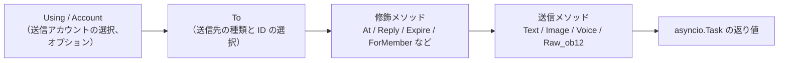

## 送信方法

すべての送信メソッドは `asyncio.Task` オブジェクトを返します。

### 基本メソッド（基底クラスに内包）

以下に示す標準メソッドは `SendDSL` 基底クラスに内包されており、**デフォルトでは `Raw_ob12` に委譲**されます。アダプタのサブクラスでは、これらのメソッドを再実装する必要がなく、直接使用できます。また、IDE による補完も可能です。

| メソッド名 | 説明 | 戻り値 |
|--------|------|---------|
| `Text(text: str)` | テキストメッセージの送信 | `asyncio.Task` |
| `Image(file: bytes \| str)` | 画像の送信 | `asyncio.Task` |
| `Voice(file: bytes \| str)` | 音声の送信（OneBot12 `audio` 段） | `asyncio.Task` |
| `Video(file: bytes \| str)` | 動画の送信 | `asyncio.Task` |
| `File(file: bytes \| str, filename: str = None)` | ファイルの送信 | `asyncio.Task` |

アダプタは、プラットフォーム固有のロジックを提供するために、標準メソッドを個別にオーバーライドできます：

```python
class Send(SendDSL):
    def Raw_ob12(self, message, **kwargs):
        # 必須実装
        ...

    # オプション：Text をオーバーライドしてプラットフォーム固有のロジックを提供
    # def Text(self, text: str):
    #     return self.Raw_ob12([{"type": "text", "data": {"text": text}}])
```

### プロトコルメソッド

| メソッド名 | 説明 | 戻り値 | 必須か |
|--------|------|---------|---------|
| `Raw_ob12(message)` | OneBot12 形式のメッセージを送信 | `asyncio.Task` | **必須実装** |

> **重要**：`Raw_ob12` はアダプタの中心的なメソッドであり、**必ず実装する必要があります**。これは OneBot12 → プラットフォームへの逆変換の統一エントリポイントです。実装しない場合、基底クラスは error ログを記録し、標準のエラー応答（`status: "failed"`, `retcode: 10002`）を返します。標準メソッド（`Text`、`Image` など）はデフォルトで `Raw_ob12` に委譲されます。

### プラットフォーム特有のメソッド

アダプタは `Send` サブクラスに、プラットフォーム固有の送信メソッドを追加できます（`event.supports()` / `event.available_methods()` で識別されます）：

```python
class Send(SendDSL):
    def Raw_ob12(self, message, **kwargs): ...

    # プラットフォーム特有のメソッド
    def Sticker(self, sticker_id: str):
        return self.Raw_ob12([{"type": "sticker", "data": {"id": sticker_id}}])
```

## 修飾メソッド

修飾メソッドは `self` を返すことで、メソッドチェーンをサポートします。

### At メソッド

```python
# @1人のユーザー
await adapter.Send.To("group", "123").At("456").Text("こんにちは")

# @複数のユーザー
await adapter.Send.To("group", "123").At("456").At("789").Text("こんにちは")
```

### AtAll メソッド

```python
# @全員
await adapter.Send.To("group", "123").AtAll().Text("皆さん、こんにちは")
```

### Reply メソッド

```python
# メッセージへの返信
await adapter.Send.To("group", "123").Reply("msg_id").Text("返信内容")
```

### 修飾の組み合わせ

```python
await adapter.Send.To("group", "123").At("456").Reply("msg_id").Text("返信@メッセージ")
```

### プラットフォーム固有の修飾メソッド

`At` / `AtAll` / `Reply` に加えて、アダプターは**プラットフォーム固有の修飾メソッド**を定義できます。このようなメソッドは**`self` を返すだけ**で、デコレータは必要ありません。フレームワークが自動的に認識します。

- `self`（SendDSL インスタンス）を返す → 修飾メソッド。送信パッケージやライフサイクルイベントはトリガーせず、メソッドチェーンを継続します。
- `Task` / `Awaitable` を返す → 送信メソッド。

```python
class Send(SendDSL):
    def Raw_ob12(self, message, **kwargs): ...

    # 修飾メソッド：self を返す、送信はしない
    def Expire(self, seconds: int):
        self._expire = seconds
        return self

    def ForMember(self, user_id: str):
        self._member = user_id
        return self

    # 送信メソッド：Task を返す、修飾メソッドで設定された状態に依存
    def Board(self, content: str, **kwargs):
        return self.Raw_ob12([{"type": "board", "data": {"text": content}}])
```

使用例：

```python
# 修飾メソッドは連続してメソッドチェーンで使用できます
await adapter.Send.To("group", "big").Expire(3600).ForMember("114").Board("ボードの内容")
```

## Event 包装クラスで修飾メソッドを使用する

> [!NOTE]
> `reply(via=)` と `event.send_chain()` は、ErisPulse **2.7.0+** が必要です。

`event.reply()` はデフォルトで `at_sender`/`at_users`/`at_all`/`quote` などの組み込み修飾パラメータのみ公開します。プラットフォーム固有の修飾メソッドを使用するには、2 通りの方法があります。

### 方法1: reply() の via パラメータ

少量で既知の修飾メソッドに適しています：

```python
await event.reply("看板内容", method="Board",
                  via=[("Expire", 3600), ("ForMember", "114514")])
```

`via` はリストであり、各要素は以下のいずれかの形式です：

| 形式 | 等価な連鎖呼び出し |
|------|-------------|
| `"Name"` | `.Name()` |
| `("Name", arg1, arg2)` | `.Name(arg1, arg2)` |
| `("Name", (arg1,), {kw: val})` | `.Name(arg1, kw=val)` |

### 方法2: event.send_chain()

**複数の修飾メソッド**または**内容パラメータのないアクション型メソッド**（例：取り消し、削除）に適しています。`send_chain()` は `To`/`Using` が設定された送信チェーンを返し、任意の修飾メソッドと送信メソッドを自由に追加できます：

```python
# プラットフォーム固有の修飾メソッド + 看板送信
await event.send_chain().Expire(3600).Board("一時間後に期限切れ")

# 複数の修飾メソッドを連続して使用
await (event.send_chain()
       .Expire(3600)
       .ForMember("114514")
       .Board("看板内容", content_type="markdown"))

# 組み込み修飾メソッドも使用可能
await event.send_chain().At("123").Reply("msg_id").Text("hi")

# 内容パラメータのないアクション型メソッド
await event.send_chain().DismissBoard()
```

> `send_chain()` は完全な SendDSL インスタンスを返すため、**すべての連鎖特性が使用可能**です — 修飾メソッドだけでなく、送信ルールや一括構築も含まれます：

```python
# 送信ルール：再試行 + タイムアウト + 成功時のコールバック
await (event.send_chain()
       .Retry(3).Timeout(10)
       .Hook(lambda r: print("送信成功"))
       .Text("信頼性の高い送信"))

# 遅延送信 + プラットフォーム修飾 + 看板
await event.send_chain().Defer(5).Expire(3600).Board("遅延看板")

# 一括構築モード
results = await (event.send_chain()
                 .Build()
                 .Text("第一句").Image("pic.jpg").Text("第二句")
                 .send_all())
```

## アカウント管理

### Using メソッド

`Using()` は、メッセージの送信に使用するアカウントを指定するために使用されます。渡された識別子は、`_resolve_account()` によって以下の優先順位でマッチされます：

1. **アカウント名** — 設定ファイルのキー名（例: `"default"`、`"bot1"`）
2. **実行時に注入された bot_id** — イベントの変換時に自動的に注入される識別子
3. **任意の str フィールド** — 設定ファイルの他の文字列フィールド
4. **デフォルト** — 最初に有効化されたアカウント

```python
# アカウント名を使用
await adapter.Send.Using("account1").To("user", "123").Text("Hello")

# bot_id を使用（イベント内の self.user_id に相当）
await adapter.Send.Using("bot_123").To("user", "123").Text("Hello")
```

### Account メソッド

`Account` メソッドは `Using` と同等です：

```python
await adapter.Send.Account("account1").To("user", "123").Text("Hello")
```

## 非同期処理

### 結果を待たない

```python
# メッセージはバックグラウンドで送信されます
task = adapter.Send.To("user", "123").Text("Hello")

# 他の操作を続行します
# ...
```

### 結果を待つ

```python
# await を直接使用して結果を取得します
result = await adapter.Send.To("user", "123").Text("Hello")
print(f"送信結果: {result}")

# Task を保存して後で待つ
task = adapter.Send.To("user", "123").Text("Hello")
# ... 他の操作 ...
result = await task
```

## 送信ルールシステム

SendDSL には、ルールデコレータとして一連の送信ルールが組み込まれており、ルールはメソッドチェーンで追加され、最終的な送信時に一括で適用されます。ルールは一般的な生産環境のシナリオをカバーしています：タイムアウト制御、失敗時の再試行、成功時のコールバック、遅延送信、優先度による破棄、進捗監視。

ルールメソッドは**selfを返します**（At/AtAll/Replyと同様）、送信メソッド（Text/Imageなど）の前に呼び出す必要があります。ルールは`To`/`Using`/`Account`によって作成された新しいインスタンスと共に伝播されます。

### ルールメソッド一覧

| メソッド | 説明 |
|--------|------|
| `.Hook(callback)` | 送信が成功した後に実行されるコールバック（複数回呼び出すことができ、順番に実行されます） |
| `.Retry(times=1)` | 失敗時に自動的にN回再試行（最初を含めて合計N+1回） |
| `.Timeout(seconds)` | 単一の送信がタイムアウトした場合、現在の試行をキャンセルします（Retryと重ねて使用できます） |
| `.Defer(seconds=1.0)` | 送信を遅延（プロセス内でのタイマー、永続化されません） |
| `.Priority(level, drop_if_busy=False)` | 送信の優先度を設定；送信が溜まっている場合、破棄することができます |
| `.OnProgress(callback)` | 各段階の進捗コールバック（SendContextを引数として渡されます） |
| `.OnError(callback)` | 最終的に失敗した際のエラーコールバック（1回のみ実行されます） |

### 送信成功後に実行するロジック（Hook）

```python
# 同期コールバック
await (adapter.Send.To("user", "123")
       .Hook(lambda r: print(f"送信成功、メッセージID: {r['message_id']}"))
       .Text("你好"))

# 異步コールバック
async def deduct_points(result):
    await db.update(user_id="123", points=-1)

await adapter.Send.To("user", "123").Hook(deduct_points).Text("扣积分")
```

Hookは、送信が最終的に成功した場合（再試行成功を含む）にのみ実行されます。失敗、タイムアウト、キャンセルの場合はトリガーされません。

### 失敗時の自動再試行（Retry）

```python
# 初回失敗後に2回再試行し、合計3回試行します
result = await adapter.Send.To("user", "123").Retry(2).Text("带重试")
```

再試行のトリガー条件：送信時に例外が発生した場合、送信がタイムアウトした場合、送信が`status == "failed"`のレスポンスを返した場合。

### タイムアウトによる自動キャンセル（Timeout）

```python
# 単一の送信が10秒を超えるとキャンセルされます
await adapter.Send.To("user", "123").Timeout(10).Text("带超时")

# タイムアウト + 再試行：各試行10秒、最大3回
await adapter.Send.To("user", "123").Timeout(10).Retry(2).Text("超时重试")
```

### 進捗監視（OnProgress / OnError）

```python
def on_progress(ctx):
    print(f"段階: {ctx.stage}, 試行: {ctx.attempt + 1}/{ctx.max_attempts}, 耗時: {ctx.elapsed:.2f}s")
    if ctx.stage == "failed":
        print(f"  エラー: {ctx.error!r}")

async def on_error(ctx):
    await notify_admin(f"送信先 {ctx.target_id} に送信失敗: {ctx.error!r}")

await (adapter.Send.To("user", "123")
       .Retry(3).Timeout(10)
       .OnProgress(on_progress)
       .OnError(on_error)
       .Text("监控"))
```

`SendContext` に含まれるフィールド：`task_id`、`platform`、`method`、`target_type`、`target_id`、`bot_id`、`stage`、`attempt`、`max_attempts`、`started_at`、`finished_at`、`elapsed`、`error`、`result`、`extra`。

`stage` の可能な値：`pending`、`sending`、`retrying`、`success`、`failed`、`timeout`、`cancelled`、`dropped`。

### 遅延送信（Defer）

```python
# 5秒後に送信
await adapter.Send.To("user", "123").Defer(5).Text("迟到消息")
```

> 注意：遅延はプロセス内でのタイマーであり、プロセスの再起動で失われます。永続化は提供されません。

### 優先度と送信の破棄（Priority）

```python
# 低優先度のメッセージ。送信キューが溜まっている場合、自動的に破棄されます
result = await (adapter.Send.To("user", "123")
               .Priority(-1, drop_if_busy=True)
               .Text("可放弃的通知"))
# 破棄された場合、result["status"] == "failed"
```

`drop_if_busy`を有効にすると、送信中のタスク数がしきい値（デフォルトは64）を超えた場合、今回の送信を放棄します。`.PriorityThreshold(n)`でグローバルなしきい値を調整できます。

### ルールの組み合わせとバックグラウンド実行

```python
# メインのフローをブロックせず、ルールは正常に適用されます
task = (adapter.Send.To("user", "123")
        .Hook(lambda r: print("送信成功！"))
        .Retry(3)
        .Timeout(10)
        .OnProgress(on_progress)
        .Text("你好"))

# 他の操作を継続実行
await handle_next_action()
```

### ルールの伝播

ルールは`To`/`Using`/`Account`によって作成された新しいインスタンスと共に伝播され、メソッドチェーンの呼び出し中にルールが失われることを防ぎます：

```python
# Toの前にルールを設定しても、Toによって作成されたインスタンスにも伝播されます
builder = adapter.Send.Retry(3).Timeout(10)
send = builder.To("user", "123")  # sendはRetry(3)とTimeout(10)を引き継ぎます
await send.Text("hi")
```

複数のインスタンスのルールは相互に独立しています（hooksリストは深くコピーされます）。

## バッチ構築モード（Build）

単発モードに加えて、SendDSL はバッチ構築モードもサポートしています。1つのチェーンに複数の送信メソッドを書き込み、最後に一括して実行します。これは「一気に複数のメッセージを送信する」場面に適しています。

### 構築モードに入る

送信メソッドの前に `.Build()` を呼び出すと、`SendBuilder` が返されます。以降、送信メソッド（Text/Image など）は即座に実行されず、送信意図として蓄積されます：

```python
results = await (adapter.Send.To("user", "123")
                 .Build()                    # 構築モードに入る
                 .Text("第一句")
                 .Image("pic.jpg")
                 .Text("第二句")
                 .send_all())                 # 一括実行
# results = [Text結果, Image結果, Text結果]
```

`.send_all()` は `asyncio.Task` を返し、await 後に結果リスト（意図の順序で）が得られます。

### 並列と直列

デフォルトでは**並列**実行（並行送信、総所要時間は最遅の1つに近い）されます。メッセージの到着順序を保証する必要がある場合は、`.Sequential()` を呼び出します：

```python
# 直列：順に送信
await (adapter.Send.To("group", "456")
       .Build()
       .Sequential()
       .Text("先発这个").Text("再发这个")
       .send_all())

# 並列（デフォルト、明示的に呼び出しても可）
await (adapter.Send.To("group", "456")
       .Build()
       .Parallel()
       .Text("并发1").Text("并发2")
       .send_all())
```

### 失敗しても続行とリトライ

バッチ実行では**失敗しても続行**の戦略を採用しています。1つの送信が失敗しても、他の送信は中断されません。`.Retry()` と併用すると、失敗した項目は自動的にリトライされます（リトライは個々の送信に作用し、バッチ全体をリトライするものではありません）：

```python
await (adapter.Send.To("user", "123")
       .Build()
       .Retry(2)                       # 各送信がそれぞれ2回リトライ
       .Text("可能失败的").Image("也可能失败的")
       .send_all())
```

### バッチ全体のルールとコールバック

ルールはバッチ全体に適用されます：

| メソッド | 説明 |
|--------|------|
| `.Timeout(seconds)` | 各送信の単一タイムアウト |
| `.Retry(times)` | 各送信が個別にリトライ（失敗しても続行） |
| `.Defer(seconds)` | バッチ全体の送信を遅延 |
| `.Hook(callback)` | バッチ全体が成功した後にトリガーされ、`results` リストを受け取る |
| `.OnError(callback)` | バッチに失敗がある場合にトリガーされ、`BatchContext` を受け取る |
| `.OnProgress(callback)` | 各送信が完了するたびにトリガーされ、`BatchContext` を受け取る |

```python
def on_progress(ctx):
    print(f"進捗: {ctx.completed}/{ctx.total}, 成功 {ctx.succeeded}, 失敗 {ctx.failed}")

async def on_error(ctx):
    print(f"バッチに {ctx.failed} 件の失敗があります")

results = await (adapter.Send.To("user", "123")
               .Build()
               .Retry(2).Timeout(10)
               .OnProgress(on_progress)
               .OnError(on_error)
               .Hook(lambda rs: print("バッチ送信完了"))
               .Text("a").Text("b").Text("c")
               .send_all())
```

`BatchContext` には、`task_id`、`total`、`completed`、`succeeded`、`failed`、`stage`、`results`、`errors`、`elapsed`、`extra` が含まれます。

`stage` の値は次のいずれかです：`pending`、`sending`、`success`（すべて成功）、`partial`（一部成功）、`failed`（すべて失敗）。

### デコレータとルールの継承

`.Build()` の前の At/AtAll/Reply デコレータとルールはバッチ全体に継承され、各メッセージに作用します：

```python
await (adapter.Send.To("group", "456")
       .At("789")                        # 継承：各メッセージに @789 が付与
       .Build()
       .Retry(2)                         # 継承 + 追加：各送信がそれぞれリトライ
       .Text("@你的通知")
       .Image("公告图")
       .send_all())
```

Build 後でもデコレータを追加できます（バッチ全体に作用）：

```python
await (adapter.Send.To("group", "456")
       .Build()
       .At("111").At("222")             # 追加 @、バッチ全体に作用
       .Text("@多人")
       .send_all())
```

### バックグラウンド実行

単発と同じように、`.send_all()` は Task を返し、await せずにバックグラウンドで実行させることもできます：

```python
task = (adapter.Send.To("user", "123")
        .Build()
        .Hook(lambda rs: print("バッチ送信完了"))
        .Text("a").Text("b")
        .send_all())

# 主処理をブロックしない
await do_something_else()
```

## 命名規則

### PascalCase 命名

すべての送信メソッドは大文字で始まるキャメルケース（PascalCase）を使用します：

```python
# ✅ 正しい
def Text(self, text: str):
    pass

def Image(self, file: bytes):
    pass

# ❌ 間違っている
def text(self, text: str):
    pass

def send_image(self, file: bytes):
    pass
```

### プラットフォーム固有のメソッド

プラットフォームのプレフィックスを付けるメソッドの追加は推奨されません：

```python
# ✅ 推奨
def Sticker(self, sticker_id: str):
    pass

# ❌ 推奨されない
def TelegramSticker(self, sticker_id: str):
    pass
```

`Raw` メソッドを使用して代用します：

```python
# ✅ 推奨
await adapter.Send.Raw_ob12([{"type": "sticker", ...}])

# ❌ 推奨されない
def TelegramSticker(self, ...):
    pass
```

## 送信リンクの内部分解

`await adapter.Send.To("group", "123").Text("x")` という1回の処理の裏で、フレームワークは以下の処理をすべて代行しています：

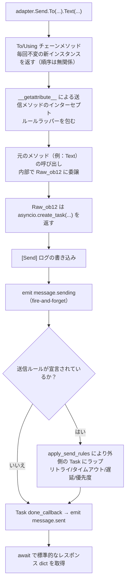

**フレームワークが行った各ステップの内容：**

| 階段 | フレームワークが行ったこと |
|------|-------------|
| チェーンの結合 | `To`/`Using`/`Account` の各呼び出しは**不変の新インスタンスを生成**し、既に設定されたフィールドを継承するため、`To(...).Using(...)` と `Using(...).To(...)` は**等価**で、順序は無関係 |
| メソッドのラッピング | 送信メソッド（`Text` など）は `__getattribute__` でインターセプトされ、ラッパーを包む。修飾メソッド（`To`/`Using`/`At`/`Retry` など）は**ラッピングされない**。ネストされた `Raw_ob12` の呼び出しは、 `_in_rule_wrap` マーカーにより重複ラッピングを防ぐ |
| Task の作成 | `Raw_ob12` 内部の `asyncio.create_task()` が Task の真の作成ポイントである。`Text()` は Task を同期的に返すだけで、**ブロックしない** |
| 送信ログ | `[Send] platform/method -> target` というイベントログを記録する（`exclude_levels=["EVENT"]` で非表示にすることも可能） |
| `message.sending` | 送信メソッドが呼び出された際に**即座に** fire-and-forget でトリガーされる（ハンドラが存在する場合に限る、`has_handlers` による短絡） |
| `message.sent` | Task の `done_callback` にバインドされる——**ルールがある場合は、リトライプロセス全体の最終結果を上書きする**、ルールがない場合は元の Task の完了を意味する |

### アカウント解決の優先順位

アダプター内部で `_resolve_account(account_id)` を呼び出すとき、以下の順序で具体的なアカウントに解決される：

1. 単一アカウントアダプター（`AccountConfigClass` がない）→ 直接返す
2. アカウント名が `account_id` と正確に一致
3. 各アカウントの `bot_id` フィールドが一致
4. 各アカウントの任意の `str` フィールド値が一致（`enabled`/`name` を除外）
5. 最後の手段として、最初の有効なアカウント
6. すべて失敗 → `ValueError` を投げる

> あなたが渡した `account_id` は、`Using()` で明示的に指定されたもの > イベントの `self` フィールド（`account_id` は `user_id` より優先され、`event.reply()` が自動的に注入）> 指定しない（アダプターが最初の有効なアカウントをデフォルトで使用）

### 送信ルールエンジン（リトライ/タイムアウト/遅延）

ルールは `Raw_ob12` が Task を返した**後に**、外側の Task にラップされるため、メインの処理には影響しない。重要な事実：

| ルール | 説明 |
|------|------|
| `Retry(n)` | 総試行回数は `n+1` 回。**失敗後は即座に再送信し、指数バックオフはなし** |
| `Timeout(s)` | 単一送信のタイムアウトはキャンセル（`asyncio.wait_for`）、未使用の場合は再試行 |
| `Defer(s)` | 送信前に遅延 sleep |
| `Priority(level, drop_if_busy)` | 累積が閾値を超えた場合は、即座に `{status:"failed", retcode:10002, message:"dropped_low_priority"}` を返す |
| `Hook(fn)` | 最終的に成功した場合のみ、順序通りに実行される |
| `on_progress` / `on_error` | 各段階および最終的な失敗時のコールバック |

> **注意**：リトライは「即座に再送信」であり、退避間隔は存在しない。プラットフォームのリクエスト制限がある場合は、`on_error` コールバックで sleep した後に手動で再送信を行う必要がある。ルールの成功判定は、返却される dict の `status == "ok"` に基づく（`retcode == 0`）。

> 標準的なレスポンス形式と `retcode` の完全な意味は、[API レスポンス規格](../../standards/api-response.md)を参照してください。

## 戻り値

### Task オブジェクト

すべての送信メソッドは `asyncio.Task` を返します。アダプタは `Raw_ob12` を実装するだけでよく、標準メソッド（Text/Image など）はデフォルトで它に委譲されます：

```python
import asyncio

def Raw_ob12(self, message, **kwargs):
    async def _do_send():
        segments = self._apply_modifiers(message)
        return await self._adapter.call_api(
            endpoint="/send_message",
            message=segments,
            **self.send_context,
            **kwargs,
        )
    return asyncio.create_task(_do_send())

# Text/Image/Voice/Video/File は基底クラスから継承され、自動的に Raw_ob12 に委譲されます。
# 標準メソッドをオーバーライドする場合は、asyncio.Task を返すだけです：
# def Text(self, text: str):
#     return self.Raw_ob12([{"type": "text", "data": {"text": text}}])
```

### 応答の標準化

`call_api` は標準化された応答を返す必要があります。`make_response()` / `make_error()` メソッドを推奨します：

```python
async def call_api(self, endpoint: str, **params):
    try:
        result = await self._do_api_call(endpoint, **params)
        return self.make_response(
            data=result.get("data"),
            message_id=result.get("message_id", ""),
            raw=result,
        )
    except Exception as e:
        return self.make_error(message=str(e))
```

手動で構築することも可能です（旧バージョンの方式も互換性があります）：

```python
async def call_api(self, endpoint: str, **params):
    return {
        "status": "ok" または "failed",
        "retcode": 0 またはエラーコード,
        "data": {...},
        "message_id": "msg_id" または "",
        "message": "",
        "{platform}_raw": raw_response
    }
```

## 完整例

### 基本使用

```python
from ErisPulse.Core import adapter

my_adapter = adapter.get("myplatform")

# テキストの送信
await my_adapter.Send.To("user", "123").Text("Hello World!")

# 画像の送信
await my_adapter.Send.To("group", "456").Image("https://example.com/image.jpg")

# ファイルの送信
with open("document.pdf", "rb") as f:
    await my_adapter.Send.To("user", "123").File(f.read())
```

### チェーン呼び出し

```python
# @ユーザー + リプライ
await my_adapter.Send.To("group", "456").At("789").Reply("msg123").Text("リプライ@のメッセージ")

# @全員 + 複数の修飾
await my_adapter.Send.Using("bot1").To("group", "456").AtAll().Text("お知らせメッセージ")
```

### 原始メッセージとメッセージ構築

`Raw_ob12` は逆変換の中心となるエントリポイントです（OB12 メッセージセグメント → プラットフォーム API 呼び出し）。`MessageBuilder` はそれに伴うチェーン式メッセージセグメント構築ツールです。

> 完全な `Raw_ob12` 実装の規格、`MessageBuilder` の使い方およびコード例については、以下のドキュメントを参照してください：
> - [送信メソッド規格 §6 逆変換規格 (OneBot12 → プラットフォーム)](../../standards/send-method-spec.md#6-逆変換規格onebot12--プラットフォーム)
> - [送信メソッド規格 §11 メッセージビルダー](../../standards/send-method-spec.md#11-メッセージビルダー-messagebuilder)


### 适配器开发最佳实践

# アダプタ開発のベストプラクティス

このドキュメントは、ErisPulse アダプタ開発におけるベストプラクティスを提供します。

## Bot 状態管理と Meta イベント

アダプタは、`adapter.emit()` を通じて Meta イベントを送信し、フレームワークが Bot の接続状態、ログイン/ログアウト、およびハートビート情報を自動的に追跡できるようにする必要があります。

### 1. 何时发送 Meta 事件

| イベント | `detail_type` | 発生タイミング | フレームワークの動作 |
|------|--------------|---------|---------|
| 接続 | `"connect"` | Bot がプラットフォームと接続したとき | Bot を登録し、`adapter.bot.online` のライフサイクルイベントをトリガー |
| 切断 | `"disconnect"` | Bot がプラットフォームと切断したとき | Bot をオフラインにマークし、`adapter.bot.offline` のライフサイクルイベントをトリガー |
| ハートビート | `"heartbeat"` | 定期的に送信（30-60秒が推奨） | Bot のアクティブタイムとメタ情報を更新 |

### 2. 发送 Meta 事件

フレームワークは `emit_meta()` メソッドを提供しており、一行で Meta イベントを送信できます：

```python
class MyAdapter(BaseAdapter):
    async def _ws_handler(self, websocket):
        bot_id = self._get_bot_id()

        # Bot 上線：一行で connect イベントを送信
        await self.emit_meta("connect", bot_id, user_name="MyBot", nickname="私のロボット")

        try:
            while True:
                data = await websocket.receive_text()
                event = self.convert(data)
                if event:
                    await self.adapter.emit(event)
        except WebSocketDisconnect:
            pass
        finally:
            # Bot 下線
            await self.emit_meta("disconnect", bot_id)
```

### 3. 心跳イベント

アダプタは接続が維持されている間、定期的にハートビートイベントを送信し、Bot のアクティブタイムを更新する必要があります：

```python
class MyAdapter(BaseAdapter):
    async def _heartbeat_loop(self, bot_id: str):
        while self._connected:
            # フレームワークに meta heartbeat を送信（一行で完了）
            await self.emit_meta("heartbeat", bot_id)
            await asyncio.sleep(30)
```

### 4. `self` フィールドの自動発見

フレームワークの `adapter.emit()` は、すべてのイベント（Meta イベントに限らず）の `self` フィールドを自動的に処理します：

- **通常のイベント**（message/notice/request）の `self` フィールドは自動的に Bot を登録します
- **`self` フィールドの拡張情報**：`user_name`、`nickname`、`avatar`、`account_id` などのオプションフィールドがサポートされます

```python
# 転換器に self フィールドを含めれば、Bot は自動的に登録され、アクティブタイムが更新されます
onebot_event = {
    "type": "message",
    "detail_type": "private",
    "platform": "myplatform",
    "self": {
        "platform": "myplatform",
        "user_id": "bot123",
        "user_name": "MyBot",
        "nickname": "私のロボット",
    },
    # ... その他のフィールド
}
await self.adapter.emit(onebot_event)
# Bot "bot123" は自動的に登録され、アクティブタイムが更新されます
```

### 5. Bot 状態の照会

フレームワークは以下の照会メソッドを提供しています：

```python
from ErisPulse import sdk

# Bot の詳細情報を取得
info = sdk.adapter.get_bot_info("myplatform", "bot123")
# {"status": "online", "last_active": 1712345678.0, "info": {"nickname": "MyBot"}}

# すべての Bot をリストアップ（プラットフォーム別にグループ化）
all_bots = sdk.adapter.list_bots()

# 指定のプラットフォームの Bot をリストアップ
platform_bots = sdk.adapter.list_bots("myplatform")

# Bot がオンラインかどうかを確認
is_online = sdk.adapter.is_bot_online("myplatform", "bot123")

# 完全なステータスサマリーを取得（WebUI に表示するのに適しています）
summary = sdk.adapter.get_status_summary()
# {"adapters": {"myplatform": {"status": "started", "bots": {...}}}}
```

## 接続管理

### 1. 接続の再試行実装

```python
import asyncio

class MyAdapter(BaseAdapter):
    async def start(self):
        retry_count = 0
        max_retries = 5
        
        while retry_count < max_retries:
            try:
                await self._connect_to_platform()
                self.logger.info("接続成功")
                break
            except Exception as e:
                retry_count += 1
                if retry_count < max_retries:
                    # 指数バックオフ戦略
                    wait_time = min(60 * (2 ** retry_count), 600)
                    self.logger.warning(
                        f"接続失敗、{wait_time}秒後に再試行 ({retry_count}/{max_retries}): {e}"
                    )
                    await asyncio.sleep(wait_time)
                else:
                    self.logger.error("接続失敗、最大再試行回数に達しました")
                    raise
```

### 2. 接続状態管理

```python
class MyAdapter(BaseAdapter):
    async def start(self):
        self.connection = None
        self._connected = False
    
    async def _ws_handler(self, websocket: WebSocket):
        self.connection = websocket
        self._connected = True
        self.logger.info("接続が確立されました")
        
        try:
            while True:
                data = await websocket.receive_text()
                await self._process_event(data)
        except WebSocketDisconnect:
            self.logger.info("接続が切断されました")
        finally:
            self.connection = None
            self._connected = False
```

### 3. ハートビート保活と Meta ハートビート

アダプタのハートビートは、プラットフォームへのハートビート保活と、フレームワークへの meta heartbeat イベント送信の両方を完了する必要があります。

```python
class MyAdapter(BaseAdapter):
    async def start(self):
        self.connection = await self._connect_to_platform()
        self._heartbeat_task = asyncio.create_task(self._heartbeat_loop())

    async def _heartbeat_loop(self):
        while self.connection:
            try:
                # 1. プラットフォームにハートビート保活を送信
                await self.connection.send_json({"type": "ping"})

                # 2. フレームワークに meta heartbeat を送信（emit_meta で一行で完了）
                await self.emit_meta("heartbeat", self._bot_id)

                await asyncio.sleep(30)
            except Exception as e:
                self.logger.error(f"ハートビート失敗: {e}")
                break
```

### 4. 接続情報の公開

アダプタが登録するルートは、ユーザーがプラットフォーム側のコールバックアドレスを設定できるように、ユーザーに見えるようにする必要があります。`start()` で接続情報を明示的に出力することを推奨します：

```python
class MyAdapter(BaseAdapter):
    async def start(self):
        router.register_websocket(
            module_name=self.platform,
            path="/ws",
            handler=self._ws_handler
        )

        if self.sdk:
            info = self.sdk.adapter.get_connection_info(self.platform)
            if info:
                self.logger.info(f"WebSocket アドレス: "
                    f"{info.get('connection', {}).get('base_url', '')}"
                    f"{info.get('connection', {}).get('websocket_routes', [])}")
```

ユーザーは以下の API を使って、アダプタのすべてのルートと接続アドレスを照会できます：

```python
from ErisPulse import sdk

# アダプタレベルの接続情報（推奨）
info = sdk.adapter.get_connection_info("myplatform")

# ルートマネージャレベルの照会
sdk.router.list_namespaces()              # すべての名前空間をリストアップ
sdk.router.get_module_routes("myplatform")  # 詳細なルート情報
sdk.router.get_module_urls("myplatform")    # 完全な接続 URL
```

> **注意**: ルート登録時の `module_name` は、ErisPulse で登録するアダプタの `platform` 名と完全に一致している必要があります。そうでない場合、`get_connection_info()` はルートと関連付けられません。複数アカウントアダプタは、異なる `module_name` を使用するのではなく、サブパス（例: `/account1/webhook`、`/account2/webhook`）を各アカウントに登録する必要があります。

## イベント変換

### 1. OneBot12 標準の厳密遵守

```python
class MyPlatformConverter:
    def convert(self, raw_event):
        """イベントを変換"""
        onebot_event = {
            "id": str(raw_event.get("event_id", uuid.uuid4())),
            "time": int(time.time()),
            "type": self._convert_type(raw_event.get("type")),
            "detail_type": self._convert_detail_type(raw_event),
            "platform": "myplatform",
            "self": {
                "platform": "myplatform",
                "user_id": str(raw_event.get("bot_id", ""))
            },
            "myplatform_raw": raw_event,  # 保持原始数据（必须）
            "myplatform_raw_type": raw_event.get("type", "")  # 原始类型（必须）
        }
        return onebot_event
```

### 2. 時間スタンプの標準化

```python
def _convert_timestamp(self, timestamp):
    """10桁の秒単位時間スタンプに変換"""
    if not timestamp:
        return int(time.time())
    
    # ミリ秒単位の時間スタンプの場合
    if timestamp > 10**12:
        return int(timestamp / 1000)
    
    # 秒単位の時間スタンプの場合
    return int(timestamp)
```

### 3. イベント ID の生成

```python
import uuid

def _generate_event_id(self, raw_event):
    """イベント ID を生成"""
    event_id = raw_event.get("event_id")
    if event_id:
        return str(event_id)
    # プラットフォームが ID を提供していない場合、UUID を生成
    return str(uuid.uuid4())
```

## SendDSL 実装

`At`/`AtAll`/`Reply` 修飾子はフレームワークの SendDSL 基底クラスに既に実装されています。アダプタは `Raw_ob12` と具体的な送信メソッドを実装するだけで、`self._apply_modifiers(message)` と `self.send_context` を使用して開発を簡素化できます。

### 1. Task オブジェクトを返す必要がある

```python
class Send(BaseAdapter.Send):
    def Raw_ob12(self, message, **kwargs):
        """推奨実装：フレームワークの補助メソッドを使用"""
        async def _do_send():
            segments = self._apply_modifiers(message)
            return await self._adapter.call_api(
                endpoint="/send_message",
                message=segments,
                **self.send_context,
                **kwargs
            )
        return asyncio.create_task(_do_send())

    def Text(self, text: str):
        return self.Raw_ob12([{"type": "text", "data": {"text": text}}])
```

### 2. 鏈式修飾メソッドは self を返す

```python
class Send(BaseAdapter.Send):

    def __init__(self, adapter, target_type=None, target_id=None, account_id=None):
        super().__init__(adapter, target_type, target_id, account_id)
        self.buttons = []

    def Button(self, content: list) -> 'Send':
        self.buttons.append(content)
        return self # self を返す
```

### 3. プラットフォーム固有のメソッドをサポート

```python
class Send(BaseAdapter.Send):
    def Sticker(self, sticker_id: str):
        """ステッカーを送信"""
        return asyncio.create_task(
            self._adapter.call_api(
                endpoint="/send_sticker",
                message=[{"type": "sticker", "data": {"id": sticker_id}}],
                **self.send_context
            )
        )
    
    def Card(self, card_data: dict):
        """カードメッセージを送信"""
        return asyncio.create_task(
            self._adapter.call_api(
                endpoint="/send_card",
                message=[{"type": "card", "data": {"card_data": card_data}}],
                **self.send_context
            )
        )
```

## API レスポンス

### 1. レスポンスの標準化

フレームワークは `make_response()` と `make_error()` メソッドを提供し、標準化されたレスポンスを構築できます：

```python
async def call_api(self, endpoint: str, **params):
    try:
        raw_response = await self._platform_api_call(endpoint, **params)
        
        if raw_response.get("success"):
            return self.make_response(
                data=raw_response.get("data"),
                message_id=raw_response.get("data", {}).get("message_id", ""),
                raw=raw_response,
            )
        else:
            return self.make_error(
                retcode=raw_response.get("code", 10001),
                message=raw_response.get("message", ""),
                raw=raw_response,
            )
    except Exception as e:
        return self.make_error(message=str(e))
```

`make_response()` は `{platform}_raw` キーを含むレスポンス辞書を自動的に生成します。`make_error()` はデフォルトで `retcode=34000`（Platform Error）を使用します。

### 2. エラーコード規格

OneBot12 標準エラーコードに従います：

```python
# 1xxxx - アクションリクエストエラー
10001: Bad Request
10002: Unsupported Action
10003: Bad Param

# 2xxxx - アクションハンドラエラー
20001: Bad Handler
20002: Internal Handler Error

# 3xxxx - アクション実行エラー
31000: Database Error
32000: Filesystem Error
33000: Network Error
34000: Platform Error
35000: Logic Error
```

## 多アカウントサポート

### 1. 宣言的構成（推奨）

`AccountConfigClass` を宣言して構成クラスを定義した後、フレームワークが多アカウントの読み込み、検証、テンプレート生成を自動的に管理します。`BotAccountConfig` 基底クラスは `enabled` と `name` フィールドを提供しており、アダプタは宣言する必要はありません：

```python
from dataclasses import dataclass, field
from ErisPulse.Core.Bases import BotAccountConfig

@dataclass
class MyBotConfig(BotAccountConfig):
    token: str = field(default="", metadata={
        "description": {"i18n": "my_adapter.bot_token", "default": "Bot Token"},
        "required": True,
        "secret": True,
    })

class MyAdapter(BaseAdapter):
    AccountConfigClass = MyBotConfig
    
    async def start(self):
        for name, account in self.enabled_accounts.items():
            self.logger.info(f"アカウント {name} を起動中")
            await self._connect(name, account.token)
            # bot_id はフレームワークがプラットフォームプロトコル/ログイン応答から自動的に取得して戻し埋めします
    
    async def call_api(self, endpoint: str, **params):
        account_id = params.pop("account_id", None)
        name, account = self._resolve_account(account_id)
        # name: アカウント名, account: MyBotConfig インスタンス
```

構成ファイルは自動的に生成されます：

```toml
[MyAdapter.accounts.default]
token = ""
enabled = true
name = ""
```

### 2. アカウント選択メカニズム

フレームワークは `_resolve_account()` メソッドを内蔵しており、以下の優先順位でマッチします：

1. **アカウント名** — 構成のキー名と正確に一致
2. **`bot_id` フィールド** — 自動的に取得された bot_id（イベントの `event["self"]["user_id"]` から）
3. **任意の str フィールド** — 構成の他の文字列フィールド
4. **デフォルト** — 最初に有効なアカウント

```python
# アカウント名でマッチ
name, account = self._resolve_account("account1")

# bot_id でマッチ（イベントからの最も一般的な方法）
name, account = self._resolve_account("bot_123")

# 最初に有効なアカウントを取得（None を渡す）
name, account = self._resolve_account(None)
```

## エラーハンドリング

### 1. エラータイプの分類

`make_error()` を使用して標準化されたエラーレスポンスを構築します。`sdk.client` でリクエストする際は ErisPulse のエラーをキャッチします：

```python
from ErisPulse.Core.Bases.errors import ClientError, ClientTimeoutError

async def call_api(self, endpoint: str, **params):
    try:
        from ErisPulse.Core import client
        resp = await client.post(
            f"https://api.platform.com/{endpoint}",
            json=params,
            max_retries=2,
        )
        response = await resp.json()
        return self.make_response(data=response, raw=response)
    except ClientTimeoutError:
        self.logger.error(f"リクエストタイムアウト: {endpoint}")
        return self.make_error(retcode=32000, message="リクエストタイムアウト")
    except ClientError as e:
        self.logger.error(f"ネットワークエラー: {e}")
        return self.make_error(retcode=33000, message="ネットワークリクエスト失敗")
    except json.JSONDecodeError:
        self.logger.error("JSON 解析失敗")
        return self.make_error(retcode=10006, message="レスポンス形式エラー")
    except Exception as e:
        self.logger.error(f"未知のエラー: {e}", exc_info=True)
        return self.make_error(message=str(e))
```

> **後方互換性**: `aiohttp` を直接使用する古いアダプタコードは影響を受けません。`sdk.client` を通じてリクエストする場合にのみ、エラーの変換が有効になります。

### 2. ログ記録

フレームワークはアダプタにサブロガー（`sdk.logger.get_child("MyAdapter")`）を自動的に作成します。手動の初期化は不要です：

```python
class MyAdapter(BaseAdapter):
    # ConfigClass = ...  # 構成クラスを宣言した後、self.logger が自動的に利用可能になります
    
    async def start(self):
        self.logger.info("アダプタ起動中...")
        # ...
        self.logger.info("アダプタ起動完了")
    
    async def shutdown(self):
        self.logger.info("アダプタ終了中...")
        # ...
        self.logger.info("アダプタ終了完了")
```

## テスト

### 1. 単体テスト

```python
import pytest
from ErisPulse.Core.Bases import BaseAdapter

class TestMyAdapter:
    def test_converter(self):
        """テスト転換器"""
        converter = MyPlatformConverter()
        raw_event = {"type": "message", "content": "Hello"}
        result = converter.convert(raw_event)
        assert result is not None
        assert result["platform"] == "myplatform"
        assert "myplatform_raw" in result
    
    def test_api_response(self):
        """テスト API レスポンス形式"""
        adapter = MyAdapter()
        response = adapter.call_api("/test", param="value")
        assert "status" in response
        assert "retcode" in response
```

### 2. 統合テスト

```python
@pytest.mark.asyncio
async def test_adapter_start():
    """テストアダプタ起動"""
    adapter = MyAdapter()
    await adapter.start()
    assert adapter._connected is True

@pytest.mark.asyncio
async def test_send_message():
    """テストメッセージ送信"""
    adapter = MyAdapter()
    await adapter.start()
    
    result = await adapter.Send.To("user", "123").Text("Hello")
    assert result is not None
```

## リバースコンバージョンとメッセージ構築

`Raw_ob12` はアダプタが**実装しなければならない**メソッドで、OneBot12 → プラットフォームのリバースコンバージョンの統一エントリーポイントです。標準メソッド（`Text`、`Image` など）は `Raw_ob12` に委譲し、修飾子の状態（`At`/`Reply`/`AtAll`）は `Raw_ob12` 内でメッセージセグメントにマージされる必要があります。

`MessageBuilder` は `Raw_ob12` と一緒に使用するメッセージセグメント構築ツールで、チェーン呼び出しと迅速な構築をサポートします。

> 完全な実装規格、コード例、使用方法については、以下のドキュメントを参照してください：
> - [送信メソッド規格 §6 リバースコンバージョン規格](../../standards/send-method-spec.md#6-リバースコンバージョン規格onebot12--プラットフォーム)
> - [送信メソッド規格 §11 メッセージビルダー](../../standards/send-method-spec.md#11-メッセージビルダー-messagebuilder)

## プラットフォームイベントメソッド拡張

アダプタは Event 包装クラスにプラットフォーム固有のメソッドを登録し、モジュール開発者がプラットフォーム特有のデータに簡単にアクセスできるようにすることができます。

### 1. Mixin クラスを使用した一括登録（推奨）

プラットフォームに複数の固有メソッドがある場合、Mixin クラスの使用が推奨されます：

```python
# アダプタの start() またはモジュールレベルで登録
from ErisPulse.Core.Event import register_event_mixin

class MyPlatformEventMixin:
    def get_chat_name(self):
        """チャット名を取得"""
        return self.get("myplatform_raw", {}).get("chat", {}).get("name", "")

    def is_official_message(self):
        """公式メッセージかどうかを判断"""
        raw = self.get("myplatform_raw", {})
        return raw.get("sender", {}).get("is_official", False)

    def get_message_type(self):
        """プラットフォームのメッセージタイプを取得"""
        return self.get("myplatform_raw", {}).get("msg_type", "text")

# 一括登録
register_event_mixin("myplatform", MyPlatformEventMixin)
```

### 2. デコレーターを使用した個別メソッド登録

```python
from ErisPulse.Core.Event import register_event_method

@register_event_method("myplatform")
def get_chat_name(self):
    return self.get("myplatform_raw", {}).get("chat", {}).get("name", "")
```

### 3. アダプタ終了時のクリーンアップ

```python
from ErisPulse.Core.Event import unregister_platform_event_methods

class MyAdapter(BaseAdapter):
    async def shutdown(self):
        # プラットフォームイベントメソッドの登録をクリーンアップ
        unregister_platform_event_methods("myplatform")
        # ... その他のクリーンアップ
```

> 詳細な登録とアンロードの説明は、[イベントシステム API - プラットフォーム拡張メソッドの登録](../../api-reference/event-system.md#アダプタ登録プラットフォーム拡張メソッド)を参照してください。

## ドキュメントの維持

### 1. プラットフォーム機能ドキュメントの維持

`docs/ja/platform-guide/` に `{platform}.md` ドキュメントを作成します（他の言語バージョンは自動生成されます）：

```markdown
# プラットフォーム名アダプタドキュメント

## 基本情報
- 対応モジュールバージョン: 1.0.0
- 維持者: あなたの名前

## 支援されるメッセージ送信タイプ
...

## 特有のイベントタイプ
...

## 構成オプション
...
```

### 2. バージョン情報の更新

新バージョンをリリースする際、ドキュメント内のバージョン情報を更新します：

```toml
[project]
version = "2.0.0"  # バージョン番号を更新
```


### 事件转换器

# イベントコンバーター実装ガイド

イベントコンバーター (Converter) は、アダプターのコアコンポーネントの一つであり、プラットフォームのネイティブイベントを ErisPulse 統一の OneBot12 標準イベント形式に変換する役割を担います。

## Converter の責任

```
プラットフォームのネイティブイベント ──→ Converter.convert() ──→ OneBot12 標準イベント
```

Converter は**正方向の変換**（受信方向）のみを担当し、プラットフォームのネイティブイベントデータを OneBot12 標準形式に変換します。逆方向の変換（送信方向）は `Send.Raw_ob12()` メソッドで処理されます。

### 核心原則

1. **無損変換**：元のデータはすべて `{platform}_raw` フィールドに完全に保持される必要があります
2. **標準互換性**：変換後のイベントは OneBot12 標準形式に準拠している必要があります
3. **プラットフォーム拡張**：プラットフォーム固有のデータは `{platform}_` で始まるフィールドに格納されます

## BaseConverter 基底クラス（推奨）

2.7.0 以降、フレームワークは `BaseConverter` 基底クラス（`ErisPulse.Core.Bases`）を提供しており、OneBot12 イベントの**共通フィールド構築**と**一般的なメッセージセグメント補助**をカプセル化しています。これにより、コンバーターは型マッピングにのみ集中できます。

```python
from ErisPulse.Core.Bases import BaseConverter


class MyConverter(BaseConverter):
    def __init__(self):
        super().__init__(platform="myplatform")

    def convert(self, raw_event: dict) -> dict | None:
        if not isinstance(raw_event, dict):
            return None
        event_type = raw_event.get("type", "")
        base = self.build_base_event(raw_event, event_type)  # id/time/platform/self/raw
        if event_type == "message":
            base["type"] = "message"
            base["detail_type"] = "group" if raw_event.get("group_id") else "private"
            base["user_id"] = str(raw_event.get("sender_id", ""))
            base["message"] = [self.text(raw_event.get("content", ""))]
            base["alt_message"] = raw_event.get("content", "")
            return base
        return None
```

`build_base_event()` で既に埋め込まれている共通フィールド：

| フィールド | 情報源 |
|------|------|
| `id` | `raw_event["event_id"]`、不足時は UUID を自動生成 |
| `time` | `raw_event["timestamp"]`、不足時は現在時刻 |
| `platform` | コンストラクタで渡された `platform` |
| `self` | `{"platform": ..., "user_id": raw_event["bot_id"]}` |
| `{platform}_raw` | 原始イベント（「無損失変換」の原則を満たす） |
| `{platform}_raw_type` | 原始イベントの型 |

一般的なメッセージセグメント補助メソッド（すべて静的メソッドで、直接再利用可能）：

```python
converter.text("hi")          # {"type": "text", "data": {"text": "hi"}}
converter.at("123456")        # {"type": "at", "data": {"user_id": "123456"}}
converter.image("file.png")   # {"type": "image", "data": {"file": "file.png"}}
```

> 手動実装では、`build_base_event` の共通フィールド構築は繰り返し書く必要のある定型コードです。`BaseConverter` を使用することで、この部分を省略でき、また「無損失変換」（原始イベントは常に `{platform}_raw` に格納される）を自然に満たします。

## convert() メソッド

### メソッド署名

```python
def convert(self, raw_event: dict) -> dict:
    """
    プラットフォーム固有のイベントを OneBot12 標準フォーマットに変換します。

    :param raw_event: プラットフォーム固有のイベントデータ
    :return: OneBot12 標準フォーマットのイベント辞書
    """
    pass
```

### 戻り値構造

変換後のイベント辞書には、以下の標準フィールドが含まれている必要があります：

```python
{
    "id": "イベントの唯一ID",
    "time": 1234567890,           # Unix タイムスタンプ（秒）
    "type": "message",             # イベントの種類
    "detail_type": "private",      # 詳細な種類
    "platform": "myplatform",      # プラットフォーム名
    "self": {
        "platform": "myplatform",
        "user_id": "bot_user_id"
    },

    # メッセージイベントのフィールド
    "user_id": "送信者のID",
    "message": [...],              # OneBot12 メッセージセグメントのリスト
    "alt_message": "プレーンテキストの内容",

    # 原始データを保持する必要がある
    "myplatform_raw": { ... },     # プラットフォーム固有のイベントの完全なデータ
    "myplatform_raw_type": "プラットフォーム固有のイベントタイプ名",
}
```

## 必須フィールドのマッピング

### 一般的なフィールド（すべてのイベントタイプ）

| OB12 フィールド | 型 | 説明 |
|-----------|------|------|
| `id` | str | イベントの一意の識別子 |
| `time` | int | Unix タイムスタンプ（秒） |
| `type` | str | イベントの種類：`message` / `notice` / `request` / `meta` |
| `detail_type` | str | 詳細なタイプ：`private` / `group` / `friend` など |
| `platform` | str | プラットフォーム名。アダプターの登録名と同じ |
| `self` | dict | ロボット情報：`{"platform": "...", "user_id": "..."}` |

### メッセージイベントの追加フィールド

| OB12 フィールド | 型 | 説明 |
|-----------|------|------|
| `user_id` | str | 送信者の ID |
| `message` | list[dict] | OneBot12 メッセージセグメントのリスト |
| `alt_message` | str | 純粋なテキストの代替内容 |

### 通知イベントの追加フィールド

| OB12 フィールド | 型 | 説明 |
|-----------|------|------|
| `user_id` | str | 関連するユーザーの ID |
| `operator_id` | str | 操作者の ID（例：グループメンバーの変更時） |

## メッセージセグメントの変換

OneBot12 標準では、以下のメッセージセグメントタイプが定義されています：

```python
# テキスト
{"type": "text", "data": {"text": "Hello"}}

# 画像
{"type": "image", "data": {"file": "https://example.com/img.jpg"}}

# 音声
{"type": "audio", "data": {"file": "https://example.com/audio.mp3"}}

# 動画
{"type": "video", "data": {"file": "https://example.com/video.mp4"}}

# ファイル
{"type": "file", "data": {"file": "https://example.com/doc.pdf"}}

# @メンション
{"type": "mention", "data": {"user_id": "123"}}

# @全員
{"type": "mention_all", "data": {}}

# 返信
{"type": "reply", "data": {"message_id": "msg_123"}}
```

プラットフォームがサポートしていないメッセージセグメントタイプがある場合、そのセグメントを省略するか、最も近い標準タイプに変換することができます。

## プラットフォーム拡張フィールド

プラットフォーム固有のデータは、標準フィールドとの競合を避けるために `{platform}_` という接頭辞を使用して保存してください。

```python
{
    # 標準フィールド
    "type": "message",
    "detail_type": "group",
    # ...

    # プラットフォーム拡張フィールド
    "myplatform_raw": { ... },          # 原始イベントデータ（必須）
    "myplatform_raw_type": "chat",      # 原始イベントの種類（必須）

    # その他のプラットフォーム固有のフィールド
    "myplatform_group_name": "群名称",
    "myplatform_sender_role": "admin",
}
```

> **重要**：`{platform}_raw` フィールドは必須です。ErisPulse のイベントシステムやモジュールは、プラットフォームの元のデータにアクセスするためにこのフィールドに依存することがあります。

## 完整例

以下は Converter の完全な実装例です：

```python
class MyConverter:
    def __init__(self, platform: str):
        self.platform = platform

    def convert(self, raw_event: dict) -> dict:
        event_type = raw_event.get("type", "")

        base_event = {
            "id": raw_event.get("id", ""),
            "time": raw_event.get("timestamp", 0),
            "platform": self.platform,
            "self": {
                "platform": self.platform,
                "user_id": raw_event.get("self_id", ""),
            },
            "myplatform_raw": raw_event,
            "myplatform_raw_type": event_type,
        }

        if event_type == "chat":
            return self._convert_message(raw_event, base_event)
        elif event_type == "notification":
            return self._convert_notice(raw_event, base_event)
        elif event_type == "request":
            return self._convert_request(raw_event, base_event)

        return base_event

    def _convert_message(self, raw: dict, base: dict) -> dict:
        base["type"] = "message"
        base["detail_type"] = "group" if raw.get("group_id") else "private"
        base["user_id"] = raw.get("sender_id", "")
        base["message"] = self._convert_message_segments(raw.get("content", ""))
        base["alt_message"] = raw.get("content", "")

        if raw.get("group_id"):
            base["group_id"] = raw["group_id"]

        return base

    def _convert_message_segments(self, content: str) -> list:
        segments = []
        if content:
            segments.append({"type": "text", "data": {"text": content}})
        return segments

    def _convert_notice(self, raw: dict, base: dict) -> dict:
        base["type"] = "notice"
        notification_type = raw.get("notification_type", "")

        if notification_type == "member_join":
            base["detail_type"] = "group_member_increase"
            base["user_id"] = raw.get("user_id", "")
            base["group_id"] = raw.get("group_id", "")
            base["operator_id"] = raw.get("operator_id", "")
        elif notification_type == "friend_add":
            base["detail_type"] = "friend_increase"
            base["user_id"] = raw.get("user_id", "")

        return base

    def _convert_request(self, raw: dict, base: dict) -> dict:
        base["type"] = "request"
        request_type = raw.get("request_type", "")

        if request_type == "friend":
            base["detail_type"] = "friend"
            base["user_id"] = raw.get("user_id", "")
            base["comment"] = raw.get("message", "")
        elif request_type == "group_invite":
            base["detail_type"] = "group"
            base["group_id"] = raw.get("group_id", "")
            base["user_id"] = raw.get("inviter_id", "")

        return base
```

## 富媒体メッセージ変換の例

実際のプラットフォームのメッセージには、画像、@メンション、返信などの富媒体コンテンツが含まれることが多いです。以下は、`_convert_message_segments` が複数のメッセージタイプを処理する例です：

```python
def _convert_message_segments(self, raw_content: list) -> list:
    """プラットフォーム固有のメッセージセグメントリストを OneBot12 標準のメッセージセグメントに変換する"""
    segments = []

    for item in raw_content:
        item_type = item.get("type", "")

        if item_type == "text":
            segments.append({
                "type": "text",
                "data": {"text": item.get("content", "")}
            })

        elif item_type == "image":
            file_url = item.get("url") or item.get("file_id", "")
            segments.append({
                "type": "image",
                "data": {"file": file_url}
            })

        elif item_type == "at":
            segments.append({
                "type": "mention",
                "data": {"user_id": item.get("target_id", "")}
            })

        elif item_type == "reply":
            segments.append({
                "type": "reply",
                "data": {"message_id": item.get("reply_to_id", "")}
            })

        elif item_type == "at_all":
            segments.append({"type": "mention_all", "data": {}})

        else:
            segments.append({
                "type": "text",
                "data": {"text": f"[サポートされていないメッセージタイプ: {item_type}]"}
            })

    return segments
```

## 常見の落とし穴

### 1. `{platform}_raw` フィールドの欠落

これは最も一般的なエラーです。元データフィールドが欠落していると、モジュールがプラットフォーム固有の情報をアクセスできなくなります。

```python
base_event["myplatform_raw"] = raw_event        # 必須！
base_event["myplatform_raw_type"] = event_type   # 必須！
```

### 2. 時間スタンプの形式エラー

OneBot12 標準では、`time` フィールドは Unix 秒単位の時間スタンプ（整数）である必要があります。もしプラットフォームがミリ秒単位の時間スタンプや ISO 形式の文字列を返している場合、変換が必要です。

```python
import time

# ミリ秒 → 秒
"time": raw_event.get("timestamp", 0) // 1000

# ISO 文字列 → 秒
"time": int(time.mktime(time.strptime(raw_event["created_at"], "%Y-%m-%dT%H:%M:%S")))
```

### 3. `self` フィールドの欠落

`self` フィールドには、ロボット自身の情報が含まれており、`user_id` はロボットのアカウント ID です。複数の Bot が存在する状況では、このフィールドは非常に重要です。

```python
"self": {
    "platform": self.platform,
    "user_id": raw_event.get("bot_id", ""),   # ロボット自身の ID
}
```

### 4. `detail_type` に非標準の値を使用

`detail_type` には、OneBot12 標準で定義された値、例えば `private`、`group`、`friend_increase`、`group_member_increase` などを使用する必要があります。プラットフォーム固有の命名は使用しないでください。

### 5. 送受信の一貫性

Converter が生成するメッセージセグメントの型が、Send 端でサポートされているメソッドに対応していることを確認してください。たとえば、Converter がプラットフォームの画像メッセージを `{"type": "image", ...}` に変換した場合、Send 端の `Image()` メソッドは画像の送信を処理できる必要があります。

## 最佳実践

1. **常に元のデータを保持する**：`{platform}_raw` フィールドは省略しないでください。
2. **標準メッセージセグメントを使用する**：可能な限りプラットフォームのメッセージを OneBot12 標準メッセージセグメントに変換してください。
3. **detail_type を適切に設定する**：標準の型（`private`/`group`/`channel` など）を使用し、独自に定義しないでください。
4. **境界ケースを処理する**：元のイベントにフィールドが欠けている可能性があるため、`.get()` を使用し、適切なデフォルト値を提供してください。
5. **パフォーマンスの考慮**：`convert()` は各イベントで呼び出されるため、ここで処理に時間がかかる操作を避けてください。


### 发布与模块商店指南

# リリースとモジュールストアガイド

開発したモジュールやアダプタを ErisPulse モジュールストアに公開し、他のユーザーが簡単に見つけてインストールできるようにします。

## モジュールストアの概要

ErisPulse モジュールストアは、集中管理されたモジュール登録表です。ユーザーは CLI ツールを使用して、コミュニティが提供するモジュールやアダプターを閲覧、検索、インストールできます。

### 一覧表示と発見

```bash
# リモートで利用可能なすべてのパッケージを一覧表示
epsdk list-remote

# モジュールのみを表示
epsdk list-remote -t modules

# アダプターのみを表示
epsdk list-remote -t adapters

# リモートパッケージ一覧を強制的に更新
epsdk list-remote -r
```

また、[ErisPulse 公式サイト](https://www.erisdev.com/#market) にアクセスして、オンラインでモジュールストアを閲覧することもできます。

### 提出可能なタイプ

| タイプ | 説明 | Entry-point 組 |
|------|------|----------------|
| モジュール (Module) | ロボットの機能を拡張し、ビジネスロジックを実装 | `erispulse.module` |
| アダプター (Adapter) | 新しいメッセージプラットフォームに接続 | `erispulse.adapter` |

## 快速配布

全体のプロセスは、3つのステップで完了します：プロジェクトの設定 → PyPI への配布 → モジュールストアへの提出。

### 1. pyproject.toml の設定

プロジェクトのディレクトリに `pyproject.toml` および `README.md` が存在することを確認し、タイプに応じて entry-points を設定してください。

#### モジュール

```toml
[project]
name = "ErisPulse-MyModule"
version = "1.0.0"
description = "モジュールの機能説明"
requires-python = ">=3.10"
license = { text = "MIT" }
authors = [ { name = "yourname" } ]
dependencies = [
    "ErisPulse>=2.0.0",
]

[project.entry-points."erispulse.module"]
"MyModule" = "MyModule:Main"
```

#### アダプター

```toml
[project]
name = "ErisPulse-MyAdapter"
version = "1.0.0"
description = "アダプターの機能説明"
requires-python = ">=3.10"

[project.entry-points."erispulse.adapter"]
"myplatform" = "MyAdapter:MyAdapter"
```

> **注意**：パッケージ名は `ErisPulse-` で始まるようにすることを推奨します。entry-point のキー名（例：`"MyModule"`）は、SDK 内でのモジュールのアクセス名として使用されます。

### 2. PyPI への配布

```bash
# ビルド + 配布（PyPI アカウントが必要）
pip install build twine
python -m build
python -m twine upload dist/*
```

配布に成功したら、インストールを確認します。

```bash
pip install ErisPulse-MyModule
```

### 3. モジュールストアへの提出

[ErisPulse モジュールストア](https://www.erisdev.com/#market) にアクセスし、「モジュールを提出」をクリックして、ログイン後にモジュール情報を入力してください。

対応しているログイン方法：**GitHub**、**Codeberg**、**云湖**、いずれかを選択してください。

入力のポイント：
- モジュール名、説明、リポジトリのアドレス
- 最低 SDK バージョン：不明な場合は、[ErisPulse の最新リリース](https://pypi.org/project/ErisPulse/) のバージョン番号を入力してください。

提出後、即座に有効になります。ユーザーはモジュールソースからインストールできます。モジュールは「未検証」と表示され、メンテナが審査を通過した後、「検証済み」に変更されます。

> **検証ステータスについて**：
> - 「未検証」は、公式の審査をまだ受けていないことを意味するだけで、モジュールに問題があるわけではありません。
> - ユーザーが `epsdk install` を使用して未検証のモジュールをインストールする際には、リスク警告が表示され、確認後にのみインストールが進められます。

### 4. 配布済みモジュールの管理

モジュールストアで「モジュールを提出」をクリックしてログイン後、「マイモジュール」タブに切り替えると、以下の操作が可能です。

- **編集** — モジュールの説明、リポジトリのアドレス、タグなどの情報を変更できます。バージョン番号は PyPI から自動的に同期されます。
- **削除** — モジュールストアからモジュールを削除します（取り消しはできません）。

> 提出したばかりのモジュールは、数分後に「マイモジュール」リストに表示されることがあります。

## モジュールの更新

1. `pyproject.toml` の `version` を更新します。
2. 再びビルドしてアップロードします: `python -m build && python -m twine upload dist/*`
3. モジュールストアは、PyPI 上の最新バージョンを自動的に同期します。

ユーザーは `epsdk upgrade MyModule` コマンドを使用して、モジュールをアップグレードできます。

## リリース前のチェックリスト

PyPI にプッシュする前に、以下の項目を一つずつ確認してください。

### コード品質

- [ ] 公開 API にはすべて型注釈が付いています（関数シグネチャと戻り値）
- [ ] 公開メソッドにはすべてドキュメント文字列（`"""..."""` 形式、`:param` / `:return` / `:raises` を含む）
- [ ] `ruff check` で警告がありません
- [ ] テストカバレッジは 80% 以上
- [ ] `pytest` で全テストケースが通過

### 兼容性

- [ ] `pyproject.toml` に最低 SDK バージョンが宣言されています：`dependencies = ["ErisPulse>=x.y.z"]`
- [ ] Python 3.10 / 3.11 / 3.12 / 3.13 でテスト済み
- [ ] 対象オペレーティングシステム（Windows / Linux / macOS、該当する場合）でテスト済み
- [ ] 循環依存がありません

### 設定

- [ ] 宣言的設定（`ConfigClass` + `BaseConfig` / `BotAccountConfig`）を使用している場合、設定フィールドに `description`（推奨 i18n 形式）と `ui` メタデータがあります
- [ ] i18n 翻訳キーを登録している場合、5 言語すべて（zh-CN / zh-TW / en / ja / ru）をカバーしています
- [ ] 敏感フィールドには `secret=True` が付いています

### ドキュメント

- [ ] `README.md` にインストール手順と基本的な使用例があります
- [ ] `README.md` に設定方法（設定ファイルの例 + 環境変数）を説明しています
- [ ] `CHANGELOG.md` にすべての変更履歴が記録されています
- [ ] アダプターはプラットフォームの機能ドキュメントを更新しています（サポートする Send タイプ、イベントタイプなど）

### リリース

- [ ] `pyproject.toml` のバージョン番号が更新されています
- [ ] ビルドが通っています：`python -m build`
- [ ] PyPI にプッシュされています：`python -m twine upload dist/*`
- [ ] インストールの検証が通っています：`pip install ErisPulse-xxx && epsdk run`

## 開発モードでのテスト

正式リリース前に、編集可能なモードを使用してローカルでテストすることができます。

```bash
epsdk install -e /path/to/MyModule
# または
pip install -e /path/to/MyModule
```

## 常見問題

### パッケージ名は `ErisPulse-` で始める必要がありますか？

必須ではありませんが、強く推奨されます。これにより、PyPI 上で ErisPulse エコシステムのパッケージをユーザーが識別しやすくなります。

### 1 つのパッケージに複数のモジュールを登録できますか？

はい、可能です。`entry-points` に複数のキーと値のペアを設定することで実現できます：

```toml
[project.entry-points."erispulse.module"]
"ModuleA" = "MyPackage:ModuleA"
"ModuleB" = "MyPackage:ModuleB"
```

### 審査にはどのくらい時間がかかりますか？

通常、1〜3営業日で完了します。モジュールストアの「マイモジュール」から、検証の状態を確認できます。

## Dockerイメージによるアプリケーションの配布

アプリケーションがPyPIに公開するのに適していない場合（プライベートな依存関係を含む、または事前設定が必要な環境など）、**GitHub Container Registry (GHCR)** を使ってDockerイメージを公開し、他のユーザーが `docker pull` で簡単に起動できるようにすることができます。

### 適用シーン

- あなたが**完全なロボットアプリケーション**（モジュール + 設定 + 入口スクリプト）を持っていて、ワンクリックで配布したい
- モジュール/アダプターが**プライベートパッケージ**や特別なインストール手順を必要とし、PyPIに適していない
- ユーザーの使用を容易にする**オールインクルーシブな**デプロイメント方式を提供したい

### 1. Dockerfileの作成

ErisPulse公式のイメージをベースに構築し、必要なモジュールを追加するだけです：

```dockerfile
FROM erispulse/erispulse:latest

LABEL org.opencontainers.image.title="ErisPulse-MyModule" \
      org.opencontainers.image.description="モジュールの説明" \
      org.opencontainers.image.url="https://github.com/yourname/ErisPulse-MyModule" \
      org.opencontainers.image.source="https://github.com/yourname/ErisPulse-MyModule"

COPY pyproject.toml README.md ./
COPY MyModule/ ./MyModule/

RUN uv pip install --system -e .
```

モジュールに追加のシステム依存性（例：SSHクライアントなど）が必要な場合は、`RUN uv pip install`の後に追加します：

```dockerfile
RUN apt-get update && apt-get install -y --no-install-recommends \
    openssh-client \
    && rm -rf /var/lib/apt/lists/*
```

> `erispulse/erispulse:latest`にはErisPulse、ErisPulse-Dashboard、Pythonランタイム、およびuvが既に含まれているため、再インストールは不要です。

### 2. GitHub Actionsワークフローの作成

`.github/workflows/docker-publish.yml`に作成します：

```yaml
name: Dockerイメージの公開

on:
  workflow_dispatch:
  push:
    branches:
      - main
    tags:
      - "v*"

permissions:
  contents: read
  packages: write

env:
  REGISTRY: ghcr.io
  IMAGE_NAME: ${{ github.repository_owner }}/my-bot

jobs:
  docker-publish:
    runs-on: ubuntu-latest

    steps:
      - name: コードのチェックアウト
        uses: actions/checkout@v4

      - name: QEMUの設定 (マルチアーキテクチャ対応)
        uses: docker/setup-qemu-action@v3

      - name: Docker Buildxの設定
        uses: docker/setup-buildx-action@v3

      - name: GitHub Container Registryへのログイン
        uses: docker/login-action@v3
        with:
          registry: ${{ env.REGISTRY }}
          username: ${{ github.actor }}
          password: ${{ secrets.GITHUB_TOKEN }}

      - name: Dockerメタデータの抽出
        id: meta
        uses: docker/metadata-action@v5
        with:
          images: ${{ env.REGISTRY }}/${{ env.IMAGE_NAME }}
          tags: |
            type=semver,pattern={{version}}
            type=semver,pattern={{major}}.{{minor}}
            type=raw,value=latest

      - name: Dockerイメージのビルドとプッシュ
        uses: docker/build-push-action@v6
        with:
          context: .
          file: ./Dockerfile
          platforms: linux/amd64,linux/arm64
          push: true
          tags: ${{ steps.meta.outputs.tags }}
          labels: ${{ steps.meta.outputs.labels }}
          cache-from: type=gha
          cache-to: type=gha,mode=max
```

> `GITHUB_TOKEN`はGitHub Actionsによって自動的に提供されるため、手動で秘密鍵を作成する必要はありません。

### 3. ビルドのトリガー

コードをプッシュするか、タグを打つことで自動的にビルドが開始されます：

```bash
# mainブランチにプッシュしてトリガー
git push origin main

# またはタグを打ってトリガー
git tag v1.0.0
git push origin v1.0.0
```

また、GitHubリポジトリの**Actions**ページから手動でトリガーすることもできます。

### 4. イメージを公開に設定

GHCRのイメージはデフォルトで**private**です。他のユーザーがログインせずにプルできるようにするには、GitHubで公開に設定する必要があります：

1. リポジトリにアクセス → **Packages** → 対応するPackageをクリック
2. **Package settings** → **Danger Zone** → **Change visibility** → **Public**

### 5. ユーザーの使用

ビルドが完了すると、ユーザーは `docker run` で1行で起動できます：

```bash
docker run -d \
  --name my-bot \
  -p 8000:8000 \
  -v $(pwd)/config:/app/config \
  -e TZ=Asia/Shanghai \
  -e ERISPULSE_DASHBOARD_TOKEN=your-token \
  --restart unless-stopped \
  ghcr.io/<your-username>/my-bot:latest
```

または `docker-compose.yml` を使用します：

```yaml
services:
  my-bot:
    image: ghcr.io/<your-username>/my-bot:latest
    container_name: my-bot
    ports:
      - "8000:8000"
    volumes:
      - ./config:/app/config
    environment:
      - TZ=Asia/Shanghai
      - ERISPULSE_DASHBOARD_TOKEN=${ERISPULSE_DASHBOARD_TOKEN:-}
    restart: unless-stopped
```

### Docker Hubへの同時公開

ワークフローを拡張して、ログインステップの前にDocker Hubへのログインを追加し、`images`にDocker Hubのアドレスを追加します：

```yaml
      - name: Docker Hubへのログイン
        uses: docker/login-action@v3
        with:
          registry: docker.io
          username: ${{ secrets.DOCKERHUB_USERNAME }}
          password: ${{ secrets.DOCKERHUB_TOKEN }}

      - name: Dockerメタデータの抽出
        id: meta
        uses: docker/metadata-action@v5
        with:
          images: |
            docker.io/<your-dockerhub-username>/my-bot
            ghcr.io/${{ github.repository_owner }}/my-bot
```

> `DOCKERHUB_USERNAME`と`DOCKERHUB_TOKEN`は、リポジトリの**Settings → Secrets**に追加する必要があります。

### Dockerイメージ vs PyPI公開

| 特性 | Dockerイメージ (GHCR) | PyPI公開 |
|------|---------------------|-----------|
| 分布方法 | `docker pull` でワンクリック実行 | `pip install` + 手動設定 |
| 適用範囲 | 完全なアプリケーション/ソリューション | 単一のモジュール/アダプター |
| プライベート依存 | 天然にサポート | プライベートPyPIソースが必要 |
| モジュールストア | 不適切 | モジュールストアに提出可能 |
| マルチアーキテクチャ | amd64/arm64をサポート | アーキテクチャに依存しない |

両方の方法は互いに矛盾しないため、モジュールをモジュールストアにPyPIで公開すると同時に、GHCRでオールインクルーシブなDockerイメージを提供することも可能です。


======
API 参考
======


### 核心模块 API

# コアモジュール API

本文書は、ErisPulse コアモジュールの API のクイックリファレンスを提供します。メソッドの署名と簡潔な説明が含まれています。詳細な使い方や例については、各モジュールの「完全ドキュメント」リンクをクリックしてください。

## Storage モジュール

SQLite をベースとしたキー/値ストアシステムで、一般的な SQL チェーンクエリをサポートします。

### 基本操作

```python
from ErisPulse import sdk

sdk.storage.set("key", "value")
value = sdk.storage.get("key", default_value)
keys = sdk.storage.keys()
sdk.storage.delete("key")
```

### バッチ操作

```python
sdk.storage.set_multi({"key1": "val1", "key2": "val2"})
values = sdk.storage.get_multi(["key1", "key2"])
sdk.storage.delete_multi(["key1", "key2"])
```

### トランザクション操作

```python
with sdk.storage.transaction():
    sdk.storage.set("key1", "value1")
    sdk.storage.set("key2", "value2")
```

### 属性アクセス

```python
sdk.storage.my_key          # sdk.storage.get("my_key") と同等
sdk.storage.my_key = "val"  # sdk.storage.set("my_key", "val") と同等
```

### SQL チェーンクエリ

Storage モジュールは、カスタムテーブルの CRUD 操作をサポートするチェーン呼び出しスタイルの一般的な SQL クエリビルダーを提供します。

```python
sdk.storage.CreateTable("users", {
    "id": "INTEGER PRIMARY KEY AUTOINCREMENT",
    "name": "TEXT NOT NULL",
})

sdk.storage.Table("users").Insert({"name": "Alice"}).Execute()
rows = sdk.storage.Table("users").Select("name").Where("id > ?", 0).Execute()
```

> 完全なチェーンクエリ API (Select/Insert/Update/Delete/Where/OrderBy/Limit、AlterTable、トランザクションなど) は、[SQL クエリビルダー](../advanced/sql-builder.md)を参照してください。

### ストレージバックエンド抽象

`StorageManager` は `BaseStorage` 抽象基底クラスを継承し、Redis、MySQL などの他のストレージメディアを拡張可能です。

```python
from ErisPulse.Core.Bases.storage import BaseStorage, BaseQueryBuilder
```

### 非同期インターフェース

Storage と Config モジュールは、非同期メソッド（接頭辞 `a`）を提供し、非同期ハンドラで安全に呼び出すことができます。同期メソッドは引き続き保持され、既存のコードを変更する必要はありません。

```python
# 非同期ストレージ
value = await sdk.storage.aget("key")
await sdk.storage.aset("key", "value")
await sdk.storage.adelete("key")
keys = await sdk.storage.aget_all_keys()
await sdk.storage.aclear()

# 非同期バッチ操作
values = await sdk.storage.aget_multi(["k1", "k2"])
await sdk.storage.aset_multi({"k1": "v1", "k2": "v2"})
await sdk.storage.adelete_multi(["k1", "k2"])

# 非同期設定
value = await sdk.config.agetConfig("MyModule.key")
await sdk.config.asetConfig("MyModule.key", "value")
await sdk.config.aforce_save()
await sdk.config.areload()
```

## Config モジュール

TOML 形式の設定ファイル管理で、ドット区切りのキー経路をサポートします。

### API 概要

| メソッド | 説明 |
|------|------|
| `getConfig(key, default)` | 設定を読み込み、ドット経路 `"MyModule.subkey"` などもサポート |
| `setConfig(key, value, immediate=False)` | 設定を書き込み。`immediate=True` の場合、ファイルに即時保存 |
| `force_save()` | メモリ内の設定をファイルに強制的に書き込み |
| `reload()` | ファイルから再読み込み |
| `agetConfig(key, default)` | 非同期で設定を読み込み |
| `asetConfig(key, value, immediate)` | 非同期で設定を書き込み |
| `aforce_save()` | 非同期で強制保存 |
| `areload()` | 非同期で再読み込み |

### 例

```python
config = sdk.config.getConfig("MyModule", {})
value = sdk.config.getConfig("MyModule.timeout", 30)

sdk.config.setConfig("MyModule", {"key": "value"})
sdk.config.setConfig("MyModule.timeout", 60, immediate=True)
```

> `setConfig` はデフォルトで遅延書き込み（5秒ごとのバッチ保存）を使用します。`immediate=True` を設定すると、設定ファイルに即時永続化されます。設定の変更は `config.set` ライフサイクルイベントをトリガーします。

## Logger モジュール

モジュール化されたログシステムで、Rich をベースにし、サブロガーとモジュールレベルの制御をサポートします。

### 基本的な使い方

```python
sdk.logger.debug("デバッグ情報")
sdk.logger.info("実行情報")
sdk.logger.warning("警告情報")
sdk.logger.error("エラー情報")
sdk.logger.critical("致命エラー")
```

### サブロガー

```python
child_logger = sdk.logger.get_child("MyModule")
child_logger.info("サブモジュールログ")

child_logger.get_child("utils")  # 嵌套もサポート
```

### ログレベル制御

```python
sdk.logger.set_level("DEBUG")                          # グローバルレベル
sdk.logger.set_module_level("MyModule", "DEBUG")       # モジュールレベル

# 使用可能なレベル（低い順）:
# TRACE, DEBUG, INFO, WARNING, ERROR, CRITICAL
# TRACE は最低レベルで、イベントの配信、ルーティング登録などのフレームワーク内部の詳細なデバッグ情報を出力
sdk.logger.set_level("TRACE")                          # 全てのログを有効化
```

### ログサブスクリプション（プッシュモード）

Dashboard などのモジュールが構造化されたログをリアルタイムで受信するための機能で、レベルのフィルタリングと履歴の補送が可能です。

> **低レベルログの明示的なサブスクリプション**：サブスクライバの `min_level` はグローバルなログレベルより低く設定できます。この場合、低レベルのログは**一致するサブスクライバにのみプッシュ**され、コンソールには出力されず、メモリにも書き込まれません。これにより、メインのログストリームが汚染されることを回避できます。
>
> ```python
> # グローバルは INFO ですが、個別に DEBUG ログをサブスクライブできます
> @sdk.logger.handler("debug-tracer", min_level="DEBUG")
> def on_debug(log_data: dict): ...
> ```

```python
# デコレータ方式
@sdk.logger.handler("my-handler", min_level="INFO")
def on_log(log_data: dict):
    # log_data = {
    #     "timestamp": "2026-06-29T22:00:00.123456",
    #     "level": "WARNING", "level_num": 30,
    #     "module": "ErisPulse.Core.adapter",
    #     "message": "厳格モード：...",
    # }
    pass

# 直接呼び出し方式
sdk.logger.handler("my-handler", min_level="INFO")(on_log)
sdk.logger.remove_handler("my-handler")
```

| メソッド | 説明 |
|------|------|
| `handler(id, *, min_level)(func)` | デコレータ/直接呼び出しの両方に対応。`id` が空の場合は関数名を使用。`min_level` はグローバルレベルより低く設定可能（低レベルログはサブスクライバにのみプッシュされ、コンソールやメモリには出力されない）。登録時に履歴ログの補送も自動的に行われる |
| `remove_handler(id)` | サブスクライバを削除 |

### 出力制御

```python
sdk.logger.set_output_file("app.log")
sdk.logger.save_logs("log.txt")
sdk.logger.get_logs("MyModule")
sdk.logger.set_memory_limit(1000)
```

## Adapter モジュール

アダプタマネージャーで、複数プラットフォームのアダプタの登録、起動、停止を管理します。

### API 概要

| メソッド | 説明 |
|------|------|
| `get(platform)` | アダプタインスタンスを取得 |
| `exists(platform)` | アダプタが登録されているか確認 |
| `enable(platform)` / `disable(platform)` | アダプタを有効化/無効化 |
| `is_enabled(platform)` | アダプタが有効化されているか確認 |
| `startup(platforms)` / `shutdown(platforms)` | アダプタを起動/停止 |
| `is_running(platform)` | アダプタが実行中か確認 |
| `list_running()` | 実行中のアダプタをすべてリスト |
| `platforms` | 登録されたプラットフォーム名のリストを取得 |

### アダプタイベント

```python
@sdk.adapter.on("message")
async def handle_message(event):
    pass

@sdk.adapter.on("message", platform="yunhu")
async def handle_yunhu_message(event):
    pass
```

### Bot 状態照会

```python
sdk.adapter.get_bot_info("telegram", "123456")
sdk.adapter.list_bots("telegram")
sdk.adapter.is_bot_online("telegram", "123456")
sdk.adapter.get_status_summary()
```

> 完全なアダプタ管理 API は、[アダプタシステム API](adapter-system.md) を参照してください。

## Module モジュール

モジュールマネージャーで、プラグインの登録、ロード、アンロードを管理します。

### API 概要

| メソッド | 説明 |
|------|------|
| `get(name)` | モジュールインスタンスまたは遅延ロードプロキシを取得（登録済みだがロードされていない場合はプロキシを返す） |
| `exists(name)` | 登録されているか確認 |
| `is_loaded(name)` | ロードされているか確認 |
| `is_enabled(name)` | 有効化されているか確認 |
| `enable(name)` / `disable(name)` | モジュールを有効化/無効化 |
| `load(name)` / `unload(name)` | モジュールをロード/アンロード |
| `list_registered()` | 登録済みモジュールをすべてリスト |
| `list_loaded()` | ロード済みモジュールをすべてリスト |
| `get_info(name)` | モジュール情報を取得 |
| `get_status_summary()` | モジュールの状態概要を取得 |

### 属性アクセス

```python
module = sdk.module.get("ModuleName")
module = sdk.module.ModuleName
module = sdk.ModuleName  # 等価なショートカット
```

## Lifecycle モジュール

イベント駆動のライフサイクルマネージャーで、イベントの送信と監視機能を提供します。

### API 概要

| メソッド | 説明 |
|------|------|
| `on(event, priority=0)` | デコレータでイベントハンドラを登録し、ドットマッチとワイルドカード `*` をサポート |
| `register(event, handler, priority=0)` | 関数形式でハンドラを登録 |
| `unregister(event, handler=None)` | ハンドラを削除 |
| `emit(event, data)` | 非同期でイベントをトリガー |
| `emit_sync(event, data)` | 同期でイベントをトリガー |
| `submit_event(event_type, msg, data, source)` | 標準形式のイベントを送信（旧版と互換性あり） |
| `start_timer(id)` / `stop_timer(id)` | パフォーマンスタイマー |

### 例

```python
@sdk.lifecycle.on("module.init")
async def handle_module_init(event_data):
    print(f"モジュール初期化: {event_data}")

@sdk.lifecycle.on("module")
async def handle_any_module_event(event_data):
    print(f"モジュールイベント: {event_data}")

await sdk.lifecycle.emit("custom.event", {"key": "value"})
```

> 完全な標準イベントリストと詳細な使い方は、[ライフサイクル管理](../advanced/lifecycle.md)を参照してください。

## Router モジュール

HTTP/WebSocket ルーティングマネージャーで、FastAPI + Uvicorn をベースにし、デコレータルーティング、ミドルウェア、グループ、リクエスト制限、CORS をサポートします。

> 完全なルーティング API ドキュメント（デコレータルーティング、WebSocket、ミドルウェア、リクエスト制限、CORS、セキュリティヘッダーなど）は、[ルーティングマネージャー](../advanced/router.md)を参照してください。

### クイックリファレンス

```python
# HTTP ルーティング
@sdk.router.get("MyModule", "/api")
async def handler(request: HttpRequest):
    return {"status": "ok"}

# WebSocket ルーティング
@sdk.router.ws("MyModule", "/ws")
async def ws_handler(ws: WebSocketConnection):
    async for text in ws.iter_text():
        await ws.send_text(f"Echo: {text}")

# ルーティンググループ
group = sdk.router.group("MyModule", prefix="/v1")
@group.get("/users")
async def list_users(request: HttpRequest):
    return {"users": []}
```

## HTTP Client モジュール

統一されたネットワーククライアントで、HTTPリクエスト、WebSocket接続、接続プール管理、自動リトライ、リクエスト統計、ライフサイクルイベントの統合を統合します。

> 完全なネットワーククライアントドキュメント（リクエストメソッド、レスポンスオブジェクト、WebSocketクライアント、例外体系など）は、[ネットワーククライアント](../advanced/http-client.md)を参照してください。

### クイックリファレンス

```python
from ErisPulse.Core import client

# HTTPリクエスト
resp = await client.get("https://api.example.com/users")
data = await resp.json()

# WebSocket
ws = await client.ws_connect("wss://example.com/ws")
async for text in ws.iter_text():
    await ws.send_text(f"Echo: {text}")
```

## SDK デバッグ

### dump_state()

フレームワークの現在の実行状態のスナップショットをエクスポートし、デバッグや診断に使用します。

```python
import json
state = sdk.dump_state()
print(json.dumps(state, indent=2, ensure_ascii=False, default=str))
```

返却される構造には、以下のサブシステムの状態が含まれます：

| フィールド | 説明 |
|------|------|
| `sdk` | SDKの初期化状態、Pythonバージョン、実行プラットフォーム、タイムスタンプ |
| `adapters` | 登録済み/起動済みアダプタのリスト、各プラットフォームのBotのオンライン状態 |
| `modules` | 登録済み/有効化済み/無効化済み/遅延ロード済みのモジュールのリスト |
| `events` | あらゆる種類のイベントハンドラの数（message/notice/request/meta/commands） |
| `router` | サーバーの実行状態、HTTP/WebSocketルートの数 |

> 2.5.2 で追加

## Interaction 交互会話

`sdk.interaction` を使用して、wait_replyの待機とセッションの排他リース（互斥）を管理します。

### 主なメソッド

```python
# 会話の現在の所有者を照会（誰がユーザーと対話しているか）
owner = sdk.interaction.get_owner_of(event)

# 会話の排他リースを宣言（占有されている場合はNoneを返す）
lease = sdk.interaction.acquire(event)
if lease:
    try:
        ...  # 排他的な対話
    finally:
        lease.release()

# コンテキストマネージャー形式（占有されている場合はSessionOccupiedErrorを送出）
with sdk.interaction.hold(event) as lease:
    ...

# 会話の待機統計
sdk.interaction.counts()  # {'waits': 2, 'leases': 1, 'owners': {'Chat': 3}}
```

モジュールのアンロードやアダプタの停止時に、その待機中の待ちは自動的にキャンセルされます（待機側は即座に`None`を返す）、返信がヒットした際には、スコープ権限を自動的に再確認します（ユーザーがブロックされている/モジュールが解除されている場合は待機を終了する）。

> 2.8.0-dev.2 で追加

## Transcript 会話受信箱

各会話の最近のメッセージの自動記録と照会（`sdk.transcript`）で、AI対話や、重複防止などのコンテキスト記憶型モジュールの共通ベースになります。

### 主なメソッド

```python
# 便利な照会（推奨）：現在の会話の最近20件（ユーザーとロボットの両方、時間昇順）
messages = await event.history(20)
for m in messages:
    print(m["role"], ":", m["text"])

# マネージャーAPI
sdk.transcript.append(event, "user", "テキスト")
sdk.transcript.get(event, n=20)
sdk.transcript.clear(event)
```

設定（`ErisPulse.transcript`）：`enabled`（デフォルトで有効）、`max_per_session`（1会話あたりの上限、デフォルト50）、`ttl_hours`（グローバルな有効期限、デフォルト168時間）。データは独立したSQLiteテーブルに保存され、上限を超えた場合や期限切れになった場合は惰性でクリーンアップされます。

> 2.8.0-dev.2 で追加


### 事件系统 API

# イベントシステム API

本文档详细介绍了 ErisPulse 事件系统的 API。

イベントシステムは、プラットフォームのイベントを5つのタイプに分類し、それぞれのタイプに応じて5つのタイプのハンドラに配信します。

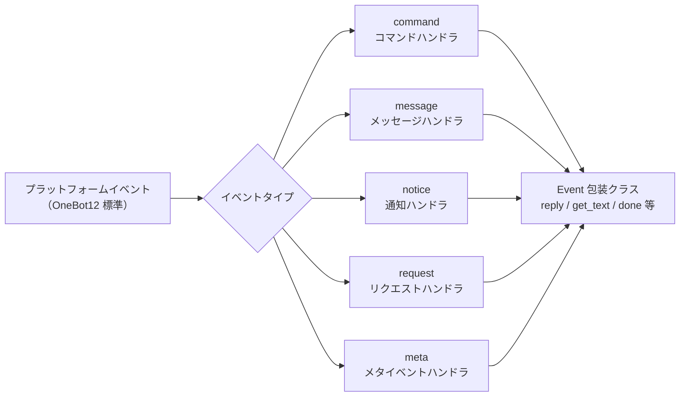

## Command コマンドモジュール

### コマンドの登録

```python
from ErisPulse.Core.Event import command

# 基本的なコマンド
@command("hello", help="挨拶を送信")
async def hello_handler(event):
    await event.reply("你好！")

# 別名付きのコマンド
@command(["help", "h"], aliases=["帮助"], help="ヘルプを表示")
async def help_handler(event):
    pass

# 権限付きのコマンド
def is_admin(event):
    return event.get("user_id") in admin_ids

@command("admin", permission=is_admin, help="管理者コマンド")
async def admin_handler(event):
    pass

# 隠しコマンド
@command("secret", hidden=True, help="秘密コマンド")
async def secret_handler(event):
    pass

# コマンドグループ
@command("admin.reload", group="admin", help="モジュールを再読み込み")
async def reload_handler(event):
    pass
```

### コマンド情報

すべてのコマンド情報の取得APIは、オプションの**セッションコンテキスト**をサポートしています。`event=`（Event または dict）または明示的な `platform=` / `bot_id=` / `session_id=` を渡すことができます（event と重複する場合は明示的なパラメータが優先されます）。つまり、作用域モジュールの次元でフィルタリングし、現在のセッションで利用できないモジュールのコマンドを除外します（詳細は advanced/scope.md を参照してください）。
すべてのパラメータはオプションです。渡さない場合は、既定の全量の動作になります。

```python
# コマンドのヘルプを取得
help_text = command.help()

# セッション感知ヘルプ：現在のセッションで利用可能なコマンドのみを表示
help_text = command.help(event=event)

# 特定のコマンドを取得（有効なパラメータをマージして返す；セッションで利用できない場合は None を返す）
cmd_info = command.get_command("admin")
cmd_info = command.get_command("admin", event=event)

# すべてのコマンドを取得（セッション感知の場合は利用できないモジュールのコマンドをフィルタリング）
all_commands = command.get_commands()
all_commands = command.get_commands(event=event)

# コマンドグループ内のすべてのコマンドを取得（セッション感知フィルタリングもサポート）
admin_commands = command.get_group_commands("admin")
admin_commands = command.get_group_commands("admin", event=event)

# すべての表示可能なコマンドを取得
visible_commands = command.get_visible_commands()

# セッション感知の表示可能なコマンド（event または明示的なキーワードのいずれかで指定可能）
visible_commands = command.get_visible_commands(event=event)
visible_commands = command.get_visible_commands(
    platform=event.get("platform"),
    bot_id=event.get_self_account_id(),
    session_id=event.get_session_id(),
)
```

### レプリを待つ

```python
# ユーザーの返信を待つ
@command("ask", help="ユーザーの情報を尋ねる")
async def ask_command(event):
    reply = await command.wait_reply(
        event,
        prompt="请输入你的名字:",  # 已在上面发送
        timeout=30.0
    )
    
    if reply:
        name = reply.get_text()
        await event.reply(f"你好，{name}！")

# 検証付きの待機レプリ
def validate_age(event_data):
    try:
        age = int(event_data.get_text())
        return 0 <= age <= 150
    except ValueError:
        return False

@command("age", help="ユーザーの年齢を尋ねる")
async def age_command(event):
    await event.reply("请输入你的年龄:")
    
    reply = await command.wait_reply(
        event,
        timeout=60,
        validator=validate_age
    )
    
    if reply:
        age = int(reply.get_text())
        await event.reply(f"你的年龄是 {age} 岁")

# コールバック付きの待機レプリ
async def handle_confirmation(reply_event):
    text = reply_event.get_text().lower()
    if text in ["是", "yes", "y"]:
        await event.reply("操作已确认！")
    else:
        await event.reply("操作已取消。")

@command("confirm", help="操作を確認する")
async def confirm_command(event):
    await command.wait_reply(
        event,
        prompt="请输入'是'或'否':",
        callback=handle_confirmation
    )
```

## Message メッセージモジュール

### メッセージイベント

```python
from ErisPulse.Core.Event import message

# すべてのメッセージを監視
@message.on_message()
async def message_handler(event):
    sdk.logger.info(f"收到消息: {event.get_text()}")

# プライベートメッセージを監視
@message.on_private_message()
async def private_handler(event):
    user_id = event.get_user_id()
    sdk.logger.info(f"私聊来自: {user_id}")

# グループメッセージを監視
@message.on_group_message()
async def group_handler(event):
    group_id = event.get_group_id()
    sdk.logger.info(f"群聊来自: {group_id}")

# @メッセージを監視
@message.on_at_message()
async def at_handler(event):
    mentions = event.get_mentions()
    sdk.logger.info(f"被@的用户: {mentions}")
```

### 条件監視

```python
# 優先度で実行順序を制御
@message.on_message(priority=10)  # 数値が大きいほど優先度が高い
async def high_priority_handler(event):
    pass

# ハンドラ内部で条件フィルタリングを実装
@message.on_message()
async def filtered_handler(event):
    if "关键词" not in event.get_text():
        return
    # キーワードを含むメッセージを処理
    pass
```

## Notice 通知モジュール

### 通知イベント

```python
from ErisPulse.Core.Event import notice

# フレンド追加
@notice.on_friend_add()
async def friend_add_handler(event):
    user_id = event.get_user_id()
    await event.reply("欢迎添加我为好友！")

# フレンド削除
@notice.on_friend_remove()
async def friend_remove_handler(event):
    user_id = event.get_user_id()
    sdk.logger.info(f"好友删除: {user_id}")

# グループメンバー追加
@notice.on_group_increase()
async def member_increase_handler(event):
    user_id = event.get_user_id()
    await event.reply(f"欢迎新成员！")

# グループメンバー削除
@notice.on_group_decrease()
async def member_decrease_handler(event):
    user_id = event.get_user_id()
    sdk.logger.info(f"群成员离开: {user_id}")
```

## Request リクエストモジュール

### リクエストイベント

```python
from ErisPulse.Core.Event import request

# フレンドリクエスト
@request.on_friend_request()
async def friend_request_handler(event):
    user_id = event.get_user_id()
    comment = event.get_comment()
    sdk.logger.info(f"好友请求: {user_id}, 备注: {comment}")

# グループ招待リクエスト
@request.on_group_request()
async def group_request_handler(event):
    group_id = event.get_group_id()
    user_id = event.get_user_id()
    sdk.logger.info(f"群邀请: {group_id}, 来自: {user_id}")
```

## Meta メタイベントモジュール

### メタイベント

```python
from ErisPulse.Core.Event import meta

# 接続イベント
@meta.on_connect()
async def connect_handler(event):
    platform = event.get_platform()
    sdk.logger.info(f"平台 {platform} 连接成功")

# 接続切断イベント
@meta.on_disconnect()
async def disconnect_handler(event):
    platform = event.get_platform()
    sdk.logger.info(f"平台 {platform} 断开连接")

# ハートビートイベント
@meta.on_heartbeat()
async def heartbeat_handler(event):
    sdk.logger.debug("收到心跳")
```

### Bot 状態照会

アダプタが meta イベントを送信した後、フレームワークは自動的に Bot 状態を追跡します。照会 API とライフサイクルイベントの監視については [アダプタシステム API - Bot 状態管理](adapter-system.md#bot-状态管理) を参照してください。

## Event 包装クラス

Event モジュールのイベントハンドラは、dict を継承した Event 包装クラスのインスタンスを受け取り、便利なメソッドを提供します。

### 核心メソッド

```python
# イベント情報を取得
event_id = event.get_id()
event_time = event.get_time()
event_type = event.get_type()
detail_type = event.get_detail_type()
platform = event.get_platform()

# ロボット情報を取得
self_platform = event.get_self_platform()
self_user_id = event.get_self_user_id()
self_info = event.get_self_info()
```

### セッション識別子

```python
# 統一されたターゲット ID：グループチャットは group_id、プライベートチャットは user_id を返すなど
target_id = event.get_target_id()

# セッションの一意識別子、形式: {platform}:{detail_type}:{target_id}
session_id = event.get_session_id()
# 例: "telegram:private:12345"、"qq:group:67890"
```

`get_target_id()` は、`group_id` → `channel_id` → `guild_id` → `thread_id` → `user_id` の順に最初の非空値を返します。これは、コンテキスト管理、ステートの保存など、セッションを一意に識別する必要がある場面に適しています。

### メッセージメソッド

```python
# メッセージ内容を取得
message_segments = event.get_message()
alt_message = event.get_alt_message()
text = event.get_text()

# 送信者の情報を取得
user_id = event.get_user_id()
nickname = event.get_user_nickname()
sender = event.get_sender()

# グループ情報を取得
group_id = event.get_group_id()

# メッセージタイプを判定
is_msg = event.is_message()
is_private = event.is_private_message()
is_group = event.is_group_message()

# @メッセージ関連
is_at = event.is_at_message()
has_mention = event.has_mention()
mentions = event.get_mentions()
```

### コマンド情報

```python
# コマンド情報を取得
cmd_name = event.get_command_name()
cmd_args = event.get_command_args()
cmd_raw = event.get_command_raw()

# それがコマンドかどうかを判定
is_cmd = event.is_command()
```

### レプリ機能

```python
# 基本的なレプリ
await event.reply("这是一条消息")

# 指定された送信方法
await event.reply("http://example.com/image.jpg", method="Image")

# @ユーザーと返信メッセージを含む
await event.reply("你好", at_users=["user1"], reply_to="msg_id")

# @全員
await event.reply("公告", at_all=True)

# プラットフォーム固有の修飾方法を使用（via パラメータ）
await event.reply("看板内容", method="Board",
                  via=[("Expire", 3600), ("ForMember", "114514")])

# 送信チェーンを取得し、自由に修飾方法や送信方法を追加（複数の修飾 / 動作型メソッドに適しています）
await event.send_chain().Expire(3600).Board("看板内容")
await event.send_chain().DismissBoard()

# OneBot12 メッセージセグメントを使用したレプリ
from ErisPulse.Core.Event import MessageBuilder
msg = MessageBuilder().text("Hello").image("url").build()
await event.reply_ob12(msg)

# レプリを待つ
reply = await event.wait_reply(timeout=30)
```

### プラットフォーム能力照会

```python
# 現在のプラットフォームが特定の送信方法をサポートしているか確認
if event.supports("Image"):
    await event.reply(url, method="Image")

# 現在のプラットフォームで利用可能なすべての送信方法をリストアップ
methods = event.available_methods()
# ["Text", "Image", "Voice", "File", ...]
```

### レプリメソッド

`reply()` メソッドは、`method` パラメータで送信タイプを指定し、2つの便利なブール値パラメータもサポートします：

```python
# 簡単なテキストレプリ
await event.reply("你好")

# 送信者を@して返信
await event.reply("你好", at_sender=True)

# 現在のメッセージを引用して返信
await event.reply("收到", quote=True)

# 組み合わせて使用
await event.reply("收到", at_sender=True, quote=True)

# 画像を送信（method パラメータを使用）
if event.supports("Image"):
    await event.reply("http://example.com/img.jpg", method="Image")
else:
    await event.reply("[图片] http://example.com/img.jpg")
```

**パラメータ説明**：

| パラメータ | タイプ | 説明 |
|------|------|------|
| `content` | str | 送信内容 |
| `method` | str | 送信方法、デフォルトは "Text"、"Image"/"Voice"/"Video"/"File" など |
| `at_sender` | bool | 送信者（user_id）を@するかどうか |
| `quote` | bool | 現在のメッセージ（message_id）を引用して返信するかどうか |
| `at_users` | list[str] | @するユーザーのリスト |
| `reply_to` | str | 手動で指定する返信メッセージ ID |
| `at_all` | bool | @全員するかどうか |

### 交互メソッド

```python
# confirm — 確認ダイアログ（True/False/None を返す）
if await event.confirm("确定要执行此操作吗？"):
    await event.reply("已确认")

# Text 以外の方法で確認メッセージを送信
if await event.confirm("http://example.com/image.jpg", method="Image"):
    await event.reply("已确认图片提示")

# choose — 選択メニュー（選択肢のインデックスまたは None を返す）
choice = await event.choose("请选择颜色：", ["红色", "绿色", "蓝色"])

# options_format="auto"（デフォルト）method に応じて自動的にスタイルを選択：
# Markdown→無序リスト（- 1.選択肢）、Html→有序リスト（<ol>）、その他→純粋なテキストリスト
# テキスト系メソッド（Markdown/Html など）はデフォルトで選択肢を末尾にマージ
# merge_prompt=True 任意の method で強制的にマージ可能、placeholder でプレースホルダーをカスタマイズ可能
choice = await event.choose(
    "## 请选择\n{options}", ["A", "B"],
    method="Markdown", merge_prompt=True,
)

# collect — フォーム収集（{key: value} 辞書または None を返す）
data = await event.collect([
    {"key": "name", "prompt": "请输入姓名："},
    {"key": "age", "prompt": "请输入年龄：",
     "validator": lambda e: e.get_text().isdigit()},
    {"key": "avatar", "prompt": "请发送头像：", "method": "Image"},
])

# wait_for — 条件を満たす任意のイベントを待つ
evt = await event.wait_for(event_type="notice", condition=lambda e: ..., timeout=120)

# conversation — 多輪対話コンテキスト
conv = event.conversation(timeout=60)
await conv.say("欢迎！")
```

> 完全な交互メソッドのパラメータ説明とその他の例については [Event 包装クラス详解](../developer-guide/modules/event-wrapper.md) と [Conversation 多輪対話](../advanced/conversation.md) を参照してください。

### ユーティリティメソッド

```python
# _ で始まる内部キーをフィルタリングして辞書に変換
event_dict = event.to_dict()

# 本来のデータを取得
raw = event.get_raw()
raw_type = event.get_raw_type()
```

### リンク制御

`event.done(claim=, stop=)` は「認領」と「阻止」の2つの正交的な意味を統一的に制御します：

- **認領（claim）**：イベントが処理済みであることをマーク（`_processed`）、コマンドディスパッチャーが重複処理をスキップするようにします
- **阻止（stop）**：低優先度のハンドラへのイベント伝播を阻止（`_propagation_stopped`）

```python
# 認領 + 阻止（デフォルト）
event.done()

# 認領のみ、阻止しない（低優先度の観測者はまだイベントを見ることができます）
event.done(stop=False)

# 阻止のみ、認領しない（例：ファイアウォール / 限流）
event.done(claim=False)

# mark_processed が主メソッドで、done はその別名です
event.mark_processed()             # 等価 event.done()
event.mark_processed(stop=False)   # 等価 event.done(stop=False)

# 状態を照会
event.is_processed()  # 既に認領されているか
event.is_stopped()    # 伝播が阻止されているか
```

### プラットフォーム拡張メソッド

アダプタは Event にプラットフォーム固有のメソッドを登録でき、対応するプラットフォームのインスタンス上でのみ使用可能です。

#### ユーザー：プラットフォーム拡張メソッドを使用

アダプタがプラットフォーム固有のメソッドを登録した後、イベントハンドラ内で直接呼び出すことができます。各プラットフォームのメソッドは異なりますので、対応する [プラットフォームドキュメント](../platform-guide/) を参照してください。

```python
from ErisPulse.Core.Event import message

@message.on_message()
async def handle_message(event):
    platform = event.get_platform()

    # プラットフォームに応じて固有メソッドを呼び出す
    if platform == "email":
        subject = event.get_subject()           # メール固有
        attachments = event.get_attachments()   # メール固有
```

#### プラットフォーム登録メソッドの照会

```python
from ErisPulse.Core.Event import get_platform_event_methods

# 指定プラットフォームに登録されたメソッドを照会
methods = get_platform_event_methods("email")
# ["get_subject", "get_from", "get_attachments", ...]

# 動的に判定して呼び出す
for method_name in get_platform_event_methods(event.get_platform()):
    method = getattr(event, method_name)
    print(f"{method_name}: {method()}")
```

#### プラットフォームメソッドの分離

異なるプラットフォームで登録されたメソッドは互いに干渉しません：

```python
# メールイベント - メール固有メソッドのみ
event = Event({"platform": "email", "email_raw": {"subject": "Hello"}})
event.get_subject()      # ✅ "Hello"
event.get_chat_type()    # ❌ AttributeError

# Telegram イベント - Telegram 固有メソッドのみ
event = Event({"platform": "telegram", "telegram_raw": {"chat": {"type": "private"}}})
event.get_chat_type()    # ✅ "private"
event.get_subject()      # ❌ AttributeError
```

#### `hasattr` / `dir` のサポート

```python
hasattr(event, "get_subject")   # 仅当 platform="email" 时返回 True
"get_subject" in dir(event)     # 同上
```

#### アダプタ：プラットフォーム拡張メソッドの登録

アダプタはデコレータを使って Event にプラットフォーム固有のメソッドを登録できます。メソッドの最初の引数は `self`（Event インスタンス）で、イベントデータに自由にアクセスできます。

##### 単一メソッドの登録

```python
from ErisPulse.Core.Event import register_event_method

@register_event_method("email")
def get_subject(self):
    """获取邮件主题"""
    return self.get("email_raw", {}).get("subject", "")

@register_event_method("email")
def get_from(self):
    """获取发件人"""
    return self.get("email_raw", {}).get("from", {})
```

##### バッチ登録（Mixin クラス）

メソッドが多い場合は、Mixin クラスを使って一括登録することを推奨します：

```python
from ErisPulse.Core.Event import register_event_mixin

class EmailEventMixin:
    def get_subject(self):
        return self.get("email_raw", {}).get("subject", "")

    def get_from(self):
        return self.get("email_raw", {}).get("from", {})

    def get_attachments(self):
        return self.get("email_raw", {}).get("attachments", [])

# 一括でメソッドを登録
register_event_mixin("email", EmailEventMixin)
```

##### 戻り値の規則

| 場面 | 戻り値 | ユーザー使用方法 |
|------|--------|------------|
| データを返す（テキスト、辞書など） | 直接戻り値を返す | `subject = event.get_subject()` |
| 操作を実行する（メッセージ送信など） | `asyncio.Task` を返す | `task = event.do_something()` 任意に `await` 可能 |

> **推奨**：データ以外のメソッドは `asyncio.Task` を返すようにし、ユーザーが `await` するかどうかを自由に選択できるようにします。`await` しなくても操作は完了します。

```python
@register_event_method("email")
def forward_email(self, to_address: str):
    """转发邮件 — 返回 Task，用户可自行决定是否 await"""
    import asyncio
    return asyncio.create_task(
        self._do_forward(to_address)
    )

# ユーザーは await して結果を待つことができる
await event.forward_email("user@example.com")

# または await しなくても、バックグラウンドで操作が実行される
event.forward_email("user@example.com")
```

##### メソッドの解除

```python
from ErisPulse.Core.Event import unregister_event_method, unregister_platform_event_methods

# 単一メソッドの解除
unregister_event_method("email", "get_subject")

# 指定プラットフォームの全メソッドの解除（アダプタの shutdown 時に呼び出す）
unregister_platform_event_methods("email")
```

##### 内置メソッドの上書き

`register_event_mixin` / `register_event_method` は Event の内置メソッド（`confirm`、`choose`、`collect`、`wait_reply`、`reply` など）を上書きできます。登録されたプラットフォームメソッドは `Event.__getattribute__` により内置メソッドよりも優先して有効になるため、アダプタはプラットフォーム固有のインタラクティブな実装を提供できます。

内置実装は `_builtin_*` 関数としてエクスポートされ、上書きした方はそれらをバックアップとして呼び出すことができます：

```python
from ErisPulse.Core.Event import register_event_mixin, _builtin_choose

class YunhuEventMixin:
    async def choose(self, prompt, options, timeout=60, method="Text"):
        # 云湖平台使用按钮组件
        buttons = [[{"text": opt} for opt in options]]
        await self.reply(prompt)
        # ...等待按钮回调或文本回复...
        # 回退到内置逻辑
        return await _builtin_choose(self, None, options, timeout, "Text")

register_event_mixin("yunhu", YunhuEventMixin)
```

## 跨プラットフォーム拡張（ワイルドカード）

`register_event_method` と `register_event_mixin` は `"*"` をプラットフォーム名として渡すことができ、登録されたメソッドは**すべてのプラットフォーム**の Event インスタンスで利用可能です。AI チャット、コンテキスト管理など、プラットフォーム間で再利用可能な機能モジュールに適しています。

### 跨プラットフォームメソッドの登録

```python
from ErisPulse.Core.Event.wrapper import register_event_method

@register_event_method("*")
async def ai_chat(self, prompt: str):
    """self 为 Event 实例，可自由访问事件数据和内置方法"""
    await self.reply(f"AI: {prompt}")
```

登録後、すべてのプラットフォームのイベントハンドラで呼び出すことができます：

```python
from ErisPulse.Core.Event import message

@message.on_message()
async def handler(event):
    await event.ai_chat(event.get_text())
```

### メソッドの優先順位

Event メソッドを属性アクセスで取得する際の優先順位は以下の通りです：

1. **プラットフォーム固有メソッド**（現在のプラットフォームの上書き）
2. **ワイルドカードメソッド**（`"*"` で登録された跨プラットフォームメソッド）
3. **内置メソッド**（`reply`、`confirm` 等）
4. **辞書キーのアクセス**

> したがって、ワイルドカードメソッドは内置メソッド（`reply` など）を上書きできますが、同名のプラットフォーム固有メソッドによってさらに上書きされます。

## 優先度システム

イベントハンドラは優先度をサポートし、数値が大きいほど優先度が高くなります：

```python
# 高優先度のハンドラが先に実行されます
@message.on_message(priority=10)
async def high_priority_handler(event):
    pass

# 低優先度のハンドラが後に実行されます
@message.on_message(priority=0)
async def low_priority_handler(event):
    pass
```


### 适配器系统 API

# アダプターシステム API

このドキュメントでは、ErisPulse アダプターシステムの API について詳しく説明します。

## アダプターマネージャー

### アダプターの取得

```python
from ErisPulse import sdk

# 名称でアダプターを取得
adapter = sdk.adapter.get("platform_name")

# または属性で直接アクセスすることもできます
adapter = sdk.adapter.platform_name
```

### アダプターイベントの監視
> 通常、`Event` モジュールを使用してイベントの監視/処理を行うことを推奨します。
>
> また、`Event` モジュールは強力なラッパーを提供しており、モジュール開発に多くの利便性をもたらします。

```python
# OneBot12 標準イベントを監視
@sdk.adapter.on("message")
async def handle_message(event):
    pass

# 特定のプラットフォームの標準イベントを監視
@sdk.adapter.on("message", platform="yunhu")
async def handle_yunhu_message(event):
    pass

# プラットフォームのネイティブイベントを監視
@sdk.adapter.on("raw_event", raw=True, platform="yunhu")
async def handle_raw_event(data):
    pass
```

### アダプター管理

```python
# すべてのプラットフォームを取得
platforms = sdk.adapter.platforms

# アダプターが存在するか確認
exists = sdk.adapter.exists("platform_name")

# アダプターを有効化/無効化
sdk.adapter.enable("platform_name")
sdk.adapter.disable("platform_name")

# アダプターを起動/停止
# 以下は引数を渡した場合の例です。引数なしの場合は、登録済みのすべてのアダプターを起動/停止します
await sdk.adapter.startup(["platform1", "platform2"])
await sdk.adapter.shutdown(["platform1", "platform2"])

# アダプターが実行中か確認
is_running = sdk.adapter.is_running("platform_name")

# 実行中のすべてのアダプターをリストアップ
running = sdk.adapter.list_running()
```

## ミドルウェア

ミドルウェアは、イベントがハンドラに配信される前に実行され、イベントデータの変更、フィルタリング、または記録が可能です。

### ミドルウェアの登録

```python
@sdk.adapter.middleware
async def my_middleware(event):
    sdk.logger.info(f"ミドルウェア処理: {event}")
    return event
```

### ミドルウェアの実行モデル

- **実行順序**: ミドルウェアは登録順に実行されます（先に登録されたものが先に実行されます）
- **データの伝達**: 各ミドルウェアは、前のミドルウェアから返された `event` データを受け取ります。もし、あるミドルウェアが `None` を返した場合、その返値は無視され、元のデータが引き続き伝達されます（`warning` レベルのログが出力されます）
- **データの変更**: ミドルウェアはイベントデータを変更し、変更後の辞書を返すことができます

```python
@sdk.adapter.middleware
async def add_timestamp(event):
    event["processed_at"] = time.time()
    return event

@sdk.adapter.middleware
async def filter_spam(event):
    if event.get("detail_type") == "private":
        text = event.get("alt_message", "")
        if "スパム広告" in text:
            return None   # None を返してもイベントの配信を阻止するわけではなく、単にその返値を無視します
    return event
```

> **注意**: ミドルウェアは現在、イベントの配信を阻止する機能をサポートしていません。特定のイベントをフィルタリングする必要がある場合は、イベントハンドラ内で条件分岐によって実現してください。
> ただし、Event モジュールで優先度の高いハンドラを設定し、ハンドラ内で `event.mark_processed()` を使用することで、低優先度のイベントハンドラを阻止することができます。

## Send メッセージ送信

### 基本的な送信

```python
# アダプターを取得
adapter = sdk.adapter.get("platform")

# テキストメッセージを送信
await adapter.Send.To("user", "123").Text("Hello")

# 画像メッセージを送信
await adapter.Send.To("group", "456").Image("https://example.com/image.jpg")
```

### 送信アカウントの指定

```python
# アカウント名を使用
await adapter.Send.Using("account1").To("user", "123").Text("Hello")

# アカウント ID を使用
await adapter.Send.Using("bot_id").To("user", "123").Text("Hello")
```

### 送信メソッドのサポート確認

```python
# プラットフォームがサポートするすべての送信メソッドをリストアップ
methods = sdk.adapter.list_sends("onebot11")
# 戻り値: ["Text", "Image", "Voice", "Markdown", ...]

# 特定のメソッドの詳細情報を取得
info = sdk.adapter.send_info("onebot11", "Text")
# 戻り値:
# {
#     "name": "Text",
#     "parameters": [
#         {"name": "text", "type": "str", "default": null, "annotation": "str"}
#     ],
#     "return_type": "Awaitable[Any]",
#     "docstring": "テキストメッセージを送信します..."
# }
```

### チェーン修飾

```python
# @ユーザー
await adapter.Send.To("group", "456").At("789").Text("こんにちは")

# @全員
await adapter.Send.To("group", "456").AtAll().Text("皆さんこんにちは")

# メッセージへの返信
await adapter.Send.To("group", "456").Reply("msg_id").Text("返信内容")

# 組み合わせ
await adapter.Send.To("group", "456").At("789").Reply("msg_id").Text("返信@メッセージ")
```

## API 呼び出し

### call_api メソッド

> **注意**: `call_api` は、プラットフォームのネイティブ API を直接呼び出すための低レベルメソッドです。各プラットフォームのパラメータや戻り値は異なりますので、対応するプラットフォームアダプターのドキュメントを参照してください。**メッセージ送信には Send DSL を使用することを推奨します**。Send DSL がサポートしていない場面（プラットフォーム特有のデータの取得、プラットフォーム管理インターフェースの呼び出し等）でのみ `call_api` を使用してください。

```python
# プラットフォーム API を呼び出す
result = await adapter.call_api(
    endpoint="/send",
    content="Hello",
    recvId="123",
    recvType="user"
)

# レスポンスの標準化
{
    "status": "ok",
    "retcode": 0,
    "data": {...},
    "message_id": "msg_id",
    "message": "",
    "{platform}_raw": raw_response
}
```

## アダプターベースクラス

### BaseAdapter メソッド

```python
from ErisPulse import sdk
from ErisPulse.Core import BaseAdapter

class MyAdapter(BaseAdapter):
    def __init__(self):
        super().__init__()
        self.sdk = sdk
        # アダプターを初期化
        pass
    
    async def start(self):
        """アダプターを起動する（必須）"""
        pass
    
    async def shutdown(self):
        """アダプターを停止する（必須）"""
        pass
    
    async def call_api(self, endpoint: str, **params):
        """プラットフォーム API を呼び出す（必須）"""
        pass
```

### Send 嵌套クラス

```python
class MyAdapter(BaseAdapter):
    class Send(BaseAdapter.Send):
        def Text(self, text: str):
            """テキストメッセージを送信"""
            import asyncio
            return asyncio.create_task(
                self._adapter.call_api(
                    endpoint="/send",
                    content=text,
                    recvId=self._target_id,
                    recvType=self._target_type
                )
            )
```

## Bot 状態管理

アダプターは、OneBot12 標準の **`meta` イベント**を送信することで、フレームワークに Bot の接続状態を通知します。システムは、このイベントから Bot 情報を抽出して状態を追跡します。

### meta イベントタイプ

アダプターは以下の 3 種類の `meta` イベントを送信する必要があります：

| `type` | `detail_type` | 説明 | 発生タイミング |
|--------|--------------|------|---------|
| `meta` | `connect` | Bot 接続オンライン | アダプターがプラットフォームとの接続を確立した直後 |
| `meta` | `heartbeat` | Bot ハートビート | 定期的に送信（推奨 30-60 秒） |
| `meta` | `disconnect` | Bot 接続切断 | 接続が切断されたと検出されたとき |

### self フィールドの拡張

ErisPulse は OneBot12 標準の `self` フィールドに、以下のオプションフィールドを拡張しています：

| フィールド | 型 | 説明 |
|------|------|------|
| `self.platform` | string | プラットフォーム名（OB12 標準） |
| `self.user_id` | string | Bot ユーザー ID（OB12 標準） |
| `self.user_name` | string | Bot 昵称（ErisPulse 拡張） |
| `self.avatar` | string | Bot アバター URL（ErisPulse 拡張） |
| `self.account_id` | string | マルチアカウント識別子（ErisPulse 拡張） |

### meta イベントフォーマット

#### connect — 接続オンライン

```python
await adapter.emit({
    "id": "unique_id",
    "time": 1712345678,
    "type": "meta",
    "detail_type": "connect",
    "platform": "telegram",
    "self": {
        "platform": "telegram",
        "user_id": "123456",
        "user_name": "MyBot",
        "avatar": "https://example.com/avatar.jpg"
    },
    "telegram_raw": {...},
    "telegram_raw_type": "bot_connected"
})
```

システム処理: Bot を登録し、`online` としてマークし、`adapter.bot.online` ライフサイクルイベントをトリガーします。

#### heartbeat — ハートビート

```python
await adapter.emit({
    "id": "unique_id",
    "time": 1712345708,
    "type": "meta",
    "detail_type": "heartbeat",
    "platform": "telegram",
    "self": {
        "platform": "telegram",
        "user_id": "123456"
    }
})
```

システム処理: `last_active` 時間を更新（ハートビートではメタ情報の更新もサポート）。

#### disconnect — 接続切断

```python
await adapter.emit({
    "id": "unique_id",
    "time": 1712345738,
    "type": "meta",
    "detail_type": "disconnect",
    "platform": "telegram",
    "self": {
        "platform": "telegram",
        "user_id": "123456"
    }
})
```

システム処理: Bot を `offline` としてマークし、`adapter.bot.offline` ライフサイクルイベントをトリガーします。

### 通常イベントの自動発見

`meta` イベント以外にも、通常イベント（`message`/`notice`/`request`）の `self` フィールドから Bot を自動的に発見し、登録して活性時間を更新します。つまり、アダプターが `connect` イベントを送信しなくても、フレームワークは最初の通常イベントから Bot を発見できます。

### アダプター接続例

```python
class MyAdapter(BaseAdapter):
    async def start(self):
        # プラットフォームとの接続を確立...
        connection = await self._connect()
        
        # 接続成功、connect イベントを送信
        await adapter.emit({
            "id": str(uuid4()),
            "time": int(time.time()),
            "type": "meta",
            "detail_type": "connect",
            "platform": "myplatform",
            "self": {
                "platform": "myplatform",
                "user_id": self.bot_id,
                "user_name": self.bot_name,
                "avatar": self.bot_avatar
            },
            "myplatform_raw": raw_data,
            "myplatform_raw_type": "connected"
        })
    
    async def on_disconnect(self):
        # 接続切断、disconnect イベントを送信
        await adapter.emit({
            "id": str(uuid4()),
            "time": int(time.time()),
            "type": "meta",
            "detail_type": "disconnect",
            "platform": "myplatform",
            "self": {
                "platform": "myplatform",
                "user_id": self.bot_id
            }
        })
```

### Bot 状態の取得

```python
# すべてのアダプターと Bot の完全な状態を取得（WebUI に優しい形式）
summary = sdk.adapter.get_status_summary()
# {
#     "adapters": {
#         "telegram": {
#             "status": "started",
#             "bots": {
#                 "123456": {
#                     "status": "online",
#                     "last_active": 1712345678.0,
#                     "info": {"nickname": "MyBot"}
#                 }
#             }
#         }
#     }
# }

# すべての Bot をリストアップ
all_bots = sdk.adapter.list_bots()

# 指定プラットフォームの Bot をリストアップ
tg_bots = sdk.adapter.list_bots("telegram")

# 単一 Bot の詳細を取得
info = sdk.adapter.get_bot_info("telegram", "123456")

# Bot がオンラインか確認
if sdk.adapter.is_bot_online("telegram", "123456"):
    print("Bot はオンラインです")
```

### Bot 状態値

| 状態 | 説明 |
|------|------|
| `online` | イベントを継続的に受信しているか、アダプターが手動でオンラインとしてマークしている |
| `offline` | アダプターが手動でオフラインとしてマークした、またはシステムの停止時に自動的に設定される |
| `unknown` | 登録されているが状態が確認されていない |

### ライフサイクルイベント

| イベント名 | 発生タイミング | データ |
|--------|---------|------|
| `adapter.bot.online` | 新しい Bot が初めて自動的に発見されたとき | `{platform, bot_id, status}` |
| `adapter.status.change` | アダプターの状態が変化したとき（starting/started/stopping/stopped/stop_failed） | `{platform, status}` |

```python
# Bot オンラインイベントを監視
@sdk.lifecycle.on("adapter.bot.online")
def on_bot_online(event):
    print(f"Bot オンライン: {event['data']['platform']}/{event['data']['bot_id']}")

# アダプター状態変化イベントを監視
@sdk.lifecycle.on("adapter.status.change")
def on_status_change(event):
    print(f"アダプター状態: {event['data']['platform']} -> {event['data']['status']}")
```

> システムの停止時（`shutdown`）に、すべての Bot は自動的に `offline` としてマークされます。


====
技术标准
====


### 会话类型标准

# ErisPulse セッションタイプ標準

このドキュメントでは、ErisPulse がサポートするセッションタイプ標準を定義します。これには、受信イベントタイプと送信ターゲットタイプが含まれます。

## 1. 核心概念

### 1.1 受信タイプ && 送信タイプ

ErisPulse は、2 種類のセッションタイプを区別します：

- **受信タイプ（Receive Type）**：受信するイベントの `detail_type` フィールド
- **送信タイプ（Send Type）**：メッセージを送信する際の `Send.To()` メソッドの対象タイプ

### 1.2 タイプのマッピング関係

```
受信タイプ (detail_type)     送信タイプ (Send.To)
─────────────────        ────────────────
private                 →        user
group                   →        group
channel                 →        channel
guild                   →        guild
thread                  →        thread
user                    →        user
```

**重要な点**：
- `private` は受信時のタイプであり、送信時には必ず `user` を使用する必要があります
- `group`、`channel`、`guild`、`thread` は受信時と送信時のタイプが同じです
- システムは自動的にタイプ変換を行います。手動での処理は不要です（つまり、取得した受信タイプをそのまま送信に使用できます）。実際には、これらのことを気にする必要はありません。Event のラッパークラスが存在するため、`event.reply()` メソッドを使用するだけで、タイプ変換を気にする必要はありません。

## 2. 標準的な会話タイプ

### 2.1 OneBot12 標準タイプ

#### private
- **受信タイプ**: `private`
- **送信タイプ**: `user`
- **説明**: 1対1のプライベートチャットメッセージ
- **IDフィールド**: `user_id`
- **対応プラットフォーム**: プライベートチャットをサポートするすべてのプラットフォーム

#### group
- **受信タイプ**: `group`
- **送信タイプ**: `group`
- **説明**: グループチャットメッセージ。Telegram supergroup などのさまざまな形式のグループを含む
- **IDフィールド**: `group_id`
- **対応プラットフォーム**: グループチャットをサポートするすべてのプラットフォーム

#### user
- **受信タイプ**: `user`
- **送信タイプ**: `user`
- **説明**: ユーザータイプ。一部のプラットフォーム（例: Telegram）では、プライベートチャットを `private` ではなく `user` として表示する
- **IDフィールド**: `user_id`
- **対応プラットフォーム**: Telegram など

### 2.2 ErisPulse 拡張タイプ

#### channel
- **受信タイプ**: `channel`
- **送信タイプ**: `channel`
- **説明**: チャンネルメッセージ。複数ユーザーへのブロードキャスト形式のメッセージをサポート
- **IDフィールド**: `channel_id`
- **対応プラットフォーム**: Discord, Telegram, Line など

#### guild
- **受信タイプ**: `guild`
- **送信タイプ**: `guild`
- **説明**: サーバー/コミュニティメッセージ。通常は Discord Guild レベルのイベントに使用
- **IDフィールド**: `guild_id`
- **対応プラットフォーム**: Discord など

#### thread
- **受信タイプ**: `thread`
- **送信タイプ**: `thread`
- **説明**: トピック/サブチャンネルメッセージ。コミュニティ内のサブディスカッションエリアに使用
- **IDフィールド**: `thread_id`
- **対応プラットフォーム**: Discord Threads, Telegram Topics など

## 3. プラットフォームの型マッピング

### 3.1 マッピングの原則

アダプターは、プラットフォームのネイティブ型を ErisPulse 標準型にマッピングします：

```
プラットフォームのネイティブ型 → ErisPulse 標準型 → 送信型
```

### 3.2 一般的なプラットフォームのマッピング例

#### Telegram
```
Telegram 型            ErisPulse 受信型      送信型
─────────────────      ────────────────       ───────────
private                private                user
group                  group                  group
supergroup             group                  group  # group にマッピング
channel                channel                channel
```

#### Discord
```
Discord 型            ErisPulse 受信型      送信型
─────────────────      ────────────────       ───────────
Direct Message         private               user
Text Channel           channel               channel
Guild                  guild                 guild
Thread                 thread                thread
```

#### OneBot11
```
OneBot11 型          ErisPulse 受信型      送信型
─────────────────      ────────────────       ───────────
private              private               user
group                group                 group
discuss              group                 group  # group にマッピング
```

## 4. 自定义型の拡張

### 4.1 自定义型の登録

アダプターは、独自のセッション型を登録することができます。

```python
from ErisPulse.Core.Event import register_custom_type

# 自定义型の登録
register_custom_type(
    receive_type="my_custom_type",
    send_type="custom",
    id_field="custom_id",
    platform="MyPlatform"
)
```

### 4.2 自定义型の使用

登録後、システムは自動的にその型の変換と推論を行います。

```python
# 自动推论
receive_type = infer_receive_type(event, platform="MyPlatform")
# 戻り値: "my_custom_type"

# 送信型への変換
send_type = convert_to_send_type(receive_type, platform="MyPlatform")
# 戻り値: "custom"

# 対応するIDの取得
target_id = get_target_id(event, platform="MyPlatform")
# 戻り値: event["custom_id"]
```

### 4.3 自定义型の解除登録

```python
from ErisPulse.Core.Event import unregister_custom_type

unregister_custom_type("my_custom_type", platform="MyPlatform")
```

## 5. 自動型推論

イベントに明確な `detail_type` フィールドがない場合、システムは存在する ID フィールドに基づいて型を自動的に推論します。

> [!NOTE]
> **2.7.0+ の動作変更**：`detail_type` は**既知の会話タイプ**（標準またはカスタム）である場合にのみ直接採用されます。notice/request イベントの `detail_type`（例：`group_member_increase`、`friend_increase`）は**意味論的サブタイプ**であり、会話タイプではなく、ID フィールドに基づいて正しい会話タイプを推論します。

### 5.1 推論の優先度

```
優先度（高い順）：
1. group_id     → group
2. channel_id   → channel
3. guild_id     → guild
4. thread_id    → thread
5. user_id      → private
```

### 5.2 使用例

```python
# イベントには group_id だけがある
event = {"group_id": "123", "user_id": "456"}
receive_type = infer_receive_type(event)
# 戻り値: "group"（group_id を優先的に使用）

# イベントには user_id だけがある
event = {"user_id": "123"}
receive_type = infer_receive_type(event)
# 戻り値: "private"

# notice イベントの detail_type は意味論的サブタイプであり、2.7.0+ では ID フィールドから推論される
event = {"type": "notice", "detail_type": "group_member_increase", "group_id": "123"}
receive_type = infer_receive_type(event)
# 戻り値: "group"（"group_member_increase" ではなく）
```

## 6. API 使用例

### 6.1 メッセージの送信

```python
from ErisPulse import adapter

# ユーザーに送信
await adapter.myplatform.Send.To("user", "123").Text("Hello")

# グループに送信
await adapter.myplatform.Send.To("group", "456").Text("Hello")

# 自動変換 private → user（推奨されない、互換性の問題が発生する可能性がある）
await adapter.myplatform.Send.To("private", "789").Text("Hello")
# 内部で自動的に Send.To("user", "789") に変換される # 会話タイプとして user を直接使用するのがより良い選択です
```

### 6.2 イベントの返信

```python
from ErisPulse.Core.Event import Event

# Event.reply() は自動的に型変換を処理する
await event.reply("返信内容")
# 内部で正しい送信タイプが自動的に使用される
```

### 6.3 コマンド処理

```python
from ErisPulse.Core.Event import command

@command(name="test")
async def handle_test(event):
    # システムが自動的に会話タイプを処理する
    # group_id か user_id を手動で判断する必要はない
    await event.reply("コマンドの実行に成功しました")
```

## 7. コア API リファレンス

### 7.1 タイプ変換

```python
from ErisPulse.Core.Event import convert_to_send_type, convert_to_receive_type

# 受信タイプ → 送信タイプ
convert_to_send_type("private")  # → "user"
convert_to_send_type("group")    # → "group"

# 送信タイプ → 受信タイプ
convert_to_receive_type("user")   # → "private"
convert_to_receive_type("group")  # → "group"
```

### 7.2 ID フィールドの取得

```python
from ErisPulse.Core.Event import get_id_field, get_receive_type

get_id_field("group")    # → "group_id"
get_id_field("private")  # → "user_id"

get_receive_type("group_id")  # → "group"
get_receive_type("user_id")   # → "private"
```

### 7.3 送信情報の取得

```python
from ErisPulse.Core.Event import get_send_type_and_target_id

event = {"detail_type": "private", "user_id": "123"}
send_type, target_id = get_send_type_and_target_id(event)
# send_type = "user", target_id = "123"

# Send.To() に直接使用
await adapter.Send.To(send_type, target_id).Text("Hello")
```

### 7.4 目標IDの取得

```python
from ErisPulse.Core.Event import get_target_id

event = {"detail_type": "group", "group_id": "456"}
get_target_id(event)  # → "456"
```

## 8. ユーティリティメソッド

```python
from ErisPulse.Core.Event import (
    is_standard_type,
    is_valid_send_type,
    get_standard_types,
    get_send_types,
    clear_custom_types,
)

is_standard_type("private")     # True
is_standard_type("custom_type") # False

is_valid_send_type("user")      # True
is_valid_send_type("invalid")   # False

get_standard_types()  # {"private", "group", "channel", "guild", "thread", "user"}
get_send_types()      # {"user", "group", "channel", "guild", "thread"}

clear_custom_types()                # 全てのカスタムタイプをクリア
clear_custom_types(platform="discord")  # 指定したプラットフォームのカスタムタイプのみをクリア
```

## 9. 最善の実践

### 7.1 アダプタ開発者

1. **標準マッピングの使用**：可能な限り、新しい型を作成するのではなく、標準型にマッピングする。
2. **正しい変換**：送信型と受信型のマッピング関係が正しくなるようにする。
3. **元のデータの保持**：`{platform}_raw` に元のイベント型を保持する。
4. **ドキュメントの説明**：アダプタのドキュメントに型のマッピング関係を説明する。

### 7.2 モジュール開発者

1. **ツールメソッドの使用**：`get_send_type_and_target_id()` などのツールメソッドを使用する。
2. **ハードコーディングの回避**：`if group_id else "private"` のようなコードを書かない。
3. **すべての型を考慮する**：コードは、private/group だけでなく、すべての標準型をサポートするようにする。
4. **柔軟な設計**：イベントラッパーのメソッドを使用する、または直接フィールドにアクセスしないようにする。

### 7.3 型推論

- **`detail_type` を優先する**：明確なフィールドがある場合は、推論を行わない。
- **推論の適切な使用**：明確な型がない場合にのみ使用する。
- **優先順位に注意する**：推論の優先順位を理解し、意図しない結果を避ける。

## 10. よくある質問

### Q1: 送信時に private を user に変換する必要があるのはなぜですか？

A: これは OneBot12 標準の要件です。`private` は受信時の概念であり、送信時には `user` を使用することで意味がより明確になります。

### Q2: 新しい会話タイプをサポートするにはどうすればよいですか？

A: `register_custom_type()` を使用してカスタムタイプを登録するか、または標準タイプの `channel`、`guild` を直接使用します。

### Q3: イベントに detail_type がない場合はどうすればよいですか？

A: システムは存在する ID フィールドに基づいて自動的に推定します。優先順位は以下の通りです：group > channel > guild > thread > user。

### Q4: どのようにアダプターが Telegram supergroup をマッピングしますか？

A: アダプターの変換ロジック内で、`supergroup` を標準の `group` タイプにマッピングします。

### Q5: 電子メールなどの特殊なプラットフォームはどのように扱いますか？

A: 一般的でない、またはプラットフォーム固有のタイプについては、`{platform}_raw` と `{platform}_raw_type` を使用して元のデータを保持し、アダプターで独自に処理します。

## 11. 関連ドキュメント

- [イベント変換規格](event-conversion.md) - イベント変換に関する完全な規格
- [送信メソッド規格](send-method-spec.md) - Send クラスのメソッド命名およびパラメータの規格
- [アダプタ開発ガイド](../developer-guide/adapters/) - アダプタ開発に関する完全なガイド


### 事件转换标准

# アダプタ標準化変換規格

## 1. 核心原則
1. 严格的互換性：すべての標準フィールドはOneBot12仕様に完全に準拠する必要があります。
2. 明確な拡張：プラットフォーム固有の機能には必ず {platform}_ 前置きを付ける必要があります（例：yunhu_form）。
3. データの完全性：元のイベントデータは {platform}_raw フィールドに、元のイベントタイプは {platform}_raw_type フィールドに保持する必要があります。
4. 時間の統一：すべてのタイムスタンプは10桁のUnixタイムスタンプ（秒単位）に変換する必要があります。
5. プラットフォームの統一：platform項目の命名は、ErisPulseで登録した名称/別称と一致する必要があります。

## 2. 標準フィールド要件

### 2.1 必須フィールド
| フィールド | 型 | 説明 |
|------|------|------|
| id | string | イベントの一意の識別子 |
| time | integer | Unixタイムスタンプ（秒単位） |
| type | string | イベントの種類 |
| detail_type | string | イベントの詳細な種類（[会話タイプ標準](session-types.md)を参照） |
| platform | string | プラットフォーム名 |
| self | object | ロボット自身の情報 |
| self.platform | string | プラットフォーム名 |
| self.user_id | string | ロボットのユーザーID |

**detail_type の規格**：
- ErisPulse 標準会話タイプを使用する必要があります（[会話タイプ標準](session-types.md)を参照）
- 対応するタイプ：`private`, `group`, `user`, `channel`, `guild`, `thread`
- アダプターは、プラットフォーム固有のタイプを標準タイプにマッピングする責任があります

### 2.2 メッセージイベントフィールド
| フィールド | 型 | 説明 |
|------|------|------|
| message | array | メッセージセグメントの配列 |
| alt_message | string | メッセージセグメントの代替テキスト |
| user_id | string | ユーザーID |
| user_nickname | string | ユーザーのニックネーム（オプション） |

### 2.3 通知イベントフィールド
| フィールド | 型 | 説明 |
|------|------|------|
| user_id | string | ユーザーID |
| user_nickname | string | ユーザーのニックネーム（オプション） |
| operator_id | string | 操作者のID（オプション） |

### 2.4 要求イベントフィールド
| フィールド | 型 | 説明 |
|------|------|------|
| user_id | string | ユーザーID |
| user_nickname | string | ユーザーのニックネーム（オプション） |
| comment | string | 要求の付言（オプション） |
| request_id | string | 要求の識別子（**強く推奨**、同意/拒否操作に使用） |

**`request_id` フィールドの説明**：
- `request_id` は要求イベントの一意の操作識別子であり、`HandleRequest` DSL を使用して同意/拒否操作を実行するために使用されます
- アダプターは、要求イベントを変換する際に、プラットフォーム固有の要求識別子をこのフィールドにマッピングする必要があります
- プラットフォームに要求IDがない場合、アダプターは一意の識別子（例：タイムスタンプ+ユーザーIDのハッシュ）を生成する必要があります
- `request_id` が欠落している場合、`event.approve()` / `event.reject()` は `ValueError` をスローします

## 3. イベント形式の例

### 3.1 メッセージイベント (message)
```json
{
  "id": "1234567890",
  "time": 1752241223,
  "type": "message",
  "detail_type": "group",
  "platform": "yunhu",
  "self": {
    "platform": "yunhu",
    "user_id": "bot_123"
  },
  "message": [
    {
      "type": "text",
      "data": {
        "text": "抽選 超大賞"
      }
    }
  ],
  "alt_message": "抽選 超大賞",
  "user_id": "user_456",
  "user_nickname": "YingXinche",
  "group_id": "group_789",
  "yunhu_raw": {...},
  "yunhu_raw_type": "message.receive.normal",
  "yunhu_command": {
    "name": "抽選",
    "args": "超大賞"
  }
}
```

### 3.2 通知イベント (notice)
```json
{
  "id": "1234567891",
  "time": 1752241224,
  "type": "notice",
  "detail_type": "group_member_increase",
  "platform": "yunhu",
  "self": {
    "platform": "yunhu",
    "user_id": "bot_123"
  },
  "user_id": "user_456",
  "user_nickname": "YingXinche",
  "group_id": "group_789",
  "operator_id": "",
  "yunhu_raw": {...},
  "yunhu_raw_type": "bot.followed"
}
```

### 3.3 要求イベント (request)
```json
{
  "id": "1234567892",
  "time": 1752241225,
  "type": "request",
  "detail_type": "friend",
  "platform": "onebot11",
  "self": {
    "platform": "onebot11",
    "user_id": "bot_123"
  },
  "user_id": "user_456",
  "user_nickname": "YingXinche",
  "comment": "友達追加してください",
  "request_id": "req_abc123",
  "onebot11_raw": {...},
  "onebot11_raw_type": "request"
}
```

## 4. メッセージセグメント標準

### 4.1 標準メッセージセグメント

標準メッセージセグメントタイプには**プラットフォームプレフィックスを追加しない**：

| タイプ | 説明 | data フィールド |
|------|------|----------|
| `text` | 純粋なテキスト | `text: str` |
| `image` | 画像 | `file: str/bytes`, `url: str` |
| `audio` | 音声 | `file: str/bytes`, `url: str` |
| `video` | 動画 | `file: str/bytes`, `url: str` |
| `file` | ファイル | `file: str/bytes`, `url: str`, `filename: str` |
| `mention` | ユーザーへのメンション | `user_id: str`, `user_name: str` |
| `reply` | メッセージへの返信 | `message_id: str` |
| `face` | エモート | `id: str` |
| `location` | 位置情報 | `latitude: float`, `longitude: float` |

```json
{
  "type": "text",
  "data": {
    "text": "Hello World"
  }
}
```

### 4.2 プラットフォーム拡張メッセージセグメント

プラットフォーム固有のメッセージセグメントには、プラットフォームプレフィックスを追加する必要があります：

```json
// 雲湖 - フォーム
{"type": "yunhu_form", "data": {"form_id": "123456", "form_name": "登録フォーム"}}

// Telegram - ステッカー
{"type": "telegram_sticker", "data": {"file_id": "CAACAgIAAxkBAA...", "emoji": "😂"}}
```

**拡張メッセージセグメントの要件**：
1. **data 内部のフィールドにプレフィックスを追加しない**：`{"type": "yunhu_form", "data": {"form_id": "..."}}` ではなく `{"type": "yunhu_form", "data": {"yunhu_form_id": "..."}}`
2. **降格対応を提供する**：モジュールが拡張メッセージセグメントを認識できない場合、アダプターは `alt_message` にテキストによる代替を提供する
3. **ドキュメントの完全性**：各拡張メッセージセグメントは、アダプターのドキュメントで `type`、`data` の構造と使用場面を説明する必要がある

## 5. 未知イベントの処理

イベントの種類が識別できない場合、警告イベントを生成する必要があります：

```json
{
  "id": "1234567893",
  "time": 1752241223,
  "type": "unknown",
  "platform": "yunhu",
  "yunhu_raw": {...},
  "yunhu_raw_type": "unknown",
  "warning": "サポートされていないイベントタイプ: special_event",
  "alt_message": "このシステムではこのイベントタイプはサポートされていません。"
}
```

## 6. 拡張名命名規則

### 6.1 フィールド名

**規則**: `{platform}_{field_name}`

```
プラットフォーム接頭辞    フィールド名            完全なフィールド名
────────    ───────          ──────────
yunhu       command           yunhu_command
telegram    sticker_file_id   telegram_sticker_file_id
onebot11    anonymous         onebot11_anonymous
email       subject           email_subject
```

**要件**:
- `platform` は、アダプタ登録時のプラットフォーム名と完全に一致する必要があります（大文字小文字を区別）
- `field_name` は `snake_case` で命名する
- `__` で始まるダブルアンダースコアは使用禁止（Python 予約）
- 標準フィールド名（`type`、`time`、`message` など）と重複しないこと

### 6.2 メッセージセグメント型名

**規則**: `{platform}_{segment_type}`

標準のメッセージセグメント型（`text`、`image`、`audio`、`video`、`mention`、`reply` など）には、プラットフォーム接頭辞を追加しないでください。プラットフォーム固有のメッセージセグメント型のみ接頭辞を追加する必要があります。

### 6.3 元データフィールド名

以下のフィールド名は**予約フィールド**であり、すべてのアダプタは以下の要件を遵守する必要があります：

| 予約フィールド | 型 | 説明 |
|---------|------|------|
| `{platform}_raw` | `any` | プラットフォームの元のイベントデータの完全なコピー |
| `{platform}_raw_type` | `string` | プラットフォームの元のイベントタイプの識別子 |

**要件**:
- `{platform}_raw` は、参照ではなく元データのディープコピーである必要があります
- `{platform}_raw_type` は文字列型である必要があります。プラットフォームが数値型を使用している場合でも、文字列に変換する必要があります
- これらの2つのフィールドは、すべてのイベントで**必ず存在する**必要があります（取得できない場合は `null` と空文字列 `""` とする）

### 6.4 プラットフォーム固有フィールドの例

```json
{
  "yunhu_command": {
    "name": "抽奖",
    "args": "超级大奖"
  },
  "yunhu_form": {
    "form_id": "123456"
  },
  "telegram_sticker": {
    "file_id": "CAACAgIAAxkBAA..."
  }
}
```

### 6.5 嵌套拡張フィールド

拡張フィールドは単純な値でも、ネストされたオブジェクトでも構いません：

```json
{
  "telegram_chat": {
    "id": 123456,
    "type": "supergroup",
    "title": "My Group"
  },
  "telegram_forward_from": {
    "user_id": "789",
    "user_name": "ForwardUser"
  }
}
```

**ネストされたフィールドの要件**:
- トップレベルのキーには必ずプラットフォーム接頭辞を付ける
- ネストされた内部フィールドには、プラットフォーム接頭辞を追加しない
- ネストの深さは3層を超えないようにすることを推奨

### 6.6 `self` フィールドの拡張

`self` オブジェクトの標準必須フィールド（`platform`、`user_id`）は §2.1 を参照してください。以下は ErisPulse が拡張したオプションフィールドです：

| フィールド | 型 | 説明 |
|------|------|------|
| `self.user_name` | `string` | ロボットのニックネーム |
| `self.avatar` | `string` | ロボットのアバター URL |
| `self.account_id` | `string` | マルチアカウントモードにおけるアカウント識別子 |

> **Bot 状態の追跡**: アダプタは `type: "meta"` イベントを送信して、フレームワークに Bot の接続状態を通知します。サポートされる `detail_type`: `connect`（オンライン）、`heartbeat`（ハートビート）、`disconnect`（オフライン）。システムは、この `detail_type` から `self` フィールドの Bot 元情報を取り出して自動的に状態を追跡します。また、通常のイベントにおける `self` フィールドも自動的に Bot を検出します。詳細は [アダプタシステム API - Bot 状態管理](../api-reference/adapter-system.md) を参照してください。

## 7. セッションタイプ拡張

ErisPulse は OneBot12 標準の `private`、`group` の上に以下のセッションタイプを拡張しています。

| タイプ | OneBot12 標準 | ErisPulse 拡張 | 説明 |
|------|:-----------:|:------------:|------|
| `private` | ✅ | — | 1対1のプライベートチャット |
| `group` | ✅ | — | グループチャット |
| `user` | — | ✅ | ユーザータイプ（Telegram など） |
| `channel` | — | ✅ | チャンネル（放送型） |
| `guild` | — | ✅ | サーバー/コミュニティ |
| `thread` | — | ✅ | トピック/サブチャンネル |

**アダプタ独自のタイプ拡張**：

```python
from ErisPulse.Core.Event.session_type import register_custom_type

# アダプタ起動時に登録
register_custom_type(
    receive_type="email",      # 受信イベント中の detail_type
    send_type="email",         # 送信時の対象タイプ
    id_field="email_id",       # 対応するIDフィールド名
    platform="email"           # プラットフォーム識別子
)
```

**独自タイプの要件**：
- アダプタの `start()` 時に登録し、`shutdown()` 時に登録解除する必要があります
- `receive_type` は標準タイプと重複しないようにする必要があります
- `id_field` は `{対象}_id` の命名規則に従う必要があります

> 完全なセッションタイプ定義とマッピング関係は、[セッションタイプ標準](docs/ja/session-types.md)を参照してください。

## 8. モジュール開発者ガイド

### 8.1 拡張フィールドのアクセス

```python
from ErisPulse.Core.Event import message

@message()
async def handle_message(event):
    # 標準フィールドのアクセス
    text = event.get_text()
    user_id = event.get_user_id()

    # プラットフォーム拡張フィールドのアクセス - 方法1: 直接 get
    yunhu_command = event.get("yunhu_command")

    # プラットフォーム拡張フィールドのアクセス - 方法2: 点式アクセス (Event ラッパークラス)
    # event.yunhu_command

    # 送信元データのアクセス
    raw_data = event.get("yunhu_raw")
    raw_type = event.get_raw_type()

    # プラットフォームの判定
    platform = event.get_platform()
    if platform == "yunhu":
        pass
    elif platform == "telegram":
        pass
```

### 8.2 拡張メッセージセグメントの処理

```python
@message()
async def handle_message(event):
    message_segments = event.get("message", [])

    for segment in message_segments:
        seg_type = segment.get("type")
        seg_data = segment.get("data", {})

        if seg_type == "text":
            text = seg_data["text"]
        elif seg_type.startswith("yunhu_"):
            if seg_type == "yunhu_form":
                form_id = seg_data["form_id"]
        elif seg_type.startswith("telegram_"):
            if seg_type == "telegram_sticker":
                file_id = seg_data["file_id"]
```

### 8.3 最適な実践方法

1. **標準フィールドの優先使用**: 拡張フィールドが必ず存在すると仮定しないこと
2. **プラットフォームの判定**: 拡張フィールドの存在によってプラットフォームを推測するのではなく、`event.get_platform()` を使用すること
3. **エラーハンドリング**: 拡張メッセージセグメントを処理できない場合は、`alt_message` をバックアップとして使用すること
4. **プレフィックスのハードコーディングを避ける**: `platform` 変数を使って動的に文字列を連結すること

```python
# ✅ 推奨
platform = event.get_platform()
raw_data = event.get(f"{platform}_raw")

# ❌ 推奨されない
raw_data = event.get("yunhu_raw")
```

### 8.4 要求イベントの処理

モジュール開発者は、`event.approve()` および `event.reject()` を使用して要求イベントを処理することができます。

```python
from ErisPulse.Core.Event import request

# フレンドリクエスト: 自動的に承認
@request.on_friend_request()
async def handle_friend_request(event):
    user_name = event.get_user_nickname() or event.get_user_id()
    comment = event.get_comment()
    
    # 承認リクエスト
    result = await event.approve()
    if result.get("status") == "ok":
        print(f"{user_name} からのフレンドリクエストを承認しました")
    else:
        print(f"フレンドリクエストの承認に失敗しました: {result.get('message')}")

# グループ招待: 条件に応じて決定
@request.on_group_request()
async def handle_group_request(event):
    comment = event.get_comment()
    
    # 拒否リクエスト
    result = await event.reject(comment="暫定的に新しいグループに参加しません")
```

**アダプターを介した直接操作**（イベントハンドラ以外の場面に適用可能）:

```python
from ErisPulse import adapter

# request_id を使用して直接操作
await adapter.myplatform.Request("req_abc123").accept()
await adapter.myplatform.Request("req_abc123").reject()

# 特定の Bot アカウントで操作
await adapter.myplatform.Request("req_abc123").Using("bot1").accept()

# 備考を付けて操作
await adapter.myplatform.Request("req_abc123").accept(comment="ようこそ")
```

## 9. notice / request イベントのセッションタイプ推論

### 9.1 問題の背景

notice イベントと request イベントの `detail_type` は**意味論的なサブタイプ**（例: `group_member_increase`、`friend_increase`）であり、セッションタイプ（例: `group`、`private`）ではありません。

```
type        detail_type                  含意            セッションタイプ
────        ───────────                  ────            ────────
message     group                        群チャットメッセージ         group（detail_type がセッションタイプ）
message     private                      プライベートチャットメッセージ         private（detail_type がセッションタイプ）
notice      group_member_increase        群メンバーの増加       group（group_id から推論）
notice      friend_increase              友達の増加         private（user_id から推論）
request     friend                       友達リクエスト         private（user_id から推論）
request     group                        群リクエスト           group（detail_type がセッションタイプ）
```

### 9.2 推論ルール

`infer_receive_type()` の推論順序は以下の通りです：

1. `detail_type` が既知のセッションタイプ（`private`/`group`/`channel`/`guild`/`thread`/`user`）である場合、そのまま使用する
2. `detail_type` がカスタムセッションタイプである場合、そのまま使用する
3. それ以外（notice/request の意味論的サブタイプ）の場合、ID フィールドに基づいて推論する：
   - `group_id` がある → `"group"`
   - `channel_id` がある → `"channel"`
   - `guild_id` がある → `"guild"`
   - `thread_id` がある → `"thread"`
   - `user_id` がある → `"private"`

### 9.3 `event.reply()` の送信先推論

notice/request イベントにおける `event.reply()` の送信先は、セッションタイプの推論によって決まります：

- グループ通知イベント（`group_id` を含む）→ グループに返信
- 友達通知イベント（`user_id` だけを含む）→ ユーザーのプライベートチャットに返信

```python
from ErisPulse.Core.Event import notice

@notice.on_group_increase()
async def handle_welcome(event):
    group_id = event.get("group_id")    # "group_789"
    user_id = event.get("user_id")      # "user_456"

    # event.reply() はグループ（group/group_789）に送信
    await event.reply("ようこそ！")

    # 管理者に通知する場合（プライベートチャット）、明示的に送信先を指定する：
    await adapter.Send.To("user", "admin_id").Text(f"新メンバー {user_id} が {group_id} に参加しました")
```

### 9.4 アダプタ開発の推奨事項

notice/request イベントにおいて、正しい ID フィールドが含まれていることを確認してください：

| detail_type | 必須の ID フィールド | 推論されるセッションタイプ |
|-------------|-------------------|---------------|
| `group_member_increase` | `group_id` + `user_id` | `group` |
| `group_member_decrease` | `group_id` + `user_id` | `group` |
| `friend_increase` | `user_id` | `private` |
| `friend_decrease` | `user_id` | `private` |
| `friend`（リクエスト） | `user_id` | `private` |
| `group`（リクエスト） | `group_id` | `group` |

## 10. 関連ドキュメント

- [各プラットフォームの機能ドキュメント](../platform-guide/README.md) - ここでは、各プラットフォームの機能や既知の拡張イベントやメッセージセグメントなどについて説明しています。
- [会話タイプの標準](session-types.md) - 会話タイプの定義とマッピング関係
- [送信メソッドの規格](send-method-spec.md) - Send クラスのメソッド命名、パラメータ規格および逆変換の要件
- [API 応答の標準](api-response.md) - アダプターの API 応答形式の標準
- [API アクションの標準](api-action-spec.md) - OneBot12 標準 API アクションの統一インターフェース


### API 响应标准

# ErisPulse アダプタ標準化返却仕様

## 1. 説明  
なぜこの規格があるのでしょうか？

各プラットフォームの送信インターフェースが一貫性とOneBot12との互換性を確保するため、ErisPulseアダプターはAPIレスポンス形式においてOneBot12が定義するメッセージ送信返却構造の標準を採用しています。

ただしErisPulseのプロトコルにはいくつかの特殊な定義があります:
- 1. 基本フィールドにおいて、message_idは必須ですが、OneBot12の標準にはこのフィールドはありません。
- 2. 返却内容には、{platform_name}_raw フィールドを追加する必要があります。このフィールドには、元のレスポンスデータを格納します。

## 2. 基礎レスポンス構造
すべてのアクションレスポンスには、以下の基本フィールドを含める必要があります。

| フィールド名 | データ型 | 必須 | 説明 |
|-------|---------|------|------|
| status | string | はい | 実行ステータス。"ok"または"failed"のいずれかに設定する必要があります |
| retcode | int64 | はい | 戻り値コード。OneBot12の戻り値コード規則に従います |
| data | any | はい | レスポンスデータ。成功時はリクエスト結果を含み、失敗時はnull |
| message_id | string | はい | メッセージID。メッセージを識別するためのもので、存在しない場合は空文字列 |
| message | string | はい | エラーメッセージ。成功時は空文字列 |
| {platform_name}_raw | any | いいえ | 元のレスポンスデータ |

オプションフィールド：
| フィールド名 | データ型 | 必須 | 説明 |
|-------|---------|------|------|
| echo | string | いいえ | リクエストにechoフィールドが含まれている場合、その値をそのまま返します |

## 3. 完全なフィールド仕様

### 3.1 一般的なフィールド

#### 成功時のレスポンス例
```json
{
    "status": "ok",
    "retcode": 0,
    "data": {
        "message_id": "1234",
        "time": 1632847927.599013
    },
    "message_id": "1234",
    "message": "",
    "echo": "1234",
    "telegram_raw": {...}
}
```

#### 失敗時のレスポンス例
```json
{
    "status": "failed",
    "retcode": 10003,
    "data": null,
    "message_id": "",
    "message": "必要なパラメータが不足しています: user_id",
    "echo": "1234",
    "telegram_raw": {...}
}
```

### 3.2 戻り値コードの仕様

#### 0 成功（OK）
- 0: 成功（OK）

#### 1xxxx 動作リクエストエラー（Request Error）
| エラーコード | エラー名 | 説明 |
|-------|-------|------|
| 10001 | Bad Request | 無効な動作リクエスト |
| 10002 | Unsupported Action | 対応していない動作リクエスト |
| 10003 | Bad Param | 無効な動作リクエストパラメータ |
| 10004 | Unsupported Param | 対応していない動作リクエストパラメータ |
| 10005 | Unsupported Segment | 対応していないメッセージセグメントの種類 |
| 10006 | Bad Segment Data | 無効なメッセージセグメントパラメータ |
| 10007 | Unsupported Segment Data | 対応していないメッセージセグメントパラメータ |
| 10101 | Who Am I | ロボットアカウントが指定されていません |
| 10102 | Unknown Self | 知らないロボットアカウント |

#### 2xxxx 動作ハンドラーエラー（Handler Error）
| エラーコード | エラー名 | 説明 |
|-------|-------|------|
| 20001 | Bad Handler | 動作ハンドラーの実装エラー |
| 20002 | Internal Handler Error | 動作ハンドラーが実行中に例外をスローしました |

#### 3xxxx 動作実行エラー（Execution Error）
| エラーコード範囲 | エラー種別 | 説明 |
|-----------|---------|------|
| 31xxx | Database Error | データベースエラー |
| 32xxx | Filesystem Error | ファイルシステムエラー |
| 33xxx | Network Error | ネットワークエラー |
| 34xxx | Platform Error | ロボットプラットフォームエラー |
| 35xxx | Logic Error | 動作ロジックエラー |
| 36xxx | I Am Tired | 実装が作業を中止することを決定しました |

#### 保留エラーセグメント
- 4xxxx、5xxxx: 保留セグメント、使用しないでください
- 6xxxx～9xxxx: 他のエラーセグメント、実装が独自に使用するためのものです

## 4. 実装要件
1. すべてのレスポンスには status、retcode、data、message フィールドが含まれている必要があります。
2. リクエストに非空の echo フィールドが含まれている場合、レスポンスには同じ値の echo フィールドが含まれている必要があります。
3. 戻り値コードは OneBot12 規格に厳密に従う必要があります。
4. エラーメッセージ(message)は人間に読みやすい説明文である必要があります。

## 5. 拡張仕様

ErisPulse は OneBot12 標準の返却構造に以下の拡張を加えています。

### 5.1 `message_id` 必須フィールド

OneBot12 標準では `message_id` は `data` オブジェクト内にあり、必須ではありません。ErisPulse ではこれをトップレベルの**必須**フィールドに昇格させています：

- `message_id` を取得できない場合は、空文字列 `""` を設定する
- `message_id` が常に存在することを保証し、モジュールは null チェックを行う必要がない

### 5.2 `{platform}_raw` 原始レスポンスフィールド

返却値には、プラットフォームの原始レスポンスデータの完全なコピーを保持する `{platform}_raw` フィールドを含める必要があります：

```json
{
    "status": "ok",
    "retcode": 0,
    "data": {"message_id": "1234", "time": 1632847927},
    "message_id": "1234",
    "message": "",
    "telegram_raw": {
        "ok": true,
        "result": {"message_id": 1234, "date": 1632847927, ...}
    }
}
```

**要件**：
- `{platform}_raw` は原始レスポンスのディープコピーである必要があり、参照ではありません
- `platform` はアダプター登録時のプラットフォーム名と完全に一致する必要があります（大文字小文字を区別）
- エラーメッセージも保持し、デバッグに役立つようにする

### 5.3 フレームワーク拡張返却コード（34xxx プラットフォームエラーセグメントの下3桁をカスタム）

OneBot12 規格では、実装が `3xxxx` の下3桁をカスタムに使用することが許可されています。`34xxx` の意味は **Platform Error**（ロボットプラットフォームエラー、プラットフォーム制限による失敗など）です。`34xxx` 内部では役割ごとに分層して使用されます：

| 下3桁セグメント | 所属 | 用途 |
|---------|------|------|
| `340xx` | アダプター実装 | リクエスト操作族（Request Not Found / Already Handled / Not Supported / Permission Denied、request-action-spec §7 参照） |
| `341xx`～`345xx` | アダプター実装 | プラットフォーム側の権限 / リスク管理 / アカウント制限などのエラー（実装者が下3桁をカスタム、元のエラーは `{platform}_raw` に格納） |
| `346xx` | **ErisPulse フレームワーク（予約済み）** | フレームワーク自身のブロックと一般的な失敗、アダプターやモジュールは使用しない |
| `347xx`～`349xx` | アダプター実装 | その他のプラットフォーム実行エラー |

ErisPulse フレームワークで現在使用している `346xx` コード：

| エラーコード | エラー名 | 説明 |
|-------|-------|------|
| 34600 | SDK Failure | フレームワークの一般的な失敗（`make_error()` のデフォルト返却コード） |
| 34601 | Action Denied | 出力アクションがスコープによって禁止された（`scope.actions`）、呼び出しは行われず、直接このレスポンスを返す |

> 役割の区別：`34601` は**フレームワークが呼び出し前にブロック**（モジュールはそもそもアクションを発行する資格がない）です。
> `34004` / `34xxx` プラットフォームコードは**アクションは発行されたがプラットフォームが拒否**（Bot に権限がない、リスク管理対象など）です。
> モジュールは権限の問題を判断する際に、これら2つを同時にチェックする必要があります：まず `34601`（自分のモジュールが scope によって禁止されているか）を確認し、次に `34xxx`（プラットフォーム側の制限）を確認します。

返却構造は §2 の標準失敗レスポンスに従います：

```json
{
    "status": "failed",
    "retcode": 34601,
    "data": null,
    "message_id": "",
    "message": "action 'send' denied by scope.actions"
}
```

### 5.4 アダプター実装チェックリスト

- [ ] `status`, `retcode`, `data`, `message_id`, `message` フィールドを含む
- [ ] 返却コードは OneBot12 規格に従う（§3.2 参照）
- [ ] `message_id` が常に存在する（取得できない場合は空文字列）
- [ ] `{platform}_raw` にプラットフォームの原始レスポンスデータを含む

## 6. 注意事項
- 3xxxxエラーコードについては、下位3桁は実装側で独自に定義可能です。
- 予約エラーセグメント（4xxxx、5xxxx）は使用しないでください。
- **`34600` / `34601` は ErisPulse フレームワーク用に予約されたコードです**（§5.3を参照）。アダプタやモジュールでは使用しないでください。
- エラーメッセージは簡潔かつ明瞭にし、デバッグしやすいようにしてください。


### 发送方法规范

# ErisPulse 送信メソッド規格

本文書では、ErisPulse アダプタの Send クラスにおける送信メソッドの命名規格、パラメータ規格および逆変換要件を定義します。

## 1. 標準メソッド命名

送信メソッドはすべて **PascalCase（大文字キャメルケース）** を使用し、先頭文字は大文字です。

### 1.1 標準送信メソッド

| メソッド名 | 説明 | パラメータ型 |
|-------|------|---------|
| `Text` | テキストメッセージを送信 | `str` |
| `Image` | 画像を送信 | `bytes` \| `str` (URL/パス) |
| `Voice` | 音声を送信 | `bytes` \| `str` (URL/パス) |
| `Video` | 動画を送信 | `bytes` \| `str` (URL/パス) |
| `File` | ファイルを送信 | `bytes` \| `str` (URL/パス) |
| `At` | ユーザー/グループを@する | `str` (user_id) |
| `Face` | 表情を送信 | `str` (emoji) |
| `Reply` | メッセージに返信する | `str` (message_id) |
| `Forward` | メッセージを転送する | `str` (message_id) |
| `Markdown` | Markdownメッセージを送信 | `str` |
| `HTML` | HTMLメッセージを送信 | `str` |
| `Card` | カードメッセージを送信 | `dict` |

### 1.2 チェーン修飾メソッド

| メソッド名 | 説明 | パラメータ型 |
|-------|------|---------|
| `At` | ユーザーを@する（複数回呼び出し可能） | `str` (user_id) |
| `AtAll` | 全員を@する | 無し |
| `Reply` | メッセージに返信する | `str` (message_id) |

### 1.3 プロトコルメソッド

| メソッド名 | 説明 | 必須か |
|-------|------|---------|
| `Raw_ob12` | OneBot12形式のメッセージセグメントを送信 | 必須 |

**`Raw_ob12` は実装が必要なメソッドです**。これはアダプタの中心的な役割の一つであり、OneBot12標準メッセージセグメントを受け取り、それをプラットフォーム固有のAPI呼び出しに変換することです。`Raw_ob12` はOneBot12からプラットフォームへの一元的な変換エントリポイントであり、モジュールがプラットフォーム固有のメソッドに依存せずに、標準メッセージセグメントを使ってメッセージを送信できるようにします。

**`Raw_ob12` をオーバーライドしない場合の動作**：基底クラスのデフォルト実装では、**errorレベル**のログを記録し、標準エラー応答形式（`status: "failed"`, `retcode: 10002`）を返し、アダプタ開発者がこのメソッドを実装する必要があることを示します。

### 1.4 推奨される拡張命名規約

アダプタがOneBot12形式以外の生データ（プラットフォーム固有のJSON、XMLなど）を送信する機能をサポートする場合、以下の命名規約を推奨します：

| 推奨メソッド名 | 説明 |
|-----------|------|
| `Raw_json` | 任意のJSONデータを送信 |
| `Raw_xml` | 任意のXMLデータを送信 |

**注意**：これらのメソッドは**基底クラスに提供されているものではなく、実装が必須というわけではありません**。これらは単なる命名規約であり、アダプタは必要に応じて独自に定義できます。アダプタがこれらの形式をサポートしていない場合は、定義する必要はありません。

**メッセージビルダー（MessageBuilder）**：ErisPulseは`MessageBuilder`というツールクラスを提供しており、OneBot12メッセージセグメントリストを簡単に構築するのに使用できます。`Raw_ob12`と併用してください。詳しくは[メッセージビルダー](#11-メッセージビルダー-messagebuilder)章をご覧ください。

## 2. パラメータ規格の詳細説明

### 2.1 メディアメッセージのパラメータ規格

メディアメッセージ（`Image`、`Voice`、`Video`、`File`）は、2種類のパラメータタイプをサポートしています。

#### 2.1.1 文字列パラメータ（URL またはファイルパス）

**形式：** `str`

**サポート対象：**
- **URL**：ネットワークリソースのアドレス（例：`https://example.com/image.jpg`）
- **ファイルパス**：ローカルファイルのパス（例：`/path/to/file.jpg` または `C:\\path\\to\\file.jpg`）

**使用シーン：**
- ファイルが既にネットワーク上にある場合、URLを直接送信する
- ローカルディスクにファイルがある場合、ファイルパスを送信する
- アダプタがファイルのアップロードを自動的に処理することを希望する

**推奨：** URLを使用することを優先し、URLが利用できない場合はローカルファイルパスを使用する

**例：**
```python
# URLを使用する
send.Image("https://example.com/image.jpg")

# ローカルファイルパスを使用する
send.Image("/path/to/local/image.jpg")
send.Image("C:\\path\\to\\local\\image.jpg")
```

#### 2.1.2 2進数データパラメータ

**形式：** `bytes`

**使用シーン：**
- ファイルが既にメモリ内にある場合（例：ネットワークからダウンロード、他のソースから読み込む）
- ファイルを処理した後に送信する必要がある場合（例：画像の圧縮、フォーマットの変換）
- ファイルを繰り返し読み取ることを避ける

**注意事項：**
- 大きなファイルのアップロードは多くのメモリを消費する可能性がある
- 妥当なファイルサイズ制限を設定することを推奨する

**例：**
```python
# ネットワークから読み取って送信する
import requests
image_data = requests.get("https://example.com/image.jpg").content
send.Image(image_data)

# ファイルから読み取って送信する
with open("/path/to/local/image.jpg", "rb") as f:
    image_data = f.read()
send.Image(image_data)
```

#### 2.1.3 パラメータ処理の優先順位

アダプタがメディアメッセージのパラメータを受け取った場合、以下の順序で処理する必要があります：

1. **URLパラメータ**：URLを直接使用して送信する（一部のプラットフォームアダプタでは、URLのダウンロード後にアップロードを行う場合がある）
2. **ファイルパス**：ローカルパスであるかを検証し、ローカルパスであればファイルをアップロードする
3. **2進数データ**：2進数データを直接アップロードする

**アダプタ実装の推奨：**
```python
def Image(self, image: Union[bytes, str]):
    if isinstance(image, str):
        # URLかローカルパスかを判断する
        if image.startswith(("http://", "https://")):
            # URLを直接送信する
            return self._send_image_by_url(image)
        else:
            # ローカルパスの場合、ファイルを読み込んでアップロードする
            with open(image, "rb") as f:
                return self._upload_image(f.read())
    elif isinstance(image, bytes):
        # 2進数データの場合、直接アップロードする
        return self._upload_image(image)
```

### 2.2 @ユーザーのパラメータ規格

**メソッド：** `At`（修飾メソッド）

**パラメータ：** `user_id` (`str`)

**要件：**
- `user_id` は文字列型のユーザー識別子である必要がある
- 各プラットフォームの `user_id` の形式は異なる可能性がある（数字、UUID、文字列など）
- アダプタは `user_id` をプラットフォーム固有の形式に変換する責任がある
- 実際の送信メソッドの呼び出しを最後に配置することに注意する

**例：**
```python
# 単一の@ユーザー
Send.To("group", "g123").At("123456").Text("你好")

# 複数の@ユーザー（チェーン呼び出し）
send.To("group", "g123").At("123456").At("789012").Text("大家好")
```

### 2.3 メッセージへの返信のパラメータ規格

**メソッド：** `Reply`（修飾メソッド）

**パラメータ：** `message_id` (`str`)

**要件：**
- `message_id` は文字列型のメッセージ識別子である必要がある
- 以前に受信したメッセージのIDである必要がある
- 一部のプラットフォームでは返信機能がサポートされていない可能性があるため、アダプタは優雅な降格処理を行うべきである

**例：**
```python
send.To("group", "g123").Reply("msg_123456").Text("收到")
```

## 3. 平台特有メソッドの命名

Send クラスに直接プラットフォームのプレフィックスを付けてメソッドを追加することは**推奨されません**。代わりに、一般的なメソッド名または `Raw_{プロトコル}` メソッドを使用することを推奨します。

**推奨されない例：**
```python
def YunhuForm(self, form_id: str):  # ❌ 推奨されません
    pass

def TelegramSticker(self, sticker_id: str):  # ❌ 推奨されません
    pass
```

**推奨される例：**
```python
def Form(self, form_id: str):  # ✅ 一般的なメソッド名
    pass

def Sticker(self, sticker_id: str):  # ✅ 一般的なメソッド名
    pass

def Raw_ob12(self, message):  # ✅ OneBot12 形式を送信
    pass
```

**拡張メソッドの要件：**
- メソッド名は PascalCase を使用し、プラットフォームのプレフィックスを付けない
- 必ず `asyncio.Task` オブジェクトを返す
- 完全な型注釈とドキュメント文字列を提供する
- パラメータの設計は、標準メソッドのスタイルとできるだけ一致させる

## 4. パラメータ命名規則

| パラメータ名 | 説明 | 型 |
|-------|------|------|
| `text` | テキスト内容 | `str` |
| `url` / `file` | ファイルの URL またはバイナリデータ | `str` / `bytes` |
| `user_id` | ユーザー ID | `str` / `int` |
| `group_id` | グループ ID | `str` / `int` |
| `message_id` | メッセージ ID | `str` |
| `data` | データオブジェクト（例：カードデータ） | `dict` |

## 5. 戻り値の規格

- **送信メソッド**（例: `Text`, `Image`）：必ず `asyncio.Task` オブジェクトを返す必要があります
- **修飾メソッド**（例: `At`, `Reply`, `AtAll`）：チェーン呼び出しをサポートするため、必ず `self` を返す必要があります

---

## 6. 反転変換規格（OneBot12 → プラットフォーム）

アダプターは、プラットフォームのネイティブイベントを OneBot12 形式に変換する（正方向変換）だけでなく、**必ず** OneBot12 メッセージセグメントをプラットフォームのネイティブ API 呼び出しに変換する機能（反転変換）を提供する必要があります。反転変換の統一エントリーポイントは `Raw_ob12` メソッドです。

### 6.1 変換モデル

```
正方向変換（受信方向）                反転変換（送信方向）
─────────────────                ─────────────────
プラットフォームのネイティブイベント                       OneBot12 メッセージセグメントリスト
    │                                  │
    ▼                                  ▼
Converter.convert()               Send.Raw_ob12()
    │                                  │
    ▼                                  ▼
OneBot12 標準イベント                  プラットフォームのネイティブ API 呼び出し
（含 {platform}_raw）             （標準レスポンス形式を返す）
```

**コアの対称性**：正方向変換では、元のデータは `{platform}_raw` に保持され、反転変換では OneBot12 標準形式を受け取り、プラットフォームの呼び出しに復元されます。

### 6.2 `Raw_ob12` 実装規格

`Raw_ob12` は、OneBot12 標準メッセージセグメントリストを受け取り、それをプラットフォームのネイティブ API 呼び出しに変換する必要があります。

**メソッド署名**：

```python
def Raw_ob12(self, message_segments: List[Dict]) -> asyncio.Task:
    """
    OneBot12 標準メッセージセグメントの送信

    :param message_segments: OneBot12 メッセージセグメントリスト
        [
            {"type": "text", "data": {"text": "Hello"}},
            {"type": "image", "data": {"file": "https://..."}},
            {"type": "mention", "data": {"user_id": "123"}},
        ]
    :return: asyncio.Task。await 後に標準レスポンス形式を返す
    """
```

**実装要件**：

1. **すべての標準メッセージセグメントタイプを処理する必要がある**：少なくとも `text`、`image`、`audio`、`video`、`file`、`mention`、`reply` をサポートする
2. **プラットフォーム拡張メッセージセグメントを処理する必要がある**：`{platform}_xxx` タイプのメッセージセグメントについては、プラットフォームに対応するネイティブ呼び出しに変換する
3. **標準レスポンス形式を返す必要がある**：[API レスポンス標準](api-response.md)に従う
4. **サポートされていないメッセージセグメントは警告を記録してスキップする**。エラーをスローしてメッセージ全体の送信を失敗させるべきではない

### 6.3 メッセージセグメント変換ルール

#### 6.3.1 標準メッセージセグメント変換

アダプターは以下の標準メッセージセグメントの変換を実装する必要があります：

| OneBot12 メッセージセグメント | 変換要件 |
|----------------|---------|
| `text` | `data.text` を直接使用する |
| `image` | `data.file` のタイプに応じて処理する：URL は直接使用し、bytes はアップロードし、ローカルパスは読み込んでからアップロードする |
| `audio` | `image` と同じ処理ロジック |
| `video` | `image` と同じ処理ロジック |
| `file` | `image` と同じ処理ロジック。`data.filename` に注意する |
| `mention` | プラットフォームの @ユーザー 機制に変換する（例：Telegram の `entities`、云湖の `at_uid`） |
| `reply` | プラットフォームの返信引用機制に変換する |
| `face` | プラットフォームの絵文字送信機制に変換する。サポートされていない場合はスキップする |
| `location` | プラットフォームの位置送信機制に変換する。サポートされていない場合はスキップする |

#### 6.3.2 プラットフォーム拡張メッセージセグメント変換

プラットフォームのプレフィックスを持つメッセージセグメントについては、アダプターは識別して変換する必要があります：

```python
def _convert_ob12_segments(self, segments: List[Dict]) -> Any:
    """OneBot12 メッセージセグメントをプラットフォームのネイティブ形式に変換する"""
    platform_prefix = f"{self._platform_name}_"
    
    for segment in segments:
        seg_type = segment["type"]
        seg_data = segment["data"]
        
        if seg_type.startswith(platform_prefix):
            # プラットフォーム拡張メッセージセグメント → プラットフォームのネイティブ呼び出し
            self._handle_platform_segment(seg_type, seg_data)
        elif seg_type in self._standard_segment_handlers:
            # 標準メッセージセグメント → プラットフォームの同等操作
            self._standard_segment_handlers[seg_type](seg_data)
        else:
            # 未知のメッセージセグメント → 警告を記録してスキップする
            logger.warning(f"サポートされていないメッセージセグメントタイプ: {seg_type}")
```

#### 6.3.3 複合メッセージセグメントの処理

1 つのメッセージには複数のメッセージセグメントが含まれる可能性があり、アダプターは複合メッセージを正しく処理する必要があります：

```python
# モジュールがテキスト+画像+@ユーザー を含むメッセージを送信
await send.Raw_ob12([
    {"type": "mention", "data": {"user_id": "123"}},
    {"type": "text", "data": {"text": "你好"}},
    {"type": "image", "data": {"file": "https://example.com/img.jpg"}}
])
```

**処理戦略**：
- **優先的に結合する**：プラットフォームが 1 つのメッセージにテキスト、画像、@などを同時に含むことをサポートしている場合は、結合して送信する
- **次善の策として分割する**：プラットフォームが結合をサポートしていない場合は、順番に分割して複数のメッセージとして送信する
- **順序を保持する**：メッセージセグメントの送信順序は、リストの順序と一致するようにする

### 6.4 `Raw_ob12` と標準メソッドの関係

アダプターの標準送信メソッド（`Text`、`Image` など）は、**`SendDSL` 基底クラスに既に実装されており、`Raw_ob12` にデフォルトで委譲されている**。アダプターのサブクラスでは、これらのメソッドを再実装する必要はありません：

```python
class Send(SendDSL):
    def Raw_ob12(self, message_segments: List[Dict]) -> asyncio.Task:
        """コア実装：OneBot12 メッセージセグメント → プラットフォーム API（必ず実装する）"""
        return asyncio.create_task(self._send_ob12(message_segments))

    # Text/Image/Voice/Video/File は基底クラスから継承され、自動的に Raw_ob12 に委譲される
    # プラットフォーム固有のロジックが必要な場合は、個別のメソッドをオーバーライドする：
    # def Text(self, text: str) -> asyncio.Task:
    #     return self.Raw_ob12([{"type": "text", "data": {"text": text}}])
```

**メリット**：
- 変換ロジックは `Raw_ob12` に集中し、重複コードを減らす
- 標準メソッドと `Raw_ob12` の動作は完全に一致する
- モジュールは `Text()` または `Raw_ob12()` を使用しても同じ結果を得られる
- 基底クラスが型署名を提供し、IDE は標準メソッドを補完できる

### 6.5 実装例

```python
class YunhuSend(SendDSL):
    """云湖プラットフォームの Send 実装"""
    
    def Raw_ob12(self, message_segments: list) -> asyncio.Task:
        """OneBot12 メッセージセグメント → 云湖 API 呼び出し"""
        return asyncio.create_task(self._do_send(message_segments))
    
    async def _do_send(self, segments: list) -> dict:
        """実際の送信ロジック"""
        # 1. 修飾子の状態を解析する
        at_users = self._at_users or []
        reply_to = self._reply_to
        at_all = self._at_all
        
        # 2. メッセージセグメントを変換する
        yunhu_elements = []
        for seg in segments:
            seg_type = seg["type"]
            seg_data = seg["data"]
            
            if seg_type == "text":
                yunhu_elements.append({"type": "text", "content": seg_data["text"]})
            elif seg_type == "image":
                yunhu_elements.append({"type": "image", "url": seg_data["file"]})
            elif seg_type == "mention":
                at_users.append(seg_data["user_id"])
            elif seg_type == "reply":
                reply_to = seg_data["message_id"]
            elif seg_type == "yunhu_form":
                # プラットフォーム拡張メッセージセグメント
                yunhu_elements.append({"type": "form", "form_id": seg_data["form_id"]})
            else:
                logger.warning(f"云湖がサポートしていないメッセージセグメント: {seg_type}")
        
        # 3. 云湖 API を呼び出す
        response = await self._call_yunhu_api(yunhu_elements, at_users, reply_to, at_all)
        
        # 4. 標準レスポンス形式を返す
        return {
            "status": "ok" if response["code"] == 0 else "failed",
            "retcode": response["code"],
            "data": {"message_id": response.get("msg_id", ""), "time": int(time.time())},
            "message_id": response.get("msg_id", ""),
            "message": "",
            "yunhu_raw": response
        }
```

## 7. メソッド発見

モジュール開発者は、API を使用してアダプターがサポートする送信メソッドを照会することができます。

```python
from ErisPulse import adapter

# すべての送信メソッドをリスト化
methods = adapter.list_sends("myplatform")
# ["Batch", "Form", "Image", "Recall", "Sticker", "Text", ...]

# メソッドの詳細を確認
info = adapter.send_info("myplatform", "Form")
# {
#     "name": "Form",
#     "parameters": [{"name": "form_id", "type": "str", ...}],
#     "return_type": "Awaitable[Any]",
#     "docstring": "雲湖フォームの送信"
# }
```

---

## 8. 登録済みの送信メソッド拡張

| プラットフォーム | メソッド名 | 説明 |
|------|--------|------|
| onebot12 | `Mention` | ユーザーをメンションする（OneBot12スタイル） |
| onebot12 | `Sticker` | ステッカーを送信する |
| onebot12 | `Location` | 位置情報を送信する |
| onebot12 | `Recall` | メッセージを撤回する |
| onebot12 | `Edit` | メッセージを編集する |
| onebot12 | `Batch` | バッチ送信する |

> **注意**: 送信メソッドにはプラットフォームのプレフィックスを付けないでください。異なるプラットフォームの同名メソッドは異なる実装を持つことができます。

## 9. アダプター開発の注意点

`BaseAdapter`、`Send`、`Request` の `__init__` を正しくオーバーライドする方法については、[アダプター開発入門 - `__init__` の注意点](../developer-guide/adapters/getting-started.md#init-の注意点) を参照してください。

## 10. アダプタ実装チェックリスト

### 送信メソッド
- [ ] 標準メソッド（`Text`, `Image` など）が実装されている
- [ ] 戻り値はすべて `asyncio.Task` である
- [ ] 修飾メソッド（`At`, `Reply`, `AtAll`）は `self` を返す
- [ ] プラットフォーム拡張メソッドは PascalCase を使用し、プラットフォームのプレフィックスは付与しない
- [ ] すべてのメソッドに完全な型注釈とドキュメント文字列がある

### 逆変換
- [ ] `Raw_ob12` **が実装されている**（必須、スキップ不可）
- [ ] `Raw_ob12` はすべての標準メッセージセグメント（`text`, `image`, `audio`, `video`, `file`, `mention`, `reply`）を処理できる
- [ ] `Raw_ob12` はプラットフォーム拡張メッセージセグメント（`{platform}_xxx` 型）を処理できる
- [ ] 標準送信メソッド（`Text`, `Image` など）は内部で `Raw_ob12` に委譲し、独立した変換ロジックを実装しない
- [ ] 対応していないメッセージセグメントは警告を記録してスキップし、例外を送出しない
- [ ] 複合メッセージセグメントは正しく処理される（結合または順序通りに分割）

## 11. メッセージビルダー（MessageBuilder）

`MessageBuilder` は、ErisPulse が提供するメッセージセグメント構築ツールであり、`Raw_ob12` と併用することで、OneBot12 のメッセージセグメント構築プロセスを簡素化します。

### 11.1 インポート

```python
from ErisPulse.Core import MessageBuilder
# または
from ErisPulse.Core.Event import MessageBuilder
```

### 11.2 チェーン呼び出しによる構築

```python
# テキスト、画像、@ユーザーを含むメッセージを構築
segments = (
    MessageBuilder()
    .mention("123456")
    .text("你好，看看这张图")
    .image("https://example.com/img.jpg")
    .reply("msg_789")
    .build()
)

# 送信
await adapter.Send.To("group", "456").Raw_ob12(segments)
```

### 11.3 単一セグメントの高速構築

```python
# 単一メッセージセグメントを高速に構築（Raw_ob12 に直接渡せる list[dict] を返す）
await adapter.Send.To("user", "123").Raw_ob12(MessageBuilder.text("Hello"))
await adapter.Send.To("group", "456").Raw_ob12(MessageBuilder.image("https://..."))
await adapter.Send.To("group", "456").Raw_ob12(MessageBuilder.mention("123"))
await adapter.Send.To("group", "456").Raw_ob12(MessageBuilder.reply("msg_id"))
await adapter.Send.To("group", "456").Raw_ob12(MessageBuilder.at_all())
```

### 11.4 Event.reply_ob12 との併用

```python
from ErisPulse.Core import MessageBuilder

@message()
async def handle(event: Event):
    await event.reply_ob12(
        MessageBuilder()
        .mention(event.get_user_id())
        .text("收到你的消息")
        .build()
    )
```

### 11.5 対応するメッセージセグメントメソッド

| メソッド | 説明 | data フィールド |
|------|------|----------|
| `text(text)` | テキスト | `text` |
| `image(file)` | 画像 | `file` |
| `audio(file)` | 音声 | `file` |
| `video(file)` | 動画 | `file` |
| `file(file, filename=None)` | ファイル | `file`, `filename`（オプション） |
| `mention(user_id, user_name=None)` | @ユーザー | `user_id`, `user_name`（オプション） |
| `at(user_id, user_name=None)` | @ユーザー（`mention` の別名） | `mention` と同じ |
| `reply(message_id)` | メッセージへの返信 | `message_id` |
| `at_all()` | 全員にメンション | `{}` |
| `custom(type, data)` | 自定義/プラットフォーム拡張 | 自定義 |

### 11.6 ユーティリティメソッド

```python
builder = MessageBuilder().text("基礎内容")

# コピー（ディープコピー）
msg1 = builder.copy().image("img1").build()
msg2 = builder.copy().image("img2").build()

# クリア
builder.clear().text("新内容").build()

# 空かどうかの判定
if builder:
    print(f"メッセージセグメントが {len(builder)} 個含まれています")
```

## 12. 関連ドキュメント

- [イベント変換標準](event-conversion.md) - 完全なイベント変換の仕様、拡張名およびメッセージセグメントの標準
- [APIレスポンス標準](api-response.md) - アダプタAPIレスポンス形式の標準
- [セッション型標準](session-types.md) - セッション型の定義とマッピング関係
- [リクエスト操作規範](request-action-spec.md) - リクエストイベントのフィールド要件、HandleRequest DSLおよびアダプタ実装要件


### 请求操作规范

# ErisPulse リクエスト操作規格

本ドキュメントでは、ErisPulseアダプターにおけるリクエストイベント操作の標準化された規格を定義します。これには、リクエストイベントのフィールド要件、Request DSLの使用方法、アダプター実装要件が含まれます。

## 1. 概要

リクエストイベント（`type: "request"`）は、OneBot12標準で定義された特殊なイベントタイプで、Botに意思決定を求めるリクエスト（友達申請、グループ招待など）を表します。

メッセージイベントとは異なり、リクエストイベントは**双方向のやり取り**が必要です：
1. **受信**：アダプターがプラットフォームの原生リクエストを標準リクエストイベントに変換
2. **応答**：モジュールが`Request` DSLまたは`Event.approve()`/`Event.reject()`を使って操作を実行

```
プラットフォーム原生リクエストイベント
    │
    ▼
Converter.convert()        ← アダプター実装（正方向変換）
    │
    ▼
標準リクエストイベント (request_idを含む)
    │
    ├─→ モジュール処理器 @request.on_friend_request()
    │       │
    │       ├─→ event.approve()     ← 申請を承認
    │       └─→ event.reject()      ← 申請を拒否
    │               │
    │               ▼
    │       adapter.Request(request_id).accept()
    │               │
    │               ▼
    │       BaseAdapter.Request.accept()  ← アダプターのオーバーライド
    │               │
    │               ▼
    │       プラットフォームAPI呼び出し
    │
    └─→ または直接アダプター操作で実行
            await adapter.Request("req_id").accept()
```

## 2. リクエストイベントのフィールド要件

### 2.1 標準フィールド

リクエストイベントには、OneBot12標準フィールドに加えて、以下のフィールドを含める必要があります：

| フィールド | 型 | 必須 | 説明 |
|------|------|------|------|
| `request_id` | string | **強く推奨** | 操作用のリクエスト識別子 |
| `user_id` | string | はい | リクエスト発起者のID |
| `user_nickname` | string | いいえ | リクエスト発起者のニックネーム |
| `comment` | string | いいえ | リクエストの備考 |

### 2.2 `request_id` フィールド

`request_id`はリクエスト操作の中心となる識別子です：

- **用途**：`Request` DSLで使用される、操作可能なリクエストを識別
- **生成ルール**：
  - まず、プラットフォームの原生リクエスト識別子を使用（OneBot11の`flag`フィールド、Telegramの`chat_invite_link`など）
  - プラットフォームに原生リクエストIDがない場合、ユニークな識別子を生成（推奨形式：`{platform}_{timestamp}_{user_id}`）
- **一意性**：同じプラットフォーム内では一意である
- **欠落時の動作**：`request_id`が欠落している場合、`event.approve()` / `event.reject()`は`ValueError`を送出

### 2.3 リクエストイベントの例

```json
{
  "id": "evt_123456",
  "time": 1752241225,
  "type": "request",
  "detail_type": "friend",
  "platform": "onebot11",
  "self": {
    "platform": "onebot11",
    "user_id": "bot_123"
  },
  "user_id": "user_456",
  "user_nickname": "YingXinche",
  "comment": "友達申請してください",
  "request_id": "flag_abc123",
  "onebot11_raw": {...},
  "onebot11_raw_type": "request"
}
```

## 3. Request DSL

### 3.1 チェーン呼び出し

`Request`は`Send`と同様のチェーン呼び出しインターフェースを提供します：

```python
# 基本的な使い方
await adapter.Request("req_id").accept()
await adapter.Request("req_id").reject()

# Botアカウントを指定
await adapter.Request("req_id").Using("bot1").accept()

# 备考を指定（kwargsで）
await adapter.Request("req_id").accept(comment="ようこそ")
await adapter.Request("req_id").reject(comment="今は追加できません")

# 組み合わせ
await adapter.Request("req_id").Using("bot1").accept(comment="ようこそ")
```

### 3.2 メソッド一覧

| メソッド | 説明 | 戻り値 |
|------|------|--------|
| `Using(account_id)` | 操作実行用のBotアカウントを指定 | `RequestDSL`（チェーン呼び出し可能） |
| `accept(**kwargs)` | リクエストを承認 | `asyncio.Task`（await後に標準レスポンスを返す） |
| `reject(**kwargs)` | リクエストを拒否 | `asyncio.Task`（await後に標準レスポンスを返す） |

### 3.3 戻り値の形式

操作は標準APIレスポンス形式を返します：

**成功時**：
```json
{
    "status": "ok",
    "retcode": 0,
    "data": null,
    "message_id": "",
    "message": ""
}
```

**失敗時**：
```json
{
    "status": "failed",
    "retcode": 34001,
    "data": null,
    "message_id": "",
    "message": "リクエストが期限切れまたは存在しません"
}
```

**未実装時**（アダプターが`accept`/`reject`をオーバーライドしていない場合）：
```json
{
    "status": "failed",
    "retcode": 10002,
    "data": null,
    "message_id": "",
    "message": "プラットフォーム MyAdapter はリクエスト操作 (accept) を実装していません"
}
```

## 4. Event 便利メソッド

`Event`ラッパークラスには、リクエストイベントハンドラで使用する便利メソッドが用意されています：

```python
from ErisPulse.Core.Event import request

@request.on_friend_request()
async def handle_friend_request(event):
    # リクエストIDを取得
    request_id = event.get_request_id()
    if not request_id:
        print("警告：リクエストイベントに request_id がありません")
        return
    
    # リクエストを承認
    result = await event.approve()
    
    # またはリクエストを拒否
    # result = await event.reject(comment="今は友達追加できません")
    
    # 結果を確認
    if result.get("status") == "ok":
        print("操作成功")
    else:
        print(f"操作失敗: {result.get('message')}")
```

### 4.1 Event メソッド一覧

| メソッド | 説明 | 戻り値 |
|------|------|--------|
| `get_request_id()` | リクエストIDを取得 | `str` |
| `approve(comment=None)` | 現在のリクエストイベントを承認 | 標準レスポンス形式 |
| `reject(comment=None)` | 現在のリクエストイベントを拒否 | 標準レスポンス形式 |

## 5. アダプター実装要件

### 5.1 転換器要件

アダプターの転換器は、リクエストイベントを転換する際に、**必ず**`request_id`フィールドを正しく設定する必要があります：

```python
def convert_request_event(self, raw_event: dict) -> dict:
    """プラットフォーム原生リクエストイベントを転換"""
    return {
        "id": self._generate_event_id(raw_event),
        "time": int(time.time()),
        "type": "request",
        "detail_type": self._map_request_type(raw_event),  # "friend" または "group"
        "platform": self._platform_name,
        "self": {
            "platform": self._platform_name,
            "user_id": str(self._bot_id),
        },
        "user_id": str(raw_event.get("user_id", "")),
        "user_nickname": raw_event.get("nickname", ""),
        "comment": raw_event.get("message", ""),
        "request_id": self._extract_request_id(raw_event),  # ← 重要なフィールド
        f"{self._platform_name}_raw": raw_event,
        f"{self._platform_name}_raw_type": raw_event.get("type", ""),
    }

def _extract_request_id(self, raw_event: dict) -> str:
    """
    プラットフォーム原生イベントからリクエストIDを抽出
    
    まずプラットフォームの原生IDを使用し、ない場合はユニークIDを生成
    """
    # まずプラットフォームの原生IDを使用
    if flag := raw_event.get("flag"):
        return str(flag)
    if request_key := raw_event.get("request_key"):
        return str(request_key)
    
    # デフォルト：ユニークIDを生成
    import hashlib
    raw = f"{self._platform_name}_{raw_event.get('user_id')}_{raw_event.get('timestamp')}"
    return hashlib.md5(raw.encode()).hexdigest()
```

### 5.2 Request 内部クラス実装

アダプターは`Request`内部クラスで`accept`と`reject`をオーバーライドするだけで実装できます：

```python
from ErisPulse.Core import BaseAdapter, RequestDSL

class MyAdapter(BaseAdapter):
    
    class Request(RequestDSL):
        """MyPlatform リクエスト操作実装"""
        
        def accept(self, **kwargs):
            """
            リクエストを承認
            
            :param kwargs: 扩張パラメータ、comment="備考"など
            :return: asyncio.Task
            """
            async def _do():
                try:
                    result = await self._adapter.call_api(
                        endpoint="/set_request",
                        request_id=self._request_id,
                        approve=True,
                        **kwargs,
                    )
                    return {
                        "status": "ok" if result.get("code") == 0 else "failed",
                        "retcode": result.get("code", 0),
                        "data": None,
                        "message_id": "",
                        "message": result.get("message", ""),
                    }
                except Exception as e:
                    return {
                        "status": "failed",
                        "retcode": 34001,
                        "data": None,
                        "message_id": "",
                        "message": f"リクエスト操作失敗: {e}",
                    }
            
            return self._create_task(_do())
        
        def reject(self, **kwargs):
            """リクエストを拒否"""
            async def _do():
                try:
                    result = await self._adapter.call_api(
                        endpoint="/set_request",
                        request_id=self._request_id,
                        approve=False,
                        **kwargs,
                    )
                    return {
                        "status": "ok" if result.get("code") == 0 else "failed",
                        "retcode": result.get("code", 0),
                        "data": None,
                        "message_id": "",
                        "message": result.get("message", ""),
                    }
                except Exception as e:
                    return {
                        "status": "failed",
                        "retcode": 34001,
                        "data": None,
                        "message_id": "",
                        "message": f"リクエスト操作失敗: {e}",
                    }
            
            return self._create_task(_do())
```

### 5.3 プラットフォームがリクエスト操作をサポートしていない場合

プラットフォームが友達申請/グループ招待操作をサポートしていない場合（一部のプラットフォームでは申請を自動処理する場合）、アダプターは以下のように対応できます：

1. **`Request`内部クラスをオーバーライドしない**：基底クラスのデフォルト実装を使用し、`accept()`/`reject()`を呼び出すと`retcode=10002`を返す
2. **`request_id`を生成しない**：`request_id`を生成せず、`event.approve()`が`ValueError`を送出するようにする
3. **ログを記録する**：`accept`/`reject`で警告を記録し、適切なエラーコードを返す

### 5.4 まとめ：Send と Request は並列

アダプターには、それぞれ異なる役割を持つ2つのDSL内部クラスがあります：

```
BaseAdapter
├── Send(SendDSL)     ← メッセージ送信
│   ├── Raw_ob12()    ← 必須実装
│   ├── Text()        ← 推奨実装
│   └── Image()       ← 必要に応じて実装
│
└── Request(RequestDSL) ← リクエスト操作
    ├── accept()        ← 必要に応じて実装
    └── reject()        ← 必要に応じて実装
```

### 5.5 アダプター `__init__` の注意事項

`Request`内部クラスの`__init__`をオーバーライドする際は、引数を透過的に渡し、`super().__init__()`を呼び出す必要があります。詳しくは[アダプター開発入門 - `__init__`の注意事項](../developer-guide/adapters/getting-started.md#init-の注意事項)（`Request`も同様、引数は`adapter, request_id, account_id`）をご覧ください。

## 6. アダプター実装チェックリスト

### 基本要件
- [ ] `__init__`をオーバーライドした場合、`super().__init__()`を呼び出しているか（Send / Requestファクトリーの初期化を確保）

### リクエストイベントの転換
- [ ] リクエストイベントに`request_id`フィールドが含まれているか（強く推奨）
- [ ] `detail_type`が`"friend"`または`"group"`に正しくマッピングされているか
- [ ] プラットフォームの元データが`{platform}_raw`フィールドに保持されているか
- [ ] `request_id`の生成ルールがドキュメントに説明されているか

### リクエスト操作
- [ ] `Request`内部クラスが実装されているか（プラットフォームがリクエスト操作をサポートしている場合）
- [ ] `accept()`メソッドが実装されているか
- [ ] `reject()`メソッドが実装されているか
- [ ] 操作が標準APIレスポンス形式を返しているか
- [ ] 対応していない操作は`retcode=10002`を返しているか
- [ ] ネットワークエラーは`retcode=33xxx`（APIレスポンス標準に従う）を返しているか

## 7. エラーコードの拡張

リクエスト操作に関連する**アダプター実装層**の推奨エラーコード（[APIレスポンス標準](api-response.md) §3.2に従い、`34xxx`プラットフォームエラーセグメントの下3桁を独自に定義）：

| エラーコード | エラーネーム | 説明 |
|-------|-------|------|
| 34001 | Request Not Found | リクエストが存在しない、または期限切れ |
| 34002 | Request Already Handled | リクエストは既に処理済み |
| 34003 | Request Not Supported | プラットフォームがこのタイプのリクエスト操作をサポートしていない |
| 34004 | Permission Denied | Botがこのリクエストを処理する権限がない（プラットフォームが返す） |

> **フレームワークコードとの境界**：上記の`340xx`は**プラットフォーム/アダプター**が返すリクエスト処理失敗です。ErisPulseフレームワークが`scope.actions`で特定のモジュールのリクエスト操作を禁止した場合、**アダプターを呼び出す前に**直接`34601`（Action Denied、[APIレスポンス標準 §5.3](api-response.md#53-フレームワーク拡張返却コード34xxx-プラットフォームエラーセグメントの下3桁を独自に定義)）を返します。この2つは互いに補完するものであり、まず`34601`フレームワークのチェックを通過し、その後プラットフォーム層の`340xx`エラーに到達します。

## 8. 関連ドキュメント

- [イベント転換標準](event-conversion.md) - 完全なイベント転換規格
- [APIレスポンス標準](api-response.md) - アダプターAPIレスポンス形式の標準
- [送信メソッド規格](send-method-spec.md) - Sendクラスのメソッド命名と引数の規格
- [セッションタイプ標準](session-types.md) - セッションタイプの定義とマッピング関係


### API 动作标准

# ErisPulse API 動作標準

本文書では、ErisPulse アダプターにおける **OneBot12 標準 API 動作**の統一インターフェース仕様を定義し、モジュール開発者が標準インターフェースを対象にプログラミングできるようにし、アダプターがプラットフォームのネイティブ API にマッピングする責任を負います。

> **対象範囲**：OneBot12 標準動作において、`ApiDSL` はユーザー / グループ / チャンネル（Guild）/
> メッセージ管理 / 元（Meta）の一般的なインターフェースを強型メソッドとして提供します（`send_message` は
> `SendDSL.Raw_ob12` が担当します）。ファイルリソース動作（`upload_file` / `get_file` / フラグメント）は、
> 降格透かし転送としてのみ保持されます。詳細は §3.5 を参照してください。プラットフォーム拡張動作は、
> `Api.call("prefix.action", ...)` を使用したエスケープハッチで呼び出されます。動作のパラメータと返り値の構造は、OneBot12 規格（リポジトリ内の `onebot/specs/interface/`）に準拠します。

## 1. 設計の背景

ErisPulse では、メッセージセグメント（メッセージの送受信）とイベント形式は既に完全に OneBot12 標準に準拠していますが、**API アクションの呼び出し**（例：ユーザー情報の取得、グループリストの取得、メッセージの撤回など）は、以前は統一されていませんでした。モジュール開発者は、各プラットフォームごとに異なる `call_api` の呼び出しを書く必要がありました。

`ApiDSL` は、強タイプの標準アクションメソッドを提供することで、この問題を解決します：

```
モジュールコード（プラットフォーム間で統一）        适配器実装（プラットフォーム固有）
─────────────────              ──────────────────
adapter.Api.get_user_info("123")  →  适配器 call_api / オーバーライド
adapter.Api.get_group_list()      →  适配器 call_api / オーバーライド
adapter.Api.delete_message("id")  →  适配器 call_api / オーバーライド
```

## 2. 3層のDSL並列構造

ErisPulse アダプタには、それぞれ異なる役割を持つ3つの並列のDSL内部クラスがあります：

```
BaseAdapter
├── Send(SendDSL)       ← メッセージ送信（Text/Image/Raw_ob12）
├── Request(RequestDSL)  ← 要求操作（accept/reject）
└── Api(ApiDSL)          ← 標準APIアクション（ユーザー/グループ/チャンネル/メッセージ管理/ファイル/メタ）★
```

| DSL | 職責 | メソッドスタイル | 戻り値 |
|-----|------|---------|--------|
| `Send` | メッセージ送信 | チェーン式 + `asyncio.Task` | 標準レスポンス |
| `Request` | 要求イベントの処理 | `asyncio.Task` | 標準レスポンス |
| `Api` | クエリ/管理操作 | `async` メソッド | 標準レスポンス |

## 3. 標準アクション一覧

### 3.1 ユーザー関連

| メソッド | OB12 アクション | パラメータ | data 返却値 |
|------|----------|------|----------|
| `get_self_info()` | `get_self_info` | 無 | `user_id`, `user_name`, `user_displayname` |
| `get_user_info(user_id)` | `get_user_info` | `user_id: str` | `user_id`, `user_name`, `user_displayname`, `user_remark` |
| `get_friend_list()` | `get_friend_list` | 無 | `list[get_user_info 応答]` |

### 3.2 グループ関連

| メソッド | OB12 アクション | パラメータ | data 返却値 |
|------|----------|------|----------|
| `get_group_info(group_id)` | `get_group_info` | `group_id: str` | `group_id`, `group_name` |
| `get_group_list()` | `get_group_list` | 無 | `list[get_group_info 応答]` |
| `get_group_member_info(group_id, user_id)` | `get_group_member_info` | `group_id: str`, `user_id: str` | `user_id`, `user_name`, `user_displayname` |
| `get_group_member_list(group_id)` | `get_group_member_list` | `group_id: str` | `list[get_group_member_info 応答]` |
| `set_group_name(group_id, group_name)` | `set_group_name` | `group_id: str`, `group_name: str` | 無 |
| `leave_group(group_id)` | `leave_group` | `group_id: str` | 無 |

### 3.3 メッセージ管理

| メソッド | OB12 アクション | パラメータ | 説明 |
|------|----------|------|------|
| `delete_message(message_id)` | `delete_message` | `message_id: str` | メッセージの撤回/削除 |

> **メッセージ送信**（`send_message`）は `SendDSL` の `Raw_ob12` で処理され、`ApiDSL` には重複して記載されていない。

### 3.4 チャンネル（Guild）関連

OneBot12 のチャンネル体系は二段階構造：**チャンネル（guild）** と **サブチャンネル（channel）**。

| メソッド | OB12 アクション | パラメータ | data 返却値 |
|------|----------|------|----------|
| `get_guild_info(guild_id)` | `get_guild_info` | `guild_id: str` | `guild_id`, `guild_name` |
| `get_guild_list()` | `get_guild_list` | 無 | `list[get_guild_info 応答]` |
| `set_guild_name(guild_id, guild_name)` | `set_guild_name` | `guild_id: str`, `guild_name: str` | 無 |
| `get_guild_member_info(guild_id, user_id)` | `get_guild_member_info` | `guild_id: str`, `user_id: str` | `user_id`, `user_name`, `user_displayname` |
| `get_guild_member_list(guild_id)` | `get_guild_member_list` | `guild_id: str` | `list[get_guild_member_info 応答]` |
| `leave_guild(guild_id)` | `leave_guild` | `guild_id: str` | 無 |
| `get_channel_info(guild_id, channel_id)` | `get_channel_info` | `guild_id: str`, `channel_id: str` | `channel_id`, `channel_name` |
| `get_channel_list(guild_id, *, joined_only)` | `get_channel_list` | `guild_id: str`, `joined_only: bool=false` | `list[get_channel_info 応答]` |
| `set_channel_name(guild_id, channel_id, channel_name)` | `set_channel_name` | `guild_id`, `channel_id`, `channel_name` | 無 |
| `get_channel_member_info(guild_id, channel_id, user_id)` | `get_channel_member_info` | `guild_id`, `channel_id`, `user_id` | `user_id`, `user_name`, `user_displayname` |
| `get_channel_member_list(guild_id, channel_id)` | `get_channel_member_list` | `guild_id`, `channel_id` | `list[get_channel_member_info 応答]` |
| `leave_channel(guild_id, channel_id)` | `leave_channel` | `guild_id`, `channel_id` | 無 |

> チャンネル体系はグループ（group）とは独立：Discord / QQ チャンネル / Kook などのプラットフォームはチャンネルインターフェースを実装し、従来の QQ / WeChat はグループインターフェースを実装する。両者は同時に存在するか、またはそのいずれかのみが存在する。

### 3.5 ファイルリソース操作

> **[!WARNING]**
> **ファイルリソースモデル（file_id 二段階式）は ErisPulse では「降格利用可能」**：
> ErisPulse のファイル送受信は「先に file_id を取得してから参照」のモデルを経由しない。モジュールがファイルを送信する際は `SendDSL.File(file, filename)` を使用する（URL / パス / バイナリ**送信時に直接送信**、[送信方法規格](send-method-spec.md)を参照）。本節の `upload_file` / `get_file` / 分片アクションは、プラットフォーム固有の `file_id` ファイルリソース機能に依存しており、**汎用性が不足**している。適切なアダプタが後端でその機能を備えている場合にのみ透過的に実装可能であり、フレームワークに内蔵されたアダプタは実装せず、実装を推奨しない。呼び出し時には通常 `retcode=10002` を返す。モジュールが複数のプラットフォーム間でファイルを送信する必要がある場合は、`SendDSL.File` を使用し、file_id に依存しないようにする。
> 
> **展望**：`file_id` リソースモデルをフレームワーク層に標準化することが将来の方向性であるが、現時点では提供されていない。

整包転送（小ファイル）：

| メソッド | OB12 アクション | パラメータ | data 返却値 |
|------|----------|------|----------|
| `upload_file(*, type, name, ...)` | `upload_file` | `type`, `name`, `url`/`path`/`data`, `headers?`, `sha256?` | `file_id` |
| `get_file(file_id, type)` | `get_file` | `file_id: str`, `type: str` | `name`, `url`/`path`/`data` |

`upload_file` の `type` パラメータ：
- `"url"`：URL からアップロード（`url` を提供する必要がある）
- `"path"`：ローカルパスからアップロード（`path` を提供する必要がある）
- `"data"`：バイナリデータからアップロード（`data` を提供する必要がある）

#### 3.5.1 分片転送（大ファイル、上記の降格範囲に属する）

OneBot12 の分片アクションは `stage` で段階を区別する。`ApiDSL` では同一アクションの三段階または二段階を独立したメソッドに分割し（`offset` はバイトオフセット、`data` は JSON 中で Base64 で表現される）、下表は参照用に残すのみであり、アダプタは実装する必要も義務もありません：

**分片アップロード三段階**：`prepare` → `transfer`（各片を繰り返し送信）→ `finish`

| メソッド | 対応 stage | パラメータ | data 返却値 |
|------|-----------|------|----------|
| `upload_file_fragmented_prepare(name, total_size)` | `prepare` | `name: str`, `total_size: int` | `file_id`（転送中使用） |
| `upload_file_fragmented_transfer(file_id, offset, data)` | `transfer` | `file_id`, `offset: int`, `data: bytes` | 無 |
| `upload_file_fragmented_finish(file_id, sha256)` | `finish` | `file_id`, `sha256: str`（ファイル全体の検証） | `file_id` |

```python
total = os.path.getsize(path)
r = await adapter.Api.upload_file_fragmented_prepare(os.path.basename(path), total)
fid = r["data"]["file_id"]
offset = 0
with open(path, "rb") as f:
    while chunk := f.read(65536):
        await adapter.Api.upload_file_fragmented_transfer(fid, offset, chunk)
        offset += len(chunk)
sha256 = hashlib.sha256(open(path, "rb").read()).hexdigest()
await adapter.Api.upload_file_fragmented_finish(fid, sha256)
```

**分片ダウンロード二段階**：`prepare` → `transfer`（各片を繰り返し取得）

| メソッド | 対応 stage | パラメータ | data 返却値 |
|------|-----------|------|----------|
| `get_file_fragmented_prepare(file_id)` | `prepare` | `file_id` | `name`, `total_size`, `sha256` |
| `get_file_fragmented_transfer(file_id, offset, size)` | `transfer` | `file_id`, `offset: int`, `size: int` | `data`（今回の分片のバイト） |

### 3.6 メタ（Meta）アクション

メタアクションは具体的なアカウントに依存せず、`Using()` で Bot を指定する必要がない。

| メソッド | OB12 アクション | パラメータ | data 返却値 |
|------|----------|------|----------|
| `get_latest_events(limit, timeout)` | `get_latest_events` | `limit: int=0`, `timeout: int=0` | イベントオブジェクト配列（メタイベントを含まない） |
| `get_supported_actions()` | `get_supported_actions` | 無 | `list[str]` 支持するアクション名 |
| `get_status()` | `get_status` | 無 | `good: bool`, `bots: list[{self, online, ...}]` |
| `get_version()` | `get_version` | 無 | `impl`, `version`, `onebot_version` |

### 3.7 一般拡張アクション

| メソッド | 説明 |
|------|------|
| `call(action, **params)` | プラットフォーム拡張アクションのエスケープハッチであり、OB12 拡張命名規則 `{prefix}.{action}` に従う |

## 4. 使用方法

### 4.1 基本呼び出し

```python
from ErisPulse import adapter

# ユーザー情報を取得（プラットフォーム間で統一）
result = await adapter.myplatform.Api.get_user_info("123456")
if result["status"] == "ok":
    user_name = result["data"]["user_name"]
    print(f"ユーザー名: {user_name}")

# グループリストを取得
result = await adapter.myplatform.Api.get_group_list()
groups = result["data"]

# メッセージの撤回
await adapter.myplatform.Api.delete_message("msg_123456")
```

### 4.2 指定 Bot アカウント（複数アカウントモード）

```python
# 指定された Bot アカウントを使用して操作を実行
info = await adapter.myplatform.Api.Using("bot1").get_self_info()
```

### 4.3 プラットフォーム拡張アクション

```python
# プラットフォーム固有の拡張アクションを呼び出す（{prefix}.{action} の命名を推奨）
result = await adapter.telegram.Api.call(
    "telegram.send_sticker",
    sticker_id="CAACAgIAAxkBAA...",
)
```

### 4.4 イベントハンドラ内で使用

```python
from ErisPulse.Core.Event import message

@message()
async def handle(event):
    # 送信者の詳細情報を取得
    user_id = event.get_user_id()
    platform = event.get_platform()

    result = await getattr(adapter, platform).Api.get_user_info(user_id)
    if result["status"] == "ok":
        user_name = result["data"]["user_name"]
        await event.reply(f"こんにちは、{user_name}！")
```

## 5. アダプターの実装

### 5.1 デフォルト動作（ゼロ設定）

`ApiDSL` のデフォルト実装は、標準アクション名を `endpoint` として `adapter.call_api()` に直接渡します：

```python
# ApiDSL のデフォルト実装は以下のコードと同等です：
async def get_user_info(self, user_id: str) -> dict:
    return await self._adapter.call_api("get_user_info", user_id=user_id, account_id=self._account_id)
```

**適用場面**：アダプターの下層バックエンドが OneBot12 標準アクションプロトコルに従っている場合、
`call_api` は標準アクション名（例：プロトコルに従うサービスに直接接続）を天然にサポートします。

### 5.2 標準メソッドのオーバーライド（プラットフォーム固有の API へのマッピング）

アダプターは個々の標準メソッドをオーバーライドし、プラットフォーム固有の API にマッピングできます：

```python
class MyAdapter(BaseAdapter):

    class Api(BaseAdapter.Api):
        """MyPlatform 標準 API アクションの実装"""

        async def get_user_info(self, user_id: str) -> dict:
            # プラットフォーム固有の API にマッピング
            raw = await self._adapter._request("GET", f"/users/{user_id}")
            if raw.get("code") != 0:
                return self._adapter.make_error(retcode=34600, message="ユーザーが存在しません")

            user = raw["data"]
            return self._adapter.make_response(
                data={
                    "user_id": str(user["id"]),
                    "user_name": user.get("nick", ""),
                    "user_displayname": user.get("display_name", ""),
                    "user_remark": user.get("remark", ""),
                },
                raw=raw,
            )

        async def get_friend_list(self) -> dict:
            raw = await self._adapter._request("GET", "/friends")
            friends = [
                {
                    "user_id": str(u["id"]),
                    "user_name": u.get("nick", ""),
                    "user_displayname": u.get("display_name", ""),
                    "user_remark": u.get("remark", ""),
                }
                for u in raw.get("data", [])
            ]
            return self._adapter.make_response(data=friends, raw=raw)
```

### 5.3 未サポートのアクション

アダプターがカバーしていない標準メソッドはデフォルト実装（`call_api` に委譲）を実行します。もし `call_api` がそのアクションをサポートしていない場合、標準のエラーレスポンスを返す必要があります：

```python
async def call_api(self, endpoint: str, **params):
    if endpoint not in self._supported_endpoints:
        return self.make_error(retcode=10002, message=f"サポートされていないアクション: {endpoint}")
    # ... プラットフォーム API 呼び出し
```

モジュール開発者は、返り値の `retcode` を使ってサポート状況を判断できます：

```python
result = await adapter.myplatform.Api.get_friend_list()
if result["retcode"] == 10002:
    print("このプラットフォームは友達リストの取得をサポートしていません")
```

## 6. 応答形式

すべての `ApiDSL` メソッドは、標準的な API 応答形式を返します（詳細は [API 応答の標準](api-response.md) を参照してください）。

```json
{
    "status": "ok",
    "retcode": 0,
    "data": { ... },
    "message_id": "",
    "message": "",
    "myplatform_raw": { ... }
}
```

> **注意**：情報照会系のアクションでは `message_id` は空文字列になります（`message_id` はメッセージ送信系のアクションにのみ存在します）。

## 7. SendDSL / RequestDSL との関係

| ステージ | DSL の使用 | 例 |
|------|---------|------|
| メッセージの送信 | `Send` | `adapter.Send.To("group", "123").Text("hi")` |
| リクエストの承認/拒否 | `Request` | `adapter.Request("req_id").accept()` |
| ユーザー/グループ情報の取得 | `Api` | `adapter.Api.get_user_info("123")` |
| メッセージの撤回 | `Api` | `adapter.Api.delete_message("msg_id")` |
| グループからの退出 | `Api` | `adapter.Api.leave_group("group_id")` |

## 8. アダプター実装チェックリスト

### 標準アクション
- [ ] `call_api` は標準アクション名を処理できる（または対応する `ApiDSL` メソッドをオーバーライド）
- [ ] 対応しないアクションは `retcode=10002` を返す
- [ ] 戻り値は標準 API 応答形式に従う
- [ ] `data` フィールドには OB12 で定義されたフィールドを含む
- [ ] チャンネルプラットフォームは `get_guild_*` / `get_channel_*` / `leave_guild` / `leave_channel` を実装する
- [ ] 元アクション（`get_status` / `get_version` / `get_supported_actions`）は推奨実装
- [ ] **ファイル送信は `SendDSL.File`（直接送信）を使用**；ファイルリソースアクション（upload_file/get_file/分割）は**必須実装ではなく、バックエンドに `file_id` リソース能力がある場合にのみ透過する**

### 拡張アクション
- [ ] プラットフォーム拡張アクションは `{prefix}.{action}` の命名を使用
- [ ] 拡張アクションのパラメータと応答は、OB12 アクションリクエスト/応答構造に従う

## 9. 関連ドキュメント

- [API 応答標準](api-response.md) - アダプタ API 応答形式の標準
- [送信メソッド規格](send-method-spec.md) - Send クラスのメソッド命名とパラメータ規格
- [リクエスト操作規格](request-action-spec.md) - Request DSL の使用方法
- [イベント変換標準](event-conversion.md) - イベント形式とメッセージセグメントの標準


====
高级主题
====


### HTTP 客户端

# ネットワーククライアント

ErisPulse は、HTTP リクエスト、WebSocket 接続、および接続プール管理を統合した統一されたネットワーククライアントを提供しています。モジュールやアダプタは、**このクライアントを優先して使用する必要があります**。`aiohttp` / `httpx` / `requests` などのサードパーティライブラリを直接インポートしてはいけません。

## 概要

ネットワーククライアントの主な機能：

- **統一されたインターフェース**：`get` / `post` / `put` / `delete` / `patch` / `request` メソッドを提供
- **WebSocket クライアント**：`ws_connect` を使用してクライアント WebSocket 接続を確立
- **自動ログ**：すべてのリクエストが自動的にログと統計情報を記録
- **ライフサイクル統合**：各リクエストで `client.request` ライフサイクルイベントがトリガーされ、WS 接続で `client.ws.connect` イベントがトリガーされる
- **リトライサポート**：自動リトライ回数と間隔を設定可能
- **タイムアウト制御**：接続タイムアウトとリクエストタイムアウトを個別に制御
- **接続プールの再利用**：aiohttp.ClientSession に基づく接続プール管理
- **例外体系**：aiohttp 例外を自動的に ErisPulse 例外 (ClientError 体系) に変換

## 快速開始

### HTTP リクエスト

```python
from ErisPulse.Core import client

# GET リクエスト
resp = await client.get("https://httpbin.org/get")
data = await resp.json()
print(resp.status)  # 200

# POST リクエスト
resp = await client.post(
    "https://httpbin.org/post",
    json={"key": "value"},
)
data = await resp.json()
```

### WebSocket 接続

```python
from ErisPulse.Core import client

ws = await client.ws_connect("wss://example.com/ws")

async for text in ws.iter_text():
    await ws.send_text(f"Echo: {text}")
```

## HttpResponse

すべてのリクエストメソッドは `HttpResponse` オブジェクトを返します：

```python
from ErisPulse.Core import client

resp = await client.get("https://httpbin.org/get")

resp.status       # int - HTTP ステータスコード (例: 200, 404)
resp.reason       # str | None - ステータスの説明 (例: "OK")
resp.headers      # レスポンスヘッダー (大文字小文字を区別しません)
resp.content_type # str | None - Content-Type
resp.url          # 最終URL (リダイレクトにより変化する可能性があります)
resp.raw          # ベースの生のレスポンスオブジェクト (現在は aiohttp.ClientResponse)

# レスポンスボディの読み取り
body = await resp.read()       # bytes
text = await resp.text()       # str
data = await resp.json()       # JSONを解析
text = await resp.text("gbk")  # 指定されたエンコーディング
```

## リクエストメソッド

### GET

```python
from ErisPulse.Core import client

resp = await client.get(
    "https://api.example.com/users",
    params={"page": "1", "limit": "10"},
    headers={"Authorization": "Bearer token"},
)
```

### POST

```python
from ErisPulse.Core import client

# JSONリクエストボディ
resp = await client.post(
    "https://api.example.com/users",
    json={"name": "Alice", "age": 30},
)

# フォームリクエストボディ
resp = await client.post(
    "https://api.example.com/login",
    data={"username": "admin", "password": "123"},
)

# ロウデータ
resp = await client.post(
    "https://api.example.com/upload",
    data=b"raw bytes",
    headers={"Content-Type": "application/octet-stream"},
)

# ファイルアップロード (filesパラメータを使用、aiohttpのインポート不要)
# 形式: {フィールド名: ファイルオブジェクト/bytes/(filename, file)/(filename, file, content_type)}
resp = await client.post(
    "https://api.example.com/upload",
    data={"description": "プロフィール画像"},            # 任意: 普通のフォームフィールドを同時に送信
    files={
        "file": ("photo.png", open("photo.png", "rb"), "image/png"),
    },
)

# 簡易記法: ファイルオブジェクトを直接渡す
resp = await client.post(
    "https://api.example.com/upload",
    files={"file": open("photo.png", "rb")},
)

# メモリ内のデータを直接アップロード (ファイルを保存する必要なし)
import io

resp = await client.post(
    "https://api.example.com/upload",
    files={"file": ("data.txt", io.BytesIO(b"file content"), "text/plain")},
)
```

### PUT / DELETE / PATCH

```python
from ErisPulse.Core import client

resp = await client.put("https://api.example.com/users/1", json={"name": "Bob"})
resp = await client.delete("https://api.example.com/users/1")
resp = await client.patch("https://api.example.com/users/1", json={"age": 31})
```

### 一般的な request

```python
from ErisPulse.Core import client

resp = await client.request(
    "OPTIONS",
    "https://api.example.com/resource",
    headers={"Origin": "https://example.com"},
)
```

## パラメータの説明

### HTTPリクエストパラメータ

| パラメータ | 型 | 説明 |
|------|------|------|
| `url` | `str` | リクエストURL |
| `params` | `dict[str, str]` | クエリパラメータ (オプション) |
| `headers` | `dict[str, str]` | 追加のリクエストヘッダー (オプション) |
| `data` | `Any` | リクエストボディ (フォームまたは生データ) (オプション) |
| `json` | `Any` | JSONリクエストボディ (オプション) |
| `files` | `dict[str, Any]` | ファイルアップロードフィールド (オプション、multipart/form-dataを自動的に構築) |
| `timeout` | `float` | 本次リクエストのタイムアウト (秒) (オプション、デフォルト値を上書き) |
| `max_retries` | `int` | 本次の最大リトライ回数 (オプション、デフォルト値を上書き) |

### ws_connect パラメータ

| パラメータ | 型 | 説明 |
|------|------|------|
| `url` | `str` | WebSocketサーバーのURL |
| `headers` | `dict[str, str]` | 追加のリクエストヘッダー (オプション) |
| `heartbeat` | `float` | ハートビート間隔 (秒) (オプション) |

## タイムアウトとリトライ

```python
from ErisPulse.Core import Client

# カスタムタイムアウトを設定したクライアントを作成
client = Client(
    timeout=60,           # 要求全体のタイムアウト 60秒
    connect_timeout=5,    # 接続のタイムアウト 5秒
    max_retries=3,        # 失敗時に自動でリトライ 3回
    retry_delay=2,        # リトライ間隔 2秒
)

# 単一の要求でタイムアウトをオーバーライド
resp = await client.get("https://slow-api.example.com/data", timeout=120)
```

> [!NOTE]
> クライアントクラスは 2.8.0 以降、`Client` に名前が変更されました（`sdk.client` の属性名は変更されません）。古い名前 `HttpClient` は互換性のエイリアスとして保持されており、古いコードは変更する必要はありません。

## デフォルトのヘッダーをカスタマイズ

```python
client = Client(
    headers={
        "Authorization": "Bearer token",
        "X-App-Id": "my-app",
    },
    user_agent="MyBot/1.0",
)
```

## リクエスト統計

```python
from ErisPulse.Core import client

# 統計を表示
stats = client.stats
# {"total_requests": 42, "total_errors": 1, "total_bytes_sent": 0, "total_bytes_received": 0}

# 統計をリセット
client.reset_stats()
```

## ライフサイクルイベント

### HTTP リクエストイベント

リクエストが完了するたびに `client.request` イベントがトリガーされ、監視に使用できます。

```python
from ErisPulse.Core import lifecycle

@lifecycle.on("client.request")
async def on_request(event_data):
    print(f"{event_data['method']} {event_data['url']} -> {event_data['status']} ({event_data['elapsed']}s)")
```

### WebSocket 接続イベント

WebSocket 接続が確立されたたびに `client.ws.connect` イベントがトリガーされます。

```python
from ErisPulse.Core import lifecycle

@lifecycle.on("client.ws.connect")
async def on_ws_connect(event_data):
    print(f"WS 接続: {event_data['url']}")
```

## コンテキスト管理

```python
# コンテキストマネージャーとして使用し、セッションを自動的に閉じます
async with Client(timeout=30) as client:
    resp = await client.get("https://httpbin.org/get")
    data = await resp.json()
```

## WebSocket クライアント

`client.ws_connect()` を使用して WebSocket クライアント接続を確立し、`ClientWebSocket` オブジェクトを返します。クライアントとサーバーの WebSocket は共通の `WebSocketConnectionBase` 基底クラスを共有し、send/receive/iter インターフェースは完全に一致します。

### 基本的な使用法

```python
from ErisPulse.Core import client

ws = await client.ws_connect("wss://example.com/ws", heartbeat=30)

await ws.send_text("Hello")
await ws.send_bytes(b"\x00\x01\x02")
await ws.send_json({"type": "ping"})
```

### メッセージの受信

#### 高レベル方法（推奨）

メッセージの型を自動的にフィルタリングし、切断時に `WebSocketDisconnect` を送出します：

```python
from ErisPulse.Core import client
from ErisPulse.Core.Bases.errors import WebSocketDisconnect

ws = await client.ws_connect("wss://example.com/ws")

# 単一のメッセージ受信
text = await ws.receive_text()    # str
data = await ws.receive_bytes()   # bytes
obj = await ws.receive_json()     # dict / list

# 反復処理による受信（切断時に自動的に停止）
async for text in ws.iter_text():
    print(text)

async for data in ws.iter_bytes():
    print(data)

async for obj in ws.iter_json():
    print(obj)
```

#### 低レベル方法

`receive()` と `iter_messages()` を使用して、原始的なメッセージ型を処理し、TEXT / BINARY / CLOSE / ERROR を区別できます：

```python
from ErisPulse.Core import client
from ErisPulse.Core.Bases.websocket import WSMessage

ws = await client.ws_connect("wss://example.com/ws")

# 単一のメッセージ受信
msg = await ws.receive()
# msg.type  -> WSMessage.TEXT / WSMessage.BINARY / WSMessage.CLOSE / WSMessage.ERROR
# msg.data  -> str | bytes | None

# 反復処理によるメッセージ受信（CLOSE/ERROR で自動的に停止）
async for msg in ws.iter_messages():
    if msg.type == WSMessage.TEXT:
        print(f"テキスト: {msg.data}")
    elif msg.type == WSMessage.BINARY:
        print(f"バイナリ: {len(msg.data)} bytes")
```

### WSMessage

`WSMessage` は、下層のライブラリに依存しない統一された WebSocket メッセージ型です：

| 属性 | 型 | 説明 |
|------|------|------|
| `type` | `str` | メッセージ型: `WSMessage.TEXT` / `WSMessage.BINARY` / `WSMessage.CLOSE` / `WSMessage.ERROR` |
| `data` | `Any` | メッセージデータ |

### ClientWebSocket 属性

| 属性 | 型 | 説明 |
|------|------|------|
| `url` | `URL` | 接続 URL |
| `headers` | `Headers` | 応答ヘッダー |
| `closed` | `bool` | 接続が閉じられているか |
| `raw` | `object` | 下層の生のオブジェクト (aiohttp.ClientWebSocketResponse) |

### ライフサイクルフック

`サービス側 WebSocketConnection` と同様に、`on_disconnect` と `on_error` コールバックをサポートします：

```python
from ErisPulse.Core import client

ws = await client.ws_connect("wss://example.com/ws")

@ws.on_disconnect
async def handle_disconnect(ws, reason="unknown"):
    print(f"接続が切断されました: {reason}")

@ws.on_error
async def handle_error(ws, error=""):
    print(f"接続エラー: {error}")
```

### 接続の切断

```python
await ws.close(code=1000, reason="Normal closure")
```

## 異常体系

ErisPulse は、統一された異常階層を定義しており、`sdk.client` を介してリクエストを発行すると、自動的に下層の aiohttp 異常が ErisPulse 異常に変換されます。

> **後方互換性**：`aiohttp.ClientSession` を直接使用する旧モジュール/アダプターは完全に影響を受けません。異常変換は `sdk.client` を介してリクエストを発行した場合にのみ有効であり、aiohttp を直接使用するコードは、`aiohttp.ClientError` などの元の異常をキャッチし続けます。両方の方法は共存可能です。

### 異常階層

```
ErisPulseError
├── ClientError                  # すべての HTTP/WS クライアントリクエスト異常の基底クラス
│   ├── ClientConnectionError    # 接続失敗 (DNS 解析失敗、接続拒否、ネットワーク不可達)
│   ├── ClientTimeoutError       # 接続タイムアウトまたはリクエストタイムアウト
│   └── HTTPStatusError          # HTTP 4xx/5xx 状態コードエラー
└── WebSocketError               # WebSocket 異常の基底クラス
    └── WebSocketDisconnect      # WebSocket 接続切断 (クライアントおよびサーバー共通)
```

### 異常のキャッチ

```python
from ErisPulse.Core import client
from ErisPulse.Core.Bases.errors import (
    ClientError,
    ClientConnectionError,
    ClientTimeoutError,
    HTTPStatusError,
    WebSocketDisconnect,
    WebSocketError,
)

# HTTP リクエストの異常処理
try:
    resp = await client.get("https://api.example.com/data")
    data = await resp.json()
except ClientConnectionError:
    print("サーバーに接続できません")
except ClientTimeoutError:
    print("リクエストがタイムアウトしました")
except ClientError as e:
    print(f"リクエストが失敗しました: {e}")

# WebSocket の異常処理
try:
    ws = await client.ws_connect("wss://example.com/ws")
    async for text in ws.iter_text():
        await ws.send_text(f"Echo: {text}")
except WebSocketDisconnect as e:
    print(f"接続が切断されました: code={e.code}, reason={e.reason}")
except WebSocketError as e:
    print(f"WebSocket エラー: {e}")
```

### 統一されたキャッチ

`ClientError` を使用して、すべての HTTP/WS クライアントリクエスト異常を統一的にキャッチします：

```python
from ErisPulse.Core.Bases.errors import ClientError

try:
    resp = await client.get("https://api.example.com/data")
except ClientError as e:
    print(f"クライアントエラー: {e}")
```

### HTTPStatusError

リクエスト後にステータスコードをチェックし、エラーを投げる必要がある場合、手動で使用できます：

```python
from ErisPulse.Core.Bases.errors import HTTPStatusError

resp = await client.get("https://api.example.com/data")
if resp.status >= 400:
    raise HTTPStatusError(resp.status, await resp.text())
```

## アダプターでの使用

アダプターは、グローバルクライアントまたは独自にクライアントインスタンスを作成して、プラットフォームAPIリクエストを送信できます：

```python
from ErisPulse.Core import client
from ErisPulse.Core.Bases import BaseAdapter
from ErisPulse.Core.Bases.errors import ClientError

class MyAdapter(BaseAdapter):
    async def call_api(self, endpoint, **params):
        try:
            resp = await client.post(
                f"https://api.platform.com/{endpoint}",
                json=params,
                headers={"Authorization": f"Bearer {self.token}"},
            )
            return await resp.json()
        except ClientError as e:
            self.logger.error(f"API 調用失敗: {e}")
            raise
```

> `from ErisPulse import sdk` を使用して `sdk.client` を使うこともでき、効果は同じです。

## 最佳実践

1. **グローバルクライアントの優先使用**：`from ErisPulse.Core import client` を使用してグローバルシングルトンを取得し、フレームワークによる統一的な管理と監視を容易にする。
2. **aiohttp の直接インポートを避ける**：`client` を `aiohttp.ClientSession` の代わりに使用し、将来の下層実装の変更時にコードの修正が不要になる。従来の aiohttp を直接使用するコードは正常に動作し続け、両方の方法を同時に使用できる。
3. **ErisPulse の例外体系の使用**：`sdk.client` でリクエストを行う際は `aiohttp.ClientError` ではなく `ClientError` をキャッチし、コードが特定の HTTP ライブラリに依存しないようにする。aiohttp を直接使用する従来のコードには影響しない。
4. **タイムアウトの適切な設定**：API の応答速度に応じて適切なタイムアウト時間を設定し、長時間のブロッキングを避ける。
5. **リトライメカニズムの使用**：不安定な API に対してリトライを有効化し、信頼性を高める。
6. **リクエスト統計の監視**：`sdk.client.stats` または `client.request` のライフサイクルイベントを使用してリクエスト状況を監視する。
7. **WebSocket での高機能メソッドの使用**：`iter_text` / `iter_json` などの高機能メソッドを優先し、メッセージの種類を区別する必要がある場合にのみ `iter_messages` を使用する。


### SQL 查询构建器

# SQL クエリビルダー

ErisPulse の Storage モジュールは、チェーン呼び出しスタイルの汎用 SQL クエリビルダーを提供し、カスタムテーブルの作成、クエリ、更新、削除操作をサポートします。

## 架構設計

```
Bases/storage.py                    Core/storage.py
┌─────────────────────┐             ┌──────────────────────────┐
│  BaseStorage (ABC)  │◄────────────│  StorageManager          │
│  BaseQueryBuilder   │             │  (SQLite concrete impl)  │
│    (ABC)            │             │                          │
└─────────────────────┘             │  SQLiteQueryBuilder      │
                                    │  AlterTableBuilder       │
                                    └──────────────────────────┘
```

- `BaseStorage` / `BaseQueryBuilder` は抽象基底クラスで、統一されたインターフェースを定義し、将来的に他のストレージメディア（Redis、MySQL など）への拡張を可能にします。
- `StorageManager` は現在の SQLite 具体実装で、完全に後方互換性を保ちます。

## 導入

```python
from ErisPulse import sdk
# または
from ErisPulse.Core import storage

# ABC 基底クラス（型注釈またはカスタム実装用）
from ErisPulse.Core.Bases.storage import BaseStorage, BaseQueryBuilder
```

## テーブル管理

### テーブル作成

```python
sdk.storage.CreateTable("users", {
    "id": "INTEGER PRIMARY KEY AUTOINCREMENT",
    "name": "TEXT NOT NULL",
    "age": "INTEGER DEFAULT 0",
    "email": "TEXT"
})
```

### テーブルの存在確認

```python
if sdk.storage.HasTable("users"):
    print("users テーブルは既に存在しています")
```

### テーブル削除

```python
sdk.storage.DropTable("users")
```

### テーブル構造の変更

```python
# 列の追加
sdk.storage.AlterTable("users").AddColumn("email", "TEXT").Execute()

# テーブル名の変更
sdk.storage.AlterTable("users").RenameTo("members").Execute()

# 連鎖的な複数操作
sdk.storage.AlterTable("users") \
    .AddColumn("phone", "TEXT") \
    .AddColumn("address", "TEXT") \
    .Execute()
```

## チェーン呼び出しによるクエリ

### データの挿入

```python
# 単一行挿入（辞書を渡す）
sdk.storage.Table("users").Insert({"name": "Alice", "age": 30}).Execute()

# バッチ挿入（辞書のリストを渡す）
sdk.storage.Table("users").InsertMulti([
    {"name": "Bob", "age": 25},
    {"name": "Charlie", "age": 35},
    {"name": "Dave", "age": 40}
]).Execute()
```

### データの取得

> **重要**：`Select()` は `list[tuple]`（タプルのリスト）を返します。辞書ではなく、列の順序に従ってインデックスでアクセスする必要があります。

```python
# 全列を取得
rows = sdk.storage.Table("users").Select().Execute()
# rows: [(1, "Alice", 30), (2, "Bob", 25), ...]

# 指定列を取得
rows = sdk.storage.Table("users").Select("name", "age").Execute()
# rows: [("Alice", 30), ("Bob", 25), ...]

# インデックスで値を取得
for row in rows:
    name = row[0]   # "Alice"
    age = row[1]    # 30
```

#### タプルを辞書に変換

`ToDict()` をチェーン内で呼び出すことを推奨します。SELECT の結果は自動的に辞書で返されます（列名 → 値）：

```python
# ToDict チェーン：結果は list[dict] で、列名はクエリメタデータから自動取得（SELECT * に対しても同様）
rows = sdk.storage.Table("users").Select("name", "age").ToDict().Execute()
# rows: [{"name": "Alice", "age": 30}, {"name": "Bob", "age": 25}, ...]

for row in rows:
    print(row["name"], row["age"])

# ExecuteOne でも同様に有効
row = sdk.storage.Table("users").Select("name", "age") \
    .Where("id = ?", 1) \
    .ToDict() \
    .ExecuteOne()
# row: {"name": "Alice", "age": 30} または None
```

> `ToDict()` はチェーン呼び出しのマーカー（self を返す）です：`ToDict()` を呼び出さないチェーンは元の `list[tuple]` の振る舞いを保ち、完全に後方互換性があります。`copy()` はこのマーカーを保持します。

手動で zip を使用する方法（ToDict と同等、チェーンを変更できない場合に適しています）：

```python
columns = ["id", "name", "age"]
rows = sdk.storage.Table("users").Select(*columns).Execute()

# 方法1：ループ内で zip
for row in rows:
    record = dict(zip(columns, row))
    print(record["name"], record["age"])

# 方法2：一度に辞書のリストに変換
records = [dict(zip(columns, row)) for row in rows]
```

#### 単一行の取得

```python
row = sdk.storage.Table("users").Select("name", "age") \
    .Where("id = ?", 1) \
    .ExecuteOne()

# row は tuple または None
if row is not None:
    name = row[0]  # "Alice"
    age = row[1]   # 30
```

### 条件フィルタ

> `Where(condition, *params)` は、複数のパラメータを渡すことで、複数の `?` プレースホルダに対応します。

```python
# 単一条件（1つのプレースホルダ、1つのパラメータ）
rows = sdk.storage.Table("users").Select("name") \
    .Where("age > ?", 18) \
    .Execute()

# 1つの Where で複数のプレースホルダを使用
rows = sdk.storage.Table("users").Select("name") \
    .Where("age > ? AND age < ?", 20, 40) \
    .Execute()

# Where を複数回呼び出す（AND で連結）
rows = sdk.storage.Table("users").Select("name") \
    .Where("age > ?", 20) \
    .Where("age < ?", 40) \
    .Execute()
```

### ソート、ページング

```python
# 昇順
rows = sdk.storage.Table("users").Select("name", "age") \
    .OrderBy("name") \
    .Execute()

# 降順
rows = sdk.storage.Table("users").Select("name") \
    .OrderBy("age", desc=True) \
    .Execute()

# ページング
rows = sdk.storage.Table("users").Select("name") \
    .OrderBy("id") \
    .Limit(10) \
    .Offset(20) \
    .Execute()
```

### データの更新

```python
# 条件付き更新
sdk.storage.Table("users") \
    .Update({"age": 31}) \
    .Where("name = ?", "Alice") \
    .Execute()

# 全件更新
sdk.storage.Table("users") \
    .Update({"status": "active"}) \
    .Execute()
```

### データの削除

```python
# 条件付き削除
sdk.storage.Table("users") \
    .Delete() \
    .Where("name = ?", "Bob") \
    .Execute()

# 全件削除
sdk.storage.Table("users").Delete().Execute()
```

### カウントと存在確認

```python
# カウント
count = sdk.storage.Table("users").Count()
count = sdk.storage.Table("users").Where("age > ?", 18).Count()

# 存在確認
exists = sdk.storage.Table("users").Where("name = ?", "Alice").Exists()
```

## クエリ条件の再利用

`copy()` を使用してビルダーを深くコピーし、基本条件を再利用します：

```python
base = sdk.storage.Table("users").Where("age > ?", 20)

# 同じ条件に基づいてクエリを実行
rows = base.copy().Select("name").OrderBy("name").Limit(5).Execute()

# 同じ条件に基づいてカウント
count = base.copy().Count()

# 同じ条件に基づいて存在確認
exists = base.copy().Where("name = ?", "Alice").Exists()
```

## ビルダーのリセット

```python
builder = sdk.storage.Table("users").Select("name").Where("age > ?", 18)
builder.clear()

# クエリを再構築
builder.Select("name", "age").Where("name = ?", "Alice")
rows = builder.Execute()
```

## トランザクションでの使用

チェーン呼び出しはトランザクションを完全にサポートします：

```python
# トランザクションをコミット
with sdk.storage.transaction():
    sdk.storage.Table("users").Insert({"name": "Eve", "age": 22}).Execute()
    sdk.storage.Table("users").Update({"age": 23}).Where("name = ?", "Eve").Execute()

# ロールバックの例
try:
    with sdk.storage.transaction():
        sdk.storage.Table("users").Delete().Where("name = ?", "Alice").Execute()
        raise Exception("force rollback")
except Exception:
    pass
# Alice のレコードは依然として存在します
```

## 非同期のネイティブ API

2.8.0 以降、ストレージ層は非同期をネイティブの主インターフェースとしています。すべての終端メソッドには、`a` が付いた非同期版が用意されており、非同期ハンドラ内ではイベントループのブロッキングを避けるために推奨されます：

```python
# 非同期トランザクション
async with sdk.storage.atransaction():
    await sdk.storage.aset("key1", "value1")
    await sdk.storage.aset("key2", {"nested": True})

# 非同期チェーンクエリ
rows = await sdk.storage.Table("users").Select("name", "age").ToDict().aExecute()
row = await sdk.storage.Table("users").Select("*").Where("id = ?", 1).aExecuteOne()
total = await sdk.storage.Table("users").Where("age > ?", 18).aCount()
exists = await sdk.storage.Table("users").Where("name = ?", "Alice").aExists()

# 非同期 KV
await sdk.storage.aset("app.name", "MyApp")
value = await sdk.storage.aget("app.name")
keys = await sdk.storage.aget_all_keys()
```

| 同期（互換層） | 非同期ネイティブ |
|------|------|
| `get` / `set` / `delete` | `aget` / `aset` / `adelete` |
| `get_all_keys` / `clear` | `aget_all_keys` / `aclear` |
| `get_multi` / `set_multi` / `delete_multi` | `aget_multi` / `aset_multi` / `adelete_multi` |
| `transaction()` | `atransaction()` |
| `CreateTable` / `DropTable` / `HasTable` | `aCreateTable` / `aDropTable` / `aHasTable` |
| `Execute` / `ExecuteOne` / `Count` / `Exists` | `aExecute` / `aExecuteOne` / `aCount` / `aExists` |

## 戻り値の説明

| 操作 | 戻り値の型 | 説明 |
|------|---------|------|
| `Select().Execute()` | `list[tuple]` | タプルのリスト、列の順序で並べ替え |
| `Select().ExecuteOne()` | `tuple \| None` | 単一行のタプルまたは None |
| `Insert().Execute()` | `int` | 受影響された行数 |
| `InsertMulti().Execute()` | `int` | 挿入された行数 |
| `Update().Execute()` | `int` | 受影響された行数 |
| `Delete().Execute()` | `int` | 受影響された行数 |
| `Count()` | `int` | 一致する行数 |
| `Exists()` | `bool` | 存在するか |

### 戻り値の処理例

```python
# Select はタプルを返し、インデックスで値を取得します
rows = sdk.storage.Table("users").Select("name", "age").Execute()
first_name = rows[0][0]  # 最初の行、最初の列 name
first_age = rows[0][1]   # 最初の行、2番目の列 age

# 推奨：列名リスト + zip を使って辞書に変換、コードの可読性が向上
cols = ["name", "age"]
rows = sdk.storage.Table("users").Select(*cols).Execute()
for row in rows:
    d = dict(zip(cols, row))
    print(d["name"], d["age"])

# ExecuteOne は単一行のタプルまたは None を返します
row = sdk.storage.Table("users").Select("name").Where("id = ?", 1).ExecuteOne()
name = row[0] if row else None

# Insert/Update/Delete は影響された行数を返します
affected = sdk.storage.Table("users").Delete().Where("age < ?", 18).Execute()
print(f"削除されたレコード数: {affected}")
```

## パラメータ化されたクエリ

すべての WHERE パラメータは `?` プレースホルダを使用し、パラメータは `Where()` の追加引数として渡します（**タプルやリストではありません**）：

```python
# 正しい ✓ — 複数のパラメータを個別に渡す
sdk.storage.Table("users").Where("age > ? AND name = ?", 18, "Alice").Execute()

# 正しい ✓ — Where を複数回呼び出す
sdk.storage.Table("users").Where("age > ?", 18).Where("name = ?", "Alice").Execute()

# 間違っている ✗ — タプルを渡さないでください
sdk.storage.Table("users").Where("age > ? AND name = ?", (18, "Alice")).Execute()
# これはタプル全体を最初のプレースホルダの値として扱います

# 間違っている ✗ — SQL インジェクションのリスクがあります
sdk.storage.Table("users").Where(f"name = '{user_input}'").Execute()
```

### Where パラメータの渡し方

```python
# Where(condition: str, *params: Any)
# params は可変引数で、個別に渡します

# 単一パラメータ
.Where("name = ?", "Alice")

# 複数パラメータ
.Where("age > ? AND age < ?", 18, 60)

# LIKE クエリ
.Where("name LIKE ?", "A%")

# IN クエリ（プレースホルダを手動で構築する必要があります）
.Where("name IN (?, ?, ?)", "Alice", "Bob", "Charlie")
```

## カスタムストレージバックエンド

2.8.0 以降、抽象層は**非同期メソッドをネイティブ契約**としています：`BaseStorage` を継承して非同期抽象メソッドを実装し、同期 `get/set/Execute` などは基底クラスが自動的にブリッジで提供します：

```python
from ErisPulse.Core.Bases.storage import BaseStorage, BaseQueryBuilder

class MyQueryBuilder(BaseQueryBuilder):
    async def aExecute(self):
        # 実際の実行ロジックを実装
        ...

    async def aExecuteOne(self):
        ...

    async def aCount(self):
        ...

    async def aExists(self):
        ...


class MyStorage(BaseStorage):
    async def aget(self, key, default=None):
        ...

    async def aset(self, key, value):
        ...

    # 他の非同期抽象メソッドとトランザクション接続のフックを実装 ...
    def Table(self, table_name):
        return MyQueryBuilder(self, table_name)
```

> [!TIP]
> トランザクション接続ルーティング（`conn` キーワード引数）を実装したくない場合は、クラス属性を
> `_SUPPORTS_CONN_ROUTING = False`（デフォルト）のままにしておけば、トランザクション機能は使用可能ですが、隔離性は制限されます。
> 純粋な SQL バックエンドの場合は、`Core/Bases/sql_base.py` の `SQLStorageBase` +
> `SQLQueryBuilder` を直接継承し、接続管理と方言の実行フーニャーを提供するだけで済みます。詳しくは
> [ストレージバックエンド](storage-backends.md)を参照してください。


### 懶加载系统

# ラグジュアリー ロード モジュール システム

ErisPulse SDK は、モジュールを実際に必要になるまで初期化しない強力なラグジュアリー ロード モジュール システムを提供し、アプリケーションの起動速度とメモリ効率を大幅に向上させます。

## 概要

ErisPulse のコア機能の 1 つである遅延ロードモジュールシステムは、以下の方法で動作します。

- **遅延初期化**：モジュールは、初めてアクセスされたときにのみ実際に読み込まれ、初期化されます。
- **透明な使用**：開発者にとって、遅延ロードモジュールは通常のモジュールと使用上ほとんど違いがありません。
- **自動依存管理**：モジュールの依存関係は、使用されるときに自動的に初期化されます。
- **ライフサイクルサポート**：`BaseModule` を継承したモジュールに対しては、ライフサイクルメソッドが自動的に呼び出されます。

## 動作原理

### LazyModule クラス

ラグジュアリー・ロード・システムの中心となるのが `LazyModule` クラスです。これは、最初にアクセスされたときにのみモジュールを実際に初期化するラッパーです。

### 初期化プロセス

モジュールが初めてアクセスされたとき、`LazyModule` は以下の操作を実行します：

1. モジュールクラスの `__init__` パラメータ情報を取得します
2. パラメータに基づいて `sdk` リファレンスを渡すかどうかを決定します
3. モジュールの `moduleInfo` 属性を設定します
4. `BaseModule` を継承したモジュールの場合、`on_load` メソッドを呼び出します
5. `module.init` ライフサイクルイベントをトリガーします

## イベント駆動の遅延起動（activate_on）

> [!NOTE]  
> この機能は ErisPulse **2.8.0以降**が必要です。

`lazy_load=True` のモジュールは、**最初の属性アクセス時**にデフォルトでロードされます。  
モジュールがコマンド/イベントハンドラを登録している場合、従来の方法では `lazy_load=False` にして即時ロードするしかありませんでした。`activate_on` は、**トリガーを宣言し、最初の一致するイベント/コマンドが到着したときにモジュールを自動的に起動**するという第三の選択肢を提供します。これにより、メモリに常駐することなく、トリガーエントリを失うこともありません。

```python
from ErisPulse.loaders import ModuleLoadStrategy

class MyModule(BaseModule):
    @staticmethod
    def get_load_strategy():
        return ModuleLoadStrategy(
            lazy_load=True,
            activate_on=[
                # ---- イベントトリガー（受動的到達、ユーザーの意識を必要としない）----
                "message",                                    # タイプレベル：任意のメッセージイベント
                {"notice": "group_member_increase"},          # タイプ + 単一 detail_type
                {"message": ["private", "group"]},            # タイプ + 複数 detail_type

                # ---- コマンドトリガー（能動的入力、Help に表示されるプレースホルダーコマンド）----
                {"command": "roll"},                          # 略記：コマンド名
                {"command": ["roll", "dice"]},                # コマンド名リスト
                {"command": {                                 # dict 形式で宣言（name は必須）
                    "name": "dice",
                    "help": "サイコロを振る",
                    "usage": "/dice",
                    "group": "娯楽",
                    "aliases": ["d"],
                    "hidden": False,
                }},
            ],
        )
```

### コマンド dict 形式の宣言パラメータ

dict 形式は `@command()` デコレータのユーザーレベルのパラメータを反映し、モジュールのロード前にプレースホルダーコマンドを登録するために使用されます：

| パラメータ | 型 | デフォルト | 説明 |
|-----------|------|------|------|
| `name` | `str` | **必須** | コマンド名；`on_load` での `@command(name)` と一致する必要がある。一致しないと、起動後にプレースホルダーが削除され、コマンドが存在しなくなる。 |
| `help` | `str` | 回帰チェーン | Help に表示される説明；宣言していない場合は回帰チェーンから値を取得（以下参照） |
| `usage` | `str` | 自動生成 | 用法行、デフォルトは `{prefix}{name}` |
| `group` | `str` | `None` | コマンドグループ |
| `aliases` | `list[str]` | `[]` | 別名として同時に登録。**別名の入力でもトリガーとして機能する** |
| `hidden` | `bool` | `False` | `True` の場合、プレースホルダーコマンドも非表示（起動後の実際のコマンドの非表示の意味と一致）；コマンド名を知っているユーザーの入力でもトリガーとして機能する |

**サポートしていない** `priority` / `permission` / `master`：プレースホルダーコマンドの使命はトリガーの起動のみであり、権限チェックは起動後の実際のコマンドが実行する（プレースホルダー段階で権限をブロックすると、「コマンド入力で起動」が無効になる）。

### プレースホルダーコマンドの help 回帰チェーン

モジュールがロードされていない状態で Help に表示されるコマンドの説明は、以下の順序で値を取得します（最初に取得した値が使用されます）：

1. dict 形式で宣言されたコマンドレベルの `help`（最も正確）
2. モジュールの `get_meta()` の `description`
3. モジュールの `__description__` 属性
4. パッケージのメタデータの `Summary`（PyPI パッケージの概要）
5. 一般的なメッセージ：「このコマンドは遅延ロードモジュール X から来ています。初めて使用すると、モジュールが自動的にロードされます」

### トリガーの意味

- **イベント stub**：対応するイベントマネージャーに非常に低い優先度（`ACTIVATION_STUB_PRIORITY`）で登録され、通常のハンドラの後に実行されます。起動後、現在のイベントをモジュールの実際のハンドラに転送します。
- **コマンド stub**：プレースホルダーコマンドを登録します。起動後、プレースホルダーは削除され、実際のコマンドがそのトリガーを引き継ぎます。
- **再入防止**：`asyncio.Lock` を使用して、並行トリガー下で一度だけ起動されるように保証します。
- **スコープフィルタリング**：stub にはモジュールの所有者アイデンティティが含まれており、モジュールが Bot / セッション / プラットフォームに対して有効化されていない場合はトリガーされません。
- **失敗時の意味**：起動に失敗した場合、再試行せず、stub も同時に削除されます。
- **重複排除**：同名のコマンドが略記と dict 形式で混在して宣言された場合、重複を排除します（dict が優先）。dict で `name` が欠落している場合、またはイベントの `detail_type` が dict として誤って記述された場合は、警告を出し無視します。

> アーキテクチャ図と完全な意味については、[アーキテクチャ概要](../architecture.md#イベント駆動の遅延起動activate_on-トリガーアーキテクチャ)を参照してください。

## 懒惰ロードの設定

### グローバル設定

設定ファイルでグローバルな遅延ロードを有効または無効にします：

```toml
[ErisPulse.framework]
enable_lazy_loading = true  # true=遅延ロードを有効にする(デフォルト), false=遅延ロードを無効にする
```

### モジュールレベルの制御

モジュールは `get_load_strategy()` 静的メソッドを実装することで、ロード戦略を制御できます：

```python
from ErisPulse.Core.Bases import BaseModule
from ErisPulse.loaders import ModuleLoadStrategy

class MyModule(BaseModule):
    @staticmethod
    def get_load_strategy():
        """モジュールのロード戦略を返す"""
        return ModuleLoadStrategy(
            lazy_load=False,  # Falseを返すと即時ロード
            priority=100      # ロードの優先度、数値が大きいほど優先度が高い
        )
```

## ラグロードモジュールの使用

### 基本的な使い方

開発者にとって、ラグロードモジュールは通常のモジュールと使用方法にほとんど違いはありません：

```python
# SDKを介してラグロードモジュールにアクセス
from ErisPulse import sdk

# 以下のようにアクセスするとモジュールのラグロードがトリガーされます
result = await sdk.my_module.my_method()
```

### モジュールの取得の統一されたエントリーポイント

SDK属性、モジュールマネージャー属性を通じてアクセスする場合でも、`module.get()`で検索する場合でも、
「登録済みだがまだロードされていない」ラグロードモジュールに対しては、すべて同じラグロードプロキシが返り、
そのプロパティにアクセスすることで初めてモジュールの初期化がトリガーされます：

```python
# 3つの方法で取得できるのはすべてラグロードプロキシです（モジュールがロードされていない場合）、動作は一貫しており、ユーザーには透明です
sdk.my_module          # ロードをトリガーするエントリーポイント
sdk.module.my_module   # 同様にラグロードプロキシを返します
sdk.module.get("my_module")  # これもラグロードプロキシを返します。この操作自体はロードをトリガーしません

# プロキシの任意の属性にアクセスすることで、モジュールの初期化が実際に行われます
result = await sdk.my_module.my_method()
```

`module.get()`は**検索**用のインターフェースであり、ロードをトリガーしません：
- モジュールが既にロード済み → 実際のインスタンスを返します
- モジュールが登録済みだが未ロード → ラグロードプロキシを返します（プロパティにアクセスしたときに初期化されます）
- モジュールが未登録 → `None`を返します

明示的にロードをトリガーするには、`await sdk.load_module("my_module")`を使用してください。

### 非同期初期化

非同期初期化が必要なモジュールについては、まず明示的にロードすることを推奨します：

```python
# まずモジュールを明示的にロード
await sdk.load_module("my_module")

# その後モジュールを使用
result = await sdk.my_module.my_method()
```

### 同期初期化

非同期初期化を必要としないモジュールについては、直接アクセスできます：

```python
# 直接アクセスすると自動的に同期初期化されます
result = sdk.my_module.some_sync_method()
```

## 最佳実践

ロード戦略を選択する際は、以下の決定フローを参考にしてください。

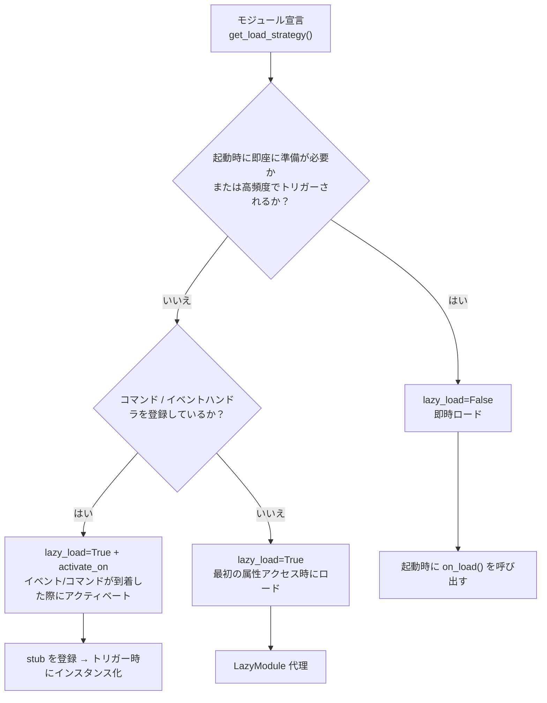

### 懒惰ロード（lazy_load=True）を使用することを推奨する場面

- 他のモジュールによって呼び出されるだけの受動的なユーティリティモジュール（例：データクエリモジュール、フォーマット変換器など）
- コマンド/イベントハンドラを登録しているが高頻度で使用されないモジュール — `activate_on` を使ってトリガを宣言し、最初の一致するイベント/コマンドが到着した際に自動的にアクティベートする。これにより、lazy_loadを放棄せずに済む。

### 懒惰ロードを禁止することを推奨する場面（lazy_load=False）

- 起動時に即座に準備が必要なモジュール（他のモジュールに基礎サービスを提供するコアモジュールなど）
- 高頻度でトリガーされるリスナー（各メッセージごとに処理が必要） — `activate_on` による転送には1回のアクティベートオーバーヘッドがあるため、高頻度の場面では即時ロードした方が直接的
- タイマータスクモジュール
- アプリケーション起動時に初期化が必要なモジュール

> `priority` パラメータは、即時ロードされるモジュール間の初期化順序を制御します。数値が大きいほど先に初期化されます。同じ優先度のモジュールは登録順にロードされます。

## 注意事項

1. モジュールが遅延ロードを使用している場合、ErisPulse内で他のモジュールによって一度も呼び出されない場合、そのモジュールは決して初期化されません。
2. モジュール内にEventの監視など、他のモジュールを積極的に監視するモジュールが含まれている場合、2つの選択肢があります：`activate_on` トリガーを宣言して遅延ロードを維持し、イベントが到達したときに自動的にアクティブ化するか、または即時ロードを必要とすることを宣言する（`lazy_load=False`）か、さもなければモジュールの正常な業務に影響を及ぼす可能性があります。
3. 特殊な要望がない限り、遅延ロードを無効にすることは推奨しません。そうしないと、依存管理やライフサイクルイベントなどの問題が生じる可能性があります。
4. `activate_on` のコマンド dict 声明において、`name` はモジュールの `on_load` で `@command()` によって登録された実際のコマンド名と一致する必要があります。一致しない場合、モジュールがアクティブ化された後にプレースホルダーコマンドが解除され、宣言と実装が一致しないコマンドは存在しません。


### 生命周期管理

# ライフサイクル管理

ErisPulse は、システム各コンポーネントの実行状態を監視し、監査、統計、カスタムロジックなどの拡張機能を実現するための、統一されたフック/ライフサイクルシステムを提供しています。

システムは以下の3種類のトリガ方式をサポートしています：
- `await lifecycle.emit("event", data)` — 精選版、任意のデータを渡す
- `lifecycle.emit_sync("event", data)` — 同期版（非非同期コンテキストで使用）
- `await lifecycle.submit_event("event", ...)` — 旧版と互換性があり、標準イベント形式を自動的に構築する

## イベント処理メカニズム

### ハンドラの登録

```python
from ErisPulse import sdk

# デコレーターモード
@sdk.lifecycle.on("module.load")
async def on_module_load(data):
    print(f"モジュールのロード: {data}")

# プログラミングによる登録
sdk.lifecycle.register("module.load", on_module_load, priority=10)

# 登録の解除
sdk.lifecycle.unregister("module.load", on_module_load)

# 所有者ごとの一括解除（モジュール/アダプターのアンロード時にフレームワークが自動的に呼び出す）
removed = sdk.lifecycle.unregister_by_owner("MyModule")
print(f"クリーンアップしたライフサイクルフック数: {removed}")
```

### 優先度

ハンドラは `priority` パラメータをサポートし、数値が大きいほど先に実行されます（モジュールローダーと同様）：

```python
@sdk.lifecycle.on("adapter.event.receive", priority=10)  # 最初に実行
async def first_handler(data):
    pass

@sdk.lifecycle.on("adapter.event.receive", priority=0)  # 後に実行
async def second_handler(data):
    pass
```

### 点構造イベント

具体的なイベントが発生すると、その親イベントも同時に発生します：
- `module.load` が発生すると、`module` も同時に発生します
- `adapter.event.receive` が発生すると、`adapter.event` と `adapter` も同時に発生します

### ワイルドカード

`*` を登録することで、すべてのイベントをキャッチできます：

```python
@sdk.lifecycle.on("*")
async def on_anything(data):
    print(f"イベントを受信: {data}")
```

### 一回限りの登録（once）

2.7.0 以降、`lifecycle.once()` で登録されたハンドラは**一度実行された後、自動的に登録解除**されます。これは「初回準備完了」のような一回限りのフックに適しています：

```python
@sdk.lifecycle.once("core.init.complete")
async def on_first_ready(data):
    print("初回準備完了、以降は再発生しません")
```

- `on()` と同じ優先度パラメータの意味（`priority` の数値が大きいほど先に実行）
- 自動的に登録解除され、手動での `unregister` は不要
- 同期/非同期のハンドラともサポート

### 監視者の照会（has_handlers）

ホットパスのショートカット処理では、`has_handlers()` を使って監視者が存在するかを事前に確認し、不要なイベントのループ処理やタスクスケジューリングを回避できます：

```python
if sdk.lifecycle.has_handlers("message.sending"):
    await sdk.lifecycle.emit("message.sending", send_ctx)
```

- 精確なイベント名、ワイルドカード `*`、親イベントの3種類のマッチングをカバー
- 監視者が存在しない場合は `False` を返し、`emit` を安全にスキップできます

## フックブレークポイント一覧

プラットフォームからフレームワークへメッセージが届き、処理が完了するまでの典型的なライフサイクルイベントの時系列：

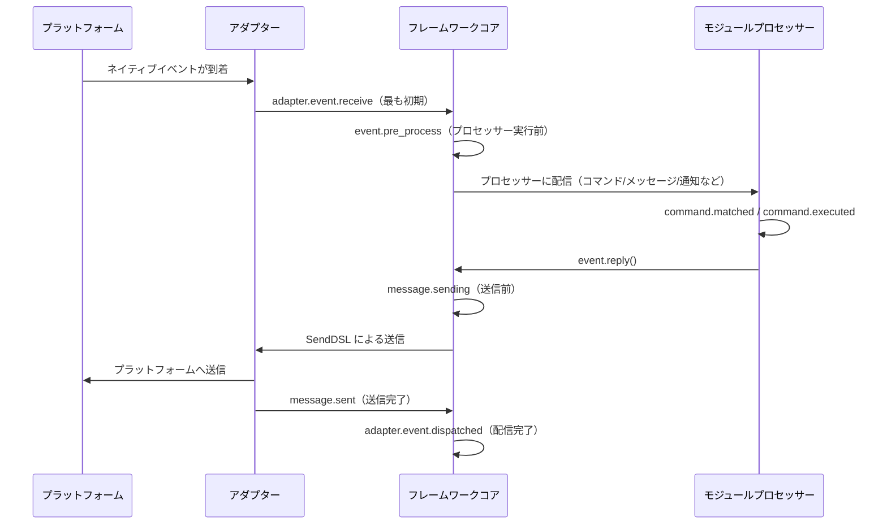

フレームワークには以下のフックブレークポイントが内蔵されており、ユーザーは `@sdk.lifecycle.on()` を使って任意のブレークポイントを監視し、カスタムロジックを実装できます。

### コア初期化

| フック名 | 発生タイミング | データ |
|---------|---------|------|
| `core.init.start` | SDK の初期化開始 | `{}` |
| `core.init.complete` | SDK の初期化完了 | `{"duration": float, "success": bool, "adapters": {"enabled": [str], "disabled": [str]}, "modules": {"enabled": [str], "disabled": [str]}, "error": str(失敗時のみ)}` |
| `core.uninit.complete` | SDK の反初期化完了 | `{"duration": float, "success": bool, "adapters_closed": int, "modules_unloaded": int, "module_properties_cleared": int, "module_properties_to_clear": [str], "error": str(失敗時のみ)}` |

### 設定変更

| フック名 | 発生タイミング | データ |
|---------|---------|------|
| `config.set` | 設定項目が変更された | `{"key": str, "old_value": Any, "new_value": Any}` |
| `config.updated` | 外部で config.toml を編集した後にツリー全体の変更が検出された | `{"old_config": dict, "new_config": dict, "config_file": str}` |

**例：設定監査**

```python
@sdk.lifecycle.on("config.set")
def audit_config(data):
    print(f"[監査] {data['key']}: {data['old_value']} -> {data['new_value']}")
```

### モジュールライフサイクル

| フック名 | 発生タイミング | データ |
|---------|---------|------|
| `module.register` | モジュールクラスがマネージャーに登録された | `{"module_name": str, "success": bool}` |
| `module.load` | モジュールのロード完了（インスタンス化成功） | `{"module_name": str, "success": bool}` |
| `module.init` | モジュールの初期化完了（遅延ロード含む） | `{"module_name": str, "success": bool}` |
| `module.unload` | モジュールのアンロード | `{"module_name": str, "success": bool}` |

### アダプターのライフサイクル

| フック名 | 発生タイミング | データ |
|---------|---------|------|
| `adapter.load` | アダプターの登録完了 | `{"platform": str, "success": bool}` |
| `adapter.start` | アダプターの起動 | `{"platforms": [str]}` |
| `adapter.status.change` | アダプターのステータス変更 | `{"platform": str, "status": str, "retry_count": int, "error": str(失敗時のみ)}` |
| `adapter.stop` | アダプターの停止 | `{"platforms": [str]}` |
| `adapter.stopped` | アダプターの停止完了 | `{"platforms": [str]}` |
| `adapter.bot.online` | Bot のオンライン | `{"platform": str, "bot_id": str, "info": dict, "status": str}` |
| `adapter.bot.offline` | Bot のオフライン | `{"platform": str, "bot_id": str, "status": str}` |

### イベント受信と処理

| フック名 | 発生タイミング | データ |
|---------|---------|------|
| `adapter.event.receive` | 外部プラットフォームのイベントを受信（最も初期） | `{"platform": str, "event_type": str, "raw_event_type": str}` |
| `adapter.event.dispatched` | イベントの配信完了 | `{"platform": str, "event_type": str, "raw_event_type": str, "onebot_handlers_count": int}` |
| `event.pre_process` | イベントプロセッサーの実行前に | `{"event_type": str, "platform": str, "detail_type": str}` |

**例：イベント統計**

```python
event_counter = {}

@sdk.lifecycle.on("adapter.event.receive")
def count_events(data):
    platform = data["platform"]
    event_counter[platform] = event_counter.get(platform, 0) + 1

@sdk.lifecycle.on("adapter.event.dispatched")
def log_unhandled(data):
    if data["onebot_handlers_count"] == 0:
        print(f"[未処理] {data['platform']}/{data['event_type']}")
```

### メッセージ送信

| フック名 | 発生タイミング | データ |
|---------|---------|------|
| `message.sending` | メッセージが送信される直前 | `{"platform": str, "method": str, "detail_type": str, "target_id": str, "bot_id": str}` |
| `message.sent` | メッセージの送信完了 | `{"platform": str, "method": str, "detail_type": str, "target_id": str, "bot_id": str}` |

**例：メッセージ送信監査**

```python
@sdk.lifecycle.on("message.sending")
def log_sending(data):
    print(f"[送信] -> {data['platform']}/{data['detail_type']}/{data['target_id']} via {data['method']}")
```

### コマンドシステム

| フック名 | 発生タイミング | データ |
|---------|---------|------|
| `command.matched` | コマンドがマッチし、実行される直前 | `{"command": str, "args": list[str], "platform": str, "user_id": str}` |
| `command.executed` | コマンドの実行完了 | `{"command": str, "args": list[str], "platform": str, "user_id": str, "success": bool, "error": str(失敗時のみ)}` |

**例：コマンド統計**

```python
@sdk.lifecycle.on("command.matched")
def count_commands(data):
    print(f"[コマンド] /{data['command']} from {data['user_id']}@{data['platform']}")
```

### HTTPルート

| フック名 | 発生タイミング | データ |
|---------|---------|------|
| `server.request` | HTTPリクエストを受け取った | `{"method": str, "path": str, "client_ip": str}` |
| `server.response` | HTTPレスポンスを送信した | `{"method": str, "path": str, "status_code": int, "client_ip": str}` |

**例：リクエストログ**

```python
@sdk.lifecycle.on("server.response")
def log_http(data):
    print(f"[HTTP] {data['method']} {data['path']} -> {data['status_code']}")
```

### WebSocket

| フック名 | 発生タイミング | データ |
|---------|---------|------|
| `server.start` | ルーティングサーバーの起動 | `{"base_url": str, "host": str, "port": int}` |
| `server.stop` | ルーティングサーバーの停止 | `{}` |
| `server.websocket.connect` | WebSocket接続の確立 | `{"path": str, "module_name": str, "client_ip": str}` |
| `server.websocket.disconnect` | WebSocket接続の切断 | `{"path": str, "module_name": str, "reason": str, "error": str(異常時のみ)}` |

**例：WebSocket接続監視**

```python
@sdk.lifecycle.on("server.websocket.connect")
def on_ws_connect(data):
    print(f"[WS] 接続: {data['path']} from {data['client_ip']}")

@sdk.lifecycle.on("server.websocket.disconnect")
def on_ws_disconnect(data):
    print(f"[WS] 切断: {data['path']} ({data['reason']})")
```

## 標準イベント定義

```python
STANDARD_EVENTS = {
    "core": ["init.start", "init.complete", "uninit.complete"],
    "module": ["load", "init", "unload", "register"],
    "adapter": [
        "load", "start", "status.change", "stop", "stopped",
        "event.receive", "event.dispatched",
        "bot.online", "bot.offline",
    ],
    "server": [
        "start", "stop",
        "request", "response",
        "websocket.connect", "websocket.disconnect",
    ],
    "event": ["pre_process"],
    "message": ["sending", "sent"],
    "command": ["matched", "executed"],
    "config": ["set"],
}
```

## 完全な API リファレンス

### 登録と解除

| 方法 | 説明 |
|------|------|
| `@lifecycle.on(event, *, priority=0)` | デコレータによるハンドラの登録 |
| `lifecycle.register(event, handler, *, priority=0)` | プログラム的な登録 |
| `lifecycle.unregister(event, handler=None)` | 登録解除（handler=None の場合、該当イベントの全ハンドラを解除） |

### トリガー

| 方法 | 説明 |
|------|------|
| `await lifecycle.emit(event, data=None)` | 非同期でトリガーし、ハンドラが None 以外を返すと data を変更可能 |
| `lifecycle.emit_sync(event, data=None)` | 同期でトリガーし、非同期ハンドラは create_task でスケジュール |
| `await lifecycle.submit_event(event_type, *, source, msg, data)` | 旧版との互換性用、自動で標準イベント形式を構築 |

### ユーティリティ

| 方法 | 説明 |
|------|------|
| `lifecycle.start_timer(timer_id)` | タイマーを開始 |
| `lifecycle.get_duration(timer_id)` | 経過時間（秒）を取得 |
| `lifecycle.stop_timer(timer_id)` | タイマーを停止し、経過時間を返す |
| `lifecycle.list_hooks()` | 登録済みのすべてのフックとハンドラ数をリストアップ |
| `lifecycle.clear()` | すべてのハンドラとタイマーをクリア |

## モジュールでの使用例

```python
from ErisPulse.Core.Bases import BaseModule
from ErisPulse import sdk

class Main(BaseModule):
    async def on_load(self, event):
        # 簡単なメッセージ統計の実装
        self.msg_count = 0
        
        @sdk.lifecycle.on("adapter.event.receive")
        async def count(data):
            if data["event_type"] == "message":
                self.msg_count += 1
        
        # すべてのコマンドを監視
        @sdk.lifecycle.on("command.matched")
        async def log_cmd(data):
            sdk.logger.info(f"コマンド実行: /{data['command']} by {data['user_id']}")
        
        # 設定変更の監査
        @sdk.lifecycle.on("config.set")
        def audit(data):
            sdk.logger.info(f"設定変更: {data['key']} = {data['new_value']}")
```

## バックグラウンドタスクの所有権と自動キャンセル

> [!NOTE]
> この機能は ErisPulse **2.8.0+** が必要です。

モジュールが作成した asyncio バックグラウンドタスクが `on_unload` でキャンセルされない場合、`self` の参照を保持し、モジュールインスタンスの回収ができない（ホットリロード後に古いインスタンスが残る）可能性があります。フレームワークは以下のバックアップメカニズムを提供しています：

- **`self.spawn(coro)`**（モジュール内で推奨）：タスクは自動的にモジュール名に属し、モジュールのアンロード時にフレームワークは `on_unload` **の後**に未終了のタスクをバックアップでキャンセルし、警告を記録します。
- **`spawn_background(coro)`**（`ErisPulse.runtime`）：現在の `owner_scope` コンテキストを自動的にキャプチャします。`cancel_owner_tasks(owner)` は所有者に属するタスクをキャンセルし、`cancel_all_background_tasks()` は `sdk.uninit()` のバックアップとして使用します。
- **アダプター**：閉じるとき、プラットフォーム名以下のバックグラウンドタスクも同様にバックアップでキャンセルされます。

```python
async def on_load(self, event):
    # 推奨：バックグラウンドタスクは self.spawn() を使用し、アンロード時にフレームワークが自動的にバックアップでキャンセルします
    self.spawn(self._poll())

async def on_unload(self, event):
    # 精密な制御が必要な場合、手動でキャンセルして終了処理を待つことを推奨します
    if self._poll_task:
        self._poll_task.cancel()
        await asyncio.gather(self._poll_task, return_exceptions=True)

async def _poll(self):
    while True:
        await asyncio.sleep(60)
        ...
```

> [!IMPORTANT]
> フレームワークのバックアップは**強制的なキャンセル**（`cancel_owner_tasks`）です。これは `on_unload` の返り値の後に実行されます。したがって、優雅な終了処理が必要なタスク（バッファのフラッシュ、ステートの永続化、接続の閉鎖）は、`on_unload` で手動で `cancel()` し、`await` で終了処理を完了させる必要があります。バックアップが終了処理を保持することを期待しないでください。フレームワークは「`self` を保持するタスクが残らないこと」を保証しますが、「優雅な終了」を保証するものではありません。`await` の結果が必要なタスクは、バックグラウンドタスクに投げることなく、直接 `await` してください。

## 注意事項

1. **プロセッサは同期または非同期のいずれでも使用可能**：システムは自動的に識別し、正しく呼び出します。
2. **データの渡し方**：`emit()` モードでは、プロセッサが None 以外の値を返すと、次のプロセッサに渡される data が変更されます。
3. **イベント名の命名規則**：親イベントのリスナーを使用しやすいよう、ドット構造でイベント名を命名することを推奨します。
4. **エラーの隔離**：単一のプロセッサでの例外は、他のプロセッサの実行に影響しません。
5. **同期トリガーの制限**：`emit_sync()` では、非同期プロセッサは fire-and-forget 方式でスケジュールされ、返り値は返却できません。
6. **ライフサイクルのクリーンアップ**：`sdk.uninit()` を呼び出すと、登録済みのすべてのプロセッサとタイマーがクリーンアップされます。
7. **ロードの優先度**：フレームワークの初期化段階でイベントをリッスンする必要がある場合は、高い優先度を設定し、ラグジュアリー読み込みを無効化することを推奨します。


### 路由系统

# ルーティングマネージャー

ErisPulse ルーティングマネージャーは、HTTP および WebSocket ルーティングを統一的に管理し、複数のアダプターによるルーティング登録とライフサイクル管理をサポートします。基盤は抽象化レイヤーを介してカプセル化されており（現在は FastAPI + Uvicorn が使用されています）。

## 概要

ルーティングマネージャーの主な機能：

- **デコレータによるルーティング**：`@http` / `@get` / `@post` / `@put` / `@delete` / `@ws` デコレータによる簡易なルート登録をサポート
- **自動注入**：ルートハンドラは FastAPI の型を明示的にインポートする必要がなく、フレームワークが抽象オブジェクトを自動的に注入
- **ルートグループ化**：プレフィックスとバージョン番号を伴う `RouteGroup` をサポート
- **ルートミドルウェア**：glob パターンマッチングによるリクエストのインターセプトをサポート
- **リクエスト制限**：スライディングウィンドウ方式のリクエスト制限を内蔵
- **CORS 対応**：1 つのコマンドでクロスオリジンリソース共有を有効化
- **セキュリティヘッダー**：レスポンスヘッダーに自動的にセキュリティ関連のヘッダーを追加
- **自動ドキュメント生成**：OpenAPI に基づくインタラクティブなドキュメントを提供
- **WebSocket 対応**：WebSocket 接続の完全な管理、カスタム認証、ライフサイクルフックをサポート
- **ライフサイクル統合**：ErisPulse のライフサイクルシステムと深く統合
- **SSL/TLS 対応**：HTTPS および WSS のセキュア接続をサポート
- **ホームエントリ**：モジュールがルート `/` に登録可能なクイックエントリボタンをサポート、多言語対応も可能

## 抽象型

ErisPulse は、モジュールが FastAPI に直接依存しないようにするためのサーバーサイドの抽象型を提供しています。

| 抽象型 | FastAPI 対応 | 説明 |
|---------|-------------|------|
| `HttpRequest` | `fastapi.Request` | HTTP リクエストをラップした型で、完全に互換性があります |
| `WebSocketConnection` | `fastapi.WebSocket` | WebSocket 接続をラップした型で、ライフサイクルフックを追加で提供します |
| `WebSocketDisconnect` | `fastapi.WebSocketDisconnect` | WebSocket 接続切断時の例外型 |

> `WebSocketConnection` は `WebSocketConnectionBase` を継承しており、クライアント側の WebSocket (`ClientWebSocket`) と同じ send/receive/iter/close インターフェースを共有しています。クライアントとサーバーの WebSocket は、同じビジネスロジックコードを使用できます。
>
> `.raw` 属性を使用することで、下層の FastAPI のネイティブオブジェクトにアクセスできます。FastAPI の型を使用したコードも完全に互換性があります。

## 装饰器ルーティング（推奨）

### HTTP 装飾器

```python
from ErisPulse.Core import router
@router.get("my_module", "/info")
async def get_info(request):
    return {"method": request.method, "path": str(request.url)}

# 抽象型を明示的に指定することも可能
from ErisPulse.Core import HttpRequest

@router.post("my_module", "/data")
async def post_data(request: HttpRequest):
    data = await request.json()
    return {"received": data}

@router.put("my_module", "/data/{item_id}")
async def update_data(request):
    return {"updated": True}

@router.delete("my_module", "/data/{item_id}")
async def delete_data(request):
    return {"deleted": True}
```

> **自動注入ルール**：ハンドラの最初の引数の名前が `request` または `req` であり、FastAPI の型注釈がない場合、フレームワークは自動的に `HttpRequest` を注入します。引数が存在しない、またはリクエスト引数名でないハンドラには影響しません。

### WebSocket 装飾器

```python
from ErisPulse.Core import WebSocketConnection, WebSocketDisconnect

# 基本的な WebSocket
@router.ws("my_module", "/ws")
async def websocket_handler(ws):
    async for msg in ws.iter_text():
        await ws.send_text(f"Echo: {msg}")

# ライフサイクルフック付きの WebSocket
@router.ws("my_module", "/ws/chat")
async def chat(ws: WebSocketConnection):
    @ws.on_disconnect
    async def on_disconnect(ws, reason="unknown"):
        print(f"ユーザーが切断: {reason}")

    @ws.on_error
    async def on_error(ws, error=""):
        print(f"接続エラー: {error}")

    async for msg in ws.iter_text():
        await ws.send_text(f"Echo: {msg}")

# 認証付きの WebSocket
async def ws_auth(ws: WebSocketConnection) -> bool:
    token = ws.query_params.get("token")
    return token == "secret"

@router.ws("my_module", "/secure_ws", auth_handler=ws_auth)
async def secure_ws_handler(ws):
    while True:
        data = await ws.receive_text()
        await ws.send_text(f"Echo: {data}")
```

> **注意**：WebSocket ハンドラと認証ハンドラも自動注入をサポートしています。`WebSocketConnection` を取得するために引数の型注釈は不要です。`fastapi.WebSocket` を型注釈に指定することで、元のオブジェクトを渡すこともできますが、抽象型を使用することを推奨します。

## 伝統的な登録方法

```python
async def hello_handler(request):
    return {"message": "Hello World"}

# 基本的な登録
router.register_http_route(
    module_name="my_module",
    path="/hello",
    handler=hello_handler,
    methods=["GET"],
)

# 限界値制限とドキュメント情報付き
router.register_http_route(
    module_name="my_module",
    path="/api/data",
    handler=data_handler,
    methods=["POST"],
    rate_limit="10/minute",
    summary="データインターフェース",
    tags=["API"],
)
```

### WebSocket 登録

```python
from ErisPulse.Core import WebSocketConnection

async def websocket_handler(ws: WebSocketConnection):
    async for msg in ws.iter_text():
        await ws.send_text(f"Echo: {msg}")

# 基本的な登録
router.register_websocket(
    module_name="my_module",
    path="/ws",
    handler=websocket_handler,
)

# 認証付きの登録（推奨）
async def auth_handler(ws: WebSocketConnection) -> bool:
    token = ws.query_params.get("token")
    return token == "secret"

router.register_websocket(
    module_name="my_module",
    path="/secure_ws",
    handler=websocket_handler,
    auth_handler=auth_handler,
)
```

**パラメータの説明：**

| パラメータ | 説明 | デフォルト値 |
|------|------|--------|
| `module_name` | モジュール名（必須） | - |
| `path` | WebSocket パス | - |
| `handler` | 処理関数 | - |
| `auth_handler` | 認証関数。`False` を返すと接続が自動的に切断されます | `None` |
| `auto_accept` | 自動的に `accept()` を呼び出すかどうか | `True` |

> **推奨**：接続の確認には `auth_handler` を使用してください。`auto_accept` を `False` に設定するのは、接続の流れを完全に制御する必要がある場合に限ってください。

## WebSocket ライフサイクルフック

`WebSocketConnection` は、手動での try/catch なしに、切断とエラーのコールバックを登録することができます。

```python
from ErisPulse.Core import WebSocketConnection

@router.ws("my_module", "/ws")
async def my_ws(ws: WebSocketConnection):
    # デコレータ方式で登録
    @ws.on_disconnect
    async def on_close(ws, reason="unknown"):
        print(f"切断原因: {reason}")

    # 直接呼び出すこともできます
    async def on_err(ws, error=""):
        print(f"エラー: {error}")
    ws.on_error(on_err)

    # 通常の業務ロジック
    async for msg in ws.iter_text():
        await ws.send_text(f"Echo: {msg}")
```

## ルートのグループ化

```python
# プレフィックスを付けてルートグループを作成
group = router.group("my_module", prefix="/v1")

@group.get("/users")
async def list_users(request):
    return {"users": []}

@group.post("/users")
async def create_user(request):
    return {"created": True}

# 実際のパス: /my_module/v1/users
```

## ルーティングミドルウェア

ミドルウェアは、パスに対して glob パターンによるマッチングをサポートしています：

```python
@router.middleware("/my_module/*")
async def auth_middleware(request, call_next):
    token = request.headers.get("Authorization")
    if not token:
        return {"error": "Unauthorized"}
    return await call_next(request)

@router.middleware("/my_module/admin/*")
async def admin_middleware(request, call_next):
    return await call_next(request)
```

## リクエスト関連 ID（X-Request-ID）

2.7.0 以降、すべての HTTP リクエストには、ログ / リクエストの連携を可能にする `X-Request-ID` 関連 ID が含まれます。

- **生成ルール**：クライアントが `X-Request-ID` リクエストヘッダーを送信している場合、それを優先して使用します（分散トレーシングの場面）。それ以外の場合は UUID を自動生成します。
- **レスポンスヘッダー**：レスポンスには `X-Request-ID` が返信され、クライアントがリクエストとログを対応付けることができます。
- **ライフサイクルイベント**：`server.request` および `server.response` イベントのデータに `request_id` フィールドが追加されました。

```python
# モジュール内でリクエストイベントを監視し、request_id でリクエストとレスポンスを連携します
@sdk.lifecycle.on("server.request")
async def on_request(data):
    print(f"[{data['request_id']}] {data['method']} {data['path']}")

@sdk.lifecycle.on("server.response")
async def on_response(data):
    print(f"[{data['request_id']}] -> {data['status_code']}")
```

クライアントは、サービス間のトレースを可能にするために独自の ID を設定できます。

```bash
curl -H "X-Request-ID: my-trace-id" http://localhost:8080/my_module/health
```

## 速率制限

ルーティングに対してスライディングウィンドウアルゴリズムを使用したリクエスト制限を実装します。

```python
@router.get("my_module", "/limited", rate_limit="10/minute")
async def limited_endpoint(request):
    return {"ok": True}

@router.post("my_module", "/submit", rate_limit="5/minute")
async def submit_data(request):
    return {"submitted": True}
```

リクエスト制限の形式：`{回数}/{時間単位}`、例：`10/minute`、`100/hour`。

## CORS 設定

```python
router.setup_cors(
    allow_origins=["https://example.com"],
    allow_methods=["GET", "POST"],
    allow_headers=["*"],
)
```

`config.toml` でも設定可能です：

```toml
[router.cors]
allow_origins = ["https://example.com"]
allow_methods = ["GET", "POST"]
allow_headers = ["*"]
```

## セキュリティヘッダー

```python
router.setup_security_headers()
```

自動的に `X-Content-Type-Options`、`X-Frame-Options`、`X-XSS-Protection` などのセキュリティヘッダーを追加します。

また、`config.toml` で設定することもできます：

```toml
[router.security]
enabled = true
```

## 自動ドキュメント

Router はデフォルトで OpenAPI のインタラクティブなドキュメントを有効にしています：

```python
# ドキュメントの無効化
router.disable_docs()

# ドキュメント情報のカスタマイズ
router.set_docs_info(
    title="My API",
    description="API ドキュメント",
    version="1.0.0"
)
```

## パス処理

ルートパスには、モジュール名が自動的にプレフィックスとして追加され、競合を回避します：

```python
# モジュール "my_module" にパス "/api" を登録
# 実際のアクセスパスは "/my_module/api" になります
router.register_http_route("my_module", "/api", handler)
```

## システムルーティング

ルーティングマネージャーは、以下のシステムルーティングを自動的に提供します。

### ヘルスチェック

```
GET /health
# 戻り値:
{"status": "ok", "service": "ErisPulse Router"}
```

### ルートページ

```
GET /
# ErisPulse ブランドページを返す
```

ルートルーティング `/` は、ErisPulse ブランドページを表示し、ダッシュボードの利用可能性を自動的に検出し、エントリーボタンを追加します。

## ホームページのエントリ

ルーティングマネージャーは、外部モジュールがルートルート `/` にクイックエントリボタンを登録することを許可し、ユーザーが各モジュールの管理ページに迅速にアクセスできるようにします。

### エントリの登録

```python
# 簡単な登録
router.register_home_entry(
    name="マイダッシュボード",
    url="/mymodule/admin",
)

# イコン付きの登録（SVG）
router.register_home_entry(
    name="コンソール",
    url="/console",
    icon_svg='<svg width="18" height="18" viewBox="0 0 24 24" fill="none" stroke="currentColor" stroke-width="1.8"><path d="M4 17l6-6-6-6"/><path d="M12 19h8"/></svg>',
)

# 国際化をサポートする登録（i18n ディクショナリ形式）
router.register_home_entry(
    name={"i18n": "mymodule.home.entry", "default": "マイダッシュボード"},
    url="/mymodule/admin",
)
```

**パラメータの説明：**

| パラメータ | 型 | 説明 | 必須 |
|------|------|------|------|
| `name` | `str` / `dict` | ボタンに表示されるテキスト；`{"i18n": "key", "default": "テキスト"}` ディクショナリを渡すと、国際化が使用されます | はい |
| `url` | `str` | ボタンのリンクアドレス | はい |
| `icon_svg` | `str` | オプションの SVG イコンタグ | いいえ |

### ダッシュボードの自動登録

`sdk.Dashboard` が利用可能であることが検出された場合、ルーティングマネージャーはダッシュボードボタンをエントリリストの先頭に自動的に追加し、手動での登録は不要です。

## ライフサイクルの統合

```python
from ErisPulse.Core import lifecycle

@lifecycle.on("server.start")
async def on_server_start(event):
    print(f"サーバーが起動しました: {event['data']['base_url']}")

@lifecycle.on("server.stop")
async def on_server_stop(event):
    print("サーバーが停止しています...")
```

## 最佳実践

1. **抽象型を優先的に使用する**：`fastapi.Request` / `fastapi.WebSocket` に依存しないように、`HttpRequest` / `WebSocketConnection` を使用する
2. **自動注入を活用する**：ハンドラの最初の引数を `request` または `req` と命名し、型注釈なしで `HttpRequest` を取得できる
3. **module_name を明示的に渡す**：デコレーターの最初の引数には必ずモジュール名を指定し、省略しない
4. **ルートのグループ化を活用する**：同一モジュールの複数のルートは `group()` を使って整理する
5. **セキュリティの配慮**：機密操作には認証メカニズムとセキュリティヘッダーを実装する
6. **適切なリクエスト制限**：高頻度のエンドポイントにはリクエスト制限を設定する
7. **ライフサイクルフックを使用する**：`@ws.on_disconnect` / `@ws.on_error` を使って WebSocket の例外を処理し、手動の try/catch を避ける


### MessageBuilder 详解

# MessageBuilder 详解

`MessageBuilder` は ErisPulse が提供する OneBot12 標準のメッセージセグメント構築ツールであり、構造化されたメッセージ内容を構築し、`Send.Raw_ob12()` と共に使用します。

## 導入方法

`MessageBuilder` は以下の2つの導入方法をサポートしています（効果は同じで、1つ目の方法を推奨します）：

```python
from ErisPulse.Core.Event import MessageBuilder        # 推奨、パッケージからのエクスポート
from ErisPulse.Core.Event.message_builder import MessageBuilder  # モジュールを直接インポート
```

## 雙モードメカニズム

MessageBuilder は、Python の descriptor メカニズム（`__get__`）を用いて、クラスレベルとインスタンスレベルの異なる動作を実現する 2 つの使用モードを提供します。クラスからメソッドを呼び出す場合、`__get__` は静的メソッドの実行結果を返します。インスタンスから呼び出す場合、`self` を返すことで、メソッドチェーン（連鎖呼び出し）をサポートします。

### チェーン呼び出しモード（インスタンス）

`MessageBuilder()` をインスタンス化して使用し、各メソッドは `self` を返すため、連鎖呼び出し（メソッドチェーン）が可能で、最後に `.build()` を用いてメッセージセグメントのリストを取得します。

```python
from ErisPulse.Core.Event.message_builder import MessageBuilder

segments = (
    MessageBuilder()
    .text("你好！")
    .image("https://example.com/photo.jpg")
    .build()
)
# [
#     {"type": "text", "data": {"text": "你好！"}},
#     {"type": "image", "data": {"file": "https://example.com/photo.jpg"}}
# ]
```

### 快速構築モード（静的）

クラスから直接メソッドを呼び出すことで、各メソッドは直接メッセージセグメントのリストを返し、単一のメッセージセグメント構築に適しています。

```python
# build() を必要とせず、直接 list[dict] を返します
segments = MessageBuilder.text("你好！")
# [{"type": "text", "data": {"text": "你好！"}}]
```

## メッセージセグメントの種類

| メソッド | タイプ | データパラメータ | 説明 |
|------|------|---------|------|
| `text(text)` | text | `text` | テキストメッセージ |
| `image(file)` | image | `file` | 画像メッセージ |
| `audio(file)` | audio | `file` | 音声メッセージ |
| `video(file)` | video | `file` | 動画メッセージ |
| `file(file, filename?)` | file | `file`, `filename` | ファイルメッセージ |
| `mention(user_id, user_name?)` | mention | `user_id`, `user_name` | ユーザーを@でメンション |
| `at(user_id, user_name?)` | mention | `user_id`, `user_name` | `mention` の別名 |
| `reply(message_id)` | reply | `message_id` | メッセージへの返信 |
| `at_all()` | mention_all | - | 全員を@でメンション |
| `custom(type, data)` | 自定義 | 自定義 | 自定義メッセージセグメント |

## Send との連携

構築されたメッセージセグメントのリストは、`Send.Raw_ob12()` を使用して送信されます：

```python
from ErisPulse import sdk
from ErisPulse.Core.Event.message_builder import MessageBuilder

# チェーンで構築 + 送信
segments = (
    MessageBuilder()
    .mention("user123", "張三")
    .text(" こちらの画像をご覧ください")
    .image("https://example.com/photo.jpg")
    .build()
)
await sdk.adapter.myplatform.Send.To("group", "group456").Raw_ob12(segments)
```

### Event との連携（返信）

```python
from ErisPulse.Core.Event import command

@command("report")
async def report_handler(event):
    await event.reply_ob12(
        MessageBuilder()
        .text("📊 日報集計\n")
        .text("本日完了したタスク: 5\n")
        .text("進行中のタスク: 3")
        .build()
    )
```

## ツールメソッド

### copy()

現在のビルダーをコピーし、同じ基礎内容に基づいて複数のメッセージバリエーションを作成します：

```python
base = MessageBuilder().text("基礎内容").mention("admin")

# 同じプレフィックスに基づいて異なるメッセージを構築
msg1 = base.copy().text(" 変体A").build()
msg2 = base.copy().text(" 変体B").image("img.jpg").build()
```

### clear()

追加されたメッセージセグメントをクリアし、同じビルダーを再利用します：

```python
builder = MessageBuilder()

for user_id in ["user1", "user2", "user3"]:
    builder.clear()
    msg = builder.mention(user_id).text(" 你好！").build()
    await adapter.Send.To("user", user_id).Raw_ob12(msg)
```

### len() / bool()

```python
builder = MessageBuilder()
print(bool(builder))   # False

builder.text("Hello")
print(len(builder))    # 1
print(bool(builder))   # True
```

## 自定义メッセージセグメント

`custom()` メソッドを使用してプラットフォーム拡張メッセージセグメントを追加します：

```python
# プラットフォーム固有のメッセージセグメントを追加
segments = (
    MessageBuilder()
    .text("フォームに記入してください：")
    .custom("yunhu_form", {"form_id": "12345"})
    .build()
)
```

> 自定义メッセージセグメントは、対応するプラットフォームのアダプターでのみ有効であり、他のアダプターは認識できないメッセージセグメントを無視します。

## 完整例

### 複数要素のメッセージ

```python
segments = (
    MessageBuilder()
    .reply(event.get_id())                    # 元のメッセージに返信
    .mention(event.get_user_id())             # 送信者を@する
    .text(" これはあなたのクエリ結果です：\n")             # テキスト
    .image("https://example.com/chart.png")   # 画像
    .text("\n詳細データは添付ファイルをご覧ください：")
    .file("https://example.com/data.csv", filename="data.csv")
    .build()
)
await event.reply_ob12(segments)
```

### 静的ファクトリ + チェーン混合

```python
# 単一のメッセージセグメントを迅速に構築
simple_msg = MessageBuilder.text("シンプルなテキスト")

# チェーンで複雑なメッセージを構築
complex_msg = (
    MessageBuilder()
    .at_all()
    .text(" 📢 お知らせ：")
    .text("今日の午後3時に会議があります")
    .build()
)
```


### Conversation 多轮对话

# Conversation 多輪対話

`Conversation` クラスは、同一セッション内で複数回の対話を行うための便利なメソッドを提供します。ガイド付き操作、情報収集、対話式の質問応答などに適しています。

## 対話の作成

`Event` オブジェクトの `conversation()` メソッドを使用して作成します：

```python
from ErisPulse.Core.Event import command

@command("quiz")
async def quiz_handler(event):
    conv = event.conversation(timeout=30)

    await conv.say("🎮 知識クイズへようこそ！")

    answer = await conv.choose("第1問：Pythonの開発者は誰ですか？", [
        "Guido van Rossum",
        "James Gosling",
        "Dennis Ritchie",
    ])

    if answer is None:
        await conv.say("タイムアウトしました。また次回お試しください！")
        return

    if answer == 0:
        await conv.say("正解です！")
    else:
        await conv.say("不正解です。正解は Guido van Rossum です。")

    conv.stop()
```

## コア API

### say(content, **kwargs)

メッセージを送信し、`self` を返してメソッドチェーンが可能になります：

```python
await conv.say("1行目").say("2行目").say("3行目")
```

送信方法を指定することもできます：

```python
await conv.say("https://example.com/image.jpg", method="Image")
```

### wait(prompt=None, timeout=None)

ユーザーからの応答を待ち、`Event` オブジェクトまたは `None`（タイムアウト）を返します：

```python
# 簡単な待ち
resp = await conv.wait()
if resp:
    text = resp.get_text()

# プロンプトを送信して待機
resp = await conv.wait(prompt="名前を入力してください：")

# カスタムタイムアウト（対話のデフォルトタイムアウトを上書き）
resp = await conv.wait(prompt="10秒以内に返信してください：", timeout=10)
```

### confirm(prompt=None, **kwargs)

ユーザーの確認（はい/いいえ）を待ち、`True` / `False` / `None`（タイムアウト）を返します：

```python
result = await conv.confirm("すべてのデータを削除してもよろしいですか？")
if result is True:
    await conv.say("削除しました")
elif result is False:
    await conv.say("キャンセルしました")
else:
    await conv.say("タイムアウトしました")
```

確認用語の内包：`はい/yes/y/確認/確定/ok/true/対/うん/行/同意/大丈夫/可能/当然...`

否定用語の内包：`いいえ/no/n/キャンセル/不/不要/ダメ/cancel/false/間違っている/違う/別/拒否...`

### choose(prompt, options, **kwargs)

ユーザーが選択肢から選択するのを待ち、選択肢のインデックス（0ベース）または `None` を返します：

```python
choice = await conv.choose("色を選択してください：", ["赤", "緑", "青"])
if choice is not None:
    colors = ["赤", "緑", "青"]
    await conv.say(f"選択した色は {colors[choice]} です")
```

ユーザーは、番号（`1`/`2`/`3`）または選択肢のテキスト（`赤`）を入力して選択できます。

`options_format="auto"`（デフォルト）は、method に応じて自動的に組み込みのスタイルを選択します：Markdown→箇条書き、Html→番号付きリスト、その他→プレーンテキストリスト。
`"list"`、`"inline"`、`"md"`、`"html"`、またはカスタム関数もサポートします。

`merge_prompt=True` を使用して、プロンプトと選択肢を1つのメッセージに統合することもできます。また、占い文字で選択肢の挿入位置を制御できます（デフォルトは `{options}`、`placeholder` でカスタマイズ可能です）：

```python
choice = await conv.choose(
    "## 選択してください\n{options}",
    ["選択肢A", "選択肢B"],
    method="Markdown",
    merge_prompt=True,
)

# 占い文字のカスタマイズ
choice = await conv.choose(
    "選択してください: [choices]",
    ["選択肢A", "選択肢B"],
    placeholder="[choices]",
)
```

### collect(fields, **kwargs)

複数ステップで情報を収集し、データ辞書または `None` を返します：

```python
data = await conv.collect([
    {"key": "name", "prompt": "名前を入力してください"},
    {"key": "age", "prompt": "年齢を入力してください",
     "validator": lambda e: e.get("alt_message", "").strip().isdigit(),
     "retry_prompt": "年齢は数字で入力してください。再度入力してください"},
    {"key": "city", "prompt": "都市を入力してください"},
])

if data:
    await conv.say(f"登録完了！\n名前: {data['name']}\n年齢: {data['age']}\n都市: {data['city']}")
else:
    await conv.say("登録が中断されました")
```

フィールド設定：

| パラメータ | 説明 | デフォルト値 |
|------|------|--------|
| `key` | フィールドのキー名（必須） | - |
| `prompt` | プロンプトメッセージ | `"{key}を入力してください"` |
| `validator` | 関数、Eventを受け取り、boolを返す | なし |
| `retry_prompt` | 検証失敗時の再入力プロンプト | `"入力が無効です。再度入力してください"` |
| `max_retries` | 最大再試行回数 | 3 |
| `condition` | 条件関数、既に収集されたデータの辞書を受け取り、boolを返す | なし |

**条件付きフィールド**：`condition` を使用して、条件が満たされた場合にのみフィールドを収集する動的フォームを実現できます：

```python
data = await conv.collect([
    {"key": "has_car", "prompt": "車をお持ちですか？（はい/いいえ）"},
    {"key": "car_brand", "prompt": "車種を入力してください",
     "condition": lambda d: d.get("has_car", "").lower() in ("はい", "yes", "y")},
])
```

### stop()

対話を手動で終了し、`is_active` を `False` に設定します：

```python
conv.stop()
```

### is_active

対話がアクティブかどうかを返します：

```python
if conv.is_active:
    await conv.say("対話はまだ進行中です")
```

## アクティブ状態の管理

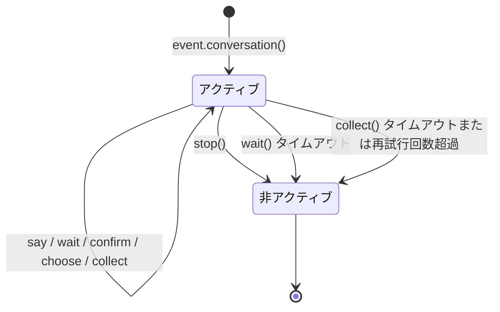

以下の状態で対話は自動的に非アクティブになります：

1. `stop()` メソッドを呼び出した場合
2. `wait()` がタイムアウトして `None` を返した場合
3. `collect()` が各ステップでタイムアウトまたは再試行回数を超過した場合

非アクティブになると、`wait`/`confirm`/`choose`/`collect` などのすべてのインタラクションメソッドは `None` を即座に返し、ユーザーからの入力を待ち続けません。

## 分岐とジャンプ

### @conv.branch(name) デコレータ

`branch()` を使用して対話の分岐を登録し、`goto()` を使用して分岐間をジャンプできます：

```python
@command("menu")
async def menu_handler(event):
    conv = event.conversation(timeout=60)

    @conv.branch("main")
    async def main_menu():
        await conv.say("=== メインメニュー ===\n1. 本人情報\n2. 設定\n3. 終了")
        resp = await conv.wait()
        if resp is None:
            return
        text = resp.get_text().strip()
        if text == "1":
            await conv.goto("profile")
        elif text == "2":
            await conv.goto("settings")
        elif text == "3":
            await conv.say("さようなら！")
            conv.stop()

    @conv.branch("profile")
    async def profile():
        await conv.say("=== 本人情報 ===\n名前: Alice\n0. 戻る")
        resp = await conv.wait()
        if resp and resp.get_text().strip() == "0":
            await conv.goto("main")

    @conv.branch("settings")
    async def settings():
        await conv.say("=== 設定 ===\n1. 通知のオン/オフ\n0. 戻る")
        resp = await conv.wait()
        if resp and resp.get_text().strip() == "0":
            await conv.goto("main")

    await conv.start()  # 最初に登録された分岐から開始
```

### conv.start(name=None)

対話を開始し、デフォルトでは最初に登録された分岐から開始します：

```python
await conv.start()          # 最初の分岐から開始
await conv.start("settings") # 指定された分岐から開始
```

## コンテキストと永続化

### conv.context

各対話インスタンスには、分岐間で状態を共有するための `context` 辞書が内蔵されています：

```python
@conv.branch("step1")
async def step1():
    conv.context["username"] = resp.get_text().strip()
    await conv.goto("step2")

@conv.branch("step2")
async def step2():
    name = conv.context.get("username", "不明")
    await conv.say(f"こんにちは、{name}さん！")
```

### save() / resume() / clear_saved()

対話は永続化が可能で、タイムアウトや中断後に再開できます：

```python
# 対話状態を保存（通常は手動で呼び出す必要はありません、下記の「自動チェックポイント」参照）
await conv.save()

# ... その後、同じセッションで再開 ...
conv2 = event.conversation()
if await conv2.resume():
    await conv2.say("ようこそ！以前の対話から再開します")
else:
    await conv2.say("以前の対話が見つかりませんでした")

# 保存された対話を削除
await conv.clear_saved()
```

ストアキーには target 次元が含まれており（`conversation:{platform}:{user_id}:{target_id}`）、同一ユーザーの異なるセッション間での対話は互いに上書きされません。`resume()` 時に、`target` を含まない旧形式の保存は自動的に移行されます。

## 自動チェックポイントと再起動時の復元

### 自動保存

以下のようなタイミングでチェックポイントが自動的に維持されます。通常は `save()` を手動で呼び出す必要はありません：

| 時機 | 行動 |
|------|------|
| `goto()` / `start()` による分岐のジャンプ | 自動保存（現在の分岐 + context） |
| `stop()` / `wait()` タイムアウト / `collect()` 失敗 | 自動クリア（対話の終端状態） |

### チェックポイントのTTL

保存はタイムスタンプ付きで、`ErisPulse.interaction.checkpoint_ttl`（デフォルト 24 時間）を超える保存は、復元時に自動的に破棄されます：

```toml
[ErisPulse.interaction]
checkpoint_ttl = 86400  # 秒
```

### 再起動時の自動復元

フレームワークの再起動後、進行中の対話（メモリ内の待機コルーチン）は失われますが、チェックポイントは残ります。`register_resume_handler` を使用して**復元工場**を登録することで、再起動後にそのセッションの最初のメッセージが送信されたときに、自動的に対話を再開できます：

```python
from ErisPulse.Core.Event.wrapper import Conversation

@Conversation.register_resume_handler()  # platform="onebot11" でプラットフォームを限定することも可能
def make_conversation(event) -> Conversation:
    # 工場の役割：対話の再構築とすべての分岐の再登録
    conv = event.conversation(timeout=60)

    @conv.branch("menu")
    async def menu(conv, event):
        ...

    return conv
```

登録後、`menu` 分岐にいたユーザーが再起動前に最初のメッセージを送信すると、フレームワークは自動的に：contextを復元 → そのメッセージを認証 → 保存された分岐から対話を再開します。工場を登録しない場合、このメカニズムは無駄なコストがかかりません。

### 手動復元（自動メカニズムを使わない場合）

```python
@command("continue")
async def continue_handler(event):
    conv = event.conversation()
    # ... 分岐を登録 ...
    if await conv.resume():
        conv.goto(conv.get_current_branch())
```

## 代表的なフロー・パターン

### ガイド付き登録

```python
@command("register")
async def register_handler(event):
    conv = event.conversation(timeout=60)

    await conv.say("ようこそ！登録を開始します。")

    data = await conv.collect([
        {"key": "username", "prompt": "ユーザー名を入力してください（3-20文字）",
         "validator": lambda e: 3 <= len(e.get_text().strip()) <= 20},
        {"key": "email", "prompt": "メールアドレスを入力してください",
         "validator": lambda e: "@" in e.get_text() and "." in e.get_text(),
         "retry_prompt": "メールアドレスの形式が正しくありません。再度入力してください"},
    ])

    if not data:
        await event.reply("登録がキャンセルされました")
        return

    confirmed = await conv.confirm(
        f"登録情報を確認しますか？\nユーザー名: {data['username']}\nメールアドレス: {data['email']}"
    )

    if confirmed:
        await conv.say("✅ 登録完了！")
    else:
        await conv.say("❌ 登録がキャンセルされました")
```

### ループ対話

```python
@command("chat")
async def chat_handler(event):
    conv = event.conversation(timeout=120)
    await conv.say("対話モードに入ります。メッセージを「終了」で終了します。")

    while conv.is_active:
        resp = await conv.wait()
        if resp is None:
            await conv.say("タイムアウトしました。対話が終了します。")
            break

        text = resp.get_text().strip()

        if text == "終了":
            await conv.say("さようなら！")
            conv.stop()
        elif text == "ヘルプ":
            await conv.say("利用可能なコマンド：終了、ヘルプ、状態")
        elif text == "状態":
            await conv.say("対話はアクティブです")
        else:
            await conv.say(f"入力内容：{text}")
```


### 国际化（i18n）系统

# 国際化 (i18n) システム

ErisPulse v2.5.0 以降、完全な国際化 (i18n) 機能が内蔵されています。フレームワークのコアおよび CLI インターフェースは、システムの言語に応じて表示テキストを自動的に切り替えることができ、外部モジュールが独自の翻訳を登録することも可能です。

## 支援言語

| 言語 | コード | 説明 |
|------|------|------|
| 简体中文 | `zh-CN` | デフォルト言語（フレームワークの原生言語） |
| 繁體中文 | `zh-TW` | 繁体中文（香港/澳门/台湾） |
| English | `en` | 英文（一般的フォールバック言語） |
| 日本語 | `ja` | 日本語 |
| Русский | `ru` | ロシア語 |

## 早速体験

### 環境変数による切り替え

```bash
# Windows PowerShell
$env:ERISPULSE_LANG = "en"
epsdk run

# macOS / Linux
ERISPULSE_LANG=ja epsdk run
```

### 設定ファイルによる切り替え

`config/config.toml` に以下を追加します：

```toml
[ErisPulse.i18n]
language = "zh-TW"
```

`"auto"`（デフォルト値）に設定すると、システム言語を自動検出します。

### コード内で手動で切り替え

```python
from ErisPulse import i18n

# 言語を手動で設定
i18n.set_language("en")
print(i18n.get_language())  # "en"

# 自動検出に戻す
i18n.reset_language()
```

## 言語検出メカニズム

フレームワークは、以下の優先順位でユーザーの言語を検出します：

1. **環境変数 `ERISPULSE_LANG`** — 最も高い優先順位で、テストや一時的な切り替えに使用
2. **Windows API** — `GetUserDefaultLocaleName`（Windowsに限定、Git Bashなどのツールが `LANG` を上書きする影響を受けない）
3. **環境変数** — `LANGUAGE` > `LC_ALL` > `LC_MESSAGES` > `LANG`（Unix/macOSの標準）
4. **システムロケール** — `locale.getlocale()` / `locale.getdefaultlocale()`
5. **デフォルト** — en（英語）

### 近接マッピング原則

検出された言語が正確に一致しない場合、サポートされている言語に近接する原則でマッピングされます：

- `zh-TW`, `zh-HK`, `zh-MO`, `zh-Hant` → **繁体中国語**
- その他のすべての `zh-*`（例: `zh-CN`, `zh-SG`）→ **簡体中国語**
- `en-US`, `en-GB`, `en-AU` など → **英語**
- `ja-JP` → **日本語**
- `ru-RU` → **ロシア語**
- その他の未認識の言語 → **簡体中国語（デフォルト）**

## モジュールでの i18n の使用

独自のモジュールに翻訳テキストを登録することで、多言語をサポートできます。

### 推奨方法：I18nClass を使って翻訳キーを宣言する（v2.7.0+）

v2.7.0 以降、モジュールやアダプターは `ConfigClass` を宣言するのと同じように、ネストされたクラス `I18nClass` を使って翻訳キーを宣言できます。フレームワークはロード時に**自動的に**宣言されたすべての翻訳キーを登録します。手動で `i18n.register()` を呼び出す必要はありません。

```python
from dataclasses import dataclass, field

from ErisPulse.Core.Bases import BaseConfig, BaseI18n, BaseModule, I18nKey


class MyModule(BaseModule):
    # 設定クラス（オプション）
    @dataclass
    class ConfigClass(BaseConfig):
        welcome_msg: str = field(
            default="欢迎",
            metadata={
                # ここでは i18n キー mymodule.welcome_msg を参照
                "description": {"i18n": "mymodule.welcome_msg", "default": "欢迎消息"},
            },
        )

    # 翻訳キー集合クラス（オプション）
    # 宣言されたキーはフレームワークによって自動的に登録され、
    # ConfigClass がデフォルト設定を生成するよりも優先されます
    class I18nClass(BaseI18n):
        # 属性名が自動的に結合されて完全なキー経路 <モジュール名>.<属性名> になります
        welcome_msg: I18nKey = I18nKey(
            default="Welcome Message",   # 言語に依存しないデフォルト値、どの言語にも登録されません
            zh_CN="欢迎消息",
            en="Welcome Message",
            ja="ウェルカムメッセージ",
            ru="Приветственное сообщение",
            zh_TW="歡迎訊息",
        )
        # 业务で使用する他の翻訳キー
        hello: I18nKey = I18nKey(
            default="Hello, {name}!",
            zh_CN="你好，{name}！",
            zh_TW="你好，{name}！",
            en="Hello, {name}!",
            ja="こんにちは、{name}！",
            ru="Привет, {name}!",
        )

        # 完全なキー経路を明示的に指定することもできます（属性名の結合を使わない）
        custom: I18nKey = I18nKey(
            key="mymodule.deep.nested.key",
            default="Default text",
            zh_CN="默认文本",
            zh_TW="預設文本",
            en="Default text",
            ja="デフォルトテキスト",
            ru="Текст по умолчанию",
        )
```

#### なぜ I18nClass が推奨されるのか？

| シナリオ | 手動 i18n.register() | I18nClass 宣言式 |
|------|-----------------------|------------------|
| 設定の説明に参照される i18n キー | 手動で登録する必要があり、設定生成前に登録する必要がある | フレームワークが設定生成前に自動的に登録する |
| 多言語翻訳の宣言 | on_load() 内に散在する | クラス内で一括して宣言され、一目瞭然 |
| キー名の命名の一貫性 | 拼写ミスが発生しやすい | 属性名がキー名の接尾辞として使用され、IDE による補完が可能 |
| アンロード時のクリーンアップ | 手動で unregister_domain() を呼び出す必要がある | フレームワークが統一されたドメインで登録する |

#### I18nClass のキー経路ルール

- **デフォルト**：``<モジュール登録名>.<属性名>`` を完全なキー経路として使用
  - 例：モジュール名が ``MyModule``、属性 ``welcome`` → キー経路 ``MyModule.welcome``
- **明示的**：``I18nKey(key="...")`` パラメータを使って任意のドット区切り経路を指定
  - 深層ネストされたキー名（例：``mymodule.config.basic.token``）に適している

#### アダプターでの使用

アダプターも `I18nClass` をサポートしており、使用方法は完全に同じです：

```python
from ErisPulse.Core import BaseAdapter
from ErisPulse.Core.Bases import BaseConfig, BaseI18n, I18nKey


class MyAdapter(BaseAdapter):
    @dataclass
    class ConfigClass(BaseConfig):
        endpoint: str = field(
            default="",
            metadata={
                # 設定の説明は adapter.MyAdapter.endpoint キーを参照
                "description": {"i18n": "MyAdapter.endpoint", "default": "API 地址"},
            },
        )

    class I18nClass(BaseI18n):
        # 集中して設定の説明に参照されるキーとその他の業務用キーの多言語訳を宣言
        endpoint: I18nKey = I18nKey(
            default="API Endpoint",
            zh_CN="API 地址",
            zh_TW="API 位址",
            en="API Endpoint",
            ja="APIアドレス",
            ru="API адрес",
        )
```

アダプターの `I18nClass` は `__init__` 階段（つまり設定テンプレート生成の前）に自動的に登録され、設定の説明に参照される i18n キーが利用可能になります。

### 手動でカスタム翻訳を登録する（旧方法）

`I18nClass` を使用しない場合、`i18n.register()` を直接呼び出して翻訳テキストを登録することもできます。

```python
from ErisPulse import i18n

# 中文翻訳を登録
i18n.register("zh-CN", {
    "my_module.welcome": "欢迎使用我的模块！",
    "my_module.goodbye": "再见！",
    "my_module.hello": "你好，{name}！",
}, domain="my_module")

# 英文翻訳を登録
i18n.register("en", {
    "my_module.welcome": "Welcome to my module!",
    "my_module.goodbye": "Goodbye!",
    "my_module.hello": "Hello, {name}!",
}, domain="my_module")
```

### 翻訳の使用

```python
from ErisPulse import i18n

# 簡単な翻訳
i18n.t("my_module.welcome")  # 現在の言語が自動的に使用されます

# フォーマットパラメータ付き
i18n.t("my_module.hello", name="Alice")

# デフォルト値を指定（翻訳キーが存在しない場合に返される）
i18n.t("my_module.unknown_key", default="默认文本")
```

### モジュールクラスでの使用

```python
from dataclasses import dataclass, field
from ErisPulse import i18n
from ErisPulse.Core.Bases import BaseConfig, BaseModule

@dataclass
class MyModuleConfig(BaseConfig):
    welcome_msg: str = field(
        default="欢迎",
        metadata={
            "description": {"i18n": "my_module.welcome_msg", "default": "欢迎消息"},
            "ui": {"widget": "text", "group": "basic", "order": 1},
        },
    )

class MyModule(BaseModule):
    ConfigClass = MyModuleConfig

    async def on_load(self, event):
        # 実時で設定を読み取る（各アクセスで最新値が反映される）
        self.logger.info(self.cfg.welcome_msg)
        self.logger.info(i18n.t("my_module.welcome"))

    @command("hello")
    async def hello_handler(self, event):
        name = event.get_user_nickname() or "friend"
        await event.reply(i18n.t("my_module.hello", name=name))

    async def on_unload(self, event):
        pass
```

### 翻訳のアンロード

```python
# ドメイン全体の翻訳をアンロード
i18n.unregister_domain("my_module")
```

---

## 設定フィールドの多言語対応

v2.5.2 以降、設定の Schema は i18n を全面的にサポートします。ユーザーが見られるすべてのテキストフィールドは i18n キーを参照でき、WebUI およびその他の消費者は、現在の言語に応じて自動的に対応するテキストに解析します。

### 対応する i18n フィールド

| フィールド | 位置 | 説明 |
|------|------|------|
| `description` | field metadata | フィールドの説明 |
| `options[].label` | `ui.options` | select コントロールのオプションラベル |
| `placeholder` | `ui.placeholder` | 入力欄のプレースホルダー |
| `group_labels` | `_schema_meta` | グループ表示名（Dashboard のセクションタイトル） |

すべての i18n フィールドは `{"i18n": "key", "default": "テキスト"}` の形式を採用し、純粋な文字列はそのまま透過されます（後方互換性を保つため）。

### i18n フィールドの宣言

すべてのユーザーが見られるテキストフィールドは i18n をサポートします：

```python
from dataclasses import dataclass, field
from ErisPulse.Core.Bases import BaseConfig

@dataclass
class MyAdapterConfig(BaseConfig):
    # description i18n
    token: str = field(
        default="",
        metadata={
            "description": {"i18n": "my_adapter.token", "default": "プラットフォーム Token"},
            "required": True,
            "secret": True,
            "ui": {
                "widget": "password",
                "group": "basic",
                "order": 1,
                # placeholder i18n
                "placeholder": {"i18n": "my_adapter.token.ph", "default": "Token を入力してください"},
            },
        },
    )
    # options label i18n
    mode: str = field(
        default="a",
        metadata={
            "description": {"i18n": "my_adapter.mode", "default": "実行モード"},
            "ui": {
                "widget": "select",
                "group": "basic",
                "order": 2,
                "options": [
                    {"label": {"i18n": "my_adapter.mode.a", "default": "モードA"}, "value": "a"},
                    {"label": {"i18n": "my_adapter.mode.b", "default": "モードB"}, "value": "b"},
                ],
            },
        },
    )

    # group_labels i18n（グループ表示名）
    _schema_meta = {
        "group_labels": {
            "basic": {"i18n": "my_adapter.group.basic", "default": "基本設定"},
        }
    }
```

`default` はバックアップテキストです。翻訳が登録されていない場合、または検索に失敗した場合に表示されます。

### secret 脱敏と設定検証

`"secret": True` とマークされたフィールドは、2.7.0 以降、**脱敏保護**が自動で適用されます：

- **テンプレート生成時の脱敏**：`dataclass_to_toml_with_comments()` が設定テンプレートを生成する際、secret フィールドの実際の値はファイルに書き込まれません（空のプレースホルダーとして表示され、機密情報がディスク上に残らないようにします）。
- **一般的な脱敏ツール**：`redact_secret(value)` は非空値を `***` に置き換え、空値はそのまま返します。これはログ出力などの場面で使用できます。

```python
from ErisPulse.Core.Bases.config_schema import redact_secret

redact_secret("sk-xxxxxx")  # '***'
redact_secret("")           # ''
```

**設定検証**（`validate_config()`）は、`required` の非空チェックに加えて、2.7.0 以降、以下の検証もサポートします：

| 検証項目 | メタデータ | 例 |
|--------|--------|------|
| 型の一致 | フィールドの宣言型 | `int` 型のフィールドに文字列を渡すとエラーになります |
| 列挙制約 | `ui.options` またはトップレベルの `options` | 値は許可されたオプションに属している必要があります |
| 数値範囲 | トップレベルの `min` / `max` | `metadata={"min": 1, "max": 65535}` |

```python
from ErisPulse.Core.Bases.config_schema import validate_config

@dataclass
class C(BaseConfig):
    mode: str = field(default="a", metadata={"ui": {"widget": "select", "options": ["a", "b"]}})
    port: int = field(default=80, metadata={"min": 1, "max": 65535})

errors = validate_config(C(mode="x", port=70000))  # 2つのエラー：列挙制約と範囲制約
```

### 設定の翻訳登録

設定フィールドの i18n キーは、通常の翻訳キーと同じように `i18n.register()` を使って登録できます：

```python
from ErisPulse import i18n

# 登録する中国語（default と同じでも、異なるものでも可）
i18n.register("zh-CN", {
    "my_adapter.token": "プラットフォーム Token",
}, domain="my_adapter")

# 登録する英語
i18n.register("en", {
    "my_adapter.token": "Platform Token",
}, domain="my_adapter")
```
> **推奨方法**：`I18nClass` を使って翻訳キーを宣言し、フレームワークが自動的に登録します（上記「推奨方法」の章を参照）。  
> 手動で `i18n.register()` や `register_config_i18n()` を呼び出す必要はありません。

また、便利な関数 `register_config_i18n()` も提供されており、設定クラスからキーを自動的に抽出して登録できます：

```python
from ErisPulse.Core.Bases.config_schema import register_config_i18n

# 自動的に description.default を zh-CN の翻訳として登録
register_config_i18n(MyAdapterConfig, "zh-CN")

# 手動で英語の翻訳を提供
register_config_i18n(MyAdapterConfig, "en", {
    "my_adapter.token": "Platform Token",
})
```

### WebUI での消費方法

`get_config_schema()` が返す schema では、i18n ディクショナリはそのまま透過されます。WebUI のフロントエンドは、現在の言語に応じて `i18n.t()` を呼び出して解析できます。

i18n をサポートしないフロントエンドに直接文字列を返す必要がある場合、`resolve_config_schema()` を使用します。この関数は、`description`、`options[].label`、`placeholder`、`group_labels` をすべて現在の言語の文字列に解析します：

```python
from ErisPulse.Core.Bases.config_schema import resolve_config_schema

# すべての i18n フィールドが現在の言語の文字列に解析されています
schema = resolve_config_schema(MyAdapterConfig)
print(schema["fields"]["token"]["description"])    # "プラットフォーム Token" または "Platform Token"
print(schema["fields"]["token"]["placeholder"])   # "Token を入力してください" または "Enter Token"
print(schema["fields"]["mode"]["options"][0]["label"])  # "モードA" または "Mode A"
print(schema["group_labels"]["basic"])             # "基本設定" または "Basic"
```

> `BaseConfig`、`BotAccountConfig`、`register_config_i18n()`、`resolve_config_schema()`  
> などの型とツール関数の実際の定義は `ErisPulse.Core.Bases.config_schema` にあります。  
> `ErisPulse.runtime.config_schema` は互換性のための shims として残されています。  
> **推奨は `ErisPulse.Core.Bases` から一括でインポートすること**（i18n 翻訳キーに関連する型は例外で、`ErisPulse.Core.Bases.i18n_schema` にあります）。

## API リファレンス

### I18nManager

#### 核心メソッド

| メソッド | 説明 |
|------|------|
| `t(key, default=None, **kwargs)` | 翻訳テキストを取得する（`gettext()` はエイリアス） |
| `set_language(lang)` | 手動で言語を設定する |
| `get_language()` | 現在の言語を取得する |
| `reset_language()` | 自動検出にリセットし、環境を再検出する |
| `get_supported_languages()` | すべてのサポート言語のリストを取得する |
| `has_translation(key, lang=None)` | 翻訳キーが存在するか確認する |
| `register(lang, translations, domain)` | 自定義翻訳を登録する |
| `unregister_domain(domain)` | 指定されたドメインのすべての翻訳をアンロードする |
| `reload()` | 内部翻訳を再読み込みし、言語を再検出する |

#### `t()` メソッドの詳細

```python
def t(self, key, /, default=None, **kwargs):
```

- `key` — 翻訳キー（位置引数のみ、`**kwargs` の `key=` と衝突しない）
- `default` — 翻訳が存在しない場合に返すデフォルト値、デフォルトは `None`（キー名そのものを返す）
- `**kwargs` — 翻訳値中の `{placeholder}` を埋め込むためのフォーマットパラメータ

例：

```python
# 翻訳定義: "greeting": "你好，{name}！欢迎来到{place}。"
i18n.t("greeting", name="Alice", place="ErisPulse")
# 戻り値: "你好，Alice！欢迎来到ErisPulse。"
```

### BaseI18n / I18nKey（宣言的翻訳キー）

v2.7.0 から、`ErisPulse.Core.Bases` はクラス属性に基づく翻訳キーの宣言ツールを提供しています（`ErisPulse.Core.Bases` から統一的にインポートすることを推奨します）：

> ``I18nKey.default`` は**言語に依存しないデフォルトテキスト**であり、どの言語にも登録されません。  
> 翻訳を有効にするには、少なくとも1つの言語パラメータ（``zh_CN=`` / ``en=`` / ``ja=`` など）を明示的に渡す必要があります。  
> これにより、各国の開発者は `default` を自分の母国語で自由に記入でき、フレームワークはその内容を一切仮定しません。

| 名称 | 説明 |
|------|------|
| `I18nKey(default, *, key=None, zh_CN, zh_TW, en, ja, ru)` | 単一の翻訳キーの宣言、`default` は言語に依存しないデフォルト |
| `BaseI18n` | 翻訳キー集合の基底クラス（`BaseConfig` と命名を揃える）、子クラスはクラス属性で複数の `I18nKey` を宣言する |
| `BaseI18n.register(prefix="", domain="app")` | クラスメソッド：宣言されたすべてのキーを i18n システムに登録する |
| `key` | `I18nKey` のエイリアス（より簡潔な書き方） |

使用例：

```python
from ErisPulse.Core.Bases import BaseI18n, key

class MyKeys(BaseI18n):
    # 簡潔なエイリアス書き方
    hello = key(
        default="Hello",
        zh_CN="你好",
        zh_TW="你好",
        en="Hello",
        ja="こんにちは",
        ru="Привет",
    )
    bye = key(
        default="Bye",
        zh_CN="再见",
        zh_TW="再見",
        en="Bye",
        ja="さようなら",
        ru="До свидания",
    )

# 独立使用（手動で登録）
MyKeys.register(prefix="myapp.", domain="myapp")
```

### SDK インスタンスからのアクセス

```python
from ErisPulse import sdk

# sdk.i18n は直接インポートした i18n と同じオブジェクト
sdk.i18n.set_language("en")
print(sdk.i18n.t("core.sdk.init.starting"))
```

## 実行時設定

### 設定APIを介してi18n設定を読み取る

```python
from ErisPulse.Core.Bases import I18nConfig
from ErisPulse.runtime import get_i18n_config

config = get_i18n_config()
print(config["language"])  # "auto" または具体的な言語コード

# I18nConfig は dataclass であり、設定テンプレートの生成に使用可能
schema = I18nConfig.__dataclass_fields__
```

### 設定項目の説明

`config/config.toml` の `[ErisPulse.i18n]` 部分で：

```toml
[ErisPulse.i18n]
# 表示言語。選択可能な値:
# - "auto"      — システム言語を自動検出（デフォルト）
# - "zh-CN"     — 簡体字中国語
# - "zh-TW"     — 繁体字中国語
# - "en"        — 英語
# - "ja"        — 日本語
# - "ru"        — ロシア語
language = "auto"
```

---

## 最佳実践

### 翻訳キーの命名

ドットで区切られた名前空間形式の命名を推奨します：

```
<モジュール名>.<カテゴリ>.<説明>
```

例：`my_module.command.hello_desc`、`core.adapter.start_failed`

### 多言語のカバー

すべての言語の翻訳を一度に提供する必要はありません。不足している言語は自動的に英語にフォールバックされ、英語もなければキー名そのものが表示されます。

### 動的コンテンツ

ユーザー名、数値などの動的に生成されるコンテンツについては、`{placeholder}` 形式でフォーマットします：

```python
# 翻訳定義
"user_count": "現在オンラインのユーザー：{count} 人"

# 使用
i18n.t("user_count", count=len(users))
```

### ログメッセージ

モジュールがフレームワークの Logger を使用している場合、これらのメッセージも自動的に現在の言語で表示されます：

```python
self.logger.info(i18n.t("my_module.startup"))
```

## CLI i18n との関係

CLI には**独立**した国際化モジュール (`ErisPulse.CLI.i18n`) があり、フレームワークのコアの国際化モジュールとは完全に分離されています。

- **Core i18n** — フレームワークのコアモジュールで使用され、外部モジュールは翻訳を登録できます。
- **CLI i18n** — コマンドラインインターフェース内で使用され、Core と翻訳データを共有しません。

この設計により、CLI の翻訳の変更がフレームワークのコアの安定性に影響を与えることがありません。


### 统一控制面（scope）

# スコープ (scope)

> [!NOTE]  
> この機能は ErisPulse **2.8.0+** が必要です。

スコープは以下の4つの質問に答えます：**どのモジュールが利用可能か、どのイベントを受け取るか、特定のモジュールがどのようなテキストを処理するか、モジュールが外部に何ができるか**。  
制御権はすべてユーザーに委ねられます。モジュール / アダプタ / プロセッサ / 出力呼び出しの登録の**上位**（設定 `ErisPulse.scope` または実行時 `sdk.scope`）で一括して宣言し、イベントパイプラインはエントリ、プロセッサフィルタ、出力ゲートで自動的に読み取り、実行します。

| 維度 | 控制するもの | 拒否される動作 | 設定パス |
|------|---------|---------|---------|
| **① モジュール** | 利用可能なモジュール（プラットフォーム / Bot / セッションの3段階） | 静かに無視（返信せず、認識しない） | `scope.platforms / bots / sessions` |
| **② 身元** | イベントの受信可否（アダプタ / Bot / セッション / ユーザーの4段階） | エントリで完全に破棄（静かに） | `scope.identity.*` |
| **③ 出力** | モジュールがどのような出力呼び出し（メッセージ / API / リクエスト、メソッドレベルのホワイトリスト・ブラックリスト）を発行できるか | 失敗応答（`retcode=34601`） | `scope.actions` |

> **関連システム**：コマンドは特別なメッセージイベントプロセッサであり、そのユーザーブラックリスト・ホワイトリスト（ACL）と実装パラメータの上書きはコマンドシステムが独自に管理します（`ErisPulse.event.command`）。  
> [イベント処理の入門](../getting-started/event-handling.md) と [設定ガイド](../user-guide/configuration.md) を参照してください。

{!--< tips >!--}
1. `from ErisPulse.Core import scope` でシングルトンをインポート（`sdk.scope` は同じオブジェクト）
2. 判定：`scope.is_allowed(...)` / `scope.is_identity_allowed(...)` / `scope.is_action_allowed(...)` はそれぞれ①②③の3つのゲートに対応
3. 読み書き：次元化されたパラメータメソッド（IDEで補完可能）——  
   `scope.set_module(...)` / `scope.set_identity(...)` / `scope.set_action(...)`；  
   また、辞書形式のバックアップメソッドとして `scope.get(path)` / `scope.set(path, v)` / `scope.delete(path)` もあります
4. イベントプロセッサのテキスト条件上書きについては、  
   [イベント処理の入門 · イベント上書き](../getting-started/event-handling.md#イベント覆写不改模块代码覆写任意事件类型的行为) を参照してください；  
   コマンド ACL / パラメータ上書きについては [イベント処理の入門](../getting-started/event-handling.md) を参照してください
{!--< /tips >!--}

## マッチング条目構文（全システム共通）

スコープ内のすべての「名前リスト」（モジュール名、アイデンティティキー、出力条目）は、同一のマッチング構文（`ErisPulse.Core.text_match`）を使用します。

| 構文 | 例 | 説明 |
|------|------|------|
| 精確名 | `"Chat"` | 全値比較、**大文字小文字は区別しない** |
| glob | `"Tool*"`、`"spam_*"` | `*` 任意の文字列 / `?` 1文字 / `[seq]` 文字集合、大文字小文字は区別しない |
| 正規表現 | `"re:^Danger.*"` | `re:` で始まるプレフィックスを宣言し、正規表現 `search` でマッチ、デフォルトで大文字小文字は区別しない |

- 不正な正規表現は**静かにマッチしない**（エラーは発生せず、クラッシュもしない）
- デコレーター引数（`pattern=` / `regex=`）は固定の意味を持つ：`pattern` は glob、`regex` は正規表現のソースコード（`re:` プレフィックスを付けない）；スコープ設定内の正規表現条目は**必ず**`re:` プレフィックスを付ける必要がある

## グローバルデフォルト：`default_allow`

`default_allow` は**グローバルで唯一**のデフォルトスイッチ（デフォルト値は `true`）で、2つの判定次元に統一的に効果を及ぼします：

- **モジュール次元**：どのバインディングにも一致しない場合 → `default_allow` が許可 / 拒否を決定します
- **アイデンティティ次元**：どのポリシーにも一致しない場合 → `default_allow` が許可 / 拒否を決定します

`false` に設定すると「暗黙の拒否」厳格モードが有効になります。つまり、ホワイトリスト方式での管理となり、**明示的に許可されていないものはすべて拒否**されます。

> **例外**：③ 出力次元は `default_allow` の影響を受けません。これは独立した制限スイッチで、デフォルトではすべて許可され、明示的なルールによってのみ制限されます（フレームワーク層の owner が空の呼び出しは常に許可されます）。このように厳格なグローバルモードでも、すべてのモジュールのメッセージ返信が意図せず切断されることはありません。コマンド ACL には独立した `ErisPulse.event.command.default_allow` がデフォルトとして存在し、互いに影響しません。

## 設定ファイル

```toml
[ErisPulse.scope]
default_allow = true        # グローバルなデフォルト（false = 隠式拒否の厳密モード）
cache_size = 1024           # LRU キャッシュサイズ

# ── ① モジュール次元（優先度：セッション > Bot > プラットフォーム）──
[ErisPulse.scope.platforms.onebot11]
modules = ["Chat", "Tool*"]   # ホワイトリスト：正確な名前 / glob / re: 正規表現
blocked = ["re:^Danger"]
[ErisPulse.scope.bots.onebot11."123456"]
modules = ["Chat"]
merge = true                  # プラットフォームレベルのバインディングに追加（デフォルトでは全体を上書き）
[ErisPulse.scope.sessions.onebot11."789012345"]
modules = ["Chat"]

# ── ② 身元次元（優先度：ユーザー > セッション > Bot > アダプター）──
[ErisPulse.scope.identity.adapters.onebot11]
deny = true                   # アダプター全体のイベントをすべて破棄
[ErisPulse.scope.identity.bots.onebot11."123456"]
deny = true
[ErisPulse.scope.identity.sessions.onebot11."g_blocked"]
deny = true
[ErisPulse.scope.identity.users.onebot11]
allow = ["u_admin"]           # ユーザーのキーは glob / re: 正規表現をサポート
deny = ["u_bad", "spam_*"]

# ── ③ 出力次元（デフォルトで全許可、明示的に制限する場合のみ禁止）──
[ErisPulse.scope.actions.MyModule]
send = { deny = true }                                    # 送信を完全に禁止
api = { allow = ["get_*"] }                               # 検索系の標準 API に限定
request = { deny = true }                                 # リクエストの処理を禁止
```

## ① モジュール次元

あるコンテキストの中で、どのモジュールが利用可能かを回答します。デフォルトではすべてが開放されており、設定のバインディングが行われた時点でフィルタリングが開始されます。  
**モジュールとアダプタは、何の変更も必要ありません。**

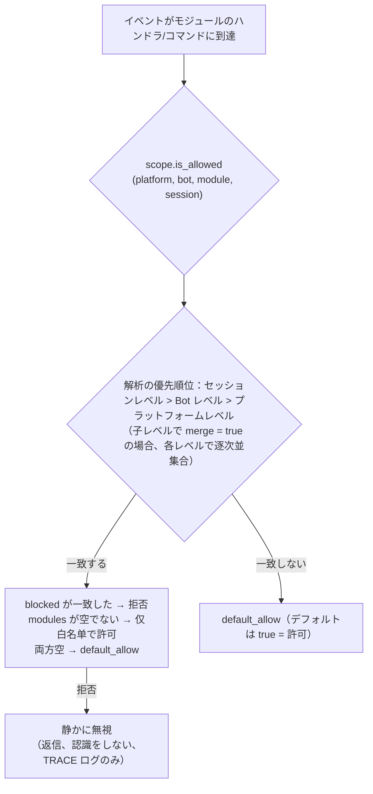

- **解析の優先順位：セッションレベル > Bot レベル > プラットフォームレベル**。高優先度のバインディングは低優先度を**全体的に上書き**します。  
  子レベルのバインディングで `merge = true` と指定した場合、低優先度のバインディングと**各項目の並集合**になります（modules / blocked はそれぞれ独立にマージされ、`merge` 自体は制御キーとして扱われ、項目としてはカウントされません）。
- **静かに無視の意味**：フィルタリングされたモジュールのコマンドやハンドラは、トリガーされず、返信や認識もされません（コマンド間の誤一致を防ぐため）。TRACE レベルのログのみ (`core.scope.denied`) に表示されます。
- **フレームワークレベルのハンドラ**（`scope_exempt=True` または owner が空）は影響を受けません。モジュール名が空（フレームワーク層のリソース）の場合は、常に許可されます。
- **セッション感知のヘルプとコマンド検索**：コマンド検索 API（`command.help` / `get_command` / `get_commands` / `get_group_commands` / `get_visible_commands`、および `module.get_commands_overview`）は、オプションで `event=` または明示的な `platform=` / `bot_id=` / `session_id=` キーワードをサポートします。現在のセッションで利用できないモジュールのコマンドは、結果に含まれなくなります（`get_command` は None を返し、単一コマンドのヘルプは「未登録」として扱われ、静かに無視の動作と一致します）。コンテキストを指定しない場合は、全量の動作を維持します。

### バインディングの継承（merge）

デフォルトでは、全体を上書きする動作が明確で予測可能です。上位レベルのバインディングに**追加**したい場合は、子レベルで `merge = true` を指定します：

```toml
[ErisPulse.scope.platforms.onebot11]
modules = ["Chat", "Tool"]      # プラットフォームレベル：Chat、Tool を許可

[ErisPulse.scope.bots.onebot11."123456"]
modules = ["Music"]
merge = true                    # この Bot で実際の有効なモジュールは ["Chat", "Tool", "Music"] になります
```

- **マージのルール**：`modules` と `blocked` はそれぞれ**並集合**をとります。バインディング内では `blocked` は `modules` よりも優先されます。
- **連鎖的なマージ**：プラットフォーム → Bot → セッションの順に各レベルで独立して `merge` または上書きが決定されます。

## ② 身元次元（イベントの受付）

「誰のイベントを受け取るか」を回答します。拒否されたイベントは**配信の入口で完全に破棄**されます——
ミドルウェアや任意のハンドラ（フレームワークレベルも含む）には一切渡らず、TRACE レベルのログでのみ確認できます（`core.scope.identity_denied`）。

- **解析優先度：ユーザー > 会話 > Bot > アダプタ**、最も具体的に設定された戦略が優先されます。`deny` は `allow` より優先されます
- 各階層のバインディングは二元的な戦略です：`{ allow = true }` または `{ deny = true }`
- ユーザーのキーには glob / 正規表現がサポートされています（例：`"spam_*"` で一括的にスパムユーザーをブロック）
- 一般的な使い方——上位階層で `deny`、個別に `allow` で「例外として許可」する：

```toml
[ErisPulse.scope.identity.adapters.onebot11]
deny = true
[ErisPulse.scope.identity.users.onebot11]
allow = ["u_admin"]   # アダプタ階層で拒否されても、u_admin のイベントは許可されます
```

## ③ 出站次元（制限モジュールが発信する呼び出しを制限）

制約モジュールが**発信する出站動作**：メッセージ送信 / 標準 API 動作 / 要求操作。  
三つの動作はそれぞれ下層の DSL に対応する：`Event.reply` と `Send`（send）、`Api` / `call_api`（api）、  
`Request` の accept/reject（request）。モジュールがイベントハンドラ実行中に発信する呼び出しは  
モジュールの所有者（owner）を含み、この次元が一括して判定する。

### 規則の形態（インライン表）

各動作の規則はインライン表である：`{ allow = [...], deny = true|[...] }`。  
同一の動作には一つの規則しか設定できない（TOML のキーは重複不可、全禁止と細粒度の二択）：

```toml
[ErisPulse.scope.actions.MyModule]
send = { deny = true }                                  # 全ての送信を禁止（Event.reply / Send DSL）
# またはメソッドレベルの細粒度設定：send = { allow = ["Text", "Image*"], deny = ["File"] }
api = { allow = ["get_*"] }                             # 一部の標準 API 動作のみを許可
# または動作レベルのブラックリスト：api = { deny = ["set_*", "leave_*"] }
request = { deny = true }                               # 要求の accept/reject を禁止
```

- `send` の条目は**送信メソッド名**（`Text` / `Image` / `File` ...）と一致する。
- `api` の条目は**標準動作名**（`get_group_info` / `set_group_name` ...）と一致する。
- 条目は正確な名前 / glob / `re:` 正規表現（全システムで共通の構文で、大文字小文字は区別しない）をサポート。
- `allow` に単一の文字列を記述することも可能で、これは単一の条目リストと同等である：`send = { allow = "Text" }`

### 判定の意味

**デフォルトはすべて許可**——設定がなければ、または owner が空（フレームワーク層の内部呼び出し）の場合は許可される。  
設定された規則に従って以下の順序で判定する：

1. `deny = true` → 拒否
2. `deny` リストに呼び出し名が一致 → 拒否
3. `allow` リストが空でないかつ呼び出し名が一致しない（または呼び出しに名前がない）→ 拒否
4. その他の場合は許可

拒否された呼び出しはネットワークリクエストを発生させず、直接標準の失敗レスポンスを返す。  
（`retcode = 34601`、詳細は [api-response §5.3](../standards/api-response.md#53-フレームワーク拡張返却コード34xxx-プラットフォームエラーセグメントの下3桁を独自に定義) を参照）。  
三つの動作は互いに独立しており、そのうち一つだけを制限することも可能。

```python
# 実行時 API
sdk.scope.set_action("MyModule", "send", deny=True)              # 全てのメッセージ送信を禁止
sdk.scope.set_action("MyModule", "send", allow=["Text"])         # テキストのみ送信を許可
sdk.scope.is_action_allowed("MyModule", "send", name="Image")    # False
sdk.scope.is_action_allowed("MyModule", "api", name="get_user_info")  # 規則に従って判定
sdk.scope.delete_action("MyModule", "send")                      # 許可を復元
sdk.scope.get_action("MyModule", "send")                         # その動作の現在の規則を取得
```

## 実行時 API

スコープの実行時 API は 3 層に分かれています：**判定**（3 つの質問）、**次元化された読み書き**（各次元ごとの `set` / `get` / `delete` パラメータ化メソッド、全タイプ注釈付き、IDE による補完可能）、**辞書式のデフォルト**（ドット区切りのパスで任意のセクションに直接アクセス）。

```python
from ErisPulse import sdk

scope = sdk.scope
```

### 判定（3 つの質問）

```python
scope.is_allowed("onebot11", "123456", "Chat")                 # ① モジュール次元
scope.is_allowed("onebot11", "123456", "Chat", "789012345")    # 会話レベルを含む
scope.is_allowed("onebot11", "123456", None)                   # フレームワーク層のリソース -> True

scope.is_identity_allowed("onebot11", "123456", "group_9", "u1")   # ② 身份次元

scope.is_action_allowed("MyModule", "send")                    # ④ 出力次元
scope.is_action_allowed("MyModule", "send", name="Image")      # メソッドレベルの細分化
```

### ① モジュール次元

```python
# バインド（パラメータによって階層が決まる：session_id > bot_id > プラットフォームレベル）
scope.set_module("onebot11", bot_id="123456", modules=["Chat", "Tool*"])
scope.set_module("onebot11", blocked=["re:^Danger"])                       # プラットフォームレベル
scope.set_module("onebot11", bot_id="123456", session_id="g9", modules=["Chat"])  # 会話レベル
scope.set_module("onebot11", bot_id="123456", modules=["Music"], merge=True)      # 既存のエントリと併合
scope.set_module("onebot11", bot_id="123456", modules=["Chat"], persist=False)    # 実行時のみ

# 読み取り / 削除
scope.get_module("onebot11", bot_id="123456")   # {"modules": ["Chat"], "blocked": []}
scope.delete_module("onebot11", bot_id="123456")
```

> `merge=True` は**書き込み時の併合**（該当レベルの既存のバインドとエントリを併合）です。階層間の解析期の `merge = true` 設定キーは上記の[バインド継承](#binding-inheritance-merge)を参照してください。これらは独立したメカニズムです。

### ② 身份次元

```python
# バインド戦略（パラメータによって階層が決まる：user > session > bot > adapter；allow / deny のどちらかを選択）
scope.set_identity("onebot11", user_id="u_bad", deny=True)
scope.set_identity("onebot11", user_id="spam_*", deny=True)    # キーは glob / re: 正規表現をサポート
scope.set_identity("onebot11", bot_id="123456", session_id="g9", allow=True)

# 読み取り / 削除
scope.get_identity("onebot11", user_id="u_bad")   # {"deny": True}
scope.delete_identity("onebot11", user_id="u_bad")
```

### ③ 出力次元

```python
# 制限ルールの設定（allow: str|list; deny: bool|str|list; 全ルールの置換）
scope.set_action("MyModule", "send", deny=True)                    # 全ての送信を禁止
scope.set_action("MyModule", "send", allow=["Text"])               # 送信可能なのはテキストのみ
scope.set_action("MyModule", "api", deny=["set_*", "leave_*"])     # 管理系 API を禁止

# 読み取り / 削除
scope.get_action("MyModule", "send")       # {"allow": ["Text"]} 原始的なルール
scope.delete_action("MyModule", "send")    # 単一のアクションを削除
scope.delete_action("MyModule")            # モジュール全体のアクション制限を削除
```

### 一般

```python
scope.get("platforms")   # 辞書式のデフォルト：ドット区切りのパスで任意のセクションを読み取り
scope.topology()         # 全量の設定ツリー（ダッシュボード用）
scope.stats()
# {"module_calls": .., "module_filtered": .., "identity_checks": .., "identity_denied": ..,
#  "action_checks": .., "action_denied": .., "cache_hits": .., "cache_misses": ..}
scope.reset_stats()
scope.clear()           # 全ての設定をクリア（メモリ内でのみ有効）
```

### 高度：辞書式のドット区切りパスによるデフォルト

次元化されたメソッドは日常的なシナリオをカバーします。任意のノードに直接アクセスする必要がある場合（または将来追加される次元）には、辞書式の API を使用できます。`get` / `set` / `delete` はドット区切りのパスを受け取り、辞書の深いマージと即時読み取りを提供し、`scope[path]` / `scope[path] = v` / `del scope[path]` / `path in scope` のプロトコルを提供します：

```python
scope.set("bots.onebot11.123456", {"modules": ["Chat"], "blocked": []})
scope.set("identity.users.onebot11.u_bad", {"deny": True})
scope.get("actions.MyModule.send")

scope["platforms.onebot11"]        # 読み取り（存在しない場合は KeyError を送出）
scope["platforms.onebot11"] = {...}  # 書き込み
del scope["platforms.onebot11"]      # 削除
"actions.MyModule" in scope          # 存在確認
```

## キャッシュとホットアップデート

- `is_allowed` / `is_identity_allowed` / `is_action_allowed` の結果は **LRU キャッシュ**を付与
  （`scope.cache_size` で調整可能）、`set` / `delete` /
  設定のホットアップデート（`config.updated` / `config.set`）で自動的に無効化
- すべての次元の設定は**即座に有効**となり、再起動は不要
- スコープは「イベントごとに」判断し、イベント間で記憶しない：設定が変更されると、次のイベントから新しいルールに従う

## 設定形式の検証

ロード時およびホットアップデート時に、設定の形式をセクションごとに検証します。型が間違ったセクション（例：`platforms` が文字列として記述されている場合）、不正なアウトバウンドルール（例：`allow` が数値として記述されている場合）、不明なアクション名、不明なトップレベルのキー（例：`alow` がスペルミスされている場合）は、**WARNING** を出力し、対応するセクション／項目は無視されます。それ以外の有効な設定は通常通り有効になります。誤って書いた設定が静かに無効になることはなくなります。

## 一般的質問と注意事項

### 1. 設定の階層と上書き

- モジュール次元：セッションレベル > Bot レベル > プラットフォームレベル、**全体的な上書き**（子レベルで `merge = true` の場合、各項目を並列に結合）。
  「プラットフォームで Chat が許可され、Bot で Music を追加したい」場合は、Bot レベルで `merge = true` を設定するか、両方をリストアップする。
- 身元次元：ユーザー > セッション > Bot > アダプタ、**最も具体的**な設定されたポリシーを適用（例外として許可することも可能）。
- コマンドのユーザーのブラックリスト/ホワイトリスト：正確なコマンド名は glob キーに優先する（`event.command.acl` を参照）。

### 2. モジュール/コマンドが反応しない場合

モジュール自体ではなく、作用域を最初に疑う：

```python
from ErisPulse import sdk

print(sdk.scope.is_allowed(event.get_platform(), bot_id, "MyModule", session_id))
print(sdk.scope.is_identity_allowed(event.get_platform(), bot_id, session_id, user_id))
print(sdk.scope.stats())   # module_filtered / identity_denied > 0 なら、静かにフィルターされたことを示す
```

フィルターは**静かに**行われる（モジュール次元と身元次元では返信しない、ルールを暴露しないようにする）、しかし統計は蓄積される。
コマンド次元で ACL によって拒否された場合は、「権限不足」という明示的な返信が行われる。

### 3. 出力アクションが拒否された場合のトラブルシューティング

```python
from ErisPulse import sdk

print(sdk.scope.get("actions.MyModule"))
print(sdk.scope.stats())   # action_denied > 0 なら、呼び出しがブロックされたことを示す
```

ブロックは**明示的**に行われる：拒否された呼び出しは `retcode = 34601` の標準的な失敗応答を返す（ネットワークリクエストは発生しない）。

### 4. セッション識別子のプラットフォーム間の隔離

`(platform, session_id)` の組み合わせが唯一の識別子である。`scope.sessions.onebot11."789"` は onebot11 でのみ有効で、telegram 上で同じ `789` のセッションには影響しない。身元次元のユーザーのキーも同様である。

## 拓扑ツリー API

`ModuleManager.get_topology()` および `AdapterManager.get_topology()` は、モジュール/アダプターの所属関係データを提供します。  
`sdk.get_topology()` は、スコープを含むデータを一括して取得します。

```python
from ErisPulse import sdk

topology = sdk.get_topology()
# {
#   "modules": {                                   # モジュール → 所有するリソース
#     "Chat": {
#       "loaded": True, "enabled": True,
#       "commands": ["chat", "translate"],
#       "handlers": {"message": 2, "notice": 1},
#       "routes": {"http": ["/Chat/api"], "ws": [], "sse": []},
#       "lifecycle_hooks": 3,
#     }
#   },
#   "adapters": {                                  # アダプター → Bot → スコープ
#     "onebot11": {
#       "status": "started", "enabled": True,
#       "bots": {"123456": {"status": "online", "scope": {...}}},
#       "scope": {"modules": [...], "blocked": [...]},
#     }
#   },
#   "scope": {                                     # スコープ（モジュール / アイデンティティ / 出力アクション）
#     "platforms": {...}, "bots": {...}, "sessions": {...},
#     "identity": {"adapters": {...}, "bots": {...}, "sessions": {...}, "users": {...}},
#     "actions": {...},
#   },
# }
```

- モジュールのトポロジーは、登録されたコマンド、イベントハンドラー、HTTP/WS/SSEルート、およびライフサイクルフックを統合し、モジュールリソースツリーの描画に便利です。
- アダプターのトポロジーは、各アダプターのステータス、所属するBotのステータス、およびプラットフォームレベル/Botレベルのスコープバインディング（モジュール次元）を統合します。


### 归属权（owner）系统

# 所有者（owner）システム

所有権は、モジュールの「プラグインアンドプレイ」の基盤です。モジュールが読み込まれる際に登録されるフレームワークリソースはすべて自動的に所有者に記名され、モジュールのアンロード/無効化時に所有者に基づいて一括で回収されます。モジュールの作者はリソースを宣言するだけで、手動でクリーンアップロジックを書く必要はありません。

> **関連システム**：スコープはイベント配信時に「リソースが有効かどうか」を決定し、所有権はライフサイクル中に「リソースが誰に属するか、誰がアンロード時に回収されるか」を決定します。  
> スコープの詳細は[統一制御面（scope）](scope.md)を参照してください。バックグラウンドタスクの詳細は[ライフサイクル管理](lifecycle.md#バックグラウンドタスクの所有と自動キャンセル)を参照してください。

{!--< tips >!--}
1. 所有権は**登録の瞬間**に `current_owner` に基づいて自動的に記録され、モジュールのコードに変更は一切不要です。
2. アンロード/無効化は同じクリーンアップチェーン（`_cleanup_module_registrations`）を使用し、各ステップで失敗しても警告のみで中断はしません。
3. ユーザー設定のリソース（永続化オーバーライド / スコープルール / コマンドACL）は、モジュールのアンロード時にクリーンアップされません。
{!--< /tips >!--}

## owner コンテキストメカニズム

owner は、コンテキスト変数 `current_owner` を介して `ErisPulse.runtime.context` に渡されます：

```python
from ErisPulse.runtime import owner_scope, get_current_owner

with owner_scope("MyModule"):
    # このスコープ内に登録されたすべてのリソースは自動的に MyModule に属します
    assert get_current_owner() == "MyModule"
```

フレームワークは、以下のタイミングで自動的に owner を注入します（モジュールやアダプターのコードで手動でラップする必要はありません）：

| 時点 | owner 値 | 位置 |
|------|----------|------|
| モジュール `load()` | モジュール名 | インスタンス化 + `on_load` 全体 |
| アダプター `start()` / `restart()` | プラットフォーム名 | アダプター起動全体 |
| `activate_on` ラグジュアリスタブ登録 | モジュール名 | 占位コマンド/ハンドラの登録 |
| イベントハンドラ実行中 | ハンドラ所属モジュール名 | handler / コマンドエントリポイントの再注入 |

実行中の再注入とは、モジュールが `on_load` で宣言したコマンドハンドラが**実行中**に登録型 API（例：`sdk.adapter.on()`、`overrides.*.set(persist=False)`）を呼び出す場合、それらも自動的にこのモジュールに属することを意味します。

## 所属リソースの概要

モジュールがロードコンテキスト内で登録した以下のリソースはすべて所有者として記録され、アンロード/無効化時に自動的にリソースを回収します。

| リソース | 登録方法 | クリーンアップ呼び出し |
|------|----------|----------|
| コマンド | `@command()` / コマンド dict 宣言 | `command.unregister_by_owner()` |
| イベントハンドラ | `@message` / `@notice` / `@request` / `@meta` | `handler.unregister_by_owner()` |
| アダプタイベントリスナー | `sdk.adapter.on()` / `raw=True` | `adapter.unregister_handlers_by_owner()` |
| アダプタミドルウェア | `@sdk.adapter.middleware` | 同上 |
| ルーティング（HTTP/WS/SSE） | `router.http()` / `websocket()` / `sse()` | 名前空間 + owner による二重保証 |
| ルーティングミドルウェア | `@router.middleware()` / `add_middleware()` | `router.unregister_all_by_owner()` |
| Dashboard ホームエントリ | `router.register_home_entry()` | `unregister_home_entries_by_owner()` |
| 自作セッションタイプ | `register_custom_type()` | `unregister_custom_types_by_owner()` |
| バックグラウンドタスク | `self.spawn()` | `cancel_owner_tasks()` |
| ライフサイクルフック | `lifecycle.register()` | `lifecycle.unregister_by_owner()` |
| 主人身源プロバイダ | `master.provider` | `master.unregister_by_owner()` |
| i18n 翻訳キー | `I18nClass` 宣言（domain=モジュール名） | `i18n.unregister_domain()` |
| イベントオーバーライド（実行時） | `overrides.*.set(persist=False)` | `overrides.unregister_by_owner()` |
| 交互セッション（wait_reply 等待 / リース） | `event.wait_reply()` / `sdk.interaction.acquire()` | `interaction.cancel_by_owner()`（待機側は即時キャンセル受信） |
| コンテキストデータ | `runtime/context` は owner ごとに記録 | モジュール単位で正確にクリーンアップ |

アダプタ側の対応するリソース（プラットフォーム名を owner とする）は、アダプタの `shutdown()` / `restart()` 時に `_cleanup_adapter_resources` によって回収され、以下も含まれます：

| リソース | クリーンアップ呼び出し |
|------|----------|
| アダプタ独自の `on()` ハンドラとミドルウェア | `adapter.unregister_handlers_by_owner(platform)` |
| プラットフォームイベントメソッド拡張（`EventMixin`） | `unregister_platform_event_methods(platform)` |
| 自作セッションタイプ | `unregister_custom_types_by_owner(platform)` |
| 交互セッション（該当プラットフォームで保留中の wait_reply / リース） | `interaction.cancel_by_platform(platform)` |
| i18n 翻訳ドメイン（domain=設定キー） | `i18n.unregister_domain(設定キー)` |
| 細粒度の名前空間ルーティング | `router.unregister_all_by_owner(platform)` |

## 卸載/無効化のクリーンアップシーケンス

`unload()` および `disable()` は、同じクリーンアップチェーンを使用します（各ステップで個別に try/except を使用し、失敗してもログに記録され、**後続のクリーンアップを中断しません**）：

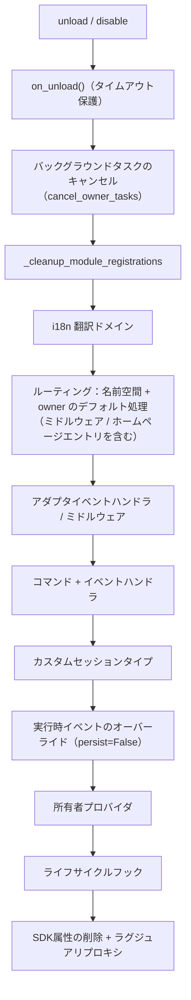

`sdk.uninit()` で終了する際には、以下のグローバルなデフォルト処理が追加されます：すべてのアダプタのシャットダウン → すべてのモジュールの unload → `router.stop()`（ルーティング/ミドルウェア/ホームページエントリのクリア）→ `cancel_all_background_tasks()` → イベントハンドラおよびフックのクリア。

## 設計の境界：アンインストール時にクリーンアップされないリソース

所有権は**モジュールコードが登録したランタイムリソース**のみを回収します。以下のリソースは**ユーザーの設定の意味**（制御権はユーザーにあり、意図的に設定している可能性がある）に属し、モジュールのアンインストール後も設定に従って永続的に保持されます：

| リソース | 意味 | 説明 |
|------|------|------|
| `overrides.*.set(persist=True)` | 永続化されたオーバーライド | 設定ファイルに書き込まれ、再起動後に有効。モジュールのアンインストール時に削除されない（ユーザーが明示的に設定） |
| `scope.set_action()` などのスコープルール | 権限制御面 | ユーザー/Dashboard によって管理され、モジュールのアンインストール時にルールは回収されない |
| `overrides.acl.set(persist=True)` | コマンド ACL | 上記と同じ |
| Conversation `save()` による永続化 | 複数回の対話の保存 | データ資産はクリーンアップされない |

ランタイムに一時的に書き込まれたもの（`persist=False`）は、所有者に従って回収されます。**永続化の有無が「ユーザーの資産」と「モジュールのランタイム状態」の境界線です**。

## モジュール開発者ガイド

### 推奨される書き方

```python
from ErisPulse import sdk
from ErisPulse.Core.Event import command
from ErisPulse.runtime import owner_scope, spawn_background

class MyModule(BaseModule):
    async def on_load(self, event):
        # フレームワークリソース：自動帰属、手動クリーンアップ不要
        self.task = self.spawn(self.polling())      # バックグラウンドタスク
        sdk.router.register_home_entry("私のモジュール", "/my")  # ホームページエントリ

        # モジュール独自リソース：owner_scope に包むことで帰属体系に組み込む
        with owner_scope("MyModule"):
            self.client.on_event(self._handle)      # 仮想のカスタム登録

    async def on_unload(self, event):
        # フレームワークリソースは自動回収済み、owner_scope がカバーしない独自リソースのみクリーンアップ
        await self.client.close()
```

### 注意事項

- **import 時の登録は帰属対象外**：モジュールの最上層（import 時）に登録されたフック/ハンドラーは
  `owner_scope` より前に行われ、フレームワークレベルのリソース（owner=None）として扱われ、**クリーンアップされません**。
  すべて `on_load()` 内で登録してください。
- **カスタム domain の i18n 登録**：`i18n.register(domain=...)` の domain がモジュール名と異なる場合、自動回収されません。domain=モジュール名を維持してください。
- **バックグラウンドタスクは必ず self.spawn() を使用**：裸の `asyncio.create_task` はモジュールに帰属せず、アンロード時にキャンセルされません（詳細は[ライフサイクル管理](lifecycle.md#バックグラウンドタスクの帰属と自動キャンセル)を参照）。
- クリーンアップの「失敗は警告のみ」：1ステップのクリーンアップで異常が発生しても、他のリソースの回収は妨げられません。デバッグ/警告レベルのログで確認でき、トラブルシューティング時には TRACE を有効にしてください。


### 启动流程与手动控制

# スタートフローと手動制御

ErisPulse の `await sdk.run()` / `await sdk.init()` は、一連のスタートフローを「一行のコード」に抽象化しています。しかし、部分的な読み込み、動的な登録、ホットプラグ、カスタムロード戦略の注入など、完全にカスタマイズしたスタートフローが必要な場合は、このフローの内部で何が起こっているのか、そして各ステップをどのように手動で駆動するのかを理解する必要があります。

本文では、スタートフローを個々のステップに分解し、それぞれの役割と呼び出し順序を説明します。また、手動で完全にスタートさせるための例も示します。

> 本文では、[最初のロボット](../getting-started/first-bot.md)を実行済みと仮定し、`sdk.run(keep_running=True/False)` の 2 つのモードについて理解している前提でいます。本文では、`init()` の**内部**のフローの分解、および `init()` / `init_task()` / `init_sync()` などのより下層のエントリーポイントに焦点を当てます。

## SDK トップレベルのエントリーポイント一覧

`run()` の 2 種類の `keep_running` モードに加えて、SDK はいくつかのより低レベルの初期化エントリーポイントを提供しています。これらの違いは、**非同期性、戻り値、および例外のラッピング有無**にあります。

| エントリーポイント | 非同期性 | 戻り値 | 例外処理 | 適用される場面 |
|------|--------|--------|----------|----------|
| `await sdk.run(True)` | async、ブロッキングして維持 | `None`（終了時に自動 `uninit`） | モジュール/アダプターのエラーは捕捉され、プロセスをクラッシュさせない | ボット専用アプリケーション |
| `await sdk.run(False)` | async、ブロッキングしない | `None`（自動リリースしない） | 同上 | 初期化後にカスタムロジックを実行する |
| `await sdk.init()` | async、awaitが必要 | `bool` | 内部でコンポーネントの例外を捕捉し、失敗時は `False` を返す | 手動でライフサイクルを制御（`uninit()` と併用） |
| `sdk.init_task()` | async、Task を返す、ブロッキングしない | `asyncio.Task` | `init()` と同じ | 別の初期化処理を並行実行する、またはイベントループがまだ実行されていない場合 |
| `sdk.init_sync()` | **同期**、現在のスレッドをブロッキング | `bool` | `init()` と同じ | コマンドラインスクリプト、イベントループのない同期エントリーポイント |

> **よくある誤解**：`await sdk.init()` は `await sdk.run(keep_running=False)` と**等価ではありません**。2 つの違いがあります：① `init()` は `bool` を返します（失敗時は `False`）、`run()` は `None` を返します；② `init()` は初期化のみを行い、**自動リリースはしません**、`run()` はイベントループの終了時に自動で `uninit()` を呼び出します。したがって、手動でリリースやカスタムライフサイクルを制御する必要がある場合は、`init()` と `uninit()` を併用してください。

## 鍵路の起動概要

`sdk.init()`（正確にはその内部の `Initializer.init()`）は、以下のようにフレームワーク全体を起動します。

```mermaid
flowchart TD
    A[0. 環境準備<br/>設定の読み込み / 例外処理] --> B
    B[1. 並列的な発見とロード<br/>AdapterLoader.load / ModuleLoader.load<br/>内部で Finder.find_all を呼び出す] --> C
    C[2. アダプターの登録<br/>AdapterLoader.register_to_manager] --> D
    D[3. アダプターの起動<br/>adapter.startup] --> E
    E[4. モジュールの登録<br/>ModuleLoader.register_to_manager] --> F
    F[5. モジュールの初期化<br/>ModuleLoader.initialize_modules<br/>インスタンス化して sdk にマウント] --> G
    G[6. ルーティングサーバーの起動<br/>router.start]
```

対応するコアコンポーネント：

| 層 | コンポーネント | 機能 |
|----|------|------|
| 発見 | `AdapterFinder` / `ModuleFinder` | インストール済みパッケージの entry-points から**発見**する |
| ロード | `AdapterLoader` / `ModuleLoader` | 発見 + インポート + メタデータの読み取り + 有効/無効の判定を行い、オブジェクトのリストを返す |
| 登録 | `*Loader.register_to_manager` | オブジェクトを対応するマネージャーに登録する |
| 管理 | `sdk.adapter` / `sdk.module` | アダプターやモジュールのインスタンスを管理し、起動/停止のインターフェースを提供する |
| 初期化 | `ModuleLoader.initialize_modules` | モジュールのインスタンスを作成し、`sdk` にマウントする（依存関係のトポロジカルソートを処理する） |
| ルーティング | `sdk.router` | HTTP / WebSocket サーバー |

> **重要**：`Finder` と `Loader` は2つの層です。`Loader` は内部で**既に** `Finder` を保持しています（`AdapterLoader` は `AdapterFinder` を内蔵し、`ModuleLoader` は `ModuleFinder` を内蔵しています）。ほとんどの場面では `Loader` を使用するだけで十分です。"インポートせずにリストアップする"必要がある場合にのみ、`Finder` を個別に使用します。

## 各環節の詳細解説

### 1. 探索層：Finder

Finder は「どのパッケージがアダプター/モジュールを提供しているか」を見つけるだけの役割を持ち、インポートやインスタンス化は行いません。

```python
from ErisPulse.finders import AdapterFinder, ModuleFinder

adapter_finder = AdapterFinder()
module_finder = ModuleFinder()

# すべてのインストール済みのアダプター/モジュールエントリポイントを検索
adapter_entries = adapter_finder.find_all()    # list[EntryPoint]
module_entries = module_finder.find_all()      # list[EntryPoint]

# 名称で個別に検索
entry = module_finder.find_by_name("MyModule")  # EntryPoint | None
```

各 `EntryPoint` は `.load()` を呼び出すことで対応するクラスを得られますが、通常は手動で呼び出す必要はありません。Loader が自動的に行います。

### 2. 加載層：Loader

Loader は Finder をベースに「インポート + メタデータの読み込み + 有効/無効の判定」を行います。

```python
from ErisPulse.loaders import AdapterLoader, ModuleLoader
from ErisPulse import sdk

adapter_loader = AdapterLoader()
module_loader = ModuleLoader()

# load() 内部：finder.find_all() を呼び出し → 各エントリポイントを順次処理 → 三つ組を返す
adapter_objs, enabled_adapters, disabled_adapters = await adapter_loader.load(sdk.adapter)
module_objs, enabled_modules, disabled_modules = await module_loader.load(sdk.module)
```

`load()` が返す三つ組：

| 戻り値 | 意味 |
|--------|------|
| `objs` (`dict`) | 名称 → オブジェクト（アダプタークラス / モジュールラッパー） |
| `enabled` (`list[str]`) | 有効化された名称（設定で無効化されていない） |
| `disabled` (`list[str]`) | 無効化された名称 |

#### 加載失敗時の診断情報

モジュール/アダプターが加載または初期化段階で例外を投げた場合、フレームワークはそのコンポーネントをスキップして他のコンポーネントの加載を継続し、**ユーザーのコードフレームの要約**を出力します。これにより、デフォルトの INFO レベルでもエラー箇所を特定でき、手動で DEBUG モードを有効化する必要がありません。

```
[ERROR] [ModuleLoader] entry-point からモジュール MyModule の加載に失敗しました。スキップしました: 'NoneType' object has no attribute 'platform'
  → MyModule/Core.py:42 in on_load
      adapter = sdk.platform
  → AttributeError: 'NoneType' object has no attribute 'platform'
  → ヒント: ログレベルを DEBUG に上げると完全なスタックトレースが表示されます。モジュール MyModule の実装コードを確認してください。
```

診断情報は `ErisPulse.runtime.diagnostics` モジュールによって生成され、フレームワーク内部のフレームは自動的にフィルタリングされ、ユーザーのコードフレームのみが残されます。カスタム加載ロジックで再利用する場合：

```python
from ErisPulse.runtime import log_diagnostic

try:
    risky_init()
except Exception as e:
    log_diagnostic(e)  # ユーザーコードフレームを自動的に抽出し、ERROR ログに記録
```

このモジュールには `extract_user_frame()`（構造化されたフレーム情報を返す）と `format_diagnostic_block()`（複数行のテキストを返す）という2つの低レベル関数も提供されています。

### 3. 登録層：register_to_manager

Loader が出力したオブジェクトをマネージャーに登録し、`sdk.adapter` / `sdk.module` がそれらを認識できるようにします。

```python
# アダプターの登録（すべて成功した場合に True を返す）
await adapter_loader.register_to_manager(enabled_adapters, adapter_objs, sdk.adapter)

# モジュールの登録
await module_loader.register_to_manager(enabled_modules, module_objs, sdk.module)
```

登録後、アダプターはアダプターマネージャーに、モジュールはモジュールマネージャーに登録されますが、**まだ起動/インスタンス化は行われていません**。

### 4. アダプターの起動

```python
# すべての登録済みアダプターを起動
await sdk.adapter.startup()
# 特定のプラットフォームを指定
await sdk.adapter.startup("yunhu")
await sdk.adapter.startup(["yunhu", "telegram"])
```

> 登録 ≠ 起動。`register_to_manager` は単に登録するだけです。`startup` がアダプターの `start()` を呼び出し、プラットフォームとの接続を確立します。

### 5. モジュールの初期化

モジュールはアダプターに比べて1段階多く、**インスタンス化**して `sdk` にアタッチする必要があります（これにより `sdk.MyModule.xxx` で呼び出せるようになります）。この段階では、モジュール間の依存宣言とトポロジカルソートも処理されます。

```python
success = await module_loader.initialize_modules(
    enabled_modules, module_objs, sdk.module, sdk
)
```

インスタンス化が成功すると、モジュールは `sdk.<ModuleName>` に登録されます。

### 6. ルーティングサーバーの起動

```python
await sdk.router.start(
    host="0.0.0.0",
    port=8000,
    ssl_certfile=None,
    ssl_keyfile=None,
)
```

ルーティングサーバーは、アダプターからの Webhook / WebSocket コールバックを受信します。このサーバーを起動しないと、server モードのアダプターはメッセージを受け取れません。

## 完全な手動起動の例

以下のコードは `await sdk.init()` のコアプロセスと**同等**ですが、各ステップが明示的に公開されており、任意の段階でカスタムロジックを挿入できます：

```python
import asyncio
from ErisPulse import sdk
from ErisPulse.loaders import AdapterLoader, ModuleLoader

async def manual_startup():
    # 0. 環境の準備（設定のロード、グローバル例外処理の登録）
    #    _prepare_environment は init() 内部の前置ステップです。手動プロセスでも最初に呼び出す必要があり、
    #    そうでなければ Loader は設定を読み取れず、すべてのアダプタ/モジュールを無効と誤認します。
    if not await sdk._prepare_environment():
        print("環境準備に失敗しました")
        return False

    # 1. ローダーの作成（内部でそれぞれ Finder を保持）
    adapter_loader = AdapterLoader()
    module_loader = ModuleLoader()

    # 2. 並行的な発見とロード（init() 内部と同じ gather を使用）
    (adapter_objs, enabled_adapters, disabled_adapters), \
    (module_objs, enabled_modules, disabled_modules) = await asyncio.gather(
        adapter_loader.load(sdk.adapter),
        module_loader.load(sdk.module),
    )

    # 3. アダプタの登録
    await adapter_loader.register_to_manager(
        enabled_adapters, adapter_objs, sdk.adapter
    )

    # 4. アダプタの起動
    if enabled_adapters:
        await sdk.adapter.startup()

    # 5. モジュールの登録
    await module_loader.register_to_manager(
        enabled_modules, module_objs, sdk.module
    )

    # 6. モジュールの初期化（インスタンス化 + sdk にマウント）
    if enabled_modules:
        await module_loader.initialize_modules(
            enabled_modules, module_objs, sdk.module, sdk
        )

    # 7. ルーティングサーバーの起動
    await sdk.router.start(host="0.0.0.0", port=8000)

    print("手動起動完了")
    return True

async def main():
    ok = await manual_startup()
    if ok:
        # 実行を維持するためのブロッキング（手動プロセスでは自動的にブロックされません）
        await asyncio.Event().wait()

if __name__ == "__main__":
    asyncio.run(main())
```

### 手動起動が必要な場面

ほとんどの場合、手動起動は必要ありません。`await sdk.run()` は上記のすべてをすでに処理しています。手動起動は以下のケースでのみ価値があります：

- **部分的なロード**：指定されたアダプタ/モジュールのみをロードし、他のものはスキップ
- **動的登録**：実行時に条件に応じて新しいアダプタ/モジュールを登録
- **カスタム順序**：デフォルトのロード順序を変更したい場合（例：特定のモジュールを先に起動してからアダプタを起動）
- **注入戦略**：Loader にカスタムの厳格モードマネージャーやロード戦略などを注入
- **デバッグ/診断**：特定の段階で失敗した際に、手動でプロセスを進め問題を特定

## 実行時細粒度制御

`sdk.run()` を使用して起動した後でも、SDK 全体を再起動することなく、実行時に個々のサブシステムを個別に制御できます。

### アダプタのホット起動・停止

```python
# 接続の修復など、特定のアダプタをホットリスタート（他のプラットフォームには影響しない）
await sdk.adapter.shutdown("yunhu")
await sdk.adapter.startup("yunhu")

# 実行中に新しいプラットフォームを起動
await sdk.adapter.startup("telegram")

# 一時的に特定のプラットフォームをオフラインにする
await sdk.adapter.shutdown("telegram")
```

> `adapter.startup()` は、アダプタが**管理者に登録されている**ことを前提としています。登録は `init()`/`run()` の内部で行われるため、起動**後**の細粒度制御となります。

### ルーター・サーバー

```python
# 一時的に webhook サーバーをオフラインにする
await sdk.router.stop()

# 再度起動（たとえばポートを変更した場合）
await sdk.router.start(host="0.0.0.0", port=9000)
```

### モジュールのオンデマンドロード

```python
# モジュールを手動でロード（遅延ロードされる可能性のあるモジュール）
await sdk.load_module("MyModule")
```

## エレガントなシャットダウン

2.7.0 以降、`sdk.shutdown()` は**プログラムによるエレガントなシャットダウン**を提供します。シャットダウンイベントを設定し、`await sdk.run(keep_running=True)` で待機中のメインループが戻り、`uninit()` が実行されてリソースのクリーンアップが完了します。

```python
# 任意のコルーチン内で呼び出すことで、エレガントな終了をトリガー（run() は待機から戻り、自動的に uninit() が実行される）
sdk.shutdown()
```

典型的な用途：

```python
async def shutdown_after_idle():
    await asyncio.sleep(3600)
    sdk.shutdown()  # 空き状態が1時間続いたらエレガントに終了
```

**シグナル処理**：`run()` 内部では `SIGTERM` / `SIGHUP` ハンドラが登録され、システムシグナルをエレガントなシャットダウンに変換します。これにより、コンテナオーケストレーション（Docker `docker stop`）や `systemd` でサービスを停止した場合、プロセスは強制終了されるのではなく、`uninit()` のクリーンアップを完了します。

- Windows では `loop.add_signal_handler` がサポートされていないため、シグナルハンドラは自動的にスキップされます（`sdk.shutdown()` または Ctrl+C でシャットダウンをトリガーできます）
- `sdk.shutdown()` を繰り返し呼び出しても安全です（イベントが設定された後は、再度呼び出しても無操作になります）

## アンインストールの手順

初期化の逆の操作は `await sdk.uninit()` であり、これは逆の順序でクリーンアップを行います：

1. すべてのアダプターを閉じる（`adapter.shutdown()`）
2. すべてのモジュールをアンロードする
3. すべてのイベントハンドラをクリーンアップする
4. マネージャーと SDK 上のモジュール属性をクリーンアップする

手動で起動する場合、正常に終了するために終了前に `uninit()` を呼び出すことを忘れないでください：

```python
try:
    await asyncio.Event().wait()   # 実行を維持する
finally:
    await sdk.uninit()
```

## 再起動

SDK は、自分でアンインストールする必要のない2つの再起動方法を提供しています。フレームワークが自動的に処理します。

| 方法 | 呼び出し | 挙動 | 適用場面 |
|------|------|------|----------|
| ホット再起動 | `await sdk.restart()` | 同一プロセス内で `uninit()` の後に再び `init()` を呼び出し、アダプタ/モジュールを再読み込み | 設定の再読み込み、モジュールのホットアップデート |
| ハード再起動 | `await sdk.hard_restart()` | `uninit()` の後に**終了コード 42**でプロセスを終了し、外部の監督者によって新しいプロセスが起動される | メモリやリソースリークが疑われる場合、完全にクリーンな再起動が必要な場合 |

```python
# ホット再起動：同一プロセス内で再読み込み（最も一般的）
await sdk.restart()

# ハード再起動：プロセスを終了し、外部の監督者に新しいプロセスの起動を任せる（下記「監督者ガイド」参照）
await sdk.hard_restart()
```

> **2点の注意事項**：
> 1. これらのメソッドはバックグラウンドタスクで再起動を実行します。**`True` が返却されたのは「再起動タスクがスケジュールされた」ことを示すだけで、実際の再起動が完了したわけではありません**。現在のイベントフローを中断しないように、実際の再起動はバックグラウンドで行われます。
> 2. `hard_restart()` の仕組みは、アンロードと設定のフラッシュ後、**終了コード 42**（`HARD_RESTART_EXIT_CODE`）でプロセスを終了することです。**自身で新しいプロセスを起動するものではなく、外部の監督者が終了コード 42 を検知した後に再起動を行う必要があります**。`python main.py` で直接実行し、監督者が存在しない場合、終了コード 42 でプロセスが終了した後、**自動的に再起動されません**（フレームワークは警告が表示されます）。

### ハード再起動はいつ使うべきか？

ハード再起動は単に「より徹底的な再起動」ではなく、以下の場面ではホット再起動よりも適切で、場合によってはより効率的です。

- **バイナリライブラリ（C拡張）の副作用**：ホット再起動は同一プロセス内で行われるため、C拡張、開かれたファイルディスクリプタ、スレッドなどのプロセスレベルのリソースを解放できません。ハード再起動は新しいプロセスを起動するため、これらの副作用は完全にクリアされます。
- **リソースリークの調査**：メモリやハンドルリークが疑われる場合、ハード再起動はクリーンな環境を得ることができます。
- **頻繁な再起動に性能が敏感な場合**：ハード再起動は同一プロセス内でアンロード→再読み込みするオーバーヘッドを省くため、実際にはホット再起動よりも効率的です。

> Dashboard管理パネルの「フレームワーク再起動」機能は、内部的に `hard_restart()` を呼び出しています。

### 終了コード 42 の契約

ハード再起動はプロセス間の協力です：**SDK は終了（コード 42）を担当し、監督者はプロセスの再起動を担当**します。

| 角色 | 挙動 |
|------|------|
| SDK（ハード再起動される際） | `uninit()` → 設定のフラッシュ → `os._exit(42)` |
| 監督者 | 子プロセスの終了コードが 42 であることを検知 → 同一コマンドで再起動 |

> `sdk.is_supervised()` を使用して、現在のプロセスが監督者によって起動されたかどうかを確認できます（環境変数 `ERISPULSE_SUPERVISED` を検出）。CLI `run` コマンドでサブプロセスを起動する際は、このマーカーが自動的に注入されます。systemd / Docker などの外部監督者は注入しないため、`is_supervised()` は `False` を返し、この場合ハード再起動後に「監督者を検出できませんでした」という警告が表示されます。

### 監督者ガイド

あなたの環境に適した監督者を選択し、ハード再起動を有効にしましょう。

#### 1. CLI run コマンド（開発/簡単なデプロイ、推奨）

`epsdk run main.py` には、サブプロセスの終了コードを監視し、42 であれば即座に再起動する監督ループが内蔵されています。他の異常終了コードは指数退避で自動的に再試行されます。`Ctrl+C` は、サブプロセスを優雅に終了し（コード 0 を正常終了と見なし、再起動しない）ます。

```bash
epsdk run main.py
```

#### 2. systemd（Linux サーバー）

`RestartForceExitStatus=42` を設定することで、終了コード 42 も再起動をトリガーします（デフォルトの `on-failure` は非ゼロ終了コードのみ対象）。

```ini
[Service]
ExecStart=/usr/bin/python3 /opt/mybot/main.py
Restart=on-failure
RestartForceExitStatus=42
RestartSec=2
User=mybot
```

#### 3. Docker / docker-compose

コンテナ内の PID 1 がアプリケーションプロセスであるため、終了コード 42 でコンテナが終了します。`restart` ポリシーを使用して自動再起動させましょう。

```yaml
services:
  bot:
    build: .
    restart: unless-stopped   # 42 を含むすべての終了コードで再起動
```

#### 4. PM2（Node 生態系の運用）

```bash
pm2 start main.py --name mybot --interpreter python3
# 42 は終了コードとして PM2 がデフォルトで再起動します。`restart_delay` を設定して、防抖します
pm2 set mybot.restart_delay 2000
```

#### 5. supervisord

```ini
[program:mybot]
command=python3 /opt/mybot/main.py
autorestart=true
exitcodes=0,2,42    # 42 も「正常終了で再起動」扱い
```

#### 6. 純粋な Python によるカスタム監督者

```python
import subprocess, sys, time

while True:
    p = subprocess.Popen([sys.executable, "main.py"])
    code = p.wait()
    if code == 42:          # ハード再起動リクエスト
        time.sleep(0.5)
        continue
    if code == 0:           # 正常終了
        break
    time.sleep(3)           # 異常終了、退避して再試行
```

> **監督者がいない場合の挙動**：`python main.py` で直接実行し、`hard_restart()` を呼び出した場合、プロセスは終了コード 42 で終了し、再起動されません。この場合、上記の監督者をいずれかに接続する必要があります。


====
生态模块
====


### ErisPulse-App 安装与使用

# ErisPulse-App

[ErisPulse-App](https://github.com/ErisPulse/ErisPulse-App) は、ErisDev が直接管理する **公式のマルチプラットフォームクライアント**（Android / Windows / Linux / macOS に対応）で、完全にネイティブのグラフィカル管理インターフェースを提供します。スマートフォンやパソコン上で複数のボットインスタンスを作成、実行、管理でき、ターミナルも不要で、個別の Python 環境のインストールも不要です。

> [!IMPORTANT]
> ErisPulse-App は**独立してインストールされるクライアントプログラム**であり、`epsdk install` でインストールされるモジュールではありません。Python 実行環境と ErisPulse SDK が内蔵されており、インストール後すぐに使用できます。**スマートフォンでも直接実行可能です**。

## 機能の概要

- **複数インスタンス管理**：複数のインスタンスを作成 / 起動 / 停止 / 削除、ポートとアクセストークンは自動割り当て、新規環境または既存環境のクローンが可能
- **概要ダッシュボード**：アダプター / モジュール / オンラインのロボット / イベント総数の統計、CPU / メモリ使用量のアラート色変更
- **モジュールストア**：検索とタグによる絞り込み、ワンクリックでのインストール / アップグレード / アンインストール、指定バージョンのインストール、pipのミラーソースとGitパッケージのサポート
- **イベントストリーム + イベントビルダー**：リアルタイムのイベント表示、可視化されたテストイベントの構築とアダプターへの送信
- **監視**：ログ / ライフサイクル / 審計の三合一ビュー
- **コマンド管理**：プレフィックスとエイリアスなどのグローバル設定、起動 / 停止とプラットフォームのホワイトリスト / ブラックリスト
- **ロボットの概要 / 設定 / ファイル管理**：ネイティブインターフェースでインスタンスを直接操作
- **バックグラウンド常駐**：Androidのフォアグラウンドサービスによる保活；Windowsではシステムトレイに最小化、ウィンドウを閉じてもインスタンスを中断しない
- **モジュール動的ウィンドウ**：モジュールが登録したページは自動的にサイドナビゲーションに表示（ダッシュボードと同じグループ）、クリックで直ちにアクセス

## サポート対象プラットフォーム

すべてのプラットフォームのインストーラーは [GitHub Releases](https://github.com/ErisPulse/ErisPulse-App/releases) からダウンロードできます。必要に応じて選択してください：

| プラットフォーム | インストールパッケージ | 説明 |
|------|--------|------|
| Android | `online-*.apk` / `offline-*.apk` | **スマートフォンで直接実行**、PCは不要 |
| Windows | `windows-x64-setup.exe` / `windows-x64.zip` | インストール版 / インストール不要版 |
| Linux | `linux-x64.tar.gz` | 解凍後すぐに使用可能 |
| macOS | `macos-arm64.zip` | Apple Silicon（arm64） |

Flutter コードベースで全プラットフォームをカバーしています。

## インストール方法（Android / スマートフォンで直接実行）

GitHub Releases から APK をダウンロードしてインストールしてください。2 種類のビルドがあります。

| ビルド | 実行時イメージ | 適用場面 |
|------|-----------|---------|
| `erispulse-app-online-*.apk` | 初回起動時にダウンロード | インストールパッケージが小さく、ネットワーク環境が良い場合に適しています |
| `erispulse-app-offline-*.apk` | APK に事前にパッケージ化 | オフラインで自己完結、インストール後にインターネット接続が不要です |

どちらのビルドもインストール手順は同じです。

1. APK をダウンロードしてインストールし、起動時に通知権限を許可してください（バックグラウンドサービスの維持に使用します）
2. ホーム画面に初期化の横長バナーが表示されたら、実行をクリックして最初の初期化を実行してください（進行状況とログの表示が可能です）
3. インスタンスを作成して起動します
4. App 内の管理画面でアダプタとモデルの API キーを設定します

> オフラインパッケージは自己完結型です。インストール後はネットワーク接続が不要です。初回起動時のダウンロードが遅いまたは不安定な場合は、設定ページでダウンロードソースをミラー（ghfast / gh-proxy）に切り替えてください。

### インストール方法（デスクトップ版：Windows / Linux / macOS）

1. [GitHub Releases](https://github.com/ErisPulse/ErisPulse-App/releases) から対応するプラットフォーム用のインストールパッケージをダウンロードしてください。
   （Windows は `setup.exe` または無印の `zip`、Linux は `tar.gz`、macOS は `zip`）
2. インストールして起動します
3. ウェルカムページでインストールする ErisPulse SDK のバージョンを選択してください（デフォルトは最新版です）
4. インスタンスを作成して起動します

---

## 動作原理

```
┌────────────────────────────────────────────────────┐
│  ErisPulse-App (Flutter)                            │
│                                                    │
│  ネイティブ UI ── Dashboard REST / WS API          │
│       │                                            │
│       ├── Android：フォアグラウンドサービス + proot + Ubuntu rootfs│
│       │        + Python + ErisPulse インスタンス     │
│       └── デスクトップ版：内蔵 Python + 直接プロセス管理 │
└────────────────────────────────────────────────────┘
```

- **Android**：インスタンスは、フォアグラウンドサービス（background isolate）によってホストされる proot（ユーザースペース chroot）内で実行されます。UI が閉じても、ロボットは継続的に動作し、クラッシュした場合は自動的に再起動します。
- **デスクトップ版**：インスタンスは、App の直接の子プロセスとして実行されます。Windows では、システムトレイに最小化して常駐（ウィンドウを閉じてもインスタンスは中断されません）。App の再起動後は、まだ実行中のインスタンスの管理を自動的に復元し、終了時にはすべてのインスタンスを一括して停止します。
- すべてのプラットフォームのネイティブ UI は、`127.0.0.1:<port>/Dashboard/*` の REST / WebSocket API を介してインスタンスと通信し、[ErisPulse-Dashboard](dashboard.md) と同じ API を共有します。

## SDKとの関係

- Appに埋め込まれたErisPulse SDK：Android用はUbuntuイメージにパッケージ化され、デスクトップ用はPyPIからインストールされます
  （歓迎ページでバージョンを選択可能、デフォルトは最新版）
- App内のインスタンスとコマンドライン`epsdk`で作成されたインスタンスは同等であり、同じモジュール/アダプタを使用できます
- モジュール開発者は[Dashboardウィンドウ登録API](dashboard.md)を使用してカスタムページを登録できます：
  ウィンドウは自動的にAppのサイドナビゲーションに表示され（Dashboardと同じグループに分類）、クリックすると対応するページがレンダリングされます

---


### Dashboard 使用与视窗注册

# ErisPulse-Dashboard

[ErisPulse-Dashboard](https://pypi.org/project/ErisPulse-Dashboard/) は、ErisDev が直接管理する **Web 管理パネルモジュール** であり、ErisPulse に視覚的な実行時管理インターフェースを提供します。モジュールの起動・停止、設定の編集、ログの表示、イベントストリームの監視などが可能です。

> [!IMPORTANT]
> Dashboard は **ErisPulse フレームワークの組み込み機能ではなく**、個別にインストールする必要があります：
>
> ```bash
> epsdk install Dashboard
> ```

Dashboard は、他の ErisPulse モジュールがサイドバーにカスタム管理ページを登録することもサポートしています。登録後、ユーザーは Dashboard でそのモジュールの専用ウィンドウページに切り替えることができ、追加のフロントエンド開発を必要としません。

> [!NOTE]
> ウィンドウの登録は**オプション機能**です。
>
> - Dashboard モジュールが**インストールされていない**、または**ロードされていない**場合、`sdk.Dashboard.register_view()` を呼び出すと例外が発生します
> - 他のモジュール機能に影響を与えないように、登録コードを `try/except` で囲むことを推奨します
> - 登録前に Dashboard の利用可能性を確認することを推奨します：`hasattr(sdk, 'Dashboard') and sdk.Dashboard`

## 動作原理

```
モジュール on_load()
  → sdk.Dashboard.register_view(...) を呼び出す
  → Dashboard は後端にウィンドウ情報を保存
  → WebSocket でフロントエンドに通知
  → フロントエンドは動的にサイドバーのナビゲーション項目とページコンテナを作成
  → ユーザーがクリックするとモジュールのウィンドウが表示される
```

---

## APIの登録

```python
sdk.Dashboard.register_view(
    id="MyModule",                    # 必須、一意な識別子
    title="私のモジュール",            # 中文名
    title_en="My Module",             # 英文名
    icon_svg='<svg>...</svg>',        # サイドバーのアイコン SVG
    html_content='<div>...</div>',     # ページ HTML 内容
    js_content='function xxx() {}',    # ページ JavaScript ロジック
    css_content='.my-style {}',        # オプションのカスタム CSS
    iframe_url='',                     # iframe モードの URL（html_content と二択）
    loader="loadMyModuleView",         # このページに切り替わる際に呼び出される JS 関数名
    group="group_extensions",          # サイドバーのグループ
    group_title="",                    # カスタムグループの中文名
    group_title_en="",                 # カスタマグループの英文名
)
```

### パラメータの説明

| パラメータ | 型 | 必須 | 説明 |
|------|------|------|------|
| `id` | `str` | はい | ウィンドウの一意な識別子、モジュール名を使用することを推奨 |
| `title` | `str` | いいえ | 中文表示名、デフォルトは `id` を使用 |
| `title_en` | `str` | いいえ | 英文表示名、デフォルトは `title` を使用 |
| `icon_svg` | `str` | いいえ | サイドバーのアイコンの完全な SVG 文字列 |
| `html_content` | `str` | いいえ* | インジェクションモードのページ HTML 内容 |
| `js_content` | `str` | いいえ | ページ JavaScript コード |
| `css_content` | `str` | いいえ | ページのカスタム CSS スタイル |
| `iframe_url` | `str` | いいえ* | iframe モードの URL、設定すると `html_content` は無視される |
| `loader` | `str` | いいえ | ページがアクティブになった際に自動的に呼び出される JS 関数名 |
| `group` | `str` | いいえ | サイドバーのグループ識別子、デフォルトは `group_extensions` |
| `group_title` | `str` | いいえ | カスタムグループの中文タイトル |
| `group_title_en` | `str` | いいえ | カスタムグループの英文タイトル |

> *`html_content` と `iframe_url` のどちらか一方は必ず提供する必要がある。両方指定しない場合、ページは空白になる。

---

## 2 種の注入モード

### モード 1：HTML/JS 注入（推奨）

HTML、JS、CSS の文字列を直接提供し、Dashboard がページに内容を注入します。このモードでは Dashboard のスタイルと完全に一致し、Dashboard が提供する CSS クラス名の使用が推奨されます。

```python
sdk.Dashboard.register_view(
    id="HelloPage",
    title="こんにちはページ", title_en="Hello",
    icon_svg='<svg viewBox="0 0 24 24" fill="none" stroke="currentColor" stroke-width="2"><circle cx="12" cy="12" r="10"/></svg>',
    html_content='<h1 class="page-title">Hello World</h1><div class="card"><div class="card-body">これはサンプルページです</div></div>',
    group="group_tools",
)
```

> API ルート、JS によるインタラクションなどを含む、完全な天気モジュールの例は、下記の [完全なモジュールの例](#完全なモジュールの例) を参照してください。

### モード 2：iframe 埋め込み

独自の HTML ページの URL を提供し（独自にルートを登録する必要があります）、Dashboard が iframe で埋め込みます。完全に独立した UI または複雑なインタラクションが必要な場合に適しています。

```python
sdk.Dashboard.register_view(
    id="MyVisualizer",
    title="データ可視化", title_en="Data Visualizer",
    iframe_url="/MyVisualizer/view",
    group="group_tools",
)
```

> iframe モードでは、認証のために URL に `token` パラメータが自動的に追加されます。

## サイドバーのグループ化

モジュールは、ウィンドウが所属するサイドバーのグループを指定できます。Dashboard には、以下のグループが内蔵されています：

| グループ識別子 | 中文名 | 位置 |
|---------|--------|------|
| `group_overview` | 概観 | 第1グループ |
| `group_events` | イベント | 第2グループ |
| `group_extensions` | 拡張機能 | 第3グループ（デフォルト） |
| `group_system` | システム | 第4グループ |
| `group_tools` | ツール | 第5グループ |

内蔵されたグループ名を指定すると、モジュールのウィンドウはそのグループの末尾に追加されます：

```python
group="group_tools"  # "ツール"グループに追加
```

`group_` で始まらないカスタムグループ名を使用することもできます。Dashboard は自動的に新しいグループを作成します：

```python
group="my_group",
group_title="私のグループ",
group_title_en="My Group",
```

---

## 一般的 CSS クラス名

モジュールウィンドウで HTML インジェクションモードを使用する場合、ダッシュボードで既に用意されている CSS クラス名を使用することで、視覚的な一貫性を保つことができます。

| クラス名 | 用途 |
|------|------|
| `page-title` | ページタイトル、例: `<h1 class="page-title">タイトル</h1>` |
| `card` | カードコンテナ |
| `card-header` | カードのタイトルバー |
| `card-body` | カードのコンテンツ領域 |
| `grid-2` | 2 列のグリッドレイアウト |
| `grid-3` | 3 列のグリッドレイアウト |
| `btn` | 基本ボタン |
| `btn-primary` | 主なボタン（青色） |
| `btn-secondary` | 次要なボタン |
| `btn-icon` | アイコン付きボタン |
| `btn-danger` | 危険な操作を表すボタン |

ダッシュボードは CSS 変数を使ってテーマカラーを制御しており、モジュールウィンドウでも直接参照することができます。

| CSS 変数 | 用途 |
|----------|------|
| `var(--bg-p)` | 主な背景色 |
| `var(--bg-s)` | 次の背景色 |
| `var(--bg-t)` | 3 番目の背景色（カードなど） |
| `var(--tx-p)` | 主な文字色 |
| `var(--tx-s)` | 次の文字色 |
| `var(--tx-t)` | 補助的な文字色 |
| `var(--bd)` | ボーダー色 |
| `var(--accent)` | 強調色 |
| `var(--ok-c)` | 成功色 |
| `var(--er-c)` | エラーカラー |

これらの変数は、ダッシュボードのライト/ダークテーマに応じて自動的に切り替えられ、モジュール側で追加の処理は不要です。

## 認証と API 呼び出し

モジュールウィンドウの JS で、モジュール自身の API を呼び出す際には、Dashboard のトークンを付けて認証を行う必要があります：

```javascript
var token = localStorage.getItem('__ep_tk__');
var resp = await fetch('/YourModule/api/data', {
    headers: { 'Authorization': 'Bearer ' + token }
});
var data = await resp.json();
```

モジュールの API エンドポイントは、トークンの検証を行うかどうかを独自に決定できます。検証が必要な場合は、リクエストヘッダーから抽出できます：

```python
async def _api_data(self, request):
    token = request.headers.get("Authorization", "").replace("Bearer ", "")
    if not token:
        return {"error": "Unauthorized"}, 401
    return {"data": "hello"}
```

## 完全なモジュールの例

以下は、ウィンドウの登録、APIデータの提供、およびアンロード時にリソースをクリーンアップする方法を示す、完全な天気モジュールの例です。

```python
from ErisPulse import sdk
from ErisPulse.Core.Bases import BaseModule
from ErisPulse.Core.Event import command


class Main(BaseModule):
    def __init__(self):
        self.sdk = sdk
        self.logger = sdk.logger.get_child("Weather")
        self.config = self._load_config()

    @staticmethod
    def get_load_strategy():
        from ErisPulse.loaders import ModuleLoadStrategy
        return ModuleLoadStrategy(lazy_load=False, priority=50)

    async def on_load(self, event):
        self._register_routes()
        self._register_dashboard_view()
        self.logger.info("天気モジュールがロードされました")

    async def on_unload(self, event):
        self._unregister_routes()
        if hasattr(self.sdk, 'Dashboard') and self.sdk.Dashboard:
            self.sdk.Dashboard.unregister_view("Weather")
        self.logger.info("天気モジュールがアンロードされました")

    def _load_config(self):
        config = self.sdk.config.getConfig("Weather")
        if not config:
            default = {"city": "北京", "api_key": ""}
            self.sdk.config.setConfig("Weather", default)
            return default
        return config

    def _register_routes(self):
        r = self.sdk.router
        r.register_http_route("Weather", "/api/current",
                              handler=self._api_current, methods=["GET"])

    def _unregister_routes(self):
        r = self.sdk.router
        try:
            r.unregister_http_route("Weather", "/api/current")
        except Exception:
            pass

    async def _api_current(self, request):
        return {
            "city": self.config.get("city", "北京"),
            "temp": 25,
            "humidity": 60,
        }

    def _register_dashboard_view(self):
        try:
            dashboard = self.sdk.Dashboard
            dashboard.register_view(
                id="Weather",
                title="天気", title_en="Weather",
                icon_svg='<svg viewBox="0 0 24 24" fill="none" stroke="currentColor" stroke-width="2"><circle cx="12" cy="12" r="5"/><line x1="12" y1="1" x2="12" y2="3"/><line x1="12" y1="21" x2="12" y2="23"/><line x1="4.22" y1="4.22" x2="5.64" y2="5.64"/><line x1="18.36" y1="18.36" x2="19.78" y2="19.78"/><line x1="1" y1="12" x2="3" y2="12"/><line x1="21" y1="12" x2="23" y2="12"/><line x1="4.22" y1="19.78" x2="5.64" y2="18.36"/><line x1="18.36" y1="5.64" x2="19.78" y2="4.22"/></svg>',
                html_content='''
                    <h1 class="page-title">天気照会</h1>
                    <p style="color:var(--tx-s);margin-bottom:16px">現在の天気情報を表示します</p>
                    <div class="grid-2">
                        <div class="card">
                            <div class="card-header">現在の天気</div>
                            <div class="card-body">
                                <div id="weather-info" style="font-size:14px;color:var(--tx-s)">クリックして更新</div>
                            </div>
                        </div>
                        <div class="card">
                            <div class="card-header">操作</div>
                            <div class="card-body">
                                <button class="btn btn-primary" onclick="refreshWeather()">更新</button>
                            </div>
                        </div>
                    </div>
                ''',
                js_content='''
                    async function loadWeatherView() { await refreshWeather(); }
                    async function refreshWeather() {
                        var el = document.getElementById('weather-info');
                        if (!el) return;
                        el.textContent = '読み込み中...';
                        try {
                            var resp = await fetch('/Weather/api/current', {
                                headers: { 'Authorization': 'Bearer ' + localStorage.getItem('__ep_tk__') }
                            });
                            var data = await resp.json();
                            el.innerHTML = '<p>都市: ' + (data.city || '--') + '</p>' +
                                           '<p>温度: ' + (data.temp || '--') + '°C</p>' +
                                           '<p>湿度: ' + (data.humidity || '--') + '%</p>';
                        } catch (e) {
                            el.textContent = '読み込み失敗: ' + e.message;
                        }
                    }
                ''',
                loader="loadWeatherView",
                group="group_tools",
            )
        except Exception as e:
            self.logger.warning(f"Dashboardウィンドウの登録に失敗しました: {e}")
```

---

## 視窗の登録解除

モジュールのアンロード時に、`unregister_view()` を呼び出して登録済みの視窗をクリーンアップする必要があります。

```python
async def on_unload(self, event):
    if hasattr(self.sdk, 'Dashboard') and self.sdk.Dashboard:
        self.sdk.Dashboard.unregister_view("Weather")
```

登録解除後、Dashboard のフロントエンドは WebSocket を介してサイドバーのナビゲーション項目とページコンテンツをリアルタイムに削除します。ユーザーによるリフレッシュは不要です。

## 注意事項

1. **ロード順序** — Dashboard のロード優先度は `99999`（高優先度）です。あなたのモジュールの優先度はこの値より低くする必要があります（例：`50`）。これにより、Dashboard が先にロード完了するようにします。
2. **防御的プログラミング** — Dashboard モジュールがインストールされていない、またはロードされていない可能性があるため、ウィンドウを登録する際には `try/except` で囲んでください。
3. **リソースのクリーンアップ** — `on_unload` で `unregister_view()` を呼び出し、登録されたウィンドウを削除します。
4. **ID の一意性** — `id` パラメータは、Dashboard 全体で一意である必要があります。モジュール名を直接使用することを推奨します。
5. **SVG アイコン** — `icon_svg` は完全な `<svg>` タグである必要があります。推奨サイズは `viewBox="0 0 24 24"` です。`stroke="currentColor"` を使用して、Dashboard のテーマ色を継承します。
6. **JS 関数名** — `js_content` 内の関数名は一意である必要があります（例：`loadWeatherView`）。他のモジュールとの衝突を避けるためです。
7. **動的更新** — モジュールがウィンドウを登録または解除した後、Dashboard のフロントエンドは WebSocket を使用してサイドバーをリアルタイムに更新します。ページをリフレッシュする必要はありません。


### Takumi 图片渲染

# ErisPulse-Takumi

[ErisPulse-Takumi](https://pypi.org/project/ErisPulse-Takumi/) は ccd2s が維持する **サードパーティの画像レンダリングモジュール** です。[takumi-py](https://github.com/BalconyJH/takumi-py) をベースに、Bot が HTML、ノードツリー、Jinja テンプレート、SVG、アニメーションを画像にレンダリングできるようにします。モジュールには **中英文字体**（Noto Sans SC / Roboto / Source Code Pro）が内蔵されており、追加の設定は不要です。

> [!IMPORTANT]
> Takumi は ErisPulse フレームワークの組み込み機能ではなく、個別にインストールする必要があります：
>
> ```bash
> epsdk install Takumi
> ```

利用シーン：

- データや統計情報をカード画像にレンダリングする
- Markdown / 長文をレイアウトが安定した画像にレンダリングし、プラットフォームのスタイル差異を回避する
- SVG / アニメーションを生成して、動的な視覚効果を実現する
- 中英混排の图文（内蔵フォントで即座に使用可能）

## インストールと有効化

```bash
epsdk install Takumi
```

インストール後、モジュールは自動的に読み込まれます。設定ファイルで有効化を確認してください：

```toml
[Takumi]
enabled = true
```

---

## 快速上手

モジュールが自動的にロードされた後、モジュールマネージャーから取得するか、`sdk` のショートカットを使用します。

```python
from ErisPulse import sdk

takumi = sdk.module.get("Takumi")
# 等価な書き方: takumi = sdk.Takumi
```

### HTML のレンダリング

```python
png = takumi.render_html(
    """
    <div class="card">
      <h1>你好，ErisPulse</h1>
      <p>由 Takumi 渲染</p>
    </div>
    """,
    stylesheets=["""
    .card {
      width: 800px;
      padding: 48px;
      color: white;
      background: #111827;
      font-family: "Noto Sans SC";
    }
    """],
    width=800,
    height=None,   # 内容に応じて高さを自動調整
    lang="zh-CN",
)
```

### ノードツリーのレンダリング

```python
png = takumi.render_node(
    {
        "type": "text",
        "text": "中文和 English 都可直接渲染",
        "style": {"fontSize": 48, "color": "#111827"},
    },
    width=800,
    height=None,
    lang="zh-CN",
)
```

`png` は `bytes` であり、`event.reply(png, method="Image")` を使用して送信できます（詳細は [レンダリング結果の送信](#发送渲染结果) を参照してください）。

## レンダリング API

`sdk.Takumi` は、下層の `takumi_py.Renderer` のすべての機能をラップしています。すべてのレンダリング、測定、SVG、アニメーション、テンプレートメソッドは、`sdk.Takumi` で直接呼び出すことができます。これらのメソッドに対して、モジュールは呼び出し時に**自動的に組み込みのフォントフォールバックスタック**（`takumi.families`）を注入します。`font_families` を手動で渡す必要はありません。明示的に渡した場合は、呼び出し元の設定を尊重します。

### メソッド一覧

| カテゴリ | メソッド | 戻り値 | 説明 |
|------|------|------|------|
| 静的レンダリング | `render_html(html, ...)` | `bytes` | HTML文字列をレンダリング |
| | `render_node(node, ...)` | `bytes` | ノードツリー（dict）をレンダリング |
| | `render_template(name, ctx, ...)` | `bytes` | Jinjaテンプレートをレンダリング |
| | `render_compiled(node, ...)` | `bytes` | 事前コンパイルされたノードをレンダリング |
| SVG出力 | `render_svg_html(html, ...)` | `str` | SVGを出力（HTML入力） |
| | `render_svg_node(node, ...)` | `str` | SVGを出力（ノードツリー入力） |
| | `render_svg_template(name, ctx, ...)` | `str` | SVGを出力（テンプレート入力） |
| | `render_svg_compiled(node, ...)` | `str` | SVGを出力（事前コンパイル入力） |
| アニメーション | `render_animation(scenes, ...)` | `bytes` | 複数フレームアニメーションをエンコード |
| | `render_sequence_at_time(scenes, time_ms, ...)` | `bytes` | シーケンスの特定時間のフレームを取得 |
| 測定 | `measure_node(node, ...)` | `dict` | ノードツリーのレイアウトを測定 |
| | `measure_html(html, ...)` | `dict` | HTMLのレイアウトを測定 |
| | `measure_compiled(node, ...)` | `dict` | 事前コンパイルされたノードを測定 |
| コンパイル | `compile_node(node)` | `CompiledNode` | ノードツリーをコンパイル |
| | `compile_html(html, ...)` | `CompiledNode` | HTMLをコンパイル |
| フォント | `register_font(font)` | `list[str]` | 自定義フォントを登録し、familyリストを返す |
| | `register_fonts(fonts)` | `list[str]` | フォントを一括登録 |

> `CompiledNode` は `resource_urls()` メソッドを公開しており、HTTP(S) 画像参照を事前に検出できるため、リソースの事前準備が可能です。

### 一般的パラメータ

以下のパラメータは、静的レンダリングおよびSVGメソッドに適用されます（アニメーションメソッドには `fps` などがあります。対応する例を参照してください）：

| パラメータ | 型 | デフォルト値 | 説明 |
|------|------|--------|------|
| `stylesheets` | `list[str]` | `None` | ドキュメントレベルのCSS文字列リスト。インラインの `style` はHTMLとともに解析されます |
| `width` | `int \| None` | `1200` | ビューポートの幅（ピクセル）。`None` の場合はレイアウトに基づいて推定されます |
| `height` | `int \| None` | `630` | 画布の高さ（ピクセル）。`None` の場合は内容に応じて自動的に高さが設定されます（[ビューポートと出力形式](#ビューポートと出力形式)を参照） |
| `lang` | `str \| None` | `None` | BCP-47言語タグ（例：`zh-CN`）。テキスト整形と改行に影響します |
| `font_families` | `list[str]` | 自動注入 | フォントフォールバックスタック。便利なメソッドでは組み込みフォントが自動的に注入されます |
| `format` | `str` | `"png"` | 出力形式（[ビューポートと出力形式](#ビューポートと出力形式)を参照） |
| `device_pixel_ratio` | `float` | `1.0` | デバイスピクセル比。出力解像度を制御します |
| `time_ms` | `int` | `0` | アニメーションのサンプリング時刻（ミリ秒） |
| `dithering` | `str` | `"none"` | ドイジングアルゴリズム：`none` / `ordered-bayer` / `floyd-steinberg` |
| `quality` | `int \| None` | `None` | 有損圧縮の品質 |
| `lossless` | `bool \| None` | `None` | 無損圧縮を行うかどうか |
| `images` | `list` | `None` | 今回のレンダリングに使用する画像リソース（`ImageResource` または `(src, bytes)` タプル） |
| `keyframes` | `Mapping` | `None` | 構造化されたキーフレーム。`@keyframes` に記述する必要はありません |
| `options` | `RenderOptions` | — | `RenderOptions(...)` でパラメータをまとめて渡す。上表のフィールドと一致します |

完全なフィールド定義は `takumi_py.RenderOptions` を参照してください。

### ノードツリーの例

```python
png = takumi.render_node(
    {
        "type": "container",
        "style": {"padding": "32px", "backgroundColor": "#111827"},
        "children": [
            {"type": "text", "text": "タイトル", "style": {"fontSize": 32, "color": "white"}},
            {"type": "text", "text": "本文", "style": {"fontSize": 18, "color": "#9ca3af"}},
        ],
    },
    width=800,
    height=None,
    lang="zh-CN",
)
```

### Jinjaテンプレートの例

```python
png = takumi.render_template(
    "card.html.jinja",
    {"title": "Takumi", "subtitle": "Jinja to image"},
    stylesheets=["""
    .card {
      width: 800px;
      padding: 48px;
      color: white;
      background: #111827;
    }
    """],
    width=800,
    height=None,
    lang="zh-CN",
)
```

> `filters={...}` を使用してカスタムJinjaフィルターを注入したり、`environment=...` で完全な `jinja2.Environment` を渡すことができます。テンプレートディレクトリと環境設定は、[takumi-pyのテンプレートドキュメント](https://github.com/BalconyJH/takumi-py/blob/main/docs/guides/templates.md)を参照してください。

### SVG出力の例

```python
svg = takumi.render_svg_html(
    '<div class="card">Hello</div>',
    stylesheets=[".card { width: 800px; color: black; }"],
    width=800,
    height=None,
)
```

### アニメーションの例

```python
from takumi_py import AnimationScene

webp = takumi.render_animation(
    [
        AnimationScene(
            {"type": "container", "style": {"width": "100%", "height": "100%", "backgroundColor": "black"}},
            duration_ms=100,
        ),
        AnimationScene(
            {"type": "container", "style": {"width": "100%", "height": "100%", "backgroundColor": "white"}},
            duration_ms=100,
        ),
    ],
    width=64,
    height=64,
    fps=20,
    format="webp",
)
```

> 各フレームは `AnimationScene(node, duration_ms=...)` で構成され、`duration_ms` は正数でなければなりません。

## ビューポートと出力形式

### 出力形式

| 場合 | `format` の値 |
|------|---------------|
| 静的画像 | `png`（デフォルト） / `jpeg` / `jpg` / `webp` / `ico` / `raw` |
| アニメーション | `webp`（デフォルト） / `apng` / `gif` |

`format="raw"` は、行優先の RGBA バイトストリームを返し、ピクセル単位でのカスタム処理に使用します。

### width と height について

`width` と `height` の役割は非対称です：

- `width` は**ビューポートの幅**であり、テキストとレイアウトはこれに基づいて改行や再レイアウトを行います。**具体的な数値（例：`800`）で固定する必要があります**。そうでないと、画布は内容の自然な幅に引き伸ばされ、テキストが改行せず、サイズが制御不能になります。
- `height` は**画布の高さ**で、内容に応じて伸びます。`height` のデフォルト値は `630` です。`height=None` を渡すと、Takumi は**内容に応じて画布の高さを自動的に伸ばします**（自動ビューポート）。

> [!TIP]
> **推奨の組み合わせ：`width` を固定 + `height=None`**。固定サイズの画布や切り抜き効果が必要な場合にのみ、具体的な `height` を渡してください。

> [!NOTE]
> `width` / `height` のいずれかは技術的に `None` を渡すことで、レイアウトに応じて推定させることも可能です（例：ノードが自身でサイズを宣言している場合）。両方とも渡した場合、出力サイズは確定値になります。

## フォント

### 内蔵フォント

| フォント | family | カテゴリ |
|------|--------|------|
| Noto Sans SC | `Noto Sans SC` | sans-serif |
| Roboto | `Roboto` | sans-serif |
| Roboto Italic | `Roboto` | sans-serif（italic） |
| Source Code Pro | `Source Code Pro` | monospace |
| Source Code Pro Italic | `Source Code Pro` | monospace（italic） |

モジュール属性：

| 属性 | 说明 |
|------|------|
| `takumi.fonts` | 内蔵フォントのファイル名リスト |
| `takumi.families` | 登録済みのフォント family リスト |

### 自動注入

`sdk.Takumi` のすべての描画、測定、SVG、アニメーション、テンプレートメソッドは、`takumi.families` をフォントのフォールバックスタックとして自動的に注入します。直接 `takumi.renderer`（元のインスタンス）を呼び出す場合、または `create_renderer()` で作成された独立したインスタンスを使用する場合は、`font_families=takumi.families` を手動で渡す必要があります。

### 自定義フォント

```python
from takumi_py import FontResource

families = takumi.renderer.register_font(
    FontResource(
        font_bytes,
        name="MyFont",
        weight=400,
        style="normal",
        generic_family="sans-serif",
    )
)
```

`register_font` は登録された family 名のリストを返し、後続の描画時に `font_families` として渡すことができます。

## レンダラーアン instance

### ネイティブレンダラー

`takumi.renderer` は、元の `takumi_py.Renderer` インスタンスです。直接呼び出す場合は、`font_families` を手動で渡す必要があります：

```python
png = takumi.renderer.render_html(
    "<div>你好</div>",
    font_families=takumi.families,
    lang="zh-CN",
)
```

### 独立レンダラー

フォント / 画像 / リソースのキャッシュを分離する必要がある場合（長寿命のプロセス、マルチテナント環境など）、独立した `Renderer` を作成できます。この場合、内蔵フォントは自動的に登録されます：

```python
renderer = takumi.create_renderer(cache_max_bytes=64 * 1024 * 1024)

png = renderer.render_html(
    "<div>独立 Renderer</div>",
    font_families=takumi.families,
    width=800,
    height=None,
    lang="zh-CN",
)
```

`create_renderer()` は `takumi_py.Renderer` のコンストラクター引数を受け取ります：

| 引数 | 型 | デフォルト値 | 説明 |
|------|------|--------|------|
| `load_default_fonts` | `bool` | `False` | takumi-py に付属するフォントをロードするかどうか（内蔵フォントは常にロードされます） |
| `fonts` | `list[FontResource]` | `None` | 追加で登録するカスタムフォント |
| `cache_max_bytes` | `int \| None` | `None` | リソースキャッシュの上限（バイト）；`0` で無効化 |
| `persistent_images` | `list` | `None` | 永続化する画像リソース |

> 独立インスタンスはモジュールのプロキシを経由しないため、統一された内蔵フォントのフォールバックスタックを保持するには、`font_families=takumi.families` を明示的に渡す必要があります。`font_families` を明示的に渡した場合、モジュールは呼び出し元の設定を尊重し、デフォルトのフォールバックスタックを挿入しません。`RenderOptions(font_families=...)` でも同様です。

## レンダリング結果の送信

レンダリングされた画像は `bytes` 形式で取得でき、イベントの返信として直接送信することができます。

```python
from ErisPulse import sdk

takumi = sdk.Takumi
png = takumi.render_html("<div>hello</div>", lang="zh-CN")

# 方法1：Imageメソッドで返信
await event.reply(png, method="Image")

# 方法2：OneBot12メッセージセグメントで返信
from ErisPulse.Core.Event import MessageBuilder
await event.reply_ob12(
    MessageBuilder().image(png).build()
)
```

> 画像の異なるプラットフォームへのラッピングはアダプターによって統一的に処理されます。詳しくは [MessageBuilderの詳細](../advanced/message-builder.md) および [送信メソッドの規格](../standards/send-method-spec.md) を参照してください。

## 設定

```toml
[Takumi]
enabled = true
```

---


======
平台特性指南
======


### 平台特性总览

# ErisPulse PlatformFeatures ドキュメント

> ベースラインプロトコル: [OneBot12](https://12.onebot.dev/) 
> 
> 本文ドキュメントは**プラットフォーム固有の機能ガイド**です。以下を含みます：
> - 各アダプターがサポートするSendメソッドのチェーン呼び出し例
> - プラットフォーム固有のイベント/メッセージ形式の説明
> 
> 一般的な使用方法は以下のドキュメントを参照してください：
> - [基本概念](../getting-started/basic-concepts.md)
> - [イベント変換標準](../standards/event-conversion.md)
> - [APIレスポンス規格](../standards/api-response.md)

---

## プラットフォーム固有の機能

このセクションは、各アダプターの開発者が保守し、OneBot12 標準との差異および拡張機能を説明するものです。以下の各プラットフォームの詳細ドキュメントを参照してください：

- [保守説明](maintain-notes.md)

- [雲湖プラットフォームの特徴](yunhu.md)
- [雲湖ユーザープラットフォームの特徴](yunhu_user.md)
- [Telegramプラットフォームの特徴](telegram.md)
- [OneBot11プラットフォームの特徴](onebot11.md)
- [OneBot12プラットフォームの特徴](onebot12.md)
- [メールプラットフォームの特徴](email.md)
- [Kook(開黒啦)プラットフォームの特徴](kook.md)
- [Matrixプラットフォームの特徴](matrix.md)
- [QQ公式ロボットプラットフォームの特徴](qqbot.md)
- [花楓コーヒーショップ](ideaura.md)
- [Discord](discord.md)
- [Webhookプロトコルブリッジ](webhook.md)
- [WeChat公式アカウント](wechatmp.md)

> さらに `sandbox` アダプターもありますが、このアダプターにはプラットフォーム特有のドキュメントを保守する必要はありません。

## 一般的インターフェース

### Sendのチェーン呼び出し
すべてのアダプターは以下の標準的な呼び出し方法をサポートしています。

> **注意:** ドキュメント内の `{AdapterName}` は実際のアダプター名（例: `yunhu`、`telegram`、`onebot11`、`email` など）に置き換える必要があります。

1. 型とIDを指定: `To(type,id).Func()`
   ```python
   # アダプターインスタンスを取得
   my_adapter = adapter.get("{AdapterName}")
   
   # メッセージを送信
   await my_adapter.Send.To("user", "U1001").Text("Hello")
   
   # 例:
   yunhu = adapter.get("yunhu")
   await yunhu.Send.To("user", "U1001").Text("Hello")
   ```
2. IDのみを指定: `To(id).Func()`
   ```python
   my_adapter = adapter.get("{AdapterName}")
   await my_adapter.Send.To("U1001").Text("Hello")
   
   # 例:
   telegram = adapter.get("telegram")
   await telegram.Send.To("U1001").Text("Hello")
   ```
3. 送信アカウントを指定: `Using(account_id)`
   ```python
   my_adapter = adapter.get("{AdapterName}")
   await my_adapter.Send.Using("bot1").To("U1001").Text("Hello")
   
   # 例:
   onebot11 = adapter.get("onebot11")
   await onebot11.Send.Using("bot1").To("U1001").Text("Hello")
   ```
4. 直接呼び出し: `Func()`
   ```python
   my_adapter = adapter.get("{AdapterName}")
   await my_adapter.Send.Text("Broadcast message")
   
   # 例:
   email = adapter.get("email")
   await email.Send.Text("Broadcast message")
   ```

#### 非同期送信と結果処理

Send DSLのメソッドは`asyncio.Task`オブジェクトを返すため、結果を即座に待つかどうかを選択できます。

```python
# アダプターインスタンスを取得
my_adapter = adapter.get("{AdapterName}")

# 結果を待たずに、バックグラウンドでメッセージを送信
task = my_adapter.Send.To("user", "123").Text("Hello")

# 送信結果を取得したい場合は、後で待機します
result = await task
```

#### 送信ルールデコレータ

実際の開発では、送信成功後に後続の処理を実行する、失敗時に自動的に再試行する、タイムアウトでキャンセルする、送信の進行状況を監視するなどが必要になることがよくあります。Send DSLには、ルールをチェーンメソッドで追加できる送信ルールデコレータの仕組みが内蔵されています。

| メソッド | 説明 |
|--------|------|
| `.Hook(callback)` | 送信成功後に実行するコールバック（複数回呼び出し可能） |
| `.Retry(times=1)` | 失敗時に自動的にN回再試行（初回含めて合計N+1回） |
| `.Timeout(seconds)` | 単回送信のタイムアウト、タイムアウト時にキャンセル（Retryと重ねて使用可能） |
| `.Defer(seconds)` | 送信を遅延（プロセス内でのタイマー、永続化されない） |
| `.OnProgress(callback)` | 各段階の進行状況のコールバック、SendContextを渡す |
| `.OnError(callback)` | 最終的に失敗したときのエラーコールバック（1回のみ発動） |

```python
yunhu = adapter.get("yunhu")

# 送信成功後にポイントを減らす
await (yunhu.Send.To("user", "123")
       .Hook(lambda r: deduct_points("123"))
       .Text("消費成功"))

# 失敗時の再試行 + タイムアウト + 進行状況の監視
def on_progress(ctx):
    print(f"段階: {ctx.stage}, 試行: {ctx.attempt + 1}/{ctx.max_attempts}")

task = (yunhu.Send.To("user", "123")
        .Retry(3)              # 最大3回再試行
        .Timeout(10)           # 各試行のタイムアウトは10秒
        .OnProgress(on_progress)
        .OnError(lambda ctx: notify_admin(ctx.error))
        .Text("重要通知"))
```

ルールメソッドは`self`を返すため、送信メソッド（Text/Imageなど）の前に呼び出す必要があります。`SendContext`には、`stage`（pending/sending/retrying/success/failed/timeout）、`attempt`、`elapsed`、`error`、`result`などのフィールドが含まれており、監視に便利です。

#### バッチ構築モード（Build）

1つのチェーンで複数の送信メソッドを構築し、最後に一括して実行します。これは「一気に複数のメッセージを送る」ような場面に適しています。

```python
yunhu = adapter.get("yunhu")

# 複数のメッセージを構築し、一括送信
results = await (yunhu.Send.To("user", "123")
                .Build()                     # 構築モードに入る
                .Text("通知一")
                .Image("pic.jpg")
                .Text("通知二")
                .send_all())                 # 一括実行
# results = [Textの結果, Imageの結果, Textの結果]
```

`.send_all()`はデフォルトで**並列**実行（並行送信、効率が高い）します。メッセージの到着順序を保証する必要がある場合は、`.Sequential()`で逐次実行します。

```python
# 逐次実行（順序を保証）+ 失敗時の再試行
await (yunhu.Send.To("group", "456")
       .Build()
       .Sequential()                # 順番に送信
       .Retry(2)                     # 失敗した項目はそれぞれ再試行
       .Text("第一条").Text("第二条")
       .send_all())
```

バッチ実行では**失敗しても継続**する戦略を採用しています。1つのメッセージが失敗しても他のメッセージの送信は中断されず、失敗したメッセージは自動的に再試行されます。バッチ実行では、全メッセージが成功した後にトリガーされる`Hook`、失敗した場合にトリガーされる`OnError`、進行状況のコールバックである`OnProgress`もサポートしています。

> 詳細なルールとバッチ構築の説明は、[SendDSL 详解](../developer-guide/adapters/send-dsl.md)をご覧ください。

### イベントの監視
3つのイベント監視方法があります。

1. プラットフォーム独自のイベント監視:
   ```python
   from ErisPulse.Core import adapter, logger
   
   @adapter.on("event_type", raw=True, platform="{AdapterName}")
   async def handler(data):
       logger.info(f"{AdapterName}の独自イベントを受信: {data}")
   ```

2. OneBot12標準イベントの監視:
   ```python
   from ErisPulse.Core import adapter, logger

   # OneBot12標準イベントを監視
   @adapter.on("event_type")
   async def handler(data):
       logger.info(f"標準イベントを受信: {data}")

   # 特定プラットフォームの標準イベントを監視
   @adapter.on("event_type", platform="{AdapterName}")
   async def handler(data):
       logger.info(f"{AdapterName}の標準イベントを受信: {data}")
   ```

3. Eventモジュールによるイベント監視:
    `Event`のイベントは`adapter.on()`関数に基づいているため、`Event`が提供するイベント形式はOneBot12標準イベントです。

    ```python
    from ErisPulse.Core.Event import message, notice, request, command

    message.on_message()(message_handler)
    notice.on_notice()(notice_handler)
    request.on_request()(request_handler)
    command("hello", help="送信する挨拶メッセージ", usage="hello")(command_handler)

    async def message_handler(event):
        logger.info(f"メッセージを受信: {event}")
    async def notice_handler(event):
        logger.info(f"通知を受信: {event}")
    async def request_handler(event):
        logger.info(f"リクエストを受信: {event}")
    async def command_handler(event):
        logger.info(f"コマンドを受信: {event}")
    ```

この中で最も推奨されるのは、`Event`モジュールを使用したイベント処理です。`Event`モジュールは豊富なイベントタイプとイベント処理メソッドを提供しているためです。

## 標準フォーマット
参考の便宜上、ここでは簡単なイベントフォーマットを示します。詳細情報が必要な場合は、上記のリンクを参照してください。

> **注意：** 以下のフォーマットは基本的な OneBot12 標準フォーマットです。各アダプターはこの基本フォーマットに拡張フィールドを追加する場合があります。詳細は、各アダプターの特定機能説明を参照してください。

### 標準イベントフォーマット
すべてのアダプターが実装しなければならないイベント変換フォーマット：
```json
{
  "id": "event_123",
  "time": 1752241220,
  "type": "message",
  "detail_type": "group",
  "platform": "example_platform",
  "self": {"platform": "example_platform", "user_id": "bot_123"},
  "message_id": "msg_abc",
  "message": [
    {"type": "text", "data": {"text": "你好"}}
  ],
  "alt_message": "你好",
  "user_id": "user_456",
  "user_nickname": "ExampleUser",
  "group_id": "group_789"
}
```

### 標準レスポンスフォーマット
#### メッセージ送信成功
```json
{
  "status": "ok",
  "retcode": 0,
  "data": {
    "message_id": "1234",
    "time": 1632847927.599013
  },
  "message_id": "1234",
  "message": "",
  "echo": "1234",
  "{platform}_raw": {...}
}
```

#### メッセージ送信失敗
```json
{
  "status": "failed",
  "retcode": 10003,
  "data": null,
  "message_id": "",
  "message": "必要なパラメータが不足しています",
  "echo": "1234",
  "{platform}_raw": {...}
}
```

## 参加貢献

私たちは、より多くの開発者がアダプタのドキュメントの作成とメンテナンスに参加することを歓迎します！以下の手順に従って貢献を提出してください：

1. [ErisPuls](https://github.com/ErisPulse/ErisPulse) リポジトリを Fork します。
2. `docs/platform-features/` ディレクトリに Markdown ファイルを作成し、ファイル名を `<プラットフォーム名>.md` という形式で指定します。
3. 本 `README.md` ファイルに、ご貢献いただいたアダプタへのリンクと関連する公式ドキュメントを追加します。
4. Pull Request を提出します。

ご支援ありがとうございます！


### OneBot11 适配

# OneBot11プラットフォーム特徴ドキュメント

OneBot11Adapter は、OneBot V11 プロトコルに基づいて構築されたアダプタです。

---

## ドキュメント情報

- 対応モジュールバージョン: 4.0.0
- メンテナー: ErisPulse

## 基本情報

- プラットフォーム概要：OneBot はチャットボットアプリケーションのインターフェース標準です。
- アダプター名：OneBotAdapter
- 対応プロトコル/APIバージョン：OneBot V11
- マルチアカウント対応：デフォルトでマルチアカウントアーキテクチャを採用しており、複数の OneBot アカウントを同時に設定および実行できます。
- 設定キー名：`OneBotAdapter`

## 支持するメッセージ送信タイプ

すべての送信メソッドは、チェーン式構文で実現されています。たとえば：

```python
from ErisPulse.Core import adapter
onebot = adapter.get("onebot11")

# デフォルトアカウントを使用して送信
await onebot.Send.To("group", group_id).Text("Hello World!")

# 特定のアカウントを使用して送信
await onebot.Send.Using("main").To("group", group_id).Text("メインアカウントからのメッセージ")

# チェーン式修飾：@ユーザー + 返信
await onebot.Send.To("group", group_id).At(123456).Reply(msg_id).Text("返信メッセージ")

# @全員
await onebot.Send.To("group", group_id).AtAll().Text("お知らせメッセージ")
```

### 基本送信メソッド

- `.Text(text: str)`：テキストメッセージを送信します。
- `.Image(file: Union[str, bytes], filename: str = "image.png")`：画像を送信します（URL、Base64、または bytes に対応）。
- `.Voice(file: Union[str, bytes], filename: str = "voice.amr")`：音声メッセージを送信します。
- `.Video(file: Union[str, bytes], filename: str = "video.mp4")`：動画メッセージを送信します。
- `.Face(id: Union[str, int])`：QQ エモートを送信します。
- `.File(file: Union[str, bytes], filename: str = "file.dat")`：ファイルを送信します（自動でタイプを判定）。
- `.Raw_ob12(message: List[Dict], **kwargs)`：OneBot12 形式のメッセージを送信します（自動で OB11 に変換）。
- `.Recall(message_id: Union[str, int])`：メッセージを撤回します。

### グループ操作メソッド

以下のメソッドは、`To("group", group_id)` を使って対象グループを指定し、グループコンテキストで操作を実行します：

- `.Kick(user_id, reject_add_request=False)`：グループメンバーをキックします。
- `.Ban(user_id, duration=1800)`：グループメンバーを一時禁止します（秒単位、0 は解除）。
- `.WholeBan(enable=True)`：全員禁止を有効/無効にします。
- `.SetAdmin(user_id, enable=True)`：グループ管理者を設定/解除します。
- `.SetCard(user_id, card="")`：グループ内のニックネームを設定します。
- `.SetGroupName(name)`：グループ名を変更します。
- `.Leave(is_dismiss=False)`：グループから退会します（グループ主は解散も可能）。
- `.SetTitle(user_id, title="")`：グループ内の役職を設定します。
- `.SetPortrait(file)`：グループのアイコンを設定します。

### 検索メソッド

- `.GetMsg(message_id)`：メッセージの内容を取得します。
- `.GetForwardMsg(id)`：転送メッセージを取得します。
- `.GetLoginInfo()`：現在のログインアカウント情報を取得します。
- `.GetFriendList()`：友達リストを取得します。
- `.GetGroupInfo()`：グループ情報を取得します（`To("group", group_id)` が必要）。
- `.GetGroupList()`：グループリストを取得します。
- `.GetGroupMemberInfo(user_id)`：グループメンバー情報を取得します（`To("group", group_id)` が必要）。
- `.GetGroupMemberList()`：グループメンバーのリストを取得します（`To("group", group_id)` が必要）。

### 友達操作メソッド

- `.Like(user_id, times=1)`：友達にいいねを送信します（最大 10 回）。

### チェーン式修飾メソッド（組み合わせ可能）

チェーン式修飾メソッドは `self` を返すため、連続して呼び出すことができます。最終的な送信メソッドの前に呼び出す必要があります：

- `.At(user_id: Union[str, int], name: str = None)`：指定ユーザーを@します（複数回呼び出せます）。
- `.AtAll()`：全員を@します。
- `.Reply(message_id: Union[str, int])`：指定メッセージに返信します。

### チェーン式呼び出しの例

```python
# 基本送信
await onebot.Send.To("group", 123456).Text("Hello")

# @1人
await onebot.Send.To("group", 123456).At(789012).Text("你好")

# @複数人
await onebot.Send.To("group", 123456).At(111).At(222).At(333).Text("大家好")

# OneBot12 形式のメッセージを送信
ob12_msg = [{"type": "text", "data": {"text": "Hello"}}]
await onebot.Send.To("group", 123456).Raw_ob12(ob12_msg)

# いいね
await onebot.Send.Like(123456, times=10)

# グループメンバーを禁止
await onebot.Send.To("group", 123456).Ban(789012, duration=3600)

# 解禁
await onebot.Send.To("group", 123456).Ban(789012, duration=0)

# キック
await onebot.Send.To("group", 123456).Kick(789012)

# グループ管理者を設定
await onebot.Send.To("group", 123456).SetAdmin(789012)

# グループ名を変更
await onebot.Send.To("group", 123456).SetGroupName("新グループ名")

# グループ情報を取得
result = await onebot.Send.To("group", 123456).GetGroupInfo()

# 特定アカウントで操作
await onebot.Send.Using("main").To("group", 123456).Ban(789012)
```

### 未サポートのタイプの処理

定義されていない送信メソッドを呼び出した場合、アダプタはテキストの提示を返します：

```python
# 未定義のメソッドを呼び出す
await onebot.Send.To("group", 123456).SomeUnsupportedMethod(arg1, arg2)
# 実際に送信される: "[未サポートの送信タイプ] メソッド名: SomeUnsupportedMethod, パラメータ: [...]"
```

## リクエスト操作（Request DSL）

アダプターは、フレンドリクエストおよびグループリクエスト（グループ参加/招待）の承認/拒否操作を処理するためのリクエスト操作 DSL を提供します。

### Event ショートカットメソッド

リクエストイベントは `event.approve()` および `event.reject()` ショートカットメソッドをサポートし、内部的に Request DSL を自動的に呼び出します：

```python
from ErisPulse.Core.Event import request

@request.on_friend_request()
async def handle_friend_request(event):
    comment = event.get("comment", "")

    if comment == "passphrase":
        await event.approve()
    else:
        await event.reject()

@request.on_group_request()
async def handle_group_request(event):
    group_id = event.get("group_id")
    await event.approve()
```

### 手動で Request DSL を呼び出す

```python
# リクエストを承認
await onebot.Request("flag_string").accept()

# リクエストを拒否
await onebot.Request("flag_string").reject()

# 特定のアカウントで操作
await onebot.Request("flag_string").Using("main").accept()
```

### 完全な例

```python
from ErisPulse.Core.Event import request

@request.on_friend_request()
async def handle_friend_request(event):
    comment = event.get("comment", "")

    # 方法1：Event ショートカットメソッドを使用
    if comment == "passphrase":
        await event.approve()
    else:
        await event.reject()

    # 方法2：Request DSL を使用
    flag = event.get("flag")
    if comment == "passphrase":
        await onebot.Request(flag).accept()
    else:
        await onebot.Request(flag).reject()
```

### リクエスト操作の返り値

```python
{
    "status": "ok",
    "retcode": 0,
    "data": {...},
    "message_id": "",
    "message": ""
}
```

## イベントタイプのマッピング

### 標準 OB12 マッピング

| OB11 原始タイプ | 変換後の detail_type | 説明 |
|--------------|-------------------|------|
| message_type: private | `private` | プライベートチャットメッセージ |
| message_type: group | `group` | グループチャットメッセージ |
| request_type: friend | `friend` | フレンドリクエスト |
| request_type: group | `group` | グループリクエスト |
| meta_event_type: heartbeat | `heartbeat` | ハートビート |
| notice_type: group_upload | `group_file_upload` | グループファイルアップロード |
| notice_type: group_admin | `group_admin_change` | グループ管理者変更 |
| notice_type: group_increase | `group_member_increase` | グループメンバー増加 |
| notice_type: group_decrease | `group_member_decrease` | グループメンバー減少 |
| notice_type: group_ban | `group_ban` | グループ禁止 |
| notice_type: friend_add | `friend_increase` | フレンド追加 |
| notice_type: friend_delete | `friend_decrease` | フレンド削除 |
| notice_type: group_recall / friend_recall | `message_recall` | メッセージ撤回 |

### プラットフォーム固有イベント（onebot11_ 前綴）

| OB11 原始タイプ | 変換後の detail_type | 説明 |
|--------------|-------------------|------|
| meta_event_type: lifecycle | `onebot11_lifecycle` | OneBot 実装のライフサイクル |
| notify + sub_type: honor | `onebot11_honor` | グループの栄誉変更 |
| notify + sub_type: poke | `onebot11_poke` | ポケポケ |
| notify + sub_type: lucky_king | `onebot11_lucky_king` | グループの赤包運気王 |
| CQ コードの未知タイプ | メッセージセグメント `onebot11_{type}` | 未認識の CQ コード |

### イベント例

```python
// フレンドリクエスト
{
  "type": "request",
  "detail_type": "friend",
  "user_id": "789012",
  "comment": "フレンドを追加してください",
  "request_id": "flag_abc123",
  "flag": "flag_abc123"
}

// ハートビート
{
  "type": "meta_event",
  "detail_type": "heartbeat",
  "interval": 5000,
  "status": {...}
}

// ライフサイクル（プラットフォーム固有）
{
  "type": "meta_event",
  "detail_type": "onebot11_lifecycle",
  "sub_type": "enable"
}

// ポケポケ（プラットフォーム固有）
{
  "type": "notice",
  "detail_type": "onebot11_poke",
  "group_id": "123456",
  "user_id": "789012",
  "target_id": "345678"
}

// グループの赤包運気王（プラットフォーム固有）
{
  "type": "notice",
  "detail_type": "onebot11_lucky_king",
  "group_id": "123456",
  "user_id": "789012",
  "target_id": "345678"
}

// 栄誉変更（プラットフォーム固有）
{
  "type": "notice",
  "detail_type": "onebot11_honor",
  "group_id": "123456",
  "user_id": "789012",
  "honor_type": "talkative"
}

// CQ コード拡張メッセージセグメント
{
  "type": "message",
  "message": [
    {"type": "onebot11_shake", "data": {}}
  ]
}
```

### 拡張フィールドの説明

- すべての固有フィールドは `onebot11_` 前綴で識別されます
- 元のイベントデータは `onebot11_raw` フィールドに保持されます
- 元のイベントタイプは `onebot11_raw_type` フィールドに保持されます
- メッセージ内容中の CQ コードは対応するメッセージセグメントに変換されます（標準タイプは前綴なし、未知タイプは `onebot11_` 前綴を追加）
- レプリーフメッセージには `reply` タイプのメッセージセグメントが追加されます
- @メッセージには `mention` タイプのメッセージセグメントが追加されます

## 事件拡張メソッド

OneBot11 アダプタは、イベントオブジェクトに以下のようなプラットフォーム固有のメソッドを登録しており、イベントハンドラで直接呼び出すことができます。

```python
from ErisPulse.Core.Event import message

@message.on_message()
async def handle_message(event):
    raw_self_id = event.get_raw_self_id()
    sender_info = event.get_sender_info()
    sender_role = event.get_sender_role()
```

### メソッド一覧

| メソッド | 戻り値の型 | 説明 |
|------|----------|------|
| `get_raw_event()` | `dict` | OneBot11 の完全な元のイベントデータを取得します |
| `get_raw_self_id()` | `str` | 元の self_id（Bot の QQ 番号）を取得します |
| `get_sender_info()` | `dict` | 送信者の完全な情報（nickname、role、level など）を取得します |
| `get_sender_role()` | `str` | 送信者がグループ内での役割（owner/admin/member）を取得します |
| `get_sender_level()` | `int` | 送信者の等級を取得します |
| `get_sender_title()` | `str` | 送信者のグループヘッダーを取得します |
| `is_system_message()` | `bool` | システムメッセージかどうかを判断します（sub_type == "system"） |

### 使用例

```python
from ErisPulse.Core.Event import message, command

@message.on_group_message()
async def handle_group(event):
    role = event.get_sender_role()
    if role == "admin" or role == "owner":
        await event.reply("管理者さん、こんにちは！")

    title = event.get_sender_title()
    if title:
        await event.reply(f"あなたのヘッダーは: {title}")

@command("whoami")
async def whoami(event):
    info = event.get_sender_info()
    nickname = info.get("nickname", "不明")
    level = event.get_sender_level()
    await event.reply(f"ニックネーム: {nickname}, 等級: {level}")
```

## 設定オプション

OneBot11 アダプターは、各アカウントごとに独立した構成を持つ多アカウントアーキテクチャを採用しています。設定キー名は `OneBotAdapter` です。

### アカウント設定フィールド

| フィールド | 型 | 必須 | デフォルト値 | 説明 |
|------|------|------|--------|------|
| `bot_id` | `str` | はい | `""` | ロボットの QQ 番号。アカウントを識別するための識別子 |
| `mode` | `str` | いいえ | `"server"` | 実行モード：`"server"`（パッシブリッスン）または `"client"`（アクティブ接続） |
| `url` | `str` | いいえ | `"ws://127.0.0.1:3001"` | Client モード時の WebSocket アドレス |
| `token` | `str` | いいえ | `""` | 認証トークン（Client モード接続トークン / Server モード検証トークン） |
| `server_path` | `str` | いいえ | `"/"` | Server モード時の WebSocket パス |
| `enabled` | `bool` | いいえ | `true` | そのアカウントを有効にするかどうか |
| `name` | `str` | いいえ | `""` | アカウントの備考名 |

### 内部デフォルト値

- 再接続間隔：30秒
- API 呼び出しのタイムアウト：30秒

### 設定例

```toml
[OneBotAdapter.accounts.main]
bot_id = "123456789"
mode = "server"
server_path = "/onebot-main"
token = "main_token"
enabled = true

[OneBotAdapter.accounts.backup]
bot_id = "987654321"
mode = "client"
url = "ws://127.0.0.1:3002"
token = "backup_token"
enabled = true

[OneBotAdapter.accounts.test]
bot_id = "111222333"
mode = "client"
url = "ws://127.0.0.1:3003"
enabled = false
```

### デフォルト設定

アカウントの設定が一切行われていない場合、アダプターは自動的に以下のようなデフォルトアカウントを作成します。

```toml
[OneBotAdapter.accounts.default]
bot_id = ""
mode = "server"
server_path = "/"
enabled = true
```

## 送信メソッドの戻り値

すべての送信メソッドは Task オブジェクトを返し、直接 await を使用して送信結果を取得できます。返り値は ErisPulse アダプタの標準化された返り値規格に従います：

```python
{
    "status": "ok",
    "retcode": 0,
    "data": {...},
    "message_id": "123456",
    "message": "",
    "onebot11_raw": {...}
}
```

### 複数アカウントでの送信構文

```python
# アカウント選択方法
await onebot.Send.Using("main").To("group", 123456).Text("主アカウントのメッセージ")
await onebot.Send.Using("backup").To("group", 123456).Image("http://example.com/image.jpg")

# bot_id によるアカウント選択
await onebot.Send.Using("123456789").To("group", 123456).Text("QQ番号で選択")

# API呼び出し方式
await onebot.call_api("send_msg", account_id="main", group_id=123456, message="Hello")
```

### アカウントの解決優先度

`call_api` および `Using()` の `account_id` パラメータの解決優先度は以下の通りです：
1. アカウント名の正確な一致
2. `bot_id` フィールドの一致
3. アカウントの任意の `str` 型フィールドの一致
4. 最初の有効なアカウントに回帰

## 非同期処理メカニズム

OneBot11 アダプターは非同期非ブロッキング設計を採用しており、以下の点を保証します：

1. メッセージ送信がイベント処理ループをブロックしないこと  
2. 複数の並行送信操作を同時に実行できること  
3. APIレスポンスをタイムリーに処理できること  
4. WebSocket接続をアクティブな状態に保つこと  
5. 複数アカウントの並行処理が可能で、各アカウントは独立して実行されること

## エラー処理

アダプターは包括的なエラー処理メカニズムを提供します：

1. ネットワーク接続異常時の自動再接続（各アカウントごとに独立して再接続が可能、30秒間隔）
2. API呼び出しのタイムアウト処理（固定30秒のタイムアウト）
3. 接続失敗時の自動再試行（間隔をあけて再試行）

## イベント処理の強化

複数アカウントモードでは、すべてのイベントに自動的にアカウント情報が追加されます：
```python
{
    "type": "message",
    "detail_type": "private",
    "self": {"user_id": "123456789", "platform": "onebot11"},
    "platform": "onebot11",
    // ... その他のイベントフィールド
}
```

アダプターは `self_id → account_name` のマッピングを自動的に管理します。`event.reply()` では、元のアカウントに正しくルーティングするためにアカウントを手動で指定する必要がありません。

## 管理インターフェース

```python
# すべてのアカウント情報を取得
accounts = onebot.accounts

# アカウントの接続状態を確認
connection_status = {
    account_id: connection is not None and not connection.closed
    for account_id, connection in onebot.connections.items()
}

# アカウントの動的有効化/無効化（アダプタの再起動が必要）
onebot.accounts["test"].enabled = False
```

## self_id 自自動マッピング

アダプターは、OneBot `self_id`（QQ番号）から `account_name` への自動マッピングを確立し、イベントのルーティングに使用します：

```python
# アダプター内部で自動的に実行されます
# イベントを受け取った際に、self.user_id フィールドに bot_id が設定されます
# アダプターは自動的に記録します: self_id("123456789") → account_name("main")

# したがって、event.reply() は正しいアカウントにメッセージを送信するために自動的にルーティングされます
@message.on_message()
async def handler(event):
    await event.reply("正しいアカウントに自動ルーティングされます")
```


### OneBot12 适配

# OneBot12プラットフォーム仕様ドキュメント

OneBot12Adapter は、OneBot V12 プロトコルに基づいて構築されたアダプターであり、ErisPulse フレームワークの基本プロトコルアダプターです。

---

## ドキュメント情報

- 対応モジュールバージョン: 4.0.0
- メンテナー: ErisPulse
- プロトコルバージョン: OneBot V12

## 基本情報

- プラットフォーム概要: OneBot V12 は、ErisPulseフレームワークのベースラインプロトコルである汎用的なチャットボットアプリケーションインターフェース標準です。
- アダプタ名: OneBot12Adapter
- 対応するプロトコル/APIバージョン: OneBot V12
- 多アカウント対応: 完全な多アカウントアーキテクチャを採用しており、複数のOneBot12アカウントを同時に設定・実行することができます。

## 支持するメッセージ送信タイプ

すべての送信メソッドは、チェーン式の構文で実装されています。例：

```python
from ErisPulse.Core import adapter
onebot12 = adapter.get("onebot12")

# デフォルトのアカウントを使って送信
await onebot12.Send.To("group", group_id).Text("Hello World!")

# 特定のアカウントを使って送信
await onebot12.Send.To("group", group_id).Account("main").Text("来自主アカウントのメッセージ")
```

### 大文字小文字を区別しない呼び出し

すべての送信メソッドとチェーン式修飾メソッドは、大文字小文字を区別しない呼び出しをサポートしており、アダプターは正しい標準メソッド名に自動的にマッピングします：

```python
# 以下すべての呼び出し方法は等価です
await onebot12.Send.To("user", 123).Text("hello")
await onebot12.Send.To("user", 123).text("hello")
await onebot12.Send.To("user", 123).TEXT("hello")

# チェーン式修飾メソッドも同様にサポート
await onebot12.Send.To("group", 123).At(456).Text("hello")
await onebot12.Send.To("group", 123).at(456).TEXT("hello")
await onebot12.Send.To("group", 123).AT(456).text("hello")
```

### 支持されていないメソッドの呼び出し

存在しないメソッドを呼び出した場合、アダプターは例外をスローするのではなく、ユーザーにわかりやすいテキストのメッセージを返します：

```python
# 支持されていないメソッドを呼び出す
result = await onebot12.Send.To("user", 123).UnsupportedMethod("test")

# 戻り値は送信されたテキストメッセージです
# メッセージ内容: [サポートされていない送信タイプ] メソッド名: UnsupportedMethod, パラメータ: [args[0]: 'test']
```

### 基本的なメッセージタイプ

- `.Text(text: str)`：純粋なテキストメッセージを送信します
- `.Image(file: Union[str, bytes], filename: str = "image.png")`：画像メッセージを送信します（URL、Base64、またはbytesをサポート）
- `.Audio(file: Union[str, bytes], filename: str = "audio.ogg")`：音声メッセージを送信します
- `.Voice(file: Union[str, bytes], filename: str = "voice.ogg")`：音声メッセージを送信します（OneBot11と互換性のあるAudioの別名）
- `.Video(file: Union[str, bytes], filename: str = "video.mp4")`：ビデオメッセージを送信します

### チェーン式修飾メソッド（selfを返してチェーン式呼び出しをサポート）

- `.At(user_id: Union[str, int])`：ユーザーを@します（複数回呼び出すことが可能です）
- `.AtAll()`：全員を@します
- `.Reply(message_id: Union[str, int])`：メッセージに返信します

### 原始メッセージ送信

- `.Raw_ob12(message: Union[Dict, List[Dict]], **kwargs)`：OneBot12の原始形式メッセージを送信します（命名規則に準拠）

### その他のメッセージタイプ

- `.Sticker(file_id: str)`：スタンプ/ステッカーを送信します
- `.Location(latitude: float, longitude: float, title: str = "", content: str = "")`：位置情報を送信します

### 管理機能

- `.Recall(message_id: Union[str, int])`：メッセージを撤回します
- `.Edit(message_id: Union[str, int], content: Union[str, List[Dict]])`：メッセージを編集します
- `.Raw(message_segments: List[Dict])`：OneBot12の原生メッセージセグメントを送信します
- `.Batch(target_ids: List[str], message: Union[str, List[Dict]], target_type: str = "user")`：一括でメッセージを送信します

## OneBot12標準イベント

OneBot12アダプターはOneBot12標準を完全に遵守しており、イベント形式の変換は不要で、フレームワークに直接送信されます。

### 新機能：元のイベントタイプフィールド

`standards/event-conversion.md` 規格に準拠し、すべてのイベントには元のイベントタイプフィールド `onebot12_raw_type` が保持されます：

```python
{
    "id": "event-id",
    "type": "message",              # イベントタイプ
    "onebot12_raw_type": "message", # 元のイベントタイプ（typeと同じ）
    "detail_type": "private",
    "self": {"user_id": "bot-id"},
    "user_id": "user-id",
    "message": [{"type": "text", "data": {"text": "Hello"}}],
    "alt_message": "Hello",
    "time": 1234567890
}
```

### メッセージイベント (Message Events)

```python
# プライベートチャットメッセージ
{
    "id": "event-id",
    "type": "message",
    "onebot12_raw_type": "message",
    "detail_type": "private",
    "self": {"user_id": "bot-id"},
    "user_id": "user-id",
    "message": [{"type": "text", "data": {"text": "Hello"}}],
    "alt_message": "Hello",
    "time": 1234567890
}

# グループチャットメッセージ
{
    "id": "event-id",
    "type": "message",
    "onebot12_raw_type": "message",
    "detail_type": "group",
    "self": {"user_id": "bot-id"},
    "user_id": "user-id",
    "group_id": "group-id",
    "message": [{"type": "text", "data": {"text": "Hello group"}}],
    "alt_message": "Hello group",
    "time": 1234567890
}
```

### 通知イベント (Notice Events)

```python
# グループメンバーの追加
{
    "id": "event-id",
    "type": "notice",
    "onebot12_raw_type": "notice",
    "detail_type": "group_member_increase",
    "self": {"user_id": "bot-id"},
    "group_id": "group-id",
    "user_id": "user-id",
    "operator_id": "operator-id",
    "sub_type": "approve",
    "time": 1234567890
}

# グループメンバーの削減
{
    "id": "event-id",
    "type": "notice",
    "onebot12_raw_type": "notice",
    "detail_type": "group_member_decrease",
    "self": {"user_id": "bot-id"},
    "group_id": "group-id",
    "user_id": "user-id",
    "operator_id": "operator-id",
    "sub_type": "leave",
    "time": 1234567890
}
```

### 要求イベント (Request Events)

```python
# フレンドリクエスト
{
    "id": "event-id",
    "type": "request",
    "onebot12_raw_type": "request",
    "detail_type": "friend",
    "self": {"user_id": "bot-id"},
    "user_id": "user-id",
    "comment": "申請メッセージ",
    "flag": "request-flag",
    "time": 1234567890
}

# グループ招待リクエスト
{
    "id": "event-id",
    "type": "request",
    "onebot12_raw_type": "request",
    "detail_type": "group",
    "self": {"user_id": "bot-id"},
    "group_id": "group-id",
    "user_id": "user-id",
    "comment": "申請メッセージ",
    "flag": "request-flag",
    "sub_type": "invite",
    "time": 1234567890
}
```

### 元イベント (Meta Events)

```python
# ライフサイクルイベント
{
    "id": "event-id",
    "type": "meta_event",
    "onebot12_raw_type": "meta_event",
    "detail_type": "lifecycle",
    "self": {"user_id": "bot-id"},
    "sub_type": "enable",
    "time": 1234567890
}

# ハートビートイベント
{
    "id": "event-id",
    "type": "meta_event",
    "onebot12_raw_type": "meta_event",
    "detail_type": "heartbeat",
    "self": {"user_id": "bot-id"},
    "interval": 5000,
    "status": {"online": true},
    "time": 1234567890
}
```

## 設定オプション

### アカウント設定

各アカウントは以下のオプションを個別に設定できます：

- `mode`: このアカウントの実行モード ("server" または "client")
- `server_path`: ServerモードにおけるWebSocketのパス
- `server_token`: Serverモードにおける認証トークン（オプション）
- `client_url`: Clientモードで接続するWebSocketのアドレス
- `client_token`: Clientモードにおける認証トークン（オプション）
- `enabled`: アカウントを有効にするかどうか
- `platform`: プラットフォーム識別子、デフォルトは "onebot12"
- `implementation`: 実装識別子、例: "go-cqhttp"（オプション）

### 設定例

```toml
[OneBotv12_Adapter.accounts.main]
mode = "server"
server_path = "/onebot12-main"
server_token = "main_token"
enabled = true
platform = "onebot12"
implementation = "go-cqhttp"

[OneBotv12_Adapter.accounts.backup]
mode = "client"
client_url = "ws://127.0.0.1:3002"
client_token = "backup_token"
enabled = true
platform = "onebot12"
implementation = "shinonome"

[OneBotv12_Adapter.accounts.test]
mode = "client"
client_url = "ws://127.0.0.1:3003"
enabled = false
```

### デフォルト設定

アカウントの設定が一切ない場合、アダプターは自動的に以下のようにデフォルトアカウントを作成します：

```toml
[OneBotv12_Adapter.accounts.default]
mode = "server"
server_path = "/onebot12"
enabled = true
platform = "onebot12"
```

## 送信メソッドの戻り値

### メッセージ送信メソッド
すべてのメッセージ送信メソッド（例：`.Text()`, `.Image()`, `.Raw_ob12()` など）は、`asyncio.Task` オブジェクトを返します。これにより、送信結果を直接 await で取得できます。

```python
task = await onebot12.Send.To("group", 123456).Text("Hello")
```

### チェーン修飾メソッド
すべてのチェーン修飾メソッド（例：`.At()`, `.AtAll()`, `.Reply()`）は、`self` を返し、チェーン呼び出しをサポートします。

```python
# 複数の修飾メソッドを組み合わせて使用
await onebot12.Send.To("group", 123456).Reply("msg123").At(789).At(790).Text("テキスト")
```

## APIレスポンス標準

アダプターは ErisPulse の標準化された返却規格（`standards/api-response.md`）に準拠しています：

```python
# 成功時のレスポンス
{
    "status": "ok",              # 必須：実行ステータス
    "retcode": 0,                # 必須：返却コード（0は成功を示す）
    "data": {                     # 必須：レスポンスデータ
        "message_id": "123456",
        "time": 1632847927.599013
    },
    "message_id": "123456",       # 必須：メッセージID（存在しない場合は空文字列）
    "message": "",                # 必須：エラーメッセージ（成功時は空）
    "echo": "1234",               # オプション：リクエスト中のechoをそのまま返す
    "onebot12_raw": {...}        # オプション：元のレスポンスデータ
}

# 失敗時のレスポンス
{
    "status": "failed",           # 必須：実行ステータス
    "retcode": 10003,            # 必須：返却コード（0以外は失敗を示す）
    "data": None,                # 必須：失敗時はnull
    "message_id": "",            # 必須：失敗時は空文字列
    "message": "必要なパラメータが不足しています",    # 必須：エラーメッセージ
    "echo": "1234",              # オプション：リクエスト中のechoをそのまま返す
    "onebot12_raw": {...}        # オプション：元のレスポンスデータ
}
```

### エラーコード規格

OneBot12 の標準エラーコードに準拠します：

- **0**: 成功
- **1xxxx**: 動作要求エラー
- **2xxxx**: 動作処理エラー
- **3xxxx**: 動作実行エラー（33001はネットワークタイムアウト）

### 複数アカウントによる送信構文

```python
# アカウント選択方法
await onebot12.Send.Using("main").To("group", 123456).Text("メインアカウントのメッセージ")
await onebot12.Send.Using("backup").To("group", 123456).Image("http://example.com/image.jpg")

# API呼び出し方法
await onebot12.call_api("send_message", account_id="main", 
    detail_type="group", group_id=123456, 
    content=[{"type": "text", "data": {"text": "Hello"}}])
```

## 非同期処理メカニズム

OneBot12アダプターは非同期非ブロッキング設計を採用しています：

1. メッセージ送信はイベント処理ループをブロックしません
2. 複数の並行送信操作を同時に実行できます
3. APIの応答を即時に処理できます
4. WebSocket接続はアクティブな状態を維持します
5. 複数アカウントの並行処理が可能で、各アカウントは独立して動作します

## エラー処理

アダプタは包括的なエラー処理メカニズムを提供します：

1. ネットワーク接続異常時の自動再接続（各アカウントごとに個別に再接続が可能、間隔は30秒）
2. API呼び出しのタイムアウト処理（固定30秒のタイムアウト）
3. メッセージ送信失敗時の自動リトライ（最大3回のリトライ）
4. 対応していないメソッドの呼び出しは、親しみやすいテキストのメッセージを返します

## イベント処理の強化

複数アカウントモードでは、すべてのイベントにアカウント情報が自動的に追加されます：

```python
{
    "type": "message",
    "onebot12_raw_type": "message",  // 元のイベントタイプ
    "detail_type": "private",
    "self": {"user_id": "123456"},  // イベントを送信したアカウントID（標準フィールド）
    "platform": "onebot12",
    // ... その他のイベントフィールド
}
```

## 管理インターフェース

```python
# すべてのアカウント情報を取得
accounts = onebot12.accounts

# アカウントの接続状態を確認
connection_status = {
    account_id: connection is not None and not connection.closed
    for account_id, connection in onebot12.connections.items()
}

# アカウントの動的有効化/無効化（アダプタの再起動が必要）
onebot12.accounts["test"].enabled = False
```

## OneBot12標準機能

### メッセージセグメント標準

OneBot12は標準化されたメッセージセグメント形式を使用します：

```python
# テキストメッセージセグメント
{"type": "text", "data": {"text": "Hello"}}

# 画像メッセージセグメント
{"type": "image", "data": {"file_id": "image-id"}}

# メンションメッセージセグメント
{"type": "mention", "data": {"user_id": "user-id", "user_name": "Username"}}

# 返信メッセージセグメント
{"type": "reply", "data": {"message_id": "msg-id"}}
```

### API標準

OneBot12標準API規格に従います：

- `send_message`: メッセージ送信
- `delete_message`: メッセージ撤回
- `edit_message`: メッセージ編集
- `get_message`: メッセージ取得
- `get_self_info`: 自身の情報を取得
- `get_user_info`: ユーザー情報を取得
- `get_group_info`: グループ情報を取得

## 最佳実践

1. **設定管理**: さまざまな用途のロボットを分けて管理するために、複数アカウントの設定を使用することを推奨します。
2. **エラー処理**: API呼び出しの返り値ステータスを常にチェックしてください。
3. **メッセージ送信**: 送信可能なメッセージの種類を使用し、サポートされていないメッセージを送信しないようにしてください。
4. **接続監視**: 接続状態を定期的にチェックし、サービスの可用性を確保してください。
5. **パフォーマンス最適化**: バッチ送信時は `Batch` メソッドを使用し、ネットワークのオーバーヘッドを減らしてください。
6. **メソッド呼び出し**: 標準の大文字キャメルケース命名法（例: `.Text()`）を使用することを推奨しますが、異なるプログラミングスタイルとの互換性を考慮して小文字形式もサポートしています（この形式は旧バージョンとの互換性が失われる可能性があります）。


### Telegram 适配

# Telegramプラットフォームの機能ドキュメント

TelegramAdapter は、Telegram Bot API を基に構築されたアダプタであり、さまざまなメッセージタイプとイベント処理をサポートしています。

---

## ドキュメント情報

- 対応モジュールバージョン: 4.1.1  
- メンテナー: ErisPulse

## 基本情報

- プラットフォームの概要：Telegram はクロスプラットフォームのリアルタイム通信ソフトウェアです。
- アダプタ名：TelegramAdapter
- 対応するプロトコル/APIバージョン：Telegram Bot API
- セッションタイプのマッピング：`private` → 送信時に `user` を使用、`group`/`supergroup` → `group`、`channel` → `channel`

## 支援されるメッセージ送信タイプ

すべての送信メソッドは、チェーン式の構文で実装されています。例：

```python
from ErisPulse.Core import adapter
telegram = adapter.get("telegram")

await telegram.Send.To("user", user_id).Text("Hello World!")
```

### 基本送信メソッド

| メソッド | 説明 | パラメータ |
|------|------|------|
| `.Text(text)` | 純粋なテキストメッセージを送信 | `text: str` |
| `.Face(emoji)` | エモジーダイスを送信 | `emoji: str`（例: 🎲 🎯 🏀） |
| `.Markdown(text, content_type)` | Markdown形式のメッセージを送信 | `content_type` はデフォルトで `"MarkdownV2"` |
| `.HTML(text)` | HTML形式のメッセージを送信 | `text: str` |
| `.Sticker(file)` | ステッカーを送信 | `file: str (file_id/URL) \| bytes` |
| `.Location(lat, lng)` | 位置情報を送信 | `latitude: float, longitude: float` |
| `.Venue(lat, lng, title, addr)` | 地点情報を送信 | タイトルと住所を含む |
| `.Contact(phone, first, last)` | 連絡先を送信 | 電話番号と名前を含む |

### メディア送信メソッド

すべてのメディアメソッドは、`bytes`（アップロード）と `str`（file_id / URL）の2種類の入力をサポートします：

| メソッド | 説明 |
|------|------|
| `.Image(file, caption, content_type)` | 画像を送信 |
| `.Video(file, caption, content_type)` | 動画を送信 |
| `.Voice(file, caption)` | 音声を送信 |
| `.Audio(file, caption, content_type)` | 音楽を送信 |
| `.File(file, caption)` | ファイルを送信 |
| `.Document(file, caption, content_type)` | Fileのエイリアス |

### メッセージ管理メソッド

| メソッド | 説明 |
|------|------|
| `.Edit(message_id, text, content_type)` | 既存のメッセージを編集 |
| `.Recall(message_id)` | 指定したメッセージを削除 |
| `.Forward(from_chat_id, message_id)` | メッセージを転送（元の送信元を保持） |
| `.CopyMessage(from_chat_id, message_id)` | メッセージをコピー（送信元を保持しない） |
| `.AnswerCallback(callback_query_id, text, show_alert)` | コールバッククエリに応答 |

### 原始メッセージ送信

- `.Raw_ob12(message: List[Dict])`：OneBot12標準形式のメッセージを送信
- `.Raw_json(json_str: str)`：原始JSON形式のメッセージを送信

### チェーン式修飾メソッド

| メソッド | 説明 |
|------|------|
| `.At(user_id)` | 指定ユーザーを@する（Telegramのentitiesで実現、複数回呼び出し可能） |
| `.AtAll()` | 全員を@する（`@All`テキストを送信） |
| `.Reply(message_id)` | 指定メッセージに返信 |
| `.Keyboard(inline_keyboard)` | インラインキーボードを設定（`list[list[dict]]`） |
| `.ProtectContent(protect)` | 内容を保護（転送や保存を防止） |
| `.Silent(silent)` | 静かに送信（ユーザーに通知しない） |

### 送信例

```python
# 基本文本送信
await telegram.Send.To("user", user_id).Text("Hello World!")

# インラインキーボード付きメッセージ
from ErisPulse import sdk
telegram = sdk.adapter.get("telegram")
keyboard = [
    [{"text": "ボタン1", "callback_data": "btn1"}, {"text": "ボタン2", "callback_data": "btn2"}],
    [{"text": "公式サイトにアクセス", "url": "https://example.com"}],
]
await telegram.Send.To("group", group_id).Keyboard(keyboard).Text("選択してください：")

# メディア送信（URL方式）
await telegram.Send.To("group", group_id).Image("https://example.com/image.jpg", caption="画像")

# @ユーザー
await telegram.Send.To("group", group_id).At("6117725680").Text("こんにちは！")

# 返信 + 内容保護
await telegram.Send.To("group", group_id).Reply("12345").ProtectContent().Text("機密メッセージ")

# 静かに送信
await telegram.Send.To("group", group_id).Silent().Text("静かに通知")

# コールバッククエリに応答
await telegram.Send.AnswerCallback(callback_query_id, text="処理完了", show_alert=False)

# OneBot12 組み込みメッセージ
ob12_message = [
    {"type": "text", "data": {"text": "複雑なメッセージ："}},
    {"type": "mention", "data": {"user_id": "6117725680", "user_name": "ユーザー名"}},
    {"type": "reply", "data": {"message_id": "12345"}},
    {"type": "image", "data": {"file": "https://http.cat/200"}}
]
await telegram.Send.To("group", group_id).Raw_ob12(ob12_message)

# ステッカーを送信
await telegram.Send.To("user", user_id).Sticker("CAACAgIAAxkBAA...")  # file_id

# 位置情報を送信
await telegram.Send.To("user", user_id).Location(39.9042, 116.4074)
```

## 特有イベントタイプ

Telegram イベントの変換は OneBot12 標準に従い、`telegram_` プレフィックスによるプラットフォーム拡張を提供します。

### メッセージイベント detail_type マッピング

| Telegram chat.type | OneBot12 detail_type | 送信先タイプ |
|---|---|---|
| `private` | `private` | `user` |
| `group` | `group` | `group` |
| `supergroup` | `group` | `group` |
| `channel` | `channel` | `channel` |

### 特有イベントタイプ

| detail_type | 説明 |
|---|---|
| `telegram_callback_query` | コールバッククエリ（インラインキーボードボタンクリック） |
| `telegram_inline_query` | インラインクエリ |
| `telegram_chosen_inline_result` | 選択されたインライン結果 |
| `telegram_poll` | 投票イベント |
| `telegram_poll_answer` | 投票回答 |
| `telegram_my_chat_member` | Bot 自身のメンバー状態変更 |
| `telegram_chat_member` | チャットメンバー変更 |
| `telegram_chat_join_request` | チャットへの参加リクエスト |
| `telegram_shipping_query` | 配送料金クエリ |
| `telegram_pre_checkout_query` | 事前決済クエリ |

### 標準メッセージセグメントタイプ

変換後のメッセージセグメントは OneBot12 標準形式を使用します：

| メッセージセグメントタイプ | 説明 | data フィールド |
|---|---|---|
| `text` | 純粋なテキスト（@ユーザー名を含まない） | `text` |
| `mention` | @ユーザー（標準 OB12） | `user_id`, `user_name` |
| `reply` | メッセージへの返信引用 | `message_id`, `user_id` |
| `image` | 画像 | `file_id`, `url` |
| `video` | 動画 | `file_id`, `url`, `duration`, `width`, `height` |
| `voice` | 音声 | `file_id`, `url`, `duration` |
| `audio` | 音楽 | `file_id`, `url`, `duration`, `title`, `performer` |
| `file` | 一般ファイル | `file_id`, `url`, `file_name`, `file_size`, `mime_type` |
| `location` | 位置情報 | `latitude`, `longitude`, オプションで `title`, `address` |

### プラットフォーム拡張メッセージセグメント

`telegram_` プレフィックスで識別される拡張メッセージセグメント：

| メッセージセグメントタイプ | 説明 | data フィールド |
|---|---|---|
| `telegram_sticker` | スタンプ | `file_id`, `emoji`, `sticker_type`, `url` |
| `telegram_animation` | GIF アニメーション | `file_id`, `url`, `duration`, `caption` |
| `telegram_contact` | 連絡先 | `phone_number`, `first_name`, `last_name`, `user_id` |
| `telegram_inline_keyboard` | インラインキーボード | `inline_keyboard` |

### イベントの例

#### グループチャットメッセージ（@ユーザーのメンション付き）
```python
{
  "type": "message",
  "detail_type": "group",
  "platform": "telegram",
  "user_id": "6117725680",
  "user_nickname": "WSu2059",
  "group_id": "-1002850921906",
  "message_id": "172",
  "message": [
    {"type": "text", "data": {"text": "/it.echo "}},
    {"type": "mention", "data": {"user_id": "", "user_name": "@nm123_91178"}}
  ],
  "alt_message": "/it.echo @nm123_91178",
  "telegram_chat": {
    "id": -1002850921906,
    "title": "ErisPulse",
    "username": "erispulse",
    "type": "supergroup"
  }
}
```

#### コールバッククエリイベント
```python
{
  "type": "notice",
  "detail_type": "telegram_callback_query",
  "user_id": "123456",
  "user_nickname": "YingXinche",
  "telegram_callback_id": "cb_123",
  "telegram_callback_data": "callback_data",
  "message_id": "msg_456"
}
```

#### インラインクエリイベント
```python
{
  "type": "request",
  "detail_type": "telegram_inline_query",
  "user_id": "789012",
  "user_nickname": "YingXinche",
  "telegram_query_id": "iq_789",
  "telegram_query_text": "search_text",
  "telegram_query_offset": "0"
}
```

#### インラインキーボード付きメッセージ
```python
{
  "type": "message",
  "detail_type": "group",
  "message": [
    {"type": "text", "data": {"text": "選択してください："}},
    {
      "type": "telegram_inline_keyboard",
      "data": {
        "inline_keyboard": [
          [{"text": "ボタン1", "callback_data": "btn1"}],
          [{"text": "アクセス", "url": "https://example.com"}]
        ]
      }
    }
  ]
}
```

## Event Mixin 拡張メソッド

アダプターは、`platform == "telegram"` の場合にのみ利用可能な以下のプラットフォーム固有メソッドを登録しています。

### メッセージ関連

| メソッド | 戻り値の型 | 説明 |
|------|----------|------|
| `is_bot_message()` | `bool` | メッセージがロボットから送信されたものかどうかを判定します |
| `is_edited_message()` | `bool` | メッセージが編集されたものかどうかを判定します |
| `is_topic_message()` | `bool` | トピック/Topic メッセージかどうかを判定します |
| `get_update_id()` | `int` | Telegram update ID を取得します |
| `get_chat_title()` | `str` | チャットのタイトルを取得します |
| `get_chat_username()` | `str` | チャットのユーザーネームを取得します |
| `get_forward_from()` | `dict` | 転送元の情報を取得します |
| `get_topic_id()` | `str` | トピック ID を取得します |

### コールバッククエリ関連

| メソッド | 戻り値の型 | 説明 |
|------|----------|------|
| `get_callback_data()` | `str` | コールバッククエリの callback_data を取得します |
| `get_callback_id()` | `str` | コールバッククエリ ID（応答に使用）を取得します |

### メッセージセグメントデータの抽出

| メソッド | 戻り値の型 | 説明 |
|------|----------|------|
| `get_inline_keyboard()` | `list` | メッセージに含まれるインラインキーボードを取得します |
| `get_sticker_info()` | `dict` | ステッカーの情報を取得します |
| `get_contact_info()` | `dict` | 連絡先の情報を取得します |
| `get_location()` | `dict` | 位置情報を取得します |

### 使用例

```python
from ErisPulse.Core.Event import message, notice

@message.on_message()
async def handle_message(event):
    if event.get("platform") != "telegram":
        return

    # メッセージ属性
    if event.is_bot_message():
        return  # ロボットからのメッセージを無視

    if event.is_edited_message():
        print("これは編集されたメッセージです")

    # チャット情報
    title = event.get_chat_title()
    username = event.get_chat_username()

    # 転送元
    forward = event.get_forward_from()

    # メッセージセグメントデータ
    sticker = event.get_sticker_info()
    contact = event.get_contact_info()
    location = event.get_location()
    keyboard = event.get_inline_keyboard()

    # トピック
    if event.is_topic_message():
        topic_id = event.get_topic_id()

@notice.on_notice()
async def handle_notice(event):
    if event.get("platform") != "telegram":
        return

    if event.get("detail_type") == "telegram_callback_query":
        callback_data = event.get_callback_data()
        callback_id = event.get_callback_id()

        # コールバッククエリへの応答
        telegram = sdk.adapter.get("telegram")
        await telegram.Send.AnswerCallback(callback_id, text="クリックしました")

        # メッセージへの返信
        await event.reply(f"あなたがクリックしたのは：{callback_data}")
```

## 拡張フィールドの説明

- すべての固有フィールドは `telegram_` という接頭辞で識別されます
- 元のデータは `telegram_raw` フィールドに保持されます
- 元のイベントタイプは `telegram_raw_type` フィールドに保持されます
- チャンネルメッセージは `detail_type="channel"` を使用します
- プライベートチャットメッセージは `detail_type="private"` を使用します（送信時には `user` に変換する必要があります）
- トピックメッセージには `thread_id` フィールドが含まれます
- `@` でのメンションは標準の `mention` メッセージセグメントタイプ（`type: "mention"`）を使用し、テキストには @ユーザー名は含まれません

## 設定オプション

Telegram アダプターは、複数アカウントの設定をサポートしています。

### 設定例
```toml
[Telegram_Adapter.accounts.default]
token = "YOUR_BOT_TOKEN"
enabled = true

[Telegram_Adapter.accounts.bot2]
token = "ANOTHER_BOT_TOKEN"
enabled = true
```

### 実行モード

Telegram アダプターは **Polling（ポーリング）** モードのみをサポートしており、Webhook モードは削除されました。

### 代理設定

Telegram API にプロキシ経由で接続する場合は、システムレベルのプロキシ（環境変数 `ALL_PROXY` / `HTTPS_PROXY`）を使用してください。

### 旧版設定の移行

旧版の単一トークンの設定は自動的に互換性があります：
```toml
# 旧版の形式（引き続き使用可能ですが、移行することを推奨します）
[Telegram_Adapter]
token = "YOUR_BOT_TOKEN"
```

新しい形式への移行を推奨します：
```toml
[Telegram_Adapter.accounts.default]
token = "YOUR_BOT_TOKEN"
enabled = true
```


### 云湖适配

# 雲湖プラットフォームの機能ドキュメント

YunhuAdapter は、雲湖プロトコルに基づいて構築されたアダプタであり、すべての雲湖機能モジュールを統合し、一貫したイベント処理とメッセージ操作のインターフェースを提供します。

---

## ドキュメント情報

- 対応モジュールバージョン: 4.3.0
- メンテナー: ErisPulse

## 基本情報

- プラットフォーム概要：雲湖（Yunhu）はエンタープライズ向けリアルタイムメッセージングプラットフォームです。
- アダプタ名：YunhuAdapter
- 複数アカウント対応：bot_id で識別し、複数の雲湖ロボットアカウントを設定できます。
- チェーン修飾子対応：`.Reply()` などのチェーン修飾子メソッドをサポートしています。
- OneBot12互換：OneBot12形式のメッセージ送信をサポートしています。

## 支援されるメッセージ送信タイプ

すべての送信メソッドは、チェーン式の構文を用いて実装されています。たとえば：

```python
from ErisPulse.Core import adapter
yunhu = adapter.get("yunhu")

await yunhu.Send.To("user", user_id).Text("Hello World!")
```

サポートされる送信タイプは以下の通りです：

- `.Text(text: str)`：純粋なテキストメッセージを送信します。
- `.Html(html: str)`：HTML形式のメッセージを送信します。
- `.Markdown(markdown: str)`：Markdown形式のメッセージを送信します。
- `.A2UI(text: str)`：A2UI形式のメッセージを送信します。
- `.Image(file: bytes, stream: bool = False, filename: str = None)`：画像メッセージを送信します。ストリームアップロードとカスタムファイル名をサポートします。
- `.Video(file: bytes, stream: bool = False, filename: str = None)`：動画メッセージを送信します。ストリームアップロードとカスタムファイル名をサポートします。
- `.File(file: bytes, stream: bool = False, filename: str = None)`：ファイルメッセージを送信します。ストリームアップロードとカスタムファイル名をサポートします。
- `.Batch(target_ids: List[str], message: str, content_type: str = "text", **kwargs)`：一括メッセージ送信を行います。
- `.Edit(msg_id: str, text: str, content_type: str = "text", buttons: List = None)`：既存のメッセージを編集します。
- `.Recall(msg_id: str)`：メッセージを撤回します。
- `.Board(content: str, content_type: str = "text")`：公告看板を送信します。`To()` によって作用域が推論されます（対象を指定した場合はローカル看板、未指定の場合はグローバル看板）。チェーン式修飾：`.Expire(duration)` 相対的な有効期限（秒）、`.ExpireAt(timestamp)` 絶対的な有効期限（秒単位のタイムスタンプ）、`.ForMember(member_id)` 群メンバー用看板；**内容が空の場合は自動的に看板の撤回になります**。従来の `Board("local", "公告")` という明示的なスコープの書き方も引き続きサポートされています。
- `.DismissBoard()`：公告看板を撤回します。作用域は `To()` によって推論され、`.ForMember(member_id)` もサポートされています；従来の `DismissBoard("local")` の書き方も引き続きサポートされています。
- `.Stream(content_type: str, content_generator: AsyncGenerator, **kwargs)`：ストリーム形式のメッセージを送信します。

### グループ管理メソッド

すべてのグループ管理メソッドは、チェーン式の構文でグループを指定する必要があります。たとえば：

```python
from ErisPulse.Core import adapter
yunhu = adapter.get("yunhu")

await yunhu.Send.To("group", group_id).Kick(user_id)
```

- `.Kick(user_id: str)`：グループメンバーを削除します。ロボットには「グループメンバーの削除を許可」の権限が必要です。
- `.Ban(user_id: str, duration: int = 600)`：ユーザーをミュートします。`duration` はミュートの期間（秒）で、0は解除、-1は永久ミュートを意味します。ロボットには「ユーザーのミュートを許可」の権限が必要です。
- `.CreateTag(tag: str, color: str = None, desc: str = None, sort: int = None)`：グループタグを作成します。`color` は #RRGGBB 形式で、`sort` が小さいほどリストの上位に表示されます。ロボットには「タググループの管理を許可」の権限が必要です。
- `.EditTag(tag: str, new_tag: str = None, color: str = None, desc: str = None, sort: int = None)`：グループタグを編集します。各パラメータはオプションで、指定しない場合は変更されません。ロボットには「タググループの管理を許可」の権限が必要です。
- `.DeleteTag(tag: str)`：グループタグを削除します。ロボットには「タググループの管理を許可」の権限が必要です。
- `.GetTagList()`：グループタグリストを取得します。`list` 配列を含むレスポンスデータを返します。
- `.AddUserTag(user_id: str, tag: str)`：ユーザーにタグを追加します。ロボットには「タググループの管理を許可」の権限が必要です。
- `.RemoveUserTag(user_id: str, tag: str)`：ユーザーからタグを削除します。ロボットには「タググループの管理を許可」の権限が必要です。
- `.SetMsgTypeLimit(types: str)`：グループ内のメッセージタイプを制限します。`types` はメッセージタイプの名前で、複数の場合はカンマで区切ります（例：`"text,image,video"`）、空文字列は制限なしを意味します。ロボットには「グループ情報の変更を許可」の権限が必要です。

### メッセージ照会メソッド

指定された会話（ユーザー/グループ）の履歴メッセージリストを取得するには、チェーン式の構文で対象を指定する必要があります。たとえば：

```python
from ErisPulse.Core import adapter
yunhu = adapter.get("yunhu")

result = await yunhu.Send.To("group", group_id).GetMessages(before=10)
```

- `.GetMessages(message_id: str = None, before: int = None, after: int = None)`：会話の履歴メッセージを取得します。`list` 配列と `total` の合計数を含むレスポンスデータを返します。
  - `message_id`：メッセージID（オプション）。指定しない場合は `before` を併用して最近のN件を返します。
  - `before`：指定したメッセージIDの前のN件を返します。
  - `after`：指定したメッセージIDの後のN件を返します。
  - > **注意：** `before` と `after` の少なくとも1つは0より大きく指定する必要があります。さもなければ、サーバーはメッセージを返しません。

Boardの作用域は `To()` によって自動的に推論されます：
- `To(target_type, target_id)` を指定した場合 → ローカル看板（指定されたユーザー/グループ）
- `To()` を指定しない場合 → グローバル看板

```python
# ローカル看板（60秒後に相対的に期限切れ）
await yunhu.Send.To("group", group_id).Expire(60).Board("公告", content_type="markdown")

# グループメンバー用看板（指定されたメンバーのみが表示可能）
await yunhu.Send.To("group", group_id).ForMember(user_id).Board("あなたにのみ表示")

# 絶対時間の期限切れ
await yunhu.Send.To("group", group_id).ExpireAt(1785208268).Board("指定された時間で期限切れ")

# グローバル看板
await yunhu.Send.Board("グローバル公告")

# ローカル看板のクリア（内容が空の場合は自動的に撤回）
await yunhu.Send.To("group", group_id).Board("")
```

### ボタンパラメータの説明

`buttons` パラメータは、ボタンのレイアウトと機能を示すネストされたリストです。各ボタンオブジェクトには以下のフィールドが含まれます：

| フィールド         | 型   | 必須 | 説明                                                                 |
|--------------|--------|----------|----------------------------------------------------------------------|
| `text`       | string | 是       | ボタンに表示されるテキスト                                                         |
| `actionType` | int    | 是       | アクションの種類：<br>`1`: URLに移動<br>`2`: コピー<br>`3`: 投稿イベントを送信            |
| `url`        | string | 否       | `actionType=1` の場合、移動先のURLを指定します                         |
| `value`      | string | 否       | `actionType=2` の場合、この値がクリップボードにコピーされます<br>`actionType=3` の場合、この値がサブスクライバに送信されます |

例：
```python
buttons = [
    [
        {"text": "コピー", "actionType": 2, "value": "xxxx"},
        {"text": "クリックして移動", "actionType": 1, "url": "http://www.baidu.com"},
        {"text": "イベントを報告", "actionType": 3, "value": "xxxxx"}
    ]
]
await yunhu.Send.To("user", user_id).Buttons(buttons).Text("ボタン付きのメッセージ")
```
> **注意：**
> - 「イベントを報告」ボタンをクリックした場合にのみ、プッシュ通知を受け取ります。「コピー」や「URLに移動」は、プッシュ通知を受け取ることはできません。

### チェーン式修飾メソッド（複数使用可能）

チェーン式修飾メソッドは `self` を返し、チェーンで呼び出すことができます。最終的な送信メソッドの前に呼び出す必要があります：

- `.Reply(message_id: str)`：指定したメッセージに返信します。
- `.At(user_id: str)`：指定したユーザーを@します。
- `.AtAll()`：全員を@します。
- `.Buttons(buttons: List)`：ボタンを追加します。

### チェーン式呼び出しの例

```python
# 基本的な送信
await yunhu.Send.To("user", user_id).Text("Hello")

# メッセージへの返信
await yunhu.Send.To("group", group_id).Reply(msg_id).Text("返信メッセージ")

# 返信 + ボタン
await yunhu.Send.To("group", group_id).Reply(msg_id).Buttons(buttons).Text("返信とボタン付きのメッセージ")
```

### グループ管理の例

```python
from ErisPulse.Core import adapter
yunhu = adapter.get("yunhu")

# グループメンバーの削除
await yunhu.Send.To("group", group_id).Kick(user_id)

# ユーザーのミュート（10分間）
await yunhu.Send.To("group", group_id).Ban(user_id, duration=600)

# ミュートの解除
await yunhu.Send.To("group", group_id).Ban(user_id, duration=0)

# 永久ミュート
await yunhu.Send.To("group", group_id).Ban(user_id, duration=-1)

# グループタグの作成
await yunhu.Send.To("group", group_id).CreateTag("VIPユーザー", color="#FF5733", desc="VIP会員")

# グループタグの編集
await yunhu.Send.To("group", group_id).EditTag("VIPユーザー", new_tag="SVIPユーザー", color="#33C4FF")

# グループタグの削除
await yunhu.Send.To("group", group_id).DeleteTag("VIPユーザー")

# グループタグリストの取得
result = await yunhu.Send.To("group", group_id).GetTagList()

# ユーザーにタグを追加
await yunhu.Send.To("group", group_id).AddUserTag(user_id, "VIPユーザー")

# ユーザーからタグを削除
await yunhu.Send.To("group", group_id).RemoveUserTag(user_id, "VIPユーザー")

# メッセージタイプの制限
await yunhu.Send.To("group", group_id).SetMsgTypeLimit("text,image,video")

# メッセージタイプの制限を解除
await yunhu.Send.To("group", group_id).SetMsgTypeLimit("")
```

### メッセージ照会の例

```python
from ErisPulse.Core import adapter
yunhu = adapter.get("yunhu")

# グループの最新10件のメッセージを取得（合計10件を返す）
result = await yunhu.Send.To("group", group_id).GetMessages(before=10)

# グループ内の指定されたメッセージIDの前の10件を取得（合計11件を返す）
result = await yunhu.Send.To("group", group_id).GetMessages(message_id="msg_xxx", before=10)

# グループ内の指定されたメッセージIDの前後各10件を取得（合計21件を返す）
result = await yunhu.Send.To("group", group_id).GetMessages(message_id="msg_xxx", before=10, after=10)

# ユーザー会話の履歴メッセージを取得
result = await yunhu.Send.To("user", user_id).GetMessages(message_id="msg_xxx", before=10)
```

### OneBot12メッセージのサポート

アダプターはOneBot12形式のメッセージ送信をサポートしており、プラットフォーム間のメッセージ互換性を確保します：

- `.Raw_ob12(message: List[Dict], **kwargs)`：OneBot12形式のメッセージを送信します。

```python
# OneBot12形式のメッセージを送信
ob12_msg = [{"type": "text", "data": {"text": "Hello"}}]
await yunhu.Send.To("user", user_id).Raw_ob12(ob12_msg)

# チェーン式修飾と併用
ob12_msg = [{"type": "text", "data": {"text": "返信メッセージ"}}]
await yunhu.Send.To("group", group_id).Reply(msg_id).Raw_ob12(ob12_msg)
```

## 標準 API 動作（ApiDSL）

> [!NOTE]  
> この機能は ErisPulse **2.7.0+** および YunhuAdapter **4.3.0+** が必要です。

`Send` のチェーン送信に加え、アダプタは OneBot12 標準 API 動作と Yunhu プラットフォーム拡張動作を公開する `Api` 内部クラスを提供します。すべてのメソッドは標準レスポンス形式を返します。

```python
from ErisPulse.Core import adapter
yunhu = adapter.get("yunhu")

# 情報取得（公開 Web API を通じて、認証不要）
result = await yunhu.Api.get_self_info()              # ロボット自身の情報
result = await yunhu.Api.get_user_info("7058262")     # 任意のユーザー情報
result = await yunhu.Api.get_group_info("635409929")  # グループ情報

# ファイル操作
result = await yunhu.Api.upload_file(type="path", name="a.png", path="./a.png")
result = await yunhu.Api.get_file("https://chat-file.jwznb.com/xxx")

# メッセージの撤回（chat_id + chat_type の追加提供が必要）
await yunhu.Api.delete_message("msg_id", chat_id="123", chat_type="group")

# 複数アカウント：Bot アカウントを指定
info = await yunhu.Api.Using("bot1").get_self_info()
```

### 対応する標準動作

| メソッド | 説明 | データソース |
|--------|------|-------------|
| `get_self_info()` | ロボット自身の情報 | 公開 Web API（bot-info） |
| `get_user_info(user_id)` | ユーザー情報（任意のユーザーが取得可能） | 公開 Web API（user/homepage） |
| `get_group_info(group_id)` | グループ情報 | 公開 Web API（group-info） |
| `upload_file(*, type, name, ...)` | ファイルのアップロード（image/video/file を自動判定） | Bot 開放 API |
| `get_file(file_id)` | ファイル取得（file_id は URL） | — |
| `delete_message(message_id, *, chat_id, chat_type)` | メッセージの撤回 | Bot 開放 API（/bot/recall） |

> **注意**：`get_self_info` / `get_user_info` / `get_group_info` は**非公式公開 Web API**（chat-web-go.jwzhd.com）を用いて実装されており、これらのインターフェースは認証不要ですが公式ドキュメントがなく、プラットフォームの更新に伴い変更される可能性があります。失敗した場合は標準エラーレスポンスが返されます。

### 対応していない標準動作

以下の標準動作は Yunhu には対応 API がなく、呼び出すと `retcode=10002`（サポートされていない操作）が返されます：
- `get_friend_list`（Bot 開放 API の「ロボットユーザー一覧」は現在リリース予定）
- `get_group_list` / `get_group_member_info` / `get_group_member_list`
- `set_group_name` / `leave_group`

### プラットフォーム拡張動作

`Api.call("yunhu.xxx", **params)` を用いて Yunhu 特有の動作を呼び出します（パラメータは OB12 風命名を採用し、アダプタが自動的に Yunhu フィールドに変換します）：

| 拡張動作 | 説明 | 対応 Send メソッド |
|---------|------|------------------|
| `yunhu.recall` | メッセージの撤回（msg_id, chat_id, chat_type） | `Send.To(...).Recall(msg_id)` |
| `yunhu.kick` | グループメンバーの排除（group_id, user_id） | `Send.To("group", g).Kick(uid)` |
| `yunhu.ban` | 禁言（group_id, user_id, duration） | `Send.To("group", g).Ban(uid, duration)` |
| `yunhu.unban` | 禁言解除（group_id, user_id） | `Send.To("group", g).Ban(uid, duration=0)` |
| `yunhu.tag.create/edit/delete/list` | グループタグの CRUD（group_id, ...） | `Send.To("group", g).CreateTag(...)` など |
| `yunhu.tag.relate` / `yunhu.tag.relate_cancel` | ユーザーにタグを追加/削除 | `Send.To("group", g).AddUserTag(...)` など |
| `yunhu.set_member_title` / `yunhu.unset_member_title` | **メンバーの頭衔の別名**（タグ ≈ 頭衔、内部で tag.relate にマッピング） | — |
| `yunhu.msg_type_limit` | グループメッセージタイプ制限（group_id, type） | `Send.To("group", g).SetMsgTypeLimit(...)` |
| `yunhu.get_messages` | 歴史メッセージ取得（chat_id, chat_type, message_id?, before?, after?） | `Send.To(...).GetMessages(...)` |
| `yunhu.bot_info` | 公開 bot-info クエリ（bot_id） | — |
| `yunhu.user_homepage` | 公開ユーザーのホームページクエリ（user_id） | — |

```python
# プラットフォーム拡展示例
await yunhu.Api.call("yunhu.kick", group_id="123", user_id="456")
await yunhu.Api.call("yunhu.set_member_title", group_id="123", user_id="456", title="VIP")
result = await yunhu.Api.call("yunhu.get_messages", chat_id="123", chat_type="group", before=10)
```

> **タグと頭衔**：Yunhu の「タグ」は OneBot12 群メンバーの `title` と同等の意味を持ちます。`yunhu.set_member_title` は `yunhu.tag.relate` の原生的な別名であり、内部では同一エンドポイントにマッピングされます。群メッセージイベントで送信者の役割は `senderUserLevel` から標準 `role` フィールド（owner/admin/member）にマッピングされます。

## 送信メソッドの戻り値

すべての送信メソッドは Task オブジェクトを返し、直接 await を使用して送信結果を取得できます。返り値は ErisPulse アダプタの標準化された返り値規格に準拠しています：

```python
{
    "status": "ok",           // 実行ステータス
    "retcode": 0,             // 戻りコード
    "data": {...},            // 応答データ
    "self": {...},            // 自身の情報（bot_id を含む）
    "message_id": "123456",   // メッセージID
    "message": "",            // エラーメッセージ
    "yunhu_raw": {...}        // 元の応答データ
}
```

## 特有イベントタイプ

プラットフォームが "yunhu" であることを確認してから、このプラットフォームの機能を使用してください。

### 核心的な違い

1. 特有のイベントタイプ：
    - フォーム（フォームコマンドなど）：yunhu_form
    - 表情パック/ステッカーメッセージセグメント：yunhu_expression
    - ボタンクリック：yunhu_button_click
    - A2UIボタンクリック：yunhu_a2ui_button
    - ロボット設定：yunhu_bot_setting
    - ショートカットメニュー：yunhu_shortcut_menu
2. 標準フィールドの拡張（4.3.0以降）：
    - メッセージイベントに標準の `role` フィールドが追加されました（雲湖の `senderUserLevel` から `owner`/`admin`/`member` にマッピング）
    - `user_avatar` フィールドが追加されました（送信者のアバターURL）
3. 拡張フィールド：
    - すべての特有のフィールドは `yunhu_` で始まるプレフィックスで識別されます
    - 元のデータは `yunhu_raw` フィールドに保持されます
    - プライベートチャットでは `self.user_id` はロボットのIDを表します

### 特殊フィールドの例

```python
# フォームコマンド
{
  "type": "message",
  "detail_type": "private",
  "yunhu_command": {
    "name": "フォームコマンド名",
    "id": "コマンドID",
    "form": {
      "フィールドID1": {
        "id": "フィールドID1",
        "type": "input/textarea/select/radio/checkbox/switch",
        "label": "フィールドラベル",
        "value": "フィールド値"
      }
    }
  }
}

# ボタンクリックイベント
{
  "type": "notice",
  "detail_type": "yunhu_button_click",
  "user_id": "ボタンをクリックしたユーザーID",
  "user_nickname": "ユーザーのニックネーム",
  "message_id": "メッセージID",
  "yunhu_button": {
    "id": "ボタンID（空の場合あり）",
    "value": "ボタンの値"
  }
}

# A2UIボタンクリックイベント
{
  "type": "notice",
  "detail_type": "yunhu_a2ui_button",
  "user_id": "操作したユーザーID",
  "user_nickname": "ユーザーのニックネーム",
  "message_id": "メッセージID",
  "yunhu_a2ui": {
    "recv_id": "受信者のID",
    "recv_type": "受信者のタイプ",
    "action_name": "操作名",
    "source_component_id": "ソースコンポーネントID",
    "form_context": {},
    "interaction_json": "インタラクションデータのJSON文字列"
  }
}

### ボタンクリックイベントの処理例

```python
from ErisPulse.Core.Event import notice

@notice.on_notice()
async def handle_yunhu_notice(event):
    """雲湖通知イベントを処理する

    すべての通知イベントを処理するために一般的な on_notice() デコレータを使用します。
    その後、detail_type で通知の種類を区別します。
    event.reply() は自動的に雲湖プラットフォームを介して返信されます。
    """

# ボタンクリックイベントかどうかを確認する
    if event.get("detail_type") == "yunhu_button_click":
        user_id = event.get_user_id()
        user_nickname = event.get_user_nickname()
        button_value = event.get("yunhu_button", {}).get("value", "")

        print(f"ユーザー {user_nickname}({user_id}) がボタンをクリックしました: {button_value}")

# 使用 event.reply() 自動返信（プラットフォームに応じて正しい送信方法が自動選択されます）
        if button_value == "confirm":
            await event.reply("あなたは確認ボタンをクリックしました！")
        elif button_value == "cancel":
            await event.reply("操作はキャンセルされました")
        else:
            await event.reply(f"選択を受け取りました: {button_value}")

# ショートカットメニューイベントの処理
    elif event.get("detail_type") == "yunhu_shortcut_menu":
        menu_id = event.get("yunhu_menu", {}).get("id", "")
        await event.reply(f"ショートカットメニューがトリガーされました: {menu_id}")

# ロボット設定の処理
    elif event.get("detail_type") == "yunhu_bot_setting":
        settings = event.get("yunhu_setting", {})
        await event.reply(f"設定が更新されました: {settings}")

# A2UIボタンイベントの処理
    elif event.get("detail_type") == "yunhu_a2ui_button":
        a2ui = event.get("yunhu_a2ui", {})
        action_name = a2ui.get("action_name", "")
        form_context = a2ui.get("form_context", {})
        await event.reply(f"A2UI操作: {action_name}, 表单数据: {form_context}")
```

### チェーン呼び出しを使用したボタン付きメッセージの送信

```python
from ErisPulse import sdk

yunhu = sdk.adapter.get("yunhu")

buttons = [
    [
        {"text": "確認", "actionType": 3, "value": "confirm"},
        {"text": "キャンセル", "actionType": 3, "value": "cancel"},
        {"text": "詳細を表示", "actionType": 1, "url": "http://example.com/detail"}
    ]
]

# グループにボタン付きメッセージを送信  
await yunhu.Send.To("group", "123456").Buttons(buttons).Text("以下の操作を確認してください")

# ユーザーのプライベートチャットにボタン付きメッセージを送信  
await yunhu.Send.To("user", "789").Buttons(buttons).Text("お好みの設定を選択してください。")  

### A2UI メッセージの送信  

```python  
from ErisPulse import sdk  

yunhu = sdk.adapter.get("yunhu")  
```

# A2UIメッセージの送信  
await yunhu.Send.To("user", user_id).A2UI("A2UIインタラクティブカードの内容")  

```

# ロボット設定  
{
  "type": "notice",
  "detail_type": "yunhu_bot_setting",
  "group_id": "グループID（空の可能性あり）",
  "user_nickname": "ユーザー名",
  "yunhu_setting": {
    "設定項目ID": {
      "id": "設定項目ID",
      "type": "input/radio/checkbox/select/switch",
      "value": "設定値"
    }
  }
}

# ショートカットメニュー  
{
  "type": "notice",
  "detail_type": "yunhu_shortcut_menu",
  "user_id": "メニューをトリガーしたユーザーID",
  "user_nickname": "ユーザー名",
  "group_id": "グループID（グループチャットの場合）",
  "yunhu_menu": {
    "id": "メニューID",
    "type": "メニューのタイプ(整数)",
    "action": "メニューのアクション(整数)"
  }
}
```

## Event Mixin 拡張メソッド

アダプターは、`platform == "yunhu"` の場合にのみ利用可能な以下のプラットフォーム固有メソッドを登録しています。

| メソッド | 戻り値の型 | 説明 |
|------|----------|------|
| `get_raw_event()` | `dict` | 雲湖の元のイベントデータを取得します（`yunhu_raw`） |
| `get_sender_level()` | `str` | 送信者の雲湖固有のレベル（owner/administrator/member/unknown） |
| `get_sender_role()` | `str` | 送信者の OneBot12 標準 role（owner/admin/member） |
| `get_sender_title()` | `str` | 送信者の肩書（標準 `title` フィールドのアクセサ、予約済み） |
| `get_sender_avatar()` | `str` | 送信者のアバター URL |
| `get_command()` | `dict` | コマンドデータ（コマンドメッセージイベントのみ、`yunhu_command`） |
| `get_button_value()` | `str` | ボタンクリックイベントの value（`yunhu_button.value`） |
| `get_a2ui_action()` | `str` | A2UI ボタンイベントの actionName |
| `get_a2ui_form_context()` | `dict` | A2UI ボタンイベントのフォームコンテキスト |
| `get_menu_id()` | `str` | ショートカットメニューイベントの ID（`yunhu_menu.id`） |
| `get_setting()` | `dict` | ロボット設定イベントの設定データ（`yunhu_setting`） |
| `is_command_message()` | `bool` | コマンドメッセージかどうか |
| `is_button_click()` | `bool` | ボタンクリックイベントかどうか |
| `is_a2ui_button()` | `bool` | A2UI ボタンイベントかどうか |

```python
from ErisPulse.Core.Event import notice

@notice.on_notice()
async def handle_yunhu_notice(event):
    if event.get("platform") != "yunhu":
        return

    if event.is_button_click():
        value = event.get_button_value()
        await event.reply(f"あなたはボタン: {value} をクリックしました。")

    if event.get("detail_type") == "yunhu_shortcut_menu":
        menu_id = event.get_menu_id()
```

## 拡張フィールドの説明

- すべての独自フィールドは `yunhu_` という接頭辞で識別され、標準フィールドとの衝突を避ける
- 云湖プラットフォームの完全な元データにアクセスできるように、元データは `yunhu_raw` フィールドに保持される
- `self.user_id` は、設定の bot_id から取得されるロボットIDを表す
- フォームコマンドは `yunhu_command` フィールドで構造化されたデータとして提供される
- ボタンクリックイベントは `yunhu_button` フィールドでボタンに関する情報を提供する
- A2UIボタンイベントは `yunhu_a2ui` フィールドでA2UIのインタラクションに関する情報を提供する
- ロボットの設定変更は `yunhu_setting` フィールドで設定項目のデータを提供する
- ショートカットメニュー操作は `yunhu_menu` フィールドでメニューに関する情報を提供する
- 表情パック/ステッカーのメッセージは `yunhu_expression` メッセージセグメントでステッカーのデータ（sticker_id、ステッカーパックID、画像サイズなど）を提供する

### 表情パック/ステッカーのメッセージセグメント (yunhu_expression)

ユーザーが表情パックまたはステッカーを送信した場合、メッセージセグメントの型は `yunhu_expression` となる：

```json
{
  "type": "yunhu_expression",
  "data": {
    "sticker_id": "35154",
    "sticker_pack_id": "1670",
    "expression_id": "0",
    "image_name": "sticker/fabb9077f2ba302402ea871cab3686ad7a3fc52c.gif",
    "width": 500,
    "height": 500
  }
}
```

| フィールド | 型 | 説明 |
|------|------|------|
| `sticker_id` | string | ステッカーの唯一の識別子 |
| `sticker_pack_id` | string | ステッカーのパックID |
| `expression_id` | string | 表情のID |
| `image_name` | string | 表情の画像ファイルのパス |
| `width` | int | 画像の幅（オプション） |
| `height` | int | 画像の高さ（オプション） |

使用例：
```python
from ErisPulse.Core.Event import message

@message.on_message()
async def handle_message(event):
    if event.get_platform() == "yunhu":
        for segment in event.get("message", []):
            if segment.get("type") == "yunhu_expression":
                data = segment["data"]
                print(f"表情パックを受信: sticker_id={data['sticker_id']}, パックID={data['sticker_pack_id']}")
```

## 多Bot設定

### 設定説明

Yunhuアダプタは、複数のYunhuロボットアカウントを同時に設定および実行することをサポートしています。

```toml
# config.toml
[Yunhu_Adapter.accounts.bot1]
token = "your_bot1_token"  # ロボットのトークン（必須）
mode = "ws"  # 受信モード（オプション、既定値は"ws"、"ws"または"webhook"のいずれか）
webhook_path = "/webhook/bot1"  # Webhookのパス（オプション、既定値は"/webhook"）
enabled = true  # 有効化するかどうか（オプション、既定値はtrue）

[Yunhu_Adapter.accounts.bot2]
token = "your_bot2_token"  # 2番目のロボットのトークン
webhook_path = "/webhook/bot2"  # 独自のwebhookパス
enabled = true
```

**設定項目の説明：**
- `token`：Yunhuプラットフォームから提供されるAPIトークン（必須）
- `mode`：受信モード（オプション、既定値は `"ws"`、"ws"または"webhook"のいずれか）
- `webhook_path`：Yunhuイベントを受信するHTTPパス（オプション、既定値は"/webhook"、webhookモードでのみ使用）
- `enabled`：アカウントを有効化するかどうか（オプション、既定値はtrue）

**重要な注意事項：**
1. YunhuプラットフォームのロボットIDは**実行時に自動的に検出**されます。設定ファイルに指定する必要はありません。
2. webhookモードでは、各botに独立した`webhook_path`が必要です。これにより、個々のwebhookイベントを受信できます。
3. Yunhuプラットフォームでwebhookを設定する際には、各botに対応するURLを設定してください。たとえば：
   - Bot1: `https://your-domain.com/webhook/bot1`
   - Bot2: `https://your-domain.com/webhook/bot2`

### Send DSLを使用してBotを指定

`Using()`メソッドを使用して、どのbotでメッセージを送信するかを指定できます。このメソッドは2種類のパラメータをサポートします：
- **アカウント名**：設定ファイル中のbot名（例：`bot1`, `bot2`）
- **bot_id**：設定ファイル中の`bot_id`値

```python
from ErisPulse.Core import adapter
yunhu = adapter.get("yunhu")

# アカウント名を使用してメッセージを送信
await yunhu.Send.Using("bot1").To("user", "user123").Text("Hello from bot1!")

# bot_idを使用してメッセージを送信（対応するアカウントを自動的に検索）
await yunhu.Send.Using("30535459").To("group", "group456").Text("Hello from bot!")

# 指定しない場合は、最初に有効化されたbotを使用
await yunhu.Send.To("user", "user123").Text("Hello from default bot!")
```

> **ヒント：** `bot_id`を使用する場合、システムは設定ファイル中の一致するアカウントを自動的に検索します。イベントの返信処理では、`event["self"]["user_id"]`を使用して、同じアカウントに返信するのが特に便利です。

### イベント内のBot識別子

受信したイベントには、対応する`bot_id`情報が自動的に含まれます：

```python
from ErisPulse.Core.Event import message

@message.on_message()
async def handle_message(event):
    if event["platform"] == "yunhu":
        # イベントをトリガーしたロボットIDを取得
        bot_id = event["self"]["user_id"]
        print(f"メッセージはBot: {bot_id} から来ています")
        
        # 同じbotを使用してメッセージを返信
        yunhu = adapter.get("yunhu")
        await yunhu.Send.Using(bot_id).To(
            event["detail_type"],
            event["user_id"] if event["detail_type"] == "private" else event["group_id"]
        ).Text("返信メッセージ")
```

### ログ情報

アダプタは、ログに`bot_id`情報を自動的に含めるため、デバッグや追跡が容易になります：

```
[INFO] [yunhu] [bot:30535459] ユーザー user123からのプライベートメッセージを受信
[INFO] [yunhu] [bot:12345678] メッセージ送信成功、message_id: abc123
```

### 管理インターフェース

```python
# すべてのアカウント情報を取得
bots = yunhu.bots

# アカウントが有効かどうかを確認
bot_status = {
    bot_name: bot_config.enabled
    for bot_name, bot_config in yunhu.bots.items()
}

# 動的にアカウントを有効化/無効化（アダプタの再起動が必要）
yunhu.bots["bot1"].enabled = False
```

### 旧設定の互換性

旧バージョンの`[Yunhu_Adapter.bots.*]`設定（`bot_id`フィールドを含む）は、`accounts`形式に自動的に移行されます（`bot_id`は実行時に自動的に検出されるため、設定ファイル中の値は無視されます）。新しい形式への移行を推奨します。


### 邮件适配

# メールプラットフォームの機能ドキュメント

EmailAdapter は SMTP/IMAP プロトコルに基づいたメールアダプタであり、メールの送信、受信、および処理をサポートしています。

---

## ドキュメント情報

- 対応モジュールバージョン: 4.1.0
- メンテナー: ErisPulse

## 基本情報

- プラットフォーム概要：標準の SMTP/IMAP プロトコルを使用してメールを送受信する汎用アダプタ
- アダプタ名：EmailAdapter
- 複数アカウント対応：複数のメールアカウントを同時に設定可能
- 接続方式：IMAP 長時間ポーリングによる受信 + SMTP による送信
- 認証方式：メールアドレス + パスワード/アプリケーションパスワード
- OneBot12 対応：OneBot12 フォーマットのメッセージ送信をサポート

## 設定説明

### グローバル設定（EmailAdapter）

| 設定項目 | 型 | デフォルト値 | 説明 |
|--------|------|--------|------|
| `imap_server` | str | `imap.example.com` | デフォルトの IMAP サーバーのアドレス |
| `imap_port` | int | `993` | デフォルトの IMAP ポート |
| `smtp_server` | str | `smtp.example.com` | デフォルトの SMTP サーバーのアドレス |
| `smtp_port` | int | `465` | デフォルトの SMTP ポート |
| `ssl` | bool | `true` | デフォルトで SSL を有効にするかどうか |
| `timeout` | int | `30` | デフォルトの接続タイムアウト（秒） |
| `poll_interval` | int | `60` | IMAP ポーリング間隔（秒） |
| `max_retries` | int | `3` | 接続失敗時の最大再試行回数 |

### アカウント設定（EmailAdapter.accounts）

各アカウントは個別のメールアドレスに対応します。アカウントレベルの設定はグローバル設定よりも優先されます。

```toml
[EmailAdapter.accounts.default]
email = "user@example.com"
password = "your-password-or-auth-code"
imap_server = "imap.example.com"    # オプション、空欄の場合はグローバルのデフォルトを使用
imap_port = 993                      # オプション
smtp_server = "smtp.example.com"    # オプション
smtp_port = 465                      # オプション
ssl = true                           # オプション
timeout = 30                         # オプション
enabled = true

[EmailAdapter.accounts.backup]
email = "backup@example.com"
password = "another-password"
enabled = true
```

## 支援されるメッセージ送信タイプ

すべての送信メソッドは、チェーン式の構文で実装されています：

```python
from ErisPulse.Core import adapter
mail = adapter.get("email")

# 簡単なテキストメール
await mail.Send.To("private", "to@example.com").Subject("テスト").Text("内容")

# 附件付きの HTML メール
await mail.Send.To("private", "to@example.com") \
    .Subject("HTMLメール") \
    .Cc(["cc1@example.com", "cc2@example.com"]) \
    .Attachment("report.pdf") \
    .Html("<h1>HTML内容</h1>")

# Raw_ob12 を使用して標準の OB12 メッセージを送信
await mail.Send.To("private", "to@example.com").Raw_ob12([
    {"type": "text", "data": {"text": "メール本文"}},
    {"type": "file", "data": {"file": "/path/to/attachment.pdf"}},
])

# 送信アカウントを指定（複数アカウントの場合）
await mail.Send.Using("default").To("private", "to@example.com").Text("内容")
```

> 注意：チェーン式構文を使用する場合、パラメータメソッド（Subject / Cc / Attachment など）は送信メソッド（Text / Html / Raw_ob12）の前に呼び出す必要があります。

### 基本的な送信メソッド

| メソッド | 説明 |
|------|------|
| `.Text(text: str)` | 純粋なテキストメールを送信 |
| `.Html(html: str)` | HTML形式のメールを送信 |
| `.Raw_ob12(message, **kwargs)` | OneBot12形式のメッセージを送信 |

### チェーン式修飾メソッド（self を返すため、組み合わせて使用可能）

| メソッド | 説明 |
|------|------|
| `.Subject(subject: str)` | メールの件名を設定 |
| `.Cc(emails: Union[str, List[str]])` | 抄送先アドレスを設定 |
| `.Bcc(emails: Union[str, List[str]])` | 密送先アドレスを設定 |
| `.ReplyTo(email: str)` | 回信先アドレスを設定 |
| `.Attachment(file, filename: str = None)` | 附件を追加 |

### OB12 メッセージセグメントの逆変換（Raw_ob12）

| OB12 メッセージセグメント | メール本文に変換 |
|------------|--------------|
| `text` | 純粋な本文 |
| `image` | 画像の添付 |
| `video` | 動画の添付 |
| `file` | ファイルの添付 |
| `audio` | 音声の添付 |
| `markdown` | HTML本文に変換 |

## 特有イベントタイプ

### 核心的な違い

1. メールイベントはすべて `message` タイプであり、`detail_type` は固定で `private` です。
2. `user_id` は送信者の**純粋なメールアドレス**、`user_nickname` は送信者の表示名です。
3. `message` のメッセージセグメントは標準の OB12 形式（text セグメント + file セグメント）です。
4. メールの件名は `email_subject` 拡張フィールドから取得します。
5. 完全な元のデータは `email_raw` フィールドに保持されます。

### 新しいメールイベント（email_new）

```json
{
  "id": "<message-id@example.com>",
  "time": 1751990446,
  "type": "message",
  "detail_type": "private",
  "platform": "email",
  "self": {
    "platform": "email",
    "user_id": "bot@example.com"
  },
  "message": [
    {
      "type": "text",
      "data": {
        "text": "メール本文"
      }
    }
  ],
  "alt_message": "メール件名",
  "user_id": "sender@example.com",
  "user_nickname": "Saber"
}
```

### 附件付きメール

```json
{
  "message": [
    {
      "type": "text",
      "data": {
        "text": "添付ファイルをご確認ください"
      }
    },
    {
      "type": "file",
      "data": {
        "file_id": "document.pdf",
        "file_name": "document.pdf",
        "size": 102400
      }
    }
  ]
}
```

### メール返信イベント（email_reply）

メールに `References` または `In-Reply-To` ヘッダーが含まれている場合、`email_raw_type` は `email_reply` になります：

```json
{
  "email_raw_type": "email_reply",
  "email_raw": {
    "references": "<original-msg-id@example.com>",
    "in_reply_to": "<original-msg-id@example.com>"
  }
}
```

## 拡張フィールドの説明

| フィールド | 型 | 説明 |
|------|------|------|
| `email_raw` | dict | 完全な元のメールデータ（subject/from/to/date/cc/bcc/text_content/html_content/attachments など） |
| `email_raw_type` | str | 元のイベントの種類：`email_new`（新規メール）または `email_reply`（返信メール） |
| `email_subject` | str | メールの件名（便利なアクセス用） |
| `email_from` | str | 送信者の純粋なメールアドレス（便利なアクセス用） |
| `attachments` | list | 附件データのリスト（バイトデータ `data` フィールドを含み、後方互換性を保つ） |

## 標準イベントの例

### 完全なメールイベント

```json
{
  "id": "<abc123@example.com>",
  "time": 1751990446,
  "type": "message",
  "detail_type": "private",
  "platform": "email",
  "self": {
    "platform": "email",
    "user_id": "bot@example.com"
  },
  "message": [
    {
      "type": "text",
      "data": {
        "text": "添付ファイルをご確認ください"
      }
    },
    {
      "type": "file",
      "data": {
        "file_id": "document.pdf",
        "file_name": "document.pdf",
        "size": 102400
      }
    }
  ],
  "alt_message": "会議のお知らせ",
  "user_id": "sender@example.com",
  "user_nickname": "Sender",
  "email_subject": "会議のお知らせ",
  "email_from": "sender@example.com",
  "email_raw": {
    "subject": "会議のお知らせ",
    "from": "\"Sender\" <sender@example.com>",
    "to": "<bot@example.com>",
    "date": "Wed, 9 Jul 2026 02:00:46 +0800",
    "message_id": "<abc123@example.com>",
    "references": "",
    "in_reply_to": "",
    "cc": "",
    "bcc": "",
    "text_content": "添付ファイルをご確認ください",
    "html_content": "<p>添付ファイルをご確認ください</p>",
    "attachments": ["document.pdf"]
  },
  "email_raw_type": "email_new",
  "attachments": [
    {
      "filename": "document.pdf",
      "content_type": "application/pdf",
      "size": 102400,
      "data": "..."
    }
  ]
}
```

## 送信メソッドの戻り値

```json
{
  "status": "ok",
  "retcode": 0,
  "data": {
    "message_id": "<送信メッセージID@example.com>",
    "time": 1751990446
  },
  "message_id": "<送信メッセージID@example.com>",
  "message": "",
  "email_raw": {
    "success": true,
    "message": "メールの送信に成功しました"
  }
}
```

## イベント処理の例

```python
from ErisPulse.Core.Event import message

@message.on_message()
async def handle_email(event):
    if event.get("platform") != "email":
        return
    # 送信者の純粋なメールアドレス
    sender = event["user_id"]              # sender@example.com
    
    # 送信者の表示名
    nickname = event.get("user_nickname")  # Sender
    
    # メールの件名
    subject = event.get("email_subject")   # 会議のお知らせ
    
    # テキスト形式の本文（最初の text ブロック）
    text = event.get_text()
    
    # 完全な元のデータ
    raw = event.get("email_raw", {})
    html = raw.get("html_content", "")
    
    # 付属ファイルの処理
    for seg in event.get("message", []):
        if seg["type"] == "file":
            filename = seg["data"]["file_name"]
            size = seg["data"]["size"]
    
    # メールの返信
    await event.reply(f"受信しました：{subject}")
```


### Kook 适配

# Kookプラットフォームの機能ドキュメント

KookAdapter は、Kook（開黒啦）Bot WebSocket プロトコルに基づいて構築されたアダプタであり、Kook のすべての機能モジュールを統合し、一貫したイベント処理とメッセージ操作インターフェースを提供します。

---

## ドキュメント情報

- 対応モジュールバージョン: 0.1.0
- メンテナー: ShanFish

## 基本情報

- プラットフォーム概要: Kook（旧称：開黒啦）は、テキスト、音声、ビデオ通話に対応したコミュニティプラットフォームであり、完全な Bot 開発インターフェースを提供しています。
- アダプタ名: KookAdapter
- マルチアカウント対応: 複数の Kook ボットを同時に設定できます
- 接続方法: WebSocket 長時間接続（Kook ゲートウェイ経由）
- 認証方法: Bot Token に基づく認証
- チェーン修飾子対応: `.Reply()`、`.At()`、`.AtAll()` などのチェーン修飾メソッドに対応しています
- OneBot12互換: OneBot12 形式のメッセージ送信に対応しています

## 設定の説明

KookAdapter は、複数のアカウントをサポートしており、各アカウントは独立した Kook ロボットに対応します。

```toml
# config.toml
# アカウント1
[KookAdapter.accounts.default]
token = "YOUR_BOT_TOKEN"     # Kook Bot Token（必須、形式: Bot xxx/xxx）
bot_id = ""                   # Bot ユーザーID（任意、空欄の場合は token から解析）
compress = true               # WebSocket 圧縮を有効にするか（任意、デフォルトは true）
enabled = true                # 有効にするか（任意、デフォルトはtrue）

# アカウント2
[KookAdapter.accounts.bot2]
token = "ANOTHER_BOT_TOKEN"
bot_id = ""
enabled = true
```

> 旧設定の互換性：`[KookAdapter]` に token を含む旧の単一アカウント設定が検出された場合、`accounts.default` に自動的に移行されます。

**各アカウントの設定項目の説明：**
- `token`：Kook Bot のトークン（必須）、[Kook開発者センター](https://developer.kookapp.cn) から取得し、形式は `Bot xxx/xxx` です。
- `bot_id`：Bot のユーザーID（任意）、空欄の場合は、トークンから自動的に解析されます。正確さを保証するため、手動で入力することを推奨します。
- `compress`：WebSocket データ圧縮を有効にするか（任意、デフォルトは `true`）、有効にすると zlib でデータを解凍します。
- `enabled`：このアカウントを有効にするか（任意、デフォルトは true）

**API 環境：**
- Kook API 基本アドレス：`https://www.kookapp.cn/api/v3`
- WebSocket ゲートウェイは API を介して動的に取得されます：`POST /gateway/index`

## 支援されるメッセージ送信タイプ

すべての送信メソッドは、メソッドチェーン構文で実装されています。たとえば、次のように使用します：

```python
from ErisPulse.Core import adapter
kook = adapter.get("kook")

await kook.Send.To("group", channel_id).Text("Hello World!")
```

サポートされている送信タイプは以下の通りです：
- `.Text(text: str)`：純粋なテキストメッセージを送信します。
- `.Image(file: bytes | str)`：画像メッセージを送信します。ファイルパス、URL、バイナリデータをサポートします。
- `.Video(file: bytes | str)`：動画メッセージを送信します。ファイルパス、URL、バイナリデータをサポートします。
- `.File(file: bytes | str, filename: str = None)`：ファイルメッセージを送信します。ファイルパス、URL、バイナリデータをサポートします。
- `.Voice(file: bytes | str)`：音声メッセージを送信します。ファイルパス、URL、バイナリデータをサポートします。
- `.Markdown(text: str)`：KMarkdown形式のメッセージを送信します。
- `.Card(card_data: dict)`：カードメッセージ（CardMessage）を送信します。
- `.Raw_ob12(message: List[Dict], **kwargs)`：OneBot12形式のメッセージを送信します。

### チェイン修飾メソッド（複数組み合わせて使用可能）

チェイン修飾メソッドは `self` を返し、メソッドチェーンで呼び出すことができます。最終的な送信メソッドの前に呼び出す必要があります：

- `.Reply(message_id: str)`：指定したメッセージに返信（引用）します。
- `.At(user_id: str)`：指定したユーザーを@します。複数回呼び出すことで複数のユーザーを@できます。
- `.AtAll()`：全員を@します。

### チェイン呼び出しの例

```python
# 基本的な送信
await kook.Send.To("group", channel_id).Text("Hello")

# メッセージの返信
await kook.Send.To("group", channel_id).Reply(msg_id).Text("返信メッセージ")

# ユーザーを@する
await kook.Send.To("group", channel_id).At("user_id").Text("こんにちは")

# 複数のユーザーを@する
await kook.Send.To("group", channel_id).At("user1").At("user2").Text("複数ユーザー@")

# 全員を@する
await kook.Send.To("group", channel_id).AtAll().Text("お知らせ")

# 修飾メソッドを組み合わせる
await kook.Send.To("group", channel_id).Reply(msg_id).At("user_id").Text("複合メッセージ")
```

### OneBot12メッセージのサポート

アダプタは、OneBot12形式のメッセージを送信する機能をサポートしており、プラットフォーム間のメッセージ互換性を確保します。

```python
# OneBot12形式のメッセージを送信する
ob12_msg = [{"type": "text", "data": {"text": "Hello"}}]
await kook.Send.To("group", channel_id).Raw_ob12(ob12_msg)

# 修飾メソッドと組み合わせる
ob12_msg = [{"type": "text", "data": {"text": "返信メッセージ"}}]
await kook.Send.To("group", channel_id).Reply(msg_id).Raw_ob12(ob12_msg)

# Raw_ob12でmentionとreplyメッセージセグメントを使用する
ob12_msg = [
    {"type": "text", "data": {"text": "Hello "}},
    {"type": "mention", "data": {"user_id": "user_id"}},
    {"type": "reply", "data": {"message_id": "msg_id"}}
]
await kook.Send.To("group", channel_id).Raw_ob12(ob12_msg)
```

### 追加操作メソッド

メッセージ送信以外にも、Kookアダプタは以下の操作をサポートしています：

```python
# メッセージの編集（KMarkdown type=9 と CardMessage type=10 にのみ対応）
await kook.Send.To("group", channel_id).Edit(msg_id, "**更新後の内容**")

# メッセージの撤回
await kook.Send.To("group", channel_id).Recall(msg_id)

# ファイルのアップロード（ファイルURLの取得）
result = await kook.Send.Upload("C:/path/to/file.jpg")
file_url = result["data"]["url"]
```

## 送信メソッドの戻り値

すべての送信メソッドは Task オブジェクトを返します。これを直接 await することで送信結果を取得できます。返り値は ErisPulse アダプタの標準化された返り値規格に従います：

```python
{
    "status": "ok",           // 実行ステータス: "ok" または "failed"
    "retcode": 0,             // 戻りコード（Kook API の code）
    "data": {...},            // 応答データ
    "message_id": "xxx",      // メッセージID
    "message": "",            // エラーメッセージ
    "kook_raw": {...}         // 元の応答データ
}
```

### エラーコードの説明

| retcode | 説明 |
|---------|------|
| 0 | 成功 |
| 40100 | Token が無効または提供されていない |
| 40101 | Token が期限切れ |
| 40102 | Token が Bot と一致しない |
| 40103 | 権限が不足している |
| 40000 | パラメータエラー |
| 40400 | 対象が存在しない |
| 40300 | 操作権限がありません |
| 50000 | サーバ内部エラー |
| -1 | アダプタ内部エラー |

## 特有イベントタイプ

このプラットフォームの機能を使用するには、`platform=="kook"` の検証が必要です。

### 核心的な違い

1. **チャンネルシステム**：Kook はサーバー（Guild）とチャンネル（Channel）の2層構造を使用し、チャンネルがメッセージの基本的な送信先となります。
2. **メッセージタイプ**：Kook はテキスト(1)、画像(2)、動画(3)、ファイル(4)、音声(8)、KMarkdown(9)、カードメッセージ(10)など、多様なメッセージタイプをサポートしています。
3. **プライベートメッセージシステム**：Kook はチャンネルメッセージとプライベートメッセージを区別し、異なる API エンドポイントを使用します。
4. **メッセージの順序番号**：Kook の WebSocket は `sn` 番号を使用してメッセージの順序性を保証し、メッセージの一時保存や順序の乱れを再配置することをサポートします。
5. **メッセージの編集と撤回**：既に送信されたメッセージ（KMarkdown および CardMessage に限る）を編集し、メッセージを撤回することができます。

### 拡張フィールド

- すべての固有フィールドは `kook_` で始まるプレフィックスで識別されます。
- 保持された元のデータは `kook_raw` フィールドに格納されます。
- `kook_raw_type` は元の Kook メッセージタイプの番号を示します（例：`1` はテキスト、`255` は通知イベント）。

### 特殊フィールドの例

```python
# チャンネルのテキストメッセージ
{
  "type": "message",
  "detail_type": "group",
  "user_id": "ユーザーID",
  "group_id": "チャンネルID",
  "channel_id": "チャンネルID",
  "message_id": "メッセージID",
  "kook_raw": {...},
  "kook_raw_type": "1",
  "message": [
    {"type": "text", "data": {"text": "Hello"}}
  ],
  "alt_message": "Hello"
}

# 画像付きのメッセージ
{
  "type": "message",
  "detail_type": "group",
  "user_id": "ユーザーID",
  "group_id": "チャンネルID",
  "channel_id": "チャンネルID",
  "message_id": "メッセージID",
  "kook_raw": {...},
  "kook_raw_type": "2",
  "message": [
    {"type": "image", "data": {"file": "画像URL", "url": "画像URL"}}
  ],
  "alt_message": "画像の内容"
}

# KMarkdownメッセージ
{
  "type": "message",
  "detail_type": "group",
  "user_id": "ユーザーID",
  "group_id": "チャンネルID",
  "message_id": "メッセージID",
  "kook_raw": {...},
  "kook_raw_type": "9",
  "message": [
    {"type": "text", "data": {"text": "解析後の純粋なテキスト"}}
  ]
}

# カードメッセージ
{
  "type": "message",
  "detail_type": "group",
  "user_id": "ユーザーID",
  "group_id": "チャンネルID",
  "message_id": "メッセージID",
  "kook_raw": {...},
  "kook_raw_type": "10",
  "message": [
    {"type": "json", "data": {"data": "カードのJSON内容"}}
  ]
}

# プライベートチャットメッセージ
{
  "type": "message",
  "detail_type": "private",
  "user_id": "ユーザーID",
  "message_id": "メッセージID",
  "kook_raw": {...},
  "kook_raw_type": "1",
  "message": [
    {"type": "text", "data": {"text": "プライベートチャットの内容"}}
  ]
}
```

### メッセージセグメントタイプ

Kook のメッセージタイプは `type` フィールドに基づいて対応するメッセージセグメントに自動的に変換されます：

| Kook type | 変換タイプ | 説明 |
|---|---|---|
| 1 | `text` | テキストメッセージ |
| 2 | `image` | 画像メッセージ |
| 3 | `video` | 動画メッセージ |
| 4 | `file` | ファイルメッセージ |
| 8 | `record` | 音声メッセージ |
| 9 | `text` | KMarkdownメッセージ（純粋なテキスト内容を抽出） |
| 10 | `json` | カードメッセージ（元のJSON） |

メッセージセグメントの構造例：
```json
{
  "type": "image",
  "data": {
    "file": "画像URL",
    "url": "画像URL"
  }
}
```

### Mentionメッセージセグメント

メッセージに @ 情報が含まれる場合、メッセージセグメントの前に `mention` メッセージセグメントが挿入されます：

```json
{
  "type": "mention",
  "data": {
    "user_id": "メンションされたユーザーID"
  }
}
```

### mention_allメッセージセグメント

メッセージが @全員 の場合、`mention_all` メッセージセグメントが挿入されます：

```json
{
  "type": "mention_all",
  "data": {}
}
```

## WebSocket接続

### 接続フロー

1. Bot Tokenを使用して `POST /gateway/index` を呼び出すことでWebSocketゲートウェイのアドレスを取得します。
2. WebSocketゲートウェイに接続します。
3. HELLO（s=1）シグナルを受信し、接続状態を確認します。
4. ハートビートループを開始します（PING、s=2、30秒ごとに1回）。
5. メッセージイベント（s=0）を受信し、sn番号を使用して順序を保証します。
6. ハートビート応答PONG（s=3）を受信します。

### シグナルタイプ

| シグナル | s値 | 説明 |
|------|-----|------|
| HELLO | 1 | サーバーからの歓迎シグナル、接続成功後に受信します。 |
| PING | 2 | クライアントのハートビート、30秒ごとに現在のsnを含めて送信します。 |
| PONG | 3 | ハートビート応答 |
| RESUME | 4 | 接続の復元シグナル、snを含んでセッションを復元します。 |
| RECONNECT | 5 | サーバーからの再接続要求、ゲートウェイを再取得する必要があります。 |
| RESUME_ACK | 6 | RESUMEの成功応答 |

### 断線再接続

- 接続が異常終了した後、アダプターは自動的に再接続を試みます。
- 以前に `sn > 0` が存在する場合、まずRESUME（s=4）を使って接続を復元しようとします。
- RESUMEが失敗した場合、snとメッセージキューをリセットし、完全な接続（HELLOフロー）からやり直します。
- RECONNECT（s=5）シグナルを受信した場合、状態をクリアして再接続します。

### メッセージ番号メカニズム

Kook WebSocketは`sn`（増加する番号）を使用してメッセージの順序を保証します：

- 各メッセージイベント（s=0）を受信するたびに、snは1増加します。
- 受信したメッセージのsnが連続していない場合、一時保存モードに入ります。
- 一時保存中のメッセージはsn順に並べ替えられ、欠落したメッセージが到着した後に順序通りに処理されます。
- 一時保存区がクリアされた後、自動的に一時保存モードから抜けます。

## 使用例

### チャンネルメッセージの処理

```python
from ErisPulse.Core.Event import message
from ErisPulse import sdk

kook = sdk.adapter.get("kook")

@message.on_message()
async def handle_group_msg(event):
    if event.get("platform") != "kook":
        return
    if event.get("detail_type") != "group":
        return

    text = event.get_text()
    channel_id = event.get("group_id")

    if text == "hello":
        await kook.Send.To("group", channel_id).Text("Hello!")
```

### プライベートメッセージの処理

```python
@message.on_message()
async def handle_private_msg(event):
    if event.get("platform") != "kook":
        return
    if event.get("detail_type") != "private":
        return

    text = event.get_text()
    user_id = event.get("user_id")

    await kook.Send.To("user", user_id).Text(f"あなたが言った: {text}")
```

### 通知イベントの処理（絵文字反応など）

```python
from ErisPulse.Core.Event import notice

@notice.on_notice()
async def handle_notice(event):
    if event.get("platform") != "kook":
        return

    sub_type = event.get("sub_type")

    if sub_type == "added_reaction":
        emoji = event.get("emoji", {})
        user_id = event.get("user_id")
        msg_id = event.get("message_id")
        print(f"ユーザー {user_id} がメッセージ {msg_id} に絵文字反応を追加しました")

    elif sub_type == "deleted_reaction":
        emoji = event.get("emoji", {})
        user_id = event.get("user_id")
        msg_id = event.get("message_id")
        print(f"ユーザー {user_id} がメッセージ {msg_id} の絵文字反応を削除しました")
```

### メディアメッセージの送信

```python
# 画像の送信（URL）
await kook.Send.To("group", channel_id).Image("https://example.com/image.png")

# 画像の送信（バイナリ）
with open("image.png", "rb") as f:
    image_bytes = f.read()
await kook.Send.To("group", channel_id).Image(image_bytes)

# ビデオの送信
await kook.Send.To("group", channel_id).Video("https://example.com/video.mp4")

# ファイルの送信
await kook.Send.To("group", channel_id).File("https://example.com/file.pdf", filename="document.pdf")

# 音声の送信
await kook.Send.To("group", channel_id).Voice("https://example.com/voice.mp3")
```

### KMarkdown とカードメッセージの送信

```python
# KMarkdown
await kook.Send.To("group", channel_id).Markdown("**太字** *斜体* [リンク](https://example.com)")

# カードメッセージ
card = {
    "type": "card",
    "theme": "primary",
    "size": "lg",
    "modules": [
        {"type": "header", "text": {"type": "plain-text", "content": "タイトル"}},
        {"type": "section", "text": {"type": "kmarkdown", "content": "内容"}}
    ]
}
await kook.Send.To("group", channel_id).Card(card)
```

### メッセージの編集と撤回

```python
# メッセージの送信
result = await kook.Send.To("group", channel_id).Markdown("**元の内容**")
msg_id = result["data"]["msg_id"]

# メッセージの編集（KMarkdown と CardMessage にのみ対応）
await kook.Send.To("group", channel_id).Edit(msg_id, "**更新後の内容**")

# メッセージの撤回
await kook.Send.To("group", channel_id).Recall(msg_id)
```

### プライベートメッセージの編集と削除通知の処理

```python
@notice.on_notice()
async def handle_private_notice(event):
    if event.get("platform") != "kook":
        return

    sub_type = event.get("sub_type")

    if sub_type == "updated_private_message":
        msg_id = event.get("message_id")
        content = event.get("content")
        print(f"プライベートメッセージが更新されました: {msg_id}, 新しい内容: {content}")

    elif sub_type == "deleted_private_message":
        msg_id = event.get("message_id")
        print(f"プライベートメッセージが削除されました: {msg_id}")
```


### Matrix 适配

# Matrixプラットフォームの機能ドキュメント

MatrixAdapter は [Matrixプロトコル](https://spec.matrix.org/) を基盤として構築されたアダプタであり、Matrixプロトコルのすべてのコア機能モジュールを統合し、統一されたイベント処理およびメッセージ操作インターフェースを提供します。

---

## ドキュメント情報

- 対応モジュールバージョン: 4.1.0
- メンテナー: ErisPulse

## 基本情報

- プラットフォーム概要：Matrixは、プライベートチャット、グループチャットなど、さまざまなシナリオをサポートするオープンな分散型通信プロトコルです。
- アダプタ名：MatrixAdapter
- 複数アカウント対応：複数のMatrixアカウントを同時に設定できます。
- 接続方式：Long Polling（Matrix Sync API `/sync` を使用）
- 認証方式：access_token または user_id + password を使用してログインし、token を取得します。
- チェーン修飾子サポート：`.Reply()`、`.At()`、`.AtAll()` などのチェーン修飾子メソッドをサポートしています。
- OneBot12互換性：OneBot12形式のメッセージの送信をサポートしています。

## 設定の説明

MatrixAdapter は複数のアカウントをサポートしており、各アカウントは homeserver と認証情報を個別に設定できます。

```toml
# config.toml
# アカウント1
[Matrix_Adapter.accounts.default]
homeserver = "https://matrix.org"          # Matrixサーバーのアドレス（必須）
access_token = "YOUR_ACCESS_TOKEN"          # アクセストークン（user_id + password と二択）
user_id = ""                                # MatrixユーザーID（例: @bot:matrix.org）
password = ""                               # Matrixユーザーのパスワード
auto_accept_invites = true                  # ルーム招待を自動的に受け入れるか（オプション、デフォルトはtrue）
enabled = true                              # アカウントの有効化（オプション、デフォルトはtrue）

# アカウント2
[Matrix_Adapter.accounts.bot2]
homeserver = "https://matrix.example.com"
access_token = "ANOTHER_TOKEN"
enabled = true
```

> 旧設定の互換性：`[Matrix_Adapter]` 配置（access_token を含む）が検出された場合、自動的に `accounts.default` に移行されます。

**各アカウントの設定項目の説明：**
- `homeserver`：Matrixサーバーのアドレス（必須）、デフォルトは `https://matrix.org`
- `access_token`：アクセス用トークン、Matrixクライアントから取得可能。既存のトークンがある場合は、そのまま記入してください。
- `user_id`：MatrixユーザーID（例: `@bot:matrix.org`）、`password` と併用してログインに使用
- `password`：Matrixユーザーのパスワード、`access_token` の取得に自動ログインに使用
- `auto_accept_invites`：ルーム招待を自動的に受け入れるか、デフォルトは `true`
- `enabled`：アカウントの有効化（オプション、デフォルトはtrue）

**認証方法：**
- 方法1（推奨）：`access_token` を直接提供
- 方法2：`user_id` と `password` を提供、アダプタは自動的にログインAPIを呼び出してトークンを取得

## 支援されるメッセージ送信タイプ

すべての送信メソッドは、チェーン式の構文で実装されています。たとえば：

```python
from ErisPulse.Core import adapter
matrix = adapter.get("matrix")

await matrix.Send.To("group", room_id).Text("Hello World!")
```

サポートされている送信タイプは以下の通りです：

- `.Text(text: str)`：純粋なテキストメッセージを送信します。
- `.Image(file: bytes | str)`：画像メッセージを送信します。ファイルパス、URL、MXC URI、バイナリデータをサポートします。
- `.Voice(file: bytes | str)`：音声メッセージを送信します。ファイルパス、URL、MXC URI、バイナリデータをサポートします。
- `.Video(file: bytes | str)`：動画メッセージを送信します。ファイルパス、URL、MXC URI、バイナリデータをサポートします。
- `.File(file: bytes | str, filename: str = "")`：ファイルメッセージを送信します。ファイルパス、URL、MXC URI、バイナリデータをサポートします。
- `.Notice(text: str)`：通知メッセージを送信します（Matrixのm.noticeタイプ）。
- `.Html(html: str, fallback: str = "")`：HTML形式のメッセージを送信します。富文本コンテンツをサポートします。
- `.Raw_ob12(message: List[Dict], **kwargs)`：OneBot12形式のメッセージを送信します。

### チェーン式修飾メソッド（組み合わせて使用可能）

チェーン式修飾メソッドは`self`を返し、チェーン式で呼び出すことができます。最終的な送信メソッドの前に呼び出す必要があります：

- `.Reply(message_id: str)`：指定されたメッセージに返信します（Matrixの`m.in_reply_to`関係を使用）。
- `.At(user_id: str)`：指定されたユーザーに@を付与します（Matrixの`m.mentions`フィールドを使用）。
- `.AtAll()`：部屋内の全員に@を付与します（Matrixの`@room`メンションを使用）。

### チェーン式呼び出しの例

```python
# 基本的な送信
await matrix.Send.To("user", dm_room_id).Text("Hello")

# メッセージへの返信
await matrix.Send.To("group", room_id).Reply("$event_id").Text("返信メッセージ")

# ユーザーへの@
await matrix.Send.To("group", room_id).At("@user:matrix.org").Text("こんにちは")

# 全員への@
await matrix.Send.To("group", room_id).AtAll().Text("公告通知")

# 組み合わせ：返信 + @
await matrix.Send.To("group", room_id).Reply("$event_id").At("@user:matrix.org").Text("複合メッセージ")

# HTMLメッセージの送信
await matrix.Send.To("group", room_id).Html("<h1>タイトル</h1><p>内容</p>", fallback="タイトル\n内容")

# 通知メッセージの送信
await matrix.Send.To("group", room_id).Notice("システム通知")
```

### OneBot12メッセージのサポート

アダプターはOneBot12形式のメッセージの送信をサポートしており、プラットフォーム間のメッセージ互換性を確保します。

```python
# OneBot12形式のメッセージを送信
ob12_msg = [{"type": "text", "data": {"text": "Hello"}}]
await matrix.Send.To("user", dm_room_id).Raw_ob12(ob12_msg)

# チェーン式修飾と併用
ob12_msg = [{"type": "text", "data": {"text": "返信メッセージ"}}]
await matrix.Send.To("group", room_id).Reply("$event_id").Raw_ob12(ob12_msg)

# 複雑なメッセージ
ob12_msg = [
    {"type": "text", "data": {"text": "この画像を見て："}},
    {"type": "image", "data": {"file": "https://example.com/image.png"}},
    {"type": "text", "data": {"text": "素晴らしいでしょう？"}}
]
await matrix.Send.To("group", room_id).Raw_ob12(ob12_msg)
```

## 送信メソッドの戻り値

すべての送信メソッドは Task オブジェクトを返します。これに直接 await を使用して送信結果を取得できます。返り値は ErisPulse アダプターの標準化された返り値規格に従います：

```python
{
    "status": "ok",           // 実行状態: "ok" または "failed"
    "retcode": 0,             // 返り値コード
    "data": {...},            // 応答データ
    "message_id": "$event_id", // MatrixイベントID
    "message": "",            // エラーメッセージ
    "matrix_raw": {...}       // 元の応答データ
}
```

### エラーコードの説明

| retcode | 説明 |
|---------|------|
| 0 | 成功 |
| 32000 | 要求がタイムアウトまたはメディアのアップロードに失敗した |
| 33000 | API呼び出しに異常が発生した |
| 34000 | APIが予期しない形式または業務上のエラーを返した |

## 特有イベントタイプ

このプラットフォームの機能を使用するには、`platform=="matrix"` の検出が必要です。

### 核心的な相違点

1. **分散アーキテクチャ**：Matrix は分散型の通信プロトコルであり、ユーザーIDの形式は `@user:server.domain`、ルームIDの形式は `!room_id:server.domain` です。
2. **ルームの概念**：Matrix では、グループチャットとプライベートチャットを区別せず、すべての会話は「ルーム」として扱われます。アダプターは、DM（Direct Message）アカウントデータを自動的に検出し、プライベートチャットルームを識別します。
3. **Long Polling 同期**：WebSocket ではなく、`/sync` API を使用して長時間ポーリングで新しいイベントを取得します。
4. **MXC URI**：メディアファイルは `mxc://server.domain/media_id` の形式で参照されます。
5. **HTML フォーマット**：`formatted_body` を使用して HTML 形式のメッセージを送信できます。
6. **絵文字の返信**：従来の返信メッセージとは異なり、メッセージレベルでの絵文字返信（Reaction）がサポートされています。
7. **メッセージの編集**：`m.replace` 関係を使用して、送信済みメッセージを編集できます。
8. **メッセージの撤回**：`m.room.redaction` を使用して、メッセージを撤回/削除できます。

### 拡張フィールド

- すべての特有のフィールドは `matrix_` という接頭辞で識別されます。
- 元のデータは `matrix_raw` フィールドに保持されます。
- `matrix_raw_type` は、元のMatrixイベントタイプを識別します（例：`m.room.message`、`m.room.member`）。

### 特殊フィールドの例

```python
# グループメッセージ
{
  "type": "message",
  "detail_type": "group",
  "user_id": "@user:matrix.org",
  "group_id": "!room_id:matrix.org",
  "matrix_room_id": "!room_id:matrix.org"
}

# プライベートメッセージ
{
  "type": "message",
  "detail_type": "private",
  "user_id": "@user:matrix.org",
  "matrix_room_id": "!dm_room_id:matrix.org"
}

# 絵文字返信
{
  "type": "notice",
  "detail_type": "matrix_reaction",
  "matrix_reaction_event_id": "$reacted_msg_id",
  "matrix_reaction_key": "👍"
}

# メッセージの撤回
{
  "type": "notice",
  "detail_type": "matrix_redaction",
  "matrix_redacted_event_id": "$deleted_msg_id"
}

# メッセージの編集
{
  "type": "message",
  "detail_type": "group",
  "matrix_edit": True,
  "matrix_original_event_id": "$original_event_id"
}

# スレッドメッセージ
{
  "type": "message",
  "detail_type": "group",
  "thread_id": "$thread_root_id"
}
```

### メッセージセグメントのタイプ

Matrixメッセージは、`msgtype` に応じて自動的に対応するメッセージセグメントに変換されます。

| msgtype | 変換タイプ | 説明 |
|---|---|---|
| m.text | `text` | テキストメッセージ |
| m.notice | `text` | 通知メッセージ |
| m.emote | `text` | 動作メッセージ |
| m.image | `image` | 画像メッセージ |
| m.audio | `voice` | 音声メッセージ |
| m.video | `video` | 動画メッセージ |
| m.file | `file` | ファイルメッセージ |
| m.location | `location` | 位置メッセージ |

メッセージセグメントの構造例：

```json
// テキストメッセージ（HTML付き）
{
  "type": "text",
  "data": {
    "text": "純粋なテキスト内容",
    "html": "<b>HTMLコンテンツ</b>"
  }
}

// 画像メッセージ
{
  "type": "image",
  "data": {
    "url": "mxc://matrix.org/abc123",
    "filename": "photo.png",
    "matrix_mxc": "mxc://matrix.org/abc123",
    "info": {
      "mimetype": "image/png",
      "w": 800,
      "h": 600,
      "size": 123456
    }
  }
}

// 位置メッセージ
{
  "type": "location",
  "data": {
    "latitude": 0.0,
    "longitude": 0.0,
    "matrix_geo_uri": "geo:39.9,116.4",
    "text": "北京市"
  }
}
```

### Event Mixin メソッド

MatrixAdapter は、以下のイベントミックスインメソッドを登録しており、イベント処理中に直接呼び出すことができます。

| メソッド | 戻り値の型 | 説明 |
|------|----------|------|
| `get_room_id()` | `str` | ルームIDを取得します |
| `get_matrix_event_type()` | `str` | 元のMatrixイベントタイプを取得します |
| `get_matrix_sender()` | `str` | 元の送信者IDを取得します |
| `get_reaction_key()` | `str` | 返信の絵文字を取得します |
| `is_edited()` | `bool` | メッセージが編集されたかどうかを判定します |
| `is_notice()` | `bool` | メッセージが m.notice タイプかどうかを判定します |

```python
@message.on_message()
async def handle_message(event):
    if event.get("platform") != "matrix":
        return

    room_id = event.get_room_id()
    event_type = event.get_matrix_event_type()
    sender = event.get_matrix_sender()
    is_edited = event.is_edited()
    is_notice = event.is_notice()
```

## Sync API 接続

### 同期フロー

1. access_token または user_id + password を使用して認証を行う
2. `/_matrix/client/v3/account/whoami` を呼び出し、bot_user_id を取得する
3. connect 元イベントを発行する
4. 初期同期を実行する（`/_matrix/client/v3/sync?timeout=0`）`next_batch` トークンを取得する
5. DM ルームを検出する（`/_matrix/client/v3/user/{user_id}/account_data/m.direct`）
6. Long Polling 同期ループを開始する（`/_matrix/client/v3/sync?since={next_batch}&timeout=30000`）
7. 毎回の同期で返された新しいイベントを処理し、発行に変換する

### ハートビートメカニズム

- アダプターは 30 秒ごとに `heartbeat` 元イベントを発行する
- 接続成功時には `connect` 元イベントを発行する
- 接続終了時には `disconnect` 元イベントを発行する

### ルーム招待

- ルーム招待（`invite` 状態のルーム）を受け取った場合、`auto_accept_invites` 設定が `true`（デフォルト）であれば、アダプターは自動的にルームに参加する
- ルーム参加には `/_matrix/client/v3/join/{room_id}` エンドポイントを呼び出す

## 使用例

### 群組メッセージの処理

```python
from ErisPulse.Core.Event import message
from ErisPulse import sdk

matrix = sdk.adapter.get("matrix")

@message.on_message()
async def handle_group_msg(event):
    if event.get("platform") != "matrix":
        return
    if event.get("detail_type") != "group":
        return

    text = event.get_text()
    room_id = event.get("group_id")

    if text == "hello":
        await matrix.Send.To("group", room_id).Reply(
            event.get("message_id")
        ).Text("Hello!")
```

### リアクションの処理

```python
from ErisPulse.Core.Event import notice

@notice.on_notice()
async def handle_reaction(event):
    if event.get("platform") != "matrix":
        return

    if event.get("detail_type") == "matrix_reaction":
        reaction_key = event.get("matrix_reaction_key")
        reacted_event_id = event.get("matrix_reaction_event_id")
        room_id = event.get_room_id()
        # リアクションの処理...
```

### メディアメッセージの送信

```python
# 画像の送信（URL）
await matrix.Send.To("group", room_id).Image("https://example.com/image.png")

# 画像の送信（MXC URI）
await matrix.Send.To("group", room_id).Image("mxc://matrix.org/abc123")

# 画像の送信（バイナリデータ）
with open("image.png", "rb") as f:
    image_bytes = f.read()
await matrix.Send.To("group", room_id).Image(image_bytes)

# 画像の送信（ローカルファイルパス）
await matrix.Send.To("group", room_id).Image("/path/to/image.png")

# ファイルの送信（ファイル名付き）
await matrix.Send.To("group", room_id).File("/path/to/document.pdf", filename="ドキュメント.pdf")
```

### メッセージの編集処理

```python
@message.on_message()
async def handle_edited_message(event):
    if event.get("platform") != "matrix":
        return

    if event.is_edited():
        original_id = event.get("matrix_original_event_id")
        # 編集されたメッセージの処理...
```

### メンバー変更の監視

```python
@notice.on_notice()
async def handle_member_change(event):
    if event.get("platform") != "matrix":
        return

    detail_type = event.get("detail_type")

    if detail_type == "group_member_increase":
        user_id = event.get("user_id")
        nickname = event.get("user_nickname")
        print(f"ユーザー {nickname} ({user_id}) がルームに参加しました")

    elif detail_type == "group_member_decrease":
        user_id = event.get("user_id")
        operator_id = event.get("operator_id")
        print(f"ユーザー {user_id} が削除されました。操作者: {operator_id}")
```


### QQBot 适配

# QQBotプラットフォームの特徴ドキュメント

QQBotAdapter は、QQBot（QQロボットのドキュメント）プロトコルに基づいて構築されたアダプターであり、QQBotのすべての機能モジュールを統合し、一貫したイベント処理とメッセージ操作のインターフェースを提供します。

---

## ドキュメント情報

- 対応モジュールバージョン: 1.0.0
- メンテナー: ErisPulse

## 基本情報

- プラットフォーム概要：QQBotはQQ公式が提供するBot開発用のAPIで、グループチャット、プライベートチャット、チャンネルなど多様な場面に対応しています。
- アダプタ名：QQBotAdapter
- 接続方法：WebSocket長時間接続（QQBotゲートウェイを使用）
- 認証方法：appId + clientSecretを用いてaccess_tokenを取得
- チェーン修飾サポート：`.Reply()`、`.At()`、`.AtAll()`、`.Keyboard()` などのチェーン修飾メソッドに対応
- OneBot12互換：OneBot12形式のメッセージ送信に対応

## 設定の説明

```toml
# config.toml
[QQBot_Adapter]
appid = "YOUR_APPID"          # QQ ロボットアプリのID（必須）
secret = "YOUR_CLIENT_SECRET"  # QQ ロボットクライアントのシークレット（必須）
sandbox = false                 # サンドボックス環境を使用するかどうか（オプション、デフォルトはfalse）
intents = [1, 30, 25]          # 訂読するイベント intents ビット（オプション）
gateway_url = "wss://api.sgroup.qq.com/websocket/"  # カスタムのゲートウェイアドレス（オプション）
```

**設定項目の説明：**
- `appid`：QQ ロボットのアプリID（必須）、QQオープンプラットフォームから取得
- `secret`：QQ ロボットのクライアントシークレット（必須）、QQオープンプラットフォームから取得
- `sandbox`：サンドボックス環境を使用するかどうか、サンドボックス環境のAPIアドレスは `https://sandbox.api.sgroup.qq.com`
- `intents`：イベントのサブスクリプション intents リスト、各値は左シフト後にビット演算 OR で結合される
  - `1`：チャンネル関連イベント
  - `25`：チャンネルメッセージイベント
  - `30`：グループのメンションメッセージイベント
- `gateway_url`：WebSocket ゲートウェイアドレス、デフォルトは `wss://api.sgroup.qq.com/websocket/`

**API環境：**
- 本番環境：`https://api.sgroup.qq.com`
- サンドボックス環境：`https://sandbox.api.sgroup.qq.com`

## 支持するメッセージ送信タイプ

すべての送信メソッドは、チェーン式の構文で実装されています。たとえば：

```python
from ErisPulse.Core import adapter
qqbot = adapter.get("qqbot")

await qqbot.Send.To("user", user_openid).Text("Hello World!")
```

サポートされている送信タイプは以下の通りです：

- `.Text(text: str)`：純粋なテキストメッセージを送信します。
- `.Image(file: bytes | str)`：画像メッセージを送信します。ファイルパス、URL、バイナリデータをサポートします。
- `.Markdown(content: str)`：Markdown形式のメッセージを送信します。
- `.Ark(template_id: int, kv: list)`：Arkテンプレートメッセージを送信します。
- `.Embed(embed_data: dict)`：Embedメッセージを送信します。
- `.Raw_ob12(message: List[Dict], **kwargs)`：OneBot12形式のメッセージを送信します。

### チェーン式修飾メソッド（複数組み合わせて使用可能）

チェーン式修飾メソッドは `self` を返し、チェーン式で呼び出すことができます。最終的な送信メソッドの前に必ず呼び出す必要があります：

- `.Reply(message_id: str)`：指定されたメッセージに返信します。
- `.At(user_id: str)`：指定されたユーザーを@します（`<@user_id>`形式で内容に挿入します）。
- `.AtAll()`：全員を@します（`@所有人`というテキストを挿入します）。
- `.Keyboard(keyboard: dict)`：キーボードボタンを追加します。

### チェーン式呼び出しの例

```python
# 基本的な送信
await qqbot.Send.To("user", user_openid).Text("Hello")

# メッセージの返信
await qqbot.Send.To("group", group_openid).Reply(msg_id).Text("返信メッセージ")

# 返信 + ボタン
await qqbot.Send.To("group", group_openid).Reply(msg_id).Keyboard(keyboard).Text("返信とキーボード付きのメッセージ")

# ユーザーを@する
await qqbot.Send.To("group", group_openid).At("member_openid").Text("こんにちは")

# 組み合わせて使用
await qqbot.Send.To("group", group_openid).Reply(msg_id).At("member_openid").Keyboard(keyboard).Text("複合メッセージ")
```

### OneBot12メッセージのサポート

アダプタはOneBot12形式のメッセージ送信をサポートしており、プラットフォーム間のメッセージ互換性に役立ちます：

```python
# OneBot12形式のメッセージを送信
ob12_msg = [{"type": "text", "data": {"text": "Hello"}}]
await qqbot.Send.To("user", user_openid).Raw_ob12(ob12_msg)

# チェーン式修飾との組み合わせ
ob12_msg = [{"type": "text", "data": {"text": "返信メッセージ"}}]
await qqbot.Send.To("group", group_openid).Reply(msg_id).Raw_ob12(ob12_msg)
```

## 送信メソッドの戻り値

すべての送信メソッドは Task オブジェクトを返します。これに await を直接適用して送信結果を取得できます。返り値は ErisPulse アダプターの標準化された返り値規格に準拠しています：

```python
{
    "status": "ok",           // 実行ステータス: "ok" または "failed"
    "retcode": 0,             // 戻りコード
    "data": {...},            // 応答データ
    "message_id": "123456",   // メッセージID
    "message": "",            // エラーメッセージ
    "qqbot_raw": {...}        // 元の応答データ
}
```

### エラーコードの説明

| retcode | 説明 |
|---------|------|
| 0 | 成功 |
| 10003 | 送信先が特定できません |
| 32000 | 要求のタイムアウト |
| 33000 | APIの呼び出しに異常が発生しました |
| 34000 | APIが予期しない形式または業務上のエラーを返しました |

## 特有イベントタイプ

このプラットフォームの機能を使用するには、`platform=="qqbot"` の検出が必要です。

### 核心的な違い

1. **openid体系**：QQBotは QQ番号ではなく openid を使用しており、ユーザーとグループの識別子はすべて openid 文字列です。
2. **グループメッセージは必ず@**：グループ内でのメッセージは、ユーザーがロボットを@した場合にのみ受け取れます（`GROUP_AT_MESSAGE_CREATE`）。
3. **チャンネルシステム**：QQBotはチャンネル（Guild）とサブチャンネル（Channel）のメッセージとイベントをサポートしています。
4. **メッセージ審査**：送信されたメッセージは審査を通過する必要があり、`qqbot_audit_pass`/`qqbot_audit_reject` イベントで結果が通知されます。
5. **受動的返信**：グループメッセージとプライベートチャットメッセージは受動的返信メカニズムをサポートしており、返信時に `msg_id` を含める必要があります。

### 拡張フィールド

- すべての特有フィールドは `qqbot_` で始まるプレフィックスで識別されます。
- 保持された元のデータは `qqbot_raw` フィールドに格納されます。
- `qqbot_raw_type` は元のQQBotイベントタイプを識別します（例：`C2C_MESSAGE_CREATE`）。
- 附件データは `qqbot_attachment` フィールドに格納されます。

### 特殊フィールドの例

```python
# グループ@メッセージ
{
  "type": "message",
  "detail_type": "group",
  "user_id": "MEMBER_OPENID",
  "group_id": "GROUP_OPENID",
  "qqbot_group_openid": "GROUP_OPENID",
  "qqbot_member_openid": "MEMBER_OPENID",
  "qqbot_event_id": "メッセージイベントID",
  "qqbot_reply_token": "返信トークン"
}

# プライベートチャットメッセージ
{
  "type": "message",
  "detail_type": "private",
  "user_id": "USER_OPENID",
  "qqbot_openid": "USER_OPENID",
  "qqbot_event_id": "メッセージイベントID",
  "qqbot_reply_token": "返信トークン"
}

# インタラクションイベント
{
  "type": "notice",
  "detail_type": "qqbot_interaction",
  "qqbot_interaction_id": "インタラクションID",
  "qqbot_interaction_type": "インタラクションタイプ",
  "qqbot_interaction_data": {
    "...": "インタラクションデータ"
  }
}

# メッセージ審査
{
  "type": "notice",
  "detail_type": "qqbot_audit_pass",
  "qqbot_audit_id": "審査ID",
  "qqbot_message_id": "メッセージID"
}

# メッセージ削除
{
  "type": "notice",
  "detail_type": "qqbot_message_delete",
  "message_id": "削除されたメッセージID",
  "operator_id": "操作者ID"
}

# メッセージ反応
{
  "type": "notice",
  "detail_type": "qqbot_reaction_add",
  "qqbot_raw": {
    "...": "元のデータ"
  }
}
```

### チャンネルメッセージセグメント

チャンネルメッセージは `mentions` フィールドをサポートし、変換後は `mention` メッセージセグメントとして表示されます：

```json
{
  "type": "mention",
  "data": {
    "user_id": "@されたユーザーID",
    "user_name": "@されたユーザーのニックネーム"
  }
}
```

### 附件メッセージセグメント

QQBotの附件は `content_type` に基づいて自動的に対応するメッセージセグメントに変換されます：

| content_type 前綴 | 変換タイプ | 説明 |
|---|---|---|
| `image` | `image` | 画像メッセージ |
| `video` | `video` | 動画メッセージ |
| `audio` | `voice` | 音声メッセージ |
| その他 | `file` | ファイルメッセージ |

附件メッセージセグメントの構造は以下の通りです：
```json
{
  "type": "image",
  "data": {
    "url": "附件URL",
    "qqbot_attachment": {
      "content_type": "image/png",
      "url": "元の附件URL"
    }
  }
}
```

## WebSocket接続

### 接続フロー

1. appId + clientSecret を使用して access_token を取得する
2. WebSocket ゲートウェイに接続する
3. OP_HELLO（op=10）メッセージを受信し、ハートビートの間隔を取得する
4. 認証のために OP_IDENTIFY（op=2）を送信する
5. READY イベントを受信し、session_id と bot_id を取得する
6. ハートビートループを開始する（OP_HEARTBEAT、op=1）
7. イベントの配信を受信する（OP_DISPATCH、op=0）

### 接続切断後の再接続

- 自動再接続をサポートし、最大再接続回数は50回
- 再接続待機時間は指数バックオフアルゴリズムを使用：`min(5 * 2^min(count, 6), 300)` 秒
- session_id + seq を使用してセッションの復元をサポート（OP_RESUME、op=6）
- OP_RECONNECT（op=7）または OP_INVALID_SESSION（op=9）を受信した際に自動的に再接続をトリガーする

### Tokenの更新

- access_token の有効期限は通常7200秒
- アダプターは自動的に7080秒（7200-120）ごとにトークンを更新する
- 更新インターフェース：`POST https://bots.qq.com/app/getAppAccessToken`

## イベントのサブスクライブ（Intents）

Intents 値はビット演算によって組み合わせられます：

```python
intents = [1, 30, 25]
value = 0
for intent in intents:
    value |= (1 << intent)
```

一般的に使用される Intent ビット：
| Intent値 | 説明 |
|----------|------|
| 1 | チャンネル関連イベント（GUILD_CREATEなど） |
| 25 | チャンネルメッセージイベント（AT_MESSAGE_CREATEなど） |
| 30 | グループメンションメッセージイベント（GROUP_AT_MESSAGE_CREATEなど） |

## 使用例

### 群メッセージの処理

```python
from ErisPulse.Core.Event import message
from ErisPulse import sdk

qqbot = sdk.adapter.get("qqbot")

@message.on_message()
async def handle_group_msg(event):
    if event.get("platform") != "qqbot":
        return
    if event.get("detail_type") != "group":
        return

    text = event.get_text()
    group_id = event.get("group_id")

    if text == "hello":
        await qqbot.Send.To("group", group_id).Reply(
            event.get("message_id")
        ).Text("Hello!")
```

### 交互イベントの処理

```python
from ErisPulse.Core.Event import notice

@notice.on_notice()
async def handle_interaction(event):
    if event.get("platform") != "qqbot":
        return

    if event.get("detail_type") == "qqbot_interaction":
        interaction_id = event.get("qqbot_interaction_id", "")
        interaction_data = event.get("qqbot_interaction_data", {})
        # 交互イベントの処理...
```

### メディアメッセージの送信

```python
# 画像の送信（URL）
await qqbot.Send.To("group", group_openid).Image("https://example.com/image.png")

# 画像の送信（バイナリ）
with open("image.png", "rb") as f:
    image_bytes = f.read()
await qqbot.Send.To("user", user_openid).Image(image_bytes)
```

### メッセージ審査結果の監視

```python
@notice.on_notice()
async def handle_audit(event):
    if event.get("platform") != "qqbot":
        return

    detail_type = event.get("detail_type")

    if detail_type == "qqbot_audit_pass":
        msg_id = event.get("qqbot_message_id")
        print(f"メッセージ審査通過: {msg_id}")

    elif detail_type == "qqbot_audit_reject":
        reason = event.get("qqbot_audit_reject_reason", "")
        print(f"メッセージ審査拒否: {reason}")
```


### 云湖用户端适配

# 雲湖ユーザープラットフォームの機能ドキュメント

YunhuUserAdapter は、雲湖ユーザーアカウントプロトコルに基づいて構築されたアダプタであり、ユーザーメールアドレスアカウントによるログイン、WebSocket を使用したイベント受信、一貫したイベント処理およびメッセージ操作インターフェースを提供します。

---

## ドキュメント情報

- 対応モジュールバージョン: 1.4.0
- メンテナー: wsu2059

## 基本情報

- プラットフォーム概要：雲湖（Yunhu）はエンタープライズ向けのリアルタイムコミュニケーションプラットフォームです。このアダプターは**ユーザーのアカウント**（ロボットアカウントではなく）を使用して対話します。
- アダプター名：YunhuUserAdapter
- 複数アカウント対応：アカウント名で識別し、複数のユーザーアカウントを設定できます
- チェーン修飾子対応：`.Reply()` などのチェーン修飾子メソッドをサポート
- OneBot12互換：OneBot12形式のメッセージ送信をサポート
- 通信方式：メールアドレスでログインし、トークンを取得してWebSocketでイベントを受信し、HTTP + Protobufプロトコルでメッセージを送信
- 会話タイプ：プライベートチャット（user）、グループチャット（group）、ロボット会話（bot）をサポート

## 支援されるメッセージ送信タイプ

すべての送信メソッドは、チェーン式構文で実装されています。たとえば：

```python
from ErisPulse.Core import adapter
yunhu_user = adapter.get("yunhu_user")

await yunhu_user.Send.To("user", user_id).Text("Hello World!")
```

サポートされている送信タイプは以下の通りです。

- `.Text(text: str, buttons: Optional[List] = None)`：純粋なテキストメッセージを送信します。
- `.Html(html: str, buttons: Optional[List] = None)`：HTML形式のメッセージを送信します。
- `.Markdown(markdown: str, buttons: Optional[List] = None)`：Markdown形式のメッセージを送信します。
- `.Image(file: Union[str, bytes], buttons: Optional[List] = None)`：画像メッセージを送信します。URL、ローカルパス、またはバイナリデータをサポートします。
- `.Video(file: Union[str, bytes], buttons: Optional[List] = None)`：動画メッセージを送信します。URL、ローカルパス、またはバイナリデータをサポートします。
- `.Audio(file: Union[str, bytes], buttons: Optional[List] = None)`：音声メッセージを送信します。URL、ローカルパス、またはバイナリデータをサポートし、自動的に音声長を検出します。
- `.Voice(file: Union[str, bytes], buttons: Optional[List] = None)`：`.Audio()` の別名です。
- `.File(file: Union[str, bytes], file_name: Optional[str] = None, buttons: Optional[List] = None)`：ファイルメッセージを送信します。URL、ローカルパス、またはバイナリデータをサポートします。
- `.Face(file: Union[str, bytes], buttons: Optional[List] = None)`：絵文字/ステッカーのメッセージを送信します。ステッカーID、ステッカーURL、またはバイナリ画像データをサポートします。
- `.A2ui(a2ui_data: Union[str, Dict, List], buttons: Optional[List] = None)`：A2UIメッセージ（メッセージタイプ14）を送信します。A2UI JSONデータはtextフィールドに埋め込まれて送信されます。
- `.Edit(msg_id: str, text: str, content_type: str = "text")`：既存のメッセージを編集します。
- `.Recall(msg_id: str)`：メッセージを撤回します。
- `.Raw_ob12(message: Union[List, Dict])`：OneBot12形式のメッセージを送信します。

### メディアファイル処理

すべてのメディアタイプ（画像、動画、音声、ファイル）は以下の入力方法をサポートします。

- **URL**：`"https://example.com/image.jpg"` — 自動的にダウンロード後にアップロードされます。
- **ローカルパス**：`"/path/to/file.jpg"` — 自動的に読み取り後にアップロードされます。
- **バイナリデータ**：`open("file.jpg", "rb").read()` — 直接アップロードされます。

メディアファイルは自動的に七牛雲ストレージにアップロードされ、以下の機能をサポートします。

- 自動的に `filetype` ライブラリでファイルタイプとMIMEを検出します。
- 自動的にファイルサイズを計算します。
- 音声ファイルは自動的に時長を検出します（MP3、MP4/M4A形式をサポート）。

### ボタンパラメータの説明

`buttons` パラメータは、ボタンのレイアウトと機能を示すネストされたリストです。各ボタンオブジェクトには以下のフィールドが含まれます。

| フィールド         | 型   | 必須 | 説明                                                                 |
|--------------|--------|----------|----------------------------------------------------------------------|
| `text`       | string | 是       | ボタン上の文字                                                         |
| `actionType` | int    | 是       | 動作タイプ：<br>`1`: URLにジャンプ<br>`2`: コピー<br>`3`: クリックして報告            |
| `url`        | string | 否       | `actionType=1` の場合、ジャンプ先のURLを示します                         |
| `value`      | string | 否       | `actionType=2` の場合、この値がクリップボードにコピーされます<br>`actionType=3` の場合、この値がサブスクライバーに送信されます |

例：
```python
buttons = [
    [
        {"text": "コピー", "actionType": 2, "value": "xxxx"},
        {"text": "クリックしてジャンプ", "actionType": 1, "url": "http://www.baidu.com"},
        {"text": "イベントを報告", "actionType": 3, "value": "xxxxx"}
    ]
]
await yunhu_user.Send.To("user", user_id).Buttons(buttons).Text("ボタン付きのメッセージ")
```

### チェーン式修飾メソッド（組み合わせて使用可能）

チェーン式修飾メソッドは `self` を返し、チェーン式呼び出しをサポートします。最終的な送信メソッドの前に呼び出す必要があります。

- `.Reply(message_id: str)`：指定されたメッセージに返信します。
- `.At(user_id: str)`：@指定ユーザー（テキスト形式 @user_id）。
- `.AtAll()`：@全員（偽@全員、@allテキストを送信します）。
- `.Buttons(buttons: List)`：ボタンを追加します。

> **注意：** ユーザーアカウントは特殊なため、管理者でなくても@全員ができますが、この `AtAll()` は@全員のテキストを送信するだけで、偽@全員です。

### チェーン式呼び出しの例

```python
# 基本的な送信
await yunhu_user.Send.To("user", user_id).Text("Hello")

# メッセージに返信
await yunhu_user.Send.To("group", group_id).Reply(msg_id).Text("返信メッセージ")

# 返信 + ボタン
await yunhu_user.Send.To("group", group_id).Reply(msg_id).Buttons(buttons).Text("返信とボタン付きのメッセージ")

# 指定アカウント + 返信 + ボタン
await yunhu_user.Send.Using("default").To("group", group_id).Reply(msg_id).Buttons(buttons).Text("完全なチェーン式呼び出し")
```

### OneBot12メッセージのサポート

アダプターはOneBot12形式のメッセージを送信することをサポートし、プラットフォーム間のメッセージ互換性を確保します。

- `.Raw_ob12(message: List[Dict], **kwargs)`：OneBot12形式のメッセージを送信します。

```python
# OneBot12形式のメッセージを送信
ob12_msg = [{"type": "text", "data": {"text": "Hello"}}]
await yunhu_user.Send.To("user", user_id).Raw_ob12(ob12_msg)

# チェーン式修飾と併用
ob12_msg = [{"type": "text", "data": {"text": "返信メッセージ"}}]
await yunhu_user.Send.To("group", group_id).Reply(msg_id).Raw_ob12(ob12_msg)
```

Raw_ob12は、混合メッセージセグメントをグループ化して処理することをサポートします。

- `text`、`mention` タイプは1つのグループとして送信できます。
- `image`、`video`、`audio`、`file`、`face`、`markdown`、`html`、`a2ui` などのタイプはそれぞれ独立したグループになります。
- `reply` タイプは任意のグループに追加できます。

## 送信メソッドの戻り値

すべての送信メソッドは Task オブジェクトを返し、これに直接 await を使用して送信結果を取得できます。返り値は ErisPulse アダプタ標準化返り値規格に従います：

```python
{
    "status": "ok",           // 実行ステータス
    "retcode": 0,             // 戻りコード
    "data": {...},            // 応答データ
    "message_id": "123456",   // メッセージID
    "message": "",            // エラーメッセージ
    "yunhu_user_raw": {...}   // 元の応答データ
}
```

## 特有イベントタイプ

このプラットフォームの機能を使用するには、`platform == "yunhu_user"` の検証が必要です。

### 核心的な差異点

1. 特有イベントタイプ:
    - スーパーファイル共有: `yunhu_user_file_send`
    - ロボット公告ボード: `yunhu_user_bot_board`
    - メッセージ編集通知: `message_edit`
    - メッセージ削除通知: `message_delete`（取り消し）
2. 特有メッセージセグメントタイプ:
    - フォームメッセージセグメント: `yunhu_user_form`
    - 記事メッセージセグメント: `yunhu_user_post`
    - ステッカー・メッセージセグメント: `yunhu_user_sticker`
    - ボタンメッセージセグメント: `yunhu_user_button`
    - A2UIメッセージセグメント: `a2ui`
3. 拡張フィールド:
    - すべての特有フィールドは `yunhu_user_` で始まるプレフィックスで識別されます
    - 元のデータは `yunhu_user_raw` フィールドに保持されます
    - 元のイベントタイプは `yunhu_user_raw_type` フィールドに記録されます
    - プライベートチャットでは `self.user_id` は現在ログインしているユーザーIDを示します

### 対応する元のイベントタイプ

| 元のイベントタイプ | OneBot12 タイプ | 説明 |
|-------------|--------------|------|
| `push_message` | `message` | プッシュメッセージ（プライベートチャット、グループチャット、Bot会話） |
| `edit_message` | `notice` (`message_edit`) | メッセージ編集イベント |
| `file_send_message` | `notice` (`yunhu_user_file_send`) | スーパーファイル共有イベント |
| `bot_board_message` | `notice` (`yunhu_user_bot_board`) | ロボット公告ボードイベント |

> 他のイベントタイプ（`heartbeat_ack`、`draft_input`、`stream_message` など）は無視されます。

### OneBot12 がサポートする detail_type

| OneBot12 detail_type | 雲湖 chat_type | 説明 |
|---------------------|---------------|------|
| `private` | 1 | プライベートチャットメッセージ |
| `group` | 2 | グループチャットメッセージ |
| `bot` | 3 | ロボット会話 |

### メッセージイベントの例

```python
{
    "id": "event_id",
    "time": 1234567890,
    "type": "message",
    "detail_type": "group",
    "platform": "yunhu_user",
    "self": {
        "platform": "yunhu_user",
        "user_id": "your_user_id"
    },
    "message": [
        {"type": "text", "data": {"text": "メッセージ内容"}}
    ],
    "alt_message": "メッセージ内容",
    "user_id": "sender_user_id",
    "user_nickname": "送信者ニックネーム",
    "group_id": "group_id",
    "message_id": "msg_id",
    "yunhu_user_raw": {...},
    "yunhu_user_raw_type": "push_message"
}
```

### メッセージ編集通知の例

```python
{
    "type": "notice",
    "detail_type": "message_edit",
    "platform": "yunhu_user",
    "self": {
        "platform": "yunhu_user",
        "user_id": "your_user_id"
    },
    "message_id": "msg_id",
    "user_id": "sender_user_id",
    "user_nickname": "送信者ニックネーム",
    "edit_time": 1234567890,
    "group_id": "group_id",
    "yunhu_user_raw": {...},
    "yunhu_user_raw_type": "edit_message"
}
```

### スーパーファイル共有イベントの例

```python
{
    "type": "notice",
    "detail_type": "yunhu_user_file_send",
    "platform": "yunhu_user",
    "self": {
        "platform": "yunhu_user",
        "user_id": "your_user_id"
    },
    "user_id": "send_user_id",
    "user_nickname": "",
    "yunhu_user_file_send": {
        "send_user_id": "送信者ID",
        "user_id": "受信ユーザーID",
        "send_type": "送信タイプ",
        "data": "ファイルデータ"
    },
    "yunhu_user_raw": {...},
    "yunhu_user_raw_type": "file_send_message"
}
```

### ロボット公告ボードイベントの例

```python
{
    "type": "notice",
    "detail_type": "yunhu_user_bot_board",
    "platform": "yunhu_user",
    "self": {
        "platform": "yunhu_user",
        "user_id": "your_user_id"
    },
    "bot_id": "bot_id",
    "bot_name": "ロボット名",
    "yunhu_user_bot_board": {
        "bot_id": "bot_id",
        "chat_id": "chat_id",
        "chat_type": 1,
        "content": "公告内容",
        "content_type": 1,
        "last_update_time": 1234567890
    },
    "yunhu_user_raw": {...},
    "yunhu_user_raw_type": "bot_board_message"
}
```

### イベント処理の例

```python
from ErisPulse.Core.Event import message, notice

@message.on_message()
async def handle_yunhu_user_message(event):
    """雲湖ユーザーのメッセージを処理"""
    if event.get("platform") != "yunhu_user":
        return
    
    user_id = event.get("user_id", "")
    user_nickname = event.get("user_nickname", "")
    alt_message = event.get("alt_message", "")
    
    print(f"ユーザー {user_nickname}({user_id}): {alt_message}")
    
    # メッセージセグメント内の特有タイプをチェック
    for segment in event.get("message", []):
        seg_type = segment.get("type", "")
        
        if seg_type == "yunhu_user_form":
            form_data = segment["data"]["form"]
            print(f"フォームメッセージを受け取りました: {form_data}")
        
        elif seg_type == "yunhu_user_post":
            post_data = segment["data"]
            print(f"記事メッセージを受け取りました: {post_data.get('post_title', '')}")
        
        elif seg_type == "yunhu_user_sticker":
            sticker_url = segment["data"]["file_id"]
            print(f"ステッカー・メッセージを受け取りました: {sticker_url}")
        
        elif seg_type == "yunhu_user_button":
            buttons = segment["data"]["buttons"]
            print(f"メッセージにボタンが含まれています: {buttons}")
        
        elif seg_type == "a2ui":
            a2ui_data = segment["data"]["a2ui"]
            print(f"A2UIメッセージを受け取りました: {a2ui_data}")
    
    # event.reply() を使用して自動返信
    await event.reply(f"Echo: {alt_message}")

@notice.on_notice()
async def handle_yunhu_user_notice(event):
    """雲湖ユーザーの通知イベントを処理"""
    if event.get("platform") != "yunhu_user":
        return
    
    detail_type = event.get("detail_type", "")
    
    if detail_type == "message_edit":
        message_id = event.get("message_id", "")
        user_nickname = event.get("user_nickname", "")
        edit_time = event.get("edit_time", 0)
        print(f"ユーザー {user_nickname} がメッセージ {message_id} を編集しました")
    
    elif detail_type == "yunhu_user_file_send":
        file_data = event.get("yunhu_user_file_send", {})
        print(f"スーパーファイル共有を受け取りました: {file_data}")
    
    elif detail_type == "yunhu_user_bot_board":
        board_data = event.get("yunhu_user_bot_board", {})
        bot_name = event.get("bot_name", "")
        print(f"ロボット {bot_name} が公告を発表しました: {board_data.get('content', '')}")
```

## 拡張フィールドの説明

- すべての独自フィールドは `yunhu_user_` という接頭辞で識別され、標準フィールドとの衝突を避ける。
- 元のデータは `yunhu_user_raw` フィールドに保存され、クラウド湖プラットフォームの完全な元のデータにアクセスできるようにする。
- 元のイベントタイプは `yunhu_user_raw_type` フィールドに記録される（例: `push_message`、`edit_message` など）。
- `self.user_id` は現在ログインしているユーザーIDを表し、ログインレスポンスから取得する。
- スーパーファイル共有は `yunhu_user_file_send` フィールドを通じてファイル共有データを提供する。
- ロボットの公告ボードは `yunhu_user_bot_board` フィールドを通じて公告データを提供する。

### 独自メッセージセグメントタイプ

#### フォームメッセージセグメント (yunhu_user_form)

content_type が 5 の場合、メッセージセグメントタイプは `yunhu_user_form` となる：

```json
{
    "type": "yunhu_user_form",
    "data": {
        "form": "フォームデータ"
    }
}
```

#### 記事メッセージセグメント (yunhu_user_post)

content_type が 6 の場合、メッセージセグメントタイプは `yunhu_user_post` となる：

```json
{
    "type": "yunhu_user_post",
    "data": {
        "post_id": "記事ID",
        "post_title": "記事タイトル",
        "post_content": "記事内容"
    }
}
```

| フィールド | 型 | 説明 |
|------|------|------|
| `post_id` | string | 記事の一意の識別子 |
| `post_title` | string | 記事タイトル |
| `post_content` | string | 記事内容 |

#### スタンプメッセージセグメント (yunhu_user_sticker)

content_type が 7 の場合、メッセージセグメントタイプは `yunhu_user_sticker` となる：

```json
{
    "type": "yunhu_user_sticker",
    "data": {
        "file_id": "スタンプ画像のURL"
    }
}
```

| フィールド | 型 | 説明 |
|------|------|------|
| `file_id` | string | スタンプ画像のURL |

#### ボタンメッセージセグメント (yunhu_user_button)

メッセージにボタンが含まれる場合、`yunhu_user_button` メッセージセグメントが追加される：

```json
{
    "type": "yunhu_user_button",
    "data": {
        "buttons": [[{"text": "ボタンの文字", "actionType": 3, "value": "値"}]]
    }
}
```

#### A2UI メッセージセグメント (a2ui)

content_type が 14 の場合、メッセージセグメントタイプは `a2ui` となる：

```json
{
    "type": "a2ui",
    "data": {
        "a2ui": "A2UI JSONデータ"
    }
}
```

## 複数アカウントの設定

### 設定の説明

YunhuUserAdapter は、複数のユーザー アカウントを同時に設定および実行することをサポートしています。

```toml
# config.toml
[YunhuUserAdapter]
ws_reconnect_interval = 30  # WebSocket 再接続間隔（秒）
ws_timeout = 70             # WebSocket タイムアウト時間（秒）

[YunhuUserAdapter.accounts.default]
email = "user1@example.com"  # ユーザーのメールアドレス（必須）
password = "password1"       # ユーザーのパスワード（必須）
platform = "windows"         # ログインプラットフォーム（オプション、デフォルトは windows）
device_id = ""               # デバイスID（オプション、未入力で自動生成）
enabled = true               # アカウントの有効化（オプション、デフォルトは true）

[YunhuUserAdapter.accounts.account2]
email = "user2@example.com"
password = "password2"
platform = "android"
device_id = "fixed_device_id_2"
enabled = true
```

**設定項目の説明：**
- `email`：ユーザーのメールアドレス（必須）、雲湖プラットフォームへのログインに使用
- `password`：ユーザーのパスワード（必須）
- `platform`：ログインプラットフォーム識別子（オプション、デフォルトは `windows`）、利用可能な値：`windows`、`macos`、`linux`、`ios`、`android`
- `device_id`：デバイスID（オプション、未入力で自動生成）、セッションの一貫性を保つために固定値を設定することを推奨
- `enabled`：アカウントの有効化（オプション、デフォルトは `true`）

**アダプタレベルの設定：**
- `ws_reconnect_interval`：WebSocket 再接続間隔（秒、デフォルトは 30）
- `ws_timeout`：WebSocket タイムアウト時間（秒、デフォルトは 70）

**重要な注意事項：**
1. アダプタはメールアドレスによるログイン方式でトークンを取得し、ログイン後に WebSocket を通じてイベントを受信します。
2. WebSocket 接続が切断された場合、自動的に再接続が行われ、最大3回まで再試行されます。
3. 各アカウントに固定の `device_id` を設定することを推奨します。これにより、セッションの一貫性が保たれます。
4. テンプレートアカウント（デフォルトのメールアドレスとパスワード）は、自動的にスキップされます。

### Send DSL を使用してアカウントを指定

`Using()` メソッドを使用して、どのアカウントを使ってメッセージを送信するかを指定できます。このメソッドは2種類の引数をサポートします：
- **アカウント名**：設定ファイル中のアカウント名（例：`default`、`account2`）
- **user_id**：ログイン後に取得されるユーザーID

```python
from ErisPulse.Core import adapter
yunhu_user = adapter.get("yunhu_user")

# アカウント名を使ってメッセージを送信
await yunhu_user.Send.Using("default").To("user", "user123").Text("Hello from account1!")

# user_id を使ってメッセージを送信（対応するアカウントを自動的に検索）
await yunhu_user.Send.Using("user_id_here").To("group", "group456").Text("Hello from user!")

# 指定しない場合、最初に有効化されたアカウントが使用されます
await yunhu_user.Send.To("user", "user123").Text("Hello from default account!")
```

> **注意：** `user_id` を使用する場合、システムは設定ファイル内で一致するアカウントを自動的に検索します。イベントの返信処理では、`event["self"]["user_id"]` を使用して同じアカウントに返信するのに特に便利です。

### イベントにおけるアカウント識別

受信したイベントには、対応するユーザーID情報が自動的に含まれます：

```python
from ErisPulse.Core.Event import message

@message.on_message()
async def handle_message(event):
    if event["platform"] == "yunhu_user":
        # 現在ログインしているユーザーIDを取得
        my_user_id = event["self"]["user_id"]
        print(f"メッセージはアカウント: {my_user_id} から送信されました。")
        
        # 同じアカウントを使って返信
        yunhu_user = adapter.get("yunhu_user")
        await yunhu_user.Send.Using(my_user_id).To(
            event["detail_type"],
            event["user_id"] if event["detail_type"] == "private" else event["group_id"]
        ).Text("返信メッセージ")
```

### ログ情報

アダプタは、ログにアカウント情報を自動的に含め、デバッグや追跡に便利です：

```
[INFO] アカウント default (user1@example.com) がログイン成功、ユーザーID: 12345678
[INFO] アカウント default の WebSocket 監視タスクが起動しました
[INFO] アカウント account2 (user2@example.com) がログイン成功、ユーザーID: 87654321
```

### 管理インターフェース

```python
# すべてのアカウント情報を取得
accounts = yunhu_user.accounts
# 戻り値の形式: {"default": {"name": "default", "email": "...", "token": "...", "user_id": "...", ...}, ...}

# アカウントが有効かどうかをチェック
for account_name, account_config in yunhu_user._account_configs.items():
    print(f"{account_name}: enabled={account_config.enabled}")

# アカウント名から HTTP クライアントを取得
http_client = yunhu_user._get_http_client("default")

# user_id からアカウントを検索
account_name = yunhu_user._get_account_by_user_id("12345678")
```

## API 呼び出し

アダプターは `call_api` メソッドを提供し、プラットフォーム API を直接呼び出すことができます。

```python
# メッセージの送信
result = await yunhu_user.call_api("/send", 
    target_type="group", 
    target_id="group_id",
    account_id="default",
    message={"text": "Hello", "msg_type": 1}
)

# メッセージの編集
result = await yunhu_user.call_api("/edit",
    target_type="group",
    target_id="group_id",
    msg_id="msg_id",
    text="新内容",
    content_type="text"
)

# メッセージの撤回
result = await yunhu_user.call_api("/recall",
    target_type="group",
    target_id="group_id",
    msg_id="msg_id"
)

# メッセージの一括撤回
result = await yunhu_user.call_api("/recall_batch",
    target_type="group",
    target_id="group_id",
    msg_id_list=["msg_id_1", "msg_id_2"]
)

# メッセージリストの取得
result = await yunhu_user.call_api("/list",
    chat_id="group_id",
    chat_type=2,
    msg_count=10,
    msg_id=""
)

# メッセージ編集履歴の取得
result = await yunhu_user.call_api("/list_edit_record",
    msg_id="msg_id",
    size=10,
    page=1
)

# ボタンイベントの報告
result = await yunhu_user.call_api("/button_report",
    chat_id="group_id",
    chat_type=2,
    msg_id="msg_id",
    user_id="user_id",
    button_value="button_value"
)
```

**サポートされる API エンドポイント:**

| エンドポイント | 説明 |
|------|------|
| `/send` | メッセージの送信 |
| `/edit` | メッセージの編集 |
| `/recall` | メッセージの撤回 |
| `/recall_batch` | メッセージの一括撤回 |
| `/list` | メッセージリストの取得 |
| `/list_by_seq` | シーケンスによるメッセージの取得 |
| `/list_by_mid_seq` | メッセージIDとシーケンスによるメッセージの取得 |
| `/list_edit_record` | メッセージ編集履歴の取得 |
| `/button_report` | ボタンイベントの報告 |


### 平台文档维护说明

# ドキュメントの保守に関する説明

このドキュメントは、各アダプタ開発者が保守しており、OneBot12 標準との差異や拡張機能を説明するために使用されます。
アダプタ開発者は、新バージョンをリリースする際に、このドキュメントも同時に更新してください。

## 更新要件

1. プラットフォーム固有の送信方法とパラメータを正確に記述すること  
2. OneBot12 標準との差異点を詳細に説明すること  
3. 明確なコード例とパラメータの説明を提供すること  
4. ドキュメントのフォーマットを統一し、ユーザーが見つけやすいようにすること  
5. バージョン情報とメンテナの連絡先をタイムリーに更新すること

## ドキュメント構造規格

### 1. 基本情報部分
各プラットフォーム機能ドキュメントには、以下の基本情報が含まれている必要があります。
```markdown
# プラットフォーム名アダプタドキュメント

アダプタ名: [アダプタクラス名]
プラットフォーム紹介: [プラットフォームの簡単な紹介]
サポートするプロトコル/APIバージョン: [具体的なプロトコルまたはAPIバージョン]
メンテナ: [メンテナの氏名/チーム名]
対応モジュールバージョン: [バージョン番号]
```

### 2. 支持するメッセージ送信タイプ
すべてのサポートする送信メソッドとそのパラメータを詳細に記述します。
```markdown
## 支持するメッセージ送信タイプ

すべての送信メソッドは、メソッドチェーン構文で実現されます。たとえば:
[コード例]

サポートする送信タイプは以下の通りです。
- メソッド1: 説明
- メソッド2: 説明
- ...

### パラメータの説明
| パラメータ | 型 | 説明 |
|------|------|------|
| パラメータ名 | 型 | 説明 |
```

### 3. 特有のイベントタイプ
プラットフォーム固有のイベントタイプとその形式を詳細に説明します。
```markdown
## 特有のイベントタイプ

[プラットフォーム名]のイベントはOneBot12プロトコルに変換され、標準フィールドはOneBot12プロトコルに完全に準拠しますが、以下の違いがあります。

### 核心的な違い
1. 特有のイベントタイプ:
   - イベントタイプ1: 説明
   - イベントタイプ2: 説明
2. 拡張フィールド:
   - フィールドの説明

### 特殊フィールドの例
[JSON例]
```

### 4. 拡張フィールドの説明
```markdown
## 拡張フィールドの説明

- すべての固有フィールドは、`[platform]_` という接頭辞で識別されます
- 元のデータは、`[platform]_raw` フィールドに保持されます
- [その他の特殊フィールドの説明]
```

### 5. 設定オプション（該当する場合）
```markdown
## 設定オプション

[プラットフォーム名]アダプタは以下の設定オプションをサポートします。

### 基本設定
- 設定項目1: 説明
- 設定項目2: 説明

### 特殊設定
- 特殊設定項目1: 説明
```

## 内容作成規格

### コード例の規格
1. すべてのコード例は実行可能な完全な例でなければなりません。
2. 標準的なインポート方法を使用してください：
```python
from ErisPulse.Core import adapter
[アダプタのインスタンス] = adapter.get("[アダプタ名]")
```
3. 複数の使用シナリオの例を提供してください。

### ドキュメント形式の規格
1. 標準的なMarkdown形式を使用してください。
2. タイトルの階層が明確で、最大4段階のタイトルを使用してください。
3. テーブルは標準的なMarkdownテーブル形式を使用してください。
4. コードブロックには適切な言語識別子を使用してください。

### バージョン更新の説明
ドキュメントを更新するたびに、ドキュメントの最上部にバージョン情報を更新してください：
```markdown
## ドキュメント情報

- 対応モジュールバージョン: [新しいバージョン番号]
- メンテナー: [メンテナー情報]
- 最終更新日: [日付]
```

## 質量チェックリスト

ドキュメントの更新を提出する前に、以下の内容を確認してください：

- [ ] ドキュメントの構造が規格要件に準拠している
- [ ] すべてのコード例が正常に実行できる
- [ ] パラメータの説明が完全かつ正確である
- [ ] イベント形式の例が実際の出力に合致している
- [ ] リンクと引用が正しく無誤である
- [ ] 文法とスペルに誤りがない
- [ ] バージョン情報が更新されている
- [ ] メンテナー情報が正確である

## 参考文書

一貫性を確保するために、以下の文書を参考にしてください：

- [OneBot12標準文書](https://12.onebot.dev/)
- [ErisPulseの基本概念](../getting-started/basic-concepts.md)
- [イベント変換標準](../standards/event-conversion.md)
- [APIレスポンス規格](../standards/api-response.md)
- [その他のプラットフォームアダプタ文書](./)

## 貢献フロー

1. [ErisPulse](https://github.com/ErisPulse/ErisPulse) リポジトリを Fork する
2. `docs/platform-features/` ディレクトリ内で対応するプラットフォームのドキュメントを変更する
3. ドキュメントが上記の規格要件に準拠していることを確認する
4. Pull Request を送信し、変更内容を詳しく説明する

ご質問がある場合は、関連するアダプタのメンテナに連絡するか、プロジェクトの Issues で質問してください。


### 花枫咖啡馆适配

# 花楓カフェ（RockyChat）プラットフォームの機能ドキュメント

IdeauraAdapter は、花楓カフェ（RockyChat）プラットフォームの API を基に構築されたアダプターであり、すべてのプラットフォーム機能モジュールを統合し、一貫したイベント処理とメッセージ操作インターフェースを提供します。

---

## ドキュメント情報

- 対応モジュール: ErisPulse-Ideaura
- 対応モジュールバージョン: 4.0.1
- 管理者: ErisPulse

## 基本情報

- プラットフォーム紹介：花楓コーヒーショップ（RockyChat）は、リアルタイム通信プラットフォームです。
- アダプタ名：IdeauraAdapter
- マルチアカウント対応：Bot Token による複数アカウントの設定が可能です。
- チェーン修飾子対応：`.At()`、`.AtAll()`、`.Reply()`、`.Command()` などのチェーン修飾メソッドに対応しています。
- OneBot12互換：OneBot12形式のメッセージ送信が可能です。

## 支援されるメッセージ送信タイプ

すべての送信メソッドは、チェーン式構文で実装されています。たとえば：

```python
from ErisPulse.Core import adapter
ideaura = adapter.get("ideaura")

await ideaura.Send.To("group", "chatroom").Text("Hello World!")
```

サポートされている送信タイプは以下の通りです：

- `.Text(text: str)`：純粋なテキストメッセージを送信します。
- `.Image(file, filename: str = None)`：画像メッセージを送信します。bytes/URL/ローカルパスをサポートします。
- `.Video(file, filename: str = None)`：動画メッセージを送信します。bytes/URL/ローカルパスをサポートします。
- `.File(file, filename: str = None)`：ファイルメッセージを送信します。bytes/URL/ローカルパスをサポートします。
- `.Voice(file, filename: str = None)`：音声メッセージを送信します（ファイルとして送信します）。
- `.Face(face_id: str)`：絵文字を送信します（emojiとして純粋なテキスト形式で送信します）。
- `.Markdown(text: str)`：Markdown形式のメッセージを送信します。
- `.Html(html: str)`：HTML形式のメッセージを送信します。
- `.Edit(message_id: str, text: str, content_type: str = "text")`：既存のメッセージを編集します。
- `.Recall(message_id: str)`：メッセージを撤回します。

### チェーン式修飾メソッド（複数使用可能）

チェーン式修飾メソッドは `self` を返し、チェーン式で呼び出すことができます。最終的な送信メソッドの前に呼び出す必要があります：

- `.At(user_id: str, name: str = None)`：指定ユーザーを@します。
- `.AtAll()`：全員を@します。
- `.Reply(message_id: str)`：指定されたメッセージに返信します。
- `.Command(command_id: str)`：Botのコマンドをトリガーします。送信メソッドと併用して使用します（メッセージを指定されたコマンドとして送信します）。

### チェーン式呼び出しの例

```python
# 基本的な送信
await ideaura.Send.To("user", user_id).Text("Hello")

# Botのコマンドをトリガー
await ideaura.Send.To("group", "chatroom").Command("550e8400-e29b-41d4-a716-446655440000").Text("/weather 北京")

# ユーザーを@する
await ideaura.Send.To("group", "chatroom").At("456").Text("@李四 你好")

# 複数ユーザーを@する
await ideaura.Send.To("group", "chatroom").At("456").At("789").Text("@多人")

# メッセージに返信する
await ideaura.Send.To("group", "chatroom").Reply(msg_id).Text("返信メッセージ")

# 返信 + @
await ideaura.Send.To("group", "chatroom").Reply(msg_id).At("456").Text("返信して@する")
```

### 異なる送信先への送信

```python
# チャットルームに送信
await ideaura.Send.To("group", "chatroom").Text("チャットルームメッセージ")

# トピックに送信
await ideaura.Send.To("group", "topic_id").Text("トピックメッセージ")

# プライベートチャットメッセージを送信
await ideaura.Send.To("user", "user_id").Text("プライベートチャットメッセージ")
```

### OneBot12メッセージのサポート

アダプターはOneBot12形式のメッセージを送信する機能をサポートしており、これにより異なるプラットフォーム間でのメッセージ互換性が確保されます：

- `.Raw_ob12(message: List[Dict], **kwargs)`：OneBot12形式のメッセージを送信します。

```python
# OneBot12形式のメッセージを送信
ob12_msg = [{"type": "text", "data": {"text": "Hello"}}]
await ideaura.Send.To("user", user_id).Raw_ob12(ob12_msg)

# チェーン式修飾を併用
ob12_msg = [{"type": "text", "data": {"text": "返信メッセージ"}}]
await ideaura.Send.To("group", "chatroom").Reply(msg_id).Raw_ob12(ob12_msg)
```

## 送信メソッドの戻り値

すべての送信メソッドは Task オブジェクトを返し、これを直接 await することで送信結果を取得できます。返り値は ErisPulse アダプタの標準化された返り値規格に従います。

```python
{
    "status": "ok",           // 実行状態
    "retcode": 0,             // 戻りコード
    "data": {...},            // 応答データ
    "self": {...},            // 自身の情報（user_id を含む）
    "message_id": "123456",   // メッセージID
    "message": "",            // エラーメッセージ
    "ideaura_raw": {...}      // 元の応答データ
}
```

## 特有イベントタイプ

このプラットフォームの機能を使用するには、`platform=="ideaura"` の検出が必要です。

### 核心的な差異点

1. 特有のイベントタイプ:
    - メッセージ編集: ideaura_message_edit
    - メッセージ撤回: ideaura_message_recall
    - メッセージ転送: ideaura_message_forward
    - メッセージ既読: ideaura_message_read
    - 友達リクエスト拒否: ideaura_friend_rejected
    - 友達オンライン: ideaura_friend_online
    - 友達オフライン: ideaura_friend_offline
    - ユーザー状態変更: ideaura_user_status_change
    - 転送メッセージセグメント: ideaura_forwarded
    - 編集マークセグメント: ideaura_edited
    - Markdownメッセージセグメント: ideaura_markdown
    - HTMLメッセージセグメント: ideaura_html
    - Botコマンドメッセージセグメント: ideaura_command
2. 拡張フィールド:
    - すべての特有フィールドは `ideaura_` で始まるプレフィックスを付与
    - 元のデータは `ideaura_raw` フィールドに保持
    - `self.user_id` は現在のアカウントのユーザーIDを表す

### メッセージ編集イベント

```python
{
  "type": "notice",
  "detail_type": "ideaura_message_edit",
  "platform": "ideaura",
  "message_id": "メッセージID",
  "user_id": "編集者ID",
  "ideaura_new_content": "編集後の内容",
  "ideaura_updated_message": { ... },
  "ideaura_source_type": "chatroom/topic/private"
}
```

### メッセージ撤回イベント

```python
{
  "type": "notice",
  "detail_type": "ideaura_message_recall",
  "platform": "ideaura",
  "message_id": "撤回されたメッセージID",
  "user_id": "撤回者ID",
  "group_id": "chatroom",
  "ideaura_source_type": "chatroom",
  "ideaura_recall_time": "撤回時間",
  "ideaura_is_self": false
}
```

### メッセージ転送イベント

```python
{
  "type": "notice",
  "detail_type": "ideaura_message_forward",
  "platform": "ideaura",
  "message_id": "元のメッセージID",
  "user_id": "転送者ID",
  "ideaura_forward_to": "目標トピックID",
  "ideaura_original_message_id": "元のメッセージID",
  "ideaura_forwarded_message_id": "転送後の新しいメッセージID"
}
```

### メッセージ既読イベント

```python
{
  "type": "notice",
  "detail_type": "ideaura_message_read",
  "platform": "ideaura",
  "message_id": "メッセージID",
  "ideaura_reader_id": "既読者ID",
  "ideaura_reader_name": "既読者のニックネーム"
}
```

### 友達オンラインイベント

```python
{
  "type": "notice",
  "detail_type": "ideaura_friend_online",
  "platform": "ideaura",
  "user_id": "友達ID",
  "user_nickname": "友達のニックネーム",
  "ideaura_friend_avatar": "アイコンURL",
  "ideaura_presence_status": "online"
}
```

### 友達オフラインイベント

```python
{
  "type": "notice",
  "detail_type": "ideaura_friend_offline",
  "platform": "ideaura",
  "user_id": "友達ID",
  "ideaura_presence_status": "offline"
}
```

### ユーザー状態変更イベント

```python
{
  "type": "notice",
  "detail_type": "ideaura_user_status_change",
  "platform": "ideaura",
  "user_id": "ユーザーID",
  "ideaura_status": "新しいステータス",
  "ideaura_previous_status": "前のステータス"
}
```

### 友達リクエストイベント

```python
{
  "type": "request",
  "detail_type": "friend",
  "platform": "ideaura",
  "user_id": "リクエスト者ID",
  "user_nickname": "リクエスト者のニックネーム",
  "ideaura_request_id": "リクエストID",
  "ideaura_message": "認証メッセージ"
}
```

### 友達拒否イベント

```python
{
  "type": "notice",
  "detail_type": "ideaura_friend_rejected",
  "platform": "ideaura",
  "user_id": "拒否者ID",
  "user_nickname": "拒否者のニックネーム",
  "ideaura_request_id": "リクエストID",
  "ideaura_requester_id": "リクエスト発起者ID",
  "ideaura_requester_name": "リクエスト発起者のニックネーム"
}
```

### 転送メッセージセグメント (ideaura_forwarded)

転送メッセージを受け取った場合、メッセージセグメントのタイプは `ideaura_forwarded` です:

```json
{
  "type": "ideaura_forwarded",
  "data": {
    "forward_source_id": "1001",
    "original_message_id": "1001"
  }
}
```

| フィールド | 型 | 説明 |
|------|------|------|
| `forward_source_id` | string | 転送元メッセージID |
| `original_message_id` | string | 元のメッセージID |

### Botコマンドメッセージセグメント (ideaura_command)

ユーザーがBotコマンドをトリガーした場合、メッセージセグメントのタイプは `ideaura_command` です:

```json
{
  "type": "ideaura_command",
  "data": {
    "command_id": "550e8400-e29b-41d4-a716-446655440000"
  }
}
```

| フィールド | 型 | 説明 |
|------|------|------|
| `command_id` | string | コマンドUUID |

### イベント処理の例

```python
from ErisPulse.Core.Event import notice, message

@message.on_message()
async def handle_message(event):
    if event.get_platform() == "ideaura":
        # メッセージイベントを処理
        for segment in event.get("message", []):
            if segment.get("type") == "ideaura_forwarded":
                data = segment["data"]
                print(f"転送メッセージ、元ID: {data['forward_source_id']}")

@notice.on_notice()
async def handle_notice(event):
    if event.get_platform() != "ideaura":
        return

    detail_type = event.get("detail_type")

    if detail_type == "ideaura_message_edit":
        new_content = event.get("ideaura_new_content", "")
        print(f"メッセージが編集されました: {new_content}")

    elif detail_type == "ideaura_message_recall":
        message_id = event.get("message_id")
        print(f"メッセージが撤回されました: {message_id}")

    elif detail_type == "ideaura_friend_online":
        friend_name = event.get_user_nickname()
        print(f"友達がオンラインになりました: {friend_name}")

    elif detail_type == "ideaura_user_status_change":
        status = event.get("ideaura_status")
        print(f"ユーザーの状態が変更されました: {status}")
```

## Event Mixin 拡張メソッド

アダプターは以下のプラットフォーム固有メソッドを登録しており、`platform == "ideaura"` の場合にのみ利用可能です。

| メソッド | 戻り値型 | 説明 |
|------|----------|------|
| `get_source_type()` | `str` | メッセージの送信元タイプ (`chatroom`/`topic`/`private`) |
| `get_sender_name()` | `str` | 送信者のニックネーム |
| `get_sender_avatar()` | `str` | 送信者のアバター URL |
| `is_sender_bot()` | `bool` | 送信者がロボットかどうか |
| `is_receiver_bot()` | `bool` | 受信者がロボットかどうか |
| `get_command_id()` | `str` | Bot 指令 ID (`ideaura_command_id`) が存在する場合、その ID を取得 |
| `get_command()` | `str` | `get_command_id()` の別名 |
| `get_topic_name()` | `str` | トピック名 |
| `get_message_type()` | `str` | メッセージタイプ (normal/edited/forwarded/quoted) |
| `get_message_subtype()` | `str` | メッセージのサブタイプ (text/image/video/file/markdown/html) |
| `is_self_message()` | `bool` | 自分が送信したメッセージかどうか |

```python
from ErisPulse.Core.Event import message

@message.on_message()
async def handle_message(event):
    if event.get_platform() != "ideaura":
        return

    # Bot 指令 ID を取得（存在する場合）
    cmd_id = event.get_command_id()
    if cmd_id:
        print(f"指令を受信しました: {cmd_id}")
```

## 複数アカウントの設定

### 設定の説明

IdeauraAdapter は、**Bot Token** 認証を使用して、複数のアカウントを同時に設定および実行することをサポートしています。

> [!WARNING]
> 4.0.1 以降、**メールアドレスとパスワードによるログインは削除され、Bot Token でのみ認証が可能です**。Bot Token は [MSCPO 開放プラットフォーム](https://open.mscpo.com/rockychat/bots) から取得する必要があります（`bot-token-` で始まる形式）。

```toml
# config.toml
# アカウント1
[IdeauraAdapter.accounts.default]
token = "bot-token-xxxxxx1"      # ロボット API Token（必須）
enabled = true                   # 有効にするかどうか（オプション、デフォルトはtrue）

# アカウント2
[IdeauraAdapter.accounts.bot2]
token = "bot-token-xxxxxx2"
enabled = true

# オプション：サーバーのカスタムアドレス
[IdeauraAdapter]
base_url = "https://api.mscpo.com/api/rockychat"
ws_url = "wss://api-cofe.allons-y.uk:3009/mqtt"
heartbeat_interval = 30
```

**設定項目の説明：**
- `token`：ロボット API Token（必須、`bot-token-` で始まる形式）
- `enabled`：このアカウントを有効にするかどうか（オプション、デフォルトはtrue）

**グローバル設定項目：**
- `base_url`：API サーバーのアドレス（オプション、デフォルトは `https://api.mscpo.com/api/rockychat`）
- `ws_url`：WebSocket サーバーのアドレス（オプション、デフォルトは花楓珈琲館の公式アドレス）
- `heartbeat_interval`：ハートビートの間隔（秒）（オプション、デフォルトは30秒）

### Send DSL でアカウントを指定する

`Using()` メソッドを使用して、どのアカウントを使ってメッセージを送信するかを指定できます：

```python
from ErisPulse.Core import adapter
ideaura = adapter.get("ideaura")

# アカウント名を指定してメッセージを送信
await ideaura.Send.Using("default").To("user", "user123").Text("Hello from account 1!")

# user_id を指定してメッセージを送信（対応するアカウントに自動マッチング）
await ideaura.Send.Using("456").To("group", "chatroom").Text("Hello from account 2!")

# 指定しない場合は、最初に有効化されたアカウントが使用されます
await ideaura.Send.To("user", "user123").Text("Hello from default account!")
```

### イベントにおけるアカウント識別

受信したイベントには、自動的に対応するアカウント情報が含まれます：

```python
from ErisPulse.Core.Event import message

@message.on_message()
async def handle_message(event):
    if event["platform"] == "ideaura":
        account_id = event["self"]["user_id"]
        print(f"メッセージはアカウント: {account_id} から送信されました")
```

## 拡張フィールドの説明

- すべての独自フィールドは `ideaura_` という接頭辞で識別され、標準フィールドとの衝突を回避します。
- 元のデータは `ideaura_raw` フィールドに保持され、プラットフォームの完全な元のデータにアクセスできるようにします。
- `self.user_id` は、現在ログインしているアカウントのユーザーIDを示します。
- `ideaura_source_type`：メッセージの送信元の種類（`chatroom`/`topic`/`private`）
- `ideaura_sender_name`：送信者のニックネーム
- `ideaura_sender_avatar`：送信者のアバターURL
- `ideaura_sender_is_bot`：送信者がロボットかどうか
- `ideaura_is_self`：送信したメッセージが自分自身のものかどうか（自分自身のメッセージはフィルタリング済み）
- `ideaura_topic_name`：トピック名
- `ideaura_message_type`：メッセージの種類（normal/edited/forwarded/quoted）
- `ideaura_message_subtype`：メッセージのサブタイプ（text/image/video/file/markdown/html）

### ファイル処理の特性

- ファイルサイズ制限：10MB（ダウンロードとローカル読み取りの両方に制限があります）
- 自動的なファイルタイプ検出：ファイルヘッダの魔法のバイトを使って実際のタイプを検出します。
- スマートなファイル名解析：`.bin`/`.dat`/`.tmp` などの意味のない拡張子に対して自動的に修正を行います。
- bytes、URL、ローカルパスの3種類のファイル入力方法をサポートします。
- URLから取得したファイルは自動的にダウンロードされ、サーバにアップロードされます。

### 対応するファイルタイプ

魔法のバイトを使って自動的に検出されます：

| タイプ | 拡張子 |
|------|--------|
| 画像 | png, jpg, gif, webp |
| 動画 | mp4, avi, flv |
| 音声 | mp3, wav, ogg |
| ドキュメント | pdf, docx |

## 注意事項

1. API サーバーのデフォルトアドレスは `https://api.mscpo.com/api/rockychat` です（`base_url` でカスタマイズ可能です）。WebSocket アドレス `wss://api-cofe.allons-y.uk:3009/mqtt` はプラットフォーム固有のアドレスであり、アダプター名の変更にかかわらず変化しません。
2. アダプターは WebSocket 長接続を使用してイベントを受け取り、自動再接続（固定5秒の遅延）をサポートします。
3. 自身が送信したメッセージ（`isSelf: true`）は自動的にフィルタリングされ、イベントが発生しません。
4. @全員（`AtAll()`）は管理者権限が必要です。
5. ファイルのアップロードサイズ制限は 10MB です。
6. 音声ファイルは `file` のサブタイプとして送信されます（プラットフォームは独立した音声形式を区別しません）。
7. エモジ（`Face()`）は純粋なテキスト形式で emoji を送信します。
8. プログラムを終了する際は、リソース解放を確実にするために `shutdown()` を呼び出してください。


### Discord 适配

# Discordプラットフォーム特徴ドキュメント

DiscordAdapterは、Discord Gateway (WebSocket) およびREST API v10プロトコルに基づいて構築されたアダプタであり、Discord Botのコア機能を統合し、統一されたイベント処理およびメッセージ操作インターフェースを提供します。

---

## ドキュメント情報

- 対応モジュールバージョン: 4.1.0
- メンテナー: ErisPulse
- Discord API バージョン: v10

## 基本情報

- プラットフォーム概要：Discord は、サーバー、チャンネル、ダイレクトメッセージなど多様な会話形式をサポートする、コミュニティ向けのコミュニケーションプラットフォームです。Bot 開発用のインターフェースも充実しています。
- アダプタ名：DiscordAdapter
- マルチアカウント対応：複数の Discord ロボットを同時に設定可能です。
- 接続方法：Gateway WebSocket（イベント受信）+ REST API（メッセージ送信/インターフェース呼び出し）
- 認証方法：Bot Token（HTTP ヘッダー `Authorization: Bot {token}`、Gateway IDENTIFY ペイロードに token を含む）
- チェーン修飾子対応：`.Reply()`、`.At()`、`.AtAll()` などのチェーン修飾メソッドに対応しています。
- OneBot12 互換性：OneBot12 フォーマットのメッセージ送信に対応しています。

## 設定の説明

DiscordAdapter は、複数のアカウントを設定できるようになっており、各アカウントは個別の Discord Bot に対応します。

```toml
# config.toml

# アカウント1
[DiscordAdapter.accounts.default]
token = "YOUR_BOT_TOKEN"       # Discord Bot Token（必須）
intents = 33281                 # Gateway Intents（オプション、デフォルト値は 33281）
enabled = true                  # 有効にするかどうか（オプション、デフォルト値は true）

# アカウント2
[DiscordAdapter.accounts.bot2]
token = "ANOTHER_BOT_TOKEN"
intents = 33281
enabled = true
```

**各アカウントの設定項目の説明:**

- `token`：Discord Bot Token（必須）。[Discord Developer Portal](https://discord.com/developers/applications) から取得します。
- `intents`：Gateway Intents のビットマスク（オプション、デフォルト値は `33281`）。Bot がサブスクライブするイベントの種類を決定します。
- `bot_id`：Bot のユーザー ID（オプション、実行時に READY イベントから自動的に取得されるため、手動で入力する必要はありません）。
- `enabled`：このアカウントを有効にするかどうか（オプション、デフォルト値は `true`）。

### Gateway Intents

Intents はビットマスクを使用し、各 Intent の値をビット論理和（`|`）で計算します：

| Intent | ビット | 値 | 説明 | Privileged |
|-------|------|------|------|------|
| GUILDS | `1 << 0` | 1 | サーバーの作成/削除/更新、チャンネル、役割の変更 | いいえ |
| GUILD_MEMBERS | `1 << 1` | 2 | メンバーの加入/退去/更新 | はい |
| GUILD_MESSAGES | `1 << 9` | 512 | サーバー内のメッセージの送受信 | いいえ |
| MESSAGE_CONTENT | `1 << 15` | 32768 | メッセージの内容（この Intent がない場合、content は空になります） | はい |

デフォルト値 `33281` は `GUILDS(1) | GUILD_MESSAGES(512) | MESSAGE_CONTENT(32768)` に等しいです。

> **注意**：Privileged Intents は、Discord Developer Portal → Bot → Privileged Gateway Intents で有効にする必要があります。Bot が 100 以上のサーバーに存在する場合、Discord による審査も必要です。

**API 環境:**
- Discord REST API の基本アドレス：`https://discord.com/api/v10`
- Gateway WebSocket アドレス：`GET /gateway/bot` を使用して動的に取得します。通常は `wss://gateway.discord.gg/?v=10&encoding=json` です。

## 支援されるメッセージ送信タイプ

すべての送信メソッドは、チェーン式の構文で実装されています。たとえば：

```python
from ErisPulse.Core import adapter
discord = adapter.get("discord")

await discord.Send.To("group", channel_id).Text("Hello World!")
```

サポートされている送信タイプは以下の通りです：

- `.Text(text: str)`：純粋なテキストメッセージを送信します。
- `.Embed(embed: dict | list)`：Embed（埋め込み）メッセージを送信します。1つまたは複数のEmbedをサポートしています。
- `.Image(file: bytes | str, filename: str = "image.png")`：画像を送信します。バイナリデータまたはURLをサポートしています。
- `.File(file: bytes | str, filename: str = None)`：ファイルを送信します。バイナリデータまたはURLをサポートしています。
- `.Reply(content: str, message_id: str)`：指定されたメッセージに返信します（便利な終端メソッド）。
- `.Raw_ob12(message: List[Dict], **kwargs)`：OneBot12形式のメッセージを送信します。
- `.Raw_json(json_str: str)`：任意のDiscord APIリクエストJSONを送信します。

### チェーン修飾メソッド（組み合わせて使用可能）

チェーン修飾メソッドは `self` を返し、チェーン呼び出しをサポートします。最終的な送信メソッドの前に呼び出す必要があります：

- `.Reply(message_id: str)`：指定されたメッセージに返信（引用）します。`message_reference` を設定します。
- `.At(user_id: str)`：指定されたユーザーを@します。`<@user_id>` に変換され、複数回呼び出すことができます。
- `.AtAll()`：全員に@します。`@everyone` に変換されます。

### チェーン呼び出しの例

```python
# 基本的な送信
await discord.Send.To("group", channel_id).Text("Hello")

# メッセージへの返信
await discord.Send.To("group", channel_id).Reply(msg_id).Text("返信メッセージ")

# 便利な返信（一括処理）
await discord.Send.To("group", channel_id).Reply("返信内容", msg_id)

# ユーザーへの@
await discord.Send.To("group", channel_id).At("user_id").Text("こんにちは")

# 複数ユーザーへの@
await discord.Send.To("group", channel_id).At("user1").At("user2").Text("複数ユーザー@")

# 全員への@
await discord.Send.To("group", channel_id).AtAll().Text("お知らせ")

# 組み合わせ
await discord.Send.To("group", channel_id).Reply(msg_id).At("user_id").Text("複合メッセージ")

# Embed（埋め込み）メッセージ
embed = {
    "title": "通知",
    "description": "これは埋め込みメッセージです",
    "color": 5814783,
    "fields": [{"name": "フィールド", "value": "値", "inline": True}],
}
await discord.Send.To("group", channel_id).Embed(embed)

# 画像の送信
await discord.Send.To("group", channel_id).Image("https://example.com/image.png")
```

### プライベートメッセージの送信

プライベートメッセージを送信する際、アダプターは自動的にDMチャンネルを作成します：

```python
# プライベートメッセージの送信
await discord.Send.To("user", user_id).Text("プライベートメッセージの内容")
await discord.Send.To("user", user_id).Embed(embed)
```

### メッセージ操作

```python
# メッセージの撤回
await discord.Send.To("group", channel_id).Recall(msg_id)

# OneBot12形式
ob12_msg = [
    {"type": "text", "data": {"text": "Hello "}},
    {"type": "mention", "data": {"user_id": "user_id"}},
]
await discord.Send.To("group", channel_id).Raw_ob12(ob12_msg)
```

## 送信メソッドの戻り値

すべての送信メソッドは Task オブジェクトを返し、直接 await を使用して送信結果を取得できます。返り値は ErisPulse アダプタの標準化された返り値規格に従います：

```python
{
    "status": "ok",           // 実行ステータス: "ok" または "failed"
    "retcode": 0,             // 戻り値コード（0 は成功を意味します）
    "data": {...},            // Discord API の元のレスポンス
    "message_id": "xxx",      // メッセージID（メッセージを送信した場合）
    "message": "",            // エラーメッセージ
    "discord_raw": {...}      // 元のレスポンスデータ
}
```

### エラーコードの説明

| retcode | 说明 |
|---------|------|
| 0 | 成功 |
| 33001 | ネットワークエラー（接続失敗、タイムアウトなど） |
| 34000 | Discord API がエラーを返した（権限不足、パラメータエラーなど） |

## 特有イベントタイプ

このプラットフォームの機能を使用するには、`platform == "discord"` の検証が必要です。

### 核心的な違い

1. **サーバー/チャンネルシステム**：Discord はサーバー（Guild）とチャンネル（Channel）の2層構造を使用しており、チャンネルがメッセージの基本的な送信先となります。
2. **Gateway イベント**：すべてのイベントは WebSocket Gateway を通じて受信され、Opcode + Dispatch メカニズムを使用します。
3. **Intents 訂読**：ビットマスクを使用してイベントタイプを訂読し、`MESSAGE_CONTENT` は Privileged 権限が必要です。
4. **メッセージセグメントタイプ**：テキスト、画像、ファイル、動画、音声、Embed、Sticker などのメッセージセグメントをサポートします。
5. **Mention 形式**：Discord は `<@user_id>` 形式でユーザーをメンションします。

### 拡張フィールド

すべての固有フィールドは `discord_` で始まるプレフィックスで識別されます：
- `discord_raw`：元の Discord イベントデータ
- `discord_raw_type`：元のイベントタイプ名（例：`MESSAGE_CREATE`）
- `discord_guild_id`：サーバー ID
- `discord_channel_id`：チャンネル ID

### detail_type のマッピング

| Discord の状況 | detail_type | 説明 |
|---|---|---|
| チャンネルメッセージ | `channel` | ErisPulse 拡張タイプ |
| プライベートメッセージ（DM） | `private` | OneBot12 標準タイプ |

### イベントタイプのマッピング

| Discord イベント | OneBot12 type | detail_type | 説明 |
|---|---|---|---|
| MESSAGE_CREATE | message | channel/private | メッセージ作成 |
| MESSAGE_UPDATE | message | channel/private | メッセージ編集 |
| MESSAGE_DELETE | notice | group_message_delete / private_message_delete | メッセージ削除 |
| GUILD_MEMBER_ADD | notice | group_member_increase | メンバー加入 |
| GUILD_MEMBER_REMOVE | notice | group_member_decrease | メンバー退去 |
| GUILD_MEMBER_UPDATE | notice | group_member_update | メンバー情報更新 |
| GUILD_ROLE_CREATE | notice | group_role_create | ロール作成 |
| GUILD_ROLE_DELETE | notice | group_role_delete | ロール削除 |
| CHANNEL_CREATE | notice | channel_create | チャンネル作成 |
| CHANNEL_DELETE | notice | channel_delete | チャンネル削除 |
| INTERACTION_CREATE | request | interaction | 交互（ボタン、コマンドなど） |

### 特殊フィールドの例

```python
# チャンネルのテキストメッセージ
{
  "type": "message",
  "detail_type": "channel",
  "user_id": "送信者ID",
  "user_nickname": "ユーザー名",
  "group_id": "チャンネルID",
  "message_id": "メッセージID",
  "discord_raw": {...},
  "discord_raw_type": "MESSAGE_CREATE",
  "discord_guild_id": "サーバーID",
  "discord_channel_id": "チャンネルID",
  "message": [
    {"type": "text", "data": {"text": "Hello"}}
  ],
  "alt_message": "Hello"
}

# プライベートメッセージ
{
  "type": "message",
  "detail_type": "private",
  "user_id": "送信者ID",
  "user_nickname": "ユーザー名",
  "message_id": "メッセージID",
  "discord_raw": {...},
  "discord_raw_type": "MESSAGE_CREATE",
  "discord_channel_id": "DMチャンネルID",
  "message": [
    {"type": "text", "data": {"text": "プライベートメッセージ"}}
  ],
  "alt_message": "プライベートメッセージ"
}

# Embed を含むメッセージ
{
  "type": "message",
  "detail_type": "channel",
  "message": [
    {"type": "discord_embed", "data": {"embed": {...}}}
  ],
  "alt_message": "[埋め込みメッセージ]"
}

# 附件を含むメッセージ
{
  "type": "message",
  "detail_type": "channel",
  "message": [
    {"type": "text", "data": {"text": "この画像を見て"}},
    {"type": "image", "data": {"file": "画像URL", "url": "画像URL", "file_name": "image.png"}}
  ],
  "alt_message": "この画像を見て[画像]"
}
```

### メッセージセグメントタイプ

Discord のメッセージ内容は、`content`、`attachments`、`embeds` フィールドに基づいて対応するメッセージセグメントに自動的に変換されます：

| 入力元 | 変換タイプ | 説明 |
|---|---|---|
| content テキスト | `text` | 純粋なテキスト内容 |
| content `<@id>` | `mention` | ユーザーのメンション |
| content `<@&id>` | `discord_role_mention` | ロールのメンション |
| content `<#id>` | `discord_channel_mention` | チャンネルのメンション |
| attachments (image/*) | `image` | 画像の添付 |
| attachments (video/*) | `video` | 動画の添付 |
| attachments (audio/*) | `audio` | 音声の添付 |
| attachments (その他のタイプ) | `file` | その他のファイルの添付 |
| embeds | `discord_embed` | 埋め込みメッセージ |
| sticker_items | `discord_sticker` | ステッカー |

### discord_embed メッセージセグメント

```json
{
  "type": "discord_embed",
  "data": {
    "embed": {
      "title": "タイトル",
      "description": "説明",
      "color": 12345,
      "fields": [...],
      "image": {"url": "..."},
      "thumbnail": {"url": "..."},
      "footer": {"text": "..."}
    }
  }
}
```

## ゲートウェイ接続

### 接続フロー

1. `GET /gateway/bot` を呼び出して WebSocket ゲートウェイ URL を取得します。
2. `wss://gateway.discord.gg/?v=10&encoding=json` に接続します。
3. opcode 10 HELLO を受信：`heartbeat_interval` を含みます。
4. opcode 2 IDENTIFY を送信：token、intents、properties を含みます。
5. ハートビートループを開始：`heartbeat_interval` に従って opcode 1 Heartbeat を送信します。
6. opcode 0 Dispatch を受信：イベントの配信（`t`=イベント名, `s`=シーケンス番号, `d`=データ）。
7. opcode 11 Heartbeat ACK を受信：ハートビートの確認。

### Opcode 説明

| Opcode | 名称 | 方向 | 説明 |
|--------|------|------|------|
| 0 | Dispatch | 受信 | イベントの配信（`t`、`s`、`d` フィールドを含む） |
| 1 | Heartbeat | 送信/受信 | ハートビート（最後の seq を含む） |
| 2 | Identify | 送信 | 身分認証 |
| 6 | Resume | 送信 | セッションの復元 |
| 7 | Reconnect | 受信 | サーバーからの再接続要求 |
| 9 | Invalid Session | 受信 | 無効なセッション |
| 10 | Hello | 受信 | 接続のハンドシェイク（`heartbeat_interval` を含む） |
| 11 | Heartbeat ACK | 受信 | ハートビートの確認 |

### 断線時の再接続と RESUME

- 接続が切断された後、アダプターは自動的に再接続を試みます。
- 以前に `session_id` が存在する場合、`session_id` を用いて opcode 6 Resume を優先してセッションを復元します。
- Resume は `token`、`session_id`、最後の `seq` を含み、中断したイベントを補います。
- opcode 7 (Reconnect) を受信した場合、セッションの状態を保持して再接続します。
- opcode 9 (Invalid Session) を受信し、`d=false` の場合、セッションをクリアして IDENTIFY を再実行します。

### ハートビートメカニズム

- HELLO を受信した後、`heartbeat_interval * random()` ミリ秒待機して最初のハートビートを送信します。
- その後、`heartbeat_interval` ミリ秒ごとにハートビートを送信します。
- ハートビートは最後の `seq` 値を含みます（opcode 1、`d: seq`）。
- ハートビートを送信した後、`heartbeat_interval` 内に ACK（opcode 11）が受信されない場合、接続に異常が発生したと判断し、再接続を行います。

## 使用例

### チャンネルメッセージの処理

```python
from ErisPulse.Core.Event import message
from ErisPulse import sdk

discord = sdk.adapter.get("discord")

@message.on_message()
async def handle_group_msg(event):
    if event.get("platform") != "discord":
        return

    text = event.get_text()
    channel_id = event.get("group_id")

    if text == "hello":
        await discord.Send.To("group", channel_id).Text("Hello!")
```

### プライベートメッセージの処理

```python
@message.on_message()
async def handle_private_msg(event):
    if event.get("platform") != "discord":
        return
    if not event.is_dm():
        return

    text = event.get_text()
    user_id = event.get("user_id")

    await discord.Send.To("user", user_id).Text(f"あなたが言った: {text}")
```

### Embedメッセージの送信

```python
embed = {
    "title": "サーバーのお知らせ",
    "description": "ErisPulse Discordアダプターへようこそ",
    "color": 3447003,
    "fields": [
        {"name": "バージョン", "value": "4.0.0", "inline": True},
        {"name": "フレームワーク", "value": "ErisPulse", "inline": True},
    ],
    "footer": {"text": "Powered by ErisPulse"},
    "timestamp": "2025-01-01T00:00:00.000Z",
}
await discord.Send.To("group", channel_id).Embed(embed)
```

### Discord固有メソッドの使用

```python
@message.on_message()
async def handle(event):
    if event.get("platform") != "discord":
        return

    channel_id = event.get_channel_id()
    guild_id = event.get_guild_id()
    is_dm = event.is_dm()
    embeds = event.get_embeds()
    attachments = event.get_attachments()

    if embeds:
        await discord.Send.To("group", channel_id).Text(
            f"Embedが {len(embeds)} 個届きました"
        )
```

### 交互イベントの処理

```python
from ErisPulse.Core.Event import request

@request.on_request()
async def handle_interaction(event):
    if event.get("platform") != "discord":
        return

    interaction = event.get_interaction_data()
    if interaction.get("type") == 3:  # MESSAGE_COMPONENT
        await event.reply("ボタンがクリックされました！")
```


### Webhook 适配

# プラットフォームの機能説明 — Webhook 一般的なブリッジアダプター

このドキュメントでは、Webhookアダプターの双方向ブリッジプロトコル、フィールドマッピング、実装の特徴について詳しく説明します。

## 概要

Webhook アダプタは、**プロトコルレベルのブリッジ**です。特定のプラットフォームに縛られることなく、HTTP経由でメッセージを受け渡します。HTTPリクエストを発行できる任意のシステムを ErisPulse に接続できます。

```
受信方向                                送信方向
────────                                ────────
外部システム                                ErisPulse モジュール
   │                                       │
   │ POST JSON                             │ Send.Text(...)
   ▼                                       ▼
┌──────────────────────────────────────────────────┐
│              WebhookAdapter                       │
│  ┌──────────────────┐   ┌──────────────────┐    │
│  │ 受信ルート          │   │ 送信転送          │    │
│  │ GET  (健康チェック)   │   │ client.post()    │    │
│  │ POST (イベント受信)   │   │ → outgoing_url   │    │
│  └────────┬─────────┘   └────────▲─────────┘    │
│           │                      │               │
│           ▼                      │               │
│  ┌──────────────────┐   ┌──────────────────┐    │
│  │ WebhookConverter │   │ Send クラス      │    │
│  │ JSON → OneBot12  │   │ メッセージセグメント → JSON │    │
│  └────────┬─────────┘   └────────▲─────────┘    │
└───────────┼──────────────────────┼───────────────┘
            ▼                      │
     adapter.emit(event)    call_api("send_message")
            │                      │
            ▼                      │
       ErisPulse イベントシステム ◄────────┘
```

## 複数アカウントモデル

各アカウントは、互いに干渉しない独立したブリッジ設定です。

| アカウント | bot_id | callback_path | outgoing_url | secret |
|------|--------|---------------|--------------|--------|
| `default` | `webhook_bot` | `/webhook/default` | `https://a.com/recv` | `key1` |
| `discord` | `discord_bot` | `/webhook/discord` | `https://b.com/send` | `key2` |

各アカウントは、起動時に独立してルートを登録し、独立して emit connect を行います。

## 入站プロトコル

### 1. ヘルスチェック（GET）

- **パス**：`{callback_path}`
- **メソッド**：`GET`
- **認証**：なし
- **レスポンス**：

```json
{"status": "ok", "account": "default"}
```

### 2. イベントの受信（POST）

- **パス**：`{callback_path}`
- **メソッド**：`POST`
- **Content-Type**：`application/json`
- **認証**（secret設定時）：Header `X-Webhook-Secret` または Query `?secret=`

#### リクエストボディ

```json
{
  "user_id": "u123",
  "user_nickname": "用户名",
  "group_id": "群组ID（仅群组会话）",
  "detail_type": "private",
  "message": [
    {"type": "text", "data": {"text": "消息内容"}}
  ],
  "raw": {}
}
```

| フィールド | 必須 | 説明 |
|----------|------|------|
| `user_id` | はい | 送信者ID |
| `user_nickname` | いいえ | 送信者ニックネーム |
| `group_id` | いいえ | グループ/チャンネルID（グループ会話時提供） |
| `detail_type` | いいえ | 会話の種類（`private`/`group`）、省略時はアカウントのデフォルト値を使用 |
| `message` | はい | OneBot12 メッセージセグメントの配列 |
| `raw` | いいえ | 送信されたデータ、`webhook_raw` にそのまま保存 |

#### レスポンス

```json
{"status": "ok"}
```

エラーの際はHTTPステータスコードを返します：

| ステータスコード | 内容 |
|------------------|------|
| 400 | 不正なJSON / bodyがオブジェクトでない |
| 401 | 認証失敗 |
| 404 | 未知のアカウント |
| 500 | イベント配信失敗 |

### 3. フィールドマッピング（入力JSON → OneBot12イベント）

| 入力JSON | OneBot12イベントのフィールド | 説明 |
|----------|-----------------------------|------|
| — | `id` | 自動生成 |
| — | `time` | 現在のUnixタイムスタンプ（秒） |
| — | `type` | 固定値 `message` |
| `detail_type` | `detail_type` | 省略時はアカウントのデフォルト値を使用 |
| — | `platform` | 固定値 `webhook` |
| — | `self.platform` | 固定値 `webhook` |
| — | `self.user_id` | アカウントの `bot_id` |
| `user_id` | `user_id` | そのまま透過 |
| `user_nickname` | `user_nickname` | そのまま透過（オプション） |
| `group_id` | `group_id` | そのまま透過（オプション） |
| `message` | `message` | そのまま透過 |
| 完全なbody | `webhook_raw` | 元のリクエスト |
| アカウント名 | `webhook_account` | イベントを生成したアカウント名 |
| `type` または `message` | `webhook_raw_type` | 元のイベントの種類 |

## 出力プロトコル

### 1. メッセージ送信

モジュールが `Send.To(...).Text(...)` などのメソッドを呼び出した場合、アダプターは `outgoing_url` に POST リクエストを送信します。

- **メソッド**：`POST`
- **Content-Type**：`application/json`
- **認証用ヘッダー**（secret が設定されている場合）：`X-Webhook-Secret: {secret}`

#### リクエストボディ

```json
{
  "target_type": "private",
  "target_id": "target_user_id",
  "account": "default",
  "message": [
    {"type": "text", "data": {"text": "メッセージ内容"}}
  ],
  "timestamp": 1700000000
}
```

| フィールド | 説明 |
|------|------|
| `target_type` | 目標の種類（`Send.To(type, id)` から取得、省略時はアカウントのデフォルト値） |
| `target_id` | 目標の ID（`Send.To` から取得） |
| `account` | 送信するアカウント名 |
| `message` | OneBot12 メッセージセグメントの配列 |
| `timestamp` | 送信時刻のタイムスタンプ（秒） |

### 2. 応答の標準化

アダプターは出力先が返す応答を ErisPulse の標準応答形式に標準化します。

```json
{
  "status": "ok",
  "retcode": 0,
  "data": {"message_id": "...", ...},
  "message_id": "...",
  "message": "",
  "webhook_raw": {}
}
```

出力先の JSON 応答から `message_id` フィールドを抽出してメッセージ ID を取得します。出力先が `message_id` を返さない場合は、空文字列になります。

リクエストに失敗した場合はエラー応答を返します（`status: "failed"`, `retcode: 33001`）。

## Send メソッド

| メソッド | 説明 |
|------|------|
| `Text(text)` | テキストを送信し、`[{"type":"text","data":{"text":text}}]` にラップします |
| `Image(file)` | 画像を送信し、`[{"type":"image","data":{"file":file}}]` にラップします |
| `Raw_ob12(message)` | OneBot12 の生メッセージセグメントを送信します |
| `Json(data)` | 生の JSON を透過的に送信し、`[{"type":"json","data":{"raw":data}}]` にラップします |

`At` / `AtAll` / `Reply` 修飾子は、フレームワークの基底クラスによって提供され、`_apply_modifiers` によってメッセージセグメントにマージされます。

## イベント拡張メソッド (WebhookEventMixin)

| メソッド | 説明 |
|------|------|
| `get_raw_data()` | 元のリクエスト body (`webhook_raw`) を取得します |
| `get_detail_type()` | 会話の種類を取得します |
| `get_webhook_account()` | このイベントを生成したアカウント名を取得します |

## 特性マトリクス

| 特性 | 支持状況 |
|------|----------|
| 多アカウント | ✅ 各アカウントごとに独立したブリッジ |
| 入站認証 | ✅ Header / Query の両モード |
| ヘルスチェック | ✅ GET でステータスを返す |
| 出站認証 | ✅ Header に secret を含む |
| OneBot12 標準イベント | ✅ 完全な標準フィールド |
| Meta イベント | ✅ connect / disconnect |
| ルーティング発見 | ✅ `webhook` 名前空間に登録 |
| WebSocket | ❌ HTTP 場合のみ |
| メディアアップロード | ❌ URL を透過するのみ、バイナリを代行転送しない |

## 注意事項

1. **単方向出力**：`outgoing_url` が空の場合は、このアカウントは入力のみを受け付け、送信操作はエラーを返します。
2. **秘密鍵の安全性**：`secret` は設定で暗号化された形式（metadata secret）で保存され、通信には HTTPS を使用することを推奨します。
3. **パスの一意性**：複数のアカウントの `callback_path` は互いに異なる必要があります。ルーティングの競合を避けるためです。
4. **冪等性**：アダプターは入力イベントの重複排除を保証しません。外部システムがリトライ処理を独自に実行する必要があります。
5. **タイムアウト**：出力リクエストは ErisPulse の組み込み `client` を使用し、グローバルなタイムアウト設定を継承します。


### 微信公众号适配

# 微信公众号（WechatMp）アダプター - プラットフォーム特性ドキュメント

## 基本情報
- モジュール名: `ErisPulse-WechatMpAdapter`
- プラットフォーム識別子: `mp`（別名: `wechat_mp`）
- モジュールバージョン: 4.1.0
- メンテナー: ErisPulse
- 依存: `cryptography`

## 支援するメッセージ送信タイプ

| 方法 | 説明 | WeChat API |
|------|------|---------|
| `Text(text)` | テキストを送信 | カスタマーサービスメッセージ `message/custom/send` |
| `Image(file)` | 画像を送信（media_id の自動アップロード） | カスタマーサービスメッセージ + `media/upload` |
| `Voice(file)` | 音声を送信（media_id の自動アップロード） | カスタマーサービスメッセージ + `media/upload` |
| `Video(file, title, description)` | 動画を送信（media_id の自動アップロード） | カスタマーサービスメッセージ + `media/upload` |
| `Music(url, title, description, ...)` | 音楽を送信 | カスタマーサービスメッセージ |
| `News(articles)` | 画像付きテキストメッセージを送信 | カスタマーサービスメッセージ |
| `Template(template_id, data, url)` | テンプレートメッセージを送信 | `message/template/send` |
| `Menu(head_content, list, tail_content)` | メニューメッセージを送信 | カスタマーサービスメッセージ `msgmenu` |
| `Raw_ob12(message)` | OneBot12 標準メッセージセグメントを送信 | - |

### メディアファイルの説明
- 3 種類のパラメータタイプをサポート：
  - `str` URL（`http://` / `https://` で始まる）：自動的にダウンロードしてアップロード
  - `str` ローカルファイルパス：自動的に読み取ってアップロード
  - `bytes` バイナリデータ：直接アップロード
  - `str` media_id：`media:` というプレフィックスを付けることで、既にアップロードされた media_id を再利用可能
- アップロード後に有効期限 3 日の臨時素材 `media_id` が取得できる

### 重要な制限事項
- カスタマーサービスメッセージは、ユーザーと公式アカウントが対話した後 **48 時間以内** にのみ送信可能
- 48 時間を超える場合は、テンプレートメッセージを使用する必要がある（ユーザーの許可が必要）
- 認証されていないサービスアカウント（`verified=false`）は、自動送信ができない。受動的な返信のみ可能（上記の「認証済みサービスアカウントと受動的な返信」を参照）

## イベントの種類

### メッセージイベント (message)
すべてのユーザーのメッセージは `detail_type: private`（公式アカウントの1対1の場面）です。

| 微信 MsgType | メッセージセグメントの種類 | 説明 |
|-------------|-----------|------|
| `text` | `text` | テキストメッセージ |
| `image` | `image` | 画像メッセージ |
| `voice` | `voice` | 音声メッセージ（音声認識結果を含む） |
| `video` | `video` | ビデオメッセージ |
| `shortvideo` | `video` | 小型ビデオ（`mp_shortvideo`をマーク） |
| `location` | `location` | 地理位置メッセージ |
| `link` | `text` | リンクメッセージ（テキストに変換） |

### 通知イベント (notice)
イベントは `mp_event` フィールドで具体的な種類を識別します。

| 微信 Event | `mp_event` | 説明 |
|-----------|-----------|------|
| `subscribe` | `subscribe` | 公式アカウントをフォロー |
| `unsubscribe` | `unsubscribe` | フォローを解除 |
| `SCAN` | `scan` | パラメータ付きQRコードをスキャン |
| `LOCATION` | `location_report` | 地理位置を報告 |
| `CLICK` | `menu_click` | 自定義メニューをクリック |
| `VIEW` | `menu_view` | メニューのリンクに遷移 |
| `TEMPLATESENDJOBFINISH` | `template_send_finish` | テンプレートメッセージ送信結果 |
| `MASSSENDJOBFINISH` | `mass_send_finish` | 一斉送信メッセージ送信結果 |

## プラットフォーム拡張フィールド

イベントオブジェクト内の微信特有のフィールド（`mp_` で始まる）：

| フィールド | 型 | 説明 |
|------|------|------|
| `mp_raw` | str | 元の XML データ |
| `mp_raw_type` | str | 元のメッセージ/イベントの型 |
| `mp_msg_id` | str | 微信メッセージ ID |
| `mp_event` | str | イベントの型（イベント通知のみ） |
| `mp_event_key` | str | イベントのキー（メニューのクリック/スキャンなど） |
| `mp_to_user` | str | 受信者の微信号（公式アカウントの元のID） |
| `mp_from_user` | str | 送信者の OpenID |
| `mp_data` | dict | 解析後の XML ディクショナリデータ |

## イベント拡張メソッド

`register_event_mixin("mp", ...)` で登録すると、イベントオブジェクト上で直接以下のメソッドを呼び出すことができます。

| メソッド | 戻り値 | 説明 |
|------|--------|------|
| `get_openid()` | str | 送信者の OpenID |
| `get_msg_type()` | str | 微信の元のメッセージタイプ |
| `get_event()` | str | イベントタイプ（イベント通知のみ） |
| `get_content()` | str | メッセージの純粋なテキスト内容 |
| `get_raw_xml()` | str | 元の XML データ |

## 設定オプション

### 複数アカウントの設定

各アカウントは1つの公式アカウントに対応します：

```toml
[WechatMpAdapter.accounts.main]
appid = "wx1234567890abcdef"
appsecret = "your_app_secret_here"
token = "your_callback_token"
encoding_aes_key = ""                    # セキュリティモード/互換モードが必要な場合（43文字）
callback_path = "/mp/main"               # コールバックパス
verified = true                          # 認証済みサービスアカウントかどうか（アクティブ送信能力に影響）
enable = true

[WechatMpAdapter.accounts.secondary]
appid = "wx0987654321fedcba"
appsecret = "another_app_secret"
token = "another_callback_token"
callback_path = "/mp/secondary"
enable = true
```

### 設定項目の説明

| 項目 | 必須 | 説明 |
|------|------|------|
| `appid` | はい | 公式アカウントの AppID |
| `appsecret` | はい | 公式アカウントの AppSecret（secret） |
| `token` | いいえ | コールバック検証用のトークン（署名検証を有効にするために推奨） |
| `encoding_aes_key` | いいえ | メッセージ暗号化/復号化用のキー（43文字、セキュリティモードで必須） |
| `callback_path` | いいえ | コールバックパスのテンプレート、デフォルトは `/mp/{account}`、`{account}` はアカウント名に置換されます |
| `verified` | いいえ | **認証済みサービスアカウント**かどうか、デフォルトは `true`（下記参照） |
| `enable` | いいえ | 有効かどうか、デフォルトは true |

### 認証済みサービスアカウントとパッシブ応答（verified）

- `verified = true`（デフォルト、認証済みサービスアカウント）：**カスタマーメッセージ**のアクティブ送信（48時間ウィンドウ内）とテンプレートメッセージを使用可能
- `verified = false`（未認証のサブスクリプションアカウント）：
  - カスタマーメッセージ / テンプレートメッセージは**webhookのパッシブ応答コンテキスト内でのみ送信可能**（ユーザーのメッセージを受け取ってから15秒以内、1回の応答）——アダプターは送信をパッシブ応答として自動的に截獲します
  - アクティブ送信（例：定期的なタスク）は `retcode=34003` エラーを返します

## 暗号化モードの説明

WeChat 公開アカウントは、3 つのメッセージの暗号化/復号化モードを提供しています。

| モード | 説明 | encoding_aes_key | 验証フィールド |
|------|------|-----------------|---------|
| 明文モード | XML を明文で送信 | 不要 | `signature` |
| 兼容モード | 明文と暗号文が同時に存在 | 選択 | `signature` / `msg_signature` |
| 安全モード | 全てを暗号化 | 必須 | `msg_signature` |

このアダプタは自動的に処理します：
- 明文モード：`signature` を検証し、XML を直接解析
- 安全/兼容モード：`Encrypt` フィールドを検出し、`msg_signature` を検証し、AES-256-CBC を使用して復号
- 復号には `cryptography` ライブラリが必要（dependencies に宣言済み）

## コールバックルート

アダプターは、有効なアカウントごとに2つのルート（GET + POST）を登録します。

- **GET**：WeChatサーバーの接続検証。署名を検証した後に `echostr` を返します。
- **POST**：ユーザーのメッセージとイベントを受け取ります。署名を検証→必要に応じて復号化→変換→emit

実際のアクセスパスには、モジュールのプレフィックスが自動的に追加されます。たとえば、ルートを `/mp/main` に登録した場合、実際のアクセスパスは `/mp_{account}_verify/mp/main` および `/mp_{account}_message/mp/main` になります。

## API レスポンス

すべての `call_api` 呼び出しは標準化されたレスポンスを返します：

- 成功: `status: "ok"`, `retcode: 0`
- 失敗: `status: "failed"`, `retcode: 34000+errcode`
- いずれの場合も `mp_raw`（元のレスポンス）と `message_id` が含まれます。


====
代码规范
====


### 文档字符串规范

# ErisPulse コメントスタイル規格

EPコアメソッドを作成する際には、メソッドのコメントを必ず追加する必要があります。コメントの形式は以下の通りです：

## モジュールレベルのドキュメントコメント

各モジュールファイルの先頭には、モジュールのドキュメントを含める必要があります。
```python
"""
[モジュール名]
[モジュールの機能説明]

{!--< tips >!--}
重要な使用方法や注意事項
{!--< /tips >!--}
"""
```

## メソッドのコメント

### 基本的な形式
```python
def func(param1: type1, param2: type2) -> return_type:
    """
    [機能の説明]
    
    :param param1: [型1] [パラメータの説明1]
    :param param2: [型2] [パラメータの説明2]
    :return: [戻り値の型] [戻り値の説明]
    """
    pass
```

### 完全な形式（複雑なメソッドに適用）
```python
def complex_func(param1: type1, param2: type2 = None) -> Tuple[type1, type2]:
    """
    [機能の詳細な説明]
    [複数行の説明を含むことも可能]
    
    :param param1: [型1] [パラメータの説明1]
    :param param2: [型2] [オプションパラメータの説明2] (デフォルト: None)
    
    :return: 
        type1: [戻り値1の説明]
        type2: [戻り値2の説明]
    
    :raises ErrorType: [エラーの説明]
    """
    pass
```

## 特殊タグ（APIドキュメント生成用）

メソッドのコメントに以下の内容が含まれている場合、APIドキュメントのビルド時に対応する効果が発生します：

| タグ形式 | 効果 | 例 |
|---------|------|------|
| `{!--< internal-use >!--}` | 内部使用用としてマークし、ドキュメントを生成しない | `{!--< internal-use >!--}` |
| `{!--< ignore >!--}` | このメソッドを無視し、ドキュメントを生成しない | `{!--< ignore >!--}` |
| `{!--< deprecated >!--}` | 非推奨メソッドとしてマークする | `{!--< deprecated >!--} 代わりにnew_func()を使用してください` |
| `{!--< experimental >!--}` | 実験的機能としてマークする | `{!--< experimental >!--} 不安定な可能性があります` |
| `{!--< tips >!--}...{!--< /tips >!--}` | 複数行のヒント内容 | `{!--< tips >!--}\n重要な注意事項\n{!--< /tips >!--}` |
| `{!--< tips >!--}` | 単一行のヒント内容 | `{!--< tips >!--} 注意: このメソッドは初期化が必要です` |

## 最適なアドバイス

1. **型の注釈**: Pythonの型注釈構文を使用します。
   ```python
   def func(param: int) -> str:
   ```

2. **パラメータの説明**: オプションパラメータにはデフォルト値を明記します。
   ```python
   :param timeout: [int] タイムアウト時間（秒）（デフォルト: 30）
   ```

3. **戻り値**: 複数の戻り値は`Tuple`を使用するか、明確に説明します。
   ```python
   :return: 
       str: 状態情報
       int: 状態コード
   ```

4. **例外の説明**: `:raises`を使用して、発生する可能性のある例外を記述します。
   ```python
   :raises ValueError: パラメータが無効な場合に発生します。
   ```

5. **内部メソッド**: 非公開APIには`{!--< internal-use >!--}`タグを追加します。

6. **非推奨メソッド**: 非推奨メソッドには非推奨のラベルを付与し、代替手段を提供します。
   ```python
   {!--< deprecated >!--} new_method()を使用してください | 2025-07-09
   ```

