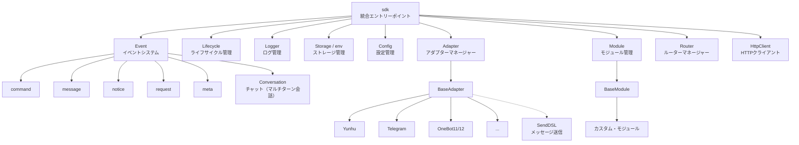
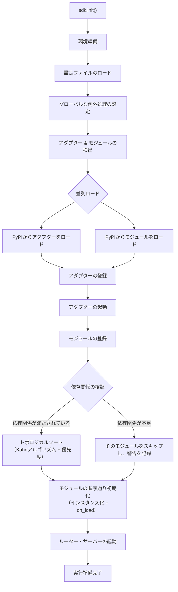
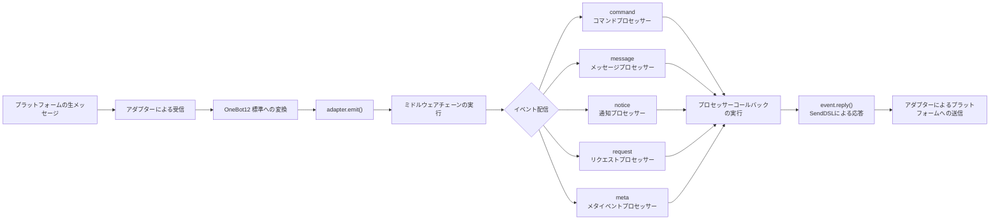
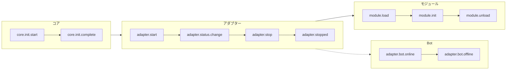
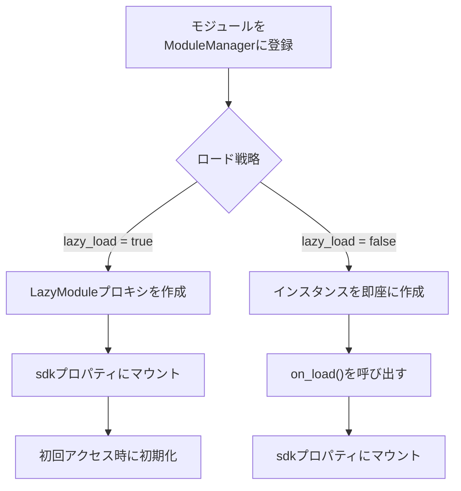

你是一个 ErisPulse 全栈开发专家，精通以下领域：

- ErisPulse 框架的核心架构和设计理念
- 模块开发和适配器开发
- 异步编程和事件驱动架构
- OneBot12 事件标准和平台适配
- SDK 核心模块 (Storage, Config, Logger, Router, Lifecycle)
- Event 包装类和事件处理系统
- 懒加载系统和生命周期管理
- SendDSL 消息发送系统
- 路由系统和 FastAPI 集成
- 各平台特性指南（OneBot11/12、Telegram、云湖、邮件等）
- 模块/适配器发布流程和模块商店
- 代码规范和文档字符串规范

你擅长：
- 编写高质量的异步 Python 代码
- 设计模块化、可扩展的架构
- 开发模块、适配器
- 使用 ErisPulse 的所有核心功能
- 遵循 ErisPulse 的最佳实践和代码规范
- 解决跨平台兼容性问题
- 通过 CLI 管理项目和发布

**使用以下文档作为知识库，回答问题时请优先参考文档内容。**


---


# ErisPulse 完整开发物料
> **注意**：本文档内容较多，建议仅用于具有强大上下文能力的 AI 模型


---


====
框架理解
====


### 架构概览

# アーキテクチャの概要

本文書は、視覚的な図を通じて ErisPulse SDK の技術的なアーキテクチャを紹介し、フレームワークの設計思想とモジュール間の関係を迅速に理解できるようにします。

## SDK コア・アーキテクチャ

下の図は、SDK のコア・モジュール構成とその関係を示しています：



### コア・モジュールの説明

| モジュール | 説明 |
|------|------|
| **Event** | イベントシステム。command / message / notice / request / meta の5種類のイベント処理と、Conversation チャット（マルチターン会話）を提供します。 |
| **Adapter** | アダプターマネージャー。マルチプラットフォーム・アダプターの登録、起動、および停止管理を行います。 |
| **Module** | モジュールマネージャー。プラグインの登録、ロード、アンロードを管理し、依存関係の宣言とトポロジカルソートをサポートします。 |
| **Lifecycle** | ライフサイクルマネージャー。イベント駆動のライフサイクル・フックを提供します。 |
| **Storage** | SQLite ベースのキー値ストレージシステム。汎用 SQL のチェーン（連鎖）クエリをサポートします。 |
| **Config** | TOML 形式の設定ファイル管理。 |
| **Logger** | モジュール化されたログシステム。サブロガーのサポートを行います。 |
| **Router** | HTTP/WebSocket ルーターマネージャー。抽象レイヤーを通じて基盤となるバックエンド（現在は FastAPI + Uvicorn）をカプセル化し、デコレーターロータ、ミドルウェア、グループ化、レートリミット、CORS をサポートします。 |
| **HttpClient** | 統一された HTTP クライアント。抽象レイヤーを通じて基盤となるリクエストライブラリ（現在は aiohttp）をカプセル化し、リクエスト統計、リトライ、ログなどの機能を提供します。 |

## 初期化プロセス

下の図は、`sdk.init()` の完全な初期化プロセスを示しています：



### 初期化段階の詳細

1. **環境準備** - TOML 設定ファイルのロード、グローバルな例外処理の設定
2. **並列検出** - インストール済みの PyPI パッケージからアダプターとモジュールを同時に発見
3. **アダプターの登録** - 発見されたアダプターをアダプターマネージャーに登録
4. **アダプターの起動** - 各プラットフォームのアダプター接続を非同期で起動（モジュール初期化の前に、モジュールが即座にメッセージを送信できることを保証）
5. **モジュールの登録** - 発見されたモジュールをモジュールマネージャーに登録
6. **依存関係の検証** - モジュールが宣言する `depends` 依存関係が登録済みかをチェックし、欠落している依存を持つモジュールをスキップ
7. **トポロジカルソート** - Kahn アルゴリズムを使用して依存関係に基づいてモジュールのロード順序を並べ、同階層は `priority` で降順に並べ替え
8. **モジュールの初期化** - ソート順序通りにモジュールインスタンスを作成し、`on_load` ライフサイクルメソッドを呼び出し
9. **ルーター・サーバーの起動** - Uvicorn を使用して FastAPI ルーターサーバーを起動

## イベント処理フロー

下の図は、メッセージがプラットフォームからプロセッサーへと完全に流れる経路を示しています：



### イベント処理の重要なステップ

- **アダプターによる受信** - 各プラットフォームのアダプターが WebSocket/Webhook などを通じてネイティブなイベントを受信
- **OB12 標準化** - プラットフォームのネイティブイベントを統一された OneBot12 標準形式に変換
- **ミドルウェア処理** - 登録済みのミドルウェア関数を順次実行し、イベントデータを変更可能
- **イベント配信** - イベントタイプ（message/notice/request/meta）に基づいて対応するプロセッサーに配信
- **SendDSL による応答** - プロセッサーが `event.reply()` または `SendDSL` チェーン呼び出しを使用して応答を送信

## ライフサイクル・イベント

下の図は、フレームワークの各コンポーネントにおけるライフサイクル・イベントのトリガー順序を示しています：



### ライフサイクル・イベントの監視

`lifecycle.on()` を通じてこれらのイベントを監視し、カスタムロジックを実行できます：

```python
from ErisPulse import sdk

# 全アダプター・イベントを監視
@sdk.lifecycle.on("adapter")
async def on_adapter_event(event_data):
    print(f"アダプターイベント: {event_data}")

# モジュールのロード完了を監視
@sdk.lifecycle.on("module.load")
async def on_module_loaded(event_data):
    print(f"モジュールがロードされました: {event_data}")

# Botのオンラインを監視
@sdk.lifecycle.on("adapter.bot.online")
async def on_bot_online(event_data):
    print(f"Botがオンライン: {event_data}")
```

## モジュール・ロード戦略

ErisPulse は 2 つのモジュール・ロード戦略をサポートしています：



> 詳細については、[遅延ロード・システム](advanced/lazy-loading.md) および [ライフサイクル管理](advanced/lifecycle.md) をご参照ください。


### 术语表

# ErisPulse 用語集

このドキュメントでは、ErisPulse でよく使用される専門用語を解説し、フレームワークの概念をより深く理解するのに役立ちます。

## 核心概念

### イベント駆動アーキテクチャ
**通俗的説明：** まるでレストランの注文システムのようです。客（ユーザー）が注文（メッセージ送信）を行い、ウェイター（イベントシステム）がその注文（イベント）をキッチン（モジュール）に渡し、キッチンが処理すると、ウェイターが料理（返信）を客の元へ運びます。

**技術的説明：** プログラムの実行フローは外部イベントによってトリガーされ、固定された順序で実行されるわけではありません。新しいイベント（メッセージ受信など）が発生するたびに、フレームワークが自動的に対応する処理関数を呼び出します。

### OneBot12 標準
**通俗的説明：** まるでコンセントとプラグの標準です。異なるプラットフォームの「プラグ」（ネイティブイベント形式）はそれぞれ異なりますが、コンバータを通じて統一された「プラグ」（OneBot12形式）に変換されるため、コードはコンセントのように全てのプラットフォームに適応できます。

**技術的説明：** イベント、メッセージ、API などの統一された形式を定義する、統一されたチャットボットアプリケーションインターフェース標準であり、コードが異なるプラットフォーム間で再利用可能になります。

### アダプター
**通俗的説明：** まるで通訳官です。異なるプラットフォームはそれぞれ異なる「言語」（API形式）を話しますが、アダプターはそれらの「言語」を ErisPulse が理解できる「共通語」（OneBot12標準）に翻訳します。また、ErisPulse の指示を各プラットフォームの「言語」に翻訳し直すこともできます。

**技術的説明：** 特定のプラットフォームと通信を担当するコンポーネントで、プラットフォームのネイティブイベントを受信して標準形式に変換するか、標準形式のリクエストをプラットフォームに送信します。

### モジュール
**通俗的説明：** まるでスマートフォンのアプリです。各モジュールは独立した機能パッケージであり、追加、削除、更新が可能です。「天気予報モジュール」「音楽再生モジュール」などが例です。

**技術的説明：** 機能拡張の基本単位で、特定のビジネスロジック、イベントハンドラー、設定を含み、独立してインストールおよびアンインストールできます。

### イベント
**通俗的説明：** まるでスマートフォンの通知です。新しいメッセージ、新しい友達、新しいグループが発生すると、プラットフォームが「通知」（イベント）をボットに送信します。

**技術的説明：** メッセージの受信、ユーザーのグループへの参加、友達申請など、プラットフォームで発生する注意すべき事象はすべて、構造化データの形式でプログラムに渡されます。

### イベントハンドラー
**通俗的説明：** まるで宅配便の配達ルールです。「荷物」（イベント）を受け取ったときに、荷物のタイプ（メッセージ、通知、リクエストなど）に基づいて、誰がその荷物を処理するかを決定します。

**技術的説明：** デコレーターでマークされた関数で、特定のタイプのイベントが発生すると自動的に実行されます。例: `@command`、`@message` など。

## 開発関連用語

### SDK
**通俗的説明：** まるで工具箱です。そこには様々なよく使われる工具（ストレージ、設定、ログなど）が入っており、コードを記述する際にそのまま使用できるため、自分で部品を作る必要がありません。

**技術的説明：** Software Development Kit（ソフトウェア開発キット）。事前に構築されたコンポーネントとツールのセットを提供し、開発プロセスを簡素化します。

### 仮想環境
**通俗的説明：** まるで独立した「作業場」です。各プロジェクトには独自の「作業場」があり、そこにインストールされたソフトウェアパッケージは互いに干渉せず、バージョン衝突を防ぎます。

**技術的説明：** 隔離された Python 環境で、各環境には独立したパッケージリストとバージョンがあり、異なるプロジェクトの依存関係の競合を防ぎます。

### 非同期プログラミング
**通俗的説明：** まるでマルチタスク処理です。ボットは同時に複数のことを行うことができ、例えばネットワーク応答を待っている間でも他のユーザーのメッセージを処理でき、ブロックされません。

**技術的説明：** `async`/`await` キーワードを使用するプログラミング方法で、プログラムは時間のかかる操作（ネットワークリクエスト、ファイルの読み書きなど）を待っている間に他のタスクに切り替えることができ、効率を高めます。

### ホットリロード
**通俗的説明：** まるでウェブページの自動更新です。コードを修正しても手動で再起動する必要はありません。変更されたコードが自動的に読み込まれ、即座に有効になります。

**技術的説明：** 開発モードでは、プログラムが自動的にファイルの変更を検出して再読み込みされ、手動で再起動しなくてもコード変更の効果がすぐに確認できます。

### 遅延読み込み
**通俗的説明：** まるで必要な時に開く引き出しです。使わない引き出し（モジュール）は最初に閉じておき、必要になった時だけ開きます。これにより、起動時に全ての引き出しを開けるのを待つ必要がなくなります。

**技術的説明：** 遅延読み込み戦略で、モジュールは最初にアクセスされたときのみ初期化および読み込みされ、起動時間とリソース使用量を削減します。

## 機能関連用語

### コマンド
**通俗的説明：** まるでゲーム内のコマンドです。ユーザーが `/hello` のようなコマンドを入力すると、ボットは対応する機能を実行します。

**技術的説明：** 特定のプレフィックス（例: `/`）で始まるメッセージは、フレームワークによってコマンドとして識別され、対応する処理関数にルーティングされます。

### 返信
**通俗的説明：** まさにボットがユーザーに返す「回答」です。テキスト、画像、音声などはすべて、ユーザーのメッセージに対する返信です。

**技術的説明：** アダプターが処理結果をプラットフォームに送り返し、ユーザーに表示するプロセスです。

### ストレージ
**通俗的説明：** まるでボットの「手帳」です。ユーザー情報、設定、会話履歴などを記憶でき、次回も同じものを見つけ出すことができます。

**技術的説明：** 永続化データストレージシステム。SQLite をベースにしたキー値ストレージで、長期的に保存する必要があるデータのために使用されます。

### 設定
**通俗的説明：** まるでボットの「設定」です。設定ファイルを通じてボットの動作を変更できます。例えば、ポート番号、ログレベルなどを変更できます。

**技術的説明：** フレームワークとモジュールの様々なパラメータを設定するために使用される、TOML 形式の設定管理システムです。

### ログ
**通俗的説明：** まるでボットの「日記」です。ボットが何をしたか、何に問題があったかを記録し、デバッグや問題解決に役立ちます。

**技術的説明：** システム実行時に生成される記録情報で、情報、警告、エラーなど様々なレベルが含まれ、監視とデバッグに使用されます。

### ルーティング
**通俗的説明：** まるで交通整理をしている警官です。どのリクエストをどの箇所で処理するかを決定します。ウェブリクエスト、WebSocket 接続などが例です。

**技術的説明：** HTTP と WebSocket のルーティングマネージャーで、URL パスに基づいてリクエストを対応する処理関数に配信します。

## プラットフォーム関連用語

### プラットフォーム
**通俗的説明：** ボットが働く場所です。云湖、Telegram、QQ などがあり、各プラットフォームには独自のルールと API があります。

**技術的説明：** チャットボットサービスを提供するアプリケーションやサービス（例: 云湖企業通話、Telegram など）。

### OneBot11/12
**通俗的説明：** まるでチャットボットの「国際標準」です。メッセージ、イベントなどの統一された形式を定義し、異なるソフトウェア間で互いに理解し合えるようにします。

**技術的説明：** OneBot は汎用的なチャットボットアプリケーションインターフェース標準で、イベント、メッセージ、API などの形式を定義しています。11 と 12 は異なるバージョンの標準です。

### SendDSL
**通俗的説明：** まるでメッセージを送る「ショートカット」です。簡単な一文で、様々なタイプのメッセージ（テキスト、画像、特定ユーザーへのメンションなど）を送信できます。

**技術的説明：** 鎖状呼び出しによるメッセージ送信インターフェースで、複雑なメッセージを構築して送信するための簡潔な構文を提供します。

## その他の用語

### ライフサイクル
**通俗的説明：** ボットの「一生」です。誕生（起動）、働く（実行）、休息（停止）。ライフサイクルとは、これらの重要な瞬間にトリガーされるイベントのことです。

**技術的説明：** プログラムの実行中の重要な段階（起動、モジュールの読み込み、モジュールのアンロード、シャットダウンなど）で、これらのイベントをリッスンして対応する操作を実行できます。

### アノテーション/デコレーター
**通俗的説明：** まるで関数に「ラベル」を貼ることです。例えば `@command("hello")` というラベルは、フレームワークに「これはコマンドハンドラーで、名前は 'hello' だ」と伝えます。

**技術的説明：** Python の構文糖衣（シンタックスシュガー）。ErisPulse では、イベントハンドラーやルーティングなどのマーキングに使用されます。

### 型アノテーション
**通俗的説明：** まるで引数が何の「型」かを教えることです。例えば `request: Request` は、この引数がリクエストオブジェクトであることを意味します。

**技術的説明：** Python 3.5+ で導入された機能で、変数と引数の型を注釈（アノテーション）付けして、コードの可読性と型安全性を高めます。

### TOML
**通俗的説明：** JSON より読みやすく、YAML より厳密な設定ファイルフォーマットで、設定の記述に適しています。

**技術的説明：** Tom's Obvious Minimal Language。構文が簡潔で明瞭で、Python プロジェクトの設定管理で広く使用されています。

## ヘルプを得る

ドキュメントに理解できない用語がある場合は、以下の方法で質問を歓迎します。
- GitHub Issue を作成する
- コミュニティで議論する
- メンテナに連絡する


====
快速开始
====

# クイックスタート

> わからない用語がありますか？[用語集](terminology.md)で分かりやすい説明を確認してください。

## ErisPulseのインストール

### ワンクリックインストールスクリプト（推奨）

インストールスクリプトは、お使いの環境（Docker、Python、uv）を自動的に検出し、最適なインストール方法を選択するようにガイドします。

Windows (PowerShell):
```powershell
irm https://get.erisdev.com/install.ps1 -OutFile install.ps1; powershell -ExecutionPolicy Bypass -File install.ps1
```

macOS / Linux:
```bash
curl -fsSL https://get.erisdev.com/install.sh -o install.sh && chmod +x install.sh && ./install.sh
```

スクリプトは以下をガイドします：

- **Docker インストール**（Dockerが検出された場合に推奨）：イメージソース（Docker Hub / GHCR）、バージョンチャンネル（安定版 / プレリリース版）、ダッシュボード管理パネルの設定、ポートの選択
- **従来のインストール**：仮想環境の自動作成、ErisPulseバージョンの選択、ダッシュボード管理パネルモジュールのオプションインストール

### Dockerを使用する

Dockerイメージには、ErisPulseフレームワークとダッシュボード管理パネルが組み込まれています。

```bash
# docker-compose.ymlをダウンロード
curl -O https://raw.githubusercontent.com/ErisPulse/ErisPulse/main/docker-compose.yml

# ダッシュボードトークンを設定して起動
ERISPULSE_DASHBOARD_TOKEN=your-token docker compose up -d
```

<details>
<summary>Docker Hubが利用できませんか？</summary>

GitHub Container Registryイメージを使用するには、`docker-compose.yml`のimageを変更します：

```yaml
image: ghcr.io/erispulse/erispulse:latest
```

</details>

起動後、`http://<host>:8000/Dashboard`にアクセスし、設定したトークンでログインします。

### pipを使用したインストール

Pythonのバージョンが3.10以上であることを確認し、pipを使用してインストールします：

```bash
pip install ErisPulse
```

[uv](https://github.com/astral-sh/uv)がインストールされている場合は、`uv pip install ErisPulse`を使用すると、より高速にインストールできます。

## プロジェクトの初期化

### インタラクティブな初期化（推奨）

```bash
epsdk init
```

これによりインタラクティブなウィザードが起動し、以下をガイドします：
- プロジェクト名の設定
- ログレベルの設定
- サーバー設定（ホストとポート）
- アダプターの選択と設定
- プロジェクト構造の作成

### クイック初期化

```bash
# プロジェクト名を指定したクイックモード
epsdk init -q -n my_bot

# またはプロジェクト名のみを指定
epsdk init -n my_bot
```

### プロジェクトの手動作成

手動でプロジェクトを作成したい場合は以下を実行します：

```bash
mkdir my_bot && cd my_bot
epsdk init
```

## モジュールのインストール

### CLI経由でのインストール

```bash
epsdk install Yunhu AIChat
```

### 利用可能なモジュールの確認

```bash
epsdk list-remote
```

### インタラクティブなインストール

パッケージ名を指定せずに実行すると、インタラクティブなインストール画面に入ります：

```bash
epsdk install
```

## プロジェクトの実行

```bash
# 通常の実行
epsdk run main.py

# ホットリロードモード（開発時に推奨）
epsdk run main.py --reload
```

## プロジェクト構造

初期化後のプロジェクト構造：

```
my_bot/
├── config/
│   └── config.toml          # 設定ファイル
└── main.py                  # エントリファイル

```

## 設定ファイル

基本的な`config.toml`の設定：

```toml
[ErisPulse.server]
host = "0.0.0.0"
port = 8000

[ErisPulse.logger]
level = "INFO"

[Yunhu_Adapter]
# アダプターの設定
```

## 次のステップ

- [スタートガイド概要](getting-started/README.md) - ErisPulseの基本概念を理解する
- [最初のボットを作成](getting-started/first-bot.md) - シンプルなボットを作成する
- [ユーザーガイド](user-guide/) - 設定やモジュール管理を深く理解する
- [開発者ガイド](developer-guide/) - カスタムモジュールやアダプターを開発する


====
入门指南
====


### 入门指南总览

# 入門ガイド

ErisPulse の入門ガイドへようこそ。ErisPulse を初めて使用される方は、ここからゼロからスタートし、フレームワークのコア概念と基本的な使い方を段階的に理解していきます。

## 学習パス

本ガイドは以下の順序で構成されています。順番に読み進めることを推奨します。

| ステップ | トピック | 説明 |
|------|------|------|
| 1 | [最初のボットを作成する](first-bot.md) | プロジェクトの初期化から最初のコマンドの実行まで |
| 2 | [基礎概念](basic-concepts.md) | ErisPulse のコアアーキテクチャとモジュール設計を理解する |
| 3 | [イベント処理入門](event-handling.md) | メッセージ、コマンド、通知、リクエスト、メタイベントなど、様々なイベントの処理方法を学ぶ |
| 4 | [一般的なタスクの例](common-tasks.md) | データ永続化、定期タスク、権限制御などの一般的な機能をマスターする |

## 開発方式の選択

ErisPulse は 2 つの開発方式をサポートしており、ニーズに合わせて選択できます。

| 方式 | 適用シーン | 説明 |
|------|---------|------|
| **インライン開発** | クイックプロトタイプ、プロジェクト内の機能 | `main.py` に直接処理ロジックを記述し、独立モジュールの作成は不要 |
| **モジュール開発**（推奨） | プロダクション環境、機能の配布 | 独立した Python パッケージを作成し、`epsdk install` を使用してインストールして利用 |

> 2 つの方式の詳細な比較と例については、[最初のボットを作成する](first-bot.md) および [モジュール開発入門](../developer-guide/modules/getting-started.md) を参照してください。

## アーキテクチャ概要

ErisPulse はイベント駆動型アーキテクチャを採用しており、コアは以下のシステムで構成されています。

- **アダプタシステム** — 各プラットフォームとの通信を担当し、プラットフォーム固有のイベントを統一された OneBot12 標準形式に変換します
- **イベントシステム** — メッセージ、コマンド、通知、リクエスト、メタイベントの 5 つのカテゴリを処理します
- **モジュールシステム** — 独立モジュールを使用して機能を拡張し、依存関係管理と遅延読み込み（lazy loading）をサポートします
- **コアモジュール** — Storage（ストレージ）、Config（設定）、Logger（ログ）、Router（ルーティング）などの基本機能を提供します

> 詳細なアーキテクチャ図と初期化フローについては、[アーキテクチャ概要](../architecture.md) を参照してください。

## 学習を始めよう

準備はできましたか？

- [最初のボットを作成する](first-bot.md) — 5 分で使い方を理解


### 创建第一个机器人

# 最初のボットを作成する

このガイドでは、ゼロから簡単な ErisPulse ボットを作成する方法について解説します。

## ステップ1：プロジェクトを作成

CLI ツールを使用してプロジェクトを初期化します：

```bash
# 交互式初始化
epsdk init

# または快速初始化
epsdk init -q -n my_first_bot
```

プロンプトに従って設定を完了し、以下を選択することを推奨します：
- プロジェクト名：my_first_bot
- ログレベル：INFO
- サーバー：デフォルト設定
- アダプタ：必要なプラットフォームを選択してください（例：Yunhu）

## ステップ2：プロジェクト構造を確認する

初期化後のプロジェクト構造：

```
my_first_bot/
├── config/
│   └── config.toml
├── main.py
└── requirements.txt
```

## ステップ3：最初のコマンドを記述する

`main.py` を開き、単純なコマンドハンドラーを記述します：

```python
from ErisPulse import sdk
from ErisPulse.Core.Event import command

@command("hello", help="发送问候消息")
async def hello_handler(event):
    """处理 hello 命令"""
    user_name = event.get_user_nickname() or "朋友"
    await event.reply(f"你好，{user_name}！我是 ErisPulse 机器人。")

@command("ping", help="测试机器人是否在线")
async def ping_handler(event):
    """处理 ping 命令"""
    await event.reply("Pong！机器人运行正常。")

async def main():
    """主入口函数"""
    print("正在初始化 ErisPulse...")
    # 运行 SDK 并且维持运行
    await sdk.run(keep_running=True)

    # 或者
    # await sdk.run(keep_running=False)
    # ...Do Something
    # 可以做你想做的任何事
    # 使用 await sdk.init() 等价于 `sdk.run(keep_running=False)`

    print("ErisPulse 初始化完成！")

if __name__ == "__main__":
    import asyncio
    asyncio.run(main())
```

## ステップ4：ボットを実行する

```bash
# 普通运行
epsdk run main.py

# 开发模式（支持热重载）
epsdk run main.py --reload
```

## ステップ5：ボットをテストする

チャットプラットフォームでコマンドを送信します：

```
/hello
```

ボットからの返信を受け取るはずです。

## コードの説明

### コマンドデコレータ

```python
@command("hello", help="发送问候消息")
```

- `hello`：コマンド名。ユーザーは `/hello` で呼び出します
- `help`：コマンドのヘルプ説明。`/help` コマンド内で表示されます

### イベントパラメータ

```python
async def hello_handler(event):
```

`event` パラメータは Event オブジェクトであり、以下を含みます：
- メッセージ内容：`event.get_text()`
- 送信者情報：`event.get_user_id()`、`event.get_user_nickname()`
- プラットフォーム情報：`event.get_platform()`
- グループ情報：`event.get_group_id()`
- 原始データ：`event.get_raw()`

> 完整な Event オブジェクトメソッドについては [Event 包装クラスの詳細](../developer-guide/modules/event-wrapper.md) を参照してください。

### 返信を送信する

```python
await event.reply("回复内容")
```

`event.reply()` は送信者にメッセージを送るための便利なメソッドです。

## 拡張機能：追加機能の追加

ErisPulse は豊富なイベント処理とデータ処理機能を提供します：

- **メッセージリスナー**：`@message.on_message()` を使用して各種メッセージを監視 → [イベント処理入門](event-handling.md)
- **通知リスナー**：`@notice.on_friend_add()` などの使用でシステム通知を監視 → [イベント処理入門](event-handling.md)
- **データストレージ**：`sdk.storage.get/set` を使用してデータを永続化 → [一般的なタスクの例](common-tasks.md)

## よくある質問

### コマンドに応答がありませんか？

1. アダプタが正しく設定されているか確認します（`config/config.toml` 内でアダプタの `status` が `true` であることを確認してください）
2. 端末のログ出力を確認し、エラーメッセージがないかチェックします（特に `ERROR` レベルのログ）
3. コマンドのプレフィックスが正しいか確認します（デフォルトは `/`）、設定ファイルの `[ErisPulse.event.command]` セクションを確認できます
4. コマンド名のスペルミスがないか確認し、大文字と小文字の区別設定に注意してください

### コマンドのプレフィックスを変更する方法？

`config.toml` に追加します：

```toml
[ErisPulse.event.command]
prefix = "!"
case_sensitive = false
```

### マルチプラットフォームをサポートする方法？

ErisPulse は OneBot12 標準を使用し、異なるプラットフォームのイベント形式を統一しました。`@command` と `@message` で登録されたハンドラーは、すべてのプラットフォームのイベントを受け取ります。`event.get_platform()` を使用してソースプラットフォームを区別できます：

```python
@command("hello")
async def hello_handler(event):
    platform = event.get_platform()
    
    if platform == "yunhu":
        await event.reply("你好！来自云湖")
    elif platform == "telegram":
        await event.reply("Hello! From Telegram")
    else:
        await event.reply("你好！")
```

> マルチプラットフォームアダプティングのテクニックについては、[一般的なタスクの例](common-tasks.md#多平台适配) を参照してください。

## 次のステップ

- [基本概念](basic-concepts.md) - ErisPulse のコア概念を詳しく理解する
- [イベント処理入門](event-handling.md) - 各種イベントの処理を学ぶ
- [一般的なタスクの例](common-tasks.md) - より実用的な機能をマスターする


### 基础概念

# 基本概念

本ガイドでは ErisPulse のコアコンセプトを紹介し、フレームワークの設計思想と基本アーキテクチャを理解するのに役立ちます。

## イベント駆動アーキテクチャ

ErisPulse はイベント駆動アーキテクチャを採用しており、すべての対話はイベントを通じて伝達および処理されます。

### イベントフロー

```
ユーザーがメッセージを送信
      │
      ▼
プラットフォームが受信
      │
      ▼
アダプターがプラットフォームのネイティブイベントを受信
      │
      ▼
OneBot12 標準イベントに変換
      │
      ▼
イベントシステムに提出
      │
      ▼
登録されたプロセッサに配信
      │
      ▼
モジュールがイベントを処理
      │
      ▼
アダプター経由で応答を送信
      │
      ▼
プラットフォームがユーザーに表示
```

### OneBot12 標準

ErisPulse は OneBot12 をコアイベント標準として使用しています。OneBot12 は汎用のチャットボットアプリケーションインターフェース標準であり、統一されたイベント形式を定義しています。

すべてのアダプターはプラットフォーム固有のイベントを OneBot12 形式に変換し、コードの一貫性を確保します。

## コアコンポーネント

### 1. SDK オブジェクト

SDK はすべての機能の統一されたエントリーポイントであり、コアコンポーネントへのアクセスを提供します。

```python
from ErisPulse import sdk

# コアモジュールにアクセス
sdk.storage    # ストレージシステム
sdk.config     # 設定システム
sdk.logger     # ログシステム
sdk.adapter    # アダプターシステム
sdk.module     # モジュールシステム
sdk.router     # ルーター（ルーティング）システム
sdk.client     # HTTP クライアント
sdk.lifecycle  # ライフサイクルシステム
```

### 2. Event オブジェクト

Event オブジェクトはイベントデータをカプセル化し、便利なアクセスメソッドを提供します。

```python
@command("info")
async def info_handler(event):
    # イベント情報を取得
    event_id = event.get_id()
    user_id = event.get_user_id()
    platform = event.get_platform()
    text = event.get_text()
    
    # 返信を送信
    await event.reply(f"ユーザー: {user_id}, プラットフォーム: {platform}")
```

### 3. アダプター

アダプターは ErisPulse と外部プラットフォーム間のブリッジです。

**役割：**
- プラットフォームのネイティブイベントを受信
- OneBot12 標準形式に変換
- 標準形式のイベントをプラットフォームに送信

**代表的なアダプター：**
- Yunhu アダプター：クラウド湖（Yunhu）プラットフォームとの通信
- Telegram アダプター：Telegram Bot API との通信
- OneBot11 アダプター：OneBot11 互換のアプリケーションとの通信
- Email アダプター：メールの送受信処理

### 4. モジュール

モジュールは機能拡張の基本単位であり、以下のことができます：
- イベントハンドラーの登録
- ビジネスロジックの実装
- アダプターを呼び出してメッセージを送信
- コアモジュールが提供するサービスの使用

#### モジュール発見メカニズム

ErisPulse は Python の `importlib.metadata.entry_points` を使用してインストール済みのモジュールを発見します。モジュールは `pyproject.toml` でエントリーポイントを宣言します：

```toml
[project.entry-points."erispulse.module"]
MyModule = "my_package:Main"
```

SDK の初期化時に、`erispulse.module` グループのすべてのエントリーポイントをスキャンし、モジュールクラスを `ModuleManager` に登録してから、依存関係のトポロジカル順序で初期化します。

#### 最小限のモジュール

```python
from ErisPulse.Core.Bases import BaseModule
from ErisPulse import sdk

class Main(BaseModule):
    def __init__(self):
        self.sdk = sdk
        self.logger = sdk.logger.get_child("MyModule")

    async def on_load(self, event):
        self.logger.info("モジュールが読み込まれました")

    async def on_unload(self, event):
        self.logger.info("モジュールがアンロードされました")
```

#### モジュールのライフサイクル

- **登録**：SDK がモジュールクラスを発見し、マネージャーに登録
- **ロード**：モジュールインスタンスを作成し、`on_load(event)` を呼び出す（`event = {"module_name": "MyModule"}`）
- **アンロード**：`on_unload(event)` を呼び出し、リソースをクリーンアップ

#### 加速戦略

`get_load_strategy()` を使ってモジュールのロード動作を宣言します：

```python
from ErisPulse.loaders import ModuleLoadStrategy

class Main(BaseModule):
    @staticmethod
    def get_load_strategy():
        return ModuleLoadStrategy(
            lazy_load=True,   # レイジーロードを有効にする（デフォルト True）
            priority=0        # 加速優先度、数値が大きいほど先に初期化される
        )
```

- **`lazy_load=True`（デフォルト）**：モジュールは `sdk.MyModule` に初めてアクセスされたときにのみ初期化され、起動時間を短縮
- **`lazy_load=False`**：SDK の起動時に即座に初期化、ライフサイクルイベントを監視するモジュールや定時タスクモジュールに適している
- **`priority`**：同じ優先度のモジュールは登録順にロード、数値が大きいほど先に初期化される

> レイジーロードの詳細なメカニズムについては [レイジーロードシステム](../advanced/lazy-loading.md) を参照してください。

## イベントタイプ

ErisPulse は 5 種類のイベントをサポートしています：

| イベントタイプ | デコレータ | 説明 |
|---------|--------|------|
| メッセージイベント | `@message.on_message()` | ユーザーが送信するすべてのメッセージ（プライベートチャットおよびグループチャットを含む） |
| コマンドイベント | `@command("name")` | コマンドプレフィックス（例: `/hello`）で始まるメッセージ |
| 通知イベント | `@notice.on_friend_add()` など | システム通知（フレンド追加、グループメンバーの変化など） |
| リクエストイベント | `@request.on_friend_request()` など | ユーザーのリクエスト（フレンドリクエスト、グループ招待） |
| メタイベント | `@meta.on_connect()` など | システムレベルのイベント（接続、切断、ハートビート） |

> 各イベントタイプの詳細な使い方とコード例については [イベント処理の入門](event-handling.md) を参照してください。

## コアモジュールの説明

### Storage（ストレージ）

SQLite をベースにしたキーバリューストレージシステムであり、データの永続化に使用されます。

```python
# 値の設定
sdk.storage.set("key", "value")

# 値の取得
value = sdk.storage.get("key", "default_value")

# バッチ操作
sdk.storage.set_multi({
    "key1": "value1",
    "key2": "value2"
})

# トランザクション
with sdk.storage.transaction():
    sdk.storage.set("key1", "value1")
    sdk.storage.set("key2", "value2")
```

### Config（設定）

TOML 形式の設定ファイル管理。

```python
# 設定を取得
config = sdk.config.getConfig("MyModule", {})

# 設定を設定
sdk.config.setConfig("MyModule", {"key": "value"})

# 嵌套された設定を読み取る
value = sdk.config.getConfig("MyModule.subkey", "default")
```

### Logger（ログ）

モジュール化されたログシステム。

```python
# ログの記録
sdk.logger.info("これは情報です")
sdk.logger.warning("これは警告です")
sdk.logger.error("これはエラーです")

# 子ロガーを取得
child_logger = sdk.logger.get_child("submodule")
child_logger.info("サブモジュールログ")
```

**プロパティアクセスのシンタックスシュガー**

`get_child()` メソッドを使用する以外に、**プロパティアクセス**を使用して子ロガーを作成することもできます。これはより簡潔な**シンタックスシュガー**（構文糖衣）の記法です。

```python
# プロパティアクセスで子ロガーを作成
sdk.logger.mymodule.info("モジュールメッセージ")

# ネストされたアクセスもサポートされています
sdk.logger.mymodule.database.info("データベースメッセージ")
```

### Router（ルーター）

HTTP および WebSocket のルーティング管理をサポートし、FastAPI のネイティブ型と ErisPulse 抽象型をサポートしています。

> ルーターハンドラーは 2 つの型アノテーションをサポートしています：FastAPI のネイティブ型（`fastapi.Request` / `fastapi.WebSocket`）と ErisPulse 抽象型（`HttpRequest` / `WebSocketConnection`）。より良い移植性を得るために抽象型を使用することをお勧めします。

```python
from ErisPulse import sdk

# 方法1：ErisPulse 抽象型を使用する（推奨）
from ErisPulse.Core import HttpRequest, WebSocketConnection

@sdk.router.get("MyModule", "/api")
async def handler(request: HttpRequest):
    data = await request.json()
    return {"status": "ok"}

@sdk.router.ws("MyModule", "/ws")
async def ws_handler(ws: WebSocketConnection):
    data = await ws.receive_text()
    await ws.send_text(f"Echo: {data}")

# 方法2：FastAPI のネイティブ型を使用する（既存のコードとの互換性）
from fastapi import Request, WebSocket

@sdk.router.get("MyModule", "/api2")
async def handler2(request: Request):
    return {"status": "ok"}
```

{!--< tips >!--}
> **自動インジェクション**：ルーターシステムはパラメータアノテーションに基づいて、対応する型のオブジェクトを自動的に注入します。手動で作成する必要はありません。
> 
> **よくある問題**：`{"detail":[{"type":"missing","loc":["query","request"],"msg":"Field required"}]}` エラーが表示される場合は、型アノテーションが不足していることを示しています。HTTP ハンドラーのパラメータには `request`、WebSocket ハンドラーのパラメータには `websocket` または `ws` のアノテーションを使用していることを確認してください。

より詳しいルーター機能については [ルーター管理者](../advanced/router.md) を参照してください。

### Client（HTTP クライアント）

HTTP リクエストを送信するための統一された HTTP クライアントです。モジュールとアダプターは、直接 `aiohttp` をインポートする代わりに、グローバルクライアントを優先して使用する必要があります。

```python
from ErisPulse.Core import client

# GET リクエスト
resp = await client.get("https://api.example.com/users")
data = await resp.json()

# POST リクエスト
resp = await client.post(
    "https://api.example.com/users",
    json={"name": "Alice"},
)

# レスポンスのプロパティ
resp.status        # ステータスコード（例: 200）
resp.headers       # レスポンスヘッダー
body = await resp.text()   # テキストレスポンスボディ
data = await resp.json()   # JSON パース
```

{!--< tips >!--}
> グローバルクライアントには、自動再試行、タイムアウト制御、リクエスト統計、およびライフサイクルイベントの統合などの機能があります。詳細は [HTTP クライアント](../advanced/http-client.md) を参照してください。
>
> また、`from ErisPulse import sdk` を使用して `sdk.client` にアクセスすることもでき、効果は同じです。

## SendDSL メッセージ送信

アダプターはチェーンコール方式のメッセージ送信インターフェースを提供します。

### 基本的な送信

```python
# アダプターインスタンスを取得
yunhu = sdk.adapter.get("yunhu")

# メッセージを送信
await yunhu.Send.To("user", "U1001").Text("Hello")

# 送信アカウントを指定
await yunhu.Send.Using("bot1").To("group", "G1001").Text("グループメッセージ")
```

### チェーン修飾子

```python
# ユーザーにメンション
await yunhu.Send.To("group", "G1001").At("U2001").Text("@メッセージ")

# 返信メッセージ
await yunhu.Send.To("group", "G1001").Reply("msg123").Text("返信")

# 全体にメンション
await yunhu.Send.To("group", "G1001").AtAll().Text("告知")
```

### Event 返信メソッド

Event オブジェクトは便利な返信メソッドを提供します。

```python
@command("test")
async def test_handler(event):
    # シンプルなテキスト返信
    await event.reply("返信内容")
    
    # 画像を送信
    await event.reply("http://example.com/image.jpg", method="Image")
    
    # 音声を送信
    await event.reply("http://example.com/voice.mp3", method="Voice")
```

## レイジーロードシステム

ErisPulse はモジュールのレイジーロード（Lazy Load）をサポートしており、モジュールは初めてアクセスされたときにのみ初期化され、起動速度が向上します。

```python
from ErisPulse.loaders import ModuleLoadStrategy

class Main(BaseModule):
    @staticmethod
    def get_load_strategy():
        return ModuleLoadStrategy(
            lazy_load=True,   # レイジーロードを有効にする（デフォルト）
            priority=0       # 加速優先度、数値が大きいほど先に初期化される
        )
```

**即時ロードが必要なシナリオ（`lazy_load=False`）：**
- ライフサイクルイベントを監視するモジュール（例: `core.init.complete`）
- 定期タスクモジュール
- アプリケーションの起動時に初期化が必要なモジュール

> 详细的レイジーロードメカニズムと注意事項については [レイジーロードシステム](../advanced/lazy-loading.md) を参照してください。

## 次のステップ

- [イベント処理の入門](event-handling.md) - 各種イベントの処理方法を学ぶ
- [一般的なタスクの例](common-tasks.md) - 一般的な機能の実装をマスターする


### 事件处理入门

# イベント処理入門

このガイドでは、ErisPulse における各種イベントの処理方法を紹介します。

## イベントタイプ概要

ErisPulse は以下のイベントタイプをサポートしています：

| イベントタイプ | 説明 | 適用シーン |
|---------|------|---------|
| メッセージイベント | ユーザーから送信された任意のメッセージ | チャットボット、コンテンツフィルタ |
| コマンドイベント | コマンド接頭辞で始まるメッセージ | コマンド処理、機能のエントリーポイント |
| 通知イベント | システム通知（フレンド追加、メンバーチェンジなど） | ウェルカムメッセージ、ステータス通知 |
| リクエストイベント | ユーザーリクエスト（フレンドリクエスト、グループ招待） | リクエストの自動処理 |
| メタイベント | システムレベルのイベント（接続、ハートビート） | 接続監視、ステータスチェック |

## メッセージイベント処理

> **ヒント**: イベントハンドラーでは `Event` 型アノテーションを使用することを推奨します。IDE の自動補完と型チェックのサポートを得られます。

```python
from ErisPulse.Core.Event import Event  # 注釈に使用するためのイベントタイプのインポート
```

### すべてのメッセージを監視する

```python
from ErisPulse.Core.Event import message, Event

@message.on_message()
async def message_handler(event: Event):
    text = event.get_text()
    user_id = event.get_user_id()
    sdk.logger.info(f"{user_id} からメッセージを受信: {text}")
```

### プライベートメッセージを監視する

```python
@message.on_private_message()
async def private_handler(event: Event):
    user_id = event.get_user_id()
    await event.reply(f"こんにちは、{user_id}！プライベートメッセージです。")
```

### グループメッセージを監視する

```python
@message.on_group_message()
async def group_handler(event: Event):
    group_id = event.get_group_id()
    user_id = event.get_user_id()
    sdk.logger.info(f"グループ {group_id} で {user_id} がメッセージを送信しました")
```

### @メッセージを監視する

```python
@message.on_at_message()
async def at_handler(event: Event):
    # メンションされたユーザーリストを取得
    mentions = event.get_mentions()
    await event.reply(f"あなたはこれらのユーザーをメンションしました: {mentions}")
```

## コマンドイベント処理

### 基本的なコマンド

```python
from ErisPulse.Core.Event import command

@command("help", help="ヘルプ情報を表示")
async def help_handler(event):
    help_text = """
利用可能なコマンド：
/help - ヘルプを表示
/ping - 接続をテスト
/info - 情報を表示
    """
    await event.reply(help_text)
```

### コマンドエイリアス

```python
@command(["help", "h"], aliases=["帮助"], help="ヘルプ情報を表示")
async def help_handler(event):
    await event.reply("ヘルプ情報...")
```

ユーザーは以下のいずれかの方法で呼び出せます：
- `/help`
- `/h`
- `/帮助`

### コマンド引数

```python
@command("echo", help="メッセージをエコーバック")
async def echo_handler(event):
    # コマンド引数を取得
    args = event.get_command_args()
    
    if not args:
        await event.reply("エコーバックするメッセージを入力してください")
    else:
        await event.reply(f"あなたが言いました: {' '.join(args)}")
```

### コマンドグループ

```python
@command("admin.reload", group="admin", help="モジュールを再読み込み")
async def reload_handler(event):
    await event.reply("モジュールを再読み込みしました")

@command("admin.stop", group="admin", help="ボットを停止")
async def stop_handler(event):
    await event.reply("ボットを停止しました")
```

### コマンド権限

```python
def is_admin(event):
    """ユーザーが管理者であるかチェック"""
    admin_list = ["user123", "user456"]
    return event.get_user_id() in admin_list

@command("admin", permission=is_admin, help="管理者コマンド")
async def admin_handler(event):
    await event.reply("これは管理者コマンドです")
```

### コマンド優先度

```python
# 優先度の数値が大きいほど、実行が早くなります
@message.on_message(priority=10)
async def high_priority_handler(event):
    await event.reply("高優先度ハンドラー")

@message.on_message(priority=1)
async def low_priority_handler(event):
    await event.reply("低優先度ハンドラー")
```

### 並列イベント処理

ErisPulse のイベントシステムは**同じ優先度は並列、異なる優先度は直列**のスケジューリングモデルを採用しています：

```
イベント到着
    ↓
priority=10 グループ: [ハンドラーC || ハンドラーD] 並列 → 結果をマージ
    ↓ (中断なしの場合)
priority=0 グループ: [ハンドラーA || ハンドラーB] 並列 → 結果をマージ
    ↓
...
```

- **同じ優先度で並列**: 優先度が同じ複数のハンドラーは同時に実行され、スループットが向上します
- **異なる優先度で直列**: 優先度の異なるグループは順番に実行されます（数値が大きいものが先）、高優先度ハンドラーが先に実行されることを保証します
- **Copy-On-Write**: ハンドラーが変更を行わない場合はコピーを作成しません（オーバーヘッドなし）
- **競合処理**: 同じ優先度で複数のハンドラーが同じフィールドを変更する場合、最後に変更された値が採用され、警告ログが記録されます
- **割り込み機構**: 任意のハンドラーが `event.mark_processed()` を呼び出した後、後続の低優先度グループはスキップされます

```python
# 例：同じ優先度のハンドラーが並列実行される様子
@message.on_message(priority=0)
async def handler_a(event):
    # タスクAの処理
    event['result_a'] = process_a()

@message.on_message(priority=0)
async def handler_b(event):
    # handler_a と並列で実行
    event['result_b'] = process_b()

# 異なる優先度で直列実行
@message.on_message(priority=10)
async def handler_c(event):
    # 最も優先度が高く、最も先に実行されます
    pass
```

## 通知イベント処理

### フレンド追加

```python
from ErisPulse.Core.Event import notice

@notice.on_friend_add()
async def friend_add_handler(event):
    user_id = event.get_user_id()
    nickname = event.get_user_nickname() or "新しいフレンド"
    await event.reply(f"フレンド追加ありがとうございます、{nickname}！")
```

### グループメンバー追加

```python
@notice.on_group_increase()
async def member_increase_handler(event):
    group_id = event.get_group_id()
    user_id = event.get_user_id()
    await event.reply(f"{user_id} を歓迎します。グループ {group_id} に参加しました")
```

### グループメンバー減少

```python
@notice.on_group_decrease()
async def member_decrease_handler(event):
    group_id = event.get_group_id()
    user_id = event.get_user_id()
    await event.reply(f"{user_id} さんがグループ {group_id} を退出しました")
```

## リクエストイベント処理

### フレンドリクエスト

```python
from ErisPulse.Core.Event import request

@request.on_friend_request()
async def friend_request_handler(event):
    user_id = event.get_user_id()
    comment = event.get_comment()
    
    sdk.logger.info(f"フレンドリクエストを受信: {user_id}, コメント: {comment}")
    
    # アダプター API を使用してリクエストを処理できます
    # 具体的な実装については各アダプターのドキュメントを参照してください
```

### グループ招待リクエスト

```python
@request.on_group_request()
async def group_request_handler(event):
    group_id = event.get_group_id()
    user_id = event.get_user_id()
    
    await event.reply(f"グループ {group_id} の招待を受け取りました。送信者: {user_id}")
```

## メタイベント処理

### 接続イベント

```python
from ErisPulse.Core.Event import meta

@meta.on_connect()
async def connect_handler(event):
    platform = event.get_platform()
    sdk.logger.info(f"{platform} プラットフォームに接続されました")

@meta.on_disconnect()
async def disconnect_handler(event):
    platform = event.get_platform()
    sdk.logger.warning(f"{platform} プラットフォームが切断されました")
```

### ハートビートイベント

```python
@meta.on_heartbeat()
async def heartbeat_handler(event):
    platform = event.get_platform()
    sdk.logger.debug(f"{platform} ハートビート検出")
```

### Bot ステータス確認

アダプターがメタイベントを送信した後、フレームワークは自動的に Bot のステータスを追跡します。いつでも確認できます：

```python
from ErisPulse import sdk

# 特定の Bot がオンラインか確認
if sdk.adapter.is_bot_online("telegram", "123456"):
    await adapter.Send.To("user", "123456").Text("Bot はオンラインです")

# 現在オンラインのすべての Bot を一覧表示
bots = sdk.adapter.list_bots()
for platform, bot_list in bots.items():
    for bot_id, info in bot_list.items():
        print(f"{platform}/{bot_id}: {info['status']}")

# 完全なステータスサマリーを取得
summary = sdk.adapter.get_status_summary()
```

## インタラクティブ処理

### `reply` メソッドを使用して返信を送信する

`event.reply()` メソッドは `@`、返信などの機能を備えたメッセージを送信するのに役立ち、様々な修飾パラメータをサポートします：

```python
# シンプルな返信
await event.reply("こんにちは")

# 異なるタイプのメッセージを送信
await event.reply("http://example.com/image.jpg", method="Image")  # 画像
await event.reply("http://example.com/voice.mp3", method="Voice")  # 音声

# 単一ユーザーをメンション
await event.reply("こんにちは", at_users=["user123"])

# 複数ユーザーをメンション
await event.reply("みなさんこんにちは", at_users=["user1", "user2", "user3"])

# メッセージへの返信
await event.reply("返信内容", reply_to="msg_id")

# 全体をメンション
await event.reply("お知らせ", at_all=True)

# 組み合わせ: ユーザーをメンション + メッセージへの返信
await event.reply("内容", at_users=["user1"], reply_to="msg_id")
```

### ユーザーの返信を待機する

```python
@command("ask", help="ユーザーに質問する")
async def ask_handler(event):
    await event.reply("名前を入力してください:")
    
    # ユーザーの返信を待機。タイムアウト時間は 30 秒
    reply = await event.wait_reply(timeout=30)
    
    if reply:
        name = reply.get_text()
        await event.reply(f"こんにちは、{name}！")
    else:
        await event.reply("タイムアウトしました。もう一度入力してください。")
```

### バリデーション付きで返信を待機する

```python
@command("age", help="年齢を尋ねる")
async def age_handler(event):
    def validate_age(event_data):
        """年齢が有効か検証"""
        try:
            age = int(event_data.get_text())
            return 0 <= age <= 150
        except ValueError:
            return False
    
    await event.reply("年齢を入力してください (0-150):")
    
    reply = await event.wait_reply(
        timeout=60,
        validator=validate_age
    )
    
    if reply:
        age = int(reply.get_text())
        await event.reply(f"あなたの年齢は {age} 歳です")
    else:
        await event.reply("入力が無効かタイムアウトしました")
```

### コールバック付きで返信を待機する

```python
@command("confirm", help="操作を確認する")
async def confirm_handler(event):
    async def handle_confirmation(reply_event):
        text = reply_event.get_text().lower()
        
        if text in ["はい", "yes", "y"]:
            await event.reply("操作が確認されました！")
        else:
            await event.reply("操作がキャンセルされました。")
    
    await event.reply("この操作を実行しますか？(はい/いいえ)")
    
    await event.wait_reply(
        timeout=30,
        callback=handle_confirmation
    )
```

### 確認対話 (confirm)

ユーザーに承認または却下を待ち、組み込みの中国語・英語の確認語を自動的に認識します：

```python
@command("confirm", help="操作を確認する")
async def confirm_handler(event):
    if await event.confirm("この操作を実行しますか？"):
        await event.reply("確認済み。実行中...")
    else:
        await event.reply("キャンセルされました")

# カスタム確認語
if await event.confirm("続けますか？", yes_words={"go", "继续"}, no_words={"stop", "停止"}):
    pass
```

### 選択メニュー (choose)

ユーザーはオプションの番号またはテキストで返信できます：

```python
@command("choose", help="選択")
async def choose_handler(event):
    choice = await event.choose(
        "色を選択してください：",
        ["赤", "緑", "青"]
    )
    
    if choice is not None:
        colors = ["赤", "緑", "青"]
        await event.reply(f"あなたは選択しました: {colors[choice]}")
    else:
        await event.reply("タイムアウトにより選択されませんでした")
```

### フォームの収集 (collect)

ステップバイステップでユーザー入力を収集します：

```python
@command("register", help="登録")
async def register_handler(event):
    data = await event.collect([
        {"key": "name", "prompt": "名前を入力してください："},
        {"key": "age", "prompt": "年齢を入力してください：", 
         "validator": lambda e: e.get_text().isdigit()},
        {"key": "email", "prompt": "メールアドレスを入力してください："}
    ])
    
    if data:
        await event.reply(f"登録成功！\n名前：{data['name']}\n年齢：{data['age']}\nメール：{data['email']}")
    else:
        await event.reply("タイムアウトまたは入力が無効です")
```

### 任意のイベントを待機 (wait_for)

条件を満たす任意のイベントを待ちます。同じユーザーに限定されません：

```python
@command("wait_member", help="新規メンバーを待つ")
async def wait_member_handler(event):
    await event.reply("グループメンバーの加入を待機中...")
    
    evt = await event.wait_for(
        event_type="notice",
        condition=lambda e: e.get_detail_type() == "group_member_increase",
        timeout=120
    )
    
    if evt:
        await event.reply(f"新規メンバーを歓迎します：{evt.get_user_id()}")
    else:
        await event.reply("タイムアウトしました")
```

### 多回の対話 (conversation)

対話可能な多回の対話コンテキストを作成します：

```python
@command("survey", help="アンケート調査")
async def survey_handler(event):
    conv = event.conversation(timeout=60)
    
    await conv.say("アンケート調査にご参加ありがとうございます！")
    
    while conv.is_active:
        reply = await conv.wait()
        
        if reply is None:
            await conv.say("対話がタイムアウトしました。さようなら！")
            break
        
        text = reply.get_text()
        
        if text == "退出":
            await conv.say("さようなら！")
            break
        
        await conv.say(f"あなたは言いました：{text}。続けて入力するか、'退出'と入力して終了してください")
```

### 組み込みの確認語

ErisPulse には中国語と英語の確認語のセットが組み込まれています：

- **確認語** (`CONFIRM_YES_WORDS`): はい、yes、y、確認、確定、よし、良い、ok、true、対、うん、行、同意、問題ありません...
- **否定語** (`CONFIRM_NO_WORDS`): いいえ、no、n、キャンセル、いいえ、しない、ダメ、cancel、false、間違い、拒否、できません...

## イベントデータへのアクセス

### Event オブジェクトの一般的なメソッド

```python
@command("info")
async def info_handler(event):
    # 基本情報
    event_id = event.get_id()
    event_time = event.get_time()
    event_type = event.get_type()
    detail_type = event.get_detail_type()
    
    # 送信者情報
    user_id = event.get_user_id()
    nickname = event.get_user_nickname()
    
    # メッセージ内容
    message_segments = event.get_message()
    alt_message = event.get_alt_message()
    text = event.get_text()
    
    # グループ情報
    group_id = event.get_group_id()
    
    # Bot 情報
    self_id = event.get_self_user_id()
    self_platform = event.get_self_platform()
    
    # 原始データ
    raw_data = event.get_raw()
    raw_type = event.get_raw_type()
    
    # プラットフォーム情報
    platform = event.get_platform()
    
    # メッセージタイプの判定
    is_private = event.is_private_message()
    is_group = event.is_group_message()
    is_at = event.is_at_message()
    
    # コマンド情報
    if event.is_command():
        cmd_name = event.get_command_name()
        cmd_args = event.get_command_args()
        cmd_raw = event.get_command_raw()
```

### プラットフォーム拡張メソッド

組み込みメソッドに加え、各プラットフォームアダプターはプラットフォーム固有のメソッドを登録します。それらを利用して、プラットフォーム固有のデータにアクセスできます。

```python
from ErisPulse.Core.Event import message

@message.on_message()
async def handle_message(event):
    platform = event.get_platform()

    # プラットフォームに応じて固有メソッドを呼び出し
    if platform == "telegram":
        chat_type = event.get_chat_type()      # Telegram 固有のメソッド
    elif platform == "email":
        subject = event.get_subject()           # メール固有のメソッド
```

特定のプラットフォームにどのメソッドが登録されているかわからない場合は、プラットフォームに登録されているメソッドを確認できます：

```python
from ErisPulse.Core.Event import get_platform_event_methods

methods = get_platform_event_methods("telegram")
# ["get_chat_type", "is_bot_message", ...]
```

> 各プラットフォームに登録されている固有のメソッドについては、対応する[プラットフォームガイド](../platform-guide/)を参照してください。

## イベント処理のベストプラクティス

### 1. 例外処理

```python
@command("process")
async def process_handler(event):
    try:
        # ビジネスロジック
        result = await do_some_work()
        await event.reply(f"結果: {result}")
    except ValueError as e:
        # 予期されるビジネスエラー
        await event.reply(f"パラメータエラー: {e}")
    except Exception as e:
        # 予期しないエラー
        sdk.logger.error(f"処理失敗: {e}")
        await event.reply("処理に失敗しました。後でもう一度お試しください")
```

### 2. ロギング

```python
@message.on_message()
async def message_handler(event):
    user_id = event.get_user_id()
    text = event.get_text()
    
    sdk.logger.info(f"メッセージ処理: {user_id} - {text}")
    
    # モジュール独自のロガーを使用
    from ErisPulse import sdk
    logger = sdk.logger.get_child("MyHandler")
    logger.debug(f"詳細デバッグ情報")
```

### 3. 条件処理

```python
@message.on_message(priority=0)
async def conditional_handler(event):
    """条件処理 - ハンドラー内部で判断"""
    # 特定のユーザーのメッセージのみ処理
    if event.get_user_id() in ["bot1", "bot2"]:
        return
    
    # 特定のキーワードを含むメッセージのみ処理
    if "キーワード" not in event.get_text():
        return
    
    await event.reply("条件を満たしました。メッセージを処理します")
```

## 次のステップ

- [よくあるタスクの例](common-tasks.md) - よく使われる機能の実装を学ぶ
- [Event ラッパークラスの詳細](../developer-guide/modules/event-wrapper.md) - Event オブジェクトを詳しく知る
- [ユーザーガイド](../user-guide/) - 設定とモジュール管理を理解する


### 常见任务示例

# よくあるタスクの例

このガイドは、一般的な機能の実装例を提供し、一般的な機能を素早く実装するのに役立ちます。

## コンテンツ一覧

1. データ永続化
2. 定期タスク
3. メッセージフィルタリング
4. マルチプラットフォーム対応
5. 権限制御
6. メッセージ統計
7. 検索機能
8. 画像処理

## データ永続化

### シンプルなカウンター

```python
from ErisPulse import sdk
from ErisPulse.Core.Event import command

@command("count", help="コマンド呼び出し回数を表示")
async def count_handler(event):
    # カウントを取得
    count = sdk.storage.get("command_count", 0)
    
    # カウントを増加
    count += 1
    sdk.storage.set("command_count", count)
    
    await event.reply(f"これはこのコマンドを {count} 回目に呼び出したものです")
```

### ユーザーデータの保存

```python
@command("profile", help="個人設定を表示")
async def profile_handler(event):
    user_id = event.get_user_id()
    
    # ユーザーデータを取得
    user_data = sdk.storage.get(f"user:{user_id}", {
        "nickname": "",
        "join_date": None,
        "message_count": 0
    })
    
    profile_text = f"""
ニックネーム: {user_data['nickname']}
参加日時: {user_data['join_date']}
メッセージ数: {user_data['message_count']}
    """
    
    await event.reply(profile_text.strip())

@command("setnick", help="ニックネームを設定")
async def setnick_handler(event):
    user_id = event.get_user_id()
    args = event.get_command_args()
    
    if not args:
        await event.reply("ニックネームを入力してください")
        return
    
    # ユーザーデータを更新
    user_data = sdk.storage.get(f"user:{user_id}", {})
    user_data["nickname"] = " ".join(args)
    sdk.storage.set(f"user:{user_id}", user_data)
    
    await event.reply(f"ニックネームを次のように設定しました: {' '.join(args)}")
```

## 定期タスク

### シンプルなタイマー

```python
from ErisPulse import sdk
from ErisPulse.Core.Event import command
import asyncio

class TimerModule:
    def __init__(self):
        self.sdk = sdk
        self._tasks = []
    
    async def on_load(self, event):
        """モジュール読み込み時に定期タスクを開始"""
        self._start_timers()
        
        @command("timer", help="タイマー管理")
        async def timer_handler(event):
            await event.reply("タイマーが実行中です...")
    
    def _start_timers(self):
        """定期タスクを開始"""
        # 60秒ごとに実行
        task = asyncio.create_task(self._every_minute())
        self._tasks.append(task)
        
        # 毎日午前0時に実行
        task = asyncio.create_task(self._daily_task())
        self._tasks.append(task)
    
    async def _every_minute(self):
        """1分ごとに実行するタスク"""
        self.sdk.logger.info("毎分タスク実行")
        # あなたのロジック...
    
    async def _daily_task(self):
        """毎日午前0時に実行するタスク（注：UTC時間に基づいて計算されます。ローカル時間が必要な場合は調整してください）"""
        import time
        
        while True:
            # 午前0時までの時間を計算
            now = time.time()
            midnight = now + (86400 - now % 86400)
            
            await asyncio.sleep(midnight - now)
            
            # タスクを実行
            self.sdk.logger.info("毎日のタスク実行")
            # あなたのロジック...
```

### ライフサイクルイベントの使用

```python
@sdk.lifecycle.on("core.init.complete")
async def init_complete_handler(event_data):
    """SDK初期化完了後に定期タスクを開始"""
    import asyncio
    
    async def daily_reminder():
        """毎日のリマインダー"""
        await asyncio.sleep(86400)  # 24時間
        sdk.logger.info("毎日のタスクを実行")
    
    # バックグラウンドタスクを開始
    asyncio.create_task(daily_reminder())
```

## メッセージフィルタリング

### キーワードフィルタリング

```python
from ErisPulse.Core.Event import message

blocked_words = ["ゴミ", "広告", "フィッシング"]

@message.on_message()
async def filter_handler(event):
    text = event.get_text()
    
    # センシティブな言葉が含まれているか確認
    for word in blocked_words:
        if word in text:
            sdk.logger.warning(f"センシティブなメッセージをブロック: {word}")
            return  # このメッセージは処理しない
    
    # メッセージを正常に処理
    await event.reply(f"受信: {text}")
```

### ブラックリストフィルタリング

```python
# 設定またはストレージからブラックリストをロード
blacklist = sdk.storage.get("user_blacklist", [])

@message.on_message()
async def blacklist_handler(event):
    user_id = event.get_user_id()
    
    if user_id in blacklist:
        sdk.logger.info(f"ブラックリストユーザー: {user_id}")
        return  # 処理しない
    
    # 正常に処理
    await event.reply(f"こんにちは、{user_id}")
```

## マルチプラットフォーム対応

### プラットフォーム固有の応答

```python
@command("help", help="ヘルプを表示")
async def help_handler(event):
    platform = event.get_platform()
    
    if platform == "yunhu":
        await event.reply("Yunhuプラットフォームヘルプ...")
    elif platform == "telegram":
        await event.reply("Telegram platform help...")
    elif platform == "onebot11":
        await event.reply("OneBot11 help...")
    else:
        await event.reply("一般的なヘルプ情報")
```

### プラットフォーム機能の検出

```python
@command("rich", help="リッチテキストメッセージを送信")
async def rich_handler(event):
    platform = event.get_platform()
    
    if platform == "yunhu":
        # YunhuはHTMLをサポート
        yunhu = sdk.adapter.get("yunhu")
        await yunhu.Send.To("user", event.get_user_id()).Html(
            "<b>太字テキスト</b><i>斜体テキスト</i>"
        )
    elif platform == "telegram":
        # TelegramはMarkdownをサポート
        telegram = sdk.adapter.get("telegram")
        await telegram.Send.To("user", event.get_user_id()).Markdown(
            "**太字テキスト** *斜体テキスト*"
        )
    else:
        # その他のプラットフォームはプレーンテキストを使用
        await event.reply("太字テキスト 斜体テキスト")
```

## 権限制御

### 管理者のチェック

```python
# 管理者リストを設定
ADMINS = ["user123", "user456"]

def is_admin(user_id):
    """管理者かどうかを確認"""
    return user_id in ADMINS

@command("admin", help="管理者コマンド")
async def admin_handler(event):
    user_id = event.get_user_id()
    
    if not is_admin(user_id):
        await event.reply("権限が不十分です。このコマンドは管理者のみ使用可能です")
        return
    
    await event.reply("管理者コマンドが正常に実行されました")

@command("addadmin", help="管理者を追加")
async def addadmin_handler(event):
    if not is_admin(event.get_user_id()):
        return
    
    args = event.get_command_args()
    if not args:
        await event.reply("追加する管理者IDを入力してください")
        return
    
    new_admin = args[0]
    ADMINS.append(new_admin)
    await event.reply(f"管理者を追加しました: {new_admin}")
```

### グループ権限

```python
@command("groupinfo", help="グループ情報を表示")
async def groupinfo_handler(event):
    if not event.is_group_message():
        await event.reply("このコマンドはグループチャットでのみ使用できます")
        return
    
    group_id = event.get_group_id()
    user_id = event.get_user_id()
    
    await event.reply(f"グループID: {group_id}, あなたのID: {user_id}")
```

## メッセージ統計

### メッセージのカウント

> **注意**：以下の例では `sdk.storage.get/set` を使用して簡単なカウントを行っています。高並行環境では、原子性を保証するために `sdk.storage.transaction()` を使用することをお勧めします。

```python
@message.on_message()
async def count_handler(event):
    # 統計を取得
    stats = sdk.storage.get("message_stats", {
        "total": 0,
        "by_user": {},
        "by_day": {}
    })
    
    # 統計を更新
    stats["total"] += 1
    
    user_id = event.get_user_id()
    stats["by_user"][user_id] = stats["by_user"].get(user_id, 0) + 1
    
    # 保存
    sdk.storage.set("message_stats", stats)

@command("stats", help="メッセージ統計を表示")
async def stats_handler(event):
    stats = sdk.storage.get("message_stats", {
        "total": 0,
        "by_user": {},
        "by_day": {}
    })
    
    top_users = sorted(
        stats["by_user"].items(),
        key=lambda x: x[1],
        reverse=True
    )[:5]
    
    top_text = "\n".join(
        f"{uid}: {count} 通のメッセージ" for uid, count in top_users
    )
    
    await event.reply(f"総メッセージ数: {stats['total']}\n\nアクティブなユーザー:\n{top_text}")
```

## 検索機能

### シンプルな検索

> **注意**：以下の例では、メッセージ履歴をメモリ内のリストに保存しています。**アプリケーションの再起動後はデータが失われます**。本番環境では、`sdk.storage` または SQLite テーブルを使用して永続化することをお勧めします。

```python
from ErisPulse.Core.Event import command, message

# メッセージ履歴を保存
message_history = []

@message.on_message()
async def store_handler(event):
    """検索用にメッセージを保存"""
    user_id = event.get_user_id()
    text = event.get_text()
    
    message_history.append({
        "user_id": user_id,
        "text": text,
        "time": event.get_time()
    })
    
    # 履歴の数を制限
    if len(message_history) > 1000:
        message_history.pop(0)

@command("search", help="メッセージを検索")
async def search_handler(event):
    args = event.get_command_args()
    
    if not args:
        await event.reply("検索キーワードを入力してください")
        return
    
    keyword = " ".join(args)
    results = []
    
    # 履歴を検索
    for msg in message_history:
        if keyword in msg["text"]:
            results.append(msg)
    
    if not results:
        await event.reply("一致するメッセージが見つかりません")
        return
    
    # 結果を表示
    result_text = f"{len(results)} 件の一致するメッセージが見つかりました:\n\n"
    for i, msg in enumerate(results[:10], 1):  # 最大10件表示
        result_text += f"{i}. {msg['text']}\n"
    
    await event.reply(result_text)
```

## 画像処理

### 画像のダウンロードと保存

```python
from ErisPulse.Core import client

@message.on_message()
async def image_handler(event):
    """画像メッセージを処理"""
    message_segments = event.get_message()
    
    for segment in message_segments:
        if segment.get("type") == "image":
            file_url = segment.get("data", {}).get("file")
            
            if file_url:
                # SDKに内蔵されているクライアントを使用して画像をダウンロードすることをお勧めします
                resp = await client.get(file_url)
                if resp.status == 200:
                    image_data = await resp.read()
                    
                    # ファイルに保存
                    filename = f"images/{event.get_time()}.jpg"
                    with open(filename, "wb") as f:
                        f.write(image_data)
                    
                    sdk.logger.info(f"画像を保存しました: {filename}")
                    await event.reply("画像を保存しました")
```

### 画像認識の例

> **注意**：以下の例では、占いAPIのアドレスを使用しています。実際の使用時には、自分の画像認識サービスに置き換えてください。

```python
from ErisPulse.Core import client

@command("identify", help="画像を識別")
async def identify_handler(event):
    """メッセージ内の画像を識別"""
    message_segments = event.get_message()
    
    for segment in message_segments:
        if segment.get("type") == "image":
            file_url = segment.get("data", {}).get("file")
            
            # 画像認識APIを呼び出す
            result = await _identify_image(file_url)
            
            await event.reply(f"識別結果: {result}")
            return
    
    await event.reply("画像が見つかりません")

async def _identify_image(url):
    """画像認識APIを呼び出す（例）- SDKに内蔵されているクライアントを使用"""
    resp = await client.post(
        "https://api.example.com/identify",
        json={"url": url}
    )
    data = await resp.json()
    return data.get("description", "識別に失敗しました")
```

## 次のステップ

- [ユーザーガイド](../user-guide/) - 設定とモジュール管理について学ぶ
- [開発者ガイド](../developer-guide/) - モジュールとアダプターの開発を学ぶ
- [高度なトピック](../advanced/) - フレームワークの機能を深く理解する


====
用户指南
====


### 安装和配置

# インストールと設定

本ガイドでは、ErisPulse のインストール方法とプロジェクトの設定方法について説明します。

## システム要件

- Python 3.10 以降
- pip または uv（推奨）
- 十分なディスク容量（最小 100MB）

## インストール方法

### 方法 1: pip を使用したインストール

```bash
# ErisPulse をインストール
pip install ErisPulse

# 最新バージョンにアップグレード
pip install ErisPulse --upgrade
```

### 方法 2: uv を使用したインストール（推奨）

uv は高速な Python ツールチェーンであり、開発環境で推奨されます。

#### uv のインストール

```bash
# pip を使用して uv をインストール
pip install uv

# インストールを検証
uv --version
```

#### 仮想環境の作成

```bash
# プロジェクトディレクトリを作成
mkdir my_bot && cd my_bot

# Python 3.12 をインストール
uv python install 3.12

# 仮想環境を作成
uv venv
```

#### 仮想環境のアクティベート

```bash
# Windows
.venv\Scripts\activate

# Linux/Mac
source .venv/bin/activate
```

#### ErisPulse のインストール

```bash
# ErisPulse をインストール
uv pip install ErisPulse --upgrade
```

## プロジェクト初期化

### 対話式初期化

```bash
epsdk init
```

以下のステップに従って完了させます：
1. プロジェクト名を入力
2. ログレベルを選択
3. サーバーパラメータを設定
4. アダプタを選択
5. アダプタパラメータを設定

### クイック初期化

```bash
# クイックモードで対話設定をスキップ
epsdk init -q -n my_bot
```

### 設定の説明

初期化後、`config/config.toml` ファイルが生成されます：

```toml
[ErisPulse.server]
host = "0.0.0.0"
port = 8000

[ErisPulse.logger]
level = "INFO"

[ErisPulse.framework]
enable_lazy_loading = true

```

## モジュールのインストール

### リモートリポジトリからインストール

```bash
# 指定したモジュールをインストール
epsdk install Yunhu

# 複数のモジュールをインストール
epsdk install Yunhu Weather
```

### ローカルからインストール

```bash
# ローカルモジュールをインストール
epsdk install ./my-module
```

### 対話式インストール

```bash
# パッケージ名を指定せずに、対話式インストールを開始
epsdk install
```

## インストールの検証

### インストールの確認

```bash
# ErisPulse のバージョンを確認
epsdk --version
```

### テストの実行

```bash
# プロジェクトを実行
epsdk run main.py
```

類似した出力が表示されれば、インストールに成功しています：

```
[INFO] 正在初始化 ErisPulse...
[INFO] 适配器已加载: Yunhu
[INFO] 模块已加载: MyModule
[INFO] ErisPulse 初始化完成
```

## よくある問題

### インストールに失敗

1. Python のバージョンが 3.10 以上であることを確認してください（推奨 3.10 - 3.13）
2. `uv pip install ErisPulse` を使用して `pip install` を代替することを試してください
3. 権限エラーが表示される場合は、`pip install --user ErisPulse` を使用するか、仮想環境を使用してください
4. 企业代理環境で SSL 证书错误が発生した場合は、`pip install --trusted-host pypi.org --trusted-host files.pythonhosted.org ErisPulse` を試してください
5. ネットワーク接続が正常であり、pip 源がアクセス可能であることを確認してください

### 設定エラー

1. `config.toml` の構文が正しいか確認してください（TOML 形式はインデントと引用符に敏感です）
2. 必要なすべての設定項目が記入されていることを確認してください
3. 終端ログを確認して詳細なエラー情報を取得してください
4. `epsdk init` を使用して設定ファイルを再生成してください

### モジュールインストールに失敗

1. モジュール名のスペルが正しいか確認してください（大文字と小文字は区別されます）
2. ネットワーク接続を確認してください
3. `epsdk list-remote` を使用して利用可能なモジュールのリストを表示してください
4. モジュールが現在の SDK バージョンと互換であることを確認してください

### Windows PowerShell 実行ポリシー

PowerShell で「无法加载文件...因为在此系统上禁止运行脚本（ファイルを読み込めません...このシステムでスクリプトの実行が禁止されているため）」というメッセージが表示される場合：

```powershell
Set-ExecutionPolicy -ExecutionPolicy RemoteSigned -Scope CurrentUser
```

## 次のステップ

- [CLI コマンドリファレンス](cli-reference.md) - すべてのコマンドラインコマンドについて
- [設定ファイルの説明](configuration.md) - 詳細な設定オプションについて


### CLI 命令参考

# CLI コマンドリファレンス

ErisPulse コマンドラインツールは、プロジェクト管理およびパッケージ管理機能を提供します。

## パッケージ管理コマンド

| コマンド | 引数 | 説明 | 例 |
|-------|------|------|------|
| `install` | `[パッケージ名]... [--upgrade/-U] [--pre]` | モジュール/アダプターをインストールします | `epsdk install Yunhu` |
| `uninstall` | `<パッケージ名>...` | モジュール/アダプターをアンインストールします | `epsdk uninstall old-module` |
| `upgrade` | `[パッケージ名]... [--force/-f] [--pre]` | 指定されたモジュール、またはすべてをアップグレードします | `epsdk upgrade --force` |
| `self-update` | `[バージョン] [--pre] [--force/-f]` | SDK自体を更新します | `epsdk self-update` |

## 情報照会コマンド

| コマンド | 引数 | 説明 | 例 |
|-------|------|------|------|
| `list` | `[--type/-t <type>]` | インストール済みのモジュール/アダプターを一覧表示します | `epsdk list -t modules` |
| | `[--outdated/-o]` | アップグレード可能なパッケージのみを表示します | `epsdk list -o` |
| `list-remote` | `[--type/-t <type>]` | リモートで利用可能なパッケージを一覧表示します | `epsdk list-remote` |
| | `[--refresh/-r]` | 強制的にパッケージリストを更新します | `epsdk list-remote -r` |

## 実行制御コマンド

| コマンド | 引数 | 説明 | 例 |
|-------|------|------|------|
| `run` | `<スクリプト> [--reload]` | 指定されたスクリプトを実行します | `epsdk run main.py --reload` |

## プロジェクト管理コマンド

| コマンド | 引数 | 説明 | 例 |
|-------|------|------|------|
| `init` | `[--project-name/-n <name>]` | 対話形式でプロジェクトを初期化します | `epsdk init -n my_bot` |
| | `[--quick/-q]` | クイックモードで対話をスキップします | `epsdk init -q -n bot` |
| | `[--force/-f]` | 既存の設定を強制上書きします | `epsdk init -f` |
| `create` | `[モジュール\|アダプター]` | スキャフォールドプロジェクトを作成します | `epsdk create` |
| | `[--name/-n <name>]` | プロジェクト名 (PascalCase) | `epsdk create module -n MyModule` |
| | `[--description/-d <desc>]` | プロジェクトの説明 | `epsdk create adapter -d "xxアダプター"` |
| | `[--author/-a <name>]` | 著作者名 | `epsdk create -a yourname` |
| | `[--email/-e <mail>]` | 著作者のメールアドレス | `epsdk create -e you@mail.com` |
| | `[--homepage <url>]` | プロジェクトのホームページ URL | |
| | `[--output/-o <dir>]` | 出力ディレクトリ (デフォルトは現在のディレクトリ) | `epsdk create -o ./projects` |
| | `[--force/-f]` | 既存のディレクトリを強制上書きします | `epsdk create -f` |

## パラメータの説明

### 一般的なパラメータ

| パラメータ | 短いパラメータ | 説明 |
|------|---------|------|
| `--help` | `-h` | ヘルプ情報を表示します |
| `--verbose` | `-v` | 詳細な出力を表示します |

### install のパラメータ

| パラメータ | 説明 |
|------|------|
| `[パッケージ名]` | インストールするパッケージ名。複数指定可能 |
| `--upgrade` | `-U` | インストール時に最新バージョンへアップグレードします |
| `--pre` | プレリリース版（プレリリースバージョン）のインストールを許可します |

### list のパラメータ

| パラメータ | 説明 |
|------|------|
| `--type` | `-t` | 指定するタイプ: `modules`, `adapters`, `all` |
| `--outdated` | `-o` | アップグレード可能なパッケージのみを表示します |

### run のパラメータ

| パラメータ | 説明 |
|------|------|
| `--reload` | ホットリロードモードを有効にし、ファイルの変更を監視します |
| `--no-reload` | ホットリロードモードを無効にします |

## 対話式インストール

`epsdk install` にパッケージ名を指定せず実行すると、対話式インストールが開始されます：

```bash
epsdk install
```

  対話インターフェースは以下のものを提供します：
1. アダプタの選択
2. モジュールの選択
3. カスタムインストール

## よく使われる用法

### モジュールのインストール

```bash
# 単一のモジュールをインストール
epsdk install Weather

# 複数のモジュールをインストール
epsdk install Yunhu Weather

# モジュールをアップグレード
epsdk install Weather -U
```

### モジュールの一覧表示

```bash
# 全てのモジュールを一覧表示
epsdk list

# アダプタのみを表示
epsdk list -t adapters

# アップグレード可能なモジュールのみを表示
epsdk list -o
```

### モジュールのアンインストール

```bash
# 単一のモジュールをアンインストール
epsdk uninstall Weather

# 複数のモジュールをアンインストール
epsdk uninstall Yunhu Weather
```

### モジュールのアップグレード

```bash
# 全てのモジュールをアップグレード
epsdk upgrade

# 指定されたモジュールをアップグレード
epsdk upgrade Weather

# 強制アップグレード
epsdk upgrade -f
```

### プロジェクトの実行

```bash
# 通常の実行
epsdk run main.py

# ホットリロードモード
epsdk run main.py --reload
```

### プロジェクトの初期化

```bash
# 対話形式での初期化
epsdk init

# クイック初期化
epsdk init -q -n my_bot
```

### スキャフォールドの作成

```bash
# 対話式の作成（タイプ選択や情報入力をガイドされます）
epsdk create

# Module プロジェクトを直接作成
epsdk create module -n MyModule

# Adapter プロジェクトを直接作成
epsdk create adapter -n MyAdapter

# 完全なパラメータ
epsdk create module -n MyModule -d "モジュールの説明" -a "作者" -e "mail@example.com"

# 既存のディレクトリを強制上書き
epsdk create module -n MyModule -f


### 配置文件说明

# 設定ファイルの説明
> このドキュメントでは、フレームワークの設定ファイルについて説明します。サードパーティのモジュールで設定が必要な場合は、モジュールのドキュメントを参照してください。

ErisPulse はプロジェクトの設定を管理するために、TOML 形式の設定ファイル `config/config.toml` を使用します。

## 設定ファイルの場所

設定ファイルはプロジェクトのルートディレクトリにある `config/` フォルダに配置されています：

```
project/
├── config/
│   └── config.toml
├── main.py
```

## 完全な設定例

```toml
[ErisPulse.server]
host = "0.0.0.0"
port = 8000
ssl_certfile = ""
ssl_keyfile = ""

[ErisPulse.logger]
level = "INFO"
log_files = []
memory_limit = 1000

[ErisPulse.framework]
enable_lazy_loading = true

[ErisPulse.storage]
use_global_db = false

[ErisPulse.event.command]
prefix = "/"
case_sensitive = false
allow_space_prefix = false
must_at_bot = false

[ErisPulse.event.message]
ignore_self = true
```

## サーバー設定

```toml
[ErisPulse.server]
host = "0.0.0.0"
port = 8000
ssl_certfile = "/path/to/cert.pem"
ssl_keyfile = "/path/to/key.pem"
```

| 設定項目 | 型 | デフォルト値 | 説明 |
|---------|------|---------|------|
| host | string | 0.0.0.0 | リッスンするアドレス。0.0.0.0 はすべてのネットワークインターフェースを意味します |
| port | integer | 8000 | リッスンポート番号 |
| ssl_certfile | string | 空 | SSL 証明書ファイルのパス |
| ssl_keyfile | string | 空 | SSL 秘密鍵ファイルのパス |

## ログ設定

```toml
[ErisPulse.logger]
level = "INFO"
log_files = ["app.log", "debug.log"]
memory_limit = 1000
```

| 設定項目 | 型 | デフォルト値 | 説明 |
|---------|------|---------|------|
| level | string | INFO | ログレベル：DEBUG, INFO, WARNING, ERROR, CRITICAL |
| log_files | array | 空 | ログ出力ファイルのリスト |
| memory_limit | integer | 1000 | メモリに保持するログの件数 |

## フレームワーク設定

```toml
[ErisPulse.framework]
enable_lazy_loading = true
```

| 設定項目 | 型 | デフォルト値 | 説明 |
|---------|------|---------|------|
| enable_lazy_loading | boolean | true | モジュールのレイジーローディングを有効にするかどうか |

## ストレージ設定

```toml
[ErisPulse.storage]
use_global_db = false
```

| 設定項目 | 型 | デフォルト値 | 説明 |
|---------|------|---------|------|
| use_global_db | boolean | false | プロジェクトのデータベースではなく、パッケージ内のグローバルデータベースを使用するかどうか。`true` の場合、すべてのプロジェクトで ErisPulse パッケージ内の SQLite データベースが共有されます。`false`（デフォルト）の場合、各プロジェクトは `config/` ディレクトリで独立したデータベースを使用します |

## イベント設定

### コマンド設定

```toml
[ErisPulse.event.command]
prefix = "/"
case_sensitive = false
allow_space_prefix = false
```

| 設定項目 | 型 | デフォルト値 | 説明 |
|---------|------|---------|------|
| prefix | string | / | コマンドのプレフィックス |
| case_sensitive | boolean | false | 大文字と小文字を区別するかどうか |
| allow_space_prefix | boolean | false | 空白をプレフィックスとして許可するかどうか |
| must_at_bot | boolean | false | コマンドをトリガーするために必ずロボットを @ する必要があるかどうか（プライベートメッセージでは制限されません） |

### メッセージ設定

```toml
[ErisPulse.event.message]
ignore_self = true
```

| 設定項目 | 型 | デフォルト値 | 説明 |
|---------|------|---------|------|
| ignore_self | boolean | true | ロボット自身のメッセージを無視するかどうか |

## モジュール設定

各モジュールは設定ファイルで独自の設定を定義できます：

```toml
[MyModule]
api_url = "https://api.example.com"
timeout = 30
enabled = true
```

モジュール内で設定を読み取る方法：

```python
from ErisPulse import sdk

# 读取配置
config = sdk.config.getConfig("MyModule", {})
api_url = config.get("api_url", "https://default.api.com")

# 运行时写入配置（延迟保存）
sdk.config.setConfig("MyModule.timeout", 60)

# 立即保存到文件
sdk.config.setConfig("MyModule.timeout", 60, immediate=True)
```

> `setConfig` はデフォルトで遅延書き込み（約 5 秒ごとにファイルへのバッチ保存）を採用します。`immediate=True` を設定すると、即座に永続化できます。設定の変更は `config.set` 生命周期イベントをトリガーします。

## 次のステップ

*   [CLI コマンドリファレンス](cli-reference.md) - すべてのコマンドラインコマンドを確認する
*   [開発者ガイド](../developer-guide/) - カスタムモジュールの開発を学ぶ


### 部署指南

# デプロイメントガイド

ErisPulse ボットを本番環境にデプロイするためのベストプラクティス。

## Docker デプロイ（推奨）

ErisPulse は公式な Docker イメージを提供しており、ErisPulse フレームワークと Dashboard 管理パネルが内蔵されており、`linux/amd64` および `linux/arm64` アーキテクチャをサポートしています。

### クイックスタート

```bash
# イメージをプル
docker pull erispulse/erispulse:latest

# docker-compose.yml をダウンロード
curl -O https://raw.githubusercontent.com/ErisPulse/ErisPulse/main/docker-compose.yml

# Dashboard ログイントークンを設定して起動
ERISPULSE_DASHBOARD_TOKEN=your-token docker compose up -d
```

起動後、`http://localhost:8000/Dashboard` にアクセスし、設定したトークンをパスワードとして使用してログインしてください。

### 国内イメージミラーサイトの高速化

Docker Hub にアクセスできない場合は、GitHub Container Registry からイメージをプルできます：

```bash
docker pull ghcr.io/erispulse/erispulse:latest
```

ghcr.io イメージを使用する場合、`docker-compose.yml` の `image` を変更する必要があります：

```yaml
services:
  erispulse:
    image: ghcr.io/erispulse/erispulse:latest
```

### docker-compose.yml

```yaml
services:
  erispulse:
    image: erispulse/erispulse:latest
    container_name: erispulse
    ports:
      - "${ERISPULSE_PORT:-8000}:8000"
    volumes:
      - ./config:/app/config
    environment:
      - TZ=${TZ:-Asia/Shanghai}
      - ERISPULSE_DASHBOARD_TOKEN=${ERISPULSE_DASHBOARD_TOKEN:-}
    restart: unless-stopped
```

### 環境変数

| 変数 | デフォルト値 | 説明 |
|------|--------|------|
| `ERISPULSE_PORT` | `8000` | Dashboard ポートマッピング |
| `ERISPULSE_DASHBOARD_TOKEN` | 自動生成 | Dashboard ログイントークン（強く推奨） |
| `TZ` | `Asia/Shanghai` | タイムゾーン |

### データの永続化

`./config` ディレクトリは設定ファイルとデータベースがマウントされており、以下が含まれます：

- `config/config.toml` — 設定ファイル
- `config/config.db` — SQLite ストレージデータベース

## Dashboard 管理パネル

ErisPulse Docker イメージには Dashboard モジュールが内蔵されており、Web での可視化管理インターフェースを提供します。

### 機能の概要

| 機能 | 説明 |
|------|------|
| 仪表盘 | システム概要、CPU/メモリ監視、稼働時間、イベント統計 |
| 机器人管理 | 各プラットフォームのボットのオンライン状態と情報を確認 |
| 事件查看 | リアルタイムイベントストリーム（プラットフォームやタイプによるフィルタリングに対応） |
| 日志查看 | モジュールやレベルでフィルタリングできるログビューア |
| 模块管理 | インストール済みモジュールとアダプターの表示、読み込み、アンロード |
| 模块商店 | リモートで利用可能なパッケージを閲覧し、ワンクリックでインストール |
| 配置编辑 | `config.toml` をオンラインで編集 |
| 存储管理 | Key-Value ストレージデータの閲覧と編集 |
| 备份 | 設定とストレージデータのエクスポート/インポート |
| 审计日志 | すべての管理操作を記録 |

### Dashboard からのモジュールインストール

Dashboard にはモジュールストア機能が統合されており、以下の操作が可能です：

1. **ストアからインストール**: リモートモジュール一覧を参照し、必要なモジュールをワンクリックでインストール
2. **ローカルパッケージをアップロード**: `.whl` または `.zip` ファイルを直接アップロードしてインストールし、個人開発のモジュールを簡単にテストできます

> **モジュール開発者のテストフロー**: Docker でデプロイした後、Dashboard の「ローカルパッケージをアップロード」機能を使用して、ビルドした `.whl` ファイルを直接アップロードしてテストできます。手動でコンテナを操作する必要はありません。

## ヘルスチェック

SDK にはヘルスチェックエンドポイントが内蔵されています：

```bash
# ヘルスチェック
curl http://localhost:8000/health
```

Docker ヘルスチェックは `docker-compose.yml` に追加できます：

```yaml
services:
  erispulse:
    healthcheck:
      test: ["CMD", "curl", "-f", "http://localhost:8000/health"]
      interval: 30s
      timeout: 10s
      retries: 3
```

## リバースプロキシ

Nginx などのリバースプロキシを使用して Dashboard を公開する場合：

```nginx
server {
    listen 80;
    server_name bot.example.com;

    location / {
        proxy_pass http://127.0.0.1:8000;
        proxy_set_header Host $host;
        proxy_set_header X-Real-IP $remote_addr;
        proxy_set_header X-Forwarded-For $proxy_add_x_forwarded_for;
    }

    # WebSocket サポート（Dashboard のリアルタイムイベントストリームに必要）
    location /Dashboard/ws {
        proxy_pass http://127.0.0.1:8000;
        proxy_http_version 1.1;
        proxy_set_header Upgrade $http_upgrade;
        proxy_set_header Connection "upgrade";
    }
}
```

SSL には Let's Encrypt を使用できます：

```bash
sudo certbot --nginx -d bot.example.com
```

## 手動デプロイ（pip）

Docker を使用しない場合、手動デプロイも可能です。

### プロダクション環境の設定

```toml
# config/config.toml

[ErisPulse.server]
host = "0.0.0.0"
port = 8000

[ErisPulse.logger]
level = "INFO"
log_files = ["app.log"]
memory_limit = 5000

[ErisPulse.framework]
enable_lazy_loading = true
```

### systemd (Linux)

`/etc/systemd/system/erispulse-bot.service` を作成します：

```ini
[Unit]
Description=ErisPulse Bot
After=network.target

[Service]
Type=simple
User=bot
WorkingDirectory=/opt/erispulse-bot
ExecStart=/opt/erispulse-bot/venv/bin/epsdk run main.py
Restart=always
RestartSec=5
StandardOutput=journal
StandardError=journal

[Install]
WantedBy=multi-user.target
```

管理：

```bash
sudo systemctl daemon-reload
sudo systemctl start erispulse-bot
sudo systemctl enable erispulse-bot
sudo journalctl -u erispulse-bot -f
```

### Supervisor

`/etc/supervisor/conf.d/erispulse-bot.conf` を作成します：

```ini
[program:erispulse-bot]
command=/opt/erispulse-bot/venv/bin/python -m ErisPulse run main.py
directory=/opt/erispulse-bot
user=bot
autostart=true
autorestart=true
stderr_logfile=/var/log/erispulse-bot/err.log
stdout_logfile=/var/log/erispulse-bot/out.log
```

## セキュリティに関する推奨事項

1. **Dashboard トークンを設定する**: 強力なランダムトークンを使用し、デフォルト値を使用しないでください
2. **ポートをパブリックネットワークに公開しない**: リバースプロキシ + SSL を使用しない限り、Dashboard ポートはイントラネット（社内ネットワーク）に制限してください
3. **データディレクトリを保護する**: `config/` ディレクトリには設定とデータベースが含まれるため、適切なファイル権限を設定してください
4. **定期的な更新**: `epsdk self-update` を使用するか、最新の Docker イメージをプルしてください
5. **root ユーザーで実行しない**: 手動デプロイ時には専用ユーザーを作成してください
6. **Docker 再起動戦略を使用する**: `restart: unless-stopped` を使用して、異常終了後の自動再起動を確保してください

## マルチインスタンスデプロイ

複数のボットインスタンスを実行する場合：

1. 各インスタンスで独立したプロジェクトディレクトリと `docker-compose.yml` を使用する
2. 異なるポート番号を使用する: `ERISPULSE_PORT=8001`
3. 異なるコンテナ名を使用する: `container_name: erispulse-bot2`

## 更新とメンテナンス

### Docker 方式

```bash
# 最新イメージをプル
docker compose pull

# 新しいイメージを使用して再起動
docker compose up -d
```

### pip 方式

```bash
epsdk self-update
epsdk upgrade
```

### バックアップ

定期的に `config/` ディレクトリをバックアップする：

```bash
# Docker デプロイ
tar czf erispulse-backup-$(date +%Y%m%d).tar.gz config/

# または Dashboard の「バックアップ」機能を使用してエクスポート


=====
开发者指南
=====


### 开发者指南总览

# 開発者ガイド

このガイドは、カスタムモジュールやアダプターを開発し、ErisPulse の機能を拡張する際に役立ちます。

## 内容リスト

### モジュール開発

1. [モジュール開発入門](modules/getting-started.md) - 最初のモジュールを作成
2. [モジュールのコア概念](modules/core-concepts.md) - モジュールのコア概念とアーキテクチャ
3. [Event ラッパークラスの詳細](modules/event-wrapper.md) - Event オブジェクトの完全な説明
4. [モジュールのベストプラクティス](modules/best-practices.md) - 高品質なモジュールを開発するためのアドバイス

### アダプター開発

1. [アダプター開発入門](adapters/getting-started.md) - 最初のアダプターを作成
2. [アダプターのコア概念](adapters/core-concepts.md) - アダプターのコア概念
3. [SendDSL 詳細](adapters/send-dsl.md) - Send メッセージ送信 DSL の完全な説明
4. [イベントコンバーター](adapters/converter.md) - イベントコンバーターの実装
5. [アダプターのベストプラクティス](adapters/best-practices.md) - 高品質なアダプターを開発するためのアドバイス

### 公開ガイド

- [公開とモジュールストアのガイド](publishing.md) - あなたの作品を PyPI と ErisPulse モジュールストアに公開

## 開発の準備

開発を始める前に、以下の準備ができていることを確認してください。

1. [基本概念](../getting-started/basic-concepts.md)を読んでいる
2. [イベント処理](../getting-started/event-handling.md)に慣れている
3. 開発環境（Python >= 3.10）がインストールされている
4. ErisPulse SDKがインストールされている

## 開発の種類の選択

あなたのニーズに合わせて、適切な開発の種類を選択してください。

| 開発の種類 | 適用シナリオ | 入門ガイド |
|---------|---------|---------|
| **モジュール開発** | ボットの機能拡張、特定のビジネスロジックの実装、コマンドとメッセージ処理の提供 | [モジュール開発入門](modules/getting-started.md) |
| **アダプター開発** | 新しいメッセージングプラットフォームへの接続、クロスプラットフォーム通信の実装、プラットフォーム固有機能の提供 | [アダプター開発入門](adapters/getting-started.md) |

> ボットの機能を拡張したい場合（コマンドやメッセージの処理など）、**モジュール開発**を選択してください。新しいプラットフォームにボットを接続したい場合は、**アダプター開発**を選択してください。

## 開発ツール

### プロジェクトテンプレート

ErisPulse は参考としてサンプルプロジェクトを提供しています。

- [モジュールの例](https://github.com/ErisPulse/ErisPulse/tree/main/examples/example-module) - モジュールの完全なプロジェクト構造
- [アダプターの例](https://github.com/ErisPulse/ErisPulse/tree/main/examples/example-adapter) - アダプターの完全なプロジェクト構造

### 開発モード

コードの変更後に自動的に再読み込みするホットリロードモードを使用して開発を行います。

```bash
epsdk run main.py --reload
```

### デバッグのコツ

`config/config.toml` で DEBUG レベルのログを有効にします。

```toml
[ErisPulse.logger]
level = "DEBUG"
```

### モジュール独自のロガーの使用

```python
from ErisPulse import sdk

logger = sdk.logger.get_child("MyModule")
logger.debug("デバッグ情報")
```

## モジュールの公開

公開の完全なフローについては、[公開とモジュールストアのガイド](publishing.md)を参照してください。以下が含まれます。

- PyPI への公開手順
- ErisPulse モジュールストアへの提出プロセス
- アダプターの公開

### クイックリファレンス

```bash
# ビルドして PyPI に公開
python -m build
python -m twine upload dist/*
```

その後、[ErisPulse-ModuleRepo](https://github.com/ErisPulse/ErisPulse-ModuleRepo/issues/new?template=module_submission.md) にアクセスして、モジュールストアに提出します。

## 関連ドキュメント

- [標準仕様](../standards/) - 互換性を確保するための技術標準
- [プラットフォーム特性ガイド](../platform-guide/) - 各プラットフォームのアダプターの特性を理解する


====
模块开发
====


模块开发
----


### 模块开发入门

# モジュール開発入門

本ガイドでは、ゼロから ErisPulse モジュールを作成する方法を説明します。

## プロジェクト構成

標準的なモジュール構成：

```
MyModule/
├── pyproject.toml
├── README.md
├── LICENSE
└── MyModule/
    ├── __init__.py
    └── Core.py
```

## pyproject.toml の設定

```toml
[project]
name = "ErisPulse-MyModule"
version = "1.0.0"
description = "モジュールの機能説明"
readme = "README.md"
requires-python = ">=3.10"
license = { file = "LICENSE" }
authors = [ { name = "yourname", email = "your@mail.com" } ]
dependencies = []

[project.urls]
"homepage" = "https://github.com/yourname/MyModule"

[project.entry-points."erispulse.module"]
"MyModule" = "MyModule:Main"
```

## __init__.py

```python
from .Core import Main
```

## Core.py - 基本モジュール

```python
from ErisPulse import sdk
from ErisPulse.Core.Bases import BaseModule
from ErisPulse.Core.Event import command

class Main(BaseModule):
    def __init__(self):
        self.sdk = sdk
        self.logger = sdk.logger.get_child("MyModule")
        self.storage = sdk.storage
        self.config = self._load_config()
    
    @staticmethod
    def get_load_strategy():
        """モジュールのロード戦略を返します"""
        from ErisPulse.loaders import ModuleLoadStrategy
        return ModuleLoadStrategy(
            lazy_load=True,
            priority=0,
            depends=[]  # オプション：依存する他のモジュールのリスト
        )
    
    async def on_load(self, event):
        """モジュールのロード時に呼び出されます"""
        @command("hello", help="挨拶を送信")
        async def hello_command(event):
            name = event.get_user_nickname() or "友達"
            await event.reply(f"こんにちは、{name}！")
        
        self.logger.info("モジュールがロードされました")
    
    async def on_unload(self, event):
        """モジュールのアンロード時に呼び出されます"""
        self.logger.info("モジュールがアンロードされました")
    
    def _load_config(self):
        """モジュール設定をロードします"""
        config = self.sdk.config.getConfig("MyModule")
        if not config:
            default_config = {
                "api_url": "https://api.example.com",
                "timeout": 30
            }
            self.sdk.config.setConfig("MyModule", default_config)
            return default_config
        return config
```

## モジュールのテスト

### ローカルテスト

```bash
# プロジェクトディレクトリにモジュールをインストール
epsdk install ./MyModule

# プロジェクトを実行
epsdk run main.py --reload
```

### テストコマンド

コマンドを送信してテスト：

```
/hello
```

## コア概念

### BaseModule 基底クラス

すべてのモジュールは `BaseModule` を継承する必要があり、以下のメソッドを提供します：

| メソッド | 説明 | 必須 |
|------|------|------|
| `__init__(self)` | コンストラクタ | いいえ |
| `get_load_strategy()` | ロード戦略を返します | いいえ |
| `on_load(self, event)` | モジュールのロード時に呼び出されます | はい |
| `on_unload(self, event)` | モジュールのアンロード時に呼び出されます | はい |

### SDK オブジェクト

`sdk` オブジェクトを通じてコア機能にアクセスします：

```python
from ErisPulse import sdk

sdk.storage    # ストレージシステム
sdk.config     # 設定システム
sdk.logger     # ログシステム
sdk.adapter    # アダプタシステム
sdk.router     # ルータシステム
sdk.lifecycle  # ライフサイクルシステム
```

## 次のステップ

- [モジュールのコア概念](core-concepts.md) - モジュールアーキテクチャを深く理解する
- [Event ラッパークラスの詳細](event-wrapper.md) - Event オブジェクトを学ぶ
- [モジュールのベストプラクティス](best-practices.md) - 高品質なモジュールを開発する


### 模块核心概念

# モジュールのコアコンセプト

ErisPulseモジュールのコアコンセプトを理解することは、高品質なモジュールを開発するための基礎となります。

## モジュールのライフサイクル

### ロード戦略

```python
from ErisPulse.Core.Bases import BaseModule
from ErisPulse.loaders import ModuleLoadStrategy

class MyModule(BaseModule):
    @staticmethod
    def get_load_strategy():
        """モジュールのロード戦略を返す"""
        return ModuleLoadStrategy(
            lazy_load=True,   # 遅延ロードするか即時ロードするか
            priority=0,       # ロードの優先度（数値が大きいほど先にロードされる）
            depends=["OtherModule"]  # オプション：依存する他のモジュールを宣言
        )
```

> `depends` で宣言されたモジュールが登録されていない場合、現在のモジュールはスキップされ、警告が記録されます。ロード順序はトポロジカルソートによって決定され、同じ階層内では `priority` の降順でロードされます。

### on_load メソッド

モジュールのロード時に呼び出され、リソースの初期化とイベントハンドラの登録に使用されます：

```python
async def on_load(self, event):
    # イベントハンドラの登録
    @command("hello", help="挨拶コマンド")
    async def hello_handler(event):
        await event.reply("こんにちは！")
    
    # SDK内蔵のHTTPクライアントを使用（コネクションプールを自動管理し、手動でのセッション作成は不要）
    # sdk.client経由でリクエストを送信可能
```

### on_unload メソッド

モジュールのアンロード時に呼び出され、リソースのクリーンアップに使用されます：

```python
async def on_unload(self, event):
    # カスタムリソースのクリーンアップ
    # sdk.clientはフレームワークによって管理されるため、手動で閉じる必要はありません
    
    # イベントハンドラの登録解除（フレームワークが自動的に処理します）
    self.logger.info("モジュールがアンロードされました")
```

## SDKオブジェクト

### コアモジュールへのアクセス

```python
from ErisPulse import sdk

# sdkオブジェクトを通じてすべてのコアモジュールにアクセス
sdk.logger.info("ログ")
sdk.storage.set("key", "value")
config = sdk.config.getConfig("MyModule")
```

### モジュール間通信

```python
# 他のモジュールにアクセス
other_module = sdk.OtherModule
result = await other_module.some_method()
```

## アダプタの送信メソッドのクエリ

新しい標準仕様では、フォールバック送信メカニズムを実装するために `__getattr__` メソッドのオーバーライドが要求されるため、`hasattr` メソッドを使用してメソッドの存在をチェックすることができません。`2.3.5` 以降、送信メソッドをクエリする機能が追加されました。

### サポートされている送信メソッドのリスト

```python
# プラットフォームがサポートするすべての送信メソッドをリストアップ
methods = sdk.adapter.list_sends("onebot11")
# 戻り値: ["Text", "Image", "Voice", "Markdown", ...]
```

### メソッドの詳細情報の取得

```python
# 特定のメソッドの詳細情報を取得
info = sdk.adapter.send_info("onebot11", "Text")
# 戻り値:
# {
#     "name": "Text",
#     "parameters": [
#         {"name": "text", "type": "str", "default": null, "annotation": "str"}
#     ],
#     "return_type": "Awaitable[Any]",
#     "docstring": "テキストメッセージを送信..."
# }
```

## 設定管理

### 設定の読み取り

```python
def _load_config(self):
    config = self.sdk.config.getConfig("MyModule")
    if not config:
        default_config = {
            "api_key": "",
            "timeout": 30
        }
        self.sdk.config.setConfig("MyModule", default_config)
        return default_config
    return config
```

### 設定の使用

```python
async def do_something(self):
    api_key = self.config.get("api_key")
    timeout = self.config.get("timeout", 30)
```

## ストレージシステム

### 基本的な使用方法

```python
# データの保存
sdk.storage.set("user:123", {"name": "張三"})

# データの取得
user = sdk.storage.get("user:123", {})

# データの削除
sdk.storage.delete("user:123")
```

### トランザクションの使用

```python
# トランザクションを使用してデータの整合性を確保
with sdk.storage.transaction():
    sdk.storage.set("key1", "value1")
    sdk.storage.set("key2", "value2")
    # いずれかの操作が失敗した場合、すべての変更がロールバックされます
```

## イベント処理

### イベントハンドラの登録

```python
from ErisPulse.Core.Event import command, message

# コマンドの登録
@command("info", help="情報の取得")
async def info_handler(event):
    await event.reply("これは情報です")

# メッセージハンドラの登録
@message.on_group_message()
async def group_handler(event):
    sdk.logger.info(f"グループメッセージを受信: {event.get_text()}")
```

### イベントハンドラのライフサイクル

フレームワークはイベントハンドラの登録と解除を自動的に管理するため、`on_load` 内で登録するだけで済みます。

## 遅延ロードメカニズム

### 仕組み

```python
# モジュールは初めてアクセスされたときに初期化されます
result = await sdk.my_module.some_method()
# ↑ ここでモジュールの初期化がトリガーされます
```

### 即時ロード

即座に初期化する必要があるモジュール（リスナーやタイマーなど）の場合：

```python
@staticmethod
def get_load_strategy():
    return ModuleLoadStrategy(
        lazy_load=False,  # 即時ロード
        priority=100
    )
```

## エラーハンドリング

### 例外のキャッチ

```python
async def handle_event(self, event):
    try:
        # ビジネスロジック
        await self.process_event(event)
    except ValueError as e:
        self.logger.warning(f"パラメータエラー: {e}")
        await event.reply(f"パラメータエラー: {e}")
    except Exception as e:
        self.logger.error(f"処理失敗: {e}")
        raise
```

### ログ記録

```python
# 異なるログレベルを使用
self.logger.debug("デバッグ情報")    # 詳細なデバッグ情報
self.logger.info("実行状態")      # 正常な実行情報
self.logger.warning("警告情報")  # 警告情報
self.logger.error("エラー情報")    # エラー情報
self.logger.critical("致命的エラー") # 致命的なエラー
```

## 関連ドキュメント

- [モジュール開発入門](getting-started.md) - 最初のモジュールを作成
- [Eventラッパークラス](event-wrapper.md) - イベント処理の詳細
- [ベストプラクティス](best-practices.md) - 高品質なモジュールの開発


### Event 包装类详解

# Event ラッパークラス詳細解説

Event モジュールは、イベント処理を簡素化する強力な Event ラッパークラスを提供します。

## 主な特徴

- **辞書との完全な互換性**：Event は dict を継承しています
- **便利なメソッド**：多数の便利なメソッドを提供します
- **ドットアクセス**：ドット表記によるイベントフィールドへのアクセスをサポートしています
- **後方互換性**：すべてのメソッドはオプションです

## コアフィールドメソッド

```python
from ErisPulse.Core.Event import command

@command("info")
async def info_command(event):
    event_id = event.get_id()
    platform = event.get_platform()
    time = event.get_time()
    print(f"ID: {event_id}, プラットフォーム: {platform}, 時間: {time}")
```

## メッセージイベントメソッド

```python
from ErisPulse.Core.Event import message

@message.on_private_message()
async def private_handler(event):
    text = event.get_text()
    user_id = event.get_user_id()
    nickname = event.get_user_nickname()
    await event.reply(f"こんにちは、{nickname}！")
```

## メッセージタイプの判定

```python
from ErisPulse.Core.Event import message

@message.on_group_message()
async def group_handler(event):
    is_private = event.is_private_message()
    is_group = event.is_group_message()
    is_at = event.is_at_message()
    await event.reply(f"タイプ: {'プライベート' if is_private else 'グループ'}")
```

## 返信機能

```python
from ErisPulse.Core.Event import command

@command("ask")
async def ask_command(event):
    await event.reply("あなたの名前を入力してください:")
    reply = await event.wait_reply(timeout=30)
    if reply:
        name = reply.get_text()
        await event.reply(f"こんにちは、{name}！")
```

## コマンド情報の取得

```python
from ErisPulse.Core.Event import command

@command("cmdinfo")
async def cmdinfo_command(event):
    cmd_name = event.get_command_name()
    cmd_args = event.get_command_args()
    await event.reply(f"コマンド: {cmd_name}, 引数: {cmd_args}")
```

## 通知イベントメソッド

```python
from ErisPulse.Core.Event import notice

@notice.on_friend_add()
async def friend_add_handler(event):
    await event.reply("友達追加ありがとうございます！")
```

## メソッド早見表

### コアメソッド

#### イベント基本情報
- `get_id()` - イベントIDを取得
- `get_time()` - イベントのタイムスタンプ（Unix秒）を取得
- `get_type()` - イベントタイプ（message/notice/request/meta）を取得
- `get_detail_type()` - イベントの詳細タイプ（private/group/friendなど）を取得
- `get_platform()` - プラットフォーム名を取得

#### ボット情報
- `get_self_platform()` - ボットのプラットフォーム名を取得
- `get_self_user_id()` - ボットのユーザーIDを取得
- `get_self_account_id()` - ボットのアカウントID（マルチBotモード）
- `get_self_info()` - ボットの完全な情報辞書を取得

### メッセージイベントメソッド

#### メッセージ内容
- `get_message()` - メッセージセグメントの配列（OneBot12形式）を取得
- `get_alt_message()` - メッセージの代替テキストを取得
- `get_text()` - プレーンテキスト内容を取得（`get_alt_message()` のエイリアス）
- `get_message_text()` - プレーンテキスト内容を取得（`get_alt_message()` のエイリアス）

#### 送信者情報
- `get_user_id()` - 送信者のユーザーIDを取得
- `get_user_nickname()` - 送信者のニックネームを取得
- `get_sender()` - 送信者の完全な情報辞書を取得

#### グループ/チャンネル情報
- `get_group_id()` - グループIDを取得（グループメッセージ）
- `get_channel_id()` - チャンネルIDを取得（チャンネルメッセージ）
- `get_guild_id()` - サーバーIDを取得（サーバーメッセージ）
- `get_thread_id()` - トピック/サブチャンネルIDを取得（トピックメッセージ）

#### メンション関連
- `has_mention()` - ボットへのメンションが含まれているか
- `get_mentions()` - メンションされたすべてのユーザーIDのリストを取得

### メッセージタイプの判定

#### 基本判定
- `is_message()` - メッセージイベントかどうか
- `is_private_message()` - プライベートメッセージかどうか
- `is_group_message()` - グループメッセージかどうか
- `is_at_message()` - メンションメッセージかどうか（`has_mention()` のエイリアス）

### 通知イベントメソッド

#### 通知操作者
- `get_operator_id()` - 操作者のIDを取得
- `get_operator_nickname()` - 操作者のニックネームを取得

#### 通知タイプの判定
- `is_notice()` - 通知イベントかどうか
- `is_group_member_increase()` - グループメンバー増加イベント
- `is_group_member_decrease()` - グループメンバー減少イベント
- `is_friend_add()` - 友達追加イベント（`detail_type == "friend_increase"` に一致）
- `is_friend_delete()` - 友達削除イベント（`detail_type == "friend_decrease"` に一致）

### リクエストイベントメソッド

#### リクエスト情報
- `get_comment()` - リクエストの付言を取得

#### リクエストタイプの判定
- `is_request()` - リクエストイベントかどうか
- `is_friend_request()` - 友達リクエストかどうか
- `is_group_request()` - グループリクエストかどうか

### 返信機能

#### 基本返信
- `reply(content, method="Text", at_users=None, reply_to=None, at_all=False, **kwargs)` - 汎用返信メソッド
  - `content`: 送信内容（テキスト、URLなど）
  - `method`: 送信方法、デフォルトは "Text"
  - `at_users`: メンションするユーザーのリスト、例: `["user1", "user2"]`
  - `reply_to`: 返信先のメッセージID
  - `at_all`: 全員にメンションするかどうか
  - "Text", "Image", "Voice", "Video", "File", "Mention" などをサポート
  - `**kwargs`: 追加パラメータ（Mention メソッドの user_id など）

- `reply_ob12(message)` - OneBot12 メッセージセグメントを使用して返信
  - `message`: OneBot12 メッセージセグメントのリストまたは辞書、MessageBuilder を併用可能

#### 転送機能

> **注意**：転送機能はアダプターの Send DSL を通じて実装する必要があります。Event ラッパークラス自体は直接的な転送メソッドを提供しません。

```python
# グループへメッセージを転送
adapter = sdk.adapter.get(event.get_platform())
target_id = event.get_group_id()  # または他のグループIDを指定
await adapter.Send.To("group", target_id).Text(event.get_text())
```

### 返信待機機能

- `wait_reply(prompt=None, timeout=60.0, callback=None, validator=None, method="Text")` - ユーザーからの返信を待機
  - `prompt`: プロンプトメッセージ、指定した場合ユーザーに送信されます
  - `timeout`: 待機タイムアウト時間（秒）、デフォルトは60秒
  - `callback`: コールバック関数、返信を受信した際に実行
  - `validator`: 検証関数、返信が有効かどうかを検証するために使用
  - `method`: 発信方法、デフォルトは "Text"
  - ユーザーが返信した Event オブジェクトを返します。タイムアウトした場合は None を返します

#### 対話メソッド

- `confirm(prompt=None, timeout=60.0, yes_words=None, no_words=None, method="Text")` - 確認ダイアログ
  - `True`（確認）/ `False`（否定）/ `None`（タイムアウト）を返します
  - 内部的に中国語・英語の肯定/否定語の自動認識を内蔵、語彙セットのカスタマイズも可能です
  - `method`: 発信方法、デフォルトは "Text"、"Image"/"Markdown" などの非テキスト方法もサポート

- `choose(prompt, options, timeout=60.0, method="Text")` - 選択メニュー
  - `options`: オプションのテキストリスト
  - 選択されたインデックス（0-based）を返します。タイムアウトした場合は `None` を返します
  - `method`: 発信方法、テキスト系メソッド (Text/Markdown/Html) はオプションをプロンプトに1つのメッセージとして送信、豊富なメディアメソッドではまず豊富なメディアコンテンツを送信してから Text オプションリストを送信

- `collect(fields, timeout_per_field=60.0)` - フォーム収集
  - `fields`: フィールドのリスト、各項目には `key`、`prompt`、任意で `validator`、任意で `method` が含まれます
  - `{key: value}` の辞書を返します。いずれかのフィールドがタイムアウトした場合は `None` を返します
  - 各フィールドは `method` キーで発信方法を指定でき、例えば画像を収集する際には `{"key": "avatar", "prompt": "頭像を送ってください", "method": "Image"}` のようにします

- `wait_for(event_type="message", condition=None, timeout=60.0)` - 任意のイベントを待機
  - `condition`: フィルター関数。`True` を返した場合に一致とみなされます
  - 一致した Event オブジェクトを返します。タイムアウトした場合は `None` を返します

- `conversation(timeout=60.0)` - 複数回の対話コンテキストを作成
  - `Conversation` オブジェクトを返します。`say()`/`wait()`/`confirm()`/`choose()`/`collect()`/`stop()` をサポート
  - `is_active` 属性は対話がアクティブかどうかを示します

#### 対話メソッド例

**confirm() - 確認ダイアログ：**

```python
@command("delete", help="データを削除")
async def delete_handler(event):
    if await event.confirm("すべてのデータを削除してもよろしいですか？"):
        sdk.storage.delete("all_data")
        await event.reply("データを削除しました")
    else:
        await event.reply("キャンセルしました")
```

**choose() - 選択メニュー：**

```python
@command("color", help="色を選択")
async def color_handler(event):
    choice = await event.choose("色を選択してください：", ["赤", "緑", "青"])
    if choice is not None:
        colors = ["赤", "緑", "青"]
        await event.reply(f"選択した色は：{colors[choice]}")
```

**collect() - フォーム収集：**

```python
@command("register", help="登録")
async def register_handler(event):
    data = await event.collect([
        {"key": "name", "prompt": "お名前を入力してください："},
        {"key": "age", "prompt": "年齢を入力してください：",
         "validator": lambda e: e.get_text().isdigit()},
    ])
    if data:
        await event.reply(f"登録完了！{data['name']}、{data['age']}歳")
```

**非 Text 方法の reply：**

```python
await event.reply("http://example.com/img.jpg", method="Image")
await event.reply("http://example.com/audio.mp3", method="Voice")

from ErisPulse.Core.Event import MessageBuilder
segments = MessageBuilder.text("こちらの画像をご覧ください：").image("http://example.com/img.jpg").build()
await event.reply_ob12(segments)
```

> 完全な Conversation 多輪対話の使い方は [Conversation 多輪対話](../../advanced/conversation.md) を参照してください。

### コマンド情報

#### コマンド基本
- `get_command_name()` - コマンド名を取得
- `get_command_args()` - コマンドの引数リストを取得
- `get_command_raw()` - コマンドの生テキストを取得
- `get_command_info()` - 完全なコマンド情報辞書を取得
- `is_command()` - コマンドかどうか

### 生データ

- `get_raw()` - プラットフォームの生イベントデータを取得
- `get_raw_type()` - プラットフォームの生イベントタイプを取得

### プラットフォーム拡張メソッド

アダプターは Event ラッパークラスに対してプラットフォーム専用のメソッドを登録できます。メソッドは対応するプラットフォームの Event インスタンスでのみ利用可能であり、他のプラットフォームからアクセスすると `AttributeError` がスローされます。

プラットフォームメソッドは `Event.__getattribute__` により、組み込みメソッドよりも優先的に有効になるため、`confirm`、`choose`、`collect`、`wait_reply` などの組み込み対話メソッドを覆写して、プラットフォーム固有の実装（ボタン、カードなど）を提供できます。組み込み実装は覆写可能な `_builtin_*` 関数としてエクスポートされ、覆写する際に使用できます。

```python
# メールイベント - メールメソッドのみ
event = Event({"platform": "email", "email_raw": {"subject": "Hello"}})
event.get_subject()      # ✅ "Hello" を返す
event.get_chat_type()    # ❌ AttributeError

# Telegram イベント - Telegram メソッドのみ
event = Event({"platform": "telegram", "telegram_raw": {"chat": {"type": "private"}}})
event.get_chat_type()    # ✅ "private" を返す
event.get_subject()      # ❌ AttributeError

# 組み込みメソッドは常に利用可能
event.get_text()         # ✅ すべてのプラットフォーム
event.reply("hi")        # ✅ すべてのプラットフォーム
```

### 登録済みメソッドの照会

```python
from ErisPulse.Core.Event import get_platform_event_methods

methods = get_platform_event_methods("email")
# ["get_subject", "get_from", ...]
```

### `hasattr` と `dir` のサポート

```python
hasattr(event, "get_subject")   # platform="email" の場合のみ True を返す
"get_subject" in dir(event)     # 同上
```

> アダプター開発者向けの拡張メソッドの登録方法については、[イベントシステム API - アダプター：プラットフォーム拡張メソッドの登録](../../api-reference/event-system.md#适配器注册平台扩展方法) を参照してください。

## 関連ドキュメント

- [モジュール開発入門](getting-started.md) - 最初のモジュールを作成
- [ベストプラクティス](best-practices.md) - 高品質なモジュールを開発


### 模块开发最佳实践

# モジュール開発のベストプラクティス

本ドキュメントは、ErisPulse モジュール開発のためのベストプラクティス（最善の手法）に関する提案を提供します。

## モジュール設計

### 1. 単一責任原則

各モジュールは、1つのコア機能のみを担当するべきです：

```python
# よい設計：モジュールは1つの機能のみを担当
class WeatherModule(BaseModule):
    """天気照会モジュール"""
    pass

class NewsModule(BaseModule):
    """ニュース照会モジュール"""
    pass

# 悪い設計：モジュールが複数の無関係な機能を担当
class UtilityModule(BaseModule):
    """天気、ニュース、ジョークなど複数の機能を含む"""
    pass
```

### 2. モジュール命名規則

```toml
[project]
name = "ErisPulse-ModuleName"  # ErisPulse- 接頭辞を使用
```

### 3. 明確な設定管理

```python
def _load_config(self):
    config = self.sdk.config.getConfig("MyModule")
    if not config:
        default_config = {
            "api_url": "https://api.example.com",
            "timeout": 30,
            "cache_ttl": 3600
        }
        self.sdk.config.setConfig("MyModule", default_config)
        self.logger.warning("デフォルト設定を作成しました")
        return default_config
    return config
```

## 非同期プログラミング

### 1. 非同期ライブラリの使用

```python
# SDK 内蔵 HTTP クライアント（非同期、自動ログおよび統計）の使用を推奨
from ErisPulse.Core import client

class MyModule(BaseModule):
    async def fetch_data(self, url):
        resp = await client.get(url)
        return await resp.json()

# sdk.client 経由でも使用可能（効果は同じ）
from ErisPulse import sdk

class MyModule(BaseModule):
    async def fetch_data(self, url):
        resp = await sdk.client.get(url)
        return await resp.json()

# aiohttp を直接インポートしないでください（フレームワークによる統一管理が困難）
import aiohttp

class MyModule(BaseModule):
    async def fetch_data(self, url):
        async with aiohttp.ClientSession() as session:
            async with session.get(url) as response:
                return await response.json()

# requests を使用しないでください（同期であり、イベントループをブロックします）
import requests

class MyModule(BaseModule):
    def fetch_data(self, url):
        return requests.get(url).json()  # イベントループをブロックします
```

### 2. 正しい非同期操作

```python
async def handle_command(self, event):
    # 負荷の高い操作をバックグラウンドで実行するために create_task を使用
    task = asyncio.create_task(self._long_operation())
    
    # 結果が必要な場合
    result = await task
```

### 3. リソース管理

```python
async def on_load(self, event):
    # SDK クライアントは接続プールを自動的に管理するため、手動で session を作成する必要はありません
    pass
    
async def on_unload(self, event):
    # カスタムクライアントが必要な場合は、リソースのクリーンアップを忘れずに行ってください
    pass
```

## イベント処理

### 1. Event ラッパークラスの使用

```python
# Event ラッパークラスを使用した簡便なメソッド
@command("info")
async def info_command(event):
    user_id = event.get_user_id()
    nickname = event.get_user_nickname()
    await event.reply(f"こんにちは、{nickname}！")

# 辞書への直接アクセスは避けてください
@command("info")
async def info_command(event):
    user_id = event["user_id"]  # 不明確でエラーが発生しやすい
```

### 2. レイジーロード（遅延読み込み）の適切な使用

```python
# コマンド処理モジュールは即座にロードする必要があります
class CommandModule(BaseModule):
    @staticmethod
    def get_load_strategy():
        return ModuleLoadStrategy(lazy_load=False)

# リスナー（リスニング）モジュールは即座にロードする必要があります
class ListenerModule(BaseModule):
    @staticmethod
    def get_load_strategy():
        return ModuleLoadStrategy(lazy_load=False)

# ユーティリティモジュールはレイジーロードに適しています
class UtilityModule(BaseModule):
    @staticmethod
    def get_load_strategy():
        return ModuleLoadStrategy(lazy_load=True)
```

### 3. イベントハンドラーの登録

```python
async def on_load(self, event):
    # on_load 内でイベントハンドラーを登録
    @command("hello")
    async def hello_handler(event):
        await event.reply("こんにちは！")
    
    @message.on_group_message()
    async def group_handler(event):
        self.logger.info("グループメッセージを受信しました")
    
    # 手動でアン登録する必要はありません。フレームワークが自動的に処理します
```

## エラーハンドリング

### 1. 分類された例外処理

```python
async def handle_event(self, event):
    try:
        result = await self._process(event)
    except ValueError as e:
        # 予期されるビジネスエラー
        self.logger.warning(f"ビジネス警告: {e}")
        await event.reply(f"パラメータエラー: {e}")
    except aiohttp.ClientError as e:
        # ネットワークエラー（sdk.client を使用する場合、この例外はほとんど発生しません。組み込みリトライ機構のため）
        self.logger.error(f"ネットワークエラー: {e}")
        await event.reply("ネットワークリクエストに失敗しました。後でもう一度お試しください")
    except Exception as e:
        # 予期しないエラー
        self.logger.error(f"不明なエラー: {e}", exc_info=True)
        await event.reply("処理に失敗しました。管理者に連絡してください")
        raise
```

### 2. タイムアウト処理

```python
# SDK 内蔵クライアントの使用を推奨（タイムアウトおよびリトライ機能付き）
from ErisPulse.Core import client
from ErisPulse.Core.Bases.errors import ClientTimeoutError

async def fetch_with_timeout(self, url, timeout=30):
    try:
        resp = await client.get(url, timeout=timeout)
        return await resp.json()
    except ClientTimeoutError:
        self.logger.warning(f"リクエストがタイムアウトしました: {url}")
        raise
```

## ストレージシステム

### 1. トランザクションの使用

```python
# トランザクションを使用してデータの一貫性を確保
async def update_user(self, user_id, data):
    with self.sdk.storage.transaction():
        self.sdk.storage.set(f"user:{user_id}:profile", data["profile"])
        self.sdk.storage.set(f"user:{user_id}:settings", data["settings"])

# ❌ トランザクションを使用しないと、データの一貫性が損なわれる可能性があります
async def update_user(self, user_id, data):
    self.sdk.storage.set(f"user:{user_id}:profile", data["profile"])
    # ここでエラーが発生した場合、上記の設定はロールバックされません
    self.sdk.storage.set(f"user:{user_id}:settings", data["settings"])
```

### 2. バッチ操作

```python
# バッチ操作を使用してパフォーマンスを向上させる
def cache_multiple_items(self, items):
    self.sdk.storage.set_multi({
        f"item:{k}": v for k, v in items.items()
    })

# ❌ 複数回の呼び出しは効率が悪い
def cache_multiple_items(self, items):
    for k, v in items.items():
        self.sdk.storage.set(f"item:{k}", v)
```

## ロギング

### 1. ログレベルの適切な使用

```python
# DEBUG: 詳細なデバッグ情報（開発時のみ）
self.logger.debug(f"入力パラメータ: {params}")

# INFO: 正常な動作に関する情報
self.logger.info("モジュールがロードされました")
self.logger.info(f"リクエストを処理中: {request_id}")

# WARNING: 警告メッセージ、主要機能には影響しない
self.logger.warning(f"設定項目 {key} が設定されていません。デフォルト値を使用します")
self.logger.warning("API レスポンスが遅い可能性があります。最適化が必要です")

# ERROR: エラーメッセージ
self.logger.error(f"API リクエストに失敗: {e}")
self.logger.error(f"イベント処理に失敗: {e}", exc_info=True)

# CRITICAL: 致命的なエラー、即座に対応が必要
self.logger.critical("データベース接続に失敗しました。ボットが正常に動作できません")
```

### 2. 構造化ログ

```python
# 構造化ログを使用すると、解析が容易になります
self.logger.info(f"リクエストを処理中: request_id={request_id}, user_id={user_id}, duration={duration}ms")

# ❌ 非構造化ログを使用する
self.logger.info(f"リクエストを処理しました。ユーザー {user_id}からのものです。所要時間 {duration} ミリ秒")
```

## パフォーマンス最適化

### 1. キャッシュの使用

```python
class MyModule(BaseModule):
    def __init__(self):
        self._cache = {}
        self._cache_lock = asyncio.Lock()
    
    async def get_data(self, key):
        async with self._cache_lock:
            if key in self._cache:
                return self._cache[key]
            
            # データベースから取得
            data = await self._fetch_from_db(key)
            
            # データをキャッシュ
            self._cache[key] = data
            return data
```

### 2. ブロック操作の回避

```python
# 非同期操作を使用
async def process_message(self, event):
    # 非同期処理
    await self._async_process(event)

# ❌ ブロック操作
async def process_message(self, event):
    # 同期操作。イベントループをブロックします
    result = self._sync_process(event)
```

## セキュリティ

### 1. 機密データの保護

```python
# 機密データは設定に保存します
class MyModule(BaseModule):
    def _load_config(self):
        config = self.sdk.config.getConfig("MyModule")
        self.api_key = config.get("api_key")
        
        if not self.api_key or self.api_key == "YOUR_API_KEY_HERE":
            raise ValueError("config.toml で有効な API キーを設定してください")

# ❌ 機密データをハードコードしないでください
class MyModule(BaseModule):
    API_KEY = "sk-1234567890"  # これを行わないでください！
```

### 2. 入力検証

```python
# ユーザー入力を検証します
async def process_command(self, event):
    user_input = event.get_text()
    
    # 入力長を検証
    if len(user_input) > 1000:
        await event.reply("入力が長すぎます。再度入力してください")
        return
    
    # 入力形式を検証
    if not re.match(r'^[a-zA-Z0-9]+$', user_input):
        await event.reply("入力形式が正しくありません")
        return
```

## テスト

### 1. ユニットテスト

```python
import pytest
from ErisPulse.Core.Bases import BaseModule

class TestMyModule:
    def test_load_config(self):
        """設定ロードのテスト"""
        module = MyModule()
        config = module._load_config()
        assert config is not None
        assert "api_url" in config
```

### 2. 統合テスト

```python
@pytest.mark.asyncio
async def test_command_handling():
    """コマンド処理のテスト"""
    module = MyModule()
    await module.on_load({})
    
    # コマンドイベントをシミュレート
    event = create_test_command_event("hello")
    await module.handle_command(event)
```

## 部署

### 1. バージョン管理

```toml
[project]
name = "ErisPulse-MyModule"
version = "1.0.0"
```

セマンティックバージョニング（Semantic Versioning）に従います：
- MAJOR.MINOR.PATCH
- メジャーバージョン：非互換な API の変更
- マイナーバージョン：下位互換の機能の追加
- パッチバージョン：下位互換の問題修正

### 2. ドキュメントの充実

```markdown
# README.md

- モジュールの概要
- インストール手順
- 設定方法
- 使用例
- API ドキュメント
- 貢献ガイド
```

## 関連ドキュメント

- [モジュール開発入門](getting-started.md) - 最初のモジュールを作成する
- [モジュールの核心的概念](core-concepts.md) - モジュールアーキテクチャを理解する
- [Event ラッパークラス](event-wrapper.md) - イベント処理の詳細


=====
适配器开发
=====


适配器开发
-----


### 适配器开发入门

# アダプター開発入門

このガイドは、ErisPulse アダプターの開発を開始し、新しいメッセージ プラットフォームに接続するのに役立ちます。

## アダプターの概要

### アダプターとは何か

アダプターは ErisPulse と各メッセージ プラットフォーム間のブリッジであり、以下の責務を負います：

1. **正方向変換**：プラットフォーム イベントを受け取り、OneBot12 標準形式に変換（Converter）
2. **逆方向変換**：OneBot12 メッセージ セグメントをプラットフォーム API コールに変換（`Raw_ob12`）
3. 管理とプラットフォームの接続（WebSocket/WebHook）
4. 統一された SendDSL メッセージ送信インターフェースを提供

### アダプターのアーキテクチャ

```
正方向変換（受信）                        反向変換（送信）
─────────────                        ─────────────
プラットフォーム イベント                    モジュールが構築するメッセージ
    ↓                                    ↓
Converter.convert()               Send.Raw_ob12()
    ↓                                    ↓
OneBot12 標準イベント                    平台ネイティブ API コール
    ↓                                    ↓
イベントシステム                         標準応答フォーマット
    ↓
モジュールの処理
```

## ディレクトリ構造

標準的なアダプター パッケージ構造：

```
MyAdapter/
├── pyproject.toml          # プロジェクト設定
├── README.md               # プロジェクト説明
├── LICENSE                 # ライセンス
└── MyAdapter/
    ├── __init__.py          # パッケージエントリ
    ├── Core.py               # アダプターのメインクラス
    └── Converter.py          # イベント変換器
```

## クイックスタート

### 1. プロジェクトの作成

```bash
mkdir MyAdapter && cd MyAdapter
```

### 2. pyproject.toml の作成

```toml
[project]
name = "ErisPulse-MyAdapter"
version = "1.0.0"
description = "MyAdapterプラットフォームアダプター"
readme = "README.md"
requires-python = ">=3.10"
license = { file = "LICENSE" }
authors = [ { name = "yourname", email = "your@mail.com" } ]

dependencies = [
    "ErisPulse>=2.4.0"  # ErisPulse には aiohttp が組み込まれているため、通常は個別の依存関係は不要です
]

[project.urls]
"homepage" = "https://github.com/yourname/MyAdapter"

[project.entry-points."erispulse.adapter"]
"MyAdapter" = "MyAdapter:MyAdapter"
```

### 3. アダプターのメインクラスの作成

フレームワークは `ConfigClass` / `AccountConfigClass` の宣言的構成管理を提供しており、アダプターは単に構成クラスを宣言するだけで、自動的に構成の読み込み、検証、および構成テンプレートの生成が行われます。

```python
# MyAdapter/Core.py
from dataclasses import dataclass, field
from ErisPulse.Core import BaseAdapter
from ErisPulse.runtime.config_schema import AdapterConfig

@dataclass
class MyAdapterConfig(AdapterConfig):
    """MyAdapter 配置"""
    api_endpoint: str = field(
        default="https://api.example.com",
        metadata={
            "description": "API アドレス",
            "required": False,
            "webui": {"widget": "text", "group": "connection", "order": 1},
        },
    )
    token: str = field(
        default="",
        metadata={
            "description": "プラットフォーム トークン",
            "required": True,
            "secret": True,
            "webui": {"widget": "password", "group": "basic", "order": 2},
        },
    )

class MyAdapter(BaseAdapter):
    ConfigClass = MyAdapterConfig  # 構成クラスを宣言し、フレームワークが自動管理

    # __init__ をオーバーライドする必要はありません！フレームワークが自動処理：
    # - self.sdk / self.logger が自動設定される
    # - self.config が自動的に構成をロードされる
    # - self.Send / self.Request が自動的に初期化される

    def _setup_converter(self):
        from .Converter import MyPlatformConverter
        return MyPlatformConverter()
```

> ⚠️ **`__init__` について**：新バージョンでは `BaseAdapter.__init__(self, sdk=None)` は SDK リファレンス、ログ初期化、構成のロードを自動的に処理します。ほとんどのアダプターでは **`__init__` をオーバーライドする必要はありません**。詳細は [__init__ の注意点](#init-注意事项) を参照してください。

> ⚠️ **`super().__init__()` について**：`BaseAdapter.__init__()` は `Send` と `Request` のファクトリインスタンスの作成を担当します。これを忘れると、すべてのメッセージ送信とリクエスト操作で `AttributeError` が発生します。詳細は [__init__ の注意点](#init-注意事项) を参照してください。

### 4. 必須メソッドの実装

```python
class MyAdapter(BaseAdapter):
    # ... __init__ のコード ...
    
    async def start(self):
        """アダプターの起動（実装必須）"""
        # WebSocket または WebHook ルートの登録
        router.register_websocket(
            module_name="myplatform",
            path="/ws",
            handler=self._ws_handler
        )
        self.logger.info("アダプターが起動しました")
    
    async def shutdown(self):
        """アダプターのシャットダウン（実装必須）"""
        router.unregister_websocket(
            module_name="myplatform",
            path="/ws"
        )
        # 接続とリソースのクリーンアップ
        self.logger.info("アダプターがシャットダウンしました")
    
    async def call_api(self, endpoint: str, **params):
        """プラットフォーム API の呼び出し（実装必須）"""
        raise NotImplementedError("call_api の実装が必要です")
```

#### メタイベントの主動送信

アダプターはフレームワークが Bot のオンライン状態を追跡できるように、メタイベントを主動的に送信する必要があります。`emit_meta()` を 1 行で実現できます：

```python
class MyAdapter(BaseAdapter):
    async def _ws_handler(self, websocket):
        bot_id = self._get_bot_id()

        # Bot オンライン
        await self.emit_meta("connect", bot_id, user_name="MyBot")

        try:
            while True:
                data = await websocket.receive_text()
                event = self.convert(data)
                if event:
                    await self.adapter.emit(event)
        except WebSocketDisconnect:
            pass
        finally:
            # Bot オフライン
            await self.emit_meta("disconnect", bot_id)
```

> Bot の状態管理とメタイベントの詳細については、[アダプターのベストプラクティス - Bot 状態管理](best-practices.md#bot-状态管理与-meta-事件) を参照してください。

### 5. Send クラスの実装

`At`/`AtAll`/`Reply` デコレータはフレームワークの SendDSL ベースクラスに実装されているため、アダプターは `Raw_ob12` と具体的な送信メソッドを実装するだけで済みます。

フレームワークは2つの重要な補助メソッドを提供します：
- `self._apply_modifiers(message)` — メッセージセグメントに `At`/`AtAll`/`Reply` デコレータを自動的にマージ
- `self.send_context` — 送信コンテキスト辞書（`target_type`、`target_id`、`account_id`）を取得

```python
import asyncio

class MyAdapter(BaseAdapter):
    # ... 他のコード ...
    
    class Send(BaseAdapter.Send):
        
        def Raw_ob12(self, message, **kwargs):
            """
            OneBot12 形式メッセージの送信（実装必須）

            _apply_modifiers を使用してデコレータの状態を自動的にマージし、
            send_context を使用して送信コンテキストを取得します。
            """
            async def _do_send():
                segments = self._apply_modifiers(message)
                return await self._adapter.call_api(
                    endpoint="/send_message",
                    message=segments,
                    **self.send_context,
                    **kwargs
                )
            return asyncio.create_task(_do_send())
        
        def Text(self, text: str):
            """テキストメッセージを送信"""
            return self.Raw_ob12([
                {"type": "text", "data": {"text": text}}
            ])
        
        def Image(self, file):
            """画像メッセージを送信"""
            return self.Raw_ob12([
                {"type": "image", "data": {"file": file}}
            ])
```

**メディアクラス送信メソッド（Image/Video/File）の実装のポイント：**

- `file` パラメータは `bytes` バイナリデータと `str` URL の両方をサポートする必要があります
- URL が渡された場合は、まずファイルをダウンロードしてからプラットフォームにアップロードする必要があります
- プラットフォームは通常、送信インターフェースを呼び出す前にアップロードインターフェースを呼び出してファイル識別子を取得する必要があります

**`__getattr__` マジックメソッド：**

- メソッド名の大文字小文字を区別しないように実装（`Text`、`text`、`TEXT` すべて呼び出し可能）
- 未定義のメソッドはエラーを返すのではなく、ヒントメッセージを返すべきです

**`Raw_ob12` メソッド：**

- OneBot12 標準メッセージ形式をプラットフォーム形式に変換して送信
- `self._apply_modifiers(message)` を使用して `At`/`AtAll`/`Reply` デコレータを自動的に処理
- `**self.send_context` を使用して送信先情報とアカウント情報を渡す

### 6. 変換器の実装

```python
# MyAdapter/Converter.py
import time
import uuid

class MyPlatformConverter:
    def convert(self, raw_event):
        """プラットフォームネイティブイベントを OneBot12 標準形式に変換"""
        if not isinstance(raw_event, dict):
            return None
        
        onebot_event = {
            "id": str(raw_event.get("event_id", uuid.uuid4())),
            "time": int(time.time()),
            "type": self._convert_event_type(raw_event.get("type")),
            "detail_type": self._convert_detail_type(raw_event),
            "platform": "myplatform",
            "self": {
                "platform": "myplatform",
                "user_id": str(raw_event.get("bot_id", ""))
            },
            "myplatform_raw": raw_event,
            "myplatform_raw_type": raw_event.get("type", "")
        }
        
        return onebot_event
    
    def _convert_event_type(self, event_type):
        """イベントタイプの変換"""
        type_map = {
            "message": "message",
            "notice": "notice"
        }
        return type_map.get(event_type, "unknown")
    
    def _convert_detail_type(self, raw_event):
        """詳細タイプの変換"""
        return "private"  # 簡略化された例
```

### 7. Request クラスの実装（リクエスト操作）

プラットフォームが Bot が意思決定を行う必要のある要求（フレンドリクエスト、グループ招待など）をサポートしている場合、`Request` 内部クラスを実装できます：

```python
from ErisPulse.Core import BaseAdapter, RequestDSL

class MyAdapter(BaseAdapter):
    # ... Send と他のコード ...

    class Request(RequestDSL):
        """リクエスト操作の実装（フレンドリクエスト、グループ招待など）"""

        def accept(self, **kwargs):
            """リクエストを承認"""
            async def _do():
                result = await self._adapter.call_api(
                    endpoint="/set_request",
                    request_id=self._request_id,
                    approve=True,
                    **kwargs,
                )
                return {
                    "status": "ok" if result.get("code") == 0 else "failed",
                    "retcode": result.get("code", 0),
                    "data": None,
                    "message_id": "",
                    "message": result.get("message", ""),
                }
            return self._create_task(_do())

        def reject(self, **kwargs):
            """リクエストを拒否"""
            async def _do():
                result = await self._adapter.call_api(
                    endpoint="/set_request",
                    request_id=self._request_id,
                    approve=False,
                    **kwargs,
                )
                return {
                    "status": "ok" if result.get("code") == 0 else "failed",
                    "retcode": result.get("code", 0),
                    "data": None,
                    "message_id": "",
                    "message": result.get("message", ""),
                }
            return self._create_task(_do())
```

モジュール開発者が使用する方法：

```python
from ErisPulse.Core.Event import request

@request.on_friend_request()
async def handle_friend_request(event):
    # Event から便利なメソッド経由
    await event.approve()
    # またはアダプターを直接操作
    await adapter.myplatform.Request("req_id").accept()
```

> プラットフォームがリクエスト操作をサポートしていない場合は、`Request` 内部クラスを実装する必要はありません。ベースクラスはデフォルトで `retcode=10002`（サポートされていない操作）を返します。詳細は [リクエスト操作仕様](../../standards/request-action-spec.md) を参照してください。

### 8. パッケージエントリの作成

```python
# MyAdapter/__init__.py
from .Core import MyAdapter
```

## `__init__` の注意点

アダプター開発には `__init__` のオーバーライドに関与する3つのレイヤーがあります。各レイヤーの正しい方法は以下の通りです。

### 1. BaseAdapter レイヤー（`super().__init__()` の呼び出しが必須）

`BaseAdapter.__init__(self, sdk=None)` は**`Send` と `Request` のファクトリインスタンスの作成**を担当します。アダプターに独自の `__init__` がある場合、必ず親クラスの初期化を呼び出す必要があります：

```python
class MyAdapter(BaseAdapter):
    def __init__(self, sdk=None):
        super().__init__(sdk)  # ← 必須！さもないと Send / Request は初期化されません
        self.converter = self._setup_converter()
        self.convert = self.converter.convert
```

**呼び出しを忘れた場合の結果**：`adapter.Send.To(...)` と `adapter.Request(...)` の両方が `AttributeError` を返します。

### 2. Send 内部クラス（ほとんどの場合、オーバーライド不要）

`SendDSL.__init__` はチェイン呼び出しの状態の受け渡し（ターゲットタイプ、ターゲットID、アカウントなど）を担当します。**ほとんどの場合、`__init__` をオーバーライドする必要はなく、メソッドだけをオーバーライドする**（`Raw_ob12`、`Text` など）必要があります。

実際に必要な場合（プラットフォーム固有の状態の初期化など）、**すべてのパラメータを透過する**必要があります：

```python
class MyAdapter(BaseAdapter):
    class Send(BaseAdapter.Send):
        # パラメータ：adapter, target_type, target_id, account_id
        def __init__(self, adapter, target_type=None, target_id=None, account_id=None):
            super().__init__(adapter, target_type, target_id, account_id)  # ← パラメータを透過する必要があります
            self._my_state = None  # プラットフォーム固有の初期化
```

**なぜパラメータを透過する必要があるのか**：チェイン呼び出しの各ステップは `self.__class__(...)` を使用して新しいインスタンスを作成します：

```python
adapter.Send.To("user", "123")               # → Send(adapter, "user", "123", None)
adapter.Send.To("user", "123").Using("bot1")  # → Send(adapter, "user", "123", "bot1")
```

もし `__init__` のシグネチャが一致しないか `super()` が呼ばれていなければ、チェイン呼び出しは中断します。

### 3. Request 内部クラス（ほとんどの場合、オーバーライド不要）

Send と同様です。パラメータは `adapter`, `request_id`, `account_id` です：

```python
class MyAdapter(BaseAdapter):
    class Request(RequestDSL):
        # パラメータ：adapter, request_id, account_id
        def __init__(self, adapter, request_id=None, account_id=None):
            super().__init__(adapter, request_id, account_id)  # ← パラメータを透過する必要があります
            self._my_state = None  # プラットフォーム固有の初期化
```

### まとめ

| レイヤー | いつオーバーライドするか | 必須なこと |
|------|------------|-----------|
| **BaseAdapter** | アダプターの状態を初期化する必要がある場合 | `super().__init__(sdk)` （引数あり） |
| **Send 内部クラス** | 送信関連の状態を初期化する必要がある場合 | `super().__init__(adapter, target_type, target_id, account_id)` |
| **Request 内部クラス** | リクエスト関連の状態を初期化する必要がある場合 | `super().__init__(adapter, request_id, account_id)` |
| 3つのレイヤー | ほとんどの場合 | **メソッドだけをオーバーライドし、`__init__` には触れない** |

## 接続情報とルート発見

アダプターがルートを登録した後、フレームワークはすべてのルート情報を記録します。ユーザーは以下の API を使用してアダプターの接続アドレスを確認できます：

```python
from ErisPulse import sdk

# アダプターの完全な接続情報を取得
info = sdk.adapter.get_connection_info("myplatform")
# {
#   "platform": "myplatform",
#   "status": "started",
#   "connection": {
#     "base_url": "http://localhost:8080",
#     "http_routes": [
#       {"path": "/myplatform/webhook", "method": "POST",
#        "url": "http://localhost:8080/myplatform/webhook"}
#     ],
#     "websocket_routes": [
#       {"path": "/myplatform/ws",
#        "url": "ws://localhost:8080/myplatform/ws"}
#     ]
#   }
# }

# すべての名前空間（アダプター/モジュール）のルートをリストアップ
namespaces = sdk.router.list_namespaces()
# {"myplatform": {"http": ["/myplatform/webhook"], "websocket": ["/myplatform/ws"]}}

# 名前空間の完全な接続 URL を取得
urls = sdk.router.get_module_urls("myplatform")
# {"base_url": "http://localhost:8080", "http": [...], "websocket": [...]}

# 名前空間の詳細なルート情報を取得
routes = sdk.router.get_module_routes("myplatform")
# {"http": [{"path": "/myplatform/webhook", "methods": ["POST"]}],
#  "websocket": [{"path": "/myplatform/ws", "auth": false}]}
```

> **ヒント**：`get_connection_info()` が返す情報は、ユーザーに表示するのに適しています（例：WebUI）。プラットフォーム側のコールバックアドレスや WebSocket 接続アドレスを設定するのに役立ちます。ルート登録時の `module_name` は、ErisPulse に登録されたアダプターの `platform` 名と完全に一致する必要があります。そうしないと、ルート発見は正しく関連付けられません。

## SSE (Server-Sent Events) 支持

ErisPulse はサーバーに依存しない SSE を内蔵しており、モジュールやアダプターは `@sdk.router.sse()` を使用して SSE エンドポイントを登録できます。

### 基本的な使用法

```python
import asyncio
from ErisPulse import sdk

@sdk.router.sse("MyModule", "/events")
async def event_stream(sse):
    """SSE イベントを送信"""
    count = 0
    while not sse.closed:
        await sse.send({"count": count}, event="update")
        count += 1
        await asyncio.sleep(1)
```

### リクエストパラメータの使用

ハンドラは `request` パラメータを宣言してクライアントリクエスト情報をアクセスできます：

```python
@sdk.router.sse("MyModule", "/events")
async def event_stream(request, sse):
    token = request.query_params.get("token")
    if not validate_token(token):
        await sse.close()
        return

    while not sse.closed:
        data = await fetch_data(token)
        await sse.send(data)
        await asyncio.sleep(5)
```

### SseEmitter API

| メソッド | 説明 |
|------|------|
| `sse.send(data, event=None, id=None, retry=None)` | SSE イベントを送信。str 以外の data は自動的に JSON シリアライズされる |
| `sse.close()` | SSE 接続を優雅に閉じる（安全に呼び出せる、複数回呼び出しても問題ない） |
| `sse.closed` | 接続が閉じられているかどうか |
| `sse.request` | ベースリクエストオブジェクト（クエリパラメータ、headers を読み取るのに使用可能） |

### RouteGroup での使用

```python
api = sdk.router.group("MyModule", "/api", version="1")

@api.sse("/events")
async def events(sse):
    await sse.send({"msg": "hello"})
```

### ルート発見

SSE ルートはルート発見 API に自動的に含まれます：

```python
# list_namespaces は "sse" キーを含む
sdk.router.list_namespaces()
# {"MyModule": {"http": [...], "websocket": [...], "sse": ["/MyModule/events"]}}

# get_module_routes は streaming: true をマークする
sdk.router.get_module_routes("MyModule")
# {"http": [...], "websocket": [...], "sse": [{"path": "/MyModule/events", "streaming": true}]}

# get_module_urls は完全な URL を生成する
sdk.router.get_module_urls("MyModule")
# {"sse": [{"path": "/MyModule/events", "url": "http://localhost:8080/MyModule/events"}]}
```

> **サーバーに依存しない設計**：`SseEmitter` はコールバックを通じて下層 HTTP フレームワークと分離されています。フレームワークは `register_sse()` と `@sse` デコレータを統一された登録エントリとして提供しており、アダプターは下層 HTTP フレームワークに直接依存することなく SSE エンドポイントを実装できます。

## 次のステップ

- [アダプターの核心概念](core-concepts.md) - アダプターのアーキテクチャを理解する
- [SendDSL の詳細](send-dsl.md) - メッセージ送信を学ぶ
- [変換器の実装](converter.md) - イベント変換を理解する
- [アダプターのベストプラクティス](best-practices.md) - 高品質なアダプターの開発


### 适配器核心概念

# アダプターの核心概念

ErisPulse アダプターの核心概念を理解することは、アダプター開発の基礎となります。

## アダプターのアーキテクチャ

### コンポーネントの関係

```
正方向変換（受信方向）                           逆方向変換（送信方向）
─────────────────                           ─────────────────
                                             
┌──────────────────┐                        ┌──────────────────┐
│ プラットフォーム  │                        │ モジュールによる   │
│ 原生イベント     │                        │ メッセージ構築     │
└────────┬─────────┘                        └────────┬─────────┘
         │                                           │
         ↓                                           ↓
┌──────────────────┐   ┌──────────────────┐   ┌──────────────────┐
│                  │   │ 适配器 (MyAdapter) │   │                  │
│  Converter       │   │ ┌──────────────┐ │   │ Send.Raw_ob12()  │
│  (イベント変換器)│──→│ │              │ │   │ (逆方向変換エントリポイント)│
│                  │   │ │              │ │   │                  │
└──────────────────┘   │ └──────────────┘ │   └────────┬─────────┘
                       └──────────────────┘            │
                                │                      ↓
                                ↓              ┌──────────────────┐
                       ┌──────────────────┐    │ プラットフォーム  │
                       │ OneBot12 標準イベント│    │ API 呼び出し     │
                       └────────┬─────────┘    └────────┬─────────┘
                                │                      ↓
                                ↓              ┌──────────────────┐
                       ┌──────────────────┐    │ 標準レスポンス   │
                       │ 事件システム     │    │     形式         │
                       └────────┬─────────┘    └──────────────────┘
                                │
                                ↓
                       ┌──────────────────┐
                       │ モジュール        │
                       │ (イベント処理)   │
                       └──────────────────┘
```

**コアの対称性**：
- **正方向変換**（Converter）：プラットフォームネイティブイベント → OneBot12 標準イベント、元のデータは `{platform}_raw` に保持されます
- **逆方向変換**（Raw_ob12）：OneBot12 メッセージセグメント → プラットフォーム API 呼び出し、標準のレスポンス形式を返します

## AdapterManager アダプター管理マネージャー

`AdapterManager` は、ErisPulse アダプターシステムのコアコンポーネントであり、すべてのプラットフォームアダプターの登録、起動、終了、およびイベントのディスパッチを管理します。

### コア機能

- **アダプター登録**：複数のプラットフォームアダプターを登録および管理します
- **ライフサイクル管理**：アダプターの起動と終了を制御します
- **イベントディスパッチ**：OneBot12 標準イベントとプラットフォームネイティブイベントをディスパッチします
- **設定管理**：アダプターの有効/無効状態を管理します
- **ミドルウェアサポート**：OneBot12 イベントミドルウェアをサポートします

### 基本的な使用

```python
from ErisPulse import sdk

# アダプターの登録（通常はLoaderにより自動的に完了します）
sdk.adapter.register("myplatform", MyPlatformAdapter)

# すべてのアダプターを起動
await sdk.adapter.startup()

# 指定したアダプターを起動
await sdk.adapter.startup(["myplatform"])
# すべてのアダプターを起動
await sdk.adapter.startup()

# アダプターインスタンスの取得
my_adapter = sdk.adapter.get("myplatform")
# またはプロパティ経由でアクセス
my_adapter = sdk.adapter.myplatform

# すべてのアダプターを終了
await sdk.adapter.shutdown()
```

### 起動と終了

#### アダプターの起動

```python
# 登録済みのすべてのアダプターを起動
await sdk.adapter.startup()

# 指定したプラットフォームを起動
await sdk.adapter.startup(["platform1", "platform2"])
```

**起動フロー：**

1. `adapter.start` ライフサイクルイベントを送信します
2. `adapter.status.change` イベントを送信します（starting）
3. 各アダプターを並行して起動します
4. 起動失敗時、自動リトライ（指数バックオフ戦略）
5. 起動成功後、`adapter.status.change` イベントを送信します（started）

**リトライメカニズム：**

- 最初の4回のリトライ：60秒、10分、30分、60分
- 5回目以降：3時間の固定間隔

#### アダプターの終了

```python
# すべてのアダプターを終了
await sdk.adapter.shutdown()
```

**終了フロー：**

1. `adapter.stop` ライフサイクルイベントを送信します
2. すべてのアダプターの `shutdown()` メソッドを呼び出します
3. ルーティングサーバーを閉じます
4. イベントプロセッサをクリアします
5. `adapter.stopped` ライフサイクルイベントを送信します

### 設定管理

#### プラットフォーム状態の確認

```python
# プラットフォームが登録されているか確認
exists = sdk.adapter.exists("myplatform")

# プラットフォームが有効か確認
enabled = sdk.adapter.is_enabled("myplatform")

# in 演算子を使用
if "myplatform" in sdk.adapter:
    print("プラットフォームは存在し、有効です")
```

#### プラットフォームの一覧

```python
# 登録済みのすべてのプラットフォームを一覧表示
platforms = sdk.adapter.list_registered()

# すべてのプラットフォームとその状態を一覧表示
status_dict = sdk.adapter.list_items()
# 返り値: {"platform1": true, "platform2": false, ...}

# 有効なプラットフォームのリストを取得
enabled_platforms = [p for p, enabled in status_dict.items() if enabled]
```

### イベントリスニング

#### OneBot12 標準イベント

```python
from ErisPulse import sdk

# すべてのプラットフォームの標準メッセージイベントをリッスン
@sdk.adapter.on("message")
async def handle_message(data):
    print(f"OneBot12メッセージを受信: {data}")

# 特定のプラットフォームの標準メッセージイベントをリッスン
@sdk.adapter.on("message", platform="myplatform")
async def handle_platform_message(data):
    print(f"myplatform メッセージを受信: {data}")

# すべてのイベントをリッスン
@sdk.adapter.on("*")
async def handle_any_event(data):
    print(f"イベントを受信: {data.get('type')}")
```

#### プラットフォームネイティブイベント

```python
# 特定のプラットフォームのネイティブイベントをリッスン
@sdk.adapter.on("raw_event_type", raw=True, platform="myplatform")
async def handle_raw_event(data):
    print(f"ネイティブイベントを受信: {data}")

# すべてのプラットフォームのネイティブイベントをリッスン（ワイルドカード）
@sdk.adapter.on("*", raw=True)
async def handle_all_raw_events(data):
    print(f"ネイティブイベントを受信: {data}")
```

#### イベントディスパッチメカニズム

`adapter.emit(event_data)` を呼び出すと：

1. **ミドルウェア処理**：すべての OneBot12 ミドルウェアを実行します
2. **標準イベントディスパッチ**：一致する OneBot12 イベントハンドラにディスパッチします
3. **ネイティブイベントディスパッチ**：元のデータが存在する場合、ネイティブイベントハンドラにディスパッチします

**一致ルール：**

- 精密一致：`@sdk.adapter.on("message")` は `message` イベントのみに一致します
- ワイルドカード：`@sdk.adapter.on("*")` はすべてのイベントに一致します
- プラットフォームフィルタ：`platform="myplatform"` は指定されたプラットフォームのイベントのみにディスパッチします

### ミドルウェア

#### ミドルウェアの追加

```python
@sdk.adapter.middleware
async def logging_middleware(data):
    """ログ記録ミドルウェア"""
    print(f"イベントを処理: {data.get('type')}")
    return data  # 必須でデータを返す

@sdk.adapter.middleware
async def filter_middleware(data):
    """イベントフィルタミドルウェア"""
    # 不要なイベントをフィルタリング
    if data.get("type") == "notice":
        return None  # None を返す場合、ミドルウェアチェーンはその返り値を無視し、元のデータを保持して次の処理に渡します
    return data  # 必須でデータを返して次の処理に渡します
```

#### ミドルウェアの実行順序

ミドルウェアは登録順に実行され、後から登録されたミドルウェアが先に実行されます。

> **注意**：ミドルウェアが `None` を返した場合（例：`return data` を忘れている場合）、フレームワークはその返り値を無視して元のデータを保持し、次の処理に渡します。また、warning レベルのログを出力します。これにより、1つのミドルウェアのミスがイベントチェーン全体を中断することはありません。

```python
# 登録順
sdk.adapter.middleware(middleware1)  # 最後に実行
sdk.adapter.middleware(middleware2)  # 中間に実行
sdk.adapter.middleware(middleware3)  # 最初に実行

# 実行順序：middleware3 -> middleware2 -> middleware1
```

### アダプターインスタンスの取得

#### get() メソッド

```python
adapter = sdk.adapter.get("myplatform")
if adapter:
    await adapter.Send.To("user", "123").Text("Hello")
```

#### プロパティアクセス

```python
# プロパティ名を用いたアクセス（大文字小文字を区別しない）
adapter = sdk.adapter.myplatform
await adapter.Send.To("user", "123").Text("Hello")
```

## BaseAdapter 基底クラス

### 基本構造

```python
from dataclasses import dataclass, field
from ErisPulse.Core import BaseAdapter
from ErisPulse.runtime.config_schema import AdapterConfig, BotAccountConfig

@dataclass
class MyConfig(AdapterConfig):
    """アダプター設定（宣言後フレームワーク自動管理）"""
    token: str = field(
        default="",
        metadata={
            "description": "Bot Token",
            "required": True,
            "secret": True,
            "webui": {"widget": "password", "group": "basic", "order": 1},
        },
    )

class MyAdapter(BaseAdapter):
    ConfigClass = MyConfig  # 設定クラスを宣言
    
    # __init__ のオーバーライドは不要、フレームワークが自動処理：
    # - self.sdk, self.logger
    # - self.config（型安全な設定インスタンス）
    # - self.Send, self.Request
    
    async def start(self):
        """アダプターを起動（必須実装）"""
        cfg = self.config  # 自動ロードされる型安全な設定
        pass
    
    async def shutdown(self):
        """アダプターを終了（必須実装）"""
        pass
    
    async def call_api(self, endpoint: str, **params):
        """プラットフォーム API を呼び出す（必須実装）"""
        pass
```

### 設定管理

フレームワークは宣言的設定管理を提供し、dataclass で設定構造を定義して、フレームワークが自動的にロード、検証、テンプレート生成を処理します。

#### 単一アカウント設定

```python
from dataclasses import dataclass, field
from ErisPulse.runtime.config_schema import AdapterConfig

@dataclass
class TelegramConfig(AdapterConfig):
    token: str = field(default="", metadata={
        "description": "Bot Token",
        "required": True,
        "secret": True,
        "webui": {"widget": "password", "group": "basic", "order": 1},
    })
    proxy: str = field(default="", metadata={
        "description": "プロキシアドレス",
        "webui": {"widget": "text", "group": "advanced", "order": 10},
    })

class TelegramAdapter(BaseAdapter):
    ConfigClass = TelegramConfig
    
    async def start(self):
        cfg = self.config  # 型安全、自動ロード
        if not cfg.token:
            raise ValueError("未設定 Token")
        await self._connect(cfg.token, proxy=cfg.proxy)
```

#### 多アカウント設定

```python
from ErisPulse.runtime.config_schema import BotAccountConfig

@dataclass
class YunhuBotConfig(BotAccountConfig):
    bot_id: str = field(default="", metadata={
        "description": "ロボットID",
        "required": True,
        "webui": {"widget": "text", "group": "basic", "order": 1},
    })
    token: str = field(default="", metadata={
        "description": "ロボットToken",
        "required": True,
        "secret": True,
        "webui": {"widget": "password", "group": "basic", "order": 2},
    })

class YunhuAdapter(BaseAdapter):
    AccountConfigClass = YunhuBotConfig
    
    async def start(self):
        for name, account in self.enabled_accounts.items():
            await self._connect(name, account)
            await self.emit_meta("connect", account.bot_id, user_name=account.name)
```

#### metadata 約定

フィールドの metadata は、TOML コメント生成と WebUI フォームレンダリングの両方に使用されます：

```python
metadata = {
    "description": str,       # フィールドの説明（TOMLコメント + WebUI label）
    "required": bool,         # 必須項目かどうか（バリデーション + WebUI 必須マーク）
    "secret": bool,           # 敏感情報かどうか（WebUI では *** として表示、ログではマスキング）
    "webui": {
        "widget": str,        # コントロールタイプ: "text" | "switch" | "select" | "number" | "password"
        "group": str,         # グループ: "basic" | "advanced" | "connection" 等
        "order": int,         # ソートの重み（数値が小さいほど順序が先）
        "options": list,      # select コントロールのオプション [{label, value}]
        "placeholder": str,   # 入力欄のプレースホルダー
    }
}
```

#### アカウント解析

多アカウントアダプターでは `_resolve_account()` を使用してターゲットアカウントを自動的に解析できます：

```python
async def call_api(self, endpoint: str, **params):
    account_id = params.pop("account_id", None)
    name, account = self._resolve_account(account_id)
    # name: アカウント名, account: 設定インスタンス
```

解析戦略：アカウント名マッチング → `bot_id` フィールドマッチング → その他の str フィールドマッチング → 最初に有効なアカウント。

#### 設定のホット更新

サブクラスで `on_config_update()` をオーバーライドして設定変更に対応できます：

```python
class MyAdapter(BaseAdapter):
    ConfigClass = MyConfig
    
    def on_config_update(self, old_config, new_config):
        if old_config.token != new_config.token:
            self.logger.info("Token が更新され、再接続します")
```

### 初期化プロセス

フレームワークは `BaseAdapter.__init__(self, sdk=None)` で自動的に以下の処理を行います：

1. **SDK参照**：`self.sdk`、`self.logger` を設定します
2. **Send/Requestファクトリ**：`self.Send` と `self.Request` を作成します
3. **設定のロード**：`ConfigClass` が宣言されている場合、`self.config` に自動的にロードします
4. **アカウントのロード**：`AccountConfigClass` が宣言されている場合、`self.accounts` に自動的にロードします

大多数のアダプターでは `__init__` をオーバーライドする必要はありません。カスタム初期化が必要な場合は：

```python
class MyAdapter(BaseAdapter):
    ConfigClass = MyConfig
    
    def __init__(self, sdk=None):
        super().__init__(sdk)  # sdk を渡す
        self.converter = self._setup_converter()
        self.convert = self.converter.convert
```

## Send メッセージ送信 DSL

### 継承関係

```python
class MyAdapter(BaseAdapter):
    class Send(BaseAdapter.Send):
        """Send ネストされたクラス、BaseAdapter.Send から継承"""
        pass
```

### 利用可能な属性

`Send` クラスは呼び出し時に自動的に以下の属性を設定します：

| 属性 | 説明 | 設定方法 |
|-----|------|---------|
| `_target_id` | ターゲットID | `To(id)` または `To(type, id)` |
| `_target_type` | ターゲットタイプ | `To(type, id)` |
| `_target_to` | 簡略化されたターゲットID | `To(id)` |
| `_account_id` | 送信アカウントID | `Using(account_id)` |
| `_adapter` | アダプターインスタンス | 自動設定 |
| `_at_user_ids` | @ユーザーIDリスト | `At(user_id)` |
| `_reply_message_id` | 返信するメッセージID | `Reply(message_id)` |
| `_at_all` | 全員に@するか | `AtAll()` |

> **推奨**：`self.send_context` 属性を使って `target_type`、`target_id`、`account_id` を一度に取得する方が、直接インスタンス変数にアクセスするよりも明確です。

### フレームワーク補助メソッド

| メソッド/属性 | 説明 |
|-----------|------|
| `self._apply_modifiers(message)` | At/AtAll/Reply 修飾子の状態をメッセージセグメントリストにマージします |
| `self.send_context` | `{target_type, target_id, account_id}` ディクショナリを返します |

### 基本メソッド

```python
class Send(BaseAdapter.Send):
    def Raw_ob12(self, message, **kwargs):
        """推奨実装方式"""
        async def _do_send():
            segments = self._apply_modifiers(message)
            return await self._adapter.call_api(
                endpoint="/send_message",
                message=segments,
                **self.send_context,
                **kwargs
            )
        return asyncio.create_task(_do_send())

    def Text(self, text: str):
        """テキストメッセージを送信"""
        return self.Raw_ob12([
            {"type": "text", "data": {"text": text}}
        ])
```

### チェーン修飾メソッド

```python
class Send(BaseAdapter.Send):

    def __init__(self, adapter, target_type=None, target_id=None, account_id=None):
        super().__init__(adapter, target_type, target_id, account_id)
        self.buttons = []

    def Button(self, content: list) -> 'Send':
        self.buttons.append(content)
        return self
```

## イベントコンバーター

### 変換フロー

```
プラットフォームの元のイベント
    ↓
Converter.convert()
    ↓
OneBot12 標準イベント
```

### 必須フィールド

変換後のイベントは以下のフィールドを含む必要があります：

```python
{
    "id": "イベント一意識別子",
    "time": 1234567890,           # 10桁 Unix タイムスタンプ
    "type": "message/notice/request/meta",
    "detail_type": "イベント詳細タイプ",
    "platform": "プラットフォーム名",
    "self": {
        "platform": "プラットフォーム名",
        "user_id": "ロボットID"
    },
    "{platform}_raw": {...},       # 元のデータ（必須）
    "{platform}_raw_type": "..."    # 元のタイプ（必須）
}
```

### コンバーターの例

```python
class MyPlatformConverter:
    def convert(self, raw_event):
        """プラットフォームのネイティブイベントを OneBot12 標準フォーマットに変換"""
        if not isinstance(raw_event, dict):
            return None
        
        # イベント ID を生成
        event_id = raw_event.get("event_id") or str(uuid.uuid4())
        
        # タイムスタンプを変換
        timestamp = raw_event.get("timestamp")
        if timestamp and timestamp > 10**12:
            timestamp = int(timestamp / 1000)
        else:
            timestamp = int(timestamp) if timestamp else int(time.time())
        
        # イベントタイプを変換
        event_type = self._convert_type(raw_event.get("type"))
        detail_type = self._convert_detail_type(raw_event)
        
        # 標準イベントを構築
        onebot_event = {
            "id": str(event_id),
            "time": timestamp,
            "type": event_type,
            "detail_type": detail_type,
            "platform": "myplatform",
            "self": {
                "platform": "myplatform",
                "user_id": str(raw_event.get("bot_id", ""))
            },
            "myplatform_raw": raw_event,
            "myplatform_raw_type": raw_event.get("type", "")
        }
        
        return onebot_event
```

## 接続管理

### WebSocket 接続

```python
class MyAdapter(BaseAdapter):
    async def start(self):
        """WebSocket ルートを登録"""
        router.register_websocket(
            module_name="myplatform",
            path="/ws",
            handler=self._ws_handler,
            auth_handler=self._auth_handler
        )
    
    async def _ws_handler(self, websocket):
        """WebSocket 接続ハンドラー"""
        self.connection = websocket
        
        try:
            while True:
                data = await websocket.receive_text()
                onebot_event = self.convert(data)
                if onebot_event:
                    await self.adapter.emit(onebot_event)
        except WebSocketDisconnect:
            self.logger.info("接続が切断されました")
        finally:
            self.connection = None
    
    async def _auth_handler(self, websocket) -> bool:
        """WebSocket 認証"""
        token = websocket.query_params.get("token")
        return token == "valid_token"
```

### WebHook 接続

```python
class MyAdapter(BaseAdapter):
    async def start(self):
        """WebHook ルートを登録"""
        router.register_http_route(
            module_name="myplatform",
            path="/webhook",
            handler=self._webhook_handler,
            methods=["POST"]
        )
    
    async def _webhook_handler(self, request):
        """WebHook リクエストハンドラー"""
        data = await request.json()
        onebot_event = self.convert(data)
        if onebot_event:
            await self.adapter.emit(onebot_event)
        return {"status": "ok"}
```

> **ルート情報の照会**：アダプターが登録したルート（HTTP、WebSocket、SSE）は、`sdk.adapter.get_connection_info(platform)` と `sdk.router.get_module_urls(module_name)` を使用して完全な接続アドレス（`base_url` + パスを含む）を照会できます。詳細は [アダプター開発入門 - 接続情報とルートの検出](getting-started.md#9-接続情報とルートの検出) と [SSE サポート](getting-started.md#10-sse-server-sent-events-サポート) を参照してください。

## API 応答標準

フレームワークは `make_response()` と `make_error()` メソッドを使用して、標準化されたレスポンスを構築し、手動でレスポンス辞書を構築する必要はありません。

### 成功応答

```python
async def call_api(self, endpoint: str, **params):
    try:
        raw_response = await self._platform_api_call(endpoint, **params)
        
        return self.make_response(
            data=raw_response.get("data"),
            message_id=raw_response.get("data", {}).get("message_id", ""),
            raw=raw_response,
        )
    except Exception as e:
        return self.make_error(message=str(e), raw=None)
```

### 手動構築のレスポンス（旧版方式でも互換性あり）

```python
async def call_api(self, endpoint: str, **params):
    return {
        "status": "ok",
        "retcode": 0,
        "data": {...},
        "message_id": "msg_id",
        "message": "",
        "myplatform_raw": raw_response
    }
```

## 多アカウントサポート

### 声明式設定（推奨）

`AccountConfigClass` を使用して設定クラスを宣言すると、フレームワークは多アカウントのロード、検証、テンプレート生成を自動的に管理します：

```python
from dataclasses import dataclass, field
from ErisPulse.runtime.config_schema import BotAccountConfig

@dataclass
class MyBotConfig(BotAccountConfig):
    bot_id: str = field(default="", metadata={"description": "Bot ID", "required": True})
    token: str = field(default="", metadata={"description": "Token", "required": True, "secret": True})

class MyAdapter(BaseAdapter):
    AccountConfigClass = MyBotConfig
    
    async def start(self):
        for name, account in self.enabled_accounts.items():
            self.logger.info(f"アカウント {name} を起動: {account.bot_id}")
            await self._connect(name, account)
    
    async def call_api(self, endpoint: str, **params):
        account_id = params.pop("account_id", None)
        name, account = self._resolve_account(account_id)
        # account.token、account.bot_id などのフィールドを使用
```

### アカウント設定ファイル

```toml
[MyAdapter.accounts.account1]
bot_id = "bot_001"
token = "token1"
enabled = true

[MyAdapter.accounts.account2]
bot_id = "bot_002"
token = "token2"
enabled = true
```

### 指定アカウントでの送信

```python
# Using メソッドでアカウントを指定
my_adapter = adapter.get("myplatform")

# アカウント名で
await my_adapter.Send.Using("account1").To("user", "123").Text("Hello")

# アカウント ID で
await my_adapter.Send.Using("account_id").To("user", "123").Text("Hello")
```

### self.user_id と Using の関係

フレームワークのイベント返信メカニズムは、イベントの `self` フィールドから自動的に `account_id`（優先）または `user_id` を抽出し、`Using` パラメータとして渡します。アダプター開発者は、Converter 内の `self.user_id` の値が `_resolve_account()` で正しくマッチできることを確認する必要があります。

**フレームワーク内部動作**（`Event._get_adapter_and_target`）：

```python
# フレームワークによる bot_id の抽出ロジック
bot_id = self.get("self", {}).get("account_id", "") or self.get("self", {}).get("user_id", "")

# bot_id が空でない場合にのみ Using を呼び出す
if bot_id:
    send_chain = send_chain.Using(bot_id)
```

> **重要なポイント**：アダプターが 1つの Bot 設定しか使用していない場合でも、Converter で `self.user_id` が正しく設定されている限り、フレームワークはそれを `Using` パラメータとして渡します。アダプターは、`self.user_id` が `AccountConfigClass` 内の識別フィールド（例: `bot_id`）と一致し、`_resolve_account()` で正しいアカウントにマッチできるようにする必要があります。`self.user_id` が空の場合、フレームワークは `Using` を呼び出さず、この場合 `call_api` に渡される `account_id` は `None` となり、`_resolve_account(None)` は最初の有効なアカウントを返します。

## エラーハンドリング

### 接続リトライ

```python
import asyncio

class MyAdapter(BaseAdapter):
    async def start(self):
        retry_count = 0
        max_retries = 5
        
        while retry_count < max_retries:
            try:
                await self._connect_to_platform()
                break
            except Exception as e:
                retry_count += 1
                if retry_count < max_retries:
                    wait_time = min(60 * (2 ** retry_count), 600)
                    self.logger.warning(f"接続失敗、{wait_time}秒後に再試行")
                    await asyncio.sleep(wait_time)
                else:
                    raise
```

### API エラーハンドリング

```python
async def call_api(self, endpoint: str, **params):
    try:
        # SDK 内部クライアントの使用を推奨
        from ErisPulse.Core import client
        from ErisPulse.Core.Bases.errors import ClientError, ClientTimeoutError
        resp = await client.post(
            f"https://api.platform.com/{endpoint}",
            json=params,
            max_retries=2,
        )
        response = await resp.json()
        return self._standardize_response(response)
    except ClientTimeoutError:
        self.logger.error(f"リクエストがタイムアウトしました: {endpoint}")
        return self._error_response("リクエストがタイムアウトしました", 32000)
    except ClientError as e:
        self.logger.error(f"ネットワークエラー: {e}")
        return self._error_response("ネットワークリクエストが失敗しました", 33000)
    except Exception as e:
        self.logger.error(f"不明なエラー: {e}")
        return self._error_response(str(e), 34000)
```

> **互換性の維持**：旧版アダプターコードで直接 `aiohttp.ClientSession` を使用している場合は影響を受けず、`aiohttp.ClientError` を捕捉することもできます。両方の方式は共存できます。新しいコードでは `sdk.client` + ErisPulse 例外体系の使用を推奨します。

## Bot 状態管理

AdapterManager 内置了 Bot 状態追跡システム，自动维护所有已注册 Bot 的在线状态、活跃时间和元信息。

### 自動発見メカニズム

アダプターが `adapter.emit()` を呼び出すと、フレームワークはイベント内の `self` フィールドを自動的にチェックします：

- **meta イベント**：根据 `detail_type` 执行对应操作（connect 注册/断开标记离线/heartbeat 更新活跃时间）
- **普通イベント**（message/notice/request）：自动发现 Bot 并更新活跃时间

```python
# All contain self 字段的事件都会触发自动发现
await self.adapter.emit({
    "type": "message",
    "platform": "myplatform",
    "self": {"platform": "myplatform", "user_id": "bot123"},
    # ...
})
# Bot "bot123" 已自动注册（如果首次出现）并更新活跃时间
```

### Meta イベントタイプ

| `detail_type` | 説明 | フレームワークの動作 |
|---|---|---|
| `connect` | Bot 接続 | Bot を登録し、`adapter.bot.online` ライフサイクルイベントを発行します |
| `disconnect` | Bot 断开 | Bot をオフラインにマークし、`adapter.bot.offline` ライフサイクルイベントを発行します |
| `heartbeat` | Bot ハートビート | Bot のアクティブ時間とメタ情報を更新します |

### 适配器发送 Meta 事件

使用 `emit_meta()` 一行即可发送 meta 事件：

```python
class MyAdapter(BaseAdapter):
    async def _on_bot_connect(self, bot_id: str):
        # 一行发送 connect 事件
        await self.emit_meta("connect", bot_id, user_name="MyBot", nickname="我的机器人")

    async def _on_bot_disconnect(self, bot_id: str):
        await self.emit_meta("disconnect", bot_id)
```

也支持手动构造（旧版方式仍然兼容）：

```python
await self.adapter.emit({
    "type": "meta",
    "detail_type": "connect",
    "platform": "myplatform",
    "self": {"platform": "myplatform", "user_id": bot_id}
})
```

### `self` 字段扩展信息

`self` 字段除必需的 `platform` 和 `user_id` 外，还支持以下可选字段：

| 字段 | 説明 |
|---|---|
| `user_name` | Bot ユーザー名 |
| `nickname` | Bot ニックネーム |
| `avatar` | Bot アバター URL |
| `account_id` | 多アカウント識別子 |

### Bot 状態の照会

```python
from ErisPulse import sdk

# 获取单个 Bot 信息
info = sdk.adapter.get_bot_info("myplatform", "bot123")
# {"status": "online", "last_active": 1712345678.0, "info": {"nickname": "MyBot"}}

# 列出所有 Bot
all_bots = sdk.adapter.list_bots()

# 列出指定平台的 Bot
platform_bots = sdk.adapter.list_bots("myplatform")

# 检查 Bot 是否在线
is_online = sdk.adapter.is_bot_online("myplatform", "bot123")

# 获取完整状态摘要（适合 WebUI 展示）
summary = sdk.adapter.get_status_summary()
# {"adapters": {"myplatform": {"status": "started", "bots": {...}}}}
```

### Bot ライフサイクルの監視

```python
from ErisPulse import sdk

@sdk.lifecycle.on("adapter.bot.online")
async def on_bot_online(data):
    platform = data.get("platform")
    bot_id = data.get("bot_id")
    sdk.logger.info(f"Bot 上線: {platform}/{bot_id}")

@sdk.lifecycle.on("adapter.bot.offline")
async def on_bot_offline(data):
    platform = data.get("platform")
    bot_id = data.get("bot_id")
    sdk.logger.info(f"Bot 下線: {platform}/{bot_id}")
```

## 関連文書

- [アダプター開発入門](getting-started.md) - 最初のアダプターを作成する
- [SendDSL 詳解](send-dsl.md) - メッセージ送信を学ぶ
- [アダプター開発ベストプラクティス](best-practices.md) - 高品質なアダプターを開発する


### SendDSL 详解

# SendDSL 詳解

SendDSL は、ErisPulse アダプターが提供するメソッドチェーンスタイルのメッセージ送信インターフェースです。

## 基本的な呼び出し方

### 1. タイプとIDを指定する

```python
await adapter.Send.To("group", "123").Text("Hello")
```

### 2. IDのみを指定する

```python
await adapter.Send.To("123").Text("Hello")
```

### 3. 送信アカウントを指定する

```python
await adapter.Send.Using("bot1").Text("Hello")
```

### 4. 組み合わせて使用する

```python
await adapter.Send.Using("bot1").To("group", "123").Text("Hello")
```

## メソッドチェーン

```
Using/Account() → To() → [修飾メソッド] → [送信メソッド]
```

## 送信メソッド

すべての送信メソッドは `asyncio.Task` オブジェクトを返す必要があります。

### 基本メソッド

| メソッド名 | 説明 | 戻り値 |
|--------|------|---------|
| `Text(text: str)` | テキストメッセージを送信 | `asyncio.Task` |
| `Image(file: bytes \| str)` | 画像を送信 | `asyncio.Task` |
| `Voice(file: bytes \| str)` | 音声を送信 | `asyncio.Task` |
| `Video(file: bytes \| str)` | 動画を送信 | `asyncio.Task` |
| `File(file: bytes \| str)` | ファイルを送信 | `asyncio.Task` |

### プロトコルメソッド

| メソッド名 | 説明 | 戻り値 | 必須 |
|--------|------|---------|---------|
| `Raw_ob12(message)` | OneBot12 形式のメッセージを送信 | `asyncio.Task` | **実装必須** |

> **重要**：`Raw_ob12` はアダプターのコアメソッドであり、**実装が必須**です。これはリバース変換（OneBot12 → プラットフォーム）の統一エントリポイントです。未実装の場合、基底クラスは error ログを記録し、標準エラーレスポンス（`status: "failed"`, `retcode: 10002`）を返します。標準メソッド（`Text`、`Image` など）は内部で `Raw_ob12` に委譲する必要があります。

## 修飾メソッド

修飾メソッドはメソッドチェーンをサポートするために `self` を返します。

### At メソッド

```python
# 単一ユーザーをメンション
await adapter.Send.To("group", "123").At("456").Text("你好")

# 複数ユーザーをメンション
await adapter.Send.To("group", "123").At("456").At("789").Text("你们好")
```

### AtAll メソッド

```python
# 全員をメンション
await adapter.Send.To("group", "123").AtAll().Text("大家好")
```

### Reply メソッド

```python
# メッセージに返信
await adapter.Send.To("group", "123").Reply("msg_id").Text("回复内容")
```

### 組み合わせ修飾

```python
await adapter.Send.To("group", "123").At("456").Reply("msg_id").Text("回复@的消息")
```

## アカウント管理

### Using メソッド

```python
# アカウント名を使用
await adapter.Send.Using("account1").To("user", "123").Text("Hello")

# アカウントIDを使用
await adapter.Send.Using("bot_id").To("user", "123").Text("Hello")
```

### Account メソッド

`Account` メソッドは `Using` と同等です：

```python
await adapter.Send.Account("account1").To("user", "123").Text("Hello")
```

## 非同期処理

### 結果を待たない

```python
# メッセージはバックグラウンドで送信されます
task = adapter.Send.To("user", "123").Text("Hello")

# 他の操作を続行します
# ...
```

### 結果を待つ

```python
# 直接 await して結果を取得します
result = await adapter.Send.To("user", "123").Text("Hello")
print(f"送信結果: {result}")

# まず Task を保存し、後で待機します
task = adapter.Send.To("user", "123").Text("Hello")
# ... 他の操作 ...
result = await task
```

## 命名規則

### PascalCase 命名

すべての送信メソッドはアッパーキャメルケース（PascalCase）を使用します：

```python
# ✅ 正しい
def Text(self, text: str):
    pass

def Image(self, file: bytes):
    pass

# ❌ 間違い
def text(self, text: str):
    pass

def send_image(self, file: bytes):
    pass
```

### プラットフォーム固有のメソッド

プラットフォームのプレフィックスを付けたメソッドの追加は推奨されません：

```python
# ✅ 推奨
def Sticker(self, sticker_id: str):
    pass

# ❌ 非推奨
def TelegramSticker(self, sticker_id: str):
    pass
```

代わりに `Raw` メソッドを使用します：

```python
# ✅ 推奨
await adapter.Send.Raw_ob12([{"type": "sticker", ...}])

# ❌ 非推奨
def TelegramSticker(self, ...):
    pass
```

## 戻り値

### Task オブジェクト

すべての送信メソッドは `asyncio.Task` を返します：

```python
import asyncio

def Text(self, text: str):
    return asyncio.create_task(
        self._adapter.call_api(
            endpoint="/send",
            content=text,
            recvId=self._target_id,
            recvType=self._target_type
        )
    )
```

### 標準化されたレスポンス

`call_api` は標準化されたレスポンスを返す必要があります。`make_response()` / `make_error()` メソッドの使用が推奨されます：

```python
async def call_api(self, endpoint: str, **params):
    try:
        result = await self._do_api_call(endpoint, **params)
        return self.make_response(
            data=result.get("data"),
            message_id=result.get("message_id", ""),
            raw=result,
        )
    except Exception as e:
        return self.make_error(message=str(e))
```

手動構築もサポートしています（旧版方式も互換性があります）：

```python
async def call_api(self, endpoint: str, **params):
    return {
        "status": "ok" or "failed",
        "retcode": 0 or error_code,
        "data": {...},
        "message_id": "msg_id" or "",
        "message": "",
        "{platform}_raw": raw_response
    }
```

## 完全な例

### 基本的な使用方法

```python
from ErisPulse.Core import adapter

my_adapter = adapter.get("myplatform")

# テキストを送信
await my_adapter.Send.To("user", "123").Text("Hello World!")

# 画像を送信
await my_adapter.Send.To("group", "456").Image("https://example.com/image.jpg")

# ファイルを送信
with open("document.pdf", "rb") as f:
    await my_adapter.Send.To("user", "123").File(f.read())
```

### メソッドチェーン

```python
# ユーザーをメンション + 返信
await my_adapter.Send.To("group", "456").At("789").Reply("msg123").Text("回复@的消息")

# 全員をメンション + 複数の修飾
await my_adapter.Send.Using("bot1").To("group", "456").AtAll().Text("公告消息")
```

### 生メッセージとメッセージ構築

`Raw_ob12` はリバース変換のコアエントリポイント（OB12 メッセージセグメントの受信 → プラットフォーム API 呼び出し）であり、`MessageBuilder` はそれと組み合わせて使用されるメソッドチェーン式のメッセージセグメント構築ツールです。

> 完全な `Raw_ob12` の実装仕様、`MessageBuilder` の使用法、およびコード例については以下を参照してください：
> - [送信メソッド仕様 §6 リバース変換仕様](../../standards/send-method-spec.md#6-反向转换规范onebot12--平台)
> - [送信メソッド仕様 §11 メッセージビルダー](../../standards/send-method-spec.md#11-消息构建器-messagebuilder)

## 関連ドキュメント

- [アダプター開発入門](getting-started.md) - アダプターの作成
- [アダプターのコア概念](core-concepts.md) - アダプターのアーキテクチャを理解する
- [アダプターのベストプラクティス](best-practices.md) - 高品質なアダプターの開発
- [送信メソッド仕様](../../standards/send-method-spec.md) - 送信メソッドの完全な仕様


### 适配器开发最佳实践

# アダプター開発ベストプラクティス

本ドキュメントでは、ErisPulse アダプター開発のベストプラクティスを提供します。

## Bot の状態管理と Meta イベント

アダプターは、`adapter.emit()` を通じて積極的に meta イベントを送信し、フレームワークに Bot の接続状態、オンライン/オフライン、ハートビート情報を自動追跡させる必要があります。

### 1. Meta イベントを送信するタイミング

| イベント | `detail_type` | 発生タイミング | フレームワークの動作 |
|------|--------------|---------|---------|
| 接続 | `"connect"` | Bot がプラットフォームとの接続を確立した時 | Bot を登録し、`adapter.bot.online` ライフサイクルイベントをトリガーする |
| 切断 | `"disconnect"` | Bot がプラットフォームから切断された時 | Bot をオフラインとしてマークし、`adapter.bot.offline` ライフサイクルイベントをトリガーする |
| ハートビート | `"heartbeat"` | 定期的に送信（推奨 30〜60 秒） | Bot のアクティブ時間とメタ情報を更新する |

### 2. Meta イベントを送信する

フレームワークは `emit_meta()` メソッドを提供しており、1 行で meta イベントを送信できます。

```python
class MyAdapter(BaseAdapter):
    async def _ws_handler(self, websocket):
        bot_id = self._get_bot_id()

        # Botオンライン：1 行で connect イベントを送信
        await self.emit_meta("connect", bot_id, user_name="MyBot", nickname="私のBot")

        try:
            while True:
                data = await websocket.receive_text()
                event = self.convert(data)
                if event:
                    await self.adapter.emit(event)
        except WebSocketDisconnect:
            pass
        finally:
            # Botオフライン
            await self.emit_meta("disconnect", bot_id)
```

### 3. ハートビートイベント

アダプターは、接続が生きている間、定期的にハートビートイベントを送信し、Bot のアクティブ時間を更新する必要があります。

```python
class MyAdapter(BaseAdapter):
    async def _heartbeat_loop(self, bot_id: str):
        while self._connected:
            # フレームワークに meta heartbeat を送信（1 行で完了）
            await self.emit_meta("heartbeat", bot_id)
            await asyncio.sleep(30)
```

### 4. `self` フィールドの自動検出

フレームワークの `adapter.emit()` は、すべてのイベント（meta イベントだけでなく）の `self` フィールドを自動的に処理します。

- **通常のイベント**（message/notice/request）の `self` フィールドは、Bot を自動的に検出して登録します
- **`self` フィールドの拡張情報**：`user_name`、`nickname`、`avatar`、`account_id` オプションフィールドをサポートします

```python
# コンバーターに self フィールドを含めるだけで Bot が自動登録されます
onebot_event = {
    "type": "message",
    "detail_type": "private",
    "platform": "myplatform",
    "self": {
        "platform": "myplatform",
        "user_id": "bot123",
        "user_name": "MyBot",
        "nickname": "私のBot",
    },
    # ... その他のフィールド
}
await self.adapter.emit(onebot_event)
# Bot "bot123" が自動登録され、アクティブ時間が更新されました
```

### 5. Bot の状態照会

フレームワークは以下の照会メソッドを提供します。

```python
from ErisPulse import sdk

# Bot の詳細情報を取得
info = sdk.adapter.get_bot_info("myplatform", "bot123")
# {"status": "online", "last_active": 1712345678.0, "info": {"nickname": "MyBot"}}

# すべての Bot をリストアップ（プラットフォーム別）
all_bots = sdk.adapter.list_bots()

# 指定したプラットフォームの Bot をリストアップ
platform_bots = sdk.adapter.list_bots("myplatform")

# Bot がオンラインかどうかを確認
is_online = sdk.adapter.is_bot_online("myplatform", "bot123")

# 完全なステータスサマリーを取得（WebUIでの表示に適しています）
summary = sdk.adapter.get_status_summary()
# {"adapters": {"myplatform": {"status": "started", "bots": {...}}}}
```

## 接続管理

### 1. 再接続の実装

```python
import asyncio

class MyAdapter(BaseAdapter):
    async def start(self):
        retry_count = 0
        max_retries = 5
        
        while retry_count < max_retries:
            try:
                await self._connect_to_platform()
                self.logger.info("接続成功")
                break
            except Exception as e:
                retry_count += 1
                if retry_count < max_retries:
                    # 指数バックオフ戦略
                    wait_time = min(60 * (2 ** retry_count), 600)
                    self.logger.warning(
                        f"接続失敗、{wait_time}秒後に再試行します ({retry_count}/{max_retries}): {e}"
                    )
                    await asyncio.sleep(wait_time)
                else:
                    self.logger.error("接続失敗、最大再試行回数に達しました")
                    raise
```

### 2. 接続状態管理

```python
class MyAdapter(BaseAdapter):
    async def start(self):
        self.connection = None
        self._connected = False
    
    async def _ws_handler(self, websocket: WebSocket):
        self.connection = websocket
        self._connected = True
        self.logger.info("接続が確立されました")
        
        try:
            while True:
                data = await websocket.receive_text()
                await self._process_event(data)
        except WebSocketDisconnect:
            self.logger.info("接続が切断されました")
        finally:
            self.connection = None
            self._connected = False
```

### 3. ハートビートキープアライブと Meta ハートビート

アダプターのハートビートは、プラットフォームへのキープアライブ送信と、フレームワークへの meta heartbeat イベント送信の2つのタスクを同時に実行する必要があります。

```python
class MyAdapter(BaseAdapter):
    async def start(self):
        self.connection = await self._connect_to_platform()
        self._heartbeat_task = asyncio.create_task(self._heartbeat_loop())

    async def _heartbeat_loop(self):
        while self.connection:
            try:
                # 1. プラットフォームにハートビートを送信してキープアライブ
                await self.connection.send_json({"type": "ping"})

                # 2. フレームワークに meta heartbeat イベントを送信（Bot のアクティブ時間を更新）
                await self.emit_meta("heartbeat", self._bot_id)

                await asyncio.sleep(30)
            except Exception as e:
                self.logger.error(f"ハートビート失敗: {e}")
                break
```

### 4. 接続情報の公開

アダプターが登録したルートはユーザーに可視すべきであり、ユーザーがプラットフォーム側のコールバックアドレスを設定するのに役立ちます。`start()` で接続情報を主に出力することを推奨します。

```python
class MyAdapter(BaseAdapter):
    async def start(self):
        router.register_websocket(
            module_name=self.platform,
            path="/ws",
            handler=self._ws_handler
        )

        if self.sdk:
            info = self.sdk.adapter.get_connection_info(self.platform)
            if info:
                self.logger.info(f"WebSocket アドレス: "
                    f"{info.get('connection', {}).get('base_url', '')}"
                    f"{info.get('connection', {}).get('websocket_routes', [])}")
```

ユーザーは以下の API を通じてアダプターのすべてのルートと接続アドレスを確認できます。

```python
from ErisPulse import sdk

# アダプターレベルの接続情報（推奨）
info = sdk.adapter.get_connection_info("myplatform")

# ルートマネージャーレベルの照会
sdk.router.list_namespaces()              # すべてのネームスペースを一覧表示
sdk.router.get_module_routes("myplatform")  # 詳細なルート情報
sdk.router.get_module_urls("myplatform")    # 完全な接続 URL
```

> **注意**：ルートを登録する際の `module_name` は、ErisPulse で登録されたアダプターの `platform` 名と完全に一致している必要があります。それ以外の場合、`get_connection_info()` はルートを関連付けられません。マルチアカウントアダプターは、各アカウントに対してサブパス（例: `/account1/webhook`、`/account2/webhook`）を登録する必要があります。`module_name` を使い分けることはできません。

## イベント変換

### 1. OneBot12 標準の厳格な遵守

```python
class MyPlatformConverter:
    def convert(self, raw_event):
        """イベントを変換"""
        onebot_event = {
            "id": str(raw_event.get("event_id", uuid.uuid4())),
            "time": int(time.time()),
            "type": self._convert_type(raw_event.get("type")),
            "detail_type": self._convert_detail_type(raw_event),
            "platform": "myplatform",
            "self": {
                "platform": "myplatform",
                "user_id": str(raw_event.get("bot_id", ""))
            },
            "myplatform_raw": raw_event,  # 原始データを保持（必須）
            "myplatform_raw_type": raw_event.get("type", "")  # 原始タイプ（必須）
        }
        return onebot_event
```

### 2. タイムスタンプの標準化

```python
def _convert_timestamp(self, timestamp):
    """10桁の秒単位タイムスタンプに変換"""
    if not timestamp:
        return int(time.time())
    
    # ミリ秒単位のタイムスタンプの場合
    if timestamp > 10**12:
        return int(timestamp / 1000)
    
    # 秒単位のタイムスタンプの場合
    return int(timestamp)
```

### 3. イベント ID の生成

```python
import uuid

def _generate_event_id(self, raw_event):
    """イベント ID を生成"""
    event_id = raw_event.get("event_id")
    if event_id:
        return str(event_id)
    # プラットフォームが ID を提供していない場合、UUID を生成
    return str(uuid.uuid4())
```

## SendDSL の実装

`At`/`AtAll`/`Reply` 修飾子はフレームワークの SendDSL 基底クラスに組み込まれているため、アダプターは `Raw_ob12` と具体的な送信メソッドを実装するだけで済みます。`self._apply_modifiers(message)` と `self.send_context` を使用して開発を簡素化します。

### 1. Task オブジェクトを返さなければならない

```python
class Send(BaseAdapter.Send):
    def Raw_ob12(self, message, **kwargs):
        """推奨される実装：フレームワークのヘルパーメソッドを使用"""
        async def _do_send():
            segments = self._apply_modifiers(message)
            return await self._adapter.call_api(
                endpoint="/send_message",
                message=segments,
                **self.send_context,
                **kwargs
            )
        return asyncio.create_task(_do_send())

    def Text(self, text: str):
        return self.Raw_ob12([{"type": "text", "data": {"text": text}}])
```

### 2. チェーン修飾メソッドは self を返す

```python
class Send(BaseAdapter.Send):

    def __init__(self, adapter, target_type=None, target_id=None, account_id=None):
        super().__init__(adapter, target_type, target_id, account_id)
        self.buttons = []

    def Button(self, content: list) -> 'Send':
        self.buttons.append(content)
        return self # self を返す
```

### 3. プラットフォーム固有のメソッドのサポート

```python
class Send(BaseAdapter.Send):
    def Sticker(self, sticker_id: str):
        """スタンプを送信"""
        return asyncio.create_task(
            self._adapter.call_api(
                endpoint="/send_sticker",
                message=[{"type": "sticker", "data": {"id": sticker_id}}],
                **self.send_context
            )
        )
    
    def Card(self, card_data: dict):
        """カードメッセージを送信"""
        return asyncio.create_task(
            self._adapter.call_api(
                endpoint="/send_card",
                message=[{"type": "card", "data": card_data}],
                **self.send_context
            )
        )
```

## API レスポンス

### 1. レスポンス形式の標準化

フレームワークは `make_response()` と `make_error()` メソッドを使用して標準化されたレスポンスを構築します。

```python
async def call_api(self, endpoint: str, **params):
    try:
        raw_response = await self._platform_api_call(endpoint, **params)
        
        if raw_response.get("success"):
            return self.make_response(
                data=raw_response.get("data"),
                message_id=raw_response.get("data", {}).get("message_id", ""),
                raw=raw_response,
            )
        else:
            return self.make_error(
                retcode=raw_response.get("code", 10001),
                message=raw_response.get("message", ""),
                raw=raw_response,
            )
    except Exception as e:
        return self.make_error(message=str(e))
```

`make_response()` は、`{platform}_raw` キーを含むレスポンス辞書を自動的に生成します。`make_error()` はデフォルトで `retcode=34000`（Platform Error）を使用します。

### 2. エラーコード規約

OneBot12 標準のエラーコードに従います。

```python
# 1xxxx - アクションリクエストエラー
10001: Bad Request
10002: Unsupported Action
10003: Bad Param

# 2xxxx - アクションハンドラエラー
20001: Bad Handler
20002: Internal Handler Error

# 3xxxx - アクション実行エラー
31000: Database Error
32000: Filesystem Error
33000: Network Error
34000: Platform Error
35000: Logic Error
```

## マルチアカウントサポート

### 1. 声明式設定（推奨）

`AccountConfigClass` を使用して設定クラスを宣言すると、フレームワークは自動的にマルチアカウントの読み込み、検証、およびテンプレート生成を管理します。

```python
from dataclasses import dataclass, field
from ErisPulse.runtime.config_schema import BotAccountConfig

@dataclass
class MyBotConfig(BotAccountConfig):
    token: str = field(default="", metadata={
        "description": "Bot Token",
        "required": True,
        "secret": True,
    })

class MyAdapter(BaseAdapter):
    AccountConfigClass = MyBotConfig
    
    async def start(self):
        for name, account in self.enabled_accounts.items():
            self.logger.info(f"启动账户 {name}")
            await self._connect(name, account.token)
    
    async def call_api(self, endpoint: str, **params):
        account_id = params.pop("account_id", None)
        name, account = self._resolve_account(account_id)
        # name: アカウント名, account: MyBotConfig インスタンス
```

設定ファイルは自動的に次のように生成されます。

```toml
[MyAdapter.accounts.default]
token = ""
enabled = true
name = ""
```

### 2. アカウント選択メカニズム

フレームワークは `_resolve_account()` メソッドを内蔵しており、複数のマッチング戦略をサポートしています。

```python
# アカウント名で一致
name, account = self._resolve_account("account1")

# bot_id フィールドで一致（設定に bot_id フィールドがある場合）
name, account = self._resolve_account("bot_123")

# 最初に有効なアカウントを取得（None を渡す）
name, account = self._resolve_account(None)
```

## エラーハンドリング

### 1. 分類別の例外処理

`make_error()` を使用して標準化されたエラーレスポンスを構築します。`sdk.client` を使用してリクエストする場合、ErisPulse の例外をキャッチします。

```python
from ErisPulse.Core.Bases.errors import ClientError, ClientTimeoutError

async def call_api(self, endpoint: str, **params):
    try:
        from ErisPulse.Core import client
        resp = await client.post(
            f"https://api.platform.com/{endpoint}",
            json=params,
            max_retries=2,
        )
        response = await resp.json()
        return self.make_response(data=response, raw=response)
    except ClientTimeoutError:
        self.logger.error(f"请求超时: {endpoint}")
        return self.make_error(retcode=32000, message="请求超时")
    except ClientError as e:
        self.logger.error(f"网络错误: {e}")
        return self.make_error(retcode=33000, message="网络请求失败")
    except json.JSONDecodeError:
        self.logger.error("JSON 解析失败")
        return self.make_error(retcode=10006, message="响应格式错误")
    except Exception as e:
        self.logger.error(f"未知错误: {e}", exc_info=True)
        return self.make_error(message=str(e))
```

> **バック互換性**：直接 `aiohttp` を使用する旧アダプターコードは影響を受けません。引き続き `aiohttp.ClientError` をキャッチできます。例外変換は、`sdk.client` 経由でリクエストを開始した場合にのみ有効になります。

### 2. ログ記録

フレームワークは自動的にアダプターに子ロガー（`sdk.logger.get_child("MyAdapter")`）を作成するため、手動で初期化する必要はありません。

```python
class MyAdapter(BaseAdapter):
    # ConfigClass = ...  # 設定クラスを宣言すると、self.logger が自動的に使用可能になります
    
    async def start(self):
        self.logger.info("アダプターを起動中...")
        # ...
        self.logger.info("アダプターの起動が完了しました")
    
    async def shutdown(self):
        self.logger.info("アダプターをシャットダウン中...")
        # ...
        self.logger.info("アダプターのシャットダウンが完了しました")
```

## テスト

### 1. 単体テスト

```python
import pytest
from ErisPulse.Core.Bases import BaseAdapter

class TestMyAdapter:
    def test_converter(self):
        """テスト変換器"""
        converter = MyPlatformConverter()
        raw_event = {"type": "message", "content": "Hello"}
        result = converter.convert(raw_event)
        assert result is not None
        assert result["platform"] == "myplatform"
        assert "myplatform_raw" in result
    
    def test_api_response(self):
        """テスト API 応答形式"""
        adapter = MyAdapter()
        response = adapter.call_api("/test", param="value")
        assert "status" in response
        assert "retcode" in response
```

### 2. 統合テスト

```python
@pytest.mark.asyncio
async def test_adapter_start():
    """テストアダプター起動"""
    adapter = MyAdapter()
    await adapter.start()
    assert adapter._connected is True

@pytest.mark.asyncio
async def test_send_message():
    """テスト送信メッセージ"""
    adapter = MyAdapter()
    await adapter.start()
    
    result = await adapter.Send.To("user", "123").Text("Hello")
    assert result is not None
```

## 逆変換とメッセージ構築

`Raw_ob12` はアダプターが**実装しなければならない**メソッドで、OneBot12 → プラットフォームへの逆変換の統一エントリーポイントです。標準メソッド（`Text`、`Image` など）は `Raw_ob12` に委譲し、修飾子状態（`At`/`Reply`/`AtAll`）は `Raw_ob12` 内でメッセージセグメントにマージする必要があります。

`MessageBuilder` は `Raw_ob12` と一緒に使用するメッセージセグメント構築ツールで、チェーン呼び出しと高速構築をサポートします。

> 完全な実装規範、コード例、使用方法は以下を参照してください：
> - [送信メソッド規範 §6 逆変換規範](../../standards/send-method-spec.md#6-逆変換規范onebot12--プラットフォーム)
> - [送信メソッド規範 §11 メッセージビルダー](../../standards/send-method-spec.md#11-メッセージビルダー-messagebuilder)

## プラットフォームイベントメソッド拡張

アダプターは Event クラスにプラットフォーム固有メソッドを登録し、モジュール開発者がプラットフォーム特有のデータに簡単にアクセスできるようにすることができます。

### 1. Mixin クラスを使用した一括登録（推奨）

プラットフォームに複数の固有メソッドがある場合、Mixin クラスを使用することを推奨します。

```python
# アダプターの start() またはモジュールレベルで登録
from ErisPulse.Core.Event import register_event_mixin

class MyPlatformEventMixin:
    def get_chat_name(self):
        """チャット名を取得"""
        return self.get("myplatform_raw", {}).get("chat", {}).get("name", "")

    def is_official_message(self):
        """公式メッセージかどうかを判断"""
        raw = self.get("myplatform_raw", {})
        return raw.get("sender", {}).get("is_official", False)

    def get_message_type(self):
        """プラットフォームのメッセージタイプを取得"""
        return self.get("myplatform_raw", {}).get("msg_type", "text")

# 一括登録
register_event_mixin("myplatform", MyPlatformEventMixin)
```

### 2. デコレータを使用した単一メソッド登録

```python
from ErisPulse.Core.Event import register_event_method

@register_event_method("myplatform")
def get_chat_name(self):
    return self.get("myplatform_raw", {}).get("chat", {}).get("name", "")
```

### 3. アダプター終了時のクリーンアップ

```python
from ErisPulse.Core.Event import unregister_platform_event_methods

class MyAdapter(BaseAdapter):
    async def shutdown(self):
        # プラットフォームイベントメソッドの登録をクリーンアップ
        unregister_platform_event_methods("myplatform")
        # ... その他のクリーンアップ
```

> 詳細な登録とアンロードの説明は [イベントシステム API - プラットフォーム拡張メソッド登録](../../api-reference/event-system.md#アダプター登録プラットフォーム拡張メソッド) を参照してください。

## ドキュメントの維持

### 1. プラットフォーム特性ドキュメントの維持

`docs/zh-CN/platform-guide/` に `{platform}.md` ドキュメントを作成してください（他の言語バージョンは自動生成されます）。

```markdown
# プラットフォーム名アダプタードキュメント

## 基本情報
- 対応モジュールバージョン: 1.0.0
- 維持者: Your Name

## 支援するメッセージ送信タイプ
...

## 特有イベントタイプ
...

## 設定オプション
...
```

### 2. バージョン情報の更新

新しいバージョンをリリースする際、ドキュメント内のバージョン情報を更新してください。

```toml
[project]
version = "2.0.0"  # バージョン番号を更新
```

## 関連ドキュメント

- [アダプター開発入門](getting-started.md) - 最初のアダプターを作成する
- [アダプターの基本概念](core-concepts.md) - アダプターのアーキテクチャを理解する
- [SendDSL 詳解](send-dsl.md) - メッセージ送信を学ぶ


### 事件转换器

# イベントコンバーター実装ガイド

イベントコンバーター (Converter) はアダプターのコアコンポーネントの一つであり、プラットフォームのネイティブイベントを ErisPulse 統一の OneBot12 標準イベントフォーマットに変換する役割を担います。

## Converter の役割

```
プラットフォームネイティブイベント ──→ Converter.convert() ──→ OneBot12 標準イベント
```

Converter は**順方向変換**（受信方向）のみを担当します。つまり、プラットフォームのネイティブイベントデータを OneBot12 標準フォーマットに変換します。逆方向変換（送信方向）は `Send.Raw_ob12()` メソッドによって処理されます。

### コア原則

1. **ロスレス変換**：元のデータは `{platform}_raw` フィールドに完全に保持する必要があります
2. **標準互換性**：変換されたイベントは OneBot12 標準フォーマットに準拠している必要があります
3. **プラットフォーム拡張**：プラットフォーム固有のデータは `{platform}_` プレフィックスフィールドを使用して保存します

## convert() メソッド

### メソッドシグネチャ

```python
def convert(self, raw_event: dict) -> dict:
    """
    プラットフォームのネイティブイベントを OneBot12 標準フォーマットに変換します

    :param raw_event: プラットフォームのネイティブイベントデータ
    :return: OneBot12 標準フォーマットのイベント辞書
    """
    pass
```

### 戻り値の構造

変換されたイベント辞書には、以下の標準フィールドが含まれている必要があります：

```python
{
    "id": "イベントの一意のID",
    "time": 1234567890,           # Unixタイムスタンプ（秒）
    "type": "message",             # イベントタイプ
    "detail_type": "private",      # 詳細タイプ
    "platform": "myplatform",      # プラットフォーム名
    "self": {
        "platform": "myplatform",
        "user_id": "bot_user_id"
    },

    # メッセージイベントフィールド
    "user_id": "sender_id",
    "message": [...],              # OneBot12 メッセージセグメントのリスト
    "alt_message": "プレーンテキストの内容",

    # 元のデータを保持する必要があります
    "myplatform_raw": { ... },     # プラットフォームのネイティブイベントの完全なデータ
    "myplatform_raw_type": "ネイティブイベントタイプ名",
}
```

## 必須フィールドのマッピング

### 共通フィールド（すべてのイベントタイプ）

| OB12 フィールド | 型 | 説明 |
|-----------------|------|------|
| `id` | str | イベントの一意の識別子 |
| `time` | int | Unixタイムスタンプ（秒） |
| `type` | str | イベントタイプ：`message` / `notice` / `request` / `meta` |
| `detail_type` | str | 詳細タイプ：`private` / `group` / `friend` など |
| `platform` | str | プラットフォーム名、アダプターの登録名と一致 |
| `self` | dict | ボット情報：`{"platform": "...", "user_id": "..."}` |

### メッセージイベントの追加フィールド

| OB12 フィールド | 型 | 説明 |
|-----------------|------|------|
| `user_id` | str | 送信者 ID |
| `message` | list[dict] | OneBot12 メッセージセグメントのリスト |
| `alt_message` | str | プレーンテキストの代替コンテンツ |

### 通知イベントの追加フィールド

| OB12 フィールド | 型 | 説明 |
|-----------------|------|------|
| `user_id` | str | 関連ユーザー ID |
| `operator_id` | str | 操作者 ID（グループメンバーの変更など） |

## メッセージセグメントの変換

OneBot12 標準は以下のメッセージセグメントタイプを定義しています：

```python
# テキスト
{"type": "text", "data": {"text": "Hello"}}

# 画像
{"type": "image", "data": {"file": "https://example.com/img.jpg"}}

# 音声
{"type": "audio", "data": {"file": "https://example.com/audio.mp3"}}

# 動画
{"type": "video", "data": {"file": "https://example.com/video.mp4"}}

# ファイル
{"type": "file", "data": {"file": "https://example.com/doc.pdf"}}

# メンション（@）
{"type": "mention", "data": {"user_id": "123"}}

# 全体メンション（@all）
{"type": "mention_all", "data": {}}

# 返信
{"type": "reply", "data": {"message_id": "msg_123"}}
```

プラットフォームがサポートしていないメッセージセグメントタイプがある場合、そのセグメントを省略するか、最も近い標準タイプに変換することができます。

## プラットフォーム拡張フィールド

プラットフォーム固有のデータは `{platform}_` プレフィックスを使用して保存し、標準フィールドとの競合を避ける必要があります：

```python
{
    # 標準フィールド
    "type": "message",
    "detail_type": "group",
    # ...

    # プラットフォーム拡張フィールド
    "myplatform_raw": { ... },          # 元のイベントデータ（必須）
    "myplatform_raw_type": "chat",      # 元のイベントタイプ（必須）

    # その他のプラットフォーム固有のフィールド
    "myplatform_group_name": "グループ名",
    "myplatform_sender_role": "admin",
}
```

> **重要**：`{platform}_raw` フィールドは必須です。ErisPulse のイベントシステムやモジュールがプラットフォームの元のデータにアクセスするために依存する可能性があります。

## 完全な例

以下は完全な Converter の実装例です：

```python
class MyConverter:
    def __init__(self, platform: str):
        self.platform = platform

    def convert(self, raw_event: dict) -> dict:
        event_type = raw_event.get("type", "")

        base_event = {
            "id": raw_event.get("id", ""),
            "time": raw_event.get("timestamp", 0),
            "platform": self.platform,
            "self": {
                "platform": self.platform,
                "user_id": raw_event.get("self_id", ""),
            },
            "myplatform_raw": raw_event,
            "myplatform_raw_type": event_type,
        }

        if event_type == "chat":
            return self._convert_message(raw_event, base_event)
        elif event_type == "notification":
            return self._convert_notice(raw_event, base_event)
        elif event_type == "request":
            return self._convert_request(raw_event, base_event)

        return base_event

    def _convert_message(self, raw: dict, base: dict) -> dict:
        base["type"] = "message"
        base["detail_type"] = "group" if raw.get("group_id") else "private"
        base["user_id"] = raw.get("sender_id", "")
        base["message"] = self._convert_message_segments(raw.get("content", ""))
        base["alt_message"] = raw.get("content", "")

        if raw.get("group_id"):
            base["group_id"] = raw["group_id"]

        return base

    def _convert_message_segments(self, content: str) -> list:
        segments = []
        if content:
            segments.append({"type": "text", "data": {"text": content}})
        return segments

    def _convert_notice(self, raw: dict, base: dict) -> dict:
        base["type"] = "notice"
        notification_type = raw.get("notification_type", "")

        if notification_type == "member_join":
            base["detail_type"] = "group_member_increase"
            base["user_id"] = raw.get("user_id", "")
            base["group_id"] = raw.get("group_id", "")
            base["operator_id"] = raw.get("operator_id", "")
        elif notification_type == "friend_add":
            base["detail_type"] = "friend_increase"
            base["user_id"] = raw.get("user_id", "")

        return base

    def _convert_request(self, raw: dict, base: dict) -> dict:
        base["type"] = "request"
        request_type = raw.get("request_type", "")

        if request_type == "friend":
            base["detail_type"] = "friend"
            base["user_id"] = raw.get("user_id", "")
            base["comment"] = raw.get("message", "")
        elif request_type == "group_invite":
            base["detail_type"] = "group"
            base["group_id"] = raw.get("group_id", "")
            base["user_id"] = raw.get("inviter_id", "")

        return base
```

## リッチメディアメッセージ変換例

実際のプラットフォームのメッセージには通常、画像、@メンション、返信などのリッチメディアコンテンツが含まれます。以下は `_convert_message_segments` が複数のメッセージタイプを処理する例です：

```python
def _convert_message_segments(self, raw_content: list) -> list:
    """プラットフォームのネイティブメッセージセグメントリストを OneBot12 標準メッセージセグメントに変換します"""
    segments = []

    for item in raw_content:
        item_type = item.get("type", "")

        if item_type == "text":
            segments.append({
                "type": "text",
                "data": {"text": item.get("content", "")}
            })

        elif item_type == "image":
            file_url = item.get("url") or item.get("file_id", "")
            segments.append({
                "type": "image",
                "data": {"file": file_url}
            })

        elif item_type == "at":
            segments.append({
                "type": "mention",
                "data": {"user_id": item.get("target_id", "")}
            })

        elif item_type == "reply":
            segments.append({
                "type": "reply",
                "data": {"message_id": item.get("reply_to_id", "")}
            })

        elif item_type == "at_all":
            segments.append({"type": "mention_all", "data": {}})

        else:
            segments.append({
                "type": "text",
                "data": {"text": f"[サポートされていないメッセージタイプ: {item_type}]"}
            })

    return segments
```

## よくある落とし穴

### 1. `{platform}_raw` フィールドの欠落

これが最もよくあるエラーです。元のデータフィールドの欠落により、モジュールがプラットフォーム固有の情報にアクセスできなくなります。

```python
base_event["myplatform_raw"] = raw_event        # 必須！
base_event["myplatform_raw_type"] = event_type   # 必須！
```

### 2. タイムスタンプの形式エラー

OneBot12 標準は `time` フィールドを Unix 秒単位のタイムスタンプ（整数）として要求します。もしプラットフォームがミリ秒タイムスタンプまたは ISO 形式の文字列を返す場合、変換が必要です：

```python
import time

# ミリ秒 → 秒
"time": raw_event.get("timestamp", 0) // 1000

# ISO 文字列 → 秒
"time": int(time.mktime(time.strptime(raw_event["created_at"], "%Y-%m-%dT%H:%M:%S")))
```

### 3. `self` フィールドの欠落

`self` フィールドにはボット自身の情報が含まれており、`user_id` はボットのアカウント ID です。マルチボットのシナリオではこのフィールドが重要です：

```python
"self": {
    "platform": self.platform,
    "user_id": raw_event.get("bot_id", ""),   # ボット自身の ID
}
```

### 4. detail_type に非標準の値を使用する

`detail_type` は必ず OneBot12 標準で定義された値（`private`、`group`、`friend_increase`、`group_member_increase` など）を使用してください。プラットフォーム固有の命名を使用しないでください。

### 5. 往復の整合性の確認

Converter が生成したメッセージセグメントタイプが、Send 端でサポートされるメソッドと対応していることを確認してください。例えば、Converter がプラットフォームの画像メッセージを `{"type": "image", ...}` に変換する場合、Send 端の `Image()` メソッドは画像の送信を処理できる必要があります。

## ベストプラクティス

1. **常に元のデータを保持する**：`{platform}_raw` フィールドは省略できません
2. **標準メッセージセグメントを使用する**：プラットフォームのメッセージを OneBot12 標準のメッセージセグメントに変換するように努めてください
3. **detail_type を適切に設定する**：標準タイプ（`private`/`group`/`channel` など）を使用し、独自に定義しないでください
4. **エッジケースの処理**：元のイベントに一部のフィールドが欠落している可能性があるため、`.get()` を使用して適切なデフォルト値を提供してください
5. **パフォーマンスの考慮**：`convert()` は各イベントで呼び出されるため、時間のかかる操作をその中で実行することは避けてください

## 関連ドキュメント

- [アダプターのコアコンセプト](core-concepts.md) - アダプターの全体アーキテクチャ
- [SendDSL 詳解](send-dsl.md) - 逆方向変換（送信方向）
- [イベント変換標準](../../standards/event-conversion.md) - 公式なイベント変換仕様
- [セッションタイピングシステム](../../advanced/session-types.md) - セッションタイプのマッピングルール


### 发布与模块商店指南

# 公開とモジュールストアガイド

開発したモジュールやアダプターを ErisPulse モジュールストアに公開し、他のユーザーが簡単に見つけてインストールできるようにしましょう。

## モジュールストアの概要

ErisPulse モジュールストアは一元管理されたモジュールレジストリであり、ユーザーは CLI ツールを使用して、コミュニティによって提供されたモジュールやアダプターを閲覧、検索、インストールできます。

### 閲覧と検索

```bash
# リモートで利用可能なすべてのパッケージを一覧表示
epsdk list-remote

# モジュールのみを表示
epsdk list-remote -t modules

# アダプターのみを表示
epsdk list-remote -t adapters

# リモートパッケージリストを強制的に更新
epsdk list-remote -r
```

[ErisPulse 公式サイト](https://www.erisdev.com/#market) にアクセスして、オンラインでモジュールストアを閲覧することもできます。

### サポートされている提出タイプ

| タイプ | 説明 | Entry-point グループ |
|------|------|----------------|
| モジュール (Module) | ボット機能の拡張、ビジネスロジックの実装 | `erispulse.module` |
| アダプター (Adapter) | 新しいメッセージングプラットフォームの接続 | `erispulse.adapter` |

## クイック公開

プロセス全体はわずか3ステップです：プロジェクトの設定 → PyPI への公開 → モジュールストアへの提出。

### 1. pyproject.toml の設定

プロジェクトディレクトリに `pyproject.toml` と `README.md` が含まれていることを確認し、タイプに応じて entry-points を設定します：

#### モジュール

```toml
[project]
name = "ErisPulse-MyModule"
version = "1.0.0"
description = "モジュール機能の説明"
requires-python = ">=3.10"
license = { text = "MIT" }
authors = [ { name = "yourname" } ]
dependencies = [
    "ErisPulse>=2.0.0",
]

[project.entry-points."erispulse.module"]
"MyModule" = "MyModule:Main"
```

#### アダプター

```toml
[project]
name = "ErisPulse-MyAdapter"
version = "1.0.0"
description = "アダプター機能の説明"
requires-python = ">=3.10"

[project.entry-points."erispulse.adapter"]
"myplatform" = "MyAdapter:MyAdapter"
```

> **注意**: パッケージ名は `ErisPulse-` で始めることをお勧めします。これにより、ユーザーが認識しやすくなります。Entry-point のキー名（例: `"MyModule"`）は、SDK におけるモジュールのアクセス名として使用されます。

### 2. PyPI への公開

```bash
# ビルド + 公開 (PyPI アカウントが必要)
pip install build twine
python -m build
python -m twine upload dist/*
```

公開成功後、インストールを検証します：

```bash
pip install ErisPulse-MyModule
```

### 3. モジュールストアへの提出

[ErisPulse モジュールストア](https://www.erisdev.com/#market) にアクセスし、「モジュールを提出」をクリックして、ログイン後にモジュール情報を入力します。

サポートされているログイン方法: **GitHub**、**Codeberg**、**Yunhu**（云湖）、いずれか1つを選択してください。

記入のポイント:
- モジュール名、説明、リポジトリURL
- 最低 SDK バージョン: 不明な場合は、[ErisPulse の最新リリース](https://pypi.org/project/ErisPulse/) のバージョン番号を記入してください。

提出直後に反映され、ユーザーはモジュールソースからインストールできるようになります。モジュールは「未検証」としてマークされ、メンテナによる審査を通過すると「検証済み」に変更されます。

> **検証ステータスについて**:
> - 「未検証」はまだ公式な審査を通過していないことを意味するだけで、モジュールに問題があるわけではありません。
> - ユーザーが `epsdk install` で未検証のモジュールをインストールする際、リスクの警告が表示され、確認後にのみインストールを続行できます。

### 4. 公開済みモジュールの管理

モジュールストアで「モジュールを提出」をクリックしてログイン後、「マイモジュール」タブに切り替えると、以下の操作が可能です:

- **編集** — モジュールの説明、リポジトリURL、タグなどの情報を変更します。バージョン番号は PyPI から自動的に同期されます。
- **削除** — モジュールをモジュールストアから削除します（元に戻せません）。

> 提出したばかりのモジュールが「マイモジュール」リストに表示されるまで、数分かかる場合があります。

## 公開済みモジュールの更新

1. `pyproject.toml` の `version` を更新します。
2. 再ビルドしてアップロードします: `python -m build && python -m twine upload dist/*`
3. モジュールストアは PyPI 上の最新バージョンを自動的に同期します。

ユーザーは `epsdk upgrade MyModule` を実行するだけでアップグレードできます。

## 開発モードでのテスト

本番公開前に、編集可能モード（editable mode）を使用してローカルでテストできます:

```bash
epsdk install -e /path/to/MyModule
# または
pip install -e /path/to/MyModule
```

## よくある質問

### パッケージ名は必ず `ErisPulse-` で始める必要がありますか？

必須ではありませんが、強くお勧めします。これにより、ユーザーが PyPI で ErisPulse エコシステムのパッケージを識別しやすくなります。

### 1つのパッケージで複数のモジュールを登録できますか？

はい。`entry-points` に複数のキーと値のペアを設定するだけです:

```toml
[project.entry-points."erispulse.module"]
"ModuleA" = "MyPackage:ModuleA"
"ModuleB" = "MyPackage:ModuleB"
```

### 審査にはどのくらい時間がかかりますか？

通常、1〜3営業日以内に完了します。モジュールストアの「マイモジュール」で検証ステータスを確認できます。

## Docker イメージによるアプリケーションの配布

アプリケーションが PyPI への公開に適さない場合（例: プライベートな依存関係を含む、事前設定された環境が必要など）、**GitHub Container Registry (GHCR)** を使用して Docker イメージを公開することで、他のユーザーが `docker pull` でワンクリック起動できるようになります。

### 適用シナリオ

- **完全なボットアプリケーション**（モジュール + 設定 + エントリポイントスクリプト）があり、ワンクリックで配布したい場合
- モジュール/アダプターが**プライベートパッケージ**に依存している、または特殊なインストール手順があり、PyPI に適さない場合
- **すぐに使える**デプロイメントソリューションを提供し、ユーザーの利用ハードルを下げたい場合

### 1. Dockerfile の作成

ErisPulse 公式イメージをベースにビルドし、モジュールを追加するだけです:

```dockerfile
FROM erispulse/erispulse:latest

LABEL org.opencontainers.image.title="ErisPulse-MyModule" \
      org.opencontainers.image.description="モジュールの説明" \
      org.opencontainers.image.url="https://github.com/yourname/ErisPulse-MyModule" \
      org.opencontainers.image.source="https://github.com/yourname/ErisPulse-MyModule"

COPY pyproject.toml README.md ./
COPY MyModule/ ./MyModule/

RUN uv pip install --system -e .
```

モジュールに追加のシステム依存関係（SSH クライアントなど）が必要な場合は、`RUN uv pip install` の後に以下を追加します:

```dockerfile
RUN apt-get update && apt-get install -y --no-install-recommends \
    openssh-client \
    && rm -rf /var/lib/apt/lists/*
```

> `erispulse/erispulse:latest` には、ErisPulse、ErisPulse-Dashboard、Python ランタイム、および uv がすでに含まれているため、再インストールする必要はありません。

### 2. GitHub Actions ワークフローの作成

`.github/workflows/docker-publish.yml` に以下を作成します:

```yaml
name: Docker イメージの公開

on:
  workflow_dispatch:
  push:
    branches:
      - main
    tags:
      - "v*"

permissions:
  contents: read
  packages: write

env:
  REGISTRY: ghcr.io
  IMAGE_NAME: ${{ github.repository_owner }}/my-bot

jobs:
  docker-publish:
    runs-on: ubuntu-latest

    steps:
      - name: コードのチェックアウト
        uses: actions/checkout@v4

      - name: QEMU のセットアップ (マルチアーキテクチャサポート)
        uses: docker/setup-qemu-action@v3

      - name: Docker Buildx のセットアップ
        uses: docker/setup-buildx-action@v3

      - name: GitHub Container Registry へのログイン
        uses: docker/login-action@v3
        with:
          registry: ${{ env.REGISTRY }}
          username: ${{ github.actor }}
          password: ${{ secrets.GITHUB_TOKEN }}

      - name: Docker メタデータの抽出
        id: meta
        uses: docker/metadata-action@v5
        with:
          images: ${{ env.REGISTRY }}/${{ env.IMAGE_NAME }}
          tags: |
            type=semver,pattern={{version}}
            type=semver,pattern={{major}}.{{minor}}
            type=raw,value=latest

      - name: Docker イメージのビルドとプッシュ
        uses: docker/build-push-action@v6
        with:
          context: .
          file: ./Dockerfile
          platforms: linux/amd64,linux/arm64
          push: true
          tags: ${{ steps.meta.outputs.tags }}
          labels: ${{ steps.meta.outputs.labels }}
          cache-from: type=gha
          cache-to: type=gha,mode=max
```

> `GITHUB_TOKEN` は GitHub Actions によって自動的に提供されるため、手動でシークレットを作成する必要はありません。

### 3. ビルドのトリガー

コードをプッシュするか、Tag を作成すると自動的にビルドされます:

```bash
# main ブランチへのプッシュでトリガー
git push origin main

# または Tag の作成でトリガー
git tag v1.0.0
git push origin v1.0.0
```

GitHub リポジトリの **Actions** ページから手動でトリガーすることもできます。

### 4. イメージを公開設定にする

GHCR イメージはデフォルトで **private** に設定されているため、他のユーザーがログインせずにプルできるようにするには、GitHub で Public に設定する必要があります:

1. リポジトリに移動 → **Packages** → 対応する Package をクリック
2. **Package settings** → **Danger Zone** → **Change visibility** → **Public**

### 5. ユーザーによる使用

ビルド完了後、ユーザーは `docker run` を1行実行するだけで起動できます:

```bash
docker run -d \
  --name my-bot \
  -p 8000:8000 \
  -v $(pwd)/config:/app/config \
  -e TZ=Asia/Shanghai \
  -e ERISPULSE_DASHBOARD_TOKEN=your-token \
  --restart unless-stopped \
  ghcr.io/<your-username>/my-bot:latest
```

または `docker-compose.yml` を使用します:

```yaml
services:
  my-bot:
    image: ghcr.io/<your-username>/my-bot:latest
    container_name: my-bot
    ports:
      - "8000:8000"
    volumes:
      - ./config:/app/config
    environment:
      - TZ=Asia/Shanghai
      - ERISPULSE_DASHBOARD_TOKEN=${ERISPULSE_DASHBOARD_TOKEN:-}
    restart: unless-stopped
```

### Docker Hub への同時公開

ワークフローを拡張し、ログインステップの前に Docker Hub へのログインを追加し、`images` に Docker Hub のアドレスを追加します:

```yaml
      - name: Docker Hub へのログイン
        uses: docker/login-action@v3
        with:
          registry: docker.io
          username: ${{ secrets.DOCKERHUB_USERNAME }}
          password: ${{ secrets.DOCKERHUB_TOKEN }}

      - name: Docker メタデータの抽出
        id: meta
        uses: docker/metadata-action@v5
        with:
          images: |
            docker.io/<your-dockerhub-username>/my-bot
            ghcr.io/${{ github.repository_owner }}/my-bot
```

> リポジトリの **Settings → Secrets** に `DOCKERHUB_USERNAME` と `DOCKERHUB_TOKEN` を追加する必要があります。

### Docker イメージ vs PyPI 公開

| 特徴 | Docker イメージ (GHCR) | PyPI 公開 |
|------|---------------------|-----------|
| 配布方法 | `docker pull` でワンクリック実行 | `pip install` + 手動設定 |
| 適用範囲 | 完全なアプリケーション/ソリューション | 単一のモジュール/アダプター |
| プライベート依存関係 | ネイティブでサポート | プライベート PyPI ソースが必要 |
| モジュールストア | 適用外 | モジュールストアに提出可能 |
| マルチアーキテクチャ | amd64/arm64 をサポート | アーキテクチャに依存しない |

これら2つの方法は矛盾しません。PyPI からモジュールストアにモジュールを公開しつつ、GHCR からすぐに使える Docker イメージを提供することができます。


======
API 参考
======


### 核心模块 API

# コアモジュール API

このドキュメントでは、ErisPulseのコアモジュールのAPIのクイックリファレンスを提供します。メソッドの署名と簡単な説明が含まれています。詳細な使用方法と例については、各モジュールの「完全なドキュメント」リンクをクリックしてください。

## Storage モジュール

SQLite ベースのキーバリューストアシステムで、汎用 SQL のチェーン呼び出しクエリをサポートしています。

### 基本的な操作

```python
from ErisPulse import sdk

sdk.storage.set("key", "value")
value = sdk.storage.get("key", default_value)
keys = sdk.storage.keys()
sdk.storage.delete("key")
```

### バッチ操作

```python
sdk.storage.set_multi({"key1": "val1", "key2": "val2"})
values = sdk.storage.get_multi(["key1", "key2"])
sdk.storage.delete_multi(["key1", "key2"])
```

### トランザクション操作

```python
with sdk.storage.transaction():
    sdk.storage.set("key1", "value1")
    sdk.storage.set("key2", "value2")
```

### プロパティアクセス

```python
sdk.storage.my_key          # sdk.storage.get("my_key") と等価です
sdk.storage.my_key = "val"  # sdk.storage.set("my_key", "val") と等価です
```

### SQL チェーン呼び出しクエリ

Storage モジュールは、チェーン呼び出しスタイルの汎用 SQL クエリビルダーを提供し、カスタムテーブルの CRUD 操作をサポートしています。

```python
sdk.storage.CreateTable("users", {
    "id": "INTEGER PRIMARY KEY AUTOINCREMENT",
    "name": "TEXT NOT NULL",
})

sdk.storage.Table("users").Insert({"name": "Alice"}).Execute()
rows = sdk.storage.Table("users").Select("name").Where("id > ?", 0).Execute()
```

> 完全なチェーン呼び出しクエリ API（Select/Insert/Update/Delete/Where/OrderBy/Limit、AlterTable、トランザクションなど）については、[SQL クエリビルダー](../advanced/sql-builder.md)を参照してください。

### ストレージバックエンド抽象

`StorageManager` は `BaseStorage` 抽象基底クラスを継承しており、将来の他のストレージメディア（Redis、MySQL など）の拡張をサポートしています。

```python
from ErisPulse.Core.Bases.storage import BaseStorage, BaseQueryBuilder
```

## Config モジュール

TOML 形式の設定ファイル管理で、ドット（.）で区切られたキーパスをサポートしています。

### API 概要

| メソッド | 説明 |
|------|------|
| `getConfig(key, default)` | 設定を読み込みます。`"MyModule.subkey"` のようなドット区切りのパスをサポートします |
| `setConfig(key, value, immediate=False)` | 設定を書き込みます。`immediate=True` の場合、ファイルにすぐに保存されます |
| `force_save()` | メモリ内の設定を強制的にファイルに書き込みます |
| `reload()` | ファイルから設定を再読み込みします |

### 例

```python
config = sdk.config.getConfig("MyModule", {})
value = sdk.config.getConfig("MyModule.timeout", 30)

sdk.config.setConfig("MyModule", {"key": "value"})
sdk.config.setConfig("MyModule.timeout", 60, immediate=True)
```

> `setConfig` はデフォルトで遅延書き込み（毎 5 秒でバッチ保存）を使用します。`immediate=True` に設定すると、設定ファイルにすぐに永続化されます。設定の変更は `config.set` ライフサイクルイベントをトリガーします。

## Logger モジュール

モジュール化されたログシステムで、Rich 出力ベースで、サブロガーとモジュールレベルの制御をサポートしています。

### 基本的な使用方法

```python
sdk.logger.debug("デバッグ情報")
sdk.logger.info("実行情報")
sdk.logger.warning("警告情報")
sdk.logger.error("エラー情報")
sdk.logger.critical("致命的なエラー")
```

### サブロガー

```python
child_logger = sdk.logger.get_child("MyModule")
child_logger.info("サブモジュールログ")

child_logger.get_child("utils")  # ネストされたサブモジュールをサポートします
```

### ログレベル制御

```python
sdk.logger.set_level("DEBUG")                          # グローバルレベル
sdk.logger.set_module_level("MyModule", "DEBUG")       # モジュールレベル
```

### 出力制御

```python
sdk.logger.set_output_file("app.log")
sdk.logger.save_logs("log.txt")
sdk.logger.get_logs("MyModule")
sdk.logger.set_memory_limit(1000)
```

## Adapter モジュール

アダプターマネージャーで、マルチプラットフォームアダプターの登録、起動、シャットダウンを管理します。

### API 概要

| メソッド | 説明 |
|------|------|
| `get(platform)` | アダプターインスタンスを取得します |
| `exists(platform)` | アダプターが登録されているか確認します |
| `enable(platform)` / `disable(platform)` | アダプターを有効化/無効化します |
| `is_enabled(platform)` | 有効になっているか確認します |
| `startup(platforms)` / `shutdown(platforms)` | アダプターを起動/シャットダウンします |
| `is_running(platform)` | アダプターが実行中か確認します |
| `list_running()` | 実行中のすべてのアダプターを一覧表示します |
| `platforms` | すべてのプラットフォーム名のリストを取得します |

### アダプターエベント

```python
@sdk.adapter.on("message")
async def handle_message(event):
    pass

@sdk.adapter.on("message", platform="yunhu")
async def handle_yunhu_message(event):
    pass
```

### Bot ステータス照会

```python
sdk.adapter.get_bot_info("telegram", "123456")
sdk.adapter.list_bots("telegram")
sdk.adapter.is_bot_online("telegram", "123456")
sdk.adapter.get_status_summary()
```

> 完全なアダプターマネジメント API については、[アダプターシステム API](adapter-system.md) を参照してください。

## Module モジュール

モジュールマネージャーで、プラグインの登録、読み込み、アンロードを管理します。

### API 概要

| メソッド | 説明 |
|------|------|
| `get(name)` | モジュールインスタンスを取得します |
| `exists(name)` | 登録されているか確認します |
| `is_loaded(name)` | 読み込み済みか確認します |
| `is_enabled(name)` | 有効になっているか確認します |
| `enable(name)` / `disable(name)` | モジュールを有効化/無効化します |
| `load(name)` / `unload(name)` | モジュールを読み込み/アンロードします |
| `list_registered()` | 登録済みのモジュールを一覧表示します |
| `list_loaded()` | 読み込み済みのモジュールを一覧表示します |
| `get_info(name)` | モジュール情報を取得します |
| `get_status_summary()` | モジュールステータスの要約を取得します |

### プロパティアクセス

```python
module = sdk.module.get("ModuleName")
module = sdk.module.ModuleName
module = sdk.ModuleName  # 等価なショートカット
```

## Lifecycle モジュール

イベント駆動型のライフサイクルマネージャーで、イベントの送信と監視機能を提供します。

### API 概要

| メソッド | 説明 |
|------|------|
| `on(event, priority=0)` | デコレーターを使用してイベントハンドラーを登録します。ドット区切りのマッチングとワイルドカード `*` をサポートします |
| `register(event, handler, priority=0)` | 関数型でハンドラーを登録します |
| `unregister(event, handler=None)` | ハンドラーを削除します |
| `emit(event, data)` | 非同期でイベントをトリガーします |
| `emit_sync(event, data)` | 同期でイベントをトリガーします |
| `submit_event(event_type, msg, data, source)` | 標準形式のイベントを送信します（旧バージョンと互換性あり） |
| `start_timer(id)` / `stop_timer(id)` | パフォーマンスタイマー |

### 例

```python
@sdk.lifecycle.on("module.init")
async def handle_module_init(event_data):
    print(f"モジュール初期化: {event_data}")

@sdk.lifecycle.on("module")
async def handle_any_module_event(event_data):
    print(f"モジュールイベント: {event_data}")

await sdk.lifecycle.emit("custom.event", {"key": "value"})
```

> 完全な標準イベントリストと詳細な使用方法については、[ライフサイクル管理](../advanced/lifecycle.md)を参照してください。

## Router モジュール

HTTP/WebSocket ルーターマネージャーで、FastAPI + Uvicorn ベースで、デコレーターローター、ミドルウェア、グループ化、レート制限、CORS をサポートしています。

> 完全なルーター API ドキュメント（デコレーターローター、WebSocket、ミドルウェア、レート制限、CORS、セキュリティヘッダーなど）については、[ルーター管理](../advanced/router.md)を参照してください。

### クイックリファレンス

```python
# HTTP ルーター
@sdk.router.get("MyModule", "/api")
async def handler(request: HttpRequest):
    return {"status": "ok"}

# WebSocket ルーター
@sdk.router.ws("MyModule", "/ws")
async def ws_handler(ws: WebSocketConnection):
    async for text in ws.iter_text():
        await ws.send_text(f"Echo: {text}")

# ルーターグループ
group = sdk.router.group("MyModule", prefix="/v1")
@group.get("/users")
async def list_users(request: HttpRequest):
    return {"users": []}
```

## HTTP Client モジュール

統一された HTTP/WS クライアントで、aiohttp ベースで、リクエスト統計、リトライ、ログ、ErisPulse 例外体系を提供します。

> 完全な HTTP クライアントドキュメント（リクエストメソッド、レスポンスオブジェクト、WebSocket クライアント、例外体系など）については、[HTTP クライアント](../advanced/http-client.md)を参照してください。

### クイックリファレンス

```python
from ErisPulse.Core import client

# HTTP リクエスト
resp = await client.get("https://api.example.com/users")
data = await resp.json()

# WebSocket
ws = await client.ws_connect("wss://example.com/ws")
async for text in ws.iter_text():
    await ws.send_text(f"Echo: {text}")
```

## 関連ドキュメント

- [イベントシステム API](event-system.md) - Event モジュール API
- [アダプターシステム API](adapter-system.md) - Adapter 管理 API
- [SQL クエリビルダー](../advanced/sql-builder.md) - SQL チェーン呼び出しクエリの完全なドキュメント
- [ルーター管理](../advanced/router.md) - ルーターマネージャーの完全なドキュメント
- [HTTP クライアント](../advanced/http-client.md) - HTTP クライアントの完全なドキュメント
- [ライフサイクル管理](../advanced/lifecycle.md) - ライフサイクルの完全なドキュメント


### 事件系统 API

# イベントシステム API

このドキュメントでは、ErisPulse イベントシステムの API を詳細に説明します。

## Command コマンドモジュール

### コマンドの登録

```python
from ErisPulse.Core.Event import command

# 基本的なコマンド
@command("hello", help="挨拶を送信します")
async def hello_handler(event):
    await event.reply("こんにちは！")

# エイリアス付きのコマンド
@command(["help", "h"], aliases=["ヘルプ"], help="ヘルプを表示")
async def help_handler(event):
    pass

# 権限付きのコマンド
def is_admin(event):
    return event.get("user_id") in admin_ids

@command("admin", permission=is_admin, help="管理者コマンド")
async def admin_handler(event):
    pass

# 非公開コマンド
@command("secret", hidden=True, help="秘密のコマンド")
async def secret_handler(event):
    pass

# コマンドグループ
@command("admin.reload", group="admin", help="モジュールを再読み込み")
async def reload_handler(event):
    pass
```

### コマンド情報

```python
# コマンドのヘルプを取得
help_text = command.help()

# 特定のコマンドを取得
cmd_info = command.get_command("admin")

# コマンドグループ内のすべてのコマンドを取得
admin_commands = command.get_group_commands("admin")

# すべての可視コマンドを取得
visible_commands = command.get_visible_commands()
```

### 返信待機

```python
# ユーザーからの返信を待機
@command("ask", help="ユーザー情報を尋ねる")
async def ask_command(event):
    reply = await command.wait_reply(
        event,
        prompt="お名前を入力してください:",  # 上記で送信済み
        timeout=30.0
    )
    
    if reply:
        name = reply.get_text()
        await event.reply(f"こんにちは、{name}！")

# バリデーション付きの返信待機
def validate_age(event_data):
    try:
        age = int(event_data.get_text())
        return 0 <= age <= 150
    except ValueError:
        return False

@command("age", help="ユーザーの年齢を尋ねる")
async def age_command(event):
    await event.reply("年齢を入力してください:")
    
    reply = await command.wait_reply(
        event,
        timeout=60,
        validator=validate_age
    )
    
    if reply:
        age = int(reply.get_text())
        await event.reply(f"あなたの年齢は {age} 歳です")

# コールバック付きの返信待機
async def handle_confirmation(reply_event):
    text = reply_event.get_text().lower()
    if text in ["はい", "yes", "y"]:
        await event.reply("操作が確認されました！")
    else:
        await event.reply("操作がキャンセルされました。")

@command("confirm", help="操作を確認する")
async def confirm_command(event):
    await command.wait_reply(
        event,
        prompt="はいまたはいいえを入力してください:",
        callback=handle_confirmation
    )
```

## Message メッセージモジュール

### メッセージイベント

```python
from ErisPulse.Core.Event import message

# すべてのメッセージを監視
@message.on_message()
async def message_handler(event):
    sdk.logger.info(f"メッセージを受信: {event.get_text()}")

# プライベートメッセージを監視
@message.on_private_message()
async def private_handler(event):
    user_id = event.get_user_id()
    sdk.logger.info(f"プライベートチャットからのメッセージ: {user_id}")

# グループメッセージを監視
@message.on_group_message()
async def group_handler(event):
    group_id = event.get_group_id()
    sdk.logger.info(f"グループからのメッセージ: {group_id}")

# @メッセージを監視
@message.on_at_message()
async def at_handler(event):
    mentions = event.get_mentions()
    sdk.logger.info(f"メンションされたユーザー: {mentions}")
```

### 条件付きリスニング

```python
# 優先度を使用して実行順序を制御
@message.on_message(priority=10)  # 数値が大きいほど優先度が高い
async def high_priority_handler(event):
    pass

# ハンドラ内部で条件フィルタリングを実装
@message.on_message()
async def filtered_handler(event):
    if "キーワード" not in event.get_text():
        return
    # キーワードを含むメッセージを処理
    pass
```

## Notice 通知モジュール

### 通知イベント

```python
from ErisPulse.Core.Event import notice

# 友だち追加
@notice.on_friend_add()
async def friend_add_handler(event):
    user_id = event.get_user_id()
    await event.reply("友だち追加を歓迎します！")

# 友だち削除
@notice.on_friend_remove()
async def friend_remove_handler(event):
    user_id = event.get_user_id()
    sdk.logger.info(f"友だち削除: {user_id}")

# グループメンバー増加
@notice.on_group_increase()
async def member_increase_handler(event):
    user_id = event.get_user_id()
    await event.reply(f"新メンバーを歓迎します！")

# グループメンバー減少
@notice.on_group_decrease()
async def member_decrease_handler(event):
    user_id = event.get_user_id()
    sdk.logger.info(f"グループメンバーが退出: {user_id}")
```

## Request リクエストモジュール

### リクエストイベント

```python
from ErisPulse.Core.Event import request

# 友だちリクエスト
@request.on_friend_request()
async def friend_request_handler(event):
    user_id = event.get_user_id()
    comment = event.get_comment()
    sdk.logger.info(f"友だちリクエスト: {user_id}, コメント: {comment}")

# グループ招待リクエスト
@request.on_group_request()
async def group_request_handler(event):
    group_id = event.get_group_id()
    user_id = event.get_user_id()
    sdk.logger.info(f"グループ招待: {group_id}, 送信者: {user_id}")
```

## Meta メタイベントモジュール

### メタイベント

```python
from ErisPulse.Core.Event import meta

# 接続イベント
@meta.on_connect()
async def connect_handler(event):
    platform = event.get_platform()
    sdk.logger.info(f"プラットフォーム {platform} に接続しました")

# 切断イベント
@meta.on_disconnect()
async def disconnect_handler(event):
    platform = event.get_platform()
    sdk.logger.info(f"プラットフォーム {platform} から切断されました")

# ハートビートイベント
@meta.on_heartbeat()
async def heartbeat_handler(event):
    sdk.logger.debug("ハートビートを受信しました")
```

### Bot ステータスの確認

当アダプタがメタイベントを送信すると、フレームワークは自動的に Bot のステータスを追跡します。アダプタマネージャーを使用してクエリできます：

```python
from ErisPulse import sdk

# 単一の Bot 情報を取得
info = sdk.adapter.get_bot_info("telegram", "123456")
# {"status": "online", "last_active": 1712345678.0, "info": {"nickname": "MyBot"}}

# すべての Bot を一覧表示
all_bots = sdk.adapter.list_bots()

# 特定のプラットフォームの Bot を一覧表示
tg_bots = sdk.adapter.list_bots("telegram")

# Bot がオンラインかどうかを確認
is_online = sdk.adapter.is_bot_online("telegram", "123456")

# 完全なステータスサマリーを取得
summary = sdk.adapter.get_status_summary()
```

ライフサイクルイベントを使用して Bot のオンライン/オフラインを監視することもできます：

```python
@sdk.lifecycle.on("adapter.bot.online")
async def on_bot_online(data):
    sdk.logger.info(f"Bot オンライン: {data['platform']}/{data['bot_id']}")

@sdk.lifecycle.on("adapter.bot.offline")
async def on_bot_offline(data):
    sdk.logger.info(f"Bot オフライン: {data['platform']}/{data['bot_id']}")
```

## Event ラッパークラス

Event モジュールのイベントハンドラは、`Event` ラッパークラスのインスタンスを受け取ります。これは `dict` を継承し、便利なメソッドを提供します。

### コアメソッド

```python
# イベント情報を取得
event_id = event.get_id()
event_time = event.get_time()
event_type = event.get_type()
detail_type = event.get_detail_type()
platform = event.get_platform()

# ボット情報を取得
self_platform = event.get_self_platform()
self_user_id = event.get_self_user_id()
self_info = event.get_self_info()
```

### メッセージメソッド

```python
# メッセージ内容を取得
message_segments = event.get_message()
alt_message = event.get_alt_message()
text = event.get_text()

# 送信者情報を取得
user_id = event.get_user_id()
nickname = event.get_user_nickname()
sender = event.get_sender()

# グループ情報を取得
group_id = event.get_group_id()

# メッセージタイプを判断
is_msg = event.is_message()
is_private = event.is_private_message()
is_group = event.is_group_message()

# @メッセージ関連
is_at = event.is_at_message()
has_mention = event.has_mention()
mentions = event.get_mentions()
```

### コマンド情報

```python
# コマンド情報を取得
cmd_name = event.get_command_name()
cmd_args = event.get_command_args()
cmd_raw = event.get_command_raw()

# コマンドかどうかを判断
is_cmd = event.is_command()
```

### 返信機能

```python
# 基本的な返信
await event.reply("これはメッセージです")

# 送信方法を指定
await event.reply("http://example.com/image.jpg", method="Image")

# @ユーザー付きと返信メッセージ
await event.reply("こんにちは", at_users=["user1"], reply_to="msg_id")

# @全員
await event.reply("お知らせ", at_all=True)

# OneBot12 メッセージセグメントを使用して返信
from ErisPulse.Core.Event import MessageBuilder
msg = MessageBuilder().text("Hello").image("url").build()
await event.reply_ob12(msg)

# 返信待機
reply = await event.wait_reply(timeout=30)
```

### インタラクションメソッド

```python
# confirm — 対話の確認
if await event.confirm("この操作を実行してもよろしいですか？"):
    await event.reply("確認済み")
else:
    await event.reply("キャンセルされました")

# カスタム確認語
if await event.confirm("続けますか？", yes_words={"go", "続ける"}, no_words={"stop", "停止"}):
    pass

# choose — メニューの選択
choice = await event.choose("色を選択してください：", ["赤", "緑", "青"])
if choice is not None:
    colors = ["赤", "緑", "青"]
    await event.reply(f"選択した色: {colors[choice]}")

# collect — フォームの収集
data = await event.collect([
    {"key": "name", "prompt": "名前を入力してください："},
    {"key": "age", "prompt": "年齢を入力してください：",
     "validator": lambda e: e.get_text().isdigit()},
])
if data:
    await event.reply(f"名前: {data['name']}, 年齢: {data['age']}")

# wait_for — 任意のイベントの待機
evt = await event.wait_for(
    event_type="notice",
    condition=lambda e: e.get_detail_type() == "group_member_increase",
    timeout=120
)
if evt:
    await event.reply(f"新メンバー: {evt.get_user_id()}")

# conversation — チャット/多ターン対話
conv = event.conversation(timeout=60)
await conv.say("ようこそ！'退出'と入力すると終了します。")
while conv.is_active:
    reply = await conv.wait()
    if reply is None or reply.get_text() == "退出":
        conv.stop()
        break
    await conv.say(f"あなたが言いました: {reply.get_text()}")
```

### ユーティリティメソッド

```python
# 辞書に変換
event_dict = event.to_dict()

# 処理済みかどうかを確認
if not event.is_processed():
    event.mark_processed()

# 生のデータを取得
raw = event.get_raw()
raw_type = event.get_raw_type()
```

### プラットフォーム拡張メソッド

アダプタは Event 用にプラットフォーム固有のメソッドを登録できます。これらは、対応するプラットフォームのインスタンスでのみ利用可能です。

#### ユーザー：プラットフォーム拡張メソッドを使用

アダプタがプラットフォーム固有のメソッドを登録すると、イベントハンドラで直接呼び出すことができます。各プラットフォームのメソッドは異なります。対応する [プラットフォームガイド](../platform-guide/) を参照してください。

```python
from ErisPulse.Core.Event import message

@message.on_message()
async def handle_message(event):
    platform = event.get_platform()

    # プラットフォームに応じて固有メソッドを呼び出し
    if platform == "email":
        subject = event.get_subject()           # メール固有
        attachments = event.get_attachments()   # メール固有
```

#### プラットフォームに登録されたメソッドの確認

```python
from ErisPulse.Core.Event import get_platform_event_methods

# 特定のプラットフォームに登録されているメソッドを表示
methods = get_platform_event_methods("email")
# ["get_subject", "get_from", "get_attachments", ...]

# 動的に判断して呼び出し
for method_name in get_platform_event_methods(event.get_platform()):
    method = getattr(event, method_name)
    print(f"{method_name}: {method()}")
```

#### プラットフォームメソッドの隔離

異なるプラットフォームに登録されたメソッドは互いに干渉しません：

```python
# メールイベント - メール固有のメソッドのみ
event = Event({"platform": "email", "email_raw": {"subject": "Hello"}})
event.get_subject()      # ✅ "Hello"
event.get_chat_type()    # ❌ AttributeError

# Telegram イベント - Telegram 固有のメソッドのみ
event = Event({"platform": "telegram", "telegram_raw": {"chat": {"type": "private"}}})
event.get_chat_type()    # ✅ "private"
event.get_subject()      # ❌ AttributeError
```

#### `hasattr` / `dir` のサポート

```python
hasattr(event, "get_subject")   # platform="email" の場合のみ True を返します
"get_subject" in dir(event)     # 同上
```

### アダプタ：プラットフォーム拡張メソッドの登録

アダプタはデコレータを使用して Event 用にプラットフォーム固有のメソッドを登録できます。メソッドの最初のパラメータは `self`（Event インスタンス）であり、イベントデータに自由にアクセスできます。

#### 単一メソッドの登録

```python
from ErisPulse.Core.Event import register_event_method

@register_event_method("email")
def get_subject(self):
    """メール件名を取得"""
    return self.get("email_raw", {}).get("subject", "")

@register_event_method("email")
def get_from(self):
    """送信者を取得"""
    return self.get("email_raw", {}).get("from", {})
```

#### 複数の登録（Mixin クラス）

メソッドが多数ある場合、Mixin クラスを使用して一括登録することをお勧めします：

```python
from ErisPulse.Core.Event import register_event_mixin

class EmailEventMixin:
    def get_subject(self):
        return self.get("email_raw", {}).get("subject", "")

    def get_from(self):
        return self.get("email_raw", {}).get("from", {})

    def get_attachments(self):
        return self.get("email_raw", {}).get("attachments", [])

# すべてのメソッドを一度に登録
register_event_mixin("email", EmailEventMixin)
```

#### 返り値仕様

| 場面 | 返り値 | ユーザー使用方法 |
|------|--------|------------|
| データ（テキスト、辞書など）を返す | 直接返り値 | `subject = event.get_subject()` |
| 操作を実行（メッセージ送信など） | `asyncio.Task` を返す | `task = event.do_something()` (オプションで `await`)

> **ヒント**: データを返さないメソッドは `asyncio.Task` を返すようにしてください。そうすることで、ユーザーは `await` するかどうかを自分で決定でき、`await` しなくても操作は実行されます。

```python
@register_event_method("email")
def forward_email(self, to_address: str):
    """メールを転送 — Task を返し、ユーザーは await するかどうかを決定できます"""
    import asyncio
    return asyncio.create_task(
        self._do_forward(to_address)
    )

# ユーザーは await して結果を待機できます
await event.forward_email("user@example.com")

# または await せず、操作をバックグラウンドで実行します
event.forward_email("user@example.com")
```

#### メソッドの登録解除

```python
from ErisPulse.Core.Event import unregister_event_method, unregister_platform_event_methods

# 単一メソッドの登録解除
unregister_event_method("email", "get_subject")

# 特定のプラットフォームのすべてのメソッドの登録解除（アダプタシャットダウン時に呼び出す）
unregister_platform_event_methods("email")
```

#### 名前衝突の検出

登録時にメソッド名が Event の組み込みメソッドと重複している場合（`get_text` や `reply` など）、システムは警告を出して登録をスキップし、組み込み動作は上書きされません。

## 優先度システム

イベントハンドラは優先度をサポートしており、数値が大きいほど優先度が高くなります：

```python
# 高優先度のハンドラが先に実行
@message.on_message(priority=10)
async def high_priority_handler(event):
    pass

# 低優先度のハンドラが後で実行
@message.on_message(priority=0)
async def low_priority_handler(event):
    pass
```

## 関連ドキュメント

- [コアモジュール API](core-modules.md) - コアモジュール API
- [アダプタシステム API](adapter-system.md) - アダプタ管理 API
- [モジュール開発ガイド](../developer-guide/modules/) - カスタムモジュールの開発


### 适配器系统 API

# アダプターシステム API

このドキュメントでは、ErisPulse アダプターシステムの API を詳細に紹介します。

## Adapter 管理器

### アダプタの取得

```python
from ErisPulse import sdk

# 名前でアダプタを取得
adapter = sdk.adapter.get("platform_name")

# または属性アクセスで直接取得
adapter = sdk.adapter.platform_name
```

### アダプタイベントの監視
> 通常は、`Event`モジュールを使用してイベントの監視/処理を行うことを推奨します。
> 同時に、`Event`モジュールは強力なラッパーを提供し、モジュール開発の利便性を高めます。

```python
# OneBot12 標準イベントを監視
@sdk.adapter.on("message")
async def handle_message(event):
    pass

# 特定プラットフォームの標準イベントを監視
@sdk.adapter.on("message", platform="yunhu")
async def handle_yunhu_message(event):
    pass

# プラットフォームのネイティブイベントを監視
@sdk.adapter.on("raw_event", raw=True, platform="yunhu")
async def handle_raw_event(data):
    pass
```

### アダプタ管理

```python
# 全プラットフォームを取得
platforms = sdk.adapter.platforms

# アダプタが存在するか確認
exists = sdk.adapter.exists("platform_name")

# アダプタの有効化/無効化
sdk.adapter.enable("platform_name")
sdk.adapter.disable("platform_name")

# アダプタの起動/停止
# 以下のメソッドはすべて引数を渡す例を示しています。引数がない場合は、登録済みのすべてのアダプタの起動/停止を意味します
await sdk.adapter.startup(["platform1", "platform2"])
await sdk.adapter.shutdown(["platform1", "platform2"])

# アダプタが実行中か確認
is_running = sdk.adapter.is_running("platform_name")

# 実行中のアダプタを一覧表示
running = sdk.adapter.list_running()
```

## ミドルウェア

### ミドルウェアの登録

```python
@sdk.adapter.middleware
async def my_middleware(event):
    sdk.logger.info(f"ミドルウェア処理: {event}")
    return event
```

### ミドルウェアの実行モデル

- **実行順序**：ミドルウェアは登録順に実行されます（先に登録されたものが先に実行されます）
- **データの伝達**：各ミドルウェアは前のミドルウェアから返された `event` データを受け取ります。もし、あるミドルウェアが `None` を返した場合、その返り値は無視され、元のデータがそのまま次のミドルウェアに渡されます（同時に `warning` レベルのログが表示されます）
- **データの変更**：ミドルウェアはイベントデータを変更して返すことができます

```python
@sdk.adapter.middleware
async def add_timestamp(event):
    event["processed_at"] = time.time()
    return event

@sdk.adapter.middleware
async def filter_spam(event):
    if event.get("detail_type") == "private":
        text = event.get("alt_message", "")
        if "スパム広告" in text:
            return None   # None を返してもイベントの伝播を阻止しません。この返り値は無視されます
    return event
```

> **注意**：ミドルウェアは現在、イベントの伝播を阻止する機能を持っていません。特定のイベントをフィルタリングする必要がある場合は、イベントハンドラ内で条件分岐を使って実現してください。

## Send メッセージ送信

### 基本的な送信

```python
# アダプタを取得
adapter = sdk.adapter.get("platform")

# テキストメッセージを送信
await adapter.Send.To("user", "123").Text("Hello")

# 画像メッセージを送信
await adapter.Send.To("group", "456").Image("https://example.com/image.jpg")
```

### 送信アカウントの指定

```python
# アカウント名を使用
await adapter.Send.Using("account1").To("user", "123").Text("Hello")

# アカウント ID を使用
await adapter.Send.Using("bot_id").To("user", "123").Text("Hello")
```

### サポートされている送信メソッドのクエリ

```python
# プラットフォームがサポートするすべての送信メソッドを一覧表示
methods = sdk.adapter.list_sends("onebot11")
# 戻り値: ["Text", "Image", "Voice", "Markdown", ...]

# 特定のメソッドの詳細を取得
info = sdk.adapter.send_info("onebot11", "Text")
# 戻り値:
# {
#     "name": "Text",
#     "parameters": [
#         {"name": "text", "type": "str", "default": null, "annotation": "str"}
#     ],
#     "return_type": "Awaitable[Any]",
#     "docstring": "テキストメッセージを送信..."
# }
```

### チェーン構造修飾

```python
# @ユーザー
await adapter.Send.To("group", "456").At("789").Text("こんにちは")

# @全メンバー
await adapter.Send.To("group", "456").AtAll().Text("皆さんこんにちは")

# メッセージへの返信
await adapter.Send.To("group", "456").Reply("msg_id").Text("返信内容")

# 組み合わせて使用
await adapter.Send.To("group", "456").At("789").Reply("msg_id").Text("@への返信")
```

## API 呼び出し

### call_api メソッド

> **注意**：`call_api` はプラットフォームのネイティブ API を直接呼び出す低レベルメソッドです。各プラットフォームのパラメータや戻り値は異なる場合があります。対応するプラットフォームのアダプタドキュメントを参照してください。**メッセージ送信には Send DSL を使用することを推奨します**。Send DSL がサポートしていない場面（プラットフォーム固有のデータの取得、プラットフォーム管理インターフェースの呼び出しなど）でのみ `call_api` を使用してください。

```python
# プラットフォーム API を呼び出す
result = await adapter.call_api(
    endpoint="/send",
    content="Hello",
    recvId="123",
    recvType="user"
)

# 標準化された応答
{
    "status": "ok",
    "retcode": 0,
    "data": {...},
    "message_id": "msg_id",
    "message": "",
    "{platform}_raw": raw_response
}
```

## アダプタの基本クラス

### BaseAdapter メソッド

```python
from ErisPulse import sdk
from ErisPulse.Core import BaseAdapter

class MyAdapter(BaseAdapter):
    def __init__(self):
        super().__init__()
        self.sdk = sdk
        # アダプタを初期化
        pass
    
    async def start(self):
        """アダプタを起動（必須実装）"""
        pass
    
    async def shutdown(self):
        """アダプタを停止（必須実装）"""
        pass
    
    async def call_api(self, endpoint: str, **params):
        """プラットフォーム API を呼び出す（必須実装）"""
        pass
```

### Send ネストクラス

```python
class MyAdapter(BaseAdapter):
    class Send(BaseAdapter.Send):
        def Text(self, text: str):
            """テキストメッセージを送信"""
            import asyncio
            return asyncio.create_task(
                self._adapter.call_api(
                    endpoint="/send",
                    content=text,
                    recvId=self._target_id,
                    recvType=self._target_type
                )
            )
```

## Bot ステータス管理

アダプタは、OneBot12 標準の **`meta` イベント**を送信することで、フレームワークに対して Bot の接続状態を通知します。システムは自動的に Bot 情報を抽出し、ステータス追跡を行います。

### meta イベントの種類

アダプタは以下の 3 種類の `meta` イベントを送信すべきです：

| `type` | `detail_type` | 説明 | 実行タイミング |
|--------|--------------|------|---------|
| `meta` | `connect` | Bot 接続開始 | アダプタとプラットフォームの接続に成功した後 |
| `meta` | `heartbeat` | Bot ハートビート | 定期的に送信（推奨 30-60 秒） |
| `meta` | `disconnect` | Bot 接続切断 | 接続切断を検知した時 |

### self フィールドの拡張

ErisPulse は OneBot12 標準の `self` フィールドに以下の拡張フィールドを追加しています：

| フィールド | タイプ | 説明 |
|------|------|------|
| `self.platform` | string | 平台名称（OB12 標準） |
| `self.user_id` | string | Bot ユーザー ID（OB12 標準） |
| `self.user_name` | string | Bot の表示名（ErisPulse 拡張） |
| `self.avatar` | string | Bot のアバター URL（ErisPulse 拡張） |
| `self.account_id` | string | マルチアカウント識別子（ErisPulse 拡張） |

### meta イベントのフォーマット

#### connect — 接続開始

```python
await adapter.emit({
    "id": "unique_id",
    "time": 1712345678,
    "type": "meta",
    "detail_type": "connect",
    "platform": "telegram",
    "self": {
        "platform": "telegram",
        "user_id": "123456",
        "user_name": "MyBot",
        "avatar": "https://example.com/avatar.jpg"
    },
    "telegram_raw": {...},
    "telegram_raw_type": "bot_connected"
})
```

システム処理：Bot を登録し、`online` としてマーク、`adapter.bot.online` ライフサイクルイベントをトリガーします。

#### heartbeat — ハートビート

```python
await adapter.emit({
    "id": "unique_id",
    "time": 1712345708,
    "type": "meta",
    "detail_type": "heartbeat",
    "platform": "telegram",
    "self": {
        "platform": "telegram",
        "user_id": "123456"
    }
})
```

システム処理：`last_active` 時間を更新します（ハートビートでもメタ情報の更新がサポートされています）。

#### disconnect — 接続切断

```python
await adapter.emit({
    "id": "unique_id",
    "time": 1712345738,
    "type": "meta",
    "detail_type": "disconnect",
    "platform": "telegram",
    "self": {
        "platform": "telegram",
        "user_id": "123456"
    }
})
```

システム処理：Bot を `offline` としてマークし、`adapter.bot.offline` ライフサイクルイベントをトリガーします。

### 通常イベントの自動検出

`meta` イベントに加え、通常のイベント（`message`/`notice`/`request`）の `self` フィールドも自動的に検出され、Bot を登録してアクティビティ時間を更新します。これは、アダプタが `connect` イベントを送信しなくても、フレームワークが最初の通常イベントから Bot を検出できることを意味します。

### アダプタ実装例

```python
class MyAdapter(BaseAdapter):
    async def start(self):
        # プラットフォームと接続を確立...
        connection = await self._connect()
        
        # 接続に成功し、connect イベントを送信
        await adapter.emit({
            "id": str(uuid4()),
            "time": int(time.time()),
            "type": "meta",
            "detail_type": "connect",
            "platform": "myplatform",
            "self": {
                "platform": "myplatform",
                "user_id": self.bot_id,
                "user_name": self.bot_name,
                "avatar": self.bot_avatar
            },
            "myplatform_raw": raw_data,
            "myplatform_raw_type": "connected"
        })
    
    async def on_disconnect(self):
        # 接続切断し、disconnect イベントを送信
        await adapter.emit({
            "id": str(uuid4()),
            "time": int(time.time()),
            "type": "meta",
            "detail_type": "disconnect",
            "platform": "myplatform",
            "self": {
                "platform": "myplatform",
                "user_id": self.bot_id
            }
        })
```

### Bot ステータスの照会

```python
# 全アダプタと Bot の完全なステータスを取得（WebUI 友好）
summary = sdk.adapter.get_status_summary()
# {
#     "adapters": {
#         "telegram": {
#             "status": "started",
#             "bots": {
#                 "123456": {
#                     "status": "online",
#                     "last_active": 1712345678.0,
#                     "info": {"nickname": "MyBot"}
#                 }
#             }
#         }
#     }
# }

# 全 Bot を一覧表示
all_bots = sdk.adapter.list_bots()

# 指定プラットフォームの Bot を一覧表示
tg_bots = sdk.adapter.list_bots("telegram")

# 単一の Bot の詳細を取得
info = sdk.adapter.get_bot_info("telegram", "123456")

# Bot がオンラインか確認
if sdk.adapter.is_bot_online("telegram", "123456"):
    print("Bot オンライン")
```

### Bot ステータス値

| ステータス | 説明 |
|------|------|
| `online` | オンライン（継続的にイベントを受信、またはアダプタが主动でマークした場合） |
| `offline` | オフライン（アダプタが主动でマーク、またはシステムシャットダウン時に自動設定） |
| `unknown` | 不明（登録のみでステータス未確認） |

### ライフサイクルイベント

| イベント名 | 実行タイミング | データ |
|--------|---------|------|
| `adapter.bot.online` | 新しい Bot が自動的に検出された時 | `{platform, bot_id, status}` |
| `adapter.status.change` | アダプタのステータスが変更された時（starting/started/stopping/stopped/stop_failed） | `{platform, status}` |

```python
# Bot オンラインイベントを監視
@sdk.lifecycle.on("adapter.bot.online")
def on_bot_online(event):
    print(f"Bot オンライン: {event['data']['platform']}/{event['data']['bot_id']}")

# アダプタのステータス変化を監視
@sdk.lifecycle.on("adapter.status.change")
def on_status_change(event):
    print(f"アダプタのステータス: {event['data']['platform']} -> {event['data']['status']}")
```

> システムシャットダウン時（`shutdown`）、すべての Bot は自動的に `offline` としてマークされます。

## 関連ドキュメント

- [コアモジュール API](core-modules.md) - コアモジュール API
- [イベントシステム API](event-system.md) - Event モジュール API
- [アダプタ開発ガイド](../developer-guide/adapters/) - プラットフォームアダプタの開発


====
技术标准
====


### 会话类型标准

# ErisPulse セッション型標準

本ドキュメントでは、ErisPulse がサポートするセッション型標準を定義しています。これには、イベントを受信するための受信型（Receive Type）と、メッセージを送信するための送信先型（Send Type）が含まれます。

## 1. コアコンセプト

### 1.1 受信型 && 送信型

ErisPulse は 2 種類のセッション型を区別します。

- **受信型（Receive Type）**：イベントを受信する際の `detail_type` フィールド
- **送信型（Send Type）**：メッセージを送信する際の `Send.To()` メソッドのターゲット型

### 1.2 型マッピング関係

```
受信型 (detail_type)       送信型 (Send.To)
─────────────────        ────────────────
private                 →        user
group                   →        group
channel                 →        channel
guild                   →        guild
thread                  →        thread
user                    →        user
```

**重要ポイント**：
- `private` は受信時の型であり、送信時には `user` を使用する必要があります
- `group`、`channel`、`guild`、`thread` は受信時と送信時で型は同じです
- システムは自動的に型変換を行うため、手動で処理する必要はありません（受け取った受信型をそのまま送信に使用できることを意味します）。実際には、これらのこと心配する必要はありません。イベントのラッパークラスが存在するため、`event.reply()` メソッドを直接使用でき、型変換について考える必要はありません

## 2. 標準セッション型

### 2.1 OneBot12 標準型

#### private
- **受信型**：`private`
- **送信型**：`user`
- **説明**：1対1のプライベートチャットメッセージ
- **ID フィールド**：`user_id`
- **対象プラットフォーム**：プライベートチャットをサポートするすべてのプラットフォーム

#### group
- **受信型**：`group`
- **送信型**：`group`
- **説明**：グループチャットメッセージ。さまざまな形式のグループ（例：Telegram スーパー群体）を含みます
- **ID フィールド**：`group_id`
- **対象プラットフォーム**：グループチャットをサポートするすべてのプラットフォーム

#### user
- **受信型**：`user`
- **送信型**：`user`
- **説明**：ユーザータイプ。一部のプラットフォーム（例：Telegram）はプライベートチャットを private ではなく user として表現します
- **ID フィールド**：`user_id`
- **対象プラットフォーム**：Telegram などのプラットフォーム

### 2.2 ErisPulse 拡張型

#### channel
- **受信型**：`channel`
- **送信型**：`channel`
- **説明**：チャンネルメッセージ。複数のユーザーへのブロードキャストメッセージをサポート
- **ID フィールド**：`channel_id`
- **対象プラットフォーム**：Discord, Telegram, Line など

#### guild
- **受信型**：`guild`
- **送信型**：`guild`
- **説明**：サーバー/コミュニティメッセージ。通常は Discord Guild レベルのイベントで使用されます
- **ID フィールド**：`guild_id`
- **対象プラットフォーム**：Discord など

#### thread
- **受信型**：`thread`
- **送信型**：`thread`
- **説明**：スレッド/サブチャンネルメッセージ。コミュニティ内のサブディスカッションエリアで使用されます
- **ID フィールド**：`thread_id`
- **対象プラットフォーム**：Discord Threads, Telegram Topics など

## 3. プラットフォーム型マッピング

### 3.1 マッピング原則

アダプターは、プラットフォームのネイティブ型を ErisPulse 標準型にマッピングする責任を負います。

```
プラットフォームネイティブ型 → ErisPulse 標準型 → 送信型
```

### 3.2 一般的なプラットフォームマッピング例

#### Telegram
```
Telegram 型              ErisPulse 受信型      送信型
─────────────────        ────────────────       ───────────
private                private                 user
group                  group                   group  # group にマッピング
supergroup             group                   group
channel                channel                 channel
```

#### Discord
```
Discord 型              ErisPulse 受信型      送信型
─────────────────        ────────────────       ───────────
Direct Message         private                user
Text Channel           channel                channel
Guild                  guild                  guild
Thread                 thread                 thread
```

#### OneBot11
```
OneBot11 型          ErisPulse 受信型      送信型
─────────────────      ────────────────       ───────────
private                private                user
group                  group                  group
discuss                group                  group  # group にマッピング
```

## 4. カスタム型拡張

### 4.1 カスタム型の登録

アダプターはカスタムセッション型を登録できます：

```python
from ErisPulse.Core.Event import register_custom_type

# カスタム型を登録
register_custom_type(
    receive_type="my_custom_type",
    send_type="custom",
    id_field="custom_id",
    platform="MyPlatform"
)
```

### 4.2 カスタム型の使用

登録後、システムはその型の変換と推論を自動的に処理します：

```python
# 自動推論
receive_type = infer_receive_type(event, platform="MyPlatform")
# 返回: "my_custom_type"

# 送信型へ変換
send_type = convert_to_send_type(receive_type, platform="MyPlatform")
# 返回: "custom"

# 対応するIDを取得
target_id = get_target_id(event, platform="MyPlatform")
# 返回: event["custom_id"]
```

### 4.3 カスタム型の解除

```python
from ErisPulse.Core.Event import unregister_custom_type

unregister_custom_type("my_custom_type", platform="MyPlatform")
```

## 5. 自動型推論

イベントに明確な `detail_type` フィールドがない場合、システムは存在する ID フィールドに基づいて型を自動的に推論します：

### 5.1 推論優先順位

```
優先順位（高い順）：
1. group_id     → group
2. channel_id   → channel
3. guild_id     → guild
4. thread_id    → thread
5. user_id      → private
```

### 5.2 使用例

```python
# イベントには group_id のみがある場合
event = {"group_id": "123", "user_id": "456"}
receive_type = infer_receive_type(event)
# 返回: "group"（group_id が優先されるため）

# イベントには user_id のみがある場合
event = {"user_id": "123"}
receive_type = infer_receive_type(event)
# 返回: "private"
```

## 6. API 使用例

### 6.1 メッセージの送信

```python
from ErisPulse import adapter

# ユーザーに送信
await adapter.myplatform.Send.To("user", "123").Text("Hello")

# グループに送信
await adapter.myplatform.Send.To("group", "456").Text("Hello")

# 自動変換 private → user（推奨されません。互換性の問題が発生する可能性があります）
await adapter.myplatform.Send.To("private", "789").Text("Hello")
# 内部で自動的に変換されます: Send.To("user", "789") # userをセッション型として直接使用する方がより良い選択です
```

### 6.2 イベントへの返信

```python
from ErisPulse.Core.Event import Event

# Event.reply() は型変換を自動的に処理します
await event.reply("返信内容")
# 内部で適切な送信型が自動的に使用されます
```

### 6.3 コマンドの処理

```python
from ErisPulse.Core.Event import command

@command(name="test")
async def handle_test(event):
    # システムはセッション型を自動的に処理します
    # 手動で group_id か user_id を判断する必要はありません
    await event.reply("コマンド実行成功")
```

## 7. ベストプラクティス

### 7.1 アダプター開発者向け

1. **標準マッピングの使用**：可能な限り標準型にマッピングし、新しい型を作成しない
2. **正確な変換**：受信型と送信型のマッピング関係が正しいことを確認する
3. **生データの保持**：`{platform}_raw` に元のイベント型を保持する
4. **ドキュメント化**：アダプタードキュメントに型マッピング関係を説明する

### 7.2 モジュール開発者向け

1. **ツールメソッドの使用**：`get_send_type_and_target_id()` などのツールメソッドを使用する
2. **ハードコーディングの回避**：`if group_id else "private"` のようなコードを書かない
3. **すべての型のサポート**：コードはすべての標準型（private/group だけでなく）をサポートする
4. **柔軟な設計**：イベントラッパーのメソッドを使用し、フィールドに直接アクセスしない

### 7.3 型推論

- **detail_type の優先使用**：明確なフィールドがある場合は、推論を行わない
- **推論の適切な使用**：明確な型がない場合のみ使用する
- **優先順位の認識**：推論の優先順位を理解し、意図しない結果を避ける

## 8. よくある質問（FAQ）

### Q1: なぜ送信時に private を user に変換する必要があるのですか？

A: これは OneBot12 標準の要件です。`private` は受信時の概念であり、送信時には `user` を使用する方がより適切な意味合いになります。

### Q2: 新しいセッション型をどのようにサポートしますか？

A: `register_custom_type()` を使用してカスタム型を登録するか、あるいは標準型（`channel`、`guild` など）を直接使用します。

### Q3: イベントに detail_type がない場合はどうしますか？

A: システムは存在する ID フィールドに基づいて自動的に推論します。優先順位は：group > channel > guild > thread > user です。

### Q4: アダプターは Telegram supergroup をどのようにマッピングしますか？

A: アダプターの変換ロジック内で、`supergroup` を標準の `group` 型にマッピングします。

### Q5: メールなどの特殊なプラットフォームはどう処理しますか？

A: 一般的なものやプラットフォーム固有の型については、`{platform}_raw` と `{platform}_raw_type` を使用して生データを保持し、アダプター側で処理します。

## 9. 関連ドキュメント

- [イベント変換標準](event-conversion.md) - 完全なイベント変換仕様
- [送信メソッド仕様](send-method-spec.md) - Send クラスのメソッド命名とパラメータ仕様
- [アダプター開発ガイド](../developer-guide/adapters/) - アダプター開発の完全ガイド


### 事件转换标准

# アダプター標準化変換仕様

## 1. コア原則
1. 厳密な互換性：すべての標準フィールドはOneBot12仕様に完全に従う必要があります
2. 明確な拡張：プラットフォーム固有の機能には {platform}_ プレフィックスを追加する必要があります（例：yunhu_form）
3. データの完全性：元のイベントデータは {platform}_raw フィールドに保持し、元のイベントタイプは {platform}_raw_type フィールドに保持する必要があります
4. 時間の統一：すべてのタイムスタンプは10桁のUnixタイムスタンプ（秒単位）に変換する必要があります
5. プラットフォームの統一：platform項目の命名は、ErisPulseで登録した名前/エイリアスと一致する必要があります

## 2. 標準フィールド要件

### 2.1 必須フィールド
| フィールド | タイプ | 説明 |
|------|------|------|
| id | string | イベント固有識別子 |
| time | integer | Unixタイムスタンプ（秒単位） |
| type | string | イベントタイプ |
| detail_type | string | イベント詳細タイプ（詳細は[セッションタイプ標準](session-types.md)を参照） |
| platform | string | プラットフォーム名 |
| self | object | ボット自身の情報 |
| self.platform | string | プラットフォーム名 |
| self.user_id | string | ボットのユーザーID |

**detail_type 仕様**：
- ErisPulse標準のセッションタイプを使用する必要があります（詳細は[セッションタイプ標準](session-types.md)を参照）
- サポートされるタイプ：`private`, `group`, `user`, `channel`, `guild`, `thread`
- アダプターはプラットフォームのネイティブタイプを標準タイプにマッピングする責任があります

### 2.2 メッセージイベントフィールド
| フィールド | タイプ | 説明 |
|------|------|------|
| message | array | メッセージセグメント配列 |
| alt_message | string | メッセージセグメントの代替テキスト |
| user_id | string | ユーザーID |
| user_nickname | string | ユーザーニックネーム（任意） |

### 2.3 通知イベントフィールド
| フィールド | タイプ | 説明 |
|------|------|------|
| user_id | string | ユーザーID |
| user_nickname | string | ユーザーニックネーム（任意） |
| operator_id | string | 操作者ID（任意） |

### 2.4 リクエストイベントフィールド
| フィールド | タイプ | 説明 |
|------|------|------|
| user_id | string | ユーザーID |
| user_nickname | string | ユーザーニックネーム（任意） |
| comment | string | リクエストの付言（任意） |
| request_id | string | リクエスト識別子（**強く推奨**、リクエストの承認/拒否操作に使用） |

**`request_id` フィールドの説明**：
- `request_id` はリクエストイベントの固有の操作識別子であり、`HandleRequest` DSLを通じて承認/拒否操作を実行するために使用されます
- アダプターは、リクエストイベントを変換する際に、プラットフォームのネイティブなリクエスト識別子をこのフィールドにマッピングする必要があります
- プラットフォーム自体にリクエストIDがない場合、アダプターは固有の識別子を生成する必要があります（例：タイムスタンプ+ユーザーIDに基づくハッシュなど）
- `request_id` が欠落している場合、`event.approve()` / `event.reject()` は `ValueError` をスローします

## 3. イベントフォーマット例

### 3.1 メッセージイベント
```json
{
  "id": "1234567890",
  "time": 1752241223,
  "type": "message",
  "detail_type": "group",
  "platform": "yunhu",
  "self": {
    "platform": "yunhu",
    "user_id": "bot_123"
  },
  "message": [
    {
      "type": "text",
      "data": {
        "text": "抽選 スーパープライズ"
      }
    }
  ],
  "alt_message": "抽選 スーパープライズ",
  "user_id": "user_456",
  "user_nickname": "YingXinche",
  "group_id": "group_789",
  "yunhu_raw": {...},
  "yunhu_raw_type": "message.receive.normal",
  "yunhu_command": {
    "name": "抽選",
    "args": "スーパープライズ"
  }
}
```

### 3.2 通知イベント
```json
{
  "id": "1234567891",
  "time": 1752241224,
  "type": "notice",
  "detail_type": "group_member_increase",
  "platform": "yunhu",
  "self": {
    "platform": "yunhu",
    "user_id": "bot_123"
  },
  "user_id": "user_456",
  "user_nickname": "YingXinche",
  "group_id": "group_789",
  "operator_id": "",
  "yunhu_raw": {...},
  "yunhu_raw_type": "bot.followed"
}
```

### 3.3 リクエストイベント
```json
{
  "id": "1234567892",
  "time": 1752241225,
  "type": "request",
  "detail_type": "friend",
  "platform": "onebot11",
  "self": {
    "platform": "onebot11",
    "user_id": "bot_123"
  },
  "user_id": "user_456",
  "user_nickname": "YingXinche",
  "comment": "フレンド追加してください",
  "request_id": "req_abc123",
  "onebot11_raw": {...},
  "onebot11_raw_type": "request"
}
```

## 4. メッセージセグメント標準

### 4.1 標準メッセージセグメント

標準メッセージセグメントタイプにはプラットフォームプレフィックスを**追加しません**：

| タイプ | 説明 | data フィールド |
|------|------|----------|
| `text` | プレーンテキスト | `text: str` |
| `image` | 画像 | `file: str/bytes`, `url: str` |
| `audio` | 音声 | `file: str/bytes`, `url: str` |
| `video` | 動画 | `file: str/bytes`, `url: str` |
| `file` | ファイル | `file: str/bytes`, `url: str`, `filename: str` |
| `mention` | @ユーザー | `user_id: str`, `user_name: str` |
| `reply` | 返信 | `message_id: str` |
| `face` | 絵文字 | `id: str` |
| `location` | 位置情報 | `latitude: float`, `longitude: float` |

```json
{
  "type": "text",
  "data": {
    "text": "Hello World"
  }
}
```

### 4.2 プラットフォーム拡張メッセージセグメント

プラットフォーム固有のメッセージセグメントにはプラットフォームプレフィックスを追加する必要があります：

```json
// Yunhu - フォーム
{"type": "yunhu_form", "data": {"form_id": "123456", "form_name": "申込フォーム"}}

// Telegram - ステッカー
{"type": "telegram_sticker", "data": {"file_id": "CAACAgIAAxkBAA...", "emoji": "😂"}}
```

**拡張メッセージセグメント要件**：
1. **data内部のフィールドにはプレフィックスを付けない**：`{"type": "yunhu_form", "data": {"form_id": "..."}}` とし、`{"type": "yunhu_form", "data": {"yunhu_form_id": "..."}}` とはしない
2. **フォールバック手段の提供**：モジュールが拡張メッセージセグメントを認識できない可能性があるため、アダプターは `alt_message` でテキストの代替を提供する必要があります
3. **ドキュメントの完全性**：各拡張メッセージセグメントについて、アダプターのドキュメントで `type`、`data` 構造、使用シナリオを説明する必要があります

## 5. 未知のイベント処理

認識できないイベントタイプの場合、警告イベントを生成する必要があります：
```json
{
  "id": "1234567893",
  "time": 1752241223,
  "type": "unknown",
  "platform": "yunhu",
  "yunhu_raw": {...},
  "yunhu_raw_type": "unknown",
  "warning": "Unsupported event type: special_event",
  "alt_message": "This event type is not supported by this system."
}
```

---

## 6. 拡張命名規則

### 6.1 フィールド命名

**ルール**：`{platform}_{field_name}`

```
プラットフォームプレフィックス    フィールド名            完全なフィールド名
────────                        ───────                 ──────────
yunhu                           command                 yunhu_command
telegram                        sticker_file_id         telegram_sticker_file_id
onebot11                        anonymous               onebot11_anonymous
email                           subject                 email_subject
```

**要件**：
- `platform` はアダプター登録時のプラットフォーム名と完全に一致する必要があります（大文字小文字を区別）
- `field_name` は `snake_case` で命名します
- 二重アンダースコア `__` で始まる名前は禁止されています（Python予約済み）
- 標準フィールドと同名（`type`、`time`、`message` など）は禁止されています

### 6.2 メッセージセグメントタイプの命名

**ルール**：`{platform}_{segment_type}`

標準メッセージセグメントタイプ（`text`、`image`、`audio`、`video`、`mention`、`reply` など）にはプラットフォームプレフィックスを追加**してはいけません**。プラットフォーム固有のメッセージセグメントタイプのみプレフィックスを追加する必要があります。

### 6.3 生データフィールドの命名

以下のフィールド名は**予約フィールド**であり、すべてのアダプターが従う必要があります：

| 予約フィールド | タイプ | 説明 |
|---------|------|------|
| `{platform}_raw` | `any` | プラットフォームの元のイベントデータの完全なコピー |
| `{platform}_raw_type` | `string` | プラットフォームの元のイベントタイプ識別子 |

**要件**：
- `{platform}_raw` は元のデータのディープコピーである必要があり、参照ではありません
- `{platform}_raw_type` は文字列である必要があり、プラットフォームが数値型を使用している場合でも文字列に変換する必要があります
- これら2つのフィールドはすべてのイベントに**必ず存在する**必要があります（取得できない場合は `null` と空文字列 `""`）

### 6.4 プラットフォーム固有フィールドの例

```json
{
  "yunhu_command": {
    "name": "抽選",
    "args": "スーパープライズ"
  },
  "yunhu_form": {
    "form_id": "123456"
  },
  "telegram_sticker": {
    "file_id": "CAACAgIAAxkBAA..."
  }
}
```

### 6.5 ネストされた拡張フィールド

拡張フィールドは単純な値にすることも、ネストされたオブジェクトにすることもできます：

```json
{
  "telegram_chat": {
    "id": 123456,
    "type": "supergroup",
    "title": "My Group"
  },
  "telegram_forward_from": {
    "user_id": "789",
    "user_name": "ForwardUser"
  }
}
```

**ネストされたフィールドの要件**：
- トップレベルのキーにはプラットフォームプレフィックスを付ける必要があります
- ネストされた内部フィールドにはプラットフォームプレフィックスを**追加しません**
- ネストの深さは3レベルを超えないことを推奨します

### 6.6 `self` フィールドの拡張

`self` オブジェクトの標準必須フィールド（`platform`、`user_id`）については §2.1 を参照してください。以下はErisPulse拡張の任意フィールドです：

| フィールド | タイプ | 説明 |
|------|------|------|
| `self.user_name` | `string` | ボットのニックネーム |
| `self.avatar` | `string` | ボットのアバターURL |
| `self.account_id` | `string` | マルチアカウントモードでのアカウント識別子 |

> **Botステータス追跡**：アダプターは `type: "meta"` イベントを送信することで、フレームワークにBotの接続ステータスを通知します。サポートされる `detail_type`：`connect`（オンライン）、`heartbeat`（ハートビート）、`disconnect`（オフライン）。システムは自動的に `self` フィールドからBotのメタ情報を抽出してステータスを追跡します。さらに、通常のイベント内の `self` フィールドからもBotが自動的に検出されます。詳細は[アダプターシステムAPI - Botステータス管理](../api-reference/adapter-system.md)を参照してください。

---

## 7. セッションタイプの拡張

ErisPulseは、OneBot12標準の `private`、`group` に基づいて、以下のセッションタイプを拡張しています：

| タイプ | OneBot12 標準 | ErisPulse 拡張 | 説明 |
|------|:-----------:|:------------:|------|
| `private` | ✅ | — | 1対1プライベートチャット |
| `group` | ✅ | — | グループチャット |
| `user` | — | ✅ | ユーザータイプ（Telegramなど） |
| `channel` | — | ✅ | チャンネル（ブロードキャスト形式） |
| `guild` | — | ✅ | サーバー/コミュニティ |
| `thread` | — | ✅ | トピック/サブチャンネル |

**アダプターのカスタムタイプ拡張**：

```python
from ErisPulse.Core.Event.session_type import register_custom_type

# アダプター起動時に登録
register_custom_type(
    receive_type="email",      # 受信イベントの detail_type
    send_type="email",         # 送信時のターゲットタイプ
    id_field="email_id",       # 対応する ID フィールド名
    platform="email"           # プラットフォーム識別子
)
```

**カスタムタイプの要件**：
- アダプターの `start()` 時に登録し、`shutdown()` 時に登録解除する必要があります
- `receive_type` は標準タイプと重複する名前にしないでください
- `id_field` は `{ターゲット}_id` の命名パターンに従う必要があります

> 完全なセッションタイプの定義とマッピング関係については、[セッションタイプ標準](session-types.md)を参照してください。

---

## 8. モジュール開発者ガイド

### 8.1 拡張フィールドへのアクセス

```python
from ErisPulse.Core.Event import message

@message()
async def handle_message(event):
    # 標準フィールドへのアクセス
    text = event.get_text()
    user_id = event.get_user_id()

    # プラットフォーム拡張フィールドへのアクセス - 方法1：直接 get
    yunhu_command = event.get("yunhu_command")

    # プラットフォーム拡張フィールドへのアクセス - 方法2：ドット記法アクセス（Event ラッパークラス）
    # event.yunhu_command

    # 生データへのアクセス
    raw_data = event.get("yunhu_raw")
    raw_type = event.get_raw_type()

    # プラットフォームの判定
    platform = event.get_platform()
    if platform == "yunhu":
        pass
    elif platform == "telegram":
        pass
```

### 8.2 拡張メッセージセグメントの処理

```python
@message()
async def handle_message(event):
    message_segments = event.get("message", [])

    for segment in message_segments:
        seg_type = segment.get("type")
        seg_data = segment.get("data", {})

        if seg_type == "text":
            text = seg_data["text"]
        elif seg_type.startswith("yunhu_"):
            if seg_type == "yunhu_form":
                form_id = seg_data["form_id"]
        elif seg_type.startswith("telegram_"):
            if seg_type == "telegram_sticker":
                file_id = seg_data["file_id"]
```

### 8.3 ベストプラクティス

1. **標準フィールドを優先して使用**：拡張フィールドが常に存在すると仮定しないでください
2. **プラットフォームの判定**：拡張フィールドの有無から推測するのではなく、`event.get_platform()` を通じてプラットフォームを判定してください
3. **優雅なフォールバック**：拡張メッセージセグメントを処理できない場合は、`alt_message` をフォールバックとして使用してください
4. **プレフィックスのハードコーディングを避ける**：`platform` 変数を使用して動的に結合してください

```python
# ✅ 推奨
platform = event.get_platform()
raw_data = event.get(f"{platform}_raw")

# ❌ 非推奨
raw_data = event.get("yunhu_raw")
```

### 8.4 リクエストイベントの処理

モジュール開発者は、`event.approve()` と `event.reject()` を使用してリクエストイベントを操作できます：

```python
from ErisPulse.Core.Event import request

# フレンドリクエスト：自動承認
@request.on_friend_request()
async def handle_friend_request(event):
    user_name = event.get_user_nickname() or event.get_user_id()
    comment = event.get_comment()
    
    # リクエストを承認
    result = await event.approve()
    if result.get("status") == "ok":
        print(f"{user_name} のフレンドリクエストを承認しました")
    else:
        print(f"フレンドリクエストの承認に失敗しました: {result.get('message')}")

# グループ招待：条件に基づいて決定
@request.on_group_request()
async def handle_group_request(event):
    comment = event.get_comment()
    
    # リクエストを拒否
    result = await event.reject(comment="現在新しいグループには参加していません")
```

**アダプターを通じた直接操作**（非イベントハンドラーシナリオに適用）：

```python
from ErisPulse import adapter

# request_id を通じた直接操作
await adapter.myplatform.Request("req_abc123").accept()
await adapter.myplatform.Request("req_abc123").reject()

# Botアカウントを指定した操作
await adapter.myplatform.Request("req_abc123").Using("bot1").accept()

# 備考を添付
await adapter.myplatform.Request("req_abc123").accept(comment="ようこそ")
```

---

## 9. 関連ドキュメント

- [各プラットフォーム特性ドキュメント](../platform-guide/README.md) - 各プラットフォームの特性、既知の拡張イベント、メッセージセグメントなどを理解するためにアクセスできます。
- [セッションタイプ標準](session-types.md) - セッションタイプの定義とマッピング関係
- [送信メソッド仕様](send-method-spec.md) - Sendクラスのメソッド命名、パラメータ仕様、および逆変換要件
- [APIレスポンス標準](api-response.md) - アダプターAPIレスポンスフォーマット標準


### API 响应标准

# ErisPulse アダプター標準化戻り値仕様書

## 1. 説明
この仕様書が存在する理由

各プラットフォームが送信するインターフェースの戻り値の一貫性とOneBot12との互換性を確保するため、ErisPulseアダプターはAPI応答フォーマットにおいてOneBot12定義のメッセージ送信戻り構造標準を採用しています。

しかし、ErisPulseのプロトコルにはいくつかの特殊性定義があります:
- 1. 基本フィールドにおいて、`message_id`は必須ですが、OneBot12標準にはこのフィールドはありません
- 2. 戻り値には `{platform_name}_raw` フィールドを追加する必要があります。これは元の応答データを格納するために使用します

## 2. 基本戻り構造
すべてのアクション応答には、以下の基本フィールドを含める必要があります：

| フィールド名 | データ型 | 必須 | 説明 |
|-------|---------|------|------|
| status | string | Yes | 実行状態。"ok" または "failed" である必要があります |
| retcode | int64 | Yes | 戻り値コード。OneBot12の戻り値規則に従います |
| data | any | Yes | 応答データ。成功時はリクエスト結果を含みます。失敗時は null です |
| message_id | string | Yes | メッセージID。メッセージを識別するために使用します。ない場合は空文字です |
| message | string | Yes | エラーメッセージ。成功時は空文字です |
| {platform_name}_raw | any | No | 元の応答データ |

オプションフィールド：
| フィールド名 | データ型 | 必須 | 説明 |
|-------|---------|------|------|
| echo | string | No | リクエストに echo フィールドが含まれている場合、そのまま返します |

## 3. 完全フィールド仕様

### 3.1 通用フィールド

#### 成功応答例
```json
{
    "status": "ok",
    "retcode": 0,
    "data": {
        "message_id": "1234",
        "time": 1632847927.599013
    },
    "message_id": "1234",
    "message": "",
    "echo": "1234",
    "telegram_raw": {...}
}
```

#### 失敗応答例
```json
{
    "status": "failed",
    "retcode": 10003,
    "data": null,
    "message_id": "",
    "message": "必要なパラメータが不足しています: user_id",
    "echo": "1234",
    "telegram_raw": {...}
}
```

### 3.2 戻り値コード仕様

#### 0 成功（OK）
- 0: 成功（OK）

#### 1xxxx アクションリクエストエラー（Request Error）
| エラーコード | エラー名 | 説明 |
|-------|-------|------|
| 10001 | Bad Request | 無効なアクションリクエスト |
| 10002 | Unsupported Action | サポートされていないアクションリクエスト |
| 10003 | Bad Param | 無効なアクションリクエストパラメータ |
| 10004 | Unsupported Param | サポートされていないアクションリクエストパラメータ |
| 10005 | Unsupported Segment | サポートされていないメッセージセグメントタイプ |
| 10006 | Bad Segment Data | 無効なメッセージセグメントパラメータ |
| 10007 | Unsupported Segment Data | サポートされていないメッセージセグメントパラメータ |
| 10101 | Who Am I | ロボットアカウントが指定されていません |
| 10102 | Unknown Self | 未知のロボットアカウント |

#### 2xxxx アクションハンドラー エラー（Handler Error）
| エラーコード | エラー名 | 説明 |
|-------|-------|------|
| 20001 | Bad Handler | アクションハンドラー実装エラー |
| 20002 | Internal Handler Error | アクションハンドラー実行時に例外がスローされました |

#### 3xxxx アクション実行エラー（Execution Error）
| エラーコード範囲 | エラー種別 | 説明 |
|-----------|---------|------|
| 31xxx | Database Error | データベースエラー |
| 32xxx | Filesystem Error | ファイルシステムエラー |
| 33xxx | Network Error | ネットワークエラー |
| 34xxx | Platform Error | ロボットプラットフォームエラー |
| 35xxx | Logic Error | アクションロジックエラー |
| 36xxx | I Am Tired | 実装が罷業しました |

#### 予約済みエラーセグメント
- 4xxxx、5xxxx: 予約済みセグメント。使用しないでください
- 6xxxx～9xxxx: その他のエラーセグメント。実装によるカスタム使用用

## 4. 実装要件
1. すべての応答には、`status`、`retcode`、`data`、`message` フィールドを含める必要があります
2. リクエストに空ではない echo フィールドが含まれている場合、応答には同じ値を持つ echo フィールドが含まれている必要があります
3. 戻り値コードは厳密に OneBot12 規格に従う必要があります
4. エラーメッセージ（message）は、人間が読める説明である必要があります

## 5. 拡張仕様

ErisPulse は OneBot12 標準戻り構造に以下の拡張を行っています：

### 5.1 `message_id` 必須フィールド

OneBot12 標準では `message_id` は `data` オブジェクト内部且つ任意です。ErisPulse ではトップレベル**必須**フィールドとしています：

- `message_id` を取得できない場合は、空文字 `""` に設定する必要があります
- `message_id` が常に存在するようにし、モジュールによる null チェックを行う必要はありません

### 5.2 `{platform}_raw` 元の応答フィールド

戻り値には `{platform}_raw` フィールドを含め、プラットフォームの元の応答データの完全なコピーを格納する必要があります：

```json
{
    "status": "ok",
    "retcode": 0,
    "data": {"message_id": "1234", "time": 1632847927},
    "message_id": "1234",
    "message": "",
    "telegram_raw": {
        "ok": true,
        "result": {"message_id": 1234, "date": 1632847927, ...}
    }
}
```

**要件**：
- `{platform}_raw` は元の応答のディープコピー（参照ではなく値のコピー）である必要があります
- `platform` はアダプター登録時のプラットフォーム名と完全に一致している必要があります（大文字と小文字が区別されます）
- 元の応答のエラーメッセージも保持する必要があります。デバッグに役立ちます

### 5.3 アダプター実装チェックリスト

- [ ] `status`、`retcode`、`data`、`message_id`、`message` フィールドを含める
- [ ] 戻り値コードは OneBot12 規格に従う（詳細は §3.2 を参照）
- [ ] `message_id` は常に存在する（取得できない場合は空文字）
- [ ] `{platform}_raw` にプラットフォームの元の応答データを含める

## 6. 注意事項
- 3xxxx エラーコードについては、下3桁は実装が独自に定義してもよい
- 予約済みエラーセグメント（4xxxx、5xxxx）の使用は避けてください
- エラーメッセージは簡潔で明確なものである必要があり、デバッグに役立つようにしてください


### 发送方法规范

# ErisPulse 送信方法仕様書

本ドキュメントでは、ErisPulse アダプターの Send クラスにおける送信メソッドの命名規則、パラメータ仕様、およびリバース変換の要件を定義します。

## 1. 標準メソッド命名

すべての送信メソッドは **パスカルケース（PascalCase）** を使用し、最初の文字は大文字にします。

### 1.1 標準送信メソッド

| メソッド名 | 説明 | パラメータ型 |
|-------|------|---------|
| `Text` | テキストメッセージを送信 | `str` |
| `Image` | 画像を送信 | `bytes` \| `str` (URL/パス) |
| `Voice` | 音声を送信 | `bytes` \| `str` (URL/パス) |
| `Video` | 動画を送信 | `bytes` \| `str` (URL/パス) |
| `File` | ファイルを送信 | `bytes` \| `str` (URL/パス) |
| `At` | ユーザー/グループにメンション | `str` (user_id) |
| `Face` | 絵文字を送信 | `str` (emoji) |
| `Reply` | 返信メッセージ | `str` (message_id) |
| `Forward` | メッセージを転送 | `str` (message_id) |
| `Markdown` | Markdown メッセージを送信 | `str` |
| `HTML` | HTML メッセージを送信 | `str` |
| `Card` | カードメッセージを送信 | `dict` |

### 1.2 鏈式修飾子メソッド

| メソッド名 | 説明 | パラメータ型 |
|-------|------|---------|
| `At` | ユーザーにメンション（複数回呼び出し可能） | `str` (user_id) |
| `AtAll` | 全メンバーにメンション | 無し |
| `Reply` | 返信メッセージ | `str` (message_id) |

### 1.3 プロトコルメソッド

| メソッド名 | 説明 | 必須 |
|-------|------|---------|
| `Raw_ob12` | OneBot12 形式メッセージセグメントを送信 | **必須** |

**`Raw_ob12` は必須実装メソッドです。** これはアダプターのコア責務のひとつです。OneBot12 標準メッセージセグメントを受け取り、プラットフォームのネイティブ API 呼び出しに変換します。`Raw_ob12` はリバース変換（OneBot12 → プラットフォーム）の統一されたエントリポイントであり、プラットフォーム固有のメソッドに依存せず、標準メッセージセグメントを直接使用してメッセージを送信できるようにします。

**`Raw_ob12` をオーバーライドしない場合の動作**：ベースクラスのデフォルト実装では、**エラーレベル**のログを出力し、標準エラー応答形式（`status: "failed"`, `retcode: 10002`）を返します。これにより、アダプター開発者はこのメソッドを実装することを強制されます。

### 1.4 推奨される拡張命名規則

OneBot12 形式以外の生データ（プラットフォーム固有の JSON、XML など）の送信をサポートする必要があるアダプターの場合、以下の命名規則を使用することを推奨します。

| 推奨メソッド名 | 説明 |
|-----------|------|
| `Raw_json` | 任意の JSON データを送信 |
| `Raw_xml` | 任意の XML データを送信 |

**注意**：これらのメソッドはベースクラスが提供するデフォルトメソッドでは**ありません**。実装が強制されるわけでもありません。命名規則としての参考にとどまり、アダプターが必要に応じて独自に定義することができます。アダプターがこれらの形式をサポートしていない場合は、定義する必要はありません。

**メッセージビルダー（MessageBuilder）**：ErisPulse は OneBot12 メッセージセグメントリストを簡単に構築できる `MessageBuilder` ツールクラスを提供しており、`Raw_ob12` と組み合わせて使用します。詳細は [メッセージビルダー](#11-メッセージビルダーmessagebuilder) の章を参照してください。

## 2. パラメータ仕様詳細

### 2.1 メディアメッセージパラメータ仕様

メディアメッセージ（`Image`、`Voice`、`Video`、`File`）は 2 種類のパラメータタイプをサポートしています。

#### 2.1.1 文字列パラメータ（URL またはファイルパス）

**形式：** `str`

**サポートタイプ：**
- **URL**：ネットワークリソースのアドレス（例: `https://example.com/image.jpg`）
- **ファイルパス**：ローカルファイルのパス（例: `/path/to/file.jpg` または `C:\\path\\to\\file.jpg`）

**使用シーン：**
- ファイルがネットワーク上にある場合、URL を直接送信
- ファイルがローカルディスクにある場合、ファイルパスを送信
- アダプターが自動的にファイルアップロードを処理することを希望する場合

**推奨**：URL を優先し、URL が利用できない場合はローカルファイルパスを使用すること

**例：**
```python
# URLを使用する
send.Image("https://example.com/image.jpg")

# ローカルファイルパスを使用する
send.Image("/path/to/local/image.jpg")
send.Image("C:\\path\\to\\local\\image.jpg")
```

#### 2.1.2 バイナリデータパラメータ

**形式：** `bytes`

**使用シーン：**
- ファイルがメモリ上に既にある場合（例: ネットワークからダウンロード済み、他のソースから読み込み済み）
- 送信前に処理してから送信する場合（例: 画像の圧縮、形式変換）
- ファイルの重複読み取りを避ける場合

**注意事項：**
- 大きなファイルのアップロードは多くのメモリを消費する可能性があります
- 見合うファイルサイズ制限を設定することを推奨します

**例：**
```python
# ネットワークから読み込んで送信
import requests
image_data = requests.get("https://example.com/image.jpg").content
send.Image(image_data)

# ファイルから読み込んで送信
with open("/path/to/local/image.jpg", "rb") as f:
    image_data = f.read()
send.Image(image_data)
```

#### 2.1.3 パラメータ処理優先順位

アダプターがメディアメッセージパラメータを受け取った場合、以下の順序で処理すべきです。

1. **URL パラメータ**：URL を直接使用して送信（一部のプラットフォームアダプターでは URL をダウンロードしてからアップロードする操作が存在する場合があります）
2. **ファイルパス**：ローカルパスかどうかを検出し、もしそうであればファイルをアップロード
3. **バイナリデータ**：バイナリデータを直接アップロード

**アダプター実装の提案：**
```python
def Image(self, image: Union[bytes, str]):
    if isinstance(image, str):
        # URLかローカルパスかを判断する
        if image.startswith(("http://", "https://")):
            # URLは直接送信
            return self._send_image_by_url(image)
        else:
            # ローカルパスは読み込んでからアップロード
            with open(image, "rb") as f:
                return self._upload_image(f.read())
    elif isinstance(image, bytes):
        # バイナリデータは直接アップロード
        return self._upload_image(image)
```

### 2.2 @ユーザーパラメータ仕様

**メソッド：** `At`（修飾子メソッド）

**パラメータ：** `user_id` (`str`)

**要件：**
- `user_id` は文字列タイプのユーザー識別子であるべきです
- プラットフォームによって `user_id` の形式が異なる場合があります（数値、UUID、文字列など）
- アダプターは `user_id` をプラットフォーム固有の形式に変換する責任を負います
- 真の送信メソッドの呼び出しを最後の位置に置く必要があることに注意してください

**例：**
```python
# 単一のユーザーにメンション
Send.To("group", "g123").At("123456").Text("こんにちは")

# 複数のユーザーにメンション（鏈式呼び出し）
send.To("group", "g123").At("123456").At("789012").Text("皆さんこんにちは")
```

### 2.3 返信メッセージパラメータ仕様

**メソッド：** `Reply`（修飾子メソッド）

**パラメータ：** `message_id` (`str`)

**要件：**
- `message_id` は文字列タイプのメッセージ識別子であるべきです
- 以前受信したメッセージの ID であるべきです
- 一部のプラットフォームでは返信機能をサポートしていない場合がありますが、アダプターは優雅に降格（フォールバック）すべきです

**例：**
```python
send.To("group", "g123").Reply("msg_123456").Text("受信しました")
```

## 3. プラットフォーム固有メソッド命名

Send クラスに直接プラットフォーム接頭辞のメソッドを追加することは**推奨しません**。汎用的なメソッド名や `Raw_{protocol}` メソッドの使用を検討してください。

**推奨されない方法：**
```python
def YunhuForm(self, form_id: str):  # ❌ 推奨されない
    pass

def TelegramSticker(self, sticker_id: str):  # ❌ 推奨されない
    pass
```

**推奨される方法：**
```python
def Form(self, form_id: str):  # ✅ 汎用的なメソッド名
    pass

def Sticker(self, sticker_id: str):  # ✅ 汎用的なメソッド名
    pass

def Raw_ob12(self, message):  # ✅ OneBot12 形式を送信
    pass
```

**拡張メソッドの要件**：
- メソッド名はパスカルケースを使用し、プラットフォーム接頭辞をつけない
- `asyncio.Task` オブジェクトを返す必要がある
- 完全な型アノテーションとドキュメント文字列を提供する必要がある
- パラメータの設計は可能な限り標準メソッドのスタイルに一致させる

## 4. パラメータ命名規則

| パラメータ名 | 説明 | 型 |
|-------|------|------|
| `text` | テキスト内容 | `str` |
| `url` / `file` | ファイルの URL またはバイナリデータ | `str` / `bytes` |
| `user_id` | ユーザー ID | `str` / `int` |
| `group_id` | グループ ID | `str


### 请求操作规范

# ErisPulse リクエスト操作仕様書

このドキュメントでは、ErisPulse アダプターにおけるリクエストイベント操作の標準化仕様を定義しています。これには、リクエストイベントのフィールド要件、Request DSL（ドメイン固有言語）の使用方法、およびアダプターの実装要件が含まれます。

## 1. 概要

リクエストイベント（`type: "request"`）は、OneBot12 標準で定義される特殊なイベントタイプで、Bot が決定を下す必要があるリクエスト（友達申請、グループ招待など）を表します。

メッセージイベントとは異なり、リクエストイベントには**双方向の相互作用**が必要です：
1. **受信**：アダプターがプラットフォームのネイティブリクエストを標準のリクエストイベントに変換します
2. **応答**：モジュールが `Request` DSL または `Event.approve()` / `Event.reject()` を使用して操作を実行します

```
プラットフォームのネイティブリクエストイベント
    │
    ▼
Converter.convert()        ← アダプターの実装（正の変換）
    │
    ▼
標準リクエストイベント (含 request_id)
    │
    ├─→ モジュールハンドラー @request.on_friend_request()
    │       │
    │       ├─→ event.approve()     ← リクエストを承認
    │       └─→ event.reject()      ← リクエストを拒否
    │               │
    │               ▼
    │       adapter.Request(request_id).accept()
    │               │
    │               ▼
    │       BaseAdapter.Request.accept()  ← アダプターのオーバーライド
    │               │
    │               ▼
    │       プラットフォーム API の呼び出し
    │
    └─→ またはアダプター経由で直接操作
            await adapter.Request("req_id").accept()
```

## 2. リクエストイベントフィールド要件

### 2.1 標準フィールド

リクエストイベントには、OneBot12 標準のフィールドに加えて、以下のフィールドが含まれている必要があります。

| フィールド | 型 | 必須 | 説明 |
|------|------|------|------|
| `request_id` | string | **強く推奨** | 操作を承認/拒否するためのリクエスト識別子 |
| `user_id` | string | 是 | リクエスト送信者のID |
| `user_nickname` | string | 否 | リクエスト送信者のニックネーム |
| `comment` | string | 否 | リクエストへの付加メッセージ |

### 2.2 `request_id` フィールド

`request_id` はリクエスト操作の中心的な識別子です。

- **用途**：操作可能なリクエストを識別し、`Request` DSL で使用します
- **生成ルール**：
  - プラットフォームのネイティブリクエスト識別子（OneBot11 の `flag` フィールド、Telegram の `chat_invite_link` など）を優先して使用します
  - プラットフォームにネイティブリクエストIDがない場合は、アダプターが一意の識別子を生成する必要があります（推奨フォーマット：`{platform}_{timestamp}_{user_id}`）
- **一意性**：同じプラットフォーム内で一意である必要があります
- **欠損時の挙動**：`request_id` が存在しない場合、`event.approve()` / `event.reject()` は `ValueError` をスローします

### 2.3 リクエストイベントの例

```json
{
  "id": "evt_123456",
  "time": 1752241225,
  "type": "request",
  "detail_type": "friend",
  "platform": "onebot11",
  "self": {
    "platform": "onebot11",
    "user_id": "bot_123"
  },
  "user_id": "user_456",
  "user_nickname": "YingXinche",
  "comment": "友達申請をお願いします",
  "request_id": "flag_abc123",
  "onebot11_raw": {...},
  "onebot11_raw_type": "request"
}
```

## 3. Request DSL

### 3.1 チェーンメソッド (Chain calls)

`Request` は、`Send` スタイルと整合したチェーンメソッドインターフェースを提供します：

```python
# 基本の使用法
await adapter.Request("req_id").accept()
await adapter.Request("req_id").reject()

# Bot アカウントを指定
await adapter.Request("req_id").Using("bot1").accept()

# 注釈の追加 (kwargs経由)
await adapter.Request("req_id").accept(comment="ようこそ")
await adapter.Request("req_id").reject(comment="しばらくお待ちください")

# 組み合わせて使用
await adapter.Request("req_id").Using("bot1").accept(comment="ようこそ")
```

### 3.2 メソッド一覧

| メソッド | 説明 | 戻り値 |
|------|------|--------|
| `Using(account_id)` | 操作を実行する Bot アカウントを指定 | `RequestDSL`（チェーンメソッド対応） |
| `accept(**kwargs)` | リクエストを承認 | `asyncio.Task`（await 後に標準レスポンスを返す） |
| `reject(**kwargs)` | リクエストを拒否 | `asyncio.Task`（await 後に標準レスポンスを返す） |

### 3.3 戻り値の形式

操作は標準の API レスポンス形式を返します。

**成功**：
```json
{
    "status": "ok",
    "retcode": 0,
    "data": null,
    "message_id": "",
    "message": ""
}
```

**失敗**：
```json
{
    "status": "failed",
    "retcode": 34001,
    "data": null,
    "message_id": "",
    "message": "リクエストの有効期限が切れているか存在しません"
}
```

**未実装**（アダプターが `accept`/`reject` をオーバーライドしていない）：
```json
{
    "status": "failed",
    "retcode": 10002,
    "data": null,
    "message_id": "",
    "message": "プラットフォーム MyAdapter がリクエスト操作 (accept) を実装していません"
}
```

## 4. Event 便利メソッド

`Event` ラッパークラスは、リクエストイベントハンドラーで使用するのに適した便利なメソッドを提供します。

```python
from ErisPulse.Core.Event import request

@request.on_friend_request()
async def handle_friend_request(event):
    # リクエストIDを取得
    request_id = event.get_request_id()
    if not request_id:
        print("警告：リクエストイベントに request_id がありません")
        return
    
    # リクエストを承認
    result = await event.approve()
    
    # またはリクエストを拒否
    # result = await event.reject(comment="しばらくお待ちください")
    
    # 結果を確認
    if result.get("status") == "ok":
        print("操作成功")
    else:
        print(f"操作失敗: {result.get('message')}")
```

### 4.1 Eventメソッド一覧

| メソッド | 説明 | 戻り値 |
|------|------|--------|
| `get_request_id()` | リクエストIDを取得 | `str` |
| `approve(comment=None)` | 現在のリクエストイベントを承認 | 標準レスポンス形式 |
| `reject(comment=None)` | 現在のリクエストイベントを拒否 | 標準レスポンス形式 |

## 5. アダプター実装要件

### 5.1 コンバーター要件

アダプターのコンバーターはリクエストイベントを変換する際、**必ず** `request_id` フィールドを正しく設定する必要があります。

```python
def convert_request_event(self, raw_event: dict) -> dict:
    """プラットフォームのネイティブリクエストイベントを変換"""
    return {
        "id": self._generate_event_id(raw_event),
        "time": int(time.time()),
        "type": "request",
        "detail_type": self._map_request_type(raw_event),  # "friend" または "group"
        "platform": self._platform_name,
        "self": {
            "platform": self._platform_name,
            "user_id": str(self._bot_id),
        },
        "user_id": str(raw_event.get("user_id", "")),
        "user_nickname": raw_event.get("nickname", ""),
        "comment": raw_event.get("message", ""),
        "request_id": self._extract_request_id(raw_event),  # ← 重要なフィールド
        f"{self._platform_name}_raw": raw_event,
        f"{self._platform_name}_raw_type": raw_event.get("type", ""),
    }

def _extract_request_id(self, raw_event: dict) -> str:
    """
    プラットフォームのネイティブイベントからリクエストIDを抽出
    
    プラットフォームのネイティブリクエスト識別子を優先し、なければ一意IDを生成します
    """
    # プラットフォームのネイティブIDを優先して使用
    if flag := raw_event.get("flag"):
        return str(flag)
    if request_key := raw_event.get("request_key"):
        return str(request_key)
    
    # フォールバック：一意IDを生成
    import hashlib
    raw = f"{self._platform_name}_{raw_event.get('user_id')}_{raw_event.get('timestamp')}"
    return hashlib.md5(raw.encode()).hexdigest()
```

### 5.2 Request内部クラスの実装

アダプターは、`Request` 内部クラスで `accept` と `reject` をオーバーライドします。

```python
from ErisPulse.Core import BaseAdapter, RequestDSL

class MyAdapter(BaseAdapter):
    
    class Request(RequestDSL):
        """MyPlatform リクエスト操作の実装"""
        
        def accept(self, **kwargs):
            """
            リクエストを承認
            
            :param kwargs: 拡張パラメータ、例: comment="注釈"
            :return: asyncio.Task
            """
            async def _do():
                try:
                    result = await self._adapter.call_api(
                        endpoint="/set_request",
                        request_id=self._request_id,
                        approve=True,
                        **kwargs,
                    )
                    return {
                        "status": "ok" if result.get("code") == 0 else "failed",
                        "retcode": result.get("code", 0),
                        "data": None,
                        "message_id": "",
                        "message": result.get("message", ""),
                    }
                except Exception as e:
                    return {
                        "status": "failed",
                        "retcode": 34001,
                        "data": None,
                        "message_id": "",
                        "message": f"リクエスト操作に失敗: {e}",
                    }
            
            return self._create_task(_do())
        
        def reject(self, **kwargs):
            """リクエストを拒否"""
            async def _do():
                try:
                    result = await self._adapter.call_api(
                        endpoint="/set_request",
                        request_id=self._request_id,
                        approve=False,
                        **kwargs,
                    )
                    return {
                        "status": "ok" if result.get("code") == 0 else "failed",
                        "retcode": result.get("code", 0),
                        "data": None,
                        "message_id": "",
                        "message": result.get("message", ""),
                    }
                except Exception as e:
                    return {
                        "status": "failed",
                        "retcode": 34001,
                        "data": None,
                        "message_id": "",
                        "message": f"リクエスト操作に失敗: {e}",
                    }
            
            return self._create_task(_do())
```

### 5.3 プラットフォームがリクエスト操作をサポートしていない場合

プラットフォーム自体が友達申請/グループ招待操作をサポートしていない場合（一部のプラットフォームはリクエストを自動処理する場合など）、アダプターは以下のいずれかの手法を取ることができます。

1. **`Request` 内部クラスをオーバーライドしない**：基本クラスのデフォルト実装を使用し、`accept()`/`reject()` を呼び出した際に `retcode=10002` を返します
2. **変換時に `request_id` をスキップする**：`request_id` を生成せず、`event.approve()` で `ValueError` がスローされるようにします
3. **ログを出力する**：`accept`/`reject` で警告を記録し、適切なエラーコードを返します

### 5.4 まとめ：Send と Request の並行処理

アダプターには並行して存在する2つの DSL 内部クラスがあり、それぞれが役割を担っています。

```
BaseAdapter
├── Send(SendDSL)     ← メッセージ送信
│   ├── Raw_ob12()    ← 実装必須
│   ├── Text()        ← 推奨実装
│   └── Image()       ← 必要に応じて実装
│
└── Request(RequestDSL) ← リクエスト操作
    ├── accept()        ← 必要に応じて実装
    └── reject()        ← 必要に応じて実装
```

### 5.5 アダプター `__init__` の注意事項

`Request` 内部クラスの `__init__` をオーバーライドする場合、引数を透過し `super().__init__()` を呼び出す必要があります。詳細は [アダプター開発入門 - `__init__` の注意事項](../../developer-guide/adapters/getting-started.md#init-注意事项) を参照してください（`Request` も同様で、パラメータは `adapter, request_id, account_id` です）。

## 6. アダプター実装チェックリスト

### 基本的要件
- [ ] `__init__` をオーバーライドした場合、`super().__init__()` を呼び出しているか（Send / Request ファクトリの初期化を確保）

### リクエストイベントの変換
- [ ] リクエストイベントに `request_id` フィールドが含まれている（強く推奨）
- [ ] `detail_type` が正しく `"friend"` または `"group"` にマップされている
- [ ] プラットフォームの元のデータが `{platform}_raw` フィールドに保持されている
- [ ] `request_id` の生成ルールが文書化されている

### リクエスト操作
- [ ] `Request` 内部クラスが実装されている（プラットフォームがリクエスト操作をサポートする場合）
- [ ] `accept()` メソッドが実装されている
- [ ] `reject()` メソッドが実装されている
- [ ] 操作が標準の API レスポンス形式を返す
- [ ] サポートされていない操作は `retcode=10002` を返す
- [ ] ネットワークエラーは `retcode=33xxx` を返す（API レスポンス標準に従う）

## 7. エラーコードの拡張

リクエスト操作に関連する推奨されるエラーコード（[API レスポンス標準](api-response.md) §3.2 に従います）：

| エラーコード | エラー名 | 説明 |
|-------|-------|------|
| 34001 | Request Not Found | リクエストが存在しないか有効期限が切れています |
| 34002 | Request Already Handled | リクエストは既に処理されました |
| 34003 | Request Not Supported | プラットフォームがこのタイプのリクエスト操作をサポートしていません |
| 34004 | Permission Denied | Bot にこのリクエストを処理する権限がありません |

## 8. 関連ドキュメント

- [イベント変換標準](event-conversion.md) - 完全なイベント変換仕様
- [API レスポンス標準](api-response.md) - アダプター API レスポンス形式の標準
- [送信メソッド仕様](send-method-spec.md) - Send クラスのメソッド命名とパラメータ仕様
- [セッションタイプ標準](session-types.md) - セッションタイプの定義とマッピング関係


====
高级主题
====


### HTTP 客户端

# HTTP クライアント

ErisPulse は統一された HTTP/WS クライアントを提供します。モジュールやアダプターは、サードパーティ製ライブラリである `aiohttp` や `httpx` を独自にインポートするのではなく、このクライアントを優先的に使用して HTTP リクエストを送信し、WebSocket 接続を確立する必要があります。

## 概要

HTTP/WS クライアントの主な機能：

- **統一インターフェース**：`get` / `post` / `put` / `delete` / `patch` / `request` メソッドを提供
- **WebSocket クライアント**：`ws_connect` を使用してクライアント WebSocket 接続を確立
- **自動ログ**：すべてのリクエストのログと統計情報を自動的に記録
- **ライフサイクル統合**：各リクエストで `client.request` ライフサイクルイベントをトリガー、WS 接続で `client.ws.connect` イベントをトリガー
- **リトライサポート**：自動リトライの回数と間隔を設定可能
- **タイムアウト制御**：接続タイムアウトとリクエストタイムアウトを個別に設定
- **コネクションプールの再利用**：aiohttp.ClientSession に基づくコネクションプール管理
- **例外体系**：aiohttp 例外が自動的に ErisPulse 例外 (ClientError 体系) に変換されます

## クイックスタート

### HTTP リクエスト

```python
from ErisPulse.Core import client

# GET リクエスト
resp = await client.get("https://httpbin.org/get")
data = await resp.json()
print(resp.status)  # 200

# POST リクエスト
resp = await client.post(
    "https://httpbin.org/post",
    json={"key": "value"},
)
data = await resp.json()
```

### WebSocket 接続

```python
from ErisPulse.Core import client

ws = await client.ws_connect("wss://example.com/ws")

async for text in ws.iter_text():
    await ws.send_text(f"Echo: {text}")
```

## HttpResponse

すべてのリクエストメソッドは `HttpResponse` オブジェクトを返します：

```python
from ErisPulse.Core import client

resp = await client.get("https://httpbin.org/get")

resp.status       # int - HTTP ステータスコード (例: 200, 404)
resp.reason       # str | None - ステータスの説明 (例: "OK")
resp.headers      # レスポンスヘッダー (大文字小文字を区別しない)
resp.content_type # str | None - Content-Type
resp.url          # 最終 URL (リダイレクトにより変更される可能性あり)
resp.raw          # 基盤となるネイティブレスポンスオブジェクト (現在は aiohttp.ClientResponse)

# レスポンスボディの読み取り
body = await resp.read()       # bytes
text = await resp.text()       # str
data = await resp.json()       # JSON の解析
text = await resp.text("gbk")  # エンコーディングの指定
```

## リクエストメソッド

### GET

```python
from ErisPulse.Core import client

resp = await client.get(
    "https://api.example.com/users",
    params={"page": "1", "limit": "10"},
    headers={"Authorization": "Bearer token"},
)
```

### POST

```python
from ErisPulse.Core import client

# JSON リクエストボディ
resp = await client.post(
    "https://api.example.com/users",
    json={"name": "Alice", "age": 30},
)

# フォームリクエストボディ
resp = await client.post(
    "https://api.example.com/login",
    data={"username": "admin", "password": "123"},
)

# 生データ
resp = await client.post(
    "https://api.example.com/upload",
    data=b"raw bytes",
    headers={"Content-Type": "application/octet-stream"},
)
```

### PUT / DELETE / PATCH

```python
from ErisPulse.Core import client

resp = await client.put("https://api.example.com/users/1", json={"name": "Bob"})
resp = await client.delete("https://api.example.com/users/1")
resp = await client.patch("https://api.example.com/users/1", json={"age": 31})
```

### 汎用 request

```python
from ErisPulse.Core import client

resp = await client.request(
    "OPTIONS",
    "https://api.example.com/resource",
    headers={"Origin": "https://example.com"},
)
```

## パラメーターの説明

### HTTP リクエストパラメーター

| パラメーター | 型 | 説明 |
|------|------|------|
| `url` | `str` | リクエスト URL |
| `params` | `dict[str, str]` | クエリパラメーター (任意) |
| `headers` | `dict[str, str]` | 追加のリクエストヘッダー (任意) |
| `data` | `Any` | リクエストボディ (フォームまたは生データ) (任意) |
| `json` | `Any` | JSON リクエストボディ (任意) |
| `timeout` | `float` | 今回のリクエストタイムアウト (秒) (任意, デフォルト値を上書き) |
| `max_retries` | `int` | 今回の最大リトライ回数 (任意, デフォルト値を上書き) |

### ws_connect パラメーター

| パラメーター | 型 | 説明 |
|------|------|------|
| `url` | `str` | WebSocket サーバー URL |
| `headers` | `dict[str, str]` | 追加のリクエストヘッダー (任意) |
| `heartbeat` | `float` | ハートビート間隔 (秒) (任意) |

## タイムアウトとリトライ

```python
from ErisPulse.Core import HttpClient

# カスタムタイムアウト付きのクライアントを作成
client = HttpClient(
    timeout=60,           # リクエスト総合タイムアウト 60s
    connect_timeout=5,    # 接続タイムアウト 5s
    max_retries=3,        # 失敗時に自動リトライ 3 回
    retry_delay=2,        # リトライ間隔 2s
)

# 単一リクエストでタイムアウトを上書き
resp = await client.get("https://slow-api.example.com/data", timeout=120)
```

## カスタムデフォルトヘッダー

```python
client = HttpClient(
    headers={
        "Authorization": "Bearer token",
        "X-App-Id": "my-app",
    },
    user_agent="MyBot/1.0",
)
```

## リクエスト統計

```python
from ErisPulse.Core import client

# 統計の確認
stats = client.stats
# {"total_requests": 42, "total_errors": 1, "total_bytes_sent": 0, "total_bytes_received": 0}

# 統計のリセット
client.reset_stats()
```

## ライフサイクルイベント

### HTTP リクエストイベント

各リクエストの完了後に `client.request` イベントがトリガーされ、監視に使用できます。

```python
from ErisPulse.Core import lifecycle

@lifecycle.on("client.request")
async def on_request(event_data):
    print(f"{event_data['method']} {event_data['url']} -> {event_data['status']} ({event_data['elapsed']}s)")
```

### WebSocket 接続イベント

各 WebSocket 接続の確立後に `client.ws.connect` イベントがトリガーされます。

```python
from ErisPulse.Core import lifecycle

@lifecycle.on("client.ws.connect")
async def on_ws_connect(event_data):
    print(f"WS 接続: {event_data['url']}")
```

## コンテキスト管理

```python
# コンテキストマネージャーとして使用し、セッションを自動的に閉じる
async with HttpClient(timeout=30) as client:
    resp = await client.get("https://httpbin.org/get")
    data = await resp.json()
```

## WebSocket クライアント

`client.ws_connect()` を使用して WebSocket クライアント接続を確立し、`ClientWebSocket` オブジェクトを返します。クライアントとサーバーの WebSocket は同じ `WebSocketConnectionBase` 基クラスを共有し、send/receive/iter インターフェースは完全に一致しています。

### 基本用法

```python
from ErisPulse.Core import client

ws = await client.ws_connect("wss://example.com/ws", heartbeat=30)

await ws.send_text("Hello")
await ws.send_bytes(b"\x00\x01\x02")
await ws.send_json({"type": "ping"})
```

### メッセージの受信

#### 高度なメソッド (推奨)

メッセージタイプを自動的にフィルタリングし、切断時に `WebSocketDisconnect` をスローします：

```python
from ErisPulse.Core import client
from ErisPulse.Core.Bases.errors import WebSocketDisconnect

ws = await client.ws_connect("wss://example.com/ws")

# 1件ずつ受信
text = await ws.receive_text()    # str
data = await ws.receive_bytes()   # bytes
obj = await ws.receive_json()     # dict / list

# 反復して受信 (切断時に自動停止)
async for text in ws.iter_text():
    print(text)

async for data in ws.iter_bytes():
    print(data)

async for obj in ws.iter_json():
    print(obj)
```

#### 低レベルメソッド

`receive()` と `iter_messages()` を使用して生のメッセージタイプを処理し、TEXT / BINARY / CLOSE / ERROR を区別できます：

```python
from ErisPulse.Core import client
from ErisPulse.Core.Bases.websocket import WSMessage

ws = await client.ws_connect("wss://example.com/ws")

# 1件ずつ生のメッセージを受信
msg = await ws.receive()
# msg.type  -> WSMessage.TEXT / WSMessage.BINARY / WSMessage.CLOSE / WSMessage.ERROR
# msg.data  -> str | bytes | None

# 生のメッセージを反復 (CLOSE/ERROR 時に自動停止)
async for msg in ws.iter_messages():
    if msg.type == WSMessage.TEXT:
        print(f"テキスト: {msg.data}")
    elif msg.type == WSMessage.BINARY:
        print(f"バイナリ: {len(msg.data)} bytes")
```

### WSMessage

`WSMessage` は統一された WebSocket メッセージタイプで、基盤となるライブラリに依存しません：

| 属性 | 型 | 説明 |
|------|------|------|
| `type` | `str` | メッセージタイプ: `WSMessage.TEXT` / `WSMessage.BINARY` / `WSMessage.CLOSE` / `WSMessage.ERROR` |
| `data` | `Any` | メッセージデータ |

### ClientWebSocket 属性

| 属性 | 型 | 説明 |
|------|------|------|
| `url` | `URL` | 接続 URL |
| `headers` | `Headers` | レスポンスヘッダー |
| `closed` | `bool` | 接続が既に閉じられているかどうか |
| `raw` | `object` | 基盤となるネイティブオブジェクト (aiohttp.ClientWebSocketResponse) |

### ライフサイクルフック

`サーバー側 WebSocketConnection` と一致し、`on_disconnect` および `on_error` コールバックをサポートします：

```python
from ErisPulse.Core import client

ws = await client.ws_connect("wss://example.com/ws")

@ws.on_disconnect
async def handle_disconnect(ws, reason="unknown"):
    print(f"接続切断: {reason}")

@ws.on_error
async def handle_error(ws, error=""):
    print(f"接続エラー: {error}")
```

### 接続の閉じ方

```python
await ws.close(code=1000, reason="Normal closure")
```

## 例外体系

ErisPulse は統一された例外階層を定義し、`sdk.client` を介して発行されたリクエストは、基盤となる aiohttp 例外を自動的に ErisPulse 例外に変換します。

> **後方互換性**：`aiohttp.ClientSession` を直接使用する古いモジュール/アダプターは完全に影響を受けません。例外変換は `sdk.client` を介してリクエストが発行された場合にのみ有効です。aiohttp を直接使用するコードは依然として `aiohttp.ClientError` などのネイティブ例外をキャッチします。2つの方法は共存可能です。

### 例外階層

```
ErisPulseError
├── ClientError                  # すべての HTTP/WS クライアントリクエスト例外の基底クラス
│   ├── ClientConnectionError    # 接続失敗 (DNS 解析失敗、接続拒否、ネットワーク不可達)
│   ├── ClientTimeoutError       # 接続タイムアウトまたはリクエストタイムアウト
│   └── HTTPStatusError          # HTTP 4xx/5xx ステータスコードエラー
└── WebSocketError               # WebSocket 例外基底クラス
    └── WebSocketDisconnect      # WebSocket 接続切断 (クライアントとサーバー共通)
```

### 例外のキャッチ

```python
from ErisPulse.Core import client
from ErisPulse.Core.Bases.errors import (
    ClientError,
    ClientConnectionError,
    ClientTimeoutError,
    HTTPStatusError,
    WebSocketDisconnect,
    WebSocketError,
)

# HTTP リクエスト例外処理
try:
    resp = await client.get("https://api.example.com/data")
    data = await resp.json()
except ClientConnectionError:
    print("サーバーに接続できません")
except ClientTimeoutError:
    print("リクエストがタイムアウトしました")
except ClientError as e:
    print(f"リクエスト失敗: {e}")

# WebSocket 例外処理
try:
    ws = await client.ws_connect("wss://example.com/ws")
    async for text in ws.iter_text():
        await ws.send_text(f"Echo: {text}")
except WebSocketDisconnect as e:
    print(f"接続切断: code={e.code}, reason={e.reason}")
except WebSocketError as e:
    print(f"WebSocket エラー: {e}")
```

### 統一的なキャッチ

`ClientError` を使用してすべての HTTP/WS クライアントリクエスト例外を統一的にキャッチします：

```python
from ErisPulse.Core.Bases.errors import ClientError

try:
    resp = await client.get("https://api.example.com/data")
except ClientError as e:
    print(f"クライアントエラー: {e}")
```

### HTTPStatusError

リクエスト後にステータスコードを確認し、例外をスローする必要がある場合、手動で使用できます：

```python
from ErisPulse.Core.Bases.errors import HTTPStatusError

resp = await client.get("https://api.example.com/data")
if resp.status >= 400:
    raise HTTPStatusError(resp.status, await resp.text())
```

## アダプターでの使用

アダプターは、グローバルクライアントを使用するか、独自にクライアントインスタンスを作成してプラットフォーム API リクエストを送信できます。

```python
from ErisPulse.Core import client
from ErisPulse.Core.Bases import BaseAdapter
from ErisPulse.Core.Bases.errors import ClientError

class MyAdapter(BaseAdapter):
    async def call_api(self, endpoint, **params):
        try:
            resp = await client.post(
                f"https://api.platform.com/{endpoint}",
                json=params,
                headers={"Authorization": f"Bearer {self.token}"},
            )
            return await resp.json()
        except ClientError as e:
            self.logger.error(f"API コール失敗: {e}")
            raise
```

> `from ErisPulse import sdk` から `sdk.client` を使用することもでき、効果は同じです。

## ベストプラクティス

1. **グローバルクライアントを優先的に使用**：`from ErisPulse.Core import client` を使用してグローバルシングルトンを取得し、フレームワークによる統一管理と監視を容易にします。
2. **aiohttp の直接インポートを避ける**：`aiohttp.ClientSession` の代わりに `client` を使用することで、将来的に基盤の実装を変更する際にコードを修正する必要がなくなります。
3. **ErisPulse 例外体系の使用**：`sdk.client` を介してリクエストする場合、`aiohttp.ClientError` ではなく `ClientError` をキャッチし、コードが特定の HTTP ライブラリに依存しないようにします。aiohttp を直接使用する古いコードは影響を受けません。
4. **適切なタイムアウトの設定**：API の応答速度に応じて適切なタイムアウト時間を設定し、長時間のブロッキングを回避します。
5. **リトライメカニズムの使用**：不安定な API に対してリトライを有効にし、信頼性を向上させます。
6. **リクエスト統計の監視**：`sdk.client.stats` または `client.request` ライフサイクルイベントを通じてリクエストの状況を監視します。
7. **WebSocket の高度なメソッドの使用**：優先して `iter_text` / `iter_json` などの高度なメソッドを使用し、メッセージタイプを区別する必要がある場合のみ `iter_messages` を使用します。

## 関連ドキュメント

- [ルートマネージャー](router.md) - HTTP/WebSocket サーバー側のルーティング（サーバー側 WebSocketConnection はクライアントと同じ基底クラスを共有）
- [アダプター開発ガイド](../developer-guide/adapters/getting-started.md) - アダプターでの HTTP クライアントの使用
- [ライフサイクル管理](lifecycle.md) - リクエストイベントのリッスン


### SQL 查询构建器

# SQLクエリビルダー

ErisPulseのStorageモジュールは、メソッドチェーンスタイルの汎用SQLクエリビルダーを提供し、カスタムテーブルの作成、クエリ、更新、削除操作をサポートしています。

## アーキテクチャ設計

```
Bases/storage.py                    Core/storage.py
┌─────────────────────┐             ┌──────────────────────────┐
│  BaseStorage (ABC)  │◄────────────│  StorageManager          │
│  BaseQueryBuilder   │             │  (SQLite concrete impl)  │
│    (ABC)            │             │                          │
└─────────────────────┘             │  SQLiteQueryBuilder      │
                                    │  AlterTableBuilder       │
                                    └──────────────────────────┘
```

- `BaseStorage` / `BaseQueryBuilder` は抽象基底クラスであり、統一されたインターフェースを定義し、将来的に他のストレージメディア（Redis、MySQLなど）への拡張をサポートします。
- `StorageManager` は現在のSQLiteの具体的な実装であり、完全な下位互換性があります。

## インポート

```python
from ErisPulse import sdk
# または
from ErisPulse.Core import storage

# ABC基底クラス（型アノテーションまたはカスタム実装用）
from ErisPulse.Core.Bases.storage import BaseStorage, BaseQueryBuilder
```

## テーブル管理

### テーブルの作成

```python
sdk.storage.CreateTable("users", {
    "id": "INTEGER PRIMARY KEY AUTOINCREMENT",
    "name": "TEXT NOT NULL",
    "age": "INTEGER DEFAULT 0",
    "email": "TEXT"
})
```

### テーブルの存在確認

```python
if sdk.storage.HasTable("users"):
    print("users テーブルは既に存在します")
```

### テーブルの削除

```python
sdk.storage.DropTable("users")
```

### テーブル構造の変更

```python
# 列の追加
sdk.storage.AlterTable("users").AddColumn("email", "TEXT").Execute()

# テーブル名の変更
sdk.storage.AlterTable("users").RenameTo("members").Execute()

# 複数操作のチェーン
sdk.storage.AlterTable("users") \
    .AddColumn("phone", "TEXT") \
    .AddColumn("address", "TEXT") \
    .Execute()
```

## メソッドチェーンによるクエリ

### データの挿入

```python
# 単一行の挿入（辞書を渡す）
sdk.storage.Table("users").Insert({"name": "Alice", "age": 30}).Execute()

# バッチ挿入（辞書のリストを渡す）
sdk.storage.Table("users").InsertMulti([
    {"name": "Bob", "age": 25},
    {"name": "Charlie", "age": 35},
    {"name": "Dave", "age": 40}
]).Execute()
```

### データのクエリ

> **重要**: `Select()` は `list[tuple]`（タプルのリスト）を返し、辞書ではありません。列の順序に従ってインデックスでアクセスする必要があります。

```python
# すべての列をクエリ
rows = sdk.storage.Table("users").Select().Execute()
# rows: [(1, "Alice", 30), (2, "Bob", 25), ...]

# 指定した列をクエリ
rows = sdk.storage.Table("users").Select("name", "age").Execute()
# rows: [("Alice", 30), ("Bob", 25), ...]

# インデックスで値を取得
for row in rows:
    name = row[0]   # "Alice"
    age = row[1]    # 30
```

#### タプルを辞書に変換

```python
columns = ["id", "name", "age"]
rows = sdk.storage.Table("users").Select(*columns).Execute()

# 方法1：ループ内でzipを使用
for row in rows:
    record = dict(zip(columns, row))
    print(record["name"], record["age"])

# 方法2：一括で辞書のリストに変換
records = [dict(zip(columns, row)) for row in rows]
```

#### 単一レコードの取得

```python
row = sdk.storage.Table("users").Select("name", "age") \
    .Where("id = ?", 1) \
    .ExecuteOne()

# rowはtupleまたはNone
if row is not None:
    name = row[0]  # "Alice"
    age = row[1]   # 30
```

### 条件フィルタリング

> `Where(condition, *params)` は複数のパラメータの渡しをサポートし、複数の `?` プレースホルダに対応します。

```python
# 単一条件（1つのプレースホルダ、1つのパラメータ）
rows = sdk.storage.Table("users").Select("name") \
    .Where("age > ?", 18) \
    .Execute()

# 1つのWhereで複数のプレースホルダを使用
rows = sdk.storage.Table("users").Select("name") \
    .Where("age > ? AND age < ?", 20, 40) \
    .Execute()

# Whereの複数呼び出し（ANDで接続）
rows = sdk.storage.Table("users").Select("name") \
    .Where("age > ?", 20) \
    .Where("age < ?", 40) \
    .Execute()
```

### ソート、ページネーション

```python
# 昇順
rows = sdk.storage.Table("users").Select("name", "age") \
    .OrderBy("name") \
    .Execute()

# 降順
rows = sdk.storage.Table("users").Select("name") \
    .OrderBy("age", desc=True) \
    .Execute()

# ページネーション
rows = sdk.storage.Table("users").Select("name") \
    .OrderBy("id") \
    .Limit(10) \
    .Offset(20) \
    .Execute()
```

### データの更新

```python
# 条件付き更新
sdk.storage.Table("users") \
    .Update({"age": 31}) \
    .Where("name = ?", "Alice") \
    .Execute()

# 全件更新
sdk.storage.Table("users") \
    .Update({"status": "active"}) \
    .Execute()
```

### データの削除

```python
# 条件付き削除
sdk.storage.Table("users") \
    .Delete() \
    .Where("name = ?", "Bob") \
    .Execute()

# 全件削除
sdk.storage.Table("users").Delete().Execute()
```

### カウントと存在確認

```python
# カウント
count = sdk.storage.Table("users").Count()
count = sdk.storage.Table("users").Where("age > ?", 18).Count()

# 存在確認
exists = sdk.storage.Table("users").Where("name = ?", "Alice").Exists()
```

## クエリ条件の再利用

`copy()` を使用してビルダーをディープコピーし、基本条件を再利用します：

```python
base = sdk.storage.Table("users").Where("age > ?", 20)

# 同じ条件に基づいてクエリ
rows = base.copy().Select("name").OrderBy("name").Limit(5).Execute()

# 同じ条件に基づいてカウント
count = base.copy().Count()

# 同じ条件に基づいて存在確認
exists = base.copy().Where("name = ?", "Alice").Exists()
```

## ビルダーのリセット

```python
builder = sdk.storage.Table("users").Select("name").Where("age > ?", 18)
builder.clear()

# クエリを再構築
builder.Select("name", "age").Where("name = ?", "Alice")
rows = builder.Execute()
```

## トランザクションでの使用

メソッドチェーン操作はトランザクションを完全にサポートしています：

```python
# トランザクションのコミット
with sdk.storage.transaction():
    sdk.storage.Table("users").Insert({"name": "Eve", "age": 22}).Execute()
    sdk.storage.Table("users").Update({"age": 23}).Where("name = ?", "Eve").Execute()

# ロールバックの例
try:
    with sdk.storage.transaction():
        sdk.storage.Table("users").Delete().Where("name = ?", "Alice").Execute()
        raise Exception("force rollback")
except Exception:
    pass
# Aliceのレコードはまだ存在しています
```

## 戻り値の説明

| 操作 | 戻り値の型 | 説明 |
|------|---------|------|
| `Select().Execute()` | `list[tuple]` | タプルのリスト、列の順序で並び替え |
| `Select().ExecuteOne()` | `tuple \| None` | 単一のタプルまたはNone |
| `Insert().Execute()` | `int` | 影響を受けた行数 |
| `InsertMulti().Execute()` | `int` | 挿入された行数 |
| `Update().Execute()` | `int` | 影響を受けた行数 |
| `Delete().Execute()` | `int` | 影響を受けた行数 |
| `Count()` | `int` | 一致した行数 |
| `Exists()` | `bool` | 存在するかどうか |

### 戻り値の処理例

```python
# Selectはタプルを返し、インデックスで値を取得
rows = sdk.storage.Table("users").Select("name", "age").Execute()
first_name = rows[0][0]  # 最初の行の最初の列 name
first_age = rows[0][1]   # 最初の行の2番目の列 age

# 推奨：列名リスト + zipで辞書に変換すると、コードが読みやすくなります
cols = ["name", "age"]
rows = sdk.storage.Table("users").Select(*cols).Execute()
for row in rows:
    d = dict(zip(cols, row))
    print(d["name"], d["age"])

# ExecuteOneは単一のタプルまたはNoneを返します
row = sdk.storage.Table("users").Select("name").Where("id = ?", 1).ExecuteOne()
name = row[0] if row else None

# Insert/Update/Deleteは影響を受けた行数を返します
affected = sdk.storage.Table("users").Delete().Where("age < ?", 18).Execute()
print(f"{affected} 件のレコードを削除しました")
```

## パラメータ化クエリ

すべてのWHEREパラメータは `?` プレースホルダを使用し、パラメータは `Where()` の後続の引数として渡されます（タプルやリストでは**ありません**）：

```python
# 正しい ✓ — 複数のパラメータを個別に渡す
sdk.storage.Table("users").Where("age > ? AND name = ?", 18, "Alice").Execute()

# 正しい ✓ — Whereの複数呼び出し
sdk.storage.Table("users").Where("age > ?", 18).Where("name = ?", "Alice").Execute()

# 間違い ✗ — タプルを渡さないでください
sdk.storage.Table("users").Where("age > ? AND name = ?", (18, "Alice")).Execute()
# これはタプル全体が最初のプレースホルダの値として扱われます

# 間違い ✗ — SQLインジェクションのリスクがあります
sdk.storage.Table("users").Where(f"name = '{user_input}'").Execute()
```

### Whereのパラメータ渡しルール

```python
# Where(condition: str, *params: Any)
# paramsは可変長引数なので、個別に渡すだけです

# 単一パラメータ
.Where("name = ?", "Alice")

# 複数パラメータ
.Where("age > ? AND age < ?", 18, 60)

# LIKEクエリ
.Where("name LIKE ?", "A%")

# INクエリ（プレースホルダを手動で構築する必要があります）
.Where("name IN (?, ?, ?)", "Alice", "Bob", "Charlie")
```

## カスタムストレージバックエンド

`BaseStorage` と `BaseQueryBuilder` を継承してカスタムストレージバックエンドを実装します：

```python
from ErisPulse.Core.Bases.storage import BaseStorage, BaseQueryBuilder

class MyQueryBuilder(BaseQueryBuilder):
    def Execute(self):
        # 具体的な実行ロジックを実装
        ...

    def ExecuteOne(self):
        ...

    def Count(self):
        ...

    def Exists(self):
        ...


class MyStorage(BaseStorage):
    def get(self, key, default=None):
        ...

    def set(self, key, value):
        ...

    # その他の抽象メソッドを実装...
    def Table(self, table_name):
        return MyQueryBuilder(self, table_name)
```

## 関連ドキュメント

- [コアモジュール API](../api-reference/core-modules.md) - Storage モジュールの完全な API
- [ストレージ基底クラス API](../api-reference/auto_api/ErisPulse/Core/Bases/storage.md) - BaseStorage/BaseQueryBuilder の抽象インターフェース
- [メッセージビルダー](message-builder.md) - MessageBuilder メソッドチェーンスタイルのリファレンス


### 懒加载系统

# リアルタイム読み込みモジュールシステム

ErisPulse SDK は、モジュールを実際に必要になったときにのみ初期化できる強力な**リアルタイム読み込み（Lazy Loading）**モジュールシステムを提供しています。これにより、アプリケーションの起動速度とメモリ効率を大幅に向上させることができます。

## 概要

リアルタイム読み込みモジュールシステムは、ErisPulse の主要な機能の一つであり、次のように動作します：

- **遅延初期化**：モジュールは、初めてアクセスされたときのみ実際に読み込まれて初期化されます
- **透過的な使用**：開発者にとって、リアルタイム読み込みモジュールは通常のモジュールと使用上ほとんど違いがありません
- **自動依存管理**：モジュールの依存関係は、使用時に自動的に初期化されます
- **ライフサイクルサポート**：`BaseModule` を継承したモジュールの場合、ライフサイクルメソッドが自動的に呼び出されます

## 動作原理

### LazyModule クラス

リアルタイム読み込みシステムのコアは `LazyModule` クラスであり、これは最初のアクセス時のみモジュールを実際に初期化するラッパーです。

### 初期化プロセス

モジュールが初めてアクセスされるとき、`LazyModule` は以下の操作を実行します：

1. モジュールクラスの `__init__` パラメータ情報を取得
2. パラメータに基づいて `sdk` 参照を渡すかどうかを決定
3. モジュールの `moduleInfo` プロパティを設定
4. `BaseModule` を継承したモジュールの場合、`on_load` メソッドを呼び出し
5. `module.init` ライフサイクルイベントをトリガー

## リアルタイム読み込みの設定

### グローバル設定

設定ファイルでグローバルなリアルタイム読み込みを有効化/無効化します：

```toml
[ErisPulse.framework]
enable_lazy_loading = true  # true=リアルタイム読み込み有効（デフォルト）、false=リアルタイム読み込み無効
```

### モジュールレベルでの制御

モジュールは `get_load_strategy()` 静的メソッドを実装することで読み込み戦略を制御できます：

```python
from ErisPulse.Core.Bases import BaseModule
from ErisPulse.loaders import ModuleLoadStrategy

class MyModule(BaseModule):
    @staticmethod
    def get_load_strategy():
        """モジュールの読み込み戦略を返します"""
        return ModuleLoadStrategy(
            lazy_load=False,  # false を返すと即時読み込みを示します
            priority=100      # 読み込み優先度、数値が大きいほど優先度が高くなります
        )
```

## リアルタイム読み込みモジュールの使用

### 基本的な使用方法

開発者にとって、リアルタイム読み込みモジュールは通常のモジュールと使用上ほとんど違いがありません：

```python
# SDK を介してリアルタイム読み込みモジュールにアクセス
from ErisPulse import sdk

# 以下のアクセスはモジュールの遅延読み込みをトリガーします
result = await sdk.my_module.my_method()
```

### 非同期初期化

非同期初期化が必要なモジュールについては、最初に明示的に読み込むことを推奨します：

```python
# モジュールを最初に明示的に読み込み
await sdk.load_module("my_module")

# その後、モジュールを使用します
result = await sdk.my_module.my_method()
```

### 同期初期化

非同期初期化が不要なモジュールについては、直接アクセスできます：

```python
# 直接アクセスは自動的に同期初期化を行います
result = sdk.my_module.some_sync_method()
```

## ベストプラクティス

### リアルタイム読み込みを使用することを推奨するシナリオ（lazy_load=True）

- 受動的に呼び出されるユーティリティクラス（例：データクエリーモジュール、フォーマットコンバーターなど、他のモジュールが呼び出す場合にのみ必要となるもの）

### リアルタイム読み込みを無効にすることを推奨するシナリオ（lazy_load=False）

- トリガーを登録するモジュール（例：コマンドハンドラー、メッセージハンドラー）
- ライフサイクルイベントリスナー
- 定期的なタスクモジュール
- アプリケーション起動時に初期化する必要があるモジュール

> `priority` パラメータは、即時読み込みモジュール間の初期化順序を制御します。数値が大きいほど先に初期化されます。同優先度のモジュールは登録順に読み込まれます。

## 注意事項

1. モジュールがリアルタイム読み込みを使用している場合、他のモジュールが ErisPulse 内で一度も呼び出さない場合、そのモジュールは初期化されない可能性があります。
2. モジュールにイベントを監視する機能（Event）や、他のモジュールを積極的に監視する機能が含まれている場合は、すぐに読み込まれる必要があると宣言してください。さもないと、正常な業務動作に影響を及ぼす可能性があります。
3. 特別な要件がない限り、リアルタイム読み込みを無効にすることは推奨しません。それにより、依存関係管理やライフサイクルイベントなどの問題が発生する可能性があります。

## 関連ドキュメント

- [モジュール開発ガイド](../developer-guide/modules/getting-started.md) - モジュールの開発を学ぶ
- [ベストプラクティス](../developer-guide/modules/best-practices.md) - その他のベストプラクティスについて学ぶ


### 生命周期管理

# ライフサイクル管理

ErisPulseは、システム内の各コンポーネントの稼働状態を監視し、監査、統計、カスタムロジックなどの拡張機能を実装するための統一されたフック/ライフサイクルシステムを提供します。

システムは3つのトリガー方法をサポートしています：
- `await lifecycle.emit("event", data)` — 簡易版、任意のデータを渡す
- `lifecycle.emit_sync("event", data)` — 同期版（非同期コンテキスト以外で使用）
- `await lifecycle.submit_event("event", ...)` — 旧バージョン互換、標準イベントフォーマットを自動構築

## イベント処理メカニズム

### ハンドラの登録

```python
from ErisPulse import sdk

# デコレータパターン
@sdk.lifecycle.on("module.load")
async def on_module_load(data):
    print(f"モジュールロード: {data}")

# プログラムによる登録
sdk.lifecycle.register("module.load", on_module_load, priority=10)

# 登録解除
sdk.lifecycle.unregister("module.load", on_module_load)
```

### 優先度

ハンドラは `priority` パラメータをサポートしており、数値が大きいほど先に実行されます（モジュールローダーと同様）：

```python
@sdk.lifecycle.on("adapter.event.receive", priority=10)  # 最初に実行
async def first_handler(data):
    pass

@sdk.lifecycle.on("adapter.event.receive", priority=0)  # 後から実行
async def second_handler(data):
    pass
```

### ドット区切りのイベント構造

具体的なイベントをトリガーすると、その親イベントもトリガーされます：
- `module.load` をトリガーすると、`module` もトリガーされます
- `adapter.event.receive` をトリガーすると、`adapter.event` と `adapter` もトリガーされます

### ワイルドカード

`*` を登録するとすべてのイベントをキャプチャします：

```python
@sdk.lifecycle.on("*")
async def on_anything(data):
    print(f"イベント受信: {data}")
```

## フックポイント一覧

フレームワークには以下のフックポイントが組み込まれており、ユーザーは `@sdk.lifecycle.on()` で任意のポイントをリッスンしてカスタムロジックを実装できます。

### コア初期化

| フック名 | トリガーのタイミング | データ |
|---------|---------|------|
| `core.init.start` | SDK初期化開始 | `{}` |
| `core.init.complete` | SDK初期化完了 | `{"duration": float, "success": bool, "adapters": {"enabled": [str], "disabled": [str]}, "modules": {"enabled": [str], "disabled": [str]}, "error": str(失敗時のみ)}` |
| `core.uninit.complete` | SDKアンインシャライズ完了 | `{"duration": float, "success": bool, "adapters_closed": int, "modules_unloaded": int, "module_properties_cleared": int, "module_properties_to_clear": [str], "error": str(失敗時のみ)}` |

### 設定変更

| フック名 | トリガーのタイミング | データ |
|---------|---------|------|
| `config.set` | 設定項目が変更された | `{"key": str, "old_value": Any, "new_value": Any}` |

**例：設定の監査**

```python
@sdk.lifecycle.on("config.set")
def audit_config(data):
    print(f"[監査] {data['key']}: {data['old_value']} -> {data['new_value']}")
```

### モジュールライフサイクル

| フック名 | トリガーのタイミング | データ |
|---------|---------|------|
| `module.register` | モジュールクラスがマネージャーに登録された | `{"module_name": str, "success": bool}` |
| `module.load` | モジュールのロード完了（インスタンス化成功） | `{"module_name": str, "success": bool}` |
| `module.init` | モジュールの初期化完了（遅延読み込みを含む） | `{"module_name": str, "success": bool}` |
| `module.unload` | モジュールのアンロード | `{"module_name": str, "success": bool}` |

### アダプターライフサイクル

| フック名 | トリガーのタイミング | データ |
|---------|---------|------|
| `adapter.load` | アダプターの登録完了 | `{"platform": str, "success": bool}` |
| `adapter.start` | アダプターの起動 | `{"platforms": [str]}` |
| `adapter.status.change` | アダプターの状態変化 | `{"platform": str, "status": str, "retry_count": int, "error": str(失敗時のみ)}` |
| `adapter.stop` | アダプターの終了 | `{"platforms": [str]}` |
| `adapter.stopped` | アダプターの終了完了 | `{"platforms": [str]}` |
| `adapter.bot.online` | Botオンライン | `{"platform": str, "bot_id": str, "info": dict, "status": str}` |
| `adapter.bot.offline` | Botオフライン | `{"platform": str, "bot_id": str, "status": str}` |

### イベントの受信と処理

| フック名 | トリガーのタイミング | データ |
|---------|---------|------|
| `adapter.event.receive` | 外部プラットフォームイベントの受信（最初期） | `{"platform": str, "event_type": str, "raw_event_type": str}` |
| `adapter.event.dispatched` | イベントのディスパッチ完了 | `{"platform": str, "event_type": str, "raw_event_type": str, "onebot_handlers_count": int}` |
| `event.pre_process` | イベントハンドラの実行開始前 | `{"event_type": str, "platform": str, "detail_type": str}` |

**例：イベント統計**

```python
event_counter = {}

@sdk.lifecycle.on("adapter.event.receive")
def count_events(data):
    platform = data["platform"]
    event_counter[platform] = event_counter.get(platform, 0) + 1

@sdk.lifecycle.on("adapter.event.dispatched")
def log_unhandled(data):
    if data["onebot_handlers_count"] == 0:
        print(f"[未処理] {data['platform']}/{data['event_type']}")
```

### メッセージ送信

| フック名 | トリガーのタイミング | データ |
|---------|---------|------|
| `message.sending` | メッセージの送信直前 | `{"platform": str, "method": str, "detail_type": str, "target_id": str, "bot_id": str}` |
| `message.sent` | メッセージ送信完了 | `{"platform": str, "method": str, "detail_type": str, "target_id": str, "bot_id": str}` |

**例：メッセージ送信の監査**

```python
@sdk.lifecycle.on("message.sending")
def log_sending(data):
    print(f"[送信] -> {data['platform']}/{data['detail_type']}/{data['target_id']} via {data['method']}")
```

### コマンドシステム

| フック名 | トリガーのタイミング | データ |
|---------|---------|------|
| `command.matched` | コマンドがマッチし、実行直前 | `{"command": str, "args": list[str], "platform": str, "user_id": str}` |
| `command.executed` | コマンド実行完了 | `{"command": str, "args": list[str], "platform": str, "user_id": str, "success": bool, "error": str(失敗時のみ)}` |

**例：コマンド統計**

```python
@sdk.lifecycle.on("command.matched")
def count_commands(data):
    print(f"[コマンド] /{data['command']} from {data['user_id']}@{data['platform']}")
```

### HTTPルーティング

| フック名 | トリガーのタイミング | データ |
|---------|---------|------|
| `server.request` | HTTPリクエスト受信 | `{"method": str, "path": str, "client_ip": str}` |
| `server.response` | HTTPレスポンス送信 | `{"method": str, "path": str, "status_code": int, "client_ip": str}` |

**例：リクエストログ**

```python
@sdk.lifecycle.on("server.response")
def log_http(data):
    print(f"[HTTP] {data['method']} {data['path']} -> {data['status_code']}")
```

### WebSocket

| フック名 | トリガーのタイミング | データ |
|---------|---------|------|
| `server.start` | ルーティングサーバー起動 | `{"base_url": str, "host": str, "port": int}` |
| `server.stop` | ルーティングサーバー停止 | `{}` |
| `server.websocket.connect` | WebSocket接続確立 | `{"path": str, "module_name": str, "client_ip": str}` |
| `server.websocket.disconnect` | WebSocket接続切断 | `{"path": str, "module_name": str, "reason": str, "error": str(例外時のみ)}` |

**例：WebSocket接続の監視**

```python
@sdk.lifecycle.on("server.websocket.connect")
def on_ws_connect(data):
    print(f"[WS] 接続: {data['path']} from {data['client_ip']}")

@sdk.lifecycle.on("server.websocket.disconnect")
def on_ws_disconnect(data):
    print(f"[WS] 切断: {data['path']} ({data['reason']})")
```

## 標準イベント定義

```python
STANDARD_EVENTS = {
    "core": ["init.start", "init.complete", "uninit.complete"],
    "module": ["load", "init", "unload", "register"],
    "adapter": [
        "load", "start", "status.change", "stop", "stopped",
        "event.receive", "event.dispatched",
        "bot.online", "bot.offline",
    ],
    "server": [
        "start", "stop",
        "request", "response",
        "websocket.connect", "websocket.disconnect",
    ],
    "event": ["pre_process"],
    "message": ["sending", "sent"],
    "command": ["matched", "executed"],
    "config": ["set"],
}
```

## 完全なAPIリファレンス

### 登録と解除

| メソッド | 説明 |
|------|------|
| `@lifecycle.on(event, *, priority=0)` | デコレータによるハンドラ登録 |
| `lifecycle.register(event, handler, *, priority=0)` | プログラムによる登録 |
| `lifecycle.unregister(event, handler=None)` | 登録解除（handler=None の場合、そのイベントの全ハンドラを解除） |

### トリガー

| メソッド | 説明 |
|------|------|
| `await lifecycle.emit(event, data=None)` | 非同期トリガー、ハンドラが非 None を返すと data を変更可能 |
| `lifecycle.emit_sync(event, data=None)` | 同期トリガー、非同期ハンドラは create_task でスケジュール |
| `await lifecycle.submit_event(event_type, *, source, msg, data)` | 旧バージョン互換、標準イベントフォーマットを自動構築 |

### ユーティリティ

| メソッド | 説明 |
|------|------|
| `lifecycle.start_timer(timer_id)` | タイマー開始 |
| `lifecycle.get_duration(timer_id)` | 経過時間の取得（秒） |
| `lifecycle.stop_timer(timer_id)` | タイマー停止および経過時間を返す |
| `lifecycle.list_hooks()` | 登録済みのすべてのフックおよびハンドラ数を一覧表示 |
| `lifecycle.clear()` | すべてのハンドラとタイマーをクリア |

## モジュール内での使用例

```python
from ErisPulse.Core.Bases import BaseModule
from ErisPulse import sdk

class Main(BaseModule):
    async def on_load(self, event):
        # 簡単なメッセージ統計の実装
        self.msg_count = 0
        
        @sdk.lifecycle.on("adapter.event.receive")
        async def count(data):
            if data["event_type"] == "message":
                self.msg_count += 1
        
        # すべてのコマンドを監視
        @sdk.lifecycle.on("command.matched")
        async def log_cmd(data):
            sdk.logger.info(f"コマンド実行: /{data['command']} by {data['user_id']}")
        
        # 設定変更の監査
        @sdk.lifecycle.on("config.set")
        def audit(data):
            sdk.logger.info(f"設定変更: {data['key']} = {data['new_value']}")
```

## 注意事項

1. **ハンドラは同期または非同期が可能**：システムが自動的に識別し、正しく呼び出します
2. **データの受け渡し**：`emit()` モードでは、ハンドラが非 None 値を返すと、後続のハンドラに渡される data が変更されます
3. **イベントの命名規則**：親のリッスンを利用しやすくするため、イベント名にはドット区切り構造を使用することをお勧めします
4. **エラーの分離**：単一のハンドラで例外が発生しても、他のハンドラの実行には影響しません
5. **同期トリガーの制限**：`emit_sync()` では、非同期ハンドラは fire-and-forget 方式でスケジュールされるため、戻り値を返すことができません
6. **ライフサイクルのクリーンアップ**：`sdk.uninit()` を呼び出すと、登録されているすべてのハンドラとタイマーがクリーンアップされます
7. **ロードの優先度**：フレームワークの初期化段階でイベントをリッスンする必要がある場合は、高い優先度を設定し、遅延読み込みを無効にすることをお勧めします

## 関連ドキュメント

- [モジュール開発ガイド](../developer-guide/modules/getting-started.md) - モジュールのライフサイクルメソッドについて
- [ベストプラクティス](../developer-guide/modules/best-practices.md) - ライフサイクルイベントの使用に関する推奨事項


### 路由系统

# ルーティングマネージャー

ErisPulse ルーティングマネージャーは、統一された HTTP および WebSocket ルーティング管理を提供し、マルチアダプターのルーティング登録とライフサイクル管理をサポートしています。下部構造は抽象レイヤーによってカプセル化されています（現在は FastAPI + Uvicorn）。

## 概要

ルーティングマネージャーの主な機能：

- **デコレータールーティング**：`@http` / `@get` / `@post` / `@put` / `@delete` / `@ws` デコレーターによるクイック登録をサポート
- **自動インジェクション**：ルートハンドラーは FastAPI の型をインポートする必要がなく、フレームワークが抽象オブジェクトを自動的にインジェクションします
- **ルートグループ化**：プレフィックスとバージョン番号付きの `RouteGroup` をサポート
- **ルーティングミドルウェア**：glob パターンマッチングによるリクエスト傍受をサポート
- **レート制限**：スライディングウィンドウによるレートリミットを内蔵
- **CORS サポート**：ワンクリックで Cross-Origin Resource Sharing（クロスオリジンリソース共有）を有効化
- **セキュリティヘッダー**：セキュリティレスポンスヘッダーを自動的に追加
- **自動ドキュメント**：OpenAPI ベースのインタラクティブなドキュメント
- **WebSocket サポート**：完全な WebSocket 接続管理、カスタム認証、ライフサイクルフック
- **ライフサイクル統合**：ErisPulse ライフサイクルシステムと深く統合
- **SSL/TLS サポート**：HTTPS および WSS の安全な接続をサポート

## 抽象型

ErisPulse はサーバー側の抽象型を提供しており、モジュールは FastAPI に直接依存する必要がありません：

| 抽象型 | FastAPI での対応 | 説明 |
|---------|-------------|------|
| `HttpRequest` | `fastapi.Request` | HTTP リクエストのカプセル化、インターフェースは完全に互換性あり |
| `WebSocketConnection` | `fastapi.WebSocket` | WebSocket 接続のカプセル化、ライフサイクルフックを追加で提供 |
| `WebSocketDisconnect` | `fastapi.WebSocketDisconnect` | WebSocket 断開例外 |

> `WebSocketConnection` は `WebSocketConnectionBase` から継承されており、クライアント WebSocket（`ClientWebSocket`）と同じ `send/receive/iter/close` インターフェースを共有します。クライアントとサーバーの WebSocket は、同じビジネスロジックコードを使用できます。
>
> `.raw` 属性を使用して、基盤となる FastAPI ネイティブオブジェクトにアクセスできます。FastAPI の型を直接使用するコードも完全に互換性があります。

## デコレータールーティング（推奨）

### HTTP デコレーター

```python
from ErisPulse.Core import router
@router.get("my_module", "/info")
async def get_info(request):
    return {"method": request.method, "path": str(request.url)}

# 抽象型を明示的に指定することも可能
from ErisPulse.Core import HttpRequest

@router.post("my_module", "/data")
async def post_data(request: HttpRequest):
    data = await request.json()
    return {"received": data}

@router.put("my_module", "/data/{item_id}")
async def update_data(request):
    return {"updated": True}

@router.delete("my_module", "/data/{item_id}")
async def delete_data(request):
    return {"deleted": True}
```

> **自動インジェクションルール**：ハンドラーの最初の引数名が `request` または `req` であり、FastAPI の型アノテーションがない場合、フレームワークは自動的に `HttpRequest` をインジェクションします。パラメータのない、またはリクエストパラメータ名以外のハンドラーには影響しません。

### WebSocket デコレーター

```python
from ErisPulse.Core import WebSocketConnection, WebSocketDisconnect

# 基本的な WebSocket
@router.ws("my_module", "/ws")
async def websocket_handler(ws):
    async for msg in ws.iter_text():
        await ws.send_text(f"Echo: {msg}")

# ライフサイクルフック付きの WebSocket
@router.ws("my_module", "/ws/chat")
async def chat(ws: WebSocketConnection):
    @ws.on_disconnect
    async def on_disconnect(ws, reason="unknown"):
        print(f"ユーザー切断: {reason}")

    @ws.on_error
    async def on_error(ws, error=""):
        print(f"接続エラー: {error}")

    async for msg in ws.iter_text():
        await ws.send_text(f"Echo: {msg}")

# 認証付きの WebSocket
async def ws_auth(ws: WebSocketConnection) -> bool:
    token = ws.query_params.get("token")
    return token == "secret"

@router.ws("my_module", "/secure_ws", auth_handler=ws_auth)
async def secure_ws_handler(ws):
    while True:
        data = await ws.receive_text()
        await ws.send_text(f"Echo: {data}")
```

> **注意**：WebSocket ハンドラーと認証ハンドラーも自動インジェクションをサポートしています。パラメータのアノテーションが `fastapi.WebSocket` の場合はネイティブオブジェクトが渡され、それ以外の場合は `WebSocketConnection` が渡されます。

## 従来の登録方式

```python
async def hello_handler(request):
    return {"message": "Hello World"}

# 基本的な登録
router.register_http_route(
    module_name="my_module",
    path="/hello",
    handler=hello_handler,
    methods=["GET"],
)

# レートリミットとドキュメント情報付き
router.register_http_route(
    module_name="my_module",
    path="/api/data",
    handler=data_handler,
    methods=["POST"],
    rate_limit="10/minute",
    summary="データインターフェース",
    tags=["API"],
)
```

### WebSocket 登録

```python
from ErisPulse.Core import WebSocketConnection

async def websocket_handler(ws: WebSocketConnection):
    async for msg in ws.iter_text():
        await ws.send_text(f"Echo: {msg}")

# 基本的な登録
router.register_websocket(
    module_name="my_module",
    path="/ws",
    handler=websocket_handler,
)

# 認証付きの登録（推奨）
async def auth_handler(ws: WebSocketConnection) -> bool:
    token = ws.query_params.get("token")
    return token == "secret"

router.register_websocket(
    module_name="my_module",
    path="/secure_ws",
    handler=websocket_handler,
    auth_handler=auth_handler,
)
```

**パラメータの説明：**

| パラメータ | 説明 | デフォルト値 |
|------|------|--------|
| `module_name` | モジュール名（必須） | - |
| `path` | WebSocket のパス | - |
| `handler` | ハンドラー関数 | - |
| `auth_handler` | 認証関数。`False` を返すと自動的に接続を閉じます | `None` |
| `auto_accept` | 自動的に `accept()` するかどうか | `True` |

> **推奨**：`auto_accept` をオフにするのではなく、`auth_handler` を使用して接続を確認してください。接続フローを完全に制御する必要がある場合にのみ `auto_accept=False` を設定してください。

## WebSocket ライフサイクルフック

`WebSocketConnection` は切断やエラー時のコールバック登録を提供しており、手動での try/catch は不要です：

```python
from ErisPulse.Core import WebSocketConnection

@router.ws("my_module", "/ws")
async def my_ws(ws: WebSocketConnection):
    # デコレーター方式での登録
    @ws.on_disconnect
    async def on_close(ws, reason="unknown"):
        print(f"切断理由: {reason}")

    # 直接呼び出しも可能
    async def on_err(ws, error=""):
        print(f"エラー: {error}")
    ws.on_error(on_err)

    # 通常のビジネスロジック
    async for msg in ws.iter_text():
        await ws.send_text(f"Echo: {msg}")
```

## ルートグループ化

```python
# プレフィックス付きのルートグループを作成
group = router.group("my_module", prefix="/v1")

@group.get("/users")
async def list_users(request):
    return {"users": []}

@group.post("/users")
async def create_user(request):
    return {"created": True}

# 実際のパス: /my_module/v1/users
```

## ルーティングミドルウェア

ミドルウェアは glob パターンによるパスマッチングをサポートしています：

```python
@router.middleware("/my_module/*")
async def auth_middleware(request, call_next):
    token = request.headers.get("Authorization")
    if not token:
        return {"error": "Unauthorized"}
    return await call_next(request)

@router.middleware("/my_module/admin/*")
async def admin_middleware(request, call_next):
    return await call_next(request)
```

## レート制限

スライディングウィンドウアルゴリズムを使用してルートのレートリミットを行います：

```python
@router.get("my_module", "/limited", rate_limit="10/minute")
async def limited_endpoint(request):
    return {"ok": True}

@router.post("my_module", "/submit", rate_limit="5/minute")
async def submit_data(request):
    return {"submitted": True}
```

レート制限のフォーマット：`{回数}/{時間枠}`、例：`10/minute`、`100/hour`。

## CORS 設定

```python
router.setup_cors(
    allow_origins=["https://example.com"],
    allow_methods=["GET", "POST"],
    allow_headers=["*"],
)
```

`config.toml` で設定することも可能です：

```toml
[router.cors]
allow_origins = ["https://example.com"]
allow_methods = ["GET", "POST"]
allow_headers = ["*"]
```

## セキュリティヘッダー

```python
router.setup_security_headers()
```

`X-Content-Type-Options`、`X-Frame-Options`、`X-XSS-Protection` などのセキュリティヘッダーを自動的に追加します。

`config.toml` で設定することも可能です：

```toml
[router.security]
enabled = true
```

## 自動ドキュメント

Router はデフォルトで OpenAPI のインタラクティブなドキュメントを有効にしています：

```python
# ドキュメントを無効化
router.disable_docs()

# ドキュメント情報をカスタマイズ
router.set_docs_info(
    title="My API",
    description="API ドキュメント",
    version="1.0.0"
)
```

## パス処理

ルーティングパスには、競合を避けるためにモジュール名がプレフィックスとして自動的に追加されます：

```python
# モジュール "my_module" にパス "/api" を登録
# 実際のアクセスパスは "/my_module/api"
router.register_http_route("my_module", "/api", handler)
```

## システムルート

ルーティングマネージャーは2つのシステムルートを自動的に提供します：

### ヘルスチェック

```python
GET /health
# 戻り値:
{"status": "ok", "service": "ErisPulse Router"}
```

### ルートリスト

```python
GET /routes
# 登録されているすべてのルート情報を返します
```

## ライフサイクル統合

```python
from ErisPulse.Core import lifecycle

@lifecycle.on("server.start")
async def on_server_start(event):
    print(f"サーバーが起動しました: {event['data']['base_url']}")

@lifecycle.on("server.stop")
async def on_server_stop(event):
    print("サーバーを停止しています...")
```

## ベストプラクティス

1. **抽象型を優先的に使用する**：`HttpRequest` / `WebSocketConnection` を `fastapi.Request` / `fastapi.WebSocket` の代わりに使用し、ハード依存を避ける
2. **自動インジェクションを活用する**：ハンドラーの最初の引数を `request` または `req` と名付けることで、型アノテーションなしで `HttpRequest` を取得できる
3. **明示的に module_name を渡す**：デコレーターの最初の引数はモジュール名でなければならず、省略できない
4. **ルートグループ化を使用する**：同じモジュールの複数のルートには `group()` を使用して整理する
5. **セキュリティを考慮する**：機密性の高い操作には認証メカニズムとセキュリティヘッダーを実装する
6. **適切なレートリミット**：高頻度のインターフェースにはレート制限を設定する
7. **ライフサイクルフックを使用する**：`@ws.on_disconnect` / `@ws.on_error` を使用して WebSocket の例外を処理し、手動の try/catch を避ける

## 関連ドキュメント

- [HTTPクライアント](http-client.md) - 組み込みHTTPクライアントを使用してリクエストを送信
- [モジュール開発ガイド](../developer-guide/modules/getting-started.md) - モジュールのルーティング登録について理解する
- [ベストプラクティス](../developer-guide/modules/best-practices.md) - ルーティングの使用に関する推奨事項


### MessageBuilder 详解

# MessageBuilder 詳細

`MessageBuilder` は、ErisPulseが提供するOneBot12標準のメッセージセグメント構築ツールです。構造化されたメッセージ内容を構築し、`Send.Raw_ob12()` と組み合わせて使用します。

## 導入方法

`MessageBuilder` は以下の2つの導入方法をサポートしています（効果は同じで、1つ目の方法を推奨します）：

```python
from ErisPulse.Core.Event import MessageBuilder        # 推奨、パッケージ経由でのエクスポート
from ErisPulse.Core.Event.message_builder import MessageBuilder  # モジュール直接インポート
```

## ダブルモードメカニズム

MessageBuilder は2つの使用モードを提供し、Pythonのデスクリプタ機構（`__get__`）を通じてクラスレベルとインスタンスレベルでの異なる動作を実現します：クラスからメソッドを呼び出す場合、`__get__` は静的メソッドの実行結果を返します；インスタンスからメソッドを呼び出す場合、`self` を返してチェーンコールをサポートします。

### チェーンコールモード（インスタンス）

`MessageBuilder()` をインスタンス化して使用します。各メソッドは `self` を返し、チェーンコールをサポートし、最後に `.build()` を使ってメッセージセグメントのリストを取得します：

```python
from ErisPulse.Core.Event.message_builder import MessageBuilder

segments = (
    MessageBuilder()
    .text("你好！")
    .image("https://example.com/photo.jpg")
    .build()
)
# [
#     {"type": "text", "data": {"text": "你好！"}},
#     {"type": "image", "data": {"file": "https://example.com/photo.jpg"}}
# ]
```

### 快速構築モード（静的）

クラスから直接メソッドを呼び出します。各メソッドは直接メッセージセグメントのリストを返し、単一セグメントのメッセージに適しています：

```python
# 直接 list[dict] を返します。.build() は不要です。
segments = MessageBuilder.text("你好！")
# [{"type": "text", "data": {"text": "你好！"}}]
```

## メッセージセグメントのタイプ

| メソッド | タイプ | データパラメータ | 説明 |
|------|------|---------|------|
| `text(text)` | text | `text` | テキストメッセージ |
| `image(file)` | image | `file` | 画像メッセージ |
| `audio(file)` | audio | `file` | 音声メッセージ |
| `video(file)` | video | `file` | 動画メッセージ |
| `file(file, filename?)` | file | `file`, `filename` | ファイルメッセージ |
| `mention(user_id, user_name?)` | mention | `user_id`, `user_name` | @メンション（ユーザー指定） |
| `at(user_id, user_name?)` | mention | `user_id`, `user_name` | `mention` のエイリアス |
| `reply(message_id)` | reply | `message_id` | 返信メッセージ |
| `at_all()` | mention_all | - | @全員（全員メンション） |
| `custom(type, data)` | カスタム | カスタム | カスタムメッセージセグメント |

## Send と組み合わせて使用する

構築したメッセージセグメントのリストは、`Send.Raw_ob12()` を通じて送信します。

```python
from ErisPulse import sdk
from ErisPulse.Core.Event.message_builder import MessageBuilder

# チェーン構築 + 送信
segments = (
    MessageBuilder()
    .mention("user123", "张三")
    .text(" 请查看这张图片")
    .image("https://example.com/photo.jpg")
    .build()
)
await sdk.adapter.myplatform.Send.To("group", "group456").Raw_ob12(segments)
```

### Event と組み合わせた返信

```python
from ErisPulse.Core.Event import command

@command("report")
async def report_handler(event):
    await event.reply_ob12(
        MessageBuilder()
        .text("📊 日报汇总\n")
        .text("今日完成任务: 5\n")
        .text("进行中任务: 3")
        .build()
    )
```

## ユーティリティメソッド

### copy()

現在のビルダーをコピーし、同じ基本内容に基づいて複数のメッセージバリエーションを作成するために使用します。

```python
base = MessageBuilder().text("基础内容").mention("admin")

# 同じプレフィックスに基づいて異なるメッセージを構築
msg1 = base.copy().text(" 变体A").build()
msg2 = base.copy().text(" 变体B").image("img.jpg").build()
```

### clear()

追加されたメッセージセグメントをクリアし、同じビルダーを再利用します。

```python
builder = MessageBuilder()

for user_id in ["user1", "user2", "user3"]:
    builder.clear()
    msg = builder.mention(user_id).text(" 你好！").build()
    await adapter.Send.To("user", user_id).Raw_ob12(msg)
```

### len() / bool()

```python
builder = MessageBuilder()
print(bool(builder))   # False

builder.text("Hello")
print(len(builder))    # 1
print(bool(builder))   # True
```

## カスタムメッセージセグメント

`custom()` メソッドを使用して、プラットフォーム拡張のメッセージセグメントを追加します。

```python
# プラットフォーム固有のメッセージセグメントを追加
segments = (
    MessageBuilder()
    .text("请填写表单：")
    .custom("yunhu_form", {"form_id": "12345"})
    .build()
)
```

> カスタムメッセージセグメントは、対応するプラットフォームのアダプターでのみ有効です。他のアダプターは認識しないメッセージセグメントを無視します。

## 完全な例

### マルチエレメントメッセージ

```python
segments = (
    MessageBuilder()
    .reply(event.get_id())                    # 元のメッセージに返信
    .mention(event.get_user_id())             # 送信者に@メンション
    .text(" 这是你的查询结果：\n")             # テキスト
    .image("https://example.com/chart.png")   # 画像
    .text("\n详细数据见附件：")
    .file("https://example.com/data.csv", filename="data.csv")
    .build()
)
await event.reply_ob12(segments)
```

### スタティックファクトリ + チェーンの組み合わせ

```python
# 単一セグメントのメッセージを迅速に構築
simple_msg = MessageBuilder.text("简单文本")

# 複雑なメッセージをチェーン構築
complex_msg = (
    MessageBuilder()
    .at_all()
    .text(" 📢 公告：")
    .text("今天下午3点开会")
    .build()
)
```

## 関連ドキュメント

- [アダプター SendDSL 詳細](../developer-guide/adapters/send-dsl.md) - Send チェーン送信インターフェース
- [イベント変換標準](../standards/event-conversion.md) - メッセージセグメント変換仕様
- [Event ラッパークラス](../developer-guide/modules/event-wrapper.md) - Event.reply_ob12() メソッド


### 会话类型系统

# セッションタイプシステム

ErisPulse セッションタイプシステムは、メッセージのセッションタイプ（プライベートチャット、グループチャット、チャンネルなど）の定義と管理を担当し、受信タイプと送信タイプ間の自動変換を提供します。

## タイプ定義

### 受信タイプ (ReceiveType)

受信タイプはOneBot12イベントの `detail_type` フィールドから取得され、イベントのセッションシナリオを表します：

| タイプ | 説明 | ID フィールド |
|------|------|---------|
| `private` | プライベートメッセージ | `user_id` |
| `group` | グループメッセージ | `group_id` |
| `channel` | チャンネルメッセージ | `channel_id` |
| `guild` | サーバーメッセージ | `guild_id` |
| `thread` | スレッド/サブチャンネルメッセージ | `thread_id` |
| `user` | ユーザーメッセージ（拡張） | `user_id` |

### 送信タイプ (SendType)

送信タイプは、`Send.To(type, id)` で送信先を指定するために使用されます：

| タイプ | 説明 |
|------|------|
| `user` | ユーザーに送信 |
| `group` | グループに送信 |
| `channel` | チャンネルに送信 |
| `guild` | サーバーに送信 |
| `thread` | スレッドに送信 |

## タイプマッピング

受信タイプと送信タイプの間にはデフォルトのマッピング関係があります：

```
受信 (Receive)          送信
─────────────          ──────────
private        ──→     user
group          ──→     group
channel        ──→     channel
guild          ──→     guild
thread         ──→     thread
user           ──→     user
```

重要な違い：**受信時には `private` を使用し、送信時には `user` を使用します**。これは OneBot12 標準の設計であり、イベントは「プライベートチャットのシナリオ」を記述し、送信は「ユーザーのターゲット」を記述するためです。

## 自動推論

イベントに明示的な `detail_type` フィールドがない場合、システムはイベント内に存在する ID フィールドに基づいてセッションタイプを自動的に推論します：

**優先度**：`group_id` > `channel_id` > `guild_id` > `thread_id` > `user_id`

```python
from ErisPulse.Core.Event.session_type import infer_receive_type

# group_id がある → group に推論
event1 = {"group_id": "123", "user_id": "456"}
print(infer_receive_type(event1))  # "group"

# user_id のみ → private に推論
event2 = {"user_id": "456"}
print(infer_receive_type(event2))  # "private"
```

## コア API

### タイプ変換

```python
from ErisPulse.Core.Event.session_type import (
    convert_to_send_type,
    convert_to_receive_type,
)

# 受信タイプ → 送信タイプ
convert_to_send_type("private")  # → "user"
convert_to_send_type("group")    # → "group"

# 送信タイプ → 受信タイプ
convert_to_receive_type("user")   # → "private"
convert_to_receive_type("group")  # → "group"
```

### ID フィールドのクエリ

```python
from ErisPulse.Core.Event.session_type import get_id_field, get_receive_type

# タイプに基づいて ID フィールド名を取得
get_id_field("group")    # → "group_id"
get_id_field("private")  # → "user_id"

# ID フィールドに基づいてタイプを取得
get_receive_type("group_id")  # → "group"
get_receive_type("user_id")   # → "private"
```

### ワンステップで送信情報を取得

```python
from ErisPulse.Core.Event.session_type import get_send_type_and_target_id

event = {"detail_type": "private", "user_id": "123"}
send_type, target_id = get_send_type_and_target_id(event)
# send_type = "user", target_id = "123"

# Send.To() に直接使用
await adapter.Send.To(send_type, target_id).Text("Hello")
```

### ターゲット ID の取得

```python
from ErisPulse.Core.Event.session_type import get_target_id

event = {"detail_type": "group", "group_id": "456"}
get_target_id(event)  # → "456"
```

## カスタムタイプの登録

アダプターは、プラットフォーム固有のセッションタイプのカスタムマッピングを登録できます：

```python
from ErisPulse.Core.Event.session_type import register_custom_type, unregister_custom_type

# カスタムタイプの登録
register_custom_type(
    receive_type="thread_reply",     # 受信タイプ名
    send_type="thread",              # 対応する送信タイプ
    id_field="thread_reply_id",      # 対応する ID フィールド
    platform="discord"               # プラットフォーム名（オプション）
)

# カスタムタイプの使用
convert_to_send_type("thread_reply", platform="discord")  # → "thread"
get_id_field("thread_reply", platform="discord")          # → "thread_reply_id"

# カスタムタイプの登録解除
unregister_custom_type("thread_reply", platform="discord")
```

> **platform を指定した場合**、登録された受信タイプにはプラットフォームのプレフィックス（例：`discord_thread_reply`）が付加され、異なるプラットフォーム間でのタイプの競合を回避します。

## ユーティリティメソッド

```python
from ErisPulse.Core.Event.session_type import (
    is_standard_type,
    is_valid_send_type,
    get_standard_types,
    get_send_types,
    clear_custom_types,
)

# 標準タイプかどうかを確認
is_standard_type("private")  # True
is_standard_type("custom_type")  # False

# 送信タイプが有効かどうかを確認
is_valid_send_type("user")  # True
is_valid_send_type("invalid")  # False

# すべての標準タイプを取得
get_standard_types()  # {"private", "group", "channel", "guild", "thread", "user"}
get_send_types()      # {"user", "group", "channel", "guild", "thread"}

# カスタムタイプをクリア
clear_custom_types()                # すべてクリア
clear_custom_types(platform="discord")  # 指定したプラットフォームのもののみクリア
```

## 関連ドキュメント

- [イベント変換標準](../standards/event-conversion.md) - イベント変換の仕様
- [セッションタイプ標準](../standards/session-types.md) - セッションタイプの正式な定義
- [イベントコンバーターの実装](../developer-guide/adapters/getting-started.md) - アダプター開発ガイド


### Conversation 多轮对话

# Conversation 多層会話

`Conversation` クラスは、同じセッション内での多層対話に便利なメソッドを提供し、導入型操作、情報収集、対話形式の質問応答などのシナリオの実装に適しています。

## 会話の作成

`Event` オブジェクトの `conversation()` メソッドを通じて作成します：

```python
from ErisPulse.Core.Event import command

@command("quiz")
async def quiz_handler(event):
    conv = event.conversation(timeout=30)

    await conv.say("🎮 知識クイズにご参加ください！")

    answer = await conv.choose("最初の質問：Pythonの作成者は誰ですか？", [
        "Guido van Rossum",
        "James Gosling",
        "Dennis Ritchie",
    ])

    if answer is None:
        await conv.say("タイムアウトしました。またしましょう！")
        return

    if answer == 0:
        await conv.say("正解です！")
    else:
        await conv.say("不正解です。正解は Guido van Rossum です")

    conv.stop()
```

## コア API

### say(content, **kwargs)

メッセージを送信し、`self` を返してチェーンメソッド呼び出しをサポートします：

```python
await conv.say("1行目").say("2行目").say("3行目")
```

送信メソッドを指定することもできます：

```python
await conv.say("https://example.com/image.jpg", method="Image")
```

### wait(prompt=None, timeout=None)

ユーザーの返信を待ち、`Event` オブジェクトまたは `None`（タイムアウト）を返します：

```python
# 簡単に待つ
resp = await conv.wait()
if resp:
    text = resp.get_text()

# プロンプトを送信して待つ
resp = await conv.wait(prompt="お名前を入力してください：")

# カスタムタイムアウトを使用（会話のデフォルトを上書き）
resp = await conv.wait(prompt="10秒以内に返信してください：", timeout=10)
```

### confirm(prompt=None, **kwargs)

ユーザーの確認（はい/いいえ）を待ち、`True` / `False` / `None`（タイムアウト）を返します：

```python
result = await conv.confirm("すべてのデータを削除してもよろしいですか？")
if result is True:
    await conv.say("削除しました")
elif result is False:
    await conv.say("キャンセルしました")
else:
    await conv.say("タイムアウトで返信がありません")
```

組み込みで認識される確認用語：`是/yes/y/确认/确定/好/ok/true/对/嗯/行/同意/没问题/可以/当然...`

組み込みで認識される否定用語：`否/no/n/取消/不/不要/不行/cancel/false/错/不对/别/拒绝...`

### choose(prompt, options, **kwargs)

ユーザーがオプションから選択するのを待ち、オプションのインデックス（0から始まる）または `None` を返します：

```python
choice = await conv.choose("色を選択してください：", ["赤", "緑", "青"])
if choice is not None:
    colors = ["赤", "緑", "青"]
    await conv.say(f"あなたは {colors[choice]} を選びました")
```

ユーザーは番号（`1`/`2`/`3`）またはオプションのテキスト（`赤`）で選択できます。

### collect(fields, **kwargs)

複数ステップで情報を収集し、データディクショナリまたは `None` を返します：

```python
data = await conv.collect([
    {"key": "name", "prompt": "お名前を入力してください"},
    {"key": "age", "prompt": "年齢を入力してください",
     "validator": lambda e: e.get("alt_message", "").strip().isdigit(),
     "retry_prompt": "年齢は数値である必要があります。再入力してください"},
    {"key": "city", "prompt": "都市を入力してください"},
])

if data:
    await conv.say(f"登録成功！\n名前: {data['name']}\n年齢: {data['age']}\n都市: {data['city']}")
else:
    await conv.say("登録処理が中断されました")
```

フィールド設定：

| パラメータ | 説明 | デフォルト値 |
|------|------|--------|
| `key` | フィールドキー名（必須） | - |
| `prompt` | プロンプトメッセージ | `"請输入 {key}"` |
| `validator` | バリデーション関数（Event を受け取り、bool を返す） | なし |
| `retry_prompt` | バリデーション失敗時の再試行プロンプト | `"输入无效，请重新输入"` |
| `max_retries` | 最大再試行回数 | 3 |
| `condition` | 条件関数（既に収集されたデータ dict を受け取り、bool を返す） | なし |

**条件フィールド**：`condition` を使用すると動的なフォームを実現でき、条件が満たされた場合にのみそのフィールドを収集します：

```python
data = await conv.collect([
    {"key": "has_car", "prompt": "車を持っていますか？（はい/いいえ）"},
    {"key": "car_brand", "prompt": "車の型式を入力してください",
     "condition": lambda d: d.get("has_car", "").lower() in ("是", "yes", "y")},
])
```

### stop()

手動で会話を終了し、`is_active` を `False` に設定します：

```python
conv.stop()
```

### is_active

会話がアクティブ状態にあるかどうか：

```python
if conv.is_active:
    await conv.say("会話はまだ進行中です")
```

## アクティブ状態の管理

会話は以下の場合、自動的に非アクティブ状態になります：

1. `stop()` メソッドが呼び出された場合
2. `wait()` がタイムアウトして `None` を返した場合
3. `collect()` がいずれかのステップでタイムアウトまたは再試行回数が尽き、`None` を返した場合

非アクティブ状態になった後、すべての対話メソッド（`wait`/`confirm`/`choose`/`collect`）は `None` を即座に返し、ユーザー入力の待機を継続しません。

## 分岐と移動

### @conv.branch(name) デコレータ

`branch()` で会話の分岐を登録し、`goto()` で分岐間を移動します：

```python
@command("menu")
async def menu_handler(event):
    conv = event.conversation(timeout=60)

    @conv.branch("main")
    async def main_menu():
        await conv.say("=== メインメニュー ===\n1. 個人情報\n2. 設定\n3. 退出")
        resp = await conv.wait()
        if resp is None:
            return
        text = resp.get_text().strip()
        if text == "1":
            await conv.goto("profile")
        elif text == "2":
            await conv.goto("settings")
        elif text == "3":
            await conv.say("さようなら！")
            conv.stop()

    @conv.branch("profile")
    async def profile():
        await conv.say("=== 個人情報 ===\n名前: Alice\n0. 戻る")
        resp = await conv.wait()
        if resp and resp.get_text().strip() == "0":
            await conv.goto("main")

    @conv.branch("settings")
    async def settings():
        await conv.say("=== 設定 ===\n1. 通知のON/OFF\n0. 戻る")
        resp = await conv.wait()
        if resp and resp.get_text().strip() == "0":
            await conv.goto("main")

    await conv.start()  # 最初に登録された分岐から開始
```

### conv.start(name=None)

会話を開始し、デフォルトでは最初に登録された分岐から始まります：

```python
await conv.start()          # 最初の分岐から開始
await conv.start("settings") # 指定した分岐から開始
```

## コンテキストと永続化

### conv.context

各会話インスタンスは組み込みの `context` 辞書を持ち、分岐間で状態を共有するために使用します：

```python
@conv.branch("step1")
async def step1():
    conv.context["username"] = resp.get_text().strip()
    await conv.goto("step2")

@conv.branch("step2")
async def step2():
    name = conv.context.get("username", "不明")
    await conv.say(f"こんにちは、{name}！")
```

### save() / resume() / clear_saved()

会話は永続化をサポートしており、タイムアウトや中断後に復元できます：

```python
# 会話状態を保存
conv_id = conv.save()
# conv_id = "user_123_group_456"  # ユーザーとグループに基づいて自動生成

# ... 後で同じセッションで復元 ...
conv2 = event.conversation()
if conv2.resume():
    await conv2.say("おかえりなさい！前の会話を続けます")
else:
    await conv2.say("以前の会話が見つかりませんでした")

# 保存された会話をクリア
conv.clear_saved()
```

## 典型的なワークフロー

### 導入型登録

```python
@command("register")
async def register_handler(event):
    conv = event.conversation(timeout=60)

    await conv.say("登録へようこそ！")

    data = await conv.collect([
        {"key": "username", "prompt": "ユーザー名を入力してください（3-20文字）",
         "validator": lambda e: 3 <= len(e.get_text().strip()) <= 20},
        {"key": "email", "prompt": "メールアドレスを入力してください",
         "validator": lambda e: "@" in e.get_text() and "." in e.get_text(),
         "retry_prompt": "メールアドレスの形式が正しくありません。再入力してください"},
    ])

    if not data:
        await event.reply("登録がキャンセルされました")
        return

    confirmed = await conv.confirm(
        f"登録情報を確認しますか？\nユーザー名: {data['username']}\nメール: {data['email']}"
    )

    if confirmed:
        await conv.say("✅ 登録成功！")
    else:
        await conv.say("❌ 登録がキャンセルされました")
```

### ループ対話

```python
@command("chat")
async def chat_handler(event):
    conv = event.conversation(timeout=120)
    await conv.say("対話モードに入ります。「退出」で終了")

    while conv.is_active:
        resp = await conv.wait()
        if resp is None:
            await conv.say("タイムアウト、対話を終了")
            break

        text = resp.get_text().strip()

        if text == "退出":
            await conv.say("さようなら！")
            conv.stop()
        elif text == "帮助":
            await conv.say("使用可能なコマンド：退出、帮助、状态")
        elif text == "状态":
            await conv.say("対話はアクティブです")
        else:
            await conv.say(f"あなたは「{text}」と言いました")
```

## 関連ドキュメント

- [Event 包装クラス](../developer-guide/modules/event-wrapper.md) - Event オブジェクトのすべてのメソッド
- [イベント処理入門](../getting-started/event-handling.md) - イベント処理の基礎


### Dashboard 视窗注册

# Dashboard View の登録

Dashboard は、他の ErisPulse モジュールがカスタム管理ページを Dashboard のサイドバーに登録することをサポートしています。登録後、ユーザーは Dashboard 内でそのモジュール専用の View ページに切り替えることができ、別途独立したフロントエンド インターフェースの開発は不要になります。

> **前提条件**
>
> Dashboard View の登録は**オプション機能**であり、[ErisPulse-Dashboard](https://pypi.org/project/ErisPulse-Dashboard/) モジュールをインストールして読み込む必要があります。
>
> - Dashboard モジュールが**インストールされていない**または**読み込まれていない**場合、`sdk.Dashboard.register_view()` を呼び出すと例外が発生します
> - 登録コードを `try/except` で囲むことを強くお勧めします。これは、Dashboard モジュール自体の他の機能に影響を与えないようにするためです
> - 登録前に Dashboard が使用可能かを確認することを推奨します：`hasattr(sdk, 'Dashboard') and sdk.Dashboard`

---

## 動作原理

```
モジュール on_load()
  → sdk.Dashboard.register_view(...) の呼び出し
  → Dashboard バックエンドで View 情報を保存
  → WebSocket でフロントエンドへ通知
  → フロントエンドでサイドバーのナビゲーション項目とページコンテナを動的に作成
  → ユーザーがクリックしてモジュール View を表示
```

---

## 登録 API

```python
sdk.Dashboard.register_view(
    id="MyModule",                    # 必須、一意の識別子
    title="我的模块",                  # 中国語名
    title_en="My Module",             # 英語名
    icon_svg='<svg>...</svg>',        # サイドバーのアイコン SVG
    html_content='<div>...</div>',     # ページ HTML コンテンツ
    js_content='function xxx() {}',    # ページ JavaScript ロジック
    css_content='.my-style {}',        # オプションのカスタム CSS
    iframe_url='',                     # iframe モード URL（html_content とのどちらか一方）
    loader="loadMyModuleView",         # そのページに切り替える際に呼び出される JS 関数名
    group="group_extensions",          # サイドバーのグループ
    group_title="",                    # カスタムグループの中国語タイトル
    group_title_en="",                 # カスタムグループの英語タイトル
)
```

### パラメータ説明

| パラメータ | 型 | 必須 | 説明 |
|------|------|------|------|
| `id` | `str` | Yes | View の一意の識別子。モジュール名を使用することを推奨します |
| `title` | `str` | No | 中国語表示名。デフォルトは `id` |
| `title_en` | `str` | No | 英語表示名。デフォルトは `title` |
| `icon_svg` | `str` | No | サイドバーのアイコンの完全な SVG 文字列 |
| `html_content` | `str` | No* | 注入モードのページ HTML コンテンツ |
| `js_content` | `str` | No | ページ JavaScript コード |
| `css_content` | `str` | No | ページのカスタム CSS スタイル |
| `iframe_url` | `str` | No* | iframe モードの URL。設定すると `html_content` は無視されます |
| `loader` | `str` | No | ページがアクティブ化されたときに自動的に呼び出される JS 関数名 |
| `group` | `str` | No | サイドバーのグループ識別子。デフォルトは `group_extensions` |
| `group_title` | `str` | No | カスタムグループの中国語タイトル |
| `group_title_en` | `str` | No | カスタムグループの英語タイトル |

> *`html_content` と `iframe_url` の少なくとも一方を指定する必要があります。そうしないと、ページは空になります。

---

## 2つの注入モード

### モード1：HTML/JS 注入（推奨）

HTML、JS、CSS の文字列を直接提供すると、Dashboard はコンテンツをページ内に注入します。このモードは Dashboard のスタイルと完全に一致しており、Dashboard が提供する CSS クラス名を使用することを推奨します。

```python
sdk.Dashboard.register_view(
    id="HelloPage",
    title="你好页面", title_en="Hello",
    icon_svg='<svg viewBox="0 0 24 24" fill="none" stroke="currentColor" stroke-width="2"><circle cx="12" cy="12" r="10"/></svg>',
    html_content='<h1 class="page-title">Hello World</h1><div class="card"><div class="card-body">这是一个示例页面</div></div>',
    group="group_tools",
)
```

> 完全な天気モジュールの例（API ルート、JS 交互など）は、下記の [完全なモジュールの例](#完全なモジュールの例) を参照してください。

### モード2：iframe 埋め込み

モジュールが独自の HTML ページの URL（ルートの登録が必要）を提供し、Dashboard はそれを iframe で埋め込みます。完全に独立した UI や複雑なインタラクションが必要なシナリオに適しています。

```python
sdk.Dashboard.register_view(
    id="MyVisualizer",
    title="数据可视化", title_en="Data Visualizer",
    iframe_url="/MyVisualizer/view",
    group="group_tools",
)
```

> iframe モードでは、認証のために URL の後に `token` パラメータが自動的に追加されます。

---

## サイドバーのグループ

モジュールは View が属するサイドバーのグループを指定できます。Dashboard には以下の組み込みグループがあります：

| グループ識別子 | 中国語名 | 場所 |
|---------|--------|------|
| `group_overview` | 概览 | 第1グループ |
| `group_events` | 事件 | 第2グループ |
| `group_extensions` | 扩展 | 第3グループ（デフォルト） |
| `group_system` | 系统 | 第4グループ |
| `group_tools` | 工具 | 第5グループ |

組み込みグループ名を指定すると、モジュールの View はそのグループの末尾に追加されます：

```python
group="group_tools"  # "工具" グループに追加
```

カスタムグループ名（`group_` で始まらないもの）を使用することもでき、Dashboard は自動的に新しいグループを作成します：

```python
group="my_group",
group_title="我的分组",
group_title_en="My Group",
```

---

## よく使用される CSS クラス名

モジュール View で HTML 注入モードを使用する場合、視覚的な一貫性を保つために Dashboard で既に定義されている CSS クラス名を直接使用できます：

| クラス名 | 用途 |
|------|------|
| `page-title` | ページタイトル（例：`<h1 class="page-title">タイトル</h1>`） |
| `card` | カードコンテナ |
| `card-header` | カードタイトルバー |
| `card-body` | カードコンテンツエリア |
| `grid-2` | 2列のグリッドレイアウト |
| `grid-3` | 3列のグリッドレイアウト |
| `btn` | 基本ボタン |
| `btn-primary` | メインボタン（青色） |
| `btn-secondary` | 準拠ボタン |
| `btn-icon` | アイコンボタン |
| `btn-danger` | 危険操作ボタン |

Dashboard は CSS 変数を使用してテーマカラーを制御するため、モジュール View で直接それらを参照できます：

| CSS 変数 | 用途 |
|----------|------|
| `var(--bg-p)` | メイン背景色 |
| `var(--bg-s)` | 準拠背景色 |
| `var(--bg-t)` | 3次背景色（カードなど） |
| `var(--tx-p)` | メインテキスト色 |
| `var(--tx-s)` | 準拠テキスト色 |
| `var(--tx-t)` | 補助テキスト色 |
| `var(--bd)` | ボーダー色 |
| `var(--accent)` | アクセント色 |
| `var(--ok-c)` | 成功色 |
| `var(--er-c)` | エラー色 |

これらの変数は、Dashboard のライト/ダークテーマに基づいて自動的に切り替わるため、モジュール側で追加の処理は不要です。

---

## 認証と API 呼び出し

モジュール View の JS でモジュール自身の API を呼び出す場合、認証のために Dashboard の Token を保持する必要があります：

```javascript
var token = localStorage.getItem('__ep_tk__');
var resp = await fetch('/YourModule/api/data', {
    headers: { 'Authorization': 'Bearer ' + token }
});
var data = await resp.json();
```

モジュールの API エンドポイントは、Token の検証を行うかどうかを独自に決定できます。検証が必要な場合は、リクエストヘッダーから抽出できます：

```python
from fastapi.responses import JSONResponse

async def _api_data(self, request):
    token = request.headers.get("Authorization", "").replace("Bearer ", "")
    if not token:
        return JSONResponse({"error": "Unauthorized"}, status_code=401)
    return JSONResponse({"data": "hello"})
```

---

## 完全なモジュールの例

以下は、View の登録、API データの提供、アンインストール時のリソースクリーンアップ方法を示す完全な天気モジュールの例です：

```python
from ErisPulse import sdk
from ErisPulse.Core.Bases import BaseModule
from ErisPulse.Core.Event import command


class Main(BaseModule):
    def __init__(self):
        self.sdk = sdk
        self.logger = sdk.logger.get_child("Weather")
        self.config = self._load_config()

    @staticmethod
    def get_load_strategy():
        from ErisPulse.loaders import ModuleLoadStrategy
        return ModuleLoadStrategy(lazy_load=False, priority=50)

    async def on_load(self, event):
        self._register_routes()
        self._register_dashboard_view()
        self.logger.info("天气模块已加载")

    async def on_unload(self, event):
        self._unregister_routes()
        if hasattr(self.sdk, 'Dashboard') and self.sdk.Dashboard:
            self.sdk.Dashboard.unregister_view("Weather")
        self.logger.info("天气模块已卸载")

    def _load_config(self):
        config = self.sdk.config.getConfig("Weather")
        if not config:
            default = {"city": "北京", "api_key": ""}
            self.sdk.config.setConfig("Weather", default)
            return default
        return config

    def _register_routes(self):
        r = self.sdk.router
        r.register_http_route("Weather", "/api/current",
                              handler=self._api_current, methods=["GET"])

    def _unregister_routes(self):
        r = self.sdk.router
        try:
            r.unregister_http_route("Weather", "/api/current")
        except Exception:
            pass

    async def _api_current(self, request):
        return {
            "city": self.config.get("city", "北京"),
            "temp": 25,
            "humidity": 60,
        }

    def _register_dashboard_view(self):
        try:
            dashboard = self.sdk.Dashboard
            dashboard.register_view(
                id="Weather",
                title="天气", title_en="Weather",
                icon_svg='<svg viewBox="0 0 24 24" fill="none" stroke="currentColor" stroke-width="2"><circle cx="12" cy="12" r="5"/><line x1="12" y1="1" x2="12" y2="3"/><line x1="12" y1="21" x2="12" y2="23"/><line x1="4.22" y1="4.22" x2="5.64" y2="5.64"/><line x1="18.36" y1="18.36" x2="19.78" y2="19.78"/><line x1="1" y1="12" x2="3" y2="12"/><line x1="21" y1="12" x2="23" y2="12"/><line x1="4.22" y1="19.78" x2="5.64" y2="18.36"/><line x1="18.36" y1="5.64" x2="19.78" y2="4.22"/></svg>',
                html_content='''
                    <h1 class="page-title">天气查询</h1>
                    <p style="color:var(--tx-s);margin-bottom:16px">查看当前天气信息</p>
                    <div class="grid-2">
                        <div class="card">
                            <div class="card-header">当前天气</div>
                            <div class="card-body">
                                <div id="weather-info" style="font-size:14px;color:var(--tx-s)">点击刷新加载</div>
                            </div>
                        </div>
                        <div class="card">
                            <div class="card-header">操作</div>
                            <div class="card-body">
                                <button class="btn btn-primary" onclick="refreshWeather()">刷新</button>
                            </div>
                        </div>
                    </div>
                ''',
                js_content='''
                    async function loadWeatherView() { await refreshWeather(); }
                    async function refreshWeather() {
                        var el = document.getElementById('weather-info');
                        if (!el) return;
                        el.textContent = '加载中...';
                        try {
                            var resp = await fetch('/Weather/api/current', {
                                headers: { 'Authorization': 'Bearer ' + localStorage.getItem('__ep_tk__') }
                            });
                            var data = await resp.json();
                            el.innerHTML = '<p>城市: ' + (data.city || '--') + '</p>' +
                                           '<p>温度: ' + (data.temp || '--') + '°C</p>' +
                                           '<p>湿度: ' + (data.humidity || '--') + '%</p>';
                        } catch (e) {
                            el.textContent = '加载失败: ' + e.message;
                        }
                    }
                ''',
                loader="loadWeatherView",
                group="group_tools",
            )
        except Exception as e:
            self.logger.warning(f"注册 Dashboard 视窗失败: {e}")
```

---

## View の登録解除

モジュールをアンインストールする際は、`unregister_view()` を呼び出して登録済みの View をクリーンアップする必要があります：

```python
async def on_unload(self, event):
    if hasattr(self.sdk, 'Dashboard') and self.sdk.Dashboard:
        self.sdk.Dashboard.unregister_view("Weather")
```

登録解除後、Dashboard フロントエンドは WebSocket を介してサイドバーのナビゲーション項目とページコンテンツをリアルタイムで削除するため、ユーザーがページをリフレッシュする必要はありません。

---

## 注意事項

1. **読み込み順序** — Dashboard の読み込み優先度は `99999`（高優先度）です。モジュールの優先度はこれより低い値（例：`50`）である必要があり、Dashboard が先に読み込まれるようにします
2. **防御的プログラミング** — `try/except` で登録を囲むことを行う必要があります。これは、Dashboard モジュールが未インストールや未読み込みである可能性があるためです
3. **リソースクリーンアップ** — `on_unload` で `unregister_view()` を呼び出して登録済みの View を削除してください
4. **ID の一意性** — `id` パラメータは Dashboard 全体で一意である必要があり、モジュール名を直接使用することを推奨します
5. **SVG アイコン** — `icon_svg` は完全な `<svg>` タグである必要があります。サイズには `viewBox="0 0 24 24"` を使用し、Dashboard のテーマカラーを継承するために `stroke="currentColor"` を使用することを推奨します
6. **JS 関数名** — `js_content` 内の関数名は一意である必要があります（例：`loadWeatherView`）。他のモジュールとの競合を避けるためです
7. **動的更新** — モジュールで View を登録/解除した後、Dashboard フロントエンドは WebSocket を介してサイドバーをリアルタイムで更新するため、ページのリフレッシュは不要です


======
平台特性指南
======


### 平台特性总览

# ErisPulse PlatformFeatures ドキュメント

> 基本プロトコル：[OneBot12](https://12.onebot.dev/) 
> 
> 本ドキュメントは**プラットフォーム固有機能ガイド**であり、以下を含みます：
> - 各アダプタがサポートするSendメソッドチェーン（連鎖呼び出し）の例
> - プラットフォーム固有のイベント/メッセージフォーマットの説明
> 
> 一般的な使用方法については以下を参照してください：
> - [基本概念](../getting-started/basic-concepts.md)
> - [イベント変換標準](../standards/event-conversion.md)  
> - [APIレスポンス仕様](../standards/api-response.md)

---

## プラットフォーム固有機能

このセクションは各アダプタ開発者がメンテナンスを行っており、そのアダプタがOneBot12標準との差異と拡張機能を説明するために使用されます。以下の各プラットフォームの詳細なドキュメントを参照してください：

- [メンテナンス説明](maintain-notes.md)

- [雲湖プラットフォーム固有機能](yunhu.md)
- [雲湖ユーザープラットフォーム固有機能](yunhu_user.md)
- [Telegramプラットフォーム固有機能](telegram.md)
- [OneBot11プラットフォーム固有機能](onebot11.md)
- [OneBot12プラットフォーム固有機能](onebot12.md)
- [メールプラットフォーム固有機能](email.md)
- [Kook(開黑啦)プラットフォーム固有機能](kook.md)
- [Matrixプラットフォーム固有機能](matrix.md)
- [QQ公式ボットプラットフォーム固有機能](qqbot.md)
- [花枫カフェ](ideaura.md)

> その他にも `sandbox` アダプタがありますが、このアダプタにはプラットフォーム固有機能のドキュメントメンテナンスは不要です。

---

## 汎用インターフェース

### Send メソッドチェーン
すべてのアダプタは以下の標準的な呼び出し方式をサポートしています：

> **注意：** ドキュメント内の `{AdapterName}` は実際のアダプタ名に置き換えてください（例：`yunhu`、`telegram`、`onebot11`、`email` など）。

1. 型とIDを指定: `To(type,id).Func()`
   ```python
   # アダプタインスタンスの取得
   my_adapter = adapter.get("{AdapterName}")
   
   # メッセージを送信
   await my_adapter.Send.To("user", "U1001").Text("Hello")
   
   # 例：
   yunhu = adapter.get("yunhu")
   await yunhu.Send.To("user", "U1001").Text("Hello")
   ```
2. IDのみを指定: `To(id).Func()`
   ```python
   my_adapter = adapter.get("{AdapterName}")
   await my_adapter.Send.To("U1001").Text("Hello")
   
   # 例：
   telegram = adapter.get("telegram")
   await telegram.Send.To("U1001").Text("Hello")
   ```
3. 送信アカウントを指定: `Using(account_id)`
   ```python
   my_adapter = adapter.get("{AdapterName}")
   await my_adapter.Send.Using("bot1").To("U1001").Text("Hello")
   
   # 例：
   onebot11 = adapter.get("onebot11")
   await onebot11.Send.Using("bot1").To("U1001").Text("Hello")
   ```
4. 直接呼び出し: `Func()`
   ```python
   my_adapter = adapter.get("{AdapterName}")
   await my_adapter.Send.Text("Broadcast message")
   
   # 例：
   email = adapter.get("email")
   await email.Send.Text("Broadcast message")
   ```

#### 非同期送信と結果処理

Send DSLのメソッドは `asyncio.Task` オブジェクトを返します。これは、結果を即座に待機するかどうかを選択できることを意味します：

```python
# アダプタインスタンスの取得
my_adapter = adapter.get("{AdapterName}")

# 結果を待たず、メッセージをバックグラウンドで送信
task = my_adapter.Send.To("user", "123").Text("Hello")

# 送信結果が必要な場合は、後で待機可能です
result = await task
```

### イベント監視
イベント監視方法は3種類あります：

1. プラットフォームネイティブなイベント監視：
   ```python
   from ErisPulse.Core import adapter, logger
   
   @adapter.on("event_type", raw=True, platform="{AdapterName}")
   async def handler(data):
       logger.info(f"收到{AdapterName}原生事件: {data}")
   ```

2. OneBot12標準イベント監視：
   ```python
   from ErisPulse.Core import adapter, logger

   # OneBot12標準イベントを監視
   @adapter.on("event_type")
   async def handler(data):
       logger.info(f"收到标准事件: {data}")

   # 特定プラットフォームの標準イベントを監視
   @adapter.on("event_type", platform="{AdapterName}")
   async def handler(data):
       logger.info(f"收到{AdapterName}标准事件: {data}")
   ```

3. Eventモジュール監視：
    `Event`のイベントは `adapter.on()` 関数に基づいているため、`Event`が提供するイベントフォーマットはOneBot12標準イベントとなります。

    ```python
    from ErisPulse.Core.Event import message, notice, request, command

    message.on_message()(message_handler)
    notice.on_notice()(notice_handler)
    request.on_request()(request_handler)
    command("hello", help="发送问候消息", usage="hello")(command_handler)

    async def message_handler(event):
        logger.info(f"收到消息: {event}")
    async def notice_handler(event):
        logger.info(f"收到通知: {event}")
    async def request_handler(event):
        logger.info(f"收到请求: {event}")
    async def command_handler(event):
        logger.info(f"收到命令: {event}")
    ```

中でも最も推奨されるのは `Event` モジュールを使用したイベント処理です。これは `Event` モジュールが豊富なイベントタイプと豊富なイベント処理メソッドを提供するためです。

---

## 標準フォーマット
参照しやすいよう、ここでは簡単なイベントフォーマットを示します。詳細が必要な場合は、上のリンクを参照してください。

> **注意：** 以下のフォーマットは基本的なOneBot12標準フォーマットです。各アダプタはこれをベースに拡張フィールドを持っている場合があります。詳細は各アダプタの固有機能の説明を参照してください。

### 標準イベントフォーマット
すべてのアダプタが実装しなければならないイベント変換フォーマット：
```json
{
  "id": "event_123",
  "time": 1752241220,
  "type": "message",
  "detail_type": "group",
  "platform": "example_platform",
  "self": {"platform": "example_platform", "user_id": "bot_123"},
  "message_id": "msg_abc",
  "message": [
    {"type": "text", "data": {"text": "你好"}}
  ],
  "alt_message": "你好",
  "user_id": "user_456",
  "user_nickname": "ExampleUser",
  "group_id": "group_789"
}
```

### 標準レスポンスフォーマット
#### メッセージ送信成功
```json
{
  "status": "ok",
  "retcode": 0,
  "data": {
    "message_id": "1234",
    "time": 1632847927.599013
  },
  "message_id": "1234",
  "message": "",
  "echo": "1234",
  "{platform}_raw": {...}
}
```

#### メッセージ送信失敗
```json
{
  "status": "failed",
  "retcode": 10003,
  "data": null,
  "message_id": "",
  "message": "缺少必要参数",
  "echo": "1234",
  "{platform}_raw": {...}
}
```

---

## 参考リンク
ErisPulse プロジェクト：
- [メインリポジトリ](https://github.com/ErisPulse/ErisPulse/)
- [Yunhu アダプタライブラリ](https://github.com/ErisPulse/ErisPulse-YunhuAdapter)
- [Telegram アダプタライブラリ](https://github.com/ErisPulse/ErisPulse-TelegramAdapter)
- [OneBot アダプタライブラリ](https://github.com/ErisPulse/ErisPulse-OneBotAdapter)

関連する公式ドキュメント：
- [OneBot V11 プロトコルドキュメント](https://github.com/botuniverse/onebot-11)
- [Telegram Bot API 公式ドキュメント](https://core.telegram.org/bots/api)
- [雲湖公式ドキュメント](https://www.yhchat.com/document/1-3)

## 貢献の招待

私たちはより多くの開発者がアダプタドキュメントの作成とメンテナンスに参加することを歓迎します！以下の手順に従って貢献を提出してください：
1. [ErisPuls](https://github.com/ErisPulse/ErisPulse) リポジトリを Fork してください。
2. `docs/platform-features/` ディレクトリ下に Markdown ファイルを作成し、命名形式を `<プラットフォーム名>.md` としてください。
3. 本 `README.md` ファイルに、あなたが貢献したアダプタへのリンクおよび関連する公式ドキュメントを追加してください。
4. Pull Request を提出してください。

ご支援ありがとうございます！


### OneBot11 适配

# OneBot11プラットフォーム特性ドキュメント

OneBot11Adapter は OneBot V11 プロトコルに基づいて構築されたアダプターです。

---

## ドキュメント情報

- 対応モジュールバージョン: 3.6.0
- メンテナー: ErisPulse

## 基本情報

- プラットフォーム概要：OneBot はチャットボットアプリケーションインターフェース標準です
- アダプター名：OneBotAdapter
- サポートするプロトコル/APIバージョン：OneBot V11
- 複数アカウントサポート：デフォルトで複数アカウントアーキテクチャを採用し、複数のOneBotアカウントの同時設定と実行をサポートします
- 旧設定との互換性：旧バージョンの設定フォーマットと互換性があり、移行のリマインダーを提供します（自動移行ではありません）

## サポートするメッセージ送信タイプ

すべての送信メソッドはメソッドチェーン構文によって実装されています。例：
```python
from ErisPulse.Core import adapter
onebot = adapter.get("onebot11")

# デフォルトアカウントで送信
await onebot.Send.To("group", group_id).Text("Hello World!")

# 特定のアカウントを指定して送信
await onebot.Send.Using("main").To("group", group_id).Text("主アカウントからのメッセージ")

# メソッドチェーン修飾：ユーザーへのメンション + 返信
await onebot.Send.To("group", group_id).At(123456).Reply(msg_id).Text("返信メッセージ")

# 全員へのメンション
await onebot.Send.To("group", group_id).AtAll().Text("アナウンスメッセージ")
```

### 基本送信メソッド

- `.Text(text: str)`：プレーンテキストメッセージを送信します。
- `.Image(file: Union[str, bytes], filename: str = "image.png")`：画像を送信します（URL、Base64、またはbytesをサポート）。
- `.Voice(file: Union[str, bytes], filename: str = "voice.amr")`：音声メッセージを送信します。
- `.Video(file: Union[str, bytes], filename: str = "video.mp4")`：動画メッセージを送信します。
- `.Face(id: Union[str, int])`：QQのスタンプ/顔文字を送信します。
- `.File(file: Union[str, bytes], filename: str = "file.dat")`：ファイルを送信します（タイプを自動判定）。
- `.Raw_ob12(message: List[Dict], **kwargs)`：OneBot12形式のメッセージを送信します（自動的にOB11に変換）。
- `.Recall(message_id: Union[str, int])`：メッセージを取り消します。

### メソッドチェーン修飾メソッド（組み合わせ可能）

メソッドチェーン修飾メソッドは `self` を返し、メソッドチェーン呼び出しをサポートします。最終的な送信メソッドの前に呼び出す必要があります：

- `.At(user_id: Union[str, int], name: str = None)`：指定したユーザーにメンションします（複数回呼び出し可能）。
- `.AtAll()`：全員にメンションします。
- `.Reply(message_id: Union[str, int])`：指定したメッセージに返信します。

### メソッドチェーン呼び出しの例

```python
# 基本送信
await onebot.Send.To("group", 123456).Text("Hello")

# 単一ユーザーにメンション
await onebot.Send.To("group", 123456).At(789012).Text("こんにちは")

# 複数ユーザーにメンション
await onebot.Send.To("group", 123456).At(111).At(222).At(333).Text("皆さんこんにちは")

# OneBot12形式のメッセージを送信
ob12_msg = [{"type": "text", "data": {"text": "Hello"}}]
await onebot.Send.To("group", 123456).Raw_ob12(ob12_msg)
```

### サポートされていないタイプの処理

未定義の送信メソッドが呼び出された場合、アダプターはテキストプロンプトを返します：
```python
# 存在しないメソッドを呼び出し
await onebot.Send.To("group", 123456).SomeUnsupportedMethod(arg1, arg2)
# 実際の送信: "[サポートされていない送信タイプ] メソッド名: SomeUnsupportedMethod, パラメータ: [...]"
```

## 固有のイベントタイプ

OneBot11イベントはOneBot12プロトコルに変換されます。標準フィールドはOneBot12プロトコルに完全に準拠していますが、以下の違いがあります：

### 主要な違い

1. 固有のイベントタイプ：
   - CQコード拡張イベント：onebot11_cq_{type}
   - 名誉変更イベント：onebot11_honor
   - Pokeイベント：onebot11_poke
   - 群レッドパッケージラッキーキングイベント：onebot11_lucky_king

2. 拡張フィールド：
   - すべての固有フィールドは `onebot11_` プレフィックスで識別されます
   - 元のCQコードメッセージは `onebot11_raw_message` フィールドに保持されます
   - 元のイベントデータは `onebot11_raw` フィールドに保持されます

### 特殊フィールドの例

```python
// 名誉変更イベント
{
  "type": "notice",
  "detail_type": "onebot11_honor",
  "group_id": "123456",
  "user_id": "789012",
  "onebot11_honor_type": "talkative",
  "onebot11_operation": "set"
}

// Pokeイベント
{
  "type": "notice",
  "detail_type": "onebot11_poke",
  "group_id": "123456",
  "user_id": "789012",
  "target_id": "345678",
  "onebot11_poke_type": "normal"
}

// 群レッドパッケージラッキーキングイベント
{
  "type": "notice",
  "detail_type": "onebot11_lucky_king",
  "group_id": "123456",
  "user_id": "789012",
  "target_id": "345678"
}

// CQコードメッセージセグメント
{
  "type": "message",
  "message": [
    {
      "type": "onebot11_face",
      "data": {"id": "123"}
    },
    {
      "type": "onebot11_shake",
      "data": {} 
    }
  ]
}
```

### 拡張フィールドの説明

- すべての固有フィールドは `onebot11_` プレフィックスで識別されます
- 元のCQコードメッセージは `onebot11_raw_message` フィールドに保持されます
- 元のイベントデータは `onebot11_raw` フィールドに保持されます
- メッセージ内容のCQコードは対応するメッセージセグメントに変換されます
- 返信メッセージには `reply` タイプのメッセージセグメントが追加されます
- メンション(@)メッセージには `mention` タイプのメッセージセグメントが追加されます

## 設定オプション

OneBotアダプターは各アカウントに対して以下のオプションを個別に設定します：

### アカウント設定
- `mode`: このアカウントの実行モード ("server" または "client")
- `server_path`: ServerモードでのWebSocketパス
- `server_token`: Serverモードでの認証Token（オプション）
- `client_url`: Clientモードで接続するWebSocketアドレス
- `client_token`: Clientモードでの認証Token（オプション）
- `enabled`: このアカウントを有効にするかどうか

### 内蔵デフォルト値
- 再接続間隔：30秒
- API呼び出しタイムアウト：30秒
- 最大リトライ回数：3回

### 設定例
```toml
[OneBotv11_Adapter.accounts.main]
mode = "server"
server_path = "/onebot-main"
server_token = "main_token"
enabled = true

[OneBotv11_Adapter.accounts.backup]
mode = "client"
client_url = "ws://127.0.0.1:3002"
client_token = "backup_token"
enabled = true

[OneBotv11_Adapter.accounts.test]
mode = "client"
client_url = "ws://127.0.0.1:3003"
enabled = false
```

### デフォルト設定
アカウントが設定されていない場合、アダプターは自動的に作成します：
```toml
[OneBotv11_Adapter.accounts.default]
mode = "server"
server_path = "/"
enabled = true
```

## 送信メソッドの戻り値

すべての送信メソッドはTaskオブジェクトを返し、直接 `await` して送信結果を取得できます。戻り値はErisPulseアダプターの標準化された戻り値仕様に従います：

```python
{
    "status": "ok",           // 実行ステータス
    "retcode": 0,             // リターンコード
    "data": {...},            // レスポンスデータ
    "self": {...},            // 自身の情報
    "message_id": "123456",   // メッセージID
    "message": "",            // エラーメッセージ
    "onebot_raw": {...}       // 元のレスポンスデータ
}
```

### 複数アカウント送信構文

```python
# アカウント選択メソッド
await onebot.Send.Using("main").To("group", 123456).Text("主アカウントメッセージ")
await onebot.Send.Using("backup").To("group", 123456).Image("http://example.com/image.jpg")

# API呼び出し方法
await onebot.call_api("send_msg", account_id="main", group_id=123456, message="Hello")
```

## 非同期処理メカニズム

OneBotアダプターは非同期ノンブロッキング設計を採用し、以下を保証します：
1. メッセージ送信がイベント処理ループをブロックしないこと
2. 複数の同時送信操作が並行して行えること
3. APIレスポンスがタイムリーに処理されること
4. WebSocket接続がアクティブな状態を維持すること
5. 複数アカウントの並行処理、各アカウントが独立して実行されること

## エラー処理

アダプターは完全なエラー処理メカニズムを提供します：
1. ネットワーク接続例外の自動再接続（各アカウントの独立した再接続をサポート、間隔は30秒）
2. API呼び出しタイムアウト処理（固定30秒タイムアウト）
3. メッセージ送信失敗時のリトライ（最大3回までリトライ）

## イベント処理の強化

複数アカウントモードでは、すべてのイベントにアカウント情報が自動的に追加されます：
```python
{
    "type": "message",
    "detail_type": "private",
    "self": {"user_id": "main"},  // 追加：イベントを送信したアカウントID（標準フィールド）
    "platform": "onebot11",
    // ... その他のイベントフィールド
}
```

## 管理インターフェース

```python
# すべてのアカウント情報を取得
accounts = onebot.accounts

# アカウントの接続状態を確認
connection_status = {
    account_id: connection is not None and not connection.closed
    for account_id, connection in onebot.connections.items()
}

# アカウントを動的に有効化/無効化（アダプターの再起動が必要）
onebot.accounts["test"].enabled = False


### OneBot12 适配

# OneBot12プラットフォームの特徴

OneBot12Adapterは、ErisPulseフレームワークのベースラインプロトコルアダプターとして、OneBot V12プロトコルに基づいて構築されたアダプターです。

---

## ドキュメント情報

- 対応モジュールバージョン: 1.0.0
- メンテナ: ErisPulse
- プロトコルバージョン: OneBot V12

## 基本情報

- プラットフォーム概要：OneBot V12は、汎用チャットボットアプリケーションインターフェース標準であり、ErisPulseフレームワークのベースラインプロトコルです。
- アダプター名：OneBot12Adapter
- サポートされるプロトコル/APIバージョン：OneBot V12
- マルチアカウント対応：完全なマルチアカウントアーキテクチャをサポートしており、複数のOneBot12アカウントを同時に設定および実行することができます。

## サポートされるメッセージ送信タイプ

すべての送信メソッドはチェーン構文（メソッドチェーン）で実装されています。例：

```python
from ErisPulse.Core import adapter
onebot12 = adapter.get("onebot12")

# デフォルトのアカウントで送信
await onebot12.Send.To("group", group_id).Text("Hello World!")

# 特定のアカウントを指定して送信
await onebot12.Send.To("group", group_id).Account("main").Text("来自主账户的消息")
```

### 基本メッセージタイプ

- `.Text(text: str)`：純テキストメッセージを送信
- `.Image(file: Union[str, bytes], filename: str = "image.png")`：画像メッセージを送信（URL、Base64、またはbytesをサポート）
- `.Audio(file: Union[str, bytes], filename: str = "audio.ogg")`：音声メッセージを送信
- `.Video(file: Union[str, bytes], filename: str = "video.mp4")`：動画メッセージを送信

### インタラクションメッセージタイプ

- `.Mention(user_id: Union[str, int], user_name: str = None)`：メンション（@メッセージ）を送信
- `.Reply(message_id: Union[str, int], content: str = None)`：返信メッセージを送信
- `.Sticker(file_id: str)`：ステッカー/絵文字を送信
- `.Location(latitude: float, longitude: float, title: str = "", content: str = "")`：位置情報を送信

### 管理機能

- `.Recall(message_id: Union[str, int])`：メッセージを撤回
- `.Edit(message_id: Union[str, int], content: Union[str, List[Dict]])`：メッセージを編集
- `.Raw(message_segments: List[Dict])`：ネイティブなOneBot12メッセージセグメントを送信
- `.Batch(target_ids: List[str], message: Union[str, List[Dict]], target_type: str = "user")`：メッセージを一括送信

## OneBot12標準イベント

OneBot12アダプターはOneBot12標準を完全に準拠しており、イベント形式の変換は不要で、そのままフレームワークに送信されます。

### メッセージイベント (Message Events)

```python
# プライベートメッセージ
{
    "id": "event-id",
    "type": "message",
    "detail_type": "private",
    "self": {"user_id": "bot-id"},
    "user_id": "user-id",
    "message": [{"type": "text", "data": {"text": "Hello"}}],
    "alt_message": "Hello",
    "time": 1234567890
}

# グループメッセージ
{
    "id": "event-id",
    "type": "message",
    "detail_type": "group",
    "self": {"user_id": "bot-id"},
    "user_id": "user-id",
    "group_id": "group-id",
    "message": [{"type": "text", "data": {"text": "Hello group"}}],
    "alt_message": "Hello group",
    "time": 1234567890
}
```

### 通知イベント (Notice Events)

```python
# グループメンバー増加
{
    "id": "event-id",
    "type": "notice",
    "detail_type": "group_member_increase",
    "self": {"user_id": "bot-id"},
    "group_id": "group-id",
    "user_id": "user-id",
    "operator_id": "operator-id",
    "sub_type": "approve",
    "time": 1234567890
}

# グループメンバー減少
{
    "id": "event-id",
    "type": "notice", 
    "detail_type": "group_member_decrease",
    "self": {"user_id": "bot-id"},
    "group_id": "group-id",
    "user_id": "user-id",
    "operator_id": "operator-id",
    "sub_type": "leave",
    "time": 1234567890
}
```

### リクエストイベント (Request Events)

```python
# フレンドリクエスト
{
    "id": "event-id",
    "type": "request",
    "detail_type": "friend",
    "self": {"user_id": "bot-id"},
    "user_id": "user-id",
    "comment": "申請メッセージ",
    "flag": "request-flag",
    "time": 1234567890
}

# グループ招待リクエスト
{
    "id": "event-id",
    "type": "request",
    "detail_type": "group",
    "self": {"user_id": "bot-id"},
    "group_id": "group-id",
    "user_id": "user-id",
    "comment": "申請メッセージ",
    "flag": "request-flag",
    "sub_type": "invite",
    "time": 1234567890
}
```

### メタイベント (Meta Events)

```python
# ライフサイクルイベント
{
    "id": "event-id",
    "type": "meta_event",
    "detail_type": "lifecycle",
    "self": {"user_id": "bot-id"},
    "sub_type": "enable",
    "time": 1234567890
}

# ハートビートイベント
{
    "id": "event-id",
    "type": "meta_event",
    "detail_type": "heartbeat",
    "self": {"user_id": "bot-id"},
    "interval": 5000,
    "status": {"online": true},
    "time": 1234567890
}
```

## 設定オプション

### アカウント設定

各アカウントは以下のオプションを独立して設定できます：

- `mode`: このアカウントの実行モード（"server" または "client"）
- `server_path`: Serverモード時のWebSocketパス
- `server_token`: Serverモード時の認証トークン（オプション）
- `client_url`: Clientモード時に接続するWebSocketアドレス
- `client_token`: Clientモード時の認証トークン（オプション）
- `enabled`: このアカウントを有効にするか
- `platform`: プラットフォーム識別子（デフォルトは "onebot12"）
- `implementation`: 実装識別子（例: "go-cqhttp"、オプション）

### 設定例

```toml
[OneBotv12_Adapter.accounts.main]
mode = "server"
server_path = "/onebot12-main"
server_token = "main_token"
enabled = true
platform = "onebot12"
implementation = "go-cqhttp"

[OneBotv12_Adapter.accounts.backup]
mode = "client"
client_url = "ws://127.0.0.1:3002"
client_token = "backup_token"
enabled = true
platform = "onebot12"
implementation = "shinonome"

[OneBotv12_Adapter.accounts.test]
mode = "client"
client_url = "ws://127.0.0.1:3003"
enabled = false
```

### デフォルト設定

アカウントが何も設定されていない場合、アダプターは自動的に以下を作成します：

```toml
[OneBotv12_Adapter.accounts.default]
mode = "server"
server_path = "/onebot12"
enabled = true
platform = "onebot12"
```

## 送信メソッドの戻り値

すべての送信メソッドはTaskオブジェクトを返し、そのままawaitして送信結果を取得できます。戻り値はOneBot12標準に準拠しています：

```python
{
    "status": "ok",           // 実行状態
    "retcode": 0,             // リターンコード
    "data": {...},            // レスポンスデータ
    "self": {"user_id": "account-id"},  // アカウント情報
    "message_id": "123456",   // メッセージID
    "message": ""             // エラーメッセージ
}
```

### マルチアカウント送信構文

```python
# アカウント選択メソッド
await onebot12.Send.Using("main").To("group", 123456).Text("主アカウントのメッセージ")
await onebot12.Send.Using("backup").To("group", 123456).Image("http://example.com/image.jpg")

# API呼び出し方式
await onebot12.call_api("send_message", account_id="main", 
    detail_type="group", group_id=123456, 
    content=[{"type": "text", "data": {"text": "Hello"}}])
```

## 非同期処理メカニズム

OneBot12アダプターは非同期かつ非ブロッキング設計を採用しています：

1. メッセージ送信はイベント処理ループをブロックしません
2. 複数の並行送信操作を同時に行うことができます
3. API応答をタイムリーに処理できます
4. WebSocket接続は常にアクティブな状態を維持します
5. マルチアカウントの並行処理を行い、各アカウントは独立して動作します

## エラーハンドリング

アダプターは包括的なエラーハンドリングメカニズムを提供します：

1. ネットワーク接続の異常は自動的に再接続します（各アカウントごとに独立して再接続、間隔30秒）
2. API呼び出しのタイムアウト処理（固定30秒のタイムアウト）
3. メッセージ送信の失敗は自動的に再試行します（最大3回）

## イベント処理の強化

マルチアカウントモードでは、すべてのイベントにアカウント情報が自動的に追加されます：

```python
{
    "type": "message",
    "detail_type": "private",
    "platform": "onebot12",
    // ... 他のイベントフィールド
}
```

## 管理インターフェース

```python
# すべてのアカウント情報の取得
accounts = onebot12.accounts

# アカウント接続状態の確認
connection_status = {
    account_id: connection is not None and not connection.closed
    for account_id, connection in onebot12.connections.items()
}

# 動的にアカウントの有効化/無効化（アダプターの再起動が必要）
onebot12.accounts["test"].enabled = False
```

## OneBot12標準の特徴

### メッセージセグメント標準

OneBot12は標準化されたメッセージセグメントフォーマットを使用します：

```python
# テキストメッセージセグメント
{"type": "text", "data": {"text": "Hello"}}

# 画像メッセージセグメント
{"type": "image", "data": {"file_id": "image-id"}}

# メンションメッセージセグメント
{"type": "mention", "data": {"user_id": "user-id", "user_name": "Username"}}

# 返信メッセージセグメント
{"type": "reply", "data": {"message_id": "msg-id"}}
```

### API標準

OneBot12標準API仕様に準拠しています：

- `send_message`: メッセージを送信
- `delete_message`: メッセージを削除（撤回）
- `edit_message`: メッセージを編集
- `get_message`: メッセージを取得
- `get_self_info`: 自身の情報を取得
- `get_user_info`: ユーザー情報を取得
- `get_group_info`: グループ情報を取得

## ベストプラクティス

1. **設定管理**: 複数のアカウント設定を使用することをお勧めします。異なる用途のボットを分けて管理します。
2. **エラーハンドリング**: API呼び出しのリターンステータスを常に確認します。
3. **メッセージ送信**: サポートされているメッセージタイプを適切に使用し、非対応のメッセージを送信しないようにします。
4. **接続監視**: 接続状態を定期的にチェックし、サービスの可用性を確保します。
5. **パフォーマンスの最適化**: バッチ送信時はBatchメソッドを使用して、ネットワークオーバーヘッドを減らします。


### Telegram 适配

# Telegram プラットフォーム特性ドキュメント

TelegramAdapterは、Telegram Bot APIに基づいて構築されたアダプターであり、複数のメッセージタイプとイベント処理をサポートしています。

---

## ドキュメント情報

- 対応モジュールバージョン: 3.6.5
- メンテナー: ErisPulse

## 基本情報

- プラットフォーム概要：Telegramはクロスプラットフォームのインスタントメッセージングソフトウェアです
- アダプター名：TelegramAdapter
- サポートするプロトコル/APIバージョン：Telegram Bot API
- セッションタイプのマッピング：`private` → 送信時に `user` を使用、`group`/`supergroup` → `group`、`channel` → `channel`

## サポートするメッセージ送信タイプ

すべての送信メソッドはメソッドチェーン（チェーン構文）によって実装されています。例えば以下の通りです：
```python
from ErisPulse.Core import adapter
telegram = adapter.get("telegram")

await telegram.Send.To("user", user_id).Text("Hello World!")
```

### 基本的な送信メソッド

| メソッド | 説明 | パラメータ |
|------|------|------|
| `.Text(text)` | 純粋なテキストメッセージを送信 | `text: str` |
| `.Face(emoji)` | ダイススタンプを送信 | `emoji: str`（例：🎲 🎯 🏀） |
| `.Markdown(text, content_type)` | Markdown形式のメッセージを送信 | `content_type` のデフォルトは `"MarkdownV2"` |
| `.HTML(text)` | HTML形式のメッセージを送信 | `text: str` |
| `.Sticker(file)` | ステッカーを送信 | `file: str (file_id/URL) \| bytes` |
| `.Location(lat, lng)` | 位置情報を送信 | `latitude: float, longitude: float` |
| `.Venue(lat, lng, title, addr)` | 場所を送信 | タイトルと住所を含む |
| `.Contact(phone, first, last)` | 連絡先を送信 | 電話番号と名前を含む |

### メディア送信メソッド

すべてのメディアメソッドは、`bytes`（アップロード）と `str`（file_id / URL）の2種類の入力をサポートしています：

| メソッド | 説明 |
|------|------|
| `.Image(file, caption, content_type)` | 画像を送信 |
| `.Video(file, caption, content_type)` | 動画を送信 |
| `.Voice(file, caption)` | 音声を送信 |
| `.Audio(file, caption, content_type)` | オーディオを送信 |
| `.File(file, caption)` | ファイルを送信 |
| `.Document(file, caption, content_type)` | File のエイリアス |

### メッセージ管理メソッド

| メソッド | 説明 |
|------|------|
| `.Edit(message_id, text, content_type)` | 既存のメッセージを編集 |
| `.Recall(message_id)` | 指定されたメッセージを削除 |
| `.Forward(from_chat_id, message_id)` | メッセージを転送（送信元を保持） |
| `.CopyMessage(from_chat_id, message_id)` | メッセージをコピー（送信元なし） |
| `.AnswerCallback(callback_query_id, text, show_alert)` | コールバッククエリに応答 |

### 生メッセージ送信

- `.Raw_ob12(message: List[Dict])`：OneBot12 標準形式のメッセージを送信
- `.Raw_json(json_str: str)`：生の JSON 形式のメッセージを送信

### チェーン修飾メソッド

| メソッド | 説明 |
|------|------|
| `.At(user_id)` | 指定ユーザーをメンション（Telegram entities により実現、複数回呼び出し可能） |
| `.AtAll()` | 全メンバーをメンション（`@All` テキストを送信） |
| `.Reply(message_id)` | 指定されたメッセージに返信 |
| `.Keyboard(inline_keyboard)` | インラインキーボードを設定（`list[list[dict]]`） |
| `.ProtectContent(protect)` | コンテンツを保護（転送と保存を防止） |
| `.Silent(silent)` | サイレント送信（ユーザーに通知しない） |

### 送信例

```python
# 基本的なテキスト送信
await telegram.Send.To("user", user_id).Text("Hello World!")

# インラインキーボード付きメッセージ
from ErisPulse import sdk
telegram = sdk.adapter.get("telegram")
keyboard = [
    [{"text": "ボタン1", "callback_data": "btn1"}, {"text": "ボタン2", "callback_data": "btn2"}],
    [{"text": "公式サイトへ", "url": "https://example.com"}],
]
await telegram.Send.To("group", group_id).Keyboard(keyboard).Text("選択してください：")

# メディア送信（URL方式）
await telegram.Send.To("group", group_id).Image("https://example.com/image.jpg", caption="画像")

# ユーザーのメンション
await telegram.Send.To("group", group_id).At("6117725680").Text("こんにちは！")

# 返信 + コンテンツの保護
await telegram.Send.To("group", group_id).Reply("12345").ProtectContent().Text("機密メッセージ")

# サイレント送信
await telegram.Send.To("group", group_id).Silent().Text("サイレント通知")

# コールバッククエリへの応答
await telegram.Send.AnswerCallback(callback_query_id, text="処理済み", show_alert=False)

# OneBot12 複合メッセージ
ob12_message = [
    {"type": "text", "data": {"text": "複雑なメッセージ："}},
    {"type": "mention", "data": {"user_id": "6117725680", "user_name": "ユーザー名"}},
    {"type": "reply", "data": {"message_id": "12345"}},
    {"type": "image", "data": {"file": "https://http.cat/200"}}
]
await telegram.Send.To("group", group_id).Raw_ob12(ob12_message)

# ステッカーの送信
await telegram.Send.To("user", user_id).Sticker("CAACAgIAAxkBAA...")  # file_id

# 位置情報の送信
await telegram.Send.To("user", user_id).Location(39.9042, 116.4074)
```

## 固有のイベントタイプ

Telegramのイベント変換はOneBot12標準に準拠しつつ、`telegram_` プレフィックスを通じてプラットフォーム拡張を提供します。

### メッセージイベント detail_type マッピング

| Telegram chat.type | OneBot12 detail_type | 送信先タイプ |
|---|---|---|
| `private` | `private` | `user` |
| `group` | `group` | `group` |
| `supergroup` | `group` | `group` |
| `channel` | `channel` | `channel` |

### 固有のイベントタイプ

| detail_type | 説明 |
|---|---|
| `telegram_callback_query` | コールバッククエリ（インラインキーボードボタンのクリック） |
| `telegram_inline_query` | インラインクエリ |
| `telegram_chosen_inline_result` | 選択されたインライン結果 |
| `telegram_poll` | 投票イベント |
| `telegram_poll_answer` | 投票の回答 |
| `telegram_my_chat_member` | Bot 自身のメンバー状態の変更 |
| `telegram_chat_member` | チャットメンバーの変更 |
| `telegram_chat_join_request` | チャット参加リクエスト |
| `telegram_shipping_query` | 配送料金クエリ |
| `telegram_pre_checkout_query` | 支払前クエリ |

### 標準メッセージセグメントタイプ

変換されたメッセージセグメントはOneBot12標準形式を使用します：

| メッセージセグメントタイプ | 説明 | data フィールド |
|---|---|---|
| `text` | 純粋なテキスト（@ユーザー名を含まない） | `text` |
| `mention` | ユーザーのメンション（標準OB12） | `user_id`, `user_name` |
| `reply` | 返信引用 | `message_id`, `user_id` |
| `image` | 画像 | `file_id`, `url` |
| `video` | 動画 | `file_id`, `url`, `duration`, `width`, `height` |
| `voice` | 音声 | `file_id`, `url`, `duration` |
| `audio` | オーディオ | `file_id`, `url`, `duration`, `title`, `performer` |
| `file` | ファイル | `file_id`, `url`, `file_name`, `file_size`, `mime_type` |
| `location` | 位置 | `latitude`, `longitude`, オプションで `title`, `address` |

### プラットフォーム拡張メッセージセグメント

`telegram_` プレフィックスで識別される拡張メッセージセグメント：

| メッセージセグメントタイプ | 説明 | data フィールド |
|---|---|---|
| `telegram_sticker` | ステッカー | `file_id`, `emoji`, `sticker_type`, `url` |
| `telegram_animation` | GIFアニメーション | `file_id`, `url`, `duration`, `caption` |
| `telegram_contact` | 連絡先 | `phone_number`, `first_name`, `last_name`, `user_id` |
| `telegram_inline_keyboard` | インラインキーボード | `inline_keyboard` |

### イベント例

#### グループチャットメッセージ（メンションを含む）
```python
{
  "type": "message",
  "detail_type": "group",
  "platform": "telegram",
  "user_id": "6117725680",
  "user_nickname": "WSu2059",
  "group_id": "-1002850921906",
  "message_id": "172",
  "message": [
    {"type": "text", "data": {"text": "/it.echo "}},
    {"type": "mention", "data": {"user_id": "", "user_name": "@nm123_91178"}}
  ],
  "alt_message": "/it.echo @nm123_91178",
  "telegram_chat": {
    "id": -1002850921906,
    "title": "ErisPulse",
    "username": "erispulse",
    "type": "supergroup"
  }
}
```

#### コールバッククエリイベント
```python
{
  "type": "notice",
  "detail_type": "telegram_callback_query",
  "user_id": "123456",
  "user_nickname": "YingXinche",
  "telegram_callback_id": "cb_123",
  "telegram_callback_data": "callback_data",
  "message_id": "msg_456"
}
```

#### インラインクエリイベント
```python
{
  "type": "request",
  "detail_type": "telegram_inline_query",
  "user_id": "789012",
  "user_nickname": "YingXinche",
  "telegram_query_id": "iq_789",
  "telegram_query_text": "search_text",
  "telegram_query_offset": "0"
}
```

#### インラインキーボード付きメッセージ
```python
{
  "type": "message",
  "detail_type": "group",
  "message": [
    {"type": "text", "data": {"text": "選択してください："}},
    {
      "type": "telegram_inline_keyboard",
      "data": {
        "inline_keyboard": [
          [{"text": "ボタン1", "callback_data": "btn1"}],
          [{"text": "アクセス", "url": "https://example.com"}]
        ]
      }
    }
  ]
}
```

## Event Mixin 拡張メソッド

アダプターは以下のプラットフォーム固有のメソッドを登録しており、`platform == "telegram"` の場合にのみ利用可能です：

### メッセージ関連

| メソッド | 戻り値の型 | 説明 |
|------|----------|------|
| `is_bot_message()` | `bool` | メッセージがボットからのものかを判定 |
| `is_edited_message()` | `bool` | 編集されたメッセージかどうかを判定 |
| `is_topic_message()` | `bool` | トピックメッセージかどうかを判定 |
| `get_update_id()` | `int` | Telegram update ID を取得 |
| `get_chat_title()` | `str` | チャットのタイトルを取得 |
| `get_chat_username()` | `str` | チャットのユーザー名を取得 |
| `get_forward_from()` | `dict` | 転送元情報を取得 |
| `get_topic_id()` | `str` | トピック ID を取得 |

### コールバッククエリ関連

| メソッド | 戻り値の型 | 説明 |
|------|----------|------|
| `get_callback_data()` | `str` | コールバッククエリの callback_data を取得 |
| `get_callback_id()` | `str` | コールバッククエリ ID を取得（応答に使用） |

### メッセージセグメントデータ抽出

| メソッド | 戻り値の型 | 説明 |
|------|----------|------|
| `get_inline_keyboard()` | `list` | メッセージ内のインラインキーボードを取得 |
| `get_sticker_info()` | `dict` | ステッカー情報を取得 |
| `get_contact_info()` | `dict` | 連絡先情報を取得 |
| `get_location()` | `dict` | 位置情報を取得 |

### 使用例

```python
from ErisPulse.Core.Event import message, notice

@message.on_message()
async def handle_message(event):
    if event.get("platform") != "telegram":
        return

    # メッセージ属性
    if event.is_bot_message():
        return  # ボットメッセージを無視

    if event.is_edited_message():
        print("これは編集されたメッセージです")

    # チャット情報
    title = event.get_chat_title()
    username = event.get_chat_username()

    # 転送元
    forward = event.get_forward_from()

    # メッセージセグメントデータ
    sticker = event.get_sticker_info()
    contact


### 云湖适配

# 雲湖プラットフォーム特性ドキュメント

YunhuAdapterは、雲湖プロトコルに基づいて構築されたアダプターであり、全ての雲湖機能モジュールを統合し、統一されたイベント処理とメッセージ操作インターフェースを提供します。

---

## ドキュメント情報

- 対応モジュールバージョン: 3.10.1
- メンテナ: ErisPulse

## 基本情報

- プラットフォーム概要：雲湖（Yunhu）はエンタープライズレベルのIMプラットフォームです
- アダプター名：YunhuAdapter
- マルチアカウント対応：bot_id を通じて複数の雲湖ボットアカウントを識別・設定できることをサポート
- チェーン修飾子対応：`.Reply()` などのチェーン修飾子メソッドをサポート
- OneBot12互換：OneBot12形式メッセージの送信をサポート

## サポートされるメッセージ送信タイプ

全ての送信メソッドはチェーン構文（メソッドチェーン）で実装されています。例：

```python
from ErisPulse.Core import adapter
yunhu = adapter.get("yunhu")

await yunhu.Send.To("user", user_id).Text("Hello World!")
```

サポートされている送信タイプは以下の通りです：

- `.Text(text: str)`：プレーンテキストメッセージを送信します。
- `.Html(html: str)`：HTML形式メッセージを送信します。
- `.Markdown(markdown: str)`：Markdown形式メッセージを送信します。
- `.A2UI(text: str)`：A2UI形式メッセージを送信します。
- `.Image(file: bytes, stream: bool = False, filename: str = None)`：画像メッセージを送信します。ストリーミングアップロードとカスタムファイル名に対応しています。
- `.Video(file: bytes, stream: bool = False, filename: str = None)`：動画メッセージを送信します。ストリーミングアップロードとカスタムファイル名に対応しています。
- `.File(file: bytes, stream: bool = False, filename: str = None)`：ファイルメッセージを送信します。ストリーミングアップロードとカスタムファイル名に対応しています。
- `.Batch(target_ids: List[str], message: str, content_type: str = "text", **kwargs)`：メッセージを一括送信します。
- `.Edit(msg_id: str, text: str, content_type: str = "text", buttons: List = None)`：既存のメッセージを編集します。
- `.Recall(msg_id: str)`：メッセージを取り消します（撤回）。
- `.Board(scope: str, content: str, **kwargs)`：掲示板を公告します。scope は `local` と `global` をサポートします。
- `.DismissBoard(scope: str, **kwargs)`：公告掲示板を取り消します。
- `.Stream(content_type: str, content_generator: AsyncGenerator, **kwargs)`：ストリーミングメッセージを送信します。

Board の board_type は以下のタイプをサポートします：

- `local`：ユーザー専用の掲示板
- `global`：グローバル掲示板

### ボタンパラメータの説明

`buttons` パラメータは、ボタンのレイアウトと機能を表すネストされたリストです。各ボタンオブジェクトには以下のフィールドが含まれています：

| フィールド         | タイプ   | 必須 | 説明                                                                 |
|--------------|--------|----------|----------------------------------------------------------------------|
| `text`       | string | 是       | ボタン上のテキスト                                                         |
| `actionType` | int    | 是       | アクションタイプ：<br>`1`: URLへジャンプ<br>`2`: コピー<br>`3`: レポート |
| `url`        | string | 否       | `actionType=1` の場合に使用、ジャンプ先の URL を示します                 |
| `value`      | string | 否       | `actionType=2` の場合、その値がクリップボードにコピーされます<br>`actionType=3` の場合、その値がサブスクライブ先に送信されます |

例：

```python
buttons = [
    [
        {"text": "复制", "actionType": 2, "value": "xxxx"},
        {"text": "点击跳转", "actionType": 1, "url": "http://www.baidu.com"},
        {"text": "汇报事件", "actionType": 3, "value": "xxxxx"}
    ]
]
await yunhu.Send.To("user", user_id).Buttons(buttons).Text("ボタン付きメッセージ")
```

> **注意：**
> - ユーザーが**ボタンレポート（Report）イベント**のボタンをクリックした場合にのみ、プッシュ通知を受け取ります。**コピー**と**URLジャンプ**ではプッシュ通知を受け取れません。

### チェーン修飾子メソッド（組み合わせて使用可能）

チェーン修飾子メソッドは `self` を返すため、チェーン呼び出しが可能です。最終的な送信メソッドの前に呼び出す必要があります。

- `.Reply(message_id: str)`：指定されたメッセージに返信します。
- `.At(user_id: str)`：指定されたユーザーにメンションします。
- `.AtAll()`：全員にメンションします。
- `.Buttons(buttons: List)`：ボタンを追加します。

### チェーン呼び出しの例

```python
# 基本的な送信
await yunhu.Send.To("user", user_id).Text("Hello")

# メッセージへの返信
await yunhu.Send.To("group", group_id).Reply(msg_id).Text("返信メッセージ")

# 返信 + ボタン
await yunhu.Send.To("group", group_id).Reply(msg_id).Buttons(buttons).Text("返信とボタン付きのメッセージ")
```

### OneBot12メッセージサポート

アダプターは OneBot12 形式のメッセージ送信をサポートしており、クロスプラットフォームのメッセージ互換性を容易にします。

- `.Raw_ob12(message: List[Dict], **kwargs)`：OneBot12 形式メッセージを送信します。

```python
# OneBot12 形式のメッセージを送信
ob12_msg = [{"type": "text", "data": {"text": "Hello"}}]
await yunhu.Send.To("user", user_id).Raw_ob12(ob12_msg)

# チェーン修飾子と組み合わせる
ob12_msg = [{"type": "text", "data": {"text": "返信メッセージ"}}]
await yunhu.Send.To("group", group_id).Reply(msg_id).Raw_ob12(ob12_msg)
```

## 送信メソッドの戻り値

全ての送信メソッドは `Task` オブジェクトを返し、`await` を直接使用して送信結果を取得できます。返却結果は ErisPulse アダプターの標準化された戻り値仕様に従います。

```python
{
    "status": "ok",           // 実行ステータス
    "retcode": 0,             // 返り値コード
    "data": {...},            // レスポンスデータ
    "self": {...},            // 自身情報（bot_id を含む）
    "message_id": "123456",   // メッセージID
    "message": "",            // エラーメッセージ
    "yunhu_raw": {...}        // 原始レスポンスデータ
}
```

## 固有イベントタイプ

このプラットフォームの特性を使用するには、`platform=="yunhu"` を検出する必要があります

### 核心の差異点

1. 固有イベントタイプ：
    - フォーム（フォームコマンドを含む）：yunhu_form
    - スタンプ/絵文字メッセージセグメント：yunhu_expression
    - ボタンクリック：yunhu_button_click
    - A2UIボタンクリック：yunhu_a2ui_button
    - ボット設定：yunhu_bot_setting
    - ショートカットメニュー：yunhu_shortcut_menu
2. 拡張フィールド：
    - 全ての固有フィールドは yunhu_ プレフィックスで識別されます
    - 原始データは yunhu_raw フィールドに保持されます
    - チャットプライベート (`private`) 中の self.user_id はボットIDを表します

### 特殊フィールドの例

```python
# フォームコマンド
{
  "type": "message",
  "detail_type": "private",
  "yunhu_command": {
    "name": "フォームコマンド名",
    "id": "コマンドID",
    "form": {
      "フィールドID1": {
        "id": "フィールドID1",
        "type": "input/textarea/select/radio/checkbox/switch",
        "label": "フィールドラベル",
        "value": "フィールド値"
      }
    }
  }
}

# ボタンイベント
{
  "type": "notice",
  "detail_type": "yunhu_button_click",
  "user_id": "ボタンをクリックしたユーザーID",
  "user_nickname": "ユーザーのニックネーム",
  "message_id": "メッセージID",
  "yunhu_button": {
    "id": "ボタンID（空の場合あり）",
    "value": "ボタンの値"
  }
}

# A2UIボタンイベント
{
  "type": "notice",
  "detail_type": "yunhu_a2ui_button",
  "user_id": "操作ユーザーID",
  "user_nickname": "ユーザーのニックネーム",
  "message_id": "メッセージID",
  "yunhu_a2ui": {
    "recv_id": "受信者ID",
    "recv_type": "受信者タイプ",
    "action_name": "操作名",
    "source_component_id": "ソースコンポーネントID",
    "form_context": {},
    "interaction_json": "インタラクションデータJSON文字列"
  }
}

### ボタンクリックイベントの処理例

```python
from ErisPulse.Core.Event import notice

@notice.on_notice()
async def handle_yunhu_notice(event):
    """Yunhu通知イベントを処理します

    すべての通知イベントを処理するために汎用の on_notice() デコレーターを使用し、
    detail_type を通じて異なる種類の通知を区別します
    event.reply() は自動的に Yunhu プラットフォーム経由で返信されます
    """
    # ボタンクリックイベントか確認
    if event.get("detail_type") == "yunhu_button_click":
        user_id = event.get_user_id()
        user_nickname = event.get_user_nickname()
        button_value = event.get("yunhu_button", {}).get("value", "")

        print(f"ユーザー {user_nickname}({user_id}) がボタンをクリックしました: {button_value}")

        # event.reply() を使用して自動返信します（プラットフォームに応じて正しい送信方法を選択します）
        if button_value == "confirm":
            await event.reply("確認ボタンをクリックしました！")
        elif button_value == "cancel":
            await event.reply("操作がキャンセルされました")
        else:
            await event.reply(f"選択を受け取りました: {button_value}")

    # ショートカットメニューイベントを処理
    elif event.get("detail_type") == "yunhu_shortcut_menu":
        menu_id = event.get("yunhu_menu", {}).get("id", "")
        await event.reply(f"ショートカットメニューがトリガーされました: {menu_id}")

    # ボット設定の変更を処理
    elif event.get("detail_type") == "yunhu_bot_setting":
        settings = event.get("yunhu_setting", {})
        await event.reply(f"設定が更新されました: {settings}")

    # A2UIボタンイベントを処理
    elif event.get("detail_type") == "yunhu_a2ui_button":
        a2ui = event.get("yunhu_a2ui", {})
        action_name = a2ui.get("action_name", "")
        form_context = a2ui.get("form_context", {})
        await event.reply(f"A2UI操作: {action_name}, フォームデータ: {form_context}")
```

### ボタン付きメッセージをチェーン呼び出しで送信

```python
from ErisPulse import sdk

yunhu = sdk.adapter.get("yunhu")

buttons = [
    [
        {"text": "確認", "actionType": 3, "value": "confirm"},
        {"text": "キャンセル", "actionType": 3, "value": "cancel"},
        {"text": "詳細を見る", "actionType": 1, "url": "http://example.com/detail"}
    ]
]

# ボタン付きメッセージをグループに送信
await yunhu.Send.To("group", "123456").Buttons(buttons).Text("以下の操作を確認してください")

# ボタン付きメッセージをユーザーのプライベートチャットに送信
await yunhu.Send.To("user", "789").Buttons(buttons).Text("選好設定を選択してください")
```

### A2UIメッセージの送信

```python
from ErisPulse import sdk

yunhu = sdk.adapter.get("yunhu")

# A2UIメッセージを送信
await yunhu.Send.To("user", user_id).A2UI("A2UIインタラクションカードの内容")
```

# ボット設定
{
  "type": "notice",
  "detail_type": "yunhu_bot_setting",
  "group_id": "グループID（空の場合あり）",
  "user_nickname": "ユーザーのニックネーム",
  "yunhu_setting": {
    "設定項目ID": {
      "id": "設定項目ID",
      "type": "input/radio/checkbox/select/switch",
      "value": "設定値"
    }
  }
}

# ショートカットメニュー
{
  "type": "notice",
  "detail_type": "yunhu_shortcut_menu",
  "user_id": "メニューをトリガーしたユーザーID",
  "user_nickname": "ユーザーのニックネーム",
  "group_id": "グループID（グループチャットの場合）",
  "yunhu_menu": {
    "id": "メニューID",
    "type": "メニュータイプ(整数)",
    "action": "メニューアクション(整数)"
  }
}
```

## 拡張フィールドの説明

- 全ての固有フィールドは `yunhu_` プレフィックスで識別され、標準フィールドとの競合を避けます
- 原始データは `yunhu_raw` フィールドに保持され、雲湖プラットフォームの完全な原始データにアクセスするのに便利です
- `self.user_id` はボットIDを表します（設定の bot_id から取得）
- フォームコマンドは `yunhu_command` フィールドを通じて構造化データを提供します
- ボタンクリックイベントは `yunhu_button` フィールドを通じてボタンに関する情報を提供します
- A2UIボタンイベントは `yunhu_a2ui` フィールドを通じて A2UI インタラクションに関する情報を提供します
- ボット設定の変更は `yunhu_setting` フィールドを通じて設定項目データを提供します
- ショートカットメニュー操作は `yunhu_menu` フィールドを通じてメニューに関する情報を提供します
- スタンプ/絵文字メッセージは `yunhu_expression` メッセージセグメントを通じてスタンプデータ（sticker_id、パッケージID、画像サイズなど）を提供します

### スタンプ/絵文字メッセージセグメント (yunhu_expression)

ユーザーがスタンプまたは絵文字を送信すると、メッセージセグメントのタイプは `yunhu_expression` になります：

```json
{
  "type": "yunhu_expression",
  "data": {
    "sticker_id": "35154",
    "sticker_pack_id": "1670",
    "expression_id": "0",
    "image_name": "sticker/fabb9077f2ba302402ea871cab3686ad7a3fc52c.gif",
    "width": 500,
    "height": 500
  }
}
```

| フィールド | タイプ | 説明 |
|------|------|------|
| `sticker_id` | string | スタンプの固有識別子 |
| `sticker_pack_id` | string | スタンプパッケージID |
| `expression_id` | string | 絵文字ID |
| `image_name` | string | 絵文字画像ファイルパス |
| `width` | int | 画像の幅（任意） |
| `height` | int | 画像の高さ（任意） |

使用例：

```python
from ErisPulse.Core.Event import message

@message.on_message()
async def handle_message(event):
    if event.get_platform() == "yunhu":
        for segment in event.get("message", []):
            if segment.get("type") == "yunhu_expression":
                data = segment["data"]
                print(f"スタンプを受け取りました: sticker_id={data['sticker_id']}, パックID={data['sticker_pack_id']}")
```

---

## マルチBot設定

### 設定の説明

Yunhu アダプターは、同時に複数の雲湖ボットアカウントを設定・実行することをサポートしています。

```toml
# config.toml
[Yunhu_Adapter.bots.bot1]
bot_id = "30535459"  # ボットID（必須）
token = "your_bot1_token"  # ボットトークン（必須）
webhook_path = "/webhook/bot1"  # Webhookパス（任意、デフォルトは"/webhook"）
enabled = true  # 有効にするかどうか（任意、デフォルトはtrue）

[Yunhu_Adapter.bots.bot2]
bot_id = "12345678"  # 2番目のボットのID
token = "your_bot2_token"  # 2番目のボットのトークン
webhook_path = "/webhook/bot2"  # 独立したwebhookパス
enabled = true
```

**設定項目の説明：**
- `bot_id`：ボットの固有識別子ID（必須）。どのボットによってトリガーされたイベントかを識別するために使用されます
- `token`：雲湖プラットフォームが提供するAPIトークン（必須）
- `webhook_path`：雲湖イベントを受信するHTTPパス（任意、デフォルトは"/webhook"）
- `enabled`：このbotを有効にするかどうか（任意、デフォルトはtrue）

**重要なヒント：**
1. 雲湖プラットフォームのイベントにはボットIDが含まれていないため、設定で明示的に `bot_id` を指定する必要があります
2. 各botには独自の `webhook_path` を持たせる必要があり、それぞれのwebhookイベントを受信できるようにするためです
3. 雲湖プラットフォームでwebhookを設定する際は、各botに対応するURLを設定してください。例：
   - Bot1: `https://your-domain.com/webhook/bot1`
   - Bot2: `https://your-domain.com/webhook/bot2`

### Send DSLを使用したBotの指定

`Using()` メソッドを使用して、どのbotを使用してメッセージを送信するかを指定できます。このメソッドは2つのパラメータをサポートします：
- **アカウント名**：設定の bot 名（例: `bot1`, `bot2`）
- **bot_id**：設定の `bot_id` 値

```python
from ErisPulse.Core import adapter
yunhu = adapter.get("yunhu")

# アカウント名を使用してメッセージを送信
await yunhu.Send.Using("bot1").To("user", "user123").Text("bot1からのメッセージです！")

# bot_id を使用してメッセージを送信（対応するアカウントを自動的に照合）
await yunhu.Send.Using("30535459").To("group", "group456").Text("botからのメッセージです！")

# 指定がない場合、最初に有効になったbotが使用されます
await yunhu.Send.To("user", "user123").Text("デフォルトbotからのメッセージです！")
```

> **ヒント：** `bot_id` を使用する場合、システムは設定内の一致するアカウントを自動的に検索します。イベントへの返信を処理する際に特に便利です。`event["self"]["user_id"]` を直接使用して、同じアカウントから返信できます。

### イベント内のBot識別子

受信したイベントには、対応する `bot_id` 情報が自動的に含まれます。

```python
from ErisPulse.Core.Event import message

@message.on_message()
async def handle_message(event):
    if event["platform"] == "yunhu":
        # イベントをトリガーしたボットIDを取得
        bot_id = event["self"]["user_id"]
        print(f"メッセージは Bot: {bot_id} から来ました")
        
        # 同じbotで返信メッセージを送信
        yunhu = adapter.get("yunhu")
        await yunhu.Send.Using(bot_id).To(
            event["detail_type"],
            event["user_id"] if event["detail_type"] == "private" else event["group_id"]
        ).Text("返信メッセージ")
```

### ログ情報

アダプターはログに自動的に `bot_id` 情報を含めます。デバッグと追跡を容易にします：

```
[INFO] [yunhu] [bot:30535459] プライベートメッセージを受信 (送信者: user123)
[INFO] [yunhu] [bot:12345678] メッセージ送信成功、message_id: abc123
```

### 管理インターフェース

```python
# 全アカウント情報の取得
bots = yunhu.bots

# アカウントが有効か確認
bot_status = {
    bot_name: bot_config.enabled
    for bot_name, bot_config in yunhu.bots.items()
}

# アカウントの動的有効化/無効化（アダプターの再起動が必要）
yunhu.bots["bot1"].enabled = False
```

### 旧形式の設定との互換性

システムは旧形式の設定を自動的に互換性を持たせますが、より良いマルチbotサポートを得るために、新形式の設定に移行することをお勧めします。

請直接返回翻译后的完整Markdown内容，不要包含任何其他文字。


### 邮件适配

# メールプラットフォーム特性ドキュメント

MailAdapterはSMTP/IMAPプロトコルに基づいたメールアダプタであり、メールの送信、受信、および処理をサポートしています。

---

## ドキュメント情報

*   対応モジュールバージョン: 1.0.0
*   メンテナ: ErisPulse


## サポートされているメッセージ送信タイプ

すべての送信メソッドはチェーン構文で実装されています。例：
```python
from ErisPulse.Core import adapter
mail = adapter.get("email")

# シンプルなテキストメール
await mail.Send.Using("from@example.com").To("to@example.com").Subject("テスト").Text("内容")

# 添付ファイル付きのHTMLメール
await mail.Send.Using("from@example.com")
    .To("to@example.com")
    .Subject("HTMLメール")
    .Cc(["cc1@example.com", "cc2@example.com"])
    .Attachment("report.pdf")
    .Html("<h1>HTMLコンテンツ</h1>")

# 注意：チェーン構文を使用する場合、パラメータメソッド（Text、Html）は送信メソッドの前に設定する必要があります。
```

サポートされている送信タイプは以下の通りです：
*   `.Text(text: str)`：プレーンテキストメールを送信
*   `.Html(html: str)`：HTML形式のメールを送信
*   `.Attachment(file: str, filename: str = None)`：添付ファイルを追加
*   `.Cc(emails: Union[str, List[str]])`：CC（カーボンコピー）を設定
*   `.Bcc(emails: Union[str, List[str]])`：BCC（ブラインドカーボンコピー）を設定
*   `.ReplyTo(email: str)`：返信先アドレスを設定

### 固有パラメータの説明

| パラメータ       | 型               | 説明                          |
|----------------|-------------------|------------------------------|
| Subject        | str               | メール件名                      |
| From           | str               | 送信者アドレス（Usingで設定）    |
| To             | str               | 宛先アドレス                    |
| Cc             | str または List[str] | CCアドレスのリスト              |
| Bcc            | str または List[str] | BCCアドレスのリスト             |
| Attachment     | str または Path    | 添付ファイルのパス              |

## 固有のイベントタイプ

メール受信イベントの形式：
```python
{
  "type": "message",
  "detail_type": "private",  # メールはデフォルトでプライベートチャット
  "platform": "email",
  "self": {"platform": "email", "user_id": account_id},
  "message": [
    {
      "type": "text",
      "data": {
        "text": f"Subject: {subject}\nFrom: {from_}\n\n{text_content}"
      }
    }
  ],
  "email_raw": {
    "subject": subject,
    "from": from_,
    "to": to,
    "date": date,
    "text_content": text_content,
    "html_content": html_content,
    "attachments": [att["filename"] for att in attachments]
  },
  "attachments": [  # 添付データのリスト
    {
      "filename": "document.pdf",
      "content_type": "application/pdf",
      "size": 1024,
      "data": b"..."  # 添付ファイルのバイナリデータ
    }
  ]
}
```

## 拡張フィールドの説明

*   `email_raw`: 原始メールデータを含む
*   `attachments`: 添付データのリスト

## OneBot12プロトコル変換の説明

メールイベントをOneBot12プロトコルに変換する際の主な相違点：

### 主な相違点

1.  固有のフィールド：
    *   `email_raw`: 原始メールデータを含む
    *   `attachments`: 添付データのリスト

2.  特別な処理：
    *   メールの件名と送信者情報はメッセージテキスト内に含まれます
    *   添付データはバイナリ形式で提供されます
    *   HTMLコンテンツはemail_rawフィールド内に保持されます

### 例

```python
{
  "type": "message",
  "platform": "email",
  "message": [
    {
      "type": "text",
      "data": {
        "text": "Subject: 会議通知\nFrom: sender@example.com\n\n添付ファイルをご確認ください"
      }
    }
  ],
  "email_raw": {
    "subject": "会議通知",
    "from": "sender@example.com",
    "to": "receiver@example.com",
    "html_content": "<p>添付ファイルをご確認ください</p>",
    "attachments": ["document.pdf"]
  },
  "attachments": [
    {
      "filename": "document.pdf",
      "data": b"...",  # 添付ファイルのバイナリデータ
      "size": 1024
    }
  ]
}


### Kook 适配

# Kookプラットフォーム特性ドキュメント

KookAdapter は、Kook（旧称开黑啦）Bot WebSocket プロトコルを基に構築されたアダプターで、Kook のすべての機能モジュールを統合し、統一されたイベント処理とメッセージ操作インターフェースを提供します。

---

## 文書情報

- 対応モジュールバージョン: 0.1.0
- メンテナ: ShanFish

## 基本情報

- プラットフォーム紹介：Kook（旧称开黑啦）は、テキスト、音声、ビデオ通信をサポートするコミュニティプラットフォームであり、完全な Bot 開発インターフェースを提供します
- アダプター名：KookAdapter
- 接続方式：WebSocket ロング接続（Kook ゲートウェイ経由）
- 認証方式：Bot Token ベースの認証
- チェーン構文修飾のサポート：`.Reply()`、`.At()`、`.AtAll()` などのチェーン構文修飾メソッドをサポート
- OneBot12互換性：OneBot12 形式メッセージの送信をサポート

## 設定説明

```toml
# config.toml
[KookAdapter]
token = "YOUR_BOT_TOKEN"     # Kook Bot Token（必須、形式: Bot xxx/xxx）
bot_id = ""                   # Bot ユーザーID（任意、未入力の場合は token から解析）
compress = true               # WebSocket 圧縮を有効にするかどうか（任意、デフォルトは true）
```

**設定項目の説明：**
- `token`：Kook Bot の Token（必須）。[Kook Developer Center](https://developer.kookapp.cn) から取得、形式は `Bot xxx/xxx`
- `bot_id`：Bot のユーザーID（任意）。未入力の場合、アダプターは token から自動的に解析を試みます。正確性を確保するために手動で入力することを推奨します
- `compress`：WebSocket データ圧縮を有効にするかどうか（任意、デフォルトは `true`）。有効にすると zlib を使用してデータを展開します

**API環境：**
- Kook API ベースアドレス：`https://www.kookapp.cn/api/v3`
- WebSocket ゲートウェイは API を通じて動的に取得：`POST /gateway/index`

## サポートされているメッセージ送信タイプ

すべての送信メソッドはチェーン構文で実装されています。例：

```python
from ErisPulse.Core import adapter
kook = adapter.get("kook")

await kook.Send.To("group", channel_id).Text("Hello World!")
```

サポートされている送信タイプは以下の通りです：
- `.Text(text: str)`：テキストメッセージを送信します。
- `.Image(file: bytes | str)`：画像メッセージを送信します。ファイルパス、URL、バイナリデータをサポート。
- `.Video(file: bytes | str)`：ビデオメッセージを送信します。ファイルパス、URL、バイナリデータをサポート。
- `.File(file: bytes | str, filename: str = None)`：ファイルメッセージを送信します。ファイルパス、URL、バイナリデータをサポート。
- `.Voice(file: bytes | str)`：音声メッセージを送信します。ファイルパス、URL、バイナリデータをサポート。
- `.Markdown(text: str)`：KMarkdown形式メッセージを送信します。
- `.Card(card_data: dict)`：カードメッセージ（CardMessage）を送信します。
- `.Raw_ob12(message: List[Dict], **kwargs)`：OneBot12 形式メッセージを送信します。

### チェーン構文修飾メソッド（組み合わせ可能）

チェーン構文修飾メソッドは `self` を返し、チェーン呼び出しをサポートします。必ず最終的な送信メソッドの前に呼び出す必要があります：

- `.Reply(message_id: str)`：指定されたメッセージへの返信（引用）。
- `.At(user_id: str)`：指定したユーザーにメンションします。複数回呼び出すことで複数のユーザーにメンションできます。
- `.AtAll()`：すべてのユーザーにメンションします。

### チェーン構文の使用例

```python
# 基本的な送信
await kook.Send.To("group", channel_id).Text("Hello")

# メッセージへの返信
await kook.Send.To("group", channel_id).Reply(msg_id).Text("返信メッセージ")

# ユーザーへのメンション
await kook.Send.To("group", channel_id).At("user_id").Text("こんにちは")

# 複数ユーザーへのメンション
await kook.Send.To("group", channel_id).At("user1").At("user2").Text("複数ユーザー@")

# 全体へのメンション
await kook.Send.To("group", channel_id).AtAll().Text("お知らせ")

# 組み合わせた使用例
await kook.Send.To("group", channel_id).Reply(msg_id).At("user_id").Text("複合メッセージ")
```

### OneBot12メッセージサポート

アダプターは OneBot12 形式のメッセージを送信することをサポートし、クロスプラットフォームメッセージ互換性を容易にします：

```python
# OneBot12 形式メッセージを送信
ob12_msg = [{"type": "text", "data": {"text": "Hello"}}]
await kook.Send.To("group", channel_id).Raw_ob12(ob12_msg)

# チェーン構文修飾と組み合わせ
ob12_msg = [{"type": "text", "data": {"text": "返信メッセージ"}}]
await kook.Send.To("group", channel_id).Reply(msg_id).Raw_ob12(ob12_msg)

# Raw_ob12 で mention と reply メッセージセグメントを使用
ob12_msg = [
    {"type": "text", "data": {"text": "Hello "}},
    {"type": "mention", "data": {"user_id": "user_id"}},
    {"type": "reply", "data": {"message_id": "msg_id"}}
]
await kook.Send.To("group", channel_id).Raw_ob12(ob12_msg)
```

### 追加操作メソッド

メッセージ送信に加え、Kookアダプターは以下の操作もサポートします：

```python
# メッセージの編集（KMarkdown type=9 と CardMessage type=10 のみサポート）
await kook.Send.To("group", channel_id).Edit(msg_id, "**更新後の内容**")

# メッセージの撤回
await kook.Send.To("group", channel_id).Recall(msg_id)

# ファイルのアップロード（ファイルURLを取得）
result = await kook.Send.Upload("C:/path/to/file.jpg")
file_url = result["data"]["url"]
```

## 送信メソッドの戻り値

すべての送信メソッドは Task オブジェクトを返し、直接 await して送信結果を取得できます。戻り値は ErisPulse アダプターの標準化された戻り値規則に準拠します：

```python
{
    "status": "ok",           // 実行ステータス: "ok" または "failed"
    "retcode": 0,             // 戻り値コード（Kook API の code）
    "data": {...},            // レスポンスデータ
    "message_id": "xxx",      // メッセージID
    "message": "",            // エラーメッセージ
    "kook_raw": {...}         // 元のレスポンスデータ
}
```

### エラーコードの説明

| retcode | 説明 |
|---------|------|
| 0 | 成功 |
| 40100 | Token が無効、または提供されていない |
| 40101 | Token が期限切れ |
| 40102 | Token と Bot が一致しない |
| 40103 | 権限が不足している |
| 40000 | パラメータエラー |
| 40400 | 対象が存在しない |
| 40300 | 操作する権限がない |
| 50000 | サーバー内部エラー |
| -1 | アダプター内部エラー |

## 固有のイベントタイプ

このプラットフォームの機能を使用するには、`platform=="kook"` を使用して検出する必要があります

### 主な違い

1. **チャンネルシステム**：Kook はサーバー（Guild）とチャンネル（Channel）の二層構造を使用しており、チャンネルがメッセージの基本送信ターゲットとなります
2. **メッセージタイプ**：Kook はテキスト(1)、画像(2)、ビデオ(3)、ファイル(4)、音声(8)、KMarkdown(9)、カードメッセージ(10)など、さまざまなメッセージタイプをサポートします
3. **プライベートメッセージシステム**：Kook はチャンネルメッセージとプライベートメッセージを区別し、異なる API エンドポイントを使用します
4. **メッセージシーケンス**：Kook WebSocket は `sn` シーケンス番号を使用してメッセージの順序性を保証し、メッセージの一時保存と順序を考慮した再アレンジをサポートします
5. **メッセージの編集と撤回**：送信済みメッセージの編集（KMarkdown および CardMessage のみ）とメッセージの撤回をサポートします

### 拡張フィールド

- すべての固有のフィールドは `kook_` プレフィックスで識別されます
- 原始データは `kook_raw` フィールドに保持されます
- `kook_raw_type` は元の Kook メッセージタイプ番号（例：`1` はテキスト、`255` は通知イベント）を識別します

### 特殊フィールドの例

```python
# チャンネルテキストメッセージ
{
  "type": "message",
  "detail_type": "group",
  "user_id": "ユーザーID",
  "group_id": "チャンネルID",
  "channel_id": "チャンネルID",
  "message_id": "メッセージID",
  "kook_raw": {...},
  "kook_raw_type": "1",
  "message": [
    {"type": "text", "data": {"text": "Hello"}}
  ],
  "alt_message": "Hello"
}

# 画像付きメッセージ
{
  "type": "message",
  "detail_type": "group",
  "user_id": "ユーザーID",
  "group_id": "チャンネルID",
  "channel_id": "チャンネルID",
  "message_id": "メッセージID",
  "kook_raw": {...},
  "kook_raw_type": "2",
  "message": [
    {"type": "image", "data": {"file": "画像URL", "url": "画像URL"}}
  ],
  "alt_message": "画像内容"
}

# KMarkdownメッセージ
{
  "type": "message",
  "detail_type": "group",
  "user_id": "ユーザーID",
  "group_id": "チャンネルID",
  "message_id": "メッセージID",
  "kook_raw": {...},
  "kook_raw_type": "9",
  "message": [
    {"type": "text", "data": {"text": "解析済みテキスト"}}
  ]
}

# カードメッセージ
{
  "type": "message",
  "detail_type": "group",
  "user_id": "ユーザーID",
  "group_id": "チャンネルID",
  "message_id": "メッセージID",
  "kook_raw": {...},
  "kook_raw_type": "10",
  "message": [
    {"type": "json", "data": {"data": "カードJSON内容"}}
  ]
}

# プライベートメッセージ
{
  "type": "message",
  "detail_type": "private",
  "user_id": "ユーザーID",
  "message_id": "メッセージID",
  "kook_raw": {...},
  "kook_raw_type": "1",
  "message": [
    {"type": "text", "data": {"text": "プライベートメッセージ内容"}}
  ]
}
```

### メッセージセグメントタイプ

Kook のメッセージタイプは、`type` フィールドに基づいて対応するメッセージセグメントに自動的に変換されます：

| Kook type | 変換タイプ | 説明 |
|---|---|---|
| 1 | `text` | テキストメッセージ |
| 2 | `image` | 画像メッセージ |
| 3 | `video` | ビデオメッセージ |
| 4 | `file` | ファイルメッセージ |
| 8 | `record` | 音声メッセージ |
| 9 | `text` | KMarkdownメッセージ（純テキストコンテンツを抽出） |
| 10 | `json` | カードメッセージ（元のJSON） |

メッセージセグメント構造の例：
```json
{
  "type": "image",
  "data": {
    "file": "画像URL",
    "url": "画像URL"
  }
}
```

### Mentionメッセージセグメント

メッセージに@情報が含まれている場合、メッセージセグメントの前に `mention` メッセージセグメントが挿入されます：

```json
{
  "type": "mention",
  "data": {
    "user_id": "メンションされたユーザーID"
  }
}
```

### mention_allメッセージセグメント

メッセージが@全体の場合、`mention_all` メッセージセグメントが挿入されます：

```json
{
  "type": "mention_all",
  "data": {}
}
```

## WebSocket接続

### 接続フロー

1. Bot Token を使用して `POST /gateway/index` を呼び出し、WebSocket ゲートウェイアドレスを取得します
2. WebSocket ゲートウェイに接続します
3. HELLO（s=1）シグナルを受信し、接続状態を検証します
4. ハートビートループを開始します（PING、s=2、30秒ごと）
5. メッセージイベント（s=0）を受信し、`sn` シーケンス番号を使用して順序性を保証します
6. ハートビート応答 PONG（s=3）を受信します

### シグナルタイプ

| シグナル | s値 | 説明 |
|------|-----|------|
| HELLO | 1 | サーバーの歓迎シグナル、接続成功後に受信 |
| PING | 2 | クライアントのハートビート、30秒ごとに送信、現在の sn を持ちます |
| PONG | 3 | ハートビート応答 |
| RESUME | 4 | 接続復帰シグナル、sn を持ち会話を復元します |
| RECONNECT | 5 | サーバーからの再接続要求、ゲートウェイの再取得が必要 |
| RESUME_ACK | 6 | RESUME 成功応答 |

### 接続切断時の再接続

- 接続が異常で切断された場合、アダプターは自動的に再接続を試行します
- 前に `sn > 0` が存在する場合、まず RESUME（s=4）を使用して接続を復帰しようとします
- RESUME に失敗した場合、sn とメッセージキューをリセットし、新しい接続を再開します（HELLO フロー）
- RECONNECT（s=5）シグナルを受信した場合、ステータスをクリアして再接続します

### メッセージシーケンス番号機構

Kook WebSocket は `sn`（増分シーケンス番号）を使用してメッセージの順序性を保証します：

- 各メッセージイベント（s=0）を受信すると、sn が増加します
- 受信したメッセージの sn が連続していない場合、一時保存モードに入ります
- 一時保存領域内のメッセージは sn で並べ替えられ、不足しているメッセージが到着したら順序通りに処理されます
- 一時保存領域がクリアされると、一時保存モードから自動的に退出します

## 使用例

### チャンネルメッセージの処理

```python
from ErisPulse.Core.Event import message
from ErisPulse import sdk

kook = sdk.adapter.get("kook")

@message.on_message()
async def handle_group_msg(event):
    if event.get("platform") != "kook":
        return
    if event.get("detail_type") != "group":
        return

    text = event.get_text()
    channel_id = event.get("group_id")

    if text == "hello":
        await kook.Send.To("group", channel_id).Text("Hello!")
```

### プライベートメッセージの処理

```python
@message.on_message()
async def handle_private_msg(event):
    if event.get("platform") != "kook":
        return
    if event.get("detail_type") != "private":
        return

    text = event.get_text()
    user_id = event.get("user_id")

    await kook.Send.To("user", user_id).Text(f"あなたは言いました: {text}")
```

### 通知イベントの処理（絵文字反応など）

```python
from ErisPulse.Core.Event import notice

@notice.on_notice()
async def handle_notice(event):
    if event.get("platform") != "kook":
        return

    sub_type = event.get("sub_type")

    if sub_type == "added_reaction":
        emoji = event.get("emoji", {})
        user_id = event.get("user_id")
        msg_id = event.get("message_id")
        print(f"ユーザー {user_id} がメッセージ {msg_id} に絵文字反応を追加しました")

    elif sub_type == "deleted_reaction":
        emoji = event.get("emoji", {})
        user_id = event.get("user_id")
        msg_id = event.get("message_id")
        print(f"ユーザー {user_id} がメッセージ {msg_id} の絵文字反応を削除しました")
```

### メディアメッセージの送信

```python
# 画像の送信（URL）
await kook.Send.To("group", channel_id).Image("https://example.com/image.png")

# 画像の送信（バイナリ）
with open("image.png", "rb") as f:
    image_bytes = f.read()
await kook.Send.To("group", channel_id).Image(image_bytes)

# ビデオの送信
await kook.Send.To("group", channel_id).Video("https://example.com/video.mp4")

# ファイルの送信
await kook.Send.To("group", channel_id).File("https://example.com/file.pdf", filename="document.pdf")

# 音声の送信
await kook.Send.To("group", channel_id).Voice("https://example.com/voice.mp3")
```

### KMarkdownとカードメッセージの送信

```python
# KMarkdown
await kook.Send.To("group", channel_id).Markdown("**太字** *斜体* [リンク](https://example.com)")

# カードメッセージ
card = {
    "type": "card",
    "theme": "primary",
    "size": "lg",
    "modules": [
        {"type": "header", "text": {"type": "plain-text", "content": "タイトル"}},
        {"type": "section", "text": {"type": "kmarkdown", "content": "内容"}}
    ]
}
await kook.Send.To("group", channel_id).Card(card)
```

### メッセージの編集と撤回

```python
# メッセージの送信
result = await kook.Send.To("group", channel_id).Markdown("**元の内容**")
msg_id = result["data"]["msg_id"]

# メッセージの編集（KMarkdown および CardMessage のみサポート）
await kook.Send.To("group", channel_id).Edit(msg_id, "**更新後の内容**")

# メッセージの撤回
await kook.Send.To("group", channel_id).Recall(msg_id)
```

### プライベートメッセージの編集と削除通知の処理

```python
@notice.on_notice()
async def handle_private_notice(event):
    if event.get("platform") != "kook":
        return

    sub_type = event.get("sub_type")

    if sub_type == "updated_private_message":
        msg_id = event.get("message_id")
        content = event.get("content")
        print(f"プライベートメッセージが更新されました: {msg_id}, 新しい内容: {content}")

    elif sub_type == "deleted_private_message":
        msg_id = event.get("message_id")
        print(f"プライベートメッセージが削除されました: {msg_id}")


### Matrix 适配

# Matrixプラットフォーム特性ドキュメント

MatrixAdapterは[Matrixプロトコル](https://spec.matrix.org/)に基づいて構築されたアダプターであり、Matrixプロトコルのすべてのコア機能モジュールを統合し、統一されたイベント処理とメッセージ操作インターフェースを提供します。

---

## ドキュメント情報

- 対応モジュールバージョン: 1.0.0
- メンテナ: ErisPulse

## 基本情報

- プラットフォーム概要：Matrixはオープンな非中央集権型通信プロトコルであり、ダイレクトメッセージ、グループなどの複数のシナリオをサポートしています。
- アダプター名：MatrixAdapter
- 接続方式：ロングポーリング（Matrix Sync API `/sync` 経由）
- 認証方式：access_token または user_id + password によるログインでトークンを取得
- メソッドチェーン修飾サポート：`.Reply()`、`.At()`、`.AtAll()` などのメソッドチェーン修飾をサポート
- OneBot12互換：OneBot12フォーマットのメッセージ送信をサポート

## 設定説明

```toml
# config.toml
[Matrix_Adapter]
homeserver = "https://matrix.org"          # Matrixサーバーアドレス（必須）
access_token = "YOUR_ACCESS_TOKEN"          # アクセストークン（user_id+password と二択）
user_id = ""                                # MatrixユーザーID（例: @bot:matrix.org）
password = ""                               # Matrixユーザーパスワード
auto_accept_invites = true                  # ルームへの招待を自動的に承諾するか（任意、デフォルトはtrue）
```

**設定項目の説明：**
- `homeserver`：Matrixサーバーアドレス（必須）、デフォルトは `https://matrix.org`
- `access_token`：アクセストークン。Matrixクライアントから取得可能。既存のトークンがある場合は直接入力します。
- `user_id`：MatrixユーザーID（例: `@bot:matrix.org`）、`password` と組み合わせてログインに使用します。
- `password`：Matrixユーザーパスワード。自動ログインで access_token を取得するために使用します。
- `auto_accept_invites`：ルームへの招待を自動的に承諾するかどうか。デフォルトは `true`。

**認証方式：**
- 方式1（推奨）：直接 `access_token` を提供する
- 方式2：`user_id` と `password` を提供すると、アダプターが自動的にログインAPIを呼び出してトークンを取得します。

## サポートするメッセージ送信タイプ

すべての送信メソッドはメソッドチェーン構文で実装されています。例：
```python
from ErisPulse.Core import adapter
matrix = adapter.get("matrix")

await matrix.Send.To("group", room_id).Text("Hello World!")
```

サポートする送信タイプは以下の通りです：
- `.Text(text: str)`：プレーンテキストメッセージを送信します。
- `.Image(file: bytes | str)`：画像メッセージを送信します。ファイルパス、URL、MXC URI、バイナリデータをサポートします。
- `.Voice(file: bytes | str)`：音声メッセージを送信します。ファイルパス、URL、MXC URI、バイナリデータをサポートします。
- `.Video(file: bytes | str)`：動画メッセージを送信します。ファイルパス、URL、MXC URI、バイナリデータをサポートします。
- `.File(file: bytes | str, filename: str = "")`：ファイルメッセージを送信します。ファイルパス、URL、MXC URI、バイナリデータをサポートします。
- `.Notice(text: str)`：通知メッセージ（Matrixの m.notice タイプ）を送信します。
- `.Html(html: str, fallback: str = "")`：HTMLフォーマットのメッセージを送信します。リッチテキストコンテンツをサポートします。
- `.Raw_ob12(message: List[Dict], **kwargs)`：OneBot12フォーマットのメッセージを送信します。

### メソッドチェーン修飾メソッド（組み合わせて使用可能）

メソッドチェーン修飾メソッドは `self` を返し、メソッドチェーン呼び出しをサポートします。最終的な送信メソッドの前に呼び出す必要があります：

- `.Reply(message_id: str)`：指定したメッセージに返信します（Matrixの `m.in_reply_to` リレーション経由）。
- `.At(user_id: str)`：指定したユーザーにメンションします（Matrixの `m.mentions` フィールドで実装）。
- `.AtAll()`：ルーム内の全員にメンションします（Matrixの `@room` メンションで実装）。

### メソッドチェーン呼び出し例

```python
# 基本的な送信
await matrix.Send.To("user", dm_room_id).Text("Hello")

# 返信
await matrix.Send.To("group", room_id).Reply("$event_id").Text("返信メッセージ")

# ユーザーへのメンション
await matrix.Send.To("group", room_id).At("@user:matrix.org").Text("こんにちは")

# 全員へのメンション
await matrix.Send.To("group", room_id).AtAll().Text("お知らせ")

# 組み合わせ：返信 + メンション
await matrix.Send.To("group", room_id).Reply("$event_id").At("@user:matrix.org").Text("複合メッセージ")

# HTMLメッセージの送信
await matrix.Send.To("group", room_id).Html("<h1>タイトル</h1><p>内容</p>", fallback="タイトル\n内容")

# 通知メッセージの送信
await matrix.Send.To("group", room_id).Notice("システム通知")
```

### OneBot12メッセージサポート

アダプターはOneBot12フォーマットのメッセージ送信をサポートしており、クロスプラットフォームのメッセージ互換性に役立ちます：

```python
# OneBot12フォーマットのメッセージを送信
ob12_msg = [{"type": "text", "data": {"text": "Hello"}}]
await matrix.Send.To("user", dm_room_id).Raw_ob12(ob12_msg)

# メソッドチェーン修飾と組み合わせ
ob12_msg = [{"type": "text", "data": {"text": "返信メッセージ"}}]
await matrix.Send.To("group", room_id).Reply("$event_id").Raw_ob12(ob12_msg)

# 複雑なメッセージ
ob12_msg = [
    {"type": "text", "data": {"text": "この画像を見て："}},
    {"type": "image", "data": {"file": "https://example.com/image.png"}},
    {"type": "text", "data": {"text": "いいよね？"}}
]
await matrix.Send.To("group", room_id).Raw_ob12(ob12_msg)
```

## 送信メソッドの戻り値

すべての送信メソッドは Task オブジェクトを返し、直接 `await` して送信結果を取得できます。戻り値は ErisPulse アダプターの標準化された戻り値の仕様に従います：

```python
{
    "status": "ok",           // 実行ステータス: "ok" または "failed"
    "retcode": 0,             // リターンコード
    "data": {...},            // レスポンスデータ
    "message_id": "$event_id", // MatrixイベントID
    "message": "",            // エラーメッセージ
    "matrix_raw": {...}       // 生のレスポンスデータ
}
```

### エラーコードの説明

| retcode | 説明 |
|---------|------|
| 0 | 成功 |
| 32000 | リクエストタイムアウトまたはメディアのアップロード失敗 |
| 33000 | API呼び出し例外 |
| 34000 | APIが予期しないフォーマットまたはビジネスエラーを返しました |

## 固有のイベントタイプ

`platform=="matrix"` で検出してからこのプラットフォームの特性を使用する必要があります。

### コアな違い

1. **非中央集権型アーキテクチャ**：Matrixは非中央集権型の通信プロトコルであり、ユーザーIDのフォーマットは `@user:server.domain`、ルームIDのフォーマットは `!room_id:server.domain` です。
2. **ルームの概念**：Matrixはグループチャットとダイレクトメッセージを区別せず、すべての会話は「ルーム」です。アダプターはDM（Direct Message）アカウントデータを通じてダイレクトメッセージのルームを自動的に識別します。
3. **ロングポーリング同期**：WebSocketではなく、`/sync` APIを使用してロングポーリングを行い、新しいイベントを取得します。
4. **MXC URI**：メディアファイルは `mxc://server.domain/media_id` フォーマットで参照されます。
5. **HTMLリッチテキスト**：`formatted_body` を通じたHTMLフォーマットのメッセージ送信をサポートします。
6. **絵文字リアクション**：従来の返信メッセージとは異なる、メッセージレベルの絵文字リアクション（Reaction）をサポートします。
7. **メッセージ編集**：`m.replace` リレーションによる送信済みメッセージの編集をサポートします。
8. **メッセージの削除**：`m.room.redaction` によるメッセージの削除をサポートします。

### 拡張フィールド

- すべての固有フィールドは `matrix_` プレフィックスで識別されます。
- 生のデータは `matrix_raw` フィールドに保持されます。
- `matrix_raw_type` は生のMatrixイベントタイプ（例: `m.room.message`、`m.room.member`）を識別します。

### 特殊フィールドの例

```python
# グループメッセージ
{
  "type": "message",
  "detail_type": "group",
  "user_id": "@user:matrix.org",
  "group_id": "!room_id:matrix.org",
  "matrix_room_id": "!room_id:matrix.org"
}

# ダイレクトメッセージ
{
  "type": "message",
  "detail_type": "private",
  "user_id": "@user:matrix.org",
  "matrix_room_id": "!dm_room_id:matrix.org"
}

# 絵文字リアクション
{
  "type": "notice",
  "detail_type": "matrix_reaction",
  "matrix_reaction_event_id": "$reacted_msg_id",
  "matrix_reaction_key": "👍"
}

# メッセージの削除
{
  "type": "notice",
  "detail_type": "matrix_redaction",
  "matrix_redacted_event_id": "$deleted_msg_id"
}

# メッセージ編集
{
  "type": "message",
  "detail_type": "group",
  "matrix_edit": true,
  "matrix_original_event_id": "$original_event_id"
}

# スレッドメッセージ
{
  "type": "message",
  "detail_type": "group",
  "thread_id": "$thread_root_id"
}
```

### メッセージセグメントタイプ

Matrixメッセージは `msgtype` に基づいて対応するメッセージセグメントに自動的に変換されます：

| msgtype | 変換タイプ | 説明 |
|---|---|---|
| m.text | `text` | テキストメッセージ |
| m.notice | `text` | 通知メッセージ |
| m.emote | `text` | アクションメッセージ |
| m.image | `image` | 画像メッセージ |
| m.audio | `voice` | 音声メッセージ |
| m.video | `video` | 動画メッセージ |
| m.file | `file` | ファイルメッセージ |
| m.location | `location` | 位置情報メッセージ |

メッセージセグメントの構造例：

```json
// テキストメッセージ（HTML付き）
{
  "type": "text",
  "data": {
    "text": "プレーンテキスト内容",
    "html": "<b>HTML内容</b>"
  }
}

// 画像メッセージ
{
  "type": "image",
  "data": {
    "url": "mxc://matrix.org/abc123",
    "filename": "photo.png",
    "matrix_mxc": "mxc://matrix.org/abc123",
    "info": {
      "mimetype": "image/png",
      "w": 800,
      "h": 600,
      "size": 123456
    }
  }
}

// 位置情報メッセージ
{
  "type": "location",
  "data": {
    "latitude": 0.0,
    "longitude": 0.0,
    "matrix_geo_uri": "geo:39.9,116.4",
    "text": "北京市"
  }
}
```

### Event Mixin メソッド

MatrixAdapterは以下のイベントミックスインメソッドを登録しており、イベント処理内で直接呼び出すことができます：

| メソッド | 戻り値の型 | 説明 |
|------|----------|------|
| `get_room_id()` | `str` | ルームIDを取得 |
| `get_matrix_event_type()` | `str` | 生のMatrixイベントタイプを取得 |
| `get_matrix_sender()` | `str` | 生の送信者IDを取得 |
| `get_reaction_key()` | `str` | リアクションの絵文字を取得 |
| `is_edited()` | `bool` | メッセージが編集されたものか判定 |
| `is_notice()` | `bool` | メッセージが m.notice タイプか判定 |

```python
@message.on_message()
async def handle_message(event):
    if event.get("platform") != "matrix":
        return

    room_id = event.get_room_id()
    event_type = event.get_matrix_event_type()
    sender = event.get_matrix_sender()
    is_edited = event.is_edited()
    is_notice = event.is_notice()
```

## Sync API 接続

### 同期フロー

1. access_token または user_id + password を使用して認証
2. `/_matrix/client/v3/account/whoami` を呼び出して bot_user_id を取得
3. connect メタイベントを発火
4. 初期同期（`/_matrix/client/v3/sync?timeout=0`）を実行し、`next_batch` トークンを取得
5. DMルームを検出（`/_matrix/client/v3/user/{user_id}/account_data/m.direct`）
6. ロングポーリング同期ループを開始（`/_matrix/client/v3/sync?since={next_batch}&timeout=30000`）
7. 毎回の同期で返された新しいイベントを処理し、変換して発火

### ハートビートメカニズム

- アダプターは30秒ごとに1回 `heartbeat` メタイベントを発火します。
- 接続成功時に `connect` メタイベントを発火します。
- 終了時に `disconnect` メタイベントを発火します。

### ルームへの招待

- ルームへの招待（`invite` ステータスのルーム）を受信した際、`auto_accept_invites` が `true`（デフォルト）に設定されている場合、アダプターは自動的にルームに参加します。
- ルームへの参加は `/_matrix/client/v3/join/{room_id}` インターフェースを呼び出します。

## 使用例

### グループメッセージの処理

```python
from ErisPulse.Core.Event import message
from ErisPulse import sdk

matrix = sdk.adapter.get("matrix")

@message.on_message()
async def handle_group_msg(event):
    if event.get("platform") != "matrix":
        return
    if event.get("detail_type") != "group":
        return

    text = event.get_text()
    room_id = event.get("group_id")

    if text == "hello":
        await matrix.Send.To("group", room_id).Reply(
            event.get("message_id")
        ).Text("Hello!")
```

### 絵文字リアクションの処理

```python
from ErisPulse.Core.Event import notice

@notice.on_notice()
async def handle_reaction(event):
    if event.get("platform") != "matrix":
        return

    if event.get("detail_type") == "matrix_reaction":
        reaction_key = event.get("matrix_reaction_key")
        reacted_event_id = event.get("matrix_reaction_event_id")
        room_id = event.get_room_id()
        # 絵文字リアクションの処理...
```

### メディアメッセージの送信

```python
# 画像を送信（URL）
await matrix.Send.To("group", room_id).Image("https://example.com/image.png")

# 画像を送信（MXC URI）
await matrix.Send.To("group", room_id).Image("mxc://matrix.org/abc123")

# 画像を送信（バイナリデータ）
with open("image.png", "rb") as f:
    image_bytes = f.read()
await matrix.Send.To("group", room_id).Image(image_bytes)

# 画像を送信（ローカルファイルパス）
await matrix.Send.To("group", room_id).Image("/path/to/image.png")

# ファイルを送信（ファイル名付き）
await matrix.Send.To("group", room_id).File("/path/to/document.pdf", filename="ドキュメント.pdf")
```

### メッセージ編集の処理

```python
@message.on_message()
async def handle_edited_message(event):
    if event.get("platform") != "matrix":
        return

    if event.is_edited():
        original_id = event.get("matrix_original_event_id")
        # 編集されたメッセージの処理...
```

### メンバー変更の監視

```python
@notice.on_notice()
async def handle_member_change(event):
    if event.get("platform") != "matrix":
        return

    detail_type = event.get("detail_type")

    if detail_type == "group_member_increase":
        user_id = event.get("user_id")
        nickname = event.get("user_nickname")
        print(f"ユーザー {nickname} ({user_id}) がルームに参加しました")

    elif detail_type == "group_member_decrease":
        user_id = event.get("user_id")
        operator_id = event.get("operator_id")
        print(f"ユーザー {user_id} が削除されました。操作者: {operator_id}")


### QQBot 适配

# QQBotプラットフォーム特性

QQBotAdapterはQQBot（QQロボットのドキュメント）プロトコルに基づいて構築されたアダプタで、QQBotのすべての機能モジュールを統合し、統一されたイベント処理とメッセージ操作インターフェースを提供します。

---

## ドキュメント情報

- 対応モジュールバージョン: 1.0.0
- メンテナ: ErisPulse

## 基本情報

- プラットフォーム概要：QQBotはQQ公式が提供するロボットの開発インターフェースであり、グループチャット、プライベートチャット、チャンネルなどの多彩なシナリオをサポートしています。
- アダプター名：QQBotAdapter
- 接続方式：WebSocket ロング接続（QQBotゲートウェイを経由）
- 認証方式：appId + clientSecret に基づいて access_token を取得
- チェーン修飾子のサポート：`.Reply()`、`.At()`、`.AtAll()`、`.Keyboard()` などのチェーン修飾メソッドをサポート
- OneBot12互換性：OneBot12フォーマットメッセージの送信をサポート

## 設定説明

```toml
# config.toml
[QQBot_Adapter]
appid = "YOUR_APPID"          # QQロボットアプリID（必須）
secret = "YOUR_CLIENT_SECRET"  # QQロボットクライアントシークレット（必須）
sandbox = false                 # サンドボックス環境を使用するか（任意、デフォルトはfalse）
intents = [1, 30, 25]          # イベントのインテントビットを購読（任意）
gateway_url = "wss://api.sgroup.qq.com/websocket/"  # カスタムゲートウェイアドレス（任意）
```

**設定項目の説明：**
- `appid`：QQロボットのアプリID（必須）、QQオープンプラットフォームから取得
- `secret`：QQロボットのクライアントシークレット（必須）、QQオープンプラットフォームから取得
- `sandbox`：サンドボックス環境を使用するかどうか。サンドボックス環境APIアドレスは `https://sandbox.api.sgroup.qq.com`
- `intents`：イベント購読インテントリスト。各値は左シフト演算子（<<）を行い、ビットOR演算（|）されます
  - `1`：チャンネル関連イベント
  - `25`：チャンネルメッセージイベント
  - `30`：グループ@メッセージイベント
- `gateway_url`：WebSocketゲートウェイアドレス。デフォルトは `wss://api.sgroup.qq.com/websocket/`

**API環境：**
- 本番環境：`https://api.sgroup.qq.com`
- サンドボックス環境：`https://sandbox.api.sgroup.qq.com`

## サポートされているメッセージ送信タイプ

すべての送信メソッドはチェーン構文を介して実装されています。例：

```python
from ErisPulse.Core import adapter
qqbot = adapter.get("qqbot")

await qqbot.Send.To("user", user_openid).Text("Hello World!")
```

サポートされている送信タイプは以下の通りです：

- `.Text(text: str)`：プレーンテキストメッセージを送信。
- `.Image(file: bytes | str)`：画像メッセージを送信。ファイルパス、URL、バイナリデータをサポート。
- `.Markdown(content: str)`：Markdown形式のメッセージを送信。
- `.Ark(template_id: int, kv: list)`：Arkテンプレートメッセージを送信。
- `.Embed(embed_data: dict)`：Embedメッセージを送信。
- `.Raw_ob12(message: List[Dict], **kwargs)`：OneBot12形式のメッセージを送信。

### チェーン修飾子メソッド（組み合わせ可能）

チェーン修飾子メソッドは `self` を返し、チェーン呼び出しをサポートします。最終的な送信メソッドの前に呼び出す必要があります：

- `.Reply(message_id: str)`：指定されたメッセージに返信。
- `.At(user_id: str)`：指定されたユーザーに@する（`<@user_id>` 形式で内容を挿入）。
- `.AtAll()`：全員に@する（`@所有人` テキストを挿入）。
- `.Keyboard(keyboard: dict)`：キーボードボタンを追加。

### チェーン呼び出しの例

```python
# 基本的な送信
await qqbot.Send.To("user", user_openid).Text("Hello")

# メッセージに返信
await qqbot.Send.To("group", group_openid).Reply(msg_id).Text("返信メッセージ")

# 返信 + ボタン
await qqbot.Send.To("group", group_openid).Reply(msg_id).Keyboard(keyboard).Text("返信とボタン付きのメッセージ")

# ユーザーに@する
await qqbot.Send.To("group", group_openid).At("member_openid").Text("こんにちは")

# 組み合わせて使用
await qqbot.Send.To("group", group_openid).Reply(msg_id).At("member_openid").Keyboard(keyboard).Text("複合メッセージ")
```

### OneBot12メッセージサポート

アダプターはOneBot12形式のメッセージ送信をサポートしており、クロスプラットフォームメッセージの互換性を容易にします：

```python
# OneBot12形式のメッセージを送信
ob12_msg = [{"type": "text", "data": {"text": "Hello"}}]
await qqbot.Send.To("user", user_openid).Raw_ob12(ob12_msg)

# チェーン修飾子と組み合わせる
ob12_msg = [{"type": "text", "data": {"text": "返信メッセージ"}}]
await qqbot.Send.To("group", group_openid).Reply(msg_id).Raw_ob12(ob12_msg)
```

## 送信メソッドの戻り値

すべての送信メソッドは Task オブジェクトを返し、直接 await を行って送信結果を取得できます。戻り値は ErisPulse アダプターの標準化された戻り値規格に従います：

```python
{
    "status": "ok",           // 実行ステータス: "ok" または "failed"
    "retcode": 0,             // 返りコード
    "data": {...},            // レスポンスデータ
    "message_id": "123456",   // メッセージID
    "message": "",            // エラーメッセージ
    "qqbot_raw": {...}        // 元のレスポンスデータ
}
```

### エラーコードの説明

| retcode | 説明 |
|---------|------|
| 0 | 成功 |
| 10003 | 送信先を特定できない |
| 32000 | リクエストがタイムアウトした |
| 33000 | API呼び出しの異常 |
| 34000 | APIが予期しない形式を返した、またはビジネスエラー |

## 特有のイベントタイプ

本プラットフォームの機能を使用するには、`platform=="qqbot"` の検出が必要です

### 主な差異点

1.  **openid体系**：QQBotはQQ番号ではなくopenidを使用します。ユーザーとグループの識別子はすべてopenid文字列です。
2.  **グループメッセージは必ず@する**：グループ内のメッセージは、ユーザーがロボットに@した場合のみ受信されます（`GROUP_AT_MESSAGE_CREATE`）。
3.  **チャンネルシステム**：QQBotはチャンネル（Guild）とサブチャンネル（Channel）のメッセージとイベントをサポートします。
4.  **メッセージ審査**：送信されたメッセージには審査が必要な場合があり、`qqbot_audit_pass`/`qqbot_audit_reject` イベントで結果が通知されます。
5.  **受動的な返信**：グループメッセージとプライベートチャットメッセージは受動的な返信メカニズムをサポートしており、送信時に `msg_id` を携带する必要があります。

### 拡張フィールド

- すべての特有のフィールドは `qqbot_` プレフィックスで識別されます。
- 元のデータは `qqbot_raw` フィールドに保持されます。
- `qqbot_raw_type` は元のQQBotイベントタイプを識別します（例: `C2C_MESSAGE_CREATE`）。
- 添付ファイルデータは `qqbot_attachment` フィールドを介して元の添付ファイル情報を保存します。

### 特殊フィールドの例

```python
# グループ@メッセージ
{
  "type": "message",
  "detail_type": "group",
  "user_id": "MEMBER_OPENID",
  "group_id": "GROUP_OPENID",
  "qqbot_group_openid": "GROUP_OPENID",
  "qqbot_member_openid": "MEMBER_OPENID",
  "qqbot_event_id": "メッセージイベントID",
  "qqbot_reply_token": "返信トークン"
}

# プライベートチャットメッセージ
{
  "type": "message",
  "detail_type": "private",
  "user_id": "USER_OPENID",
  "qqbot_openid": "USER_OPENID",
  "qqbot_event_id": "メッセージイベントID",
  "qqbot_reply_token": "返信トークン"
}

# インタラクションイベント
{
  "type": "notice",
  "detail_type": "qqbot_interaction",
  "qqbot_interaction_id": "インタラクションID",
  "qqbot_interaction_type": "インタラクションタイプ",
  "qqbot_interaction_data": {
    "...": "インタラクションデータ"
  }
}

# メッセージ審査
{
  "type": "notice",
  "detail_type": "qqbot_audit_pass",
  "qqbot_audit_id": "審査ID",
  "qqbot_message_id": "メッセージID"
}

# メッセージ削除
{
  "type": "notice",
  "detail_type": "qqbot_message_delete",
  "message_id": "削除されたメッセージID",
  "operator_id": "操作者ID"
}

# 絵文字の反応
{
  "type": "notice",
  "detail_type": "qqbot_reaction_add",
  "qqbot_raw": {
    "...": "元のデータ"
  }
}
```

### チャンネルメッセージセグメント

チャンネルメッセージは `mentions` フィールドをサポートし、変換後は `mention` メッセージセグメントとして表現されます：

```json
{
  "type": "mention",
  "data": {
    "user_id": "被@ユーザーID",
    "user_name": "被@ユーザーのニックネーム"
  }
}
```

### 添付ファイルメッセージセグメント

QQBotの添付ファイルは `content_type` に基づいて対応するメッセージセグメントに自動的に変換されます：

| content_type プレフィックス | 変換タイプ | 説明 |
|---|---|---|
| `image` | `image` | 画像メッセージ |
| `video` | `video` | 動画メッセージ |
| `audio` | `voice` | 音声メッセージ |
| その他 | `file` | ファイルメッセージ |

添付ファイルメッセージセグメントの構造：

```json
{
  "type": "image",
  "data": {
    "url": "添付ファイルURL",
    "qqbot_attachment": {
      "content_type": "image/png",
      "url": "元の添付ファイルURL"
    }
  }
}
```

## WebSocket接続

### 接続手順

1.  appId + clientSecret を使用して access_token を取得
2.  WebSocketゲートウェイに接続
3.  OP_HELLO（op=10）メッセージを受信し、ハートビート間隔を取得
4.  OP_IDENTIFY（op=2）を送信して認証
5.  READY イベントを受信し、session_id と bot_id を取得
6.  ハートビートループを開始（OP_HEARTBEAT、op=1）
7.  イベントの配信を受信（OP_DISPATCH、op=0）

### 再接続（切断時の再接続）

- 自動再接続をサポート。最大再接続回数は50回です。
- 再接続待ち時間には指数バックオフアルゴリズムを使用：`min(5 * 2^min(count, 6), 300)` 秒
- セッションの復帰（OP_RESUME、op=6）をサポート。session_id + seq を使用して復元します。
- OP_RECONNECT（op=7）または OP_INVALID_SESSION（op=9）を受信したら自動的に再接続がトリガーされます。

### Token更新

- access_token の有効期限は通常7200秒です。
- アダプターは毎回7080秒（7200-120）でtokenを自動更新します。
- 更新インターフェース：`POST https://bots.qq.com/app/getAppAccessToken`

## イベント購読

intents値はビット演算で組み合わせます：

```python
intents = [1, 30, 25]
value = 0
for intent in intents:
    value |= (1 << intent)
```

一般的なintentビット：

| intent値 | 説明 |
|----------|------|
| 1 | チャンネル関連イベント（GUILD_CREATEなど） |
| 25 | チャンネルメッセージイベント（AT_MESSAGE_CREATEなど） |
| 30 | グループ@メッセージイベント（GROUP_AT_MESSAGE_CREATEなど） |

## 使用例

### グループメッセージの処理

```python
from ErisPulse.Core.Event import message
from ErisPulse import sdk

qqbot = sdk.adapter.get("qqbot")

@message.on_message()
async def handle_group_msg(event):
    if event.get("platform") != "qqbot":
        return
    if event.get("detail_type") != "group":
        return

    text = event.get_text()
    group_id = event.get("group_id")

    if text == "hello":
        await qqbot.Send.To("group", group_id).Reply(
            event.get("message_id")
        ).Text("Hello!")
```

### インタラクションイベントの処理

```python
from ErisPulse.Core.Event import notice

@notice.on_notice()
async def handle_interaction(event):
    if event.get("platform") != "qqbot":
        return

    if event.get("detail_type") == "qqbot_interaction":
        interaction_id = event.get("qqbot_interaction_id", "")
        interaction_data = event.get("qqbot_interaction_data", {})
        # インタラクションを処理...
```

### メディアメッセージの送信

```python
# 画像を送信（URL）
await qqbot.Send.To("group", group_openid).Image("https://example.com/image.png")

# 画像を送信（バイナリ）
with open("image.png", "rb") as f:
    image_bytes = f.read()
await qqbot.Send.To("user", user_openid).Image(image_bytes)
```

### メッセージ審査結果の監視

```python
@notice.on_notice()
async def handle_audit(event):
    if event.get("platform") != "qqbot":
        return

    detail_type = event.get("detail_type")

    if detail_type == "qqbot_audit_pass":
        msg_id = event.get("qqbot_message_id")
        print(f"メッセージ審査通過: {msg_id}")

    elif detail_type == "qqbot_audit_reject":
        reason = event.get("qqbot_audit_reject_reason", "")
        print(f"メッセージ審査拒否: {reason}")


### 云湖用户端适配

# Yunhu ユーザープラットフォーム特性ドキュメント

YunhuUserAdapter は、Yunhu ユーザーアカウントプロトコルに基づいて構築されたアダプターです。ユーザーのメールアカウントでログインし、WebSocket を使用してイベントを受信し、統一されたイベント処理およびメッセージ操作インターフェースを提供します。

---

## ドキュメント情報

- 対応モジュールバージョン: 1.4.0
- メンテナ: wsu2059

## 基本情報

- プラットフォーム概要：Yunhu（Yunhu）はエンタープライズ級のインスタントメッセージングプラットフォームです。このアダプターは、**ユーザーアカウント**（ボットアカウントではなく）を通じて対話します。
- アダプター名：YunhuUserAdapter
- マルチアカウントサポート：アカウント名による識別と複数のユーザーアカウントの設定をサポートしています。
- メソッドチェーンサポート：`.Reply()` などのメソッドチェーンによる修飾をサポートしています。
- OneBot12 互換：OneBot12 フォーマットのメッセージ送信をサポートしています。
- 通信方式：メールログインで token を取得し、WebSocket を使用してイベントを受信し、HTTP + Protobuf プロトコルでメッセージを送信します。
- セッションタイプ：プライベートチャット (user)、グループチャット (group)、ボットセッション (bot) をサポートしています。

## サポートするメッセージ送信タイプ

すべての送信メソッドはメソッドチェーン構文で実装されています。例えば：
```python
from ErisPulse.Core import adapter
yunhu_user = adapter.get("yunhu_user")

await yunhu_user.Send.To("user", user_id).Text("Hello World!")
```

サポートされている送信タイプは以下の通りです：
- `.Text(text: str, buttons: Optional[List] = None)`：プレーンテキストメッセージを送信します。
- `.Html(html: str, buttons: Optional[List] = None)`：HTMLフォーマットのメッセージを送信します。
- `.Markdown(markdown: str, buttons: Optional[List] = None)`：Markdownフォーマットのメッセージを送信します。
- `.Image(file: Union[str, bytes], buttons: Optional[List] = None)`：画像メッセージを送信します。URL、ローカルパス、またはバイナリデータをサポートします。
- `.Video(file: Union[str, bytes], buttons: Optional[List] = None)`：動画メッセージを送信します。URL、ローカルパス、またはバイナリデータをサポートします。
- `.Audio(file: Union[str, bytes], buttons: Optional[List] = None)`：音声メッセージを送信します。URL、ローカルパス、またはバイナリデータをサポートし、再生時間を自動検出します。
- `.Voice(file: Union[str, bytes], buttons: Optional[List] = None)`：`.Audio()` のエイリアス。
- `.File(file: Union[str, bytes], file_name: Optional[str] = None, buttons: Optional[List] = None)`：ファイルメッセージを送信します。URL、ローカルパス、またはバイナリデータをサポートします。
- `.Face(file: Union[str, bytes], buttons: Optional[List] = None)`：表情/ステッカーメッセージを送信します。ステッカーID、ステッカーURL、または画像のバイナリデータをサポートします。
- `.A2ui(a2ui_data: Union[str, Dict, List], buttons: Optional[List] = None)`：A2UIメッセージ（メッセージタイプ14）を送信します。A2UI JSONデータは text フィールドに挿入されて送信されます。
- `.Edit(msg_id: str, text: str, content_type: str = "text")`：既存のメッセージを編集します。
- `.Recall(msg_id: str)`：メッセージを取り消します（撤回）。
- `.Raw_ob12(message: Union[List, Dict])`：OneBot12 フォーマットのメッセージを送信します。

### メディアファイルの処理

すべてのメディアタイプ（画像、動画、音声、ファイル）は以下の入力方法をサポートしています：
- **URL**：`"https://example.com/image.jpg"` — 自動的にダウンロードしてからアップロードします
- **ローカルパス**：`"/path/to/file.jpg"` — 自動的に読み込んでからアップロードします
- **バイナリデータ**：`open("file.jpg", "rb").read()` — 直接アップロードします

メディアファイルは自動的に七牛雲ストレージにアップロードされ、以下の機能をサポートします：
- `filetype` ライブラリによるファイルタイプと MIME の自動検出
- ファイルサイズの自動計算
- 音声ファイルの再生時間の自動検出（MP3、MP4/M4A フォーマットをサポート）

### ボタン引数の説明

`buttons` 引数はネストされたリストであり、ボタンのレイアウトと機能を表します。各ボタンオブジェクトには以下のフィールドが含まれます：

| フィールド   | タイプ | 必須     | 説明                                                                 |
|--------------|--------|----------|----------------------------------------------------------------------|
| `text`       | string | はい     | ボタンに表示されるテキスト                                           |
| `actionType` | int    | はい     | アクションタイプ：<br>`1`: URLに遷移<br>`2`: コピー<br>`3`: クリックレポート            |
| `url`        | string | いいえ   | `actionType=1` の時に使用され、遷移先の URL を表します                         |
| `value`      | string | いいえ   | `actionType=2` の時、この値がクリップボードにコピーされます<br>`actionType=3` の時、この値がサブスクライバ側に送信されます |

例：
```python
buttons = [
    [
        {"text": "コピー", "actionType": 2, "value": "xxxx"},
        {"text": "クリックして遷移", "actionType": 1, "url": "http://www.baidu.com"},
        {"text": "イベントをレポート", "actionType": 3, "value": "xxxxx"}
    ]
]
await yunhu_user.Send.To("user", user_id).Buttons(buttons).Text("ボタン付きメッセージ")
```

### メソッドチェーンによる修飾（組み合わせ可能）

メソッドチェーンの修飾メソッドは `self` を返し、チェーン呼び出しをサポートしています。最終的な送信メソッドの前に呼び出す必要があります：

- `.Reply(message_id: str)`：指定されたメッセージに返信します。
- `.At(user_id: str)`：指定されたユーザーを @ します（テキスト形式で @user_id）。
- `.AtAll()`：全員を @ します（擬似的な全員 @ で、@all テキストを送信します）。
- `.Buttons(buttons: List)`：ボタンを追加します。

> **注意：** ユーザーアカウントは特殊であるため、管理者でなくても全員を @ することができますが、ここの `AtAll()` は全員を @ するテキストを送信するだけで、擬似的な全員 @ です。

### メソッドチェーンの呼び出し例

```python
# 基本的な送信
await yunhu_user.Send.To("user", user_id).Text("Hello")

# メッセージへの返信
await yunhu_user.Send.To("group", group_id).Reply(msg_id).Text("返信メッセージ")

# 返信 + ボタン
await yunhu_user.Send.To("group", group_id).Reply(msg_id).Buttons(buttons).Text("返信とボタン付きのメッセージ")

# アカウント指定 + 返信 + ボタン
await yunhu_user.Send.Using("default").To("group", group_id).Reply(msg_id).Buttons(buttons).Text("完全なメソッドチェーン呼び出し")
```

### OneBot12 メッセージサポート

アダプターは OneBot12 フォーマットのメッセージ送信をサポートしており、クロスプラットフォームのメッセージ互換性に役立ちます：

- `.Raw_ob12(message: List[Dict], **kwargs)`：OneBot12 フォーマットのメッセージを送信します。

```python
# OneBot12 フォーマットのメッセージを送信
ob12_msg = [{"type": "text", "data": {"text": "Hello"}}]
await yunhu_user.Send.To("user", user_id).Raw_ob12(ob12_msg)

# メソッドチェーンによる修飾と組み合わせ
ob12_msg = [{"type": "text", "data": {"text": "返信メッセージ"}}]
await yunhu_user.Send.To("group", group_id).Reply(msg_id).Raw_ob12(ob12_msg)
```

Raw_ob12 は混合メッセージセグメントの自動グループ化処理をサポートしています：
- `text`、`mention` タイプは1つのグループにまとめて送信できます
- `image`、`video`、`audio`、`file`、`face`、`markdown`、`html`、`a2ui` などのタイプはそれぞれ独立したグループになります
- `reply` タイプは任意のグループに添付できます

## 送信メソッドの戻り値

すべての送信メソッドは Task オブジェクトを返し、直接 await することで送信結果を取得できます。戻り値は ErisPulse アダプターの標準化された戻り値の仕様に従っています：

```python
{
    "status": "ok",           // 実行ステータス
    "retcode": 0,             // リターンコード
    "data": {...},            // レスポンスデータ
    "message_id": "123456",   // メッセージID
    "message": "",            // エラーメッセージ
    "yunhu_user_raw": {...}   // 生のレスポンスデータ
}
```

## 固有のイベントタイプ

`platform == "yunhu_user"` の検出が必要で、その後このプラットフォームの機能を使用します。

### コアとなる相違点

1. 固有のイベントタイプ：
    - スーパーファイル共有：`yunhu_user_file_send`
    - 机器人公告看板：`yunhu_user_bot_board`
    - メッセージ編集通知：`message_edit`
    - メッセージ削除通知：`message_delete`（取り消し）
2. 固有のメッセージセグメントタイプ：
    - 表单消息段：`yunhu_user_form`
    - 文章消息段：`yunhu_user_post`
    - 贴纸消息段：`yunhu_user_sticker`
    - 按钮消息段：`yunhu_user_button`
    - A2UI 消息段：`a2ui`
3. 拡張フィールド：
    - すべての固有フィールドは `yunhu_user_` プレフィックスで識別されます
    - 生データは `yunhu_user_raw` フィールドに保持されます
    - 生のイベントタイプは `yunhu_user_raw_type` フィールドに記録されます
    - プライベートチャットにおいて、`self.user_id` は現在ログインしているユーザーIDを表します

### サポートする生のイベントタイプ

| 生のイベントタイプ | OneBot12 タイプ | 説明 |
|-------------|--------------|------|
| `push_message` | `message` | メッセージのプッシュ（プライベートチャット、グループチャット、Botセッション） |
| `edit_message` | `notice` (`message_edit`) | メッセージ編集イベント |
| `file_send_message` | `notice` (`yunhu_user_file_send`) | スーパーファイル共有イベント |
| `bot_board_message` | `notice` (`yunhu_user_bot_board`) | 机器人公告看板イベント |

> その他のイベントタイプ（`heartbeat_ack`、`draft_input`、`stream_message` など）は無視されます。

### OneBot12 がサポートする detail_type

| OneBot12 detail_type | Yunhu chat_type | 説明 |
|---------------------|---------------|------|
| `private` | 1 | プライベートチャットメッセージ |
| `group` | 2 | グループチャットメッセージ |
| `bot` | 3 | ボットセッション |

### 消息事件の例

```python
{
    "id": "event_id",
    "time": 1234567890,
    "type": "message",
    "detail_type": "group",
    "platform": "yunhu_user",
    "self": {
        "platform": "yunhu_user",
        "user_id": "your_user_id"
    },
    "message": [
        {"type": "text", "data": {"text": "メッセージ内容"}}
    ],
    "alt_message": "メッセージ内容",
    "user_id": "sender_user_id",
    "user_nickname": "送信者のニックネーム",
    "group_id": "group_id",
    "message_id": "msg_id",
    "yunhu_user_raw": {...},
    "yunhu_user_raw_type": "push_message"
}
```

### 消息编辑通知の例

```python
{
    "type": "notice",
    "detail_type": "message_edit",
    "platform": "yunhu_user",
    "self": {
        "platform": "yunhu_user",
        "user_id": "your_user_id"
    },
    "message_id": "msg_id",
    "user_id": "sender_user_id",
    "user_nickname": "送信者のニックネーム",
    "edit_time": 1234567890,
    "group_id": "group_id",
    "yunhu_user_raw": {...},
    "yunhu_user_raw_type": "edit_message"
}
```

### 超级文件分享事件の例

```python
{
    "type": "notice",
    "detail_type": "yunhu_user_file_send",
    "platform": "yunhu_user",
    "self": {
        "platform": "yunhu_user",
        "user_id": "your_user_id"
    },
    "user_id": "send_user_id",
    "user_nickname": "",
    "yunhu_user_file_send": {
        "send_user_id": "送信者ID",
        "user_id": "受信ユーザーID",
        "send_type": "送信タイプ",
        "data": "ファイルデータ"
    },
    "yunhu_user_raw": {...},
    "yunhu_user_raw_type": "file_send_message"
}
```

### 机器人公告看板事件の例

```python
{
    "type": "notice",
    "detail_type": "yunhu_user_bot_board",
    "platform": "yunhu_user",
    "self": {
        "platform": "yunhu_user",
        "user_id": "your_user_id"
    },
    "bot_id": "bot_id",
    "bot_name": "机器人名称",
    "yunhu_user_bot_board": {
        "bot_id": "bot_id",
        "chat_id": "chat_id",
        "chat_type": 1,
        "content": "公告内容",
        "content_type": 1,
        "last_update_time": 1234567890
    },
    "yunhu_user_raw": {...},
    "yunhu_user_raw_type": "bot_board_message"
}
```

### イベント処理の例

```python
from ErisPulse.Core.Event import message, notice

@message.on_message()
async def handle_yunhu_user_message(event):
    """Yunhu ユーザーメッセージを処理"""
    if event.get("platform") != "yunhu_user":
        return
    
    user_id = event.get("user_id", "")
    user_nickname = event.get("user_nickname", "")
    alt_message = event.get("alt_message", "")
    
    print(f"ユーザー {user_nickname}({user_id}): {alt_message}")
    
    # メッセージセグメント内の固有タイプをチェック
    for segment in event.get("message", []):
        seg_type = segment.get("type", "")
        
        if seg_type == "yunhu_user_form":
            form_data = segment["data"]["form"]
            print(f"フォームメッセージを受信: {form_data}")
        
        elif seg_type == "yunhu_user_post":
            post_data = segment["data"]
            print(f"記事メッセージを受信: {post_data.get('post_title', '')}")
        
        elif seg_type == "yunhu_user_sticker":
            sticker_url = segment["data"]["file_id"]
            print(f"ステッカーメッセージを受信: {sticker_url}")
        
        elif seg_type == "yunhu_user_button":
            buttons = segment["data"]["buttons"]
            print(f"ボタンを含むメッセージ: {buttons}")
        
        elif seg_type == "a2ui":
            a2ui_data = segment["data"]["a2ui"]
            print(f"A2UIメッセージを受信: {a2ui_data}")
    
    # event.reply() を使って自動返信
    await event.reply(f"Echo: {alt_message}")

@notice.on_notice()
async def handle_yunhu_user_notice(event):
    """Yunhu ユーザー通知イベントを処理"""
    if event.get("platform") != "yunhu_user":
        return
    
    detail_type = event.get("detail_type", "")
    
    if detail_type == "message_edit":
        message_id = event.get("message_id", "")
        user_nickname = event.get("user_nickname", "")
        edit_time = event.get("edit_time", 0)
        print(f"ユーザー {user_nickname} がメッセージ {message_id} を編集しました")
    
    elif detail_type == "yunhu_user_file_send":
        file_data = event.get("yunhu_user_file_send", {})
        print(f"スーパーファイル共有を受信: {file_data}")
    
    elif detail_type == "yunhu_user_bot_board":
        board_data = event.get("yunhu_user_bot_board", {})
        bot_name = event.get("bot_name", "")
        print(f"机器人 {bot_name} が公告を公開しました: {board_data.get('content', '')}")
```

## 拡張フィールドの説明

- すべての固有フィールドは `yunhu_user_` プレフィックスで識別され、標準フィールドとの競合を避けます
- 生データは `yunhu_user_raw` フィールドに保持され、Yunhu プラットフォームの完全な生データへのアクセスが容易になります
- 原始イベントタイプは `yunhu_user_raw_type` フィールドに記録されます（例：`push_message`、`edit_message` など）
- `self.user_id` は現在ログインしているユーザーIDを表します（ログインレスポンスから取得）
- 超级文件分享は `yunhu_user_file_send` フィールドを通じてファイル共有データを提供します
- 机器人公告看板は `yunhu_user_bot_board` フィールドを通じて公告データを提供します

### 固有のメッセージセグメントタイプ

#### 表单消息段 (yunhu_user_form)

content_type が 5 の場合、メッセージセグメントタイプは `yunhu_user_form` になります：

```json
{
    "type": "yunhu_user_form",
    "data": {
        "form": "フォームデータ"
    }
}
```

#### 文章消息段 (yunhu_user_post)

content_type が 6 の場合、メッセージセグメントタイプは `yunhu_user_post` になります：

```json
{
    "type": "yunhu_user_post",
    "data": {
        "post_id": "文章ID",
        "post_title": "文章タイトル",
        "post_content": "記事内容"
    }
}
```

| フィールド | タイプ | 説明 |
|------|------|------|
| `post_id` | string | 記事のユニーク識別子 |
| `post_title` | string | 記事のタイトル |
| `post_content` | string | 記事の内容 |

#### 贴纸消息段 (yunhu_user_sticker)

content_type が 7 の場合、メッセージセグメントタイプは `yunhu_user_sticker` になります：

```json
{
    "type": "yunhu_user_sticker",
    "data": {
        "file_id": "贴纸图片URL"
    }
}
```

| フィールド | タイプ | 説明 |
|------|------|------|
| `file_id` | string | 贴纸画像のURL |

#### 按钮消息段 (yunhu_user_button)

メッセージにボタンが含まれている場合、`yunhu_user_button` メッセージセグメントが追加されます：

```json
{
    "type": "yunhu_user_button",
    "data": {
        "buttons": [[{"text": "ボタンテキスト", "actionType": 3, "value": "値"}]]
    }
}
```

#### A2UI 消息段 (a2ui)

content_type が 14 の場合、メッセージセグメントタイプは `a2ui` になります：

```json
{
    "type": "a2ui",
    "data": {
        "a2ui": "A2UI JSONデータ"
    }
}
```

---

## マルチアカウント設定

### 設定説明

YunhuUserAdapter は複数のユーザーアカウントの同時設定と実行をサポートしています。

```toml
# config.toml
[YunhuUserAdapter]
ws_reconnect_interval = 30  # WebSocket 再接続間隔（秒）
ws_timeout = 70             # WebSocket タイムアウト時間（秒）

[YunhuUserAdapter.accounts.default]
email = "user1@example.com"  # ユーザーメール（必須）
password = "password1"       # ユーザーパスワード（必須）
platform = "windows"         # ログインプラットフォーム（任意、デフォルトは windows）
device_id = ""               # デバイスID（任意、未入力の場合は自動生成）
enabled = true               # 有効にするかどうか（任意、デフォルトは true）

[YunhuUserAdapter.accounts.account2]
email = "user2@example.com"
password = "password2"
platform = "android"
device_id = "fixed_device_id_2"
enabled = true
```

**設定項目説明：**
- `email`：ユーザーメール（必填）、Yunhu プラットフォームにログインするために使用されます
- `password`：ユーザーパスワード（必須）
- `platform`：ログインプラットフォーム識別子（任意、デフォルトは `windows`）。選択可能な値：`windows`、`macos`、`linux`、`ios`、`android`
- `device_id`：デバイスID（任意、未入力の場合は自動生成）。一貫したセッションを維持するために固定値を設定することを推奨します
- `enabled`：そのアカウントを有効にするかどうか（任意、デフォルトは `true`）

**アダプターレベル設定：**
- `ws_reconnect_interval`：WebSocket 再接続間隔（秒、デフォルト 30）
- `ws_timeout`：WebSocket タイムアウト時間（秒、デフォルト 70）

**重要なヒント：**
1. アダプターはメールログイン方式で token を取得し、ログイン後に WebSocket を使用してイベントを受信します
2. WebSocket 接続が切断されると自動的に再接続され、最大 3 回再試行されます
3. 各アカウントに固定の `device_id` を設定することを推奨します。これによりセッションの一貫性が維持されます
4. 未変更のテンプレートアカウント（デフォルトのメールアドレスとパスワード）は自動的にスキップされます

### Send DSL を使用したアカウント指定

`Using()` メソッドを使用して、どのアカウントでメッセージを送信するかを指定できます。このメソッドは2つのパラメータをサポートしています：
- **アカウント名**：設定内のアカウント名（例：`default`、`account2`）
- **user_id**：ログイン後に取得されるユーザー ID

```python
from ErisPulse.Core import adapter
yunhu_user = adapter.get("yunhu_user")

# アカウント名を使用してメッセージを送信
await yunhu_user.Send.Using("default").To("user", "user123").Text("Hello from account1!")

# user_id を使用してメッセージを送信（対応するアカウントを自動的に照合）
await yunhu_user.Send.Using("user_id_here").To("group", "group456").Text("Hello from user!")

# 指定しない場合は最初に有効なアカウントが使用されます
await yunhu_user.Send.To("user", "user123").Text("Hello from default account!")
```

> **ヒント：** `user_id` を使用すると、システムは設定内で一致するアカウントを自動的に検索します。これはイベントへの返信を処理する場合に特に便利で、`event["self"]["user_id"]` を直接使用して同じアカウントで返信できます。

### イベント内のアカウント識別

受信したイベントは自動的に対応するユーザーID情報を含みます：

```python
from ErisPulse.Core.Event import message

@message.on_message()
async def handle_message(event):
    if event["platform"] == "yunhu_user":
        # 現在ログインしているユーザーIDを取得
        my_user_id = event["self"]["user_id"]
        print(f"メッセージはアカウントから届きました: {my_user_id}")
        
        # 同じアカウントでメッセージに返信
        yunhu_user = adapter.get("yunhu_user")
        await yunhu_user.Send.Using(my_user_id).To(
            event["detail_type"],
            event["user_id"] if event["detail_type"] == "private" else event["group_id"]
        ).Text("回复消息")
```

### ログ情報

アダプターはログに自動的にアカウント情報を含めます。デバッグと追跡に役立ちます：

```
[INFO] 账户 default (user1@example.com) 登录成功，用户ID: 12345678
[INFO] 账户 default WebSocket 监听任务已启动
[INFO] 账户 account2 (user2@example.com) 登录成功，用户ID: 87654321
```

### 管理インターフェース

```python
# すべてのアカウント情報を取得
accounts = yunhu_user.accounts
# 戻り値の形式: {"default": {"name": "default", "email": "...", "token": "...", "user_id": "...", ...}, ...}

# アカウントが有効になっているかチェック
for account_name, account_config in yunhu_user._account_configs.items():
    print(f"{account_name}: enabled={account_config.enabled}")

# アカウント名から HTTP クライアントを取得
http_client = yunhu_user._get_http_client("default")

# user_id でアカウントを検索
account_name = yunhu_user._get_account_by_user_id("12345678")
```

## API 呼び出し

アダプターは `call_api` メソッドを提供し、プラットフォーム API への直接呼び出しをサポートします：

```python
# 发送消息
result = await yunhu_user.call_api("/send", 
    target_type="group", 
    target_id="group_id",
    account_id="default",
    message={"text": "Hello", "msg_type": 1}
)

# 编辑消息
result = await yunhu_user.call_api("/edit",
    target_type="group",
    target_id="group_id",
    msg_id="msg_id",
    text="新内容",
    content_type="text"
)

# 撤回消息
result = await yunhu_user.call_api("/recall",
    target_type="group",
    target_id="group_id",
    msg_id="msg_id"
)

# 批量撤回消息
result = await yunhu_user.call_api("/recall_batch",
    target_type="group",
    target_id="group_id",
    msg_id_list=["msg_id_1", "msg_id_2"]
)

# 获取消息列表
result = await yunhu_user.call_api("/list",
    chat_id="group_id",
    chat_type=2,
    msg_count=10,
    msg_id=""
)

# 获取消息编辑记录
result = await yunhu_user.call_api("/list_edit_record",
    msg_id="msg_id",
    size=10,
    page=1
)

# 按钮事件报告
result = await yunhu_user.call_api("/button_report",
    chat_id="group_id",
    chat_type=2,
    msg_id="msg_id",
    user_id="user_id",
    button_value="button_value"
)
```

**サポートされる API エンドポイント：**

| 端点 | 説明 |
|------|------|
| `/send` | 发送消息 |
| `/edit` | 编辑消息 |
| `/recall` | 撤回消息 |
| `/recall_batch` | 批量撤回消息 |
| `/list` | 获取消息列表 |
| `/list_by_seq` | 通过序列获取消息 |
| `/list_by_mid_seq` | 通过消息ID和序列获取消息 |
| `/list_edit_record` | 获取消息编辑记录 |
| `/button_report` | 按钮事件报告 |


### 平台文档维护说明

# ドキュメントメンテナンス手順

このドキュメントは各アダプタの開発者がメンテナンスし、そのアダプタがOneBot12標準とどのような差異や拡張機能を持つかを説明するために使用されます。アダプタの開発者は、新バージョンをリリースする際、このドキュメントを同期して更新してください。

## 更新要件

1. プラットフォーム固有の送信メソッドとパラメータを正確に記述する
2. OneBot12標準との差異点を詳細に説明する
3. 明確なコード例とパラメータの説明を提供する
4. ドキュメントのフォーマットを統一し、ユーザーが参照しやすいようにする
5. バージョン情報とメンテナナーの連絡先をタイムリーに更新する

## ドキュメント構造の基準

### 1. 基本情報のセクション
各プラットフォームの特性ドキュメントには、以下の基本情報が含まれている必要があります：
```markdown
# [プラットフォーム名] アダプタドキュメント

アダプタ名：[アダプタクラス名]
プラットフォーム概要：[プラットフォームの簡略な紹介]
サポートプロトコル/APIバージョン：[具体的なプロトコルまたはAPIバージョン]
メンテナナー：[メンテナナー名/チーム]
対応モジュールバージョン: [バージョン番号]
```

### 2. サポートされているメッセージ送信タイプ
サポートされているすべての送信メソッドとそのパラメータを詳細に記述する：
```markdown
## サポートされているメッセージ送信タイプ

すべての送信メソッドはチェーン構文で実装されています。例：
[コード例]

サポートされている送信タイプは以下の通りです：
- メソッド1：説明
- メソッド2：説明
- ...

### パラメータ説明
| パラメータ | タイプ | 説明 |
|------|------|------|
| パラメータ名 | タイプ | 説明 |
```

### 3. プラットフォーム固有のイベントタイプ
プラットフォーム固有のイベントタイプとフォーマットを詳細に説明する：
```markdown
## プラットフォーム固有のイベントタイプ

[プラットフォーム名]イベントをOneBot12プロトコルに変換します。標準フィールドはOneBot12プロトコルに完全準拠していますが、以下の差異が存在します：

### 主要な差異点
1. 固有のイベントタイプ：
   - イベントタイプ1：説明
   - イベントタイプ2：説明
2. 拡張フィールド：
   - フィールドの説明

### 特殊フィールドの例
[JSONサンプル]
```

### 4. 拡張フィールドの説明
```markdown
## 拡張フィールドの説明

- すべての固有フィールドは `[platform]_` というプレフィックスで識別されます
- 元のデータは `[platform]_raw` フィールドに保持されます
- [その他の特殊フィールドの説明]
```

### 5. 設定オプション（該当する場合）
```markdown
## 設定オプション

[プラットフォーム名] アダプタは、以下の設定オプションをサポートしています：

### 基本設定
- 設定項目1：説明
- 設定項目2：説明

### 特殊設定
- 特殊設定項目1：説明
```

## コンテンツ作成の基準

### コード例の基準
1. すべてのコード例は実行可能な完全な例でなければなりません
2. 標準的なインポート方法を使用する：
```python
from ErisPulse.Core import adapter
[アダプタインスタンス] = adapter.get("[アダプタ名]")
```
3. 様々な使用シナリオの例を提供する

### ドキュメントフォーマットの基準
1. 標準のMarkdown構文を使用する
2. 見出しの階層を明確にし、最大で4段階の見出しを使用する
3. テーブルは標準のMarkdownテーブル形式を使用する
4. コードブロックは適切な言語識別子を使用する

### バージョン更新の説明
ドキュメントを更新する際は、ドキュメントの上部にバージョン情報を更新する：
```markdown
## ドキュメント情報

- 対応モジュールバージョン: [新しいバージョン番号]
- メンテナナー: [メンテナナー情報]
- 最終更新: [日付]
```

## 品質チェックリスト

ドキュメントの更新を提出する前に、以下の項目を確認してください：

- [ ] ドキュメント構造が基準を満たしている
- [ ] すべてのコード例が正常に実行できる
- [ ] パラメータ説明が完全かつ正確である
- [ ] イベントフォーマットの例が実際の出力に一致している
- [ ] リンクや参照が正しい
- [ ] 文法とスペルミスがない
- [ ] バージョン情報が更新されている
- [ ] メンテナナー情報が正確である

## 参考ドキュメント

記述時は、一貫性を保つために以下のドキュメントを参照してください：
- [OneBot12標準ドキュメント](https://12.onebot.dev/)
- [ErisPulseコアコンセプト](../getting-started/basic-concepts.md)
- [イベント変換基準](../standards/event-conversion.md)
- [API応答仕様](../standards/api-response.md)
- [その他のプラットフォームアダプタドキュメント](./)

## コントリビューションフロー

1. [ErisPulse](https://github.com/ErisPulse/ErisPulse) リポジトリをフォークする
2. `docs/platform-features/` ディレクトリ内の該当するプラットフォームドキュメントを修正する
3. ドキュメントが上記の基準に準拠していることを確認する
4. プルリクエストを提出し、修正内容を詳細に説明する

ご不明な点がございましたら、関連するアダプタのメンテナナーに連絡するか、プロジェクトのIssuesでお尋ねください。


### 花枫咖啡馆适配

# 花楓カフェ（Ideaura）プラットフォーム特性ドキュメント

IdeauraAdapterは、花楓カフェ（Allons）プラットフォームのAPIに基づいて構築されたアダプターであり、すべてのプラットフォーム機能モジュールを統合し、統一されたイベント処理およびメッセージ操作インターフェースを提供します。

---

## ドキュメント情報

- 対応モジュール: ErisPulse-Ideaura
- メンテナ: ErisPulse

## 基本情報

- プラットフォーム紹介：花楓カフェ（Allons）はインスタントメッセージングプラットフォームです
- アダプター名：IdeauraAdapter
- マルチアカウントサポート：email/passwordによる複数アカウントの設定をサポート
- メソッドチェーンサポート：`.At()`、`.AtAll()`、`.Reply()`などのメソッドチェーンによる修飾をサポート
- OneBot12互換：OneBot12形式のメッセージ送信をサポート

## サポートするメッセージ送信タイプ

すべての送信メソッドはメソッドチェーン構文によって実装されています。例えば：
```python
from ErisPulse.Core import adapter
ideaura = adapter.get("ideaura")

await ideaura.Send.To("group", "chatroom").Text("Hello World!")
```

サポートされている送信タイプは以下の通りです：
- `.Text(text: str)`：純粋なテキストメッセージを送信します。
- `.Image(file, filename: str = None)`：画像メッセージを送信します。bytes/URL/ローカルパスをサポートしています。
- `.Video(file, filename: str = None)`：動画メッセージを送信します。bytes/URL/ローカルパスをサポートしています。
- `.File(file, filename: str = None)`：ファイルメッセージを送信します。bytes/URL/ローカルパスをサポートしています。
- `.Voice(file, filename: str = None)`：音声メッセージを送信します（ファイルとして送信されます）。
- `.Face(face_id: str)`：絵文字を送信します（純粋なテキスト形式の絵文字として送信されます）。
- `.Markdown(text: str)`：Markdown形式のメッセージを送信します。
- `.Html(html: str)`：HTML形式のメッセージを送信します。
- `.Edit(message_id: str, text: str, content_type: str = "text")`：既存のメッセージを編集します。
- `.Recall(message_id: str)`：メッセージを取り消します。

### メソッドチェーンによる修飾（組み合わせ可能）

メソッドチェーンによる修飾メソッドは `self` を返し、チェーン呼び出しをサポートします。最終的な送信メソッドの前に呼び出す必要があります：

- `.At(user_id: str, name: str = None)`：指定したユーザーを@します。
- `.AtAll()`：全員を@します。
- `.Reply(message_id: str)`：指定したメッセージに返信します。

### メソッドチェーン呼び出しの例

```python
# 基本的な送信
await ideaura.Send.To("user", user_id).Text("Hello")

# ユーザーを@する
await ideaura.Send.To("group", "chatroom").At("456").Text("@李四 こんにちは")

# 複数人を@する
await ideaura.Send.To("group", "chatroom").At("456").At("789").Text("@複数人")

# メッセージに返信する
await ideaura.Send.To("group", "chatroom").Reply(msg_id).Text("返信メッセージ")

# 返信 + @
await ideaura.Send.To("group", "chatroom").Reply(msg_id).At("456").Text("返信して@する")
```

### 異なるターゲットへの送信

```python
# チャットルームに送信
await ideaura.Send.To("group", "chatroom").Text("チャットルームメッセージ")

# トピックに送信
await ideaura.Send.To("group", "topic_id").Text("トピックメッセージ")

# プライベートメッセージを送信
await ideaura.Send.To("user", "user_id").Text("プライベートメッセージ")
```

### OneBot12メッセージサポート

アダプターはOneBot12形式のメッセージ送信をサポートしており、クロスプラットフォームのメッセージ互換性に役立ちます：

- `.Raw_ob12(message: List[Dict], **kwargs)`：OneBot12形式のメッセージを送信します。

```python
# OneBot12形式のメッセージを送信
ob12_msg = [{"type": "text", "data": {"text": "Hello"}}]
await ideaura.Send.To("user", user_id).Raw_ob12(ob12_msg)

# メソッドチェーンによる修飾と組み合わせ
ob12_msg = [{"type": "text", "data": {"text": "返信メッセージ"}}]
await ideaura.Send.To("group", "chatroom").Reply(msg_id).Raw_ob12(ob12_msg)
```

## 送信メソッドの戻り値

すべての送信メソッドはTaskオブジェクトを返し、直接 `await` することで送信結果を取得できます。戻り値はErisPulseアダプターの標準化された戻り値仕様に従います：

```python
{
    "status": "ok",           // 実行ステータス
    "retcode": 0,             // リターンコード
    "data": {...},            // レスポンスデータ
    "self": {...},            // 自身の情報（user_idを含む）
    "message_id": "123456",   // メッセージID
    "message": "",            // エラーメッセージ
    "ideaura_raw": {...}      // 生のレスポンスデータ
}
```

## 固有のイベントタイプ

このプラットフォームの特性を使用する前に、`platform=="ideaura"` で検出する必要があります。

### 主要な相違点

1. 固有のイベントタイプ：
    - メッセージ編集：ideaura_message_edit
    - メッセージ取り消し：ideaura_message_recall
    - メッセージ転送：ideaura_message_forward
    - メッセージ既読：ideaura_message_read
    - 友達拒否：ideaura_friend_rejected
    - 友達オンライン：ideaura_friend_online
    - 友達オフライン：ideaura_friend_offline
    - ユーザーステータス変更：ideaura_user_status_change
    - 転送メッセージセグメント：ideaura_forwarded
    - 編集マークセグメント：ideaura_edited
    - Markdownメッセージセグメント：ideaura_markdown
    - HTMLメッセージセグメント：ideaura_html
2. 拡張フィールド：
    - すべての固有フィールドは `ideaura_` プレフィックスで識別されます
    - 生データは `ideaura_raw` フィールドに保持されます
    - `self.user_id` は現在のアカウントのユーザーIDを示します

### メッセージ編


====
代码规范
====


### 文档字符串规范

# ErisPulse コメントスタイルガイドライン

EPのコアメソッドを作成する際、メソッドコメントを必ず追加してください。コメントのフォーマットは以下の通りです：

## モジュールドキュメントコメント

各モジュールファイルの先頭には、モジュールドキュメントを含める必要があります：
```python
"""
[モジュール名]
[モジュール機能の説明]

{!--< tips >!--}
重要な使用方法や注意事項
{!--< /tips >!--}
"""
```

## メソッドコメント

### 基本フォーマット
```python
def func(param1: type1, param2: type2) -> return_type:
    """
    [機能の説明]
    
    :param param1: [型1] [パラメータの説明1]
    :param param2: [型2] [パラメータの説明2]
    :return: [戻り値の型] [戻り値の説明]
    """
    pass
```

### 完全フォーマット（複雑なメソッドに適用）
```python
def complex_func(param1: type1, param2: type2 = None) -> Tuple[type1, type2]:
    """
    [機能の詳細な説明]
    [複数行の説明を含めることができます]
    
    :param param1: [型1] [パラメータの説明1]
    :param param2: [型2] [オプションパラメータの説明2] (デフォルト: None)
    
    :return: 
        type1: [戻り値パラメータ1の説明]
        type2: [戻り値パラメータ2の説明]
    
    :raises ErrorType: [エラーの説明]
    """
    pass
```

## 特殊タグ（APIドキュメントの生成に使用）

メソッドコメントに以下の内容が含まれている場合、APIドキュメントの構築時に対応する効果が生じます：

| タグフォーマット | 役割 | 例 |
|---------|------|------|
| `{!--< internal-use >!--}` | 内部使用としてマークし、ドキュメントを生成しない | `{!--< internal-use >!--}` |
| `{!--< ignore >!--}` | このメソッドを無視し、ドキュメントを生成しない | `{!--< ignore >!--}` |
| `{!--< deprecated >!--}` | 非推奨メソッドとしてマークする | `{!--< deprecated >!--} new_func()を使用してください` |
| `{!--< experimental >!--}` | 実験的機能としてマークする | `{!--< experimental >!--} 不安定な可能性があります` |
| `{!--< tips >!--}...{!--< /tips >!--}` | 複数行のヒント内容 | `{!--< tips >!--}\n重要なヒント内容\n{!--< /tips >!--}` |
| `{!--< tips >!--}` | 単一行のヒント内容 | `{!--< tips >!--} 注意: このメソッドは事前に初期化する必要があります` |

## ベストプラクティス

1. **型アノテーション**：Pythonの型アノテーション構文を使用する
   ```python
   def func(param: int) -> str:
   ```

2. **パラメータの説明**：オプションパラメータにはデフォルト値を明記する
   ```python
   :param timeout: [int] タイムアウト時間(秒) (デフォルト: 30)
   ```

3. **戻り値**：複数の戻り値には`Tuple`を使用するか、明確に説明する
   ```python
   :return: 
       str: ステータス情報
       int: ステータスコード
   ```

4. **例外の説明**：`:raises`を使用してスローされる可能性のある例外をマークする
   ```python
   :raises ValueError: パラメータが無効な場合にスローされます
   ```

5. **内部メソッド**：非公開APIには`{!--< internal-use >!--}`タグを追加する

6. **非推奨メソッド**：非推奨メソッドをマークし、代替案を提供する
   ```python
   {!--< deprecated >!--} new_method()を使用してください | 2025-07-09
