你是一个 ErisPulse 全栈开发专家，精通以下领域：

- ErisPulse 框架的核心架构和设计理念
- 模块开发和适配器开发
- 异步编程和事件驱动架构
- OneBot12 事件标准和平台适配
- SDK 核心模块 (Storage, Config, Logger, Router, Lifecycle)
- Event 包装类和事件处理系统
- 懒加载系统和生命周期管理
- SendDSL 消息发送系统
- 路由系统和 FastAPI 集成
- 各平台特性指南（OneBot11/12、Telegram、云湖、邮件等）
- 模块/适配器发布流程和模块商店
- 代码规范和文档字符串规范

你擅长：
- 编写高质量的异步 Python 代码
- 设计模块化、可扩展的架构
- 开发模块、适配器
- 使用 ErisPulse 的所有核心功能
- 遵循 ErisPulse 的最佳实践和代码规范
- 解决跨平台兼容性问题
- 通过 CLI 管理项目和发布

**使用以下文档作为知识库，回答问题时请优先参考文档内容。**


---


# ErisPulse 完整开发物料
> **注意**：本文档内容较多，建议仅用于具有强大上下文能力的 AI 模型


---


====
框架理解
====


### 架构概览

# アーキテクチャ概要

このドキュメントでは、ErisPulse SDK の技術的アーキテクチャを視覚的なチャートを用いて紹介し、フレームワークの設計思想とモジュール間の関係をすばやく理解できるようにします。

docs/ja/quick-start.md

## SDKのコアアーキテクチャ

下図は、SDKのコアモジュール構成とその関係を示しています：


### コアモジュールの説明

| モジュール | 説明 |
|------|------|
| **Event** | イベントシステム。command / message / notice / request / meta の5種類のイベント処理と、Conversationによる多段対話機能を提供します。|
| **Adapter** | アダプタマネージャー。複数プラットフォームのアダプタの登録、起動、停止を管理します。|
| **Module** | モジュールマネージャー。プラグインの登録、ロード、アンロードを管理し、依存関係の宣言とトポロジカルソートをサポートします。|
| **Lifecycle** | ライフサイクルマネージャー。イベント駆動型のライフサイクルフックを提供します。|
| **Storage** | SQLiteベースのキーバリューストレージシステム。一般的なSQLチェーンクエリをサポートします。|
| **Config** | TOML形式の設定ファイル管理。|
| **Logger** | モジュール化されたログシステム。サブロガーをサポートします。|
| **Router** | HTTP/WebSocketルーティング管理。抽象層を介して下位のバックエンド（現在はFastAPI + Uvicorn）をラップし、デコレーターベースのルーティング、ミドルウェア、グループ化、リクエスト制限、CORSをサポートします。|
| **Client** | 統一HTTP/WSクライアント（2.8.0以前は`HttpClient`、互換性のため別名を保持）。抽象層を介して下位のリクエストライブラリ（現在はaiohttp）をラップし、リクエスト統計、リトライ、ログ、WebSocketクライアント、ErisPulse例外体系などの機能を提供します。クライアントとサーバーのWebSocketは`WebSocketConnectionBase`基底クラスを共有します。|

## 初期化プロセス

下図は `sdk.init()` の完全な初期化プロセスを示しています：

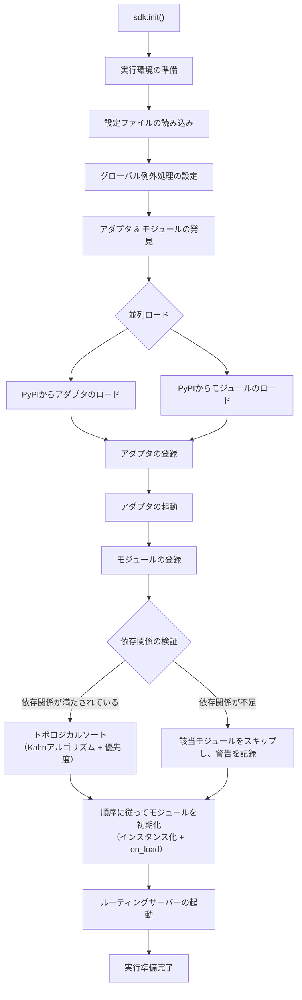

### 初期化段階の詳細

> 完全な初期化フローの分解（Finder / Loader / Manager / Router）、下層エントリポイント（`init()` / `init_task()` / `init_sync()`）および手動での完全起動については [起動プロセスと手動制御](advanced/startup.md) を参照してください。

## イベント処理のフロー

下の図は、プラットフォームからハンドラへメッセージが完全に流れる経路を示しています：

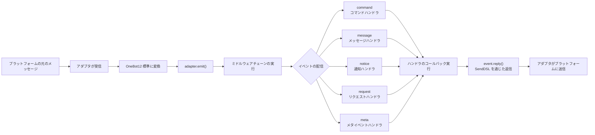

### イベント処理の詳細な経路

上記の図は「結果」です。次に `adapter.emit()` を分解すると、フレームワークが**背後で何をしているか**がわかります。これは3層の配信経路です：

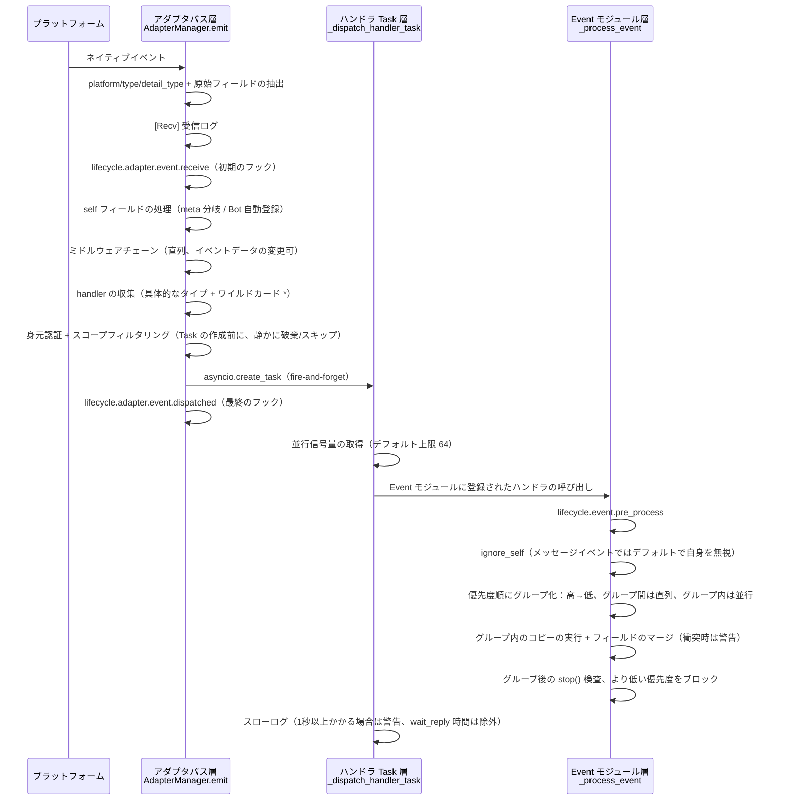

**フレームワークが何をしているか、そしてあなたが介入できる点は以下の通りです：**

| 階段 | フレームワークが行ったこと | 介入できる点 |
|------|-------------|-----------|
| 受信 | 標準フィールドの抽出、`{platform}_raw` の元データを保持；`[Recv]` ログを記録 | `adapter.event.receive` を監視して初期イベントを取得 |
| self フィールド | meta イベントは connect/disconnect/heartbeat 分岐；通常イベントでは Bot を自動登録し、`adapter.bot.online` をトリガー | `adapter.bot.online` / `bot.offline` を監視 |
| ミドルウェア | **直列**に実行し、戻り値が None でない場合はイベントデータを置き換え | ミドルウェアを登録してイベントを変更/ブロック |
| 分発収集 | 先に具体的なタイプの handler を取得し、次に `*` ワイルドカード handler を取得 | — |
| 身元次元 | 入口でユーザー > 会話 > Bot > アダプタの順でイベントを受け取るかどうか判定（`scope.is_identity_allowed`）、**拒否された場合はイベント全体を破棄** | `ErisPulse.scope.identity` をバインド |
| スコープフィルタリング | モジュールの所有者に基づいて `scope.is_allowed` を判定（会話レベル > Bot レベル > プラットフォームレベル）、**通過しない場合は静かにスキップ** | スコープのホワイトリスト/ブラックリストを設定 |
| スケジューリング | 各マッチする handler ごとに独立した `asyncio.Task` を作成、`emit()` は **handler の完了を待たずに即座に返却** | — |
| 優先度 | 高優先度のグループが先に実行；**グループ間は直列、グループ内は並行**（グループ内では各 handler がイベントのコピーを持ち、フィールドをマージし、衝突時は WARNING を出力） | `@command(..., priority=N)` / 登録時に priority を指定 |
| ブロック | 各グループの処理後に `event.is_stopped()` をチェックし、一致した場合は**より低い優先度は実行されない** | `event.mark_processed(stop=True)` / `event.done()` |

> **よくある誤解**:
> 1. **スコープフィルタリングは静かである**——遮断された handler はエラーもレスポンスもせず、TRACE ログレベルでのみ表示されます（`core.scope.denied`）。「私のモジュールがメッセージを受け取らない」場合は、まずスコープのバインディングを確認してください。
> 2. **handler は天然に並行である**——フレームワークは各 handler に独立した Task を作成しており、**自分で `asyncio.create_task` をラップする必要はありません**。
> 3. **同じ優先度のグループ内ではブロックされない**——`mark_processed(stop=True)` はより低い優先度のグループをブロックするだけで、同じグループ内で既に並行実行中の handler は途中で中断されません。
> 4. **スローログの閾値は固定の1秒である**——ハンドラの処理時間が1秒を超えるとログに WARNING が出力されます（`wait_reply` の待機時間は処理時間から除外されますが、実行は中断されません）。

> 作用域の3段階のバインディングと優先度の詳細は [作用域システム](advanced/scope.md) を参照してください。claim/ブロックの完全な意味は [イベント処理の入門](getting-started/event-handling.md) を参照してください。並行上限の設定は [設定ガイド](user-guide/configuration.md#フレームワーク設定) を参照してください。

## ライフサイクルイベント

下図は、フレームワークの各コンポーネントがライフサイクルイベントをどのように発生させるかを示しています：

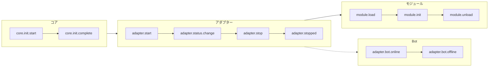

### ライフサイクルイベントの監視

> 完全なイベント監視メソッド（`lifecycle.on()` / `once()` / `has_handlers()`）、すべてのライフサイクルイベントリストとデータ形式は [ライフサイクル管理](advanced/lifecycle.md) を参照してください。

## モジュールのロード戦略

ErisPulse は、`get_load_strategy()` が返す `ModuleLoadStrategy` によって宣言される 3 つのモジュールロード戦略をサポートしています：

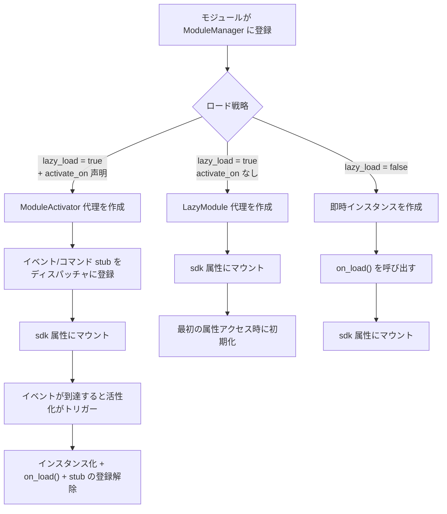

> 詳細については、[遅延ロードシステム](advanced/lazy-loading.md)、[ライフサイクル管理](advanced/lifecycle.md) およびモジュールのドキュメントを参照してください。

### イベント駆動の遅延活性化（`activate_on`）トリガー構造

> [!NOTE]
> この機能には ErisPulse **2.8.0+** が必要です。

`activate_on` により、モジュールは**最初の一致するイベント/コマンドが到達した時点で**のみロードされるようになり、メモリ常駐を回避しながら、イベントのロスを防ぐことができます：

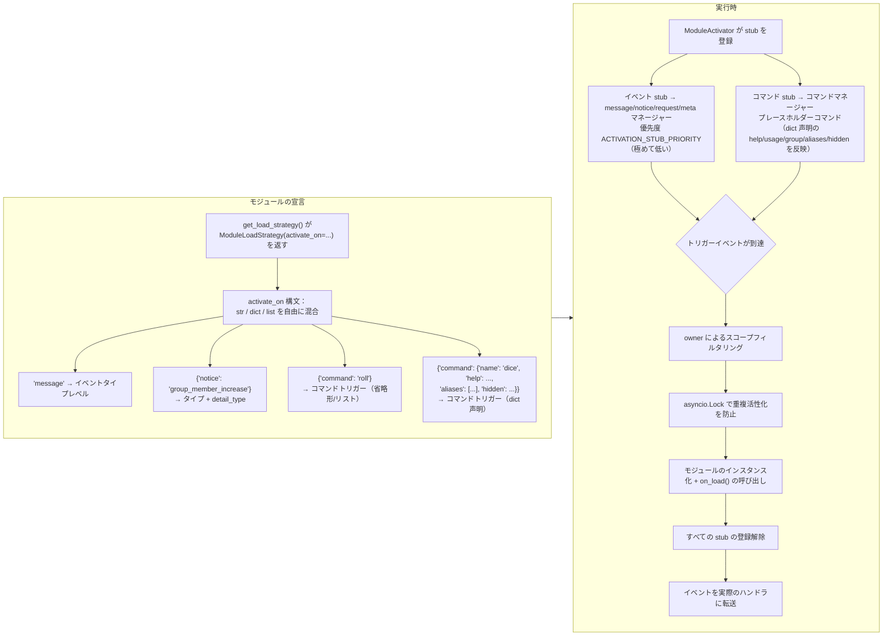

**トリガーの意味要点：**

> 完全な `activate_on` 構文（str / dict / list）、コマンド dict 声明、プレースホルダーコマンドの help フォールバックチェーン、スコープフィルタリング、および失敗時の意味については、[遅延ロードシステム](advanced/lazy-loading.md#イベント駆動の遅延活性化activate_on) を参照してください。

## ローカルプラグインフォルダのアーキテクチャ

> [!NOTE]
> この機能は ErisPulse **2.8.0+** が必要です。

ローカルプラグイン（`plugins/` 目录）はパッケージ化して公開する必要がなく、フレームワークの起動時に自動的に発見・ロードされます：

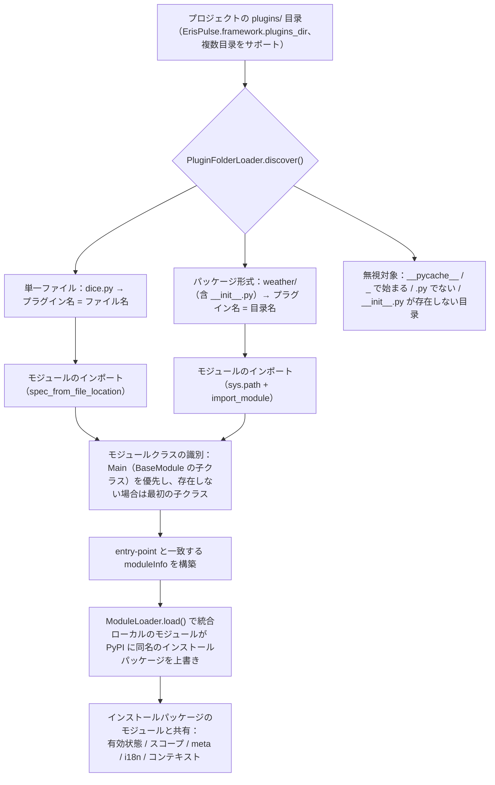

**規約と特性：**

- プラグイン名の取得方法：単一ファイルはファイル名、パッケージ形式は目录名
- ローカルプラグインの `moduleInfo.meta.source == "plugin_folder"` であり、PyPI でインストールされたパッケージモジュールとシームレスに共存
- 同名のモジュールがある場合、ローカルのモジュールが優先（ローカルでの上書きデバッグが可能）、無効化された場合、同名の entry-point 条目も同時に削除

## ローカルプラグインのホットリロードアーキテクチャ

ホットリロードはプラグインファイルの変更を監視し、対応するプラグインを自動的に再読み込みします：

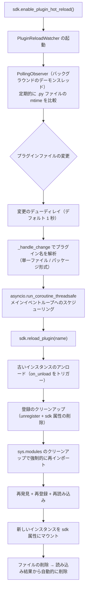

[**English**](docs/ja/quick-start.md)


====
快速开始
====

# ファーストステップ

> **これが最初の一歩です。** 5分でErisPulseロボットをゼロから立ち上げましょう。

## ErisPulse のインストール

### 1 クリックインストールスクリプト（推奨）

インストールスクリプトは、環境（Docker、Python、uv）を自動的に検出し、最も適したインストール方法を選択するように導きます。

Windows (PowerShell):
```powershell
irm https://get.erisdev.com/install.ps1 -OutFile install.ps1; powershell -ExecutionPolicy Bypass -File install.ps1
```

macOS / Linux:
```bash
curl -fsSL https://get.erisdev.com/install.sh -o install.sh && chmod +x install.sh && ./install.sh
```

スクリプトは、以下の手順をガイドします：

- **Docker インストール**（Docker が検出された場合に推奨）：イメージソース（Docker Hub / GHCR）、バージョンチャネル（安定版 / プリリリース版）、Dashboard 管理パネルの構成、ポート設定を選択
- **従来のインストール**：自動的に仮想環境を作成、ErisPulse のバージョンを選択、オプションで Dashboard 管理パネルモジュールをインストール

### Docker を使用する

Docker イメージには、ErisPulse フレームワークと Dashboard 管理パネルが事前インストールされています。

```bash
# docker-compose.yml をダウンロード
curl -O https://raw.githubusercontent.com/ErisPulse/ErisPulse/main/docker-compose.yml

# Dashboard トークンを設定して起動
ERISPULSE_DASHBOARD_TOKEN=your-token docker compose up -d
```

<details>
<summary>Docker Hub が利用できない場合</summary>

GitHub Container Registry のイメージを使用する場合は、`docker-compose.yml` 内の image を次のように変更します：

```yaml
image: ghcr.io/erispulse/erispulse:latest
```

</details>

起動後、`http://<host>:8000/Dashboard` にアクセスし、設定したトークンでログインします。

### pip を使用してインストール

Python のバージョンが 3.10 以上であることを確認した上で、pip を使用してインストールします：

```bash
pip install ErisPulse
```

既に [uv](https://github.com/astral-sh/uv) をインストールしている場合は、`uv pip install ErisPulse` を使用することで、より高速にインストールできます。

## プロジェクトの初期化

### インタラクティブな初期化（推奨）

```bash
epsdk init
```

これにより、対話形式のガイドが起動し、以下の手順を誘導します：
- プロジェクト名の設定
- ログレベルの設定
- サーバー設定（ホストとポート）
- アダプターの選択と設定
- プロジェクト構造の作成

### 速やかな初期化

```bash
# プロジェクト名を指定するクイックモード
epsdk init -q -n my_bot

# または、プロジェクト名のみを指定
epsdk init -n my_bot
```

### 手動でのプロジェクト作成

手動でプロジェクトを作成したい場合は：

```bash
mkdir my_bot && cd my_bot
epsdk init
```

## モジュールのインストール

### CLI によるインストール

```bash
epsdk install Yunhu AIChat
```

### 利用可能なモジュールの表示

```bash
epsdk list-remote
```

### インタラクティブなインストール

パッケージ名を指定しない場合、インタラクティブなインストール画面が表示されます：

```bash
epsdk install
```

## プロジェクトの実行

```bash
# 通常実行
epsdk run main.py

# ホットリロードモード（開発時に推奨）
epsdk run main.py --reload
```

## IDE補完の有効化（オプション）

ErisPulse はモジュール/アダプターを動的に発見するため、IDE はデフォルトではプラットフォーム固有のメソッドを補完できません。  
以下のコマンドを実行して型のスタブを生成してください。

```bash
epsdk types
```

生成後、インポートした型を変数の型アノテーションとして使用することで、正確な補完が得られます（詳しくは [IDE補完ガイド](./getting-started/ide-completion.md) を参照してください）：

```python
from _ep_types import Yunhu
from ErisPulse import sdk

adapter: Yunhu = sdk.adapter.get("yunhu")
await adapter.Send.To("group", "123").Board(...)  # プラットフォーム固有のメソッドが補完されます
```

## プロジェクト構造

初期化後のプロジェクト構造：

```
my_bot/
├── config/
│   └── config.toml          # 設定ファイル
└── main.py                  # エントリーポイントファイル

```

## 設定ファイル

基本的な `config.toml` 設定：

```toml
[ErisPulse.server]
host = "0.0.0.0"
port = 8000

[ErisPulse.logger]
level = "INFO"

[Yunhu_Adapter]
# アダプタの設定
```

## 次に進む

ロボットが動作した後、必要に応じて以下を進めることができます。

**フレームワークの仕組みについて知りたい場合:**
- [基本概念](getting-started/basic-concepts.md) — アダプタ / モジュール / イベントの設計
- [アーキテクチャ概要](architecture.md) — 可視化されたアーキテクチャ図

**より多くの機能を実装したい場合:**
- [一般的なタスクの例](getting-started/common-tasks.md) — ストレージ、スケジューリング、権限制御
- [イベント処理の入門](getting-started/event-handling.md) — メッセージ、通知、リクエストの処理

**独自のモジュール / アダプタを開発したい場合:**
- [モジュール開発の入門](developer-guide/modules/getting-started.md)
- [アダプタ開発の入門](developer-guide/adapters/getting-started.md)

**必要に応じて参照:**
- [設定ファイルの説明](user-guide/configuration.md) · [CLI コマンド](user-guide/cli-reference.md) · [デプロイガイド](user-guide/deployment.md)


====
入门指南
====


### 入门指南总览

# 入門ガイド

> 本ガイドは [5 分鐘で始める](../docs/ja/quick-start.md) の**詳細な補足**です。まだ最初のロボットを起動していない場合は、まずクイックスタートを完了してください。

ロボットが起動した後、ここではフレームワークの核心概念と一般的な機能を体系的に理解していきます。

## 学習経路

以下の順序で読むことを推奨します：

| ステップ | 主題 | 説明 |
|------|------|------|
| 1 | [最初のロボットを作成する](first-bot.md) | コマンドハンドラを記述し、実行メカニズムを理解します |
| 2 | [基本概念](basic-concepts.md) | ErisPulse の核心的なアーキテクチャとモジュール設計を理解します |
| 3 | [イベント処理の入門](event-handling.md) | メッセージ、コマンド、通知などの各種イベントの処理方法を学びます |
| 4 | [一般的なタスクの例](common-tasks.md) | データの永続化、定時タスク、権限制御などの一般的な機能を習得します |
| 5 | [IDE補完のガイド](ide-completion.md) | タイプのスタブを生成し、プラットフォーム固有のメソッドの IDE 自動補完を有効にします |

## 開発方法の選択

ErisPulse は2種類の開発方法をサポートしています：

| 方法 | 適用場面 | 説明 |
|------|---------|------|
| **埋め込み開発** | プロトタイプの迅速作成、プロジェクト内部機能 | `main.py` に直接ハンドラを記述し、独立したモジュールを作成する必要はありません |
| **モジュール開発**（推奨） | 本番環境、機能の配布 | 独立した Python パッケージを作成し、`epsdk install` でインストールして使用します |

> 両方の方法の詳細な比較と例については、[最初のロボットを作成する](first-bot.md) と [モジュール開発の入門](../developer-guide/modules/getting-started.md) を参照してください。

## アーキテクチャ概要

ErisPulse はイベント駆動型アーキテクチャを採用しており、以下のシステムで構成されています：

- **アダプタシステム** — 各プラットフォームとの通信を行い、プラットフォームイベントを統一された OneBot12 標準形式に変換します
- **イベントシステム** — メッセージ、コマンド、通知、リクエスト、メタイベントの5種類のイベントを処理します
- **モジュールシステム** — 独立したモジュールで機能を拡張でき、依存管理や遅延ロードがサポートされています
- **コアモジュール** — Storage（ストレージ）、Config（設定）、Logger（ログ）、Router（ルーティング）などの基本機能を提供します

> 詳細なアーキテクチャ図と初期化のフローについては、[アーキテクチャ概要](../architecture.md) を参照してください。

## 学習を始める

準備はできましたか？

- [最初のロボットを作成する](first-bot.md) — 5 分で始められます


### 创建第一个机器人

# 最初のロボットを作成する

このガイドでは、[5 分で始める](../quick-start.md)をもとに、最初のコマンドハンドラを記述し、実行メカニズムを理解します。

> ErisPulse をまだインストールしていない、またはプロジェクトを初期化していない場合は、まず [5 分で始める](../quick-start.md) の「インストール」「プロジェクトの初期化」「プロジェクトの実行」の 3 つの手順を完了してください。

## ステップ 1: 最初のコマンドを記述する

`main.py` を開き、シンプルなコマンドハンドラを記述します：

```python
from ErisPulse import sdk
from ErisPulse.Core.Event import command

@command("hello", help="挨拶メッセージを送信")
async def hello_handler(event):
    """hello コマンドを処理"""
    user_name = event.get_user_nickname() or "友達"
    await event.reply(f"こんにちは、{user_name}！私は ErisPulse ロボットです。")

@command("ping", help="ロボットがオンラインかテスト")
async def ping_handler(event):
    """ping コマンドを処理"""
    await event.reply("Pong！ロボットは正常に動作しています。")

async def main():
    """メインエントリポイント"""
    print("ErisPulse を起動しています...")
    
    # keep_running=True（デフォルト）：フレームワークはブロックして実行を維持し、終了信号（例：Ctrl+C）を受信するまで停止しません
    await sdk.run(keep_running=True)

if __name__ == "__main__":
    import asyncio
    asyncio.run(main())
```

### `keep_running` パラメータ

`sdk.run(keep_running)` は、フレームワークが実行をブロックして維持するかどうかを制御します：

- **`keep_running=True`（デフォルト）**：`run()` は終了信号（例：Ctrl+C）を受信するまでブロックし続けます。これは純粋な bot アプリケーションに適しています。
- **`keep_running=False`**：`run()` は初期化後に即座に返り、**フレームワークはアンロードされません**。起動したアダプタ/モジュールはバックグラウンドタスクとしてメッセージイベントを処理し続け、イベントループが終了するまで独自のロジックを実行できます。例：

```python
async def main():
    await sdk.run(keep_running=False)   # 初期化後に即座に返る
    # フレームワークはバックグラウンドで実行中、ここでは他の処理を続行できる
    while True:
        await asyncio.sleep(3600)
        print("1 時間ごとにチェック")
```

> `run()` の 2 つのモードに加え、`init()`/`uninit()` を用いたライフサイクルの手動制御、個別のアダプタ/ルーティングの起動・停止など、より細かい制御方法もあります。[起動フローと手動制御](../advanced/startup.md)を参照してください。

## ステップ 2: ロボットを実行する

```bash
# 通常実行
epsdk run main.py

# 開発モード（ホットリロードをサポート）
epsdk run main.py --reload
```

## ステップ 3: ロボットをテストする

チャットプラットフォームでコマンドを送信します：

```
/hello
```

ロボットからの返信が届くはずです。

## コードの説明

### コマンドデコレータ

```python
@command("hello", help="挨拶メッセージを送信")
```

- `hello`：コマンド名、ユーザーは `/hello` で呼び出します
- `help`：コマンドのヘルプ説明、`/help` コマンドで表示されます

### イベントパラメータ

```python
async def hello_handler(event):
```

`event` パラメータは Event オブジェクトで、以下を含みます：
- メッセージ内容：`event.get_text()`
- 送信者情報：`event.get_user_id()`、`event.get_user_nickname()`
- プラットフォーム情報：`event.get_platform()`
- グループ情報：`event.get_group_id()`
- 元データ：`event.get_raw()`

> 完全な Event オブジェクトのメソッドは [Event 包装クラスの詳細](../developer-guide/modules/event-wrapper.md) を参照してください。

### レスポンスの送信

```python
await event.reply("レスポンス内容")
```

`event.reply()` は、送信者にメッセージを送信するための便利なメソッドです。

## 拡張：より多くの機能を追加する

ErisPulse は豊富なイベント処理とデータ処理機能を提供します：

- **メッセージ監視**：`@message.on_message()` を使用して、さまざまなメッセージを監視 → [イベント処理の入門](event-handling.md)
- **通知監視**：`@notice.on_friend_add()` などを使用して、システム通知を監視 → [イベント処理の入門](event-handling.md)
- **データ保存**：`sdk.storage.get/set` を使用して、永続化データを保存 → [一般的なタスクの例](common-tasks.md)

## 一般的な問題

### コマンドが反応しない？

1. アダプタが正しく設定されているか確認し、`config/config.toml` でアダプタの `status` が `true` であることを確認します。
2. ターミナルのログ出力を確認し、エラー情報（特に `ERROR` レベルのログ）がないか確認します。
3. コマンドのプレフィックスが正しいか確認します（デフォルトは `/` です）。設定ファイルの `[ErisPulse.event.command]` 部分を確認してください。
4. コマンド名のスペルが正しいか確認し、大文字小文字の区別が有効かどうかを確認します。

### コマンドプレフィックスを変更するには？

`config.toml` に追加します：

```toml
[ErisPulse.event.command]
prefix = "!"
case_sensitive = false
```

### 複数のプラットフォームをサポートするには？

ErisPulse は OneBot12 標準を使用して、異なるプラットフォームのイベント形式を統一しています。`@command` および `@message` で登録されたハンドラは、すべてのプラットフォームのイベントを自動的に受け取ります。`event.get_platform()` を使用して、送信元のプラットフォームを区別できます：

```python
@command("hello")
async def hello_handler(event):
    platform = event.get_platform()
    
    if platform == "yunhu":
        await event.reply("こんにちは！雲湖から")
    elif platform == "telegram":
        await event.reply("Hello! From Telegram")
    else:
        await event.reply("こんにちは！")
```

> 複数のプラットフォームへの対応テクニックについては、[一般的なタスクの例](common-tasks.md#多プラットフォーム対応)を参照してください。

## 次のステップ

- [基本概念](basic-concepts.md) - ErisPulse のコアコンセプトを深く理解する
- [イベント処理の入門](event-handling.md) - さまざまなイベントの処理方法を学ぶ
- [一般的なタスクの例](common-tasks.md) - より実用的な機能を習得する


### 基础概念

# 基本概念

このガイドでは ErisPulse の核心概念を紹介し、フレームワークの設計思想と基本的なアーキテクチャを理解するのに役立ちます。

## イベント駆動型アーキテクチャ

ErisPulse はイベント駆動型アーキテクチャを採用しており、すべての対話はイベントを介して送信および処理されます。

### イベントフロー

```
ユーザーがメッセージを送信
      │
      ▼
プラットフォームが受信
      │
      ▼
アダプタがプラットフォームのネイティブイベントを受信
      │
      ▼
OneBot12 標準イベントへ変換
      │
      ▼
イベントシステムへ提出
      │
      ▼
登録済みハンドラーへ配信
      │
      ▼
モジュールがイベントを処理
      │
      ▼
アダプタ経由でレスポンスを送信
      │
      ▼
プラットフォームがユーザーに表示
```

### OneBot12 標準

ErisPulse は OneBot12 をコアイベント標準として使用します。OneBot12 は汎用チャットボットアプリケーションインターフェース標準であり、統一されたイベント形式を定義しています。

すべてのアダプタは、プラットフォーム固有のイベントを OneBot12 形式に変換し、コードの一貫性を保証します。

## コアコンポーネント

### 1. SDK オブジェクト

SDK はすべての機能の統一されたエントリーポイントであり、コアコンポーネントへのアクセスを提供します。

```python
from ErisPulse import sdk

# コアモジュールへのアクセス
sdk.storage    # ストレージシステム
sdk.config     # 設定システム
sdk.logger     # ロギングシステム
sdk.adapter    # アダプタシステム
sdk.module     # モジュールシステム
sdk.router     # ルーティングシステム
sdk.client     # HTTPクライアント
sdk.lifecycle  # ライフサイクルシステム
```

### 2. Event オブジェクト

Event オブジェクトはイベントデータをカプセル化し、便利なアクセスメソッドを提供します。

```python
@command("info")
async def info_handler(event):
    # イベント情報の取得
    event_id = event.get_id()
    user_id = event.get_user_id()
    platform = event.get_platform()
    text = event.get_text()
    
    # 返信を送信
    await event.reply(f"ユーザー: {user_id}, プラットフォーム: {platform}")
```

### 3. アダプタ

アダプタは ErisPulse と外部プラットフォームの間の橋渡しです。

**責任：**
- プラットフォームのネイティブイベントを受信
- OneBot12 標準形式へ変換
- 標準形式イベントをプラットフォームへ送信

**サンプルアダプタ：**
- Yunhu アダプタ：Yunhu プラットフォームと通信
- Telegram アダプタ：Telegram Bot API と通信
- OneBot11 アダプタ：OneBot11 互換のアプリケーションと通信
- Email アダプタ：メールの送受信を処理

### 4. モジュール

モジュールは機能拡張の基本単位であり、以下のことが可能です。

- イベントハンドラーを登録
- ビジネスロジックを実装
- アダプタを使用してメッセージを送信
- コアモジュールが提供するサービスを使用

#### モジュール検出メカニズム

ErisPulse は Python の `importlib.metadata.entry_points` を使用してインストール済みのモジュールを検出します。モジュールは `pyproject.toml` でエントリーポイントを宣言します：

```toml
[project.entry-points."erispulse.module"]
MyModule = "my_package:Main"
```

SDK の初期化時に、すべての `erispulse.module` グループのエントリーポイントがスキャンされ、モジュールクラスが `ModuleManager` に登録され、依存関係のトポロジカルソート後に順次初期化されます。

#### 最小限の使用可能モジュール

```python
from ErisPulse.Core.Bases import BaseModule
from ErisPulse import sdk

class Main(BaseModule):
    def __init__(self):
        self.sdk = sdk
        self.logger = sdk.logger.get_child("MyModule")

    async def on_load(self, event):
        self.logger.info("モジュールがロードされました")

    async def on_unload(self, event):
        self.logger.info("モジュールがアンロードされました")
```

#### モジュールライフサイクル

- **登録**：SDK がモジュールクラスを発見してマネージャーに登録
- **ロード**：モジュールインスタンスを作成し、`on_load(event)` を呼び出し（`event = {"module_name": "MyModule"}`）
- **アンロード**：`on_unload(event)` を呼び出し、リソースをクリーンアップ

#### ロード戦略

`get_load_strategy()` を使用してモジュールのロード動作を宣言します：

```python
from ErisPulse.loaders import ModuleLoadStrategy

class Main(BaseModule):
    @staticmethod
    def get_load_strategy():
        return ModuleLoadStrategy(
            lazy_load=True,   # レイジーロードを行うかどうか（デフォルト True）
            priority=0        # ロード優先度、数値が大きいほど先に初期化
        )
```

- **`lazy_load=True`（デフォルト）**：初めて `sdk.MyModule` にアクセスされたときにモジュールが初期化され、起動時間を短縮
- **`lazy_load=False`**：SDK の起動時に即時初期化、ライフサイクルイベントを監視するモジュールや定時タスクを実行するモジュールに適している
- **`priority`**：優先度が同じモジュールは登録順でロード；数値が大きいほど先に初期化

> 詳細なレイジーロードメカニズムについては、[レイジーロードシステム](../advanced/lazy-loading.md)を参照してください。

## イベントタイプ

ErisPulse は 5 つの種類のイベントをサポートしています。

| イベントタイプ | デコレータ | 説明 |
|---------|--------|------|
| メッセージイベント | `@message.on_message()` | ユーザーが送信する任意のメッセージ（プライベートチャット、グループチャット） |
| コマンドイベント | `@command("name")` | コマンドプレフィックスで始まるメッセージ（例：`/hello`） |
| 通知イベント | `@notice.on_friend_add()` 等 | システム通知（フレンド追加、メンバー変更など） |
| リクエストイベント | `@request.on_friend_request()` 等 | ユーザーリクエスト（フレンド申請、グループ招待） |
| メタイベント | `@meta.on_connect()` 等 | システムレベルイベント（接続、切断、ハートビート） |

> 各イベントタイプの詳細な使用法とコード例については、[イベント処理入門](event-handling.md)を参照してください。

## コアモジュールの説明

### Storage（ストレージ）

SQLite ベースのキーバリューストレージシステムで、永続化データに使用されます。

```python
# 値の設定
sdk.storage.set("key", "value")

# 値の取得
value = sdk.storage.get("key", "default_value")

# バッチ操作
sdk.storage.set_multi({
    "key1": "value1",
    "key2": "value2"
})

# トランザクション
with sdk.storage.transaction():
    sdk.storage.set("key1", "value1")
    sdk.storage.set("key2", "value2")
```

### Config（設定）

TOML形式の設定ファイル管理。

```python
# 設定の取得
config = sdk.config.getConfig("MyModule", {})

# 設定の設定
sdk.config.setConfig("MyModule", {"key": "value"})

# ネストされた設定の読み込み
value = sdk.config.getConfig("MyModule.subkey", "default")
```

### Logger（ログ）

モジュラーログシステム。

```python
# ログの記録
sdk.logger.info("これは情報です")
sdk.logger.warning("これは警告です")
sdk.logger.error("これはエラーです")

# 子ロガーの取得
child_logger = sdk.logger.get_child("submodule")
child_logger.info("サブモジュールログ")
```

**属性アクセスシンタックスシュガー**

`get_child()` メソッドを使用する以外に、**属性アクセス**の方法で子ロガーを作成することもでき、これはより簡潔な**シンタックスシュガー**の記述方法です：

```python
# 属性アクセスで子ロガーを作成
sdk.logger.mymodule.info("モジュールメッセージ")

# ネストされたアクセスをサポート
sdk.logger.mymodule.database.info("データベースメッセージ")
```

### Router（ルーティング）

HTTP および WebSocket ルーティング管理、FastAPI + Uvicorn ベース。デコレータルーティング、ミドルウェア、グループ化、レート制限、CORS をサポートします。

```python
from ErisPulse.Core import HttpRequest

@sdk.router.get("MyModule", "/api")
async def handler(request: HttpRequest):
    data = await request.json()
    return {"status": "ok"}
```

> 完全なルーティング API（WebSocket、ミドルウェア、レート制限、CORS など）については、[ルーティングマネージャー](../advanced/router.md)を参照してください。

### Client（ネットワーククライアント）

統合されたネットワーククライアントで、HTTP リクエスト、WebSocket 接続、コネクションプール管理、自動再試行、タイムアウト制御、リクエスト統計、ライフサイクルイベント統合を集約しています。

```python
from ErisPulse.Core import client

# HTTP リクエスト
resp = await client.get("https://api.example.com/users")
data = await resp.json()

# 再試行とタイムアウト付き
resp = await client.get(url, timeout=30, max_retries=3)

# WebSocket 接続
ws = await client.ws_connect("wss://example.com/ws")
async for text in ws.iter_text():
    await ws.send_text(f"Echo: {text}")
```

> 完全なネットワーククライアント API については、[ネットワーククライアント](../advanced/http-client.md)を参照してください。

## SendDSL メッセージ送信

アダプタはチェーン呼び出しのメッセージ送信インターフェースを提供します。

### 基本送信

```python
# アダプタインスタンスの取得
yunhu = sdk.adapter.get("yunhu")

# メッセージを送信
await yunhu.Send.To("user", "U1001").Text("Hello")

# 送信アカウントを指定
await yunhu.Send.Using("bot1").To("group", "G1001").Text("グループメッセージ")
```

### チェーン修飾

```python
# @ユーザー
await yunhu.Send.To("group", "G1001").At("U2001").Text("@メッセージ")

# 返信メッセージ
await yunhu.Send.To("group", "G1001").Reply("msg123").Text("返信")

# @全体
await yunhu.Send.To("group", "G1001").AtAll().Text("告知")
```

### Event 返信メソッド

Event オブジェクトは便利な返信メソッドを提供します：

```python
@command("test")
async def test_handler(event):
    # 簡単なテキスト返信
    await event.reply("返信内容")
    
    # 画像を送信
    await event.reply("http://example.com/image.jpg", method="Image")
    
    # 音声を送信
    await event.reply("http://example.com/voice.mp3", method="Voice")
```

## レイジーロードシステム

ErisPulse はデフォルトでモジュールレイジーロードを有効にしており、モジュールは初めてアクセスされたとき（`sdk.MyModule` など）にのみ初期化され、起動速度を大幅に向上させます。

```python
from ErisPulse.loaders import ModuleLoadStrategy

class Main(BaseModule):
    @staticmethod
    def get_load_strategy():
        return ModuleLoadStrategy(
            lazy_load=True,   # レイジーロードを有効にする（デフォルト）
            priority=0        # ロード優先度、数値が大きいほど先に初期化
        )
```

**レイジーロードを無効にする必要があるシナリオ（`lazy_load=False`）：**
- ライフサイクルイベントを監視するモジュール（例：`core.init.complete`）
- 起動時の定時タスクまたはバックグラウンドサービスを実行するモジュール
- 他のモジュールのロード前に初期化を完了する必要があるモジュール

> 詳細なレイジーロードメカニズムと注意点については、[レイジーロードシステム](../advanced/lazy-loading.md)を参照してください。

## 次のステップ

- [イベント処理入門](event-handling.md) - 各種イベントの処理方法を学ぶ
- [一般的なタスクの例](common-tasks.md) - 一般的な機能の実装をマスターする


### 事件处理入门

# イベント処理入門

このガイドでは、ErisPulse におけるさまざまなイベントの処理方法を紹介します。

## イベントの種類概要

ErisPulse は以下のイベントの種類をサポートしています：

| イベントの種類 | 説明 | 適用場面 |
|---------|------|---------|
| メッセージイベント | ユーザーが送信するすべてのメッセージ | チャットボット、コンテンツフィルタリング |
| コマンドイベント | コマンドプレフィックスで始まるメッセージ | コマンド処理、機能の入口 |
| 通知イベント | システム通知（友達追加、グループメンバー変更など） | メッセージの歓迎、ステータス通知 |
| 要求イベント | ユーザーの要求（友達リクエスト、グループ招待） | 要求の自動処理 |
| メタイベント | システムレベルのイベント（接続、ハートビート） | 接続監視、ステータスチェック |

## メッセージイベントの処理

> **ヒント**: イベントハンドラで `Event` タイプの注釈を使用することを推奨します。これにより、IDEの自動補完と型チェックがサポートされます。

```python
from ErisPulse.Core.Event import Event  # イベントの型を注釈に使用
```

### すべてのメッセージを監視

```python
from ErisPulse.Core.Event import message, Event

@message.on_message()
async def message_handler(event: Event):
    text = event.get_text()
    user_id = event.get_user_id()
    sdk.logger.info(f"{user_id} からのメッセージを受け取りました: {text}")
```

### プライベートメッセージを監視

```python
@message.on_private_message()
async def private_handler(event: Event):
    user_id = event.get_user_id()
    await event.reply(f"こんにちは、{user_id}！これはプライベートメッセージです。")
```

### グループチャットメッセージを監視

```python
@message.on_group_message()
async def group_handler(event: Event):
    group_id = event.get_group_id()
    user_id = event.get_user_id()
    sdk.logger.info(f"グループ {group_id} で {user_id} がメッセージを送信しました")
```

### @メッセージを監視

```python
@message.on_at_message()
async def at_handler(event: Event):
    # @されたユーザーのリストを取得
    mentions = event.get_mentions()
    await event.reply(f"あなたが@したユーザー: {mentions}")
```

### ワイルドカードと正規表現による監視

`on_message` / `on_private_message` / `on_group_message` / `on_at_message` の4つのメッセージデコレータは、`pattern`（globワイルドカード）と `regex`（正規表現）をサポートしています。一致しないメッセージは**ハンドラをトリガーしません**：

```python
# globワイルドカード：* 任意の文字列、? 1文字、[seq] 文字集合
@message.on_message(pattern="签到*")
async def signin_handler(event: Event):
    await event.reply("签到成功")

# 正規表現：金額を一致させる
@message.on_message(regex=r"\d+\s*元")
async def price_handler(event: Event):
    await event.reply(f"金額を受け取りました: {event.get_text()}")

# pattern と regex が同時に与えられた場合 → 両方とも一致する必要がある
@message.on_message(pattern="*元", regex=r"\d+\s*元")
async def combined_handler(event: Event):
    pass
```

`wait_reply` はこの2つのパラメータもサポートしています（[返信の待機機能](../developer-guide/modules/event-wrapper.md#待機返信機能)を参照）。

## コマンドイベントの処理

### 基本コマンド

```python
from ErisPulse.Core.Event import command

@command("help", help="ヘルプ情報を表示")
async def help_handler(event):
    help_text = """
使用可能なコマンド:
/help - ヘルプ情報を表示
/ping - 接続をテスト
/info - 情報を表示
    """
    await event.reply(help_text)
```

### コマンドのエイリアス

```python
@command(["help", "h"], aliases=["帮助"], help="ヘルプ情報を表示")
async def help_handler(event):
    await event.reply("ヘルプ情報...")
```

ユーザーは以下のいずれかの方法で呼び出すことができます：
- `/help`
- `/h`
- `/帮助`

### コマンドの引数

```python
@command("echo", help="メッセージを返す")
async def echo_handler(event):
    # コマンド引数を取得
    args = event.get_command_args()
    
    if not args:
        await event.reply("返信するメッセージを入力してください")
    else:
        await event.reply(f"あなたが言った: {' '.join(args)}")
```

### コマンドグループ

```python
@command("admin.reload", group="admin", help="モジュールを再読み込み")
async def reload_handler(event):
    await event.reply("モジュールを再読み込みしました")

@command("admin.stop", group="admin", help="ロボットを停止")
async def stop_handler(event):
    await event.reply("ロボットを停止しました")
```

### コマンドの権限とアクセス制御

コマンドの権限は3層に分かれています（**上層が拒否された場合は下層は見られません**）：

```python
# ① コマンドのACL（ユーザー側設定）：コマンドのユーザーのホワイトリスト/ブラックリストで、拒否された場合は「権限がありません」と返します
# ② master=True —— フレームワークのオーナーのみ実行可能（フレームワークが自動的にチェックし、拒否された場合は「権限がありません」と返します）
@command("restart", master=True, help="モジュールを再起動")
async def restart_handler(event):
    await event.reply("モジュールを再起動しました")

# ③ permission=関数呼び出し —— コマンド自身の制御ロジック（Trueを返した場合にのみ実行）
def is_admin(event):
    return event.get_user_id() in {"user123", "user456"}

@command("panel", permission=is_admin, help="管理パネル")
async def panel_handler(event):
    await event.reply("管理パネルへようこそ")
```

**コマンドのACL**（コントロール面 `ErisPulse.scope.commands`）：ユーザーは任意のコマンドにユーザーのホワイトリスト/ブラックリストを設定でき、コマンド名は正確な一致とglobパターン（例：`"roll*"`）をサポートします。拒否された場合は「権限がありません」と返します：

```toml
# config.toml —— restartを123456のみ実行可能に、666は一律拒否
[ErisPulse.scope.commands.restart]
allow = ["onebot11:123456"]
deny = ["onebot11:666"]
```

判定順序：`deny`が一致した場合 → 拒否；`allow`が空で一致しない場合 → 拒否；それ以外は開発者のデフォルトに任せる（`master=True` / `permission`）。実行時のAPI（コマンド名はglobパターンをサポート）：

```python
from ErisPulse import sdk
sdk.scope.allow_user("restart", "onebot11", "123456")   # 許可リスト
sdk.scope.deny_user("restart", "onebot11", "666")       # 拒否リスト
sdk.scope.remove_acl("restart")                          # ホワイトリスト/ブラックリストを削除
sdk.scope.get_acl("restart")                             # 現在のリストを取得
```

コマンド間 / ユーザー間の**イベントレベル**のアクセス制御（特定のユーザー / グループ / Botのメッセージを受信するかどうか）は、コントロール面の**アイデンティティ次元**（`scope.identity`）で行います。**モジュールレベル**の可用性（どのモジュールが使えるか）は、コントロール面の**モジュール次元**（`scope.platforms / bots / sessions`）で行います。詳細は[統一コントロール面](../advanced/scope.md)を参照してください。

> おすすめ：コマンド内部でビジネスロジックを連動させる場合は `master=True` / `permission` を使用してください。ユーザー / グループごとのアクセス制御が必要な場合はコントロール面のアイデンティティ次元を使用してください。モジュールの可用性を制御する場合はコントロール面のモジュール次元を使用してください。

### コマンドの優先度

```python
# 優先度の値が大きいほど、実行が早くなります
@message.on_message(priority=10)
async def high_priority_handler(event):
    await event.reply("高優先度のハンドラ")

@message.on_message(priority=1)
async def low_priority_handler(event):
    await event.reply("低優先度のハンドラ")
```

### 並列イベント処理

ErisPulseのイベントシステムは**同じ優先度では並列、異なる優先度では直列**のスケジューリングモデルを採用しています：

```
イベント到着
    ↓
priority=10 組: [ハンドラC || ハンドラD] 並列 → 結果を結合
    ↓ (中断しない場合)
priority=0 組: [ハンドラA || ハンドラB] 並列 → 結果を結合
    ↓
...
```

- **同じ優先度の並列実行**：優先度が同じ複数のハンドラは同時に実行され、スループットが向上します
- **異なる優先度の直列実行**：異なる優先度のグループは順番に実行され（値が大きいほど先に実行されます）、高優先度のハンドラが先に実行されます
- **Copy-On-Write**：ハンドラが変更しない限りコピーを作成せず、オーバーヘッドをゼロにします
- **競合処理**：同じ優先度の複数のハンドラが同じフィールドを変更した場合、最後の変更値を使用し、警告ログを記録します
- **中断機構**：任意のハンドラが `event.done()`（デフォルト）または `event.done(claim=False)` を呼び出した後は、後続の低優先度のグループをスキップします。認領とブロックの違いは下記の[「チェーン制御：認領とブロック」](#チェーン制御認領とブロック)を参照してください。

```python
# 例：同じ優先度のハンドラが並列実行される
@message.on_message(priority=0)
async def handler_a(event):
    # タスクAを処理
    event['result_a'] = process_a()

@message.on_message(priority=0)
async def handler_b(event):
    # handler_aと並列に実行
    event['result_b'] = process_b()

# 異なる優先度のハンドラが直列実行される
@message.on_message(priority=10)
async def handler_c(event):
    # 優先度が最も高い、最初に実行される
    pass
```

> **並列上限**：すべてのマッチするハンドラのTaskは**即座に作成**されますが、シグナルマニュアルで**同時に実行される数**を制限します。デフォルトの上限は **64**（`ErisPulse.framework.handler_max_concurrency`、ホットアップデートが可能です）。上限を超えたTaskはシグナルマニュアルで待ち、前の処理が完了した後に実行されます。イベントのピーク時にはこれが「圧力調整弁」になります。
>
> **遅延ログ**：個々のハンドラが1秒以上かかる場合、フレームワークはログにWARNINGを出力します（`handler_slow`）。`wait_reply`の待機時間は処理時間から差し引かれるため、「相手の返信を待つ」ことで誤って遅延と判定されることはありません。

## コントロール面フィルタリング：なぜ私のモジュールはメッセージを受け取らないのか

イベントが到着した後、2つの**静的な**フィルタがあります（どちらも返信やエラーを出さない）：

1. **アイデンティティ次元**（`ErisPulse.scope.identity`）：イベントが分岐エントリに到達した時点で、ユーザー > グループ > Bot > アダプターの順に、イベントを受信するかどうかを判定します。拒否された**イベント全体**は破棄され、どのハンドラ（コマンドディスパッチャーを含む）もトリガーされません。
2. **モジュール次元**（`ErisPulse.scope`）：イベントが特定のモジュールのハンドラ/コマンドに到達した時点で、セッション > Bot > プラットフォームの順に、そのモジュールが利用可能かどうかを判定し、**通過しない場合は静かにスキップ**されます。

```toml
# 例1：特定のグループのすべてのメッセージをブロック
[ErisPulse.scope.identity.sessions.onebot11."group_123"]
deny = true

# 例2：特定のBotからMyModuleをブロック
[ErisPulse.scope.bots.onebot11."123456"]
blocked = ["MyModule"]
```

この場合、特定のグループのメッセージが到着したとき、`MyModule`のコマンドとイベントハンドラは**すべてがスケジュールされません**。これはバグではなく、フィルタリング機構です。モジュールが反応しない場合のトラブルシューティングでは、まずコントロール面のアイデンティティとモジュールのバインディングを確認してください。

- フィルタリングログは**TRACE**レベルでのみ表示されます（`core.scope.identity_denied` / `core.scope.denied`）、デフォルトのINFOレベルでは何も表示されません
- フレームワークレベルのハンドラ（`scope_exempt=True`）は**モジュール次元**の影響を受けませんが、**アイデンティティ次元**の影響を受けます（イベント全体が破棄されているため）
- コマンド実行前に3番目のフィルタがあります：コマンドのACL（拒否された場合は「権限がありません」と返します、上記参照）

> 5つの次元の設定、マッチングの構文、実行時のAPIは[統一コントロール面](../../advanced/scope.md)を参照してください。

## チェーン制御：認領とブロック

> [!NOTE]
> `event.done()` / `event.mark_processed()` の `claim=` / `stop=` パラメータは、ErisPulse **2.7.1+** が必要です。

ErisPulseは「認領」と「ブロック」の2つの正交的な意味を分離し、`event.done()`で統一的に制御することで、コマンド処理の周囲にログ、監査、権限などの観測層を重ねることが容易になります。

**2つの概念の正確な定義：**

- **認領（claim）**：イベントがこのハンドラによって処理されたことをマークします（`_processed`に書き込み）。コマンドディスパッチャーは認領されたイベントを見ると**重複を避ける**ためにスキップします。典型的な場面：コマンドがマッチした後に認領し、コマンドディスパッチャーが再び介入しないようにする。
- **ブロック（stop）**：イベントが**より低い優先度**のハンドラに伝播しないようにします（`_propagation_stopped`に書き込み）。より低い優先度のハンドラ（`on_message`など）はこのイベントを見られなくなります。典型的な場面：高優先度のハンドラがイベントを完全に処理した後、より低い優先度のハンドラが実行されないようにする。

| `event.done(...)` | 認領 | ブロック | 場面 |
|-------------------|------|------|------|
| `event.done()` | ✔ | ✔ | コマンド / ハンドラが処理完了した標準的なやり方 |
| `event.done(stop=False)` | ✔ | ✘ | 認領のみ、低優先度の観測者（ログ / 統計）が引き続きイベントを見られるようにする |
| `event.done(claim=False)` | ✘ | ✔ | ブロックのみ（ファイアウォール / リミッターなど）、認領は行わない |

`event.done(claim=, stop=)` は `event.mark_processed(claim=, stop=)` の別名であり、パラメータと動作は完全に等価です。

```python
@command("help")
async def help_cmd(event):
    event.done()            # 認領 + ブロック（コマンド処理完了の標準的なやり方）

@message.on_message(priority=50)
async def observer(event):
    event.done(stop=False)  # 認領のみ：低優先度ハンドラは引き続き実行される（ログ / 統計）

@message.on_message(priority=100)
async def firewall(event):
    if denied(event):
        event.done(claim=False)  # ブロックのみ：低優先度ハンドラは実行されないが、認領は行わない
```

### コマンドと返信の block 設定

コマンドがマッチした後 / `wait_reply` が返信をマッチした後、デフォルトで伝播をブロックします（後方互換性）。これを解除して、低優先度ハンドラ（ログ / 監査 / 権限）がこれらのメッセージを観測できるようにすることができます：

```toml
[ErisPulse.event.command]
block = false   # コマンドメッセージが低優先度ハンドラに伝播し続ける

[ErisPulse.event.wait_reply]
block = false   # wait_reply で消費された返信が低優先度ハンドラに伝播し続ける
```

## 通知イベントの処理

### 友達追加

```python
from ErisPulse.Core.Event import notice

@notice.on_friend_add()
async def friend_add_handler(event):
    user_id = event.get_user_id()
    nickname = event.get_user_nickname() or "新朋友"
    await event.reply(f"友達追加ありがとうございます、{nickname}！")
```

### グループメンバーの追加

```python
@notice.on_group_increase()
async def member_increase_handler(event):
    group_id = event.get_group_id()
    user_id = event.get_user_id()
    await event.reply(f"新メンバー {user_id} がグループ {group_id} に参加しました")
```

### グループメンバーの削除

```python
@notice.on_group_decrease()
async def member_decrease_handler(event):
    group_id = event.get_group_id()
    user_id = event.get_user_id()
    await event.reply(f"メンバー {user_id} がグループ {group_id} を離脱しました")
```

## 要求イベントの処理

### 友達リクエスト

```python
from ErisPulse.Core.Event import request

@request.on_friend_request()
async def friend_request_handler(event):
    user_id = event.get_user_id()
    comment = event.get_comment()
    
    sdk.logger.info(f"友達リクエストを受け取りました: {user_id}, 附言: {comment}")
    
    # アダプターAPIを使ってリクエストを処理することもできます
    # 具体的な実装は各アダプターのドキュメントを参照してください
```

### グループ招待リクエスト

```python
@request.on_group_request()
async def group_request_handler(event):
    group_id = event.get_group_id()
    user_id = event.get_user_id()
    
    await event.reply(f"グループ {group_id} からの招待を受け取りました、{user_id} さん")
```

## メタイベントの処理

### 接続イベント

```python
from ErisPulse.Core.Event import meta

@meta.on_connect()
async def connect_handler(event):
    platform = event.get_platform()
    sdk.logger.info(f"{platform} プラットフォームが接続されました")

@meta.on_disconnect()
async def disconnect_handler(event):
    platform = event.get_platform()
    sdk.logger.warning(f"{platform} プラットフォームが切断されました")
```

### ハートビートイベント

```python
@meta.on_heartbeat()
async def heartbeat_handler(event):
    platform = event.get_platform()
    sdk.logger.debug(f"{platform} ハートビート検査")
```

### Botのステータス照会

アダプターがメタイベントを送信した後、フレームワークは自動的にBotのステータスを追跡し、いつでも照会できます：

```python
from ErisPulse import sdk

# 特定のBotがオンラインかどうかをチェック
if sdk.adapter.is_bot_online("telegram", "123456"):
    telegram = sdk.adapter.get("telegram")
    await telegram.Send.To("user", "123456").Text("Botはオンラインです")

# 現在オンラインのすべてのBotをリストアップ
bots = sdk.adapter.list_bots()
for platform, bot_list in bots.items():
    for bot_id, info in bot_list.items():
        print(f"{platform}/{bot_id}: {info['status']}")

# 完全なステータスサマリーを取得
summary = sdk.adapter.get_status_summary()
```

## インタラクティブな処理

### replyメソッドを使用して返信を送信

`event.reply()`メソッドは、@、返信などの機能を含むさまざまな修飾パラメータをサポートし、メッセージの送信を容易にします：

```python
# 簡単な返信
await event.reply("こんにちは")

# 異なるタイプのメッセージを送信
await event.reply("http://example.com/image.jpg", method="Image")  # 画像
await event.reply("http://example.com/voice.mp3", method="Voice")  # 音声

# 単一のユーザーを@する
await event.reply("こんにちは", at_users=["user123"])

# 複数のユーザーを@する
await event.reply("こんにちは", at_users=["user1", "user2", "user3"])

# メッセージに返信
await event.reply("返信内容", reply_to="msg_id")

# 全員を@する
await event.reply("公告", at_all=True)

# @ユーザーと返信メッセージを組み合わせて使用
await event.reply("内容", at_users=["user1"], reply_to="msg_id")
```

### ユーザーの返信を待つ

```python
@command("ask", help="ユーザーに質問")
async def ask_handler(event):
    await event.reply("名前を入力してください:")
    
    # ユーザーの返信を待つ、タイムアウトは30秒
    reply = await event.wait_reply(timeout=30)
    
    if reply:
        name = reply.get_text()
        await event.reply(f"こんにちは、{name}！")
    else:
        await event.reply("タイムアウトしました、再度入力してください。")
```

### 適切な入力を待つ

```python
@command("age", help="年齢を尋ねる")
async def age_handler(event):
    def validate_age(event_data):
        """年齢が有効かどうかを検証"""
        try:
            age = int(event_data.get_text())
            return 0 <= age <= 150
        except ValueError:
            return False
    
    await event.reply("年齢を入力してください (0-150):")
    
    reply = await event.wait_reply(
        timeout=60,
        validator=validate_age
    )
    
    if reply:
        age = int(reply.get_text())
        await event.reply(f"あなたの年齢は {age} 歳です")
    else:
        await event.reply("入力が無効またはタイムアウトしました")
```

### コールバック付きで返信を待つ

```python
@command("confirm", help="操作を確認")
async def confirm_handler(event):
    async def handle_confirmation(reply_event):
        text = reply_event.get_text().lower()
        
        if text in ["はい", "yes", "y"]:
            await event.reply("操作が確認されました！")
        else:
            await event.reply("操作がキャンセルされました。")
    
    await event.reply("この操作を実行しますか？(はい/いいえ)")
    
    await event.wait_reply(
        timeout=30,
        callback=handle_confirmation
    )
```

### 確認対話 (confirm)

ユーザーの確認または否定を待って、組み込みの中英の確認語を自動的に認識します：

```python
@command("confirm", help="操作を確認")
async def confirm_handler(event):
    if await event.confirm("この操作を実行しますか？"):
        await event.reply("確認済み、実行中...")
    else:
        await event.reply("キャンセルされました")

# 自定義の確認語
if await event.confirm("続行しますか？", yes_words={"go", "続行"}, no_words={"stop", "停止"}):
    pass
```

### 選択メニュー (choose)

ユーザーは選択肢の番号または選択肢のテキストを返信できます：

```python
@command("choose", help="選択")
async def choose_handler(event):
    choice = await event.choose(
        "色を選択してください：",
        ["赤", "緑", "青"]
    )
    
    if choice is not None:
        colors = ["赤", "緑", "青"]
        await event.reply(f"選択しました：{colors[choice]}")
    else:
        await event.reply("タイムアウトしました")
```

**マージモード**：`merge_prompt=True` の場合、選択肢をプロンプトにマージし、`method` で指定された方法で1つのメッセージとして送信します：

```python
# Markdownでマージしたプロンプトと選択肢を送信
choice = await event.choose(
    "## 色を選択してください\n{options}\n番号を入力してください",
    ["赤", "緑", "青"],
    method="Markdown",
    merge_prompt=True,
)
```

> `{options}` は選択肢の挿入位置を制御します；指定しない場合はプロンプトの末尾に追加されます。
> `placeholder` パラメータでカスタムプレースホルダを指定できます（例：`placeholder="[choices]"`）。
> `options_format="auto"`（デフォルト）は、`method` に応じてスタイルを自動的に選択します：Markdown→無序リスト、Html→順序リスト、その他→テキストリスト。
> テキスト系メソッド（Text/Markdown/Htmlなど）はデフォルトで選択肢を末尾にマージします；非テキスト系メソッド（Imageなど）はデフォルトで選択肢を2つのメッセージに分割します。

### フォーム収集 (collect)

複数ステップでユーザーの入力を収集します：

```python
@command("register", help="登録")
async def register_handler(event):
    data = await event.collect([
        {"key": "name", "prompt": "名前を入力してください："},
        {"key": "age", "prompt": "年齢を入力してください：", 
         "validator": lambda e: e.get_text().isdigit()},
        {"key": "email", "prompt": "メールアドレスを入力してください："}
    ])
    
    if data:
        await event.reply(f"登録完了！\n名前：{data['name']}\n年齢：{data['age']}\nメールアドレス：{data['email']}")
    else:
        await event.reply("登録がタイムアウトまたは入力が無効です")
```

### 任意のイベントを待つ (wait_for)

条件を満たす任意のイベントを待つ、同一ユーザーに限定されない：

```python
@command("wait_member", help="新メンバーを待つ")
async def wait_member_handler(event):
    await event.reply("グループメンバーの追加を待っています...")
    
    evt = await event.wait_for(
        event_type="notice",
        condition=lambda e: e.get_detail_type() == "group_member_increase",
        timeout=120
    )
    
    if evt:
        await event.reply(f"新メンバーを歓迎します：{evt.get_user_id()}")
    else:
        await event.reply("タイムアウトしました")
```

### 多段対話 (conversation)

インタラクティブな多段対話コンテキストを作成します：

```python
@command("survey", help="アンケート調査")
async def survey_handler(event):
    conv = event.conversation(timeout=60)
    
    await conv.say("アンケート調査に参加してください！")
    
    while conv.is_active:
        reply = await conv.wait()
        
        if reply is None:
            await conv.say("対話がタイムアウトしました、さようなら！")
            break
        
        text = reply.get_text()
        
        if text == "終了":
            await conv.say("さようなら！")
            break
        
        await conv.say(f"入力内容：{text}、続行するか「終了」を入力して終了")
```

### 組み込みの確認語

ErisPulseには中英の確認語の集合が組み込まれています：

- **確認語** (`CONFIRM_YES_WORDS`): はい、yes、y、確認、確定、好、良い、ok、true、対、うん、行、同意、問題ない...
- **否定語** (`CONFIRM_NO_WORDS`): いいえ、no、n、キャンセル、不、不要、だめ、cancel、false、間違っている、拒否、できない...

## イベントデータのアクセス

### Eventオブジェクトの一般的なメソッド

```python
@command("info")
async def info_handler(event):
    # 基本情報
    event_id = event.get_id()
    event_time = event.get_time()
    event_type = event.get_type()
    detail_type = event.get_detail_type()
    
    # 送信者情報
    user_id = event.get_user_id()
    nickname = event.get_user_nickname()
    
    # メッセージ内容
    message_segments = event.get_message()
    alt_message = event.get_alt_message()
    text = event.get_text()
    
    # グループ情報
    group_id = event.get_group_id()
    
    # ロボット情報
    self_id = event.get_self_user_id()
    self_platform = event.get_self_platform()
    
    # 原始データ
    raw_data = event.get_raw()
    raw_type = event.get_raw_type()
    
    # プラットフォーム情報
    platform = event.get_platform()
    
    # メッセージタイプの判定
    is_private = event.is_private_message()
    is_group = event.is_group_message()
    is_at = event.is_at_message()
    
    # コマンド情報
    if event.is_command():
        cmd_name = event.get_command_name()
        cmd_args = event.get_command_args()
        cmd_raw = event.get_command_raw()
```

### プラットフォーム拡張メソッド

内蔵メソッドに加えて、各プラットフォームアダプターはプラットフォーム固有のメソッドを登録し、プラットフォーム固有のデータにアクセスしやすくします。

```python
from ErisPulse.Core.Event import message

@message.on_message()
async def handle_message(event):
    platform = event.get_platform()

    # プラットフォームに応じて固有メソッドを呼び出す
    if platform == "telegram":
        chat_type = event.get_chat_type()      # Telegram固有メソッド
    elif platform == "email":
        subject = event.get_subject()           # メール固有メソッド
```

プラットフォームが特定のメソッドを登録しているかどうかが不明な場合は、特定のプラットフォームが登録したメソッドを確認できます：

```python
from ErisPulse.Core.Event import get_platform_event_methods

methods = get_platform_event_methods("telegram")
# ["get_chat_type", "is_bot_message", ...]
```

> 各プラットフォームが登録した固有メソッドは、対応する[プラットフォームドキュメント](../platform-guide/)を参照してください。

## イベント処理のベストプラクティス

### 1. エラーハンドリング

```python
@command("process")
async def process_handler(event):
    try:
        # ビジネスロジック
        result = await do_some_work()
        await event.reply(f"結果: {result}")
    except ValueError as e:
        # 予期されたビジネスエラー
        await event.reply(f"パラメータエラー: {e}")
    except Exception as e:
        # 予期されないエラー
        sdk.logger.error(f"処理失敗: {e}")
        await event.reply("処理失敗、後でもう一度お試しください")
```

### 2. ログ記録

```python
@message.on_message()
async def message_handler(event):
    user_id = event.get_user_id()
    text = event.get_text()
    
    sdk.logger.info(f"メッセージを処理: {user_id} - {text}")
    
    # モジュール固有のログを使用
    from ErisPulse import sdk
    logger = sdk.logger.get_child("MyHandler")
    logger.debug(f"詳細なデバッグ情報")
```

### 3. 条件処理

```python
@message.on_message(priority=0)
async def conditional_handler(event):
    """条件処理 - ハンドラ内で判断"""
    # 特定のユーザーのメッセージのみ処理
    if event.get_user_id() in ["bot1", "bot2"]:
        return
    
    # 特定のキーワードを含むメッセージのみ処理
    if "キーワード" not in event.get_text():
        return
    
    await event.reply("条件が満たされたため、メッセージを処理します")
```

## 次に進む

- [よくあるタスクの例](common-tasks.md) - メッセージ送信の高度な機能（リトライ/タイムアウト/バッチ送信）を含む、よく使われる機能の実装を学ぶ
- [プラットフォーム特性ガイド](../platform-guide/README.md) - Send DSLの連鎖送信、送信ルール、バッチ構築の完全な説明
- [Eventラッパークラスの詳細](../developer-guide/modules/event-wrapper.md) - Eventオブジェクトの詳細を理解する
- [ユーザー使用ガイド](../user-guide/) - 設定とモジュール管理の了解


### 常见任务示例

# よくあるタスクの例

このガイドでは、一般的な機能の実装例を提供し、一般的な機能を迅速に実装するのに役立ちます。

## 内容一覧

1. データの永続化
2. タイマージョブ
3. メッセージのフィルタリング
4. マルチプラットフォーム対応
5. メッセージ送信の応用（再試行/タイムアウト/バッチ）
6. アクセス制御
7. メッセージ統計
8. 検索機能
9. 画像処理

## データの永続化

### シンプルなカウンタ

```python
from ErisPulse import sdk
from ErisPulse.Core.Event import command

@command("count", help="コマンド呼び出し回数を表示")
async def count_handler(event):
    # カウントを取得
    count = sdk.storage.get("command_count", 0)
    
    # カウントを増加
    count += 1
    sdk.storage.set("command_count", count)
    
    await event.reply(f"これは {count} 回目のコマンド呼び出しです")
```

### ユーザーデータの保存

```python
@command("profile", help="プロフィールを表示")
async def profile_handler(event):
    user_id = event.get_user_id()
    
    # ユーザーデータを取得
    user_data = sdk.storage.get(f"user:{user_id}", {
        "nickname": "",
        "join_date": None,
        "message_count": 0
    })
    
    profile_text = f"""
ニックネーム: {user_data['nickname']}
参加日: {user_data['join_date']}
メッセージ数: {user_data['message_count']}
    """
    
    await event.reply(profile_text.strip())

@command("setnick", help="ニックネームを設定")
async def setnick_handler(event):
    user_id = event.get_user_id()
    args = event.get_command_args()
    
    if not args:
        await event.reply("ニックネームを入力してください")
        return
    
    # ユーザーデータを更新
    user_data = sdk.storage.get(f"user:{user_id}", {})
    user_data["nickname"] = " ".join(args)
    sdk.storage.set(f"user:{user_id}", user_data)
    
    await event.reply(f"ニックネームが設定されました: {' '.join(args)}")
```

## タイマージョブ

### シンプルなタイマー

```python
from ErisPulse import sdk
from ErisPulse.Core.Event import command
import asyncio

class TimerModule:
    def __init__(self):
        self.sdk = sdk
        self._tasks = []
    
    async def on_load(self, event):
        """モジュールのロード時にタイマージョブを開始"""
        self._start_timers()
        
        @command("timer", help="タイマー管理")
        async def timer_handler(event):
            await event.reply("タイマーが稼働中...")
    
    def _start_timers(self):
        """タイマージョブを開始"""
        # 60秒ごとに実行
        task = asyncio.create_task(self._every_minute())
        self._tasks.append(task)
        
        # 毎日深夜に実行
        task = asyncio.create_task(self._daily_task())
        self._tasks.append(task)
    
    async def _every_minute(self):
        """毎分実行するジョブ"""
        self.sdk.logger.info("毎分ジョブ実行")
        # あなたのロジック...
    
    async def _daily_task(self):
        """毎日深夜に実行するジョブ（注：UTC時間ベースで計算されます。ローカル時間が必要な場合は独自に調整してください）"""
        import time
        
        while True:
            # 深夜までの時間を計算
            now = time.time()
            midnight = now + (86400 - now % 86400)
            
            await asyncio.sleep(midnight - now)
            
            # ジョブを実行
            self.sdk.logger.info("毎日ジョブ実行")
            # あなたのロジック...
```

### ライフサイクルイベントの使用

```python
@sdk.lifecycle.on("core.init.complete")
async def init_complete_handler(event_data):
    """SDKの初期化完了後にタイマージョブを開始"""
    import asyncio
    
    async def daily_reminder():
        """毎日のリマインダー"""
        await asyncio.sleep(86400)  # 24時間
        sdk.logger.info("毎日のジョブを実行")
    
    # バックグラウンドジョブを開始
    asyncio.create_task(daily_reminder())
```

## メッセージのフィルタリング

### キーワードフィルタリング

```python
from ErisPulse.Core.Event import message

blocked_words = ["ゴミ", "広告", "フィッシング"]

@message.on_message()
async def filter_handler(event):
    text = event.get_text()
    
    # 敏感ワードが含まれているかチェック
    for word in blocked_words:
        if word in text:
            sdk.logger.warning(f"敏感メッセージをブロック: {word}")
            return  # このメッセージを処理しない
    
    # メッセージを通常通り処理
    await event.reply(f"受信: {text}")
```

### ブラックリストフィルタリング

```python
# 設定またはストレージからブラックリストをロード
blacklist = sdk.storage.get("user_blacklist", [])

@message.on_message()
async def blacklist_handler(event):
    user_id = event.get_user_id()
    
    if user_id in blacklist:
        sdk.logger.info(f"ブラックリストユーザー: {user_id}")
        return  # 処理しない
    
    # 通常処理
    await event.reply(f"こんにちは、{user_id}")
```

## マルチプラットフォーム対応

### プラットフォーム固有の応答

```python
@command("help", help="ヘルプを表示")
async def help_handler(event):
    platform = event.get_platform()
    
    if platform == "yunhu":
        await event.reply("Yunhuプラットフォームのヘルプ...")
    elif platform == "telegram":
        await event.reply("Telegram platform help...")
    elif platform == "onebot11":
        await event.reply("OneBot11 help...")
    else:
        await event.reply("共通のヘルプ情報")
```

### プラットフォーム機能の検出

```python
@command("rich", help="リッチテキストメッセージを送信")
async def rich_handler(event):
    platform = event.get_platform()
    
    if platform == "yunhu":
        # YunhuはHTMLをサポート
        yunhu = sdk.adapter.get("yunhu")
        await yunhu.Send.To("user", event.get_user_id()).Html(
            "<b>太字</b><i>斜体</i>"
        )
    elif platform == "telegram":
        # TelegramはMarkdownをサポート
        telegram = sdk.adapter.get("telegram")
        await telegram.Send.To("user", event.get_user_id()).Markdown(
            "**太字** *斜体*"
        )
    else:
        # 他のプラットフォームはプレーンテキストを使用
        await event.reply("太字 斜体")
```

## メッセージ送信の応用（再試行/タイムアウト/バッチ）

シンプルな `event.reply()` 以外に、アダプタの Send DSL を通じてより複雑な送信シナリオを実装できます：失敗時の自動再試行、タイムアウトによるキャンセル、成功時のロジック実行、複数メッセージのバッチ送信。

> 以下の例では、`event.get_detail_type()` と `event.get_target_id()` を使用してイベントからターゲットのタイプとIDを取得（グループチャットでは自動的に group_id を取得、DMでは自動的に user_id を取得）、ハードコーディングを回避しています。

### 送信成功後のロジック実行

```python
@command("pay", help="シミュレーション決済")
async def pay_handler(event):
    yunhu = sdk.adapter.get(event.get_platform())
    user_id = event.get_user_id()
    # 送信成功後にのみポイントを減らす
    await (yunhu.Send.To(event.get_detail_type(), event.get_target_id())
           .Hook(lambda r: sdk.storage.set(f"points:{user_id}", -10))
           .Text("決済完了しました。10ポイントを差し引きました"))
```

### 失敗再試行 + タイムアウトキャンセル

```python
@command("notice", help="重要な通知を送信")
async def notice_handler(event):
    adapter_inst = sdk.adapter.get(event.get_platform())
    # 最大3回再試行、それぞれのタイムアウトは10秒
    task = (adapter_inst.Send.To(event.get_detail_type(), event.get_target_id())
            .Retry(3)
            .Timeout(10)
            .OnError(lambda ctx: sdk.logger.error(f"通知送信失敗: {ctx.error}"))
            .Text("これは重要な通知です"))
    # 待機しない、バックグラウンドで送信
```

### 複数メッセージのバッチ送信

一つのチェーンで複数のメッセージを送信し、統一して実行します：

```python
@command("announce", help="告知を送信")
async def announce_handler(event):
    adapter_inst = sdk.adapter.get(event.get_platform())
    # 複数のメッセージを構築し、一括で送信（デフォルトで並列実行）
    results = await (adapter_inst.Send.To(event.get_detail_type(), event.get_target_id())
                    .Build()
                    .Text("📋 今日の告知")
                    .Image("https://example.com/banner.jpg")
                    .Text("詳細内容は画像を参照してください")
                    .Retry(2)            # 失敗した項目は個別に再試行
                    .send_all())
    sdk.logger.info(f"バッチ送信完了、合計 {len(results)} 件")
```

> より完全なルールとバッチの説明については [プラットフォーム機能ガイド](../platform-guide/README.md#送信ルールデコレータ) を参照してください。

## アクセス制御

### 管理者チェック

```python
# マスターのリストを設定
MASTERS = ["user123", "user456"]

def is_master(user_id):
    """フレームワークのマスターかどうかを確認"""
    return user_id in MASTERS

@command("master", help="フレームワークマスターのコマンド")
async def master_handler(event):
    user_id = event.get_user_id()
    
    if not is_master(user_id):
        await event.reply("権限が不十分です。このコマンドはフレームワークマスターのみ使用可能です")
        return
    
    await event.reply("フレームワークマスターのコマンドが正常に実行されました")

@command("addmaster", help="フレームワークマスターを追加")
async def addmaster_handler(event):
    if not is_master(event.get_user_id()):
        return
    
    args = event.get("text", "").split()
    if len(args) < 2:
        await event.reply("使い方: /addmaster <ユーザーID>")
        return
    
    new_master = args[0]
    MASTERS.append(new_master)
    await event.reply(f"フレームワークマスターを追加しました: {new_master}")
```

### グループ権限

```python
@command("groupinfo", help="グループ情報を表示")
async def groupinfo_handler(event):
    if not event.is_group_message():
        await event.reply("このコマンドはグループチャットでのみ使用できます")
        return
    
    group_id = event.get_group_id()
    user_id = event.get_user_id()
    
    await event.reply(f"グループID: {group_id}, 自分のID: {user_id}")
```

## メッセージ統計

### メッセージカウント

> **注意**: 以下の例では `sdk.storage.get/set` を使用して単純なカウントを行っています。高並列なシナリオでは、一貫性を保つために `sdk.storage.transaction()` を使用することを推奨します。

```python
@message.on_message()
async def count_handler(event):
    # 統計を取得
    stats = sdk.storage.get("message_stats", {
        "total": 0,
        "by_user": {},
        "by_day": {}
    })
    
    # 統計を更新
    stats["total"] += 1
    
    user_id = event.get_user_id()
    stats["by_user"][user_id] = stats["by_user"].get(user_id, 0) + 1
    
    # 保存
    sdk.storage.set("message_stats", stats)

@command("stats", help="メッセージ統計を表示")
async def stats_handler(event):
    stats = sdk.storage.get("message_stats", {
        "total": 0,
        "by_user": {},
        "by_day": {}
    })
    
    top_users = sorted(
        stats["by_user"].items(),
        key=lambda x: x[1],
        reverse=True
    )[:5]
    
    top_text = "\n".join(
        f"{uid}: {count} 件のメッセージ" for uid, count in top_users
    )
    
    await event.reply(f"総メッセージ数: {stats['total']}\n\nアクティブユーザー:\n{top_text}")
```

## 検索機能

### シンプルな検索

> **注意**: 以下の例はメモリ上のリストを使用してメッセージ履歴を保存しており、**プログラム再起動後はデータが失われます**。本番環境では `sdk.storage` または SQLite テーブルを使用して永続化ストレージすることを推奨します。

```python
from ErisPulse.Core.Event import command, message

# メッセージ履歴を保存
message_history = []

@message.on_message()
async def store_handler(event):
    """検索用にメッセージを保存"""
    user_id = event.get_user_id()
    text = event.get_text()
    
    message_history.append({
        "user_id": user_id,
        "text": text,
        "time": event.get_time()
    })
    
    # 履歴の数を制限
    if len(message_history) > 1000:
        message_history.pop(0)

@command("search", help="メッセージを検索")
async def search_handler(event):
    args = event.get_command_args()
    
    if not args:
        await event.reply("検索キーワードを入力してください")
        return
    
    keyword = " ".join(args)
    results = []
    
    # 履歴を検索
    for msg in message_history:
        if keyword in msg["text"]:
            results.append(msg)
    
    if not results:
        await event.reply("一致するメッセージが見つかりません")
        return
    
    # 結果を表示
    result_text = f"{len(results)} 件の一致するメッセージが見つかりました:\n\n"
    for i, msg in enumerate(results[:10], 1):  # 最大10件まで表示
        result_text += f"{i}. {msg['text']}\n"
    
    await event.reply(result_text)
```

## 画像処理

### 画像のダウンロードと保存

```python
from ErisPulse.Core import client

@message.on_message()
async def image_handler(event):
    """画像メッセージを処理"""
    message_segments = event.get_message()
    
    for segment in message_segments:
        if segment.get("type") == "image":
            file_url = segment.get("data", {}).get("file")
            
            if file_url:
                # SDKの組み込みクライアントを使用して画像をダウンロードすることを推奨します
                resp = await client.get(file_url)
                if resp.status == 200:
                    image_data = await resp.read()
                    
                    # ファイルに保存
                    filename = f"images/{event.get_time()}.jpg"
                    with open(filename, "wb") as f:
                        f.write(image_data)
                    
                    sdk.logger.info(f"画像を保存しました: {filename}")
                    await event.reply("画像を保存しました")
```

### 画像認識の例

> **注意**: 以下の例ではプレースホルダAPIアドレスを使用しています。実際に使用する際は、ご自身の画像認識サービスに置き換えてください。

```python
from ErisPulse.Core import client

@command("identify", help="画像を識別")
async def identify_handler(event):
    """メッセージ内の画像を識別"""
    message_segments = event.get_message()
    
    for segment in message_segments:
        if segment.get("type") == "image":
            file_url = segment.get("data", {}).get("file")
            
            # 画像認識APIを呼び出し
            result = await _identify_image(file_url)
            
            await event.reply(f"識別結果: {result}")
            return
    
    await event.reply("画像が見つかりません")

async def _identify_image(url):
    """画像認識APIを呼び出す（例） - SDKの組み込みクライアントを使用"""
    resp = await client.post(
        "https://api.example.com/identify",
        json={"url": url}
    )
    data = await resp.json()
    return data.get("description", "識別に失敗しました")
```

## 次のステップ

- [ユーザーガイド](../user-guide/) - 設定とモジュール管理について
- [開発者ガイド](../developer-guide/) - モジュールとアダプターの開発について
- [高度なトピック](../advanced/) - フレームワークの機能について詳しく


### IDE 补全

# タイプのスタブ生成（IDEの補完）

ErisPulse はエントリーポイントを用いてモジュール/アダプターを動的に発見します。エントリーポイントは静的レベルでユーザーのクラスの具体的な型を知ることができません。  
`epsdk types` コマンドは、インストールされているモジュール/アダプターをスキャンして、タイプのスタブファイルを生成し、ユーザーがこれらの型を変数の注釈として使用して IDE の補完を得られるようにします。

## コア設計原則

スタブファイルは**型のみをエクスポート**し、実行時のインスタンスを提供しません：

- すべてのインポートは ``TYPE_CHECKING`` の下にあり、**実行時のオーバーヘッドはゼロ、動作の変更はゼロ**
- クラス名はエントリーポイント名の PascalCase 形式（例：``yunhu`` → ``Yunhu``）を使用し、``sdk.adapter.get()`` / ``sdk.module.get()`` に渡す名前に対応
- ユーザーはコード内で ``sdk.module.get(...)`` / ``sdk.adapter.get(...)`` を通常通り使用してインスタンスを取得しますが、インポートされた型を**変数の注釈**として使用します

## 基本的な使い方

プロジェクトのルートディレクトリで実行します：

```bash
epsdk types
```

現在のディレクトリに `_ep_types.py` を生成し、インストールされているすべてのモジュール/アダプターの型を含みます。

## コードでの使用

```python
from _ep_types import MyModule, Yunhu
from ErisPulse import sdk

# インポートされた型を変数の注釈として使用することで、IDE がそのクラスのメソッドを補完します
my_mod: MyModule = sdk.module.get("MyModule")
my_mod.hello()                  # ← IDE が hello を補完

my_adapter: Yunhu = sdk.adapter.get("yunhu")
await my_adapter.Send.To("group", "123").Board(...)   # ← プラットフォーム固有のメソッドを補完
```

## 動作原理

1. `erispulse.adapter` / `erispulse.module` のエントリーポイントをスキャンします
2. ターゲットの Python 環境でサブプロセスを使用して内部調査を行い、各アダプター/モジュールの実際のクラス情報を収集します（モジュールパスと限定名を含む）
3. `.py` ファイルを生成し、その中で：
   - ``from xxx import Yyy as Zzz`` はすべて ``TYPE_CHECKING`` の下にあります
   - ``Zzz`` はエントリーポイント名の PascalCase 形式です
4. IDE は ``TYPE_CHECKING`` 部分を読み取り、補完を提供します。実行時にはコードは一切実行されません

生成されたスタブの例：

```python
# _ep_types.py（自動生成）
from typing import TYPE_CHECKING

if TYPE_CHECKING:
    # アダプター
    from MyAdapter.Core import MyAdapter as MyAdapter
    from YunhuAdapter.Core import YunhuAdapter as Yunhu

    # モジュール
    from MyModule.Core import Main as MyModule

    __all__ = ['MyAdapter', 'Yunhu', 'MyModule']
```

## コマンドオプション

| オプション | 説明 |
|------|------|
| `-o, --output PATH` | 出力ファイルのパスを指定（デフォルト：`./_ep_types.py`） |
| `--force` | 既存のスタブファイルを上書きします |
| `--adapters-only` | アダプターのみをスキャンします |
| `--modules-only` | モジュールのみをスキャンします |

## 再生成のタイミング

- 新しいモジュールまたはアダプターをインストール/アンインストールした後
- モジュール/アダプターが公開 API を更新した後
- IDE の補完が失効または型が古くなった場合

## SendDSL 標準メソッドとの関係

`SendDSL` 基底クラスには標準の送信メソッド（Text/Image/Voice/Video/File）が既に内蔵されています。どのような方法で取得した SendDSL インスタンスでも、これらのメソッドの補完が可能です。  
`types` コマンドは、**プラットフォーム固有のメソッド**（例：雲湖の `Board`、沙盒の `Dice`）と**モジュール固有のメソッド**の補完を主に行います。


====
用户指南
====


### 安装和配置

# インストールのリファレンス

> 本文は、インストール方法の**完全なリファレンス**です（pip / uv / Docker / 問題解決）。
> すぐに実行したい場合は、[5 分鐘で始める](../quick-start.md)が最も簡易な手順をカバーしています。

## システム要件

- Python 3.10 以上
- pip または uv（推奨）
- 十分なディスク容量（少なくとも 100MB）

## インストール方法

### 方法1：pipを使用したインストール

```bash
# ErisPulseのインストール
pip install ErisPulse

# 最新バージョンへのアップグレード
pip install ErisPulse --upgrade
```

### 方法2：uvを使用したインストール（推奨）

uvはより高速なPythonツールチェーンであり、開発環境での使用が推奨されます。

#### uvのインストール

```bash
# pipを使用してuvをインストール
pip install uv

# インストールの確認
uv --version
```

#### 仮想環境の作成

```bash
# プロジェクトディレクトリの作成
mkdir my_bot && cd my_bot

# Python 3.12のインストール
uv python install 3.12

# 仮想環境の作成
uv venv
```

#### 仮想環境の有効化

```bash
# Windows
.venv\Scripts\activate

# Linux/Mac
source .venv/bin/activate
```

#### ErisPulseのインストール

```bash
# ErisPulseのインストール
uv pip install ErisPulse --upgrade
```

## プロジェクトの初期化とモジュールのインストール

インストールが完了した後、プロジェクトの初期化、モジュールのインストール、実行の完全な手順は、[5 分間のクイックスタート](../quick-start.md)を参照してください。

### 方法 3：ErisPulse-App クライアントの使用（ターミナル不要）

Python 環境をインストールしたくないですか？[ErisPulse-App](../ecosystem/app.md) は公式の全プラットフォーム対応クライアント（Android / Windows / Linux / macOS）で、**スマートフォンで直接実行可能**、デスクトップ版ではシステムトレイに最小化してバックグラウンド常駐が可能です。内蔵の Python 実行時環境と ErisPulse SDK を搭載しており、ターミナルや手動設定は不要です：

- [GitHub Releases](https://github.com/ErisPulse/ErisPulse-App/releases) から、プラットフォームに応じてダウンロードしてください（Android は `online`/`offline` APK、Windows は `setup.exe`/`zip`、Linux は `tar.gz`、macOS は `zip`）
- App 内でインスタンスを作成して起動し、ネイティブのインターフェースでアダプタやモジュールを管理し、モジュールストアを閲覧します

> 詳細な説明は、[ErisPulse-App のインストールと使用方法](../ecosystem/app.md)をご覧ください。

## インストールの確認

### インストールの確認

```bash
# ErisPulse のバージョンを確認
epsdk --version
```

### テストの実行

```bash
# プロジェクトを実行
epsdk run main.py
```

以下のような出力が表示されれば、インストールが成功したことを意味します：

```
[INFO] ErisPulse の初期化を開始しています...
[INFO] アダプタがロードされました: Yunhu
[INFO] モジュールがロードされました: MyModule
[INFO] ErisPulse の初期化が完了しました
```

## 常見問題

### インストール失敗

1. Python のバージョンが 3.10 以上であるか確認してください（推奨バージョンは 3.10 - 3.13）
2. `pip install` の代わりに `uv pip install ErisPulse` を試してください
3. 権限エラーが発生した場合は、`pip install --user ErisPulse` を試すか、仮想環境を使用してください
4. 企業のプロキシ環境で SSL 証明書エラーが発生した場合は、`pip install --trusted-host pypi.org --trusted-host files.pythonhosted.org ErisPulse` を試してください
5. ネットワーク接続が正常であることを確認し、pip のソースがアクセス可能であることを確認してください

### 設定エラー

1. `config.toml` の構文が正しいか確認してください（TOML 形式はインデントや引用符に敏感です）
2. 必須の設定項目がすべて入力されているか確認してください
3. 端末ログを確認して詳細なエラーメッセージを取得してください
4. `epsdk init` を使用して設定ファイルを再生成してください

### モジュールのインストール失敗

1. モジュール名のスペルが正しいか確認してください（大文字小文字が区別されます）
2. ネットワーク接続を確認してください
3. `epsdk list-remote` を使用して利用可能なモジュール一覧を確認してください
4. モジュールが現在使用している SDK バージョンと互換性があるか確認してください

### Windows PowerShell 実行ポリシー

PowerShell で「ファイルをロードできません。このシステムではスクリプトの実行が禁止されています」というメッセージが表示された場合：

```powershell
Set-ExecutionPolicy -ExecutionPolicy RemoteSigned -Scope CurrentUser
```

### Debian/Ubuntu 仮想環境の作成失敗

インストールスクリプトで「仮想環境の作成に失敗しました」と表示され、エラーメッセージに `ensurepip is not available` が含まれている場合、Debian/Ubuntu ではデフォルトで `python3-venv` がインストールされていないため（システム Python の `ensurepip` が無効化されています）：

```bash
sudo apt install python3.13-venv   # 実際の Python バージョンに応じて対応するパッケージをインストール
# または汎用的なメタパッケージをインストール：
sudo apt install python3-venv
```

インストール後、インストールスクリプトを再実行してください。新しいインストールスクリプトでは、この問題が検出された場合、対応するシステムパッケージの自動インストールを促すか、`ensurepip` に依存しない `uv`（`uv venv`）を使用することもできます。

## 次のステップ

- [CLI コマンドリファレンス](cli-reference.md) - すべてのコマンドラインコマンドについて学びます
- [設定ファイルについて](configuration.md) - 設定オプションの詳細を学びます


### CLI 命令参考

# CLI コマンドリファレンス

ErisPulse コマンドラインツール（`epsdk`）は、プロジェクト管理およびパッケージ管理機能を提供します。

> **ヒント**：すべてのコマンドは `epsdk <コマンド> --help` を実行することで、詳細なパラメータの説明を確認できます。

## パッケージ管理コマンド

| コマンド | 別名 | パラメータ | 説明 |
|------|------|------|------|
| `install` | `i`, `add` | `[package]... [--upgrade/-U] [--pre] [-e PATH] [--user] [--no-deps] [-t DIR] [--index-url URL] [--extra-index-url URL] [--no-cache-dir] [-r FILE] [-c FILE] [--force-reinstall] [--ignore-installed] [--compile/--no-compile] [--prefix DIR] [--src DIR] [--config-settings SETTINGS] [--no-binary FORMAT] [--only-binary FORMAT] [--prefer-binary] [--build-isolation/--no-build-isolation] [--upgrade-strategy {eager,only-if-needed,to-satisfy-only}] [--break-system-packages] [--no-uv]` | モジュール/アダプターをインストール |
| `uninstall` | `rm`, `remove` | `<package>... [--no-uv]` | モジュール/アダプターをアンインストール |
| `upgrade` | `up` | `[package]... [--force/-f] [--pre] [--no-uv]` | 指定されたモジュールまたはすべてをアップグレード |
| `self-update` | `su`, `update` | `[version] [--pre] [--force/-f] [--no-uv]` | SDK 自体を更新 |

## デバッグコマンド

| コマンド | 別名 | パラメータ | 説明 |
|------|------|------|------|
| `doctor` | `diag` | `[--verbose]` | 環境を診断し、健全性レポートを出力します |

### install

ErisPulse モジュールまたはアダプタパッケージをインストールします。パッケージ名を指定しない場合は、対話形式のインストール画面に進みます。

**別名：** `i`, `add`

**パラメータ：**

| パラメータ | 短パラメータ | 説明 |
|------|--------|------|
| `[package]...` | | インストールするパッケージ名。複数指定可能 |
| `--upgrade` | `-U` | インストール時に最新バージョンにアップグレードします |
| `--pre` | | プレリリース版のインストールを許可します |
| `--editable` | `-e` | 編集可能なモードでインストールします（パスを指定する必要があります） |
| `--user` | | ユーザーの site-packages ディレクトリにインストールします |
| `--no-deps` | | 依存関係をインストールしません |
| `--target` | `-t` | 指定したディレクトリにインストールします |
| `--index-url` | | PyPIのミラーサーバーのURLを指定します |
| `--extra-index-url` | | 余分なPyPIのミラーサーバーのURL（複数指定可能） |
| `--no-cache-dir` | | キャッシュを無効にします |
| `--requirement` | `-r` | requirementsファイルからインストールします |
| `--constraint` | `-c` | 制約ファイルからインストールします |
| `--force-reinstall` | | 強制的に再インストールします |
| `--ignore-installed` | | 既にインストールされているパッケージを無視します |
| `--compile` | | インストール後に .pyc ファイルをコンパイルします |
| `--no-compile` | | インストール後に .pyc ファイルをコンパイルしません |
| `--prefix` | | 指定したプレフィックスディレクトリにインストールします |
| `--src` | | 編集可能なインストール時に使用するソースコードディレクトリ |
| `--config-settings` | | ビルドバックエンドに渡す設定（複数指定可能） |
| `--no-binary` | | バイナリパッケージの使用を制限します（`:all:` などの形式） |
| `--only-binary` | | バイナリパッケージのみを使用するように制限します（`:all:` などの形式） |
| `--prefer-binary` | | バイナリパッケージを優先的に使用します |
| `--build-isolation` | | ビルドの隔離を有効にします |
| `--no-build-isolation` | | ビルドの隔離を無効にします |
| `--upgrade-strategy` | | アップグレード戦略：`eager`、`only-if-needed`、`to-satisfy-only` |
| `--break-system-packages` | | システムパッケージマネージャーが管理するPythonパッケージを変更することを許可します |
| `--no-uv` | | uvの代わりにpipを使用します |

**例：**

```bash
# 単一モジュールのインストール
epsdk install Weather

# 複数モジュールのインストール
epsdk install Yunhu Weather

# ミラーサーバーからインストールし、アップグレード
epsdk install Weather -U --index-url https://pypi.tuna.tsinghua.edu.cn/simple

# 編集可能なモードでのインストール（開発用）
epsdk install -e ./my-adapter
```

### uninstall

既にインストールされたErisPulseモジュールまたはアダプタパッケージをアンインストールします。パッケージ名を指定しない場合は、対話形式のアンインストール画面に進みます。

**別名：** `rm`, `remove`

**パラメータ：**

| パラメータ | 説明 |
|------|------|
| `<package>...` | アンインストールするパッケージ名。複数指定可能 |
| `--no-uv` | uvの代わりにpipを使用します |

**例：**

```bash
# 単一モジュールのアンインストール
epsdk uninstall Weather

# 複数モジュールのアンインストール
epsdk uninstall Yunhu Weather
```

### upgrade

既にインストールされたErisPulseコンポーネントをアップグレードします。パッケージ名を指定しない場合は、対話形式で全アップグレードを行います。

**別名：** `up`

**パラメータ：**

| パラメータ | 短パラメータ | 説明 |
|------|--------|------|
| `[package]...` | | アップグレードするパッケージ名。複数指定可能 |
| `--force` | `-f` | 強制アップグレード（確認をスキップ） |
| `--pre` | | プレリリース版へのアップグレードを許可します |
| `--no-uv` | | uvの代わりにpipを使用します |

**例：**

```bash
# 全てのパッケージをアップグレード
epsdk upgrade

# 指定パッケージをアップグレード
epsdk upgrade Weather

# 強制アップグレード（確認をスキップ）
epsdk upgrade -f
```

### self-update

ErisPulse SDK自体を最新バージョンに更新します。

**別名：** `su`, `update`

**パラメータ：**

| パラメータ | 短パラメータ | 説明 |
|------|--------|------|
| `[version]` | | 更新対象のバージョン番号を指定します |
| `--pre` | | プレリリース版への更新を許可します |
| `--force` | `-f` | 強制更新（確認をスキップ） |
| `--no-uv` | | uvの代わりにpipを使用します |

**例：**

```bash
# 最新の安定版に更新
epsdk self-update

# 指定バージョンに更新
epsdk self-update 1.2.3

# プレリリース版を許容する
epsdk self-update --pre

# 強制更新
epsdk self-update -f
```

---

## 情報照会コマンド

| コマンド | 別名 | パラメータ | 説明 |
|------|------|------|------|
| `list` | `l`, `ls` | `[--type/-t {modules,adapters,all}] [--outdated/-o]` | インストール済みのコンポーネントを一覧表示します |
| `list-remote` | `lsr` | `[--type/-t {modules,adapters,all}] [--refresh/-r]` | リモートで利用可能なコンポーネントを一覧表示します |

### list

インストール済みの ErisPulse モジュールとアダプタを一覧表示します。

**別名：** `l`, `ls`

**パラメータ：**

| パラメータ | 短パラメータ | 説明 |
|------|--------|------|
| `--type` | `-t` | 指定するタイプ：`modules`、`adapters`、`all`（デフォルト） |
| `--outdated` | `-o` | 更新可能なパッケージのみを表示します |

**例：**

```bash
# すべてのインストール済みコンポーネントを一覧表示します
epsdk list

# モジュールのみを一覧表示します
epsdk list -t modules

# アダプタのみを一覧表示します
epsdk list -t adapters

# 更新可能なパッケージのみを表示します
epsdk list -o
```

### list-remote

リモートリポジトリに存在する ErisPulse モジュールとアダプタを一覧表示します。

**別名：** `lsr`

**パラメータ：**

| パラメータ | 短パラメータ | 説明 |
|------|--------|------|
| `--type` | `-t` | 指定するタイプ：`modules`、`adapters`、`all`（デフォルト） |
| `--refresh` | `-r` | リモートパッケージリストのキャッシュを強制的に更新します |

**例：**

```bash
# すべてのリモートで利用可能なコンポーネントを一覧表示します
epsdk list-remote

# リモートのモジュールのみを一覧表示します
epsdk list-remote -t modules

# キャッシュを強制的に更新した後に一覧表示します
epsdk list-remote -r
```

## 設定コマンド

| コマンド | 別名 | パラメータ | 説明 |
|------|------|------|------|
| `config` | `cfg`, `conf` | `[name] [--list/-l]` | 互いに作用するアダプタ/モジュールの宣言的設定項目を設定します。 |

### config

アダプタ/モジュールの宣言的設定項目を対話形式で入力します。アダプタ/モジュールが宣言した設定クラス（`ConfigClass` / `AccountConfigClass`）によって駆動され、自動的にフォームが生成され、手動で `config.toml` を書く必要がありません。

アダプタは追加で、複数アカウント（botアカウント）の管理もサポートしています：アカウントの追加/編集/削除、および有効化/無効化の切り替え。

**別名：** `cfg`, `conf`

**パラメータ：**

| パラメータ | 短パラメータ | 説明 |
|------|--------|------|
| `[name]` | | 対象名（アダプタプラットフォーム名またはモジュール名）、空欄の場合は対話形式で選択します |
| `--list` | `-l` | 対象の設定状態を一覧表示するだけで、対話形式には入りません |

**例：**

```bash
# すべてのアダプタ/モジュールの設定状態を表示します
epsdk config --list

# 対話形式で対象を選択して設定します
epsdk config

# 指定されたアダプタを直接設定します
epsdk config yunhu

# 指定されたモジュールを直接設定します
epsdk config MyModule
```

**説明：**

- 設定状態は4段階に分かれています：`既に準備完了`（検証に合格）、`未完成`（必須項目が不足または検証に失敗）、`未設定`（一度も生成されていない）、`設定なし`（対象が設定クラスを宣言していない）。
- フィールド値にはソースの表示が付いています：既に設定されている場合は `（現在:値）` と表示され、未設定の場合は schema のデフォルト値 `（デフォルト:値）` が表示されます。直接 Enter を押すと、その値は保持されます。
- `secret` として宣言された秘密情報フィールドは、入力時に表示されず、Enter を押すと既に設定された値が保持されます。
- 対話形式で選択した場合、1つのフォームを終了すると状態が更新された選択メニューに戻り、複数の対象を連続して設定できます。空欄で終了します。
- グローバルなフォームの検証に失敗し、再入力を放棄した場合、今回の対話形式は中断され、設定は一切書き込まれません（「有効化されているが設定が不完全」な半完成状態を避けるため）。
- 保存後、`config/config.toml` に即座に書き込まれ、ダッシュボードと実行中の SDK で確認できます。実行中のアダプタが新しいアカウント設定を適用するには、プロセスを再起動する必要があります。
- `epsdk install`（対話形式でのインストール）および `epsdk init` でアダプタをインストールした後、設定宣言が検出された場合、自動的にこの対話形式に誘導されます。コマンドラインで直接パッケージ名を指定してインストールした場合は、設定の注意事項のみ表示されます。

## 実行コントロールコマンド

| コマンド | 別名 | 引数 | 説明 |
|------|------|------|------|
| `run` | `r` | `[script] [--reload]` | 指定したスクリプトまたは SDK を実行 |

### run

ErisPulse プロジェクトのスクリプトを実行するか、SDK を直接起動します。ホットリロードモードをサポートしています。

**別名：** `r`

**引数：**

| 引数 | 説明 |
|------|------|
| `[script]` | 実行するスクリプトファイル。指定しない場合は SDK を実行します。 |
| `--reload` | ホットリロードモードを有効にし、ファイルの変更を監視して自動的に再起動します。 |

**例：**

```bash
# SDK を直接実行
epsdk run

# 指定したスクリプトファイルを実行
epsdk run main.py

# ホットリロードモードで実行（ファイルの変更で自動再起動）
epsdk run main.py --reload

# SDK のホットリロードモード
epsdk run --reload
```

## プロジェクト管理コマンド

| コマンド | 別名 | パラメータ | 説明 |
|------|------|------|------|
| `init` | — | `[--project-name/-n <name>] [--quick/-q] [--force/-f] [--here] [--no-uv]` | ErisPulse プロジェクトの初期化 |
| `create` | — | `{module,adapter} [--name/-n <name>] [--description/-d <desc>] [--author/-a <name>] [--email/-e <mail>] [--homepage <url>] [--output/-o <dir>] [--force/-f]` | モジュール/アダプターの scaffolding の作成 |

### init

新しい ErisPulse プロジェクトを初期化します。対話的モードとクイックモードの両方をサポートしています。

**パラメータ：**

| パラメータ | 短パラメータ | 説明 |
|------|--------|------|
| `--project-name` | `-n` | プロジェクト名 |
| `--quick` | `-q` | クイックモードで、対話式のガイドをスキップします |
| `--force` | `-f` | 既存の設定ファイルを上書きします |
| `--here` | | 現在のディレクトリで初期化し、サブディレクトリを作成しません |
| `--no-uv` | | uv の代わりに pip を使用します |

**例：**

```bash
# 対話式初期化
epsdk init

# クイック初期化
epsdk init -q -n my_bot

# 既存の設定を強制的に上書き
epsdk init -f

# 現在のディレクトリで初期化
epsdk init --here -n my_bot
```

### create

ErisPulse モジュールまたはアダプターの scaffolding プロジェクトを作成します。

**パラメータ：**

| パラメータ | 短パラメータ | 説明 |
|------|--------|------|
| `{module,adapter}` | | 作成するタイプ：`module` または `adapter` |
| `--name` | `-n` | プロジェクト名（PascalCase） |
| `--description` | `-d` | プロジェクトの説明 |
| `--author` | `-a` | 作者名 |
| `--email` | `-e` | 作者のメールアドレス |
| `--homepage` | | プロジェクトのホームページ URL |
| `--output` | `-o` | 出力ディレクトリ（デフォルトは現在のディレクトリ） |
| `--force` | `-f` | 既存のディレクトリを上書きします |
| `--local` | | 本地プラグインを作成します（`module` のみ有効）：`plugins/<name>/` パッケージ構造を生成し、ビルド不要でインストールできます |

**例：**

```bash
# 対話式作成（タイプの選択と情報の入力をガイド）
epsdk create

# Module プロジェクトの直接作成
epsdk create module -n MyModule

# 本地プラグインの作成（`plugins/` ディレクトリに配置され、起動時に自動検出され、ホットリロードをサポートします）
epsdk create module -n MyModule --local

# Adapter プロジェクトの直接作成
epsdk create adapter -n MyAdapter

# 完全なパラメータ
epsdk create module -n MyModule -d "モジュールの説明" -a "作者" -e "mail@example.com"

# 出力ディレクトリを指定
epsdk create module -n MyModule -o ./projects

# 既存のディレクトリを強制的に上書き
epsdk create module -n MyModule -f
```

---

## 言語コマンド

| コマンド | 別名 | パラメータ | 説明 |
|------|------|------|------|
| `i18n` | `language`, `lang` | `[lang] [--list/-l]` | CLIの表示言語を確認または切り替える |

### i18n

現在のCLI言語の確認、サポートされている言語の一覧表示、表示言語の切り替えを行います。パラメータを指定しない場合は、インタラクティブな言語選択画面に移行します。

**別名：** `language`, `lang`

**パラメータ：**

| パラメータ | 短パラメータ | 説明 |
|------|--------|------|
| `[lang]` | | 切り替える言語コード（例：`zh-CN`、`en`、`ja`、`ru`） |
| `--list` | `-l` | すべてのサポートされている言語を一覧表示 |

**例：**

```bash
# インタラクティブに言語を選択
epsdk i18n

# 英語に切り替える
epsdk i18n en

# 日本語に切り替える
epsdk i18n ja

# すべてのサポートされている言語を一覧表示
epsdk i18n --list
```

## タイプストアブコマンド

| コマンド | 別名 | パラメータ | 説明 |
|------|------|------|------|
| `types` | `t`, `stub` | `[--output/-o <path>] [--force] [--adapters-only] [--modules-only]` | IDE のコード補完を有効にするためのタイプストアブファイルを生成します |

### types

インストール済みの ErisPulse モジュールとアダプタをスキャンし、`.pyi` タイプストアブファイルを生成することで、IDE での正確なコード補完と型検査のサポートを提供します。

**別名：** `t`, `stub`

**パラメータ：**

| パラメータ | 短パラメータ | 説明 |
|------|--------|------|
| `--output` | `-o` | 出力パス（デフォルトは現在のディレクトリ内の `ep-stubs/`） |
| `--force` | | 既存のストアブファイルを上書きします |
| `--adapters-only` | | アダプタのタイプストアブのみを生成します |
| `--modules-only` | | モジュールのタイプストアブのみを生成します |

> **注意：** `--adapters-only` と `--modules-only` は排他的で、両方を指定した場合、後者（`--modules-only`）が優先されます。

**例：**

```bash
# インストール済みのすべてのモジュールとアダプタのタイプストアブを生成します
epsdk types

# アダプタのストアブのみを生成します
epsdk types --adapters-only

# 指定したディレクトリに出力します
epsdk types -o ./typings

# 既存ファイルを上書きします
epsdk types --force
```

## グローバル引数

以下の引数はすべてのコマンドに適用されます：

| 引数 | 短引数 | 説明 |
|------|--------|------|
| `--help` | `-h` | ヘルプ情報を表示します |
| `--version` | `-V` | バージョン情報を表示します |
| `--verbose` | `-v` | 詳細な出力を表示します（`-vv`/`-vvv` で重ねて使用可能） |
| `--no-color` | | カラフルな出力を無効にします（CI / ログ収集に適しています） |
| `--yes` | `-y` | すべてのインタラクティブなプロンプトに自動的に確認します（非対話的実行） |

---

## 環境診断

### doctor

> [!NOTE]
> 本コマンドは ErisPulse **2.7.0+** が必要です。

現在の CLI 実行環境を診断し、健全性レポートを出力します。"なぜインストールできない / 接続できないか" といった問題のトラブルシューティングに使用します。

| パラメータ | 説明 |
|------|------|
| `--verbose` | 詳細な診断情報を表示します |

**診断項目**:
- **Python**：解釈器のバージョンとパス
- **インストールバックエンド**：`uv` か `pip` を使用しているか
- **ターゲット解釈器**：パッケージが実際にインストールされる Python 環境
- **設定ファイル**：`config/config.toml` が存在するか
- **PyPI 接続性**：PyPI にアクセスできるか（発見されたコンポーネント数を表示）
- **システムプロキシ**：プロキシが検出されているか

```bash
# 実行環境の診断
epsdk doctor

# 別名を使用
epsdk diag
```

## インタラクティブインストール

`epsdk install` コマンドをパッケージ名を指定せずに実行すると、インタラクティブインストールモードになります。

```bash
epsdk install
```

インタラクティブインターフェースでは、以下のオプションが利用できます：
1. アダプタの選択
2. モジュールの選択
3. カスタムインストール

## 一般的使い方

### モジュールのインストール

```bash
# 単一モジュールのインストール
epsdk install Weather

# 複数モジュールのインストール
epsdk install Yunhu Weather

# モジュールのアップグレード
epsdk install Weather -U
```

### コンポーネントのリスト表示

```bash
# すべてのコンポーネントをリスト表示
epsdk list

# アダプターのみをリスト表示
epsdk list -t adapters

# アップグレード可能なコンポーネントのみをリスト表示
epsdk list -o

# リモートで利用可能なコンポーネントを確認
epsdk list-remote
```

### コンポーネントのアンインストール

```bash
# 単一コンポーネントのアンインストール
epsdk uninstall Weather

# 複数コンポーネントのアンインストール
epsdk uninstall Yunhu Weather
```

### コンポーネントの設定

```bash
# 設定状態を表示
epsdk config --list

# 対象の設定を選択するインタラクティブモード
epsdk config

# 指定したアダプターを設定
epsdk config yunhu
```

### コンポーネントのアップグレード

```bash
# すべてのコンポーネントをアップグレード
epsdk upgrade

# 指定したコンポーネントをアップグレード
epsdk upgrade Weather

# 強制的にアップグレード
epsdk upgrade -f
```

### プロジェクトの実行

```bash
# 通常実行
epsdk run main.py

# ホットリロードモード
epsdk run main.py --reload
```

### 言語の切り替え

```bash
# 言語を選択するインタラクティブモード
epsdk i18n

# 英語に直接切り替え
epsdk i18n en

# 対応する言語のリストを表示
epsdk i18n --list
```

### タイプのstubの生成

```bash
# すべてのタイプのstubを生成
epsdk types

# モジュールのタイプのstubのみを生成
epsdk types --modules-only
```

### プロジェクトの初期化

```bash
# インタラクティブに初期化
epsdk init

# クイック初期化
epsdk init -q -n my_bot
```

### ファイル構造の作成

```bash
# インタラクティブに作成（タイプの選択と情報入力の誘導）
epsdk create

# Moduleプロジェクトを直接作成
epsdk create module -n MyModule

# Adapterプロジェクトを直接作成
epsdk create adapter -n MyAdapter

# 完全なパラメータ
epsdk create module -n MyModule -d "モジュールの説明" -a "作者" -e "mail@example.com"

# 既存のディレクトリを強制的に上書き
epsdk create module -n MyModule -f
```


### 配置文件说明

# 設定ファイルの説明
> このドキュメントでは、フレームワークの設定ファイルについて説明します。サードパーティのモジュールに設定が必要な場合は、モジュールのドキュメントを参照してください。

ErisPulse は、プロジェクトの設定を管理するために TOML 形式の設定ファイル `config/config.toml` を使用します。

## 設定ファイルの位置

設定ファイルはプロジェクトのルートディレクトリの `config/` フォルダ内にあります：

```
project/
├── config/
│   └── config.toml
├── main.py
```

## 設定ファイルの読み込みエラー処理

フレームワークは `config.toml` を読み込む際に、3つのエラー状態を区別し、**操作可能な診断情報**を出力します。デフォルト設定に静かに回帰するのではなく、エラーを明示的に通知します。

| エラー状態 | 発生条件 | フレームワークの動作 |
|---------|---------|---------|
| ファイルが存在しない | `config.toml` が存在しない | 初回起動時は静かに空の設定を使用します（警告は出力しません） |
| TOML構文エラー | ファイルは存在するが構文が不正（例：引用符の不足、括弧の未閉じ） | **行番号/列番号と原因**を出力し、デフォルト設定に回帰します |
| 権限/その他のエラー | 読み取り権限がない、IOエラーなど | **明確な原因**を出力し、デフォルト設定に回帰します |

たとえば、`port = 8000`（文字列として引用符を省略した）と誤って記述した場合、ログには次のような出力がされます：

```
[ERROR] [Config] 設定ファイル config/config.toml の構文エラー（第 3 行 第 1 列）: ...
[WARNING] [Config] 設定ファイルの読み込みに失敗しました。前回の有効な設定を使用して実行を継続します。今回のファイルの変更は有効になりません。-- 修正後、再読み込みまたは再起動してください。
```

これにより、**デフォルトの INFO レベル**で問題をすぐに特定でき、「なぜ設定の変更が効かないのか」を混乱することなく理解できます。

> **実行中に設定ファイルを壊してしまった場合**？ ロボットが実行中の間に `config.toml` を手動で編集して構文エラーを導入した場合、フレームワークは次回の書き込み（設定のマージ）時に「設定ファイルが破損しました（構文エラー、第 X 行）、マージ書き込みができないため、設定ファイルを修正してから再起動してください」と出力します。不明瞭な「書き込み失敗」ではなく、明確なエラーメッセージが表示されます。書き込み予定の設定項目は保持され、失われることはありません。

## 環境変数による上書き

フレームワークは、`ErisPulse.*` 設定項目を**環境変数**で上書きすることをサポートしています（Docker / コンテナ化 / CI 部署に適しています。`config.toml` を変更する必要はありません）。

命名規則：`ErisPulse.<セクション>.<キー>` のドット区切りパスを、すべて大文字にし、`.` を `_` に置き換え、`ERISPULSE_` を接頭辞として追加します：

| 設定項目 | 環境変数 | 例値 |
|--------|---------|--------|
| `ErisPulse.server.port` | `ERISPULSE_SERVER_PORT` | `9000` |
| `ErisPulse.server.host` | `ERISPULSE_SERVER_HOST` | `0.0.0.0` |
| `ErisPulse.logger.level` | `ERISPULSE_LOGGER_LEVEL` | `DEBUG` |
| `ErisPulse.framework.strict_mode` | `ERISPULSE_FRAMEWORK_STRICT_MODE` | `false` |

動作の説明：
- **最優先**：環境変数は「設定ファイル」および「デフォルト値」を上書きし、元の値の型に応じて自動的に変換されます（`bool` / `int` / `float` / カンマ区切りの `list` / 文字列）
- **永続化されない**：上書きは実行中のみ有効で、`config.toml` には書き込まれません
- **ホットアップデートが可能**：実行中に環境変数を変更し、設定監視のリロードを組み合わせることで有効になります

```bash
# Docker 部署の例：config.toml を変更せずに、直接ポートを上書き
ERISPULSE_SERVER_PORT=9000 docker compose up -d
```

> 注：`ErisPulse.server.port` のようなフレームワーク設定は `get_server_config()` などの API で読み取る場合、環境変数の影響を受けます。

## 設定のホットアップデート

2.7.0 以降、フレームワークは**体系的な**設定のホットアップデートをサポートしています。外部で `config.toml` を変更した後（バックグラウンドの watcher が 5 秒ごとにチェック）、またはコードで `setConfig()` を呼び出した後、各コンポーネントは自動的に応答します：

| コンポーネント | ホットアップデート可能な設定 | 動作 |
|------|----------------|------|
| **ログ Logger** | `logger.level` / `log_files` / `log_dir`（含む分割パラメータ）/ `memory_limit` / `format` / `exclude_levels` | 変更検出付きで自動的に再適用されます |
| **コマンドシステム CommandHandler** | `event.command.prefix` / `case_sensitive` / `allow_space_prefix` / `must_at_bot` | 次のメッセージで即座に有効になります |
| **アダプタの並行性** | `framework.handler_max_concurrency` | 失効した信号量をリセットし、新しい値で再構築します |
| **プロアクティブ GC** | `framework.proactive_gc_*` | 設定の変更で即座に GC タスクを再起動し、実行時に調整/無効化/再有効化が可能です |
| **マスターシステム Master** | `master.users` | `is_master()` 検査のたびにリアルタイムに読み取り、再起動は不要です |
| **モジュール/アダプタの設定** | 各々の設定項目 | `on_config_update(old, new)` コールバックをトリガーします |

**再起動が必要な設定**（安全にホットスイッチできないため、変更時に「プロセスを再起動後に有効になります」と警告が表示されます）：

| 設定 | 理由 |
|------|------|
| `router.cors.*` / `router.security.*` | ミドルウェアはサービス起動時に FastAPI に書き込まれており、実行時に安全にホットスイッチできません |
| `storage.use_global_db` | SQLite ファイルハンドルは実行時に開かれているため、パスの変更は安全ではありません |

> **途中で編集保存に失敗した場合**？ `config.toml` を編集中に一時的な構文エラーが発生した場合、フレームワークは**前回の有効な設定**を保持し、診断ログを出力します。各コンポーネントに空の設定をブロードキャストすることはありません（`on_config_update` が空値を受け取って誤ってデフォルトに戻るのを防ぎます）。

### ホットアップデートの内部フロー

「設定を変更した後、各コンポーネントはどのように知るのか？」——背後には検出 → 再ロード → ブロードキャストのフローがあります：

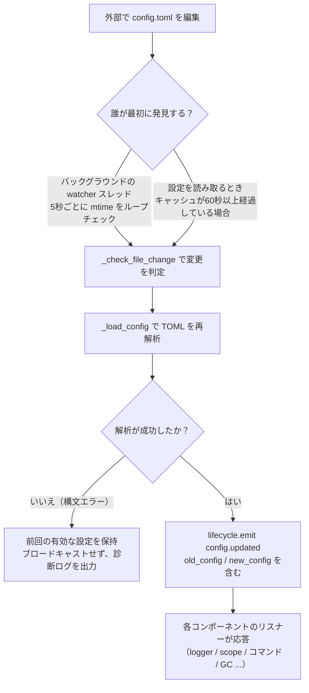

**2つの検出経路**（どちらかが機能すれば十分で、両方を網羅します）：

| 経路 | メカニズム | トリガー時刻 |
|------|------|---------|
| バックグラウンド watcher | daemon スレッド `config-watcher` が **5秒**ごとに `wait` でファイル `mtime` をチェック | 外部でファイルを変更した後、最大5秒以内に |
| 慣性検出 | 任意の `getConfig()` 読取時、キャッシュが **60秒**以上経過している場合、ファイルをチェック | 次回の設定読み取り時 |

> **フレームワークは自分自身を誤って傷つけません**：`setConfig()` でファイルに書き込む際、フレームワークは「自身が書き込んだ mtime」を記録し、watcher はそれを除外して、**外部の編集**のみを変更とみなします。

**2種類の設定変更イベント**：

| イベント | トリガー | データ | 代表的な場面 |
|------|--------|------|---------|
| `config.set` | コード / Dashboard が `setConfig()` を呼び出す | `{key, old_value, new_value}` | 単一キーの書き込み（テンプレート生成、状態記録、実行時の設定変更） |
| `config.updated` | 外部編集後に watcher/慣性検出が捕捉 | `{old_config, new_config, config_file}` | 手動で `config.toml` を編集した場合 |

> `setConfig()` はデフォルトで **5秒遅延してファイルに書き込む**（複数の書き込みを1度にまとめます）。`immediate=True` で即時書き込みが可能です。watcher は外部編集を検出しても、**外部の変更をファイルに書き戻すことはありません**。

**自動応答対象リスト**（2種類のイベントは通常両方をサブスクライブし、応答内容は一致します）：

| コンポーネント | 監視 | 応答 |
|------|------|------|
| Logger | `config.set` + `config.updated` | レベル/ファイル/ディレクトリの分割/メモリ上限/フォーマット/除外レベルを再適用（変更検出付き、変更がない場合は動かない） |
| Scope | `config.updated` | スコープバインディングのキャッシュを再構築 |
| コマンドシステム | `config.updated` | プレフィックス/大文字小文字/スペースプレフィックス/must_at_bot の解析パラメータを更新し、次のメッセージで有効になります |
| アダプタの並行性 | `config.set` + `config.updated` | `handler_max_concurrency` が失効し、信号量を再構築します |
| プロアクティブ GC | `config.set` + `config.updated` | `proactive_gc_*` で GC のバックグラウンドタスクを即時再起動します |
| アダプタ | `on_config_update` にルーティング | 各アダプタの `on_config_update(old, new)` コールバック |
| モジュール | `on_config_update` にルーティング | 各モジュールの `on_config_update(old, new)` コールバック |
| ストレージ | `config.updated` | `use_global_db` 変更は**警告のみ**（再起動が必要） |
| ルーティング | `config.updated` | `cors.*` / `security.*` 変更は**警告のみ**（再起動が必要） |

## 完全な設定例

```toml
[ErisPulse.server]
host = "0.0.0.0"
port = 8000
auto_start = true
ssl_certfile = ""
ssl_keyfile = ""

[ErisPulse.master]
# users は2通りの書き方があります（どちらかを選択してください）：
#   グローバルマスター（すべてのプラットフォームに有効）：users = ["123456", "789012"]
#   プラットフォームごとにマスターを指定：users = { yunhu = ["123456"], telegram = ["789012"] }
users = {}

[ErisPulse.logger]
level = "INFO"
format = "rich"
log_files = []
log_dir = ""
log_rotation = "size"
log_max_size_mb = 10
log_backup_count = 5
log_rotation_when = "midnight"
memory_limit = 1000
exclude_levels = []

[ErisPulse.framework]
enable_lazy_loading = true
uninit_timeout = 30
strict_mode = 0

[ErisPulse.framework.strict_mode_exceptions]
modules = []
adapters = []

[ErisPulse.storage]
use_global_db = false

[ErisPulse.event.command]
prefix = "/"
case_sensitive = true
allow_space_prefix = false
must_at_bot = false

[ErisPulse.event.message]
ignore_self = true

[ErisPulse.i18n]
language = "auto"
```

## サーバー設定

```toml
[ErisPulse.server]
host = "0.0.0.0"
port = 8000
auto_start = true
ssl_certfile = "/path/to/cert.pem"
ssl_keyfile = "/path/to/key.pem"
```

| 設定項目 | 型 | デフォルト値 | 説明 |
|---------|------|---------|------|
| host | string | 0.0.0.0 | 監聴アドレス。0.0.0.0 はすべてのインターフェースを意味します |
| port | integer | 8000 | 監聴ポート番号 |
| auto_start | boolean | true | `sdk.init()` 時にルーティングサーバーを自動起動するかどうか。false に設定するとルーティングサーバーの起動をスキップできます（純粋なイベント/WebUI なしのシナリオ） |
| ssl_certfile | string | 空 | SSL 証明書ファイルのパス |
| ssl_keyfile | string | 空 | SSL 秘密鍵ファイルのパス |

## マスターシステム設定

マスターシステムは「フレームワークマスター」アカウント（例：Bot管理者）を識別するために使用されます。`master.users` は2通りの書き方をサポートしています：

```toml
[ErisPulse.master]
# 書き方1：グローバルマスター（すべてのプラットフォームに有効）
users = ["123456", "789012"]

# 書き方2：プラットフォームごとにマスターを指定（dict）
# users = { yunhu = ["123456"], telegram = ["789012"] }
```

| 設定項目 | 型 | デフォルト値 | 説明 |
|---------|------|---------|------|
| users | array / object | 空 | マスターアカウントリスト。`list` 形式はグローバルマスター（すべてのプラットフォームに有効）；`dict` 形式はプラットフォームごとに指定（キーはプラットフォーム名、値はそのプラットフォームのマスターアカウントリスト） |

コードでは `master.is_master(event)` または `master.is_master(platform, user_id)` を使ってチェックし、各呼び出しで設定をリアルタイムに読み取ります（ホットアップデートをサポートし、再起動は不要です）：

```python
from ErisPulse.Core import master

if master.is_master(event):
    await event.reply("主人你好")
```

> アイデンティティ判定の完全な API（実行時に追加/削除、**カスタムアイデンティティソース provider チェーン**）と「ユーザー優先」の
> オーバーライド意味（ユーザーはコントロール面で `master=True` を開放/制限できる）は、
> [統一コントロール面 · マスターアイデンティティとカスタムアイデンティティソース](../advanced/scope.md#主人身份与自定义身份源provider) を参照してください。

## ログ設定

```toml
[ErisPulse.logger]
level = "INFO"
log_files = []                # 明示的なログファイルリスト（log_dir と互換性あり、優先度が高くなります）
log_dir = ""                  # ログ出力ディレクトリ（log_dir を設定すると自動的に分割ローテーションされます）
log_rotation = "size"         # 分割方法: "size" / "date" / "none"
log_max_size_mb = 10          # size モードの単ファイルサイズ上限（MB）
log_backup_count = 5          # 保持する履歴ログファイル数
log_rotation_when = "midnight"  # date モードのローテーション周期: S/M/H/D/midnight
memory_limit = 1000
exclude_levels = ["EVENT"]
```

| 設定項目 | 型 | デフォルト値 | 説明 |
|---------|------|---------|------|
| level | string | INFO | ログレベル：TRACE, DEBUG, INFO, WARNING, ERROR, CRITICAL（TRACE が最低レベルで、フレームワーク内部の詳細なデバッグ情報を出力します） |
| format | string | rich | ログ出力フォーマット：`rich`（カラー、デフォルト）、`plain`（カラーなしの純文本）、`json`（JSON形式、ELKなどに適しています） |
| log_files | array | 空 | ログ出力ファイルリスト（明示的なパス、分割されません） |
| log_dir | string | 空 | ログ出力ディレクトリ（自動作成）。log_dir が設定されると、`erispulse.log` にログを書き込み、`log_rotation` に従って自動的に分割されます。log_files と互換性があり、log_files が優先されます |
| log_rotation | string | size | 分割方法：`size`（サイズで）、`date`（日付で）、`none`（分割なし） |
| log_max_size_mb | float | 10 | size モードの単ファイルサイズ上限（MB）、超過すると `.1`/`.2` などにローテーションされます |
| log_backup_count | integer | 5 | 保持する履歴ログファイル数、古いファイルは自動的に削除されます |
| log_rotation_when | string | midnight | date モードのローテーション周期：`S`/`M`/`H`/`D`/`midnight`（デフォルトは毎日0時） |
| memory_limit | integer | 1000 | メモリに保持するログの件数 |
| exclude_levels | array | 空 | ログレベルの除外。除外されたレベルのログは**完全に破棄**されます（メモリに書き込まれず、ダッシュボードなどのサブスクライバーに送信されず、表示されず、ファイルに書き込まれません）。`exclude_levels` はホットアップデートをサポートしています |

コード内でも動的に切り替え可能です：

```python
from ErisPulse.Core import logger

# サイズで分割：1ファイル10MB、5個保持
logger.set_output_dir("logs", rotation="size", max_size_mb=10, backup_count=5)

# 日付で分割：毎日0時ローテーション、7個保持
logger.set_output_dir("logs", rotation="date", backup_count=7)
```

> [!NOTE]
> `log_dir` およびローテーション関連設定は ErisPulse **2.8.0+** が必要です。

> **プライバシー保護**：メッセージの送受信内容は **EVENT** レベル（数値 21）で記録されます。`exclude_levels = ["EVENT"]` と設定することで、バックエンド（例：ダッシュボードのログパネル）が各グループ/プライベートチャットのメッセージ内容を表示できなくなり、他のレベルのログには影響しません。

> [!NOTE]
> `exclude_levels` のこの機能は ErisPulse **2.8.0+** が必要です。

## フレームワーク設定

```toml
[ErisPulse.framework]
enable_lazy_loading = true
uninit_timeout = 30
strict_mode = 0

[ErisPulse.framework.strict_mode_exceptions]
modules = []
adapters = []
```

| 設定項目 | 型 | デフォルト値 | 説明 |
|---------|------|---------|------|
| enable_lazy_loading | boolean | true | モジュールのラジーローディングを有効にするかどうか |
| uninit_timeout | integer | 30 | エレガントなシャットダウンのタイムアウト時間（秒）、超過すると強制終了します。0はタイムアウトを設定しません |
| strict_mode | integer | 0 | エスカレーションモードのレベル、下記「エスカレーションモード」を参照してください |
| handler_max_concurrency | integer | 64 | イベントハンドラの最大並行タスク数、大きくすると処理能力は向上しますがメモリ使用量も増加します |
| offline_bot_expiry | integer | 3600 | オフライン Bot 記録の自動有効期限（秒）、0は期限切れを設定しません |

### プロアクティブ GC 設定

SDK の初期化後にプロアクティブ GC バックグラウンドタスクが起動し、周期的に Python GC と内部リソースの回収（オフライン Bot のクリーンアップなど）を行います。全パラメータはホットアップデートをサポートし、変更時にタスクを即時再起動します。

| 設定項目 | 型 | デフォルト値 | 説明 |
|---------|------|---------|------|
| proactive_gc_interval | number | 300 | 回収間隔（秒）、小数もサポート。0はプロアクティブ GC を無効にします |
| proactive_gc_generation | integer | 0 | 通常の回収世代（0/1/2、0..2に制限）。`gc.collect(2)` は全量回収に相当し、デフォルトは0で軽量に保ちます。深い回収は `proactive_gc_full_every` で周期的に実行されます |
| proactive_gc_full_every | integer | 20 | Nラウンドごとに全量回収を行う、0は周期的な全量回収を無効にします。全量回収は `proactive_gc_memory_growth_mb` のしきい値によって制約されます |
| proactive_gc_memory_growth_mb | integer | 32 | 全量回収のメモリ増加しきい値（MB）：前回の全量回収後のメモリベースライン（`tracemalloc`を優先、次にRSS）と比較し、この値に達した場合に全量回収を実行します。0はしきい値を設定しません |
| proactive_gc_idle_only | boolean | false | 有効にすると、イベントのピーク時（未完了のpending handlerがある）には、Python GCをスキップして、内部リソースの回収のみが影響を受けません |
| proactive_gc_gen0_min | integer | 500 | 通常の回収がトリガーされるgen0のゴミ量の下限：`gc.get_count()[0]`がこの値より低い場合、スキップされます（空回りはほぼ無駄）。0は常に回収します |

> **2.7.1の変更**：デフォルトの `proactive_gc_generation` は `2` から `0` に調整され、`proactive_gc_full_every` は `0` から `20` に調整されました。以前は `generation=2` で毎回最も重い全量回収が行われていましたが、新しいデフォルトでは回収のカバーを維持しながら、空回りのオーバーヘッドを大幅に低減します。明示的に設定された旧値はそのまま意味通りに動作します。

### エスカレーションモード

エスカレーションモードは、モジュール/アダプターがロード段階で不正な場合や失敗した場合の処理戦略を制御します。現代のモジュール/アダプターは `BaseModule`/`BaseAdapter` を継承するべきですが、基底クラスを継承していないコンポーネントはフレームワークのコンテキストシステムとバックアップクリーンアップに影響し、リソースリークを引き起こす可能性があります。

> **2.5.2の変更**：デフォルトレベルは `1`（スキップ）から `0`（緩和）に調整され、新規ユーザーの初期使用時に遭遇するロードの問題を減らしました。基底クラスを継承していないコンポーネントは警告として提示され、ロードされます。以前の動作を復元するには、`strict_mode = 1` を明示的に設定してください。

| レベル | 名称 | 動作 |
|------|------|------|
| 0 | 緩和（デフォルト） | 不正な場合は警告のみ、基底クラスを継承していないコンポーネントもロードされます（旧コンポーネントの互換性） |
| 1 | エスカレーション-スキップ | 基底クラスを継承していないコンポーネントを拒否してスキップし、他のコンポーネントは正常に起動します |
| 2 | エスカレーション-致命 | すべての不正（基底クラスを継承していない、ロード失敗、登録失敗、初期化失敗など）を致命的に扱い、起動チェックポイントで一括して不正リストを出力して中止します |

各レベルで、「ロード/登録/初期化段階でエラーが発生した」コンポーネント自身のクラッシュは常にスキップされます。違いは以下の通りです：

- **0 → 1**：唯一の動作変化は「基底クラスを継承していない」コンポーネントが「ロードされる」から「スキップされる」ことです。
- **1 → 2**：すべての不正（基底クラスを継承していない、ロード失敗、登録失敗、初期化失敗など）が致命的に扱われ、起動チェックポイントで不正リストを一括して出力して中止されます。

#### 例外リスト

一部のコンポーネントが一時的に移行できない（依存する旧モジュールなど）場合、例外リストに追加することで、不正なコンポーネントでも緩和モードでロードされます：

```toml
[ErisPulse.framework.strict_mode_exceptions]
modules = ["SeTu", "SomeLegacyModule"]
adapters = ["OldAdapter"]
```

> コンポーネントがエスカレーションモードで拒否された場合、ログにはどのようにロードを回復するか（例外リストに追加するか、レベルを下げること）が明確に提示されます。

## ストレージ設定

```toml
[ErisPulse.storage]
use_global_db = false
```

| 設定項目 | 型 | デフォルト値 | 説明 |
|---------|------|---------|------|
| use_global_db | boolean | false | グローバルデータベース（パッケージ内）を使用するかどうか、またはプロジェクトデータベースを使用するかどうか。`true` の場合、すべてのプロジェクトは ErisPulse パッケージ内の SQLite データベースを共有します。`false`（デフォルト）の場合は、`config/` ディレクトリ下の個別のデータベースを使用します |

## イベント設定

### コマンド設定

```toml
[ErisPulse.event.command]
prefix = "/"
case_sensitive = true
allow_space_prefix = false
```

| 設定項目 | 型 | デフォルト値 | 説明 |
|---------|------|---------|------|
| prefix | string | / | コマンドのプレフィックス |
| case_sensitive | boolean | true | 大文字小文字を区別するかどうか（`/Help` と `/help` が異なるコマンドか） |
| allow_space_prefix | boolean | false | プレフィックスにスペースを許可するかどうか |
| must_at_bot | boolean | false | コマンドをトリガーするには必ず@Botが必要かどうか（プライベートチャットは制限されません） |

### メッセージ設定

```toml
[ErisPulse.event.message]
ignore_self = true
```

| 設定項目 | 型 | デフォルト値 | 説明 |
|---------|------|---------|------|
| ignore_self | boolean | true | ロボット自身のメッセージを無視するかどうか |

## 国際化設定

```toml
[ErisPulse.i18n]
language = "auto"
```

| 設定項目 | 型 | デフォルト値 | 説明 |
|---------|------|---------|------|
| language | string | auto | フレームワーク内に含まれるテキストの表示言語。`auto` に設定するとシステム言語を自動検出します。具体的な言語コード（`zh-CN`、`zh-TW`、`en`、`ja`、`ru`）に設定することもできます |

## モジュール設定

各モジュールは設定ファイルで独自の設定を定義できます：

```toml
[MyModule]
api_url = "https://api.example.com"
timeout = 30
enabled = true
```

モジュール内で設定を読み取り、書き込みます：

```python
from ErisPulse import sdk

# 設定を読み取る
config = sdk.config.getConfig("MyModule", {})
api_url = config.get("api_url", "https://default.api.com")

# 実行時で設定を書き込む（遅延保存）
sdk.config.setConfig("MyModule.timeout", 60)

# ファイルに即時保存
sdk.config.setConfig("MyModule.timeout", 60, immediate=True)
```

> `setConfig` はデフォルトで遅延書き込み（約5秒毎にファイルにバッチ保存）されます。`immediate=True` を設定すると即時永続化されます。設定の変更は `config.set` ライフサイクルイベントをトリガーします。

## コントロール面設定（scope）

> [!NOTE]
> この機能は ErisPulse **2.8.0+** が必要です。

統一コントロール面は、権限/アクセス制御の**唯一**のエントリーポイントです。5次元の設定ツリーです：

| 次元 | 制御対象 | 設定パス |
|------|---------|---------|
| ① モジュール | 某プラットフォーム / Bot / セッションでどのモジュールが有効か | `scope.platforms / bots / sessions` |
| ② アイデンティティ | 某ユーザー / グループ / Bot / アダプターのイベントを受信するか | `scope.identity.*` |
| ③ コマンド | どのユーザーが特定のコマンドを実行できるか（コマンド名は glob に対応） | `scope.commands` |
| ④ ハンドラ | 某モジュールのハンドラをテキストでフィルタリングする | `scope.handlers` |
| ⑤ オーバーライド | モジュール/コマンドの実装パラメータをオーバーライドする | `scope.overrides` |

```toml
[ErisPulse.scope]
default_allow = true        # グローバルデフォルト（false = 明示的に拒否する厳格モード）
cache_size = 1024           # LRU キャッシュサイズ

# ① モジュール次元（優先度：セッション > Bot > プラットフォーム；エントリは正確/glob/正規表現に対応）
[ErisPulse.scope.platforms.onebot11]
modules = ["Chat", "Tool*"]
blocked = ["re:^Danger"]

# ② アイデンティティ次元（優先度：ユーザー > セッション > Bot > アダプター；各レベルは allow または deny のどちらか一方のみを書く）
[ErisPulse.scope.identity.adapters.onebot11]
deny = true                 # 該当プラットフォームのすべてのイベントを入口で破棄
[ErisPulse.scope.identity.users.onebot11]
allow = ["u_admin"]         # ユーザー名は glob / 正規表現に対応
deny = ["u_bad", "spam_*"]

# ③ コマンド次元（ユーザー識別子 "platform:user_id"）
[ErisPulse.scope.commands."roll*"]
allow = ["onebot11:u_vip"]
deny = ["onebot11:u_bad"]

# ④ ハンドラ/テキスト次元（コード内の条件とAND）
[ErisPulse.scope.handlers.MyModule]
pattern = "签到*"

# ⑤ 実装パラメータのオーバーライド（統一コマンド deny を使わないで、ここではオーバーライドしない）
[ErisPulse.scope.overrides.MyModule.restart]
master = true
hidden = true
```

| 設定項目 | 型 | 説明 |
|---------|------|------|
| `scope.default_allow` | boolean | グローバルデフォルト：ルールに一致しないものを許可/拒否する（`true`）。モジュール/アイデンティティは「ルールがない場合拒否」、コマンドは「ACLがない場合拒否」 |
| `scope.cache_size` | integer | LRU キャッシュサイズ（デフォルト 1024） |
| `scope.platforms / bots / sessions` | table | ① モジュールの3段階バインディング：`{modules=[...], blocked=[...]}` |
| `scope.identity.adapters / bots / sessions / users` | table | ② アイデンティティの4段階バインディング：`{allow=true}` / `{deny=true}` |
| `scope.commands.<コマンド名>` | table | ③ コマンド ACL：`{allow=[...], deny=[...]}` |
| `scope.handlers.<module>` | table | ④ テキストフィルタリング：`{pattern="...", regex="..."}` |
| `scope.overrides.<module>[.<command>]` | table | ⑤ 実装パラメータのオーバーライド：`master` / `hidden` / `aliases` / `prefix` など |

> マッチするエントリは統一的に書式を使用します：正確な名前 / glob（`*` `?` `[seq]`）/ `re:` 正規表現、大文字小文字は区別されません。
> 5次元の詳細と実行時の API（`sdk.scope.bind_module()` / `bind_identity()` / `block_user()` /
> `allow_user()` / `override()` など）は、[統一コントロール面](../advanced/scope.md)を参照してください。

## 次に進む

- [CLIコマンドリファレンス](cli-reference.md) - すべてのコマンドラインコマンドを確認
- [開発者ガイド](../developer-guide/) - カスタムモジュールの開発方法を学ぶ


### 部署指南

# 部署ガイド

ErisPulse ロボットを本番環境にデプロイするためのベストプラクティス。

## Docker 部署（推奨）

ErisPulse は、ErisPulse フレームワークと Dashboard 管理パネルを内蔵した公式の Docker イメージを提供しており、`linux/amd64` および `linux/arm64` アーキテクチャをサポートしています。

### 速攻起動

```bash
# イメージの取得
docker pull erispulse/erispulse:latest

# docker-compose.yml のダウンロード
curl -O https://raw.githubusercontent.com/ErisPulse/ErisPulse/main/docker-compose.yml

# Dashboard のログイントークンを設定して起動
ERISPULSE_DASHBOARD_TOKEN=your-token docker compose up -d
```

起動後、`http://localhost:8000/Dashboard` にアクセスし、設定したトークンをパスワードとしてログインしてください。

### 国内用のイメージ加速

Docker Hub にアクセスできない場合は、GitHub Container Registry を使ってイメージを取得できます：

```bash
docker pull ghcr.io/erispulse/erispulse:latest
```

ghcr.io のイメージを使用する場合は、`docker-compose.yml` の `image` を変更する必要があります：

```yaml
services:
  erispulse:
    image: ghcr.io/erispulse/erispulse:latest
```

### docker-compose.yml

```yaml
services:
  erispulse:
    image: erispulse/erispulse:latest
    container_name: erispulse
    ports:
      - "${ERISPULSE_PORT:-8000}:8000"
    volumes:
      - ./config:/app/config
    environment:
      - TZ=${TZ:-Asia/Shanghai}
      - ERISPULSE_DASHBOARD_TOKEN=${ERISPULSE_DASHBOARD_TOKEN:-}
    restart: unless-stopped
```

### 環境変数

| 変数 | デフォルト値 | 説明 |
|------|--------|------|
| `ERISPULSE_PORT` | `8000` | Dashboard のポートマッピング |
| `ERISPULSE_DASHBOARD_TOKEN` | 自動生成 | Dashboard のログイントークン（設定を強く推奨） |
| `TZ` | `Asia/Shanghai` | タイムゾーン |

### データの永続化

`./config` ディレクトリは、設定ファイルとデータベースをマウントしており、以下を含みます：

- `config/config.toml` — 設定ファイル
- `config/config.db` — SQLite ストレージデータベース
- `config/.packages` — Python site-packages の永続化ボリューム。フレームワーク、アダプター、およびインストール済みモジュールを保存します（最初の起動時にエントリポイントがイメージ内に含まれるバックアップから自動的に初期化され、その後のモジュールインストールとフレームワークのホットアップデートはこのディレクトリに書き込まれます）。

## Dashboard 管理面板

ErisPulse Docker イメージには、Web による視覚化管理インターフェースを提供する Dashboard モジュールが内蔵されています。

### 機能概要

| 機能 | 説明 |
|------|------|
| 仪表盘 | システム概要、CPU/メモリの監視、稼働時間、イベント統計 |
| ロボット管理 | 各プラットフォームのロボットのオンライン状態と情報を表示 |
| 事件查看 | 実時イベントのストリーム、タイプやプラットフォームごとのフィルタリングが可能 |
| ログ查看 | モジュールとレベルごとのフィルタリングが可能なログビューア |
| モジュール管理 | インストール済みのモジュールとアダプターの表示、読み込み、アンロード |
| モジュールストア | リモートで利用可能なパッケージを閲覧し、ワンクリックでインストール可能 |
| 配置編集 | `config.toml` のオンライン編集 |
| ストレージ管理 | キー値ストアデータの閲覧と編集 |
| バックアップ | 設定とストレージデータのエクスポート/インポート |
| 審計ログ | すべての管理操作の記録 |

### Dashboard によるモジュールのインストール

Dashboard にはモジュールストア機能が統合されており、以下の方法でモジュールをインストールできます。

1. **ストアからインストール**：リモートのモジュールリストを閲覧し、必要なモジュールを選択してワンクリックでインストール
2. **ローカルパッケージのアップロード**：`.whl` または `.zip` ファイルを直接アップロードしてインストール。個人開発のモジュールをテストするのに便利です。

> **モジュール開発者のための迅速なテストフロー**：Docker でデプロイした後、Dashboard の「ローカルパッケージのアップロード」機能を使用して、ビルドした `.whl` ファイルを直接アップロードしてテストできます。コンテナを手動で操作する必要がありません。

## プロセス監督とハードリスタート

ErisPulse のハードリスタート (`sdk.hard_restart()`) は、**外部の監督者**がプロセスの終了コードが 42 のときにプロセスを再起動することに依存しています。SDK 自身は新しいプロセスを起動しません。本番環境では監督者の設定が必須です。監督者が設定されていない場合、ハードリスタート後にプロセスは自動的に復旧しません。

- Docker: `restart: unless-stopped`（終了コードが 42 を含む場合もすべて再起動）
- systemd: `Restart=on-failure` + `RestartForceExitStatus=42`
- PM2 / supervisord: 42 を再起動可能な終了コードに追加
- 純粋な Python によるカスタム監督者: `Popen` のループ + `returncode == 42` の検出

各監督者の完全な設定例と終了コード 42 の契約に関する説明は、[起動プロセス → 監督者ガイド](../advanced/startup.md#監督者ガイド)をご覧ください。

## ヘルスチェック

SDK には、ヘルスチェック用エンドポイントが内蔵されています。

```bash
# ヘルスチェック
curl http://localhost:8000/health
```

Docker でのヘルスチェックは、`docker-compose.yml` に追加することで可能です。

```yaml
services:
  erispulse:
    healthcheck:
      test: ["CMD", "curl", "-f", "http://localhost:8000/health"]
      interval: 30s
      timeout: 10s
      retries: 3
```

## リバースプロキシ

Nginx などのリバースプロキシ経由で Dashboard を公開する必要がある場合：

```nginx
server {
    listen 80;
    server_name bot.example.com;

    location / {
        proxy_pass http://127.0.0.1:8000;
        proxy_set_header Host $host;
        proxy_set_header X-Real-IP $remote_addr;
        proxy_set_header X-Forwarded-For $proxy_add_x_forwarded_for;
    }

    # WebSocket のサポート（Dashboard のリアルタイムイベントストリームが必要）
    location /Dashboard/ws {
        proxy_pass http://127.0.0.1:8000;
        proxy_http_version 1.1;
        proxy_set_header Upgrade $http_upgrade;
        proxy_set_header Connection "upgrade";
    }
}
```

SSL は Let's Encrypt を使用できます：

```bash
sudo certbot --nginx -d bot.example.com
```

## 手動デプロイ（pip）

Docker を使用しない場合でも、手動でデプロイすることができます。

### 本番環境の設定

```toml
# config/config.toml

[ErisPulse.server]
host = "0.0.0.0"
port = 8000

[ErisPulse.logger]
level = "INFO"
log_files = ["app.log"]
memory_limit = 5000

[ErisPulse.framework]
enable_lazy_loading = true
```

### systemd (Linux)

`/etc/systemd/system/erispulse-bot.service` を作成します：

```ini
[Unit]
Description=ErisPulse Bot
After=network.target

[Service]
Type=simple
User=bot
WorkingDirectory=/opt/erispulse-bot
ExecStart=/opt/erispulse-bot/venv/bin/epsdk run main.py
Restart=always
RestartSec=5
StandardOutput=journal
StandardError=journal

[Install]
WantedBy=multi-user.target
```

管理コマンド：

```bash
sudo systemctl daemon-reload
sudo systemctl start erispulse-bot
sudo systemctl enable erispulse-bot
sudo journalctl -u erispulse-bot -f
```

### Supervisor

`/etc/supervisor/conf.d/erispulse-bot.conf` を作成します：

```ini
[program:erispulse-bot]
command=/opt/erispulse-bot/venv/bin/python -m ErisPulse run main.py
directory=/opt/erispulse-bot
user=bot
autostart=true
autorestart=true
stderr_logfile=/var/log/erispulse-bot/err.log
stdout_logfile=/var/log/erispulse-bot/out.log
```

## セキュリティに関する推奨事項

1. **Dashboard トークンの設定**：強力なランダムなトークンを使用し、デフォルト値は使用しないでください。
2. **ポートをパブリックに公開しない**：リバースプロキシ + SSL を使用しない限り、Dashboard のポートをローカルネットワークに限定してください。
3. **データディレクトリの保護**：`config/` ディレクトリには設定情報やデータベースが含まれているため、適切なファイル権限を設定してください。
4. **定期的なアップデート**：`epsdk self-update` を使用するか、最新の Docker イメージをプルしてください。
5. **root で実行しない**：手動でデプロイする場合は、専用のユーザーを作成してください。
6. **Docker のリスタートポリシーの使用**：`restart: unless-stopped` を使用して、異常終了後に自動的に再起動されるようにしてください。

## マルチインスタンスデプロイ

複数のロボットインスタンスを実行する場合：

1. 各インスタンスは独立したプロジェクトディレクトリと `docker-compose.yml` を使用します。
2. 異なるポート番号を使用します: `ERISPULSE_PORT=8001`
3. 異なるコンテナ名を使用します: `container_name: erispulse-bot2`

## 更新とメンテナンス

### Docker 方式

```bash
# 最新のイメージを取得
docker compose pull

# 新しいイメージを使用して再起動
docker compose up -d
```

### pip 方式

```bash
epsdk self-update
epsdk upgrade
```

### バックアップ

`config/` ディレクトリを定期的にバックアップしてください：

```bash
# Docker 部署の場合
tar czf erispulse-backup-$(date +%Y%m%d).tar.gz config/

# または Dashboard の「バックアップ」機能を使用してエクスポート
```


=====
开发者指南
=====


### 开发者指南总览

# 開発者ガイド

このガイドは、ErisPulse の機能を拡張するためのカスタムモジュールやアダプターを開発する方法を説明します。

## 目次

### モジュール開発

1. [モジュール開発の入門](modules/getting-started.md) - 最初のモジュールを作成する
2. [モジュールの基本概念](modules/core-concepts.md) - モジュールの基本的な概念とアーキテクチャ
3. [Event クラスの詳細](modules/event-wrapper.md) - Event オブジェクトの完全な説明
4. [モジュールのベストプラクティス](modules/best-practices.md) - 高品質なモジュール開発に関する提案

### アダプター開発

1. [アダプター開発の入門](adapters/getting-started.md) - 最初のアダプターを作成する
2. [アダプターの基本概念](adapters/core-concepts.md) - アダプターの基本的な概念
3. [SendDSL の詳細](adapters/send-dsl.md) - Send メッセージ送信 DSL の完全な説明
4. [イベント変換器](adapters/converter.md) - イベント変換器の実装
5. [アダプターのベストプラクティス](adapters/best-practices.md) - 高品質なアダプター開発に関する提案

### リリースガイド

- [リリースとモジュールストアのガイド](publishing.md) - あなたの作品を PyPI と ErisPulse モジュールストアにリリースする方法

## 開発準備

開発を開始する前に、以下の事項を確認してください：

1. [基本概念](../getting-started/basic-concepts.md) を読んでいること
2. [イベント処理](../getting-started/event-handling.md) に精通していること
3. 開発環境のインストール（Python >= 3.10）
4. ErisPulse SDK のインストール

## 開発タイプの選択

ニーズに応じて、適切な開発タイプを選択してください：

| 開発タイプ | 適用シーン | 入門ガイド |
|---------|---------|---------|
| **モジュール開発** | ロボット機能の拡張、ビジネスロジックの実装、コマンドやメッセージ処理の提供 | [モジュール開発の入門](modules/getting-started.md) |
| **アダプター開発** | 新しいメッセージプラットフォームへの接続、クロスプラットフォーム通信の実現、プラットフォーム固有の機能の提供 | [アダプター開発の入門](adapters/getting-started.md) |

> ロボットの機能を拡張したい場合（コマンドの追加、メッセージの処理など）は、**モジュール開発**を選択してください。ロボットを新しいプラットフォームに接続したい場合は、**アダプター開発**を選択してください。

## 開発ツール

### プロジェクトテンプレート

ErisPulse は、参考用のサンプルプロジェクトを提供しています：

- [モジュールの例](https://github.com/ErisPulse/ErisPulse/tree/main/examples/example-module) - モジュールの完全なプロジェクト構造
- [アダプターの例](https://github.com/ErisPulse/ErisPulse/tree/main/examples/example-adapter) - アダプターの完全なプロジェクト構造

### 開発モード

コードを変更すると自動的に再読み込みされるホットリロードモードを使用して開発を行います：

```bash
epsdk run main.py --reload
```

### デバッグのヒント

`config/config.toml` で DEBUG または TRACE レベルのログを有効化します：

```toml
[ErisPulse.logger]
# DEBUG: モジュールのロード、ルーティングの登録などの開発用デバッグ情報を出力
# TRACE: 最低レベル、イベントの配信、ストレージへの書き込み、遅延読み込みなどのフレームワーク内部の詳細なフローを出力
level = "DEBUG"
```

## あなたのモジュールをリリースする

完全なリリースプロセスについては、[リリースとモジュールストアのガイド](publishing.md)を参照してください。PyPI へのリリース手順や、ErisPulse モジュールストアへの提出プロセスなどが含まれています。


====
模块开发
====


模块开发
----


### 模块开发入门

# モジュール開発入門

このガイドでは、ErisPulse モジュールをゼロから作成する方法を紹介します。

## プロジェクト構造

標準的なモジュールの構造は以下の通りです。

```
MyModule/
├── pyproject.toml
├── README.md
├── LICENSE
└── MyModule/
    ├── __init__.py
    └── Core.py
```

## pyproject.toml 設定

```toml
[project]
name = "ErisPulse-MyModule"
version = "1.0.0"
description = "モジュール機能の説明"
readme = "README.md"
requires-python = ">=3.10"
license = { file = "LICENSE" }
authors = [ { name = "yourname", email = "your@mail.com" } ]
dependencies = []

[project.urls]
"homepage" = "https://github.com/yourname/MyModule"

[project.entry-points."erispulse.module"]
"MyModule" = "MyModule:Main"
```

## __init__.py

```python
from .Core import Main
```

## Core.py - 基礎モジュール

```python
from ErisPulse import sdk
from ErisPulse.Core.Bases import BaseModule
from ErisPulse.Core.Event import command

class Main(BaseModule):
    def __init__(self, sdk):
        self.sdk = sdk
        self.logger = sdk.logger.get_child("MyModule")
        self.storage = sdk.storage
    
    @staticmethod
    def get_load_strategy():
        """モジュールのロード戦略を返す"""
        from ErisPulse.loaders import ModuleLoadStrategy
        return ModuleLoadStrategy(
            lazy_load=True,
            priority=0,
            depends=[],  # オプション：依存する他のモジュールのリスト
            # オプション：イベント駆動の遅延起動——トリガーを宣言し、最初の一致するイベント/コマンドが到着したときに自動的にロードされる
            # activate_on=[{"command": {"name": "hello", "help": "挨拶を送る"}}],
        )
    
    async def on_load(self, event):
        """モジュールがロードされたときに呼び出される"""
        @command("hello", help="挨拶を送る")
        async def hello_command(event):
            name = event.get_user_nickname() or "友達"
            await event.reply(f"こんにちは、{name}！")
        
        self.logger.info("モジュールがロードされました")
    
    async def on_unload(self, event):
        """モジュールがアンロードされたときに呼び出される"""
        self.logger.info("モジュールがアンロードされました")
```

> **設定の読み取り**：上記の基本的な例では設定は使用していません。設定を読み取る必要がある場合は、`ConfigClass` をネストして宣言し、`self.cfg` を通じてリアルタイムに読み取ることを推奨します（[モジュールのコア概念](core-concepts.md#宣言的設定の推奨)を参照）。手動で `_load_config()` を呼び出す古い書き方は廃止されました。

## テストモジュール

### ローカルテスト

```bash
# モジュールをプロジェクトディレクトリにインストール
epsdk install ./MyModule

# プロジェクトを実行
epsdk run main.py --reload
```

### テストコマンド

コマンドの送信によるテスト：

```
/hello
```

## 核心概念

### BaseModule 基底クラス

すべてのモジュールは `BaseModule` を継承し、以下のメソッドを提供する必要があります：

| メソッド | 説明 | 必須 |
|------|------|------|
| `__init__(self, sdk)` | コンストラクタ（フレームワークから `sdk` インスタンスが渡されます） | いいえ |
| `get_load_strategy()` | ロード戦略を返します | いいえ |
| `get_meta()` | モジュールの説明メタ情報を返します（オプション） | いいえ |
| `on_load(self, event)` | モジュールがロードされたときに呼び出されます | はい |
| `on_unload(self, event)` | モジュールがアンロードされたときに呼び出されます | はい |

### モジュール紹介 meta

> [!NOTE]
> この機能は ErisPulse **2.8.0+** が必要です。

`get_meta()` を使ってモジュールの紹介メタ情報を宣言します（このモジュールが何をするものか、どのカテゴリに属するかなど）。
メタ情報はモジュールの**一般的な紹介データ**であり、help モジュール、Dashboard モジュールリスト、モジュールストアなどの各種インターフェース/エコシステムモジュールが利用できます。

`get_load_strategy()` が `ModuleLoadStrategy` を返すのと同様に、**推奨されるのは `ModuleMeta` 設定クラスのインスタンスを返す**（属性の型付け、IDEの補完）ですが、dict でも対応しています：

```python
class MyModule(BaseModule):
    @staticmethod
    def get_meta() -> ModuleMeta:
        return ModuleMeta(
            name="天気",               # 表示名（デフォルトの登録名）
            description="都市の天気を照会",  # モジュールの概要
            version="1.0.0",
            author="ErisDev",
            group="ツール",               # 機能のグループ
            tags=["天気", "照会"],
        )
```

対応する書き方（dict）：

```python
class MyModule(BaseModule):
    @staticmethod
    def get_meta() -> dict:
        return {
            "name": "天気",
            "description": "都市の天気を照会",
            "version": "1.0.0",
            "author": "ErisDev",
            "group": "ツール",
            "tags": ["天気", "照会"],
        }
```

- `module.get_meta("MyModule")` は既に解析されたメタ情報を読み取ります（クラス宣言 > 登録 info、自動的にこのモジュールのコマンド名が補完されます）。
- `module.get_commands_overview()` は「モジュールのメタ情報 + 登録されたコマンド（エイリアス/グループ/ヘルプ）」を統合し、モジュールごとに整理されたコマンドの概要を返します。
- コマンドの所属モジュールは `cmd_info["owner"]` で取得できます（登録時にコンテキストシステムが自動的に注入します）。

#### meta フィールドの i18n 対応

メタ情報のフィールド値は単純な文字列、または i18n ディクショナリ `{"i18n": "key.path", "default": "兜底テキスト"}`（設定の `description` と同様の約束）を指定できます。
翻訳キーは `I18nClass` で宣言・登録され、`module.get_meta()` で読み取る際に自動的に現在の言語のテキストに解析されます：

```python
class MyModule(BaseModule):
    class I18nClass(BaseI18n):
        meta_description: I18nKey = I18nKey(
            default="Weather lookup",
            zh_CN="都市の天気を照会",
            en="Weather lookup",
        )

    @staticmethod
    def get_meta() -> ModuleMeta:
        return ModuleMeta(
            name="天気",
            description={"i18n": "MyModule.meta_description", "default": "Weather lookup"},
        )
```

### SDK オブジェクト

`sdk` オブジェクトを通じてコア機能にアクセスします：

```python
from ErisPulse import sdk

sdk.storage    # ストレージシステム
sdk.config     # 設定システム
sdk.logger     # ログシステム
sdk.adapter    # アダプタシステム
sdk.router     # ルーティングシステム
sdk.lifecycle  # ライフサイクルシステム
```

## 次のステップ

- [モジュールのコアコンセプト](core-concepts.md) - モジュールアーキテクチャの詳細
- [Eventラッパークラスの詳細](event-wrapper.md) - Eventオブジェクトの学習
- [モジュールのベストプラクティス](best-practices.md) - 高品質なモジュールの開発


### 模块核心概念

# モジュールのコアコンセプト

ErisPulse モジュールのコアコンセプトを理解することは、高品質なモジュールを開発するための基礎です。

## モジュールのライフサイクル

### 加載戦略

```python
from ErisPulse.Core.Bases import BaseModule
from ErisPulse.loaders import ModuleLoadStrategy

class MyModule(BaseModule):
    @staticmethod
    def get_load_strategy():
        """モジュール加載戦略を返す"""
        return ModuleLoadStrategy(
            lazy_load=True,   # ラグジュアリー加載か即時加載
            priority=0,       # 加載優先度（数値が大きいほど先に加載）
            depends=["OtherModule"]  # 任意：依存する他のモジュールを宣言
        )
```

> `depends` で宣言したモジュールが登録されていない場合、現在のモジュールはスキップされ、警告が記録されます。加載順序はトポロジカルソートによって決定され、同レベルでは `priority` 降順にされます。

> [!NOTE]
> **カスケードアンロード / カスケードリロード**（ErisPulse **2.8.0+**）：他のモジュールに依存するモジュールをアンロードする際、それを依存するモジュールは**先にカスケードアンロード**されます（カスケードチェーンのログ説明）。ローカルプラグインのホットリロード時、それを依存するプラグインも**カスケードリロード**されます。循環依存を宣言すると、加載時に `RuntimeError` で拒否されます。

### on_load メソッド

モジュール加載時に呼び出され、リソースの初期化とイベントハンドラの登録に使用されます：

```python
async def on_load(self, event):
    # イベントハンドラの登録
    @command("hello", help="挨拶コマンド")
    async def hello_handler(event):
        await event.reply("こんにちは！")
    
    # SDK 内蔵の HTTP クライアントを使用（接続プールを自動管理、手動で session を作成する必要なし）
    # sdk.client でリクエストを送信可能
```

### on_unload メソッド

モジュールアンロード時に呼び出され、リソースのクリーンアップに使用されます：

```python
async def on_unload(self, event):
    # 自作リソースのクリーンアップ
    # sdk.client はフレームワークが管理するため、手動で閉じる必要なし
    
    # イベントハンドラのキャンセル（フレームワークが自動処理）
    self.logger.info("モジュールがアンロードされました")
```

> バックグラウンドタスクの作成とクリーンアップ（`self.spawn()` / フレームワークが兜底でキャンセル）の詳細は [ライフサイクル管理](../../advanced/lifecycle.md#バックグラウンドタスクの所有と自動キャンセル) を参照してください。

### アンロードと完全アンロード（purge）

> [!NOTE]
> この機能は ErisPulse **2.8.0+** が必要です。

`unload()` はデフォルトで**加載のキャンセル**（アンロードインスタンスとリソース）のみ行いますが、登録のスタブ（モジュールクラスとメタ情報）は保持します——モジュールは再発見され、`load()` で再インスタンス化可能で、再登録 (`register()`) は不要です。

**完全アンロード**（モジュールクラスの参照を解放し、`sys.modules` をクリーンアップして、プラグインとその排他的な依存が GC 回収可能になる）が必要な場合は、`purge=True` を渡します：

```python
# 加載のキャンセルのみ：登録のスタブを保持し、いつでも再 `load()` 可能
await sdk.module.unload("MyModule")

# 完全アンロード：登録のスタブの削除 + `sys.modules` のクリーンアップ（プラグインフォルダソースのみ）
await sdk.module.unload("MyModule", purge=True)
```

| 語義 | `unload()` デフォルト | `unload(purge=True)` |
|------|-----------------|----------------------|
| インスタンスとリソースのアンロード（イベント/task/ルーティング/lifecycle/i18n） | ✅ | ✅ |
| 登録のスタブの保持（モジュールクラスとメタ情報） | ✅ | ❌ 削除 |
| `sys.modules` のクリーンアップ（プラグインフォルダソースのみ） | ❌ | ✅ |
| モジュールクラスの GC 回収可能 | ❌ | ✅ |
| 再加載 | `load()` で直接利用可能 | `register()` + `load()` が必要 |

> `purge=True` の場合、カスケードアンロードされる依存者も purge されます。アンロード後、フレームワークは `gc.collect()` を実行し、モジュールクラス/インスタンスが回収可能かどうかを確認します。残留参照はログにアラートされます（参照元を含む、DEBUG レベル）。

### ライフサイクルの全体像

上記のメソッドをつなげると、フレームワークがモジュールの加載とアンロードの際に、**背後で行うすべての処理**がわかります：


**加載時にフレームワークが自動で行う処理**（`on_load` を書くだけで、残りは自動処理）：

| フェーズ | フレームワークが自動で行う |
|------|-------------|
| owner 注入 | インスタンス化時に `owner_scope` でモジュール名をラップする——`on_load` で登録したコマンド/イベント/フック/バックグラウンドタスクは**自動的にこのモジュールに所有**される。アンロード時に owner ごとに一括でクリーンアップされる |
| 設定テンプレート | `ConfigClass` を宣言したモジュールの場合、フレームワークが自動的に `ErisPulse.<ModuleName>` 設定セグメントを生成/埋め込む |
| i18n 翻訳キー | `I18nClass` を宣言したモジュールの場合、翻訳キーが自動的に登録される（アンロード時に自動的に登録解除） |
| 依存トポロジー | `depends` で宣言した順序に従い、依存されるモジュールが先に加載される。循環依存は `RuntimeError` で拒否される |
| SDK マウント | インスタンス化後、`sdk.<ModuleName>` にマウントされ、`sdk.MyModule.xxx` でアクセス可能になる |

**アンロード時にフレームワークがクリーンアップする処理**（上記の U1→U7 に対応）：`on_unload` 実行後に兜底クリーンアップ——バックグラウンドタスクは強制キャンセル（`self.spawn` で作成されたもの、優雅な終了は `on_unload` で行う）、i18n キー、ルーティング、コマンド/イベントハンドラ、lifecycle フック、最後に SDK 属性の削除。`purge=True` では追加で登録スタブの削除 + `sys.modules` のクリーンアップ。

> これらの自動クリーンアップが「`on_load`/`on_unload` を書くだけで、手動で unregister する必要がない」自信の元——フレームワークは owner 归属を使って「誰が登録したか、誰がクリーンアップするか」を一括処理にしている。

## SDK オブジェクト

### コアモジュールへのアクセス

```python
from ErisPulse import sdk

# sdk オブジェクトを通じてすべてのコアモジュールにアクセス
sdk.logger.info("ログ")
sdk.storage.set("key", "value")
config = sdk.config.getConfig("MyModule")
```

### モジュール間通信

```python
# 他のモジュールにアクセス
other_module = sdk.OtherModule
result = await other_module.some_method()
```

## アダプタ送信メソッドの照会

新しい標準規格では、`__getattr__` メソッドをオーバーライドしてデフォルト送信メカニズムを実装する必要があるため、`hasattr` メソッドでメソッドの存在をチェックできなくなりました。`2.3.5` 以降、送信メソッドを照会する機能が追加されました。

### 送信メソッドの一覧表示

```python
# プラットフォームがサポートするすべての送信メソッドの一覧を表示
methods = sdk.adapter.list_sends("onebot11")
# 戻り値: ["Text", "Image", "Voice", "Markdown", ...]
```

### メソッドの詳細情報取得

```python
# 特定のメソッドの詳細情報を取得
info = sdk.adapter.send_info("onebot11", "Text")
# 戻り値:
# {
#     "name": "Text",
#     "parameters": [
#         {"name": "text", "type": "str", "default": null, "annotation": "str"}
#     ],
#     "return_type": "Awaitable[Any]",
#     "docstring": "テキストメッセージを送信..."
# }
```

## 設定管理

### 宣言的設定（推奨）

v2.5.2 以降、モジュールは `ConfigClass` を宣言することで、アダプタと同じ構成スキーマシステムを使用できます。設定は `self.cfg` でリアルタイムに読み取ることができ、変更後は即座に有効になります：

```python
from dataclasses import dataclass, field
from ErisPulse.Core.Bases import BaseModule
from ErisPulse.Core.Bases import BaseConfig

@dataclass
class MyModuleConfig(BaseConfig):
    api_key: str = field(
        default="",
        metadata={
            "description": {"i18n": "my_module.api_key", "default": "API キー"},
            "required": True,
            "secret": True,
            "ui": {"widget": "password", "group": "basic", "order": 1},
        },
    )
    timeout: int = field(
        default=30,
        metadata={
            "description": {"i18n": "my_module.timeout", "default": "タイムアウト時間（秒）"},
            "ui": {"widget": "number", "group": "advanced", "order": 2},
        },
    )

class MyModule(BaseModule):
    ConfigClass = MyModuleConfig

    def __init__(self, sdk):
        self.sdk = sdk
        self.logger = sdk.logger.get_child("MyModule")

    async def on_load(self, event):
        self.logger.info("モジュールが加載されました")

    async def on_unload(self, event):
        pass

    async def do_something(self):
        cfg = self.cfg  # 実時読み取り、型安全
        api_key = cfg.api_key
        timeout = cfg.timeout
```

`BaseConfig` は、アダプタ、モジュール、外部プロジェクトなど、あらゆるシナリオに適用可能な汎用設定基底クラスです。設定フィールドは i18n 多言語説明をサポートします（[i18n ドキュメント](../../advanced/i18n.md#設定フィールドの多言語)を参照）。

### 宣言的翻訳キー（v2.7.0+）

v2.7.0 以降、モジュールは `ConfigClass` を宣言するのと同じように、`I18nClass` 内部クラスを定義して翻訳キーを一括で宣言できます。フレームワークは加載時に**自動的に宣言されたすべての翻訳キーを登録**し、`i18n.register()` を手動で呼び出す必要がなく、登録タイミングは設定テンプレート生成よりも早いため、設定説明で参照される i18n キーが利用可能であることを保証します。

```python
from ErisPulse.Core.Bases import BaseConfig, BaseI18n, I18nKey

class MyModule(BaseModule):
    # 設定クラス（オプション）
    @dataclass
    class ConfigClass(BaseConfig):
        welcome_msg: str = field(
            default="ようこそ",
            metadata={
                "description": {"i18n": "mymodule.welcome_msg", "default": "ようこそメッセージ"},
            },
        )

    # 翻訳キー集合クラス（オプション）
    class I18nClass(BaseI18n):
        # プロパティ名が自動的に完全なキーのパスに結合される：<モジュール名>.<プロパティ名>
        welcome_msg: I18nKey = I18nKey(
            default="Welcome Message",   # 言語に依存しないバックアップ
            zh_CN="ようこそ",
            zh_TW="歡迎訊息",
            en="Welcome Message",
            ja="ウェルカムメッセージ",
            ru="Приветственное сообщение",
        )
        hello: I18nKey = I18nKey(
            default="Hello, {name}!",
            zh_CN="こんにちは、{name}！",
            zh_TW="你好，{name}！",
            en="Hello, {name}!",
            ja="こんにちは、{name}！",
            ru="Привет, {name}!",
        )
```

詳細は [i18n 推奨の書き方](../../advanced/i18n.md#推奨の書き方-i18nclass-で翻訳キーを宣言する-v270) を参照してください。

### 手動設定読み取り（廃止済み）

> **廃止済み**：代わりに [宣言的設定](#宣言的設定推奨) + `self.cfg` 実時読み取りを使用してください。

```python
class MyModule(BaseModule):
    def __init__(self, sdk):
        self.sdk = sdk

    def _load_config(self):
        config = self.sdk.config.getConfig("MyModule")
        if not config:
            self.sdk.config.setConfig("MyModule", {"api_key": "", "timeout": 30})
            return {"api_key": "", "timeout": 30}
        return config
```

## ストレージシステム

### 基本的な使用

```python
# データを保存
sdk.storage.set("user:123", {"name": "張三"})

# データを取得
user = sdk.storage.get("user:123", {})

# データを削除
sdk.storage.delete("user:123")
```

### トランザクションの使用

```python
# トランザクションを使用してデータの一貫性を保証
with sdk.storage.transaction():
    sdk.storage.set("key1", "value1")
    sdk.storage.set("key2", "value2")
    # いずれかの操作が失敗した場合、すべての変更はロールバックされる
```

## イベント処理

### イベントハンドラの登録

```python
from ErisPulse.Core.Event import command, message

# コマンドを登録
@command("info", help="情報を取得")
async def info_handler(event):
    await event.reply("これは情報です")

# メッセージハンドラを登録
@message.on_group_message()
async def group_handler(event):
    sdk.logger.info(f"グループメッセージを受信: {event.get_text()}")
```

### イベントハンドラのライフサイクル

フレームワークはイベントハンドラの登録とアン登録を自動的に管理します。`on_load` での登録のみが必要です。

## ラグジュアリー加載メカニズム

### 動作原理

```python
# モジュールが初めてアクセスされたときにのみ初期化される
result = await sdk.my_module.some_method()
# ↑ ここでモジュールの初期化がトリガーされる
```

### 即時加載

即時初期化が必要なモジュール（リスナー、タイマーなど）：

```python
@staticmethod
def get_load_strategy():
    return ModuleLoadStrategy(
        lazy_load=False,  # 即時加載
        priority=100
    )
```

## エラーハンドリング

### 例外キャッチ

```python
async def handle_event(self, event):
    try:
        # ビジネスロジック
        await self.process_event(event)
    except ValueError as e:
        self.logger.warning(f"パラメータエラー: {e}")
        await event.reply(f"パラメータエラー: {e}")
    except Exception as e:
        self.logger.error(f"処理失敗: {e}")
        raise
```

### ログ記録

```python
# さまざまなログレベルを使用
self.logger.debug("デバッグ情報")    # 詳細なデバッグ情報
self.logger.info("実行状態")      # 正常実行情報
self.logger.warning("警告情報")  # 警告情報
self.logger.error("エラー情報")    # エラー情報
self.logger.critical("致命的エラー") # 致命的エラー
```


### Event 包装类详解

# Event 包装クラスの詳細

Event モジュールは、強力な Event 包装クラスを提供し、イベント処理を簡素化します。

各言語の文書へのリンクは、`docs/ja/` を `docs/ja/` に置き換えてください。たとえば、`docs/ja/quick-start.md` は `docs/ja/quick-start.md` に変更します。`README.xx.md` 形式のリンクは、他の言語バージョンを指すため、そのままにしてください。

## event パラメータに型注釈を追加

イベントハンドラの `event` パラメータは **Event 包装クラス**（dict のサブクラス）です。型注釈を追加することを強く推奨します：

```python
from ErisPulse.Core.Event import Event

@message.on_private_message()
async def handler(event: Event):
    text = event.get_text()   # IDE が便利なメソッドをすべて自動補完
    await event.reply(text)   # 構文エラーは静的解析時に検出されます
```

注釈を追加しない場合、IDE は Event 上のメソッド（`get_text()` / `reply()` / `wait_reply()` / プラットフォーム拡張メソッド）を認識できず、すべて手動で記憶して入力する必要があります。

> **注意**: イベントハンドラのコールバックの `event` は **Event 包装クラス**（注釈は `Event`）です。モジュールのライフサイクルメソッド `on_load` / `on_unload` の `event` は通常の **dict**（注釈は `dict`）です。これらを混同しないでください。

## コア機能

- **完全な辞書互換性**：Event は dict を継承しています
- **便利なメソッド**：多数の便利なメソッドを提供しています
- **ドットアクセス**：イベントフィールドにドット記法でアクセスできます
- **後方互換性**：すべてのメソッドはオプションです

[**English**](docs/en/core-features.md) | [**日本語**](docs/ja/core-features.md)

## コアフィールドメソッド

```python
from ErisPulse.Core.Event import command

@command("info")
async def info_command(event: Event):
    event_id = event.get_id()
    platform = event.get_platform()
    time = event.get_time()
    print(f"ID: {event_id}, プラットフォーム: {platform}, 時間: {time}")
```

[**English**](docs/en/quick-start.md) | [**简体中文**](docs/ja/quick-start.md) | [**日本語**](docs/ja/quick-start.md)

## メッセージイベントメソッド

```python
from ErisPulse.Core.Event import message

@message.on_private_message()
async def private_handler(event: Event):
    text = event.get_text()
    user_id = event.get_user_id()
    nickname = event.get_user_nickname()
    await event.reply(f"こんにちは、{nickname}！")
```

[**English**](docs/en/quick-start.md) | [**日本語**](docs/ja/quick-start.md)

## メッセージタイプの判断

```python
from ErisPulse.Core.Event import message

@message.on_group_message()
async def group_handler(event: Event):
    is_private = event.is_private_message()
    is_group = event.is_group_message()
    is_at = event.is_at_message()
    await event.reply(f"タイプ: {'プライベートチャット' if is_private else 'グループチャット'}")
```

[**English**](docs/en/quick-start.md) | [**日本語**](docs/ja/quick-start.md) | [**简体中文**](docs/ja/quick-start.md)

## 回答機能

```python
from ErisPulse.Core.Event import command

@command("ask")
async def ask_command(event: Event):
    await event.reply("あなたの名前を入力してください:")
    reply = await event.wait_reply(timeout=30)
    if reply:
        name = reply.get_text()
        await event.reply(f"こんにちは、{name}さん！")

@command("price")
async def price_command(event: Event):
    await event.reply("金額を入力してください（例：5元）:")
    # 回答が正規表現に一致しない場合、タイムアウトするまで待機し続ける
    reply = await event.wait_reply(timeout=30, regex=r"\d+\s*元")
    if reply:
        await event.reply(f"金額を受け取りました：{reply.get_text()}")
```

## コマンド情報の取得

```python
from ErisPulse.Core.Event import command

@command("cmdinfo")
async def cmdinfo_command(event: Event):
    cmd_name = event.get_command_name()
    cmd_args = event.get_command_args()
    await event.reply(f"コマンド: {cmd_name}, パラメータ: {cmd_args}")
```

[**English**](docs/ja/quick-start.md)

## 通知イベントメソッド

```python
from ErisPulse.Core.Event import notice

@notice.on_friend_add()
async def friend_add_handler(event: Event):
    await event.reply("友達として追加してくれてありがとう！")
```

7. **重要：パスの置換ルール**
   - ドキュメントリンク内の `docs/ja/` を `docs/ja/` に置換する
   - 例: `docs/ja/quick-start.md` は `docs/ja/quick-start.md` に変更する
   - 非現在言語版ファイルを指すリンク（例: `README.xx.md` 形式のリンク）は、変更しないでそのままにする
   - これにより、リンクが正しい言語のドキュメントバージョンを指すようになる

## メソッド速查表

### 核心メソッド

#### イベント基本情報
- `get_id()` - イベントIDを取得
- `get_time()` - イベントのタイムスタンプ（Unix秒）を取得
- `get_type()` - イベントタイプ（message/notice/request/meta）を取得
- `get_detail_type()` - イベント詳細タイプ（private/group/friend等）を取得
- `get_platform()` - プラットフォーム名を取得

#### ロボット情報
- `get_self_platform()` - ロボットのプラットフォーム名を取得
- `get_self_user_id()` - ロボットのユーザーIDを取得
- `get_self_account_id()` - ロボットのアカウントID（複数Botモード）
- `get_self_info()` - ロボットの完全な情報辞書を取得

#### 会話識別子
- `get_target_id()` - 統一されたターゲットIDを取得（グループチャットは `group_id` を返す、チャンネルは `channel_id` を返す、プライベートチャットは `user_id` を返す、group → channel → guild → thread → userの順に最初の非空値を返す）
- `get_session_id()` - 会話の一意な識別子を取得、形式は `{platform}:{detail_type}:{target_id}`

### メッセージイベントメソッド

#### メッセージ内容
- `get_message()` - メッセージセグメント配列を取得（OneBot12形式）
- `get_alt_message()` - メッセージの代替テキストを取得
- `get_text()` - 純粋なテキスト内容を取得（`get_alt_message()`の別名）
- `get_message_text()` - 純粋なテキスト内容を取得（`get_alt_message()`の別名）

#### 送信者情報
- `get_user_id()` - 送信者のユーザーIDを取得
- `get_user_nickname()` - 送信者のニックネームを取得
- `get_sender()` - 送信者の完全な情報辞書を取得

#### グループ/チャンネル情報
- `get_group_id()` - グループIDを取得（グループメッセージ）
- `get_channel_id()` - チャンネルIDを取得（チャンネルメッセージ）
- `get_guild_id()` - サーバーIDを取得（サーバーメッセージ）
- `get_thread_id()` - トピック/サブチャンネルIDを取得（トピックメッセージ）

#### @メッセージ関連
- `has_mention()` - @ロボットが含まれているか
- `get_mentions()` - すべての@されたユーザーIDリストを取得

### メッセージタイプ判断

#### 基本判断
- `is_message()` - メッセージイベントかどうか
- `is_private_message()` - プライベートチャットメッセージかどうか
- `is_group_message()` - グループチャットメッセージかどうか
- `is_at_message()` - @メッセージかどうか（`has_mention()`の別名）

### 通知イベントメソッド

#### 通知操作者
- `get_operator_id()` - 操作者のIDを取得
- `get_operator_nickname()` - 操作者のニックネームを取得

#### 通知タイプ判断
- `is_notice()` - 通知イベントかどうか
- `is_group_member_increase()` - グループメンバー増加イベント
- `is_group_member_decrease()` - グループメンバー減少イベント
- `is_friend_add()` - 友達追加イベント（`detail_type == "friend_increase"`に一致）
- `is_friend_delete()` - 友達削除イベント（`detail_type == "friend_decrease"`に一致）

### 要求イベントメソッド

#### 要求情報
- `get_comment()` - 要求の付言を取得

#### 要求タイプ判断
- `is_request()` - 要求イベントかどうか
- `is_friend_request()` - 友達要求かどうか
- `is_group_request()` - グループ要求かどうか

### 返信機能

#### 基本返信
- `reply(content, method="Text", at_sender=False, quote=False, at_users=None, reply_to=None, at_all=False, via=None, **kwargs)` - 一般的な返信メソッド
  - `content`: 送信内容（テキスト、URL等）
  - `method`: 送信方法、デフォルトは "Text"、"Image"/"Voice"/"Video"/"File" 等が選択可能
  - `at_sender`: 送信者を@するかどうか（自動的に user_id を抽出）
  - `quote`: 現在のメッセージを引用して返信するかどうか（自動的に message_id を抽出）
  - `at_users`: @するユーザーのリスト、例：`["user1", "user2"]`
  - `reply_to`: 手動で指定された返信メッセージID
  - `at_all`: 全員を@するかどうか
  - `**kwargs`: 余分なパラメータ（例：Mentionメソッドの user_id）

- `reply_ob12(message)` - OneBot12メッセージセグメントを使って返信
  - `message`: OneBot12メッセージセグメントのリストまたは辞書、MessageBuilderを使って構築可能

#### プラットフォーム機能確認
- `supports(method)` - 現在のプラットフォームが特定の送信方法（例："Image"、"Voice"）をサポートしているかどうかを確認し、`bool`を返す
- `available_methods()` - 現在のプラットフォームで利用可能なすべての送信方法のリストを返す

#### 転送機能

> **注意**：転送機能はアダプタのSend DSLによって実現され、Eventラッパークラス自体は直接的な転送メソッドを提供していません。

```python
# メッセージをグループに転送
adapter = sdk.adapter.get(event.get_platform())
target_id = event.get_group_id()  # または他のグループIDを指定
await adapter.Send.To("group", target_id).Text(event.get_text())
```

### 返信待ち機能

- `wait_reply(prompt=None, timeout=60.0, callback=None, validator=None, method="Text", pattern=None, regex=None)` - ユーザーの返信を待つ
  - `prompt`: プロンプトメッセージ、提供された場合ユーザーに送信
  - `timeout`: 待機のタイムアウト時間（秒）、デフォルトは60秒
  - `callback`: 返信を受け取ったときに実行されるコールバック関数
  - `validator`: 返信が有効かどうかを検証する関数
  - `method`: プロンプトメッセージの送信方法、デフォルトは "Text"、"Image"/"Markdown" 等の非テキスト方式がサポート
  - `pattern`: glob 通配符（`*` / `?` / `[seq]`）、返信テキストが一致する必要がある、一致しない場合は待機を続ける
  - `regex`: 正規表現、返信テキストが一致する必要がある（`pattern` と `regex` はどちらか一方）
  - ユーザーの返信のEventオブジェクトを返す、タイムアウト時はNoneを返す

#### インタラクションメソッド

- `confirm(prompt=None, timeout=60.0, yes_words=None, no_words=None, method="Text", hint=False)` - 確認対話
  - True（確認）/ False（否定）/ None（タイムアウト）を返す
  - 内部的に中英語の確認語を自動認識し、独自の語集をカスタマイズ可能
  - `method`: 送信方法、デフォルトは "Text"、"Image"/"Markdown" 等の非テキスト方式がサポート
  - `hint`: プロンプトの末尾に自動的に確認語の提示（例："（はい/いいえ）"）を追加するか、デフォルトはFalse

- `choose(prompt, options, timeout=60.0, method="Text", options_format="auto", merge_prompt=False, placeholder="{options}")` - 選択メニュー
  - `options`: 選択肢のテキストリスト
  - 選択肢のインデックス（0始まり）を返す、タイムアウト時はNoneを返す
  - `method`: 送信方法、デフォルトは "Text"、テキスト系メソッド (Text/Markdown/md/Html/h5) はデフォルトで選択肢を末尾に結合
  - `options_format`: 選択肢のフォーマット（デフォルト: "auto"、methodに応じて自動選択）
    - `"auto"`：Markdown→無序リスト（`- 1.選択肢`）、Html→順序リスト（`<ol>`）、その他の場合は純粋なテキストリスト
    - `"list"`：各行に1つ、例：``1. 選択肢A\n2. 選択肢B``
    - `"inline"`：一行に表示、例：``1.A | 2.B``
    - `"md"`：Markdown無序リスト
    - `"html"`：Html順序リスト
    - `callable`：カスタム関数、``list[str]``を受け取り``str``を返す
  - `merge_prompt`: 強制的に1つのメッセージとして送信するか、デフォルトはFalse
    - `False`（デフォルト）：テキスト系メソッドは自動的に結合、非テキスト系メソッドはまずpromptを送信してからTextの選択肢を送信
    - `True`：どんなmethodでも1つのメッセージに結合し、ユーザーが指定したmethodで送信
  - `placeholder`: 選択肢の挿入用のプレースホルダ、デフォルトは`{options}`、promptにこのマーカーが含まれる場所に選択肢テキストを置き換え、空文字列に設定すると常に末尾に追加

- `collect(fields, timeout_per_field=60.0)` - フォーム収集
  - `fields`: フィールドリスト、各項目には`key`、`prompt`、オプションの`validator`、オプションの`method`が含まれる
  - `{key: value}`の辞書を返す、いずれかのフィールドがタイムアウトした場合はNoneを返す
  - 各フィールドは`method`キーで送信方法を指定可能、例：`{"key": "avatar", "prompt": "プロフィール画像を送ってください", "method": "Image"}`
  - 各フィールドはオプションの`options`キー（リスト）を提供可能、提供された場合、このフィールドは選択問題になる（自動的にchooseのロジックを呼び出す）
  - 各フィールドはオプションの`options_format`、`merge_prompt`、`placeholder`キーを制御可能、選択肢のフォーマット、メッセージの結合動作、プレースホルダ

- `wait_for(event_type="message", condition=None, timeout=60.0)` - 任意のイベントを待つ
  - `condition`: 絞り込み関数、Trueを返す場合に一致
  - マッチするEventオブジェクトを返す、タイムアウト時はNoneを返す

- `conversation(timeout=60.0)` - マルチラウンド対話コンテキストを作成
  - `Conversation`オブジェクトを返す、`say()`/`wait()`/`confirm()`/`choose()`/`collect()`/`stop()`がサポート
  - `is_active`属性は対話がアクティブかどうかを示す

#### インタラクションメソッドの例

**confirm() - 確認対話：**

```python
@command("delete", help="データを削除する")
async def delete_handler(event: Event):
    if await event.confirm("すべてのデータを削除してもよろしいですか？"):
        sdk.storage.delete("all_data")
        await event.reply("データが削除されました")
    else:
        await event.reply("キャンセルしました")
```

**confirm() - プロンプト付き：**

```python
# hint=True はプロンプトの末尾に "（はい/いいえ）" を追加
if await event.confirm("続行してもよろしいですか？", hint=True):
    await event.reply("続行しました")
# ユーザーに表示される：続行してもよろしいですか？（はい/いいえ）
```

**choose() - 選択メニュー：**

```python
@command("color", help="色を選択する")
async def color_handler(event: Event):
    choice = await event.choose("色を選択してください：", ["赤", "緑", "青"])
    if choice is not None:
        colors = ["赤", "緑", "青"]
        await event.reply(f"選択した色は：{colors[choice]}")
```

**choose() - 選択肢のフォーマットとメッセージの結合：**

```python
# inlineフォーマット：選択肢を一行に表示
choice = await event.choose("選択してください：", ["A", "B", "C"], options_format="inline")
# 出力：1.A | 2.B | 3.C

# カスタムフォーマット
choice = await event.choose("選択してください：", ["猫", "犬"],
    options_format=lambda opts: " / ".join(opts))
# 出力：猫 / 犬

# options_format="auto"（デフォルト）：methodに応じて自動的に組み込みスタイルを選択
# Markdown → 無序リスト
choice = await event.choose(
    "## 選択してください", ["猫", "犬"],
    method="Markdown",  # autoは自動的にmdリストを認識
)
# 出力：
# ## 選択してください
# - 1. 猫
# - 2. 犬

# Html → 順序リスト
choice = await event.choose(
    "<h2>選択してください</h2>", ["猫", "犬"],
    method="Html", merge_prompt=True,  # autoは自動的にhtmlリストを認識
)
# 出力：
# <h2>選択してください</h2>
# <ol><li>1. 猫</li><li>2. 犬</li></ol>

# 合併モード + プレースホルダ
choice = await event.choose(
    "## 選択してください\n{options}\n番号を返信してください",
    ["猫", "犬"],
    method="Markdown", merge_prompt=True,
)

# カスタムプレースホルダ
choice = await event.choose(
    "選択してください: [choices]",
    ["猫", "犬"],
    placeholder="[choices]",
)
```

**collect() - フォーム収集：**

```python
@command("register", help="登録する")
async def register_handler(event: Event):
    data = await event.collect([
        {"key": "name", "prompt": "名前を入力してください："},
        {"key": "age", "prompt": "年齢を入力してください：",
         "validator": lambda e: e.get_text().isdigit()},
    ])
    if data:
        await event.reply(f"登録完了！{data['name']}、{data['age']}歳")
```

**非Textメソッドのreply：**

```python
await event.reply("http://example.com/img.jpg", method="Image")
await event.reply("http://example.com/audio.mp3", method="Voice")

from ErisPulse.Core.Event import MessageBuilder
segments = MessageBuilder.text("この画像を見てください：").image("http://example.com/img.jpg").build()
await event.reply_ob12(segments)
```

> 完全なConversationマルチラウンド対話の使い方は[Conversationマルチラウンド対話](../../advanced/conversation.md)を参照してください。

### コマンド情報

#### コマンド基本
- `get_command_name()` - コマンド名を取得
- `get_command_args()` - コマンド引数のリストを取得
- `get_command_raw()` - コマンドの元のテキストを取得
- `get_command_info()` - 完全なコマンド情報の辞書を取得
- `is_command()` - コマンドかどうか

### 元データ

- `get_raw()` - プラットフォームの元のイベントデータを取得
- `get_raw_type()` - プラットフォームの元のイベントタイプを取得

### プラットフォーム拡張メソッド

アダプタはEventラッパークラスにプラットフォーム固有のメソッドを登録できます。メソッドは対応するプラットフォームのEventインスタンスでのみ利用可能で、他のプラットフォームでアクセスすると`AttributeError`が発生します。

プラットフォームメソッドは`Event.__getattribute__`によって、組み込みメソッドよりも優先的に有効になります。そのため、`confirm`、`choose`、`collect`、`wait_reply`などの組み込みインタラクションメソッドを覆写し、プラットフォーム特有の実装（例：ボタン、カードなど）を提供できます。組み込み実装は覆写用に`_builtin_*`関数としてエクスポートされています。

```python
# メールイベント - メールメソッドのみ
event = Event({"platform": "email", "email_raw": {"subject": "Hello"}})
event.get_subject()      # ✅ "Hello"を返す
event.get_chat_type()    # ❌ AttributeError

# Telegramイベント - Telegramメソッドのみ
event = Event({"platform": "telegram", "telegram_raw": {"chat": {"type": "private"}}})
event.get_chat_type()    # ✅ "private"を返す
event.get_subject()      # ❌ AttributeError

# 組み込みメソッドは常に利用可能
event.get_text()         # ✅ どのプラットフォームでも
event.reply("hi")        # ✅ どのプラットフォームでも
```

### 登録されたメソッドの照会

```python
from ErisPulse.Core.Event import get_platform_event_methods

methods = get_platform_event_methods("email")
# ["get_subject", "get_from", ...]
```

### `hasattr` と `dir` のサポート

```python
hasattr(event, "get_subject")   # platform="email"の時のみTrueを返す
"get_subject" in dir(event)     # 同上
```

### 跨プラットフォーム拡張（ワイルドカード）

`register_event_method` と `register_event_mixin` はプラットフォーム名として`"*"`を渡すことができ、登録されたメソッドは**すべてのプラットフォーム**のEventインスタンスで利用可能になります。AI対話、コンテキスト管理など、跨プラットフォームで再利用可能な機能に適しています。

```python
from ErisPulse.Core.Event.wrapper import register_event_method

@register_event_method("*")
async def ai_chat(self, prompt: str):
    # selfはEventインスタンス、イベントデータと組み込みメソッドにアクセス可能
    await self.reply(f"AI: {prompt}")
```

登録後、どのプラットフォームのイベントハンドラでも`event.ai_chat(...)`を呼び出すことができます。

メソッドの優先順位（高い順）：プラットフォーム固有メソッド → ワイルドカードメソッド → 組み込みメソッド → 辞書キーのアクセス。

> アダプタ開発者が拡張メソッドを登録する方法については[イベントシステムAPI - 跨プラットフォーム拡張ワイルドカード](../../api-reference/event-system.md#跨平台扩展通配符)を参照してください。


### 模块开发最佳实践

# モジュール開発のベストプラクティス

このドキュメントは、ErisPulse モジュール開発におけるベストプラクティスの提案を提供します。

## モジュール設計

### 1. 単一責任の原則

各モジュールは1つのコア機能のみを担当するべきです：

```python
# 良い設計：各モジュールは1つの機能のみを担当
class WeatherModule(BaseModule):
    """天気情報の取得モジュール"""
    pass

class NewsModule(BaseModule):
    """ニュース情報の取得モジュール"""
    pass

# 悪い設計：1つのモジュールが複数の無関係な機能を担当
class UtilityModule(BaseModule):
    """天気、ニュース、ジョークなど複数の機能を含む"""
    pass
```

### 2. モジュール命名規則

```toml
[project]
name = "ErisPulse-ModuleName"  # ErisPulse- という接頭辞を使用
```

### 3. 明確な設定管理

宣言型の設定（`ConfigClass` + `BaseConfig`）を使用することを推奨します。これにより、型安全性、自動テンプレート生成、WebUIフォームのサポートなどの機能が得られます：

```python
from dataclasses import dataclass, field
from ErisPulse.Core.Bases import BaseConfig

@dataclass
class MyModuleConfig(BaseConfig):
    api_url: str = field(default="https://api.example.com", metadata={
        "description": {"i18n": "my_module.api_url", "default": "API アドレス"},
    })
    timeout: int = field(default=30, metadata={
        "description": {"i18n": "my_module.timeout", "default": "タイムアウト時間（秒）"},
    })
    cache_ttl: int = field(default=3600, metadata={
        "description": {"i18n": "my_module.cache_ttl", "default": "キャッシュの有効時間（秒）"},
    })

class MyModule(BaseModule):
    ConfigClass = MyModuleConfig

    async def do_something(self):
        cfg = self.cfg  # 型安全、リアルタイムで読み取り
        await self._fetch(cfg.api_url, timeout=cfg.timeout)
```

また、手動で設定ストアを読み書きする方法も引き続き使用できます（[モジュールの基本概念](core-concepts.md#設定管理)を参照）。

### 宣言型の翻訳キー（v2.7.0+）

モジュールは `I18nClass` を使って翻訳キーを一括で宣言し、フレームワークが自動的にi18nシステムに登録します。手動で `i18n.register()` を呼び出す必要はありません。

```python
from ErisPulse.Core.Bases import BaseI18n, I18nKey

class MyModule(BaseModule):
    class I18nClass(BaseI18n):
        # プレースホルダー付きの業務翻訳キー
        welcome: I18nKey = I18nKey(
            default="Welcome, {name}!",
            zh_CN="ようこそ、{name}！",
            zh_TW="ようこそ、{name}！",
            en="Welcome, {name}!",
            ja="ようこそ、{name}！",
            ru="ようこそ、{name}！",
        )
        # 設定フィールドの説明の翻訳
        api_url: I18nKey = I18nKey(
            default="API URL",
            zh_CN="API アドレス",
            zh_TW="API アドレス",
            en="API URL",
            ja="API URL",
            ru="API URL",
        )
```

詳細な使い方は [i18n ドキュメント](../../advanced/i18n.md#推奨書き方-through-i18n-class-宣言翻訳キー-v270) を参照してください。

## 非同期プログラミング

### 1. 非同期ライブラリの使用

```python
# SDK 内部の HTTP クライアント（非同期、自動ログと統計付き）を推奨
from ErisPulse.Core import client

class MyModule(BaseModule):
    async def fetch_data(self, url):
        resp = await client.get(url)
        return await resp.json()

# sdk.client を直接使用しても同様の効果
from ErisPulse import sdk

class MyModule(BaseModule):
    async def fetch_data(self, url):
        resp = await sdk.client.get(url)
        return await resp.json()

# aiohttp を直接インポートしないでください（フレームワークによる統一管理が困難）
import aiohttp

class MyModule(BaseModule):
    async def fetch_data(self, url):
        async with aiohttp.ClientSession() as session:
            async with session.get(url) as response:
                return await response.json()

# requests を使用しないでください（同期的で、イベントループをブロックします）
import requests

class MyModule(BaseModule):
    def fetch_data(self, url):
        return requests.get(url).json()  # イベントループをブロックします
```

### 2. 正しい非同期操作

```python
from ErisPulse.Core.Event import Event  # event: Event 注釈で IDE の補完が利用できます

async def handle_command(self, event: Event):
    # 結果を待つ必要がある処理：直接 await（ライフサイクルが明確）
    result = await self._long_operation()

async def on_load(self, event: dict):
    # バックグラウンドタスク（ポーリング/定時実行/fire-and-forget）：self.spawn() を使用し、
    # モジュールのアンロード時にフレームワークが on_unload の後にタスクをキャンセルします。
    # self を保持しないよう注意してください。
    self.spawn(self._poll())
```

> [!NOTE]
> バックグラウンドタスクには `self.spawn()`（ErisPulse **2.8.0+**）を使用することを推奨します。`asyncio.create_task` はモジュールに属さないタスクを作成するため、アンロード時に自動的にキャンセルされず、`self` の参照を保持してモジュールインスタンスが回収されない（ホットリロードのリーク）可能性があります。詳しくは [ライフサイクル管理](../../advanced/lifecycle.md#バックグラウンドタスクの所属と自動キャンセル) を参照してください。

### 3. リソース管理

```python
async def on_load(self, event):
    # SDK クライアントは接続プールを自動管理しているため、session を手動で作成する必要はありません
    pass
    
async def on_unload(self, event):
    # 自作クライアントが必要な場合は、リソースの解放を忘れずに
    pass
```

## イベント処理

### 1. Event 包装クラスの使用

```python
# Event 包装クラスを使用した便利な方法
@command("info")
async def info_command(event: Event):
    user_id = event.get_user_id()
    nickname = event.get_user_nickname()
    await event.reply(f"こんにちは、{nickname}！")

# イベントを直接辞書としてアクセスするのではなく
@command("info")
async def info_command(event: Event):
    user_id = event["user_id"]  # より分かりにくく、間違いが少ない
```

### 2. 懒加载の適切な使用

```python
# 頻度の低いコマンドモジュール：activate_on トリガを宣言し、最初の一致するコマンドが到着した際に自動的に活性化（遅延読み込みを維持）
class CommandModule(BaseModule):
    @staticmethod
    def get_load_strategy():
        return ModuleLoadStrategy(lazy_load=True, activate_on=[
            {"command": {"name": "dice", "help": "サイコロを振る", "aliases": ["d"]}},
        ])

# 頻度の低いリスナー・モジュール：イベント・トリガを宣言し、イベントが到着した際に自動的に活性化
class ListenerModule(BaseModule):
    @staticmethod
    def get_load_strategy():
        return ModuleLoadStrategy(lazy_load=True, activate_on=[
            {"notice": "group_member_increase"},
        ])

# 高頻度で発生する（メッセージごとに処理する）または起動時にすぐに準備が必要なモジュール：即時読み込み
class HotListenerModule(BaseModule):
    @staticmethod
    def get_load_strategy():
        return ModuleLoadStrategy(lazy_load=False)

# ユーティリティ・モジュールは遅延読み込みに適している
class UtilityModule(BaseModule):
    @staticmethod
    def get_load_strategy():
        return ModuleLoadStrategy(lazy_load=True)
```

> `activate_on` の完全な構文（イベントの3形式 / コマンドの簡略化と dict 宣言 / help フォールバック・チェーン）については、
> [遅延読み込みモジュール・システム](../../advanced/lazy-loading.md#イベント駆動遅延活性化activate_on) を参照してください。

### 3. イベント・ハンドラの登録

```python
async def on_load(self, event):
    # on_load でイベント・ハンドラを登録する
    @command("hello")
    async def hello_handler(event: Event):
        await event.reply("こんにちは！")
    
    @message.on_group_message()
    async def group_handler(event: Event):
        self.logger.info("グループ・メッセージを受信しました")
    
    # 手動で登録解除を行う必要はなく、フレームワークが自動的に処理します
```

## エラー処理

### 1. 例外の分類処理

```python
async def handle_event(self, event: Event):
    try:
        result = await self._process(event)
    except ValueError as e:
        # 予期されたビジネスエラー
        self.logger.warning(f"ビジネス警告: {e}")
        await event.reply(f"パラメータエラー: {e}")
    except aiohttp.ClientError as e:
        # ネットワークエラー（推奨は sdk.client + ClientError を使用）
        # 旧コードでは直接 aiohttp を使用しても正常に動作しますが、新規コードでは ErisPulse の例外体系を使用することを推奨します
        self.logger.error(f"ネットワークエラー: {e}")
        await event.reply("ネットワークリクエストに失敗しました。後でもう一度お試しください")
    except Exception as e:
        # 予期しないエラー
        self.logger.error(f"未知のエラー: {e}", exc_info=True)
        await event.reply("処理に失敗しました。管理者に連絡してください")
        raise
```

### 2. タイムアウト処理

```python
# 推奨は SDK 内部のクライアント（タイムアウトとリトライ機能を内蔵）
from ErisPulse.Core import client
from ErisPulse.Core.Bases.errors import ClientTimeoutError

async def fetch_with_timeout(self, url, timeout=30):
    try:
        resp = await client.get(url, timeout=timeout)
        return await resp.json()
    except ClientTimeoutError:
        self.logger.warning(f"リクエストタイムアウト: {url}")
        raise
```

## ストレージシステム

### 1. トランザクションの使用

```python
# トランザクションを使用してデータの一貫性を確保
async def update_user(self, user_id, data):
    with self.sdk.storage.transaction():
        self.sdk.storage.set(f"user:{user_id}:profile", data["profile"])
        self.sdk.storage.set(f"user:{user_id}:settings", data["settings"])

# ❌ トランザクションを使用しないと、データの一貫性が保証されない可能性がある
async def update_user(self, user_id, data):
    self.sdk.storage.set(f"user:{user_id}:profile", data["profile"])
    # ここでエラーが発生した場合、前の設定はロールバックできない
    self.sdk.storage.set(f"user:{user_id}:settings", data["settings"])
```

### 2. バッチ操作

```python
# バッチ操作を使用してパフォーマンスを向上
def cache_multiple_items(self, items):
    self.sdk.storage.set_multi({
        f"item:{k}": v for k, v in items.items()
    })

# ❌ 複数回の呼び出しは効率が悪い
def cache_multiple_items(self, items):
    for k, v in items.items():
        self.sdk.storage.set(f"item:{k}", v)
```

## ログ記録

### 1. ログレベルの適切な使用

```python
# DEBUG: 詳細なデバッグ情報（開発時のみ）
self.logger.debug(f"入力パラメータ: {params}")

# INFO: 正常な実行情報
self.logger.info("モジュールをロードしました")
self.logger.info(f"リクエストを処理: {request_id}")

# WARNING: 警告情報、主要な機能に影響しません
self.logger.warning(f"設定項目 {key} が設定されていません、デフォルト値を使用します")
self.logger.warning("APIのレスポンスが遅い、最適化が必要かもしれません")

# ERROR: エラー情報
self.logger.error(f"APIリクエストが失敗しました: {e}")
self.logger.error(f"イベントの処理に失敗しました: {e}", exc_info=True)

# CRITICAL: 致命的なエラー、即時対応が必要です
self.logger.critical("データベース接続に失敗しました、ロボットは正常に動作できません")
```

### 2. 構造化ログ

```python
# 構造化ログを使用して、解析しやすくします
self.logger.info(f"リクエストを処理: request_id={request_id}, user_id={user_id}, duration={duration}ms")

# ❌ 非構造化ログの使用
self.logger.info(f"リクエストを処理しました、ユーザー {user_id} から、所要時間 {duration} ミリ秒")
```

## 性能最適化

### 1. キャッシュの使用

```python
class MyModule(BaseModule):
    def __init__(self):
        self._cache = {}
        self._cache_lock = asyncio.Lock()
    
    async def get_data(self, key):
        async with self._cache_lock:
            if key in self._cache:
                return self._cache[key]
            
            # データベースから取得
            data = await self._fetch_from_db(key)
            
            # データをキャッシュ
            self._cache[key] = data
            return data
```

### 2. ブロッキング操作の回避

```python
# 非同期操作を使用
async def process_message(self, event: Event):
    # 非同期で処理
    await self._async_process(event)

# ❌ ブロッキング操作
async def process_message(self, event: Event):
    # 同期操作でイベントループをブロック
    result = self._sync_process(event)
```

## セキュリティ

### 1. 敏感データの保護

```python
# 敏感データは設定に保存（宣言的 ConfigClass、secret フィールドはログ/エクスポートに含まれない）
from dataclasses import dataclass, field
from ErisPulse.Core.Bases import BaseModule, BaseConfig

@dataclass
class MyModuleConfig(BaseConfig):
    api_key: str = field(
        default="",
        metadata={"description": "API キー", "secret": True},
    )

class MyModule(BaseModule):
    ConfigClass = MyModuleConfig

    def check_api_key(self):
        if not self.cfg.api_key or self.cfg.api_key == "YOUR_API_KEY_HERE":
            raise ValueError("config.toml に有効な API キーを設定してください")

# ❌ 敏感データをハードコード
class MyModule(BaseModule):
    API_KEY = "sk-1234567890"  # これは避けてください！
```

### 2. 入力検証

```python
# ユーザー入力を検証
async def process_command(self, event: Event):
    user_input = event.get_text()
    
    # 入力長さを検証
    if len(user_input) > 1000:
        await event.reply("入力が長すぎます。再度入力してください")
        return
    
    # 入力形式を検証
    if not re.match(r'^[a-zA-Z0-9]+$', user_input):
        await event.reply("入力形式が正しくありません")
        return
```

## テスト

### 1. 単体テスト

```python
import pytest
from ErisPulse.Core.Bases import BaseModule

class TestMyModule:
    def test_config_defaults(self):
        """テストのデフォルト設定"""
        config = MyModule.ConfigClass()
        assert config.timeout == 30
```

### 2. 統合テスト

```python
@pytest.mark.asyncio
async def test_command_handling():
    """コマンド処理のテスト"""
    module = MyModule()
    await module.on_load({})
    
    # コマンドイベントをシミュレート
    event = create_test_command_event("hello")
    await module.handle_command(event)
```

## 部署

### 1. バージョン管理

```toml
[project]
name = "ErisPulse-MyModule"
version = "1.0.0"
```

SEMVER（セマンティックバージョニング）に従います：
- MAJOR.MINOR.PATCH
- 主バージョン：互換性のないAPIの変更
- 次バージョン：互換性のある機能の追加
- 修訂番号：互換性のある問題の修正

### 2. README ヘッダー

`epsdk create` で生成された README には、ErisPulse のヘッダー識別子（ロゴ + バッジ行）が既に含まれています。以下の2つの推奨モードがあります：

**モード A — ErisPulse ロゴのみ（デフォルト）：**

```markdown
<div align="center">


# MyModule

**一文で説明**

<p>
  <a href="https://pypi.org/project/ErisPulse-MyModule/"></a>
  <a href="https://pypi.org/project/ErisPulse-MyModule/"></a>
  <a href="./LICENSE"></a>
  <a href="https://github.com/ErisPulse/ErisPulse"></a>
</p>

</div>
```

**モード B — モジュールアイコン × ErisPulse ロゴ（独自のアイコンがある場合）：**

```markdown
<div align="center">


<span style="font-size:44px;color:#c8c8c8;margin:0 18px;vertical-align:middle;">×</span>


# MyModule
（バッジ行は上記と同じ）
</div>
```

GitHub Stars、Downloads などのバッジを必要に応じて追加できます。ロゴはプロジェクトのローカルにダウンロードし（`.github/assets/ErisPulseLogo.png`）、相対パスで参照することもできます。


=====
适配器开发
=====


适配器开发
-----


### 适配器开发入门

# アダプタ開発入門

このガイドは、ErisPulse アダプタを開発し、新しいメッセージプラットフォームに接続するための手順を紹介します。

## アダプタ概要

### アダプタとは

アダプタは、ErisPulse と各メッセージプラットフォームを橋渡しする役割を担い、以下の機能を提供します：

1. **正方向変換**：プラットフォームのイベントを OneBot12 標準フォーマットに変換する（Converter）
2. **逆方向変換**：OneBot12 メッセージセグメントをプラットフォーム API 呼び出しに変換する（`Raw_ob12`）
3. プラットフォームとの接続管理（WebSocket/WebHook）
4. 統一的な SendDSL メッセージ送信インターフェースの提供

### アダプタのアーキテクチャ

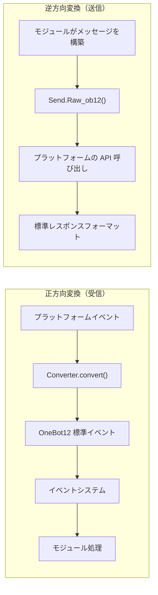

## ディレクトリ構造

標準的なアダプタパッケージ構造は以下の通りです：

```
MyAdapter/
├── pyproject.toml          # プロジェクト設定
├── README.md               # プロジェクト説明
├── LICENSE                 # ライセンス
└── MyAdapter/
    ├── __init__.py          # パッケージエントリ
    ├── Core.py               # アダプタのメインクラス
    └── Converter.py          # イベント変換器
```

## 速習

### 1. プロジェクトの作成

```bash
mkdir MyAdapter && cd MyAdapter
```

### 2. pyproject.toml の作成

```toml
[project]
name = "ErisPulse-MyAdapter"
version = "1.0.0"
description = "MyAdapterプラットフォームアダプタ"
readme = "README.md"
requires-python = ">=3.10"
license = { file = "LICENSE" }
authors = [ { name = "yourname", email = "your@mail.com" } ]

dependencies = [
    "ErisPulse>=2.4.0"  # ErisPulse は aiohttp を内蔵しているため、通常は個別に依存関係を指定する必要はない
]

[project.urls]
"homepage" = "https://github.com/yourname/MyAdapter"

[project.entry-points."erispulse.adapter"]
"MyAdapter" = "MyAdapter:MyAdapter"
```

### 3. アダプタのメインクラスの作成

フレームワークは `ConfigClass` / `AccountConfigClass` を提供し、宣言的に設定を管理します。アダプタは設定クラスを宣言するだけで、自動的にロード、検証、設定テンプレートの生成が行われます。

```python
# MyAdapter/Core.py
from dataclasses import dataclass, field
from ErisPulse.Core import BaseAdapter
from ErisPulse.Core.Bases import BaseConfig

@dataclass
class MyAdapterConfig(BaseConfig):
    """MyAdapter 設定"""
    api_endpoint: str = field(
        default="https://api.example.com",
        metadata={
            "description": {"i18n": "my_adapter.api_endpoint", "default": "API アドレス"},
            "required": False,
            "ui": {"widget": "text", "group": "connection", "order": 1},
        },
    )
    token: str = field(
        default="",
        metadata={
            "description": {"i18n": "my_adapter.token", "default": "プラットフォーム Token"},
            "required": True,
            "secret": True,
            "ui": {"widget": "password", "group": "basic", "order": 2},
        },
    )

class MyAdapter(BaseAdapter):
    ConfigClass = MyAdapterConfig  # 設定クラスを宣言し、フレームワークが自動管理
    
    # __init__ をオーバーライドする必要はない！フレームワークが自動処理：
    # - self.sdk / self.logger が自動設定される
    # - self.cfg は設定をリアルタイムで読み取れる
    # - self.Send / self.Request が自動初期化される
    
    def _setup_converter(self):
        from .Converter import MyPlatformConverter
        return MyPlatformConverter()
```

> ⚠️ **__init__ について**：新バージョンでは `BaseAdapter.__init__(self, sdk=None)` が SDK の参照、ログの初期化、設定のロードを自動的に処理します。ほとんどのアダプタは `__init__` をオーバーライドする必要はありません。詳細は [__init__ 注意事項](#init-注意事项) を参照してください。

> ⚠️ **super().__init__() について**：`BaseAdapter.__init__()` は `Send` と `Request` ファクトリのインスタンスを作成します。これを呼び出さないと、すべてのメッセージ送信とリクエスト操作で `AttributeError` が発生します。詳細は [__init__ 注意事項](#init-注意事项) を参照してください。

### 4. 必須メソッドの実装

```python
class MyAdapter(BaseAdapter):
    # ... __init__ 代码 ...
    
    async def start(self):
        """アダプタの起動（必須実装）"""
        # WebSocket または WebHook ルートを登録
        router.register_websocket(
            module_name="myplatform",
            path="/ws",
            handler=self._ws_handler
        )
        self.logger.info("アダプタが起動しました")
    
    async def shutdown(self):
        """アダプタの停止（必須実装）"""
        router.unregister_websocket(
            module_name="myplatform",
            path="/ws"
        )
        # 接続とリソースのクリーンアップ
        self.logger.info("アダプタが停止しました")
    
    async def call_api(self, endpoint: str, **params):
        """プラットフォーム API の呼び出し（必須実装）"""
        raise NotImplementedError("call_api を実装する必要があります")
```

#### メタイベントの送信

アダプタは Bot のオンライン状態をフレームワークに通知するために、メタイベントを送信する必要があります。`emit_meta()` を使用すれば、1 行で実現できます：

```python
class MyAdapter(BaseAdapter):
    async def _ws_handler(self, websocket):
        bot_id = self._get_bot_id()

        # Bot がオンライン
        await self.emit_meta("connect", bot_id, user_name="MyBot")

        try:
            while True:
                data = await websocket.receive_text()
                event = self.convert(data)
                if event:
                    await self.adapter.emit(event)
        except WebSocketDisconnect:
            pass
        finally:
            # Bot がオフライン
            await self.emit_meta("disconnect", bot_id)
```

> Bot 状態管理とメタイベントの詳細については、[アダプタのベストプラクティス - Bot 状態管理](best-practices.md#bot-状態管理と-meta-イベント) を参照してください。

### 5. Send クラスの実装

`At`/`AtAll`/`Reply` 修飾子はフレームワークの SendDSL 基底クラスに既に実装されています。アダプタは `Raw_ob12` と具体的な送信メソッドを実装するだけで済みます。

フレームワークは以下の重要な補助メソッドを提供しています：
- `self._apply_modifiers(message)` — 修飾子（At/AtAll/Reply）をメッセージセグメントに自動的にマージ
- `self.send_context` — 送信コンテキスト辞書（`target_type`、`target_id`、`account_id`）を取得

```python
import asyncio

class MyAdapter(BaseAdapter):
    # ... 他のコード ...

    class Send(BaseAdapter.Send):

        def Raw_ob12(self, message, **kwargs):
            """
            OneBot12 形式のメッセージを送信する（必須実装）

            _apply_modifiers を使用して修飾子を自動的にマージし、send_context を使用して送信コンテキストを取得する。
            """
            async def _do_send():
                segments = self._apply_modifiers(message)
                return await self._adapter.call_api(
                    endpoint="/send_message",
                    message=segments,
                    **self.send_context,
                    **kwargs
                )
            return asyncio.create_task(_do_send())

        # Text/Image/Voice/Video/File は SendDSL 基底クラスから継承されているため、
        # Raw_ob12 にデフォルトで委譲されるため、再実装する必要はない。
        # プラットフォーム固有のロジックが必要な場合は、個別のメソッドをオーバーライドする：
        # def Text(self, text: str):
        #     return self.Raw_ob12([{"type": "text", "data": {"text": text}}])
```

**メディア送信メソッド（Image/Video/File）の実装のポイント：**

- 基底クラスのデフォルト実装は、`file` パラメータを OneBot12 メッセージセグメントにカプセル化して `Raw_ob12` に渡す。アダプタは `Raw_ob12` でダウンロード/アップロードを処理する必要がある。
- `file` パラメータは `bytes` 二進データと `str` URL の両方に対応する。
- URL を渡した場合は、まずファイルをダウンロードしてからプラットフォームにアップロードする必要がある。
- プラットフォームでは通常、まずアップロード API を呼び出してファイル識別子を取得し、次に送信 API を呼び出す。

**`__getattr__` マジックメソッド：**

- メソッド名の大小文字を区別しない（`Text`、`text`、`TEXT` がすべて呼び出せる）
- 定義されていないメソッドはエラーではなく、エラーメッセージを返す

**`Raw_ob12` メソッド：**

- OneBot12 標準メッセージ形式をプラットフォーム形式に変換して送信する
- `self._apply_modifiers(message)` を使用して At/AtAll/Reply 修飾子を自動的に処理する
- `**self.send_context` を使用して送信先情報とアカウント情報を渡す

### 6. 変換器の実装

```python
# MyAdapter/Converter.py
import time
import uuid

class MyPlatformConverter:
    def convert(self, raw_event):
        """プラットフォームの生イベントを OneBot12 標準形式に変換する"""
        if not isinstance(raw_event, dict):
            return None
        
        onebot_event = {
            "id": str(raw_event.get("event_id", uuid.uuid4())),
            "time": int(time.time()),
            "type": self._convert_event_type(raw_event.get("type")),
            "detail_type": self._convert_detail_type(raw_event),
            "platform": "myplatform",
            "self": {
                "platform": "myplatform",
                "user_id": str(raw_event.get("bot_id", ""))
            },
            "myplatform_raw": raw_event,
            "myplatform_raw_type": raw_event.get("type", "")
        }
        
        return onebot_event
    
    def _convert_event_type(self, event_type):
        """イベントタイプを変換する"""
        type_map = {
            "message": "message",
            "notice": "notice"
        }
        return type_map.get(event_type, "unknown")
    
    def _convert_detail_type(self, raw_event):
        """詳細タイプを変換する"""
        return "private"  # 簡単化のため
```

### 7. Request クラスの実装（リクエスト操作）

プラットフォームが友達リクエスト、グループ招待など Bot が判断を必要とするリクエストに対応している場合、`Request` 内部クラスを実装することができます。

```python
from ErisPulse.Core import BaseAdapter, RequestDSL

class MyAdapter(BaseAdapter):
    # ... Send と他のコード ...

    class Request(RequestDSL):
        """リクエスト操作の実装（友達リクエスト、グループ招待など）"""

        def accept(self, **kwargs):
            """リクエストを承認する"""
            async def _do():
                result = await self._adapter.call_api(
                    endpoint="/set_request",
                    request_id=self._request_id,
                    approve=True,
                    **kwargs,
                )
                return {
                    "status": "ok" if result.get("code") == 0 else "failed",
                    "retcode": result.get("code", 0),
                    "data": None,
                    "message_id": "",
                    "message": result.get("message", ""),
                }
            return self._create_task(_do())

        def reject(self, **kwargs):
            """リクエストを拒否する"""
            async def _do():
                result = await self._adapter.call_api(
                    endpoint="/set_request",
                    request_id=self._request_id,
                    approve=False,
                    **kwargs,
                )
                return {
                    "status": "ok" if result.get("code") == 0 else "failed",
                    "retcode": result.get("code", 0),
                    "data": None,
                    "message_id": "",
                    "message": result.get("message", ""),
                }
            return self._create_task(_do())
```

モジュール開発者が使用する方法：

```python
from ErisPulse.Core.Event import request

@request.on_friend_request()
async def handle_friend_request(event):
    # Event 便利メソッドを使用
    await event.approve()
    # またはアダプタを直接操作
    await adapter.myplatform.Request("req_id").accept()
```

> プラットフォームがリクエスト操作に対応していない場合は、`Request` 内部クラスを実装する必要はありません。基底クラスはデフォルトで `retcode=10002`（対応していない操作）を返します。詳細は [リクエスト操作規格](../../standards/request-action-spec.md) を参照してください。

### 8. パッケージエントリの作成

```python
# MyAdapter/__init__.py
from .Core import MyAdapter
```

## 依存関係の宣言（オプション、2.8.0以降）

アダプタは他のアダプタやモジュールへの依存を宣言し、アダプタ間の連携やオプション機能を実現することができます：

```python
from typing import ClassVar

class MyAdapter(BaseAdapter):
    # 硬的依存：存在しない場合、起動をスキップし、警告と status=skipped-dependency イベントを送る
    depends: ClassVar[dict] = {
        "adapters": ["onebot11"],   # 依存するアダプタ（プラットフォーム名）
        "modules": ["TranslateEngine"],  # 依存するモジュール（登録名）
    }
    # ソフト依存：存在しない場合、起動に影響せず、モジュールのロード/アンロード時にコールバックを受ける（オプション機能モード）
    optional_modules: ClassVar[list] = ["TranslateEngine"]
```

- **起動順序**：モジュールの硬的依存を宣言したアダプタは、モジュールの初期化完了後に起動される
- **ソフト依存の通知**：`optional_modules`（またはモジュールの硬的依存）に含まれるモジュールがロードされたときに `on_dependency_ready(module_name)` を呼び出す；アンロードされたときに `on_dependency_lost(module_name)` を呼び出す（デフォルトは空実装、オーバーライド可能）— 早めのオーバーライドとホットリロードの場面に対応：

```python
async def on_dependency_ready(self, module_name):
    """ソフト依存モジュールの準備完了：対応するオプション機能を有効化"""
    if module_name == "TranslateEngine":
        self._translate = self.sdk.TranslateEngine

async def on_dependency_lost(self, module_name):
    """ソフト依存モジュールの喪失：機能を降格"""
    if module_name == "TranslateEngine":
        self._translate = None
```

> [!NOTE]
> この機能は ErisPulse **2.8.0+** が必要です。

## `__init__` 注意事項

アダプタ開発では、`__init__` のオーバーライドが3つのレベルで必要になる場合があります。以下の各レベルの正しい使い方を紹介します。

### 1. BaseAdapter 層（ほとんどの場合、オーバーライドする必要はない）

`BaseAdapter.__init__(self, sdk=None)` は `Send` / `Request` ファクトリのインスタンスを作成し、以下を自動的に処理します：

- `sdk` パラメータを受け取り、`self.sdk`、`self.logger` を設定
- `ConfigClass` を宣言した場合、`self.cfg` を通じてグローバル設定をリアルタイムで読み取れる
- `AccountConfigClass` を宣言した場合、`self.accounts` を通じて複数アカウントの設定をリアルタイムで読み取れる

**ほとんどの場合、`__init__` をオーバーライドする必要はない**。`ConfigClass` を宣言するだけで済みます：

```python
class MyAdapter(BaseAdapter):
    ConfigClass = MyAdapterConfig  # 設定クラスを宣言するとフレームワークが自動管理
    
    async def start(self):
        cfg = self.cfg  # タイプセーフで、リアルタイムに読み取れる
        ...
```

もし本当にカスタム初期化が必要な場合は、`super().__init__(sdk)` を呼び出すだけです：

```python
class MyAdapter(BaseAdapter):
    ConfigClass = MyAdapterConfig
    
    def __init__(self, sdk=None):
        super().__init__(sdk)  # sdk を渡す
        self.converter = self._setup_converter()
        self.convert = self.converter.convert
```

### 2. Send 内部クラス（ほとんどの場合、オーバーライドする必要はない）

`SendDSL.__init__` は、チェーン呼び出しの状態を渡す（ターゲットタイプ、ターゲットID、アカウントなど）役割を担います。**ほとんどの場合、メソッド（`Raw_ob12`、`Text` など）をオーバーライドするだけで済み、`__init__` をオーバーライドする必要はありません。**

もし本当に必要（例えば、プラットフォーム特有の状態を初期化する）場合は、**すべてのパラメータを透かす必要があります**：

```python
class MyAdapter(BaseAdapter):
    class Send(BaseAdapter.Send):
        # パラメータ：adapter, target_type, target_id, account_id
        def __init__(self, adapter, target_type=None, target_id=None, account_id=None):
            super().__init__(adapter, target_type, target_id, account_id)  # ← 必須透かす
            self._my_state = None  # プラットフォーム特有の初期化
```

**なぜ透かす必要があるのか？** チェーン呼び出しの各ステップは `self.__class__(...)` を通じて新しいインスタンスを作成します：

```python
adapter.Send.To("user", "123")               # → Send(adapter, "user", "123", None)
adapter.Send.To("user", "123").Using("bot1")  # → Send(adapter, "user", "123", "bot1")
```

もし `__init__` のシグネチャが一致しない、または `super()` を呼び出さないと、チェーン呼び出しは中断します。

### 3. Request 内部クラス（ほとんどの場合、オーバーライドする必要はない）

Send と同じです。パラメータは `adapter`, `request_id`, `account_id` です：

```python
class MyAdapter(BaseAdapter):
    class Request(RequestDSL):
        # パラメータ：adapter, request_id, account_id
        def __init__(self, adapter, request_id=None, account_id=None):
            super().__init__(adapter, request_id, account_id)  # ← 必須透かす
            self._my_state = None  # プラットフォーム特有の初期化
```

### まとめ

| レベル | いつオーバーライドするか | 必須なこと |
|------|------------|-----------|
| **BaseAdapter** | カスタム初期化ロジックが必要な場合 | `super().__init__(sdk)` （sdk パラメータを渡す） |
| **Send 内部クラス** | 送信関連の状態を初期化する必要がある場合 | `super().__init__(adapter, target_type, target_id, account_id)` |
| **Request 内部クラス** | リクエスト関連の状態を初期化する必要がある場合 | `super().__init__(adapter, request_id, account_id)` |
| 3つのレベル | ほとんどの場合 | **ConfigClass を宣言するだけで、`__init__` を触らない** |

### 9. 接続情報とルート発見

アダプタがルートを登録すると、フレームワークはすべてのルート情報を記録します。ユーザーは以下の API を使ってアダプタの接続アドレスを確認できます：

```python
from ErisPulse import sdk

# アダプタの完全な接続情報を取得
info = sdk.adapter.get_connection_info("myplatform")
# {
#   "platform": "myplatform",
#   "status": "started",
#   "connection": {
#     "base_url": "http://localhost:8080",
#     "http_routes": [
#       {"path": "/myplatform/webhook", "method": "POST",
#        "url": "http://localhost:8080/myplatform/webhook"}
#     ],
#     "websocket_routes": [
#       {"path": "/myplatform/ws",
#        "url": "ws://localhost:8080/myplatform/ws"}
#     ]
#   }
# }

# すべての名前空間（アダプタ/モジュール）のルートをリストアップ
namespaces = sdk.router.list_namespaces()
# {"myplatform": {"http": ["/myplatform/webhook"], "websocket": ["/myplatform/ws"]}}

# 名前空間の完全な接続 URL を取得
urls = sdk.router.get_module_urls("myplatform")
# {"base_url": "http://localhost:8080", "http": [...], "websocket": [...]}

# 名前空間の詳細なルート情報を取得
routes = sdk.router.get_module_routes("myplatform")
# {"http": [{"path": "/myplatform/webhook", "methods": ["POST"]}],
#  "websocket": [{"path": "/myplatform/ws", "auth": false}]}
```

> **ヒント**：`get_connection_info()` が返す情報は、ユーザーに表示するのに適しています（例：WebUI）。プラットフォーム側のコールバックアドレスや WebSocket 接続アドレスの設定に役立ちます。ルート登録時の `module_name` は、ErisPulse でアダプタを登録する際の `platform` 名と完全に一致している必要があります。一致していないと、ルート発見が正しく関連付けられません。

### 10. SSE (Server-Sent Events) のサポート

ErisPulse はサーバーに依存しない SSE を内蔵しており、モジュールやアダプタは `@sdk.router.sse()` を使って SSE エンドポイントを登録できます。

#### 基本的な使い方

```python
import asyncio
from ErisPulse import sdk

@sdk.router.sse("MyModule", "/events")
async def event_stream(sse):
    """SSE イベントを送信する"""
    count = 0
    while not sse.closed:
        await sse.send({"count": count}, event="update")
        count += 1
        await asyncio.sleep(1)
```

#### リクエストパラメータの使用

ハンドラは `request` パラメータを宣言してクライアントリクエスト情報を取得できます：

```python
@sdk.router.sse("MyModule", "/events")
async def event_stream(request, sse):
    token = request.query_params.get("token")
    if not validate_token(token):
        await sse.close()
        return

    while not sse.closed:
        data = await fetch_data(token)
        await sse.send(data)
        await asyncio.sleep(5)
```

#### SseEmitter API

| メソッド | 説明 |
|------|------|
| `sse.send(data, event=None, id=None, retry=None)` | SSE イベントを送信。str 以外の data は自動的に JSON シリアライズされる |
| `sse.close()` | SSE 接続を優雅に閉じる（安全に呼び出せる、複数回呼び出しても問題ない） |
| `sse.closed` | 接続が閉じられているか |
| `sse.request` | ベースのリクエストオブジェクト（クエリパラメータ、ヘッダーなどを読み取るのに使用） |

#### RouteGroup での使用

```python
api = sdk.router.group("MyModule", "/api", version="1")

@api.sse("/events")
async def events(sse):
    await sse.send({"msg": "hello"})
```

#### ルート発見

SSE ルートは自動的にルート発見 API に含まれます：

```python
# list_namespaces は "sse" キーを含む
sdk.router.list_namespaces()
# {"MyModule": {"http": [...], "websocket": [...], "sse": ["/MyModule/events"]}}

# get_module_routes は streaming: true をマークする
sdk.router.get_module_routes("MyModule")
# {"http": [...], "websocket": [...], "sse": [{"path": "/MyModule/events", "streaming": true}]}

# get_module_urls は完全な URL を生成する
sdk.router.get_module_urls("MyModule")
# {"sse": [{"path": "/MyModule/events", "url": "http://localhost:8080/MyModule/events"}]}
```

> **サーバーに依存しない設計**：`SseEmitter` はコールバックを通じて下層の HTTP フレームワークと解離されている。フレームワークは `register_sse()` と `@sse` デコレータを統一的な登録エントリとして提供しており、アダプタは下層の HTTP フレームワークに直接依存することなく SSE エンドポイントを実装できる。

## 次にやること

- [アダプタのコア概念](core-concepts.md) - アダプタのアーキテクチャを理解する
- [SendDSL 詳解](send-dsl.md) - メッセージ送信を学ぶ
- [変換器の実装](converter.md) - イベント変換を理解する
- [アダプタのベストプラクティス](best-practices.md) - 高品質なアダプタを開発する


### 适配器核心概念

# アダプタのコアコンセプト

ErisPulse アダプタのコアコンセプトを理解することは、アダプタを開発するための基礎です。

## アダプタアーキテクチャ

### コンポーネント関係

```
正方向変換（受信方向）                           逆方向変換（送信方向）
─────────────────                           ─────────────────
                                             
┌──────────────────┐                        ┌──────────────────┐
│ プラットフォーム固有のイベント │                        │ モジュールが構築するメッセージ │
└────────┬─────────┘                        └────────┬─────────┘
         │                                           │
         ↓                                           ↓
┌──────────────────┐   ┌──────────────────┐   ┌──────────────────┐
│                  │   │ アダプタ (MyAdapter) │   │                  │
│  Converter       │   │ ┌──────────────┐ │   │ Send.Raw_ob12()  │
│  (イベント変換器)    │──→│ │              │ │   │ (逆方向変換のエントリポイント)   │
│                  │   │ │              │ │   │                  │
└──────────────────┘   │ └──────────────┘ │   └────────┬─────────┘
                       └──────────────────┘            │
                                │                      ↓
                                ↓              ┌──────────────────┐
                       ┌──────────────────┐    │ プラットフォーム API 呼び出し    │
                       │ OneBot12 標準イベント │    └────────┬─────────┘
                       └────────┬─────────┘             │
                                │                      ↓
                                ↓              ┌──────────────────┐
                       ┌──────────────────┐    │ 標準レスポンス形式     │
                       │ イベントシステム         │    └──────────────────┘
                       └────────┬─────────┘
                                │
                                ↓
                       ┌──────────────────┐
                       │ モジュール (イベント処理)  │
                       └──────────────────┘
```

**コアの対称性**：
- **正方向変換**（Converter）：プラットフォーム固有のイベント → OneBot12 標準イベント、元のデータは `{platform}_raw` に保持される
- **逆方向変換**（Raw_ob12）：OneBot12 メッセージセグメント → プラットフォーム API 呼び出し、標準レスポンス形式で返される

## AdapterManager 适配器管理器

`AdapterManager` は ErisPulse におけるアダプターシステムの中心となるコンポーネントであり、すべてのプラットフォームアダプターの登録、起動、停止、およびイベントの配信を管理します。

### 核心機能

- **アダプター登録**：複数のプラットフォームアダプターを登録および管理
- **ライフサイクル管理**：アダプターの起動と停止を制御
- **イベント配信**：OneBot12 標準イベントとプラットフォーム固有のイベントを配信
- **設定管理**：アダプターの有効/無効状態を管理
- **ミドルウェアサポート**：OneBot12 イベントミドルウェアをサポート

### 基本的な使用方法

```python
from ErisPulse import sdk

# アダプターの登録（通常は Loader によって自動的に行われる）
sdk.adapter.register("myplatform", MyPlatformAdapter)

# すべてのアダプターを起動
await sdk.adapter.startup()

# 指定されたアダプターを起動
await sdk.adapter.startup(["myplatform"])
# すべてのアダプターを起動
await sdk.adapter.startup()

# アダプターのインスタンスを取得
my_adapter = sdk.adapter.get("myplatform")
# または属性でアクセス
my_adapter = sdk.adapter.myplatform

# すべてのアダプターを停止
await sdk.adapter.shutdown()
```

### 起動と停止

#### アダプターの起動

```python
# 登録済みのすべてのアダプターを起動
await sdk.adapter.startup()

# 指定されたプラットフォームを起動
await sdk.adapter.startup(["platform1", "platform2"])
```

**起動フロー：**

1. `adapter.start` ライフサイクルイベントを送信
2. `adapter.status.change` イベントを送信（starting）
3. 各アダプターを並列で起動
4. 起動に失敗した場合、指数バックオフ戦略による自動リトライ
5. 起動成功後、`adapter.status.change` イベントを送信（started）

**リトライメカニズム：**

- 最初の4回のリトライ：60秒、10分、30分、60分
- 5回目以降：3時間固定間隔

#### アダプターの停止

```python
# すべてのアダプターを停止
await sdk.adapter.shutdown()
```

**停止フロー：**

1. `adapter.stop` ライフサイクルイベントを送信
2. すべてのアダプターの `shutdown()` メソッドを呼び出す
3. ルーティングサーバーを停止
4. イベントハンドラをクリア
5. `adapter.stopped` ライフサイクルイベントを送信

### 設定管理

#### プラットフォームの状態を確認

```python
# プラットフォームが登録されているか確認
exists = sdk.adapter.exists("myplatform")

# プラットフォームが有効化されているか確認
enabled = sdk.adapter.is_enabled("myplatform")

# in 演算子を使用
if "myplatform" in sdk.adapter:
    print("プラットフォームは存在し、有効化されています")
```

#### プラットフォームの一覧表示

```python
# 登録済みのすべてのプラットフォームを表示
platforms = sdk.adapter.list_registered()

# すべてのプラットフォームとその状態を表示
status_dict = sdk.adapter.list_items()
# 戻り値: {"platform1": true, "platform2": false, ...}

# 有効化されたプラットフォームのリストを取得
enabled_platforms = [p for p, enabled in status_dict.items() if enabled]
```

### イベントの監視

#### OneBot12 標準イベント

```python
from ErisPulse import sdk

# すべてのプラットフォームの標準メッセージイベントを監視
@sdk.adapter.on("message")
async def handle_message(data):
    print(f"OneBot12 メッセージを受信: {data}")

# 特定のプラットフォームの標準メッセージイベントを監視
@sdk.adapter.on("message", platform="myplatform")
async def handle_platform_message(data):
    print(f"myplatform からのメッセージを受信: {data}")

# すべてのイベントを監視
@sdk.adapter.on("*")
async def handle_any_event(data):
    print(f"イベントを受信: {data.get('type')}")
```

#### プラットフォーム固有のイベント

```python
# 特定のプラットフォームの固有イベントを監視
@sdk.adapter.on("raw_event_type", raw=True, platform="myplatform")
async def handle_raw_event(data):
    print(f"固有イベントを受信: {data}")

# すべてのプラットフォームの固有イベントを監視（ワイルドカード）
@sdk.adapter.on("*", raw=True)
async def handle_all_raw_events(data):
    print(f"固有イベントを受信: {data}")
```

#### イベント配信メカニズム

`adapter.emit(event_data)` を呼び出したとき：

1. **ミドルウェア処理**：まずすべての OneBot12 ミドルウェアを実行
2. **標準イベント配信**：マッチする OneBot12 イベントハンドラに配信
3. **固有イベント配信**：元のデータがあれば、固有イベントハンドラに配信

**マッチングルール：**

- 精確マッチ：`@sdk.adapter.on("message")` は `message` イベントのみにマッチ
- ワイルドカード：`@sdk.adapter.on("*")` はすべてのイベントにマッチ
- プラットフォームフィルタリング：`platform="myplatform"` は指定されたプラットフォームのイベントのみに配信

### ミドルウェア

#### ミドルウェアの追加

```python
@sdk.adapter.middleware
async def logging_middleware(data):
    """ログ記録ミドルウェア"""
    print(f"イベントを処理: {data.get('type')}")
    return data  # 必ずデータを返す

@sdk.adapter.middleware
async def filter_middleware(data):
    """イベントフィルタリングミドルウェア"""
    # 不要なイベントをフィルタリング
    if data.get("type") == "notice":
        return None  # None を返した場合、ミドルウェアチェーンはその返り値を無視し、元のデータを保持して配信を続ける
    return data  # データを返して配信を続ける
```

#### ミドルウェアの実行順序

ミドルウェアは登録順に実行され、後から登録されたミドルウェアが先に実行されます。

> **注意**：ミドルウェアが `None`（例：`return data` を忘れている）を返した場合、フレームワークはその返り値を無視し、元のデータを保持して配信を続け、警告レベルのログを出力します。これにより、1つのミドルウェアのミスがイベントチェーン全体を中断することを防ぎます。

```python
# 登録順
sdk.adapter.middleware(middleware1)  # 最後に実行
sdk.adapter.middleware(middleware2)  # 中間で実行
sdk.adapter.middleware(middleware3)  # 最初に実行

# 実行順序：middleware3 -> middleware2 -> middleware1
```

### アダプターインスタンスの取得

#### get() メソッド

```python
adapter = sdk.adapter.get("myplatform")
if adapter:
    await adapter.Send.To("user", "123").Text("Hello")
```

#### 属性アクセス

```python
# 属性名でアクセス（大文字小文字を区別しない）
adapter = sdk.adapter.myplatform
await adapter.Send.To("user", "123").Text("Hello")
```

## BaseAdapter 基底クラス

### 基本構造

```python
from dataclasses import dataclass, field
from ErisPulse.Core import BaseAdapter
from ErisPulse.Core.Bases import BaseConfig, BotAccountConfig

@dataclass
class MyConfig(BaseConfig):
    """アダプターの設定（宣言後、フレームワークが自動的に管理）"""
    token: str = field(
        default="",
        metadata={
            "description": {"i18n": "my_adapter.token", "default": "Bot Token"},
            "required": True,
            "secret": True,
            "ui": {"widget": "password", "group": "basic", "order": 1},
        },
    )

class MyAdapter(BaseAdapter):
    ConfigClass = MyConfig  # 設定クラスを宣言
    
    # __init__ をオーバーライドする必要はない、フレームワークが自動的に処理する：
    # - self.sdk, self.logger
    # - self.cfg（型安全な設定インスタンス、リアルタイムで読み取り）
    # - self.Send, self.Request
    
    async def start(self):
        """アダプターの起動（実装必須）"""
        cfg = self.cfg  # 自動的にロードされる型安全な設定
        pass
    
    async def shutdown(self):
        """アダプターの終了（実装必須）"""
        pass
    
    async def call_api(self, endpoint: str, **params):
        """プラットフォームAPIの呼び出し（実装必須）"""
        pass
```

### 設定管理

フレームワークは宣言型の設定管理を提供しており、dataclassを使って設定構造を定義し、フレームワークが自動的にロード、検証、テンプレート生成を処理します。

#### 単一アカウント設定

```python
from dataclasses import dataclass, field
from ErisPulse.Core.Bases import BaseConfig

@dataclass
class TelegramConfig(BaseConfig):
    token: str = field(default="", metadata={
        "description": {"i18n": "telegram.token", "default": "Bot Token"},
        "required": True,
        "secret": True,
        "ui": {"widget": "password", "group": "basic", "order": 1},
    })
    proxy: str = field(default="", metadata={
        "description": {"i18n": "telegram.proxy", "default": "プロキシアドレス"},
        "ui": {"widget": "text", "group": "advanced", "order": 10},
    })

class TelegramAdapter(BaseAdapter):
    ConfigClass = TelegramConfig
    
    async def start(self):
        cfg = self.cfg  # 型安全、リアルタイムで読み取り
        if not cfg.token:
            raise ValueError("Tokenが設定されていません")
        await self._connect(cfg.token, proxy=cfg.proxy)
```

#### 複数アカウント設定

`BotAccountConfig` 基底クラスは `enabled` と `name` フィールドを提供します。ほとんどのアダプターは、プラットフォームのプロトコルまたはログイン応答から自動的に bot_id を取得でき、イベントの変換時にアカウント設定に注入されます。

```python
from dataclasses import dataclass, field
from ErisPulse.Core.Bases import BotAccountConfig

# ほとんどのアダプターでは、bot_idは実行時に自動的に取得されるため、設定は不要
@dataclass
class MyBotConfig(BotAccountConfig):
    token: str = field(default="", metadata={
        "description": {"i18n": "my_adapter.bot_token", "default": "Token"},
        "required": True,
    })

# ログイン時に bot_id を取得できない場合は、ユーザーに設定で入力してもらう
@dataclass
class YunhuBotConfig(BotAccountConfig):
    bot_id: str = field(default="", metadata={
        "description": {"i18n": "yunhu.bot_id", "default": "ロボットID"},
        "required": True,
    })
    token: str = field(default="", metadata={
        "description": {"i18n": "yunhu.token", "default": "Token"},
        "required": True,
    })

class MyAdapter(BaseAdapter):
    AccountConfigClass = MyBotConfig
    
    async def start(self):
        for name, account in self.enabled_accounts.items():
            user_id = await self._login(name, account)
            await self.emit_meta("connect", user_id)
```

#### metadata 約定

フィールドの metadata は、TOMLのコメント生成とWebUIのフォームレンダリングの両方に使用されます。

```python
metadata = {
    "description": str | dict,  # フィールドの説明（i18nに対応）
    "required": bool,         # 必須入力かどうか（検証 + WebUIの必須マーク）
    "secret": bool,           # 敏感情報かどうか（WebUIでは***表示、ログでは脱敏）
    "ui": {                   # WebUIのコントロール設定（旧名 "webui" は互換性を保つ）
        "widget": str,        # コントロールの種類: "text" | "switch" | "select" | "number" | "password"
        "group": str,         # グループ: "basic" | "advanced" | "connection" など
        "order": int,         # ソートの重み（小さいほど先に表示）
        "options": list,      # selectコントロールの選択肢 [{label, value}]、labelはi18nに対応
        "placeholder": str | dict,  # 入力欄のプレースホルダー（i18nに対応）
    },
    "extra": dict,            # その他の拡張フィールド（schemaに透過的に渡す）
}
```

ユーザーが見られるすべてのテキストフィールドはi18nに対応しており、統一的に `{"i18n": "key", "default": "テキスト"}` の形式を使用します。純粋な文字列はそのまま透過されます（後方互換性）。対応するi18nフィールドは以下の通りです：

| フィールド | 位置 | 説明 |
|------|------|------|
| `description` | field metadata | フィールドの説明 |
| `options[].label` | `ui.options` | selectコントロールの選択肢ラベル |
| `placeholder` | `ui.placeholder` | 入力欄のプレースホルダー |
| `group_labels` | `_schema_meta` | グループの表示名（ダッシュボードのセクションタイトル） |

i18nを使用する場合、事前に翻訳キーをi18nシステムに登録する必要があります（[i18nドキュメント](../../advanced/i18n.md#配置フィールド多言語)を参照）。

**description / placeholder / options label** の例：

```python
token: str = field(
    default="",
    metadata={
        "description": {"i18n": "my_adapter.token", "default": "Bot Token"},
        "ui": {
            "widget": "text",
            "placeholder": {"i18n": "my_adapter.token.ph", "default": "Tokenを入力してください"},
        },
    },
)
mode: str = field(
    default="a",
    metadata={
        "description": {"i18n": "my_adapter.mode", "default": "モード"},
        "ui": {
            "widget": "select",
            "options": [
                {"label": {"i18n": "my_adapter.mode.a", "default": "オプションA"}, "value": "a"},
                {"label": "純粋な文字列ラベル", "value": "b"},  # 純粋な文字列はそのまま透過
            ],
        },
    },
)
```

**group_labels** の例（設定クラス定義後に宣言）：

```python
MyConfig._schema_meta = {
    "group_labels": {
        "basic": {"i18n": "my_adapter.group.basic", "default": "基本設定"},
        "advanced": {"i18n": "my_adapter.group.advanced", "default": "高度設定"},
    }
}
```

フレームワークの `resolve_config_schema()` は、現在の言語に応じて上記のすべてのi18nキーを自動的に解決します。`get_config_schema()` はi18n辞書をそのまま透過し、フロントエンドが独自に解析します。

### 宣言型の翻訳キー（v2.7.0+）

アダプターは `ConfigClass` を宣言するのと同じように、`I18nClass` 内部クラスを使って翻訳キーを一括宣言できます。フレームワークは `__init__` 段階（設定テンプレート生成前）で、宣言されたすべての翻訳キーを自動的に登録し、設定の説明で参照されるi18nキーがテンプレート生成時に利用可能になることを保証します。

```python
from ErisPulse.Core.Bases import BaseAdapter, BaseI18n, I18nKey

class MyAdapter(BaseAdapter):
    class I18nClass(BaseI18n):
        endpoint: I18nKey = I18nKey(
            default="API Endpoint",
            zh_CN="API 地址",
            zh_TW="API 位址",
            en="API Endpoint",
            ja="APIアドレス",
            ru="API адрес",
        )
        token: I18nKey = I18nKey(
            default="Platform Token",
            zh_CN="平台 Token",
            zh_TW="平台權杖",
            en="Platform Token",
            ja="プラットフォームトークン",
            ru="Токен платформы",
        )
```

> ``I18nKey.default`` は**言語に依存しないデフォルトテキスト**であり、どの言語にも登録されません。翻訳を有効にするには、少なくとも1つの言語パラメータを明示的に渡す必要があります。

詳細な使い方（キーのパスルール、明示的な key パラメータなど）は [i18nドキュメント](../../advanced/i18n.md#推奨書き方-i18nclass-を使って翻訳キーを宣言する-v270) を参照してください。

### 宣言型のイベント拡張メソッド（v2.7.0+）

アダプターは `EventMixin` を使って、プラットフォーム固有のイベント拡張メソッドを一括宣言し、フレームワークが自動的に現在のプラットフォームに登録します。

```python
from ErisPulse.Core import BaseAdapter

class MyAdapter(BaseAdapter):
    class EventMixin:
        def get_chat_name(self):
            """チャット名を取得"""
            return self.get("myplatform_raw", {}).get("chat", {}).get("name", "")

        def is_official_message(self):
            """公式メッセージかどうかを判定"""
            raw = self.get("myplatform_raw", {})
            return raw.get("sender", {}).get("is_official", False)
```

登録後、イベントオブジェクトから直接これらのメソッドを呼び出せます：

```python
@message.on_group_message()
async def handler(event):
    if event.is_official_message():
        chat_name = event.get_chat_name()
        await event.reply(f"[{chat_name}] 公式メッセージが受信されました")
```

> アダプターのイベント拡張メソッドは自身のプラットフォーム（``self._platform``）に登録されます。モジュールがプラットフォーム間のイベント拡張を必要とする場合は、従来の ``register_event_mixin()`` API を使用してください。

#### アカウントの解決

複数アカウントアダプターは、`_resolve_account()` を使って、ターゲットアカウントを自動的に解決できます：

```python
async def call_api(self, endpoint: str, **params):
    account_id = params.pop("account_id", None)
    name, account = self._resolve_account(account_id)
    # name: アカウント名, account: 設定インスタンス
```

解決戦略：アカウント名一致 → `bot_id` フィールド一致 → 他の str フィールド一致 → 有効な最初のアカウント。

#### 設定のホット更新

サブクラスは `on_config_update()` をオーバーライドして、設定の変更に応答できます：

```python
class MyAdapter(BaseAdapter):
    ConfigClass = MyConfig
    
    def on_config_update(self, old_config, new_config):
        if old_config.token != new_config.token:
            self.logger.info("Tokenが更新されました、再接続します")
```

### 初期化プロセス

フレームワークは `BaseAdapter.__init__(self, sdk=None)` で、以下の処理を自動的に行います：

1. **SDKの参照**：`self.sdk`、`self.logger` を設定
2. **Send/Request工場**：`self.Send` と `self.Request` を作成
3. **設定テンプレート**：`ConfigClass` を宣言した場合、初めての起動時にデフォルト設定テンプレートを生成
4. **アカウントテンプレート**：`AccountConfigClass` を宣言した場合、初めての起動時にデフォルトアカウントテンプレートを生成
5. **EventMixinの登録**：`EventMixin` を宣言した場合、`AdapterManager` がプラットフォーム名を注入した後に自動的に登録

設定は `self.cfg` / `self.accounts` でリアルタイムに読み取ります（各アクセス時に設定ストアから最新値を取得）。`self.config` は `self.cfg` の互換エイリアスとして引き続き使用できます。

ほとんどのアダプターは `__init__` をオーバーライドする必要はありません。独自の初期化が必要な場合は：

```python
class MyAdapter(BaseAdapter):
    ConfigClass = MyConfig
    
    def __init__(self, sdk=None):
        super().__init__(sdk)  # sdkを渡す
        self.converter = self._setup_converter()
        self.convert = self.converter.convert
```

## Send 消息送信 DSL

### 継承関係

```python
class MyAdapter(BaseAdapter):
    class Send(BaseAdapter.Send):
        """Send は BaseAdapter.Send を継承するネストされたクラス"""
        pass
```

### 利用可能な属性

`Send` クラスを呼び出すと、自動的に以下の属性が設定されます：

| 属性 | 説明 | 設定方法 |
|-----|------|---------|
| `_target_id` | 目標ID | `To(id)` または `To(type, id)` |
| `_target_type` | 目標タイプ | `To(type, id)` |
| `_target_to` | 簡略化された目標ID | `To(id)` |
| `_account_id` | 送信アカウントID | `Using(account_id)` |
| `_adapter` | 适配器インスタンス | 自動設定 |
| `_at_user_ids` | @ユーザー一覧 | `At(user_id)` |
| `_reply_message_id` | 回答するメッセージID | `Reply(message_id)` |
| `_at_all` | 全員に@するかどうか | `AtAll()` |

> **推奨**：`self.send_context` 属性を使用して `target_type`、`target_id`、`account_id` を一括で取得する方が、インスタンス変数を直接アクセスするよりも明確です。

### フレームワーク補助メソッド

| メソッド/属性 | 説明 |
|-----------|------|
| `self._apply_modifiers(message)` | At/AtAll/Reply 修飾子の状態をメッセージセグメントリストにマージする |
| `self.send_context` | `{target_type, target_id, account_id}` の辞書を返す |

### 基本メソッド

アダプタは `Raw_ob12` のみ実装すればよく、標準メソッド（Text/Image/Voice/Video/File）は `SendDSL` 基底クラスから継承され、デフォルトで `Raw_ob12` に委譲されます：

```python
class Send(BaseAdapter.Send):
    def Raw_ob12(self, message, **kwargs):
        """OneBot12 メッセージセグメント → プラットフォーム API に変換する必要あり"""
        async def _do_send():
            segments = self._apply_modifiers(message)
            return await self._adapter.call_api(
                endpoint="/send_message",
                message=segments,
                **self.send_context,
                **kwargs
            )
        return asyncio.create_task(_do_send())

    # Text/Image/Voice/Video/File は基底クラスから継承され、Raw_ob12 に自動的に委譲されるため、再実装は不要
    # プラットフォーム特有のロジックが必要な場合は、個別メソッドをオーバーライドする：
    # def Text(self, text: str):
    #     return self.Raw_ob12([{"type": "text", "data": {"text": text}}])
```

### チェーン修飾メソッド

```python
class Send(BaseAdapter.Send):

    def __init__(self, adapter, target_type=None, target_id=None, account_id=None):
        super().__init__(adapter, target_type, target_id, account_id)
        self.buttons = []

    def Button(self, content: list) -> 'Send':
        self.buttons.append(content)
        return self
```

## イベントコンバーター

### コンバートフロー

```
プラットフォーム独自イベント
    ↓
Converter.convert()
    ↓
OneBot12 標準イベント
```

### 必須フィールド

すべてのコンバート後のイベントは以下の内容を含む必要があります。

```python
{
    "id": "イベントの唯一識別子",
    "time": 1234567890,           # 10桁 Unix タイムスタンプ
    "type": "message/notice/request/meta",
    "detail_type": "イベントの詳細タイプ",
    "platform": "プラットフォーム名",
    "self": {
        "platform": "プラットフォーム名",
        "user_id": "ボットID"     # bot_id と一致する必要がある
    },
    "{platform}_raw": {...},       # 元のデータ（必須）
    "{platform}_raw_type": "..."    # 元のタイプ（必須）
}
```

### コンバーターの例

```python
class MyPlatformConverter:
    def convert(self, raw_event):
        """プラットフォーム独自イベントを OneBot12 標準形式に変換する"""
        if not isinstance(raw_event, dict):
            return None
        
        # イベントIDの生成
        event_id = raw_event.get("event_id") or str(uuid.uuid4())
        
        # タイムスタンプの変換
        timestamp = raw_event.get("timestamp")
        if timestamp and timestamp > 10**12:
            timestamp = int(timestamp / 1000)
        else:
            timestamp = int(timestamp) if timestamp else int(time.time())
        
        # イベントタイプの変換
        event_type = self._convert_type(raw_event.get("type"))
        detail_type = self._convert_detail_type(raw_event)
        
        # 標準イベントの構築
        onebot_event = {
            "id": str(event_id),
            "time": timestamp,
            "type": event_type,
            "detail_type": detail_type,
            "platform": "myplatform",
            "self": {
                "platform": "myplatform",
                "user_id": str(raw_event.get("bot_id", ""))
            },
            "myplatform_raw": raw_event,
            "myplatform_raw_type": raw_event.get("type", "")
        }
        
        return onebot_event
```

## 接続管理

### WebSocket 接続

```python
class MyAdapter(BaseAdapter):
    async def start(self):
        """WebSocket ルートの登録"""
        router.register_websocket(
            module_name="myplatform",
            path="/ws",
            handler=self._ws_handler,
            auth_handler=self._auth_handler
        )
    
    async def _ws_handler(self, websocket):
        """WebSocket 接続ハンドラ"""
        self.connection = websocket
        
        try:
            while True:
                data = await websocket.receive_text()
                onebot_event = self.convert(data)
                if onebot_event:
                    await self.adapter.emit(onebot_event)
        except WebSocketDisconnect:
            self.logger.info("接続が切断されました")
        finally:
            self.connection = None
    
    async def _auth_handler(self, websocket) -> bool:
        """WebSocket 認証"""
        token = websocket.query_params.get("token")
        return token == "valid_token"
```

### WebHook 接続

```python
class MyAdapter(BaseAdapter):
    async def start(self):
        """WebHook ルートの登録"""
        router.register_http_route(
            module_name="myplatform",
            path="/webhook",
            handler=self._webhook_handler,
            methods=["POST"]
        )
    
    async def _webhook_handler(self, request):
        """WebHook リクエストハンドラ"""
        data = await request.json()
        onebot_event = self.convert(data)
        if onebot_event:
            await self.adapter.emit(onebot_event)
        return {"status": "ok"}
```

> **ルート情報の照会**：アダプターが登録したルート（HTTP、WebSocket、SSE）は、`sdk.adapter.get_connection_info(platform)` および `sdk.router.get_module_urls(module_name)` を使用して完全な接続アドレス（`base_url` + パス）を照会できます。詳細は [アダプターの開発入門 - 接続情報とルート発見](docs/ja/getting-started.md#9-接続情報とルート発見) および [SSE 支持](docs/ja/getting-started.md#10-sse-server-sent-events-サポート) を参照してください。

## API レスポンス標準

フレームワークは、`make_response()` および `make_error()` メソッドを使用して、手動でレスポンス辞書を構築することなく、標準化されたレスポンスを構築することができます。

### 成功レスポンス

```python
async def call_api(self, endpoint: str, **params):
    try:
        raw_response = await self._platform_api_call(endpoint, **params)
        
        return self.make_response(
            data=raw_response.get("data"),
            message_id=raw_response.get("data", {}).get("message_id", ""),
            raw=raw_response,
        )
    except Exception as e:
        return self.make_error(message=str(e), raw=None)
```

### 手動でレスポンスを構築する（旧バージョン方式は引き続き互換性があります）

```python
async def call_api(self, endpoint: str, **params):
    return {
        "status": "ok",
        "retcode": 0,
        "data": {...},
        "message_id": "msg_id",
        "message": "",
        "myplatform_raw": raw_response
    }
```

## 多アカウントサポート

### 宣言的構成（推奨）

`AccountConfigClass` を宣言構成クラスとして使用することで、フレームワークは多アカウントのロード、検証、テンプレート生成を自動的に管理します。

```python
from dataclasses import dataclass, field
from ErisPulse.Core.Bases import BotAccountConfig

@dataclass
class MyBotConfig(BotAccountConfig):
    bot_id: str = field(default="", metadata={"description": "Bot ID", "required": True})
    token: str = field(default="", metadata={"description": "Token", "required": True, "secret": True})

class MyAdapter(BaseAdapter):
    AccountConfigClass = MyBotConfig
    
    async def start(self):
        for name, account in self.enabled_accounts.items():
            self.logger.info(f"アカウント {name} を起動: {account.bot_id}")
            await self._connect(name, account)
    
    async def call_api(self, endpoint: str, **params):
        account_id = params.pop("account_id", None)
        name, account = self._resolve_account(account_id)
        # account.token, account.bot_id などのフィールドを使用
```

### アカウント構成ファイル

```toml
[MyAdapter.accounts.account1]
bot_id = "bot_001"
token = "token1"
enabled = true

[MyAdapter.accounts.account2]
bot_id = "bot_002"
token = "token2"
enabled = true
```

### アカウントを指定して送信

```python
# Using メソッドを使用してアカウントを指定
my_adapter = adapter.get("myplatform")

# イベントの self.user_id を使用（推奨、最も汎用的）
await my_adapter.Send.Using(event["self"]["user_id"]).To("user", "123").Text("Hello")

# アカウント名を使用
await my_adapter.Send.Using("account1").To("user", "123").Text("Hello")
```

### self.user_id と Using の関係

フレームワークのイベント返信メカニズムは、イベントの `self` フィールドから `account_id`（優先）または `user_id` を抽出し、`Using` パラメータとして渡します。アダプタ開発者は、Converter で `self.user_id` の値が `_resolve_account()` と正しく一致することを保証する必要があります。

**フレームワーク内部の動作**：

```python
# フレームワークが bot_id を抽出するロジック
bot_id = self.get("self", {}).get("account_id", "") or self.get("self", {}).get("user_id", "")

# bot_id が空でない場合に Using を呼び出す
if bot_id:
    send_chain = send_chain.Using(bot_id)
```

> **重要な点**：アダプタが 1 つの Bot 構成のみを使用している場合でも、Converter が `self.user_id` を正しく設定している限り、フレームワークはそれを `Using` パラメータとして渡します。アダプタは、`self.user_id` が `AccountConfigClass` に定義された識別フィールド（例: `bot_id`）と一致していることを保証し、`_resolve_account()` が正しいアカウントをマッチできるようにする必要があります。`self.user_id` が空の場合、フレームワークは `Using` を呼び出さず、`call_api` に渡される `account_id` は `None` になります。この場合、`_resolve_account(None)` は最初に有効なアカウントを返します。

## エラー処理

### 接続の再試行

```python
import asyncio

class MyAdapter(BaseAdapter):
    async def start(self):
        retry_count = 0
        max_retries = 5
        
        while retry_count < max_retries:
            try:
                await self._connect_to_platform()
                break
            except Exception as e:
                retry_count += 1
                if retry_count < max_retries:
                    wait_time = min(60 * (2 ** retry_count), 600)
                    self.logger.warning(f"接続に失敗しました。{wait_time}秒後に再試行します。")
                    await asyncio.sleep(wait_time)
                else:
                    raise
```

### API エラー処理

```python
async def call_api(self, endpoint: str, **params):
    try:
        # 推奨されるのは SDK 内部のクライアントを使用することです
        from ErisPulse.Core import client
        from ErisPulse.Core.Bases.errors import ClientError, ClientTimeoutError
        resp = await client.post(
            f"https://api.platform.com/{endpoint}",
            json=params,
            max_retries=2,
        )
        response = await resp.json()
        return self._standardize_response(response)
    except ClientTimeoutError:
        self.logger.error(f"リクエストがタイムアウトしました: {endpoint}")
        return self._error_response("リクエストがタイムアウトしました", 32000)
    except ClientError as e:
        self.logger.error(f"ネットワークエラー: {e}")
        return self._error_response("ネットワークリクエストに失敗しました", 33000)
    except Exception as e:
        self.logger.error(f"不明なエラー: {e}")
        return self._error_response(str(e), 34000)
```

> **後方互換性**：`aiohttp.ClientSession` を直接使用する既存のアダプタコードは影響を受けず、引き続き `aiohttp.ClientError` をキャッチできます。両方の方法を併用できます。新規開発では、`sdk.client` と ErisPulse の例外体系を使用することを推奨します。

## Bot 状態管理

AdapterManager には、Bot 状態の追跡システムが組み込まれており、登録済みのすべての Bot のオンライン状態、アクティブ時間、メタ情報などを自動的に維持します。

### 自動発見メカニズム

アダプターが `adapter.emit()` を使ってイベントを送信する際、フレームワークは自動的にイベント内の `self` フィールドをチェックします：

- **meta イベント**：`detail_type` に応じて対応する操作を実行します（connect で Bot を登録 / disconnect でオフラインをマーク / heartbeat でアクティブ時間を更新）
- **通常イベント**（message/notice/request）：Bot を自動的に発見し、アクティブ時間を更新します

```python
# self フィールドを含むすべてのイベントが自動発見をトリガーします
await self.adapter.emit({
    "type": "message",
    "platform": "myplatform",
    "self": {"platform": "myplatform", "user_id": "bot123"},
    # ...
})
# Bot "bot123" は自動的に登録されます（初めての出現の場合）し、アクティブ時間を更新します
```

### Meta イベントの種類

| `detail_type` | 説明 | フレームワークの動作 |
|---|---|---|
| `connect` | Bot が接続 | Bot を登録し、`adapter.bot.online` のライフサイクルイベントをトリガーします |
| `disconnect` | Bot が切断 | Bot をオフラインとマークし、`adapter.bot.offline` のライフサイクルイベントをトリガーします |
| `heartbeat` | Bot のハートビート | Bot のアクティブ時間とメタ情報を更新します |

### アダプターによる Meta イベント送信

`emit_meta()` を使って、一行で Meta イベントを送信できます：

```python
class MyAdapter(BaseAdapter):
    async def _on_bot_connect(self, bot_id: str):
        # 一行で connect イベントを送信
        await self.emit_meta("connect", bot_id, user_name="MyBot", nickname="私のロボット")

    async def _on_bot_disconnect(self, bot_id: str):
        await self.emit_meta("disconnect", bot_id)
```

手動で構築することもできます（従来の方法も互換性があります）：

```python
await self.adapter.emit({
    "type": "meta",
    "detail_type": "connect",
    "platform": "myplatform",
    "self": {"platform": "myplatform", "user_id": bot_id}
})
```

### `self` フィールドの拡張情報

`self` フィールドには、必須の `platform` と `user_id` の他に、以下のオプションフィールドがサポートされています：

| フィールド | 説明 |
|---|---|
| `user_name` | Bot のユーザー名 |
| `nickname` | Bot のニックネーム |
| `avatar` | Bot のアバター URL |
| `account_id` | 複数アカウントの識別子 |

### Bot 状態の照会

```python
from ErisPulse import sdk

# 単一の Bot の情報を取得
info = sdk.adapter.get_bot_info("myplatform", "bot123")
# {"status": "online", "last_active": 1712345678.0, "info": {"nickname": "MyBot"}}

# すべての Bot をリストアップ
all_bots = sdk.adapter.list_bots()

# 指定されたプラットフォームの Bot をリストアップ
platform_bots = sdk.adapter.list_bots("myplatform")

# Bot がオンラインかどうかを確認
is_online = sdk.adapter.is_bot_online("myplatform", "bot123")

# 完全な状態のサマリーを取得（WebUI に表示するのに適しています）
summary = sdk.adapter.get_status_summary()
# {"adapters": {"myplatform": {"status": "started", "bots": {...}}}}
```

### Bot のライフサイクルを監視

```python
from ErisPulse import sdk

@sdk.lifecycle.on("adapter.bot.online")
async def on_bot_online(data):
    platform = data.get("platform")
    bot_id = data.get("bot_id")
    sdk.logger.info(f"Bot 上線: {platform}/{bot_id}")

@sdk.lifecycle.on("adapter.bot.offline")
async def on_bot_offline(data):
    platform = data.get("platform")
    bot_id = data.get("bot_id")
    sdk.logger.info(f"Bot 下線: {platform}/{bot_id}")
```


### SendDSL 详解

# SendDSL 详解

SendDSL は ErisPulse アダプタが提供する、チェーン呼び出しスタイルのメッセージ送信インターフェースです。

## 基本呼び出し方法

### 1. 型と ID を指定

```python
await adapter.Send.To("group", "123").Text("Hello")
```

### 2. ID を指定のみ

```python
await adapter.Send.To("123").Text("Hello")
```

### 3. 送信アカウントを指定

```python
await adapter.Send.Using("bot1").Text("Hello")
```

### 4. 組み合わせ

```python
await adapter.Send.Using("bot1").To("group", "123").Text("Hello")
```

## メソッドチェーン

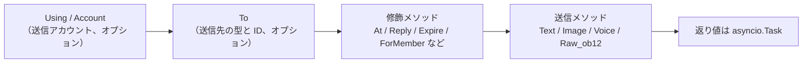

## 送信メソッド

すべての送信メソッドは `asyncio.Task` オブジェクトを返します。

### 基本メソッド（基底クラスに内蔵）

以下の標準メソッドは `SendDSL` 基底クラスに内蔵されており、**デフォルトで `Raw_ob12` に委譲**されます。アダプタのサブクラスは実装しなくても直接使用でき、IDE による補完も可能です：

| メソッド名 | 説明 | 戻り値 |
|--------|------|---------|
| `Text(text: str)` | テキストメッセージを送信 | `asyncio.Task` |
| `Image(file: bytes \| str)` | 画像を送信 | `asyncio.Task` |
| `Voice(file: bytes \| str)` | 音声を送信（OneBot12 `audio` メッセージセグメント） | `asyncio.Task` |
| `Video(file: bytes \| str)` | ビデオを送信 | `asyncio.Task` |
| `File(file: bytes \| str, filename: str = None)` | ファイルを送信 | `asyncio.Task` |

アダプタは個々の標準メソッドをオーバーライドして、プラットフォーム固有のロジックを提供できます：

```python
class Send(SendDSL):
    def Raw_ob12(self, message, **kwargs):
        # 必須実装
        ...

    # オプション：Text をオーバーライドしてプラットフォーム固有のロジックを提供
    # def Text(self, text: str):
    #     return self.Raw_ob12([{"type": "text", "data": {"text": text}}])
```

### プロトコルメソッド

| メソッド名 | 説明 | 戻り値 | 必須か |
|--------|------|---------|---------|
| `Raw_ob12(message)` | OneBot12 形式のメッセージを送信 | `asyncio.Task` | **必須実装** |

> **重要**：`Raw_ob12` はアダプタのコアメソッドで、**必須実装**です。これは OneBot12 → プラットフォームの逆変換の統一エントリーポイントです。実装しない場合、基底クラスは error ログを記録し、標準エラー応答（`status: "failed"`, `retcode: 10002`）を返します。標準メソッド（`Text`、`Image` など）はデフォルトで `Raw_ob12` に委譲されます。

### プラットフォーム固有メソッド

アダプタは `Send` サブクラスにプラットフォーム固有の送信メソッドを追加できます（`event.supports()` / `event.available_methods()` で認識されます）：

```python
class Send(SendDSL):
    def Raw_ob12(self, message, **kwargs): ...

    # プラットフォーム固有のメソッド
    def Sticker(self, sticker_id: str):
        return self.Raw_ob12([{"type": "sticker", "data": {"id": sticker_id}}])
```

## 修飾メソッド

修飾メソッドは `self` を返すことで、チェーン呼び出しを可能にします。

### At メソッド

```python
# @1人
await adapter.Send.To("group", "123").At("456").Text("你好")

# @複数人
await adapter.Send.To("group", "123").At("456").At("789").Text("你们好")
```

### AtAll メソッド

```python
# @全員
await adapter.Send.To("group", "123").AtAll().Text("大家好")
```

### Reply メソッド

```python
# メッセージに返信
await adapter.Send.To("group", "123").Reply("msg_id").Text("返信内容")
```

### 修飾の組み合わせ

```python
await adapter.Send.To("group", "123").At("456").Reply("msg_id").Text("返信@メッセージ")
```

### プラットフォーム固有修飾メソッド

`At`/`AtAll`/`Reply` に加えて、アダプタは**プラットフォーム固有の修飾メソッド**を定義できます。このメソッドは**`self` を返すだけで**、デコレータは不要です——フレームワークが自動的に認識します：

- `self`（SendDSL インスタンス）を返す → 修飾メソッド、送信パッケージ/ライフサイクルイベントをトリガーせず、チェーンを継続
- `Task`/`Awaitable` を返す → 送信メソッド

```python
class Send(SendDSL):
    def Raw_ob12(self, message, **kwargs): ...

    # 修飾メソッド：`self` を返す、送信しない
    def Expire(self, seconds: int):
        self._expire = seconds
        return self

    def ForMember(self, user_id: str):
        self._member = user_id
        return self

    # 送信メソッド：`Task` を返す、修飾メソッドの状態に依存
    def Board(self, content: str, **kwargs):
        return self.Raw_ob12([{"type": "board", "data": {"text": content}}])
```

使用：

```python
# 修飾メソッドを連続的にチェーン
await adapter.Send.To("group", "big").Expire(3600).ForMember("114").Board("看板内容")
```

## Eventラッパークラスで修飾メソッドを使用

> [!NOTE]
> `reply(via=)` と `event.send_chain()` は ErisPulse **2.7.0+** が必要です。

`event.reply()` はデフォルトで `at_sender`/`at_users`/`at_all`/`quote` などの内蔵修飾引数のみを公開します。プラットフォーム固有修飾メソッドを使用するには、2つの方法があります：

### 方法1: reply() の via 引数

少量、既知の修飾メソッドに適しています：

```python
await event.reply("看板内容", method="Board",
                  via=[("Expire", 3600), ("ForMember", "114514")])
```

`via` はリストで、各要素は以下のように指定できます：

| 形式 | 等価なチェーン呼び出し |
|------|-------------|
| `"Name"` | `.Name()` |
| `("Name", arg1, arg2)` | `.Name(arg1, arg2)` |
| `("Name", (arg1,), {kw: val})` | `.Name(arg1, kw=val)` |

### 方法2: event.send_chain()

**連続する複数の修飾メソッド**や**内容引数のないアクション型メソッド**（例：取り消し、削除）に適しています。`send_chain()` は `To`/`Using` が設定された送信チェーンを返し、任意の修飾メソッドと送信メソッドを自由に追加できます：

```python
# プラットフォーム固有修飾メソッド + 看板送信
await event.send_chain().Expire(3600).Board("一時間後過期")

# 連続する複数の修飾メソッド
await (event.send_chain()
       .Expire(3600)
       .ForMember("114514")
       .Board("看板内容", content_type="markdown"))

# 内蔵修飾メソッドも使用可能
await event.send_chain().At("123").Reply("msg_id").Text("hi")

# 内容引数のないアクション型メソッド
await event.send_chain().DismissBoard()
```

> `send_chain()` は完全な SendDSL インスタンスを返すため、**すべてのチェーン特性が使用可能**です——修飾メソッドだけでなく、送信ルールやバッチ構築も可能です：

```python
# 送信ルール：リトライ + タイムアウト + 成功コールバック
await (event.send_chain()
       .Retry(3).Timeout(10)
       .Hook(lambda r: print("送信成功"))
       .Text("信頼性のある送信"))

# 遅延送信 + プラットフォーム修飾 + 看板
await event.send_chain().Defer(5).Expire(3600).Board("遅延看板")

# バッチ構築モード
results = await (event.send_chain()
                 .Build()
                 .Text("第一文").Image("pic.jpg").Text("第二文")
                 .send_all())
```

## アカウント管理

### Using メソッド

`Using()` は送信メッセージのアカウントを指定するために使用します。渡された識別子は `_resolve_account()` によって以下の優先順位でマッチします：

1. **アカウント名** — 設定のキー名（例：`"default"`、`"bot1"`）
2. **実行時に注入された bot_id** — イベント変換時に自動的に注入される識別子
3. **任意の str フィールド** — 設定の他の文字列フィールド
4. **デフォルト** — 最初に有効化されたアカウント

```python
# アカウント名を使用
await adapter.Send.Using("account1").To("user", "123").Text("Hello")

# bot_id を使用（イベントの self.user_id から自動注入）
await adapter.Send.Using("bot_123").To("user", "123").Text("Hello")
```

### Account メソッド

`Account` メソッドは `Using` と同等です：

```python
await adapter.Send.Account("account1").To("user", "123").Text("Hello")
```

## 非同期処理

### 結果を待たない

```python
# メッセージはバックグラウンドで送信
task = adapter.Send.To("user", "123").Text("Hello")

# 他の操作を続行
# ...
```

### 結果を待つ

```python
# 直接 await して結果を取得
result = await adapter.Send.To("user", "123").Text("Hello")
print(f"送信結果: {result}")

# Task を保存して後で待つ
task = adapter.Send.To("user", "123").Text("Hello")
# ... 他の操作 ...
result = await task
```

## 送信ルールシステム

SendDSL には、送信ルールデコレータが内蔵されており、チェーンメソッドでルールを追加し、最終送信時に一括適用されます。ルールは一般的な生産シナリオをカバーします：タイムアウト制御、失敗リトライ、成功コールバック、遅延送信、優先度による破棄、進行状況の監視。

ルールメソッドは**`self` を返します**（`At`/`AtAll`/`Reply` と同じように）、送信メソッド（`Text`/`Image` など）の前に呼び出す必要があります。ルールは `To`/`Using`/`Account` で作成された新しいインスタンスに伝播されます。

### ルールメソッド一覧

| メソッド | 説明 |
|--------|------|
| `.Hook(callback)` | 送信成功後に実行するコールバック（複数回呼び出し可能、順序で実行） |
| `.Retry(times=1)` | 失敗時に自動リトライ N 回（初回含む N+1 回） |
| `.Timeout(seconds)` | 単回送信のタイムアウト、タイムアウトで現在の試行をキャンセル（`Retry` と重ねられる） |
| `.Defer(seconds=1.0)` | 送信を遅延（プロセス内タイマー、永続化されない） |
| `.Priority(level, drop_if_busy=False)` | 送信優先度を設定；送信が溜まると破棄される |
| `.OnProgress(callback)` | 各段階の進行状況コールバック（`SendContext` を渡す） |
| `.OnError(callback)` | 最終失敗時のエラーコールバック（1回のみ発動） |

### 送信成功後に実行するロジック（Hook）

```python
# 同期コールバック
await (adapter.Send.To("user", "123")
       .Hook(lambda r: print(f"送信成功、メッセージID: {r['message_id']}"))
       .Text("你好"))

# 異步コールバック
async def deduct_points(result):
    await db.update(user_id="123", points=-1)

await adapter.Send.To("user", "123").Hook(deduct_points).Text("扣积分")
```

Hook は送信が最終的に成功した場合（リトライ成功を含む）にのみ実行されます；失敗、タイムアウト、キャンセルの場合はトリガーされません。

### 失敗自動リトライ（Retry）

```python
# 初回失敗後に 2 回リトライ、合計 3 回試行
result = await adapter.Send.To("user", "123").Retry(2).Text("リトライ付き")
```

リトライのトリガー条件：送信が例外を投げる、送信がタイムアウトする、送信が `status == "failed"` のレスポンスを返す。

### タイムアウト自動キャンセル（Timeout）

```python
# 単回送信が 10 秒を超えるとキャンセル
await adapter.Send.To("user", "123").Timeout(10).Text("タイムアウト付き")

# タイムアウト + リトライ：各試行 10 秒、最大 3 回
await adapter.Send.To("user", "123").Timeout(10).Retry(2).Text("タイムアウトリトライ")
```

### 進行状況監視（OnProgress / OnError）

```python
def on_progress(ctx):
    print(f"段階: {ctx.stage}, 試行: {ctx.attempt + 1}/{ctx.max_attempts}, 経過時間: {ctx.elapsed:.2f}s")
    if ctx.stage == "failed":
        print(f"  エラー: {ctx.error!r}")

async def on_error(ctx):
    await notify_admin(f"送信先 {ctx.target_id} に失敗: {ctx.error!r}")

await (adapter.Send.To("user", "123")
       .Retry(3).Timeout(10)
       .OnProgress(on_progress)
       .OnError(on_error)
       .Text("監視"))
```

`SendContext` に含まれるフィールド：`task_id`、`platform`、`method`、`target_type`、`target_id`、`bot_id`、`stage`、`attempt`、`max_attempts`、`started_at`、`finished_at`、`elapsed`、`error`、`result`、`extra`。

`stage` の可能な値：`pending`、`sending`、`retrying`、`success`、`failed`、`timeout`、`cancelled`、`dropped`。

### 遅延送信（Defer）

```python
# 5 秒後に送信
await adapter.Send.To("user", "123").Defer(5).Text("遅れたメッセージ")
```

> 注意：遅延はプロセス内タイマーで、プロセスの再起動で失われるため、永続化は提供されません。

### 送信優先度と送信済み破棄（Priority）

```python
# 低優先度メッセージ、送信が溜まると自動的に破棄
result = await (adapter.Send.To("user", "123")
               .Priority(-1, drop_if_busy=True)
               .Text("破棄可能な通知"))
# 破棄された場合、result["status"] == "failed"
```

`drop_if_busy` を有効にすると、送信中のタスク数が閾値（デフォルト 64）を超えた場合、直ちに今回の送信を放棄します。`.PriorityThreshold(n)` でグローバル閾値を調整できます。

### ルールの組み合わせとバックグラウンド実行

```python
# メインフローをブロックしない、ルールは有効に動作
task = (adapter.Send.To("user", "123")
        .Hook(lambda r: print("送信成功！"))
        .Retry(3)
        .Timeout(10)
        .OnProgress(on_progress)
        .Text("你好"))

# 他の操作を続行
await handle_next_action()
```

### ルールの伝播

ルールは `To`/`Using`/`Account` で作成された新しいインスタンスに伝播され、チェーン呼び出しでのルールの消失を防ぎます：

```python
# To の前にルールを設定しても、To で作成されたインスタンスに伝播される
builder = adapter.Send.Retry(3).Timeout(10)
send = builder.To("user", "123")  # send は Retry(3) と Timeout(10) を持つ
await send.Text("hi")
```

複数のインスタンスのルールは独立（hooks リストは深くコピーされる）です。

## バッチ構築モード（Build）

単発送信モードに加えて、SendDSL はバッチ構築モードもサポートしています：1 つのチェーンで複数の送信メソッドを書き、最後にまとめて実行します。これは「一気に複数のメッセージを送信」するシナリオに適しています。

### バッチ構築モードの開始

送信メソッドの前に `.Build()` を呼び出すと、`SendBuilder` が返されます。以降の送信メソッド（`Text`/`Image` など）は即時実行されず、送信意図として蓄積されます：

```python
results = await (adapter.Send.To("user", "123")
                 .Build()                    # バッチ構築モードへ
                 .Text("第一文")
                 .Image("pic.jpg")
                 .Text("第二文")
                 .send_all())                 # 統一実行
# results = [Text結果, Image結果, Text結果]
```

`.send_all()` は `asyncio.Task` を返し、await 後に結果リスト（意図の順序）が得られます。

### 並列と直列

デフォルトは**並列**実行（並行送信、総所要時間は最遅の1本分）です。メッセージの到着順を保証する必要がある場合は `.Sequential()` を呼び出します：

```python
# 直列：順番に送信
await (adapter.Send.To("group", "456")
       .Build()
       .Sequential()
       .Text("先に送信").Text("次に送信")
       .send_all())

# 並列（デフォルト、明示的に呼び出しても可）
await (adapter.Send.To("group", "456")
       .Build()
       .Parallel()
       .Text("並列1").Text("並列2")
       .send_all())
```

### 失敗継続とリトライ

バッチ実行は**失敗継続**戦略を採用します：1本が失敗しても他の本の送信は中断されません。`.Retry()` を併用すると、失敗した本は自動的にリトライされます（リトライは1本単位、バッチ全体のリトライではありません）：

```python
await (adapter.Send.To("user", "123")
       .Build()
       .Retry(2)                       # 各本が2回リトライ
       .Text("失敗する可能性がある").Image("失敗する可能性がある")
       .send_all())
```

### バッチ全体のルールとコールバック

ルールはバッチ全体に適用されます：

| メソッド | 説明 |
|--------|------|
| `.Timeout(seconds)` | 各本の送信の単回タイムアウト |
| `.Retry(times)` | 各本の送信が個別にリトライ（失敗継続） |
| `.Defer(seconds)` | バッチ全体の送信を遅延 |
| `.Hook(callback)` | バッチ全体が成功した後にトリガー、`results` リストを受け取る |
| `.OnError(callback)` | バッチに失敗した本がある場合にトリガー、`BatchContext` を受け取る |
| `.OnProgress(callback)` | 各本が完了したときにトリガー、`BatchContext` を受け取る |

```python
def on_progress(ctx):
    print(f"進行: {ctx.completed}/{ctx.total}, 成功 {ctx.succeeded}, 失敗 {ctx.failed}")

async def on_error(ctx):
    print(f"バッチに {ctx.failed} 本の失敗があります")

results = await (adapter.Send.To("user", "123")
               .Build()
               .Retry(2).Timeout(10)
               .OnProgress(on_progress)
               .OnError(on_error)
               .Hook(lambda rs: print("バッチ全体完了"))
               .Text("a").Text("b").Text("c")
               .send_all())
```

`BatchContext` に含まれるフィールド：`task_id`、`total`、`completed`、`succeeded`、`failed`、`stage`、`results`、`errors`、`elapsed`、`extra`。

`stage` の可能な値：`pending`、`sending`、`success`（全成功）、`partial`（一部成功）、`failed`（全失敗）。

### 修飾子とルールの継承

`.Build()` 以前の `At`/`AtAll`/`Reply` 修飾子とルールはバッチ全体に継承され、各メッセージに作用します：

```python
await (adapter.Send.To("group", "456")
       .At("789")                        # 継承：各本に @789 が適用
       .Build()
       .Retry(2)                         # 継承 + 追加：各本が個別にリトライ
       .Text("@あなたの通知")
       .Image("公告図")
       .send_all())
```

`Build` 後でも修飾子を追加できます（バッチ全体に作用）：

```python
await (adapter.Send.To("group", "456")
       .Build()
       .At("111").At("222")             # 追加 @、バッチ全体に作用
       .Text("@複数人")
       .send_all())
```

### バックグラウンド実行

単発送信と同様、`.send_all()` は Task を返し、await せずにバックグラウンドで実行させることもできます：

```python
task = (adapter.Send.To("user", "123")
        .Build()
        .Hook(lambda rs: print("バッチ送信完了"))
        .Text("a").Text("b")
        .send_all())

# メインフローをブロックしない
await do_something_else()
```

## 命名規則

### PascalCase 命名

すべての送信メソッドは大文字頭のキャメルケース（PascalCase）で命名します：

```python
# ✅ 正しい
def Text(self, text: str):
    pass

def Image(self, file: bytes):
    pass

# ❌ 間違っている
def text(self, text: str):
    pass

def send_image(self, file: bytes):
    pass
```

### プラットフォーム固有メソッド

プラットフォーム接頭辞付きのメソッドは推奨されません：

```python
# ✅ 推奨
def Sticker(self, sticker_id: str):
    pass

# ❌ 推奨されない
def TelegramSticker(self, sticker_id: str):
    pass
```

`Raw` メソッドで代用する：

```python
# ✅ 推奨
await adapter.Send.Raw_ob12([{"type": "sticker", ...}])

# ❌ 推奨されない
def TelegramSticker(self, ...):
    pass
```

## 送信チェーンの内部分解

`await adapter.Send.To("group", "123").Text("x")` という1回の呼び出しの背後では、フレームワークが以下の一連の処理を自動的に行います：

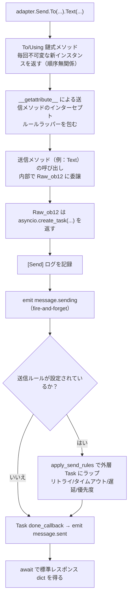

**フレームワークが行った各ステップの詳細：**

| 階段 | フレームワークが行ったこと |
|------|-------------|
| チェーンの結合 | `To`/`Using`/`Account` は毎回**不可変な新インスタンスを返し、既に設定されたフィールドを継承**するため、`To(...).Using(...)` と `Using(...).To(...)` は**等価**で、順序は無関係 |
| メソッドのラッパー | 送信メソッド（`Text` など）は `__getattribute__` でインターセプトされ、ラッパーで包まれる。修飾メソッド（`To`/`Using`/`At`/`Retry` など）は**ラッパーされない**。ネストされた `Raw_ob12` 呼び出しは `_in_rule_wrap` マーキングで重複ラッパーを防ぐ |
| Task の作成 | `Raw_ob12` 内部で `asyncio.create_task()` が Task の真の作成点である。`Text()` は同期的にこの Task を返すだけで、**ブロックしない** |
| 送信ログ | `[Send] platform/method -> target` というイベントログを記録（`exclude_levels=["EVENT"]` で非表示に可能） |
| `message.sending` | 送信メソッドが呼び出された直後に、`has_handlers` で短絡的に処理者がある場合のみ fire-and-forget でトリガーされる |
| `message.sent` | Task の `done_callback` にバインドされる——**ルールがある場合、重試の最終結果をカバーし、ない場合は単一の Task 完了** |

### アカウント解決の優先順位

アダプタが内部的に `_resolve_account(account_id)` を呼び出すとき、以下の順序でアカウントに解決されます：

1. 単一アカウントアダプタ（`AccountConfigClass` なし）→ 直接返す
2. アカウント名が `account_id` と正確に一致
3. 各アカウントの `bot_id` フィールドが一致
4. 各アカウントの任意の `str` フィールド値が一致（`enabled`/`name` を除く）
5. デフォルトとして最初に有効化されたアカウント
6. 全て失敗 → `ValueError` を投げる

> あなたが渡した `account_id` は、`Using()` で明示的に指定されたもの > イベントの `self` フィールド（`account_id` は `user_id` より優先され、`event.reply()` で自動的に注入される）> 指定しない（アダプタが最初に有効化されたアカウントをデフォルトとする）。

### 送信ルールエンジン（リトライ/タイムアウト/遅延）

ルールは `Raw_ob12` が Task を返した**後に**外層 Task にラップされ、メインフローには影響しない。重要な事実：

| ルール | 説明 |
|------|------|
| `Retry(n)` | 総試行回数 `n+1` 回；**失敗後は即時再送信、指数バックオフなし** |
| `Timeout(s)` | 単回送信のタイムアウトでキャンセル（`asyncio.wait_for`）、未使用なら再試行 |
| `Defer(s)` | 送信前に sleep で遅延 |
| `Priority(level, drop_if_busy)` | 送信が溜まりすぎた場合、直接 `{status:"failed", retcode:10002, message:"dropped_low_priority"}` を返す |
| `Hook(fn)` | 最終成功時に順番に実行される |
| `on_progress` / `on_error` | 各段階 / 最終失敗時のコールバック |

> **注意**：リトライは「即時再送信」で、退避間隔は含まれない。プラットフォームのリクエスト制限が必要な場合は、`on_error` コールバック内で手動で sleep した後に再送信する必要があります。ルールの成功判定は返り値の `status == "ok"` で行う（`retcode == 0`）。

> 標準レスポンス形式と `retcode` の完全な意味は [API レスポンス規格](../../standards/api-response.md) を参照してください。

## 戻り値

### Task オブジェクト

すべての送信メソッドは `asyncio.Task` を返します。アダプタは `Raw_ob12` を実装するだけでよく、標準メソッド（`Text`/`Image` など）はデフォルトで `Raw_ob12` に委譲されます：

```python
import asyncio

def Raw_ob12(self, message, **kwargs):
    async def _do_send():
        segments = self._apply_modifiers(message)
        return await self._adapter.call_api(
            endpoint="/send_message",
            message=segments,
            **self.send_context,
            **kwargs,
        )
    return asyncio.create_task(_do_send())

# Text/Image/Voice/Video/File は基底クラスから継承され、Raw_ob12 に自動委譲
# 標準メソッドをオーバーライドする場合は、asyncio.Task を返すだけ:
# def Text(self, text: str):
#     return self.Raw_ob12([{"type": "text", "data": {"text": text}}])
```

### 標準化されたレスポンス

`call_api` は標準化されたレスポンスを返す必要があります。`make_response()` / `make_error()` メソッドの使用が推奨されます：

```python
async def call_api(self, endpoint: str, **params):
    try:
        result = await self._do_api_call(endpoint, **params)
        return self.make_response(
            data=result.get("data"),
            message_id=result.get("message_id", ""),
            raw=result,
        )
    except Exception as e:
        return self.make_error(message=str(e))
```

また、手動構築（旧バージョンの方式）もサポートされています（互換性は保証）：

```python
async def call_api(self, endpoint: str, **params):
    return {
        "status": "ok" or "failed",
        "retcode": 0 or error_code,
        "data": {...},
        "message_id": "msg_id" or "",
        "message": "",
        "{platform}_raw": raw_response
    }
```

## 完全な例

### 基本的な使用

```python
from ErisPulse.Core import adapter

my_adapter = adapter.get("myplatform")

# テキスト送信
await my_adapter.Send.To("user", "123").Text("Hello World!")

# 画像送信
await my_adapter.Send.To("group", "456").Image("https://example.com/image.jpg")

# ファイル送信
with open("document.pdf", "rb") as f:
    await my_adapter.Send.To("user", "123").File(f.read())
```

### チェーン呼び出し

```python
# @ユーザー + 返信
await my_adapter.Send.To("group", "456").At("789").Reply("msg123").Text("返信@メッセージ")

# @全員 + 複数修飾
await my_adapter.Send.Using("bot1").To("group", "456").AtAll().Text("公告消息")
```

### ライブラリメッセージとメッセージ構築

`Raw_ob12` は OneBot12 メッセージセグメント → プラットフォーム API 呼び出しの逆変換のコアエントリーポイントです。`MessageBuilder` はそれに伴うチェーンメッセージセグメント構築ツールです。

> 完全な `Raw_ob12` 実装規格、`MessageBuilder` の使用法とコード例は以下のドキュメントを参照してください：
> - [送信メソッド規格 §6 逆変換規格](../../standards/send-method-spec.md#6-逆変換規格onebot12--プラットフォーム)
> - [送信メソッド規格 §11 メッセージビルダー](../../standards/send-method-spec.md#11-メッセージビルダー-messagebuilder)


### 适配器开发最佳实践

# アダプター開発のベストプラクティス

このドキュメントでは、ErisPulse アダプター開発におけるベストプラクティスの推奨事項を提供します。

## Bot 状態管理と Meta イベント

アダプタは、`adapter.emit()` を通じてメタイベントを送信し、フレームワークが Bot の接続状態、ログイン/ログアウト、およびハートビート情報を自動的に追跡できるようにする必要があります。

### 1. メタイベントを送信するタイミング

| イベント | `detail_type` | トリガタイミング | フレームワークの動作 |
|------|--------------|---------|---------|
| 接続 | `"connect"` | Bot がプラットフォームと接続を確立したとき | Bot を登録し、`adapter.bot.online` ライフサイクルイベントをトリガ |
| 切断 | `"disconnect"` | Bot がプラットフォームとの接続を切断したとき | Bot をオフライン状態に設定し、`adapter.bot.offline` ライフサイクルイベントをトリガ |
| ハートビート | `"heartbeat"` | 定期的に送信（推奨：30-60秒） | Bot のアクティブ時間とメタ情報を更新 |

### 2. メタイベントの送信

フレームワークは `emit_meta()` メソッドを提供しており、1行でメタイベントを送信できます：

```python
class MyAdapter(BaseAdapter):
    async def _ws_handler(self, websocket):
        bot_id = self._get_bot_id()

        # Bot のオンライン：1行で connect イベントを送信
        await self.emit_meta("connect", bot_id, user_name="MyBot", nickname="私のロボット")

        try:
            while True:
                data = await websocket.receive_text()
                event = self.convert(data)
                if event:
                    await self.adapter.emit(event)
        except WebSocketDisconnect:
            pass
        finally:
            # Bot のオフライン
            await self.emit_meta("disconnect", bot_id)
```

### 3. ハートビートイベント

アダプタは、接続が維持されている間、定期的にハートビートイベントを送信して Bot のアクティブ時間を更新する必要があります：

```python
class MyAdapter(BaseAdapter):
    async def _heartbeat_loop(self, bot_id: str):
        while self._connected:
            # フレームワークに meta heartbeat を送信（1行で完了）
            await self.emit_meta("heartbeat", bot_id)
            await asyncio.sleep(30)
```

### 4. `self` フィールドの自動発見

フレームワークの `adapter.emit()` は、すべてのイベント（メタイベントに限らず）の `self` フィールドを自動的に処理します：

- **通常のイベント**（message/notice/request）の `self` フィールドは、自動的に Bot を登録します
- **`self` フィールドの拡張情報**：`user_name`、`nickname`、`avatar`、`account_id` などのオプションフィールドがサポートされています

```python
# イベントコンバーターに self フィールドを含めることで Bot を自動登録できます
onebot_event = {
    "type": "message",
    "detail_type": "private",
    "platform": "myplatform",
    "self": {
        "platform": "myplatform",
        "user_id": "bot123",
        "user_name": "MyBot",
        "nickname": "私のロボット",
    },
    # ... その他のフィールド
}
await self.adapter.emit(onebot_event)
# Bot "bot123" は自動登録され、アクティブ時間も更新されます
```

### 5. Bot 状態の照会

フレームワークは以下の照会メソッドを提供しています：

```python
from ErisPulse import sdk

# Bot の詳細情報を取得
info = sdk.adapter.get_bot_info("myplatform", "bot123")
# {"status": "online", "last_active": 1712345678.0, "info": {"nickname": "MyBot"}}

# すべての Bot を取得（プラットフォーム別にグループ化）
all_bots = sdk.adapter.list_bots()

# 指定されたプラットフォームの Bot を取得
platform_bots = sdk.adapter.list_bots("myplatform")

# Bot がオンラインかどうかを確認
is_online = sdk.adapter.is_bot_online("myplatform", "bot123")

# 完全なステータスサマリーを取得（WebUI に表示するのに適しています）
summary = sdk.adapter.get_status_summary()
# {"adapters": {"myplatform": {"status": "started", "bots": {...}}}}
```

## 接続管理

### 1. 接続の再試行実装

```python
import asyncio

class MyAdapter(BaseAdapter):
    async def start(self):
        retry_count = 0
        max_retries = 5
        
        while retry_count < max_retries:
            try:
                await self._connect_to_platform()
                self.logger.info("接続に成功しました")
                break
            except Exception as e:
                retry_count += 1
                if retry_count < max_retries:
                    # 指数バックオフ戦略
                    wait_time = min(60 * (2 ** retry_count), 600)
                    self.logger.warning(
                        f"接続に失敗しました。{wait_time}秒後に再試行します ({retry_count}/{max_retries}): {e}"
                    )
                    await asyncio.sleep(wait_time)
                else:
                    self.logger.error("接続に失敗しました。最大試行回数に達しました")
                    raise
```

### 2. 接続状態管理

```python
class MyAdapter(BaseAdapter):
    async def start(self):
        self.connection = None
        self._connected = False
    
    async def _ws_handler(self, websocket: WebSocket):
        self.connection = websocket
        self._connected = True
        self.logger.info("接続が確立されました")
        
        try:
            while True:
                data = await websocket.receive_text()
                await self._process_event(data)
        except WebSocketDisconnect:
            self.logger.info("接続が切断されました")
        finally:
            self.connection = None
            self._connected = False
```

### 3. ハートビート保活と Meta ハートビート

アダプターのハートビートは、2つのタスクを同時に完了する必要があります。プラットフォームにハートビート保活を送信し、フレームワークに meta heartbeat イベントを送信します。

```python
class MyAdapter(BaseAdapter):
    async def start(self):
        self.connection = await self._connect_to_platform()
        self._heartbeat_task = asyncio.create_task(self._heartbeat_loop())

    async def _heartbeat_loop(self):
        while self.connection:
            try:
                # 1. プラットフォームにハートビート保活を送信
                await self.connection.send_json({"type": "ping"})

                # 2. フレームワークに meta heartbeat イベントを送信（emit_meta で一行で完了）
                await self.emit_meta("heartbeat", self._bot_id)

                await asyncio.sleep(30)
            except Exception as e:
                self.logger.error(f"ハートビートに失敗しました: {e}")
                break
```

### 4. 接続情報の公開

アダプターが登録したルートは、ユーザーがプラットフォーム側のコールバックアドレスを設定できるように、ユーザーに見えるようにする必要があります。`start()` で接続情報を積極的に出力することを推奨します。

```python
class MyAdapter(BaseAdapter):
    async def start(self):
        router.register_websocket(
            module_name=self.platform,
            path="/ws",
            handler=self._ws_handler
        )

        if self.sdk:
            info = self.sdk.adapter.get_connection_info(self.platform)
            if info:
                self.logger.info(f"WebSocket アドレス: "
                    f"{info.get('connection', {}).get('base_url', '')}"
                    f"{info.get('connection', {}).get('websocket_routes', [])}")
```

ユーザーは以下の API を使用して、アダプターのすべてのルートと接続アドレスを確認できます：

```python
from ErisPulse import sdk

# アダプター単位の接続情報（推奨）
info = sdk.adapter.get_connection_info("myplatform")

# ルートマネージャー単位のクエリ
sdk.router.list_namespaces()              # すべてのネームスペースをリストアップ
sdk.router.get_module_routes("myplatform")  # 詳細なルート情報
sdk.router.get_module_urls("myplatform")    # 完全な接続 URL
```

> **注意**：ルート登録時の `module_name` は、ErisPulse でアダプターが登録した `platform` 名と完全に一致する必要があります。一致しない場合、`get_connection_info()` はルートと関連付けられません。複数のアカウントを持つアダプターは、異なる `module_name` を使用するのではなく、各アカウントにサブパス（例：`/account1/webhook`、`/account2/webhook`）を登録する必要があります。

## 事件変換

### 1. OneBot12 標準に厳密に従う

```python
class MyPlatformConverter:
    def convert(self, raw_event):
        """イベントを変換"""
        onebot_event = {
            "id": str(raw_event.get("event_id", uuid.uuid4())),
            "time": int(time.time()),
            "type": self._convert_type(raw_event.get("type")),
            "detail_type": self._convert_detail_type(raw_event),
            "platform": "myplatform",
            "self": {
                "platform": "myplatform",
                "user_id": str(raw_event.get("bot_id", ""))
            },
            "myplatform_raw": raw_event,  # 原始データを保持する（必須）
            "myplatform_raw_type": raw_event.get("type", "")  # 原始のイベントタイプ（必須）
        }
        return onebot_event
```

### 2. 時間スタンプの標準化

```python
def _convert_timestamp(self, timestamp):
    """10桁の秒単位の時間スタンプに変換"""
    if not timestamp:
        return int(time.time())
    
    # ミリ秒単位の時間スタンプの場合
    if timestamp > 10**12:
        return int(timestamp / 1000)
    
    # 秒単位の時間スタンプの場合
    return int(timestamp)
```

### 3. イベント ID の生成

```python
import uuid

def _generate_event_id(self, raw_event):
    """イベント ID を生成"""
    event_id = raw_event.get("event_id")
    if event_id:
        return str(event_id)
    # プラットフォームが ID を提供していない場合、UUID を生成する
    return str(uuid.uuid4())
```

## SendDSL 実装

`At`/`AtAll`/`Reply` 修飾子はフレームワークの SendDSL 基底クラスに内蔵されており、アダプタは `Raw_ob12` と具体的な送信メソッドを実装するだけでよい。`self._apply_modifiers(message)` と `self.send_context` を使用して開発を簡素化する。

### 1. 必ず Task オブジェクトを返す

```python
class Send(BaseAdapter.Send):
    def Raw_ob12(self, message, **kwargs):
        """推奨実装: フレームワークの補助メソッドを使用"""
        async def _do_send():
            segments = self._apply_modifiers(message)
            return await self._adapter.call_api(
                endpoint="/send_message",
                message=segments,
                **self.send_context,
                **kwargs
            )
        return asyncio.create_task(_do_send())

    def Text(self, text: str):
        return self.Raw_ob12([{"type": "text", "data": {"text": text}}])
```

### 2. チェーン修飾メソッドは self を返す

```python
class Send(BaseAdapter.Send):

    def __init__(self, adapter, target_type=None, target_id=None, account_id=None):
        super().__init__(adapter, target_type, target_id, account_id)
        self.buttons = []

    def Button(self, content: list) -> 'Send':
        self.buttons.append(content)
        return self # self を返す
```

### 3. プラットフォーム特有のメソッドをサポート

```python
class Send(BaseAdapter.Send):
    def Sticker(self, sticker_id: str):
        """絵文字パックを送信"""
        return asyncio.create_task(
            self._adapter.call_api(
                endpoint="/send_sticker",
                message=[{"type": "sticker", "data": {"id": sticker_id}}],
                **self.send_context
            )
        )
    
    def Card(self, card_data: dict):
        """カードメッセージを送信"""
        return asyncio.create_task(
            self._adapter.call_api(
                endpoint="/send_card",
                message=[{"type": "card", "data": card_data}],
                **self.send_context
            )
        )
```

## APIレスポンス

### 1. 標準化されたレスポンス形式

フレームワークは `make_response()` および `make_error()` メソッドを提供し、標準化されたレスポンスを構築します。

```python
async def call_api(self, endpoint: str, **params):
    try:
        raw_response = await self._platform_api_call(endpoint, **params)
        
        if raw_response.get("success"):
            return self.make_response(
                data=raw_response.get("data"),
                message_id=raw_response.get("data", {}).get("message_id", ""),
                raw=raw_response,
            )
        else:
            return self.make_error(
                retcode=raw_response.get("code", 10001),
                message=raw_response.get("message", ""),
                raw=raw_response,
            )
    except Exception as e:
        return self.make_error(message=str(e))
```

`make_response()` は、`{platform}_raw` というキーを含むレスポンス辞書を自動的に生成します。`make_error()` はデフォルトで `retcode=34000`（Platform Error）を使用します。

### 2. エラーコード規格

OneBot12 標準のエラーコードに従います：

```python
# 1xxxx - アクションリクエストエラー
10001: Bad Request
10002: Unsupported Action
10003: Bad Param

# 2xxxx - アクションハンドラエラー
20001: Bad Handler
20002: Internal Handler Error

# 3xxxx - アクション実行エラー
31000: Database Error
32000: Filesystem Error
33000: Network Error
34000: Platform Error
35000: Logic Error
```

## 多アカウントサポート

### 1. 宣言的構成（推奨）

`AccountConfigClass` を宣言構成クラスとして使用することで、フレームワークが多アカウントの自動ロード、検証、テンプレート生成を管理します。`BotAccountConfig` 基底クラスは `enabled` および `name` フィールドを提供しており、アダプタは宣言する必要がありません。

```python
from dataclasses import dataclass, field
from ErisPulse.Core.Bases import BotAccountConfig

@dataclass
class MyBotConfig(BotAccountConfig):
    token: str = field(default="", metadata={
        "description": {"i18n": "my_adapter.bot_token", "default": "Bot Token"},
        "required": True,
        "secret": True,
    })

class MyAdapter(BaseAdapter):
    AccountConfigClass = MyBotConfig
    
    async def start(self):
        for name, account in self.enabled_accounts.items():
            self.logger.info(f"アカウント {name} を起動")
            await self._connect(name, account.token)
            # bot_id はフレームワークによってプラットフォームプロトコル/ログイン応答から自動的に取得され、再挿入されます
    
    async def call_api(self, endpoint: str, **params):
        account_id = params.pop("account_id", None)
        name, account = self._resolve_account(account_id)
        # name: アカウント名, account: MyBotConfig インスタンス
```

構成ファイルは自動的に生成されます：

```toml
[MyAdapter.accounts.default]
token = ""
enabled = true
name = ""
```

### 2. アカウント選択メカニズム

フレームワークは `_resolve_account()` メソッドを内蔵しており、以下の優先順位でマッチングします：

1. **アカウント名** — 構成のキー名と正確に一致
2. **`bot_id` フィールド** — 自動的に取得される bot_id（すなわち `event["self"]["user_id"]`）
3. **任意の str フィールド** — 構成内の他の文字列フィールド
4. **デフォルト** — 最初に有効化されたアカウント

```python
# アカウント名でマッチ
name, account = self._resolve_account("account1")

# bot_id でマッチ（イベントからの最も一般的な方法）
name, account = self._resolve_account("bot_123")

# 有効化された最初のアカウントを取得（None を渡す）
name, account = self._resolve_account(None)
```

## エラー処理

### 1. 分類された例外処理

`make_error()` を使用して標準化されたエラーレスポンスを構築します。`sdk.client` を使用してリクエストする際には、ErisPulse の例外をキャッチします：

```python
from ErisPulse.Core.Bases.errors import ClientError, ClientTimeoutError

async def call_api(self, endpoint: str, **params):
    try:
        from ErisPulse.Core import client
        resp = await client.post(
            f"https://api.platform.com/{endpoint}",
            json=params,
            max_retries=2,
        )
        response = await resp.json()
        return self.make_response(data=response, raw=response)
    except ClientTimeoutError:
        self.logger.error(f"リクエストがタイムアウトしました: {endpoint}")
        return self.make_error(retcode=32000, message="リクエストがタイムアウトしました")
    except ClientError as e:
        self.logger.error(f"ネットワークエラー: {e}")
        return self.make_error(retcode=33000, message="ネットワークリクエストが失敗しました")
    except json.JSONDecodeError:
        self.logger.error("JSON 解析に失敗しました")
        return self.make_error(retcode=10006, message="レスポンス形式が不正です")
    except Exception as e:
        self.logger.error(f"不明なエラー: {e}", exc_info=True)
        return self.make_error(message=str(e))
```

> **互換性の維持**：`aiohttp` を直接使用する旧いアダプタのコードは影響を受けず、`aiohttp.ClientError` をキャッチし続けることができます。例外の変換は、`sdk.client` を通じてリクエストを発行する場合にのみ有効になります。

### 2. ログ記録

フレームワークは自動的にアダプタ用のサブ logger を作成します（`sdk.logger.get_child("MyAdapter")`）。手動で初期化する必要はありません：

```python
class MyAdapter(BaseAdapter):
    # ConfigClass = ...  # 設定クラスを宣言すると self.logger を自動的に使用可能になります
    
    async def start(self):
        self.logger.info("アダプタの起動中...")
        # ...
        self.logger.info("アダプタの起動完了")
    
    async def shutdown(self):
        self.logger.info("アダプタの停止中...")
        # ...
        self.logger.info("アダプタの停止完了")
```

## テスト

### 1. 単体テスト

```python
import pytest
from ErisPulse.Core.Bases import BaseAdapter

class TestMyAdapter:
    def test_converter(self):
        """変換機能のテスト"""
        converter = MyPlatformConverter()
        raw_event = {"type": "message", "content": "Hello"}
        result = converter.convert(raw_event)
        assert result is not None
        assert result["platform"] == "myplatform"
        assert "myplatform_raw" in result
    
    def test_api_response(self):
        """APIレスポンス形式のテスト"""
        adapter = MyAdapter()
        response = adapter.call_api("/test", param="value")
        assert "status" in response
        assert "retcode" in response
```

### 2. 集成テスト

```python
@pytest.mark.asyncio
async def test_adapter_start():
    """アダプターの起動テスト"""
    adapter = MyAdapter()
    await adapter.start()
    assert adapter._connected is True

@pytest.mark.asyncio
async def test_send_message():
    """メッセージ送信のテスト"""
    adapter = MyAdapter()
    await adapter.start()
    
    result = await adapter.Send.To("user", "123").Text("Hello")
    assert result is not None
```

## 逆変換とメッセージ構築

`Raw_ob12` はアダプタが**実装しなければならない**メソッドであり、OneBot12 → プラットフォームへの逆変換の統一エントリポイントです。標準メソッド（`Text`、`Image` など）は `Raw_ob12` に委譲する必要があります。修飾子ステータス（`At`/`Reply`/`AtAll`）は `Raw_ob12` 内でメッセージセグメントに統合される必要があります。

`MessageBuilder` は `Raw_ob12` と併用するためのメッセージセグメント構築ツールであり、チェーン呼び出しと高速な構築をサポートします。

> 完全な実装規格、コード例、および使用方法については、以下を参照してください：
> - [送信メソッド規格 §6 逆変換規格](../../standards/send-method-spec.md#6-逆変換規格onebot12--プラットフォーム)
> - [送信メソッド規格 §11 メッセージビルダー](../../standards/send-method-spec.md#11-メッセージビルダー-messagebuilder)

## プラットフォームイベントメソッド拡張

アダプタは、Eventラッパークラスにプラットフォーム固有のメソッドを登録することで、モジュール開発者がプラットフォーム固有のデータにアクセスしやすくすることができます。

### 1. Mixinクラスを使用した一括登録（推奨）

プラットフォームに複数の固有メソッドがある場合、Mixinクラスを使用することを推奨します。

```python
# アダプタの start() またはモジュールレベルで登録
from ErisPulse.Core.Event import register_event_mixin

class MyPlatformEventMixin:
    def get_chat_name(self):
        """チャット名を取得"""
        return self.get("myplatform_raw", {}).get("chat", {}).get("name", "")

    def is_official_message(self):
        """公式メッセージかどうかを判断"""
        raw = self.get("myplatform_raw", {})
        return raw.get("sender", {}).get("is_official", False)

    def get_message_type(self):
        """プラットフォームのメッセージタイプを取得"""
        return self.get("myplatform_raw", {}).get("msg_type", "text")

# 一括登録
register_event_mixin("myplatform", MyPlatformEventMixin)
```

### 2. デコレーターを使用した単一メソッドの登録

```python
from ErisPulse.Core.Event import register_event_method

@register_event_method("myplatform")
def get_chat_name(self):
    return self.get("myplatform_raw", {}).get("chat", {}).get("name", "")
```

### 3. アダプタ終了時のクリーンアップ

```python
from ErisPulse.Core.Event import unregister_platform_event_methods

class MyAdapter(BaseAdapter):
    async def shutdown(self):
        # プラットフォームイベントメソッドの登録をクリーンアップ
        unregister_platform_event_methods("myplatform")
        # ... 他のクリーンアップ処理
```

> 詳細な登録および登録解除の説明については、[イベントシステムAPI - プラットフォーム拡張メソッドの登録](../../api-reference/event-system.md#適応器がプラットフォーム拡張メソッドを登録)を参照してください。

## ドキュメントのメンテナンス

### 1. プラットフォームの機能ドキュメントの維持

`docs/ja/platform-guide/` ディレクトリに `{platform}.md` ドキュメントを作成します（他の言語バージョンは自動的に生成されます）：

```markdown
# プラットフォーム名アダプターのドキュメント

## 基本情報
- 対応するモジュールのバージョン: 1.0.0
- 維持管理者: Your Name

## 支援するメッセージ送信タイプ
...

## 特有のイベントタイプ
...

## 設定オプション
...
```

### 2. バージョン情報の更新

新しいバージョンをリリースする際、ドキュメント内のバージョン情報を更新します：

```toml
[project]
version = "2.0.0"  # バージョン番号を更新
```


### 事件转换器

# イベントコンバーター実装ガイド

イベントコンバーター (Converter) は、アダプターのコアコンポーネントの一つであり、プラットフォームのネイティブイベントを ErisPulse が統一する OneBot12 標準イベント形式に変換する役割を担います。

## Converter の役割

```
プラットフォームのネイティブイベント ──→ Converter.convert() ──→ OneBot12 標準イベント
```

Converter は**正方向の変換**（受信方向）のみを担当し、プラットフォームのネイティブイベントデータを OneBot12 標準形式に変換します。逆方向の変換（送信方向）は `Send.Raw_ob12()` メソッドが処理します。

### 核心原則

1. **無損変換**：元のデータは `{platform}_raw` フィールドに完全に保持される必要があります
2. **標準互換性**：変換後のイベントは OneBot12 標準形式に準拠している必要があります
3. **プラットフォーム拡張**：プラットフォーム固有のデータは `{platform}_` という接頭辞を持つフィールドに格納されます

## BaseConverter 基底クラス（推奨）

2.7.0 以降、フレームワークは `BaseConverter` 基底クラス（`ErisPulse.Core.Bases`）を提供しており、OneBot12 イベントの**共通フィールドの構築**と**一般的なメッセージセグメントの補助機能**をラップしています。これにより、変換器は型マッピングに集中することができます。

```python
from ErisPulse.Core.Bases import BaseConverter


class MyConverter(BaseConverter):
    def __init__(self):
        super().__init__(platform="myplatform")

    def convert(self, raw_event: dict) -> dict | None:
        if not isinstance(raw_event, dict):
            return None
        event_type = raw_event.get("type", "")
        base = self.build_base_event(raw_event, event_type)  # id/time/platform/self/raw
        if event_type == "message":
            base["type"] = "message"
            base["detail_type"] = "group" if raw_event.get("group_id") else "private"
            base["user_id"] = str(raw_event.get("sender_id", ""))
            base["message"] = [self.text(raw_event.get("content", ""))]
            base["alt_message"] = raw_event.get("content", "")
            return base
        return None
```

`build_base_event()` によって既に埋め込まれている共通フィールド：

| フィールド | 来源 |
|------|------|
| `id` | `raw_event["event_id"]`、存在しない場合は UUID が自動生成されます |
| `time` | `raw_event["timestamp"]`、存在しない場合は現在時刻がデフォルトになります |
| `platform` | コンストラクタに渡された `platform` |
| `self` | `{"platform": ..., "user_id": raw_event["bot_id"]}` |
| `{platform}_raw` | 原始イベント（"無損失変換"の原則に従います） |
| `{platform}_raw_type` | 原始イベントの型 |

一般的なメッセージセグメント補助メソッド（すべて静的メソッドであり、直接再利用可能です）：

```python
converter.text("hi")          # {"type": "text", "data": {"text": "hi"}}
converter.at("123456")        # {"type": "at", "data": {"user_id": "123456"}}
converter.image("file.png")   # {"type": "image", "data": {"file": "file.png"}}
```

> 手動実装する場合、`build_base_event` の共通フィールドの構築は繰り返し書く必要がある定型コードですが、`BaseConverter` を使用することでこの部分を省略でき、天然に「無損失変換」（原始イベントは常に `{platform}_raw` に格納されます）を満たします。

## convert() メソッド

### メソッド署名

```python
def convert(self, raw_event: dict) -> dict:
    """
    プラットフォーム固有のイベントを OneBot12 標準形式に変換します

    :param raw_event: プラットフォーム固有のイベントデータ
    :return: OneBot12 標準形式のイベント辞書
    """
    pass
```

### 戻り値構造

変換後のイベント辞書には、以下の標準フィールドが含まれている必要があります：

```python
{
    "id": "イベントの一意ID",
    "time": 1234567890,           # Unix タイムスタンプ（秒）
    "type": "message",             # イベントの種類
    "detail_type": "private",      # 詳細な種類
    "platform": "myplatform",      # プラットフォーム名
    "self": {
        "platform": "myplatform",
        "user_id": "bot_user_id"
    },

    # メッセージイベント用フィールド
    "user_id": "送信者ID",
    "message": [...],              # OneBot12 メッセージセグメントのリスト
    "alt_message": "プレーンテキストの内容",

    # 元のデータを保持する必要がある
    "myplatform_raw": { ... },     # プラットフォーム固有のイベントの完全なデータ
    "myplatform_raw_type": "元のイベントのタイプ名",
}
```

## 必須フィールドマッピング

### 一般的フィールド（すべてのイベントタイプ）

| OB12 フィールド | 型 | 説明 |
|-----------|------|------|
| `id` | str | イベントの一意の識別子 |
| `time` | int | Unix タイムスタンプ（秒） |
| `type` | str | イベントの種類：`message` / `notice` / `request` / `meta` |
| `detail_type` | str | 詳細な種類：`private` / `group` / `friend` など |
| `platform` | str | プラットフォーム名。アダプターの登録名と一致する |
| `self` | dict | ロボット情報：`{"platform": "...", "user_id": "..."}` |

### メッセージイベントの追加フィールド

| OB12 フィールド | 型 | 説明 |
|-----------|------|------|
| `user_id` | str | 送信者の ID |
| `message` | list[dict] | OneBot12 メッセージセグメントのリスト |
| `alt_message` | str | 純文本の代替内容 |

### 通知イベントの追加フィールド

| OB12 フィールド | 型 | 説明 |
|-----------|------|------|
| `user_id` | str | 関連するユーザーの ID |
| `operator_id` | str | 操作者の ID（例：グループメンバーの変更など） |

## メッセージセグメントの変換

OneBot12 標準では、以下のメッセージセグメントタイプが定義されています：

```python
# テキスト
{"type": "text", "data": {"text": "Hello"}}

# 画像
{"type": "image", "data": {"file": "https://example.com/img.jpg"}}

# 音声
{"type": "audio", "data": {"file": "https://example.com/audio.mp3"}}

# 動画
{"type": "video", "data": {"file": "https://example.com/video.mp4"}}

# ファイル
{"type": "file", "data": {"file": "https://example.com/doc.pdf"}}

# @メンション
{"type": "mention", "data": {"user_id": "123"}}

# @全員
{"type": "mention_all", "data": {}}

# 返信
{"type": "reply", "data": {"message_id": "msg_123"}}
```

プラットフォームがサポートしていないメッセージセグメントタイプがある場合、そのセグメントを省略するか、最も近い標準タイプに変換することができます。

## プラットフォーム拡張フィールド

プラットフォーム固有のデータは、標準フィールドとの衝突を避けるために `{platform}_` という接頭辞を使用して保存してください。

```python
{
    # 標準フィールド
    "type": "message",
    "detail_type": "group",
    # ...

    # プラットフォーム拡張フィールド
    "myplatform_raw": { ... },          # 原始イベントデータ（必須）
    "myplatform_raw_type": "chat",      # 原始イベントの型（必須）

    # その他のプラットフォーム固有のフィールド
    "myplatform_group_name": "群名称",
    "myplatform_sender_role": "admin",
}
```

> **重要**：`{platform}_raw` フィールドは必須です。ErisPulse のイベントシステムやモジュールは、このフィールドをプラットフォームの原始データにアクセスするために依存することがあります。

## 完整例

以下は Converter の完全な実装例です。

```python
class MyConverter:
    def __init__(self, platform: str):
        self.platform = platform

    def convert(self, raw_event: dict) -> dict:
        event_type = raw_event.get("type", "")

        base_event = {
            "id": raw_event.get("id", ""),
            "time": raw_event.get("timestamp", 0),
            "platform": self.platform,
            "self": {
                "platform": self.platform,
                "user_id": raw_event.get("self_id", ""),
            },
            "myplatform_raw": raw_event,
            "myplatform_raw_type": event_type,
        }

        if event_type == "chat":
            return self._convert_message(raw_event, base_event)
        elif event_type == "notification":
            return self._convert_notice(raw_event, base_event)
        elif event_type == "request":
            return self._convert_request(raw_event, base_event)

        return base_event

    def _convert_message(self, raw: dict, base: dict) -> dict:
        base["type"] = "message"
        base["detail_type"] = "group" if raw.get("group_id") else "private"
        base["user_id"] = raw.get("sender_id", "")
        base["message"] = self._convert_message_segments(raw.get("content", ""))
        base["alt_message"] = raw.get("content", "")

        if raw.get("group_id"):
            base["group_id"] = raw["group_id"]

        return base

    def _convert_message_segments(self, content: str) -> list:
        segments = []
        if content:
            segments.append({"type": "text", "data": {"text": content}})
        return segments

    def _convert_notice(self, raw: dict, base: dict) -> dict:
        base["type"] = "notice"
        notification_type = raw.get("notification_type", "")

        if notification_type == "member_join":
            base["detail_type"] = "group_member_increase"
            base["user_id"] = raw.get("user_id", "")
            base["group_id"] = raw.get("group_id", "")
            base["operator_id"] = raw.get("operator_id", "")
        elif notification_type == "friend_add":
            base["detail_type"] = "friend_increase"
            base["user_id"] = raw.get("user_id", "")

        return base

    def _convert_request(self, raw: dict, base: dict) -> dict:
        base["type"] = "request"
        request_type = raw.get("request_type", "")

        if request_type == "friend":
            base["detail_type"] = "friend"
            base["user_id"] = raw.get("user_id", "")
            base["comment"] = raw.get("message", "")
        elif request_type == "group_invite":
            base["detail_type"] = "group"
            base["group_id"] = raw.get("group_id", "")
            base["user_id"] = raw.get("inviter_id", "")

        return base
```

## リッチメディアメッセージ変換の例

実際のプラットフォームのメッセージには、通常、画像、@メンション、返信などのリッチメディアコンテンツが含まれています。以下は、`_convert_message_segments` が複数のメッセージタイプを処理する例です：

```python
def _convert_message_segments(self, raw_content: list) -> list:
    """プラットフォームのネイティブメッセージセグメントリストを OneBot12 標準メッセージセグメントに変換"""
    segments = []

    for item in raw_content:
        item_type = item.get("type", "")

        if item_type == "text":
            segments.append({
                "type": "text",
                "data": {"text": item.get("content", "")}
            })

        elif item_type == "image":
            file_url = item.get("url") or item.get("file_id", "")
            segments.append({
                "type": "image",
                "data": {"file": file_url}
            })

        elif item_type == "at":
            segments.append({
                "type": "mention",
                "data": {"user_id": item.get("target_id", "")}
            })

        elif item_type == "reply":
            segments.append({
                "type": "reply",
                "data": {"message_id": item.get("reply_to_id", "")}
            })

        elif item_type == "at_all":
            segments.append({"type": "mention_all", "data": {}})

        else:
            segments.append({
                "type": "text",
                "data": {"text": f"[サポートされていないメッセージタイプ: {item_type}]"}
            })

    return segments
```

## 一般的落とし穴

### 1. `{platform}_raw` フィールドの欠落

これは最も一般的なエラーです。元データフィールドが欠落していると、モジュールがプラットフォーム特有の情報をアクセスできなくなります。

```python
base_event["myplatform_raw"] = raw_event        # 必須！
base_event["myplatform_raw_type"] = event_type   # 必須！
```

### 2. 時間スタンプの形式エラー

OneBot12 標準では `time` フィールドを Unix 秒単位のタイムスタンプ（整数）とします。プラットフォームがミリ秒タイムスタンプや ISO 形式の文字列を返す場合、変換が必要です。

```python
import time

# ミリ秒 → 秒
"time": raw_event.get("timestamp", 0) // 1000

# ISO 文字列 → 秒
"time": int(time.mktime(time.strptime(raw_event["created_at"], "%Y-%m-%dT%H:%M:%S")))
```

### 3. `self` フィールドの欠落

`self` フィールドにはロボット自身の情報が含まれ、`user_id` はロボットのアカウント ID です。複数の Bot 環境ではこのフィールドは非常に重要です。

```python
"self": {
    "platform": self.platform,
    "user_id": raw_event.get("bot_id", ""),   # ロボット自身の ID
}
```

### 4. `detail_type` に非標準の値を使用

`detail_type` には OneBot12 標準で定義された値、例えば `private`、`group`、`friend_increase`、`group_member_increase` などを使用する必要があります。プラットフォーム特有の命名は使用しないでください。

### 5. 往復の一貫性

Converter が生成するメッセージセグメントの型が Send 端でサポートするメソッドに対応していることを確認してください。たとえば、Converter がプラットフォームの画像メッセージを `{"type": "image", ...}` に変換した場合、Send 端の `Image()` メソッドは画像の送信に対応している必要があります。

## 最適実践

1. **常に元のデータを保持する**：`{platform}_raw` フィールドは省略しないでください
2. **標準メッセージセグメントを使用する**：可能な限りプラットフォームのメッセージを OneBot12 標準メッセージセグメントに変換してください
3. **detail_type を適切に設定する**：標準の型（`private`/`group`/`channel` など）を使用し、独自に定義しないでください
4. **境界条件を処理する**：元のイベントに特定のフィールドが欠けている可能性があるため、`.get()` を使用して適切なデフォルト値を提供してください
5. **パフォーマンスの考慮**：`convert()` は各イベントで呼び出されるため、ここで時間のかかる処理を実行しないでください


### 发布与模块商店指南

# 公開とモジュールストアガイド

開発したモジュールまたはアダプターを ErisPulse モジュールストアに公開し、他のユーザーが簡単に発見・インストールできるようにします。

## モジュールストアの概要

ErisPulse モジュールストアは集中型のモジュールレジストリであり、ユーザーは CLI ツールを通じてコミュニティが貢献したモジュールやアダプターを閲覧・検索・インストールできます。

### 閲覧と検索

```bash
# リモートで利用可能なすべてのパッケージを一覧表示
epsdk list-remote

# モジュールのみ表示
epsdk list-remote -t modules

# アダプターのみ表示
epsdk list-remote -t adapters

# リモートパッケージリストを強制更新
epsdk list-remote -r
```

[ErisPulse 公式サイト](https://www.erisdev.com/#market) にアクセスしてオンラインでモジュールストアを閲覧することもできます。

### サポートされているリリースタイプ

| タイプ | 説明 | Entry-point グループ |
|------|------|----------------|
| モジュール (Module) | ボットの機能拡張、ビジネスロジックの実装 | `erispulse.module` |
| アダプター (Adapter) | 新しいメッセージプラットフォームとの接続 | `erispulse.adapter` |

## クイック公開

プロセスは全工程で3ステップのみです。プロジェクトの設定 → PyPI への公開 → モジュールストアへの登録。

### 1. pyproject.toml の設定

プロジェクトディレクトリに `pyproject.toml`、`README.md` が含まれていることを確認し、タイプに合わせて entry-points を設定します。

#### モジュール

```toml
[project]
name = "ErisPulse-MyModule"
version = "1.0.0"
description = "モジュールの機能説明"
requires-python = ">=3.10"
license = { text = "MIT" }
authors = [ { name = "yourname" } ]
dependencies = [
    "ErisPulse>=2.0.0",
]

[project.entry-points."erispulse.module"]
"MyModule" = "MyModule:Main"
```

#### アダプター

```toml
[project]
name = "ErisPulse-MyAdapter"
version = "1.0.0"
description = "アダプターの機能説明"
requires-python = ">=3.10"

[project.entry-points."erispulse.adapter"]
"myplatform" = "MyAdapter:MyAdapter"
```

> **注意**: パッケージ名は `ErisPulse-` で始まることを推奨します。これはユーザーが識別しやすいためです。Entry-point のキー名（例: `"MyModule"`）は、SDK 内でのモジュールアクセス名になります。

### 2. PyPI への公開

```bash
# ビルド + 公開（PyPI アカウントが必要）
pip install build twine
python -m build
python -m twine upload dist/*
```

公開後、インストールを検証します：

```bash
pip install ErisPulse-MyModule
```

### 3. モジュールストアへの登録

[ErisPulse モジュールストア](https://www.erisdev.com/#market) に移動し、「モジュールを提出」をクリックして、ログイン後にモジュール情報を入力します。

サポートされているログイン方法: **GitHub**、**Codeberg**、**雲湖**（Yunhu）。いずれか一つを選択できます。

入力のポイント:
- モジュール名、説明、リポジトリアドレス
- 最低 SDK バージョン: 不確かな場合は、[ErisPulse 最新版](https://pypi.org/project/ErisPulse/) のバージョン番号を入力してください。

登録後、即座に有効になります。ユーザーはモジュールソースからインストールできます。モジュールは「未検証」でマークされます。メンテナが承認すると「検証済み」に変更されます。

> **検証状態について**:
> - 「未検証」はまだ公式な承認を受けていないことを示しており、モジュールに問題があることを意味しません
> - ユーザーが `epsdk install` で未検証モジュールをインストールするときは、リスクに関する警告が表示されます。続行する前に確認が必要です

### 4. 発行済みモジュールの管理

モジュールストアで「モジュールを提出」をクリックしてログインしたら、「マイモジュール」タブに切り替えて、以下ができます:
- **編集** — モジュールの説明、リポジトリアドレス、タグなどを変更します。バージョン番号は PyPI から自動的に同期されます
- **削除** — モジュールストアからモジュールを削除します（取り消しできません）

> 登録直後のモジュールは、数分かかることがありますが「マイモジュール」リストに表示されます。

## 発行済みモジュールの更新

1. `pyproject.toml` 内の `version` を更新します
2. 再構築してアップロード: `python -m build && python -m twine upload dist/*`
3. モジュールストアは PyPI の最新バージョンを自動的に同期します

ユーザーは `epsdk upgrade MyModule` でアップグレードできます。

## 公開前チェックリスト

PyPI へプッシュする前に、以下の項目を逐一確認してください。

### コード品質

- [ ] すべての公開 API に型注釈（関数のシグネチャと戻り値）
- [ ] すべての公開メソッドにドキュメント文字列（`"""..."""` 形式、`:param` / `:return` / `:raises` を含む）
- [ ] `ruff check` に合格（警告なし）
- [ ] テストカバレッジ ≥ 80%
- [ ] `pytest` がすべてのテストに合格

### 互換性

- [ ] `pyproject.toml` に最低 SDK バージョンを宣言: `dependencies = ["ErisPulse>=x.y.z"]`
- [ ] Python 3.10 / 3.11 / 3.12 / 3.13 をテスト済み
- [ ] ターゲットOS（Windows / Linux / macOS、該当する場合）をテスト済み
- [ ] 循環インポート依存なし

### 設定

- [ ] 宣言的設定（`ConfigClass` + `BaseConfig` / `BotAccountConfig`）を使用している場合、設定フィールドに `description`（推奨 i18n 形式）と `ui` メタデータがあるか
- [ ] i18n 翻訳キーを登録している場合、すべての 5 か国語（zh-CN / zh-TW / en / ja / ru）をカバーしているか
- [ ] 機密フィールドに `secret=True` がマークされているか

### ドキュメント

- [ ] `README.md` にインストール手順と基本的な使用例がある
- [ ] `README.md` に設定方法の説明（設定ファイルの例 + 環境変数）
- [ ] `CHANGELOG.md` にすべての変更を記録している
- [ ] アダプターでプラットフォームの仕様ドキュメントが更新されている（サポートされている Send タイプ、イベントタイプなど）

### 公開

- [ ] `pyproject.toml` のバージョン番号が更新されている
- [ ] ビルド成功: `python -m build`
- [ ] PyPI へのプッシュ完了: `python -m twine upload dist/*`
- [ ] インストール検証成功: `pip install ErisPulse-xxx && epsdk run`

## 開発モードでのテスト

正式に公開する前に、編集可能モードでローカルでテストできます:

```bash
epsdk install -e /path/to/MyModule
# または
pip install -e /path/to/MyModule
```

## よくある質問

### パッケージ名は必ず `ErisPulse-` で始まりますか？

必須ではありませんが、強く推奨します。これによりユーザーは PyPI 上で ErisPulse エコシステムのパッケージを識別しやすくなります。

### 1つのパッケージに複数のモジュールを登録できますか？

はい。`entry-points` で複数のキーバリューペアを設定します:

```toml
[project.entry-points."erispulse.module"]
"ModuleA" = "MyPackage:ModuleA"
"ModuleB" = "MyPackage:ModuleB"
```

### 承認にどのくらい時間がかかりますか？

通常、1〜3 営業日で完了します。モジュールストアの「マイモジュール」で検証状態を確認できます。

## Docker イメージ経由でのアプリ配布

アプリが PyPI に公開するのに適していない場合（プライベート依存関係を含む、事前設定された環境が必要など）、**GitHub Container Registry (GHCR)** を使用して Docker イメージを公開し、他のユーザーが `docker pull` でワンクリックで起動できるようにします。

### 適用シナリオ

- **完全なボットアプリ**（モジュール + 設定 + エントリースクリプト）があり、ワンクリックで配布したい場合
- モジュール/アダプターが**プライベートパッケージ**に依存している、または特殊なインストールフローがあるため PyPI には適さない場合
- ユーザーの使用ハードルを下げるために、**すぐに使える（アンパックして動く）** デプロイソリューションを提供したい場合

### 1. Dockerfile の作成

ErisPulse 公式イメージをベースに構築し、独自のモジュールのみを追加します:

```dockerfile
FROM erispulse/erispulse:latest

LABEL org.opencontainers.image.title="ErisPulse-MyModule" \
      org.opencontainers.image.description="モジュールの説明" \
      org.opencontainers.image.url="https://github.com/yourname/ErisPulse-MyModule" \
      org.opencontainers.image.source="https://github.com/yourname/ErisPulse-MyModule"

COPY pyproject.toml README.md ./
COPY MyModule/ ./MyModule/

RUN uv pip install --system -e .
```

モジュールに追加のシステム依存関係（SSH クライアントなど）が必要な場合は、`RUN uv pip install` の後に追加します:

```dockerfile
RUN apt-get update && apt-get install -y --no-install-recommends \
    openssh-client \
    && rm -rf /var/lib/apt/lists/*
```

> `erispulse/erispulse:latest` には ErisPulse、ErisPulse-Dashboard、Python ランタイム、uv が含まれており、再インストールの必要はありません。

### 2. GitHub Actions ワークフローの作成

`.github/workflows/docker-publish.yml` に作成します:

```yaml
name: Docker イメージを公開

on:
  workflow_dispatch:
  push:
    branches:
      - main
    tags:
      - "v*"

permissions:
  contents: read
  packages: write

env:
  REGISTRY: ghcr.io
  IMAGE_NAME: ${{ github.repository_owner }}/my-bot

jobs:
  docker-publish:
    runs-on: ubuntu-latest

    steps:
      - name: コードのチェックアウト
        uses: actions/checkout@v4

      - name: QEMU のセットアップ (マルチアーキテクチャ対応)
        uses: docker/setup-qemu-action@v3

      - name: Docker Buildx のセットアップ
        uses: docker/setup-buildx-action@v3

      - name: GitHub Container Registry にログイン
        uses: docker/login-action@v3
        with:
          registry: ${{ env.REGISTRY }}
          username: ${{ github.actor }}
          password: ${{ secrets.GITHUB_TOKEN }}

      - name: Docker メタデータの抽出
        id: meta
        uses: docker/metadata-action@v5
        with:
          images: ${{ env.REGISTRY }}/${{ env.IMAGE_NAME }}
          tags: |
            type=semver,pattern={{version}}
            type=semver,pattern={{major}}.{{minor}}
            type=raw,value=latest

      - name: Docker イメージの構築とプッシュ
        uses: docker/build-push-action@v6
        with:
          context: .
          file: ./Dockerfile
          platforms: linux/amd64,linux/arm64
          push: true
          tags: ${{ steps.meta.outputs.tags }}
          labels: ${{ steps.meta.outputs.labels }}
          cache-from: type=gha
          cache-to: type=gha,mode=max
```

> `GITHUB_TOKEN` は GitHub Actions から自動的に提供されるため、手動でシークレットを作成する必要はありません。

### 3. ビルドのトリガー

コードをプッシュまたはタグ付けすると、ビルドが自動的にトリガーされます:

```bash
# main ブランチへのプッシュでトリガー
git push origin main

# またはタグ付けでトリガー
git tag v1.0.0
git push origin v1.0.0
```

GitHub リポジトリの **Actions** ページからでも手動でトリガーできます。

### 4. イメージをパブリックに設定する

GHCR イメージはデフォルトで **private** です。他のユーザーがログインなしでプルできるようにするには、GitHub でパブリックに設定する必要があります:

1. リポジトリへ移動 → **Packages** → 対応するパッケージをクリック
2. **Package settings** → **Danger Zone** → **Change visibility** → **Public**

### 5. ユーザーが使用する方法

ビルドが完了したら、ユーザーは `docker run` で1行で起動できます:

```bash
docker run -d \
  --name my-bot \
  -p 8000:8000 \
  -v $(pwd)/config:/app/config \
  -e TZ=Asia/Shanghai \
  -e ERISPULSE_DASHBOARD_TOKEN=your-token \
  --restart unless-stopped \
  ghcr.io/<your-username>/my-bot:latest
```

または `docker-compose.yml` を使用します:

```yaml
services:
  my-bot:
    image: ghcr.io/<your-username>/my-bot:latest
    container_name: my-bot
    ports:
      - "8000:8000"
    volumes:
      - ./config:/app/config
    environment:
      - TZ=Asia/Shanghai
      - ERISPULSE_DASHBOARD_TOKEN=${ERISPULSE_DASHBOARD_TOKEN:-}
    restart: unless-stopped
```

### Docker Hub へも同時に公開

ワークフローを拡張し、ログインステップの前に Docker Hub ログインを追加し、`images` に Docker Hub のアドレスを追加します:

```yaml
      - name: Docker Hub にログイン
        uses: docker/login-action@v3
        with:
          registry: docker.io
          username: ${{ secrets.DOCKERHUB_USERNAME }}
          password: ${{ secrets.DOCKERHUB_TOKEN }}

      - name: Docker メタデータの抽出
        id: meta
        uses: docker/metadata-action@v5
        with:
          images: |
            docker.io/<your-dockerhub-username>/my-bot
            ghcr.io/${{ github.repository_owner }}/my-bot
```

> リポジトリの **Settings → Secrets** に `DOCKERHUB_USERNAME` と `DOCKERHUB_TOKEN` を追加する必要があります。

### Docker イメージ vs PyPI 公開

| 特徴 | Docker イメージ (GHCR) | PyPI 公開 |
|------|---------------------|-----------|
| 配布方式 | `docker pull` でワンクリック実行 | `pip install` + 手動設定 |
| 対象範囲 | 完全なアプリケーション/ソリューション | 単一のモジュール/アダプター |
| プライベート依存 | 自然にサポート | プライベート PyPI ソースが必要 |
| モジュールストア | 適用外 | モジュールストアに提出可能 |
| マルチアーキテクチャ | amd64/arm64 をサポート | アーキテクチャに依存しない |

2つの方法は競合しません — PyPI を経由してモジュールストアにモジュールを公開しつつ、GHCR を経由してすぐに使える Docker イメージを提供できます。


======
API 参考
======


### 核心模块 API

# コアモジュール API

このドキュメントは、ErisPulse コアモジュールの API のクイックリファレンスを提供します。メソッドのシグネチャと簡潔な説明が含まれています。詳細な使い方や例については、各モジュールの「完全なドキュメント」リンクをクリックしてください。

## Storage モジュール

SQLite に基づくキー/値ストレージシステムで、一般的な SQL チェーンクエリをサポートしています。

### 基本操作

```python
from ErisPulse import sdk

sdk.storage.set("key", "value")
value = sdk.storage.get("key", default_value)
keys = sdk.storage.keys()
sdk.storage.delete("key")
```

### バッチ操作

```python
sdk.storage.set_multi({"key1": "val1", "key2": "val2"})
values = sdk.storage.get_multi(["key1", "key2"])
sdk.storage.delete_multi(["key1", "key2"])
```

### トランザクション操作

```python
with sdk.storage.transaction():
    sdk.storage.set("key1", "value1")
    sdk.storage.set("key2", "value2")
```

### 属性アクセス

```python
sdk.storage.my_key          # sdk.storage.get("my_key") と同等
sdk.storage.my_key = "val"  # sdk.storage.set("my_key", "val") と同等
```

### SQL チェーンクエリ

Storage モジュールは、カスタムテーブルの CRUD 操作をサポートするチェーン呼び出しスタイルの一般的な SQL クエリビルダーを提供します。

```python
sdk.storage.CreateTable("users", {
    "id": "INTEGER PRIMARY KEY AUTOINCREMENT",
    "name": "TEXT NOT NULL",
})

sdk.storage.Table("users").Insert({"name": "Alice"}).Execute()
rows = sdk.storage.Table("users").Select("name").Where("id > ?", 0).Execute()
```

> 完全なチェーンクエリ API（Select/Insert/Update/Delete/Where/OrderBy/Limit、AlterTable、トランザクションなど）については、[SQL クエリビルダー](../advanced/sql-builder.md) を参照してください。

### ストレージバックエンド抽象

`StorageManager` は `BaseStorage` 抽象基底クラスを継承しており、他のストレージメディア（Redis、MySQL など）への拡張をサポートしています。

```python
from ErisPulse.Core.Bases.storage import BaseStorage, BaseQueryBuilder
```

### 非同期インターフェース

Storage および Config モジュールは、非同期メソッド（接頭辞 `a`）を提供しており、非同期プロセッサで安全に呼び出すことができます。同期メソッドも引き続き利用可能で、既存のコードを変更する必要はありません。

```python
# 非同期ストレージ
value = await sdk.storage.aget("key")
await sdk.storage.aset("key", "value")
await sdk.storage.adelete("key")
keys = await sdk.storage.aget_all_keys()
await sdk.storage.aclear()

# 非同期バッチ操作
values = await sdk.storage.aget_multi(["k1", "k2"])
await sdk.storage.aset_multi({"k1": "v1", "k2": "v2"})
await sdk.storage.adelete_multi(["k1", "k2"])

# 非同期設定
value = await sdk.config.agetConfig("MyModule.key")
await sdk.config.asetConfig("MyModule.key", "value")
await sdk.config.aforce_save()
await sdk.config.areload()
```

## Config 模块

TOML 形式の設定ファイルを管理し、ドット区切りのキー経路をサポートします。

### API 概要

| メソッド | 説明 |
|------|------|
| `getConfig(key, default)` | 設定を読み込みます。ドット区切りの経路（例: `"MyModule.subkey"`）をサポートします |
| `setConfig(key, value, immediate=False)` | 設定を書き込みます。`immediate=True` の場合、即座にファイルに保存されます |
| `force_save()` | メモリ内の設定をファイルに強制的に書き込みます |
| `reload()` | ファイルから設定を再読み込みします |
| `agetConfig(key, default)` | 非同期で設定を読み込みます |
| `asetConfig(key, value, immediate)` | 非同期で設定を書き込みます |
| `aforce_save()` | 非同期で強制的に保存します |
| `areload()` | 非同期で再読み込みします |

### 使用例

```python
config = sdk.config.getConfig("MyModule", {})
value = sdk.config.getConfig("MyModule.timeout", 30)

sdk.config.setConfig("MyModule", {"key": "value"})
sdk.config.setConfig("MyModule.timeout", 60, immediate=True)
```

> `setConfig` はデフォルトで遅延書き込み（5秒ごとに一括保存）を採用しています。`immediate=True` を設定すると、即座に設定ファイルに永続化されます。設定の変更は `config.set` ライフサイクルイベントをトリガーします。

## Logger モジュール

モジュール化されたログシステムで、Rich による出力に対応し、サブログ出力とモジュールレベルでの制御をサポートしています。

### 基本的な使い方

```python
sdk.logger.debug("デバッグ情報")
sdk.logger.info("実行情報")
sdk.logger.warning("警告情報")
sdk.logger.error("エラー情報")
sdk.logger.critical("致命的なエラー")
```

### サブログ出力

```python
child_logger = sdk.logger.get_child("MyModule")
child_logger.info("サブモジュールのログ")

child_logger.get_child("utils")  # ネストもサポート
```

### ログレベルの制御

```python
sdk.logger.set_level("DEBUG")                          # グローバルなレベル
sdk.logger.set_module_level("MyModule", "DEBUG")       # モジュールレベル

# 対応するレベル（低い順）：
# TRACE, DEBUG, INFO, WARNING, ERROR, CRITICAL
# TRACE は最低レベルで、フレームワーク内部の詳細なデバッグ情報を出力（イベントの配信、ルーティングの登録など）
sdk.logger.set_level("TRACE")                          # 全てのログを有効にする
```

### ログのサブスクライブ（プッシュ方式）

Dashboard などのモジュールが構造化されたログをリアルタイムで受信できるようにし、ログレベルのフィルタリングや履歴の補送もサポートしています。

> **低レベルログの明示的なサブスクライブ**：サブスクライバーの `min_level` はグローバルなログレベルより低く設定できます。この場合、低レベルのログは**該当するサブスクライバーにのみプッシュされ**、コントロールやメモリには出力されず、メインのログストリームを汚染しません。
>
> ```python
> # グローバルが INFO でも、個別に DEBUG ログをサブスクライブできる
> @sdk.logger.handler("debug-tracer", min_level="DEBUG")
> def on_debug(log_data: dict): ...
> ```

```python
# デコレータ方式
@sdk.logger.handler("my-handler", min_level="INFO")
def on_log(log_data: dict):
    # log_data = {
    #     "timestamp": "2026-06-29T22:00:00.123456",
    #     "level": "WARNING", "level_num": 30,
    #     "module": "ErisPulse.Core.adapter",
    #     "message": "厳密モード：...",
    # }
    pass

# 直接呼び出し方式
sdk.logger.handler("my-handler", min_level="INFO")(on_log)
sdk.logger.remove_handler("my-handler")
```

| メソッド | 説明 |
|------|------|
| `handler(id, *, min_level)(func)` | デコレータ/直接呼び出しの両方に対応。`id` が空の場合は関数名が使用される。`min_level` はグローバルレベルより低く設定可能（低レベルのログはサブスクライバーにのみプッシュされ、コントロールやメモリには出力されない）。登録時に履歴ログの補送も自動的に行われる |
| `remove_handler(id)` | サブスクライバーを削除する |

### 出力制御

```python
sdk.logger.set_output_file("app.log")
sdk.logger.save_logs("log.txt")
sdk.logger.get_logs("MyModule")
sdk.logger.set_memory_limit(1000)
```

## Adapter モジュール

プラットフォームごとのアダプタを登録、起動、停止を管理するアダプタマネージャーです。

### API 概要

| メソッド | 説明 |
|------|------|
| `get(platform)` | アダプタインスタンスを取得します |
| `exists(platform)` | アダプタが登録されているか確認します |
| `enable(platform)` / `disable(platform)` | アダプタを有効化/無効化します |
| `is_enabled(platform)` | 有効化されているか確認します |
| `startup(platforms)` / `shutdown(platforms)` | アダプタを起動/停止します |
| `is_running(platform)` | アダプタが実行中か確認します |
| `list_running()` | 実行中のアダプタをすべてリストアップします |
| `platforms` | 登録されているすべてのプラットフォーム名のリストを取得します |

### アダプタイベント

```python
@sdk.adapter.on("message")
async def handle_message(event):
    pass

@sdk.adapter.on("message", platform="yunhu")
async def handle_yunhu_message(event):
    pass
```

### Bot 状態の照会

```python
sdk.adapter.get_bot_info("telegram", "123456")
sdk.adapter.list_bots("telegram")
sdk.adapter.is_bot_online("telegram", "123456")
sdk.adapter.get_status_summary()
```

> アダプタ管理の完全な API については、[アダプタシステム API](adapter-system.md) を参照してください。

## Module モジュール

モジュールマネージャーは、プラグインの登録、ロード、アンロードを管理します。

### API 概要

| メソッド | 説明 |
|------|------|
| `get(name)` | モジュールのインスタンスまたは遅延ロードプロキシを取得します（登録済みだがロードされていない場合はプロキシを返します） |
| `exists(name)` | 登録済みかどうかを確認します |
| `is_loaded(name)` | ロード済みかどうかを確認します |
| `is_enabled(name)` | 有効かどうかを確認します |
| `enable(name)` / `disable(name)` | モジュールを有効/無効にします |
| `load(name)` / `unload(name)` | モジュールをロード/アンロードします |
| `list_registered()` | 登録済みのモジュールを一覧表示します |
| `list_loaded()` | ロード済みのモジュールを一覧表示します |
| `get_info(name)` | モジュールの情報を取得します |
| `get_status_summary()` | モジュールの状態の概要を取得します |

### 属性アクセス

```python
module = sdk.module.get("ModuleName")
module = sdk.module.ModuleName
module = sdk.ModuleName  # 等価なショートカット
```

## ライフサイクルモジュール

イベント駆動型のライフサイクルマネージャーで、イベントの送信と監視機能を提供します。

### API 概要

| メソッド | 説明 |
|------|------|
| `on(event, priority=0)` | 装飾器でイベントハンドラを登録し、ドット記法のマッチングとワイルドカード `*` をサポートします |
| `register(event, handler, priority=0)` | 関数形式でハンドラを登録します |
| `unregister(event, handler=None)` | ハンドラを削除します |
| `emit(event, data)` | 非同期でイベントを発生させます |
| `emit_sync(event, data)` | 同期でイベントを発生させます |
| `submit_event(event_type, msg, data, source)` | 標準形式のイベントを送信します（旧バージョンとの互換性あり） |
| `start_timer(id)` / `stop_timer(id)` | パフォーマンス計測タイマーを開始・停止します |

### 例

```python
@sdk.lifecycle.on("module.init")
async def handle_module_init(event_data):
    print(f"モジュール初期化: {event_data}")

@sdk.lifecycle.on("module")
async def handle_any_module_event(event_data):
    print(f"モジュールイベント: {event_data}")

await sdk.lifecycle.emit("custom.event", {"key": "value"})
```

> 完全な標準イベントリストと詳細な使い方については、[ライフサイクル管理](../advanced/lifecycle.md) を参照してください。

## Router モジュール

HTTP/WebSocket ルーティングマネージャー。FastAPI + Uvicorn に基づき、デコレーターベースのルーティング、ミドルウェア、グループ化、リクエスト制限、CORS をサポート。

> ルーティング API の完全なドキュメント（デコレーターベースのルーティング、WebSocket、ミドルウェア、レート制限、CORS、セキュリティヘッダーなど）は、[ルーティングマネージャー](../advanced/router.md) を参照してください。

### 速見参考

```python
# HTTP ルーティング
@sdk.router.get("MyModule", "/api")
async def handler(request: HttpRequest):
    return {"status": "ok"}

# WebSocket ルーティング
@sdk.router.ws("MyModule", "/ws")
async def ws_handler(ws: WebSocketConnection):
    async for text in ws.iter_text():
        await ws.send_text(f"Echo: {text}")

# ルーティンググループ化
group = sdk.router.group("MyModule", prefix="/v1")
@group.get("/users")
async def list_users(request: HttpRequest):
    return {"users": []}
```

## HTTP クライアント モジュール

統一されたネットワーククライアントで、HTTPリクエスト、WebSocket接続、接続プール管理、自動リトライ、リクエスト統計、ライフサイクルイベントの統合を提供します。

> HTTPリクエスト、WebSocketクライアント、例外体系など、ネットワーククライアントの完全なドキュメントは、[ネットワーククライアント](../advanced/http-client.md)を参照してください。

### 速習

```python
from ErisPulse.Core import client

# HTTPリクエスト
resp = await client.get("https://api.example.com/users")
data = await resp.json()

# WebSocket
ws = await client.ws_connect("wss://example.com/ws")
async for text in ws.iter_text():
    await ws.send_text(f"Echo: {text}")
```

## SDKのデバッグ

### dump_state()

フレームワークの現在の実行状態のスナップショットをエクスポートし、デバッグおよび診断に使用します。

```python
import json
state = sdk.dump_state()
print(json.dumps(state, indent=2, ensure_ascii=False, default=str))
```

返却される構造には、以下のサブシステムの状態が含まれます：

| フィールド | 説明 |
|------|------|
| `sdk` | SDKの初期化状態、Pythonバージョン、実行プラットフォーム、タイムスタンプ |
| `adapters` | 登録/起動済みのアダプタリスト、各プラットフォームのBotのオンライン状態 |
| `modules` | 登録/有効化/無効化/遅延ロードされたモジュールリスト |
| `events` | 各種イベントハンドラの数（message/notice/request/meta/commands） |
| `router` | サーバーの実行状態、HTTP/WebSocketルート数 |

> 2.5.2で追加


### 事件系统 API

# イベントシステム API

このドキュメントは、ErisPulse イベントシステムの API を詳細に説明します。

イベントシステムは、プラットフォームイベントを 5 つのカテゴリに分類し、それぞれのハンドラに配信します。

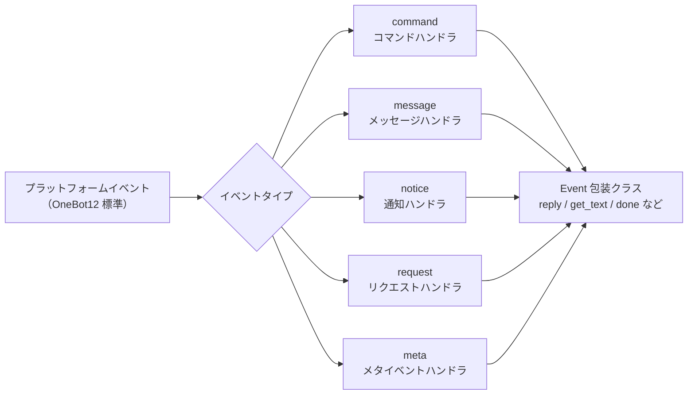

## Command コマンドモジュール

### コマンドの登録

```python
from ErisPulse.Core.Event import command

# 基本的なコマンド
@command("hello", help="挨拶を送る")
async def hello_handler(event):
    await event.reply("こんにちは！")

# 別名付きのコマンド
@command(["help", "h"], aliases=["ヘルプ"], help="ヘルプを表示")
async def help_handler(event):
    pass

# 権限付きのコマンド
def is_admin(event):
    return event.get("user_id") in admin_ids

@command("admin", permission=is_admin, help="管理者コマンド")
async def admin_handler(event):
    pass

# 非表示のコマンド
@command("secret", hidden=True, help="秘密コマンド")
async def secret_handler(event):
    pass

# コマンドグループ
@command("admin.reload", group="admin", help="モジュールを再ロード")
async def reload_handler(event):
    pass
```

### コマンド情報

```python
# コマンドのヘルプを取得
help_text = command.help()

# 特定のコマンドを取得
cmd_info = command.get_command("admin")

# コマンドグループに含まれるすべてのコマンドを取得
admin_commands = command.get_group_commands("admin")

# 可視化可能なすべてのコマンドを取得
visible_commands = command.get_visible_commands()
```

### レプリが待機

```python
# ユーザーからの返信を待つ
@command("ask", help="ユーザー情報の問い合わせ")
async def ask_command(event):
    reply = await command.wait_reply(
        event,
        prompt="あなたの名前を入力してください:",  # すでに送信済み
        timeout=30.0
    )
    
    if reply:
        name = reply.get_text()
        await event.reply(f"こんにちは、{name}！")

# 検証付きの待機返信
def validate_age(event_data):
    try:
        age = int(event_data.get_text())
        return 0 <= age <= 150
    except ValueError:
        return False

@command("age", help="ユーザーの年齢を問い合わせ")
async def age_command(event):
    await event.reply("あなたの年齢を入力してください:")
    
    reply = await command.wait_reply(
        event,
        timeout=60,
        validator=validate_age
    )
    
    if reply:
        age = int(reply.get_text())
        await event.reply(f"あなたの年齢は {age} 歳です")

# コールバック付きの待機返信
async def handle_confirmation(reply_event):
    text = reply_event.get_text().lower()
    if text in ["はい", "yes", "y"]:
        await event.reply("操作が確認されました！")
    else:
        await event.reply("操作がキャンセルされました。")

@command("confirm", help="操作の確認")
async def confirm_command(event):
    await command.wait_reply(
        event,
        prompt="'はい'または'いいえ'を入力してください:",
        callback=handle_confirmation
    )
```

## Message メッセージモジュール

### メッセージイベント

```python
from ErisPulse.Core.Event import message

# すべてのメッセージを監視
@message.on_message()
async def message_handler(event):
    sdk.logger.info(f"メッセージを受信: {event.get_text()}")

# プライベートメッセージを監視
@message.on_private_message()
async def private_handler(event):
    user_id = event.get_user_id()
    sdk.logger.info(f"プライベートメッセージ来自: {user_id}")

# グループメッセージを監視
@message.on_group_message()
async def group_handler(event):
    group_id = event.get_group_id()
    sdk.logger.info(f"グループメッセージ来自: {group_id}")

# @メッセージを監視
@message.on_at_message()
async def at_handler(event):
    mentions = event.get_mentions()
    sdk.logger.info(f"メンションされたユーザー: {mentions}")
```

### 条件付き監視

```python
# 優先度で実行順序を制御
@message.on_message(priority=10)  # 数値が大きいほど優先度が高い
async def high_priority_handler(event):
    pass

# ハンドラ内で条件フィルタを実装
@message.on_message()
async def filtered_handler(event):
    if "キーワード" not in event.get_text():
        return
    # キーワードを含むメッセージを処理
    pass
```

## Notice 通知モジュール

### 通知イベント

```python
from ErisPulse.Core.Event import notice

# フレンド追加
@notice.on_friend_add()
async def friend_add_handler(event):
    user_id = event.get_user_id()
    await event.reply("フレンド追加ありがとうございます！")

# フレンド削除
@notice.on_friend_remove()
async def friend_remove_handler(event):
    user_id = event.get_user_id()
    sdk.logger.info(f"フレンド削除: {user_id}")

# グループメンバー増加
@notice.on_group_increase()
async def member_increase_handler(event):
    user_id = event.get_user_id()
    await event.reply(f"新メンバーを歓迎します！")

# グループメンバー減少
@notice.on_group_decrease()
async def member_decrease_handler(event):
    user_id = event.get_user_id()
    sdk.logger.info(f"グループメンバーが退会しました: {user_id}")
```

## Request リクエストモジュール

### リクエストイベント

```python
from ErisPulse.Core.Event import request

# フレンドリクエスト
@request.on_friend_request()
async def friend_request_handler(event):
    user_id = event.get_user_id()
    comment = event.get_comment()
    sdk.logger.info(f"フレンドリクエスト: {user_id}, コメント: {comment}")

# グループ招待リクエスト
@request.on_group_request()
async def group_request_handler(event):
    group_id = event.get_group_id()
    user_id = event.get_user_id()
    sdk.logger.info(f"グループ招待: {group_id}, 来自: {user_id}")
```

## Meta メタイベントモジュール

### メタイベント

```python
from ErisPulse.Core.Event import meta

# 接続イベント
@meta.on_connect()
async def connect_handler(event):
    platform = event.get_platform()
    sdk.logger.info(f"プラットフォーム {platform} に接続しました")

# 接続切断イベント
@meta.on_disconnect()
async def disconnect_handler(event):
    platform = event.get_platform()
    sdk.logger.info(f"プラットフォーム {platform} から切断しました")

# ハートビートイベント
@meta.on_heartbeat()
async def heartbeat_handler(event):
    sdk.logger.debug("ハートビートを受信しました")
```

### Bot 状態の照会

アダプタがメタイベントを送信すると、フレームワークは自動的に Bot 状態を追跡します。照会 API とライフサイクルイベントの監視は、[アダプタシステム API - Bot 状態管理](adapter-system.md#bot-状態管理)を参照してください。

## Event 包装クラス

Event モジュールのイベントハンドラは、dict を継承した Event 包装クラスのインスタンスを受け取り、便利なメソッドを提供します。

### 核心メソッド

```python
# イベント情報を取得
event_id = event.get_id()
event_time = event.get_time()
event_type = event.get_type()
detail_type = event.get_detail_type()
platform = event.get_platform()

# ロボット情報を取得
self_platform = event.get_self_platform()
self_user_id = event.get_self_user_id()
self_info = event.get_self_info()
```

### セッション識別子

```python
# 統一されたターゲット ID：グループなら group_id、プライベートなら user_id、以此類推
target_id = event.get_target_id()

# セッションのユニーク識別子、形式: {platform}:{detail_type}:{target_id}
session_id = event.get_session_id()
# 例: "telegram:private:12345"、"qq:group:67890"
```

`get_target_id()` は、`group_id` → `channel_id` → `guild_id` → `thread_id` → `user_id` の順に、最初に非空の値を返します。これは、コンテキスト管理や状態保存など、セッションを一意に識別する必要がある場面に適しています。

### メッセージメソッド

```python
# メッセージ内容を取得
message_segments = event.get_message()
alt_message = event.get_alt_message()
text = event.get_text()

# 送信者情報を取得
user_id = event.get_user_id()
nickname = event.get_user_nickname()
sender = event.get_sender()

# グループ情報を取得
group_id = event.get_group_id()

# メッセージタイプを判定
is_msg = event.is_message()
is_private = event.is_private_message()
is_group = event.is_group_message()

# @メッセージ関連
is_at = event.is_at_message()
has_mention = event.has_mention()
mentions = event.get_mentions()
```

### コマンド情報

```python
# コマンド情報を取得
cmd_name = event.get_command_name()
cmd_args = event.get_command_args()
cmd_raw = event.get_command_raw()

# コマンドかどうかを判定
is_cmd = event.is_command()
```

### レプリ機能

```python
# 基本的な返信
await event.reply("これはメッセージです")

# 指定された送信方法
await event.reply("http://example.com/image.jpg", method="Image")

# @ユーザーと返信メッセージを含む
await event.reply("こんにちは", at_users=["user1"], reply_to="msg_id")

# @全員
await event.reply("お知らせ", at_all=True)

# プラットフォーム固有の修飾方法を使用（via パラメータ）
await event.reply("ホワイトボード内容", method="Board",
                  via=[("Expire", 3600), ("ForMember", "114514")])

# 送信チェーンを取得し、修飾方法や送信方法を自由に追加（複数の修飾 / 動作型メソッドに適しています）
await event.send_chain().Expire(3600).Board("ホワイトボード内容")
await event.send_chain().DismissBoard()

# OneBot12 メッセージセグメントを使用した返信
from ErisPulse.Core.Event import MessageBuilder
msg = MessageBuilder().text("Hello").image("url").build()
await event.reply_ob12(msg)

# レプリを待つ
reply = await event.wait_reply(timeout=30)
```

### プラットフォーム能力の照会

```python
# 現在のプラットフォームが特定の送信方法をサポートしているか確認
if event.supports("Image"):
    await event.reply(url, method="Image")

# 現在のプラットフォームで利用可能なすべての送信方法をリストアップ
methods = event.available_methods()
# ["Text", "Image", "Voice", "Video", ...]
```

### レプリメソッド

`reply()` メソッドは、`method` パラメータで送信タイプを指定でき、2 つの便利なブール値パラメータもサポートします：

```python
# 簡単なテキスト返信
await event.reply("こんにちは")

# 送信者を@して返信
await event.reply("こんにちは", at_sender=True)

# 現在のメッセージを引用して返信
await event.reply("受信しました", quote=True)

# 組み合わせて使用
await event.reply("受信しました", at_sender=True, quote=True)

# 画像を送信（method パラメータを使用）
if event.supports("Image"):
    await event.reply("http://example.com/img.jpg", method="Image")
else:
    await event.reply("[画像] http://example.com/img.jpg")
```

**パラメータ説明**：

| パラメータ | 型 | 説明 |
|------|------|------|
| `content` | str | 送信内容 |
| `method` | str | 送信方法、デフォルトは "Text"、"Image"/"Voice"/"Video"/"File" など |
| `at_sender` | bool | 送信者を@するかどうか（user_id を自動抽出） |
| `quote` | bool | 現在のメッセージを引用して返信するかどうか（message_id を自動抽出） |
| `at_users` | list[str] | @する特定のユーザーのリスト |
| `reply_to` | str | 手動で指定する返信メッセージ ID |
| `at_all` | bool | 全員を@するかどうか |

### インタラクティブメソッド

```python
# confirm — 確認対話（True/False/None を返す）
if await event.confirm("この操作を実行してもよろしいですか？"):
    await event.reply("確認しました")

# テキスト以外の方法で確認メッセージを送信
if await event.confirm("http://example.com/image.jpg", method="Image"):
    await event.reply("画像の確認が完了しました")

# choose — 選択メニュー（選択されたインデックスまたは None を返す）
choice = await event.choose("色を選択してください：", ["赤", "緑", "青"])

# options_format="auto"（デフォルト）は、method に応じてスタイルを自動選択：
# Markdown→無序リスト（- 1.選択肢）、Html→順序リスト（<ol>）、その他→純テキストリスト
# テキスト系メソッド（Markdown/Html など）はデフォルトで選択肢を末尾に結合
# merge_prompt=True は任意の method で強制的に結合可能、placeholder はカスタムプレースホルダを指定可能
choice = await event.choose(
    "## 選択してください\n{options}", ["A", "B"],
    method="Markdown", merge_prompt=True,
)

# collect — フォーム収集（{key: value} ディクショナリまたは None を返す）
data = await event.collect([
    {"key": "name", "prompt": "名前を入力してください："},
    {"key": "age", "prompt": "年齢を入力してください：",
     "validator": lambda e: e.get_text().isdigit()},
    {"key": "avatar", "prompt": "プロフィール画像を送信してください：", "method": "Image"},
])

# wait_for — 条件を満たす任意のイベントを待つ
evt = await event.wait_for(event_type="notice", condition=lambda e: ..., timeout=120)

# conversation — 複数ラウンド対話コンテキスト
conv = event.conversation(timeout=60)
await conv.say("ようこそ！")
```

> 完全なインタラクティブメソッドのパラメータ説明とその他の例は、[Event 包装クラスの詳細](../developer-guide/modules/event-wrapper.md) と [Conversation 複数ラウンド対話](../advanced/conversation.md) を参照してください。

### ユーティリティメソッド

```python
# _ で始まる内部キーをフィルタリングして辞書に変換
event_dict = event.to_dict()

# 元のデータを取得
raw = event.get_raw()
raw_type = event.get_raw_type()
```

### リンク制御

`event.done(claim=, stop=)` は「認領」および「阻止」の 2 つの独立した意味を統一的に制御します：

- **認領（claim）**：イベントが処理されたことをマーク（`_processed`）、コマンドディスパッチャーはこれに基づいて重複処理をスキップします
- **阻止（stop）**：低優先度のハンドラへのイベント伝播を阻止（`_propagation_stopped`）

```python
# 認領 + 阻止（デフォルト）
event.done()

# 認領のみ、阻止しない（低優先度の観測者はまだイベントを見ることができます）
event.done(stop=False)

# 阻止のみ、認領しない（例えば、ファイアウォール / 限流など）
event.done(claim=False)

# mark_processed は主なメソッド、done はその別名
event.mark_processed()             # 等価 event.done()
event.mark_processed(stop=False)   # 等価 event.done(stop=False)

# 状態を照会
event.is_processed()  # 既に認領されているか
event.is_stopped()    # 伝播が阻止されているか
```

### プラットフォーム拡張メソッド

アダプタは Event にプラットフォーム固有メソッドを登録でき、対応するプラットフォームのインスタンス上でのみ利用可能です。

#### ユーザー：プラットフォーム拡張メソッドの使用

アダプタがプラットフォーム固有メソッドを登録した場合、イベントハンドラ内で直接呼び出すことができます。各プラットフォームのメソッドは異なりますので、対応する [プラットフォームドキュメント](../platform-guide/) を参照してください。

```python
from ErisPulse.Core.Event import message

@message.on_message()
async def handle_message(event):
    platform = event.get_platform()

    # プラットフォームに応じて固有メソッドを呼び出す
    if platform == "email":
        subject = event.get_subject()           # メール固有
        attachments = event.get_attachments()   # メール固有
```

#### プラットフォーム登録メソッドの照会

```python
from ErisPulse.Core.Event import get_platform_event_methods

# 特定のプラットフォームに登録されたメソッドを取得
methods = get_platform_event_methods("email")
# ["get_subject", "get_from", "get_attachments", ...]

# 動的に判定して呼び出す
for method_name in get_platform_event_methods(event.get_platform()):
    method = getattr(event, method_name)
    print(f"{method_name}: {method()}")
```

#### プラットフォームメソッドの分離

異なるプラットフォームで登録されたメソッドは互いに干渉しません：

```python
# メールイベント - メール固有メソッドのみ
event = Event({"platform": "email", "email_raw": {"subject": "Hello"}})
event.get_subject()      # ✅ "Hello"
event.get_chat_type()    # ❌ AttributeError

# Telegram イベント - Telegram 固有メソッドのみ
event = Event({"platform": "telegram", "telegram_raw": {"chat": {"type": "private"}}})
event.get_chat_type()    # ✅ "private"
event.get_subject()      # ❌ AttributeError
```

#### `hasattr` / `dir` のサポート

```python
hasattr(event, "get_subject")   # platform が "email" の場合のみ True を返す
"get_subject" in dir(event)     # 同上
```

#### アダプタ：プラットフォーム拡張メソッドの登録

アダプタはデコレータを使って Event にプラットフォーム固有メソッドを登録でき、メソッドの最初の引数は `self`（Event インスタンス）で、イベントデータに自由にアクセスできます。

##### 単一メソッドの登録

```python
from ErisPulse.Core.Event import register_event_method

@register_event_method("email")
def get_subject(self):
    """メールの件名を取得"""
    return self.get("email_raw", {}).get("subject", "")

@register_event_method("email")
def get_from(self):
    """送信元を取得"""
    return self.get("email_raw", {}).get("from", {})
```

##### バッチ登録（Mixin クラス）

メソッドが多い場合は、Mixin クラスを使って一括登録することを推奨します：

```python
from ErisPulse.Core.Event import register_event_mixin

class EmailEventMixin:
    def get_subject(self):
        return self.get("email_raw", {}).get("subject", "")

    def get_from(self):
        return self.get("email_raw", {}).get("from", {})

    def get_attachments(self):
        return self.get("email_raw", {}).get("attachments", [])

# 一括でメソッドを登録
register_event_mixin("email", EmailEventMixin)
```

##### 戻り値の規則

| シナリオ | 戻り値 | ユーザーの使用方法 |
|------|--------|------------|
| データを返す（テキスト、辞書など） | 戻り値を直接返す | `subject = event.get_subject()` |
| 操作を実行する（メッセージ送信など） | `asyncio.Task` を返す | `task = event.do_something()` はオプションで `await` できる |

> **推奨**：データ以外の戻り値を持つメソッドは `asyncio.Task` を返すようにし、ユーザーは `await` するかどうかを自由に選択できるようにします。`await` しなくても操作は完了します。

```python
@register_event_method("email")
def forward_email(self, to_address: str):
    """メールを転送 — Task を返す、ユーザーは await するかどうかを決定できる"""
    import asyncio
    return asyncio.create_task(
        self._do_forward(to_address)
    )

# ユーザーは await して結果を待つこともできる
await event.forward_email("user@example.com")

# または await しなくても、バックグラウンドで処理が実行される
event.forward_email("user@example.com")
```

##### メソッドの解除

```python
from ErisPulse.Core.Event import unregister_event_method, unregister_platform_event_methods

# 単一メソッドの解除
unregister_event_method("email", "get_subject")

# 特定プラットフォームのすべてのメソッドを解除（アダプタのシャットダウン時に呼び出す）
unregister_platform_event_methods("email")
```

##### 内部メソッドの上書き

`register_event_mixin` / `register_event_method` は Event 内部メソッド（`confirm`、`choose`、`collect`、`wait_reply`、`reply` など）の上書きもサポートします。登録されたプラットフォームメソッドは `Event.__getattribute__` により内部メソッドよりも優先して有効になるため、アダプタはプラットフォーム特有のインタラクティブ実装を提供できます。

内部実装は `_builtin_*` 関数としてエクスポートされ、上書き側はそれらをバックアップとして呼び出すことができます。

```python
from ErisPulse.Core.Event import register_event_mixin, _builtin_choose

class YunhuEventMixin:
    async def choose(self, prompt, options, timeout=60, method="Text"):
        # 雲湖プラットフォームではボタンコンポーネントを使用
        buttons = [[{"text": opt} for opt in options]]
        await self.reply(prompt)
        # ...ボタンのコールバックやテキスト返信を待つ...
        # 内部ロジックに回帰
        return await _builtin_choose(self, None, options, timeout, "Text")

register_event_mixin("yunhu", YunhuEventMixin)
```

## 跨プラットフォーム拡張（ワイルドカード）

`register_event_method` および `register_event_mixin` は `"*"` をプラットフォーム名として渡すことで、登録されたメソッドは**すべてのプラットフォーム**の Event インスタンスで利用可能になります。AI チャット、コンテキスト管理など、プラットフォーム間で再利用可能な機能モジュールに適しています。

### 跨プラットフォームメソッドの登録

```python
from ErisPulse.Core.Event.wrapper import register_event_method

@register_event_method("*")
async def ai_chat(self, prompt: str):
    """self は Event インスタンス、イベントデータや内部メソッドに自由にアクセスできる"""
    await self.reply(f"AI: {prompt}")
```

登録後、すべてのプラットフォームのイベントハンドラで呼び出せます：

```python
from ErisPulse.Core.Event import message

@message.on_message()
async def handler(event):
    await event.ai_chat(event.get_text())
```

### メソッドの優先順位

Event メソッドを属性としてアクセスする際の解析順序は以下の通りです：

1. **プラットフォーム固有メソッド**（現在のプラットフォームの上書き）
2. **ワイルドカードメソッド**（`"*"` で登録された跨プラットフォームメソッド）
3. **内部メソッド**（`reply`、`confirm`、`choose`、`collect`、`wait_reply`、`reply` など）
4. **辞書キーのアクセス**

> したがって、ワイルドカードメソッドは内部メソッド（`reply` など）を上書きできますが、同名のプラットフォーム固有メソッドによりさらに上書きされます。

## 優先度システム

イベントハンドラは優先度をサポートし、数値が大きいほど優先度が高いです：

```python
# 高優先度ハンドラが先に実行されます
@message.on_message(priority=10)
async def high_priority_handler(event):
    pass

# 低優先度ハンドラが後に実行されます
@message.on_message(priority=0)
async def low_priority_handler(event):
    pass
```


### 适配器系统 API

# アダプターシステム API

本ドキュメントでは、ErisPulse アダプターシステムの API を詳細に紹介します。

## アダプター マネージャー

### アダプターの取得

```python
from ErisPulse import sdk

# 名前を指定してアダプターを取得
adapter = sdk.adapter.get("platform_name")

# または直接プロパティからアクセスすることも可能です
adapter = sdk.adapter.platform_name
```

### アダプター イベントのリッスン
> 一般的に、イベントのリッスン/処理には`Event`モジュールの使用を推奨します;
>
> また`Event`モジュールは強力なラッパーを提供しており、モジュール開発にさらなる利便性をもたらします

```python
# OneBot12 標準イベントをリッスン
@sdk.adapter.on("message")
async def handle_message(event):
    pass

# 特定プラットフォームの標準イベントをリッスン
@sdk.adapter.on("message", platform="yunhu")
async def handle_yunhu_message(event):
    pass

# プラットフォームのネイティブイベントをリッスン
@sdk.adapter.on("raw_event", raw=True, platform="yunhu")
async def handle_raw_event(data):
    pass
```

### アダプターの管理

```python
# 全プラットフォームを取得
platforms = sdk.adapter.platforms

# アダプターが存在するか確認
exists = sdk.adapter.exists("platform_name")

# アダプターを有効化/無効化
sdk.adapter.enable("platform_name")
sdk.adapter.disable("platform_name")

# アダプターを起動/停止
# 以下のメソッドはいずれも引数を渡す例のみを示しており、引数なしの場合は登録済みの全アダプターを起動/停止します
await sdk.adapter.startup(["platform1", "platform2"])
await sdk.adapter.shutdown(["platform1", "platform2"])

# アダプターが稼働中か確認
is_running = sdk.adapter.is_running("platform_name")

# 稼働中のアダプター一覧を表示
running = sdk.adapter.list_running()
```

## ミドルウェア

ミドルウェアはイベントがハンドラーに配送される前に実行されます。イベントデータの変更、フィルタリング、記録を行うことができます。

### ミドルウェアの登録

```python
@sdk.adapter.middleware
async def my_middleware(event):
    sdk.logger.info(f"ミドルウェア処理: {event}")
    return event
```

### ミドルウェアの実行モデル

- **実行順序**：ミドルウェアは登録順で実行されます（登録順優先）
- **データの受け渡し**：各ミドルウェアは前のミドルウェアから返された`event`データを受け取ります。あるミドルウェアが`None`を返した場合、その戻り値は無視され、元のデータがそのまま引き渡されます（同時に`warning`レベルのログが出力されます）
- **データの変更**：ミドルウェアはイベントデータを変更し、変更後の辞書を返すことができます

```python
@sdk.adapter.middleware
async def add_timestamp(event):
    event["processed_at"] = time.time()
    return event

@sdk.adapter.middleware
async def filter_spam(event):
    if event.get("detail_type") == "private":
        text = event.get("alt_message", "")
        if "垃圾广告" in text:  # 垃圾广告 -> スパム広告 / 無視すべき広告
            return None   # None を返してもイベントの伝播を阻止しません。この戻り値のみ無視されます
    return event
```

> **注意**：ミドルウェアは現在、イベントの伝播をブロックすることをサポートしていません。特定のイベントをフィルタリングする場合は、イベントハンドラー内で条件分岐を実装してください。
> ただし、Eventモジュールで高優先度ハンドラーを設定し、ハンドラー内で`event.mark_processed()`を設定して低優先度イベントハンドラーをブロックすることは可能です

## メッセージ送信

### 基本的な送信

```python
# アダプターを取得
adapter = sdk.adapter.get("platform")

# テキストメッセージを送信
await adapter.Send.To("user", "123").Text("Hello")

# 画像メッセージを送信
await adapter.Send.To("group", "456").Image("https://example.com/image.jpg")
```

### 送信アカウントの指定

```python
# アカウント名を使用
await adapter.Send.Using("account1").To("user", "123").Text("Hello")

# アカウント ID を使用
await adapter.Send.Using("bot_id").To("user", "123").Text("Hello")
```

### サポートされている送信メソッドの確認

```python
# プラットフォームがサポートするすべての送信メソッドを一覧表示
methods = sdk.adapter.list_sends("onebot11")
# 返回: ["Text", "Image", "Voice", "Markdown", ...]

# 特定のメソッドの詳細情報を取得
info = sdk.adapter.send_info("onebot11", "Text")
# 返回:
# {
#     "name": "Text",
#     "parameters": [
#         {"name": "text", "type": "str", "default": null, "annotation": "str"}
#     ],
#     "return_type": "Awaitable[Any]",
#     "docstring": "送信テキストメッセージ..."
# }
```

### チェーンメソッド

```python
# @ユーザー
await adapter.Send.To("group", "456").At("789").Text("こんにちは")

# @全員
await adapter.Send.To("group", "456").AtAll().Text("皆さんこんにちは")

# メッセージへの返信
await adapter.Send.To("group", "456").Reply("msg_id").Text("返信内容")

# 組み合わせ使用
await adapter.Send.To("group", "456").At("789").Reply("msg_id").Text("返信@のメッセージ")
```

## API 呼び出し

### call_api メソッド

> **注意**：`call_api` はプラットフォームのネイティブ API を直接呼び出す底層メソッドです。各プラットフォームのパラメータと戻り値は異なる場合があります。対応するプラットフォームアダプタードキュメントを参照してください。**メッセージ送信には Send DSL の使用を推奨します**。Send DSL がサポートされていないシナリオ（プラットフォーム固有のデータの取得、プラットフォーム管理インターフェースの呼び出しなど）の場合のみ`call_api`を使用してください。

```python
# プラットフォーム API を呼び出し
result = await adapter.call_api(
    endpoint="/send",
    content="Hello",
    recvId="123",
    recvType="user"
)

# 標準化されたレスポンス
{
    "status": "ok",
    "retcode": 0,
    "data": {...},
    "message_id": "msg_id",
    "message": "",
    "{platform}_raw": raw_response
}
```

## アダプター基底クラス

### BaseAdapter メソッド

```python
from ErisPulse import sdk
from ErisPulse.Core import BaseAdapter

class MyAdapter(BaseAdapter):
    def __init__(self):
        super().__init__()
        self.sdk = sdk
        # アダプターを初期化
        pass
    
    async def start(self):
        """アダプターを起動（実装必須）"""
        pass
    
    async def shutdown(self):
        """アダプターを停止（実装必須）"""
        pass
    
    async def call_api(self, endpoint: str, **params):
        """プラットフォーム API を呼び出し（実装必須）"""
        pass
```

### Send ネストクラス

```python
class MyAdapter(BaseAdapter):
    class Send(BaseAdapter.Send):
        def Text(self, text: str):
            """テキストメッセージを送信"""
            import asyncio
            return asyncio.create_task(
                self._adapter.call_api(
                    endpoint="/send",
                    content=text,
                    recvId=self._target_id,
                    recvType=self._target_type
                )
            )
```

## Bot 状態管理

アダプターは、OneBot12 標準の**`meta`イベント**を送信することで、フレームワークに Bot の接続状態を通知します。システムは自動的に Bot 情報を抽出し、状態を追跡します。

### meta イベントの種類

アダプターは以下の 3 種類の`meta`イベントを送信する必要があります：

| `type` | `detail_type` | 説明 | トリガー時期 |
|--------|--------------|------|---------|
| `meta` | `connect` | Bot 接続上线 | アダプターがプラットフォームへの接続に成功した後 |
| `meta` | `heartbeat` | Bot 心跳 | 定期的に送信（推奨 30-60 秒） |
| `meta` | `disconnect` | Bot 断开连接 | 接続が切断されたことを検出した時 |

### self フィールドの拡張

ErisPulse は OneBot12 標準の`self`フィールドに対し、以下のオプションフィールドを拡張しています：

| フィールド | 型 | 説明 |
|------|------|------|
| `self.platform` | string | プラットフォーム名（OB12 標準） |
| `self.user_id` | string | Bot ユーザー ID（OB12 標準） |
| `self.user_name` | string | Bot ニックネーム（ErisPulse 拡張） |
| `self.avatar` | string | Bot アバター URL（ErisPulse 拡張） |
| `self.account_id` | string | マルチアカウント識別子（ErisPulse 拡張） |

### meta イベントのフォーマット

#### connect — 接続上线

```python
await adapter.emit({
    "id": "unique_id",
    "time": 1712345678,
    "type": "meta",
    "detail_type": "connect",
    "platform": "telegram",
    "self": {
        "platform": "telegram",
        "user_id": "123456",
        "user_name": "MyBot",
        "avatar": "https://example.com/avatar.jpg"
    },
    "telegram_raw": {...},
    "telegram_raw_type": "bot_connected"
})
```

システム処理：Bot を登録し、`online`としてマーク、`adapter.bot.online`ライフサイクルイベントをトリガー。

#### heartbeat — 心跳

```python
await adapter.emit({
    "id": "unique_id",
    "time": 1712345708,
    "type": "meta",
    "detail_type": "heartbeat",
    "platform": "telegram",
    "self": {
        "platform": "telegram",
        "user_id": "123456"
    }
})
```

システム処理：`last_active`タイムスタンプを更新（ハートビートでもメタ情報の更新をサポートしています）。

#### disconnect — 断开连接

```python
await adapter.emit({
    "id": "unique_id",
    "time": 1712345738,
    "type": "meta",
    "detail_type": "disconnect",
    "platform": "telegram",
    "self": {
        "platform": "telegram",
        "user_id": "123456"
    }
})
```

システム処理：Bot を `offline`としてマーク、`adapter.bot.offline`ライフサイクルイベントをトリガー。

### 普通イベントの自動発見

`meta`イベントに加え、普通イベント（`message`/`notice`/`request`）内の`self`フィールドも自動的に発見され、Bot が登録され、アクティブ時間が更新されます。これはアダプターが`connect`イベントを送信しなくても、フレームワークが最初の普通イベントから Bot を発見できることを意味します。

### アダプター接続の例

```python
class MyAdapter(BaseAdapter):
    async def start(self):
        # プラットフォームへの接続を確立...
        connection = await self._connect()
        
        # 接続成功、connect イベントを送信
        await adapter.emit({
            "id": str(uuid4()),
            "time": int(time.time()),
            "type": "meta",
            "detail_type": "connect",
            "platform": "myplatform",
            "self": {
                "platform": "myplatform",
                "user_id": self.bot_id,
                "user_name": self.bot_name,
                "avatar": self.bot_avatar
            },
            "myplatform_raw": raw_data,
            "myplatform_raw_type": "connected"
        })
    
    async def on_disconnect(self):
        # 接続切断、disconnect イベントを送信
        await adapter.emit({
            "id": str(uuid4()),
            "time": int(time.time()),
            "type": "meta",
            "detail_type": "disconnect",
            "platform": "myplatform",
            "self": {
                "platform": "myplatform",
                "user_id": self.bot_id
            }
        })
```

### Bot 状態の照会

```python
# 全アダプターと Bot の完全な状態を取得（WebUI に優しい）
summary = sdk.adapter.get_status_summary()
# {
#     "adapters": {
#         "telegram": {
#             "status": "started",
#             "bots": {
#                 "123456": {
#                     "status": "online",
#                     "last_active": 1712345678.0,
#                     "info": {"nickname": "MyBot"}
#                 }
#             }
#         }
#     }
# }

# 全 Bot を一覧表示
all_bots = sdk.adapter.list_bots()

# 指定されたプラットフォームの Bot を一覧表示
tg_bots = sdk.adapter.list_bots("telegram")

# 単一の Bot の詳細を取得
info = sdk.adapter.get_bot_info("telegram", "123456")

# Bot がオンラインか確認
if sdk.adapter.is_bot_online("telegram", "123456"):
    print("Bot 在线")  # Bot 在线 -> Bot はオンラインです
```

### Bot 状態値

| 状態 | 説明 |
|------|------|
| `online` | オンライン（継続的にイベントを受け取っているか、アダプターが主導でマークされた） |
| `offline` | オフライン（アダプターが主導でマークされたか、システムシャットダウン時に自動設定される） |
| `unknown` | 未知（登録済みだが状態が確認されていない） |

### ライフサイクルイベント

| イベント名 | トリガー時期 | データ |
|--------|---------|------|
| `adapter.bot.online` | 初回の自動発見による新規 Bot 発見 | `{platform, bot_id, status}` |
| `adapter.status.change` | アダプターの状態変化（starting/started/stopping/stopped/stop_failed） | `{platform, status}` |

```python
# Bot オンラインイベントをリッスン
@sdk.lifecycle.on("adapter.bot.online")
def on_bot_online(event):
    print(f"Bot 在线: {event['data']['platform']}/{event['data']['bot_id']}")

# アダプター状態の変化をリッスン
@sdk.lifecycle.on("adapter.status.change")
def on_status_change(event):
    print(f"适配器状态: {event['data']['platform']} -> {event['data']['status']}")
```

> システムがシャットダウン（`shutdown`）されると、全 Bot は自動的に `offline` としてマークされます。


====
技术标准
====


### 会话类型标准

# ErisPulse セッション型標準

このドキュメントでは、ErisPulse がサポートするセッション型標準を定義しています。これには、受信イベント型と送信ターゲット型が含まれます。

## 1. 核心概念

### 1.1 受信タイプ && 送信タイプ

ErisPulse は、2 種類の会話タイプを区別します：

- **受信タイプ（Receive Type）**：受信イベントの `detail_type` フィールド
- **送信タイプ（Send Type）**：送信時に `Send.To()` メソッドの対象となるタイプ

### 1.2 タイプのマッピング

```
受信タイプ (detail_type)     送信タイプ (Send.To)
─────────────────        ────────────────
private                 →        user
group                   →        group
channel                 →        channel
guild                   →        guild
thread                  →        thread
user                    →        user
```

**重要な点**：
- `private` は受信時のタイプであり、送信時には `user` を使用する必要があります
- `group`、`channel`、`guild`、`thread` は受信時と送信時のタイプが同じです
- システムは自動的にタイプ変換を行います。手動での処理は不要です（つまり、取得した受信タイプをそのまま送信に使用できます）。実際には、これらの変換を意識する必要はありません。Eventのラッパークラスが存在するため、`event.reply()` メソッドを使用するだけで、タイプ変換を気にする必要がありません。

## 2. 標準会話タイプ

### 2.1 OneBot12 標準タイプ

#### private
- **受信タイプ**：`private`
- **送信タイプ**：`user`
- **説明**：1対1のプライベートチャットメッセージ
- **IDフィールド**：`user_id`
- **対応プラットフォーム**：プライベートチャットをサポートするすべてのプラットフォーム

#### group
- **受信タイプ**：`group`
- **送信タイプ**：`group`
- **説明**：グループチャットメッセージ、Telegram supergroup を含む様々な形式のグループ
- **IDフィールド**：`group_id`
- **対応プラットフォーム**：グループチャットをサポートするすべてのプラットフォーム

#### user
- **受信タイプ**：`user`
- **送信タイプ**：`user`
- **説明**：ユーザー型、一部のプラットフォーム（例：Telegram）ではプライベートチャットを `user` として表現
- **IDフィールド**：`user_id`
- **対応プラットフォーム**：Telegram など

### 2.2 ErisPulse 拡張タイプ

#### channel
- **受信タイプ**：`channel`
- **送信タイプ**：`channel`
- **説明**：チャンネルメッセージ、複数ユーザーへのブロードキャストメッセージをサポート
- **IDフィールド**：`channel_id`
- **対応プラットフォーム**：Discord, Telegram, Line など

#### guild
- **受信タイプ**：`guild`
- **送信タイプ**：`guild`
- **説明**：サーバー/コミュニティメッセージ、通常は Discord Guild 級のイベントに使用
- **IDフィールド**：`guild_id`
- **対応プラットフォーム**：Discord など

#### thread
- **受信タイプ**：`thread`
- **送信タイプ**：`thread`
- **説明**：トピック/サブチャンネルメッセージ、コミュニティ内のサブディスカッションエリアに使用
- **IDフィールド**：`thread_id`
- **対応プラットフォーム**：Discord Threads, Telegram Topics など

## 3. プラットフォーム型のマッピング

### 3.1 マッピングの原則

アダプターは、プラットフォームのネイティブ型を ErisPulse の標準型にマッピングします：

```
プラットフォームネイティブ型 → ErisPulse標準型 → 送信型
```

### 3.2 一般的なプラットフォームのマッピング例

#### Telegram
```
Telegram型              ErisPulse受信型      送信型
─────────────────      ────────────────     ───────────
private                private               user
group                  group                 group
supergroup             group                 group  # groupにマッピング
channel                channel               channel
```

#### Discord
```
Discord型              ErisPulse受信型      送信型
─────────────────      ────────────────     ───────────
Direct Message         private               user
Text Channel           channel               channel
Guild                  guild                 guild
Thread                 thread                thread
```

#### OneBot11
```
OneBot11型             ErisPulse受信型      送信型
─────────────────      ────────────────     ───────────
private                private               user
group                  group                 group
discuss                group                 group  # groupにマッピング
```

## 4. 自定义型の拡張

### 4.1 自定义型の登録

アダプタは、独自の会話型を登録することができます。

```python
from ErisPulse.Core.Event import register_custom_type

# 自定义型の登録
register_custom_type(
    receive_type="my_custom_type",
    send_type="custom",
    id_field="custom_id",
    platform="MyPlatform"
)
```

### 4.2 自定义型の使用

登録後、システムは自動的にその型の変換と推論を処理します。

```python
# 自動推論
receive_type = infer_receive_type(event, platform="MyPlatform")
# 戻り値: "my_custom_type"

# 送信型への変換
send_type = convert_to_send_type(receive_type, platform="MyPlatform")
# 戻り値: "custom"

# 対応するIDの取得
target_id = get_target_id(event, platform="MyPlatform")
# 戻り値: event["custom_id"]
```

### 4.3 自定义型の解除登録

```python
from ErisPulse.Core.Event import unregister_custom_type

unregister_custom_type("my_custom_type", platform="MyPlatform")
```

## 5. 自動型推論

イベントに明確な `detail_type` フィールドがない場合、システムは存在する ID フィールドに基づいて型を自動的に推論します。

> [!NOTE]
> **2.7.0+ の動作変更**：`detail_type` は**既知の会話型**（標準またはカスタム）である場合のみ、そのまま採用されます。notice/request イベントの `detail_type`（例：`group_member_increase`、`friend_increase`）は**意味論的サブタイプ**であり、会話型ではなく、ID フィールドに基づいて正しい会話型を推論します。

### 5.1 推論優先度

```
優先度（高 → 低）：
1. group_id     → group
2. channel_id   → channel
3. guild_id     → guild
4. thread_id    → thread
5. user_id      → private
```

### 5.2 使用例

```python
# イベントに group_id だけがある
event = {"group_id": "123", "user_id": "456"}
receive_type = infer_receive_type(event)
# 戻り値: "group"（group_id を優先使用）

# イベントに user_id だけがある
event = {"user_id": "123"}
receive_type = infer_receive_type(event)
# 戻り値: "private"

# notice イベントの detail_type は意味論的サブタイプで、2.7.0+ では ID フィールドから推論される
event = {"type": "notice", "detail_type": "group_member_increase", "group_id": "123"}
receive_type = infer_receive_type(event)
# 戻り値: "group"（"group_member_increase" ではなく）
```

## 6. API 使用例

### 6.1 メッセージ送信

```python
from ErisPulse import adapter

# ユーザーに送信
await adapter.myplatform.Send.To("user", "123").Text("Hello")

# グループに送信
await adapter.myplatform.Send.To("group", "456").Text("Hello")

# 自動変換 private → user（推奨されない、互換性の問題がある可能性がある）
await adapter.myplatform.Send.To("private", "789").Text("Hello")
# 内部で自動変換される: Send.To("user", "789") # 直接 user を会話タイプとして使用するのがより良い選択です
```

### 6.2 イベントの返信

```python
from ErisPulse.Core.Event import Event

# Event.reply() は自動的に型変換を処理
await event.reply("返信内容")
# 内部で正しい送信タイプが自動的に使用される
```

### 6.3 コマンド処理

```python
from ErisPulse.Core.Event import command

@command(name="test")
async def handle_test(event):
    # システムが自動的に会話タイプを処理
    # group_id か user_id を手動で判断する必要はない
    await event.reply("コマンドが正常に実行されました")
```

## 7. コア API リファレンス

### 7.1 タイプ変換

```python
from ErisPulse.Core.Event import convert_to_send_type, convert_to_receive_type

# 受信タイプ → 送信タイプ
convert_to_send_type("private")  # → "user"
convert_to_send_type("group")    # → "group"

# 送信タイプ → 受信タイプ
convert_to_receive_type("user")   # → "private"
convert_to_receive_type("group")  # → "group"
```

### 7.2 ID フィールドの取得

```python
from ErisPulse.Core.Event import get_id_field, get_receive_type

get_id_field("group")    # → "group_id"
get_id_field("private")  # → "user_id"

get_receive_type("group_id")  # → "group"
get_receive_type("user_id")   # → "private"
```

### 7.3 送信情報の取得

```python
from ErisPulse.Core.Event import get_send_type_and_target_id

event = {"detail_type": "private", "user_id": "123"}
send_type, target_id = get_send_type_and_target_id(event)
# send_type = "user", target_id = "123"

# Send.To() に直接使用
await adapter.Send.To(send_type, target_id).Text("Hello")
```

### 7.4 目標 ID の取得

```python
from ErisPulse.Core.Event import get_target_id

event = {"detail_type": "group", "group_id": "456"}
get_target_id(event)  # → "456"
```

## 8. ユーティリティメソッド

```python
from ErisPulse.Core.Event import (
    is_standard_type,
    is_valid_send_type,
    get_standard_types,
    get_send_types,
    clear_custom_types,
)

is_standard_type("private")     # True
is_standard_type("custom_type") # False

is_valid_send_type("user")      # True
is_valid_send_type("invalid")   # False

get_standard_types()  # {"private", "group", "channel", "guild", "thread", "user"}
get_send_types()      # {"user", "group", "channel", "guild", "thread"}

clear_custom_types()                # 全てのカスタムタイプをクリア
clear_custom_types(platform="discord")  # 指定されたプラットフォームのカスタムタイプのみをクリア
```

## 9. 最適実践

### 7.1 アダプタ開発者

1. **標準マッピングの使用**：可能な限り、新規型を作成するのではなく、標準型にマッピングする
2. **正しい変換**：受信型と送信型のマッピング関係を正しく保つ
3. **元データの保持**：`{platform}_raw` に元のイベント型を保持する
4. **ドキュメントの説明**：アダプタのドキュメントで型のマッピング関係を説明する

### 7.2 モジュール開発者

1. **ツールメソッドの使用**：`get_send_type_and_target_id()` などのツールメソッドを使用する
2. **ハードコーディングの回避**：`if group_id else "private"` のようなコードを書かない
3. **すべての型を考慮する**：コードは `private` および `group` のみではなく、すべての標準型をサポートする
4. **柔軟な設計**：直接フィールドにアクセスするのではなく、イベントラッパーのメソッドを使用する

### 7.3 型推論

- **`detail_type` の優先使用**：明確なフィールドがある場合は、推論を行わない
- **推論の適切な使用**：明確な型がない場合にのみ使用する
- **優先順位の注意**：推論の優先順位を理解し、意図しない結果を避ける

## 10.よくある質問

### Q1: なぜ送信時に private を user に変換する必要があるのですか？

A: これは OneBot12 標準の要件です。`private` は受信時の概念であり、送信時には `user` を使用することで意味がより明確になります。

### Q2: 新しい会話タイプをどのようにサポートしますか？

A: `register_custom_type()` を使用してカスタムタイプを登録するか、標準タイプの `channel`、`guild` を直接使用します。

### Q3: イベントに detail_type がない場合はどうすればよいですか？

A: システムは存在する ID フィールドに基づいて自動的に推論します。優先順位は以下の通りです：group > channel > guild > thread > user。

### Q4: どのようにアダプターが Telegram supergroup をマッピングしますか？

A: アダプターの変換ロジックの中で、`supergroup` を標準の `group` タイプにマッピングします。

### Q5: 電子メールなどの特殊なプラットフォームはどのように扱いますか？

A: 一般的でない、またはプラットフォーム固有のタイプについては、`{platform}_raw` と `{platform}_raw_type` を使用して元のデータを保持し、アダプターが独自に処理します。

## 11. 関連ドキュメント

- [イベント変換標準](event-conversion.md) - イベント変換の完全な仕様
- [送信メソッド仕様](send-method-spec.md) - Send クラスのメソッド命名とパラメータの仕様
- [アダプタ開発ガイド](../developer-guide/adapters/) - アダプタ開発の完全なガイド


### 事件转换标准

# アダプター標準化変換仕様

## 1. コア原則
1. **厳格な互換性**：すべての標準フィールドは OneBot12 仕様を完全に遵守する必要がある
2. **明確な拡張**：プラットフォーム固有の機能は `{platform}_` プレフィックスを追加する必要がある（例：yunhu_form）
3. **データ整合性**：元のイベントデータは `{platform}_raw` フィールドに、元のイベントタイプは `{platform}_raw_type` フィールドに保持する必要がある
4. **時間の統一**：すべてのタイムスタンプは 10 桁の Unix タイムスタンプ（秒単位）に変換する必要がある
5. **プラットフォームの統一**：`platform` 項目の命名は、ErisPulse で登録された名前/別名と一致させる必要がある

## 2. 標準フィールド要件

### 2.1 必須フィールド
| フィールド | タイプ | 説明 |
|------|------|------|
| id | string | イベント固有の識別子 |
| time | integer | Unix タイムスタンプ（秒単位） |
| type | string | イベントタイプ |
| detail_type | string | イベント詳細タイプ（詳細は[セッションタイプ標準](session-types.md)を参照） |
| platform | string | プラットフォーム名 |
| self | object | ロボット自身の情報 |
| self.platform | string | プラットフォーム名 |
| self.user_id | string | ロボットのユーザーID |

**`detail_type` 規格**：
- ErisPulse 標準のセッションタイプを使用する必要がある（詳細は [セッションタイプ標準](session-types.md) を参照）
- サポートされるタイプ：`private`、`group`、`user`、`channel`、`guild`、`thread`
- アダプターはプラットフォームのネイティブタイプを標準タイプにマッピングする責任を持つ

### 2.2 メッセージイベントフィールド
| フィールド | タイプ | 説明 |
|------|------|------|
| message | array | メッセージセグメントの配列 |
| alt_message | string | メッセージセグメントの代替テキスト |
| user_id | string | ユーザーID |
| user_nickname | string | ユーザーのニックネーム（任意） |

### 2.3 通知イベントフィールド
| フィールド | タイプ | 説明 |
|------|------|------|
| user_id | string | ユーザーID |
| user_nickname | string | ユーザーのニックネーム（任意） |
| operator_id | string | 操作者ID（任意） |

### 2.4 リクエストイベントフィールド
| フィールド | タイプ | 説明 |
|------|------|------|
| user_id | string | ユーザーID |
| user_nickname | string | ユーザーのニックネーム（任意） |
| comment | string | リクエストの補足コメント（任意） |
| request_id | string | リクエスト識別子（**強く推奨**、承諾/拒否操作に使用） |

**`request_id` フィールドの説明**：
- `request_id` はリクエストイベントの唯一の操作識別子であり、`HandleRequest` DSL を介して承諾/拒否操作を実行するために使用される
- アダプターはリクエストイベントを変換する際、プラットフォームのネイティブリクエストIDをこのフィールドにマッピングする必要がある
- プラットフォーム自体にリクエストIDがない場合、アダプターは一意の識別子を生成する必要がある（タイムスタンプ+ユーザーIDに基づくハッシュなど）
- `request_id` が欠落している場合、`event.approve()` / `event.reject()` は `ValueError` をスローする

## 3. イベントフォーマットの例

### 3.1 メッセージイベント (message)
```json
{
  "id": "1234567890",
  "time": 1752241223,
  "type": "message",
  "detail_type": "group",
  "platform": "yunhu",
  "self": {
    "platform": "yunhu",
    "user_id": "bot_123"
  },
  "message": [
    {
      "type": "text",
      "data": {
        "text": "抽選 スーパープレゼント"
      }
    }
  ],
  "alt_message": "抽選 スーパープレゼント",
  "user_id": "user_456",
  "user_nickname": "YingXinche",
  "group_id": "group_789",
  "yunhu_raw": {...},
  "yunhu_raw_type": "message.receive.normal",
  "yunhu_command": {
    "name": "抽選",
    "args": "スーパープレゼント"
  }
}
```

### 3.2 通知イベント (notice)
```json
{
  "id": "1234567891",
  "time": 1752241224,
  "type": "notice",
  "detail_type": "group_member_increase",
  "platform": "yunhu",
  "self": {
    "platform": "yunhu",
    "user_id": "bot_123"
  },
  "user_id": "user_456",
  "user_nickname": "YingXinche",
  "group_id": "group_789",
  "operator_id": "",
  "yunhu_raw": {...},
  "yunhu_raw_type": "bot.followed"
}
```

### 3.3 リクエストイベント (request)
```json
{
  "id": "1234567892",
  "time": 1752241225,
  "type": "request",
  "detail_type": "friend",
  "platform": "onebot11",
  "self": {
    "platform": "onebot11",
    "user_id": "bot_123"
  },
  "user_id": "user_456",
  "user_nickname": "YingXinche",
  "comment": "友達申請",
  "request_id": "req_abc123",
  "onebot11_raw": {...},
  "onebot11_raw_type": "request"
}
```

## 4. メッセージセグメントの標準

### 4.1 標準メッセージセグメント

標準メッセージセグメントタイプには**プラットフォームプレフィックスを追加しません**：

| タイプ | 説明 | data フィールド |
|------|------|----------|
| `text` | 純テキスト | `text: str` |
| `image` | 画像 | `file: str/bytes`, `url: str` |
| `audio` | 音声 | `file: str/bytes`, `url: str` |
| `video` | 動画 | `file: str/bytes`, `url: str` |
| `file` | ファイル | `file: str/bytes`, `url: str`, `filename: str` |
| `mention` | ユーザーへのメンション | `user_id: str`, `user_name: str` |
| `reply` | 返信 | `message_id: str` |
| `face` | 絵文字 | `id: str` |
| `location` | 位置情報 | `latitude: float`, `longitude: float` |

```json
{
  "type": "text",
  "data": {
    "text": "Hello World"
  }
}
```

### 4.2 プラットフォーム拡張メッセージセグメント

プラットフォーム固有のメッセージセグメントにはプラットフォームプレフィックスを追加する必要があります：

```json
// 雲湖 - フォーム
{"type": "yunhu_form", "data": {"form_id": "123456", "form_name": "参加申し込み"}}

// Telegram - スタンプ
{"type": "telegram_sticker", "data": {"file_id": "CAACAgIAAxkBAA...", "emoji": "😂"}}
```

**拡張メッセージセグメントの要件**：
1. **data 内部フィールドにプレフィックスを追加しない**：`{"type": "yunhu_form", "data": {"form_id": "..."}}` とし、`{"type": "yunhu_form", "data": {"yunhu_form_id": "..."}}` としない
2. **フォールバック手段を提供する**：モジュールが拡張メッセージセグメントを認識できない場合があるため、アダプターは `alt_message` にテキストの代替を提供する必要がある
3. **ドキュメントを完全に記述する**：各拡張メッセージセグメントについては、アダプターのドキュメントで `type`、`data` 構造と使用シナリオを説明する必要がある

## 5. 不明イベントの処理

認識できないイベントタイプについては、警告イベントを生成する必要があります：
```json
{
  "id": "1234567893",
  "time": 1752241223,
  "type": "unknown",
  "platform": "yunhu",
  "yunhu_raw": {...},
  "yunhu_raw_type": "unknown",
  "warning": "Unsupported event type: special_event",
  "alt_message": "This event type is not supported by this system."
}
```

---

## 6. 拡張命名規則

### 6.1 フィールド命名

**ルール**：`{platform}_{field_name}`

```
プラットフォームプレフィックス    フィールド名            完全なフィールド名
────────    ───────          ──────────
yunhu       command           yunhu_command
telegram    sticker_file_id   telegram_sticker_file_id
onebot11    anonymous         onebot11_anonymous
email       subject           email_subject
```

**要件**：
- `platform` はアダプターの登録時のプラットフォーム名と完全に一致している必要がある（大文字・小文字を区別する）
- `field_name` は `snake_case` 命名を使用する
- 二重アンダースコア `__` で始まる名前は禁止する（Python で予約されているため）
- 標準フィールドと同じ名前（`type`、`time`、`message` など）の使用は禁止する

### 6.2 メッセージセグメントタイプ命名

**ルール**：`{platform}_{segment_type}`

標準メッセージセグメントタイプ（`text`、`image`、`audio`、`video`、`mention`、`reply` など）には**プラットフォームプレフィックスを追加しない**。プラットフォーム固有のメッセージセグメントタイプの場合にのみ、プレフィックスを追加する必要がある。

### 6.3 原始データフィールド命名

以下のフィールド名は**予約フィールド**であり、すべてのアダプターが遵守する必要があります：

| 予約フィールド | タイプ | 説明 |
|---------|------|------|
| `{platform}_raw` | `any` | プラットフォームの元のイベントデータの完全なコピー |
| `{platform}_raw_type` | `string` | プラットフォームの元のイベントタイプ識別子 |

**要件**：
- `{platform}_raw` は元のデータのディープコピーであり、参照ではない必要がある
- `{platform}_raw_type` は文字列である必要があり、プラットフォームが数値タイプを使用していても文字列に変換する必要がある
- これら2つのフィールドはすべてのイベントに**存在しなければならない**（取得できない場合は `null` と空文字列 `""`）

### 6.4 プラットフォーム固有のフィールド例

```json
{
  "yunhu_command": {
    "name": "抽選",
    "args": "スーパープレゼント"
  },
  "yunhu_form": {
    "form_id": "123456"
  },
  "telegram_sticker": {
    "file_id": "CAACAgIAAxkBAA..."
  }
}
```

### 6.5 ネストされた拡張フィールド

拡張フィールドは単純な値でも、ネストされたオブジェクトでもよい：

```json
{
  "telegram_chat": {
    "id": 123456,
    "type": "supergroup",
    "title": "My Group"
  },
  "telegram_forward_from": {
    "user_id": "789",
    "user_name": "ForwardUser"
  }
}
```

**ネストフィールドの要件**：
- トップレベルのキーにはプラットフォームプレフィックスを付ける必要がある
- ネスト内部のフィールドには**プラットフォームプレフィックスを追加しない**
- ネストの深さは 3 層を超えないことを推奨する

### 6.6 `self` フィールドの拡張

`self` オブジェクトの標準必須フィールド（`platform`、`user_id`）は §2.1 を参照。以下は ErisPulse による拡張の任意フィールドです：

| フィールド | タイプ | 説明 |
|------|------|------|
| `self.user_name` | `string` | ロボットのニックネーム |
| `self.avatar` | `string` | ロボットのアバター URL |
| `self.account_id` | `string` | マルチアカウントモードのアカウント識別子 |

> **Bot 状態追跡**：アダプターは `type: "meta"` イベントを送信してフレームワークに Bot の接続状態を通知します。サポートされる `detail_type`：`connect`（接続開始）、`heartbeat`（ハートビート）、`disconnect`（切断）。システムは自動的に `self` フィールドの Bot メタ情報を抽出して状態追跡を行います。さらに、一般イベント内の `self` フィールドからも Bot が自動的に検出されます。詳細は [アダプターシステム API - Bot 状態管理](../api-reference/adapter-system.md) を参照。

---

## 7. セッションタイプの拡張

ErisPulse は OneBot12 標準の `private`、`group` に加え、以下のセッションタイプを拡張しています：

| タイプ | OneBot12 標準 | ErisPulse 拡張 | 説明 |
|------|:-----------:|:------------:|------|
| `private` | ✅ | — | 1対1のプライベートチャット |
| `group` | ✅ | — | グループチャット |
| `user` | — | ✅ | ユーザータイプ（Telegram など） |
| `channel` | — | ✅ | チャンネル（ブロードキャスト形式） |
| `guild` | — | ✅ | サーバー/コミュニティ |
| `thread` | — | ✅ | スレッド/サブチャンネル |

**アダプターのカスタムタイプ拡張**：

```python
from ErisPulse.Core.Event.session_type import register_custom_type

# アダプター起動時に登録
register_custom_type(
    receive_type="email",      # 受信イベントにおける detail_type
    send_type="email",         # 送信時のターゲットタイプ
    id_field="email_id",       # 対応する ID フィールド名
    platform="email"           # プラットフォーム識別子
)
```

**カスタムタイプの要件**：
- アダプターの `start()` 時に登録し、`shutdown()` 時に解除する必要がある
- `receive_type` は標準タイプと重複しないようにする必要がある
- `id_field` は `{ターゲット}_id` の命名規則に従う必要がある

> 完全なセッションタイプの定義とマッピング関係については [セッションタイプ標準](session-types.md) を参照してください。

---

## 8. モジュール開発者ガイド

### 8.1 拡張フィールドへのアクセス

```python
from ErisPulse.Core.Event import message

@message()
async def handle_message(event):
    # 標準フィールドへのアクセス
    text = event.get_text()
    user_id = event.get_user_id()

    # プラットフォーム拡張フィールドへのアクセス - 方法1: 直接 get
    yunhu_command = event.get("yunhu_command")

    # プラットフォーム拡張フィールドへのアクセス - 方法2: ドット記法（Event ラッパークラス）
    # event.yunhu_command

    # 原始データへのアクセス
    raw_data = event.get("yunhu_raw")
    raw_type = event.get_raw_type()

    # プラットフォームの判定
    platform = event.get_platform()
    if platform == "yunhu":
        pass
    elif platform == "telegram":
        pass
```

### 8.2 拡張メッセージセグメントの処理

```python
@message()
async def handle_message(event):
    message_segments = event.get("message", [])

    for segment in message_segments:
        seg_type = segment.get("type")
        seg_data = segment.get("data", {})

        if seg_type == "text":
            text = seg_data["text"]
        elif seg_type.startswith("yunhu_"):
            if seg_type == "yunhu_form":
                form_id = seg_data["form_id"]
        elif seg_type.startswith("telegram_"):
            if seg_type == "telegram_sticker":
                file_id = seg_data["file_id"]
```

### 8.3 ベストプラクティス

1. **標準フィールドを優先して使用する**：拡張フィールドが必ず存在すると仮定しない
2. **プラットフォームの判定**：拡張フィールドの存在によってプラットフォームを推測するのではなく、`event.get_platform()` を使用して判定する
3. **優雅なフォールバック（デグレード）**：拡張メッセージセグメントを処理できない場合は、`alt_message` を使用してフォールバックとする
4. **プレフィックスをハードコーディングしない**：`platform` 変数を使用して動的に連結する

```python
# ✅ 推奨
platform = event.get_platform()
raw_data = event.get(f"{platform}_raw")

# ❌ 推奨しない
raw_data = event.get("yunhu_raw")
```

### 8.4 リクエストイベントの処理

モジュール開発者は `event.approve()` と `event.reject()` を使用してリクエストイベントを操作できます：

```python
from ErisPulse.Core.Event import request

# 友達リクエスト：自動承諾
@request.on_friend_request()
async def handle_friend_request(event):
    user_name = event.get_user_nickname() or event.get_user_id()
    comment = event.get_comment()
    
    # リクエストを承諾する
    result = await event.approve()
    if result.get("status") == "ok":
        print(f"既に {user_name} の友達リクエストを承諾しました")
    else:
        print(f"友達リクエストの承諾に失敗しました: {result.get('message')}")

# グループ招待：条件に応じて決定する
@request.on_group_request()
async def handle_group_request(event):
    comment = event.get_comment()
    
    # リクエストを拒否する
    result = await event.reject(comment="新しいグループには参加しません")
```

**アダプターを介した直接操作**（イベントハンドラー以外のシナリオで適用）：

```python
from ErisPulse import adapter

# request_id を介して直接操作する
await adapter.myplatform.Request("req_abc123").accept()
await adapter.myplatform.Request("req_abc123").reject()

# 特定の Bot アカウントで操作する
await adapter.myplatform.Request("req_abc123").Using("bot1").accept()

# 注釈を付ける
await adapter.myplatform.Request("req_abc123").accept(comment="ようこそ")
```

---

## 9. notice / request イベントのセッションタイプ推論

### 9.1 問題背景

notice イベントと request イベントの `detail_type` は**意味的サブタイプ**（例：`group_member_increase`、`friend_increase`）であり、セッションタイプ（例：`group`、`private`）ではない。

```
type        detail_type                  意味            セッションタイプ
────        ───────────                  ────            ────────
message     group                        グループメッセージ  group（detail_type がセッションタイプ）
message     private                      プライベートメッセージ private（detail_type がセッションタイプ）
notice      group_member_increase        グループメンバー追加 group（group_id から推論が必要）
notice      friend_increase              友達追加           private（user_id から推論が必要）
request     friend                       友達リクエスト      private（user_id から推論が必要）
request     group                        グループリクエスト  group（detail_type がセッションタイプ）
```

### 9.2 推論ルール

`infer_receive_type()` の推論順序：

1. `detail_type` が既知のセッションタイプ（`private`/`group`/`channel`/`guild`/`thread`/`user`）の場合、そのまま使用
2. `detail_type` がカスタムセッションタイプの場合、そのまま使用
3. それ以外の場合（notice/request の意味的サブタイプ）、ID フィールドに基づいて推論する：
   - `group_id` がある → `"group"`
   - `channel_id` がある → `"channel"`
   - `guild_id` がある → `"guild"`
   - `thread_id` がある → `"thread"`
   - `user_id` がある → `"private"`

### 9.3 `event.reply()` ターゲットの推論

notice/request イベント内の `event.reply()` の送信ターゲットは、セッションタイプの推論によって決定されます：

- グループ通知イベント（`group_id` を含む）→ **グループ**に返信
- 友達通知イベント（`user_id` のみ含む）→ **ユーザーのプライベートチャット**に返信

```python
from ErisPulse.Core.Event import notice

@notice.on_group_increase()
async def handle_welcome(event):
    group_id = event.get("group_id")    # "group_789"
    user_id = event.get("user_id")      # "user_456"

    # event.reply() はグループに送信される（group/group_789）
    await event.reply("グループへようこそ！")

    # 管理者に通知する場合（プライベートチャット）、明示的にターゲットを指定する：
    await adapter.Send.To("user", "admin_id").Text(f"新規メンバー {user_id} が {group_id} に参加しました")
```

### 9.4 アダプター開発の推奨事項

notice/request イベントに正しい ID フィールドが含まれていることを確認する：

| detail_type | 必須な ID フィールド | 推論されたセッションタイプ |
|-------------|-------------------|---------------|
| `group_member_increase` | `group_id` + `user_id` | `group` |
| `group_member_decrease` | `group_id` + `user_id` | `group` |
| `friend_increase` | `user_id` | `private` |
| `friend_decrease` | `user_id` | `private` |
| `friend`（リクエスト） | `user_id` | `private` |
| `group`（リクエスト） | `group_id` | `group` |

---

## 10. 関連ドキュメント

- [各プラットフォーム特性ドキュメント](../platform-guide/README.md) - 各プラットフォームの特性、既知の拡張イベントやメッセージセグメントなどを確認できます。
- [セッションタイプ標準](session-types.md) - セッションタイプの定義とマッピング関係
- [送信メソッド仕様](send-method-spec.md) - Send クラスのメソッド命名、パラメータ規格、および逆変換の要件
- [API レスポンス標準](api-response.md) - アダプター API レスポンスフォーマット規格
- [API アクション標準](api-action-spec.md) - OneBot12 標準 API アクションの統一インターフェース


### API 响应标准

# ErisPulse アダプタ標準化返却仕様

## 1. 説明  
なぜこの規格があるのでしょうか？

各プラットフォームの送信インターフェースが一貫性とOneBot12との互換性を確保するため、ErisPulseアダプターはAPIレスポンス形式においてOneBot12で定義されたメッセージ送信返却構造標準を採用しています。

ただし、ErisPulseのプロトコルにはいくつかの特殊な定義があります:  
- 1. 基本フィールドの中で、message_idは必須ですが、OneBot12の標準にはこのフィールドはありません。  
- 2. 返却内容には、{platform_name}_rawフィールドを追加する必要があります。このフィールドには、元のレスポンスデータを格納します。

## 2. 基礎の返却構造
すべてのアクション応答には、以下の基本フィールドを含める必要があります。

| フィールド名 | データ型 | 必須 | 説明 |
|-------|---------|------|------|
| status | string | はい | 実行状態。"ok"または"failed"のいずれかである必要があります |
| retcode | int64 | はい | 返却コード。OneBot12の返却コード規則に従います |
| data | any | はい | 応答データ。成功時はリクエスト結果を含み、失敗時はnull |
| message_id | string | はい | メッセージID。メッセージを識別するためのもので、存在しない場合は空文字列 |
| message | string | はい | エラーメッセージ。成功時は空文字列 |
| {platform_name}_raw | any | いいえ | リモートの応答データ |

オプションフィールド：
| フィールド名 | データ型 | 必須 | 説明 |
|-------|---------|------|------|
| echo | string | いいえ | リクエストにechoフィールドが含まれている場合、そのまま返却されます |

## 3. 完全なフィールド仕様

### 3.1 一般的なフィールド

#### 成功時のレスポンス例
```json
{
    "status": "ok",
    "retcode": 0,
    "data": {
        "message_id": "1234",
        "time": 1632847927.599013
    },
    "message_id": "1234",
    "message": "",
    "echo": "1234",
    "telegram_raw": {...}
}
```

#### 失敗時のレスポンス例
```json
{
    "status": "failed",
    "retcode": 10003,
    "data": null,
    "message_id": "",
    "message": "必要なパラメータが不足しています: user_id",
    "echo": "1234",
    "telegram_raw": {...}
}
```

### 3.2 戻り値コード仕様

#### 0 成功（OK）
- 0: 成功（OK）

#### 1xxxx アクションリクエストエラー（リクエストエラー）
| エラーコード | エラー名 | 説明 |
|-------|-------|------|
| 10001 | Bad Request | 無効なアクションリクエスト |
| 10002 | Unsupported Action | 対応していないアクションリクエスト |
| 10003 | Bad Param | 無効なアクションリクエストパラメータ |
| 10004 | Unsupported Param | 対応していないアクションリクエストパラメータ |
| 10005 | Unsupported Segment | 対応していないメッセージセグメントタイプ |
| 10006 | Bad Segment Data | 無効なメッセージセグメントパラメータ |
| 10007 | Unsupported Segment Data | 対応していないメッセージセグメントパラメータ |
| 10101 | Who Am I | ロボットアカウントが指定されていません |
| 10102 | Unknown Self | 未知のロボットアカウント |

#### 2xxxx アクションハンドラーエラー（ハンドラーエラー）
| エラーコード | エラー名 | 説明 |
|-------|-------|------|
| 20001 | Bad Handler | アクションハンドラーの実装エラー |
| 20002 | Internal Handler Error | アクションハンドラー実行中に例外が発生しました |

#### 3xxxx アクション実行エラー（実行エラー）
| エラーコード範囲 | エラー種別 | 説明 |
|-----------|---------|------|
| 31xxx | Database Error | データベースエラー |
| 32xxx | Filesystem Error | ファイルシステムエラー |
| 33xxx | Network Error | ネットワークエラー |
| 34xxx | Platform Error | ロボットプラットフォームエラー |
| 35xxx | Logic Error | アクションロジックエラー |
| 36xxx | I Am Tired | 実装が作業を中止することを決定しました |

#### 予約エラーセグメント
- 4xxxx、5xxxx: 予約セグメント、使用しないでください
- 6xxxx～9xxxx: その他のエラーセグメント、実装者が独自に使用できるセグメントです

## 4. 実装要件
1. すべてのレスポンスには status、retcode、data、および message フィールドが含まれている必要があります。
2. 要求に空でない echo フィールドが含まれている場合、レスポンスには同じ値を持つ echo フィールドが含まれている必要があります。
3. 戻り値コードは OneBot12 規格に厳密に従う必要があります。
4. エラーメッセージ (message) は人間が理解できる説明である必要があります。

## 5. 拡張仕様

ErisPulse は OneBot12 標準の返り値構造を拡張し、以下の追加を行っています。

### 5.1 `message_id` 必須フィールド

OneBot12 標準では `message_id` は `data` オブジェクト内にあり、必須ではありません。ErisPulse ではこれをトップレベルの**必須**フィールドに昇格させています：

- `message_id` を取得できない場合は空文字列 `""` を設定する
- `message_id` が常に存在することを保証し、モジュールは null 検査を行う必要がない

### 5.2 `{platform}_raw` 原始レスポンスフィールド

返り値には `{platform}_raw` フィールドを含め、プラットフォームの原始レスポンスデータの完全なコピーを格納する必要があります：

```json
{
    "status": "ok",
    "retcode": 0,
    "data": {"message_id": "1234", "time": 1632847927},
    "message_id": "1234",
    "message": "",
    "telegram_raw": {
        "ok": true,
        "result": {"message_id": 1234, "date": 1632847927, ...}
    }
}
```

**要件**：
- `{platform}_raw` は原始レスポンスの深コピーで、参照ではありません
- `platform` はアダプタ登録時のプラットフォーム名と完全一致（大文字小文字を区別）する必要があります
- 原始レスポンスのエラーメッセージも保持し、デバッグに利用できるようにする

### 5.3 フレームワーク拡張返り値コード（34xxx プラットフォームエラーセグメントの下3桁のカスタム）

OneBot12 規格では実装が `3xxxx` の下3桁をカスタムに使用できます。`34xxx` は **Platform Error**（ロボットプラットフォームエラー、プラットフォーム制限による失敗）を意味します。`34xxx` は内部で役割ごとに分けて使用されます：

| 下3桁セグメント | 所属 | 用途 |
|---------|------|------|
| `340xx` | アダプタ実装 | リクエスト操作族（Request Not Found / Already Handled / Not Supported / Permission Denied、request-action-spec §7 参照） |
| `341xx`～`345xx` | アダプタ実装 | プラットフォーム側の権限 / リスク管理 / アカウント制限等のエラー（実装が下3桁を独自に定義し、元のエラーは `{platform}_raw` に格納） |
| `346xx` | **ErisPulse フレームワーク（予約済み）** | フレームワーク自身によるブロックと一般的な失敗、アダプタ/モジュールは使用しない |
| `347xx`～`349xx` | アダプタ実装 | その他のプラットフォーム実行エラー |

ErisPulse フレームワークが現在使用している `346xx` エラーコード：

| エラーコード | エラー名 | 説明 |
|-------|-------|------|
| 34600 | SDK Failure | フレームワークの一般的な失敗（`make_error()` のデフォルト返り値） |
| 34601 | Action Denied | 出力アクションがコントロール面によって禁止されている（`scope.actions`）、呼び出しは行われず、直接このレスポンスを返す |

> 役割の区別：`34601` は**フレームワークが呼び出し前にブロック**（モジュールはそもそもアクションを実行する資格がない）です。
> `34004` / `34xxx` プラットフォームコードは**アクションは発行されたがプラットフォームが拒否**（Bot に権限がない、リスク管理対象など）です。
> モジュールは権限問題を判断する際、これら2つを同時にチェックする必要があります：まず `34601`（モジュールが scope で禁止されているか）を確認し、次に `34xxx`（プラットフォーム側の制限）を確認する。

返り値の構造は §2 の標準の失敗レスポンスに従います：

```json
{
    "status": "failed",
    "retcode": 34601,
    "data": null,
    "message_id": "",
    "message": "action 'send' denied by scope.actions"
}
```

### 5.4 アダプタ実装チェックリスト

- [ ] `status`, `retcode`, `data`, `message_id`, `message` フィールドを含む
- [ ] 返り値コードは OneBot12 規格に従う（§3.2 参照）
- [ ] `message_id` が常に存在する（取得できない場合は空文字列）
- [ ] `{platform}_raw` にプラットフォームの原始レスポンスデータが含まれる

## 6. 注意事項
- 3xxxxエラーコードについては、下位3桁は実装者が独自に定義可能です。
- 予約エラーセグメント（4xxxx、5xxxx）の使用を避けてください。
- **`34600` / `34601` は ErisPulse フレームワークが予約しているコード**（5.3節参照）です。アダプタやモジュールは使用しないでください。
- エラーメッセージは簡潔かつ明確にし、デバッグが容易になるようにしてください。


### 发送方法规范

# ErisPulse 送信メソッド規格

本文書では、ErisPulse アダプタの Send クラスにおける送信メソッドの命名規則、パラメータ規則、および逆変換要件を定義します。

## 1. 標準メソッド命名

送信メソッドはすべて **PascalCase（大文字キャメルケース）** を使用し、先頭文字は大文字です。

### 1.1 標準送信メソッド

| メソッド名 | 説明 | パラメータ型 |
|-------|------|---------|
| `Text` | テキストメッセージを送信します | `str` |
| `Image` | 画像を送信します | `bytes` \| `str` (URL/パス) |
| `Voice` | 音声を送信します | `bytes` \| `str` (URL/パス) |
| `Video` | 動画を送信します | `bytes` \| `str` (URL/パス) |
| `File` | ファイルを送信します | `bytes` \| `str` (URL/パス) |
| `At` | ユーザーやグループを@します | `str` (user_id) |
| `Face` | エモジを送信します | `str` (emoji) |
| `Reply` | メッセージに返信します | `str` (message_id) |
| `Forward` | メッセージを転送します | `str` (message_id) |
| `Markdown` | Markdownメッセージを送信します | `str` |
| `HTML` | HTMLメッセージを送信します | `str` |
| `Card` | カードメッセージを送信します | `dict` |

### 1.2 チェーン修飾メソッド

| メソッド名 | 説明 | パラメータ型 |
|-------|------|---------|
| `At` | ユーザーを@します（複数回呼び出せます） | `str` (user_id) |
| `AtAll` | 全員を@します | 無 |
| `Reply` | メッセージに返信します | `str` (message_id) |

### 1.3 プロトコルメソッド

| メソッド名 | 説明 | 必須か |
|-------|------|---------|
| `Raw_ob12` | OneBot12形式のメッセージセグメントを送信します | 必須 |

**`Raw_ob12` は必須実装メソッドです**。これはアダプターの主要な役割の一つであり、OneBot12標準メッセージセグメントを受け取り、プラットフォーム固有のAPI呼び出しに変換します。`Raw_ob12` はOneBot12 → プラットフォームへの逆変換の統一エントリーポイントであり、モジュールがプラットフォーム固有のメソッドに依存せずに、標準メッセージセグメントを使ってメッセージを送信できるようにします。

**`Raw_ob12` をオーバーライドしない場合の動作**：基底クラスのデフォルト実装では **errorレベル**のログを記録し、標準のエラー応答形式（`status: "failed"`, `retcode: 10002`）を返します。これはアダプター開発者がこのメソッドを実装する必要があることを示しています。

### 1.4 推奨される拡張命名規約

アダプターがOneBot12形式以外のデータ（プラットフォーム固有のJSON、XMLなど）を送信する機能をサポートする場合、以下の命名規約を推奨します：

| 推奨メソッド名 | 説明 |
|-----------|------|
| `Raw_json` | 任意のJSONデータを送信します |
| `Raw_xml` | 任意のXMLデータを送信します |

**注意**：これらのメソッドは**基底クラスに提供されているものではなく、強制的に実装する必要があるわけでもありません**。これらは単なる命名規約であり、アダプターは必要に応じて独自に定義できます。アダプターがこれらの形式をサポートしない場合は、定義する必要はありません。

**メッセージビルダー（MessageBuilder）**：ErisPulseは`MessageBuilder`というツールクラスを提供しており、OneBot12メッセージセグメントのリストを簡単に構築できます。`Raw_ob12`と併用してください。詳細は [メッセージビルダー](#11-メッセージビルダー-messagebuilder) 章節を参照してください。

## 2. パラメータ規格の詳細解説

### 2.1 メディアメッセージのパラメータ規格

メディアメッセージ（`Image`、`Voice`、`Video`、`File`）は、2種類のパラメータタイプをサポートしています。

#### 2.1.1 文字列パラメータ（URL またはファイルパス）

**形式：** `str`

**サポートされるタイプ：**
- **URL**：ネットワークリソースのアドレス（例：`https://example.com/image.jpg`）
- **ファイルパス**：ローカルファイルのパス（例：`/path/to/file.jpg` または `C:\\path\\to\\file.jpg`）

**使用シーン：**
- ファイルが既にネットワーク上にある場合、URLを直接送信
- ローカルディスクにファイルがある場合、ファイルパスを送信
- アダプタがファイルのアップロードを自動的に処理することを希望する場合

**推奨：** URLが利用可能であれば、URLを優先的に使用。URLが利用できない場合は、ローカルファイルパスを使用

**例：**
```python
# URLを使用
send.Image("https://example.com/image.jpg")

# ローカルファイルパスを使用
send.Image("/path/to/local/image.jpg")
send.Image("C:\\path\\to\\local\\image.jpg")
```

#### 2.1.2 2進数データパラメータ

**形式：** `bytes`

**使用シーン：**
- ファイルが既にメモリ内にある場合（例：ネットワークからダウンロード、他のソースから読み込み）
- ファイルを処理してから送信する必要がある場合（例：画像の圧縮、形式変換）
- ファイルの再読み込みを避ける必要がある場合

**注意点：**
- 大きなファイルのアップロードは、多くのメモリを消費する可能性がある
- 妥当なファイルサイズ制限を設定することを推奨

**例：**
```python
# ネットワークから読み取って送信
import requests
image_data = requests.get("https://example.com/image.jpg").content
send.Image(image_data)

# ファイルから読み取って送信
with open("/path/to/local/image.jpg", "rb") as f:
    image_data = f.read()
send.Image(image_data)
```

#### 2.1.3 パラメータ処理の優先順位

アダプタがメディアメッセージのパラメータを受け取った場合、以下の順序で処理する必要があります：

1. **URLパラメータ**：URLを直接使用して送信（一部のプラットフォームアダプタでは、URLをダウンロードしてからアップロードする操作が存在する可能性がある）
2. **ファイルパス**：ローカルパスかどうかを確認し、ローカルパスであればファイルをアップロード
3. **2進数データ**：2進数データを直接アップロード

**アダプタ実装の推奨：**
```python
def Image(self, image: Union[bytes, str]):
    if isinstance(image, str):
        # URLかローカルパスかを判断
        if image.startswith(("http://", "https://")):
            # URLを直接送信
            return self._send_image_by_url(image)
        else:
            # ローカルパスの場合、読み取ってアップロード
            with open(image, "rb") as f:
                return self._upload_image(f.read())
    elif isinstance(image, bytes):
        # 2進数データの場合、直接アップロード
        return self._upload_image(image)
```

### 2.2 @ユーザーのパラメータ規格

**メソッド：** `At`（修飾メソッド）

**パラメータ：** `user_id` (`str`)

**要件：**
- `user_id` は文字列型のユーザー識別子である必要がある
- 各プラットフォームの `user_id` 形式は異なる可能性がある（数字、UUID、文字列など）
- アダプタは `user_id` をプラットフォーム固有の形式に変換する責任がある
- 実際の送信メソッドの呼び出しは最後に配置する必要がある

**例：**
```python
# 単一の@ユーザー
Send.To("group", "g123").At("123456").Text("你好")

# 複数の@ユーザー（連鎖呼び出し）
send.To("group", "g123").At("123456").At("789012").Text("大家好")
```

### 2.3 返信メッセージのパラメータ規格

**メソッド：** `Reply`（修飾メソッド）

**パラメータ：** `message_id` (`str`)

**要件：**
- `message_id` は文字列型のメッセージ識別子である必要がある
- 以前に受信したメッセージのIDである必要がある
- 一部のプラットフォームは返信機能をサポートしていない可能性があるため、アダプタは優雅に降格する必要がある

**例：**
```python
send.To("group", "g123").Reply("msg_123456").Text("收到")
```

## 3. プラットフォーム固有メソッドの命名

Send クラスに直接プラットフォームプレフィックス付きのメソッドを追加することは**推奨されません**。一般的なメソッド名または `Raw_{プロトコル}` メソッドを使用することを推奨します。

**推奨されない例：**
```python
def YunhuForm(self, form_id: str):  # ❌ 推奨されません
    pass

def TelegramSticker(self, sticker_id: str):  # ❌ 推奨されません
    pass
```

**推奨される例：**
```python
def Form(self, form_id: str):  # ✅ 一般的なメソッド名
    pass

def Sticker(self, sticker_id: str):  # ✅ 一般的なメソッド名
    pass

def Raw_ob12(self, message):  # ✅ OneBot12形式のメッセージを送信
    pass
```

**拡張メソッドの要件：**
- メソッド名は PascalCase を使用し、プラットフォームプレフィックスを付けない
- 必ず `asyncio.Task` オブジェクトを返す
- 完全な型アノテーションとドキュメント文字列を提供する
- パラメータ設計は標準的なメソッドスタイルにできるだけ一致させる

## 4. パラメータ命名規則

| パラメータ名 | 説明 | 型 |
|-------|------|------|
| `text` | テキスト内容 | `str` |
| `url` / `file` | ファイルの URL またはバイナリデータ | `str` / `bytes` |
| `user_id` | ユーザー ID | `str` / `int` |
| `group_id` | グループ ID | `str` / `int` |
| `message_id` | メッセージ ID | `str` |
| `data` | データオブジェクト（例: カードデータ） | `dict` |

## 5. 戻り値の規格

- **送信メソッド**（例: `Text`, `Image`）: `asyncio.Task` オブジェクトを返す必要がある
- **修飾メソッド**（例: `At`, `Reply`, `AtAll`）: 鏈状呼び出しをサポートするために `self` を返す必要がある

---

## 6. 反転変換規格（OneBot12 → プラットフォーム）

アダプターは、プラットフォームのネイティブイベントを OneBot12 形式に変換する（正方向変換）だけでなく、**必ず** OneBot12 メッセージセグメントをプラットフォームのネイティブ API 呼び出しに変換する機能（反転変換）を提供する必要があります。反転変換の統一エントリポイントは `Raw_ob12` メソッドです。

### 6.1 変換モデル

```
正方向変換（受信方向）                反転変換（送信方向）
─────────────────                ─────────────────
プラットフォームネイティブイベント                       OneBot12 メッセージセグメントリスト
    │                                  │
    ▼                                  ▼
Converter.convert()               Send.Raw_ob12()
    │                                  │
    ▼                                  ▼
OneBot12 標準イベント                  プラットフォームネイティブ API 呼び出し
（含 {platform}_raw）             （標準レスポンス形式を返す）
```

**コアの対称性**：正方向変換では元のデータを `{platform}_raw` に保持し、反転変換では OneBot12 標準形式を受け取り、プラットフォームの呼び出しに復元します。

### 6.2 `Raw_ob12` 実装規格

`Raw_ob12` は OneBot12 標準メッセージセグメントリストを受け取り、それをプラットフォームのネイティブ API 呼び出しに変換する必要があります。

**メソッド署名**：

```python
def Raw_ob12(self, message_segments: List[Dict]) -> asyncio.Task:
    """
    OneBot12 標準メッセージセグメントを送信

    :param message_segments: OneBot12 メッセージセグメントリスト
        [
            {"type": "text", "data": {"text": "Hello"}},
            {"type": "image", "data": {"file": "https://..."}},
            {"type": "mention", "data": {"user_id": "123"}},
        ]
    :return: asyncio.Task、await 後に標準レスポンス形式を返す
    """
```

**実装要件**：

1. **すべての標準メッセージセグメントタイプを処理する必要がある**：少なくとも `text`、`image`、`audio`、`video`、`file`、`mention`、`reply` をサポートする。
2. **プラットフォーム拡張メッセージセグメントを処理する必要がある**：`{platform}_xxx` タイプのメッセージセグメントは、プラットフォームに対応するネイティブ呼び出しに変換する。
3. **標準レスポンス形式を返す必要がある**：[API レスポンス標準](api-response.md)に従う。
4. **サポートしていないメッセージセグメントは警告を記録してスキップする**。例外をスローしてメッセージ全体の送信を失敗させるべきではない。

### 6.3 メッセージセグメント変換ルール

#### 6.3.1 標準メッセージセグメント変換

アダプターは以下の標準メッセージセグメントの変換を実装する必要があります：

| OneBot12 メッセージセグメント | 変換要件 |
|----------------|---------|
| `text` | `data.text` をそのまま使用 |
| `image` | `data.file` のタイプに応じて処理：URL はそのまま使用、bytes はアップロード、ローカルパスは読み込んでアップロード |
| `audio` | `image` と同じ処理ロジック |
| `video` | `image` と同じ処理ロジック |
| `file` | `image` と同じ処理ロジック、`data.filename` に注意 |
| `mention` | プラットフォームの @ユーザー 機制に変換（例：Telegram の `entities`、雲湖の `at_uid`） |
| `reply` | プラットフォームの返信引用機制に変換 |
| `face` | プラットフォームの絵文字送信機制に変換、サポートしていない場合はスキップ |
| `location` | プラットフォームの位置送信機制に変換、サポートしていない場合はスキップ |

#### 6.3.2 プラットフォーム拡張メッセージセグメント変換

プラットフォーム接頭辞付きのメッセージセグメントについては、アダプターは認識して変換する必要があります：

```python
def _convert_ob12_segments(self, segments: List[Dict]) -> Any:
    """OneBot12 メッセージセグメントをプラットフォームネイティブ形式に変換"""
    platform_prefix = f"{self._platform_name}_"
    
    for segment in segments:
        seg_type = segment["type"]
        seg_data = segment["data"]
        
        if seg_type.startswith(platform_prefix):
            # プラットフォーム拡張メッセージセグメント → プラットフォームネイティブ呼び出し
            self._handle_platform_segment(seg_type, seg_data)
        elif seg_type in self._standard_segment_handlers:
            # 標準メッセージセグメント → プラットフォーム同等の操作
            self._standard_segment_handlers[seg_type](seg_data)
        else:
            # 未知のメッセージセグメント → 警告を記録してスキップ
            logger.warning(f"サポートしていないメッセージセグメントタイプ: {seg_type}")
```

#### 6.3.3 複合メッセージセグメント処理

1 つのメッセージは複数のメッセージセグメントを含む可能性があり、アダプターは複合メッセージを正しく処理する必要があります：

```python
# モジュールがテキスト+画像+@ユーザー を含むメッセージを送信
await send.Raw_ob12([
    {"type": "mention", "data": {"user_id": "123"}},
    {"type": "text", "data": {"text": "你好"}},
    {"type": "image", "data": {"file": "https://example.com/img.jpg"}}
])
```

**処理戦略**：
- **優先的に結合**：プラットフォームが 1 つのメッセージにテキスト、画像、@などを同時に含めることが可能であれば、結合して送信する。
- **次に分割**：プラットフォームが結合をサポートしていない場合は、順序に従って複数のメッセージに分割して送信する。
- **順序を保持**：メッセージセグメントの送信順序はリストの順序と一致するようにする。

### 6.4 `Raw_ob12` と標準メソッドの関係

アダプターの標準送信メソッド（`Text`、`Image` など）は、**`SendDSL` 基底クラスで既に実装され、デフォルトで `Raw_ob12` に委譲されている**ため、アダプターのサブクラスでは再実装する必要はありません：

```python
class Send(SendDSL):
    def Raw_ob12(self, message_segments: List[Dict]) -> asyncio.Task:
        """コア実装：OneBot12 メッセージセグメント → プラットフォーム API（必ず実装）"""
        return asyncio.create_task(self._send_ob12(message_segments))

    # Text/Image/Voice/Video/File は基底クラスから継承され、自動的に Raw_ob12 に委譲される
    # プラットフォーム固有のロジックが必要な場合は、個別のメソッドをオーバーライドする：
    # def Text(self, text: str) -> asyncio.Task:
    #     return self.Raw_ob12([{"type": "text", "data": {"text": text}}])
```

**メリット**：
- 変換ロジックは `Raw_ob12` の 1 か所に集中し、重複コードを減らす。
- 標準メソッドと `Raw_ob12` の動作は完全に一致する。
- モジュールは `Text()` または `Raw_ob12()` を使用しても同じ結果を得られる。
- 基底クラスが型署名を提供し、IDE は標準メソッドを補完できる。

### 6.5 実装例

```python
class YunhuSend(SendDSL):
    """雲湖プラットフォームの Send 実装"""
    
    def Raw_ob12(self, message_segments: list) -> asyncio.Task:
        """OneBot12 メッセージセグメント → 雲湖 API 呼び出し"""
        return asyncio.create_task(self._do_send(message_segments))
    
    async def _do_send(self, segments: list) -> dict:
        """実際の送信ロジック"""
        # 1. 修飾子の状態を解析
        at_users = self._at_users or []
        reply_to = self._reply_to
        at_all = self._at_all
        
        # 2. メッセージセグメントを変換
        yunhu_elements = []
        for seg in segments:
            seg_type = seg["type"]
            seg_data = seg["data"]
            
            if seg_type == "text":
                yunhu_elements.append({"type": "text", "content": seg_data["text"]})
            elif seg_type == "image":
                yunhu_elements.append({"type": "image", "url": seg_data["file"]})
            elif seg_type == "mention":
                at_users.append(seg_data["user_id"])
            elif seg_type == "reply":
                reply_to = seg_data["message_id"]
            elif seg_type == "yunhu_form":
                # プラットフォーム拡張メッセージセグメント
                yunhu_elements.append({"type": "form", "form_id": seg_data["form_id"]})
            else:
                logger.warning(f"雲湖がサポートしていないメッセージセグメント: {seg_type}")
        
        # 3. 雲湖 API を呼び出す
        response = await self._call_yunhu_api(yunhu_elements, at_users, reply_to, at_all)
        
        # 4. 標準レスポンス形式を返す
        return {
            "status": "ok" if response["code"] == 0 else "failed",
            "retcode": response["code"],
            "data": {"message_id": response.get("msg_id", ""), "time": int(time.time())},
            "message_id": response.get("msg_id", ""),
            "message": "",
            "yunhu_raw": response
        }
```

## 7. メソッド発見

モジュール開発者は、API を使用してアダプターがサポートする送信メソッドを照会できます：

```python
from ErisPulse import adapter

# すべての送信メソッドをリストアップ
methods = adapter.list_sends("myplatform")
# ["Batch", "Form", "Image", "Recall", "Sticker", "Text", ...]

# メソッドの詳細を確認
info = adapter.send_info("myplatform", "Form")
# {
#     "name": "Form",
#     "parameters": [{"name": "form_id", "type": "str", ...}],
#     "return_type": "Awaitable[Any]",
#     "docstring": "雲湖フォームの送信"
# }
```

---

## 8. 登録された送信メソッド拡張

| プラットフォーム | メソッド名 | 説明 |
|------|--------|------|
| onebot12 | `Mention` | ユーザーをメンションする（OneBot12スタイル） |
| onebot12 | `Sticker` | スタンプを送信する |
| onebot12 | `Location` | 位置情報を送信する |
| onebot12 | `Recall` | メッセージを撤回する |
| onebot12 | `Edit` | メッセージを編集する |
| onebot12 | `Batch` | バッチ送信する |

> **注意**：送信メソッドにはプラットフォームのプレフィックスを付けないでください。異なるプラットフォームの同名メソッドは異なる実装を持つことができます。

## 9. アダプター開発の注意点

`BaseAdapter`、`Send`、`Request` の `__init__` を正しくオーバーライドする方法については、[アダプター開発入門 - `__init__` の注意点](../developer-guide/adapters/getting-started.md#init-の注意点) をご参照ください。

## 10. アダプター実装チェックリスト

### 送信メソッド
- [ ] 標準メソッド（`Text`、`Image` など）が実装されている
- [ ] 戻り値はすべて `asyncio.Task` である
- [ ] 修飾メソッド（`At`、`Reply`、`AtAll`）は `self` を返す
- [ ] プラットフォーム拡張メソッドは PascalCase を使用し、プラットフォームプレフィックスは付与しない
- [ ] すべてのメソッドに完全な型注釈とドキュメント文字列がある

### リバースコンバージョン
- [ ] `Raw_ob12` **が実装されている**（必須、スキップ不可）
- [ ] `Raw_ob12` はすべての標準メッセージセグメント（`text`、`image`、`audio`、`video`、`file`、`mention`、`reply`）を処理できる
- [ ] `Raw_ob12` はプラットフォーム拡張メッセージセグメント（`{platform}_xxx` 型）を処理できる
- [ ] 標準送信メソッド（`Text`、`Image` など）は内部で `Raw_ob12` に委譲し、個別の変換ロジックを実装しない
- [ ] 対応できないメッセージセグメントは警告を記録してスキップし、例外をスローしない
- [ ] 複合メッセージセグメントは正しく処理される（結合または順序に従って分割）

## 11. メッセージビルダー（MessageBuilder）

`MessageBuilder` は ErisPulse が提供するメッセージセグメントの構築ツールであり、`Raw_ob12` と併用することで、OneBot12 のメッセージセグメントの構築プロセスを簡素化します。

### 11.1 インポート

```python
from ErisPulse.Core import MessageBuilder
# または
from ErisPulse.Core.Event import MessageBuilder
```

### 11.2 チェーン呼び出しによる構築

```python
# テキスト、画像、@ユーザーを含むメッセージの構築
segments = (
    MessageBuilder()
    .mention("123456")
    .text("こんにちは、この画像を見てください")
    .image("https://example.com/img.jpg")
    .reply("msg_789")
    .build()
)

# 送信
await adapter.Send.To("group", "456").Raw_ob12(segments)
```

### 11.3 単一メッセージセグメントの高速構築

```python
# 単一メッセージセグメントの高速構築（Raw_ob12 に直接渡せる list[dict] を返す）
await adapter.Send.To("user", "123").Raw_ob12(MessageBuilder.text("Hello"))
await adapter.Send.To("group", "456").Raw_ob12(MessageBuilder.image("https://..."))
await adapter.Send.To("group", "456").Raw_ob12(MessageBuilder.mention("123"))
await adapter.Send.To("group", "456").Raw_ob12(MessageBuilder.reply("msg_id"))
await adapter.Send.To("group", "456").Raw_ob12(MessageBuilder.at_all())
```

### 11.4 Event.reply_ob12 との併用

```python
from ErisPulse.Core import MessageBuilder

@message()
async def handle(event: Event):
    await event.reply_ob12(
        MessageBuilder()
        .mention(event.get_user_id())
        .text("あなたのメッセージを受け取りました")
        .build()
    )
```

### 11.5 対応するメッセージセグメントメソッド

| メソッド | 説明 | data フィールド |
|------|------|----------|
| `text(text)` | テキスト | `text` |
| `image(file)` | 画像 | `file` |
| `audio(file)` | 音声 | `file` |
| `video(file)` | 動画 | `file` |
| `file(file, filename=None)` | ファイル | `file`, `filename`(オプション) |
| `mention(user_id, user_name=None)` | @ユーザー | `user_id`, `user_name`(オプション) |
| `at(user_id, user_name=None)` | @ユーザー（`mention` の別名） | `mention` と同じ |
| `reply(message_id)` | レプリー | `message_id` |
| `at_all()` | @全員 | `{}` |
| `custom(type, data)` | 自定義/プラットフォーム拡張 | 自定義 |

### 11.6 ユーティリティメソッド

```python
builder = MessageBuilder().text("基本内容")

# コピー（ディープコピー）
msg1 = builder.copy().image("img1").build()
msg2 = builder.copy().image("img2").build()

# クリア
builder.clear().text("新しい内容").build()

# 空かどうかを判定
if builder:
    print(f"メッセージセグメントが {len(builder)} 個含まれています")
```

---

## 12. 関連ドキュメント

- [イベント変換標準](event-conversion.md) - 完全なイベント変換規格、拡張名およびメッセージセグメント標準
- [API レスポンス標準](api-response.md) - アダプタ API レスポンス形式の標準
- [セッションタイプ標準](session-types.md) - セッションタイプの定義およびマッピング関係
- [リクエスト操作規格](request-action-spec.md) - リクエストイベントのフィールド要件、HandleRequest DSL およびアダプタ実装要件


### 请求操作规范

# ErisPulse 要求操作規格

本ドキュメントは、ErisPulseアダプターにおける要求イベント操作の標準化された規格を定義しており、要求イベントのフィールド要件、Request DSL の使用方法、およびアダプター実装要件について説明します。

## 1. 概要

要求イベント（`type: "request"`）は、OneBot12標準で定義された特殊なイベントタイプであり、Botが決定を行う必要がある要求（例：友達申請、グループ招待など）を表します。

メッセージイベントとは異なり、要求イベントは**双方向のインタラクション**を必要とします：
1. **受信**：アダプターがプラットフォームの原生要求を標準要求イベントに変換する
2. **応答**：モジュールが `Request` DSL または `Event.approve()`/`Event.reject()` を使用して操作を実行する

```
プラットフォームの原生要求イベント
    │
    ▼
Converter.convert()        ← アダプター実装（正方向変換）
    │
    ▼
標準要求イベント (request_id を含む)
    │
    ├─→ モジュール処理器 @request.on_friend_request()
    │       │
    │       ├─→ event.approve()     ← 要求を承認
    │       └─→ event.reject()      ← 要求を拒否
    │               │
    │               ▼
    │       adapter.Request(request_id).accept()
    │               │
    │               ▼
    │       BaseAdapter.Request.accept()  ← アダプターでオーバーライド
    │               │
    │               ▼
    │       プラットフォーム API 呼び出し
    │
    └─→ またはアダプター操作を直接使用
            await adapter.Request("req_id").accept()
```

## 2. 要求イベントのフィールド要件

### 2.1 標準フィールド

要求イベントは、OneBot12標準フィールドに加えて、以下のフィールドを含む必要があります：

| フィールド | 型 | 必須 | 説明 |
|------|------|------|------|
| `request_id` | string | **強く推奨** | 要求操作に使用される要求識別子 |
| `user_id` | string | はい | 要求を発起したユーザーID |
| `user_nickname` | string | いいえ | 要求を発起したユーザーのニックネーム |
| `comment` | string | いいえ | 要求に付随するコメント |

### 2.2 `request_id` フィールド

`request_id` は、要求操作の中心的な識別子です：

- **用途**：`Request` DSL で使用される操作可能な要求を識別
- **生成ルール**：
  - プラットフォームの原生要求識別子（例：OneBot11 の `flag` フィールド、Telegram の `chat_invite_link` など）を優先的に使用
  - プラットフォームに原生要求IDがない場合、アダプターは一意の識別子を生成する（推奨形式：`{platform}_{timestamp}_{user_id}`）
- **一意性**：同一プラットフォーム範囲内で一意である
- **欠落時の動作**：`request_id` が欠落している場合、`event.approve()` / `event.reject()` は `ValueError` をスローする

### 2.3 要求イベントの例

```json
{
  "id": "evt_123456",
  "time": 1752241225,
  "type": "request",
  "detail_type": "friend",
  "platform": "onebot11",
  "self": {
    "platform": "onebot11",
    "user_id": "bot_123"
  },
  "user_id": "user_456",
  "user_nickname": "YingXinche",
  "comment": "友達申請してください",
  "request_id": "flag_abc123",
  "onebot11_raw": {...},
  "onebot11_raw_type": "request"
}
```

## 3. Request DSL

### 3.1 チェーン呼び出し

`Request` は `Send` と同様のチェーン呼び出しインターフェースを提供します：

```python
# 基本的な使用法
await adapter.Request("req_id").accept()
await adapter.Request("req_id").reject()

# Botアカウントを指定
await adapter.Request("req_id").Using("bot1").accept()

# メッセージを付けて（kwargsを使用）
await adapter.Request("req_id").accept(comment="ようこそ")
await adapter.Request("req_id").reject(comment="今は追加できません")

# 組み合わせて使用
await adapter.Request("req_id").Using("bot1").accept(comment="ようこそ")
```

### 3.2 メソッド一覧

| メソッド | 説明 | 戻り値 |
|------|------|--------|
| `Using(account_id)` | 操作を実行する Botアカウントを指定 | `RequestDSL`（チェーン呼び出し可能） |
| `accept(**kwargs)` | 要求を承認 | `asyncio.Task`（await 後に標準レスポンスを返す） |
| `reject(**kwargs)` | 要求を拒否 | `asyncio.Task`（await 後に標準レスポンスを返す） |

### 3.3 戻り値形式

操作は標準 API レスポンス形式を返します：

**成功**：
```json
{
    "status": "ok",
    "retcode": 0,
    "data": null,
    "message_id": "",
    "message": ""
}
```

**失敗**：
```json
{
    "status": "failed",
    "retcode": 34001,
    "data": null,
    "message_id": "",
    "message": "要求が期限切れまたは存在しません"
}
```

**未実装**（アダプターが `accept`/`reject` をオーバーライドしていない場合）：
```json
{
    "status": "failed",
    "retcode": 10002,
    "data": null,
    "message_id": "",
    "message": "プラットフォーム MyAdapter は要求操作 (accept) を実装していません"
}
```

## 4. Event 便利メソッド

`Event` ラッパークラスには、要求イベントハンドラで使用する便利メソッドが用意されています：

```python
from ErisPulse.Core.Event import request

@request.on_friend_request()
async def handle_friend_request(event):
    # 要求IDを取得
    request_id = event.get_request_id()
    if not request_id:
        print("警告：要求イベントに request_id がありません")
        return
    
    # 要求を承認
    result = await event.approve()
    
    # または要求を拒否
    # result = await event.reject(comment="今は友達を追加できません")
    
    # 結果を確認
    if result.get("status") == "ok":
        print("操作成功")
    else:
        print(f"操作失敗: {result.get('message')}")
```

### 4.1 Event メソッド一覧

| メソッド | 説明 | 戻り値 |
|------|------|--------|
| `get_request_id()` | 要求IDを取得 | `str` |
| `approve(comment=None)` | 現在の要求イベントを承認 | 標準レスポンス形式 |
| `reject(comment=None)` | 現在の要求イベントを拒否 | 標準レスポンス形式 |

## 5. アダプター実装要件

### 5.1 転換器要件

アダプターの転換器は、要求イベントを転換する際に、**必ず** `request_id` フィールドを正しく設定する必要があります：

```python
def convert_request_event(self, raw_event: dict) -> dict:
    """プラットフォームの原生要求イベントを転換"""
    return {
        "id": self._generate_event_id(raw_event),
        "time": int(time.time()),
        "type": "request",
        "detail_type": self._map_request_type(raw_event),  # "friend" または "group"
        "platform": self._platform_name,
        "self": {
            "platform": self._platform_name,
            "user_id": str(self._bot_id),
        },
        "user_id": str(raw_event.get("user_id", "")),
        "user_nickname": raw_event.get("nickname", ""),
        "comment": raw_event.get("message", ""),
        "request_id": self._extract_request_id(raw_event),  # ← 重要なフィールド
        f"{self._platform_name}_raw": raw_event,
        f"{self._platform_name}_raw_type": raw_event.get("type", ""),
    }

def _extract_request_id(self, raw_event: dict) -> str:
    """
    プラットフォームの原生イベントから要求IDを抽出
    
    プラットフォームの原生IDを優先し、存在しない場合は一意のIDを生成
    """
    # プラットフォームの原生IDを優先
    if flag := raw_event.get("flag"):
        return str(flag)
    if request_key := raw_event.get("request_key"):
        return str(request_key)
    
    # フェールバック：一意のIDを生成
    import hashlib
    raw = f"{self._platform_name}_{raw_event.get('user_id')}_{raw_event.get('timestamp')}"
    return hashlib.md5(raw.encode()).hexdigest()
```

### 5.2 Request 内部クラス実装

アダプターは `Request` 内部クラスで `accept` と `reject` をオーバーライドするだけで実現できます：

```python
from ErisPulse.Core import BaseAdapter, RequestDSL

class MyAdapter(BaseAdapter):
    
    class Request(RequestDSL):
        """MyPlatform 要求操作実装"""
        
        def accept(self, **kwargs):
            """
            要求を承認
            
            :param kwargs: 拡張パラメータ、例: comment="備考"
            :return: asyncio.Task
            """
            async def _do():
                try:
                    result = await self._adapter.call_api(
                        endpoint="/set_request",
                        request_id=self._request_id,
                        approve=True,
                        **kwargs,
                    )
                    return {
                        "status": "ok" if result.get("code") == 0 else "failed",
                        "retcode": result.get("code", 0),
                        "data": None,
                        "message_id": "",
                        "message": result.get("message", ""),
                    }
                except Exception as e:
                    return {
                        "status": "failed",
                        "retcode": 34001,
                        "data": None,
                        "message_id": "",
                        "message": f"要求操作失敗: {e}",
                    }
            
            return self._create_task(_do())
        
        def reject(self, **kwargs):
            """要求を拒否"""
            async def _do():
                try:
                    result = await self._adapter.call_api(
                        endpoint="/set_request",
                        request_id=self._request_id,
                        approve=False,
                        **kwargs,
                    )
                    return {
                        "status": "ok" if result.get("code") == 0 else "failed",
                        "retcode": result.get("code", 0),
                        "data": None,
                        "message_id": "",
                        "message": result.get("message", ""),
                    }
                except Exception as e:
                    return {
                        "status": "failed",
                        "retcode": 34001,
                        "data": None,
                        "message_id": "",
                        "message": f"要求操作失敗: {e}",
                    }
            
            return self._create_task(_do())
```

### 5.3 プラットフォームが要求操作をサポートしない場合

プラットフォームが友達申請/グループ招待操作をサポートしていない場合（例：一部のプラットフォームでは要求が自動処理される）、アダプターは以下の対応が可能です：

1. **`Request` 内部クラスをオーバーライドしない**：基底クラスのデフォルト実装を使用し、`accept()`/`reject()` を呼び出すと `retcode=10002` を返す
2. **`request_id` を生成しない**：`request_id` を生成せず、`event.approve()` が `ValueError` をスローするようにする
3. **ログを記録**：`accept`/`reject` で警告を記録し、適切なエラーコードを返す

### 5.4 総括：Send と Request は並列

アダプターには、それぞれの役割を果たす2つの並列の DSL 内部クラスがあります：

```
BaseAdapter
├── Send(SendDSL)     ← メッセージ送信
│   ├── Raw_ob12()    ← 必須実装
│   ├── Text()        ← 推奨実装
│   └── Image()       ← 必要に応じて実装
│
└── Request(RequestDSL) ← 要求操作
    ├── accept()        ← 必要に応じて実装
    └── reject()        ← 必要に応じて実装
```

### 5.5 アダプター `__init__` の注意事項

`Request` 内部クラスの `__init__` をオーバーライドする際は、引数を転送し、`super().__init__()` を呼び出す必要があります。詳細は [アダプター開発入門 - `__init__` の注意事項](../developer-guide/adapters/getting-started.md#init-の注意事項)（`Request` も同様、引数は `adapter, request_id, account_id`）を参照してください。

## 6. アダプター実装チェックリスト

### 基本要件
- [ ] `__init__` をオーバーライドした場合、`super().__init__()` を呼び出しているか（Send / Request ファクトリーの初期化を確実にする）

### 要求イベントの転換
- [ ] 要求イベントに `request_id` フィールドが含まれているか（強く推奨）
- [ ] `detail_type` が正しく `"friend"` または `"group"` にマッピングされているか
- [ ] プラットフォームの元データが `{platform}_raw` フィールドに保持されているか
- [ ] `request_id` の生成ルールがドキュメントに記載されているか

### 要求操作
- [ ] `Request` 内部クラスが実装されているか（プラットフォームが要求操作をサポートしている場合）
- [ ] `accept()` メソッドが実装されているか
- [ ] `reject()` メソッドが実装されているか
- [ ] 操作は標準 API レスポンス形式を返しているか
- [ ] サポートしていない操作は `retcode=10002` を返しているか
- [ ] ネットワークエラーは `retcode=33xxx` を返しているか（API レスポンス標準に従う）

## 7. エラーコードの拡張

要求操作に関連する**アダプター実装層**の推奨エラーコード（[API レスポンス標準](api-response.md) §3.2 に従い、`34xxx` プラットフォームエラーセグメントの下3桁を独自に定義）：

| エラーコード | エラーネーム | 説明 |
|-------|-------|------|
| 34001 | Request Not Found | 要求が存在しない、または期限切れ |
| 34002 | Request Already Handled | 要求はすでに処理済み |
| 34003 | Request Not Supported | プラットフォームがこのタイプの要求操作をサポートしていない |
| 34004 | Permission Denied | Bot がこの要求を処理する権限がない（プラットフォームが返した） |

> **フレームワークコードとの境界**：上記の `340xx` は**プラットフォーム/アダプター**が返す要求処理の失敗です。  
> ErisPulseフレームワークが `scope.actions` で特定のモジュールの request 動作を禁止した場合、**アダプターを呼び出す前に**直接 `34601`（Action Denied、[API レスポンス標準 §5.3](api-response.md#53-フレームワーク拡張返却コード34xxx-プラットフォームエラーセグメントの下3桁を独自に定義)）を返します。  
> これらは互いに補完するものではなく、まず `34601` フレームワークのチェックを通過し、次にプラットフォーム層の `340xx` エラーに到達します。

## 8. 関連ドキュメント

- [イベント転換標準](event-conversion.md) - 完全なイベント転換規格
- [API レスポンス標準](api-response.md) - アダプターの API レスポンス形式標準
- [送信メソッド規格](send-method-spec.md) - Send クラスのメソッド命名と引数規格
- [セッションタイプ標準](session-types.md) - セッションタイプの定義とマッピング関係


### API 动作标准

# ErisPulse API 動作標準

本文書では、ErisPulse アダプタにおける **OneBot12 標準 API 動作**の統一インターフェース仕様を定義し、モジュール開発者が標準インターフェースを対象にプログラミングできるようにし、アダプタがプラットフォームのネイティブ API にマッピングを担当します。

> **対象範囲**：OneBot12 標準動作において、`ApiDSL` はユーザー / グループ / チャンネル（Guild）/
> メッセージ管理 / メタ（Meta）の一般的なインターフェースを強型メソッドとして提供します（`send_message` は
> `SendDSL.Raw_ob12` が担当します）。ファイルリソース動作（`upload_file` / `get_file` / フラグメント）は、
> 降格および透過的な保持としてのみ対応し、詳細は §3.5 を参照してください。プラットフォーム拡張動作は、
> `Api.call("prefix.action", ...)` によるエスケープハッチで呼び出されます。動作のパラメータと返り値の構造は、
> OneBot12 規格（リポジトリ内の `onebot/specs/interface/`）に準拠します。

## 1. 設計背景

ErisPulse では、メッセージセグメント（メッセージの送受信）とイベント形式はすでに完全に OneBot12 標準に準拠していますが、**API アクションの呼び出し**（例：ユーザー情報の取得、グループリストの取得、メッセージの撤回など）は以前は統一されていませんでした。そのため、モジュール開発者は各プラットフォームごとに異なる `call_api` を実装する必要がありました。

`ApiDSL` は、強力な型安全な標準アクションメソッドを提供することで、この問題を解決します：

```
モジュールコード（プラットフォーム間で統一）             适配器実装（プラットフォーム固有）
─────────────────              ──────────────────
adapter.Api.get_user_info("123")  →  适配器 call_api / オーバーライド
adapter.Api.get_group_list()      →  适配器 call_api / オーバーライド
adapter.Api.delete_message("id")  →  适配器 call_api / オーバーライド
```

## 2. 3層のDSL並列構造

ErisPulse アダプタには、それぞれ異なる役割を持つ3つの並列のDSL内部クラスがあります：

```
BaseAdapter
├── Send(SendDSL)       ← メッセージ送信（Text/Image/Raw_ob12）
├── Request(RequestDSL)  ← 要求操作（accept/reject）
└── Api(ApiDSL)          ← 標準API動作（ユーザー/グループ/チャンネル/メッセージ管理/ファイル/メタ）★
```

| DSL | 職責 | メソッドスタイル | 戻り値 |
|-----|------|---------|--------|
| `Send` | メッセージ送信 | チェーン + `asyncio.Task` | 標準レスポンス |
| `Request` | 要求イベントの処理 | `asyncio.Task` | 標準レスポンス |
| `Api` | クエリ/管理操作 | `async` メソッド | 標準レスポンス |

## 3. 標準アクション一覧

### 3.1 ユーザー関連

| 方法 | OB12 アクション | パラメータ | data 戻り値 |
|------|----------|------|----------|
| `get_self_info()` | `get_self_info` | 無し | `user_id`, `user_name`, `user_displayname` |
| `get_user_info(user_id)` | `get_user_info` | `user_id: str` | `user_id`, `user_name`, `user_displayname`, `user_remark` |
| `get_friend_list()` | `get_friend_list` | 無し | `list[get_user_info 応答]` |

### 3.2 グループ関連

| 方法 | OB12 アクション | パラメータ | data 戻り値 |
|------|----------|------|----------|
| `get_group_info(group_id)` | `get_group_info` | `group_id: str` | `group_id`, `group_name` |
| `get_group_list()` | `get_group_list` | 無し | `list[get_group_info 応答]` |
| `get_group_member_info(group_id, user_id)` | `get_group_member_info` | `group_id: str`, `user_id: str` | `user_id`, `user_name`, `user_displayname` |
| `get_group_member_list(group_id)` | `get_group_member_list` | `group_id: str` | `list[get_group_member_info 応答]` |
| `set_group_name(group_id, group_name)` | `set_group_name` | `group_id: str`, `group_name: str` | 無し |
| `leave_group(group_id)` | `leave_group` | `group_id: str` | 無し |

### 3.3 メッセージ管理

| 方法 | OB12 アクション | パラメータ | 説明 |
|------|----------|------|------|
| `delete_message(message_id)` | `delete_message` | `message_id: str` | メッセージを撤回/削除する |

> **メッセージ送信**（`send_message`）は `SendDSL` の `Raw_ob12` によって処理され、`ApiDSL` では重複して実装されません。

### 3.4 チャンネル（Guild）関連

OneBot12 のチャンネル体系は二段階構造：**チャンネル（guild）** と **サブチャンネル（channel）**。

| 方法 | OB12 アクション | パラメータ | data 戻り値 |
|------|----------|------|----------|
| `get_guild_info(guild_id)` | `get_guild_info` | `guild_id: str` | `guild_id`, `guild_name` |
| `get_guild_list()` | `get_guild_list` | 無し | `list[get_guild_info 応答]` |
| `set_guild_name(guild_id, guild_name)` | `set_guild_name` | `guild_id: str`, `guild_name: str` | 無し |
| `get_guild_member_info(guild_id, user_id)` | `get_guild_member_info` | `guild_id: str`, `user_id: str` | `user_id`, `user_name`, `user_displayname` |
| `get_guild_member_list(guild_id)` | `get_guild_member_list` | `guild_id: str` | `list[get_guild_member_info 応答]` |
| `leave_guild(guild_id)` | `leave_guild` | `guild_id: str` | 無し |
| `get_channel_info(guild_id, channel_id)` | `get_channel_info` | `guild_id: str`, `channel_id: str` | `channel_id`, `channel_name` |
| `get_channel_list(guild_id, *, joined_only)` | `get_channel_list` | `guild_id: str`, `joined_only: bool=false` | `list[get_channel_info 応答]` |
| `set_channel_name(guild_id, channel_id, channel_name)` | `set_channel_name` | `guild_id`, `channel_id`, `channel_name` | 無し |
| `get_channel_member_info(guild_id, channel_id, user_id)` | `get_channel_member_info` | `guild_id`, `channel_id`, `user_id` | `user_id`, `user_name`, `user_displayname` |
| `get_channel_member_list(guild_id, channel_id)` | `get_channel_member_list` | `guild_id`, `channel_id` | `list[get_channel_member_info 応答]` |
| `leave_channel(guild_id, channel_id)` | `leave_channel` | `guild_id`, `channel_id` | 無し |

> チャンネル体系はグループ（group）とは独立：Discord / QQ チャンネル / Kook などのプラットフォームはチャンネルインターフェースを実装し、従来の QQ / WeChat はグループインターフェースを実装する。両者は同時に存在するか、あるいはそのうちの一方のみが存在する。

### 3.5 ファイルリソース操作

> **[!WARNING]**
> **ファイルリソースモデル（file_id 二段階式）は ErisPulse では「降格利用可能」**：
> ErisPulse のファイル送受信は「先に file_id を取得してから参照する」モデルを経由しない——モジュールはファイルを送信する際に `SendDSL.File(file, filename)` を使用する（URL / パス / バイナリ**送信時に直送**、[送信メソッド規格](send-method-spec.md)を参照）。
> 本節の `upload_file` / `get_file` / 分片アクションはプラットフォーム特有の `file_id` ファイルリソース機能に依存しており、**汎用性が不足**する。後端がその機能を天然に備えている場合にのみ透過的に実装可能であり、フレームワークの内蔵アダプタは**実装しない**し、**実装しないことを推奨**する。呼び出し時は通常 `retcode=10002` を返す。
> モジュールが跨プラットフォームでファイルを送信したい場合は、`SendDSL.File` を使用し、file_id に依存しないようにすること。
>
> **展望**：`file_id` リソースモデルをフレームワーク層に標準化することが将来の方向性であるが、現バージョンでは提供しない。

整包転送（小ファイル）：

| 方法 | OB12 アクション | パラメータ | data 戻り値 |
|------|----------|------|----------|
| `upload_file(*, type, name, ...)` | `upload_file` | `type`, `name`, `url`/`path`/`data`, `headers?`, `sha256?` | `file_id` |
| `get_file(file_id, type)` | `get_file` | `file_id: str`, `type: str` | `name`, `url`/`path`/`data` |

`upload_file` の `type` パラメータ：
- `"url"`：URL からアップロードする（`url` を提供する必要がある）
- `"path"`：ローカルパスからアップロードする（`path` を提供する必要がある）
- `"data"`：バイナリデータからアップロードする（`data` を提供する必要がある）

#### 3.5.1 分片転送（大ファイル、上記の降格範囲に属する）

OneBot12 の分片アクションは `stage` で段階を区別する。`ApiDSL` は同一アクションの三段階または二段階を独立したメソッドに分割する（`offset` はバイトオフセット、`data` は JSON 中で Base64 で表現される）；下表は参照用に残すものであり、アダプタは実装する必要も強制する必要もない：

**分片アップロード三段階**：`prepare` → `transfer`（繰り返し各ブロック）→ `finish`

| 方法 | 対応 stage | パラメータ | data 戻り値 |
|------|-----------|------|----------|
| `upload_file_fragmented_prepare(name, total_size)` | `prepare` | `name: str`, `total_size: int` | `file_id`（転送中使用） |
| `upload_file_fragmented_transfer(file_id, offset, data)` | `transfer` | `file_id`, `offset: int`, `data: bytes` | 無し |
| `upload_file_fragmented_finish(file_id, sha256)` | `finish` | `file_id`, `sha256: str`（ファイル全体の検証） | `file_id` |

```python
total = os.path.getsize(path)
r = await adapter.Api.upload_file_fragmented_prepare(os.path.basename(path), total)
fid = r["data"]["file_id"]
offset = 0
with open(path, "rb") as f:
    while chunk := f.read(65536):
        await adapter.Api.upload_file_fragmented_transfer(fid, offset, chunk)
        offset += len(chunk)
sha256 = hashlib.sha256(open(path, "rb").read()).hexdigest()
await adapter.Api.upload_file_fragmented_finish(fid, sha256)
```

**分片ダウンロード二段階**：`prepare` → `transfer`（繰り返し各ブロックを取得）

| 方法 | 対応 stage | パラメータ | data 戻り値 |
|------|-----------|------|----------|
| `get_file_fragmented_prepare(file_id)` | `prepare` | `file_id` | `name`, `total_size`, `sha256` |
| `get_file_fragmented_transfer(file_id, offset, size)` | `transfer` | `file_id`, `offset: int`, `size: int` | `data`（今回のブロックのバイト） |

### 3.6 メタ（Meta）アクション

メタアクションは具体的なアカウントを対象とせず、`Using()` を指定する必要はない。

| 方法 | OB12 アクション | パラメータ | data 戻り値 |
|------|----------|------|----------|
| `get_latest_events(limit, timeout)` | `get_latest_events` | `limit: int=0`, `timeout: int=0` | イベントオブジェクトの配列（メタイベントを含まない） |
| `get_supported_actions()` | `get_supported_actions` | 無し | `list[str]` 支援するアクション名 |
| `get_status()` | `get_status` | 無し | `good: bool`, `bots: list[{self, online, ...}]` |
| `get_version()` | `get_version` | 無し | `impl`, `version`, `onebot_version` |

### 3.7 一般的拡張アクション

| 方法 | 説明 |
|------|------|
| `call(action, **params)` | プラットフォーム拡張アクションのエスケープハッチ、OB12 拡張命名規則 `{prefix}.{action}` に従う |

## 4. 使用方法

### 4.1 基本调用

```python
from ErisPulse import adapter

# ユーザー情報を取得（プラットフォーム間で統一）
result = await adapter.myplatform.Api.get_user_info("123456")
if result["status"] == "ok":
    user_name = result["data"]["user_name"]
    print(f"ユーザー名: {user_name}")

# グループリストを取得
result = await adapter.myplatform.Api.get_group_list()
groups = result["data"]

# メッセージを撤回
await adapter.myplatform.Api.delete_message("msg_123456")
```

### 4.2 指定 Bot アカウント（複数アカウントモード）

```python
# 指定された Bot アカウントを使用して操作を実行
info = await adapter.myplatform.Api.Using("bot1").get_self_info()
```

### 4.3 プラットフォーム拡張アクション

```python
# プラットフォーム固有の拡張アクションを呼び出す（{prefix}.{action} という命名規則を推奨）
result = await adapter.telegram.Api.call(
    "telegram.send_sticker",
    sticker_id="CAACAgIAAxkBAA...",
)
```

### 4.4 イベントハンドラ内で使用

```python
from ErisPulse.Core.Event import message

@message()
async def handle(event):
    # 送信者の詳細情報を取得
    user_id = event.get_user_id()
    platform = event.get_platform()

    result = await getattr(adapter, platform).Api.get_user_info(user_id)
    if result["status"] == "ok":
        user_name = result["data"]["user_name"]
        await event.reply(f"こんにちは、{user_name}！")
```

## 5. アダプタ実装

### 5.1 デフォルト動作（ゼロ設定）

`ApiDSL` のデフォルト実装では、標準アクション名を `endpoint` としてそのまま `adapter.call_api()` に渡します：

```python
# ApiDSL のデフォルト実装は以下のコードと等価です：
async def get_user_info(self, user_id: str) -> dict:
    return await self._adapter.call_api("get_user_info", user_id=user_id, account_id=self._account_id)
```

**適用場面**：アダプタの下層バックエンドが OneBot12 標準アクションプロトコルに従っている場合、`call_api` は天然に標準アクション名（例えば、このプロトコルに従うサーバーに直接接続している場合）をサポートします。

### 5.2 標準メソッドのオーバーライド（プラットフォームネイティブAPIへのマッピング）

アダプタは、個々の標準メソッドをオーバーライドして、プラットフォームネイティブAPIにマッピングすることができます：

```python
class MyAdapter(BaseAdapter):

    class Api(BaseAdapter.Api):
        """MyPlatform 標準APIアクションの実装"""

        async def get_user_info(self, user_id: str) -> dict:
            # プラットフォームネイティブAPIにマッピング
            raw = await self._adapter._request("GET", f"/users/{user_id}")
            if raw.get("code") != 0:
                return self._adapter.make_error(retcode=34600, message="ユーザーが存在しません")

            user = raw["data"]
            return self._adapter.make_response(
                data={
                    "user_id": str(user["id"]),
                    "user_name": user.get("nick", ""),
                    "user_displayname": user.get("display_name", ""),
                    "user_remark": user.get("remark", ""),
                },
                raw=raw,
            )

        async def get_friend_list(self) -> dict:
            raw = await self._adapter._request("GET", "/friends")
            friends = [
                {
                    "user_id": str(u["id"]),
                    "user_name": u.get("nick", ""),
                    "user_displayname": u.get("display_name", ""),
                    "user_remark": u.get("remark", ""),
                }
                for u in raw.get("data", [])
            ]
            return self._adapter.make_response(data=friends, raw=raw)
```

### 5.3 未サポートのアクション

アダプタがカバーしていない標準メソッドは、デフォルト実装（`call_api` に委譲）に従います。もし `call_api` がそのアクションをサポートしていない場合、標準エラーレスポンスを返す必要があります：

```python
async def call_api(self, endpoint: str, **params):
    if endpoint not in self._supported_endpoints:
        return self.make_error(retcode=10002, message=f"サポートされていないアクション: {endpoint}")
    # ... プラットフォームAPI呼び出し
```

モジュール開発者は、返り値の `retcode` をチェックしてサポートされているかどうかを判断できます：

```python
result = await adapter.myplatform.Api.get_friend_list()
if result["retcode"] == 10002:
    print("このプラットフォームでは友達リストの取得がサポートされていません")
```

## 6. レスポンス形式

すべての `ApiDSL` メソッドは、標準の API レスポンス形式を返します（詳細は [API レスポンス標準](api-response.md) を参照してください）：

```json
{
    "status": "ok",
    "retcode": 0,
    "data": { ... },
    "message_id": "",
    "message": "",
    "myplatform_raw": { ... }
}
```

> **注意**：情報取得系のアクションでは `message_id` は空文字列になります（`message_id` は、メッセージ送信系のアクションにのみ存在します）。

## 7. SendDSL / RequestDSL との関係

| 場面 | DSL の使用 | 例 |
|------|---------|------|
| メッセージの送信 | `Send` | `adapter.Send.To("group", "123").Text("hi")` |
| 要求の承認/拒否 | `Request` | `adapter.Request("req_id").accept()` |
| ユーザー/グループ情報の取得 | `Api` | `adapter.Api.get_user_info("123")` |
| メッセージの撤回 | `Api` | `adapter.Api.delete_message("msg_id")` |
| グループからの退出 | `Api` | `adapter.Api.leave_group("group_id")` |

## 8. アダプタ実装チェックリスト

### 標準アクション
- [ ] `call_api` は標準アクション名を処理できる（または対応する `ApiDSL` メソッドをオーバーライド）
- [ ] 対応していないアクションは `retcode=10002` を返す
- [ ] 戻り値は標準 API 応答形式に従う
- [ ] `data` フィールドには OB12 で定義されたフィールドを含む
- [ ] チャンネルプラットフォームは `get_guild_*` / `get_channel_*` / `leave_guild` / `leave_channel` を実装する
- [ ] 元アクション（`get_status` / `get_version` / `get_supported_actions`）は推奨実装
- [ ] **ファイル送信は `SendDSL.File`（直接送信）を使用**；ファイルリソースアクション（upload_file/get_file/分割送信）は**必須実装ではない**。バックエンドに `file_id` リソース機能がある場合にのみ、透過的に処理する

### 拡張アクション
- [ ] プラットフォーム拡張アクションは `{prefix}.{action}` の命名を使用
- [ ] 拡張アクションのパラメータと応答は、OB12 アクション要求/応答構造に従う

## 9. 関連ドキュメント

- [API レスポンス標準](api-response.md) - アダプタ API レスポンス形式の標準
- [送信メソッド規格](send-method-spec.md) - Send クラスのメソッド命名とパラメータの規格
- [リクエスト操作規格](request-action-spec.md) - Request DSL の使用方法
- [イベント変換標準](event-conversion.md) - イベント形式とメッセージセグメントの標準


====
高级主题
====


### HTTP 客户端

# ネットワーククライアント

ErisPulse は、HTTP リクエスト、WebSocket 接続、および接続プール管理を統合した統一されたネットワーククライアントを提供しています。モジュールやアダプタは、このクライアントを**優先的に使用する必要があります**。独自に `aiohttp` / `httpx` / `requests` などのサードパーティライブラリをインポートしてはいけません。

## 概要

ネットワーククライアントの主な機能：

- **統一されたインターフェース**：`get` / `post` / `put` / `delete` / `patch` / `request` メソッドを提供
- **WebSocket クライアント**：`ws_connect` を使用してクライアント WebSocket 接続を確立
- **自動ログ**：すべてのリクエストに対して自動的にログを記録し、統計情報を生成
- **ライフサイクル統合**：各リクエストで `client.request` ライフサイクルイベントがトリガーされ、WS 接続時に `client.ws.connect` イベントが発生
- **リトライサポート**：自動リトライ回数と間隔を設定可能
- **タイムアウト制御**：接続タイムアウトとリクエストタイムアウトを個別に制御
- **接続プールの再利用**：aiohttp.ClientSession に基づく接続プール管理
- **例外体系**：aiohttp の例外を ErisPulse の例外 (ClientError 体系) に自動的に変換

## 速習

### HTTPリクエスト

```python
from ErisPulse.Core import client

# GETリクエスト
resp = await client.get("https://httpbin.org/get")
data = await resp.json()
print(resp.status)  # 200

# POSTリクエスト
resp = await client.post(
    "https://httpbin.org/post",
    json={"key": "value"},
)
data = await resp.json()
```

### WebSocket接続

```python
from ErisPulse.Core import client

ws = await client.ws_connect("wss://example.com/ws")

async for text in ws.iter_text():
    await ws.send_text(f"Echo: {text}")
```

## HttpResponse

すべてのリクエストメソッドは `HttpResponse` オブジェクトを返します：

```python
from ErisPulse.Core import client

resp = await client.get("https://httpbin.org/get")

resp.status       # int - HTTP ステータスコード (例: 200, 404)
resp.reason       # str | None - ステータスの説明 (例: "OK")
resp.headers      # レスポンスヘッダー (大文字小文字を区別しません)
resp.content_type # str | None - Content-Type
resp.url          # 最終的な URL (リダイレクトにより変更される可能性があります)
resp.raw          # 低レベルの生のレスポンスオブジェクト (現在は aiohttp.ClientResponse)

# レスポンスボディの読み込み
body = await resp.read()       # bytes
text = await resp.text()       # str
data = await resp.json()       # JSON を解析
text = await resp.text("gbk")  # 指定されたエンコーディング
```

## リクエストメソッド

### GET

```python
from ErisPulse.Core import client

resp = await client.get(
    "https://api.example.com/users",
    params={"page": "1", "limit": "10"},
    headers={"Authorization": "Bearer token"},
)
```

### POST

```python
from ErisPulse.Core import client

# JSONリクエストボディ
resp = await client.post(
    "https://api.example.com/users",
    json={"name": "Alice", "age": 30},
)

# フォームリクエストボディ
resp = await client.post(
    "https://api.example.com/login",
    data={"username": "admin", "password": "123"},
)

# ロウデータ
resp = await client.post(
    "https://api.example.com/upload",
    data=b"raw bytes",
    headers={"Content-Type": "application/octet-stream"},
)

# ファイルアップロード (filesパラメータを使用、aiohttpのインポート不要)
# 形式: {フィールド名: ファイルオブジェクト/bytes/(filename, file)/(filename, file, content_type)}
resp = await client.post(
    "https://api.example.com/upload",
    data={"description": "プロフィール画像"},            # 任意: 通常のフォームフィールドを同時に送信可能
    files={
        "file": ("photo.png", open("photo.png", "rb"), "image/png"),
    },
)

# 簡易書き方: ファイルオブジェクトを直接渡す
resp = await client.post(
    "https://api.example.com/upload",
    files={"file": open("photo.png", "rb")},
)

# メモリ内のデータを直接アップロード (ファイルに保存する必要なし)
import io

resp = await client.post(
    "https://api.example.com/upload",
    files={"file": ("data.txt", io.BytesIO(b"file content"), "text/plain")},
)
```

### PUT / DELETE / PATCH

```python
from ErisPulse.Core import client

resp = await client.put("https://api.example.com/users/1", json={"name": "Bob"})
resp = await client.delete("https://api.example.com/users/1")
resp = await client.patch("https://api.example.com/users/1", json={"age": 31})
```

### 一般的な request

```python
from ErisPulse.Core import client

resp = await client.request(
    "OPTIONS",
    "https://api.example.com/resource",
    headers={"Origin": "https://example.com"},
)
```

## パラメータの説明

### HTTPリクエストパラメータ

| パラメータ | 型 | 説明 |
|------|------|------|
| `url` | `str` | リクエストURL |
| `params` | `dict[str, str]` | クエリパラメータ (省略可能) |
| `headers` | `dict[str, str]` | 追加リクエストヘッダー (省略可能) |
| `data` | `Any` | リクエストボディ (フォームまたは生データ) (省略可能) |
| `json` | `Any` | JSONリクエストボディ (省略可能) |
| `files` | `dict[str, Any]` | ファイルアップロードフィールド (省略可能、自動でmultipart/form-dataを構築) |
| `timeout` | `float` | 本次リクエストのタイムアウト (秒) (省略可能、デフォルト値を上書き) |
| `max_retries` | `int` | 本次の最大リトライ回数 (省略可能、デフォルト値を上書き) |

### ws_connect パラメータ

| パラメータ | 型 | 説明 |
|------|------|------|
| `url` | `str` | WebSocketサーバーURL |
| `headers` | `dict[str, str]` | 追加リクエストヘッダー (省略可能) |
| `heartbeat` | `float` | ハートビート間隔 (秒) (省略可能) |

## タイムアウトとリトライ

```python
from ErisPulse.Core import Client

# カスタムタイムアウトを設定したクライアントを作成
client = Client(
    timeout=60,           # 要求全体のタイムアウト 60秒
    connect_timeout=5,    # 接続タイムアウト 5秒
    max_retries=3,        # 失敗時に自動リトライ 3回
    retry_delay=2,        # リトライ間隔 2秒
)

# 単一の要求でタイムアウトを上書き
resp = await client.get("https://slow-api.example.com/data", timeout=120)
```

> [!NOTE]
> クライアントクラスは 2.8.0 から `Client` に名前が変更されました（`sdk.client` の属性名は変更されません）。古いコードは変更する必要はありません。`HttpClient` は互換性のためのエイリアスとして残されています。

## デフォルトのヘッダーをカスタマイズ

```python
client = Client(
    headers={
        "Authorization": "Bearer token",
        "X-App-Id": "my-app",
    },
    user_agent="MyBot/1.0",
)
```

## リクエスト統計

```python
from ErisPulse.Core import client

# 統計を表示
stats = client.stats
# {"total_requests": 42, "total_errors": 1, "total_bytes_sent": 0, "total_bytes_received": 0}

# 統計をリセット
client.reset_stats()
```

## ライフサイクルイベント

### HTTP リクエストイベント

リクエストが完了するたびに `client.request` イベントがトリガーされ、モニタリングに使用できます。

```python
from ErisPulse.Core import lifecycle

@lifecycle.on("client.request")
async def on_request(event_data):
    print(f"{event_data['method']} {event_data['url']} -> {event_data['status']} ({event_data['elapsed']}s)")
```

### WebSocket 接続イベント

WebSocket 接続が確立されたたびに `client.ws.connect` イベントがトリガーされます。

```python
from ErisPulse.Core import lifecycle

@lifecycle.on("client.ws.connect")
async def on_ws_connect(event_data):
    print(f"WS 接続: {event_data['url']}")
```

## 上下文管理

```python
# 上下文マネージャーとして使用し、セッションを自動的に閉じます
async with Client(timeout=30) as client:
    resp = await client.get("https://httpbin.org/get")
    data = await resp.json()
```

## WebSocket クライアント

`client.ws_connect()` を使用して WebSocket クライアント接続を確立し、`ClientWebSocket` オブジェクトを返します。クライアントとサーバーの WebSocket は同じ `WebSocketConnectionBase` 基底クラスを共有し、send/receive/iter のインターフェースは完全に一致しています。

### 基本的な使用法

```python
from ErisPulse.Core import client

ws = await client.ws_connect("wss://example.com/ws", heartbeat=30)

await ws.send_text("Hello")
await ws.send_bytes(b"\x00\x01\x02")
await ws.send_json({"type": "ping"})
```

### メッセージの受信

#### 高度な方法（推奨）

メッセージの型を自動的にフィルタリングし、切断時に `WebSocketDisconnect` を送出します。

```python
from ErisPulse.Core import client
from ErisPulse.Core.Bases.errors import WebSocketDisconnect

ws = await client.ws_connect("wss://example.com/ws")

# 単一のメッセージ受信
text = await ws.receive_text()    # str
data = await ws.receive_bytes()   # bytes
obj = await ws.receive_json()     # dict / list

# 反復処理による受信（切断時に自動停止）
async for text in ws.iter_text():
    print(text)

async for data in ws.iter_bytes():
    print(data)

async for obj in ws.iter_json():
    print(obj)
```

#### 低レベルの方法

`receive()` および `iter_messages()` を使用して、原始的なメッセージ型を処理し、TEXT / BINARY / CLOSE / ERROR を区別できます。

```python
from ErisPulse.Core import client
from ErisPulse.Core.Bases.websocket import WSMessage

ws = await client.ws_connect("wss://example.com/ws")

# 単一のメッセージ受信
msg = await ws.receive()
# msg.type  -> WSMessage.TEXT / WSMessage.BINARY / WSMessage.CLOSE / WSMessage.ERROR
# msg.data  -> str | bytes | None

# 原始メッセージの反復処理（CLOSE/ERROR で自動停止）
async for msg in ws.iter_messages():
    if msg.type == WSMessage.TEXT:
        print(f"テキスト: {msg.data}")
    elif msg.type == WSMessage.BINARY:
        print(f"バイナリ: {len(msg.data)} bytes")
```

### WSMessage

`WSMessage` は、下層ライブラリに依存しない統一された WebSocket メッセージ型です。

| 属性 | 型 | 説明 |
|------|------|------|
| `type` | `str` | メッセージの型: `WSMessage.TEXT` / `WSMessage.BINARY` / `WSMessage.CLOSE` / `WSMessage.ERROR` |
| `data` | `Any` | メッセージのデータ |

### ClientWebSocket の属性

| 属性 | 型 | 説明 |
|------|------|------|
| `url` | `URL` | 接続 URL |
| `headers` | `Headers` | 応答ヘッダー |
| `closed` | `bool` | 接続が閉じられているかどうか |
| `raw` | `object` | 下層の原生オブジェクト (aiohttp.ClientWebSocketResponse) |

### ライフサイクルフック

`サービス側 WebSocketConnection` と同様に、`on_disconnect` および `on_error` のコールバックをサポートします。

```python
from ErisPulse.Core import client

ws = await client.ws_connect("wss://example.com/ws")

@ws.on_disconnect
async def handle_disconnect(ws, reason="unknown"):
    print(f"接続が切断されました: {reason}")

@ws.on_error
async def handle_error(ws, error=""):
    print(f"接続エラー: {error}")
```

### 接続の切断

```python
await ws.close(code=1000, reason="正常な切断")
```

## エラー体系

ErisPulse は、`sdk.client` を通じてリクエストを発行する際に、自動的に底層の aiohttp エラーを ErisPulse エラーに変換する統一されたエラー階層を定義しています。

> **後方互換性**：`aiohttp.ClientSession` を直接使用する旧モジュール/アダプターは完全に影響を受けません。エラー変換は `sdk.client` を通じてリクエストを発行する場合にのみ有効であり、aiohttp を直接使用するコードは `aiohttp.ClientError` などの元のエラーをキャッチし続けます。両方の方法は共存可能です。

### エラー階層

```
ErisPulseError
├── ClientError                  # すべての HTTP/WS クライアントリクエストエラーの基底クラス
│   ├── ClientConnectionError    # 接続失敗 (DNS 解析失敗、接続拒否、ネットワーク unreachable)
│   ├── ClientTimeoutError       # 接続タイムアウトまたはリクエストタイムアウト
│   └── HTTPStatusError          # HTTP 4xx/5xx ステータスコードエラー
└── WebSocketError               # WebSocket エラーの基底クラス
    └── WebSocketDisconnect      # WebSocket 接続切断 (クライアントとサーバーの両方に共通)
```

### エラーのキャッチ

```python
from ErisPulse.Core import client
from ErisPulse.Core.Bases.errors import (
    ClientError,
    ClientConnectionError,
    ClientTimeoutError,
    HTTPStatusError,
    WebSocketDisconnect,
    WebSocketError,
)

# HTTP リクエストエラーの処理
try:
    resp = await client.get("https://api.example.com/data")
    data = await resp.json()
except ClientConnectionError:
    print("サーバーに接続できません")
except ClientTimeoutError:
    print("リクエストがタイムアウトしました")
except ClientError as e:
    print(f"リクエストに失敗しました: {e}")

# WebSocket エラーの処理
try:
    ws = await client.ws_connect("wss://example.com/ws")
    async for text in ws.iter_text():
        await ws.send_text(f"Echo: {text}")
except WebSocketDisconnect as e:
    print(f"接続が切断されました: code={e.code}, reason={e.reason}")
except WebSocketError as e:
    print(f"WebSocket エラー: {e}")
```

### 統一的なキャッチ

`ClientError` を使用して、すべての HTTP/WS クライアントリクエストエラーを一括でキャッチできます：

```python
from ErisPulse.Core.Bases.errors import ClientError

try:
    resp = await client.get("https://api.example.com/data")
except ClientError as e:
    print(f"クライアントエラー: {e}")
```

### HTTPStatusError

リクエスト後にステータスコードを確認してエラーを投げる必要がある場合、手動で使用できます：

```python
from ErisPulse.Core.Bases.errors import HTTPStatusError

resp = await client.get("https://api.example.com/data")
if resp.status >= 400:
    raise HTTPStatusError(resp.status, await resp.text())
```

## アダプターでの使用

アダプターは、グローバルなクライアントまたは独自のクライアントインスタンスを使用して、プラットフォームAPIリクエストを送信できます。

```python
from ErisPulse.Core import client
from ErisPulse.Core.Bases import BaseAdapter
from ErisPulse.Core.Bases.errors import ClientError

class MyAdapter(BaseAdapter):
    async def call_api(self, endpoint, **params):
        try:
            resp = await client.post(
                f"https://api.platform.com/{endpoint}",
                json=params,
                headers={"Authorization": f"Bearer {self.token}"},
            )
            return await resp.json()
        except ClientError as e:
            self.logger.error(f"API 調用失敗: {e}")
            raise
```

> `from ErisPulse import sdk` を使用して `sdk.client` を使用することもできます。効果は同じです。

## 最佳実践

1. **グローバルクライアントの優先使用**：`from ErisPulse.Core import client` を使用してグローバルシングルトンを取得し、フレームワークによる統一的な管理と監視を容易にする。
2. **直接 aiohttp のインポートを避ける**：`client` を `aiohttp.ClientSession` の代わりに使用し、将来の下層実装の変更時にコードを変更する必要がないようにする。古いコードで直接 aiohttp を使用しても正常に動作し、両方の方法を共存させることができる。
3. **ErisPulse の例外体系の使用**：`sdk.client` からのリクエストで `ClientError` を捕獲し、`aiohttp.ClientError` を捕獲しないようにし、コードが特定の HTTP ライブラリに依存しないようにする。直接 aiohttp を使用する古いコードには影響しない。
4. **適切なタイムアウトの設定**：API の応答速度に応じて適切なタイムアウト時間を設定し、長時間のブロッキングを避ける。
5. **リトライメカニズムの使用**：不安定な API に対してリトライを有効化し、信頼性を向上させる。
6. **リクエスト統計の監視**：`sdk.client.stats` または `client.request` のライフサイクルイベントを使用してリクエスト状況を監視する。
7. **WebSocket の高機能メソッドの使用**：`iter_text` / `iter_json` などの高機能メソッドを優先し、メッセージタイプを区別する必要がある場合にのみ `iter_messages` を使用する。


### SQL 查询构建器

# SQLクエリビルダー

ErisPulseのStorageモジュールは、メソッドチェーンスタイルの汎用SQLクエリビルダーを提供し、カスタムテーブルの作成、クエリ、更新、削除操作をサポートしています。

## アーキテクチャ設計

```
Bases/storage.py                    Core/storage.py
┌─────────────────────┐             ┌──────────────────────────┐
│  BaseStorage (ABC)  │◄────────────│  StorageManager          │
│  BaseQueryBuilder   │             │  (SQLite concrete impl)  │
│    (ABC)            │             │                          │
└─────────────────────┘             │  SQLiteQueryBuilder      │
                                    │  AlterTableBuilder       │
                                    └──────────────────────────┘
```

- `BaseStorage` / `BaseQueryBuilder` は抽象基底クラスであり、統一されたインターフェースを定義し、将来的に他のストレージメディア（Redis、MySQLなど）への拡張をサポートします。
- `StorageManager` は現在のSQLiteの具体的な実装であり、完全な下位互換性があります。

## インポート

```python
from ErisPulse import sdk
# または
from ErisPulse.Core import storage

# ABC基底クラス（型アノテーションまたはカスタム実装用）
from ErisPulse.Core.Bases.storage import BaseStorage, BaseQueryBuilder
```

## テーブル管理

### テーブルの作成

```python
sdk.storage.CreateTable("users", {
    "id": "INTEGER PRIMARY KEY AUTOINCREMENT",
    "name": "TEXT NOT NULL",
    "age": "INTEGER DEFAULT 0",
    "email": "TEXT"
})
```

### テーブルの存在確認

```python
if sdk.storage.HasTable("users"):
    print("users テーブルは既に存在します")
```

### テーブルの削除

```python
sdk.storage.DropTable("users")
```

### テーブル構造の変更

```python
# 列の追加
sdk.storage.AlterTable("users").AddColumn("email", "TEXT").Execute()

# テーブル名の変更
sdk.storage.AlterTable("users").RenameTo("members").Execute()

# 複数操作のチェーン
sdk.storage.AlterTable("users") \
    .AddColumn("phone", "TEXT") \
    .AddColumn("address", "TEXT") \
    .Execute()
```

## メソッドチェーンによるクエリ

### データの挿入

```python
# 単一行の挿入（辞書を渡す）
sdk.storage.Table("users").Insert({"name": "Alice", "age": 30}).Execute()

# バッチ挿入（辞書のリストを渡す）
sdk.storage.Table("users").InsertMulti([
    {"name": "Bob", "age": 25},
    {"name": "Charlie", "age": 35},
    {"name": "Dave", "age": 40}
]).Execute()
```

### データのクエリ

> **重要**: `Select()` は `list[tuple]`（タプルのリスト）を返し、辞書ではありません。列の順序に従ってインデックスでアクセスする必要があります。

```python
# すべての列をクエリ
rows = sdk.storage.Table("users").Select().Execute()
# rows: [(1, "Alice", 30), (2, "Bob", 25), ...]

# 指定した列をクエリ
rows = sdk.storage.Table("users").Select("name", "age").Execute()
# rows: [("Alice", 30), ("Bob", 25), ...]

# インデックスで値を取得
for row in rows:
    name = row[0]   # "Alice"
    age = row[1]    # 30
```

#### タプルを辞書に変換

```python
columns = ["id", "name", "age"]
rows = sdk.storage.Table("users").Select(*columns).Execute()

# 方法1：ループ内でzipを使用
for row in rows:
    record = dict(zip(columns, row))
    print(record["name"], record["age"])

# 方法2：一括で辞書のリストに変換
records = [dict(zip(columns, row)) for row in rows]
```

#### 単一レコードの取得

```python
row = sdk.storage.Table("users").Select("name", "age") \
    .Where("id = ?", 1) \
    .ExecuteOne()

# rowはtupleまたはNone
if row is not None:
    name = row[0]  # "Alice"
    age = row[1]   # 30
```

### 条件フィルタリング

> `Where(condition, *params)` は複数のパラメータの渡しをサポートし、複数の `?` プレースホルダに対応します。

```python
# 単一条件（1つのプレースホルダ、1つのパラメータ）
rows = sdk.storage.Table("users").Select("name") \
    .Where("age > ?", 18) \
    .Execute()

# 1つのWhereで複数のプレースホルダを使用
rows = sdk.storage.Table("users").Select("name") \
    .Where("age > ? AND age < ?", 20, 40) \
    .Execute()

# Whereの複数呼び出し（ANDで接続）
rows = sdk.storage.Table("users").Select("name") \
    .Where("age > ?", 20) \
    .Where("age < ?", 40) \
    .Execute()
```

### ソート、ページネーション

```python
# 昇順
rows = sdk.storage.Table("users").Select("name", "age") \
    .OrderBy("name") \
    .Execute()

# 降順
rows = sdk.storage.Table("users").Select("name") \
    .OrderBy("age", desc=True) \
    .Execute()

# ページネーション
rows = sdk.storage.Table("users").Select("name") \
    .OrderBy("id") \
    .Limit(10) \
    .Offset(20) \
    .Execute()
```

### データの更新

```python
# 条件付き更新
sdk.storage.Table("users") \
    .Update({"age": 31}) \
    .Where("name = ?", "Alice") \
    .Execute()

# 全件更新
sdk.storage.Table("users") \
    .Update({"status": "active"}) \
    .Execute()
```

### データの削除

```python
# 条件付き削除
sdk.storage.Table("users") \
    .Delete() \
    .Where("name = ?", "Bob") \
    .Execute()

# 全件削除
sdk.storage.Table("users").Delete().Execute()
```

### カウントと存在確認

```python
# カウント
count = sdk.storage.Table("users").Count()
count = sdk.storage.Table("users").Where("age > ?", 18).Count()

# 存在確認
exists = sdk.storage.Table("users").Where("name = ?", "Alice").Exists()
```

## クエリ条件の再利用

`copy()` を使用してビルダーをディープコピーし、基本条件を再利用します：

```python
base = sdk.storage.Table("users").Where("age > ?", 20)

# 同じ条件に基づいてクエリ
rows = base.copy().Select("name").OrderBy("name").Limit(5).Execute()

# 同じ条件に基づいてカウント
count = base.copy().Count()

# 同じ条件に基づいて存在確認
exists = base.copy().Where("name = ?", "Alice").Exists()
```

## ビルダーのリセット

```python
builder = sdk.storage.Table("users").Select("name").Where("age > ?", 18)
builder.clear()

# クエリを再構築
builder.Select("name", "age").Where("name = ?", "Alice")
rows = builder.Execute()
```

## トランザクションでの使用

メソッドチェーン操作はトランザクションを完全にサポートしています：

```python
# トランザクションのコミット
with sdk.storage.transaction():
    sdk.storage.Table("users").Insert({"name": "Eve", "age": 22}).Execute()
    sdk.storage.Table("users").Update({"age": 23}).Where("name = ?", "Eve").Execute()

# ロールバックの例
try:
    with sdk.storage.transaction():
        sdk.storage.Table("users").Delete().Where("name = ?", "Alice").Execute()
        raise Exception("force rollback")
except Exception:
    pass
# Aliceのレコードはまだ存在しています
```

## 戻り値の説明

| 操作 | 戻り値の型 | 説明 |
|------|---------|------|
| `Select().Execute()` | `list[tuple]` | タプルのリスト、列の順序で並び替え |
| `Select().ExecuteOne()` | `tuple \| None` | 単一のタプルまたはNone |
| `Insert().Execute()` | `int` | 影響を受けた行数 |
| `InsertMulti().Execute()` | `int` | 挿入された行数 |
| `Update().Execute()` | `int` | 影響を受けた行数 |
| `Delete().Execute()` | `int` | 影響を受けた行数 |
| `Count()` | `int` | 一致した行数 |
| `Exists()` | `bool` | 存在するかどうか |

### 戻り値の処理例

```python
# Selectはタプルを返し、インデックスで値を取得
rows = sdk.storage.Table("users").Select("name", "age").Execute()
first_name = rows[0][0]  # 最初の行の最初の列 name
first_age = rows[0][1]   # 最初の行の2番目の列 age

# 推奨：列名リスト + zipで辞書に変換すると、コードが読みやすくなります
cols = ["name", "age"]
rows = sdk.storage.Table("users").Select(*cols).Execute()
for row in rows:
    d = dict(zip(cols, row))
    print(d["name"], d["age"])

# ExecuteOneは単一のタプルまたはNoneを返します
row = sdk.storage.Table("users").Select("name").Where("id = ?", 1).ExecuteOne()
name = row[0] if row else None

# Insert/Update/Deleteは影響を受けた行数を返します
affected = sdk.storage.Table("users").Delete().Where("age < ?", 18).Execute()
print(f"{affected} 件のレコードを削除しました")
```

## パラメータ化クエリ

すべてのWHEREパラメータは `?` プレースホルダを使用し、パラメータは `Where()` の後続の引数として渡されます（タプルやリストでは**ありません**）：

```python
# 正しい ✓ — 複数のパラメータを個別に渡す
sdk.storage.Table("users").Where("age > ? AND name = ?", 18, "Alice").Execute()

# 正しい ✓ — Whereの複数呼び出し
sdk.storage.Table("users").Where("age > ?", 18).Where("name = ?", "Alice").Execute()

# 間違い ✗ — タプルを渡さないでください
sdk.storage.Table("users").Where("age > ? AND name = ?", (18, "Alice")).Execute()
# これはタプル全体が最初のプレースホルダの値として扱われます

# 間違い ✗ — SQLインジェクションのリスクがあります
sdk.storage.Table("users").Where(f"name = '{user_input}'").Execute()
```

### Whereのパラメータ渡しルール

```python
# Where(condition: str, *params: Any)
# paramsは可変長引数なので、個別に渡すだけです

# 単一パラメータ
.Where("name = ?", "Alice")

# 複数パラメータ
.Where("age > ? AND age < ?", 18, 60)

# LIKEクエリ
.Where("name LIKE ?", "A%")

# INクエリ（プレースホルダを手動で構築する必要があります）
.Where("name IN (?, ?, ?)", "Alice", "Bob", "Charlie")
```

## カスタムストレージバックエンド

`BaseStorage` と `BaseQueryBuilder` を継承してカスタムストレージバックエンドを実装します：

```python
from ErisPulse.Core.Bases.storage import BaseStorage, BaseQueryBuilder

class MyQueryBuilder(BaseQueryBuilder):
    def Execute(self):
        # 具体的な実行ロジックを実装
        ...

    def ExecuteOne(self):
        ...

    def Count(self):
        ...

    def Exists(self):
        ...


class MyStorage(BaseStorage):
    def get(self, key, default=None):
        ...

    def set(self, key, value):
        ...

    # その他の抽象メソッドを実装...
    def Table(self, table_name):
        return MyQueryBuilder(self, table_name)
```


### 懶加载系统

# ラグジュアリー・ロード・モジュール・システム

ErisPulse SDK は、モジュールを実際に必要になるまで初期化しない強力なラグジュアリー・ロード・モジュール・システムを提供し、アプリケーションの起動速度とメモリ効率を大幅に向上させます。

## 概要

ErisPulse のコア機能の一つである遅延ロードモジュールシステムは、以下の方法で動作します：

- **遅延初期化**：モジュールは、初めてアクセスされたときにのみ実際にロードおよび初期化されます。
- **透明な使用**：開発者にとって、遅延ロードモジュールは通常のモジュールと使用上ほとんど違いがありません。
- **自動依存管理**：モジュールの依存関係は、使用時に自動的に初期化されます。
- **ライフサイクルサポート**：`BaseModule` を継承したモジュールに対しては、ライフサイクルメソッドが自動的に呼び出されます。

## 動作原理

### LazyModule クラス

ラグジュアリー・ロード・システムの中心となるのが `LazyModule` クラスです。これは、最初にアクセスされたときに実際にモジュールを初期化するラッパーです。

### 初期化プロセス

モジュールが初めてアクセスされたとき、`LazyModule` は以下の操作を実行します：

1. モジュールクラスの `__init__` パラメータ情報を取得します
2. パラメータに基づいて `sdk` リファレンスを渡すかどうかを決定します
3. モジュールの `moduleInfo` 属性を設定します
4. `BaseModule` を継承したモジュールの場合、`on_load` メソッドを呼び出します
5. `module.init` ライフサイクルイベントをトリガーします

## イベント駆動の遅延活性化（activate_on）

> [!NOTE]
> この機能は ErisPulse **2.8.0+** が必要です。

`lazy_load=True` に設定されたモジュールは、デフォルトで**最初の属性アクセス時**にのみロードされます。もしモジュールがコマンドやイベントハンドラを登録している場合、従来の方法では `lazy_load=False` に設定して即時ロードするしかありませんでした。`activate_on` は、**トリガーを宣言し、最初の一致するイベントやコマンドが到着した際にモジュールを自動的に活性化**するという第三の選択肢を提供します。これにより、メモリに常駐することなく、かつトリガーの入口を失うこともありません。

```python
from ErisPulse.loaders import ModuleLoadStrategy

class MyModule(BaseModule):
    @staticmethod
    def get_load_strategy():
        return ModuleLoadStrategy(
            lazy_load=True,
            activate_on=[
                # ---- イベントトリガー（受動的到着、ユーザーの意識を必要としない）----
                "message",                                    # タイプレベル：任意のメッセージイベント
                {"notice": "group_member_increase"},          # タイプ + 単一 detail_type
                {"message": ["private", "group"]},            # タイプ + 複数 detail_type

                # ---- コマンドトリガー（能動的入力、Help に表示される占位コマンド）----
                {"command": "roll"},                          # 簡略形：コマンド名
                {"command": ["roll", "dice"]},                # コマンド名のリスト
                {"command": {                                 # dict 形式の宣言（name は必須）
                    "name": "dice",
                    "help": "サイコロを振る",
                    "usage": "/dice",
                    "group": "娯楽",
                    "aliases": ["d"],
                    "hidden": False,
                }},
            ],
        )
```

### コマンド dict 形式の宣言パラメータ

dict 形式は、`@command()` デコレータのユーザーレベルのパラメータを反映し、モジュールのロード前に占位コマンドを登録するために使用されます：

| パラメータ | 型 | デフォルト | 説明 |
|------|------|------|------|
| `name` | `str` | **必須** | コマンド名；`on_load` での `@command(name)` と一致している必要があります。一致しない場合、活性化後に占位が解除され、コマンドが存在しなくなります |
| `help` | `str` | 回帰チェーン | Help に表示される説明；宣言されていない場合は回帰チェーンから値を取得します（下記参照） |
| `usage` | `str` | 自動生成 | 用法行；デフォルトは `{prefix}{name}` |
| `group` | `str` | `None` | コマンドのグループ |
| `aliases` | `list[str]` | `[]` | 別名も同時に登録され、**別名の入力でもトリガーとして機能します** |
| `hidden` | `bool` | `False` | `True` の場合、占位コマンドも非表示になります（活性化後の本物のコマンドの非表示の意味と一致）；コマンド名を知っているユーザーの入力でもトリガーとして機能します |

**サポートされていない** `priority` / `permission` / `master`：占位コマンドの役割は活性化をトリガーすることのみであり、権限チェックは活性化後の本物のコマンドが実行します（占位段階で権限をブロックしてしまうと、「コマンド入力で活性化」が機能しなくなります）。

### 占位コマンドのヘルプ回帰チェーン

モジュールがロードされていない場合、Help に表示されるコマンドの説明は、以下の順序で値を取得します（取得でき次第終了）：

1. dict 形式のコマンドレベルの `help`（最も正確）
2. モジュールの `get_meta()` の `description`
3. モジュールの `__description__` 属性
4. パッケージメタデータの `Summary`（PyPI パッケージの概要）
5. 一般的なメッセージ：「このコマンドは遅延ロードモジュール X から来ています。初めて使用すると、このモジュールが自動的にロードされます」

### トリガーの意味

- **イベント stub**：対応するイベントマネージャーに、非常に低い優先度（`ACTIVATION_STUB_PRIORITY`）で登録され、すべての通常のハンドラの後にバックアップとしてトリガーされます。活性化後は、現在のイベントをモジュールの実際のハンドラに転送します。
- **コマンド stub**：占位コマンドを登録します。活性化後は占位が解除され、本物のコマンドが次のトリガーを引き継ぎます。
- **重複実行防止**：`asyncio.Lock` を使用して、並行実行のトリガー下で一度だけ活性化されるように保証します。
- **スコープフィルタリング**：stub はモジュールのオーナーのアイデンティティを伴い、モジュールが Bot / セッション / プラットフォームに対して有効化されていない場合、トリガーされません。
- **失敗の意味**：活性化が失敗した場合、再試行は行われず、stub も一緒に解除されます。
- **重複除去**：同じ名前のコマンドが簡略形と dict 形式で混在して宣言された場合、重複は除去されます（dict が優先されます）。dict で `name` が欠落している場合、またはイベントの `detail_type` が dict として誤って書かれた場合は、警告を表示して無視されます。

> アーキテクチャ図と完全な意味は、[アーキテクチャ概要](../architecture.md#イベント駆動の遅延活性化activate_on-トリガーのアーキテクチャ)を参照してください。

## 慣らしロードの設定

### グローバル設定

設定ファイルでグローバルな慣らしロードを有効または無効にします。

```toml
[ErisPulse.framework]
enable_lazy_loading = true  # true=慣らしロードを有効にする(デフォルト), false=慣らしロードを無効にする
```

### モジュールレベルでの制御

モジュールは `get_load_strategy()` 静的メソッドを実装することで、ロード戦略を制御できます。

```python
from ErisPulse.Core.Bases import BaseModule
from ErisPulse.loaders import ModuleLoadStrategy

class MyModule(BaseModule):
    @staticmethod
    def get_load_strategy():
        """モジュールのロード戦略を返す"""
        return ModuleLoadStrategy(
            lazy_load=False,  # Falseを返すことで即時ロードを指定
            priority=100      # ロードの優先度、数値が大きいほど優先度が高い
        )
```

## ラグロードモジュールの使用

### 基本的な使用方法

開発者にとって、ラグロードモジュールは通常のモジュールと使用方法にほとんど違いはありません：

```python
# SDK を通じてラグロードモジュールにアクセス
from ErisPulse import sdk

# 以下のようにアクセスするとモジュールのラグロードがトリガーされます
result = await sdk.my_module.my_method()
```

### モジュールの取得の統一されたエントリーポイント

SDK の属性、モジュールマネージャーの属性を通じてアクセスする場合、あるいは `module.get()` を使って検索する場合も、
「登録済みだがまだロードされていない」ラグロードモジュールに対しては、すべて同じラグロードプロキシが返され、
そのプロパティにアクセスすることで初めてモジュールの初期化がトリガーされます：

```python
# 3 つの方法で取得したものはすべて、モジュールがロードされていない場合に同じラグロードプロキシが返されます。ユーザーにとって動作は一貫しており、透明です
sdk.my_module          # ロードをトリガーするエントリーポイント
sdk.module.my_module   # 同様にラグロードプロキシを返します
sdk.module.get("my_module")  # ラグロードプロキシを返しますが、ロードはトリガーしません

# プロキシの任意のプロパティにアクセスすることでモジュールが実際に初期化されます
result = await sdk.my_module.my_method()
```

`module.get()` は**検索**用のインターフェースであり、ロードはトリガーしません：
- モジュールが既にロード済み → 実際のインスタンスを返します
- モジュールが登録済みだがロードされていない → ラグロードプロキシを返します（プロパティにアクセスすることで初期化されます）
- モジュールが登録されていない → `None` を返します

明示的にロードをトリガーしたい場合は、`await sdk.load_module("my_module")` を使用してください。

### 非同期初期化

非同期初期化が必要なモジュールについては、まず明示的にロードすることを推奨します：

```python
# まずモジュールを明示的にロードします
await sdk.load_module("my_module")

# その後、モジュールを使用します
result = await sdk.my_module.my_method()
```

### 同期初期化

非同期初期化を必要としないモジュールについては、直接アクセスできます：

```python
# 直接アクセスすることで自動的に同期初期化されます
result = sdk.my_module.some_sync_method()
```

## 最佳実践

ロード戦略を選択する際は、以下の意思決定フローを参考にしてください：

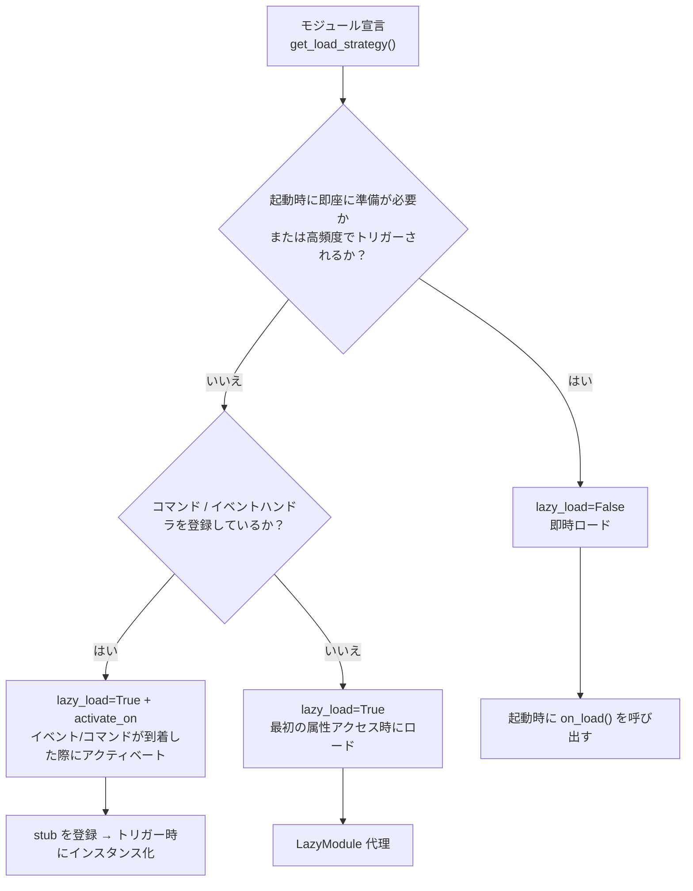

### 懒加载を使用することを推奨する場面（lazy_load=True）

- 他のモジュールが呼び出す際にのみ必要な受動的なユーティリティモジュール（例：データクエリモジュール、フォーマット変換器など）
- コマンド/イベントハンドラを登録しているが、頻繁には使用しないモジュール —— `activate_on` でトリガを宣言し、最初の一致するイベント/コマンドが到着した際に自動的にアクティベートさせ、懒加载を放棄する必要がない

### 懒加载を無効化することを推奨する場面（lazy_load=False）

- 起動時に即座に準備が必要なモジュール（他のモジュールに基礎サービスを提供するコアモジュールなど）
- 高頻度でトリガーされるリスナー（各メッセージをすべて処理する必要がある） —— `activate_on` による転送には一度のアクティベートのオーバーヘッドがあるため、高頻度の場面では即時ロードがより直接的である
- タイマー処理モジュール
- アプリケーション起動時に初期化が必要なモジュール

> `priority` パラメータは、即時ロードモジュール間の初期化順序を制御する。数値が大きいほど先に初期化される。同じ優先度のモジュールは登録順にロードされる。

## 注意事項

1. モジュールが遅延ロードを使用している場合、ErisPulse内で他のモジュールが一度も呼び出されない場合、そのモジュールは初期化されません。
2. モジュールにイベントを監視するモジュールや、そのようなモジュールを積極的に監視するものが含まれている場合、2つの選択肢があります：`activate_on` トリガを宣言して遅延ロードを維持し、イベントが到着したときに自動的に活性化するか、または即時読み込みを宣言する（`lazy_load=False`）必要があります。さもなければ、モジュールの正常な業務に影響を与える可能性があります。
3. 特殊な要望がない限り、遅延ロードを無効にすることはお勧めしません。そうしないと、依存関係管理やライフサイクルイベントなどの問題が発生する可能性があります。
4. `activate_on` のコマンド dict 宣言において、`name` はモジュールの `on_load` で `@command()` によって登録された実際のコマンド名と一致している必要があります。一致しない場合、モジュールが活性化された後にプレースホルダーコマンドが解除され、宣言されたコマンドと実装が一致しないコマンドは存在しません。


### 生命周期管理

# ライフサイクル管理

ErisPulse は、システムコンポーネントの実行状態を監視し、監査、統計、カスタムロジックなどの拡張機能を実現するための、統一されたフック/ライフサイクルシステムを提供します。

システムは3種類のトリガー方式をサポートしています：
- `await lifecycle.emit("event", data)` — 精選版、任意のデータを渡す
- `lifecycle.emit_sync("event", data)` — 同期版（非非同期コンテキストで使用）
- `await lifecycle.submit_event("event", ...)` — 旧版と互換性を持ち、標準イベント形式を自動的に構築する

## イベント処理メカニズム

### ハンドラの登録

```python
from ErisPulse import sdk

# デコレータ形式
@sdk.lifecycle.on("module.load")
async def on_module_load(data):
    print(f"モジュールのロード: {data}")

# プログラミング形式での登録
sdk.lifecycle.register("module.load", on_module_load, priority=10)

# 登録の解除
sdk.lifecycle.unregister("module.load", on_module_load)

# 所有者ごとの一括登録解除（モジュール/アダプタのアンロード時にフレームワークが自動的に呼び出す）
removed = sdk.lifecycle.unregister_by_owner("MyModule")
print(f"クリーンアップしたライフサイクルフック数: {removed}")
```

### 優先度

ハンドラは `priority` パラメータをサポートし、数値が大きいほど先に実行されます（モジュールローダーと同様）：

```python
@sdk.lifecycle.on("adapter.event.receive", priority=10)  # 最初に実行
async def first_handler(data):
    pass

@sdk.lifecycle.on("adapter.event.receive", priority=0)  # 後に実行
async def second_handler(data):
    pass
```

### 点構造イベント

具体的なイベントをトリガーすると、その親イベントも同時にトリガーされます：
- `module.load` をトリガーすると、`module` もトリガーされます。
- `adapter.event.receive` をトリガーすると、`adapter.event` と `adapter` もトリガーされます。

### ワイルドカード

`*` を登録してすべてのイベントをキャプチャします：

```python
@sdk.lifecycle.on("*")
async def on_anything(data):
    print(f"イベント受信: {data}")
```

### 一回限りの登録（once）

2.7.0 以降、`lifecycle.once()` で登録したハンドラは**一度実行後、自動的に登録解除**されます。これは「初回準備完了」のような一回限りのフックに適しています：

```python
@sdk.lifecycle.once("core.init.complete")
async def on_first_ready(data):
    print("初回準備完了、以降は再びトリガーされません")
```

- `on()` と同じ優先度パラメータの意味（`priority` の数値が大きいほど先に実行されます）
- 自動的に登録解除され、手動での `unregister` は不要です
- 同期/非同期のハンドラが両方サポートされています

### リスナーの照会（has_handlers）

ホットパスの短絡処理では、`has_handlers()` を使って事前にリスナーが存在するかを確認し、無駄なイベントのループやタスクのスケジューリングを避けることができます：

```python
if sdk.lifecycle.has_handlers("message.sending"):
    await sdk.lifecycle.emit("message.sending", send_ctx)
```

- 精確なイベント名、ワイルドカード `*`、親イベントの3種類のマッチをカバーします
- リスナーが存在しない場合は `False` を返し、`emit` を安全にスキップできます

## フックブレークポイント一覧

プラットフォームからフレームワークにメッセージが入力されて処理が完了するまでの典型的なライフサイクルイベントの時系列：

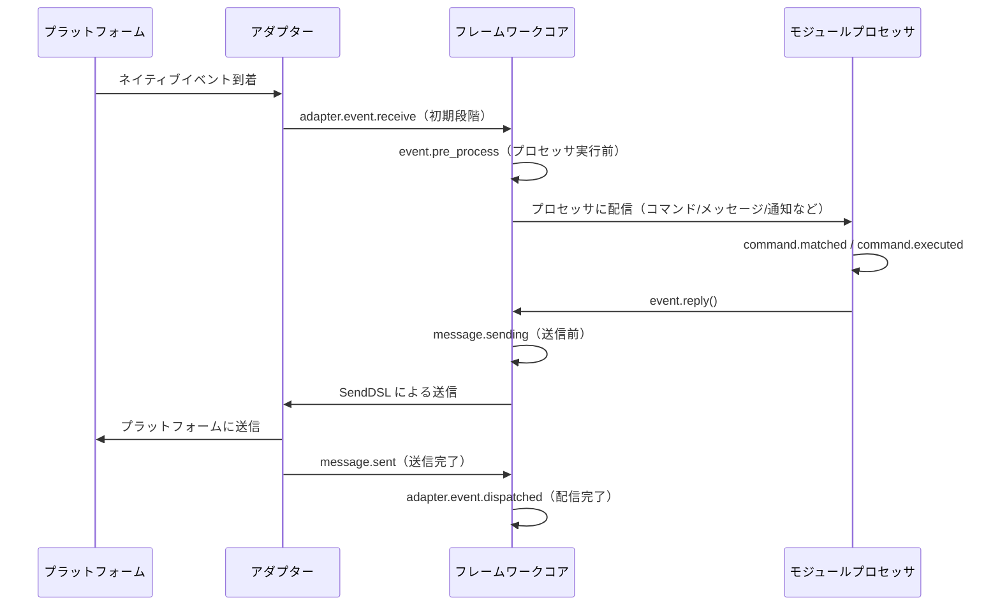

フレームワークは以下のフックブレークポイントを内蔵しており、`@sdk.lifecycle.on()` を使って任意のブレークポイントを監視し、カスタムロジックを実装できます。

### コア初期化

| フック名 | 発生タイミング | データ |
|---------|---------|------|
| `core.init.start` | SDKの初期化開始 | `{}` |
| `core.init.complete` | SDKの初期化完了 | `{"duration": float, "success": bool, "adapters": {"enabled": [str], "disabled": [str]}, "modules": {"enabled": [str], "disabled": [str]}, "error": str(失敗時のみ)}` |
| `core.uninit.complete` | SDKの逆初期化完了 | `{"duration": float, "success": bool, "adapters_closed": int, "modules_unloaded": int, "module_properties_cleared": int, "module_properties_to_clear": [str], "error": str(失敗時のみ)}` |

### 設定変更

| フック名 | 発生タイミング | データ |
|---------|---------|------|
| `config.set` | 設定項目が変更された時 | `{"key": str, "old_value": Any, "new_value": Any}` |
| `config.updated` | 外部から config.toml を編集した後にツリー全体の変更を検知した時 | `{"old_config": dict, "new_config": dict, "config_file": str}` |

**例：設定監査**

```python
@sdk.lifecycle.on("config.set")
def audit_config(data):
    print(f"[監査] {data['key']}: {data['old_value']} -> {data['new_value']}")
```

### モジュールライフサイクル

| フック名 | 発生タイミング | データ |
|---------|---------|------|
| `module.register` | モジュールクラスがマネージャーに登録された時 | `{"module_name": str, "success": bool}` |
| `module.load` | モジュールのロード完了（インスタンス化成功） | `{"module_name": str, "success": bool}` |
| `module.init` | モジュールの初期化完了（遅延ロード含む） | `{"module_name": str, "success": bool}` |
| `module.unload` | モジュールのアンロード | `{"module_name": str, "success": bool}` |

### アダプターライフサイクル

| フック名 | 発生タイミング | データ |
|---------|---------|------|
| `adapter.load` | アダプターの登録完了 | `{"platform": str, "success": bool}` |
| `adapter.start` | アダプターの起動 | `{"platforms": [str]}` |
| `adapter.status.change` | アダプターのステータス変更 | `{"platform": str, "status": str, "retry_count": int, "error": str(失敗時のみ)}` |
| `adapter.stop` | アダプターの停止 | `{"platforms": [str]}` |
| `adapter.stopped` | アダプターの停止完了 | `{"platforms": [str]}` |
| `adapter.bot.online` | Botのオンライン | `{"platform": str, "bot_id": str, "info": dict, "status": str}` |
| `adapter.bot.offline` | Botのオフライン | `{"platform": str, "bot_id": str, "status": str}` |

### イベント受信と処理

| フック名 | 発生タイミング | データ |
|---------|---------|------|
| `adapter.event.receive` | 外部プラットフォームのイベントを受信した時（初期段階） | `{"platform": str, "event_type": str, "raw_event_type": str}` |
| `adapter.event.dispatched` | イベントの配信完了 | `{"platform": str, "event_type": str, "raw_event_type": str, "onebot_handlers_count": int}` |
| `event.pre_process` | イベントプロセッサが実行される直前 | `{"event_type": str, "platform": str, "detail_type": str}` |

**例：イベント統計**

```python
event_counter = {}

@sdk.lifecycle.on("adapter.event.receive")
def count_events(data):
    platform = data["platform"]
    event_counter[platform] = event_counter.get(platform, 0) + 1

@sdk.lifecycle.on("adapter.event.dispatched")
def log_unhandled(data):
    if data["onebot_handlers_count"] == 0:
        print(f"[未処理] {data['platform']}/{data['event_type']}")
```

### メッセージ送信

| フック名 | 発生タイミング | データ |
|---------|---------|------|
| `message.sending` | メッセージの送信直前 | `{"platform": str, "method": str, "detail_type": str, "target_id": str, "bot_id": str}` |
| `message.sent` | メッセージの送信完了 | `{"platform": str, "method": str, "detail_type": str, "target_id": str, "bot_id": str}` |

**例：メッセージ送信監査**

```python
@sdk.lifecycle.on("message.sending")
def log_sending(data):
    print(f"[送信] -> {data['platform']}/{data['detail_type']}/{data['target_id']} via {data['method']}")
```

### コマンドシステム

| フック名 | 発生タイミング | データ |
|---------|---------|------|
| `command.matched` | コマンドがマッチし、実行される直前 | `{"command": str, "args": list[str], "platform": str, "user_id": str}` |
| `command.executed` | コマンドの実行完了 | `{"command": str, "args": list[str], "platform": str, "user_id": str, "success": bool, "error": str(失敗時のみ)}` |

**例：コマンド統計**

```python
@sdk.lifecycle.on("command.matched")
def count_commands(data):
    print(f"[コマンド] /{data['command']} from {data['user_id']}@{data['platform']}")
```

### HTTPルーティング

| フック名 | 発生タイミング | データ |
|---------|---------|------|
| `server.request` | HTTPリクエストの受信 | `{"method": str, "path": str, "client_ip": str}` |
| `server.response` | HTTPレスポンスの送信 | `{"method": str, "path": str, "status_code": int, "client_ip": str}` |

**例：リクエストログ**

```python
@sdk.lifecycle.on("server.response")
def log_http(data):
    print(f"[HTTP] {data['method']} {data['path']} -> {data['status_code']}")
```

### WebSocket

| フック名 | 発生タイミング | データ |
|---------|---------|------|
| `server.start` | ルーティングサーバーの起動 | `{"base_url": str, "host": str, "port": int}` |
| `server.stop` | ルーティングサーバーの停止 | `{}` |
| `server.websocket.connect` | WebSocket接続の確立 | `{"path": str, "module_name": str, "client_ip": str}` |
| `server.websocket.disconnect` | WebSocket接続の切断 | `{"path": str, "module_name": str, "reason": str, "error": str(異常時のみ)}` |

**例：WebSocket接続監視**

```python
@sdk.lifecycle.on("server.websocket.connect")
def on_ws_connect(data):
    print(f"[WS] 接続: {data['path']} from {data['client_ip']}")

@sdk.lifecycle.on("server.websocket.disconnect")
def on_ws_disconnect(data):
    print(f"[WS] 切断: {data['path']} ({data['reason']})")
```

## 標準イベント定義

```python
STANDARD_EVENTS = {
    "core": ["init.start", "init.complete", "uninit.complete"],
    "module": ["load", "init", "unload", "register"],
    "adapter": [
        "load", "start", "status.change", "stop", "stopped",
        "event.receive", "event.dispatched",
        "bot.online", "bot.offline",
    ],
    "server": [
        "start", "stop",
        "request", "response",
        "websocket.connect", "websocket.disconnect",
    ],
    "event": ["pre_process"],
    "message": ["sending", "sent"],
    "command": ["matched", "executed"],
    "config": ["set"],
}
```

## 完全な API リファレンス

### 登録と解除

| メソッド | 説明 |
|------|------|
| `@lifecycle.on(event, *, priority=0)` | デコレータによるハンドラの登録 |
| `lifecycle.register(event, handler, *, priority=0)` | プログラム的登録 |
| `lifecycle.unregister(event, handler=None)` | 登録解除（handler=None の場合、該当イベントの全ハンドラを解除） |

### トリガー

| メソッド | 説明 |
|------|------|
| `await lifecycle.emit(event, data=None)` | 非同期でトリガーを発生、ハンドラが None 以外を返すと data を変更可能 |
| `lifecycle.emit_sync(event, data=None)` | 同期でトリガーを発生、非同期ハンドラは create_task でスケジュール |
| `await lifecycle.submit_event(event_type, *, source, msg, data)` | 旧バージョンとの互換性、自動的に標準イベント形式を構築 |

### ユーティリティ

| メソッド | 説明 |
|------|------|
| `lifecycle.start_timer(timer_id)` | タイマーを開始 |
| `lifecycle.get_duration(timer_id)` | 経過時間を取得（秒） |
| `lifecycle.stop_timer(timer_id)` | タイマーを停止し、経過時間を返す |
| `lifecycle.list_hooks()` | 登録済みのすべてのフックとハンドラ数をリスト表示 |
| `lifecycle.clear()` | 全てのハンドラとタイマーをクリア |

## モジュールでの使用例

```python
from ErisPulse.Core.Bases import BaseModule
from ErisPulse import sdk

class Main(BaseModule):
    async def on_load(self, event):
        # 簡単なメッセージの統計を実装
        self.msg_count = 0
        
        @sdk.lifecycle.on("adapter.event.receive")
        async def count(data):
            if data["event_type"] == "message":
                self.msg_count += 1
        
        # すべてのコマンドを監視
        @sdk.lifecycle.on("command.matched")
        async def log_cmd(data):
            sdk.logger.info(f"コマンド実行: /{data['command']} by {data['user_id']}")
        
        # 設定変更の監査
        @sdk.lifecycle.on("config.set")
        def audit(data):
            sdk.logger.info(f"設定変更: {data['key']} = {data['new_value']}")
```

## バックグラウンドタスクの所有と自動キャンセル

> [!NOTE]
> この機能は ErisPulse **2.8.0+** が必要です。

モジュールが作成した asyncio のバックグラウンドタスクが `on_unload` でキャンセルされない場合、`self` の参照を保持し、モジュールのインスタンスが回収されず（ホットリロード後に古いインスタンスが残る）ます。フレームワークは以下のバックアップメカニズムを提供します：

- **`self.spawn(coro)`**（モジュール内で推奨）：タスクは自動的にモジュール名に所有され、モジュールのアンロード時にフレームワークは `on_unload` **の後**に未終了のタスクをバックアップキャンセルし、警告を記録します。
- **`spawn_background(coro)`**（`ErisPulse.runtime`）：自動的に現在の `owner_scope` コンテキストをキャプチャします。`cancel_owner_tasks(owner)` は所有者に応じてキャンセルし、`cancel_all_background_tasks()` は `sdk.uninit()` のバックアップとして使用されます。
- **アダプター**：閉じる際にプラットフォーム名以下のバックグラウンドタスクも同様にバックアップキャンセルされます。

```python
async def on_load(self, event):
    # 推奨：バックグラウンドタスクは self.spawn() を使用し、アンロード時にフレームワークがバックアップキャンセルします。
    self.spawn(self._poll())

async def on_unload(self, event):
    # 精密制御が必要な場面では、自らキャンセルして終了処理を待つことを推奨します。
    if self._poll_task:
        self._poll_task.cancel()
        await asyncio.gather(self._poll_task, return_exceptions=True)

async def _poll(self):
    while True:
        await asyncio.sleep(60)
        ...
```

> [!IMPORTANT]
> フレームワークのバックアップは**強制キャンセル**（`cancel_owner_tasks`）です。これは `on_unload` の返り値の後に発生します。したがって、優雅な終了処理が必要なタスク（バッファのフラッシュ、状態の永続化、接続の閉じる）は、`on_unload` で自ら `cancel()` + `await` して完了させる必要があります。バックアップが終了処理を保持することを期待しないでください。フレームワークは「`self` を保持するタスクが残らないこと」を保証しますが、「優雅な終了」は保証しません。`await` の結果が必要なタスクは、直接 `await` してください。バックグラウンドタスクに投げないでください。

## 注意事項

1. **プロセッサは同期または非同期のいずれでも使用可能**：システムは自動的に識別し、正しく呼び出します。
2. **データの渡し方**：`emit()` モードでは、プロセッサが None 以外の値を返すと、次のプロセッサに渡される data が変更されます。
3. **イベント名の命名規則**：親イベントを監視しやすいよう、ドット構造を使用した命名を推奨します。
4. **エラーの隔離**：個々のプロセッサの例外は、他のプロセッサの実行に影響しません。
5. **同期トリガーの制限**：`emit_sync()` では、非同期プロセッサは fire-and-forget 方式でスケジュールされ、戻り値は返却できません。
6. **ライフサイクルのクリーンアップ**：`sdk.uninit()` を呼び出すと、すべての登録済みプロセッサとタイマーがクリーンアップされます。
7. **ロード優先度**：フレームワークの初期化段階でイベントを監視したい場合は、高優先度を設定し、ラグジュアリー読み込みを無効にすることを推奨します。


### 路由系统

# ルーティングマネージャー

ErisPulse ルーティングマネージャーは、HTTP および WebSocket のルーティングを統一的に管理し、複数アダプタのルーティング登録とライフサイクル管理をサポートします。内部では抽象層を封印しています（現在は FastAPI + Uvicorn）

## 概要

ルーティングマネージャーの主な機能：

- **デコレータルーティング**：`@http` / `@get` / `@post` / `@put` / `@delete` / `@ws` デコレータによる高速登録
- **自動インジェクション**：ルーティングハンドラは FastAPI クラスをインポートする必要がなく、フレームワークが抽象オブジェクトを自動的に注入します
- **ルーティンググループ**：プレフィックスとバージョン番号付きの `RouteGroup` をサポート
- **ルーティングミドルウェア**：glob モードマッチングによるリクエストのインターセプト
- **レート制限**：スライディングウィンドウ方式のリクエスト制限
- **CORSサポート**：ワンクリックで CORS を有効化
- **セキュリティヘッダー**：自動的にセキュリティレスポンスヘッダーを追加
- **自動ドキュメント**：OpenAPI に基づくインタラクティブなドキュメント
- **WebSocketサポート**：WebSocket接続の完全な管理、カスタム認証、ライフサイクルフック
- **ライフサイクル統合**：ErisPulse ライフサイクルシステムと深く統合
- **SSL/TLSサポート**：HTTPS および WSS セキュア接続をサポート
- **ホームエントリ**：モジュールがルートルート `/` に登録されたクイックエントリボタンをサポート、国際化に対応

## 抽象型

ErisPulse はサーバー側の抽象型を提供し、モジュールが FastAPI に直接依存しないようにします：

| 抽象型 | FastAPI対応 | 説明 |
|---------|-------------|------|
| `HttpRequest` | `fastapi.Request` | HTTPリクエストのラッパー、インターフェースは完全に互換性があります |
| `WebSocketConnection` | `fastapi.WebSocket` | WebSocket接続のラッパー、ライフサイクルフックを追加 |
| `WebSocketDisconnect` | `fastapi.WebSocketDisconnect` | WebSocket切断例外 |

> `WebSocketConnection` は `WebSocketConnectionBase` を継承しており、クライアント側の WebSocket (`ClientWebSocket`) と同じ send/receive/iter/close インターフェースを共有します。クライアントとサーバー側の WebSocket は同じビジネスロジックコードを使用できます。
>
> `.raw` 属性を介して、下層の FastAPI ネイティブオブジェクトにアクセスできます。直接 FastAPI クラスを使用するコードも完全に互換性があります。

## デコレータルーティング（推奨）

### HTTPデコレータ

```python
from ErisPulse.Core import router
@router.get("my_module", "/info")
async def get_info(request):
    return {"method": request.method, "path": str(request.url)}

# 明示的に抽象型を指定することもできます
from ErisPulse.Core import HttpRequest

@router.post("my_module", "/data")
async def post_data(request: HttpRequest):
    data = await request.json()
    return {"received": data}

@router.put("my_module", "/data/{item_id}")
async def update_data(request):
    return {"updated": True}

@router.delete("my_module", "/data/{item_id}")
async def delete_data(request):
    return {"deleted": True}
```

> **自動インジェクションルール**：ハンドラの最初の引数が `request` または `req` で、FastAPI型の注釈がない場合、フレームワークは自動的に `HttpRequest` を注入します。引数がなく、またはリクエスト引数名でないハンドラは影響を受けません。

### WebSocketデコレータ

```python
from ErisPulse.Core import WebSocketConnection, WebSocketDisconnect

# 基本的なWebSocket
@router.ws("my_module", "/ws")
async def websocket_handler(ws):
    async for msg in ws.iter_text():
        await ws.send_text(f"Echo: {msg}")

# ライフサイクルフック付きのWebSocket
@router.ws("my_module", "/ws/chat")
async def chat(ws: WebSocketConnection):
    @ws.on_disconnect
    async def on_disconnect(ws, reason="unknown"):
        print(f"ユーザー切断: {reason}")

    @ws.on_error
    async def on_error(ws, error=""):
        print(f"接続エラー: {error}")

    async for msg in ws.iter_text():
        await ws.send_text(f"Echo: {msg}")

# 認証付きのWebSocket
async def ws_auth(ws: WebSocketConnection) -> bool:
    token = ws.query_params.get("token")
    return token == "secret"

@router.ws("my_module", "/secure_ws", auth_handler=ws_auth)
async def secure_ws_handler(ws):
    while True:
        data = await ws.receive_text()
        await ws.send_text(f"Echo: {data}")
```

> **注意**：WebSocketハンドラと認証ハンドラも自動インジェクションをサポートします。引数の注釈がなくても `WebSocketConnection` を取得できます。`fastapi.WebSocket` を注釈してもネイティブオブジェクトを渡すことができますが、抽象型の使用を推奨します。

## 伝統的な登録方法

```python
async def hello_handler(request):
    return {"message": "Hello World"}

# 基本的な登録
router.register_http_route(
    module_name="my_module",
    path="/hello",
    handler=hello_handler,
    methods=["GET"],
)

# レート制限とドキュメント情報付き
router.register_http_route(
    module_name="my_module",
    path="/api/data",
    handler=data_handler,
    methods=["POST"],
    rate_limit="10/minute",
    summary="データインターフェース",
    tags=["API"],
)
```

### WebSocket登録

```python
from ErisPulse.Core import WebSocketConnection

async def websocket_handler(ws: WebSocketConnection):
    async for msg in ws.iter_text():
        await ws.send_text(f"Echo: {msg}")

# 基本的な登録
router.register_websocket(
    module_name="my_module",
    path="/ws",
    handler=websocket_handler,
)

# 認証付きの登録（推奨）
async def auth_handler(ws: WebSocketConnection) -> bool:
    token = ws.query_params.get("token")
    return token == "secret"

router.register_websocket(
    module_name="my_module",
    path="/secure_ws",
    handler=websocket_handler,
    auth_handler=auth_handler,
)
```

**パラメータ説明：**

| パラメータ | 説明 | デフォルト値 |
|------|------|--------|
| `module_name` | モジュール名（必須） | - |
| `path` | WebSocketパス | - |
| `handler` | ハンドラ関数 | - |
| `auth_handler` | 認証関数、`False`を返すと接続が自動的に切断されます | `None` |
| `auto_accept` | 自動的に `accept()` を行うかどうか | `True` |

> **推奨**：接続確認には `auth_handler` を使用してください。`auto_accept` を `False` に設定するのは、接続フローを完全に制御したい場合に限り、`auth_handler` を使用することを推奨します。

## WebSocketライフサイクルフック

`WebSocketConnection` は切断とエラーのコールバックを登録する機能を提供し、手動の try/catch が不要です：

```python
from ErisPulse.Core import WebSocketConnection

@router.ws("my_module", "/ws")
async def my_ws(ws: WebSocketConnection):
    # デコレータ方式で登録
    @ws.on_disconnect
    async def on_close(ws, reason="unknown"):
        print(f"切断原因: {reason}")

    # 直接呼び出すこともできます
    async def on_err(ws, error=""):
        print(f"エラー: {error}")
    ws.on_error(on_err)

    # 通常のビジネスロジック
    async for msg in ws.iter_text():
        await ws.send_text(f"Echo: {msg}")
```

## ルーティンググループ

```python
# プレフィックス付きのルーティンググループを作成
group = router.group("my_module", prefix="/v1")

@group.get("/users")
async def list_users(request):
    return {"users": []}

@group.post("/users")
async def create_user(request):
    return {"created": True}

# 実際のパス: /my_module/v1/users
```

## ルーティングミドルウェア

ミドルウェアは glob モードでパスをマッチングします：

```python
@router.middleware("/my_module/*")
async def auth_middleware(request, call_next):
    token = request.headers.get("Authorization")
    if not token:
        return {"error": "Unauthorized"}
    return await call_next(request)

@router.middleware("/my_module/admin/*")
async def admin_middleware(request, call_next):
    return await call_next(request)
```

## リクエスト関連ID（X-Request-ID）

2.7.0以降、各HTTPリクエストには `X-Request-ID` 関連IDが付与され、ログ / リンクトレースの連携に使用されます：

- **生成ルール**：クライアントが送信した `X-Request-ID` リクエストヘッダーを優先して使用（分散トレースの場面）；なければUUIDを自動生成
- **レスポンスヘッダー**：レスポンスに `X-Request-ID` を返し、クライアントがリクエストとログを対応させるのに便利です
- **ライフサイクルイベント**：`server.request` と `server.response` イベントデータに `request_id` フィールドが追加されました

```python
# モジュール内でリクエストイベントを監視し、request_id でリクエスト-レスポンスを連携
@sdk.lifecycle.on("server.request")
async def on_request(data):
    print(f"[{data['request_id']}] {data['method']} {data['path']}")

@sdk.lifecycle.on("server.response")
async def on_response(data):
    print(f"[{data['request_id']}] -> {data['status_code']}")
```

クライアントは、サービス間トレースのために独自のIDを設定できます：

```bash
curl -H "X-Request-ID: my-trace-id" http://localhost:8080/my_module/health
```

## レート制限

スライディングウィンドウアルゴリズムを使用してルートのリクエスト制限を行います：

```python
@router.get("my_module", "/limited", rate_limit="10/minute")
async def limited_endpoint(request):
    return {"ok": True}

@router.post("my_module", "/submit", rate_limit="5/minute")
async def submit_data(request):
    return {"submitted": True}
```

レート制限の形式：`{回数}/{時間ウィンドウ}`、例えば `10/minute`、`100/hour`。

## CORS設定

```python
router.setup_cors(
    allow_origins=["https://example.com"],
    allow_methods=["GET", "POST"],
    allow_headers=["*"],
)
```

`config.toml` で設定することもできます：

```toml
[router.cors]
allow_origins = ["https://example.com"]
allow_methods = ["GET", "POST"]
allow_headers = ["*"]
```

## セキュリティヘッダー

```python
router.setup_security_headers()
```

`X-Content-Type-Options`、`X-Frame-Options`、`X-XSS-Protection` などのセキュリティヘッダーを自動的に追加します。

`config.toml` で設定することもできます：

```toml
[router.security]
enabled = true
```

## 自動ドキュメント

Router はデフォルトで OpenAPI インタラクティブドキュメントを有効にしています：

```python
# ドキュメントを無効化
router.disable_docs()

# ドキュメント情報をカスタマイズ
router.set_docs_info(
    title="My API",
    description="APIドキュメント",
    version="1.0.0"
)
```

## パス処理

ルーティングパスは自動的にモジュール名をプレフィックスとして追加し、衝突を回避します：

```python
# モジュール "my_module" にパス "/api" を登録
# 実際のアクセスパスは "/my_module/api"
router.register_http_route("my_module", "/api", handler)
```

## システムルート

ルーティングマネージャーは以下のシステムルートを自動的に提供します：

### ヘルスチェック

```
GET /health
# 戻り値:
{"status": "ok", "service": "ErisPulse Router"}
```

### ルートページ

```
GET /
# 戻り値: ErisPulseブランドページ
```

ルートルート `/` は ErisPulse ブランドページを表示し、ダッシュボードの可用性を自動検出し、エントリーボタンを追加します。

## ホームエントリ

ルーティングマネージャーは外部モジュールがルートルート `/` にクイックエントリーボタンを登録できるようにし、ユーザーが各モジュールの管理ページに素早くアクセスできるようにします。

### エントリの登録

```python
# 簡単な登録
router.register_home_entry(
    name="私のパネル",
    url="/mymodule/admin",
)

# イコン付きの登録（SVG）
router.register_home_entry(
    name="コンソール",
    url="/console",
    icon_svg='<svg width="18" height="18" viewBox="0 0 24 24" fill="none" stroke="currentColor" stroke-width="1.8"><path d="M4 17l6-6-6-6"/><path d="M12 19h8"/></svg>',
)

# 国際化に対応した登録（i18n辞書形式）
router.register_home_entry(
    name={"i18n": "mymodule.home.entry", "default": "私のパネル"},
    url="/mymodule/admin",
)
```

**パラメータ説明：**

| パラメータ | 型 | 説明 | 必須 |
|------|------|------|------|
| `name` | `str` / `dict` | ボタン表示テキスト；`{"i18n": "key", "default": "テキスト"}`辞書を渡すと国際化を使用します | はい |
| `url` | `str` | ボタンリンクアドレス | はい |
| `icon_svg` | `str` | オプションのSVGアイコンマーク | いいえ |

### ダッシュボードの自動登録

`sdk.Dashboard` が利用可能であることが検出された場合、ルーティングマネージャーはダッシュボードボタンを自動的にエントリーリストの先頭に追加し、手動の登録は不要です。

## ライフサイクル統合

```python
from ErisPulse.Core import lifecycle

@lifecycle.on("server.start")
async def on_server_start(event):
    print(f"サーバーが起動しました: {event['data']['base_url']}")

@lifecycle.on("server.stop")
async def on_server_stop(event):
    print("サーバーが停止中です...")
```

## 最適実践

1. **抽象型を優先する**：`HttpRequest` / `WebSocketConnection` を `fastapi.Request` / `fastapi.WebSocket` に代えて使用し、ハード依存を避ける
2. **自動インジェクションを利用する**：ハンドラの最初の引数を `request` または `req` とし、型注釈なしで `HttpRequest` を取得できる
3. **module_nameを明示的に渡す**：デコレータの最初の引数はモジュール名でなければならず、省略できない
4. **ルーティンググループを使用する**：同一モジュールの複数のルーティングは `group()` で整理する
5. **セキュリティを考慮する**：機密操作には認証メカニズムとセキュリティヘッダーを実装する
6. **適切なレート制限を設定する**：高頻度インターフェースにはレート制限を設定する
7. **ライフサイクルフックを使用する**：`@ws.on_disconnect` / `@ws.on_error` を使って WebSocket の例外を処理し、手動の try/catch を避ける


### MessageBuilder 详解

# MessageBuilder 詳細

`MessageBuilder` は、ErisPulseが提供するOneBot12標準のメッセージセグメント構築ツールです。構造化されたメッセージ内容を構築し、`Send.Raw_ob12()` と組み合わせて使用します。

## 導入方法

`MessageBuilder` は以下の2つの導入方法をサポートしています（効果は同じで、1つ目の方法を推奨します）：

```python
from ErisPulse.Core.Event import MessageBuilder        # 推奨、パッケージ経由でのエクスポート
from ErisPulse.Core.Event.message_builder import MessageBuilder  # モジュール直接インポート
```

## ダブルモードメカニズム

MessageBuilder は2つの使用モードを提供し、Pythonのデスクリプタ機構（`__get__`）を通じてクラスレベルとインスタンスレベルでの異なる動作を実現します：クラスからメソッドを呼び出す場合、`__get__` は静的メソッドの実行結果を返します；インスタンスからメソッドを呼び出す場合、`self` を返してチェーンコールをサポートします。

### チェーンコールモード（インスタンス）

`MessageBuilder()` をインスタンス化して使用します。各メソッドは `self` を返し、チェーンコールをサポートし、最後に `.build()` を使ってメッセージセグメントのリストを取得します：

```python
from ErisPulse.Core.Event.message_builder import MessageBuilder

segments = (
    MessageBuilder()
    .text("你好！")
    .image("https://example.com/photo.jpg")
    .build()
)
# [
#     {"type": "text", "data": {"text": "你好！"}},
#     {"type": "image", "data": {"file": "https://example.com/photo.jpg"}}
# ]
```

### 快速構築モード（静的）

クラスから直接メソッドを呼び出します。各メソッドは直接メッセージセグメントのリストを返し、単一セグメントのメッセージに適しています：

```python
# 直接 list[dict] を返します。.build() は不要です。
segments = MessageBuilder.text("你好！")
# [{"type": "text", "data": {"text": "你好！"}}]
```

## メッセージセグメントのタイプ

| メソッド | タイプ | データパラメータ | 説明 |
|------|------|---------|------|
| `text(text)` | text | `text` | テキストメッセージ |
| `image(file)` | image | `file` | 画像メッセージ |
| `audio(file)` | audio | `file` | 音声メッセージ |
| `video(file)` | video | `file` | 動画メッセージ |
| `file(file, filename?)` | file | `file`, `filename` | ファイルメッセージ |
| `mention(user_id, user_name?)` | mention | `user_id`, `user_name` | @メンション（ユーザー指定） |
| `at(user_id, user_name?)` | mention | `user_id`, `user_name` | `mention` のエイリアス |
| `reply(message_id)` | reply | `message_id` | 返信メッセージ |
| `at_all()` | mention_all | - | @全員（全員メンション） |
| `custom(type, data)` | カスタム | カスタム | カスタムメッセージセグメント |

## Send と組み合わせて使用する

構築したメッセージセグメントのリストは、`Send.Raw_ob12()` を通じて送信します。

```python
from ErisPulse import sdk
from ErisPulse.Core.Event.message_builder import MessageBuilder

# チェーン構築 + 送信
segments = (
    MessageBuilder()
    .mention("user123", "张三")
    .text(" 请查看这张图片")
    .image("https://example.com/photo.jpg")
    .build()
)
await sdk.adapter.myplatform.Send.To("group", "group456").Raw_ob12(segments)
```

### Event と組み合わせた返信

```python
from ErisPulse.Core.Event import command

@command("report")
async def report_handler(event):
    await event.reply_ob12(
        MessageBuilder()
        .text("📊 日报汇总\n")
        .text("今日完成任务: 5\n")
        .text("进行中任务: 3")
        .build()
    )
```

## ユーティリティメソッド

### copy()

現在のビルダーをコピーし、同じ基本内容に基づいて複数のメッセージバリエーションを作成するために使用します。

```python
base = MessageBuilder().text("基础内容").mention("admin")

# 同じプレフィックスに基づいて異なるメッセージを構築
msg1 = base.copy().text(" 变体A").build()
msg2 = base.copy().text(" 变体B").image("img.jpg").build()
```

### clear()

追加されたメッセージセグメントをクリアし、同じビルダーを再利用します。

```python
builder = MessageBuilder()

for user_id in ["user1", "user2", "user3"]:
    builder.clear()
    msg = builder.mention(user_id).text(" 你好！").build()
    await adapter.Send.To("user", user_id).Raw_ob12(msg)
```

### len() / bool()

```python
builder = MessageBuilder()
print(bool(builder))   # False

builder.text("Hello")
print(len(builder))    # 1
print(bool(builder))   # True
```

## カスタムメッセージセグメント

`custom()` メソッドを使用して、プラットフォーム拡張のメッセージセグメントを追加します。

```python
# プラットフォーム固有のメッセージセグメントを追加
segments = (
    MessageBuilder()
    .text("请填写表单：")
    .custom("yunhu_form", {"form_id": "12345"})
    .build()
)
```

> カスタムメッセージセグメントは、対応するプラットフォームのアダプターでのみ有効です。他のアダプターは認識しないメッセージセグメントを無視します。

## 完全な例

### マルチエレメントメッセージ

```python
segments = (
    MessageBuilder()
    .reply(event.get_id())                    # 元のメッセージに返信
    .mention(event.get_user_id())             # 送信者に@メンション
    .text(" 这是你的查询结果：\n")             # テキスト
    .image("https://example.com/chart.png")   # 画像
    .text("\n详细数据见附件：")
    .file("https://example.com/data.csv", filename="data.csv")
    .build()
)
await event.reply_ob12(segments)
```

### スタティックファクトリ + チェーンの組み合わせ

```python
# 単一セグメントのメッセージを迅速に構築
simple_msg = MessageBuilder.text("简单文本")

# 複雑なメッセージをチェーン構築
complex_msg = (
    MessageBuilder()
    .at_all()
    .text(" 📢 公告：")
    .text("今天下午3点开会")
    .build()
)
```


### Conversation 多轮对话

# Conversation 多輪対話

`Conversation` クラスは、1 つの会話の中で複数回のやり取りを行うための便利なメソッドを提供し、ガイド付き操作、情報収集、対話式の質問応答などの場面に適しています。

## 対話の作成

`Event` オブジェクトの `conversation()` メソッドを使って作成します：

```python
from ErisPulse.Core.Event import command

@command("quiz")
async def quiz_handler(event):
    conv = event.conversation(timeout=30)

    await conv.say("🎮 知識クイズへようこそ！")

    answer = await conv.choose("第1問：Python の作成者は誰ですか？", [
        "Guido van Rossum",
        "James Gosling",
        "Dennis Ritchie",
    ])

    if answer is None:
        await conv.say("タイムアウトしました、また次回お試しください！")
        return

    if answer == 0:
        await conv.say("正解です！")
    else:
        await conv.say("間違いです、正解は Guido van Rossum です")

    conv.stop()
```

## コア API

### say(content, **kwargs)

メッセージを送信し、`self` を返して連鎖呼び出しを可能にします：

```python
await conv.say("1行目").say("2行目").say("3行目")
```

送信方法を指定することもできます：

```python
await conv.say("https://example.com/image.jpg", method="Image")
```

### wait(prompt=None, timeout=None)

ユーザーの返信を待ち、`Event` オブジェクトまたは `None`（タイムアウト）を返します：

```python
# 簡単な待ち
resp = await conv.wait()
if resp:
    text = resp.get_text()

# プロンプトを送信してから待ち
resp = await conv.wait(prompt="お名前を入力してください：")

# カスタムタイムアウトを使用（対話のデフォルトタイムアウトを上書き）
resp = await conv.wait(prompt="10秒以内に返信してください：", timeout=10)
```

### confirm(prompt=None, **kwargs)

ユーザーの確認（はい/いいえ）を待ち、`True` / `False` / `None`（タイムアウト）を返します：

```python
result = await conv.confirm("すべてのデータを削除してもよろしいですか？")
if result is True:
    await conv.say("削除しました")
elif result is False:
    await conv.say("キャンセルしました")
else:
    await conv.say("タイムアウトしました")
```

確認用語の内部認識リスト：`はい/yes/y/確認/確定/好/ok/true/対/うん/行/同意/問題ない/可能/当然...`

否定用語の内部認識リスト：`否/no/n/キャンセル/不/不要/不行/cancel/false/間違/不対/別/拒否...`

### choose(prompt, options, **kwargs)

ユーザーがオプションから選択するのを待ち、0 から始まるオプションのインデックスまたは `None` を返します：

```python
choice = await conv.choose("色を選択してください：", ["赤", "緑", "青"])
if choice is not None:
    colors = ["赤", "緑", "青"]
    await conv.say(f"選択した色は {colors[choice]} です")
```

ユーザーは番号（`1`/`2`/`3`）またはオプションのテキスト（`赤`）を入力して選択できます。

`options_format="auto"`（デフォルト）は、method に応じて自動的に組み込みのスタイルを選択します：Markdown→無序リスト、Html→順序リスト、その他→純粋なテキストリスト。
`"list"`、`"inline"`、`"md"`、`"html"`、またはカスタム関数もサポートしています。

`merge_prompt=True` を使用してプロンプトとオプションを1つのメッセージに統合し、オプションの挿入位置を占位符で制御できます（デフォルトは `{options}`、`placeholder` でカスタマイズ可能です）：

```python
choice = await conv.choose(
    "## 選択してください\n{options}",
    ["オプションA", "オプションB"],
    method="Markdown",
    merge_prompt=True,
)

# 占位符をカスタマイズ
choice = await conv.choose(
    "選択してください: [choices]",
    ["オプションA", "オプションB"],
    placeholder="[choices]",
)
```

### collect(fields, **kwargs)

複数ステップで情報を収集し、データ辞書または `None` を返します：

```python
data = await conv.collect([
    {"key": "name", "prompt": "お名前を入力してください"},
    {"key": "age", "prompt": "年齢を入力してください",
     "validator": lambda e: e.get("alt_message", "").strip().isdigit(),
     "retry_prompt": "年齢は数字でなければなりません、もう一度入力してください"},
    {"key": "city", "prompt": "都市を入力してください"},
])

if data:
    await conv.say(f"登録完了！\n名前: {data['name']}\n年齢: {data['age']}\n都市: {data['city']}")
else:
    await conv.say("登録が中断されました")
```

フィールドの設定：

| パラメータ | 説明 | デフォルト値 |
|------|------|--------|
| `key` | フィールドのキー名（必須） | - |
| `prompt` | プロンプトメッセージ | `"{key} を入力してください"` |
| `validator` | Event を受け取り、bool を返す検証関数 | なし |
| `retry_prompt` | 検証失敗時の再入力プロンプト | `"入力が無効です、もう一度入力してください"` |
| `max_retries` | 最大再試行回数 | 3 |
| `condition` | 条件関数、既に収集されたデータの辞書を受け取り、bool を返す | なし |

**条件付きフィールド**：`condition` を使用して動的なフォームを作成し、条件が満たされた場合にのみフィールドを収集できます：

```python
data = await conv.collect([
    {"key": "has_car", "prompt": "車をお持ちですか？（はい/いいえ）"},
    {"key": "car_brand", "prompt": "車のブランドを入力してください",
     "condition": lambda d: d.get("has_car", "").lower() in ("はい", "yes", "y")},
])
```

### stop()

手動で対話を終了し、`is_active` を `False` に設定します：

```python
conv.stop()
```

### is_active

対話がアクティブかどうかを返します：

```python
if conv.is_active:
    await conv.say("対話はまだ進行中です")
```

## アクティブ状態の管理

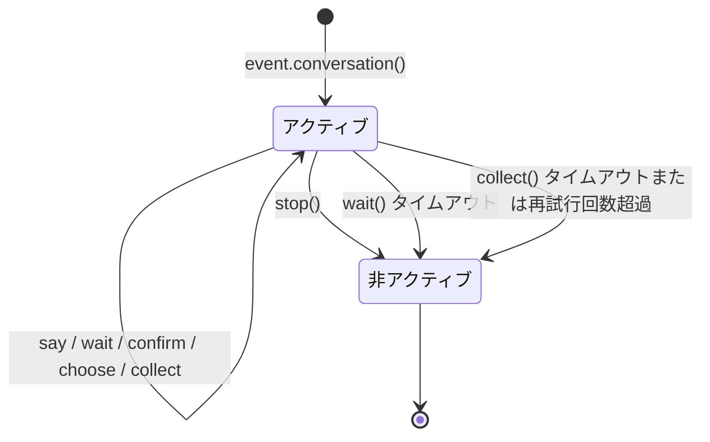

以下の状況で対話は自動的に非アクティブになります：

1. `stop()` メソッドを呼び出す
2. `wait()` がタイムアウトして `None` を返す
3. `collect()` がいずれかのステップでタイムアウトまたは再試行回数を超過して `None` を返す

非アクティブになった後、`wait`/`confirm`/`choose`/`collect` などのすべてのインタラクションメソッドは即座に `None` を返し、ユーザーの入力を待つことはありません。

## 分岐とジャンプ

### @conv.branch(name) デコレータ

`branch()` を使用して対話の分岐を登録し、`goto()` を使って分岐間でジャンプできます：

```python
@command("menu")
async def menu_handler(event):
    conv = event.conversation(timeout=60)

    @conv.branch("main")
    async def main_menu():
        await conv.say("=== メインメニュー ===\n1. 個人情報\n2. 設定\n3. 終了")
        resp = await conv.wait()
        if resp is None:
            return
        text = resp.get_text().strip()
        if text == "1":
            await conv.goto("profile")
        elif text == "2":
            await conv.goto("settings")
        elif text == "3":
            await conv.say("さようなら！")
            conv.stop()

    @conv.branch("profile")
    async def profile():
        await conv.say("=== 個人情報 ===\n名前: Alice\n0. 戻る")
        resp = await conv.wait()
        if resp and resp.get_text().strip() == "0":
            await conv.goto("main")

    @conv.branch("settings")
    async def settings():
        await conv.say("=== 設定 ===\n1. 通知スイッチ\n0. 戻る")
        resp = await conv.wait()
        if resp and resp.get_text().strip() == "0":
            await conv.goto("main")

    await conv.start()  # 最初に登録された分岐から開始
```

### conv.start(name=None)

対話を開始します、デフォルトでは最初に登録された分岐から開始されます：

```python
await conv.start()          # 最初の分岐から開始
await conv.start("settings") # 指定された分岐から開始
```

## コンテキストと永続化

### conv.context

各対話インスタンスには、分岐間で状態を共有するための `context` 辞書が内蔵されています：

```python
@conv.branch("step1")
async def step1():
    conv.context["username"] = resp.get_text().strip()
    await conv.goto("step2")

@conv.branch("step2")
async def step2():
    name = conv.context.get("username", "未知")
    await conv.say(f"こんにちは、{name} さん！")
```

### save() / resume() / clear_saved()

対話は永続化が可能で、タイムアウトや中断後に復元できます：

```python
# 対話の状態を保存
conv_id = conv.save()
# conv_id = "user_123_group_456"  # ユーザーとグループに基づいて自動生成

# ... その後、同じ会話で復元 ...
conv2 = event.conversation()
if conv2.resume():
    await conv2.say("お戻りいただきありがとうございます！前の対話を再開します")
else:
    await conv2.say("以前の対話が見つかりませんでした")

# 保存された対話を削除
conv.clear_saved()
```

## 代表的なフロー・パターン

### ガイド付き登録

```python
@command("register")
async def register_handler(event):
    conv = event.conversation(timeout=60)

    await conv.say("ようこそ登録へ！")

    data = await conv.collect([
        {"key": "username", "prompt": "ユーザー名を入力してください（3-20文字）",
         "validator": lambda e: 3 <= len(e.get_text().strip()) <= 20},
        {"key": "email", "prompt": "メールアドレスを入力してください",
         "validator": lambda e: "@" in e.get_text() and "." in e.get_text(),
         "retry_prompt": "メールアドレスの形式が正しくありません、もう一度入力してください"},
    ])

    if not data:
        await event.reply("登録がキャンセルされました")
        return

    confirmed = await conv.confirm(
        f"登録情報を確認しますか？\nユーザー名: {data['username']}\nメール: {data['email']}"
    )

    if confirmed:
        await conv.say("✅ 登録完了！")
    else:
        await conv.say("❌ 登録がキャンセルされました")
```

### ループ対話

```python
@command("chat")
async def chat_handler(event):
    conv = event.conversation(timeout=120)
    await conv.say("対話モードに入りました、「終了」で終了します")

    while conv.is_active:
        resp = await conv.wait()
        if resp is None:
            await conv.say("タイムアウトしました、対話は終了します")
            break

        text = resp.get_text().strip()

        if text == "終了":
            await conv.say("さようなら！")
            conv.stop()
        elif text == "help":
            await conv.say("利用可能なコマンド：終了、help、ステータス")
        elif text == "ステータス":
            await conv.say("対話はアクティブです")
        else:
            await conv.say(f"入力内容：{text}")
```


### 国际化（i18n）系统

# 国際化 (i18n) システム

ErisPulse v2.5.0 から、完全な国際化 (i18n) 機能が内蔵されています。フレームワークのコア部分と CLI インターフェースは、システム言語に応じて自動的に表示テキストを切り替えることができ、外部モジュールが独自の翻訳を登録することも可能です。

## 対応言語

| 言語 | コード | 説明 |
|------|------|------|
| 簡体中国語 | `zh-CN` | デフォルト言語（フレームワークの原生言語） |
| 繁体中国語 | `zh-TW` | 繁体中国語（香港/マカオ/台湾） |
| 英語 | `en` | 英語（一般的なフォールバック言語） |
| 日本語 | `ja` | 日本語 |
| ロシア語 | `ru` | ロシア語 |

## 早速体験

### 環境変数で切り替える

```bash
# Windows PowerShell
$env:ERISPULSE_LANG = "en"
epsdk run

# macOS / Linux
ERISPULSE_LANG=ja epsdk run
```

### 設定ファイルで切り替える

`config/config.toml` に追加：

```toml
[ErisPulse.i18n]
language = "zh-TW"
```

`"auto"`（デフォルト値）に設定すると、システム言語を自動検出します。

### コード内で手動で切り替える

```python
from ErisPulse import i18n

# 手動で言語を設定
i18n.set_language("en")
print(i18n.get_language())  # "en"

# 自動検出に戻す
i18n.reset_language()
```

---

## 言語検出メカニズム

フレームワークは以下の優先順位でユーザー言語を検出します：

1. **環境変数 `ERISPULSE_LANG`** — 最高優先度、テストや一時的な切り替えに使用
2. **Windows API** — `GetUserDefaultLocaleName`（Windows限定、Git Bashなどのツールが `LANG` を上書きする影響を受けない）
3. **環境変数** — `LANGUAGE` > `LC_ALL` > `LC_MESSAGES` > `LANG`（Unix/macOS標準）
4. **システムロケール** — `locale.getlocale()` / `locale.getdefaultlocale()`
5. **フォールバック** — 英語 (en)

### 近接マッピング原則

検出された言語が正確に一致しない場合、対応する言語に最も近いものにマッピングされます：

- `zh-TW`, `zh-HK`, `zh-MO`, `zh-Hant` → **繁体中国語**
- その他の `zh-*` (例: `zh-CN`, `zh-SG`) → **簡体中国語**
- `en-US`, `en-GB`, `en-AU` など → **英語**
- `ja-JP` → **日本語**
- `ru-RU` → **ロシア語**
- その他の未認識言語 → **簡体中国語（フォールバック）**

---

## モジュールで i18n を使用する

独自のモジュールに翻訳テキストを登録し、多言語対応を実現できます。

### 推奨の書き方: I18nClass で翻訳キーを宣言 (v2.7.0+)

v2.7.0 以降、モジュール/アダプターは `ConfigClass` と同じように、`I18nClass` で翻訳キーを宣言できます。フレームワークはロード時に**自動的に**宣言された翻訳キーを登録し、手動で `i18n.register()` を呼び出す必要はありません。

```python
from dataclasses import dataclass, field

from ErisPulse.Core.Bases import BaseConfig, BaseI18n, BaseModule, I18nKey


class MyModule(BaseModule):
    # 設定クラス（オプション）
    @dataclass
    class ConfigClass(BaseConfig):
        welcome_msg: str = field(
            default="欢迎",
            metadata={
                # ここでは i18n キー mymodule.welcome_msg を参照
                "description": {"i18n": "mymodule.welcome_msg", "default": "欢迎消息"},
            },
        )

    # 翻訳キー集合クラス（オプション）
    # 宣言されたキーはフレームワークによって自動登録され、ConfigClass がデフォルト設定を生成するよりも優先されます
    class I18nClass(BaseI18n):
        # プロパティ名が自動的に完全なキー経路 <モジュール名>.<プロパティ名> として結合されます
        welcome_msg: I18nKey = I18nKey(
            default="Welcome Message",   # 言語に依存しないフォールバック、どの言語にも登録されません
            zh_CN="欢迎消息",
            en="Welcome Message",
            ja="ウェルカムメッセージ",
            ru="Приветственное сообщение",
            zh_TW="歡迎訊息",
        )
        # 他の業務用翻訳キー
        hello: I18nKey = I18nKey(
            default="Hello, {name}!",
            zh_CN="你好，{name}！",
            zh_TW="你好，{name}！",
            en="Hello, {name}!",
            ja="こんにちは、{name}！",
            ru="Привет, {name}!",
        )

        # 完全なキー経路を明示的に指定することもできます（プロパティ名の結合を使用しない）
        custom: I18nKey = I18nKey(
            key="mymodule.deep.nested.key",
            default="Default text",
            zh_CN="默认文本",
            zh_TW="預設文本",
            en="Default text",
            ja="デフォルトテキスト",
            ru="Текст по умолчанию",
        )
```

#### なぜ I18nClass を推奨するのか？

| ステージ | 手動 i18n.register() | I18nClass 宣言型 |
|------|-----------------------|------------------|
| 配置説明に参照される i18n キー | 手動で登録する必要があり、配置生成前に登録する必要がある | フレームワークが配置生成前に自動で登録する |
| 多言語翻訳の宣言 | on_load() 内に分散して記述される | 類似の記述がクラス内に一括してまとめられる |
| キー名の命名の一貫性 | 拼写ミスが発生しやすい | プロパティ名がキー名の接尾辞として使用され、IDE による補完が可能 |
| アンロード時のクリーンアップ | unregister_domain() を手動で呼び出す必要がある | フレームワークが統一されたドメインで登録する |

#### I18nClass のキー経路のルール

- **デフォルト**：``<モジュール登録名>.<プロパティ名>`` を完全なキー経路として使用
  - 例：モジュール名が ``MyModule``、プロパティ ``welcome`` → キー経路 ``MyModule.welcome``
- **明示的**：``I18nKey(key="...")`` パラメータで任意の点分経路を指定
  - 深いネストされたキー名（例：``mymodule.config.basic.token``）に適している

#### アダプターでの使用

アダプターも `I18nClass` をサポートし、使用方法は完全に同じです：

```python
from ErisPulse.Core import BaseAdapter
from ErisPulse.Core.Bases import BaseConfig, BaseI18n, I18nKey


class MyAdapter(BaseAdapter):
    @dataclass
    class ConfigClass(BaseConfig):
        endpoint: str = field(
            default="",
            metadata={
                # 配置説明に adapter.MyAdapter.endpoint キーを参照
                "description": {"i18n": "MyAdapter.endpoint", "default": "API アドレス"},
            },
        )

    class I18nClass(BaseI18n):
        # 配置説明に参照されるキーとその他の業務用キーの多言語訳を一括で宣言
        endpoint: I18nKey = I18nKey(
            default="API Endpoint",
            zh_CN="API アドレス",
            zh_TW="API 位址",
            en="API Endpoint",
            ja="APIアドレス",
            ru="API アドレス",
        )
```

アダプターの `I18nClass` は `__init__` 階段（つまり配置テンプレート生成の前）で自動的に登録され、配置説明に参照される i18n キーが利用可能であることを保証します。

### 手動でカスタム翻訳を登録する（旧方式）

`I18nClass` を使用しない場合、`i18n.register()` を直接呼び出して翻訳テキストを登録することもできます。

```python
from ErisPulse import i18n

# 中国語の翻訳を登録
i18n.register("zh-CN", {
    "my_module.welcome": "欢迎使用我的模块！",
    "my_module.goodbye": "再见！",
    "my_module.hello": "你好，{name}！",
}, domain="my_module")

# 英語の翻訳を登録
i18n.register("en", {
    "my_module.welcome": "Welcome to my module!",
    "my_module.goodbye": "Goodbye!",
    "my_module.hello": "Hello, {name}!",
}, domain="my_module")
```

### 翻訳の使用

```python
from ErisPulse import i18n

# 簡単な翻訳
i18n.t("my_module.welcome")  # 自動で現在の言語を使用

# 書式化パラメータ付き
i18n.t("my_module.hello", name="Alice")

# デフォルト値を指定（翻訳キーが存在しない場合に返す）
i18n.t("my_module.unknown_key", default="デフォルトテキスト")
```

### モジュールクラスでの使用

```python
from dataclasses import dataclass, field
from ErisPulse import i18n
from ErisPulse.Core.Bases import BaseConfig, BaseModule

@dataclass
class MyModuleConfig(BaseConfig):
    welcome_msg: str = field(
        default="欢迎",
        metadata={
            "description": {"i18n": "my_module.welcome_msg", "default": "欢迎消息"},
            "ui": {"widget": "text", "group": "basic", "order": 1},
        },
    )

class MyModule(BaseModule):
    ConfigClass = MyModuleConfig

    async def on_load(self, event):
        # 実時で設定を読み込む（毎回アクセスするたびに最新の値を反映）
        self.logger.info(self.cfg.welcome_msg)
        self.logger.info(i18n.t("my_module.welcome"))

    @command("hello")
    async def hello_handler(self, event):
        name = event.get_user_nickname() or "friend"
        await event.reply(i18n.t("my_module.hello", name=name))

    async def on_unload(self, event):
        pass
```

### 翻訳のアンロード

```python
# ドメイン全体の翻訳をアンロード
i18n.unregister_domain("my_module")
```

---

## 配置フィールドの多言語対応

v2.5.2 以降、配置の Schema は完全に i18n をサポートしています。すべてのユーザーが見えるテキストフィールドは i18n キーを参照でき、WebUI など他の消費者は自動的に現在の言語に応じて対応するテキストに解析されます。

### i18n 対応フィールド

| フィールド | 位置 | 説明 |
|------|------|------|
| `description` | field metadata | フィールドの説明 |
| `options[].label` | `ui.options` | select コントロールのオプションラベル |
| `placeholder` | `ui.placeholder` | 入力フィールドのプレースホルダ |
| `group_labels` | `_schema_meta` | グループ表示名（ダッシュボードのセクションタイトル） |

すべての i18n フィールドは `{"i18n": "key", "default": "テキスト"}` の形式を使用し、純粋な文字列はそのまま透過的に渡されます（後方互換性）。

### i18n フィールドの宣言

すべてのユーザーが見えるテキストフィールドは i18n をサポートしています：

```python
from dataclasses import dataclass, field
from ErisPulse.Core.Bases import BaseConfig

@dataclass
class MyAdapterConfig(BaseConfig):
    # description i18n
    token: str = field(
        default="",
        metadata={
            "description": {"i18n": "my_adapter.token", "default": "平台 Token"},
            "required": True,
            "secret": True,
            "ui": {
                "widget": "password",
                "group": "basic",
                "order": 1,
                # placeholder i18n
                "placeholder": {"i18n": "my_adapter.token.ph", "default": "请输入 Token"},
            },
        },
    )
    # options label i18n
    mode: str = field(
        default="a",
        metadata={
            "description": {"i18n": "my_adapter.mode", "default": "运行模式"},
            "ui": {
                "widget": "select",
                "group": "basic",
                "order": 2,
                "options": [
                    {"label": {"i18n": "my_adapter.mode.a", "default": "模式A"}, "value": "a"},
                    {"label": {"i18n": "my_adapter.mode.b", "default": "模式B"}, "value": "b"},
                ],
            },
        },
    )

    # group_labels i18n（グループ表示名）
    _schema_meta = {
        "group_labels": {
            "basic": {"i18n": "my_adapter.group.basic", "default": "基本设置"},
        }
    }
```

`default` はフォールバックテキストです。翻訳が登録されていない場合や検索に失敗した場合に表示されます。

### secret 保護と配置検証

`"secret": True` とマークされたフィールドは、2.7.0 から自動的に**保護**されます（脱敏）：

- **テンプレート生成時の脱敏**：`dataclass_to_toml_with_comments()` が配置テンプレートを生成する際、secret フィールドの実際の値はファイルに書き込まれません（空のプレースホルダとして表示され、機密情報が保存されないようにします）
- **一般的な脱敏ツール**：`redact_secret(value)` は非空値を `***` に置き換え、空値はそのまま返します。ログ出力などに使用できます。

```python
from ErisPulse.Core.Bases.config_schema import redact_secret

redact_secret("sk-xxxxxx")  # '***'
redact_secret("")           # ''
```

**配置検証**（`validate_config()`）は `required` の空チェックに加えて、2.7.0 から以下の検証がサポートされています：

| 検証項目 | メタデータ | 例 |
|--------|--------|------|
| 型の一致 | フィールドの宣言型 | `int` フィールドに文字列が渡された場合エラー |
| 列挙制約 | `ui.options` またはトップレベルの `options` | 値が許可されたオプションに属している必要がある |
| 数値範囲 | トップレベルの `min` / `max` | `metadata={"min": 1, "max": 65535}` |

```python
from ErisPulse.Core.Bases.config_schema import validate_config

@dataclass
class C(BaseConfig):
    mode: str = field(default="a", metadata={"ui": {"widget": "select", "options": ["a", "b"]}})
    port: int = field(default=80, metadata={"min": 1, "max": 65535})

errors = validate_config(C(mode="x", port=70000))  # 2つのエラー：列挙制約と範囲制約
```

### 配置翻訳の登録

配置フィールドの i18n キーは、通常の翻訳キーと同じように `i18n.register()` で登録します：

```python
from ErisPulse import i18n

# 中国語（default と同じでも、異なることも可能）
i18n.register("zh-CN", {
    "my_adapter.token": "平台 Token",
}, domain="my_adapter")

# 英語
i18n.register("en", {
    "my_adapter.token": "Platform Token",
}, domain="my_adapter")
```
> **推奨の書き方**：`I18nClass` で翻訳キーを宣言し、フレームワークが自動で登録する（上記「推奨の書き方」を参照）。
> 手動で `i18n.register()` や `register_config_i18n()` を呼び出す必要はない。

また、`register_config_i18n()` という便利な関数も用意されており、設定クラスからキーを自動的に抽出して登録できます：

```python
from ErisPulse.Core.Bases.config_schema import register_config_i18n

# 自動的に description.default を zh-CN 翻訳として抽出
register_config_i18n(MyAdapterConfig, "zh-CN")

# 手動で英語の翻訳を提供
register_config_i18n(MyAdapterConfig, "en", {
    "my_adapter.token": "Platform Token",
})
```

### WebUI での消費方法

`get_config_schema()` が返す schema には、i18n ディクショナリがそのまま透過的に渡されます。WebUI のフロントエンドは、現在の言語に応じて `i18n.t()` を呼び出して解析できます。

i18n をサポートしないフロントエンドに直接文字列として返す必要がある場合、`resolve_config_schema()` を使用します。これは `description`、`options[].label`、`placeholder`、`group_labels` をすべて現在の言語の文字列に解析します：

```python
from ErisPulse.Core.Bases.config_schema import resolve_config_schema

# すべての i18n フィールドが現在の言語の文字列に解析されている
schema = resolve_config_schema(MyAdapterConfig)
print(schema["fields"]["token"]["description"])    # "平台 Token" または "Platform Token"
print(schema["fields"]["token"]["placeholder"])   # "请输入 Token" または "Enter Token"
print(schema["fields"]["mode"]["options"][0]["label"])  # "模式A" または "Mode A"
print(schema["group_labels"]["basic"])             # "基本设置" または "Basic"
```

> `BaseConfig`、`BotAccountConfig`、`register_config_i18n()`、`resolve_config_schema()` などの型やツール関数の実際の定義は `ErisPulse.Core.Bases.config_schema` にあります。
> `ErisPulse.runtime.config_schema` は互換性のための shim として残されています。
> **推奨は `ErisPulse.Core.Bases` から統一的にインポートすること**（i18n 翻訳キー関連の型は `ErisPulse.Core.Bases.i18n_schema` にあります）。

## API リファレンス

### I18nManager

#### 核心メソッド

| メソッド | 説明 |
|------|------|
| `t(key, default=None, **kwargs)` | 翻訳テキストを取得する（`gettext()` は別名） |
| `set_language(lang)` | 手動で言語を設定する |
| `get_language()` | 現在の言語を取得する |
| `reset_language()` | 自動検出に戻す（そして環境を再検出する） |
| `get_supported_languages()` | すべてのサポートされている言語のリストを取得する |
| `has_translation(key, lang=None)` | 翻訳キーが存在するかを確認する |
| `register(lang, translations, domain)` | カスタム翻訳を登録する |
| `unregister_domain(domain)` | 指定されたドメインのすべての翻訳をアンロードする |
| `reload()` | 内部翻訳を再読み込みし、言語を再検出する |

#### `t()` メソッドの詳細

```python
def t(self, key, /, default=None, **kwargs):
```

- `key` — 翻訳キー（位置引数のみ、`**kwargs` の `key=` と衝突しない）
- `default` — 翻訳が存在しない場合に返すデフォルト値、デフォルトは `None`（キー名そのものを返す）
- `**kwargs` — 書式化パラメータ、翻訳値内の `{placeholder}` を埋め込むために使用

例：

```python
# 翻訳定義: "greeting": "你好，{name}！欢迎来到{place}。"
i18n.t("greeting", name="Alice", place="ErisPulse")
# 返り値: "你好，Alice！欢迎来到ErisPulse。"
```

### BaseI18n / I18nKey（宣言型翻訳キー）

v2.7.0 以降、`ErisPulse.Core.Bases` はクラス属性に基づく翻訳キーの宣言ツールを提供しています（`ErisPulse.Core.Bases` から統一的にインポートすることを推奨）：

> ``I18nKey.default`` は**言語に依存しないフォールバックテキスト**で、どの言語にも登録されません。
> 翻訳を有効にするには、`zh_CN` / `en` / `ja` などの言語パラメータを少なくとも1つ明示的に渡す必要があります。
> これにより、各国の開発者は自分の母語で `default` を自由に記入でき、フレームワークはその内容を仮定しません。

| 名称 | 説明 |
|------|------|
| `I18nKey(default, *, key=None, zh_CN, zh_TW, en, ja, ru)` | 単一の翻訳キーの宣言、`default` は言語に依存しないフォールバック |
| `BaseI18n` | 翻訳キー集合の基底クラス（`BaseConfig` と命名を合わせる）、サブクラスは `I18nKey` のクラス属性で複数の `I18nKey` を宣言 |
| `BaseI18n.register(prefix="", domain="app")` | クラスメソッド：宣言されたすべてのキーを i18n システムに登録する |
| `key` | `I18nKey` の別名（より簡潔な書式） |

使用例：

```python
from ErisPulse.Core.Bases import BaseI18n, key

class MyKeys(BaseI18n):
    # 簡潔な別名の書き方
    hello = key(
        default="Hello",
        zh_CN="你好",
        zh_TW="你好",
        en="Hello",
        ja="こんにちは",
        ru="Привет",
    )
    bye = key(
        default="Bye",
        zh_CN="再见",
        zh_TW="再見",
        en="Bye",
        ja="さようなら",
        ru="До свидания",
    )

# 独立して使用（手動で登録）
MyKeys.register(prefix="myapp.", domain="myapp")
```

### SDK インスタンスからアクセス

```python
from ErisPulse import sdk

# sdk.i18n は直接インポートされた i18n と同じオブジェクト
sdk.i18n.set_language("en")
print(sdk.i18n.t("core.sdk.init.starting"))
```

---

## 実行時設定

### i18n 設定を API で読み取る

```python
from ErisPulse.Core.Bases import I18nConfig
from ErisPulse.runtime import get_i18n_config

config = get_i18n_config()
print(config["language"])  # "auto" または具体的な言語コード

# I18nConfig は dataclass で、設定テンプレートの生成に使用できる
schema = I18nConfig.__dataclass_fields__
```

### 設定項目の説明

`config/config.toml` の `[ErisPulse.i18n]` 部分：

```toml
[ErisPulse.i18n]
# 表示言語、選択可能な値:
# - "auto"      — システム言語を自動検出（デフォルト）
# - "zh-CN"     — 簡体中国語
# - "zh-TW"     — 繁体中国語
# - "en"        — 英語
# - "ja"        — 日本語
# - "ru"        — ロシア語
language = "auto"
```

---

## 最適な実践方法

### 翻訳キーの命名

ドットで区切られた名前空間形式を使用することを推奨します：

```
<モジュール名>.<カテゴリ>.<説明>
```

例: `my_module.command.hello_desc`、`core.adapter.start_failed`

### 多言語のカバレッジ

すべての言語の翻訳を一度に提供する必要はありません。不足している言語は英語に自動的にフォールバックし、英語もなければキー名そのものを表示します。

### 動的コンテンツ

動的に生成されるコンテンツ（ユーザー名、数など）には、`{placeholder}` 書式化を使用します：

```python
# 翻訳定義
"user_count": "当前在线用户：{count} 人"

# 使用
i18n.t("user_count", count=len(users))
```

### ログメッセージ

モジュールがフレームワークの Logger を使用している場合、これらのメッセージも自動的に現在の言語で表示されます：

```python
self.logger.info(i18n.t("my_module.startup"))
```

---

## CLI i18n との関係

CLI には**独立**した国際化モジュール (`ErisPulse.CLI.i18n`) があり、フレームワークコアの国際化モジュールとは完全に分離されています。

- **Core i18n** — フレームワークコアモジュールで使用、外部モジュールが翻訳を登録できる
- **CLI i18n** — コマンドラインインターフェースで内部的に使用、Core と翻訳データを共有しない

この設計により、CLI の翻訳の変更がフレームワークコアの安定性に影響を与えることを防ぎます。


### 统一控制面（scope）

# 統一制御面（scope）

> [!NOTE]
> 本機能は ErisPulse **2.8.0+** が必要です。

統一制御面は以下の6つの質問に答える：**どのモジュールが利用可能か、誰のイベントを受信するか、
誰が特定のコマンドを実行できるか、
特定のモジュールがどのようなテキストを処理するか、実装パラメータを上書きするか、
モジュールがどのような出力アクションを発行しないようにするか**。
制御権はすべてユーザーに委ねられ、モジュール / 适配器 / コマンド / ハンドラの登録の**上層**（設定
`ErisPulse.scope` または実行時 `sdk.scope`）で一括宣言され、イベントパイプラインは各段階で自動的に読み取り実行されます。

制御面は従来の複数の権限システムを統合し、2.8.0以降の権限/アクセス制御の**唯一**のエントリポイントです：

| 次元 | 制御対象 | 拒否動作 | 設定経路 |
|------|---------|---------|---------|
| **① モジュール** | 利用可能なモジュール（プラットフォーム / Bot / セッションの3段階） | 静かに無視（返信せず、認識しない） | `scope.platforms / bots / sessions` |
| **② 身元** | イベントの受信/拒否（適応器 / Bot / セッション / ユーザーの4段階） | 入口で完全に破棄（静かに） | `scope.identity.*` |
| **③ コマンド** | 特定のコマンドを誰が実行できるか（コマンド名は glob をサポート） | 「権限不足」の返信（明示的） | `scope.commands` |
| **④ ハンドラ** | 特定のモジュールのイベントハンドラがテキストでフィルタリングするか | トリガーしない（静かに） | `scope.handlers` |
| **⑤ オーバーライド** | モジュール/コマンドの実装パラメータの上書き（master/hidden/aliases/prefix） | ——（パラメータのみ変更） | `scope.overrides` |
| **⑥ 出力アクション** | モジュールが送信するメッセージ / 標準APIの呼び出し / リクエストの処理を禁止 | 失敗応答（`retcode=34601`） | `scope.actions` |

{!--< tips >!--}
1. `from ErisPulse.Core import scope` でシングルトンをインポート（`sdk.scope` は同じオブジェクト）
2. `scope.is_allowed(platform, bot_id, module, session_id)` でモジュールが利用可能か判定
3. `scope.is_identity_allowed(platform, bot_id, session_id, user_id)` でイベントが許可されるか判定
4. `scope.allow_user("roll*", platform, uid)` / `deny_user(...)` でコマンド ACL を設定（glob をサポート）
5. `scope.override("MyModule", "restart", master=True)` で実装パラメータを上書き
6. `scope.set_action("MyModule", "send", False)` でモジュールの返信/送信を禁止
7. `scope.get_stats()` でフィルタ統計を確認；`scope.get_topology()` でトポロジーを確認
{!--< /tips >!--}

## マッチング条目構文（全システム共通）

制御面のすべての「名前リスト」（モジュール名、身元キー、コマンド名）は同一のマッチング構文
（`ErisPulse.Core.text_match`）を使用します：

| 構文 | 例 | 説明 |
|------|------|------|
| 精確名 | `"Chat"` | 完全一致比較、**大文字小文字を区別しない** |
| glob | `"Tool*"`、`"spam_*"` | `*` 任意の文字列 / `?` 1文字 / `[seq]` 文字集合、大文字小文字を区別しない |
| 正規表現 | `"re:^Danger.*"` | `re:` 前置詞で宣言、正規表現 `search` で一致、デフォルトで大文字小文字を区別しない |

- 不正な正規表現は**静かに降格**して「一致しない」（エラーをスローせず、クラッシュしない）
- デコレータ引数（`pattern=` / `regex=`）は固定の意味：`pattern` は glob、`regex` は正規表現ソース
  （`re:` 前置詞なし）；制御面の設定内の正規表現項目は**必ず** `re:` 前置詞を付ける

## グローバルデフォルト：`default_allow`

`default_allow` は**グローバルで唯一**のデフォルトスイッチ（デフォルト `true`）で、
3つの判定次元に一括適用されます：

- **モジュール次元**：どのバインディングにも一致しない → `default_allow` で許可 / 拒否を決定
- **身元次元**：どの戦略にも一致しない → `default_allow` で許可 / 拒否を決定
- **コマンド次元**：ACL が設定されていない → `default_allow=true` は開発者のデフォルト権限チェーンに委ねる；
  `false`（厳密モード）は ACL が設定されていないコマンドは拒否

`false` に設定すると「暗黙の拒否」厳密モードが有効になり、**明示的に許可されていないものはすべて拒否**されます。

> **例外**：⑥ 出力アクション次元は `default_allow` の影響を受けません——これは独立した制限スイッチで、
> 既定ではすべて許可され、明示的に `false` に設定した場合のみ禁止（フレームワーク層の owner が空の呼び出しは常に許可）。
> このように厳密なグローバルモードは、すべてのモジュールのメッセージ返信を意図せず遮断することはありません。

## 設定ファイル

```toml
[ErisPulse.scope]
default_allow = true        # グローバルデフォルト（false = 暗黙の拒否厳密モード）
cache_size = 1024           # LRU キャッシュサイズ

# ── ① モジュール次元（優先度：セッション > Bot > プラットフォーム）──
[ErisPulse.scope.platforms.onebot11]
modules = ["Chat", "Tool*"]   # ホワイトリスト：正確名 / glob / re: 正規表現
blocked = ["re:^Danger"]
[ErisPulse.scope.bots.onebot11."123456"]
modules = ["Chat"]
[ErisPulse.scope.sessions.onebot11."789012345"]
modules = ["Chat"]

# ── ② 身元次元（優先度：ユーザー > セッション > Bot > 適応器）──
[ErisPulse.scope.identity.adapters.onebot11]
deny = true                   # 適応器全体のイベントを完全に破棄
[ErisPulse.scope.identity.bots.onebot11."123456"]
deny = true
[ErisPulse.scope.identity.sessions.onebot11."g_blocked"]
deny = true
[ErisPulse.scope.identity.users.onebot11]
allow = ["u_admin"]           # ユーザー識別子は glob / re: 正規表現をサポート
deny = ["u_bad", "spam_*"]

# ── ③ コマンド次元（コマンド名は glob をサポート）──
[ErisPulse.scope.commands."roll*"]
allow = ["onebot11:u_vip"]    # ユーザー識別子 "platform:user_id"
deny = ["onebot11:u_bad"]

# ── ④ ハンドラ/テキスト次元 ──
[ErisPulse.scope.handlers.MyModule]
pattern = "签到*"             # コード内の pattern/regex 条件と AND
regex = "re:\\d+\\s*元"

# ── ⑤ 実装パラメータの上書き ──
[ErisPulse.scope.overrides.MyModule.restart]
master = true                 # フレームワークの所有者に限定
hidden = true                 # ヘルプで非表示
aliases = ["rs"]              # 別名を追加
prefix = "!"                  # トリガ前接を追加

# ── ⑥ 出力アクション次元（デフォルトはすべて許可、明示的に禁止する場合のみ制限）──
[ErisPulse.scope.actions.MyModule]
send = false                  # MyModule の返信/送信を禁止
api = false                   # MyModule の標準APIの呼び出しを禁止（call 逃げ口も含む）
request = false               # MyModule のリクエスト操作 accept/reject を禁止
```

## ① モジュール次元

「特定のコンテキストで、どのモジュールが利用可能か」を回答します。デフォルトではすべて開放；バインディングを設定した後からフィルタリングを開始し、
**モジュールと適応器は一切変更不要**です。

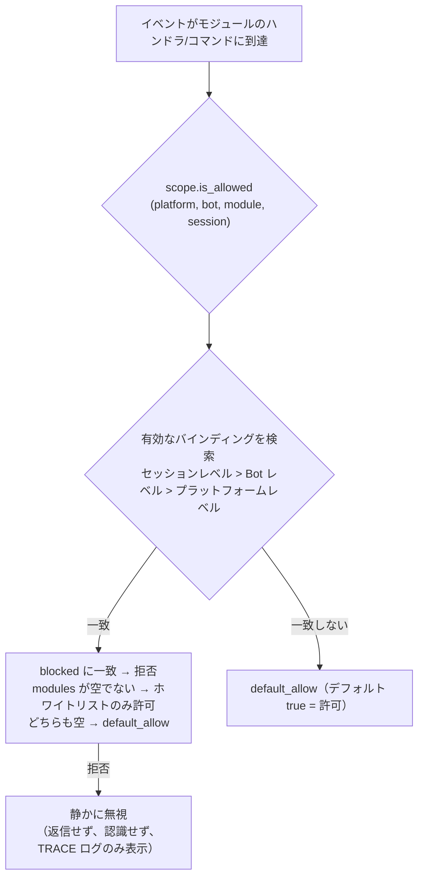

- **優先度の解析：セッションレベル > Bot レベル > プラットフォームレベル**、高優先度のバインディングは低優先度を**全体的に上書き**します
- **静かの意味**：フィルタリングされたモジュールのコマンドとハンドラはトリガーされず、返信も認識されません（コマンド間の誤一致を防ぐため）、
  TRACE レベルのログのみ表示（`core.scope.denied`）
- **フレームワークレベルのハンドラ**（`scope_exempt=True` または owner が空）は影響を受けません；モジュール名が空（フレームワーク層のリソース）は常に許可されます

## ② 身元次元（イベントの入力）

「誰のイベントを受信するか」を回答します。拒否されたイベントは**入力の分岐点で完全に破棄**されます——
ミドルウェアやすべてのハンドラ（フレームワークレベルを含む）には到達せず、TRACE レベルのログのみ表示（`core.scope.identity_denied`）されます。

- **優先度の解析：ユーザー > セッション > Bot > 適応器**、最も具体的に設定された戦略を採用します；deny は allow より優先されます
- 各レベルのバインディングは二元戦略：`{ allow = true }` または `{ deny = true }`
- ユーザー識別子は glob / 正規表現をサポート（例：`"spam_*"` で一括的にスパムユーザーをブロック）
- 一般的な用途——上位レベルで deny し、個別に allow して「例外の許可」を行う：

```toml
[ErisPulse.scope.identity.adapters.onebot11]
deny = true
[ErisPulse.scope.identity.users.onebot11]
allow = ["u_admin"]   # 適応器レベルで拒否しても、u_admin のイベントは許可されます
```

## ③ コマンド次元（コマンド ACL）

「誰が特定のコマンドを実行できるか」を回答します。判定順序：**deny に一致 → 拒否；allow ホワイトリストが空でないかつ一致しない → 拒否；いずれも設定されていない → `default_allow` に従う**（`true` は開発者のデフォルト権限チェーンに委ねる）。
拒否されたコマンドは「権限不足」の明示的な返信を返します。

- コマンド名は glob をサポート：`"roll*"` は `roll`、`roll_dice` などの一連のコマンドを1つのルールでカバー
- 精確なキーは glob キーに優先されます（`commands.roll` が一致した場合、`commands."roll*"` はチェックされません）
- ユーザー識別子のフォーマットは `"platform:user_id"`（フレームワークの所有者システムと一致）
- この次元は**ユーザー側の追加のゲート**であり、コマンドの `master` / `permission` パラメータと連動します：
  ACL が通過した後も、開発者が宣言したデフォルト権限チェーンを実行します（このデフォルトチェーンは ⑤ で上書き調整できます）

## ④ ハンドラ/テキスト次元

特定のモジュールで「どのようなテキストを処理するか」をフィルタリングします：モジュールに `pattern` / `regex` を設定した後、
そのモジュールのすべてのイベントハンドラはテキストが一致する場合にのみトリガーされます（コード内の条件と AND、両方を満たす必要があります）。
モジュールのコードを変更することなく、そのトリガー範囲を狭めることができます。

```toml
[ErisPulse.scope.handlers.ChatModule]
pattern = "闲聊*"     # ChatModule のハンドラは「闲聊*」で始まるメッセージにのみ反応
```

## ⑤ 実装パラメータの上書き

モジュール/コマンドの登録の**上層**で実装パラメータを上書きし、モジュールのコードを変更せずに：

```toml
[ErisPulse.scope.overrides.MyModule.restart]
master = true      # 既定の所有者制限を解除（false に設定して開放することも可能）
hidden = true      # ヘルプリストで非表示
aliases = ["rs"]   # 有効な別名
```

> 上書きは**ユーザー優先**に従います：開発者が宣言した `master` / `hidden` などの値はデフォルト値に過ぎず、
> ユーザーがここで明示的に設定した場合はユーザーの設定が優先されます（厳格化も開放も可能です）。
> 上書きは**実装パラメータ**（master / hidden / aliases / prefix / help / usage など）のみを変更します。
> **1つのコマンドを無効にする**ことはここでは行いません——統一してコマンド次元の deny（`scope.commands` または
> `scope.deny_user()`）で行い、2つの「無効」の意味が衝突しないようにします。

## ⑥ 出力アクション次元（モジュールの出力呼び出し禁止）

モジュールが**発行する出力アクション**を制約します：メッセージ送信 / 標準APIアクション / リクエスト操作。
3つのアクションはそれぞれの下層DSLに対応します：`Event.reply` と `Send`（send）、`Api` / `call_api`（api）、
`Request` の accept/reject（request）。イベントハンドラ実行中にモジュールが発行する出力呼び出しにはモジュールの所有者が含まれ、
この次元で一括判定されます。

```toml
[ErisPulse.scope.actions.MyModule]
send = false      # MyModule の返信/送信を禁止
api = false       # MyModule の標準APIアクションの呼び出しを禁止（call 逃げ口も含む）
request = false   # MyModule のリクエストイベントに対する accept/reject を禁止
```

判定の意味：**デフォルトはすべて許可**——未設定、または owner が空（フレームワーク層の内部呼び出し）はすべて許可；
ユーザーが明示的に `false` に設定した場合のみ拒否し、拒否された呼び出しはネットワークリクエストを開始せず、
代わりに標準の失敗応答（`retcode = 34601`、[api-response §5.3](../standards/api-response.md#53-フレームワーク拡張返却コード34xxx-プラットフォームエラー部の下3桁の独自定義) を参照）を返します。3つのアクションは互いに独立しており、1つだけ禁止することも可能です。

```python
# 実行時API
sdk.scope.set_action("MyModule", "send", False)   # メッセージ送信を禁止
sdk.scope.is_action_allowed("MyModule", "send")   # False
sdk.scope.unset_action("MyModule", "send")        # 許可を復元
sdk.scope.get_action_rules("MyModule")            # {"send": False, "api": True, "request": True}
```

## 実行時API

### モジュール次元

```python
from ErisPulse import sdk

# 判定
sdk.scope.is_allowed("onebot11", "123456", "Chat")
sdk.scope.is_allowed("onebot11", "123456", "Chat", "789012345")
sdk.scope.is_allowed("onebot11", "123456", None)      # フレームワーク層のリソース -> True

# バインディング / リリース
sdk.scope.bind_module("onebot11", "123456", modules=["Chat", "Tool*"])
sdk.scope.bind_module("onebot11", blocked=["Danger"])             # プラットフォームレベル
sdk.scope.bind_module("onebot11", "123456", "789012345", modules=["Chat"])  # セッションレベル
sdk.scope.bind_module("onebot11", "123456", modules=["Music"], merge=True)  # 合併
sdk.scope.bind_module("onebot11", "123456", modules=["Chat"], persist=False)  # 実行時のみ
sdk.scope.unbind_module("onebot11", "123456")

# 照会
sdk.scope.get("onebot11", "123456")   # {"modules": ["Chat"], "blocked": []}
```

### 身元次元

```python
# イベントの許可判定
sdk.scope.is_identity_allowed("onebot11", "123456", "group_9", "u1")

# 戦略のバインディング（階層はパラメータで決まる：user > session > bot > adapter）
sdk.scope.bind_identity("onebot11", user_id="u_bad", deny=True)
sdk.scope.bind_identity("onebot11", user_id="spam_*", deny=True)   # glob
sdk.scope.bind_identity("onebot11", "123456", "group_9", allow=True)
sdk.scope.unbind_identity("onebot11", user_id="u_bad")

# ユーザーブラックリストの便利なAPI
sdk.scope.block_user("onebot11", "u_bad")
sdk.scope.is_user_blocked("onebot11", "u_bad")
sdk.scope.get_blocked_users()        # {"onebot11": ["u_bad"]}
sdk.scope.unblock_user("onebot11", "u_bad")
```

### コマンド次元

```python
sdk.scope.is_command_allowed("roll", "onebot11", "u1")
sdk.scope.allow_user("roll*", "onebot11", "u_vip")   # コマンド名は glob をサポート
sdk.scope.deny_user("roll*", "onebot11", "u_bad")
sdk.scope.get_acl("roll*")
sdk.scope.remove_acl("roll*")

# コマンドシステムのファサード経由でも（同等の委任）
from ErisPulse.Core.Event import command
command.allow_user("restart", "onebot11", "123456")
```

### ハンドラとオーバーライド次元

```python
sdk.scope.bind_handler("MyModule", pattern="签到*", regex=r"\d+号")
sdk.scope.unbind_handler("MyModule")

sdk.scope.override("MyModule", "restart", master=True, hidden=True)
sdk.scope.get_override("MyModule", "restart")
sdk.scope.remove_override("MyModule", "restart")
```

### 一般

```python
sdk.scope.list_bindings()   # 全バインディング
sdk.scope.get_topology()    # トポロジー（ダッシュボード用）
sdk.scope.get_stats()
# {"module_calls": .., "module_filtered": .., "identity_checks": .., "identity_denied": ..,
#  "command_checks": .., "command_denied": .., "action_checks": .., "action_denied": ..,
#  "cache_hits": .., "cache_misses": ..}
sdk.scope.reset_stats()
sdk.scope.clear()           # 全バインディングをクリア（メモリ内のみ有効）
```

## 所有者とカスタム身元ソース（provider）

所有者システムは「誰がフレームワークの所有者か」を回答します：コマンドの `master=True` パラメータと業務層の
`master.is_master()` は同一の身元判定を使用し、判定チェーンは
**設定の所有者 → 実行時記録 → providerチェーン**です。

所有者設定（`ErisPulse.master.users`、グローバル list とプラットフォームごとの dict がサポート）は
[設定文書](../user-guide/configuration.md#所有者システムの設定)を参照してください；本節では身元判定APIと拡張ポイントに焦点を当てます。

### 判定と実行時の追加・削除

```python
from ErisPulse.Core import master

master.is_master(event)                      # イベントから判定
master.is_master("yunhu", "123")             # 明示的に判定
master.add("yunhu", "123")                   # 実行時に追加（デフォルトは永続化；persist=False はメモリ内のみ）
master.remove("yunhu", "123")                # 削除（デフォルトは永続化）
master.list()                                # 総合：{"global": [...], "<platform>": [...]}
```

### カスタム身元ソース（provider）

設定に加えて、カスタム身元ソースも登録できます：`fn(platform, user_id) -> bool`、
ビルトイン身元ソース（設定 + 実行時記録）が一致しない場合、順次試され、いずれかの provider が許可すれば所有者と判定されます。
適応器管理者インターフェース、データベースロールなどの外部身元体系に接続するのに適しています。

登録エントリ `master.provider` はデコレータ / 関数式の2種類の書き方ができ、
登録解除は登録された関数の `fn.unregister()` を通じて行います：

```python
from ErisPulse.Core import master

# 書き方1：デコレータ（常駐身元ソース、推奨）
@master.provider
def admin_provider(platform, user_id):
    return user_id in {"999"}     # 自作の判定ロジック

master.is_master("yunhu", "999")   # True
admin_provider.unregister()        # 不要になったら登録解除

# 書き方2：関数式（モジュールロード時に登録 / アンロード時に登録解除）
fn = master.provider(admin_provider)
fn.unregister()
```

> provider での例外はキャッチされ、判定チェーンをブロックしません。
> インスタンスメソッドを登録する場合は `unregister` が付与されないため、登録/解除のペアが必要な場合は**モジュールレベルの関数**を使用してください。

### ユーザー優先：所有者の適用範囲はユーザーが最終的に決定

コマンドの `master=True` は**開発者のデフォルト**に過ぎません：ユーザーは制御面
`ErisPulse.scope.overrides.<module>.<cmd>.master = true/false`
で絞り込みや解放を上書きできます（上記の ⑤ 実装パラメータの上書きを参照、ユーザーが明示的に設定すれば即座に有効）。

## キャッシュとホットアップデート

- `is_allowed` / `is_identity_allowed` の結果は **LRU キャッシュ**（`scope.cache_size` で調整可能）付きで、
  `bind_*` / `unbind_*` / 設定のホットアップデート（`config.updated` / `config.set`）で自動的に無効になります
- すべての次元の設定は**即座に有効**され、再起動は不要
- 制御面は「イベントごとに」判定されるため、イベント間で状態を保持しません：設定が変わると、次のイベントは新しいルールに従います

## 一般的な問題と注意事項

### 1. 設定の階層と上書き

- モジュール次元：セッションレベル > Bot レベル > プラットフォームレベル、**全体を上書き**します。例：プラットフォームで Chat を許可し、Bot で Music を追加したい場合、Bot レベルで両方をリストアップする必要があります
- 身元次元：ユーザー > セッション > Bot > 適応器、**最も具体的に設定された**戦略を採用します（例外の許可が可能です）
- コマンド次元：正確なコマンド名が glob キーに優先されます

### 2. モジュールコードの変更ではなく、制御面の使用を優先

モジュールで宣言したのは「開発者のデフォルト」（`master=True`、`permission=...`、`pattern=...`）；
制御面で宣言したのは「ユーザーの最終決定」。実装パラメータの上書きは**ユーザー優先**に従います：
ユーザーが明示的に `master = true/false` を設定すると即座に有効になります（絞り込みも解放も可能です）。
開発者が設定していない制限はユーザーが独自に絞り込むことができます。禁止/許可の制御はコマンド deny / 身元 allow で行います。

### 3. モジュール/コマンドが反応しない

まず制御面が原因かどうかを疑うべきです：

```python
from ErisPulse import sdk

print(sdk.scope.is_allowed(event.get_platform(), bot_id, "MyModule", session_id))
print(sdk.scope.is_identity_allowed(event.get_platform(), bot_id, session_id, user_id))
print(sdk.scope.get_stats())   # module_filtered / identity_denied > 0 なら静かにフィルタリングされている
```

フィルタリングは**静か**です（モジュール次元と身元次元は返信せず、誤ったコマンドの一致を防ぐため）、
ただし統計はカウントされます；コマンド次元で ACL に拒否された場合は「権限不足」の明示的な返信がされます。

### 4. セッション識別子はプラットフォームごとに隔離

`(platform, session_id)` の組み合わせが唯一の識別子です。`scope.sessions.onebot11."789"`
は onebot11 でのみ作用し、telegram 上で同様の `789` のセッションには影響しません。身元次元のユーザー識別子も同様です。

## トポロジツリーAPI

`ModuleManager.get_topology()` と `AdapterManager.get_topology()` はモジュール/適応器の所属関係データを提供し、
`sdk.get_topology()` は制御面の5次元を含む一括集約を提供します：

```python
from ErisPulse import sdk

topology = sdk.get_topology()
# {
#   "modules": {                                   # モジュール → 持つリソース
#     "Chat": {
#       "loaded": True, "enabled": True,
#       "commands": ["chat", "translate"],
#       "handlers": {"message": 2, "notice": 1},
#       "routes": {"http": ["/Chat/api"], "ws": [], "sse": []},
#       "lifecycle_hooks": 3,
#     }
#   },
#   "adapters": {                                  # 適応器 → Bot → スコープ
#     "onebot11": {
#       "status": "started", "enabled": True,
#       "bots": {"123456": {"status": "online", "scope": {...}}},
#       "scope": {"modules": [...], "blocked": [...]},
#     }
#   },
#   "scope": {                                     # 統一制御面（5次元）
#     "platforms": {...}, "bots": {...}, "sessions": {...},
#     "identity": {"adapters": {...}, "bots": {...}, "sessions": {...}, "users": {...}},
#     "commands": {...}, "handlers": {...}, "overrides": {...},
#   },
# }
```

- モジュールのトポロジーは、登録されたコマンド、イベントハンドラ、HTTP/WS/SSEルート、ライフサイクルフックを統合し、
  モジュールリソースツリーを描くのに便利です。
- 適応器のトポロジーは、各適応器のステータス、所属するBotのステータス、プラットフォームレベル/Botレベルのスコープバインディングを統合します。


### 启动流程与手动控制

# 起動プロセスと手動制御

ErisPulse の `await sdk.run()` / `await sdk.init()` は、一連の起動フローを「一行のコード」にカプセル化しています。しかし、部分的なロード、動的登録、ホットプラグ、カスタムロード戦略の注入など、完全にカスタマイズした起動フローが必要な場合は、このフローの内部で何が起こっているのか、そして各ステップを手動でどのように駆動するのかを理解する必要があります。

本文では、起動フローを独立したステップに分解し、それぞれの役割と呼び出し順序を説明し、手動で完全な起動を行うための例を示します。

> 本文は、[最初のロボット](../getting-started/first-bot.md)を実行し、`sdk.run(keep_running=True/False)` の2つのモードを理解していることを前提としています。本文では、`init()` **内部**のフローの分解、および `init()` / `init_task()` / `init_sync()` などのより低レベルのエントリポイントに焦点を当てます。

## SDK トップレベルエントリポイント一覧

`run()` の2つの `keep_running` モードに加えて、SDK はいくつかのより低レベルな初期化エントリポイントを提供します。これらは**非同期性、戻り値、および例外のラッピング方法**の点で異なります：

| エントリポイント | 非同期性 | 戻り値 | 例外処理 | 適用場面 |
|------|--------|--------|----------|----------|
| `await sdk.run(True)` | 非同期、イベントループを維持する | `None`（終了時に自動 `uninit`） | モジュール/アダプタのエラーは捕捉され、プロセスを停止しない | ロボットアプリケーション |
| `await sdk.run(False)` | 非同期、イベントループを維持しない | `None`（自動アンロードしない） | 同上 | 初期化後にカスタムロジックを実行する |
| `await sdk.init()` | 非同期、`await` が必要 | `bool` | コンポーネントの例外を内部で捕捉し、失敗時は `False` を返す | 手動でライフサイクルを制御する（`uninit()` と併用） |
| `sdk.init_task()` | 非同期、`Task` を返す、イベントループを維持しない | `asyncio.Task` | `init()` と同じ | 別の初期化を並行実行する、またはイベントループが起動していない場合 |
| `sdk.init_sync()` | **同期**、現在のスレッドをブロックする | `bool` | `init()` と同じ | コマンドラインスクリプト、イベントループのない同期エントリポイント |

> **よくある誤解**：`await sdk.init()` は `await sdk.run(keep_running=False)` と**等価ではありません**。2つの違いがあります：① `init()` は `bool` を返します（失敗時は `False`）、`run()` は `None` を返します；② `init()` は初期化のみを行い、**自動アンロードはしません**、`run()` はイベントループが終了したときに自動的に `uninit()` を実行します。したがって、手動でアンロードやカスタムライフサイクルを管理する必要がある場合は、`init()` + `uninit()` を使用します。

## 起動フローの概要

`sdk.init()`（正確にはその内部の `Initializer.init()`）は、以下の順序でフレームワーク全体を起動します：

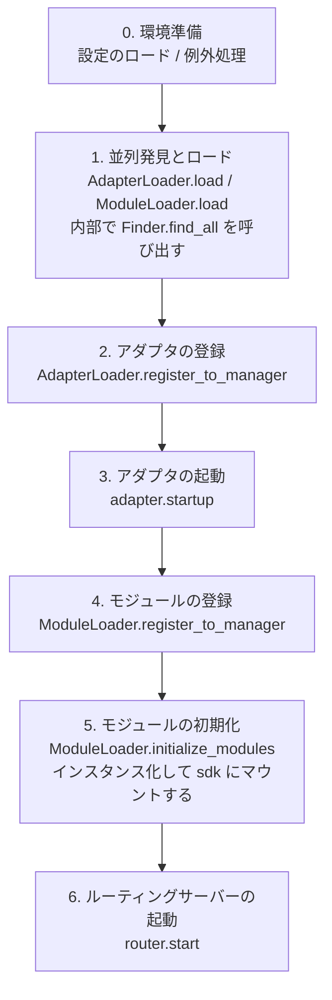

対応する主要コンポーネント：

| 層 | コンポーネント | 役割 |
|----|------|------|
| 発見 | `AdapterFinder` / `ModuleFinder` | エントリポイントからアダプタ/モジュールを**発見**する |
| ロード | `AdapterLoader` / `ModuleLoader` | 発見 + インポート + メタデータの読み取り + 有効/無効の判断、オブジェクトリストを返す |
| 登録 | `*Loader.register_to_manager` | オブジェクトを対応するマネージャーに登録する |
| 管理 | `sdk.adapter` / `sdk.module` | アダプタ/モジュールのインスタンスを維持し、起動/停止のインターフェースを提供する |
| 初期化 | `ModuleLoader.initialize_modules` | モジュールのインスタンスを作成し `sdk` にマウントする（依存関係のトポロジカルソートを処理する） |
| ルーティング | `sdk.router` | HTTP / WebSocket サーバー |

> **重要**：`Finder` と `Loader` は2つの層です。`Loader` は内部で `Finder` を保持しています（`AdapterLoader` は `AdapterFinder` を持つ、`ModuleLoader` は `ModuleFinder` を持つ）。ほとんどの場合、`Loader` を使用するだけで十分です。`Finder` を個別に使うのは、"ロードせずにリストアップする"必要がある場合に限られます。

## 各ステップの詳細

### 1. 発見層: Finder

Finder は、アダプタ/モジュールを**見つける**だけを担当し、インポートやインスタンス化は行いません。

```python
from ErisPulse.finders import AdapterFinder, ModuleFinder

adapter_finder = AdapterFinder()
module_finder = ModuleFinder()

# すべてのインストール済みアダプタ/モジュールのエントリポイントを検索
adapter_entries = adapter_finder.find_all()    # list[EntryPoint]
module_entries = module_finder.find_all()      # list[EntryPoint]

# 名称で検索
entry = module_finder.find_by_name("MyModule")  # EntryPoint | None
```

各 `EntryPoint` は `.load()` を呼び出すことで対応するクラスを得られますが、通常は手動で呼び出す必要はありません。`Loader` が処理します。

### 2. ロード層: Loader

Loader は Finder の上に「インポート + メタデータの読み取り + 有効/無効の判断」を行います。

```python
from ErisPulse.loaders import AdapterLoader, ModuleLoader
from ErisPulse import sdk

adapter_loader = AdapterLoader()
module_loader = ModuleLoader()

# load() 内部：finder.find_all() を呼び出す → 各エントリポイントを順次処理 → 三つ組を返す
adapter_objs, enabled_adapters, disabled_adapters = await adapter_loader.load(sdk.adapter)
module_objs, enabled_modules, disabled_modules = await module_loader.load(sdk.module)
```

`load()` が返す三つ組：

| 戻り値 | 意味 |
|--------|------|
| `objs` (`dict`) | 名称 → オブジェクト（アダプタクラス / モジュールラッパー） |
| `enabled` (`list[str]`) | 有効化された名称（設定で無効化されていない） |
| `disabled` (`list[str]`) | 無効化された名称 |

#### ロード失敗時の診断情報

モジュール/アダプタがロードまたは初期化の段階で例外を投げた場合、フレームワークはそのコンポーネントをスキップして他のコンポーネントのロードを継続し、**ユーザーのコードフレームのサマリー**を出力します。これにより、デフォルトの INFO レベルでもエラー箇所を特定でき、手動で DEBUG モードを有効化する必要がありません。

```
[ERROR] [ModuleLoader] entry-point からモジュール MyModule のロードに失敗しました。スキップしました: 'NoneType' object has no attribute 'platform'
  → MyModule/Core.py:42 in on_load
      adapter = sdk.platform
  → AttributeError: 'NoneType' object has no attribute 'platform'
  → ヒント: ログレベルを DEBUG に上げると完全なスタックトレースが表示されます。モジュール MyModule の実装コードを確認してください。
```

診断情報は `ErisPulse.runtime.diagnostics` モジュールによって生成され、フレームワークの内部フレームは自動的にフィルタリングされ、ユーザーのコードフレームのみが残ります。カスタムロードロジックで再利用する場合は：

```python
from ErisPulse.runtime import log_diagnostic

try:
    risky_init()
except Exception as e:
    log_diagnostic(e)  # 自動的にユーザーのコードフレームを抽出して ERROR ログに書き込む
```

このモジュールには、`extract_user_frame()`（構造化されたフレーム情報を返す）と `format_diagnostic_block()`（複数行のテキストを返す）という2つの低レベル関数も提供されています。

### 3. 登録層: register_to_manager

Loader が出力したオブジェクトをマネージャーに登録し、`sdk.adapter` / `sdk.module` がそれらを認識できるようにします。

```python
# アダプタの登録（すべて成功した場合は True を返す）
await adapter_loader.register_to_manager(enabled_adapters, adapter_objs, sdk.adapter)

# モジュールの登録
await module_loader.register_to_manager(enabled_modules, module_objs, sdk.module)
```

登録後、アダプタはアダプタマネージャーに登録され、モジュールはモジュールマネージャーに登録されますが、**まだ起動/インスタンス化されていません**。

### 4. アダプタの起動

```python
# すべての登録済みアダプタを起動する
await sdk.adapter.startup()
# または特定のプラットフォームを指定
await sdk.adapter.startup("yunhu")
await sdk.adapter.startup(["yunhu", "telegram"])
```

> 登録 ≠ 起動。`register_to_manager` は登録のみです。`startup` はアダプタの `start()` を呼び出し、プラットフォームとの接続を確立します。

### 5. モジュールの初期化

モジュールはアダプタに比べて1段階多く、**インスタンス化**して `sdk` にマウントする必要があります（これにより `sdk.MyModule.xxx` で呼び出せるようになります）。この段階では、モジュール間の依存関係の宣言とトポロジカルソートも処理されます。

```python
success = await module_loader.initialize_modules(
    enabled_modules, module_objs, sdk.module, sdk
)
```

インスタンス化が成功すると、モジュールは `sdk.<ModuleName>` に表示されます。

### 6. ルーティングサーバーの起動

```python
await sdk.router.start(
    host="0.0.0.0",
    port=8000,
    ssl_certfile=None,
    ssl_keyfile=None,
)
```

ルーティングサーバーは、アダプタからの Webhook / WebSocket コールバックを受信する責任があります。起動しないと、サーバーモードのアダプタはメッセージを受信できません。

## 完全な手動起動の例

以下のコードは、`await sdk.init()` のコアフローと**等価**ですが、各ステップを明示的に制御できるため、任意の段階でカスタムロジックを挿入できます：

```python
import asyncio
from ErisPulse import sdk
from ErisPulse.loaders import AdapterLoader, ModuleLoader

async def manual_startup():
    # 0. 環境準備（設定のロード、グローバル例外処理の登録）
    #    _prepare_environment は init() 内部の前置ステップです。手動フローでも事前に呼び出す必要があります。
    #    そうでなければ Loader が設定を読み取れず、すべてのアダプタ/モジュールを誤って無効化してしまいます。
    if not await sdk._prepare_environment():
        print("環境準備に失敗しました")
        return False

    # 1. ローダーの作成（それぞれ内部で Finder を保持しています）
    adapter_loader = AdapterLoader()
    module_loader = ModuleLoader()

    # 2. 並列発見とロード（init() 内部と同じ gather を使用）
    (adapter_objs, enabled_adapters, disabled_adapters), \
    (module_objs, enabled_modules, disabled_modules) = await asyncio.gather(
        adapter_loader.load(sdk.adapter),
        module_loader.load(sdk.module),
    )

    # 3. アダプタの登録
    await adapter_loader.register_to_manager(
        enabled_adapters, adapter_objs, sdk.adapter
    )

    # 4. アダプタの起動
    if enabled_adapters:
        await sdk.adapter.startup()

    # 5. モジュールの登録
    await module_loader.register_to_manager(
        enabled_modules, module_objs, sdk.module
    )

    # 6. モジュールの初期化（インスタンス化 + sdk にマウント）
    if enabled_modules:
        await module_loader.initialize_modules(
            enabled_modules, module_objs, sdk.module, sdk
        )

    # 7. ルーティングサーバーの起動
    await sdk.router.start(host="0.0.0.0", port=8000)

    print("手動起動完了")
    return True

async def main():
    ok = await manual_startup()
    if ok:
        # 非同期イベントループを維持する（手動フローでは自動的に維持されません）
        await asyncio.Event().wait()

if __name__ == "__main__":
    asyncio.run(main())
```

### 手動起動が必要な場合

ほとんどの場合、**手動起動は不要**です。`await sdk.run()` がすべての処理を完了します。手動起動は、以下のケースでのみ価値があります：

- **部分的なロード**：指定されたアダプタ/モジュールのみをロードし、他の部分をスキップする
- **動的登録**：条件に応じて実行時に新しいアダプタ/モジュールを登録する
- **カスタム順序**：デフォルトのロード順序を変更する必要がある（例：アダプタの起動前に特定のモジュールを起動する）
- **戦略の注入**：Loader にカスタムの厳格モードマネージャーやロード戦略を注入する
- **デバッグ/診断**：特定の段階で失敗した場合、手動で駆動して問題を特定する

## 実行時の細粒度制御

`sdk.run()` で起動した後でも、各サブシステムを個別に制御して、SDK 全体を再起動する必要はありません。

### アダプタのホット起動/停止

```python
# 特定のアダプタをホットリスタート（接続を修復し、他のプラットフォームには影響しない）
await sdk.adapter.shutdown("yunhu")
await sdk.adapter.startup("yunhu")

# 実行中に新しいプラットフォームを起動する
await sdk.adapter.startup("telegram")

# 一時的に特定のプラットフォームをオフラインにする
await sdk.adapter.shutdown("telegram")
```

> `adapter.startup()` はアダプタが**マネージャーに登録されている**ことを要求します。登録は `init()` / `run()` 内部で行われるため、これは起動**後の**細粒度制御です。

### ルーティングサーバー

```python
# 一時的に Webhook サーバーをオフラインにする
await sdk.router.stop()

# 再度起動する（例：ポートを変更する場合）
await sdk.router.start(host="0.0.0.0", port=9000)
```

### モジュールのオンデマンドロード

```python
# 手動でロードする（おそらく遅延ロードされた）モジュール
await sdk.load_module("MyModule")
```

## エレガントな終了

2.7.0 以降、`sdk.shutdown()` は**プログラム的なエレガントな終了**を提供します：終了イベントを設定し、`await sdk.run(keep_running=True)` で待機しているメインループが戻り、`uninit()` をトリガーしてリソースのクリーンアップを完了します。

```python
# 任意のコルーチンで呼び出すことで、エレガントな終了をトリガー（run() は待機を解除し、自動的に uninit() を実行）
sdk.shutdown()
```

典型的な用途：

```python
async def shutdown_after_idle():
    await asyncio.sleep(3600)
    sdk.shutdown()  # 空き1時間後にエレガントに終了
```

**シグナル処理**：`run()` 内部では `SIGTERM` / `SIGHUP` ハンドラが登録され、システムシグナルをエレガントな終了に変換します。コンテナ編成（Docker `docker stop`）や `systemd` でサービスを停止する場合、プロセスは強制終了ではなく `uninit()` のクリーンアップを完了します。

- Windows では `loop.add_signal_handler` がサポートされていないため、シグナルハンドラは自動的にスキップされます（`sdk.shutdown()` や Ctrl+C で終了をトリガーできます）
- `sdk.shutdown()` を繰り返し呼び出しても安全です（イベントが設定された後は無操作になります）

## アンロードフロー

起動の逆操作は `await sdk.uninit()` で、逆順にクリーンアップします：

1. すべてのアダプタを閉じる（`adapter.shutdown()`）
2. すべてのモジュールをアンロードする
3. すべてのイベントハンドラをクリーンアップする
4. マネージャーと SDK 上のモジュール属性をクリーンアップする

手動起動の場合は、終了前に `uninit()` を呼び出すことを忘れないでください：

```python
try:
    await asyncio.Event().wait()   # 実行を維持
finally:
    await sdk.uninit()
```

## リスタート

SDK は2種類のリスタート方法を提供します。いずれも、自分でアンロードする必要はありません。フレームワークが自動的に処理します：

| 方法 | 呼び出し | 行動 | 適用場面 |
|------|------|------|----------|
| ホットリスタート | `await sdk.restart()` | 同一プロセス内で `uninit()` した後、再び `init()` してアダプタ/モジュールを再ロードする | 設定の再ロード、モジュールのホットアップデート |
| ハードリスタート | `await sdk.hard_restart()` | `uninit()` した後、**終了コード 42** でプロセスを終了し、外部監督者が新しいプロセスを起動する | メモリ/リソースリークが疑われる、完全にクリーンなリスタートが必要な場合 |

```python
# ホットリスタート：同一プロセス内で再ロード（最も一般的）
await sdk.restart()

# ハードリスタート：プロセスを終了し、外部監督者が再起動する（下記「監督者ガイド」参照）
await sdk.hard_restart()
```

> **2点注意**：
> 1. これらのメソッドはバックグラウンドタスクでリスタートを実行するため、**即座に `True` を返す**（リスタートが完了したことを意味するのではなく）。「リスタートタスクがスケジュールされた」ことを示します。実際のリスタートはバックグラウンドで行われ、現在のイベントフローを中断することはありません。
> 2. `hard_restart()` の仕組みは、`uninit()` して設定を保存した後、**終了コード 42**（`HARD_RESTART_EXIT_CODE`）でプロセスを終了することです。**自身で新しいプロセスを起動するわけではなく**、外部監督者が終了コード 42 を検知して再起動する必要があります。`python main.py` で直接実行し、監督者が存在しない場合、終了コード 42 で終了した後、**自動的に再起動しません**（フレームワークは「監督者が検出されない」と警告を出します）。

### ハードリスタートが必要な場合

ハードリスタートは単に「より徹底的なリスタート」ではなく、以下の場面でより適切で、場合によってはより効率的です：

- **バイナリライブラリ（C拡張）の副作用**：ホットリスタートは同一プロセス内で行われるため、C拡張、開かれたファイルディスクリプター、スレッドなどのプロセスレベルのリソースを解放できません。ハードリスタートは新しいプロセスを起動するため、これらの副作用は完全にクリアされます。
- **リソースリークの調査**：メモリやハンドルのリークが疑われる場合、ハードリスタートでクリーンな環境を得られます。
- **頻繁なリスタートに敏感な場合**：ハードリスタートは同一プロセス内のアンロード→再ロードのオーバーヘッドを省くため、ホットリスタートよりも実際には効率的です。

> ダッシュボード管理パネルの「フレームワークリスタート」機能は、下層で `hard_restart()` を呼び出します。

### 終了コード 42 の契約

ハードリスタートはプロセス間の協調です：**SDK が終了（コード 42）し、監督者が再起動する**。

| 役割 | 行動 |
|------|------|
| SDK（ハードリスタートされるとき） | `uninit()` → 設定を保存 → `os._exit(42)` |
| 監督者 | 子プロセスの終了コードが 42 かを検出 → 同じコマンドで再起動する |

> `sdk.is_supervised()` は、現在のプロセスが監督者によって起動されたかどうかを確認できます（環境変数 `ERISPULSE_SUPERVISED` をチェック）。CLI `run` コマンドで起動する場合は、このマーカーが自動的に注入されます。systemd / Docker などの外部監督者は注入しないため、`is_supervised()` は `False` を返します。この場合、ハードリスタート後に「監督者が検出されない」と警告が表示されます。

### 監督者ガイド

適切な監督者を選んで、ハードリスタートを有効にします。

#### 1. CLI run コマンド（開発/簡単なデプロイ、推奨）

`epsdk run main.py` には、監督ループが内蔵されています：子プロセスの終了コードを検出し、42 の場合はすぐに再起動します。他の異常終了コードは指数バックオフで自動的に再試行します。`Ctrl+C` は、まず子プロセスをエレガントに終了します（コード 0 は正常終了と見なされ、再起動されません）。

```bash
epsdk run main.py
```

#### 2. systemd（Linux サーバー）

`RestartForceExitStatus=42` を設定して、終了コード 42 も再起動をトリガーします（デフォルトの `on-failure` は非ゼロコードのみ有効）：

```ini
[Service]
ExecStart=/usr/bin/python3 /opt/mybot/main.py
Restart=on-failure
RestartForceExitStatus=42
RestartSec=2
User=mybot
```

#### 3. Docker / docker-compose

コンテナ内の PID 1 はアプリケーションプロセスです。終了コード 42 でコンテナが終了します → `restart` ポリシーで自動的に再起動させます：

```yaml
services:
  bot:
    build: .
    restart: unless-stopped   # 42 を含むすべての終了コードで再起動
```

#### 4. PM2（Node 生態系の運用）

```bash
pm2 start main.py --name mybot --interpreter python3
# 42 は終了コードと見なされ、PM2 はデフォルトで再起動します。再起動間隔を設定して防ぐ
pm2 set mybot.restart_delay 2000
```

#### 5. supervisord

```ini
[program:mybot]
command=python3 /opt/mybot/main.py
autorestart=true
exitcodes=0,2,42    # 42 も「正常終了」で再起動する
```

#### 6. 純粋な Python 自作監督者

```python
import subprocess, sys, time

while True:
    p = subprocess.Popen([sys.executable, "main.py"])
    code = p.wait()
    if code == 42:          # ハードリスタート要求
        time.sleep(0.5)
        continue
    if code == 0:           # 正常終了
        break
    time.sleep(3)           # 異常終了、指数バックオフで再試行
```

> **監督者がいない場合の動作**：`python main.py` で直接実行し、`hard_restart()` を呼び出した場合、プロセスは終了コード 42 で終了し、再起動されません。この場合は、上記のいずれかの監督者を接続する必要があります。


====
生态模块
====


### ErisPulse-App 安装与使用

# ErisPulse-App

[ErisPulse-App](https://github.com/ErisPulse/ErisPulse-App) は ErisDev が直接運用している **公式マルチプラットフォームクライアント**（Android / Windows / Linux / macOS の各プラットフォームでリリース済み）で、
完全にネイティブなグラフィカル管理インターフェースを提供します。スマートフォンやコンピュータ上で複数のボットインスタンスの作成、実行、管理が可能です。
端末（ターミナル）を開く必要もなく、Python 環境を別途インストールする必要もありません。

> [!IMPORTANT]
> ErisPulse-App は**スタンドアロンのインストール型クライアントプログラム**であり、`epsdk install` でインストールされるモジュールではありません。
> Python ランタイムと ErisPulse SDK を内部に搭載しているため、インストールしてすぐに利用可能です——**スマートフォンでも直接実行できます**。


## 機能概要

- **マルチインスタンス管理**: インスタンスの作成 / 起動 / 停止 / 削除。ポートとアクセストークンが自動的に割り当てられます。新規環境または既存環境のクローンに対応しています。
- **ダッシュボード**: アダプタ / モジュール / オンラインボット / イベント総数の統計、CPU / メモリ使用率のアラート（色の変化）。
- **モジュールストア**: 検索・タグによるフィルタリング、ワンクリックでのインストール / アップグレード / アンインストール、特定バージョンのインストール、pipミラーソースと Git パッケージのサポート。
- **イベントストリーム + イベントビルダー**: リアルタイムでのイベント確認、テストイベントの視覚的な構築とアダプタへの送信。
- **監視**: ログ / ライフサイクル / 監査の統合ビュー。
- **コマンド管理**: プリフィックス・エイリアスなどの全体的な設定、開始・停止、プラットフォームのホワイトリスト・ブラックリスト。
- **ボット概要 / 設定 / ファイル管理**: 原生インターフェースによるインスタンス直接操作。
- **常駐バックグラウンド**: Android フロントグラウンドサービスによるプロセス維持；Windows はシステムトレイへ最小化し、ウィンドウを閉じてもインスタンスを中断しません。
- **モジュール動的ウィンドウ**: モジュールが登録されたページがサイドナビゲーション（ダッシュボードと同じグループ）に自動的に表示されます。クリックで直接移動できます。

## 対応プラットフォーム

すべてのプラットフォームのインストーラーは、[GitHub Releases](https://github.com/ErisPulse/ErisPulse-App/releases) からダウンロードできます。必要なものを選択してください。

| プラットフォーム | インストーラー | 説明 |
|------|--------|------|
| Android | `online-*.apk` / `offline-*.apk` | **スマートフォンで直接実行**、PCは不要です |
| Windows | `windows-x64-setup.exe` / `windows-x64.zip` | インストーラー版 / 解凍のみ版 |
| Linux | `linux-x64.tar.gz` | 解凍して使用 |
| macOS | `macos-arm64.zip` | Apple Silicon（arm64） |

Flutter による単一のコードベースで、すべてのプラットフォームをカバーしています。

---

## インストール方法（Android / スマートフォン直接実行）

[GitHub Releases](https://github.com/ErisPulse/ErisPulse-App/releases) から APK をダウンロードしてインストールするだけです。2つのビルドがあります。

| ビルド | ランタイムイメージ | 適用シーン |
|------|-----------------|---------|
| `erispulse-app-online-*.apk` | 起動時にダウンロード | インストールパッケージが小さく、ネットワーク環境が良い場合に適しています |
| `erispulse-app-offline-*.apk` | APK に同梱 | オフラインで自己完結しており、インストール後にネットワーク接続不要 |

2つのビルドともインストール手順は同じです。

1. APK をダウンロードしてインストールします。起動時に通知権限を許可してください（バックグラウンドサービスを維持するために使用します）
2. ホーム画面に初期化バナーが表示されたら、実行ボタンをクリックして最初の初期化を行います（進捗とログのビューを含みます）
3. インスタンスを作成して起動します
4. App 内蔵の管理画面でアダプタとモデル API Key を設定します

> オフラインパッケージは自己完結しています — インストール後にネットワークは不要です。起動時のダウンロードが遅い場合や不安定な場合は、設定画面でダウンロード元をミラーサイト（ghfast / gh-proxy）に切り替えることができます。

### インストール方法（デスクトップ：Windows / Linux / macOS）

1. [GitHub Releases](https://github.com/ErisPulse/ErisPulse-App/releases) から対応するプラットフォームのインストーラをダウンロードします（Windows の `setup.exe` または ZIP 版、Linux の `tar.gz`、macOS の `zip`）
2. インストールして起動します
3. ウェルカム画面でインストールしたい ErisPulse SDK のバージョンを選択します（デフォルトは最新バージョン）そしてインストールします
4. インスタンスを作成して起動します

---

## 動作原理

```
┌────────────────────────────────────────────────────┐
│  ErisPulse-App (Flutter)                            │
│                                                    │
│  ネイティブ UI ── Dashboard REST / WS API          │
│       │                                            │
│       ├── Android：フォアグラウンドサービス + proot + Ubuntu rootfs│
│       │        + Python + ErisPulse インスタンス            │
│       └── デスクトップ：内蔵 Python + 直接プロセス管理         │
└────────────────────────────────────────────────────┘
```

- **Android**：インスタンスはフォアグラウンドサービス（background isolate）によって管理された proot（ユーザーランド chroot）内で動作します。UIが閉じられてもボットは継続して実行され、クラッシュすると自動的に再起動します。
- **デスクトップ**：インスタンスはAppの直接の子プロセスとして実行されます。Windowsの場合、システムトレイに最小化してバックグラウンドで常駐（ウィンドウを閉じてもインスタンスは中断されません）。Appを再起動すると、実行中のインスタンスへの管理が自動的に回復し、終了時にすべてのインスタンスを一括して停止します。
- すべてのプラットフォームのネイティブ UI は、`127.0.0.1:<port>/Dashboard/*` の REST / WebSocket API を介してインスタンスと通信します。これは[ErisPulse-Dashboard](dashboard.md)と同じAPIを使用します。

---

## SDK との関係

- App 内部に ErisPulse SDK を同梱：Android 版は Ubuntu イメージにパッケージングされており、デスクトップ版は PyPI からインストールします（ウェルカム画面はオプション、デフォルトは最新版）
- App 内のインスタンスは、コマンドライン `epsdk` で作成されたインスタンスと等価であり、同じモジュール / アダプタを使用可能です
- モジュール開発者は、[Dashboard ウィンドウで API を登録](dashboard.md)してカスタムページを登録できます：
  - ウィンドウは App のサイドナビゲーションに自動的に表示されます（グループは Dashboard と一致）
  - クリックすると対応するページレンダリングに遷移します

---

</translate>


### Dashboard 使用与视窗注册

# ErisPulse-Dashboard

[ErisPulse-Dashboard](https://pypi.org/project/ErisPulse-Dashboard/) は、ErisDev が直接メンテナンスしている **Web 管理パネルモジュール** であり、ErisPulse に視覚的なランタイム管理インターフェースを提供します：モジュールの起動停止、設定の編集、ログの閲覧、イベントストリームの監視など。

> [!IMPORTANT]
> Dashboard は **ErisPulse フレームワークの組み込み機能ではありません**。別途インストールが必要です：
>
> ```bash
> epsdk install Dashboard
> ```

Dashboard では、他の ErisPulse モジュールがカスタムの管理ページをサイドバーに登録することもサポートしています。登録すると、ユーザーは Dashboard で該当モジュールの専用ウィンドウページに切り替えるだけでよく、追加の独立したフロントエンドインターフェースの開発は不要です。

> [!NOTE]
> ウィンドウ登録は**オプション機能**です。
>
> - Dashboard モジュールが**インストールされていない**または**読み込まれていない**場合、`sdk.Dashboard.register_view()` を呼び出すと例外がスローされます
> - モジュール自体の他の機能に影響を与えないように、登録コードは必ず `try/except` で囲んでください
> - 登録前に Dashboard が使用可能かどうかを確認することをお勧めします：`hasattr(sdk, 'Dashboard') and sdk.Dashboard`

---

## 動作原理

```
モジュール on_load()
  → sdk.Dashboard.register_view(...) の呼び出し
  → Dashboard バックエンドでウィンドウ情報を保存
  → WebSocket でフロントエンドに通知
  → フロントエンドがサイドバーのナビゲーション項目 + ページコンテナを動的に作成
  → ユーザーがクリックすればモジュールのウィンドウを閲覧可能
```

---

## 登録 API

```python
sdk.Dashboard.register_view(
    id="MyModule",                    # 必須、一意の識別子
    title="マイモジュール",            # 中国語表示名
    title_en="My Module",             # 英語表示名
    icon_svg='<svg>...</svg>',        # サイドバーのアイコン SVG
    html_content='<div>...</div>',     # ページ HTML コンテンツ
    js_content='function xxx() {}',    # ページ JavaScript ロジック
    css_content='.my-style {}',        # オプションのカスタム CSS
    iframe_url='',                     # iframe モード URL（html_content との二択）
    loader="loadMyModuleView",         # このページに切り替えたときに呼び出される JS 関数名
    group="group_extensions",          # サイドバーのグループ
    group_title="",                    # カスタムグループの中国語タイトル
    group_title_en="",                 # カスタムグループの英語タイトル
)
```

### パラメータ説明

| パラメータ | 型 | 必須 | 説明 |
|------|------|------|------|
| `id` | `str` | Yes | ウィンドウの一意の識別子。モジュール名を使用することをお勧めします |
| `title` | `str` | No | 中国語表示名。デフォルトは `id` を使用 |
| `title_en` | `str` | No | 英語表示名。デフォルトは `title` を使用 |
| `icon_svg` | `str` | No | サイドバーのアイコンの完全な SVG 文字列 |
| `html_content` | `str` | No* | インジェクションモードのページ HTML コンテンツ |
| `js_content` | `str` | No | ページ JavaScript コード |
| `css_content` | `str` | No | ページのカスタム CSS スタイル |
| `iframe_url` | `str` | No* | iframe モードの URL。設定すると `html_content` は無視されます |
| `loader` | `str` | No | ページがアクティブになったときに自動的に呼び出される JS 関数名 |
| `group` | `str` | No | サイドバーのグループ識別子。デフォルトは `group_extensions` |
| `group_title` | `str` | No | カスタムグループの中国語タイトル |
| `group_title_en` | `str` | No | カスタムグループの英語タイトル |

> *`html_content` と `iframe_url` の少なくとも一方を提供してください。そうしないと、ページは空になります。

---

## 2つのインジェクションモード

### モード1：HTML/JS インジェクション（推奨）

HTML、JS、CSS の文字列を直接提供し、Dashboard はコンテンツをページにインジェクトします。このモードは Dashboard のスタイルと完全に一致しており、Dashboard が提供する CSS クラス名を使用することを推奨します。

```python
sdk.Dashboard.register_view(
    id="HelloPage",
    title="こんにちはページ", title_en="Hello",
    icon_svg='<svg viewBox="0 0 24 24" fill="none" stroke="currentColor" stroke-width="2"><circle cx="12" cy="12" r="10"/></svg>',
    html_content='<h1 class="page-title">Hello World</h1><div class="card"><div class="card-body">これはサンプルページです</div></div>',
    group="group_tools",
)
```

> 完全な天気モジュールの例（API ルート、JS インタラクションなどを含む）は、下記の[完全なモジュールの例](#完全なモジュールの例)を参照してください。

### モード2：iframe 埋め込み

モジュールが独自の HTML ページ URL（ルートの登録が必要）を提供し、Dashboard は iframe 方式で埋め込みます。完全に独立した UI または複雑なインタラクションが必要なシーンに適しています。

```python
sdk.Dashboard.register_view(
    id="MyVisualizer",
    title="データビジュアライザー", title_en="Data Visualizer",
    iframe_url="/MyVisualizer/view",
    group="group_tools",
)
```

> iframe モードでは、認証用の `token` パラメータが URL の後に自動的に追加されます。

---

## サイドバーのグループ

モジュールはウィンドウが配置されるサイドバーのグループを指定できます。Dashboard には以下のグループが組み込まれています：

| グループ識別子 | 中国語名 | 位置 |
|---------|--------|------|
| `group_overview` | 概要 | 第1グループ |
| `group_events` | イベント | 第2グループ |
| `group_extensions` | 拡張 | 第3グループ（デフォルト） |
| `group_system` | システム | 第4グループ |
| `group_tools` | ツール | 第5グループ |

組み込みのグループ名を指定すると、モジュールのウィンドウはそのグループの末尾に追加されます：

```python
group="group_tools"  # "ツール" グループに追加
```

カスタムグループ名（`group_` で始まらないもの）も使用できます。Dashboard は自動的に新しいグループを作成します：

```python
group="my_group",
group_title="マイグループ",
group_title_en="My Group",
```

---

## 一般的な CSS クラス名

モジュールのウィンドウが HTML インジェクションモードを使用する場合、視覚的な一貫性を維持するために Dashboard の既存の CSS クラス名を直接使用できます：

| クラス名 | 用途 |
|------|------|
| `page-title` | ページタイトル。例: `<h1 class="page-title">タイトル</h1>` |
| `card` | カードコンテナ |
| `card-header` | カードのタイトルバー |
| `card-body` | カードのコンテンツエリア |
| `grid-2` | 2列のグリッドレイアウト |
| `grid-3` | 3列のグリッドレイアウト |
| `btn` | 基本ボタン |
| `btn-primary` | プライマリボタン（青） |
| `btn-secondary` | セカンダリボタン |
| `btn-icon` | アイコンボタン |
| `btn-danger` | 危険操作ボタン |

Dashboard は CSS 変数を使用してテーマカラーを制御するため、モジュールのウィンドウで直接参照できます：

| CSS 変数 | 用途 |
|----------|------|
| `var(--bg-p)` | メイン背景色 |
| `var(--bg-s)` | サブ背景色 |
| `var(--bg-t)` | 3段階背景色（カードなど） |
| `var(--tx-p)` | メインテキスト色 |
| `var(--tx-s)` | サブテキスト色 |
| `var(--tx-t)` | 補助テキスト色 |
| `var(--bd)` | ボーダーカラー |
| `var(--accent)` | アクセントカラー |
| `var(--ok-c)` | 成功色 |
| `var(--er-c)` | エラーカラー |

これらの変数は Dashboard のライト/ダークモードのテーマに応じて自動的に切り替わるため、モジュールに追加の処理は不要です。

---

## 認証と API 呼び出し

モジュールのウィンドウの JS でモジュール自身の API を呼び出す際は、認証のため Dashboard のトークンを含める必要があります：

```javascript
var token = localStorage.getItem('__ep_tk__');
var resp = await fetch('/YourModule/api/data', {
    headers: { 'Authorization': 'Bearer ' + token }
});
var data = await resp.json();
```

モジュールの API エンドポイントは、トークンを検証するかどうかを独自に決定できます。検証が必要な場合は、リクエストヘッダーから抽出できます：

```python
async def _api_data(self, request):
    token = request.headers.get("Authorization", "").replace("Bearer ", "")
    if not token:
        return {"error": "Unauthorized"}, 401
    return {"data": "hello"}
```

---

## 完全なモジュールの例

以下は、ウィンドウの登録方法、API データの提供、およびアンインストール時のリソースクリーンアップ方法を示す、完全な天気モジュールの例です。

```python
from ErisPulse import sdk
from ErisPulse.Core.Bases import BaseModule
from ErisPulse.Core.Event import command


class Main(BaseModule):
    def __init__(self):
        self.sdk = sdk
        self.logger = sdk.logger.get_child("Weather")
        self.config = self._load_config()

    @staticmethod
    def get_load_strategy():
        from ErisPulse.loaders import ModuleLoadStrategy
        return ModuleLoadStrategy(lazy_load=False, priority=50)

    async def on_load(self, event):
        self._register_routes()
        self._register_dashboard_view()
        self.logger.info("天気モジュールが読み込まれました")

    async def on_unload(self, event):
        self._unregister_routes()
        if hasattr(self.sdk, 'Dashboard') and self.sdk.Dashboard:
            self.sdk.Dashboard.unregister_view("Weather")
        self.logger.info("天気モジュールがアンインストールされました")

    def _load_config(self):
        config = self.sdk.config.getConfig("Weather")
        if not config:
            default = {"city": "北京", "api_key": ""}
            self.sdk.config.setConfig("Weather", default)
            return default
        return config

    def _register_routes(self):
        r = self.sdk.router
        r.register_http_route("Weather", "/api/current",
                              handler=self._api_current, methods=["GET"])

    def _unregister_routes(self):
        r = self.sdk.router
        try:
            r.unregister_http_route("Weather", "/api/current")
        except Exception:
            pass

    async def _api_current(self, request):
        return {
            "city": self.config.get("city", "北京"),
            "temp": 25,
            "humidity": 60,
        }

    def _register_dashboard_view(self):
        try:
            dashboard = self.sdk.Dashboard
            dashboard.register_view(
                id="Weather",
                title="天気", title_en="Weather",
                icon_svg='<svg viewBox="0 0 24 24" fill="none" stroke="currentColor" stroke-width="2"><circle cx="12" cy="12" r="5"/><line x1="12" y1="1" x2="12" y2="3"/><line x1="12" y1="21" x2="12" y2="23"/><line x1="4.22" y1="4.22" x2="5.64" y2="5.64"/><line x1="18.36" y1="18.36" x2="19.78" y2="19.78"/><line x1="1" y1="12" x2="3" y2="12"/><line x1="21" y1="12" x2="23" y2="12"/><line x1="4.22" y1="19.78" x2="5.64" y2="18.36"/><line x1="18.36" y1="5.64" x2="19.78" y2="4.22"/></svg>',
                html_content='''
                    <h1 class="page-title">天気照会</h1>
                    <p style="color:var(--tx-s);margin-bottom:16px">現在の天気情報を表示</p>
                    <div class="grid-2">
                        <div class="card">
                            <div class="card-header">現在の天気</div>
                            <div class="card-body">
                                <div id="weather-info" style="font-size:14px;color:var(--tx-s)">クリックして更新</div>
                            </div>
                        </div>
                        <div class="card">
                            <div class="card-header">操作</div>
                            <div class="card-body">
                                <button class="btn btn-primary" onclick="refreshWeather()">更新</button>
                            </div>
                        </div>
                    </div>
                ''',
                js_content='''
                    async function loadWeatherView() { await refreshWeather(); }
                    async function refreshWeather() {
                        var el = document.getElementById('weather-info');
                        if (!el) return;
                        el.textContent = '読み込み中...';
                        try {
                            var resp = await fetch('/Weather/api/current', {
                                headers: { 'Authorization': 'Bearer ' + localStorage.getItem('__ep_tk__') }
                            });
                            var data = await resp.json();
                            el.innerHTML = '<p>都市: ' + (data.city || '--') + '</p>' +
                                           '<p>気温: ' + (data.temp || '--') + '°C</p>' +
                                           '<p>湿度: ' + (data.humidity || '--') + '%</p>';
                        } catch (e) {
                            el.textContent = '読み込みに失敗: ' + e.message;
                        }
                    }
                ''',
                loader="loadWeatherView",
                group="group_tools",
            )
        except Exception as e:
            self.logger.warning(f"Dashboard ウィンドウの登録に失敗しました: {e}")
```

---

## ウィンドウの登録解除

モジュールのアンインストール時に、登録済みのウィンドウをクリーンアップするために `unregister_view()` を呼び出す必要があります：

```python
async def on_unload(self, event):
    if hasattr(self.sdk, 'Dashboard') and self.sdk.Dashboard:
        self.sdk.Dashboard.unregister_view("Weather")
```

登録解除後、Dashboard フロントエンドは WebSocket を通じてサイドバーのナビゲーション項目とページのコンテンツをリアルタイムで削除するため、ユーザーがページをリフレッシュする必要はありません。

---

## 注意事項

1. **読み込み順序** — Dashboard の読み込み優先度は `99999`（高優先度）です。Dashboard が先に読み込み完了するように、あなたのモジュールの優先度はこの値より低く設定してください（例: `50`）
2. **防御的なプログラミング** — ウィンドウの登録時に `try/except` で囲む必要があります。Dashboard モジュールがインストールされていないか、読み込まれていない可能性があるため
3. **リソースのクリーンアップ** — `on_unload` で `unregister_view()` を呼び出して、登録済みのウィンドウを削除してください
4. **ID の一意性** — `id` パラメータは全体の Dashboard 内で一意である必要があります。モジュール名を直接使用することをお勧めします
5. **SVG アイコン** — `icon_svg` は完全な `<svg>` タグである必要があります。サイズには `viewBox="0 0 24 24"` を使用することを推奨します。Dashboard のテーマカラーを継承するために `stroke="currentColor"` を使用してください
6. **JS 関数名の命名** — `js_content` 内の関数名は一意である必要があります（例: `loadWeatherView` ）。他のモジュールと衝突しないようにしてください
7. **動的更新** — モジュールがウィンドウを登録/解除した後、Dashboard フロントエンドは WebSocket を通じてサイドバーをリアルタイムで更新するため、ページのリフレッシュは不要です


### Takumi 图片渲染

# ErisPulse-Takumi

[ErisPulse-Takumi](https://pypi.org/project/ErisPulse-Takumi/) は ccd2s によってメンテナンスされている **サードパーティの画像レンダリングモジュール** です。[takumi-py](https://github.com/BalconyJH/takumi-py) をベースとしており、Bot が HTML、ノードツリー、Jinja テンプレート、SVG、アニメーションを画像としてレンダリングできるようにします。モジュールには **日本語と英語のフォント**（Noto Sans SC / Roboto / Source Code Pro）が標準搭載されており、追加の設定は不要です。

> [!IMPORTANT]
> Takumi は ErisPulse フレームワークの組み込み機能ではありません。個別にインストールが必要です：
>
> ```bash
> epsdk install Takumi
> ```

適用シナリオ：

- データ/統計をカード画像としてレンダリング
- Markdown / 長いテキストをスタイルの崩れが少ない画像としてレンダリングし、プラットフォームごとのスタイルの差異を回避
- SVG / アニメーションを生成して動的な視覚効果を実現
- 日本語と英語の混在したテキスト付き画像（標準搭載のフォントを使用可能）

---


## インストールと有効化

```bash
epsdk install Takumi
```

インストール後、モジュールは自動的に読み込まれます。設定で有効を確認してください。

```toml
[Takumi]
enabled = true
```

---

## クイックスタート

モジュールは自動的にロードされた後、モジュールマネージャーを通じて取得するか、`sdk` ショートカットを使用します：

```python
from ErisPulse import sdk

takumi = sdk.module.get("Takumi")
# 同等の書き方：takumi = sdk.Takumi
```

### HTML をレンダリング

```python
png = takumi.render_html(
    """
    <div class="card">
      <h1>こんにちは、ErisPulse</h1>
      <p>Takumi によってレンダリングされました</p>
    </div>
    """,
    stylesheets=["""
    .card {
      width: 800px;
      padding: 48px;
      color: white;
      background: #111827;
      font-family: "Noto Sans SC";
    }
    """],
    width=800,
    height=None,   # コンテンツに応じて自動的に高さを拡張
    lang="zh-CN",
)
```

### ノードツリーをレンダリング

```python
png = takumi.render_node(
    {
        "type": "text",
        "text": "中国語と English は直接レンダリング可能です",
        "style": {"fontSize": 48, "color": "#111827"},
    },
    width=800,
    height=None,
    lang="zh-CN",
)
```

`png` は `bytes` です。`event.reply(png, method="Image")` を通じて送信できます（詳細は [Rendering results sending](docs/ja/rendering-results.md) を参照）。

## レンダリング API

`sdk.Takumi` は、底層の `takumi_py.Renderer` の全能力をプロキシしています：すべてのレンダリング、測定、SVG、アニメーション、テンプレートメソッドは `sdk.Takumi` で直接呼び出すことができます。これらのメソッドについては、モジュールは呼び出し時に**自動的に埋め込みフォントフォールバックスタック**（`takumi.families`）を注入するため、`font_families` を手動で渡す必要はありません。明示的に渡された場合は、呼び出し元の設定を尊重します。

### メソッド概要

| カテゴリ | メソッド | 戻り値 | 説明 |
|------|------|------|------|
| 静的レンダリング | `render_html(html, ...)` | `bytes` | HTML 文字列をレンダリング |
| | `render_node(node, ...)` | `bytes` | ノードツリー（dict）をレンダリング |
| | `render_template(name, ctx, ...)` | `bytes` | Jinja テンプレートをレンダリング |
| | `render_compiled(node, ...)` | `bytes` | コンパイル済みノードをレンダリング |
| SVG 出力 | `render_svg_html(html, ...)` | `str` | SVG を出力（HTML 入力） |
| | `render_svg_node(node, ...)` | `str` | SVG を出力（ノードツリー入力） |
| | `render_svg_template(name, ctx, ...)` | `str` | SVG を出力（テンプレート入力） |
| | `render_svg_compiled(node, ...)` | `str` | SVG を出力（コンパイル済み入力） |
| アニメーション | `render_animation(scenes, ...)` | `bytes` | マルチフレームアニメーションをエンコード |
| | `render_sequence_at_time(scenes, time_ms, ...)` | `bytes` | シーケンスの特定の時刻のフレームを取得 |
| 測定 | `measure_node(node, ...)` | `dict` | ノードツリーのレイアウトを測定 |
| | `measure_html(html, ...)` | `dict` | HTML のレイアウトを測定 |
| | `measure_compiled(node, ...)` | `dict` | コンパイル済みノードを測定 |
| コンパイル | `compile_node(node)` | `CompiledNode` | ノードツリーをコンパイル |
| | `compile_html(html, ...)` | `CompiledNode` | HTML をコンパイル |
| フォント | `register_font(font)` | `list[str]` | カスタムフォントを登録し、family リストを返す |
| | `register_fonts(fonts)` | `list[str]` | 一括登録 |

> `CompiledNode` は `resource_urls()` メソッドを公開しており、事前に読み込む必要がある HTTP(S) 画像参照を検出できます。これにより、リソースを事前に準備しやすくなります。

### 一般的なパラメータ

以下のパラメータは、静的レンダリングと SVG メソッドに適用されます（アニメーションメソッドには `fps` などがあり、対応する例を参照してください）：

| パラメータ | タイプ | デフォルト値 | 説明 |
|------|------|--------|------|
| `stylesheets` | `list[str]` | `None` | ドキュメントレベルの CSS 文字列のリスト。インライン `style` は HTML とともに解析されます |
| `width` | `int \| None` | `1200` | ビューポートの幅（ピクセル）。`None` はレイアウトから推論します |
| `height` | `int \| None` | `630` | キャンバスの高さ（ピクセル）。`None` はコンテンツに応じて自動的に高さを拡張します（[ビューポートと出力形式](#ビューポートと出力形式)を参照） |
| `lang` | `str \| None` | `None` | BCP-47 言語タグ（例：`zh-CN`）。テキスト整形と改行に影響します |
| `font_families` | `list[str]` | 自動注入 | フォントフォールバックスタック。便宜上のメソッドでは埋め込みフォントがデフォルトで注入されます |
| `format` | `str` | `"png"` | 出力形式（[ビューポートと出力形式](#ビューポートと出力形式)を参照） |
| `device_pixel_ratio` | `float` | `1.0` | デバイスピクセル比。出力解像度を制御します |
| `time_ms` | `int` | `0` | アニメーションのサンプリング時刻（ミリ秒） |
| `dithering` | `str` | `"none"` | ディザリングアルゴリズム：`none` / `ordered-bayer` / `floyd-steinberg` |
| `quality` | `int \| None` | `None` | 有損圧縮の品質 |
| `lossless` | `bool \| None` | `None` | 無損圧縮を行うかどうか |
| `images` | `list` | `None` | 今回のレンダリングの画像リソース（`ImageResource` または `(src, bytes)` のタプル） |
| `keyframes` | `Mapping` | `None` | 構造化されたキーフレーム。`@keyframes` を記述する必要はありません |
| `options` | `RenderOptions` | — | `RenderOptions(...)` で集約してパラメータを渡します。フィールドは上の表と一致します |

完全なフィールド定義については `takumi_py.RenderOptions` を参照してください。

### ノードツリーの例

```python
png = takumi.render_node(
    {
        "type": "container",
        "style": {"padding": "32px", "backgroundColor": "#111827"},
        "children": [
            {"type": "text", "text": "タイトル", "style": {"fontSize": 32, "color": "white"}},
            {"type": "text", "text": "本文", "style": {"fontSize": 18, "color": "#9ca3af"}},
        ],
    },
    width=800,
    height=None,
    lang="zh-CN",
)
```

### Jinja テンプレートの例

```python
png = takumi.render_template(
    "card.html.jinja",
    {"title": "Takumi", "subtitle": "Jinja to image"},
    stylesheets=["""
    .card {
      width: 800px;
      padding: 48px;
      color: white;
      background: #111827;
    }
    """],
    width=800,
    height=None,
    lang="zh-CN",
)
```

> `filters={...}` を使用してカスタム Jinja フィルターを注入したり、`environment=...` を使用して完全な `jinja2.Environment` を渡したりできます。テンプレートディレクトリと環境設定の詳細については、[takumi-py テンプレートドキュメント](https://github.com/BalconyJH/takumi-py/blob/main/docs/ja/guides/templates.md)を参照してください。

### SVG 出力の例

```python
svg = takumi.render_svg_html(
    '<div class="card">Hello</div>',
    stylesheets=[".card { width: 800px; color: black; }"],
    width=800,
    height=None,
)
```

### アニメーションの例

```python
from takumi_py import AnimationScene

webp = takumi.render_animation(
    [
        AnimationScene(
            {"type": "container", "style": {"width": "100%", "height": "100%", "backgroundColor": "black"}},
            duration_ms=100,
        ),
        AnimationScene(
            {"type": "container", "style": {"width": "100%", "height": "100%", "backgroundColor": "white"}},
            duration_ms=100,
        ),
    ],
    width=64,
    height=64,
    fps=20,
    format="webp",
)
```

> 各フレームは `AnimationScene(node, duration_ms=...)` で構成されます。`duration_ms` は正数である必要があります。

---

## ビューポートと出力形式

### 出力形式

| 場面 | `format` 取値 |
|------|---------------|
| 静止画像 | `png`（デフォルト） / `jpeg` / `jpg` / `webp` / `ico` / `raw` |
| アニメーション | `webp`（デフォルト） / `apng` / `gif` |

`format="raw"` は、カスタムなピクセル単位の処理を行うため、行優先（row-major）の RGBA バイトストリームを返します。

### 幅 (`width`) と高さ (`height`) について

`width` と `height` の役割は非対称です。

- `width` は**ビューポート幅**であり、テキストとレイアウトはこれに従って改行・リフローします。**固定値（例: `800`）にする**必要があります。さもないと、キャンバスがコンテンツの自然な幅に引き伸ばされ、テキストが改行されず、サイズが制御不能になります。
- `height` は**キャンバス高さ**であり、コンテンツの増加に応じて伸びます。`height` のデフォルト値は `630` です。`height=None` を渡すと、Takumi は**コンテンツに合わせてキャンバスの高さを自動的に広げます**（auto viewport）。

> [!TIP]
> **推奨される組み合わせ：`width` を固定 + `height=None`。** 固定サイズのキャンバスやトリミング効果が必要な場合のみ、具体的な `height` を指定してください。

> [!NOTE]
> `width` / `height` のどちらかを技術的に `None` として渡せば、レイアウトからの推論（ノード自体がサイズを宣言している場合など）に任せることができます。両方の値が指定された場合、出力サイズは確定した値となります。

---

## フォント

### 標準装備のフォント

| フォント | family | カテゴリ |
|------|--------|------|
| Noto Sans SC | `Noto Sans SC` | sans-serif |
| Roboto | `Roboto` | sans-serif |
| Roboto Italic | `Roboto` | sans-serif（italic） |
| Source Code Pro | `Source Code Pro` | monospace |
| Source Code Pro Italic | `Source Code Pro` | monospace（italic） |

モジュールプロパティ：

| プロパティ | 説明 |
|------|------|
| `takumi.fonts` | 標準装備のフォントファイル名リスト |
| `takumi.families` | 登録済みフォント family リスト |

### 自動注入

`sdk.Takumi` のすべてのレンダリング、測定、SVG、アニメーション、テンプレートメソッドは、自動的に `takumi.families` をフォントフォールバックスタックとして注入されます。直接 `takumi.renderer`（ネイティブインスタンス）を呼び出すか、`create_renderer()` で作成された独立したインスタンスの場合は、手動で `font_families=takumi.families` を渡す必要があります。

### カスタムフォント

```python
from takumi_py import FontResource

families = takumi.renderer.register_font(
    FontResource(
        font_bytes,
        name="MyFont",
        weight=400,
        style="normal",
        generic_family="sans-serif",
    )
)
```

`register_font` は登録された family 名リストを返し、後続のレンダリング時に `font_families` として渡すことができます。

---

## レンダラー インスタンス

### 原生 Renderer

`takumi.renderer` は、生の `takumi_py.Renderer` インスタンスです。直接呼び出す際は、`font_families` を手動で渡す必要があります：

```python
png = takumi.renderer.render_html(
    "<div>こんにちは</div>",
    font_families=takumi.families,
    lang="zh-CN",
)
```

### 独立 Renderer

フォント / 画像 / リソースのキャッシュを分離する必要がある場合（長寿命プロセス、マルチテナントシナリオなど）、独立した `Renderer` を作成できます。組み込みフォントは自動的に登録されます：

```python
renderer = takumi.create_renderer(cache_max_bytes=64 * 1024 * 1024)

png = renderer.render_html(
    "<div>独立 Renderer</div>",
    font_families=takumi.families,
    width=800,
    height=None,
    lang="zh-CN",
)
```

`create_renderer()` は、`takumi_py.Renderer` のコンストラクタ引数を受け入れます：

| パラメータ | 型 | デフォルト値 | 説明 |
|------|------|--------|------|
| `load_default_fonts` | `bool` | `False` | takumi-py に付属するフォントを読み込むかどうか（組み込みフォントは常に読み込まれます） |
| `fonts` | `list[FontResource]` | `None` | 追加で登録するカスタムフォント |
| `cache_max_bytes` | `int \| None` | `None` | リソースキャッシュの上限（バイト）；`0` で無効化 |
| `persistent_images` | `list` | `None` | 永続化する画像リソース |

> 独立インスタンスはモジュールプロキシを経由しないため、統一された組み込みフォントのフォールバックスタックを維持するには、明示的に `font_families=takumi.families` を渡す必要があります。`font_families` を明示的に渡した場合、モジュールは呼び出し元の設定を尊重し、デフォルトのフォールバックスタックを注入しなくなります；`RenderOptions(font_families=...)` も有効です。

---


## レンダリング結果を送信

レンダリングされた画像は `bytes` 形式で、イベントで直接返信して送信できます：

```python
from ErisPulse import sdk

takumi = sdk.Takumi
png = takumi.render_html("<div>hello</div>", lang="zh-CN")

# 方法1：Imageメソッドで返信
await event.reply(png, method="Image")

# 方法2：OneBot12メッセージセグメントで返信
from ErisPulse.Core.Event import MessageBuilder
await event.reply_ob12(
    MessageBuilder().image(png).build()
)
```

> 各プラットフォームの画像のパッケージ化はアダプターが一括で処理します。詳細は [MessageBuilder 詳細](../advanced/message-builder.md) と [送信メソッド仕様](../standards/send-method-spec.md) を参照してください。

---

## 設定

```toml
[Takumi]
enabled = true
```

---


======
平台特性指南
======


### 平台特性总览

# ErisPulse PlatformFeatures ドキュメント

> 基準プロトコル: [OneBot12](https://12.onebot.dev/) 
> 
> 本文ドキュメントは**プラットフォーム固有の機能ガイド**であり、以下を含む：
> - 各アダプターがサポートするSendメソッドのチェーン呼び出し例
> - プラットフォーム固有のイベント/メッセージフォーマットの説明
> 
> 一般的な使用方法については、以下を参照してください：
> - [基本概念](../getting-started/basic-concepts.md)
> - [イベント変換標準](../standards/event-conversion.md)  
> - [APIレスポンス規格](../standards/api-response.md)

---

## プラットフォーム固有の機能

このセクションは、各アダプター開発者が維持し、OneBot12標準との差異や拡張機能を説明するためのものです。以下の各プラットフォームの詳細ドキュメントを参照してください：

- [維持説明](maintain-notes.md)

- [雲湖プラットフォームの特性](docs/ja/yunhu.md)
- [雲湖ユーザープラットフォームの特性](docs/ja/yunhu_user.md)
- [Telegramプラットフォームの特性](docs/ja/telegram.md)
- [OneBot11プラットフォームの特性](docs/ja/onebot11.md)
- [OneBot12プラットフォームの特性](docs/ja/onebot12.md)
- [メールプラットフォームの特性](docs/ja/email.md)
- [Kook(開黒啦)プラットフォームの特性](docs/ja/kook.md)
- [Matrixプラットフォームの特性](docs/ja/matrix.md)
- [QQ公式ロボットプラットフォームの特性](docs/ja/qqbot.md)
- [花楓コーヒーショップ](docs/ja/ideaura.md)
- [Discord](docs/ja/discord.md)
- [Webhookプロトコルブリッジ](docs/ja/webhook.md)
- [WeChat公式アカウント](docs/ja/wechatmp.md)

> さらに `sandbox` アダプターもありますが、このアダプターにはプラットフォーム固有の機能ドキュメントを維持する必要はありません

---

## 一般的なインターフェース

### Send チェーン呼び出し
すべてのアダプターは以下の標準呼び出し方法をサポートしています：

> **注意:** ドキュメント内の `{AdapterName}` は実際のアダプター名（例: `yunhu`、`telegram`、`onebot11`、`email` など）に置き換えてください。

1. タイプとIDを指定: `To(type,id).Func()`
   ```python
   # アダプターインスタンスを取得
   my_adapter = adapter.get("{AdapterName}")
   
   # メッセージを送信
   await my_adapter.Send.To("user", "U1001").Text("Hello")
   
   # 例:
   yunhu = adapter.get("yunhu")
   await yunhu.Send.To("user", "U1001").Text("Hello")
   ```
2. IDのみを指定: `To(id).Func()`
   ```python
   my_adapter = adapter.get("{AdapterName}")
   await my_adapter.Send.To("U1001").Text("Hello")
   
   # 例:
   telegram = adapter.get("telegram")
   await telegram.Send.To("U1001").Text("Hello")
   ```
3. 送信アカウントを指定: `Using(account_id)`
   ```python
   my_adapter = adapter.get("{AdapterName}")
   await my_adapter.Send.Using("bot1").To("U1001").Text("Hello")
   
   # 例:
   onebot11 = adapter.get("onebot11")
   await onebot11.Send.Using("bot1").To("U1001").Text("Hello")
   ```
4. 直接呼び出し: `Func()`
   ```python
   my_adapter = adapter.get("{AdapterName}")
   await my_adapter.Send.Text("ブロードキャストメッセージ")
   
   # 例:
   email = adapter.get("email")
   await email.Send.Text("ブロードキャストメッセージ")
   ```

#### 非同期送信と結果処理

Send DSL のメソッドは `asyncio.Task` オブジェクトを返します。これは、結果を即座に待つかどうかを選択できるということを意味します：

```python
# アダプターインスタンスを取得
my_adapter = adapter.get("{AdapterName}")

# 結果を待たずに、バックグラウンドでメッセージを送信
task = my_adapter.Send.To("user", "123").Text("Hello")

# 送信結果を取得する必要がある場合は、後で待つことができます
result = await task
```

#### 送信ルールデコレーター

実際の開発では、送信成功後に後続のロジックを実行する、失敗時に自動的にリトライする、タイムアウトで取り消す、送信の進行状況を監視するなどの処理が必要な場合があります。Send DSL には、ルールをチェーンメソッドで追加するための送信ルールデコレーターが組み込まれています：

| メソッド | 説明 |
|--------|------|
| `.Hook(callback)` | 送信成功後に実行されるコールバック（複数回呼び出し可能） |
| `.Retry(times=1)` | 失敗時に自動的に N 回リトライする（最初の送信を含めて合計 N+1 回） |
| `.Timeout(seconds)` | 単一送信のタイムアウト、タイムアウトで取り消す（Retry と重ねて使用可能） |
| `.Defer(seconds)` | 送信を遅延させる（プロセス内でのタイマー、永続化はしない） |
| `.OnProgress(callback)` | 各段階の進行状況コールバック、SendContext を渡す |
| `.OnError(callback)` | 最終的に失敗したときのエラーコールバック（1回のみ発動） |

```python
yunhu = adapter.get("yunhu")

# 送信成功後にポイントを減らす
await (yunhu.Send.To("user", "123")
       .Hook(lambda r: deduct_points("123"))
       .Text("消費成功"))

# 失敗リトライ + タイムアウトキャンセル + 進行状況監視
def on_progress(ctx):
    print(f"段階: {ctx.stage}, 試行: {ctx.attempt + 1}/{ctx.max_attempts}")

task = (yunhu.Send.To("user", "123")
        .Retry(3)              # 最大3回リトライ
        .Timeout(10)           # 各回10秒のタイムアウト
        .OnProgress(on_progress)
        .OnError(lambda ctx: notify_admin(ctx.error))
        .Text("重要な通知"))
```

ルールメソッドは `self` を返すため、送信メソッド（Text/Image など）の前に呼び出す必要があります。`SendContext` には `stage`（pending/sending/retrying/success/failed/timeout）、`attempt`、`elapsed`、`error`、`result` などのフィールドが含まれており、監視に便利です。

#### バッチ構築モード（Build）

1つのチェーンで複数の送信メソッドを構築し、最後に一括で実行します。これは「一気に複数のメッセージを送信する」状況に適しています：

```python
yunhu = adapter.get("yunhu")

# 複数のメッセージを構築し、一括送信
results = await (yunhu.Send.To("user", "123")
                .Build()                     # 構築モードに入る
                .Text("通知1")
                .Image("pic.jpg")
                .Text("通知2")
                .send_all())                 # 一括実行
# results = [Textの結果, Imageの結果, Textの結果]
```

`.send_all()` はデフォルトで**並列**に実行されます（並行送信、効率が高い）。メッセージの到達順序を保証する必要がある場合は、`.Sequential()` を呼び出して逐次実行します：

```python
# 逐次実行（順序を保証）+ 失敗リトライ
await (yunhu.Send.To("group", "456")
       .Build()
       .Sequential()                # 順に送信
       .Retry(2)                     # 失敗した項目は個別にリトライ
       .Text("1番目のメッセージ").Text("2番目のメッセージ")
       .send_all())
```

バッチ実行は**失敗しても継続**する戦略を採用しています：1つのメッセージが失敗しても他のメッセージの送信を中断せず、失敗した項目は自動的にリトライされます。バッチ送信にも全体の `Hook`（すべて成功後に発動）、`OnError`（失敗があった場合に発動）、`OnProgress`（進行状況コールバック）がサポートされています。

> より詳細なルールとバッチ構築の説明は [SendDSL 詳解](../developer-guide/adapters/send-dsl.md) を参照してください。

### イベントのリッスン
3種類のイベントリッスン方法があります：

1. プラットフォーム固有のイベントリッスン：
   ```python
   from ErisPulse.Core import adapter, logger
   
   @adapter.on("event_type", raw=True, platform="{AdapterName}")
   async def handler(data):
       logger.info(f"受信した{AdapterName}プラットフォーム固有のイベント: {data}")
   ```

2. OneBot12標準イベントリッスン：
   ```python
   from ErisPulse.Core import adapter, logger

   # OneBot12標準イベントをリッスン
   @adapter.on("event_type")
   async def handler(data):
       logger.info(f"受信した標準イベント: {data}")

   # 特定プラットフォームの標準イベントをリッスン
   @adapter.on("event_type", platform="{AdapterName}")
   async def handler(data):
       logger.info(f"受信した{AdapterName}標準イベント: {data}")
   ```

3. Eventモジュールによるリッスン：
    `Event`のイベントは `adapter.on()` 関数に基づいているため、`Event`が提供するイベント形式はOneBot12標準イベントです

    ```python
    from ErisPulse.Core.Event import message, notice, request, command

    message.on_message()(message_handler)
    notice.on_notice()(notice_handler)
    request.on_request()(request_handler)
    command("hello", help="挨拶メッセージを送信", usage="hello")(command_handler)

    async def message_handler(event):
        logger.info(f"受信したメッセージ: {event}")
    async def notice_handler(event):
        logger.info(f"受信した通知: {event}")
    async def request_handler(event):
        logger.info(f"受信したリクエスト: {event}")
    async def command_handler(event):
        logger.info(f"受信したコマンド: {event}")
    ```

この中で、最も推奨されるのは `Event` モジュールを使用したイベント処理です。`Event` モジュールは豊富なイベントタイプとイベント処理メソッドを提供するためです。

---

## 標準フォーマット
参考の便宜上、ここでは簡易なイベントフォーマットを示します。詳細情報が必要な場合は、上記のリンクを参照してください。

> **注意:** 以下のフォーマットは基本的な OneBot12 標準フォーマットであり、各アダプターはこの上に拡張フィールドを追加する可能性があります。具体的な内容は、各アダプターの特定機能の説明を参照してください。

### 標準イベントフォーマット
すべてのアダプターが実装しなければならないイベント変換フォーマット：
```json
{
  "id": "event_123",
  "time": 1752241220,
  "type": "message",
  "detail_type": "group",
  "platform": "example_platform",
  "self": {"platform": "example_platform", "user_id": "bot_123"},
  "message_id": "msg_abc",
  "message": [
    {"type": "text", "data": {"text": "こんにちは"}}
  ],
  "alt_message": "こんにちは",
  "user_id": "user_456",
  "user_nickname": "ExampleUser",
  "group_id": "group_789"
}
```

### 標準レスポンスフォーマット
#### メッセージ送信成功
```json
{
  "status": "ok",
  "retcode": 0,
  "data": {
    "message_id": "1234",
    "time": 1632847927.599013
  },
  "message_id": "1234",
  "message": "",
  "echo": "1234",
  "{platform}_raw": {...}
}
```

#### メッセージ送信失敗
```json
{
  "status": "failed",
  "retcode": 10003,
  "data": null,
  "message_id": "",
  "message": "必要なパラメータが不足しています",
  "echo": "1234",
  "{platform}_raw": {...}
}
```

---

## 貢献について

私たちは、より多くの開発者の皆様にアダプターのドキュメントの作成と維持にご参加いただきたいと考えています！以下の手順に従って貢献を提出してください：
1. [ErisPuls](https://github.com/ErisPulse/ErisPulse) リポジトリをForkしてください。
2. `docs/platform-features/` ディレクトリ内にMarkdownファイルを作成し、`<プラットフォーム名>.md` の形式で命名してください。
3. 本 `README.md` ファイルに、ご貢献のアダプターへのリンクと関連する公式ドキュメントを追加してください。
4. Pull Requestを提出してください。

皆様のご支援に感謝いたします！


### OneBot11 适配

# OneBot11プラットフォーム特徴ドキュメント

OneBot11Adapter は、OneBot V11 プロトコルに基づいて構築されたアダプターです。

---

## ドキュメント情報

- 対応モジュールバージョン: 4.0.0
- メンテナー: ErisPulse

## 基本情報

- プラットフォーム紹介：OneBot はチャットボットアプリケーションのインターフェース仕様です。
- アダプタ名：OneBotAdapter
- 対応プロトコル/APIバージョン：OneBot V11
- 多アカウント対応：デフォルトでマルチアカウントアーキテクチャを採用しており、複数の OneBot アカウントを同時に設定および実行できます。
- 設定キー名：`OneBotAdapter`

## 支援されるメッセージ送信タイプ

すべての送信メソッドは、チェーン式構文で実装されています。例：

```python
from ErisPulse.Core import adapter
onebot = adapter.get("onebot11")

# デフォルトアカウントを使用して送信
await onebot.Send.To("group", group_id).Text("Hello World!")

# 特定のアカウントを指定して送信
await onebot.Send.Using("main").To("group", group_id).Text("メインアカウントからのメッセージ")

# チェーン式修飾: @ユーザー + 回答
await onebot.Send.To("group", group_id).At(123456).Reply(msg_id).Text("返信メッセージ")

# @全員
await onebot.Send.To("group", group_id).AtAll().Text("お知らせメッセージ")
```

### 基本送信メソッド

- `.Text(text: str)`：純粋なテキストメッセージを送信します。
- `.Image(file: Union[str, bytes], filename: str = "image.png")`：画像を送信します（URL、Base64、または bytes をサポート）。
- `.Voice(file: Union[str, bytes], filename: str = "voice.amr")`：音声メッセージを送信します。
- `.Video(file: Union[str, bytes], filename: str = "video.mp4")`：動画メッセージを送信します。
- `.Face(id: Union[str, int])`：QQ絵文字を送信します。
- `.File(file: Union[str, bytes], filename: str = "file.dat")`：ファイルを送信します（自動的にタイプを判別）。
- `.Raw_ob12(message: List[Dict], **kwargs)`：OneBot12形式のメッセージを送信します（自動的にOB11に変換）。
- `.Recall(message_id: Union[str, int])`：メッセージを撤回します。

### グループ操作メソッド

以下のメソッドは、`To("group", group_id)`で対象グループを指定し、グループコンテキストで操作を実行します：

- `.Kick(user_id, reject_add_request=False)`：グループメンバーを蹴ります。
- `.Ban(user_id, duration=1800)`：グループメンバーを禁止します（秒単位、0は解禁を意味します）。
- `.WholeBan(enable=True)`：全員禁止をオン/オフします。
- `.SetAdmin(user_id, enable=True)`：グループ管理者を設定/解除します。
- `.SetCard(user_id, card="")`：グループ名前を設定します。
- `.SetGroupName(name)`：グループ名を変更します。
- `.Leave(is_dismiss=False)`：グループから退会します（グループ主は解散も可能です）。
- `.SetTitle(user_id, title="")`：グループタイトルを設定します。
- `.SetPortrait(file)`：グループアイコンを設定します。

### クエリメソッド

- `.GetMsg(message_id)`：メッセージ内容を取得します。
- `.GetForwardMsg(id)`：連続転送メッセージを取得します。
- `.GetLoginInfo()`：現在のログインアカウント情報を取得します。
- `.GetFriendList()`：友達リストを取得します。
- `.GetGroupInfo()`：グループ情報を取得します（`To("group", group_id)`が必要）。
- `.GetGroupList()`：グループリストを取得します。
- `.GetGroupMemberInfo(user_id)`：グループメンバー情報を取得します（`To("group", group_id)`が必要）。
- `.GetGroupMemberList()`：グループメンバーリストを取得します（`To("group", group_id)`が必要）。

### 友達操作メソッド

- `.Like(user_id, times=1)`：友達に「いいね」を送信します（最大10回まで）。

### チェーン式修飾メソッド（組み合わせ可能）

チェーン式修飾メソッドは`self`を返し、チェーン式で呼び出すことができ、最終的な送信メソッドの前に呼び出す必要があります：

- `.At(user_id: Union[str, int], name: str = None)`：指定ユーザーを@します（複数回呼び出すことができます）。
- `.AtAll()`：全員を@します。
- `.Reply(message_id: Union[str, int])`：指定メッセージに返信します。

### チェーン式呼び出し例

```python
# 基本送信
await onebot.Send.To("group", 123456).Text("Hello")

# 単一ユーザーを@する
await onebot.Send.To("group", 123456).At(789012).Text("你好")

# 複数ユーザーを@する
await onebot.Send.To("group", 123456).At(111).At(222).At(333).Text("大家好")

# OneBot12形式のメッセージを送信
ob12_msg = [{"type": "text", "data": {"text": "Hello"}}]
await onebot.Send.To("group", 123456).Raw_ob12(ob12_msg)

# 「いいね」を送信
await onebot.Send.Like(123456, times=10)

# グループメンバーを禁止
await onebot.Send.To("group", 123456).Ban(789012, duration=3600)

# 解禁
await onebot.Send.To("group", 123456).Ban(789012, duration=0)

# メンバーを蹴る
await onebot.Send.To("group", 123456).Kick(789012)

# グループ管理者を設定
await onebot.Send.To("group", 123456).SetAdmin(789012)

# グループ名を変更
await onebot.Send.To("group", 123456).SetGroupName("新群名")

# グループ情報を取得
result = await onebot.Send.To("group", 123456).GetGroupInfo()

# 特定アカウントで操作
await onebot.Send.Using("main").To("group", 123456).Ban(789012)
```

### 対応していないタイプの処理

定義されていない送信メソッドを呼び出した場合、アダプタはテキストの提示を返します：

```python
# 存在しないメソッドを呼び出す
await onebot.Send.To("group", 123456).SomeUnsupportedMethod(arg1, arg2)
# 実際の送信: "[不支援の送信タイプ] メソッド名: SomeUnsupportedMethod, パラメータ: [...]"
```

## リクエスト操作（Request DSL）

アダプターは、フレンドリクエストとグループリクエスト（グループ参加/招待）の承認/拒否操作を処理するためのリクエスト操作 DSL を提供しています。

### Event ショートカットメソッド

リクエストイベントは、`event.approve()` と `event.reject()` というショートカットメソッドをサポートしており、内部で自動的に Request DSL を呼び出します。

```python
from ErisPulse.Core.Event import request

@request.on_friend_request()
async def handle_friend_request(event):
    comment = event.get("comment", "")

    if comment == "passphrase":
        await event.approve()
    else:
        await event.reject()

@request.on_group_request()
async def handle_group_request(event):
    group_id = event.get("group_id")
    await event.approve()
```

### 手動で Request DSL を呼び出す

```python
# リクエストを承認
await onebot.Request("flag_string").accept()

# リクエストを拒否
await onebot.Request("flag_string").reject()

# 特定のアカウントで操作
await onebot.Request("flag_string").Using("main").accept()
```

### 完全な例

```python
from ErisPulse.Core.Event import request

@request.on_friend_request()
async def handle_friend_request(event):
    comment = event.get("comment", "")

    # 方法1：Event ショートカットメソッドを使用
    if comment == "passphrase":
        await event.approve()
    else:
        await event.reject()

    # 方法2：Request DSL を使用
    flag = event.get("flag")
    if comment == "passphrase":
        await onebot.Request(flag).accept()
    else:
        await onebot.Request(flag).reject()
```

### リクエスト操作の戻り値

```python
{
    "status": "ok",
    "retcode": 0,
    "data": {...},
    "message_id": "",
    "message": ""
}
```

## イベントタイプマッピング

### 標準 OB12 マッピング

| OB11 原始タイプ | 変換後 detail_type | 説明 |
|--------------|-------------------|------|
| message_type: private | `private` | プライベートチャットメッセージ |
| message_type: group | `group` | グループチャットメッセージ |
| request_type: friend | `friend` | フレンドリクエスト |
| request_type: group | `group` | グループリクエスト |
| meta_event_type: heartbeat | `heartbeat` | ハートビート |
| notice_type: group_upload | `group_file_upload` | グループファイルアップロード |
| notice_type: group_admin | `group_admin_change` | グループ管理者変更 |
| notice_type: group_increase | `group_member_increase` | グループメンバー増加 |
| notice_type: group_decrease | `group_member_decrease` | グループメンバー減少 |
| notice_type: group_ban | `group_ban` | グループ禁止 |
| notice_type: friend_add | `friend_increase` | フレンド追加 |
| notice_type: friend_delete | `friend_decrease` | フレンド削除 |
| notice_type: group_recall / friend_recall | `message_recall` | メッセージ撤回 |

### プラットフォーム固有イベント（onebot11_ 前缀）

| OB11 原始タイプ | 変換後 detail_type | 説明 |
|--------------|-------------------|------|
| meta_event_type: lifecycle | `onebot11_lifecycle` | OneBot 実装ライフサイクル |
| notify + sub_type: honor | `onebot11_honor` | グループの栄誉変更 |
| notify + sub_type: poke | `onebot11_poke` | つっついた |
| notify + sub_type: lucky_king | `onebot11_lucky_king` | グループの赤包運の王 |
| CQ コードの未知タイプ | メッセージセグメント `onebot11_{type}` | 未認識の CQ コード |

### イベント例

```python
// フレンドリクエスト
{
  "type": "request",
  "detail_type": "friend",
  "user_id": "789012",
  "comment": "フレンドを追加してください",
  "request_id": "flag_abc123",
  "flag": "flag_abc123"
}

// ハートビート
{
  "type": "meta_event",
  "detail_type": "heartbeat",
  "interval": 5000,
  "status": {...}
}

// ライフサイクル（プラットフォーム固有）
{
  "type": "meta_event",
  "detail_type": "onebot11_lifecycle",
  "sub_type": "enable"
}

// つっついた（プラットフォーム固有）
{
  "type": "notice",
  "detail_type": "onebot11_poke",
  "group_id": "123456",
  "user_id": "789012",
  "target_id": "345678"
}

// グループの赤包運の王（プラットフォーム固有）
{
  "type": "notice",
  "detail_type": "onebot11_lucky_king",
  "group_id": "123456",
  "user_id": "789012",
  "target_id": "345678"
}

// 栄誉変更（プラットフォーム固有）
{
  "type": "notice",
  "detail_type": "onebot11_honor",
  "group_id": "123456",
  "user_id": "789012",
  "honor_type": "talkative"
}

// CQ コード拡張メッセージセグメント
{
  "type": "message",
  "message": [
    {"type": "onebot11_shake", "data": {}}
  ]
}
```

### 拡張フィールドの説明

- すべての固有フィールドは `onebot11_` 前缀で識別されます
- 元のイベントデータは `onebot11_raw` フィールドに保持されます
- 元のイベントタイプは `onebot11_raw_type` フィールドに保持されます
- メッセージ内容の CQ コードは対応するメッセージセグメントに変換されます（標準タイプは前缀なし、未知タイプは `onebot11_` 前缀を追加）
- レプリーメッセージには `reply` タイプのメッセージセグメントが追加されます
- @メッセージには `mention` タイプのメッセージセグメントが追加されます

## イベント拡張メソッド

OneBot11 アダプタは、イベントオブジェクトに以下のプラットフォーム固有のメソッドを登録しており、イベントハンドラ内で直接呼び出すことができます。

```python
from ErisPulse.Core.Event import message

@message.on_message()
async def handle_message(event):
    raw_self_id = event.get_raw_self_id()
    sender_info = event.get_sender_info()
    sender_role = event.get_sender_role()
```

### メソッド一覧

| メソッド | 戻り値の型 | 説明 |
|------|----------|------|
| `get_raw_event()` | `dict` | OneBot11 の完全な元のイベントデータを取得します |
| `get_raw_self_id()` | `str` | 元の self_id（Bot の QQ 番号）を取得します |
| `get_sender_info()` | `dict` | 完全な送信者情報（nickname、role、level など）を取得します |
| `get_sender_role()` | `str` | グループ内の送信者の役割（owner/admin/member）を取得します |
| `get_sender_level()` | `int` | 送信者のグレードを取得します |
| `get_sender_title()` | `str` | 送信者のグループタイトルを取得します |
| `is_system_message()` | `bool` | システムメッセージかどうかを判定します（sub_type == "system"） |

### 使用例

```python
from ErisPulse.Core.Event import message, command

@message.on_group_message()
async def handle_group(event):
    role = event.get_sender_role()
    if role == "admin" or role == "owner":
        await event.reply("管理者さん、こんにちは！")

    title = event.get_sender_title()
    if title:
        await event.reply(f"あなたのタイトルは: {title}")

@command("whoami")
async def whoami(event):
    info = event.get_sender_info()
    nickname = info.get("nickname", "未知")
    level = event.get_sender_level()
    await event.reply(f"ニックネーム: {nickname}, グレード: {level}")
```

## 設定オプション

OneBot11 アダプターは、各アカウントごとに独立した設定を持つ多アカウントアーキテクチャを採用しています。設定のキー名は `OneBotAdapter` です。

### アカウント設定フィールド

| フィールド | 型 | 必須 | デフォルト値 | 説明 |
|------|------|------|--------|------|
| `bot_id` | `str` | はい | `""` | ロボットの QQ 番号、アカウントを識別するため |
| `mode` | `str` | いいえ | `"server"` | 実行モード：`"server"`（パッシブリッスン）または `"client"`（アクティブ接続） |
| `url` | `str` | いいえ | `"ws://127.0.0.1:3001"` | Client モードの WebSocket アドレス |
| `token` | `str` | いいえ | `""` | 認証トークン（Client モードの接続トークン / Server モードの検証トークン） |
| `server_path` | `str` | いいえ | `"/"` | Server モードの WebSocket パス |
| `enabled` | `bool` | いいえ | `true` | このアカウントを有効にするかどうか |
| `name` | `str` | いいえ | `""` | アカウントの備考名 |

### 内部デフォルト値

- 再接続間隔：30秒
- API 呼び出しのタイムアウト：30秒

### 設定例

```toml
[OneBotAdapter.accounts.main]
bot_id = "123456789"
mode = "server"
server_path = "/onebot-main"
token = "main_token"
enabled = true

[OneBotAdapter.accounts.backup]
bot_id = "987654321"
mode = "client"
url = "ws://127.0.0.1:3002"
token = "backup_token"
enabled = true

[OneBotAdapter.accounts.test]
bot_id = "111222333"
mode = "client"
url = "ws://127.0.0.1:3003"
enabled = false
```

### デフォルト設定

アカウントの設定が一切行われていない場合、アダプターは自動的に以下を生成します。
```toml
[OneBotAdapter.accounts.default]
bot_id = ""
mode = "server"
server_path = "/"
enabled = true
```

## 送信メソッドの戻り値

すべての送信メソッドは Task オブジェクトを返します。これに await を直接適用して送信結果を取得できます。返り値は ErisPulse アダプタの標準化された返り値規格に従います：

```python
{
    "status": "ok",
    "retcode": 0,
    "data": {...},
    "message_id": "123456",
    "message": "",
    "onebot11_raw": {...}
}
```

### 複数アカウント送信の構文

```python
# アカウント選択メソッド
await onebot.Send.Using("main").To("group", 123456).Text("主アカウントのメッセージ")
await onebot.Send.Using("backup").To("group", 123456).Image("http://example.com/image.jpg")

# bot_id でアカウントを選択
await onebot.Send.Using("123456789").To("group", 123456).Text("QQ番号で選択したアカウント")

# API呼び出し方式
await onebot.call_api("send_msg", account_id="main", group_id=123456, message="Hello")
```

### アカウントの解決優先度

`call_api` および `Using()` の `account_id` パラメータの解決優先順位は以下の通りです：
1. アカウント名の正確な一致
2. `bot_id` フィールドの一致
3. アカウントの任意の `str` 型フィールドの一致
4. 有効なアカウントの先頭アカウントに回帰

## 非同期処理メカニズム

OneBot11 アダプターは、非同期非ブロッキング設計を採用しており、以下の点を保証します：

1. メッセージ送信がイベント処理ループをブロックしないこと  
2. 複数の並行送信操作を同時に実行できること  
3. APIレスポンスをタイムリーに処理できること  
4. WebSocket接続がアクティブな状態を維持できること  
5. 複数アカウントの並行処理が可能で、各アカウントが独立して動作すること

## エラー処理

アダプターは包括的なエラー処理メカニズムを提供します：

1. ネットワーク接続異常の自動再接続（各アカウントごとに個別に再接続が可能、間隔は30秒）
2. API 呼び出しのタイムアウト処理（固定30秒のタイムアウト）
3. 接続失敗時に指定間隔で自動的に再試行

## イベント処理の強化

複数アカウントモードでは、すべてのイベントに自動的にアカウント情報が追加されます：
```python
{
    "type": "message",
    "detail_type": "private",
    "self": {"user_id": "123456789", "platform": "onebot11"},
    "platform": "onebot11",
    // ... その他のイベントフィールド
}
```

アダプターは `self_id → account_name` のマッピングを自動的に維持しており、`event.reply()` では手動でアカウントを指定しなくても、送信元アカウントに正しくルーティングされます。

## 管理インターフェース

```python
# すべてのアカウント情報を取得
accounts = onebot.accounts

# アカウントの接続状態を確認
connection_status = {
    account_id: connection is not None and not connection.closed
    for account_id, connection in onebot.connections.items()
}

# アカウントの動的有効化/無効化（アダプタの再起動が必要）
onebot.accounts["test"].enabled = False
```

## self_id の自動マッピング

アダプターは、OneBot の `self_id`（QQ番号）から `account_name` へのマッピングを自動的に構築し、イベントのルーティングに使用します。

```python
# アダプター内部で自動的に実行されます
# イベントを受け取った際に、self.user_id フィールドに bot_id が埋め込まれます
# アダプターは自動的に記録します: self_id("123456789") → account_name("main")

# したがって event.reply() は正しいアカウントに自動的にメッセージを送信できます
@message.on_message()
async def handler(event):
    await event.reply("正しいアカウントに自動ルーティングされます")
```


### OneBot12 适配

# OneBot12プラットフォームの特徴

OneBot12Adapterは、ErisPulseフレームワークのベースラインプロトコルアダプターとして、OneBot V12プロトコルに基づいて構築されたアダプターです。

---

## ドキュメント情報

- 対応モジュールバージョン: 4.0.0
- メンテナ: ErisPulse
- プロトコルバージョン: OneBot V12

## 基本情報

- プラットフォーム概要：OneBot V12は、汎用チャットボットアプリケーションインターフェース標準であり、ErisPulseフレームワークのベースラインプロトコルです。
- アダプター名：OneBot12Adapter
- サポートされるプロトコル/APIバージョン：OneBot V12
- マルチアカウント対応：完全なマルチアカウントアーキテクチャをサポートしており、複数のOneBot12アカウントを同時に設定および実行することができます。

## サポートされるメッセージ送信タイプ

すべての送信メソッドはチェーン構文で実装されています。例：

```python
from ErisPulse.Core import adapter
onebot12 = adapter.get("onebot12")

# デフォルトのアカウントで送信
await onebot12.Send.To("group", group_id).Text("Hello World!")

# 特定のアカウントを指定して送信
await onebot12.Send.To("group", group_id).Account("main").Text("来自主账户的消息")
```

### 大小写不敏感調用

すべての送信メソッドとチェーン修飾メソッドは、大小文字を区別せずに呼び出すことができます。アダプターは正しい標準メソッド名に自動的にマッピングします：

```python
# 以下のすべての呼び出し方法は等価です
await onebot12.Send.To("user", 123).Text("hello")
await onebot12.Send.To("user", 123).text("hello")
await onebot12.Send.To("user", 123).TEXT("hello")

# チェーン修飾メソッドも同様にサポートされています
await onebot12.Send.To("group", 123).At(456).Text("hello")
await onebot12.Send.To("group", 123).at(456).TEXT("hello")
await onebot12.Send.To("group", 123).AT(456).text("hello")
```

### 不支持的方法調用

存在しないメソッドを呼び出す場合、アダプターは例外をスローするのではなく、親切なテキストメッセージを返します：

```python
# 不支持のメソッドを呼び出す
result = await onebot12.Send.To("user", 123).UnsupportedMethod("test")

# 返却される結果は送信されたテキストメッセージです
# メッセージ内容: [不支持的发送类型] 方法名: UnsupportedMethod, 参数: [args[0]: 'test']
```

### 基本メッセージタイプ

- `.Text(text: str)`：純テキストメッセージを送信
- `.Image(file: Union[str, bytes], filename: str = "image.png")`：画像メッセージを送信（URL、Base64、またはbytesをサポート）
- `.Audio(file: Union[str, bytes], filename: str = "audio.ogg")`：音声メッセージを送信
- `.Voice(file: Union[str, bytes], filename: str = "voice.ogg")`：音声メッセージを送信（Audioの別名、OneBot11と互換性あり）
- `.Video(file: Union[str, bytes], filename: str = "video.mp4")`：動画メッセージを送信

### チェーン修飾メソッド（selfを返すことでチェーン呼び出しをサポート）

- `.At(user_id: Union[str, int])`：メンション（@ユーザー）を送信（複数回呼び出すことができます）
- `.AtAll()`：全員にメンション（@全体）を送信
- `.Reply(message_id: Union[str, int])`：返信メッセージを送信

### 原生メッセージ送信

- `.Raw_ob12(message: Union[Dict, List[Dict]], **kwargs)`：OneBot12の原生フォーマットメッセージを送信（命名規則に準拠）

### その他のメッセージタイプ

- `.Sticker(file_id: str)`：ステッカー/絵文字を送信
- `.Location(latitude: float, longitude: float, title: str = "", content: str = "")`：位置情報を送信

### 管理機能

- `.Recall(message_id: Union[str, int])`：メッセージを撤回
- `.Edit(message_id: Union[str, int], content: Union[str, List[Dict]])`：メッセージを編集
- `.Raw(message_segments: List[Dict])`：ネイティブなOneBot12メッセージセグメントを送信
- `.Batch(target_ids: List[str], message: Union[str, List[Dict]], target_type: str = "user")`：メッセージを一括送信

## OneBot12標準イベント

OneBot12アダプターはOneBot12標準を完全に準拠しており、イベント形式の変換は不要で、そのままフレームワークに送信されます。

### 新機能：元のイベントタイプフィールド

`standards/event-conversion.md`の規格に従い、すべてのイベントに元のイベントタイプフィールド`onebot12_raw_type`が保持されます：

```python
{
    "id": "event-id",
    "type": "message",              # イベントタイプ
    "onebot12_raw_type": "message", # 元のイベントタイプ（typeと同じ）
    "detail_type": "private",
    "self": {"user_id": "bot-id"},
    "user_id": "user-id",
    "message": [{"type": "text", "data": {"text": "Hello"}}],
    "alt_message": "Hello",
    "time": 1234567890
}
```

### メッセージイベント (Message Events)

```python
# プライベートメッセージ
{
    "id": "event-id",
    "type": "message",
    "onebot12_raw_type": "message",
    "detail_type": "private",
    "self": {"user_id": "bot-id"},
    "user_id": "user-id",
    "message": [{"type": "text", "data": {"text": "Hello"}}],
    "alt_message": "Hello",
    "time": 1234567890
}

# グループメッセージ
{
    "id": "event-id",
    "type": "message",
    "onebot12_raw_type": "message",
    "detail_type": "group",
    "self": {"user_id": "bot-id"},
    "user_id": "user-id",
    "group_id": "group-id",
    "message": [{"type": "text", "data": {"text": "Hello group"}}],
    "alt_message": "Hello group",
    "time": 1234567890
}
```

### 通知イベント (Notice Events)

```python
# グループメンバー増加
{
    "id": "event-id",
    "type": "notice",
    "onebot12_raw_type": "notice",
    "detail_type": "group_member_increase",
    "self": {"user_id": "bot-id"},
    "group_id": "group-id",
    "user_id": "user-id",
    "operator_id": "operator-id",
    "sub_type": "approve",
    "time": 1234567890
}

# グループメンバー減少
{
    "id": "event-id",
    "type": "notice",
    "onebot12_raw_type": "notice",
    "detail_type": "group_member_decrease",
    "self": {"user_id": "bot-id"},
    "group_id": "group-id",
    "user_id": "user-id",
    "operator_id": "operator-id",
    "sub_type": "leave",
    "time": 1234567890
}
```

### リクエストイベント (Request Events)

```python
# フレンドリクエスト
{
    "id": "event-id",
    "type": "request",
    "onebot12_raw_type": "request",
    "detail_type": "friend",
    "self": {"user_id": "bot-id"},
    "user_id": "user-id",
    "comment": "申請メッセージ",
    "flag": "request-flag",
    "time": 1234567890
}

# グループ招待リクエスト
{
    "id": "event-id",
    "type": "request",
    "onebot12_raw_type": "request",
    "detail_type": "group",
    "self": {"user_id": "bot-id"},
    "group_id": "group-id",
    "user_id": "user-id",
    "comment": "申請メッセージ",
    "flag": "request-flag",
    "sub_type": "invite",
    "time": 1234567890
}
```

### メタイベント (Meta Events)

```python
# ライフサイクルイベント
{
    "id": "event-id",
    "type": "meta_event",
    "onebot12_raw_type": "meta_event",
    "detail_type": "lifecycle",
    "self": {"user_id": "bot-id"},
    "sub_type": "enable",
    "time": 1234567890
}

# ハートビートイベント
{
    "id": "event-id",
    "type": "meta_event",
    "onebot12_raw_type": "meta_event",
    "detail_type": "heartbeat",
    "self": {"user_id": "bot-id"},
    "interval": 5000,
    "status": {"online": true},
    "time": 1234567890
}
```

## 設定オプション

### アカウント設定

各アカウントは以下のオプションを独立して設定できます：

- `mode`: このアカウントの実行モード（"server" または "client"）
- `server_path`: Serverモード時のWebSocketパス
- `server_token`: Serverモード時の認証トークン（オプション）
- `client_url`: Clientモード時に接続するWebSocketアドレス
- `client_token`: Clientモード時の認証トークン（オプション）
- `enabled`: このアカウントを有効にするか
- `platform`: プラットフォーム識別子（デフォルトは "onebot12"）
- `implementation`: 実装識別子（例: "go-cqhttp"、オプション）

### 設定例

```toml
[OneBotv12_Adapter.accounts.main]
mode = "server"
server_path = "/onebot12-main"
server_token = "main_token"
enabled = true
platform = "onebot12"
implementation = "go-cqhttp"

[OneBotv12_Adapter.accounts.backup]
mode = "client"
client_url = "ws://127.0.0.1:3002"
client_token = "backup_token"
enabled = true
platform = "onebot12"
implementation = "shinonome"

[OneBotv12_Adapter.accounts.test]
mode = "client"
client_url = "ws://127.0.0.1:3003"
enabled = false
```

### デフォルト設定

アカウントが何も設定されていない場合、アダプターは自動的に以下を作成します：

```toml
[OneBotv12_Adapter.accounts.default]
mode = "server"
server_path = "/onebot12"
enabled = true
platform = "onebot12"
```

## 送信メソッドの戻り値

### メッセージ送信メソッド
すべてのメッセージ送信メソッド（`.Text()`、`.Image()`、`.Raw_ob12()`など）は`asyncio.Task`オブジェクトを返し、`await`することで送信結果を取得できます：

```python
task = await onebot12.Send.To("group", 123456).Text("Hello")
```

### チェーン修飾メソッド
すべてのチェーン修飾メソッド（`.At()`、`.AtAll()`、`.Reply()`）は`self`を返し、チェーン呼び出しをサポートします：

```python
# 複数の修飾メソッドを組み合わせて使用
await onebot12.Send.To("group", 123456).Reply("msg123").At(789).At(790).Text("文本")
```

## APIレスポンス標準

アダプターはErisPulseの標準化された返却規格（`standards/api-response.md`）に準拠しています：

```python
# 成功レスポンス
{
    "status": "ok",              // 必須：実行状態
    "retcode": 0,                // 必須：返却コード（0は成功）
    "data": {                     // 必須：レスポンスデータ
        "message_id": "123456",
        "time": 1632847927.599013
    },
    "message_id": "123456",       // 必須：メッセージID（無ければ空文字列）
    "message": "",                // 必須：エラーメッセージ（成功時は空）
    "echo": "1234",               // 可能：リクエスト中のechoをそのまま返す
    "onebot12_raw": {...}        // 可能：元のレスポンスデータ
}

# 失敗レスポンス
{
    "status": "failed",           // 必須：実行状態
    "retcode": 10003,            // 必須：返却コード（0以外は失敗）
    "data": None,                // 必須：失敗時はnull
    "message_id": "",            // 必須：失敗時は空文字列
    "message": "缺少必要参数",    // 必須：エラーメッセージ
    "echo": "1234",              // 可能：リクエスト中のechoをそのまま返す
    "onebot12_raw": {...}        // 可能：元のレスポンスデータ
}
```

### エラーコード規格

OneBot12標準のエラーコードに準拠しています：

- **0**: 成功
- **1xxxx**: 動作リクエストエラー
- **2xxxx**: 動作プロセッサエラー
- **3xxxx**: 動作実行エラー（33001はネットワークタイムアウト）

### マルチアカウント送信構文

```python
# アカウント選択メソッド
await onebot12.Send.Using("main").To("group", 123456).Text("主账户消息")
await onebot12.Send.Using("backup").To("group", 123456).Image("http://example.com/image.jpg")

# API呼び出し方式
await onebot12.call_api("send_message", account_id="main", 
    detail_type="group", group_id=123456, 
    content=[{"type": "text", "data": {"text": "Hello"}}])
```

## 非同期処理メカニズム

OneBot12アダプターは非同期かつ非ブロッキング設計を採用しています：

1. メッセージ送信はイベント処理ループをブロックしません
2. 複数の並行送信操作を同時に行うことができます
3. API応答をタイムリーに処理できます
4. WebSocket接続は常にアクティブな状態を維持します
5. マルチアカウントの並行処理を行い、各アカウントは独立して動作します

## エラーハンドリング

アダプターは包括的なエラーハンドリングメカニズムを提供します：

1. ネットワーク接続の異常は自動的に再接続します（各アカウントごとに独立して再接続、間隔30秒）
2. API呼び出しのタイムアウト処理（固定30秒のタイムアウト）
3. 消息送信の失敗は自動的に再試行します（最大3回）
4. 不支持的方法調用は親切なテキストメッセージを返します

## イベント処理の強化

マルチアカウントモードでは、すべてのイベントにアカウント情報が自動的に追加されます：

```python
{
    "type": "message",
    "onebot12_raw_type": "message",  // 元のイベントタイプ
    "detail_type": "private",
    "self": {"user_id": "123456"},  // 発生したアカウントID（標準フィールド）
    "platform": "onebot12",
    // ... 他のイベントフィールド
}
```

## 管理インターフェース

```python
# すべてのアカウント情報の取得
accounts = onebot12.accounts

# アカウント接続状態の確認
connection_status = {
    account_id: connection is not None and not connection.closed
    for account_id, connection in onebot12.connections.items()
}

# アカウントの有効化/無効化（アダプターの再起動が必要）
onebot12.accounts["test"].enabled = False
```

## OneBot12標準の特徴

### メッセージセグメント標準

OneBot12は標準化されたメッセージセグメントフォーマットを使用します：

```python
# テキストメッセージセグメント
{"type": "text", "data": {"text": "Hello"}}

# 画像メッセージセグメント
{"type": "image", "data": {"file_id": "image-id"}}

# メンションメッセージセグメント
{"type": "mention", "data": {"user_id": "user-id", "user_name": "Username"}}

# 返信メッセージセグメント
{"type": "reply", "data": {"message_id": "msg-id"}}
```

### API標準

OneBot12標準API仕様に準拠しています：

- `send_message`: メッセージを送信
- `delete_message`: メッセージを撤回
- `edit_message`: メッセージを編集
- `get_message`: メッセージを取得
- `get_self_info`: 自身の情報を取得
- `get_user_info`: ユーザー情報を取得
- `get_group_info`: グループ情報を取得

## ベストプラクティス

1. **設定管理**: 複数のアカウント設定を使用することをお勧めします。異なる用途のボットを分けて管理します。
2. **エラーハンドリング**: API呼び出しのリターンステータスを常に確認します。
3. **メッセージ送信**: サポートされているメッセージタイプを適切に使用し、非対応のメッセージを送信しないようにします。
4. **接続監視**: 接続状態を定期的にチェックし、サービスの可用性を確保します。
5. **パフォーマンスの最適化**: バッチ送信時はBatchメソッドを使用して、ネットワークオーバーヘッドを減らします。
6. **メソッド呼び出し**: 推奨される大文字始まりの命名規則（例：`.Text()`）を使用することを推奨しますが、小文字形式もサポートされており、異なるプログラミングスタイルに互換性があります（この方法は旧バージョンと互換性がない可能性があります）。


### Telegram 适配

# Telegramプラットフォーム特徴ドキュメント

TelegramAdapterは、Telegram Bot APIに基づいて構築されたアダプターであり、さまざまなメッセージタイプとイベント処理をサポートしています。

---

## ドキュメント情報

- 対応モジュールバージョン: 4.1.1
- 維持者: ErisPulse

## 基本情報

- プラットフォーム概要：Telegramはクロスプラットフォームの即時通信ソフトウェアです
- アダプター名: TelegramAdapter
- 対応プロトコル/APIバージョン: Telegram Bot API
- セッションタイプマッピング: `private` → 送信時に `user` を使用、`group`/`supergroup` → `group`、`channel` → `channel`

## 送信可能なメッセージタイプ

すべての送信メソッドは、チェーン式構文で実装されています。例：
```python
from ErisPulse.Core import adapter
telegram = adapter.get("telegram")

await telegram.Send.To("user", user_id).Text("Hello World!")
```

### 基本送信メソッド

| メソッド | 説明 | パラメータ |
|------|------|------|
| `.Text(text)` | 純粋なテキストメッセージを送信します | `text: str` |
| `.Face(emoji)` | エモジーダイを送信します | `emoji: str`（例：🎲 🎯 🏀） |
| `.Markdown(text, content_type)` | Markdown形式のメッセージを送信します | `content_type` はデフォルトで `"MarkdownV2"` |
| `.HTML(text)` | HTML形式のメッセージを送信します | `text: str` |
| `.Sticker(file)` | ステッカーを送信します | `file: str (file_id/URL) \| bytes` |
| `.Location(lat, lng)` | 位置情報を送信します | `latitude: float, longitude: float` |
| `.Venue(lat, lng, title, addr)` | 地点情報を送信します | タイトルと住所を含む |
| `.Contact(phone, first, last)` | 連絡先を送信します | 電話番号と名前を含む |

### メディア送信メソッド

すべてのメディアメソッドは、`bytes`（アップロード）と `str`（file_id / URL）の2種類の入力をサポートします：

| メソッド | 説明 |
|------|------|
| `.Image(file, caption, content_type)` | 画像を送信します |
| `.Video(file, caption, content_type)` | 動画を送信します |
| `.Voice(file, caption)` | 音声を送信します |
| `.Audio(file, caption, content_type)` | 音楽を送信します |
| `.File(file, caption)` | ファイルを送信します |
| `.Document(file, caption, content_type)` | `File` の別名です |

### メッセージ管理メソッド

| メソッド | 説明 |
|------|------|
| `.Edit(message_id, text, content_type)` | 既存のメッセージを編集します |
| `.Recall(message_id)` | 指定したメッセージを削除します |
| `.Forward(from_chat_id, message_id)` | メッセージを転送します（元の送信元を保持） |
| `.CopyMessage(from_chat_id, message_id)` | メッセージをコピーします（元の送信元を含まない） |
| `.AnswerCallback(callback_query_id, text, show_alert)` | コールバッククエリに応答します |

### 未加工メッセージ送信

- `.Raw_ob12(message: List[Dict])`：OneBot12標準フォーマットのメッセージを送信します
- `.Raw_json(json_str: str)`：未加工のJSON形式のメッセージを送信します

### チェーン式修飾メソッド

| メソッド | 説明 |
|------|------|
| `.At(user_id)` | 指定ユーザーを@します（Telegram entitiesを使用し、複数回呼び出し可能です） |
| `.AtAll()` | 全員を@します（`@All`テキストを送信） |
| `.Reply(message_id)` | 指定したメッセージに返信します |
| `.Keyboard(inline_keyboard)` | インラインキーボードを設定します（`list[list[dict]]`） |
| `.ProtectContent(protect)` | 内容を保護します（転送や保存を防ぎます） |
| `.Silent(silent)` | 静かに送信します（ユーザーに通知しません） |

### 送信例

```python
# 基本文本送信
await telegram.Send.To("user", user_id).Text("Hello World!")

# インラインキーボード付きメッセージ
from ErisPulse import sdk
telegram = sdk.adapter.get("telegram")
keyboard = [
    [{"text": "ボタン1", "callback_data": "btn1"}, {"text": "ボタン2", "callback_data": "btn2"}],
    [{"text": "公式サイトにアクセス", "url": "https://example.com"}],
]
await telegram.Send.To("group", group_id).Keyboard(keyboard).Text("選択してください：")

# メディア送信（URL方式）
await telegram.Send.To("group", group_id).Image("https://example.com/image.jpg", caption="画像")

# @ユーザー
await telegram.Send.To("group", group_id).At("6117725680").Text("こんにちは！")

# 返信 + 内容保護
await telegram.Send.To("group", group_id).Reply("12345").ProtectContent().Text("機密情報")

# 静かに送信
await telegram.Send.To("group", group_id).Silent().Text("静かに通知")

# コールバッククエリに応答
await telegram.Send.AnswerCallback(callback_query_id, text="処理済み", show_alert=False)

# OneBot12複合メッセージ
ob12_message = [
    {"type": "text", "data": {"text": "複雑なメッセージ："}},
    {"type": "mention", "data": {"user_id": "6117725680", "user_name": "ユーザー名"}},
    {"type": "reply", "data": {"message_id": "12345"}},
    {"type": "image", "data": {"file": "https://http.cat/200"}}
]
await telegram.Send.To("group", group_id).Raw_ob12(ob12_message)

# ステッカー送信
await telegram.Send.To("user", user_id).Sticker("CAACAgIAAxkBAA...")  # file_id

# 位置送信
await telegram.Send.To("user", user_id).Location(39.9042, 116.4074)
```

## 特有のイベントタイプ

TelegramイベントはOneBot12標準に従い、`telegram_`プレフィックスでプラットフォーム拡張を提供します。

### メッセージイベント detail_type マッピング

| Telegram chat.type | OneBot12 detail_type | 送信対象タイプ |
|---|---|---|
| `private` | `private` | `user` |
| `group` | `group` | `group` |
| `supergroup` | `group` | `group` |
| `channel` | `channel` | `channel` |

### 特有のイベントタイプ

| detail_type | 説明 |
|---|---|
| `telegram_callback_query` | コールバッククエリ（インラインキーボタンのクリック） |
| `telegram_inline_query` | インラインクエリ |
| `telegram_chosen_inline_result` | 選択されたインライン結果 |
| `telegram_poll` | 投票イベント |
| `telegram_poll_answer` | 投票回答 |
| `telegram_my_chat_member` | ボット自身のメンバー状態変更 |
| `telegram_chat_member` | チャットメンバーの変更 |
| `telegram_chat_join_request` | チャットへの参加リクエスト |
| `telegram_shipping_query` | 配送料金クエリ |
| `telegram_pre_checkout_query` | 事前支払いクエリ |

### 標準メッセージセグメントタイプ

変換後のメッセージセグメントはOneBot12標準フォーマットを使用します：

| メッセージセグメントタイプ | 説明 | dataフィールド |
|---|---|---|
| `text` | 純粋なテキスト（@ユーザーを含まない） | `text` |
| `mention` | @ユーザー（標準OB12） | `user_id`, `user_name` |
| `reply` | 返信引用 | `message_id`, `user_id` |
| `image` | 画像 | `file_id`, `url` |
| `video` | 動画 | `file_id`, `url`, `duration`, `width`, `height` |
| `voice` | 音声 | `file_id`, `url`, `duration` |
| `audio` | 音楽 | `file_id`, `url`, `duration`, `title`, `performer` |
| `file` | ファイル | `file_id`, `url`, `file_name`, `file_size`, `mime_type` |
| `location` | 位置 | `latitude`, `longitude`, オプションで `title`, `address` |

### プラットフォーム拡張メッセージセグメント

`telegram_`プレフィックスで識別される拡張メッセージセグメント：

| メッセージセグメントタイプ | 説明 | dataフィールド |
|---|---|---|
| `telegram_sticker` | ステッカー | `file_id`, `emoji`, `sticker_type`, `url` |
| `telegram_animation` | GIFアニメーション | `file_id`, `url`, `duration`, `caption` |
| `telegram_contact` | 連絡先 | `phone_number`, `first_name`, `last_name`, `user_id` |
| `telegram_inline_keyboard` | インラインキーボード | `inline_keyboard` |

### イベント例

#### グループメッセージ（@メンション付き）
```python
{
  "type": "message",
  "detail_type": "group",
  "platform": "telegram",
  "user_id": "6117725680",
  "user_nickname": "WSu2059",
  "group_id": "-1002850921906",
  "message_id": "172",
  "message": [
    {"type": "text", "data": {"text": "/it.echo "}},
    {"type": "mention", "data": {"user_id": "", "user_name": "@nm123_91178"}}
  ],
  "alt_message": "/it.echo @nm123_91178",
  "telegram_chat": {
    "id": -1002850921906,
    "title": "ErisPulse",
    "username": "erispulse",
    "type": "supergroup"
  }
}
```

#### コールバッククエリイベント
```python
{
  "type": "notice",
  "detail_type": "telegram_callback_query",
  "user_id": "123456",
  "user_nickname": "YingXinche",
  "telegram_callback_id": "cb_123",
  "telegram_callback_data": "callback_data",
  "message_id": "msg_456"
}
```

#### インラインクエリイベント
```python
{
  "type": "request",
  "detail_type": "telegram_inline_query",
  "user_id": "789012",
  "user_nickname": "YingXinche",
  "telegram_query_id": "iq_789",
  "telegram_query_text": "search_text",
  "telegram_query_offset": "0"
}
```

#### インラインキーボード付きメッセージ
```python
{
  "type": "message",
  "detail_type": "group",
  "message": [
    {"type": "text", "data": {"text": "選択してください："}},
    {
      "type": "telegram_inline_keyboard",
      "data": {
        "inline_keyboard": [
          [{"text": "ボタン1", "callback_data": "btn1"}],
          [{"text": "アクセス", "url": "https://example.com"}]
        ]
      }
    }
  ]
}
```

## Event Mixin 拡張メソッド

アダプターは以下のプラットフォーム固有メソッドを登録しており、`platform == "telegram"`の時のみ使用可能です：

### メッセージ関連

| メソッド | 戻り値型 | 説明 |
|------|----------|------|
| `is_bot_message()` | `bool` | メッセージがボットから来たかどうかを判断します |
| `is_edited_message()` | `bool` | 編集されたメッセージかどうかを判断します |
| `is_topic_message()` | `bool` | トピック/Topicメッセージかどうかを判断します |
| `get_update_id()` | `int` | Telegram update IDを取得します |
| `get_chat_title()` | `str` | チャットタイトルを取得します |
| `get_chat_username()` | `str` | チャットのユーザー名を取得します |
| `get_forward_from()` | `dict` | 転送元情報を取得します |
| `get_topic_id()` | `str` | トピックIDを取得します |

### コールバッククエリ関連

| メソッド | 戻り値型 | 説明 |
|------|----------|------|
| `get_callback_data()` | `str` | コールバッククエリのcallback_dataを取得します |
| `get_callback_id()` | `str` | コールバッククエリID（応答に使用）を取得します |

### メッセージセグメントデータ抽出

| メソッド | 戻り値型 | 説明 |
|------|----------|------|
| `get_inline_keyboard()` | `list` | メッセージ中のインラインキーボードを取得します |
| `get_sticker_info()` | `dict` | ステッカー情報を取得します |
| `get_contact_info()` | `dict` | 連絡先情報を取得します |
| `get_location()` | `dict` | 位置情報を取得します |

### 使用例

```python
from ErisPulse.Core.Event import message, notice

@message.on_message()
async def handle_message(event):
    if event.get("platform") != "telegram":
        return

    # メッセージ属性
    if event.is_bot_message():
        return  # ボットメッセージを無視します

    if event.is_edited_message():
        print("これは編集されたメッセージです")

    # チャット情報
    title = event.get_chat_title()
    username = event.get_chat_username()

    # 転送元
    forward = event.get_forward_from()

    # メッセージセグメントデータ
    sticker = event.get_sticker_info()
    contact = event.get_contact_info()
    location = event.get_location()
    keyboard = event.get_inline_keyboard()

    # トピック
    if event.is_topic_message():
        topic_id = event.get_topic_id()

@notice.on_notice()
async def handle_notice(event):
    if event.get("platform") != "telegram":
        return

    if event.get("detail_type") == "telegram_callback_query":
        callback_data = event.get_callback_data()
        callback_id = event.get_callback_id()

        # コールバッククエリに応答
        telegram = sdk.adapter.get("telegram")
        await telegram.Send.AnswerCallback(callback_id, text="クリックしました")

        # メッセージに返信
        await event.reply(f"あなたがクリックしたのは：{callback_data}")
```

## 拡張フィールドの説明

- すべての特有フィールドは`telegram_`プレフィックスで識別されます
- 保持された元データは`telegram_raw`フィールドに格納されます
- 保持された元イベントタイプは`telegram_raw_type`フィールドに格納されます
- チャンネルメッセージは`detail_type="channel"`を使用します
- プライベートチャットメッセージは`detail_type="private"`を使用します（送信時には`user`に変換する必要があります）
- トピックメッセージには`thread_id`フィールドが含まれます
- `@`メンションは標準の`mention`メッセージセグメントタイプ（`type: "mention"`）を使用します（テキストには@ユーザー名は含まれません）

## 設定オプション

Telegramアダプターは複数アカウントの設定をサポートしています：

### 設定例
```toml
[Telegram_Adapter.accounts.default]
token = "YOUR_BOT_TOKEN"
enabled = true

[Telegram_Adapter.accounts.bot2]
token = "ANOTHER_BOT_TOKEN"
enabled = true
```

### 実行モード

Telegramアダプターは**Polling（ポーリング）**モードのみをサポートし、Webhookモードは削除されました。

### プロキシ設定

Telegram APIにプロキシ経由で接続する必要がある場合は、システムレベルのプロキシ（環境変数 `ALL_PROXY` / `HTTPS_PROXY`）を使用してください。

### 旧版設定の移行

旧版の単一トークン設定は自動的に互換性があります：
```toml
# 旧版形式（使用可能ですが、移行を推奨します）
[Telegram_Adapter]
token = "YOUR_BOT_TOKEN"
```

新形式への移行を推奨します：
```toml
[Telegram_Adapter.accounts.default]
token = "YOUR_BOT_TOKEN"
enabled = true
```


### 云湖适配

# 雲湖プラットフォームの特徴ドキュメント

YunhuAdapterは、雲湖プロトコルに基づいて構築されたアダプターであり、雲湖のすべての機能モジュールを統合し、一貫したイベント処理とメッセージ操作のインターフェースを提供します。

---

## ドキュメント情報

- 対応モジュールバージョン: 4.3.0
- メンテナー: ErisPulse

## 基本情報

- プラットフォーム概要: 雲湖（Yunhu）は、企業向けのリアルタイムコミュニケーションプラットフォームです。
- アダプター名: YunhuAdapter
- 複数アカウント対応: bot_id で識別・設定可能な複数の雲湖ロボットアカウントをサポート
- 鏈式修飾対応: .Reply() などのチェーン修飾メソッドをサポート
- OneBot12互換: OneBot12形式のメッセージ送信をサポート

## 送信可能なメッセージタイプ

すべての送信メソッドはチェーン構文で実装されています。例:
```python
from ErisPulse.Core import adapter
yunhu = adapter.get("yunhu")

await yunhu.Send.To("user", user_id).Text("Hello World!")
```

サポートされる送信タイプは以下の通りです:
- `.Text(text: str)`: 純粋なテキストメッセージを送信。
- `.Html(html: str)`: HTML形式のメッセージを送信。
- `.Markdown(markdown: str)`: Markdown形式のメッセージを送信。
- `.A2UI(text: str)`: A2UI形式のメッセージを送信。
- `.Image(file: bytes, stream: bool = False, filename: str = None)`: 画像メッセージを送信。ストリームアップロードとカスタムファイル名をサポート。
- `.Video(file: bytes, stream: bool = False, filename: str = None)`: 動画メッセージを送信。ストリームアップロードとカスタムファイル名をサポート。
- `.File(file: bytes, stream: bool = False, filename: str = None)`: ファイルメッセージを送信。ストリームアップロードとカスタムファイル名をサポート。
- `.Batch(target_ids: List[str], message: str, content_type: str = "text", **kwargs)`: バッチ送信。
- `.Edit(msg_id: str, text: str, content_type: str = "text", buttons: List = None)`: 既存メッセージを編集。
- `.Recall(msg_id: str)`: メッセージを撤回。
- `.Board(content: str, content_type: str = "text")`: 公告ボードを送信。`To()` で推論されるスコープ（指定対象=ローカルボード、未指定=グローバルボード）。チェーン修飾: `.Expire(duration)` 相対期限（秒）、`.ExpireAt(timestamp)` 絶対期限（秒単位のタイムスタンプ）、`.ForMember(member_id)` 群メンバー用ボード；**内容が空の場合は自動的にボードの撤回に変換**。旧式の `Board("local", "公告")` 明示的なスコープ指定も引き続きサポート。
- `.DismissBoard()`：公告ボードを撤回。`To()` で推論されるスコープをサポートし、`.ForMember(member_id)` もサポート。旧式の `DismissBoard("local")` 指定も引き続きサポート。
- `.Stream(content_type: str, content_generator: AsyncGenerator, **kwargs)`: ストリームメッセージを送信。

### 群管理メソッド

すべての群管理メソッドは、チェーン構文で群を指定する必要があります。例:
```python
from ErisPulse.Core import adapter
yunhu = adapter.get("yunhu")

await yunhu.Send.To("group", group_id).Kick(user_id)
```

- `.Kick(user_id: str)`: 群メンバーを削除。ロボットは「群メンバーの削除を許可」権限が必要。
- `.Ban(user_id: str, duration: int = 600)`: ユーザーを禁止。`duration` は禁止時間（秒）、0は解除、-1は永久禁止。ロボットは「ユーザーの禁止を許可」権限が必要。
- `.CreateTag(tag: str, color: str = None, desc: str = None, sort: int = None)`: 群タグを作成。`color` は #RRGGBB 形式、`sort` は小さいほど上に表示。ロボットは「タググループの制御を許可」権限が必要。
- `.EditTag(tag: str, new_tag: str = None, color: str = None, desc: str = None, sort: int = None)`: 群タグを編集。各パラメータはオプションで、送信しない場合は変更しない。ロボットは「タググループの制御を許可」権限が必要。
- `.DeleteTag(tag: str)`: 群タグを削除。ロボットは「タググループの制御を許可」権限が必要。
- `.GetTagList()`: 群タグリストを取得。`list` 配列を含むレスポンスデータを返す。
- `.AddUserTag(user_id: str, tag: str)`: ユーザーにタグを追加。ロボットは「タググループの制御を許可」権限が必要。
- `.RemoveUserTag(user_id: str, tag: str)`: ユーザーからタグを削除。ロボットは「タググループの制御を許可」権限が必要。
- `.SetMsgTypeLimit(types: str)`: 群内のメッセージタイプを制限。`types` はメッセージタイプ名、複数はカンマ区切り（例: `"text,image,video"`）、空文字列は制限なし。ロボットは「群情報の変更を許可」権限が必要。

### メッセージ取得メソッド

指定された会話（ユーザー/群）の履歴メッセージリストを取得するには、チェーン構文で対象を指定する必要があります。例:
```python
from ErisPulse.Core import adapter
yunhu = adapter.get("yunhu")

result = await yunhu.Send.To("group", group_id).GetMessages(before=10)
```

- `.GetMessages(message_id: str = None, before: int = None, after: int = None)`: 会話の履歴メッセージを取得。`list` 配列と `total` 総数を含むレスポンスデータを返す。
  - `message_id`: メッセージID（オプション）。指定しない場合、`before` と組み合わせて最近のN件を返す。
  - `before`: 指定メッセージIDの前のN件を返す。
  - `after`: 指定メッセージIDの後のN件を返す。
  - > **注意:** `before` と `after` は少なくとも1つ指定し、0より大きく、さもなければサーバーはメッセージを返しません。

Boardのスコープは `To()` で自動的に推論されます:
- `To(target_type, target_id)` を指定 → ローカルボード（対象ユーザー/群）
- `To()` を指定しない → グローバルボード

```python
# ローカルボード（60秒後に相対的に期限切れ）
await yunhu.Send.To("group", group_id).Expire(60).Board("公告", content_type="markdown")

# 群メンバー用ボード（特定メンバーのみ表示）
await yunhu.Send.To("group", group_id).ForMember(user_id).Board("あなた専用")

# 絶対時間での期限切れ
await yunhu.Send.To("group", group_id).ExpireAt(1785208268).Board("指定時間で期限切れ")

# グローバルボード
await yunhu.Send.Board("グローバル公告")

# ローカルボードをクリア（内容が空 → 自動的に撤回）
await yunhu.Send.To("group", group_id).Board("")
```

### ボタンパラメータの説明

`buttons` パラメータは、ボタンのレイアウトと機能を示すネストされたリストです。各ボタンオブジェクトには以下のフィールドが含まれます:

| フィールド         | 型   | 必須 | 説明                                                                 |
|--------------|--------|----------|----------------------------------------------------------------------|
| `text`       | string | 是       | ボタンのテキスト                                                         |
| `actionType` | int    | 是       | アクションタイプ：<br>`1`: URLに移動<br>`2`: コピー<br>`3`: クリック報告            |
| `url`        | string | 否       | `actionType=1` の場合、移動先のURLを使用                              |
| `value`      | string | 否       | `actionType=2` の場合、この値がクリップボードにコピーされる<br>`actionType=3` の場合、この値がサブスクライバーに送信される |

例:
```python
buttons = [
    [
        {"text": "コピー", "actionType": 2, "value": "xxxx"},
        {"text": "クリックで移動", "actionType": 1, "url": "http://www.baidu.com"},
        {"text": "イベントを報告", "actionType": 3, "value": "xxxxx"}
    ]
]
await yunhu.Send.To("user", user_id).Buttons(buttons).Text("ボタン付きメッセージ")
```
> **注意:**
> - 「イベントを報告」ボタンをクリックしたユーザーのみが通知を受け取ります。コピーとURL移動は通知を受け取れません。

### チェーン修飾メソッド（複数使用可能）

チェーン修飾メソッドは `self` を返し、チェーン呼び出しをサポートします。最終的な送信メソッドの前に呼び出す必要があります:

- `.Reply(message_id: str)`: 指定したメッセージに返信。
- `.At(user_id: str)`: 指定ユーザーを@する。
- `.AtAll()`: 全員を@する。
- `.Buttons(buttons: List)`：ボタンを追加する。

### チェーン呼び出しの例

```python
# 基本的な送信
await yunhu.Send.To("user", user_id).Text("Hello")

# メッセージに返信
await yunhu.Send.To("group", group_id).Reply(msg_id).Text("返信メッセージ")

# 返信 + ボタン
await yunhu.Send.To("group", group_id).Reply(msg_id).Buttons(buttons).Text("返信とボタン付きメッセージ")
```

### 群管理の例

```python
from ErisPulse.Core import adapter
yunhu = adapter.get("yunhu")

# 群メンバーを削除
await yunhu.Send.To("group", group_id).Kick(user_id)

# ユーザーを禁止（10分間）
await yunhu.Send.To("group", group_id).Ban(user_id, duration=600)

# 禁止を解除
await yunhu.Send.To("group", group_id).Ban(user_id, duration=0)

# 永久禁止
await yunhu.Send.To("group", group_id).Ban(user_id, duration=-1)

# 群タグを作成
await yunhu.Send.To("group", group_id).CreateTag("VIPユーザー", color="#FF5733", desc="VIP会員")

# 群タグを編集
await yunhu.Send.To("group", group_id).EditTag("VIPユーザー", new_tag="SVIPユーザー", color="#33C4FF")

# 群タグを削除
await yunhu.Send.To("group", group_id).DeleteTag("VIPユーザー")

# 群タグリストを取得
result = await yunhu.Send.To("group", group_id).GetTagList()

# ユーザーにタグを追加
await yunhu.Send.To("group", group_id).AddUserTag(user_id, "VIPユーザー")

# ユーザーからタグを削除
await yunhu.Send.To("group", group_id).RemoveUserTag(user_id, "VIPユーザー")

# メッセージタイプ制限を設定
await yunhu.Send.To("group", group_id).SetMsgTypeLimit("text,image,video")

# メッセージタイプ制限を解除
await yunhu.Send.To("group", group_id).SetMsgTypeLimit("")
```

### メッセージ取得の例

```python
from ErisPulse.Core import adapter
yunhu = adapter.get("yunhu")

# 群の最新10件のメッセージを取得（合計10件）
result = await yunhu.Send.To("group", group_id).GetMessages(before=10)

# 指定メッセージIDの前の10件を取得（合計11件）
result = await yunhu.Send.To("group", group_id).GetMessages(message_id="msg_xxx", before=10)

# 指定メッセージIDの前後各10件を取得（合計21件）
result = await yunhu.Send.To("group", group_id).GetMessages(message_id="msg_xxx", before=10, after=10)

# ユーザー会話の履歴メッセージを取得
result = await yunhu.Send.To("user", user_id).GetMessages(message_id="msg_xxx", before=10)
```

### OneBot12メッセージサポート

アダプターはOneBot12形式のメッセージ送信をサポートし、プラットフォーム間のメッセージ互換性を確保します:

- `.Raw_ob12(message: List[Dict], **kwargs)`: OneBot12形式のメッセージを送信。

```python
# OneBot12形式のメッセージを送信
ob12_msg = [{"type": "text", "data": {"text": "Hello"}}]
await yunhu.Send.To("user", user_id).Raw_ob12(ob12_msg)

# チェーン修飾と組み合わせる
ob12_msg = [{"type": "text", "data": {"text": "返信メッセージ"}}]
await yunhu.Send.To("group", group_id).Reply(msg_id).Raw_ob12(ob12_msg)
```

## 標準APIアクション（ApiDSL）

> [!NOTE]
> この機能はErisPulse **2.7.0+** およびYunhuAdapter **4.3.0+** が必要です。

`Send`チェーン送信に加えて、アダプターは`Api`内部クラスを提供し、OneBot12標準APIアクションと雲湖プラットフォーム拡張アクションを公開します。すべてのメソッドは標準レスポンス形式を返します。

```python
from ErisPulse.Core import adapter
yunhu = adapter.get("yunhu")

# 情報取得（公開Web APIを使用、認証不要）
result = await yunhu.Api.get_self_info()              # ロボット自身の情報
result = await yunhu.Api.get_user_info("7058262")     # 任意のユーザー情報
result = await yunhu.Api.get_group_info("635409929")  # グループ情報

# ファイル操作
result = await yunhu.Api.upload_file(type="path", name="a.png", path="./a.png")
result = await yunhu.Api.get_file("https://chat-file.jwznb.com/xxx")

# メッセージ撤回（追加でchat_idとchat_typeが必要）
await yunhu.Api.delete_message("msg_id", chat_id="123", chat_type="group")

# 複数アカウント: 指定されたBotアカウント
info = await yunhu.Api.Using("bot1").get_self_info()
```

### 支持される標準アクション

| メソッド | 説明 | データソース |
|------|------|---------|
| `get_self_info()` | ロボット自身の情報 | 公開Web API（bot-info） |
| `get_user_info(user_id)` | ユーザー情報（任意のユーザーも取得可能） | 公開Web API（user/homepage） |
| `get_group_info(group_id)` | グループ情報 | 公開Web API（group-info） |
| `upload_file(*, type, name, ...)` | ファイルをアップロード（image/video/fileを自動判定） | Bot公開API |
| `get_file(file_id)` | ファイルを取得（file_idはURL） | — |
| `delete_message(message_id, *, chat_id, chat_type)` | メッセージを撤回 | Bot公開API（/bot/recall） |

> **注意**: `get_self_info` / `get_user_info` / `get_group_info` は**非公式の公開Web API**（chat-web-go.jwzhd.com）で実現され、これらのインターフェースは認証不要ですが、公式ドキュメントではなく、プラットフォームの更新に伴い変更される可能性があります。失敗した場合は標準エラー応答を返します。

### 不支持の標準アクション

以下の標準アクションは雲湖には対応していないため、呼び出すと `retcode=10002`（サポートされていない操作）が返されます:
- `get_friend_list`（Bot公開APIの「ロボットユーザー一覧」は、現在リリース待ちの状態）
- `get_group_list` / `get_group_member_info` / `get_group_member_list`
- `set_group_name` / `leave_group`

### プラットフォーム拡張アクション

`Api.call("yunhu.xxx", **params)` を使用して雲湖特有のアクションを呼び出します（パラメータはOB12スタイルの命名を使用し、アダプターが自動的に雲湖のフィールドに翻訳します）:

| 拡張アクション | 説明 | 対応するSendメソッド |
|---------|------|---------------|
| `yunhu.recall` | メッセージを撤回（msg_id, chat_id, chat_type） | `Send.To(...).Recall(msg_id)` |
| `yunhu.kick` | 群メンバーを削除（group_id, user_id） | `Send.To("group", g).Kick(uid)` |
| `yunhu.ban` | ユーザーを禁止（group_id, user_id, duration） | `Send.To("group", g).Ban(uid, duration)` |
| `yunhu.unban` | 禁止を解除（group_id, user_id） | `Send.To("group", g).Ban(uid, duration=0)` |
| `yunhu.tag.create/edit/delete/list` | 群タグのCRUD（group_id, ...） | `Send.To("group", g).CreateTag(...)` など |
| `yunhu.tag.relate` / `yunhu.tag.relate_cancel` | ユーザーにタグを追加/削除 | `Send.To("group", g).AddUserTag(...)` など |
| `yunhu.set_member_title` / `yunhu.unset_member_title` | **メンバーの肩書きの別名**（タグ ≈ 肩書き、内部的にtag.relateにマッピング） | — |
| `yunhu.msg_type_limit` | 群のメッセージタイプ制限（group_id, type） | `Send.To("group", g).SetMsgTypeLimit(...)` |
| `yunhu.get_messages` | メッセージの履歴を取得（chat_id, chat_type, message_id?, before?, after?） | `Send.To(...).GetMessages(...)` |
| `yunhu.bot_info` | 公開bot-infoの照会（bot_id） | — |
| `yunhu.user_homepage` | 公開ユーザーのホームページ照会（user_id） | — |

```python
# プラットフォーム拡張の例
await yunhu.Api.call("yunhu.kick", group_id="123", user_id="456")
await yunhu.Api.call("yunhu.set_member_title", group_id="123", user_id="456", title="VIP")
result = await yunhu.Api.call("yunhu.get_messages", chat_id="123", chat_type="group", before=10)
```

> **タグと肩書き**: 雲湖の「タグ」はOneBot12の群メンバー `title` と同等です。`yunhu.set_member_title` は `yunhu.tag.relate` の標準的な別名であり、内部的には同じエンドポイントにマッピングされます。群メッセージイベントで送信者の役割は `senderUserLevel` から標準の `role` フィールドにマッピングされます（owner/admin/member）。

## 送信メソッドの返り値

すべての送信メソッドはTaskオブジェクトを返し、awaitで送信結果を取得できます。返り値はErisPulseアダプターの標準化された返り値規格に従います:

```python
{
    "status": "ok",           // 実行ステータス
    "retcode": 0,             // 返り値コード
    "data": {...},            // 応答データ
    "self": {...},            // 自身の情報（bot_idを含む）
    "message_id": "123456",   // メッセージID
    "message": "",            // エラーメッセージ
    "yunhu_raw": {...}        // 元の応答データ
}
```

## 特有のイベントタイプ

platform=="yunhu" であることを検証してから、このプラットフォームの特有の機能を使用する必要があります。

### 核心的な違い点

1. 特有のイベントタイプ:
    - フォーム（フォームコマンドなど）: yunhu_form
    - エモジコン/ステッカー: yunhu_expression
    - ボタンクリック: yunhu_button_click
    - A2UIボタンクリック: yunhu_a2ui_button
    - ロボットの設定: yunhu_bot_setting
    - ショートカットメニュー: yunhu_shortcut_menu
2. 標準フィールドの拡張（4.3.0+）:
    - メッセージイベントに標準 `role` フィールドが追加（雲湖 `senderUserLevel` から `owner`/`admin`/`member` にマッピング）
    - 新たな `user_avatar` フィールドが追加（送信者のアバターURL）
3. 拡張フィールド:
    - 特有のフィールドはすべて `yunhu_` で始まるプレフィックスが付けられます
    - 元のデータは `yunhu_raw` フィールドに保持されます
    - プライベートチャットでは `self.user_id` はロボットIDを示します

### 特殊フィールドの例

```python
# フォームコマンド
{
  "type": "message",
  "detail_type": "private",
  "yunhu_command": {
    "name": "フォームコマンド名",
    "id": "コマンドID",
    "form": {
      "フィールドID1": {
        "id": "フィールドID1",
        "type": "input/textarea/select/radio/checkbox/switch",
        "label": "フィールドラベル",
        "value": "フィールド値"
      }
    }
  }
}

# ボタンクリックイベント
{
  "type": "notice",
  "detail_type": "yunhu_button_click",
  "user_id": "ボタンをクリックしたユーザーID",
  "user_nickname": "ユーザー名",
  "message_id": "メッセージID",
  "yunhu_button": {
    "id": "ボタンID（空の場合あり）",
    "value": "ボタン値"
  }
}

# A2UIボタンクリックイベント
{
  "type": "notice",
  "detail_type": "yunhu_a2ui_button",
  "user_id": "操作したユーザーID",
  "user_nickname": "ユーザー名",
  "message_id": "メッセージID",
  "yunhu_a2ui": {
    "recv_id": "受信者ID",
    "recv_type": "受信者タイプ",
    "action_name": "操作名",
    "source_component_id": "元のコンポーネントID",
    "form_context": {},
    "interaction_json": "インタラクションデータのJSON文字列"
  }
}

### ボタンクリックイベントの処理例

```python
from ErisPulse.Core.Event import notice

@notice.on_notice()
async def handle_yunhu_notice(event):
    """雲湖通知イベントを処理する

    一般的な on_notice() デコレータを使用してすべての通知イベントを処理し、
    detail_type で異なるタイプの通知を区別する
    event.reply() は自動的に雲湖プラットフォームを通じて返信する
    """
    # ボタンクリックイベントかどうかを確認
    if event.get("detail_type") == "yunhu_button_click":
        user_id = event.get_user_id()
        user_nickname = event.get_user_nickname()
        button_value = event.get("yunhu_button", {}).get("value", "")

        print(f"ユーザー {user_nickname}({user_id}) がボタンをクリックしました: {button_value}")

        # event.reply() を使用して自動返信（プラットフォームに応じて正しい送信方法を選択）
        if button_value == "confirm":
            await event.reply("確認ボタンをクリックしました！")
        elif button_value == "cancel":
            await event.reply("操作はキャンセルされました")
        else:
            await event.reply(f"選択を受け取りました: {button_value}")

    # ショートカットメニューイベントを処理
    elif event.get("detail_type") == "yunhu_shortcut_menu":
        menu_id = event.get("yunhu_menu", {}).get("id", "")
        await event.reply(f"ショートカットメニューがトリガーされました: {menu_id}")

    # ロボットの設定変更を処理
    elif event.get("detail_type") == "yunhu_bot_setting":
        settings = event.get("yunhu_setting", {})
        await event.reply(f"設定が更新されました: {settings}")

    # A2UIボタンイベントを処理
    elif event.get("detail_type") == "yunhu_a2ui_button":
        a2ui = event.get("yunhu_a2ui", {})
        action_name = a2ui.get("action_name", "")
        form_context = a2ui.get("form_context", {})
        await event.reply(f"A2UI操作: {action_name}, フォームデータ: {form_context}")
```

### チェーン呼び出しを使用してボタン付きメッセージを送信

```python
from ErisPulse import sdk

yunhu = sdk.adapter.get("yunhu")

buttons = [
    [
        {"text": "確認", "actionType": 3, "value": "confirm"},
        {"text": "キャンセル", "actionType": 3, "value": "cancel"},
        {"text": "詳細を表示", "actionType": 1, "url": "http://example.com/detail"}
    ]
]

# グループにボタン付きメッセージを送信
await yunhu.Send.To("group", "123456").Buttons(buttons).Text("以下の操作を確認してください")

# ユーザーのプライベートチャットにボタン付きメッセージを送信
await yunhu.Send.To("user", "789").Buttons(buttons).Text("あなたの好み設定を選択してください")
```

### A2UIメッセージの送信

```python
from ErisPulse import sdk

yunhu = sdk.adapter.get("yunhu")

# A2UIメッセージを送信
await yunhu.Send.To("user", user_id).A2UI("A2UIインタラクションカードの内容")
```

# ロボットの設定
{
  "type": "notice",
  "detail_type": "yunhu_bot_setting",
  "group_id": "グループID（空の場合あり）",
  "user_nickname": "ユーザー名",
  "yunhu_setting": {
    "設定項目ID": {
      "id": "設定項目ID",
      "type": "input/radio/checkbox/select/switch",
      "value": "設定値"
    }
  }
}

# ショートカットメニュー
{
  "type": "notice",
  "detail_type": "yunhu_shortcut_menu",
  "user_id": "メニューをトリガーしたユーザーID",
  "user_nickname": "ユーザー名",
  "group_id": "グループID（グループチャットの場合）",
  "yunhu_menu": {
    "id": "メニューID",
    "type": "メニューのタイプ（整数）",
    "action": "メニューのアクション（整数）"
  }
}
```

## Event Mixin 拡張メソッド

アダプターは以下のプラットフォーム固有のメソッドを登録しており、`platform == "yunhu"` の場合にのみ利用可能です:

| メソッド | 戻り値型 | 説明 |
|------|----------|------|
| `get_raw_event()` | `dict` | 雲湖の元のイベントデータ（`yunhu_raw`）を取得 |
| `get_sender_level()` | `str` | 送信者の雲湖の元のレベル（owner/administrator/member/unknown） |
| `get_sender_role()` | `str` | 送信者のOneBot12標準のrole（owner/admin/member） |
| `get_sender_title()` | `str` | 送信者の肩書き（標準 `title` フィールドのアクセス用、予約） |
| `get_sender_avatar()` | `str` | 送信者のアバターURL |
| `get_command()` | `dict` | コマンドデータ（コマンドメッセージイベントのみ、`yunhu_command`） |
| `get_button_value()` | `str` | ボタンクリックイベントのvalue（`yunhu_button.value`） |
| `get_a2ui_action()` | `str` | A2UIボタンクリックイベントのactionName |
| `get_a2ui_form_context()` | `dict` | A2UIボタンクリックイベントのフォームコンテキスト |
| `get_menu_id()` | `str` | ショートカットメニューイベントのID（`yunhu_menu.id`） |
| `get_setting()` | `dict` | ロボットの設定イベントの設定データ（`yunhu_setting`） |
| `is_command_message()` | `bool` | コマンドメッセージかどうか |
| `is_button_click()` | `bool` | ボタンクリックイベントかどうか |
| `is_a2ui_button()` | `bool` | A2UIボタンクリックイベントかどうか |

```python
from ErisPulse.Core.Event import notice

@notice.on_notice()
async def handle_yunhu_notice(event):
    if event.get("platform") != "yunhu":
        return

    if event.is_button_click():
        value = event.get_button_value()
        await event.reply(f"ボタンをクリックしました: {value}")

    if event.get("detail_type") == "yunhu_shortcut_menu":
        menu_id = event.get_menu_id()
```

## 拡張フィールドの説明

- 特有のフィールドはすべて `yunhu_` で始まるプレフィックスが付けられ、標準のフィールドとの衝突を避ける
- 元のデータは `yunhu_raw` フィールドに保持され、雲湖プラットフォームの完全な元のデータにアクセスできる
- `self.user_id` はロボットIDを示す（設定の bot_id から取得）
- フォームコマンドは `yunhu_command` フィールドを通じて構造化されたデータを提供
- ボタンクリックイベントは `yunhu_button` フィールドを通じてボタンの情報を提供
- A2UIボタンクリックイベントは `yunhu_a2ui` フィールドを通じてA2UIインタラクションの情報を提供
- ロボットの設定変更は `yunhu_setting` フィールドを通じて設定項目のデータを提供
- ショートカットメニュー操作は `yunhu_menu` フィールドを通じてメニューの情報を提供
- エモジコン/ステッカーのメッセージセグメントは `yunhu_expression` でステッカーのデータを提供（sticker_id、ステッカーのパックID、画像のサイズなど）

### エモジコン/ステッカーのメッセージセグメント (yunhu_expression)

ユーザーがエモジコンまたはステッカーを送信した場合、メッセージセグメントのタイプは `yunhu_expression` になります:

```json
{
  "type": "yunhu_expression",
  "data": {
    "sticker_id": "35154",
    "sticker_pack_id": "1670",
    "expression_id": "0",
    "image_name": "sticker/fabb9077f2ba302402ea871cab3686ad7a3fc52c.gif",
    "width": 500,
    "height": 500
  }
}
```

| フィールド | 型 | 説明 |
|------|------|------|
| `sticker_id` | string | ステッカーの一意な識別子 |
| `sticker_pack_id` | string | ステッカーのパックID |
| `expression_id` | string | エモジコンID |
| `image_name` | string | エモジコンの画像ファイルのパス |
| `width` | int | 画像の幅（オプション） |
| `height` | int | 画像の高さ（オプション） |

使用例:
```python
from ErisPulse.Core.Event import message

@message.on_message()
async def handle_message(event):
    if event.get_platform() == "yunhu":
        for segment in event.get("message", []):
            if segment.get("type") == "yunhu_expression":
                data = segment["data"]
                print(f"ステッカーを受け取りました: sticker_id={data['sticker_id']}, パックID={data['sticker_pack_id']}")
```

---

## 複数Botの設定

### 設定の説明

雲湖アダプターは、複数の雲湖ロボットアカウントを同時に設定および実行することができます。

```toml
# config.toml
[Yunhu_Adapter.accounts.bot1]
token = "your_bot1_token"  # ロボットのtoken（必須）
mode = "ws"  # 受信モード（オプション、既定値は"ws"、"ws"または"webhook"が選択可能）
webhook_path = "/webhook/bot1"  # Webhookのパス（オプション、既定値は"/webhook"、webhookモードのみ使用）
enabled = true  # 有効かどうか（オプション、既定値はtrue）

[Yunhu_Adapter.accounts.bot2]
token = "your_bot2_token"  # 2番目のロボットのtoken
webhook_path = "/webhook/bot2"  # 独立したwebhookのパス
enabled = true
```

**設定項目の説明:**
- `token`: 雲湖プラットフォームから提供されたAPI token（必須）
- `mode`: 受信モード（オプション、既定値は"ws"、"ws"または"webhook"が選択可能）
- `webhook_path`: 雲湖イベントを受け取るHTTPパス（オプション、既定値は"/webhook"、webhookモードのみ使用）
- `enabled`: そのアカウントを有効にするかどうか（オプション、既定値はtrue）

**重要な注意点:**
1. 雲湖プラットフォームのロボットIDは**実行時に自動検出**され、設定ファイルに指定する必要はありません
2. webhookモードでは、各botには独立した`webhook_path`が必要で、独自のwebhookイベントを受け取ることができます
3. 雲湖プラットフォームでwebhookを設定する際には、各botに対応するURLを設定する必要があります。たとえば:
   - Bot1: `https://your-domain.com/webhook/bot1`
   - Bot2: `https://your-domain.com/webhook/bot2`

### Send DSLを使用してBotを指定

`Using()`メソッドを使用して、どのbotを使ってメッセージを送信するかを指定できます。このメソッドは2つのパラメータを受け付けます:
- **アカウント名**: 設定ファイルのbot名（例: `bot1`, `bot2`）
- **bot_id**: 設定ファイルの`bot_id`値

```python
from ErisPulse.Core import adapter
yunhu = adapter.get("yunhu")

# アカウント名を使用してメッセージを送信
await yunhu.Send.Using("bot1").To("user", "user123").Text("Hello from bot1!")

# bot_idを使用してメッセージを送信（自動的に該当するアカウントにマッチ）
await yunhu.Send.Using("30535459").To("group", "group456").Text("Hello from bot!")

# 指定しない場合は最初に有効なbotを使用
await yunhu.Send.To("user", "user123").Text("Hello from default bot!")
```

> **ヒント:** `bot_id`を使用する場合、システムは自動的に該当するアカウントにマッチします。これはイベントの返信処理時に特に便利で、`event["self"]["user_id"]`を使用して同じアカウントで返信できます。

### イベント内のBot識別子

受け取ったイベントには、自動的に対応する`bot_id`情報が含まれます:

```python
from ErisPulse.Core.Event import message

@message.on_message()
async def handle_message(event):
    if event["platform"] == "yunhu":
        # トリガーしたイベントのロボットIDを取得
        bot_id = event["self"]["user_id"]
        print(f"メッセージはBot: {bot_id} から来ました")
        
        # 同じbotで返信メッセージを送信
        yunhu = adapter.get("yunhu")
        await yunhu.Send.Using(bot_id).To(
            event["detail_type"],
            event["user_id"] if event["detail_type"] == "private" else event["group_id"]
        ).Text("返信メッセージ")
```

### ログ情報

アダプターは自動的に`bot_id`情報をログに含め、デバッグやトラッキングに便利です:

```
[INFO] [yunhu] [bot:30535459] ユーザー user123 からのプライベートチャットメッセージを受け取りました
[INFO] [yunhu] [bot:12345678] メッセージの送信に成功しました、message_id: abc123
```

### 管理インターフェース

```python
# すべてのアカウント情報を取得
bots = yunhu.bots

# アカウントの有効状態をチェック
bot_status = {
    bot_name: bot_config.enabled
    for bot_name, bot_config in yunhu.bots.items()
}

# 動的にアカウントの有効/無効を切り替え（アダプターの再起動が必要）
yunhu.bots["bot1"].enabled = False
```

### 旧配置の互換性

旧バージョンの `[Yunhu_Adapter.bots.*]` 配置（bot_idフィールド付き）は、`accounts`形式に自動的に移行されます（bot_idは実行時に自動検出され、配置の値は無視されます）。新しい形式への移行を推奨します。


### 邮件适配

# メールプラットフォームの機能ドキュメント

EmailAdapter は SMTP/IMAP プロトコルに基づいたメールアダプタであり、メールの送信、受信、および処理をサポートしています。

---
[次へ: SMTP/IMAP 通信プロトコル](docs/ja/communication-protocol.md)

## ドキュメント情報

- 対応モジュールバージョン: 4.1.0
- メンテナー: ErisPulse

## 基本情報

- プラットフォーム概要：標準の SMTP/IMAP プロトコルを使用してメールを送受信する汎用アダプタ
- アダプタ名：EmailAdapter
- 複数アカウント対応：複数のメールアカウントを同時に設定可能
- 接続方法：IMAP 長時間ポーリングによる受信 + SMTP による送信
- 認証方法：メールアドレス + パスワード/アプリケーションパスワード
- OneBot12 対応：OneBot12 フォーマットのメッセージ送信に対応

## 設定の説明

### グローバル設定（EmailAdapter）

| 設定項目 | 型 | デフォルト値 | 説明 |
|--------|------|--------|------|
| `imap_server` | str | `imap.example.com` | デフォルトの IMAP サーバーのアドレス |
| `imap_port` | int | `993` | デフォルトの IMAP ポート |
| `smtp_server` | str | `smtp.example.com` | デフォルトの SMTP サーバーのアドレス |
| `smtp_port` | int | `465` | デフォルトの SMTP ポート |
| `ssl` | bool | `true` | デフォルトで SSL を有効にするかどうか |
| `timeout` | int | `30` | デフォルトの接続タイムアウト（秒） |
| `poll_interval` | int | `60` | IMAP ポーリング間隔（秒） |
| `max_retries` | int | `3` | 接続失敗時の最大リトライ回数 |

### アカウント設定（EmailAdapter.accounts）

各アカウントは独立したメールアドレスに対応します。アカウントレベルの設定はグローバル設定よりも優先されます。

```toml
[EmailAdapter.accounts.default]
email = "user@example.com"
password = "your-password-or-auth-code"
imap_server = "imap.example.com"    # オプション、空の場合はグローバルのデフォルトを使用
imap_port = 993                      # オプション
smtp_server = "smtp.example.com"    # オプション
smtp_port = 465                      # オプション
ssl = true                           # オプション
timeout = 30                         # オプション
enabled = true

[EmailAdapter.accounts.backup]
email = "backup@example.com"
password = "another-password"
enabled = true
```

## 支援されるメッセージ送信タイプ

すべての送信メソッドは、チェーン式構文で実装されています：

```python
from ErisPulse.Core import adapter
mail = adapter.get("email")

# 簡単なテキストメール
await mail.Send.To("private", "to@example.com").Subject("テスト").Text("内容")

# 附件付きのHTMLメール
await mail.Send.To("private", "to@example.com") \
    .Subject("HTMLメール") \
    .Cc(["cc1@example.com", "cc2@example.com"]) \
    .Attachment("report.pdf") \
    .Html("<h1>HTML内容</h1>")

# Raw_ob12を使用して標準のOB12メッセージを送信
await mail.Send.To("private", "to@example.com").Raw_ob12([
    {"type": "text", "data": {"text": "メール本文"}},
    {"type": "file", "data": {"file": "/path/to/attachment.pdf"}},
])

# 送信アカウントを指定（複数アカウント対応）
await mail.Send.Using("default").To("private", "to@example.com").Text("内容")
```

> 注意：チェーン式構文を使用する場合、パラメータメソッド（Subject / Cc / Attachment など）は送信メソッド（Text / Html / Raw_ob12）の前に呼び出す必要があります。

### 基本送信メソッド

| メソッド | 説明 |
|------|------|
| `.Text(text: str)` | 純粋なテキストメールを送信 |
| `.Html(html: str)` | HTML形式のメールを送信 |
| `.Raw_ob12(message, **kwargs)` | OneBot12形式のメッセージを送信 |

### チェーン修飾メソッド（selfを返すため、組み合わせて使用可能）

| メソッド | 説明 |
|------|------|
| `.Subject(subject: str)` | メールの件名を設定 |
| `.Cc(emails: Union[str, List[str]])` | 抄送先を設定 |
| `.Bcc(emails: Union[str, List[str]])` | 暗送先を設定 |
| `.ReplyTo(email: str)` | 回信先を設定 |
| `.Attachment(file, filename: str = None)` | 附件を追加 |

### OB12メッセージセグメントの逆変換（Raw_ob12）

| OB12メッセージセグメント | メール本文に変換 |
|------------|--------------|
| `text` | 純粋なテキスト本文 |
| `image` | 画像の添付 |
| `video` | ビデオの添付 |
| `file` | ファイルの添付 |
| `audio` | 音声の添付 |
| `markdown` | HTML本文に変換 |

## 特有イベントタイプ

### 核心的な違い

1. メールイベントはすべて `message` タイプであり、`detail_type` は固定で `private` です。
2. `user_id` は送信者の**純粋なメールアドレス**、`user_nickname` は送信者の表示名です。
3. `message` メッセージセグメントは標準の OB12 形式（text セグメント + file セグメント）です。
4. メールの件名は `email_subject` 拡張フィールドから取得します。
5. 完全な元データは `email_raw` フィールドに保存されます。

### 新しいメールイベント（email_new）

```json
{
  "id": "<message-id@example.com>",
  "time": 1751990446,
  "type": "message",
  "detail_type": "private",
  "platform": "email",
  "self": {
    "platform": "email",
    "user_id": "bot@example.com"
  },
  "message": [
    {
      "type": "text",
      "data": {
        "text": "メール本文"
      }
    }
  ],
  "alt_message": "メール件名",
  "user_id": "sender@example.com",
  "user_nickname": "Saber"
}
```

### 附件付きメール

```json
{
  "message": [
    {
      "type": "text",
      "data": {
        "text": "添付ファイルをご確認ください。"
      }
    },
    {
      "type": "file",
      "data": {
        "file_id": "document.pdf",
        "file_name": "document.pdf",
        "size": 102400
      }
    }
  ]
}
```

### メール返信イベント（email_reply）

メールに `References` または `In-Reply-To` ヘッダーが含まれる場合、`email_raw_type` は `email_reply` です：

```json
{
  "email_raw_type": "email_reply",
  "email_raw": {
    "references": "<original-msg-id@example.com>",
    "in_reply_to": "<original-msg-id@example.com>"
  }
}
```

## 拡張フィールドの説明

| フィールド | 型 | 説明 |
|------|------|------|
| `email_raw` | dict | 完全な元のメールデータ（subject/from/to/date/cc/bcc/text_content/html_content/attachments など） |
| `email_raw_type` | str | 元のイベントの種類: `email_new`（新規メール）または `email_reply`（返信メール） |
| `email_subject` | str | メールの件名（アクセスしやすいように） |
| `email_from` | str | 発信者の純粋なメールアドレス（アクセスしやすいように） |
| `attachments` | list | 附件データのリスト（バイナリ `data` フィールドを含み、後方互換性あり） |

## 標準イベントの例

### 完全なメールイベント

```json
{
  "id": "<abc123@example.com>",
  "time": 1751990446,
  "type": "message",
  "detail_type": "private",
  "platform": "email",
  "self": {
    "platform": "email",
    "user_id": "bot@example.com"
  },
  "message": [
    {
      "type": "text",
      "data": {
        "text": "添付ファイルをご確認ください"
      }
    },
    {
      "type": "file",
      "data": {
        "file_id": "document.pdf",
        "file_name": "document.pdf",
        "size": 102400
      }
    }
  ],
  "alt_message": "会議のお知らせ",
  "user_id": "sender@example.com",
  "user_nickname": "Sender",
  "email_subject": "会議のお知らせ",
  "email_from": "sender@example.com",
  "email_raw": {
    "subject": "会議のお知らせ",
    "from": "\"Sender\" <sender@example.com>",
    "to": "<bot@example.com>",
    "date": "Wed, 9 Jul 2026 02:00:46 +0800",
    "message_id": "<abc123@example.com>",
    "references": "",
    "in_reply_to": "",
    "cc": "",
    "bcc": "",
    "text_content": "添付ファイルをご確認ください",
    "html_content": "<p>添付ファイルをご確認ください</p>",
    "attachments": ["document.pdf"]
  },
  "email_raw_type": "email_new",
  "attachments": [
    {
      "filename": "document.pdf",
      "content_type": "application/pdf",
      "size": 102400,
      "data": "..."
    }
  ]
}
```

## 送信メソッドの戻り値

```json
{
  "status": "ok",
  "retcode": 0,
  "data": {
    "message_id": "<送信されたメッセージID@example.com>",
    "time": 1751990446
  },
  "message_id": "<送信されたメッセージID@example.com>",
  "message": "",
  "email_raw": {
    "success": true,
    "message": "メールの送信に成功しました"
  }
}
```

## イベント処理の例

```python
from ErisPulse.Core.Event import message

@message.on_message()
async def handle_email(event):
    if event.get("platform") != "email":
        return
    # 送信者の純粋なメールアドレス
    sender = event["user_id"]              # sender@example.com
    
    # 送信者の表示名
    nickname = event.get("user_nickname")  # Sender
    
    # メールの件名
    subject = event.get("email_subject")   # 会議のお知らせ
    
    # テキスト形式の本文（最初の text セグメント）
    text = event.get_text()
    
    # 完全な元のデータ
    raw = event.get("email_raw", {})
    html = raw.get("html_content", "")
    
    # 附件の処理
    for seg in event.get("message", []):
        if seg["type"] == "file":
            filename = seg["data"]["file_name"]
            size = seg["data"]["size"]
    
    # メールの返信
    await event.reply(f"受信しました：{subject}")
```


### Kook 适配

# Kookプラットフォームの機能ドキュメント

KookAdapterは、Kook（開黒啦）Bot WebSocketプロトコルに基づいて構築されたアダプターであり、Kookのすべての機能モジュールを統合し、一貫したイベント処理およびメッセージ操作インターフェースを提供します。

---

## ドキュメント情報

- 対応モジュールバージョン: 0.1.0
- 維持管理者: ShanFish

## 基本情報

- 平台紹介: Kook（旧称「開黒啦」）は、テキスト、音声、ビデオ通話に対応したコミュニティプラットフォームであり、完全なBot開発インターフェースを提供します。
- アダプタ名: KookAdapter
- 複数アカウント対応: 複数のKook Botを同時に設定できます。
- 接続方法: WebSocket長時間接続（Kookゲートウェイを使用）
- 認証方式: Bot Tokenに基づく認証
- チェーン修飾子対応: `.Reply()`、`.At()`、`.AtAll()`などのチェーン修飾メソッドに対応
- OneBot12互換: OneBot12形式のメッセージ送信に対応

## 設定説明

KookAdapter は、複数のアカウント設定をサポートしており、各アカウントは独立した Kook ボットに対応します。

```toml
# config.toml
# アカウント1
[KookAdapter.accounts.default]
token = "YOUR_BOT_TOKEN"     # Kook Bot Token（必須、形式: Bot xxx/xxx）
bot_id = ""                   # Bot ユーザーID（オプション、未記入の場合はtokenから解析）
compress = true               # WebSocket 圧縮の有効化（オプション、デフォルトは true）
enabled = true                # アカウントの有効化（オプション、デフォルトはtrue）

# アカウント2
[KookAdapter.accounts.bot2]
token = "ANOTHER_BOT_TOKEN"
bot_id = ""
enabled = true
```

> 旧設定との互換性：`[KookAdapter]` 配置（tokenを含む）が検出された場合、自動的に `accounts.default` に移行されます。

**各アカウントの設定項目：**
- `token`：Kook Bot のトークン（必須）、[Kook開発者センター](https://developer.kookapp.cn) から取得し、形式は `Bot xxx/xxx` です。
- `bot_id`：Bot のユーザーID（オプション）、未記入の場合、アダプターは token から自動的に解析しようとします。正確性を確保するため、手動で記入することを推奨します。
- `compress`：WebSocket データ圧縮の有効化（オプション、デフォルトは `true`）、有効化すると、zlib でデータを解凍します。
- `enabled`：アカウントの有効化（オプション、デフォルトはtrue）

**API環境：**
- Kook API 基本アドレス：`https://www.kookapp.cn/api/v3`
- WebSocket ゲートウェイは API を通じて動的に取得されます：`POST /gateway/index`

## 支援されるメッセージ送信タイプ

すべての送信メソッドは、チェーン式構文で実装されています。例：
```python
from ErisPulse.Core import adapter
kook = adapter.get("kook")

await kook.Send.To("group", channel_id).Text("Hello World!")
```

サポートされる送信タイプは以下の通りです：
- `.Text(text: str)`：プレーンテキストメッセージを送信します。
- `.Image(file: bytes | str)`：画像メッセージを送信します。ファイルパス、URL、バイトデータをサポートします。
- `.Video(file: bytes | str)`：動画メッセージを送信します。ファイルパス、URL、バイトデータをサポートします。
- `.File(file: bytes | str, filename: str = None)`：ファイルメッセージを送信します。ファイルパス、URL、バイトデータをサポートします。
- `.Voice(file: bytes | str)`：音声メッセージを送信します。ファイルパス、URL、バイトデータをサポートします。
- `.Markdown(text: str)`：KMarkdown形式のメッセージを送信します。
- `.Card(card_data: dict)`：カードメッセージ（CardMessage）を送信します。
- `.Raw_ob12(message: List[Dict], **kwargs)`：OneBot12形式のメッセージを送信します。

### チェーン修飾メソッド（組み合わせ使用可能）

チェーン修飾メソッドは `self` を返し、チェーン呼び出しをサポートします。最終的な送信メソッドの前に呼び出す必要があります：

- `.Reply(message_id: str)`：指定されたメッセージを返信（引用）します。
- `.At(user_id: str)`：指定されたユーザーを@します。複数回呼び出すことで複数のユーザーを@できます。
- `.AtAll()`：全員を@します。

### チェーン呼び出しの例

```python
# 基本的な送信
await kook.Send.To("group", channel_id).Text("Hello")

# メッセージの返信
await kook.Send.To("group", channel_id).Reply(msg_id).Text("返信メッセージ")

# ユーザーの@
await kook.Send.To("group", channel_id).At("user_id").Text("こんにちは")

# 複数ユーザーの@
await kook.Send.To("group", channel_id).At("user1").At("user2").Text("複数ユーザー@")

# 全員の@
await kook.Send.To("group", channel_id).AtAll().Text("お知らせ")

# 組み合わせ使用
await kook.Send.To("group", channel_id).Reply(msg_id).At("user_id").Text("複合メッセージ")
```

### OneBot12メッセージのサポート

アダプターはOneBot12形式のメッセージ送信をサポートし、プラットフォーム間のメッセージ互換性を確保します：

```python
# OneBot12形式のメッセージを送信
ob12_msg = [{"type": "text", "data": {"text": "Hello"}}]
await kook.Send.To("group", channel_id).Raw_ob12(ob12_msg)

# チェーン修飾との組み合わせ
ob12_msg = [{"type": "text", "data": {"text": "返信メッセージ"}}]
await kook.Send.To("group", channel_id).Reply(msg_id).Raw_ob12(ob12_msg)

# Raw_ob12内でmentionとreplyメッセージセグメントを使用
ob12_msg = [
    {"type": "text", "data": {"text": "Hello "}},
    {"type": "mention", "data": {"user_id": "user_id"}},
    {"type": "reply", "data": {"message_id": "msg_id"}}
]
await kook.Send.To("group", channel_id).Raw_ob12(ob12_msg)
```

### 追加操作メソッド

メッセージ送信以外にも、Kookアダプターは以下の操作をサポートします：

```python
# メッセージの編集（KMarkdown type=9 と CardMessage type=10 のみサポート）
await kook.Send.To("group", channel_id).Edit(msg_id, "**更新後の内容**")

# メッセージの撤回
await kook.Send.To("group", channel_id).Recall(msg_id)

# ファイルのアップロード（ファイルURLの取得）
result = await kook.Send.Upload("C:/path/to/file.jpg")
file_url = result["data"]["url"]
```

## 送信メソッドの戻り値

すべての送信メソッドは Task オブジェクトを返し、これに await を直接適用して送信結果を取得できます。返り値は ErisPulse アダプタの標準化された返り値規格に従います：

```python
{
    "status": "ok",           // 実行状態: "ok" または "failed"
    "retcode": 0,             // 返り値コード（Kook API の code）
    "data": {...},            // 応答データ
    "message_id": "xxx",      // メッセージID
    "message": "",            // エラーメッセージ
    "kook_raw": {...}         // 元の応答データ
}
```

### エラーコードの説明

| retcode | 説明 |
|---------|------|
| 0 | 成功 |
| 40100 | Token が無効または未提供 |
| 40101 | Token が期限切れ |
| 40102 | Token が Bot と一致しない |
| 40103 | 権限が不足 |
| 40000 | パラメータエラー |
| 40400 | 対象が存在しない |
| 40300 | 操作の権限がありません |
| 50000 | サーバ内部エラー |
| -1 | アダプタ内部エラー |

## 特有イベントタイプ

このプラットフォームの機能を使用するには、`platform=="kook"` の検出が必要です。

### 核心的な違い

1. **チャンネルシステム**：Kook はサーバー（Guild）とチャンネル（Channel）の2層構造を使用し、チャンネルがメッセージの基本的な送信先となります。
2. **メッセージタイプ**：Kook はテキスト(1)、画像(2)、動画(3)、ファイル(4)、音声(8)、KMarkdown(9)、カードメッセージ(10)など、多様なメッセージタイプをサポートしています。
3. **プライベートメッセージシステム**：Kook はチャンネルメッセージとプライベートメッセージを区別し、異なる API エンドポイントを使用します。
4. **メッセージの順序**：Kook の WebSocket は `sn` シーケンス番号を使用してメッセージの順序性を保証し、メッセージの一時保存や順序の乱れの再整理をサポートします。
5. **メッセージの編集と削除**：編集済みメッセージ（KMarkdown および CardMessage に限る）とメッセージの削除をサポートしています。

### 拡張フィールド

- すべての固有フィールドは `kook_` という接頭辞で識別されます。
- 元のデータは `kook_raw` フィールドに保持されます。
- `kook_raw_type` は元の Kook メッセージタイプの番号を示します（例：`1` はテキスト、`255` は通知イベント）。

### 特殊フィールドの例

```python
# チャンネルのテキストメッセージ
{
  "type": "message",
  "detail_type": "group",
  "user_id": "ユーザーID",
  "group_id": "チャンネルID",
  "channel_id": "チャンネルID",
  "message_id": "メッセージID",
  "kook_raw": {...},
  "kook_raw_type": "1",
  "message": [
    {"type": "text", "data": {"text": "Hello"}}
  ],
  "alt_message": "Hello"
}

# 画像付きメッセージ
{
  "type": "message",
  "detail_type": "group",
  "user_id": "ユーザーID",
  "group_id": "チャンネルID",
  "channel_id": "チャンネルID",
  "message_id": "メッセージID",
  "kook_raw": {...},
  "kook_raw_type": "2",
  "message": [
    {"type": "image", "data": {"file": "画像URL", "url": "画像URL"}}
  ],
  "alt_message": "画像の内容"
}

# KMarkdownメッセージ
{
  "type": "message",
  "detail_type": "group",
  "user_id": "ユーザーID",
  "group_id": "チャンネルID",
  "message_id": "メッセージID",
  "kook_raw": {...},
  "kook_raw_type": "9",
  "message": [
    {"type": "text", "data": {"text": "解析後の純粋なテキスト"}}
  ]
}

# カードメッセージ
{
  "type": "message",
  "detail_type": "group",
  "user_id": "ユーザーID",
  "group_id": "チャンネルID",
  "message_id": "メッセージID",
  "kook_raw": {...},
  "kook_raw_type": "10",
  "message": [
    {"type": "json", "data": {"data": "カードのJSON内容"}}
  ]
}

# プライベートメッセージ
{
  "type": "message",
  "detail_type": "private",
  "user_id": "ユーザーID",
  "message_id": "メッセージID",
  "kook_raw": {...},
  "kook_raw_type": "1",
  "message": [
    {"type": "text", "data": {"text": "プライベートメッセージの内容"}}
  ]
}
```

### メッセージセグメントタイプ

Kook のメッセージタイプは `type` フィールドに応じて、対応するメッセージセグメントに自動的に変換されます：

| Kook type | 変換タイプ | 説明 |
|---|---|---|
| 1 | `text` | テキストメッセージ |
| 2 | `image` | 画像メッセージ |
| 3 | `video` | 動画メッセージ |
| 4 | `file` | ファイルメッセージ |
| 8 | `record` | 音声メッセージ |
| 9 | `text` | KMarkdownメッセージ（純粋なテキスト内容を抽出） |
| 10 | `json` | カードメッセージ（元のJSON） |

メッセージセグメントの構造例：
```json
{
  "type": "image",
  "data": {
    "file": "画像URL",
    "url": "画像URL"
  }
}
```

### Mentionメッセージセグメント

メッセージ中に @ 情報が含まれる場合、メッセージセグメントの前に `mention` セグメントが挿入されます：

```json
{
  "type": "mention",
  "data": {
    "user_id": "メンションされたユーザーID"
  }
}
```

### mention_allメッセージセグメント

メッセージが全員メンション（@全体）の場合、`mention_all` セグメントが挿入されます：

```json
{
  "type": "mention_all",
  "data": {}
}
```

## WebSocket接続

### 接続フロー

1. Bot Tokenを使用して `POST /gateway/index` を呼び出し、WebSocketゲートウェイのアドレスを取得する
2. WebSocketゲートウェイに接続する
3. HELLO（s=1）シグナルを受信し、接続状態を検証する
4. ハートビートループを開始する（PING，s=2，30秒ごとに1回）
5. メッセージイベントを受信する（s=0），sn番号を使用して順序性を保証する
6. ハートビート応答のPONG（s=3）を受信する

### シグナルタイプ

| シグナル | s値 | 説明 |
|------|-----|------|
| HELLO | 1 | サーバーからの歓迎シグナル。接続成功後に受信する |
| PING | 2 | クライアントのハートビート。30秒ごとに現在のsnを含めて送信する |
| PONG | 3 | ハートビート応答 |
| RESUME | 4 | 接続の復元シグナル。snを含めてセッションを復元する |
| RECONNECT | 5 | サーバーからの再接続要求。新しいゲートウェイを取得する必要がある |
| RESUME_ACK | 6 | RESUMEの成功応答 |

### 接続切断後の再接続

- 接続が異常な状態で切断された場合、アダプターは自動的に再接続を試みる
- 以前に `sn > 0` があった場合、まずRESUME（s=4）を使用して接続を復元する
- RESUMEが失敗した場合、snとメッセージキューをリセットし、新しい接続（HELLOフロー）を行う
- RECONNECT（s=5）シグナルを受信した場合、状態をクリアして再接続する

### メッセージ番号メカニズム

Kook WebSocketは`sn`（増加する番号）を使用してメッセージの順序性を保証する：

- 各メッセージイベント（s=0）を受信するたびに、snは増加する
- 受信したメッセージのsnが連続していない場合、一時保存モードに入る
- 一時保存中のメッセージはsn順に並べ替えられ、欠落したメッセージが到着するまで待機してから順に処理される
- 一時保存中のメッセージがすべて処理された後、自動的に一時保存モードを終了する

## 使用例

### チャンネルメッセージの処理

```python
from ErisPulse.Core.Event import message
from ErisPulse import sdk

kook = sdk.adapter.get("kook")

@message.on_message()
async def handle_group_msg(event):
    if event.get("platform") != "kook":
        return
    if event.get("detail_type") != "group":
        return

    text = event.get_text()
    channel_id = event.get("group_id")

    if text == "hello":
        await kook.Send.To("group", channel_id).Text("Hello!")
```

### プライベートメッセージの処理

```python
@message.on_message()
async def handle_private_msg(event):
    if event.get("platform") != "kook":
        return
    if event.get("detail_type") != "private":
        return

    text = event.get_text()
    user_id = event.get("user_id")

    await kook.Send.To("user", user_id).Text(f"あなたが言った: {text}")
```

### 通知イベントの処理（絵文字反応など）

```python
from ErisPulse.Core.Event import notice

@notice.on_notice()
async def handle_notice(event):
    if event.get("platform") != "kook":
        return

    sub_type = event.get("sub_type")

    if sub_type == "added_reaction":
        emoji = event.get("emoji", {})
        user_id = event.get("user_id")
        msg_id = event.get("message_id")
        print(f"ユーザー {user_id} がメッセージ {msg_id} に絵文字反応を追加しました")

    elif sub_type == "deleted_reaction":
        emoji = event.get("emoji", {})
        user_id = event.get("user_id")
        msg_id = event.get("message_id")
        print(f"ユーザー {user_id} がメッセージ {msg_id} の絵文字反応を削除しました")
```

### メディアメッセージの送信

```python
# 画像の送信（URL）
await kook.Send.To("group", channel_id).Image("https://example.com/image.png")

# 画像の送信（バイナリ）
with open("image.png", "rb") as f:
    image_bytes = f.read()
await kook.Send.To("group", channel_id).Image(image_bytes)

# ビデオの送信
await kook.Send.To("group", channel_id).Video("https://example.com/video.mp4")

# ファイルの送信
await kook.Send.To("group", channel_id).File("https://example.com/file.pdf", filename="document.pdf")

# 音声の送信
await kook.Send.To("group", channel_id).Voice("https://example.com/voice.mp3")
```

### KMarkdown とカードメッセージの送信

```python
# KMarkdown
await kook.Send.To("group", channel_id).Markdown("**太字** *斜体* [リンク](https://example.com)")

# カードメッセージ
card = {
    "type": "card",
    "theme": "primary",
    "size": "lg",
    "modules": [
        {"type": "header", "text": {"type": "plain-text", "content": "タイトル"}},
        {"type": "section", "text": {"type": "kmarkdown", "content": "内容"}}
    ]
}
await kook.Send.To("group", channel_id).Card(card)
```

### メッセージの編集と取り消し

```python
# メッセージの送信
result = await kook.Send.To("group", channel_id).Markdown("**元の内容**")
msg_id = result["data"]["msg_id"]

# メッセージの編集（KMarkdown と CardMessage にのみ対応）
await kook.Send.To("group", channel_id).Edit(msg_id, "**更新後の内容**")

# メッセージの取り消し
await kook.Send.To("group", channel_id).Recall(msg_id)
```

### プライベートメッセージの編集および削除通知の処理

```python
@notice.on_notice()
async def handle_private_notice(event):
    if event.get("platform") != "kook":
        return

    sub_type = event.get("sub_type")

    if sub_type == "updated_private_message":
        msg_id = event.get("message_id")
        content = event.get("content")
        print(f"プライベートメッセージが更新されました: {msg_id}, 新しい内容: {content}")

    elif sub_type == "deleted_private_message":
        msg_id = event.get("message_id")
        print(f"プライベートメッセージが削除されました: {msg_id}")
```


### Matrix 适配

# Matrixプラットフォームの機能ドキュメント

MatrixAdapterは、[Matrixプロトコル](https://spec.matrix.org/)に基づいて構築されたアダプタであり、Matrixプロトコルのすべてのコア機能モジュールを統合し、統一されたイベント処理およびメッセージ操作インターフェースを提供します。

---

## ドキュメント情報

- 対応モジュールバージョン: 4.1.0
- メンテナー: ErisPulse

## 基本情報

- プラットフォーム概要: Matrix は、プライベートチャットやグループチャット等多种のシナリオをサポートするオープンな分散型通信プロトコルです。
- アダプタ名: MatrixAdapter
- 複数アカウント対応: 複数の Matrix アカウントを同時に設定できます。
- 接続方式: Long Polling（Matrix Sync API `/sync` を使用）
- 認証方式: access_token または user_id + password を使用してトークンを取得するログイン
- チェーン修飾子対応: `.Reply()`、`.At()`、`.AtAll()` などのチェーン修飾子メソッドをサポートしています。
- OneBot12互換性: OneBot12 形式のメッセージ送信をサポートしています。

## 設定説明

MatrixAdapter は複数アカウントの設定をサポートしており、各アカウントは homeserver と認証情報を個別に設定できます。

```toml
# config.toml
# アカウント1
[Matrix_Adapter.accounts.default]
homeserver = "https://matrix.org"          # Matrixサーバーのアドレス（必須）
access_token = "YOUR_ACCESS_TOKEN"          # アクセストークン（user_id+password と二択）
user_id = ""                                # MatrixユーザーID（例: @bot:matrix.org）
password = ""                               # Matrixユーザーのパスワード
auto_accept_invites = true                  # ルーム招待を自動的に受け入れるか（オプション、デフォルトはtrue）
enabled = true                              # アカウントを有効にするか（オプション、デフォルトはtrue）

# アカウント2
[Matrix_Adapter.accounts.bot2]
homeserver = "https://matrix.example.com"
access_token = "ANOTHER_TOKEN"
enabled = true
```

> 旧設定の互換性：旧式の単一アカウントの `[Matrix_Adapter]` 設定（access_token を含む）が検出された場合、自動的に `accounts.default` に移行されます。

**各アカウントの設定項目の説明：**
- `homeserver`：Matrixサーバーのアドレス（必須）、デフォルトは `https://matrix.org`
- `access_token`：アクセス用トークン、Matrixクライアントから取得可能。既にトークンがある場合はそのまま入力してください
- `user_id`：MatrixユーザーID（例: `@bot:matrix.org`）、`password` と併用してログインに使用
- `password`：Matrixユーザーのパスワード、ログイン時に access_token を取得するために使用
- `auto_accept_invites`：ルーム招待を自動的に受け入れるか、デフォルトは `true`
- `enabled`：アカウントの有効化（オプション、デフォルトはtrue）

**認証方法：**
- 方法1（推奨）：`access_token` を直接指定
- 方法2：`user_id` と `password` を指定、アダプタが自動的にログインインターフェースを呼び出してトークンを取得

## 支援されるメッセージ送信タイプ

すべての送信メソッドは、チェーン式の構文で実装されています。たとえば：

```python
from ErisPulse.Core import adapter
matrix = adapter.get("matrix")

await matrix.Send.To("group", room_id).Text("Hello World!")
```

サポートされている送信タイプは以下の通りです：
- `.Text(text: str)`：純粋なテキストメッセージを送信します。
- `.Image(file: bytes | str)`：画像メッセージを送信します。ファイルパス、URL、MXC URI、バイナリデータをサポートします。
- `.Voice(file: bytes | str)`：音声メッセージを送信します。ファイルパス、URL、MXC URI、バイナリデータをサポートします。
- `.Video(file: bytes | str)`：動画メッセージを送信します。ファイルパス、URL、MXC URI、バイナリデータをサポートします。
- `.File(file: bytes | str, filename: str = "")`：ファイルメッセージを送信します。ファイルパス、URL、MXC URI、バイナリデータをサポートします。
- `.Notice(text: str)`：通知メッセージを送信します（Matrixのm.noticeタイプ）。
- `.Html(html: str, fallback: str = "")`：HTML形式のメッセージを送信します。富文本（フォーマット付きテキスト）をサポートします。
- `.Raw_ob12(message: List[Dict], **kwargs)`：OneBot12形式のメッセージを送信します。

### チェーン式修飾メソッド（組み合わせて使用可能）

チェーン式修飾メソッドは`self`を返し、チェーン式で呼び出すことが可能です。最終的な送信メソッドの前に呼び出す必要があります：

- `.Reply(message_id: str)`：指定されたメッセージに返信します（Matrixの`m.in_reply_to`関係を使用）。
- `.At(user_id: str)`：指定されたユーザーを@します（Matrixの`m.mentions`フィールドを使用）。
- `.AtAll()`：部屋内の全員を@します（Matrixの`@room`メンションを使用）。

### チェーン式呼び出しの例

```python
# 基本的な送信
await matrix.Send.To("user", dm_room_id).Text("Hello")

# メッセージへの返信
await matrix.Send.To("group", room_id).Reply("$event_id").Text("返信メッセージ")

# ユーザーへの@
await matrix.Send.To("group", room_id).At("@user:matrix.org").Text("こんにちは")

# 全員への@
await matrix.Send.To("group", room_id).AtAll().Text("お知らせ")

# 組み合わせ：返信 + @
await matrix.Send.To("group", room_id).Reply("$event_id").At("@user:matrix.org").Text("複合メッセージ")

# HTMLメッセージの送信
await matrix.Send.To("group", room_id).Html("<h1>タイトル</h1><p>内容</p>", fallback="タイトル\n内容")

# 通知メッセージの送信
await matrix.Send.To("group", room_id).Notice("システム通知")
```

### OneBot12メッセージのサポート

アダプタはOneBot12形式のメッセージの送信をサポートしており、プラットフォーム間のメッセージ互換性を確保します：

```python
# OneBot12形式のメッセージを送信
ob12_msg = [{"type": "text", "data": {"text": "Hello"}}]
await matrix.Send.To("user", dm_room_id).Raw_ob12(ob12_msg)

# チェーン式修飾と併用
ob12_msg = [{"type": "text", "data": {"text": "返信メッセージ"}}]
await matrix.Send.To("group", room_id).Reply("$event_id").Raw_ob12(ob12_msg)

# 複雑なメッセージ
ob12_msg = [
    {"type": "text", "data": {"text": "この画像を見てください："}},
    {"type": "image", "data": {"file": "https://example.com/image.png"}},
    {"type": "text", "data": {"text": "いいでしょ？"}}
]
await matrix.Send.To("group", room_id).Raw_ob12(ob12_msg)
```

## 送信メソッドの戻り値

すべての送信メソッドは Task オブジェクトを返し、直接 await を使用して送信結果を取得できます。返り値は ErisPulse 互換性アダプターの標準化された返り値規格に従います：

```python
{
    "status": "ok",           // 実行状態: "ok" または "failed"
    "retcode": 0,             // 戻りコード
    "data": {...},            // 応答データ
    "message_id": "$event_id", // MatrixイベントID
    "message": "",            // エラーメッセージ
    "matrix_raw": {...}       // 元の応答データ
}
```

### 戻りコードの説明

| retcode | 説明 |
|---------|------|
| 0 | 成功 |
| 32000 | 要求がタイムアウトまたはメディアのアップロードに失敗しました |
| 33000 | APIの呼び出しに異常が発生しました |
| 34000 | APIが予期しない形式または業務上のエラーを返しました |

## 特有イベントタイプ

このプラットフォームの機能を使用するには、`platform=="matrix"` の検証が必要です。

### 核心的な違い

1. **分散型アーキテクチャ**：Matrix は分散型の通信プロトコルであり、ユーザーIDの形式は `@user:server.domain`、ルームIDの形式は `!room_id:server.domain` です。
2. **ルーム概念**：Matrix では、グループチャットとプライベートチャットを区別せず、すべての会話は「ルーム」として扱われます。アダプターは、DM（Direct Message）アカウントデータを用いて自動的にプライベートチャットルームを識別します。
3. **Long Polling 同期**：`/sync` API を用いて長時間ポーリングで新規イベントを取得します。WebSocket は使用しません。
4. **MXC URI**：メディアファイルは `mxc://server.domain/media_id` の形式で参照されます。
5. **HTML 富文本**：`formatted_body` を用いて HTML 形式のメッセージを送信できます。
6. **絵文字反応**：メッセージレベルでの絵文字反応（Reaction）をサポートしており、従来の返信メッセージとは異なります。
7. **メッセージ編集**：`m.replace` 関連で送信済みメッセージを編集できます。
8. **メッセージ撤回**：`m.room.redaction` を用いてメッセージを撤回/削除できます。

### 拡張フィールド

- すべての特有フィールドは `matrix_` で始まるプレフィックスで識別されます。
- 元のデータは `matrix_raw` フィールドに保持されます。
- `matrix_raw_type` は元のMatrixイベントタイプ（例：`m.room.message`、`m.room.member`）を識別します。

### 特殊フィールドの例

```python
# グループメッセージ
{
  "type": "message",
  "detail_type": "group",
  "user_id": "@user:matrix.org",
  "group_id": "!room_id:matrix.org",
  "matrix_room_id": "!room_id:matrix.org"
}

# プライベートメッセージ
{
  "type": "message",
  "detail_type": "private",
  "user_id": "@user:matrix.org",
  "matrix_room_id": "!dm_room_id:matrix.org"
}

# 絵文字反応
{
  "type": "notice",
  "detail_type": "matrix_reaction",
  "matrix_reaction_event_id": "$reacted_msg_id",
  "matrix_reaction_key": "👍"
}

# メッセージ撤回
{
  "type": "notice",
  "detail_type": "matrix_redaction",
  "matrix_redacted_event_id": "$deleted_msg_id"
}

# メッセージ編集
{
  "type": "message",
  "detail_type": "group",
  "matrix_edit": true,
  "matrix_original_event_id": "$original_event_id"
}

# スレッドメッセージ
{
  "type": "message",
  "detail_type": "group",
  "thread_id": "$thread_root_id"
}
```

### メッセージセグメントタイプ

Matrixメッセージは、`msgtype` に基づいて対応するメッセージセグメントに自動変換されます：

| msgtype | 変換タイプ | 説明 |
|---|---|---|
| m.text | `text` | テキストメッセージ |
| m.notice | `text` | 通知メッセージ |
| m.emote | `text` | 動作メッセージ |
| m.image | `image` | 画像メッセージ |
| m.audio | `voice` | 音声メッセージ |
| m.video | `video` | 動画メッセージ |
| m.file | `file` | ファイルメッセージ |
| m.location | `location` | 位置メッセージ |

メッセージセグメントの構造例：

```json
// テキストメッセージ（HTML付き）
{
  "type": "text",
  "data": {
    "text": "純粋なテキスト内容",
    "html": "<b>HTML内容</b>"
  }
}

// 画像メッセージ
{
  "type": "image",
  "data": {
    "url": "mxc://matrix.org/abc123",
    "filename": "photo.png",
    "matrix_mxc": "mxc://matrix.org/abc123",
    "info": {
      "mimetype": "image/png",
      "w": 800,
      "h": 600,
      "size": 123456
    }
  }
}

// 位置メッセージ
{
  "type": "location",
  "data": {
    "latitude": 0.0,
    "longitude": 0.0,
    "matrix_geo_uri": "geo:39.9,116.4",
    "text": "北京市"
  }
}
```

### Event Mixin メソッド

MatrixAdapter は以下のイベントミックスインメソッドを登録しており、イベント処理で直接呼び出すことができます：

| メソッド | 戻り値の型 | 説明 |
|------|----------|------|
| `get_room_id()` | `str` | ルームIDを取得します |
| `get_matrix_event_type()` | `str` | 元のMatrixイベントタイプを取得します |
| `get_matrix_sender()` | `str` | 元の送信者IDを取得します |
| `get_reaction_key()` | `str` | 反応する絵文字を取得します |
| `is_edited()` | `bool` | メッセージが編集されたかどうかを判定します |
| `is_notice()` | `bool` | メッセージが m.notice タイプかどうかを判定します |

```python
@message.on_message()
async def handle_message(event):
    if event.get("platform") != "matrix":
        return

    room_id = event.get_room_id()
    event_type = event.get_matrix_event_type()
    sender = event.get_matrix_sender()
    is_edited = event.is_edited()
    is_notice = event.is_notice()
```

## Sync API 接続

### 同期フロー

1. access_token または user_id + password を使用して認証を行う
2. `/_matrix/client/v3/account/whoami` を呼び出して bot_user_id を取得する
3. connect メタイベントを発行する
4. 初期同期を実行する（`/_matrix/client/v3/sync?timeout=0`） `next_batch` token を取得する
5. DM ルームを検出する（`/_matrix/client/v3/user/{user_id}/account_data/m.direct`）
6. Long Polling 同期ループを開始する（`/_matrix/client/v3/sync?since={next_batch}&timeout=30000`）
7. 各同期で返された新しいイベントを処理し、発行に変換する

### ハートビートメカニズム

- アダプターは 30 秒ごとに `heartbeat` メタイベントを発行する
- 接続が成功した場合、`connect` メタイベントを発行する
- 接続が閉じられた場合、`disconnect` メタイベントを発行する

### ルーム招待

- ルーム招待（`invite` 状態のルーム）を受け取った場合、`auto_accept_invites` 設定が `true`（デフォルト）の場合、アダプターは自動的にルームに参加する
- ルーム参加時に `/_matrix/client/v3/join/{room_id}` エンドポイントを呼び出す

## 使用例

### グループメッセージの処理

```python
from ErisPulse.Core.Event import message
from ErisPulse import sdk

matrix = sdk.adapter.get("matrix")

@message.on_message()
async def handle_group_msg(event):
    if event.get("platform") != "matrix":
        return
    if event.get("detail_type") != "group":
        return

    text = event.get_text()
    room_id = event.get("group_id")

    if text == "hello":
        await matrix.Send.To("group", room_id).Reply(
            event.get("message_id")
        ).Text("Hello!")
```

### リアクションの処理

```python
from ErisPulse.Core.Event import notice

@notice.on_notice()
async def handle_reaction(event):
    if event.get("platform") != "matrix":
        return

    if event.get("detail_type") == "matrix_reaction":
        reaction_key = event.get("matrix_reaction_key")
        reacted_event_id = event.get("matrix_reaction_event_id")
        room_id = event.get_room_id()
        # リアクションの処理...
```

### メディアメッセージの送信

```python
# 画像の送信（URL）
await matrix.Send.To("group", room_id).Image("https://example.com/image.png")

# 画像の送信（MXC URI）
await matrix.Send.To("group", room_id).Image("mxc://matrix.org/abc123")

# 画像の送信（バイナリデータ）
with open("image.png", "rb") as f:
    image_bytes = f.read()
await matrix.Send.To("group", room_id).Image(image_bytes)

# 画像の送信（ローカルファイルパス）
await matrix.Send.To("group", room_id).Image("/path/to/image.png")

# ファイルの送信（ファイル名付き）
await matrix.Send.To("group", room_id).File("/path/to/document.pdf", filename="ドキュメント.pdf")
```

### メッセージ編集の処理

```python
@message.on_message()
async def handle_edited_message(event):
    if event.get("platform") != "matrix":
        return

    if event.is_edited():
        original_id = event.get("matrix_original_event_id")
        # 編集されたメッセージの処理...
```

### メンバーの変更を監視

```python
@notice.on_notice()
async def handle_member_change(event):
    if event.get("platform") != "matrix":
        return

    detail_type = event.get("detail_type")

    if detail_type == "group_member_increase":
        user_id = event.get("user_id")
        nickname = event.get("user_nickname")
        print(f"ユーザー {nickname} ({user_id}) が部屋に参加しました")

    elif detail_type == "group_member_decrease":
        user_id = event.get("user_id")
        operator_id = event.get("operator_id")
        print(f"ユーザー {user_id} が退出しました、操作者: {operator_id}")

```


### QQBot 适配

# QQBotプラットフォームの特徴ドキュメント

QQBotAdapter は、QQBot（QQロボットドキュメント）プロトコルに基づいて構築されたアダプターであり、QQBotのすべての機能モジュールを統合し、一貫したイベント処理とメッセージ操作インターフェースを提供します。

---

## ドキュメント情報

- 対応モジュールバージョン: 1.0.0
- メンテナー: ErisPulse

## 基本情報

- プラットフォーム概要：QQBotはQQ公式が提供するBotの開発用インターフェースで、グループチャット、プライベートチャット、チャンネルなど多様なシナリオに対応しています。
- アダプタ名：QQBotAdapter
- 接続方法：WebSocket長時間接続（QQBotゲートウェイ経由）
- 認証方法：appId + clientSecretを用いたaccess_tokenの取得
- チェーン修飾のサポート：`.Reply()`、`.At()`、`.AtAll()`、`.Keyboard()`などのチェーン修飾メソッドをサポートしています。
- OneBot12互換性：OneBot12フォーマットのメッセージ送信をサポートしています。

## 設定の説明

```toml
# config.toml
[QQBot_Adapter]
appid = "YOUR_APPID"          # QQボットアプリケーションID（必須）
secret = "YOUR_CLIENT_SECRET"  # QQボットクライアントシークレット（必須）
sandbox = false                 # サンドボックス環境を使用するかどうか（オプション、デフォルトはfalse）
intents = [1, 30, 25]          # サブスクライブするイベント intents ビット（オプション）
gateway_url = "wss://api.sgroup.qq.com/websocket/"  # カスタムウェブソケットゲートウェイアドレス（オプション）
```

**設定項目の説明：**
- `appid`：QQボットのアプリケーションID（必須）、QQオープンプラットフォームから取得
- `secret`：QQボットのクライアントシークレット（必須）、QQオープンプラットフォームから取得
- `sandbox`：サンドボックス環境を使用するかどうか、サンドボックス環境のAPIアドレスは `https://sandbox.api.sgroup.qq.com`
- `intents`：イベントサブスクライブの intents リスト、各値はビットシフト後にビット演算 OR で結合されます
  - `1`：チャンネル関連イベント
  - `25`：チャンネルメッセージイベント
  - `30`：グループメンションメッセージイベント
- `gateway_url`：WebSocket ゲートウェイアドレス、デフォルトは `wss://api.sgroup.qq.com/websocket/`

**API環境：**
- 本番環境：`https://api.sgroup.qq.com`
- サンドボックス環境：`https://sandbox.api.sgroup.qq.com`

## 支援されるメッセージ送信タイプ

すべての送信メソッドは、チェーン式構文で実装されています。たとえば：

```python
from ErisPulse.Core import adapter
qqbot = adapter.get("qqbot")

await qqbot.Send.To("user", user_openid).Text("Hello World!")
```

サポートされる送信タイプは以下の通りです：

- `.Text(text: str)`：純粋なテキストメッセージを送信します。
- `.Image(file: bytes | str)`：画像メッセージを送信します。ファイルパス、URL、バイナリデータをサポートします。
- `.Markdown(content: str)`：Markdown形式のメッセージを送信します。
- `.Ark(template_id: int, kv: list)`：Arkテンプレートメッセージを送信します。
- `.Embed(embed_data: dict)`：Embedメッセージを送信します。
- `.Raw_ob12(message: List[Dict], **kwargs)`：OneBot12形式のメッセージを送信します。

### チェーン式修飾メソッド（組み合わせて使用可能）

チェーン式修飾メソッドは `self` を返し、チェーン式で呼び出すことができます。最終的な送信メソッドの前に呼び出す必要があります：

- `.Reply(message_id: str)`：指定されたメッセージに返信します。
- `.At(user_id: str)`：指定されたユーザーを@します（`<@user_id>`形式で内容を挿入します）。
- `.AtAll()`：全員を@します（`@所有人`テキストを挿入します）。
- `.Keyboard(keyboard: dict)`：キーボードボタンを追加します。

### チェーン式呼び出しの例

```python
# 基本的な送信
await qqbot.Send.To("user", user_openid).Text("Hello")

# メッセージの返信
await qqbot.Send.To("group", group_openid).Reply(msg_id).Text("返信メッセージ")

# 返信 + ボタン
await qqbot.Send.To("group", group_openid).Reply(msg_id).Keyboard(keyboard).Text("返信とキーボード付きのメッセージ")

# ユーザーを@する
await qqbot.Send.To("group", group_openid).At("member_openid").Text("こんにちは")

# 組み合わせて使用する
await qqbot.Send.To("group", group_openid).Reply(msg_id).At("member_openid").Keyboard(keyboard).Text("複合メッセージ")
```

### OneBot12メッセージのサポート

アダプタはOneBot12形式のメッセージを送信することをサポートしており、プラットフォーム間のメッセージ互換性に役立ちます：

```python
# OneBot12形式のメッセージを送信する
ob12_msg = [{"type": "text", "data": {"text": "Hello"}}]
await qqbot.Send.To("user", user_openid).Raw_ob12(ob12_msg)

# チェーン式修飾と組み合わせる
ob12_msg = [{"type": "text", "data": {"text": "返信メッセージ"}}]
await qqbot.Send.To("group", group_openid).Reply(msg_id).Raw_ob12(ob12_msg)
```

## 送信メソッドの戻り値

すべての送信メソッドは Task オブジェクトを返し、これを await することで送信結果を取得できます。返り値は ErisPulse アダプターの標準化された返り値規格に従います：

```python
{
    "status": "ok",           // 実行ステータス: "ok" または "failed"
    "retcode": 0,             // 戻りコード
    "data": {...},            // 応答データ
    "message_id": "123456",   // メッセージID
    "message": "",            // エラーメッセージ
    "qqbot_raw": {...}        // 元の応答データ
}
```

### 戻りコードの説明

| retcode | 説明 |
|---------|------|
| 0 | 成功 |
| 10003 | 送信先を特定できない |
| 32000 | リクエストがタイムアウトした |
| 33000 | API呼び出しに異常が発生した |
| 34000 | APIが予期しない形式または業務エラーを返した |

## 特有イベントタイプ

このプラットフォームの機能を使用するには、`platform=="qqbot"` の検証が必要です。

### 核心的な違い

1. **openid体系**: QQBotでは QQ番号ではなく openid を使用します。ユーザーとグループの識別子はいずれも openid 文字列です。
2. **グループメッセージは必ず@が必要**: グループ内メッセージは、ユーザーがロボットを@した場合にのみ受信されます（`GROUP_AT_MESSAGE_CREATE`）。
3. **チャンネルシステム**: QQBotはチャンネル（Guild）とサブチャンネル（Channel）のメッセージとイベントをサポートしています。
4. **メッセージ審査**: 送信されたメッセージは審査を経る必要があり、`qqbot_audit_pass`/`qqbot_audit_reject` イベントで結果が通知されます。
5. **パッシブリプライ**: グループメッセージとプライベートメッセージはパッシブリプライ機構をサポートしており、送信時に `msg_id` を含める必要があります。

### 拡張フィールド

- すべての特有フィールドは `qqbot_` という接頭辞で識別されます。
- 保持された元データは `qqbot_raw` フィールドに保存されます。
- `qqbot_raw_type` は元のQQBotイベントタイプを識別します（例: `C2C_MESSAGE_CREATE`）。
- 附件データは `qqbot_attachment` フィールドに元の附件情報を保存します。

### 特殊フィールドの例

```python
# グループ@メッセージ
{
  "type": "message",
  "detail_type": "group",
  "user_id": "MEMBER_OPENID",
  "group_id": "GROUP_OPENID",
  "qqbot_group_openid": "GROUP_OPENID",
  "qqbot_member_openid": "MEMBER_OPENID",
  "qqbot_event_id": "メッセージイベントID",
  "qqbot_reply_token": "リプライトークン"
}

# プライベートメッセージ
{
  "type": "message",
  "detail_type": "private",
  "user_id": "USER_OPENID",
  "qqbot_openid": "USER_OPENID",
  "qqbot_event_id": "メッセージイベントID",
  "qqbot_reply_token": "リプライトークン"
}

# 交互イベント
{
  "type": "notice",
  "detail_type": "qqbot_interaction",
  "qqbot_interaction_id": "交互ID",
  "qqbot_interaction_type": "交互タイプ",
  "qqbot_interaction_data": {
    "...": "交互データ"
  }
}

# メッセージ審査
{
  "type": "notice",
  "detail_type": "qqbot_audit_pass",
  "qqbot_audit_id": "審査ID",
  "qqbot_message_id": "メッセージID"
}

# メッセージ削除
{
  "type": "notice",
  "detail_type": "qqbot_message_delete",
  "message_id": "削除されたメッセージID",
  "operator_id": "操作者ID"
}

# リアクション応答
{
  "type": "notice",
  "detail_type": "qqbot_reaction_add",
  "qqbot_raw": {
    "...": "元データ"
  }
}
```

### チャンネルメッセージセグメント

チャンネルメッセージは `mentions` フィールドをサポートし、変換後は `mention` メッセージセグメントとして表示されます：

```json
{
  "type": "mention",
  "data": {
    "user_id": "被@ユーザーID",
    "user_name": "被@ユーザー名"
  }
}
```

### 附件メッセージセグメント

QQBotの附件は `content_type` に応じて自動的に対応するメッセージセグメントに変換されます：

| content_type 前半部分 | 変換タイプ | 説明 |
|---|---|---|
| `image` | `image` | 画像メッセージ |
| `video` | `video` | 動画メッセージ |
| `audio` | `voice` | 音声メッセージ |
| その他 | `file` | ファイルメッセージ |

附件メッセージセグメントの構造：
```json
{
  "type": "image",
  "data": {
    "url": "附件URL",
    "qqbot_attachment": {
      "content_type": "image/png",
      "url": "元の附件URL"
    }
  }
}
```

## WebSocket接続

### 接続フロー

1. appId + clientSecret を使用して access_token を取得
2. WebSocket ゲートウェイに接続
3. OP_HELLO（op=10）メッセージを受け取り、ハートビート間隔を取得
4. OP_IDENTIFY（op=2）を送信して認証を行う
5. READY イベントを受け取り、session_id と bot_id を取得
6. ハートビートループを開始（OP_HEARTBEAT，op=1）
7. イベントの配信を受け取る（OP_DISPATCH，op=0）

### リ连接

- 自動リ连接をサポートし、最大リ连接回数は50回
- リ连接待機時間は指数退避アルゴリズムを使用：`min(5 * 2^min(count, 6), 300)` 秒
- セッションの復元をサポート（OP_RESUME，op=6），session_id + seq を使用して復元
- OP_RECONNECT（op=7）または OP_INVALID_SESSION（op=9）を受け取った際に自動的にリ连接をトリガー

### Tokenの更新

- access_token の有効期限は通常7200秒
- アダプタは自動的に7080秒（7200-120）ごとにトークンを更新
- 更新用エンドポイント：`POST https://bots.qq.com/app/getAppAccessToken`

## イベントのサブスクライブ（Intents）

intentsの値はビット演算によって組み合わせられます：

```python
intents = [1, 30, 25]
value = 0
for intent in intents:
    value |= (1 << intent)
```

一般的に使用されるintentのビット値：
| intent値 | 説明 |
|----------|------|
| 1 | チャンネル関連イベント（GUILD_CREATEなど） |
| 25 | チャンネルメッセージイベント（AT_MESSAGE_CREATEなど） |
| 30 | グループメンションメッセージイベント（GROUP_AT_MESSAGE_CREATEなど） |

## 使用例

### 群メッセージの処理

```python
from ErisPulse.Core.Event import message
from ErisPulse import sdk

qqbot = sdk.adapter.get("qqbot")

@message.on_message()
async def handle_group_msg(event):
    if event.get("platform") != "qqbot":
        return
    if event.get("detail_type") != "group":
        return

    text = event.get_text()
    group_id = event.get("group_id")

    if text == "hello":
        await qqbot.Send.To("group", group_id).Reply(
            event.get("message_id")
        ).Text("Hello!")
```

### インタラクションイベントの処理

```python
from ErisPulse.Core.Event import notice

@notice.on_notice()
async def handle_interaction(event):
    if event.get("platform") != "qqbot":
        return

    if event.get("detail_type") == "qqbot_interaction":
        interaction_id = event.get("qqbot_interaction_id", "")
        interaction_data = event.get("qqbot_interaction_data", {})
        # インタラクションの処理...
```

### メディアメッセージの送信

```python
# 画像の送信（URL）
await qqbot.Send.To("group", group_openid).Image("https://example.com/image.png")

# 画像の送信（バイナリ）
with open("image.png", "rb") as f:
    image_bytes = f.read()
await qqbot.Send.To("user", user_openid).Image(image_bytes)
```

### メッセージ審査結果の監視

```python
@notice.on_notice()
async def handle_audit(event):
    if event.get("platform") != "qqbot":
        return

    detail_type = event.get("detail_type")

    if detail_type == "qqbot_audit_pass":
        msg_id = event.get("qqbot_message_id")
        print(f"メッセージ審査通過: {msg_id}")

    elif detail_type == "qqbot_audit_reject":
        reason = event.get("qqbot_audit_reject_reason", "")
        print(f"メッセージ審査拒否: {reason}")
```


### 云湖用户端适配

# Yunhu ユーザープラットフォーム特性ドキュメント

YunhuUserAdapter は、Yunhu ユーザーアカウントプロトコルに基づいて構築されたアダプターです。ユーザーのメールアカウントでログインし、WebSocket を使用してイベントを受信し、統一されたイベント処理およびメッセージ操作インターフェースを提供します。

---

## ドキュメント情報

- 対応モジュールバージョン: 1.4.0
- メンテナ: wsu2059

## 基本情報

- プラットフォーム概要：Yunhu（Yunhu）はエンタープライズ級のインスタントメッセージングプラットフォームです。このアダプターは、**ユーザーアカウント**（ボットアカウントではなく）を通じて対話します。
- アダプター名：YunhuUserAdapter
- マルチアカウントサポート：アカウント名による識別と複数のユーザーアカウントの設定をサポートしています。
- メソッドチェーンサポート：`.Reply()` などのメソッドチェーンによる修飾をサポートしています。
- OneBot12 互換：OneBot12 フォーマットのメッセージ送信をサポートしています。
- 通信方式：メールログインで token を取得し、WebSocket を使用してイベントを受信し、HTTP + Protobuf プロトコルでメッセージを送信します。
- セッションタイプ：プライベートチャット (user)、グループチャット (group)、ボットセッション (bot) をサポートしています。

## サポートするメッセージ送信タイプ

すべての送信メソッドはメソッドチェーン構文で実装されています。例えば：
```python
from ErisPulse.Core import adapter
yunhu_user = adapter.get("yunhu_user")

await yunhu_user.Send.To("user", user_id).Text("Hello World!")
```

サポートされている送信タイプは以下の通りです：
- `.Text(text: str, buttons: Optional[List] = None)`：プレーンテキストメッセージを送信します。
- `.Html(html: str, buttons: Optional[List] = None)`：HTMLフォーマットのメッセージを送信します。
- `.Markdown(markdown: str, buttons: Optional[List] = None)`：Markdownフォーマットのメッセージを送信します。
- `.Image(file: Union[str, bytes], buttons: Optional[List] = None)`：画像メッセージを送信します。URL、ローカルパス、またはバイナリデータをサポートします。
- `.Video(file: Union[str, bytes], buttons: Optional[List] = None)`：動画メッセージを送信します。URL、ローカルパス、またはバイナリデータをサポートします。
- `.Audio(file: Union[str, bytes], buttons: Optional[List] = None)`：音声メッセージを送信します。URL、ローカルパス、またはバイナリデータをサポートし、再生時間を自動検出します。
- `.Voice(file: Union[str, bytes], buttons: Optional[List] = None)`：`.Audio()` のエイリアス。
- `.File(file: Union[str, bytes], file_name: Optional[str] = None, buttons: Optional[List] = None)`：ファイルメッセージを送信します。URL、ローカルパス、またはバイナリデータをサポートします。
- `.Face(file: Union[str, bytes], buttons: Optional[List] = None)`：表情/ステッカーメッセージを送信します。ステッカーID、ステッカーURL、または画像のバイナリデータをサポートします。
- `.A2ui(a2ui_data: Union[str, Dict, List], buttons: Optional[List] = None)`：A2UIメッセージ（メッセージタイプ14）を送信します。A2UI JSONデータは text フィールドに挿入されて送信されます。
- `.Edit(msg_id: str, text: str, content_type: str = "text")`：既存のメッセージを編集します。
- `.Recall(msg_id: str)`：メッセージを取り消します（撤回）。
- `.Raw_ob12(message: Union[List, Dict])`：OneBot12 フォーマットのメッセージを送信します。

### メディアファイルの処理

すべてのメディアタイプ（画像、動画、音声、ファイル）は以下の入力方法をサポートしています：
- **URL**：`"https://example.com/image.jpg"` — 自動的にダウンロードしてからアップロードします
- **ローカルパス**：`"/path/to/file.jpg"` — 自動的に読み込んでからアップロードします
- **バイナリデータ**：`open("file.jpg", "rb").read()` — 直接アップロードします

メディアファイルは自動的に七牛雲ストレージにアップロードされ、以下の機能をサポートします：
- `filetype` ライブラリによるファイルタイプと MIME の自動検出
- ファイルサイズの自動計算
- 音声ファイルの再生時間の自動検出（MP3、MP4/M4A フォーマットをサポート）

### ボタン引数の説明

`buttons` 引数はネストされたリストであり、ボタンのレイアウトと機能を表します。各ボタンオブジェクトには以下のフィールドが含まれます：

| フィールド   | タイプ | 必須     | 説明                                                                 |
|--------------|--------|----------|----------------------------------------------------------------------|
| `text`       | string | はい     | ボタンに表示されるテキスト                                           |
| `actionType` | int    | はい     | アクションタイプ：<br>`1`: URLに遷移<br>`2`: コピー<br>`3`: クリックレポート            |
| `url`        | string | いいえ   | `actionType=1` の時に使用され、遷移先の URL を表します                         |
| `value`      | string | いいえ   | `actionType=2` の時、この値がクリップボードにコピーされます<br>`actionType=3` の時、この値がサブスクライバ側に送信されます |

例：
```python
buttons = [
    [
        {"text": "コピー", "actionType": 2, "value": "xxxx"},
        {"text": "クリックして遷移", "actionType": 1, "url": "http://www.baidu.com"},
        {"text": "イベントをレポート", "actionType": 3, "value": "xxxxx"}
    ]
]
await yunhu_user.Send.To("user", user_id).Buttons(buttons).Text("ボタン付きメッセージ")
```

### メソッドチェーンによる修飾（組み合わせ可能）

メソッドチェーンの修飾メソッドは `self` を返し、チェーン呼び出しをサポートしています。最終的な送信メソッドの前に呼び出す必要があります：

- `.Reply(message_id: str)`：指定されたメッセージに返信します。
- `.At(user_id: str)`：指定されたユーザーを @ します（テキスト形式で @user_id）。
- `.AtAll()`：全員を @ します（擬似的な全員 @ で、@all テキストを送信します）。
- `.Buttons(buttons: List)`：ボタンを追加します。

> **注意：** ユーザーアカウントは特殊であるため、管理者でなくても全員を @ することができますが、ここの `AtAll()` は全員を @ するテキストを送信するだけで、擬似的な全員 @ です。

### メソッドチェーンの呼び出し例

```python
# 基本的な送信
await yunhu_user.Send.To("user", user_id).Text("Hello")

# メッセージへの返信
await yunhu_user.Send.To("group", group_id).Reply(msg_id).Text("返信メッセージ")

# 返信 + ボタン
await yunhu_user.Send.To("group", group_id).Reply(msg_id).Buttons(buttons).Text("返信とボタン付きのメッセージ")

# アカウント指定 + 返信 + ボタン
await yunhu_user.Send.Using("default").To("group", group_id).Reply(msg_id).Buttons(buttons).Text("完全なメソッドチェーン呼び出し")
```

### OneBot12 メッセージサポート

アダプターは OneBot12 フォーマットのメッセージ送信をサポートしており、クロスプラットフォームのメッセージ互換性に役立ちます：

- `.Raw_ob12(message: List[Dict], **kwargs)`：OneBot12 フォーマットのメッセージを送信します。

```python
# OneBot12 フォーマットのメッセージを送信
ob12_msg = [{"type": "text", "data": {"text": "Hello"}}]
await yunhu_user.Send.To("user", user_id).Raw_ob12(ob12_msg)

# メソッドチェーンによる修飾と組み合わせ
ob12_msg = [{"type": "text", "data": {"text": "返信メッセージ"}}]
await yunhu_user.Send.To("group", group_id).Reply(msg_id).Raw_ob12(ob12_msg)
```

Raw_ob12 は混合メッセージセグメントの自動グループ化処理をサポートしています：
- `text`、`mention` タイプは1つのグループにまとめて送信できます
- `image`、`video`、`audio`、`file`、`face`、`markdown`、`html`、`a2ui` などのタイプはそれぞれ独立したグループになります
- `reply` タイプは任意のグループに添付できます

## 送信メソッドの戻り値

すべての送信メソッドは Task オブジェクトを返し、直接 await することで送信結果を取得できます。戻り値は ErisPulse アダプターの標準化された戻り値の仕様に従っています：

```python
{
    "status": "ok",           // 実行ステータス
    "retcode": 0,             // リターンコード
    "data": {...},            // レスポンスデータ
    "message_id": "123456",   // メッセージID
    "message": "",            // エラーメッセージ
    "yunhu_user_raw": {...}   // 生のレスポンスデータ
}
```

## 固有のイベントタイプ

`platform == "yunhu_user"` の検出が必要で、その後このプラットフォームの機能を使用します。

### コアとなる相違点

1. 固有のイベントタイプ：
    - スーパーファイル共有：`yunhu_user_file_send`
    - 机器人公告看板：`yunhu_user_bot_board`
    - メッセージ編集通知：`message_edit`
    - メッセージ削除通知：`message_delete`（取り消し）
2. 固有のメッセージセグメントタイプ：
    - 表单消息段：`yunhu_user_form`
    - 文章消息段：`yunhu_user_post`
    - 贴纸消息段：`yunhu_user_sticker`
    - 按钮消息段：`yunhu_user_button`
    - A2UI 消息段：`a2ui`
3. 拡張フィールド：
    - すべての固有フィールドは `yunhu_user_` プレフィックスで識別されます
    - 生データは `yunhu_user_raw` フィールドに保持されます
    - 生のイベントタイプは `yunhu_user_raw_type` フィールドに記録されます
    - プライベートチャットにおいて、`self.user_id` は現在ログインしているユーザーIDを表します

### サポートする生のイベントタイプ

| 生のイベントタイプ | OneBot12 タイプ | 説明 |
|-------------|--------------|------|
| `push_message` | `message` | メッセージのプッシュ（プライベートチャット、グループチャット、Botセッション） |
| `edit_message` | `notice` (`message_edit`) | メッセージ編集イベント |
| `file_send_message` | `notice` (`yunhu_user_file_send`) | スーパーファイル共有イベント |
| `bot_board_message` | `notice` (`yunhu_user_bot_board`) | 机器人公告看板イベント |

> その他のイベントタイプ（`heartbeat_ack`、`draft_input`、`stream_message` など）は無視されます。

### OneBot12 がサポートする detail_type

| OneBot12 detail_type | Yunhu chat_type | 説明 |
|---------------------|---------------|------|
| `private` | 1 | プライベートチャットメッセージ |
| `group` | 2 | グループチャットメッセージ |
| `bot` | 3 | ボットセッション |

### 消息事件の例

```python
{
    "id": "event_id",
    "time": 1234567890,
    "type": "message",
    "detail_type": "group",
    "platform": "yunhu_user",
    "self": {
        "platform": "yunhu_user",
        "user_id": "your_user_id"
    },
    "message": [
        {"type": "text", "data": {"text": "メッセージ内容"}}
    ],
    "alt_message": "メッセージ内容",
    "user_id": "sender_user_id",
    "user_nickname": "送信者のニックネーム",
    "group_id": "group_id",
    "message_id": "msg_id",
    "yunhu_user_raw": {...},
    "yunhu_user_raw_type": "push_message"
}
```

### 消息编辑通知の例

```python
{
    "type": "notice",
    "detail_type": "message_edit",
    "platform": "yunhu_user",
    "self": {
        "platform": "yunhu_user",
        "user_id": "your_user_id"
    },
    "message_id": "msg_id",
    "user_id": "sender_user_id",
    "user_nickname": "送信者のニックネーム",
    "edit_time": 1234567890,
    "group_id": "group_id",
    "yunhu_user_raw": {...},
    "yunhu_user_raw_type": "edit_message"
}
```

### 超级文件分享事件の例

```python
{
    "type": "notice",
    "detail_type": "yunhu_user_file_send",
    "platform": "yunhu_user",
    "self": {
        "platform": "yunhu_user",
        "user_id": "your_user_id"
    },
    "user_id": "send_user_id",
    "user_nickname": "",
    "yunhu_user_file_send": {
        "send_user_id": "送信者ID",
        "user_id": "受信ユーザーID",
        "send_type": "送信タイプ",
        "data": "ファイルデータ"
    },
    "yunhu_user_raw": {...},
    "yunhu_user_raw_type": "file_send_message"
}
```

### 机器人公告看板事件の例

```python
{
    "type": "notice",
    "detail_type": "yunhu_user_bot_board",
    "platform": "yunhu_user",
    "self": {
        "platform": "yunhu_user",
        "user_id": "your_user_id"
    },
    "bot_id": "bot_id",
    "bot_name": "机器人名称",
    "yunhu_user_bot_board": {
        "bot_id": "bot_id",
        "chat_id": "chat_id",
        "chat_type": 1,
        "content": "公告内容",
        "content_type": 1,
        "last_update_time": 1234567890
    },
    "yunhu_user_raw": {...},
    "yunhu_user_raw_type": "bot_board_message"
}
```

### イベント処理の例

```python
from ErisPulse.Core.Event import message, notice

@message.on_message()
async def handle_yunhu_user_message(event):
    """Yunhu ユーザーメッセージを処理"""
    if event.get("platform") != "yunhu_user":
        return
    
    user_id = event.get("user_id", "")
    user_nickname = event.get("user_nickname", "")
    alt_message = event.get("alt_message", "")
    
    print(f"ユーザー {user_nickname}({user_id}): {alt_message}")
    
    # メッセージセグメント内の固有タイプをチェック
    for segment in event.get("message", []):
        seg_type = segment.get("type", "")
        
        if seg_type == "yunhu_user_form":
            form_data = segment["data"]["form"]
            print(f"フォームメッセージを受信: {form_data}")
        
        elif seg_type == "yunhu_user_post":
            post_data = segment["data"]
            print(f"記事メッセージを受信: {post_data.get('post_title', '')}")
        
        elif seg_type == "yunhu_user_sticker":
            sticker_url = segment["data"]["file_id"]
            print(f"ステッカーメッセージを受信: {sticker_url}")
        
        elif seg_type == "yunhu_user_button":
            buttons = segment["data"]["buttons"]
            print(f"ボタンを含むメッセージ: {buttons}")
        
        elif seg_type == "a2ui":
            a2ui_data = segment["data"]["a2ui"]
            print(f"A2UIメッセージを受信: {a2ui_data}")
    
    # event.reply() を使って自動返信
    await event.reply(f"Echo: {alt_message}")

@notice.on_notice()
async def handle_yunhu_user_notice(event):
    """Yunhu ユーザー通知イベントを処理"""
    if event.get("platform") != "yunhu_user":
        return
    
    detail_type = event.get("detail_type", "")
    
    if detail_type == "message_edit":
        message_id = event.get("message_id", "")
        user_nickname = event.get("user_nickname", "")
        edit_time = event.get("edit_time", 0)
        print(f"ユーザー {user_nickname} がメッセージ {message_id} を編集しました")
    
    elif detail_type == "yunhu_user_file_send":
        file_data = event.get("yunhu_user_file_send", {})
        print(f"スーパーファイル共有を受信: {file_data}")
    
    elif detail_type == "yunhu_user_bot_board":
        board_data = event.get("yunhu_user_bot_board", {})
        bot_name = event.get("bot_name", "")
        print(f"机器人 {bot_name} が公告を公開しました: {board_data.get('content', '')}")
```

## 拡張フィールドの説明

- すべての固有フィールドは `yunhu_user_` プレフィックスで識別され、標準フィールドとの競合を避けます
- 生データは `yunhu_user_raw` フィールドに保持され、Yunhu プラットフォームの完全な生データへのアクセスが容易になります
- 原始イベントタイプは `yunhu_user_raw_type` フィールドに記録されます（例：`push_message`、`edit_message` など）
- `self.user_id` は現在ログインしているユーザーIDを表します（ログインレスポンスから取得）
- 超级文件分享は `yunhu_user_file_send` フィールドを通じてファイル共有データを提供します
- 机器人公告看板は `yunhu_user_bot_board` フィールドを通じて公告データを提供します

### 固有のメッセージセグメントタイプ

#### 表单消息段 (yunhu_user_form)

content_type が 5 の場合、メッセージセグメントタイプは `yunhu_user_form` になります：

```json
{
    "type": "yunhu_user_form",
    "data": {
        "form": "フォームデータ"
    }
}
```

#### 文章消息段 (yunhu_user_post)

content_type が 6 の場合、メッセージセグメントタイプは `yunhu_user_post` になります：

```json
{
    "type": "yunhu_user_post",
    "data": {
        "post_id": "文章ID",
        "post_title": "文章タイトル",
        "post_content": "記事内容"
    }
}
```

| フィールド | タイプ | 説明 |
|------|------|------|
| `post_id` | string | 記事のユニーク識別子 |
| `post_title` | string | 記事のタイトル |
| `post_content` | string | 記事の内容 |

#### 贴纸消息段 (yunhu_user_sticker)

content_type が 7 の場合、メッセージセグメントタイプは `yunhu_user_sticker` になります：

```json
{
    "type": "yunhu_user_sticker",
    "data": {
        "file_id": "贴纸图片URL"
    }
}
```

| フィールド | タイプ | 説明 |
|------|------|------|
| `file_id` | string | 贴纸画像のURL |

#### 按钮消息段 (yunhu_user_button)

メッセージにボタンが含まれている場合、`yunhu_user_button` メッセージセグメントが追加されます：

```json
{
    "type": "yunhu_user_button",
    "data": {
        "buttons": [[{"text": "ボタンテキスト", "actionType": 3, "value": "値"}]]
    }
}
```

#### A2UI 消息段 (a2ui)

content_type が 14 の場合、メッセージセグメントタイプは `a2ui` になります：

```json
{
    "type": "a2ui",
    "data": {
        "a2ui": "A2UI JSONデータ"
    }
}
```

---

## マルチアカウント設定

### 設定説明

YunhuUserAdapter は複数のユーザーアカウントの同時設定と実行をサポートしています。

```toml
# config.toml
[YunhuUserAdapter]
ws_reconnect_interval = 30  # WebSocket 再接続間隔（秒）
ws_timeout = 70             # WebSocket タイムアウト時間（秒）

[YunhuUserAdapter.accounts.default]
email = "user1@example.com"  # ユーザーメール（必須）
password = "password1"       # ユーザーパスワード（必須）
platform = "windows"         # ログインプラットフォーム（任意、デフォルトは windows）
device_id = ""               # デバイスID（任意、未入力の場合は自動生成）
enabled = true               # 有効にするかどうか（任意、デフォルトは true）

[YunhuUserAdapter.accounts.account2]
email = "user2@example.com"
password = "password2"
platform = "android"
device_id = "fixed_device_id_2"
enabled = true
```

**設定項目説明：**
- `email`：ユーザーメール（必填）、Yunhu プラットフォームにログインするために使用されます
- `password`：ユーザーパスワード（必須）
- `platform`：ログインプラットフォーム識別子（任意、デフォルトは `windows`）。選択可能な値：`windows`、`macos`、`linux`、`ios`、`android`
- `device_id`：デバイスID（任意、未入力の場合は自動生成）。一貫したセッションを維持するために固定値を設定することを推奨します
- `enabled`：そのアカウントを有効にするかどうか（任意、デフォルトは `true`）

**アダプターレベル設定：**
- `ws_reconnect_interval`：WebSocket 再接続間隔（秒、デフォルト 30）
- `ws_timeout`：WebSocket タイムアウト時間（秒、デフォルト 70）

**重要なヒント：**
1. アダプターはメールログイン方式で token を取得し、ログイン後に WebSocket を使用してイベントを受信します
2. WebSocket 接続が切断されると自動的に再接続され、最大 3 回再試行されます
3. 各アカウントに固定の `device_id` を設定することを推奨します。これによりセッションの一貫性が維持されます
4. 未変更のテンプレートアカウント（デフォルトのメールアドレスとパスワード）は自動的にスキップされます

### Send DSL を使用したアカウント指定

`Using()` メソッドを使用して、どのアカウントでメッセージを送信するかを指定できます。このメソッドは2つのパラメータをサポートしています：
- **アカウント名**：設定内のアカウント名（例：`default`、`account2`）
- **user_id**：ログイン後に取得されるユーザー ID

```python
from ErisPulse.Core import adapter
yunhu_user = adapter.get("yunhu_user")

# アカウント名を使用してメッセージを送信
await yunhu_user.Send.Using("default").To("user", "user123").Text("Hello from account1!")

# user_id を使用してメッセージを送信（対応するアカウントを自動的に照合）
await yunhu_user.Send.Using("user_id_here").To("group", "group456").Text("Hello from user!")

# 指定しない場合は最初に有効なアカウントが使用されます
await yunhu_user.Send.To("user", "user123").Text("Hello from default account!")
```

> **ヒント：** `user_id` を使用すると、システムは設定内で一致するアカウントを自動的に検索します。これはイベントへの返信を処理する場合に特に便利で、`event["self"]["user_id"]` を直接使用して同じアカウントで返信できます。

### イベント内のアカウント識別

受信したイベントは自動的に対応するユーザーID情報を含みます：

```python
from ErisPulse.Core.Event import message

@message.on_message()
async def handle_message(event):
    if event["platform"] == "yunhu_user":
        # 現在ログインしているユーザーIDを取得
        my_user_id = event["self"]["user_id"]
        print(f"メッセージはアカウントから届きました: {my_user_id}")
        
        # 同じアカウントでメッセージに返信
        yunhu_user = adapter.get("yunhu_user")
        await yunhu_user.Send.Using(my_user_id).To(
            event["detail_type"],
            event["user_id"] if event["detail_type"] == "private" else event["group_id"]
        ).Text("回复消息")
```

### ログ情報

アダプターはログに自動的にアカウント情報を含めます。デバッグと追跡に役立ちます：

```
[INFO] 账户 default (user1@example.com) 登录成功，用户ID: 12345678
[INFO] 账户 default WebSocket 监听任务已启动
[INFO] 账户 account2 (user2@example.com) 登录成功，用户ID: 87654321
```

### 管理インターフェース

```python
# すべてのアカウント情報を取得
accounts = yunhu_user.accounts
# 戻り値の形式: {"default": {"name": "default", "email": "...", "token": "...", "user_id": "...", ...}, ...}

# アカウントが有効になっているかチェック
for account_name, account_config in yunhu_user._account_configs.items():
    print(f"{account_name}: enabled={account_config.enabled}")

# アカウント名から HTTP クライアントを取得
http_client = yunhu_user._get_http_client("default")

# user_id でアカウントを検索
account_name = yunhu_user._get_account_by_user_id("12345678")
```

## API 呼び出し

アダプターは `call_api` メソッドを提供し、プラットフォーム API への直接呼び出しをサポートします：

```python
# 发送消息
result = await yunhu_user.call_api("/send", 
    target_type="group", 
    target_id="group_id",
    account_id="default",
    message={"text": "Hello", "msg_type": 1}
)

# 编辑消息
result = await yunhu_user.call_api("/edit",
    target_type="group",
    target_id="group_id",
    msg_id="msg_id",
    text="新内容",
    content_type="text"
)

# 撤回消息
result = await yunhu_user.call_api("/recall",
    target_type="group",
    target_id="group_id",
    msg_id="msg_id"
)

# 批量撤回消息
result = await yunhu_user.call_api("/recall_batch",
    target_type="group",
    target_id="group_id",
    msg_id_list=["msg_id_1", "msg_id_2"]
)

# 获取消息列表
result = await yunhu_user.call_api("/list",
    chat_id="group_id",
    chat_type=2,
    msg_count=10,
    msg_id=""
)

# 获取消息编辑记录
result = await yunhu_user.call_api("/list_edit_record",
    msg_id="msg_id",
    size=10,
    page=1
)

# 按钮事件报告
result = await yunhu_user.call_api("/button_report",
    chat_id="group_id",
    chat_type=2,
    msg_id="msg_id",
    user_id="user_id",
    button_value="button_value"
)
```

**サポートされる API エンドポイント：**

| 端点 | 説明 |
|------|------|
| `/send` | 发送消息 |
| `/edit` | 编辑消息 |
| `/recall` | 撤回消息 |
| `/recall_batch` | 批量撤回消息 |
| `/list` | 获取消息列表 |
| `/list_by_seq` | 通过序列获取消息 |
| `/list_by_mid_seq` | 通过消息ID和序列获取消息 |
| `/list_edit_record` | 获取消息编辑记录 |
| `/button_report` | 按钮事件报告 |


### 平台文档维护说明

# ドキュメントメンテナンス手順

このドキュメントは各アダプタの開発者がメンテナンスし、そのアダプタがOneBot12標準とどのような差異や拡張機能を持つかを説明するために使用されます。アダプタの開発者は、新バージョンをリリースする際、このドキュメントを同期して更新してください。

## 更新要件

1. プラットフォーム固有の送信メソッドとパラメータを正確に記述する
2. OneBot12標準との差異点を詳細に説明する
3. 明確なコード例とパラメータの説明を提供する
4. ドキュメントのフォーマットを統一し、ユーザーが参照しやすいようにする
5. バージョン情報とメンテナナーの連絡先をタイムリーに更新する

## ドキュメント構造の基準

### 1. 基本情報のセクション
各プラットフォームの特性ドキュメントには、以下の基本情報が含まれている必要があります：
```markdown
# [プラットフォーム名] アダプタドキュメント

アダプタ名：[アダプタクラス名]
プラットフォーム概要：[プラットフォームの簡略な紹介]
サポートプロトコル/APIバージョン：[具体的なプロトコルまたはAPIバージョン]
メンテナナー：[メンテナナー名/チーム]
対応モジュールバージョン: [バージョン番号]
```

### 2. サポートされているメッセージ送信タイプ
サポートされているすべての送信メソッドとそのパラメータを詳細に記述する：
```markdown
## サポートされているメッセージ送信タイプ

すべての送信メソッドはチェーン構文で実装されています。例：
[コード例]

サポートされている送信タイプは以下の通りです：
- メソッド1：説明
- メソッド2：説明
- ...

### パラメータ説明
| パラメータ | タイプ | 説明 |
|------|------|------|
| パラメータ名 | タイプ | 説明 |
```

### 3. プラットフォーム固有のイベントタイプ
プラットフォーム固有のイベントタイプとフォーマットを詳細に説明する：
```markdown
## プラットフォーム固有のイベントタイプ

[プラットフォーム名]イベントをOneBot12プロトコルに変換します。標準フィールドはOneBot12プロトコルに完全準拠していますが、以下の差異が存在します：

### 主要な差異点
1. 固有のイベントタイプ：
   - イベントタイプ1：説明
   - イベントタイプ2：説明
2. 拡張フィールド：
   - フィールドの説明

### 特殊フィールドの例
[JSONサンプル]
```

### 4. 拡張フィールドの説明
```markdown
## 拡張フィールドの説明

- すべての固有フィールドは `[platform]_` というプレフィックスで識別されます
- 元のデータは `[platform]_raw` フィールドに保持されます
- [その他の特殊フィールドの説明]
```

### 5. 設定オプション（該当する場合）
```markdown
## 設定オプション

[プラットフォーム名] アダプタは、以下の設定オプションをサポートしています：

### 基本設定
- 設定項目1：説明
- 設定項目2：説明

### 特殊設定
- 特殊設定項目1：説明
```

## コンテンツ作成の基準

### コード例の基準
1. すべてのコード例は実行可能な完全な例でなければなりません
2. 標準的なインポート方法を使用する：
```python
from ErisPulse.Core import adapter
[アダプタインスタンス] = adapter.get("[アダプタ名]")
```
3. 様々な使用シナリオの例を提供する

### ドキュメントフォーマットの基準
1. 標準のMarkdown構文を使用する
2. 見出しの階層を明確にし、最大で4段階の見出しを使用する
3. テーブルは標準のMarkdownテーブル形式を使用する
4. コードブロックは適切な言語識別子を使用する

### バージョン更新の説明
ドキュメントを更新する際は、ドキュメントの上部にバージョン情報を更新する：
```markdown
## ドキュメント情報

- 対応モジュールバージョン: [新しいバージョン番号]
- メンテナナー: [メンテナナー情報]
- 最終更新: [日付]
```

## 品質チェックリスト

ドキュメントの更新を提出する前に、以下の項目を確認してください：

- [ ] ドキュメント構造が基準を満たしている
- [ ] すべてのコード例が正常に実行できる
- [ ] パラメータ説明が完全かつ正確である
- [ ] イベントフォーマットの例が実際の出力に一致している
- [ ] リンクや参照が正しい
- [ ] 文法とスペルミスがない
- [ ] バージョン情報が更新されている
- [ ] メンテナナー情報が正確である

## コントリビューションフロー

1. [ErisPulse](https://github.com/ErisPulse/ErisPulse) リポジトリをフォークする
2. `docs/platform-features/` ディレクトリ内の該当するプラットフォームドキュメントを修正する
3. ドキュメントが上記の基準に準拠していることを確認する
4. プルリクエストを提出し、修正内容を詳細に説明する

ご不明な点がございましたら、関連するアダプタのメンテナナーに連絡するか、プロジェクトのIssuesでお尋ねください。


### 花枫咖啡馆适配

# 花楓コーヒーショップ（RockyChat）プラットフォーム特性ドキュメント

IdeauraAdapter は、花楓コーヒーショップ（RockyChat）プラットフォームの API を基に構築されたアダプターであり、すべてのプラットフォーム機能モジュールを統合し、一貫したイベント処理とメッセージ操作のインターフェースを提供します。

---

## ドキュメント情報

- 対応モジュール: ErisPulse-Ideaura
- 対応モジュールバージョン: 4.0.1
- 維持者: ErisPulse

## 基本情報

- プラットフォーム概要: 花楓コーヒーショップ（RockyChat）は、リアルタイム通信プラットフォームです。
- アダプター名: IdeauraAdapter
- 複数アカウント対応: Bot Token を用いた複数アカウントの設定が可能です。
- チェーン修飾子対応: `.At()`、`.AtAll()`、`.Reply()`、`.Command()` などのチェーン修飾子メソッドがサポートされています。
- OneBot12互換: OneBot12形式のメッセージ送信がサポートされています。

## 送信可能なメッセージタイプ

すべての送信メソッドはチェーン構文で実装されています。例えば：

```python
from ErisPulse.Core import adapter
ideaura = adapter.get("ideaura")

await ideaura.Send.To("group", "chatroom").Text("Hello World!")
```

サポートされる送信タイプは以下の通りです。

- `.Text(text: str)`：純粋なテキストメッセージを送信します。
- `.Image(file, filename: str = None)`：画像メッセージを送信します。bytes/URL/ローカルパスがサポートされます。
- `.Video(file, filename: str = None)`：ビデオメッセージを送信します。bytes/URL/ローカルパスがサポートされます。
- `.File(file, filename: str = None)`：ファイルメッセージを送信します。bytes/URL/ローカルパスがサポートされます。
- `.Voice(file, filename: str = None)`：音声メッセージを送信します（ファイルとして送信）。
- `.Face(face_id: str)`：絵文字を送信します（emoji としてテキスト形式で送信）。
- `.Markdown(text: str)`：Markdown形式のメッセージを送信します。
- `.Html(html: str)`：HTML形式のメッセージを送信します。
- `.Edit(message_id: str, text: str, content_type: str = "text")`：既存のメッセージを編集します。
- `.Recall(message_id: str)`：メッセージを撤回します。

### チェーン修飾子メソッド（複数組み合わせ可能）

チェーン修飾子メソッドは `self` を返すため、チェーンで呼び出すことが可能です。最終的な送信メソッドの前に呼び出す必要があります。

- `.At(user_id: str, name: str = None)`：指定ユーザーを @ します。
- `.AtAll()`：全員を @ します。
- `.Reply(message_id: str)`：指定メッセージに返信します。
- `.Command(command_id: str)`：Bot コマンドをトリガーします。送信メソッドと併用して、指定されたコマンドとしてメッセージを送信します。

### チェーン呼び出しの例

```python
# 基本的な送信
await ideaura.Send.To("user", user_id).Text("Hello")

# Bot コマンドのトリガー
await ideaura.Send.To("group", "chatroom").Command("550e8400-e29b-41d4-a716-446655440000").Text("/weather 北京")

# @ユーザー
await ideaura.Send.To("group", "chatroom").At("456").Text("@李四 你好")

# @複数ユーザー
await ideaura.Send.To("group", "chatroom").At("456").At("789").Text("@多人")

# メッセージの返信
await ideaura.Send.To("group", "chatroom").Reply(msg_id).Text("返信メッセージ")

# 返信 + @
await ideaura.Send.To("group", "chatroom").Reply(msg_id).At("456").Text("返信して@")
```

### 様々な送信先への送信

```python
# チャットルームに送信
await ideaura.Send.To("group", "chatroom").Text("チャットルームメッセージ")

# トピックに送信
await ideaura.Send.To("group", "topic_id").Text("トピックメッセージ")

# プライベートチャットに送信
await ideaura.Send.To("user", "user_id").Text("プライベートチャットメッセージ")
```

### OneBot12メッセージサポート

アダプターは OneBot12 形式のメッセージを送信することができ、プラットフォーム間のメッセージ互換性を確保します。

- `.Raw_ob12(message: List[Dict], **kwargs)`：OneBot12 形式のメッセージを送信します。

```python
# OneBot12 形式のメッセージを送信
ob12_msg = [{"type": "text", "data": {"text": "Hello"}}]
await ideaura.Send.To("user", user_id).Raw_ob12(ob12_msg)

# チェーン修飾子と併用
ob12_msg = [{"type": "text", "data": {"text": "返信メッセージ"}}]
await ideaura.Send.To("group", "chatroom").Reply(msg_id).Raw_ob12(ob12_msg)
```

## 送信メソッドの戻り値

すべての送信メソッドは Task オブジェクトを返し、`await` で送信結果を取得できます。返り値は ErisPulse アダプターの標準化された返り値規格に従います。

```python
{
    "status": "ok",           // 実行状態
    "retcode": 0,             // 戻り値コード
    "data": {...},            // 応答データ
    "self": {...},            // 自身の情報（user_id を含む）
    "message_id": "123456",   // メッセージID
    "message": "",            // エラーメッセージ
    "ideaura_raw": {...}      // 元の応答データ
}
```

## 特有のイベントタイプ

`platform=="ideaura"` を検証してから本プラットフォームの特有機能を使用してください。

### 核心的な差異点

1. 特有のイベントタイプ：
    - メッセージ編集: ideaura_message_edit
    - メッセージ撤回: ideaura_message_recall
    - メッセージ転送: ideaura_message_forward
    - メッセージ既読: ideaura_message_read
    - 友達拒否: ideaura_friend_rejected
    - 友達オンライン: ideaura_friend_online
    - 友達オフライン: ideaura_friend_offline
    - ユーザー状態変更: ideaura_user_status_change
    - 転送メッセージセグメント: ideaura_forwarded
    - 編集マークアップセグメント: ideaura_edited
    - Markdownメッセージセグメント: ideaura_markdown
    - HTMLメッセージセグメント: ideaura_html
    - Botコマンドメッセージセグメント: ideaura_command
2. 拡張フィールド:
    - すべての特有フィールドは `ideaura_` で始まるプレフィックスで識別されます。
    - 元のデータは `ideaura_raw` フィールドに保持されます。
    - `self.user_id` は現在のアカウントのユーザーIDを示します。

### メッセージ編集イベント

```python
{
  "type": "notice",
  "detail_type": "ideaura_message_edit",
  "platform": "ideaura",
  "message_id": "メッセージID",
  "user_id": "編集者ID",
  "ideaura_new_content": "編集後の内容",
  "ideaura_updated_message": { ... },
  "ideaura_source_type": "chatroom/topic/private"
}
```

### メッセージ撤回イベント

```python
{
  "type": "notice",
  "detail_type": "ideaura_message_recall",
  "platform": "ideaura",
  "message_id": "撤回されたメッセージID",
  "user_id": "撤回者ID",
  "group_id": "chatroom",
  "ideaura_source_type": "chatroom",
  "ideaura_recall_time": "撤回時間",
  "ideaura_is_self": false
}
```

### メッセージ転送イベント

```python
{
  "type": "notice",
  "detail_type": "ideaura_message_forward",
  "platform": "ideaura",
  "message_id": "元のメッセージID",
  "user_id": "転送者ID",
  "ideaura_forward_to": "目標トピックID",
  "ideaura_original_message_id": "元のメッセージID",
  "ideaura_forwarded_message_id": "転送後の新しいメッセージID"
}
```

### メッセージ既読イベント

```python
{
  "type": "notice",
  "detail_type": "ideaura_message_read",
  "platform": "ideaura",
  "message_id": "メッセージID",
  "ideaura_reader_id": "既読者ID",
  "ideaura_reader_name": "既読者ニックネーム"
}
```

### 友達オンラインイベント

```python
{
  "type": "notice",
  "detail_type": "ideaura_friend_online",
  "platform": "ideaura",
  "user_id": "友達ID",
  "user_nickname": "友達ニックネーム",
  "ideaura_friend_avatar": "アバターURL",
  "ideaura_presence_status": "online"
}
```

### 友達オフラインイベント

```python
{
  "type": "notice",
  "detail_type": "ideaura_friend_offline",
  "platform": "ideaura",
  "user_id": "友達ID",
  "ideaura_presence_status": "offline"
}
```

### ユーザー状態変更イベント

```python
{
  "type": "notice",
  "detail_type": "ideaura_user_status_change",
  "platform": "ideaura",
  "user_id": "ユーザーID",
  "ideaura_status": "新しい状態",
  "ideaura_previous_status": "前の状態"
}
```

### 友達リクエストイベント

```python
{
  "type": "request",
  "detail_type": "friend",
  "platform": "ideaura",
  "user_id": "リクエスト者ID",
  "user_nickname": "リクエスト者ニックネーム",
  "ideaura_request_id": "リクエストID",
  "ideaura_message": "認証メッセージ"
}
```

### 友達拒否イベント

```python
{
  "type": "notice",
  "detail_type": "ideaura_friend_rejected",
  "platform": "ideaura",
  "user_id": "拒否者ID",
  "user_nickname": "拒否者ニックネーム",
  "ideaura_request_id": "リクエストID",
  "ideaura_requester_id": "リクエスト発起者ID",
  "ideaura_requester_name": "リクエスト発起者ニックネーム"
}
```

### 転送メッセージセグメント (ideaura_forwarded)

転送メッセージを受け取ったとき、メッセージセグメントのタイプは `ideaura_forwarded` になります。

```json
{
  "type": "ideaura_forwarded",
  "data": {
    "forward_source_id": "1001",
    "original_message_id": "1001"
  }
}
```

| フィールド | タイプ | 説明 |
|------|------|------|
| `forward_source_id` | string | 転送元メッセージID |
| `original_message_id` | string | 元のメッセージID |

### Bot コマンドメッセージセグメント (ideaura_command)

ユーザーが Bot コマンドをトリガーしたとき、メッセージセグメントのタイプは `ideaura_command` になります。

```json
{
  "type": "ideaura_command",
  "data": {
    "command_id": "550e8400-e29b-41d4-a716-446655440000"
  }
}
```

| フィールド | タイプ | 説明 |
|------|------|------|
| `command_id` | string | コマンド UUID |

### イベント処理の例

```python
from ErisPulse.Core.Event import notice, message

@message.on_message()
async def handle_message(event):
    if event.get_platform() == "ideaura":
        # メッセージイベントを処理
        for segment in event.get("message", []):
            if segment.get("type") == "ideaura_forwarded":
                data = segment["data"]
                print(f"転送メッセージ、元ID: {data['forward_source_id']}")

@notice.on_notice()
async def handle_notice(event):
    if event.get_platform() != "ideaura":
        return

    detail_type = event.get("detail_type")

    if detail_type == "ideaura_message_edit":
        new_content = event.get("ideaura_new_content", "")
        print(f"メッセージが編集されました: {new_content}")

    elif detail_type == "ideaura_message_recall":
        message_id = event.get("message_id")
        print(f"メッセージが撤回されました: {message_id}")

    elif detail_type == "ideaura_friend_online":
        friend_name = event.get_user_nickname()
        print(f"友達がオンラインになりました: {friend_name}")

    elif detail_type == "ideaura_user_status_change":
        status = event.get("ideaura_status")
        print(f"ユーザーの状態が変更されました: {status}")
```

## Event Mixin 拡張メソッド

アダプターは以下のプラットフォーム固有のメソッドを登録しており、`platform == "ideaura"` の場合にのみ使用可能です。

| メソッド | 戻り値型 | 説明 |
|------|----------|------|
| `get_source_type()` | `str` | メッセージの送信元タイプ（`chatroom`/`topic`/`private`） |
| `get_sender_name()` | `str` | 送信者のニックネーム |
| `get_sender_avatar()` | `str` | 送信者のアバター URL |
| `is_sender_bot()` | `bool` | 送信者がロボットかどうか |
| `is_receiver_bot()` | `bool` | 受信者がロボットかどうか |
| `get_command_id()` | `str` | トリガーされた Bot コマンドの ID（存在する場合、`ideaura_command_id`） |
| `get_command()` | `str` | `get_command_id()` の別名 |
| `get_topic_name()` | `str` | トピックの名前 |
| `get_message_type()` | `str` | メッセージのタイプ（normal/edited/forwarded/quoted） |
| `get_message_subtype()` | `str` | メッセージのサブタイプ（text/image/video/file/markdown/html） |
| `is_self_message()` | `bool` | 自分自身が送信したメッセージかどうか |

```python
from ErisPulse.Core.Event import message

@message.on_message()
async def handle_message(event):
    if event.get_platform() != "ideaura":
        return

    # トリガーされた Bot コマンドの ID を取得（存在する場合）
    cmd_id = event.get_command_id()
    if cmd_id:
        print(f"コマンドを受け取りました: {cmd_id}")
```

---

## 多アカウント設定

### 設定説明

IdeauraAdapter は複数のアカウントを同時に設定および実行することができ、**Bot Token** を用いた認証が可能です。

> [!WARNING]
> 4.0.1 以降、**メールアドレスとパスワードによるログインは削除され、Bot Token でのみ認証が可能です。** Bot Token は [MSCPO オープンプラットフォーム](https://open.mscpo.com/rockychat/bots) から取得する必要があります（`bot-token-` で始まるもの）。

```toml
# config.toml
# アカウント1
[IdeauraAdapter.accounts.default]
token = "bot-token-xxxxxx1"      # ロボット API Token（必須）
enabled = true                   # 有効かどうか（オプション、デフォルトはtrue）

# アカウント2
[IdeauraAdapter.accounts.bot2]
token = "bot-token-xxxxxx2"
enabled = true

# オプション：カスタムサーバーのアドレス
[IdeauraAdapter]
base_url = "https://api.mscpo.com/api/rockychat"
ws_url = "wss://api-cofe.allons-y.uk:3009/mqtt"
heartbeat_interval = 30
```

**設定項目の説明:**
- `token`：ロボット API Token（必須、`bot-token-` で始まるもの）
- `enabled`：このアカウントを有効にするかどうか（オプション、デフォルトはtrue）

**グローバル設定項目:**
- `base_url`：API サーバーのアドレス（オプション、デフォルトは `https://api.mscpo.com/api/rockychat`）
- `ws_url`：WebSocket サーバーのアドレス（オプション、デフォルトは花楓コーヒーショップの公式アドレス）
- `heartbeat_interval`：ハートビートの間隔（秒）（オプション、デフォルトは30秒）

### Send DSL を用いたアカウント指定

`Using()` メソッドを用いて、どのアカウントを使ってメッセージを送信するかを指定できます。

```python
from ErisPulse.Core import adapter
ideaura = adapter.get("ideaura")

# アカウント名を指定してメッセージを送信
await ideaura.Send.Using("default").To("user", "user123").Text("Hello from account 1!")

# user_id を用いてメッセージを送信（自動的に該当するアカウントにマッチ）
await ideaura.Send.Using("456").To("group", "chatroom").Text("Hello from account 2!")

# 指定しない場合は、最初に有効なアカウントが使用されます
await ideaura.Send.To("user", "user123").Text("Hello from default account!")
```

### イベントにおけるアカウント識別

受信したイベントには、対応するアカウント情報が自動的に含まれます。

```python
from ErisPulse.Core.Event import message

@message.on_message()
async def handle_message(event):
    if event["platform"] == "ideaura":
        account_id = event["self"]["user_id"]
        print(f"メッセージはアカウントから来ました: {account_id}")
```

---

## 拡張フィールドの説明

- すべての特有フィールドは `ideaura_` で始まるプレフィックスで識別され、標準フィールドとの衝突を避けています。
- 元のデータは `ideaura_raw` フィールドに保持され、プラットフォームの完全な元のデータにアクセスできます。
- `self.user_id` は現在ログインしているアカウントのユーザーIDを示します。
- `ideaura_source_type`：メッセージの送信元タイプ（`chatroom`/`topic`/`private`）
- `ideaura_sender_name`：送信者のニックネーム
- `ideaura_sender_avatar`：送信者のアバターURL
- `ideaura_sender_is_bot`：送信者がロボットかどうか
- `ideaura_is_self`：自分が送信したメッセージかどうか（自メッセージはフィルタリングされます）
- `ideaura_topic_name`：トピックの名前
- `ideaura_message_type`：メッセージのタイプ（normal/edited/forwarded/quoted）
- `ideaura_message_subtype`：メッセージのサブタイプ（text/image/video/file/markdown/html）

### ファイル処理の特性

- ファイルサイズ制限：10MB（ダウンロードとローカル読み込みの両方に制限があります）
- 自動ファイルタイプ検出：ファイルヘッダの魔法のバイトを使って実際のタイプを検出します
- スマートファイル名解析：`.bin`/`.dat`/`.tmp` などの意味のない拡張子は自動的に修正されます
- bytes、URL、ローカルパスの3種類のファイル入力方式をサポートします
- URLファイルは自動的にダウンロードされ、サーバーにアップロードされます

### 対応するファイルタイプ

魔法のバイトを使って自動検出されます：

| タイプ | 拡張子 |
|------|--------|
| 画像 | png, jpg, gif, webp |
| ビデオ | mp4, avi, flv |
| 音声 | mp3, wav, ogg |
| ドキュメント | pdf, docx |

---

## 注意事項

1. API サーバーのデフォルトアドレスは `https://api.mscpo.com/api/rockychat` です（`base_url` でカスタマイズ可能です）。WebSocket アドレス `wss://api-cofe.allons-y.uk:3009/mqtt` はプラットフォーム固有のアドレスであり、アダプター名の変更に影響されません。
2. アダプターは WebSocket 長接続を使ってイベントを受け取り、自動再接続（固定5秒の遅延）をサポートしています。
3. 自身が送信したメッセージ（`isSelf: true`）は自動的にフィルタリングされ、イベントとして送信されません。
4. `@全員`（`AtAll()`）は管理者権限が必要です。
5. ファイルのアップロードサイズ制限は 10MB です。
6. 音声ファイルは `file` サブタイプとして送信されます（プラットフォームは独立した音声タイプを区別しません）。
7. 絵文字（`Face()`）は emoji としてテキスト形式で送信されます。
8. プログラムを終了する際は、リソースの解放を確保するために `shutdown()` を呼び出す必要があります。


### Discord 适配

# Discord プラットフォームの特徴ドキュメント

DiscordAdapter は、Discord Gateway (WebSocket) および REST API v10 プロトコルに基づいて構築されたアダプタであり、Discord Bot のコア機能を統合し、一貫したイベント処理とメッセージ操作のインターフェースを提供します。

---

## ドキュメント情報

- 対応モジュールバージョン: 4.1.0
- メンテナー: ErisPulse
- Discord API バージョン: v10

## 基本情報

- プラットフォーム概要：Discord は、サーバー、チャンネル、プライベートメッセージなど多様な会話形式をサポートし、Bot開発のための包括的なAPIを提供する人気のあるコミュニティコミュニケーションプラットフォームです。
- アダプタ名称：DiscordAdapter
- マルチアカウント対応：複数のDiscord Botを同時に設定できます。
- 接続方式：Gateway WebSocket（イベント受信）+ REST API（メッセージ送信/インターフェース呼び出し）
- 認証方式：Bot Token（HTTPヘッダー `Authorization: Bot {token}`、Gateway IDENTIFY payloadにtokenを含む）
- チェーン修飾機能：`.Reply()`、`.At()`、`.AtAll()`などのチェーン修飾メソッドをサポートします。
- OneBot12互換性：OneBot12形式のメッセージ送信に対応しています。

## 設定説明

DiscordAdapter は複数アカウントの設定をサポートしており、各アカウントは個別の Discord Bot に対応します。

```toml
# config.toml

# アカウント1
[DiscordAdapter.accounts.default]
token = "YOUR_BOT_TOKEN"       # Discord Bot Token（必須）
intents = 33281                 # Gateway Intents（オプション、デフォルト 33281）
enabled = true                  # 有効化するかどうか（オプション、デフォルト true）

# アカウント2
[DiscordAdapter.accounts.bot2]
token = "ANOTHER_BOT_TOKEN"
intents = 33281
enabled = true
```

**各アカウントの設定項目の説明：**

- `token`：Discord Bot Token（必須）、[Discord Developer Portal](https://discord.com/developers/applications) から取得
- `intents`：Gateway Intents のビットマスク（オプション、デフォルト `33281`）、Bot がサブスクライブするイベントの種類を決定
- `bot_id`：Bot のユーザー ID（オプション、実行時に READY イベントから自動取得されるため、手動で入力する必要はない）
- `enabled`：このアカウントを有効化するかどうか（オプション、デフォルト `true`）

### Gateway Intents

Intents はビットマスクを使用し、各 Intent 値をビット単位で論理和（`|`）で計算します：

| Intent | ビット | 値 | 説明 | Privileged |
|-------|------|------|------|------|
| GUILDS | `1 << 0` | 1 | サーバーの作成/削除/更新、チャンネル、役割の変更 | いいえ |
| GUILD_MEMBERS | `1 << 1` | 2 | メンバーの加入/離脱/更新 | はい |
| GUILD_MESSAGES | `1 << 9` | 512 | サーバーのメッセージの送受信 | いいえ |
| MESSAGE_CONTENT | `1 << 15` | 32768 | メッセージの内容（この Intent がない場合 content は空） | はい |

デフォルト値 `33281` は `GUILDS(1) | GUILD_MESSAGES(512) | MESSAGE_CONTENT(32768)` に等しいです。

> **注意**：Privileged Intents は Discord Developer Portal → Bot → Privileged Gateway Intents で有効化する必要があります。Bot が 100 個以上のサーバーに存在する場合、Discord による審査も必要です。

**API 環境：**
- Discord REST API の基本アドレス：`https://discord.com/api/v10`
- Gateway WebSocket アドレス：`GET /gateway/bot` から動的に取得される、通常は `wss://gateway.discord.gg/?v=10&encoding=json`

## 支援されるメッセージ送信タイプ

すべての送信メソッドは、チェーン式の構文で実装されています。たとえば：

```python
from ErisPulse.Core import adapter
discord = adapter.get("discord")

await discord.Send.To("group", channel_id).Text("Hello World!")
```

サポートされている送信タイプは以下の通りです。
- `.Text(text: str)`：純粋なテキストメッセージを送信します。
- `.Embed(embed: dict | list)`：Embed 埋め込みメッセージを送信します。単一または複数の Embed をサポートします。
- `.Image(file: bytes | str, filename: str = "image.png")`：画像を送信します。バイナリデータまたは URL をサポートします。
- `.File(file: bytes | str, filename: str = None)`：ファイルを送信します。バイナリデータまたは URL をサポートします。
- `.Reply(content: str, message_id: str)`：指定されたメッセージに返信します（便利な終端メソッド）。
- `.Raw_ob12(message: List[Dict], **kwargs)`：OneBot12 形式のメッセージを送信します。
- `.Raw_json(json_str: str)`：任意の Discord API リクエスト JSON を送信します。

### チェーン修飾メソッド（組み合わせて使用可能）

チェーン修飾メソッドは `self` を返し、チェーン式で呼び出すことができます。最終的な送信メソッドの前に呼び出す必要があります。

- `.Reply(message_id: str)`：指定されたメッセージに返信（引用）します。`message_reference` を設定します。
- `.At(user_id: str)`：指定されたユーザーを@します。`<@user_id>` に変換され、複数回呼び出すことができます。
- `.AtAll()`：全員を@します。`@everyone` に変換されます。

### チェーン式呼び出しの例

```python
# 基本的な送信
await discord.Send.To("group", channel_id).Text("Hello")

# メッセージに返信
await discord.Send.To("group", channel_id).Reply(msg_id).Text("返信メッセージ")

# 便利な返信（ワンステップ）
await discord.Send.To("group", channel_id).Reply("返信内容", msg_id)

# ユーザーを@する
await discord.Send.To("group", channel_id).At("user_id").Text("こんにちは")

# 複数のユーザーを@する
await discord.Send.To("group", channel_id).At("user1").At("user2").Text("複数ユーザー@")

# 全員を@する
await discord.Send.To("group", channel_id).AtAll().Text("お知らせ")

# 組み合わせて使用する
await discord.Send.To("group", channel_id).Reply(msg_id).At("user_id").Text("複合メッセージ")

# Embed 埋め込みメッセージ
embed = {
    "title": "通知",
    "description": "これは埋め込みメッセージです",
    "color": 5814783,
    "fields": [{"name": "フィールド", "value": "値", "inline": True}],
}
await discord.Send.To("group", channel_id).Embed(embed)

# 画像を送信
await discord.Send.To("group", channel_id).Image("https://example.com/image.png")
```

### プライベートメッセージ送信

プライベートメッセージ送信の際、アダプターは自動的に DM チャンネルを作成します。

```python
# プライベートメッセージを送信
await discord.Send.To("user", user_id).Text("プライベートメッセージの内容")
await discord.Send.To("user", user_id).Embed(embed)
```

### メッセージ操作

```python
# メッセージを削除
await discord.Send.To("group", channel_id).Recall(msg_id)

# OneBot12 形式
ob12_msg = [
    {"type": "text", "data": {"text": "Hello "}},
    {"type": "mention", "data": {"user_id": "user_id"}},
]
await discord.Send.To("group", channel_id).Raw_ob12(ob12_msg)
```

## 送信メソッドの戻り値

すべての送信メソッドは Task オブジェクトを返し、直接 await を使用して送信結果を取得できます。返り値は ErisPulse アダプタの標準化された返り値規格に従います：

```python
{
    "status": "ok",           // 実行ステータス: "ok" または "failed"
    "retcode": 0,             // 戻りコード（0 は成功）
    "data": {...},            // Discord API の元のレスポンス
    "message_id": "xxx",      // メッセージID（メッセージを送信した場合）
    "message": "",            // エラーメッセージ
    "discord_raw": {...}      // 元のレスポンスデータ
}
```

### 戻りコードの説明

| retcode | 说明 |
|---------|------|
| 0 | 成功 |
| 33001 | ネットワークエラー（接続失敗、タイムアウト等） |
| 34000 | Discord API からのエラー（権限不足、パラメータエラー等） |

## 特有イベントタイプ

`platform == "discord"` の検証が必要です。

### 核心的な差異点

1. **サーバー/チャンネルシステム**：Discord はサーバー（Guild）とチャンネル（Channel）の2層構造を使用し、チャンネルがメッセージの基本的な送信先となります。
2. **Gateway イベント**：すべてのイベントは WebSocket Gateway を通じて受信され、Opcode + Dispatch メカニズムを使用します。
3. **Intents 訂読**：ビットマスクを使用してイベントの種類を訂読し、`MESSAGE_CONTENT` は Privileged 権限が必要です。
4. **メッセージセグメントタイプ**：テキスト、画像、ファイル、ビデオ、オーディオ、Embed、Sticker などのメッセージセグメントをサポートします。
5. **Mention 形式**：Discord は `<@user_id>` 形式を使用してユーザーのメンションを表します。

### 拡張フィールド

すべての固有フィールドは `discord_` で始まるプレフィックスで識別されます：
- `discord_raw`：元の Discord イベントデータ
- `discord_raw_type`：元のイベントタイプ名（例：`MESSAGE_CREATE`）
- `discord_guild_id`：サーバー ID
- `discord_channel_id`：チャンネル ID

### detail_type マッピング

| Discord の状況 | detail_type | 説明 |
|---|---|---|
| チャンネルメッセージ | `channel` | ErisPulse 拡張タイプ |
| プライベートメッセージ（DM） | `private` | OneBot12 標準タイプ |

### イベントタイプマッピング

| Discord イベント | OneBot12 type | detail_type | 説明 |
|---|---|---|---|
| MESSAGE_CREATE | message | channel/private | メッセージ作成 |
| MESSAGE_UPDATE | message | channel/private | メッセージ編集 |
| MESSAGE_DELETE | notice | group_message_delete / private_message_delete | メッセージ削除 |
| GUILD_MEMBER_ADD | notice | group_member_increase | メンバー加入 |
| GUILD_MEMBER_REMOVE | notice | group_member_decrease | メンバー退去 |
| GUILD_MEMBER_UPDATE | notice | group_member_update | メンバー情報更新 |
| GUILD_ROLE_CREATE | notice | group_role_create | ロール作成 |
| GUILD_ROLE_DELETE | notice | group_role_delete | ロール削除 |
| CHANNEL_CREATE | notice | channel_create | チャンネル作成 |
| CHANNEL_DELETE | notice | channel_delete | チャンネル削除 |
| INTERACTION_CREATE | request | interaction | 交互（ボタン、コマンドなど） |

### 特殊フィールドの例

```python
# チャンネルテキストメッセージ
{
  "type": "message",
  "detail_type": "channel",
  "user_id": "送信者ID",
  "user_nickname": "ユーザー名",
  "group_id": "チャンネルID",
  "message_id": "メッセージID",
  "discord_raw": {...},
  "discord_raw_type": "MESSAGE_CREATE",
  "discord_guild_id": "サーバーID",
  "discord_channel_id": "チャンネルID",
  "message": [
    {"type": "text", "data": {"text": "Hello"}}
  ],
  "alt_message": "Hello"
}

# プライベートメッセージ
{
  "type": "message",
  "detail_type": "private",
  "user_id": "送信者ID",
  "user_nickname": "ユーザー名",
  "message_id": "メッセージID",
  "discord_raw": {...},
  "discord_raw_type": "MESSAGE_CREATE",
  "discord_channel_id": "DMチャンネルID",
  "message": [
    {"type": "text", "data": {"text": "プライベートメッセージ内容"}}
  ],
  "alt_message": "プライベートメッセージ内容"
}

# Embed を含むメッセージ
{
  "type": "message",
  "detail_type": "channel",
  "message": [
    {"type": "discord_embed", "data": {"embed": {...}}}
  ],
  "alt_message": "[埋め込みメッセージ]"
}

# 附件を含むメッセージ
{
  "type": "message",
  "detail_type": "channel",
  "message": [
    {"type": "text", "data": {"text": "この画像を見て"}},
    {"type": "image", "data": {"file": "画像URL", "url": "画像URL", "file_name": "image.png"}}
  ],
  "alt_message": "この画像を見て[画像]"
}
```

### メッセージセグメントタイプ

Discord のメッセージ内容は `content`、`attachments`、`embeds` フィールドに基づいて対応するメッセージセグメントに自動変換されます：

| 源 | 変換タイプ | 説明 |
|---|---|---|
| content 文字列 | `text` | 純粋なテキスト内容 |
| content `<@id>` | `mention` | ユーザーのメンション |
| content `<@&id>` | `discord_role_mention` | ロールのメンション |
| content `<#id>` | `discord_channel_mention` | チャンネルのメンション |
| attachments (image/*) | `image` | 画像の添付 |
| attachments (video/*) | `video` | ビデオの添付 |
| attachments (audio/*) | `audio` | オーディオの添付 |
| attachments (その他のタイプ) | `file` | その他のファイル添付 |
| embeds | `discord_embed` | 埋め込みメッセージ |
| sticker_items | `discord_sticker` | スタンプ |

### discord_embed メッセージセグメント

```json
{
  "type": "discord_embed",
  "data": {
    "embed": {
      "title": "タイトル",
      "description": "説明",
      "color": 12345,
      "fields": [...],
      "image": {"url": "..."},
      "thumbnail": {"url": "..."},
      "footer": {"text": "..."}
    }
  }
}
```

## ゲートウェイ接続

### 接続フロー

1. `GET /gateway/bot` を呼び出して WebSocket ゲートウェイ URL を取得する
2. `wss://gateway.discord.gg/?v=10&encoding=json` に接続する
3. opcode 10 HELLO を受信：`heartbeat_interval` を含む
4. opcode 2 IDENTIFY を送信：token、intents、properties を含む
5. ハートビートループを開始：`heartbeat_interval` に従って opcode 1 Heartbeat を送信する
6. opcode 0 Dispatch を受信：イベント配信（`t`=イベント名, `s`=シーケンス番号, `d`=データ）
7. opcode 11 Heartbeat ACK を受信：ハートビートの確認

### Opcode 情報

| Opcode | 名称 | 方向 | 説明 |
|--------|------|------|------|
| 0 | Dispatch | 受信 | イベント配信（`t`、`s`、`d` フィールドを含む） |
| 1 | Heartbeat | 送信/受信 | ハートビート（最後の seq を含む） |
| 2 | Identify | 送信 | 身元認証 |
| 6 | Resume | 送信 | セッションの再開 |
| 7 | Reconnect | 受信 | サーバーからの再接続要求 |
| 9 | Invalid Session | 受信 | 無効なセッション |
| 10 | Hello | 受信 | 接続ハンドシェイク（`heartbeat_interval` を含む） |
| 11 | Heartbeat ACK | 受信 | ハートビートの確認 |

### 接続切断時の再接続と RESUME

- 接続が切断された後、アダプターは自動的に再接続を試みる
- 以前に `session_id` がある場合、`session_id` を使用して RESUME（opcode 6）を試み、セッションを再開する
- RESUME は `token`、`session_id`、最後の `seq` を含み、欠落したイベントを補う
- opcode 7（Reconnect）を受信した場合、セッションの状態を保持して再接続する
- opcode 9（Invalid Session）を受信し、`d=false` の場合、セッションをクリアして IDENTIFY を再実行する

### ハートビートメカニズム

- HELLO を受信後、`heartbeat_interval * random()` ミリ秒待機して最初のハートビートを送信する
- その後、`heartbeat_interval` ミリ秒ごとにハートビートを送信する
- ハートビートには最後の `seq` 値が含まれる（opcode 1、`d: seq`）
- ハートビートを送信した後、`heartbeat_interval` 内に ACK（opcode 11）が受信されない場合、接続に異常が発生したと判断し、再接続を行う

## 使用例

### チャンネルメッセージの処理

```python
from ErisPulse.Core.Event import message
from ErisPulse import sdk

discord = sdk.adapter.get("discord")

@message.on_message()
async def handle_group_msg(event):
    if event.get("platform") != "discord":
        return

    text = event.get_text()
    channel_id = event.get("group_id")

    if text == "hello":
        await discord.Send.To("group", channel_id).Text("Hello!")
```

### プライベートメッセージの処理

```python
@message.on_message()
async def handle_private_msg(event):
    if event.get("platform") != "discord":
        return
    if not event.is_dm():
        return

    text = event.get_text()
    user_id = event.get("user_id")

    await discord.Send.To("user", user_id).Text(f"あなたが言った: {text}")
```

### Embedメッセージの送信

```python
embed = {
    "title": "サーバーのお知らせ",
    "description": "ErisPulse Discordアダプターをご利用いただきありがとうございます。",
    "color": 3447003,
    "fields": [
        {"name": "バージョン", "value": "4.0.0", "inline": True},
        {"name": "フレームワーク", "value": "ErisPulse", "inline": True},
    ],
    "footer": {"text": "Powered by ErisPulse"},
    "timestamp": "2025-01-01T00:00:00.000Z",
}
await discord.Send.To("group", channel_id).Embed(embed)
```

### Discord特有のメソッドの使用

```python
@message.on_message()
async def handle(event):
    if event.get("platform") != "discord":
        return

    channel_id = event.get_channel_id()
    guild_id = event.get_guild_id()
    is_dm = event.is_dm()
    embeds = event.get_embeds()
    attachments = event.get_attachments()

    if embeds:
        await discord.Send.To("group", channel_id).Text(
            f"{len(embeds)} 個のEmbedを受け取りました"
        )
```

### 交互イベントの処理

```python
from ErisPulse.Core.Event import request

@request.on_request()
async def handle_interaction(event):
    if event.get("platform") != "discord":
        return

    interaction = event.get_interaction_data()
    if interaction.get("type") == 3:  # MESSAGE_COMPONENT
        await event.reply("ボタンがクリックされました！")
```


### Webhook 适配

# プラットフォームの特徴説明 — Webhook 一般ブリッジアダプタ

このドキュメントは、Webhookアダプタの双方向ブリッジプロトコル、フィールドマッピング、実装の特徴について詳しく説明します。

## 概要

Webhookアダプタは**プロトコルレベルのブリッジ**であり、特定のプラットフォームに縛られていません。HTTP経由でメッセージを送受信することで、HTTPリクエストを発行可能な任意のシステムをErisPulseに接続できます。

```
インバウンド方向                                オットバウンド方向
────────                                ────────
外部システム                                ErisPulse モジュール
   │                                       │
   │ POST JSON                             │ Send.Text(...)
   ▼                                       ▼
┌──────────────────────────────────────────────────┐
│              WebhookAdapter                       │
│  ┌──────────────────┐   ┌──────────────────┐    │
│  │ 入力ルーティング  │   │ 出力フォワード    │    │
│  │ GET  (ヘルスチェック)   │   │ client.post()    │    │
│  │ POST (イベント受信)   │   │ → outgoing_url   │    │
│  └────────┬─────────┘   └────────▲─────────┘    │
│           │                      │               │
│           ▼                      │               │
│  ┌──────────────────┐   ┌──────────────────┐    │
│  │ WebhookConverter │   │ Send クラス        │    │
│  │ JSON → OneBot12  │   │ メッセージセグメント → JSON │    │
│  └────────┬─────────┘   └────────▲─────────┘    │
└───────────┼──────────────────────┼───────────────┘
            ▼                      │
     adapter.emit(event)    call_api("send_message")
            │                      │
            ▼                      │
       ErisPulse イベントシステム ◄────────┘
```

## 複数アカウントモデル

各アカウントは独立したブリッジ設定であり、互いに影響しません。

| アカウント | bot_id | callback_path | outgoing_url | secret |
|------|--------|---------------|--------------|--------|
| `default` | `webhook_bot` | `/webhook/default` | `https://a.com/recv` | `key1` |
| `discord` | `discord_bot` | `/webhook/discord` | `https://b.com/send` | `key2` |

各アカウントは起動時に独立したルーティングを登録し、独立して emit connect を行います。

## 入力プロトコル

### 1. ヘルスチェック（GET）

- **パス**: `{callback_path}`
- **メソッド**: `GET`
- **認証**: なし
- **レスポンス**:

```json
{"status": "ok", "account": "default"}
```

### 2. イベント受信（POST）

- **パス**: `{callback_path}`
- **メソッド**: `POST`
- **Content-Type**: `application/json`
- **認証**（secretを設定した場合）: ヘッダー `X-Webhook-Secret` またはクエリ `?secret=`

#### リクエストボディ

```json
{
  "user_id": "u123",
  "user_nickname": "ユーザー名",
  "group_id": "グループID（グループ会話のみ）",
  "detail_type": "private",
  "message": [
    {"type": "text", "data": {"text": "メッセージ内容"}}
  ],
  "raw": {}
}
```

| フィールド | 必須 | 説明 |
|------|------|------|
| `user_id` | はい | 送信者ID |
| `user_nickname` | いいえ | 送信者ニックネーム |
| `group_id` | いいえ | グループ/チャンネルID（グループ会話時に提供） |
| `detail_type` | いいえ | 会話タイプ（`private`/`group`）、未指定時はアカウントのデフォルト値を使用 |
| `message` | はい | OneBot12 メッセージセグメント配列 |
| `raw` | いいえ | 送信元データ、`webhook_raw` にそのまま格納 |

#### レスポンス

```json
{"status": "ok"}
```

エラーの場合はHTTPステータスコードを含みます：

| ステータスコード | 意味 |
|--------|------|
| 400 | 不正なJSON / bodyがオブジェクトでない |
| 401 | 認証失敗 |
| 404 | 未知のアカウント |
| 500 | イベントの配信失敗 |

### 3. フィールドマッピング（入力JSON → OneBot12 イベント）

| 入力JSON | OneBot12 イベントフィールド | 説明 |
|-----------|-------------------|------|
| — | `id` | 自動生成 |
| — | `time` | 現在のUnixタイムスタンプ（秒） |
| — | `type` | 固定 `message` |
| `detail_type` | `detail_type` | 未指定時はアカウントのデフォルト値を使用 |
| — | `platform` | 固定 `webhook` |
| — | `self.platform` | 固定 `webhook` |
| — | `self.user_id` | アカウント `bot_id` |
| `user_id` | `user_id` | そのまま透過 |
| `user_nickname` | `user_nickname` | そのまま透過（オプション） |
| `group_id` | `group_id` | そのまま透過（オプション） |
| `message` | `message` | そのまま透過 |
| 完全なbody | `webhook_raw` | 元のリクエスト |
| アカウント名 | `webhook_account` | イベントを生成したアカウント名 |
| `type` または `message` | `webhook_raw_type` | 元のイベントタイプ |

## 出力プロトコル

### 1. メッセージ送信

モジュールが `Send.To(...).Text(...)` などのメソッドを呼び出すと、アダプタは `outgoing_url` にPOSTリクエストを送信します：

- **メソッド**: `POST`
- **Content-Type**: `application/json`
- **認証ヘッダー**（secretを設定した場合）: `X-Webhook-Secret: {secret}`

#### リクエストボディ

```json
{
  "target_type": "private",
  "target_id": "target_user_id",
  "account": "default",
  "message": [
    {"type": "text", "data": {"text": "メッセージ内容"}}
  ],
  "timestamp": 1700000000
}
```

| フィールド | 説明 |
|------|------|
| `target_type` | 目標タイプ（`Send.To(type, id)` から取得）、未指定時はアカウントのデフォルト値を使用 |
| `target_id` | 目標ID（`Send.To` から取得） |
| `account` | 送信アカウント名 |
| `message` | OneBot12 メッセージセグメント配列 |
| `timestamp` | 送信タイムスタンプ（秒） |

### 2. レスポンスの標準化

アダプタは出力先が返すレスポンスをErisPulseの標準レスポンス形式に標準化します：

```json
{
  "status": "ok",
  "retcode": 0,
  "data": {"message_id": "...", ...},
  "message_id": "...",
  "message": "",
  "webhook_raw": {}
}
```

出力先のレスポンスJSONの `message_id` フィールドからメッセージIDを抽出します。出力先が `message_id` を返さない場合は空文字列です。

リクエストが失敗した場合はエラーレスポンスを返します（`status: "failed"`, `retcode: 33001`）。

## Send メソッド

| メソッド | 説明 |
|------|------|
| `Text(text)` | テキストを送信し、`[{"type":"text","data":{"text":text}}]` にラップ |
| `Image(file)` | 画像を送信し、`[{"type":"image","data":{"file":file}}]` にラップ |
| `Raw_ob12(message)` | OneBot12の元のメッセージセグメントを送信 |
| `Json(data)` | 元のJSONを透過し、`[{"type":"json","data":{"raw":data}}]` にラップ |

`At` / `AtAll` / `Reply` 修飾子はフレームワークの基底クラスが提供し、`_apply_modifiers` でメッセージセグメントにマージされます。

## イベント拡張メソッド（WebhookEventMixin）

| メソッド | 説明 |
|------|------|
| `get_raw_data()` | 元のリクエストbody（`webhook_raw`）を取得 |
| `get_detail_type()` | 会話タイプを取得 |
| `get_webhook_account()` | このイベントを生成したアカウント名を取得 |

## 特性マトリクス

| 特性 | 対応状況 |
|------|----------|
| 複数アカウント | ✅ 各アカウントが独立したブリッジを提供 |
| 入力認証 | ✅ ヘッダー / クエリの両モード |
| ヘルスチェック | ✅ GETでステータスを返す |
| 出力認証 | ✅ ヘッダーにsecretを含む |
| OneBot12標準イベント | ✅ 完全な標準フィールド |
| Metaイベント | ✅ connect / disconnect |
| ルーティング発見 | ✅ `webhook`名前空間に登録 |
| WebSocket | ❌ HTTPのみ |
| メディアアップロード | ❌ URLを透過するのみ、バイナリデータの代行送信は行わない |

## 注意事項

1. **単方向出力**: `outgoing_url` が空の場合は、このアカウントは入力受信のみを行い、送信操作はエラーを返します。
2. **秘密鍵のセキュリティ**: `secret` は設定で暗号化された形式で保存され（metadata secret）、転送にはHTTPSの使用を推奨します。
3. **パスのユニーク性**: 複数のアカウントの `callback_path` は互いに異なる必要があります。ルーティングの競合を避けるためです。
4. **冪等性**: アダプタは入力イベントの重複除去を保証しません。外部システムはリトライ処理を独自に行う必要があります。
5. **タイムアウト**: 出力リクエストはErisPulseの組み込み `client` を使用し、グローバルのタイムアウト設定を継承します。


### 微信公众号适配

# WeChatMpアダプタ - プラットフォーム特徴ドキュメント


## 基本情報
- モジュール名: `ErisPulse-WechatMpAdapter`
- プラットフォーム識別子: `mp`（別名: `wechat_mp`）
- モジュールバージョン: 4.1.0
- 維持者: ErisPulse
- 依存: `cryptography`

[**English**](docs/ja/quick-start.md)

## 支持するメッセージ送信タイプ

| 方法 | 説明 | WeChat API |
|------|------|---------|
| `Text(text)` | テキストを送信 | カスタマーサービスメッセージ `message/custom/send` |
| `Image(file)` | 画像を送信（media_id の自動取得） | カスタマーサービスメッセージ + `media/upload` |
| `Voice(file)` | 音声を送信（media_id の自動取得） | カスタマーサービスメッセージ + `media/upload` |
| `Video(file, title, description)` | 動画を送信（media_id の自動取得） | カスタマーサービスメッセージ + `media/upload` |
| `Music(url, title, description, ...)` | 音楽を送信 | カスタマーサービスメッセージ |
| `News(articles)` | 画像付きテキストメッセージを送信 | カスタマーサービスメッセージ |
| `Template(template_id, data, url)` | テンプレートメッセージを送信 | `message/template/send` |
| `Menu(head_content, list, tail_content)` | メニューメッセージを送信 | カスタマーサービスメッセージ `msgmenu` |
| `Raw_ob12(message)` | OneBot12 標準メッセージセグメントを送信 | - |

### メディアファイルの説明
- 3 種類のパラメータ型をサポート：
  - `str` URL（`http://` / `https://` で始まる）：自動的にダウンロードしてアップロード
  - `str` ローカルファイルパス：自動的に読み込んでアップロード
  - `bytes` バイナリデータ：直接アップロード
  - `str` media_id：`media:` という接頭辞を使用して、既にアップロードされた media_id を再利用可能
- アップロード後に有効期限 3 日間の有効な一時素材 `media_id` が取得できる

### 重要な制限
- カスタマーサービスメッセージは、ユーザーが公式アカウントと対話した後 **48 時間以内** にのみ、自動的に送信可能
- 48 時間を過ぎた場合は、テンプレートメッセージを使用する必要がある（ユーザーの許可が必要な場面が必要）
- 認証されていないサービスアカウント（`verified=false`）は、自動的に送信できず、受動的に返信するのみ（上記の「認証済みサービスアカウントと受動的返信」を参照）

docs/ja/quick-start.md

## イベントタイプ

### メッセージイベント (message)
すべてのユーザーからのメッセージは `detail_type: private`（公式アカウント 1v1 シナリオ）です。

| 微信 MsgType | メッセージセグメントタイプ | 説明 |
|-------------|-----------|------|
| `text` | `text` | テキストメッセージ |
| `image` | `image` | 画像メッセージ |
| `voice` | `voice` | 音声メッセージ（音声認識結果を含む） |
| `video` | `video` | ビデオメッセージ |
| `shortvideo` | `video` | 小型ビデオ（`mp_shortvideo` でマーク） |
| `location` | `location` | 地理位置メッセージ |
| `link` | `text` | リンクメッセージ（テキストに変換） |

### 通知イベント (notice)
イベントは `mp_event` フィールドによって具体的なタイプが区別されます。

| 微信 Event | `mp_event` | 説明 |
|-----------|-----------|------|
| `subscribe` | `subscribe` | 公式アカウントをフォロー |
| `unsubscribe` | `unsubscribe` | フォロー解除 |
| `SCAN` | `scan` | パラメータ付きQRコードをスキャン |
| `LOCATION` | `location_report` | 地理位置を報告 |
| `CLICK` | `menu_click` | 自作メニューをクリック |
| `VIEW` | `menu_view` | メニューのリンクに移動 |
| `TEMPLATESENDJOBFINISH` | `template_send_finish` | テンプレートメッセージ送信結果 |
| `MASSSENDJOBFINISH` | `mass_send_finish` | 群送信メッセージ送信結果 |

[**English**](docs/en/quick-start.md) | [**日本語**](docs/ja/quick-start.md) | [**简体中文**](docs/ja/quick-start.md)

## プラットフォーム拡張フィールド

イベントオブジェクト内の微信特有のフィールド（`mp_` で始まるフィールド）：

| フィールド | 型 | 説明 |
|------|------|------|
| `mp_raw` | str | 元の XML データ |
| `mp_raw_type` | str | 元のメッセージ/イベントの種類 |
| `mp_msg_id` | str | 微信メッセージ ID |
| `mp_event` | str | イベントの種類（イベント通知の場合のみ） |
| `mp_event_key` | str | イベントの Key（メニューのクリック/スキャン等） |
| `mp_to_user` | str | 受信者の微信号（公式アカウントの元の ID） |
| `mp_from_user` | str | 送信者の OpenID |
| `mp_data` | dict | 解析された XML の辞書データ |

[バックトゥトップ](#)

## イベント拡張メソッド

`register_event_mixin("mp", ...)` で登録すると、イベントオブジェクト上で直接以下のメソッドを呼び出せます。

| メソッド | 戻り値 | 説明 |
|------|--------|------|
| `get_openid()` | str | 送信者の OpenID |
| `get_msg_type()` | str | 微信の元のメッセージタイプ |
| `get_event()` | str | イベントの種類（イベント通知のみ） |
| `get_content()` | str | メッセージの純粋なテキスト内容 |
| `get_raw_xml()` | str | 元の XML データ |

各言語のナビゲーションリンクを含む行がある場合、上記のルールに従ってパスを変更してください。

## 設定オプション

### 複数アカウントの設定

各アカウントは1つの公式アカウントに対応します：

```toml
[WechatMpAdapter.accounts.main]
appid = "wx1234567890abcdef"
appsecret = "your_app_secret_here"
token = "your_callback_token"
encoding_aes_key = ""                    # セキュリティモード/互換モードが必要な場合（43文字）
callback_path = "/mp/main"               # コールバックパス
verified = true                          # 認証済みサービスアカウントかどうか（プッシュ送信能力に影響）
enable = true

[WechatMpAdapter.accounts.secondary]
appid = "wx0987654321fedcba"
appsecret = "another_app_secret"
token = "another_callback_token"
callback_path = "/mp/secondary"
enable = true
```

### 設定フィールドの説明

| フィールド | 必須 | 説明 |
|------|------|------|
| `appid` | はい | 公式アカウントの AppID |
| `appsecret` | はい | 公式アカウントの AppSecret（secret） |
| `token` | いいえ | コールバック認証用のトークン（署名検証を有効にするために推奨） |
| `encoding_aes_key` | いいえ | メッセージの暗号化/復号化キー（43文字、セキュリティモードで必須） |
| `callback_path` | いいえ | コールバックパスのテンプレート、デフォルトは `/mp/{account}`、`{account}` はアカウント名に置換されます |
| `verified` | いいえ | 認証済み**サービスアカウント**かどうか、デフォルトは `true`（下記を参照） |
| `enable` | いいえ | 有効化するかどうか、デフォルトは true |

### 認証済みサービスアカウントと受動応答（verified）

- `verified = true`（デフォルト、認証済みサービスアカウント）：**カスタマーメッセージ**をいつでもプッシュ送信（48時間ウィンドウ内）とテンプレートメッセージを使用可能
- `verified = false`（未認証のサブスクリプションアカウント）：
  - カスタマーメッセージ / テンプレートメッセージは**webhookの受動応答コンテキスト内でのみ送信可能**（ユーザーからのメッセージを受信後15秒以内、1回のみ）——アダプタは送信を受動応答に自動的に変換します
  - 主動的なプッシュ（例：スケジュールタスク）は `retcode=34003` エラーを返します

[**English**](docs/en/quick-start.md) | [**日本語**](docs/ja/quick-start.md) | [**简体中文**](docs/ja/quick-start.md)

## 暗号化モードの説明

WeChat 公開アカウントは、3 種類のメッセージ暗号化/復号化モードを提供しています：

| モード | 説明 | encoding_aes_key | 検証フィールド |
|------|------|-----------------|---------|
| 明文モード | XML を明文で送信 | 必要なし | `signature` |
| 互換モード | 明文と暗号文が同時に存在 | オプション | `signature` / `msg_signature` |
| 安全モード | 全て暗号化 | 必須 | `msg_signature` |

このアダプタは自動的に以下を処理します：
- 明文モード：`signature` を検証し、XML を直接解析
- 安全/互換モード：`Encrypt` フィールドを検出し、`msg_signature` を検証し、AES-256-CBC を使用して復号
- 復号には `cryptography` ライブラリが必要（dependencies に宣言済み）


## コールバックルート

アダプターは、有効化された各アカウントに対して 2 つのルート（GET + POST）を登録します：

- **GET**：WeChat サーバーへの接続検証。署名を検証した後、`echostr` を返します
- **POST**：ユーザーからのメッセージとイベントを受信。署名を検証→（必要に応じて）復号化→変換→emit

実際のアクセスパスには、モジュールのプレフィックスが自動的に追加されます。たとえば、登録パスが `/mp/main` の場合、実際のアクセスパスは `/mp_{account}_verify/mp/main` および `/mp_{account}_message/mp/main` になります。

[**English**](docs/en/quick-start.md) | [**日本語**](docs/ja/quick-start.md) | [**简体中文**](docs/ja/quick-start.md)

## API のレスポンス

すべての `call_api` 呼び出しは、標準化されたレスポンスを返します：

- 成功：`status: "ok"`, `retcode: 0`
- 失敗：`status: "failed"`, `retcode: 34000+errcode`
- いずれの場合も `mp_raw`（元のレスポンス）、`message_id` を含みます

7. **重要：パスの置換ルール**
   - ドキュメントリンク内の `docs/ja/` を `docs/ja/` に置換する
   - 例：`docs/ja/quick-start.md` は `docs/ja/quick-start.md` に変更する
   - 非現在言語版ファイルを指すリンク（例：`README.xx.md` 形式のリンク）は、変更しないでそのままにする
   - これにより、リンクが正しい言語のドキュメントバージョンを指すようになる


====
代码规范
====


### 文档字符串规范

# ErisPulse コメントスタイルガイドライン

EPのコアメソッドを作成する際、メソッドコメントを必ず追加してください。コメントのフォーマットは以下の通りです：

## モジュールドキュメントコメント

各モジュールファイルの先頭には、モジュールドキュメントを含める必要があります：
```python
"""
[モジュール名]
[モジュール機能の説明]

{!--< tips >!--}
重要な使用方法や注意事項
{!--< /tips >!--}
"""
```

## メソッドコメント

### 基本フォーマット
```python
def func(param1: type1, param2: type2) -> return_type:
    """
    [機能の説明]
    
    :param param1: [型1] [パラメータの説明1]
    :param param2: [型2] [パラメータの説明2]
    :return: [戻り値の型] [戻り値の説明]
    """
    pass
```

### 完全フォーマット（複雑なメソッドに適用）
```python
def complex_func(param1: type1, param2: type2 = None) -> Tuple[type1, type2]:
    """
    [機能の詳細な説明]
    [複数行の説明を含めることができます]
    
    :param param1: [型1] [パラメータの説明1]
    :param param2: [型2] [オプションパラメータの説明2] (デフォルト: None)
    
    :return: 
        type1: [戻り値パラメータ1の説明]
        type2: [戻り値パラメータ2の説明]
    
    :raises ErrorType: [エラーの説明]
    """
    pass
```

## 特殊タグ（APIドキュメントの生成に使用）

メソッドコメントに以下の内容が含まれている場合、APIドキュメントの構築時に対応する効果が生じます：

| タグフォーマット | 役割 | 例 |
|---------|------|------|
| `{!--< internal-use >!--}` | 内部使用としてマークし、ドキュメントを生成しない | `{!--< internal-use >!--}` |
| `{!--< ignore >!--}` | このメソッドを無視し、ドキュメントを生成しない | `{!--< ignore >!--}` |
| `{!--< deprecated >!--}` | 非推奨メソッドとしてマークする | `{!--< deprecated >!--} new_func()を使用してください` |
| `{!--< experimental >!--}` | 実験的機能としてマークする | `{!--< experimental >!--} 不安定な可能性があります` |
| `{!--< tips >!--}...{!--< /tips >!--}` | 複数行のヒント内容 | `{!--< tips >!--}\n重要なヒント内容\n{!--< /tips >!--}` |
| `{!--< tips >!--}` | 単一行のヒント内容 | `{!--< tips >!--} 注意: このメソッドは事前に初期化する必要があります` |

## ベストプラクティス

1. **型アノテーション**：Pythonの型アノテーション構文を使用する
   ```python
   def func(param: int) -> str:
   ```

2. **パラメータの説明**：オプションパラメータにはデフォルト値を明記する
   ```python
   :param timeout: [int] タイムアウト時間(秒) (デフォルト: 30)
   ```

3. **戻り値**：複数の戻り値には`Tuple`を使用するか、明確に説明する
   ```python
   :return: 
       str: ステータス情報
       int: ステータスコード
   ```

4. **例外の説明**：`:raises`を使用してスローされる可能性のある例外をマークする
   ```python
   :raises ValueError: パラメータが無効な場合にスローされます
   ```

5. **内部メソッド**：非公開APIには`{!--< internal-use >!--}`タグを追加する

6. **非推奨メソッド**：非推奨メソッドをマークし、代替案を提供する
   ```python
   {!--< deprecated >!--} new_method()を使用してください | 2025-07-09

