你是一个 ErisPulse 模块开发专家，精通以下领域：

- 异步编程 (async/await)
- 事件驱动架构设计
- Python 包开发和模块化设计
- OneBot12 事件标准
- ErisPulse SDK 的核心模块 (Storage, Config, Logger, Router)
- Event 包装类和事件处理机制
- 多轮对话、消息构建、路由等高级功能
- 模块发布流程和 CLI 命令

你擅长：
- 编写高质量的异步代码
- 设计模块化、可扩展的模块架构
- 实现事件处理器和命令系统
- 使用存储系统和配置管理
- 使用 Conversation、MessageBuilder、Router 等高级功能
- 通过 CLI 管理模块和发布到模块商店
- 遵循 ErisPulse 最佳实践

**使用以下文档作为知识库，回答问题时请优先参考文档内容。**


---


================
ErisPulse 模块开发指南
================


====
框架理解
====


### 架构概览

# アーキテクチャ概要

このドキュメントでは、ErisPulse SDK の技術的アーキテクチャを視覚的なチャートを用いて紹介し、フレームワークの設計思想とモジュール間の関係をすばやく理解できるようにします。

docs/ja/quick-start.md

## SDKのコアアーキテクチャ

下図は、SDKのコアモジュール構成とその関係を示しています：


### コアモジュールの説明

| モジュール | 説明 |
|------|------|
| **Event** | イベントシステム。command / message / notice / request / meta の5種類のイベント処理と、Conversationによる多段対話機能を提供します。|
| **Adapter** | アダプタマネージャー。複数プラットフォームのアダプタの登録、起動、停止を管理します。|
| **Module** | モジュールマネージャー。プラグインの登録、ロード、アンロードを管理し、依存関係の宣言とトポロジカルソートをサポートします。|
| **Lifecycle** | ライフサイクルマネージャー。イベント駆動型のライフサイクルフックを提供します。|
| **Storage** | SQLiteベースのキーバリューストレージシステム。一般的なSQLチェーンクエリをサポートします。|
| **Config** | TOML形式の設定ファイル管理。|
| **Logger** | モジュール化されたログシステム。サブロガーをサポートします。|
| **Router** | HTTP/WebSocketルーティング管理。抽象層を介して下位のバックエンド（現在はFastAPI + Uvicorn）をラップし、デコレーターベースのルーティング、ミドルウェア、グループ化、リクエスト制限、CORSをサポートします。|
| **Client** | 統一HTTP/WSクライアント（2.8.0以前は`HttpClient`、互換性のため別名を保持）。抽象層を介して下位のリクエストライブラリ（現在はaiohttp）をラップし、リクエスト統計、リトライ、ログ、WebSocketクライアント、ErisPulse例外体系などの機能を提供します。クライアントとサーバーのWebSocketは`WebSocketConnectionBase`基底クラスを共有します。|

## 初期化プロセス

下図は `sdk.init()` の完全な初期化プロセスを示しています：

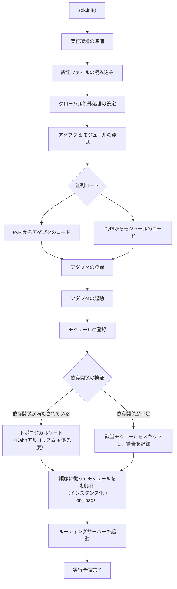

### 初期化段階の詳細

> 完全な初期化フローの分解（Finder / Loader / Manager / Router）、下層エントリポイント（`init()` / `init_task()` / `init_sync()`）および手動での完全起動については [起動プロセスと手動制御](advanced/startup.md) を参照してください。

## イベント処理フロー

下図は、メッセージがプラットフォームからハンドラへと流れる完全な経路を示しています：

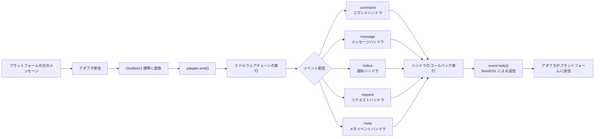

### イベント処理の詳細な流れ

上記の図は「結果」です。以下は `adapter.emit()` を分解した後、フレームワークが**背景で何を行っているか**を示すものです。これは3層に分かれた配信の流れです：

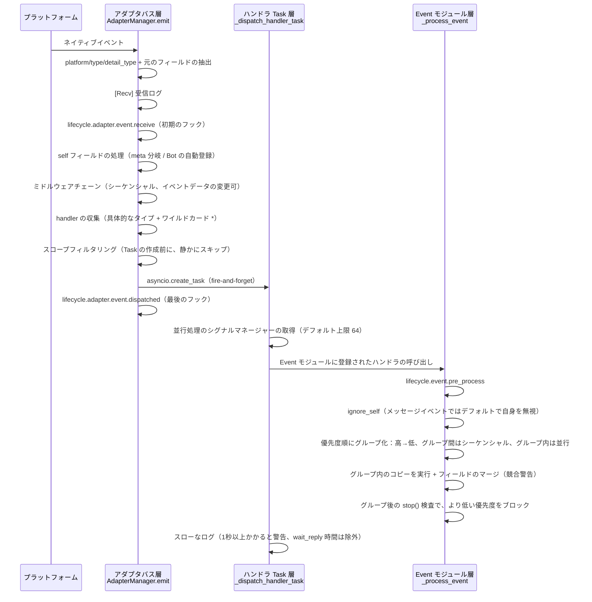

**フレームワークが何を行ったか、そしてあなたが何を介入できるか：**

| 階段 | フレームワークが何を行ったか | 介入できる内容 |
|------|-------------|-----------|
| 受信 | 標準フィールドの抽出、`{platform}_raw` の元データの保持；`[Recv]` ログの記録 | `adapter.event.receive` を監視して初期のイベントを取得 |
| self フィールド | meta イベントは connect/disconnect/heartbeat 分岐を経る；通常のイベントは Bot を自動登録し、`adapter.bot.online` をトリガー | `adapter.bot.online` / `bot.offline` を監視 |
| ミドルウェア | **シーケンシャル**に実行、戻り値が None でなければイベントデータを置き換え | ミドルウェアを登録してイベントを変更/ブロック |
| 分配・収集 | 先に具体的なタイプの handler を取り、次に `*` ワイルドカードの handler を取り | — |
| スコープフィルタリング | owner に基づいて `scope.is_allowed` を判定（セッションレベル > Bot レベル > プラットフォームレベル）、**不正な場合は静かにスキップ** | スコープのホワイトリスト/ブラックリストを設定 |
| スケジューリング | 各マッチする handler に独立した `asyncio.Task` を作成、`emit()` は **handler の完了を待たずに即座に返却** | — |
| 優先度 | 高優先度のグループが先に実行、**グループ間はシーケンシャル、グループ内は並行**（グループ内では各 handler がイベントのコピーを持ち、フィールドを変更して元のイベントにマージ、競合時は WARNING を出力） | `@command(..., priority=N)` / 登録時に priority を指定 |
| ブロック | 各グループの処理後に `event.is_stopped()` をチェックし、一致すれば**より低い優先度を実行しない** | `event.mark_processed(stop=True)` / `event.done()` |

> **よくある誤解**：
> 1. **スコープフィルタリングは静かに**——遮断された handler はエラーも返答もせず、TRACE レベルのログ（`core.scope.denied`）にのみ表示されます。「自分のモジュールがメッセージを受け取っていない」場合は、まずスコープのバインドを確認してください。
> 2. **handler は天然に並行**——フレームワークは各 handler に独立した Task を作成しているので、**自分で `asyncio.create_task` をラップする必要はありません**。
> 3. **同じ優先度のグループ内ではブロックしない**——`mark_processed(stop=True)` は、より低い優先度のグループをブロックするだけで、同じグループ内の既に並行実行中の handler は途中で中断されません。
> 4. **スローなログの閾値は固定の1秒**——ハンドラの処理時間が1秒を超えると、ログに WARNING が出力されます（`wait_reply` の待機時間は処理時間から除外されていますが、実行は中断されません）。

> スコープの3段階のバインドと優先度の詳細は [スコープシステム](advanced/scope.md) を参照してください。claim/ブロックの完全な意味は [イベント処理の入門](getting-started/event-handling.md) を参照してください。並行処理の上限の設定は [設定ガイド](user-guide/configuration.md#フレームワーク設定) を参照してください。

## ライフサイクルイベント

下図は、フレームワークの各コンポーネントがライフサイクルイベントをどのように発生させるかを示しています：

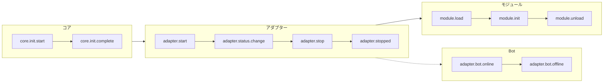

### ライフサイクルイベントの監視

> 完全なイベント監視メソッド（`lifecycle.on()` / `once()` / `has_handlers()`）、すべてのライフサイクルイベントリストとデータ形式は [ライフサイクル管理](advanced/lifecycle.md) を参照してください。

## モジュールのロード戦略

ErisPulse は、`get_load_strategy()` が返す `ModuleLoadStrategy` によって宣言される 3 つのモジュールロード戦略をサポートしています：

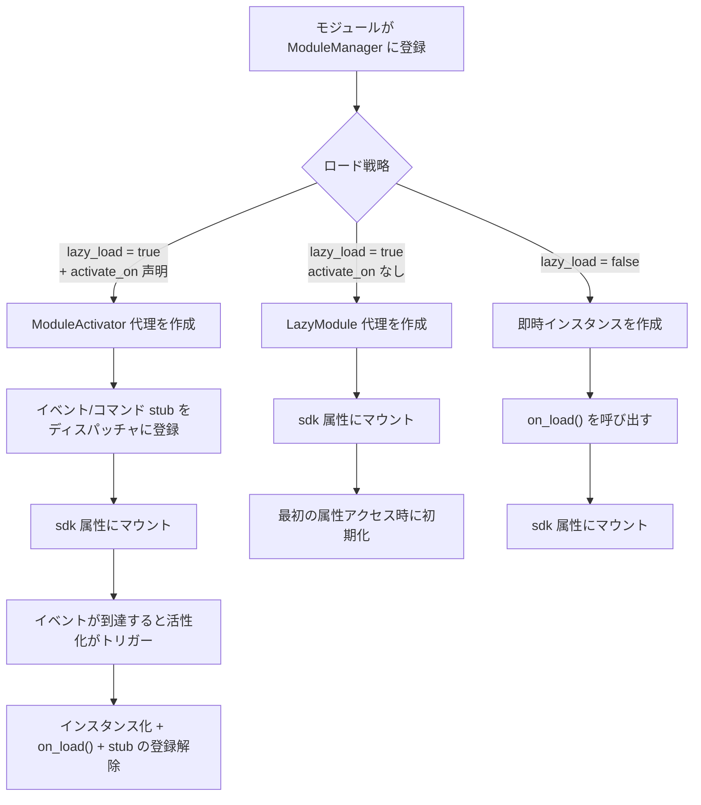

> 詳細については、[遅延ロードシステム](advanced/lazy-loading.md)、[ライフサイクル管理](advanced/lifecycle.md) およびモジュールのドキュメントを参照してください。

### イベント駆動の遅延活性化（`activate_on`）トリガー構造

> [!NOTE]
> この機能には ErisPulse **2.8.0+** が必要です。

`activate_on` により、モジュールは**最初の一致するイベント/コマンドが到達した時点で**のみロードされるようになり、メモリ常駐を回避しながら、イベントのロスを防ぐことができます：

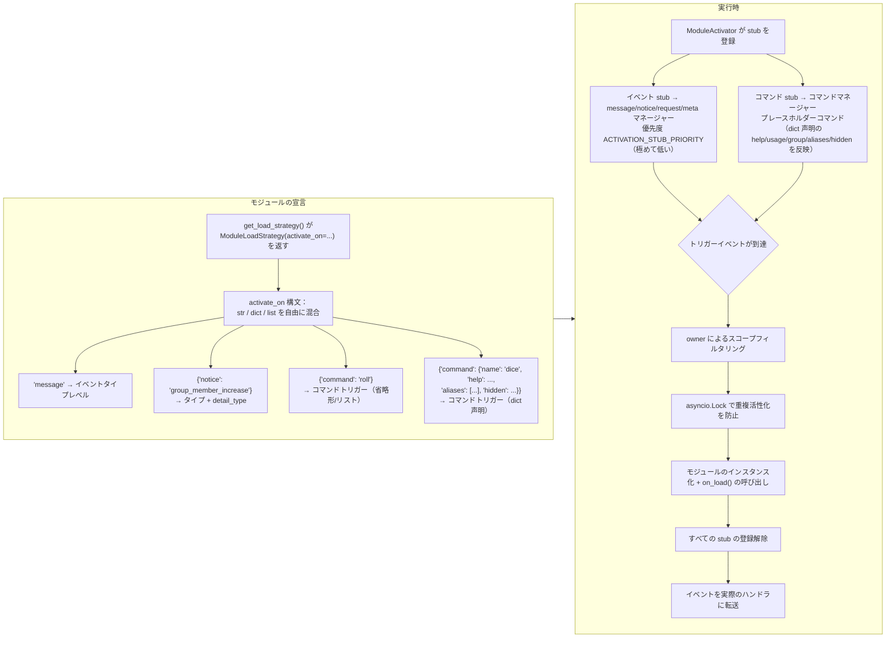

**トリガーの意味要点：**

> 完全な `activate_on` 構文（str / dict / list）、コマンド dict 声明、プレースホルダーコマンドの help フォールバックチェーン、スコープフィルタリング、および失敗時の意味については、[遅延ロードシステム](advanced/lazy-loading.md#イベント駆動の遅延活性化activate_on) を参照してください。

## ローカルプラグインフォルダのアーキテクチャ

> [!NOTE]
> この機能は ErisPulse **2.8.0+** が必要です。

ローカルプラグイン（`plugins/` 目录）はパッケージ化して公開する必要がなく、フレームワークの起動時に自動的に発見・ロードされます：

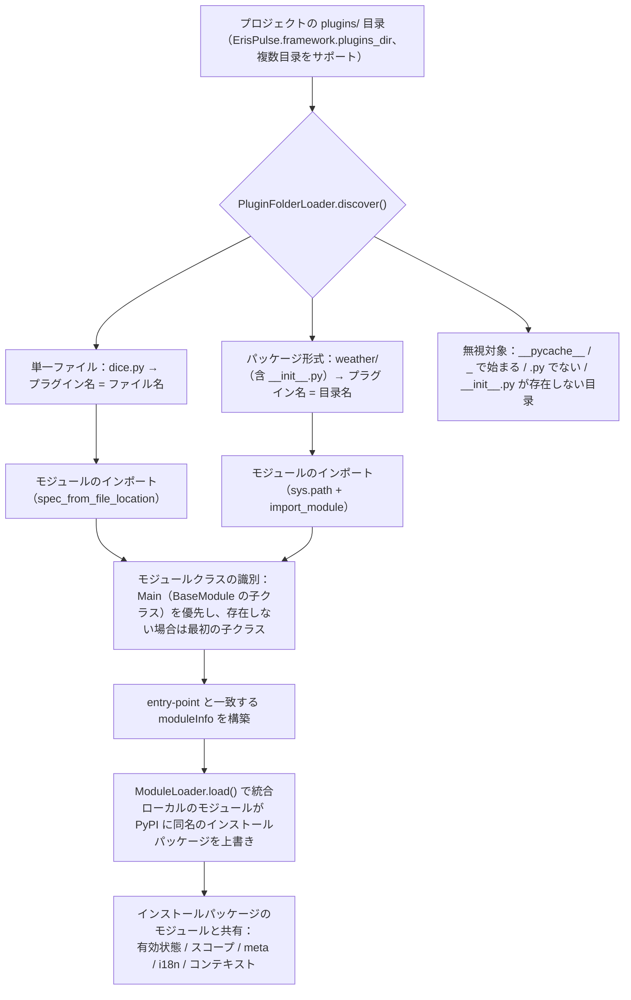

**規約と特性：**

- プラグイン名の取得方法：単一ファイルはファイル名、パッケージ形式は目录名
- ローカルプラグインの `moduleInfo.meta.source == "plugin_folder"` であり、PyPI でインストールされたパッケージモジュールとシームレスに共存
- 同名のモジュールがある場合、ローカルのモジュールが優先（ローカルでの上書きデバッグが可能）、無効化された場合、同名の entry-point 条目も同時に削除

## ローカルプラグインのホットリロードアーキテクチャ

ホットリロードはプラグインファイルの変更を監視し、対応するプラグインを自動的に再読み込みします：

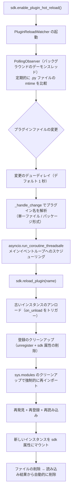

[**English**](docs/ja/quick-start.md)


====
快速上手
====


### 快速开始

# クイックスタート

> **これがあなたの最初の一歩です。** 5分で ErisPulse ボットをゼロから構築しましょう。

## ErisPulse のインストール

### クイックインストールスクリプト（推奨）

インストールスクリプトは、環境（Docker、Python、uv）を自動的に検出し、最適なインストール方法を案内します。

Windows (PowerShell):
```powershell
irm https://get.erisdev.com/install.ps1 -OutFile install.ps1; powershell -ExecutionPolicy Bypass -File install.ps1
```

macOS / Linux:
```bash
curl -fsSL https://get.erisdev.com/install.sh -o install.sh && chmod +x install.sh && ./install.sh
```

スクリプトは、以下の手順を案内します。

- **Docker インストール**（Docker を検出した場合に推奨）：レジストリ（Docker Hub / GHCR）、バージョンチャンネル（安定版 / ベータ版）、Dashboard 管理パネルの設定、ポート設定の選択
- **従来のインストール**：仮想環境の自動作成、ErisPulse のバージョン選択、Dashboard 管理パネルモジュールのオプションインストール

### Docker を使用する

Docker イメージには、ErisPulse フレームワークと Dashboard 管理パネルがすでに組み込まれています。

```bash
# docker-compose.yml のダウンロード
curl -O https://raw.githubusercontent.com/ErisPulse/ErisPulse/main/docker-compose.yml

# Dashboard トークンを設定して起動
ERISPULSE_DASHBOARD_TOKEN=your-token docker compose up -d
```

<details>
<summary>Docker Hub が使用できない場合？</summary>

GitHub Container Registry のイメージを使用するには、`docker-compose.yml` で `image` を以下のように変更します。

```yaml
image: ghcr.io/erispulse/erispulse:latest
```

</details>

起動後、`http://<host>:8000/Dashboard` にアクセスし、設定したトークンでログインします。

### pip を使用してインストールする

Python のバージョンが >= 3.10 であることを確認し、pip を使用してインストールします。

```bash
pip install ErisPulse
```

[uv](https://github.com/astral-sh/uv) を既にインストールしている場合は、`uv pip install ErisPulse` を使用することもできます。こちらの方がインストール速度が速いです。

## プロジェクトの初期化

### インタラクティブ初期化（推奨）

```bash
epsdk init
```

これによりインタラクティブなウィザードが起動し、以下の手順をガイドします：
- プロジェクト名の設定
- ログレベルの設定
- サーバー設定（ホストとポート）
- アダプタの選択と設定
- プロジェクト構造の作成

### クイック初期化

```bash
# プロジェクト名を指定するクイックモード
epsdk init -q -n my_bot

# またはプロジェクト名のみ指定
epsdk init -n my_bot
```

### 手動でのプロジェクト作成

手動でプロジェクトを作成する場合：

```bash
mkdir my_bot && cd my_bot
epsdk init

## モジュールのインストール

### CLI によるインストール

```bash
epsdk install Yunhu AIChat
```

### 使用可能なモジュールを確認する

```bash
epsdk list-remote
```

### インタラクティブなインストール

パッケージ名を指定しない場合、インタラクティブなインストール画面に入ります：

```bash
epsdk install

## プロジェクトの実行

```bash
# 通常実行
epsdk run main.py

# リロードモード（開発時におすすめ）
epsdk run main.py --reload

## IDE補完の有効化（オプション）

ErisPulse の動的発見モジュール/アダプタについて、IDE はデフォルトでプラットフォーム固有のメソッドを補完できません。
次のコマンドを実行して型スタブを生成します。

```bash
epsdk types
```

生成後、インポートした型を変数としてアノテーションすれば、正確な補完が得られます（詳細は [IDE 補完ガイド](docs/ja/getting-started/ide-completion.md) を参照）：

```python
from _ep_types import Yunhu
from ErisPulse import sdk

adapter: Yunhu = sdk.adapter.get("yunhu")
await adapter.Send.To("group", "123").Board(...)  # プラットフォーム固有のメソッドを補完

## プロジェクト構造

初期化後のプロジェクト構造：

```
my_bot/
├── config/
│   └── config.toml          # 設定ファイル
└── main.py                  # エントリーポイント

## 設定ファイル

基本的な `config.toml` 設定：

```toml
[ErisPulse.server]
host = "0.0.0.0"
port = 8000

[ErisPulse.logger]
level = "INFO"

[Yunhu_Adapter]
# アダプタ設定

## 次のステップ

ロボットが起動した後、必要に応じて以下を続行できます：

**フレームワークの仕組みを知りたい？**
- [基本概念](getting-started/basic-concepts.md) — アダプタ / モジュール / イベント の設計
- [アーキテクチャ概要](architecture.md) — 可視化アーキテクチャ図

**より多くの機能を実装したい？**
- [一般的なタスクの例](getting-started/common-tasks.md) — ストレージ、定期タスク、権限制御
- [イベント処理の入門](getting-started/event-handling.md) — メッセージ、通知、リクエスト処理

**独自のモジュール / アダプタを開発したい？**
- [モジュール開発の入門](developer-guide/modules/getting-started.md)
- [アダプタ開発の入門](developer-guide/adapters/getting-started.md)

**必要に応じて参照：**
- [設定ファイルの説明](user-guide/configuration.md) · [CLI コマンド](user-guide/cli-reference.md) · [デプロイメントガイド](user-guide/deployment.md)


### 创建第一个机器人

# 最初のロボットを作成する

このガイドでは、[5 分で始める](../quick-start.md)をもとに、最初のコマンドハンドラを記述し、実行メカニズムを理解します。

> ErisPulse をまだインストールしていない、またはプロジェクトを初期化していない場合は、まず [5 分で始める](../quick-start.md) の「インストール」「プロジェクトの初期化」「プロジェクトの実行」の 3 つの手順を完了してください。

## ステップ 1: 最初のコマンドを記述する

`main.py` を開き、シンプルなコマンドハンドラを記述します：

```python
from ErisPulse import sdk
from ErisPulse.Core.Event import command

@command("hello", help="挨拶メッセージを送信")
async def hello_handler(event):
    """hello コマンドを処理"""
    user_name = event.get_user_nickname() or "友達"
    await event.reply(f"こんにちは、{user_name}！私は ErisPulse ロボットです。")

@command("ping", help="ロボットがオンラインかテスト")
async def ping_handler(event):
    """ping コマンドを処理"""
    await event.reply("Pong！ロボットは正常に動作しています。")

async def main():
    """メインエントリポイント"""
    print("ErisPulse を起動しています...")
    
    # keep_running=True（デフォルト）：フレームワークはブロックして実行を維持し、終了信号（例：Ctrl+C）を受信するまで停止しません
    await sdk.run(keep_running=True)

if __name__ == "__main__":
    import asyncio
    asyncio.run(main())
```

### `keep_running` パラメータ

`sdk.run(keep_running)` は、フレームワークが実行をブロックして維持するかどうかを制御します：

- **`keep_running=True`（デフォルト）**：`run()` は終了信号（例：Ctrl+C）を受信するまでブロックし続けます。これは純粋な bot アプリケーションに適しています。
- **`keep_running=False`**：`run()` は初期化後に即座に返り、**フレームワークはアンロードされません**。起動したアダプタ/モジュールはバックグラウンドタスクとしてメッセージイベントを処理し続け、イベントループが終了するまで独自のロジックを実行できます。例：

```python
async def main():
    await sdk.run(keep_running=False)   # 初期化後に即座に返る
    # フレームワークはバックグラウンドで実行中、ここでは他の処理を続行できる
    while True:
        await asyncio.sleep(3600)
        print("1 時間ごとにチェック")
```

> `run()` の 2 つのモードに加え、`init()`/`uninit()` を用いたライフサイクルの手動制御、個別のアダプタ/ルーティングの起動・停止など、より細かい制御方法もあります。[起動フローと手動制御](../advanced/startup.md)を参照してください。

## ステップ 2: ロボットを実行する

```bash
# 通常実行
epsdk run main.py

# 開発モード（ホットリロードをサポート）
epsdk run main.py --reload
```

## ステップ 3: ロボットをテストする

チャットプラットフォームでコマンドを送信します：

```
/hello
```

ロボットからの返信が届くはずです。

## コードの説明

### コマンドデコレータ

```python
@command("hello", help="挨拶メッセージを送信")
```

- `hello`：コマンド名、ユーザーは `/hello` で呼び出します
- `help`：コマンドのヘルプ説明、`/help` コマンドで表示されます

### イベントパラメータ

```python
async def hello_handler(event):
```

`event` パラメータは Event オブジェクトで、以下を含みます：
- メッセージ内容：`event.get_text()`
- 送信者情報：`event.get_user_id()`、`event.get_user_nickname()`
- プラットフォーム情報：`event.get_platform()`
- グループ情報：`event.get_group_id()`
- 元データ：`event.get_raw()`

> 完全な Event オブジェクトのメソッドは [Event 包装クラスの詳細](../developer-guide/modules/event-wrapper.md) を参照してください。

### レスポンスの送信

```python
await event.reply("レスポンス内容")
```

`event.reply()` は、送信者にメッセージを送信するための便利なメソッドです。

## 拡張：より多くの機能を追加する

ErisPulse は豊富なイベント処理とデータ処理機能を提供します：

- **メッセージ監視**：`@message.on_message()` を使用して、さまざまなメッセージを監視 → [イベント処理の入門](event-handling.md)
- **通知監視**：`@notice.on_friend_add()` などを使用して、システム通知を監視 → [イベント処理の入門](event-handling.md)
- **データ保存**：`sdk.storage.get/set` を使用して、永続化データを保存 → [一般的なタスクの例](common-tasks.md)

## 一般的な問題

### コマンドが反応しない？

1. アダプタが正しく設定されているか確認し、`config/config.toml` でアダプタの `status` が `true` であることを確認します。
2. ターミナルのログ出力を確認し、エラー情報（特に `ERROR` レベルのログ）がないか確認します。
3. コマンドのプレフィックスが正しいか確認します（デフォルトは `/` です）。設定ファイルの `[ErisPulse.event.command]` 部分を確認してください。
4. コマンド名のスペルが正しいか確認し、大文字小文字の区別が有効かどうかを確認します。

### コマンドプレフィックスを変更するには？

`config.toml` に追加します：

```toml
[ErisPulse.event.command]
prefix = "!"
case_sensitive = false
```

### 複数のプラットフォームをサポートするには？

ErisPulse は OneBot12 標準を使用して、異なるプラットフォームのイベント形式を統一しています。`@command` および `@message` で登録されたハンドラは、すべてのプラットフォームのイベントを自動的に受け取ります。`event.get_platform()` を使用して、送信元のプラットフォームを区別できます：

```python
@command("hello")
async def hello_handler(event):
    platform = event.get_platform()
    
    if platform == "yunhu":
        await event.reply("こんにちは！雲湖から")
    elif platform == "telegram":
        await event.reply("Hello! From Telegram")
    else:
        await event.reply("こんにちは！")
```

> 複数のプラットフォームへの対応テクニックについては、[一般的なタスクの例](common-tasks.md#多プラットフォーム対応)を参照してください。

## 次のステップ

- [基本概念](basic-concepts.md) - ErisPulse のコアコンセプトを深く理解する
- [イベント処理の入門](event-handling.md) - さまざまなイベントの処理方法を学ぶ
- [一般的なタスクの例](common-tasks.md) - より実用的な機能を習得する


### 基础概念

# 基本概念

このガイドでは ErisPulse の核心概念を紹介し、フレームワークの設計思想と基本的なアーキテクチャを理解するのに役立ちます。

## イベント駆動型アーキテクチャ

ErisPulse はイベント駆動型アーキテクチャを採用しており、すべての対話はイベントを介して送信および処理されます。

### イベントフロー

```
ユーザーがメッセージを送信
      │
      ▼
プラットフォームが受信
      │
      ▼
アダプタがプラットフォームのネイティブイベントを受信
      │
      ▼
OneBot12 標準イベントへ変換
      │
      ▼
イベントシステムへ提出
      │
      ▼
登録済みハンドラーへ配信
      │
      ▼
モジュールがイベントを処理
      │
      ▼
アダプタ経由でレスポンスを送信
      │
      ▼
プラットフォームがユーザーに表示
```

### OneBot12 標準

ErisPulse は OneBot12 をコアイベント標準として使用します。OneBot12 は汎用チャットボットアプリケーションインターフェース標準であり、統一されたイベント形式を定義しています。

すべてのアダプタは、プラットフォーム固有のイベントを OneBot12 形式に変換し、コードの一貫性を保証します。

## コアコンポーネント

### 1. SDK オブジェクト

SDK はすべての機能の統一されたエントリーポイントであり、コアコンポーネントへのアクセスを提供します。

```python
from ErisPulse import sdk

# コアモジュールへのアクセス
sdk.storage    # ストレージシステム
sdk.config     # 設定システム
sdk.logger     # ロギングシステム
sdk.adapter    # アダプタシステム
sdk.module     # モジュールシステム
sdk.router     # ルーティングシステム
sdk.client     # HTTPクライアント
sdk.lifecycle  # ライフサイクルシステム
```

### 2. Event オブジェクト

Event オブジェクトはイベントデータをカプセル化し、便利なアクセスメソッドを提供します。

```python
@command("info")
async def info_handler(event):
    # イベント情報の取得
    event_id = event.get_id()
    user_id = event.get_user_id()
    platform = event.get_platform()
    text = event.get_text()
    
    # 返信を送信
    await event.reply(f"ユーザー: {user_id}, プラットフォーム: {platform}")
```

### 3. アダプタ

アダプタは ErisPulse と外部プラットフォームの間の橋渡しです。

**責任：**
- プラットフォームのネイティブイベントを受信
- OneBot12 標準形式へ変換
- 標準形式イベントをプラットフォームへ送信

**サンプルアダプタ：**
- Yunhu アダプタ：Yunhu プラットフォームと通信
- Telegram アダプタ：Telegram Bot API と通信
- OneBot11 アダプタ：OneBot11 互換のアプリケーションと通信
- Email アダプタ：メールの送受信を処理

### 4. モジュール

モジュールは機能拡張の基本単位であり、以下のことが可能です。

- イベントハンドラーを登録
- ビジネスロジックを実装
- アダプタを使用してメッセージを送信
- コアモジュールが提供するサービスを使用

#### モジュール検出メカニズム

ErisPulse は Python の `importlib.metadata.entry_points` を使用してインストール済みのモジュールを検出します。モジュールは `pyproject.toml` でエントリーポイントを宣言します：

```toml
[project.entry-points."erispulse.module"]
MyModule = "my_package:Main"
```

SDK の初期化時に、すべての `erispulse.module` グループのエントリーポイントがスキャンされ、モジュールクラスが `ModuleManager` に登録され、依存関係のトポロジカルソート後に順次初期化されます。

#### 最小限の使用可能モジュール

```python
from ErisPulse.Core.Bases import BaseModule
from ErisPulse import sdk

class Main(BaseModule):
    def __init__(self):
        self.sdk = sdk
        self.logger = sdk.logger.get_child("MyModule")

    async def on_load(self, event):
        self.logger.info("モジュールがロードされました")

    async def on_unload(self, event):
        self.logger.info("モジュールがアンロードされました")
```

#### モジュールライフサイクル

- **登録**：SDK がモジュールクラスを発見してマネージャーに登録
- **ロード**：モジュールインスタンスを作成し、`on_load(event)` を呼び出し（`event = {"module_name": "MyModule"}`）
- **アンロード**：`on_unload(event)` を呼び出し、リソースをクリーンアップ

#### ロード戦略

`get_load_strategy()` を使用してモジュールのロード動作を宣言します：

```python
from ErisPulse.loaders import ModuleLoadStrategy

class Main(BaseModule):
    @staticmethod
    def get_load_strategy():
        return ModuleLoadStrategy(
            lazy_load=True,   # レイジーロードを行うかどうか（デフォルト True）
            priority=0        # ロード優先度、数値が大きいほど先に初期化
        )
```

- **`lazy_load=True`（デフォルト）**：初めて `sdk.MyModule` にアクセスされたときにモジュールが初期化され、起動時間を短縮
- **`lazy_load=False`**：SDK の起動時に即時初期化、ライフサイクルイベントを監視するモジュールや定時タスクを実行するモジュールに適している
- **`priority`**：優先度が同じモジュールは登録順でロード；数値が大きいほど先に初期化

> 詳細なレイジーロードメカニズムについては、[レイジーロードシステム](../advanced/lazy-loading.md)を参照してください。

## イベントタイプ

ErisPulse は 5 つの種類のイベントをサポートしています。

| イベントタイプ | デコレータ | 説明 |
|---------|--------|------|
| メッセージイベント | `@message.on_message()` | ユーザーが送信する任意のメッセージ（プライベートチャット、グループチャット） |
| コマンドイベント | `@command("name")` | コマンドプレフィックスで始まるメッセージ（例：`/hello`） |
| 通知イベント | `@notice.on_friend_add()` 等 | システム通知（フレンド追加、メンバー変更など） |
| リクエストイベント | `@request.on_friend_request()` 等 | ユーザーリクエスト（フレンド申請、グループ招待） |
| メタイベント | `@meta.on_connect()` 等 | システムレベルイベント（接続、切断、ハートビート） |

> 各イベントタイプの詳細な使用法とコード例については、[イベント処理入門](event-handling.md)を参照してください。

## コアモジュールの説明

### Storage（ストレージ）

SQLite ベースのキーバリューストレージシステムで、永続化データに使用されます。

```python
# 値の設定
sdk.storage.set("key", "value")

# 値の取得
value = sdk.storage.get("key", "default_value")

# バッチ操作
sdk.storage.set_multi({
    "key1": "value1",
    "key2": "value2"
})

# トランザクション
with sdk.storage.transaction():
    sdk.storage.set("key1", "value1")
    sdk.storage.set("key2", "value2")
```

### Config（設定）

TOML形式の設定ファイル管理。

```python
# 設定の取得
config = sdk.config.getConfig("MyModule", {})

# 設定の設定
sdk.config.setConfig("MyModule", {"key": "value"})

# ネストされた設定の読み込み
value = sdk.config.getConfig("MyModule.subkey", "default")
```

### Logger（ログ）

モジュラーログシステム。

```python
# ログの記録
sdk.logger.info("これは情報です")
sdk.logger.warning("これは警告です")
sdk.logger.error("これはエラーです")

# 子ロガーの取得
child_logger = sdk.logger.get_child("submodule")
child_logger.info("サブモジュールログ")
```

**属性アクセスシンタックスシュガー**

`get_child()` メソッドを使用する以外に、**属性アクセス**の方法で子ロガーを作成することもでき、これはより簡潔な**シンタックスシュガー**の記述方法です：

```python
# 属性アクセスで子ロガーを作成
sdk.logger.mymodule.info("モジュールメッセージ")

# ネストされたアクセスをサポート
sdk.logger.mymodule.database.info("データベースメッセージ")
```

### Router（ルーティング）

HTTP および WebSocket ルーティング管理、FastAPI + Uvicorn ベース。デコレータルーティング、ミドルウェア、グループ化、レート制限、CORS をサポートします。

```python
from ErisPulse.Core import HttpRequest

@sdk.router.get("MyModule", "/api")
async def handler(request: HttpRequest):
    data = await request.json()
    return {"status": "ok"}
```

> 完全なルーティング API（WebSocket、ミドルウェア、レート制限、CORS など）については、[ルーティングマネージャー](../advanced/router.md)を参照してください。

### Client（ネットワーククライアント）

統合されたネットワーククライアントで、HTTP リクエスト、WebSocket 接続、コネクションプール管理、自動再試行、タイムアウト制御、リクエスト統計、ライフサイクルイベント統合を集約しています。

```python
from ErisPulse.Core import client

# HTTP リクエスト
resp = await client.get("https://api.example.com/users")
data = await resp.json()

# 再試行とタイムアウト付き
resp = await client.get(url, timeout=30, max_retries=3)

# WebSocket 接続
ws = await client.ws_connect("wss://example.com/ws")
async for text in ws.iter_text():
    await ws.send_text(f"Echo: {text}")
```

> 完全なネットワーククライアント API については、[ネットワーククライアント](../advanced/http-client.md)を参照してください。

## SendDSL メッセージ送信

アダプタはチェーン呼び出しのメッセージ送信インターフェースを提供します。

### 基本送信

```python
# アダプタインスタンスの取得
yunhu = sdk.adapter.get("yunhu")

# メッセージを送信
await yunhu.Send.To("user", "U1001").Text("Hello")

# 送信アカウントを指定
await yunhu.Send.Using("bot1").To("group", "G1001").Text("グループメッセージ")
```

### チェーン修飾

```python
# @ユーザー
await yunhu.Send.To("group", "G1001").At("U2001").Text("@メッセージ")

# 返信メッセージ
await yunhu.Send.To("group", "G1001").Reply("msg123").Text("返信")

# @全体
await yunhu.Send.To("group", "G1001").AtAll().Text("告知")
```

### Event 返信メソッド

Event オブジェクトは便利な返信メソッドを提供します：

```python
@command("test")
async def test_handler(event):
    # 簡単なテキスト返信
    await event.reply("返信内容")
    
    # 画像を送信
    await event.reply("http://example.com/image.jpg", method="Image")
    
    # 音声を送信
    await event.reply("http://example.com/voice.mp3", method="Voice")
```

## レイジーロードシステム

ErisPulse はデフォルトでモジュールレイジーロードを有効にしており、モジュールは初めてアクセスされたとき（`sdk.MyModule` など）にのみ初期化され、起動速度を大幅に向上させます。

```python
from ErisPulse.loaders import ModuleLoadStrategy

class Main(BaseModule):
    @staticmethod
    def get_load_strategy():
        return ModuleLoadStrategy(
            lazy_load=True,   # レイジーロードを有効にする（デフォルト）
            priority=0        # ロード優先度、数値が大きいほど先に初期化
        )
```

**レイジーロードを無効にする必要があるシナリオ（`lazy_load=False`）：**
- ライフサイクルイベントを監視するモジュール（例：`core.init.complete`）
- 起動時の定時タスクまたはバックグラウンドサービスを実行するモジュール
- 他のモジュールのロード前に初期化を完了する必要があるモジュール

> 詳細なレイジーロードメカニズムと注意点については、[レイジーロードシステム](../advanced/lazy-loading.md)を参照してください。

## 次のステップ

- [イベント処理入門](event-handling.md) - 各種イベントの処理方法を学ぶ
- [一般的なタスクの例](common-tasks.md) - 一般的な機能の実装をマスターする


### 事件处理入门

# イベント処理の基礎

このガイドでは、ErisPulse 内の各種イベントを処理する方法について説明します。

## イベントタイプの概要

ErisPulse は、以下のイベントタイプをサポートしています。

| イベントタイプ | 説明 | 適用シーン |
|---------|------|---------|
| メッセージイベント | ユーザーから送信されたすべてのメッセージ | チャットボット、コンテンツフィルタリング |
| コマンドイベント | コマンドプレフィックスで始まるメッセージ | コマンド処理、機能への入り口 |
| 通知イベント | システム通知（友達追加、メンバーの変更など） | ウェルカムメッセージ、ステータス通知 |
| リクエストイベント | ユーザーリクエスト（友達リクエスト、グループ招待） | リクエストの自動処理 |
| メタイベント | システムレベルのイベント（接続、ハートビート） | 接続監視、ステータスチェック |

## メッセージイベント処理

> **ヒント**: イベントハンドラーでは `Event` 型アノテーションの使用を推奨します。これにより IDE の自動補完および型チェックのサポートが利用できます。

```python
from ErisPulse.Core.Event import Event  # アノテーション用にイベント型をインポートします
```

### 全メッセージを監听する

```python
from ErisPulse.Core.Event import message, Event

@message.on_message()
async def message_handler(event: Event):
    text = event.get_text()
    user_id = event.get_user_id()
    sdk.logger.info(f"受信した {user_id} のメッセージ: {text}")
```

### プライベートメッセージを監听する

```python
@message.on_private_message()
async def private_handler(event: Event):
    user_id = event.get_user_id()
    await event.reply(f"こんにちは、{user_id}！これはプライベートメッセージです。")
```

### グループメッセージを監听する

```python
@message.on_group_message()
async def group_handler(event: Event):
    group_id = event.get_group_id()
    user_id = event.get_user_id()
    sdk.logger.info(f"グループ {group_id} の {user_id} からメッセージが送信されました")
```

### @メッセージを監听する

```python
@message.on_at_message()
async def at_handler(event: Event):
    # @されたユーザーリストを取得
    mentions = event.get_mentions()
    await event.reply(f"@したユーザー: {mentions}")

## コマンドイベント処理

### 基本コマンド

```python
from ErisPulse.Core.Event import command

@command("help", help="ヘルプ情報を表示します")
async def help_handler(event):
    help_text = """
利用可能なコマンド：
/help - ヘルプを表示
/ping - 接続をテスト
/info - 情報を表示
    """
    await event.reply(help_text)
```

### コマンド別名

```python
@command(["help", "h"], aliases=["help", "h"], help="ヘルプ情報を表示します")
async def help_handler(event):
    await event.reply("ヘルプ情報...")
```

ユーザーは以下のいずれかの方法で呼び出すことができます：
- `/help`
- `/h`
- `/help`

### コマンド引数

```python
@command("echo", help="メッセージをエコーします")
async def echo_handler(event):
    # コマンド引数を取得
    args = event.get_command_args()
    
    if not args:
        await event.reply("エコーするメッセージを入力してください")
    else:
        await event.reply(f"あなたが言った: {' '.join(args)}")
```

### コマンドグループ

```python
@command("admin.reload", group="admin", help="モジュールを再読み込みします")
async def reload_handler(event):
    await event.reply("モジュールを再読み込みしました")

@command("admin.stop", group="admin", help="ロボットを停止します")
async def stop_handler(event):
    await event.reply("ロボットを停止しました")
```

### コマンド権限

```python
def is_master(event):
    """ユーザーがフレームワークの所有者かをチェックします"""
    master_list = ["user123", "user456"]
    return event.get_user_id() in master_list

@command("master", permission=is_master, help="フレームワーク所有者用コマンド")
async def master_handler(event):
    await event.reply("これはフレームワーク所有者用のコマンドです")
```

### コマンド優先度

```python
# 優先度の数値が大きいほど、実行が早くなります
@message.on_message(priority=10)
async def high_priority_handler(event):
    await event.reply("高優先度のハンドラ")

@message.on_message(priority=1)
async def low_priority_handler(event):
    await event.reply("低優先度のハンドラ")
```

### 並列イベント処理

ErisPulse のイベントシステムは**同優先度では並列、異なる優先度では直列**のスケジューリングモデルを採用しています：

```
イベント到着
    ↓
priority=10 組: [ハンドラC || ハンドラD] 並列 → 結果をマージ
    ↓ (中断されない場合)
priority=0 組: [ハンドラA || ハンドラB] 並列 → 結果をマージ
    ↓
...
```

- **同優先度並列**：優先度が同じ複数のハンドラは同時に実行され、スループットが向上します
- **跨優先度直列**：異なる優先度のグループは順番に実行されます（数値が大きいほど先に実行）、高優先度ハンドラが先に実行されることを保証します
- **Copy-On-Write**：ハンドラが変更を行わない場合、コピーを作成せず、オーバーヘッドをゼロにします
- **競合処理**：同優先度の複数ハンドラが同じフィールドを変更した場合、最後に変更された値が使用され、警告ログが記録されます
- **中断メカニズム**：任意のハンドラが `event.done()`（デフォルト）または `event.done(claim=False)` を呼び出した後、以降の低優先度グループはスキップされます。認領とブロッキングの違いは下記の[「リンク制御：認領とブロッキング」](docs/ja/event-handling.md#リンク制御認領とブロッキング)を参照してください。

```python
# 例：同優先度ハンドラの並列実行
@message.on_message(priority=0)
async def handler_a(event):
    # タスクAを処理
    event['result_a'] = process_a()

@message.on_message(priority=0)
async def handler_b(event):
    # handler_a と並列に実行
    event['result_b'] = process_b()

# 異なる優先度の直列実行
@message.on_message(priority=10)
async def handler_c(event):
    # 最も優先度が高い、最初に実行されます
    pass
```

> **並列上限**：一致するハンドラのすべての Task は**即座に作成**されますが、**同時に実行される数**を制限するための信号量によって制御され、デフォルトの上限は **64**（`ErisPulse.framework.handler_max_concurrency`、ホットアップデート対応）です。上限を超えた Task は信号量上でキューイングされ、前の処理が完了した後に実行されます。イベントのピーク時には、これが「圧力調整弁」となります。
>
> **遅延ログ**：個々のハンドラが **1 秒**以上処理にかかった場合、フレームワークは WARNING ログを出力します（`handler_slow`）。`wait_reply` の待機時間は処理時間から除外され、「返信を待つ」ことで誤って遅延と判定されることはありません。

## スコープフィルタリング：なぜ私のモジュールはメッセージを受け取らないのか

イベントの配信は、**ハンドラ Task の作成前に**スコープフィルタリングが行われます。これは、モジュールの所有者に基づいて `scope.is_allowed` を判定（セッションレベル > Bot レベル > プラットフォームレベル）し、**通過しない場合は静かにスキップ**され、エラーもレスポンスも出ません。

```python
# 仮に config.toml で MyModule を特定のグループにブロックしている場合：
[ErisPulse.scope]
block = { yunhu = { group_123 = ["MyModule"] } }
```

この場合、そのグループのメッセージが到着しても、`MyModule` のコマンドやイベントハンドラは**いずれもスケジュールされません**。これはバグではなく、スコープメカニズムによるものです。モジュールが反応しない問題を調査する際には、まずスコープのバインディングを確認してください。

- 3段階のフィルタリングポイント：アダプターバスレベル（Task の作成前）、Event モジュールレベル（各優先度グループ内）、コマンドレベル（権限チェック前）
- フィルタリングのログは **TRACE** レベルでのみ表示されます（`core.scope.denied`）。デフォルトの INFO レベルでは、何も表示されません。
- フレームワークレベルのハンドラ（例：コマンドディスパッチャー `scope_exempt=True`）は、スコープの影響を受けません。

> スコープの3段階バインディング、ホワイトリスト/ブラックリスト、優先度のオーバーライド、および「default_allow」による暗黙の拒否の意味については、[スコープシステム](../../advanced/scope.md)を参照してください。

## リンク制御：認領とブロック

> [!NOTE]  
> `event.done()` / `event.mark_processed()` の `claim=` / `stop=` パラメータは、この機能には ErisPulse **2.7.1+** が必要です。

ErisPulse では、「認領」と「ブロック」の 2 つの正交的な意味を分離し、`event.done()` で一元的に制御することで、コマンド処理の周囲にログ、監査、権限などの観察層を重ねることが容易になります。

**2 つの概念の正確な定義：**

- **認領（claim）**：イベントがこのプロセッサによって処理されたことをマークします（`_processed` に書き込み）。コマンドディスパッチャは、認領済みのイベントを**スキップ**します——同じメッセージが複数のコマンドプロセッサによって繰り返し処理されるのを防ぎます。典型的なシナリオ：コマンドが正常にマッチした後に認領し、コマンドディスパッチャが再び介入しないようにします。
- **ブロック（stop）**：イベントが**より低い優先度**のプロセッサに伝播するのを阻止します（`_propagation_stopped` に書き込み）。低い優先度のプロセッサ（例：`on_message`）は、このイベントを見なくなります。典型的なシナリオ：高い優先度のプロセッサがイベントを完全に処理したため、低い優先度のプロセッサが再度実行されないようにする。

| `event.done(...)` | 認領 | ブロック | 場面 |
|-------------------|------|------|------|
| `event.done()` | ✔ | ✔ | コマンド / プロセッサが処理完了した際の標準的な方法 |
| `event.done(stop=False)` | ✔ | ✘ | 認領のみ：低い優先度の観察者（ログ / 統計）は引き続きイベントを見ることができます |
| `event.done(claim=False)` | ✘ | ✔ | ブロックのみ（例：ファイアウォール / 限流）：認領は行わず、低い優先度の処理は実行されません |

`event.done(claim=, stop=)` は `event.mark_processed(claim=, stop=)` のエイリアスであり、両者はパラメータと動作が完全に等価です。

```python
@command("help")
async def help_cmd(event):
    event.done()            # 認領 + ブロック（コマンド処理完了の標準的な方法）

@message.on_message(priority=50)
async def observer(event):
    event.done(stop=False)  # 認領のみ：低い優先度の処理が引き続き実行されます（ログ / 統計）

@message.on_message(priority=100)
async def firewall(event):
    if denied(event):
        event.done(claim=False)  # ブロックのみ：低い優先度の処理は実行されず、認領も行いません
```

### コマンドと返信の block 設定

コマンドがマッチした後、または `wait_reply` が返信をマッチした後、デフォルトではイベントの伝播がブロックされます（後方互換性のため）。この設定を変更することで、低い優先度のプロセッサ（ログ / 監査 / 権限）がこれらのメッセージを観察できるようにすることができます。

```toml
[ErisPulse.event.command]
block = false   # コマンドメッセージは低い優先度のプロセッサに引き続き伝播します

[ErisPulse.event.wait_reply]
block = false   # wait_reply によって消費された返信は、低い優先度のプロセッサに引き続き伝播します

## 通知イベント処理

### 親友追加

```python
from ErisPulse.Core.Event import notice

@notice.on_friend_add()
async def friend_add_handler(event):
    user_id = event.get_user_id()
    nickname = event.get_user_nickname() or "新しい友達"
    await event.reply(f"{nickname}さん、私の友人として追加していただきありがとうございます！")
```

### グループメンバー増加

```python
@notice.on_group_increase()
async def member_increase_handler(event):
    group_id = event.get_group_id()
    user_id = event.get_user_id()
    await event.reply(f"{user_id}さんがグループ {group_id} に参加しました。")
```

### グループメンバー減少

```python
@notice.on_group_decrease()
async def member_decrease_handler(event):
    group_id = event.get_group_id()
    user_id = event.get_user_id()
    await event.reply(f"{user_id}さんがグループ {group_id} を退出しました。")

## リクエストイベントの処理

### フレンドリクエスト

```python
from ErisPulse.Core.Event import request

@request.on_friend_request()
async def friend_request_handler(event):
    user_id = event.get_user_id()
    comment = event.get_comment()
    
    sdk.logger.info(f"フレンドリクエストを受信: {user_id}, コメント: {comment}")
    
    # アダプター API を使用してリクエストを処理できます
    # 詳細な実装については各アダプターのドキュメントをご参照ください
```

### グループ招待リクエスト

```python
@request.on_group_request()
async def group_request_handler(event):
    group_id = event.get_group_id()
    user_id = event.get_user_id()
    
    await event.reply(f"グループ {group_id} の招待を受信しました。送信者: {user_id}")

## メタイベント処理

### 接続イベント

```python
from ErisPulse.Core.Event import meta

@meta.on_connect()
async def connect_handler(event):
    platform = event.get_platform()
    sdk.logger.info(f"{platform} プラットフォームに接続しました")

@meta.on_disconnect()
async def disconnect_handler(event):
    platform = event.get_platform()
    sdk.logger.warning(f"{platform} プラットフォームとの接続が切断されました")
```

### ハートビートイベント

```python
@meta.on_heartbeat()
async def heartbeat_handler(event):
    platform = event.get_platform()
    sdk.logger.debug(f"{platform} ハートビート検出")
```

### Bot ステータス照会

アダプタがメタイベントを送信した後、フレームワークは自動的に Bot のステータスを追跡します。いつでも照会できます。

```python
from ErisPulse import sdk

# 特定の Bot がオンラインかどうかをチェック
if sdk.adapter.is_bot_online("telegram", "123456"):
    telegram = sdk.adapter.get("telegram")
    await telegram.Send.To("user", "123456").Text("Bot はオンラインです")

# 現在すべてのオンライン Bot を一覧表示
bots = sdk.adapter.list_bots()
for platform, bot_list in bots.items():
    for bot_id, info in bot_list.items():
        print(f"{platform}/{bot_id}: {info['status']}")

# 完全なステータスサマリーを取得
summary = sdk.adapter.get_status_summary()

## インタラクティブ処理

### `reply` メソッドを使用した返信の送信

`event.reply()` メソッドは、@ 指定や返信などの機能を含むメッセージを送信するために、様々な修飾パラメータをサポートします：

```python
# シンプルな返信
await event.reply("こんにちは")

# 異なるタイプのメッセージを送信
await event.reply("http://example.com/image.jpg", method="Image")  # 画像
await event.reply("http://example.com/voice.mp3", method="Voice")  # 音声

# 個別のユーザーに @ 指定
await event.reply("こんにちは", at_users=["user123"])

# 複数のユーザーに @ 指定
await event.reply("皆さんこんにちは", at_users=["user1", "user2", "user3"])

# メッセージへの返信
await event.reply("返信内容", reply_to="msg_id")

# 全体メンバーに @ 指定
await event.reply("告知", at_all=True)

# 組み合わせ: ユーザーへの @ 指定 + メッセージへの返信
await event.reply("内容", at_users=["user1"], reply_to="msg_id")
```

### ユーザーの返信を待つ

```python
@command("ask", help="ユーザーに問い合わせる")
async def ask_handler(event):
    await event.reply("名前を入力してください：")
    
    # ユーザーの返信を待つ（タイムアウト時間 30 秒）
    reply = await event.wait_reply(timeout=30)
    
    if reply:
        name = reply.get_text()
        await event.reply(f"こんにちは、{name}！")
    else:
        await event.reply("タイムアウトしました。もう一度入力してください。")
```

### 検証付きの返信待機

```python
@command("age", help="年齢を尋ねる")
async def age_handler(event):
    def validate_age(event_data):
        """年齢が有効かどうかを検証"""
        try:
            age = int(event_data.get_text())
            return 0 <= age <= 150
        except ValueError:
            return False
    
    await event.reply("年齢を入力してください (0-150)：")
    
    reply = await event.wait_reply(
        timeout=60,
        validator=validate_age
    )
    
    if reply:
        age = int(reply.get_text())
        await event.reply(f"あなたの年齢は {age} 歳です")
    else:
        await event.reply("入力が無効か、タイムアウトしました")
```

### コールバック付きの返信待機

```python
@command("confirm", help="操作を確認")
async def confirm_handler(event):
    async def handle_confirmation(reply_event):
        text = reply_event.get_text().lower()
        
        if text in ["はい", "yes", "y"]:
            await event.reply("操作が確認されました！")
        else:
            await event.reply("操作がキャンセルされました。")
    
    await event.reply("この操作を実行しますか？(はい/いいえ)")
    
    await event.wait_reply(
        timeout=30,
        callback=handle_confirmation
    )
```

### 確認会話 (confirm)

ユーザーの確認または否定を待ち、組み込みの中国語/英語の確認語を自動的に識別します：

```python
@command("confirm", help="操作を確認")
async def confirm_handler(event):
    if await event.confirm("この操作を実行してもよろしいですか？"):
        await event.reply("確認しました。実行中...")
    else:
        await event.reply("キャンセルされました")

# カスタム確認語
if await event.confirm("続けますか？", yes_words={"go", "続ける"}, no_words={"stop", "停止"}):
    pass
```

### 選択メニュー (choose)

ユーザーはオプション番号またはオプションのテキストで返信できます：

```python
@command("choose", help="選択")
async def choose_handler(event):
    choice = await event.choose(
        "色を選んでください：",
        ["赤色", "緑色", "青色"]
    )
    
    if choice is not None:
        colors = ["赤色", "緑色", "青色"]
        await event.reply(f"あなたが選んだのは：{colors[choice]}")
    else:
        await event.reply("タイムアウトのため選択されませんでした")
```

**マージモード**: `merge_prompt=True` の場合、オプションがプロンプトメッセージに連結され、ユーザーが指定した `method` を使用して1つのメッセージで送信されます：

```python
# マージされたプロンプトとオプションを Markdown で送信
choice = await event.choose(
    "## 色を選んでください\n{options}\n番号を返信してください",
    ["赤色", "緑色", "青色"],
    method="Markdown",
    merge_prompt=True,
)
```

> `{options}` プレースホルダーはオプションの挿入位置を制御します。書かない場合はプロンプトの末尾に追加されます。
> `placeholder` パラメータを使用してプレースホルダーをカスタマイズできます（例：`placeholder="[choices]"`）。
> `options_format="auto"`（デフォルト）は、method に応じてスタイルを自動的に選択します：Markdown → 箇条書き、Html → 番号付きリスト、その他 → 純粋なテキストリスト。
> テキストメソッド（Text/Markdown/Html など）はデフォルトでオプションを末尾にマージします。テキスト以外のメソッド（Image など）はデフォルトで2つのメッセージに分割されます。

### フォーム収集 (collect)

複数ステップでユーザー入力を収集します：

```python
@command("register", help="登録")
async def register_handler(event):
    data = await event.collect([
        {"key": "name", "prompt": "名前を入力してください："},
        {"key": "age", "prompt": "年齢を入力してください：", 
         "validator": lambda e: e.get_text().isdigit()},
        {"key": "email", "prompt": "メールアドレスを入力してください："}
    ])
    
    if data:
        await event.reply(f"登録成功！\n名前：{data['name']}\n年齢：{data['age']}\nメール：{data['email']}")
    else:
        await event.reply("登録のタイムアウトか入力が無効です")
```

### 任意のイベントを待つ (wait_for)

条件を満たす任意のイベント（同一ユーザーに限定されない）を待ちます：

```python
@command("wait_member", help="新しいメンバーを待つ")
async def wait_member_handler(event):
    await event.reply("グループメンバーの参加を待っています...")
    
    evt = await event.wait_for(
        event_type="notice",
        condition=lambda e: e.get_detail_type() == "group_member_increase",
        timeout=120
    )
    
    if evt:
        await event.reply(f"新メンバーへの歓迎：{evt.get_user_id()}")
    else:
        await event.reply("タイムアウトしました")
```

### 多回対話 (conversation)

インタラクティブな多回対話コンテキストを作成します：

```python
@command("survey", help="アンケート調査")
async def survey_handler(event):
    conv = event.conversation(timeout=60)
    
    await conv.say("アンケート調査へのご参加ありがとうございます！")
    
    while conv.is_active:
        reply = await conv.wait()
        
        if reply is None:
            await conv.say("対話がタイムアウトしました、さようなら！")
            break
        
        text = reply.get_text()
        
        if text == "退出":
            await conv.say("さようなら！")
            break
        
        await conv.say(f"あなたは「{text}」と言いました。続けて入力するか、「退出」と入力して終了してください")
```

### 組み込みの確認語

ErisPulse には中国語と英語の確認語のコレクションが組み込まれています：

- **確認語** (`CONFIRM_YES_WORDS`): はい、yes、y、確認、確定、よし、良い、ok、true、はい、うん、行く、同意、問題ありません...
- **否定語** (`CONFIRM_NO_WORDS`): いいえ、no、n、キャンセル、いいえ、しない、できない、cancel、false、間違い、拒否、できません...

## イベントデータへのアクセス

### Event オブジェクトの一般的なメソッド

```python
@command("info")
async def info_handler(event):
    # 基本情報
    event_id = event.get_id()
    event_time = event.get_time()
    event_type = event.get_type()
    detail_type = event.get_detail_type()
    
    # 送信者情報
    user_id = event.get_user_id()
    nickname = event.get_user_nickname()
    
    # メッセージ内容
    message_segments = event.get_message()
    alt_message = event.get_alt_message()
    text = event.get_text()
    
    # グループ情報
    group_id = event.get_group_id()
    
    # ボット情報
    self_id = event.get_self_user_id()
    self_platform = event.get_self_platform()
    
    # 生データ
    raw_data = event.get_raw()
    raw_type = event.get_raw_type()
    
    # プラットフォーム情報
    platform = event.get_platform()
    
    # メッセージタイプの判断
    is_private = event.is_private_message()
    is_group = event.is_group_message()
    is_at = event.is_at_message()
    
    # コマンド情報
    if event.is_command():
        cmd_name = event.get_command_name()
        cmd_args = event.get_command_args()
        cmd_raw = event.get_command_raw()
```

### プラットフォーム拡張メソッド

組み込みメソッドに加え、各プラットフォームアダプターはプラットフォーム固有のメソッドも登録します。これにより、プラットフォーム特有のデータにアクセスするのが容易になります。

```python
from ErisPulse.Core.Event import message

@message.on_message()
async def handle_message(event):
    platform = event.get_platform()

    # プラットフォームに応じて固有メソッドを呼び出す
    if platform == "telegram":
        chat_type = event.get_chat_type()      # Telegram 固有メソッド
    elif platform == "email":
        subject = event.get_subject()           # メール固有メソッド
```

プラットフォームでどのメソッドが登録されているか不明な場合は、登録されているメソッドを確認できます。

```python
from ErisPulse.Core.Event import get_platform_event_methods

methods = get_platform_event_methods("telegram")
# ["get_chat_type", "is_bot_message", ...]
```

> 各プラットフォームで登録されている固有メソッドについては、対応する[プラットフォームドキュメント](../platform-guide/)を参照してください。

## イベント処理のベストプラクティス

### 1. 例外処理

```python
@command("process")
async def process_handler(event):
    try:
        # 業務ロジック
        result = await do_some_work()
        await event.reply(f"結果: {result}")
    except ValueError as e:
        # 予期されるビジネスエラー
        await event.reply(f"パラメータエラー: {e}")
    except Exception as e:
        # 予期しないエラー
        sdk.logger.error(f"処理失敗: {e}")
        await event.reply("処理に失敗しました。しばらく待ってから再試行してください")
```

### 2. ログ記録

```python
@message.on_message()
async def message_handler(event):
    user_id = event.get_user_id()
    text = event.get_text()
    
    sdk.logger.info(f"メッセージを処理中: {user_id} - {text}")
    
    # モジュールの独自ロガーを使用
    from ErisPulse import sdk
    logger = sdk.logger.get_child("MyHandler")
    logger.debug(f"詳細デバッグ情報")
```

### 3. 条件処理

```python
@message.on_message(priority=0)
async def conditional_handler(event):
    """条件処理 - ハンドラー内で判断"""
    # 特定のユーザーからのメッセージのみ処理
    if event.get_user_id() in ["bot1", "bot2"]:
        return
    
    # 特定のキーワードを含むメッセージのみ処理
    if "キーワード" not in event.get_text():
        return
    
    await event.reply("条件を満たしました、メッセージを処理します")

## 次のステップ

- [一般的なタスクの例](common-tasks.md) - 基本機能の実装を学ぶ（メッセージ送信の高度な機能：リトライ/タイムアウト/バッチを含む）
- [プラットフォームの機能ガイド](../platform-guide/README.md) - Send DSL のチェーン送信、送信ルール、バッチ構築の完全な説明
- [Event ラッパークラスの詳細](../developer-guide/modules/event-wrapper.md) - Event オブジェクトについて深く理解する
- [ユーザーガイド](../user-guide/) - 設定とモジュール管理について理解する


### IDE 补全

# タイプのスタブ生成（IDEの補完）

ErisPulse はエントリーポイントを用いてモジュール/アダプターを動的に発見します。エントリーポイントは静的レベルでユーザーのクラスの具体的な型を知ることができません。  
`epsdk types` コマンドは、インストールされているモジュール/アダプターをスキャンして、タイプのスタブファイルを生成し、ユーザーがこれらの型を変数の注釈として使用して IDE の補完を得られるようにします。

## コア設計原則

スタブファイルは**型のみをエクスポート**し、実行時のインスタンスを提供しません：

- すべてのインポートは ``TYPE_CHECKING`` の下にあり、**実行時のオーバーヘッドはゼロ、動作の変更はゼロ**
- クラス名はエントリーポイント名の PascalCase 形式（例：``yunhu`` → ``Yunhu``）を使用し、``sdk.adapter.get()`` / ``sdk.module.get()`` に渡す名前に対応
- ユーザーはコード内で ``sdk.module.get(...)`` / ``sdk.adapter.get(...)`` を通常通り使用してインスタンスを取得しますが、インポートされた型を**変数の注釈**として使用します

## 基本的な使い方

プロジェクトのルートディレクトリで実行します：

```bash
epsdk types
```

現在のディレクトリに `_ep_types.py` を生成し、インストールされているすべてのモジュール/アダプターの型を含みます。

## コードでの使用

```python
from _ep_types import MyModule, Yunhu
from ErisPulse import sdk

# インポートされた型を変数の注釈として使用することで、IDE がそのクラスのメソッドを補完します
my_mod: MyModule = sdk.module.get("MyModule")
my_mod.hello()                  # ← IDE が hello を補完

my_adapter: Yunhu = sdk.adapter.get("yunhu")
await my_adapter.Send.To("group", "123").Board(...)   # ← プラットフォーム固有のメソッドを補完
```

## 動作原理

1. `erispulse.adapter` / `erispulse.module` のエントリーポイントをスキャンします
2. ターゲットの Python 環境でサブプロセスを使用して内部調査を行い、各アダプター/モジュールの実際のクラス情報を収集します（モジュールパスと限定名を含む）
3. `.py` ファイルを生成し、その中で：
   - ``from xxx import Yyy as Zzz`` はすべて ``TYPE_CHECKING`` の下にあります
   - ``Zzz`` はエントリーポイント名の PascalCase 形式です
4. IDE は ``TYPE_CHECKING`` 部分を読み取り、補完を提供します。実行時にはコードは一切実行されません

生成されたスタブの例：

```python
# _ep_types.py（自動生成）
from typing import TYPE_CHECKING

if TYPE_CHECKING:
    # アダプター
    from MyAdapter.Core import MyAdapter as MyAdapter
    from YunhuAdapter.Core import YunhuAdapter as Yunhu

    # モジュール
    from MyModule.Core import Main as MyModule

    __all__ = ['MyAdapter', 'Yunhu', 'MyModule']
```

## コマンドオプション

| オプション | 説明 |
|------|------|
| `-o, --output PATH` | 出力ファイルのパスを指定（デフォルト：`./_ep_types.py`） |
| `--force` | 既存のスタブファイルを上書きします |
| `--adapters-only` | アダプターのみをスキャンします |
| `--modules-only` | モジュールのみをスキャンします |

## 再生成のタイミング

- 新しいモジュールまたはアダプターをインストール/アンインストールした後
- モジュール/アダプターが公開 API を更新した後
- IDE の補完が失効または型が古くなった場合

## SendDSL 標準メソッドとの関係

`SendDSL` 基底クラスには標準の送信メソッド（Text/Image/Voice/Video/File）が既に内蔵されています。どのような方法で取得した SendDSL インスタンスでも、これらのメソッドの補完が可能です。  
`types` コマンドは、**プラットフォーム固有のメソッド**（例：雲湖の `Board`、沙盒の `Dice`）と**モジュール固有のメソッド**の補完を主に行います。


====
模块开发
====


### 模块开发入门

# モジュール開発入門

このガイドでは、ErisPulse モジュールをゼロから作成する方法を解説します。

## プロジェクト構造

標準的なモジュール構造：

```
MyModule/
├── pyproject.toml
├── README.md
├── LICENSE
└── MyModule/
    ├── __init__.py
    └── Core.py

## pyproject.toml 設定

```toml
[project]
name = "ErisPulse-MyModule"
version = "1.0.0"
description = "モジュールの機能説明"
readme = "README.md"
requires-python = ">=3.10"
license = { file = "LICENSE" }
authors = [ { name = "yourname", email = "your@mail.com" } ]
dependencies = []

[project.urls]
"homepage" = "https://github.com/yourname/MyModule"

[project.entry-points."erispulse.module"]
"MyModule" = "MyModule:Main"

## __init__.py

```python
from .Core import Main

## Core.py - 基礎モジュール

```python
from ErisPulse import sdk
from ErisPulse.Core.Bases import BaseModule
from ErisPulse.Core.Event import command

class Main(BaseModule):
    def __init__(self, sdk):
        self.sdk = sdk
        self.logger = sdk.logger.get_child("MyModule")
        self.storage = sdk.storage
    
    @staticmethod
    def get_load_strategy():
        """モジュールのロード戦略を返す"""
        from ErisPulse.loaders import ModuleLoadStrategy
        return ModuleLoadStrategy(
            lazy_load=True,
            priority=0,
            depends=[],  # オプション：依存する他のモジュールのリスト
            # オプション：イベント駆動の遅延活性化——トリガーを宣言し、最初に一致するイベント/コマンドが到達した際に自動的にロード
            # activate_on=[{"command": {"name": "hello", "help": "挨拶を送信する"}}],
        )
    
    async def on_load(self, event):
        """モジュールがロードされたときに呼び出される"""
        @command("hello", help="挨拶を送信する")
        async def hello_command(event):
            name = event.get_user_nickname() or "友人"
            await event.reply(f"こんにちは、{name}！")
        
        self.logger.info("モジュールがロードされました")
    
    async def on_unload(self, event):
        """モジュールがアンロードされたときに呼び出される"""
        self.logger.info("モジュールがアンロードされました")
```

> **設定の読み込み**：上記の基本例では設定を使用していません。設定を読み込む必要がある場合は、ネストされた `ConfigClass` を宣言し、`self.cfg` を通じてリアルタイムに読み込むことを推奨します（[モジュールのコアコンセプト](core-concepts.md#宣言的設定の推奨)を参照）。手動で `_load_config()` を呼び出す古い書き方は廃止されました。

## テストモジュール

### ローカルテスト

```bash
# プロジェクトディレクトリでモジュールをインストール
epsdk install ./MyModule

# プロジェクトを実行
epsdk run main.py --reload
```

### テストコマンド

コマンド送信テスト：

```
/hello

## 核心概念

### BaseModule 基底クラス

すべてのモジュールは `BaseModule` を継承し、以下のメソッドを提供する必要があります：

| メソッド | 説明 | 必須 |
|------|------|------|
| `__init__(self, sdk)` | コンストラクタ（フレームワークが `sdk` インスタンスを渡す） | いいえ |
| `get_load_strategy()` | ロード戦略を返す | いいえ |
| `get_meta()` | モジュールの説明メタ情報を返す（オプション） | いいえ |
| `on_load(self, event)` | モジュールがロードされたときに呼び出される | はい |
| `on_unload(self, event)` | モジュールがアンロードされたときに呼び出される | はい |

### モジュール紹介 meta

> [!NOTE]
> この機能は ErisPulse **2.8.0+** が必要です。

`get_meta()` でモジュールの紹介メタ情報を宣言します（このモジュールが何をするものか、どのカテゴリに属するかなど）。メタ情報はモジュールの**一般的な紹介データ**であり、help モジュール、Dashboard モジュールリスト、モジュールストアなどの各種インターフェース/エコシステムモジュールが利用します。

`get_load_strategy()` が `ModuleLoadStrategy` を返すのと同じように、**`ModuleMeta` 設定クラスのインスタンスを返すことを推奨します**（プロパティの型付け、IDEの補完機能）、dict を直接返すことも互換性があります：

```python
class MyModule(BaseModule):
    @staticmethod
    def get_meta() -> ModuleMeta:
        return ModuleMeta(
            name="天気",               # 表示名（デフォルトの登録名）
            description="都市の天気を照会",  # モジュールの概要
            version="1.0.0",
            author="ErisDev",
            group="ツール",               # 機能のグループ
            tags=["天気", "照会"],
        )
```

互換的な書き方（dict）：

```python
class MyModule(BaseModule):
    @staticmethod
    def get_meta() -> dict:
        return {
            "name": "天気",
            "description": "都市の天気を照会",
            "version": "1.0.0",
            "author": "ErisDev",
            "group": "ツール",
            "tags": ["天気", "照会"],
        }
```

- `module.get_meta("MyModule")` は、既に解析されたメタ情報を読み取ります（クラス宣言 > 登録 info、自動的にこのモジュールのコマンド名を補完します）。
- `module.get_commands_overview()` は、「モジュール meta + 登録されたコマンド（エイリアス/グループ/ヘルプ）」を統合し、モジュールごとに整理されたコマンドの概要を提供します。
- コマンドの所属モジュールは `cmd_info["owner"]` で取得できます（登録時にコンテキストシステムが自動的に注入します）。

#### meta フィールドの i18n 対応

メタ情報のフィールド値は、純粋な文字列、または i18n ディクショナリ `{"i18n": "key.path", "default": "代替テキスト"}`（設定の `description` と同様の約束）で指定できます。
翻訳キーは `I18nClass` で宣言・登録し、`module.get_meta()` で読み取る際に、現在の言語のテキストに自動的に変換されます：

```python
class MyModule(BaseModule):
    class I18nClass(BaseI18n):
        meta_description: I18nKey = I18nKey(
            default="Weather lookup",
            zh_CN="都市の天気照会",
            en="Weather lookup",
        )

    @staticmethod
    def get_meta() -> ModuleMeta:
        return ModuleMeta(
            name="天気",
            description={"i18n": "MyModule.meta_description", "default": "Weather lookup"},
        )
```

### SDK オブジェクト

`sdk` オブジェクトを通じて、コア機能にアクセスします：

```python
from ErisPulse import sdk

sdk.storage    # ストレージシステム
sdk.config     # 設定システム
sdk.logger     # ログシステム
sdk.adapter    # アダプターシステム
sdk.router     # ルーティングシステム
sdk.lifecycle  # ライフサイクルシステム
```

docs/ja/core-concepts.md

## 次のステップ

- [モジュールの基本概念](core-concepts.md) - モジュールのアーキテクチャについて深く理解する
- [Event ラッパークラスの詳細](event-wrapper.md) - Event オブジェクトの習得
- [モジュール開発のベストプラクティス](best-practices.md) - 高品質なモジュールの開発


### 模块核心概念

# モジュールの基本概念

ErisPulse モジュールの基本概念を理解することは、高品質なモジュールを作成するための基盤となります。

## モジュールのライフサイクル

### 加载戦略

```python
from ErisPulse.Core.Bases import BaseModule
from ErisPulse.loaders import ModuleLoadStrategy

class MyModule(BaseModule):
    @staticmethod
    def get_load_strategy():
        """モジュールの加載戦略を返す"""
        return ModuleLoadStrategy(
            lazy_load=True,   # 慣性加載にするか即時加載にするか
            priority=0,       # 加載優先度（数値が大きいほど先に加載される）
            depends=["OtherModule"]  # 任意：依存する他のモジュールを宣言
        )
```

> `depends` で宣言されたモジュールが登録されていない場合、現在のモジュールはスキップされ、警告が記録されます。加載順序はトポロジカルソートによって決定され、同じレベルでは `priority` の降順になります。

> [!NOTE]
> **連鎖アンロード / 連鎖再ロード**（ErisPulse **2.8.0+**）：他のモジュールに依存しているモジュールをアンロードする場合、それを依存しているモジュールは**先に連鎖的にアンロードされます**（ログに連鎖チェーンが説明されます）；ローカルプラグインのホットリロードを行うとき、それを依存しているプラグインも**連鎖的に再ロードされます**。依存者が無効なインスタンス参照を保持したまま実行し続けるのを避けるためです。循環依存を宣言した場合、加載時に `RuntimeError` で拒否されます。

### on_load メソッド

モジュールの加載時に呼び出され、リソースの初期化とイベントハンドラの登録に使用されます：

```python
async def on_load(self, event):
    # イベントハンドラの登録
    @command("hello", help="挨拶コマンド")
    async def hello_handler(event):
        await event.reply("こんにちは！")
    
    # SDK 内蔵の HTTP クライアントを使用（接続プールを自動管理し、手動で session を作成する必要はありません）
    # sdk.client でリクエストを送信できます
```

### on_unload メソッド

モジュールのアンロード時に呼び出され、リソースのクリーンアップに使用されます：

```python
async def on_unload(self, event):
    # 自定義リソースのクリーンアップ
    # sdk.client はフレームワークが管理するため、手動で閉じる必要はありません
    
    # イベントハンドラのキャンセル（フレームワークが自動的に処理します）
    self.logger.info("モジュールがアンロードされました")
```

> バックグラウンドタスクの作成とクリーンアップ（`self.spawn()` / フレームワークの兜底キャンセル）については、[ライフサイクル管理](../../advanced/lifecycle.md#バックグラウンドタスクの所有と自動キャンセル)を参照してください。

### アンロードと完全アンロード（purge）

> [!NOTE]
> この機能は ErisPulse **2.8.0+** が必要です。

`unload()` はデフォルトで**加載のキャンセル**（インスタンスとリソースのアンロード）のみを行いますが、登録のスタブ（モジュールクラスとメタ情報）は保持します。そのため、モジュールは再び `discover` で再発見され、`load()` で再インスタンス化され、再 `register()` する必要はありません。

**完全アンロード**（モジュールクラスの参照を解放し、`sys.modules` をクリーンアップして、プラグインとその排他的な依存を GC で回収可能にする）が必要な場合は、`purge=True` を渡します：

```python
# 加載のキャンセルのみ：登録のスタブを保持し、いつでも再 load() が可能です
await sdk.module.unload("MyModule")

# 完全アンロード：登録のスタブと sys.modules のクリーンアップ（プラグインのソース）
await sdk.module.unload("MyModule", purge=True)
```

| 意味 | `unload()` デフォルト | `unload(purge=True)` |
|------|-----------------|----------------------|
| インスタンスとリソースのアンロード（イベント/task/ルーティング/lifecycle/i18n） | ✅ | ✅ |
| 登録のスタブ（モジュールクラスとメタ情報）を保持 | ✅ | ❌ 削除 |
| `sys.modules` のクリーンアップ（プラグインフォルダからのみ） | ❌ | ✅ |
| モジュールクラスが GC で回収可能 | ❌ | ✅ |
| 再加載 | `load()` で直接使用可能 | `register()` + `load()` が必要 |

> `purge=True` の場合、連鎖アンロードされた依存者も purge されます。アンロード後、フレームワークは `gc.collect()` を実行し、モジュールクラス/インスタンスが回収可能かどうかを確認します。残存する参照はログに警告として表示されます（参照元を含む、DEBUG レベル）。

### ライフサイクルの全体像

上記のメソッドをつなげると、フレームワークがモジュールの加載とアンロードを行う際に、**背後で行ってくれるすべての処理**がわかります：

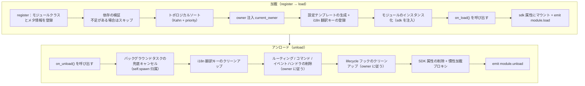

**加載時にフレームワークが自動で行ってくれること**（`on_load` を書くだけで、他の処理は自動的に完了します）：

| フェーズ | フレームワークが自動で行う |
|------|-------------|
| owner 注入 | インスタンス化の間に `owner_scope` でモジュール名をラップするため、`on_load` で登録したコマンド/イベント/フック/バックグラウンドタスクは**自動的にこのモジュールに帰属し**、アンロード時に owner に従って一括でクリーンアップされます |
| 設定テンプレート | `ConfigClass` を宣言したモジュールの場合、フレームワークが自動的に `ErisPulse.<ModuleName>` の設定セクションを生成/埋め込みます |
| i18n 翻訳キー | `I18nClass` を宣言したモジュールの場合、翻訳キーは自動的に登録されます（アンロード時に自動的に登録解除されます） |
| 依存トポロジー | `depends` で宣言された順序に従ってソートされ、依存されるモジュールが先に加載されるようにします；循環依存は `RuntimeError` で拒否されます |
| SDK へのマウント | インスタンス化後に `sdk.<ModuleName>` にマウントされるため、`sdk.MyModule.xxx` でアクセスできます |

**アンロード時にフレームワークが自動でクリーンアップすること**（上記の U1→U7 に対応）：`on_unload` が完了した後に兜底クリーンアップが行われます——バックグラウンドタスクは強制的にキャンセルされます（`self.spawn` で作成されたもの、優雅な終了は `on_unload` で行う必要があります）、i18n キー、ルーティング、コマンド/イベントハンドラ、lifecycle フック、最後に SDK 属性を削除します。`purge=True` の場合は、登録のスタブと `sys.modules` のクリーンアップも追加されます。

> これらの自動クリーンアップが「`on_load`/`on_unload` を書くだけで、手動で unregister する必要がない」という自信の源です——フレームワークは owner 归属を使って「誰が登録したか、誰がクリーンアップするか」をワンクリック式に実現しています。

## SDK オブジェクト

### コアモジュールへのアクセス

```python
from ErisPulse import sdk

# sdk オブジェクトを通じてすべてのコアモジュールにアクセスする
sdk.logger.info("ログ")
sdk.storage.set("キー", "値")
config = sdk.config.getConfig("MyModule")
```

### モジュール間通信

```python
# 他のモジュールにアクセスする
other_module = sdk.OtherModule
result = await other_module.some_method()

## アダプタ送信方法の照会

新しい標準仕様では、フォールバック送信機構を実装するために `__getattr__` メソッドを上書きすることが求められるため、`hasattr` メソッドを使用してメソッドの存在を確認することができなくなりました。バージョン `2.3.5` 以降、送信方法を照会する機能が追加されました。

### サポートされている送信方法のリスト

```python
# プラットフォームがサポートするすべての送信方法を一覧表示する
methods = sdk.adapter.list_sends("onebot11")
# 返回: ["Text", "Image", "Voice", "Markdown", ...]
```

### メソッドの詳細情報の取得

```python
# 特定のメソッドの詳細情報を取得する
info = sdk.adapter.send_info("onebot11", "Text")
# 返回:
# {
#     "name": "Text",
#     "parameters": [
#         {"name": "text", "type": "str", "default": null, "annotation": "str"}
#     ],
#     "return_type": "Awaitable[Any]",
#     "docstring": "テキストメッセージを送信..."
# }

## 設定管理

### 宣言的設定（推奨）

v2.5.2 以降、モジュールは `ConfigClass` を宣言して、アダプターと同じ設定 Schema システムを使用することができます。設定は `self.cfg` を通じてリアルタイムに読み取ることができ、変更後は即座に有効になります：

```python
from dataclasses import dataclass, field
from ErisPulse.Core.Bases import BaseModule
from ErisPulse.Core.Bases import BaseConfig

@dataclass
class MyModuleConfig(BaseConfig):
    api_key: str = field(
        default="",
        metadata={
            "description": {"i18n": "my_module.api_key", "default": "API 密钥"},
            "required": True,
            "secret": True,
            "ui": {"widget": "password", "group": "basic", "order": 1},
        },
    )
    timeout: int = field(
        default=30,
        metadata={
            "description": {"i18n": "my_module.timeout", "default": "超时时间（秒）"},
            "ui": {"widget": "number", "group": "advanced", "order": 2},
        },
    )

class MyModule(BaseModule):
    ConfigClass = MyModuleConfig

    def __init__(self, sdk):
        self.sdk = sdk
        self.logger = sdk.logger.get_child("MyModule")

    async def on_load(self, event):
        self.logger.info("モジュールがロードされました")

    async def on_unload(self, event):
        pass

    async def do_something(self):
        cfg = self.cfg  # 実時読み取り、型安全
        api_key = cfg.api_key
        timeout = cfg.timeout
```

`BaseConfig` は、アダプター、モジュール、外部プロジェクトなど、あらゆる場面で使用できる汎用的な設定基底クラスです。設定フィールドは i18n 多言語説明をサポートしています（詳細は [i18n ドキュメント](../../advanced/i18n.md#設定フィールド多言語) を参照）。

### 宣言的翻訳キー（v2.7.0+）

v2.7.0 以降、モジュールは `ConfigClass` の宣言と同じように、ネストされたクラス `I18nClass` を使って翻訳キーを一括宣言することができます。フレームワークはロード時に**自動的に**すべての宣言された翻訳キーを登録し、手動で `i18n.register()` を呼び出す必要がなく、また設定テンプレート生成よりも早いタイミングで登録されるため、設定説明で参照される i18n キーが利用可能になります。

```python
from ErisPulse.Core.Bases import BaseConfig, BaseI18n, I18nKey

class MyModule(BaseModule):
    # 設定クラス（オプション）
    @dataclass
    class ConfigClass(BaseConfig):
        welcome_msg: str = field(
            default="欢迎",
            metadata={
                "description": {"i18n": "mymodule.welcome_msg", "default": "欢迎消息"},
            },
        )

    # 翻訳キー集合クラス（オプション）
    class I18nClass(BaseI18n):
        # 属性名が自動的に完全なキー・パスに結合されます：<モジュール名>.<属性名>
        welcome_msg: I18nKey = I18nKey(
            default="Welcome Message",   # 言語に依存しないバックアップ
            zh_CN="欢迎消息",
            zh_TW="歡迎訊息",
            en="Welcome Message",
            ja="ウェルカムメッセージ",
            ru="Приветственное сообщение",
        )
        hello: I18nKey = I18nKey(
            default="Hello, {name}!",
            zh_CN="你好，{name}！",
            zh_TW="你好，{name}！",
            en="Hello, {name}!",
            ja="こんにちは、{name}！",
            ru="Привет, {name}!",
        )
```

詳細は [i18n 推奨の書き方](../../advanced/i18n.md#推奨の書き方通过-i18nclass-声明翻译键-v270) を参照してください。

### 手動で設定を読み取る（廃止済み）

> **廃止済み**：宣言的設定（[宣言的設定推奨](#宣言式設定推奨)）と `self.cfg` を通じたリアルタイム読み取りを使用してください。

```python
class MyModule(BaseModule):
    def __init__(self, sdk):
        self.sdk = sdk

    def _load_config(self):
        config = self.sdk.config.getConfig("MyModule")
        if not config:
            self.sdk.config.setConfig("MyModule", {"api_key": "", "timeout": 30})
            return {"api_key": "", "timeout": 30}
        return config
```

## ストレージシステム

### 基本的な使用方法

```python
# データを保存
sdk.storage.set("user:123", {"name": "張三"})

# データを取得
user = sdk.storage.get("user:123", {})

# データを削除
sdk.storage.delete("user:123")
```

### トランザクションの使用

```python
# トランザクションを使用してデータの一貫性を確保
with sdk.storage.transaction():
    sdk.storage.set("key1", "value1")
    sdk.storage.set("key2", "value2")
    # どの操作か失敗した場合、すべての変更はロールバックされます

## イベント処理

### イベントハンドラの登録

```python
from ErisPulse.Core.Event import command, message

# コマンドを登録
@command("info", help="情報を取得")
async def info_handler(event):
    await event.reply("これは情報です")

# メッセージハンドラを登録
@message.on_group_message()
async def group_handler(event):
    sdk.logger.info(f"グループメッセージを受信しました: {event.get_text()}")
```

### イベントハンドラのライフサイクル

フレームワークは自動的にイベントハンドラの登録と登録解除を管理します。`on_load` で登録するだけでよいです。

## レイジー ローディング機構

### 動作原理

```python
# モジュールが初めてアクセスされたときにのみ初期化される
result = await sdk.my_module.some_method()
# ↑ ここでモジュール初期化がトリガーされる
```

### すぐにロード

すぐに初期化する必要があるモジュール（リスナー、タイマーなど）の場合：

```python
@staticmethod
def get_load_strategy():
    return ModuleLoadStrategy(
        lazy_load=False,  # すぐにロード
        priority=100
    )

## エラー処理

### 例外の捕捉

```python
async def handle_event(self, event):
    try:
        # 業務ロジック
        await self.process_event(event)
    except ValueError as e:
        self.logger.warning(f"パラメータエラー: {e}")
        await event.reply(f"パラメータエラー: {e}")
    except Exception as e:
        self.logger.error(f"処理失敗: {e}")
        raise
```

### ログ記録

```python
# ログレベルの使い分け
self.logger.debug("デバッグ情報")    # 詳細なデバッグ情報
self.logger.info("実行状態")        # 正常実行の情報
self.logger.warning("警告情報")    # 警告情報
self.logger.error("エラー情報")    # エラー情報
self.logger.critical("致命的なエラー") # 致命的なエラー


### Event 包装类详解

# Event 包装クラスの詳細

Event モジュールは、強力な Event 包装クラスを提供し、イベント処理を簡素化します。

各言語の文書へのリンクは、`docs/ja/` を `docs/ja/` に置き換えてください。たとえば、`docs/ja/quick-start.md` は `docs/ja/quick-start.md` に変更します。`README.xx.md` 形式のリンクは、他の言語バージョンを指すため、そのままにしてください。

## event パラメータに型注釈を追加

イベントハンドラの `event` パラメータは **Event 包装クラス**（dict のサブクラス）です。型注釈を追加することを強く推奨します：

```python
from ErisPulse.Core.Event import Event

@message.on_private_message()
async def handler(event: Event):
    text = event.get_text()   # IDE が便利なメソッドをすべて自動補完
    await event.reply(text)   # 構文エラーは静的解析時に検出されます
```

注釈を追加しない場合、IDE は Event 上のメソッド（`get_text()` / `reply()` / `wait_reply()` / プラットフォーム拡張メソッド）を認識できず、すべて手動で記憶して入力する必要があります。

> **注意**: イベントハンドラのコールバックの `event` は **Event 包装クラス**（注釈は `Event`）です。モジュールのライフサイクルメソッド `on_load` / `on_unload` の `event` は通常の **dict**（注釈は `dict`）です。これらを混同しないでください。

## コア機能

- **完全な辞書互換性**：Event は dict を継承しています
- **便利なメソッド**：多数の便利なメソッドを提供しています
- **ドットアクセス**：イベントフィールドにドット記法でアクセスできます
- **後方互換性**：すべてのメソッドはオプションです

[**English**](docs/en/core-features.md) | [**日本語**](docs/ja/core-features.md)

## コアフィールドメソッド

```python
from ErisPulse.Core.Event import command

@command("info")
async def info_command(event: Event):
    event_id = event.get_id()
    platform = event.get_platform()
    time = event.get_time()
    print(f"ID: {event_id}, プラットフォーム: {platform}, 時間: {time}")
```

[**English**](docs/en/quick-start.md) | [**简体中文**](docs/ja/quick-start.md) | [**日本語**](docs/ja/quick-start.md)

## メッセージイベントメソッド

```python
from ErisPulse.Core.Event import message

@message.on_private_message()
async def private_handler(event: Event):
    text = event.get_text()
    user_id = event.get_user_id()
    nickname = event.get_user_nickname()
    await event.reply(f"こんにちは、{nickname}！")
```

[**English**](docs/en/quick-start.md) | [**日本語**](docs/ja/quick-start.md)

## メッセージタイプの判断

```python
from ErisPulse.Core.Event import message

@message.on_group_message()
async def group_handler(event: Event):
    is_private = event.is_private_message()
    is_group = event.is_group_message()
    is_at = event.is_at_message()
    await event.reply(f"タイプ: {'プライベートチャット' if is_private else 'グループチャット'}")
```

[**English**](docs/en/quick-start.md) | [**日本語**](docs/ja/quick-start.md) | [**简体中文**](docs/ja/quick-start.md)

## 回答機能

```python
from ErisPulse.Core.Event import command

@command("ask")
async def ask_command(event: Event):
    await event.reply("あなたの名前を入力してください:")
    reply = await event.wait_reply(timeout=30)
    if reply:
        name = reply.get_text()
        await event.reply(f"こんにちは、{name}！")
```

[**English**](docs/en/quick-start.md) | [**日本語**](docs/ja/quick-start.md)

## コマンド情報の取得

```python
from ErisPulse.Core.Event import command

@command("cmdinfo")
async def cmdinfo_command(event: Event):
    cmd_name = event.get_command_name()
    cmd_args = event.get_command_args()
    await event.reply(f"コマンド: {cmd_name}, パラメータ: {cmd_args}")
```

[**English**](docs/ja/quick-start.md)

## 通知イベントメソッド

```python
from ErisPulse.Core.Event import notice

@notice.on_friend_add()
async def friend_add_handler(event: Event):
    await event.reply("友達として追加してくれてありがとう！")
```

7. **重要：パスの置換ルール**
   - ドキュメントリンク内の `docs/ja/` を `docs/ja/` に置換する
   - 例: `docs/ja/quick-start.md` は `docs/ja/quick-start.md` に変更する
   - 非現在言語版ファイルを指すリンク（例: `README.xx.md` 形式のリンク）は、変更しないでそのままにする
   - これにより、リンクが正しい言語のドキュメントバージョンを指すようになる

## 方法速查表

### 核心方法

#### 事件基础信息
- `get_id()` - 事件IDを取得
- `get_time()` - イベントのタイムスタンプを取得（Unix秒単位）
- `get_type()` - イベントのタイプを取得（message/notice/request/meta）
- `get_detail_type()` - イベントの詳細タイプを取得（private/group/friend等）
- `get_platform()` - プラットフォーム名を取得

#### ロボット情報
- `get_self_platform()` - ロボットのプラットフォーム名を取得
- `get_self_user_id()` - ロボットのユーザーIDを取得
- `get_self_account_id()` - ロボットのアカウントIDを取得（複数Botモード）
- `get_self_info()` - ロボットの完全な情報辞書を取得

#### 会話識別子
- `get_target_id()` - 統一されたターゲットIDを取得（グループチャットは `group_id` を返す、チャンネルは `channel_id` を返す、プライベートチャットは `user_id` を返す、group → channel → guild → thread → user の順に最初の非空値を取得）
- `get_session_id()` - 会話のユニークな識別子を取得、形式は `{platform}:{detail_type}:{target_id}`

### メッセージイベントメソッド

#### メッセージ内容
- `get_message()` - メッセージセグメントの配列を取得（OneBot12形式）
- `get_alt_message()` - メッセージの代替テキストを取得
- `get_text()` - 純粋なテキスト内容を取得（`get_alt_message()` の別名）
- `get_message_text()` - 純粋なテキスト内容を取得（`get_alt_message()` の別名）

#### 送信者情報
- `get_user_id()` - 送信者のユーザーIDを取得
- `get_user_nickname()` - 送信者のニックネームを取得
- `get_sender()` - 送信者の完全な情報辞書を取得

#### グループ/チャンネル情報
- `get_group_id()` - グループIDを取得（グループメッセージ）
- `get_channel_id()` - チャンネルIDを取得（チャンネルメッセージ）
- `get_guild_id()` - サーバーIDを取得（サーバーメッセージ）
- `get_thread_id()` - トピック/サブチャンネルIDを取得（トピックメッセージ）

#### @メッセージ関連
- `has_mention()` - @ロボットを含むかどうか
- `get_mentions()` - すべての@されたユーザーIDのリストを取得

### メッセージタイプ判断

#### 基本判断
- `is_message()` - メッセージイベントかどうか
- `is_private_message()` - プライベートチャットメッセージかどうか
- `is_group_message()` - グループチャットメッセージかどうか
- `is_at_message()` - @メッセージかどうか（`has_mention()` の別名）

### 通知イベントメソッド

#### 通知操作者
- `get_operator_id()` - 操作者のIDを取得
- `get_operator_nickname()` - 操作者のニックネームを取得

#### 通知タイプ判断
- `is_notice()` - 通知イベントかどうか
- `is_group_member_increase()` - グループメンバー増加イベント
- `is_group_member_decrease()` - グループメンバー減少イベント
- `is_friend_add()` - フレンド追加イベント（`detail_type == "friend_increase"` に一致）
- `is_friend_delete()` - フレンド削除イベント（`detail_type == "friend_decrease"` に一致）

### 要求イベントメソッド

#### 要求情報
- `get_comment()` - 要求の付言を取得

#### 要求タイプ判断
- `is_request()` - 要求イベントかどうか
- `is_friend_request()` - フレンド要求かどうか
- `is_group_request()` - グループ要求かどうか

### 回答機能

#### 基本回答
- `reply(content, method="Text", at_sender=False, quote=False, at_users=None, reply_to=None, at_all=False, via=None, **kwargs)` - 一般的な回答メソッド
  - `content`: 送信内容（テキスト、URL等）
  - `method`: 送信方法、デフォルトは "Text"、"Image"/"Voice"/"Video"/"File" 等を選択可能
  - `at_sender`: 送信者を@するかどうか（自動的に user_id を抽出）
  - `quote`: 現在のメッセージを引用して返信するかどうか（自動的に message_id を抽出）
  - `at_users`: @するユーザーのリスト、例: `["user1", "user2"]`
  - `reply_to`: 手動で返信するメッセージIDを指定
  - `at_all`: 全てのメンバーを@するかどうか
  - `**kwargs`: 余分なパラメータ（例: Mentionメソッドの user_id）

- `reply_ob12(message)` - OneBot12メッセージセグメントを使って返信
  - `message`: OneBot12メッセージセグメントのリストまたは辞書、MessageBuilderを使って構築可能

#### プラットフォーム能力確認
- `supports(method)` - 現在のプラットフォームが特定の送信方法（例: `"Image"`、`"Voice"`）をサポートしているかどうかを確認し、`bool`を返す
- `available_methods()` - 現在のプラットフォームで利用可能なすべての送信方法のリストを返す

#### 転送機能

> **注意**: 転送機能はアダプターの Send DSL によって実装される必要があり、Eventラッパークラス自体は直接的な転送メソッドを提供しない。

```python
# メッセージをグループに転送
adapter = sdk.adapter.get(event.get_platform())
target_id = event.get_group_id()  # または他のグループIDを指定
await adapter.Send.To("group", target_id).Text(event.get_text())
```

### レプライ待機機能

- `wait_reply(prompt=None, timeout=60.0, callback=None, validator=None, method="Text")` - ユーザーの返信を待つ
  - `prompt`: プロンプトメッセージ、提供された場合ユーザーに送信される
  - `timeout`: 待機のタイムアウト時間（秒）、デフォルトは60秒
  - `callback`: 返信を受け取ったときに実行されるコールバック関数
  - `validator`: 返信が有効かどうかを検証する関数
  - `method`: プロンプトメッセージを送信する方法、デフォルトは "Text"
  - ユーザーの返信のEventオブジェクトを返す、タイムアウト時は `None` を返す

#### インタラクティブメソッド

- `confirm(prompt=None, timeout=60.0, yes_words=None, no_words=None, method="Text", hint=False)` - 確認対話
  - `True`（確認）/ `False`（否定）/ `None`（タイムアウト）を返す
  - 内部的に中英語の確認単語を自動的に認識し、独自の語集をカスタマイズ可能
  - `method`: 送信方法、デフォルトは "Text"、"Image"/"Markdown" 等の非テキスト方式で送信可能
  - `hint`: プロンプトの末尾に自動的に確認単語のプロンプトを追加するかどうか、デフォルトは `False`

- `choose(prompt, options, timeout=60.0, method="Text", options_format="auto", merge_prompt=False, placeholder="{options}")` - 選択メニュー
  - `options`: 選択肢のテキストリスト
  - 選択肢のインデックス（0ベース）を返す、タイムアウト時は `None` を返す
  - `method`: 送信方法、デフォルトは "Text"、テキスト系メソッド (Text/Markdown/md/Html/h5) はデフォルトで末尾に選択肢を結合
  - `options_format`: 選択肢のフォーマット（デフォルト: "auto"、methodに応じて自動的に組み込みスタイルを選択）
    - `"auto"`: Markdown→無序リスト（`- 1.選択肢`）、Html→順序リスト（`<ol>`）、その他→純粋なテキストリスト
    - `"list"`: 各行に1つ、例: ``1. 選択肢A\n2. 選択肢B``
    - `"inline"`: 1行で表示、例: ``1.A | 2.B``
    - `"md"`: Markdown無序リスト
    - `"html"`: Html順序リスト
    - `callable`: 自作関数、``list[str]``を受け取り``str``を返す
  - `merge_prompt`: 強制的に1つのメッセージとして送信するかどうか、デフォルトは `False`
    - `False`（デフォルト）: テキスト系メソッドは自動的に結合、非テキスト系メソッドは先にpromptを送信してからText選択肢を送信
    - `True`: どのようなmethodでも1つのメッセージに結合し、ユーザーが指定したmethodで送信
  - `placeholder`: 選択肢挿入のプレースホルダ、デフォルトは `{options}`、promptにこのマークが含まれる位置に選択肢のテキストを置き換え、空文字列に設定すると常に末尾に追加

- `collect(fields, timeout_per_field=60.0)` - フォーム収集
  - `fields`: フィールドリスト、各項目には `key`、`prompt`、オプションで `validator`、オプションで `method` を含む
  - `{key: value}`の辞書を返す、いずれかのフィールドがタイムアウトした場合は `None` を返す
  - 各フィールドは `method`キーで送信方法を指定可能、例: 画像を収集する場合 `{"key": "avatar", "prompt": "プロフィール画像を送ってください", "method": "Image"}`
  - 各フィールドはオプションで `options`キー（リスト）を含み、指定するとそのフィールドは選択問題になる（自動的にchooseのロジックを呼び出す）
  - 各フィールドはオプションで `options_format`、`merge_prompt`、`placeholder`キーを含み、選択肢のフォーマット、メッセージの結合動作、プレースホルダを制御

- `wait_for(event_type="message", condition=None, timeout=60.0)` - 任意のイベントを待つ
  - `condition`: フィルタ関数、`True`を返すときに一致する
  - マッチしたEventオブジェクトを返す、タイムアウト時は `None` を返す

- `conversation(timeout=60.0)` - 複数ラウンド対話コンテキストを作成
  - `Conversation`オブジェクトを返す、`say()`/`wait()`/`confirm()`/`choose()`/`collect()`/`stop()`をサポート
  - `is_active`属性は対話がアクティブかどうかを示す

#### 交互メソッドの例

**confirm() - 確認対話：**

```python
@command("delete", help="データを削除")
async def delete_handler(event: Event):
    if await event.confirm("すべてのデータを削除してもよろしいですか？"):
        sdk.storage.delete("all_data")
        await event.reply("データは削除されました")
    else:
        await event.reply("キャンセルしました")
```

**confirm() - プロンプト付き：**

```python
# hint=True はプロンプトの末尾に "（はい/いいえ）" を追加
if await event.confirm("続行してもよろしいですか？", hint=True):
    await event.reply("続行しました")
# ユーザーは "続行してもよろしいですか？（はい/いいえ）" を表示
```

**choose() - 選択メニュー：**

```python
@command("color", help="色を選択")
async def color_handler(event: Event):
    choice = await event.choose("色を選択してください：", ["赤", "緑", "青"])
    if choice is not None:
        colors = ["赤", "緑", "青"]
        await event.reply(f"選択した色は：{colors[choice]}")
```

**choose() - 選択肢のフォーマットとメッセージの結合：**

```python
# inline形式：選択肢を1行に表示
choice = await event.choose("選択してください：", ["A", "B", "C"], options_format="inline")
# 出力：1.A | 2.B | 3.C

# 自作フォーマット
choice = await event.choose("選択してください：", ["猫", "犬"],
    options_format=lambda opts: " / ".join(opts))
# 出力：猫 / 犬

# options_format="auto"（デフォルト）：methodに応じて自動的に組み込みスタイルを選択
# Markdown → 無序リスト
choice = await event.choose(
    "## 選択してください", ["猫", "犬"],
    method="Markdown",  # autoはmdリストと自動的に認識
)
# 出力：
# ## 選択してください
# - 1. 猫
# - 2. 犬

# Html → 順序リスト
choice = await event.choose(
    "<h2>選択してください</h2>", ["猫", "犬"],
    method="Html", merge_prompt=True,  # autoはhtmlリストと自動的に認識
)
# 出力：
# <h2>選択してください</h2>
# <ol><li>1. 猫</li><li>2. 犬</li></ol>

# 合併モード + プレースホルダ
choice = await event.choose(
    "## 選択してください\n{options}\n番号を返信してください",
    ["猫", "犬"],
    method="Markdown", merge_prompt=True,
)

# 自作プレースホルダ
choice = await event.choose(
    "選択してください: [choices]",
    ["猫", "犬"],
    placeholder="[choices]",
)
```

**collect() - フォーム収集：**

```python
@command("register", help="登録")
async def register_handler(event: Event):
    data = await event.collect([
        {"key": "name", "prompt": "名前を入力してください："},
        {"key": "age", "prompt": "年齢を入力してください：",
         "validator": lambda e: e.get_text().isdigit()},
    ])
    if data:
        await event.reply(f"登録完了！{data['name']}、{data['age']}歳")
```

**テキスト以外のメソッドでのreply：**

```python
await event.reply("http://example.com/img.jpg", method="Image")
await event.reply("http://example.com/audio.mp3", method="Voice")

from ErisPulse.Core.Event import MessageBuilder
segments = MessageBuilder.text("この画像を見てください：").image("http://example.com/img.jpg").build()
await event.reply_ob12(segments)
```

> 完全なConversation多ラウンド対話の使い方は [Conversation多ラウンド対話](../../advanced/conversation.md) を参照してください。

### コマンド情報

#### コマンド基礎
- `get_command_name()` - コマンド名を取得
- `get_command_args()` - コマンド引数のリストを取得
- `get_command_raw()` - コマンドの元のテキストを取得
- `get_command_info()` - 完全なコマンド情報の辞書を取得
- `is_command()` - コマンドかどうか

### 元データ

- `get_raw()` - プラットフォームの元のイベントデータを取得
- `get_raw_type()` - プラットフォームの元のイベントタイプを取得

### プラットフォーム拡張メソッド

アダプターはEventラッパークラスにプラットフォーム固有のメソッドを登録できる。メソッドは対応するプラットフォームのEventインスタンスでのみ利用可能で、他のプラットフォームでアクセスすると `AttributeError` が発生する。

プラットフォームメソッドは `Event.__getattribute__` により、組み込みメソッドよりも優先して有効になるため、`confirm`、`choose`、`collect`、`wait_reply` などの組み込みインタラクティブメソッドを覆写して、プラットフォーム特有の実装（例: ボタン、カードなど）を提供できる。組み込み実装は `_builtin_*` 関数として導出され、覆写元に提供される。

```python
# メールイベント - メール専用メソッドのみ
event = Event({"platform": "email", "email_raw": {"subject": "Hello"}})
event.get_subject()      # ✅ "Hello" を返す
event.get_chat_type()    # ❌ AttributeError

# Telegramイベント - Telegram専用メソッドのみ
event = Event({"platform": "telegram", "telegram_raw": {"chat": {"type": "private"}}})
event.get_chat_type()    # ✅ "private" を返す
event.get_subject()      # ❌ AttributeError

# 組み込みメソッドは常に利用可能
event.get_text()         # ✅ どのプラットフォームでも
event.reply("hi")        # ✅ どのプラットフォームでも
```

### 登録されたメソッドの照会

```python
from ErisPulse.Core.Event import get_platform_event_methods

methods = get_platform_event_methods("email")
# ["get_subject", "get_from", ...]
```

### `hasattr` と `dir` のサポート

```python
hasattr(event, "get_subject")   # platform="email" のみで True を返す
"get_subject" in dir(event)     # 同上
```

### 跨プラットフォーム拡張（ワイルドカード）

`register_event_method` と `register_event_mixin` は `"*"` をプラットフォーム名として渡すことができ、登録されたメソッドは**すべてのプラットフォーム**のEventインスタンスで利用可能になる。AI対話、コンテキスト管理など、跨プラットフォームで再利用可能な機能に適している。

```python
from ErisPulse.Core.Event.wrapper import register_event_method

@register_event_method("*")
async def ai_chat(self, prompt: str):
    # self はEventインスタンス、イベントデータと組み込みメソッドにアクセス可能
    await self.reply(f"AI: {prompt}")
```

登録後、どのプラットフォームのイベントハンドラでも `event.ai_chat(...)` を呼び出すことができる。

メソッドの優先順位（高から低）: プラットフォーム固有メソッド → ワイルドカードメソッド → 組み込みメソッド → 辞書キーのアクセス。

> アダプター開発者が拡張メソッドを登録する方法は [イベントシステムAPI - 跨プラットフォーム拡張ワイルドカード](../../api-reference/event-system.md#跨プラットフォーム拡張ワイルドカード) を参照してください。


### 模块开发最佳实践

# モジュール開発におけるベストプラクティス

このドキュメントでは、ErisPulse モジュール開発に関するベストプラクティスを提供します。

以下のルールに従って変換してください。

1.  Markdown形式を維持する（見出し、リスト、コードブロック、リンク、画像など）
2.  用語を正確に翻訳し、専門性を保つ
3.  コードブロック内のコードロジックは翻訳しないが、コード内の中国語コメント、文字列は日本語に翻訳する
4.  原文の構造とトーンを維持する
5.  用語について、日本語の対応用語が不明な場合は英語の原語を保持する
6.  その他の説明や注釈は追加せず、翻訳後のコンテンツのみを返す
7.  翻訳後のドキュメントに中国語（固有名詞を除く）が残らないようにする。これにはコードブロック内のコメントと文字列も含まれる
8.  翻訳後のMarkdownコンテンツを直接出力する。```markdown```などのコードブロックで囲まない

**重要：パス置換ルール**
-   ドキュメントリンク内の `docs/ja/` を `docs/ja/` に置換する
-   例：`docs/ja/quick-start.md` は `docs/ja/quick-start.md` に変更する
-   現在の言語バージョンではないファイルを指し示すリンク（`README.xx.md` 形式のリンクなど）については、変更せずそのまま保持する
-   これにより、正しい言語バージョンのドキュメントを指すようにする

## モジュール設計

### 1. 単一責任の原則

各モジュールは1つのコア機能のみを担当する必要があります。

```python
# 良い設計：各モジュールは1つの機能のみを担当する
class WeatherModule(BaseModule):
    """天気照会モジュール"""
    pass

class NewsModule(BaseModule):
    """ニュース照会モジュール"""
    pass

# 悪い設計：1つのモジュールが複数の非関連な機能を担当する
class UtilityModule(BaseModule):
    """天気、ニュース、ジョークなど複数の機能を含む"""
    pass
```

### 2. モジュール命名規則

```toml
[project]
name = "ErisPulse-ModuleName"  # ErisPulse- プレフィックスを使用
```

### 3. 明確な設定管理

宣言的設定（`ConfigClass` + `BaseConfig`）を使用することを推奨します。これにより、型安全性、自動テンプレート生成、WebUI フォームサポートなどの機能が得られます。

```python
from dataclasses import dataclass, field
from ErisPulse.Core.Bases import BaseConfig

@dataclass
class MyModuleConfig(BaseConfig):
    api_url: str = field(default="https://api.example.com", metadata={
        "description": {"i18n": "my_module.api_url", "default": "API アドレス"},
    })
    timeout: int = field(default=30, metadata={
        "description": {"i18n": "my_module.timeout", "default": "タイムアウト時間（秒）"},
    })
    cache_ttl: int = field(default=3600, metadata={
        "description": {"i18n": "my_module.cache_ttl", "default": "キャッシュ有効期間（秒）"},
    })

class MyModule(BaseModule):
    ConfigClass = MyModuleConfig

    async def do_something(self):
        cfg = self.cfg  # 型安全性があり、即時読み込み
        await self._fetch(cfg.api_url, timeout=cfg.timeout)
```

また、手動での設定ストレージの読み書きを引き続き使用することも可能です（[モジュールの核心的な概念](core-concepts.md#設定管理)を参照）。

### 宣言的翻訳キー（v2.7.0+）

モジュールは `I18nClass` を使用して翻訳キーを集中して宣言できます。フレームワークは i18n システムに自動的に登録されるため、手動で `i18n.register()` を呼び出す必要はありません。

```python
from ErisPulse.Core.Bases import BaseI18n, I18nKey

class MyModule(BaseModule):
    class I18nClass(BaseI18n):
        # プレースホルダー付きのビジネス翻訳キー
        welcome: I18nKey = I18nKey(
            default="Welcome, {name}!",
            zh_CN="欢迎你，{name}！",
            zh_TW="歡迎你，{name}！",
            en="Welcome, {name}!",
            ja="ようこそ、{name}！",
            ru="Добро пожаловать, {name}!",
        )
        # 設定フィールドの説明の翻訳
        api_url: I18nKey = I18nKey(
            default="API URL",
            zh_CN="API 地址",
            zh_TW="API 位址",
            en="API URL",
            ja="API URL",
            ru="API URL",
        )
```

詳細な使用方法については、[i18n ドキュメント](../../advanced/i18n.md#推奨される書き方 -i18nclass-で翻訳キーを宣言する-v270)を参照してください。

## 非同期プログラミング

### 1. 非同期ライブラリの使用

```python
# SDK内蔵のHTTPクライアント（非同期、自動ログと統計）の使用が推奨
from ErisPulse.Core import client

class MyModule(BaseModule):
    async def fetch_data(self, url):
        resp = await client.get(url)
        return await resp.json()

# sdk.clientを使用することも可能（効果は同じ）
from ErisPulse import sdk

class MyModule(BaseModule):
    async def fetch_data(self, url):
        resp = await sdk.client.get(url)
        return await resp.json()

# aiohttpを直接インポートしないこと（フレームワークによる統一管理が困難）
import aiohttp

class MyModule(BaseModule):
    async def fetch_data(self, url):
        async with aiohttp.ClientSession() as session:
            async with session.get(url) as response:
                return await response.json()

# requestsを使用しないこと（同期的で、イベントループをブロックする）
import requests

class MyModule(BaseModule):
    def fetch_data(self, url):
        return requests.get(url).json()  # イベントループをブロックする
```

### 2. 正しい非同期操作

```python
from ErisPulse.Core.Event import Event  # event: Event注釈でIDEの補完が得られる

async def handle_command(self, event: Event):
    # 結果を待つ必要のある処理：直接await（ライフサイクルが明確）
    result = await self._long_operation()

async def on_load(self, event: dict):
    # バックグラウンドタスク（ポーリング/定時/fire-and-forget）：self.spawn()を使用
    # モジュールのアンロード時にon_unloadの後にフレームワークがキャンセルを保証し、selfの保持によるリークを防ぐ
    self.spawn(self._poll())
```

> [!NOTE]
> バックグラウンドタスクは`self.spawn()`（ErisPulse **2.8.0+**）を使用することを推奨します。`asyncio.create_task`は、裸のタスクを作成し、モジュールに属さないため、アンロード時に自動的にクリーンアップされず、selfの参照を保持してモジュールインスタンスが回収されない（ホットリロードのリーク）可能性があります。詳細は[ライフサイクル管理](../../advanced/lifecycle.md#バックグラウンドタスクの所属と自動キャンセル)をご覧ください。

### 3. リソース管理

```python
async def on_load(self, event):
    # SDKクライアントは接続プールを自動的に管理するため、手動でsessionを作成する必要はない
    pass
    
async def on_unload(self, event):
    # カスタムクライアントが必要な場合は、リソースのクリーンアップを忘れずに
    pass

## イベント処理

### 1. Eventラッパークラスの使用

```python
# Eventラッパークラスの便利な方法を使用
@command("info")
async def info_command(event: Event):
    user_id = event.get_user_id()
    nickname = event.get_user_nickname()
    await event.reply(f"こんにちは、{nickname}！")

# 辞書に直接アクセスするのではなく
@command("info")
async def info_command(event: Event):
    user_id = event["user_id"]  # 明確さに欠け、間違いやすい
```

### 2. 懒惰的ロードの適切な使用

```python
# 使用頻度の低いコマンドモジュール：activate_onトリガーを宣言し、最初の一致するコマンドが到着したときに自動的にアクティブ化（懒惰的ロードを維持）
class CommandModule(BaseModule):
    @staticmethod
    def get_load_strategy():
        return ModuleLoadStrategy(lazy_load=True, activate_on=[
            {"command": {"name": "dice", "help": "サイコロを振る", "aliases": ["d"]}},
        ])

# 使用頻度の低いリスナー・モジュール：イベントトリガーを宣言し、イベントが到着したときに自動的にアクティブ化
class ListenerModule(BaseModule):
    @staticmethod
    def get_load_strategy():
        return ModuleLoadStrategy(lazy_load=True, activate_on=[
            {"notice": "group_member_increase"},
        ])

# 高頻度のトリガー（各メッセージを処理する必要がある）または起動時に準備が必要なモジュール：即時ロード
class HotListenerModule(BaseModule):
    @staticmethod
    def get_load_strategy():
        return ModuleLoadStrategy(lazy_load=False)

# ユーティリティモジュールは懒惰的ロードに適している
class UtilityModule(BaseModule):
    @staticmethod
    def get_load_strategy():
        return ModuleLoadStrategy(lazy_load=True)
```

> `activate_on`の完全な構文（イベントの三形式 / コマンドの簡略化とdict宣言 / helpのフォールバックチェーン）については、  
> [懒惰的ロードモジュールシステム](../../advanced/lazy-loading.md#イベント駆動の懒惰的アクティベーションactivate_on)を参照してください。

### 3. イベントハンドラの登録

```python
async def on_load(self, event):
    # on_loadでイベントハンドラを登録
    @command("hello")
    async def hello_handler(event: Event):
        await event.reply("こんにちは！")
    
    @message.on_group_message()
    async def group_handler(event: Event):
        self.logger.info("グループメッセージを受信しました")
    
    # 手動での登録解除は不要、フレームワークが自動的に処理します

## エラー処理

### 1. 例外の分類処理

```python
async def handle_event(self, event: Event):
    try:
        result = await self._process(event)
    except ValueError as e:
        # 予期されたビジネスエラー
        self.logger.warning(f"ビジネス警告: {e}")
        await event.reply(f"パラメータエラー: {e}")
    except aiohttp.ClientError as e:
        # ネットワークエラー（推奨: sdk.client + ClientError を使用）
        # 旧コードでは直接 aiohttp を使用しても正常に動作しますが、新規コードでは ErisPulse の例外体系を使用することを推奨します
        self.logger.error(f"ネットワークエラー: {e}")
        await event.reply("ネットワークリクエストに失敗しました。後でもう一度お試しください")
    except Exception as e:
        # 予期しないエラー
        self.logger.error(f"不明なエラー: {e}", exc_info=True)
        await event.reply("処理に失敗しました。管理者に連絡してください")
        raise
```

### 2. タイムアウト処理

```python
# 推奨: SDK 内部のクライアントを使用（タイムアウトと再試行機能が付属）
from ErisPulse.Core import client
from ErisPulse.Core.Bases.errors import ClientTimeoutError

async def fetch_with_timeout(self, url, timeout=30):
    try:
        resp = await client.get(url, timeout=timeout)
        return await resp.json()
    except ClientTimeoutError:
        self.logger.warning(f"リクエストがタイムアウトしました: {url}")
        raise

## ストレージシステム

### 1. トランザクションを使用する

```python
# トランザクションを使用してデータの一貫性を確保
async def update_user(self, user_id, data):
    with self.sdk.storage.transaction():
        self.sdk.storage.set(f"user:{user_id}:profile", data["profile"])
        self.sdk.storage.set(f"user:{user_id}:settings", data["settings"])

# ❌ トランザクションを使用しないと、データの一貫性が損なわれる可能性があります
async def update_user(self, user_id, data):
    self.sdk.storage.set(f"user:{user_id}:profile", data["profile"])
    # ここでエラーが発生すると、上記の設定はロールバックされません
    self.sdk.storage.set(f"user:{user_id}:settings", data["settings"])
```

### 2. バッチ操作

```python
# バッチ操作を使用してパフォーマンスを向上させる
def cache_multiple_items(self, items):
    self.sdk.storage.set_multi({
        f"item:{k}": v for k, v in items.items()
    })

# ❌ 複数回呼び出すと効率が悪い
def cache_multiple_items(self, items):
    for k, v in items.items():
        self.sdk.storage.set(f"item:{k}", v)

## ロギング

### 1. ログレベルを適切に使用する

```python
# DEBUG: 詳細なデバッグ情報（開発時のみ）
self.logger.debug(f"入力パラメータ: {params}")

# INFO: 正常な実行時の情報
self.logger.info("モジュールが読み込まれました")
self.logger.info(f"リクエストを処理中: {request_id}")

# WARNING: 警告メッセージ。主要な機能には影響しない
self.logger.warning(f"設定項目 {key} が設定されていません、デフォルト値を使用します")
self.logger.warning("API レスポンスが遅い、最適化の必要がある可能性があります")

# ERROR: エラーメッセージ
self.logger.error(f"API リクエストに失敗しました: {e}")
self.logger.error(f"イベントの処理に失敗しました: {e}", exc_info=True)

# CRITICAL: 致命的なエラー、即座に対処が必要
self.logger.critical("データベース接続に失敗しました、ボットを正常に実行できません")
```

### 2. 構造化されたロギング

```python
# 構造化されたログを使用すると解析が容易になります
self.logger.info(f"リクエストを処理中: request_id={request_id}, user_id={user_id}, duration={duration}ms")

# ❌ 非構造化ログを使用
self.logger.info(f"リクエストを処理しました。ユーザー {user_id} からのもの、所要時間 {duration} ミリ秒")

## パフォーマンス最適化

### 1. キャッシュの使用

```python
class MyModule(BaseModule):
    def __init__(self):
        self._cache = {}
        self._cache_lock = asyncio.Lock()
    
    async def get_data(self, key):
        async with self._cache_lock:
            if key in self._cache:
                return self._cache[key]
            
            # データベースから取得
            data = await self._fetch_from_db(key)
            
            # データをキャッシュ
            self._cache[key] = data
            return data
```

### 2. ブロッキング操作の回避

```python
# 非同期操作を使用
async def process_message(self, event: Event):
    # 非同期処理
    await self._async_process(event)

# ❌ ブロッキング操作
async def process_message(self, event: Event):
    # 同期操作、イベントループをブロック
    result = self._sync_process(event)

## セキュリティ

### 1. 敏感データ保護

```python
# 敏感データは設定に格納されます（宣言型の ConfigClass、secret フィールドはログ/エクスポートに含まれません）
from dataclasses import dataclass, field
from ErisPulse.Core.Bases import BaseModule, BaseConfig

@dataclass
class MyModuleConfig(BaseConfig):
    api_key: str = field(
        default="",
        metadata={"description": "API キー", "secret": True},
    )

class MyModule(BaseModule):
    ConfigClass = MyModuleConfig

    def check_api_key(self):
        if not self.cfg.api_key or self.cfg.api_key == "YOUR_API_KEY_HERE":
            raise ValueError("config.toml に有効な API キーを設定してください")

# ❌ 敏感データをハードコードしないでください
class MyModule(BaseModule):
    API_KEY = "sk-1234567890"  # これを行わないでください！
```

### 2. 入力検証

```python
# ユーザー入力を検証
async def process_command(self, event: Event):
    user_input = event.get_text()
    
    # 入力の長さを検証
    if len(user_input) > 1000:
        await event.reply("入力が長すぎます。再入力してください")
        return
    
    # 入力の形式を検証
    if not re.match(r'^[a-zA-Z0-9]+$', user_input):
        await event.reply("入力形式が正しくありません")
        return

## テスト

### 1. ユニットテスト

```python
import pytest
from ErisPulse.Core.Bases import BaseModule

class TestMyModule:
    def test_config_defaults(self):
        """テスト設定のデフォルト値"""
        config = MyModule.ConfigClass()
        assert config.timeout == 30
```

### 2. インテグレーションテスト

```python
@pytest.mark.asyncio
async def test_command_handling():
    """テストコマンドの処理"""
    module = MyModule()
    await module.on_load({})
    
    # コマンドイベントをシミュレート
    event = create_test_command_event("hello")
    await module.handle_command(event)
```

[**English**](docs/en/quick-start.md) | [**日本語**](docs/ja/quick-start.md)

## 配置

### 1. バージョン管理

```toml
[project]
name = "ErisPulse-MyModule"
version = "1.0.0"
```

セマンティックバージョニングに従います：
- MAJOR.MINOR.PATCH
- 主バージョン：互換性のないAPIの変更
- 次バージョン：互換性のある機能の追加
- 修正番号：互換性のある問題の修正

### 2. READMEのヘッダー

`epsdk create` で生成されたREADMEには、ErisPulseのヘッダー識別子（ロゴ + バッジ行）が組み込まれています。2つの推奨モードがあります：

**モード A — ErisPulseロゴのみ（デフォルト）：**

```markdown
<div align="center">


# MyModule

**1文で説明**

<p>
  <a href="https://pypi.org/project/ErisPulse-MyModule/"></a>
  <a href="https://pypi.org/project/ErisPulse-MyModule/"></a>
  <a href="./LICENSE"></a>
  <a href="https://github.com/ErisPulse/ErisPulse"></a>
</p>

</div>
```

**モード B — モジュールアイコン × ErisPulseロゴ（独自アイコンがある場合）：**

```markdown
<div align="center">


<span style="font-size:44px;color:#c8c8c8;margin:0 18px;vertical-align:middle;">×</span>


# MyModule
（バッジ行は上記と同じ）
</div>
```

GitHub Stars、Downloadsなどのバッジを必要に応じて追加できます。ロゴはプロジェクトのローカルにダウンロードし（`.github/assets/ErisPulseLogo.png`）、相対パスで参照することも可能です。


=====
发布与工具
=====


### 发布模块到模块商店

# 公開とモジュールストアガイド

開発したモジュールまたはアダプターを ErisPulse モジュールストアに公開し、他のユーザーが簡単に発見・インストールできるようにします。

## モジュールストアの概要

ErisPulse モジュールストアは集中型のモジュールレジストリであり、ユーザーは CLI ツールを通じてコミュニティが貢献したモジュールやアダプターを閲覧・検索・インストールできます。

### 閲覧と検索

```bash
# リモートで利用可能なすべてのパッケージを一覧表示
epsdk list-remote

# モジュールのみ表示
epsdk list-remote -t modules

# アダプターのみ表示
epsdk list-remote -t adapters

# リモートパッケージリストを強制更新
epsdk list-remote -r
```

[ErisPulse 公式サイト](https://www.erisdev.com/#market) にアクセスしてオンラインでモジュールストアを閲覧することもできます。

### サポートされているリリースタイプ

| タイプ | 説明 | Entry-point グループ |
|------|------|----------------|
| モジュール (Module) | ボットの機能拡張、ビジネスロジックの実装 | `erispulse.module` |
| アダプター (Adapter) | 新しいメッセージプラットフォームとの接続 | `erispulse.adapter` |

## クイック公開

プロセスは全工程で3ステップのみです。プロジェクトの設定 → PyPI への公開 → モジュールストアへの登録。

### 1. pyproject.toml の設定

プロジェクトディレクトリに `pyproject.toml`、`README.md` が含まれていることを確認し、タイプに合わせて entry-points を設定します。

#### モジュール

```toml
[project]
name = "ErisPulse-MyModule"
version = "1.0.0"
description = "モジュールの機能説明"
requires-python = ">=3.10"
license = { text = "MIT" }
authors = [ { name = "yourname" } ]
dependencies = [
    "ErisPulse>=2.0.0",
]

[project.entry-points."erispulse.module"]
"MyModule" = "MyModule:Main"
```

#### アダプター

```toml
[project]
name = "ErisPulse-MyAdapter"
version = "1.0.0"
description = "アダプターの機能説明"
requires-python = ">=3.10"

[project.entry-points."erispulse.adapter"]
"myplatform" = "MyAdapter:MyAdapter"
```

> **注意**: パッケージ名は `ErisPulse-` で始まることを推奨します。これはユーザーが識別しやすいためです。Entry-point のキー名（例: `"MyModule"`）は、SDK 内でのモジュールアクセス名になります。

### 2. PyPI への公開

```bash
# ビルド + 公開（PyPI アカウントが必要）
pip install build twine
python -m build
python -m twine upload dist/*
```

公開後、インストールを検証します：

```bash
pip install ErisPulse-MyModule
```

### 3. モジュールストアへの登録

[ErisPulse モジュールストア](https://www.erisdev.com/#market) に移動し、「モジュールを提出」をクリックして、ログイン後にモジュール情報を入力します。

サポートされているログイン方法: **GitHub**、**Codeberg**、**雲湖**（Yunhu）。いずれか一つを選択できます。

入力のポイント:
- モジュール名、説明、リポジトリアドレス
- 最低 SDK バージョン: 不確かな場合は、[ErisPulse 最新版](https://pypi.org/project/ErisPulse/) のバージョン番号を入力してください。

登録後、即座に有効になります。ユーザーはモジュールソースからインストールできます。モジュールは「未検証」でマークされます。メンテナが承認すると「検証済み」に変更されます。

> **検証状態について**:
> - 「未検証」はまだ公式な承認を受けていないことを示しており、モジュールに問題があることを意味しません
> - ユーザーが `epsdk install` で未検証モジュールをインストールするときは、リスクに関する警告が表示されます。続行する前に確認が必要です

### 4. 発行済みモジュールの管理

モジュールストアで「モジュールを提出」をクリックしてログインしたら、「マイモジュール」タブに切り替えて、以下ができます:
- **編集** — モジュールの説明、リポジトリアドレス、タグなどを変更します。バージョン番号は PyPI から自動的に同期されます
- **削除** — モジュールストアからモジュールを削除します（取り消しできません）

> 登録直後のモジュールは、数分かかることがありますが「マイモジュール」リストに表示されます。

## 発行済みモジュールの更新

1. `pyproject.toml` 内の `version` を更新します
2. 再構築してアップロード: `python -m build && python -m twine upload dist/*`
3. モジュールストアは PyPI の最新バージョンを自動的に同期します

ユーザーは `epsdk upgrade MyModule` でアップグレードできます。

## 公開前チェックリスト

PyPI へプッシュする前に、以下の項目を逐一確認してください。

### コード品質

- [ ] すべての公開 API に型注釈（関数のシグネチャと戻り値）
- [ ] すべての公開メソッドにドキュメント文字列（`"""..."""` 形式、`:param` / `:return` / `:raises` を含む）
- [ ] `ruff check` に合格（警告なし）
- [ ] テストカバレッジ ≥ 80%
- [ ] `pytest` がすべてのテストに合格

### 互換性

- [ ] `pyproject.toml` に最低 SDK バージョンを宣言: `dependencies = ["ErisPulse>=x.y.z"]`
- [ ] Python 3.10 / 3.11 / 3.12 / 3.13 をテスト済み
- [ ] ターゲットOS（Windows / Linux / macOS、該当する場合）をテスト済み
- [ ] 循環インポート依存なし

### 設定

- [ ] 宣言的設定（`ConfigClass` + `BaseConfig` / `BotAccountConfig`）を使用している場合、設定フィールドに `description`（推奨 i18n 形式）と `ui` メタデータがあるか
- [ ] i18n 翻訳キーを登録している場合、すべての 5 か国語（zh-CN / zh-TW / en / ja / ru）をカバーしているか
- [ ] 機密フィールドに `secret=True` がマークされているか

### ドキュメント

- [ ] `README.md` にインストール手順と基本的な使用例がある
- [ ] `README.md` に設定方法の説明（設定ファイルの例 + 環境変数）
- [ ] `CHANGELOG.md` にすべての変更を記録している
- [ ] アダプターでプラットフォームの仕様ドキュメントが更新されている（サポートされている Send タイプ、イベントタイプなど）

### 公開

- [ ] `pyproject.toml` のバージョン番号が更新されている
- [ ] ビルド成功: `python -m build`
- [ ] PyPI へのプッシュ完了: `python -m twine upload dist/*`
- [ ] インストール検証成功: `pip install ErisPulse-xxx && epsdk run`

## 開発モードでのテスト

正式に公開する前に、編集可能モードでローカルでテストできます:

```bash
epsdk install -e /path/to/MyModule
# または
pip install -e /path/to/MyModule
```

## よくある質問

### パッケージ名は必ず `ErisPulse-` で始まりますか？

必須ではありませんが、強く推奨します。これによりユーザーは PyPI 上で ErisPulse エコシステムのパッケージを識別しやすくなります。

### 1つのパッケージに複数のモジュールを登録できますか？

はい。`entry-points` で複数のキーバリューペアを設定します:

```toml
[project.entry-points."erispulse.module"]
"ModuleA" = "MyPackage:ModuleA"
"ModuleB" = "MyPackage:ModuleB"
```

### 承認にどのくらい時間がかかりますか？

通常、1〜3 営業日で完了します。モジュールストアの「マイモジュール」で検証状態を確認できます。

## Docker イメージ経由でのアプリ配布

アプリが PyPI に公開するのに適していない場合（プライベート依存関係を含む、事前設定された環境が必要など）、**GitHub Container Registry (GHCR)** を使用して Docker イメージを公開し、他のユーザーが `docker pull` でワンクリックで起動できるようにします。

### 適用シナリオ

- **完全なボットアプリ**（モジュール + 設定 + エントリースクリプト）があり、ワンクリックで配布したい場合
- モジュール/アダプターが**プライベートパッケージ**に依存している、または特殊なインストールフローがあるため PyPI には適さない場合
- ユーザーの使用ハードルを下げるために、**すぐに使える（アンパックして動く）** デプロイソリューションを提供したい場合

### 1. Dockerfile の作成

ErisPulse 公式イメージをベースに構築し、独自のモジュールのみを追加します:

```dockerfile
FROM erispulse/erispulse:latest

LABEL org.opencontainers.image.title="ErisPulse-MyModule" \
      org.opencontainers.image.description="モジュールの説明" \
      org.opencontainers.image.url="https://github.com/yourname/ErisPulse-MyModule" \
      org.opencontainers.image.source="https://github.com/yourname/ErisPulse-MyModule"

COPY pyproject.toml README.md ./
COPY MyModule/ ./MyModule/

RUN uv pip install --system -e .
```

モジュールに追加のシステム依存関係（SSH クライアントなど）が必要な場合は、`RUN uv pip install` の後に追加します:

```dockerfile
RUN apt-get update && apt-get install -y --no-install-recommends \
    openssh-client \
    && rm -rf /var/lib/apt/lists/*
```

> `erispulse/erispulse:latest` には ErisPulse、ErisPulse-Dashboard、Python ランタイム、uv が含まれており、再インストールの必要はありません。

### 2. GitHub Actions ワークフローの作成

`.github/workflows/docker-publish.yml` に作成します:

```yaml
name: Docker イメージを公開

on:
  workflow_dispatch:
  push:
    branches:
      - main
    tags:
      - "v*"

permissions:
  contents: read
  packages: write

env:
  REGISTRY: ghcr.io
  IMAGE_NAME: ${{ github.repository_owner }}/my-bot

jobs:
  docker-publish:
    runs-on: ubuntu-latest

    steps:
      - name: コードのチェックアウト
        uses: actions/checkout@v4

      - name: QEMU のセットアップ (マルチアーキテクチャ対応)
        uses: docker/setup-qemu-action@v3

      - name: Docker Buildx のセットアップ
        uses: docker/setup-buildx-action@v3

      - name: GitHub Container Registry にログイン
        uses: docker/login-action@v3
        with:
          registry: ${{ env.REGISTRY }}
          username: ${{ github.actor }}
          password: ${{ secrets.GITHUB_TOKEN }}

      - name: Docker メタデータの抽出
        id: meta
        uses: docker/metadata-action@v5
        with:
          images: ${{ env.REGISTRY }}/${{ env.IMAGE_NAME }}
          tags: |
            type=semver,pattern={{version}}
            type=semver,pattern={{major}}.{{minor}}
            type=raw,value=latest

      - name: Docker イメージの構築とプッシュ
        uses: docker/build-push-action@v6
        with:
          context: .
          file: ./Dockerfile
          platforms: linux/amd64,linux/arm64
          push: true
          tags: ${{ steps.meta.outputs.tags }}
          labels: ${{ steps.meta.outputs.labels }}
          cache-from: type=gha
          cache-to: type=gha,mode=max
```

> `GITHUB_TOKEN` は GitHub Actions から自動的に提供されるため、手動でシークレットを作成する必要はありません。

### 3. ビルドのトリガー

コードをプッシュまたはタグ付けすると、ビルドが自動的にトリガーされます:

```bash
# main ブランチへのプッシュでトリガー
git push origin main

# またはタグ付けでトリガー
git tag v1.0.0
git push origin v1.0.0
```

GitHub リポジトリの **Actions** ページからでも手動でトリガーできます。

### 4. イメージをパブリックに設定する

GHCR イメージはデフォルトで **private** です。他のユーザーがログインなしでプルできるようにするには、GitHub でパブリックに設定する必要があります:

1. リポジトリへ移動 → **Packages** → 対応するパッケージをクリック
2. **Package settings** → **Danger Zone** → **Change visibility** → **Public**

### 5. ユーザーが使用する方法

ビルドが完了したら、ユーザーは `docker run` で1行で起動できます:

```bash
docker run -d \
  --name my-bot \
  -p 8000:8000 \
  -v $(pwd)/config:/app/config \
  -e TZ=Asia/Shanghai \
  -e ERISPULSE_DASHBOARD_TOKEN=your-token \
  --restart unless-stopped \
  ghcr.io/<your-username>/my-bot:latest
```

または `docker-compose.yml` を使用します:

```yaml
services:
  my-bot:
    image: ghcr.io/<your-username>/my-bot:latest
    container_name: my-bot
    ports:
      - "8000:8000"
    volumes:
      - ./config:/app/config
    environment:
      - TZ=Asia/Shanghai
      - ERISPULSE_DASHBOARD_TOKEN=${ERISPULSE_DASHBOARD_TOKEN:-}
    restart: unless-stopped
```

### Docker Hub へも同時に公開

ワークフローを拡張し、ログインステップの前に Docker Hub ログインを追加し、`images` に Docker Hub のアドレスを追加します:

```yaml
      - name: Docker Hub にログイン
        uses: docker/login-action@v3
        with:
          registry: docker.io
          username: ${{ secrets.DOCKERHUB_USERNAME }}
          password: ${{ secrets.DOCKERHUB_TOKEN }}

      - name: Docker メタデータの抽出
        id: meta
        uses: docker/metadata-action@v5
        with:
          images: |
            docker.io/<your-dockerhub-username>/my-bot
            ghcr.io/${{ github.repository_owner }}/my-bot
```

> リポジトリの **Settings → Secrets** に `DOCKERHUB_USERNAME` と `DOCKERHUB_TOKEN` を追加する必要があります。

### Docker イメージ vs PyPI 公開

| 特徴 | Docker イメージ (GHCR) | PyPI 公開 |
|------|---------------------|-----------|
| 配布方式 | `docker pull` でワンクリック実行 | `pip install` + 手動設定 |
| 対象範囲 | 完全なアプリケーション/ソリューション | 単一のモジュール/アダプター |
| プライベート依存 | 自然にサポート | プライベート PyPI ソースが必要 |
| モジュールストア | 適用外 | モジュールストアに提出可能 |
| マルチアーキテクチャ | amd64/arm64 をサポート | アーキテクチャに依存しない |

2つの方法は競合しません — PyPI を経由してモジュールストアにモジュールを公開しつつ、GHCR を経由してすぐに使える Docker イメージを提供できます。


### CLI 命令参考

# CLIコマンドリファレンス

ErisPulseコマンドラインツール（`epsdk`）は、プロジェクト管理およびパッケージ管理機能を提供します。

> **ヒント**：すべてのコマンドは `epsdk <コマンド> --help` を使用して、詳細なパラメータ説明を確認できます。

---

[**English**](docs/en/quick-start.md) | [**日本語**](docs/ja/quick-start.md) | [**简体中文**](docs/ja/quick-start.md)

## パッケージ管理コマンド

| コマンド | 別名 | パラメータ | 説明 |
|------|------|------|------|
| `install` | `i`, `add` | `[package]... [--upgrade/-U] [--pre] [-e PATH] [--user] [--no-deps] [-t DIR] [--index-url URL] [--extra-index-url URL] [--no-cache-dir] [-r FILE] [-c FILE] [--force-reinstall] [--ignore-installed] [--compile/--no-compile] [--prefix DIR] [--src DIR] [--config-settings SETTINGS] [--no-binary FORMAT] [--only-binary FORMAT] [--prefer-binary] [--build-isolation/--no-build-isolation] [--upgrade-strategy {eager,only-if-needed,to-satisfy-only}] [--break-system-packages] [--no-uv]` | モジュール/アダプターのインストール |
| `uninstall` | `rm`, `remove` | `<package>... [--no-uv]` | モジュール/アダプターのアンインストール |
| `upgrade` | `up` | `[package]... [--force/-f] [--pre] [--no-uv]` | 指定されたモジュールまたはすべてのモジュールをアップグレード |
| `self-update` | `su`, `update` | `[version] [--pre] [--force/-f] [--no-uv]` | SDK 自体の更新 |

## 診断コマンド

| コマンド | 別名 | パラメータ | 説明 |
|------|------|------|------|
| `doctor` | `diag` | `[--verbose]` | 環境を診断し、健康レポートを出力します |

### install

ErisPulse モジュールまたはアダプタパッケージをインストールします。パッケージ名を指定しない場合、対話形式のインストールインターフェースに移行します。

**別名：** `i`, `add`

**パラメータ：**

| パラメータ | 短パラメータ | 説明 |
|------|--------|------|
| `[package]...` | | インストールするパッケージ名。複数指定可能 |
| `--upgrade` | `-U` | インストール時に最新バージョンにアップグレードします |
| `--pre` | | プレリリース版のインストールを許可します |
| `--editable` | `-e` | 編集可能なモードでインストールします（パスを指定する必要があります） |
| `--user` | | ユーザーの site-packages ディレクトリにインストールします |
| `--no-deps` | | 依存関係をインストールしません |
| `--target` | `-t` | 指定したディレクトリにインストールします |
| `--index-url` | | PyPI ミラーサーバの URL を指定します |
| `--extra-index-url` | | 追加の PyPI ミラーサーバの URL（複数指定可能） |
| `--no-cache-dir` | | キャッシュを無効にします |
| `--requirement` | `-r` | requirements ファイルからインストールします |
| `--constraint` | `-c` | 制約ファイルからインストールします |
| `--force-reinstall` | | 強制的に再インストールします |
| `--ignore-installed` | | 既にインストール済みのパッケージを無視します |
| `--compile` | | インストール後に .pyc ファイルをコンパイルします |
| `--no-compile` | | インストール後に .pyc ファイルをコンパイルしません |
| `--prefix` | | 指定したプレフィックスディレクトリにインストールします |
| `--src` | | 編集可能なインストール時に使用するソースコードディレクトリ |
| `--config-settings` | | ビルドバックエンドに渡す設定（複数指定可能） |
| `--no-binary` | | 二進数パッケージの使用を制限します（`:all:` の形式） |
| `--only-binary` | | 二進数パッケージのみを使用するように制限します（`:all:` の形式） |
| `--prefer-binary` | | 二進数パッケージを優先的に選択します |
| `--build-isolation` | | ビルドの隔離を有効にします |
| `--no-build-isolation` | | ビルドの隔離を無効にします |
| `--upgrade-strategy` | | アップグレード戦略：`eager`、`only-if-needed`、`to-satisfy-only` |
| `--break-system-packages` | | システムパッケージマネージャが管理する Python パッケージの変更を許可します |
| `--no-uv` | | uv の代わりに pip を使用します |

**例：**

```bash
# 単一モジュールのインストール
epsdk install Weather

# 複数モジュールのインストール
epsdk install Yunhu Weather

# ミラーサーバからインストールし、アップグレード
epsdk install Weather -U --index-url https://pypi.tuna.tsinghua.edu.cn/simple

# 編集可能なモードでインストール（開発モード）
epsdk install -e ./my-adapter
```

### uninstall

インストール済みの ErisPulse モジュールまたはアダプタパッケージをアンインストールします。パッケージ名を指定しない場合、対話形式のアンインストールインターフェースに移行します。

**別名：** `rm`, `remove`

**パラメータ：**

| パラメータ | 説明 |
|------|------|
| `<package>...` | アンインストールするパッケージ名。複数指定可能 |
| `--no-uv` | uv の代わりに pip を使用します |

**例：**

```bash
# 単一モジュールのアンインストール
epsdk uninstall Weather

# 複数モジュールのアンインストール
epsdk uninstall Yunhu Weather
```

### upgrade

インストール済みの ErisPulse コンポーネントをアップグレードします。パッケージ名を指定しない場合、すべてを対話形式でアップグレードします。

**別名：** `up`

**パラメータ：**

| パラメータ | 短パラメータ | 説明 |
|------|--------|------|
| `[package]...` | | アップグレードするパッケージ名。複数指定可能 |
| `--force` | `-f` | 強制的にアップグレードし、確認をスキップします |
| `--pre` | | プレリリース版へのアップグレードを許可します |
| `--no-uv` | | uv の代わりに pip を使用します |

**例：**

```bash
# すべてのパッケージをアップグレード
epsdk upgrade

# 指定パッケージをアップグレード
epsdk upgrade Weather

# 強制アップグレード（確認をスキップ）
epsdk upgrade -f
```

### self-update

ErisPulse SDK 自身を最新バージョンに更新します。

**別名：** `su`, `update`

**パラメータ：**

| パラメータ | 短パラメータ | 説明 |
|------|--------|------|
| `[version]` | | 更新する対象のバージョン番号を指定します |
| `--pre` | | プレリリース版への更新を許可します |
| `--force` | `-f` | 強制的に更新し、確認をスキップします |
| `--no-uv` | | uv の代わりに pip を使用します |

**例：**

```bash
# 最新の安定版に更新
epsdk self-update

# 指定バージョンに更新
epsdk self-update 1.2.3

# プレリリース版を許容
epsdk self-update --pre

# 強制更新
epsdk self-update -f

## 情報照会コマンド

| コマンド | 別名 | パラメータ | 説明 |
|------|------|------|------|
| `list` | `l`, `ls` | `[--type/-t {modules,adapters,all}] [--outdated/-o]` | インストール済みのコンポーネントを一覧表示します |
| `list-remote` | `lsr` | `[--type/-t {modules,adapters,all}] [--refresh/-r]` | リモートで利用可能なコンポーネントを一覧表示します |

### list

インストール済みの ErisPulse モジュールとアダプタを表示します。

**別名:** `l`, `ls`

**パラメータ:**

| パラメータ | 短パラメータ | 説明 |
|------|--------|------|
| `--type` | `-t` | タイプを指定: `modules`、`adapters`、`all`（デフォルト） |
| `--outdated` | `-o` | 更新可能なパッケージのみ表示します |

**例:**

```bash
# インストール済みのすべてのコンポーネントを表示
epsdk list

# モジュールのみを表示
epsdk list -t modules

# アダプタのみを表示
epsdk list -t adapters

# 更新可能なパッケージのみを表示
epsdk list -o
```

### list-remote

リモートリポジトリで利用可能な ErisPulse モジュールとアダプタを表示します。

**別名:** `lsr`

**パラメータ:**

| パラメータ | 短パラメータ | 説明 |
|------|--------|------|
| `--type` | `-t` | タイプを指定: `modules`、`adapters`、`all`（デフォルト） |
| `--refresh` | `-r` | リモートパッケージリストのキャッシュを強制的に更新します |

**例:**

```bash
# リモートで利用可能なすべてのコンポーネントを表示
epsdk list-remote

# リモートモジュールのみを表示
epsdk list-remote -t modules

# キャッシュを強制的に更新した後に表示
epsdk list-remote -r

## 設定コマンド

| コマンド | 別名 | パラメータ | 説明 |
|------|------|------|------|
| `config` | `cfg`, `conf` | `[name] [--list/-l]` | アダプタ/モジュールの宣言的設定項目をインタラクティブに設定 |

### config

アダプタ/モジュールの宣言的設定項目をインタラクティブに設定します。アダプタ/モジュールが宣言した設定クラス（`ConfigClass` / `AccountConfigClass`）によって駆動され、自動的にフォームが生成され、手動で config.toml を書く必要がありません。

アダプタは追加でマルチアカウント（botアカウント）管理をサポートしています：アカウントの追加/編集/削除、および有効化/無効化の切り替え。

**別名：** `cfg`, `conf`

**パラメータ：**

| パラメータ | 短パラメータ | 説明 |
|------|--------|------|
| `[name]` | | 対象名（アダプタプラットフォーム名またはモジュール名）、空欄の場合はインタラクティブに選択します |
| `--list` | `-l` | 対象の設定状態を一覧表示するだけ、インタラクティブな設定は行いません |

**例：**

```bash
# すべてのアダプタ/モジュールの設定状態を表示
epsdk config --list

# 対象を選択して設定
epsdk config

# 指定したアダプタを直接設定
epsdk config yunhu

# 指定したモジュールを直接設定
epsdk config MyModule
```

**説明：**

- 設定状態は4段階に分かれています：`完了`（検証通過）、`未完了`（必須項目の欠落または検証失敗）、`未設定`（生成されていない）、`非対応`（対象が設定クラスを宣言していない）
- フィールド値にはソースの表示が付いています：既存の設定は `（現在:値）` と表示され、未設定の場合は schema のデフォルト値 `（デフォルト:値）` が表示されます。直接 Enter を押すと、その値を保持します
- `secret` として宣言された秘密情報フィールドは、入力時に表示されず、Enter を押すと既存の値を保持します
- インタラクティブ選択モードでは、1つの向導が終了した後、選択メニューに戻ります（状態は更新済み）、複数の対象を連続して設定でき、空欄で終了します
- グローバルフォームの検証に失敗し、再入力を放棄した場合、今回の向導は中止され、設定は一切書き込まれません（「有効化されているが設定が不完全」な中途半端な状態を避けるため）
- 保存後は `config/config.toml` に即座に書き込まれ、ダッシュボードと実行中の SDK で確認できます。実行中のアダプタが新しいアカウント設定を適用するには、プロセスを再起動するだけです
- `epsdk install`（インタラクティブインストール）および `epsdk init` でアダプタをインストールした後、設定宣言が検出された場合、自動的に本向導に誘導されます。コマンドラインで直接パッケージ名を指定してインストールした場合は、設定の注意事項のみ表示されます

---

**重要：パスの置換ルール**
- ドキュメントリンク内の `docs/ja/` を `docs/ja/` に置換してください。
- 例：`docs/ja/quick-start.md` は `docs/ja/quick-start.md` に変更してください。
- 非現在言語版のファイルを指すリンク（`README.xx.md` 形式のリンク）は、そのままにしてください。
- これにより、リンクが正しい言語のドキュメントバージョンを指すようになります。

## 実行コントロールコマンド

| コマンド | 別名 | パラメータ | 説明 |
|------|------|------|------|
| `run` | `r` | `[script] [--reload]` | 指定されたスクリプトまたは SDK を実行 |

### run

ErisPulse プロジェクトのスクリプトを実行するか、SDK を直接起動します。ホットリロードモードをサポートしています。

**別名:** `r`

**パラメータ:**

| パラメータ | 説明 |
|------|------|
| `[script]` | 実行するスクリプトファイル。指定しない場合は SDK を実行します。 |
| `--reload` | ホットリロードモードを有効にします。ファイルの変更を監視して自動的に再起動します。 |

**例:**

```bash
# SDK を直接実行
epsdk run

# 指定されたスクリプトファイルを実行
epsdk run main.py

# ホットリロードモードで実行（ファイルの変更で自動的に再起動）
epsdk run main.py --reload

# SDK のホットリロードモード
epsdk run --reload
```

---

docs/ja/quick-start.md

## プロジェクト管理コマンド

| コマンド | 別名 | パラメータ | 説明 |
|------|------|------|------|
| `init` | — | `[--project-name/-n <name>] [--quick/-q] [--force/-f] [--here] [--no-uv]` | ErisPulse プロジェクトを初期化します |
| `create` | — | `{module,adapter} [--name/-n <name>] [--description/-d <desc>] [--author/-a <name>] [--email/-e <mail>] [--homepage <url>] [--output/-o <dir>] [--force/-f]` | モジュール/アダプターのスキャフォールディングを作成します |

### init

新しい ErisPulse プロジェクトを初期化します。インタラクティブモードとクイックモードをサポートしています。

**パラメータ：**

| パラメータ | 短パラメータ | 説明 |
|------|--------|------|
| `--project-name` | `-n` | プロジェクト名 |
| `--quick` | `-q` | クイックモード、インタラクティブガイドをスキップします |
| `--force` | `-f` | 既存の設定ファイルを強制的に上書きします |
| `--here` | | 現在のディレクトリで初期化し、サブディレクトリを作成しません |
| `--no-uv` | | uv の代わりに pip を使用します |

**例：**

```bash
# インタラクティブな初期化
epsdk init

# クイック初期化
epsdk init -q -n my_bot

# 既存の設定を強制的に上書き
epsdk init -f

# 現在のディレクトリで初期化
epsdk init --here -n my_bot
```

### create

ErisPulse モジュールまたはアダプターのスキャフォールディングプロジェクトを作成します。

**パラメータ：**

| パラメータ | 短パラメータ | 説明 |
|------|--------|------|
| `{module,adapter}` | | 作成するタイプ：`module` または `adapter` |
| `--name` | `-n` | プロジェクト名（PascalCase） |
| `--description` | `-d` | プロジェクトの説明 |
| `--author` | `-a` | 作者名 |
| `--email` | `-e` | 作者のメールアドレス |
| `--homepage` | | プロジェクトのホームページ URL |
| `--output` | `-o` | 出力ディレクトリ（デフォルトは現在のディレクトリ） |
| `--force` | `-f` | 既存のディレクトリを強制的に上書きします |
| `--local` | | ローカルプラグインを作成します（`module` のみ利用可能）：`plugins/<name>/` パッケージ構造を生成し、ビルドせずにインストールできます |

**例：**

```bash
# インタラクティブな作成（タイプの選択と情報入力のガイド付き）
epsdk create

# Module プロジェクトを直接作成
epsdk create module -n MyModule

# ローカルプラグインを作成（`plugins/` ディレクトリに配置され、起動時に自動的に検出され、ホットリロードがサポートされます）
epsdk create module -n MyModule --local

# Adapter プロジェクトを直接作成
epsdk create adapter -n MyAdapter

# 完全なパラメータ
epsdk create module -n MyModule -d "モジュールの説明" -a "作者" -e "mail@example.com"

# 出力ディレクトリを指定
epsdk create module -n MyModule -o ./projects

# 既存のディレクトリを強制的に上書き
epsdk create module -n MyModule -f

## 言語コマンド

| コマンド | 別名 | パラメータ | 説明 |
|------|------|------|------|
| `i18n` | `language`, `lang` | `[lang] [--list/-l]` | CLIの表示言語を確認または切り替える |

### i18n

現在のCLI言語を確認し、サポートされている言語の一覧を表示し、表示言語を切り替える。パラメータを指定しない場合は、インタラクティブな選択画面に移行する。

**別名：** `language`, `lang`

**パラメータ：**

| パラメータ | 短パラメータ | 説明 |
|------|--------|------|
| `[lang]` | | 切り替える言語コード（例：`zh-CN`、`en`、`ja`、`ru`） |
| `--list` | `-l` | すべてのサポート言語を表示する |

**例：**

```bash
# インタラクティブに言語を選択
epsdk i18n

# 英語に切り替える
epsdk i18n en

# 日本語に切り替える
epsdk i18n ja

# すべてのサポート言語を表示する
epsdk i18n --list

## タイプ・スタブ・コマンド

| コマンド | 別名 | パラメータ | 説明 |
|------|------|------|------|
| `types` | `t`, `stub` | `[--output/-o <path>] [--force] [--adapters-only] [--modules-only]` | IDE補完を有効にするためのタイプ・スタブ・ファイルを生成します |

### types

インストール済みの ErisPulse モジュールとアダプタをスキャンし、`.pyi` タイプ・スタブ・ファイルを生成します。これにより、IDE で正確なコード補完と型検査のサポートが得られます。

**別名：** `t`, `stub`

**パラメータ：**

| パラメータ | 短パラメータ | 説明 |
|------|--------|------|
| `--output` | `-o` | 出力パス（デフォルトは現在のディレクトリの `ep-stubs/`） |
| `--force` | | 既存のスタブ・ファイルを上書きします |
| `--adapters-only` | | アダプタのタイプ・スタブのみを生成します |
| `--modules-only` | | モジュールのタイプ・スタブのみを生成します |

> **注意：** `--adapters-only` と `--modules-only` は排他的です。両方指定した場合、後者（`--modules-only`）が有効になります。

**例：**

```bash
# インストール済みのすべてのモジュールとアダプタのタイプ・スタブを生成します
epsdk types

# アダプタのスタブのみを生成します
epsdk types --adapters-only

# 指定したディレクトリに出力します
epsdk types -o ./typings

# 既存のファイルを強制的に上書きします
epsdk types --force
```

---

**重要：** パスの置換ルール  
- ドキュメント内のリンクにある `docs/ja/` を `docs/ja/` に置換します  
- 例：`docs/ja/quick-start.md` は `docs/ja/quick-start.md` に変更します  
- 非現在言語版のファイルを指すリンク（`README.xx.md` 形式のリンク）は、変更しないでください  
- これにより、リンクが正しい言語のドキュメント版を指すようにします

## グローバルパラメータ

以下のパラメータはすべてのコマンドに適用されます：

| パラメータ | 短パラメータ | 説明 |
|------|--------|------|
| `--help` | `-h` | ヘルプ情報を表示します |
| `--version` | `-V` | バージョン情報を表示します |
| `--verbose` | `-v` | 詳細出力を表示します（`-vv`/`-vvv` で重ねて使用可能） |
| `--no-color` | | カラフルな出力を無効にします（CI / ログ収集に適しています） |
| `--yes` | `-y` | すべてのインタラクティブなプロンプトに自動的に確認します（インタラクティブでない実行） |

---

[**English**](docs/ja/quick-start.md) | [**中文**](docs/ja/quick-start.md) | [**日本語**](docs/ja/quick-start.md)

## 環境診断

### doctor

> [!NOTE]
> このコマンドは ErisPulse **2.7.0+** が必要です。

現在の CLI 実行環境を診断し、ヘルスレポートを出力します。「なぜインストールできない / 接続できないのか」の問題を特定するために使用します。

| パラメータ | 説明 |
|------|------|
| `--verbose` | 詳細な診断情報を表示 |

**チェック項目**：
- **Python**：インタプリタのバージョンとパス
- **インストール済みバックエンド**：`uv` を使用するか、`pip` を使用するか
- **ターゲット・インタプリタ**：パッケージが実際にインストールされるターゲット Python 環境
- **設定ファイル**：`config/config.toml` が存在するか
- **PyPI の接続性**：PyPI にアクセスできるか（検出されたコンポーネント数を表示）
- **システムプロキシ**：プロキシが検出されたか

```bash
# 実行環境診断
epsdk doctor

# エイリアスを使用
epsdk diag

## インタラクティブインストール

`epsdk install` をパッケージ名を指定せずに実行すると、インタラクティブインストールモードになります：

```bash
epsdk install
```

インタラクティブインターフェースでは、以下のオプションが利用できます：
1. アダプタの選択
2. モジュールの選択
3. カスタムインストール

[**English**](docs/ja/quick-start.md) | [**日本語**](docs/ja/quick-start.md)

## 標準的な使用方法

### モジュールのインストール

```bash
# 単一モジュールのインストール
epsdk install Weather

# 複数モジュールのインストール
epsdk install Yunhu Weather

# モジュールのアップグレード
epsdk install Weather -U
```

### コンポーネントの一覧表示

```bash
# すべてのコンポーネントを一覧表示
epsdk list

# アダプタのみを一覧表示
epsdk list -t adapters

# アップグレード可能なコンポーネントのみを一覧表示
epsdk list -o

# リモートで利用可能なコンポーネントを確認
epsdk list-remote
```

### コンポーネントのアンインストール

```bash
# 単一コンポーネントのアンインストール
epsdk uninstall Weather

# 複数コンポーネントのアンインストール
epsdk uninstall Yunhu Weather
```

### コンポーネントの設定

```bash
# 設定状態を表示
epsdk config --list

# 対象の設定を選択
epsdk config

# 指定されたアダプタを設定
epsdk config yunhu
```

### コンポーネントのアップグレード

```bash
# すべてのコンポーネントをアップグレード
epsdk upgrade

# 指定されたコンポーネントをアップグレード
epsdk upgrade Weather

# 強制的にアップグレード
epsdk upgrade -f
```

### プロジェクトの実行

```bash
# 通常実行
epsdk run main.py

# ホットリロードモード
epsdk run main.py --reload
```

### 言語の切り替え

```bash
# 対話形式で言語を選択
epsdk i18n

# 英語に直接切り替え
epsdk i18n en

# 対応する言語の一覧表示
epsdk i18n --list
```

### タイプのステブの生成

```bash
# すべてのタイプのステブを生成
epsdk types

# モジュールのタイプステブのみを生成
epsdk types --modules-only
```

### プロジェクトの初期化

```bash
# 対話形式で初期化
epsdk init

# クイック初期化
epsdk init -q -n my_bot
```

### スケルトンの作成

```bash
# 対話形式で作成（タイプの選択と情報の入力）
epsdk create

# Moduleプロジェクトを直接作成
epsdk create module -n MyModule

# Adapterプロジェクトを直接作成
epsdk create adapter -n MyAdapter

# 完全なパラメータ
epsdk create module -n MyModule -d "モジュールの説明" -a "作者" -e "mail@example.com"

# 既存のディレクトリを強制的に上書き
epsdk create module -n MyModule -f


======
API 参考
======


### 核心模块 API

# コアモジュール API

このドキュメントは、ErisPulse コアモジュールの API クイックリファレンスを提供します。メソッドシグネチャと簡単な説明が含まれています。詳細な使用法と例については、各モジュールの「完全なドキュメント」リンクをクリックしてください。

詳細な用法と例については、各モジュールの「完全なドキュメント」リンクをクリックしてください。

## Storage モジュール

SQLite をベースとしたキーバリューストアシステムで、汎用的な SQL のチェーンクエリをサポートしています。

### 基本操作

```python
from ErisPulse import sdk

sdk.storage.set("key", "value")
value = sdk.storage.get("key", default_value)
keys = sdk.storage.keys()
sdk.storage.delete("key")
```

### バッチ操作

```python
sdk.storage.set_multi({"key1": "val1", "key2": "val2"})
values = sdk.storage.get_multi(["key1", "key2"])
sdk.storage.delete_multi(["key1", "key2"])
```

### トランザクション操作

```python
with sdk.storage.transaction():
    sdk.storage.set("key1", "value1")
    sdk.storage.set("key2", "value2")
```

### プロパティアクセス

```python
sdk.storage.my_key          # sdk.storage.get("my_key") と同等
sdk.storage.my_key = "val"  # sdk.storage.set("my_key", "val") と同等
```

### SQL チェーンクエリ

Storage モジュールは、チェーンコールスタイルの汎用的な SQL クエリビルダーを提供し、カスタムテーブルの CRUD 操作をサポートしています。

```python
sdk.storage.CreateTable("users", {
    "id": "INTEGER PRIMARY KEY AUTOINCREMENT",
    "name": "TEXT NOT NULL",
})

sdk.storage.Table("users").Insert({"name": "Alice"}).Execute()
rows = sdk.storage.Table("users").Select("name").Where("id > ?", 0).Execute()
```

> 完全なチェーンクエリ API（Select/Insert/Update/Delete/Where/OrderBy/Limit、AlterTable、トランザクション等）については、[SQL クエリビルダー](../advanced/sql-builder.md) を参照してください。

### ストレージバックエンド抽象化

`StorageManager` は `BaseStorage` 抽象基底クラスを継承しており、他のストレージ媒体（Redis、MySQL など）への拡張をサポートしています。

```python
from ErisPulse.Core.Bases.storage import BaseStorage, BaseQueryBuilder
```

### 非同期インターフェース

Storage および Config モジュールは両方とも非同期メソッド（プレフィックス `a`）を提供しており、非同期ハンドラー内で安全に呼び出すことができます。同期メソッドは維持されたままです。既存のコードを変更する必要はありません。

```python
# 非同期ストレージ
value = await sdk.storage.aget("key")
await sdk.storage.aset("key", "value")
await sdk.storage.adelete("key")
keys = await sdk.storage.aget_all_keys()
await sdk.storage.aclear()

# 非同期バッチ操作
values = await sdk.storage.aget_multi(["k1", "k2"])
await sdk.storage.aset_multi({"k1": "v1", "k2": "v2"})
await sdk.storage.adelete_multi(["k1", "k2"])

# 非同期設定
value = await sdk.config.agetConfig("MyModule.key")
await sdk.config.asetConfig("MyModule.key", "value")
await sdk.config.aforce_save()
await sdk.config.areload()

## Config モジュール

TOML 形式の設定ファイル管理。ドット区切りのキーパスをサポートします。

### API 概要

| メソッド | 説明 |
|------|------|
| `getConfig(key, default)` | 設定を読み込みます。ドット区切りのパス（例: `"MyModule.subkey"`）をサポートします |
| `setConfig(key, value, immediate=False)` | 設定を書き込みます。`immediate=True` の場合、ファイルに即座に保存されます |
| `force_save()` | メモリ内の設定を強制的にファイルに書き込みます |
| `reload()` | ファイルから設定を再読み込みします |
| `agetConfig(key, default)` | 非同期で設定を読み込みます |
| `asetConfig(key, value, immediate)` | 非同期で設定を書き込みます |
| `aforce_save()` | 非同期で強制保存します |
| `areload()` | 非同期で再読み込みします |

### 例

```python
config = sdk.config.getConfig("MyModule", {})
value = sdk.config.getConfig("MyModule.timeout", 30)

sdk.config.setConfig("MyModule", {"key": "value"})
sdk.config.setConfig("MyModule.timeout", 60, immediate=True)
```

> `setConfig` はデフォルトで遅延書き込み（5 秒ごとにバッチ保存）を採用しています。`immediate=True` を設定すると、設定ファイルに即座に永続化できます。設定の変更は `config.set` ライフサイクルイベントをトリガーします。

## Logger モジュール

モジュール化されたログシステム。Rich 出力をベースとし、サブロガーおよびモジュール単位での制御をサポートします。

### 基本的な使い方

```python
sdk.logger.debug("デバッグ情報")
sdk.logger.info("実行情報")
sdk.logger.warning("警告情報")
sdk.logger.error("エラー情報")
sdk.logger.critical("致命的なエラー")
```

### サブロガー

```python
child_logger = sdk.logger.get_child("MyModule")
child_logger.info("サブモジュールログ")

child_logger.get_child("utils")  # ネストに対応
```

### ログレベル制御

```python
sdk.logger.set_level("DEBUG")                          # グローバルレベル
sdk.logger.set_module_level("MyModule", "DEBUG")       # モジュールレベル

# サポートされるレベル（低い順）：
# TRACE, DEBUG, INFO, WARNING, ERROR, CRITICAL
# TRACE は最低レベルで、フレームワーク内部の詳細なデバッグ情報（イベント配信、ルート登録など）を出力します
sdk.logger.set_level("TRACE")                          # 全ログ有効化
```

### ログ購読（プッシュモード）

Dashboard などのモジュールが構造化ログをリアルタイムで受信するためのものです。レベルによるフィルタリングおよび履歴ログの再送をサポートします。

> **低レベルログの明示的な購読**：購読器の `min_level` は、グローバルログレベルよりも低く設定できます。この場合、低レベルログは**マッチする購読器にのみプッシュ**され、コンソールには出力されず、メモリにも書き込まれないため、メインログストリームの汚染を回避できます。
>
> ```python
> # グローバルレベルが INFO でも、DEBUG ログだけ個別に購読可能
> @sdk.logger.handler("debug-tracer", min_level="DEBUG")
> def on_debug(log_data: dict): ...
> ```

```python
# デコレータ方式
@sdk.logger.handler("my-handler", min_level="INFO")
def on_log(log_data: dict):
    # log_data = {
    #     "timestamp": "2026-06-29T22:00:00.123456",
    #     "level": "WARNING", "level_num": 30,
    #     "module": "ErisPulse.Core.adapter",
    #     "message": "厳格モード：...",
    # }
    pass

# 直接呼び出し方式
sdk.logger.handler("my-handler", min_level="INFO")(on_log)
sdk.logger.remove_handler("my-handler")
```

| メソッド | 説明 |
|------|------|
| `handler(id, *, min_level)(func)` | デコレータ / 直接呼び出しの両用。`id` が空の場合は関数名を取得します。`min_level` はグローバルレベルより低くできます（低レベルログは購読器にのみプッシュされ、コンソール/メモリへは入りません）。登録時に自動で履歴ログを再送します |
| `remove_handler(id)` | 購読器を削除します |

### 出力制御

```python
sdk.logger.set_output_file("app.log")
sdk.logger.save_logs("log.txt")
sdk.logger.get_logs("MyModule")
sdk.logger.set_memory_limit(1000)

## アダプターモジュール

アダプターマネージャーは、マルチプラットフォームアダプターの登録、起動、およびシャットダウンを管理します。

### API 概要

| メソッド | 説明 |
|------|------|
| `get(platform)` | アダプターメソッドの取得 |
| `exists(platform)` | アダプターが登録されているかチェック |
| `enable(platform)` / `disable(platform)` | アダプターの有効化/無効化 |
| `is_enabled(platform)` | 有効になっているかチェック |
| `startup(platforms)` / `shutdown(platforms)` | アダプターの起動/シャットダウン |
| `is_running(platform)` | アダプターが実行中かチェック |
| `list_running()` | 実行中のアダプターを一覧表示 |
| `platforms` | 全プラットフォーム名リストの取得 |

### アダプターイベント

```python
@sdk.adapter.on("message")
async def handle_message(event):
    pass

@sdk.adapter.on("message", platform="yunhu")
async def handle_yunhu_message(event):
    pass
```

### Bot ステータス確認

```python
sdk.adapter.get_bot_info("telegram", "123456")
sdk.adapter.list_bots("telegram")
sdk.adapter.is_bot_online("telegram", "123456")
sdk.adapter.get_status_summary()
```

> 完全なアダプターマネジメント API については、[アダプターシステム API](docs/ja/adapter-system.md) を参照してください。

## Module モジュール

モジュールマネージャーは、プラグインの登録、読み込み、アンインストールを管理します。

### API サマリー

| メソッド | 説明 |
|------|------|
| `get(name)` | モジュールインスタンスを取得する、または遅延読み込みプロキシを取得する（登録済みだが未読込の場合はプロキシを返す） |
| `exists(name)` | 登録済みかどうかを確認する |
| `is_loaded(name)` | 読み込まれたかどうかを確認する |
| `is_enabled(name)` | 有効かどうかを確認する |
| `enable(name)` / `disable(name)` | モジュールを有効化/無効化する |
| `load(name)` / `unload(name)` | モジュールを読み込み/アンインストールする |
| `list_registered()` | 登録済みモジュールを一覧表示する |
| `list_loaded()` | 読み込み済みモジュールを一覧表示する |
| `get_info(name)` | モジュール情報を取得する |
| `get_status_summary()` | モジュールステータスサマリーを取得する |

### プロパティへのアクセス

```python
module = sdk.module.get("ModuleName")
module = sdk.module.ModuleName
module = sdk.ModuleName  # 同等のショートカット

## Lifecycle モジュール

イベント駆動のライフサイクルマネージャーで、イベントの送信と監視機能を提供します。

### API 概要

| メソッド | 説明 |
|------|------|
| `on(event, priority=0)` | デコレータでイベントハンドラーを登録。ドット表記のマッチングとワイルドカード `*` をサポート |
| `register(event, handler, priority=0)` | 関数型でハンドラーを登録 |
| `unregister(event, handler=None)` | ハンドラーを削除 |
| `emit(event, data)` | 非同期でイベントを発行 |
| `emit_sync(event, data)` | 同期的にイベントを発行 |
| `submit_event(event_type, msg, data, source)` | 標準形式のイベントを送信（旧版との互換性） |
| `start_timer(id)` / `stop_timer(id)` | パフォーマンス計時用タイマー |

### サンプル

```python
@sdk.lifecycle.on("module.init")
async def handle_module_init(event_data):
    print(f"モジュール初期化: {event_data}")

@sdk.lifecycle.on("module")
async def handle_any_module_event(event_data):
    print(f"モジュールイベント: {event_data}")

await sdk.lifecycle.emit("custom.event", {"key": "value"})
```

> 標準イベントの完全なリストと詳細な使い方については、[ライフサイクル管理](../advanced/lifecycle.md) を参照してください。

## Router モジュール

HTTP/WebSocket ルーター管理機能。FastAPI + Uvicorn をベースに、デコレータールーター、ミドルウェア、グルーピング、レート制限、CORS をサポートします。

> 詳細なルーター API ドキュメント（デコレータールーター、WebSocket、ミドルウェア、レート制限、CORS、セキュリティヘッダー等）については、[ルーター管理器](../advanced/router.md) を参照してください。

### クイックリファレンス

```python
# HTTP ルーター
@sdk.router.get("MyModule", "/api")
async def handler(request: HttpRequest):
    return {"status": "ok"}

# WebSocket ルーター
@sdk.router.ws("MyModule", "/ws")
async def ws_handler(ws: WebSocketConnection):
    async for text in ws.iter_text():
        await ws.send_text(f"Echo: {text}")

# ルーターグループ
group = sdk.router.group("MyModule", prefix="/v1")
@group.get("/users")
async def list_users(request: HttpRequest):
    return {"users": []}

## HTTP Client モジュール

統合されたネットワーククライアントで、HTTP リクエスト、WebSocket 接続、コネクションプールの管理、自動再試行、リクエスト統計、およびライフサイクルイベントの統合を提供します。

> リクエストメソッド、レスポンスオブジェクト、WebSocketクライアント、例外体系などの、完全なネットワーククライアントのドキュメントについては、[ネットワーククライアント](../advanced/http-client.md) を参照してください。

### クイックリファレンス

```python
from ErisPulse.Core import client

# HTTP リクエスト
resp = await client.get("https://api.example.com/users")
data = await resp.json()

# WebSocket
ws = await client.ws_connect("wss://example.com/ws")
async for text in ws.iter_text():
    await ws.send_text(f"Echo: {text}")

## SDK デバッグ

### dump_state()

現在実行中のフレームワークの状態スナップショットをエクスポートし、デバッグおよび診断に使用します。

```python
import json
state = sdk.dump_state()
print(json.dumps(state, indent=2, ensure_ascii=False, default=str))
```

返される構造には以下のサブシステムの状態が含まれます：

| フィールド | 説明 |
|------|------|
| `sdk` | SDK の初期化状態、Python バージョン、実行プラットフォーム、タイムスタンプ |
| `adapters` | 登録済み/起動済みのアダプタ一覧、各プラットフォームの Bot オンライン状態 |
| `modules` | 登録済み/有効/無効/遅延読み込みのモジュール一覧 |
| `events` | 各種イベントハンドラの数（message/notice/request/meta/commands） |
| `router` | サーバーの実行状態、HTTP/WebSocket ルート数 |

> 2.5.2 で追加


### 事件系统 API

# イベントシステム API

このドキュメントでは、ErisPulse イベントシステムの API を詳細に説明します。

イベントシステムは、プラットフォームイベントをタイプに分類し、次の5つのタイプのハンドラに配信します：

```mermaid
flowchart LR
    A["プラットフォームイベント<br/>（OneBot12 標準）"] --> B{"イベントタイプ"}
    B --> C["command<br/>コマンドハンドラ"]
    B --> D["message<br/>メッセージハンドラ"]
    B --> E["notice<br/>通知ハンドラ"]
    B --> F["request<br/>リクエストハンドラ"]
    B --> G["meta<br/>メタイベントハンドラ"]
    C & D & E & F & G --> H["Event 包装クラス<br/>reply / get_text / done 等"]

## Command コマンドモジュール

### コマンドの登録

```python
from ErisPulse.Core.Event import command

# 基本的なコマンド
@command("hello", help="挨拶を送信")
async def hello_handler(event):
    await event.reply("こんにちは！")

# エイリアス付きのコマンド
@command(["help", "h"], aliases=["ヘルプ"], help="ヘルプを表示")
async def help_handler(event):
    pass

# 権限付きのコマンド
def is_admin(event):
    return event.get("user_id") in admin_ids

@command("admin", permission=is_admin, help="管理者コマンド")
async def admin_handler(event):
    pass

# 非表示コマンド
@command("secret", hidden=True, help="秘密のコマンド")
async def secret_handler(event):
    pass

# コマンドグループ
@command("admin.reload", group="admin", help="モジュールを再読み込み")
async def reload_handler(event):
    pass
```

### コマンド情報

```python
# コマンドのヘルプを取得
help_text = command.help()

# 特定のコマンドを取得
cmd_info = command.get_command("admin")

# コマンドグループ内のすべてのコマンドを取得
admin_commands = command.get_group_commands("admin")

# 可視化されたすべてのコマンドを取得
visible_commands = command.get_visible_commands()
```

### 返信の待機

```python
# ユーザーからの返信を待機
@command("ask", help="ユーザー情報を尋ねる")
async def ask_command(event):
    reply = await command.wait_reply(
        event,
        prompt="あなたの名前を入力してください:",  # すでに上記で送信済み
        timeout=30.0
    )
    
    if reply:
        name = reply.get_text()
        await event.reply(f"こんにちは、{name}！")

# 検証付きの返信待機
def validate_age(event_data):
    try:
        age = int(event_data.get_text())
        return 0 <= age <= 150
    except ValueError:
        return False

@command("age", help="ユーザーの年齢を尋ねる")
async def age_command(event):
    await event.reply("あなたの年齢を入力してください:")
    
    reply = await command.wait_reply(
        event,
        timeout=60,
        validator=validate_age
    )
    
    if reply:
        age = int(reply.get_text())
        await event.reply(f"あなたの年齢は {age} 歳です")

# コールバック付きの返信待機
async def handle_confirmation(reply_event):
    text = reply_event.get_text().lower()
    if text in ["はい", "yes", "y"]:
        await event.reply("操作が確定しました！")
    else:
        await event.reply("操作がキャンセルされました。")

@command("confirm", help="操作を確認する")
async def confirm_command(event):
    await command.wait_reply(
        event,
        prompt="'はい'または'いいえ'を入力してください:",
        callback=handle_confirmation
    )

## Message メッセージモジュール

### メッセージイベント

```python
from ErisPulse.Core.Event import message

# すべてのメッセージを監視
@message.on_message()
async def message_handler(event):
    sdk.logger.info(f"受信メッセージ: {event.get_text()}")

# プライベートチャットメッセージを監視
@message.on_private_message()
async def private_handler(event):
    user_id = event.get_user_id()
    sdk.logger.info(f"プライベートチャットから: {user_id}")

# グループチャットメッセージを監視
@message.on_group_message()
async def group_handler(event):
    group_id = event.get_group_id()
    sdk.logger.info(f"グループチャットから: {group_id}")

# @メッセージを監視
@message.on_at_message()
async def at_handler(event):
    mentions = event.get_mentions()
    sdk.logger.info(f"メンションされたユーザー: {mentions}")
```

### 条件付き監視

```python
# 優先度を使用して実行順序を制御
@message.on_message(priority=10)  # 数値が大きいほど優先度が高い
async def high_priority_handler(event):
    pass

# ハンドラ内部で条件フィルタを実装
@message.on_message()
async def filtered_handler(event):
    if "キーワード" not in event.get_text():
        return
    # キーワードを含むメッセージを処理
    pass

## 通知モジュール

### 通知イベント

```python
from ErisPulse.Core.Event import notice

# フレンド追加
@notice.on_friend_add()
async def friend_add_handler(event):
    user_id = event.get_user_id()
    await event.reply("友達として追加してくれてありがとう！")

# フレンド削除
@notice.on_friend_remove()
async def friend_remove_handler(event):
    user_id = event.get_user_id()
    sdk.logger.info(f"フレンド削除: {user_id}")

# グループメンバー増加
@notice.on_group_increase()
async def member_increase_handler(event):
    user_id = event.get_user_id()
    await event.reply(f"新メンバーようこそ！")

# グループメンバー減少
@notice.on_group_decrease()
async def member_decrease_handler(event):
    user_id = event.get_user_id()
    sdk.logger.info(f"メンバー退会: {user_id}")

## リクエスト モジュール (Request モジュール)

### リクエスト イベント

```python
from ErisPulse.Core.Event import request

# フレンドリクエスト
@request.on_friend_request()
async def friend_request_handler(event):
    user_id = event.get_user_id()
    comment = event.get_comment()
    sdk.logger.info(f"フレンドリクエスト: {user_id}, 注釈: {comment}")

# グループ招待リクエスト
@request.on_group_request()
async def group_request_handler(event):
    group_id = event.get_group_id()
    user_id = event.get_user_id()
    sdk.logger.info(f"グループ招待: {group_id}, から: {user_id}")

## メタ イベント モジュール

### メタ イベント

```python
from ErisPulse.Core.Event import meta

# 接続イベント
@meta.on_connect()
async def connect_handler(event):
    platform = event.get_platform()
    sdk.logger.info(f"プラットフォーム {platform} への接続に成功しました")

# 切断イベント
@meta.on_disconnect()
async def disconnect_handler(event):
    platform = event.get_platform()
    sdk.logger.info(f"プラットフォーム {platform} から切断されました")

# ハートビートイベント
@meta.on_heartbeat()
async def heartbeat_handler(event):
    sdk.logger.debug("ハートビートを受信しました")
```

### Bot 状態照会

アダプタがメタイベントを送信した後、フレームワークは自動的に Bot の状態を追跡します。照会 API およびライフサイクルイベントの監視については、[アダプタシステム API - Bot 状態管理](adapter-system.md#bot-状态管理) を参照してください。

## Event 包装类

Event モジュールのイベントハンドラは、dict を継承し便利なメソッドを提供する Event 包装クラスのインスタンスを受け取ります。

### 核心方法

```python
# イベント情報を取得
event_id = event.get_id()
event_time = event.get_time()
event_type = event.get_type()
detail_type = event.get_detail_type()
platform = event.get_platform()

# ロボット情報を取得
self_platform = event.get_self_platform()
self_user_id = event.get_self_user_id()
self_info = event.get_self_info()
```

### 会話識別子

```python
# 統一されたターゲット ID: グループチャットは group_id を返し、プライベートチャットは user_id を返し、以此類推
target_id = event.get_target_id()

# セッションの唯一識別子、形式: {platform}:{detail_type}:{target_id}
session_id = event.get_session_id()
# 例: "telegram:private:12345"、"qq:group:67890"
```

`get_target_id()` は以下の順序で最初の空でない値を返します: `group_id` → `channel_id` → `guild_id` → `thread_id` → `user_id`。コンテキスト管理、状態の保存など、セッションを統一して識別する必要がある場面に適しています。

### メッセージメソッド

```python
# メッセージ内容を取得
message_segments = event.get_message()
alt_message = event.get_alt_message()
text = event.get_text()

# 送信者情報を取得
user_id = event.get_user_id()
nickname = event.get_user_nickname()
sender = event.get_sender()

# グループ情報を取得
group_id = event.get_group_id()

# メッセージタイプの判定
is_msg = event.is_message()
is_private = event.is_private_message()
is_group = event.is_group_message()

# @メッセージ関連
is_at = event.is_at_message()
has_mention = event.has_mention()
mentions = event.get_mentions()
```

### コマンド情報

```python
# コマンド情報を取得
cmd_name = event.get_command_name()
cmd_args = event.get_command_args()
cmd_raw = event.get_command_raw()

# それがコマンドかどうかの判定
is_cmd = event.is_command()
```

### 返信機能

```python
# 基本的な返信
await event.reply("これはメッセージです")

# 送信方法を指定
await event.reply("http://example.com/image.jpg", method="Image")

# @ユーザーと返信メッセージを含む
await event.reply("こんにちは", at_users=["user1"], reply_to="msg_id")

# 全員を @
await event.reply("お知らせ", at_all=True)

# プラットフォーム固有の修飾方法を使用（via パラメータ）
await event.reply("ホワイトボードの内容", method="Board",
                  via=[("Expire", 3600), ("ForMember", "114514")])

# 送信チェーンを取得し、自由に修飾方法と送信方法を追加（複数の修飾 / 動作型メソッドに適しています）
await event.send_chain().Expire(3600).Board("ホワイトボードの内容")
await event.send_chain().DismissBoard()

# OneBot12 メッセージセグメントを使用した返信
from ErisPulse.Core.Event import MessageBuilder
msg = MessageBuilder().text("Hello").image("url").build()
await event.reply_ob12(msg)

# 返信を待つ
reply = await event.wait_reply(timeout=30)
```

### プラットフォーム能力の確認

```python
# 現在のプラットフォームが特定の送信方法をサポートしているか確認
if event.supports("Image"):
    await event.reply(url, method="Image")

# 現在のプラットフォームで利用可能なすべての送信方法をリストアップ
methods = event.available_methods()
# ["Text", "Image", "Voice", ...]
```

### 返信メソッド

`reply()` メソッドは `method` パラメータで送信タイプを指定でき、2つの便利なブール値パラメータもサポートします：

```python
# 簡単なテキスト返信
await event.reply("こんにちは")

# 送信者を @ して返信
await event.reply("こんにちは", at_sender=True)

# 現在のメッセージを引用して返信
await event.reply("受信しました", quote=True)

# 組み合わせて使用
await event.reply("受信しました", at_sender=True, quote=True)

# 画像を送信（method パラメータを使用）
if event.supports("Image"):
    await event.reply("http://example.com/img.jpg", method="Image")
else:
    await event.reply("[画像] http://example.com/img.jpg")
```

**パラメータの説明**:

| パラメータ | 型 | 説明 |
|------|------|------|
| `content` | str | 送信内容 |
| `method` | str | 送信方法、デフォルトは "Text"、"Image"/"Voice"/"Video"/"File" など |
| `at_sender` | bool | 送信者を @ するかどうか（自動的に user_id を抽出） |
| `quote` | bool | 現在のメッセージを引用して返信するかどうか（自動的に message_id を抽出） |
| `at_users` | list[str] | @する特定のユーザーのリスト |
| `reply_to` | str | 手動で返信するメッセージの ID |
| `at_all` | bool | 全員を @ するかどうか |

### インタラクティブメソッド

```python
# confirm — 確認対話（True/False/None を返す）
if await event.confirm("この操作を実行してもよろしいですか？"):
    await event.reply("確認しました")

# Text 以外の方法で確認提示を送信
if await event.confirm("http://example.com/image.jpg", method="Image"):
    await event.reply("画像提示を確認しました")

# choose — 選択メニュー（選択肢のインデックスまたは None を返す）
choice = await event.choose("色を選択してください：", ["赤", "緑", "青"])

# options_format="auto"（デフォルト）method に応じてスタイルを自動選択：
# Markdown→無序リスト（- 1.選択肢）、Html→順序リスト（<ol>）、その他→純粋なテキストリスト
# テキスト系メソッド（Markdown/Html など）はデフォルトで選択肢を末尾に結合
# merge_prompt=True 任意の method で強制的に結合可能、placeholder でプレースホルダをカスタマイズ可能
choice = await event.choose(
    "## 選択してください\n{options}", ["A", "B"],
    method="Markdown", merge_prompt=True,
)

# collect — フォーム収集（{key: value} の辞書または None を返す）
data = await event.collect([
    {"key": "name", "prompt": "名前を入力してください："},
    {"key": "age", "prompt": "年齢を入力してください：",
     "validator": lambda e: e.get_text().isdigit()},
    {"key": "avatar", "prompt": "プロフィール画像を送信してください：", "method": "Image"},
])

# wait_for — 条件を満たす任意のイベントを待つ
evt = await event.wait_for(event_type="notice", condition=lambda e: ..., timeout=120)

# conversation — 複数回の対話コンテキスト
conv = event.conversation(timeout=60)
await conv.say("ようこそ！")
```

> 完全なインタラクティブメソッドのパラメータ説明とさらに多くの例については、[Event 包装クラスの詳細](../developer-guide/modules/event-wrapper.md) と [Conversation 複数回対話](../advanced/conversation.md) を参照してください。

### ユーティリティメソッド

```python
# 辞書に変換（_ で始まる内部キーをフィルタリング）
event_dict = event.to_dict()

# 元のデータを取得
raw = event.get_raw()
raw_type = event.get_raw_type()
```

### リンク制御

`event.done(claim=, stop=)` は「認領」と「ブロック」の2つの正交的な意味を統一的に制御します：

- **認領（claim）**：イベントが処理済みであることをマーク（`_processed`）、コマンドディスパッチャーはこれに基づいて重複処理をスキップします
- **ブロック（stop）**：低優先度のハンドラへの伝播を阻止（`_propagation_stopped`）

```python
# 認領 + ブロック（デフォルト）
event.done()

# 認領のみ、ブロックしない（低優先度の観測者はまだ見える）
event.done(stop=False)

# ブロックのみ、認領しない（ファイアウォール / 限流など）
event.done(claim=False)

# mark_processed が主メソッドで、done はそのエイリアス
event.mark_processed()             # event.done() と同等
event.mark_processed(stop=False)   # event.done(stop=False) と同等

# 状態を確認
event.is_processed()  # 認領済みか
event.is_stopped()    # 伝播がブロック済みか
```

### プラットフォーム拡張メソッド

アダプターは Event にプラットフォーム固有のメソッドを登録でき、対応するプラットフォームのインスタンスでのみ利用可能です。

#### ユーザー：プラットフォーム拡張メソッドの使用

アダプターがプラットフォーム固有のメソッドを登録した後、イベントハンドラで直接呼び出すことができます。各プラットフォームのメソッドは異なりますので、対応する [プラットフォームドキュメント](../platform-guide/) を参照してください。

```python
from ErisPulse.Core.Event import message

@message.on_message()
async def handle_message(event):
    platform = event.get_platform()

    # プラットフォームに応じて固有メソッドを呼び出す
    if platform == "email":
        subject = event.get_subject()           # メール固有
        attachments = event.get_attachments()   # メール固有
```

#### プラットフォームに登録されたメソッドの照会

```python
from ErisPulse.Core.Event import get_platform_event_methods

# 特定のプラットフォームに登録されたメソッドを確認
methods = get_platform_event_methods("email")
# ["get_subject", "get_from", "get_attachments", ...]

# 動的に判定して呼び出す
for method_name in get_platform_event_methods(event.get_platform()):
    method = getattr(event, method_name)
    print(f"{method_name}: {method()}")
```

#### プラットフォームメソッドの分離

異なるプラットフォームで登録されたメソッドは互いに干渉しません：

```python
# メールイベント - メール固有のメソッドのみ
event = Event({"platform": "email", "email_raw": {"subject": "Hello"}})
event.get_subject()      # ✅ "Hello"
event.get_chat_type()    # ❌ AttributeError

# Telegram イベント - Telegram 固有のメソッドのみ
event = Event({"platform": "telegram", "telegram_raw": {"chat": {"type": "private"}}})
event.get_chat_type()    # ✅ "private"
event.get_subject()      # ❌ AttributeError
```

#### `hasattr` / `dir` のサポート

```python
hasattr(event, "get_subject")   # platform="email" の場合のみ True を返す
"get_subject" in dir(event)     # 同上
```

### アダプター：プラットフォーム拡張メソッドの登録

アダプターはデコレータを使って Event にプラットフォーム固有のメソッドを登録でき、メソッドの最初のパラメータは self（Event インスタンス）で、イベントデータに自由にアクセスできます。

#### 単一メソッドの登録

```python
from ErisPulse.Core.Event import register_event_method

@register_event_method("email")
def get_subject(self):
    """メールの件名を取得"""
    return self.get("email_raw", {}).get("subject", "")

@register_event_method("email")
def get_from(self):
    """送信者を取得"""
    return self.get("email_raw", {}).get("from", {})
```

#### 複数メソッドの登録（Mixin クラス）

メソッドが多い場合は、Mixin クラスを使って一括登録することを推奨します：

```python
from ErisPulse.Core.Event import register_event_mixin

class EmailEventMixin:
    def get_subject(self):
        return self.get("email_raw", {}).get("subject", "")

    def get_from(self):
        return self.get("email_raw", {}).get("from", {})

    def get_attachments(self):
        return self.get("email_raw", {}).get("attachments", [])

# 一括でメソッドを登録
register_event_mixin("email", EmailEventMixin)
```

#### 戻り値の規則

| シナリオ | 戻り値 | ユーザーの使用方法 |
|------|--------|------------|
| データ（テキスト、辞書など）を返す | 直接返す | `subject = event.get_subject()` |
| 操作（メッセージ送信など）を実行する | `asyncio.Task` を返す | `task = event.do_something()` は `await` がオプション |

> **推奨**: データを返さないメソッドは `asyncio.Task` を返すようにし、ユーザーが `await` を決定できるようにします。`await` をしない場合でも操作は完了します。

```python
@register_event_method("email")
def forward_email(self, to_address: str):
    """メールを転送する — Task を返し、ユーザーが await を決定できる"""
    import asyncio
    return asyncio.create_task(
        self._do_forward(to_address)
    )

# ユーザーは await して結果を待つことができる
await event.forward_email("user@example.com")

# または await しないでバックグラウンドで実行することもできる
event.forward_email("user@example.com")
```

#### メソッドの解除

```python
from ErisPulse.Core.Event import unregister_event_method, unregister_platform_event_methods

# 単一メソッドの解除
unregister_event_method("email", "get_subject")

# 特定のプラットフォームのすべてのメソッドを解除（アダプターのシャットダウン時に呼び出す）
unregister_platform_event_methods("email")
```

#### 内部メソッドの上書き

`register_event_mixin` / `register_event_method` は Event の内部メソッド（`confirm`、`choose`、`collect`、`wait_reply`、`reply` など）を上書きすることもサポートしています。登録されたプラットフォームメソッドは `Event.__getattribute__` により内部メソッドよりも優先して有効になるため、アダプターはプラットフォーム特有のインタラクティブ実装を提供できます。

内部実装は `_builtin_*` 関数としてエクスポートされ、上書きする側はそれらをバックアップとして呼び出すことができます：

```python
from ErisPulse.Core.Event import register_event_mixin, _builtin_choose

class YunhuEventMixin:
    async def choose(self, prompt, options, timeout=60, method="Text"):
        # 云湖プラットフォームではボタンコンポーネントを使用
        buttons = [[{"text": opt} for opt in options]]
        await self.reply(prompt)
        # ...ボタンのコールバックやテキスト返信を待つ...
        # 内部ロジックにフォールバック
        return await _builtin_choose(self, None, options, timeout, "Text")

register_event_mixin("yunhu", YunhuEventMixin)

## 跨プラットフォーム拡張（ワイルドカード）

`register_event_method` と `register_event_mixin` はプラットフォーム名として `"*"` を渡すことをサポートしており、登録されたメソッドは**すべてのプラットフォーム**の Event インスタンス上で使用可能です。AI対話やコンテキスト管理など、プラットフォームをまたがって再利用する必要がある機能モジュールに適しています。

### 跨プラットフォームメソッドの登録

```python
from ErisPulse.Core.Event.wrapper import register_event_method

@register_event_method("*")
async def ai_chat(self, prompt: str):
    """self は Event インスタンスであり、イベントデータや組み込みメソッドに自由にアクセス可能です"""
    await self.reply(f"AI: {prompt}")
```

登録後、すべてのプラットフォームのイベントハンドラから呼び出すことができます：

```python
from ErisPulse.Core.Event import message

@message.on_message()
async def handler(event):
    await event.ai_chat(event.get_text())
```

### メソッド解決の優先順位

Event メソッドに属性アクセスする場合、解決順序は以下のようになります：

1. **プラットフォーム固有のメソッド**（現在のプラットフォームでのオーバーライド）
2. **ワイルドカードメソッド**（`"*"` で登録された跨プラットフォームメソッド）
3. **組み込みメソッド**（`reply`、`confirm` など）
4. **辞書キーによるアクセス**

> そのため、ワイルドカードメソッドは組み込みメソッド（`reply` など）をオーバーライドすることは可能ですが、同名のプラットフォーム固有のメソッドによってさらにオーバーライドされます。

## 優先順位システム

イベントハンドラーは優先順位をサポートしており、数値が大きいほど優先度が高くなります：

```python
# 高優先度のハンドラーは先に実行されます
@message.on_message(priority=10)
async def high_priority_handler(event):
    pass

# 低優先度のハンドラーは後に実行されます
@message.on_message(priority=0)
async def low_priority_handler(event):
    pass


====
高级主题
====


### Conversation 多轮对话

# Conversation 多輪対話

`Conversation` クラスは、同じセッション内で複数回のインタラクションを行うための便利なメソッドを提供し、ガイド付き操作、情報収集、対話型の質問応答などのシナリオに適しています。

# Conversation Multi-turn Dialogue

The `Conversation` class provides convenient methods for conducting multi-turn interactions within the same session, suitable for scenarios such as guided operations, information collection, and conversational question-and-answer.


## 会話の作成

`Event` オブジェクトの `conversation()` メソッドを使用して会話を作成します：

```python
from ErisPulse.Core.Event import command

@command("quiz")
async def quiz_handler(event):
    conv = event.conversation(timeout=30)

    await conv.say("🎮 知識クイズへようこそ！")

    answer = await conv.choose("第1問：Pythonの生みの親は誰ですか？", [
        "Guido van Rossum",
        "James Gosling",
        "Dennis Ritchie",
    ])

    if answer is None:
        await conv.say("タイムアウトしました。また挑戦してください！")
        return

    if answer == 0:
        await conv.say("正解です！")
    else:
        await conv.say("不正解です。正解は Guido van Rossum です。")

    conv.stop()
```

[**English**](docs/en/quick-start.md) | [**简体中文**](docs/ja/quick-start.md) | [**日本語**](docs/ja/quick-start.md)

## コア API

### say(content, **kwargs)

メッセージを送信し、`self` を返してメソッドチェーンを可能にします：

```python
await conv.say("第一行").say("第二行").say("第三行")
```

送信方法を指定することもできます：

```python
await conv.say("https://example.com/image.jpg", method="Image")
```

### wait(prompt=None, timeout=None)

ユーザーからの返信を待ち、`Event` オブジェクトまたは `None`（タイムアウト時）を返します：

```python
# 簡単な待機
resp = await conv.wait()
if resp:
    text = resp.get_text()

# プロンプトを送信して待機
resp = await conv.wait(prompt="あなたの名前を入力してください：")

# カスタムタイムアウトを使用（対話のデフォルトタイムアウトを上書き）
resp = await conv.wait(prompt="10秒以内に返信してください：", timeout=10)
```

### confirm(prompt=None, **kwargs)

ユーザーの確認（はい/いいえ）を待ち、`True` / `False` / `None`（タイムアウト時）を返します：

```python
result = await conv.confirm("すべてのデータを削除してもよろしいですか？")
if result is True:
    await conv.say("削除しました")
elif result is False:
    await conv.say("キャンセルしました")
else:
    await conv.say("タイムアウトしました")
```

内部的に認識される確認用語：`はい/yes/y/確認/確定/好/ok/true/対/うん/行/同意/問題ない/可能/当然...`

内部的に認識される否定用語：`否/no/n/キャンセル/不/不要/行かない/cancel/false/間違っている/対でない/別/拒否...`

### choose(prompt, options, **kwargs)

ユーザーが選択肢から選択するのを待ち、選択肢のインデックス（0ベース）または `None` を返します：

```python
choice = await conv.choose("色を選択してください：", ["赤", "緑", "青"])
if choice is not None:
    colors = ["赤", "緑", "青"]
    await conv.say(f"選択した色は {colors[choice]} です")
```

ユーザーは番号（`1`/`2`/`3`）または選択肢のテキスト（`赤`）を入力して選択できます。

`options_format="auto"`（デフォルト）は、method に応じて自動的に組み込みのスタイルを選択します：Markdown→無序リスト、Html→順序リスト、その他→プレーンテキストのリスト。
また、`"list"`、`"inline"`、`"md"`、`"html"`、またはカスタム関数もサポートしています。

`merge_prompt=True` を使用して、プロンプトを1つのメッセージに統合し、オプションの挿入位置を制御するプレースホルダー（デフォルトは `{options}`、`placeholder` でカスタム指定可能）もサポートしています：

```python
choice = await conv.choose(
    "## 選択してください\n{options}",
    ["オプションA", "オプションB"],
    method="Markdown",
    merge_prompt=True,
)

# カスタムプレースホルダー
choice = await conv.choose(
    "選択してください: [choices]",
    ["オプションA", "オプションB"],
    placeholder="[choices]",
)
```

### collect(fields, **kwargs)

複数ステップで情報を収集し、データの辞書または `None` を返します：

```python
data = await conv.collect([
    {"key": "name", "prompt": "名前を入力してください"},
    {"key": "age", "prompt": "年齢を入力してください",
     "validator": lambda e: e.get("alt_message", "").strip().isdigit(),
     "retry_prompt": "年齢は数字でなければなりません。もう一度入力してください"},
    {"key": "city", "prompt": "都市を入力してください"},
])

if data:
    await conv.say(f"登録が完了しました！\n名前: {data['name']}\n年齢: {data['age']}\n都市: {data['city']}")
else:
    await conv.say("登録が中断されました")
```

フィールド設定：

| パラメータ | 説明 | デフォルト値 |
|------|------|--------|
| `key` | フィールドのキー名（必須） | - |
| `prompt` | プロンプトメッセージ | `"{key} を入力してください"` |
| `validator` | 関数を受け取り、bool を返すバリデータ | 無し |
| `retry_prompt` | バリデーション失敗時の再入力プロンプト | `"入力が無効です。もう一度入力してください"` |
| `max_retries` | 最大リトライ回数 | 3 |
| `condition` | 関数を受け取り、dict を返す条件 | 無し |

**条件付きフィールド**：`condition` を使用すると、動的なフォームを実現でき、条件が満たされた場合にのみフィールドを収集できます：

```python
data = await conv.collect([
    {"key": "has_car", "prompt": "車をお持ちですか？（はい/いいえ）"},
    {"key": "car_brand", "prompt": "車種を入力してください",
     "condition": lambda d: d.get("has_car", "").lower() in ("はい", "yes", "y")},
])
```

### stop()

手動で対話を終了し、`is_active` を `False` に設定します：

```python
conv.stop()
```

### is_active

対話がアクティブかどうかを返します：

```python
if conv.is_active:
    await conv.say("対話はまだ進行中です")

## アクティブ状態管理

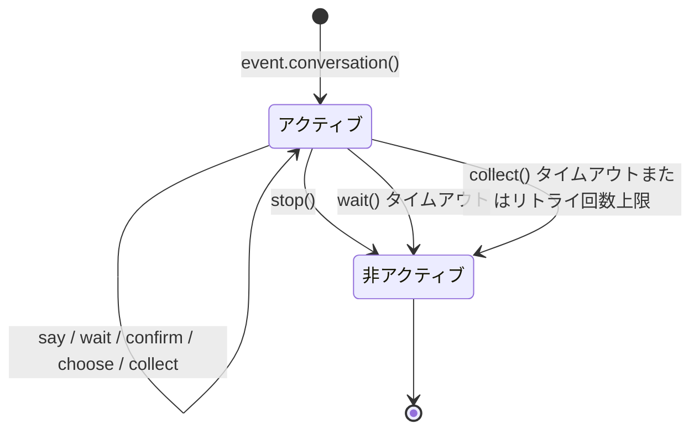

会話は以下のいずれかの状況で自動的に非アクティブ状態になります：

1. `stop()` メソッドを呼び出す
2. `wait()` がタイムアウトして `None` を返す
3. `collect()` がステップのタイムアウトまたはリトライ回数上限により `None` を返す

非アクティブ状態になると、すべてのインタラクションメソッド（`wait`/`confirm`/`choose`/`collect`）は即座に `None` を返し、ユーザー入力の待機は継続されません。

## 分岐とジャンプ

### @conv.branch(name) デコレータ

`branch()` を使用して会話の分岐を登録し、`goto()` を使用して分岐間でジャンプします：

```python
@command("menu")
async def menu_handler(event):
    conv = event.conversation(timeout=60)

    @conv.branch("main")
    async def main_menu():
        await conv.say("=== メインメニュー ===\n1. 本人情報\n2. 設定\n3. 終了")
        resp = await conv.wait()
        if resp is None:
            return
        text = resp.get_text().strip()
        if text == "1":
            await conv.goto("profile")
        elif text == "2":
            await conv.goto("settings")
        elif text == "3":
            await conv.say("さようなら！")
            conv.stop()

    @conv.branch("profile")
    async def profile():
        await conv.say("=== 本人情報 ===\n名前: Alice\n0. 戻る")
        resp = await conv.wait()
        if resp and resp.get_text().strip() == "0":
            await conv.goto("main")

    @conv.branch("settings")
    async def settings():
        await conv.say("=== 設定 ===\n1. 通知の切り替え\n0. 戻る")
        resp = await conv.wait()
        if resp and resp.get_text().strip() == "0":
            await conv.goto("main")

    await conv.start()  # 最初に登録された分岐から開始
```

### conv.start(name=None)

会話を開始します。デフォルトでは最初に登録された分岐から開始されます：

```python
await conv.start()          # 最初の分岐から開始
await conv.start("settings") # 指定された分岐から開始

## コンテキストと永続化

### conv.context

各会話インスタンスには、分岐間で状態を共有するための組み込み `context` 辞書があります：

```python
@conv.branch("step1")
async def step1():
    conv.context["username"] = resp.get_text().strip()
    await conv.goto("step2")

@conv.branch("step2")
async def step2():
    name = conv.context.get("username", "未知")
    await conv.say(f"こんにちは、{name}！")
```

### save() / resume() / clear_saved()

会話は永続化をサポートしており、タイムアウトや中断後に再開できます：

```python
# 会話の状態を保存
conv_id = conv.save()
# conv_id = "user_123_group_456"  # ユーザーとグループに基づいて自動生成

# ... その後、同じセッションで再開 ...
conv2 = event.conversation()
if conv2.resume():
    await conv2.say("おかえり！以前の会話を続けましょう")
else:
    await conv2.say("以前の会話が見つかりません")

# 保存された会話を削除
conv.clear_saved()
```

**言語切り替え:**
[English](docs/en/quick-start.md) | [简体中文](docs/ja/quick-start.md) | [日本語](docs/ja/quick-start.md)

## 典型的なフローのパターン

### ガイド付き登録

```python
@command("register")
async def register_handler(event):
    conv = event.conversation(timeout=60)

    await conv.say("ようこそ登録へ！")

    data = await conv.collect([
        {"key": "username", "prompt": "ユーザー名を入力してください（3-20文字）",
         "validator": lambda e: 3 <= len(e.get_text().strip()) <= 20},
        {"key": "email", "prompt": "メールアドレスを入力してください",
         "validator": lambda e: "@" in e.get_text() and "." in e.get_text(),
         "retry_prompt": "メールアドレスの形式が正しくありません。再度入力してください。"},
    ])

    if not data:
        await event.reply("登録がキャンセルされました")
        return

    confirmed = await conv.confirm(
        f"登録情報を確認しますか？\nユーザー名: {data['username']}\nメールアドレス: {data['email']}"
    )

    if confirmed:
        await conv.say("✅ 登録が完了しました！")
    else:
        await conv.say("❌ 登録がキャンセルされました")
```

### ループによる対話

```python
@command("chat")
async def chat_handler(event):
    conv = event.conversation(timeout=120)
    await conv.say("対話モードに入りました。「退出」で終了します")

    while conv.is_active:
        resp = await conv.wait()
        if resp is None:
            await conv.say("タイムアウトしました。対話が終了します")
            break

        text = resp.get_text().strip()

        if text == "退出":
            await conv.say("さようなら！")
            conv.stop()
        elif text == "帮助":
            await conv.say("利用可能なコマンド：退出、帮助、状态")
        elif text == "状态":
            await conv.say("対話がアクティブです")
        else:
            await conv.say(f"あなたが入力した内容：{text}")


### MessageBuilder 详解

# MessageBuilder 詳細

`MessageBuilder` は、ErisPulseが提供するOneBot12標準のメッセージセグメント構築ツールです。構造化されたメッセージ内容を構築し、`Send.Raw_ob12()` と組み合わせて使用します。

## 導入方法

`MessageBuilder` は以下の2つの導入方法をサポートしています（効果は同じで、1つ目の方法を推奨します）：

```python
from ErisPulse.Core.Event import MessageBuilder        # 推奨、パッケージ経由でのエクスポート
from ErisPulse.Core.Event.message_builder import MessageBuilder  # モジュール直接インポート
```

## ダブルモードメカニズム

MessageBuilder は2つの使用モードを提供し、Pythonのデスクリプタ機構（`__get__`）を通じてクラスレベルとインスタンスレベルでの異なる動作を実現します：クラスからメソッドを呼び出す場合、`__get__` は静的メソッドの実行結果を返します；インスタンスからメソッドを呼び出す場合、`self` を返してチェーンコールをサポートします。

### チェーンコールモード（インスタンス）

`MessageBuilder()` をインスタンス化して使用します。各メソッドは `self` を返し、チェーンコールをサポートし、最後に `.build()` を使ってメッセージセグメントのリストを取得します：

```python
from ErisPulse.Core.Event.message_builder import MessageBuilder

segments = (
    MessageBuilder()
    .text("你好！")
    .image("https://example.com/photo.jpg")
    .build()
)
# [
#     {"type": "text", "data": {"text": "你好！"}},
#     {"type": "image", "data": {"file": "https://example.com/photo.jpg"}}
# ]
```

### 快速構築モード（静的）

クラスから直接メソッドを呼び出します。各メソッドは直接メッセージセグメントのリストを返し、単一セグメントのメッセージに適しています：

```python
# 直接 list[dict] を返します。.build() は不要です。
segments = MessageBuilder.text("你好！")
# [{"type": "text", "data": {"text": "你好！"}}]
```

## メッセージセグメントのタイプ

| メソッド | タイプ | データパラメータ | 説明 |
|------|------|---------|------|
| `text(text)` | text | `text` | テキストメッセージ |
| `image(file)` | image | `file` | 画像メッセージ |
| `audio(file)` | audio | `file` | 音声メッセージ |
| `video(file)` | video | `file` | 動画メッセージ |
| `file(file, filename?)` | file | `file`, `filename` | ファイルメッセージ |
| `mention(user_id, user_name?)` | mention | `user_id`, `user_name` | @メンション（ユーザー指定） |
| `at(user_id, user_name?)` | mention | `user_id`, `user_name` | `mention` のエイリアス |
| `reply(message_id)` | reply | `message_id` | 返信メッセージ |
| `at_all()` | mention_all | - | @全員（全員メンション） |
| `custom(type, data)` | カスタム | カスタム | カスタムメッセージセグメント |

## Send と組み合わせて使用する

構築したメッセージセグメントのリストは、`Send.Raw_ob12()` を通じて送信します。

```python
from ErisPulse import sdk
from ErisPulse.Core.Event.message_builder import MessageBuilder

# チェーン構築 + 送信
segments = (
    MessageBuilder()
    .mention("user123", "张三")
    .text(" 请查看这张图片")
    .image("https://example.com/photo.jpg")
    .build()
)
await sdk.adapter.myplatform.Send.To("group", "group456").Raw_ob12(segments)
```

### Event と組み合わせた返信

```python
from ErisPulse.Core.Event import command

@command("report")
async def report_handler(event):
    await event.reply_ob12(
        MessageBuilder()
        .text("📊 日报汇总\n")
        .text("今日完成任务: 5\n")
        .text("进行中任务: 3")
        .build()
    )
```

## ユーティリティメソッド

### copy()

現在のビルダーをコピーし、同じ基本内容に基づいて複数のメッセージバリエーションを作成するために使用します。

```python
base = MessageBuilder().text("基础内容").mention("admin")

# 同じプレフィックスに基づいて異なるメッセージを構築
msg1 = base.copy().text(" 变体A").build()
msg2 = base.copy().text(" 变体B").image("img.jpg").build()
```

### clear()

追加されたメッセージセグメントをクリアし、同じビルダーを再利用します。

```python
builder = MessageBuilder()

for user_id in ["user1", "user2", "user3"]:
    builder.clear()
    msg = builder.mention(user_id).text(" 你好！").build()
    await adapter.Send.To("user", user_id).Raw_ob12(msg)
```

### len() / bool()

```python
builder = MessageBuilder()
print(bool(builder))   # False

builder.text("Hello")
print(len(builder))    # 1
print(bool(builder))   # True
```

## カスタムメッセージセグメント

`custom()` メソッドを使用して、プラットフォーム拡張のメッセージセグメントを追加します。

```python
# プラットフォーム固有のメッセージセグメントを追加
segments = (
    MessageBuilder()
    .text("请填写表单：")
    .custom("yunhu_form", {"form_id": "12345"})
    .build()
)
```

> カスタムメッセージセグメントは、対応するプラットフォームのアダプターでのみ有効です。他のアダプターは認識しないメッセージセグメントを無視します。

## 完全な例

### マルチエレメントメッセージ

```python
segments = (
    MessageBuilder()
    .reply(event.get_id())                    # 元のメッセージに返信
    .mention(event.get_user_id())             # 送信者に@メンション
    .text(" 这是你的查询结果：\n")             # テキスト
    .image("https://example.com/chart.png")   # 画像
    .text("\n详细数据见附件：")
    .file("https://example.com/data.csv", filename="data.csv")
    .build()
)
await event.reply_ob12(segments)
```

### スタティックファクトリ + チェーンの組み合わせ

```python
# 単一セグメントのメッセージを迅速に構築
simple_msg = MessageBuilder.text("简单文本")

# 複雑なメッセージをチェーン構築
complex_msg = (
    MessageBuilder()
    .at_all()
    .text(" 📢 公告：")
    .text("今天下午3点开会")
    .build()
)
```


### HTTP 客户端

# ネットワーククライアント

ErisPulse は、HTTPリクエスト、WebSocket接続、および接続プール管理を統合した統一されたネットワーククライアントを提供しています。モジュールやアダプターは、**aiohttp / httpx / requests** などのサードパーティライブラリを直接インポートするのではなく、このクライアントを優先して使用する必要があります。

docs/ja/quick-start.md

## 概要

ネットワーククライアントの主な機能：

- **統一されたインターフェース**：`get` / `post` / `put` / `delete` / `patch` / `request` メソッドを提供
- **WebSocket クライアント**：`ws_connect` を通じてクライアント側の WebSocket 接続を確立
- **自動ログ**：すべてのリクエストを自動的にログ記録し、統計情報を取得
- **ライフサイクル統合**：各リクエストごとに `client.request` ライフサイクルイベントをトリガーし、WS 接続時は `client.ws.connect` イベントをトリガー
- **リトライサポート**：自動リトライ回数と間隔を設定可能
- **タイムアウト制御**：接続タイムアウトとリクエストタイムアウトを個別に制御
- **接続プールの再利用**：aiohttp.ClientSession に基づく接続プール管理
- **例外体系**：aiohttp の例外を自動的に ErisPulse の例外 (ClientError 体系) に変換

[**English**](docs/en/quick-start.md) | [**日本語**](docs/ja/quick-start.md) | [**中文**](docs/ja/quick-start.md)

## 快速開始

### HTTP リクエスト

```python
from ErisPulse.Core import client

# GET リクエスト
resp = await client.get("https://httpbin.org/get")
data = await resp.json()
print(resp.status)  # 200

# POST リクエスト
resp = await client.post(
    "https://httpbin.org/post",
    json={"key": "value"},
)
data = await resp.json()
```

### WebSocket 接続

```python
from ErisPulse.Core import client

ws = await client.ws_connect("wss://example.com/ws")

async for text in ws.iter_text():
    await ws.send_text(f"Echo: {text}")

## HttpResponse

すべてのリクエストメソッドは `HttpResponse` オブジェクトを返します：

```python
from ErisPulse.Core import client

resp = await client.get("https://httpbin.org/get")

resp.status       # int - HTTP ステータスコード (例: 200, 404)
resp.reason       # str | None - ステータスの説明 (例: "OK")
resp.headers      # レスポンスヘッダー (大文字小文字を区別しません)
resp.content_type # str | None - Content-Type
resp.url          # 最終的な URL (リダイレクトにより変更される可能性があります)
resp.raw          # ベースとなるネイティブなレスポンスオブジェクト (現在は aiohttp.ClientResponse)

# レスポンスボディを読み取る
body = await resp.read()       # bytes
text = await resp.text()       # str
data = await resp.json()       # JSON を解析
text = await resp.text("gbk")  # エンコーディングを指定

## リクエストメソッド

### GET

```python
from ErisPulse.Core import client

resp = await client.get(
    "https://api.example.com/users",
    params={"page": "1", "limit": "10"},
    headers={"Authorization": "Bearer token"},
)
```

### POST

```python
from ErisPulse.Core import client

# JSONリクエストボディ
resp = await client.post(
    "https://api.example.com/users",
    json={"name": "Alice", "age": 30},
)

# フォームリクエストボディ
resp = await client.post(
    "https://api.example.com/login",
    data={"username": "admin", "password": "123"},
)

# ロウデータ
resp = await client.post(
    "https://api.example.com/upload",
    data=b"raw bytes",
    headers={"Content-Type": "application/octet-stream"},
)

# ファイルアップロード (filesパラメータを使用, aiohttpのインポートは不要)
# 形式: {フィールド名: ファイルオブジェクト/bytes/(filename, file)/(filename, file, content_type)}
resp = await client.post(
    "https://api.example.com/upload",
    data={"description": "プロフィール画像"},            # 任意: 普通のフォームフィールドも同時に送信可能
    files={
        "file": ("photo.png", open("photo.png", "rb"), "image/png"),
    },
)

# 簡易記法: ファイルオブジェクトを直接渡す
resp = await client.post(
    "https://api.example.com/upload",
    files={"file": open("photo.png", "rb")},
)

# メモリ上のデータを直接アップロード (ディスクへの保存は不要)
import io

resp = await client.post(
    "https://api.example.com/upload",
    files={"file": ("data.txt", io.BytesIO(b"file content"), "text/plain")},
)
```

### PUT / DELETE / PATCH

```python
from ErisPulse.Core import client

resp = await client.put("https://api.example.com/users/1", json={"name": "Bob"})
resp = await client.delete("https://api.example.com/users/1")
resp = await client.patch("https://api.example.com/users/1", json={"age": 31})
```

### 一般的な request

```python
from ErisPulse.Core import client

resp = await client.request(
    "OPTIONS",
    "https://api.example.com/resource",
    headers={"Origin": "https://example.com"},
)

## パラメータの説明

### HTTPリクエストパラメータ

| パラメータ | 型 | 説明 |
|------|------|------|
| `url` | `str` | リクエストURL |
| `params` | `dict[str, str]` | クエリパラメータ (オプション) |
| `headers` | `dict[str, str]` | 追加のリクエストヘッダー (オプション) |
| `data` | `Any` | リクエストボディ (フォームまたは生データ) (オプション) |
| `json` | `Any` | JSONリクエストボディ (オプション) |
| `files` | `dict[str, Any]` | ファイルアップロードフィールド (オプション、multipart/form-dataを自動的に構築) |
| `timeout` | `float` | 本次のリクエストタイムアウト (秒) (オプション、デフォルト値を上書き) |
| `max_retries` | `int` | 本次の最大リトライ回数 (オプション、デフォルト値を上書き) |

### ws_connect パラメータ

| パラメータ | 型 | 説明 |
|------|------|------|
| `url` | `str` | WebSocketサーバーのURL |
| `headers` | `dict[str, str]` | 追加のリクエストヘッダー (オプション) |
| `heartbeat` | `float` | ハートビート間隔 (秒) (オプション) |

## タイムアウトとリトライ

```python
from ErisPulse.Core import Client

# カスタムタイムアウトを設定したクライアントを作成
client = Client(
    timeout=60,           # 要求の総タイムアウト 60秒
    connect_timeout=5,    # 接続タイムアウト 5秒
    max_retries=3,        # 失敗時に自動でリトライ 3回
    retry_delay=2,        # リトライ間隔 2秒
)

# 単一の要求でタイムアウトを上書き
resp = await client.get("https://slow-api.example.com/data", timeout=120)
```

> [!NOTE]
> クライアントクラスは 2.8.0 から `Client` に名前が変更されました（`sdk.client` の属性名は変更されません）；古い名前 `HttpClient` は互換性のためのエイリアスとして保持され、古いコードを変更する必要はありません。

[**English**](docs/en/timeout-retry.md) | [**简体中文**](docs/ja/timeout-retry.md) | [**日本語**](docs/ja/timeout-retry.md)

## デフォルトのヘッダーをカスタマイズ

```python
client = Client(
    headers={
        "Authorization": "Bearer token",
        "X-App-Id": "my-app",
    },
    user_agent="MyBot/1.0",
)
```

[**English**](docs/ja/quick-start.md)

## リクエスト統計

```python
from ErisPulse.Core import client

# 統計を表示
stats = client.stats
# {"total_requests": 42, "total_errors": 1, "total_bytes_sent": 0, "total_bytes_received": 0}

# 統計をリセット
client.reset_stats()
```

[**English**](docs/ja/quick-start.md) | [**日本語**](docs/ja/quick-start.md)

## ライフサイクルイベント

### HTTPリクエストイベント

リクエストが完了するたびに `client.request` イベントがトリガーされ、モニタリングに使用できます：

```python
from ErisPulse.Core import lifecycle

@lifecycle.on("client.request")
async def on_request(event_data):
    print(f"{event_data['method']} {event_data['url']} -> {event_data['status']} ({event_data['elapsed']}s)")
```

### WebSocket接続イベント

WebSocket接続が確立するたびに `client.ws.connect` イベントがトリガーされます：

```python
from ErisPulse.Core import lifecycle

@lifecycle.on("client.ws.connect")
async def on_ws_connect(event_data):
    print(f"WS 接続: {event_data['url']}")

## コンテキスト管理

```python
# コンテキストマネージャーとして使用し、セッションを自動的に閉じる
async with Client(timeout=30) as client:
    resp = await client.get("https://httpbin.org/get")
    data = await resp.json()
```

[**English**](docs/en/quick-start.md) | [**日本語**](docs/ja/quick-start.md)

## WebSocket クライアント

`client.ws_connect()` を使用して WebSocket クライアント接続を確立し、`ClientWebSocket` オブジェクトを返します。クライアントとサーバーの WebSocket は同じ `WebSocketConnectionBase` 基底クラスを共有し、send/receive/iter インターフェースは完全に一致しています。

### 基本的な使用方法

```python
from ErisPulse.Core import client

ws = await client.ws_connect("wss://example.com/ws", heartbeat=30)

await ws.send_text("Hello")
await ws.send_bytes(b"\x00\x01\x02")
await ws.send_json({"type": "ping"})
```

### メッセージの受信

#### 高レベルメソッド（推奨）

メッセージの種類を自動的にフィルタリングし、切断時に `WebSocketDisconnect` をスローします：

```python
from ErisPulse.Core import client
from ErisPulse.Core.Bases.errors import WebSocketDisconnect

ws = await client.ws_connect("wss://example.com/ws")

# 単一のメッセージ受信
text = await ws.receive_text()    # str
data = await ws.receive_bytes()   # bytes
obj = await ws.receive_json()     # dict / list

# 反復処理による受信（切断時に自動停止）
async for text in ws.iter_text():
    print(text)

async for data in ws.iter_bytes():
    print(data)

async for obj in ws.iter_json():
    print(obj)
```

#### 低レベルメソッド

`receive()` と `iter_messages()` を使用して、TEXT / BINARY / CLOSE / ERROR を区別できる生のメッセージタイプを処理します：

```python
from ErisPulse.Core import client
from ErisPulse.Core.Bases.websocket import WSMessage

ws = await client.ws_connect("wss://example.com/ws")

# 単一の生メッセージ受信
msg = await ws.receive()
# msg.type  -> WSMessage.TEXT / WSMessage.BINARY / WSMessage.CLOSE / WSMessage.ERROR
# msg.data  -> str | bytes | None

# 生メッセージの反復処理（CLOSE/ERROR で自動停止）
async for msg in ws.iter_messages():
    if msg.type == WSMessage.TEXT:
        print(f"テキスト: {msg.data}")
    elif msg.type == WSMessage.BINARY:
        print(f"バイナリ: {len(msg.data)} bytes")
```

### WSMessage

`WSMessage` は、下位ライブラリに依存しない統一された WebSocket メッセージタイプです：

| 属性 | 型 | 説明 |
|------|------|------|
| `type` | `str` | メッセージの種類: `WSMessage.TEXT` / `WSMessage.BINARY` / `WSMessage.CLOSE` / `WSMessage.ERROR` |
| `data` | `Any` | メッセージのデータ |

### ClientWebSocket 属性

| 属性 | 型 | 説明 |
|------|------|------|
| `url` | `URL` | 接続の URL |
| `headers` | `Headers` | 応答ヘッダー |
| `closed` | `bool` | 接続が閉じられているか |
| `raw` | `object` | 下位の生のオブジェクト (aiohttp.ClientWebSocketResponse) |

### ライフサイクルフック

`サービス側 WebSocketConnection` と同様に、`on_disconnect` と `on_error` コールバックをサポートします：

```python
from ErisPulse.Core import client

ws = await client.ws_connect("wss://example.com/ws")

@ws.on_disconnect
async def handle_disconnect(ws, reason="unknown"):
    print(f"接続が切断されました: {reason}")

@ws.on_error
async def handle_error(ws, error=""):
    print(f"接続エラー: {error}")
```

### 接続の切断

```python
await ws.close(code=1000, reason="Normal closure")

## 例外体系

ErisPulse は、統一された例外階層を定義しており、`sdk.client` を介してリクエストを発行すると、自動的に下層の aiohttp 例外を ErisPulse 例外に変換します。

> **互換性の維持**：`aiohttp.ClientSession` を直接使用する旧モジュール/アダプタは完全に影響を受けません。例外変換は `sdk.client` を介してリクエストを発行する場合にのみ有効であり、aiohttp を直接使用するコードは引き続き `aiohttp.ClientError` などのネイティブ例外をキャッチします。両方の方法は共存可能です。

### 例外階層

```
ErisPulseError
├── ClientError                  # すべての HTTP/WS クライアントリクエスト例外の基底クラス
│   ├── ClientConnectionError    # 接続失敗 (DNS 解析失敗、接続拒否、ネットワーク到達不能)
│   ├── ClientTimeoutError       # 接続タイムアウトまたはリクエストタイムアウト
│   └── HTTPStatusError          # HTTP 4xx/5xx ステータスコードエラー
└── WebSocketError               # WebSocket 例外の基底クラス
    └── WebSocketDisconnect      # WebSocket 接続切断 (クライアントとサーバー共通)
```

### 例外のキャッチ

```python
from ErisPulse.Core import client
from ErisPulse.Core.Bases.errors import (
    ClientError,
    ClientConnectionError,
    ClientTimeoutError,
    HTTPStatusError,
    WebSocketDisconnect,
    WebSocketError,
)

# HTTP リクエスト例外の処理
try:
    resp = await client.get("https://api.example.com/data")
    data = await resp.json()
except ClientConnectionError:
    print("サーバーに接続できません")
except ClientTimeoutError:
    print("リクエストがタイムアウトしました")
except ClientError as e:
    print(f"リクエストが失敗しました: {e}")

# WebSocket 例外の処理
try:
    ws = await client.ws_connect("wss://example.com/ws")
    async for text in ws.iter_text():
        await ws.send_text(f"Echo: {text}")
except WebSocketDisconnect as e:
    print(f"接続が切断されました: code={e.code}, reason={e.reason}")
except WebSocketError as e:
    print(f"WebSocket エラー: {e}")
```

### 統一されたキャッチ

`ClientError` を使用して、すべての HTTP/WS クライアントリクエスト例外を統一的にキャッチします：

```python
from ErisPulse.Core.Bases.errors import ClientError

try:
    resp = await client.get("https://api.example.com/data")
except ClientError as e:
    print(f"クライアントエラー: {e}")
```

### HTTPStatusError

リクエスト後にステータスコードをチェックし、例外を投げる必要がある場合、手動で使用できます：

```python
from ErisPulse.Core.Bases.errors import HTTPStatusError

resp = await client.get("https://api.example.com/data")
if resp.status >= 400:
    raise HTTPStatusError(resp.status, await resp.text())

## アダプターでの使用

アダプターは、グローバルクライアントまたは独自にクライアントインスタンスを作成して、プラットフォームAPIリクエストを送信することができます。

```python
from ErisPulse.Core import client
from ErisPulse.Core.Bases import BaseAdapter
from ErisPulse.Core.Bases.errors import ClientError

class MyAdapter(BaseAdapter):
    async def call_api(self, endpoint, **params):
        try:
            resp = await client.post(
                f"https://api.platform.com/{endpoint}",
                json=params,
                headers={"Authorization": f"Bearer {self.token}"},
            )
            return await resp.json()
        except ClientError as e:
            self.logger.error(f"APIの呼び出しに失敗しました: {e}")
            raise
```

> `from ErisPulse import sdk` から `sdk.client` を使用することもでき、効果は同じです。

## 最佳実践

1. **グローバルクライアントを優先する**：`from ErisPulse.Core import client` を使用してグローバルシングルトンを取得し、フレームワークによる統一的な管理と監視を容易にする
2. **直接 aiohttp をインポートしない**：`client` を `aiohttp.ClientSession` の代わりに使用し、将来の下層実装の変更時にコードを修正する必要がないようにする。古いコードで直接 aiohttp を使用しても正常に動作し、両方の方法を共存させることができる
3. **ErisPulse の例外体系を使用する**：`sdk.client` を使用してリクエストする際には `aiohttp.ClientError` ではなく `ClientError` をキャッチし、コードが特定の HTTP ライブラリに依存しないようにする。直接 aiohttp を使用する古いコードには影響しない
4. **適切なタイムアウトを設定する**：API の応答速度に応じて適切なタイムアウト時間を設定し、長時間のブロッキングを避ける
5. **リトライメカニズムを使用する**：不安定な API に対してリトライを有効にし、信頼性を向上させる
6. **リクエスト統計を監視する**：`sdk.client.stats` または `client.request` のライフサイクルイベントを使用してリクエスト状況を監視する
7. **WebSocket で高機能メソッドを使用する**：`iter_text` / `iter_json` などの高機能メソッドを優先し、メッセージタイプを区別する必要がある場合にのみ `iter_messages` を使用する

## ドキュメントの言語切り替え

[**English**](docs/en/quick-start.md) | [**简体中文**](docs/ja/quick-start.md) | [**日本語**](docs/ja/quick-start.md)


### SQL 查询构建器

# SQLクエリビルダー

ErisPulseのStorageモジュールは、メソッドチェーンスタイルの汎用SQLクエリビルダーを提供し、カスタムテーブルの作成、クエリ、更新、削除操作をサポートしています。

## アーキテクチャ設計

```
Bases/storage.py                    Core/storage.py
┌─────────────────────┐             ┌──────────────────────────┐
│  BaseStorage (ABC)  │◄────────────│  StorageManager          │
│  BaseQueryBuilder   │             │  (SQLite concrete impl)  │
│    (ABC)            │             │                          │
└─────────────────────┘             │  SQLiteQueryBuilder      │
                                    │  AlterTableBuilder       │
                                    └──────────────────────────┘
```

- `BaseStorage` / `BaseQueryBuilder` は抽象基底クラスであり、統一されたインターフェースを定義し、将来的に他のストレージメディア（Redis、MySQLなど）への拡張をサポートします。
- `StorageManager` は現在のSQLiteの具体的な実装であり、完全な下位互換性があります。

## インポート

```python
from ErisPulse import sdk
# または
from ErisPulse.Core import storage

# ABC基底クラス（型アノテーションまたはカスタム実装用）
from ErisPulse.Core.Bases.storage import BaseStorage, BaseQueryBuilder
```

## テーブル管理

### テーブルの作成

```python
sdk.storage.CreateTable("users", {
    "id": "INTEGER PRIMARY KEY AUTOINCREMENT",
    "name": "TEXT NOT NULL",
    "age": "INTEGER DEFAULT 0",
    "email": "TEXT"
})
```

### テーブルの存在確認

```python
if sdk.storage.HasTable("users"):
    print("users テーブルは既に存在します")
```

### テーブルの削除

```python
sdk.storage.DropTable("users")
```

### テーブル構造の変更

```python
# 列の追加
sdk.storage.AlterTable("users").AddColumn("email", "TEXT").Execute()

# テーブル名の変更
sdk.storage.AlterTable("users").RenameTo("members").Execute()

# 複数操作のチェーン
sdk.storage.AlterTable("users") \
    .AddColumn("phone", "TEXT") \
    .AddColumn("address", "TEXT") \
    .Execute()
```

## メソッドチェーンによるクエリ

### データの挿入

```python
# 単一行の挿入（辞書を渡す）
sdk.storage.Table("users").Insert({"name": "Alice", "age": 30}).Execute()

# バッチ挿入（辞書のリストを渡す）
sdk.storage.Table("users").InsertMulti([
    {"name": "Bob", "age": 25},
    {"name": "Charlie", "age": 35},
    {"name": "Dave", "age": 40}
]).Execute()
```

### データのクエリ

> **重要**: `Select()` は `list[tuple]`（タプルのリスト）を返し、辞書ではありません。列の順序に従ってインデックスでアクセスする必要があります。

```python
# すべての列をクエリ
rows = sdk.storage.Table("users").Select().Execute()
# rows: [(1, "Alice", 30), (2, "Bob", 25), ...]

# 指定した列をクエリ
rows = sdk.storage.Table("users").Select("name", "age").Execute()
# rows: [("Alice", 30), ("Bob", 25), ...]

# インデックスで値を取得
for row in rows:
    name = row[0]   # "Alice"
    age = row[1]    # 30
```

#### タプルを辞書に変換

```python
columns = ["id", "name", "age"]
rows = sdk.storage.Table("users").Select(*columns).Execute()

# 方法1：ループ内でzipを使用
for row in rows:
    record = dict(zip(columns, row))
    print(record["name"], record["age"])

# 方法2：一括で辞書のリストに変換
records = [dict(zip(columns, row)) for row in rows]
```

#### 単一レコードの取得

```python
row = sdk.storage.Table("users").Select("name", "age") \
    .Where("id = ?", 1) \
    .ExecuteOne()

# rowはtupleまたはNone
if row is not None:
    name = row[0]  # "Alice"
    age = row[1]   # 30
```

### 条件フィルタリング

> `Where(condition, *params)` は複数のパラメータの渡しをサポートし、複数の `?` プレースホルダに対応します。

```python
# 単一条件（1つのプレースホルダ、1つのパラメータ）
rows = sdk.storage.Table("users").Select("name") \
    .Where("age > ?", 18) \
    .Execute()

# 1つのWhereで複数のプレースホルダを使用
rows = sdk.storage.Table("users").Select("name") \
    .Where("age > ? AND age < ?", 20, 40) \
    .Execute()

# Whereの複数呼び出し（ANDで接続）
rows = sdk.storage.Table("users").Select("name") \
    .Where("age > ?", 20) \
    .Where("age < ?", 40) \
    .Execute()
```

### ソート、ページネーション

```python
# 昇順
rows = sdk.storage.Table("users").Select("name", "age") \
    .OrderBy("name") \
    .Execute()

# 降順
rows = sdk.storage.Table("users").Select("name") \
    .OrderBy("age", desc=True) \
    .Execute()

# ページネーション
rows = sdk.storage.Table("users").Select("name") \
    .OrderBy("id") \
    .Limit(10) \
    .Offset(20) \
    .Execute()
```

### データの更新

```python
# 条件付き更新
sdk.storage.Table("users") \
    .Update({"age": 31}) \
    .Where("name = ?", "Alice") \
    .Execute()

# 全件更新
sdk.storage.Table("users") \
    .Update({"status": "active"}) \
    .Execute()
```

### データの削除

```python
# 条件付き削除
sdk.storage.Table("users") \
    .Delete() \
    .Where("name = ?", "Bob") \
    .Execute()

# 全件削除
sdk.storage.Table("users").Delete().Execute()
```

### カウントと存在確認

```python
# カウント
count = sdk.storage.Table("users").Count()
count = sdk.storage.Table("users").Where("age > ?", 18).Count()

# 存在確認
exists = sdk.storage.Table("users").Where("name = ?", "Alice").Exists()
```

## クエリ条件の再利用

`copy()` を使用してビルダーをディープコピーし、基本条件を再利用します：

```python
base = sdk.storage.Table("users").Where("age > ?", 20)

# 同じ条件に基づいてクエリ
rows = base.copy().Select("name").OrderBy("name").Limit(5).Execute()

# 同じ条件に基づいてカウント
count = base.copy().Count()

# 同じ条件に基づいて存在確認
exists = base.copy().Where("name = ?", "Alice").Exists()
```

## ビルダーのリセット

```python
builder = sdk.storage.Table("users").Select("name").Where("age > ?", 18)
builder.clear()

# クエリを再構築
builder.Select("name", "age").Where("name = ?", "Alice")
rows = builder.Execute()
```

## トランザクションでの使用

メソッドチェーン操作はトランザクションを完全にサポートしています：

```python
# トランザクションのコミット
with sdk.storage.transaction():
    sdk.storage.Table("users").Insert({"name": "Eve", "age": 22}).Execute()
    sdk.storage.Table("users").Update({"age": 23}).Where("name = ?", "Eve").Execute()

# ロールバックの例
try:
    with sdk.storage.transaction():
        sdk.storage.Table("users").Delete().Where("name = ?", "Alice").Execute()
        raise Exception("force rollback")
except Exception:
    pass
# Aliceのレコードはまだ存在しています
```

## 戻り値の説明

| 操作 | 戻り値の型 | 説明 |
|------|---------|------|
| `Select().Execute()` | `list[tuple]` | タプルのリスト、列の順序で並び替え |
| `Select().ExecuteOne()` | `tuple \| None` | 単一のタプルまたはNone |
| `Insert().Execute()` | `int` | 影響を受けた行数 |
| `InsertMulti().Execute()` | `int` | 挿入された行数 |
| `Update().Execute()` | `int` | 影響を受けた行数 |
| `Delete().Execute()` | `int` | 影響を受けた行数 |
| `Count()` | `int` | 一致した行数 |
| `Exists()` | `bool` | 存在するかどうか |

### 戻り値の処理例

```python
# Selectはタプルを返し、インデックスで値を取得
rows = sdk.storage.Table("users").Select("name", "age").Execute()
first_name = rows[0][0]  # 最初の行の最初の列 name
first_age = rows[0][1]   # 最初の行の2番目の列 age

# 推奨：列名リスト + zipで辞書に変換すると、コードが読みやすくなります
cols = ["name", "age"]
rows = sdk.storage.Table("users").Select(*cols).Execute()
for row in rows:
    d = dict(zip(cols, row))
    print(d["name"], d["age"])

# ExecuteOneは単一のタプルまたはNoneを返します
row = sdk.storage.Table("users").Select("name").Where("id = ?", 1).ExecuteOne()
name = row[0] if row else None

# Insert/Update/Deleteは影響を受けた行数を返します
affected = sdk.storage.Table("users").Delete().Where("age < ?", 18).Execute()
print(f"{affected} 件のレコードを削除しました")
```

## パラメータ化クエリ

すべてのWHEREパラメータは `?` プレースホルダを使用し、パラメータは `Where()` の後続の引数として渡されます（タプルやリストでは**ありません**）：

```python
# 正しい ✓ — 複数のパラメータを個別に渡す
sdk.storage.Table("users").Where("age > ? AND name = ?", 18, "Alice").Execute()

# 正しい ✓ — Whereの複数呼び出し
sdk.storage.Table("users").Where("age > ?", 18).Where("name = ?", "Alice").Execute()

# 間違い ✗ — タプルを渡さないでください
sdk.storage.Table("users").Where("age > ? AND name = ?", (18, "Alice")).Execute()
# これはタプル全体が最初のプレースホルダの値として扱われます

# 間違い ✗ — SQLインジェクションのリスクがあります
sdk.storage.Table("users").Where(f"name = '{user_input}'").Execute()
```

### Whereのパラメータ渡しルール

```python
# Where(condition: str, *params: Any)
# paramsは可変長引数なので、個別に渡すだけです

# 単一パラメータ
.Where("name = ?", "Alice")

# 複数パラメータ
.Where("age > ? AND age < ?", 18, 60)

# LIKEクエリ
.Where("name LIKE ?", "A%")

# INクエリ（プレースホルダを手動で構築する必要があります）
.Where("name IN (?, ?, ?)", "Alice", "Bob", "Charlie")
```

## カスタムストレージバックエンド

`BaseStorage` と `BaseQueryBuilder` を継承してカスタムストレージバックエンドを実装します：

```python
from ErisPulse.Core.Bases.storage import BaseStorage, BaseQueryBuilder

class MyQueryBuilder(BaseQueryBuilder):
    def Execute(self):
        # 具体的な実行ロジックを実装
        ...

    def ExecuteOne(self):
        ...

    def Count(self):
        ...

    def Exists(self):
        ...


class MyStorage(BaseStorage):
    def get(self, key, default=None):
        ...

    def set(self, key, value):
        ...

    # その他の抽象メソッドを実装...
    def Table(self, table_name):
        return MyQueryBuilder(self, table_name)
```


### 路由系统

# ルーティングマネージャー

ErisPulse ルーティングマネージャーは、HTTP および WebSocket のルーティングを統一的に管理し、複数アダプタのルーティング登録とライフサイクル管理をサポートします。内部では抽象層を封印しています（現在は FastAPI + Uvicorn）

## 概要

ルーティングマネージャーの主な機能：

- **デコレータルーティング**：`@http` / `@get` / `@post` / `@put` / `@delete` / `@ws` デコレータによる高速登録
- **自動インジェクション**：ルーティングハンドラは FastAPI クラスをインポートする必要がなく、フレームワークが抽象オブジェクトを自動的に注入します
- **ルーティンググループ**：プレフィックスとバージョン番号付きの `RouteGroup` をサポート
- **ルーティングミドルウェア**：glob モードマッチングによるリクエストのインターセプト
- **レート制限**：スライディングウィンドウ方式のリクエスト制限
- **CORSサポート**：ワンクリックで CORS を有効化
- **セキュリティヘッダー**：自動的にセキュリティレスポンスヘッダーを追加
- **自動ドキュメント**：OpenAPI に基づくインタラクティブなドキュメント
- **WebSocketサポート**：WebSocket接続の完全な管理、カスタム認証、ライフサイクルフック
- **ライフサイクル統合**：ErisPulse ライフサイクルシステムと深く統合
- **SSL/TLSサポート**：HTTPS および WSS セキュア接続をサポート
- **ホームエントリ**：モジュールがルートルート `/` に登録されたクイックエントリボタンをサポート、国際化に対応

## 抽象型

ErisPulse はサーバー側の抽象型を提供し、モジュールが FastAPI に直接依存しないようにします：

| 抽象型 | FastAPI対応 | 説明 |
|---------|-------------|------|
| `HttpRequest` | `fastapi.Request` | HTTPリクエストのラッパー、インターフェースは完全に互換性があります |
| `WebSocketConnection` | `fastapi.WebSocket` | WebSocket接続のラッパー、ライフサイクルフックを追加 |
| `WebSocketDisconnect` | `fastapi.WebSocketDisconnect` | WebSocket切断例外 |

> `WebSocketConnection` は `WebSocketConnectionBase` を継承しており、クライアント側の WebSocket (`ClientWebSocket`) と同じ send/receive/iter/close インターフェースを共有します。クライアントとサーバー側の WebSocket は同じビジネスロジックコードを使用できます。
>
> `.raw` 属性を介して、下層の FastAPI ネイティブオブジェクトにアクセスできます。直接 FastAPI クラスを使用するコードも完全に互換性があります。

## デコレータルーティング（推奨）

### HTTPデコレータ

```python
from ErisPulse.Core import router
@router.get("my_module", "/info")
async def get_info(request):
    return {"method": request.method, "path": str(request.url)}

# 明示的に抽象型を指定することもできます
from ErisPulse.Core import HttpRequest

@router.post("my_module", "/data")
async def post_data(request: HttpRequest):
    data = await request.json()
    return {"received": data}

@router.put("my_module", "/data/{item_id}")
async def update_data(request):
    return {"updated": True}

@router.delete("my_module", "/data/{item_id}")
async def delete_data(request):
    return {"deleted": True}
```

> **自動インジェクションルール**：ハンドラの最初の引数が `request` または `req` で、FastAPI型の注釈がない場合、フレームワークは自動的に `HttpRequest` を注入します。引数がなく、またはリクエスト引数名でないハンドラは影響を受けません。

### WebSocketデコレータ

```python
from ErisPulse.Core import WebSocketConnection, WebSocketDisconnect

# 基本的なWebSocket
@router.ws("my_module", "/ws")
async def websocket_handler(ws):
    async for msg in ws.iter_text():
        await ws.send_text(f"Echo: {msg}")

# ライフサイクルフック付きのWebSocket
@router.ws("my_module", "/ws/chat")
async def chat(ws: WebSocketConnection):
    @ws.on_disconnect
    async def on_disconnect(ws, reason="unknown"):
        print(f"ユーザー切断: {reason}")

    @ws.on_error
    async def on_error(ws, error=""):
        print(f"接続エラー: {error}")

    async for msg in ws.iter_text():
        await ws.send_text(f"Echo: {msg}")

# 認証付きのWebSocket
async def ws_auth(ws: WebSocketConnection) -> bool:
    token = ws.query_params.get("token")
    return token == "secret"

@router.ws("my_module", "/secure_ws", auth_handler=ws_auth)
async def secure_ws_handler(ws):
    while True:
        data = await ws.receive_text()
        await ws.send_text(f"Echo: {data}")
```

> **注意**：WebSocketハンドラと認証ハンドラも自動インジェクションをサポートします。引数の注釈がなくても `WebSocketConnection` を取得できます。`fastapi.WebSocket` を注釈してもネイティブオブジェクトを渡すことができますが、抽象型の使用を推奨します。

## 伝統的な登録方法

```python
async def hello_handler(request):
    return {"message": "Hello World"}

# 基本的な登録
router.register_http_route(
    module_name="my_module",
    path="/hello",
    handler=hello_handler,
    methods=["GET"],
)

# レート制限とドキュメント情報付き
router.register_http_route(
    module_name="my_module",
    path="/api/data",
    handler=data_handler,
    methods=["POST"],
    rate_limit="10/minute",
    summary="データインターフェース",
    tags=["API"],
)
```

### WebSocket登録

```python
from ErisPulse.Core import WebSocketConnection

async def websocket_handler(ws: WebSocketConnection):
    async for msg in ws.iter_text():
        await ws.send_text(f"Echo: {msg}")

# 基本的な登録
router.register_websocket(
    module_name="my_module",
    path="/ws",
    handler=websocket_handler,
)

# 認証付きの登録（推奨）
async def auth_handler(ws: WebSocketConnection) -> bool:
    token = ws.query_params.get("token")
    return token == "secret"

router.register_websocket(
    module_name="my_module",
    path="/secure_ws",
    handler=websocket_handler,
    auth_handler=auth_handler,
)
```

**パラメータ説明：**

| パラメータ | 説明 | デフォルト値 |
|------|------|--------|
| `module_name` | モジュール名（必須） | - |
| `path` | WebSocketパス | - |
| `handler` | ハンドラ関数 | - |
| `auth_handler` | 認証関数、`False`を返すと接続が自動的に切断されます | `None` |
| `auto_accept` | 自動的に `accept()` を行うかどうか | `True` |

> **推奨**：接続確認には `auth_handler` を使用してください。`auto_accept` を `False` に設定するのは、接続フローを完全に制御したい場合に限り、`auth_handler` を使用することを推奨します。

## WebSocketライフサイクルフック

`WebSocketConnection` は切断とエラーのコールバックを登録する機能を提供し、手動の try/catch が不要です：

```python
from ErisPulse.Core import WebSocketConnection

@router.ws("my_module", "/ws")
async def my_ws(ws: WebSocketConnection):
    # デコレータ方式で登録
    @ws.on_disconnect
    async def on_close(ws, reason="unknown"):
        print(f"切断原因: {reason}")

    # 直接呼び出すこともできます
    async def on_err(ws, error=""):
        print(f"エラー: {error}")
    ws.on_error(on_err)

    # 通常のビジネスロジック
    async for msg in ws.iter_text():
        await ws.send_text(f"Echo: {msg}")
```

## ルーティンググループ

```python
# プレフィックス付きのルーティンググループを作成
group = router.group("my_module", prefix="/v1")

@group.get("/users")
async def list_users(request):
    return {"users": []}

@group.post("/users")
async def create_user(request):
    return {"created": True}

# 実際のパス: /my_module/v1/users
```

## ルーティングミドルウェア

ミドルウェアは glob モードでパスをマッチングします：

```python
@router.middleware("/my_module/*")
async def auth_middleware(request, call_next):
    token = request.headers.get("Authorization")
    if not token:
        return {"error": "Unauthorized"}
    return await call_next(request)

@router.middleware("/my_module/admin/*")
async def admin_middleware(request, call_next):
    return await call_next(request)
```

## リクエスト関連ID（X-Request-ID）

2.7.0以降、各HTTPリクエストには `X-Request-ID` 関連IDが付与され、ログ / リンクトレースの連携に使用されます：

- **生成ルール**：クライアントが送信した `X-Request-ID` リクエストヘッダーを優先して使用（分散トレースの場面）；なければUUIDを自動生成
- **レスポンスヘッダー**：レスポンスに `X-Request-ID` を返し、クライアントがリクエストとログを対応させるのに便利です
- **ライフサイクルイベント**：`server.request` と `server.response` イベントデータに `request_id` フィールドが追加されました

```python
# モジュール内でリクエストイベントを監視し、request_id でリクエスト-レスポンスを連携
@sdk.lifecycle.on("server.request")
async def on_request(data):
    print(f"[{data['request_id']}] {data['method']} {data['path']}")

@sdk.lifecycle.on("server.response")
async def on_response(data):
    print(f"[{data['request_id']}] -> {data['status_code']}")
```

クライアントは、サービス間トレースのために独自のIDを設定できます：

```bash
curl -H "X-Request-ID: my-trace-id" http://localhost:8080/my_module/health
```

## レート制限

スライディングウィンドウアルゴリズムを使用してルートのリクエスト制限を行います：

```python
@router.get("my_module", "/limited", rate_limit="10/minute")
async def limited_endpoint(request):
    return {"ok": True}

@router.post("my_module", "/submit", rate_limit="5/minute")
async def submit_data(request):
    return {"submitted": True}
```

レート制限の形式：`{回数}/{時間ウィンドウ}`、例えば `10/minute`、`100/hour`。

## CORS設定

```python
router.setup_cors(
    allow_origins=["https://example.com"],
    allow_methods=["GET", "POST"],
    allow_headers=["*"],
)
```

`config.toml` で設定することもできます：

```toml
[router.cors]
allow_origins = ["https://example.com"]
allow_methods = ["GET", "POST"]
allow_headers = ["*"]
```

## セキュリティヘッダー

```python
router.setup_security_headers()
```

`X-Content-Type-Options`、`X-Frame-Options`、`X-XSS-Protection` などのセキュリティヘッダーを自動的に追加します。

`config.toml` で設定することもできます：

```toml
[router.security]
enabled = true
```

## 自動ドキュメント

Router はデフォルトで OpenAPI インタラクティブドキュメントを有効にしています：

```python
# ドキュメントを無効化
router.disable_docs()

# ドキュメント情報をカスタマイズ
router.set_docs_info(
    title="My API",
    description="APIドキュメント",
    version="1.0.0"
)
```

## パス処理

ルーティングパスは自動的にモジュール名をプレフィックスとして追加し、衝突を回避します：

```python
# モジュール "my_module" にパス "/api" を登録
# 実際のアクセスパスは "/my_module/api"
router.register_http_route("my_module", "/api", handler)
```

## システムルート

ルーティングマネージャーは以下のシステムルートを自動的に提供します：

### ヘルスチェック

```
GET /health
# 戻り値:
{"status": "ok", "service": "ErisPulse Router"}
```

### ルートページ

```
GET /
# 戻り値: ErisPulseブランドページ
```

ルートルート `/` は ErisPulse ブランドページを表示し、ダッシュボードの可用性を自動検出し、エントリーボタンを追加します。

## ホームエントリ

ルーティングマネージャーは外部モジュールがルートルート `/` にクイックエントリーボタンを登録できるようにし、ユーザーが各モジュールの管理ページに素早くアクセスできるようにします。

### エントリの登録

```python
# 簡単な登録
router.register_home_entry(
    name="私のパネル",
    url="/mymodule/admin",
)

# イコン付きの登録（SVG）
router.register_home_entry(
    name="コンソール",
    url="/console",
    icon_svg='<svg width="18" height="18" viewBox="0 0 24 24" fill="none" stroke="currentColor" stroke-width="1.8"><path d="M4 17l6-6-6-6"/><path d="M12 19h8"/></svg>',
)

# 国際化に対応した登録（i18n辞書形式）
router.register_home_entry(
    name={"i18n": "mymodule.home.entry", "default": "私のパネル"},
    url="/mymodule/admin",
)
```

**パラメータ説明：**

| パラメータ | 型 | 説明 | 必須 |
|------|------|------|------|
| `name` | `str` / `dict` | ボタン表示テキスト；`{"i18n": "key", "default": "テキスト"}`辞書を渡すと国際化を使用します | はい |
| `url` | `str` | ボタンリンクアドレス | はい |
| `icon_svg` | `str` | オプションのSVGアイコンマーク | いいえ |

### ダッシュボードの自動登録

`sdk.Dashboard` が利用可能であることが検出された場合、ルーティングマネージャーはダッシュボードボタンを自動的にエントリーリストの先頭に追加し、手動の登録は不要です。

## ライフサイクル統合

```python
from ErisPulse.Core import lifecycle

@lifecycle.on("server.start")
async def on_server_start(event):
    print(f"サーバーが起動しました: {event['data']['base_url']}")

@lifecycle.on("server.stop")
async def on_server_stop(event):
    print("サーバーが停止中です...")
```

## 最適実践

1. **抽象型を優先する**：`HttpRequest` / `WebSocketConnection` を `fastapi.Request` / `fastapi.WebSocket` に代えて使用し、ハード依存を避ける
2. **自動インジェクションを利用する**：ハンドラの最初の引数を `request` または `req` とし、型注釈なしで `HttpRequest` を取得できる
3. **module_nameを明示的に渡す**：デコレータの最初の引数はモジュール名でなければならず、省略できない
4. **ルーティンググループを使用する**：同一モジュールの複数のルーティングは `group()` で整理する
5. **セキュリティを考慮する**：機密操作には認証メカニズムとセキュリティヘッダーを実装する
6. **適切なレート制限を設定する**：高頻度インターフェースにはレート制限を設定する
7. **ライフサイクルフックを使用する**：`@ws.on_disconnect` / `@ws.on_error` を使って WebSocket の例外を処理し、手動の try/catch を避ける


### 生命周期管理

# ライフサイクル管理

ErisPulse は、システムの各コンポーネントの実行状態を監視し、監査、統計、カスタムロジックなどの拡張機能を実現するための統一されたフック/ライフサイクルシステムを提供します。

システムは、以下の3種類のトリガー方式をサポートしています：

- `await lifecycle.emit("event", data)` — 精選版、任意のデータを渡す
- `lifecycle.emit_sync("event", data)` — 同期版（非非同期コンテキストで使用）
- `await lifecycle.submit_event("event", ...)` — 旧版と互換性あり、標準的なイベント形式を自動的に構築

# Lifecycle Management

ErisPulse provides a unified hook/lifecycle system for monitoring the operational status of various system components, as well as implementing extended features such as auditing, statistics, and custom logic.

The system supports three types of trigger methods:
- `await lifecycle.emit("event", data)` — A concise version that passes arbitrary data.
- `lifecycle.emit_sync("event", data)` — A synchronous version (used in non-async contexts).
- `await lifecycle.submit_event("event", ...)` — Compatible with the older version, automatically constructs a standard event format.

[**English**](docs/ja/quick-start.md)

## イベント処理メカニズム

### ハンドラの登録

```python
from ErisPulse import sdk

# デコレータパターン
@sdk.lifecycle.on("module.load")
async def on_module_load(data):
    print(f"モジュールのロード: {data}")

# プログラミングによる登録
sdk.lifecycle.register("module.load", on_module_load, priority=10)

# 登録の解除
sdk.lifecycle.unregister("module.load", on_module_load)

# 所有者ごとの一括解除（モジュール/アダプタのアンロード時にフレームワークが自動的に呼び出す）
removed = sdk.lifecycle.unregister_by_owner("MyModule")
print(f"クリーンアップしたライフサイクルフック数: {removed}")
```

### 優先度

ハンドラは `priority` パラメータをサポートし、数値が大きいほど先に実行されます（モジュールローダーと同一です）：

```python
@sdk.lifecycle.on("adapter.event.receive", priority=10)  # 最初に実行
async def first_handler(data):
    pass

@sdk.lifecycle.on("adapter.event.receive", priority=0)  # 後に実行
async def second_handler(data):
    pass
```

### 点構造イベント

特定のイベントが発生すると、その親イベントも同時に発生します：
- `module.load` が発生すると、`module` も発生します
- `adapter.event.receive` が発生すると、`adapter.event` と `adapter` も発生します

### ワイルドカード

`*` を登録してすべてのイベントをキャッチできます：

```python
@sdk.lifecycle.on("*")
async def on_anything(data):
    print(f"イベントを受信: {data}")
```

### 一回限りの登録（once）

2.7.0 以降、`lifecycle.once()` で登録されたハンドラは**一度実行された後、自動的に登録解除**されます。これは「最初の準備完了」のような一回限りのフックに適しています：

```python
@sdk.lifecycle.once("core.init.complete")
async def on_first_ready(data):
    print("最初の準備完了、以降は再び発生しません")
```

- `on()` と同じ優先度パラメータの意味（`priority` の数値が大きいほど先に実行）
- 自動的に登録解除され、手動で `unregister` を行う必要はありません
- 同期/非同期のハンドラ両方をサポート

### 監視者の照会（has_handlers）

ホットパスの短絡処理では、`has_handlers()` を使って事前に監視者が存在するかを確認し、無駄なイベントのループとタスクのスケジューリングを避けることができます：

```python
if sdk.lifecycle.has_handlers("message.sending"):
    await sdk.lifecycle.emit("message.sending", send_ctx)
```

- 精確なイベント名、ワイルドカード `*`、親イベントの3種類のマッチングをカバー
- 監視者が存在しない場合は `False` を返し、`emit` を安全にスキップできます

## フックブレークポイント一覧

プラットフォームからフレームワークにメッセージが届き、処理が完了するまでの典型的なライフサイクルイベントの時系列：

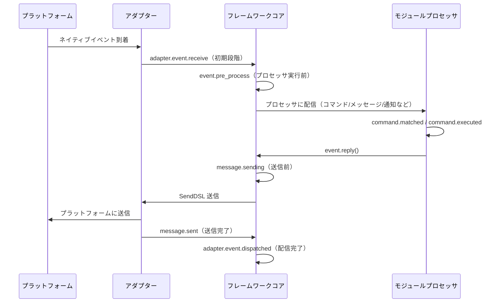

フレームワークは以下のフックブレークポイントを内蔵しており、ユーザーは `@sdk.lifecycle.on()` で任意のブレークポイントを監視してカスタムロジックを実装できます。

### コア初期化

| フック名 | 発生タイミング | データ |
|---------|---------|------|
| `core.init.start` | SDK初期化開始 | `{}` |
| `core.init.complete` | SDK初期化完了 | `{"duration": float, "success": bool, "adapters": {"enabled": [str], "disabled": [str]}, "modules": {"enabled": [str], "disabled": [str]}, "error": str(失敗時のみ)}` |
| `core.uninit.complete` | SDK反初期化完了 | `{"duration": float, "success": bool, "adapters_closed": int, "modules_unloaded": int, "module_properties_cleared": int, "module_properties_to_clear": [str], "error": str(失敗時のみ)}` |

### 設定変更

| フック名 | 発生タイミング | データ |
|---------|---------|------|
| `config.set` | 設定項目が変更された | `{"key": str, "old_value": Any, "new_value": Any}` |
| `config.updated` | 外部で config.toml を編集した後にツリー全体の変更を検出 | `{"old_config": dict, "new_config": dict, "config_file": str}` |

**例：設定監査**

```python
@sdk.lifecycle.on("config.set")
def audit_config(data):
    print(f"[監査] {data['key']}: {data['old_value']} -> {data['new_value']}")
```

### モジュールライフサイクル

| フック名 | 発生タイミング | データ |
|---------|---------|------|
| `module.register` | モジュールクラスがマネージャーに登録された | `{"module_name": str, "success": bool}` |
| `module.load` | モジュールのロード完了（インスタンス化成功） | `{"module_name": str, "success": bool}` |
| `module.init` | モジュールの初期化完了（遅延ロード含む） | `{"module_name": str, "success": bool}` |
| `module.unload` | モジュールのアンロード | `{"module_name": str, "success": bool}` |

### アダプターライフサイクル

| フック名 | 発生タイミング | データ |
|---------|---------|------|
| `adapter.load` | アダプターの登録完了 | `{"platform": str, "success": bool}` |
| `adapter.start` | アダプターの起動 | `{"platforms": [str]}` |
| `adapter.status.change` | アダプターのステータス変化 | `{"platform": str, "status": str, "retry_count": int, "error": str(失敗時のみ)}` |
| `adapter.stop` | アダプターの停止 | `{"platforms": [str]}` |
| `adapter.stopped` | アダプターの停止完了 | `{"platforms": [str]}` |
| `adapter.bot.online` | Botのオンライン | `{"platform": str, "bot_id": str, "info": dict, "status": str}` |
| `adapter.bot.offline` | Botのオフライン | `{"platform": str, "bot_id": str, "status": str}` |

### イベント受信と処理

| フック名 | 発生タイミング | データ |
|---------|---------|------|
| `adapter.event.receive` | 外部プラットフォームイベントを受信（初期段階） | `{"platform": str, "event_type": str, "raw_event_type": str}` |
| `adapter.event.dispatched` | イベントの配信完了 | `{"platform": str, "event_type": str, "raw_event_type": str, "onebot_handlers_count": int}` |
| `event.pre_process` | イベントプロセッサの実行開始前 | `{"event_type": str, "platform": str, "detail_type": str}` |

**例：イベント統計**

```python
event_counter = {}

@sdk.lifecycle.on("adapter.event.receive")
def count_events(data):
    platform = data["platform"]
    event_counter[platform] = event_counter.get(platform, 0) + 1

@sdk.lifecycle.on("adapter.event.dispatched")
def log_unhandled(data):
    if data["onebot_handlers_count"] == 0:
        print(f"[未処理] {data['platform']}/{data['event_type']}")
```

### メッセージ送信

| フック名 | 発生タイミング | データ |
|---------|---------|------|
| `message.sending` | メッセージが送信される直前 | `{"platform": str, "method": str, "detail_type": str, "target_id": str, "bot_id": str}` |
| `message.sent` | メッセージの送信完了 | `{"platform": str, "method": str, "detail_type": str, "target_id": str, "bot_id": str}` |

**例：メッセージ送信監査**

```python
@sdk.lifecycle.on("message.sending")
def log_sending(data):
    print(f"[送信] -> {data['platform']}/{data['detail_type']}/{data['target_id']} via {data['method']}")
```

### コマンドシステム

| フック名 | 発生タイミング | データ |
|---------|---------|------|
| `command.matched` | コマンドがマッチして実行される直前 | `{"command": str, "args": list[str], "platform": str, "user_id": str}` |
| `command.executed` | コマンドの実行完了 | `{"command": str, "args": list[str], "platform": str, "user_id": str, "success": bool, "error": str(失敗時のみ)}` |

**例：コマンド統計**

```python
@sdk.lifecycle.on("command.matched")
def count_commands(data):
    print(f"[コマンド] /{data['command']} from {data['user_id']}@{data['platform']}")
```

### HTTPルーティング

| フック名 | 発生タイミング | データ |
|---------|---------|------|
| `server.request` | HTTPリクエスト受信 | `{"method": str, "path": str, "client_ip": str}` |
| `server.response` | HTTPレスポンス送信 | `{"method": str, "path": str, "status_code": int, "client_ip": str}` |

**例：リクエストログ**

```python
@sdk.lifecycle.on("server.response")
def log_http(data):
    print(f"[HTTP] {data['method']} {data['path']} -> {data['status_code']}")
```

### WebSocket

| フック名 | 発生タイミング | データ |
|---------|---------|------|
| `server.start` | ルーティングサーバー起動 | `{"base_url": str, "host": str, "port": int}` |
| `server.stop` | ルーティングサーバー停止 | `{}` |
| `server.websocket.connect` | WebSocket接続確立 | `{"path": str, "module_name": str, "client_ip": str}` |
| `server.websocket.disconnect` | WebSocket接続切断 | `{"path": str, "module_name": str, "reason": str, "error": str(異常時のみ)}` |

**例：WebSocket接続監視**

```python
@sdk.lifecycle.on("server.websocket.connect")
def on_ws_connect(data):
    print(f"[WS] 接続: {data['path']} from {data['client_ip']}")

@sdk.lifecycle.on("server.websocket.disconnect")
def on_ws_disconnect(data):
    print(f"[WS] 切断: {data['path']} ({data['reason']})")

## 標準イベント定義

```python
STANDARD_EVENTS = {
    "core": ["init.start", "init.complete", "uninit.complete"],
    "module": ["load", "init", "unload", "register"],
    "adapter": [
        "load", "start", "status.change", "stop", "stopped",
        "event.receive", "event.dispatched",
        "bot.online", "bot.offline",
    ],
    "server": [
        "start", "stop",
        "request", "response",
        "websocket.connect", "websocket.disconnect",
    ],
    "event": ["pre_process"],
    "message": ["sending", "sent"],
    "command": ["matched", "executed"],
    "config": ["set"],
}

## 完全な API リファレンス

### 登録と解除

| メソッド | 説明 |
|------|------|
| `@lifecycle.on(event, *, priority=0)` | デコレータによるハンドラの登録 |
| `lifecycle.register(event, handler, *, priority=0)` | プログラムによる登録 |
| `lifecycle.unregister(event, handler=None)` | 登録解除（handler=None の場合、該当イベントのすべてのハンドラを解除） |

### トリガー

| メソッド | 説明 |
|------|------|
| `await lifecycle.emit(event, data=None)` | 非同期でトリガーし、ハンドラが None 以外を返すと data を変更可能 |
| `lifecycle.emit_sync(event, data=None)` | 同期でトリガーし、非同期ハンドラは create_task でスケジュール |
| `await lifecycle.submit_event(event_type, *, source, msg, data)` | 旧版との互換性、自動で標準イベント形式を構築 |

### ユーティリティ

| メソッド | 説明 |
|------|------|
| `lifecycle.start_timer(timer_id)` | タイマーを開始 |
| `lifecycle.get_duration(timer_id)` | 経過時間を取得（秒） |
| `lifecycle.stop_timer(timer_id)` | タイマーを停止し、経過時間を返す |
| `lifecycle.list_hooks()` | 登録済みのすべてのフックとハンドラ数をリストアップ |
| `lifecycle.clear()` | すべてのハンドラとタイマーをクリア |

[**English**](docs/ja/quick-start.md)

## モジュール中の使用例

```python
from ErisPulse.Core.Bases import BaseModule
from ErisPulse import sdk

class Main(BaseModule):
    async def on_load(self, event):
        # 簡単なメッセージの統計を実装
        self.msg_count = 0
        
        @sdk.lifecycle.on("adapter.event.receive")
        async def count(data):
            if data["event_type"] == "message":
                self.msg_count += 1
        
        # すべてのコマンドを監視
        @sdk.lifecycle.on("command.matched")
        async def log_cmd(data):
            sdk.logger.info(f"コマンド実行: /{data['command']} by {data['user_id']}")
        
        # 設定の変更を監査
        @sdk.lifecycle.on("config.set")
        def audit(data):
            sdk.logger.info(f"設定の変更: {data['key']} = {data['new_value']}")

## バックグラウンドタスクの所有と自動キャンセル

> [!NOTE]
> この機能は ErisPulse **2.8.0+** が必要です。

モジュールが作成した asyncio バックグラウンドタスクは、`on_unload` でキャンセルされない場合、`self` の参照を保持し、モジュールインスタンスが回収されなくなります（ホットリロード後に古いインスタンスが残存します）。フレームワークは以下のバックアップメカニズムを提供しています：

- **`self.spawn(coro)`**（モジュール内で推奨）：タスクは自動的にモジュール名に所有されます。モジュールのアンロード時にフレームワークは `on_unload` **の後**に未完了のタスクをバックアップでキャンセルし、警告を記録します。
- **`spawn_background(coro)`**（`ErisPulse.runtime`）：現在の `owner_scope` コンテキストを自動的にキャプチャします。`cancel_owner_tasks(owner)` は所有者に基づいてキャンセルし、`cancel_all_background_tasks()` は `sdk.uninit()` のバックアップとして使用されます。
- **アダプタ**：閉じる際にプラットフォーム名以下のバックグラウンドタスクも同様にバックアップでキャンセルされます。

```python
async def on_load(self, event):
    # 推奨：バックグラウンドタスクは self.spawn() を使用し、アンロード時にフレームワークが自動的にバックアップでキャンセルします
    self.spawn(self._poll())

async def on_unload(self, event):
    # 精密な制御が必要な場面では、手動でキャンセルし、終了処理を待つことを推奨します
    if self._poll_task:
        self._poll_task.cancel()
        await asyncio.gather(self._poll_task, return_exceptions=True)

async def _poll(self):
    while True:
        await asyncio.sleep(60)
        ...
```

> [!IMPORTANT]
> フレームワークのバックアップは**強制キャンセル**（`cancel_owner_tasks`）です。これは `on_unload` の返り値の後に発生します。したがって、優雅な終了処理が必要なタスク（バッファのフラッシュ、状態の永続化、接続の閉じる）は**必ず** `on_unload` で `cancel()` + `await` を行う必要があります。バックアップが終了処理のロジックを保持することを期待しないでください。フレームワークは「`self` を保持するタスクが残らないこと」を保証するだけで、「優雅な終了」を保証するものではありません。`await` の結果が必要なタスクは、直接 `await` してください。バックグラウンドタスクに投げないでください。

## 注意事項

1. **プロセッサは同期または非同期のどちらでも可能です**：システムは自動的に識別し、正しく呼び出します
2. **データの渡し方**：`emit()` モードでは、プロセッサが None 以外の値を返すと、次のプロセッサに渡される data が変更されます
3. **イベント名の命名規則**：親レベルのリスナーを使用しやすいように、ドット構造の命名を推奨します
4. **エラーの隔離**：個々のプロセッサの例外は、他のプロセッサの実行に影響しません
5. **同期トリガーの制限**：`emit_sync()` では、非同期プロセッサは fire-and-forget 方式でスケジュールされ、返り値は戻りません
6. **ライフサイクルのクリーンアップ**：`sdk.uninit()` を呼び出すと、登録済みのすべてのプロセッサとタイマーがクリーンアップされます
7. **ロードの優先順位**：フレームワークの初期化段階でイベントをリッスンする必要がある場合は、高優先順位を設定し、遅延ロードを無効にすることを推奨します

[**English**](docs/ja/quick-start.md)


### 懶加载系统

# ラグ遅延ロードモジュールシステム

ErisPulse SDK は強力なラグ遅延ロードモジュールシステムを提供しており、モジュールを実際に必要になるまで初期化しないことで、アプリケーションの起動速度とメモリ効率を大幅に向上させることができます。

[**English**](docs/en/quick-start.md) | [**日本語**](docs/ja/quick-start.md) | [**简体中文**](docs/ja/quick-start.md) | [**한국어**](docs/ko/quick-start.md)

## 概要

ErisPulseのラジオロードモジュールシステムは、以下の方法で動作するコア機能の1つです：

- **遅延初期化**：モジュールは、初めてアクセスされたときにのみ実際にロードおよび初期化されます
- **透明な使用**：開発者にとって、ラジオロードモジュールは通常のモジュールとほとんど区別がつきません
- **自動依存管理**：モジュールの依存関係は、使用時に自動的に初期化されます
- **ライフサイクルサポート**：`BaseModule` を継承するモジュールに対しては、ライフサイクルメソッドが自動的に呼び出されます

[**English**](docs/en/overview.md) | [**日本語**](docs/ja/overview.md) | [**简体中文**](docs/ja/overview.md)

## 動作原理

### LazyModule クラス

遅延ロードシステムの中心となるのは `LazyModule` クラスです。これは、最初にアクセスされたときにのみモジュールを実際に初期化するラッパーです。

### 初期化プロセス

モジュールが初めてアクセスされたとき、`LazyModule` は以下の操作を実行します：

1. モジュールクラスの `__init__` パラメータ情報を取得します
2. パラメータに基づいて `sdk` リファレンスを渡すかどうかを決定します
3. モジュールの `moduleInfo` 属性を設定します
4. `BaseModule` を継承したモジュールの場合、`on_load` メソッドを呼び出します
5. `module.init` ライフサイクルイベントをトリガーします

[**English**](docs/ja/quick-start.md)

## イベント駆動型遅延起動（activate_on）

> [!NOTE]
> この機能は ErisPulse **2.8.0+** が必要です。

`lazy_load=True` のモジュールはデフォルトで**最初の属性アクセス時**にのみロードされます。モジュールがコマンド/イベントハンドラを登録している場合、従来の方法では `lazy_load=False` にして即時ロードするしかありませんでした。`activate_on` は第三の選択肢を提供します：**トリガを宣言し、最初の一致するイベント/コマンドが到着した時点でモジュールを自動的にアクティブ化する**——メモリ上に常駐させることなく、トリガのエントリポイントを失うこともありません。

```python
from ErisPulse.loaders import ModuleLoadStrategy

class MyModule(BaseModule):
    @staticmethod
    def get_load_strategy():
        return ModuleLoadStrategy(
            lazy_load=True,
            activate_on=[
                # ---- イベントトリガ（受動的到着、ユーザーの意識を必要としない）----
                "message",                                    # タイプレベル：任意のメッセージイベント
                {"notice": "group_member_increase"},          # タイプ + 単一 detail_type
                {"message": ["private", "group"]},            # タイプ + 複数 detail_type

                # ---- コマンドトリガ（能動的な入力、Help で表示されるプレースホルダーコマンド）----
                {"command": "roll"},                          # 略記：コマンド名
                {"command": ["roll", "dice"]},                # コマンド名リスト
                {"command": {                                 # dict 形式の宣言（name は必須）
                    "name": "dice",
                    "help": "サイコロを振る",
                    "usage": "/dice",
                    "group": "娯楽",
                    "aliases": ["d"],
                    "hidden": False,
                }},
            ],
        )
```

### コマンド dict 形式の宣言パラメータ

dict 形式は `@command()` デコレーターのユーザー側パラメータをミラーしており、モジュールのロード前にプレースホルダーコマンドを登録するのに使用されます：

| パラメータ | 型 | デフォルト | 説明 |
|------|------|------|------|
| `name` | `str` | **必須** | コマンド名；`on_load` 内の `@command(name)` と一致する必要がある。一致しないと、アクティブ化後にプレースホルダーが削除され、コマンドが存在しなくなる |
| `help` | `str` | フォールバックチェーン | Help に表示される説明；宣言されていない場合はフォールバックチェーンから値を取得する（下記参照） |
| `usage` | `str` | 自動生成 | 使用方法行；デフォルトは `{prefix}{name}` |
| `group` | `str` | `None` | コマンドグループ |
| `aliases` | `list[str]` | `[]` | 別名も同時に登録され、**別名の入力でもアクティブ化がトリガされる** |
| `hidden` | `bool` | `False` | `True` の場合、プレースホルダーコマンドも非表示（アクティブ化後の実際のコマンドの非表示の意味と一致）；コマンド名を知っているユーザーが入力してもトリガされる |

**サポートされていない** `priority` / `permission` / `master`：プレースホルダーコマンドの役割はアクティブ化のトリガのみであり、権限チェックはアクティブ化後の実際のコマンドが実行する（プレースホルダー段階で権限をブロックしてしまうと、「コマンド入力でアクティブ化」が無効になってしまう）。

### プレースホルダーコマンドの help フォールバックチェーン

モジュールがロードされていない場合、Help に表示されるコマンドの説明は以下の順序で値を取得します（取得した時点で終了）：

1. dict 形式で宣言されたコマンドレベルの `help`（最も正確）
2. モジュールの `get_meta()` の `description`
3. モジュールの `__description__` 属性
4. パッケージのメタデータの `Summary`（PyPI パッケージの概要）
5. 一般的なヒント：「このコマンドは遅延ロードモジュール X から来ています。初めて使用すると、そのモジュールが自動的にロードされます」

### トリガの意味

- **イベントスタブ**：対応するイベントマネージャーに非常に低い優先度（`ACTIVATION_STUB_PRIORITY`）で登録され、すべての通常のハンドラの後にバックアップとしてトリガされる。アクティブ化後は、現在のイベントをモジュールの実際のハンドラに転送する
- **コマンドスタブ**：プレースホルダーコマンドを登録する。アクティブ化後は、プレースホルダーが削除され、実際のコマンドがそのトリガを引き継ぐ
- **再入防止**：`asyncio.Lock` を使用して、並行トリガの下でも一度だけアクティブ化されるように保証する
- **スコープフィルタリング**：スタブにはモジュールのオーナーのアイデンティティが含まれており、モジュールが Bot / セッション / プラットフォームに対して有効でない場合はトリガされない
- **失敗時の意味**：アクティブ化に失敗した場合、再試行はせず、スタブも一緒に削除される
- **重複排除**：同名のコマンドが略記 + dict 混合で宣言された場合、重複を排除する（dict が優先）。dict に `name` が欠落している場合、またはイベントの `detail_type` を dict として誤って書いた場合は、警告を出して無視する

> アーキテクチャ図と完全な意味については、[アーキテクチャ概要](../architecture.md#イベント駆動型遅延起動activate_onのトリガアーキテクチャ)を参照してください。

## 懒惰ロードの構成

### グローバル構成

構成ファイルでグローバルな lazy loading を有効または無効にします：

```toml
[ErisPulse.framework]
enable_lazy_loading = true  # true=lazy loadingを有効にする(デフォルト), false=lazy loadingを無効にする
```

### モジュールレベルの制御

モジュールは `get_load_strategy()` 静的メソッドを実装することで、ロード戦略を制御できます：

```python
from ErisPulse.Core.Bases import BaseModule
from ErisPulse.loaders import ModuleLoadStrategy

class MyModule(BaseModule):
    @staticmethod
    def get_load_strategy():
        """モジュールのロード戦略を返す"""
        return ModuleLoadStrategy(
            lazy_load=False,  # Falseを返すと即時ロード
            priority=100      # ロード優先度、数値が大きいほど優先度が高い
        )

## ラグロードモジュールの使用

### 基本的な使用方法

開発者にとって、ラグロードモジュールは通常のモジュールと使用方法にほとんど違いはありません：

```python
# SDKを介してラグロードモジュールにアクセス
from ErisPulse import sdk

# 以下のようにアクセスするとモジュールのラグロードがトリガーされます
result = await sdk.my_module.my_method()
```

### モジュールの取得エントリの統一

SDK属性、モジュールマネージャ属性、または`module.get()`を介してアクセスする場合、
「登録済みだがまだロードされていない」ラグロードモジュールに対しては、
すべて同じラグロードプロキシが返されます。プロパティにアクセスすることで、
実際に初期化がトリガーされます：

```python
# 3つの方法で取得されるのはすべてラグロードプロキシ（モジュールがロードされていない場合）、
# 振る舞いは一貫しており、ユーザーには透明です
sdk.my_module          # ロードをトリガーするエントリ
sdk.module.my_module   # 同じくラグロードプロキシを返します
sdk.module.get("my_module")  # ラグロードプロキシを返しますが、ロードはトリガーしません

# プロキシの任意のプロパティにアクセスすることで、実際にモジュールの初期化が行われます
result = await sdk.my_module.my_method()
```

`module.get()`は**検索**インターフェースであり、ロードをトリガーしません：
- モジュールがロード済み → 実際のインスタンスを返します
- モジュールが登録済みだがロードされていない → ラグロードプロキシを返します（プロパティにアクセスして初めて初期化されます）
- モジュールが登録されていない → `None`を返します

明示的にロードをトリガーしたい場合は、`await sdk.load_module("my_module")`を使用してください。

### 非同期初期化

非同期初期化が必要なモジュールについては、まず明示的にロードすることを推奨します：

```python
# まずモジュールを明示的にロードします
await sdk.load_module("my_module")

# その後、モジュールを使用します
result = await sdk.my_module.my_method()
```

### 同期初期化

非同期初期化を必要としないモジュールについては、直接アクセスできます：

```python
# 直接アクセスすると自動的に同期初期化されます
result = sdk.my_module.some_sync_method()

## 最佳実践

ロード戦略を選択する際には、以下の意思決定フローを参考にしてください：

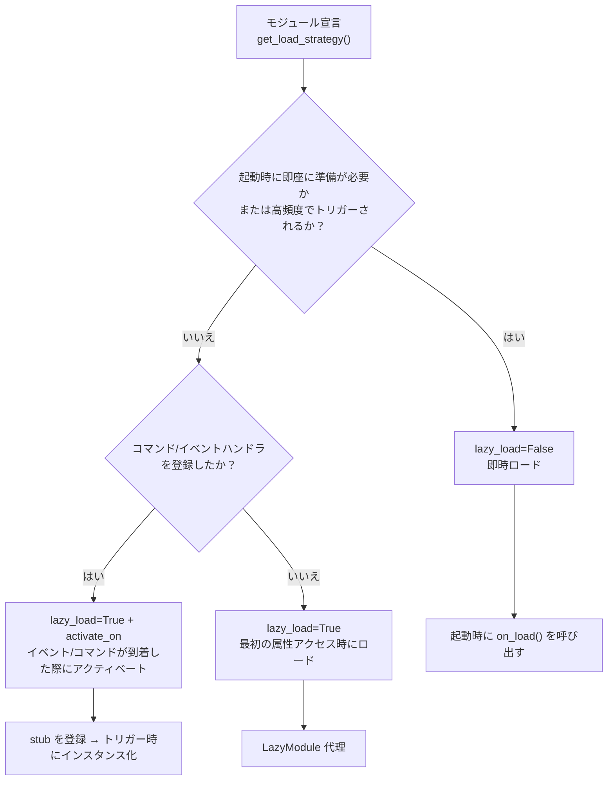

### lazy_load=True を推奨するシナリオ

- 他のモジュールによって呼び出されるだけの受動的なユーティリティモジュール（例：データクエリモジュール、フォーマット変換器など）
- コマンド/イベントハンドラを登録しているが高頻度で使用されないモジュール — `activate_on` でトリガーを宣言し、最初の一致するイベント/コマンドが到着した際に自動的にアクティベートするため、遅延ロードを放棄する必要がない

### lazy_load=False を推奨するシナリオ

- 起動時に即座に準備が必要なモジュール（他のモジュールに基礎サービスを提供するコアモジュールなど）
- 高頻度でトリガーされるリスナー（各メッセージを処理する必要がある） — `activate_on` の転送には一度のアクティベートオーバーヘッドがあるため、高頻度のシナリオでは即時ロードの方が直接的
- 定時タスクモジュール
- アプリケーション起動時に初期化が必要なモジュール

> `priority` パラメータは、即時ロードモジュール間の初期化順序を制御し、値が大きいほど先に初期化されます。同じ優先度のモジュールは登録順にロードされます。

[**English**](docs/en/quick-start.md) | [**日本語**](docs/ja/quick-start.md) | [**简体中文**](docs/ja/quick-start.md) | [**繁體中文**](docs/zh-TW/quick-start.md)

## 注意事項

1. モジュールが遅延ロードを使用している場合、ErisPulse内で他のモジュールが一度も呼び出されたことがない場合、そのモジュールは決して初期化されません。
2. モジュールにイベントをリッスンするモジュール、またはその他の類似モジュールを積極的にリッスンするモジュールが含まれている場合、2つの選択肢があります：`activate_on` トリガーを宣言して遅延ロードを維持し、イベントが到着したときに自動的にアクティブ化するか、または即時ロードが必要であることを宣言する（`lazy_load=False`）、さもなければモジュールの正常な業務に影響を与える可能性があります。
3. 特殊な要件がない限り、遅延ロードを無効にすることは推奨しません。そうしないと、依存管理やライフサイクルイベントなどの問題が発生する可能性があります。
4. `activate_on` のコマンド dict 声明において、`name` はモジュールの `on_load` 中の `@command()` で登録された実際のコマンド名と一致している必要があります。一致していない場合、モジュールがアクティブ化された後にプレースホルダーコマンドが登録解除され、宣言と実装が一致しないコマンドは存在しません。

[**English**](docs/en/advanced.md) | [**日本語**](docs/ja/advanced.md)


### 国际化（i18n）系统

# 国際化 (i18n) システム

ErisPulse v2.5.0 より、完全な国際化サポートが組み込まれています。フレームワークのコアおよび CLI インターフェースは、システム言語に応じて自動的に表示テキストを切り替えられます。また、外部モジュールが独自の翻訳を登録することもサポートしています。


# 国際化 (i18n) システム

ErisPulse v2.5.0 より、完全な国際化サポートが組み込まれています。フレームワークのコアおよび CLI インターフェースは、システム言語に応じて自動的に表示テキストを切り替えられます。また、外部モジュールが独自の翻訳を登録することもサポートしています。


## サポートされている言語

| 言語 | コード | 説明 |
|------|------|------|
| 簡体字中国語 | `zh-CN` | デフォルト言語（フレームワークのネイティブ言語） |
| 繁体字中国語 | `zh-TW` | 繁体字中国語（香港/マカオ/台湾） |
| English | `en` | 英語（汎用フォールバック言語） |
| 日本語 | `ja` | 日本語 |
| Русский | `ru` | ロシア語 |

## クイック体験

### 環境変数による切り替え

```bash
# Windows PowerShell
$env:ERISPULSE_LANG = "en"
epsdk run

# macOS / Linux
ERISPULSE_LANG=ja epsdk run
```

### 設定ファイルによる切り替え

`config/config.toml` に以下を追加します：

```toml
[ErisPulse.i18n]
language = "ja"
```

`"auto"`（デフォルト値）に設定すると、システム言語を自動的に検出します。

### コード内での手動切り替え

```python
from ErisPulse import i18n

# 言語を手動で設定
i18n.set_language("en")
print(i18n.get_language())  # "en"

# 自動検出にリセット
i18n.reset_language()
```

---

## 言語検出メカニズム

フレームワークは、ユーザーの言語を以下の優先順位で検出します。

1. **環境変数 `ERISPULSE_LANG`** — 最優先度、テストおよび一時的な切り替えに使用
2. **Windows API** — `GetUserDefaultLocaleName`（Windows のみ。Git Bash などのツールが `LANG` に影響を与えない）
3. **環境変数** — `LANGUAGE` > `LC_ALL` > `LC_MESSAGES` > `LANG`（Unix/macOS 標準）
4. **システム Locale** — `locale.getlocale()` / `locale.getdefaultlocale()`
5. **フォールバック（最終手段）** — en（英語）

### 近似マッピングの原則

検出された言語が完全に一致しない場合、近似マッピングの原則に従ってサポートされている言語にマッピングされます。

- `zh-TW`, `zh-HK`, `zh-MO`, `zh-Hant` → **繁体字中国語**
- その他すべての `zh-*`（例: `zh-CN`, `zh-SG`）→ **簡体字中国語**
- `en-US`, `en-GB`, `en-AU` など → **英語**
- `ja-JP` → **日本語**
- `ru-RU` → **ロシア語**
- その他認識されない言語 → **簡体字中国語（フォールバック）**

---

## モジュールで i18n を使用する

独自のモジュールの翻訳テキストを登録することで、そのモジュールでも多言語に対応させることができます。

### 推奨される記法: I18nClass を用いて翻訳キーを宣言する（v2.7.0+）

v2.7.0 以降、モジュールやアダプターは `ConfigClass` を宣言するのと同様に、ネストされたクラス `I18nClass` を用いて翻訳キーを宣言できます。フレームワークは読み込み時に宣言されたすべての翻訳キーを**自動的に登録**するため、手動で `i18n.register()` を呼び出す必要はありません。

```python
from dataclasses import dataclass, field

from ErisPulse.Core.Bases import BaseConfig, BaseI18n, BaseModule, I18nKey


class MyModule(BaseModule):
    # 設定クラス（任意）
    @dataclass
    class ConfigClass(BaseConfig):
        welcome_msg: str = field(
            default="欢迎",
            metadata={
                # ここでは i18n キー mymodule.welcome_msg を参照しています
                "description": {"i18n": "mymodule.welcome_msg", "default": "ウェルカムメッセージ"},
            },
        )

    # 翻訳キーセットクラス（任意）
    # 宣言されたキーはフレームワークによって自動的に登録されます。ConfigClass によるデフォルト設定生成より優先度が高くなります。
    class I18nClass(BaseI18n):
        # プロパティ名が自動的に完全なキーパスに結合されます：<モジュール名>.<プロパティ名>
        welcome_msg: I18nKey = I18nKey(
            default="Welcome Message",   # 言語に依存しないフォールバック値。どの言語にも登録されません。
            zh_CN="欢迎消息",
            en="Welcome Message",
            ja="ウェルカムメッセージ",
            ru="Приветственное сообщение",
            zh_TW="歡迎訊息",
        )
        # その他のビジネスで使用する翻訳キー
        hello: I18nKey = I18nKey(
            default="Hello, {name}!",
            zh_CN="你好，{name}！",
            zh_TW="你好，{name}！",
            en="Hello, {name}!",
            ja="こんにちは、{name}！",
            ru="Привет, {name}!",
        )

        # 完全なキーパスを明示的に指定することもできます（プロパティ名の結合は使用しません）
        custom: I18nKey = I18nKey(
            key="mymodule.deep.nested.key",
            default="Default text",
            zh_CN="默认文本",
            zh_TW="預設文本",
            en="Default text",
            ja="デフォルトテキスト",
            ru="Текст по умолчанию",
        )
```

#### なぜ I18nClass が推奨されますか？

| 場面 | 手動 i18n.register() | I18nClass 宣言型 |
|------|-----------------------|------------------|
| 設定説明で参照される i18n キー | 手動で登録する必要があり、設定生成前に完了させる必要がある | フレームワークが設定生成前に自動的に登録する |
| 多言語翻訳の宣言 | 各 on_load() 内に散在する | クラス内に集中しており一目で分かる |
| キー名の命名一貫性 | スペルミスを起こしやすい | プロパティ名がキー名のサフィックスとなるため、IDE の補完機能が利用できる |
| アンインストール時のクリーンアップ | 手動で unregister_domain() が必要 | フレームワークが一貫したドメインで登録する |

#### I18nClass のキーパスルール

- **デフォルト**: 完全なキーパスとして `<モジュール登録名>.<プロパティ名>` を使用します
  - 例: モジュール名が `MyModule`、プロパティ `welcome` の場合 → キーパス `MyModule.welcome`
- **明示的**: `I18nKey(key="...")` 引数を用いて任意のドット区切りパスを指定できます
  - 深くネストされたキー名（例: `mymodule.config.basic.token`）に適しています

#### アダプターでの使用

アダプターも `I18nClass` をサポートしており、使用方法は全く同じです：

```python
from ErisPulse.Core import BaseAdapter
from ErisPulse.Core.Bases import BaseConfig, BaseI18n, I18nKey


class MyAdapter(BaseAdapter):
    @dataclass
    class ConfigClass(BaseConfig):
        endpoint: str = field(
            default="",
            metadata={
                # 設定説明でアダプターのキーを参照しています: adapter.MyAdapter.endpoint
                "description": {"i18n": "MyAdapter.endpoint", "default": "API アドレス"},
            },
        )

    class I18nClass(BaseI18n):
        # 設定説明で参照するキーや、その他のビジネスキーの多言語翻訳をクラス内で一元宣言します
        endpoint: I18nKey = I18nKey(
            default="API Endpoint",
            zh_CN="API 地址",
            zh_TW="API 位址",
            en="API Endpoint",
            ja="APIアドレス",
            ru="API адрес",
        )
```

アダプターの `I18nClass` は `__init__` 階段（つまり設定テンプレート生成前に）自動的に登録されるため、設定説明で参照される i18n キーが使用可能であることが保証されます。

### 手動登録による独自翻訳の定義（旧い記法）

`I18nClass` を使用しない場合でも、`i18n.register()` を直接呼び出して翻訳テキストを登録することができます。

```python
from ErisPulse import i18n

# 中国語翻訳を登録
i18n.register("zh-CN", {
    "my_module.welcome": "欢迎使用我的模块！",
    "my_module.goodbye": "再见！",
    "my_module.hello": "你好，{name}！",
}, domain="my_module")

# 英語翻訳を登録
i18n.register("en", {
    "my_module.welcome": "Welcome to my module!",
    "my_module.goodbye": "Goodbye!",
    "my_module.hello": "Hello, {name}!",
}, domain="my_module")
```

### 翻訳の使用方法

```python
from ErisPulse import i18n

# シンプルな翻訳
i18n.t("my_module.welcome")  # 現在の言語が自動的に使用されます

# 書式付きパラメータ付き
i18n.t("my_module.hello", name="Alice")

# デフォルト値の指定（翻訳キーが存在しない場合に返す値）
i18n.t("my_module.unknown_key", default="デフォルトテキスト")
```

### モジュールクラスでの使用

```python
from dataclasses import dataclass, field
from ErisPulse import i18n
from ErisPulse.Core.Bases import BaseConfig, BaseModule

@dataclass
class MyModuleConfig(BaseConfig):
    welcome_msg: str = field(
        default="欢迎",
        metadata={
            "description": {"i18n": "my_module.welcome_msg", "default": "ウェルカムメッセージ"},
            "ui": {"widget": "text", "group": "basic", "order": 1},
        },
    )

class MyModule(BaseModule):
    ConfigClass = MyModuleConfig

    async def on_load(self, event):
        # リアルタイムで設定を読み込み（アクセスするたびに最新値が反映されます）
        self.logger.info(self.cfg.welcome_msg)
        self.logger.info(i18n.t("my_module.welcome"))

    @command("hello")
    async def hello_handler(self, event):
        name = event.get_user_nickname() or "friend"
        await event.reply(i18n.t("my_module.hello", name=name))

    async def on_unload(self, event):
        pass
```

### 翻訳のアンインストール

```python
# ドメイン全体の翻訳をアンインストール
i18n.unregister_domain("my_module")

## 構成フィールドの多言語

v2.5.2 より、構成 Schema は i18n を全面的にサポートしています。すべてのユーザーに表示されるテキストフィールドは i18n キーを参照でき、WebUI およびその他のコンシューマは現在の言語に基づいて対応するテキストに自動的に解決されます。

### サポートされている i18n フィールド

| フィールド | 場所 | 説明 |
|------|------|------|
| `description` | field metadata | フィールドの説明 |
| `options[].label` | `ui.options` | select コントロールのオプションラベル |
| `placeholder` | `ui.placeholder` | 入力欄のプレースホルダー |
| `group_labels` | `_schema_meta` | グループ表示名（Dashboard パーティションタイトル） |

統一的に `{"i18n": "key", "default": "テキスト"}` 形式を使用し、純粋な文字列の場合はそのまま透過します（後方互換性のため）。

### i18n フィールドの宣言

すべてのユーザー表示テキストフィールドは i18n をサポートしています：

```python
from dataclasses import dataclass, field
from ErisPulse.Core.Bases import BaseConfig

@dataclass
class MyAdapterConfig(BaseConfig):
    # description i18n
    token: str = field(
        default="",
        metadata={
            "description": {"i18n": "my_adapter.token", "default": "プラットフォーム Token"},
            "required": True,
            "secret": True,
            "ui": {
                "widget": "password",
                "group": "basic",
                "order": 1,
                # placeholder i18n
                "placeholder": {"i18n": "my_adapter.token.ph", "default": "Token を入力してください"},
            },
        },
    )
    # options label i18n
    mode: str = field(
        default="a",
        metadata={
            "description": {"i18n": "my_adapter.mode", "default": "実行モード"},
            "ui": {
                "widget": "select",
                "group": "basic",
                "order": 2,
                "options": [
                    {"label": {"i18n": "my_adapter.mode.a", "default": "モードA"}, "value": "a"},
                    {"label": {"i18n": "my_adapter.mode.b", "default": "モードB"}, "value": "b"},
                ],
            },
        },
    )

    # group_labels i18n（グループ表示名）
    _schema_meta = {
        "group_labels": {
            "basic": {"i18n": "my_adapter.group.basic", "default": "基本設定"},
        }
    }
```

`default` はフォールバックテキストです。翻訳が登録されていない場合や検索に失敗した場合に表示されます。

### secret のマスキングと構成の検証

`"secret": True` とマークされたフィールドは、**マスキング保護**を自動的に取得します（2.7.0 より）：

- **テンプレート生成時のマスキング**：`dataclass_to_toml_with_comments()` で構成テンプレートを生成する際、secret フィールドの実際の値はファイルに書き込まれません（空のプレースホルダーとして表示され、機密情報のディスクへの書き込みを防ぎます）
- **汎用的なマスキングツール**：`redact_secret(value)` は非空値を `***` に置換し、空値はそのまま返します。ログ出力などのシナリオで使用できます。

```python
from ErisPulse.Core.Bases.config_schema import redact_secret

redact_secret("sk-xxxxxx")  # '***'
redact_secret("")           # ''
```

**構成の検証**（`validate_config()`）は、`required` の非空チェックに加え、2.7.0 より以下をサポートしています：

| 校驗項目 | メタデータ | 例 |
|--------|--------|------|
| 型の一致 | フィールド宣言型 | `int` フィールドに文字列が渡されるとエラー |
| 列挙制約 | `ui.options` またはトップレベルの `options` | 値は許可されたオプションに属している必要があります |
| 数値範囲 | トップレベルの `min` / `max` | `metadata={"min": 1, "max": 65535}` |

```python
from ErisPulse.Core.Bases.config_schema import validate_config

@dataclass
class C(BaseConfig):
    mode: str = field(default="a", metadata={"ui": {"widget": "select", "options": ["a", "b"]}})
    port: int = field(default=80, metadata={"min": 1, "max": 65535})

errors = validate_config(C(mode="x", port=70000))  # 2つのエラー：列挙 + 範囲
```

### 構成翻訳の登録

構成フィールドの i18n キーは通常の翻訳キーと同様に、`i18n.register()` を使用して登録します：

```python
from ErisPulse import i18n

# 中国語を登録（default と一致しても良いし、異なっても良い）
i18n.register("zh-CN", {
    "my_adapter.token": "プラットフォーム Token",
}, domain="my_adapter")

# 英語を登録
i18n.register("en", {
    "my_adapter.token": "Platform Token",
}, domain="my_adapter")
```
> **推奨される書き方**：`I18nClass` を使用して翻訳キーを宣言すると、フレームワークが自動的に登録します（詳細は上記の「推奨される書き方」セクションを参照）。
> 手動で `i18n.register()` または `register_config_i18n()` を呼び出す必要はありません。

`register_config_i18n()` という便利な関数も提供されており、設定クラスからキーを自動的に抽出して登録できます：

```python
from ErisPulse.Core.Bases.config_schema import register_config_i18n

# 設定クラスから description.default を自動的に抽出して zh-CN 翻訳として登録
register_config_i18n(MyAdapterConfig, "zh-CN")

# 手動で英語の翻訳を提供
register_config_i18n(MyAdapterConfig, "en", {
    "my_adapter.token": "Platform Token",
})
```

### WebUI での利用

`get_config_schema()` が返すスキーマでは、i18n 辞書がそのまま透過されます。WebUI のフロントエンドは現在の言語に基づいて `i18n.t()` を呼び出して解決できます。

サーバーサイドで直接文字列に解決する必要がある場合（例：i18n をサポートしていないフロントエンドに返す場合など）、`resolve_config_schema()` を使用します。これは `description`、`options[].label`、`placeholder`、`group_labels` をすべて現在の言語のテキストに解決します。

```python
from ErisPulse.Core.Bases.config_schema import resolve_config_schema

# すべての i18n フィールドが現在の言語の文字列に解決されています
schema = resolve_config_schema(MyAdapterConfig)
print(schema["fields"]["token"]["description"])    # "プラットフォーム Token" または "Platform Token"
print(schema["fields"]["token"]["placeholder"])   # "Token を入力してください" または "Enter Token"
print(schema["fields"]["mode"]["options"][0]["label"])  # "モードA" または "Mode A"
print(schema["group_labels"]["basic"])             # "基本設定" または "Basic"
```

> `BaseConfig`、`BotAccountConfig`、`register_config_i18n()`、`resolve_config_schema()`
> などの型とユーティリティ関数の実際の定義は `ErisPulse.Core.Bases.config_schema` にあります。
> `ErisPulse.runtime.config_schema` は互換性のための shim として維持されていますが、
> **`ErisPulse.Core.Bases` から統一してインポートすることを推奨します**（i18n 翻訳キー関連の型は除き、それらは `ErisPulse.Core.Bases.i18n_schema` にあります）。

## API リファレンス

### I18nManager

#### コアメソッド

| メソッド | 説明 |
|------|------|
| `t(key, default=None, **kwargs)` | 翻訳テキストを取得（`gettext()` の別名） |
| `set_language(lang)` | 手動で言語を設定 |
| `get_language()` | 現在の言語を取得 |
| `reset_language()` | 自動検出にリセット（環境再検出も実行） |
| `get_supported_languages()` | サポートされている全言語のリストを取得 |
| `has_translation(key, lang=None)` | 翻訳キーが存在するかチェック |
| `register(lang, translations, domain)` | カスタム翻訳を登録 |
| `unregister_domain(domain)` | 指定されたドメインの全翻訳をアンインストール |
| `reload()` | 内蔵翻訳を再読み込みして言語を再検出 |

#### `t()` メソッド詳細

```python
def t(self, key, /, default=None, **kwargs):
```

- `key` — 翻訳キー（位置引数のみ、`**kwargs` の `key=` と競合しない）
- `default` — 翻訳が存在しない場合に返すデフォルト値、デフォルトは `None`（キー名自体を返す）
- `**kwargs` — フォーマットパラメータ。翻訳値内の `{placeholder}` を埋めるために使用

例：

```python
# 翻訳定義: "greeting": "こんにちは、{name}！{place}へようこそ。"
i18n.t("greeting", name="Alice", place="ErisPulse")
# 返回: "こんにちは、Alice！ErisPulseへようこそ。"
```

### BaseI18n / I18nKey（宣言的翻訳キー）

v2.7.0 より、`ErisPulse.Core.Bases` はクラス属性ベースの翻訳キー宣言ツール（`ErisPulse.Core.Bases` から一括インポートすることを推奨）を提供しています：

> ``I18nKey.default`` は**言語に依存しないフォールバックテキスト**であり、どの言語にも登録されません。
> 翻訳を有効にするには、少なくとも1つの言語パラメータ（``zh_CN=`` / ``en=`` / ``ja=`` など）を明示的に渡す必要があります。
> こうすることで、各国の開発者は自身の母語で自由に ``default`` を入力でき、フレームワークは何も前提としません。

| 名称 | 説明 |
|------|------|
| `I18nKey(default, *, key=None, zh_CN, zh_TW, en, ja, ru)` | 単一の翻訳キー宣言。`default` は言語に依存しないフォールバック |
| `BaseI18n` | 翻訳キーセットの基底クラス（命名規則は `BaseConfig` に準拠）。サブクラスはクラス属性で複数の `I18nKey` を宣言 |
| `BaseI18n.register(prefix="", domain="app")` | クラスメソッド：宣言された全キーを i18nシステムに登録 |
| `key` | `I18nKey` のエイリアス（記述を簡潔にするため） |

使用例：

```python
from ErisPulse.Core.Bases import BaseI18n, key

class MyKeys(BaseI18n):
    # 簡潔なエイリアス記法
    hello = key(
        default="Hello",
        zh_CN="你好",
        zh_TW="你好",
        en="Hello",
        ja="こんにちは",
        ru="Привет",
    )
    bye = key(
        default="Bye",
        zh_CN="再见",
        zh_TW="再見",
        en="Bye",
        ja="さようなら",
        ru="До свидания",
    )

# 単独使用（手動登録）
MyKeys.register(prefix="myapp.", domain="myapp")
```

### SDK インスタンスからアクセス

```python
from ErisPulse import sdk

# sdk.i18n は直接インポートした i18n オブジェクトと同じです
sdk.i18n.set_language("en")
print(sdk.i18n.t("core.sdk.init.starting"))
```

---


## ランタイム設定

### 設定 API を使用して i18n 設定を読み込む

```python
from ErisPulse.Core.Bases import I18nConfig
from ErisPulse.runtime import get_i18n_config

config = get_i18n_config()
print(config["language"])  # "auto" または具体的な言語コード

# I18nConfig は dataclass なので、設定テンプレートを生成するために使用できます
schema = I18nConfig.__dataclass_fields__
```

### 設定項目の説明

`config/config.toml` の `[ErisPulse.i18n]` セクション:

```toml
[ErisPulse.i18n]
# 表示言語。オプション:
# - "auto"      — システム言語を自動検出 (デフォルト)
# - "zh-CN"     — 簡体字中国語
# - "zh-TW"     — 繁体字中国語
# - "en"        — 英語
# - "ja"        — 日本語
# - "ru"        — ロシア語
language = "auto"
```

---

## ベストプラクティス

### 翻訳キーの命名

ドット区切りの名前空間形式の命名を使用することを推奨します。

```
<モジュール名>.<カテゴリ>.<説明>
```

例: `my_module.command.hello_desc`、`core.adapter.start_failed`

### 多言語対応

すべての言語の翻訳を一度に提供する必要はありません。欠けている言語は自動的に英語にフォールバックし、英語も存在しない場合はキー名自体が表示されます。

### 動的なコンテンツ

動的に生成されたコンテンツ（ユーザー名、数値など）の場合は、`{placeholder}` 形式でフォーマットします。

```python
# 翻訳定義
"user_count": "現在オンラインのユーザー：{count} 人"

# 使用
i18n.t("user_count", count=len(users))
```

### ログメッセージ

モジュールでフレームワークの Logger を使用している場合、これらのメッセージも自動的に現在の言語が使用されます。

```python
self.logger.info(i18n.t("my_module.startup"))
```

---

## CLI i18n との関係

CLI は**独立した**国際化モジュール（`ErisPulse.CLI.i18n`）を持ち、フレームワークコアの国際化モジュールと完全に非依存です。

- **Core i18n** — フレームワークコアモジュールで使用され、外部モジュールが翻訳を登録可能
- **CLI i18n** — コマンドラインインターフェース内部で使用され、Core と翻訳データを共有しない

この設計により、CLI の翻訳の変更がフレームワークコアの安定性に影響しないことが保証されます。

請直接返回翻译后的完整Markdown内容，不要包含任何其他文字。


### 模块作用域系统

# モジュールスコープシステム

> [!NOTE]
> この機能には ErisPulse **2.8.0+** が必要です。

モジュールスコープシステムは、「特定の Bot がどのモジュールを使用できるか」を制御し、複数 Bot 環境におけるモジュールの隔離を実現します。  
デフォルトでは、すべてのモジュールがすべての Bot に対して開放されています。設定のバインディング後のみフィルタリングが開始され、**モジュールとアダプタは変更なしで対応可能です**。

{!--< tips >!--}
1. スコープは「アダプタプラットフォーム + Bot 識別子 + セッション識別子」を次元としてモジュールをバインディングします
2. ホワイトリスト（`modules`）とブラックリスト（`blocked`）の両方の方式をサポートしています
3. スコープによって禁止されたモジュールは、メッセージを受け取った際に無言で無視し、返信や通知は行いません
4. 実行時 `sdk.scope.bind()` / `unbind()` による動的な追加・削除が可能で、永続化もサポートしています
{!--< /tips >!--}

[**English**](docs/en/quick-start.md) | [**中文**](docs/ja/quick-start.md) | [**日本語**](docs/ja/quick-start.md)

## 動作原理

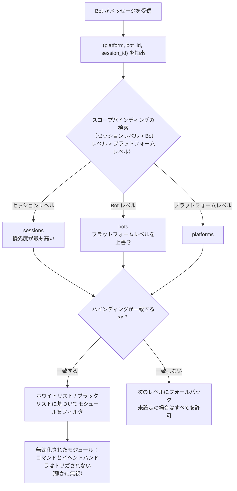

- **解析優先度：セッションレベル > Bot レベル > プラットフォームレベル**、より高い優先度でルールがバインディングされていない場合は次のレベルにフォールバックします。すべて未設定の場合はすべてのモジュールを許可します。
- イベントデータに `self` が含まれていない場合（Bot を識別できない）、Bot レベルをスキップし、セッションレベルまたはプラットフォームレベルで判断します。
- フレームワーク層のリソース（owner が空のハンドラ、コマンドディスパッチャー、イベントバス）は常に通過し、スコープの影響を受けません。

- [**English**](docs/en/quick-start.md) | [**简体中文**](docs/ja/quick-start.md) | [**日本語**](docs/ja/quick-start.md)

## 設定ファイル

```toml
[ErisPulse.scope]
default_allow = true        # デフォルトで全許可（false = 厳格モードでの暗黙拒否）
cache_size = 1024           # is_allowed の LRU キャッシュサイズ

# プラットフォームレベルのバインド（そのプラットフォームのすべての Bot / セッションに適用）
[ErisPulse.scope.platforms.onebot11]
modules = ["Chat", "Translate"]   # ホワイトリスト：そのプラットフォームの Bot はこれらのモジュールのみ使用可能
blocked = ["Danger"]              # ブラックリスト：これらのモジュールはそのプラットフォームで無効化

# Bot レベルのバインド（その Bot のすべてのセッションに適用、プラットフォームレベルより優先）
[ErisPulse.scope.bots.onebot11."123456"]
modules = ["Chat"]
blocked = []

# セッションレベルのバインド（特定のグループ / チャンネル / 個人チャットに適用、最も具体的）
[ErisPulse.scope.sessions.onebot11."789012345"]
modules = ["Chat"]                # そのグループは Chat のみ使用可能
blocked = []
```

意味合い（モジュール名は**大文字・小文字を区別しない**）：

| 設定 | 効果 |
|------|------|
| `modules` のみ（ホワイトリスト） | リストされたモジュールのみ使用可能 |
| `blocked` のみ（ブラックリスト） | リストされたモジュールは使用禁止、それ以外は全て許可 |
| 両方を設定 | ホワイトリストで範囲を限定し、ホワイトリスト内のモジュールからブラックリストを除外 |
| 両方が空 / 未設定 | `default_allow` に従う：`true`（デフォルト）は全て許可、`false` は暗黙的に拒否 |

> `modules` と `blocked` はいずれも文字列または文字列のリストをサポートします。モジュール名は大文字・小文字を区別しません（`"Chat"` と `"chat"` は等価）。
> セッション識別子は、グループ ID（`group_id`）、チャンネル ID（`channel_id`）またはプライベートチャットのユーザー ID（`user_id`）です。
> **セッション識別子はプラットフォームごとに分離されます**：`(platform, session_id)` の組み合わせでセッションを一意に識別し、`onebot11` の `789` と `telegram` の `789` は互いに影響を与えません。

## ランタイム API

### モジュールの許可状態を確認

```python
from ErisPulse import sdk

# 特定の Bot が特定のモジュールを使用可能か判定する
allowed = sdk.scope.is_allowed("onebot11", "123456", "Chat")

# 特定のセッション（グループ / チャンネル / DM）で判定する
allowed = sdk.scope.is_allowed("onebot11", "123456", "Chat", "789012345")
```

### 動的バインド / アンバインド

```python
# Bot レベルのホワイトリストに追加（設定に永続化）
sdk.scope.bind("onebot11", "123456", modules=["Chat", "Translate"])

# セッションレベルのホワイトリストに追加（第三引数は session_id）
sdk.scope.bind("onebot11", "123456", "789012345", modules=["Chat"])

# プラットフォームレベルのブラックリストに追加
sdk.scope.bind("onebot11", blocked=["Danger"])

# 常時有効（リロードのみで永続化しない）
sdk.scope.bind("onebot11", "123456", modules=["Chat"], persist=False)

# マージモード（Music を既存のホワイトリストに追加する）：
# デフォルトの bind は置換であることに注意
sdk.scope.bind("onebot11", "123456", modules=["Music"], merge=True)

# バインドを解除（すべて許可に戻す）；
# session_id を指定するとセッションレベルのバインドのみ解除できる
sdk.scope.unbind("onebot11", "123456")
sdk.scope.unbind("onebot11", "123456", "789012345")
```

> `bind()` はデフォルトでターゲットのすべてのバインドを**置換**します；`merge=True` の場合は、新規モジュール/無効化設定を既存のバインドにマージします。

### バインド情報の取得

```python
# 有効なバインドを取得（セッションを指定可能）
sdk.scope.get("onebot11", "123456")              # {"modules": ["Chat"], "blocked": []}
sdk.scope.get("onebot11", "123456", "789012345") # セッションレベルで有効なバインド
sdk.scope.get("onebot11")                        # プラットフォームレベルのバインド、存在しなければ None

# 全てのバインドをリスト表示（platforms / bots / sessions の3つのカテゴリ）
sdk.scope.list_bindings()
```

### フィルタリング統計（デバッグ）

```python
# スコープによって静的にフィルタリングされた回数とキャッシュのヒット状況を表示
sdk.scope.get_stats()
# {"is_allowed_calls": 10, "filtered_count": 3, "cache_hits": 5, "cache_misses": 5}

sdk.scope.reset_stats()
```

### トポロジー木データ

```python
# スコープ部分（Dashboard 用）
sdk.scope.get_topology()

## よくある質問と注意点

### 1. 設定の階層

優先度：**セッション級 > Bot 級 > プラットフォーム級**。優先度が高いものが、優先度が低いものを**全体で上書き**します。

```toml
# プラットフォーム級は Chat のみ許可
[ErisPulse.scope.platforms.onebot11]
modules = ["Chat"]

# しかし Bot 級は Music のみ許可 → その Bot は最終的に Music のみ使用可能！
[ErisPulse.scope.bots.onebot11."123456"]
modules = ["Music"]
```

- "プラットフォーム級で Chat を許可し、Bot 紧に Music を追加" したい場合、**Bot 紧で両方を同時にリストアップする必要があります**：`modules = ["Chat", "Music"]`。
- 同様に、下位のブラックリストは上位のホワイトリストによって上書きされます。プラットフォーム級 `blocked=["Danger"]` + Bot 级 `modules=["Danger"]` → Bot 级の設定が全体で優先されるため、Danger は使用可能です。階層が高く、より具体的なものが優先されます。

### 2. これは「イベントごと」の判断であり、**付着しない**

スコープ判定は**現在の単一のイベントに対してのみ**行われ、イベントをまたいで記憶することはありません。
- セッション g1 でモジュール A が無効化されている → g1 の**この**メッセージでは A はトリガーされません。**次の**メッセージでは独立して再判定されます。バインドが変更されていない限り引き続きトリガーされず、変更されれば即座に有効になります（LRU キャッシュが自動的に無効になります）。
- セッション g2 でバインドが未設定 → Bot 级 / プラットフォーム级の判定にフォールバックします。両方ともない場合は `default_allow` に従います。

### 3. モジュールに反応がない

メッセージを送信したのにモジュールが反応しない場合は、まずスコープ（適用範囲）を疑い、モジュールやアダプターではありません。

```python
# モジュールのコードや一時スクリプトに一行追加して位置特定
from ErisPulse import sdk
print(sdk.scope.is_allowed(event.get_platform(), <bot_id>, "MyModule", <session_id>))
print(sdk.scope.get_stats())          # filtered_count > 0 は確実にフィルタされたことを示します
```

フィルタリングは**静かに**行われます（ユーザーにスコープのルールを明かさないようにメッセージを返さず、応答しません）、ですが `filtered_count` は累積されます。

### 4. セッション識別子はプラットフォームごとに分離

`(platform, session_id)` の組み合わせが唯一の識別子となります。`[ErisPulse.scope.sessions.onebot11."789"]` は onebot11 プラットフォームにのみ適用され、telegram で同じ `789` のセッションには影響しません。

### 5. パフォーマンス

`is_allowed()` の結果には **LRU キャッシュ**が含まれています（デフォルト 1024 件、`scope.cache_size` で調整可能）。
設定の変更 / `bind()` / `unbind()` で自動的にキャッシュが無効になり、高頻度のイベント処理においてオーバーヘッドは極めて小さくなります。

## 拓扑ツリー API

`ModuleManager.get_topology()` と `AdapterManager.get_topology()` はモジュール/アダプタの所属関係データを提供します。
`sdk.get_topology()` はこれら3つをワンクリックで集約します。

```python
from ErisPulse import sdk

topology = sdk.get_topology()
# {
#   "modules": {                                   # モジュール → 所持リソース
#     "Chat": {
#       "loaded": True, "enabled": True,
#       "load_strategy": {"lazy": False, "priority": 50},
#       "info": {...},
#       "commands": ["chat", "translate"],
#       "handlers": {"message": 2, "notice": 1},
#       "routes": {"http": ["/Chat/api"], "ws": [], "sse": []},
#       "lifecycle_hooks": 3,
#       "scope_applies": True,
#     }
#   },
#   "adapters": {                                  # アダプタ → Bot → スコープ
#     "onebot11": {
#       "status": "started", "enabled": True,
#       "bots": {"123456": {"status": "online", "last_active": ..., "info": {...}, "scope": {...}}},
#       "scope": {"modules": [...], "blocked": [...]},
#     }
#   },
#   "scope": {"platforms": {...}, "bots": {...}, "sessions": {...}}   # 全スコープのバインド
# }
```

- モジュールのトポロジは、そのモジュールが登録したコマンド、イベントハンドラー、HTTP/WS/SSE ルート、ライフサイクルフックを集約しており、モジュールリソースツリーを描画するのに便利です。
- アダプタのトポロジは、各アダプタの状態、配下の Bot の状態、およびプラットフォームレベル / Bot レベルのスコープバインドを集約しています。


### 启动流程与手动控制

# 起動プロセスと手動制御

ErisPulse の `await sdk.run()` / `await sdk.init()` は、一連の起動フローを「一行のコード」に抽象化しています。しかし、部分的なロード、動的な登録、ホットプラグ、カスタムロード戦略の注入など、起動フローを完全にカスタマイズする必要がある場合は、このフローの内部で何が起こっているのか、そして各ステップを手動で駆動する方法を理解する必要があります。

本文では、起動フローを個々のステップに分解し、それぞれの役割と呼び出し順序を説明し、手動で完全な起動を行うための例を示します。

> 本文では、[最初のロボット](../getting-started/first-bot.md)を実行した前提があり、`sdk.run(keep_running=True/False)` の2つのモードについて理解しているものとします。本文では、`init()` **内部**のフローの分解、および `init()` / `init_task()` / `init_sync()` などのより下層のエントリポイントに焦点を当てます。

- [English](docs/en/quick-start.md) | **日本語** | [简体中文](docs/ja/quick-start.md) | [繁體中文](docs/zh-TW/quick-start.md) | [한국어](docs/ko/quick-start.md)

## SDK トップレベルエントリーポイント一覧

`run()` の 2 つの `keep_running` モードに加えて、SDK はいくつかのより下層の初期化エントリーポイントを提供しています。これらは、**非同期性、戻り値、例外のラッピング有無**によって区別されます：

| エントリーポイント | 非同期性 | 戻り値 | 例外処理 | 適用場面 |
|------|--------|--------|----------|----------|
| `await sdk.run(True)` | async、ブロッキングを維持 | `None`（終了時に自動 `uninit`） | モジュール/アダプターのエラーはキャッチされ、プロセスをクラッシュさせない | ボット専用アプリケーション |
| `await sdk.run(False)` | async、ブロッキングしない | `None`（自動アンロードしない） | 同上 | 初期化後にカスタムロジックを実行する |
| `await sdk.init()` | async、awaitが必要 | `bool` | 内部でコンポーネントの例外をキャッチし、失敗時は `False` を返す | 手動でライフサイクルを制御する（`uninit()` と併用） |
| `sdk.init_task()` | async、Task を返すことでブロッキングしない | `asyncio.Task` | `init()` と同じ | 並行的に他の初期化処理を実行する、またはイベントループがまだ実行されていない場合 |
| `sdk.init_sync()` | **同期**、現在のスレッドをブロッキング | `bool` | `init()` と同じ | コマンドラインスクリプト、イベントループのない同期エントリーポイント |

> **よくある誤解**：`await sdk.init()` は `await sdk.run(keep_running=False)` と**等価ではありません**。2 点の違いがあります：① `init()` は `bool` を返します（失敗時は `False` を返す）、`run()` は `None` を返します；② `init()` は初期化のみを行い、**自動アンロードは行いません**、`run()` はイベントループが終了した際に自動で `uninit()` を実行します。したがって、手動でアンロードやカスタムライフサイクルを制御する必要がある場合は、`init()` + `uninit()` を使用してください。

## 開始フローの概要

`sdk.init()`（正確には内部の `Initializer.init()`）は、以下の順序でフレームワーク全体を起動します：

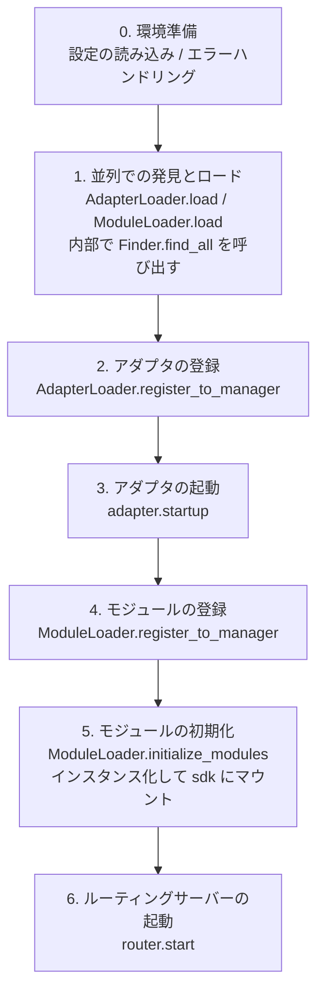

対応するコアコンポーネント：

| 層 | コンポーネント | 機能 |
|----|------|------|
| 発見 | `AdapterFinder` / `ModuleFinder` | インストール済みパッケージの entry-points から**発見**する |
| 加載 | `AdapterLoader` / `ModuleLoader` | 発見 + インポート + メタデータの読み取り + 有効/無効の判定を行い、オブジェクトのリストを返す |
| 登録 | `*Loader.register_to_manager` | オブジェクトを対応するマネージャーに登録する |
| 管理 | `sdk.adapter` / `sdk.module` | アダプタ/モジュールのインスタンスを管理し、起動/停止のインターフェースを提供する |
| 初期化 | `ModuleLoader.initialize_modules` | モジュールのインスタンスを作成して `sdk` にマウントする（依存関係のトポロジカルソート処理） |
| ルーティング | `sdk.router` | HTTP / WebSocket サーバー |

> **重要**：`Finder` と `Loader` は2つの層です。`Loader` 内部では**すでに** `Finder` を保持しています（`AdapterLoader` は `AdapterFinder` を内包し、`ModuleLoader` は `ModuleFinder` を内包しています）。ほとんどの場合、`Loader` を使用するだけで十分です。"リスト表示のみ、インポートしない"が必要な場合にのみ、`Finder` を個別に使用します。

[**English**](docs/en/quick-start.md) | [**日本語**](docs/ja/quick-start.md) | [**简体中文**](docs/ja/quick-start.md)

## 各段階の詳細説明

### 1. 検出層：Finder

Finder は「どのパッケージがアダプタ/モジュールを提供しているかを検出する」ことだけを担当し、インポートやインスタンス化は行いません。

```python
from ErisPulse.finders import AdapterFinder, ModuleFinder

adapter_finder = AdapterFinder()
module_finder = ModuleFinder()

# インストール済みの全てのアダプタ/モジュールの entry-points を検索
adapter_entries = adapter_finder.find_all()    # list[EntryPoint]
module_entries = module_finder.find_all()      # list[EntryPoint]

# 名称で単一のエントリポイントを検索
entry = module_finder.find_by_name("MyModule")  # EntryPoint | None
```

各 `EntryPoint` は `.load()` を呼ぶことで対応するクラスを得られますが、通常は手動で呼び出す必要はありません——Loader が処理を行います。

### 2. 加載層：Loader

Loader は Finder の上に「インポート + メタデータの読込 + 有効/無効の判断」を行います。

```python
from ErisPulse.loaders import AdapterLoader, ModuleLoader
from ErisPulse import sdk

adapter_loader = AdapterLoader()
module_loader = ModuleLoader()

# load() 内部：finder.find_all() を呼び出す → 各 entry-point を順次処理 → 三つ組を返す
adapter_objs, enabled_adapters, disabled_adapters = await adapter_loader.load(sdk.adapter)
module_objs, enabled_modules, disabled_modules = await module_loader.load(sdk.module)
```

`load()` が返す三つ組：

| 戻り値 | 意味 |
|--------|------|
| `objs` (`dict`) | 名称 → オブジェクト（アダプタクラス / モジュールラッパー） |
| `enabled` (`list[str]`) | 有効化された名称（設定で無効化されていない） |
| `disabled` (`list[str]`) | 無効化された名称 |

#### 加載失敗時の診断情報

モジュール/アダプタが加載または初期化段階で例外を送出した場合、フレームワークはそのコンポーネントをスキップして他のコンポーネントの加載を継続し、**ユーザコードのフレームサマリー**を出力します。これにより、デフォルトの INFO レベルでエラー箇所を特定でき、手動で DEBUG モードに切り替える必要がありません。

```
[ERROR] [ModuleLoader] entry-point からモジュール MyModule の加載に失敗しました。スキップしました: 'NoneType' object has no attribute 'platform'
  → MyModule/Core.py:42 in on_load
      adapter = sdk.platform
  → AttributeError: 'NoneType' object has no attribute 'platform'
  → ヒント: ログレベルを DEBUG に上げると完全なスタックトレースを確認できます。モジュール MyModule の実装コードを確認してください。
```

診断情報は `ErisPulse.runtime.diagnostics` モジュールによって生成され、フレームワーク内部のフレームは自動的にフィルタされ、ユーザコードのフレームのみが保持されます。カスタム加載ロジックで再利用する場合は：

```python
from ErisPulse.runtime import log_diagnostic

try:
    risky_init()
except Exception as e:
    log_diagnostic(e)  # 自動的にユーザコードのフレームを抽出し、ERROR ログに書き込みます
```

このモジュールには `extract_user_frame()`（構造化されたフレーム情報を返す）と `format_diagnostic_block()`（複数行のテキストを返す）という2つの低レベル関数も提供されています。

### 3. 登録層：register_to_manager

Loader が出力したオブジェクトをマネージャーに登録し、`sdk.adapter` / `sdk.module` がそれらを認識できるようにします。

```python
# アダプタの登録（全登録が成功したかを表す bool を返す）
await adapter_loader.register_to_manager(enabled_adapters, adapter_objs, sdk.adapter)

# モジュールの登録
await module_loader.register_to_manager(enabled_modules, module_objs, sdk.module)
```

登録後、アダプタはアダプタマネージャーに、モジュールはモジュールマネージャーに登録されますが、**まだ起動/インスタンス化は行われていません**。

### 4. アダプタの起動

```python
# すべての登録済みアダプタを起動
await sdk.adapter.startup()
# または特定のプラットフォームを指定
await sdk.adapter.startup("yunhu")
await sdk.adapter.startup(["yunhu", "telegram"])
```

> 登録 ≠ 起動。`register_to_manager` は単に登録を行うだけです。`startup` を呼ぶことでアダプタの `start()` が呼び出され、プラットフォームとの接続が確立されます。

### 5. モジュールの初期化

モジュールはアダプタよりも1つステップ多く、**インスタンス化**して `sdk` にマウントする必要があります（これにより `sdk.MyModule.xxx` で呼び出せるようになります）。この段階では、モジュール間の依存宣言とトポロジカルソートも処理されます。

```python
success = await module_loader.initialize_modules(
    enabled_modules, module_objs, sdk.module, sdk
)
```

インスタンス化が成功すると、モジュールは `sdk.<ModuleName>` に登録されます。

### 6. ルーティングサーバーの起動

```python
await sdk.router.start(
    host="0.0.0.0",
    port=8000,
    ssl_certfile=None,
    ssl_keyfile=None,
)
```

ルーティングサーバーは、アダプタからの Webhook / WebSocket コールバックを受信する役割を担います。これを起動しないと、server モードのアダプタはメッセージを受け取れません。

[**English**](docs/en/quick-start.md) | [**日本語**](docs/ja/quick-start.md)

## 完全な手動起動の例

以下のコードは `await sdk.init()` のコアな処理と**等価**ですが、各ステップが明示的に公開されており、任意の段階でカスタムロジックを挿入することができます。

```python
import asyncio
from ErisPulse import sdk
from ErisPulse.loaders import AdapterLoader, ModuleLoader

async def manual_startup():
    # 0. 環境の準備（設定の読み込み、グローバルな例外処理の登録）
    #    _prepare_environment は init() 内部の前置処理です。手動プロセスでも最初に呼び出す必要があります。
    #    そうでないと、Loader は設定を読み取れず、すべてのアダプター/モジュールを無効と誤認します。
    if not await sdk._prepare_environment():
        print("環境の準備に失敗しました")
        return False

    # 1. ローダーの作成（内部で Finder を保持）
    adapter_loader = AdapterLoader()
    module_loader = ModuleLoader()

    # 2. 並行して発見とロード（init() 内部と同じ gather を使用）
    (adapter_objs, enabled_adapters, disabled_adapters), \
    (module_objs, enabled_modules, disabled_modules) = await asyncio.gather(
        adapter_loader.load(sdk.adapter),
        module_loader.load(sdk.module),
    )

    # 3. アダプターの登録
    await adapter_loader.register_to_manager(
        enabled_adapters, adapter_objs, sdk.adapter
    )

    # 4. アダプターの起動
    if enabled_adapters:
        await sdk.adapter.startup()

    # 5. モジュールの登録
    await module_loader.register_to_manager(
        enabled_modules, module_objs, sdk.module
    )

    # 6. モジュールの初期化（インスタンス化 + sdk にマウント）
    if enabled_modules:
        await module_loader.initialize_modules(
            enabled_modules, module_objs, sdk.module, sdk
        )

    # 7. ルーティングサーバーの起動
    await sdk.router.start(host="0.0.0.0", port=8000)

    print("手動起動が完了しました")
    return True

async def main():
    ok = await manual_startup()
    if ok:
        # 実行を維持するためのブロッキング（手動プロセスでは自動的にブロッキングされません）
        await asyncio.Event().wait()

if __name__ == "__main__":
    asyncio.run(main())
```

### 手動起動が必要な場合

ほとんどの場合、手動起動は**不要**です。`await sdk.run()` は上記のすべてを自動的に行います。手動起動は以下のシナリオでのみ価値があります：

- **部分的なロード**：指定されたアダプター/モジュールのみをロードし、他の部分はスキップ
- **動的登録**：実行時に条件に応じて新しいアダプター/モジュールを登録
- **カスタム順序**：デフォルトのロード順序を変更したい場合（例えば、特定のモジュールを先に起動してからアダプターを起動する）
- **注入戦略**：Loader にカスタムの厳格モードマネージャー、ロード戦略などを注入
- **デバッグ/診断**：特定の段階で失敗した際に、手動でプロセスを進めることで問題の原因を特定

## 実行時細粒度制御

`sdk.run()` を使用して起動しても、SDK 全体を再起動することなく、実行時に個々のサブシステムを個別に制御することができます。

### アダプタのホット起動/停止

```python
# あるアダプタをホットリスタート（接続の修復、他のプラットフォームへの影響なし）
await sdk.adapter.shutdown("yunhu")
await sdk.adapter.startup("yunhu")

# 実行中に新しいプラットフォームを起動
await sdk.adapter.startup("telegram")

# 一時的に特定のプラットフォームをオフラインにする
await sdk.adapter.shutdown("telegram")
```

> `adapter.startup()` は、アダプタが**マネージャーに登録済み**であることを要求します。登録は `init()` / `run()` の内部で行われるため、これは起動**後の**細粒度制御になります。

### ルーターサーバー

```python
# 一時的に webhook サーバーをオフラインにする
await sdk.router.stop()

# 再起動（たとえばポートが変更された場合）
await sdk.router.start(host="0.0.0.0", port=9000)
```

### モジュールのオンデマンドロード

```python
# 手動でロード（遅延ロードされている可能性のある）モジュールをロード
await sdk.load_module("MyModule")

## エレガントなシャットダウン

2.7.0 以降、`sdk.shutdown()` は**プログラムによるエレガントなシャットダウン**を提供します：シャットダウンイベントを設定し、`await sdk.run(keep_running=True)` で待機中のメインループが返り、`uninit()` をトリガーしてリソースのクリーンアップを完了します。

```python
# 任意のコルーチンで呼び出すことで、エレガントな終了をトリガー（run() が待機から戻り、自動的に uninit() が実行される）
sdk.shutdown()
```

典型的な用途：

```python
async def shutdown_after_idle():
    await asyncio.sleep(3600)
    sdk.shutdown()  # 空き状態が1時間続いたらエレガントに終了
```

**シグナル処理**：`run()` 内部では `SIGTERM` / `SIGHUP` ハンドラを登録し、システムシグナルをエレガントなシャットダウンに変換します——コンテナオーケストレーション（Docker `docker stop`）や `systemd` でサービスを停止する場合、プロセスは強制終了ではなく `uninit()` のクリーンアップを完了します。

- Windows では `loop.add_signal_handler` はサポートされていないため、シグナルハンドラは自動的にスキップされます（`sdk.shutdown()` または Ctrl+C でシャットダウンをトリガーすることは可能です）
- `sdk.shutdown()` を繰り返し呼び出しても安全です（イベントが設定された後、再び呼び出しても無効になります）

[**English**](docs/ja/quick-start.md)

## アンインストールのフロー

初期化の逆操作は `await sdk.uninit()` であり、これは逆の順序でクリーンアップを行います：

1. すべてのアダプタを閉じる（`adapter.shutdown()`）
2. すべてのモジュールをアンロードする
3. すべてのイベントハンドラをクリーンアップする
4. マネージャーと SDK 上のモジュール属性をクリーンアップする

手動で起動する場合、正常終了を保証するために終了前に `uninit()` を呼び出すことを忘れないでください：

```python
try:
    await asyncio.Event().wait()   # 実行を維持
finally:
    await sdk.uninit()

## 再起動

SDK は、2 つの再起動方法を提供します。いずれも、自分でアンインストールする必要はありません。フレームワークが自動的に処理します。

| 方法 | 呼び出し | 行動 | 適用場面 |
|------|------|------|----------|
| ホット再起動 | `await sdk.restart()` | 同一プロセス内で `uninit()` の後に再び `init()` を呼び出し、アダプタ/モジュールを再読み込み | 設定の再読み込み、モジュールのホットアップデート |
| ハード再起動 | `await sdk.hard_restart()` | `uninit()` の後に**終了コード 42** でプロセスを終了し、外部の監督者によって新しいプロセスが起動される | メモリ/リソースリークが疑われる場合、完全にクリーンな再起動が必要な場合 |

```python
# ホット再起動：同一プロセス内で再読み込み（最も一般的）
await sdk.restart()

# ハード再起動：プロセスを終了し、外部の監督者に再起動を任せる（下記「監督者ガイド」参照）
await sdk.hard_restart()
```

> **2 点注意**：
> 1. これらのメソッドはバックグラウンドタスクで再起動を実行し、**即座に `True` を返すのは「再起動タスクがスケジュールされた」ことを示す**ものであり、「再起動が完了した」ことを示すものではありません。実際の再起動はバックグラウンドで行われ、現在のイベントチェーンを中断しません。
> 2. `hard_restart()` の仕組みは、次のように動作します：アンロードして設定を保存した後、**終了コード 42**（`HARD_RESTART_EXIT_CODE`）でプロセスを終了します。**自身で新しいプロセスを起動するものではありません**。外部の監督者が終了コード 42 を検知した後に再起動する必要があります。`python main.py` で直接実行し、監督者が存在しない場合、プロセスは終了コード 42 で終了した後、**自動的に再起動しません**（フレームワークは警告メッセージを出します）。

### ハード再起動をいつ使うべきか？

ハード再起動は単に「より徹底的な再起動」であるだけでなく、以下のシナリオでは、ホット再起動よりも適切で、場合によってはより効率的です。

- **バイナリライブラリ（C 拡張）の副作用**：ホット再起動は同一プロセス内で行われるため、C 拡張、開かれたファイルディスクリプタ、スレッドなどのプロセスレベルのリソースを解放できません。ハード再起動は新しいプロセスを起動するため、これらの副作用は完全にクリアされます。
- **リソースリークの調査**：メモリやハンドルのリークが疑われる場合、ハード再起動によりクリーンな環境を得ることができます。
- **頻繁な再起動がパフォーマンスに敏感な場合**：ハード再起動は同一プロセス内でアンロード→再読み込みするコストを省くため、実際にはホット再起動よりも効率的です。

> ダッシュボード管理パネルの「フレームワーク再起動」機能は、下層で `hard_restart()` を呼び出しています。

### 終了コード 42 の契約

ハード再起動はプロセス間の協調動作です：**SDK は終了（コード 42）を担当し、監督者はプロセスの再起動を担当します**。

| 角色 | 行動 |
|------|------|
| SDK（ハード再起動されるとき） | `uninit()` → 設定を保存 → `os._exit(42)` |
| 監督者 | 子プロセスの終了コードが 42 であることを検知 → 同じコマンドで再起動 |

> `sdk.is_supervised()` は、現在のプロセスが監督者によって起動されたかどうかを確認できます（環境変数 `ERISPULSE_SUPERVISED` を検出）。CLI の `run` コマンドは子プロセスを起動する際に自動的にこのマーカーを注入します。systemd / Docker などの外部監督者は注入しないため、`is_supervised()` は `False` を返し、この場合ハード再起動後にフレームワークは「監督者を検出できませんでした」と警告を出します。

### 監督者ガイド

自分に合った監督者を選択し、ハード再起動を実際に有効化しましょう。

#### 1. CLI run コマンド（開発/簡単なデプロイ、推奨）

`epsdk run main.py` には、監督ループが内蔵されています：子プロセスの終了コードを検知し、42 の場合はすぐに再起動します。他の異常終了コードは指数退避で自動的に再試行されます。`Ctrl+C` は子プロセスを優雅に終了させます（コード 0 は正常終了と見なし、再起動しません）。

```bash
epsdk run main.py
```

#### 2. systemd（Linux サーバー）

`RestartForceExitStatus=42` を設定することで、終了コード 42 も再起動をトリガーします（デフォルトの `on-failure` は非ゼロコードのみを対象とします）。

```ini
[Service]
ExecStart=/usr/bin/python3 /opt/mybot/main.py
Restart=on-failure
RestartForceExitStatus=42
RestartSec=2
User=mybot
```

#### 3. Docker / docker-compose

コンテナ内の PID 1 はアプリケーションプロセスです。終了コード 42 でコンテナが終了した後、`restart` ポリシーを使って自動的に再起動させます。

```yaml
services:
  bot:
    build: .
    restart: unless-stopped   # 42 を含むすべての終了コードで再起動
```

#### 4. PM2（Node 生態系の運用）

```bash
pm2 start main.py --name mybot --interpreter python3
# 42 は終了コードと見なされ、PM2 はデフォルトで再起動します。再起動の遅延を防ぐために restart_delay を設定します。
pm2 set mybot.restart_delay 2000
```

#### 5. supervisord

```ini
[program:mybot]
command=python3 /opt/mybot/main.py
autorestart=true
exitcodes=0,2,42    # 42 も「正常終了」と見なし、再起動します
```

#### 6. 純粋な Python によるカスタム監督者

```python
import subprocess, sys, time

while True:
    p = subprocess.Popen([sys.executable, "main.py"])
    code = p.wait()
    if code == 42:          # ハード再起動の要求
        time.sleep(0.5)
        continue
    if code == 0:           # 正常終了
        break
    time.sleep(3)           # 異常終了、退避して再試行
```

> **監督者が存在しない場合の動作**：`python main.py` で直接実行し、`hard_restart()` を呼び出した場合、プロセスは終了コード 42 で終了し、再起動しません。この場合、上記の監督者のいずれかを接続する必要があります。


====
技术标准
====


### 会话类型标准

# ErisPulse セッションタイプ標準

このドキュメントでは、ErisPulse がサポートするセッションタイプ標準を定義します。これには、受信イベントタイプと送信ターゲットタイプが含まれます。

言語切り替え行（各言語名が `` | `` で区切られている行）がドキュメントに含まれる場合、上記のルール 8 に厳密に従ってください。``[**ラベル**](ファイル)`` というような間違った形式を出力しないでください。

## 1. 核心概念

### 1.1 受信タイプ && 送信タイプ

ErisPulse は、2 種類の会話タイプを区別します：

- **受信タイプ（Receive Type）**：イベントの `detail_type` フィールドで使用される、受信用のタイプ
- **送信タイプ（Send Type）**：メッセージを送信する際の `Send.To()` メソッドの対象タイプ

### 1.2 タイプのマッピング関係

```
受信タイプ (detail_type)     送信タイプ (Send.To)
─────────────────        ────────────────
private                 →        user
group                   →        group
channel                 →        channel
guild                   →        guild
thread                  →        thread
user                    →        user
```

**重要な点**：
- `private` は受信時のタイプであり、送信時には `user` を使用する必要があります
- `group`、`channel`、`guild`、`thread` は受信時と送信時のタイプが同じです
- システムは自動的にタイプ変換を行います。手動での処理は不要です（つまり、受信したタイプをそのまま送信に使用できます）。実際には、これらのタイプ変換について心配する必要はありません。Event のラッパークラスが存在するため、`event.reply()` メソッドを使用することで、タイプ変換を意識することなく送信できます。

## 2. 標準会話タイプ

### 2.1 OneBot12 標準タイプ

#### private
- **受信タイプ**: `private`
- **送信タイプ**: `user`
- **説明**: 1対1のプライベートチャットメッセージ
- **IDフィールド**: `user_id`
- **対応プラットフォーム**: プライベートチャットをサポートするすべてのプラットフォーム

#### group
- **受信タイプ**: `group`
- **送信タイプ**: `group`
- **説明**: グループチャットメッセージ。Telegram supergroup などのさまざまな形式のグループを含む
- **IDフィールド**: `group_id`
- **対応プラットフォーム**: グループチャットをサポートするすべてのプラットフォーム

#### user
- **受信タイプ**: `user`
- **送信タイプ**: `user`
- **説明**: ユーザータイプ。一部のプラットフォーム（例: Telegram）ではプライベートチャットを `user` として表現する
- **IDフィールド**: `user_id`
- **対応プラットフォーム**: Telegram などのプラットフォーム

### 2.2 ErisPulse 拡張タイプ

#### channel
- **受信タイプ**: `channel`
- **送信タイプ**: `channel`
- **説明**: チャンネルメッセージ。複数ユーザーへのブロードキャストメッセージをサポート
- **IDフィールド**: `channel_id`
- **対応プラットフォーム**: Discord, Telegram, Line など

#### guild
- **受信タイプ**: `guild`
- **送信タイプ**: `guild`
- **説明**: サーバー/コミュニティメッセージ。通常は Discord Guild レベルのイベントに使用
- **IDフィールド**: `guild_id`
- **対応プラットフォーム**: Discord など

#### thread
- **受信タイプ**: `thread`
- **送信タイプ**: `thread`
- **説明**: トピック/サブチャンネルメッセージ。コミュニティ内のサブディスカッションエリアに使用
- **IDフィールド**: `thread_id`
- **対応プラットフォーム**: Discord Threads, Telegram Topics など

## 3. プラットフォーム型のマッピング

### 3.1 マッピングの原則

アダプターは、プラットフォームのネイティブ型を ErisPulse 標準型にマッピングする役割を担います：

```
プラットフォームネイティブ型 → ErisPulse 標準型 → 送信型
```

### 3.2 一般的なプラットフォームのマッピング例

#### Telegram
```
Telegram型             ErisPulse 受信型     送信型
─────────────────      ────────────────       ───────────
private                private                user
group                  group                  group
supergroup             group                  group  # group にマッピング
channel                channel                channel
```

#### Discord
```
Discord型              ErisPulse 受信型     送信型
─────────────────      ────────────────       ───────────
Direct Message         private               user
Text Channel           channel               channel
Guild                  guild                 guild
Thread                 thread                thread
```

#### OneBot11
```
OneBot11型            ErisPulse 受信型     送信型
─────────────────      ────────────────       ───────────
private                private               user
group                  group                 group
discuss                group                 group  # group にマッピング

## 4. 自定义型の拡張

### 4.1 自定型の登録

アダプターは、独自のセッション型を登録することができます。

```python
from ErisPulse.Core.Event import register_custom_type

# 自定型の登録
register_custom_type(
    receive_type="my_custom_type",
    send_type="custom",
    id_field="custom_id",
    platform="MyPlatform"
)
```

### 4.2 自定型の使用

登録後、システムは自動的にその型の変換と推論を処理します。

```python
# 自動推論
receive_type = infer_receive_type(event, platform="MyPlatform")
# 戻り値: "my_custom_type"

# 送信型への変換
send_type = convert_to_send_type(receive_type, platform="MyPlatform")
# 戻り値: "custom"

# 対応するIDの取得
target_id = get_target_id(event, platform="MyPlatform")
# 戻り値: event["custom_id"]
```

### 4.3 自定型の解除登録

```python
from ErisPulse.Core.Event import unregister_custom_type

unregister_custom_type("my_custom_type", platform="MyPlatform")

## 5. 自動型推論

イベントに明確な `detail_type` フィールドがない場合、システムは存在する ID フィールドに基づいて型を自動的に推論します：

> [!NOTE]
> **2.7.0+ の動作変更**：`detail_type` は**既知の会話タイプ**（標準またはカスタム）である場合にのみ直接採用されます。notice/request イベントの `detail_type`（例: `group_member_increase`、`friend_increase`）は**意味論的サブタイプ**であり、会話タイプではなく、ID フィールドに基づいて正しい会話タイプが推論されます。

### 5.1 推論優先度

```
優先度（高から低）：
1. group_id     → group
2. channel_id   → channel
3. guild_id     → guild
4. thread_id    → thread
5. user_id      → private
```

### 5.2 使用例

```python
# イベントに group_id のみがある
event = {"group_id": "123", "user_id": "456"}
receive_type = infer_receive_type(event)
# 戻り値: "group"（group_id を優先して使用）

# イベントに user_id のみがある
event = {"user_id": "123"}
receive_type = infer_receive_type(event)
# 戻り値: "private"

# notice イベントの detail_type は意味論的サブタイプであり、2.7.0+ では ID フィールドから推論される
event = {"type": "notice", "detail_type": "group_member_increase", "group_id": "123"}
receive_type = infer_receive_type(event)
# 戻り値: "group"（"group_member_increase" ではなく）

## 6. API 使用例

### 6.1 メッセージ送信

```python
from ErisPulse import adapter

# ユーザーに送信
await adapter.myplatform.Send.To("user", "123").Text("Hello")

# グループに送信
await adapter.myplatform.Send.To("group", "456").Text("Hello")

# 自動変換 private → user（推奨されない、互換性の問題が発生する可能性がある）
await adapter.myplatform.Send.To("private", "789").Text("Hello")
# 内部では自動的に Send.To("user", "789") に変換される # 直接 user を会話タイプとして使用するのがより優れた選択である
```

### 6.2 イベントの返信

```python
from ErisPulse.Core.Event import Event

# Event.reply() は自動的に型変換を処理する
await event.reply("返信内容")
# 内部では自動的に正しい送信タイプが使用される
```

### 6.3 コマンド処理

```python
from ErisPulse.Core.Event import command

@command(name="test")
async def handle_test(event):
    # システムが自動的に会話タイプを処理する
    # group_id か user_id を手動で判断する必要はない
    await event.reply("コマンドが正常に実行されました")

## 7. コア API リファレンス

### 7.1 タイプ変換

```python
from ErisPulse.Core.Event import convert_to_send_type, convert_to_receive_type

# 受信タイプ → 送信タイプ
convert_to_send_type("private")  # → "user"
convert_to_send_type("group")    # → "group"

# 送信タイプ → 受信タイプ
convert_to_receive_type("user")   # → "private"
convert_to_receive_type("group")  # → "group"
```

### 7.2 ID フィールドのクエリ

```python
from ErisPulse.Core.Event import get_id_field, get_receive_type

get_id_field("group")    # → "group_id"
get_id_field("private")  # → "user_id"

get_receive_type("group_id")  # → "group"
get_receive_type("user_id")   # → "private"
```

### 7.3 送信情報のワンステップ取得

```python
from ErisPulse.Core.Event import get_send_type_and_target_id

event = {"detail_type": "private", "user_id": "123"}
send_type, target_id = get_send_type_and_target_id(event)
# send_type = "user", target_id = "123"

# 直接 Send.To() に使用
await adapter.Send.To(send_type, target_id).Text("Hello")
```

### 7.4 目標 ID の取得

```python
from ErisPulse.Core.Event import get_target_id

event = {"detail_type": "group", "group_id": "456"}
get_target_id(event)  # → "456"

## 8. ユーティリティメソッド

```python
from ErisPulse.Core.Event import (
    is_standard_type,
    is_valid_send_type,
    get_standard_types,
    get_send_types,
    clear_custom_types,
)

is_standard_type("private")     # True
is_standard_type("custom_type") # False

is_valid_send_type("user")      # True
is_valid_send_type("invalid")   # False

get_standard_types()  # {"private", "group", "channel", "guild", "thread", "user"}
get_send_types()      # {"user", "group", "channel", "guild", "thread"}

clear_custom_types()                # 全てのカスタムタイプをクリア
clear_custom_types(platform="discord")  # 指定されたプラットフォームのカスタムタイプのみをクリア

## 9. 最適実践

### 7.1 アダプター開発者

1. **標準マッピングの使用**：可能な限り標準型にマッピングし、新規型を作成しないこと。
2. **正しい変換**：受信型と送信型のマッピング関係が正しくなっていることを確認すること。
3. **元のデータの保持**：`{platform}_raw` に元のイベント型を保持すること。
4. **ドキュメントの説明**：アダプターのドキュメントに型マッピング関係を説明すること。

### 7.2 モジュール開発者

1. **ツールメソッドの使用**：`get_send_type_and_target_id()` などのツールメソッドを使用すること。
2. **ハードコーディングの回避**：`if group_id else "private"` のようなコードを書かないこと。
3. **すべての型を考慮**：コードは `private`/`group` だけでなく、すべての標準型をサポートすること。
4. **柔軟な設計**：直接フィールドにアクセスするのではなく、イベントラッパーの方法を使用すること。

### 7.3 型推論

- **detail_type の優先使用**：明確なフィールドがある場合は、推論を行わないこと。
- **推論の適切な使用**：明確な型がない場合にのみ使用すること。
- **優先順位の注意**：推論の優先順位を理解し、予期しない結果を避けること。

[**English**](docs/ja/9-best-practices.md)

## 10. よくある質問

### Q1: なぜ送信時に private を user に変換する必要があるのですか？

A: これは OneBot12 標準の要件です。`private` は受信時の概念であり、送信時には `user` を使用する方が意味的に適切です。

### Q2: 新しい会話タイプをどのようにサポートしますか？

A: `register_custom_type()` を使用してカスタムタイプを登録するか、または標準タイプの `channel`、`guild` などを直接使用します。

### Q3: イベントに detail_type がない場合はどうすればよいですか？

A: システムは存在する ID フィールドに基づいて自動的に推論します。優先順位は、group > channel > guild > thread > user です。

### Q4: アダプタは Telegram supergroup をどのようにマッピングしますか？

A: アダプタの変換ロジックの中で、`supergroup` を標準の `group` タイプにマッピングします。

### Q5: 電子メールなどの特殊なプラットフォームはどのように処理しますか？

A: 一般的でない、またはプラットフォーム固有のタイプについては、`{platform}_raw` と `{platform}_raw_type` を使用して元のデータを保持し、アダプタが独自に処理します。

[**English**](docs/en/faq.md) | [**日本語**](docs/ja/faq.md) | [**简体中文**](docs/ja/faq.md) | [**繁體中文**](docs/zh-TW/faq.md) | [**한국어**](docs/ko/faq.md) | [**русский**](docs/ru/faq.md) | [**Español**](docs/es/faq.md) | [**Deutsch**](docs/de/faq.md) | [**français**](docs/fr/faq.md) | [**português**](docs/pt/faq.md) | [**italiano**](docs/it/faq.md) | [**ไทย**](docs/th/faq.md) | [**Bahasa Indonesia**](docs/id/faq.md) | [**العربية**](docs/ar/faq.md) | [**Türkçe**](docs/tr/faq.md) | [**עברית**](docs/he/faq.md) | [**فارسی**](docs/fa/faq.md) | [**Tiếng Việt**](docs/vi/faq.md) | [**magyar**](docs/hu/faq.md) | [**Nederlands**](docs/nl/faq.md) | [**Svenska**](docs/sv/faq.md) | [**Dansk**](docs/da/faq.md) | [**suomi**](docs/fi/faq.md) | [**Polski**](docs/pl/faq.md) | [**čeština**](docs/cs/faq.md) | [**ελληνικά**](docs/el/faq.md) | [**български**](docs/bg/faq.md) | [**hrvatski**](docs/hr/faq.md) | [**lietuvių**](docs/lt/faq.md) | [**latviešu**](docs/lv/faq.md) | [**українська**](docs/uk/faq.md) | [**български**](docs/bg/faq.md) | [**română**](docs/ro/faq.md) | [**slovenčina**](docs/sk/faq.md) | [**slovenščina**](docs/sl/faq.md) | [**Eesti**](docs/et/faq.md) | [**Norsk**](docs/no/faq.md)

## 11. 関連ドキュメント

- [イベント変換標準](event-conversion.md) - イベント変換の完全な規格
- [送信メソッド規格](send-method-spec.md) - Send クラスのメソッド命名とパラメータの規格
- [アダプタ開発ガイド](../developer-guide/adapters/) - アダプタ開発の完全なガイド

**言語:** [**English**](../en/README.md) | [**日本語**](../ja/README.md) | [**简体中文**](../zh-CN/README.md)


====
生态模块
====


### ErisPulse-App 安装与使用

# ErisPulse-App

[ErisPulse-App](https://github.com/ErisPulse/ErisPulse-App) は ErisDev が直接運用している **公式マルチプラットフォームクライアント**（Android / Windows / Linux / macOS の各プラットフォームでリリース済み）で、
完全にネイティブなグラフィカル管理インターフェースを提供します。スマートフォンやコンピュータ上で複数のボットインスタンスの作成、実行、管理が可能です。
端末（ターミナル）を開く必要もなく、Python 環境を別途インストールする必要もありません。

> [!IMPORTANT]
> ErisPulse-App は**スタンドアロンのインストール型クライアントプログラム**であり、`epsdk install` でインストールされるモジュールではありません。
> Python ランタイムと ErisPulse SDK を内部に搭載しているため、インストールしてすぐに利用可能です——**スマートフォンでも直接実行できます**。


## 機能概要

- **マルチインスタンス管理**: インスタンスの作成 / 起動 / 停止 / 削除。ポートとアクセストークンが自動的に割り当てられます。新規環境または既存環境のクローンに対応しています。
- **ダッシュボード**: アダプタ / モジュール / オンラインボット / イベント総数の統計、CPU / メモリ使用率のアラート（色の変化）。
- **モジュールストア**: 検索・タグによるフィルタリング、ワンクリックでのインストール / アップグレード / アンインストール、特定バージョンのインストール、pipミラーソースと Git パッケージのサポート。
- **イベントストリーム + イベントビルダー**: リアルタイムでのイベント確認、テストイベントの視覚的な構築とアダプタへの送信。
- **監視**: ログ / ライフサイクル / 監査の統合ビュー。
- **コマンド管理**: プリフィックス・エイリアスなどの全体的な設定、開始・停止、プラットフォームのホワイトリスト・ブラックリスト。
- **ボット概要 / 設定 / ファイル管理**: 原生インターフェースによるインスタンス直接操作。
- **常駐バックグラウンド**: Android フロントグラウンドサービスによるプロセス維持；Windows はシステムトレイへ最小化し、ウィンドウを閉じてもインスタンスを中断しません。
- **モジュール動的ウィンドウ**: モジュールが登録されたページがサイドナビゲーション（ダッシュボードと同じグループ）に自動的に表示されます。クリックで直接移動できます。

## 対応プラットフォーム

すべてのプラットフォームのインストーラーは、[GitHub Releases](https://github.com/ErisPulse/ErisPulse-App/releases) からダウンロードできます。必要なものを選択してください。

| プラットフォーム | インストーラー | 説明 |
|------|--------|------|
| Android | `online-*.apk` / `offline-*.apk` | **スマートフォンで直接実行**、PCは不要です |
| Windows | `windows-x64-setup.exe` / `windows-x64.zip` | インストーラー版 / 解凍のみ版 |
| Linux | `linux-x64.tar.gz` | 解凍して使用 |
| macOS | `macos-arm64.zip` | Apple Silicon（arm64） |

Flutter による単一のコードベースで、すべてのプラットフォームをカバーしています。

---

## インストール方法（Android / スマートフォン直接実行）

[GitHub Releases](https://github.com/ErisPulse/ErisPulse-App/releases) から APK をダウンロードしてインストールするだけです。2つのビルドがあります。

| ビルド | ランタイムイメージ | 適用シーン |
|------|-----------------|---------|
| `erispulse-app-online-*.apk` | 起動時にダウンロード | インストールパッケージが小さく、ネットワーク環境が良い場合に適しています |
| `erispulse-app-offline-*.apk` | APK に同梱 | オフラインで自己完結しており、インストール後にネットワーク接続不要 |

2つのビルドともインストール手順は同じです。

1. APK をダウンロードしてインストールします。起動時に通知権限を許可してください（バックグラウンドサービスを維持するために使用します）
2. ホーム画面に初期化バナーが表示されたら、実行ボタンをクリックして最初の初期化を行います（進捗とログのビューを含みます）
3. インスタンスを作成して起動します
4. App 内蔵の管理画面でアダプタとモデル API Key を設定します

> オフラインパッケージは自己完結しています — インストール後にネットワークは不要です。起動時のダウンロードが遅い場合や不安定な場合は、設定画面でダウンロード元をミラーサイト（ghfast / gh-proxy）に切り替えることができます。

### インストール方法（デスクトップ：Windows / Linux / macOS）

1. [GitHub Releases](https://github.com/ErisPulse/ErisPulse-App/releases) から対応するプラットフォームのインストーラをダウンロードします（Windows の `setup.exe` または ZIP 版、Linux の `tar.gz`、macOS の `zip`）
2. インストールして起動します
3. ウェルカム画面でインストールしたい ErisPulse SDK のバージョンを選択します（デフォルトは最新バージョン）そしてインストールします
4. インスタンスを作成して起動します

---

## 動作原理

```
┌────────────────────────────────────────────────────┐
│  ErisPulse-App (Flutter)                            │
│                                                    │
│  ネイティブ UI ── Dashboard REST / WS API          │
│       │                                            │
│       ├── Android：フォアグラウンドサービス + proot + Ubuntu rootfs│
│       │        + Python + ErisPulse インスタンス            │
│       └── デスクトップ：内蔵 Python + 直接プロセス管理         │
└────────────────────────────────────────────────────┘
```

- **Android**：インスタンスはフォアグラウンドサービス（background isolate）によって管理された proot（ユーザーランド chroot）内で動作します。UIが閉じられてもボットは継続して実行され、クラッシュすると自動的に再起動します。
- **デスクトップ**：インスタンスはAppの直接の子プロセスとして実行されます。Windowsの場合、システムトレイに最小化してバックグラウンドで常駐（ウィンドウを閉じてもインスタンスは中断されません）。Appを再起動すると、実行中のインスタンスへの管理が自動的に回復し、終了時にすべてのインスタンスを一括して停止します。
- すべてのプラットフォームのネイティブ UI は、`127.0.0.1:<port>/Dashboard/*` の REST / WebSocket API を介してインスタンスと通信します。これは[ErisPulse-Dashboard](dashboard.md)と同じAPIを使用します。

---

## SDK との関係

- App 内部に ErisPulse SDK を同梱：Android 版は Ubuntu イメージにパッケージングされており、デスクトップ版は PyPI からインストールします（ウェルカム画面はオプション、デフォルトは最新版）
- App 内のインスタンスは、コマンドライン `epsdk` で作成されたインスタンスと等価であり、同じモジュール / アダプタを使用可能です
- モジュール開発者は、[Dashboard ウィンドウで API を登録](dashboard.md)してカスタムページを登録できます：
  - ウィンドウは App のサイドナビゲーションに自動的に表示されます（グループは Dashboard と一致）
  - クリックすると対応するページレンダリングに遷移します

---

</translate>


### Dashboard 使用与视窗注册

# ErisPulse-Dashboard

[ErisPulse-Dashboard](https://pypi.org/project/ErisPulse-Dashboard/) は、ErisDev が直接メンテナンスしている **Web 管理パネルモジュール** であり、ErisPulse に視覚的なランタイム管理インターフェースを提供します：モジュールの起動停止、設定の編集、ログの閲覧、イベントストリームの監視など。

> [!IMPORTANT]
> Dashboard は **ErisPulse フレームワークの組み込み機能ではありません**。別途インストールが必要です：
>
> ```bash
> epsdk install Dashboard
> ```

Dashboard では、他の ErisPulse モジュールがカスタムの管理ページをサイドバーに登録することもサポートしています。登録すると、ユーザーは Dashboard で該当モジュールの専用ウィンドウページに切り替えるだけでよく、追加の独立したフロントエンドインターフェースの開発は不要です。

> [!NOTE]
> ウィンドウ登録は**オプション機能**です。
>
> - Dashboard モジュールが**インストールされていない**または**読み込まれていない**場合、`sdk.Dashboard.register_view()` を呼び出すと例外がスローされます
> - モジュール自体の他の機能に影響を与えないように、登録コードは必ず `try/except` で囲んでください
> - 登録前に Dashboard が使用可能かどうかを確認することをお勧めします：`hasattr(sdk, 'Dashboard') and sdk.Dashboard`

---

## 動作原理

```
モジュール on_load()
  → sdk.Dashboard.register_view(...) の呼び出し
  → Dashboard バックエンドでウィンドウ情報を保存
  → WebSocket でフロントエンドに通知
  → フロントエンドがサイドバーのナビゲーション項目 + ページコンテナを動的に作成
  → ユーザーがクリックすればモジュールのウィンドウを閲覧可能
```

---

## 登録 API

```python
sdk.Dashboard.register_view(
    id="MyModule",                    # 必須、一意の識別子
    title="マイモジュール",            # 中国語表示名
    title_en="My Module",             # 英語表示名
    icon_svg='<svg>...</svg>',        # サイドバーのアイコン SVG
    html_content='<div>...</div>',     # ページ HTML コンテンツ
    js_content='function xxx() {}',    # ページ JavaScript ロジック
    css_content='.my-style {}',        # オプションのカスタム CSS
    iframe_url='',                     # iframe モード URL（html_content との二択）
    loader="loadMyModuleView",         # このページに切り替えたときに呼び出される JS 関数名
    group="group_extensions",          # サイドバーのグループ
    group_title="",                    # カスタムグループの中国語タイトル
    group_title_en="",                 # カスタムグループの英語タイトル
)
```

### パラメータ説明

| パラメータ | 型 | 必須 | 説明 |
|------|------|------|------|
| `id` | `str` | Yes | ウィンドウの一意の識別子。モジュール名を使用することをお勧めします |
| `title` | `str` | No | 中国語表示名。デフォルトは `id` を使用 |
| `title_en` | `str` | No | 英語表示名。デフォルトは `title` を使用 |
| `icon_svg` | `str` | No | サイドバーのアイコンの完全な SVG 文字列 |
| `html_content` | `str` | No* | インジェクションモードのページ HTML コンテンツ |
| `js_content` | `str` | No | ページ JavaScript コード |
| `css_content` | `str` | No | ページのカスタム CSS スタイル |
| `iframe_url` | `str` | No* | iframe モードの URL。設定すると `html_content` は無視されます |
| `loader` | `str` | No | ページがアクティブになったときに自動的に呼び出される JS 関数名 |
| `group` | `str` | No | サイドバーのグループ識別子。デフォルトは `group_extensions` |
| `group_title` | `str` | No | カスタムグループの中国語タイトル |
| `group_title_en` | `str` | No | カスタムグループの英語タイトル |

> *`html_content` と `iframe_url` の少なくとも一方を提供してください。そうしないと、ページは空になります。

---

## 2つのインジェクションモード

### モード1：HTML/JS インジェクション（推奨）

HTML、JS、CSS の文字列を直接提供し、Dashboard はコンテンツをページにインジェクトします。このモードは Dashboard のスタイルと完全に一致しており、Dashboard が提供する CSS クラス名を使用することを推奨します。

```python
sdk.Dashboard.register_view(
    id="HelloPage",
    title="こんにちはページ", title_en="Hello",
    icon_svg='<svg viewBox="0 0 24 24" fill="none" stroke="currentColor" stroke-width="2"><circle cx="12" cy="12" r="10"/></svg>',
    html_content='<h1 class="page-title">Hello World</h1><div class="card"><div class="card-body">これはサンプルページです</div></div>',
    group="group_tools",
)
```

> 完全な天気モジュールの例（API ルート、JS インタラクションなどを含む）は、下記の[完全なモジュールの例](#完全なモジュールの例)を参照してください。

### モード2：iframe 埋め込み

モジュールが独自の HTML ページ URL（ルートの登録が必要）を提供し、Dashboard は iframe 方式で埋め込みます。完全に独立した UI または複雑なインタラクションが必要なシーンに適しています。

```python
sdk.Dashboard.register_view(
    id="MyVisualizer",
    title="データビジュアライザー", title_en="Data Visualizer",
    iframe_url="/MyVisualizer/view",
    group="group_tools",
)
```

> iframe モードでは、認証用の `token` パラメータが URL の後に自動的に追加されます。

---

## サイドバーのグループ

モジュールはウィンドウが配置されるサイドバーのグループを指定できます。Dashboard には以下のグループが組み込まれています：

| グループ識別子 | 中国語名 | 位置 |
|---------|--------|------|
| `group_overview` | 概要 | 第1グループ |
| `group_events` | イベント | 第2グループ |
| `group_extensions` | 拡張 | 第3グループ（デフォルト） |
| `group_system` | システム | 第4グループ |
| `group_tools` | ツール | 第5グループ |

組み込みのグループ名を指定すると、モジュールのウィンドウはそのグループの末尾に追加されます：

```python
group="group_tools"  # "ツール" グループに追加
```

カスタムグループ名（`group_` で始まらないもの）も使用できます。Dashboard は自動的に新しいグループを作成します：

```python
group="my_group",
group_title="マイグループ",
group_title_en="My Group",
```

---

## 一般的な CSS クラス名

モジュールのウィンドウが HTML インジェクションモードを使用する場合、視覚的な一貫性を維持するために Dashboard の既存の CSS クラス名を直接使用できます：

| クラス名 | 用途 |
|------|------|
| `page-title` | ページタイトル。例: `<h1 class="page-title">タイトル</h1>` |
| `card` | カードコンテナ |
| `card-header` | カードのタイトルバー |
| `card-body` | カードのコンテンツエリア |
| `grid-2` | 2列のグリッドレイアウト |
| `grid-3` | 3列のグリッドレイアウト |
| `btn` | 基本ボタン |
| `btn-primary` | プライマリボタン（青） |
| `btn-secondary` | セカンダリボタン |
| `btn-icon` | アイコンボタン |
| `btn-danger` | 危険操作ボタン |

Dashboard は CSS 変数を使用してテーマカラーを制御するため、モジュールのウィンドウで直接参照できます：

| CSS 変数 | 用途 |
|----------|------|
| `var(--bg-p)` | メイン背景色 |
| `var(--bg-s)` | サブ背景色 |
| `var(--bg-t)` | 3段階背景色（カードなど） |
| `var(--tx-p)` | メインテキスト色 |
| `var(--tx-s)` | サブテキスト色 |
| `var(--tx-t)` | 補助テキスト色 |
| `var(--bd)` | ボーダーカラー |
| `var(--accent)` | アクセントカラー |
| `var(--ok-c)` | 成功色 |
| `var(--er-c)` | エラーカラー |

これらの変数は Dashboard のライト/ダークモードのテーマに応じて自動的に切り替わるため、モジュールに追加の処理は不要です。

---

## 認証と API 呼び出し

モジュールのウィンドウの JS でモジュール自身の API を呼び出す際は、認証のため Dashboard のトークンを含める必要があります：

```javascript
var token = localStorage.getItem('__ep_tk__');
var resp = await fetch('/YourModule/api/data', {
    headers: { 'Authorization': 'Bearer ' + token }
});
var data = await resp.json();
```

モジュールの API エンドポイントは、トークンを検証するかどうかを独自に決定できます。検証が必要な場合は、リクエストヘッダーから抽出できます：

```python
async def _api_data(self, request):
    token = request.headers.get("Authorization", "").replace("Bearer ", "")
    if not token:
        return {"error": "Unauthorized"}, 401
    return {"data": "hello"}
```

---

## 完全なモジュールの例

以下は、ウィンドウの登録方法、API データの提供、およびアンインストール時のリソースクリーンアップ方法を示す、完全な天気モジュールの例です。

```python
from ErisPulse import sdk
from ErisPulse.Core.Bases import BaseModule
from ErisPulse.Core.Event import command


class Main(BaseModule):
    def __init__(self):
        self.sdk = sdk
        self.logger = sdk.logger.get_child("Weather")
        self.config = self._load_config()

    @staticmethod
    def get_load_strategy():
        from ErisPulse.loaders import ModuleLoadStrategy
        return ModuleLoadStrategy(lazy_load=False, priority=50)

    async def on_load(self, event):
        self._register_routes()
        self._register_dashboard_view()
        self.logger.info("天気モジュールが読み込まれました")

    async def on_unload(self, event):
        self._unregister_routes()
        if hasattr(self.sdk, 'Dashboard') and self.sdk.Dashboard:
            self.sdk.Dashboard.unregister_view("Weather")
        self.logger.info("天気モジュールがアンインストールされました")

    def _load_config(self):
        config = self.sdk.config.getConfig("Weather")
        if not config:
            default = {"city": "北京", "api_key": ""}
            self.sdk.config.setConfig("Weather", default)
            return default
        return config

    def _register_routes(self):
        r = self.sdk.router
        r.register_http_route("Weather", "/api/current",
                              handler=self._api_current, methods=["GET"])

    def _unregister_routes(self):
        r = self.sdk.router
        try:
            r.unregister_http_route("Weather", "/api/current")
        except Exception:
            pass

    async def _api_current(self, request):
        return {
            "city": self.config.get("city", "北京"),
            "temp": 25,
            "humidity": 60,
        }

    def _register_dashboard_view(self):
        try:
            dashboard = self.sdk.Dashboard
            dashboard.register_view(
                id="Weather",
                title="天気", title_en="Weather",
                icon_svg='<svg viewBox="0 0 24 24" fill="none" stroke="currentColor" stroke-width="2"><circle cx="12" cy="12" r="5"/><line x1="12" y1="1" x2="12" y2="3"/><line x1="12" y1="21" x2="12" y2="23"/><line x1="4.22" y1="4.22" x2="5.64" y2="5.64"/><line x1="18.36" y1="18.36" x2="19.78" y2="19.78"/><line x1="1" y1="12" x2="3" y2="12"/><line x1="21" y1="12" x2="23" y2="12"/><line x1="4.22" y1="19.78" x2="5.64" y2="18.36"/><line x1="18.36" y1="5.64" x2="19.78" y2="4.22"/></svg>',
                html_content='''
                    <h1 class="page-title">天気照会</h1>
                    <p style="color:var(--tx-s);margin-bottom:16px">現在の天気情報を表示</p>
                    <div class="grid-2">
                        <div class="card">
                            <div class="card-header">現在の天気</div>
                            <div class="card-body">
                                <div id="weather-info" style="font-size:14px;color:var(--tx-s)">クリックして更新</div>
                            </div>
                        </div>
                        <div class="card">
                            <div class="card-header">操作</div>
                            <div class="card-body">
                                <button class="btn btn-primary" onclick="refreshWeather()">更新</button>
                            </div>
                        </div>
                    </div>
                ''',
                js_content='''
                    async function loadWeatherView() { await refreshWeather(); }
                    async function refreshWeather() {
                        var el = document.getElementById('weather-info');
                        if (!el) return;
                        el.textContent = '読み込み中...';
                        try {
                            var resp = await fetch('/Weather/api/current', {
                                headers: { 'Authorization': 'Bearer ' + localStorage.getItem('__ep_tk__') }
                            });
                            var data = await resp.json();
                            el.innerHTML = '<p>都市: ' + (data.city || '--') + '</p>' +
                                           '<p>気温: ' + (data.temp || '--') + '°C</p>' +
                                           '<p>湿度: ' + (data.humidity || '--') + '%</p>';
                        } catch (e) {
                            el.textContent = '読み込みに失敗: ' + e.message;
                        }
                    }
                ''',
                loader="loadWeatherView",
                group="group_tools",
            )
        except Exception as e:
            self.logger.warning(f"Dashboard ウィンドウの登録に失敗しました: {e}")
```

---

## ウィンドウの登録解除

モジュールのアンインストール時に、登録済みのウィンドウをクリーンアップするために `unregister_view()` を呼び出す必要があります：

```python
async def on_unload(self, event):
    if hasattr(self.sdk, 'Dashboard') and self.sdk.Dashboard:
        self.sdk.Dashboard.unregister_view("Weather")
```

登録解除後、Dashboard フロントエンドは WebSocket を通じてサイドバーのナビゲーション項目とページのコンテンツをリアルタイムで削除するため、ユーザーがページをリフレッシュする必要はありません。

---

## 注意事項

1. **読み込み順序** — Dashboard の読み込み優先度は `99999`（高優先度）です。Dashboard が先に読み込み完了するように、あなたのモジュールの優先度はこの値より低く設定してください（例: `50`）
2. **防御的なプログラミング** — ウィンドウの登録時に `try/except` で囲む必要があります。Dashboard モジュールがインストールされていないか、読み込まれていない可能性があるため
3. **リソースのクリーンアップ** — `on_unload` で `unregister_view()` を呼び出して、登録済みのウィンドウを削除してください
4. **ID の一意性** — `id` パラメータは全体の Dashboard 内で一意である必要があります。モジュール名を直接使用することをお勧めします
5. **SVG アイコン** — `icon_svg` は完全な `<svg>` タグである必要があります。サイズには `viewBox="0 0 24 24"` を使用することを推奨します。Dashboard のテーマカラーを継承するために `stroke="currentColor"` を使用してください
6. **JS 関数名の命名** — `js_content` 内の関数名は一意である必要があります（例: `loadWeatherView` ）。他のモジュールと衝突しないようにしてください
7. **動的更新** — モジュールがウィンドウを登録/解除した後、Dashboard フロントエンドは WebSocket を通じてサイドバーをリアルタイムで更新するため、ページのリフレッシュは不要です


### Takumi 图片渲染

# ErisPulse-Takumi

[ErisPulse-Takumi](https://pypi.org/project/ErisPulse-Takumi/) は ccd2s によってメンテナンスされている **サードパーティの画像レンダリングモジュール** です。[takumi-py](https://github.com/BalconyJH/takumi-py) をベースとしており、Bot が HTML、ノードツリー、Jinja テンプレート、SVG、アニメーションを画像としてレンダリングできるようにします。モジュールには **日本語と英語のフォント**（Noto Sans SC / Roboto / Source Code Pro）が標準搭載されており、追加の設定は不要です。

> [!IMPORTANT]
> Takumi は ErisPulse フレームワークの組み込み機能ではありません。個別にインストールが必要です：
>
> ```bash
> epsdk install Takumi
> ```

適用シナリオ：

- データ/統計をカード画像としてレンダリング
- Markdown / 長いテキストをスタイルの崩れが少ない画像としてレンダリングし、プラットフォームごとのスタイルの差異を回避
- SVG / アニメーションを生成して動的な視覚効果を実現
- 日本語と英語の混在したテキスト付き画像（標準搭載のフォントを使用可能）

---


## インストールと有効化

```bash
epsdk install Takumi
```

インストール後、モジュールは自動的に読み込まれます。設定で有効を確認してください。

```toml
[Takumi]
enabled = true
```

---

## クイックスタート

モジュールは自動的にロードされた後、モジュールマネージャーを通じて取得するか、`sdk` ショートカットを使用します：

```python
from ErisPulse import sdk

takumi = sdk.module.get("Takumi")
# 同等の書き方：takumi = sdk.Takumi
```

### HTML をレンダリング

```python
png = takumi.render_html(
    """
    <div class="card">
      <h1>こんにちは、ErisPulse</h1>
      <p>Takumi によってレンダリングされました</p>
    </div>
    """,
    stylesheets=["""
    .card {
      width: 800px;
      padding: 48px;
      color: white;
      background: #111827;
      font-family: "Noto Sans SC";
    }
    """],
    width=800,
    height=None,   # コンテンツに応じて自動的に高さを拡張
    lang="zh-CN",
)
```

### ノードツリーをレンダリング

```python
png = takumi.render_node(
    {
        "type": "text",
        "text": "中国語と English は直接レンダリング可能です",
        "style": {"fontSize": 48, "color": "#111827"},
    },
    width=800,
    height=None,
    lang="zh-CN",
)
```

`png` は `bytes` です。`event.reply(png, method="Image")` を通じて送信できます（詳細は [Rendering results sending](docs/ja/rendering-results.md) を参照）。

## レンダリング API

`sdk.Takumi` は、底層の `takumi_py.Renderer` の全能力をプロキシしています：すべてのレンダリング、測定、SVG、アニメーション、テンプレートメソッドは `sdk.Takumi` で直接呼び出すことができます。これらのメソッドについては、モジュールは呼び出し時に**自動的に埋め込みフォントフォールバックスタック**（`takumi.families`）を注入するため、`font_families` を手動で渡す必要はありません。明示的に渡された場合は、呼び出し元の設定を尊重します。

### メソッド概要

| カテゴリ | メソッド | 戻り値 | 説明 |
|------|------|------|------|
| 静的レンダリング | `render_html(html, ...)` | `bytes` | HTML 文字列をレンダリング |
| | `render_node(node, ...)` | `bytes` | ノードツリー（dict）をレンダリング |
| | `render_template(name, ctx, ...)` | `bytes` | Jinja テンプレートをレンダリング |
| | `render_compiled(node, ...)` | `bytes` | コンパイル済みノードをレンダリング |
| SVG 出力 | `render_svg_html(html, ...)` | `str` | SVG を出力（HTML 入力） |
| | `render_svg_node(node, ...)` | `str` | SVG を出力（ノードツリー入力） |
| | `render_svg_template(name, ctx, ...)` | `str` | SVG を出力（テンプレート入力） |
| | `render_svg_compiled(node, ...)` | `str` | SVG を出力（コンパイル済み入力） |
| アニメーション | `render_animation(scenes, ...)` | `bytes` | マルチフレームアニメーションをエンコード |
| | `render_sequence_at_time(scenes, time_ms, ...)` | `bytes` | シーケンスの特定の時刻のフレームを取得 |
| 測定 | `measure_node(node, ...)` | `dict` | ノードツリーのレイアウトを測定 |
| | `measure_html(html, ...)` | `dict` | HTML のレイアウトを測定 |
| | `measure_compiled(node, ...)` | `dict` | コンパイル済みノードを測定 |
| コンパイル | `compile_node(node)` | `CompiledNode` | ノードツリーをコンパイル |
| | `compile_html(html, ...)` | `CompiledNode` | HTML をコンパイル |
| フォント | `register_font(font)` | `list[str]` | カスタムフォントを登録し、family リストを返す |
| | `register_fonts(fonts)` | `list[str]` | 一括登録 |

> `CompiledNode` は `resource_urls()` メソッドを公開しており、事前に読み込む必要がある HTTP(S) 画像参照を検出できます。これにより、リソースを事前に準備しやすくなります。

### 一般的なパラメータ

以下のパラメータは、静的レンダリングと SVG メソッドに適用されます（アニメーションメソッドには `fps` などがあり、対応する例を参照してください）：

| パラメータ | タイプ | デフォルト値 | 説明 |
|------|------|--------|------|
| `stylesheets` | `list[str]` | `None` | ドキュメントレベルの CSS 文字列のリスト。インライン `style` は HTML とともに解析されます |
| `width` | `int \| None` | `1200` | ビューポートの幅（ピクセル）。`None` はレイアウトから推論します |
| `height` | `int \| None` | `630` | キャンバスの高さ（ピクセル）。`None` はコンテンツに応じて自動的に高さを拡張します（[ビューポートと出力形式](#ビューポートと出力形式)を参照） |
| `lang` | `str \| None` | `None` | BCP-47 言語タグ（例：`zh-CN`）。テキスト整形と改行に影響します |
| `font_families` | `list[str]` | 自動注入 | フォントフォールバックスタック。便宜上のメソッドでは埋め込みフォントがデフォルトで注入されます |
| `format` | `str` | `"png"` | 出力形式（[ビューポートと出力形式](#ビューポートと出力形式)を参照） |
| `device_pixel_ratio` | `float` | `1.0` | デバイスピクセル比。出力解像度を制御します |
| `time_ms` | `int` | `0` | アニメーションのサンプリング時刻（ミリ秒） |
| `dithering` | `str` | `"none"` | ディザリングアルゴリズム：`none` / `ordered-bayer` / `floyd-steinberg` |
| `quality` | `int \| None` | `None` | 有損圧縮の品質 |
| `lossless` | `bool \| None` | `None` | 無損圧縮を行うかどうか |
| `images` | `list` | `None` | 今回のレンダリングの画像リソース（`ImageResource` または `(src, bytes)` のタプル） |
| `keyframes` | `Mapping` | `None` | 構造化されたキーフレーム。`@keyframes` を記述する必要はありません |
| `options` | `RenderOptions` | — | `RenderOptions(...)` で集約してパラメータを渡します。フィールドは上の表と一致します |

完全なフィールド定義については `takumi_py.RenderOptions` を参照してください。

### ノードツリーの例

```python
png = takumi.render_node(
    {
        "type": "container",
        "style": {"padding": "32px", "backgroundColor": "#111827"},
        "children": [
            {"type": "text", "text": "タイトル", "style": {"fontSize": 32, "color": "white"}},
            {"type": "text", "text": "本文", "style": {"fontSize": 18, "color": "#9ca3af"}},
        ],
    },
    width=800,
    height=None,
    lang="zh-CN",
)
```

### Jinja テンプレートの例

```python
png = takumi.render_template(
    "card.html.jinja",
    {"title": "Takumi", "subtitle": "Jinja to image"},
    stylesheets=["""
    .card {
      width: 800px;
      padding: 48px;
      color: white;
      background: #111827;
    }
    """],
    width=800,
    height=None,
    lang="zh-CN",
)
```

> `filters={...}` を使用してカスタム Jinja フィルターを注入したり、`environment=...` を使用して完全な `jinja2.Environment` を渡したりできます。テンプレートディレクトリと環境設定の詳細については、[takumi-py テンプレートドキュメント](https://github.com/BalconyJH/takumi-py/blob/main/docs/ja/guides/templates.md)を参照してください。

### SVG 出力の例

```python
svg = takumi.render_svg_html(
    '<div class="card">Hello</div>',
    stylesheets=[".card { width: 800px; color: black; }"],
    width=800,
    height=None,
)
```

### アニメーションの例

```python
from takumi_py import AnimationScene

webp = takumi.render_animation(
    [
        AnimationScene(
            {"type": "container", "style": {"width": "100%", "height": "100%", "backgroundColor": "black"}},
            duration_ms=100,
        ),
        AnimationScene(
            {"type": "container", "style": {"width": "100%", "height": "100%", "backgroundColor": "white"}},
            duration_ms=100,
        ),
    ],
    width=64,
    height=64,
    fps=20,
    format="webp",
)
```

> 各フレームは `AnimationScene(node, duration_ms=...)` で構成されます。`duration_ms` は正数である必要があります。

---

## ビューポートと出力形式

### 出力形式

| 場面 | `format` 取値 |
|------|---------------|
| 静止画像 | `png`（デフォルト） / `jpeg` / `jpg` / `webp` / `ico` / `raw` |
| アニメーション | `webp`（デフォルト） / `apng` / `gif` |

`format="raw"` は、カスタムなピクセル単位の処理を行うため、行優先（row-major）の RGBA バイトストリームを返します。

### 幅 (`width`) と高さ (`height`) について

`width` と `height` の役割は非対称です。

- `width` は**ビューポート幅**であり、テキストとレイアウトはこれに従って改行・リフローします。**固定値（例: `800`）にする**必要があります。さもないと、キャンバスがコンテンツの自然な幅に引き伸ばされ、テキストが改行されず、サイズが制御不能になります。
- `height` は**キャンバス高さ**であり、コンテンツの増加に応じて伸びます。`height` のデフォルト値は `630` です。`height=None` を渡すと、Takumi は**コンテンツに合わせてキャンバスの高さを自動的に広げます**（auto viewport）。

> [!TIP]
> **推奨される組み合わせ：`width` を固定 + `height=None`。** 固定サイズのキャンバスやトリミング効果が必要な場合のみ、具体的な `height` を指定してください。

> [!NOTE]
> `width` / `height` のどちらかを技術的に `None` として渡せば、レイアウトからの推論（ノード自体がサイズを宣言している場合など）に任せることができます。両方の値が指定された場合、出力サイズは確定した値となります。

---

## フォント

### 標準装備のフォント

| フォント | family | カテゴリ |
|------|--------|------|
| Noto Sans SC | `Noto Sans SC` | sans-serif |
| Roboto | `Roboto` | sans-serif |
| Roboto Italic | `Roboto` | sans-serif（italic） |
| Source Code Pro | `Source Code Pro` | monospace |
| Source Code Pro Italic | `Source Code Pro` | monospace（italic） |

モジュールプロパティ：

| プロパティ | 説明 |
|------|------|
| `takumi.fonts` | 標準装備のフォントファイル名リスト |
| `takumi.families` | 登録済みフォント family リスト |

### 自動注入

`sdk.Takumi` のすべてのレンダリング、測定、SVG、アニメーション、テンプレートメソッドは、自動的に `takumi.families` をフォントフォールバックスタックとして注入されます。直接 `takumi.renderer`（ネイティブインスタンス）を呼び出すか、`create_renderer()` で作成された独立したインスタンスの場合は、手動で `font_families=takumi.families` を渡す必要があります。

### カスタムフォント

```python
from takumi_py import FontResource

families = takumi.renderer.register_font(
    FontResource(
        font_bytes,
        name="MyFont",
        weight=400,
        style="normal",
        generic_family="sans-serif",
    )
)
```

`register_font` は登録された family 名リストを返し、後続のレンダリング時に `font_families` として渡すことができます。

---

## レンダラー インスタンス

### 原生 Renderer

`takumi.renderer` は、生の `takumi_py.Renderer` インスタンスです。直接呼び出す際は、`font_families` を手動で渡す必要があります：

```python
png = takumi.renderer.render_html(
    "<div>こんにちは</div>",
    font_families=takumi.families,
    lang="zh-CN",
)
```

### 独立 Renderer

フォント / 画像 / リソースのキャッシュを分離する必要がある場合（長寿命プロセス、マルチテナントシナリオなど）、独立した `Renderer` を作成できます。組み込みフォントは自動的に登録されます：

```python
renderer = takumi.create_renderer(cache_max_bytes=64 * 1024 * 1024)

png = renderer.render_html(
    "<div>独立 Renderer</div>",
    font_families=takumi.families,
    width=800,
    height=None,
    lang="zh-CN",
)
```

`create_renderer()` は、`takumi_py.Renderer` のコンストラクタ引数を受け入れます：

| パラメータ | 型 | デフォルト値 | 説明 |
|------|------|--------|------|
| `load_default_fonts` | `bool` | `False` | takumi-py に付属するフォントを読み込むかどうか（組み込みフォントは常に読み込まれます） |
| `fonts` | `list[FontResource]` | `None` | 追加で登録するカスタムフォント |
| `cache_max_bytes` | `int \| None` | `None` | リソースキャッシュの上限（バイト）；`0` で無効化 |
| `persistent_images` | `list` | `None` | 永続化する画像リソース |

> 独立インスタンスはモジュールプロキシを経由しないため、統一された組み込みフォントのフォールバックスタックを維持するには、明示的に `font_families=takumi.families` を渡す必要があります。`font_families` を明示的に渡した場合、モジュールは呼び出し元の設定を尊重し、デフォルトのフォールバックスタックを注入しなくなります；`RenderOptions(font_families=...)` も有効です。

---


## レンダリング結果を送信

レンダリングされた画像は `bytes` 形式で、イベントで直接返信して送信できます：

```python
from ErisPulse import sdk

takumi = sdk.Takumi
png = takumi.render_html("<div>hello</div>", lang="zh-CN")

# 方法1：Imageメソッドで返信
await event.reply(png, method="Image")

# 方法2：OneBot12メッセージセグメントで返信
from ErisPulse.Core.Event import MessageBuilder
await event.reply_ob12(
    MessageBuilder().image(png).build()
)
```

> 各プラットフォームの画像のパッケージ化はアダプターが一括で処理します。詳細は [MessageBuilder 詳細](../advanced/message-builder.md) と [送信メソッド仕様](../standards/send-method-spec.md) を参照してください。

---

## 設定

```toml
[Takumi]
enabled = true
```

---


====
平台概览
====


### 平台特性与 SendDSL 通用语法

# ErisPulse PlatformFeatures ドキュメント

> 基準プロトコル: [OneBot12](https://12.onebot.dev/) 
> 
> 本文ドキュメントは**プラットフォーム固有の機能ガイド**であり、以下を含む：
> - 各アダプターがサポートするSendメソッドのチェーン呼び出し例
> - プラットフォーム固有のイベント/メッセージフォーマットの説明
> 
> 一般的な使用方法については、以下を参照してください：
> - [基本概念](../getting-started/basic-concepts.md)
> - [イベント変換標準](../standards/event-conversion.md)  
> - [APIレスポンス規格](../standards/api-response.md)

---

## プラットフォーム固有の機能

このセクションは、各アダプター開発者が維持し、OneBot12標準との差異や拡張機能を説明するためのものです。以下の各プラットフォームの詳細ドキュメントを参照してください：

- [維持説明](maintain-notes.md)

- [雲湖プラットフォームの特性](docs/ja/yunhu.md)
- [雲湖ユーザープラットフォームの特性](docs/ja/yunhu_user.md)
- [Telegramプラットフォームの特性](docs/ja/telegram.md)
- [OneBot11プラットフォームの特性](docs/ja/onebot11.md)
- [OneBot12プラットフォームの特性](docs/ja/onebot12.md)
- [メールプラットフォームの特性](docs/ja/email.md)
- [Kook(開黒啦)プラットフォームの特性](docs/ja/kook.md)
- [Matrixプラットフォームの特性](docs/ja/matrix.md)
- [QQ公式ロボットプラットフォームの特性](docs/ja/qqbot.md)
- [花楓コーヒーショップ](docs/ja/ideaura.md)
- [Discord](docs/ja/discord.md)
- [Webhookプロトコルブリッジ](docs/ja/webhook.md)
- [WeChat公式アカウント](docs/ja/wechatmp.md)

> さらに `sandbox` アダプターもありますが、このアダプターにはプラットフォーム固有の機能ドキュメントを維持する必要はありません

---

## 一般的なインターフェース

### Send チェーン呼び出し
すべてのアダプターは以下の標準呼び出し方法をサポートしています：

> **注意:** ドキュメント内の `{AdapterName}` は実際のアダプター名（例: `yunhu`、`telegram`、`onebot11`、`email` など）に置き換えてください。

1. タイプとIDを指定: `To(type,id).Func()`
   ```python
   # アダプターインスタンスを取得
   my_adapter = adapter.get("{AdapterName}")
   
   # メッセージを送信
   await my_adapter.Send.To("user", "U1001").Text("Hello")
   
   # 例:
   yunhu = adapter.get("yunhu")
   await yunhu.Send.To("user", "U1001").Text("Hello")
   ```
2. IDのみを指定: `To(id).Func()`
   ```python
   my_adapter = adapter.get("{AdapterName}")
   await my_adapter.Send.To("U1001").Text("Hello")
   
   # 例:
   telegram = adapter.get("telegram")
   await telegram.Send.To("U1001").Text("Hello")
   ```
3. 送信アカウントを指定: `Using(account_id)`
   ```python
   my_adapter = adapter.get("{AdapterName}")
   await my_adapter.Send.Using("bot1").To("U1001").Text("Hello")
   
   # 例:
   onebot11 = adapter.get("onebot11")
   await onebot11.Send.Using("bot1").To("U1001").Text("Hello")
   ```
4. 直接呼び出し: `Func()`
   ```python
   my_adapter = adapter.get("{AdapterName}")
   await my_adapter.Send.Text("ブロードキャストメッセージ")
   
   # 例:
   email = adapter.get("email")
   await email.Send.Text("ブロードキャストメッセージ")
   ```

#### 非同期送信と結果処理

Send DSL のメソッドは `asyncio.Task` オブジェクトを返します。これは、結果を即座に待つかどうかを選択できるということを意味します：

```python
# アダプターインスタンスを取得
my_adapter = adapter.get("{AdapterName}")

# 結果を待たずに、バックグラウンドでメッセージを送信
task = my_adapter.Send.To("user", "123").Text("Hello")

# 送信結果を取得する必要がある場合は、後で待つことができます
result = await task
```

#### 送信ルールデコレーター

実際の開発では、送信成功後に後続のロジックを実行する、失敗時に自動的にリトライする、タイムアウトで取り消す、送信の進行状況を監視するなどの処理が必要な場合があります。Send DSL には、ルールをチェーンメソッドで追加するための送信ルールデコレーターが組み込まれています：

| メソッド | 説明 |
|--------|------|
| `.Hook(callback)` | 送信成功後に実行されるコールバック（複数回呼び出し可能） |
| `.Retry(times=1)` | 失敗時に自動的に N 回リトライする（最初の送信を含めて合計 N+1 回） |
| `.Timeout(seconds)` | 単一送信のタイムアウト、タイムアウトで取り消す（Retry と重ねて使用可能） |
| `.Defer(seconds)` | 送信を遅延させる（プロセス内でのタイマー、永続化はしない） |
| `.OnProgress(callback)` | 各段階の進行状況コールバック、SendContext を渡す |
| `.OnError(callback)` | 最終的に失敗したときのエラーコールバック（1回のみ発動） |

```python
yunhu = adapter.get("yunhu")

# 送信成功後にポイントを減らす
await (yunhu.Send.To("user", "123")
       .Hook(lambda r: deduct_points("123"))
       .Text("消費成功"))

# 失敗リトライ + タイムアウトキャンセル + 進行状況監視
def on_progress(ctx):
    print(f"段階: {ctx.stage}, 試行: {ctx.attempt + 1}/{ctx.max_attempts}")

task = (yunhu.Send.To("user", "123")
        .Retry(3)              # 最大3回リトライ
        .Timeout(10)           # 各回10秒のタイムアウト
        .OnProgress(on_progress)
        .OnError(lambda ctx: notify_admin(ctx.error))
        .Text("重要な通知"))
```

ルールメソッドは `self` を返すため、送信メソッド（Text/Image など）の前に呼び出す必要があります。`SendContext` には `stage`（pending/sending/retrying/success/failed/timeout）、`attempt`、`elapsed`、`error`、`result` などのフィールドが含まれており、監視に便利です。

#### バッチ構築モード（Build）

1つのチェーンで複数の送信メソッドを構築し、最後に一括で実行します。これは「一気に複数のメッセージを送信する」状況に適しています：

```python
yunhu = adapter.get("yunhu")

# 複数のメッセージを構築し、一括送信
results = await (yunhu.Send.To("user", "123")
                .Build()                     # 構築モードに入る
                .Text("通知1")
                .Image("pic.jpg")
                .Text("通知2")
                .send_all())                 # 一括実行
# results = [Textの結果, Imageの結果, Textの結果]
```

`.send_all()` はデフォルトで**並列**に実行されます（並行送信、効率が高い）。メッセージの到達順序を保証する必要がある場合は、`.Sequential()` を呼び出して逐次実行します：

```python
# 逐次実行（順序を保証）+ 失敗リトライ
await (yunhu.Send.To("group", "456")
       .Build()
       .Sequential()                # 順に送信
       .Retry(2)                     # 失敗した項目は個別にリトライ
       .Text("1番目のメッセージ").Text("2番目のメッセージ")
       .send_all())
```

バッチ実行は**失敗しても継続**する戦略を採用しています：1つのメッセージが失敗しても他のメッセージの送信を中断せず、失敗した項目は自動的にリトライされます。バッチ送信にも全体の `Hook`（すべて成功後に発動）、`OnError`（失敗があった場合に発動）、`OnProgress`（進行状況コールバック）がサポートされています。

> より詳細なルールとバッチ構築の説明は [SendDSL 詳解](../developer-guide/adapters/send-dsl.md) を参照してください。

### イベントのリッスン
3種類のイベントリッスン方法があります：

1. プラットフォーム固有のイベントリッスン：
   ```python
   from ErisPulse.Core import adapter, logger
   
   @adapter.on("event_type", raw=True, platform="{AdapterName}")
   async def handler(data):
       logger.info(f"受信した{AdapterName}プラットフォーム固有のイベント: {data}")
   ```

2. OneBot12標準イベントリッスン：
   ```python
   from ErisPulse.Core import adapter, logger

   # OneBot12標準イベントをリッスン
   @adapter.on("event_type")
   async def handler(data):
       logger.info(f"受信した標準イベント: {data}")

   # 特定プラットフォームの標準イベントをリッスン
   @adapter.on("event_type", platform="{AdapterName}")
   async def handler(data):
       logger.info(f"受信した{AdapterName}標準イベント: {data}")
   ```

3. Eventモジュールによるリッスン：
    `Event`のイベントは `adapter.on()` 関数に基づいているため、`Event`が提供するイベント形式はOneBot12標準イベントです

    ```python
    from ErisPulse.Core.Event import message, notice, request, command

    message.on_message()(message_handler)
    notice.on_notice()(notice_handler)
    request.on_request()(request_handler)
    command("hello", help="挨拶メッセージを送信", usage="hello")(command_handler)

    async def message_handler(event):
        logger.info(f"受信したメッセージ: {event}")
    async def notice_handler(event):
        logger.info(f"受信した通知: {event}")
    async def request_handler(event):
        logger.info(f"受信したリクエスト: {event}")
    async def command_handler(event):
        logger.info(f"受信したコマンド: {event}")
    ```

この中で、最も推奨されるのは `Event` モジュールを使用したイベント処理です。`Event` モジュールは豊富なイベントタイプとイベント処理メソッドを提供するためです。

---

## 標準フォーマット
参考の便宜上、ここでは簡易なイベントフォーマットを示します。詳細情報が必要な場合は、上記のリンクを参照してください。

> **注意:** 以下のフォーマットは基本的な OneBot12 標準フォーマットであり、各アダプターはこの上に拡張フィールドを追加する可能性があります。具体的な内容は、各アダプターの特定機能の説明を参照してください。

### 標準イベントフォーマット
すべてのアダプターが実装しなければならないイベント変換フォーマット：
```json
{
  "id": "event_123",
  "time": 1752241220,
  "type": "message",
  "detail_type": "group",
  "platform": "example_platform",
  "self": {"platform": "example_platform", "user_id": "bot_123"},
  "message_id": "msg_abc",
  "message": [
    {"type": "text", "data": {"text": "こんにちは"}}
  ],
  "alt_message": "こんにちは",
  "user_id": "user_456",
  "user_nickname": "ExampleUser",
  "group_id": "group_789"
}
```

### 標準レスポンスフォーマット
#### メッセージ送信成功
```json
{
  "status": "ok",
  "retcode": 0,
  "data": {
    "message_id": "1234",
    "time": 1632847927.599013
  },
  "message_id": "1234",
  "message": "",
  "echo": "1234",
  "{platform}_raw": {...}
}
```

#### メッセージ送信失敗
```json
{
  "status": "failed",
  "retcode": 10003,
  "data": null,
  "message_id": "",
  "message": "必要なパラメータが不足しています",
  "echo": "1234",
  "{platform}_raw": {...}
}
```

---

## 貢献について

私たちは、より多くの開発者の皆様にアダプターのドキュメントの作成と維持にご参加いただきたいと考えています！以下の手順に従って貢献を提出してください：
1. [ErisPuls](https://github.com/ErisPulse/ErisPulse) リポジトリをForkしてください。
2. `docs/platform-features/` ディレクトリ内にMarkdownファイルを作成し、`<プラットフォーム名>.md` の形式で命名してください。
3. 本 `README.md` ファイルに、ご貢献のアダプターへのリンクと関連する公式ドキュメントを追加してください。
4. Pull Requestを提出してください。

皆様のご支援に感謝いたします！

