你是一个 ErisPulse 模块开发专家，精通以下领域：

- 异步编程 (async/await)
- 事件驱动架构设计
- Python 包开发和模块化设计
- OneBot12 事件标准
- ErisPulse SDK 的核心模块 (Storage, Config, Logger, Router)
- Event 包装类和事件处理机制
- 多轮对话、消息构建、路由等高级功能
- 模块发布流程和 CLI 命令

你擅长：
- 编写高质量的异步代码
- 设计模块化、可扩展的模块架构
- 实现事件处理器和命令系统
- 使用存储系统和配置管理
- 使用 Conversation、MessageBuilder、Router 等高级功能
- 通过 CLI 管理模块和发布到模块商店
- 遵循 ErisPulse 最佳实践

**使用以下文档作为知识库，回答问题时请优先参考文档内容。**


---


================
ErisPulse 模块开发指南
================


====
框架理解
====


### 架构概览

# アーキテクチャ概要

このドキュメントでは、ErisPulse SDK の技術的アーキテクチャを視覚的なチャートを用いて紹介し、フレームワークの設計思想とモジュール間の関係をすばやく理解できるようにします。

docs/ja/quick-start.md

## SDKのコアアーキテクチャ

下図は、SDKのコアモジュール構成とその関係を示しています：


### コアモジュールの説明

| モジュール | 説明 |
|------|------|
| **Event** | イベントシステム。command / message / notice / request / meta の5種類のイベント処理と、Conversationによる多段対話機能を提供します。|
| **Adapter** | アダプタマネージャー。複数プラットフォームのアダプタの登録、起動、停止を管理します。|
| **Module** | モジュールマネージャー。プラグインの登録、ロード、アンロードを管理し、依存関係の宣言とトポロジカルソートをサポートします。|
| **Lifecycle** | ライフサイクルマネージャー。イベント駆動型のライフサイクルフックを提供します。|
| **Storage** | SQLiteベースのキーバリューストレージシステム。一般的なSQLチェーンクエリをサポートします。|
| **Config** | TOML形式の設定ファイル管理。|
| **Logger** | モジュール化されたログシステム。サブロガーをサポートします。|
| **Router** | HTTP/WebSocketルーティング管理。抽象層を介して下位のバックエンド（現在はFastAPI + Uvicorn）をラップし、デコレーターベースのルーティング、ミドルウェア、グループ化、リクエスト制限、CORSをサポートします。|
| **Client** | 統一HTTP/WSクライアント（2.8.0以前は`HttpClient`、互換性のため別名を保持）。抽象層を介して下位のリクエストライブラリ（現在はaiohttp）をラップし、リクエスト統計、リトライ、ログ、WebSocketクライアント、ErisPulse例外体系などの機能を提供します。クライアントとサーバーのWebSocketは`WebSocketConnectionBase`基底クラスを共有します。|

## 初期化プロセス

下図は `sdk.init()` の完全な初期化プロセスを示しています：

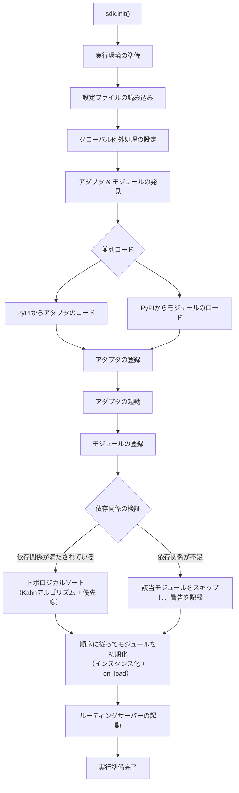

### 初期化段階の詳細

> 完全な初期化フローの分解（Finder / Loader / Manager / Router）、下層エントリポイント（`init()` / `init_task()` / `init_sync()`）および手動での完全起動については [起動プロセスと手動制御](advanced/startup.md) を参照してください。

## イベント処理のフロー

下の図は、プラットフォームからハンドラへメッセージが完全に流れる経路を示しています：

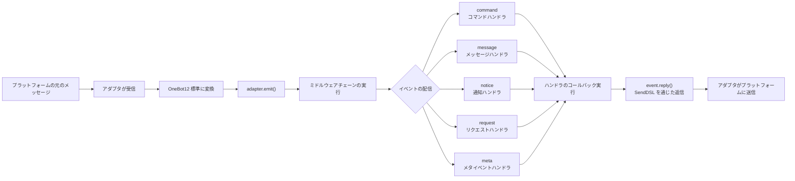

### イベント処理の詳細な経路

上記の図は「結果」です。次に `adapter.emit()` を分解すると、フレームワークが**背後で何をしているか**がわかります。これは3層の配信経路です：

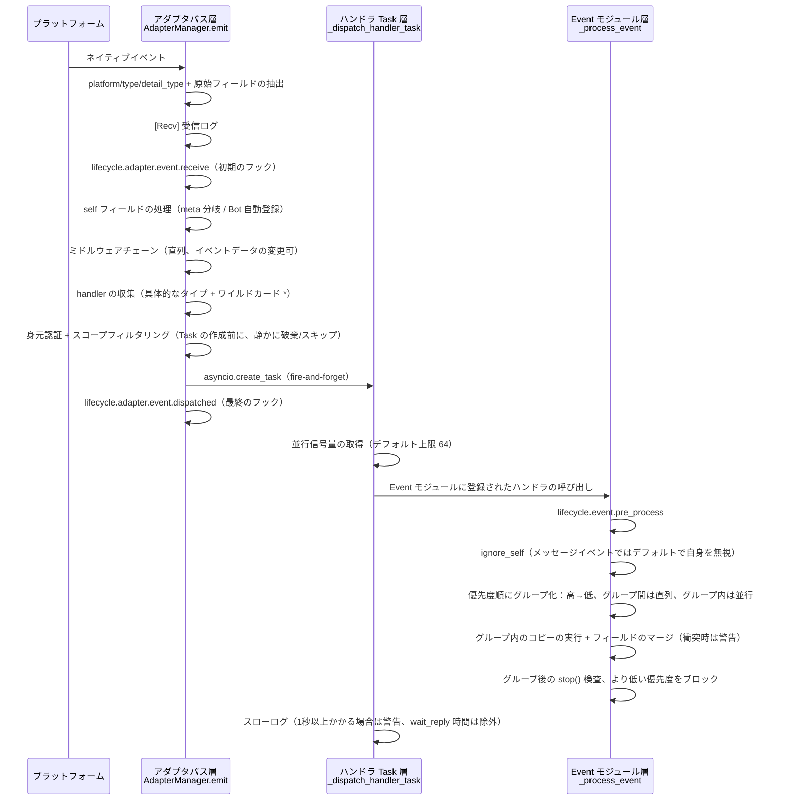

**フレームワークが何をしているか、そしてあなたが介入できる点は以下の通りです：**

| 階段 | フレームワークが行ったこと | 介入できる点 |
|------|-------------|-----------|
| 受信 | 標準フィールドの抽出、`{platform}_raw` の元データを保持；`[Recv]` ログを記録 | `adapter.event.receive` を監視して初期イベントを取得 |
| self フィールド | meta イベントは connect/disconnect/heartbeat 分岐；通常イベントでは Bot を自動登録し、`adapter.bot.online` をトリガー | `adapter.bot.online` / `bot.offline` を監視 |
| ミドルウェア | **直列**に実行し、戻り値が None でない場合はイベントデータを置き換え | ミドルウェアを登録してイベントを変更/ブロック |
| 分発収集 | 先に具体的なタイプの handler を取得し、次に `*` ワイルドカード handler を取得 | — |
| 身元次元 | 入口でユーザー > 会話 > Bot > アダプタの順でイベントを受け取るかどうか判定（`scope.is_identity_allowed`）、**拒否された場合はイベント全体を破棄** | `ErisPulse.scope.identity` をバインド |
| スコープフィルタリング | モジュールの所有者に基づいて `scope.is_allowed` を判定（会話レベル > Bot レベル > プラットフォームレベル）、**通過しない場合は静かにスキップ** | スコープのホワイトリスト/ブラックリストを設定 |
| スケジューリング | 各マッチする handler ごとに独立した `asyncio.Task` を作成、`emit()` は **handler の完了を待たずに即座に返却** | — |
| 優先度 | 高優先度のグループが先に実行；**グループ間は直列、グループ内は並行**（グループ内では各 handler がイベントのコピーを持ち、フィールドをマージし、衝突時は WARNING を出力） | `@command(..., priority=N)` / 登録時に priority を指定 |
| ブロック | 各グループの処理後に `event.is_stopped()` をチェックし、一致した場合は**より低い優先度は実行されない** | `event.mark_processed(stop=True)` / `event.done()` |

> **よくある誤解**:
> 1. **スコープフィルタリングは静かである**——遮断された handler はエラーもレスポンスもせず、TRACE ログレベルでのみ表示されます（`core.scope.denied`）。「私のモジュールがメッセージを受け取らない」場合は、まずスコープのバインディングを確認してください。
> 2. **handler は天然に並行である**——フレームワークは各 handler に独立した Task を作成しており、**自分で `asyncio.create_task` をラップする必要はありません**。
> 3. **同じ優先度のグループ内ではブロックされない**——`mark_processed(stop=True)` はより低い優先度のグループをブロックするだけで、同じグループ内で既に並行実行中の handler は途中で中断されません。
> 4. **スローログの閾値は固定の1秒である**——ハンドラの処理時間が1秒を超えるとログに WARNING が出力されます（`wait_reply` の待機時間は処理時間から除外されますが、実行は中断されません）。

> 作用域の3段階のバインディングと優先度の詳細は [作用域システム](advanced/scope.md) を参照してください。claim/ブロックの完全な意味は [イベント処理の入門](getting-started/event-handling.md) を参照してください。並行上限の設定は [設定ガイド](user-guide/configuration.md#フレームワーク設定) を参照してください。

## ライフサイクルイベント

下図は、フレームワークの各コンポーネントがライフサイクルイベントをどのように発生させるかを示しています：

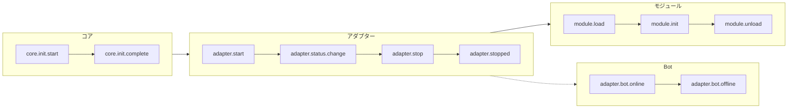

### ライフサイクルイベントの監視

> 完全なイベント監視メソッド（`lifecycle.on()` / `once()` / `has_handlers()`）、すべてのライフサイクルイベントリストとデータ形式は [ライフサイクル管理](advanced/lifecycle.md) を参照してください。

## モジュールのロード戦略

ErisPulse は、`get_load_strategy()` が返す `ModuleLoadStrategy` によって宣言される 3 つのモジュールロード戦略をサポートしています：

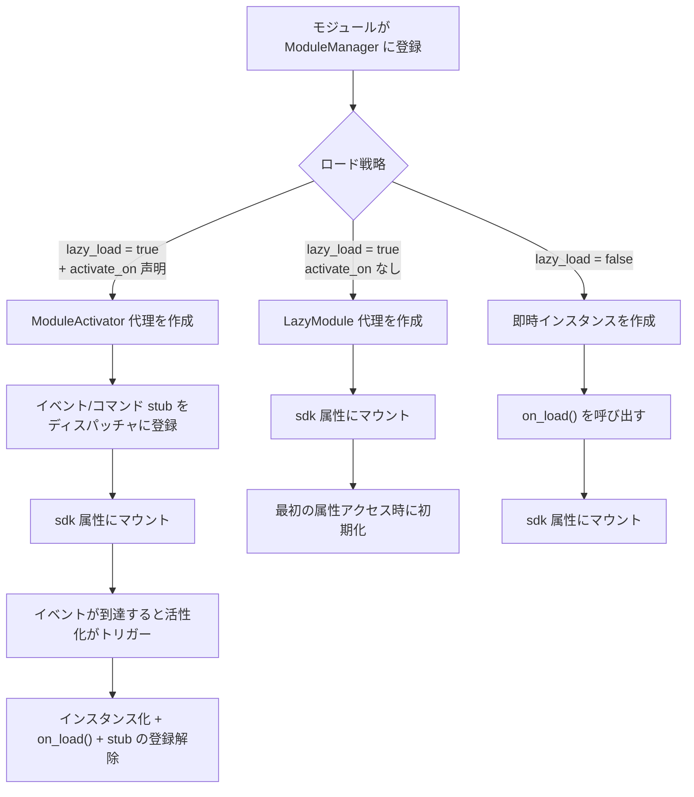

> 詳細については、[遅延ロードシステム](advanced/lazy-loading.md)、[ライフサイクル管理](advanced/lifecycle.md) およびモジュールのドキュメントを参照してください。

### イベント駆動の遅延活性化（`activate_on`）トリガー構造

> [!NOTE]
> この機能には ErisPulse **2.8.0+** が必要です。

`activate_on` により、モジュールは**最初の一致するイベント/コマンドが到達した時点で**のみロードされるようになり、メモリ常駐を回避しながら、イベントのロスを防ぐことができます：

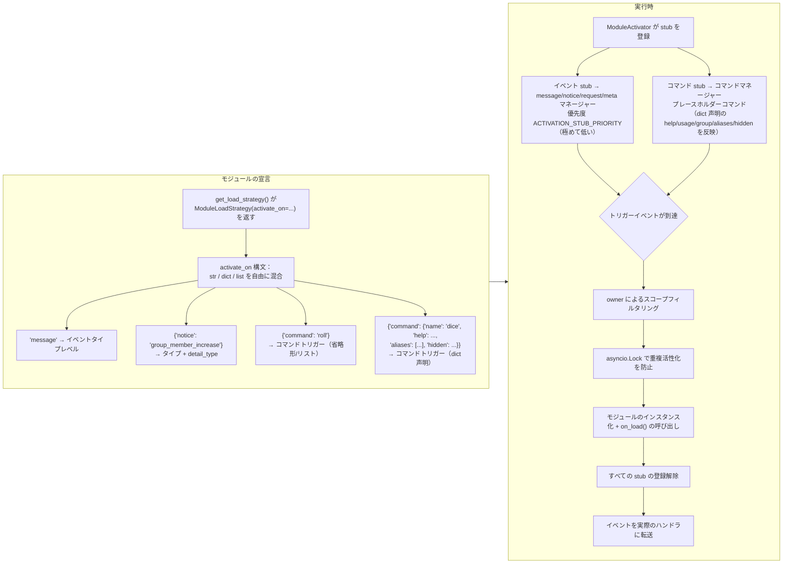

**トリガーの意味要点：**

> 完全な `activate_on` 構文（str / dict / list）、コマンド dict 声明、プレースホルダーコマンドの help フォールバックチェーン、スコープフィルタリング、および失敗時の意味については、[遅延ロードシステム](advanced/lazy-loading.md#イベント駆動の遅延活性化activate_on) を参照してください。

## ローカルプラグインフォルダのアーキテクチャ

> [!NOTE]
> この機能は ErisPulse **2.8.0+** が必要です。

ローカルプラグイン（`plugins/` 目录）はパッケージ化して公開する必要がなく、フレームワークの起動時に自動的に発見・ロードされます：

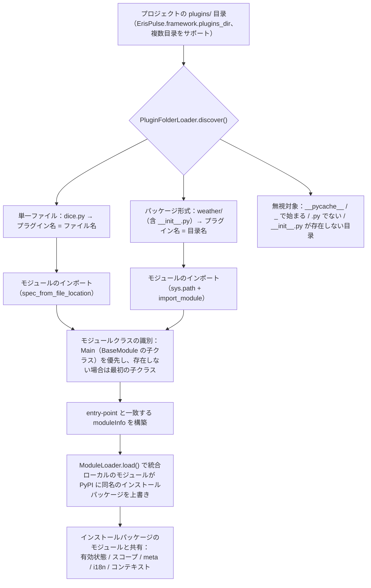

**規約と特性：**

- プラグイン名の取得方法：単一ファイルはファイル名、パッケージ形式は目录名
- ローカルプラグインの `moduleInfo.meta.source == "plugin_folder"` であり、PyPI でインストールされたパッケージモジュールとシームレスに共存
- 同名のモジュールがある場合、ローカルのモジュールが優先（ローカルでの上書きデバッグが可能）、無効化された場合、同名の entry-point 条目も同時に削除

## ローカルプラグインのホットリロードアーキテクチャ

ホットリロードはプラグインファイルの変更を監視し、対応するプラグインを自動的に再読み込みします：

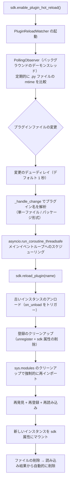

[**English**](docs/ja/quick-start.md)


====
快速上手
====


### 快速开始

# ファーストステップ

> **これが最初の一歩です。** 5分でErisPulseロボットをゼロから立ち上げましょう。

## ErisPulse のインストール

### 1 クリックインストールスクリプト（推奨）

インストールスクリプトは、環境（Docker、Python、uv）を自動的に検出し、最も適したインストール方法を選択するように導きます。

Windows (PowerShell):
```powershell
irm https://get.erisdev.com/install.ps1 -OutFile install.ps1; powershell -ExecutionPolicy Bypass -File install.ps1
```

macOS / Linux:
```bash
curl -fsSL https://get.erisdev.com/install.sh -o install.sh && chmod +x install.sh && ./install.sh
```

スクリプトは、以下の手順をガイドします：

- **Docker インストール**（Docker が検出された場合に推奨）：イメージソース（Docker Hub / GHCR）、バージョンチャネル（安定版 / プリリリース版）、Dashboard 管理パネルの構成、ポート設定を選択
- **従来のインストール**：自動的に仮想環境を作成、ErisPulse のバージョンを選択、オプションで Dashboard 管理パネルモジュールをインストール

### Docker を使用する

Docker イメージには、ErisPulse フレームワークと Dashboard 管理パネルが事前インストールされています。

```bash
# docker-compose.yml をダウンロード
curl -O https://raw.githubusercontent.com/ErisPulse/ErisPulse/main/docker-compose.yml

# Dashboard トークンを設定して起動
ERISPULSE_DASHBOARD_TOKEN=your-token docker compose up -d
```

<details>
<summary>Docker Hub が利用できない場合</summary>

GitHub Container Registry のイメージを使用する場合は、`docker-compose.yml` 内の image を次のように変更します：

```yaml
image: ghcr.io/erispulse/erispulse:latest
```

</details>

起動後、`http://<host>:8000/Dashboard` にアクセスし、設定したトークンでログインします。

### pip を使用してインストール

Python のバージョンが 3.10 以上であることを確認した上で、pip を使用してインストールします：

```bash
pip install ErisPulse
```

既に [uv](https://github.com/astral-sh/uv) をインストールしている場合は、`uv pip install ErisPulse` を使用することで、より高速にインストールできます。

## プロジェクトの初期化

### インタラクティブな初期化（推奨）

```bash
epsdk init
```

これにより、対話形式のガイドが起動し、以下の手順を誘導します：
- プロジェクト名の設定
- ログレベルの設定
- サーバー設定（ホストとポート）
- アダプターの選択と設定
- プロジェクト構造の作成

### 速やかな初期化

```bash
# プロジェクト名を指定するクイックモード
epsdk init -q -n my_bot

# または、プロジェクト名のみを指定
epsdk init -n my_bot
```

### 手動でのプロジェクト作成

手動でプロジェクトを作成したい場合は：

```bash
mkdir my_bot && cd my_bot
epsdk init
```

## モジュールのインストール

### CLI によるインストール

```bash
epsdk install Yunhu AIChat
```

### 利用可能なモジュールの表示

```bash
epsdk list-remote
```

### インタラクティブなインストール

パッケージ名を指定しない場合、インタラクティブなインストール画面が表示されます：

```bash
epsdk install
```

## プロジェクトの実行

```bash
# 通常実行
epsdk run main.py

# ホットリロードモード（開発時に推奨）
epsdk run main.py --reload
```

## IDE補完の有効化（オプション）

ErisPulse はモジュール/アダプターを動的に発見するため、IDE はデフォルトではプラットフォーム固有のメソッドを補完できません。  
以下のコマンドを実行して型のスタブを生成してください。

```bash
epsdk types
```

生成後、インポートした型を変数の型アノテーションとして使用することで、正確な補完が得られます（詳しくは [IDE補完ガイド](./getting-started/ide-completion.md) を参照してください）：

```python
from _ep_types import Yunhu
from ErisPulse import sdk

adapter: Yunhu = sdk.adapter.get("yunhu")
await adapter.Send.To("group", "123").Board(...)  # プラットフォーム固有のメソッドが補完されます
```

## プロジェクト構造

初期化後のプロジェクト構造：

```
my_bot/
├── config/
│   └── config.toml          # 設定ファイル
└── main.py                  # エントリーポイントファイル

```

## 設定ファイル

基本的な `config.toml` 設定：

```toml
[ErisPulse.server]
host = "0.0.0.0"
port = 8000

[ErisPulse.logger]
level = "INFO"

[Yunhu_Adapter]
# アダプタの設定
```

## 次に進む

ロボットが動作した後、必要に応じて以下を進めることができます。

**フレームワークの仕組みについて知りたい場合:**
- [基本概念](getting-started/basic-concepts.md) — アダプタ / モジュール / イベントの設計
- [アーキテクチャ概要](architecture.md) — 可視化されたアーキテクチャ図

**より多くの機能を実装したい場合:**
- [一般的なタスクの例](getting-started/common-tasks.md) — ストレージ、スケジューリング、権限制御
- [イベント処理の入門](getting-started/event-handling.md) — メッセージ、通知、リクエストの処理

**独自のモジュール / アダプタを開発したい場合:**
- [モジュール開発の入門](developer-guide/modules/getting-started.md)
- [アダプタ開発の入門](developer-guide/adapters/getting-started.md)

**必要に応じて参照:**
- [設定ファイルの説明](user-guide/configuration.md) · [CLI コマンド](user-guide/cli-reference.md) · [デプロイガイド](user-guide/deployment.md)


### 创建第一个机器人

# 最初のロボットを作成する

このガイドでは、[5 分で始める](../quick-start.md)をもとに、最初のコマンドハンドラを記述し、実行メカニズムを理解します。

> ErisPulse をまだインストールしていない、またはプロジェクトを初期化していない場合は、まず [5 分で始める](../quick-start.md) の「インストール」「プロジェクトの初期化」「プロジェクトの実行」の 3 つの手順を完了してください。

## ステップ 1: 最初のコマンドを記述する

`main.py` を開き、シンプルなコマンドハンドラを記述します：

```python
from ErisPulse import sdk
from ErisPulse.Core.Event import command

@command("hello", help="挨拶メッセージを送信")
async def hello_handler(event):
    """hello コマンドを処理"""
    user_name = event.get_user_nickname() or "友達"
    await event.reply(f"こんにちは、{user_name}！私は ErisPulse ロボットです。")

@command("ping", help="ロボットがオンラインかテスト")
async def ping_handler(event):
    """ping コマンドを処理"""
    await event.reply("Pong！ロボットは正常に動作しています。")

async def main():
    """メインエントリポイント"""
    print("ErisPulse を起動しています...")
    
    # keep_running=True（デフォルト）：フレームワークはブロックして実行を維持し、終了信号（例：Ctrl+C）を受信するまで停止しません
    await sdk.run(keep_running=True)

if __name__ == "__main__":
    import asyncio
    asyncio.run(main())
```

### `keep_running` パラメータ

`sdk.run(keep_running)` は、フレームワークが実行をブロックして維持するかどうかを制御します：

- **`keep_running=True`（デフォルト）**：`run()` は終了信号（例：Ctrl+C）を受信するまでブロックし続けます。これは純粋な bot アプリケーションに適しています。
- **`keep_running=False`**：`run()` は初期化後に即座に返り、**フレームワークはアンロードされません**。起動したアダプタ/モジュールはバックグラウンドタスクとしてメッセージイベントを処理し続け、イベントループが終了するまで独自のロジックを実行できます。例：

```python
async def main():
    await sdk.run(keep_running=False)   # 初期化後に即座に返る
    # フレームワークはバックグラウンドで実行中、ここでは他の処理を続行できる
    while True:
        await asyncio.sleep(3600)
        print("1 時間ごとにチェック")
```

> `run()` の 2 つのモードに加え、`init()`/`uninit()` を用いたライフサイクルの手動制御、個別のアダプタ/ルーティングの起動・停止など、より細かい制御方法もあります。[起動フローと手動制御](../advanced/startup.md)を参照してください。

## ステップ 2: ロボットを実行する

```bash
# 通常実行
epsdk run main.py

# 開発モード（ホットリロードをサポート）
epsdk run main.py --reload
```

## ステップ 3: ロボットをテストする

チャットプラットフォームでコマンドを送信します：

```
/hello
```

ロボットからの返信が届くはずです。

## コードの説明

### コマンドデコレータ

```python
@command("hello", help="挨拶メッセージを送信")
```

- `hello`：コマンド名、ユーザーは `/hello` で呼び出します
- `help`：コマンドのヘルプ説明、`/help` コマンドで表示されます

### イベントパラメータ

```python
async def hello_handler(event):
```

`event` パラメータは Event オブジェクトで、以下を含みます：
- メッセージ内容：`event.get_text()`
- 送信者情報：`event.get_user_id()`、`event.get_user_nickname()`
- プラットフォーム情報：`event.get_platform()`
- グループ情報：`event.get_group_id()`
- 元データ：`event.get_raw()`

> 完全な Event オブジェクトのメソッドは [Event 包装クラスの詳細](../developer-guide/modules/event-wrapper.md) を参照してください。

### レスポンスの送信

```python
await event.reply("レスポンス内容")
```

`event.reply()` は、送信者にメッセージを送信するための便利なメソッドです。

## 拡張：より多くの機能を追加する

ErisPulse は豊富なイベント処理とデータ処理機能を提供します：

- **メッセージ監視**：`@message.on_message()` を使用して、さまざまなメッセージを監視 → [イベント処理の入門](event-handling.md)
- **通知監視**：`@notice.on_friend_add()` などを使用して、システム通知を監視 → [イベント処理の入門](event-handling.md)
- **データ保存**：`sdk.storage.get/set` を使用して、永続化データを保存 → [一般的なタスクの例](common-tasks.md)

## 一般的な問題

### コマンドが反応しない？

1. アダプタが正しく設定されているか確認し、`config/config.toml` でアダプタの `status` が `true` であることを確認します。
2. ターミナルのログ出力を確認し、エラー情報（特に `ERROR` レベルのログ）がないか確認します。
3. コマンドのプレフィックスが正しいか確認します（デフォルトは `/` です）。設定ファイルの `[ErisPulse.event.command]` 部分を確認してください。
4. コマンド名のスペルが正しいか確認し、大文字小文字の区別が有効かどうかを確認します。

### コマンドプレフィックスを変更するには？

`config.toml` に追加します：

```toml
[ErisPulse.event.command]
prefix = "!"
case_sensitive = false
```

### 複数のプラットフォームをサポートするには？

ErisPulse は OneBot12 標準を使用して、異なるプラットフォームのイベント形式を統一しています。`@command` および `@message` で登録されたハンドラは、すべてのプラットフォームのイベントを自動的に受け取ります。`event.get_platform()` を使用して、送信元のプラットフォームを区別できます：

```python
@command("hello")
async def hello_handler(event):
    platform = event.get_platform()
    
    if platform == "yunhu":
        await event.reply("こんにちは！雲湖から")
    elif platform == "telegram":
        await event.reply("Hello! From Telegram")
    else:
        await event.reply("こんにちは！")
```

> 複数のプラットフォームへの対応テクニックについては、[一般的なタスクの例](common-tasks.md#多プラットフォーム対応)を参照してください。

## 次のステップ

- [基本概念](basic-concepts.md) - ErisPulse のコアコンセプトを深く理解する
- [イベント処理の入門](event-handling.md) - さまざまなイベントの処理方法を学ぶ
- [一般的なタスクの例](common-tasks.md) - より実用的な機能を習得する


### 基础概念

# 基本概念

このガイドでは ErisPulse の核心概念を紹介し、フレームワークの設計思想と基本的なアーキテクチャを理解するのに役立ちます。

## イベント駆動型アーキテクチャ

ErisPulse はイベント駆動型アーキテクチャを採用しており、すべての対話はイベントを介して送信および処理されます。

### イベントフロー

```
ユーザーがメッセージを送信
      │
      ▼
プラットフォームが受信
      │
      ▼
アダプタがプラットフォームのネイティブイベントを受信
      │
      ▼
OneBot12 標準イベントへ変換
      │
      ▼
イベントシステムへ提出
      │
      ▼
登録済みハンドラーへ配信
      │
      ▼
モジュールがイベントを処理
      │
      ▼
アダプタ経由でレスポンスを送信
      │
      ▼
プラットフォームがユーザーに表示
```

### OneBot12 標準

ErisPulse は OneBot12 をコアイベント標準として使用します。OneBot12 は汎用チャットボットアプリケーションインターフェース標準であり、統一されたイベント形式を定義しています。

すべてのアダプタは、プラットフォーム固有のイベントを OneBot12 形式に変換し、コードの一貫性を保証します。

## コアコンポーネント

### 1. SDK オブジェクト

SDK はすべての機能の統一されたエントリーポイントであり、コアコンポーネントへのアクセスを提供します。

```python
from ErisPulse import sdk

# コアモジュールへのアクセス
sdk.storage    # ストレージシステム
sdk.config     # 設定システム
sdk.logger     # ロギングシステム
sdk.adapter    # アダプタシステム
sdk.module     # モジュールシステム
sdk.router     # ルーティングシステム
sdk.client     # HTTPクライアント
sdk.lifecycle  # ライフサイクルシステム
```

### 2. Event オブジェクト

Event オブジェクトはイベントデータをカプセル化し、便利なアクセスメソッドを提供します。

```python
@command("info")
async def info_handler(event):
    # イベント情報の取得
    event_id = event.get_id()
    user_id = event.get_user_id()
    platform = event.get_platform()
    text = event.get_text()
    
    # 返信を送信
    await event.reply(f"ユーザー: {user_id}, プラットフォーム: {platform}")
```

### 3. アダプタ

アダプタは ErisPulse と外部プラットフォームの間の橋渡しです。

**責任：**
- プラットフォームのネイティブイベントを受信
- OneBot12 標準形式へ変換
- 標準形式イベントをプラットフォームへ送信

**サンプルアダプタ：**
- Yunhu アダプタ：Yunhu プラットフォームと通信
- Telegram アダプタ：Telegram Bot API と通信
- OneBot11 アダプタ：OneBot11 互換のアプリケーションと通信
- Email アダプタ：メールの送受信を処理

### 4. モジュール

モジュールは機能拡張の基本単位であり、以下のことが可能です。

- イベントハンドラーを登録
- ビジネスロジックを実装
- アダプタを使用してメッセージを送信
- コアモジュールが提供するサービスを使用

#### モジュール検出メカニズム

ErisPulse は Python の `importlib.metadata.entry_points` を使用してインストール済みのモジュールを検出します。モジュールは `pyproject.toml` でエントリーポイントを宣言します：

```toml
[project.entry-points."erispulse.module"]
MyModule = "my_package:Main"
```

SDK の初期化時に、すべての `erispulse.module` グループのエントリーポイントがスキャンされ、モジュールクラスが `ModuleManager` に登録され、依存関係のトポロジカルソート後に順次初期化されます。

#### 最小限の使用可能モジュール

```python
from ErisPulse.Core.Bases import BaseModule
from ErisPulse import sdk

class Main(BaseModule):
    def __init__(self):
        self.sdk = sdk
        self.logger = sdk.logger.get_child("MyModule")

    async def on_load(self, event):
        self.logger.info("モジュールがロードされました")

    async def on_unload(self, event):
        self.logger.info("モジュールがアンロードされました")
```

#### モジュールライフサイクル

- **登録**：SDK がモジュールクラスを発見してマネージャーに登録
- **ロード**：モジュールインスタンスを作成し、`on_load(event)` を呼び出し（`event = {"module_name": "MyModule"}`）
- **アンロード**：`on_unload(event)` を呼び出し、リソースをクリーンアップ

#### ロード戦略

`get_load_strategy()` を使用してモジュールのロード動作を宣言します：

```python
from ErisPulse.loaders import ModuleLoadStrategy

class Main(BaseModule):
    @staticmethod
    def get_load_strategy():
        return ModuleLoadStrategy(
            lazy_load=True,   # レイジーロードを行うかどうか（デフォルト True）
            priority=0        # ロード優先度、数値が大きいほど先に初期化
        )
```

- **`lazy_load=True`（デフォルト）**：初めて `sdk.MyModule` にアクセスされたときにモジュールが初期化され、起動時間を短縮
- **`lazy_load=False`**：SDK の起動時に即時初期化、ライフサイクルイベントを監視するモジュールや定時タスクを実行するモジュールに適している
- **`priority`**：優先度が同じモジュールは登録順でロード；数値が大きいほど先に初期化

> 詳細なレイジーロードメカニズムについては、[レイジーロードシステム](../advanced/lazy-loading.md)を参照してください。

## イベントタイプ

ErisPulse は 5 つの種類のイベントをサポートしています。

| イベントタイプ | デコレータ | 説明 |
|---------|--------|------|
| メッセージイベント | `@message.on_message()` | ユーザーが送信する任意のメッセージ（プライベートチャット、グループチャット） |
| コマンドイベント | `@command("name")` | コマンドプレフィックスで始まるメッセージ（例：`/hello`） |
| 通知イベント | `@notice.on_friend_add()` 等 | システム通知（フレンド追加、メンバー変更など） |
| リクエストイベント | `@request.on_friend_request()` 等 | ユーザーリクエスト（フレンド申請、グループ招待） |
| メタイベント | `@meta.on_connect()` 等 | システムレベルイベント（接続、切断、ハートビート） |

> 各イベントタイプの詳細な使用法とコード例については、[イベント処理入門](event-handling.md)を参照してください。

## コアモジュールの説明

### Storage（ストレージ）

SQLite ベースのキーバリューストレージシステムで、永続化データに使用されます。

```python
# 値の設定
sdk.storage.set("key", "value")

# 値の取得
value = sdk.storage.get("key", "default_value")

# バッチ操作
sdk.storage.set_multi({
    "key1": "value1",
    "key2": "value2"
})

# トランザクション
with sdk.storage.transaction():
    sdk.storage.set("key1", "value1")
    sdk.storage.set("key2", "value2")
```

### Config（設定）

TOML形式の設定ファイル管理。

```python
# 設定の取得
config = sdk.config.getConfig("MyModule", {})

# 設定の設定
sdk.config.setConfig("MyModule", {"key": "value"})

# ネストされた設定の読み込み
value = sdk.config.getConfig("MyModule.subkey", "default")
```

### Logger（ログ）

モジュラーログシステム。

```python
# ログの記録
sdk.logger.info("これは情報です")
sdk.logger.warning("これは警告です")
sdk.logger.error("これはエラーです")

# 子ロガーの取得
child_logger = sdk.logger.get_child("submodule")
child_logger.info("サブモジュールログ")
```

**属性アクセスシンタックスシュガー**

`get_child()` メソッドを使用する以外に、**属性アクセス**の方法で子ロガーを作成することもでき、これはより簡潔な**シンタックスシュガー**の記述方法です：

```python
# 属性アクセスで子ロガーを作成
sdk.logger.mymodule.info("モジュールメッセージ")

# ネストされたアクセスをサポート
sdk.logger.mymodule.database.info("データベースメッセージ")
```

### Router（ルーティング）

HTTP および WebSocket ルーティング管理、FastAPI + Uvicorn ベース。デコレータルーティング、ミドルウェア、グループ化、レート制限、CORS をサポートします。

```python
from ErisPulse.Core import HttpRequest

@sdk.router.get("MyModule", "/api")
async def handler(request: HttpRequest):
    data = await request.json()
    return {"status": "ok"}
```

> 完全なルーティング API（WebSocket、ミドルウェア、レート制限、CORS など）については、[ルーティングマネージャー](../advanced/router.md)を参照してください。

### Client（ネットワーククライアント）

統合されたネットワーククライアントで、HTTP リクエスト、WebSocket 接続、コネクションプール管理、自動再試行、タイムアウト制御、リクエスト統計、ライフサイクルイベント統合を集約しています。

```python
from ErisPulse.Core import client

# HTTP リクエスト
resp = await client.get("https://api.example.com/users")
data = await resp.json()

# 再試行とタイムアウト付き
resp = await client.get(url, timeout=30, max_retries=3)

# WebSocket 接続
ws = await client.ws_connect("wss://example.com/ws")
async for text in ws.iter_text():
    await ws.send_text(f"Echo: {text}")
```

> 完全なネットワーククライアント API については、[ネットワーククライアント](../advanced/http-client.md)を参照してください。

## SendDSL メッセージ送信

アダプタはチェーン呼び出しのメッセージ送信インターフェースを提供します。

### 基本送信

```python
# アダプタインスタンスの取得
yunhu = sdk.adapter.get("yunhu")

# メッセージを送信
await yunhu.Send.To("user", "U1001").Text("Hello")

# 送信アカウントを指定
await yunhu.Send.Using("bot1").To("group", "G1001").Text("グループメッセージ")
```

### チェーン修飾

```python
# @ユーザー
await yunhu.Send.To("group", "G1001").At("U2001").Text("@メッセージ")

# 返信メッセージ
await yunhu.Send.To("group", "G1001").Reply("msg123").Text("返信")

# @全体
await yunhu.Send.To("group", "G1001").AtAll().Text("告知")
```

### Event 返信メソッド

Event オブジェクトは便利な返信メソッドを提供します：

```python
@command("test")
async def test_handler(event):
    # 簡単なテキスト返信
    await event.reply("返信内容")
    
    # 画像を送信
    await event.reply("http://example.com/image.jpg", method="Image")
    
    # 音声を送信
    await event.reply("http://example.com/voice.mp3", method="Voice")
```

## レイジーロードシステム

ErisPulse はデフォルトでモジュールレイジーロードを有効にしており、モジュールは初めてアクセスされたとき（`sdk.MyModule` など）にのみ初期化され、起動速度を大幅に向上させます。

```python
from ErisPulse.loaders import ModuleLoadStrategy

class Main(BaseModule):
    @staticmethod
    def get_load_strategy():
        return ModuleLoadStrategy(
            lazy_load=True,   # レイジーロードを有効にする（デフォルト）
            priority=0        # ロード優先度、数値が大きいほど先に初期化
        )
```

**レイジーロードを無効にする必要があるシナリオ（`lazy_load=False`）：**
- ライフサイクルイベントを監視するモジュール（例：`core.init.complete`）
- 起動時の定時タスクまたはバックグラウンドサービスを実行するモジュール
- 他のモジュールのロード前に初期化を完了する必要があるモジュール

> 詳細なレイジーロードメカニズムと注意点については、[レイジーロードシステム](../advanced/lazy-loading.md)を参照してください。

## 次のステップ

- [イベント処理入門](event-handling.md) - 各種イベントの処理方法を学ぶ
- [一般的なタスクの例](common-tasks.md) - 一般的な機能の実装をマスターする


### 事件处理入门

# イベント処理入門

このガイドでは、ErisPulse におけるさまざまなイベントの処理方法を紹介します。

## イベントの種類概要

ErisPulse は以下のイベントの種類をサポートしています：

| イベントの種類 | 説明 | 適用場面 |
|---------|------|---------|
| メッセージイベント | ユーザーが送信するすべてのメッセージ | チャットボット、コンテンツフィルタリング |
| コマンドイベント | コマンドプレフィックスで始まるメッセージ | コマンド処理、機能の入口 |
| 通知イベント | システム通知（友達追加、グループメンバー変更など） | メッセージの歓迎、ステータス通知 |
| 要求イベント | ユーザーの要求（友達リクエスト、グループ招待） | 要求の自動処理 |
| メタイベント | システムレベルのイベント（接続、ハートビート） | 接続監視、ステータスチェック |

## メッセージイベントの処理

> **ヒント**: イベントハンドラで `Event` タイプの注釈を使用することを推奨します。これにより、IDEの自動補完と型チェックがサポートされます。

```python
from ErisPulse.Core.Event import Event  # イベントの型を注釈に使用
```

### すべてのメッセージを監視

```python
from ErisPulse.Core.Event import message, Event

@message.on_message()
async def message_handler(event: Event):
    text = event.get_text()
    user_id = event.get_user_id()
    sdk.logger.info(f"{user_id} からのメッセージを受け取りました: {text}")
```

### プライベートメッセージを監視

```python
@message.on_private_message()
async def private_handler(event: Event):
    user_id = event.get_user_id()
    await event.reply(f"こんにちは、{user_id}！これはプライベートメッセージです。")
```

### グループチャットメッセージを監視

```python
@message.on_group_message()
async def group_handler(event: Event):
    group_id = event.get_group_id()
    user_id = event.get_user_id()
    sdk.logger.info(f"グループ {group_id} で {user_id} がメッセージを送信しました")
```

### @メッセージを監視

```python
@message.on_at_message()
async def at_handler(event: Event):
    # @されたユーザーのリストを取得
    mentions = event.get_mentions()
    await event.reply(f"あなたが@したユーザー: {mentions}")
```

### ワイルドカードと正規表現による監視

`on_message` / `on_private_message` / `on_group_message` / `on_at_message` の4つのメッセージデコレータは、`pattern`（globワイルドカード）と `regex`（正規表現）をサポートしています。一致しないメッセージは**ハンドラをトリガーしません**：

```python
# globワイルドカード：* 任意の文字列、? 1文字、[seq] 文字集合
@message.on_message(pattern="签到*")
async def signin_handler(event: Event):
    await event.reply("签到成功")

# 正規表現：金額を一致させる
@message.on_message(regex=r"\d+\s*元")
async def price_handler(event: Event):
    await event.reply(f"金額を受け取りました: {event.get_text()}")

# pattern と regex が同時に与えられた場合 → 両方とも一致する必要がある
@message.on_message(pattern="*元", regex=r"\d+\s*元")
async def combined_handler(event: Event):
    pass
```

`wait_reply` はこの2つのパラメータもサポートしています（[返信の待機機能](../developer-guide/modules/event-wrapper.md#待機返信機能)を参照）。

## コマンドイベントの処理

### 基本コマンド

```python
from ErisPulse.Core.Event import command

@command("help", help="ヘルプ情報を表示")
async def help_handler(event):
    help_text = """
使用可能なコマンド:
/help - ヘルプ情報を表示
/ping - 接続をテスト
/info - 情報を表示
    """
    await event.reply(help_text)
```

### コマンドのエイリアス

```python
@command(["help", "h"], aliases=["帮助"], help="ヘルプ情報を表示")
async def help_handler(event):
    await event.reply("ヘルプ情報...")
```

ユーザーは以下のいずれかの方法で呼び出すことができます：
- `/help`
- `/h`
- `/帮助`

### コマンドの引数

```python
@command("echo", help="メッセージを返す")
async def echo_handler(event):
    # コマンド引数を取得
    args = event.get_command_args()
    
    if not args:
        await event.reply("返信するメッセージを入力してください")
    else:
        await event.reply(f"あなたが言った: {' '.join(args)}")
```

### コマンドグループ

```python
@command("admin.reload", group="admin", help="モジュールを再読み込み")
async def reload_handler(event):
    await event.reply("モジュールを再読み込みしました")

@command("admin.stop", group="admin", help="ロボットを停止")
async def stop_handler(event):
    await event.reply("ロボットを停止しました")
```

### コマンドの権限とアクセス制御

コマンドの権限は3層に分かれています（**上層が拒否された場合は下層は見られません**）：

```python
# ① コマンドのACL（ユーザー側設定）：コマンドのユーザーのホワイトリスト/ブラックリストで、拒否された場合は「権限がありません」と返します
# ② master=True —— フレームワークのオーナーのみ実行可能（フレームワークが自動的にチェックし、拒否された場合は「権限がありません」と返します）
@command("restart", master=True, help="モジュールを再起動")
async def restart_handler(event):
    await event.reply("モジュールを再起動しました")

# ③ permission=関数呼び出し —— コマンド自身の制御ロジック（Trueを返した場合にのみ実行）
def is_admin(event):
    return event.get_user_id() in {"user123", "user456"}

@command("panel", permission=is_admin, help="管理パネル")
async def panel_handler(event):
    await event.reply("管理パネルへようこそ")
```

**コマンドのACL**（コントロール面 `ErisPulse.scope.commands`）：ユーザーは任意のコマンドにユーザーのホワイトリスト/ブラックリストを設定でき、コマンド名は正確な一致とglobパターン（例：`"roll*"`）をサポートします。拒否された場合は「権限がありません」と返します：

```toml
# config.toml —— restartを123456のみ実行可能に、666は一律拒否
[ErisPulse.scope.commands.restart]
allow = ["onebot11:123456"]
deny = ["onebot11:666"]
```

判定順序：`deny`が一致した場合 → 拒否；`allow`が空で一致しない場合 → 拒否；それ以外は開発者のデフォルトに任せる（`master=True` / `permission`）。実行時のAPI（コマンド名はglobパターンをサポート）：

```python
from ErisPulse import sdk
sdk.scope.allow_user("restart", "onebot11", "123456")   # 許可リスト
sdk.scope.deny_user("restart", "onebot11", "666")       # 拒否リスト
sdk.scope.remove_acl("restart")                          # ホワイトリスト/ブラックリストを削除
sdk.scope.get_acl("restart")                             # 現在のリストを取得
```

コマンド間 / ユーザー間の**イベントレベル**のアクセス制御（特定のユーザー / グループ / Botのメッセージを受信するかどうか）は、コントロール面の**アイデンティティ次元**（`scope.identity`）で行います。**モジュールレベル**の可用性（どのモジュールが使えるか）は、コントロール面の**モジュール次元**（`scope.platforms / bots / sessions`）で行います。詳細は[統一コントロール面](../advanced/scope.md)を参照してください。

> おすすめ：コマンド内部でビジネスロジックを連動させる場合は `master=True` / `permission` を使用してください。ユーザー / グループごとのアクセス制御が必要な場合はコントロール面のアイデンティティ次元を使用してください。モジュールの可用性を制御する場合はコントロール面のモジュール次元を使用してください。

### コマンドの優先度

```python
# 優先度の値が大きいほど、実行が早くなります
@message.on_message(priority=10)
async def high_priority_handler(event):
    await event.reply("高優先度のハンドラ")

@message.on_message(priority=1)
async def low_priority_handler(event):
    await event.reply("低優先度のハンドラ")
```

### 並列イベント処理

ErisPulseのイベントシステムは**同じ優先度では並列、異なる優先度では直列**のスケジューリングモデルを採用しています：

```
イベント到着
    ↓
priority=10 組: [ハンドラC || ハンドラD] 並列 → 結果を結合
    ↓ (中断しない場合)
priority=0 組: [ハンドラA || ハンドラB] 並列 → 結果を結合
    ↓
...
```

- **同じ優先度の並列実行**：優先度が同じ複数のハンドラは同時に実行され、スループットが向上します
- **異なる優先度の直列実行**：異なる優先度のグループは順番に実行され（値が大きいほど先に実行されます）、高優先度のハンドラが先に実行されます
- **Copy-On-Write**：ハンドラが変更しない限りコピーを作成せず、オーバーヘッドをゼロにします
- **競合処理**：同じ優先度の複数のハンドラが同じフィールドを変更した場合、最後の変更値を使用し、警告ログを記録します
- **中断機構**：任意のハンドラが `event.done()`（デフォルト）または `event.done(claim=False)` を呼び出した後は、後続の低優先度のグループをスキップします。認領とブロックの違いは下記の[「チェーン制御：認領とブロック」](#チェーン制御認領とブロック)を参照してください。

```python
# 例：同じ優先度のハンドラが並列実行される
@message.on_message(priority=0)
async def handler_a(event):
    # タスクAを処理
    event['result_a'] = process_a()

@message.on_message(priority=0)
async def handler_b(event):
    # handler_aと並列に実行
    event['result_b'] = process_b()

# 異なる優先度のハンドラが直列実行される
@message.on_message(priority=10)
async def handler_c(event):
    # 優先度が最も高い、最初に実行される
    pass
```

> **並列上限**：すべてのマッチするハンドラのTaskは**即座に作成**されますが、シグナルマニュアルで**同時に実行される数**を制限します。デフォルトの上限は **64**（`ErisPulse.framework.handler_max_concurrency`、ホットアップデートが可能です）。上限を超えたTaskはシグナルマニュアルで待ち、前の処理が完了した後に実行されます。イベントのピーク時にはこれが「圧力調整弁」になります。
>
> **遅延ログ**：個々のハンドラが1秒以上かかる場合、フレームワークはログにWARNINGを出力します（`handler_slow`）。`wait_reply`の待機時間は処理時間から差し引かれるため、「相手の返信を待つ」ことで誤って遅延と判定されることはありません。

## コントロール面フィルタリング：なぜ私のモジュールはメッセージを受け取らないのか

イベントが到着した後、2つの**静的な**フィルタがあります（どちらも返信やエラーを出さない）：

1. **アイデンティティ次元**（`ErisPulse.scope.identity`）：イベントが分岐エントリに到達した時点で、ユーザー > グループ > Bot > アダプターの順に、イベントを受信するかどうかを判定します。拒否された**イベント全体**は破棄され、どのハンドラ（コマンドディスパッチャーを含む）もトリガーされません。
2. **モジュール次元**（`ErisPulse.scope`）：イベントが特定のモジュールのハンドラ/コマンドに到達した時点で、セッション > Bot > プラットフォームの順に、そのモジュールが利用可能かどうかを判定し、**通過しない場合は静かにスキップ**されます。

```toml
# 例1：特定のグループのすべてのメッセージをブロック
[ErisPulse.scope.identity.sessions.onebot11."group_123"]
deny = true

# 例2：特定のBotからMyModuleをブロック
[ErisPulse.scope.bots.onebot11."123456"]
blocked = ["MyModule"]
```

この場合、特定のグループのメッセージが到着したとき、`MyModule`のコマンドとイベントハンドラは**すべてがスケジュールされません**。これはバグではなく、フィルタリング機構です。モジュールが反応しない場合のトラブルシューティングでは、まずコントロール面のアイデンティティとモジュールのバインディングを確認してください。

- フィルタリングログは**TRACE**レベルでのみ表示されます（`core.scope.identity_denied` / `core.scope.denied`）、デフォルトのINFOレベルでは何も表示されません
- フレームワークレベルのハンドラ（`scope_exempt=True`）は**モジュール次元**の影響を受けませんが、**アイデンティティ次元**の影響を受けます（イベント全体が破棄されているため）
- コマンド実行前に3番目のフィルタがあります：コマンドのACL（拒否された場合は「権限がありません」と返します、上記参照）

> 5つの次元の設定、マッチングの構文、実行時のAPIは[統一コントロール面](../../advanced/scope.md)を参照してください。

## チェーン制御：認領とブロック

> [!NOTE]
> `event.done()` / `event.mark_processed()` の `claim=` / `stop=` パラメータは、ErisPulse **2.7.1+** が必要です。

ErisPulseは「認領」と「ブロック」の2つの正交的な意味を分離し、`event.done()`で統一的に制御することで、コマンド処理の周囲にログ、監査、権限などの観測層を重ねることが容易になります。

**2つの概念の正確な定義：**

- **認領（claim）**：イベントがこのハンドラによって処理されたことをマークします（`_processed`に書き込み）。コマンドディスパッチャーは認領されたイベントを見ると**重複を避ける**ためにスキップします。典型的な場面：コマンドがマッチした後に認領し、コマンドディスパッチャーが再び介入しないようにする。
- **ブロック（stop）**：イベントが**より低い優先度**のハンドラに伝播しないようにします（`_propagation_stopped`に書き込み）。より低い優先度のハンドラ（`on_message`など）はこのイベントを見られなくなります。典型的な場面：高優先度のハンドラがイベントを完全に処理した後、より低い優先度のハンドラが実行されないようにする。

| `event.done(...)` | 認領 | ブロック | 場面 |
|-------------------|------|------|------|
| `event.done()` | ✔ | ✔ | コマンド / ハンドラが処理完了した標準的なやり方 |
| `event.done(stop=False)` | ✔ | ✘ | 認領のみ、低優先度の観測者（ログ / 統計）が引き続きイベントを見られるようにする |
| `event.done(claim=False)` | ✘ | ✔ | ブロックのみ（ファイアウォール / リミッターなど）、認領は行わない |

`event.done(claim=, stop=)` は `event.mark_processed(claim=, stop=)` の別名であり、パラメータと動作は完全に等価です。

```python
@command("help")
async def help_cmd(event):
    event.done()            # 認領 + ブロック（コマンド処理完了の標準的なやり方）

@message.on_message(priority=50)
async def observer(event):
    event.done(stop=False)  # 認領のみ：低優先度ハンドラは引き続き実行される（ログ / 統計）

@message.on_message(priority=100)
async def firewall(event):
    if denied(event):
        event.done(claim=False)  # ブロックのみ：低優先度ハンドラは実行されないが、認領は行わない
```

### コマンドと返信の block 設定

コマンドがマッチした後 / `wait_reply` が返信をマッチした後、デフォルトで伝播をブロックします（後方互換性）。これを解除して、低優先度ハンドラ（ログ / 監査 / 権限）がこれらのメッセージを観測できるようにすることができます：

```toml
[ErisPulse.event.command]
block = false   # コマンドメッセージが低優先度ハンドラに伝播し続ける

[ErisPulse.event.wait_reply]
block = false   # wait_reply で消費された返信が低優先度ハンドラに伝播し続ける
```

## 通知イベントの処理

### 友達追加

```python
from ErisPulse.Core.Event import notice

@notice.on_friend_add()
async def friend_add_handler(event):
    user_id = event.get_user_id()
    nickname = event.get_user_nickname() or "新朋友"
    await event.reply(f"友達追加ありがとうございます、{nickname}！")
```

### グループメンバーの追加

```python
@notice.on_group_increase()
async def member_increase_handler(event):
    group_id = event.get_group_id()
    user_id = event.get_user_id()
    await event.reply(f"新メンバー {user_id} がグループ {group_id} に参加しました")
```

### グループメンバーの削除

```python
@notice.on_group_decrease()
async def member_decrease_handler(event):
    group_id = event.get_group_id()
    user_id = event.get_user_id()
    await event.reply(f"メンバー {user_id} がグループ {group_id} を離脱しました")
```

## 要求イベントの処理

### 友達リクエスト

```python
from ErisPulse.Core.Event import request

@request.on_friend_request()
async def friend_request_handler(event):
    user_id = event.get_user_id()
    comment = event.get_comment()
    
    sdk.logger.info(f"友達リクエストを受け取りました: {user_id}, 附言: {comment}")
    
    # アダプターAPIを使ってリクエストを処理することもできます
    # 具体的な実装は各アダプターのドキュメントを参照してください
```

### グループ招待リクエスト

```python
@request.on_group_request()
async def group_request_handler(event):
    group_id = event.get_group_id()
    user_id = event.get_user_id()
    
    await event.reply(f"グループ {group_id} からの招待を受け取りました、{user_id} さん")
```

## メタイベントの処理

### 接続イベント

```python
from ErisPulse.Core.Event import meta

@meta.on_connect()
async def connect_handler(event):
    platform = event.get_platform()
    sdk.logger.info(f"{platform} プラットフォームが接続されました")

@meta.on_disconnect()
async def disconnect_handler(event):
    platform = event.get_platform()
    sdk.logger.warning(f"{platform} プラットフォームが切断されました")
```

### ハートビートイベント

```python
@meta.on_heartbeat()
async def heartbeat_handler(event):
    platform = event.get_platform()
    sdk.logger.debug(f"{platform} ハートビート検査")
```

### Botのステータス照会

アダプターがメタイベントを送信した後、フレームワークは自動的にBotのステータスを追跡し、いつでも照会できます：

```python
from ErisPulse import sdk

# 特定のBotがオンラインかどうかをチェック
if sdk.adapter.is_bot_online("telegram", "123456"):
    telegram = sdk.adapter.get("telegram")
    await telegram.Send.To("user", "123456").Text("Botはオンラインです")

# 現在オンラインのすべてのBotをリストアップ
bots = sdk.adapter.list_bots()
for platform, bot_list in bots.items():
    for bot_id, info in bot_list.items():
        print(f"{platform}/{bot_id}: {info['status']}")

# 完全なステータスサマリーを取得
summary = sdk.adapter.get_status_summary()
```

## インタラクティブな処理

### replyメソッドを使用して返信を送信

`event.reply()`メソッドは、@、返信などの機能を含むさまざまな修飾パラメータをサポートし、メッセージの送信を容易にします：

```python
# 簡単な返信
await event.reply("こんにちは")

# 異なるタイプのメッセージを送信
await event.reply("http://example.com/image.jpg", method="Image")  # 画像
await event.reply("http://example.com/voice.mp3", method="Voice")  # 音声

# 単一のユーザーを@する
await event.reply("こんにちは", at_users=["user123"])

# 複数のユーザーを@する
await event.reply("こんにちは", at_users=["user1", "user2", "user3"])

# メッセージに返信
await event.reply("返信内容", reply_to="msg_id")

# 全員を@する
await event.reply("公告", at_all=True)

# @ユーザーと返信メッセージを組み合わせて使用
await event.reply("内容", at_users=["user1"], reply_to="msg_id")
```

### ユーザーの返信を待つ

```python
@command("ask", help="ユーザーに質問")
async def ask_handler(event):
    await event.reply("名前を入力してください:")
    
    # ユーザーの返信を待つ、タイムアウトは30秒
    reply = await event.wait_reply(timeout=30)
    
    if reply:
        name = reply.get_text()
        await event.reply(f"こんにちは、{name}！")
    else:
        await event.reply("タイムアウトしました、再度入力してください。")
```

### 適切な入力を待つ

```python
@command("age", help="年齢を尋ねる")
async def age_handler(event):
    def validate_age(event_data):
        """年齢が有効かどうかを検証"""
        try:
            age = int(event_data.get_text())
            return 0 <= age <= 150
        except ValueError:
            return False
    
    await event.reply("年齢を入力してください (0-150):")
    
    reply = await event.wait_reply(
        timeout=60,
        validator=validate_age
    )
    
    if reply:
        age = int(reply.get_text())
        await event.reply(f"あなたの年齢は {age} 歳です")
    else:
        await event.reply("入力が無効またはタイムアウトしました")
```

### コールバック付きで返信を待つ

```python
@command("confirm", help="操作を確認")
async def confirm_handler(event):
    async def handle_confirmation(reply_event):
        text = reply_event.get_text().lower()
        
        if text in ["はい", "yes", "y"]:
            await event.reply("操作が確認されました！")
        else:
            await event.reply("操作がキャンセルされました。")
    
    await event.reply("この操作を実行しますか？(はい/いいえ)")
    
    await event.wait_reply(
        timeout=30,
        callback=handle_confirmation
    )
```

### 確認対話 (confirm)

ユーザーの確認または否定を待って、組み込みの中英の確認語を自動的に認識します：

```python
@command("confirm", help="操作を確認")
async def confirm_handler(event):
    if await event.confirm("この操作を実行しますか？"):
        await event.reply("確認済み、実行中...")
    else:
        await event.reply("キャンセルされました")

# 自定義の確認語
if await event.confirm("続行しますか？", yes_words={"go", "続行"}, no_words={"stop", "停止"}):
    pass
```

### 選択メニュー (choose)

ユーザーは選択肢の番号または選択肢のテキストを返信できます：

```python
@command("choose", help="選択")
async def choose_handler(event):
    choice = await event.choose(
        "色を選択してください：",
        ["赤", "緑", "青"]
    )
    
    if choice is not None:
        colors = ["赤", "緑", "青"]
        await event.reply(f"選択しました：{colors[choice]}")
    else:
        await event.reply("タイムアウトしました")
```

**マージモード**：`merge_prompt=True` の場合、選択肢をプロンプトにマージし、`method` で指定された方法で1つのメッセージとして送信します：

```python
# Markdownでマージしたプロンプトと選択肢を送信
choice = await event.choose(
    "## 色を選択してください\n{options}\n番号を入力してください",
    ["赤", "緑", "青"],
    method="Markdown",
    merge_prompt=True,
)
```

> `{options}` は選択肢の挿入位置を制御します；指定しない場合はプロンプトの末尾に追加されます。
> `placeholder` パラメータでカスタムプレースホルダを指定できます（例：`placeholder="[choices]"`）。
> `options_format="auto"`（デフォルト）は、`method` に応じてスタイルを自動的に選択します：Markdown→無序リスト、Html→順序リスト、その他→テキストリスト。
> テキスト系メソッド（Text/Markdown/Htmlなど）はデフォルトで選択肢を末尾にマージします；非テキスト系メソッド（Imageなど）はデフォルトで選択肢を2つのメッセージに分割します。

### フォーム収集 (collect)

複数ステップでユーザーの入力を収集します：

```python
@command("register", help="登録")
async def register_handler(event):
    data = await event.collect([
        {"key": "name", "prompt": "名前を入力してください："},
        {"key": "age", "prompt": "年齢を入力してください：", 
         "validator": lambda e: e.get_text().isdigit()},
        {"key": "email", "prompt": "メールアドレスを入力してください："}
    ])
    
    if data:
        await event.reply(f"登録完了！\n名前：{data['name']}\n年齢：{data['age']}\nメールアドレス：{data['email']}")
    else:
        await event.reply("登録がタイムアウトまたは入力が無効です")
```

### 任意のイベントを待つ (wait_for)

条件を満たす任意のイベントを待つ、同一ユーザーに限定されない：

```python
@command("wait_member", help="新メンバーを待つ")
async def wait_member_handler(event):
    await event.reply("グループメンバーの追加を待っています...")
    
    evt = await event.wait_for(
        event_type="notice",
        condition=lambda e: e.get_detail_type() == "group_member_increase",
        timeout=120
    )
    
    if evt:
        await event.reply(f"新メンバーを歓迎します：{evt.get_user_id()}")
    else:
        await event.reply("タイムアウトしました")
```

### 多段対話 (conversation)

インタラクティブな多段対話コンテキストを作成します：

```python
@command("survey", help="アンケート調査")
async def survey_handler(event):
    conv = event.conversation(timeout=60)
    
    await conv.say("アンケート調査に参加してください！")
    
    while conv.is_active:
        reply = await conv.wait()
        
        if reply is None:
            await conv.say("対話がタイムアウトしました、さようなら！")
            break
        
        text = reply.get_text()
        
        if text == "終了":
            await conv.say("さようなら！")
            break
        
        await conv.say(f"入力内容：{text}、続行するか「終了」を入力して終了")
```

### 組み込みの確認語

ErisPulseには中英の確認語の集合が組み込まれています：

- **確認語** (`CONFIRM_YES_WORDS`): はい、yes、y、確認、確定、好、良い、ok、true、対、うん、行、同意、問題ない...
- **否定語** (`CONFIRM_NO_WORDS`): いいえ、no、n、キャンセル、不、不要、だめ、cancel、false、間違っている、拒否、できない...

## イベントデータのアクセス

### Eventオブジェクトの一般的なメソッド

```python
@command("info")
async def info_handler(event):
    # 基本情報
    event_id = event.get_id()
    event_time = event.get_time()
    event_type = event.get_type()
    detail_type = event.get_detail_type()
    
    # 送信者情報
    user_id = event.get_user_id()
    nickname = event.get_user_nickname()
    
    # メッセージ内容
    message_segments = event.get_message()
    alt_message = event.get_alt_message()
    text = event.get_text()
    
    # グループ情報
    group_id = event.get_group_id()
    
    # ロボット情報
    self_id = event.get_self_user_id()
    self_platform = event.get_self_platform()
    
    # 原始データ
    raw_data = event.get_raw()
    raw_type = event.get_raw_type()
    
    # プラットフォーム情報
    platform = event.get_platform()
    
    # メッセージタイプの判定
    is_private = event.is_private_message()
    is_group = event.is_group_message()
    is_at = event.is_at_message()
    
    # コマンド情報
    if event.is_command():
        cmd_name = event.get_command_name()
        cmd_args = event.get_command_args()
        cmd_raw = event.get_command_raw()
```

### プラットフォーム拡張メソッド

内蔵メソッドに加えて、各プラットフォームアダプターはプラットフォーム固有のメソッドを登録し、プラットフォーム固有のデータにアクセスしやすくします。

```python
from ErisPulse.Core.Event import message

@message.on_message()
async def handle_message(event):
    platform = event.get_platform()

    # プラットフォームに応じて固有メソッドを呼び出す
    if platform == "telegram":
        chat_type = event.get_chat_type()      # Telegram固有メソッド
    elif platform == "email":
        subject = event.get_subject()           # メール固有メソッド
```

プラットフォームが特定のメソッドを登録しているかどうかが不明な場合は、特定のプラットフォームが登録したメソッドを確認できます：

```python
from ErisPulse.Core.Event import get_platform_event_methods

methods = get_platform_event_methods("telegram")
# ["get_chat_type", "is_bot_message", ...]
```

> 各プラットフォームが登録した固有メソッドは、対応する[プラットフォームドキュメント](../platform-guide/)を参照してください。

## イベント処理のベストプラクティス

### 1. エラーハンドリング

```python
@command("process")
async def process_handler(event):
    try:
        # ビジネスロジック
        result = await do_some_work()
        await event.reply(f"結果: {result}")
    except ValueError as e:
        # 予期されたビジネスエラー
        await event.reply(f"パラメータエラー: {e}")
    except Exception as e:
        # 予期されないエラー
        sdk.logger.error(f"処理失敗: {e}")
        await event.reply("処理失敗、後でもう一度お試しください")
```

### 2. ログ記録

```python
@message.on_message()
async def message_handler(event):
    user_id = event.get_user_id()
    text = event.get_text()
    
    sdk.logger.info(f"メッセージを処理: {user_id} - {text}")
    
    # モジュール固有のログを使用
    from ErisPulse import sdk
    logger = sdk.logger.get_child("MyHandler")
    logger.debug(f"詳細なデバッグ情報")
```

### 3. 条件処理

```python
@message.on_message(priority=0)
async def conditional_handler(event):
    """条件処理 - ハンドラ内で判断"""
    # 特定のユーザーのメッセージのみ処理
    if event.get_user_id() in ["bot1", "bot2"]:
        return
    
    # 特定のキーワードを含むメッセージのみ処理
    if "キーワード" not in event.get_text():
        return
    
    await event.reply("条件が満たされたため、メッセージを処理します")
```

## 次に進む

- [よくあるタスクの例](common-tasks.md) - メッセージ送信の高度な機能（リトライ/タイムアウト/バッチ送信）を含む、よく使われる機能の実装を学ぶ
- [プラットフォーム特性ガイド](../platform-guide/README.md) - Send DSLの連鎖送信、送信ルール、バッチ構築の完全な説明
- [Eventラッパークラスの詳細](../developer-guide/modules/event-wrapper.md) - Eventオブジェクトの詳細を理解する
- [ユーザー使用ガイド](../user-guide/) - 設定とモジュール管理の了解


### IDE 补全

# タイプのスタブ生成（IDEの補完）

ErisPulse はエントリーポイントを用いてモジュール/アダプターを動的に発見します。エントリーポイントは静的レベルでユーザーのクラスの具体的な型を知ることができません。  
`epsdk types` コマンドは、インストールされているモジュール/アダプターをスキャンして、タイプのスタブファイルを生成し、ユーザーがこれらの型を変数の注釈として使用して IDE の補完を得られるようにします。

## コア設計原則

スタブファイルは**型のみをエクスポート**し、実行時のインスタンスを提供しません：

- すべてのインポートは ``TYPE_CHECKING`` の下にあり、**実行時のオーバーヘッドはゼロ、動作の変更はゼロ**
- クラス名はエントリーポイント名の PascalCase 形式（例：``yunhu`` → ``Yunhu``）を使用し、``sdk.adapter.get()`` / ``sdk.module.get()`` に渡す名前に対応
- ユーザーはコード内で ``sdk.module.get(...)`` / ``sdk.adapter.get(...)`` を通常通り使用してインスタンスを取得しますが、インポートされた型を**変数の注釈**として使用します

## 基本的な使い方

プロジェクトのルートディレクトリで実行します：

```bash
epsdk types
```

現在のディレクトリに `_ep_types.py` を生成し、インストールされているすべてのモジュール/アダプターの型を含みます。

## コードでの使用

```python
from _ep_types import MyModule, Yunhu
from ErisPulse import sdk

# インポートされた型を変数の注釈として使用することで、IDE がそのクラスのメソッドを補完します
my_mod: MyModule = sdk.module.get("MyModule")
my_mod.hello()                  # ← IDE が hello を補完

my_adapter: Yunhu = sdk.adapter.get("yunhu")
await my_adapter.Send.To("group", "123").Board(...)   # ← プラットフォーム固有のメソッドを補完
```

## 動作原理

1. `erispulse.adapter` / `erispulse.module` のエントリーポイントをスキャンします
2. ターゲットの Python 環境でサブプロセスを使用して内部調査を行い、各アダプター/モジュールの実際のクラス情報を収集します（モジュールパスと限定名を含む）
3. `.py` ファイルを生成し、その中で：
   - ``from xxx import Yyy as Zzz`` はすべて ``TYPE_CHECKING`` の下にあります
   - ``Zzz`` はエントリーポイント名の PascalCase 形式です
4. IDE は ``TYPE_CHECKING`` 部分を読み取り、補完を提供します。実行時にはコードは一切実行されません

生成されたスタブの例：

```python
# _ep_types.py（自動生成）
from typing import TYPE_CHECKING

if TYPE_CHECKING:
    # アダプター
    from MyAdapter.Core import MyAdapter as MyAdapter
    from YunhuAdapter.Core import YunhuAdapter as Yunhu

    # モジュール
    from MyModule.Core import Main as MyModule

    __all__ = ['MyAdapter', 'Yunhu', 'MyModule']
```

## コマンドオプション

| オプション | 説明 |
|------|------|
| `-o, --output PATH` | 出力ファイルのパスを指定（デフォルト：`./_ep_types.py`） |
| `--force` | 既存のスタブファイルを上書きします |
| `--adapters-only` | アダプターのみをスキャンします |
| `--modules-only` | モジュールのみをスキャンします |

## 再生成のタイミング

- 新しいモジュールまたはアダプターをインストール/アンインストールした後
- モジュール/アダプターが公開 API を更新した後
- IDE の補完が失効または型が古くなった場合

## SendDSL 標準メソッドとの関係

`SendDSL` 基底クラスには標準の送信メソッド（Text/Image/Voice/Video/File）が既に内蔵されています。どのような方法で取得した SendDSL インスタンスでも、これらのメソッドの補完が可能です。  
`types` コマンドは、**プラットフォーム固有のメソッド**（例：雲湖の `Board`、沙盒の `Dice`）と**モジュール固有のメソッド**の補完を主に行います。


====
模块开发
====


### 模块开发入门

# モジュール開発入門

このガイドでは、ErisPulse モジュールをゼロから作成する方法を紹介します。

## プロジェクト構造

標準的なモジュールの構造は以下の通りです。

```
MyModule/
├── pyproject.toml
├── README.md
├── LICENSE
└── MyModule/
    ├── __init__.py
    └── Core.py
```

## pyproject.toml 設定

```toml
[project]
name = "ErisPulse-MyModule"
version = "1.0.0"
description = "モジュール機能の説明"
readme = "README.md"
requires-python = ">=3.10"
license = { file = "LICENSE" }
authors = [ { name = "yourname", email = "your@mail.com" } ]
dependencies = []

[project.urls]
"homepage" = "https://github.com/yourname/MyModule"

[project.entry-points."erispulse.module"]
"MyModule" = "MyModule:Main"
```

## __init__.py

```python
from .Core import Main
```

## Core.py - 基礎モジュール

```python
from ErisPulse import sdk
from ErisPulse.Core.Bases import BaseModule
from ErisPulse.Core.Event import command

class Main(BaseModule):
    def __init__(self, sdk):
        self.sdk = sdk
        self.logger = sdk.logger.get_child("MyModule")
        self.storage = sdk.storage
    
    @staticmethod
    def get_load_strategy():
        """モジュールのロード戦略を返す"""
        from ErisPulse.loaders import ModuleLoadStrategy
        return ModuleLoadStrategy(
            lazy_load=True,
            priority=0,
            depends=[],  # オプション：依存する他のモジュールのリスト
            # オプション：イベント駆動の遅延起動——トリガーを宣言し、最初の一致するイベント/コマンドが到着したときに自動的にロードされる
            # activate_on=[{"command": {"name": "hello", "help": "挨拶を送る"}}],
        )
    
    async def on_load(self, event):
        """モジュールがロードされたときに呼び出される"""
        @command("hello", help="挨拶を送る")
        async def hello_command(event):
            name = event.get_user_nickname() or "友達"
            await event.reply(f"こんにちは、{name}！")
        
        self.logger.info("モジュールがロードされました")
    
    async def on_unload(self, event):
        """モジュールがアンロードされたときに呼び出される"""
        self.logger.info("モジュールがアンロードされました")
```

> **設定の読み取り**：上記の基本的な例では設定は使用していません。設定を読み取る必要がある場合は、`ConfigClass` をネストして宣言し、`self.cfg` を通じてリアルタイムに読み取ることを推奨します（[モジュールのコア概念](core-concepts.md#宣言的設定の推奨)を参照）。手動で `_load_config()` を呼び出す古い書き方は廃止されました。

## テストモジュール

### ローカルテスト

```bash
# モジュールをプロジェクトディレクトリにインストール
epsdk install ./MyModule

# プロジェクトを実行
epsdk run main.py --reload
```

### テストコマンド

コマンドの送信によるテスト：

```
/hello
```

## 核心概念

### BaseModule 基底クラス

すべてのモジュールは `BaseModule` を継承し、以下のメソッドを提供する必要があります：

| メソッド | 説明 | 必須 |
|------|------|------|
| `__init__(self, sdk)` | コンストラクタ（フレームワークから `sdk` インスタンスが渡されます） | いいえ |
| `get_load_strategy()` | ロード戦略を返します | いいえ |
| `get_meta()` | モジュールの説明メタ情報を返します（オプション） | いいえ |
| `on_load(self, event)` | モジュールがロードされたときに呼び出されます | はい |
| `on_unload(self, event)` | モジュールがアンロードされたときに呼び出されます | はい |

### モジュール紹介 meta

> [!NOTE]
> この機能は ErisPulse **2.8.0+** が必要です。

`get_meta()` を使ってモジュールの紹介メタ情報を宣言します（このモジュールが何をするものか、どのカテゴリに属するかなど）。
メタ情報はモジュールの**一般的な紹介データ**であり、help モジュール、Dashboard モジュールリスト、モジュールストアなどの各種インターフェース/エコシステムモジュールが利用できます。

`get_load_strategy()` が `ModuleLoadStrategy` を返すのと同様に、**推奨されるのは `ModuleMeta` 設定クラスのインスタンスを返す**（属性の型付け、IDEの補完）ですが、dict でも対応しています：

```python
class MyModule(BaseModule):
    @staticmethod
    def get_meta() -> ModuleMeta:
        return ModuleMeta(
            name="天気",               # 表示名（デフォルトの登録名）
            description="都市の天気を照会",  # モジュールの概要
            version="1.0.0",
            author="ErisDev",
            group="ツール",               # 機能のグループ
            tags=["天気", "照会"],
        )
```

対応する書き方（dict）：

```python
class MyModule(BaseModule):
    @staticmethod
    def get_meta() -> dict:
        return {
            "name": "天気",
            "description": "都市の天気を照会",
            "version": "1.0.0",
            "author": "ErisDev",
            "group": "ツール",
            "tags": ["天気", "照会"],
        }
```

- `module.get_meta("MyModule")` は既に解析されたメタ情報を読み取ります（クラス宣言 > 登録 info、自動的にこのモジュールのコマンド名が補完されます）。
- `module.get_commands_overview()` は「モジュールのメタ情報 + 登録されたコマンド（エイリアス/グループ/ヘルプ）」を統合し、モジュールごとに整理されたコマンドの概要を返します。
- コマンドの所属モジュールは `cmd_info["owner"]` で取得できます（登録時にコンテキストシステムが自動的に注入します）。

#### meta フィールドの i18n 対応

メタ情報のフィールド値は単純な文字列、または i18n ディクショナリ `{"i18n": "key.path", "default": "兜底テキスト"}`（設定の `description` と同様の約束）を指定できます。
翻訳キーは `I18nClass` で宣言・登録され、`module.get_meta()` で読み取る際に自動的に現在の言語のテキストに解析されます：

```python
class MyModule(BaseModule):
    class I18nClass(BaseI18n):
        meta_description: I18nKey = I18nKey(
            default="Weather lookup",
            zh_CN="都市の天気を照会",
            en="Weather lookup",
        )

    @staticmethod
    def get_meta() -> ModuleMeta:
        return ModuleMeta(
            name="天気",
            description={"i18n": "MyModule.meta_description", "default": "Weather lookup"},
        )
```

### SDK オブジェクト

`sdk` オブジェクトを通じてコア機能にアクセスします：

```python
from ErisPulse import sdk

sdk.storage    # ストレージシステム
sdk.config     # 設定システム
sdk.logger     # ログシステム
sdk.adapter    # アダプタシステム
sdk.router     # ルーティングシステム
sdk.lifecycle  # ライフサイクルシステム
```

## 次のステップ

- [モジュールのコアコンセプト](core-concepts.md) - モジュールアーキテクチャの詳細
- [Eventラッパークラスの詳細](event-wrapper.md) - Eventオブジェクトの学習
- [モジュールのベストプラクティス](best-practices.md) - 高品質なモジュールの開発


### 模块核心概念

# モジュールのコアコンセプト

ErisPulse モジュールのコアコンセプトを理解することは、高品質なモジュールを開発するための基礎です。

## モジュールのライフサイクル

### 加載戦略

```python
from ErisPulse.Core.Bases import BaseModule
from ErisPulse.loaders import ModuleLoadStrategy

class MyModule(BaseModule):
    @staticmethod
    def get_load_strategy():
        """モジュール加載戦略を返す"""
        return ModuleLoadStrategy(
            lazy_load=True,   # ラグジュアリー加載か即時加載
            priority=0,       # 加載優先度（数値が大きいほど先に加載）
            depends=["OtherModule"]  # 任意：依存する他のモジュールを宣言
        )
```

> `depends` で宣言したモジュールが登録されていない場合、現在のモジュールはスキップされ、警告が記録されます。加載順序はトポロジカルソートによって決定され、同レベルでは `priority` 降順にされます。

> [!NOTE]
> **カスケードアンロード / カスケードリロード**（ErisPulse **2.8.0+**）：他のモジュールに依存するモジュールをアンロードする際、それを依存するモジュールは**先にカスケードアンロード**されます（カスケードチェーンのログ説明）。ローカルプラグインのホットリロード時、それを依存するプラグインも**カスケードリロード**されます。循環依存を宣言すると、加載時に `RuntimeError` で拒否されます。

### on_load メソッド

モジュール加載時に呼び出され、リソースの初期化とイベントハンドラの登録に使用されます：

```python
async def on_load(self, event):
    # イベントハンドラの登録
    @command("hello", help="挨拶コマンド")
    async def hello_handler(event):
        await event.reply("こんにちは！")
    
    # SDK 内蔵の HTTP クライアントを使用（接続プールを自動管理、手動で session を作成する必要なし）
    # sdk.client でリクエストを送信可能
```

### on_unload メソッド

モジュールアンロード時に呼び出され、リソースのクリーンアップに使用されます：

```python
async def on_unload(self, event):
    # 自作リソースのクリーンアップ
    # sdk.client はフレームワークが管理するため、手動で閉じる必要なし
    
    # イベントハンドラのキャンセル（フレームワークが自動処理）
    self.logger.info("モジュールがアンロードされました")
```

> バックグラウンドタスクの作成とクリーンアップ（`self.spawn()` / フレームワークが兜底でキャンセル）の詳細は [ライフサイクル管理](../../advanced/lifecycle.md#バックグラウンドタスクの所有と自動キャンセル) を参照してください。

### アンロードと完全アンロード（purge）

> [!NOTE]
> この機能は ErisPulse **2.8.0+** が必要です。

`unload()` はデフォルトで**加載のキャンセル**（アンロードインスタンスとリソース）のみ行いますが、登録のスタブ（モジュールクラスとメタ情報）は保持します——モジュールは再発見され、`load()` で再インスタンス化可能で、再登録 (`register()`) は不要です。

**完全アンロード**（モジュールクラスの参照を解放し、`sys.modules` をクリーンアップして、プラグインとその排他的な依存が GC 回収可能になる）が必要な場合は、`purge=True` を渡します：

```python
# 加載のキャンセルのみ：登録のスタブを保持し、いつでも再 `load()` 可能
await sdk.module.unload("MyModule")

# 完全アンロード：登録のスタブの削除 + `sys.modules` のクリーンアップ（プラグインフォルダソースのみ）
await sdk.module.unload("MyModule", purge=True)
```

| 語義 | `unload()` デフォルト | `unload(purge=True)` |
|------|-----------------|----------------------|
| インスタンスとリソースのアンロード（イベント/task/ルーティング/lifecycle/i18n） | ✅ | ✅ |
| 登録のスタブの保持（モジュールクラスとメタ情報） | ✅ | ❌ 削除 |
| `sys.modules` のクリーンアップ（プラグインフォルダソースのみ） | ❌ | ✅ |
| モジュールクラスの GC 回収可能 | ❌ | ✅ |
| 再加載 | `load()` で直接利用可能 | `register()` + `load()` が必要 |

> `purge=True` の場合、カスケードアンロードされる依存者も purge されます。アンロード後、フレームワークは `gc.collect()` を実行し、モジュールクラス/インスタンスが回収可能かどうかを確認します。残留参照はログにアラートされます（参照元を含む、DEBUG レベル）。

### ライフサイクルの全体像

上記のメソッドをつなげると、フレームワークがモジュールの加載とアンロードの際に、**背後で行うすべての処理**がわかります：


**加載時にフレームワークが自動で行う処理**（`on_load` を書くだけで、残りは自動処理）：

| フェーズ | フレームワークが自動で行う |
|------|-------------|
| owner 注入 | インスタンス化時に `owner_scope` でモジュール名をラップする——`on_load` で登録したコマンド/イベント/フック/バックグラウンドタスクは**自動的にこのモジュールに所有**される。アンロード時に owner ごとに一括でクリーンアップされる |
| 設定テンプレート | `ConfigClass` を宣言したモジュールの場合、フレームワークが自動的に `ErisPulse.<ModuleName>` 設定セグメントを生成/埋め込む |
| i18n 翻訳キー | `I18nClass` を宣言したモジュールの場合、翻訳キーが自動的に登録される（アンロード時に自動的に登録解除） |
| 依存トポロジー | `depends` で宣言した順序に従い、依存されるモジュールが先に加載される。循環依存は `RuntimeError` で拒否される |
| SDK マウント | インスタンス化後、`sdk.<ModuleName>` にマウントされ、`sdk.MyModule.xxx` でアクセス可能になる |

**アンロード時にフレームワークがクリーンアップする処理**（上記の U1→U7 に対応）：`on_unload` 実行後に兜底クリーンアップ——バックグラウンドタスクは強制キャンセル（`self.spawn` で作成されたもの、優雅な終了は `on_unload` で行う）、i18n キー、ルーティング、コマンド/イベントハンドラ、lifecycle フック、最後に SDK 属性の削除。`purge=True` では追加で登録スタブの削除 + `sys.modules` のクリーンアップ。

> これらの自動クリーンアップが「`on_load`/`on_unload` を書くだけで、手動で unregister する必要がない」自信の元——フレームワークは owner 归属を使って「誰が登録したか、誰がクリーンアップするか」を一括処理にしている。

## SDK オブジェクト

### コアモジュールへのアクセス

```python
from ErisPulse import sdk

# sdk オブジェクトを通じてすべてのコアモジュールにアクセス
sdk.logger.info("ログ")
sdk.storage.set("key", "value")
config = sdk.config.getConfig("MyModule")
```

### モジュール間通信

```python
# 他のモジュールにアクセス
other_module = sdk.OtherModule
result = await other_module.some_method()
```

## アダプタ送信メソッドの照会

新しい標準規格では、`__getattr__` メソッドをオーバーライドしてデフォルト送信メカニズムを実装する必要があるため、`hasattr` メソッドでメソッドの存在をチェックできなくなりました。`2.3.5` 以降、送信メソッドを照会する機能が追加されました。

### 送信メソッドの一覧表示

```python
# プラットフォームがサポートするすべての送信メソッドの一覧を表示
methods = sdk.adapter.list_sends("onebot11")
# 戻り値: ["Text", "Image", "Voice", "Markdown", ...]
```

### メソッドの詳細情報取得

```python
# 特定のメソッドの詳細情報を取得
info = sdk.adapter.send_info("onebot11", "Text")
# 戻り値:
# {
#     "name": "Text",
#     "parameters": [
#         {"name": "text", "type": "str", "default": null, "annotation": "str"}
#     ],
#     "return_type": "Awaitable[Any]",
#     "docstring": "テキストメッセージを送信..."
# }
```

## 設定管理

### 宣言的設定（推奨）

v2.5.2 以降、モジュールは `ConfigClass` を宣言することで、アダプタと同じ構成スキーマシステムを使用できます。設定は `self.cfg` でリアルタイムに読み取ることができ、変更後は即座に有効になります：

```python
from dataclasses import dataclass, field
from ErisPulse.Core.Bases import BaseModule
from ErisPulse.Core.Bases import BaseConfig

@dataclass
class MyModuleConfig(BaseConfig):
    api_key: str = field(
        default="",
        metadata={
            "description": {"i18n": "my_module.api_key", "default": "API キー"},
            "required": True,
            "secret": True,
            "ui": {"widget": "password", "group": "basic", "order": 1},
        },
    )
    timeout: int = field(
        default=30,
        metadata={
            "description": {"i18n": "my_module.timeout", "default": "タイムアウト時間（秒）"},
            "ui": {"widget": "number", "group": "advanced", "order": 2},
        },
    )

class MyModule(BaseModule):
    ConfigClass = MyModuleConfig

    def __init__(self, sdk):
        self.sdk = sdk
        self.logger = sdk.logger.get_child("MyModule")

    async def on_load(self, event):
        self.logger.info("モジュールが加載されました")

    async def on_unload(self, event):
        pass

    async def do_something(self):
        cfg = self.cfg  # 実時読み取り、型安全
        api_key = cfg.api_key
        timeout = cfg.timeout
```

`BaseConfig` は、アダプタ、モジュール、外部プロジェクトなど、あらゆるシナリオに適用可能な汎用設定基底クラスです。設定フィールドは i18n 多言語説明をサポートします（[i18n ドキュメント](../../advanced/i18n.md#設定フィールドの多言語)を参照）。

### 宣言的翻訳キー（v2.7.0+）

v2.7.0 以降、モジュールは `ConfigClass` を宣言するのと同じように、`I18nClass` 内部クラスを定義して翻訳キーを一括で宣言できます。フレームワークは加載時に**自動的に宣言されたすべての翻訳キーを登録**し、`i18n.register()` を手動で呼び出す必要がなく、登録タイミングは設定テンプレート生成よりも早いため、設定説明で参照される i18n キーが利用可能であることを保証します。

```python
from ErisPulse.Core.Bases import BaseConfig, BaseI18n, I18nKey

class MyModule(BaseModule):
    # 設定クラス（オプション）
    @dataclass
    class ConfigClass(BaseConfig):
        welcome_msg: str = field(
            default="ようこそ",
            metadata={
                "description": {"i18n": "mymodule.welcome_msg", "default": "ようこそメッセージ"},
            },
        )

    # 翻訳キー集合クラス（オプション）
    class I18nClass(BaseI18n):
        # プロパティ名が自動的に完全なキーのパスに結合される：<モジュール名>.<プロパティ名>
        welcome_msg: I18nKey = I18nKey(
            default="Welcome Message",   # 言語に依存しないバックアップ
            zh_CN="ようこそ",
            zh_TW="歡迎訊息",
            en="Welcome Message",
            ja="ウェルカムメッセージ",
            ru="Приветственное сообщение",
        )
        hello: I18nKey = I18nKey(
            default="Hello, {name}!",
            zh_CN="こんにちは、{name}！",
            zh_TW="你好，{name}！",
            en="Hello, {name}!",
            ja="こんにちは、{name}！",
            ru="Привет, {name}!",
        )
```

詳細は [i18n 推奨の書き方](../../advanced/i18n.md#推奨の書き方-i18nclass-で翻訳キーを宣言する-v270) を参照してください。

### 手動設定読み取り（廃止済み）

> **廃止済み**：代わりに [宣言的設定](#宣言的設定推奨) + `self.cfg` 実時読み取りを使用してください。

```python
class MyModule(BaseModule):
    def __init__(self, sdk):
        self.sdk = sdk

    def _load_config(self):
        config = self.sdk.config.getConfig("MyModule")
        if not config:
            self.sdk.config.setConfig("MyModule", {"api_key": "", "timeout": 30})
            return {"api_key": "", "timeout": 30}
        return config
```

## ストレージシステム

### 基本的な使用

```python
# データを保存
sdk.storage.set("user:123", {"name": "張三"})

# データを取得
user = sdk.storage.get("user:123", {})

# データを削除
sdk.storage.delete("user:123")
```

### トランザクションの使用

```python
# トランザクションを使用してデータの一貫性を保証
with sdk.storage.transaction():
    sdk.storage.set("key1", "value1")
    sdk.storage.set("key2", "value2")
    # いずれかの操作が失敗した場合、すべての変更はロールバックされる
```

## イベント処理

### イベントハンドラの登録

```python
from ErisPulse.Core.Event import command, message

# コマンドを登録
@command("info", help="情報を取得")
async def info_handler(event):
    await event.reply("これは情報です")

# メッセージハンドラを登録
@message.on_group_message()
async def group_handler(event):
    sdk.logger.info(f"グループメッセージを受信: {event.get_text()}")
```

### イベントハンドラのライフサイクル

フレームワークはイベントハンドラの登録とアン登録を自動的に管理します。`on_load` での登録のみが必要です。

## ラグジュアリー加載メカニズム

### 動作原理

```python
# モジュールが初めてアクセスされたときにのみ初期化される
result = await sdk.my_module.some_method()
# ↑ ここでモジュールの初期化がトリガーされる
```

### 即時加載

即時初期化が必要なモジュール（リスナー、タイマーなど）：

```python
@staticmethod
def get_load_strategy():
    return ModuleLoadStrategy(
        lazy_load=False,  # 即時加載
        priority=100
    )
```

## エラーハンドリング

### 例外キャッチ

```python
async def handle_event(self, event):
    try:
        # ビジネスロジック
        await self.process_event(event)
    except ValueError as e:
        self.logger.warning(f"パラメータエラー: {e}")
        await event.reply(f"パラメータエラー: {e}")
    except Exception as e:
        self.logger.error(f"処理失敗: {e}")
        raise
```

### ログ記録

```python
# さまざまなログレベルを使用
self.logger.debug("デバッグ情報")    # 詳細なデバッグ情報
self.logger.info("実行状態")      # 正常実行情報
self.logger.warning("警告情報")  # 警告情報
self.logger.error("エラー情報")    # エラー情報
self.logger.critical("致命的エラー") # 致命的エラー
```


### Event 包装类详解

# Event 包装クラスの詳細

Event モジュールは、強力な Event 包装クラスを提供し、イベント処理を簡素化します。

各言語の文書へのリンクは、`docs/ja/` を `docs/ja/` に置き換えてください。たとえば、`docs/ja/quick-start.md` は `docs/ja/quick-start.md` に変更します。`README.xx.md` 形式のリンクは、他の言語バージョンを指すため、そのままにしてください。

## event パラメータに型注釈を追加

イベントハンドラの `event` パラメータは **Event 包装クラス**（dict のサブクラス）です。型注釈を追加することを強く推奨します：

```python
from ErisPulse.Core.Event import Event

@message.on_private_message()
async def handler(event: Event):
    text = event.get_text()   # IDE が便利なメソッドをすべて自動補完
    await event.reply(text)   # 構文エラーは静的解析時に検出されます
```

注釈を追加しない場合、IDE は Event 上のメソッド（`get_text()` / `reply()` / `wait_reply()` / プラットフォーム拡張メソッド）を認識できず、すべて手動で記憶して入力する必要があります。

> **注意**: イベントハンドラのコールバックの `event` は **Event 包装クラス**（注釈は `Event`）です。モジュールのライフサイクルメソッド `on_load` / `on_unload` の `event` は通常の **dict**（注釈は `dict`）です。これらを混同しないでください。

## コア機能

- **完全な辞書互換性**：Event は dict を継承しています
- **便利なメソッド**：多数の便利なメソッドを提供しています
- **ドットアクセス**：イベントフィールドにドット記法でアクセスできます
- **後方互換性**：すべてのメソッドはオプションです

[**English**](docs/en/core-features.md) | [**日本語**](docs/ja/core-features.md)

## コアフィールドメソッド

```python
from ErisPulse.Core.Event import command

@command("info")
async def info_command(event: Event):
    event_id = event.get_id()
    platform = event.get_platform()
    time = event.get_time()
    print(f"ID: {event_id}, プラットフォーム: {platform}, 時間: {time}")
```

[**English**](docs/en/quick-start.md) | [**简体中文**](docs/ja/quick-start.md) | [**日本語**](docs/ja/quick-start.md)

## メッセージイベントメソッド

```python
from ErisPulse.Core.Event import message

@message.on_private_message()
async def private_handler(event: Event):
    text = event.get_text()
    user_id = event.get_user_id()
    nickname = event.get_user_nickname()
    await event.reply(f"こんにちは、{nickname}！")
```

[**English**](docs/en/quick-start.md) | [**日本語**](docs/ja/quick-start.md)

## メッセージタイプの判断

```python
from ErisPulse.Core.Event import message

@message.on_group_message()
async def group_handler(event: Event):
    is_private = event.is_private_message()
    is_group = event.is_group_message()
    is_at = event.is_at_message()
    await event.reply(f"タイプ: {'プライベートチャット' if is_private else 'グループチャット'}")
```

[**English**](docs/en/quick-start.md) | [**日本語**](docs/ja/quick-start.md) | [**简体中文**](docs/ja/quick-start.md)

## 回答機能

```python
from ErisPulse.Core.Event import command

@command("ask")
async def ask_command(event: Event):
    await event.reply("あなたの名前を入力してください:")
    reply = await event.wait_reply(timeout=30)
    if reply:
        name = reply.get_text()
        await event.reply(f"こんにちは、{name}さん！")

@command("price")
async def price_command(event: Event):
    await event.reply("金額を入力してください（例：5元）:")
    # 回答が正規表現に一致しない場合、タイムアウトするまで待機し続ける
    reply = await event.wait_reply(timeout=30, regex=r"\d+\s*元")
    if reply:
        await event.reply(f"金額を受け取りました：{reply.get_text()}")
```

## コマンド情報の取得

```python
from ErisPulse.Core.Event import command

@command("cmdinfo")
async def cmdinfo_command(event: Event):
    cmd_name = event.get_command_name()
    cmd_args = event.get_command_args()
    await event.reply(f"コマンド: {cmd_name}, パラメータ: {cmd_args}")
```

[**English**](docs/ja/quick-start.md)

## 通知イベントメソッド

```python
from ErisPulse.Core.Event import notice

@notice.on_friend_add()
async def friend_add_handler(event: Event):
    await event.reply("友達として追加してくれてありがとう！")
```

7. **重要：パスの置換ルール**
   - ドキュメントリンク内の `docs/ja/` を `docs/ja/` に置換する
   - 例: `docs/ja/quick-start.md` は `docs/ja/quick-start.md` に変更する
   - 非現在言語版ファイルを指すリンク（例: `README.xx.md` 形式のリンク）は、変更しないでそのままにする
   - これにより、リンクが正しい言語のドキュメントバージョンを指すようになる

## メソッド速查表

### 核心メソッド

#### イベント基本情報
- `get_id()` - イベントIDを取得
- `get_time()` - イベントのタイムスタンプ（Unix秒）を取得
- `get_type()` - イベントタイプ（message/notice/request/meta）を取得
- `get_detail_type()` - イベント詳細タイプ（private/group/friend等）を取得
- `get_platform()` - プラットフォーム名を取得

#### ロボット情報
- `get_self_platform()` - ロボットのプラットフォーム名を取得
- `get_self_user_id()` - ロボットのユーザーIDを取得
- `get_self_account_id()` - ロボットのアカウントID（複数Botモード）
- `get_self_info()` - ロボットの完全な情報辞書を取得

#### 会話識別子
- `get_target_id()` - 統一されたターゲットIDを取得（グループチャットは `group_id` を返す、チャンネルは `channel_id` を返す、プライベートチャットは `user_id` を返す、group → channel → guild → thread → userの順に最初の非空値を返す）
- `get_session_id()` - 会話の一意な識別子を取得、形式は `{platform}:{detail_type}:{target_id}`

### メッセージイベントメソッド

#### メッセージ内容
- `get_message()` - メッセージセグメント配列を取得（OneBot12形式）
- `get_alt_message()` - メッセージの代替テキストを取得
- `get_text()` - 純粋なテキスト内容を取得（`get_alt_message()`の別名）
- `get_message_text()` - 純粋なテキスト内容を取得（`get_alt_message()`の別名）

#### 送信者情報
- `get_user_id()` - 送信者のユーザーIDを取得
- `get_user_nickname()` - 送信者のニックネームを取得
- `get_sender()` - 送信者の完全な情報辞書を取得

#### グループ/チャンネル情報
- `get_group_id()` - グループIDを取得（グループメッセージ）
- `get_channel_id()` - チャンネルIDを取得（チャンネルメッセージ）
- `get_guild_id()` - サーバーIDを取得（サーバーメッセージ）
- `get_thread_id()` - トピック/サブチャンネルIDを取得（トピックメッセージ）

#### @メッセージ関連
- `has_mention()` - @ロボットが含まれているか
- `get_mentions()` - すべての@されたユーザーIDリストを取得

### メッセージタイプ判断

#### 基本判断
- `is_message()` - メッセージイベントかどうか
- `is_private_message()` - プライベートチャットメッセージかどうか
- `is_group_message()` - グループチャットメッセージかどうか
- `is_at_message()` - @メッセージかどうか（`has_mention()`の別名）

### 通知イベントメソッド

#### 通知操作者
- `get_operator_id()` - 操作者のIDを取得
- `get_operator_nickname()` - 操作者のニックネームを取得

#### 通知タイプ判断
- `is_notice()` - 通知イベントかどうか
- `is_group_member_increase()` - グループメンバー増加イベント
- `is_group_member_decrease()` - グループメンバー減少イベント
- `is_friend_add()` - 友達追加イベント（`detail_type == "friend_increase"`に一致）
- `is_friend_delete()` - 友達削除イベント（`detail_type == "friend_decrease"`に一致）

### 要求イベントメソッド

#### 要求情報
- `get_comment()` - 要求の付言を取得

#### 要求タイプ判断
- `is_request()` - 要求イベントかどうか
- `is_friend_request()` - 友達要求かどうか
- `is_group_request()` - グループ要求かどうか

### 返信機能

#### 基本返信
- `reply(content, method="Text", at_sender=False, quote=False, at_users=None, reply_to=None, at_all=False, via=None, **kwargs)` - 一般的な返信メソッド
  - `content`: 送信内容（テキスト、URL等）
  - `method`: 送信方法、デフォルトは "Text"、"Image"/"Voice"/"Video"/"File" 等が選択可能
  - `at_sender`: 送信者を@するかどうか（自動的に user_id を抽出）
  - `quote`: 現在のメッセージを引用して返信するかどうか（自動的に message_id を抽出）
  - `at_users`: @するユーザーのリスト、例：`["user1", "user2"]`
  - `reply_to`: 手動で指定された返信メッセージID
  - `at_all`: 全員を@するかどうか
  - `**kwargs`: 余分なパラメータ（例：Mentionメソッドの user_id）

- `reply_ob12(message)` - OneBot12メッセージセグメントを使って返信
  - `message`: OneBot12メッセージセグメントのリストまたは辞書、MessageBuilderを使って構築可能

#### プラットフォーム機能確認
- `supports(method)` - 現在のプラットフォームが特定の送信方法（例："Image"、"Voice"）をサポートしているかどうかを確認し、`bool`を返す
- `available_methods()` - 現在のプラットフォームで利用可能なすべての送信方法のリストを返す

#### 転送機能

> **注意**：転送機能はアダプタのSend DSLによって実現され、Eventラッパークラス自体は直接的な転送メソッドを提供していません。

```python
# メッセージをグループに転送
adapter = sdk.adapter.get(event.get_platform())
target_id = event.get_group_id()  # または他のグループIDを指定
await adapter.Send.To("group", target_id).Text(event.get_text())
```

### 返信待ち機能

- `wait_reply(prompt=None, timeout=60.0, callback=None, validator=None, method="Text", pattern=None, regex=None)` - ユーザーの返信を待つ
  - `prompt`: プロンプトメッセージ、提供された場合ユーザーに送信
  - `timeout`: 待機のタイムアウト時間（秒）、デフォルトは60秒
  - `callback`: 返信を受け取ったときに実行されるコールバック関数
  - `validator`: 返信が有効かどうかを検証する関数
  - `method`: プロンプトメッセージの送信方法、デフォルトは "Text"、"Image"/"Markdown" 等の非テキスト方式がサポート
  - `pattern`: glob 通配符（`*` / `?` / `[seq]`）、返信テキストが一致する必要がある、一致しない場合は待機を続ける
  - `regex`: 正規表現、返信テキストが一致する必要がある（`pattern` と `regex` はどちらか一方）
  - ユーザーの返信のEventオブジェクトを返す、タイムアウト時はNoneを返す

#### インタラクションメソッド

- `confirm(prompt=None, timeout=60.0, yes_words=None, no_words=None, method="Text", hint=False)` - 確認対話
  - True（確認）/ False（否定）/ None（タイムアウト）を返す
  - 内部的に中英語の確認語を自動認識し、独自の語集をカスタマイズ可能
  - `method`: 送信方法、デフォルトは "Text"、"Image"/"Markdown" 等の非テキスト方式がサポート
  - `hint`: プロンプトの末尾に自動的に確認語の提示（例："（はい/いいえ）"）を追加するか、デフォルトはFalse

- `choose(prompt, options, timeout=60.0, method="Text", options_format="auto", merge_prompt=False, placeholder="{options}")` - 選択メニュー
  - `options`: 選択肢のテキストリスト
  - 選択肢のインデックス（0始まり）を返す、タイムアウト時はNoneを返す
  - `method`: 送信方法、デフォルトは "Text"、テキスト系メソッド (Text/Markdown/md/Html/h5) はデフォルトで選択肢を末尾に結合
  - `options_format`: 選択肢のフォーマット（デフォルト: "auto"、methodに応じて自動選択）
    - `"auto"`：Markdown→無序リスト（`- 1.選択肢`）、Html→順序リスト（`<ol>`）、その他の場合は純粋なテキストリスト
    - `"list"`：各行に1つ、例：``1. 選択肢A\n2. 選択肢B``
    - `"inline"`：一行に表示、例：``1.A | 2.B``
    - `"md"`：Markdown無序リスト
    - `"html"`：Html順序リスト
    - `callable`：カスタム関数、``list[str]``を受け取り``str``を返す
  - `merge_prompt`: 強制的に1つのメッセージとして送信するか、デフォルトはFalse
    - `False`（デフォルト）：テキスト系メソッドは自動的に結合、非テキスト系メソッドはまずpromptを送信してからTextの選択肢を送信
    - `True`：どんなmethodでも1つのメッセージに結合し、ユーザーが指定したmethodで送信
  - `placeholder`: 選択肢の挿入用のプレースホルダ、デフォルトは`{options}`、promptにこのマーカーが含まれる場所に選択肢テキストを置き換え、空文字列に設定すると常に末尾に追加

- `collect(fields, timeout_per_field=60.0)` - フォーム収集
  - `fields`: フィールドリスト、各項目には`key`、`prompt`、オプションの`validator`、オプションの`method`が含まれる
  - `{key: value}`の辞書を返す、いずれかのフィールドがタイムアウトした場合はNoneを返す
  - 各フィールドは`method`キーで送信方法を指定可能、例：`{"key": "avatar", "prompt": "プロフィール画像を送ってください", "method": "Image"}`
  - 各フィールドはオプションの`options`キー（リスト）を提供可能、提供された場合、このフィールドは選択問題になる（自動的にchooseのロジックを呼び出す）
  - 各フィールドはオプションの`options_format`、`merge_prompt`、`placeholder`キーを制御可能、選択肢のフォーマット、メッセージの結合動作、プレースホルダ

- `wait_for(event_type="message", condition=None, timeout=60.0)` - 任意のイベントを待つ
  - `condition`: 絞り込み関数、Trueを返す場合に一致
  - マッチするEventオブジェクトを返す、タイムアウト時はNoneを返す

- `conversation(timeout=60.0)` - マルチラウンド対話コンテキストを作成
  - `Conversation`オブジェクトを返す、`say()`/`wait()`/`confirm()`/`choose()`/`collect()`/`stop()`がサポート
  - `is_active`属性は対話がアクティブかどうかを示す

#### インタラクションメソッドの例

**confirm() - 確認対話：**

```python
@command("delete", help="データを削除する")
async def delete_handler(event: Event):
    if await event.confirm("すべてのデータを削除してもよろしいですか？"):
        sdk.storage.delete("all_data")
        await event.reply("データが削除されました")
    else:
        await event.reply("キャンセルしました")
```

**confirm() - プロンプト付き：**

```python
# hint=True はプロンプトの末尾に "（はい/いいえ）" を追加
if await event.confirm("続行してもよろしいですか？", hint=True):
    await event.reply("続行しました")
# ユーザーに表示される：続行してもよろしいですか？（はい/いいえ）
```

**choose() - 選択メニュー：**

```python
@command("color", help="色を選択する")
async def color_handler(event: Event):
    choice = await event.choose("色を選択してください：", ["赤", "緑", "青"])
    if choice is not None:
        colors = ["赤", "緑", "青"]
        await event.reply(f"選択した色は：{colors[choice]}")
```

**choose() - 選択肢のフォーマットとメッセージの結合：**

```python
# inlineフォーマット：選択肢を一行に表示
choice = await event.choose("選択してください：", ["A", "B", "C"], options_format="inline")
# 出力：1.A | 2.B | 3.C

# カスタムフォーマット
choice = await event.choose("選択してください：", ["猫", "犬"],
    options_format=lambda opts: " / ".join(opts))
# 出力：猫 / 犬

# options_format="auto"（デフォルト）：methodに応じて自動的に組み込みスタイルを選択
# Markdown → 無序リスト
choice = await event.choose(
    "## 選択してください", ["猫", "犬"],
    method="Markdown",  # autoは自動的にmdリストを認識
)
# 出力：
# ## 選択してください
# - 1. 猫
# - 2. 犬

# Html → 順序リスト
choice = await event.choose(
    "<h2>選択してください</h2>", ["猫", "犬"],
    method="Html", merge_prompt=True,  # autoは自動的にhtmlリストを認識
)
# 出力：
# <h2>選択してください</h2>
# <ol><li>1. 猫</li><li>2. 犬</li></ol>

# 合併モード + プレースホルダ
choice = await event.choose(
    "## 選択してください\n{options}\n番号を返信してください",
    ["猫", "犬"],
    method="Markdown", merge_prompt=True,
)

# カスタムプレースホルダ
choice = await event.choose(
    "選択してください: [choices]",
    ["猫", "犬"],
    placeholder="[choices]",
)
```

**collect() - フォーム収集：**

```python
@command("register", help="登録する")
async def register_handler(event: Event):
    data = await event.collect([
        {"key": "name", "prompt": "名前を入力してください："},
        {"key": "age", "prompt": "年齢を入力してください：",
         "validator": lambda e: e.get_text().isdigit()},
    ])
    if data:
        await event.reply(f"登録完了！{data['name']}、{data['age']}歳")
```

**非Textメソッドのreply：**

```python
await event.reply("http://example.com/img.jpg", method="Image")
await event.reply("http://example.com/audio.mp3", method="Voice")

from ErisPulse.Core.Event import MessageBuilder
segments = MessageBuilder.text("この画像を見てください：").image("http://example.com/img.jpg").build()
await event.reply_ob12(segments)
```

> 完全なConversationマルチラウンド対話の使い方は[Conversationマルチラウンド対話](../../advanced/conversation.md)を参照してください。

### コマンド情報

#### コマンド基本
- `get_command_name()` - コマンド名を取得
- `get_command_args()` - コマンド引数のリストを取得
- `get_command_raw()` - コマンドの元のテキストを取得
- `get_command_info()` - 完全なコマンド情報の辞書を取得
- `is_command()` - コマンドかどうか

### 元データ

- `get_raw()` - プラットフォームの元のイベントデータを取得
- `get_raw_type()` - プラットフォームの元のイベントタイプを取得

### プラットフォーム拡張メソッド

アダプタはEventラッパークラスにプラットフォーム固有のメソッドを登録できます。メソッドは対応するプラットフォームのEventインスタンスでのみ利用可能で、他のプラットフォームでアクセスすると`AttributeError`が発生します。

プラットフォームメソッドは`Event.__getattribute__`によって、組み込みメソッドよりも優先的に有効になります。そのため、`confirm`、`choose`、`collect`、`wait_reply`などの組み込みインタラクションメソッドを覆写し、プラットフォーム特有の実装（例：ボタン、カードなど）を提供できます。組み込み実装は覆写用に`_builtin_*`関数としてエクスポートされています。

```python
# メールイベント - メールメソッドのみ
event = Event({"platform": "email", "email_raw": {"subject": "Hello"}})
event.get_subject()      # ✅ "Hello"を返す
event.get_chat_type()    # ❌ AttributeError

# Telegramイベント - Telegramメソッドのみ
event = Event({"platform": "telegram", "telegram_raw": {"chat": {"type": "private"}}})
event.get_chat_type()    # ✅ "private"を返す
event.get_subject()      # ❌ AttributeError

# 組み込みメソッドは常に利用可能
event.get_text()         # ✅ どのプラットフォームでも
event.reply("hi")        # ✅ どのプラットフォームでも
```

### 登録されたメソッドの照会

```python
from ErisPulse.Core.Event import get_platform_event_methods

methods = get_platform_event_methods("email")
# ["get_subject", "get_from", ...]
```

### `hasattr` と `dir` のサポート

```python
hasattr(event, "get_subject")   # platform="email"の時のみTrueを返す
"get_subject" in dir(event)     # 同上
```

### 跨プラットフォーム拡張（ワイルドカード）

`register_event_method` と `register_event_mixin` はプラットフォーム名として`"*"`を渡すことができ、登録されたメソッドは**すべてのプラットフォーム**のEventインスタンスで利用可能になります。AI対話、コンテキスト管理など、跨プラットフォームで再利用可能な機能に適しています。

```python
from ErisPulse.Core.Event.wrapper import register_event_method

@register_event_method("*")
async def ai_chat(self, prompt: str):
    # selfはEventインスタンス、イベントデータと組み込みメソッドにアクセス可能
    await self.reply(f"AI: {prompt}")
```

登録後、どのプラットフォームのイベントハンドラでも`event.ai_chat(...)`を呼び出すことができます。

メソッドの優先順位（高い順）：プラットフォーム固有メソッド → ワイルドカードメソッド → 組み込みメソッド → 辞書キーのアクセス。

> アダプタ開発者が拡張メソッドを登録する方法については[イベントシステムAPI - 跨プラットフォーム拡張ワイルドカード](../../api-reference/event-system.md#跨平台扩展通配符)を参照してください。


### 模块开发最佳实践

# モジュール開発のベストプラクティス

このドキュメントは、ErisPulse モジュール開発におけるベストプラクティスの提案を提供します。

## モジュール設計

### 1. 単一責任の原則

各モジュールは1つのコア機能のみを担当するべきです：

```python
# 良い設計：各モジュールは1つの機能のみを担当
class WeatherModule(BaseModule):
    """天気情報の取得モジュール"""
    pass

class NewsModule(BaseModule):
    """ニュース情報の取得モジュール"""
    pass

# 悪い設計：1つのモジュールが複数の無関係な機能を担当
class UtilityModule(BaseModule):
    """天気、ニュース、ジョークなど複数の機能を含む"""
    pass
```

### 2. モジュール命名規則

```toml
[project]
name = "ErisPulse-ModuleName"  # ErisPulse- という接頭辞を使用
```

### 3. 明確な設定管理

宣言型の設定（`ConfigClass` + `BaseConfig`）を使用することを推奨します。これにより、型安全性、自動テンプレート生成、WebUIフォームのサポートなどの機能が得られます：

```python
from dataclasses import dataclass, field
from ErisPulse.Core.Bases import BaseConfig

@dataclass
class MyModuleConfig(BaseConfig):
    api_url: str = field(default="https://api.example.com", metadata={
        "description": {"i18n": "my_module.api_url", "default": "API アドレス"},
    })
    timeout: int = field(default=30, metadata={
        "description": {"i18n": "my_module.timeout", "default": "タイムアウト時間（秒）"},
    })
    cache_ttl: int = field(default=3600, metadata={
        "description": {"i18n": "my_module.cache_ttl", "default": "キャッシュの有効時間（秒）"},
    })

class MyModule(BaseModule):
    ConfigClass = MyModuleConfig

    async def do_something(self):
        cfg = self.cfg  # 型安全、リアルタイムで読み取り
        await self._fetch(cfg.api_url, timeout=cfg.timeout)
```

また、手動で設定ストアを読み書きする方法も引き続き使用できます（[モジュールの基本概念](core-concepts.md#設定管理)を参照）。

### 宣言型の翻訳キー（v2.7.0+）

モジュールは `I18nClass` を使って翻訳キーを一括で宣言し、フレームワークが自動的にi18nシステムに登録します。手動で `i18n.register()` を呼び出す必要はありません。

```python
from ErisPulse.Core.Bases import BaseI18n, I18nKey

class MyModule(BaseModule):
    class I18nClass(BaseI18n):
        # プレースホルダー付きの業務翻訳キー
        welcome: I18nKey = I18nKey(
            default="Welcome, {name}!",
            zh_CN="ようこそ、{name}！",
            zh_TW="ようこそ、{name}！",
            en="Welcome, {name}!",
            ja="ようこそ、{name}！",
            ru="ようこそ、{name}！",
        )
        # 設定フィールドの説明の翻訳
        api_url: I18nKey = I18nKey(
            default="API URL",
            zh_CN="API アドレス",
            zh_TW="API アドレス",
            en="API URL",
            ja="API URL",
            ru="API URL",
        )
```

詳細な使い方は [i18n ドキュメント](../../advanced/i18n.md#推奨書き方-through-i18n-class-宣言翻訳キー-v270) を参照してください。

## 非同期プログラミング

### 1. 非同期ライブラリの使用

```python
# SDK 内部の HTTP クライアント（非同期、自動ログと統計付き）を推奨
from ErisPulse.Core import client

class MyModule(BaseModule):
    async def fetch_data(self, url):
        resp = await client.get(url)
        return await resp.json()

# sdk.client を直接使用しても同様の効果
from ErisPulse import sdk

class MyModule(BaseModule):
    async def fetch_data(self, url):
        resp = await sdk.client.get(url)
        return await resp.json()

# aiohttp を直接インポートしないでください（フレームワークによる統一管理が困難）
import aiohttp

class MyModule(BaseModule):
    async def fetch_data(self, url):
        async with aiohttp.ClientSession() as session:
            async with session.get(url) as response:
                return await response.json()

# requests を使用しないでください（同期的で、イベントループをブロックします）
import requests

class MyModule(BaseModule):
    def fetch_data(self, url):
        return requests.get(url).json()  # イベントループをブロックします
```

### 2. 正しい非同期操作

```python
from ErisPulse.Core.Event import Event  # event: Event 注釈で IDE の補完が利用できます

async def handle_command(self, event: Event):
    # 結果を待つ必要がある処理：直接 await（ライフサイクルが明確）
    result = await self._long_operation()

async def on_load(self, event: dict):
    # バックグラウンドタスク（ポーリング/定時実行/fire-and-forget）：self.spawn() を使用し、
    # モジュールのアンロード時にフレームワークが on_unload の後にタスクをキャンセルします。
    # self を保持しないよう注意してください。
    self.spawn(self._poll())
```

> [!NOTE]
> バックグラウンドタスクには `self.spawn()`（ErisPulse **2.8.0+**）を使用することを推奨します。`asyncio.create_task` はモジュールに属さないタスクを作成するため、アンロード時に自動的にキャンセルされず、`self` の参照を保持してモジュールインスタンスが回収されない（ホットリロードのリーク）可能性があります。詳しくは [ライフサイクル管理](../../advanced/lifecycle.md#バックグラウンドタスクの所属と自動キャンセル) を参照してください。

### 3. リソース管理

```python
async def on_load(self, event):
    # SDK クライアントは接続プールを自動管理しているため、session を手動で作成する必要はありません
    pass
    
async def on_unload(self, event):
    # 自作クライアントが必要な場合は、リソースの解放を忘れずに
    pass
```

## イベント処理

### 1. Event 包装クラスの使用

```python
# Event 包装クラスを使用した便利な方法
@command("info")
async def info_command(event: Event):
    user_id = event.get_user_id()
    nickname = event.get_user_nickname()
    await event.reply(f"こんにちは、{nickname}！")

# イベントを直接辞書としてアクセスするのではなく
@command("info")
async def info_command(event: Event):
    user_id = event["user_id"]  # より分かりにくく、間違いが少ない
```

### 2. 懒加载の適切な使用

```python
# 頻度の低いコマンドモジュール：activate_on トリガを宣言し、最初の一致するコマンドが到着した際に自動的に活性化（遅延読み込みを維持）
class CommandModule(BaseModule):
    @staticmethod
    def get_load_strategy():
        return ModuleLoadStrategy(lazy_load=True, activate_on=[
            {"command": {"name": "dice", "help": "サイコロを振る", "aliases": ["d"]}},
        ])

# 頻度の低いリスナー・モジュール：イベント・トリガを宣言し、イベントが到着した際に自動的に活性化
class ListenerModule(BaseModule):
    @staticmethod
    def get_load_strategy():
        return ModuleLoadStrategy(lazy_load=True, activate_on=[
            {"notice": "group_member_increase"},
        ])

# 高頻度で発生する（メッセージごとに処理する）または起動時にすぐに準備が必要なモジュール：即時読み込み
class HotListenerModule(BaseModule):
    @staticmethod
    def get_load_strategy():
        return ModuleLoadStrategy(lazy_load=False)

# ユーティリティ・モジュールは遅延読み込みに適している
class UtilityModule(BaseModule):
    @staticmethod
    def get_load_strategy():
        return ModuleLoadStrategy(lazy_load=True)
```

> `activate_on` の完全な構文（イベントの3形式 / コマンドの簡略化と dict 宣言 / help フォールバック・チェーン）については、
> [遅延読み込みモジュール・システム](../../advanced/lazy-loading.md#イベント駆動遅延活性化activate_on) を参照してください。

### 3. イベント・ハンドラの登録

```python
async def on_load(self, event):
    # on_load でイベント・ハンドラを登録する
    @command("hello")
    async def hello_handler(event: Event):
        await event.reply("こんにちは！")
    
    @message.on_group_message()
    async def group_handler(event: Event):
        self.logger.info("グループ・メッセージを受信しました")
    
    # 手動で登録解除を行う必要はなく、フレームワークが自動的に処理します
```

## エラー処理

### 1. 例外の分類処理

```python
async def handle_event(self, event: Event):
    try:
        result = await self._process(event)
    except ValueError as e:
        # 予期されたビジネスエラー
        self.logger.warning(f"ビジネス警告: {e}")
        await event.reply(f"パラメータエラー: {e}")
    except aiohttp.ClientError as e:
        # ネットワークエラー（推奨は sdk.client + ClientError を使用）
        # 旧コードでは直接 aiohttp を使用しても正常に動作しますが、新規コードでは ErisPulse の例外体系を使用することを推奨します
        self.logger.error(f"ネットワークエラー: {e}")
        await event.reply("ネットワークリクエストに失敗しました。後でもう一度お試しください")
    except Exception as e:
        # 予期しないエラー
        self.logger.error(f"未知のエラー: {e}", exc_info=True)
        await event.reply("処理に失敗しました。管理者に連絡してください")
        raise
```

### 2. タイムアウト処理

```python
# 推奨は SDK 内部のクライアント（タイムアウトとリトライ機能を内蔵）
from ErisPulse.Core import client
from ErisPulse.Core.Bases.errors import ClientTimeoutError

async def fetch_with_timeout(self, url, timeout=30):
    try:
        resp = await client.get(url, timeout=timeout)
        return await resp.json()
    except ClientTimeoutError:
        self.logger.warning(f"リクエストタイムアウト: {url}")
        raise
```

## ストレージシステム

### 1. トランザクションの使用

```python
# トランザクションを使用してデータの一貫性を確保
async def update_user(self, user_id, data):
    with self.sdk.storage.transaction():
        self.sdk.storage.set(f"user:{user_id}:profile", data["profile"])
        self.sdk.storage.set(f"user:{user_id}:settings", data["settings"])

# ❌ トランザクションを使用しないと、データの一貫性が保証されない可能性がある
async def update_user(self, user_id, data):
    self.sdk.storage.set(f"user:{user_id}:profile", data["profile"])
    # ここでエラーが発生した場合、前の設定はロールバックできない
    self.sdk.storage.set(f"user:{user_id}:settings", data["settings"])
```

### 2. バッチ操作

```python
# バッチ操作を使用してパフォーマンスを向上
def cache_multiple_items(self, items):
    self.sdk.storage.set_multi({
        f"item:{k}": v for k, v in items.items()
    })

# ❌ 複数回の呼び出しは効率が悪い
def cache_multiple_items(self, items):
    for k, v in items.items():
        self.sdk.storage.set(f"item:{k}", v)
```

## ログ記録

### 1. ログレベルの適切な使用

```python
# DEBUG: 詳細なデバッグ情報（開発時のみ）
self.logger.debug(f"入力パラメータ: {params}")

# INFO: 正常な実行情報
self.logger.info("モジュールをロードしました")
self.logger.info(f"リクエストを処理: {request_id}")

# WARNING: 警告情報、主要な機能に影響しません
self.logger.warning(f"設定項目 {key} が設定されていません、デフォルト値を使用します")
self.logger.warning("APIのレスポンスが遅い、最適化が必要かもしれません")

# ERROR: エラー情報
self.logger.error(f"APIリクエストが失敗しました: {e}")
self.logger.error(f"イベントの処理に失敗しました: {e}", exc_info=True)

# CRITICAL: 致命的なエラー、即時対応が必要です
self.logger.critical("データベース接続に失敗しました、ロボットは正常に動作できません")
```

### 2. 構造化ログ

```python
# 構造化ログを使用して、解析しやすくします
self.logger.info(f"リクエストを処理: request_id={request_id}, user_id={user_id}, duration={duration}ms")

# ❌ 非構造化ログの使用
self.logger.info(f"リクエストを処理しました、ユーザー {user_id} から、所要時間 {duration} ミリ秒")
```

## 性能最適化

### 1. キャッシュの使用

```python
class MyModule(BaseModule):
    def __init__(self):
        self._cache = {}
        self._cache_lock = asyncio.Lock()
    
    async def get_data(self, key):
        async with self._cache_lock:
            if key in self._cache:
                return self._cache[key]
            
            # データベースから取得
            data = await self._fetch_from_db(key)
            
            # データをキャッシュ
            self._cache[key] = data
            return data
```

### 2. ブロッキング操作の回避

```python
# 非同期操作を使用
async def process_message(self, event: Event):
    # 非同期で処理
    await self._async_process(event)

# ❌ ブロッキング操作
async def process_message(self, event: Event):
    # 同期操作でイベントループをブロック
    result = self._sync_process(event)
```

## セキュリティ

### 1. 敏感データの保護

```python
# 敏感データは設定に保存（宣言的 ConfigClass、secret フィールドはログ/エクスポートに含まれない）
from dataclasses import dataclass, field
from ErisPulse.Core.Bases import BaseModule, BaseConfig

@dataclass
class MyModuleConfig(BaseConfig):
    api_key: str = field(
        default="",
        metadata={"description": "API キー", "secret": True},
    )

class MyModule(BaseModule):
    ConfigClass = MyModuleConfig

    def check_api_key(self):
        if not self.cfg.api_key or self.cfg.api_key == "YOUR_API_KEY_HERE":
            raise ValueError("config.toml に有効な API キーを設定してください")

# ❌ 敏感データをハードコード
class MyModule(BaseModule):
    API_KEY = "sk-1234567890"  # これは避けてください！
```

### 2. 入力検証

```python
# ユーザー入力を検証
async def process_command(self, event: Event):
    user_input = event.get_text()
    
    # 入力長さを検証
    if len(user_input) > 1000:
        await event.reply("入力が長すぎます。再度入力してください")
        return
    
    # 入力形式を検証
    if not re.match(r'^[a-zA-Z0-9]+$', user_input):
        await event.reply("入力形式が正しくありません")
        return
```

## テスト

### 1. 単体テスト

```python
import pytest
from ErisPulse.Core.Bases import BaseModule

class TestMyModule:
    def test_config_defaults(self):
        """テストのデフォルト設定"""
        config = MyModule.ConfigClass()
        assert config.timeout == 30
```

### 2. 統合テスト

```python
@pytest.mark.asyncio
async def test_command_handling():
    """コマンド処理のテスト"""
    module = MyModule()
    await module.on_load({})
    
    # コマンドイベントをシミュレート
    event = create_test_command_event("hello")
    await module.handle_command(event)
```

## 部署

### 1. バージョン管理

```toml
[project]
name = "ErisPulse-MyModule"
version = "1.0.0"
```

SEMVER（セマンティックバージョニング）に従います：
- MAJOR.MINOR.PATCH
- 主バージョン：互換性のないAPIの変更
- 次バージョン：互換性のある機能の追加
- 修訂番号：互換性のある問題の修正

### 2. README ヘッダー

`epsdk create` で生成された README には、ErisPulse のヘッダー識別子（ロゴ + バッジ行）が既に含まれています。以下の2つの推奨モードがあります：

**モード A — ErisPulse ロゴのみ（デフォルト）：**

```markdown
<div align="center">


# MyModule

**一文で説明**

<p>
  <a href="https://pypi.org/project/ErisPulse-MyModule/"></a>
  <a href="https://pypi.org/project/ErisPulse-MyModule/"></a>
  <a href="./LICENSE"></a>
  <a href="https://github.com/ErisPulse/ErisPulse"></a>
</p>

</div>
```

**モード B — モジュールアイコン × ErisPulse ロゴ（独自のアイコンがある場合）：**

```markdown
<div align="center">


<span style="font-size:44px;color:#c8c8c8;margin:0 18px;vertical-align:middle;">×</span>


# MyModule
（バッジ行は上記と同じ）
</div>
```

GitHub Stars、Downloads などのバッジを必要に応じて追加できます。ロゴはプロジェクトのローカルにダウンロードし（`.github/assets/ErisPulseLogo.png`）、相対パスで参照することもできます。


=====
发布与工具
=====


### 发布模块到模块商店

# 公開とモジュールストアガイド

開発したモジュールまたはアダプターを ErisPulse モジュールストアに公開し、他のユーザーが簡単に発見・インストールできるようにします。

## モジュールストアの概要

ErisPulse モジュールストアは集中型のモジュールレジストリであり、ユーザーは CLI ツールを通じてコミュニティが貢献したモジュールやアダプターを閲覧・検索・インストールできます。

### 閲覧と検索

```bash
# リモートで利用可能なすべてのパッケージを一覧表示
epsdk list-remote

# モジュールのみ表示
epsdk list-remote -t modules

# アダプターのみ表示
epsdk list-remote -t adapters

# リモートパッケージリストを強制更新
epsdk list-remote -r
```

[ErisPulse 公式サイト](https://www.erisdev.com/#market) にアクセスしてオンラインでモジュールストアを閲覧することもできます。

### サポートされているリリースタイプ

| タイプ | 説明 | Entry-point グループ |
|------|------|----------------|
| モジュール (Module) | ボットの機能拡張、ビジネスロジックの実装 | `erispulse.module` |
| アダプター (Adapter) | 新しいメッセージプラットフォームとの接続 | `erispulse.adapter` |

## クイック公開

プロセスは全工程で3ステップのみです。プロジェクトの設定 → PyPI への公開 → モジュールストアへの登録。

### 1. pyproject.toml の設定

プロジェクトディレクトリに `pyproject.toml`、`README.md` が含まれていることを確認し、タイプに合わせて entry-points を設定します。

#### モジュール

```toml
[project]
name = "ErisPulse-MyModule"
version = "1.0.0"
description = "モジュールの機能説明"
requires-python = ">=3.10"
license = { text = "MIT" }
authors = [ { name = "yourname" } ]
dependencies = [
    "ErisPulse>=2.0.0",
]

[project.entry-points."erispulse.module"]
"MyModule" = "MyModule:Main"
```

#### アダプター

```toml
[project]
name = "ErisPulse-MyAdapter"
version = "1.0.0"
description = "アダプターの機能説明"
requires-python = ">=3.10"

[project.entry-points."erispulse.adapter"]
"myplatform" = "MyAdapter:MyAdapter"
```

> **注意**: パッケージ名は `ErisPulse-` で始まることを推奨します。これはユーザーが識別しやすいためです。Entry-point のキー名（例: `"MyModule"`）は、SDK 内でのモジュールアクセス名になります。

### 2. PyPI への公開

```bash
# ビルド + 公開（PyPI アカウントが必要）
pip install build twine
python -m build
python -m twine upload dist/*
```

公開後、インストールを検証します：

```bash
pip install ErisPulse-MyModule
```

### 3. モジュールストアへの登録

[ErisPulse モジュールストア](https://www.erisdev.com/#market) に移動し、「モジュールを提出」をクリックして、ログイン後にモジュール情報を入力します。

サポートされているログイン方法: **GitHub**、**Codeberg**、**雲湖**（Yunhu）。いずれか一つを選択できます。

入力のポイント:
- モジュール名、説明、リポジトリアドレス
- 最低 SDK バージョン: 不確かな場合は、[ErisPulse 最新版](https://pypi.org/project/ErisPulse/) のバージョン番号を入力してください。

登録後、即座に有効になります。ユーザーはモジュールソースからインストールできます。モジュールは「未検証」でマークされます。メンテナが承認すると「検証済み」に変更されます。

> **検証状態について**:
> - 「未検証」はまだ公式な承認を受けていないことを示しており、モジュールに問題があることを意味しません
> - ユーザーが `epsdk install` で未検証モジュールをインストールするときは、リスクに関する警告が表示されます。続行する前に確認が必要です

### 4. 発行済みモジュールの管理

モジュールストアで「モジュールを提出」をクリックしてログインしたら、「マイモジュール」タブに切り替えて、以下ができます:
- **編集** — モジュールの説明、リポジトリアドレス、タグなどを変更します。バージョン番号は PyPI から自動的に同期されます
- **削除** — モジュールストアからモジュールを削除します（取り消しできません）

> 登録直後のモジュールは、数分かかることがありますが「マイモジュール」リストに表示されます。

## 発行済みモジュールの更新

1. `pyproject.toml` 内の `version` を更新します
2. 再構築してアップロード: `python -m build && python -m twine upload dist/*`
3. モジュールストアは PyPI の最新バージョンを自動的に同期します

ユーザーは `epsdk upgrade MyModule` でアップグレードできます。

## 公開前チェックリスト

PyPI へプッシュする前に、以下の項目を逐一確認してください。

### コード品質

- [ ] すべての公開 API に型注釈（関数のシグネチャと戻り値）
- [ ] すべての公開メソッドにドキュメント文字列（`"""..."""` 形式、`:param` / `:return` / `:raises` を含む）
- [ ] `ruff check` に合格（警告なし）
- [ ] テストカバレッジ ≥ 80%
- [ ] `pytest` がすべてのテストに合格

### 互換性

- [ ] `pyproject.toml` に最低 SDK バージョンを宣言: `dependencies = ["ErisPulse>=x.y.z"]`
- [ ] Python 3.10 / 3.11 / 3.12 / 3.13 をテスト済み
- [ ] ターゲットOS（Windows / Linux / macOS、該当する場合）をテスト済み
- [ ] 循環インポート依存なし

### 設定

- [ ] 宣言的設定（`ConfigClass` + `BaseConfig` / `BotAccountConfig`）を使用している場合、設定フィールドに `description`（推奨 i18n 形式）と `ui` メタデータがあるか
- [ ] i18n 翻訳キーを登録している場合、すべての 5 か国語（zh-CN / zh-TW / en / ja / ru）をカバーしているか
- [ ] 機密フィールドに `secret=True` がマークされているか

### ドキュメント

- [ ] `README.md` にインストール手順と基本的な使用例がある
- [ ] `README.md` に設定方法の説明（設定ファイルの例 + 環境変数）
- [ ] `CHANGELOG.md` にすべての変更を記録している
- [ ] アダプターでプラットフォームの仕様ドキュメントが更新されている（サポートされている Send タイプ、イベントタイプなど）

### 公開

- [ ] `pyproject.toml` のバージョン番号が更新されている
- [ ] ビルド成功: `python -m build`
- [ ] PyPI へのプッシュ完了: `python -m twine upload dist/*`
- [ ] インストール検証成功: `pip install ErisPulse-xxx && epsdk run`

## 開発モードでのテスト

正式に公開する前に、編集可能モードでローカルでテストできます:

```bash
epsdk install -e /path/to/MyModule
# または
pip install -e /path/to/MyModule
```

## よくある質問

### パッケージ名は必ず `ErisPulse-` で始まりますか？

必須ではありませんが、強く推奨します。これによりユーザーは PyPI 上で ErisPulse エコシステムのパッケージを識別しやすくなります。

### 1つのパッケージに複数のモジュールを登録できますか？

はい。`entry-points` で複数のキーバリューペアを設定します:

```toml
[project.entry-points."erispulse.module"]
"ModuleA" = "MyPackage:ModuleA"
"ModuleB" = "MyPackage:ModuleB"
```

### 承認にどのくらい時間がかかりますか？

通常、1〜3 営業日で完了します。モジュールストアの「マイモジュール」で検証状態を確認できます。

## Docker イメージ経由でのアプリ配布

アプリが PyPI に公開するのに適していない場合（プライベート依存関係を含む、事前設定された環境が必要など）、**GitHub Container Registry (GHCR)** を使用して Docker イメージを公開し、他のユーザーが `docker pull` でワンクリックで起動できるようにします。

### 適用シナリオ

- **完全なボットアプリ**（モジュール + 設定 + エントリースクリプト）があり、ワンクリックで配布したい場合
- モジュール/アダプターが**プライベートパッケージ**に依存している、または特殊なインストールフローがあるため PyPI には適さない場合
- ユーザーの使用ハードルを下げるために、**すぐに使える（アンパックして動く）** デプロイソリューションを提供したい場合

### 1. Dockerfile の作成

ErisPulse 公式イメージをベースに構築し、独自のモジュールのみを追加します:

```dockerfile
FROM erispulse/erispulse:latest

LABEL org.opencontainers.image.title="ErisPulse-MyModule" \
      org.opencontainers.image.description="モジュールの説明" \
      org.opencontainers.image.url="https://github.com/yourname/ErisPulse-MyModule" \
      org.opencontainers.image.source="https://github.com/yourname/ErisPulse-MyModule"

COPY pyproject.toml README.md ./
COPY MyModule/ ./MyModule/

RUN uv pip install --system -e .
```

モジュールに追加のシステム依存関係（SSH クライアントなど）が必要な場合は、`RUN uv pip install` の後に追加します:

```dockerfile
RUN apt-get update && apt-get install -y --no-install-recommends \
    openssh-client \
    && rm -rf /var/lib/apt/lists/*
```

> `erispulse/erispulse:latest` には ErisPulse、ErisPulse-Dashboard、Python ランタイム、uv が含まれており、再インストールの必要はありません。

### 2. GitHub Actions ワークフローの作成

`.github/workflows/docker-publish.yml` に作成します:

```yaml
name: Docker イメージを公開

on:
  workflow_dispatch:
  push:
    branches:
      - main
    tags:
      - "v*"

permissions:
  contents: read
  packages: write

env:
  REGISTRY: ghcr.io
  IMAGE_NAME: ${{ github.repository_owner }}/my-bot

jobs:
  docker-publish:
    runs-on: ubuntu-latest

    steps:
      - name: コードのチェックアウト
        uses: actions/checkout@v4

      - name: QEMU のセットアップ (マルチアーキテクチャ対応)
        uses: docker/setup-qemu-action@v3

      - name: Docker Buildx のセットアップ
        uses: docker/setup-buildx-action@v3

      - name: GitHub Container Registry にログイン
        uses: docker/login-action@v3
        with:
          registry: ${{ env.REGISTRY }}
          username: ${{ github.actor }}
          password: ${{ secrets.GITHUB_TOKEN }}

      - name: Docker メタデータの抽出
        id: meta
        uses: docker/metadata-action@v5
        with:
          images: ${{ env.REGISTRY }}/${{ env.IMAGE_NAME }}
          tags: |
            type=semver,pattern={{version}}
            type=semver,pattern={{major}}.{{minor}}
            type=raw,value=latest

      - name: Docker イメージの構築とプッシュ
        uses: docker/build-push-action@v6
        with:
          context: .
          file: ./Dockerfile
          platforms: linux/amd64,linux/arm64
          push: true
          tags: ${{ steps.meta.outputs.tags }}
          labels: ${{ steps.meta.outputs.labels }}
          cache-from: type=gha
          cache-to: type=gha,mode=max
```

> `GITHUB_TOKEN` は GitHub Actions から自動的に提供されるため、手動でシークレットを作成する必要はありません。

### 3. ビルドのトリガー

コードをプッシュまたはタグ付けすると、ビルドが自動的にトリガーされます:

```bash
# main ブランチへのプッシュでトリガー
git push origin main

# またはタグ付けでトリガー
git tag v1.0.0
git push origin v1.0.0
```

GitHub リポジトリの **Actions** ページからでも手動でトリガーできます。

### 4. イメージをパブリックに設定する

GHCR イメージはデフォルトで **private** です。他のユーザーがログインなしでプルできるようにするには、GitHub でパブリックに設定する必要があります:

1. リポジトリへ移動 → **Packages** → 対応するパッケージをクリック
2. **Package settings** → **Danger Zone** → **Change visibility** → **Public**

### 5. ユーザーが使用する方法

ビルドが完了したら、ユーザーは `docker run` で1行で起動できます:

```bash
docker run -d \
  --name my-bot \
  -p 8000:8000 \
  -v $(pwd)/config:/app/config \
  -e TZ=Asia/Shanghai \
  -e ERISPULSE_DASHBOARD_TOKEN=your-token \
  --restart unless-stopped \
  ghcr.io/<your-username>/my-bot:latest
```

または `docker-compose.yml` を使用します:

```yaml
services:
  my-bot:
    image: ghcr.io/<your-username>/my-bot:latest
    container_name: my-bot
    ports:
      - "8000:8000"
    volumes:
      - ./config:/app/config
    environment:
      - TZ=Asia/Shanghai
      - ERISPULSE_DASHBOARD_TOKEN=${ERISPULSE_DASHBOARD_TOKEN:-}
    restart: unless-stopped
```

### Docker Hub へも同時に公開

ワークフローを拡張し、ログインステップの前に Docker Hub ログインを追加し、`images` に Docker Hub のアドレスを追加します:

```yaml
      - name: Docker Hub にログイン
        uses: docker/login-action@v3
        with:
          registry: docker.io
          username: ${{ secrets.DOCKERHUB_USERNAME }}
          password: ${{ secrets.DOCKERHUB_TOKEN }}

      - name: Docker メタデータの抽出
        id: meta
        uses: docker/metadata-action@v5
        with:
          images: |
            docker.io/<your-dockerhub-username>/my-bot
            ghcr.io/${{ github.repository_owner }}/my-bot
```

> リポジトリの **Settings → Secrets** に `DOCKERHUB_USERNAME` と `DOCKERHUB_TOKEN` を追加する必要があります。

### Docker イメージ vs PyPI 公開

| 特徴 | Docker イメージ (GHCR) | PyPI 公開 |
|------|---------------------|-----------|
| 配布方式 | `docker pull` でワンクリック実行 | `pip install` + 手動設定 |
| 対象範囲 | 完全なアプリケーション/ソリューション | 単一のモジュール/アダプター |
| プライベート依存 | 自然にサポート | プライベート PyPI ソースが必要 |
| モジュールストア | 適用外 | モジュールストアに提出可能 |
| マルチアーキテクチャ | amd64/arm64 をサポート | アーキテクチャに依存しない |

2つの方法は競合しません — PyPI を経由してモジュールストアにモジュールを公開しつつ、GHCR を経由してすぐに使える Docker イメージを提供できます。


### CLI 命令参考

# CLI コマンドリファレンス

ErisPulse コマンドラインツール（`epsdk`）は、プロジェクト管理およびパッケージ管理機能を提供します。

> **ヒント**：すべてのコマンドは `epsdk <コマンド> --help` を実行することで、詳細なパラメータの説明を確認できます。

## パッケージ管理コマンド

| コマンド | 別名 | パラメータ | 説明 |
|------|------|------|------|
| `install` | `i`, `add` | `[package]... [--upgrade/-U] [--pre] [-e PATH] [--user] [--no-deps] [-t DIR] [--index-url URL] [--extra-index-url URL] [--no-cache-dir] [-r FILE] [-c FILE] [--force-reinstall] [--ignore-installed] [--compile/--no-compile] [--prefix DIR] [--src DIR] [--config-settings SETTINGS] [--no-binary FORMAT] [--only-binary FORMAT] [--prefer-binary] [--build-isolation/--no-build-isolation] [--upgrade-strategy {eager,only-if-needed,to-satisfy-only}] [--break-system-packages] [--no-uv]` | モジュール/アダプターをインストール |
| `uninstall` | `rm`, `remove` | `<package>... [--no-uv]` | モジュール/アダプターをアンインストール |
| `upgrade` | `up` | `[package]... [--force/-f] [--pre] [--no-uv]` | 指定されたモジュールまたはすべてをアップグレード |
| `self-update` | `su`, `update` | `[version] [--pre] [--force/-f] [--no-uv]` | SDK 自体を更新 |

## デバッグコマンド

| コマンド | 別名 | パラメータ | 説明 |
|------|------|------|------|
| `doctor` | `diag` | `[--verbose]` | 環境を診断し、健全性レポートを出力します |

### install

ErisPulse モジュールまたはアダプタパッケージをインストールします。パッケージ名を指定しない場合は、対話形式のインストール画面に進みます。

**別名：** `i`, `add`

**パラメータ：**

| パラメータ | 短パラメータ | 説明 |
|------|--------|------|
| `[package]...` | | インストールするパッケージ名。複数指定可能 |
| `--upgrade` | `-U` | インストール時に最新バージョンにアップグレードします |
| `--pre` | | プレリリース版のインストールを許可します |
| `--editable` | `-e` | 編集可能なモードでインストールします（パスを指定する必要があります） |
| `--user` | | ユーザーの site-packages ディレクトリにインストールします |
| `--no-deps` | | 依存関係をインストールしません |
| `--target` | `-t` | 指定したディレクトリにインストールします |
| `--index-url` | | PyPIのミラーサーバーのURLを指定します |
| `--extra-index-url` | | 余分なPyPIのミラーサーバーのURL（複数指定可能） |
| `--no-cache-dir` | | キャッシュを無効にします |
| `--requirement` | `-r` | requirementsファイルからインストールします |
| `--constraint` | `-c` | 制約ファイルからインストールします |
| `--force-reinstall` | | 強制的に再インストールします |
| `--ignore-installed` | | 既にインストールされているパッケージを無視します |
| `--compile` | | インストール後に .pyc ファイルをコンパイルします |
| `--no-compile` | | インストール後に .pyc ファイルをコンパイルしません |
| `--prefix` | | 指定したプレフィックスディレクトリにインストールします |
| `--src` | | 編集可能なインストール時に使用するソースコードディレクトリ |
| `--config-settings` | | ビルドバックエンドに渡す設定（複数指定可能） |
| `--no-binary` | | バイナリパッケージの使用を制限します（`:all:` などの形式） |
| `--only-binary` | | バイナリパッケージのみを使用するように制限します（`:all:` などの形式） |
| `--prefer-binary` | | バイナリパッケージを優先的に使用します |
| `--build-isolation` | | ビルドの隔離を有効にします |
| `--no-build-isolation` | | ビルドの隔離を無効にします |
| `--upgrade-strategy` | | アップグレード戦略：`eager`、`only-if-needed`、`to-satisfy-only` |
| `--break-system-packages` | | システムパッケージマネージャーが管理するPythonパッケージを変更することを許可します |
| `--no-uv` | | uvの代わりにpipを使用します |

**例：**

```bash
# 単一モジュールのインストール
epsdk install Weather

# 複数モジュールのインストール
epsdk install Yunhu Weather

# ミラーサーバーからインストールし、アップグレード
epsdk install Weather -U --index-url https://pypi.tuna.tsinghua.edu.cn/simple

# 編集可能なモードでのインストール（開発用）
epsdk install -e ./my-adapter
```

### uninstall

既にインストールされたErisPulseモジュールまたはアダプタパッケージをアンインストールします。パッケージ名を指定しない場合は、対話形式のアンインストール画面に進みます。

**別名：** `rm`, `remove`

**パラメータ：**

| パラメータ | 説明 |
|------|------|
| `<package>...` | アンインストールするパッケージ名。複数指定可能 |
| `--no-uv` | uvの代わりにpipを使用します |

**例：**

```bash
# 単一モジュールのアンインストール
epsdk uninstall Weather

# 複数モジュールのアンインストール
epsdk uninstall Yunhu Weather
```

### upgrade

既にインストールされたErisPulseコンポーネントをアップグレードします。パッケージ名を指定しない場合は、対話形式で全アップグレードを行います。

**別名：** `up`

**パラメータ：**

| パラメータ | 短パラメータ | 説明 |
|------|--------|------|
| `[package]...` | | アップグレードするパッケージ名。複数指定可能 |
| `--force` | `-f` | 強制アップグレード（確認をスキップ） |
| `--pre` | | プレリリース版へのアップグレードを許可します |
| `--no-uv` | | uvの代わりにpipを使用します |

**例：**

```bash
# 全てのパッケージをアップグレード
epsdk upgrade

# 指定パッケージをアップグレード
epsdk upgrade Weather

# 強制アップグレード（確認をスキップ）
epsdk upgrade -f
```

### self-update

ErisPulse SDK自体を最新バージョンに更新します。

**別名：** `su`, `update`

**パラメータ：**

| パラメータ | 短パラメータ | 説明 |
|------|--------|------|
| `[version]` | | 更新対象のバージョン番号を指定します |
| `--pre` | | プレリリース版への更新を許可します |
| `--force` | `-f` | 強制更新（確認をスキップ） |
| `--no-uv` | | uvの代わりにpipを使用します |

**例：**

```bash
# 最新の安定版に更新
epsdk self-update

# 指定バージョンに更新
epsdk self-update 1.2.3

# プレリリース版を許容する
epsdk self-update --pre

# 強制更新
epsdk self-update -f
```

---

## 情報照会コマンド

| コマンド | 別名 | パラメータ | 説明 |
|------|------|------|------|
| `list` | `l`, `ls` | `[--type/-t {modules,adapters,all}] [--outdated/-o]` | インストール済みのコンポーネントを一覧表示します |
| `list-remote` | `lsr` | `[--type/-t {modules,adapters,all}] [--refresh/-r]` | リモートで利用可能なコンポーネントを一覧表示します |

### list

インストール済みの ErisPulse モジュールとアダプタを一覧表示します。

**別名：** `l`, `ls`

**パラメータ：**

| パラメータ | 短パラメータ | 説明 |
|------|--------|------|
| `--type` | `-t` | 指定するタイプ：`modules`、`adapters`、`all`（デフォルト） |
| `--outdated` | `-o` | 更新可能なパッケージのみを表示します |

**例：**

```bash
# すべてのインストール済みコンポーネントを一覧表示します
epsdk list

# モジュールのみを一覧表示します
epsdk list -t modules

# アダプタのみを一覧表示します
epsdk list -t adapters

# 更新可能なパッケージのみを表示します
epsdk list -o
```

### list-remote

リモートリポジトリに存在する ErisPulse モジュールとアダプタを一覧表示します。

**別名：** `lsr`

**パラメータ：**

| パラメータ | 短パラメータ | 説明 |
|------|--------|------|
| `--type` | `-t` | 指定するタイプ：`modules`、`adapters`、`all`（デフォルト） |
| `--refresh` | `-r` | リモートパッケージリストのキャッシュを強制的に更新します |

**例：**

```bash
# すべてのリモートで利用可能なコンポーネントを一覧表示します
epsdk list-remote

# リモートのモジュールのみを一覧表示します
epsdk list-remote -t modules

# キャッシュを強制的に更新した後に一覧表示します
epsdk list-remote -r
```

## 設定コマンド

| コマンド | 別名 | パラメータ | 説明 |
|------|------|------|------|
| `config` | `cfg`, `conf` | `[name] [--list/-l]` | 互いに作用するアダプタ/モジュールの宣言的設定項目を設定します。 |

### config

アダプタ/モジュールの宣言的設定項目を対話形式で入力します。アダプタ/モジュールが宣言した設定クラス（`ConfigClass` / `AccountConfigClass`）によって駆動され、自動的にフォームが生成され、手動で `config.toml` を書く必要がありません。

アダプタは追加で、複数アカウント（botアカウント）の管理もサポートしています：アカウントの追加/編集/削除、および有効化/無効化の切り替え。

**別名：** `cfg`, `conf`

**パラメータ：**

| パラメータ | 短パラメータ | 説明 |
|------|--------|------|
| `[name]` | | 対象名（アダプタプラットフォーム名またはモジュール名）、空欄の場合は対話形式で選択します |
| `--list` | `-l` | 対象の設定状態を一覧表示するだけで、対話形式には入りません |

**例：**

```bash
# すべてのアダプタ/モジュールの設定状態を表示します
epsdk config --list

# 対話形式で対象を選択して設定します
epsdk config

# 指定されたアダプタを直接設定します
epsdk config yunhu

# 指定されたモジュールを直接設定します
epsdk config MyModule
```

**説明：**

- 設定状態は4段階に分かれています：`既に準備完了`（検証に合格）、`未完成`（必須項目が不足または検証に失敗）、`未設定`（一度も生成されていない）、`設定なし`（対象が設定クラスを宣言していない）。
- フィールド値にはソースの表示が付いています：既に設定されている場合は `（現在:値）` と表示され、未設定の場合は schema のデフォルト値 `（デフォルト:値）` が表示されます。直接 Enter を押すと、その値は保持されます。
- `secret` として宣言された秘密情報フィールドは、入力時に表示されず、Enter を押すと既に設定された値が保持されます。
- 対話形式で選択した場合、1つのフォームを終了すると状態が更新された選択メニューに戻り、複数の対象を連続して設定できます。空欄で終了します。
- グローバルなフォームの検証に失敗し、再入力を放棄した場合、今回の対話形式は中断され、設定は一切書き込まれません（「有効化されているが設定が不完全」な半完成状態を避けるため）。
- 保存後、`config/config.toml` に即座に書き込まれ、ダッシュボードと実行中の SDK で確認できます。実行中のアダプタが新しいアカウント設定を適用するには、プロセスを再起動する必要があります。
- `epsdk install`（対話形式でのインストール）および `epsdk init` でアダプタをインストールした後、設定宣言が検出された場合、自動的にこの対話形式に誘導されます。コマンドラインで直接パッケージ名を指定してインストールした場合は、設定の注意事項のみ表示されます。

## 実行コントロールコマンド

| コマンド | 別名 | 引数 | 説明 |
|------|------|------|------|
| `run` | `r` | `[script] [--reload]` | 指定したスクリプトまたは SDK を実行 |

### run

ErisPulse プロジェクトのスクリプトを実行するか、SDK を直接起動します。ホットリロードモードをサポートしています。

**別名：** `r`

**引数：**

| 引数 | 説明 |
|------|------|
| `[script]` | 実行するスクリプトファイル。指定しない場合は SDK を実行します。 |
| `--reload` | ホットリロードモードを有効にし、ファイルの変更を監視して自動的に再起動します。 |

**例：**

```bash
# SDK を直接実行
epsdk run

# 指定したスクリプトファイルを実行
epsdk run main.py

# ホットリロードモードで実行（ファイルの変更で自動再起動）
epsdk run main.py --reload

# SDK のホットリロードモード
epsdk run --reload
```

## プロジェクト管理コマンド

| コマンド | 別名 | パラメータ | 説明 |
|------|------|------|------|
| `init` | — | `[--project-name/-n <name>] [--quick/-q] [--force/-f] [--here] [--no-uv]` | ErisPulse プロジェクトの初期化 |
| `create` | — | `{module,adapter} [--name/-n <name>] [--description/-d <desc>] [--author/-a <name>] [--email/-e <mail>] [--homepage <url>] [--output/-o <dir>] [--force/-f]` | モジュール/アダプターの scaffolding の作成 |

### init

新しい ErisPulse プロジェクトを初期化します。対話的モードとクイックモードの両方をサポートしています。

**パラメータ：**

| パラメータ | 短パラメータ | 説明 |
|------|--------|------|
| `--project-name` | `-n` | プロジェクト名 |
| `--quick` | `-q` | クイックモードで、対話式のガイドをスキップします |
| `--force` | `-f` | 既存の設定ファイルを上書きします |
| `--here` | | 現在のディレクトリで初期化し、サブディレクトリを作成しません |
| `--no-uv` | | uv の代わりに pip を使用します |

**例：**

```bash
# 対話式初期化
epsdk init

# クイック初期化
epsdk init -q -n my_bot

# 既存の設定を強制的に上書き
epsdk init -f

# 現在のディレクトリで初期化
epsdk init --here -n my_bot
```

### create

ErisPulse モジュールまたはアダプターの scaffolding プロジェクトを作成します。

**パラメータ：**

| パラメータ | 短パラメータ | 説明 |
|------|--------|------|
| `{module,adapter}` | | 作成するタイプ：`module` または `adapter` |
| `--name` | `-n` | プロジェクト名（PascalCase） |
| `--description` | `-d` | プロジェクトの説明 |
| `--author` | `-a` | 作者名 |
| `--email` | `-e` | 作者のメールアドレス |
| `--homepage` | | プロジェクトのホームページ URL |
| `--output` | `-o` | 出力ディレクトリ（デフォルトは現在のディレクトリ） |
| `--force` | `-f` | 既存のディレクトリを上書きします |
| `--local` | | 本地プラグインを作成します（`module` のみ有効）：`plugins/<name>/` パッケージ構造を生成し、ビルド不要でインストールできます |

**例：**

```bash
# 対話式作成（タイプの選択と情報の入力をガイド）
epsdk create

# Module プロジェクトの直接作成
epsdk create module -n MyModule

# 本地プラグインの作成（`plugins/` ディレクトリに配置され、起動時に自動検出され、ホットリロードをサポートします）
epsdk create module -n MyModule --local

# Adapter プロジェクトの直接作成
epsdk create adapter -n MyAdapter

# 完全なパラメータ
epsdk create module -n MyModule -d "モジュールの説明" -a "作者" -e "mail@example.com"

# 出力ディレクトリを指定
epsdk create module -n MyModule -o ./projects

# 既存のディレクトリを強制的に上書き
epsdk create module -n MyModule -f
```

---

## 言語コマンド

| コマンド | 別名 | パラメータ | 説明 |
|------|------|------|------|
| `i18n` | `language`, `lang` | `[lang] [--list/-l]` | CLIの表示言語を確認または切り替える |

### i18n

現在のCLI言語の確認、サポートされている言語の一覧表示、表示言語の切り替えを行います。パラメータを指定しない場合は、インタラクティブな言語選択画面に移行します。

**別名：** `language`, `lang`

**パラメータ：**

| パラメータ | 短パラメータ | 説明 |
|------|--------|------|
| `[lang]` | | 切り替える言語コード（例：`zh-CN`、`en`、`ja`、`ru`） |
| `--list` | `-l` | すべてのサポートされている言語を一覧表示 |

**例：**

```bash
# インタラクティブに言語を選択
epsdk i18n

# 英語に切り替える
epsdk i18n en

# 日本語に切り替える
epsdk i18n ja

# すべてのサポートされている言語を一覧表示
epsdk i18n --list
```

## タイプストアブコマンド

| コマンド | 別名 | パラメータ | 説明 |
|------|------|------|------|
| `types` | `t`, `stub` | `[--output/-o <path>] [--force] [--adapters-only] [--modules-only]` | IDE のコード補完を有効にするためのタイプストアブファイルを生成します |

### types

インストール済みの ErisPulse モジュールとアダプタをスキャンし、`.pyi` タイプストアブファイルを生成することで、IDE での正確なコード補完と型検査のサポートを提供します。

**別名：** `t`, `stub`

**パラメータ：**

| パラメータ | 短パラメータ | 説明 |
|------|--------|------|
| `--output` | `-o` | 出力パス（デフォルトは現在のディレクトリ内の `ep-stubs/`） |
| `--force` | | 既存のストアブファイルを上書きします |
| `--adapters-only` | | アダプタのタイプストアブのみを生成します |
| `--modules-only` | | モジュールのタイプストアブのみを生成します |

> **注意：** `--adapters-only` と `--modules-only` は排他的で、両方を指定した場合、後者（`--modules-only`）が優先されます。

**例：**

```bash
# インストール済みのすべてのモジュールとアダプタのタイプストアブを生成します
epsdk types

# アダプタのストアブのみを生成します
epsdk types --adapters-only

# 指定したディレクトリに出力します
epsdk types -o ./typings

# 既存ファイルを上書きします
epsdk types --force
```

## グローバル引数

以下の引数はすべてのコマンドに適用されます：

| 引数 | 短引数 | 説明 |
|------|--------|------|
| `--help` | `-h` | ヘルプ情報を表示します |
| `--version` | `-V` | バージョン情報を表示します |
| `--verbose` | `-v` | 詳細な出力を表示します（`-vv`/`-vvv` で重ねて使用可能） |
| `--no-color` | | カラフルな出力を無効にします（CI / ログ収集に適しています） |
| `--yes` | `-y` | すべてのインタラクティブなプロンプトに自動的に確認します（非対話的実行） |

---

## 環境診断

### doctor

> [!NOTE]
> 本コマンドは ErisPulse **2.7.0+** が必要です。

現在の CLI 実行環境を診断し、健全性レポートを出力します。"なぜインストールできない / 接続できないか" といった問題のトラブルシューティングに使用します。

| パラメータ | 説明 |
|------|------|
| `--verbose` | 詳細な診断情報を表示します |

**診断項目**:
- **Python**：解釈器のバージョンとパス
- **インストールバックエンド**：`uv` か `pip` を使用しているか
- **ターゲット解釈器**：パッケージが実際にインストールされる Python 環境
- **設定ファイル**：`config/config.toml` が存在するか
- **PyPI 接続性**：PyPI にアクセスできるか（発見されたコンポーネント数を表示）
- **システムプロキシ**：プロキシが検出されているか

```bash
# 実行環境の診断
epsdk doctor

# 別名を使用
epsdk diag
```

## インタラクティブインストール

`epsdk install` コマンドをパッケージ名を指定せずに実行すると、インタラクティブインストールモードになります。

```bash
epsdk install
```

インタラクティブインターフェースでは、以下のオプションが利用できます：
1. アダプタの選択
2. モジュールの選択
3. カスタムインストール

## 一般的使い方

### モジュールのインストール

```bash
# 単一モジュールのインストール
epsdk install Weather

# 複数モジュールのインストール
epsdk install Yunhu Weather

# モジュールのアップグレード
epsdk install Weather -U
```

### コンポーネントのリスト表示

```bash
# すべてのコンポーネントをリスト表示
epsdk list

# アダプターのみをリスト表示
epsdk list -t adapters

# アップグレード可能なコンポーネントのみをリスト表示
epsdk list -o

# リモートで利用可能なコンポーネントを確認
epsdk list-remote
```

### コンポーネントのアンインストール

```bash
# 単一コンポーネントのアンインストール
epsdk uninstall Weather

# 複数コンポーネントのアンインストール
epsdk uninstall Yunhu Weather
```

### コンポーネントの設定

```bash
# 設定状態を表示
epsdk config --list

# 対象の設定を選択するインタラクティブモード
epsdk config

# 指定したアダプターを設定
epsdk config yunhu
```

### コンポーネントのアップグレード

```bash
# すべてのコンポーネントをアップグレード
epsdk upgrade

# 指定したコンポーネントをアップグレード
epsdk upgrade Weather

# 強制的にアップグレード
epsdk upgrade -f
```

### プロジェクトの実行

```bash
# 通常実行
epsdk run main.py

# ホットリロードモード
epsdk run main.py --reload
```

### 言語の切り替え

```bash
# 言語を選択するインタラクティブモード
epsdk i18n

# 英語に直接切り替え
epsdk i18n en

# 対応する言語のリストを表示
epsdk i18n --list
```

### タイプのstubの生成

```bash
# すべてのタイプのstubを生成
epsdk types

# モジュールのタイプのstubのみを生成
epsdk types --modules-only
```

### プロジェクトの初期化

```bash
# インタラクティブに初期化
epsdk init

# クイック初期化
epsdk init -q -n my_bot
```

### ファイル構造の作成

```bash
# インタラクティブに作成（タイプの選択と情報入力の誘導）
epsdk create

# Moduleプロジェクトを直接作成
epsdk create module -n MyModule

# Adapterプロジェクトを直接作成
epsdk create adapter -n MyAdapter

# 完全なパラメータ
epsdk create module -n MyModule -d "モジュールの説明" -a "作者" -e "mail@example.com"

# 既存のディレクトリを強制的に上書き
epsdk create module -n MyModule -f
```


======
API 参考
======


### 核心模块 API

# コアモジュール API

このドキュメントは、ErisPulse コアモジュールの API のクイックリファレンスを提供します。メソッドのシグネチャと簡潔な説明が含まれています。詳細な使い方や例については、各モジュールの「完全なドキュメント」リンクをクリックしてください。

## Storage モジュール

SQLite に基づくキー/値ストレージシステムで、一般的な SQL チェーンクエリをサポートしています。

### 基本操作

```python
from ErisPulse import sdk

sdk.storage.set("key", "value")
value = sdk.storage.get("key", default_value)
keys = sdk.storage.keys()
sdk.storage.delete("key")
```

### バッチ操作

```python
sdk.storage.set_multi({"key1": "val1", "key2": "val2"})
values = sdk.storage.get_multi(["key1", "key2"])
sdk.storage.delete_multi(["key1", "key2"])
```

### トランザクション操作

```python
with sdk.storage.transaction():
    sdk.storage.set("key1", "value1")
    sdk.storage.set("key2", "value2")
```

### 属性アクセス

```python
sdk.storage.my_key          # sdk.storage.get("my_key") と同等
sdk.storage.my_key = "val"  # sdk.storage.set("my_key", "val") と同等
```

### SQL チェーンクエリ

Storage モジュールは、カスタムテーブルの CRUD 操作をサポートするチェーン呼び出しスタイルの一般的な SQL クエリビルダーを提供します。

```python
sdk.storage.CreateTable("users", {
    "id": "INTEGER PRIMARY KEY AUTOINCREMENT",
    "name": "TEXT NOT NULL",
})

sdk.storage.Table("users").Insert({"name": "Alice"}).Execute()
rows = sdk.storage.Table("users").Select("name").Where("id > ?", 0).Execute()
```

> 完全なチェーンクエリ API（Select/Insert/Update/Delete/Where/OrderBy/Limit、AlterTable、トランザクションなど）については、[SQL クエリビルダー](../advanced/sql-builder.md) を参照してください。

### ストレージバックエンド抽象

`StorageManager` は `BaseStorage` 抽象基底クラスを継承しており、他のストレージメディア（Redis、MySQL など）への拡張をサポートしています。

```python
from ErisPulse.Core.Bases.storage import BaseStorage, BaseQueryBuilder
```

### 非同期インターフェース

Storage および Config モジュールは、非同期メソッド（接頭辞 `a`）を提供しており、非同期プロセッサで安全に呼び出すことができます。同期メソッドも引き続き利用可能で、既存のコードを変更する必要はありません。

```python
# 非同期ストレージ
value = await sdk.storage.aget("key")
await sdk.storage.aset("key", "value")
await sdk.storage.adelete("key")
keys = await sdk.storage.aget_all_keys()
await sdk.storage.aclear()

# 非同期バッチ操作
values = await sdk.storage.aget_multi(["k1", "k2"])
await sdk.storage.aset_multi({"k1": "v1", "k2": "v2"})
await sdk.storage.adelete_multi(["k1", "k2"])

# 非同期設定
value = await sdk.config.agetConfig("MyModule.key")
await sdk.config.asetConfig("MyModule.key", "value")
await sdk.config.aforce_save()
await sdk.config.areload()
```

## Config 模块

TOML 形式の設定ファイルを管理し、ドット区切りのキー経路をサポートします。

### API 概要

| メソッド | 説明 |
|------|------|
| `getConfig(key, default)` | 設定を読み込みます。ドット区切りの経路（例: `"MyModule.subkey"`）をサポートします |
| `setConfig(key, value, immediate=False)` | 設定を書き込みます。`immediate=True` の場合、即座にファイルに保存されます |
| `force_save()` | メモリ内の設定をファイルに強制的に書き込みます |
| `reload()` | ファイルから設定を再読み込みします |
| `agetConfig(key, default)` | 非同期で設定を読み込みます |
| `asetConfig(key, value, immediate)` | 非同期で設定を書き込みます |
| `aforce_save()` | 非同期で強制的に保存します |
| `areload()` | 非同期で再読み込みします |

### 使用例

```python
config = sdk.config.getConfig("MyModule", {})
value = sdk.config.getConfig("MyModule.timeout", 30)

sdk.config.setConfig("MyModule", {"key": "value"})
sdk.config.setConfig("MyModule.timeout", 60, immediate=True)
```

> `setConfig` はデフォルトで遅延書き込み（5秒ごとに一括保存）を採用しています。`immediate=True` を設定すると、即座に設定ファイルに永続化されます。設定の変更は `config.set` ライフサイクルイベントをトリガーします。

## Logger モジュール

モジュール化されたログシステムで、Rich による出力に対応し、サブログ出力とモジュールレベルでの制御をサポートしています。

### 基本的な使い方

```python
sdk.logger.debug("デバッグ情報")
sdk.logger.info("実行情報")
sdk.logger.warning("警告情報")
sdk.logger.error("エラー情報")
sdk.logger.critical("致命的なエラー")
```

### サブログ出力

```python
child_logger = sdk.logger.get_child("MyModule")
child_logger.info("サブモジュールのログ")

child_logger.get_child("utils")  # ネストもサポート
```

### ログレベルの制御

```python
sdk.logger.set_level("DEBUG")                          # グローバルなレベル
sdk.logger.set_module_level("MyModule", "DEBUG")       # モジュールレベル

# 対応するレベル（低い順）：
# TRACE, DEBUG, INFO, WARNING, ERROR, CRITICAL
# TRACE は最低レベルで、フレームワーク内部の詳細なデバッグ情報を出力（イベントの配信、ルーティングの登録など）
sdk.logger.set_level("TRACE")                          # 全てのログを有効にする
```

### ログのサブスクライブ（プッシュ方式）

Dashboard などのモジュールが構造化されたログをリアルタイムで受信できるようにし、ログレベルのフィルタリングや履歴の補送もサポートしています。

> **低レベルログの明示的なサブスクライブ**：サブスクライバーの `min_level` はグローバルなログレベルより低く設定できます。この場合、低レベルのログは**該当するサブスクライバーにのみプッシュされ**、コントロールやメモリには出力されず、メインのログストリームを汚染しません。
>
> ```python
> # グローバルが INFO でも、個別に DEBUG ログをサブスクライブできる
> @sdk.logger.handler("debug-tracer", min_level="DEBUG")
> def on_debug(log_data: dict): ...
> ```

```python
# デコレータ方式
@sdk.logger.handler("my-handler", min_level="INFO")
def on_log(log_data: dict):
    # log_data = {
    #     "timestamp": "2026-06-29T22:00:00.123456",
    #     "level": "WARNING", "level_num": 30,
    #     "module": "ErisPulse.Core.adapter",
    #     "message": "厳密モード：...",
    # }
    pass

# 直接呼び出し方式
sdk.logger.handler("my-handler", min_level="INFO")(on_log)
sdk.logger.remove_handler("my-handler")
```

| メソッド | 説明 |
|------|------|
| `handler(id, *, min_level)(func)` | デコレータ/直接呼び出しの両方に対応。`id` が空の場合は関数名が使用される。`min_level` はグローバルレベルより低く設定可能（低レベルのログはサブスクライバーにのみプッシュされ、コントロールやメモリには出力されない）。登録時に履歴ログの補送も自動的に行われる |
| `remove_handler(id)` | サブスクライバーを削除する |

### 出力制御

```python
sdk.logger.set_output_file("app.log")
sdk.logger.save_logs("log.txt")
sdk.logger.get_logs("MyModule")
sdk.logger.set_memory_limit(1000)
```

## Adapter モジュール

プラットフォームごとのアダプタを登録、起動、停止を管理するアダプタマネージャーです。

### API 概要

| メソッド | 説明 |
|------|------|
| `get(platform)` | アダプタインスタンスを取得します |
| `exists(platform)` | アダプタが登録されているか確認します |
| `enable(platform)` / `disable(platform)` | アダプタを有効化/無効化します |
| `is_enabled(platform)` | 有効化されているか確認します |
| `startup(platforms)` / `shutdown(platforms)` | アダプタを起動/停止します |
| `is_running(platform)` | アダプタが実行中か確認します |
| `list_running()` | 実行中のアダプタをすべてリストアップします |
| `platforms` | 登録されているすべてのプラットフォーム名のリストを取得します |

### アダプタイベント

```python
@sdk.adapter.on("message")
async def handle_message(event):
    pass

@sdk.adapter.on("message", platform="yunhu")
async def handle_yunhu_message(event):
    pass
```

### Bot 状態の照会

```python
sdk.adapter.get_bot_info("telegram", "123456")
sdk.adapter.list_bots("telegram")
sdk.adapter.is_bot_online("telegram", "123456")
sdk.adapter.get_status_summary()
```

> アダプタ管理の完全な API については、[アダプタシステム API](adapter-system.md) を参照してください。

## Module モジュール

モジュールマネージャーは、プラグインの登録、ロード、アンロードを管理します。

### API 概要

| メソッド | 説明 |
|------|------|
| `get(name)` | モジュールのインスタンスまたは遅延ロードプロキシを取得します（登録済みだがロードされていない場合はプロキシを返します） |
| `exists(name)` | 登録済みかどうかを確認します |
| `is_loaded(name)` | ロード済みかどうかを確認します |
| `is_enabled(name)` | 有効かどうかを確認します |
| `enable(name)` / `disable(name)` | モジュールを有効/無効にします |
| `load(name)` / `unload(name)` | モジュールをロード/アンロードします |
| `list_registered()` | 登録済みのモジュールを一覧表示します |
| `list_loaded()` | ロード済みのモジュールを一覧表示します |
| `get_info(name)` | モジュールの情報を取得します |
| `get_status_summary()` | モジュールの状態の概要を取得します |

### 属性アクセス

```python
module = sdk.module.get("ModuleName")
module = sdk.module.ModuleName
module = sdk.ModuleName  # 等価なショートカット
```

## ライフサイクルモジュール

イベント駆動型のライフサイクルマネージャーで、イベントの送信と監視機能を提供します。

### API 概要

| メソッド | 説明 |
|------|------|
| `on(event, priority=0)` | 装飾器でイベントハンドラを登録し、ドット記法のマッチングとワイルドカード `*` をサポートします |
| `register(event, handler, priority=0)` | 関数形式でハンドラを登録します |
| `unregister(event, handler=None)` | ハンドラを削除します |
| `emit(event, data)` | 非同期でイベントを発生させます |
| `emit_sync(event, data)` | 同期でイベントを発生させます |
| `submit_event(event_type, msg, data, source)` | 標準形式のイベントを送信します（旧バージョンとの互換性あり） |
| `start_timer(id)` / `stop_timer(id)` | パフォーマンス計測タイマーを開始・停止します |

### 例

```python
@sdk.lifecycle.on("module.init")
async def handle_module_init(event_data):
    print(f"モジュール初期化: {event_data}")

@sdk.lifecycle.on("module")
async def handle_any_module_event(event_data):
    print(f"モジュールイベント: {event_data}")

await sdk.lifecycle.emit("custom.event", {"key": "value"})
```

> 完全な標準イベントリストと詳細な使い方については、[ライフサイクル管理](../advanced/lifecycle.md) を参照してください。

## Router モジュール

HTTP/WebSocket ルーティングマネージャー。FastAPI + Uvicorn に基づき、デコレーターベースのルーティング、ミドルウェア、グループ化、リクエスト制限、CORS をサポート。

> ルーティング API の完全なドキュメント（デコレーターベースのルーティング、WebSocket、ミドルウェア、レート制限、CORS、セキュリティヘッダーなど）は、[ルーティングマネージャー](../advanced/router.md) を参照してください。

### 速見参考

```python
# HTTP ルーティング
@sdk.router.get("MyModule", "/api")
async def handler(request: HttpRequest):
    return {"status": "ok"}

# WebSocket ルーティング
@sdk.router.ws("MyModule", "/ws")
async def ws_handler(ws: WebSocketConnection):
    async for text in ws.iter_text():
        await ws.send_text(f"Echo: {text}")

# ルーティンググループ化
group = sdk.router.group("MyModule", prefix="/v1")
@group.get("/users")
async def list_users(request: HttpRequest):
    return {"users": []}
```

## HTTP クライアント モジュール

統一されたネットワーククライアントで、HTTPリクエスト、WebSocket接続、接続プール管理、自動リトライ、リクエスト統計、ライフサイクルイベントの統合を提供します。

> HTTPリクエスト、WebSocketクライアント、例外体系など、ネットワーククライアントの完全なドキュメントは、[ネットワーククライアント](../advanced/http-client.md)を参照してください。

### 速習

```python
from ErisPulse.Core import client

# HTTPリクエスト
resp = await client.get("https://api.example.com/users")
data = await resp.json()

# WebSocket
ws = await client.ws_connect("wss://example.com/ws")
async for text in ws.iter_text():
    await ws.send_text(f"Echo: {text}")
```

## SDKのデバッグ

### dump_state()

フレームワークの現在の実行状態のスナップショットをエクスポートし、デバッグおよび診断に使用します。

```python
import json
state = sdk.dump_state()
print(json.dumps(state, indent=2, ensure_ascii=False, default=str))
```

返却される構造には、以下のサブシステムの状態が含まれます：

| フィールド | 説明 |
|------|------|
| `sdk` | SDKの初期化状態、Pythonバージョン、実行プラットフォーム、タイムスタンプ |
| `adapters` | 登録/起動済みのアダプタリスト、各プラットフォームのBotのオンライン状態 |
| `modules` | 登録/有効化/無効化/遅延ロードされたモジュールリスト |
| `events` | 各種イベントハンドラの数（message/notice/request/meta/commands） |
| `router` | サーバーの実行状態、HTTP/WebSocketルート数 |

> 2.5.2で追加


### 事件系统 API

# イベントシステム API

このドキュメントは、ErisPulse イベントシステムの API を詳細に説明します。

イベントシステムは、プラットフォームイベントを 5 つのカテゴリに分類し、それぞれのハンドラに配信します。

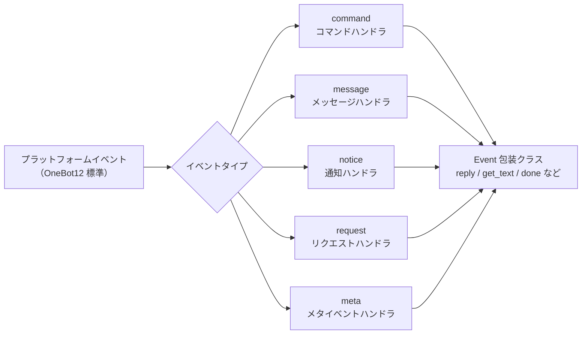

## Command コマンドモジュール

### コマンドの登録

```python
from ErisPulse.Core.Event import command

# 基本的なコマンド
@command("hello", help="挨拶を送る")
async def hello_handler(event):
    await event.reply("こんにちは！")

# 別名付きのコマンド
@command(["help", "h"], aliases=["ヘルプ"], help="ヘルプを表示")
async def help_handler(event):
    pass

# 権限付きのコマンド
def is_admin(event):
    return event.get("user_id") in admin_ids

@command("admin", permission=is_admin, help="管理者コマンド")
async def admin_handler(event):
    pass

# 非表示のコマンド
@command("secret", hidden=True, help="秘密コマンド")
async def secret_handler(event):
    pass

# コマンドグループ
@command("admin.reload", group="admin", help="モジュールを再ロード")
async def reload_handler(event):
    pass
```

### コマンド情報

```python
# コマンドのヘルプを取得
help_text = command.help()

# 特定のコマンドを取得
cmd_info = command.get_command("admin")

# コマンドグループに含まれるすべてのコマンドを取得
admin_commands = command.get_group_commands("admin")

# 可視化可能なすべてのコマンドを取得
visible_commands = command.get_visible_commands()
```

### レプリが待機

```python
# ユーザーからの返信を待つ
@command("ask", help="ユーザー情報の問い合わせ")
async def ask_command(event):
    reply = await command.wait_reply(
        event,
        prompt="あなたの名前を入力してください:",  # すでに送信済み
        timeout=30.0
    )
    
    if reply:
        name = reply.get_text()
        await event.reply(f"こんにちは、{name}！")

# 検証付きの待機返信
def validate_age(event_data):
    try:
        age = int(event_data.get_text())
        return 0 <= age <= 150
    except ValueError:
        return False

@command("age", help="ユーザーの年齢を問い合わせ")
async def age_command(event):
    await event.reply("あなたの年齢を入力してください:")
    
    reply = await command.wait_reply(
        event,
        timeout=60,
        validator=validate_age
    )
    
    if reply:
        age = int(reply.get_text())
        await event.reply(f"あなたの年齢は {age} 歳です")

# コールバック付きの待機返信
async def handle_confirmation(reply_event):
    text = reply_event.get_text().lower()
    if text in ["はい", "yes", "y"]:
        await event.reply("操作が確認されました！")
    else:
        await event.reply("操作がキャンセルされました。")

@command("confirm", help="操作の確認")
async def confirm_command(event):
    await command.wait_reply(
        event,
        prompt="'はい'または'いいえ'を入力してください:",
        callback=handle_confirmation
    )
```

## Message メッセージモジュール

### メッセージイベント

```python
from ErisPulse.Core.Event import message

# すべてのメッセージを監視
@message.on_message()
async def message_handler(event):
    sdk.logger.info(f"メッセージを受信: {event.get_text()}")

# プライベートメッセージを監視
@message.on_private_message()
async def private_handler(event):
    user_id = event.get_user_id()
    sdk.logger.info(f"プライベートメッセージ来自: {user_id}")

# グループメッセージを監視
@message.on_group_message()
async def group_handler(event):
    group_id = event.get_group_id()
    sdk.logger.info(f"グループメッセージ来自: {group_id}")

# @メッセージを監視
@message.on_at_message()
async def at_handler(event):
    mentions = event.get_mentions()
    sdk.logger.info(f"メンションされたユーザー: {mentions}")
```

### 条件付き監視

```python
# 優先度で実行順序を制御
@message.on_message(priority=10)  # 数値が大きいほど優先度が高い
async def high_priority_handler(event):
    pass

# ハンドラ内で条件フィルタを実装
@message.on_message()
async def filtered_handler(event):
    if "キーワード" not in event.get_text():
        return
    # キーワードを含むメッセージを処理
    pass
```

## Notice 通知モジュール

### 通知イベント

```python
from ErisPulse.Core.Event import notice

# フレンド追加
@notice.on_friend_add()
async def friend_add_handler(event):
    user_id = event.get_user_id()
    await event.reply("フレンド追加ありがとうございます！")

# フレンド削除
@notice.on_friend_remove()
async def friend_remove_handler(event):
    user_id = event.get_user_id()
    sdk.logger.info(f"フレンド削除: {user_id}")

# グループメンバー増加
@notice.on_group_increase()
async def member_increase_handler(event):
    user_id = event.get_user_id()
    await event.reply(f"新メンバーを歓迎します！")

# グループメンバー減少
@notice.on_group_decrease()
async def member_decrease_handler(event):
    user_id = event.get_user_id()
    sdk.logger.info(f"グループメンバーが退会しました: {user_id}")
```

## Request リクエストモジュール

### リクエストイベント

```python
from ErisPulse.Core.Event import request

# フレンドリクエスト
@request.on_friend_request()
async def friend_request_handler(event):
    user_id = event.get_user_id()
    comment = event.get_comment()
    sdk.logger.info(f"フレンドリクエスト: {user_id}, コメント: {comment}")

# グループ招待リクエスト
@request.on_group_request()
async def group_request_handler(event):
    group_id = event.get_group_id()
    user_id = event.get_user_id()
    sdk.logger.info(f"グループ招待: {group_id}, 来自: {user_id}")
```

## Meta メタイベントモジュール

### メタイベント

```python
from ErisPulse.Core.Event import meta

# 接続イベント
@meta.on_connect()
async def connect_handler(event):
    platform = event.get_platform()
    sdk.logger.info(f"プラットフォーム {platform} に接続しました")

# 接続切断イベント
@meta.on_disconnect()
async def disconnect_handler(event):
    platform = event.get_platform()
    sdk.logger.info(f"プラットフォーム {platform} から切断しました")

# ハートビートイベント
@meta.on_heartbeat()
async def heartbeat_handler(event):
    sdk.logger.debug("ハートビートを受信しました")
```

### Bot 状態の照会

アダプタがメタイベントを送信すると、フレームワークは自動的に Bot 状態を追跡します。照会 API とライフサイクルイベントの監視は、[アダプタシステム API - Bot 状態管理](adapter-system.md#bot-状態管理)を参照してください。

## Event 包装クラス

Event モジュールのイベントハンドラは、dict を継承した Event 包装クラスのインスタンスを受け取り、便利なメソッドを提供します。

### 核心メソッド

```python
# イベント情報を取得
event_id = event.get_id()
event_time = event.get_time()
event_type = event.get_type()
detail_type = event.get_detail_type()
platform = event.get_platform()

# ロボット情報を取得
self_platform = event.get_self_platform()
self_user_id = event.get_self_user_id()
self_info = event.get_self_info()
```

### セッション識別子

```python
# 統一されたターゲット ID：グループなら group_id、プライベートなら user_id、以此類推
target_id = event.get_target_id()

# セッションのユニーク識別子、形式: {platform}:{detail_type}:{target_id}
session_id = event.get_session_id()
# 例: "telegram:private:12345"、"qq:group:67890"
```

`get_target_id()` は、`group_id` → `channel_id` → `guild_id` → `thread_id` → `user_id` の順に、最初に非空の値を返します。これは、コンテキスト管理や状態保存など、セッションを一意に識別する必要がある場面に適しています。

### メッセージメソッド

```python
# メッセージ内容を取得
message_segments = event.get_message()
alt_message = event.get_alt_message()
text = event.get_text()

# 送信者情報を取得
user_id = event.get_user_id()
nickname = event.get_user_nickname()
sender = event.get_sender()

# グループ情報を取得
group_id = event.get_group_id()

# メッセージタイプを判定
is_msg = event.is_message()
is_private = event.is_private_message()
is_group = event.is_group_message()

# @メッセージ関連
is_at = event.is_at_message()
has_mention = event.has_mention()
mentions = event.get_mentions()
```

### コマンド情報

```python
# コマンド情報を取得
cmd_name = event.get_command_name()
cmd_args = event.get_command_args()
cmd_raw = event.get_command_raw()

# コマンドかどうかを判定
is_cmd = event.is_command()
```

### レプリ機能

```python
# 基本的な返信
await event.reply("これはメッセージです")

# 指定された送信方法
await event.reply("http://example.com/image.jpg", method="Image")

# @ユーザーと返信メッセージを含む
await event.reply("こんにちは", at_users=["user1"], reply_to="msg_id")

# @全員
await event.reply("お知らせ", at_all=True)

# プラットフォーム固有の修飾方法を使用（via パラメータ）
await event.reply("ホワイトボード内容", method="Board",
                  via=[("Expire", 3600), ("ForMember", "114514")])

# 送信チェーンを取得し、修飾方法や送信方法を自由に追加（複数の修飾 / 動作型メソッドに適しています）
await event.send_chain().Expire(3600).Board("ホワイトボード内容")
await event.send_chain().DismissBoard()

# OneBot12 メッセージセグメントを使用した返信
from ErisPulse.Core.Event import MessageBuilder
msg = MessageBuilder().text("Hello").image("url").build()
await event.reply_ob12(msg)

# レプリを待つ
reply = await event.wait_reply(timeout=30)
```

### プラットフォーム能力の照会

```python
# 現在のプラットフォームが特定の送信方法をサポートしているか確認
if event.supports("Image"):
    await event.reply(url, method="Image")

# 現在のプラットフォームで利用可能なすべての送信方法をリストアップ
methods = event.available_methods()
# ["Text", "Image", "Voice", "Video", ...]
```

### レプリメソッド

`reply()` メソッドは、`method` パラメータで送信タイプを指定でき、2 つの便利なブール値パラメータもサポートします：

```python
# 簡単なテキスト返信
await event.reply("こんにちは")

# 送信者を@して返信
await event.reply("こんにちは", at_sender=True)

# 現在のメッセージを引用して返信
await event.reply("受信しました", quote=True)

# 組み合わせて使用
await event.reply("受信しました", at_sender=True, quote=True)

# 画像を送信（method パラメータを使用）
if event.supports("Image"):
    await event.reply("http://example.com/img.jpg", method="Image")
else:
    await event.reply("[画像] http://example.com/img.jpg")
```

**パラメータ説明**：

| パラメータ | 型 | 説明 |
|------|------|------|
| `content` | str | 送信内容 |
| `method` | str | 送信方法、デフォルトは "Text"、"Image"/"Voice"/"Video"/"File" など |
| `at_sender` | bool | 送信者を@するかどうか（user_id を自動抽出） |
| `quote` | bool | 現在のメッセージを引用して返信するかどうか（message_id を自動抽出） |
| `at_users` | list[str] | @する特定のユーザーのリスト |
| `reply_to` | str | 手動で指定する返信メッセージ ID |
| `at_all` | bool | 全員を@するかどうか |

### インタラクティブメソッド

```python
# confirm — 確認対話（True/False/None を返す）
if await event.confirm("この操作を実行してもよろしいですか？"):
    await event.reply("確認しました")

# テキスト以外の方法で確認メッセージを送信
if await event.confirm("http://example.com/image.jpg", method="Image"):
    await event.reply("画像の確認が完了しました")

# choose — 選択メニュー（選択されたインデックスまたは None を返す）
choice = await event.choose("色を選択してください：", ["赤", "緑", "青"])

# options_format="auto"（デフォルト）は、method に応じてスタイルを自動選択：
# Markdown→無序リスト（- 1.選択肢）、Html→順序リスト（<ol>）、その他→純テキストリスト
# テキスト系メソッド（Markdown/Html など）はデフォルトで選択肢を末尾に結合
# merge_prompt=True は任意の method で強制的に結合可能、placeholder はカスタムプレースホルダを指定可能
choice = await event.choose(
    "## 選択してください\n{options}", ["A", "B"],
    method="Markdown", merge_prompt=True,
)

# collect — フォーム収集（{key: value} ディクショナリまたは None を返す）
data = await event.collect([
    {"key": "name", "prompt": "名前を入力してください："},
    {"key": "age", "prompt": "年齢を入力してください：",
     "validator": lambda e: e.get_text().isdigit()},
    {"key": "avatar", "prompt": "プロフィール画像を送信してください：", "method": "Image"},
])

# wait_for — 条件を満たす任意のイベントを待つ
evt = await event.wait_for(event_type="notice", condition=lambda e: ..., timeout=120)

# conversation — 複数ラウンド対話コンテキスト
conv = event.conversation(timeout=60)
await conv.say("ようこそ！")
```

> 完全なインタラクティブメソッドのパラメータ説明とその他の例は、[Event 包装クラスの詳細](../developer-guide/modules/event-wrapper.md) と [Conversation 複数ラウンド対話](../advanced/conversation.md) を参照してください。

### ユーティリティメソッド

```python
# _ で始まる内部キーをフィルタリングして辞書に変換
event_dict = event.to_dict()

# 元のデータを取得
raw = event.get_raw()
raw_type = event.get_raw_type()
```

### リンク制御

`event.done(claim=, stop=)` は「認領」および「阻止」の 2 つの独立した意味を統一的に制御します：

- **認領（claim）**：イベントが処理されたことをマーク（`_processed`）、コマンドディスパッチャーはこれに基づいて重複処理をスキップします
- **阻止（stop）**：低優先度のハンドラへのイベント伝播を阻止（`_propagation_stopped`）

```python
# 認領 + 阻止（デフォルト）
event.done()

# 認領のみ、阻止しない（低優先度の観測者はまだイベントを見ることができます）
event.done(stop=False)

# 阻止のみ、認領しない（例えば、ファイアウォール / 限流など）
event.done(claim=False)

# mark_processed は主なメソッド、done はその別名
event.mark_processed()             # 等価 event.done()
event.mark_processed(stop=False)   # 等価 event.done(stop=False)

# 状態を照会
event.is_processed()  # 既に認領されているか
event.is_stopped()    # 伝播が阻止されているか
```

### プラットフォーム拡張メソッド

アダプタは Event にプラットフォーム固有メソッドを登録でき、対応するプラットフォームのインスタンス上でのみ利用可能です。

#### ユーザー：プラットフォーム拡張メソッドの使用

アダプタがプラットフォーム固有メソッドを登録した場合、イベントハンドラ内で直接呼び出すことができます。各プラットフォームのメソッドは異なりますので、対応する [プラットフォームドキュメント](../platform-guide/) を参照してください。

```python
from ErisPulse.Core.Event import message

@message.on_message()
async def handle_message(event):
    platform = event.get_platform()

    # プラットフォームに応じて固有メソッドを呼び出す
    if platform == "email":
        subject = event.get_subject()           # メール固有
        attachments = event.get_attachments()   # メール固有
```

#### プラットフォーム登録メソッドの照会

```python
from ErisPulse.Core.Event import get_platform_event_methods

# 特定のプラットフォームに登録されたメソッドを取得
methods = get_platform_event_methods("email")
# ["get_subject", "get_from", "get_attachments", ...]

# 動的に判定して呼び出す
for method_name in get_platform_event_methods(event.get_platform()):
    method = getattr(event, method_name)
    print(f"{method_name}: {method()}")
```

#### プラットフォームメソッドの分離

異なるプラットフォームで登録されたメソッドは互いに干渉しません：

```python
# メールイベント - メール固有メソッドのみ
event = Event({"platform": "email", "email_raw": {"subject": "Hello"}})
event.get_subject()      # ✅ "Hello"
event.get_chat_type()    # ❌ AttributeError

# Telegram イベント - Telegram 固有メソッドのみ
event = Event({"platform": "telegram", "telegram_raw": {"chat": {"type": "private"}}})
event.get_chat_type()    # ✅ "private"
event.get_subject()      # ❌ AttributeError
```

#### `hasattr` / `dir` のサポート

```python
hasattr(event, "get_subject")   # platform が "email" の場合のみ True を返す
"get_subject" in dir(event)     # 同上
```

#### アダプタ：プラットフォーム拡張メソッドの登録

アダプタはデコレータを使って Event にプラットフォーム固有メソッドを登録でき、メソッドの最初の引数は `self`（Event インスタンス）で、イベントデータに自由にアクセスできます。

##### 単一メソッドの登録

```python
from ErisPulse.Core.Event import register_event_method

@register_event_method("email")
def get_subject(self):
    """メールの件名を取得"""
    return self.get("email_raw", {}).get("subject", "")

@register_event_method("email")
def get_from(self):
    """送信元を取得"""
    return self.get("email_raw", {}).get("from", {})
```

##### バッチ登録（Mixin クラス）

メソッドが多い場合は、Mixin クラスを使って一括登録することを推奨します：

```python
from ErisPulse.Core.Event import register_event_mixin

class EmailEventMixin:
    def get_subject(self):
        return self.get("email_raw", {}).get("subject", "")

    def get_from(self):
        return self.get("email_raw", {}).get("from", {})

    def get_attachments(self):
        return self.get("email_raw", {}).get("attachments", [])

# 一括でメソッドを登録
register_event_mixin("email", EmailEventMixin)
```

##### 戻り値の規則

| シナリオ | 戻り値 | ユーザーの使用方法 |
|------|--------|------------|
| データを返す（テキスト、辞書など） | 戻り値を直接返す | `subject = event.get_subject()` |
| 操作を実行する（メッセージ送信など） | `asyncio.Task` を返す | `task = event.do_something()` はオプションで `await` できる |

> **推奨**：データ以外の戻り値を持つメソッドは `asyncio.Task` を返すようにし、ユーザーは `await` するかどうかを自由に選択できるようにします。`await` しなくても操作は完了します。

```python
@register_event_method("email")
def forward_email(self, to_address: str):
    """メールを転送 — Task を返す、ユーザーは await するかどうかを決定できる"""
    import asyncio
    return asyncio.create_task(
        self._do_forward(to_address)
    )

# ユーザーは await して結果を待つこともできる
await event.forward_email("user@example.com")

# または await しなくても、バックグラウンドで処理が実行される
event.forward_email("user@example.com")
```

##### メソッドの解除

```python
from ErisPulse.Core.Event import unregister_event_method, unregister_platform_event_methods

# 単一メソッドの解除
unregister_event_method("email", "get_subject")

# 特定プラットフォームのすべてのメソッドを解除（アダプタのシャットダウン時に呼び出す）
unregister_platform_event_methods("email")
```

##### 内部メソッドの上書き

`register_event_mixin` / `register_event_method` は Event 内部メソッド（`confirm`、`choose`、`collect`、`wait_reply`、`reply` など）の上書きもサポートします。登録されたプラットフォームメソッドは `Event.__getattribute__` により内部メソッドよりも優先して有効になるため、アダプタはプラットフォーム特有のインタラクティブ実装を提供できます。

内部実装は `_builtin_*` 関数としてエクスポートされ、上書き側はそれらをバックアップとして呼び出すことができます。

```python
from ErisPulse.Core.Event import register_event_mixin, _builtin_choose

class YunhuEventMixin:
    async def choose(self, prompt, options, timeout=60, method="Text"):
        # 雲湖プラットフォームではボタンコンポーネントを使用
        buttons = [[{"text": opt} for opt in options]]
        await self.reply(prompt)
        # ...ボタンのコールバックやテキスト返信を待つ...
        # 内部ロジックに回帰
        return await _builtin_choose(self, None, options, timeout, "Text")

register_event_mixin("yunhu", YunhuEventMixin)
```

## 跨プラットフォーム拡張（ワイルドカード）

`register_event_method` および `register_event_mixin` は `"*"` をプラットフォーム名として渡すことで、登録されたメソッドは**すべてのプラットフォーム**の Event インスタンスで利用可能になります。AI チャット、コンテキスト管理など、プラットフォーム間で再利用可能な機能モジュールに適しています。

### 跨プラットフォームメソッドの登録

```python
from ErisPulse.Core.Event.wrapper import register_event_method

@register_event_method("*")
async def ai_chat(self, prompt: str):
    """self は Event インスタンス、イベントデータや内部メソッドに自由にアクセスできる"""
    await self.reply(f"AI: {prompt}")
```

登録後、すべてのプラットフォームのイベントハンドラで呼び出せます：

```python
from ErisPulse.Core.Event import message

@message.on_message()
async def handler(event):
    await event.ai_chat(event.get_text())
```

### メソッドの優先順位

Event メソッドを属性としてアクセスする際の解析順序は以下の通りです：

1. **プラットフォーム固有メソッド**（現在のプラットフォームの上書き）
2. **ワイルドカードメソッド**（`"*"` で登録された跨プラットフォームメソッド）
3. **内部メソッド**（`reply`、`confirm`、`choose`、`collect`、`wait_reply`、`reply` など）
4. **辞書キーのアクセス**

> したがって、ワイルドカードメソッドは内部メソッド（`reply` など）を上書きできますが、同名のプラットフォーム固有メソッドによりさらに上書きされます。

## 優先度システム

イベントハンドラは優先度をサポートし、数値が大きいほど優先度が高いです：

```python
# 高優先度ハンドラが先に実行されます
@message.on_message(priority=10)
async def high_priority_handler(event):
    pass

# 低優先度ハンドラが後に実行されます
@message.on_message(priority=0)
async def low_priority_handler(event):
    pass
```


====
高级主题
====


### Conversation 多轮对话

# Conversation 多輪対話

`Conversation` クラスは、1 つの会話の中で複数回のやり取りを行うための便利なメソッドを提供し、ガイド付き操作、情報収集、対話式の質問応答などの場面に適しています。

## 対話の作成

`Event` オブジェクトの `conversation()` メソッドを使って作成します：

```python
from ErisPulse.Core.Event import command

@command("quiz")
async def quiz_handler(event):
    conv = event.conversation(timeout=30)

    await conv.say("🎮 知識クイズへようこそ！")

    answer = await conv.choose("第1問：Python の作成者は誰ですか？", [
        "Guido van Rossum",
        "James Gosling",
        "Dennis Ritchie",
    ])

    if answer is None:
        await conv.say("タイムアウトしました、また次回お試しください！")
        return

    if answer == 0:
        await conv.say("正解です！")
    else:
        await conv.say("間違いです、正解は Guido van Rossum です")

    conv.stop()
```

## コア API

### say(content, **kwargs)

メッセージを送信し、`self` を返して連鎖呼び出しを可能にします：

```python
await conv.say("1行目").say("2行目").say("3行目")
```

送信方法を指定することもできます：

```python
await conv.say("https://example.com/image.jpg", method="Image")
```

### wait(prompt=None, timeout=None)

ユーザーの返信を待ち、`Event` オブジェクトまたは `None`（タイムアウト）を返します：

```python
# 簡単な待ち
resp = await conv.wait()
if resp:
    text = resp.get_text()

# プロンプトを送信してから待ち
resp = await conv.wait(prompt="お名前を入力してください：")

# カスタムタイムアウトを使用（対話のデフォルトタイムアウトを上書き）
resp = await conv.wait(prompt="10秒以内に返信してください：", timeout=10)
```

### confirm(prompt=None, **kwargs)

ユーザーの確認（はい/いいえ）を待ち、`True` / `False` / `None`（タイムアウト）を返します：

```python
result = await conv.confirm("すべてのデータを削除してもよろしいですか？")
if result is True:
    await conv.say("削除しました")
elif result is False:
    await conv.say("キャンセルしました")
else:
    await conv.say("タイムアウトしました")
```

確認用語の内部認識リスト：`はい/yes/y/確認/確定/好/ok/true/対/うん/行/同意/問題ない/可能/当然...`

否定用語の内部認識リスト：`否/no/n/キャンセル/不/不要/不行/cancel/false/間違/不対/別/拒否...`

### choose(prompt, options, **kwargs)

ユーザーがオプションから選択するのを待ち、0 から始まるオプションのインデックスまたは `None` を返します：

```python
choice = await conv.choose("色を選択してください：", ["赤", "緑", "青"])
if choice is not None:
    colors = ["赤", "緑", "青"]
    await conv.say(f"選択した色は {colors[choice]} です")
```

ユーザーは番号（`1`/`2`/`3`）またはオプションのテキスト（`赤`）を入力して選択できます。

`options_format="auto"`（デフォルト）は、method に応じて自動的に組み込みのスタイルを選択します：Markdown→無序リスト、Html→順序リスト、その他→純粋なテキストリスト。
`"list"`、`"inline"`、`"md"`、`"html"`、またはカスタム関数もサポートしています。

`merge_prompt=True` を使用してプロンプトとオプションを1つのメッセージに統合し、オプションの挿入位置を占位符で制御できます（デフォルトは `{options}`、`placeholder` でカスタマイズ可能です）：

```python
choice = await conv.choose(
    "## 選択してください\n{options}",
    ["オプションA", "オプションB"],
    method="Markdown",
    merge_prompt=True,
)

# 占位符をカスタマイズ
choice = await conv.choose(
    "選択してください: [choices]",
    ["オプションA", "オプションB"],
    placeholder="[choices]",
)
```

### collect(fields, **kwargs)

複数ステップで情報を収集し、データ辞書または `None` を返します：

```python
data = await conv.collect([
    {"key": "name", "prompt": "お名前を入力してください"},
    {"key": "age", "prompt": "年齢を入力してください",
     "validator": lambda e: e.get("alt_message", "").strip().isdigit(),
     "retry_prompt": "年齢は数字でなければなりません、もう一度入力してください"},
    {"key": "city", "prompt": "都市を入力してください"},
])

if data:
    await conv.say(f"登録完了！\n名前: {data['name']}\n年齢: {data['age']}\n都市: {data['city']}")
else:
    await conv.say("登録が中断されました")
```

フィールドの設定：

| パラメータ | 説明 | デフォルト値 |
|------|------|--------|
| `key` | フィールドのキー名（必須） | - |
| `prompt` | プロンプトメッセージ | `"{key} を入力してください"` |
| `validator` | Event を受け取り、bool を返す検証関数 | なし |
| `retry_prompt` | 検証失敗時の再入力プロンプト | `"入力が無効です、もう一度入力してください"` |
| `max_retries` | 最大再試行回数 | 3 |
| `condition` | 条件関数、既に収集されたデータの辞書を受け取り、bool を返す | なし |

**条件付きフィールド**：`condition` を使用して動的なフォームを作成し、条件が満たされた場合にのみフィールドを収集できます：

```python
data = await conv.collect([
    {"key": "has_car", "prompt": "車をお持ちですか？（はい/いいえ）"},
    {"key": "car_brand", "prompt": "車のブランドを入力してください",
     "condition": lambda d: d.get("has_car", "").lower() in ("はい", "yes", "y")},
])
```

### stop()

手動で対話を終了し、`is_active` を `False` に設定します：

```python
conv.stop()
```

### is_active

対話がアクティブかどうかを返します：

```python
if conv.is_active:
    await conv.say("対話はまだ進行中です")
```

## アクティブ状態の管理


以下の状況で対話は自動的に非アクティブになります：

1. `stop()` メソッドを呼び出す
2. `wait()` がタイムアウトして `None` を返す
3. `collect()` がいずれかのステップでタイムアウトまたは再試行回数を超過して `None` を返す

非アクティブになった後、`wait`/`confirm`/`choose`/`collect` などのすべてのインタラクションメソッドは即座に `None` を返し、ユーザーの入力を待つことはありません。

## 分岐とジャンプ

### @conv.branch(name) デコレータ

`branch()` を使用して対話の分岐を登録し、`goto()` を使って分岐間でジャンプできます：

```python
@command("menu")
async def menu_handler(event):
    conv = event.conversation(timeout=60)

    @conv.branch("main")
    async def main_menu():
        await conv.say("=== メインメニュー ===\n1. 個人情報\n2. 設定\n3. 終了")
        resp = await conv.wait()
        if resp is None:
            return
        text = resp.get_text().strip()
        if text == "1":
            await conv.goto("profile")
        elif text == "2":
            await conv.goto("settings")
        elif text == "3":
            await conv.say("さようなら！")
            conv.stop()

    @conv.branch("profile")
    async def profile():
        await conv.say("=== 個人情報 ===\n名前: Alice\n0. 戻る")
        resp = await conv.wait()
        if resp and resp.get_text().strip() == "0":
            await conv.goto("main")

    @conv.branch("settings")
    async def settings():
        await conv.say("=== 設定 ===\n1. 通知スイッチ\n0. 戻る")
        resp = await conv.wait()
        if resp and resp.get_text().strip() == "0":
            await conv.goto("main")

    await conv.start()  # 最初に登録された分岐から開始
```

### conv.start(name=None)

対話を開始します、デフォルトでは最初に登録された分岐から開始されます：

```python
await conv.start()          # 最初の分岐から開始
await conv.start("settings") # 指定された分岐から開始
```

## コンテキストと永続化

### conv.context

各対話インスタンスには、分岐間で状態を共有するための `context` 辞書が内蔵されています：

```python
@conv.branch("step1")
async def step1():
    conv.context["username"] = resp.get_text().strip()
    await conv.goto("step2")

@conv.branch("step2")
async def step2():
    name = conv.context.get("username", "未知")
    await conv.say(f"こんにちは、{name} さん！")
```

### save() / resume() / clear_saved()

対話は永続化が可能で、タイムアウトや中断後に復元できます：

```python
# 対話の状態を保存
conv_id = conv.save()
# conv_id = "user_123_group_456"  # ユーザーとグループに基づいて自動生成

# ... その後、同じ会話で復元 ...
conv2 = event.conversation()
if conv2.resume():
    await conv2.say("お戻りいただきありがとうございます！前の対話を再開します")
else:
    await conv2.say("以前の対話が見つかりませんでした")

# 保存された対話を削除
conv.clear_saved()
```

## 代表的なフロー・パターン

### ガイド付き登録

```python
@command("register")
async def register_handler(event):
    conv = event.conversation(timeout=60)

    await conv.say("ようこそ登録へ！")

    data = await conv.collect([
        {"key": "username", "prompt": "ユーザー名を入力してください（3-20文字）",
         "validator": lambda e: 3 <= len(e.get_text().strip()) <= 20},
        {"key": "email", "prompt": "メールアドレスを入力してください",
         "validator": lambda e: "@" in e.get_text() and "." in e.get_text(),
         "retry_prompt": "メールアドレスの形式が正しくありません、もう一度入力してください"},
    ])

    if not data:
        await event.reply("登録がキャンセルされました")
        return

    confirmed = await conv.confirm(
        f"登録情報を確認しますか？\nユーザー名: {data['username']}\nメール: {data['email']}"
    )

    if confirmed:
        await conv.say("✅ 登録完了！")
    else:
        await conv.say("❌ 登録がキャンセルされました")
```

### ループ対話

```python
@command("chat")
async def chat_handler(event):
    conv = event.conversation(timeout=120)
    await conv.say("対話モードに入りました、「終了」で終了します")

    while conv.is_active:
        resp = await conv.wait()
        if resp is None:
            await conv.say("タイムアウトしました、対話は終了します")
            break

        text = resp.get_text().strip()

        if text == "終了":
            await conv.say("さようなら！")
            conv.stop()
        elif text == "help":
            await conv.say("利用可能なコマンド：終了、help、ステータス")
        elif text == "ステータス":
            await conv.say("対話はアクティブです")
        else:
            await conv.say(f"入力内容：{text}")
```


### MessageBuilder 详解

# MessageBuilder 詳細

`MessageBuilder` は、ErisPulseが提供するOneBot12標準のメッセージセグメント構築ツールです。構造化されたメッセージ内容を構築し、`Send.Raw_ob12()` と組み合わせて使用します。

## 導入方法

`MessageBuilder` は以下の2つの導入方法をサポートしています（効果は同じで、1つ目の方法を推奨します）：

```python
from ErisPulse.Core.Event import MessageBuilder        # 推奨、パッケージ経由でのエクスポート
from ErisPulse.Core.Event.message_builder import MessageBuilder  # モジュール直接インポート
```

## ダブルモードメカニズム

MessageBuilder は2つの使用モードを提供し、Pythonのデスクリプタ機構（`__get__`）を通じてクラスレベルとインスタンスレベルでの異なる動作を実現します：クラスからメソッドを呼び出す場合、`__get__` は静的メソッドの実行結果を返します；インスタンスからメソッドを呼び出す場合、`self` を返してチェーンコールをサポートします。

### チェーンコールモード（インスタンス）

`MessageBuilder()` をインスタンス化して使用します。各メソッドは `self` を返し、チェーンコールをサポートし、最後に `.build()` を使ってメッセージセグメントのリストを取得します：

```python
from ErisPulse.Core.Event.message_builder import MessageBuilder

segments = (
    MessageBuilder()
    .text("你好！")
    .image("https://example.com/photo.jpg")
    .build()
)
# [
#     {"type": "text", "data": {"text": "你好！"}},
#     {"type": "image", "data": {"file": "https://example.com/photo.jpg"}}
# ]
```

### 快速構築モード（静的）

クラスから直接メソッドを呼び出します。各メソッドは直接メッセージセグメントのリストを返し、単一セグメントのメッセージに適しています：

```python
# 直接 list[dict] を返します。.build() は不要です。
segments = MessageBuilder.text("你好！")
# [{"type": "text", "data": {"text": "你好！"}}]
```

## メッセージセグメントのタイプ

| メソッド | タイプ | データパラメータ | 説明 |
|------|------|---------|------|
| `text(text)` | text | `text` | テキストメッセージ |
| `image(file)` | image | `file` | 画像メッセージ |
| `audio(file)` | audio | `file` | 音声メッセージ |
| `video(file)` | video | `file` | 動画メッセージ |
| `file(file, filename?)` | file | `file`, `filename` | ファイルメッセージ |
| `mention(user_id, user_name?)` | mention | `user_id`, `user_name` | @メンション（ユーザー指定） |
| `at(user_id, user_name?)` | mention | `user_id`, `user_name` | `mention` のエイリアス |
| `reply(message_id)` | reply | `message_id` | 返信メッセージ |
| `at_all()` | mention_all | - | @全員（全員メンション） |
| `custom(type, data)` | カスタム | カスタム | カスタムメッセージセグメント |

## Send と組み合わせて使用する

構築したメッセージセグメントのリストは、`Send.Raw_ob12()` を通じて送信します。

```python
from ErisPulse import sdk
from ErisPulse.Core.Event.message_builder import MessageBuilder

# チェーン構築 + 送信
segments = (
    MessageBuilder()
    .mention("user123", "张三")
    .text(" 请查看这张图片")
    .image("https://example.com/photo.jpg")
    .build()
)
await sdk.adapter.myplatform.Send.To("group", "group456").Raw_ob12(segments)
```

### Event と組み合わせた返信

```python
from ErisPulse.Core.Event import command

@command("report")
async def report_handler(event):
    await event.reply_ob12(
        MessageBuilder()
        .text("📊 日报汇总\n")
        .text("今日完成任务: 5\n")
        .text("进行中任务: 3")
        .build()
    )
```

## ユーティリティメソッド

### copy()

現在のビルダーをコピーし、同じ基本内容に基づいて複数のメッセージバリエーションを作成するために使用します。

```python
base = MessageBuilder().text("基础内容").mention("admin")

# 同じプレフィックスに基づいて異なるメッセージを構築
msg1 = base.copy().text(" 变体A").build()
msg2 = base.copy().text(" 变体B").image("img.jpg").build()
```

### clear()

追加されたメッセージセグメントをクリアし、同じビルダーを再利用します。

```python
builder = MessageBuilder()

for user_id in ["user1", "user2", "user3"]:
    builder.clear()
    msg = builder.mention(user_id).text(" 你好！").build()
    await adapter.Send.To("user", user_id).Raw_ob12(msg)
```

### len() / bool()

```python
builder = MessageBuilder()
print(bool(builder))   # False

builder.text("Hello")
print(len(builder))    # 1
print(bool(builder))   # True
```

## カスタムメッセージセグメント

`custom()` メソッドを使用して、プラットフォーム拡張のメッセージセグメントを追加します。

```python
# プラットフォーム固有のメッセージセグメントを追加
segments = (
    MessageBuilder()
    .text("请填写表单：")
    .custom("yunhu_form", {"form_id": "12345"})
    .build()
)
```

> カスタムメッセージセグメントは、対応するプラットフォームのアダプターでのみ有効です。他のアダプターは認識しないメッセージセグメントを無視します。

## 完全な例

### マルチエレメントメッセージ

```python
segments = (
    MessageBuilder()
    .reply(event.get_id())                    # 元のメッセージに返信
    .mention(event.get_user_id())             # 送信者に@メンション
    .text(" 这是你的查询结果：\n")             # テキスト
    .image("https://example.com/chart.png")   # 画像
    .text("\n详细数据见附件：")
    .file("https://example.com/data.csv", filename="data.csv")
    .build()
)
await event.reply_ob12(segments)
```

### スタティックファクトリ + チェーンの組み合わせ

```python
# 単一セグメントのメッセージを迅速に構築
simple_msg = MessageBuilder.text("简单文本")

# 複雑なメッセージをチェーン構築
complex_msg = (
    MessageBuilder()
    .at_all()
    .text(" 📢 公告：")
    .text("今天下午3点开会")
    .build()
)
```


### HTTP 客户端

# ネットワーククライアント

ErisPulse は、HTTP リクエスト、WebSocket 接続、および接続プール管理を統合した統一されたネットワーククライアントを提供しています。モジュールやアダプタは、このクライアントを**優先的に使用する必要があります**。独自に `aiohttp` / `httpx` / `requests` などのサードパーティライブラリをインポートしてはいけません。

## 概要

ネットワーククライアントの主な機能：

- **統一されたインターフェース**：`get` / `post` / `put` / `delete` / `patch` / `request` メソッドを提供
- **WebSocket クライアント**：`ws_connect` を使用してクライアント WebSocket 接続を確立
- **自動ログ**：すべてのリクエストに対して自動的にログを記録し、統計情報を生成
- **ライフサイクル統合**：各リクエストで `client.request` ライフサイクルイベントがトリガーされ、WS 接続時に `client.ws.connect` イベントが発生
- **リトライサポート**：自動リトライ回数と間隔を設定可能
- **タイムアウト制御**：接続タイムアウトとリクエストタイムアウトを個別に制御
- **接続プールの再利用**：aiohttp.ClientSession に基づく接続プール管理
- **例外体系**：aiohttp の例外を ErisPulse の例外 (ClientError 体系) に自動的に変換

## 速習

### HTTPリクエスト

```python
from ErisPulse.Core import client

# GETリクエスト
resp = await client.get("https://httpbin.org/get")
data = await resp.json()
print(resp.status)  # 200

# POSTリクエスト
resp = await client.post(
    "https://httpbin.org/post",
    json={"key": "value"},
)
data = await resp.json()
```

### WebSocket接続

```python
from ErisPulse.Core import client

ws = await client.ws_connect("wss://example.com/ws")

async for text in ws.iter_text():
    await ws.send_text(f"Echo: {text}")
```

## HttpResponse

すべてのリクエストメソッドは `HttpResponse` オブジェクトを返します：

```python
from ErisPulse.Core import client

resp = await client.get("https://httpbin.org/get")

resp.status       # int - HTTP ステータスコード (例: 200, 404)
resp.reason       # str | None - ステータスの説明 (例: "OK")
resp.headers      # レスポンスヘッダー (大文字小文字を区別しません)
resp.content_type # str | None - Content-Type
resp.url          # 最終的な URL (リダイレクトにより変更される可能性があります)
resp.raw          # 低レベルの生のレスポンスオブジェクト (現在は aiohttp.ClientResponse)

# レスポンスボディの読み込み
body = await resp.read()       # bytes
text = await resp.text()       # str
data = await resp.json()       # JSON を解析
text = await resp.text("gbk")  # 指定されたエンコーディング
```

## リクエストメソッド

### GET

```python
from ErisPulse.Core import client

resp = await client.get(
    "https://api.example.com/users",
    params={"page": "1", "limit": "10"},
    headers={"Authorization": "Bearer token"},
)
```

### POST

```python
from ErisPulse.Core import client

# JSONリクエストボディ
resp = await client.post(
    "https://api.example.com/users",
    json={"name": "Alice", "age": 30},
)

# フォームリクエストボディ
resp = await client.post(
    "https://api.example.com/login",
    data={"username": "admin", "password": "123"},
)

# ロウデータ
resp = await client.post(
    "https://api.example.com/upload",
    data=b"raw bytes",
    headers={"Content-Type": "application/octet-stream"},
)

# ファイルアップロード (filesパラメータを使用、aiohttpのインポート不要)
# 形式: {フィールド名: ファイルオブジェクト/bytes/(filename, file)/(filename, file, content_type)}
resp = await client.post(
    "https://api.example.com/upload",
    data={"description": "プロフィール画像"},            # 任意: 通常のフォームフィールドを同時に送信可能
    files={
        "file": ("photo.png", open("photo.png", "rb"), "image/png"),
    },
)

# 簡易書き方: ファイルオブジェクトを直接渡す
resp = await client.post(
    "https://api.example.com/upload",
    files={"file": open("photo.png", "rb")},
)

# メモリ内のデータを直接アップロード (ファイルに保存する必要なし)
import io

resp = await client.post(
    "https://api.example.com/upload",
    files={"file": ("data.txt", io.BytesIO(b"file content"), "text/plain")},
)
```

### PUT / DELETE / PATCH

```python
from ErisPulse.Core import client

resp = await client.put("https://api.example.com/users/1", json={"name": "Bob"})
resp = await client.delete("https://api.example.com/users/1")
resp = await client.patch("https://api.example.com/users/1", json={"age": 31})
```

### 一般的な request

```python
from ErisPulse.Core import client

resp = await client.request(
    "OPTIONS",
    "https://api.example.com/resource",
    headers={"Origin": "https://example.com"},
)
```

## パラメータの説明

### HTTPリクエストパラメータ

| パラメータ | 型 | 説明 |
|------|------|------|
| `url` | `str` | リクエストURL |
| `params` | `dict[str, str]` | クエリパラメータ (省略可能) |
| `headers` | `dict[str, str]` | 追加リクエストヘッダー (省略可能) |
| `data` | `Any` | リクエストボディ (フォームまたは生データ) (省略可能) |
| `json` | `Any` | JSONリクエストボディ (省略可能) |
| `files` | `dict[str, Any]` | ファイルアップロードフィールド (省略可能、自動でmultipart/form-dataを構築) |
| `timeout` | `float` | 本次リクエストのタイムアウト (秒) (省略可能、デフォルト値を上書き) |
| `max_retries` | `int` | 本次の最大リトライ回数 (省略可能、デフォルト値を上書き) |

### ws_connect パラメータ

| パラメータ | 型 | 説明 |
|------|------|------|
| `url` | `str` | WebSocketサーバーURL |
| `headers` | `dict[str, str]` | 追加リクエストヘッダー (省略可能) |
| `heartbeat` | `float` | ハートビート間隔 (秒) (省略可能) |

## タイムアウトとリトライ

```python
from ErisPulse.Core import Client

# カスタムタイムアウトを設定したクライアントを作成
client = Client(
    timeout=60,           # 要求全体のタイムアウト 60秒
    connect_timeout=5,    # 接続タイムアウト 5秒
    max_retries=3,        # 失敗時に自動リトライ 3回
    retry_delay=2,        # リトライ間隔 2秒
)

# 単一の要求でタイムアウトを上書き
resp = await client.get("https://slow-api.example.com/data", timeout=120)
```

> [!NOTE]
> クライアントクラスは 2.8.0 から `Client` に名前が変更されました（`sdk.client` の属性名は変更されません）。古いコードは変更する必要はありません。`HttpClient` は互換性のためのエイリアスとして残されています。

## デフォルトのヘッダーをカスタマイズ

```python
client = Client(
    headers={
        "Authorization": "Bearer token",
        "X-App-Id": "my-app",
    },
    user_agent="MyBot/1.0",
)
```

## リクエスト統計

```python
from ErisPulse.Core import client

# 統計を表示
stats = client.stats
# {"total_requests": 42, "total_errors": 1, "total_bytes_sent": 0, "total_bytes_received": 0}

# 統計をリセット
client.reset_stats()
```

## ライフサイクルイベント

### HTTP リクエストイベント

リクエストが完了するたびに `client.request` イベントがトリガーされ、モニタリングに使用できます。

```python
from ErisPulse.Core import lifecycle

@lifecycle.on("client.request")
async def on_request(event_data):
    print(f"{event_data['method']} {event_data['url']} -> {event_data['status']} ({event_data['elapsed']}s)")
```

### WebSocket 接続イベント

WebSocket 接続が確立されたたびに `client.ws.connect` イベントがトリガーされます。

```python
from ErisPulse.Core import lifecycle

@lifecycle.on("client.ws.connect")
async def on_ws_connect(event_data):
    print(f"WS 接続: {event_data['url']}")
```

## 上下文管理

```python
# 上下文マネージャーとして使用し、セッションを自動的に閉じます
async with Client(timeout=30) as client:
    resp = await client.get("https://httpbin.org/get")
    data = await resp.json()
```

## WebSocket クライアント

`client.ws_connect()` を使用して WebSocket クライアント接続を確立し、`ClientWebSocket` オブジェクトを返します。クライアントとサーバーの WebSocket は同じ `WebSocketConnectionBase` 基底クラスを共有し、send/receive/iter のインターフェースは完全に一致しています。

### 基本的な使用法

```python
from ErisPulse.Core import client

ws = await client.ws_connect("wss://example.com/ws", heartbeat=30)

await ws.send_text("Hello")
await ws.send_bytes(b"\x00\x01\x02")
await ws.send_json({"type": "ping"})
```

### メッセージの受信

#### 高度な方法（推奨）

メッセージの型を自動的にフィルタリングし、切断時に `WebSocketDisconnect` を送出します。

```python
from ErisPulse.Core import client
from ErisPulse.Core.Bases.errors import WebSocketDisconnect

ws = await client.ws_connect("wss://example.com/ws")

# 単一のメッセージ受信
text = await ws.receive_text()    # str
data = await ws.receive_bytes()   # bytes
obj = await ws.receive_json()     # dict / list

# 反復処理による受信（切断時に自動停止）
async for text in ws.iter_text():
    print(text)

async for data in ws.iter_bytes():
    print(data)

async for obj in ws.iter_json():
    print(obj)
```

#### 低レベルの方法

`receive()` および `iter_messages()` を使用して、原始的なメッセージ型を処理し、TEXT / BINARY / CLOSE / ERROR を区別できます。

```python
from ErisPulse.Core import client
from ErisPulse.Core.Bases.websocket import WSMessage

ws = await client.ws_connect("wss://example.com/ws")

# 単一のメッセージ受信
msg = await ws.receive()
# msg.type  -> WSMessage.TEXT / WSMessage.BINARY / WSMessage.CLOSE / WSMessage.ERROR
# msg.data  -> str | bytes | None

# 原始メッセージの反復処理（CLOSE/ERROR で自動停止）
async for msg in ws.iter_messages():
    if msg.type == WSMessage.TEXT:
        print(f"テキスト: {msg.data}")
    elif msg.type == WSMessage.BINARY:
        print(f"バイナリ: {len(msg.data)} bytes")
```

### WSMessage

`WSMessage` は、下層ライブラリに依存しない統一された WebSocket メッセージ型です。

| 属性 | 型 | 説明 |
|------|------|------|
| `type` | `str` | メッセージの型: `WSMessage.TEXT` / `WSMessage.BINARY` / `WSMessage.CLOSE` / `WSMessage.ERROR` |
| `data` | `Any` | メッセージのデータ |

### ClientWebSocket の属性

| 属性 | 型 | 説明 |
|------|------|------|
| `url` | `URL` | 接続 URL |
| `headers` | `Headers` | 応答ヘッダー |
| `closed` | `bool` | 接続が閉じられているかどうか |
| `raw` | `object` | 下層の原生オブジェクト (aiohttp.ClientWebSocketResponse) |

### ライフサイクルフック

`サービス側 WebSocketConnection` と同様に、`on_disconnect` および `on_error` のコールバックをサポートします。

```python
from ErisPulse.Core import client

ws = await client.ws_connect("wss://example.com/ws")

@ws.on_disconnect
async def handle_disconnect(ws, reason="unknown"):
    print(f"接続が切断されました: {reason}")

@ws.on_error
async def handle_error(ws, error=""):
    print(f"接続エラー: {error}")
```

### 接続の切断

```python
await ws.close(code=1000, reason="正常な切断")
```

## エラー体系

ErisPulse は、`sdk.client` を通じてリクエストを発行する際に、自動的に底層の aiohttp エラーを ErisPulse エラーに変換する統一されたエラー階層を定義しています。

> **後方互換性**：`aiohttp.ClientSession` を直接使用する旧モジュール/アダプターは完全に影響を受けません。エラー変換は `sdk.client` を通じてリクエストを発行する場合にのみ有効であり、aiohttp を直接使用するコードは `aiohttp.ClientError` などの元のエラーをキャッチし続けます。両方の方法は共存可能です。

### エラー階層

```
ErisPulseError
├── ClientError                  # すべての HTTP/WS クライアントリクエストエラーの基底クラス
│   ├── ClientConnectionError    # 接続失敗 (DNS 解析失敗、接続拒否、ネットワーク unreachable)
│   ├── ClientTimeoutError       # 接続タイムアウトまたはリクエストタイムアウト
│   └── HTTPStatusError          # HTTP 4xx/5xx ステータスコードエラー
└── WebSocketError               # WebSocket エラーの基底クラス
    └── WebSocketDisconnect      # WebSocket 接続切断 (クライアントとサーバーの両方に共通)
```

### エラーのキャッチ

```python
from ErisPulse.Core import client
from ErisPulse.Core.Bases.errors import (
    ClientError,
    ClientConnectionError,
    ClientTimeoutError,
    HTTPStatusError,
    WebSocketDisconnect,
    WebSocketError,
)

# HTTP リクエストエラーの処理
try:
    resp = await client.get("https://api.example.com/data")
    data = await resp.json()
except ClientConnectionError:
    print("サーバーに接続できません")
except ClientTimeoutError:
    print("リクエストがタイムアウトしました")
except ClientError as e:
    print(f"リクエストに失敗しました: {e}")

# WebSocket エラーの処理
try:
    ws = await client.ws_connect("wss://example.com/ws")
    async for text in ws.iter_text():
        await ws.send_text(f"Echo: {text}")
except WebSocketDisconnect as e:
    print(f"接続が切断されました: code={e.code}, reason={e.reason}")
except WebSocketError as e:
    print(f"WebSocket エラー: {e}")
```

### 統一的なキャッチ

`ClientError` を使用して、すべての HTTP/WS クライアントリクエストエラーを一括でキャッチできます：

```python
from ErisPulse.Core.Bases.errors import ClientError

try:
    resp = await client.get("https://api.example.com/data")
except ClientError as e:
    print(f"クライアントエラー: {e}")
```

### HTTPStatusError

リクエスト後にステータスコードを確認してエラーを投げる必要がある場合、手動で使用できます：

```python
from ErisPulse.Core.Bases.errors import HTTPStatusError

resp = await client.get("https://api.example.com/data")
if resp.status >= 400:
    raise HTTPStatusError(resp.status, await resp.text())
```

## アダプターでの使用

アダプターは、グローバルなクライアントまたは独自のクライアントインスタンスを使用して、プラットフォームAPIリクエストを送信できます。

```python
from ErisPulse.Core import client
from ErisPulse.Core.Bases import BaseAdapter
from ErisPulse.Core.Bases.errors import ClientError

class MyAdapter(BaseAdapter):
    async def call_api(self, endpoint, **params):
        try:
            resp = await client.post(
                f"https://api.platform.com/{endpoint}",
                json=params,
                headers={"Authorization": f"Bearer {self.token}"},
            )
            return await resp.json()
        except ClientError as e:
            self.logger.error(f"API 調用失敗: {e}")
            raise
```

> `from ErisPulse import sdk` を使用して `sdk.client` を使用することもできます。効果は同じです。

## 最佳実践

1. **グローバルクライアントの優先使用**：`from ErisPulse.Core import client` を使用してグローバルシングルトンを取得し、フレームワークによる統一的な管理と監視を容易にする。
2. **直接 aiohttp のインポートを避ける**：`client` を `aiohttp.ClientSession` の代わりに使用し、将来の下層実装の変更時にコードを変更する必要がないようにする。古いコードで直接 aiohttp を使用しても正常に動作し、両方の方法を共存させることができる。
3. **ErisPulse の例外体系の使用**：`sdk.client` からのリクエストで `ClientError` を捕獲し、`aiohttp.ClientError` を捕獲しないようにし、コードが特定の HTTP ライブラリに依存しないようにする。直接 aiohttp を使用する古いコードには影響しない。
4. **適切なタイムアウトの設定**：API の応答速度に応じて適切なタイムアウト時間を設定し、長時間のブロッキングを避ける。
5. **リトライメカニズムの使用**：不安定な API に対してリトライを有効化し、信頼性を向上させる。
6. **リクエスト統計の監視**：`sdk.client.stats` または `client.request` のライフサイクルイベントを使用してリクエスト状況を監視する。
7. **WebSocket の高機能メソッドの使用**：`iter_text` / `iter_json` などの高機能メソッドを優先し、メッセージタイプを区別する必要がある場合にのみ `iter_messages` を使用する。


### SQL 查询构建器

# SQLクエリビルダー

ErisPulseのStorageモジュールは、メソッドチェーンスタイルの汎用SQLクエリビルダーを提供し、カスタムテーブルの作成、クエリ、更新、削除操作をサポートしています。

## アーキテクチャ設計

```
Bases/storage.py                    Core/storage.py
┌─────────────────────┐             ┌──────────────────────────┐
│  BaseStorage (ABC)  │◄────────────│  StorageManager          │
│  BaseQueryBuilder   │             │  (SQLite concrete impl)  │
│    (ABC)            │             │                          │
└─────────────────────┘             │  SQLiteQueryBuilder      │
                                    │  AlterTableBuilder       │
                                    └──────────────────────────┘
```

- `BaseStorage` / `BaseQueryBuilder` は抽象基底クラスであり、統一されたインターフェースを定義し、将来的に他のストレージメディア（Redis、MySQLなど）への拡張をサポートします。
- `StorageManager` は現在のSQLiteの具体的な実装であり、完全な下位互換性があります。

## インポート

```python
from ErisPulse import sdk
# または
from ErisPulse.Core import storage

# ABC基底クラス（型アノテーションまたはカスタム実装用）
from ErisPulse.Core.Bases.storage import BaseStorage, BaseQueryBuilder
```

## テーブル管理

### テーブルの作成

```python
sdk.storage.CreateTable("users", {
    "id": "INTEGER PRIMARY KEY AUTOINCREMENT",
    "name": "TEXT NOT NULL",
    "age": "INTEGER DEFAULT 0",
    "email": "TEXT"
})
```

### テーブルの存在確認

```python
if sdk.storage.HasTable("users"):
    print("users テーブルは既に存在します")
```

### テーブルの削除

```python
sdk.storage.DropTable("users")
```

### テーブル構造の変更

```python
# 列の追加
sdk.storage.AlterTable("users").AddColumn("email", "TEXT").Execute()

# テーブル名の変更
sdk.storage.AlterTable("users").RenameTo("members").Execute()

# 複数操作のチェーン
sdk.storage.AlterTable("users") \
    .AddColumn("phone", "TEXT") \
    .AddColumn("address", "TEXT") \
    .Execute()
```

## メソッドチェーンによるクエリ

### データの挿入

```python
# 単一行の挿入（辞書を渡す）
sdk.storage.Table("users").Insert({"name": "Alice", "age": 30}).Execute()

# バッチ挿入（辞書のリストを渡す）
sdk.storage.Table("users").InsertMulti([
    {"name": "Bob", "age": 25},
    {"name": "Charlie", "age": 35},
    {"name": "Dave", "age": 40}
]).Execute()
```

### データのクエリ

> **重要**: `Select()` は `list[tuple]`（タプルのリスト）を返し、辞書ではありません。列の順序に従ってインデックスでアクセスする必要があります。

```python
# すべての列をクエリ
rows = sdk.storage.Table("users").Select().Execute()
# rows: [(1, "Alice", 30), (2, "Bob", 25), ...]

# 指定した列をクエリ
rows = sdk.storage.Table("users").Select("name", "age").Execute()
# rows: [("Alice", 30), ("Bob", 25), ...]

# インデックスで値を取得
for row in rows:
    name = row[0]   # "Alice"
    age = row[1]    # 30
```

#### タプルを辞書に変換

```python
columns = ["id", "name", "age"]
rows = sdk.storage.Table("users").Select(*columns).Execute()

# 方法1：ループ内でzipを使用
for row in rows:
    record = dict(zip(columns, row))
    print(record["name"], record["age"])

# 方法2：一括で辞書のリストに変換
records = [dict(zip(columns, row)) for row in rows]
```

#### 単一レコードの取得

```python
row = sdk.storage.Table("users").Select("name", "age") \
    .Where("id = ?", 1) \
    .ExecuteOne()

# rowはtupleまたはNone
if row is not None:
    name = row[0]  # "Alice"
    age = row[1]   # 30
```

### 条件フィルタリング

> `Where(condition, *params)` は複数のパラメータの渡しをサポートし、複数の `?` プレースホルダに対応します。

```python
# 単一条件（1つのプレースホルダ、1つのパラメータ）
rows = sdk.storage.Table("users").Select("name") \
    .Where("age > ?", 18) \
    .Execute()

# 1つのWhereで複数のプレースホルダを使用
rows = sdk.storage.Table("users").Select("name") \
    .Where("age > ? AND age < ?", 20, 40) \
    .Execute()

# Whereの複数呼び出し（ANDで接続）
rows = sdk.storage.Table("users").Select("name") \
    .Where("age > ?", 20) \
    .Where("age < ?", 40) \
    .Execute()
```

### ソート、ページネーション

```python
# 昇順
rows = sdk.storage.Table("users").Select("name", "age") \
    .OrderBy("name") \
    .Execute()

# 降順
rows = sdk.storage.Table("users").Select("name") \
    .OrderBy("age", desc=True) \
    .Execute()

# ページネーション
rows = sdk.storage.Table("users").Select("name") \
    .OrderBy("id") \
    .Limit(10) \
    .Offset(20) \
    .Execute()
```

### データの更新

```python
# 条件付き更新
sdk.storage.Table("users") \
    .Update({"age": 31}) \
    .Where("name = ?", "Alice") \
    .Execute()

# 全件更新
sdk.storage.Table("users") \
    .Update({"status": "active"}) \
    .Execute()
```

### データの削除

```python
# 条件付き削除
sdk.storage.Table("users") \
    .Delete() \
    .Where("name = ?", "Bob") \
    .Execute()

# 全件削除
sdk.storage.Table("users").Delete().Execute()
```

### カウントと存在確認

```python
# カウント
count = sdk.storage.Table("users").Count()
count = sdk.storage.Table("users").Where("age > ?", 18).Count()

# 存在確認
exists = sdk.storage.Table("users").Where("name = ?", "Alice").Exists()
```

## クエリ条件の再利用

`copy()` を使用してビルダーをディープコピーし、基本条件を再利用します：

```python
base = sdk.storage.Table("users").Where("age > ?", 20)

# 同じ条件に基づいてクエリ
rows = base.copy().Select("name").OrderBy("name").Limit(5).Execute()

# 同じ条件に基づいてカウント
count = base.copy().Count()

# 同じ条件に基づいて存在確認
exists = base.copy().Where("name = ?", "Alice").Exists()
```

## ビルダーのリセット

```python
builder = sdk.storage.Table("users").Select("name").Where("age > ?", 18)
builder.clear()

# クエリを再構築
builder.Select("name", "age").Where("name = ?", "Alice")
rows = builder.Execute()
```

## トランザクションでの使用

メソッドチェーン操作はトランザクションを完全にサポートしています：

```python
# トランザクションのコミット
with sdk.storage.transaction():
    sdk.storage.Table("users").Insert({"name": "Eve", "age": 22}).Execute()
    sdk.storage.Table("users").Update({"age": 23}).Where("name = ?", "Eve").Execute()

# ロールバックの例
try:
    with sdk.storage.transaction():
        sdk.storage.Table("users").Delete().Where("name = ?", "Alice").Execute()
        raise Exception("force rollback")
except Exception:
    pass
# Aliceのレコードはまだ存在しています
```

## 戻り値の説明

| 操作 | 戻り値の型 | 説明 |
|------|---------|------|
| `Select().Execute()` | `list[tuple]` | タプルのリスト、列の順序で並び替え |
| `Select().ExecuteOne()` | `tuple \| None` | 単一のタプルまたはNone |
| `Insert().Execute()` | `int` | 影響を受けた行数 |
| `InsertMulti().Execute()` | `int` | 挿入された行数 |
| `Update().Execute()` | `int` | 影響を受けた行数 |
| `Delete().Execute()` | `int` | 影響を受けた行数 |
| `Count()` | `int` | 一致した行数 |
| `Exists()` | `bool` | 存在するかどうか |

### 戻り値の処理例

```python
# Selectはタプルを返し、インデックスで値を取得
rows = sdk.storage.Table("users").Select("name", "age").Execute()
first_name = rows[0][0]  # 最初の行の最初の列 name
first_age = rows[0][1]   # 最初の行の2番目の列 age

# 推奨：列名リスト + zipで辞書に変換すると、コードが読みやすくなります
cols = ["name", "age"]
rows = sdk.storage.Table("users").Select(*cols).Execute()
for row in rows:
    d = dict(zip(cols, row))
    print(d["name"], d["age"])

# ExecuteOneは単一のタプルまたはNoneを返します
row = sdk.storage.Table("users").Select("name").Where("id = ?", 1).ExecuteOne()
name = row[0] if row else None

# Insert/Update/Deleteは影響を受けた行数を返します
affected = sdk.storage.Table("users").Delete().Where("age < ?", 18).Execute()
print(f"{affected} 件のレコードを削除しました")
```

## パラメータ化クエリ

すべてのWHEREパラメータは `?` プレースホルダを使用し、パラメータは `Where()` の後続の引数として渡されます（タプルやリストでは**ありません**）：

```python
# 正しい ✓ — 複数のパラメータを個別に渡す
sdk.storage.Table("users").Where("age > ? AND name = ?", 18, "Alice").Execute()

# 正しい ✓ — Whereの複数呼び出し
sdk.storage.Table("users").Where("age > ?", 18).Where("name = ?", "Alice").Execute()

# 間違い ✗ — タプルを渡さないでください
sdk.storage.Table("users").Where("age > ? AND name = ?", (18, "Alice")).Execute()
# これはタプル全体が最初のプレースホルダの値として扱われます

# 間違い ✗ — SQLインジェクションのリスクがあります
sdk.storage.Table("users").Where(f"name = '{user_input}'").Execute()
```

### Whereのパラメータ渡しルール

```python
# Where(condition: str, *params: Any)
# paramsは可変長引数なので、個別に渡すだけです

# 単一パラメータ
.Where("name = ?", "Alice")

# 複数パラメータ
.Where("age > ? AND age < ?", 18, 60)

# LIKEクエリ
.Where("name LIKE ?", "A%")

# INクエリ（プレースホルダを手動で構築する必要があります）
.Where("name IN (?, ?, ?)", "Alice", "Bob", "Charlie")
```

## カスタムストレージバックエンド

`BaseStorage` と `BaseQueryBuilder` を継承してカスタムストレージバックエンドを実装します：

```python
from ErisPulse.Core.Bases.storage import BaseStorage, BaseQueryBuilder

class MyQueryBuilder(BaseQueryBuilder):
    def Execute(self):
        # 具体的な実行ロジックを実装
        ...

    def ExecuteOne(self):
        ...

    def Count(self):
        ...

    def Exists(self):
        ...


class MyStorage(BaseStorage):
    def get(self, key, default=None):
        ...

    def set(self, key, value):
        ...

    # その他の抽象メソッドを実装...
    def Table(self, table_name):
        return MyQueryBuilder(self, table_name)
```


### 路由系统

# ルーティングマネージャー

ErisPulse ルーティングマネージャーは、HTTP および WebSocket のルーティングを統一的に管理し、複数アダプタのルーティング登録とライフサイクル管理をサポートします。内部では抽象層を封印しています（現在は FastAPI + Uvicorn）

## 概要

ルーティングマネージャーの主な機能：

- **デコレータルーティング**：`@http` / `@get` / `@post` / `@put` / `@delete` / `@ws` デコレータによる高速登録
- **自動インジェクション**：ルーティングハンドラは FastAPI クラスをインポートする必要がなく、フレームワークが抽象オブジェクトを自動的に注入します
- **ルーティンググループ**：プレフィックスとバージョン番号付きの `RouteGroup` をサポート
- **ルーティングミドルウェア**：glob モードマッチングによるリクエストのインターセプト
- **レート制限**：スライディングウィンドウ方式のリクエスト制限
- **CORSサポート**：ワンクリックで CORS を有効化
- **セキュリティヘッダー**：自動的にセキュリティレスポンスヘッダーを追加
- **自動ドキュメント**：OpenAPI に基づくインタラクティブなドキュメント
- **WebSocketサポート**：WebSocket接続の完全な管理、カスタム認証、ライフサイクルフック
- **ライフサイクル統合**：ErisPulse ライフサイクルシステムと深く統合
- **SSL/TLSサポート**：HTTPS および WSS セキュア接続をサポート
- **ホームエントリ**：モジュールがルートルート `/` に登録されたクイックエントリボタンをサポート、国際化に対応

## 抽象型

ErisPulse はサーバー側の抽象型を提供し、モジュールが FastAPI に直接依存しないようにします：

| 抽象型 | FastAPI対応 | 説明 |
|---------|-------------|------|
| `HttpRequest` | `fastapi.Request` | HTTPリクエストのラッパー、インターフェースは完全に互換性があります |
| `WebSocketConnection` | `fastapi.WebSocket` | WebSocket接続のラッパー、ライフサイクルフックを追加 |
| `WebSocketDisconnect` | `fastapi.WebSocketDisconnect` | WebSocket切断例外 |

> `WebSocketConnection` は `WebSocketConnectionBase` を継承しており、クライアント側の WebSocket (`ClientWebSocket`) と同じ send/receive/iter/close インターフェースを共有します。クライアントとサーバー側の WebSocket は同じビジネスロジックコードを使用できます。
>
> `.raw` 属性を介して、下層の FastAPI ネイティブオブジェクトにアクセスできます。直接 FastAPI クラスを使用するコードも完全に互換性があります。

## デコレータルーティング（推奨）

### HTTPデコレータ

```python
from ErisPulse.Core import router
@router.get("my_module", "/info")
async def get_info(request):
    return {"method": request.method, "path": str(request.url)}

# 明示的に抽象型を指定することもできます
from ErisPulse.Core import HttpRequest

@router.post("my_module", "/data")
async def post_data(request: HttpRequest):
    data = await request.json()
    return {"received": data}

@router.put("my_module", "/data/{item_id}")
async def update_data(request):
    return {"updated": True}

@router.delete("my_module", "/data/{item_id}")
async def delete_data(request):
    return {"deleted": True}
```

> **自動インジェクションルール**：ハンドラの最初の引数が `request` または `req` で、FastAPI型の注釈がない場合、フレームワークは自動的に `HttpRequest` を注入します。引数がなく、またはリクエスト引数名でないハンドラは影響を受けません。

### WebSocketデコレータ

```python
from ErisPulse.Core import WebSocketConnection, WebSocketDisconnect

# 基本的なWebSocket
@router.ws("my_module", "/ws")
async def websocket_handler(ws):
    async for msg in ws.iter_text():
        await ws.send_text(f"Echo: {msg}")

# ライフサイクルフック付きのWebSocket
@router.ws("my_module", "/ws/chat")
async def chat(ws: WebSocketConnection):
    @ws.on_disconnect
    async def on_disconnect(ws, reason="unknown"):
        print(f"ユーザー切断: {reason}")

    @ws.on_error
    async def on_error(ws, error=""):
        print(f"接続エラー: {error}")

    async for msg in ws.iter_text():
        await ws.send_text(f"Echo: {msg}")

# 認証付きのWebSocket
async def ws_auth(ws: WebSocketConnection) -> bool:
    token = ws.query_params.get("token")
    return token == "secret"

@router.ws("my_module", "/secure_ws", auth_handler=ws_auth)
async def secure_ws_handler(ws):
    while True:
        data = await ws.receive_text()
        await ws.send_text(f"Echo: {data}")
```

> **注意**：WebSocketハンドラと認証ハンドラも自動インジェクションをサポートします。引数の注釈がなくても `WebSocketConnection` を取得できます。`fastapi.WebSocket` を注釈してもネイティブオブジェクトを渡すことができますが、抽象型の使用を推奨します。

## 伝統的な登録方法

```python
async def hello_handler(request):
    return {"message": "Hello World"}

# 基本的な登録
router.register_http_route(
    module_name="my_module",
    path="/hello",
    handler=hello_handler,
    methods=["GET"],
)

# レート制限とドキュメント情報付き
router.register_http_route(
    module_name="my_module",
    path="/api/data",
    handler=data_handler,
    methods=["POST"],
    rate_limit="10/minute",
    summary="データインターフェース",
    tags=["API"],
)
```

### WebSocket登録

```python
from ErisPulse.Core import WebSocketConnection

async def websocket_handler(ws: WebSocketConnection):
    async for msg in ws.iter_text():
        await ws.send_text(f"Echo: {msg}")

# 基本的な登録
router.register_websocket(
    module_name="my_module",
    path="/ws",
    handler=websocket_handler,
)

# 認証付きの登録（推奨）
async def auth_handler(ws: WebSocketConnection) -> bool:
    token = ws.query_params.get("token")
    return token == "secret"

router.register_websocket(
    module_name="my_module",
    path="/secure_ws",
    handler=websocket_handler,
    auth_handler=auth_handler,
)
```

**パラメータ説明：**

| パラメータ | 説明 | デフォルト値 |
|------|------|--------|
| `module_name` | モジュール名（必須） | - |
| `path` | WebSocketパス | - |
| `handler` | ハンドラ関数 | - |
| `auth_handler` | 認証関数、`False`を返すと接続が自動的に切断されます | `None` |
| `auto_accept` | 自動的に `accept()` を行うかどうか | `True` |

> **推奨**：接続確認には `auth_handler` を使用してください。`auto_accept` を `False` に設定するのは、接続フローを完全に制御したい場合に限り、`auth_handler` を使用することを推奨します。

## WebSocketライフサイクルフック

`WebSocketConnection` は切断とエラーのコールバックを登録する機能を提供し、手動の try/catch が不要です：

```python
from ErisPulse.Core import WebSocketConnection

@router.ws("my_module", "/ws")
async def my_ws(ws: WebSocketConnection):
    # デコレータ方式で登録
    @ws.on_disconnect
    async def on_close(ws, reason="unknown"):
        print(f"切断原因: {reason}")

    # 直接呼び出すこともできます
    async def on_err(ws, error=""):
        print(f"エラー: {error}")
    ws.on_error(on_err)

    # 通常のビジネスロジック
    async for msg in ws.iter_text():
        await ws.send_text(f"Echo: {msg}")
```

## ルーティンググループ

```python
# プレフィックス付きのルーティンググループを作成
group = router.group("my_module", prefix="/v1")

@group.get("/users")
async def list_users(request):
    return {"users": []}

@group.post("/users")
async def create_user(request):
    return {"created": True}

# 実際のパス: /my_module/v1/users
```

## ルーティングミドルウェア

ミドルウェアは glob モードでパスをマッチングします：

```python
@router.middleware("/my_module/*")
async def auth_middleware(request, call_next):
    token = request.headers.get("Authorization")
    if not token:
        return {"error": "Unauthorized"}
    return await call_next(request)

@router.middleware("/my_module/admin/*")
async def admin_middleware(request, call_next):
    return await call_next(request)
```

## リクエスト関連ID（X-Request-ID）

2.7.0以降、各HTTPリクエストには `X-Request-ID` 関連IDが付与され、ログ / リンクトレースの連携に使用されます：

- **生成ルール**：クライアントが送信した `X-Request-ID` リクエストヘッダーを優先して使用（分散トレースの場面）；なければUUIDを自動生成
- **レスポンスヘッダー**：レスポンスに `X-Request-ID` を返し、クライアントがリクエストとログを対応させるのに便利です
- **ライフサイクルイベント**：`server.request` と `server.response` イベントデータに `request_id` フィールドが追加されました

```python
# モジュール内でリクエストイベントを監視し、request_id でリクエスト-レスポンスを連携
@sdk.lifecycle.on("server.request")
async def on_request(data):
    print(f"[{data['request_id']}] {data['method']} {data['path']}")

@sdk.lifecycle.on("server.response")
async def on_response(data):
    print(f"[{data['request_id']}] -> {data['status_code']}")
```

クライアントは、サービス間トレースのために独自のIDを設定できます：

```bash
curl -H "X-Request-ID: my-trace-id" http://localhost:8080/my_module/health
```

## レート制限

スライディングウィンドウアルゴリズムを使用してルートのリクエスト制限を行います：

```python
@router.get("my_module", "/limited", rate_limit="10/minute")
async def limited_endpoint(request):
    return {"ok": True}

@router.post("my_module", "/submit", rate_limit="5/minute")
async def submit_data(request):
    return {"submitted": True}
```

レート制限の形式：`{回数}/{時間ウィンドウ}`、例えば `10/minute`、`100/hour`。

## CORS設定

```python
router.setup_cors(
    allow_origins=["https://example.com"],
    allow_methods=["GET", "POST"],
    allow_headers=["*"],
)
```

`config.toml` で設定することもできます：

```toml
[router.cors]
allow_origins = ["https://example.com"]
allow_methods = ["GET", "POST"]
allow_headers = ["*"]
```

## セキュリティヘッダー

```python
router.setup_security_headers()
```

`X-Content-Type-Options`、`X-Frame-Options`、`X-XSS-Protection` などのセキュリティヘッダーを自動的に追加します。

`config.toml` で設定することもできます：

```toml
[router.security]
enabled = true
```

## 自動ドキュメント

Router はデフォルトで OpenAPI インタラクティブドキュメントを有効にしています：

```python
# ドキュメントを無効化
router.disable_docs()

# ドキュメント情報をカスタマイズ
router.set_docs_info(
    title="My API",
    description="APIドキュメント",
    version="1.0.0"
)
```

## パス処理

ルーティングパスは自動的にモジュール名をプレフィックスとして追加し、衝突を回避します：

```python
# モジュール "my_module" にパス "/api" を登録
# 実際のアクセスパスは "/my_module/api"
router.register_http_route("my_module", "/api", handler)
```

## システムルート

ルーティングマネージャーは以下のシステムルートを自動的に提供します：

### ヘルスチェック

```
GET /health
# 戻り値:
{"status": "ok", "service": "ErisPulse Router"}
```

### ルートページ

```
GET /
# 戻り値: ErisPulseブランドページ
```

ルートルート `/` は ErisPulse ブランドページを表示し、ダッシュボードの可用性を自動検出し、エントリーボタンを追加します。

## ホームエントリ

ルーティングマネージャーは外部モジュールがルートルート `/` にクイックエントリーボタンを登録できるようにし、ユーザーが各モジュールの管理ページに素早くアクセスできるようにします。

### エントリの登録

```python
# 簡単な登録
router.register_home_entry(
    name="私のパネル",
    url="/mymodule/admin",
)

# イコン付きの登録（SVG）
router.register_home_entry(
    name="コンソール",
    url="/console",
    icon_svg='<svg width="18" height="18" viewBox="0 0 24 24" fill="none" stroke="currentColor" stroke-width="1.8"><path d="M4 17l6-6-6-6"/><path d="M12 19h8"/></svg>',
)

# 国際化に対応した登録（i18n辞書形式）
router.register_home_entry(
    name={"i18n": "mymodule.home.entry", "default": "私のパネル"},
    url="/mymodule/admin",
)
```

**パラメータ説明：**

| パラメータ | 型 | 説明 | 必須 |
|------|------|------|------|
| `name` | `str` / `dict` | ボタン表示テキスト；`{"i18n": "key", "default": "テキスト"}`辞書を渡すと国際化を使用します | はい |
| `url` | `str` | ボタンリンクアドレス | はい |
| `icon_svg` | `str` | オプションのSVGアイコンマーク | いいえ |

### ダッシュボードの自動登録

`sdk.Dashboard` が利用可能であることが検出された場合、ルーティングマネージャーはダッシュボードボタンを自動的にエントリーリストの先頭に追加し、手動の登録は不要です。

## ライフサイクル統合

```python
from ErisPulse.Core import lifecycle

@lifecycle.on("server.start")
async def on_server_start(event):
    print(f"サーバーが起動しました: {event['data']['base_url']}")

@lifecycle.on("server.stop")
async def on_server_stop(event):
    print("サーバーが停止中です...")
```

## 最適実践

1. **抽象型を優先する**：`HttpRequest` / `WebSocketConnection` を `fastapi.Request` / `fastapi.WebSocket` に代えて使用し、ハード依存を避ける
2. **自動インジェクションを利用する**：ハンドラの最初の引数を `request` または `req` とし、型注釈なしで `HttpRequest` を取得できる
3. **module_nameを明示的に渡す**：デコレータの最初の引数はモジュール名でなければならず、省略できない
4. **ルーティンググループを使用する**：同一モジュールの複数のルーティングは `group()` で整理する
5. **セキュリティを考慮する**：機密操作には認証メカニズムとセキュリティヘッダーを実装する
6. **適切なレート制限を設定する**：高頻度インターフェースにはレート制限を設定する
7. **ライフサイクルフックを使用する**：`@ws.on_disconnect` / `@ws.on_error` を使って WebSocket の例外を処理し、手動の try/catch を避ける


### 生命周期管理

# ライフサイクル管理

ErisPulse は、システムコンポーネントの実行状態を監視し、監査、統計、カスタムロジックなどの拡張機能を実現するための、統一されたフック/ライフサイクルシステムを提供します。

システムは3種類のトリガー方式をサポートしています：
- `await lifecycle.emit("event", data)` — 精選版、任意のデータを渡す
- `lifecycle.emit_sync("event", data)` — 同期版（非非同期コンテキストで使用）
- `await lifecycle.submit_event("event", ...)` — 旧版と互換性を持ち、標準イベント形式を自動的に構築する

## イベント処理メカニズム

### ハンドラの登録

```python
from ErisPulse import sdk

# デコレータ形式
@sdk.lifecycle.on("module.load")
async def on_module_load(data):
    print(f"モジュールのロード: {data}")

# プログラミング形式での登録
sdk.lifecycle.register("module.load", on_module_load, priority=10)

# 登録の解除
sdk.lifecycle.unregister("module.load", on_module_load)

# 所有者ごとの一括登録解除（モジュール/アダプタのアンロード時にフレームワークが自動的に呼び出す）
removed = sdk.lifecycle.unregister_by_owner("MyModule")
print(f"クリーンアップしたライフサイクルフック数: {removed}")
```

### 優先度

ハンドラは `priority` パラメータをサポートし、数値が大きいほど先に実行されます（モジュールローダーと同様）：

```python
@sdk.lifecycle.on("adapter.event.receive", priority=10)  # 最初に実行
async def first_handler(data):
    pass

@sdk.lifecycle.on("adapter.event.receive", priority=0)  # 後に実行
async def second_handler(data):
    pass
```

### 点構造イベント

具体的なイベントをトリガーすると、その親イベントも同時にトリガーされます：
- `module.load` をトリガーすると、`module` もトリガーされます。
- `adapter.event.receive` をトリガーすると、`adapter.event` と `adapter` もトリガーされます。

### ワイルドカード

`*` を登録してすべてのイベントをキャプチャします：

```python
@sdk.lifecycle.on("*")
async def on_anything(data):
    print(f"イベント受信: {data}")
```

### 一回限りの登録（once）

2.7.0 以降、`lifecycle.once()` で登録したハンドラは**一度実行後、自動的に登録解除**されます。これは「初回準備完了」のような一回限りのフックに適しています：

```python
@sdk.lifecycle.once("core.init.complete")
async def on_first_ready(data):
    print("初回準備完了、以降は再びトリガーされません")
```

- `on()` と同じ優先度パラメータの意味（`priority` の数値が大きいほど先に実行されます）
- 自動的に登録解除され、手動での `unregister` は不要です
- 同期/非同期のハンドラが両方サポートされています

### リスナーの照会（has_handlers）

ホットパスの短絡処理では、`has_handlers()` を使って事前にリスナーが存在するかを確認し、無駄なイベントのループやタスクのスケジューリングを避けることができます：

```python
if sdk.lifecycle.has_handlers("message.sending"):
    await sdk.lifecycle.emit("message.sending", send_ctx)
```

- 精確なイベント名、ワイルドカード `*`、親イベントの3種類のマッチをカバーします
- リスナーが存在しない場合は `False` を返し、`emit` を安全にスキップできます

## フックブレークポイント一覧

プラットフォームからフレームワークにメッセージが入力されて処理が完了するまでの典型的なライフサイクルイベントの時系列：

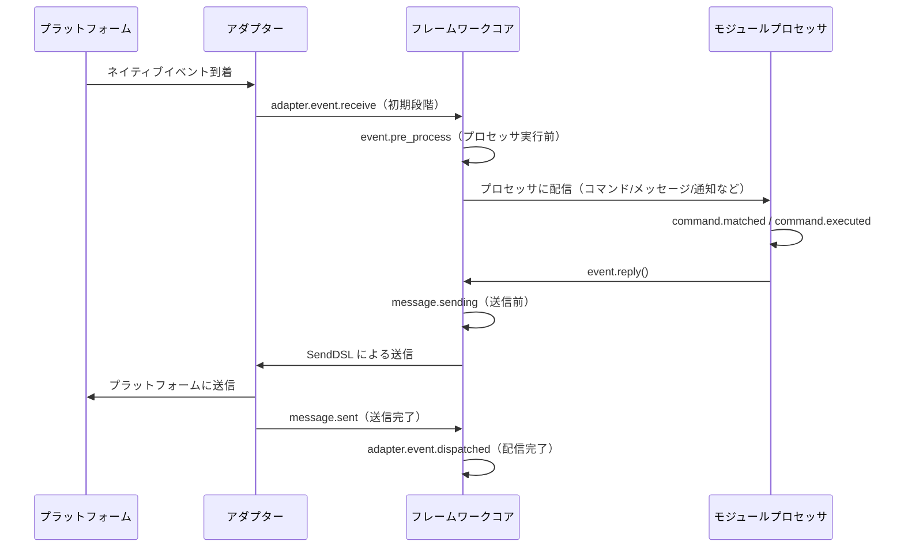

フレームワークは以下のフックブレークポイントを内蔵しており、`@sdk.lifecycle.on()` を使って任意のブレークポイントを監視し、カスタムロジックを実装できます。

### コア初期化

| フック名 | 発生タイミング | データ |
|---------|---------|------|
| `core.init.start` | SDKの初期化開始 | `{}` |
| `core.init.complete` | SDKの初期化完了 | `{"duration": float, "success": bool, "adapters": {"enabled": [str], "disabled": [str]}, "modules": {"enabled": [str], "disabled": [str]}, "error": str(失敗時のみ)}` |
| `core.uninit.complete` | SDKの逆初期化完了 | `{"duration": float, "success": bool, "adapters_closed": int, "modules_unloaded": int, "module_properties_cleared": int, "module_properties_to_clear": [str], "error": str(失敗時のみ)}` |

### 設定変更

| フック名 | 発生タイミング | データ |
|---------|---------|------|
| `config.set` | 設定項目が変更された時 | `{"key": str, "old_value": Any, "new_value": Any}` |
| `config.updated` | 外部から config.toml を編集した後にツリー全体の変更を検知した時 | `{"old_config": dict, "new_config": dict, "config_file": str}` |

**例：設定監査**

```python
@sdk.lifecycle.on("config.set")
def audit_config(data):
    print(f"[監査] {data['key']}: {data['old_value']} -> {data['new_value']}")
```

### モジュールライフサイクル

| フック名 | 発生タイミング | データ |
|---------|---------|------|
| `module.register` | モジュールクラスがマネージャーに登録された時 | `{"module_name": str, "success": bool}` |
| `module.load` | モジュールのロード完了（インスタンス化成功） | `{"module_name": str, "success": bool}` |
| `module.init` | モジュールの初期化完了（遅延ロード含む） | `{"module_name": str, "success": bool}` |
| `module.unload` | モジュールのアンロード | `{"module_name": str, "success": bool}` |

### アダプターライフサイクル

| フック名 | 発生タイミング | データ |
|---------|---------|------|
| `adapter.load` | アダプターの登録完了 | `{"platform": str, "success": bool}` |
| `adapter.start` | アダプターの起動 | `{"platforms": [str]}` |
| `adapter.status.change` | アダプターのステータス変更 | `{"platform": str, "status": str, "retry_count": int, "error": str(失敗時のみ)}` |
| `adapter.stop` | アダプターの停止 | `{"platforms": [str]}` |
| `adapter.stopped` | アダプターの停止完了 | `{"platforms": [str]}` |
| `adapter.bot.online` | Botのオンライン | `{"platform": str, "bot_id": str, "info": dict, "status": str}` |
| `adapter.bot.offline` | Botのオフライン | `{"platform": str, "bot_id": str, "status": str}` |

### イベント受信と処理

| フック名 | 発生タイミング | データ |
|---------|---------|------|
| `adapter.event.receive` | 外部プラットフォームのイベントを受信した時（初期段階） | `{"platform": str, "event_type": str, "raw_event_type": str}` |
| `adapter.event.dispatched` | イベントの配信完了 | `{"platform": str, "event_type": str, "raw_event_type": str, "onebot_handlers_count": int}` |
| `event.pre_process` | イベントプロセッサが実行される直前 | `{"event_type": str, "platform": str, "detail_type": str}` |

**例：イベント統計**

```python
event_counter = {}

@sdk.lifecycle.on("adapter.event.receive")
def count_events(data):
    platform = data["platform"]
    event_counter[platform] = event_counter.get(platform, 0) + 1

@sdk.lifecycle.on("adapter.event.dispatched")
def log_unhandled(data):
    if data["onebot_handlers_count"] == 0:
        print(f"[未処理] {data['platform']}/{data['event_type']}")
```

### メッセージ送信

| フック名 | 発生タイミング | データ |
|---------|---------|------|
| `message.sending` | メッセージの送信直前 | `{"platform": str, "method": str, "detail_type": str, "target_id": str, "bot_id": str}` |
| `message.sent` | メッセージの送信完了 | `{"platform": str, "method": str, "detail_type": str, "target_id": str, "bot_id": str}` |

**例：メッセージ送信監査**

```python
@sdk.lifecycle.on("message.sending")
def log_sending(data):
    print(f"[送信] -> {data['platform']}/{data['detail_type']}/{data['target_id']} via {data['method']}")
```

### コマンドシステム

| フック名 | 発生タイミング | データ |
|---------|---------|------|
| `command.matched` | コマンドがマッチし、実行される直前 | `{"command": str, "args": list[str], "platform": str, "user_id": str}` |
| `command.executed` | コマンドの実行完了 | `{"command": str, "args": list[str], "platform": str, "user_id": str, "success": bool, "error": str(失敗時のみ)}` |

**例：コマンド統計**

```python
@sdk.lifecycle.on("command.matched")
def count_commands(data):
    print(f"[コマンド] /{data['command']} from {data['user_id']}@{data['platform']}")
```

### HTTPルーティング

| フック名 | 発生タイミング | データ |
|---------|---------|------|
| `server.request` | HTTPリクエストの受信 | `{"method": str, "path": str, "client_ip": str}` |
| `server.response` | HTTPレスポンスの送信 | `{"method": str, "path": str, "status_code": int, "client_ip": str}` |

**例：リクエストログ**

```python
@sdk.lifecycle.on("server.response")
def log_http(data):
    print(f"[HTTP] {data['method']} {data['path']} -> {data['status_code']}")
```

### WebSocket

| フック名 | 発生タイミング | データ |
|---------|---------|------|
| `server.start` | ルーティングサーバーの起動 | `{"base_url": str, "host": str, "port": int}` |
| `server.stop` | ルーティングサーバーの停止 | `{}` |
| `server.websocket.connect` | WebSocket接続の確立 | `{"path": str, "module_name": str, "client_ip": str}` |
| `server.websocket.disconnect` | WebSocket接続の切断 | `{"path": str, "module_name": str, "reason": str, "error": str(異常時のみ)}` |

**例：WebSocket接続監視**

```python
@sdk.lifecycle.on("server.websocket.connect")
def on_ws_connect(data):
    print(f"[WS] 接続: {data['path']} from {data['client_ip']}")

@sdk.lifecycle.on("server.websocket.disconnect")
def on_ws_disconnect(data):
    print(f"[WS] 切断: {data['path']} ({data['reason']})")
```

## 標準イベント定義

```python
STANDARD_EVENTS = {
    "core": ["init.start", "init.complete", "uninit.complete"],
    "module": ["load", "init", "unload", "register"],
    "adapter": [
        "load", "start", "status.change", "stop", "stopped",
        "event.receive", "event.dispatched",
        "bot.online", "bot.offline",
    ],
    "server": [
        "start", "stop",
        "request", "response",
        "websocket.connect", "websocket.disconnect",
    ],
    "event": ["pre_process"],
    "message": ["sending", "sent"],
    "command": ["matched", "executed"],
    "config": ["set"],
}
```

## 完全な API リファレンス

### 登録と解除

| メソッド | 説明 |
|------|------|
| `@lifecycle.on(event, *, priority=0)` | デコレータによるハンドラの登録 |
| `lifecycle.register(event, handler, *, priority=0)` | プログラム的登録 |
| `lifecycle.unregister(event, handler=None)` | 登録解除（handler=None の場合、該当イベントの全ハンドラを解除） |

### トリガー

| メソッド | 説明 |
|------|------|
| `await lifecycle.emit(event, data=None)` | 非同期でトリガーを発生、ハンドラが None 以外を返すと data を変更可能 |
| `lifecycle.emit_sync(event, data=None)` | 同期でトリガーを発生、非同期ハンドラは create_task でスケジュール |
| `await lifecycle.submit_event(event_type, *, source, msg, data)` | 旧バージョンとの互換性、自動的に標準イベント形式を構築 |

### ユーティリティ

| メソッド | 説明 |
|------|------|
| `lifecycle.start_timer(timer_id)` | タイマーを開始 |
| `lifecycle.get_duration(timer_id)` | 経過時間を取得（秒） |
| `lifecycle.stop_timer(timer_id)` | タイマーを停止し、経過時間を返す |
| `lifecycle.list_hooks()` | 登録済みのすべてのフックとハンドラ数をリスト表示 |
| `lifecycle.clear()` | 全てのハンドラとタイマーをクリア |

## モジュールでの使用例

```python
from ErisPulse.Core.Bases import BaseModule
from ErisPulse import sdk

class Main(BaseModule):
    async def on_load(self, event):
        # 簡単なメッセージの統計を実装
        self.msg_count = 0
        
        @sdk.lifecycle.on("adapter.event.receive")
        async def count(data):
            if data["event_type"] == "message":
                self.msg_count += 1
        
        # すべてのコマンドを監視
        @sdk.lifecycle.on("command.matched")
        async def log_cmd(data):
            sdk.logger.info(f"コマンド実行: /{data['command']} by {data['user_id']}")
        
        # 設定変更の監査
        @sdk.lifecycle.on("config.set")
        def audit(data):
            sdk.logger.info(f"設定変更: {data['key']} = {data['new_value']}")
```

## バックグラウンドタスクの所有と自動キャンセル

> [!NOTE]
> この機能は ErisPulse **2.8.0+** が必要です。

モジュールが作成した asyncio のバックグラウンドタスクが `on_unload` でキャンセルされない場合、`self` の参照を保持し、モジュールのインスタンスが回収されず（ホットリロード後に古いインスタンスが残る）ます。フレームワークは以下のバックアップメカニズムを提供します：

- **`self.spawn(coro)`**（モジュール内で推奨）：タスクは自動的にモジュール名に所有され、モジュールのアンロード時にフレームワークは `on_unload` **の後**に未終了のタスクをバックアップキャンセルし、警告を記録します。
- **`spawn_background(coro)`**（`ErisPulse.runtime`）：自動的に現在の `owner_scope` コンテキストをキャプチャします。`cancel_owner_tasks(owner)` は所有者に応じてキャンセルし、`cancel_all_background_tasks()` は `sdk.uninit()` のバックアップとして使用されます。
- **アダプター**：閉じる際にプラットフォーム名以下のバックグラウンドタスクも同様にバックアップキャンセルされます。

```python
async def on_load(self, event):
    # 推奨：バックグラウンドタスクは self.spawn() を使用し、アンロード時にフレームワークがバックアップキャンセルします。
    self.spawn(self._poll())

async def on_unload(self, event):
    # 精密制御が必要な場面では、自らキャンセルして終了処理を待つことを推奨します。
    if self._poll_task:
        self._poll_task.cancel()
        await asyncio.gather(self._poll_task, return_exceptions=True)

async def _poll(self):
    while True:
        await asyncio.sleep(60)
        ...
```

> [!IMPORTANT]
> フレームワークのバックアップは**強制キャンセル**（`cancel_owner_tasks`）です。これは `on_unload` の返り値の後に発生します。したがって、優雅な終了処理が必要なタスク（バッファのフラッシュ、状態の永続化、接続の閉じる）は、`on_unload` で自ら `cancel()` + `await` して完了させる必要があります。バックアップが終了処理を保持することを期待しないでください。フレームワークは「`self` を保持するタスクが残らないこと」を保証しますが、「優雅な終了」は保証しません。`await` の結果が必要なタスクは、直接 `await` してください。バックグラウンドタスクに投げないでください。

## 注意事項

1. **プロセッサは同期または非同期のいずれでも使用可能**：システムは自動的に識別し、正しく呼び出します。
2. **データの渡し方**：`emit()` モードでは、プロセッサが None 以外の値を返すと、次のプロセッサに渡される data が変更されます。
3. **イベント名の命名規則**：親イベントを監視しやすいよう、ドット構造を使用した命名を推奨します。
4. **エラーの隔離**：個々のプロセッサの例外は、他のプロセッサの実行に影響しません。
5. **同期トリガーの制限**：`emit_sync()` では、非同期プロセッサは fire-and-forget 方式でスケジュールされ、戻り値は返却できません。
6. **ライフサイクルのクリーンアップ**：`sdk.uninit()` を呼び出すと、すべての登録済みプロセッサとタイマーがクリーンアップされます。
7. **ロード優先度**：フレームワークの初期化段階でイベントを監視したい場合は、高優先度を設定し、ラグジュアリー読み込みを無効にすることを推奨します。


### 懶加载系统

# ラグジュアリー・ロード・モジュール・システム

ErisPulse SDK は、モジュールを実際に必要になるまで初期化しない強力なラグジュアリー・ロード・モジュール・システムを提供し、アプリケーションの起動速度とメモリ効率を大幅に向上させます。

## 概要

ErisPulse のコア機能の一つである遅延ロードモジュールシステムは、以下の方法で動作します：

- **遅延初期化**：モジュールは、初めてアクセスされたときにのみ実際にロードおよび初期化されます。
- **透明な使用**：開発者にとって、遅延ロードモジュールは通常のモジュールと使用上ほとんど違いがありません。
- **自動依存管理**：モジュールの依存関係は、使用時に自動的に初期化されます。
- **ライフサイクルサポート**：`BaseModule` を継承したモジュールに対しては、ライフサイクルメソッドが自動的に呼び出されます。

## 動作原理

### LazyModule クラス

ラグジュアリー・ロード・システムの中心となるのが `LazyModule` クラスです。これは、最初にアクセスされたときに実際にモジュールを初期化するラッパーです。

### 初期化プロセス

モジュールが初めてアクセスされたとき、`LazyModule` は以下の操作を実行します：

1. モジュールクラスの `__init__` パラメータ情報を取得します
2. パラメータに基づいて `sdk` リファレンスを渡すかどうかを決定します
3. モジュールの `moduleInfo` 属性を設定します
4. `BaseModule` を継承したモジュールの場合、`on_load` メソッドを呼び出します
5. `module.init` ライフサイクルイベントをトリガーします

## イベント駆動の遅延活性化（activate_on）

> [!NOTE]
> この機能は ErisPulse **2.8.0+** が必要です。

`lazy_load=True` に設定されたモジュールは、デフォルトで**最初の属性アクセス時**にのみロードされます。もしモジュールがコマンドやイベントハンドラを登録している場合、従来の方法では `lazy_load=False` に設定して即時ロードするしかありませんでした。`activate_on` は、**トリガーを宣言し、最初の一致するイベントやコマンドが到着した際にモジュールを自動的に活性化**するという第三の選択肢を提供します。これにより、メモリに常駐することなく、かつトリガーの入口を失うこともありません。

```python
from ErisPulse.loaders import ModuleLoadStrategy

class MyModule(BaseModule):
    @staticmethod
    def get_load_strategy():
        return ModuleLoadStrategy(
            lazy_load=True,
            activate_on=[
                # ---- イベントトリガー（受動的到着、ユーザーの意識を必要としない）----
                "message",                                    # タイプレベル：任意のメッセージイベント
                {"notice": "group_member_increase"},          # タイプ + 単一 detail_type
                {"message": ["private", "group"]},            # タイプ + 複数 detail_type

                # ---- コマンドトリガー（能動的入力、Help に表示される占位コマンド）----
                {"command": "roll"},                          # 簡略形：コマンド名
                {"command": ["roll", "dice"]},                # コマンド名のリスト
                {"command": {                                 # dict 形式の宣言（name は必須）
                    "name": "dice",
                    "help": "サイコロを振る",
                    "usage": "/dice",
                    "group": "娯楽",
                    "aliases": ["d"],
                    "hidden": False,
                }},
            ],
        )
```

### コマンド dict 形式の宣言パラメータ

dict 形式は、`@command()` デコレータのユーザーレベルのパラメータを反映し、モジュールのロード前に占位コマンドを登録するために使用されます：

| パラメータ | 型 | デフォルト | 説明 |
|------|------|------|------|
| `name` | `str` | **必須** | コマンド名；`on_load` での `@command(name)` と一致している必要があります。一致しない場合、活性化後に占位が解除され、コマンドが存在しなくなります |
| `help` | `str` | 回帰チェーン | Help に表示される説明；宣言されていない場合は回帰チェーンから値を取得します（下記参照） |
| `usage` | `str` | 自動生成 | 用法行；デフォルトは `{prefix}{name}` |
| `group` | `str` | `None` | コマンドのグループ |
| `aliases` | `list[str]` | `[]` | 別名も同時に登録され、**別名の入力でもトリガーとして機能します** |
| `hidden` | `bool` | `False` | `True` の場合、占位コマンドも非表示になります（活性化後の本物のコマンドの非表示の意味と一致）；コマンド名を知っているユーザーの入力でもトリガーとして機能します |

**サポートされていない** `priority` / `permission` / `master`：占位コマンドの役割は活性化をトリガーすることのみであり、権限チェックは活性化後の本物のコマンドが実行します（占位段階で権限をブロックしてしまうと、「コマンド入力で活性化」が機能しなくなります）。

### 占位コマンドのヘルプ回帰チェーン

モジュールがロードされていない場合、Help に表示されるコマンドの説明は、以下の順序で値を取得します（取得でき次第終了）：

1. dict 形式のコマンドレベルの `help`（最も正確）
2. モジュールの `get_meta()` の `description`
3. モジュールの `__description__` 属性
4. パッケージメタデータの `Summary`（PyPI パッケージの概要）
5. 一般的なメッセージ：「このコマンドは遅延ロードモジュール X から来ています。初めて使用すると、このモジュールが自動的にロードされます」

### トリガーの意味

- **イベント stub**：対応するイベントマネージャーに、非常に低い優先度（`ACTIVATION_STUB_PRIORITY`）で登録され、すべての通常のハンドラの後にバックアップとしてトリガーされます。活性化後は、現在のイベントをモジュールの実際のハンドラに転送します。
- **コマンド stub**：占位コマンドを登録します。活性化後は占位が解除され、本物のコマンドが次のトリガーを引き継ぎます。
- **重複実行防止**：`asyncio.Lock` を使用して、並行実行のトリガー下で一度だけ活性化されるように保証します。
- **スコープフィルタリング**：stub はモジュールのオーナーのアイデンティティを伴い、モジュールが Bot / セッション / プラットフォームに対して有効化されていない場合、トリガーされません。
- **失敗の意味**：活性化が失敗した場合、再試行は行われず、stub も一緒に解除されます。
- **重複除去**：同じ名前のコマンドが簡略形と dict 形式で混在して宣言された場合、重複は除去されます（dict が優先されます）。dict で `name` が欠落している場合、またはイベントの `detail_type` が dict として誤って書かれた場合は、警告を表示して無視されます。

> アーキテクチャ図と完全な意味は、[アーキテクチャ概要](../architecture.md#イベント駆動の遅延活性化activate_on-トリガーのアーキテクチャ)を参照してください。

## 慣らしロードの設定

### グローバル設定

設定ファイルでグローバルな慣らしロードを有効または無効にします。

```toml
[ErisPulse.framework]
enable_lazy_loading = true  # true=慣らしロードを有効にする(デフォルト), false=慣らしロードを無効にする
```

### モジュールレベルでの制御

モジュールは `get_load_strategy()` 静的メソッドを実装することで、ロード戦略を制御できます。

```python
from ErisPulse.Core.Bases import BaseModule
from ErisPulse.loaders import ModuleLoadStrategy

class MyModule(BaseModule):
    @staticmethod
    def get_load_strategy():
        """モジュールのロード戦略を返す"""
        return ModuleLoadStrategy(
            lazy_load=False,  # Falseを返すことで即時ロードを指定
            priority=100      # ロードの優先度、数値が大きいほど優先度が高い
        )
```

## ラグロードモジュールの使用

### 基本的な使用方法

開発者にとって、ラグロードモジュールは通常のモジュールと使用方法にほとんど違いはありません：

```python
# SDK を通じてラグロードモジュールにアクセス
from ErisPulse import sdk

# 以下のようにアクセスするとモジュールのラグロードがトリガーされます
result = await sdk.my_module.my_method()
```

### モジュールの取得の統一されたエントリーポイント

SDK の属性、モジュールマネージャーの属性を通じてアクセスする場合、あるいは `module.get()` を使って検索する場合も、
「登録済みだがまだロードされていない」ラグロードモジュールに対しては、すべて同じラグロードプロキシが返され、
そのプロパティにアクセスすることで初めてモジュールの初期化がトリガーされます：

```python
# 3 つの方法で取得したものはすべて、モジュールがロードされていない場合に同じラグロードプロキシが返されます。ユーザーにとって動作は一貫しており、透明です
sdk.my_module          # ロードをトリガーするエントリーポイント
sdk.module.my_module   # 同様にラグロードプロキシを返します
sdk.module.get("my_module")  # ラグロードプロキシを返しますが、ロードはトリガーしません

# プロキシの任意のプロパティにアクセスすることでモジュールが実際に初期化されます
result = await sdk.my_module.my_method()
```

`module.get()` は**検索**用のインターフェースであり、ロードはトリガーしません：
- モジュールが既にロード済み → 実際のインスタンスを返します
- モジュールが登録済みだがロードされていない → ラグロードプロキシを返します（プロパティにアクセスすることで初期化されます）
- モジュールが登録されていない → `None` を返します

明示的にロードをトリガーしたい場合は、`await sdk.load_module("my_module")` を使用してください。

### 非同期初期化

非同期初期化が必要なモジュールについては、まず明示的にロードすることを推奨します：

```python
# まずモジュールを明示的にロードします
await sdk.load_module("my_module")

# その後、モジュールを使用します
result = await sdk.my_module.my_method()
```

### 同期初期化

非同期初期化を必要としないモジュールについては、直接アクセスできます：

```python
# 直接アクセスすることで自動的に同期初期化されます
result = sdk.my_module.some_sync_method()
```

## 最佳実践

ロード戦略を選択する際は、以下の意思決定フローを参考にしてください：


### 懒加载を使用することを推奨する場面（lazy_load=True）

- 他のモジュールが呼び出す際にのみ必要な受動的なユーティリティモジュール（例：データクエリモジュール、フォーマット変換器など）
- コマンド/イベントハンドラを登録しているが、頻繁には使用しないモジュール —— `activate_on` でトリガを宣言し、最初の一致するイベント/コマンドが到着した際に自動的にアクティベートさせ、懒加载を放棄する必要がない

### 懒加载を無効化することを推奨する場面（lazy_load=False）

- 起動時に即座に準備が必要なモジュール（他のモジュールに基礎サービスを提供するコアモジュールなど）
- 高頻度でトリガーされるリスナー（各メッセージをすべて処理する必要がある） —— `activate_on` による転送には一度のアクティベートのオーバーヘッドがあるため、高頻度の場面では即時ロードがより直接的である
- タイマー処理モジュール
- アプリケーション起動時に初期化が必要なモジュール

> `priority` パラメータは、即時ロードモジュール間の初期化順序を制御する。数値が大きいほど先に初期化される。同じ優先度のモジュールは登録順にロードされる。

## 注意事項

1. モジュールが遅延ロードを使用している場合、ErisPulse内で他のモジュールが一度も呼び出されない場合、そのモジュールは初期化されません。
2. モジュールにイベントを監視するモジュールや、そのようなモジュールを積極的に監視するものが含まれている場合、2つの選択肢があります：`activate_on` トリガを宣言して遅延ロードを維持し、イベントが到着したときに自動的に活性化するか、または即時読み込みを宣言する（`lazy_load=False`）必要があります。さもなければ、モジュールの正常な業務に影響を与える可能性があります。
3. 特殊な要望がない限り、遅延ロードを無効にすることはお勧めしません。そうしないと、依存関係管理やライフサイクルイベントなどの問題が発生する可能性があります。
4. `activate_on` のコマンド dict 宣言において、`name` はモジュールの `on_load` で `@command()` によって登録された実際のコマンド名と一致している必要があります。一致しない場合、モジュールが活性化された後にプレースホルダーコマンドが解除され、宣言されたコマンドと実装が一致しないコマンドは存在しません。


### 国际化（i18n）系统

# 国際化 (i18n) システム

ErisPulse v2.5.0 から、完全な国際化 (i18n) 機能が内蔵されています。フレームワークのコア部分と CLI インターフェースは、システム言語に応じて自動的に表示テキストを切り替えることができ、外部モジュールが独自の翻訳を登録することも可能です。

## 対応言語

| 言語 | コード | 説明 |
|------|------|------|
| 簡体中国語 | `zh-CN` | デフォルト言語（フレームワークの原生言語） |
| 繁体中国語 | `zh-TW` | 繁体中国語（香港/マカオ/台湾） |
| 英語 | `en` | 英語（一般的なフォールバック言語） |
| 日本語 | `ja` | 日本語 |
| ロシア語 | `ru` | ロシア語 |

## 早速体験

### 環境変数で切り替える

```bash
# Windows PowerShell
$env:ERISPULSE_LANG = "en"
epsdk run

# macOS / Linux
ERISPULSE_LANG=ja epsdk run
```

### 設定ファイルで切り替える

`config/config.toml` に追加：

```toml
[ErisPulse.i18n]
language = "zh-TW"
```

`"auto"`（デフォルト値）に設定すると、システム言語を自動検出します。

### コード内で手動で切り替える

```python
from ErisPulse import i18n

# 手動で言語を設定
i18n.set_language("en")
print(i18n.get_language())  # "en"

# 自動検出に戻す
i18n.reset_language()
```

---

## 言語検出メカニズム

フレームワークは以下の優先順位でユーザー言語を検出します：

1. **環境変数 `ERISPULSE_LANG`** — 最高優先度、テストや一時的な切り替えに使用
2. **Windows API** — `GetUserDefaultLocaleName`（Windows限定、Git Bashなどのツールが `LANG` を上書きする影響を受けない）
3. **環境変数** — `LANGUAGE` > `LC_ALL` > `LC_MESSAGES` > `LANG`（Unix/macOS標準）
4. **システムロケール** — `locale.getlocale()` / `locale.getdefaultlocale()`
5. **フォールバック** — 英語 (en)

### 近接マッピング原則

検出された言語が正確に一致しない場合、対応する言語に最も近いものにマッピングされます：

- `zh-TW`, `zh-HK`, `zh-MO`, `zh-Hant` → **繁体中国語**
- その他の `zh-*` (例: `zh-CN`, `zh-SG`) → **簡体中国語**
- `en-US`, `en-GB`, `en-AU` など → **英語**
- `ja-JP` → **日本語**
- `ru-RU` → **ロシア語**
- その他の未認識言語 → **簡体中国語（フォールバック）**

---

## モジュールで i18n を使用する

独自のモジュールに翻訳テキストを登録し、多言語対応を実現できます。

### 推奨の書き方: I18nClass で翻訳キーを宣言 (v2.7.0+)

v2.7.0 以降、モジュール/アダプターは `ConfigClass` と同じように、`I18nClass` で翻訳キーを宣言できます。フレームワークはロード時に**自動的に**宣言された翻訳キーを登録し、手動で `i18n.register()` を呼び出す必要はありません。

```python
from dataclasses import dataclass, field

from ErisPulse.Core.Bases import BaseConfig, BaseI18n, BaseModule, I18nKey


class MyModule(BaseModule):
    # 設定クラス（オプション）
    @dataclass
    class ConfigClass(BaseConfig):
        welcome_msg: str = field(
            default="欢迎",
            metadata={
                # ここでは i18n キー mymodule.welcome_msg を参照
                "description": {"i18n": "mymodule.welcome_msg", "default": "欢迎消息"},
            },
        )

    # 翻訳キー集合クラス（オプション）
    # 宣言されたキーはフレームワークによって自動登録され、ConfigClass がデフォルト設定を生成するよりも優先されます
    class I18nClass(BaseI18n):
        # プロパティ名が自動的に完全なキー経路 <モジュール名>.<プロパティ名> として結合されます
        welcome_msg: I18nKey = I18nKey(
            default="Welcome Message",   # 言語に依存しないフォールバック、どの言語にも登録されません
            zh_CN="欢迎消息",
            en="Welcome Message",
            ja="ウェルカムメッセージ",
            ru="Приветственное сообщение",
            zh_TW="歡迎訊息",
        )
        # 他の業務用翻訳キー
        hello: I18nKey = I18nKey(
            default="Hello, {name}!",
            zh_CN="你好，{name}！",
            zh_TW="你好，{name}！",
            en="Hello, {name}!",
            ja="こんにちは、{name}！",
            ru="Привет, {name}!",
        )

        # 完全なキー経路を明示的に指定することもできます（プロパティ名の結合を使用しない）
        custom: I18nKey = I18nKey(
            key="mymodule.deep.nested.key",
            default="Default text",
            zh_CN="默认文本",
            zh_TW="預設文本",
            en="Default text",
            ja="デフォルトテキスト",
            ru="Текст по умолчанию",
        )
```

#### なぜ I18nClass を推奨するのか？

| ステージ | 手動 i18n.register() | I18nClass 宣言型 |
|------|-----------------------|------------------|
| 配置説明に参照される i18n キー | 手動で登録する必要があり、配置生成前に登録する必要がある | フレームワークが配置生成前に自動で登録する |
| 多言語翻訳の宣言 | on_load() 内に分散して記述される | 類似の記述がクラス内に一括してまとめられる |
| キー名の命名の一貫性 | 拼写ミスが発生しやすい | プロパティ名がキー名の接尾辞として使用され、IDE による補完が可能 |
| アンロード時のクリーンアップ | unregister_domain() を手動で呼び出す必要がある | フレームワークが統一されたドメインで登録する |

#### I18nClass のキー経路のルール

- **デフォルト**：``<モジュール登録名>.<プロパティ名>`` を完全なキー経路として使用
  - 例：モジュール名が ``MyModule``、プロパティ ``welcome`` → キー経路 ``MyModule.welcome``
- **明示的**：``I18nKey(key="...")`` パラメータで任意の点分経路を指定
  - 深いネストされたキー名（例：``mymodule.config.basic.token``）に適している

#### アダプターでの使用

アダプターも `I18nClass` をサポートし、使用方法は完全に同じです：

```python
from ErisPulse.Core import BaseAdapter
from ErisPulse.Core.Bases import BaseConfig, BaseI18n, I18nKey


class MyAdapter(BaseAdapter):
    @dataclass
    class ConfigClass(BaseConfig):
        endpoint: str = field(
            default="",
            metadata={
                # 配置説明に adapter.MyAdapter.endpoint キーを参照
                "description": {"i18n": "MyAdapter.endpoint", "default": "API アドレス"},
            },
        )

    class I18nClass(BaseI18n):
        # 配置説明に参照されるキーとその他の業務用キーの多言語訳を一括で宣言
        endpoint: I18nKey = I18nKey(
            default="API Endpoint",
            zh_CN="API アドレス",
            zh_TW="API 位址",
            en="API Endpoint",
            ja="APIアドレス",
            ru="API アドレス",
        )
```

アダプターの `I18nClass` は `__init__` 階段（つまり配置テンプレート生成の前）で自動的に登録され、配置説明に参照される i18n キーが利用可能であることを保証します。

### 手動でカスタム翻訳を登録する（旧方式）

`I18nClass` を使用しない場合、`i18n.register()` を直接呼び出して翻訳テキストを登録することもできます。

```python
from ErisPulse import i18n

# 中国語の翻訳を登録
i18n.register("zh-CN", {
    "my_module.welcome": "欢迎使用我的模块！",
    "my_module.goodbye": "再见！",
    "my_module.hello": "你好，{name}！",
}, domain="my_module")

# 英語の翻訳を登録
i18n.register("en", {
    "my_module.welcome": "Welcome to my module!",
    "my_module.goodbye": "Goodbye!",
    "my_module.hello": "Hello, {name}!",
}, domain="my_module")
```

### 翻訳の使用

```python
from ErisPulse import i18n

# 簡単な翻訳
i18n.t("my_module.welcome")  # 自動で現在の言語を使用

# 書式化パラメータ付き
i18n.t("my_module.hello", name="Alice")

# デフォルト値を指定（翻訳キーが存在しない場合に返す）
i18n.t("my_module.unknown_key", default="デフォルトテキスト")
```

### モジュールクラスでの使用

```python
from dataclasses import dataclass, field
from ErisPulse import i18n
from ErisPulse.Core.Bases import BaseConfig, BaseModule

@dataclass
class MyModuleConfig(BaseConfig):
    welcome_msg: str = field(
        default="欢迎",
        metadata={
            "description": {"i18n": "my_module.welcome_msg", "default": "欢迎消息"},
            "ui": {"widget": "text", "group": "basic", "order": 1},
        },
    )

class MyModule(BaseModule):
    ConfigClass = MyModuleConfig

    async def on_load(self, event):
        # 実時で設定を読み込む（毎回アクセスするたびに最新の値を反映）
        self.logger.info(self.cfg.welcome_msg)
        self.logger.info(i18n.t("my_module.welcome"))

    @command("hello")
    async def hello_handler(self, event):
        name = event.get_user_nickname() or "friend"
        await event.reply(i18n.t("my_module.hello", name=name))

    async def on_unload(self, event):
        pass
```

### 翻訳のアンロード

```python
# ドメイン全体の翻訳をアンロード
i18n.unregister_domain("my_module")
```

---

## 配置フィールドの多言語対応

v2.5.2 以降、配置の Schema は完全に i18n をサポートしています。すべてのユーザーが見えるテキストフィールドは i18n キーを参照でき、WebUI など他の消費者は自動的に現在の言語に応じて対応するテキストに解析されます。

### i18n 対応フィールド

| フィールド | 位置 | 説明 |
|------|------|------|
| `description` | field metadata | フィールドの説明 |
| `options[].label` | `ui.options` | select コントロールのオプションラベル |
| `placeholder` | `ui.placeholder` | 入力フィールドのプレースホルダ |
| `group_labels` | `_schema_meta` | グループ表示名（ダッシュボードのセクションタイトル） |

すべての i18n フィールドは `{"i18n": "key", "default": "テキスト"}` の形式を使用し、純粋な文字列はそのまま透過的に渡されます（後方互換性）。

### i18n フィールドの宣言

すべてのユーザーが見えるテキストフィールドは i18n をサポートしています：

```python
from dataclasses import dataclass, field
from ErisPulse.Core.Bases import BaseConfig

@dataclass
class MyAdapterConfig(BaseConfig):
    # description i18n
    token: str = field(
        default="",
        metadata={
            "description": {"i18n": "my_adapter.token", "default": "平台 Token"},
            "required": True,
            "secret": True,
            "ui": {
                "widget": "password",
                "group": "basic",
                "order": 1,
                # placeholder i18n
                "placeholder": {"i18n": "my_adapter.token.ph", "default": "请输入 Token"},
            },
        },
    )
    # options label i18n
    mode: str = field(
        default="a",
        metadata={
            "description": {"i18n": "my_adapter.mode", "default": "运行模式"},
            "ui": {
                "widget": "select",
                "group": "basic",
                "order": 2,
                "options": [
                    {"label": {"i18n": "my_adapter.mode.a", "default": "模式A"}, "value": "a"},
                    {"label": {"i18n": "my_adapter.mode.b", "default": "模式B"}, "value": "b"},
                ],
            },
        },
    )

    # group_labels i18n（グループ表示名）
    _schema_meta = {
        "group_labels": {
            "basic": {"i18n": "my_adapter.group.basic", "default": "基本设置"},
        }
    }
```

`default` はフォールバックテキストです。翻訳が登録されていない場合や検索に失敗した場合に表示されます。

### secret 保護と配置検証

`"secret": True` とマークされたフィールドは、2.7.0 から自動的に**保護**されます（脱敏）：

- **テンプレート生成時の脱敏**：`dataclass_to_toml_with_comments()` が配置テンプレートを生成する際、secret フィールドの実際の値はファイルに書き込まれません（空のプレースホルダとして表示され、機密情報が保存されないようにします）
- **一般的な脱敏ツール**：`redact_secret(value)` は非空値を `***` に置き換え、空値はそのまま返します。ログ出力などに使用できます。

```python
from ErisPulse.Core.Bases.config_schema import redact_secret

redact_secret("sk-xxxxxx")  # '***'
redact_secret("")           # ''
```

**配置検証**（`validate_config()`）は `required` の空チェックに加えて、2.7.0 から以下の検証がサポートされています：

| 検証項目 | メタデータ | 例 |
|--------|--------|------|
| 型の一致 | フィールドの宣言型 | `int` フィールドに文字列が渡された場合エラー |
| 列挙制約 | `ui.options` またはトップレベルの `options` | 値が許可されたオプションに属している必要がある |
| 数値範囲 | トップレベルの `min` / `max` | `metadata={"min": 1, "max": 65535}` |

```python
from ErisPulse.Core.Bases.config_schema import validate_config

@dataclass
class C(BaseConfig):
    mode: str = field(default="a", metadata={"ui": {"widget": "select", "options": ["a", "b"]}})
    port: int = field(default=80, metadata={"min": 1, "max": 65535})

errors = validate_config(C(mode="x", port=70000))  # 2つのエラー：列挙制約と範囲制約
```

### 配置翻訳の登録

配置フィールドの i18n キーは、通常の翻訳キーと同じように `i18n.register()` で登録します：

```python
from ErisPulse import i18n

# 中国語（default と同じでも、異なることも可能）
i18n.register("zh-CN", {
    "my_adapter.token": "平台 Token",
}, domain="my_adapter")

# 英語
i18n.register("en", {
    "my_adapter.token": "Platform Token",
}, domain="my_adapter")
```
> **推奨の書き方**：`I18nClass` で翻訳キーを宣言し、フレームワークが自動で登録する（上記「推奨の書き方」を参照）。
> 手動で `i18n.register()` や `register_config_i18n()` を呼び出す必要はない。

また、`register_config_i18n()` という便利な関数も用意されており、設定クラスからキーを自動的に抽出して登録できます：

```python
from ErisPulse.Core.Bases.config_schema import register_config_i18n

# 自動的に description.default を zh-CN 翻訳として抽出
register_config_i18n(MyAdapterConfig, "zh-CN")

# 手動で英語の翻訳を提供
register_config_i18n(MyAdapterConfig, "en", {
    "my_adapter.token": "Platform Token",
})
```

### WebUI での消費方法

`get_config_schema()` が返す schema には、i18n ディクショナリがそのまま透過的に渡されます。WebUI のフロントエンドは、現在の言語に応じて `i18n.t()` を呼び出して解析できます。

i18n をサポートしないフロントエンドに直接文字列として返す必要がある場合、`resolve_config_schema()` を使用します。これは `description`、`options[].label`、`placeholder`、`group_labels` をすべて現在の言語の文字列に解析します：

```python
from ErisPulse.Core.Bases.config_schema import resolve_config_schema

# すべての i18n フィールドが現在の言語の文字列に解析されている
schema = resolve_config_schema(MyAdapterConfig)
print(schema["fields"]["token"]["description"])    # "平台 Token" または "Platform Token"
print(schema["fields"]["token"]["placeholder"])   # "请输入 Token" または "Enter Token"
print(schema["fields"]["mode"]["options"][0]["label"])  # "模式A" または "Mode A"
print(schema["group_labels"]["basic"])             # "基本设置" または "Basic"
```

> `BaseConfig`、`BotAccountConfig`、`register_config_i18n()`、`resolve_config_schema()` などの型やツール関数の実際の定義は `ErisPulse.Core.Bases.config_schema` にあります。
> `ErisPulse.runtime.config_schema` は互換性のための shim として残されています。
> **推奨は `ErisPulse.Core.Bases` から統一的にインポートすること**（i18n 翻訳キー関連の型は `ErisPulse.Core.Bases.i18n_schema` にあります）。

## API リファレンス

### I18nManager

#### 核心メソッド

| メソッド | 説明 |
|------|------|
| `t(key, default=None, **kwargs)` | 翻訳テキストを取得する（`gettext()` は別名） |
| `set_language(lang)` | 手動で言語を設定する |
| `get_language()` | 現在の言語を取得する |
| `reset_language()` | 自動検出に戻す（そして環境を再検出する） |
| `get_supported_languages()` | すべてのサポートされている言語のリストを取得する |
| `has_translation(key, lang=None)` | 翻訳キーが存在するかを確認する |
| `register(lang, translations, domain)` | カスタム翻訳を登録する |
| `unregister_domain(domain)` | 指定されたドメインのすべての翻訳をアンロードする |
| `reload()` | 内部翻訳を再読み込みし、言語を再検出する |

#### `t()` メソッドの詳細

```python
def t(self, key, /, default=None, **kwargs):
```

- `key` — 翻訳キー（位置引数のみ、`**kwargs` の `key=` と衝突しない）
- `default` — 翻訳が存在しない場合に返すデフォルト値、デフォルトは `None`（キー名そのものを返す）
- `**kwargs` — 書式化パラメータ、翻訳値内の `{placeholder}` を埋め込むために使用

例：

```python
# 翻訳定義: "greeting": "你好，{name}！欢迎来到{place}。"
i18n.t("greeting", name="Alice", place="ErisPulse")
# 返り値: "你好，Alice！欢迎来到ErisPulse。"
```

### BaseI18n / I18nKey（宣言型翻訳キー）

v2.7.0 以降、`ErisPulse.Core.Bases` はクラス属性に基づく翻訳キーの宣言ツールを提供しています（`ErisPulse.Core.Bases` から統一的にインポートすることを推奨）：

> ``I18nKey.default`` は**言語に依存しないフォールバックテキスト**で、どの言語にも登録されません。
> 翻訳を有効にするには、`zh_CN` / `en` / `ja` などの言語パラメータを少なくとも1つ明示的に渡す必要があります。
> これにより、各国の開発者は自分の母語で `default` を自由に記入でき、フレームワークはその内容を仮定しません。

| 名称 | 説明 |
|------|------|
| `I18nKey(default, *, key=None, zh_CN, zh_TW, en, ja, ru)` | 単一の翻訳キーの宣言、`default` は言語に依存しないフォールバック |
| `BaseI18n` | 翻訳キー集合の基底クラス（`BaseConfig` と命名を合わせる）、サブクラスは `I18nKey` のクラス属性で複数の `I18nKey` を宣言 |
| `BaseI18n.register(prefix="", domain="app")` | クラスメソッド：宣言されたすべてのキーを i18n システムに登録する |
| `key` | `I18nKey` の別名（より簡潔な書式） |

使用例：

```python
from ErisPulse.Core.Bases import BaseI18n, key

class MyKeys(BaseI18n):
    # 簡潔な別名の書き方
    hello = key(
        default="Hello",
        zh_CN="你好",
        zh_TW="你好",
        en="Hello",
        ja="こんにちは",
        ru="Привет",
    )
    bye = key(
        default="Bye",
        zh_CN="再见",
        zh_TW="再見",
        en="Bye",
        ja="さようなら",
        ru="До свидания",
    )

# 独立して使用（手動で登録）
MyKeys.register(prefix="myapp.", domain="myapp")
```

### SDK インスタンスからアクセス

```python
from ErisPulse import sdk

# sdk.i18n は直接インポートされた i18n と同じオブジェクト
sdk.i18n.set_language("en")
print(sdk.i18n.t("core.sdk.init.starting"))
```

---

## 実行時設定

### i18n 設定を API で読み取る

```python
from ErisPulse.Core.Bases import I18nConfig
from ErisPulse.runtime import get_i18n_config

config = get_i18n_config()
print(config["language"])  # "auto" または具体的な言語コード

# I18nConfig は dataclass で、設定テンプレートの生成に使用できる
schema = I18nConfig.__dataclass_fields__
```

### 設定項目の説明

`config/config.toml` の `[ErisPulse.i18n]` 部分：

```toml
[ErisPulse.i18n]
# 表示言語、選択可能な値:
# - "auto"      — システム言語を自動検出（デフォルト）
# - "zh-CN"     — 簡体中国語
# - "zh-TW"     — 繁体中国語
# - "en"        — 英語
# - "ja"        — 日本語
# - "ru"        — ロシア語
language = "auto"
```

---

## 最適な実践方法

### 翻訳キーの命名

ドットで区切られた名前空間形式を使用することを推奨します：

```
<モジュール名>.<カテゴリ>.<説明>
```

例: `my_module.command.hello_desc`、`core.adapter.start_failed`

### 多言語のカバレッジ

すべての言語の翻訳を一度に提供する必要はありません。不足している言語は英語に自動的にフォールバックし、英語もなければキー名そのものを表示します。

### 動的コンテンツ

動的に生成されるコンテンツ（ユーザー名、数など）には、`{placeholder}` 書式化を使用します：

```python
# 翻訳定義
"user_count": "当前在线用户：{count} 人"

# 使用
i18n.t("user_count", count=len(users))
```

### ログメッセージ

モジュールがフレームワークの Logger を使用している場合、これらのメッセージも自動的に現在の言語で表示されます：

```python
self.logger.info(i18n.t("my_module.startup"))
```

---

## CLI i18n との関係

CLI には**独立**した国際化モジュール (`ErisPulse.CLI.i18n`) があり、フレームワークコアの国際化モジュールとは完全に分離されています。

- **Core i18n** — フレームワークコアモジュールで使用、外部モジュールが翻訳を登録できる
- **CLI i18n** — コマンドラインインターフェースで内部的に使用、Core と翻訳データを共有しない

この設計により、CLI の翻訳の変更がフレームワークコアの安定性に影響を与えることを防ぎます。


### 统一控制面（scope）

# 統一制御面（scope）

> [!NOTE]
> 本機能は ErisPulse **2.8.0+** が必要です。

統一制御面は以下の6つの質問に答える：**どのモジュールが利用可能か、誰のイベントを受信するか、
誰が特定のコマンドを実行できるか、
特定のモジュールがどのようなテキストを処理するか、実装パラメータを上書きするか、
モジュールがどのような出力アクションを発行しないようにするか**。
制御権はすべてユーザーに委ねられ、モジュール / 适配器 / コマンド / ハンドラの登録の**上層**（設定
`ErisPulse.scope` または実行時 `sdk.scope`）で一括宣言され、イベントパイプラインは各段階で自動的に読み取り実行されます。

制御面は従来の複数の権限システムを統合し、2.8.0以降の権限/アクセス制御の**唯一**のエントリポイントです：

| 次元 | 制御対象 | 拒否動作 | 設定経路 |
|------|---------|---------|---------|
| **① モジュール** | 利用可能なモジュール（プラットフォーム / Bot / セッションの3段階） | 静かに無視（返信せず、認識しない） | `scope.platforms / bots / sessions` |
| **② 身元** | イベントの受信/拒否（適応器 / Bot / セッション / ユーザーの4段階） | 入口で完全に破棄（静かに） | `scope.identity.*` |
| **③ コマンド** | 特定のコマンドを誰が実行できるか（コマンド名は glob をサポート） | 「権限不足」の返信（明示的） | `scope.commands` |
| **④ ハンドラ** | 特定のモジュールのイベントハンドラがテキストでフィルタリングするか | トリガーしない（静かに） | `scope.handlers` |
| **⑤ オーバーライド** | モジュール/コマンドの実装パラメータの上書き（master/hidden/aliases/prefix） | ——（パラメータのみ変更） | `scope.overrides` |
| **⑥ 出力アクション** | モジュールが送信するメッセージ / 標準APIの呼び出し / リクエストの処理を禁止 | 失敗応答（`retcode=34601`） | `scope.actions` |

{!--< tips >!--}
1. `from ErisPulse.Core import scope` でシングルトンをインポート（`sdk.scope` は同じオブジェクト）
2. `scope.is_allowed(platform, bot_id, module, session_id)` でモジュールが利用可能か判定
3. `scope.is_identity_allowed(platform, bot_id, session_id, user_id)` でイベントが許可されるか判定
4. `scope.allow_user("roll*", platform, uid)` / `deny_user(...)` でコマンド ACL を設定（glob をサポート）
5. `scope.override("MyModule", "restart", master=True)` で実装パラメータを上書き
6. `scope.set_action("MyModule", "send", False)` でモジュールの返信/送信を禁止
7. `scope.get_stats()` でフィルタ統計を確認；`scope.get_topology()` でトポロジーを確認
{!--< /tips >!--}

## マッチング条目構文（全システム共通）

制御面のすべての「名前リスト」（モジュール名、身元キー、コマンド名）は同一のマッチング構文
（`ErisPulse.Core.text_match`）を使用します：

| 構文 | 例 | 説明 |
|------|------|------|
| 精確名 | `"Chat"` | 完全一致比較、**大文字小文字を区別しない** |
| glob | `"Tool*"`、`"spam_*"` | `*` 任意の文字列 / `?` 1文字 / `[seq]` 文字集合、大文字小文字を区別しない |
| 正規表現 | `"re:^Danger.*"` | `re:` 前置詞で宣言、正規表現 `search` で一致、デフォルトで大文字小文字を区別しない |

- 不正な正規表現は**静かに降格**して「一致しない」（エラーをスローせず、クラッシュしない）
- デコレータ引数（`pattern=` / `regex=`）は固定の意味：`pattern` は glob、`regex` は正規表現ソース
  （`re:` 前置詞なし）；制御面の設定内の正規表現項目は**必ず** `re:` 前置詞を付ける

## グローバルデフォルト：`default_allow`

`default_allow` は**グローバルで唯一**のデフォルトスイッチ（デフォルト `true`）で、
3つの判定次元に一括適用されます：

- **モジュール次元**：どのバインディングにも一致しない → `default_allow` で許可 / 拒否を決定
- **身元次元**：どの戦略にも一致しない → `default_allow` で許可 / 拒否を決定
- **コマンド次元**：ACL が設定されていない → `default_allow=true` は開発者のデフォルト権限チェーンに委ねる；
  `false`（厳密モード）は ACL が設定されていないコマンドは拒否

`false` に設定すると「暗黙の拒否」厳密モードが有効になり、**明示的に許可されていないものはすべて拒否**されます。

> **例外**：⑥ 出力アクション次元は `default_allow` の影響を受けません——これは独立した制限スイッチで、
> 既定ではすべて許可され、明示的に `false` に設定した場合のみ禁止（フレームワーク層の owner が空の呼び出しは常に許可）。
> このように厳密なグローバルモードは、すべてのモジュールのメッセージ返信を意図せず遮断することはありません。

## 設定ファイル

```toml
[ErisPulse.scope]
default_allow = true        # グローバルデフォルト（false = 暗黙の拒否厳密モード）
cache_size = 1024           # LRU キャッシュサイズ

# ── ① モジュール次元（優先度：セッション > Bot > プラットフォーム）──
[ErisPulse.scope.platforms.onebot11]
modules = ["Chat", "Tool*"]   # ホワイトリスト：正確名 / glob / re: 正規表現
blocked = ["re:^Danger"]
[ErisPulse.scope.bots.onebot11."123456"]
modules = ["Chat"]
[ErisPulse.scope.sessions.onebot11."789012345"]
modules = ["Chat"]

# ── ② 身元次元（優先度：ユーザー > セッション > Bot > 適応器）──
[ErisPulse.scope.identity.adapters.onebot11]
deny = true                   # 適応器全体のイベントを完全に破棄
[ErisPulse.scope.identity.bots.onebot11."123456"]
deny = true
[ErisPulse.scope.identity.sessions.onebot11."g_blocked"]
deny = true
[ErisPulse.scope.identity.users.onebot11]
allow = ["u_admin"]           # ユーザー識別子は glob / re: 正規表現をサポート
deny = ["u_bad", "spam_*"]

# ── ③ コマンド次元（コマンド名は glob をサポート）──
[ErisPulse.scope.commands."roll*"]
allow = ["onebot11:u_vip"]    # ユーザー識別子 "platform:user_id"
deny = ["onebot11:u_bad"]

# ── ④ ハンドラ/テキスト次元 ──
[ErisPulse.scope.handlers.MyModule]
pattern = "签到*"             # コード内の pattern/regex 条件と AND
regex = "re:\\d+\\s*元"

# ── ⑤ 実装パラメータの上書き ──
[ErisPulse.scope.overrides.MyModule.restart]
master = true                 # フレームワークの所有者に限定
hidden = true                 # ヘルプで非表示
aliases = ["rs"]              # 別名を追加
prefix = "!"                  # トリガ前接を追加

# ── ⑥ 出力アクション次元（デフォルトはすべて許可、明示的に禁止する場合のみ制限）──
[ErisPulse.scope.actions.MyModule]
send = false                  # MyModule の返信/送信を禁止
api = false                   # MyModule の標準APIの呼び出しを禁止（call 逃げ口も含む）
request = false               # MyModule のリクエスト操作 accept/reject を禁止
```

## ① モジュール次元

「特定のコンテキストで、どのモジュールが利用可能か」を回答します。デフォルトではすべて開放；バインディングを設定した後からフィルタリングを開始し、
**モジュールと適応器は一切変更不要**です。

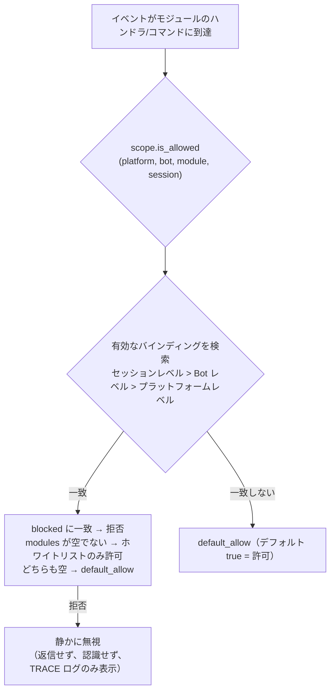

- **優先度の解析：セッションレベル > Bot レベル > プラットフォームレベル**、高優先度のバインディングは低優先度を**全体的に上書き**します
- **静かの意味**：フィルタリングされたモジュールのコマンドとハンドラはトリガーされず、返信も認識されません（コマンド間の誤一致を防ぐため）、
  TRACE レベルのログのみ表示（`core.scope.denied`）
- **フレームワークレベルのハンドラ**（`scope_exempt=True` または owner が空）は影響を受けません；モジュール名が空（フレームワーク層のリソース）は常に許可されます

## ② 身元次元（イベントの入力）

「誰のイベントを受信するか」を回答します。拒否されたイベントは**入力の分岐点で完全に破棄**されます——
ミドルウェアやすべてのハンドラ（フレームワークレベルを含む）には到達せず、TRACE レベルのログのみ表示（`core.scope.identity_denied`）されます。

- **優先度の解析：ユーザー > セッション > Bot > 適応器**、最も具体的に設定された戦略を採用します；deny は allow より優先されます
- 各レベルのバインディングは二元戦略：`{ allow = true }` または `{ deny = true }`
- ユーザー識別子は glob / 正規表現をサポート（例：`"spam_*"` で一括的にスパムユーザーをブロック）
- 一般的な用途——上位レベルで deny し、個別に allow して「例外の許可」を行う：

```toml
[ErisPulse.scope.identity.adapters.onebot11]
deny = true
[ErisPulse.scope.identity.users.onebot11]
allow = ["u_admin"]   # 適応器レベルで拒否しても、u_admin のイベントは許可されます
```

## ③ コマンド次元（コマンド ACL）

「誰が特定のコマンドを実行できるか」を回答します。判定順序：**deny に一致 → 拒否；allow ホワイトリストが空でないかつ一致しない → 拒否；いずれも設定されていない → `default_allow` に従う**（`true` は開発者のデフォルト権限チェーンに委ねる）。
拒否されたコマンドは「権限不足」の明示的な返信を返します。

- コマンド名は glob をサポート：`"roll*"` は `roll`、`roll_dice` などの一連のコマンドを1つのルールでカバー
- 精確なキーは glob キーに優先されます（`commands.roll` が一致した場合、`commands."roll*"` はチェックされません）
- ユーザー識別子のフォーマットは `"platform:user_id"`（フレームワークの所有者システムと一致）
- この次元は**ユーザー側の追加のゲート**であり、コマンドの `master` / `permission` パラメータと連動します：
  ACL が通過した後も、開発者が宣言したデフォルト権限チェーンを実行します（このデフォルトチェーンは ⑤ で上書き調整できます）

## ④ ハンドラ/テキスト次元

特定のモジュールで「どのようなテキストを処理するか」をフィルタリングします：モジュールに `pattern` / `regex` を設定した後、
そのモジュールのすべてのイベントハンドラはテキストが一致する場合にのみトリガーされます（コード内の条件と AND、両方を満たす必要があります）。
モジュールのコードを変更することなく、そのトリガー範囲を狭めることができます。

```toml
[ErisPulse.scope.handlers.ChatModule]
pattern = "闲聊*"     # ChatModule のハンドラは「闲聊*」で始まるメッセージにのみ反応
```

## ⑤ 実装パラメータの上書き

モジュール/コマンドの登録の**上層**で実装パラメータを上書きし、モジュールのコードを変更せずに：

```toml
[ErisPulse.scope.overrides.MyModule.restart]
master = true      # 既定の所有者制限を解除（false に設定して開放することも可能）
hidden = true      # ヘルプリストで非表示
aliases = ["rs"]   # 有効な別名
```

> 上書きは**ユーザー優先**に従います：開発者が宣言した `master` / `hidden` などの値はデフォルト値に過ぎず、
> ユーザーがここで明示的に設定した場合はユーザーの設定が優先されます（厳格化も開放も可能です）。
> 上書きは**実装パラメータ**（master / hidden / aliases / prefix / help / usage など）のみを変更します。
> **1つのコマンドを無効にする**ことはここでは行いません——統一してコマンド次元の deny（`scope.commands` または
> `scope.deny_user()`）で行い、2つの「無効」の意味が衝突しないようにします。

## ⑥ 出力アクション次元（モジュールの出力呼び出し禁止）

モジュールが**発行する出力アクション**を制約します：メッセージ送信 / 標準APIアクション / リクエスト操作。
3つのアクションはそれぞれの下層DSLに対応します：`Event.reply` と `Send`（send）、`Api` / `call_api`（api）、
`Request` の accept/reject（request）。イベントハンドラ実行中にモジュールが発行する出力呼び出しにはモジュールの所有者が含まれ、
この次元で一括判定されます。

```toml
[ErisPulse.scope.actions.MyModule]
send = false      # MyModule の返信/送信を禁止
api = false       # MyModule の標準APIアクションの呼び出しを禁止（call 逃げ口も含む）
request = false   # MyModule のリクエストイベントに対する accept/reject を禁止
```

判定の意味：**デフォルトはすべて許可**——未設定、または owner が空（フレームワーク層の内部呼び出し）はすべて許可；
ユーザーが明示的に `false` に設定した場合のみ拒否し、拒否された呼び出しはネットワークリクエストを開始せず、
代わりに標準の失敗応答（`retcode = 34601`、[api-response §5.3](../standards/api-response.md#53-フレームワーク拡張返却コード34xxx-プラットフォームエラー部の下3桁の独自定義) を参照）を返します。3つのアクションは互いに独立しており、1つだけ禁止することも可能です。

```python
# 実行時API
sdk.scope.set_action("MyModule", "send", False)   # メッセージ送信を禁止
sdk.scope.is_action_allowed("MyModule", "send")   # False
sdk.scope.unset_action("MyModule", "send")        # 許可を復元
sdk.scope.get_action_rules("MyModule")            # {"send": False, "api": True, "request": True}
```

## 実行時API

### モジュール次元

```python
from ErisPulse import sdk

# 判定
sdk.scope.is_allowed("onebot11", "123456", "Chat")
sdk.scope.is_allowed("onebot11", "123456", "Chat", "789012345")
sdk.scope.is_allowed("onebot11", "123456", None)      # フレームワーク層のリソース -> True

# バインディング / リリース
sdk.scope.bind_module("onebot11", "123456", modules=["Chat", "Tool*"])
sdk.scope.bind_module("onebot11", blocked=["Danger"])             # プラットフォームレベル
sdk.scope.bind_module("onebot11", "123456", "789012345", modules=["Chat"])  # セッションレベル
sdk.scope.bind_module("onebot11", "123456", modules=["Music"], merge=True)  # 合併
sdk.scope.bind_module("onebot11", "123456", modules=["Chat"], persist=False)  # 実行時のみ
sdk.scope.unbind_module("onebot11", "123456")

# 照会
sdk.scope.get("onebot11", "123456")   # {"modules": ["Chat"], "blocked": []}
```

### 身元次元

```python
# イベントの許可判定
sdk.scope.is_identity_allowed("onebot11", "123456", "group_9", "u1")

# 戦略のバインディング（階層はパラメータで決まる：user > session > bot > adapter）
sdk.scope.bind_identity("onebot11", user_id="u_bad", deny=True)
sdk.scope.bind_identity("onebot11", user_id="spam_*", deny=True)   # glob
sdk.scope.bind_identity("onebot11", "123456", "group_9", allow=True)
sdk.scope.unbind_identity("onebot11", user_id="u_bad")

# ユーザーブラックリストの便利なAPI
sdk.scope.block_user("onebot11", "u_bad")
sdk.scope.is_user_blocked("onebot11", "u_bad")
sdk.scope.get_blocked_users()        # {"onebot11": ["u_bad"]}
sdk.scope.unblock_user("onebot11", "u_bad")
```

### コマンド次元

```python
sdk.scope.is_command_allowed("roll", "onebot11", "u1")
sdk.scope.allow_user("roll*", "onebot11", "u_vip")   # コマンド名は glob をサポート
sdk.scope.deny_user("roll*", "onebot11", "u_bad")
sdk.scope.get_acl("roll*")
sdk.scope.remove_acl("roll*")

# コマンドシステムのファサード経由でも（同等の委任）
from ErisPulse.Core.Event import command
command.allow_user("restart", "onebot11", "123456")
```

### ハンドラとオーバーライド次元

```python
sdk.scope.bind_handler("MyModule", pattern="签到*", regex=r"\d+号")
sdk.scope.unbind_handler("MyModule")

sdk.scope.override("MyModule", "restart", master=True, hidden=True)
sdk.scope.get_override("MyModule", "restart")
sdk.scope.remove_override("MyModule", "restart")
```

### 一般

```python
sdk.scope.list_bindings()   # 全バインディング
sdk.scope.get_topology()    # トポロジー（ダッシュボード用）
sdk.scope.get_stats()
# {"module_calls": .., "module_filtered": .., "identity_checks": .., "identity_denied": ..,
#  "command_checks": .., "command_denied": .., "action_checks": .., "action_denied": ..,
#  "cache_hits": .., "cache_misses": ..}
sdk.scope.reset_stats()
sdk.scope.clear()           # 全バインディングをクリア（メモリ内のみ有効）
```

## 所有者とカスタム身元ソース（provider）

所有者システムは「誰がフレームワークの所有者か」を回答します：コマンドの `master=True` パラメータと業務層の
`master.is_master()` は同一の身元判定を使用し、判定チェーンは
**設定の所有者 → 実行時記録 → providerチェーン**です。

所有者設定（`ErisPulse.master.users`、グローバル list とプラットフォームごとの dict がサポート）は
[設定文書](../user-guide/configuration.md#所有者システムの設定)を参照してください；本節では身元判定APIと拡張ポイントに焦点を当てます。

### 判定と実行時の追加・削除

```python
from ErisPulse.Core import master

master.is_master(event)                      # イベントから判定
master.is_master("yunhu", "123")             # 明示的に判定
master.add("yunhu", "123")                   # 実行時に追加（デフォルトは永続化；persist=False はメモリ内のみ）
master.remove("yunhu", "123")                # 削除（デフォルトは永続化）
master.list()                                # 総合：{"global": [...], "<platform>": [...]}
```

### カスタム身元ソース（provider）

設定に加えて、カスタム身元ソースも登録できます：`fn(platform, user_id) -> bool`、
ビルトイン身元ソース（設定 + 実行時記録）が一致しない場合、順次試され、いずれかの provider が許可すれば所有者と判定されます。
適応器管理者インターフェース、データベースロールなどの外部身元体系に接続するのに適しています。

登録エントリ `master.provider` はデコレータ / 関数式の2種類の書き方ができ、
登録解除は登録された関数の `fn.unregister()` を通じて行います：

```python
from ErisPulse.Core import master

# 書き方1：デコレータ（常駐身元ソース、推奨）
@master.provider
def admin_provider(platform, user_id):
    return user_id in {"999"}     # 自作の判定ロジック

master.is_master("yunhu", "999")   # True
admin_provider.unregister()        # 不要になったら登録解除

# 書き方2：関数式（モジュールロード時に登録 / アンロード時に登録解除）
fn = master.provider(admin_provider)
fn.unregister()
```

> provider での例外はキャッチされ、判定チェーンをブロックしません。
> インスタンスメソッドを登録する場合は `unregister` が付与されないため、登録/解除のペアが必要な場合は**モジュールレベルの関数**を使用してください。

### ユーザー優先：所有者の適用範囲はユーザーが最終的に決定

コマンドの `master=True` は**開発者のデフォルト**に過ぎません：ユーザーは制御面
`ErisPulse.scope.overrides.<module>.<cmd>.master = true/false`
で絞り込みや解放を上書きできます（上記の ⑤ 実装パラメータの上書きを参照、ユーザーが明示的に設定すれば即座に有効）。

## キャッシュとホットアップデート

- `is_allowed` / `is_identity_allowed` の結果は **LRU キャッシュ**（`scope.cache_size` で調整可能）付きで、
  `bind_*` / `unbind_*` / 設定のホットアップデート（`config.updated` / `config.set`）で自動的に無効になります
- すべての次元の設定は**即座に有効**され、再起動は不要
- 制御面は「イベントごとに」判定されるため、イベント間で状態を保持しません：設定が変わると、次のイベントは新しいルールに従います

## 一般的な問題と注意事項

### 1. 設定の階層と上書き

- モジュール次元：セッションレベル > Bot レベル > プラットフォームレベル、**全体を上書き**します。例：プラットフォームで Chat を許可し、Bot で Music を追加したい場合、Bot レベルで両方をリストアップする必要があります
- 身元次元：ユーザー > セッション > Bot > 適応器、**最も具体的に設定された**戦略を採用します（例外の許可が可能です）
- コマンド次元：正確なコマンド名が glob キーに優先されます

### 2. モジュールコードの変更ではなく、制御面の使用を優先

モジュールで宣言したのは「開発者のデフォルト」（`master=True`、`permission=...`、`pattern=...`）；
制御面で宣言したのは「ユーザーの最終決定」。実装パラメータの上書きは**ユーザー優先**に従います：
ユーザーが明示的に `master = true/false` を設定すると即座に有効になります（絞り込みも解放も可能です）。
開発者が設定していない制限はユーザーが独自に絞り込むことができます。禁止/許可の制御はコマンド deny / 身元 allow で行います。

### 3. モジュール/コマンドが反応しない

まず制御面が原因かどうかを疑うべきです：

```python
from ErisPulse import sdk

print(sdk.scope.is_allowed(event.get_platform(), bot_id, "MyModule", session_id))
print(sdk.scope.is_identity_allowed(event.get_platform(), bot_id, session_id, user_id))
print(sdk.scope.get_stats())   # module_filtered / identity_denied > 0 なら静かにフィルタリングされている
```

フィルタリングは**静か**です（モジュール次元と身元次元は返信せず、誤ったコマンドの一致を防ぐため）、
ただし統計はカウントされます；コマンド次元で ACL に拒否された場合は「権限不足」の明示的な返信がされます。

### 4. セッション識別子はプラットフォームごとに隔離

`(platform, session_id)` の組み合わせが唯一の識別子です。`scope.sessions.onebot11."789"`
は onebot11 でのみ作用し、telegram 上で同様の `789` のセッションには影響しません。身元次元のユーザー識別子も同様です。

## トポロジツリーAPI

`ModuleManager.get_topology()` と `AdapterManager.get_topology()` はモジュール/適応器の所属関係データを提供し、
`sdk.get_topology()` は制御面の5次元を含む一括集約を提供します：

```python
from ErisPulse import sdk

topology = sdk.get_topology()
# {
#   "modules": {                                   # モジュール → 持つリソース
#     "Chat": {
#       "loaded": True, "enabled": True,
#       "commands": ["chat", "translate"],
#       "handlers": {"message": 2, "notice": 1},
#       "routes": {"http": ["/Chat/api"], "ws": [], "sse": []},
#       "lifecycle_hooks": 3,
#     }
#   },
#   "adapters": {                                  # 適応器 → Bot → スコープ
#     "onebot11": {
#       "status": "started", "enabled": True,
#       "bots": {"123456": {"status": "online", "scope": {...}}},
#       "scope": {"modules": [...], "blocked": [...]},
#     }
#   },
#   "scope": {                                     # 統一制御面（5次元）
#     "platforms": {...}, "bots": {...}, "sessions": {...},
#     "identity": {"adapters": {...}, "bots": {...}, "sessions": {...}, "users": {...}},
#     "commands": {...}, "handlers": {...}, "overrides": {...},
#   },
# }
```

- モジュールのトポロジーは、登録されたコマンド、イベントハンドラ、HTTP/WS/SSEルート、ライフサイクルフックを統合し、
  モジュールリソースツリーを描くのに便利です。
- 適応器のトポロジーは、各適応器のステータス、所属するBotのステータス、プラットフォームレベル/Botレベルのスコープバインディングを統合します。


### 启动流程与手动控制

# 起動プロセスと手動制御

ErisPulse の `await sdk.run()` / `await sdk.init()` は、一連の起動フローを「一行のコード」にカプセル化しています。しかし、部分的なロード、動的登録、ホットプラグ、カスタムロード戦略の注入など、完全にカスタマイズした起動フローが必要な場合は、このフローの内部で何が起こっているのか、そして各ステップを手動でどのように駆動するのかを理解する必要があります。

本文では、起動フローを独立したステップに分解し、それぞれの役割と呼び出し順序を説明し、手動で完全な起動を行うための例を示します。

> 本文は、[最初のロボット](../getting-started/first-bot.md)を実行し、`sdk.run(keep_running=True/False)` の2つのモードを理解していることを前提としています。本文では、`init()` **内部**のフローの分解、および `init()` / `init_task()` / `init_sync()` などのより低レベルのエントリポイントに焦点を当てます。

## SDK トップレベルエントリポイント一覧

`run()` の2つの `keep_running` モードに加えて、SDK はいくつかのより低レベルな初期化エントリポイントを提供します。これらは**非同期性、戻り値、および例外のラッピング方法**の点で異なります：

| エントリポイント | 非同期性 | 戻り値 | 例外処理 | 適用場面 |
|------|--------|--------|----------|----------|
| `await sdk.run(True)` | 非同期、イベントループを維持する | `None`（終了時に自動 `uninit`） | モジュール/アダプタのエラーは捕捉され、プロセスを停止しない | ロボットアプリケーション |
| `await sdk.run(False)` | 非同期、イベントループを維持しない | `None`（自動アンロードしない） | 同上 | 初期化後にカスタムロジックを実行する |
| `await sdk.init()` | 非同期、`await` が必要 | `bool` | コンポーネントの例外を内部で捕捉し、失敗時は `False` を返す | 手動でライフサイクルを制御する（`uninit()` と併用） |
| `sdk.init_task()` | 非同期、`Task` を返す、イベントループを維持しない | `asyncio.Task` | `init()` と同じ | 別の初期化を並行実行する、またはイベントループが起動していない場合 |
| `sdk.init_sync()` | **同期**、現在のスレッドをブロックする | `bool` | `init()` と同じ | コマンドラインスクリプト、イベントループのない同期エントリポイント |

> **よくある誤解**：`await sdk.init()` は `await sdk.run(keep_running=False)` と**等価ではありません**。2つの違いがあります：① `init()` は `bool` を返します（失敗時は `False`）、`run()` は `None` を返します；② `init()` は初期化のみを行い、**自動アンロードはしません**、`run()` はイベントループが終了したときに自動的に `uninit()` を実行します。したがって、手動でアンロードやカスタムライフサイクルを管理する必要がある場合は、`init()` + `uninit()` を使用します。

## 起動フローの概要

`sdk.init()`（正確にはその内部の `Initializer.init()`）は、以下の順序でフレームワーク全体を起動します：

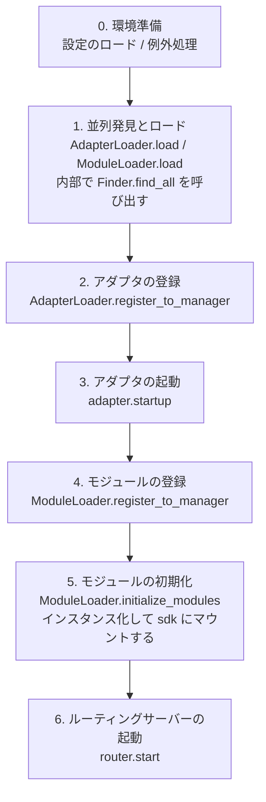

対応する主要コンポーネント：

| 層 | コンポーネント | 役割 |
|----|------|------|
| 発見 | `AdapterFinder` / `ModuleFinder` | エントリポイントからアダプタ/モジュールを**発見**する |
| ロード | `AdapterLoader` / `ModuleLoader` | 発見 + インポート + メタデータの読み取り + 有効/無効の判断、オブジェクトリストを返す |
| 登録 | `*Loader.register_to_manager` | オブジェクトを対応するマネージャーに登録する |
| 管理 | `sdk.adapter` / `sdk.module` | アダプタ/モジュールのインスタンスを維持し、起動/停止のインターフェースを提供する |
| 初期化 | `ModuleLoader.initialize_modules` | モジュールのインスタンスを作成し `sdk` にマウントする（依存関係のトポロジカルソートを処理する） |
| ルーティング | `sdk.router` | HTTP / WebSocket サーバー |

> **重要**：`Finder` と `Loader` は2つの層です。`Loader` は内部で `Finder` を保持しています（`AdapterLoader` は `AdapterFinder` を持つ、`ModuleLoader` は `ModuleFinder` を持つ）。ほとんどの場合、`Loader` を使用するだけで十分です。`Finder` を個別に使うのは、"ロードせずにリストアップする"必要がある場合に限られます。

## 各ステップの詳細

### 1. 発見層: Finder

Finder は、アダプタ/モジュールを**見つける**だけを担当し、インポートやインスタンス化は行いません。

```python
from ErisPulse.finders import AdapterFinder, ModuleFinder

adapter_finder = AdapterFinder()
module_finder = ModuleFinder()

# すべてのインストール済みアダプタ/モジュールのエントリポイントを検索
adapter_entries = adapter_finder.find_all()    # list[EntryPoint]
module_entries = module_finder.find_all()      # list[EntryPoint]

# 名称で検索
entry = module_finder.find_by_name("MyModule")  # EntryPoint | None
```

各 `EntryPoint` は `.load()` を呼び出すことで対応するクラスを得られますが、通常は手動で呼び出す必要はありません。`Loader` が処理します。

### 2. ロード層: Loader

Loader は Finder の上に「インポート + メタデータの読み取り + 有効/無効の判断」を行います。

```python
from ErisPulse.loaders import AdapterLoader, ModuleLoader
from ErisPulse import sdk

adapter_loader = AdapterLoader()
module_loader = ModuleLoader()

# load() 内部：finder.find_all() を呼び出す → 各エントリポイントを順次処理 → 三つ組を返す
adapter_objs, enabled_adapters, disabled_adapters = await adapter_loader.load(sdk.adapter)
module_objs, enabled_modules, disabled_modules = await module_loader.load(sdk.module)
```

`load()` が返す三つ組：

| 戻り値 | 意味 |
|--------|------|
| `objs` (`dict`) | 名称 → オブジェクト（アダプタクラス / モジュールラッパー） |
| `enabled` (`list[str]`) | 有効化された名称（設定で無効化されていない） |
| `disabled` (`list[str]`) | 無効化された名称 |

#### ロード失敗時の診断情報

モジュール/アダプタがロードまたは初期化の段階で例外を投げた場合、フレームワークはそのコンポーネントをスキップして他のコンポーネントのロードを継続し、**ユーザーのコードフレームのサマリー**を出力します。これにより、デフォルトの INFO レベルでもエラー箇所を特定でき、手動で DEBUG モードを有効化する必要がありません。

```
[ERROR] [ModuleLoader] entry-point からモジュール MyModule のロードに失敗しました。スキップしました: 'NoneType' object has no attribute 'platform'
  → MyModule/Core.py:42 in on_load
      adapter = sdk.platform
  → AttributeError: 'NoneType' object has no attribute 'platform'
  → ヒント: ログレベルを DEBUG に上げると完全なスタックトレースが表示されます。モジュール MyModule の実装コードを確認してください。
```

診断情報は `ErisPulse.runtime.diagnostics` モジュールによって生成され、フレームワークの内部フレームは自動的にフィルタリングされ、ユーザーのコードフレームのみが残ります。カスタムロードロジックで再利用する場合は：

```python
from ErisPulse.runtime import log_diagnostic

try:
    risky_init()
except Exception as e:
    log_diagnostic(e)  # 自動的にユーザーのコードフレームを抽出して ERROR ログに書き込む
```

このモジュールには、`extract_user_frame()`（構造化されたフレーム情報を返す）と `format_diagnostic_block()`（複数行のテキストを返す）という2つの低レベル関数も提供されています。

### 3. 登録層: register_to_manager

Loader が出力したオブジェクトをマネージャーに登録し、`sdk.adapter` / `sdk.module` がそれらを認識できるようにします。

```python
# アダプタの登録（すべて成功した場合は True を返す）
await adapter_loader.register_to_manager(enabled_adapters, adapter_objs, sdk.adapter)

# モジュールの登録
await module_loader.register_to_manager(enabled_modules, module_objs, sdk.module)
```

登録後、アダプタはアダプタマネージャーに登録され、モジュールはモジュールマネージャーに登録されますが、**まだ起動/インスタンス化されていません**。

### 4. アダプタの起動

```python
# すべての登録済みアダプタを起動する
await sdk.adapter.startup()
# または特定のプラットフォームを指定
await sdk.adapter.startup("yunhu")
await sdk.adapter.startup(["yunhu", "telegram"])
```

> 登録 ≠ 起動。`register_to_manager` は登録のみです。`startup` はアダプタの `start()` を呼び出し、プラットフォームとの接続を確立します。

### 5. モジュールの初期化

モジュールはアダプタに比べて1段階多く、**インスタンス化**して `sdk` にマウントする必要があります（これにより `sdk.MyModule.xxx` で呼び出せるようになります）。この段階では、モジュール間の依存関係の宣言とトポロジカルソートも処理されます。

```python
success = await module_loader.initialize_modules(
    enabled_modules, module_objs, sdk.module, sdk
)
```

インスタンス化が成功すると、モジュールは `sdk.<ModuleName>` に表示されます。

### 6. ルーティングサーバーの起動

```python
await sdk.router.start(
    host="0.0.0.0",
    port=8000,
    ssl_certfile=None,
    ssl_keyfile=None,
)
```

ルーティングサーバーは、アダプタからの Webhook / WebSocket コールバックを受信する責任があります。起動しないと、サーバーモードのアダプタはメッセージを受信できません。

## 完全な手動起動の例

以下のコードは、`await sdk.init()` のコアフローと**等価**ですが、各ステップを明示的に制御できるため、任意の段階でカスタムロジックを挿入できます：

```python
import asyncio
from ErisPulse import sdk
from ErisPulse.loaders import AdapterLoader, ModuleLoader

async def manual_startup():
    # 0. 環境準備（設定のロード、グローバル例外処理の登録）
    #    _prepare_environment は init() 内部の前置ステップです。手動フローでも事前に呼び出す必要があります。
    #    そうでなければ Loader が設定を読み取れず、すべてのアダプタ/モジュールを誤って無効化してしまいます。
    if not await sdk._prepare_environment():
        print("環境準備に失敗しました")
        return False

    # 1. ローダーの作成（それぞれ内部で Finder を保持しています）
    adapter_loader = AdapterLoader()
    module_loader = ModuleLoader()

    # 2. 並列発見とロード（init() 内部と同じ gather を使用）
    (adapter_objs, enabled_adapters, disabled_adapters), \
    (module_objs, enabled_modules, disabled_modules) = await asyncio.gather(
        adapter_loader.load(sdk.adapter),
        module_loader.load(sdk.module),
    )

    # 3. アダプタの登録
    await adapter_loader.register_to_manager(
        enabled_adapters, adapter_objs, sdk.adapter
    )

    # 4. アダプタの起動
    if enabled_adapters:
        await sdk.adapter.startup()

    # 5. モジュールの登録
    await module_loader.register_to_manager(
        enabled_modules, module_objs, sdk.module
    )

    # 6. モジュールの初期化（インスタンス化 + sdk にマウント）
    if enabled_modules:
        await module_loader.initialize_modules(
            enabled_modules, module_objs, sdk.module, sdk
        )

    # 7. ルーティングサーバーの起動
    await sdk.router.start(host="0.0.0.0", port=8000)

    print("手動起動完了")
    return True

async def main():
    ok = await manual_startup()
    if ok:
        # 非同期イベントループを維持する（手動フローでは自動的に維持されません）
        await asyncio.Event().wait()

if __name__ == "__main__":
    asyncio.run(main())
```

### 手動起動が必要な場合

ほとんどの場合、**手動起動は不要**です。`await sdk.run()` がすべての処理を完了します。手動起動は、以下のケースでのみ価値があります：

- **部分的なロード**：指定されたアダプタ/モジュールのみをロードし、他の部分をスキップする
- **動的登録**：条件に応じて実行時に新しいアダプタ/モジュールを登録する
- **カスタム順序**：デフォルトのロード順序を変更する必要がある（例：アダプタの起動前に特定のモジュールを起動する）
- **戦略の注入**：Loader にカスタムの厳格モードマネージャーやロード戦略を注入する
- **デバッグ/診断**：特定の段階で失敗した場合、手動で駆動して問題を特定する

## 実行時の細粒度制御

`sdk.run()` で起動した後でも、各サブシステムを個別に制御して、SDK 全体を再起動する必要はありません。

### アダプタのホット起動/停止

```python
# 特定のアダプタをホットリスタート（接続を修復し、他のプラットフォームには影響しない）
await sdk.adapter.shutdown("yunhu")
await sdk.adapter.startup("yunhu")

# 実行中に新しいプラットフォームを起動する
await sdk.adapter.startup("telegram")

# 一時的に特定のプラットフォームをオフラインにする
await sdk.adapter.shutdown("telegram")
```

> `adapter.startup()` はアダプタが**マネージャーに登録されている**ことを要求します。登録は `init()` / `run()` 内部で行われるため、これは起動**後の**細粒度制御です。

### ルーティングサーバー

```python
# 一時的に Webhook サーバーをオフラインにする
await sdk.router.stop()

# 再度起動する（例：ポートを変更する場合）
await sdk.router.start(host="0.0.0.0", port=9000)
```

### モジュールのオンデマンドロード

```python
# 手動でロードする（おそらく遅延ロードされた）モジュール
await sdk.load_module("MyModule")
```

## エレガントな終了

2.7.0 以降、`sdk.shutdown()` は**プログラム的なエレガントな終了**を提供します：終了イベントを設定し、`await sdk.run(keep_running=True)` で待機しているメインループが戻り、`uninit()` をトリガーしてリソースのクリーンアップを完了します。

```python
# 任意のコルーチンで呼び出すことで、エレガントな終了をトリガー（run() は待機を解除し、自動的に uninit() を実行）
sdk.shutdown()
```

典型的な用途：

```python
async def shutdown_after_idle():
    await asyncio.sleep(3600)
    sdk.shutdown()  # 空き1時間後にエレガントに終了
```

**シグナル処理**：`run()` 内部では `SIGTERM` / `SIGHUP` ハンドラが登録され、システムシグナルをエレガントな終了に変換します。コンテナ編成（Docker `docker stop`）や `systemd` でサービスを停止する場合、プロセスは強制終了ではなく `uninit()` のクリーンアップを完了します。

- Windows では `loop.add_signal_handler` がサポートされていないため、シグナルハンドラは自動的にスキップされます（`sdk.shutdown()` や Ctrl+C で終了をトリガーできます）
- `sdk.shutdown()` を繰り返し呼び出しても安全です（イベントが設定された後は無操作になります）

## アンロードフロー

起動の逆操作は `await sdk.uninit()` で、逆順にクリーンアップします：

1. すべてのアダプタを閉じる（`adapter.shutdown()`）
2. すべてのモジュールをアンロードする
3. すべてのイベントハンドラをクリーンアップする
4. マネージャーと SDK 上のモジュール属性をクリーンアップする

手動起動の場合は、終了前に `uninit()` を呼び出すことを忘れないでください：

```python
try:
    await asyncio.Event().wait()   # 実行を維持
finally:
    await sdk.uninit()
```

## リスタート

SDK は2種類のリスタート方法を提供します。いずれも、自分でアンロードする必要はありません。フレームワークが自動的に処理します：

| 方法 | 呼び出し | 行動 | 適用場面 |
|------|------|------|----------|
| ホットリスタート | `await sdk.restart()` | 同一プロセス内で `uninit()` した後、再び `init()` してアダプタ/モジュールを再ロードする | 設定の再ロード、モジュールのホットアップデート |
| ハードリスタート | `await sdk.hard_restart()` | `uninit()` した後、**終了コード 42** でプロセスを終了し、外部監督者が新しいプロセスを起動する | メモリ/リソースリークが疑われる、完全にクリーンなリスタートが必要な場合 |

```python
# ホットリスタート：同一プロセス内で再ロード（最も一般的）
await sdk.restart()

# ハードリスタート：プロセスを終了し、外部監督者が再起動する（下記「監督者ガイド」参照）
await sdk.hard_restart()
```

> **2点注意**：
> 1. これらのメソッドはバックグラウンドタスクでリスタートを実行するため、**即座に `True` を返す**（リスタートが完了したことを意味するのではなく）。「リスタートタスクがスケジュールされた」ことを示します。実際のリスタートはバックグラウンドで行われ、現在のイベントフローを中断することはありません。
> 2. `hard_restart()` の仕組みは、`uninit()` して設定を保存した後、**終了コード 42**（`HARD_RESTART_EXIT_CODE`）でプロセスを終了することです。**自身で新しいプロセスを起動するわけではなく**、外部監督者が終了コード 42 を検知して再起動する必要があります。`python main.py` で直接実行し、監督者が存在しない場合、終了コード 42 で終了した後、**自動的に再起動しません**（フレームワークは「監督者が検出されない」と警告を出します）。

### ハードリスタートが必要な場合

ハードリスタートは単に「より徹底的なリスタート」ではなく、以下の場面でより適切で、場合によってはより効率的です：

- **バイナリライブラリ（C拡張）の副作用**：ホットリスタートは同一プロセス内で行われるため、C拡張、開かれたファイルディスクリプター、スレッドなどのプロセスレベルのリソースを解放できません。ハードリスタートは新しいプロセスを起動するため、これらの副作用は完全にクリアされます。
- **リソースリークの調査**：メモリやハンドルのリークが疑われる場合、ハードリスタートでクリーンな環境を得られます。
- **頻繁なリスタートに敏感な場合**：ハードリスタートは同一プロセス内のアンロード→再ロードのオーバーヘッドを省くため、ホットリスタートよりも実際には効率的です。

> ダッシュボード管理パネルの「フレームワークリスタート」機能は、下層で `hard_restart()` を呼び出します。

### 終了コード 42 の契約

ハードリスタートはプロセス間の協調です：**SDK が終了（コード 42）し、監督者が再起動する**。

| 役割 | 行動 |
|------|------|
| SDK（ハードリスタートされるとき） | `uninit()` → 設定を保存 → `os._exit(42)` |
| 監督者 | 子プロセスの終了コードが 42 かを検出 → 同じコマンドで再起動する |

> `sdk.is_supervised()` は、現在のプロセスが監督者によって起動されたかどうかを確認できます（環境変数 `ERISPULSE_SUPERVISED` をチェック）。CLI `run` コマンドで起動する場合は、このマーカーが自動的に注入されます。systemd / Docker などの外部監督者は注入しないため、`is_supervised()` は `False` を返します。この場合、ハードリスタート後に「監督者が検出されない」と警告が表示されます。

### 監督者ガイド

適切な監督者を選んで、ハードリスタートを有効にします。

#### 1. CLI run コマンド（開発/簡単なデプロイ、推奨）

`epsdk run main.py` には、監督ループが内蔵されています：子プロセスの終了コードを検出し、42 の場合はすぐに再起動します。他の異常終了コードは指数バックオフで自動的に再試行します。`Ctrl+C` は、まず子プロセスをエレガントに終了します（コード 0 は正常終了と見なされ、再起動されません）。

```bash
epsdk run main.py
```

#### 2. systemd（Linux サーバー）

`RestartForceExitStatus=42` を設定して、終了コード 42 も再起動をトリガーします（デフォルトの `on-failure` は非ゼロコードのみ有効）：

```ini
[Service]
ExecStart=/usr/bin/python3 /opt/mybot/main.py
Restart=on-failure
RestartForceExitStatus=42
RestartSec=2
User=mybot
```

#### 3. Docker / docker-compose

コンテナ内の PID 1 はアプリケーションプロセスです。終了コード 42 でコンテナが終了します → `restart` ポリシーで自動的に再起動させます：

```yaml
services:
  bot:
    build: .
    restart: unless-stopped   # 42 を含むすべての終了コードで再起動
```

#### 4. PM2（Node 生態系の運用）

```bash
pm2 start main.py --name mybot --interpreter python3
# 42 は終了コードと見なされ、PM2 はデフォルトで再起動します。再起動間隔を設定して防ぐ
pm2 set mybot.restart_delay 2000
```

#### 5. supervisord

```ini
[program:mybot]
command=python3 /opt/mybot/main.py
autorestart=true
exitcodes=0,2,42    # 42 も「正常終了」で再起動する
```

#### 6. 純粋な Python 自作監督者

```python
import subprocess, sys, time

while True:
    p = subprocess.Popen([sys.executable, "main.py"])
    code = p.wait()
    if code == 42:          # ハードリスタート要求
        time.sleep(0.5)
        continue
    if code == 0:           # 正常終了
        break
    time.sleep(3)           # 異常終了、指数バックオフで再試行
```

> **監督者がいない場合の動作**：`python main.py` で直接実行し、`hard_restart()` を呼び出した場合、プロセスは終了コード 42 で終了し、再起動されません。この場合は、上記のいずれかの監督者を接続する必要があります。


====
技术标准
====


### 会话类型标准

# ErisPulse セッション型標準

このドキュメントでは、ErisPulse がサポートするセッション型標準を定義しています。これには、受信イベント型と送信ターゲット型が含まれます。

## 1. 核心概念

### 1.1 受信タイプ && 送信タイプ

ErisPulse は、2 種類の会話タイプを区別します：

- **受信タイプ（Receive Type）**：受信イベントの `detail_type` フィールド
- **送信タイプ（Send Type）**：送信時に `Send.To()` メソッドの対象となるタイプ

### 1.2 タイプのマッピング

```
受信タイプ (detail_type)     送信タイプ (Send.To)
─────────────────        ────────────────
private                 →        user
group                   →        group
channel                 →        channel
guild                   →        guild
thread                  →        thread
user                    →        user
```

**重要な点**：
- `private` は受信時のタイプであり、送信時には `user` を使用する必要があります
- `group`、`channel`、`guild`、`thread` は受信時と送信時のタイプが同じです
- システムは自動的にタイプ変換を行います。手動での処理は不要です（つまり、取得した受信タイプをそのまま送信に使用できます）。実際には、これらの変換を意識する必要はありません。Eventのラッパークラスが存在するため、`event.reply()` メソッドを使用するだけで、タイプ変換を気にする必要がありません。

## 2. 標準会話タイプ

### 2.1 OneBot12 標準タイプ

#### private
- **受信タイプ**：`private`
- **送信タイプ**：`user`
- **説明**：1対1のプライベートチャットメッセージ
- **IDフィールド**：`user_id`
- **対応プラットフォーム**：プライベートチャットをサポートするすべてのプラットフォーム

#### group
- **受信タイプ**：`group`
- **送信タイプ**：`group`
- **説明**：グループチャットメッセージ、Telegram supergroup を含む様々な形式のグループ
- **IDフィールド**：`group_id`
- **対応プラットフォーム**：グループチャットをサポートするすべてのプラットフォーム

#### user
- **受信タイプ**：`user`
- **送信タイプ**：`user`
- **説明**：ユーザー型、一部のプラットフォーム（例：Telegram）ではプライベートチャットを `user` として表現
- **IDフィールド**：`user_id`
- **対応プラットフォーム**：Telegram など

### 2.2 ErisPulse 拡張タイプ

#### channel
- **受信タイプ**：`channel`
- **送信タイプ**：`channel`
- **説明**：チャンネルメッセージ、複数ユーザーへのブロードキャストメッセージをサポート
- **IDフィールド**：`channel_id`
- **対応プラットフォーム**：Discord, Telegram, Line など

#### guild
- **受信タイプ**：`guild`
- **送信タイプ**：`guild`
- **説明**：サーバー/コミュニティメッセージ、通常は Discord Guild 級のイベントに使用
- **IDフィールド**：`guild_id`
- **対応プラットフォーム**：Discord など

#### thread
- **受信タイプ**：`thread`
- **送信タイプ**：`thread`
- **説明**：トピック/サブチャンネルメッセージ、コミュニティ内のサブディスカッションエリアに使用
- **IDフィールド**：`thread_id`
- **対応プラットフォーム**：Discord Threads, Telegram Topics など

## 3. プラットフォーム型のマッピング

### 3.1 マッピングの原則

アダプターは、プラットフォームのネイティブ型を ErisPulse の標準型にマッピングします：

```
プラットフォームネイティブ型 → ErisPulse標準型 → 送信型
```

### 3.2 一般的なプラットフォームのマッピング例

#### Telegram
```
Telegram型              ErisPulse受信型      送信型
─────────────────      ────────────────     ───────────
private                private               user
group                  group                 group
supergroup             group                 group  # groupにマッピング
channel                channel               channel
```

#### Discord
```
Discord型              ErisPulse受信型      送信型
─────────────────      ────────────────     ───────────
Direct Message         private               user
Text Channel           channel               channel
Guild                  guild                 guild
Thread                 thread                thread
```

#### OneBot11
```
OneBot11型             ErisPulse受信型      送信型
─────────────────      ────────────────     ───────────
private                private               user
group                  group                 group
discuss                group                 group  # groupにマッピング
```

## 4. 自定义型の拡張

### 4.1 自定义型の登録

アダプタは、独自の会話型を登録することができます。

```python
from ErisPulse.Core.Event import register_custom_type

# 自定义型の登録
register_custom_type(
    receive_type="my_custom_type",
    send_type="custom",
    id_field="custom_id",
    platform="MyPlatform"
)
```

### 4.2 自定义型の使用

登録後、システムは自動的にその型の変換と推論を処理します。

```python
# 自動推論
receive_type = infer_receive_type(event, platform="MyPlatform")
# 戻り値: "my_custom_type"

# 送信型への変換
send_type = convert_to_send_type(receive_type, platform="MyPlatform")
# 戻り値: "custom"

# 対応するIDの取得
target_id = get_target_id(event, platform="MyPlatform")
# 戻り値: event["custom_id"]
```

### 4.3 自定义型の解除登録

```python
from ErisPulse.Core.Event import unregister_custom_type

unregister_custom_type("my_custom_type", platform="MyPlatform")
```

## 5. 自動型推論

イベントに明確な `detail_type` フィールドがない場合、システムは存在する ID フィールドに基づいて型を自動的に推論します。

> [!NOTE]
> **2.7.0+ の動作変更**：`detail_type` は**既知の会話型**（標準またはカスタム）である場合のみ、そのまま採用されます。notice/request イベントの `detail_type`（例：`group_member_increase`、`friend_increase`）は**意味論的サブタイプ**であり、会話型ではなく、ID フィールドに基づいて正しい会話型を推論します。

### 5.1 推論優先度

```
優先度（高 → 低）：
1. group_id     → group
2. channel_id   → channel
3. guild_id     → guild
4. thread_id    → thread
5. user_id      → private
```

### 5.2 使用例

```python
# イベントに group_id だけがある
event = {"group_id": "123", "user_id": "456"}
receive_type = infer_receive_type(event)
# 戻り値: "group"（group_id を優先使用）

# イベントに user_id だけがある
event = {"user_id": "123"}
receive_type = infer_receive_type(event)
# 戻り値: "private"

# notice イベントの detail_type は意味論的サブタイプで、2.7.0+ では ID フィールドから推論される
event = {"type": "notice", "detail_type": "group_member_increase", "group_id": "123"}
receive_type = infer_receive_type(event)
# 戻り値: "group"（"group_member_increase" ではなく）
```

## 6. API 使用例

### 6.1 メッセージ送信

```python
from ErisPulse import adapter

# ユーザーに送信
await adapter.myplatform.Send.To("user", "123").Text("Hello")

# グループに送信
await adapter.myplatform.Send.To("group", "456").Text("Hello")

# 自動変換 private → user（推奨されない、互換性の問題がある可能性がある）
await adapter.myplatform.Send.To("private", "789").Text("Hello")
# 内部で自動変換される: Send.To("user", "789") # 直接 user を会話タイプとして使用するのがより良い選択です
```

### 6.2 イベントの返信

```python
from ErisPulse.Core.Event import Event

# Event.reply() は自動的に型変換を処理
await event.reply("返信内容")
# 内部で正しい送信タイプが自動的に使用される
```

### 6.3 コマンド処理

```python
from ErisPulse.Core.Event import command

@command(name="test")
async def handle_test(event):
    # システムが自動的に会話タイプを処理
    # group_id か user_id を手動で判断する必要はない
    await event.reply("コマンドが正常に実行されました")
```

## 7. コア API リファレンス

### 7.1 タイプ変換

```python
from ErisPulse.Core.Event import convert_to_send_type, convert_to_receive_type

# 受信タイプ → 送信タイプ
convert_to_send_type("private")  # → "user"
convert_to_send_type("group")    # → "group"

# 送信タイプ → 受信タイプ
convert_to_receive_type("user")   # → "private"
convert_to_receive_type("group")  # → "group"
```

### 7.2 ID フィールドの取得

```python
from ErisPulse.Core.Event import get_id_field, get_receive_type

get_id_field("group")    # → "group_id"
get_id_field("private")  # → "user_id"

get_receive_type("group_id")  # → "group"
get_receive_type("user_id")   # → "private"
```

### 7.3 送信情報の取得

```python
from ErisPulse.Core.Event import get_send_type_and_target_id

event = {"detail_type": "private", "user_id": "123"}
send_type, target_id = get_send_type_and_target_id(event)
# send_type = "user", target_id = "123"

# Send.To() に直接使用
await adapter.Send.To(send_type, target_id).Text("Hello")
```

### 7.4 目標 ID の取得

```python
from ErisPulse.Core.Event import get_target_id

event = {"detail_type": "group", "group_id": "456"}
get_target_id(event)  # → "456"
```

## 8. ユーティリティメソッド

```python
from ErisPulse.Core.Event import (
    is_standard_type,
    is_valid_send_type,
    get_standard_types,
    get_send_types,
    clear_custom_types,
)

is_standard_type("private")     # True
is_standard_type("custom_type") # False

is_valid_send_type("user")      # True
is_valid_send_type("invalid")   # False

get_standard_types()  # {"private", "group", "channel", "guild", "thread", "user"}
get_send_types()      # {"user", "group", "channel", "guild", "thread"}

clear_custom_types()                # 全てのカスタムタイプをクリア
clear_custom_types(platform="discord")  # 指定されたプラットフォームのカスタムタイプのみをクリア
```

## 9. 最適実践

### 7.1 アダプタ開発者

1. **標準マッピングの使用**：可能な限り、新規型を作成するのではなく、標準型にマッピングする
2. **正しい変換**：受信型と送信型のマッピング関係を正しく保つ
3. **元データの保持**：`{platform}_raw` に元のイベント型を保持する
4. **ドキュメントの説明**：アダプタのドキュメントで型のマッピング関係を説明する

### 7.2 モジュール開発者

1. **ツールメソッドの使用**：`get_send_type_and_target_id()` などのツールメソッドを使用する
2. **ハードコーディングの回避**：`if group_id else "private"` のようなコードを書かない
3. **すべての型を考慮する**：コードは `private` および `group` のみではなく、すべての標準型をサポートする
4. **柔軟な設計**：直接フィールドにアクセスするのではなく、イベントラッパーのメソッドを使用する

### 7.3 型推論

- **`detail_type` の優先使用**：明確なフィールドがある場合は、推論を行わない
- **推論の適切な使用**：明確な型がない場合にのみ使用する
- **優先順位の注意**：推論の優先順位を理解し、意図しない結果を避ける

## 10.よくある質問

### Q1: なぜ送信時に private を user に変換する必要があるのですか？

A: これは OneBot12 標準の要件です。`private` は受信時の概念であり、送信時には `user` を使用することで意味がより明確になります。

### Q2: 新しい会話タイプをどのようにサポートしますか？

A: `register_custom_type()` を使用してカスタムタイプを登録するか、標準タイプの `channel`、`guild` を直接使用します。

### Q3: イベントに detail_type がない場合はどうすればよいですか？

A: システムは存在する ID フィールドに基づいて自動的に推論します。優先順位は以下の通りです：group > channel > guild > thread > user。

### Q4: どのようにアダプターが Telegram supergroup をマッピングしますか？

A: アダプターの変換ロジックの中で、`supergroup` を標準の `group` タイプにマッピングします。

### Q5: 電子メールなどの特殊なプラットフォームはどのように扱いますか？

A: 一般的でない、またはプラットフォーム固有のタイプについては、`{platform}_raw` と `{platform}_raw_type` を使用して元のデータを保持し、アダプターが独自に処理します。

## 11. 関連ドキュメント

- [イベント変換標準](event-conversion.md) - イベント変換の完全な仕様
- [送信メソッド仕様](send-method-spec.md) - Send クラスのメソッド命名とパラメータの仕様
- [アダプタ開発ガイド](../developer-guide/adapters/) - アダプタ開発の完全なガイド


====
生态模块
====


### ErisPulse-App 安装与使用

# ErisPulse-App

[ErisPulse-App](https://github.com/ErisPulse/ErisPulse-App) は ErisDev が直接運用している **公式マルチプラットフォームクライアント**（Android / Windows / Linux / macOS の各プラットフォームでリリース済み）で、
完全にネイティブなグラフィカル管理インターフェースを提供します。スマートフォンやコンピュータ上で複数のボットインスタンスの作成、実行、管理が可能です。
端末（ターミナル）を開く必要もなく、Python 環境を別途インストールする必要もありません。

> [!IMPORTANT]
> ErisPulse-App は**スタンドアロンのインストール型クライアントプログラム**であり、`epsdk install` でインストールされるモジュールではありません。
> Python ランタイムと ErisPulse SDK を内部に搭載しているため、インストールしてすぐに利用可能です——**スマートフォンでも直接実行できます**。


## 機能概要

- **マルチインスタンス管理**: インスタンスの作成 / 起動 / 停止 / 削除。ポートとアクセストークンが自動的に割り当てられます。新規環境または既存環境のクローンに対応しています。
- **ダッシュボード**: アダプタ / モジュール / オンラインボット / イベント総数の統計、CPU / メモリ使用率のアラート（色の変化）。
- **モジュールストア**: 検索・タグによるフィルタリング、ワンクリックでのインストール / アップグレード / アンインストール、特定バージョンのインストール、pipミラーソースと Git パッケージのサポート。
- **イベントストリーム + イベントビルダー**: リアルタイムでのイベント確認、テストイベントの視覚的な構築とアダプタへの送信。
- **監視**: ログ / ライフサイクル / 監査の統合ビュー。
- **コマンド管理**: プリフィックス・エイリアスなどの全体的な設定、開始・停止、プラットフォームのホワイトリスト・ブラックリスト。
- **ボット概要 / 設定 / ファイル管理**: 原生インターフェースによるインスタンス直接操作。
- **常駐バックグラウンド**: Android フロントグラウンドサービスによるプロセス維持；Windows はシステムトレイへ最小化し、ウィンドウを閉じてもインスタンスを中断しません。
- **モジュール動的ウィンドウ**: モジュールが登録されたページがサイドナビゲーション（ダッシュボードと同じグループ）に自動的に表示されます。クリックで直接移動できます。

## 対応プラットフォーム

すべてのプラットフォームのインストーラーは、[GitHub Releases](https://github.com/ErisPulse/ErisPulse-App/releases) からダウンロードできます。必要なものを選択してください。

| プラットフォーム | インストーラー | 説明 |
|------|--------|------|
| Android | `online-*.apk` / `offline-*.apk` | **スマートフォンで直接実行**、PCは不要です |
| Windows | `windows-x64-setup.exe` / `windows-x64.zip` | インストーラー版 / 解凍のみ版 |
| Linux | `linux-x64.tar.gz` | 解凍して使用 |
| macOS | `macos-arm64.zip` | Apple Silicon（arm64） |

Flutter による単一のコードベースで、すべてのプラットフォームをカバーしています。

---

## インストール方法（Android / スマートフォン直接実行）

[GitHub Releases](https://github.com/ErisPulse/ErisPulse-App/releases) から APK をダウンロードしてインストールするだけです。2つのビルドがあります。

| ビルド | ランタイムイメージ | 適用シーン |
|------|-----------------|---------|
| `erispulse-app-online-*.apk` | 起動時にダウンロード | インストールパッケージが小さく、ネットワーク環境が良い場合に適しています |
| `erispulse-app-offline-*.apk` | APK に同梱 | オフラインで自己完結しており、インストール後にネットワーク接続不要 |

2つのビルドともインストール手順は同じです。

1. APK をダウンロードしてインストールします。起動時に通知権限を許可してください（バックグラウンドサービスを維持するために使用します）
2. ホーム画面に初期化バナーが表示されたら、実行ボタンをクリックして最初の初期化を行います（進捗とログのビューを含みます）
3. インスタンスを作成して起動します
4. App 内蔵の管理画面でアダプタとモデル API Key を設定します

> オフラインパッケージは自己完結しています — インストール後にネットワークは不要です。起動時のダウンロードが遅い場合や不安定な場合は、設定画面でダウンロード元をミラーサイト（ghfast / gh-proxy）に切り替えることができます。

### インストール方法（デスクトップ：Windows / Linux / macOS）

1. [GitHub Releases](https://github.com/ErisPulse/ErisPulse-App/releases) から対応するプラットフォームのインストーラをダウンロードします（Windows の `setup.exe` または ZIP 版、Linux の `tar.gz`、macOS の `zip`）
2. インストールして起動します
3. ウェルカム画面でインストールしたい ErisPulse SDK のバージョンを選択します（デフォルトは最新バージョン）そしてインストールします
4. インスタンスを作成して起動します

---

## 動作原理

```
┌────────────────────────────────────────────────────┐
│  ErisPulse-App (Flutter)                            │
│                                                    │
│  ネイティブ UI ── Dashboard REST / WS API          │
│       │                                            │
│       ├── Android：フォアグラウンドサービス + proot + Ubuntu rootfs│
│       │        + Python + ErisPulse インスタンス            │
│       └── デスクトップ：内蔵 Python + 直接プロセス管理         │
└────────────────────────────────────────────────────┘
```

- **Android**：インスタンスはフォアグラウンドサービス（background isolate）によって管理された proot（ユーザーランド chroot）内で動作します。UIが閉じられてもボットは継続して実行され、クラッシュすると自動的に再起動します。
- **デスクトップ**：インスタンスはAppの直接の子プロセスとして実行されます。Windowsの場合、システムトレイに最小化してバックグラウンドで常駐（ウィンドウを閉じてもインスタンスは中断されません）。Appを再起動すると、実行中のインスタンスへの管理が自動的に回復し、終了時にすべてのインスタンスを一括して停止します。
- すべてのプラットフォームのネイティブ UI は、`127.0.0.1:<port>/Dashboard/*` の REST / WebSocket API を介してインスタンスと通信します。これは[ErisPulse-Dashboard](dashboard.md)と同じAPIを使用します。

---

## SDK との関係

- App 内部に ErisPulse SDK を同梱：Android 版は Ubuntu イメージにパッケージングされており、デスクトップ版は PyPI からインストールします（ウェルカム画面はオプション、デフォルトは最新版）
- App 内のインスタンスは、コマンドライン `epsdk` で作成されたインスタンスと等価であり、同じモジュール / アダプタを使用可能です
- モジュール開発者は、[Dashboard ウィンドウで API を登録](dashboard.md)してカスタムページを登録できます：
  - ウィンドウは App のサイドナビゲーションに自動的に表示されます（グループは Dashboard と一致）
  - クリックすると対応するページレンダリングに遷移します

---

</translate>


### Dashboard 使用与视窗注册

# ErisPulse-Dashboard

[ErisPulse-Dashboard](https://pypi.org/project/ErisPulse-Dashboard/) は、ErisDev が直接メンテナンスしている **Web 管理パネルモジュール** であり、ErisPulse に視覚的なランタイム管理インターフェースを提供します：モジュールの起動停止、設定の編集、ログの閲覧、イベントストリームの監視など。

> [!IMPORTANT]
> Dashboard は **ErisPulse フレームワークの組み込み機能ではありません**。別途インストールが必要です：
>
> ```bash
> epsdk install Dashboard
> ```

Dashboard では、他の ErisPulse モジュールがカスタムの管理ページをサイドバーに登録することもサポートしています。登録すると、ユーザーは Dashboard で該当モジュールの専用ウィンドウページに切り替えるだけでよく、追加の独立したフロントエンドインターフェースの開発は不要です。

> [!NOTE]
> ウィンドウ登録は**オプション機能**です。
>
> - Dashboard モジュールが**インストールされていない**または**読み込まれていない**場合、`sdk.Dashboard.register_view()` を呼び出すと例外がスローされます
> - モジュール自体の他の機能に影響を与えないように、登録コードは必ず `try/except` で囲んでください
> - 登録前に Dashboard が使用可能かどうかを確認することをお勧めします：`hasattr(sdk, 'Dashboard') and sdk.Dashboard`

---

## 動作原理

```
モジュール on_load()
  → sdk.Dashboard.register_view(...) の呼び出し
  → Dashboard バックエンドでウィンドウ情報を保存
  → WebSocket でフロントエンドに通知
  → フロントエンドがサイドバーのナビゲーション項目 + ページコンテナを動的に作成
  → ユーザーがクリックすればモジュールのウィンドウを閲覧可能
```

---

## 登録 API

```python
sdk.Dashboard.register_view(
    id="MyModule",                    # 必須、一意の識別子
    title="マイモジュール",            # 中国語表示名
    title_en="My Module",             # 英語表示名
    icon_svg='<svg>...</svg>',        # サイドバーのアイコン SVG
    html_content='<div>...</div>',     # ページ HTML コンテンツ
    js_content='function xxx() {}',    # ページ JavaScript ロジック
    css_content='.my-style {}',        # オプションのカスタム CSS
    iframe_url='',                     # iframe モード URL（html_content との二択）
    loader="loadMyModuleView",         # このページに切り替えたときに呼び出される JS 関数名
    group="group_extensions",          # サイドバーのグループ
    group_title="",                    # カスタムグループの中国語タイトル
    group_title_en="",                 # カスタムグループの英語タイトル
)
```

### パラメータ説明

| パラメータ | 型 | 必須 | 説明 |
|------|------|------|------|
| `id` | `str` | Yes | ウィンドウの一意の識別子。モジュール名を使用することをお勧めします |
| `title` | `str` | No | 中国語表示名。デフォルトは `id` を使用 |
| `title_en` | `str` | No | 英語表示名。デフォルトは `title` を使用 |
| `icon_svg` | `str` | No | サイドバーのアイコンの完全な SVG 文字列 |
| `html_content` | `str` | No* | インジェクションモードのページ HTML コンテンツ |
| `js_content` | `str` | No | ページ JavaScript コード |
| `css_content` | `str` | No | ページのカスタム CSS スタイル |
| `iframe_url` | `str` | No* | iframe モードの URL。設定すると `html_content` は無視されます |
| `loader` | `str` | No | ページがアクティブになったときに自動的に呼び出される JS 関数名 |
| `group` | `str` | No | サイドバーのグループ識別子。デフォルトは `group_extensions` |
| `group_title` | `str` | No | カスタムグループの中国語タイトル |
| `group_title_en` | `str` | No | カスタムグループの英語タイトル |

> *`html_content` と `iframe_url` の少なくとも一方を提供してください。そうしないと、ページは空になります。

---

## 2つのインジェクションモード

### モード1：HTML/JS インジェクション（推奨）

HTML、JS、CSS の文字列を直接提供し、Dashboard はコンテンツをページにインジェクトします。このモードは Dashboard のスタイルと完全に一致しており、Dashboard が提供する CSS クラス名を使用することを推奨します。

```python
sdk.Dashboard.register_view(
    id="HelloPage",
    title="こんにちはページ", title_en="Hello",
    icon_svg='<svg viewBox="0 0 24 24" fill="none" stroke="currentColor" stroke-width="2"><circle cx="12" cy="12" r="10"/></svg>',
    html_content='<h1 class="page-title">Hello World</h1><div class="card"><div class="card-body">これはサンプルページです</div></div>',
    group="group_tools",
)
```

> 完全な天気モジュールの例（API ルート、JS インタラクションなどを含む）は、下記の[完全なモジュールの例](#完全なモジュールの例)を参照してください。

### モード2：iframe 埋め込み

モジュールが独自の HTML ページ URL（ルートの登録が必要）を提供し、Dashboard は iframe 方式で埋め込みます。完全に独立した UI または複雑なインタラクションが必要なシーンに適しています。

```python
sdk.Dashboard.register_view(
    id="MyVisualizer",
    title="データビジュアライザー", title_en="Data Visualizer",
    iframe_url="/MyVisualizer/view",
    group="group_tools",
)
```

> iframe モードでは、認証用の `token` パラメータが URL の後に自動的に追加されます。

---

## サイドバーのグループ

モジュールはウィンドウが配置されるサイドバーのグループを指定できます。Dashboard には以下のグループが組み込まれています：

| グループ識別子 | 中国語名 | 位置 |
|---------|--------|------|
| `group_overview` | 概要 | 第1グループ |
| `group_events` | イベント | 第2グループ |
| `group_extensions` | 拡張 | 第3グループ（デフォルト） |
| `group_system` | システム | 第4グループ |
| `group_tools` | ツール | 第5グループ |

組み込みのグループ名を指定すると、モジュールのウィンドウはそのグループの末尾に追加されます：

```python
group="group_tools"  # "ツール" グループに追加
```

カスタムグループ名（`group_` で始まらないもの）も使用できます。Dashboard は自動的に新しいグループを作成します：

```python
group="my_group",
group_title="マイグループ",
group_title_en="My Group",
```

---

## 一般的な CSS クラス名

モジュールのウィンドウが HTML インジェクションモードを使用する場合、視覚的な一貫性を維持するために Dashboard の既存の CSS クラス名を直接使用できます：

| クラス名 | 用途 |
|------|------|
| `page-title` | ページタイトル。例: `<h1 class="page-title">タイトル</h1>` |
| `card` | カードコンテナ |
| `card-header` | カードのタイトルバー |
| `card-body` | カードのコンテンツエリア |
| `grid-2` | 2列のグリッドレイアウト |
| `grid-3` | 3列のグリッドレイアウト |
| `btn` | 基本ボタン |
| `btn-primary` | プライマリボタン（青） |
| `btn-secondary` | セカンダリボタン |
| `btn-icon` | アイコンボタン |
| `btn-danger` | 危険操作ボタン |

Dashboard は CSS 変数を使用してテーマカラーを制御するため、モジュールのウィンドウで直接参照できます：

| CSS 変数 | 用途 |
|----------|------|
| `var(--bg-p)` | メイン背景色 |
| `var(--bg-s)` | サブ背景色 |
| `var(--bg-t)` | 3段階背景色（カードなど） |
| `var(--tx-p)` | メインテキスト色 |
| `var(--tx-s)` | サブテキスト色 |
| `var(--tx-t)` | 補助テキスト色 |
| `var(--bd)` | ボーダーカラー |
| `var(--accent)` | アクセントカラー |
| `var(--ok-c)` | 成功色 |
| `var(--er-c)` | エラーカラー |

これらの変数は Dashboard のライト/ダークモードのテーマに応じて自動的に切り替わるため、モジュールに追加の処理は不要です。

---

## 認証と API 呼び出し

モジュールのウィンドウの JS でモジュール自身の API を呼び出す際は、認証のため Dashboard のトークンを含める必要があります：

```javascript
var token = localStorage.getItem('__ep_tk__');
var resp = await fetch('/YourModule/api/data', {
    headers: { 'Authorization': 'Bearer ' + token }
});
var data = await resp.json();
```

モジュールの API エンドポイントは、トークンを検証するかどうかを独自に決定できます。検証が必要な場合は、リクエストヘッダーから抽出できます：

```python
async def _api_data(self, request):
    token = request.headers.get("Authorization", "").replace("Bearer ", "")
    if not token:
        return {"error": "Unauthorized"}, 401
    return {"data": "hello"}
```

---

## 完全なモジュールの例

以下は、ウィンドウの登録方法、API データの提供、およびアンインストール時のリソースクリーンアップ方法を示す、完全な天気モジュールの例です。

```python
from ErisPulse import sdk
from ErisPulse.Core.Bases import BaseModule
from ErisPulse.Core.Event import command


class Main(BaseModule):
    def __init__(self):
        self.sdk = sdk
        self.logger = sdk.logger.get_child("Weather")
        self.config = self._load_config()

    @staticmethod
    def get_load_strategy():
        from ErisPulse.loaders import ModuleLoadStrategy
        return ModuleLoadStrategy(lazy_load=False, priority=50)

    async def on_load(self, event):
        self._register_routes()
        self._register_dashboard_view()
        self.logger.info("天気モジュールが読み込まれました")

    async def on_unload(self, event):
        self._unregister_routes()
        if hasattr(self.sdk, 'Dashboard') and self.sdk.Dashboard:
            self.sdk.Dashboard.unregister_view("Weather")
        self.logger.info("天気モジュールがアンインストールされました")

    def _load_config(self):
        config = self.sdk.config.getConfig("Weather")
        if not config:
            default = {"city": "北京", "api_key": ""}
            self.sdk.config.setConfig("Weather", default)
            return default
        return config

    def _register_routes(self):
        r = self.sdk.router
        r.register_http_route("Weather", "/api/current",
                              handler=self._api_current, methods=["GET"])

    def _unregister_routes(self):
        r = self.sdk.router
        try:
            r.unregister_http_route("Weather", "/api/current")
        except Exception:
            pass

    async def _api_current(self, request):
        return {
            "city": self.config.get("city", "北京"),
            "temp": 25,
            "humidity": 60,
        }

    def _register_dashboard_view(self):
        try:
            dashboard = self.sdk.Dashboard
            dashboard.register_view(
                id="Weather",
                title="天気", title_en="Weather",
                icon_svg='<svg viewBox="0 0 24 24" fill="none" stroke="currentColor" stroke-width="2"><circle cx="12" cy="12" r="5"/><line x1="12" y1="1" x2="12" y2="3"/><line x1="12" y1="21" x2="12" y2="23"/><line x1="4.22" y1="4.22" x2="5.64" y2="5.64"/><line x1="18.36" y1="18.36" x2="19.78" y2="19.78"/><line x1="1" y1="12" x2="3" y2="12"/><line x1="21" y1="12" x2="23" y2="12"/><line x1="4.22" y1="19.78" x2="5.64" y2="18.36"/><line x1="18.36" y1="5.64" x2="19.78" y2="4.22"/></svg>',
                html_content='''
                    <h1 class="page-title">天気照会</h1>
                    <p style="color:var(--tx-s);margin-bottom:16px">現在の天気情報を表示</p>
                    <div class="grid-2">
                        <div class="card">
                            <div class="card-header">現在の天気</div>
                            <div class="card-body">
                                <div id="weather-info" style="font-size:14px;color:var(--tx-s)">クリックして更新</div>
                            </div>
                        </div>
                        <div class="card">
                            <div class="card-header">操作</div>
                            <div class="card-body">
                                <button class="btn btn-primary" onclick="refreshWeather()">更新</button>
                            </div>
                        </div>
                    </div>
                ''',
                js_content='''
                    async function loadWeatherView() { await refreshWeather(); }
                    async function refreshWeather() {
                        var el = document.getElementById('weather-info');
                        if (!el) return;
                        el.textContent = '読み込み中...';
                        try {
                            var resp = await fetch('/Weather/api/current', {
                                headers: { 'Authorization': 'Bearer ' + localStorage.getItem('__ep_tk__') }
                            });
                            var data = await resp.json();
                            el.innerHTML = '<p>都市: ' + (data.city || '--') + '</p>' +
                                           '<p>気温: ' + (data.temp || '--') + '°C</p>' +
                                           '<p>湿度: ' + (data.humidity || '--') + '%</p>';
                        } catch (e) {
                            el.textContent = '読み込みに失敗: ' + e.message;
                        }
                    }
                ''',
                loader="loadWeatherView",
                group="group_tools",
            )
        except Exception as e:
            self.logger.warning(f"Dashboard ウィンドウの登録に失敗しました: {e}")
```

---

## ウィンドウの登録解除

モジュールのアンインストール時に、登録済みのウィンドウをクリーンアップするために `unregister_view()` を呼び出す必要があります：

```python
async def on_unload(self, event):
    if hasattr(self.sdk, 'Dashboard') and self.sdk.Dashboard:
        self.sdk.Dashboard.unregister_view("Weather")
```

登録解除後、Dashboard フロントエンドは WebSocket を通じてサイドバーのナビゲーション項目とページのコンテンツをリアルタイムで削除するため、ユーザーがページをリフレッシュする必要はありません。

---

## 注意事項

1. **読み込み順序** — Dashboard の読み込み優先度は `99999`（高優先度）です。Dashboard が先に読み込み完了するように、あなたのモジュールの優先度はこの値より低く設定してください（例: `50`）
2. **防御的なプログラミング** — ウィンドウの登録時に `try/except` で囲む必要があります。Dashboard モジュールがインストールされていないか、読み込まれていない可能性があるため
3. **リソースのクリーンアップ** — `on_unload` で `unregister_view()` を呼び出して、登録済みのウィンドウを削除してください
4. **ID の一意性** — `id` パラメータは全体の Dashboard 内で一意である必要があります。モジュール名を直接使用することをお勧めします
5. **SVG アイコン** — `icon_svg` は完全な `<svg>` タグである必要があります。サイズには `viewBox="0 0 24 24"` を使用することを推奨します。Dashboard のテーマカラーを継承するために `stroke="currentColor"` を使用してください
6. **JS 関数名の命名** — `js_content` 内の関数名は一意である必要があります（例: `loadWeatherView` ）。他のモジュールと衝突しないようにしてください
7. **動的更新** — モジュールがウィンドウを登録/解除した後、Dashboard フロントエンドは WebSocket を通じてサイドバーをリアルタイムで更新するため、ページのリフレッシュは不要です


### Takumi 图片渲染

# ErisPulse-Takumi

[ErisPulse-Takumi](https://pypi.org/project/ErisPulse-Takumi/) は ccd2s によってメンテナンスされている **サードパーティの画像レンダリングモジュール** です。[takumi-py](https://github.com/BalconyJH/takumi-py) をベースとしており、Bot が HTML、ノードツリー、Jinja テンプレート、SVG、アニメーションを画像としてレンダリングできるようにします。モジュールには **日本語と英語のフォント**（Noto Sans SC / Roboto / Source Code Pro）が標準搭載されており、追加の設定は不要です。

> [!IMPORTANT]
> Takumi は ErisPulse フレームワークの組み込み機能ではありません。個別にインストールが必要です：
>
> ```bash
> epsdk install Takumi
> ```

適用シナリオ：

- データ/統計をカード画像としてレンダリング
- Markdown / 長いテキストをスタイルの崩れが少ない画像としてレンダリングし、プラットフォームごとのスタイルの差異を回避
- SVG / アニメーションを生成して動的な視覚効果を実現
- 日本語と英語の混在したテキスト付き画像（標準搭載のフォントを使用可能）

---


## インストールと有効化

```bash
epsdk install Takumi
```

インストール後、モジュールは自動的に読み込まれます。設定で有効を確認してください。

```toml
[Takumi]
enabled = true
```

---

## クイックスタート

モジュールは自動的にロードされた後、モジュールマネージャーを通じて取得するか、`sdk` ショートカットを使用します：

```python
from ErisPulse import sdk

takumi = sdk.module.get("Takumi")
# 同等の書き方：takumi = sdk.Takumi
```

### HTML をレンダリング

```python
png = takumi.render_html(
    """
    <div class="card">
      <h1>こんにちは、ErisPulse</h1>
      <p>Takumi によってレンダリングされました</p>
    </div>
    """,
    stylesheets=["""
    .card {
      width: 800px;
      padding: 48px;
      color: white;
      background: #111827;
      font-family: "Noto Sans SC";
    }
    """],
    width=800,
    height=None,   # コンテンツに応じて自動的に高さを拡張
    lang="zh-CN",
)
```

### ノードツリーをレンダリング

```python
png = takumi.render_node(
    {
        "type": "text",
        "text": "中国語と English は直接レンダリング可能です",
        "style": {"fontSize": 48, "color": "#111827"},
    },
    width=800,
    height=None,
    lang="zh-CN",
)
```

`png` は `bytes` です。`event.reply(png, method="Image")` を通じて送信できます（詳細は [Rendering results sending](docs/ja/rendering-results.md) を参照）。

## レンダリング API

`sdk.Takumi` は、底層の `takumi_py.Renderer` の全能力をプロキシしています：すべてのレンダリング、測定、SVG、アニメーション、テンプレートメソッドは `sdk.Takumi` で直接呼び出すことができます。これらのメソッドについては、モジュールは呼び出し時に**自動的に埋め込みフォントフォールバックスタック**（`takumi.families`）を注入するため、`font_families` を手動で渡す必要はありません。明示的に渡された場合は、呼び出し元の設定を尊重します。

### メソッド概要

| カテゴリ | メソッド | 戻り値 | 説明 |
|------|------|------|------|
| 静的レンダリング | `render_html(html, ...)` | `bytes` | HTML 文字列をレンダリング |
| | `render_node(node, ...)` | `bytes` | ノードツリー（dict）をレンダリング |
| | `render_template(name, ctx, ...)` | `bytes` | Jinja テンプレートをレンダリング |
| | `render_compiled(node, ...)` | `bytes` | コンパイル済みノードをレンダリング |
| SVG 出力 | `render_svg_html(html, ...)` | `str` | SVG を出力（HTML 入力） |
| | `render_svg_node(node, ...)` | `str` | SVG を出力（ノードツリー入力） |
| | `render_svg_template(name, ctx, ...)` | `str` | SVG を出力（テンプレート入力） |
| | `render_svg_compiled(node, ...)` | `str` | SVG を出力（コンパイル済み入力） |
| アニメーション | `render_animation(scenes, ...)` | `bytes` | マルチフレームアニメーションをエンコード |
| | `render_sequence_at_time(scenes, time_ms, ...)` | `bytes` | シーケンスの特定の時刻のフレームを取得 |
| 測定 | `measure_node(node, ...)` | `dict` | ノードツリーのレイアウトを測定 |
| | `measure_html(html, ...)` | `dict` | HTML のレイアウトを測定 |
| | `measure_compiled(node, ...)` | `dict` | コンパイル済みノードを測定 |
| コンパイル | `compile_node(node)` | `CompiledNode` | ノードツリーをコンパイル |
| | `compile_html(html, ...)` | `CompiledNode` | HTML をコンパイル |
| フォント | `register_font(font)` | `list[str]` | カスタムフォントを登録し、family リストを返す |
| | `register_fonts(fonts)` | `list[str]` | 一括登録 |

> `CompiledNode` は `resource_urls()` メソッドを公開しており、事前に読み込む必要がある HTTP(S) 画像参照を検出できます。これにより、リソースを事前に準備しやすくなります。

### 一般的なパラメータ

以下のパラメータは、静的レンダリングと SVG メソッドに適用されます（アニメーションメソッドには `fps` などがあり、対応する例を参照してください）：

| パラメータ | タイプ | デフォルト値 | 説明 |
|------|------|--------|------|
| `stylesheets` | `list[str]` | `None` | ドキュメントレベルの CSS 文字列のリスト。インライン `style` は HTML とともに解析されます |
| `width` | `int \| None` | `1200` | ビューポートの幅（ピクセル）。`None` はレイアウトから推論します |
| `height` | `int \| None` | `630` | キャンバスの高さ（ピクセル）。`None` はコンテンツに応じて自動的に高さを拡張します（[ビューポートと出力形式](#ビューポートと出力形式)を参照） |
| `lang` | `str \| None` | `None` | BCP-47 言語タグ（例：`zh-CN`）。テキスト整形と改行に影響します |
| `font_families` | `list[str]` | 自動注入 | フォントフォールバックスタック。便宜上のメソッドでは埋め込みフォントがデフォルトで注入されます |
| `format` | `str` | `"png"` | 出力形式（[ビューポートと出力形式](#ビューポートと出力形式)を参照） |
| `device_pixel_ratio` | `float` | `1.0` | デバイスピクセル比。出力解像度を制御します |
| `time_ms` | `int` | `0` | アニメーションのサンプリング時刻（ミリ秒） |
| `dithering` | `str` | `"none"` | ディザリングアルゴリズム：`none` / `ordered-bayer` / `floyd-steinberg` |
| `quality` | `int \| None` | `None` | 有損圧縮の品質 |
| `lossless` | `bool \| None` | `None` | 無損圧縮を行うかどうか |
| `images` | `list` | `None` | 今回のレンダリングの画像リソース（`ImageResource` または `(src, bytes)` のタプル） |
| `keyframes` | `Mapping` | `None` | 構造化されたキーフレーム。`@keyframes` を記述する必要はありません |
| `options` | `RenderOptions` | — | `RenderOptions(...)` で集約してパラメータを渡します。フィールドは上の表と一致します |

完全なフィールド定義については `takumi_py.RenderOptions` を参照してください。

### ノードツリーの例

```python
png = takumi.render_node(
    {
        "type": "container",
        "style": {"padding": "32px", "backgroundColor": "#111827"},
        "children": [
            {"type": "text", "text": "タイトル", "style": {"fontSize": 32, "color": "white"}},
            {"type": "text", "text": "本文", "style": {"fontSize": 18, "color": "#9ca3af"}},
        ],
    },
    width=800,
    height=None,
    lang="zh-CN",
)
```

### Jinja テンプレートの例

```python
png = takumi.render_template(
    "card.html.jinja",
    {"title": "Takumi", "subtitle": "Jinja to image"},
    stylesheets=["""
    .card {
      width: 800px;
      padding: 48px;
      color: white;
      background: #111827;
    }
    """],
    width=800,
    height=None,
    lang="zh-CN",
)
```

> `filters={...}` を使用してカスタム Jinja フィルターを注入したり、`environment=...` を使用して完全な `jinja2.Environment` を渡したりできます。テンプレートディレクトリと環境設定の詳細については、[takumi-py テンプレートドキュメント](https://github.com/BalconyJH/takumi-py/blob/main/docs/ja/guides/templates.md)を参照してください。

### SVG 出力の例

```python
svg = takumi.render_svg_html(
    '<div class="card">Hello</div>',
    stylesheets=[".card { width: 800px; color: black; }"],
    width=800,
    height=None,
)
```

### アニメーションの例

```python
from takumi_py import AnimationScene

webp = takumi.render_animation(
    [
        AnimationScene(
            {"type": "container", "style": {"width": "100%", "height": "100%", "backgroundColor": "black"}},
            duration_ms=100,
        ),
        AnimationScene(
            {"type": "container", "style": {"width": "100%", "height": "100%", "backgroundColor": "white"}},
            duration_ms=100,
        ),
    ],
    width=64,
    height=64,
    fps=20,
    format="webp",
)
```

> 各フレームは `AnimationScene(node, duration_ms=...)` で構成されます。`duration_ms` は正数である必要があります。

---

## ビューポートと出力形式

### 出力形式

| 場面 | `format` 取値 |
|------|---------------|
| 静止画像 | `png`（デフォルト） / `jpeg` / `jpg` / `webp` / `ico` / `raw` |
| アニメーション | `webp`（デフォルト） / `apng` / `gif` |

`format="raw"` は、カスタムなピクセル単位の処理を行うため、行優先（row-major）の RGBA バイトストリームを返します。

### 幅 (`width`) と高さ (`height`) について

`width` と `height` の役割は非対称です。

- `width` は**ビューポート幅**であり、テキストとレイアウトはこれに従って改行・リフローします。**固定値（例: `800`）にする**必要があります。さもないと、キャンバスがコンテンツの自然な幅に引き伸ばされ、テキストが改行されず、サイズが制御不能になります。
- `height` は**キャンバス高さ**であり、コンテンツの増加に応じて伸びます。`height` のデフォルト値は `630` です。`height=None` を渡すと、Takumi は**コンテンツに合わせてキャンバスの高さを自動的に広げます**（auto viewport）。

> [!TIP]
> **推奨される組み合わせ：`width` を固定 + `height=None`。** 固定サイズのキャンバスやトリミング効果が必要な場合のみ、具体的な `height` を指定してください。

> [!NOTE]
> `width` / `height` のどちらかを技術的に `None` として渡せば、レイアウトからの推論（ノード自体がサイズを宣言している場合など）に任せることができます。両方の値が指定された場合、出力サイズは確定した値となります。

---

## フォント

### 標準装備のフォント

| フォント | family | カテゴリ |
|------|--------|------|
| Noto Sans SC | `Noto Sans SC` | sans-serif |
| Roboto | `Roboto` | sans-serif |
| Roboto Italic | `Roboto` | sans-serif（italic） |
| Source Code Pro | `Source Code Pro` | monospace |
| Source Code Pro Italic | `Source Code Pro` | monospace（italic） |

モジュールプロパティ：

| プロパティ | 説明 |
|------|------|
| `takumi.fonts` | 標準装備のフォントファイル名リスト |
| `takumi.families` | 登録済みフォント family リスト |

### 自動注入

`sdk.Takumi` のすべてのレンダリング、測定、SVG、アニメーション、テンプレートメソッドは、自動的に `takumi.families` をフォントフォールバックスタックとして注入されます。直接 `takumi.renderer`（ネイティブインスタンス）を呼び出すか、`create_renderer()` で作成された独立したインスタンスの場合は、手動で `font_families=takumi.families` を渡す必要があります。

### カスタムフォント

```python
from takumi_py import FontResource

families = takumi.renderer.register_font(
    FontResource(
        font_bytes,
        name="MyFont",
        weight=400,
        style="normal",
        generic_family="sans-serif",
    )
)
```

`register_font` は登録された family 名リストを返し、後続のレンダリング時に `font_families` として渡すことができます。

---

## レンダラー インスタンス

### 原生 Renderer

`takumi.renderer` は、生の `takumi_py.Renderer` インスタンスです。直接呼び出す際は、`font_families` を手動で渡す必要があります：

```python
png = takumi.renderer.render_html(
    "<div>こんにちは</div>",
    font_families=takumi.families,
    lang="zh-CN",
)
```

### 独立 Renderer

フォント / 画像 / リソースのキャッシュを分離する必要がある場合（長寿命プロセス、マルチテナントシナリオなど）、独立した `Renderer` を作成できます。組み込みフォントは自動的に登録されます：

```python
renderer = takumi.create_renderer(cache_max_bytes=64 * 1024 * 1024)

png = renderer.render_html(
    "<div>独立 Renderer</div>",
    font_families=takumi.families,
    width=800,
    height=None,
    lang="zh-CN",
)
```

`create_renderer()` は、`takumi_py.Renderer` のコンストラクタ引数を受け入れます：

| パラメータ | 型 | デフォルト値 | 説明 |
|------|------|--------|------|
| `load_default_fonts` | `bool` | `False` | takumi-py に付属するフォントを読み込むかどうか（組み込みフォントは常に読み込まれます） |
| `fonts` | `list[FontResource]` | `None` | 追加で登録するカスタムフォント |
| `cache_max_bytes` | `int \| None` | `None` | リソースキャッシュの上限（バイト）；`0` で無効化 |
| `persistent_images` | `list` | `None` | 永続化する画像リソース |

> 独立インスタンスはモジュールプロキシを経由しないため、統一された組み込みフォントのフォールバックスタックを維持するには、明示的に `font_families=takumi.families` を渡す必要があります。`font_families` を明示的に渡した場合、モジュールは呼び出し元の設定を尊重し、デフォルトのフォールバックスタックを注入しなくなります；`RenderOptions(font_families=...)` も有効です。

---


## レンダリング結果を送信

レンダリングされた画像は `bytes` 形式で、イベントで直接返信して送信できます：

```python
from ErisPulse import sdk

takumi = sdk.Takumi
png = takumi.render_html("<div>hello</div>", lang="zh-CN")

# 方法1：Imageメソッドで返信
await event.reply(png, method="Image")

# 方法2：OneBot12メッセージセグメントで返信
from ErisPulse.Core.Event import MessageBuilder
await event.reply_ob12(
    MessageBuilder().image(png).build()
)
```

> 各プラットフォームの画像のパッケージ化はアダプターが一括で処理します。詳細は [MessageBuilder 詳細](../advanced/message-builder.md) と [送信メソッド仕様](../standards/send-method-spec.md) を参照してください。

---

## 設定

```toml
[Takumi]
enabled = true
```

---


====
平台概览
====


### 平台特性与 SendDSL 通用语法

# ErisPulse PlatformFeatures ドキュメント

> 基準プロトコル: [OneBot12](https://12.onebot.dev/) 
> 
> 本文ドキュメントは**プラットフォーム固有の機能ガイド**であり、以下を含む：
> - 各アダプターがサポートするSendメソッドのチェーン呼び出し例
> - プラットフォーム固有のイベント/メッセージフォーマットの説明
> 
> 一般的な使用方法については、以下を参照してください：
> - [基本概念](../getting-started/basic-concepts.md)
> - [イベント変換標準](../standards/event-conversion.md)  
> - [APIレスポンス規格](../standards/api-response.md)

---

## プラットフォーム固有の機能

このセクションは、各アダプター開発者が維持し、OneBot12標準との差異や拡張機能を説明するためのものです。以下の各プラットフォームの詳細ドキュメントを参照してください：

- [維持説明](maintain-notes.md)

- [雲湖プラットフォームの特性](docs/ja/yunhu.md)
- [雲湖ユーザープラットフォームの特性](docs/ja/yunhu_user.md)
- [Telegramプラットフォームの特性](docs/ja/telegram.md)
- [OneBot11プラットフォームの特性](docs/ja/onebot11.md)
- [OneBot12プラットフォームの特性](docs/ja/onebot12.md)
- [メールプラットフォームの特性](docs/ja/email.md)
- [Kook(開黒啦)プラットフォームの特性](docs/ja/kook.md)
- [Matrixプラットフォームの特性](docs/ja/matrix.md)
- [QQ公式ロボットプラットフォームの特性](docs/ja/qqbot.md)
- [花楓コーヒーショップ](docs/ja/ideaura.md)
- [Discord](docs/ja/discord.md)
- [Webhookプロトコルブリッジ](docs/ja/webhook.md)
- [WeChat公式アカウント](docs/ja/wechatmp.md)

> さらに `sandbox` アダプターもありますが、このアダプターにはプラットフォーム固有の機能ドキュメントを維持する必要はありません

---

## 一般的なインターフェース

### Send チェーン呼び出し
すべてのアダプターは以下の標準呼び出し方法をサポートしています：

> **注意:** ドキュメント内の `{AdapterName}` は実際のアダプター名（例: `yunhu`、`telegram`、`onebot11`、`email` など）に置き換えてください。

1. タイプとIDを指定: `To(type,id).Func()`
   ```python
   # アダプターインスタンスを取得
   my_adapter = adapter.get("{AdapterName}")
   
   # メッセージを送信
   await my_adapter.Send.To("user", "U1001").Text("Hello")
   
   # 例:
   yunhu = adapter.get("yunhu")
   await yunhu.Send.To("user", "U1001").Text("Hello")
   ```
2. IDのみを指定: `To(id).Func()`
   ```python
   my_adapter = adapter.get("{AdapterName}")
   await my_adapter.Send.To("U1001").Text("Hello")
   
   # 例:
   telegram = adapter.get("telegram")
   await telegram.Send.To("U1001").Text("Hello")
   ```
3. 送信アカウントを指定: `Using(account_id)`
   ```python
   my_adapter = adapter.get("{AdapterName}")
   await my_adapter.Send.Using("bot1").To("U1001").Text("Hello")
   
   # 例:
   onebot11 = adapter.get("onebot11")
   await onebot11.Send.Using("bot1").To("U1001").Text("Hello")
   ```
4. 直接呼び出し: `Func()`
   ```python
   my_adapter = adapter.get("{AdapterName}")
   await my_adapter.Send.Text("ブロードキャストメッセージ")
   
   # 例:
   email = adapter.get("email")
   await email.Send.Text("ブロードキャストメッセージ")
   ```

#### 非同期送信と結果処理

Send DSL のメソッドは `asyncio.Task` オブジェクトを返します。これは、結果を即座に待つかどうかを選択できるということを意味します：

```python
# アダプターインスタンスを取得
my_adapter = adapter.get("{AdapterName}")

# 結果を待たずに、バックグラウンドでメッセージを送信
task = my_adapter.Send.To("user", "123").Text("Hello")

# 送信結果を取得する必要がある場合は、後で待つことができます
result = await task
```

#### 送信ルールデコレーター

実際の開発では、送信成功後に後続のロジックを実行する、失敗時に自動的にリトライする、タイムアウトで取り消す、送信の進行状況を監視するなどの処理が必要な場合があります。Send DSL には、ルールをチェーンメソッドで追加するための送信ルールデコレーターが組み込まれています：

| メソッド | 説明 |
|--------|------|
| `.Hook(callback)` | 送信成功後に実行されるコールバック（複数回呼び出し可能） |
| `.Retry(times=1)` | 失敗時に自動的に N 回リトライする（最初の送信を含めて合計 N+1 回） |
| `.Timeout(seconds)` | 単一送信のタイムアウト、タイムアウトで取り消す（Retry と重ねて使用可能） |
| `.Defer(seconds)` | 送信を遅延させる（プロセス内でのタイマー、永続化はしない） |
| `.OnProgress(callback)` | 各段階の進行状況コールバック、SendContext を渡す |
| `.OnError(callback)` | 最終的に失敗したときのエラーコールバック（1回のみ発動） |

```python
yunhu = adapter.get("yunhu")

# 送信成功後にポイントを減らす
await (yunhu.Send.To("user", "123")
       .Hook(lambda r: deduct_points("123"))
       .Text("消費成功"))

# 失敗リトライ + タイムアウトキャンセル + 進行状況監視
def on_progress(ctx):
    print(f"段階: {ctx.stage}, 試行: {ctx.attempt + 1}/{ctx.max_attempts}")

task = (yunhu.Send.To("user", "123")
        .Retry(3)              # 最大3回リトライ
        .Timeout(10)           # 各回10秒のタイムアウト
        .OnProgress(on_progress)
        .OnError(lambda ctx: notify_admin(ctx.error))
        .Text("重要な通知"))
```

ルールメソッドは `self` を返すため、送信メソッド（Text/Image など）の前に呼び出す必要があります。`SendContext` には `stage`（pending/sending/retrying/success/failed/timeout）、`attempt`、`elapsed`、`error`、`result` などのフィールドが含まれており、監視に便利です。

#### バッチ構築モード（Build）

1つのチェーンで複数の送信メソッドを構築し、最後に一括で実行します。これは「一気に複数のメッセージを送信する」状況に適しています：

```python
yunhu = adapter.get("yunhu")

# 複数のメッセージを構築し、一括送信
results = await (yunhu.Send.To("user", "123")
                .Build()                     # 構築モードに入る
                .Text("通知1")
                .Image("pic.jpg")
                .Text("通知2")
                .send_all())                 # 一括実行
# results = [Textの結果, Imageの結果, Textの結果]
```

`.send_all()` はデフォルトで**並列**に実行されます（並行送信、効率が高い）。メッセージの到達順序を保証する必要がある場合は、`.Sequential()` を呼び出して逐次実行します：

```python
# 逐次実行（順序を保証）+ 失敗リトライ
await (yunhu.Send.To("group", "456")
       .Build()
       .Sequential()                # 順に送信
       .Retry(2)                     # 失敗した項目は個別にリトライ
       .Text("1番目のメッセージ").Text("2番目のメッセージ")
       .send_all())
```

バッチ実行は**失敗しても継続**する戦略を採用しています：1つのメッセージが失敗しても他のメッセージの送信を中断せず、失敗した項目は自動的にリトライされます。バッチ送信にも全体の `Hook`（すべて成功後に発動）、`OnError`（失敗があった場合に発動）、`OnProgress`（進行状況コールバック）がサポートされています。

> より詳細なルールとバッチ構築の説明は [SendDSL 詳解](../developer-guide/adapters/send-dsl.md) を参照してください。

### イベントのリッスン
3種類のイベントリッスン方法があります：

1. プラットフォーム固有のイベントリッスン：
   ```python
   from ErisPulse.Core import adapter, logger
   
   @adapter.on("event_type", raw=True, platform="{AdapterName}")
   async def handler(data):
       logger.info(f"受信した{AdapterName}プラットフォーム固有のイベント: {data}")
   ```

2. OneBot12標準イベントリッスン：
   ```python
   from ErisPulse.Core import adapter, logger

   # OneBot12標準イベントをリッスン
   @adapter.on("event_type")
   async def handler(data):
       logger.info(f"受信した標準イベント: {data}")

   # 特定プラットフォームの標準イベントをリッスン
   @adapter.on("event_type", platform="{AdapterName}")
   async def handler(data):
       logger.info(f"受信した{AdapterName}標準イベント: {data}")
   ```

3. Eventモジュールによるリッスン：
    `Event`のイベントは `adapter.on()` 関数に基づいているため、`Event`が提供するイベント形式はOneBot12標準イベントです

    ```python
    from ErisPulse.Core.Event import message, notice, request, command

    message.on_message()(message_handler)
    notice.on_notice()(notice_handler)
    request.on_request()(request_handler)
    command("hello", help="挨拶メッセージを送信", usage="hello")(command_handler)

    async def message_handler(event):
        logger.info(f"受信したメッセージ: {event}")
    async def notice_handler(event):
        logger.info(f"受信した通知: {event}")
    async def request_handler(event):
        logger.info(f"受信したリクエスト: {event}")
    async def command_handler(event):
        logger.info(f"受信したコマンド: {event}")
    ```

この中で、最も推奨されるのは `Event` モジュールを使用したイベント処理です。`Event` モジュールは豊富なイベントタイプとイベント処理メソッドを提供するためです。

---

## 標準フォーマット
参考の便宜上、ここでは簡易なイベントフォーマットを示します。詳細情報が必要な場合は、上記のリンクを参照してください。

> **注意:** 以下のフォーマットは基本的な OneBot12 標準フォーマットであり、各アダプターはこの上に拡張フィールドを追加する可能性があります。具体的な内容は、各アダプターの特定機能の説明を参照してください。

### 標準イベントフォーマット
すべてのアダプターが実装しなければならないイベント変換フォーマット：
```json
{
  "id": "event_123",
  "time": 1752241220,
  "type": "message",
  "detail_type": "group",
  "platform": "example_platform",
  "self": {"platform": "example_platform", "user_id": "bot_123"},
  "message_id": "msg_abc",
  "message": [
    {"type": "text", "data": {"text": "こんにちは"}}
  ],
  "alt_message": "こんにちは",
  "user_id": "user_456",
  "user_nickname": "ExampleUser",
  "group_id": "group_789"
}
```

### 標準レスポンスフォーマット
#### メッセージ送信成功
```json
{
  "status": "ok",
  "retcode": 0,
  "data": {
    "message_id": "1234",
    "time": 1632847927.599013
  },
  "message_id": "1234",
  "message": "",
  "echo": "1234",
  "{platform}_raw": {...}
}
```

#### メッセージ送信失敗
```json
{
  "status": "failed",
  "retcode": 10003,
  "data": null,
  "message_id": "",
  "message": "必要なパラメータが不足しています",
  "echo": "1234",
  "{platform}_raw": {...}
}
```

---

## 貢献について

私たちは、より多くの開発者の皆様にアダプターのドキュメントの作成と維持にご参加いただきたいと考えています！以下の手順に従って貢献を提出してください：
1. [ErisPuls](https://github.com/ErisPulse/ErisPulse) リポジトリをForkしてください。
2. `docs/platform-features/` ディレクトリ内にMarkdownファイルを作成し、`<プラットフォーム名>.md` の形式で命名してください。
3. 本 `README.md` ファイルに、ご貢献のアダプターへのリンクと関連する公式ドキュメントを追加してください。
4. Pull Requestを提出してください。

皆様のご支援に感謝いたします！

