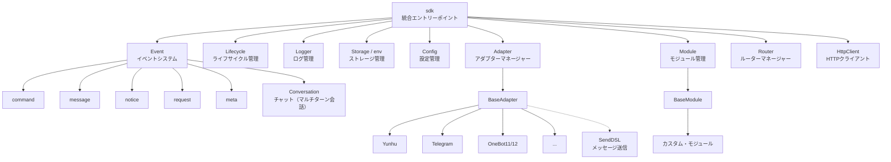
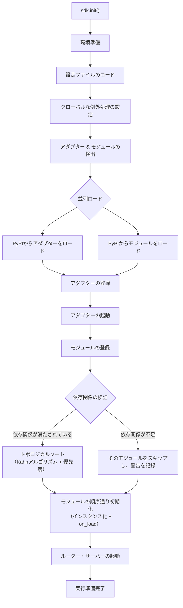
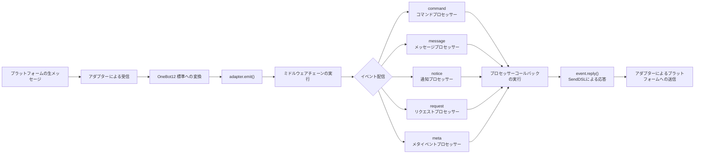
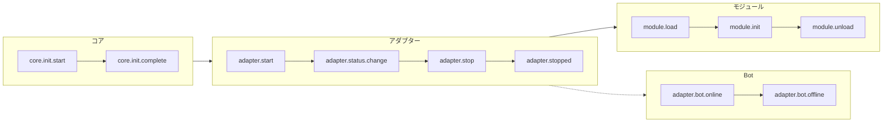
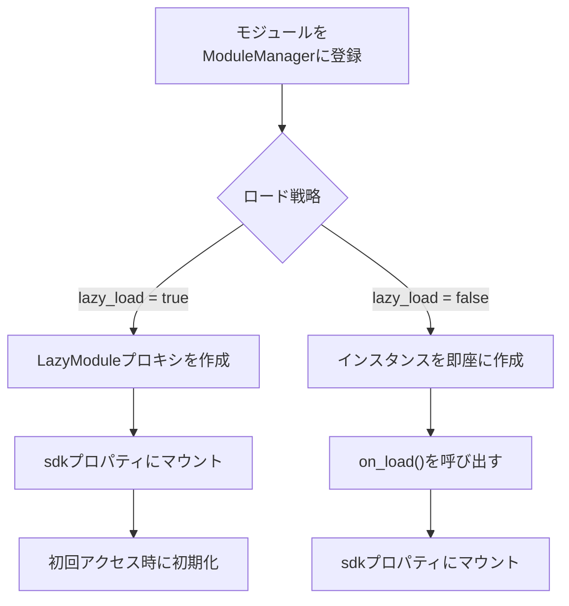

你是一个 ErisPulse 模块开发专家，精通以下领域：

- 异步编程 (async/await)
- 事件驱动架构设计
- Python 包开发和模块化设计
- OneBot12 事件标准
- ErisPulse SDK 的核心模块 (Storage, Config, Logger, Router)
- Event 包装类和事件处理机制
- 多轮对话、消息构建、路由等高级功能
- 模块发布流程和 CLI 命令

你擅长：
- 编写高质量的异步代码
- 设计模块化、可扩展的模块架构
- 实现事件处理器和命令系统
- 使用存储系统和配置管理
- 使用 Conversation、MessageBuilder、Router 等高级功能
- 通过 CLI 管理模块和发布到模块商店
- 遵循 ErisPulse 最佳实践

**使用以下文档作为知识库，回答问题时请优先参考文档内容。**


---


================
ErisPulse 模块开发指南
================


====
框架理解
====


### 架构概览

# アーキテクチャの概要

本文書は、視覚的な図を通じて ErisPulse SDK の技術的なアーキテクチャを紹介し、フレームワークの設計思想とモジュール間の関係を迅速に理解できるようにします。

## SDK コア・アーキテクチャ

下の図は、SDK のコア・モジュール構成とその関係を示しています：



### コア・モジュールの説明

| モジュール | 説明 |
|------|------|
| **Event** | イベントシステム。command / message / notice / request / meta の5種類のイベント処理と、Conversation チャット（マルチターン会話）を提供します。 |
| **Adapter** | アダプターマネージャー。マルチプラットフォーム・アダプターの登録、起動、および停止管理を行います。 |
| **Module** | モジュールマネージャー。プラグインの登録、ロード、アンロードを管理し、依存関係の宣言とトポロジカルソートをサポートします。 |
| **Lifecycle** | ライフサイクルマネージャー。イベント駆動のライフサイクル・フックを提供します。 |
| **Storage** | SQLite ベースのキー値ストレージシステム。汎用 SQL のチェーン（連鎖）クエリをサポートします。 |
| **Config** | TOML 形式の設定ファイル管理。 |
| **Logger** | モジュール化されたログシステム。サブロガーのサポートを行います。 |
| **Router** | HTTP/WebSocket ルーターマネージャー。抽象レイヤーを通じて基盤となるバックエンド（現在は FastAPI + Uvicorn）をカプセル化し、デコレーターロータ、ミドルウェア、グループ化、レートリミット、CORS をサポートします。 |
| **HttpClient** | 統一された HTTP クライアント。抽象レイヤーを通じて基盤となるリクエストライブラリ（現在は aiohttp）をカプセル化し、リクエスト統計、リトライ、ログなどの機能を提供します。 |

## 初期化プロセス

下の図は、`sdk.init()` の完全な初期化プロセスを示しています：



### 初期化段階の詳細

1. **環境準備** - TOML 設定ファイルのロード、グローバルな例外処理の設定
2. **並列検出** - インストール済みの PyPI パッケージからアダプターとモジュールを同時に発見
3. **アダプターの登録** - 発見されたアダプターをアダプターマネージャーに登録
4. **アダプターの起動** - 各プラットフォームのアダプター接続を非同期で起動（モジュール初期化の前に、モジュールが即座にメッセージを送信できることを保証）
5. **モジュールの登録** - 発見されたモジュールをモジュールマネージャーに登録
6. **依存関係の検証** - モジュールが宣言する `depends` 依存関係が登録済みかをチェックし、欠落している依存を持つモジュールをスキップ
7. **トポロジカルソート** - Kahn アルゴリズムを使用して依存関係に基づいてモジュールのロード順序を並べ、同階層は `priority` で降順に並べ替え
8. **モジュールの初期化** - ソート順序通りにモジュールインスタンスを作成し、`on_load` ライフサイクルメソッドを呼び出し
9. **ルーター・サーバーの起動** - Uvicorn を使用して FastAPI ルーターサーバーを起動

## イベント処理フロー

下の図は、メッセージがプラットフォームからプロセッサーへと完全に流れる経路を示しています：



### イベント処理の重要なステップ

- **アダプターによる受信** - 各プラットフォームのアダプターが WebSocket/Webhook などを通じてネイティブなイベントを受信
- **OB12 標準化** - プラットフォームのネイティブイベントを統一された OneBot12 標準形式に変換
- **ミドルウェア処理** - 登録済みのミドルウェア関数を順次実行し、イベントデータを変更可能
- **イベント配信** - イベントタイプ（message/notice/request/meta）に基づいて対応するプロセッサーに配信
- **SendDSL による応答** - プロセッサーが `event.reply()` または `SendDSL` チェーン呼び出しを使用して応答を送信

## ライフサイクル・イベント

下の図は、フレームワークの各コンポーネントにおけるライフサイクル・イベントのトリガー順序を示しています：



### ライフサイクル・イベントの監視

`lifecycle.on()` を通じてこれらのイベントを監視し、カスタムロジックを実行できます：

```python
from ErisPulse import sdk

# 全アダプター・イベントを監視
@sdk.lifecycle.on("adapter")
async def on_adapter_event(event_data):
    print(f"アダプターイベント: {event_data}")

# モジュールのロード完了を監視
@sdk.lifecycle.on("module.load")
async def on_module_loaded(event_data):
    print(f"モジュールがロードされました: {event_data}")

# Botのオンラインを監視
@sdk.lifecycle.on("adapter.bot.online")
async def on_bot_online(event_data):
    print(f"Botがオンライン: {event_data}")
```

## モジュール・ロード戦略

ErisPulse は 2 つのモジュール・ロード戦略をサポートしています：



> 詳細については、[遅延ロード・システム](advanced/lazy-loading.md) および [ライフサイクル管理](advanced/lifecycle.md) をご参照ください。


### 术语表

# ErisPulse 用語集

このドキュメントでは、ErisPulse でよく使用される専門用語を解説し、フレームワークの概念をより深く理解するのに役立ちます。

## 核心概念

### イベント駆動アーキテクチャ
**通俗的説明：** まるでレストランの注文システムのようです。客（ユーザー）が注文（メッセージ送信）を行い、ウェイター（イベントシステム）がその注文（イベント）をキッチン（モジュール）に渡し、キッチンが処理すると、ウェイターが料理（返信）を客の元へ運びます。

**技術的説明：** プログラムの実行フローは外部イベントによってトリガーされ、固定された順序で実行されるわけではありません。新しいイベント（メッセージ受信など）が発生するたびに、フレームワークが自動的に対応する処理関数を呼び出します。

### OneBot12 標準
**通俗的説明：** まるでコンセントとプラグの標準です。異なるプラットフォームの「プラグ」（ネイティブイベント形式）はそれぞれ異なりますが、コンバータを通じて統一された「プラグ」（OneBot12形式）に変換されるため、コードはコンセントのように全てのプラットフォームに適応できます。

**技術的説明：** イベント、メッセージ、API などの統一された形式を定義する、統一されたチャットボットアプリケーションインターフェース標準であり、コードが異なるプラットフォーム間で再利用可能になります。

### アダプター
**通俗的説明：** まるで通訳官です。異なるプラットフォームはそれぞれ異なる「言語」（API形式）を話しますが、アダプターはそれらの「言語」を ErisPulse が理解できる「共通語」（OneBot12標準）に翻訳します。また、ErisPulse の指示を各プラットフォームの「言語」に翻訳し直すこともできます。

**技術的説明：** 特定のプラットフォームと通信を担当するコンポーネントで、プラットフォームのネイティブイベントを受信して標準形式に変換するか、標準形式のリクエストをプラットフォームに送信します。

### モジュール
**通俗的説明：** まるでスマートフォンのアプリです。各モジュールは独立した機能パッケージであり、追加、削除、更新が可能です。「天気予報モジュール」「音楽再生モジュール」などが例です。

**技術的説明：** 機能拡張の基本単位で、特定のビジネスロジック、イベントハンドラー、設定を含み、独立してインストールおよびアンインストールできます。

### イベント
**通俗的説明：** まるでスマートフォンの通知です。新しいメッセージ、新しい友達、新しいグループが発生すると、プラットフォームが「通知」（イベント）をボットに送信します。

**技術的説明：** メッセージの受信、ユーザーのグループへの参加、友達申請など、プラットフォームで発生する注意すべき事象はすべて、構造化データの形式でプログラムに渡されます。

### イベントハンドラー
**通俗的説明：** まるで宅配便の配達ルールです。「荷物」（イベント）を受け取ったときに、荷物のタイプ（メッセージ、通知、リクエストなど）に基づいて、誰がその荷物を処理するかを決定します。

**技術的説明：** デコレーターでマークされた関数で、特定のタイプのイベントが発生すると自動的に実行されます。例: `@command`、`@message` など。

## 開発関連用語

### SDK
**通俗的説明：** まるで工具箱です。そこには様々なよく使われる工具（ストレージ、設定、ログなど）が入っており、コードを記述する際にそのまま使用できるため、自分で部品を作る必要がありません。

**技術的説明：** Software Development Kit（ソフトウェア開発キット）。事前に構築されたコンポーネントとツールのセットを提供し、開発プロセスを簡素化します。

### 仮想環境
**通俗的説明：** まるで独立した「作業場」です。各プロジェクトには独自の「作業場」があり、そこにインストールされたソフトウェアパッケージは互いに干渉せず、バージョン衝突を防ぎます。

**技術的説明：** 隔離された Python 環境で、各環境には独立したパッケージリストとバージョンがあり、異なるプロジェクトの依存関係の競合を防ぎます。

### 非同期プログラミング
**通俗的説明：** まるでマルチタスク処理です。ボットは同時に複数のことを行うことができ、例えばネットワーク応答を待っている間でも他のユーザーのメッセージを処理でき、ブロックされません。

**技術的説明：** `async`/`await` キーワードを使用するプログラミング方法で、プログラムは時間のかかる操作（ネットワークリクエスト、ファイルの読み書きなど）を待っている間に他のタスクに切り替えることができ、効率を高めます。

### ホットリロード
**通俗的説明：** まるでウェブページの自動更新です。コードを修正しても手動で再起動する必要はありません。変更されたコードが自動的に読み込まれ、即座に有効になります。

**技術的説明：** 開発モードでは、プログラムが自動的にファイルの変更を検出して再読み込みされ、手動で再起動しなくてもコード変更の効果がすぐに確認できます。

### 遅延読み込み
**通俗的説明：** まるで必要な時に開く引き出しです。使わない引き出し（モジュール）は最初に閉じておき、必要になった時だけ開きます。これにより、起動時に全ての引き出しを開けるのを待つ必要がなくなります。

**技術的説明：** 遅延読み込み戦略で、モジュールは最初にアクセスされたときのみ初期化および読み込みされ、起動時間とリソース使用量を削減します。

## 機能関連用語

### コマンド
**通俗的説明：** まるでゲーム内のコマンドです。ユーザーが `/hello` のようなコマンドを入力すると、ボットは対応する機能を実行します。

**技術的説明：** 特定のプレフィックス（例: `/`）で始まるメッセージは、フレームワークによってコマンドとして識別され、対応する処理関数にルーティングされます。

### 返信
**通俗的説明：** まさにボットがユーザーに返す「回答」です。テキスト、画像、音声などはすべて、ユーザーのメッセージに対する返信です。

**技術的説明：** アダプターが処理結果をプラットフォームに送り返し、ユーザーに表示するプロセスです。

### ストレージ
**通俗的説明：** まるでボットの「手帳」です。ユーザー情報、設定、会話履歴などを記憶でき、次回も同じものを見つけ出すことができます。

**技術的説明：** 永続化データストレージシステム。SQLite をベースにしたキー値ストレージで、長期的に保存する必要があるデータのために使用されます。

### 設定
**通俗的説明：** まるでボットの「設定」です。設定ファイルを通じてボットの動作を変更できます。例えば、ポート番号、ログレベルなどを変更できます。

**技術的説明：** フレームワークとモジュールの様々なパラメータを設定するために使用される、TOML 形式の設定管理システムです。

### ログ
**通俗的説明：** まるでボットの「日記」です。ボットが何をしたか、何に問題があったかを記録し、デバッグや問題解決に役立ちます。

**技術的説明：** システム実行時に生成される記録情報で、情報、警告、エラーなど様々なレベルが含まれ、監視とデバッグに使用されます。

### ルーティング
**通俗的説明：** まるで交通整理をしている警官です。どのリクエストをどの箇所で処理するかを決定します。ウェブリクエスト、WebSocket 接続などが例です。

**技術的説明：** HTTP と WebSocket のルーティングマネージャーで、URL パスに基づいてリクエストを対応する処理関数に配信します。

## プラットフォーム関連用語

### プラットフォーム
**通俗的説明：** ボットが働く場所です。云湖、Telegram、QQ などがあり、各プラットフォームには独自のルールと API があります。

**技術的説明：** チャットボットサービスを提供するアプリケーションやサービス（例: 云湖企業通話、Telegram など）。

### OneBot11/12
**通俗的説明：** まるでチャットボットの「国際標準」です。メッセージ、イベントなどの統一された形式を定義し、異なるソフトウェア間で互いに理解し合えるようにします。

**技術的説明：** OneBot は汎用的なチャットボットアプリケーションインターフェース標準で、イベント、メッセージ、API などの形式を定義しています。11 と 12 は異なるバージョンの標準です。

### SendDSL
**通俗的説明：** まるでメッセージを送る「ショートカット」です。簡単な一文で、様々なタイプのメッセージ（テキスト、画像、特定ユーザーへのメンションなど）を送信できます。

**技術的説明：** 鎖状呼び出しによるメッセージ送信インターフェースで、複雑なメッセージを構築して送信するための簡潔な構文を提供します。

## その他の用語

### ライフサイクル
**通俗的説明：** ボットの「一生」です。誕生（起動）、働く（実行）、休息（停止）。ライフサイクルとは、これらの重要な瞬間にトリガーされるイベントのことです。

**技術的説明：** プログラムの実行中の重要な段階（起動、モジュールの読み込み、モジュールのアンロード、シャットダウンなど）で、これらのイベントをリッスンして対応する操作を実行できます。

### アノテーション/デコレーター
**通俗的説明：** まるで関数に「ラベル」を貼ることです。例えば `@command("hello")` というラベルは、フレームワークに「これはコマンドハンドラーで、名前は 'hello' だ」と伝えます。

**技術的説明：** Python の構文糖衣（シンタックスシュガー）。ErisPulse では、イベントハンドラーやルーティングなどのマーキングに使用されます。

### 型アノテーション
**通俗的説明：** まるで引数が何の「型」かを教えることです。例えば `request: Request` は、この引数がリクエストオブジェクトであることを意味します。

**技術的説明：** Python 3.5+ で導入された機能で、変数と引数の型を注釈（アノテーション）付けして、コードの可読性と型安全性を高めます。

### TOML
**通俗的説明：** JSON より読みやすく、YAML より厳密な設定ファイルフォーマットで、設定の記述に適しています。

**技術的説明：** Tom's Obvious Minimal Language。構文が簡潔で明瞭で、Python プロジェクトの設定管理で広く使用されています。

## ヘルプを得る

ドキュメントに理解できない用語がある場合は、以下の方法で質問を歓迎します。
- GitHub Issue を作成する
- コミュニティで議論する
- メンテナに連絡する


====
快速开始
====


### 入门指南总览

# 入門ガイド

ErisPulse の入門ガイドへようこそ。ErisPulse を初めて使用される方は、ここからゼロからスタートし、フレームワークのコア概念と基本的な使い方を段階的に理解していきます。

## 学習パス

本ガイドは以下の順序で構成されています。順番に読み進めることを推奨します。

| ステップ | トピック | 説明 |
|------|------|------|
| 1 | [最初のボットを作成する](first-bot.md) | プロジェクトの初期化から最初のコマンドの実行まで |
| 2 | [基礎概念](basic-concepts.md) | ErisPulse のコアアーキテクチャとモジュール設計を理解する |
| 3 | [イベント処理入門](event-handling.md) | メッセージ、コマンド、通知、リクエスト、メタイベントなど、様々なイベントの処理方法を学ぶ |
| 4 | [一般的なタスクの例](common-tasks.md) | データ永続化、定期タスク、権限制御などの一般的な機能をマスターする |

## 開発方式の選択

ErisPulse は 2 つの開発方式をサポートしており、ニーズに合わせて選択できます。

| 方式 | 適用シーン | 説明 |
|------|---------|------|
| **インライン開発** | クイックプロトタイプ、プロジェクト内の機能 | `main.py` に直接処理ロジックを記述し、独立モジュールの作成は不要 |
| **モジュール開発**（推奨） | プロダクション環境、機能の配布 | 独立した Python パッケージを作成し、`epsdk install` を使用してインストールして利用 |

> 2 つの方式の詳細な比較と例については、[最初のボットを作成する](first-bot.md) および [モジュール開発入門](../developer-guide/modules/getting-started.md) を参照してください。

## アーキテクチャ概要

ErisPulse はイベント駆動型アーキテクチャを採用しており、コアは以下のシステムで構成されています。

- **アダプタシステム** — 各プラットフォームとの通信を担当し、プラットフォーム固有のイベントを統一された OneBot12 標準形式に変換します
- **イベントシステム** — メッセージ、コマンド、通知、リクエスト、メタイベントの 5 つのカテゴリを処理します
- **モジュールシステム** — 独立モジュールを使用して機能を拡張し、依存関係管理と遅延読み込み（lazy loading）をサポートします
- **コアモジュール** — Storage（ストレージ）、Config（設定）、Logger（ログ）、Router（ルーティング）などの基本機能を提供します

> 詳細なアーキテクチャ図と初期化フローについては、[アーキテクチャ概要](../architecture.md) を参照してください。

## 学習を始めよう

準備はできましたか？

- [最初のボットを作成する](first-bot.md) — 5 分で使い方を理解


### 创建第一个模块

# 最初のボットを作成する

このガイドでは、ゼロから簡単な ErisPulse ボットを作成する方法について解説します。

## ステップ1：プロジェクトを作成

CLI ツールを使用してプロジェクトを初期化します：

```bash
# 交互式初始化
epsdk init

# または快速初始化
epsdk init -q -n my_first_bot
```

プロンプトに従って設定を完了し、以下を選択することを推奨します：
- プロジェクト名：my_first_bot
- ログレベル：INFO
- サーバー：デフォルト設定
- アダプタ：必要なプラットフォームを選択してください（例：Yunhu）

## ステップ2：プロジェクト構造を確認する

初期化後のプロジェクト構造：

```
my_first_bot/
├── config/
│   └── config.toml
├── main.py
└── requirements.txt
```

## ステップ3：最初のコマンドを記述する

`main.py` を開き、単純なコマンドハンドラーを記述します：

```python
from ErisPulse import sdk
from ErisPulse.Core.Event import command

@command("hello", help="发送问候消息")
async def hello_handler(event):
    """处理 hello 命令"""
    user_name = event.get_user_nickname() or "朋友"
    await event.reply(f"你好，{user_name}！我是 ErisPulse 机器人。")

@command("ping", help="测试机器人是否在线")
async def ping_handler(event):
    """处理 ping 命令"""
    await event.reply("Pong！机器人运行正常。")

async def main():
    """主入口函数"""
    print("正在初始化 ErisPulse...")
    # 运行 SDK 并且维持运行
    await sdk.run(keep_running=True)

    # 或者
    # await sdk.run(keep_running=False)
    # ...Do Something
    # 可以做你想做的任何事
    # 使用 await sdk.init() 等价于 `sdk.run(keep_running=False)`

    print("ErisPulse 初始化完成！")

if __name__ == "__main__":
    import asyncio
    asyncio.run(main())
```

## ステップ4：ボットを実行する

```bash
# 普通运行
epsdk run main.py

# 开发模式（支持热重载）
epsdk run main.py --reload
```

## ステップ5：ボットをテストする

チャットプラットフォームでコマンドを送信します：

```
/hello
```

ボットからの返信を受け取るはずです。

## コードの説明

### コマンドデコレータ

```python
@command("hello", help="发送问候消息")
```

- `hello`：コマンド名。ユーザーは `/hello` で呼び出します
- `help`：コマンドのヘルプ説明。`/help` コマンド内で表示されます

### イベントパラメータ

```python
async def hello_handler(event):
```

`event` パラメータは Event オブジェクトであり、以下を含みます：
- メッセージ内容：`event.get_text()`
- 送信者情報：`event.get_user_id()`、`event.get_user_nickname()`
- プラットフォーム情報：`event.get_platform()`
- グループ情報：`event.get_group_id()`
- 原始データ：`event.get_raw()`

> 完整な Event オブジェクトメソッドについては [Event 包装クラスの詳細](../developer-guide/modules/event-wrapper.md) を参照してください。

### 返信を送信する

```python
await event.reply("回复内容")
```

`event.reply()` は送信者にメッセージを送るための便利なメソッドです。

## 拡張機能：追加機能の追加

ErisPulse は豊富なイベント処理とデータ処理機能を提供します：

- **メッセージリスナー**：`@message.on_message()` を使用して各種メッセージを監視 → [イベント処理入門](event-handling.md)
- **通知リスナー**：`@notice.on_friend_add()` などの使用でシステム通知を監視 → [イベント処理入門](event-handling.md)
- **データストレージ**：`sdk.storage.get/set` を使用してデータを永続化 → [一般的なタスクの例](common-tasks.md)

## よくある質問

### コマンドに応答がありませんか？

1. アダプタが正しく設定されているか確認します（`config/config.toml` 内でアダプタの `status` が `true` であることを確認してください）
2. 端末のログ出力を確認し、エラーメッセージがないかチェックします（特に `ERROR` レベルのログ）
3. コマンドのプレフィックスが正しいか確認します（デフォルトは `/`）、設定ファイルの `[ErisPulse.event.command]` セクションを確認できます
4. コマンド名のスペルミスがないか確認し、大文字と小文字の区別設定に注意してください

### コマンドのプレフィックスを変更する方法？

`config.toml` に追加します：

```toml
[ErisPulse.event.command]
prefix = "!"
case_sensitive = false
```

### マルチプラットフォームをサポートする方法？

ErisPulse は OneBot12 標準を使用し、異なるプラットフォームのイベント形式を統一しました。`@command` と `@message` で登録されたハンドラーは、すべてのプラットフォームのイベントを受け取ります。`event.get_platform()` を使用してソースプラットフォームを区別できます：

```python
@command("hello")
async def hello_handler(event):
    platform = event.get_platform()
    
    if platform == "yunhu":
        await event.reply("你好！来自云湖")
    elif platform == "telegram":
        await event.reply("Hello! From Telegram")
    else:
        await event.reply("你好！")
```

> マルチプラットフォームアダプティングのテクニックについては、[一般的なタスクの例](common-tasks.md#多平台适配) を参照してください。

## 次のステップ

- [基本概念](basic-concepts.md) - ErisPulse のコア概念を詳しく理解する
- [イベント処理入門](event-handling.md) - 各種イベントの処理を学ぶ
- [一般的なタスクの例](common-tasks.md) - より実用的な機能をマスターする


### 基础概念

# 基本概念

このガイドでは ErisPulse の核心概念を紹介し、フレームワークの設計思想と基本的なアーキテクチャを理解するのに役立ちます。

## イベント駆動型アーキテクチャ

ErisPulse はイベント駆動型アーキテクチャを採用しており、すべての対話はイベントを介して送信および処理されます。

### イベントフロー

```
ユーザーがメッセージを送信
      │
      ▼
プラットフォームが受信
      │
      ▼
アダプタがプラットフォームのネイティブイベントを受信
      │
      ▼
OneBot12 標準イベントへ変換
      │
      ▼
イベントシステムへ提出
      │
      ▼
登録済みハンドラーへ配信
      │
      ▼
モジュールがイベントを処理
      │
      ▼
アダプタ経由でレスポンスを送信
      │
      ▼
プラットフォームがユーザーに表示
```

### OneBot12 標準

ErisPulse は OneBot12 をコアイベント標準として使用します。OneBot12 は汎用チャットボットアプリケーションインターフェース標準であり、統一されたイベント形式を定義しています。

すべてのアダプタは、プラットフォーム固有のイベントを OneBot12 形式に変換し、コードの一貫性を保証します。

## コアコンポーネント

### 1. SDK オブジェクト

SDK はすべての機能の統一されたエントリーポイントであり、コアコンポーネントへのアクセスを提供します。

```python
from ErisPulse import sdk

# コアモジュールへのアクセス
sdk.storage    # ストレージシステム
sdk.config     # 設定システム
sdk.logger     # ロギングシステム
sdk.adapter    # アダプタシステム
sdk.module     # モジュールシステム
sdk.router     # ルーティングシステム
sdk.client     # HTTPクライアント
sdk.lifecycle  # ライフサイクルシステム
```

### 2. Event オブジェクト

Event オブジェクトはイベントデータをカプセル化し、便利なアクセスメソッドを提供します。

```python
@command("info")
async def info_handler(event):
    # イベント情報の取得
    event_id = event.get_id()
    user_id = event.get_user_id()
    platform = event.get_platform()
    text = event.get_text()
    
    # 返信を送信
    await event.reply(f"ユーザー: {user_id}, プラットフォーム: {platform}")
```

### 3. アダプタ

アダプタは ErisPulse と外部プラットフォームの間の橋渡しです。

**責任：**
- プラットフォームのネイティブイベントを受信
- OneBot12 標準形式へ変換
- 標準形式イベントをプラットフォームへ送信

**サンプルアダプタ：**
- Yunhu アダプタ：Yunhu プラットフォームと通信
- Telegram アダプタ：Telegram Bot API と通信
- OneBot11 アダプタ：OneBot11 互換のアプリケーションと通信
- Email アダプタ：メールの送受信を処理

### 4. モジュール

モジュールは機能拡張の基本単位であり、以下のことが可能です。

- イベントハンドラーを登録
- ビジネスロジックを実装
- アダプタを使用してメッセージを送信
- コアモジュールが提供するサービスを使用

#### モジュール検出メカニズム

ErisPulse は Python の `importlib.metadata.entry_points` を使用してインストール済みのモジュールを検出します。モジュールは `pyproject.toml` でエントリーポイントを宣言します：

```toml
[project.entry-points."erispulse.module"]
MyModule = "my_package:Main"
```

SDK の初期化時に、すべての `erispulse.module` グループのエントリーポイントがスキャンされ、モジュールクラスが `ModuleManager` に登録され、依存関係のトポロジカルソート後に順次初期化されます。

#### 最小限の使用可能モジュール

```python
from ErisPulse.Core.Bases import BaseModule
from ErisPulse import sdk

class Main(BaseModule):
    def __init__(self):
        self.sdk = sdk
        self.logger = sdk.logger.get_child("MyModule")

    async def on_load(self, event):
        self.logger.info("モジュールがロードされました")

    async def on_unload(self, event):
        self.logger.info("モジュールがアンロードされました")
```

#### モジュールライフサイクル

- **登録**：SDK がモジュールクラスを発見してマネージャーに登録
- **ロード**：モジュールインスタンスを作成し、`on_load(event)` を呼び出し（`event = {"module_name": "MyModule"}`）
- **アンロード**：`on_unload(event)` を呼び出し、リソースをクリーンアップ

#### ロード戦略

`get_load_strategy()` を使用してモジュールのロード動作を宣言します：

```python
from ErisPulse.loaders import ModuleLoadStrategy

class Main(BaseModule):
    @staticmethod
    def get_load_strategy():
        return ModuleLoadStrategy(
            lazy_load=True,   # レイジーロードを行うかどうか（デフォルト True）
            priority=0        # ロード優先度、数値が大きいほど先に初期化
        )
```

- **`lazy_load=True`（デフォルト）**：初めて `sdk.MyModule` にアクセスされたときにモジュールが初期化され、起動時間を短縮
- **`lazy_load=False`**：SDK の起動時に即時初期化、ライフサイクルイベントを監視するモジュールや定時タスクを実行するモジュールに適している
- **`priority`**：優先度が同じモジュールは登録順でロード；数値が大きいほど先に初期化

> 詳細なレイジーロードメカニズムについては、[レイジーロードシステム](../advanced/lazy-loading.md)を参照してください。

## イベントタイプ

ErisPulse は 5 つの種類のイベントをサポートしています。

| イベントタイプ | デコレータ | 説明 |
|---------|--------|------|
| メッセージイベント | `@message.on_message()` | ユーザーが送信する任意のメッセージ（プライベートチャット、グループチャット） |
| コマンドイベント | `@command("name")` | コマンドプレフィックスで始まるメッセージ（例：`/hello`） |
| 通知イベント | `@notice.on_friend_add()` 等 | システム通知（フレンド追加、メンバー変更など） |
| リクエストイベント | `@request.on_friend_request()` 等 | ユーザーリクエスト（フレンド申請、グループ招待） |
| メタイベント | `@meta.on_connect()` 等 | システムレベルイベント（接続、切断、ハートビート） |

> 各イベントタイプの詳細な使用法とコード例については、[イベント処理入門](event-handling.md)を参照してください。

## コアモジュールの説明

### Storage（ストレージ）

SQLite ベースのキーバリューストレージシステムで、永続化データに使用されます。

```python
# 値の設定
sdk.storage.set("key", "value")

# 値の取得
value = sdk.storage.get("key", "default_value")

# バッチ操作
sdk.storage.set_multi({
    "key1": "value1",
    "key2": "value2"
})

# トランザクション
with sdk.storage.transaction():
    sdk.storage.set("key1", "value1")
    sdk.storage.set("key2", "value2")
```

### Config（設定）

TOML形式の設定ファイル管理。

```python
# 設定の取得
config = sdk.config.getConfig("MyModule", {})

# 設定の設定
sdk.config.setConfig("MyModule", {"key": "value"})

# ネストされた設定の読み込み
value = sdk.config.getConfig("MyModule.subkey", "default")
```

### Logger（ログ）

モジュラーログシステム。

```python
# ログの記録
sdk.logger.info("これは情報です")
sdk.logger.warning("これは警告です")
sdk.logger.error("これはエラーです")

# 子ロガーの取得
child_logger = sdk.logger.get_child("submodule")
child_logger.info("サブモジュールログ")
```

**属性アクセスシンタックスシュガー**

`get_child()` メソッドを使用する以外に、**属性アクセス**の方法で子ロガーを作成することもでき、これはより簡潔な**シンタックスシュガー**の記述方法です：

```python
# 属性アクセスで子ロガーを作成
sdk.logger.mymodule.info("モジュールメッセージ")

# ネストされたアクセスをサポート
sdk.logger.mymodule.database.info("データベースメッセージ")
```

### Router（ルーティング）

HTTP および WebSocket ルーティング管理、FastAPI + Uvicorn ベース。デコレータルーティング、ミドルウェア、グループ化、レート制限、CORS をサポートします。

```python
from ErisPulse.Core import HttpRequest

@sdk.router.get("MyModule", "/api")
async def handler(request: HttpRequest):
    data = await request.json()
    return {"status": "ok"}
```

> 完全なルーティング API（WebSocket、ミドルウェア、レート制限、CORS など）については、[ルーティングマネージャー](../advanced/router.md)を参照してください。

### Client（ネットワーククライアント）

統合されたネットワーククライアントで、HTTP リクエスト、WebSocket 接続、コネクションプール管理、自動再試行、タイムアウト制御、リクエスト統計、ライフサイクルイベント統合を集約しています。

```python
from ErisPulse.Core import client

# HTTP リクエスト
resp = await client.get("https://api.example.com/users")
data = await resp.json()

# 再試行とタイムアウト付き
resp = await client.get(url, timeout=30, max_retries=3)

# WebSocket 接続
ws = await client.ws_connect("wss://example.com/ws")
async for text in ws.iter_text():
    await ws.send_text(f"Echo: {text}")
```

> 完全なネットワーククライアント API については、[ネットワーククライアント](../advanced/http-client.md)を参照してください。

## SendDSL メッセージ送信

アダプタはチェーン呼び出しのメッセージ送信インターフェースを提供します。

### 基本送信

```python
# アダプタインスタンスの取得
yunhu = sdk.adapter.get("yunhu")

# メッセージを送信
await yunhu.Send.To("user", "U1001").Text("Hello")

# 送信アカウントを指定
await yunhu.Send.Using("bot1").To("group", "G1001").Text("グループメッセージ")
```

### チェーン修飾

```python
# @ユーザー
await yunhu.Send.To("group", "G1001").At("U2001").Text("@メッセージ")

# 返信メッセージ
await yunhu.Send.To("group", "G1001").Reply("msg123").Text("返信")

# @全体
await yunhu.Send.To("group", "G1001").AtAll().Text("告知")
```

### Event 返信メソッド

Event オブジェクトは便利な返信メソッドを提供します：

```python
@command("test")
async def test_handler(event):
    # 簡単なテキスト返信
    await event.reply("返信内容")
    
    # 画像を送信
    await event.reply("http://example.com/image.jpg", method="Image")
    
    # 音声を送信
    await event.reply("http://example.com/voice.mp3", method="Voice")
```

## レイジーロードシステム

ErisPulse はデフォルトでモジュールレイジーロードを有効にしており、モジュールは初めてアクセスされたとき（`sdk.MyModule` など）にのみ初期化され、起動速度を大幅に向上させます。

```python
from ErisPulse.loaders import ModuleLoadStrategy

class Main(BaseModule):
    @staticmethod
    def get_load_strategy():
        return ModuleLoadStrategy(
            lazy_load=True,   # レイジーロードを有効にする（デフォルト）
            priority=0        # ロード優先度、数値が大きいほど先に初期化
        )
```

**レイジーロードを無効にする必要があるシナリオ（`lazy_load=False`）：**
- ライフサイクルイベントを監視するモジュール（例：`core.init.complete`）
- 起動時の定時タスクまたはバックグラウンドサービスを実行するモジュール
- 他のモジュールのロード前に初期化を完了する必要があるモジュール

> 詳細なレイジーロードメカニズムと注意点については、[レイジーロードシステム](../advanced/lazy-loading.md)を参照してください。

## 次のステップ

- [イベント処理入門](event-handling.md) - 各種イベントの処理方法を学ぶ
- [一般的なタスクの例](common-tasks.md) - 一般的な機能の実装をマスターする


### 事件处理入门

# イベント処理入門

このガイドでは、ErisPulse における各種イベントの処理方法について説明します。

## イベントタイプの概要

ErisPulse は以下のイベントタイプをサポートしています：

| イベントタイプ | 説明 | 適用場面 |
|---------|------|---------|
| メッセージイベント | ユーザーが送信したすべてのメッセージ | チャットボット、コンテンツフィルタ |
| コマンドイベント | コマンドプレフィックスで始まるメッセージ | コマンド処理、機能エントリ |
| 通知イベント | システム通知（友達追加、グループメンバー変更など） | ホームメッセージ、ステータス通知 |
| 要求イベント | ユーザーの要求（友達リクエスト、グループ招待） | 要求の自動処理 |
| 元イベント | システムレベルのイベント（接続、ハートビート） | 接続監視、ステータスチェック |

## メッセージイベント処理

> **ヒント**: イベントハンドラ内で `Event` クラスの型注釈を使用することを推奨します。これにより、IDEの自動補完と型チェックがサポートされます。

```python
from ErisPulse.Core.Event import Event  # イベントの型注釈に使用
```

### すべてのメッセージを監視

```python
from ErisPulse.Core.Event import message, Event

@message.on_message()
async def message_handler(event: Event):
    text = event.get_text()
    user_id = event.get_user_id()
    sdk.logger.info(f"{user_id} からメッセージを受け取りました: {text}")
```

### プライベートメッセージを監視

```python
@message.on_private_message()
async def private_handler(event: Event):
    user_id = event.get_user_id()
    await event.reply(f"こんにちは、{user_id}！これはプライベートメッセージです。")
```

### グループメッセージを監視

```python
@message.on_group_message()
async def group_handler(event: Event):
    group_id = event.get_group_id()
    user_id = event.get_user_id()
    sdk.logger.info(f"グループ {group_id} で {user_id} がメッセージを送信しました")
```

### @メッセージを監視

```python
@message.on_at_message()
async def at_handler(event: Event):
    # @されたユーザーのリストを取得
    mentions = event.get_mentions()
    await event.reply(f"以下のユーザーを@しました: {mentions}")
```

## コマンドイベント処理

### 基本コマンド

```python
from ErisPulse.Core.Event import command

@command("help", help="ヘルプ情報を表示します")
async def help_handler(event):
    help_text = """
利用可能なコマンド：
/help - ヘルプを表示
/ping - 接続をテスト
/info - 情報を表示
    """
    await event.reply(help_text)
```

### コマンドの別名

```python
@command(["help", "h"], aliases=["ヘルプ"], help="ヘルプ情報を表示します")
async def help_handler(event):
    await event.reply("ヘルプ情報...")
```

ユーザーは以下のいずれかの方法で呼び出すことができます：
- `/help`
- `/h`
- `/ヘルプ`

### コマンド引数

```python
@command("echo", help="メッセージを返信します")
async def echo_handler(event):
    # コマンド引数を取得
    args = event.get_command_args()
    
    if not args:
        await event.reply("返信するメッセージを入力してください")
    else:
        await event.reply(f"あなたが言った: {' '.join(args)}")
```

### コマンドグループ

```python
@command("admin.reload", group="admin", help="モジュールを再読み込みします")
async def reload_handler(event):
    await event.reply("モジュールを再読み込みしました")

@command("admin.stop", group="admin", help="ロボットを停止します")
async def stop_handler(event):
    await event.reply("ロボットを停止しました")
```

### コマンドの権限

```python
def is_admin(event):
    """ユーザーが管理者かどうかを確認します"""
    admin_list = ["user123", "user456"]
    return event.get_user_id() in admin_list

@command("admin", permission=is_admin, help="管理者用コマンド")
async def admin_handler(event):
    await event.reply("これは管理者用コマンドです")
```

### コマンドの優先度

```python
# 優先度の値が大きいほど、実行が早くなります
@message.on_message(priority=10)
async def high_priority_handler(event):
    await event.reply("高優先度のハンドラ")

@message.on_message(priority=1)
async def low_priority_handler(event):
    await event.reply("低優先度のハンドラ")
```

### 並列イベント処理

ErisPulse のイベントシステムは**同優先度並列、異なる優先度直列**のスケジューリングモデルを採用しています：

```
イベント到着
    ↓
priority=10 組: [ハンドラC || ハンドラD] 並列 → 結果をマージ
    ↓ (中断されない場合)
priority=0 組: [ハンドラA || ハンドラB] 並列 → 結果をマージ
    ↓
...
```

- **同優先度並列**: 優先度が同じ複数のハンドラは同時に実行され、スループットを向上させます
- **跨級直列**: 異なる優先度の組は順番に実行されます（値が大きいほど先に実行）。これにより、高優先度のハンドラが先に実行されます
- **Copy-On-Write**: ハンドラが変更を加えない場合はコピーを作成せず、オーバーヘッドをゼロにします
- **競合処理**: 同優先度の複数のハンドラが同じフィールドを変更した場合、最後に変更された値が使用され、警告ログが記録されます
- **中断メカニズム**: 任意のハンドラが `event.mark_processed()` を呼び出した後、次の低優先度の組はスキップされます

```python
# 例：同優先度のハンドラが並列に実行されます
@message.on_message(priority=0)
async def handler_a(event):
    # タスクAを処理
    event['result_a'] = process_a()

@message.on_message(priority=0)
async def handler_b(event):
    # handler_a と並列に実行されます
    event['result_b'] = process_b()

# 異なる優先度で直列に実行されます
@message.on_message(priority=10)
async def handler_c(event):
    # 最も優先度が高く、最初に実行されます
    pass
```

## 通知イベント処理

### 友達追加

```python
from ErisPulse.Core.Event import notice

@notice.on_friend_add()
async def friend_add_handler(event):
    user_id = event.get_user_id()
    nickname = event.get_user_nickname() or "新朋友"
    await event.reply(f"友達追加を歓迎します、{nickname}！")
```

### グループメンバーの増加

```python
@notice.on_group_increase()
async def member_increase_handler(event):
    group_id = event.get_group_id()
    user_id = event.get_user_id()
    await event.reply(f"新メンバー {user_id} がグループ {group_id} に参加しました")
```

### グループメンバーの減少

```python
@notice.on_group_decrease()
async def member_decrease_handler(event):
    group_id = event.get_group_id()
    user_id = event.get_user_id()
    await event.reply(f"メンバー {user_id} がグループ {group_id} を離れました")
```

## 要求イベント処理

### 友達リクエスト

```python
from ErisPulse.Core.Event import request

@request.on_friend_request()
async def friend_request_handler(event):
    user_id = event.get_user_id()
    comment = event.get_comment()
    
    sdk.logger.info(f"友達リクエストを受け取りました: {user_id}, 附言: {comment}")
    
    # アダプタAPIでリクエストを処理することもできます
    # 具体的な実装は各アダプタのドキュメントを参照してください
```

### グループ招待リクエスト

```python
@request.on_group_request()
async def group_request_handler(event):
    group_id = event.get_group_id()
    user_id = event.get_user_id()
    
    await event.reply(f"グループ {group_id} の招待を受け取りました、{user_id} から")
```

## 元イベント処理

### 接続イベント

```python
from ErisPulse.Core.Event import meta

@meta.on_connect()
async def connect_handler(event):
    platform = event.get_platform()
    sdk.logger.info(f"{platform} プラットフォームが接続されました")

@meta.on_disconnect()
async def disconnect_handler(event):
    platform = event.get_platform()
    sdk.logger.warning(f"{platform} プラットフォームが切断されました")
```

### ハートビートイベント

```python
@meta.on_heartbeat()
async def heartbeat_handler(event):
    platform = event.get_platform()
    sdk.logger.debug(f"{platform} ハートビート検出")
```

### Bot 状態の照会

アダプタがメタイベントを送信した後、フレームワークは自動的に Bot 状態を追跡します。いつでも照会できます：

```python
from ErisPulse import sdk

# 特定の Bot がオンラインかどうかをチェック
if sdk.adapter.is_bot_online("telegram", "123456"):
    telegram = sdk.adapter.get("telegram")
    await telegram.Send.To("user", "123456").Text("Bot がオンラインです")

# 現在オンラインのすべての Bot をリスト
bots = sdk.adapter.list_bots()
for platform, bot_list in bots.items():
    for bot_id, info in bot_list.items():
        print(f"{platform}/{bot_id}: {info['status']}")

# 完全な状態サマリーを取得
summary = sdk.adapter.get_status_summary()
```

## インタラクティブな処理

### reply メソッドを使って返信を送信

`event.reply()` メソッドは、@、返信などの機能を備えた様々な修飾パラメータをサポートしています：

```python
# 簡単な返信
await event.reply("こんにちは")

# 異なるタイプのメッセージを送信
await event.reply("http://example.com/image.jpg", method="Image")  # 画像
await event.reply("http://example.com/voice.mp3", method="Voice")  # 音声

# 単一ユーザーを@する
await event.reply("こんにちは", at_users=["user123"])

# 複数ユーザーを@する
await event.reply("皆さんこんにちは", at_users=["user1", "user2", "user3"])

# メッセージに返信する
await event.reply("返信内容", reply_to="msg_id")

# 全員を@する
await event.reply("公告", at_all=True)

# 組み合わせ: @ユーザー + メッセージ返信
await event.reply("内容", at_users=["user1"], reply_to="msg_id")
```

### ユーザーの返信を待つ

```python
@command("ask", help="ユーザーに質問します")
async def ask_handler(event):
    await event.reply("名前を入力してください:")
    
    # ユーザーの返信を待つ、タイムアウトは30秒
    reply = await event.wait_reply(timeout=30)
    
    if reply:
        name = reply.get_text()
        await event.reply(f"こんにちは、{name}！")
    else:
        await event.reply("タイムアウトしました、再度入力してください。")
```

### 検証付きの返信待ち

```python
@command("age", help="年齢を尋ねます")
async def age_handler(event):
    def validate_age(event_data):
        """年齢が有効かどうかを検証します"""
        try:
            age = int(event_data.get_text())
            return 0 <= age <= 150
        except ValueError:
            return False
    
    await event.reply("年齢を入力してください (0-150):")
    
    reply = await event.wait_reply(
        timeout=60,
        validator=validate_age
    )
    
    if reply:
        age = int(reply.get_text())
        await event.reply(f"あなたの年齢は {age} 歳です")
    else:
        await event.reply("入力が無効またはタイムアウトしました")
```

### コールバック付きの返信待ち

```python
@command("confirm", help="操作を確認します")
async def confirm_handler(event):
    async def handle_confirmation(reply_event):
        text = reply_event.get_text().lower()
        
        if text in ["はい", "yes", "y"]:
            await event.reply("操作が確認されました！")
        else:
            await event.reply("操作がキャンセルされました。")
    
    await event.reply("この操作を実行しますか？(はい/いいえ)")
    
    await event.wait_reply(
        timeout=30,
        callback=handle_confirmation
    )
```

### 確認対話 (confirm)

ユーザーの確認または否定を待ち、組み込みの中英確認語を自動的に認識します：

```python
@command("confirm", help="操作を確認します")
async def confirm_handler(event):
    if await event.confirm("この操作を実行しますか？"):
        await event.reply("確認しました、実行中...")
    else:
        await event.reply("キャンセルしました")

# 自定義確認語
if await event.confirm("続行しますか？", yes_words={"go", "続行"}, no_words={"stop", "停止"}):
    pass
```

### 選択メニュー (choose)

ユーザーは選択番号または選択テキストを返信できます：

```python
@command("choose", help="選択します")
async def choose_handler(event):
    choice = await event.choose(
        "色を選択してください：",
        ["赤", "緑", "青"]
    )
    
    if choice is not None:
        colors = ["赤", "緑", "青"]
        await event.reply(f"選択した色は：{colors[choice]}")
    else:
        await event.reply("選択がタイムアウトしました")
```

### フォーム収集 (collect)

複数ステップでユーザーの入力を収集します：

```python
@command("register", help="登録します")
async def register_handler(event):
    data = await event.collect([
        {"key": "name", "prompt": "名前を入力してください："},
        {"key": "age", "prompt": "年齢を入力してください：", 
         "validator": lambda e: e.get_text().isdigit()},
        {"key": "email", "prompt": "メールアドレスを入力してください："}
    ])
    
    if data:
        await event.reply(f"登録が成功しました！\n名前：{data['name']}\n年齢：{data['age']}\nメールアドレス：{data['email']}")
    else:
        await event.reply("登録がタイムアウトまたは入力が無効です")
```

### 任意イベントを待つ (wait_for)

条件を満たす任意のイベントを待つ、同一ユーザーに限定されません：

```python
@command("wait_member", help="新メンバーを待つ")
async def wait_member_handler(event):
    await event.reply("グループメンバーの参加を待っています...")
    
    evt = await event.wait_for(
        event_type="notice",
        condition=lambda e: e.get_detail_type() == "group_member_increase",
        timeout=120
    )
    
    if evt:
        await event.reply(f"新メンバーを歓迎します：{evt.get_user_id()}")
    else:
        await event.reply("タイムアウトしました")
```

### 多段対話 (conversation)

インタラクティブな多段対話コンテキストを作成します：

```python
@command("survey", help="アンケート調査")
async def survey_handler(event):
    conv = event.conversation(timeout=60)
    
    await conv.say("アンケート調査にようこそ！")
    
    while conv.is_active:
        reply = await conv.wait()
        
        if reply is None:
            await conv.say("対話がタイムアウトしました、さようなら！")
            break
        
        text = reply.get_text()
        
        if text == "終了":
            await conv.say("さようなら！")
            break
        
        await conv.say(f"あなたが言った：{text}、続けるか、'終了'で終了します")
```

### 組み込みの確認語

ErisPulse には中英の確認語の集合が組み込まれています：

- **確認語** (`CONFIRM_YES_WORDS`): はい、yes、y、確認、確定、いい、いいね、ok、true、正しい、うん、行きます、同意、大丈夫...
- **否定語** (`CONFIRM_NO_WORDS`): いいえ、no、n、キャンセル、しない、しないで、だめ、cancel、false、間違っている、拒否、できません...

## イベントデータのアクセス

### Event オブジェクトの一般的なメソッド

```python
@command("info")
async def info_handler(event):
    # 基本情報
    event_id = event.get_id()
    event_time = event.get_time()
    event_type = event.get_type()
    detail_type = event.get_detail_type()
    
    # 送信者情報
    user_id = event.get_user_id()
    nickname = event.get_user_nickname()
    
    # メッセージ内容
    message_segments = event.get_message()
    alt_message = event.get_alt_message()
    text = event.get_text()
    
    # グループ情報
    group_id = event.get_group_id()
    
    # ロボット情報
    self_id = event.get_self_user_id()
    self_platform = event.get_self_platform()
    
    # 元データ
    raw_data = event.get_raw()
    raw_type = event.get_raw_type()
    
    # プラットフォーム情報
    platform = event.get_platform()
    
    # メッセージタイプの判断
    is_private = event.is_private_message()
    is_group = event.is_group_message()
    is_at = event.is_at_message()
    
    # コマンド情報
    if event.is_command():
        cmd_name = event.get_command_name()
        cmd_args = event.get_command_args()
        cmd_raw = event.get_command_raw()
```

### プラットフォーム拡張メソッド

内蔵メソッドに加えて、各プラットフォームアダプタはプラットフォーム固有のメソッドを登録し、プラットフォーム固有のデータにアクセスしやすくします。

```python
from ErisPulse.Core.Event import message

@message.on_message()
async def handle_message(event):
    platform = event.get_platform()

    # プラットフォームに応じて固有メソッドを呼び出す
    if platform == "telegram":
        chat_type = event.get_chat_type()      # Telegram 固有メソッド
    elif platform == "email":
        subject = event.get_subject()           # メール固有メソッド
```

プラットフォームが特定のメソッドを登録しているかどうかを確認するには、そのプラットフォームが登録したメソッドを照会します：

```python
from ErisPulse.Core.Event import get_platform_event_methods

methods = get_platform_event_methods("telegram")
# ["get_chat_type", "is_bot_message", ...]
```

> 各プラットフォームが登録した固有メソッドについては、対応する [プラットフォームドキュメント](../platform-guide/) を参照してください。

## イベント処理のベストプラクティス

### 1. エラーハンドリング

```python
@command("process")
async def process_handler(event):
    try:
        # ビジネスロジック
        result = await do_some_work()
        await event.reply(f"結果: {result}")
    except ValueError as e:
        # 予期されたビジネスエラー
        await event.reply(f"パラメータエラー: {e}")
    except Exception as e:
        # 予期されないエラー
        sdk.logger.error(f"処理失敗: {e}")
        await event.reply("処理に失敗しました、後でもう一度お試しください")
```

### 2. ログ記録

```python
@message.on_message()
async def message_handler(event):
    user_id = event.get_user_id()
    text = event.get_text()
    
    sdk.logger.info(f"メッセージを処理: {user_id} - {text}")
    
    # モジュール独自のログを使用
    from ErisPulse import sdk
    logger = sdk.logger.get_child("MyHandler")
    logger.debug(f"詳細なデバッグ情報")
```

### 3. 条件処理

```python
@message.on_message(priority=0)
async def conditional_handler(event):
    """条件処理 - ハンドラ内で判断"""
    # 特定ユーザーのメッセージだけを処理
    if event.get_user_id() in ["bot1", "bot2"]:
        return
    
    # 特定キーワードを含むメッセージだけを処理
    if "キーワード" not in event.get_text():
        return
    
    await event.reply("条件が満たされました、メッセージを処理します")
```

## 次のステップ

- [よくあるタスクの例](common-tasks.md) - 消息送信の高度な実装（リトライ/タイムアウト/バッチ）を含む一般的な機能の実装を学ぶ
- [プラットフォームの特徴ガイド](../platform-guide/README.md) - Send DSLのチェーン送信、送信ルール、バッチ構築の完全な説明
- [Eventラッパークラスの詳細](../developer-guide/modules/event-wrapper.md) - Eventオブジェクトの詳細な理解
- [ユーザー使用ガイド](../user-guide/) - 設定とモジュール管理の理解


### 常见任务示例

# よくあるタスクの例

このガイドは、一般的な機能の実装例を提供し、一般的な機能を素早く実装するのに役立ちます。

## 内容リスト

1. データ永続化
2. 定期タスク
3. メッセージフィルタリング
4. マルチプラットフォーム対応
5. メッセージ送信（リトライ/タイムアウト/一括）
6. 権限管理
7. メッセージ統計
8. 検索機能
9. 画像処理

## データ永続化

### シンプルなカウンター

```python
from ErisPulse import sdk
from ErisPulse.Core.Event import command

@command("count", help="コマンド呼び出し回数を表示")
async def count_handler(event):
    # カウントを取得
    count = sdk.storage.get("command_count", 0)
    
    # カウントを増やす
    count += 1
    sdk.storage.set("command_count", count)
    
    await event.reply(f"これは {count} 回目のコマンド呼び出しです")
```

### ユーザーデータの保存

```python
@command("profile", help="プロフィールを表示")
async def profile_handler(event):
    user_id = event.get_user_id()
    
    # ユーザーデータを取得
    user_data = sdk.storage.get(f"user:{user_id}", {
        "nickname": "",
        "join_date": None,
        "message_count": 0
    })
    
    profile_text = f"""
ニックネーム: {user_data['nickname']}
参加日: {user_data['join_date']}
メッセージ数: {user_data['message_count']}
    """
    
    await event.reply(profile_text.strip())

@command("setnick", help="ニックネームを設定")
async def setnick_handler(event):
    user_id = event.get_user_id()
    args = event.get_command_args()
    
    if not args:
        await event.reply("ニックネームを入力してください")
        return
    
    # ユーザーデータを更新
    user_data = sdk.storage.get(f"user:{user_id}", {})
    user_data["nickname"] = " ".join(args)
    sdk.storage.set(f"user:{user_id}", user_data)
    
    await event.reply(f"ニックネームが設定されました: {' '.join(args)}")
```

## 定期タスク

### シンプルなタイマー

```python
from ErisPulse import sdk
from ErisPulse.Core.Event import command
import asyncio

class TimerModule:
    def __init__(self):
        self.sdk = sdk
        self._tasks = []
    
    async def on_load(self, event):
        """モジュール読み込み時にタイマータスクを開始"""
        self._start_timers()
        
        @command("timer", help="タイマー管理")
        async def timer_handler(event):
            await event.reply("タイマーは実行中です...")
    
    def _start_timers(self):
        """定期タスクを開始"""
        # 60 秒ごとに実行
        task = asyncio.create_task(self._every_minute())
        self._tasks.append(task)
        
        # 毎日午前中に実行
        task = asyncio.create_task(self._daily_task())
        self._tasks.append(task)
    
    async def _every_minute(self):
        """1 分ごとに実行するタスク"""
        self.sdk.logger.info("1 分ごとのタスク実行")
        # あなたのロジック...
    
    async def _daily_task(self):
        """毎日午前中に実行するタスク（注：UTC 時間ベースで計算されます。ローカル時間を使用する場合は調整してください）"""
        import time
        
        while True:
            # 午前中までの時間を計算
            now = time.time()
            midnight = now + (86400 - now % 86400)
            
            await asyncio.sleep(midnight - now)
            
            # タスクを実行
            self.sdk.logger.info("毎日のタスク実行")
            # あなたのロジック...
```

### ライフサイクルイベントの使用

```python
@sdk.lifecycle.on("core.init.complete")
async def init_complete_handler(event_data):
    """SDK 初期化完了後にタイマータスクを開始"""
    import asyncio
    
    async def daily_reminder():
        """毎日のリマインダー"""
        await asyncio.sleep(86400)  # 24時間
        sdk.logger.info("毎日のタスクを実行")
    
    # バックグラウンドタスクを開始
    asyncio.create_task(daily_reminder())
```

## メッセージフィルタリング

### キーワードフィルタリング

```python
from ErisPulse.Core.Event import message

blocked_words = ["ゴミ", "広告", "フィッシング"]

@message.on_message()
async def filter_handler(event):
    text = event.get_text()
    
    # 敏感単語が含まれているかチェック
    for word in blocked_words:
        if word in text:
            sdk.logger.warning(f"機密メッセージをブロックしました: {word}")
            return  # このメッセージを処理しない
    
    # メッセージを通常処理
    await event.reply(f"受信しました: {text}")
```

### ブラックリストフィルタリング

```python
# 設定またはストレージからブラックリストを読み込む
blacklist = sdk.storage.get("user_blacklist", [])

@message.on_message()
async def blacklist_handler(event):
    user_id = event.get_user_id()
    
    if user_id in blacklist:
        sdk.logger.info(f"ブラックリストユーザー: {user_id}")
        return  # 処理しない
    
    # 通常処理
    await event.reply(f"こんにちは、{user_id}")
```

## マルチプラットフォーム対応

### プラットフォーム固有の応答

```python
@command("help", help="ヘルプを表示")
async def help_handler(event):
    platform = event.get_platform()
    
    if platform == "yunhu":
        await event.reply("Yunhu プラットフォームヘルプ...")
    elif platform == "telegram":
        await event.reply("Telegram platform help...")
    elif platform == "onebot11":
        await event.reply("OneBot11 help...")
    else:
        await event.reply("一般的なヘルプ情報")
```

### プラットフォーム機能の検出

```python
@command("rich", help="リッチテキストメッセージを送信")
async def rich_handler(event):
    platform = event.get_platform()
    
    if platform == "yunhu":
        # Yunhu は HTML をサポート
        yunhu = sdk.adapter.get("yunhu")
        await yunhu.Send.To("user", event.get_user_id()).Html(
            "<b>太字テキスト</b><i>斜体テキスト</i>"
        )
    elif platform == "telegram":
        # Telegram は Markdown をサポート
        telegram = sdk.adapter.get("telegram")
        await telegram.Send.To("user", event.get_user_id()).Markdown(
            "**太字テキスト** *斜体テキスト*"
        )
    else:
        # 他のプラットフォームはプレーンテキストを使用
        await event.reply("太字テキスト 斜体テキスト")
```

## メッセージ送信（リトライ/タイムアウト/一括）

単純な `event.reply()` に加えて、アダプタの Send DSL を使用して、より複雑な送信シナリオ（失敗時の自動リトライ、タイムアウトによるキャンセル、成功後のロジック実行、複数メッセージの一括送信）を実装できます。

> 以下の例では、`event.get_detail_type()` と `event.get_target_id()` を使用してイベントからターゲットタイプと ID を取得します（グループチャットの場合は `group_id`、プライベートチャットの場合は `user_id` を自動的に取得し、ハードコーディングを回避します）。

### 送信成功後にロジックを実行

```python
@command("pay", help="シミュレーション支払い")
async def pay_handler(event):
    yunhu = sdk.adapter.get(event.get_platform())
    user_id = event.get_user_id()
    # 送信成功後にのみポイントを減らす
    await (yunhu.Send.To(event.get_detail_type(), event.get_target_id())
           .Hook(lambda r: sdk.storage.set(f"points:{user_id}", -10))
           .Text("支払い成功、10 ポイントを差し引きました"))
```

### 失敗時のリトライ + タイムアウトキャンセル

```python
@command("notice", help="重要な通知を送信")
async def notice_handler(event):
    adapter_inst = sdk.adapter.get(event.get_platform())
    # 最大 3 回リトライ、各回 10 秒タイムアウト
    task = (adapter_inst.Send.To(event.get_detail_type(), event.get_target_id())
            .Retry(3)
            .Timeout(10)
            .OnError(lambda ctx: sdk.logger.error(f"通知送信失敗: {ctx.error}"))
            .Text("これは重要な通知です"))
    # 待たず、バックグラウンドで送信
```

### 複数メッセージの一括送信

1 つのチェーンで複数メッセージを送信し、一括で実行します：

```python
@command("announce", help="お知らせを送信")
async def announce_handler(event):
    adapter_inst = sdk.adapter.get(event.get_platform())
    # 複数メッセージを構築し、一括で送信（デフォルトで並列実行）
    results = await (adapter_inst.Send.To(event.get_detail_type(), event.get_target_id())
                    .Build()
                    .Text("📋 本日のお知らせ")
                    .Image("https://example.com/banner.jpg")
                    .Text("詳細は上の画像をご覧ください")
                    .Retry(2)            # 失敗した項目ごとにリトライ
                    .send_all())
    sdk.logger.info(f"一括送信完了、合計 {len(results)} 件")
```

> より詳細なルールと一括送信の説明については、[プラットフォーム機能ガイド](../platform-guide/README.md#送信ルールデコレータ) を参照してください。

## 権限管理

### 管理者チェック

```python
# 管理者リストを設定
ADMINS = ["user123", "user456"]

def is_admin(user_id):
    """管理者かどうかをチェック"""
    return user_id in ADMINS

@command("admin", help="管理者コマンド")
async def admin_handler(event):
    user_id = event.get_user_id()
    
    if not is_admin(user_id):
        await event.reply("権限が不十分です。このコマンドは管理者のみ使用可能です")
        return
    
    await event.reply("管理者コマンドが正常に実行されました")

@command("addadmin", help="管理者を追加")
async def addadmin_handler(event):
    if not is_admin(event.get_user_id()):
        return
    
    args = event.get_command_args()
    if not args:
        await event.reply("追加する管理者 ID を入力してください")
        return
    
    new_admin = args[0]
    ADMINS.append(new_admin)
    await event.reply(f"管理者を追加しました: {new_admin}")
```

### グループ権限

```python
@command("groupinfo", help="グループ情報を表示")
async def groupinfo_handler(event):
    if not event.is_group_message():
        await event.reply("このコマンドはグループチャットでのみ使用できます")
        return
    
    group_id = event.get_group_id()
    user_id = event.get_user_id()
    
    await event.reply(f"グループ ID: {group_id}, 自分の ID: {user_id}")
```

## メッセージ統計

### メッセージカウント

> **注意**: 以下の例は、`sdk.storage.get/set` を使用して単純なカウントを行っています。高並列シナリオでは、`sdk.storage.transaction()` を使用して原子性を保証することを推奨します。

```python
@message.on_message()
async def count_handler(event):
    # 統計を取得
    stats = sdk.storage.get("message_stats", {
        "total": 0,
        "by_user": {},
        "by_day": {}
    })
    
    # 統計を更新
    stats["total"] += 1
    
    user_id = event.get_user_id()
    stats["by_user"][user_id] = stats["by_user"].get(user_id, 0) + 1
    
    # 保存
    sdk.storage.set("message_stats", stats)

@command("stats", help="メッセージ統計を表示")
async def stats_handler(event):
    stats = sdk.storage.get("message_stats", {
        "total": 0,
        "by_user": {},
        "by_day": {}
    })
    
    top_users = sorted(
        stats["by_user"].items(),
        key=lambda x: x[1],
        reverse=True
    )[:5]
    
    top_text = "\n".join(
        f"{uid}: {count} 通のメッセージ" for uid, count in top_users
    )
    
    await event.reply(f"総メッセージ数: {stats['total']}\n\nアクティブユーザー:\n{top_text}")
```

## 検索機能

### シンプルな検索

> **注意**: 以下の例では、メッセージ履歴をメモリリストで保存しています。**プログラムの再起動後にデータが失われます**。本番環境では、`sdk.storage` または SQLite テーブルを使用して永続化ストレージすることを推奨します。

```python
from ErisPulse.Core.Event import command, message

# メッセージ履歴を保存
message_history = []

@message.on_message()
async def store_handler(event):
    """検索用にメッセージを保存"""
    user_id = event.get_user_id()
    text = event.get_text()
    
    message_history.append({
        "user_id": user_id,
        "text": text,
        "time": event.get_time()
    })
    
    # 履歴の数を制限
    if len(message_history) > 1000:
        message_history.pop(0)

@command("search", help="メッセージを検索")
async def search_handler(event):
    args = event.get_command_args()
    
    if not args:
        await event.reply("検索キーワードを入力してください")
        return
    
    keyword = " ".join(args)
    results = []
    
    # 履歴を検索
    for msg in message_history:
        if keyword in msg["text"]:
            results.append(msg)
    
    if not results:
        await event.reply("一致するメッセージが見つかりませんでした")
        return
    
    # 結果を表示
    result_text = f"{len(results)} 件の一致するメッセージが見つかりました:\n\n"
    for i, msg in enumerate(results[:10], 1):  # 最大 10 件表示
        result_text += f"{i}. {msg['text']}\n"
    
    await event.reply(result_text)
```

## 画像処理

### 画像のダウンロードと保存

```python
from ErisPulse.Core import client

@message.on_message()
async def image_handler(event):
    """画像メッセージを処理"""
    message_segments = event.get_message()
    
    for segment in message_segments:
        if segment.get("type") == "image":
            file_url = segment.get("data", {}).get("file")
            
            if file_url:
                # SDK 内蔵クライアントを使用した画像ダウンロードを推奨
                resp = await client.get(file_url)
                if resp.status == 200:
                    image_data = await resp.read()
                    
                    # ファイルに保存
                    filename = f"images/{event.get_time()}.jpg"
                    with open(filename, "wb") as f:
                        f.write(image_data)
                    
                    sdk.logger.info(f"画像を保存しました: {filename}")
                    await event.reply("画像を保存しました")
```

### 画像識別の例

> **注意**: 以下の例ではプレースホルダ API アドレスを使用しています。実際の使用時は、自分の画像識別サービスに置き換えてください。

```python
from ErisPulse.Core import client

@command("identify", help="画像を識別")
async def identify_handler(event):
    """メッセージ内の画像を識別"""
    message_segments = event.get_message()
    
    for segment in message_segments:
        if segment.get("type") == "image":
            file_url = segment.get("data", {}).get("file")
            
            # 画像識別 API を呼び出す
            result = await _identify_image(file_url)
            
            await event.reply(f"識別結果: {result}")
            return
    
    await event.reply("画像が見つかりません")

async def _identify_image(url):
    """画像識別 API を呼び出す（例）- SDK 内蔵クライアントを使用"""
    resp = await client.post(
        "https://api.example.com/identify",
        json={"url": url}
    )
    data = await resp.json()
    return data.get("description", "識別に失敗しました")
```

## 次のステップ

- [ユーザーガイド](../user-guide/) - 設定とモジュール管理を理解する
- [開発者ガイド](../developer-guide/) - モジュールとアダプタの開発を学ぶ
- [高度なトピック](../advanced/) - フレームワークの機能について詳しく学ぶ


====
模块开发
====


### 模块开发入门

# モジュール開発入門

本ガイドでは、ゼロから ErisPulse モジュールを作成する方法を説明します。

## プロジェクト構成

標準的なモジュール構成：

```
MyModule/
├── pyproject.toml
├── README.md
├── LICENSE
└── MyModule/
    ├── __init__.py
    └── Core.py
```

## pyproject.toml の設定

```toml
[project]
name = "ErisPulse-MyModule"
version = "1.0.0"
description = "モジュールの機能説明"
readme = "README.md"
requires-python = ">=3.10"
license = { file = "LICENSE" }
authors = [ { name = "yourname", email = "your@mail.com" } ]
dependencies = []

[project.urls]
"homepage" = "https://github.com/yourname/MyModule"

[project.entry-points."erispulse.module"]
"MyModule" = "MyModule:Main"
```

## __init__.py

```python
from .Core import Main
```

## Core.py - 基本モジュール

```python
from ErisPulse import sdk
from ErisPulse.Core.Bases import BaseModule
from ErisPulse.Core.Event import command

class Main(BaseModule):
    def __init__(self):
        self.sdk = sdk
        self.logger = sdk.logger.get_child("MyModule")
        self.storage = sdk.storage
        self.config = self._load_config()
    
    @staticmethod
    def get_load_strategy():
        """モジュールのロード戦略を返します"""
        from ErisPulse.loaders import ModuleLoadStrategy
        return ModuleLoadStrategy(
            lazy_load=True,
            priority=0,
            depends=[]  # オプション：依存する他のモジュールのリスト
        )
    
    async def on_load(self, event):
        """モジュールのロード時に呼び出されます"""
        @command("hello", help="挨拶を送信")
        async def hello_command(event):
            name = event.get_user_nickname() or "友達"
            await event.reply(f"こんにちは、{name}！")
        
        self.logger.info("モジュールがロードされました")
    
    async def on_unload(self, event):
        """モジュールのアンロード時に呼び出されます"""
        self.logger.info("モジュールがアンロードされました")
    
    def _load_config(self):
        """モジュール設定をロードします"""
        config = self.sdk.config.getConfig("MyModule")
        if not config:
            default_config = {
                "api_url": "https://api.example.com",
                "timeout": 30
            }
            self.sdk.config.setConfig("MyModule", default_config)
            return default_config
        return config
```

## モジュールのテスト

### ローカルテスト

```bash
# プロジェクトディレクトリにモジュールをインストール
epsdk install ./MyModule

# プロジェクトを実行
epsdk run main.py --reload
```

### テストコマンド

コマンドを送信してテスト：

```
/hello
```

## コア概念

### BaseModule 基底クラス

すべてのモジュールは `BaseModule` を継承する必要があり、以下のメソッドを提供します：

| メソッド | 説明 | 必須 |
|------|------|------|
| `__init__(self)` | コンストラクタ | いいえ |
| `get_load_strategy()` | ロード戦略を返します | いいえ |
| `on_load(self, event)` | モジュールのロード時に呼び出されます | はい |
| `on_unload(self, event)` | モジュールのアンロード時に呼び出されます | はい |

### SDK オブジェクト

`sdk` オブジェクトを通じてコア機能にアクセスします：

```python
from ErisPulse import sdk

sdk.storage    # ストレージシステム
sdk.config     # 設定システム
sdk.logger     # ログシステム
sdk.adapter    # アダプタシステム
sdk.router     # ルータシステム
sdk.lifecycle  # ライフサイクルシステム
```

## 次のステップ

- [モジュールのコア概念](core-concepts.md) - モジュールアーキテクチャを深く理解する
- [Event ラッパークラスの詳細](event-wrapper.md) - Event オブジェクトを学ぶ
- [モジュールのベストプラクティス](best-practices.md) - 高品質なモジュールを開発する


### 模块核心概念

# モジュールのコアコンセプト

ErisPulse モジュールのコアコンセプトを理解することは、高品質なモジュールを開発するための基礎です。

## モジュールのライフサイクル

### 加載戦略

```python
from ErisPulse.Core.Bases import BaseModule
from ErisPulse.loaders import ModuleLoadStrategy

class MyModule(BaseModule):
    @staticmethod
    def get_load_strategy():
        """モジュールの加載戦略を返す"""
        return ModuleLoadStrategy(
            lazy_load=True,   # 慣性加載か即時加載
            priority=0,       # 加載優先度（数値が大きいほど先に加載）
            depends=["OtherModule"]  # 任意：依存する他のモジュールを宣言
        )
```

> `depends` で宣言されたモジュールが登録されていない場合、現在のモジュールはスキップされ、警告が記録されます。加載順序はトポロジカルソートによって決定され、同じレベルでは `priority` 降順で処理されます。

### on_load メソッド

モジュールが加載されるときに呼び出され、リソースの初期化とイベントハンドラの登録に使用されます：

```python
async def on_load(self, event):
    # イベントハンドラの登録
    @command("hello", help="挨拶コマンド")
    async def hello_handler(event):
        await event.reply("こんにちは！")
    
    # SDK に内蔵された HTTP クライアントを使用（接続プールの管理が自動的に行われ、手動で session を作成する必要はありません）
    # sdk.client を使用してリクエストを送信できます
```

### on_unload メソッド

モジュールがアンロードされるときに呼び出され、リソースのクリーンアップに使用されます：

```python
async def on_unload(self, event):
    # 自作リソースのクリーンアップ
    # sdk.client はフレームワークが管理するため、手動で閉じる必要はありません
    
    # イベントハンドラのキャンセル（フレームワークが自動的に処理します）
    self.logger.info("モジュールがアンロードされました")
```

## SDK オブジェクト

### コアモジュールへのアクセス

```python
from ErisPulse import sdk

# sdk オブジェクトを介してすべてのコアモジュールにアクセス
sdk.logger.info("ログ")
sdk.storage.set("key", "value")
config = sdk.config.getConfig("MyModule")
```

### モジュール間通信

```python
# 他のモジュールにアクセス
other_module = sdk.OtherModule
result = await other_module.some_method()
```

## アダプタ送信メソッドの照会

新しい標準規格では、デフォルト送信メカニズムを実装するために `__getattr__` メソッドをオーバーライドする必要があるため、`hasattr` メソッドでメソッドの存在をチェックすることはできません。`2.3.5` 以降では、送信メソッドを照会する機能が追加されました。

### 支持される送信メソッドの一覧表示

```python
# プラットフォームがサポートするすべての送信メソッドをリスト表示
methods = sdk.adapter.list_sends("onebot11")
# 戻り値: ["Text", "Image", "Voice", "Markdown", ...]
```

### メソッドの詳細情報の取得

```python
# あるメソッドの詳細情報を取得
info = sdk.adapter.send_info("onebot11", "Text")
# 戻り値:
# {
#     "name": "Text",
#     "parameters": [
#         {"name": "text", "type": "str", "default": null, "annotation": "str"}
#     ],
#     "return_type": "Awaitable[Any]",
#     "docstring": "テキストメッセージを送信..."
# }
```

## 設定管理

### 宣言的設定（推奨）

`v2.5.2` 以降、モジュールは `ConfigClass` を使って設定クラスを宣言でき、アダプタと同じ設定スキーマシステムを使用できます。設定は `self.cfg` を介してリアルタイムに読み取られ、変更後はすぐに反映されます：

```python
from dataclasses import dataclass, field
from ErisPulse.Core.Bases import BaseModule
from ErisPulse.runtime.config_schema import BaseConfig

@dataclass
class MyModuleConfig(BaseConfig):
    api_key: str = field(
        default="",
        metadata={
            "description": {"i18n": "my_module.api_key", "default": "API キー"},
            "required": True,
            "secret": True,
            "ui": {"widget": "password", "group": "basic", "order": 1},
        },
    )
    timeout: int = field(
        default=30,
        metadata={
            "description": {"i18n": "my_module.timeout", "default": "タイムアウト時間（秒）"},
            "ui": {"widget": "number", "group": "advanced", "order": 2},
        },
    )

class MyModule(BaseModule):
    ConfigClass = MyModuleConfig

    async def on_load(self, event):
        self.logger.info("モジュールが加載されました")

    async def on_unload(self, event):
        pass

    async def do_something(self):
        cfg = self.cfg  # 実時読み取り、型安全
        api_key = cfg.api_key
        timeout = cfg.timeout
```

`BaseConfig` は、アダプタ、モジュール、外部プロジェクトなど、あらゆる場面で使用できる一般的な設定基底クラスです。設定フィールドには i18n 多言語の説明がサポートされています（[i18n ドキュメント](../../advanced/i18n.md#設定フィールド多言語)を参照）。

### 手動での設定読み取り（互換モード）

宣言的設定を使用しない場合、設定ストアを直接読み書きすることも可能です：

```python
def _load_config(self):
    config = self.sdk.config.getConfig("MyModule")
    if not config:
        default_config = {
            "api_key": "",
            "timeout": 30
        }
        self.sdk.config.setConfig("MyModule", default_config)
        return default_config
    return config
```

> **注意**：手動モードでは、`self.config` を属性名として使用しないでください。将来のフレームワークの属性との衝突を避けるために、`self.cfg` またはカスタム名を使用することを推奨します。

## ストレージシステム

### 基本的な使用

```python
# データをストア
sdk.storage.set("user:123", {"name": "張三"})

# データを取得
user = sdk.storage.get("user:123", {})

# データを削除
sdk.storage.delete("user:123")
```

### トランザクションの使用

```python
# トランザクションを使用してデータの一貫性を確保
with sdk.storage.transaction():
    sdk.storage.set("key1", "value1")
    sdk.storage.set("key2", "value2")
    # いずれかの操作が失敗した場合、すべての変更はロールバックされます
```

## イベント処理

### イベントハンドラの登録

```python
from ErisPulse.Core.Event import command, message

# コマンドの登録
@command("info", help="情報を取得")
async def info_handler(event):
    await event.reply("これは情報です")

# メッセージハンドラの登録
@message.on_group_message()
async def group_handler(event):
    sdk.logger.info(f"グループメッセージを受信しました: {event.get_text()}")
```

### イベントハンドラのライフサイクル

フレームワークはイベントハンドラの登録とアンロードを自動的に管理します。`on_load` で登録するだけで済みます。

## 慣性加載メカニズム

### 動作原理

```python
# モジュールが最初にアクセスされたときにのみ初期化されます
result = await sdk.my_module.some_method()
# ↑ ここでモジュールの初期化がトリガーされます
```

### 即時加載

即時初期化が必要なモジュール（リスナー、タイマーなど）：

```python
@staticmethod
def get_load_strategy():
    return ModuleLoadStrategy(
        lazy_load=False,  # 即時加載
        priority=100
    )
```

## エラー処理

### 例外のキャッチ

```python
async def handle_event(self, event):
    try:
        # ビジネスロジック
        await self.process_event(event)
    except ValueError as e:
        self.logger.warning(f"パラメータエラー: {e}")
        await event.reply(f"パラメータエラー: {e}")
    except Exception as e:
        self.logger.error(f"処理失敗: {e}")
        raise
```

### ログ記録

```python
# さまざまなログレベルを使用
self.logger.debug("デバッグ情報")    # 詳細なデバッグ情報
self.logger.info("実行状態")      # 正常な実行情報
self.logger.warning("警告情報")  # 警告情報
self.logger.error("エラー情報")    # エラー情報
self.logger.critical("致命的エラー") # 致命的エラー
```

## 関連ドキュメント

- [モジュール開発入門](docs/ja/getting-started.md) - 最初のモジュールを作成する
- [Event 包装クラス](docs/ja/event-wrapper.md) - イベント処理の詳細
- [ベストプラクティス](docs/ja/best-practices.md) - 高品質なモジュールを開発するための方法


### Event 包装类详解

# Event 包装类详解

Event モジュールは、強力な Event 包装クラスを提供し、イベント処理を簡素化します。

## 核心特性

- **完全な辞書互換性**：Event は dict を継承
- **便利なメソッド**：多数の便利なメソッドを提供
- **ドットアクセス**：ドットを使用したイベントフィールドのアクセスをサポート
- **後方互換性**：すべてのメソッドはオプション

## 核心フィールドメソッド

```python
from ErisPulse.Core.Event import command

@command("info")
async def info_command(event):
    event_id = event.get_id()
    platform = event.get_platform()
    time = event.get_time()
    print(f"ID: {event_id}, プラットフォーム: {platform}, 時間: {time}")
```

## メッセージイベントメソッド

```python
from ErisPulse.Core.Event import message

@message.on_private_message()
async def private_handler(event):
    text = event.get_text()
    user_id = event.get_user_id()
    nickname = event.get_user_nickname()
    await event.reply(f"こんにちは、{nickname}！")
```

## メッセージタイプ判断

```python
from ErisPulse.Core.Event import message

@message.on_group_message()
async def group_handler(event):
    is_private = event.is_private_message()
    is_group = event.is_group_message()
    is_at = event.is_at_message()
    await event.reply(f"タイプ: {'プライベートチャット' if is_private else 'グループチャット'}")
```

## 回答機能

```python
from ErisPulse.Core.Event import command

@command("ask")
async def ask_command(event):
    await event.reply("あなたの名前を入力してください:")
    reply = await event.wait_reply(timeout=30)
    if reply:
        name = reply.get_text()
        await event.reply(f"こんにちは、{name}！")
```

## コマンド情報取得

```python
from ErisPulse.Core.Event import command

@command("cmdinfo")
async def cmdinfo_command(event):
    cmd_name = event.get_command_name()
    cmd_args = event.get_command_args()
    await event.reply(f"コマンド: {cmd_name}, 引数: {cmd_args}")
```

## 通知イベントメソッド

```python
from ErisPulse.Core.Event import notice

@notice.on_friend_add()
async def friend_add_handler(event):
    await event.reply("友達として追加してくれてありがとう！")
```

## メソッド速查表

### 核心メソッド

#### イベント基本情報
- `get_id()` - イベントIDを取得
- `get_time()` - イベントタイムスタンプ（Unix秒単位）を取得
- `get_type()` - イベントタイプを取得（message/notice/request/meta）
- `get_detail_type()` - イベント詳細タイプを取得（private/group/friend等）
- `get_platform()` - プラットフォーム名を取得

#### ロボット情報
- `get_self_platform()` - ロボットのプラットフォーム名を取得
- `get_self_user_id()` - ロボットのユーザーIDを取得
- `get_self_account_id()` - ロボットのアカウントIDを取得（複数Botモード）
- `get_self_info()` - ロボットの完全な情報辞書を取得

#### 会話識別子
- `get_target_id()` - 統一されたターゲットIDを取得（グループチャットは `group_id` を返す、チャンネルは `channel_id` を返す、プライベートチャットは `user_id` を返す、group → channel → guild → thread → user の順序で最初の非空値を取得）
- `get_session_id()` - セッションのユニークな識別子を取得、形式は `{platform}:{detail_type}:{target_id}`

### メッセージイベントメソッド

#### メッセージ内容
- `get_message()` - メッセージセグメント配列を取得（OneBot12形式）
- `get_alt_message()` - メッセージの代替テキストを取得
- `get_text()` - 純粋なテキスト内容を取得（`get_alt_message()` の別名）
- `get_message_text()` - 純粋なテキスト内容を取得（`get_alt_message()` の別名）

#### 送信者情報
- `get_user_id()` - 送信者のユーザーIDを取得
- `get_user_nickname()` - 送信者のニックネームを取得
- `get_sender()` - 送信者の完全な情報辞書を取得

#### グループ/チャンネル情報
- `get_group_id()` - グループIDを取得（グループメッセージ）
- `get_channel_id()` - チャンネルIDを取得（チャンネルメッセージ）
- `get_guild_id()` - サーバーIDを取得（サーバーメッセージ）
- `get_thread_id()` - トピック/サブチャンネルIDを取得（トピックメッセージ）

#### @メッセージ関連
- `has_mention()` - @ロボットが含まれているか
- `get_mentions()` - すべての@されたユーザーIDリストを取得

### メッセージタイプ判断

#### 基本判断
- `is_message()` - メッセージイベントかどうか
- `is_private_message()` - プライベートチャットメッセージかどうか
- `is_group_message()` - グループチャットメッセージかどうか
- `is_at_message()` - @メッセージかどうか（`has_mention()` の別名）

### 通知イベントメソッド

#### 通知操作者
- `get_operator_id()` - 操作者のIDを取得
- `get_operator_nickname()` - 操作者のニックネームを取得

#### 通知タイプ判断
- `is_notice()` - 通知イベントかどうか
- `is_group_member_increase()` - グループメンバー増加イベント
- `is_group_member_decrease()` - グループメンバー減少イベント
- `is_friend_add()` - 友達追加イベント（`detail_type == "friend_increase"` に一致）
- `is_friend_delete()` - 友達削除イベント（`detail_type == "friend_decrease"` に一致）

### 要求イベントメソッド

#### 要求情報
- `get_comment()` - 要求の付言を取得

#### 要求タイプ判断
- `is_request()` - 要求イベントかどうか
- `is_friend_request()` - 友達要求かどうか
- `is_group_request()` - グループ要求かどうか

### 回答機能

#### 基本回答
- `reply(content, method="Text", at_sender=False, reply_to_message=False, at_users=None, reply_to=None, at_all=False, **kwargs)` - 一般的な回答メソッド
  - `content`: 送信内容（テキスト、URLなど）
  - `method`: 送信方法、デフォルトは "Text"、"Image"/"Voice"/"Video"/"File" など
  - `at_sender`: 送信者を@するかどうか（自動的に user_id を抽出）
  - `quote`: 現在のメッセージに引用して返信するかどうか（自動的に message_id を抽出）
  - `at_users`: @するユーザーのリスト、例: `["user1", "user2"]`
  - `reply_to`: 手動で指定した返信メッセージID
  - `at_all`: 全員を@するかどうか
  - `**kwargs`: 余分なパラメータ（例: Mentionメソッドの user_id）

- `reply_ob12(message)` - OneBot12メッセージセグメントを使って返信
  - `message`: OneBot12メッセージセグメントのリストまたは辞書、MessageBuilderを使って構築できる

#### プラットフォーム能力照会
- `supports(method)` - 現在のプラットフォームが特定の送信方法（例: `"Image"`、`"Voice"`）をサポートしているかを確認し、`bool`を返す
- `available_methods()` - 現在のプラットフォームで利用可能なすべての送信方法をリスト形式で返す

#### 転送機能

> **注意**：転送機能はアダプタの Send DSL を通じて実現する必要があり、Event 包装クラス自体は直接的な転送メソッドを提供しない。

```python
# メッセージをグループに転送
adapter = sdk.adapter.get(event.get_platform())
target_id = event.get_group_id()  # または他のグループIDを指定
await adapter.Send.To("group", target_id).Text(event.get_text())
```

### 返信待ち機能

- `wait_reply(prompt=None, timeout=60.0, callback=None, validator=None, method="Text")` - ユーザーの返信を待つ
  - `prompt`: プロンプトメッセージ、提供された場合ユーザーに送信される
  - `timeout`: 待ち時間のタイムアウト（秒）、デフォルトは60秒
  - `callback`: 返信を受け取ったときに実行されるコールバック関数
  - `validator`: 返信が有効かどうかを検証する関数
  - `method`: プロンプトメッセージの送信方法、デフォルトは "Text"
  - ユーザーの返信された Event オブジェクトを返す、タイムアウトは None を返す

#### インタラクティブメソッド

- `confirm(prompt=None, timeout=60.0, yes_words=None, no_words=None, method="Text", hint=False)` - 確認対話
  - 確認（True）/ 否定（False）/ タイムアウト（None）を返す
  - 内部的に中英語の確認語を自動的に認識し、カスタム語集を指定可能
  - `method`: 送信方法、デフォルトは "Text"、"Image"/"Markdown" などの非テキスト方法もサポート
  - `hint`: プロンプトの末尾に自動的に確認語のプロンプトを追加するかどうか、デフォルトは False

- `choose(prompt, options, timeout=60.0, method="Text", options_format="list", merge_prompt=False)` - 選択メニュー
  - `options`: オプションのテキストリスト
  - オプションのインデックス（0ベース）を返す、タイムアウトは None を返す
  - `method`: 送信方法、テキスト系方法 (Text/Markdown/Html) はオプションを prompt に1つのメッセージとして送信、豊富なメディア方法はまず豊富なメディアコンテンツを送信してから Text オプションリストを送信
  - `options_format`: オプションのフォーマット、"list"（デフォルト、各行に1つ）、"inline"（1行に `1.A | 2.B`）またはカスタム関数 `(list[str]) -> str` をサポート
  - `merge_prompt`: 非テキスト方法の場合、強制的に1つの Text メッセージに統合するかどうか、デフォルトは False

- `collect(fields, timeout_per_field=60.0)` - フォーム収集
  - `fields`: フィールドのリスト、各項目は `key`、`prompt`、オプションの `validator`、オプションの `method` を含む
  - `{key: value}` 辞書を返す、任意のフィールドがタイムアウトした場合は None を返す
  - 各フィールドは `method` キーで送信方法を指定可能、例: 画像を収集する場合 `{"key": "avatar", "prompt": "プロフィール画像を送ってください", "method": "Image"}`
  - 各フィールドはオプションの `options` キー（リスト）を提供可能、提供された場合、このフィールドは選択問題に変換され（自動的に choose ロジックを呼び出す）
  - 各フィールドはオプションの `options_format` と `merge_prompt` キーを提供可能、オプションのフォーマットとメッセージの統合動作を制御

- `wait_for(event_type="message", condition=None, timeout=60.0)` - 任意のイベントを待つ
  - `condition`: 条件を満たす場合 True を返すフィルタ関数
  - 条件に一致する Event オブジェクトを返す、タイムアウトは None を返す

- `conversation(timeout=60.0)` - マルチラウンド対話コンテキストを作成
  - `Conversation` オブジェクトを返す、`say()`/`wait()`/`confirm()`/`choose()`/`collect()`/`stop()` をサポート
  - `is_active` 属性は対話がアクティブかどうかを示す

#### インタラクティブメソッドの例

**confirm() - 確認対話：**

```python
@command("delete", help="データを削除")
async def delete_handler(event):
    if await event.confirm("すべてのデータを削除してもよろしいですか？"):
        sdk.storage.delete("all_data")
        await event.reply("データが削除されました")
    else:
        await event.reply("キャンセルしました")
```

**confirm() - プロンプト付き：**

```python
# hint=True はプロンプトの末尾に "（はい/いいえ）" を追加
if await event.confirm("続行してもよろしいですか？", hint=True):
    await event.reply("続行しました")
# ユーザーが見る：続行してもよろしいですか？（はい/いいえ）
```

**choose() - 選択メニュー：**

```python
@command("color", help="色を選択")
async def color_handler(event):
    choice = await event.choose("色を選択してください：", ["赤", "緑", "青"])
    if choice is not None:
        colors = ["赤", "緑", "青"]
        await event.reply(f"選択した色は：{colors[choice]}")
```

**choose() - オプションのフォーマットとメッセージの統合：**

```python
# inline 形式：オプションを1行に表示
choice = await event.choose("選択してください：", ["A", "B", "C"], options_format="inline")
# 出力：1.A | 2.B | 3.C

# カスタムフォーマット
choice = await event.choose("選択してください：", ["猫", "犬"],
    options_format=lambda opts: " / ".join(opts))
# 出力：猫 / 犬

# 非テキスト方法 + テキストにオプションを統合
choice = await event.choose("画像を見て選択してください：", ["猫", "犬"],
    method="Image", merge_prompt=True)
```

**collect() - フォーム収集：**

```python
@command("register", help="登録")
async def register_handler(event):
    data = await event.collect([
        {"key": "name", "prompt": "お名前を入力してください："},
        {"key": "age", "prompt": "年齢を入力してください：",
         "validator": lambda e: e.get_text().isdigit()},
    ])
    if data:
        await event.reply(f"登録完了！{data['name']}、{data['age']}歳")
```

**非 Text 方法の reply：**

```python
await event.reply("http://example.com/img.jpg", method="Image")
await event.reply("http://example.com/audio.mp3", method="Voice")

from ErisPulse.Core.Event import MessageBuilder
segments = MessageBuilder.text("こちらの画像を見てください：").image("http://example.com/img.jpg").build()
await event.reply_ob12(segments)
```

> 完全な Conversation マルチラウンド対話の使い方は [Conversation 多段対話](../../advanced/conversation.md) を参照してください。

### コマンド情報

#### コマンド基礎
- `get_command_name()` - コマンド名を取得
- `get_command_args()` - コマンド引数のリストを取得
- `get_command_raw()` - コマンドの元のテキストを取得
- `get_command_info()` - 完全なコマンド情報の辞書を取得
- `is_command()` - コマンドかどうか

### 元データ

- `get_raw()` - プラットフォームの元のイベントデータを取得
- `get_raw_type()` - プラットフォームの元のイベントタイプを取得

### プラットフォーム拡張メソッド

アダプタは Event 包装クラスにプラットフォーム固有のメソッドを登録できます。メソッドは対応するプラットフォームの Event インスタンスでのみ利用可能で、他のプラットフォームでアクセスすると `AttributeError` が発生します。

プラットフォームメソッドは `Event.__getattribute__` により、組み込みメソッドよりも優先して有効になるため、`confirm`、`choose`、`collect`、`wait_reply` などの組み込みインタラクティブメソッドを覆写し、プラットフォーム固有の実装（例: ボタン、カードなど）を提供できます。組み込み実装は覆写可能な `_builtin_*` 関数としてエクスポートされています。

```python
# メールイベント - メールメソッドのみ
event = Event({"platform": "email", "email_raw": {"subject": "Hello"}})
event.get_subject()      # ✅ "Hello" を返す
event.get_chat_type()    # ❌ AttributeError

# Telegram イベント - Telegram メソッドのみ
event = Event({"platform": "telegram", "telegram_raw": {"chat": {"type": "private"}}})
event.get_chat_type()    # ✅ "private" を返す
event.get_subject()      # ❌ AttributeError

# 組み込みメソッドは常に利用可能
event.get_text()         # ✅ 任意のプラットフォーム
event.reply("hi")        # ✅ 任意のプラットフォーム
```

### 登録されたメソッドの照会

```python
from ErisPulse.Core.Event import get_platform_event_methods

methods = get_platform_event_methods("email")
# ["get_subject", "get_from", ...]
```

### `hasattr` と `dir` のサポート

```python
hasattr(event, "get_subject")   # platform="email" のみで True を返す
"get_subject" in dir(event)     # 同上
```

### 跨プラットフォーム拡張（ワイルドカード）

`register_event_method` と `register_event_mixin` は `"*"` をプラットフォーム名として渡すことができ、登録されたメソッドは**すべてのプラットフォーム**の Event インスタンスで利用可能になります。AI対話、コンテキスト管理など、跨プラットフォームで再利用可能な機能に適しています。

```python
from ErisPulse.Core.Event.wrapper import register_event_method

@register_event_method("*")
async def ai_chat(self, prompt: str):
    # self は Event インスタンス、イベントデータと組み込みメソッドにアクセス可能
    await self.reply(f"AI: {prompt}")
```

登録後、任意のプラットフォームのイベントハンドラで `event.ai_chat(...)` を呼び出すことができます。

メソッドの優先順位（高い順）：プラットフォーム固有のメソッド → ワイルドカードメソッド → 組み込みメソッド → 辞書キーのアクセス

> アダプタ開発者が拡張メソッドを登録する方法は [イベントシステム API - 跨プラットフォーム拡張ワイルドカード](../../api-reference/event-system.md#跨平台扩展通配符) を参照してください。

## 関連ドキュメント

- [モジュール開発入門](getting-started.md) - 最初のモジュールを作成
- [ベストプラクティス](best-practices.md) - 高品質なモジュールを開発


### 模块开发最佳实践

# モジュール開発のベストプラクティス

このドキュメントでは、ErisPulse モジュール開発に関するベストプラクティスを提供します。

## モジュール設計

### 1. 単一責任の原則

各モジュールは 1 つの核心的な機能のみを担当すべきです：

```python
# 良い設計：各モジュールは 1 つの機能のみを担当
class WeatherModule(BaseModule):
    """天気照会モジュール"""
    pass

class NewsModule(BaseModule):
    """ニュース照会モジュール"""
    pass

# 悪い設計：1 つのモジュールが複数の無関係な機能を担当
class UtilityModule(BaseModule):
    """天気、ニュース、ジョークなどを含む複数の機能"""
    pass
```

### 2. モジュール命名規則

```toml
[project]
name = "ErisPulse-ModuleName"  # ErisPulse- 接頭辞を使用
```

### 3. 明確な設定管理

宣言型設定（`ConfigClass` + `BaseConfig`）の使用を推奨します。これにより、型安全性、自動テンプレート生成、WebUI フォームサポートなどの機能が得られます。

```python
from dataclasses import dataclass, field
from ErisPulse.runtime.config_schema import BaseConfig

@dataclass
class MyModuleConfig(BaseConfig):
    api_url: str = field(default="https://api.example.com", metadata={
        "description": {"i18n": "my_module.api_url", "default": "API アドレス"},
    })
    timeout: int = field(default=30, metadata={
        "description": {"i18n": "my_module.timeout", "default": "タイムアウト時間（秒）"},
    })
    cache_ttl: int = field(default=3600, metadata={
        "description": {"i18n": "my_module.cache_ttl", "default": "キャッシュの有効期間（秒）"},
    })

class MyModule(BaseModule):
    ConfigClass = MyModuleConfig

    async def do_something(self):
        cfg = self.cfg  # 型安全で、リアルタイム読み取り
        await self._fetch(cfg.api_url, timeout=cfg.timeout)
```

マニュアル方式（設定ストアの読み書き）も引き続き使用できます（[モジュールの核となる概念](core-concepts.md#設定管理)を参照）。

## 非同期プログラミング

### 1. 非同期ライブラリの使用

```python
# SDK 内蔵 HTTP クライアント（非同期、自動ログと統計）を使用を推奨
from ErisPulse.Core import client

class MyModule(BaseModule):
    async def fetch_data(self, url):
        resp = await client.get(url)
        return await resp.json()

# sdk.client 経由でも使用可能（同じ効果）
from ErisPulse import sdk

class MyModule(BaseModule):
    async def fetch_data(self, url):
        resp = await sdk.client.get(url)
        return await resp.json()

# aiohttp を直接インポートしないでください（フレームワークの統一管理が困難になります）
import aiohttp

class MyModule(BaseModule):
    async def fetch_data(self, url):
        async with aiohttp.ClientSession() as session:
            async with session.get(url) as response:
                return await response.json()

# requests を使用しないでください（同期で、イベントループをブロックします）
import requests

class MyModule(BaseModule):
    def fetch_data(self, url):
        return requests.get(url).json()  # イベントループをブロックします
```

### 2. 正しい非同期操作

```python
async def handle_command(self, event):
    # create_task を使用して、重い処理をバックグラウンドで実行する
    task = asyncio.create_task(self._long_operation())
    
    # 結果を待つ必要がある場合
    result = await task
```

### 3. リソース管理

```python
async def on_load(self, event):
    # SDK クライアントは接続プールを自動的に管理するため、手動でセッションを作成する必要はありません
    pass
    
async def on_unload(self, event):
    # カスタムクライアントが必要な場合は、リソースをクリーンアップすることを忘れないでください
    pass
```

## イベント処理

### 1. Event ラッパークラスの使用

```python
# Event ラッパークラスの便利なメソッドを使用
@command("info")
async def info_command(event):
    user_id = event.get_user_id()
    nickname = event.get_user_nickname()
    await event.reply(f"こんにちは、{nickname}！")

# 辞書への直接アクセスは避ける
@command("info")
async def info_command(event):
    user_id = event["user_id"]  # 不明確で、間違いを起こしやすい
```

### 2. 適切な遅延読み込み（Lazy Load）の使用

```python
# コマンド処理モジュールはすぐに読み込む必要がある
class CommandModule(BaseModule):
    @staticmethod
    def get_load_strategy():
        return ModuleLoadStrategy(lazy_load=False)

# リスナーモジュールはすぐに読み込む必要がある
class ListenerModule(BaseModule):
    @staticmethod
    def get_load_strategy():
        return ModuleLoadStrategy(lazy_load=False)

# ユーティリティモジュールは遅延読み込みに適している
class UtilityModule(BaseModule):
    @staticmethod
    def get_load_strategy():
        return ModuleLoadStrategy(lazy_load=True)
```

### 3. イベントハンドラーの登録

```python
async def on_load(self, event):
    # on_load でイベントハンドラーを登録する
    @command("hello")
    async def hello_handler(event):
        await event.reply("こんにちは！")
    
    @message.on_group_message()
    async def group_handler(event):
        self.logger.info("グループメッセージを受信")
    
    # 手動で登録解除する必要はなく、フレームワークが自動的に処理します
```

## エラーハンドリング

### 1. 分類された例外処理

```python
async def handle_event(self, event):
    try:
        result = await self._process(event)
    except ValueError as e:
        # 予期されたビジネスエラー
        self.logger.warning(f"ビジネス警告: {e}")
        await event.reply(f"パラメータエラー: {e}")
    except aiohttp.ClientError as e:
        # ネットワークエラー（sdk.client + ClientError の使用を推奨）
        # 古いコードでも aiohttp を直接使用している場合は正常に動作しますが、新規コードでは ErisPulse の例外体系を使用することを推奨します
        self.logger.error(f"ネットワークエラー: {e}")
        await event.reply("ネットワークリクエストに失敗しました。しばらくしてからやり直してください")
    except Exception as e:
        # 予期しないエラー
        self.logger.error(f"未知のエラー: {e}", exc_info=True)
        await event.reply("処理に失敗しました。管理者に連絡してください")
        raise
```

### 2. タイムアウト処理

```python
# SDK 内蔵クライアント（タイムアウトとリトライを備えている）を使用を推奨
from ErisPulse.Core import client
from ErisPulse.Core.Bases.errors import ClientTimeoutError

async def fetch_with_timeout(self, url, timeout=30):
    try:
        resp = await client.get(url, timeout=timeout)
        return await resp.json()
    except ClientTimeoutError:
        self.logger.warning(f"リクエストのタイムアウト: {url}")
        raise
```

## ストレージシステム

### 1. トランザクションの使用

```python
# トランザクションを使用してデータの整合性を確保する
async def update_user(self, user_id, data):
    with self.sdk.storage.transaction():
        self.sdk.storage.set(f"user:{user_id}:profile", data["profile"])
        self.sdk.storage.set(f"user:{user_id}:settings", data["settings"])

# ❌ トランザクションを使用しないと、データの整合性が保証されない可能性があります
async def update_user(self, user_id, data):
    self.sdk.storage.set(f"user:{user_id}:profile", data["profile"])
    # ここでエラーが発生した場合、上記の設定はロールバックされません
    self.sdk.storage.set(f"user:{user_id}:settings", data["settings"])
```

### 2. バッチ操作

```python
# バッチ操作を使用してパフォーマンスを向上させる
def cache_multiple_items(self, items):
    self.sdk.storage.set_multi({
        f"item:{k}": v for k, v in items.items()
    })

# ❌ 複数回呼び出すのは効率が低い
def cache_multiple_items(self, items):
    for k, v in items.items():
        self.sdk.storage.set(f"item:{k}", v)
```

## ロギング

### 1. 適切なログレベルの使用

```python
# DEBUG: 詳細なデバッグ情報（開発時のみ）
self.logger.debug(f"入力パラメータ: {params}")

# INFO: 正常な動作情報
self.logger.info("モジュールが読み込まれました")
self.logger.info(f"リクエスト処理中: {request_id}")

# WARNING: 警告情報。主要な機能には影響しない
self.logger.warning(f"設定項目 {key} が設定されていません。デフォルト値を使用します")
self.logger.warning("API レスポンスが遅い。最適化が必要かもしれません")

# ERROR: エラー情報
self.logger.error(f"API リクエストに失敗: {e}")
self.logger.error(f"イベント処理に失敗: {e}", exc_info=True)

# CRITICAL: 致命的なエラー。すぐに対処する必要があります
self.logger.critical("データベース接続に失敗しました。ボットが正常に動作できません")
```

### 2. 構造化ログ

```python
# 構造化ログを使用すると、解析が容易になります
self.logger.info(f"リクエスト処理中: request_id={request_id}, user_id={user_id}, duration={duration}ms")

# ❌ 非構造化ログを使用する
self.logger.info(f"リクエストを処理しました。ユーザー {user_id} からのもの。所要時間は {duration} ミリ秒です")
```

## パフォーマンス最適化

### 1. キャッシュの使用

```python
class MyModule(BaseModule):
    def __init__(self):
        self._cache = {}
        self._cache_lock = asyncio.Lock()
    
    async def get_data(self, key):
        async with self._cache_lock:
            if key in self._cache:
                return self._cache[key]
            
            # データベースから取得
            data = await self._fetch_from_db(key)
            
            # データをキャッシュ
            self._cache[key] = data
            return data
```

### 2. ブロッキング操作の回避

```python
# 非同期操作を使用する
async def process_message(self, event):
    # 非同期処理
    await self._async_process(event)

# ❌ ブロッキング操作
async def process_message(self, event):
    # 同期操作で、イベントループをブロックします
    result = self._sync_process(event)
```

## セキュリティ

### 1. 敏感データの保護

```python
# 敏感データは設定に保存する
class MyModule(BaseModule):
    def _load_config(self):
        config = self.sdk.config.getConfig("MyModule")
        self.api_key = config.get("api_key")
        
        if not self.api_key or self.api_key == "YOUR_API_KEY_HERE":
            raise ValueError("config.toml で有効な API キーを設定してください")

# ❌ 敏感データをハードコーディングする
class MyModule(BaseModule):
    API_KEY = "sk-1234567890"  # これは行わないでください！
```

### 2. 入力検証

```python
# ユーザー入力を検証する
async def process_command(self, event):
    user_input = event.get_text()
    
    # 入力長を検証
    if len(user_input) > 1000:
        await event.reply("入力が長すぎます。もう一度入力してください")
        return
    
    # 入力形式を検証
    if not re.match(r'^[a-zA-Z0-9]+$', user_input):
        await event.reply("入力形式が正しくありません")
        return
```

## テスト

### 1. ユニットテスト

```python
import pytest
from ErisPulse.Core.Bases import BaseModule

class TestMyModule:
    def test_load_config(self):
        """設定の読み込みをテストする"""
        module = MyModule()
        config = module._load_config()
        assert config is not None
        assert "api_url" in config
```

### 2. 統合テスト

```python
@pytest.mark.asyncio
async def test_command_handling():
    """コマンド処理をテストする"""
    module = MyModule()
    await module.on_load({})
    
    # コマンドイベントをシミュレート
    event = create_test_command_event("hello")
    await module.handle_command(event)
```

## デプロイ

### 1. バージョン管理

```toml
[project]
name = "ErisPulse-MyModule"
version = "1.0.0"
```

セマンティックバージョンに従う：
- MAJOR.MINOR.PATCH
- メジャーバージョン：互換性のない API 変更
- マイナーバージョン：下位互換のある新機能の追加
- パッチバージョン：下位互換のある問題修正

### 2. ドキュメントの整備

```markdown
# README.md

- モジュールの概要
- インストール手順
- 設定説明
- 使用例
- API ドキュメント
- 貢献ガイドライン
```

## 関連ドキュメント

- [モジュール開発入門](getting-started.md) - 最初のモジュールを作成する
- [モジュールの核となる概念](core-concepts.md) - モジュールアーキテクチャを理解する
- [Event ラッパークラス](event-wrapper.md) - イベント処理の詳細


=====
发布与工具
=====


### 发布模块到模块商店

# 公開とモジュールストアガイド

開発したモジュールまたはアダプターを ErisPulse モジュールストアに公開し、他のユーザーが簡単に発見・インストールできるようにします。

## モジュールストアの概要

ErisPulse モジュールストアは集中型のモジュールレジストリであり、ユーザーは CLI ツールを通じてコミュニティが貢献したモジュールやアダプターを閲覧・検索・インストールできます。

### 閲覧と検索

```bash
# リモートで利用可能なすべてのパッケージを一覧表示
epsdk list-remote

# モジュールのみ表示
epsdk list-remote -t modules

# アダプターのみ表示
epsdk list-remote -t adapters

# リモートパッケージリストを強制更新
epsdk list-remote -r
```

[ErisPulse 公式サイト](https://www.erisdev.com/#market) にアクセスしてオンラインでモジュールストアを閲覧することもできます。

### サポートされているリリースタイプ

| タイプ | 説明 | Entry-point グループ |
|------|------|----------------|
| モジュール (Module) | ボットの機能拡張、ビジネスロジックの実装 | `erispulse.module` |
| アダプター (Adapter) | 新しいメッセージプラットフォームとの接続 | `erispulse.adapter` |

## クイック公開

プロセスは全工程で3ステップのみです。プロジェクトの設定 → PyPI への公開 → モジュールストアへの登録。

### 1. pyproject.toml の設定

プロジェクトディレクトリに `pyproject.toml`、`README.md` が含まれていることを確認し、タイプに合わせて entry-points を設定します。

#### モジュール

```toml
[project]
name = "ErisPulse-MyModule"
version = "1.0.0"
description = "モジュールの機能説明"
requires-python = ">=3.10"
license = { text = "MIT" }
authors = [ { name = "yourname" } ]
dependencies = [
    "ErisPulse>=2.0.0",
]

[project.entry-points."erispulse.module"]
"MyModule" = "MyModule:Main"
```

#### アダプター

```toml
[project]
name = "ErisPulse-MyAdapter"
version = "1.0.0"
description = "アダプターの機能説明"
requires-python = ">=3.10"

[project.entry-points."erispulse.adapter"]
"myplatform" = "MyAdapter:MyAdapter"
```

> **注意**: パッケージ名は `ErisPulse-` で始まることを推奨します。これはユーザーが識別しやすいためです。Entry-point のキー名（例: `"MyModule"`）は、SDK 内でのモジュールアクセス名になります。

### 2. PyPI への公開

```bash
# ビルド + 公開（PyPI アカウントが必要）
pip install build twine
python -m build
python -m twine upload dist/*
```

公開後、インストールを検証します：

```bash
pip install ErisPulse-MyModule
```

### 3. モジュールストアへの登録

[ErisPulse モジュールストア](https://www.erisdev.com/#market) に移動し、「モジュールを提出」をクリックして、ログイン後にモジュール情報を入力します。

サポートされているログイン方法: **GitHub**、**Codeberg**、**雲湖**（Yunhu）。いずれか一つを選択できます。

入力のポイント:
- モジュール名、説明、リポジトリアドレス
- 最低 SDK バージョン: 不確かな場合は、[ErisPulse 最新版](https://pypi.org/project/ErisPulse/) のバージョン番号を入力してください。

登録後、即座に有効になります。ユーザーはモジュールソースからインストールできます。モジュールは「未検証」でマークされます。メンテナが承認すると「検証済み」に変更されます。

> **検証状態について**:
> - 「未検証」はまだ公式な承認を受けていないことを示しており、モジュールに問題があることを意味しません
> - ユーザーが `epsdk install` で未検証モジュールをインストールするときは、リスクに関する警告が表示されます。続行する前に確認が必要です

### 4. 発行済みモジュールの管理

モジュールストアで「モジュールを提出」をクリックしてログインしたら、「マイモジュール」タブに切り替えて、以下ができます:
- **編集** — モジュールの説明、リポジトリアドレス、タグなどを変更します。バージョン番号は PyPI から自動的に同期されます
- **削除** — モジュールストアからモジュールを削除します（取り消しできません）

> 登録直後のモジュールは、数分かかることがありますが「マイモジュール」リストに表示されます。

## 発行済みモジュールの更新

1. `pyproject.toml` 内の `version` を更新します
2. 再構築してアップロード: `python -m build && python -m twine upload dist/*`
3. モジュールストアは PyPI の最新バージョンを自動的に同期します

ユーザーは `epsdk upgrade MyModule` でアップグレードできます。

## 公開前チェックリスト

PyPI へプッシュする前に、以下の項目を逐一確認してください。

### コード品質

- [ ] すべての公開 API に型注釈（関数のシグネチャと戻り値）
- [ ] すべての公開メソッドにドキュメント文字列（`"""..."""` 形式、`:param` / `:return` / `:raises` を含む）
- [ ] `ruff check` に合格（警告なし）
- [ ] テストカバレッジ ≥ 80%
- [ ] `pytest` がすべてのテストに合格

### 互換性

- [ ] `pyproject.toml` に最低 SDK バージョンを宣言: `dependencies = ["ErisPulse>=x.y.z"]`
- [ ] Python 3.10 / 3.11 / 3.12 / 3.13 をテスト済み
- [ ] ターゲットOS（Windows / Linux / macOS、該当する場合）をテスト済み
- [ ] 循環インポート依存なし

### 設定

- [ ] 宣言的設定（`ConfigClass` + `BaseConfig` / `BotAccountConfig`）を使用している場合、設定フィールドに `description`（推奨 i18n 形式）と `ui` メタデータがあるか
- [ ] i18n 翻訳キーを登録している場合、すべての 5 か国語（zh-CN / zh-TW / en / ja / ru）をカバーしているか
- [ ] 機密フィールドに `secret=True` がマークされているか

### ドキュメント

- [ ] `README.md` にインストール手順と基本的な使用例がある
- [ ] `README.md` に設定方法の説明（設定ファイルの例 + 環境変数）
- [ ] `CHANGELOG.md` にすべての変更を記録している
- [ ] アダプターでプラットフォームの仕様ドキュメントが更新されている（サポートされている Send タイプ、イベントタイプなど）

### 公開

- [ ] `pyproject.toml` のバージョン番号が更新されている
- [ ] ビルド成功: `python -m build`
- [ ] PyPI へのプッシュ完了: `python -m twine upload dist/*`
- [ ] インストール検証成功: `pip install ErisPulse-xxx && epsdk run`

## 開発モードでのテスト

正式に公開する前に、編集可能モードでローカルでテストできます:

```bash
epsdk install -e /path/to/MyModule
# または
pip install -e /path/to/MyModule
```

## よくある質問

### パッケージ名は必ず `ErisPulse-` で始まりますか？

必須ではありませんが、強く推奨します。これによりユーザーは PyPI 上で ErisPulse エコシステムのパッケージを識別しやすくなります。

### 1つのパッケージに複数のモジュールを登録できますか？

はい。`entry-points` で複数のキーバリューペアを設定します:

```toml
[project.entry-points."erispulse.module"]
"ModuleA" = "MyPackage:ModuleA"
"ModuleB" = "MyPackage:ModuleB"
```

### 承認にどのくらい時間がかかりますか？

通常、1〜3 営業日で完了します。モジュールストアの「マイモジュール」で検証状態を確認できます。

## Docker イメージ経由でのアプリ配布

アプリが PyPI に公開するのに適していない場合（プライベート依存関係を含む、事前設定された環境が必要など）、**GitHub Container Registry (GHCR)** を使用して Docker イメージを公開し、他のユーザーが `docker pull` でワンクリックで起動できるようにします。

### 適用シナリオ

- **完全なボットアプリ**（モジュール + 設定 + エントリースクリプト）があり、ワンクリックで配布したい場合
- モジュール/アダプターが**プライベートパッケージ**に依存している、または特殊なインストールフローがあるため PyPI には適さない場合
- ユーザーの使用ハードルを下げるために、**すぐに使える（アンパックして動く）** デプロイソリューションを提供したい場合

### 1. Dockerfile の作成

ErisPulse 公式イメージをベースに構築し、独自のモジュールのみを追加します:

```dockerfile
FROM erispulse/erispulse:latest

LABEL org.opencontainers.image.title="ErisPulse-MyModule" \
      org.opencontainers.image.description="モジュールの説明" \
      org.opencontainers.image.url="https://github.com/yourname/ErisPulse-MyModule" \
      org.opencontainers.image.source="https://github.com/yourname/ErisPulse-MyModule"

COPY pyproject.toml README.md ./
COPY MyModule/ ./MyModule/

RUN uv pip install --system -e .
```

モジュールに追加のシステム依存関係（SSH クライアントなど）が必要な場合は、`RUN uv pip install` の後に追加します:

```dockerfile
RUN apt-get update && apt-get install -y --no-install-recommends \
    openssh-client \
    && rm -rf /var/lib/apt/lists/*
```

> `erispulse/erispulse:latest` には ErisPulse、ErisPulse-Dashboard、Python ランタイム、uv が含まれており、再インストールの必要はありません。

### 2. GitHub Actions ワークフローの作成

`.github/workflows/docker-publish.yml` に作成します:

```yaml
name: Docker イメージを公開

on:
  workflow_dispatch:
  push:
    branches:
      - main
    tags:
      - "v*"

permissions:
  contents: read
  packages: write

env:
  REGISTRY: ghcr.io
  IMAGE_NAME: ${{ github.repository_owner }}/my-bot

jobs:
  docker-publish:
    runs-on: ubuntu-latest

    steps:
      - name: コードのチェックアウト
        uses: actions/checkout@v4

      - name: QEMU のセットアップ (マルチアーキテクチャ対応)
        uses: docker/setup-qemu-action@v3

      - name: Docker Buildx のセットアップ
        uses: docker/setup-buildx-action@v3

      - name: GitHub Container Registry にログイン
        uses: docker/login-action@v3
        with:
          registry: ${{ env.REGISTRY }}
          username: ${{ github.actor }}
          password: ${{ secrets.GITHUB_TOKEN }}

      - name: Docker メタデータの抽出
        id: meta
        uses: docker/metadata-action@v5
        with:
          images: ${{ env.REGISTRY }}/${{ env.IMAGE_NAME }}
          tags: |
            type=semver,pattern={{version}}
            type=semver,pattern={{major}}.{{minor}}
            type=raw,value=latest

      - name: Docker イメージの構築とプッシュ
        uses: docker/build-push-action@v6
        with:
          context: .
          file: ./Dockerfile
          platforms: linux/amd64,linux/arm64
          push: true
          tags: ${{ steps.meta.outputs.tags }}
          labels: ${{ steps.meta.outputs.labels }}
          cache-from: type=gha
          cache-to: type=gha,mode=max
```

> `GITHUB_TOKEN` は GitHub Actions から自動的に提供されるため、手動でシークレットを作成する必要はありません。

### 3. ビルドのトリガー

コードをプッシュまたはタグ付けすると、ビルドが自動的にトリガーされます:

```bash
# main ブランチへのプッシュでトリガー
git push origin main

# またはタグ付けでトリガー
git tag v1.0.0
git push origin v1.0.0
```

GitHub リポジトリの **Actions** ページからでも手動でトリガーできます。

### 4. イメージをパブリックに設定する

GHCR イメージはデフォルトで **private** です。他のユーザーがログインなしでプルできるようにするには、GitHub でパブリックに設定する必要があります:

1. リポジトリへ移動 → **Packages** → 対応するパッケージをクリック
2. **Package settings** → **Danger Zone** → **Change visibility** → **Public**

### 5. ユーザーが使用する方法

ビルドが完了したら、ユーザーは `docker run` で1行で起動できます:

```bash
docker run -d \
  --name my-bot \
  -p 8000:8000 \
  -v $(pwd)/config:/app/config \
  -e TZ=Asia/Shanghai \
  -e ERISPULSE_DASHBOARD_TOKEN=your-token \
  --restart unless-stopped \
  ghcr.io/<your-username>/my-bot:latest
```

または `docker-compose.yml` を使用します:

```yaml
services:
  my-bot:
    image: ghcr.io/<your-username>/my-bot:latest
    container_name: my-bot
    ports:
      - "8000:8000"
    volumes:
      - ./config:/app/config
    environment:
      - TZ=Asia/Shanghai
      - ERISPULSE_DASHBOARD_TOKEN=${ERISPULSE_DASHBOARD_TOKEN:-}
    restart: unless-stopped
```

### Docker Hub へも同時に公開

ワークフローを拡張し、ログインステップの前に Docker Hub ログインを追加し、`images` に Docker Hub のアドレスを追加します:

```yaml
      - name: Docker Hub にログイン
        uses: docker/login-action@v3
        with:
          registry: docker.io
          username: ${{ secrets.DOCKERHUB_USERNAME }}
          password: ${{ secrets.DOCKERHUB_TOKEN }}

      - name: Docker メタデータの抽出
        id: meta
        uses: docker/metadata-action@v5
        with:
          images: |
            docker.io/<your-dockerhub-username>/my-bot
            ghcr.io/${{ github.repository_owner }}/my-bot
```

> リポジトリの **Settings → Secrets** に `DOCKERHUB_USERNAME` と `DOCKERHUB_TOKEN` を追加する必要があります。

### Docker イメージ vs PyPI 公開

| 特徴 | Docker イメージ (GHCR) | PyPI 公開 |
|------|---------------------|-----------|
| 配布方式 | `docker pull` でワンクリック実行 | `pip install` + 手動設定 |
| 対象範囲 | 完全なアプリケーション/ソリューション | 単一のモジュール/アダプター |
| プライベート依存 | 自然にサポート | プライベート PyPI ソースが必要 |
| モジュールストア | 適用外 | モジュールストアに提出可能 |
| マルチアーキテクチャ | amd64/arm64 をサポート | アーキテクチャに依存しない |

2つの方法は競合しません — PyPI を経由してモジュールストアにモジュールを公開しつつ、GHCR を経由してすぐに使える Docker イメージを提供できます。


### CLI 命令参考

# CLI コマンドリファレンス

ErisPulse コマンドラインツールは、プロジェクト管理およびパッケージ管理機能を提供します。

## パッケージ管理コマンド

| コマンド | 引数 | 説明 | 例 |
|-------|------|------|------|
| `install` | `[パッケージ名]... [--upgrade/-U] [--pre]` | モジュール/アダプターをインストールします | `epsdk install Yunhu` |
| `uninstall` | `<パッケージ名>...` | モジュール/アダプターをアンインストールします | `epsdk uninstall old-module` |
| `upgrade` | `[パッケージ名]... [--force/-f] [--pre]` | 指定されたモジュール、またはすべてをアップグレードします | `epsdk upgrade --force` |
| `self-update` | `[バージョン] [--pre] [--force/-f]` | SDK自体を更新します | `epsdk self-update` |

## 情報照会コマンド

| コマンド | 引数 | 説明 | 例 |
|-------|------|------|------|
| `list` | `[--type/-t <type>]` | インストール済みのモジュール/アダプターを一覧表示します | `epsdk list -t modules` |
| | `[--outdated/-o]` | アップグレード可能なパッケージのみを表示します | `epsdk list -o` |
| `list-remote` | `[--type/-t <type>]` | リモートで利用可能なパッケージを一覧表示します | `epsdk list-remote` |
| | `[--refresh/-r]` | 強制的にパッケージリストを更新します | `epsdk list-remote -r` |

## 実行制御コマンド

| コマンド | 引数 | 説明 | 例 |
|-------|------|------|------|
| `run` | `<スクリプト> [--reload]` | 指定されたスクリプトを実行します | `epsdk run main.py --reload` |

## プロジェクト管理コマンド

| コマンド | 引数 | 説明 | 例 |
|-------|------|------|------|
| `init` | `[--project-name/-n <name>]` | 対話形式でプロジェクトを初期化します | `epsdk init -n my_bot` |
| | `[--quick/-q]` | クイックモードで対話をスキップします | `epsdk init -q -n bot` |
| | `[--force/-f]` | 既存の設定を強制上書きします | `epsdk init -f` |
| `create` | `[モジュール\|アダプター]` | スキャフォールドプロジェクトを作成します | `epsdk create` |
| | `[--name/-n <name>]` | プロジェクト名 (PascalCase) | `epsdk create module -n MyModule` |
| | `[--description/-d <desc>]` | プロジェクトの説明 | `epsdk create adapter -d "xxアダプター"` |
| | `[--author/-a <name>]` | 著作者名 | `epsdk create -a yourname` |
| | `[--email/-e <mail>]` | 著作者のメールアドレス | `epsdk create -e you@mail.com` |
| | `[--homepage <url>]` | プロジェクトのホームページ URL | |
| | `[--output/-o <dir>]` | 出力ディレクトリ (デフォルトは現在のディレクトリ) | `epsdk create -o ./projects` |
| | `[--force/-f]` | 既存のディレクトリを強制上書きします | `epsdk create -f` |

## パラメータの説明

### 一般的なパラメータ

| パラメータ | 短いパラメータ | 説明 |
|------|---------|------|
| `--help` | `-h` | ヘルプ情報を表示します |
| `--verbose` | `-v` | 詳細な出力を表示します |

### install のパラメータ

| パラメータ | 説明 |
|------|------|
| `[パッケージ名]` | インストールするパッケージ名。複数指定可能 |
| `--upgrade` | `-U` | インストール時に最新バージョンへアップグレードします |
| `--pre` | プレリリース版（プレリリースバージョン）のインストールを許可します |

### list のパラメータ

| パラメータ | 説明 |
|------|------|
| `--type` | `-t` | 指定するタイプ: `modules`, `adapters`, `all` |
| `--outdated` | `-o` | アップグレード可能なパッケージのみを表示します |

### run のパラメータ

| パラメータ | 説明 |
|------|------|
| `--reload` | ホットリロードモードを有効にし、ファイルの変更を監視します |
| `--no-reload` | ホットリロードモードを無効にします |

## 対話式インストール

`epsdk install` にパッケージ名を指定せず実行すると、対話式インストールが開始されます：

```bash
epsdk install
```

  対話インターフェースは以下のものを提供します：
1. アダプタの選択
2. モジュールの選択
3. カスタムインストール

## よく使われる用法

### モジュールのインストール

```bash
# 単一のモジュールをインストール
epsdk install Weather

# 複数のモジュールをインストール
epsdk install Yunhu Weather

# モジュールをアップグレード
epsdk install Weather -U
```

### モジュールの一覧表示

```bash
# 全てのモジュールを一覧表示
epsdk list

# アダプタのみを表示
epsdk list -t adapters

# アップグレード可能なモジュールのみを表示
epsdk list -o
```

### モジュールのアンインストール

```bash
# 単一のモジュールをアンインストール
epsdk uninstall Weather

# 複数のモジュールをアンインストール
epsdk uninstall Yunhu Weather
```

### モジュールのアップグレード

```bash
# 全てのモジュールをアップグレード
epsdk upgrade

# 指定されたモジュールをアップグレード
epsdk upgrade Weather

# 強制アップグレード
epsdk upgrade -f
```

### プロジェクトの実行

```bash
# 通常の実行
epsdk run main.py

# ホットリロードモード
epsdk run main.py --reload
```

### プロジェクトの初期化

```bash
# 対話形式での初期化
epsdk init

# クイック初期化
epsdk init -q -n my_bot
```

### スキャフォールドの作成

```bash
# 対話式の作成（タイプ選択や情報入力をガイドされます）
epsdk create

# Module プロジェクトを直接作成
epsdk create module -n MyModule

# Adapter プロジェクトを直接作成
epsdk create adapter -n MyAdapter

# 完全なパラメータ
epsdk create module -n MyModule -d "モジュールの説明" -a "作者" -e "mail@example.com"

# 既存のディレクトリを強制上書き
epsdk create module -n MyModule -f


======
API 参考
======


### 核心模块 API

# コアモジュール API

本文書は ErisPulse コアモジュールの API のクイックリファレンスを提供します。メソッドの署名と簡潔な説明が含まれています。詳細な使用法と例については、各モジュールの「完全なドキュメント」リンクをクリックしてください。

## Storage モジュール

SQLite をベースにしたキー/値ストレージシステムで、一般的な SQL チェーンクエリをサポートします。

### 基本操作

```python
from ErisPulse import sdk

sdk.storage.set("key", "value")
value = sdk.storage.get("key", default_value)
keys = sdk.storage.keys()
sdk.storage.delete("key")
```

### バッチ操作

```python
sdk.storage.set_multi({"key1": "val1", "key2": "val2"})
values = sdk.storage.get_multi(["key1", "key2"])
sdk.storage.delete_multi(["key1", "key2"])
```

### トランザクション操作

```python
with sdk.storage.transaction():
    sdk.storage.set("key1", "value1")
    sdk.storage.set("key2", "value2")
```

### 属性アクセス

```python
sdk.storage.my_key          # sdk.storage.get("my_key") と同等
sdk.storage.my_key = "val"  # sdk.storage.set("my_key", "val") と同等
```

### SQL チェーンクエリ

Storage モジュールは、カスタムテーブルの CRUD 操作をサポートするチェーン呼び出しスタイルの一般的な SQL クエリビルダーを提供します。

```python
sdk.storage.CreateTable("users", {
    "id": "INTEGER PRIMARY KEY AUTOINCREMENT",
    "name": "TEXT NOT NULL",
})

sdk.storage.Table("users").Insert({"name": "Alice"}).Execute()
rows = sdk.storage.Table("users").Select("name").Where("id > ?", 0).Execute()
```

> 完全なチェーンクエリ API（Select/Insert/Update/Delete/Where/OrderBy/Limit、AlterTable、トランザクションなど）は [SQL クエリビルダー](../advanced/sql-builder.md) を参照してください。

### ストレージバックエンド抽象化

`StorageManager` は `BaseStorage` 抽象基底クラスを継承し、Redis、MySQL などの他のストレージメディアを拡張できます。

```python
from ErisPulse.Core.Bases.storage import BaseStorage, BaseQueryBuilder
```

### 非同期インターフェース

Storage と Config モジュールは、非同期メソッド（接頭辞 `a`）を提供し、非同期プロセッサで安全に呼び出すことができます。同期メソッドは引き続き保持され、既存のコードを変更する必要はありません。

```python
# 非同期ストレージ
value = await sdk.storage.aget("key")
await sdk.storage.aset("key", "value")
await sdk.storage.adelete("key")
keys = await sdk.storage.aget_all_keys()
await sdk.storage.aclear()

# 非同期バッチ操作
values = await sdk.storage.aget_multi(["k1", "k2"])
await sdk.storage.aset_multi({"k1": "v1", "k2": "v2"})
await sdk.storage.adelete_multi(["k1", "k2"])

# 非同期構成
value = await sdk.config.agetConfig("MyModule.key")
await sdk.config.asetConfig("MyModule.key", "value")
await sdk.config.aforce_save()
await sdk.config.areload()
```

## Config モジュール

TOML 形式の構成ファイル管理で、ドット区切りのキー経路をサポートします。

### API 概要

| メソッド | 説明 |
|------|------|
| `getConfig(key, default)` | 構成を読み込み、ドット経路 `"MyModule.subkey"` などをサポートします |
| `setConfig(key, value, immediate=False)` | 構成を書き込みます。`immediate=True` の場合、ファイルに即座に保存します |
| `force_save()` | メモリ内の構成をファイルに強制的に書き込みます |
| `reload()` | ファイルから構成を再読み込みします |
| `agetConfig(key, default)` | 非同期で構成を読み込みます |
| `asetConfig(key, value, immediate)` | 非同期で構成を書き込みます |
| `aforce_save()` | 非同期で強制的に保存します |
| `areload()` | 非同期で再読み込みします |

### 例

```python
config = sdk.config.getConfig("MyModule", {})
value = sdk.config.getConfig("MyModule.timeout", 30)

sdk.config.setConfig("MyModule", {"key": "value"})
sdk.config.setConfig("MyModule.timeout", 60, immediate=True)
```

> `setConfig` はデフォルトで遅延書き込み（5秒ごとのバッチ保存）を使用します。`immediate=True` を設定すると、構成ファイルに即座に永続化されます。構成の変更は `config.set` ライフサイクルイベントをトリガーします。

## Logger モジュール

モジュール化されたロギングシステムで、Rich 出力をベースにし、サブロガーとモジュールレベルの制御をサポートします。

### 基本的な使い方

```python
sdk.logger.debug("デバッグ情報")
sdk.logger.info("実行情報")
sdk.logger.warning("警告情報")
sdk.logger.error("エラー情報")
sdk.logger.critical("致命的なエラー")
```

### サブロガー

```python
child_logger = sdk.logger.get_child("MyModule")
child_logger.info("サブモジュールのログ")

child_logger.get_child("utils")  # ネストをサポート
```

### ログレベルの制御

```python
sdk.logger.set_level("DEBUG")                          # グローバルレベル
sdk.logger.set_module_level("MyModule", "DEBUG")       # モジュールレベル

# 使用可能なレベル（低い順）:
# TRACE, DEBUG, INFO, WARNING, ERROR, CRITICAL
# TRACE は最低レベルで、フレームワーク内部の詳細なデバッグ情報（イベントの配信、ルーティングの登録など）を出力します
sdk.logger.set_level("TRACE")                          # 全てのログを有効に
```

### ログのサブスクリプション（プッシュモデル）

Dashboard などのモジュールが構造化されたログをリアルタイムで受信できるようにし、レベルのフィルタリングや履歴の再送をサポートします。

```python
# デコレータ方式
@sdk.logger.handler("my-handler", min_level="INFO")
def on_log(log_data: dict):
    # log_data = {
    #     "timestamp": "2026-06-29T22:00:00.123456",
    #     "level": "WARNING", "level_num": 30,
    #     "module": "ErisPulse.Core.adapter",
    #     "message": "厳格モード：...",
    # }
    pass

# 直接呼び出し方式
sdk.logger.handler("my-handler", min_level="INFO")(on_log)
sdk.logger.remove_handler("my-handler")
```

| メソッド | 説明 |
|------|------|
| `handler(id, *, min_level)(func)` | デコレータ/直接呼び出しの両方に対応。`id` が空の場合、関数名が使用されます。登録時に履歴ログが自動的に再送されます |
| `remove_handler(id)` | サブスクライバを削除します |

### 出力制御

```python
sdk.logger.set_output_file("app.log")
sdk.logger.save_logs("log.txt")
sdk.logger.get_logs("MyModule")
sdk.logger.set_memory_limit(1000)
```

## Adapter モジュール

アダプタマネージャーで、複数のプラットフォームアダプタの登録、起動、停止を管理します。

### API 概要

| メソッド | 説明 |
|------|------|
| `get(platform)` | アダプタインスタンスを取得します |
| `exists(platform)` | アダプタが登録されているか確認します |
| `enable(platform)` / `disable(platform)` | アダプタを有効化/無効化します |
| `is_enabled(platform)` | アダプタが有効化されているか確認します |
| `startup(platforms)` / `shutdown(platforms)` | アダプタを起動/停止します |
| `is_running(platform)` | アダプタが実行中か確認します |
| `list_running()` | 実行中のすべてのアダプタをリストします |
| `platforms` | すべてのプラットフォーム名のリストを取得します |

### アダプタイベント

```python
@sdk.adapter.on("message")
async def handle_message(event):
    pass

@sdk.adapter.on("message", platform="yunhu")
async def handle_yunhu_message(event):
    pass
```

### Bot 状態の照会

```python
sdk.adapter.get_bot_info("telegram", "123456")
sdk.adapter.list_bots("telegram")
sdk.adapter.is_bot_online("telegram", "123456")
sdk.adapter.get_status_summary()
```

> 完全なアダプタ管理 API は [アダプタシステム API](adapter-system.md) を参照してください。

## Module モジュール

モジュールマネージャーで、プラグインの登録、ロード、アンロードを管理します。

### API 概要

| メソッド | 説明 |
|------|------|
| `get(name)` | モジュールインスタンスを取得します |
| `exists(name)` | モジュールが登録されているか確認します |
| `is_loaded(name)` | モジュールがロードされているか確認します |
| `is_enabled(name)` | モジュールが有効化されているか確認します |
| `enable(name)` / `disable(name)` | モジュールを有効化/無効化します |
| `load(name)` / `unload(name)` | モジュールをロード/アンロードします |
| `list_registered()` | 登録されたすべてのモジュールをリストします |
| `list_loaded()` | ロードされたすべてのモジュールをリストします |
| `get_info(name)` | モジュール情報を取得します |
| `get_status_summary()` | モジュールの状態概要を取得します |

### 属性アクセス

```python
module = sdk.module.get("ModuleName")
module = sdk.module.ModuleName
module = sdk.ModuleName  # 等価なショートカット
```

## Lifecycle モジュール

イベント駆動のライフサイクルマネージャーで、イベントの送信と監視機能を提供します。

### API 概要

| メソッド | 説明 |
|------|------|
| `on(event, priority=0)` | デコレータでイベントハンドラを登録し、ドットマッチとワイルドカード `*` をサポートします |
| `register(event, handler, priority=0)` | 関数形式でハンドラを登録します |
| `unregister(event, handler=None)` | ハンドラを削除します |
| `emit(event, data)` | 非同期でイベントをトリガーします |
| `emit_sync(event, data)` | 同期でイベントをトリガーします |
| `submit_event(event_type, msg, data, source)` | 標準形式のイベントを送信します（旧版と互換性あり） |
| `start_timer(id)` / `stop_timer(id)` | パフォーマンスタイマーを開始/停止します |

### 例

```python
@sdk.lifecycle.on("module.init")
async def handle_module_init(event_data):
    print(f"モジュール初期化: {event_data}")

@sdk.lifecycle.on("module")
async def handle_any_module_event(event_data):
    print(f"モジュールイベント: {event_data}")

await sdk.lifecycle.emit("custom.event", {"key": "value"})
```

> 完全な標準イベントリストと詳細な使用法は [ライフサイクル管理](../advanced/lifecycle.md) を参照してください。

## Router モジュール

HTTP/WebSocket ルーティングマネージャーで、FastAPI + Uvicorn をベースにし、デコレータルーティング、ミドルウェア、グループ化、リクエスト制限、CORS をサポートします。

> 完全なルーティング API ドキュメント（デコレータルーティング、WebSocket、ミドルウェア、レート制限、CORS、セキュリティヘッダーなど）は [ルーティングマネージャー](../advanced/router.md) を参照してください。

### クイックリファレンス

```python
# HTTP ルーティング
@sdk.router.get("MyModule", "/api")
async def handler(request: HttpRequest):
    return {"status": "ok"}

# WebSocket ルーティング
@sdk.router.ws("MyModule", "/ws")
async def ws_handler(ws: WebSocketConnection):
    async for text in ws.iter_text():
        await ws.send_text(f"Echo: {text}")

# ルーティンググループ化
group = sdk.router.group("MyModule", prefix="/v1")
@group.get("/users")
async def list_users(request: HttpRequest):
    return {"users": []}
```

## HTTP クライアントモジュール

統一されたネットワーククライアントで、HTTPリクエスト、WebSocket接続、接続プール管理、自動リトライ、リクエスト統計、ライフサイクルイベントの統合を統合します。

> 完全なネットワーククライアントドキュメント（リクエストメソッド、レスポンスオブジェクト、WebSocketクライアント、例外体系など）は [ネットワーククライアント](../advanced/http-client.md) を参照してください。

### クイックリファレンス

```python
from ErisPulse.Core import client

# HTTPリクエスト
resp = await client.get("https://api.example.com/users")
data = await resp.json()

# WebSocket
ws = await client.ws_connect("wss://example.com/ws")
async for text in ws.iter_text():
    await ws.send_text(f"Echo: {text}")
```

## SDK デバッグ

### dump_state()

フレームワークの現在の実行状態のスナップショットをエクスポートし、デバッグや診断に使用します。

```python
import json
state = sdk.dump_state()
print(json.dumps(state, indent=2, ensure_ascii=False, default=str))
```

返却される構造には以下のサブシステムの状態が含まれます：

| フィールド | 説明 |
|------|------|
| `sdk` | SDKの初期化状態、Pythonバージョン、実行プラットフォーム、タイムスタンプ |
| `adapters` | 登録/起動済みのアダプタリスト、各プラットフォームのBotのオンライン状態 |
| `modules` | 登録/有効/無効/遅延ロード済みのモジュールリスト |
| `events` | 各種イベントハンドラの数（message/notice/request/meta/commands） |
| `router` | サーバの実行状態、HTTP/WebSocketルーティングの数 |

> 2.5.2 で追加

## 関連文書

- [イベントシステム API](event-system.md) - Event モジュール API
- [アダプタシステム API](adapter-system.md) - アダプタ管理 API
- [SQL クエリビルダー](../advanced/sql-builder.md) - SQL チェーンクエリの完全なドキュメント
- [ルーティングマネージャー](../advanced/router.md) - ルーティングマネージャーの完全なドキュメント
- [ネットワーククライアント](../advanced/http-client.md) - ネットワーククライアントの完全なドキュメント
- [ライフサイクル管理](../advanced/lifecycle.md) - ライフサイクルの完全なドキュメント


### 事件系统 API

# イベントシステム API

このドキュメントでは、ErisPulse イベントシステムの API を詳細に紹介します。

## Command コマンドモジュール

### コマンド登録

```python
from ErisPulse.Core.Event import command

# 基本コマンド
@command("hello", help="挨拶を送信")
async def hello_handler(event):
    await event.reply("こんにちは！")

# エイリアス付きコマンド
@command(["help", "h"], aliases=["ヘルプ"], help="ヘルプを表示")
async def help_handler(event):
    pass

# 権限付きコマンド
def is_admin(event):
    return event.get("user_id") in admin_ids

@command("admin", permission=is_admin, help="管理者コマンド")
async def admin_handler(event):
    pass

# 非表示コマンド
@command("secret", hidden=True, help="秘密のコマンド")
async def secret_handler(event):
    pass

# コマンドグループ
@command("admin.reload", group="admin", help="モジュールを再読み込み")
async def reload_handler(event):
    pass
```

### コマンド情報

```python
# コマンドヘルプを取得
help_text = command.help()

# 特定のコマンドを取得
cmd_info = command.get_command("admin")

# コマンドグループのすべてのコマンドを取得
admin_commands = command.get_group_commands("admin")

# すべての表示コマンドを取得
visible_commands = command.get_visible_commands()
```

### 返信待ち

```python
# ユーザーの返信を待つ
@command("ask", help="ユーザー情報を尋ねる")
async def ask_command(event):
    reply = await command.wait_reply(
        event,
        prompt="お名前を入力してください:",  # 上記で送信済み
        timeout=30.0
    )
    
    if reply:
        name = reply.get_text()
        await event.reply(f"こんにちは、{name}！")

# 検証付き返信待ち
def validate_age(event_data):
    try:
        age = int(event_data.get_text())
        return 0 <= age <= 150
    except ValueError:
        return False

@command("age", help="ユーザーの年齢を尋ねる")
async def age_command(event):
    await event.reply("お年齢を入力してください:")
    
    reply = await command.wait_reply(
        event,
        timeout=60,
        validator=validate_age
    )
    
    if reply:
        age = int(reply.get_text())
        await event.reply(f"あなたの年齢は {age} 歳です")

# コールバック付き返信待ち
async def handle_confirmation(reply_event):
    text = reply_event.get_text().lower()
    if text in ["はい", "yes", "y"]:
        await event.reply("操作が確認されました！")
    else:
        await event.reply("操作がキャンセルされました。")

@command("confirm", help="操作を確認する")
async def confirm_command(event):
    await command.wait_reply(
        event,
        prompt="「はい」または「いいえ」を入力してください:",
        callback=handle_confirmation
    )
```

## Message メッセージモジュール

### メッセージイベント

```python
from ErisPulse.Core.Event import message

# すべてのメッセージを監視
@message.on_message()
async def message_handler(event):
    sdk.logger.info(f"メッセージを受信: {event.get_text()}")

# チャットメッセージ（プライベート）を監視
@message.on_private_message()
async def private_handler(event):
    user_id = event.get_user_id()
    sdk.logger.info(f"プライベートチャットから: {user_id}")

# チャットメッセージ（グループ）を監視
@message.on_group_message()
async def group_handler(event):
    group_id = event.get_group_id()
    sdk.logger.info(f"グループチャットから: {group_id}")

# メンション（@）メッセージを監視
@message.on_at_message()
async def at_handler(event):
    mentions = event.get_mentions()
    sdk.logger.info(f"メンションされたユーザー: {mentions}")
```

### 条件付き監視

```python
# 優先度を使用して実行順序を制御
@message.on_message(priority=10)  # 数値が大きいほど優先度が高い
async def high_priority_handler(event):
    pass

# ハンドラ内部で条件フィルタを実装
@message.on_message()
async def filtered_handler(event):
    if "キーワード" not in event.get_text():
        return
    # キーワードを含むメッセージを処理
    pass
```

## Notice 通知モジュール

### 通知イベント

```python
from ErisPulse.Core.Event import notice

# フレンド追加
@notice.on_friend_add()
async def friend_add_handler(event):
    user_id = event.get_user_id()
    await event.reply("友達追加ありがとうございます！")

# フレンド削除
@notice.on_friend_remove()
async def friend_remove_handler(event):
    user_id = event.get_user_id()
    sdk.logger.info(f"フレンド削除: {user_id}")

# グループメンバー追加
@notice.on_group_increase()
async def member_increase_handler(event):
    user_id = event.get_user_id()
    await event.reply(f"新規メンバーへのようこそ！")

# グループメンバー減少
@notice.on_group_decrease()
async def member_decrease_handler(event):
    user_id = event.get_user_id()
    sdk.logger.info(f"グループメンバー退室: {user_id}")
```

## Request リクエストモジュール

### リクエストイベント

```python
from ErisPulse.Core.Event import request

# フレンドリクエスト
@request.on_friend_request()
async def friend_request_handler(event):
    user_id = event.get_user_id()
    comment = event.get_comment()
    sdk.logger.info(f"フレンドリクエスト: {user_id}, 備考: {comment}")

# グループ招待リクエスト
@request.on_group_request()
async def group_request_handler(event):
    group_id = event.get_group_id()
    user_id = event.get_user_id()
    sdk.logger.info(f"グループ招待: {group_id}, 送信元: {user_id}")
```

## Meta メタイベントモジュール

### メタイベント

```python
from ErisPulse.Core.Event import meta

# 接続イベント
@meta.on_connect()
async def connect_handler(event):
    platform = event.get_platform()
    sdk.logger.info(f"プラットフォーム {platform} に接続しました")

# 切断イベント
@meta.on_disconnect()
async def disconnect_handler(event):
    platform = event.get_platform()
    sdk.logger.info(f"プラットフォーム {platform} が切断されました")

# ハートビートイベント
@meta.on_heartbeat()
async def heartbeat_handler(event):
    sdk.logger.debug("ハートビートを受信しました")
```

### Bot ステータス確認

アダプタがメタイベントを送信すると、フレームワークは自動的に Bot のステータスを追跡します。クエリ API とライフサイクルイベントの監視については、[アダプタシステム API - Bot ステータス管理](adapter-system.md#bot-状態管理)を参照してください。

## Event クラス

イベントモジュールのイベントハンドラは、`dict` を継承し、便利なメソッドを提供する Event クラスのインスタンスを受け取ります。

### コアメソッド

```python
# イベント情報を取得
event_id = event.get_id()
event_time = event.get_time()
event_type = event.get_type()
detail_type = event.get_detail_type()
platform = event.get_platform()

# ボット情報を取得
self_platform = event.get_self_platform()
self_user_id = event.get_self_user_id()
self_info = event.get_self_info()
```

### セッション識別子

```python
# 統一されたターゲットID: グループチャットは group_id を返し、プライベートチャットは user_id を返すなど
target_id = event.get_target_id()

# セッションの一意な識別子、形式: {platform}:{detail_type}:{target_id}
session_id = event.get_session_id()
# 例: "telegram:private:12345"、"qq:group:67890"
```

`get_target_id()` は、`group_id` → `channel_id` → `guild_id` → `thread_id` → `user_id` の順で最初の非空値を返します。コンテキスト管理、状態保存など、統一された識別子が必要なシナリオで使用できます。

### メッセージメソッド

```python
# メッセージ内容を取得
message_segments = event.get_message()
alt_message = event.get_alt_message()
text = event.get_text()

# 送信者情報を取得
user_id = event.get_user_id()
nickname = event.get_user_nickname()
sender = event.get_sender()

# グループ情報を取得
group_id = event.get_group_id()

# メッセージタイプを判定
is_msg = event.is_message()
is_private = event.is_private_message()
is_group = event.is_group_message()

# メンション（@）関連
is_at = event.is_at_message()
has_mention = event.has_mention()
mentions = event.get_mentions()
```

### コマンド情報

```python
# コマンド情報を取得
cmd_name = event.get_command_name()
cmd_args = event.get_command_args()
cmd_raw = event.get_command_raw()

# コマンドかどうかを判定
is_cmd = event.is_command()
```

### 返信機能

```python
# 基本的な返信
await event.reply("これはメッセージです")

# 送信方法を指定
await event.reply("http://example.com/image.jpg", method="Image")

# @ユーザー付き返信
await event.reply("こんにちは", at_users=["user1"], reply_to="msg_id")

# @すべて（全体）メンション
await event.reply("お知らせ", at_all=True)

# OneBot12 メッセージセグメントを使用した返信
from ErisPulse.Core.Event import MessageBuilder
msg = MessageBuilder().text("Hello").image("url").build()
await event.reply_ob12(msg)

# 返信待ち
reply = await event.wait_reply(timeout=30)
```

### プラットフォーム機能照会

```python
# 現在のプラットフォームが特定の送信方法をサポートしているかチェック
if event.supports("Image"):
    await event.reply(url, method="Image")

# 現在のプラットフォームで利用可能なすべての送信方法を一覧表示
methods = event.available_methods()
# ["Text", "Image", "Voice", ...]
```

### 返信メソッド

`reply()` メソッドは `method` パラメータを使用して送信タイプを指定し、2つの便利なブール型パラメータをサポートします：

```python
# シンプルなテキスト返信
await event.reply("こんにちは")

# 送信者に@付きで返信
await event.reply("こんにちは", at_sender=True)

# 現在のメッセージを引用して返信
await event.reply("受信しました", reply_to_message=True)

# 組み合わせ使用
await event.reply("受信しました", at_sender=True, reply_to_message=True)

# 画像を送信（method パラメータを使用）
if event.supports("Image"):
    await event.reply("http://example.com/img.jpg", method="Image")
else:
    await event.reply("[画像] http://example.com/img.jpg")
```

**パラメータ説明**：

| パラメータ | 型 | 説明 |
|------|------|------|
| `content` | str | 送信内容 |
| `method` | str | 送信方法、デフォルト "Text"、"Image"/"Voice"/"Video"/"File" などを選択可 |
| `at_sender` | bool | 送信者に@するかどうか（user_id を自動的に抽出） |
| `quote` | bool | 現在のメッセージを引用して返信するかどうか（message_id を自動的に抽出） |
| `at_users` | list[str] | @するユーザーリスト |
| `reply_to` | str | 手動で指定したメッセージIDで返信する |
| `at_all` | bool | 全体メンション（@All）を行うかどうか |

### インタラクションメソッド

```python
# confirm — 対話の確認（True/False/None を返す）
if await event.confirm("この操作を実行してもよろしいですか？"):
    await event.reply("確認済み")

# Text 以外の方法で確認プロンプトを送信
if await event.confirm("http://example.com/image.jpg", method="Image"):
    await event.reply("画像プロンプトが確認されました")

# choose — メニュー選択（オプションのインデックスまたは None を返す）
choice = await event.choose("色を選択してください：", ["赤", "緑", "青"])

# choose は送信方法を指定可能、リッチメディアのメソッドは2つのメッセージに分割される
choice = await event.choose("選択してください：", ["A", "B"], method="Markdown")

# collect — フォーム収集（{key: value} の辞書または None を返す）
data = await event.collect([
    {"key": "name", "prompt": "お名前を入力してください："},
    {"key": "age", "prompt": "お年齢を入力してください：",
     "validator": lambda e: e.get_text().isdigit()},
    {"key": "avatar", "prompt": "アバターを送信してください：", "method": "Image"},
])

# wait_for — 条件を満たす任意のイベントを待つ
evt = await event.wait_for(event_type="notice", condition=lambda e: ..., timeout=120)

# conversation — マルチラウンド会話のコンテキスト
conv = event.conversation(timeout=60)
await conv.say("ようこそ！")
```

> 完全なインタラクションメソッドのパラメータ説明や詳細な例については、[Event クラス詳細](../developer-guide/modules/event-wrapper.md)と[Conversation マルチラウンド会話](../advanced/conversation.md)を参照してください。

### ユーティリティメソッド

```python
# 辞書に変換
event_dict = event.to_dict()

# 処理済みかどうかをチェック
if not event.is_processed():
    event.mark_processed()

# 生データを取得
raw = event.get_raw()
raw_type = event.get_raw_type()
```

### プラットフォーム拡張メソッド

アダプタは Event にプラットフォーム固有のメソッドを登録でき、それらは対応するプラットフォームのインスタンスでのみ使用可能です。

#### ユーザー：プラットフォーム拡張メソッドの使用

アダプタがプラットフォーム固有のメソッドを登録した後、イベントハンドラで直接呼び出すことができます。各プラットフォームのメソッドは異なるため、対応する[プラットフォームドキュメント](../platform-guide/)を参照してください。

```python
from ErisPulse.Core.Event import message

@message.on_message()
async def handle_message(event):
    platform = event.get_platform()

    # プラットフォームに応じて固有のメソッドを呼び出し
    if platform == "email":
        subject = event.get_subject()           # メール固有
        attachments = event.get_attachments()   # メール固有
```

#### プラットフォームで登録されたメソッドの照会

```python
from ErisPulse.Core.Event import get_platform_event_methods

# 特定のプラットフォームにどのメソッドが登録されているか確認
methods = get_platform_event_methods("email")
# ["get_subject", "get_from", "get_attachments", ...]

# 動的に判断して呼び出し
for method_name in get_platform_event_methods(event.get_platform()):
    method = getattr(event, method_name)
    print(f"{method_name}: {method()}")
```

#### プラットフォームメソッドの分離

異なるプラットフォームに登録されたメソッドは相互に干渉しません：

```python
# メールイベント - メール固有のメソッドのみ
event = Event({"platform": "email", "email_raw": {"subject": "Hello"}})
event.get_subject()      # ✅ "Hello"
event.get_chat_type()    # ❌ AttributeError

# Telegram イベント - Telegram 固有のメソッドのみ
event = Event({"platform": "telegram", "telegram_raw": {"chat": {"type": "private"}}})
event.get_chat_type()    # ✅ "private"
event.get_subject()      # ❌ AttributeError
```

#### `hasattr` / `dir` サポート

```python
hasattr(event, "get_subject")   # platform="email" の場合のみ True を返す
"get_subject" in dir(event)     # 同上
```

### アダプタ：プラットフォーム拡張メソッドの登録

アダプタはデコレータを使用して Event にプラットフォーム固有のメソッドを登録できます。メソッドの最初のパラメータは `self`（Event インスタンス）で、イベントデータに自由にアクセスできます。

#### 単一メソッドの登録

```python
from ErisPulse.Core.Event import register_event_method

@register_event_method("email")
def get_subject(self):
    """メールの件名を取得"""
    return self.get("email_raw", {}).get("subject", "")

@register_event_method("email")
def get_from(self):
    """送信者を取得"""
    return self.get("email_raw", {}).get("from", {})
```

#### バッチ登録（Mixin クラス）

メソッドが多い場合は、Mixin クラスを使用して一括登録することをお勧めします：

```python
from ErisPulse.Core.Event import register_event_mixin

class EmailEventMixin:
    def get_subject(self):
        return self.get("email_raw", {}).get("subject", "")

    def get_from(self):
        return self.get("email_raw", {}).get("from", {})

    def get_attachments(self):
        return self.get("email_raw", {}).get("attachments", [])

# すべてのメソッドを一度に登録
register_event_mixin("email", EmailEventMixin)
```

#### 戻り値仕様

| シナリオ | 戻り値 | ユーザー使用方法 |
|------|--------|------------|
| データの返却（テキスト、辞書など） | 直接返却値 | `subject = event.get_subject()` |
| 操作の実行（メッセージ送信など） | `asyncio.Task` を返す | `task = event.do_something()` 省略可能な `await` |

> **推奨**：データ以外を返すメソッドは `asyncio.Task` を返し、ユーザーが `await` を自分で決定できるようにします。`await` しなくても操作は完了します。

```python
@register_event_method("email")
def forward_email(self, to_address: str):
    """メール転送 — Task を返し、ユーザーは自身で await するかどうかを決定可能"""
    import asyncio
    return asyncio.create_task(
        self._do_forward(to_address)
    )

# ユーザーは結果を待機するために await できます
await event.forward_email("user@example.com")

# または await せず、操作はバックグラウンドで実行されます
event.forward_email("user@example.com")
```

#### メソッドの登録解除

```python
from ErisPulse.Core.Event import unregister_event_method, unregister_platform_event_methods

# 単一メソッドの登録解除
unregister_event_method("email", "get_subject")

# 特定プラットフォームのすべてのメソッドを登録解除（アダプタシャットダウン時に呼び出す）
unregister_platform_event_methods("email")
```

#### 組み込みメソッドの上書き

`register_event_mixin` / `register_event_method` は、`confirm`、`choose`、`collect`、`wait_reply`、`reply` などの Event 組み込みメソッドの上書きをサポートします。登録されたプラットフォームメソッドは `Event.__getattribute__` を通じて優先度が高いため、アダプタはプラットフォーム固有のインタラクション実装を提供できます。

組み込み実装は `_builtin_*` 関数としてエクスポートされており、上書き側はそれらをフォールバックとして呼び出すことができます：

```python
from ErisPulse.Core.Event import register_event_mixin, _builtin_choose

class YunhuEventMixin:
    async def choose(self, prompt, options, timeout=60, method="Text"):
        # 雲湖プラットフォームはボタンコンポーネントを使用
        buttons = [[{"text": opt} for opt in options]]
        await self.reply(prompt)
        # ...ボタンのコールバックやテキストの返信を待機...
        # 組み込みロジックへのフォールバック
        return await _builtin_choose(self, None, options, timeout, "Text")

register_event_mixin("yunhu", YunhuEventMixin)
```

## クロスプラットフォーム拡張（ワイルドカード）

`register_event_method` および `register_event_mixin` はプラットフォーム名として `"*"` を渡すことができ、登録されたメソッドは**すべてのプラットフォーム**の Event インスタンスで使用可能になります。AI チャット、コンテキスト管理など、クロスプラットフォームで再利用する必要がある機能モジュールに適しています。

### クロスプラットフォームメソッドの登録

```python
from ErisPulse.Core.Event.wrapper import register_event_method

@register_event_method("*")
async def ai_chat(self, prompt: str):
    """self は Event インスタンスで、イベントデータと組み込みメソッドに自由にアクセス可能"""
    await self.reply(f"AI: {prompt}")
```

登録後、すべてのプラットフォームのイベントハンドラで呼び出すことができます：

```python
from ErisPulse.Core.Event import message

@message.on_message()
async def handler(event):
    await event.ai_chat(event.get_text())
```

### メソッド解決の優先順位

Event メソッドに属性アクセスする場合、解決順序は以下の通りです：

1. **プラットフォーム固有メソッド**（現在のプラットフォームの上書き）
2. **ワイルドカードメソッド**（`"*"` で登録されたクロスプラットフォームメソッド）
3. **組み込みメソッド**（`reply`、`confirm` など）
4. **辞書キーアクセス**

> そのため、ワイルドカードメソッドは組み込みメソッド（例: `reply`）を上書きできますが、同じ名前のプラットフォーム固有メソッドによってさらに上書きされます。

## 優先度システム

イベントハンドラは優先度をサポートしており、数値が大きいほど優先度が高いです：

```python
# 高優先度のハンドラが先に実行
@message.on_message(priority=10)
async def high_priority_handler(event):
    pass

# 低優先度のハンドラが後に実行
@message.on_message(priority=0)
async def low_priority_handler(event):
    pass
```

## 関連ドキュメント

- [コアモジュール API](core-modules.md) - コアモジュール API
- [アダプタシステム API](adapter-system.md) - Adapter 管理 API
- [モジュール開発ガイド](../developer-guide/modules/) - カスタムモジュール開発


====
高级主题
====


### Conversation 多轮对话

# Conversation 多層会話

`Conversation` クラスは、同じセッション内での多層対話に便利なメソッドを提供し、導入型操作、情報収集、対話形式の質問応答などのシナリオの実装に適しています。

## 会話の作成

`Event` オブジェクトの `conversation()` メソッドを通じて作成します：

```python
from ErisPulse.Core.Event import command

@command("quiz")
async def quiz_handler(event):
    conv = event.conversation(timeout=30)

    await conv.say("🎮 知識クイズにご参加ください！")

    answer = await conv.choose("最初の質問：Pythonの作成者は誰ですか？", [
        "Guido van Rossum",
        "James Gosling",
        "Dennis Ritchie",
    ])

    if answer is None:
        await conv.say("タイムアウトしました。またしましょう！")
        return

    if answer == 0:
        await conv.say("正解です！")
    else:
        await conv.say("不正解です。正解は Guido van Rossum です")

    conv.stop()
```

## コア API

### say(content, **kwargs)

メッセージを送信し、`self` を返してチェーンメソッド呼び出しをサポートします：

```python
await conv.say("1行目").say("2行目").say("3行目")
```

送信メソッドを指定することもできます：

```python
await conv.say("https://example.com/image.jpg", method="Image")
```

### wait(prompt=None, timeout=None)

ユーザーの返信を待ち、`Event` オブジェクトまたは `None`（タイムアウト）を返します：

```python
# 簡単に待つ
resp = await conv.wait()
if resp:
    text = resp.get_text()

# プロンプトを送信して待つ
resp = await conv.wait(prompt="お名前を入力してください：")

# カスタムタイムアウトを使用（会話のデフォルトを上書き）
resp = await conv.wait(prompt="10秒以内に返信してください：", timeout=10)
```

### confirm(prompt=None, **kwargs)

ユーザーの確認（はい/いいえ）を待ち、`True` / `False` / `None`（タイムアウト）を返します：

```python
result = await conv.confirm("すべてのデータを削除してもよろしいですか？")
if result is True:
    await conv.say("削除しました")
elif result is False:
    await conv.say("キャンセルしました")
else:
    await conv.say("タイムアウトで返信がありません")
```

組み込みで認識される確認用語：`是/yes/y/确认/确定/好/ok/true/对/嗯/行/同意/没问题/可以/当然...`

組み込みで認識される否定用語：`否/no/n/取消/不/不要/不行/cancel/false/错/不对/别/拒绝...`

### choose(prompt, options, **kwargs)

ユーザーがオプションから選択するのを待ち、オプションのインデックス（0から始まる）または `None` を返します：

```python
choice = await conv.choose("色を選択してください：", ["赤", "緑", "青"])
if choice is not None:
    colors = ["赤", "緑", "青"]
    await conv.say(f"あなたは {colors[choice]} を選びました")
```

ユーザーは番号（`1`/`2`/`3`）またはオプションのテキスト（`赤`）で選択できます。

### collect(fields, **kwargs)

複数ステップで情報を収集し、データディクショナリまたは `None` を返します：

```python
data = await conv.collect([
    {"key": "name", "prompt": "お名前を入力してください"},
    {"key": "age", "prompt": "年齢を入力してください",
     "validator": lambda e: e.get("alt_message", "").strip().isdigit(),
     "retry_prompt": "年齢は数値である必要があります。再入力してください"},
    {"key": "city", "prompt": "都市を入力してください"},
])

if data:
    await conv.say(f"登録成功！\n名前: {data['name']}\n年齢: {data['age']}\n都市: {data['city']}")
else:
    await conv.say("登録処理が中断されました")
```

フィールド設定：

| パラメータ | 説明 | デフォルト値 |
|------|------|--------|
| `key` | フィールドキー名（必須） | - |
| `prompt` | プロンプトメッセージ | `"請输入 {key}"` |
| `validator` | バリデーション関数（Event を受け取り、bool を返す） | なし |
| `retry_prompt` | バリデーション失敗時の再試行プロンプト | `"输入无效，请重新输入"` |
| `max_retries` | 最大再試行回数 | 3 |
| `condition` | 条件関数（既に収集されたデータ dict を受け取り、bool を返す） | なし |

**条件フィールド**：`condition` を使用すると動的なフォームを実現でき、条件が満たされた場合にのみそのフィールドを収集します：

```python
data = await conv.collect([
    {"key": "has_car", "prompt": "車を持っていますか？（はい/いいえ）"},
    {"key": "car_brand", "prompt": "車の型式を入力してください",
     "condition": lambda d: d.get("has_car", "").lower() in ("是", "yes", "y")},
])
```

### stop()

手動で会話を終了し、`is_active` を `False` に設定します：

```python
conv.stop()
```

### is_active

会話がアクティブ状態にあるかどうか：

```python
if conv.is_active:
    await conv.say("会話はまだ進行中です")
```

## アクティブ状態の管理

会話は以下の場合、自動的に非アクティブ状態になります：

1. `stop()` メソッドが呼び出された場合
2. `wait()` がタイムアウトして `None` を返した場合
3. `collect()` がいずれかのステップでタイムアウトまたは再試行回数が尽き、`None` を返した場合

非アクティブ状態になった後、すべての対話メソッド（`wait`/`confirm`/`choose`/`collect`）は `None` を即座に返し、ユーザー入力の待機を継続しません。

## 分岐と移動

### @conv.branch(name) デコレータ

`branch()` で会話の分岐を登録し、`goto()` で分岐間を移動します：

```python
@command("menu")
async def menu_handler(event):
    conv = event.conversation(timeout=60)

    @conv.branch("main")
    async def main_menu():
        await conv.say("=== メインメニュー ===\n1. 個人情報\n2. 設定\n3. 退出")
        resp = await conv.wait()
        if resp is None:
            return
        text = resp.get_text().strip()
        if text == "1":
            await conv.goto("profile")
        elif text == "2":
            await conv.goto("settings")
        elif text == "3":
            await conv.say("さようなら！")
            conv.stop()

    @conv.branch("profile")
    async def profile():
        await conv.say("=== 個人情報 ===\n名前: Alice\n0. 戻る")
        resp = await conv.wait()
        if resp and resp.get_text().strip() == "0":
            await conv.goto("main")

    @conv.branch("settings")
    async def settings():
        await conv.say("=== 設定 ===\n1. 通知のON/OFF\n0. 戻る")
        resp = await conv.wait()
        if resp and resp.get_text().strip() == "0":
            await conv.goto("main")

    await conv.start()  # 最初に登録された分岐から開始
```

### conv.start(name=None)

会話を開始し、デフォルトでは最初に登録された分岐から始まります：

```python
await conv.start()          # 最初の分岐から開始
await conv.start("settings") # 指定した分岐から開始
```

## コンテキストと永続化

### conv.context

各会話インスタンスは組み込みの `context` 辞書を持ち、分岐間で状態を共有するために使用します：

```python
@conv.branch("step1")
async def step1():
    conv.context["username"] = resp.get_text().strip()
    await conv.goto("step2")

@conv.branch("step2")
async def step2():
    name = conv.context.get("username", "不明")
    await conv.say(f"こんにちは、{name}！")
```

### save() / resume() / clear_saved()

会話は永続化をサポートしており、タイムアウトや中断後に復元できます：

```python
# 会話状態を保存
conv_id = conv.save()
# conv_id = "user_123_group_456"  # ユーザーとグループに基づいて自動生成

# ... 後で同じセッションで復元 ...
conv2 = event.conversation()
if conv2.resume():
    await conv2.say("おかえりなさい！前の会話を続けます")
else:
    await conv2.say("以前の会話が見つかりませんでした")

# 保存された会話をクリア
conv.clear_saved()
```

## 典型的なワークフロー

### 導入型登録

```python
@command("register")
async def register_handler(event):
    conv = event.conversation(timeout=60)

    await conv.say("登録へようこそ！")

    data = await conv.collect([
        {"key": "username", "prompt": "ユーザー名を入力してください（3-20文字）",
         "validator": lambda e: 3 <= len(e.get_text().strip()) <= 20},
        {"key": "email", "prompt": "メールアドレスを入力してください",
         "validator": lambda e: "@" in e.get_text() and "." in e.get_text(),
         "retry_prompt": "メールアドレスの形式が正しくありません。再入力してください"},
    ])

    if not data:
        await event.reply("登録がキャンセルされました")
        return

    confirmed = await conv.confirm(
        f"登録情報を確認しますか？\nユーザー名: {data['username']}\nメール: {data['email']}"
    )

    if confirmed:
        await conv.say("✅ 登録成功！")
    else:
        await conv.say("❌ 登録がキャンセルされました")
```

### ループ対話

```python
@command("chat")
async def chat_handler(event):
    conv = event.conversation(timeout=120)
    await conv.say("対話モードに入ります。「退出」で終了")

    while conv.is_active:
        resp = await conv.wait()
        if resp is None:
            await conv.say("タイムアウト、対話を終了")
            break

        text = resp.get_text().strip()

        if text == "退出":
            await conv.say("さようなら！")
            conv.stop()
        elif text == "帮助":
            await conv.say("使用可能なコマンド：退出、帮助、状态")
        elif text == "状态":
            await conv.say("対話はアクティブです")
        else:
            await conv.say(f"あなたは「{text}」と言いました")
```

## 関連ドキュメント

- [Event 包装クラス](../developer-guide/modules/event-wrapper.md) - Event オブジェクトのすべてのメソッド
- [イベント処理入門](../getting-started/event-handling.md) - イベント処理の基礎


### MessageBuilder 详解

# MessageBuilder 詳細

`MessageBuilder` は、ErisPulseが提供するOneBot12標準のメッセージセグメント構築ツールです。構造化されたメッセージ内容を構築し、`Send.Raw_ob12()` と組み合わせて使用します。

## 導入方法

`MessageBuilder` は以下の2つの導入方法をサポートしています（効果は同じで、1つ目の方法を推奨します）：

```python
from ErisPulse.Core.Event import MessageBuilder        # 推奨、パッケージ経由でのエクスポート
from ErisPulse.Core.Event.message_builder import MessageBuilder  # モジュール直接インポート
```

## ダブルモードメカニズム

MessageBuilder は2つの使用モードを提供し、Pythonのデスクリプタ機構（`__get__`）を通じてクラスレベルとインスタンスレベルでの異なる動作を実現します：クラスからメソッドを呼び出す場合、`__get__` は静的メソッドの実行結果を返します；インスタンスからメソッドを呼び出す場合、`self` を返してチェーンコールをサポートします。

### チェーンコールモード（インスタンス）

`MessageBuilder()` をインスタンス化して使用します。各メソッドは `self` を返し、チェーンコールをサポートし、最後に `.build()` を使ってメッセージセグメントのリストを取得します：

```python
from ErisPulse.Core.Event.message_builder import MessageBuilder

segments = (
    MessageBuilder()
    .text("你好！")
    .image("https://example.com/photo.jpg")
    .build()
)
# [
#     {"type": "text", "data": {"text": "你好！"}},
#     {"type": "image", "data": {"file": "https://example.com/photo.jpg"}}
# ]
```

### 快速構築モード（静的）

クラスから直接メソッドを呼び出します。各メソッドは直接メッセージセグメントのリストを返し、単一セグメントのメッセージに適しています：

```python
# 直接 list[dict] を返します。.build() は不要です。
segments = MessageBuilder.text("你好！")
# [{"type": "text", "data": {"text": "你好！"}}]
```

## メッセージセグメントのタイプ

| メソッド | タイプ | データパラメータ | 説明 |
|------|------|---------|------|
| `text(text)` | text | `text` | テキストメッセージ |
| `image(file)` | image | `file` | 画像メッセージ |
| `audio(file)` | audio | `file` | 音声メッセージ |
| `video(file)` | video | `file` | 動画メッセージ |
| `file(file, filename?)` | file | `file`, `filename` | ファイルメッセージ |
| `mention(user_id, user_name?)` | mention | `user_id`, `user_name` | @メンション（ユーザー指定） |
| `at(user_id, user_name?)` | mention | `user_id`, `user_name` | `mention` のエイリアス |
| `reply(message_id)` | reply | `message_id` | 返信メッセージ |
| `at_all()` | mention_all | - | @全員（全員メンション） |
| `custom(type, data)` | カスタム | カスタム | カスタムメッセージセグメント |

## Send と組み合わせて使用する

構築したメッセージセグメントのリストは、`Send.Raw_ob12()` を通じて送信します。

```python
from ErisPulse import sdk
from ErisPulse.Core.Event.message_builder import MessageBuilder

# チェーン構築 + 送信
segments = (
    MessageBuilder()
    .mention("user123", "张三")
    .text(" 请查看这张图片")
    .image("https://example.com/photo.jpg")
    .build()
)
await sdk.adapter.myplatform.Send.To("group", "group456").Raw_ob12(segments)
```

### Event と組み合わせた返信

```python
from ErisPulse.Core.Event import command

@command("report")
async def report_handler(event):
    await event.reply_ob12(
        MessageBuilder()
        .text("📊 日报汇总\n")
        .text("今日完成任务: 5\n")
        .text("进行中任务: 3")
        .build()
    )
```

## ユーティリティメソッド

### copy()

現在のビルダーをコピーし、同じ基本内容に基づいて複数のメッセージバリエーションを作成するために使用します。

```python
base = MessageBuilder().text("基础内容").mention("admin")

# 同じプレフィックスに基づいて異なるメッセージを構築
msg1 = base.copy().text(" 变体A").build()
msg2 = base.copy().text(" 变体B").image("img.jpg").build()
```

### clear()

追加されたメッセージセグメントをクリアし、同じビルダーを再利用します。

```python
builder = MessageBuilder()

for user_id in ["user1", "user2", "user3"]:
    builder.clear()
    msg = builder.mention(user_id).text(" 你好！").build()
    await adapter.Send.To("user", user_id).Raw_ob12(msg)
```

### len() / bool()

```python
builder = MessageBuilder()
print(bool(builder))   # False

builder.text("Hello")
print(len(builder))    # 1
print(bool(builder))   # True
```

## カスタムメッセージセグメント

`custom()` メソッドを使用して、プラットフォーム拡張のメッセージセグメントを追加します。

```python
# プラットフォーム固有のメッセージセグメントを追加
segments = (
    MessageBuilder()
    .text("请填写表单：")
    .custom("yunhu_form", {"form_id": "12345"})
    .build()
)
```

> カスタムメッセージセグメントは、対応するプラットフォームのアダプターでのみ有効です。他のアダプターは認識しないメッセージセグメントを無視します。

## 完全な例

### マルチエレメントメッセージ

```python
segments = (
    MessageBuilder()
    .reply(event.get_id())                    # 元のメッセージに返信
    .mention(event.get_user_id())             # 送信者に@メンション
    .text(" 这是你的查询结果：\n")             # テキスト
    .image("https://example.com/chart.png")   # 画像
    .text("\n详细数据见附件：")
    .file("https://example.com/data.csv", filename="data.csv")
    .build()
)
await event.reply_ob12(segments)
```

### スタティックファクトリ + チェーンの組み合わせ

```python
# 単一セグメントのメッセージを迅速に構築
simple_msg = MessageBuilder.text("简单文本")

# 複雑なメッセージをチェーン構築
complex_msg = (
    MessageBuilder()
    .at_all()
    .text(" 📢 公告：")
    .text("今天下午3点开会")
    .build()
)
```

## 関連ドキュメント

- [アダプター SendDSL 詳細](../developer-guide/adapters/send-dsl.md) - Send チェーン送信インターフェース
- [イベント変換標準](../standards/event-conversion.md) - メッセージセグメント変換仕様
- [Event ラッパークラス](../developer-guide/modules/event-wrapper.md) - Event.reply_ob12() メソッド


### HTTP 客户端

# ネットワーククライアント

ErisPulse は、HTTPリクエスト、WebSocket接続、接続プール管理を統合した統一されたネットワーククライアントを提供しています。モジュールやアダプターは**必ず**このクライアントを使用し、aiohttp / httpx / requestsなどのサードパーティライブラリを直接インポートしてはいけません。

## 概要

ネットワーククライアントの主な機能：

- **統一インターフェース**：`get` / `post` / `put` / `delete` / `patch` / `request` メソッドを提供
- **WebSocketクライアント**：`ws_connect` を使ってクライアント側のWebSocket接続を確立
- **自動ログ**：すべてのリクエストが自動的にログと統計情報を記録
- **ライフサイクル統合**：リクエストごとに `client.request` ライフサイクルイベントがトリガーされ、WS接続時は `client.ws.connect` イベントが発生
- **リトライサポート**：自動リトライ回数と間隔を設定可能
- **タイムアウト制御**：接続タイムアウトとリクエストタイムアウトを個別に制御
- **接続プールの再利用**：aiohttp.ClientSessionに基づく接続プール管理
- **例外体系**：aiohttpの例外は自動的にErisPulseの例外（ClientError体系）に変換

## 快速開始

### HTTPリクエスト

```python
from ErisPulse.Core import client

# GETリクエスト
resp = await client.get("https://httpbin.org/get")
data = await resp.json()
print(resp.status)  # 200

# POSTリクエスト
resp = await client.post(
    "https://httpbin.org/post",
    json={"key": "value"},
)
data = await resp.json()
```

### WebSocket接続

```python
from ErisPulse.Core import client

ws = await client.ws_connect("wss://example.com/ws")

async for text in ws.iter_text():
    await ws.send_text(f"Echo: {text}")
```

## HttpResponse

すべてのリクエストメソッドは `HttpResponse` オブジェクトを返します：

```python
from ErisPulse.Core import client

resp = await client.get("https://httpbin.org/get")

resp.status       # int - HTTPステータスコード (例: 200, 404)
resp.reason       # str | None - ステータス説明 (例: "OK")
resp.headers      # レスポンスヘッダー (大文字小文字を区別しない)
resp.content_type # str | None - Content-Type
resp.url          # 最終URL (リダイレクトにより変化する可能性がある)
resp.raw          # ベースの生のレスポンスオブジェクト (現在はaiohttp.ClientResponse)

# レスポンスボディを読み取る
body = await resp.read()       # bytes
text = await resp.text()       # str
data = await resp.json()       # JSONを解析
text = await resp.text("gbk")  # 指定したエンコーディング
```

## リクエストメソッド

### GET

```python
from ErisPulse.Core import client

resp = await client.get(
    "https://api.example.com/users",
    params={"page": "1", "limit": "10"},
    headers={"Authorization": "Bearer token"},
)
```

### POST

```python
from ErisPulse.Core import client

# JSONリクエストボディ
resp = await client.post(
    "https://api.example.com/users",
    json={"name": "Alice", "age": 30},
)

# フォームリクエストボディ
resp = await client.post(
    "https://api.example.com/login",
    data={"username": "admin", "password": "123"},
)

# ロウデータ
resp = await client.post(
    "https://api.example.com/upload",
    data=b"raw bytes",
    headers={"Content-Type": "application/octet-stream"},
)
```

### PUT / DELETE / PATCH

```python
from ErisPulse.Core import client

resp = await client.put("https://api.example.com/users/1", json={"name": "Bob"})
resp = await client.delete("https://api.example.com/users/1")
resp = await client.patch("https://api.example.com/users/1", json={"age": 31})
```

### 一般的な request

```python
from ErisPulse.Core import client

resp = await client.request(
    "OPTIONS",
    "https://api.example.com/resource",
    headers={"Origin": "https://example.com"},
)
```

## パラメータの説明

### HTTPリクエストパラメータ

| パラメータ | 型 | 説明 |
|------|------|------|
| `url` | `str` | リクエストURL |
| `params` | `dict[str, str]` | クエリパラメータ (オプション) |
| `headers` | `dict[str, str]` | 追加リクエストヘッダー (オプション) |
| `data` | `Any` | リクエストボディ (フォームまたはロウデータ) (オプション) |
| `json` | `Any` | JSONリクエストボディ (オプション) |
| `timeout` | `float` | 今回のリクエストタイムアウト (秒) (オプション、デフォルト値を上書き) |
| `max_retries` | `int` | 今回の最大リトライ回数 (オプション、デフォルト値を上書き) |

### ws_connect パラメータ

| パラメータ | 型 | 説明 |
|------|------|------|
| `url` | `str` | WebSocketサーバーのURL |
| `headers` | `dict[str, str]` | 追加リクエストヘッダー (オプション) |
| `heartbeat` | `float` | ハートビート間隔 (秒) (オプション) |

## タイムアウトとリトライ

```python
from ErisPulse.Core import HttpClient

# タイムアウトを設定してクライアントを作成
client = HttpClient(
    timeout=60,           # リクエスト全体のタイムアウト 60秒
    connect_timeout=5,    # 接続タイムアウト 5秒
    max_retries=3,        # 失敗した場合の自動リトライ 3回
    retry_delay=2,        # リトライ間隔 2秒
)

# 今回のリクエストでタイムアウトを上書き
resp = await client.get("https://slow-api.example.com/data", timeout=120)
```

## デフォルトヘッダーのカスタマイズ

```python
client = HttpClient(
    headers={
        "Authorization": "Bearer token",
        "X-App-Id": "my-app",
    },
    user_agent="MyBot/1.0",
)
```

## リクエスト統計

```python
from ErisPulse.Core import client

# 統計を確認
stats = client.stats
# {"total_requests": 42, "total_errors": 1, "total_bytes_sent": 0, "total_bytes_received": 0}

# 統計をリセット
client.reset_stats()
```

## ライフサイクルイベント

### HTTPリクエストイベント

リクエスト完了後に `client.request` イベントがトリガーされ、監視に使用できます：

```python
from ErisPulse.Core import lifecycle

@lifecycle.on("client.request")
async def on_request(event_data):
    print(f"{event_data['method']} {event_data['url']} -> {event_data['status']} ({event_data['elapsed']}s)")
```

### WebSocket接続イベント

WebSocket接続確立後に `client.ws.connect` イベントがトリガーされます：

```python
from ErisPulse.Core import lifecycle

@lifecycle.on("client.ws.connect")
async def on_ws_connect(event_data):
    print(f"WS接続: {event_data['url']}")
```

## コンテキストマネージャー

```python
# コンテキストマネージャーとして使用し、セッションを自動的に閉じる
async with HttpClient(timeout=30) as client:
    resp = await client.get("https://httpbin.org/get")
    data = await resp.json()
```

## WebSocketクライアント

`client.ws_connect()` を使ってWebSocketクライアント接続を確立し、`ClientWebSocket` オブジェクトを返します。クライアントとサーバーのWebSocketは同じ `WebSocketConnectionBase` 基底クラスを共有し、send/receive/iterのインターフェースは完全に同じです。

### 基本的な使い方

```python
from ErisPulse.Core import client

ws = await client.ws_connect("wss://example.com/ws", heartbeat=30)

await ws.send_text("Hello")
await ws.send_bytes(b"\x00\x01\x02")
await ws.send_json({"type": "ping"})
```

### メッセージの受信

#### 高度なメソッド (推奨)

メッセージの種類を自動的にフィルタし、切断時に `WebSocketDisconnect` を投げる：

```python
from ErisPulse.Core import client
from ErisPulse.Core.Bases.errors import WebSocketDisconnect

ws = await client.ws_connect("wss://example.com/ws")

# 1件のメッセージを受信
text = await ws.receive_text()    # str
data = await ws.receive_bytes()   # bytes
obj = await ws.receive_json()     # dict / list

# 受信メッセージをイテレート (切断時に自動的に停止)
async for text in ws.iter_text():
    print(text)

async for data in ws.iter_bytes():
    print(data)

async for obj in ws.iter_json():
    print(obj)
```

#### 低レベルメソッド

`receive()` と `iter_messages()` を使って生のメッセージタイプを処理し、TEXT / BINARY / CLOSE / ERROR を区別できる：

```python
from ErisPulse.Core import client
from ErisPulse.Core.Bases.websocket import WSMessage

ws = await client.ws_connect("wss://example.com/ws")

# 1件の生のメッセージを受信
msg = await ws.receive()
# msg.type  -> WSMessage.TEXT / WSMessage.BINARY / WSMessage.CLOSE / WSMessage.ERROR
# msg.data  -> str | bytes | None

# 生のメッセージをイテレート (CLOSE/ERROR時に自動的に停止)
async for msg in ws.iter_messages():
    if msg.type == WSMessage.TEXT:
        print(f"テキスト: {msg.data}")
    elif msg.type == WSMessage.BINARY:
        print(f"バイナリ: {len(msg.data)} bytes")
```

### WSMessage

`WSMessage` は、下層ライブラリに依存しない統一されたWebSocketメッセージタイプです：

| 属性 | 型 | 説明 |
|------|------|------|
| `type` | `str` | メッセージタイプ: `WSMessage.TEXT` / `WSMessage.BINARY` / `WSMessage.CLOSE` / `WSMessage.ERROR` |
| `data` | `Any` | メッセージデータ |

### ClientWebSocket 属性

| 属性 | 型 | 説明 |
|------|------|------|
| `url` | `URL` | 接続URL |
| `headers` | `Headers` | レスポンスヘッダー |
| `closed` | `bool` | 接続が閉じられているか |
| `raw` | `object` | ベースの生のオブジェクト (aiohttp.ClientWebSocketResponse) |

### ライフサイクルフック

`サービス側 WebSocketConnection` と同じように、`on_disconnect` と `on_error` コールバックをサポート：

```python
from ErisPulse.Core import client

ws = await client.ws_connect("wss://example.com/ws")

@ws.on_disconnect
async def handle_disconnect(ws, reason="unknown"):
    print(f"接続が切断されました: {reason}")

@ws.on_error
async def handle_error(ws, error=""):
    print(f"接続エラー: {error}")
```

### 接続の終了

```python
await ws.close(code=1000, reason="Normal closure")
```

## 例外体系

ErisPulse は、統一された例外階層を定義しています。`sdk.client` からリクエストを発行すると、下層の aiohttp 例外は自動的に ErisPulse 例外に変換されます。

> **互換性の維持**：aiohttp.ClientSession を直接使用している旧モジュール/アダプターは完全に影響を受けません。例外変換は `sdk.client` からリクエストを発行した場合にのみ有効で、aiohttp を直接使用するコードは引き続き `aiohttp.ClientError` などの生の例外をキャッチします。両方の方法を共存させることができます。

### 例外階層

```
ErisPulseError
├── ClientError                  # すべてのHTTP/WSクライアントリクエスト例外の基底クラス
│   ├── ClientConnectionError    # 接続失敗 (DNSの解決失敗、接続拒否、ネットワークに到達できない)
│   ├── ClientTimeoutError       # 接続タイムアウトまたはリクエストタイムアウト
│   └── HTTPStatusError          # HTTP 4xx/5xxステータスコードエラー
└── WebSocketError               # WebSocket例外の基底クラス
    └── WebSocketDisconnect      # WebSocket接続切断 (クライアントとサーバーの両方に共通)
```

### 例外のキャッチ

```python
from ErisPulse.Core import client
from ErisPulse.Core.Bases.errors import (
    ClientError,
    ClientConnectionError,
    ClientTimeoutError,
    HTTPStatusError,
    WebSocketDisconnect,
    WebSocketError,
)

# HTTPリクエストの例外処理
try:
    resp = await client.get("https://api.example.com/data")
    data = await resp.json()
except ClientConnectionError:
    print("サーバーに接続できません")
except ClientTimeoutError:
    print("リクエストがタイムアウトしました")
except ClientError as e:
    print(f"リクエストが失敗しました: {e}")

# WebSocketの例外処理
try:
    ws = await client.ws_connect("wss://example.com/ws")
    async for text in ws.iter_text():
        await ws.send_text(f"Echo: {text}")
except WebSocketDisconnect as e:
    print(f"接続が切断されました: code={e.code}, reason={e.reason}")
except WebSocketError as e:
    print(f"WebSocketエラー: {e}")
```

### 統一的なキャッチ

`ClientError` を使って、すべてのHTTP/WSクライアントリクエスト例外を一括でキャッチします：

```python
from ErisPulse.Core.Bases.errors import ClientError

try:
    resp = await client.get("https://api.example.com/data")
except ClientError as e:
    print(f"クライアントエラー: {e}")
```

### HTTPStatusError

リクエスト後にステータスコードをチェックして例外を投げる必要がある場合、手動で使用できます：

```python
from ErisPulse.Core.Bases.errors import HTTPStatusError

resp = await client.get("https://api.example.com/data")
if resp.status >= 400:
    raise HTTPStatusError(resp.status, await resp.text())
```

## アダプターでの使用

アダプターはグローバルクライアントまたは独自のクライアントインスタンスを使って、プラットフォームAPIリクエストを送信できます：

```python
from ErisPulse.Core import client
from ErisPulse.Core.Bases import BaseAdapter
from ErisPulse.Core.Bases.errors import ClientError

class MyAdapter(BaseAdapter):
    async def call_api(self, endpoint, **params):
        try:
            resp = await client.post(
                f"https://api.platform.com/{endpoint}",
                json=params,
                headers={"Authorization": f"Bearer {self.token}"},
            )
            return await resp.json()
        except ClientError as e:
            self.logger.error(f"API呼び出しに失敗しました: {e}")
            raise
```

> `from ErisPulse import sdk` を使って `sdk.client` を使用することもできます。効果は同じです。

## 最適な実践方法

1. **グローバルクライアントの優先使用**：`from ErisPulse.Core import client` を使ってグローバルシングルトンを取得し、フレームワークの統一管理と監視を容易にします。
2. **aiohttpの直接インポートを避ける**：`client` を使って `aiohttp.ClientSession` を置き換え、将来の下層実装の変更時にコードを変更する必要がありません。旧コードは直接 aiohttp を使用しても正常に動作し、両方の方法を共存させることができます。
3. **ErisPulseの例外体系を使用する**：`sdk.client` を使ってリクエストする際は `aiohttp.ClientError` ではなく `ClientError` をキャッチし、特定のHTTPライブラリに依存しないコードを保証します。直接 aiohttp を使用する旧コードは影響を受けません。
4. **適切なタイムアウトの設定**：APIの応答速度に応じて適切なタイムアウト時間を設定し、長時間のブロッキングを防ぎます。
5. **リトライメカニズムの使用**：不安定なAPIに対してリトライを有効にして信頼性を高めます。
6. **リクエスト統計の監視**：`sdk.client.stats` または `client.request` ライフサイクルイベントを使ってリクエスト状況を監視します。
7. **WebSocketの高レベルメソッドの使用**：`iter_text` / `iter_json` などの高レベルメソッドを優先し、メッセージタイプを区別する必要がある場合にのみ `iter_messages` を使用します。

## 関連ドキュメント

- [ルーティングマネージャー](docs/ja/router.md) - HTTP/WebSocketサービス側ルーティング（サービス側WebSocketConnectionとクライアントは同一の基底クラスを共有）
- [アダプター開発ガイド](docs/ja/developer-guide/adapters/getting-started.md) - アダプターでのHTTPクライアントの使用
- [ライフサイクル管理](docs/ja/lifecycle.md) - リクエストイベントの監視


### SQL 查询构建器

# SQLクエリビルダー

ErisPulseのStorageモジュールは、メソッドチェーンスタイルの汎用SQLクエリビルダーを提供し、カスタムテーブルの作成、クエリ、更新、削除操作をサポートしています。

## アーキテクチャ設計

```
Bases/storage.py                    Core/storage.py
┌─────────────────────┐             ┌──────────────────────────┐
│  BaseStorage (ABC)  │◄────────────│  StorageManager          │
│  BaseQueryBuilder   │             │  (SQLite concrete impl)  │
│    (ABC)            │             │                          │
└─────────────────────┘             │  SQLiteQueryBuilder      │
                                    │  AlterTableBuilder       │
                                    └──────────────────────────┘
```

- `BaseStorage` / `BaseQueryBuilder` は抽象基底クラスであり、統一されたインターフェースを定義し、将来的に他のストレージメディア（Redis、MySQLなど）への拡張をサポートします。
- `StorageManager` は現在のSQLiteの具体的な実装であり、完全な下位互換性があります。

## インポート

```python
from ErisPulse import sdk
# または
from ErisPulse.Core import storage

# ABC基底クラス（型アノテーションまたはカスタム実装用）
from ErisPulse.Core.Bases.storage import BaseStorage, BaseQueryBuilder
```

## テーブル管理

### テーブルの作成

```python
sdk.storage.CreateTable("users", {
    "id": "INTEGER PRIMARY KEY AUTOINCREMENT",
    "name": "TEXT NOT NULL",
    "age": "INTEGER DEFAULT 0",
    "email": "TEXT"
})
```

### テーブルの存在確認

```python
if sdk.storage.HasTable("users"):
    print("users テーブルは既に存在します")
```

### テーブルの削除

```python
sdk.storage.DropTable("users")
```

### テーブル構造の変更

```python
# 列の追加
sdk.storage.AlterTable("users").AddColumn("email", "TEXT").Execute()

# テーブル名の変更
sdk.storage.AlterTable("users").RenameTo("members").Execute()

# 複数操作のチェーン
sdk.storage.AlterTable("users") \
    .AddColumn("phone", "TEXT") \
    .AddColumn("address", "TEXT") \
    .Execute()
```

## メソッドチェーンによるクエリ

### データの挿入

```python
# 単一行の挿入（辞書を渡す）
sdk.storage.Table("users").Insert({"name": "Alice", "age": 30}).Execute()

# バッチ挿入（辞書のリストを渡す）
sdk.storage.Table("users").InsertMulti([
    {"name": "Bob", "age": 25},
    {"name": "Charlie", "age": 35},
    {"name": "Dave", "age": 40}
]).Execute()
```

### データのクエリ

> **重要**: `Select()` は `list[tuple]`（タプルのリスト）を返し、辞書ではありません。列の順序に従ってインデックスでアクセスする必要があります。

```python
# すべての列をクエリ
rows = sdk.storage.Table("users").Select().Execute()
# rows: [(1, "Alice", 30), (2, "Bob", 25), ...]

# 指定した列をクエリ
rows = sdk.storage.Table("users").Select("name", "age").Execute()
# rows: [("Alice", 30), ("Bob", 25), ...]

# インデックスで値を取得
for row in rows:
    name = row[0]   # "Alice"
    age = row[1]    # 30
```

#### タプルを辞書に変換

```python
columns = ["id", "name", "age"]
rows = sdk.storage.Table("users").Select(*columns).Execute()

# 方法1：ループ内でzipを使用
for row in rows:
    record = dict(zip(columns, row))
    print(record["name"], record["age"])

# 方法2：一括で辞書のリストに変換
records = [dict(zip(columns, row)) for row in rows]
```

#### 単一レコードの取得

```python
row = sdk.storage.Table("users").Select("name", "age") \
    .Where("id = ?", 1) \
    .ExecuteOne()

# rowはtupleまたはNone
if row is not None:
    name = row[0]  # "Alice"
    age = row[1]   # 30
```

### 条件フィルタリング

> `Where(condition, *params)` は複数のパラメータの渡しをサポートし、複数の `?` プレースホルダに対応します。

```python
# 単一条件（1つのプレースホルダ、1つのパラメータ）
rows = sdk.storage.Table("users").Select("name") \
    .Where("age > ?", 18) \
    .Execute()

# 1つのWhereで複数のプレースホルダを使用
rows = sdk.storage.Table("users").Select("name") \
    .Where("age > ? AND age < ?", 20, 40) \
    .Execute()

# Whereの複数呼び出し（ANDで接続）
rows = sdk.storage.Table("users").Select("name") \
    .Where("age > ?", 20) \
    .Where("age < ?", 40) \
    .Execute()
```

### ソート、ページネーション

```python
# 昇順
rows = sdk.storage.Table("users").Select("name", "age") \
    .OrderBy("name") \
    .Execute()

# 降順
rows = sdk.storage.Table("users").Select("name") \
    .OrderBy("age", desc=True) \
    .Execute()

# ページネーション
rows = sdk.storage.Table("users").Select("name") \
    .OrderBy("id") \
    .Limit(10) \
    .Offset(20) \
    .Execute()
```

### データの更新

```python
# 条件付き更新
sdk.storage.Table("users") \
    .Update({"age": 31}) \
    .Where("name = ?", "Alice") \
    .Execute()

# 全件更新
sdk.storage.Table("users") \
    .Update({"status": "active"}) \
    .Execute()
```

### データの削除

```python
# 条件付き削除
sdk.storage.Table("users") \
    .Delete() \
    .Where("name = ?", "Bob") \
    .Execute()

# 全件削除
sdk.storage.Table("users").Delete().Execute()
```

### カウントと存在確認

```python
# カウント
count = sdk.storage.Table("users").Count()
count = sdk.storage.Table("users").Where("age > ?", 18).Count()

# 存在確認
exists = sdk.storage.Table("users").Where("name = ?", "Alice").Exists()
```

## クエリ条件の再利用

`copy()` を使用してビルダーをディープコピーし、基本条件を再利用します：

```python
base = sdk.storage.Table("users").Where("age > ?", 20)

# 同じ条件に基づいてクエリ
rows = base.copy().Select("name").OrderBy("name").Limit(5).Execute()

# 同じ条件に基づいてカウント
count = base.copy().Count()

# 同じ条件に基づいて存在確認
exists = base.copy().Where("name = ?", "Alice").Exists()
```

## ビルダーのリセット

```python
builder = sdk.storage.Table("users").Select("name").Where("age > ?", 18)
builder.clear()

# クエリを再構築
builder.Select("name", "age").Where("name = ?", "Alice")
rows = builder.Execute()
```

## トランザクションでの使用

メソッドチェーン操作はトランザクションを完全にサポートしています：

```python
# トランザクションのコミット
with sdk.storage.transaction():
    sdk.storage.Table("users").Insert({"name": "Eve", "age": 22}).Execute()
    sdk.storage.Table("users").Update({"age": 23}).Where("name = ?", "Eve").Execute()

# ロールバックの例
try:
    with sdk.storage.transaction():
        sdk.storage.Table("users").Delete().Where("name = ?", "Alice").Execute()
        raise Exception("force rollback")
except Exception:
    pass
# Aliceのレコードはまだ存在しています
```

## 戻り値の説明

| 操作 | 戻り値の型 | 説明 |
|------|---------|------|
| `Select().Execute()` | `list[tuple]` | タプルのリスト、列の順序で並び替え |
| `Select().ExecuteOne()` | `tuple \| None` | 単一のタプルまたはNone |
| `Insert().Execute()` | `int` | 影響を受けた行数 |
| `InsertMulti().Execute()` | `int` | 挿入された行数 |
| `Update().Execute()` | `int` | 影響を受けた行数 |
| `Delete().Execute()` | `int` | 影響を受けた行数 |
| `Count()` | `int` | 一致した行数 |
| `Exists()` | `bool` | 存在するかどうか |

### 戻り値の処理例

```python
# Selectはタプルを返し、インデックスで値を取得
rows = sdk.storage.Table("users").Select("name", "age").Execute()
first_name = rows[0][0]  # 最初の行の最初の列 name
first_age = rows[0][1]   # 最初の行の2番目の列 age

# 推奨：列名リスト + zipで辞書に変換すると、コードが読みやすくなります
cols = ["name", "age"]
rows = sdk.storage.Table("users").Select(*cols).Execute()
for row in rows:
    d = dict(zip(cols, row))
    print(d["name"], d["age"])

# ExecuteOneは単一のタプルまたはNoneを返します
row = sdk.storage.Table("users").Select("name").Where("id = ?", 1).ExecuteOne()
name = row[0] if row else None

# Insert/Update/Deleteは影響を受けた行数を返します
affected = sdk.storage.Table("users").Delete().Where("age < ?", 18).Execute()
print(f"{affected} 件のレコードを削除しました")
```

## パラメータ化クエリ

すべてのWHEREパラメータは `?` プレースホルダを使用し、パラメータは `Where()` の後続の引数として渡されます（タプルやリストでは**ありません**）：

```python
# 正しい ✓ — 複数のパラメータを個別に渡す
sdk.storage.Table("users").Where("age > ? AND name = ?", 18, "Alice").Execute()

# 正しい ✓ — Whereの複数呼び出し
sdk.storage.Table("users").Where("age > ?", 18).Where("name = ?", "Alice").Execute()

# 間違い ✗ — タプルを渡さないでください
sdk.storage.Table("users").Where("age > ? AND name = ?", (18, "Alice")).Execute()
# これはタプル全体が最初のプレースホルダの値として扱われます

# 間違い ✗ — SQLインジェクションのリスクがあります
sdk.storage.Table("users").Where(f"name = '{user_input}'").Execute()
```

### Whereのパラメータ渡しルール

```python
# Where(condition: str, *params: Any)
# paramsは可変長引数なので、個別に渡すだけです

# 単一パラメータ
.Where("name = ?", "Alice")

# 複数パラメータ
.Where("age > ? AND age < ?", 18, 60)

# LIKEクエリ
.Where("name LIKE ?", "A%")

# INクエリ（プレースホルダを手動で構築する必要があります）
.Where("name IN (?, ?, ?)", "Alice", "Bob", "Charlie")
```

## カスタムストレージバックエンド

`BaseStorage` と `BaseQueryBuilder` を継承してカスタムストレージバックエンドを実装します：

```python
from ErisPulse.Core.Bases.storage import BaseStorage, BaseQueryBuilder

class MyQueryBuilder(BaseQueryBuilder):
    def Execute(self):
        # 具体的な実行ロジックを実装
        ...

    def ExecuteOne(self):
        ...

    def Count(self):
        ...

    def Exists(self):
        ...


class MyStorage(BaseStorage):
    def get(self, key, default=None):
        ...

    def set(self, key, value):
        ...

    # その他の抽象メソッドを実装...
    def Table(self, table_name):
        return MyQueryBuilder(self, table_name)
```

## 関連ドキュメント

- [コアモジュール API](../api-reference/core-modules.md) - Storage モジュールの完全な API
- [ストレージ基底クラス API](../api-reference/auto_api/ErisPulse/Core/Bases/storage.md) - BaseStorage/BaseQueryBuilder の抽象インターフェース
- [メッセージビルダー](message-builder.md) - MessageBuilder メソッドチェーンスタイルのリファレンス


### 路由系统

# ルーティングマネージャー

ErisPulse ルーティングマネージャーは、統一された HTTP および WebSocket ルーティング管理を提供し、マルチアダプターのルーティング登録とライフサイクル管理をサポートしています。下部構造は抽象レイヤーによってカプセル化されています（現在は FastAPI + Uvicorn）。

## 概要

ルーティングマネージャーの主な機能：

- **デコレータールーティング**：`@http` / `@get` / `@post` / `@put` / `@delete` / `@ws` デコレーターによるクイック登録をサポート
- **自動インジェクション**：ルートハンドラーは FastAPI の型をインポートする必要がなく、フレームワークが抽象オブジェクトを自動的にインジェクションします
- **ルートグループ化**：プレフィックスとバージョン番号付きの `RouteGroup` をサポート
- **ルーティングミドルウェア**：glob パターンマッチングによるリクエスト傍受をサポート
- **レート制限**：スライディングウィンドウによるレートリミットを内蔵
- **CORS サポート**：ワンクリックで Cross-Origin Resource Sharing（クロスオリジンリソース共有）を有効化
- **セキュリティヘッダー**：セキュリティレスポンスヘッダーを自動的に追加
- **自動ドキュメント**：OpenAPI ベースのインタラクティブなドキュメント
- **WebSocket サポート**：完全な WebSocket 接続管理、カスタム認証、ライフサイクルフック
- **ライフサイクル統合**：ErisPulse ライフサイクルシステムと深く統合
- **SSL/TLS サポート**：HTTPS および WSS の安全な接続をサポート

## 抽象型

ErisPulse はサーバー側の抽象型を提供しており、モジュールは FastAPI に直接依存する必要がありません：

| 抽象型 | FastAPI での対応 | 説明 |
|---------|-------------|------|
| `HttpRequest` | `fastapi.Request` | HTTP リクエストのカプセル化、インターフェースは完全に互換性あり |
| `WebSocketConnection` | `fastapi.WebSocket` | WebSocket 接続のカプセル化、ライフサイクルフックを追加で提供 |
| `WebSocketDisconnect` | `fastapi.WebSocketDisconnect` | WebSocket 断開例外 |

> `WebSocketConnection` は `WebSocketConnectionBase` から継承されており、クライアント WebSocket（`ClientWebSocket`）と同じ `send/receive/iter/close` インターフェースを共有します。クライアントとサーバーの WebSocket は、同じビジネスロジックコードを使用できます。
>
> `.raw` 属性を使用して、基盤となる FastAPI ネイティブオブジェクトにアクセスできます。FastAPI の型を直接使用するコードも完全に互換性があります。

## デコレータールーティング（推奨）

### HTTP デコレーター

```python
from ErisPulse.Core import router
@router.get("my_module", "/info")
async def get_info(request):
    return {"method": request.method, "path": str(request.url)}

# 抽象型を明示的に指定することも可能
from ErisPulse.Core import HttpRequest

@router.post("my_module", "/data")
async def post_data(request: HttpRequest):
    data = await request.json()
    return {"received": data}

@router.put("my_module", "/data/{item_id}")
async def update_data(request):
    return {"updated": True}

@router.delete("my_module", "/data/{item_id}")
async def delete_data(request):
    return {"deleted": True}
```

> **自動インジェクションルール**：ハンドラーの最初の引数名が `request` または `req` であり、FastAPI の型アノテーションがない場合、フレームワークは自動的に `HttpRequest` をインジェクションします。パラメータのない、またはリクエストパラメータ名以外のハンドラーには影響しません。

### WebSocket デコレーター

```python
from ErisPulse.Core import WebSocketConnection, WebSocketDisconnect

# 基本的な WebSocket
@router.ws("my_module", "/ws")
async def websocket_handler(ws):
    async for msg in ws.iter_text():
        await ws.send_text(f"Echo: {msg}")

# ライフサイクルフック付きの WebSocket
@router.ws("my_module", "/ws/chat")
async def chat(ws: WebSocketConnection):
    @ws.on_disconnect
    async def on_disconnect(ws, reason="unknown"):
        print(f"ユーザー切断: {reason}")

    @ws.on_error
    async def on_error(ws, error=""):
        print(f"接続エラー: {error}")

    async for msg in ws.iter_text():
        await ws.send_text(f"Echo: {msg}")

# 認証付きの WebSocket
async def ws_auth(ws: WebSocketConnection) -> bool:
    token = ws.query_params.get("token")
    return token == "secret"

@router.ws("my_module", "/secure_ws", auth_handler=ws_auth)
async def secure_ws_handler(ws):
    while True:
        data = await ws.receive_text()
        await ws.send_text(f"Echo: {data}")
```

> **注意**：WebSocket ハンドラーと認証ハンドラーも自動インジェクションをサポートしています。パラメータのアノテーションが `fastapi.WebSocket` の場合はネイティブオブジェクトが渡され、それ以外の場合は `WebSocketConnection` が渡されます。

## 従来の登録方式

```python
async def hello_handler(request):
    return {"message": "Hello World"}

# 基本的な登録
router.register_http_route(
    module_name="my_module",
    path="/hello",
    handler=hello_handler,
    methods=["GET"],
)

# レートリミットとドキュメント情報付き
router.register_http_route(
    module_name="my_module",
    path="/api/data",
    handler=data_handler,
    methods=["POST"],
    rate_limit="10/minute",
    summary="データインターフェース",
    tags=["API"],
)
```

### WebSocket 登録

```python
from ErisPulse.Core import WebSocketConnection

async def websocket_handler(ws: WebSocketConnection):
    async for msg in ws.iter_text():
        await ws.send_text(f"Echo: {msg}")

# 基本的な登録
router.register_websocket(
    module_name="my_module",
    path="/ws",
    handler=websocket_handler,
)

# 認証付きの登録（推奨）
async def auth_handler(ws: WebSocketConnection) -> bool:
    token = ws.query_params.get("token")
    return token == "secret"

router.register_websocket(
    module_name="my_module",
    path="/secure_ws",
    handler=websocket_handler,
    auth_handler=auth_handler,
)
```

**パラメータの説明：**

| パラメータ | 説明 | デフォルト値 |
|------|------|--------|
| `module_name` | モジュール名（必須） | - |
| `path` | WebSocket のパス | - |
| `handler` | ハンドラー関数 | - |
| `auth_handler` | 認証関数。`False` を返すと自動的に接続を閉じます | `None` |
| `auto_accept` | 自動的に `accept()` するかどうか | `True` |

> **推奨**：`auto_accept` をオフにするのではなく、`auth_handler` を使用して接続を確認してください。接続フローを完全に制御する必要がある場合にのみ `auto_accept=False` を設定してください。

## WebSocket ライフサイクルフック

`WebSocketConnection` は切断やエラー時のコールバック登録を提供しており、手動での try/catch は不要です：

```python
from ErisPulse.Core import WebSocketConnection

@router.ws("my_module", "/ws")
async def my_ws(ws: WebSocketConnection):
    # デコレーター方式での登録
    @ws.on_disconnect
    async def on_close(ws, reason="unknown"):
        print(f"切断理由: {reason}")

    # 直接呼び出しも可能
    async def on_err(ws, error=""):
        print(f"エラー: {error}")
    ws.on_error(on_err)

    # 通常のビジネスロジック
    async for msg in ws.iter_text():
        await ws.send_text(f"Echo: {msg}")
```

## ルートグループ化

```python
# プレフィックス付きのルートグループを作成
group = router.group("my_module", prefix="/v1")

@group.get("/users")
async def list_users(request):
    return {"users": []}

@group.post("/users")
async def create_user(request):
    return {"created": True}

# 実際のパス: /my_module/v1/users
```

## ルーティングミドルウェア

ミドルウェアは glob パターンによるパスマッチングをサポートしています：

```python
@router.middleware("/my_module/*")
async def auth_middleware(request, call_next):
    token = request.headers.get("Authorization")
    if not token:
        return {"error": "Unauthorized"}
    return await call_next(request)

@router.middleware("/my_module/admin/*")
async def admin_middleware(request, call_next):
    return await call_next(request)
```

## レート制限

スライディングウィンドウアルゴリズムを使用してルートのレートリミットを行います：

```python
@router.get("my_module", "/limited", rate_limit="10/minute")
async def limited_endpoint(request):
    return {"ok": True}

@router.post("my_module", "/submit", rate_limit="5/minute")
async def submit_data(request):
    return {"submitted": True}
```

レート制限のフォーマット：`{回数}/{時間枠}`、例：`10/minute`、`100/hour`。

## CORS 設定

```python
router.setup_cors(
    allow_origins=["https://example.com"],
    allow_methods=["GET", "POST"],
    allow_headers=["*"],
)
```

`config.toml` で設定することも可能です：

```toml
[router.cors]
allow_origins = ["https://example.com"]
allow_methods = ["GET", "POST"]
allow_headers = ["*"]
```

## セキュリティヘッダー

```python
router.setup_security_headers()
```

`X-Content-Type-Options`、`X-Frame-Options`、`X-XSS-Protection` などのセキュリティヘッダーを自動的に追加します。

`config.toml` で設定することも可能です：

```toml
[router.security]
enabled = true
```

## 自動ドキュメント

Router はデフォルトで OpenAPI のインタラクティブなドキュメントを有効にしています：

```python
# ドキュメントを無効化
router.disable_docs()

# ドキュメント情報をカスタマイズ
router.set_docs_info(
    title="My API",
    description="API ドキュメント",
    version="1.0.0"
)
```

## パス処理

ルーティングパスには、競合を避けるためにモジュール名がプレフィックスとして自動的に追加されます：

```python
# モジュール "my_module" にパス "/api" を登録
# 実際のアクセスパスは "/my_module/api"
router.register_http_route("my_module", "/api", handler)
```

## システムルート

ルーティングマネージャーは2つのシステムルートを自動的に提供します：

### ヘルスチェック

```python
GET /health
# 戻り値:
{"status": "ok", "service": "ErisPulse Router"}
```

### ルートリスト

```python
GET /routes
# 登録されているすべてのルート情報を返します
```

## ライフサイクル統合

```python
from ErisPulse.Core import lifecycle

@lifecycle.on("server.start")
async def on_server_start(event):
    print(f"サーバーが起動しました: {event['data']['base_url']}")

@lifecycle.on("server.stop")
async def on_server_stop(event):
    print("サーバーを停止しています...")
```

## ベストプラクティス

1. **抽象型を優先的に使用する**：`HttpRequest` / `WebSocketConnection` を `fastapi.Request` / `fastapi.WebSocket` の代わりに使用し、ハード依存を避ける
2. **自動インジェクションを活用する**：ハンドラーの最初の引数を `request` または `req` と名付けることで、型アノテーションなしで `HttpRequest` を取得できる
3. **明示的に module_name を渡す**：デコレーターの最初の引数はモジュール名でなければならず、省略できない
4. **ルートグループ化を使用する**：同じモジュールの複数のルートには `group()` を使用して整理する
5. **セキュリティを考慮する**：機密性の高い操作には認証メカニズムとセキュリティヘッダーを実装する
6. **適切なレートリミット**：高頻度のインターフェースにはレート制限を設定する
7. **ライフサイクルフックを使用する**：`@ws.on_disconnect` / `@ws.on_error` を使用して WebSocket の例外を処理し、手動の try/catch を避ける

## 関連ドキュメント

- [HTTPクライアント](http-client.md) - 組み込みHTTPクライアントを使用してリクエストを送信
- [モジュール開発ガイド](../developer-guide/modules/getting-started.md) - モジュールのルーティング登録について理解する
- [ベストプラクティス](../developer-guide/modules/best-practices.md) - ルーティングの使用に関する推奨事項


### 生命周期管理

# ライフサイクル管理

ErisPulseは、システム内の各コンポーネントの稼働状態を監視し、監査、統計、カスタムロジックなどの拡張機能を実装するための統一されたフック/ライフサイクルシステムを提供します。

システムは3つのトリガー方法をサポートしています：
- `await lifecycle.emit("event", data)` — 簡易版、任意のデータを渡す
- `lifecycle.emit_sync("event", data)` — 同期版（非同期コンテキスト以外で使用）
- `await lifecycle.submit_event("event", ...)` — 旧バージョン互換、標準イベントフォーマットを自動構築

## イベント処理メカニズム

### ハンドラの登録

```python
from ErisPulse import sdk

# デコレータパターン
@sdk.lifecycle.on("module.load")
async def on_module_load(data):
    print(f"モジュールロード: {data}")

# プログラムによる登録
sdk.lifecycle.register("module.load", on_module_load, priority=10)

# 登録解除
sdk.lifecycle.unregister("module.load", on_module_load)
```

### 優先度

ハンドラは `priority` パラメータをサポートしており、数値が大きいほど先に実行されます（モジュールローダーと同様）：

```python
@sdk.lifecycle.on("adapter.event.receive", priority=10)  # 最初に実行
async def first_handler(data):
    pass

@sdk.lifecycle.on("adapter.event.receive", priority=0)  # 後から実行
async def second_handler(data):
    pass
```

### ドット区切りのイベント構造

具体的なイベントをトリガーすると、その親イベントもトリガーされます：
- `module.load` をトリガーすると、`module` もトリガーされます
- `adapter.event.receive` をトリガーすると、`adapter.event` と `adapter` もトリガーされます

### ワイルドカード

`*` を登録するとすべてのイベントをキャプチャします：

```python
@sdk.lifecycle.on("*")
async def on_anything(data):
    print(f"イベント受信: {data}")
```

## フックポイント一覧

フレームワークには以下のフックポイントが組み込まれており、ユーザーは `@sdk.lifecycle.on()` で任意のポイントをリッスンしてカスタムロジックを実装できます。

### コア初期化

| フック名 | トリガーのタイミング | データ |
|---------|---------|------|
| `core.init.start` | SDK初期化開始 | `{}` |
| `core.init.complete` | SDK初期化完了 | `{"duration": float, "success": bool, "adapters": {"enabled": [str], "disabled": [str]}, "modules": {"enabled": [str], "disabled": [str]}, "error": str(失敗時のみ)}` |
| `core.uninit.complete` | SDKアンインシャライズ完了 | `{"duration": float, "success": bool, "adapters_closed": int, "modules_unloaded": int, "module_properties_cleared": int, "module_properties_to_clear": [str], "error": str(失敗時のみ)}` |

### 設定変更

| フック名 | トリガーのタイミング | データ |
|---------|---------|------|
| `config.set` | 設定項目が変更された | `{"key": str, "old_value": Any, "new_value": Any}` |

**例：設定の監査**

```python
@sdk.lifecycle.on("config.set")
def audit_config(data):
    print(f"[監査] {data['key']}: {data['old_value']} -> {data['new_value']}")
```

### モジュールライフサイクル

| フック名 | トリガーのタイミング | データ |
|---------|---------|------|
| `module.register` | モジュールクラスがマネージャーに登録された | `{"module_name": str, "success": bool}` |
| `module.load` | モジュールのロード完了（インスタンス化成功） | `{"module_name": str, "success": bool}` |
| `module.init` | モジュールの初期化完了（遅延読み込みを含む） | `{"module_name": str, "success": bool}` |
| `module.unload` | モジュールのアンロード | `{"module_name": str, "success": bool}` |

### アダプターライフサイクル

| フック名 | トリガーのタイミング | データ |
|---------|---------|------|
| `adapter.load` | アダプターの登録完了 | `{"platform": str, "success": bool}` |
| `adapter.start` | アダプターの起動 | `{"platforms": [str]}` |
| `adapter.status.change` | アダプターの状態変化 | `{"platform": str, "status": str, "retry_count": int, "error": str(失敗時のみ)}` |
| `adapter.stop` | アダプターの終了 | `{"platforms": [str]}` |
| `adapter.stopped` | アダプターの終了完了 | `{"platforms": [str]}` |
| `adapter.bot.online` | Botオンライン | `{"platform": str, "bot_id": str, "info": dict, "status": str}` |
| `adapter.bot.offline` | Botオフライン | `{"platform": str, "bot_id": str, "status": str}` |

### イベントの受信と処理

| フック名 | トリガーのタイミング | データ |
|---------|---------|------|
| `adapter.event.receive` | 外部プラットフォームイベントの受信（最初期） | `{"platform": str, "event_type": str, "raw_event_type": str}` |
| `adapter.event.dispatched` | イベントのディスパッチ完了 | `{"platform": str, "event_type": str, "raw_event_type": str, "onebot_handlers_count": int}` |
| `event.pre_process` | イベントハンドラの実行開始前 | `{"event_type": str, "platform": str, "detail_type": str}` |

**例：イベント統計**

```python
event_counter = {}

@sdk.lifecycle.on("adapter.event.receive")
def count_events(data):
    platform = data["platform"]
    event_counter[platform] = event_counter.get(platform, 0) + 1

@sdk.lifecycle.on("adapter.event.dispatched")
def log_unhandled(data):
    if data["onebot_handlers_count"] == 0:
        print(f"[未処理] {data['platform']}/{data['event_type']}")
```

### メッセージ送信

| フック名 | トリガーのタイミング | データ |
|---------|---------|------|
| `message.sending` | メッセージの送信直前 | `{"platform": str, "method": str, "detail_type": str, "target_id": str, "bot_id": str}` |
| `message.sent` | メッセージ送信完了 | `{"platform": str, "method": str, "detail_type": str, "target_id": str, "bot_id": str}` |

**例：メッセージ送信の監査**

```python
@sdk.lifecycle.on("message.sending")
def log_sending(data):
    print(f"[送信] -> {data['platform']}/{data['detail_type']}/{data['target_id']} via {data['method']}")
```

### コマンドシステム

| フック名 | トリガーのタイミング | データ |
|---------|---------|------|
| `command.matched` | コマンドがマッチし、実行直前 | `{"command": str, "args": list[str], "platform": str, "user_id": str}` |
| `command.executed` | コマンド実行完了 | `{"command": str, "args": list[str], "platform": str, "user_id": str, "success": bool, "error": str(失敗時のみ)}` |

**例：コマンド統計**

```python
@sdk.lifecycle.on("command.matched")
def count_commands(data):
    print(f"[コマンド] /{data['command']} from {data['user_id']}@{data['platform']}")
```

### HTTPルーティング

| フック名 | トリガーのタイミング | データ |
|---------|---------|------|
| `server.request` | HTTPリクエスト受信 | `{"method": str, "path": str, "client_ip": str}` |
| `server.response` | HTTPレスポンス送信 | `{"method": str, "path": str, "status_code": int, "client_ip": str}` |

**例：リクエストログ**

```python
@sdk.lifecycle.on("server.response")
def log_http(data):
    print(f"[HTTP] {data['method']} {data['path']} -> {data['status_code']}")
```

### WebSocket

| フック名 | トリガーのタイミング | データ |
|---------|---------|------|
| `server.start` | ルーティングサーバー起動 | `{"base_url": str, "host": str, "port": int}` |
| `server.stop` | ルーティングサーバー停止 | `{}` |
| `server.websocket.connect` | WebSocket接続確立 | `{"path": str, "module_name": str, "client_ip": str}` |
| `server.websocket.disconnect` | WebSocket接続切断 | `{"path": str, "module_name": str, "reason": str, "error": str(例外時のみ)}` |

**例：WebSocket接続の監視**

```python
@sdk.lifecycle.on("server.websocket.connect")
def on_ws_connect(data):
    print(f"[WS] 接続: {data['path']} from {data['client_ip']}")

@sdk.lifecycle.on("server.websocket.disconnect")
def on_ws_disconnect(data):
    print(f"[WS] 切断: {data['path']} ({data['reason']})")
```

## 標準イベント定義

```python
STANDARD_EVENTS = {
    "core": ["init.start", "init.complete", "uninit.complete"],
    "module": ["load", "init", "unload", "register"],
    "adapter": [
        "load", "start", "status.change", "stop", "stopped",
        "event.receive", "event.dispatched",
        "bot.online", "bot.offline",
    ],
    "server": [
        "start", "stop",
        "request", "response",
        "websocket.connect", "websocket.disconnect",
    ],
    "event": ["pre_process"],
    "message": ["sending", "sent"],
    "command": ["matched", "executed"],
    "config": ["set"],
}
```

## 完全なAPIリファレンス

### 登録と解除

| メソッド | 説明 |
|------|------|
| `@lifecycle.on(event, *, priority=0)` | デコレータによるハンドラ登録 |
| `lifecycle.register(event, handler, *, priority=0)` | プログラムによる登録 |
| `lifecycle.unregister(event, handler=None)` | 登録解除（handler=None の場合、そのイベントの全ハンドラを解除） |

### トリガー

| メソッド | 説明 |
|------|------|
| `await lifecycle.emit(event, data=None)` | 非同期トリガー、ハンドラが非 None を返すと data を変更可能 |
| `lifecycle.emit_sync(event, data=None)` | 同期トリガー、非同期ハンドラは create_task でスケジュール |
| `await lifecycle.submit_event(event_type, *, source, msg, data)` | 旧バージョン互換、標準イベントフォーマットを自動構築 |

### ユーティリティ

| メソッド | 説明 |
|------|------|
| `lifecycle.start_timer(timer_id)` | タイマー開始 |
| `lifecycle.get_duration(timer_id)` | 経過時間の取得（秒） |
| `lifecycle.stop_timer(timer_id)` | タイマー停止および経過時間を返す |
| `lifecycle.list_hooks()` | 登録済みのすべてのフックおよびハンドラ数を一覧表示 |
| `lifecycle.clear()` | すべてのハンドラとタイマーをクリア |

## モジュール内での使用例

```python
from ErisPulse.Core.Bases import BaseModule
from ErisPulse import sdk

class Main(BaseModule):
    async def on_load(self, event):
        # 簡単なメッセージ統計の実装
        self.msg_count = 0
        
        @sdk.lifecycle.on("adapter.event.receive")
        async def count(data):
            if data["event_type"] == "message":
                self.msg_count += 1
        
        # すべてのコマンドを監視
        @sdk.lifecycle.on("command.matched")
        async def log_cmd(data):
            sdk.logger.info(f"コマンド実行: /{data['command']} by {data['user_id']}")
        
        # 設定変更の監査
        @sdk.lifecycle.on("config.set")
        def audit(data):
            sdk.logger.info(f"設定変更: {data['key']} = {data['new_value']}")
```

## 注意事項

1. **ハンドラは同期または非同期が可能**：システムが自動的に識別し、正しく呼び出します
2. **データの受け渡し**：`emit()` モードでは、ハンドラが非 None 値を返すと、後続のハンドラに渡される data が変更されます
3. **イベントの命名規則**：親のリッスンを利用しやすくするため、イベント名にはドット区切り構造を使用することをお勧めします
4. **エラーの分離**：単一のハンドラで例外が発生しても、他のハンドラの実行には影響しません
5. **同期トリガーの制限**：`emit_sync()` では、非同期ハンドラは fire-and-forget 方式でスケジュールされるため、戻り値を返すことができません
6. **ライフサイクルのクリーンアップ**：`sdk.uninit()` を呼び出すと、登録されているすべてのハンドラとタイマーがクリーンアップされます
7. **ロードの優先度**：フレームワークの初期化段階でイベントをリッスンする必要がある場合は、高い優先度を設定し、遅延読み込みを無効にすることをお勧めします

## 関連ドキュメント

- [モジュール開発ガイド](../developer-guide/modules/getting-started.md) - モジュールのライフサイクルメソッドについて
- [ベストプラクティス](../developer-guide/modules/best-practices.md) - ライフサイクルイベントの使用に関する推奨事項


### 懒加载系统

# リアルタイム読み込みモジュールシステム

ErisPulse SDK は、モジュールを実際に必要になったときにのみ初期化できる強力な**リアルタイム読み込み（Lazy Loading）**モジュールシステムを提供しています。これにより、アプリケーションの起動速度とメモリ効率を大幅に向上させることができます。

## 概要

リアルタイム読み込みモジュールシステムは、ErisPulse の主要な機能の一つであり、次のように動作します：

- **遅延初期化**：モジュールは、初めてアクセスされたときのみ実際に読み込まれて初期化されます
- **透過的な使用**：開発者にとって、リアルタイム読み込みモジュールは通常のモジュールと使用上ほとんど違いがありません
- **自動依存管理**：モジュールの依存関係は、使用時に自動的に初期化されます
- **ライフサイクルサポート**：`BaseModule` を継承したモジュールの場合、ライフサイクルメソッドが自動的に呼び出されます

## 動作原理

### LazyModule クラス

リアルタイム読み込みシステムのコアは `LazyModule` クラスであり、これは最初のアクセス時のみモジュールを実際に初期化するラッパーです。

### 初期化プロセス

モジュールが初めてアクセスされるとき、`LazyModule` は以下の操作を実行します：

1. モジュールクラスの `__init__` パラメータ情報を取得
2. パラメータに基づいて `sdk` 参照を渡すかどうかを決定
3. モジュールの `moduleInfo` プロパティを設定
4. `BaseModule` を継承したモジュールの場合、`on_load` メソッドを呼び出し
5. `module.init` ライフサイクルイベントをトリガー

## リアルタイム読み込みの設定

### グローバル設定

設定ファイルでグローバルなリアルタイム読み込みを有効化/無効化します：

```toml
[ErisPulse.framework]
enable_lazy_loading = true  # true=リアルタイム読み込み有効（デフォルト）、false=リアルタイム読み込み無効
```

### モジュールレベルでの制御

モジュールは `get_load_strategy()` 静的メソッドを実装することで読み込み戦略を制御できます：

```python
from ErisPulse.Core.Bases import BaseModule
from ErisPulse.loaders import ModuleLoadStrategy

class MyModule(BaseModule):
    @staticmethod
    def get_load_strategy():
        """モジュールの読み込み戦略を返します"""
        return ModuleLoadStrategy(
            lazy_load=False,  # false を返すと即時読み込みを示します
            priority=100      # 読み込み優先度、数値が大きいほど優先度が高くなります
        )
```

## リアルタイム読み込みモジュールの使用

### 基本的な使用方法

開発者にとって、リアルタイム読み込みモジュールは通常のモジュールと使用上ほとんど違いがありません：

```python
# SDK を介してリアルタイム読み込みモジュールにアクセス
from ErisPulse import sdk

# 以下のアクセスはモジュールの遅延読み込みをトリガーします
result = await sdk.my_module.my_method()
```

### 非同期初期化

非同期初期化が必要なモジュールについては、最初に明示的に読み込むことを推奨します：

```python
# モジュールを最初に明示的に読み込み
await sdk.load_module("my_module")

# その後、モジュールを使用します
result = await sdk.my_module.my_method()
```

### 同期初期化

非同期初期化が不要なモジュールについては、直接アクセスできます：

```python
# 直接アクセスは自動的に同期初期化を行います
result = sdk.my_module.some_sync_method()
```

## ベストプラクティス

### リアルタイム読み込みを使用することを推奨するシナリオ（lazy_load=True）

- 受動的に呼び出されるユーティリティクラス（例：データクエリーモジュール、フォーマットコンバーターなど、他のモジュールが呼び出す場合にのみ必要となるもの）

### リアルタイム読み込みを無効にすることを推奨するシナリオ（lazy_load=False）

- トリガーを登録するモジュール（例：コマンドハンドラー、メッセージハンドラー）
- ライフサイクルイベントリスナー
- 定期的なタスクモジュール
- アプリケーション起動時に初期化する必要があるモジュール

> `priority` パラメータは、即時読み込みモジュール間の初期化順序を制御します。数値が大きいほど先に初期化されます。同優先度のモジュールは登録順に読み込まれます。

## 注意事項

1. モジュールがリアルタイム読み込みを使用している場合、他のモジュールが ErisPulse 内で一度も呼び出さない場合、そのモジュールは初期化されない可能性があります。
2. モジュールにイベントを監視する機能（Event）や、他のモジュールを積極的に監視する機能が含まれている場合は、すぐに読み込まれる必要があると宣言してください。さもないと、正常な業務動作に影響を及ぼす可能性があります。
3. 特別な要件がない限り、リアルタイム読み込みを無効にすることは推奨しません。それにより、依存関係管理やライフサイクルイベントなどの問題が発生する可能性があります。

## 関連ドキュメント

- [モジュール開発ガイド](../developer-guide/modules/getting-started.md) - モジュールの開発を学ぶ
- [ベストプラクティス](../developer-guide/modules/best-practices.md) - その他のベストプラクティスについて学ぶ


### 会话类型系统

# セッションタイプシステム

ErisPulse セッションタイプシステムは、メッセージのセッションタイプ（プライベートチャット、グループチャット、チャンネルなど）の定義と管理を担当し、受信タイプと送信タイプ間の自動変換を提供します。

## タイプ定義

### 受信タイプ (ReceiveType)

受信タイプはOneBot12イベントの `detail_type` フィールドから取得され、イベントのセッションシナリオを表します：

| タイプ | 説明 | ID フィールド |
|------|------|---------|
| `private` | プライベートメッセージ | `user_id` |
| `group` | グループメッセージ | `group_id` |
| `channel` | チャンネルメッセージ | `channel_id` |
| `guild` | サーバーメッセージ | `guild_id` |
| `thread` | スレッド/サブチャンネルメッセージ | `thread_id` |
| `user` | ユーザーメッセージ（拡張） | `user_id` |

### 送信タイプ (SendType)

送信タイプは、`Send.To(type, id)` で送信先を指定するために使用されます：

| タイプ | 説明 |
|------|------|
| `user` | ユーザーに送信 |
| `group` | グループに送信 |
| `channel` | チャンネルに送信 |
| `guild` | サーバーに送信 |
| `thread` | スレッドに送信 |

## タイプマッピング

受信タイプと送信タイプの間にはデフォルトのマッピング関係があります：

```
受信 (Receive)          送信
─────────────          ──────────
private        ──→     user
group          ──→     group
channel        ──→     channel
guild          ──→     guild
thread         ──→     thread
user           ──→     user
```

重要な違い：**受信時には `private` を使用し、送信時には `user` を使用します**。これは OneBot12 標準の設計であり、イベントは「プライベートチャットのシナリオ」を記述し、送信は「ユーザーのターゲット」を記述するためです。

## 自動推論

イベントに明示的な `detail_type` フィールドがない場合、システムはイベント内に存在する ID フィールドに基づいてセッションタイプを自動的に推論します：

**優先度**：`group_id` > `channel_id` > `guild_id` > `thread_id` > `user_id`

```python
from ErisPulse.Core.Event.session_type import infer_receive_type

# group_id がある → group に推論
event1 = {"group_id": "123", "user_id": "456"}
print(infer_receive_type(event1))  # "group"

# user_id のみ → private に推論
event2 = {"user_id": "456"}
print(infer_receive_type(event2))  # "private"
```

## コア API

### タイプ変換

```python
from ErisPulse.Core.Event.session_type import (
    convert_to_send_type,
    convert_to_receive_type,
)

# 受信タイプ → 送信タイプ
convert_to_send_type("private")  # → "user"
convert_to_send_type("group")    # → "group"

# 送信タイプ → 受信タイプ
convert_to_receive_type("user")   # → "private"
convert_to_receive_type("group")  # → "group"
```

### ID フィールドのクエリ

```python
from ErisPulse.Core.Event.session_type import get_id_field, get_receive_type

# タイプに基づいて ID フィールド名を取得
get_id_field("group")    # → "group_id"
get_id_field("private")  # → "user_id"

# ID フィールドに基づいてタイプを取得
get_receive_type("group_id")  # → "group"
get_receive_type("user_id")   # → "private"
```

### ワンステップで送信情報を取得

```python
from ErisPulse.Core.Event.session_type import get_send_type_and_target_id

event = {"detail_type": "private", "user_id": "123"}
send_type, target_id = get_send_type_and_target_id(event)
# send_type = "user", target_id = "123"

# Send.To() に直接使用
await adapter.Send.To(send_type, target_id).Text("Hello")
```

### ターゲット ID の取得

```python
from ErisPulse.Core.Event.session_type import get_target_id

event = {"detail_type": "group", "group_id": "456"}
get_target_id(event)  # → "456"
```

## カスタムタイプの登録

アダプターは、プラットフォーム固有のセッションタイプのカスタムマッピングを登録できます：

```python
from ErisPulse.Core.Event.session_type import register_custom_type, unregister_custom_type

# カスタムタイプの登録
register_custom_type(
    receive_type="thread_reply",     # 受信タイプ名
    send_type="thread",              # 対応する送信タイプ
    id_field="thread_reply_id",      # 対応する ID フィールド
    platform="discord"               # プラットフォーム名（オプション）
)

# カスタムタイプの使用
convert_to_send_type("thread_reply", platform="discord")  # → "thread"
get_id_field("thread_reply", platform="discord")          # → "thread_reply_id"

# カスタムタイプの登録解除
unregister_custom_type("thread_reply", platform="discord")
```

> **platform を指定した場合**、登録された受信タイプにはプラットフォームのプレフィックス（例：`discord_thread_reply`）が付加され、異なるプラットフォーム間でのタイプの競合を回避します。

## ユーティリティメソッド

```python
from ErisPulse.Core.Event.session_type import (
    is_standard_type,
    is_valid_send_type,
    get_standard_types,
    get_send_types,
    clear_custom_types,
)

# 標準タイプかどうかを確認
is_standard_type("private")  # True
is_standard_type("custom_type")  # False

# 送信タイプが有効かどうかを確認
is_valid_send_type("user")  # True
is_valid_send_type("invalid")  # False

# すべての標準タイプを取得
get_standard_types()  # {"private", "group", "channel", "guild", "thread", "user"}
get_send_types()      # {"user", "group", "channel", "guild", "thread"}

# カスタムタイプをクリア
clear_custom_types()                # すべてクリア
clear_custom_types(platform="discord")  # 指定したプラットフォームのもののみクリア
```

## 関連ドキュメント

- [イベント変換標準](../standards/event-conversion.md) - イベント変換の仕様
- [セッションタイプ標準](../standards/session-types.md) - セッションタイプの正式な定義
- [イベントコンバーターの実装](../developer-guide/adapters/getting-started.md) - アダプター開発ガイド


### 国际化（i18n）系统

# 国際化 (i18n) システム

ErisPulse v2.5.0 から、完全な国際化 (i18n) サポートが組み込まれています。フレームワークのコアおよび CLI インターフェースは、お使いのシステム言語に基づいて自動的に表示テキストを切り替えることができ、外部モジュールによる独自の翻訳の登録もサポートしています。

## 対応言語

| 言語 | コード | 説明 |
|------|------|------|
| 簡体字中国語 | `zh-CN` | デフォルト言語（フレームワークのネイティブ言語） |
| 繁体字中国語 | `zh-TW` | 繁体字中国語（香港/マカオ/台湾） |
| English | `en` | 英語（一般的なフォールバック言語） |
| 日本語 | `ja` | 日本語 |
| Русский | `ru` | ロシア語 |

## クイックスタート体験

### 環境変数での切り替え

```bash
# Windows PowerShell
$env:ERISPULSE_LANG = "en"
epsdk run

# macOS / Linux
ERISPULSE_LANG=ja epsdk run
```

### 設定ファイルでの切り替え

`config/config.toml` に以下を追加します：

```toml
[ErisPulse.i18n]
language = "zh-TW"
```

`"auto"`（デフォルト値）に設定すると、システム言語を自動検出します。

### コード内での手動切り替え

```python
from ErisPulse import i18n

# 手動で言語を設定
i18n.set_language("en")
print(i18n.get_language())  # "en"

# 自動検出にリセット
i18n.reset_language()
```

---

## 言語検出メカニズム

フレームワークは、以下の優先順位でユーザーの言語を検出します：

1. **環境変数 `ERISPULSE_LANG`** — 最優先順位。テストや一時的な切り替えに使用
2. **Windows API** — `GetUserDefaultLocaleName`（Windows のみ。Git Bash 等のツールで上書きされる `LANG` には影響を受けません）
3. **環境変数** — `LANGUAGE` > `LC_ALL` > `LC_MESSAGES` > `LANG`（Unix/macOS 標準）
4. **システム Locale** — `locale.getlocale()` / `locale.getdefaultlocale()`
5. **フォールバック** — en（英語）

### 近接マッピングの原則

検出された言語が正確な一致ではない場合、対応する言語に近接原則に基づいてマッピングされます：

- `zh-TW`, `zh-HK`, `zh-MO`, `zh-Hant` → **繁体字中国語**
- その他のすべての `zh-*`（例: `zh-CN`, `zh-SG`）→ **簡体字中国語**
- `en-US`, `en-GB`, `en-AU` 等 → **英語**
- `ja-JP` → **日本語**
- `ru-RU` → **ロシア語**
- その他未認識の言語 → **簡体字中国語（フォールバック）**

---

## モジュールでの i18n の使用

独自の翻訳テキストをモジュールに登録し、モジュールでもマルチ言語に対応させることができます。

### カスタム翻訳の登録

```python
from ErisPulse import i18n

# 中国語の翻訳を登録
i18n.register("zh-CN", {
    "my_module.welcome": "私のモジュールへようこそ！",
    "my_module.goodbye": "さようなら！",
    "my_module.hello": "こんにちは、{name}！",
}, domain="my_module")

# 英語の翻訳を登録
i18n.register("en", {
    "my_module.welcome": "Welcome to my module!",
    "my_module.goodbye": "Goodbye!",
    "my_module.hello": "Hello, {name}!",
}, domain="my_module")
```

### 翻訳の使用

```python
from ErisPulse import i18n

# シンプルな翻訳
i18n.t("my_module.welcome")  # 現在の言語が自動的に使用されます

# フォーマットパラメータ付き
i18n.t("my_module.hello", name="Alice")

# デフォルト値の指定（翻訳キーが存在しない場合に返されるもの）
i18n.t("my_module.unknown_key", default="デフォルトテキスト")
```

### モジュールクラスでの使用

```python
from dataclasses import dataclass, field
from ErisPulse import i18n
from ErisPulse.Core.Bases import BaseModule
from ErisPulse.runtime.config_schema import BaseConfig

@dataclass
class MyModuleConfig(BaseConfig):
    welcome_msg: str = field(
        default="ようこそ",
        metadata={
            "description": {"i18n": "my_module.welcome_msg", "default": "ウェルカムメッセージ"},
            "ui": {"widget": "text", "group": "basic", "order": 1},
        },
    )

class MyModule(BaseModule):
    ConfigClass = MyModuleConfig

    async def on_load(self, event):
        # 設定をリアルタイムで読み込み（アクセスごとに最新の値が反映されます）
        self.logger.info(self.cfg.welcome_msg)
        self.logger.info(i18n.t("my_module.welcome"))

    @command("hello")
    async def hello_handler(self, event):
        name = event.get_user_nickname() or "friend"
        await event.reply(i18n.t("my_module.hello", name=name))

    async def on_unload(self, event):
        pass
```

### 翻訳のアンインストール

```python
# ドメインのすべての翻訳をアンインストール
i18n.unregister_domain("my_module")
```

---

## 設定フィールドの多言語対応

v2.5.2 以降、設定スキーマは全面的に i18n をサポートしています。すべてのユーザーに表示されるテキストフィールドは i18n キーを参照でき、WebUI およびその他のコンシューマーは現在の言語に基づいて対応するテキストに自動的に解釈されます。

### サポートされる i18n フィールド

| フィールド | 場所 | 説明 |
|------|------|------|
| `description` | フィールドメタデータ | フィールドの説明 |
| `options[].label` | `ui.options` | select コントロールのオプションラベル |
| `placeholder` | `ui.placeholder` | 入力欄のプレースホルダー |
| `group_labels` | `_schema_meta` | グループ表示名（ダッシュボードのセクションタイトル） |

一律 `{"i18n": "key", "default": "テキスト"}` 形式を使用し、純粋な文字列の場合はそのまま透過します（後方互換性のため）。

### i18n フィールドの宣言

すべてのユーザー表示テキストフィールドが i18n をサポートしています：

```python
from dataclasses import dataclass, field
from ErisPulse.runtime.config_schema import BaseConfig

@dataclass
class MyAdapterConfig(BaseConfig):
    # description i18n
    token: str = field(
        default="",
        metadata={
            "description": {"i18n": "my_adapter.token", "default": "プラットフォーム Token"},
            "required": True,
            "secret": True,
            "ui": {
                "widget": "password",
                "group": "basic",
                "order": 1,
                # placeholder i18n
                "placeholder": {"i18n": "my_adapter.token.ph", "default": "Tokenを入力してください"},
            },
        },
    )
    # options label i18n
    mode: str = field(
        default="a",
        metadata={
            "description": {"i18n": "my_adapter.mode", "default": "動作モード"},
            "ui": {
                "widget": "select",
                "group": "basic",
                "order": 2,
                "options": [
                    {"label": {"i18n": "my_adapter.mode.a", "default": "モードA"}, "value": "a"},
                    {"label": {"i18n": "my_adapter.mode.b", "default": "モードB"}, "value": "b"},
                ],
            },
        },
    )

    # group_labels i18n（グループ表示名）
    _schema_meta = {
        "group_labels": {
            "basic": {"i18n": "my_adapter.group.basic", "default": "基本設定"},
        }
    }
```

`default` はフォールバックテキストです——翻訳が登録されていないか、検索に失敗した場合に表示されます。

### 設定翻訳の登録

設定フィールドの i18n キーは通常の翻訳キーと同じであり、`i18n.register()` を使用して登録します：

```python
from ErisPulse import i18n

# 中国語を登録（default と一致させてもよいし、別々にしてもよい）
i18n.register("zh-CN", {
    "my_adapter.token": "プラットフォーム Token",
}, domain="my_adapter")

# 英語を登録
i18n.register("en", {
    "my_adapter.token": "Platform Token",
}, domain="my_adapter")
```

便利な関数 `register_config_i18n()` も提供されており、設定クラスからキーを自動的に抽出して登録できます：

```python
from ErisPulse.runtime.config_schema import register_config_i18n

# description.default を自動的に抽出し、それを zh-CN 翻訳として登録
register_config_i18n(MyAdapterConfig, "zh-CN")

# 手動で英語の翻訳を提供
register_config_i18n(MyAdapterConfig, "en", {
    "my_adapter.token": "Platform Token",
})
```

### WebUI での消費方法

`get_config_schema()` で返されるスキーマ内で、i18n 辞書はそのまま透過されます。WebUI フロントエンドは現在の言語に基づいて `i18n.t()` を呼び出して解釈できます。

サーバー側で直接文字列として解釈する必要がある場合（i18n をサポートしていないフロントエンドに返すなど）、`resolve_config_schema()` を使用します。これは `description`、`options[].label`、`placeholder`、`group_labels` をすべて現在の言語のテキストに解釈します：

```python
from ErisPulse.runtime.config_schema import resolve_config_schema

# すべての i18n フィールドが現在の言語の文字列に解釈されている
schema = resolve_config_schema(MyAdapterConfig)
print(schema["fields"]["token"]["description"])    # "プラットフォーム Token" または "Platform Token"
print(schema["fields"]["token"]["placeholder"])   # "Tokenを入力してください" または "Enter Token"
print(schema["fields"]["mode"]["options"][0]["label"])  # "モードA" または "Mode A"
print(schema["group_labels"]["basic"])             # "基本設定" または "Basic"
```

## API リファレンス

### I18nManager

#### コアメソッド

| メソッド | 説明 |
|------|------|
| `t(key, default=None, **kwargs)` | 翻訳テキストを取得（`gettext()` のエイリアス） |
| `set_language(lang)` | 手動で言語を設定 |
| `get_language()` | 現在の言語を取得 |
| `reset_language()` | 自動検出にリセット（環境を再検出する） |
| `get_supported_languages()` | サポートされているすべての言語リストを取得 |
| `has_translation(key, lang=None)` | 翻訳キーが存在するかチェック |
| `register(lang, translations, domain)` | カスタム翻訳を登録 |
| `unregister_domain(domain)` | 指定されたドメインのすべての翻訳をアンインストール |
| `reload()` | 組み込み翻訳を再読み込みし、言語を再検出 |

#### `t()` メソッドの詳細

```python
def t(self, key, /, default=None, **kwargs):
```

- `key` — 翻訳キー（位置引数のみ、`**kwargs` 内の `key=` と競合しません）
- `default` — 翻訳がない場合に返されるデフォルト値。デフォルトは `None`（キー名そのものを返します）
- `**kwargs` — フォーマットパラメータ。翻訳値内の `{placeholder}` を埋めるために使用されます

例：

```python
# 翻訳定義: "greeting": "こんにちは、{name}！{place}へようこそ。"
i18n.t("greeting", name="Alice", place="ErisPulse")
# 返り値: "こんにちは、Alice！ErisPulseへようこそ。"
```

### SDK インスタンスからのアクセス

```python
from ErisPulse import sdk

# sdk.i18n は直接インポートした i18n と同じオブジェクトです
sdk.i18n.set_language("en")
print(sdk.i18n.t("core.sdk.init.starting"))
```

---

## ランタイム設定

### 設定 API を使用した i18n 設定の読み込み

```python
from ErisPulse.runtime import get_i18n_config, I18nConfig

config = get_i18n_config()
print(config["language"])  # "auto" または具体的な言語コード

# I18nConfig は dataclass であり、設定テンプレートを生成するために使用できます
schema = I18nConfig.__dataclass_fields__
```

### 設定項目の説明

`config/config.toml` の `[ErisPulse.i18n]` セクション：

```toml
[ErisPulse.i18n]
# 表示言語、オプション値:
# - "auto"      — システム言語を自動検出（デフォルト）
# - "zh-CN"     — 簡体字中国語
# - "zh-TW"     — 繁体字中国語
# - "en"        — 英語
# - "ja"        — 日本語
# - "ru"        — ロシア語
language = "auto"
```

---

## ベストプラクティス

### 翻訳キーの命名

ドットで区切られたネームスペース形式の使用を推奨します：

```
<モジュール名>.<カテゴリ>.<説明>
```

例: `my_module.command.hello_desc`、`core.adapter.start_failed`

### 多言語の網羅

すべての言語の翻訳を一度に提供する必要はありません。欠けている言語は自動的に英語にフォールバックし、英語もない場合はキー名そのものが表示されます。

### 動的コンテンツ

動的に生成されるコンテンツ（ユーザー名、数値など）の場合、`{placeholder}` 形式でフォーマットします：

```python
# 翻訳定義
"user_count": "現在オンラインのユーザー：{count} 人"

# 使用
i18n.t("user_count", count=len(users))
```

### ログメッセージ

モジュールでフレームワークの Logger を使用している場合、これらのメッセージも現在の言語で自動的に使用されます：

```python
self.logger.info(i18n.t("my_module.startup"))
```

---

## CLI i18n との関係

CLI には、フレームワークコアの i18n モジュールから完全に切り離された**独立した**国際化モジュール（`ErisPulse.CLI.i18n`）があります。

- **Core i18n** — フレームワークコアモジュールで使用。外部モジュールは翻訳を登録できます
- **CLI i18n** — コマンドラインインターフェース内部で使用。Core と翻訳データを共有しません

この設計により、CLI の翻訳の変更がフレームワークコアの安定性に影響することを保証します。


### Dashboard 视窗注册

# Dashboard View の登録

Dashboard は、他の ErisPulse モジュールがカスタム管理ページを Dashboard のサイドバーに登録することをサポートしています。登録後、ユーザーは Dashboard 内でそのモジュール専用の View ページに切り替えることができ、別途独立したフロントエンド インターフェースの開発は不要になります。

> **前提条件**
>
> Dashboard View の登録は**オプション機能**であり、[ErisPulse-Dashboard](https://pypi.org/project/ErisPulse-Dashboard/) モジュールをインストールして読み込む必要があります。
>
> - Dashboard モジュールが**インストールされていない**または**読み込まれていない**場合、`sdk.Dashboard.register_view()` を呼び出すと例外が発生します
> - 登録コードを `try/except` で囲むことを強くお勧めします。これは、Dashboard モジュール自体の他の機能に影響を与えないようにするためです
> - 登録前に Dashboard が使用可能かを確認することを推奨します：`hasattr(sdk, 'Dashboard') and sdk.Dashboard`

---

## 動作原理

```
モジュール on_load()
  → sdk.Dashboard.register_view(...) の呼び出し
  → Dashboard バックエンドで View 情報を保存
  → WebSocket でフロントエンドへ通知
  → フロントエンドでサイドバーのナビゲーション項目とページコンテナを動的に作成
  → ユーザーがクリックしてモジュール View を表示
```

---

## 登録 API

```python
sdk.Dashboard.register_view(
    id="MyModule",                    # 必須、一意の識別子
    title="我的模块",                  # 中国語名
    title_en="My Module",             # 英語名
    icon_svg='<svg>...</svg>',        # サイドバーのアイコン SVG
    html_content='<div>...</div>',     # ページ HTML コンテンツ
    js_content='function xxx() {}',    # ページ JavaScript ロジック
    css_content='.my-style {}',        # オプションのカスタム CSS
    iframe_url='',                     # iframe モード URL（html_content とのどちらか一方）
    loader="loadMyModuleView",         # そのページに切り替える際に呼び出される JS 関数名
    group="group_extensions",          # サイドバーのグループ
    group_title="",                    # カスタムグループの中国語タイトル
    group_title_en="",                 # カスタムグループの英語タイトル
)
```

### パラメータ説明

| パラメータ | 型 | 必須 | 説明 |
|------|------|------|------|
| `id` | `str` | Yes | View の一意の識別子。モジュール名を使用することを推奨します |
| `title` | `str` | No | 中国語表示名。デフォルトは `id` |
| `title_en` | `str` | No | 英語表示名。デフォルトは `title` |
| `icon_svg` | `str` | No | サイドバーのアイコンの完全な SVG 文字列 |
| `html_content` | `str` | No* | 注入モードのページ HTML コンテンツ |
| `js_content` | `str` | No | ページ JavaScript コード |
| `css_content` | `str` | No | ページのカスタム CSS スタイル |
| `iframe_url` | `str` | No* | iframe モードの URL。設定すると `html_content` は無視されます |
| `loader` | `str` | No | ページがアクティブ化されたときに自動的に呼び出される JS 関数名 |
| `group` | `str` | No | サイドバーのグループ識別子。デフォルトは `group_extensions` |
| `group_title` | `str` | No | カスタムグループの中国語タイトル |
| `group_title_en` | `str` | No | カスタムグループの英語タイトル |

> *`html_content` と `iframe_url` の少なくとも一方を指定する必要があります。そうしないと、ページは空になります。

---

## 2つの注入モード

### モード1：HTML/JS 注入（推奨）

HTML、JS、CSS の文字列を直接提供すると、Dashboard はコンテンツをページ内に注入します。このモードは Dashboard のスタイルと完全に一致しており、Dashboard が提供する CSS クラス名を使用することを推奨します。

```python
sdk.Dashboard.register_view(
    id="HelloPage",
    title="你好页面", title_en="Hello",
    icon_svg='<svg viewBox="0 0 24 24" fill="none" stroke="currentColor" stroke-width="2"><circle cx="12" cy="12" r="10"/></svg>',
    html_content='<h1 class="page-title">Hello World</h1><div class="card"><div class="card-body">这是一个示例页面</div></div>',
    group="group_tools",
)
```

> 完全な天気モジュールの例（API ルート、JS 交互など）は、下記の [完全なモジュールの例](#完全なモジュールの例) を参照してください。

### モード2：iframe 埋め込み

モジュールが独自の HTML ページの URL（ルートの登録が必要）を提供し、Dashboard はそれを iframe で埋め込みます。完全に独立した UI や複雑なインタラクションが必要なシナリオに適しています。

```python
sdk.Dashboard.register_view(
    id="MyVisualizer",
    title="数据可视化", title_en="Data Visualizer",
    iframe_url="/MyVisualizer/view",
    group="group_tools",
)
```

> iframe モードでは、認証のために URL の後に `token` パラメータが自動的に追加されます。

---

## サイドバーのグループ

モジュールは View が属するサイドバーのグループを指定できます。Dashboard には以下の組み込みグループがあります：

| グループ識別子 | 中国語名 | 場所 |
|---------|--------|------|
| `group_overview` | 概览 | 第1グループ |
| `group_events` | 事件 | 第2グループ |
| `group_extensions` | 扩展 | 第3グループ（デフォルト） |
| `group_system` | 系统 | 第4グループ |
| `group_tools` | 工具 | 第5グループ |

組み込みグループ名を指定すると、モジュールの View はそのグループの末尾に追加されます：

```python
group="group_tools"  # "工具" グループに追加
```

カスタムグループ名（`group_` で始まらないもの）を使用することもでき、Dashboard は自動的に新しいグループを作成します：

```python
group="my_group",
group_title="我的分组",
group_title_en="My Group",
```

---

## よく使用される CSS クラス名

モジュール View で HTML 注入モードを使用する場合、視覚的な一貫性を保つために Dashboard で既に定義されている CSS クラス名を直接使用できます：

| クラス名 | 用途 |
|------|------|
| `page-title` | ページタイトル（例：`<h1 class="page-title">タイトル</h1>`） |
| `card` | カードコンテナ |
| `card-header` | カードタイトルバー |
| `card-body` | カードコンテンツエリア |
| `grid-2` | 2列のグリッドレイアウト |
| `grid-3` | 3列のグリッドレイアウト |
| `btn` | 基本ボタン |
| `btn-primary` | メインボタン（青色） |
| `btn-secondary` | 準拠ボタン |
| `btn-icon` | アイコンボタン |
| `btn-danger` | 危険操作ボタン |

Dashboard は CSS 変数を使用してテーマカラーを制御するため、モジュール View で直接それらを参照できます：

| CSS 変数 | 用途 |
|----------|------|
| `var(--bg-p)` | メイン背景色 |
| `var(--bg-s)` | 準拠背景色 |
| `var(--bg-t)` | 3次背景色（カードなど） |
| `var(--tx-p)` | メインテキスト色 |
| `var(--tx-s)` | 準拠テキスト色 |
| `var(--tx-t)` | 補助テキスト色 |
| `var(--bd)` | ボーダー色 |
| `var(--accent)` | アクセント色 |
| `var(--ok-c)` | 成功色 |
| `var(--er-c)` | エラー色 |

これらの変数は、Dashboard のライト/ダークテーマに基づいて自動的に切り替わるため、モジュール側で追加の処理は不要です。

---

## 認証と API 呼び出し

モジュール View の JS でモジュール自身の API を呼び出す場合、認証のために Dashboard の Token を保持する必要があります：

```javascript
var token = localStorage.getItem('__ep_tk__');
var resp = await fetch('/YourModule/api/data', {
    headers: { 'Authorization': 'Bearer ' + token }
});
var data = await resp.json();
```

モジュールの API エンドポイントは、Token の検証を行うかどうかを独自に決定できます。検証が必要な場合は、リクエストヘッダーから抽出できます：

```python
from fastapi.responses import JSONResponse

async def _api_data(self, request):
    token = request.headers.get("Authorization", "").replace("Bearer ", "")
    if not token:
        return JSONResponse({"error": "Unauthorized"}, status_code=401)
    return JSONResponse({"data": "hello"})
```

---

## 完全なモジュールの例

以下は、View の登録、API データの提供、アンインストール時のリソースクリーンアップ方法を示す完全な天気モジュールの例です：

```python
from ErisPulse import sdk
from ErisPulse.Core.Bases import BaseModule
from ErisPulse.Core.Event import command


class Main(BaseModule):
    def __init__(self):
        self.sdk = sdk
        self.logger = sdk.logger.get_child("Weather")
        self.config = self._load_config()

    @staticmethod
    def get_load_strategy():
        from ErisPulse.loaders import ModuleLoadStrategy
        return ModuleLoadStrategy(lazy_load=False, priority=50)

    async def on_load(self, event):
        self._register_routes()
        self._register_dashboard_view()
        self.logger.info("天气模块已加载")

    async def on_unload(self, event):
        self._unregister_routes()
        if hasattr(self.sdk, 'Dashboard') and self.sdk.Dashboard:
            self.sdk.Dashboard.unregister_view("Weather")
        self.logger.info("天气模块已卸载")

    def _load_config(self):
        config = self.sdk.config.getConfig("Weather")
        if not config:
            default = {"city": "北京", "api_key": ""}
            self.sdk.config.setConfig("Weather", default)
            return default
        return config

    def _register_routes(self):
        r = self.sdk.router
        r.register_http_route("Weather", "/api/current",
                              handler=self._api_current, methods=["GET"])

    def _unregister_routes(self):
        r = self.sdk.router
        try:
            r.unregister_http_route("Weather", "/api/current")
        except Exception:
            pass

    async def _api_current(self, request):
        return {
            "city": self.config.get("city", "北京"),
            "temp": 25,
            "humidity": 60,
        }

    def _register_dashboard_view(self):
        try:
            dashboard = self.sdk.Dashboard
            dashboard.register_view(
                id="Weather",
                title="天气", title_en="Weather",
                icon_svg='<svg viewBox="0 0 24 24" fill="none" stroke="currentColor" stroke-width="2"><circle cx="12" cy="12" r="5"/><line x1="12" y1="1" x2="12" y2="3"/><line x1="12" y1="21" x2="12" y2="23"/><line x1="4.22" y1="4.22" x2="5.64" y2="5.64"/><line x1="18.36" y1="18.36" x2="19.78" y2="19.78"/><line x1="1" y1="12" x2="3" y2="12"/><line x1="21" y1="12" x2="23" y2="12"/><line x1="4.22" y1="19.78" x2="5.64" y2="18.36"/><line x1="18.36" y1="5.64" x2="19.78" y2="4.22"/></svg>',
                html_content='''
                    <h1 class="page-title">天气查询</h1>
                    <p style="color:var(--tx-s);margin-bottom:16px">查看当前天气信息</p>
                    <div class="grid-2">
                        <div class="card">
                            <div class="card-header">当前天气</div>
                            <div class="card-body">
                                <div id="weather-info" style="font-size:14px;color:var(--tx-s)">点击刷新加载</div>
                            </div>
                        </div>
                        <div class="card">
                            <div class="card-header">操作</div>
                            <div class="card-body">
                                <button class="btn btn-primary" onclick="refreshWeather()">刷新</button>
                            </div>
                        </div>
                    </div>
                ''',
                js_content='''
                    async function loadWeatherView() { await refreshWeather(); }
                    async function refreshWeather() {
                        var el = document.getElementById('weather-info');
                        if (!el) return;
                        el.textContent = '加载中...';
                        try {
                            var resp = await fetch('/Weather/api/current', {
                                headers: { 'Authorization': 'Bearer ' + localStorage.getItem('__ep_tk__') }
                            });
                            var data = await resp.json();
                            el.innerHTML = '<p>城市: ' + (data.city || '--') + '</p>' +
                                           '<p>温度: ' + (data.temp || '--') + '°C</p>' +
                                           '<p>湿度: ' + (data.humidity || '--') + '%</p>';
                        } catch (e) {
                            el.textContent = '加载失败: ' + e.message;
                        }
                    }
                ''',
                loader="loadWeatherView",
                group="group_tools",
            )
        except Exception as e:
            self.logger.warning(f"注册 Dashboard 视窗失败: {e}")
```

---

## View の登録解除

モジュールをアンインストールする際は、`unregister_view()` を呼び出して登録済みの View をクリーンアップする必要があります：

```python
async def on_unload(self, event):
    if hasattr(self.sdk, 'Dashboard') and self.sdk.Dashboard:
        self.sdk.Dashboard.unregister_view("Weather")
```

登録解除後、Dashboard フロントエンドは WebSocket を介してサイドバーのナビゲーション項目とページコンテンツをリアルタイムで削除するため、ユーザーがページをリフレッシュする必要はありません。

---

## 注意事項

1. **読み込み順序** — Dashboard の読み込み優先度は `99999`（高優先度）です。モジュールの優先度はこれより低い値（例：`50`）である必要があり、Dashboard が先に読み込まれるようにします
2. **防御的プログラミング** — `try/except` で登録を囲むことを行う必要があります。これは、Dashboard モジュールが未インストールや未読み込みである可能性があるためです
3. **リソースクリーンアップ** — `on_unload` で `unregister_view()` を呼び出して登録済みの View を削除してください
4. **ID の一意性** — `id` パラメータは Dashboard 全体で一意である必要があり、モジュール名を直接使用することを推奨します
5. **SVG アイコン** — `icon_svg` は完全な `<svg>` タグである必要があります。サイズには `viewBox="0 0 24 24"` を使用し、Dashboard のテーマカラーを継承するために `stroke="currentColor"` を使用することを推奨します
6. **JS 関数名** — `js_content` 内の関数名は一意である必要があります（例：`loadWeatherView`）。他のモジュールとの競合を避けるためです
7. **動的更新** — モジュールで View を登録/解除した後、Dashboard フロントエンドは WebSocket を介してサイドバーをリアルタイムで更新するため、ページのリフレッシュは不要です


====
技术标准
====


### 会话类型标准

# ErisPulse セッション型標準

本ドキュメントでは、ErisPulse がサポートするセッション型標準を定義しています。これには、イベントを受信するための受信型（Receive Type）と、メッセージを送信するための送信先型（Send Type）が含まれます。

## 1. コアコンセプト

### 1.1 受信型 && 送信型

ErisPulse は 2 種類のセッション型を区別します。

- **受信型（Receive Type）**：イベントを受信する際の `detail_type` フィールド
- **送信型（Send Type）**：メッセージを送信する際の `Send.To()` メソッドのターゲット型

### 1.2 型マッピング関係

```
受信型 (detail_type)       送信型 (Send.To)
─────────────────        ────────────────
private                 →        user
group                   →        group
channel                 →        channel
guild                   →        guild
thread                  →        thread
user                    →        user
```

**重要ポイント**：
- `private` は受信時の型であり、送信時には `user` を使用する必要があります
- `group`、`channel`、`guild`、`thread` は受信時と送信時で型は同じです
- システムは自動的に型変換を行うため、手動で処理する必要はありません（受け取った受信型をそのまま送信に使用できることを意味します）。実際には、これらのこと心配する必要はありません。イベントのラッパークラスが存在するため、`event.reply()` メソッドを直接使用でき、型変換について考える必要はありません

## 2. 標準セッション型

### 2.1 OneBot12 標準型

#### private
- **受信型**：`private`
- **送信型**：`user`
- **説明**：1対1のプライベートチャットメッセージ
- **ID フィールド**：`user_id`
- **対象プラットフォーム**：プライベートチャットをサポートするすべてのプラットフォーム

#### group
- **受信型**：`group`
- **送信型**：`group`
- **説明**：グループチャットメッセージ。さまざまな形式のグループ（例：Telegram スーパー群体）を含みます
- **ID フィールド**：`group_id`
- **対象プラットフォーム**：グループチャットをサポートするすべてのプラットフォーム

#### user
- **受信型**：`user`
- **送信型**：`user`
- **説明**：ユーザータイプ。一部のプラットフォーム（例：Telegram）はプライベートチャットを private ではなく user として表現します
- **ID フィールド**：`user_id`
- **対象プラットフォーム**：Telegram などのプラットフォーム

### 2.2 ErisPulse 拡張型

#### channel
- **受信型**：`channel`
- **送信型**：`channel`
- **説明**：チャンネルメッセージ。複数のユーザーへのブロードキャストメッセージをサポート
- **ID フィールド**：`channel_id`
- **対象プラットフォーム**：Discord, Telegram, Line など

#### guild
- **受信型**：`guild`
- **送信型**：`guild`
- **説明**：サーバー/コミュニティメッセージ。通常は Discord Guild レベルのイベントで使用されます
- **ID フィールド**：`guild_id`
- **対象プラットフォーム**：Discord など

#### thread
- **受信型**：`thread`
- **送信型**：`thread`
- **説明**：スレッド/サブチャンネルメッセージ。コミュニティ内のサブディスカッションエリアで使用されます
- **ID フィールド**：`thread_id`
- **対象プラットフォーム**：Discord Threads, Telegram Topics など

## 3. プラットフォーム型マッピング

### 3.1 マッピング原則

アダプターは、プラットフォームのネイティブ型を ErisPulse 標準型にマッピングする責任を負います。

```
プラットフォームネイティブ型 → ErisPulse 標準型 → 送信型
```

### 3.2 一般的なプラットフォームマッピング例

#### Telegram
```
Telegram 型              ErisPulse 受信型      送信型
─────────────────        ────────────────       ───────────
private                private                 user
group                  group                   group  # group にマッピング
supergroup             group                   group
channel                channel                 channel
```

#### Discord
```
Discord 型              ErisPulse 受信型      送信型
─────────────────        ────────────────       ───────────
Direct Message         private                user
Text Channel           channel                channel
Guild                  guild                  guild
Thread                 thread                 thread
```

#### OneBot11
```
OneBot11 型          ErisPulse 受信型      送信型
─────────────────      ────────────────       ───────────
private                private                user
group                  group                  group
discuss                group                  group  # group にマッピング
```

## 4. カスタム型拡張

### 4.1 カスタム型の登録

アダプターはカスタムセッション型を登録できます：

```python
from ErisPulse.Core.Event import register_custom_type

# カスタム型を登録
register_custom_type(
    receive_type="my_custom_type",
    send_type="custom",
    id_field="custom_id",
    platform="MyPlatform"
)
```

### 4.2 カスタム型の使用

登録後、システムはその型の変換と推論を自動的に処理します：

```python
# 自動推論
receive_type = infer_receive_type(event, platform="MyPlatform")
# 返回: "my_custom_type"

# 送信型へ変換
send_type = convert_to_send_type(receive_type, platform="MyPlatform")
# 返回: "custom"

# 対応するIDを取得
target_id = get_target_id(event, platform="MyPlatform")
# 返回: event["custom_id"]
```

### 4.3 カスタム型の解除

```python
from ErisPulse.Core.Event import unregister_custom_type

unregister_custom_type("my_custom_type", platform="MyPlatform")
```

## 5. 自動型推論

イベントに明確な `detail_type` フィールドがない場合、システムは存在する ID フィールドに基づいて型を自動的に推論します：

### 5.1 推論優先順位

```
優先順位（高い順）：
1. group_id     → group
2. channel_id   → channel
3. guild_id     → guild
4. thread_id    → thread
5. user_id      → private
```

### 5.2 使用例

```python
# イベントには group_id のみがある場合
event = {"group_id": "123", "user_id": "456"}
receive_type = infer_receive_type(event)
# 返回: "group"（group_id が優先されるため）

# イベントには user_id のみがある場合
event = {"user_id": "123"}
receive_type = infer_receive_type(event)
# 返回: "private"
```

## 6. API 使用例

### 6.1 メッセージの送信

```python
from ErisPulse import adapter

# ユーザーに送信
await adapter.myplatform.Send.To("user", "123").Text("Hello")

# グループに送信
await adapter.myplatform.Send.To("group", "456").Text("Hello")

# 自動変換 private → user（推奨されません。互換性の問題が発生する可能性があります）
await adapter.myplatform.Send.To("private", "789").Text("Hello")
# 内部で自動的に変換されます: Send.To("user", "789") # userをセッション型として直接使用する方がより良い選択です
```

### 6.2 イベントへの返信

```python
from ErisPulse.Core.Event import Event

# Event.reply() は型変換を自動的に処理します
await event.reply("返信内容")
# 内部で適切な送信型が自動的に使用されます
```

### 6.3 コマンドの処理

```python
from ErisPulse.Core.Event import command

@command(name="test")
async def handle_test(event):
    # システムはセッション型を自動的に処理します
    # 手動で group_id か user_id を判断する必要はありません
    await event.reply("コマンド実行成功")
```

## 7. ベストプラクティス

### 7.1 アダプター開発者向け

1. **標準マッピングの使用**：可能な限り標準型にマッピングし、新しい型を作成しない
2. **正確な変換**：受信型と送信型のマッピング関係が正しいことを確認する
3. **生データの保持**：`{platform}_raw` に元のイベント型を保持する
4. **ドキュメント化**：アダプタードキュメントに型マッピング関係を説明する

### 7.2 モジュール開発者向け

1. **ツールメソッドの使用**：`get_send_type_and_target_id()` などのツールメソッドを使用する
2. **ハードコーディングの回避**：`if group_id else "private"` のようなコードを書かない
3. **すべての型のサポート**：コードはすべての標準型（private/group だけでなく）をサポートする
4. **柔軟な設計**：イベントラッパーのメソッドを使用し、フィールドに直接アクセスしない

### 7.3 型推論

- **detail_type の優先使用**：明確なフィールドがある場合は、推論を行わない
- **推論の適切な使用**：明確な型がない場合のみ使用する
- **優先順位の認識**：推論の優先順位を理解し、意図しない結果を避ける

## 8. よくある質問（FAQ）

### Q1: なぜ送信時に private を user に変換する必要があるのですか？

A: これは OneBot12 標準の要件です。`private` は受信時の概念であり、送信時には `user` を使用する方がより適切な意味合いになります。

### Q2: 新しいセッション型をどのようにサポートしますか？

A: `register_custom_type()` を使用してカスタム型を登録するか、あるいは標準型（`channel`、`guild` など）を直接使用します。

### Q3: イベントに detail_type がない場合はどうしますか？

A: システムは存在する ID フィールドに基づいて自動的に推論します。優先順位は：group > channel > guild > thread > user です。

### Q4: アダプターは Telegram supergroup をどのようにマッピングしますか？

A: アダプターの変換ロジック内で、`supergroup` を標準の `group` 型にマッピングします。

### Q5: メールなどの特殊なプラットフォームはどう処理しますか？

A: 一般的なものやプラットフォーム固有の型については、`{platform}_raw` と `{platform}_raw_type` を使用して生データを保持し、アダプター側で処理します。

## 9. 関連ドキュメント

- [イベント変換標準](event-conversion.md) - 完全なイベント変換仕様
- [送信メソッド仕様](send-method-spec.md) - Send クラスのメソッド命名とパラメータ仕様
- [アダプター開発ガイド](../developer-guide/adapters/) - アダプター開発の完全ガイド


====
平台概览
====


### 平台特性与 SendDSL 通用语法

# ErisPulse PlatformFeatures ドキュメント

> 基準プロトコル: [OneBot12](https://12.onebot.dev/) 
> 
> 本文ドキュメントは**プラットフォーム固有の機能ガイド**であり、以下を含む：
> - 各アダプターがサポートするSendメソッドのチェーン呼び出し例
> - プラットフォーム固有のイベント/メッセージフォーマットの説明
> 
> 一般的な使用方法については、以下を参照してください：
> - [基本概念](../getting-started/basic-concepts.md)
> - [イベント変換標準](../standards/event-conversion.md)  
> - [APIレスポンス規格](../standards/api-response.md)

---

## プラットフォーム固有の機能

このセクションは、各アダプター開発者が維持し、OneBot12標準との差異や拡張機能を説明するためのものです。以下の各プラットフォームの詳細ドキュメントを参照してください：

- [維持説明](maintain-notes.md)

- [雲湖プラットフォームの特性](docs/ja/yunhu.md)
- [雲湖ユーザープラットフォームの特性](docs/ja/yunhu_user.md)
- [Telegramプラットフォームの特性](docs/ja/telegram.md)
- [OneBot11プラットフォームの特性](docs/ja/onebot11.md)
- [OneBot12プラットフォームの特性](docs/ja/onebot12.md)
- [メールプラットフォームの特性](docs/ja/email.md)
- [Kook(開黒啦)プラットフォームの特性](docs/ja/kook.md)
- [Matrixプラットフォームの特性](docs/ja/matrix.md)
- [QQ公式ロボットプラットフォームの特性](docs/ja/qqbot.md)
- [花楓コーヒーショップ](docs/ja/ideaura.md)
- [Discord](docs/ja/discord.md)
- [Webhookプロトコルブリッジ](docs/ja/webhook.md)
- [WeChat公式アカウント](docs/ja/wechatmp.md)

> さらに `sandbox` アダプターもありますが、このアダプターにはプラットフォーム固有の機能ドキュメントを維持する必要はありません

---

## 一般的なインターフェース

### Send チェーン呼び出し
すべてのアダプターは以下の標準呼び出し方法をサポートしています：

> **注意:** ドキュメント内の `{AdapterName}` は実際のアダプター名（例: `yunhu`、`telegram`、`onebot11`、`email` など）に置き換えてください。

1. タイプとIDを指定: `To(type,id).Func()`
   ```python
   # アダプターインスタンスを取得
   my_adapter = adapter.get("{AdapterName}")
   
   # メッセージを送信
   await my_adapter.Send.To("user", "U1001").Text("Hello")
   
   # 例:
   yunhu = adapter.get("yunhu")
   await yunhu.Send.To("user", "U1001").Text("Hello")
   ```
2. IDのみを指定: `To(id).Func()`
   ```python
   my_adapter = adapter.get("{AdapterName}")
   await my_adapter.Send.To("U1001").Text("Hello")
   
   # 例:
   telegram = adapter.get("telegram")
   await telegram.Send.To("U1001").Text("Hello")
   ```
3. 送信アカウントを指定: `Using(account_id)`
   ```python
   my_adapter = adapter.get("{AdapterName}")
   await my_adapter.Send.Using("bot1").To("U1001").Text("Hello")
   
   # 例:
   onebot11 = adapter.get("onebot11")
   await onebot11.Send.Using("bot1").To("U1001").Text("Hello")
   ```
4. 直接呼び出し: `Func()`
   ```python
   my_adapter = adapter.get("{AdapterName}")
   await my_adapter.Send.Text("ブロードキャストメッセージ")
   
   # 例:
   email = adapter.get("email")
   await email.Send.Text("ブロードキャストメッセージ")
   ```

#### 非同期送信と結果処理

Send DSL のメソッドは `asyncio.Task` オブジェクトを返します。これは、結果を即座に待つかどうかを選択できるということを意味します：

```python
# アダプターインスタンスを取得
my_adapter = adapter.get("{AdapterName}")

# 結果を待たずに、バックグラウンドでメッセージを送信
task = my_adapter.Send.To("user", "123").Text("Hello")

# 送信結果を取得する必要がある場合は、後で待つことができます
result = await task
```

#### 送信ルールデコレーター

実際の開発では、送信成功後に後続のロジックを実行する、失敗時に自動的にリトライする、タイムアウトで取り消す、送信の進行状況を監視するなどの処理が必要な場合があります。Send DSL には、ルールをチェーンメソッドで追加するための送信ルールデコレーターが組み込まれています：

| メソッド | 説明 |
|--------|------|
| `.Hook(callback)` | 送信成功後に実行されるコールバック（複数回呼び出し可能） |
| `.Retry(times=1)` | 失敗時に自動的に N 回リトライする（最初の送信を含めて合計 N+1 回） |
| `.Timeout(seconds)` | 単一送信のタイムアウト、タイムアウトで取り消す（Retry と重ねて使用可能） |
| `.Defer(seconds)` | 送信を遅延させる（プロセス内でのタイマー、永続化はしない） |
| `.OnProgress(callback)` | 各段階の進行状況コールバック、SendContext を渡す |
| `.OnError(callback)` | 最終的に失敗したときのエラーコールバック（1回のみ発動） |

```python
yunhu = adapter.get("yunhu")

# 送信成功後にポイントを減らす
await (yunhu.Send.To("user", "123")
       .Hook(lambda r: deduct_points("123"))
       .Text("消費成功"))

# 失敗リトライ + タイムアウトキャンセル + 進行状況監視
def on_progress(ctx):
    print(f"段階: {ctx.stage}, 試行: {ctx.attempt + 1}/{ctx.max_attempts}")

task = (yunhu.Send.To("user", "123")
        .Retry(3)              # 最大3回リトライ
        .Timeout(10)           # 各回10秒のタイムアウト
        .OnProgress(on_progress)
        .OnError(lambda ctx: notify_admin(ctx.error))
        .Text("重要な通知"))
```

ルールメソッドは `self` を返すため、送信メソッド（Text/Image など）の前に呼び出す必要があります。`SendContext` には `stage`（pending/sending/retrying/success/failed/timeout）、`attempt`、`elapsed`、`error`、`result` などのフィールドが含まれており、監視に便利です。

#### バッチ構築モード（Build）

1つのチェーンで複数の送信メソッドを構築し、最後に一括で実行します。これは「一気に複数のメッセージを送信する」状況に適しています：

```python
yunhu = adapter.get("yunhu")

# 複数のメッセージを構築し、一括送信
results = await (yunhu.Send.To("user", "123")
                .Build()                     # 構築モードに入る
                .Text("通知1")
                .Image("pic.jpg")
                .Text("通知2")
                .send_all())                 # 一括実行
# results = [Textの結果, Imageの結果, Textの結果]
```

`.send_all()` はデフォルトで**並列**に実行されます（並行送信、効率が高い）。メッセージの到達順序を保証する必要がある場合は、`.Sequential()` を呼び出して逐次実行します：

```python
# 逐次実行（順序を保証）+ 失敗リトライ
await (yunhu.Send.To("group", "456")
       .Build()
       .Sequential()                # 順に送信
       .Retry(2)                     # 失敗した項目は個別にリトライ
       .Text("1番目のメッセージ").Text("2番目のメッセージ")
       .send_all())
```

バッチ実行は**失敗しても継続**する戦略を採用しています：1つのメッセージが失敗しても他のメッセージの送信を中断せず、失敗した項目は自動的にリトライされます。バッチ送信にも全体の `Hook`（すべて成功後に発動）、`OnError`（失敗があった場合に発動）、`OnProgress`（進行状況コールバック）がサポートされています。

> より詳細なルールとバッチ構築の説明は [SendDSL 詳解](../developer-guide/adapters/send-dsl.md) を参照してください。

### イベントのリッスン
3種類のイベントリッスン方法があります：

1. プラットフォーム固有のイベントリッスン：
   ```python
   from ErisPulse.Core import adapter, logger
   
   @adapter.on("event_type", raw=True, platform="{AdapterName}")
   async def handler(data):
       logger.info(f"受信した{AdapterName}プラットフォーム固有のイベント: {data}")
   ```

2. OneBot12標準イベントリッスン：
   ```python
   from ErisPulse.Core import adapter, logger

   # OneBot12標準イベントをリッスン
   @adapter.on("event_type")
   async def handler(data):
       logger.info(f"受信した標準イベント: {data}")

   # 特定プラットフォームの標準イベントをリッスン
   @adapter.on("event_type", platform="{AdapterName}")
   async def handler(data):
       logger.info(f"受信した{AdapterName}標準イベント: {data}")
   ```

3. Eventモジュールによるリッスン：
    `Event`のイベントは `adapter.on()` 関数に基づいているため、`Event`が提供するイベント形式はOneBot12標準イベントです

    ```python
    from ErisPulse.Core.Event import message, notice, request, command

    message.on_message()(message_handler)
    notice.on_notice()(notice_handler)
    request.on_request()(request_handler)
    command("hello", help="挨拶メッセージを送信", usage="hello")(command_handler)

    async def message_handler(event):
        logger.info(f"受信したメッセージ: {event}")
    async def notice_handler(event):
        logger.info(f"受信した通知: {event}")
    async def request_handler(event):
        logger.info(f"受信したリクエスト: {event}")
    async def command_handler(event):
        logger.info(f"受信したコマンド: {event}")
    ```

この中で、最も推奨されるのは `Event` モジュールを使用したイベント処理です。`Event` モジュールは豊富なイベントタイプとイベント処理メソッドを提供するためです。

---

## 標準フォーマット
参考の便宜上、ここでは簡易なイベントフォーマットを示します。詳細情報が必要な場合は、上記のリンクを参照してください。

> **注意:** 以下のフォーマットは基本的な OneBot12 標準フォーマットであり、各アダプターはこの上に拡張フィールドを追加する可能性があります。具体的な内容は、各アダプターの特定機能の説明を参照してください。

### 標準イベントフォーマット
すべてのアダプターが実装しなければならないイベント変換フォーマット：
```json
{
  "id": "event_123",
  "time": 1752241220,
  "type": "message",
  "detail_type": "group",
  "platform": "example_platform",
  "self": {"platform": "example_platform", "user_id": "bot_123"},
  "message_id": "msg_abc",
  "message": [
    {"type": "text", "data": {"text": "こんにちは"}}
  ],
  "alt_message": "こんにちは",
  "user_id": "user_456",
  "user_nickname": "ExampleUser",
  "group_id": "group_789"
}
```

### 標準レスポンスフォーマット
#### メッセージ送信成功
```json
{
  "status": "ok",
  "retcode": 0,
  "data": {
    "message_id": "1234",
    "time": 1632847927.599013
  },
  "message_id": "1234",
  "message": "",
  "echo": "1234",
  "{platform}_raw": {...}
}
```

#### メッセージ送信失敗
```json
{
  "status": "failed",
  "retcode": 10003,
  "data": null,
  "message_id": "",
  "message": "必要なパラメータが不足しています",
  "echo": "1234",
  "{platform}_raw": {...}
}
```

---

## 参考リンク
ErisPulse プロジェクト：
- [メインリポジトリ](https://github.com/ErisPulse/ErisPulse/)
- [Yunhu アダプターリポジトリ](https://github.com/ErisPulse/ErisPulse-YunhuAdapter)
- [Telegram アダプターリポジトリ](https://github.com/ErisPulse/ErisPulse-TelegramAdapter)
- [OneBot アダプターリポジトリ](https://github.com/ErisPulse/ErisPulse-OneBotAdapter)

関連公式ドキュメント：
- [OneBot V11 プロトコルドキュメント](https://github.com/botuniverse/onebot-11)
- [Telegram Bot API 公式ドキュメント](https://core.telegram.org/bots/api)
- [雲湖公式ドキュメント](https://www.yhchat.com/document/1-3)

## 貢献について

私たちは、より多くの開発者の皆様にアダプターのドキュメントの作成と維持にご参加いただきたいと考えています！以下の手順に従って貢献を提出してください：
1. [ErisPuls](https://github.com/ErisPulse/ErisPulse) リポジトリをForkしてください。
2. `docs/platform-features/` ディレクトリ内にMarkdownファイルを作成し、`<プラットフォーム名>.md` の形式で命名してください。
3. 本 `README.md` ファイルに、ご貢献のアダプターへのリンクと関連する公式ドキュメントを追加してください。
4. Pull Requestを提出してください。

皆様のご支援に感謝いたします！
