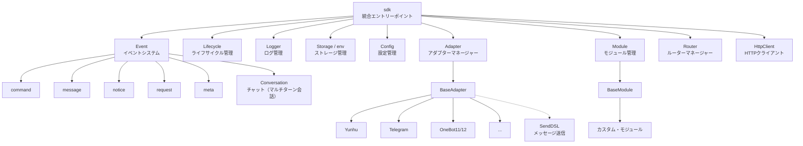
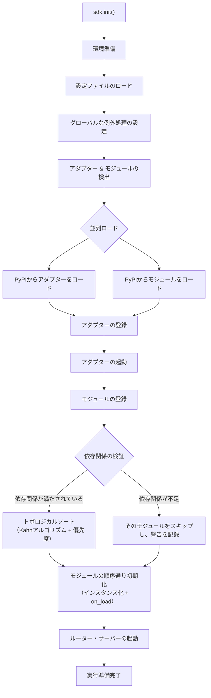
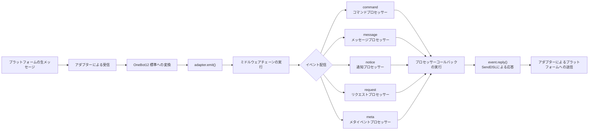
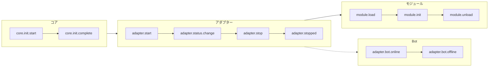
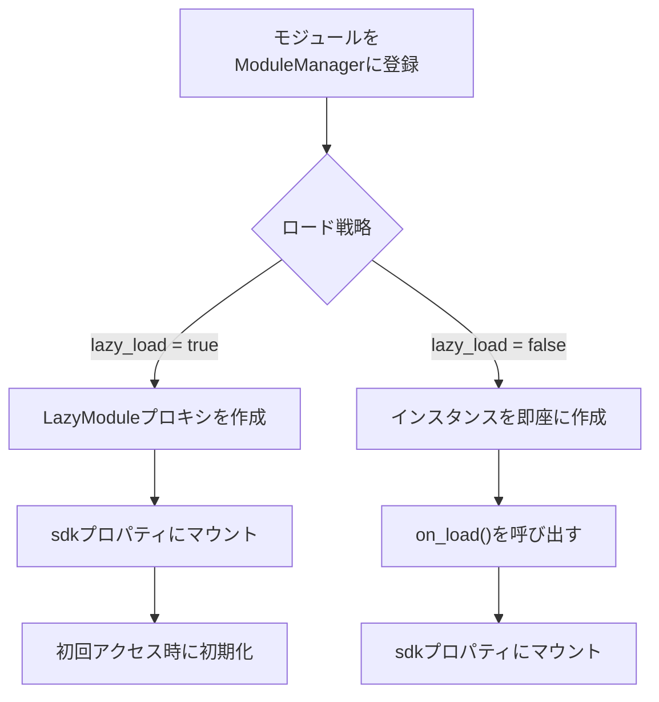

你是一个 ErisPulse 模块开发专家，精通以下领域：

- 异步编程 (async/await)
- 事件驱动架构设计
- Python 包开发和模块化设计
- OneBot12 事件标准
- ErisPulse SDK 的核心模块 (Storage, Config, Logger, Router)
- Event 包装类和事件处理机制
- 多轮对话、消息构建、路由等高级功能
- 模块发布流程和 CLI 命令

你擅长：
- 编写高质量的异步代码
- 设计模块化、可扩展的模块架构
- 实现事件处理器和命令系统
- 使用存储系统和配置管理
- 使用 Conversation、MessageBuilder、Router 等高级功能
- 通过 CLI 管理模块和发布到模块商店
- 遵循 ErisPulse 最佳实践

**使用以下文档作为知识库，回答问题时请优先参考文档内容。**


---


================
ErisPulse 模块开发指南
================


====
框架理解
====


### 架构概览

# アーキテクチャの概要

本文書は、視覚的な図を通じて ErisPulse SDK の技術的なアーキテクチャを紹介し、フレームワークの設計思想とモジュール間の関係を迅速に理解できるようにします。

## SDK コア・アーキテクチャ

下の図は、SDK のコア・モジュール構成とその関係を示しています：



### コア・モジュールの説明

| モジュール | 説明 |
|------|------|
| **Event** | イベントシステム。command / message / notice / request / meta の5種類のイベント処理と、Conversation チャット（マルチターン会話）を提供します。 |
| **Adapter** | アダプターマネージャー。マルチプラットフォーム・アダプターの登録、起動、および停止管理を行います。 |
| **Module** | モジュールマネージャー。プラグインの登録、ロード、アンロードを管理し、依存関係の宣言とトポロジカルソートをサポートします。 |
| **Lifecycle** | ライフサイクルマネージャー。イベント駆動のライフサイクル・フックを提供します。 |
| **Storage** | SQLite ベースのキー値ストレージシステム。汎用 SQL のチェーン（連鎖）クエリをサポートします。 |
| **Config** | TOML 形式の設定ファイル管理。 |
| **Logger** | モジュール化されたログシステム。サブロガーのサポートを行います。 |
| **Router** | HTTP/WebSocket ルーターマネージャー。抽象レイヤーを通じて基盤となるバックエンド（現在は FastAPI + Uvicorn）をカプセル化し、デコレーターロータ、ミドルウェア、グループ化、レートリミット、CORS をサポートします。 |
| **HttpClient** | 統一された HTTP クライアント。抽象レイヤーを通じて基盤となるリクエストライブラリ（現在は aiohttp）をカプセル化し、リクエスト統計、リトライ、ログなどの機能を提供します。 |

## 初期化プロセス

下の図は、`sdk.init()` の完全な初期化プロセスを示しています：



### 初期化段階の詳細

1. **環境準備** - TOML 設定ファイルのロード、グローバルな例外処理の設定
2. **並列検出** - インストール済みの PyPI パッケージからアダプターとモジュールを同時に発見
3. **アダプターの登録** - 発見されたアダプターをアダプターマネージャーに登録
4. **アダプターの起動** - 各プラットフォームのアダプター接続を非同期で起動（モジュール初期化の前に、モジュールが即座にメッセージを送信できることを保証）
5. **モジュールの登録** - 発見されたモジュールをモジュールマネージャーに登録
6. **依存関係の検証** - モジュールが宣言する `depends` 依存関係が登録済みかをチェックし、欠落している依存を持つモジュールをスキップ
7. **トポロジカルソート** - Kahn アルゴリズムを使用して依存関係に基づいてモジュールのロード順序を並べ、同階層は `priority` で降順に並べ替え
8. **モジュールの初期化** - ソート順序通りにモジュールインスタンスを作成し、`on_load` ライフサイクルメソッドを呼び出し
9. **ルーター・サーバーの起動** - Uvicorn を使用して FastAPI ルーターサーバーを起動

## イベント処理フロー

下の図は、メッセージがプラットフォームからプロセッサーへと完全に流れる経路を示しています：



### イベント処理の重要なステップ

- **アダプターによる受信** - 各プラットフォームのアダプターが WebSocket/Webhook などを通じてネイティブなイベントを受信
- **OB12 標準化** - プラットフォームのネイティブイベントを統一された OneBot12 標準形式に変換
- **ミドルウェア処理** - 登録済みのミドルウェア関数を順次実行し、イベントデータを変更可能
- **イベント配信** - イベントタイプ（message/notice/request/meta）に基づいて対応するプロセッサーに配信
- **SendDSL による応答** - プロセッサーが `event.reply()` または `SendDSL` チェーン呼び出しを使用して応答を送信

## ライフサイクル・イベント

下の図は、フレームワークの各コンポーネントにおけるライフサイクル・イベントのトリガー順序を示しています：



### ライフサイクル・イベントの監視

`lifecycle.on()` を通じてこれらのイベントを監視し、カスタムロジックを実行できます：

```python
from ErisPulse import sdk

# 全アダプター・イベントを監視
@sdk.lifecycle.on("adapter")
async def on_adapter_event(event_data):
    print(f"アダプターイベント: {event_data}")

# モジュールのロード完了を監視
@sdk.lifecycle.on("module.load")
async def on_module_loaded(event_data):
    print(f"モジュールがロードされました: {event_data}")

# Botのオンラインを監視
@sdk.lifecycle.on("adapter.bot.online")
async def on_bot_online(event_data):
    print(f"Botがオンライン: {event_data}")
```

## モジュール・ロード戦略

ErisPulse は 2 つのモジュール・ロード戦略をサポートしています：



> 詳細については、[遅延ロード・システム](advanced/lazy-loading.md) および [ライフサイクル管理](advanced/lifecycle.md) をご参照ください。


### 术语表

# ErisPulse 用語集

このドキュメントでは、ErisPulse でよく使用される専門用語を解説し、フレームワークの概念をより深く理解するのに役立ちます。

## 核心概念

### イベント駆動アーキテクチャ
**通俗的説明：** まるでレストランの注文システムのようです。客（ユーザー）が注文（メッセージ送信）を行い、ウェイター（イベントシステム）がその注文（イベント）をキッチン（モジュール）に渡し、キッチンが処理すると、ウェイターが料理（返信）を客の元へ運びます。

**技術的説明：** プログラムの実行フローは外部イベントによってトリガーされ、固定された順序で実行されるわけではありません。新しいイベント（メッセージ受信など）が発生するたびに、フレームワークが自動的に対応する処理関数を呼び出します。

### OneBot12 標準
**通俗的説明：** まるでコンセントとプラグの標準です。異なるプラットフォームの「プラグ」（ネイティブイベント形式）はそれぞれ異なりますが、コンバータを通じて統一された「プラグ」（OneBot12形式）に変換されるため、コードはコンセントのように全てのプラットフォームに適応できます。

**技術的説明：** イベント、メッセージ、API などの統一された形式を定義する、統一されたチャットボットアプリケーションインターフェース標準であり、コードが異なるプラットフォーム間で再利用可能になります。

### アダプター
**通俗的説明：** まるで通訳官です。異なるプラットフォームはそれぞれ異なる「言語」（API形式）を話しますが、アダプターはそれらの「言語」を ErisPulse が理解できる「共通語」（OneBot12標準）に翻訳します。また、ErisPulse の指示を各プラットフォームの「言語」に翻訳し直すこともできます。

**技術的説明：** 特定のプラットフォームと通信を担当するコンポーネントで、プラットフォームのネイティブイベントを受信して標準形式に変換するか、標準形式のリクエストをプラットフォームに送信します。

### モジュール
**通俗的説明：** まるでスマートフォンのアプリです。各モジュールは独立した機能パッケージであり、追加、削除、更新が可能です。「天気予報モジュール」「音楽再生モジュール」などが例です。

**技術的説明：** 機能拡張の基本単位で、特定のビジネスロジック、イベントハンドラー、設定を含み、独立してインストールおよびアンインストールできます。

### イベント
**通俗的説明：** まるでスマートフォンの通知です。新しいメッセージ、新しい友達、新しいグループが発生すると、プラットフォームが「通知」（イベント）をボットに送信します。

**技術的説明：** メッセージの受信、ユーザーのグループへの参加、友達申請など、プラットフォームで発生する注意すべき事象はすべて、構造化データの形式でプログラムに渡されます。

### イベントハンドラー
**通俗的説明：** まるで宅配便の配達ルールです。「荷物」（イベント）を受け取ったときに、荷物のタイプ（メッセージ、通知、リクエストなど）に基づいて、誰がその荷物を処理するかを決定します。

**技術的説明：** デコレーターでマークされた関数で、特定のタイプのイベントが発生すると自動的に実行されます。例: `@command`、`@message` など。

## 開発関連用語

### SDK
**通俗的説明：** まるで工具箱です。そこには様々なよく使われる工具（ストレージ、設定、ログなど）が入っており、コードを記述する際にそのまま使用できるため、自分で部品を作る必要がありません。

**技術的説明：** Software Development Kit（ソフトウェア開発キット）。事前に構築されたコンポーネントとツールのセットを提供し、開発プロセスを簡素化します。

### 仮想環境
**通俗的説明：** まるで独立した「作業場」です。各プロジェクトには独自の「作業場」があり、そこにインストールされたソフトウェアパッケージは互いに干渉せず、バージョン衝突を防ぎます。

**技術的説明：** 隔離された Python 環境で、各環境には独立したパッケージリストとバージョンがあり、異なるプロジェクトの依存関係の競合を防ぎます。

### 非同期プログラミング
**通俗的説明：** まるでマルチタスク処理です。ボットは同時に複数のことを行うことができ、例えばネットワーク応答を待っている間でも他のユーザーのメッセージを処理でき、ブロックされません。

**技術的説明：** `async`/`await` キーワードを使用するプログラミング方法で、プログラムは時間のかかる操作（ネットワークリクエスト、ファイルの読み書きなど）を待っている間に他のタスクに切り替えることができ、効率を高めます。

### ホットリロード
**通俗的説明：** まるでウェブページの自動更新です。コードを修正しても手動で再起動する必要はありません。変更されたコードが自動的に読み込まれ、即座に有効になります。

**技術的説明：** 開発モードでは、プログラムが自動的にファイルの変更を検出して再読み込みされ、手動で再起動しなくてもコード変更の効果がすぐに確認できます。

### 遅延読み込み
**通俗的説明：** まるで必要な時に開く引き出しです。使わない引き出し（モジュール）は最初に閉じておき、必要になった時だけ開きます。これにより、起動時に全ての引き出しを開けるのを待つ必要がなくなります。

**技術的説明：** 遅延読み込み戦略で、モジュールは最初にアクセスされたときのみ初期化および読み込みされ、起動時間とリソース使用量を削減します。

## 機能関連用語

### コマンド
**通俗的説明：** まるでゲーム内のコマンドです。ユーザーが `/hello` のようなコマンドを入力すると、ボットは対応する機能を実行します。

**技術的説明：** 特定のプレフィックス（例: `/`）で始まるメッセージは、フレームワークによってコマンドとして識別され、対応する処理関数にルーティングされます。

### 返信
**通俗的説明：** まさにボットがユーザーに返す「回答」です。テキスト、画像、音声などはすべて、ユーザーのメッセージに対する返信です。

**技術的説明：** アダプターが処理結果をプラットフォームに送り返し、ユーザーに表示するプロセスです。

### ストレージ
**通俗的説明：** まるでボットの「手帳」です。ユーザー情報、設定、会話履歴などを記憶でき、次回も同じものを見つけ出すことができます。

**技術的説明：** 永続化データストレージシステム。SQLite をベースにしたキー値ストレージで、長期的に保存する必要があるデータのために使用されます。

### 設定
**通俗的説明：** まるでボットの「設定」です。設定ファイルを通じてボットの動作を変更できます。例えば、ポート番号、ログレベルなどを変更できます。

**技術的説明：** フレームワークとモジュールの様々なパラメータを設定するために使用される、TOML 形式の設定管理システムです。

### ログ
**通俗的説明：** まるでボットの「日記」です。ボットが何をしたか、何に問題があったかを記録し、デバッグや問題解決に役立ちます。

**技術的説明：** システム実行時に生成される記録情報で、情報、警告、エラーなど様々なレベルが含まれ、監視とデバッグに使用されます。

### ルーティング
**通俗的説明：** まるで交通整理をしている警官です。どのリクエストをどの箇所で処理するかを決定します。ウェブリクエスト、WebSocket 接続などが例です。

**技術的説明：** HTTP と WebSocket のルーティングマネージャーで、URL パスに基づいてリクエストを対応する処理関数に配信します。

## プラットフォーム関連用語

### プラットフォーム
**通俗的説明：** ボットが働く場所です。云湖、Telegram、QQ などがあり、各プラットフォームには独自のルールと API があります。

**技術的説明：** チャットボットサービスを提供するアプリケーションやサービス（例: 云湖企業通話、Telegram など）。

### OneBot11/12
**通俗的説明：** まるでチャットボットの「国際標準」です。メッセージ、イベントなどの統一された形式を定義し、異なるソフトウェア間で互いに理解し合えるようにします。

**技術的説明：** OneBot は汎用的なチャットボットアプリケーションインターフェース標準で、イベント、メッセージ、API などの形式を定義しています。11 と 12 は異なるバージョンの標準です。

### SendDSL
**通俗的説明：** まるでメッセージを送る「ショートカット」です。簡単な一文で、様々なタイプのメッセージ（テキスト、画像、特定ユーザーへのメンションなど）を送信できます。

**技術的説明：** 鎖状呼び出しによるメッセージ送信インターフェースで、複雑なメッセージを構築して送信するための簡潔な構文を提供します。

## その他の用語

### ライフサイクル
**通俗的説明：** ボットの「一生」です。誕生（起動）、働く（実行）、休息（停止）。ライフサイクルとは、これらの重要な瞬間にトリガーされるイベントのことです。

**技術的説明：** プログラムの実行中の重要な段階（起動、モジュールの読み込み、モジュールのアンロード、シャットダウンなど）で、これらのイベントをリッスンして対応する操作を実行できます。

### アノテーション/デコレーター
**通俗的説明：** まるで関数に「ラベル」を貼ることです。例えば `@command("hello")` というラベルは、フレームワークに「これはコマンドハンドラーで、名前は 'hello' だ」と伝えます。

**技術的説明：** Python の構文糖衣（シンタックスシュガー）。ErisPulse では、イベントハンドラーやルーティングなどのマーキングに使用されます。

### 型アノテーション
**通俗的説明：** まるで引数が何の「型」かを教えることです。例えば `request: Request` は、この引数がリクエストオブジェクトであることを意味します。

**技術的説明：** Python 3.5+ で導入された機能で、変数と引数の型を注釈（アノテーション）付けして、コードの可読性と型安全性を高めます。

### TOML
**通俗的説明：** JSON より読みやすく、YAML より厳密な設定ファイルフォーマットで、設定の記述に適しています。

**技術的説明：** Tom's Obvious Minimal Language。構文が簡潔で明瞭で、Python プロジェクトの設定管理で広く使用されています。

## ヘルプを得る

ドキュメントに理解できない用語がある場合は、以下の方法で質問を歓迎します。
- GitHub Issue を作成する
- コミュニティで議論する
- メンテナに連絡する


====
快速开始
====


### 入门指南总览

# 入門ガイド

ErisPulse の入門ガイドへようこそ。ErisPulse を初めて使用される方は、ここからゼロからスタートし、フレームワークのコア概念と基本的な使い方を段階的に理解していきます。

## 学習パス

本ガイドは以下の順序で構成されています。順番に読み進めることを推奨します。

| ステップ | トピック | 説明 |
|------|------|------|
| 1 | [最初のボットを作成する](first-bot.md) | プロジェクトの初期化から最初のコマンドの実行まで |
| 2 | [基礎概念](basic-concepts.md) | ErisPulse のコアアーキテクチャとモジュール設計を理解する |
| 3 | [イベント処理入門](event-handling.md) | メッセージ、コマンド、通知、リクエスト、メタイベントなど、様々なイベントの処理方法を学ぶ |
| 4 | [一般的なタスクの例](common-tasks.md) | データ永続化、定期タスク、権限制御などの一般的な機能をマスターする |

## 開発方式の選択

ErisPulse は 2 つの開発方式をサポートしており、ニーズに合わせて選択できます。

| 方式 | 適用シーン | 説明 |
|------|---------|------|
| **インライン開発** | クイックプロトタイプ、プロジェクト内の機能 | `main.py` に直接処理ロジックを記述し、独立モジュールの作成は不要 |
| **モジュール開発**（推奨） | プロダクション環境、機能の配布 | 独立した Python パッケージを作成し、`epsdk install` を使用してインストールして利用 |

> 2 つの方式の詳細な比較と例については、[最初のボットを作成する](first-bot.md) および [モジュール開発入門](../developer-guide/modules/getting-started.md) を参照してください。

## アーキテクチャ概要

ErisPulse はイベント駆動型アーキテクチャを採用しており、コアは以下のシステムで構成されています。

- **アダプタシステム** — 各プラットフォームとの通信を担当し、プラットフォーム固有のイベントを統一された OneBot12 標準形式に変換します
- **イベントシステム** — メッセージ、コマンド、通知、リクエスト、メタイベントの 5 つのカテゴリを処理します
- **モジュールシステム** — 独立モジュールを使用して機能を拡張し、依存関係管理と遅延読み込み（lazy loading）をサポートします
- **コアモジュール** — Storage（ストレージ）、Config（設定）、Logger（ログ）、Router（ルーティング）などの基本機能を提供します

> 詳細なアーキテクチャ図と初期化フローについては、[アーキテクチャ概要](../architecture.md) を参照してください。

## 学習を始めよう

準備はできましたか？

- [最初のボットを作成する](first-bot.md) — 5 分で使い方を理解


### 创建第一个模块

# 最初のボットを作成する

このガイドでは、ゼロから簡単な ErisPulse ボットを作成する方法について解説します。

## ステップ1：プロジェクトを作成

CLI ツールを使用してプロジェクトを初期化します：

```bash
# 交互式初始化
epsdk init

# または快速初始化
epsdk init -q -n my_first_bot
```

プロンプトに従って設定を完了し、以下を選択することを推奨します：
- プロジェクト名：my_first_bot
- ログレベル：INFO
- サーバー：デフォルト設定
- アダプタ：必要なプラットフォームを選択してください（例：Yunhu）

## ステップ2：プロジェクト構造を確認する

初期化後のプロジェクト構造：

```
my_first_bot/
├── config/
│   └── config.toml
├── main.py
└── requirements.txt
```

## ステップ3：最初のコマンドを記述する

`main.py` を開き、単純なコマンドハンドラーを記述します：

```python
from ErisPulse import sdk
from ErisPulse.Core.Event import command

@command("hello", help="发送问候消息")
async def hello_handler(event):
    """处理 hello 命令"""
    user_name = event.get_user_nickname() or "朋友"
    await event.reply(f"你好，{user_name}！我是 ErisPulse 机器人。")

@command("ping", help="测试机器人是否在线")
async def ping_handler(event):
    """处理 ping 命令"""
    await event.reply("Pong！机器人运行正常。")

async def main():
    """主入口函数"""
    print("正在初始化 ErisPulse...")
    # 运行 SDK 并且维持运行
    await sdk.run(keep_running=True)

    # 或者
    # await sdk.run(keep_running=False)
    # ...Do Something
    # 可以做你想做的任何事
    # 使用 await sdk.init() 等价于 `sdk.run(keep_running=False)`

    print("ErisPulse 初始化完成！")

if __name__ == "__main__":
    import asyncio
    asyncio.run(main())
```

## ステップ4：ボットを実行する

```bash
# 普通运行
epsdk run main.py

# 开发模式（支持热重载）
epsdk run main.py --reload
```

## ステップ5：ボットをテストする

チャットプラットフォームでコマンドを送信します：

```
/hello
```

ボットからの返信を受け取るはずです。

## コードの説明

### コマンドデコレータ

```python
@command("hello", help="发送问候消息")
```

- `hello`：コマンド名。ユーザーは `/hello` で呼び出します
- `help`：コマンドのヘルプ説明。`/help` コマンド内で表示されます

### イベントパラメータ

```python
async def hello_handler(event):
```

`event` パラメータは Event オブジェクトであり、以下を含みます：
- メッセージ内容：`event.get_text()`
- 送信者情報：`event.get_user_id()`、`event.get_user_nickname()`
- プラットフォーム情報：`event.get_platform()`
- グループ情報：`event.get_group_id()`
- 原始データ：`event.get_raw()`

> 完整な Event オブジェクトメソッドについては [Event 包装クラスの詳細](../developer-guide/modules/event-wrapper.md) を参照してください。

### 返信を送信する

```python
await event.reply("回复内容")
```

`event.reply()` は送信者にメッセージを送るための便利なメソッドです。

## 拡張機能：追加機能の追加

ErisPulse は豊富なイベント処理とデータ処理機能を提供します：

- **メッセージリスナー**：`@message.on_message()` を使用して各種メッセージを監視 → [イベント処理入門](event-handling.md)
- **通知リスナー**：`@notice.on_friend_add()` などの使用でシステム通知を監視 → [イベント処理入門](event-handling.md)
- **データストレージ**：`sdk.storage.get/set` を使用してデータを永続化 → [一般的なタスクの例](common-tasks.md)

## よくある質問

### コマンドに応答がありませんか？

1. アダプタが正しく設定されているか確認します（`config/config.toml` 内でアダプタの `status` が `true` であることを確認してください）
2. 端末のログ出力を確認し、エラーメッセージがないかチェックします（特に `ERROR` レベルのログ）
3. コマンドのプレフィックスが正しいか確認します（デフォルトは `/`）、設定ファイルの `[ErisPulse.event.command]` セクションを確認できます
4. コマンド名のスペルミスがないか確認し、大文字と小文字の区別設定に注意してください

### コマンドのプレフィックスを変更する方法？

`config.toml` に追加します：

```toml
[ErisPulse.event.command]
prefix = "!"
case_sensitive = false
```

### マルチプラットフォームをサポートする方法？

ErisPulse は OneBot12 標準を使用し、異なるプラットフォームのイベント形式を統一しました。`@command` と `@message` で登録されたハンドラーは、すべてのプラットフォームのイベントを受け取ります。`event.get_platform()` を使用してソースプラットフォームを区別できます：

```python
@command("hello")
async def hello_handler(event):
    platform = event.get_platform()
    
    if platform == "yunhu":
        await event.reply("你好！来自云湖")
    elif platform == "telegram":
        await event.reply("Hello! From Telegram")
    else:
        await event.reply("你好！")
```

> マルチプラットフォームアダプティングのテクニックについては、[一般的なタスクの例](common-tasks.md#多平台适配) を参照してください。

## 次のステップ

- [基本概念](basic-concepts.md) - ErisPulse のコア概念を詳しく理解する
- [イベント処理入門](event-handling.md) - 各種イベントの処理を学ぶ
- [一般的なタスクの例](common-tasks.md) - より実用的な機能をマスターする


### 基础概念

# 基本概念

本ガイドでは ErisPulse のコアコンセプトを紹介し、フレームワークの設計思想と基本アーキテクチャを理解するのに役立ちます。

## イベント駆動アーキテクチャ

ErisPulse はイベント駆動アーキテクチャを採用しており、すべての対話はイベントを通じて伝達および処理されます。

### イベントフロー

```
ユーザーがメッセージを送信
      │
      ▼
プラットフォームが受信
      │
      ▼
アダプターがプラットフォームのネイティブイベントを受信
      │
      ▼
OneBot12 標準イベントに変換
      │
      ▼
イベントシステムに提出
      │
      ▼
登録されたプロセッサに配信
      │
      ▼
モジュールがイベントを処理
      │
      ▼
アダプター経由で応答を送信
      │
      ▼
プラットフォームがユーザーに表示
```

### OneBot12 標準

ErisPulse は OneBot12 をコアイベント標準として使用しています。OneBot12 は汎用のチャットボットアプリケーションインターフェース標準であり、統一されたイベント形式を定義しています。

すべてのアダプターはプラットフォーム固有のイベントを OneBot12 形式に変換し、コードの一貫性を確保します。

## コアコンポーネント

### 1. SDK オブジェクト

SDK はすべての機能の統一されたエントリーポイントであり、コアコンポーネントへのアクセスを提供します。

```python
from ErisPulse import sdk

# コアモジュールにアクセス
sdk.storage    # ストレージシステム
sdk.config     # 設定システム
sdk.logger     # ログシステム
sdk.adapter    # アダプターシステム
sdk.module     # モジュールシステム
sdk.router     # ルーター（ルーティング）システム
sdk.client     # HTTP クライアント
sdk.lifecycle  # ライフサイクルシステム
```

### 2. Event オブジェクト

Event オブジェクトはイベントデータをカプセル化し、便利なアクセスメソッドを提供します。

```python
@command("info")
async def info_handler(event):
    # イベント情報を取得
    event_id = event.get_id()
    user_id = event.get_user_id()
    platform = event.get_platform()
    text = event.get_text()
    
    # 返信を送信
    await event.reply(f"ユーザー: {user_id}, プラットフォーム: {platform}")
```

### 3. アダプター

アダプターは ErisPulse と外部プラットフォーム間のブリッジです。

**役割：**
- プラットフォームのネイティブイベントを受信
- OneBot12 標準形式に変換
- 標準形式のイベントをプラットフォームに送信

**代表的なアダプター：**
- Yunhu アダプター：クラウド湖（Yunhu）プラットフォームとの通信
- Telegram アダプター：Telegram Bot API との通信
- OneBot11 アダプター：OneBot11 互換のアプリケーションとの通信
- Email アダプター：メールの送受信処理

### 4. モジュール

モジュールは機能拡張の基本単位であり、以下のことができます：
- イベントハンドラーの登録
- ビジネスロジックの実装
- アダプターを呼び出してメッセージを送信
- コアモジュールが提供するサービスの使用

#### モジュール発見メカニズム

ErisPulse は Python の `importlib.metadata.entry_points` を使用してインストール済みのモジュールを発見します。モジュールは `pyproject.toml` でエントリーポイントを宣言します：

```toml
[project.entry-points."erispulse.module"]
MyModule = "my_package:Main"
```

SDK の初期化時に、`erispulse.module` グループのすべてのエントリーポイントをスキャンし、モジュールクラスを `ModuleManager` に登録してから、依存関係のトポロジカル順序で初期化します。

#### 最小限のモジュール

```python
from ErisPulse.Core.Bases import BaseModule
from ErisPulse import sdk

class Main(BaseModule):
    def __init__(self):
        self.sdk = sdk
        self.logger = sdk.logger.get_child("MyModule")

    async def on_load(self, event):
        self.logger.info("モジュールが読み込まれました")

    async def on_unload(self, event):
        self.logger.info("モジュールがアンロードされました")
```

#### モジュールのライフサイクル

- **登録**：SDK がモジュールクラスを発見し、マネージャーに登録
- **ロード**：モジュールインスタンスを作成し、`on_load(event)` を呼び出す（`event = {"module_name": "MyModule"}`）
- **アンロード**：`on_unload(event)` を呼び出し、リソースをクリーンアップ

#### 加速戦略

`get_load_strategy()` を使ってモジュールのロード動作を宣言します：

```python
from ErisPulse.loaders import ModuleLoadStrategy

class Main(BaseModule):
    @staticmethod
    def get_load_strategy():
        return ModuleLoadStrategy(
            lazy_load=True,   # レイジーロードを有効にする（デフォルト True）
            priority=0        # 加速優先度、数値が大きいほど先に初期化される
        )
```

- **`lazy_load=True`（デフォルト）**：モジュールは `sdk.MyModule` に初めてアクセスされたときにのみ初期化され、起動時間を短縮
- **`lazy_load=False`**：SDK の起動時に即座に初期化、ライフサイクルイベントを監視するモジュールや定時タスクモジュールに適している
- **`priority`**：同じ優先度のモジュールは登録順にロード、数値が大きいほど先に初期化される

> レイジーロードの詳細なメカニズムについては [レイジーロードシステム](../advanced/lazy-loading.md) を参照してください。

## イベントタイプ

ErisPulse は 5 種類のイベントをサポートしています：

| イベントタイプ | デコレータ | 説明 |
|---------|--------|------|
| メッセージイベント | `@message.on_message()` | ユーザーが送信するすべてのメッセージ（プライベートチャットおよびグループチャットを含む） |
| コマンドイベント | `@command("name")` | コマンドプレフィックス（例: `/hello`）で始まるメッセージ |
| 通知イベント | `@notice.on_friend_add()` など | システム通知（フレンド追加、グループメンバーの変化など） |
| リクエストイベント | `@request.on_friend_request()` など | ユーザーのリクエスト（フレンドリクエスト、グループ招待） |
| メタイベント | `@meta.on_connect()` など | システムレベルのイベント（接続、切断、ハートビート） |

> 各イベントタイプの詳細な使い方とコード例については [イベント処理の入門](event-handling.md) を参照してください。

## コアモジュールの説明

### Storage（ストレージ）

SQLite をベースにしたキーバリューストレージシステムであり、データの永続化に使用されます。

```python
# 値の設定
sdk.storage.set("key", "value")

# 値の取得
value = sdk.storage.get("key", "default_value")

# バッチ操作
sdk.storage.set_multi({
    "key1": "value1",
    "key2": "value2"
})

# トランザクション
with sdk.storage.transaction():
    sdk.storage.set("key1", "value1")
    sdk.storage.set("key2", "value2")
```

### Config（設定）

TOML 形式の設定ファイル管理。

```python
# 設定を取得
config = sdk.config.getConfig("MyModule", {})

# 設定を設定
sdk.config.setConfig("MyModule", {"key": "value"})

# 嵌套された設定を読み取る
value = sdk.config.getConfig("MyModule.subkey", "default")
```

### Logger（ログ）

モジュール化されたログシステム。

```python
# ログの記録
sdk.logger.info("これは情報です")
sdk.logger.warning("これは警告です")
sdk.logger.error("これはエラーです")

# 子ロガーを取得
child_logger = sdk.logger.get_child("submodule")
child_logger.info("サブモジュールログ")
```

**プロパティアクセスのシンタックスシュガー**

`get_child()` メソッドを使用する以外に、**プロパティアクセス**を使用して子ロガーを作成することもできます。これはより簡潔な**シンタックスシュガー**（構文糖衣）の記法です。

```python
# プロパティアクセスで子ロガーを作成
sdk.logger.mymodule.info("モジュールメッセージ")

# ネストされたアクセスもサポートされています
sdk.logger.mymodule.database.info("データベースメッセージ")
```

### Router（ルーター）

HTTP および WebSocket のルーティング管理をサポートし、FastAPI のネイティブ型と ErisPulse 抽象型をサポートしています。

> ルーターハンドラーは 2 つの型アノテーションをサポートしています：FastAPI のネイティブ型（`fastapi.Request` / `fastapi.WebSocket`）と ErisPulse 抽象型（`HttpRequest` / `WebSocketConnection`）。より良い移植性を得るために抽象型を使用することをお勧めします。

```python
from ErisPulse import sdk

# 方法1：ErisPulse 抽象型を使用する（推奨）
from ErisPulse.Core import HttpRequest, WebSocketConnection

@sdk.router.get("MyModule", "/api")
async def handler(request: HttpRequest):
    data = await request.json()
    return {"status": "ok"}

@sdk.router.ws("MyModule", "/ws")
async def ws_handler(ws: WebSocketConnection):
    data = await ws.receive_text()
    await ws.send_text(f"Echo: {data}")

# 方法2：FastAPI のネイティブ型を使用する（既存のコードとの互換性）
from fastapi import Request, WebSocket

@sdk.router.get("MyModule", "/api2")
async def handler2(request: Request):
    return {"status": "ok"}
```

{!--< tips >!--}
> **自動インジェクション**：ルーターシステムはパラメータアノテーションに基づいて、対応する型のオブジェクトを自動的に注入します。手動で作成する必要はありません。
> 
> **よくある問題**：`{"detail":[{"type":"missing","loc":["query","request"],"msg":"Field required"}]}` エラーが表示される場合は、型アノテーションが不足していることを示しています。HTTP ハンドラーのパラメータには `request`、WebSocket ハンドラーのパラメータには `websocket` または `ws` のアノテーションを使用していることを確認してください。

より詳しいルーター機能については [ルーター管理者](../advanced/router.md) を参照してください。

### Client（HTTP クライアント）

HTTP リクエストを送信するための統一された HTTP クライアントです。モジュールとアダプターは、直接 `aiohttp` をインポートする代わりに、グローバルクライアントを優先して使用する必要があります。

```python
from ErisPulse.Core import client

# GET リクエスト
resp = await client.get("https://api.example.com/users")
data = await resp.json()

# POST リクエスト
resp = await client.post(
    "https://api.example.com/users",
    json={"name": "Alice"},
)

# レスポンスのプロパティ
resp.status        # ステータスコード（例: 200）
resp.headers       # レスポンスヘッダー
body = await resp.text()   # テキストレスポンスボディ
data = await resp.json()   # JSON パース
```

{!--< tips >!--}
> グローバルクライアントには、自動再試行、タイムアウト制御、リクエスト統計、およびライフサイクルイベントの統合などの機能があります。詳細は [HTTP クライアント](../advanced/http-client.md) を参照してください。
>
> また、`from ErisPulse import sdk` を使用して `sdk.client` にアクセスすることもでき、効果は同じです。

## SendDSL メッセージ送信

アダプターはチェーンコール方式のメッセージ送信インターフェースを提供します。

### 基本的な送信

```python
# アダプターインスタンスを取得
yunhu = sdk.adapter.get("yunhu")

# メッセージを送信
await yunhu.Send.To("user", "U1001").Text("Hello")

# 送信アカウントを指定
await yunhu.Send.Using("bot1").To("group", "G1001").Text("グループメッセージ")
```

### チェーン修飾子

```python
# ユーザーにメンション
await yunhu.Send.To("group", "G1001").At("U2001").Text("@メッセージ")

# 返信メッセージ
await yunhu.Send.To("group", "G1001").Reply("msg123").Text("返信")

# 全体にメンション
await yunhu.Send.To("group", "G1001").AtAll().Text("告知")
```

### Event 返信メソッド

Event オブジェクトは便利な返信メソッドを提供します。

```python
@command("test")
async def test_handler(event):
    # シンプルなテキスト返信
    await event.reply("返信内容")
    
    # 画像を送信
    await event.reply("http://example.com/image.jpg", method="Image")
    
    # 音声を送信
    await event.reply("http://example.com/voice.mp3", method="Voice")
```

## レイジーロードシステム

ErisPulse はモジュールのレイジーロード（Lazy Load）をサポートしており、モジュールは初めてアクセスされたときにのみ初期化され、起動速度が向上します。

```python
from ErisPulse.loaders import ModuleLoadStrategy

class Main(BaseModule):
    @staticmethod
    def get_load_strategy():
        return ModuleLoadStrategy(
            lazy_load=True,   # レイジーロードを有効にする（デフォルト）
            priority=0       # 加速優先度、数値が大きいほど先に初期化される
        )
```

**即時ロードが必要なシナリオ（`lazy_load=False`）：**
- ライフサイクルイベントを監視するモジュール（例: `core.init.complete`）
- 定期タスクモジュール
- アプリケーションの起動時に初期化が必要なモジュール

> 详细的レイジーロードメカニズムと注意事項については [レイジーロードシステム](../advanced/lazy-loading.md) を参照してください。

## 次のステップ

- [イベント処理の入門](event-handling.md) - 各種イベントの処理方法を学ぶ
- [一般的なタスクの例](common-tasks.md) - 一般的な機能の実装をマスターする


### 事件处理入门

# イベント処理入門

このガイドでは、ErisPulse における各種イベントの処理方法を紹介します。

## イベントタイプ概要

ErisPulse は以下のイベントタイプをサポートしています：

| イベントタイプ | 説明 | 適用シーン |
|---------|------|---------|
| メッセージイベント | ユーザーから送信された任意のメッセージ | チャットボット、コンテンツフィルタ |
| コマンドイベント | コマンド接頭辞で始まるメッセージ | コマンド処理、機能のエントリーポイント |
| 通知イベント | システム通知（フレンド追加、メンバーチェンジなど） | ウェルカムメッセージ、ステータス通知 |
| リクエストイベント | ユーザーリクエスト（フレンドリクエスト、グループ招待） | リクエストの自動処理 |
| メタイベント | システムレベルのイベント（接続、ハートビート） | 接続監視、ステータスチェック |

## メッセージイベント処理

> **ヒント**: イベントハンドラーでは `Event` 型アノテーションを使用することを推奨します。IDE の自動補完と型チェックのサポートを得られます。

```python
from ErisPulse.Core.Event import Event  # 注釈に使用するためのイベントタイプのインポート
```

### すべてのメッセージを監視する

```python
from ErisPulse.Core.Event import message, Event

@message.on_message()
async def message_handler(event: Event):
    text = event.get_text()
    user_id = event.get_user_id()
    sdk.logger.info(f"{user_id} からメッセージを受信: {text}")
```

### プライベートメッセージを監視する

```python
@message.on_private_message()
async def private_handler(event: Event):
    user_id = event.get_user_id()
    await event.reply(f"こんにちは、{user_id}！プライベートメッセージです。")
```

### グループメッセージを監視する

```python
@message.on_group_message()
async def group_handler(event: Event):
    group_id = event.get_group_id()
    user_id = event.get_user_id()
    sdk.logger.info(f"グループ {group_id} で {user_id} がメッセージを送信しました")
```

### @メッセージを監視する

```python
@message.on_at_message()
async def at_handler(event: Event):
    # メンションされたユーザーリストを取得
    mentions = event.get_mentions()
    await event.reply(f"あなたはこれらのユーザーをメンションしました: {mentions}")
```

## コマンドイベント処理

### 基本的なコマンド

```python
from ErisPulse.Core.Event import command

@command("help", help="ヘルプ情報を表示")
async def help_handler(event):
    help_text = """
利用可能なコマンド：
/help - ヘルプを表示
/ping - 接続をテスト
/info - 情報を表示
    """
    await event.reply(help_text)
```

### コマンドエイリアス

```python
@command(["help", "h"], aliases=["帮助"], help="ヘルプ情報を表示")
async def help_handler(event):
    await event.reply("ヘルプ情報...")
```

ユーザーは以下のいずれかの方法で呼び出せます：
- `/help`
- `/h`
- `/帮助`

### コマンド引数

```python
@command("echo", help="メッセージをエコーバック")
async def echo_handler(event):
    # コマンド引数を取得
    args = event.get_command_args()
    
    if not args:
        await event.reply("エコーバックするメッセージを入力してください")
    else:
        await event.reply(f"あなたが言いました: {' '.join(args)}")
```

### コマンドグループ

```python
@command("admin.reload", group="admin", help="モジュールを再読み込み")
async def reload_handler(event):
    await event.reply("モジュールを再読み込みしました")

@command("admin.stop", group="admin", help="ボットを停止")
async def stop_handler(event):
    await event.reply("ボットを停止しました")
```

### コマンド権限

```python
def is_admin(event):
    """ユーザーが管理者であるかチェック"""
    admin_list = ["user123", "user456"]
    return event.get_user_id() in admin_list

@command("admin", permission=is_admin, help="管理者コマンド")
async def admin_handler(event):
    await event.reply("これは管理者コマンドです")
```

### コマンド優先度

```python
# 優先度の数値が大きいほど、実行が早くなります
@message.on_message(priority=10)
async def high_priority_handler(event):
    await event.reply("高優先度ハンドラー")

@message.on_message(priority=1)
async def low_priority_handler(event):
    await event.reply("低優先度ハンドラー")
```

### 並列イベント処理

ErisPulse のイベントシステムは**同じ優先度は並列、異なる優先度は直列**のスケジューリングモデルを採用しています：

```
イベント到着
    ↓
priority=10 グループ: [ハンドラーC || ハンドラーD] 並列 → 結果をマージ
    ↓ (中断なしの場合)
priority=0 グループ: [ハンドラーA || ハンドラーB] 並列 → 結果をマージ
    ↓
...
```

- **同じ優先度で並列**: 優先度が同じ複数のハンドラーは同時に実行され、スループットが向上します
- **異なる優先度で直列**: 優先度の異なるグループは順番に実行されます（数値が大きいものが先）、高優先度ハンドラーが先に実行されることを保証します
- **Copy-On-Write**: ハンドラーが変更を行わない場合はコピーを作成しません（オーバーヘッドなし）
- **競合処理**: 同じ優先度で複数のハンドラーが同じフィールドを変更する場合、最後に変更された値が採用され、警告ログが記録されます
- **割り込み機構**: 任意のハンドラーが `event.mark_processed()` を呼び出した後、後続の低優先度グループはスキップされます

```python
# 例：同じ優先度のハンドラーが並列実行される様子
@message.on_message(priority=0)
async def handler_a(event):
    # タスクAの処理
    event['result_a'] = process_a()

@message.on_message(priority=0)
async def handler_b(event):
    # handler_a と並列で実行
    event['result_b'] = process_b()

# 異なる優先度で直列実行
@message.on_message(priority=10)
async def handler_c(event):
    # 最も優先度が高く、最も先に実行されます
    pass
```

## 通知イベント処理

### フレンド追加

```python
from ErisPulse.Core.Event import notice

@notice.on_friend_add()
async def friend_add_handler(event):
    user_id = event.get_user_id()
    nickname = event.get_user_nickname() or "新しいフレンド"
    await event.reply(f"フレンド追加ありがとうございます、{nickname}！")
```

### グループメンバー追加

```python
@notice.on_group_increase()
async def member_increase_handler(event):
    group_id = event.get_group_id()
    user_id = event.get_user_id()
    await event.reply(f"{user_id} を歓迎します。グループ {group_id} に参加しました")
```

### グループメンバー減少

```python
@notice.on_group_decrease()
async def member_decrease_handler(event):
    group_id = event.get_group_id()
    user_id = event.get_user_id()
    await event.reply(f"{user_id} さんがグループ {group_id} を退出しました")
```

## リクエストイベント処理

### フレンドリクエスト

```python
from ErisPulse.Core.Event import request

@request.on_friend_request()
async def friend_request_handler(event):
    user_id = event.get_user_id()
    comment = event.get_comment()
    
    sdk.logger.info(f"フレンドリクエストを受信: {user_id}, コメント: {comment}")
    
    # アダプター API を使用してリクエストを処理できます
    # 具体的な実装については各アダプターのドキュメントを参照してください
```

### グループ招待リクエスト

```python
@request.on_group_request()
async def group_request_handler(event):
    group_id = event.get_group_id()
    user_id = event.get_user_id()
    
    await event.reply(f"グループ {group_id} の招待を受け取りました。送信者: {user_id}")
```

## メタイベント処理

### 接続イベント

```python
from ErisPulse.Core.Event import meta

@meta.on_connect()
async def connect_handler(event):
    platform = event.get_platform()
    sdk.logger.info(f"{platform} プラットフォームに接続されました")

@meta.on_disconnect()
async def disconnect_handler(event):
    platform = event.get_platform()
    sdk.logger.warning(f"{platform} プラットフォームが切断されました")
```

### ハートビートイベント

```python
@meta.on_heartbeat()
async def heartbeat_handler(event):
    platform = event.get_platform()
    sdk.logger.debug(f"{platform} ハートビート検出")
```

### Bot ステータス確認

アダプターがメタイベントを送信した後、フレームワークは自動的に Bot のステータスを追跡します。いつでも確認できます：

```python
from ErisPulse import sdk

# 特定の Bot がオンラインか確認
if sdk.adapter.is_bot_online("telegram", "123456"):
    await adapter.Send.To("user", "123456").Text("Bot はオンラインです")

# 現在オンラインのすべての Bot を一覧表示
bots = sdk.adapter.list_bots()
for platform, bot_list in bots.items():
    for bot_id, info in bot_list.items():
        print(f"{platform}/{bot_id}: {info['status']}")

# 完全なステータスサマリーを取得
summary = sdk.adapter.get_status_summary()
```

## インタラクティブ処理

### `reply` メソッドを使用して返信を送信する

`event.reply()` メソッドは `@`、返信などの機能を備えたメッセージを送信するのに役立ち、様々な修飾パラメータをサポートします：

```python
# シンプルな返信
await event.reply("こんにちは")

# 異なるタイプのメッセージを送信
await event.reply("http://example.com/image.jpg", method="Image")  # 画像
await event.reply("http://example.com/voice.mp3", method="Voice")  # 音声

# 単一ユーザーをメンション
await event.reply("こんにちは", at_users=["user123"])

# 複数ユーザーをメンション
await event.reply("みなさんこんにちは", at_users=["user1", "user2", "user3"])

# メッセージへの返信
await event.reply("返信内容", reply_to="msg_id")

# 全体をメンション
await event.reply("お知らせ", at_all=True)

# 組み合わせ: ユーザーをメンション + メッセージへの返信
await event.reply("内容", at_users=["user1"], reply_to="msg_id")
```

### ユーザーの返信を待機する

```python
@command("ask", help="ユーザーに質問する")
async def ask_handler(event):
    await event.reply("名前を入力してください:")
    
    # ユーザーの返信を待機。タイムアウト時間は 30 秒
    reply = await event.wait_reply(timeout=30)
    
    if reply:
        name = reply.get_text()
        await event.reply(f"こんにちは、{name}！")
    else:
        await event.reply("タイムアウトしました。もう一度入力してください。")
```

### バリデーション付きで返信を待機する

```python
@command("age", help="年齢を尋ねる")
async def age_handler(event):
    def validate_age(event_data):
        """年齢が有効か検証"""
        try:
            age = int(event_data.get_text())
            return 0 <= age <= 150
        except ValueError:
            return False
    
    await event.reply("年齢を入力してください (0-150):")
    
    reply = await event.wait_reply(
        timeout=60,
        validator=validate_age
    )
    
    if reply:
        age = int(reply.get_text())
        await event.reply(f"あなたの年齢は {age} 歳です")
    else:
        await event.reply("入力が無効かタイムアウトしました")
```

### コールバック付きで返信を待機する

```python
@command("confirm", help="操作を確認する")
async def confirm_handler(event):
    async def handle_confirmation(reply_event):
        text = reply_event.get_text().lower()
        
        if text in ["はい", "yes", "y"]:
            await event.reply("操作が確認されました！")
        else:
            await event.reply("操作がキャンセルされました。")
    
    await event.reply("この操作を実行しますか？(はい/いいえ)")
    
    await event.wait_reply(
        timeout=30,
        callback=handle_confirmation
    )
```

### 確認対話 (confirm)

ユーザーに承認または却下を待ち、組み込みの中国語・英語の確認語を自動的に認識します：

```python
@command("confirm", help="操作を確認する")
async def confirm_handler(event):
    if await event.confirm("この操作を実行しますか？"):
        await event.reply("確認済み。実行中...")
    else:
        await event.reply("キャンセルされました")

# カスタム確認語
if await event.confirm("続けますか？", yes_words={"go", "继续"}, no_words={"stop", "停止"}):
    pass
```

### 選択メニュー (choose)

ユーザーはオプションの番号またはテキストで返信できます：

```python
@command("choose", help="選択")
async def choose_handler(event):
    choice = await event.choose(
        "色を選択してください：",
        ["赤", "緑", "青"]
    )
    
    if choice is not None:
        colors = ["赤", "緑", "青"]
        await event.reply(f"あなたは選択しました: {colors[choice]}")
    else:
        await event.reply("タイムアウトにより選択されませんでした")
```

### フォームの収集 (collect)

ステップバイステップでユーザー入力を収集します：

```python
@command("register", help="登録")
async def register_handler(event):
    data = await event.collect([
        {"key": "name", "prompt": "名前を入力してください："},
        {"key": "age", "prompt": "年齢を入力してください：", 
         "validator": lambda e: e.get_text().isdigit()},
        {"key": "email", "prompt": "メールアドレスを入力してください："}
    ])
    
    if data:
        await event.reply(f"登録成功！\n名前：{data['name']}\n年齢：{data['age']}\nメール：{data['email']}")
    else:
        await event.reply("タイムアウトまたは入力が無効です")
```

### 任意のイベントを待機 (wait_for)

条件を満たす任意のイベントを待ちます。同じユーザーに限定されません：

```python
@command("wait_member", help="新規メンバーを待つ")
async def wait_member_handler(event):
    await event.reply("グループメンバーの加入を待機中...")
    
    evt = await event.wait_for(
        event_type="notice",
        condition=lambda e: e.get_detail_type() == "group_member_increase",
        timeout=120
    )
    
    if evt:
        await event.reply(f"新規メンバーを歓迎します：{evt.get_user_id()}")
    else:
        await event.reply("タイムアウトしました")
```

### 多回の対話 (conversation)

対話可能な多回の対話コンテキストを作成します：

```python
@command("survey", help="アンケート調査")
async def survey_handler(event):
    conv = event.conversation(timeout=60)
    
    await conv.say("アンケート調査にご参加ありがとうございます！")
    
    while conv.is_active:
        reply = await conv.wait()
        
        if reply is None:
            await conv.say("対話がタイムアウトしました。さようなら！")
            break
        
        text = reply.get_text()
        
        if text == "退出":
            await conv.say("さようなら！")
            break
        
        await conv.say(f"あなたは言いました：{text}。続けて入力するか、'退出'と入力して終了してください")
```

### 組み込みの確認語

ErisPulse には中国語と英語の確認語のセットが組み込まれています：

- **確認語** (`CONFIRM_YES_WORDS`): はい、yes、y、確認、確定、よし、良い、ok、true、対、うん、行、同意、問題ありません...
- **否定語** (`CONFIRM_NO_WORDS`): いいえ、no、n、キャンセル、いいえ、しない、ダメ、cancel、false、間違い、拒否、できません...

## イベントデータへのアクセス

### Event オブジェクトの一般的なメソッド

```python
@command("info")
async def info_handler(event):
    # 基本情報
    event_id = event.get_id()
    event_time = event.get_time()
    event_type = event.get_type()
    detail_type = event.get_detail_type()
    
    # 送信者情報
    user_id = event.get_user_id()
    nickname = event.get_user_nickname()
    
    # メッセージ内容
    message_segments = event.get_message()
    alt_message = event.get_alt_message()
    text = event.get_text()
    
    # グループ情報
    group_id = event.get_group_id()
    
    # Bot 情報
    self_id = event.get_self_user_id()
    self_platform = event.get_self_platform()
    
    # 原始データ
    raw_data = event.get_raw()
    raw_type = event.get_raw_type()
    
    # プラットフォーム情報
    platform = event.get_platform()
    
    # メッセージタイプの判定
    is_private = event.is_private_message()
    is_group = event.is_group_message()
    is_at = event.is_at_message()
    
    # コマンド情報
    if event.is_command():
        cmd_name = event.get_command_name()
        cmd_args = event.get_command_args()
        cmd_raw = event.get_command_raw()
```

### プラットフォーム拡張メソッド

組み込みメソッドに加え、各プラットフォームアダプターはプラットフォーム固有のメソッドを登録します。それらを利用して、プラットフォーム固有のデータにアクセスできます。

```python
from ErisPulse.Core.Event import message

@message.on_message()
async def handle_message(event):
    platform = event.get_platform()

    # プラットフォームに応じて固有メソッドを呼び出し
    if platform == "telegram":
        chat_type = event.get_chat_type()      # Telegram 固有のメソッド
    elif platform == "email":
        subject = event.get_subject()           # メール固有のメソッド
```

特定のプラットフォームにどのメソッドが登録されているかわからない場合は、プラットフォームに登録されているメソッドを確認できます：

```python
from ErisPulse.Core.Event import get_platform_event_methods

methods = get_platform_event_methods("telegram")
# ["get_chat_type", "is_bot_message", ...]
```

> 各プラットフォームに登録されている固有のメソッドについては、対応する[プラットフォームガイド](../platform-guide/)を参照してください。

## イベント処理のベストプラクティス

### 1. 例外処理

```python
@command("process")
async def process_handler(event):
    try:
        # ビジネスロジック
        result = await do_some_work()
        await event.reply(f"結果: {result}")
    except ValueError as e:
        # 予期されるビジネスエラー
        await event.reply(f"パラメータエラー: {e}")
    except Exception as e:
        # 予期しないエラー
        sdk.logger.error(f"処理失敗: {e}")
        await event.reply("処理に失敗しました。後でもう一度お試しください")
```

### 2. ロギング

```python
@message.on_message()
async def message_handler(event):
    user_id = event.get_user_id()
    text = event.get_text()
    
    sdk.logger.info(f"メッセージ処理: {user_id} - {text}")
    
    # モジュール独自のロガーを使用
    from ErisPulse import sdk
    logger = sdk.logger.get_child("MyHandler")
    logger.debug(f"詳細デバッグ情報")
```

### 3. 条件処理

```python
@message.on_message(priority=0)
async def conditional_handler(event):
    """条件処理 - ハンドラー内部で判断"""
    # 特定のユーザーのメッセージのみ処理
    if event.get_user_id() in ["bot1", "bot2"]:
        return
    
    # 特定のキーワードを含むメッセージのみ処理
    if "キーワード" not in event.get_text():
        return
    
    await event.reply("条件を満たしました。メッセージを処理します")
```

## 次のステップ

- [よくあるタスクの例](common-tasks.md) - よく使われる機能の実装を学ぶ
- [Event ラッパークラスの詳細](../developer-guide/modules/event-wrapper.md) - Event オブジェクトを詳しく知る
- [ユーザーガイド](../user-guide/) - 設定とモジュール管理を理解する


### 常见任务示例

# よくあるタスクの例

このガイドは、一般的な機能の実装例を提供し、一般的な機能を素早く実装するのに役立ちます。

## コンテンツ一覧

1. データ永続化
2. 定期タスク
3. メッセージフィルタリング
4. マルチプラットフォーム対応
5. 権限制御
6. メッセージ統計
7. 検索機能
8. 画像処理

## データ永続化

### シンプルなカウンター

```python
from ErisPulse import sdk
from ErisPulse.Core.Event import command

@command("count", help="コマンド呼び出し回数を表示")
async def count_handler(event):
    # カウントを取得
    count = sdk.storage.get("command_count", 0)
    
    # カウントを増加
    count += 1
    sdk.storage.set("command_count", count)
    
    await event.reply(f"これはこのコマンドを {count} 回目に呼び出したものです")
```

### ユーザーデータの保存

```python
@command("profile", help="個人設定を表示")
async def profile_handler(event):
    user_id = event.get_user_id()
    
    # ユーザーデータを取得
    user_data = sdk.storage.get(f"user:{user_id}", {
        "nickname": "",
        "join_date": None,
        "message_count": 0
    })
    
    profile_text = f"""
ニックネーム: {user_data['nickname']}
参加日時: {user_data['join_date']}
メッセージ数: {user_data['message_count']}
    """
    
    await event.reply(profile_text.strip())

@command("setnick", help="ニックネームを設定")
async def setnick_handler(event):
    user_id = event.get_user_id()
    args = event.get_command_args()
    
    if not args:
        await event.reply("ニックネームを入力してください")
        return
    
    # ユーザーデータを更新
    user_data = sdk.storage.get(f"user:{user_id}", {})
    user_data["nickname"] = " ".join(args)
    sdk.storage.set(f"user:{user_id}", user_data)
    
    await event.reply(f"ニックネームを次のように設定しました: {' '.join(args)}")
```

## 定期タスク

### シンプルなタイマー

```python
from ErisPulse import sdk
from ErisPulse.Core.Event import command
import asyncio

class TimerModule:
    def __init__(self):
        self.sdk = sdk
        self._tasks = []
    
    async def on_load(self, event):
        """モジュール読み込み時に定期タスクを開始"""
        self._start_timers()
        
        @command("timer", help="タイマー管理")
        async def timer_handler(event):
            await event.reply("タイマーが実行中です...")
    
    def _start_timers(self):
        """定期タスクを開始"""
        # 60秒ごとに実行
        task = asyncio.create_task(self._every_minute())
        self._tasks.append(task)
        
        # 毎日午前0時に実行
        task = asyncio.create_task(self._daily_task())
        self._tasks.append(task)
    
    async def _every_minute(self):
        """1分ごとに実行するタスク"""
        self.sdk.logger.info("毎分タスク実行")
        # あなたのロジック...
    
    async def _daily_task(self):
        """毎日午前0時に実行するタスク（注：UTC時間に基づいて計算されます。ローカル時間が必要な場合は調整してください）"""
        import time
        
        while True:
            # 午前0時までの時間を計算
            now = time.time()
            midnight = now + (86400 - now % 86400)
            
            await asyncio.sleep(midnight - now)
            
            # タスクを実行
            self.sdk.logger.info("毎日のタスク実行")
            # あなたのロジック...
```

### ライフサイクルイベントの使用

```python
@sdk.lifecycle.on("core.init.complete")
async def init_complete_handler(event_data):
    """SDK初期化完了後に定期タスクを開始"""
    import asyncio
    
    async def daily_reminder():
        """毎日のリマインダー"""
        await asyncio.sleep(86400)  # 24時間
        sdk.logger.info("毎日のタスクを実行")
    
    # バックグラウンドタスクを開始
    asyncio.create_task(daily_reminder())
```

## メッセージフィルタリング

### キーワードフィルタリング

```python
from ErisPulse.Core.Event import message

blocked_words = ["ゴミ", "広告", "フィッシング"]

@message.on_message()
async def filter_handler(event):
    text = event.get_text()
    
    # センシティブな言葉が含まれているか確認
    for word in blocked_words:
        if word in text:
            sdk.logger.warning(f"センシティブなメッセージをブロック: {word}")
            return  # このメッセージは処理しない
    
    # メッセージを正常に処理
    await event.reply(f"受信: {text}")
```

### ブラックリストフィルタリング

```python
# 設定またはストレージからブラックリストをロード
blacklist = sdk.storage.get("user_blacklist", [])

@message.on_message()
async def blacklist_handler(event):
    user_id = event.get_user_id()
    
    if user_id in blacklist:
        sdk.logger.info(f"ブラックリストユーザー: {user_id}")
        return  # 処理しない
    
    # 正常に処理
    await event.reply(f"こんにちは、{user_id}")
```

## マルチプラットフォーム対応

### プラットフォーム固有の応答

```python
@command("help", help="ヘルプを表示")
async def help_handler(event):
    platform = event.get_platform()
    
    if platform == "yunhu":
        await event.reply("Yunhuプラットフォームヘルプ...")
    elif platform == "telegram":
        await event.reply("Telegram platform help...")
    elif platform == "onebot11":
        await event.reply("OneBot11 help...")
    else:
        await event.reply("一般的なヘルプ情報")
```

### プラットフォーム機能の検出

```python
@command("rich", help="リッチテキストメッセージを送信")
async def rich_handler(event):
    platform = event.get_platform()
    
    if platform == "yunhu":
        # YunhuはHTMLをサポート
        yunhu = sdk.adapter.get("yunhu")
        await yunhu.Send.To("user", event.get_user_id()).Html(
            "<b>太字テキスト</b><i>斜体テキスト</i>"
        )
    elif platform == "telegram":
        # TelegramはMarkdownをサポート
        telegram = sdk.adapter.get("telegram")
        await telegram.Send.To("user", event.get_user_id()).Markdown(
            "**太字テキスト** *斜体テキスト*"
        )
    else:
        # その他のプラットフォームはプレーンテキストを使用
        await event.reply("太字テキスト 斜体テキスト")
```

## 権限制御

### 管理者のチェック

```python
# 管理者リストを設定
ADMINS = ["user123", "user456"]

def is_admin(user_id):
    """管理者かどうかを確認"""
    return user_id in ADMINS

@command("admin", help="管理者コマンド")
async def admin_handler(event):
    user_id = event.get_user_id()
    
    if not is_admin(user_id):
        await event.reply("権限が不十分です。このコマンドは管理者のみ使用可能です")
        return
    
    await event.reply("管理者コマンドが正常に実行されました")

@command("addadmin", help="管理者を追加")
async def addadmin_handler(event):
    if not is_admin(event.get_user_id()):
        return
    
    args = event.get_command_args()
    if not args:
        await event.reply("追加する管理者IDを入力してください")
        return
    
    new_admin = args[0]
    ADMINS.append(new_admin)
    await event.reply(f"管理者を追加しました: {new_admin}")
```

### グループ権限

```python
@command("groupinfo", help="グループ情報を表示")
async def groupinfo_handler(event):
    if not event.is_group_message():
        await event.reply("このコマンドはグループチャットでのみ使用できます")
        return
    
    group_id = event.get_group_id()
    user_id = event.get_user_id()
    
    await event.reply(f"グループID: {group_id}, あなたのID: {user_id}")
```

## メッセージ統計

### メッセージのカウント

> **注意**：以下の例では `sdk.storage.get/set` を使用して簡単なカウントを行っています。高並行環境では、原子性を保証するために `sdk.storage.transaction()` を使用することをお勧めします。

```python
@message.on_message()
async def count_handler(event):
    # 統計を取得
    stats = sdk.storage.get("message_stats", {
        "total": 0,
        "by_user": {},
        "by_day": {}
    })
    
    # 統計を更新
    stats["total"] += 1
    
    user_id = event.get_user_id()
    stats["by_user"][user_id] = stats["by_user"].get(user_id, 0) + 1
    
    # 保存
    sdk.storage.set("message_stats", stats)

@command("stats", help="メッセージ統計を表示")
async def stats_handler(event):
    stats = sdk.storage.get("message_stats", {
        "total": 0,
        "by_user": {},
        "by_day": {}
    })
    
    top_users = sorted(
        stats["by_user"].items(),
        key=lambda x: x[1],
        reverse=True
    )[:5]
    
    top_text = "\n".join(
        f"{uid}: {count} 通のメッセージ" for uid, count in top_users
    )
    
    await event.reply(f"総メッセージ数: {stats['total']}\n\nアクティブなユーザー:\n{top_text}")
```

## 検索機能

### シンプルな検索

> **注意**：以下の例では、メッセージ履歴をメモリ内のリストに保存しています。**アプリケーションの再起動後はデータが失われます**。本番環境では、`sdk.storage` または SQLite テーブルを使用して永続化することをお勧めします。

```python
from ErisPulse.Core.Event import command, message

# メッセージ履歴を保存
message_history = []

@message.on_message()
async def store_handler(event):
    """検索用にメッセージを保存"""
    user_id = event.get_user_id()
    text = event.get_text()
    
    message_history.append({
        "user_id": user_id,
        "text": text,
        "time": event.get_time()
    })
    
    # 履歴の数を制限
    if len(message_history) > 1000:
        message_history.pop(0)

@command("search", help="メッセージを検索")
async def search_handler(event):
    args = event.get_command_args()
    
    if not args:
        await event.reply("検索キーワードを入力してください")
        return
    
    keyword = " ".join(args)
    results = []
    
    # 履歴を検索
    for msg in message_history:
        if keyword in msg["text"]:
            results.append(msg)
    
    if not results:
        await event.reply("一致するメッセージが見つかりません")
        return
    
    # 結果を表示
    result_text = f"{len(results)} 件の一致するメッセージが見つかりました:\n\n"
    for i, msg in enumerate(results[:10], 1):  # 最大10件表示
        result_text += f"{i}. {msg['text']}\n"
    
    await event.reply(result_text)
```

## 画像処理

### 画像のダウンロードと保存

```python
from ErisPulse.Core import client

@message.on_message()
async def image_handler(event):
    """画像メッセージを処理"""
    message_segments = event.get_message()
    
    for segment in message_segments:
        if segment.get("type") == "image":
            file_url = segment.get("data", {}).get("file")
            
            if file_url:
                # SDKに内蔵されているクライアントを使用して画像をダウンロードすることをお勧めします
                resp = await client.get(file_url)
                if resp.status == 200:
                    image_data = await resp.read()
                    
                    # ファイルに保存
                    filename = f"images/{event.get_time()}.jpg"
                    with open(filename, "wb") as f:
                        f.write(image_data)
                    
                    sdk.logger.info(f"画像を保存しました: {filename}")
                    await event.reply("画像を保存しました")
```

### 画像認識の例

> **注意**：以下の例では、占いAPIのアドレスを使用しています。実際の使用時には、自分の画像認識サービスに置き換えてください。

```python
from ErisPulse.Core import client

@command("identify", help="画像を識別")
async def identify_handler(event):
    """メッセージ内の画像を識別"""
    message_segments = event.get_message()
    
    for segment in message_segments:
        if segment.get("type") == "image":
            file_url = segment.get("data", {}).get("file")
            
            # 画像認識APIを呼び出す
            result = await _identify_image(file_url)
            
            await event.reply(f"識別結果: {result}")
            return
    
    await event.reply("画像が見つかりません")

async def _identify_image(url):
    """画像認識APIを呼び出す（例）- SDKに内蔵されているクライアントを使用"""
    resp = await client.post(
        "https://api.example.com/identify",
        json={"url": url}
    )
    data = await resp.json()
    return data.get("description", "識別に失敗しました")
```

## 次のステップ

- [ユーザーガイド](../user-guide/) - 設定とモジュール管理について学ぶ
- [開発者ガイド](../developer-guide/) - モジュールとアダプターの開発を学ぶ
- [高度なトピック](../advanced/) - フレームワークの機能を深く理解する


====
模块开发
====


### 模块开发入门

# モジュール開発入門

本ガイドでは、ゼロから ErisPulse モジュールを作成する方法を説明します。

## プロジェクト構成

標準的なモジュール構成：

```
MyModule/
├── pyproject.toml
├── README.md
├── LICENSE
└── MyModule/
    ├── __init__.py
    └── Core.py
```

## pyproject.toml の設定

```toml
[project]
name = "ErisPulse-MyModule"
version = "1.0.0"
description = "モジュールの機能説明"
readme = "README.md"
requires-python = ">=3.10"
license = { file = "LICENSE" }
authors = [ { name = "yourname", email = "your@mail.com" } ]
dependencies = []

[project.urls]
"homepage" = "https://github.com/yourname/MyModule"

[project.entry-points."erispulse.module"]
"MyModule" = "MyModule:Main"
```

## __init__.py

```python
from .Core import Main
```

## Core.py - 基本モジュール

```python
from ErisPulse import sdk
from ErisPulse.Core.Bases import BaseModule
from ErisPulse.Core.Event import command

class Main(BaseModule):
    def __init__(self):
        self.sdk = sdk
        self.logger = sdk.logger.get_child("MyModule")
        self.storage = sdk.storage
        self.config = self._load_config()
    
    @staticmethod
    def get_load_strategy():
        """モジュールのロード戦略を返します"""
        from ErisPulse.loaders import ModuleLoadStrategy
        return ModuleLoadStrategy(
            lazy_load=True,
            priority=0,
            depends=[]  # オプション：依存する他のモジュールのリスト
        )
    
    async def on_load(self, event):
        """モジュールのロード時に呼び出されます"""
        @command("hello", help="挨拶を送信")
        async def hello_command(event):
            name = event.get_user_nickname() or "友達"
            await event.reply(f"こんにちは、{name}！")
        
        self.logger.info("モジュールがロードされました")
    
    async def on_unload(self, event):
        """モジュールのアンロード時に呼び出されます"""
        self.logger.info("モジュールがアンロードされました")
    
    def _load_config(self):
        """モジュール設定をロードします"""
        config = self.sdk.config.getConfig("MyModule")
        if not config:
            default_config = {
                "api_url": "https://api.example.com",
                "timeout": 30
            }
            self.sdk.config.setConfig("MyModule", default_config)
            return default_config
        return config
```

## モジュールのテスト

### ローカルテスト

```bash
# プロジェクトディレクトリにモジュールをインストール
epsdk install ./MyModule

# プロジェクトを実行
epsdk run main.py --reload
```

### テストコマンド

コマンドを送信してテスト：

```
/hello
```

## コア概念

### BaseModule 基底クラス

すべてのモジュールは `BaseModule` を継承する必要があり、以下のメソッドを提供します：

| メソッド | 説明 | 必須 |
|------|------|------|
| `__init__(self)` | コンストラクタ | いいえ |
| `get_load_strategy()` | ロード戦略を返します | いいえ |
| `on_load(self, event)` | モジュールのロード時に呼び出されます | はい |
| `on_unload(self, event)` | モジュールのアンロード時に呼び出されます | はい |

### SDK オブジェクト

`sdk` オブジェクトを通じてコア機能にアクセスします：

```python
from ErisPulse import sdk

sdk.storage    # ストレージシステム
sdk.config     # 設定システム
sdk.logger     # ログシステム
sdk.adapter    # アダプタシステム
sdk.router     # ルータシステム
sdk.lifecycle  # ライフサイクルシステム
```

## 次のステップ

- [モジュールのコア概念](core-concepts.md) - モジュールアーキテクチャを深く理解する
- [Event ラッパークラスの詳細](event-wrapper.md) - Event オブジェクトを学ぶ
- [モジュールのベストプラクティス](best-practices.md) - 高品質なモジュールを開発する


### 模块核心概念

# モジュールのコアコンセプト

ErisPulseモジュールのコアコンセプトを理解することは、高品質なモジュールを開発するための基礎となります。

## モジュールのライフサイクル

### ロード戦略

```python
from ErisPulse.Core.Bases import BaseModule
from ErisPulse.loaders import ModuleLoadStrategy

class MyModule(BaseModule):
    @staticmethod
    def get_load_strategy():
        """モジュールのロード戦略を返す"""
        return ModuleLoadStrategy(
            lazy_load=True,   # 遅延ロードするか即時ロードするか
            priority=0,       # ロードの優先度（数値が大きいほど先にロードされる）
            depends=["OtherModule"]  # オプション：依存する他のモジュールを宣言
        )
```

> `depends` で宣言されたモジュールが登録されていない場合、現在のモジュールはスキップされ、警告が記録されます。ロード順序はトポロジカルソートによって決定され、同じ階層内では `priority` の降順でロードされます。

### on_load メソッド

モジュールのロード時に呼び出され、リソースの初期化とイベントハンドラの登録に使用されます：

```python
async def on_load(self, event):
    # イベントハンドラの登録
    @command("hello", help="挨拶コマンド")
    async def hello_handler(event):
        await event.reply("こんにちは！")
    
    # SDK内蔵のHTTPクライアントを使用（コネクションプールを自動管理し、手動でのセッション作成は不要）
    # sdk.client経由でリクエストを送信可能
```

### on_unload メソッド

モジュールのアンロード時に呼び出され、リソースのクリーンアップに使用されます：

```python
async def on_unload(self, event):
    # カスタムリソースのクリーンアップ
    # sdk.clientはフレームワークによって管理されるため、手動で閉じる必要はありません
    
    # イベントハンドラの登録解除（フレームワークが自動的に処理します）
    self.logger.info("モジュールがアンロードされました")
```

## SDKオブジェクト

### コアモジュールへのアクセス

```python
from ErisPulse import sdk

# sdkオブジェクトを通じてすべてのコアモジュールにアクセス
sdk.logger.info("ログ")
sdk.storage.set("key", "value")
config = sdk.config.getConfig("MyModule")
```

### モジュール間通信

```python
# 他のモジュールにアクセス
other_module = sdk.OtherModule
result = await other_module.some_method()
```

## アダプタの送信メソッドのクエリ

新しい標準仕様では、フォールバック送信メカニズムを実装するために `__getattr__` メソッドのオーバーライドが要求されるため、`hasattr` メソッドを使用してメソッドの存在をチェックすることができません。`2.3.5` 以降、送信メソッドをクエリする機能が追加されました。

### サポートされている送信メソッドのリスト

```python
# プラットフォームがサポートするすべての送信メソッドをリストアップ
methods = sdk.adapter.list_sends("onebot11")
# 戻り値: ["Text", "Image", "Voice", "Markdown", ...]
```

### メソッドの詳細情報の取得

```python
# 特定のメソッドの詳細情報を取得
info = sdk.adapter.send_info("onebot11", "Text")
# 戻り値:
# {
#     "name": "Text",
#     "parameters": [
#         {"name": "text", "type": "str", "default": null, "annotation": "str"}
#     ],
#     "return_type": "Awaitable[Any]",
#     "docstring": "テキストメッセージを送信..."
# }
```

## 設定管理

### 設定の読み取り

```python
def _load_config(self):
    config = self.sdk.config.getConfig("MyModule")
    if not config:
        default_config = {
            "api_key": "",
            "timeout": 30
        }
        self.sdk.config.setConfig("MyModule", default_config)
        return default_config
    return config
```

### 設定の使用

```python
async def do_something(self):
    api_key = self.config.get("api_key")
    timeout = self.config.get("timeout", 30)
```

## ストレージシステム

### 基本的な使用方法

```python
# データの保存
sdk.storage.set("user:123", {"name": "張三"})

# データの取得
user = sdk.storage.get("user:123", {})

# データの削除
sdk.storage.delete("user:123")
```

### トランザクションの使用

```python
# トランザクションを使用してデータの整合性を確保
with sdk.storage.transaction():
    sdk.storage.set("key1", "value1")
    sdk.storage.set("key2", "value2")
    # いずれかの操作が失敗した場合、すべての変更がロールバックされます
```

## イベント処理

### イベントハンドラの登録

```python
from ErisPulse.Core.Event import command, message

# コマンドの登録
@command("info", help="情報の取得")
async def info_handler(event):
    await event.reply("これは情報です")

# メッセージハンドラの登録
@message.on_group_message()
async def group_handler(event):
    sdk.logger.info(f"グループメッセージを受信: {event.get_text()}")
```

### イベントハンドラのライフサイクル

フレームワークはイベントハンドラの登録と解除を自動的に管理するため、`on_load` 内で登録するだけで済みます。

## 遅延ロードメカニズム

### 仕組み

```python
# モジュールは初めてアクセスされたときに初期化されます
result = await sdk.my_module.some_method()
# ↑ ここでモジュールの初期化がトリガーされます
```

### 即時ロード

即座に初期化する必要があるモジュール（リスナーやタイマーなど）の場合：

```python
@staticmethod
def get_load_strategy():
    return ModuleLoadStrategy(
        lazy_load=False,  # 即時ロード
        priority=100
    )
```

## エラーハンドリング

### 例外のキャッチ

```python
async def handle_event(self, event):
    try:
        # ビジネスロジック
        await self.process_event(event)
    except ValueError as e:
        self.logger.warning(f"パラメータエラー: {e}")
        await event.reply(f"パラメータエラー: {e}")
    except Exception as e:
        self.logger.error(f"処理失敗: {e}")
        raise
```

### ログ記録

```python
# 異なるログレベルを使用
self.logger.debug("デバッグ情報")    # 詳細なデバッグ情報
self.logger.info("実行状態")      # 正常な実行情報
self.logger.warning("警告情報")  # 警告情報
self.logger.error("エラー情報")    # エラー情報
self.logger.critical("致命的エラー") # 致命的なエラー
```

## 関連ドキュメント

- [モジュール開発入門](getting-started.md) - 最初のモジュールを作成
- [Eventラッパークラス](event-wrapper.md) - イベント処理の詳細
- [ベストプラクティス](best-practices.md) - 高品質なモジュールの開発


### Event 包装类详解

# Event ラッパークラス詳細解説

Event モジュールは、イベント処理を簡素化する強力な Event ラッパークラスを提供します。

## 主な特徴

- **辞書との完全な互換性**：Event は dict を継承しています
- **便利なメソッド**：多数の便利なメソッドを提供します
- **ドットアクセス**：ドット表記によるイベントフィールドへのアクセスをサポートしています
- **後方互換性**：すべてのメソッドはオプションです

## コアフィールドメソッド

```python
from ErisPulse.Core.Event import command

@command("info")
async def info_command(event):
    event_id = event.get_id()
    platform = event.get_platform()
    time = event.get_time()
    print(f"ID: {event_id}, プラットフォーム: {platform}, 時間: {time}")
```

## メッセージイベントメソッド

```python
from ErisPulse.Core.Event import message

@message.on_private_message()
async def private_handler(event):
    text = event.get_text()
    user_id = event.get_user_id()
    nickname = event.get_user_nickname()
    await event.reply(f"こんにちは、{nickname}！")
```

## メッセージタイプの判定

```python
from ErisPulse.Core.Event import message

@message.on_group_message()
async def group_handler(event):
    is_private = event.is_private_message()
    is_group = event.is_group_message()
    is_at = event.is_at_message()
    await event.reply(f"タイプ: {'プライベート' if is_private else 'グループ'}")
```

## 返信機能

```python
from ErisPulse.Core.Event import command

@command("ask")
async def ask_command(event):
    await event.reply("あなたの名前を入力してください:")
    reply = await event.wait_reply(timeout=30)
    if reply:
        name = reply.get_text()
        await event.reply(f"こんにちは、{name}！")
```

## コマンド情報の取得

```python
from ErisPulse.Core.Event import command

@command("cmdinfo")
async def cmdinfo_command(event):
    cmd_name = event.get_command_name()
    cmd_args = event.get_command_args()
    await event.reply(f"コマンド: {cmd_name}, 引数: {cmd_args}")
```

## 通知イベントメソッド

```python
from ErisPulse.Core.Event import notice

@notice.on_friend_add()
async def friend_add_handler(event):
    await event.reply("友達追加ありがとうございます！")
```

## メソッド早見表

### コアメソッド

#### イベント基本情報
- `get_id()` - イベントIDを取得
- `get_time()` - イベントのタイムスタンプ（Unix秒）を取得
- `get_type()` - イベントタイプ（message/notice/request/meta）を取得
- `get_detail_type()` - イベントの詳細タイプ（private/group/friendなど）を取得
- `get_platform()` - プラットフォーム名を取得

#### ボット情報
- `get_self_platform()` - ボットのプラットフォーム名を取得
- `get_self_user_id()` - ボットのユーザーIDを取得
- `get_self_account_id()` - ボットのアカウントID（マルチBotモード）
- `get_self_info()` - ボットの完全な情報辞書を取得

### メッセージイベントメソッド

#### メッセージ内容
- `get_message()` - メッセージセグメントの配列（OneBot12形式）を取得
- `get_alt_message()` - メッセージの代替テキストを取得
- `get_text()` - プレーンテキスト内容を取得（`get_alt_message()` のエイリアス）
- `get_message_text()` - プレーンテキスト内容を取得（`get_alt_message()` のエイリアス）

#### 送信者情報
- `get_user_id()` - 送信者のユーザーIDを取得
- `get_user_nickname()` - 送信者のニックネームを取得
- `get_sender()` - 送信者の完全な情報辞書を取得

#### グループ/チャンネル情報
- `get_group_id()` - グループIDを取得（グループメッセージ）
- `get_channel_id()` - チャンネルIDを取得（チャンネルメッセージ）
- `get_guild_id()` - サーバーIDを取得（サーバーメッセージ）
- `get_thread_id()` - トピック/サブチャンネルIDを取得（トピックメッセージ）

#### メンション関連
- `has_mention()` - ボットへのメンションが含まれているか
- `get_mentions()` - メンションされたすべてのユーザーIDのリストを取得

### メッセージタイプの判定

#### 基本判定
- `is_message()` - メッセージイベントかどうか
- `is_private_message()` - プライベートメッセージかどうか
- `is_group_message()` - グループメッセージかどうか
- `is_at_message()` - メンションメッセージかどうか（`has_mention()` のエイリアス）

### 通知イベントメソッド

#### 通知操作者
- `get_operator_id()` - 操作者のIDを取得
- `get_operator_nickname()` - 操作者のニックネームを取得

#### 通知タイプの判定
- `is_notice()` - 通知イベントかどうか
- `is_group_member_increase()` - グループメンバー増加イベント
- `is_group_member_decrease()` - グループメンバー減少イベント
- `is_friend_add()` - 友達追加イベント（`detail_type == "friend_increase"` に一致）
- `is_friend_delete()` - 友達削除イベント（`detail_type == "friend_decrease"` に一致）

### リクエストイベントメソッド

#### リクエスト情報
- `get_comment()` - リクエストの付言を取得

#### リクエストタイプの判定
- `is_request()` - リクエストイベントかどうか
- `is_friend_request()` - 友達リクエストかどうか
- `is_group_request()` - グループリクエストかどうか

### 返信機能

#### 基本返信
- `reply(content, method="Text", at_users=None, reply_to=None, at_all=False, **kwargs)` - 汎用返信メソッド
  - `content`: 送信内容（テキスト、URLなど）
  - `method`: 送信方法、デフォルトは "Text"
  - `at_users`: メンションするユーザーのリスト、例: `["user1", "user2"]`
  - `reply_to`: 返信先のメッセージID
  - `at_all`: 全員にメンションするかどうか
  - "Text", "Image", "Voice", "Video", "File", "Mention" などをサポート
  - `**kwargs`: 追加パラメータ（Mention メソッドの user_id など）

- `reply_ob12(message)` - OneBot12 メッセージセグメントを使用して返信
  - `message`: OneBot12 メッセージセグメントのリストまたは辞書、MessageBuilder を併用可能

#### 転送機能

> **注意**：転送機能はアダプターの Send DSL を通じて実装する必要があります。Event ラッパークラス自体は直接的な転送メソッドを提供しません。

```python
# グループへメッセージを転送
adapter = sdk.adapter.get(event.get_platform())
target_id = event.get_group_id()  # または他のグループIDを指定
await adapter.Send.To("group", target_id).Text(event.get_text())
```

### 返信待機機能

- `wait_reply(prompt=None, timeout=60.0, callback=None, validator=None)` - ユーザーからの返信を待機
  - `prompt`: プロンプトメッセージ、指定した場合ユーザーに送信されます
  - `timeout`: 待機タイムアウト時間（秒）、デフォルトは60秒
  - `callback`: コールバック関数、返信を受信した際に実行
  - `validator`: 検証関数、返信が有効かどうかを検証するために使用
  - ユーザーが返信した Event オブジェクトを返します。タイムアウトした場合は None を返します

#### 対話メソッド

- `confirm(prompt=None, timeout=60.0, yes_words=None, no_words=None)` - 確認ダイアログ
  - `True`（確認）/ `False`（否定）/ `None`（タイムアウト）を返します
  - 中国語・英語の肯定/否定語の自動認識を内蔵、語彙セットのカスタマイズも可能

- `choose(prompt, options, timeout=60.0)` - 選択メニュー
  - `options`: オプションのテキストリスト
  - 選択されたインデックス（0-based）を返します。タイムアウトした場合は `None` を返します

- `collect(fields, timeout_per_field=60.0)` - フォーム収集
  - `fields`: フィールドのリスト。各項目には `key`、`prompt`、任意で `validator` が含まれます
  - `{key: value}` の辞書を返します。いずれかのフィールドがタイムアウトした場合は `None` を返します

- `wait_for(event_type="message", condition=None, timeout=60.0)` - 任意のイベントを待機
  - `condition`: フィルター関数。`True` を返した場合に一致とみなされます
  - 一致した Event オブジェクトを返します。タイムアウトした場合は `None` を返します

- `conversation(timeout=60.0)` - 複数回の対話コンテキストを作成
  - `Conversation` オブジェクトを返します。`say()`/`wait()`/`confirm()`/`choose()`/`collect()`/`stop()` をサポート
  - `is_active` 属性は対話がアクティブかどうかを示します

#### 対話メソッド例

**confirm() - 確認ダイアログ：**

```python
@command("delete", help="データを削除")
async def delete_handler(event):
    if await event.confirm("すべてのデータを削除してもよろしいですか？"):
        sdk.storage.delete("all_data")
        await event.reply("データを削除しました")
    else:
        await event.reply("キャンセルしました")
```

**choose() - 選択メニュー：**

```python
@command("color", help="色を選択")
async def color_handler(event):
    choice = await event.choose("色を選択してください：", ["赤", "緑", "青"])
    if choice is not None:
        colors = ["赤", "緑", "青"]
        await event.reply(f"選択した色は：{colors[choice]}")
```

**collect() - フォーム収集：**

```python
@command("register", help="登録")
async def register_handler(event):
    data = await event.collect([
        {"key": "name", "prompt": "お名前を入力してください："},
        {"key": "age", "prompt": "年齢を入力してください：",
         "validator": lambda e: e.get_text().isdigit()},
    ])
    if data:
        await event.reply(f"登録完了！{data['name']}、{data['age']}歳")
```

**非 Text 方法の reply：**

```python
await event.reply("http://example.com/img.jpg", method="Image")
await event.reply("http://example.com/audio.mp3", method="Voice")

from ErisPulse.Core.Event import MessageBuilder
segments = MessageBuilder.text("こちらの画像をご覧ください：").image("http://example.com/img.jpg").build()
await event.reply_ob12(segments)
```

> 完全な Conversation 多輪対話の使い方は [Conversation 多輪対話](../../advanced/conversation.md) を参照してください。

### コマンド情報

#### コマンド基本
- `get_command_name()` - コマンド名を取得
- `get_command_args()` - コマンドの引数リストを取得
- `get_command_raw()` - コマンドの生テキストを取得
- `get_command_info()` - 完全なコマンド情報辞書を取得
- `is_command()` - コマンドかどうか

### 生データ

- `get_raw()` - プラットフォームの生イベントデータを取得
- `get_raw_type()` - プラットフォームの生イベントタイプを取得

### プラットフォーム拡張メソッド

アダプターは各プラットフォーム専用のメソッドを登録します。以下は一般的な例です（具体的なメソッドについては各 [プラットフォームガイド](../../platform-guide/) を参照してください）：

- `get_platform_event_methods(platform)` - 指定したプラットフォームに登録されている拡張メソッドのリストを照会
- プラットフォーム拡張メソッドは、対応するプラットフォームの Event インスタンスでのみ利用可能です
- `hasattr(event, "method_name")` を使用してメソッドが存在するかどうかを安全に判定できます

### ユーティリティメソッド

- `to_dict()` - 通常の辞書に変換
- `is_processed()` - すでに処理済みかどうか
- `mark_processed()` - 処理済みとしてマーク

### ドットアクセス

Event は dict を継承しているため、すべての辞書キーへのドットアクセスをサポートしています：

```python
platform = event.platform          # event["platform"] と同等
user_id = event.user_id          # event["user_id"] と同等
message = event.message          # event["message"] と同等
```

## プラットフォーム拡張メソッド

アダプターは Event ラッパークラスに対してプラットフォーム専用のメソッドを登録できます。メソッドは対応するプラットフォームの Event インスタンスでのみ利用可能であり、他のプラットフォームからアクセスすると `AttributeError` がスローされます。

```python
# メールイベント - メールメソッドのみ
event = Event({"platform": "email", "email_raw": {"subject": "Hello"}})
event.get_subject()      # ✅ "Hello" を返す
event.get_chat_type()    # ❌ AttributeError

# Telegram イベント - Telegram メソッドのみ
event = Event({"platform": "telegram", "telegram_raw": {"chat": {"type": "private"}}})
event.get_chat_type()    # ✅ "private" を返す
event.get_subject()      # ❌ AttributeError

# 組み込みメソッドは常に利用可能
event.get_text()         # ✅ すべてのプラットフォーム
event.reply("hi")        # ✅ すべてのプラットフォーム
```

### 登録済みメソッドの照会

```python
from ErisPulse.Core.Event import get_platform_event_methods

methods = get_platform_event_methods("email")
# ["get_subject", "get_from", ...]
```

### `hasattr` と `dir` のサポート

```python
hasattr(event, "get_subject")   # platform="email" の場合のみ True を返す
"get_subject" in dir(event)     # 同上
```

> アダプター開発者向けの拡張メソッドの登録方法については、[イベントシステム API - アダプター：プラットフォーム拡張メソッドの登録](../../api-reference/event-system.md#适配器注册平台扩展方法) を参照してください。

## 関連ドキュメント

- [モジュール開発入門](getting-started.md) - 最初のモジュールを作成
- [ベストプラクティス](best-practices.md) - 高品質なモジュールを開発


### 模块开发最佳实践

# モジュール開発のベストプラクティス

本ドキュメントは、ErisPulse モジュール開発のためのベストプラクティス（最善の手法）に関する提案を提供します。

## モジュール設計

### 1. 単一責任原則

各モジュールは、1つのコア機能のみを担当するべきです：

```python
# よい設計：モジュールは1つの機能のみを担当
class WeatherModule(BaseModule):
    """天気照会モジュール"""
    pass

class NewsModule(BaseModule):
    """ニュース照会モジュール"""
    pass

# 悪い設計：モジュールが複数の無関係な機能を担当
class UtilityModule(BaseModule):
    """天気、ニュース、ジョークなど複数の機能を含む"""
    pass
```

### 2. モジュール命名規則

```toml
[project]
name = "ErisPulse-ModuleName"  # ErisPulse- 接頭辞を使用
```

### 3. 明確な設定管理

```python
def _load_config(self):
    config = self.sdk.config.getConfig("MyModule")
    if not config:
        default_config = {
            "api_url": "https://api.example.com",
            "timeout": 30,
            "cache_ttl": 3600
        }
        self.sdk.config.setConfig("MyModule", default_config)
        self.logger.warning("デフォルト設定を作成しました")
        return default_config
    return config
```

## 非同期プログラミング

### 1. 非同期ライブラリの使用

```python
# SDK 内蔵 HTTP クライアント（非同期、自動ログおよび統計）の使用を推奨
from ErisPulse.Core import client

class MyModule(BaseModule):
    async def fetch_data(self, url):
        resp = await client.get(url)
        return await resp.json()

# sdk.client 経由でも使用可能（効果は同じ）
from ErisPulse import sdk

class MyModule(BaseModule):
    async def fetch_data(self, url):
        resp = await sdk.client.get(url)
        return await resp.json()

# aiohttp を直接インポートしないでください（フレームワークによる統一管理が困難）
import aiohttp

class MyModule(BaseModule):
    async def fetch_data(self, url):
        async with aiohttp.ClientSession() as session:
            async with session.get(url) as response:
                return await response.json()

# requests を使用しないでください（同期であり、イベントループをブロックします）
import requests

class MyModule(BaseModule):
    def fetch_data(self, url):
        return requests.get(url).json()  # イベントループをブロックします
```

### 2. 正しい非同期操作

```python
async def handle_command(self, event):
    # 負荷の高い操作をバックグラウンドで実行するために create_task を使用
    task = asyncio.create_task(self._long_operation())
    
    # 結果が必要な場合
    result = await task
```

### 3. リソース管理

```python
async def on_load(self, event):
    # SDK クライアントは接続プールを自動的に管理するため、手動で session を作成する必要はありません
    pass
    
async def on_unload(self, event):
    # カスタムクライアントが必要な場合は、リソースのクリーンアップを忘れずに行ってください
    pass
```

## イベント処理

### 1. Event ラッパークラスの使用

```python
# Event ラッパークラスを使用した簡便なメソッド
@command("info")
async def info_command(event):
    user_id = event.get_user_id()
    nickname = event.get_user_nickname()
    await event.reply(f"こんにちは、{nickname}！")

# 辞書への直接アクセスは避けてください
@command("info")
async def info_command(event):
    user_id = event["user_id"]  # 不明確でエラーが発生しやすい
```

### 2. レイジーロード（遅延読み込み）の適切な使用

```python
# コマンド処理モジュールは即座にロードする必要があります
class CommandModule(BaseModule):
    @staticmethod
    def get_load_strategy():
        return ModuleLoadStrategy(lazy_load=False)

# リスナー（リスニング）モジュールは即座にロードする必要があります
class ListenerModule(BaseModule):
    @staticmethod
    def get_load_strategy():
        return ModuleLoadStrategy(lazy_load=False)

# ユーティリティモジュールはレイジーロードに適しています
class UtilityModule(BaseModule):
    @staticmethod
    def get_load_strategy():
        return ModuleLoadStrategy(lazy_load=True)
```

### 3. イベントハンドラーの登録

```python
async def on_load(self, event):
    # on_load 内でイベントハンドラーを登録
    @command("hello")
    async def hello_handler(event):
        await event.reply("こんにちは！")
    
    @message.on_group_message()
    async def group_handler(event):
        self.logger.info("グループメッセージを受信しました")
    
    # 手動でアン登録する必要はありません。フレームワークが自動的に処理します
```

## エラーハンドリング

### 1. 分類された例外処理

```python
async def handle_event(self, event):
    try:
        result = await self._process(event)
    except ValueError as e:
        # 予期されるビジネスエラー
        self.logger.warning(f"ビジネス警告: {e}")
        await event.reply(f"パラメータエラー: {e}")
    except aiohttp.ClientError as e:
        # ネットワークエラー（sdk.client を使用する場合、この例外はほとんど発生しません。組み込みリトライ機構のため）
        self.logger.error(f"ネットワークエラー: {e}")
        await event.reply("ネットワークリクエストに失敗しました。後でもう一度お試しください")
    except Exception as e:
        # 予期しないエラー
        self.logger.error(f"不明なエラー: {e}", exc_info=True)
        await event.reply("処理に失敗しました。管理者に連絡してください")
        raise
```

### 2. タイムアウト処理

```python
# SDK 内蔵クライアントの使用を推奨（タイムアウトおよびリトライ機能付き）
from ErisPulse.Core import client
from ErisPulse.Core.Bases.errors import ClientTimeoutError

async def fetch_with_timeout(self, url, timeout=30):
    try:
        resp = await client.get(url, timeout=timeout)
        return await resp.json()
    except ClientTimeoutError:
        self.logger.warning(f"リクエストがタイムアウトしました: {url}")
        raise
```

## ストレージシステム

### 1. トランザクションの使用

```python
# トランザクションを使用してデータの一貫性を確保
async def update_user(self, user_id, data):
    with self.sdk.storage.transaction():
        self.sdk.storage.set(f"user:{user_id}:profile", data["profile"])
        self.sdk.storage.set(f"user:{user_id}:settings", data["settings"])

# ❌ トランザクションを使用しないと、データの一貫性が損なわれる可能性があります
async def update_user(self, user_id, data):
    self.sdk.storage.set(f"user:{user_id}:profile", data["profile"])
    # ここでエラーが発生した場合、上記の設定はロールバックされません
    self.sdk.storage.set(f"user:{user_id}:settings", data["settings"])
```

### 2. バッチ操作

```python
# バッチ操作を使用してパフォーマンスを向上させる
def cache_multiple_items(self, items):
    self.sdk.storage.set_multi({
        f"item:{k}": v for k, v in items.items()
    })

# ❌ 複数回の呼び出しは効率が悪い
def cache_multiple_items(self, items):
    for k, v in items.items():
        self.sdk.storage.set(f"item:{k}", v)
```

## ロギング

### 1. ログレベルの適切な使用

```python
# DEBUG: 詳細なデバッグ情報（開発時のみ）
self.logger.debug(f"入力パラメータ: {params}")

# INFO: 正常な動作に関する情報
self.logger.info("モジュールがロードされました")
self.logger.info(f"リクエストを処理中: {request_id}")

# WARNING: 警告メッセージ、主要機能には影響しない
self.logger.warning(f"設定項目 {key} が設定されていません。デフォルト値を使用します")
self.logger.warning("API レスポンスが遅い可能性があります。最適化が必要です")

# ERROR: エラーメッセージ
self.logger.error(f"API リクエストに失敗: {e}")
self.logger.error(f"イベント処理に失敗: {e}", exc_info=True)

# CRITICAL: 致命的なエラー、即座に対応が必要
self.logger.critical("データベース接続に失敗しました。ボットが正常に動作できません")
```

### 2. 構造化ログ

```python
# 構造化ログを使用すると、解析が容易になります
self.logger.info(f"リクエストを処理中: request_id={request_id}, user_id={user_id}, duration={duration}ms")

# ❌ 非構造化ログを使用する
self.logger.info(f"リクエストを処理しました。ユーザー {user_id}からのものです。所要時間 {duration} ミリ秒")
```

## パフォーマンス最適化

### 1. キャッシュの使用

```python
class MyModule(BaseModule):
    def __init__(self):
        self._cache = {}
        self._cache_lock = asyncio.Lock()
    
    async def get_data(self, key):
        async with self._cache_lock:
            if key in self._cache:
                return self._cache[key]
            
            # データベースから取得
            data = await self._fetch_from_db(key)
            
            # データをキャッシュ
            self._cache[key] = data
            return data
```

### 2. ブロック操作の回避

```python
# 非同期操作を使用
async def process_message(self, event):
    # 非同期処理
    await self._async_process(event)

# ❌ ブロック操作
async def process_message(self, event):
    # 同期操作。イベントループをブロックします
    result = self._sync_process(event)
```

## セキュリティ

### 1. 機密データの保護

```python
# 機密データは設定に保存します
class MyModule(BaseModule):
    def _load_config(self):
        config = self.sdk.config.getConfig("MyModule")
        self.api_key = config.get("api_key")
        
        if not self.api_key or self.api_key == "YOUR_API_KEY_HERE":
            raise ValueError("config.toml で有効な API キーを設定してください")

# ❌ 機密データをハードコードしないでください
class MyModule(BaseModule):
    API_KEY = "sk-1234567890"  # これを行わないでください！
```

### 2. 入力検証

```python
# ユーザー入力を検証します
async def process_command(self, event):
    user_input = event.get_text()
    
    # 入力長を検証
    if len(user_input) > 1000:
        await event.reply("入力が長すぎます。再度入力してください")
        return
    
    # 入力形式を検証
    if not re.match(r'^[a-zA-Z0-9]+$', user_input):
        await event.reply("入力形式が正しくありません")
        return
```

## テスト

### 1. ユニットテスト

```python
import pytest
from ErisPulse.Core.Bases import BaseModule

class TestMyModule:
    def test_load_config(self):
        """設定ロードのテスト"""
        module = MyModule()
        config = module._load_config()
        assert config is not None
        assert "api_url" in config
```

### 2. 統合テスト

```python
@pytest.mark.asyncio
async def test_command_handling():
    """コマンド処理のテスト"""
    module = MyModule()
    await module.on_load({})
    
    # コマンドイベントをシミュレート
    event = create_test_command_event("hello")
    await module.handle_command(event)
```

## 部署

### 1. バージョン管理

```toml
[project]
name = "ErisPulse-MyModule"
version = "1.0.0"
```

セマンティックバージョニング（Semantic Versioning）に従います：
- MAJOR.MINOR.PATCH
- メジャーバージョン：非互換な API の変更
- マイナーバージョン：下位互換の機能の追加
- パッチバージョン：下位互換の問題修正

### 2. ドキュメントの充実

```markdown
# README.md

- モジュールの概要
- インストール手順
- 設定方法
- 使用例
- API ドキュメント
- 貢献ガイド
```

## 関連ドキュメント

- [モジュール開発入門](getting-started.md) - 最初のモジュールを作成する
- [モジュールの核心的概念](core-concepts.md) - モジュールアーキテクチャを理解する
- [Event ラッパークラス](event-wrapper.md) - イベント処理の詳細


=====
发布与工具
=====


### 发布模块到模块商店

# 公開とモジュールストアガイド

開発したモジュールやアダプターを ErisPulse モジュールストアに公開し、他のユーザーが簡単に見つけてインストールできるようにしましょう。

## モジュールストアの概要

ErisPulse モジュールストアは一元管理されたモジュールレジストリであり、ユーザーは CLI ツールを使用して、コミュニティによって提供されたモジュールやアダプターを閲覧、検索、インストールできます。

### 閲覧と検索

```bash
# リモートで利用可能なすべてのパッケージを一覧表示
epsdk list-remote

# モジュールのみを表示
epsdk list-remote -t modules

# アダプターのみを表示
epsdk list-remote -t adapters

# リモートパッケージリストを強制的に更新
epsdk list-remote -r
```

[ErisPulse 公式サイト](https://www.erisdev.com/#market) にアクセスして、オンラインでモジュールストアを閲覧することもできます。

### サポートされている提出タイプ

| タイプ | 説明 | Entry-point グループ |
|------|------|----------------|
| モジュール (Module) | ボット機能の拡張、ビジネスロジックの実装 | `erispulse.module` |
| アダプター (Adapter) | 新しいメッセージングプラットフォームの接続 | `erispulse.adapter` |

## クイック公開

プロセス全体はわずか3ステップです：プロジェクトの設定 → PyPI への公開 → モジュールストアへの提出。

### 1. pyproject.toml の設定

プロジェクトディレクトリに `pyproject.toml` と `README.md` が含まれていることを確認し、タイプに応じて entry-points を設定します：

#### モジュール

```toml
[project]
name = "ErisPulse-MyModule"
version = "1.0.0"
description = "モジュール機能の説明"
requires-python = ">=3.10"
license = { text = "MIT" }
authors = [ { name = "yourname" } ]
dependencies = [
    "ErisPulse>=2.0.0",
]

[project.entry-points."erispulse.module"]
"MyModule" = "MyModule:Main"
```

#### アダプター

```toml
[project]
name = "ErisPulse-MyAdapter"
version = "1.0.0"
description = "アダプター機能の説明"
requires-python = ">=3.10"

[project.entry-points."erispulse.adapter"]
"myplatform" = "MyAdapter:MyAdapter"
```

> **注意**: パッケージ名は `ErisPulse-` で始めることをお勧めします。これにより、ユーザーが認識しやすくなります。Entry-point のキー名（例: `"MyModule"`）は、SDK におけるモジュールのアクセス名として使用されます。

### 2. PyPI への公開

```bash
# ビルド + 公開 (PyPI アカウントが必要)
pip install build twine
python -m build
python -m twine upload dist/*
```

公開成功後、インストールを検証します：

```bash
pip install ErisPulse-MyModule
```

### 3. モジュールストアへの提出

[ErisPulse モジュールストア](https://www.erisdev.com/#market) にアクセスし、「モジュールを提出」をクリックして、ログイン後にモジュール情報を入力します。

サポートされているログイン方法: **GitHub**、**Codeberg**、**Yunhu**（云湖）、いずれか1つを選択してください。

記入のポイント:
- モジュール名、説明、リポジトリURL
- 最低 SDK バージョン: 不明な場合は、[ErisPulse の最新リリース](https://pypi.org/project/ErisPulse/) のバージョン番号を記入してください。

提出直後に反映され、ユーザーはモジュールソースからインストールできるようになります。モジュールは「未検証」としてマークされ、メンテナによる審査を通過すると「検証済み」に変更されます。

> **検証ステータスについて**:
> - 「未検証」はまだ公式な審査を通過していないことを意味するだけで、モジュールに問題があるわけではありません。
> - ユーザーが `epsdk install` で未検証のモジュールをインストールする際、リスクの警告が表示され、確認後にのみインストールを続行できます。

### 4. 公開済みモジュールの管理

モジュールストアで「モジュールを提出」をクリックしてログイン後、「マイモジュール」タブに切り替えると、以下の操作が可能です:

- **編集** — モジュールの説明、リポジトリURL、タグなどの情報を変更します。バージョン番号は PyPI から自動的に同期されます。
- **削除** — モジュールをモジュールストアから削除します（元に戻せません）。

> 提出したばかりのモジュールが「マイモジュール」リストに表示されるまで、数分かかる場合があります。

## 公開済みモジュールの更新

1. `pyproject.toml` の `version` を更新します。
2. 再ビルドしてアップロードします: `python -m build && python -m twine upload dist/*`
3. モジュールストアは PyPI 上の最新バージョンを自動的に同期します。

ユーザーは `epsdk upgrade MyModule` を実行するだけでアップグレードできます。

## 開発モードでのテスト

本番公開前に、編集可能モード（editable mode）を使用してローカルでテストできます:

```bash
epsdk install -e /path/to/MyModule
# または
pip install -e /path/to/MyModule
```

## よくある質問

### パッケージ名は必ず `ErisPulse-` で始める必要がありますか？

必須ではありませんが、強くお勧めします。これにより、ユーザーが PyPI で ErisPulse エコシステムのパッケージを識別しやすくなります。

### 1つのパッケージで複数のモジュールを登録できますか？

はい。`entry-points` に複数のキーと値のペアを設定するだけです:

```toml
[project.entry-points."erispulse.module"]
"ModuleA" = "MyPackage:ModuleA"
"ModuleB" = "MyPackage:ModuleB"
```

### 審査にはどのくらい時間がかかりますか？

通常、1〜3営業日以内に完了します。モジュールストアの「マイモジュール」で検証ステータスを確認できます。

## Docker イメージによるアプリケーションの配布

アプリケーションが PyPI への公開に適さない場合（例: プライベートな依存関係を含む、事前設定された環境が必要など）、**GitHub Container Registry (GHCR)** を使用して Docker イメージを公開することで、他のユーザーが `docker pull` でワンクリック起動できるようになります。

### 適用シナリオ

- **完全なボットアプリケーション**（モジュール + 設定 + エントリポイントスクリプト）があり、ワンクリックで配布したい場合
- モジュール/アダプターが**プライベートパッケージ**に依存している、または特殊なインストール手順があり、PyPI に適さない場合
- **すぐに使える**デプロイメントソリューションを提供し、ユーザーの利用ハードルを下げたい場合

### 1. Dockerfile の作成

ErisPulse 公式イメージをベースにビルドし、モジュールを追加するだけです:

```dockerfile
FROM erispulse/erispulse:latest

LABEL org.opencontainers.image.title="ErisPulse-MyModule" \
      org.opencontainers.image.description="モジュールの説明" \
      org.opencontainers.image.url="https://github.com/yourname/ErisPulse-MyModule" \
      org.opencontainers.image.source="https://github.com/yourname/ErisPulse-MyModule"

COPY pyproject.toml README.md ./
COPY MyModule/ ./MyModule/

RUN uv pip install --system -e .
```

モジュールに追加のシステム依存関係（SSH クライアントなど）が必要な場合は、`RUN uv pip install` の後に以下を追加します:

```dockerfile
RUN apt-get update && apt-get install -y --no-install-recommends \
    openssh-client \
    && rm -rf /var/lib/apt/lists/*
```

> `erispulse/erispulse:latest` には、ErisPulse、ErisPulse-Dashboard、Python ランタイム、および uv がすでに含まれているため、再インストールする必要はありません。

### 2. GitHub Actions ワークフローの作成

`.github/workflows/docker-publish.yml` に以下を作成します:

```yaml
name: Docker イメージの公開

on:
  workflow_dispatch:
  push:
    branches:
      - main
    tags:
      - "v*"

permissions:
  contents: read
  packages: write

env:
  REGISTRY: ghcr.io
  IMAGE_NAME: ${{ github.repository_owner }}/my-bot

jobs:
  docker-publish:
    runs-on: ubuntu-latest

    steps:
      - name: コードのチェックアウト
        uses: actions/checkout@v4

      - name: QEMU のセットアップ (マルチアーキテクチャサポート)
        uses: docker/setup-qemu-action@v3

      - name: Docker Buildx のセットアップ
        uses: docker/setup-buildx-action@v3

      - name: GitHub Container Registry へのログイン
        uses: docker/login-action@v3
        with:
          registry: ${{ env.REGISTRY }}
          username: ${{ github.actor }}
          password: ${{ secrets.GITHUB_TOKEN }}

      - name: Docker メタデータの抽出
        id: meta
        uses: docker/metadata-action@v5
        with:
          images: ${{ env.REGISTRY }}/${{ env.IMAGE_NAME }}
          tags: |
            type=semver,pattern={{version}}
            type=semver,pattern={{major}}.{{minor}}
            type=raw,value=latest

      - name: Docker イメージのビルドとプッシュ
        uses: docker/build-push-action@v6
        with:
          context: .
          file: ./Dockerfile
          platforms: linux/amd64,linux/arm64
          push: true
          tags: ${{ steps.meta.outputs.tags }}
          labels: ${{ steps.meta.outputs.labels }}
          cache-from: type=gha
          cache-to: type=gha,mode=max
```

> `GITHUB_TOKEN` は GitHub Actions によって自動的に提供されるため、手動でシークレットを作成する必要はありません。

### 3. ビルドのトリガー

コードをプッシュするか、Tag を作成すると自動的にビルドされます:

```bash
# main ブランチへのプッシュでトリガー
git push origin main

# または Tag の作成でトリガー
git tag v1.0.0
git push origin v1.0.0
```

GitHub リポジトリの **Actions** ページから手動でトリガーすることもできます。

### 4. イメージを公開設定にする

GHCR イメージはデフォルトで **private** に設定されているため、他のユーザーがログインせずにプルできるようにするには、GitHub で Public に設定する必要があります:

1. リポジトリに移動 → **Packages** → 対応する Package をクリック
2. **Package settings** → **Danger Zone** → **Change visibility** → **Public**

### 5. ユーザーによる使用

ビルド完了後、ユーザーは `docker run` を1行実行するだけで起動できます:

```bash
docker run -d \
  --name my-bot \
  -p 8000:8000 \
  -v $(pwd)/config:/app/config \
  -e TZ=Asia/Shanghai \
  -e ERISPULSE_DASHBOARD_TOKEN=your-token \
  --restart unless-stopped \
  ghcr.io/<your-username>/my-bot:latest
```

または `docker-compose.yml` を使用します:

```yaml
services:
  my-bot:
    image: ghcr.io/<your-username>/my-bot:latest
    container_name: my-bot
    ports:
      - "8000:8000"
    volumes:
      - ./config:/app/config
    environment:
      - TZ=Asia/Shanghai
      - ERISPULSE_DASHBOARD_TOKEN=${ERISPULSE_DASHBOARD_TOKEN:-}
    restart: unless-stopped
```

### Docker Hub への同時公開

ワークフローを拡張し、ログインステップの前に Docker Hub へのログインを追加し、`images` に Docker Hub のアドレスを追加します:

```yaml
      - name: Docker Hub へのログイン
        uses: docker/login-action@v3
        with:
          registry: docker.io
          username: ${{ secrets.DOCKERHUB_USERNAME }}
          password: ${{ secrets.DOCKERHUB_TOKEN }}

      - name: Docker メタデータの抽出
        id: meta
        uses: docker/metadata-action@v5
        with:
          images: |
            docker.io/<your-dockerhub-username>/my-bot
            ghcr.io/${{ github.repository_owner }}/my-bot
```

> リポジトリの **Settings → Secrets** に `DOCKERHUB_USERNAME` と `DOCKERHUB_TOKEN` を追加する必要があります。

### Docker イメージ vs PyPI 公開

| 特徴 | Docker イメージ (GHCR) | PyPI 公開 |
|------|---------------------|-----------|
| 配布方法 | `docker pull` でワンクリック実行 | `pip install` + 手動設定 |
| 適用範囲 | 完全なアプリケーション/ソリューション | 単一のモジュール/アダプター |
| プライベート依存関係 | ネイティブでサポート | プライベート PyPI ソースが必要 |
| モジュールストア | 適用外 | モジュールストアに提出可能 |
| マルチアーキテクチャ | amd64/arm64 をサポート | アーキテクチャに依存しない |

これら2つの方法は矛盾しません。PyPI からモジュールストアにモジュールを公開しつつ、GHCR からすぐに使える Docker イメージを提供することができます。


### CLI 命令参考

# CLI コマンドリファレンス

ErisPulse コマンドラインツールは、プロジェクト管理およびパッケージ管理機能を提供します。

## パッケージ管理コマンド

| コマンド | 引数 | 説明 | 例 |
|-------|------|------|------|
| `install` | `[パッケージ名]... [--upgrade/-U] [--pre]` | モジュール/アダプターをインストールします | `epsdk install Yunhu` |
| `uninstall` | `<パッケージ名>...` | モジュール/アダプターをアンインストールします | `epsdk uninstall old-module` |
| `upgrade` | `[パッケージ名]... [--force/-f] [--pre]` | 指定されたモジュール、またはすべてをアップグレードします | `epsdk upgrade --force` |
| `self-update` | `[バージョン] [--pre] [--force/-f]` | SDK自体を更新します | `epsdk self-update` |

## 情報照会コマンド

| コマンド | 引数 | 説明 | 例 |
|-------|------|------|------|
| `list` | `[--type/-t <type>]` | インストール済みのモジュール/アダプターを一覧表示します | `epsdk list -t modules` |
| | `[--outdated/-o]` | アップグレード可能なパッケージのみを表示します | `epsdk list -o` |
| `list-remote` | `[--type/-t <type>]` | リモートで利用可能なパッケージを一覧表示します | `epsdk list-remote` |
| | `[--refresh/-r]` | 強制的にパッケージリストを更新します | `epsdk list-remote -r` |

## 実行制御コマンド

| コマンド | 引数 | 説明 | 例 |
|-------|------|------|------|
| `run` | `<スクリプト> [--reload]` | 指定されたスクリプトを実行します | `epsdk run main.py --reload` |

## プロジェクト管理コマンド

| コマンド | 引数 | 説明 | 例 |
|-------|------|------|------|
| `init` | `[--project-name/-n <name>]` | 対話形式でプロジェクトを初期化します | `epsdk init -n my_bot` |
| | `[--quick/-q]` | クイックモードで対話をスキップします | `epsdk init -q -n bot` |
| | `[--force/-f]` | 既存の設定を強制上書きします | `epsdk init -f` |
| `create` | `[モジュール\|アダプター]` | スキャフォールドプロジェクトを作成します | `epsdk create` |
| | `[--name/-n <name>]` | プロジェクト名 (PascalCase) | `epsdk create module -n MyModule` |
| | `[--description/-d <desc>]` | プロジェクトの説明 | `epsdk create adapter -d "xxアダプター"` |
| | `[--author/-a <name>]` | 著作者名 | `epsdk create -a yourname` |
| | `[--email/-e <mail>]` | 著作者のメールアドレス | `epsdk create -e you@mail.com` |
| | `[--homepage <url>]` | プロジェクトのホームページ URL | |
| | `[--output/-o <dir>]` | 出力ディレクトリ (デフォルトは現在のディレクトリ) | `epsdk create -o ./projects` |
| | `[--force/-f]` | 既存のディレクトリを強制上書きします | `epsdk create -f` |

## パラメータの説明

### 一般的なパラメータ

| パラメータ | 短いパラメータ | 説明 |
|------|---------|------|
| `--help` | `-h` | ヘルプ情報を表示します |
| `--verbose` | `-v` | 詳細な出力を表示します |

### install のパラメータ

| パラメータ | 説明 |
|------|------|
| `[パッケージ名]` | インストールするパッケージ名。複数指定可能 |
| `--upgrade` | `-U` | インストール時に最新バージョンへアップグレードします |
| `--pre` | プレリリース版（プレリリースバージョン）のインストールを許可します |

### list のパラメータ

| パラメータ | 説明 |
|------|------|
| `--type` | `-t` | 指定するタイプ: `modules`, `adapters`, `all` |
| `--outdated` | `-o` | アップグレード可能なパッケージのみを表示します |

### run のパラメータ

| パラメータ | 説明 |
|------|------|
| `--reload` | ホットリロードモードを有効にし、ファイルの変更を監視します |
| `--no-reload` | ホットリロードモードを無効にします |

## 対話式インストール

`epsdk install` にパッケージ名を指定せず実行すると、対話式インストールが開始されます：

```bash
epsdk install
```

  対話インターフェースは以下のものを提供します：
1. アダプタの選択
2. モジュールの選択
3. カスタムインストール

## よく使われる用法

### モジュールのインストール

```bash
# 単一のモジュールをインストール
epsdk install Weather

# 複数のモジュールをインストール
epsdk install Yunhu Weather

# モジュールをアップグレード
epsdk install Weather -U
```

### モジュールの一覧表示

```bash
# 全てのモジュールを一覧表示
epsdk list

# アダプタのみを表示
epsdk list -t adapters

# アップグレード可能なモジュールのみを表示
epsdk list -o
```

### モジュールのアンインストール

```bash
# 単一のモジュールをアンインストール
epsdk uninstall Weather

# 複数のモジュールをアンインストール
epsdk uninstall Yunhu Weather
```

### モジュールのアップグレード

```bash
# 全てのモジュールをアップグレード
epsdk upgrade

# 指定されたモジュールをアップグレード
epsdk upgrade Weather

# 強制アップグレード
epsdk upgrade -f
```

### プロジェクトの実行

```bash
# 通常の実行
epsdk run main.py

# ホットリロードモード
epsdk run main.py --reload
```

### プロジェクトの初期化

```bash
# 対話形式での初期化
epsdk init

# クイック初期化
epsdk init -q -n my_bot
```

### スキャフォールドの作成

```bash
# 対話式の作成（タイプ選択や情報入力をガイドされます）
epsdk create

# Module プロジェクトを直接作成
epsdk create module -n MyModule

# Adapter プロジェクトを直接作成
epsdk create adapter -n MyAdapter

# 完全なパラメータ
epsdk create module -n MyModule -d "モジュールの説明" -a "作者" -e "mail@example.com"

# 既存のディレクトリを強制上書き
epsdk create module -n MyModule -f


======
API 参考
======


### 核心模块 API

# コアモジュール API

このドキュメントでは、ErisPulseのコアモジュールのAPIのクイックリファレンスを提供します。メソッドの署名と簡単な説明が含まれています。詳細な使用方法と例については、各モジュールの「完全なドキュメント」リンクをクリックしてください。

## Storage モジュール

SQLite ベースのキーバリューストアシステムで、汎用 SQL のチェーン呼び出しクエリをサポートしています。

### 基本的な操作

```python
from ErisPulse import sdk

sdk.storage.set("key", "value")
value = sdk.storage.get("key", default_value)
keys = sdk.storage.keys()
sdk.storage.delete("key")
```

### バッチ操作

```python
sdk.storage.set_multi({"key1": "val1", "key2": "val2"})
values = sdk.storage.get_multi(["key1", "key2"])
sdk.storage.delete_multi(["key1", "key2"])
```

### トランザクション操作

```python
with sdk.storage.transaction():
    sdk.storage.set("key1", "value1")
    sdk.storage.set("key2", "value2")
```

### プロパティアクセス

```python
sdk.storage.my_key          # sdk.storage.get("my_key") と等価です
sdk.storage.my_key = "val"  # sdk.storage.set("my_key", "val") と等価です
```

### SQL チェーン呼び出しクエリ

Storage モジュールは、チェーン呼び出しスタイルの汎用 SQL クエリビルダーを提供し、カスタムテーブルの CRUD 操作をサポートしています。

```python
sdk.storage.CreateTable("users", {
    "id": "INTEGER PRIMARY KEY AUTOINCREMENT",
    "name": "TEXT NOT NULL",
})

sdk.storage.Table("users").Insert({"name": "Alice"}).Execute()
rows = sdk.storage.Table("users").Select("name").Where("id > ?", 0).Execute()
```

> 完全なチェーン呼び出しクエリ API（Select/Insert/Update/Delete/Where/OrderBy/Limit、AlterTable、トランザクションなど）については、[SQL クエリビルダー](../advanced/sql-builder.md)を参照してください。

### ストレージバックエンド抽象

`StorageManager` は `BaseStorage` 抽象基底クラスを継承しており、将来の他のストレージメディア（Redis、MySQL など）の拡張をサポートしています。

```python
from ErisPulse.Core.Bases.storage import BaseStorage, BaseQueryBuilder
```

## Config モジュール

TOML 形式の設定ファイル管理で、ドット（.）で区切られたキーパスをサポートしています。

### API 概要

| メソッド | 説明 |
|------|------|
| `getConfig(key, default)` | 設定を読み込みます。`"MyModule.subkey"` のようなドット区切りのパスをサポートします |
| `setConfig(key, value, immediate=False)` | 設定を書き込みます。`immediate=True` の場合、ファイルにすぐに保存されます |
| `force_save()` | メモリ内の設定を強制的にファイルに書き込みます |
| `reload()` | ファイルから設定を再読み込みします |

### 例

```python
config = sdk.config.getConfig("MyModule", {})
value = sdk.config.getConfig("MyModule.timeout", 30)

sdk.config.setConfig("MyModule", {"key": "value"})
sdk.config.setConfig("MyModule.timeout", 60, immediate=True)
```

> `setConfig` はデフォルトで遅延書き込み（毎 5 秒でバッチ保存）を使用します。`immediate=True` に設定すると、設定ファイルにすぐに永続化されます。設定の変更は `config.set` ライフサイクルイベントをトリガーします。

## Logger モジュール

モジュール化されたログシステムで、Rich 出力ベースで、サブロガーとモジュールレベルの制御をサポートしています。

### 基本的な使用方法

```python
sdk.logger.debug("デバッグ情報")
sdk.logger.info("実行情報")
sdk.logger.warning("警告情報")
sdk.logger.error("エラー情報")
sdk.logger.critical("致命的なエラー")
```

### サブロガー

```python
child_logger = sdk.logger.get_child("MyModule")
child_logger.info("サブモジュールログ")

child_logger.get_child("utils")  # ネストされたサブモジュールをサポートします
```

### ログレベル制御

```python
sdk.logger.set_level("DEBUG")                          # グローバルレベル
sdk.logger.set_module_level("MyModule", "DEBUG")       # モジュールレベル
```

### 出力制御

```python
sdk.logger.set_output_file("app.log")
sdk.logger.save_logs("log.txt")
sdk.logger.get_logs("MyModule")
sdk.logger.set_memory_limit(1000)
```

## Adapter モジュール

アダプターマネージャーで、マルチプラットフォームアダプターの登録、起動、シャットダウンを管理します。

### API 概要

| メソッド | 説明 |
|------|------|
| `get(platform)` | アダプターインスタンスを取得します |
| `exists(platform)` | アダプターが登録されているか確認します |
| `enable(platform)` / `disable(platform)` | アダプターを有効化/無効化します |
| `is_enabled(platform)` | 有効になっているか確認します |
| `startup(platforms)` / `shutdown(platforms)` | アダプターを起動/シャットダウンします |
| `is_running(platform)` | アダプターが実行中か確認します |
| `list_running()` | 実行中のすべてのアダプターを一覧表示します |
| `platforms` | すべてのプラットフォーム名のリストを取得します |

### アダプターエベント

```python
@sdk.adapter.on("message")
async def handle_message(event):
    pass

@sdk.adapter.on("message", platform="yunhu")
async def handle_yunhu_message(event):
    pass
```

### Bot ステータス照会

```python
sdk.adapter.get_bot_info("telegram", "123456")
sdk.adapter.list_bots("telegram")
sdk.adapter.is_bot_online("telegram", "123456")
sdk.adapter.get_status_summary()
```

> 完全なアダプターマネジメント API については、[アダプターシステム API](adapter-system.md) を参照してください。

## Module モジュール

モジュールマネージャーで、プラグインの登録、読み込み、アンロードを管理します。

### API 概要

| メソッド | 説明 |
|------|------|
| `get(name)` | モジュールインスタンスを取得します |
| `exists(name)` | 登録されているか確認します |
| `is_loaded(name)` | 読み込み済みか確認します |
| `is_enabled(name)` | 有効になっているか確認します |
| `enable(name)` / `disable(name)` | モジュールを有効化/無効化します |
| `load(name)` / `unload(name)` | モジュールを読み込み/アンロードします |
| `list_registered()` | 登録済みのモジュールを一覧表示します |
| `list_loaded()` | 読み込み済みのモジュールを一覧表示します |
| `get_info(name)` | モジュール情報を取得します |
| `get_status_summary()` | モジュールステータスの要約を取得します |

### プロパティアクセス

```python
module = sdk.module.get("ModuleName")
module = sdk.module.ModuleName
module = sdk.ModuleName  # 等価なショートカット
```

## Lifecycle モジュール

イベント駆動型のライフサイクルマネージャーで、イベントの送信と監視機能を提供します。

### API 概要

| メソッド | 説明 |
|------|------|
| `on(event, priority=0)` | デコレーターを使用してイベントハンドラーを登録します。ドット区切りのマッチングとワイルドカード `*` をサポートします |
| `register(event, handler, priority=0)` | 関数型でハンドラーを登録します |
| `unregister(event, handler=None)` | ハンドラーを削除します |
| `emit(event, data)` | 非同期でイベントをトリガーします |
| `emit_sync(event, data)` | 同期でイベントをトリガーします |
| `submit_event(event_type, msg, data, source)` | 標準形式のイベントを送信します（旧バージョンと互換性あり） |
| `start_timer(id)` / `stop_timer(id)` | パフォーマンスタイマー |

### 例

```python
@sdk.lifecycle.on("module.init")
async def handle_module_init(event_data):
    print(f"モジュール初期化: {event_data}")

@sdk.lifecycle.on("module")
async def handle_any_module_event(event_data):
    print(f"モジュールイベント: {event_data}")

await sdk.lifecycle.emit("custom.event", {"key": "value"})
```

> 完全な標準イベントリストと詳細な使用方法については、[ライフサイクル管理](../advanced/lifecycle.md)を参照してください。

## Router モジュール

HTTP/WebSocket ルーターマネージャーで、FastAPI + Uvicorn ベースで、デコレーターローター、ミドルウェア、グループ化、レート制限、CORS をサポートしています。

> 完全なルーター API ドキュメント（デコレーターローター、WebSocket、ミドルウェア、レート制限、CORS、セキュリティヘッダーなど）については、[ルーター管理](../advanced/router.md)を参照してください。

### クイックリファレンス

```python
# HTTP ルーター
@sdk.router.get("MyModule", "/api")
async def handler(request: HttpRequest):
    return {"status": "ok"}

# WebSocket ルーター
@sdk.router.ws("MyModule", "/ws")
async def ws_handler(ws: WebSocketConnection):
    async for text in ws.iter_text():
        await ws.send_text(f"Echo: {text}")

# ルーターグループ
group = sdk.router.group("MyModule", prefix="/v1")
@group.get("/users")
async def list_users(request: HttpRequest):
    return {"users": []}
```

## HTTP Client モジュール

統一された HTTP/WS クライアントで、aiohttp ベースで、リクエスト統計、リトライ、ログ、ErisPulse 例外体系を提供します。

> 完全な HTTP クライアントドキュメント（リクエストメソッド、レスポンスオブジェクト、WebSocket クライアント、例外体系など）については、[HTTP クライアント](../advanced/http-client.md)を参照してください。

### クイックリファレンス

```python
from ErisPulse.Core import client

# HTTP リクエスト
resp = await client.get("https://api.example.com/users")
data = await resp.json()

# WebSocket
ws = await client.ws_connect("wss://example.com/ws")
async for text in ws.iter_text():
    await ws.send_text(f"Echo: {text}")
```

## 関連ドキュメント

- [イベントシステム API](event-system.md) - Event モジュール API
- [アダプターシステム API](adapter-system.md) - Adapter 管理 API
- [SQL クエリビルダー](../advanced/sql-builder.md) - SQL チェーン呼び出しクエリの完全なドキュメント
- [ルーター管理](../advanced/router.md) - ルーターマネージャーの完全なドキュメント
- [HTTP クライアント](../advanced/http-client.md) - HTTP クライアントの完全なドキュメント
- [ライフサイクル管理](../advanced/lifecycle.md) - ライフサイクルの完全なドキュメント


### 事件系统 API

# イベントシステム API

このドキュメントでは、ErisPulse イベントシステムの API を詳細に説明します。

## Command コマンドモジュール

### コマンドの登録

```python
from ErisPulse.Core.Event import command

# 基本的なコマンド
@command("hello", help="挨拶を送信します")
async def hello_handler(event):
    await event.reply("こんにちは！")

# エイリアス付きのコマンド
@command(["help", "h"], aliases=["ヘルプ"], help="ヘルプを表示")
async def help_handler(event):
    pass

# 権限付きのコマンド
def is_admin(event):
    return event.get("user_id") in admin_ids

@command("admin", permission=is_admin, help="管理者コマンド")
async def admin_handler(event):
    pass

# 非公開コマンド
@command("secret", hidden=True, help="秘密のコマンド")
async def secret_handler(event):
    pass

# コマンドグループ
@command("admin.reload", group="admin", help="モジュールを再読み込み")
async def reload_handler(event):
    pass
```

### コマンド情報

```python
# コマンドのヘルプを取得
help_text = command.help()

# 特定のコマンドを取得
cmd_info = command.get_command("admin")

# コマンドグループ内のすべてのコマンドを取得
admin_commands = command.get_group_commands("admin")

# すべての可視コマンドを取得
visible_commands = command.get_visible_commands()
```

### 返信待機

```python
# ユーザーからの返信を待機
@command("ask", help="ユーザー情報を尋ねる")
async def ask_command(event):
    reply = await command.wait_reply(
        event,
        prompt="お名前を入力してください:",  # 上記で送信済み
        timeout=30.0
    )
    
    if reply:
        name = reply.get_text()
        await event.reply(f"こんにちは、{name}！")

# バリデーション付きの返信待機
def validate_age(event_data):
    try:
        age = int(event_data.get_text())
        return 0 <= age <= 150
    except ValueError:
        return False

@command("age", help="ユーザーの年齢を尋ねる")
async def age_command(event):
    await event.reply("年齢を入力してください:")
    
    reply = await command.wait_reply(
        event,
        timeout=60,
        validator=validate_age
    )
    
    if reply:
        age = int(reply.get_text())
        await event.reply(f"あなたの年齢は {age} 歳です")

# コールバック付きの返信待機
async def handle_confirmation(reply_event):
    text = reply_event.get_text().lower()
    if text in ["はい", "yes", "y"]:
        await event.reply("操作が確認されました！")
    else:
        await event.reply("操作がキャンセルされました。")

@command("confirm", help="操作を確認する")
async def confirm_command(event):
    await command.wait_reply(
        event,
        prompt="はいまたはいいえを入力してください:",
        callback=handle_confirmation
    )
```

## Message メッセージモジュール

### メッセージイベント

```python
from ErisPulse.Core.Event import message

# すべてのメッセージを監視
@message.on_message()
async def message_handler(event):
    sdk.logger.info(f"メッセージを受信: {event.get_text()}")

# プライベートメッセージを監視
@message.on_private_message()
async def private_handler(event):
    user_id = event.get_user_id()
    sdk.logger.info(f"プライベートチャットからのメッセージ: {user_id}")

# グループメッセージを監視
@message.on_group_message()
async def group_handler(event):
    group_id = event.get_group_id()
    sdk.logger.info(f"グループからのメッセージ: {group_id}")

# @メッセージを監視
@message.on_at_message()
async def at_handler(event):
    mentions = event.get_mentions()
    sdk.logger.info(f"メンションされたユーザー: {mentions}")
```

### 条件付きリスニング

```python
# 優先度を使用して実行順序を制御
@message.on_message(priority=10)  # 数値が大きいほど優先度が高い
async def high_priority_handler(event):
    pass

# ハンドラ内部で条件フィルタリングを実装
@message.on_message()
async def filtered_handler(event):
    if "キーワード" not in event.get_text():
        return
    # キーワードを含むメッセージを処理
    pass
```

## Notice 通知モジュール

### 通知イベント

```python
from ErisPulse.Core.Event import notice

# 友だち追加
@notice.on_friend_add()
async def friend_add_handler(event):
    user_id = event.get_user_id()
    await event.reply("友だち追加を歓迎します！")

# 友だち削除
@notice.on_friend_remove()
async def friend_remove_handler(event):
    user_id = event.get_user_id()
    sdk.logger.info(f"友だち削除: {user_id}")

# グループメンバー増加
@notice.on_group_increase()
async def member_increase_handler(event):
    user_id = event.get_user_id()
    await event.reply(f"新メンバーを歓迎します！")

# グループメンバー減少
@notice.on_group_decrease()
async def member_decrease_handler(event):
    user_id = event.get_user_id()
    sdk.logger.info(f"グループメンバーが退出: {user_id}")
```

## Request リクエストモジュール

### リクエストイベント

```python
from ErisPulse.Core.Event import request

# 友だちリクエスト
@request.on_friend_request()
async def friend_request_handler(event):
    user_id = event.get_user_id()
    comment = event.get_comment()
    sdk.logger.info(f"友だちリクエスト: {user_id}, コメント: {comment}")

# グループ招待リクエスト
@request.on_group_request()
async def group_request_handler(event):
    group_id = event.get_group_id()
    user_id = event.get_user_id()
    sdk.logger.info(f"グループ招待: {group_id}, 送信者: {user_id}")
```

## Meta メタイベントモジュール

### メタイベント

```python
from ErisPulse.Core.Event import meta

# 接続イベント
@meta.on_connect()
async def connect_handler(event):
    platform = event.get_platform()
    sdk.logger.info(f"プラットフォーム {platform} に接続しました")

# 切断イベント
@meta.on_disconnect()
async def disconnect_handler(event):
    platform = event.get_platform()
    sdk.logger.info(f"プラットフォーム {platform} から切断されました")

# ハートビートイベント
@meta.on_heartbeat()
async def heartbeat_handler(event):
    sdk.logger.debug("ハートビートを受信しました")
```

### Bot ステータスの確認

当アダプタがメタイベントを送信すると、フレームワークは自動的に Bot のステータスを追跡します。アダプタマネージャーを使用してクエリできます：

```python
from ErisPulse import sdk

# 単一の Bot 情報を取得
info = sdk.adapter.get_bot_info("telegram", "123456")
# {"status": "online", "last_active": 1712345678.0, "info": {"nickname": "MyBot"}}

# すべての Bot を一覧表示
all_bots = sdk.adapter.list_bots()

# 特定のプラットフォームの Bot を一覧表示
tg_bots = sdk.adapter.list_bots("telegram")

# Bot がオンラインかどうかを確認
is_online = sdk.adapter.is_bot_online("telegram", "123456")

# 完全なステータスサマリーを取得
summary = sdk.adapter.get_status_summary()
```

ライフサイクルイベントを使用して Bot のオンライン/オフラインを監視することもできます：

```python
@sdk.lifecycle.on("adapter.bot.online")
async def on_bot_online(data):
    sdk.logger.info(f"Bot オンライン: {data['platform']}/{data['bot_id']}")

@sdk.lifecycle.on("adapter.bot.offline")
async def on_bot_offline(data):
    sdk.logger.info(f"Bot オフライン: {data['platform']}/{data['bot_id']}")
```

## Event ラッパークラス

Event モジュールのイベントハンドラは、`Event` ラッパークラスのインスタンスを受け取ります。これは `dict` を継承し、便利なメソッドを提供します。

### コアメソッド

```python
# イベント情報を取得
event_id = event.get_id()
event_time = event.get_time()
event_type = event.get_type()
detail_type = event.get_detail_type()
platform = event.get_platform()

# ボット情報を取得
self_platform = event.get_self_platform()
self_user_id = event.get_self_user_id()
self_info = event.get_self_info()
```

### メッセージメソッド

```python
# メッセージ内容を取得
message_segments = event.get_message()
alt_message = event.get_alt_message()
text = event.get_text()

# 送信者情報を取得
user_id = event.get_user_id()
nickname = event.get_user_nickname()
sender = event.get_sender()

# グループ情報を取得
group_id = event.get_group_id()

# メッセージタイプを判断
is_msg = event.is_message()
is_private = event.is_private_message()
is_group = event.is_group_message()

# @メッセージ関連
is_at = event.is_at_message()
has_mention = event.has_mention()
mentions = event.get_mentions()
```

### コマンド情報

```python
# コマンド情報を取得
cmd_name = event.get_command_name()
cmd_args = event.get_command_args()
cmd_raw = event.get_command_raw()

# コマンドかどうかを判断
is_cmd = event.is_command()
```

### 返信機能

```python
# 基本的な返信
await event.reply("これはメッセージです")

# 送信方法を指定
await event.reply("http://example.com/image.jpg", method="Image")

# @ユーザー付きと返信メッセージ
await event.reply("こんにちは", at_users=["user1"], reply_to="msg_id")

# @全員
await event.reply("お知らせ", at_all=True)

# OneBot12 メッセージセグメントを使用して返信
from ErisPulse.Core.Event import MessageBuilder
msg = MessageBuilder().text("Hello").image("url").build()
await event.reply_ob12(msg)

# 返信待機
reply = await event.wait_reply(timeout=30)
```

### インタラクションメソッド

```python
# confirm — 対話の確認
if await event.confirm("この操作を実行してもよろしいですか？"):
    await event.reply("確認済み")
else:
    await event.reply("キャンセルされました")

# カスタム確認語
if await event.confirm("続けますか？", yes_words={"go", "続ける"}, no_words={"stop", "停止"}):
    pass

# choose — メニューの選択
choice = await event.choose("色を選択してください：", ["赤", "緑", "青"])
if choice is not None:
    colors = ["赤", "緑", "青"]
    await event.reply(f"選択した色: {colors[choice]}")

# collect — フォームの収集
data = await event.collect([
    {"key": "name", "prompt": "名前を入力してください："},
    {"key": "age", "prompt": "年齢を入力してください：",
     "validator": lambda e: e.get_text().isdigit()},
])
if data:
    await event.reply(f"名前: {data['name']}, 年齢: {data['age']}")

# wait_for — 任意のイベントの待機
evt = await event.wait_for(
    event_type="notice",
    condition=lambda e: e.get_detail_type() == "group_member_increase",
    timeout=120
)
if evt:
    await event.reply(f"新メンバー: {evt.get_user_id()}")

# conversation — チャット/多ターン対話
conv = event.conversation(timeout=60)
await conv.say("ようこそ！'退出'と入力すると終了します。")
while conv.is_active:
    reply = await conv.wait()
    if reply is None or reply.get_text() == "退出":
        conv.stop()
        break
    await conv.say(f"あなたが言いました: {reply.get_text()}")
```

### ユーティリティメソッド

```python
# 辞書に変換
event_dict = event.to_dict()

# 処理済みかどうかを確認
if not event.is_processed():
    event.mark_processed()

# 生のデータを取得
raw = event.get_raw()
raw_type = event.get_raw_type()
```

### プラットフォーム拡張メソッド

アダプタは Event 用にプラットフォーム固有のメソッドを登録できます。これらは、対応するプラットフォームのインスタンスでのみ利用可能です。

#### ユーザー：プラットフォーム拡張メソッドを使用

アダプタがプラットフォーム固有のメソッドを登録すると、イベントハンドラで直接呼び出すことができます。各プラットフォームのメソッドは異なります。対応する [プラットフォームガイド](../platform-guide/) を参照してください。

```python
from ErisPulse.Core.Event import message

@message.on_message()
async def handle_message(event):
    platform = event.get_platform()

    # プラットフォームに応じて固有メソッドを呼び出し
    if platform == "email":
        subject = event.get_subject()           # メール固有
        attachments = event.get_attachments()   # メール固有
```

#### プラットフォームに登録されたメソッドの確認

```python
from ErisPulse.Core.Event import get_platform_event_methods

# 特定のプラットフォームに登録されているメソッドを表示
methods = get_platform_event_methods("email")
# ["get_subject", "get_from", "get_attachments", ...]

# 動的に判断して呼び出し
for method_name in get_platform_event_methods(event.get_platform()):
    method = getattr(event, method_name)
    print(f"{method_name}: {method()}")
```

#### プラットフォームメソッドの隔離

異なるプラットフォームに登録されたメソッドは互いに干渉しません：

```python
# メールイベント - メール固有のメソッドのみ
event = Event({"platform": "email", "email_raw": {"subject": "Hello"}})
event.get_subject()      # ✅ "Hello"
event.get_chat_type()    # ❌ AttributeError

# Telegram イベント - Telegram 固有のメソッドのみ
event = Event({"platform": "telegram", "telegram_raw": {"chat": {"type": "private"}}})
event.get_chat_type()    # ✅ "private"
event.get_subject()      # ❌ AttributeError
```

#### `hasattr` / `dir` のサポート

```python
hasattr(event, "get_subject")   # platform="email" の場合のみ True を返します
"get_subject" in dir(event)     # 同上
```

### アダプタ：プラットフォーム拡張メソッドの登録

アダプタはデコレータを使用して Event 用にプラットフォーム固有のメソッドを登録できます。メソッドの最初のパラメータは `self`（Event インスタンス）であり、イベントデータに自由にアクセスできます。

#### 単一メソッドの登録

```python
from ErisPulse.Core.Event import register_event_method

@register_event_method("email")
def get_subject(self):
    """メール件名を取得"""
    return self.get("email_raw", {}).get("subject", "")

@register_event_method("email")
def get_from(self):
    """送信者を取得"""
    return self.get("email_raw", {}).get("from", {})
```

#### 複数の登録（Mixin クラス）

メソッドが多数ある場合、Mixin クラスを使用して一括登録することをお勧めします：

```python
from ErisPulse.Core.Event import register_event_mixin

class EmailEventMixin:
    def get_subject(self):
        return self.get("email_raw", {}).get("subject", "")

    def get_from(self):
        return self.get("email_raw", {}).get("from", {})

    def get_attachments(self):
        return self.get("email_raw", {}).get("attachments", [])

# すべてのメソッドを一度に登録
register_event_mixin("email", EmailEventMixin)
```

#### 返り値仕様

| 場面 | 返り値 | ユーザー使用方法 |
|------|--------|------------|
| データ（テキスト、辞書など）を返す | 直接返り値 | `subject = event.get_subject()` |
| 操作を実行（メッセージ送信など） | `asyncio.Task` を返す | `task = event.do_something()` (オプションで `await`)

> **ヒント**: データを返さないメソッドは `asyncio.Task` を返すようにしてください。そうすることで、ユーザーは `await` するかどうかを自分で決定でき、`await` しなくても操作は実行されます。

```python
@register_event_method("email")
def forward_email(self, to_address: str):
    """メールを転送 — Task を返し、ユーザーは await するかどうかを決定できます"""
    import asyncio
    return asyncio.create_task(
        self._do_forward(to_address)
    )

# ユーザーは await して結果を待機できます
await event.forward_email("user@example.com")

# または await せず、操作をバックグラウンドで実行します
event.forward_email("user@example.com")
```

#### メソッドの登録解除

```python
from ErisPulse.Core.Event import unregister_event_method, unregister_platform_event_methods

# 単一メソッドの登録解除
unregister_event_method("email", "get_subject")

# 特定のプラットフォームのすべてのメソッドの登録解除（アダプタシャットダウン時に呼び出す）
unregister_platform_event_methods("email")
```

#### 名前衝突の検出

登録時にメソッド名が Event の組み込みメソッドと重複している場合（`get_text` や `reply` など）、システムは警告を出して登録をスキップし、組み込み動作は上書きされません。

## 優先度システム

イベントハンドラは優先度をサポートしており、数値が大きいほど優先度が高くなります：

```python
# 高優先度のハンドラが先に実行
@message.on_message(priority=10)
async def high_priority_handler(event):
    pass

# 低優先度のハンドラが後で実行
@message.on_message(priority=0)
async def low_priority_handler(event):
    pass
```

## 関連ドキュメント

- [コアモジュール API](core-modules.md) - コアモジュール API
- [アダプタシステム API](adapter-system.md) - アダプタ管理 API
- [モジュール開発ガイド](../developer-guide/modules/) - カスタムモジュールの開発


====
高级主题
====


### Conversation 多轮对话

# Conversation 多層会話

`Conversation` クラスは、同じセッション内での多層対話に便利なメソッドを提供し、導入型操作、情報収集、対話形式の質問応答などのシナリオの実装に適しています。

## 会話の作成

`Event` オブジェクトの `conversation()` メソッドを通じて作成します：

```python
from ErisPulse.Core.Event import command

@command("quiz")
async def quiz_handler(event):
    conv = event.conversation(timeout=30)

    await conv.say("🎮 知識クイズにご参加ください！")

    answer = await conv.choose("最初の質問：Pythonの作成者は誰ですか？", [
        "Guido van Rossum",
        "James Gosling",
        "Dennis Ritchie",
    ])

    if answer is None:
        await conv.say("タイムアウトしました。またしましょう！")
        return

    if answer == 0:
        await conv.say("正解です！")
    else:
        await conv.say("不正解です。正解は Guido van Rossum です")

    conv.stop()
```

## コア API

### say(content, **kwargs)

メッセージを送信し、`self` を返してチェーンメソッド呼び出しをサポートします：

```python
await conv.say("1行目").say("2行目").say("3行目")
```

送信メソッドを指定することもできます：

```python
await conv.say("https://example.com/image.jpg", method="Image")
```

### wait(prompt=None, timeout=None)

ユーザーの返信を待ち、`Event` オブジェクトまたは `None`（タイムアウト）を返します：

```python
# 簡単に待つ
resp = await conv.wait()
if resp:
    text = resp.get_text()

# プロンプトを送信して待つ
resp = await conv.wait(prompt="お名前を入力してください：")

# カスタムタイムアウトを使用（会話のデフォルトを上書き）
resp = await conv.wait(prompt="10秒以内に返信してください：", timeout=10)
```

### confirm(prompt=None, **kwargs)

ユーザーの確認（はい/いいえ）を待ち、`True` / `False` / `None`（タイムアウト）を返します：

```python
result = await conv.confirm("すべてのデータを削除してもよろしいですか？")
if result is True:
    await conv.say("削除しました")
elif result is False:
    await conv.say("キャンセルしました")
else:
    await conv.say("タイムアウトで返信がありません")
```

組み込みで認識される確認用語：`是/yes/y/确认/确定/好/ok/true/对/嗯/行/同意/没问题/可以/当然...`

組み込みで認識される否定用語：`否/no/n/取消/不/不要/不行/cancel/false/错/不对/别/拒绝...`

### choose(prompt, options, **kwargs)

ユーザーがオプションから選択するのを待ち、オプションのインデックス（0から始まる）または `None` を返します：

```python
choice = await conv.choose("色を選択してください：", ["赤", "緑", "青"])
if choice is not None:
    colors = ["赤", "緑", "青"]
    await conv.say(f"あなたは {colors[choice]} を選びました")
```

ユーザーは番号（`1`/`2`/`3`）またはオプションのテキスト（`赤`）で選択できます。

### collect(fields, **kwargs)

複数ステップで情報を収集し、データディクショナリまたは `None` を返します：

```python
data = await conv.collect([
    {"key": "name", "prompt": "お名前を入力してください"},
    {"key": "age", "prompt": "年齢を入力してください",
     "validator": lambda e: e.get("alt_message", "").strip().isdigit(),
     "retry_prompt": "年齢は数値である必要があります。再入力してください"},
    {"key": "city", "prompt": "都市を入力してください"},
])

if data:
    await conv.say(f"登録成功！\n名前: {data['name']}\n年齢: {data['age']}\n都市: {data['city']}")
else:
    await conv.say("登録処理が中断されました")
```

フィールド設定：

| パラメータ | 説明 | デフォルト値 |
|------|------|--------|
| `key` | フィールドキー名（必須） | - |
| `prompt` | プロンプトメッセージ | `"請输入 {key}"` |
| `validator` | バリデーション関数（Event を受け取り、bool を返す） | なし |
| `retry_prompt` | バリデーション失敗時の再試行プロンプト | `"输入无效，请重新输入"` |
| `max_retries` | 最大再試行回数 | 3 |
| `condition` | 条件関数（既に収集されたデータ dict を受け取り、bool を返す） | なし |

**条件フィールド**：`condition` を使用すると動的なフォームを実現でき、条件が満たされた場合にのみそのフィールドを収集します：

```python
data = await conv.collect([
    {"key": "has_car", "prompt": "車を持っていますか？（はい/いいえ）"},
    {"key": "car_brand", "prompt": "車の型式を入力してください",
     "condition": lambda d: d.get("has_car", "").lower() in ("是", "yes", "y")},
])
```

### stop()

手動で会話を終了し、`is_active` を `False` に設定します：

```python
conv.stop()
```

### is_active

会話がアクティブ状態にあるかどうか：

```python
if conv.is_active:
    await conv.say("会話はまだ進行中です")
```

## アクティブ状態の管理

会話は以下の場合、自動的に非アクティブ状態になります：

1. `stop()` メソッドが呼び出された場合
2. `wait()` がタイムアウトして `None` を返した場合
3. `collect()` がいずれかのステップでタイムアウトまたは再試行回数が尽き、`None` を返した場合

非アクティブ状態になった後、すべての対話メソッド（`wait`/`confirm`/`choose`/`collect`）は `None` を即座に返し、ユーザー入力の待機を継続しません。

## 分岐と移動

### @conv.branch(name) デコレータ

`branch()` で会話の分岐を登録し、`goto()` で分岐間を移動します：

```python
@command("menu")
async def menu_handler(event):
    conv = event.conversation(timeout=60)

    @conv.branch("main")
    async def main_menu():
        await conv.say("=== メインメニュー ===\n1. 個人情報\n2. 設定\n3. 退出")
        resp = await conv.wait()
        if resp is None:
            return
        text = resp.get_text().strip()
        if text == "1":
            await conv.goto("profile")
        elif text == "2":
            await conv.goto("settings")
        elif text == "3":
            await conv.say("さようなら！")
            conv.stop()

    @conv.branch("profile")
    async def profile():
        await conv.say("=== 個人情報 ===\n名前: Alice\n0. 戻る")
        resp = await conv.wait()
        if resp and resp.get_text().strip() == "0":
            await conv.goto("main")

    @conv.branch("settings")
    async def settings():
        await conv.say("=== 設定 ===\n1. 通知のON/OFF\n0. 戻る")
        resp = await conv.wait()
        if resp and resp.get_text().strip() == "0":
            await conv.goto("main")

    await conv.start()  # 最初に登録された分岐から開始
```

### conv.start(name=None)

会話を開始し、デフォルトでは最初に登録された分岐から始まります：

```python
await conv.start()          # 最初の分岐から開始
await conv.start("settings") # 指定した分岐から開始
```

## コンテキストと永続化

### conv.context

各会話インスタンスは組み込みの `context` 辞書を持ち、分岐間で状態を共有するために使用します：

```python
@conv.branch("step1")
async def step1():
    conv.context["username"] = resp.get_text().strip()
    await conv.goto("step2")

@conv.branch("step2")
async def step2():
    name = conv.context.get("username", "不明")
    await conv.say(f"こんにちは、{name}！")
```

### save() / resume() / clear_saved()

会話は永続化をサポートしており、タイムアウトや中断後に復元できます：

```python
# 会話状態を保存
conv_id = conv.save()
# conv_id = "user_123_group_456"  # ユーザーとグループに基づいて自動生成

# ... 後で同じセッションで復元 ...
conv2 = event.conversation()
if conv2.resume():
    await conv2.say("おかえりなさい！前の会話を続けます")
else:
    await conv2.say("以前の会話が見つかりませんでした")

# 保存された会話をクリア
conv.clear_saved()
```

## 典型的なワークフロー

### 導入型登録

```python
@command("register")
async def register_handler(event):
    conv = event.conversation(timeout=60)

    await conv.say("登録へようこそ！")

    data = await conv.collect([
        {"key": "username", "prompt": "ユーザー名を入力してください（3-20文字）",
         "validator": lambda e: 3 <= len(e.get_text().strip()) <= 20},
        {"key": "email", "prompt": "メールアドレスを入力してください",
         "validator": lambda e: "@" in e.get_text() and "." in e.get_text(),
         "retry_prompt": "メールアドレスの形式が正しくありません。再入力してください"},
    ])

    if not data:
        await event.reply("登録がキャンセルされました")
        return

    confirmed = await conv.confirm(
        f"登録情報を確認しますか？\nユーザー名: {data['username']}\nメール: {data['email']}"
    )

    if confirmed:
        await conv.say("✅ 登録成功！")
    else:
        await conv.say("❌ 登録がキャンセルされました")
```

### ループ対話

```python
@command("chat")
async def chat_handler(event):
    conv = event.conversation(timeout=120)
    await conv.say("対話モードに入ります。「退出」で終了")

    while conv.is_active:
        resp = await conv.wait()
        if resp is None:
            await conv.say("タイムアウト、対話を終了")
            break

        text = resp.get_text().strip()

        if text == "退出":
            await conv.say("さようなら！")
            conv.stop()
        elif text == "帮助":
            await conv.say("使用可能なコマンド：退出、帮助、状态")
        elif text == "状态":
            await conv.say("対話はアクティブです")
        else:
            await conv.say(f"あなたは「{text}」と言いました")
```

## 関連ドキュメント

- [Event 包装クラス](../developer-guide/modules/event-wrapper.md) - Event オブジェクトのすべてのメソッド
- [イベント処理入門](../getting-started/event-handling.md) - イベント処理の基礎


### MessageBuilder 详解

# MessageBuilder 詳細

`MessageBuilder` は、ErisPulseが提供するOneBot12標準のメッセージセグメント構築ツールです。構造化されたメッセージ内容を構築し、`Send.Raw_ob12()` と組み合わせて使用します。

## 導入方法

`MessageBuilder` は以下の2つの導入方法をサポートしています（効果は同じで、1つ目の方法を推奨します）：

```python
from ErisPulse.Core.Event import MessageBuilder        # 推奨、パッケージ経由でのエクスポート
from ErisPulse.Core.Event.message_builder import MessageBuilder  # モジュール直接インポート
```

## ダブルモードメカニズム

MessageBuilder は2つの使用モードを提供し、Pythonのデスクリプタ機構（`__get__`）を通じてクラスレベルとインスタンスレベルでの異なる動作を実現します：クラスからメソッドを呼び出す場合、`__get__` は静的メソッドの実行結果を返します；インスタンスからメソッドを呼び出す場合、`self` を返してチェーンコールをサポートします。

### チェーンコールモード（インスタンス）

`MessageBuilder()` をインスタンス化して使用します。各メソッドは `self` を返し、チェーンコールをサポートし、最後に `.build()` を使ってメッセージセグメントのリストを取得します：

```python
from ErisPulse.Core.Event.message_builder import MessageBuilder

segments = (
    MessageBuilder()
    .text("你好！")
    .image("https://example.com/photo.jpg")
    .build()
)
# [
#     {"type": "text", "data": {"text": "你好！"}},
#     {"type": "image", "data": {"file": "https://example.com/photo.jpg"}}
# ]
```

### 快速構築モード（静的）

クラスから直接メソッドを呼び出します。各メソッドは直接メッセージセグメントのリストを返し、単一セグメントのメッセージに適しています：

```python
# 直接 list[dict] を返します。.build() は不要です。
segments = MessageBuilder.text("你好！")
# [{"type": "text", "data": {"text": "你好！"}}]
```

## メッセージセグメントのタイプ

| メソッド | タイプ | データパラメータ | 説明 |
|------|------|---------|------|
| `text(text)` | text | `text` | テキストメッセージ |
| `image(file)` | image | `file` | 画像メッセージ |
| `audio(file)` | audio | `file` | 音声メッセージ |
| `video(file)` | video | `file` | 動画メッセージ |
| `file(file, filename?)` | file | `file`, `filename` | ファイルメッセージ |
| `mention(user_id, user_name?)` | mention | `user_id`, `user_name` | @メンション（ユーザー指定） |
| `at(user_id, user_name?)` | mention | `user_id`, `user_name` | `mention` のエイリアス |
| `reply(message_id)` | reply | `message_id` | 返信メッセージ |
| `at_all()` | mention_all | - | @全員（全員メンション） |
| `custom(type, data)` | カスタム | カスタム | カスタムメッセージセグメント |

## Send と組み合わせて使用する

構築したメッセージセグメントのリストは、`Send.Raw_ob12()` を通じて送信します。

```python
from ErisPulse import sdk
from ErisPulse.Core.Event.message_builder import MessageBuilder

# チェーン構築 + 送信
segments = (
    MessageBuilder()
    .mention("user123", "张三")
    .text(" 请查看这张图片")
    .image("https://example.com/photo.jpg")
    .build()
)
await sdk.adapter.myplatform.Send.To("group", "group456").Raw_ob12(segments)
```

### Event と組み合わせた返信

```python
from ErisPulse.Core.Event import command

@command("report")
async def report_handler(event):
    await event.reply_ob12(
        MessageBuilder()
        .text("📊 日报汇总\n")
        .text("今日完成任务: 5\n")
        .text("进行中任务: 3")
        .build()
    )
```

## ユーティリティメソッド

### copy()

現在のビルダーをコピーし、同じ基本内容に基づいて複数のメッセージバリエーションを作成するために使用します。

```python
base = MessageBuilder().text("基础内容").mention("admin")

# 同じプレフィックスに基づいて異なるメッセージを構築
msg1 = base.copy().text(" 变体A").build()
msg2 = base.copy().text(" 变体B").image("img.jpg").build()
```

### clear()

追加されたメッセージセグメントをクリアし、同じビルダーを再利用します。

```python
builder = MessageBuilder()

for user_id in ["user1", "user2", "user3"]:
    builder.clear()
    msg = builder.mention(user_id).text(" 你好！").build()
    await adapter.Send.To("user", user_id).Raw_ob12(msg)
```

### len() / bool()

```python
builder = MessageBuilder()
print(bool(builder))   # False

builder.text("Hello")
print(len(builder))    # 1
print(bool(builder))   # True
```

## カスタムメッセージセグメント

`custom()` メソッドを使用して、プラットフォーム拡張のメッセージセグメントを追加します。

```python
# プラットフォーム固有のメッセージセグメントを追加
segments = (
    MessageBuilder()
    .text("请填写表单：")
    .custom("yunhu_form", {"form_id": "12345"})
    .build()
)
```

> カスタムメッセージセグメントは、対応するプラットフォームのアダプターでのみ有効です。他のアダプターは認識しないメッセージセグメントを無視します。

## 完全な例

### マルチエレメントメッセージ

```python
segments = (
    MessageBuilder()
    .reply(event.get_id())                    # 元のメッセージに返信
    .mention(event.get_user_id())             # 送信者に@メンション
    .text(" 这是你的查询结果：\n")             # テキスト
    .image("https://example.com/chart.png")   # 画像
    .text("\n详细数据见附件：")
    .file("https://example.com/data.csv", filename="data.csv")
    .build()
)
await event.reply_ob12(segments)
```

### スタティックファクトリ + チェーンの組み合わせ

```python
# 単一セグメントのメッセージを迅速に構築
simple_msg = MessageBuilder.text("简单文本")

# 複雑なメッセージをチェーン構築
complex_msg = (
    MessageBuilder()
    .at_all()
    .text(" 📢 公告：")
    .text("今天下午3点开会")
    .build()
)
```

## 関連ドキュメント

- [アダプター SendDSL 詳細](../developer-guide/adapters/send-dsl.md) - Send チェーン送信インターフェース
- [イベント変換標準](../standards/event-conversion.md) - メッセージセグメント変換仕様
- [Event ラッパークラス](../developer-guide/modules/event-wrapper.md) - Event.reply_ob12() メソッド


### 路由系统

# ルーティングマネージャー

ErisPulseルーティングマネージャーは、統一されたHTTPおよびWebSocketルーティング管理を提供し、マルチアダプターのルーティング登録とライフサイクル管理をサポートしています。下部構造は抽象レイヤーによってカプセル化されています（現在はFastAPI + Uvicorn）。

## 概要

ルーティングマネージャーの主な機能：

- **デコレータールーティング**：`@http` / `@get` / `@post` / `@put` / `@delete` / `@ws` デコレーターによるクイック登録をサポート
- **自動インジェクション**：ルートハンドラーはFastAPIの型をインポートする必要がなく、フレームワークが抽象オブジェクトを自動的にインジェクションします
- **ルートグループ化**：プレフィックスとバージョン番号付きの `RouteGroup` をサポート
- **ルーティングミドルウェア**：globパターンマッチングによるリクエスト傍受をサポート
- **レート制限**：スライディングウィンドウによるレートリミットを内蔵
- **CORSサポート**：ワンクリックでCross-Origin Resource Sharing（クロスオリジンリソース共有）を有効化
- **セキュリティヘッダー**：セキュリティレスポンスヘッダーを自動的に追加
- **自動ドキュメント**：OpenAPIベースのインタラクティブなドキュメント
- **WebSocketサポート**：完全なWebSocket接続管理、カスタム認証、ライフサイクルフック
- **ライフサイクル統合**：ErisPulseライフサイクルシステムと深く統合
- **SSL/TLSサポート**：HTTPSおよびWSSの安全な接続をサポート

## 抽象型

ErisPulseはサーバー側の抽象型を提供しており、モジュールはFastAPIに直接依存する必要がありません：

| 抽象型 | FastAPIでの対応 | 説明 |
|---------|-------------|------|
| `HttpRequest` | `fastapi.Request` | HTTPリクエストのカプセル化、インターフェースは完全に互換性あり |
| `WebSocketConnection` | `fastapi.WebSocket` | WebSocket接続のカプセル化、ライフサイクルフックを追加で提供 |
| `WebSocketDisconnect` | `fastapi.WebSocketDisconnect` | WebSocket切断例外 |

> `WebSocketConnection` は `WebSocketConnectionBase` から継承されており、クライアントWebSocket（`ClientWebSocket`）と同じ `send/receive/iter/close` インターフェースを共有します。クライアントとサーバーのWebSocketは、同じビジネスロジックコードを使用できます。
>
> `.raw` 属性を使用して、基盤となるFastAPIネイティブオブジェクトにアクセスできます。FastAPIの型を直接使用するコードも完全に互換性があります。

## デコレータールーティング（推奨）

### HTTPデコレーター

```python
from ErisPulse.Core import router
@router.get("my_module", "/info")
async def get_info(request):
    return {"method": request.method, "path": str(request.url)}

# 抽象型を明示的に指定することも可能
from ErisPulse.Core import HttpRequest

@router.post("my_module", "/data")
async def post_data(request: HttpRequest):
    data = await request.json()
    return {"received": data}

# FastAPIの型を引き続き使用することも完全に互換性があります
from fastapi import Request

@router.put("my_module", "/data/{item_id}")
async def update_data(request: Request):
    return {"updated": True}

@router.delete("my_module", "/data/{item_id}")
async def delete_data(request: Request):
    return {"deleted": True}
```

> **自動インジェクションルール**：ハンドラーの最初の引数名が `request` または `req` であり、FastAPIの型アノテーションがない場合、フレームワークは自動的に `HttpRequest` をインジェクションします。パラメータのない、またはリクエストパラメータ名以外のハンドラーには影響しません。

### WebSocketデコレーター

```python
from ErisPulse.Core import WebSocketConnection, WebSocketDisconnect

# 基本的なWebSocket
@router.ws("my_module", "/ws")
async def websocket_handler(ws):
    async for msg in ws.iter_text():
        await ws.send_text(f"Echo: {msg}")

# ライフサイクルフック付きのWebSocket
@router.ws("my_module", "/ws/chat")
async def chat(ws: WebSocketConnection):
    @ws.on_disconnect
    async def on_disconnect(ws, reason="unknown"):
        print(f"ユーザー切断: {reason}")

    @ws.on_error
    async def on_error(ws, error=""):
        print(f"接続エラー: {error}")

    async for msg in ws.iter_text():
        await ws.send_text(f"Echo: {msg}")

# 認証付きのWebSocket
async def ws_auth(ws: WebSocketConnection) -> bool:
    token = ws.query_params.get("token")
    return token == "secret"

@router.ws("my_module", "/secure_ws", auth_handler=ws_auth)
async def secure_ws_handler(ws):
    while True:
        data = await ws.receive_text()
        await ws.send_text(f"Echo: {data}")
```

> **注意**：WebSocketハンドラーと認証ハンドラーも自動インジェクションをサポートしています。パラメータのアノテーションが `fastapi.WebSocket` の場合はネイティブオブジェクトが渡され、それ以外の場合は `WebSocketConnection` が渡されます。

## 従来の登録方式

```python
async def hello_handler(request):
    return {"message": "Hello World"}

# 基本的な登録
router.register_http_route(
    module_name="my_module",
    path="/hello",
    handler=hello_handler,
    methods=["GET"],
)

# レートリミットとドキュメント情報付き
router.register_http_route(
    module_name="my_module",
    path="/api/data",
    handler=data_handler,
    methods=["POST"],
    rate_limit="10/minute",
    summary="データインターフェース",
    tags=["API"],
)
```

### WebSocket登録

```python
from ErisPulse.Core import WebSocketConnection

async def websocket_handler(ws: WebSocketConnection):
    async for msg in ws.iter_text():
        await ws.send_text(f"Echo: {msg}")

# 基本的な登録
router.register_websocket(
    module_name="my_module",
    path="/ws",
    handler=websocket_handler,
)

# 認証付きの登録（推奨）
async def auth_handler(ws: WebSocketConnection) -> bool:
    token = ws.query_params.get("token")
    return token == "secret"

router.register_websocket(
    module_name="my_module",
    path="/secure_ws",
    handler=websocket_handler,
    auth_handler=auth_handler,
)
```

**パラメータの説明：**

| パラメータ | 説明 | デフォルト値 |
|------|------|--------|
| `module_name` | モジュール名（必須） | - |
| `path` | WebSocketのパス | - |
| `handler` | ハンドラー関数 | - |
| `auth_handler` | 認証関数。`False` を返すと自動的に接続を閉じます | `None` |
| `auto_accept` | 自動的に `accept()` するかどうか | `True` |

> **推奨**：`auto_accept` をオフにするのではなく、`auth_handler` を使用して接続を確認してください。接続フローを完全に制御する必要がある場合にのみ `auto_accept=False` を設定してください。

## WebSocketライフサイクルフック

`WebSocketConnection` は切断やエラー時のコールバック登録を提供しており、手動での try/catch は不要です：

```python
from ErisPulse.Core import WebSocketConnection

@router.ws("my_module", "/ws")
async def my_ws(ws: WebSocketConnection):
    # デコレーター方式での登録
    @ws.on_disconnect
    async def on_close(ws, reason="unknown"):
        print(f"切断理由: {reason}")

    # 直接呼び出しも可能
    async def on_err(ws, error=""):
        print(f"エラー: {error}")
    ws.on_error(on_err)

    # 通常のビジネスロジック
    async for msg in ws.iter_text():
        await ws.send_text(f"Echo: {msg}")
```

## ルートグループ化

```python
# プレフィックス付きのルートグループを作成
group = router.group("my_module", prefix="/v1")

@group.get("/users")
async def list_users(request):
    return {"users": []}

@group.post("/users")
async def create_user(request):
    return {"created": True}

# 実際のパス: /my_module/v1/users
```

## ルーティングミドルウェア

ミドルウェアはglobパターンによるパスマッチングをサポートしています：

```python
@router.middleware("/my_module/*")
async def auth_middleware(request, call_next):
    token = request.headers.get("Authorization")
    if not token:
        return {"error": "Unauthorized"}
    return await call_next(request)

@router.middleware("/my_module/admin/*")
async def admin_middleware(request, call_next):
    return await call_next(request)
```

## レート制限

スライディングウィンドウアルゴリズムを使用してルートのレートリミットを行います：

```python
@router.get("my_module", "/limited", rate_limit="10/minute")
async def limited_endpoint(request):
    return {"ok": True}

@router.post("my_module", "/submit", rate_limit="5/minute")
async def submit_data(request):
    return {"submitted": True}
```

レート制限のフォーマット：`{回数}/{時間枠}`、例：`10/minute`、`100/hour`。

## CORS設定

```python
router.setup_cors(
    allow_origins=["https://example.com"],
    allow_methods=["GET", "POST"],
    allow_headers=["*"],
)
```

`config.toml` で設定することも可能です：

```toml
[router.cors]
allow_origins = ["https://example.com"]
allow_methods = ["GET", "POST"]
allow_headers = ["*"]
```

## セキュリティヘッダー

```python
router.setup_security_headers()
```

`X-Content-Type-Options`、`X-Frame-Options`、`X-XSS-Protection` などのセキュリティヘッダーを自動的に追加します。

`config.toml` で設定することも可能です：

```toml
[router.security]
enabled = true
```

## 自動ドキュメント

RouterはデフォルトでOpenAPIのインタラクティブなドキュメントを有効にしています：

```python
# ドキュメントを無効化
router.disable_docs()

# ドキュメント情報をカスタマイズ
router.set_docs_info(
    title="My API",
    description="API ドキュメント",
    version="1.0.0"
)
```

## パス処理

ルーティングパスには、競合を避けるためにモジュール名がプレフィックスとして自動的に追加されます：

```python
# モジュール "my_module" にパス "/api" を登録
# 実際のアクセスパスは "/my_module/api"
router.register_http_route("my_module", "/api", handler)
```

## システムルート

ルーティングマネージャーは2つのシステムルートを自動的に提供します：

### ヘルスチェック

```python
GET /health
# 戻り値:
{"status": "ok", "service": "ErisPulse Router"}
```

### 路由リスト

```python
GET /routes
# 登録されているすべてのルート情報を返します
```

## ライフサイクル統合

```python
from ErisPulse.Core import lifecycle

@lifecycle.on("server.start")
async def on_server_start(event):
    print(f"サーバーが起動しました: {event['data']['base_url']}")

@lifecycle.on("server.stop")
async def on_server_stop(event):
    print("サーバーを停止しています...")
```

## ベストプラクティス

1. **抽象型を優先的に使用する**：`HttpRequest` / `WebSocketConnection` を `fastapi.Request` / `fastapi.WebSocket` の代わりに使用し、ハード依存を避ける
2. **自動インジェクションを活用する**：ハンドラーの最初の引数を `request` または `req` と名付けることで、型アノテーションなしで `HttpRequest` を取得できる
3. **明示的に module_name を渡す**：デコレーターの最初の引数はモジュール名でなければならず、省略できない
4. **ルートグループ化を使用する**：同じモジュールの複数のルートには `group()` を使用して整理する
5. **セキュリティを考慮する**：機密性の高い操作には認証メカニズムとセキュリティヘッダーを実装する
6. **適切なレートリミット**：高頻度のインターフェースにはレート制限を設定する
7. **ライフサイクルフックを使用する**：`@ws.on_disconnect` / `@ws.on_error` を使用してWebSocketの例外を処理し、手動の try/catch を避ける

## 関連ドキュメント

- [HTTPクライアント](http-client.md) - 組み込みHTTPクライアントを使用してリクエストを送信
- [モジュール開発ガイド](../developer-guide/modules/getting-started.md) - モジュールのルーティング登録について理解する
- [ベストプラクティス](../developer-guide/modules/best-practices.md) - ルーティングの使用に関する推奨事項


### 生命周期管理

# ライフサイクル管理

ErisPulseは、システム内の各コンポーネントの稼働状態を監視し、監査、統計、カスタムロジックなどの拡張機能を実装するための統一されたフック/ライフサイクルシステムを提供します。

システムは3つのトリガー方法をサポートしています：
- `await lifecycle.emit("event", data)` — 簡易版、任意のデータを渡す
- `lifecycle.emit_sync("event", data)` — 同期版（非同期コンテキスト以外で使用）
- `await lifecycle.submit_event("event", ...)` — 旧バージョン互換、標準イベントフォーマットを自動構築

## イベント処理メカニズム

### ハンドラの登録

```python
from ErisPulse import sdk

# デコレータパターン
@sdk.lifecycle.on("module.load")
async def on_module_load(data):
    print(f"モジュールロード: {data}")

# プログラムによる登録
sdk.lifecycle.register("module.load", on_module_load, priority=10)

# 登録解除
sdk.lifecycle.unregister("module.load", on_module_load)
```

### 優先度

ハンドラは `priority` パラメータをサポートしており、数値が大きいほど先に実行されます（モジュールローダーと同様）：

```python
@sdk.lifecycle.on("adapter.event.receive", priority=10)  # 最初に実行
async def first_handler(data):
    pass

@sdk.lifecycle.on("adapter.event.receive", priority=0)  # 後から実行
async def second_handler(data):
    pass
```

### ドット区切りのイベント構造

具体的なイベントをトリガーすると、その親イベントもトリガーされます：
- `module.load` をトリガーすると、`module` もトリガーされます
- `adapter.event.receive` をトリガーすると、`adapter.event` と `adapter` もトリガーされます

### ワイルドカード

`*` を登録するとすべてのイベントをキャプチャします：

```python
@sdk.lifecycle.on("*")
async def on_anything(data):
    print(f"イベント受信: {data}")
```

## フックポイント一覧

フレームワークには以下のフックポイントが組み込まれており、ユーザーは `@sdk.lifecycle.on()` で任意のポイントをリッスンしてカスタムロジックを実装できます。

### コア初期化

| フック名 | トリガーのタイミング | データ |
|---------|---------|------|
| `core.init.start` | SDK初期化開始 | `{}` |
| `core.init.complete` | SDK初期化完了 | `{"duration": float, "success": bool, "adapters": {"enabled": [str], "disabled": [str]}, "modules": {"enabled": [str], "disabled": [str]}, "error": str(失敗時のみ)}` |
| `core.uninit.complete` | SDKアンインシャライズ完了 | `{"duration": float, "success": bool, "adapters_closed": int, "modules_unloaded": int, "module_properties_cleared": int, "module_properties_to_clear": [str], "error": str(失敗時のみ)}` |

### 設定変更

| フック名 | トリガーのタイミング | データ |
|---------|---------|------|
| `config.set` | 設定項目が変更された | `{"key": str, "old_value": Any, "new_value": Any}` |

**例：設定の監査**

```python
@sdk.lifecycle.on("config.set")
def audit_config(data):
    print(f"[監査] {data['key']}: {data['old_value']} -> {data['new_value']}")
```

### モジュールライフサイクル

| フック名 | トリガーのタイミング | データ |
|---------|---------|------|
| `module.register` | モジュールクラスがマネージャーに登録された | `{"module_name": str, "success": bool}` |
| `module.load` | モジュールのロード完了（インスタンス化成功） | `{"module_name": str, "success": bool}` |
| `module.init` | モジュールの初期化完了（遅延読み込みを含む） | `{"module_name": str, "success": bool}` |
| `module.unload` | モジュールのアンロード | `{"module_name": str, "success": bool}` |

### アダプターライフサイクル

| フック名 | トリガーのタイミング | データ |
|---------|---------|------|
| `adapter.load` | アダプターの登録完了 | `{"platform": str, "success": bool}` |
| `adapter.start` | アダプターの起動 | `{"platforms": [str]}` |
| `adapter.status.change` | アダプターの状態変化 | `{"platform": str, "status": str, "retry_count": int, "error": str(失敗時のみ)}` |
| `adapter.stop` | アダプターの終了 | `{"platforms": [str]}` |
| `adapter.stopped` | アダプターの終了完了 | `{"platforms": [str]}` |
| `adapter.bot.online` | Botオンライン | `{"platform": str, "bot_id": str, "info": dict, "status": str}` |
| `adapter.bot.offline` | Botオフライン | `{"platform": str, "bot_id": str, "status": str}` |

### イベントの受信と処理

| フック名 | トリガーのタイミング | データ |
|---------|---------|------|
| `adapter.event.receive` | 外部プラットフォームイベントの受信（最初期） | `{"platform": str, "event_type": str, "raw_event_type": str}` |
| `adapter.event.dispatched` | イベントのディスパッチ完了 | `{"platform": str, "event_type": str, "raw_event_type": str, "onebot_handlers_count": int}` |
| `event.pre_process` | イベントハンドラの実行開始前 | `{"event_type": str, "platform": str, "detail_type": str}` |

**例：イベント統計**

```python
event_counter = {}

@sdk.lifecycle.on("adapter.event.receive")
def count_events(data):
    platform = data["platform"]
    event_counter[platform] = event_counter.get(platform, 0) + 1

@sdk.lifecycle.on("adapter.event.dispatched")
def log_unhandled(data):
    if data["onebot_handlers_count"] == 0:
        print(f"[未処理] {data['platform']}/{data['event_type']}")
```

### メッセージ送信

| フック名 | トリガーのタイミング | データ |
|---------|---------|------|
| `message.sending` | メッセージの送信直前 | `{"platform": str, "method": str, "detail_type": str, "target_id": str, "bot_id": str}` |
| `message.sent` | メッセージ送信完了 | `{"platform": str, "method": str, "detail_type": str, "target_id": str, "bot_id": str}` |

**例：メッセージ送信の監査**

```python
@sdk.lifecycle.on("message.sending")
def log_sending(data):
    print(f"[送信] -> {data['platform']}/{data['detail_type']}/{data['target_id']} via {data['method']}")
```

### コマンドシステム

| フック名 | トリガーのタイミング | データ |
|---------|---------|------|
| `command.matched` | コマンドがマッチし、実行直前 | `{"command": str, "args": list[str], "platform": str, "user_id": str}` |
| `command.executed` | コマンド実行完了 | `{"command": str, "args": list[str], "platform": str, "user_id": str, "success": bool, "error": str(失敗時のみ)}` |

**例：コマンド統計**

```python
@sdk.lifecycle.on("command.matched")
def count_commands(data):
    print(f"[コマンド] /{data['command']} from {data['user_id']}@{data['platform']}")
```

### HTTPルーティング

| フック名 | トリガーのタイミング | データ |
|---------|---------|------|
| `server.request` | HTTPリクエスト受信 | `{"method": str, "path": str, "client_ip": str}` |
| `server.response` | HTTPレスポンス送信 | `{"method": str, "path": str, "status_code": int, "client_ip": str}` |

**例：リクエストログ**

```python
@sdk.lifecycle.on("server.response")
def log_http(data):
    print(f"[HTTP] {data['method']} {data['path']} -> {data['status_code']}")
```

### WebSocket

| フック名 | トリガーのタイミング | データ |
|---------|---------|------|
| `server.start` | ルーティングサーバー起動 | `{"base_url": str, "host": str, "port": int}` |
| `server.stop` | ルーティングサーバー停止 | `{}` |
| `server.websocket.connect` | WebSocket接続確立 | `{"path": str, "module_name": str, "client_ip": str}` |
| `server.websocket.disconnect` | WebSocket接続切断 | `{"path": str, "module_name": str, "reason": str, "error": str(例外時のみ)}` |

**例：WebSocket接続の監視**

```python
@sdk.lifecycle.on("server.websocket.connect")
def on_ws_connect(data):
    print(f"[WS] 接続: {data['path']} from {data['client_ip']}")

@sdk.lifecycle.on("server.websocket.disconnect")
def on_ws_disconnect(data):
    print(f"[WS] 切断: {data['path']} ({data['reason']})")
```

## 標準イベント定義

```python
STANDARD_EVENTS = {
    "core": ["init.start", "init.complete", "uninit.complete"],
    "module": ["load", "init", "unload", "register"],
    "adapter": [
        "load", "start", "status.change", "stop", "stopped",
        "event.receive", "event.dispatched",
        "bot.online", "bot.offline",
    ],
    "server": [
        "start", "stop",
        "request", "response",
        "websocket.connect", "websocket.disconnect",
    ],
    "event": ["pre_process"],
    "message": ["sending", "sent"],
    "command": ["matched", "executed"],
    "config": ["set"],
}
```

## 完全なAPIリファレンス

### 登録と解除

| メソッド | 説明 |
|------|------|
| `@lifecycle.on(event, *, priority=0)` | デコレータによるハンドラ登録 |
| `lifecycle.register(event, handler, *, priority=0)` | プログラムによる登録 |
| `lifecycle.unregister(event, handler=None)` | 登録解除（handler=None の場合、そのイベントの全ハンドラを解除） |

### トリガー

| メソッド | 説明 |
|------|------|
| `await lifecycle.emit(event, data=None)` | 非同期トリガー、ハンドラが非 None を返すと data を変更可能 |
| `lifecycle.emit_sync(event, data=None)` | 同期トリガー、非同期ハンドラは create_task でスケジュール |
| `await lifecycle.submit_event(event_type, *, source, msg, data)` | 旧バージョン互換、標準イベントフォーマットを自動構築 |

### ユーティリティ

| メソッド | 説明 |
|------|------|
| `lifecycle.start_timer(timer_id)` | タイマー開始 |
| `lifecycle.get_duration(timer_id)` | 経過時間の取得（秒） |
| `lifecycle.stop_timer(timer_id)` | タイマー停止および経過時間を返す |
| `lifecycle.list_hooks()` | 登録済みのすべてのフックおよびハンドラ数を一覧表示 |
| `lifecycle.clear()` | すべてのハンドラとタイマーをクリア |

## モジュール内での使用例

```python
from ErisPulse.Core.Bases import BaseModule
from ErisPulse import sdk

class Main(BaseModule):
    async def on_load(self, event):
        # 簡単なメッセージ統計の実装
        self.msg_count = 0
        
        @sdk.lifecycle.on("adapter.event.receive")
        async def count(data):
            if data["event_type"] == "message":
                self.msg_count += 1
        
        # すべてのコマンドを監視
        @sdk.lifecycle.on("command.matched")
        async def log_cmd(data):
            sdk.logger.info(f"コマンド実行: /{data['command']} by {data['user_id']}")
        
        # 設定変更の監査
        @sdk.lifecycle.on("config.set")
        def audit(data):
            sdk.logger.info(f"設定変更: {data['key']} = {data['new_value']}")
```

## 注意事項

1. **ハンドラは同期または非同期が可能**：システムが自動的に識別し、正しく呼び出します
2. **データの受け渡し**：`emit()` モードでは、ハンドラが非 None 値を返すと、後続のハンドラに渡される data が変更されます
3. **イベントの命名規則**：親のリッスンを利用しやすくするため、イベント名にはドット区切り構造を使用することをお勧めします
4. **エラーの分離**：単一のハンドラで例外が発生しても、他のハンドラの実行には影響しません
5. **同期トリガーの制限**：`emit_sync()` では、非同期ハンドラは fire-and-forget 方式でスケジュールされるため、戻り値を返すことができません
6. **ライフサイクルのクリーンアップ**：`sdk.uninit()` を呼び出すと、登録されているすべてのハンドラとタイマーがクリーンアップされます
7. **ロードの優先度**：フレームワークの初期化段階でイベントをリッスンする必要がある場合は、高い優先度を設定し、遅延読み込みを無効にすることをお勧めします

## 関連ドキュメント

- [モジュール開発ガイド](../developer-guide/modules/getting-started.md) - モジュールのライフサイクルメソッドについて
- [ベストプラクティス](../developer-guide/modules/best-practices.md) - ライフサイクルイベントの使用に関する推奨事項


### 懒加载系统

# リアルタイム読み込みモジュールシステム

ErisPulse SDK は、モジュールを実際に必要になったときにのみ初期化できる強力な**リアルタイム読み込み（Lazy Loading）**モジュールシステムを提供しています。これにより、アプリケーションの起動速度とメモリ効率を大幅に向上させることができます。

## 概要

リアルタイム読み込みモジュールシステムは、ErisPulse の主要な機能の一つであり、次のように動作します：

- **遅延初期化**：モジュールは、初めてアクセスされたときのみ実際に読み込まれて初期化されます
- **透過的な使用**：開発者にとって、リアルタイム読み込みモジュールは通常のモジュールと使用上ほとんど違いがありません
- **自動依存管理**：モジュールの依存関係は、使用時に自動的に初期化されます
- **ライフサイクルサポート**：`BaseModule` を継承したモジュールの場合、ライフサイクルメソッドが自動的に呼び出されます

## 動作原理

### LazyModule クラス

リアルタイム読み込みシステムのコアは `LazyModule` クラスであり、これは最初のアクセス時のみモジュールを実際に初期化するラッパーです。

### 初期化プロセス

モジュールが初めてアクセスされるとき、`LazyModule` は以下の操作を実行します：

1. モジュールクラスの `__init__` パラメータ情報を取得
2. パラメータに基づいて `sdk` 参照を渡すかどうかを決定
3. モジュールの `moduleInfo` プロパティを設定
4. `BaseModule` を継承したモジュールの場合、`on_load` メソッドを呼び出し
5. `module.init` ライフサイクルイベントをトリガー

## リアルタイム読み込みの設定

### グローバル設定

設定ファイルでグローバルなリアルタイム読み込みを有効化/無効化します：

```toml
[ErisPulse.framework]
enable_lazy_loading = true  # true=リアルタイム読み込み有効（デフォルト）、false=リアルタイム読み込み無効
```

### モジュールレベルでの制御

モジュールは `get_load_strategy()` 静的メソッドを実装することで読み込み戦略を制御できます：

```python
from ErisPulse.Core.Bases import BaseModule
from ErisPulse.loaders import ModuleLoadStrategy

class MyModule(BaseModule):
    @staticmethod
    def get_load_strategy():
        """モジュールの読み込み戦略を返します"""
        return ModuleLoadStrategy(
            lazy_load=False,  # false を返すと即時読み込みを示します
            priority=100      # 読み込み優先度、数値が大きいほど優先度が高くなります
        )
```

## リアルタイム読み込みモジュールの使用

### 基本的な使用方法

開発者にとって、リアルタイム読み込みモジュールは通常のモジュールと使用上ほとんど違いがありません：

```python
# SDK を介してリアルタイム読み込みモジュールにアクセス
from ErisPulse import sdk

# 以下のアクセスはモジュールの遅延読み込みをトリガーします
result = await sdk.my_module.my_method()
```

### 非同期初期化

非同期初期化が必要なモジュールについては、最初に明示的に読み込むことを推奨します：

```python
# モジュールを最初に明示的に読み込み
await sdk.load_module("my_module")

# その後、モジュールを使用します
result = await sdk.my_module.my_method()
```

### 同期初期化

非同期初期化が不要なモジュールについては、直接アクセスできます：

```python
# 直接アクセスは自動的に同期初期化を行います
result = sdk.my_module.some_sync_method()
```

## ベストプラクティス

### リアルタイム読み込みを使用することを推奨するシナリオ（lazy_load=True）

- 受動的に呼び出されるユーティリティクラス（例：データクエリーモジュール、フォーマットコンバーターなど、他のモジュールが呼び出す場合にのみ必要となるもの）

### リアルタイム読み込みを無効にすることを推奨するシナリオ（lazy_load=False）

- トリガーを登録するモジュール（例：コマンドハンドラー、メッセージハンドラー）
- ライフサイクルイベントリスナー
- 定期的なタスクモジュール
- アプリケーション起動時に初期化する必要があるモジュール

> `priority` パラメータは、即時読み込みモジュール間の初期化順序を制御します。数値が大きいほど先に初期化されます。同優先度のモジュールは登録順に読み込まれます。

## 注意事項

1. モジュールがリアルタイム読み込みを使用している場合、他のモジュールが ErisPulse 内で一度も呼び出さない場合、そのモジュールは初期化されない可能性があります。
2. モジュールにイベントを監視する機能（Event）や、他のモジュールを積極的に監視する機能が含まれている場合は、すぐに読み込まれる必要があると宣言してください。さもないと、正常な業務動作に影響を及ぼす可能性があります。
3. 特別な要件がない限り、リアルタイム読み込みを無効にすることは推奨しません。それにより、依存関係管理やライフサイクルイベントなどの問題が発生する可能性があります。

## 関連ドキュメント

- [モジュール開発ガイド](../developer-guide/modules/getting-started.md) - モジュールの開発を学ぶ
- [ベストプラクティス](../developer-guide/modules/best-practices.md) - その他のベストプラクティスについて学ぶ


### 会话类型系统

# セッションタイプシステム

ErisPulse セッションタイプシステムは、メッセージのセッションタイプ（プライベートチャット、グループチャット、チャンネルなど）の定義と管理を担当し、受信タイプと送信タイプ間の自動変換を提供します。

## タイプ定義

### 受信タイプ (ReceiveType)

受信タイプはOneBot12イベントの `detail_type` フィールドから取得され、イベントのセッションシナリオを表します：

| タイプ | 説明 | ID フィールド |
|------|------|---------|
| `private` | プライベートメッセージ | `user_id` |
| `group` | グループメッセージ | `group_id` |
| `channel` | チャンネルメッセージ | `channel_id` |
| `guild` | サーバーメッセージ | `guild_id` |
| `thread` | スレッド/サブチャンネルメッセージ | `thread_id` |
| `user` | ユーザーメッセージ（拡張） | `user_id` |

### 送信タイプ (SendType)

送信タイプは、`Send.To(type, id)` で送信先を指定するために使用されます：

| タイプ | 説明 |
|------|------|
| `user` | ユーザーに送信 |
| `group` | グループに送信 |
| `channel` | チャンネルに送信 |
| `guild` | サーバーに送信 |
| `thread` | スレッドに送信 |

## タイプマッピング

受信タイプと送信タイプの間にはデフォルトのマッピング関係があります：

```
受信 (Receive)          送信
─────────────          ──────────
private        ──→     user
group          ──→     group
channel        ──→     channel
guild          ──→     guild
thread         ──→     thread
user           ──→     user
```

重要な違い：**受信時には `private` を使用し、送信時には `user` を使用します**。これは OneBot12 標準の設計であり、イベントは「プライベートチャットのシナリオ」を記述し、送信は「ユーザーのターゲット」を記述するためです。

## 自動推論

イベントに明示的な `detail_type` フィールドがない場合、システムはイベント内に存在する ID フィールドに基づいてセッションタイプを自動的に推論します：

**優先度**：`group_id` > `channel_id` > `guild_id` > `thread_id` > `user_id`

```python
from ErisPulse.Core.Event.session_type import infer_receive_type

# group_id がある → group に推論
event1 = {"group_id": "123", "user_id": "456"}
print(infer_receive_type(event1))  # "group"

# user_id のみ → private に推論
event2 = {"user_id": "456"}
print(infer_receive_type(event2))  # "private"
```

## コア API

### タイプ変換

```python
from ErisPulse.Core.Event.session_type import (
    convert_to_send_type,
    convert_to_receive_type,
)

# 受信タイプ → 送信タイプ
convert_to_send_type("private")  # → "user"
convert_to_send_type("group")    # → "group"

# 送信タイプ → 受信タイプ
convert_to_receive_type("user")   # → "private"
convert_to_receive_type("group")  # → "group"
```

### ID フィールドのクエリ

```python
from ErisPulse.Core.Event.session_type import get_id_field, get_receive_type

# タイプに基づいて ID フィールド名を取得
get_id_field("group")    # → "group_id"
get_id_field("private")  # → "user_id"

# ID フィールドに基づいてタイプを取得
get_receive_type("group_id")  # → "group"
get_receive_type("user_id")   # → "private"
```

### ワンステップで送信情報を取得

```python
from ErisPulse.Core.Event.session_type import get_send_type_and_target_id

event = {"detail_type": "private", "user_id": "123"}
send_type, target_id = get_send_type_and_target_id(event)
# send_type = "user", target_id = "123"

# Send.To() に直接使用
await adapter.Send.To(send_type, target_id).Text("Hello")
```

### ターゲット ID の取得

```python
from ErisPulse.Core.Event.session_type import get_target_id

event = {"detail_type": "group", "group_id": "456"}
get_target_id(event)  # → "456"
```

## カスタムタイプの登録

アダプターは、プラットフォーム固有のセッションタイプのカスタムマッピングを登録できます：

```python
from ErisPulse.Core.Event.session_type import register_custom_type, unregister_custom_type

# カスタムタイプの登録
register_custom_type(
    receive_type="thread_reply",     # 受信タイプ名
    send_type="thread",              # 対応する送信タイプ
    id_field="thread_reply_id",      # 対応する ID フィールド
    platform="discord"               # プラットフォーム名（オプション）
)

# カスタムタイプの使用
convert_to_send_type("thread_reply", platform="discord")  # → "thread"
get_id_field("thread_reply", platform="discord")          # → "thread_reply_id"

# カスタムタイプの登録解除
unregister_custom_type("thread_reply", platform="discord")
```

> **platform を指定した場合**、登録された受信タイプにはプラットフォームのプレフィックス（例：`discord_thread_reply`）が付加され、異なるプラットフォーム間でのタイプの競合を回避します。

## ユーティリティメソッド

```python
from ErisPulse.Core.Event.session_type import (
    is_standard_type,
    is_valid_send_type,
    get_standard_types,
    get_send_types,
    clear_custom_types,
)

# 標準タイプかどうかを確認
is_standard_type("private")  # True
is_standard_type("custom_type")  # False

# 送信タイプが有効かどうかを確認
is_valid_send_type("user")  # True
is_valid_send_type("invalid")  # False

# すべての標準タイプを取得
get_standard_types()  # {"private", "group", "channel", "guild", "thread", "user"}
get_send_types()      # {"user", "group", "channel", "guild", "thread"}

# カスタムタイプをクリア
clear_custom_types()                # すべてクリア
clear_custom_types(platform="discord")  # 指定したプラットフォームのもののみクリア
```

## 関連ドキュメント

- [イベント変換標準](../standards/event-conversion.md) - イベント変換の仕様
- [セッションタイプ標準](../standards/session-types.md) - セッションタイプの正式な定義
- [イベントコンバーターの実装](../developer-guide/adapters/getting-started.md) - アダプター開発ガイド


### Dashboard 视窗注册

# Dashboard View の登録

Dashboard は、他の ErisPulse モジュールがカスタム管理ページを Dashboard のサイドバーに登録することをサポートしています。登録後、ユーザーは Dashboard 内でそのモジュール専用の View ページに切り替えることができ、別途独立したフロントエンド インターフェースの開発は不要になります。

> **前提条件**
>
> Dashboard View の登録は**オプション機能**であり、[ErisPulse-Dashboard](https://pypi.org/project/ErisPulse-Dashboard/) モジュールをインストールして読み込む必要があります。
>
> *   Dashboard モジュールが**インストールされていない**または**読み込まれていない**場合、`sdk.Dashboard.register_view()` を呼び出すと例外が発生します
> *   登録コードを `try/except` で囲むことを強くお勧めします。これは、Dashboard モジュール自体の他の機能に影響を与えないようにするためです
> *   登録前に Dashboard が使用可能かを確認することを推奨します：`hasattr(sdk, 'Dashboard') and sdk.Dashboard`

---

## 動作原理

```
モジュール on_load()
  → sdk.Dashboard.register_view(...) の呼び出し
  → Dashboard バックエンドで View 情報を保存
  → WebSocket でフロントエンドへ通知
  → フロントエンドでサイドバーのナビゲーション項目とページコンテナを動的に作成
  → ユーザーがクリックしてモジュール View を表示
```

---

## 登録 API

```python
sdk.Dashboard.register_view(
    id="MyModule",                    # 必須、一意の識別子
    title="我的模块",                  # 中国語名
    title_en="My Module",             # 英語名
    icon_svg='<svg>...</svg>',        # サイドバーのアイコン SVG
    html_content='<div>...</div>',     # ページ HTML コンテンツ
    js_content='function xxx() {}',    # ページ JavaScript ロジック
    css_content='.my-style {}',        # オプションのカスタム CSS
    iframe_url='',                     # iframe モード URL（html_content とのどちらか一方）
    loader="loadMyModuleView",         # そのページに切り替える際に呼び出される JS 関数名
    group="group_extensions",          # サイドバーのグループ
    group_title="",                    # カスタムグループの中国語タイトル
    group_title_en="",                 # カスタムグループの英語タイトル
)
```

### パラメータ説明

| パラメータ | 型 | 必須 | 説明 |
|------|------|------|------|
| `id` | `str` | Yes | View の一意の識別子。モジュール名を使用することを推奨します |
| `title` | `str` | No | 中国語表示名。デフォルトは `id` |
| `title_en` | `str` | No | 英語表示名。デフォルトは `title` |
| `icon_svg` | `str` | No | サイドバーのアイコンの完全な SVG 文字列 |
| `html_content` | `str` | No* | 注入モードのページ HTML コンテンツ |
| `js_content` | `str` | No | ページ JavaScript コード |
| `css_content` | `str` | No | ページのカスタム CSS スタイル |
| `iframe_url` | `str` | No* | iframe モードの URL。設定すると `html_content` は無視されます |
| `loader` | `str` | No | ページがアクティブ化されたときに自動的に呼び出される JS 関数名 |
| `group` | `str` | No | サイドバーのグループ識別子。デフォルトは `group_extensions` |
| `group_title` | `str` | No | カスタムグループの中国語タイトル |
| `group_title_en` | `str` | No | カスタムグループの英語タイトル |

> *`html_content` と `iframe_url` の少なくとも一方を指定する必要があります。そうしないと、ページは空になります。

---

## 2つの注入モード

### モード1：HTML/JS 注入（推奨）

HTML、JS、CSS の文字列を直接提供すると、Dashboard はコンテンツをページ内に注入します。このモードは Dashboard のスタイルと完全に一致しており、Dashboard が提供する CSS クラス名を使用することを推奨します。

```python
sdk.Dashboard.register_view(
    id="HelloPage",
    title="你好页面", title_en="Hello",
    icon_svg='<svg viewBox="0 0 24 24" fill="none" stroke="currentColor" stroke-width="2"><circle cx="12" cy="12" r="10"/></svg>',
    html_content='<h1 class="page-title">Hello World</h1><div class="card"><div class="card-body">这是一个示例页面</div></div>',
    group="group_tools",
)
```

> 完全な天気モジュールの例（API ルート、JS 交互など）は、下記の [完全なモジュールの例](#完全なモジュールの例) を参照してください。

### モード2：iframe 埋め込み

モジュールが独自の HTML ページの URL（ルートの登録が必要）を提供し、Dashboard はそれを iframe で埋め込みます。完全に独立した UI や複雑なインタラクションが必要なシナリオに適しています。

```python
sdk.Dashboard.register_view(
    id="MyVisualizer",
    title="数据可视化", title_en="Data Visualizer",
    iframe_url="/MyVisualizer/view",
    group="group_tools",
)
```

> iframe モードでは、認証のために URL の後に `token` パラメータが自動的に追加されます。

---

## サイドバーのグループ

モジュールは View が属するサイドバーのグループを指定できます。Dashboard には以下の組み込みグループがあります：

| グループ識別子 | 中国語名 | 場所 |
|---------|--------|------|
| `group_overview` | 概览 | 第1グループ |
| `group_events` | 事件 | 第2グループ |
| `group_extensions` | 扩展 | 第3グループ（デフォルト） |
| `group_system` | 系统 | 第4グループ |
| `group_tools` | 工具 | 第5グループ |

組み込みグループ名を指定すると、モジュールの View はそのグループの末尾に追加されます：

```python
group="group_tools"  # "工具" グループに追加
```

カスタムグループ名（`group_` で始まらないもの）を使用することもでき、Dashboard は自動的に新しいグループを作成します：

```python
group="my_group",
group_title="我的分组",
group_title_en="My Group",
```

---

## よく使用される CSS クラス名

モジュール View で HTML 注入モードを使用する場合、視覚的な一貫性を保つために Dashboard で既に定義されている CSS クラス名を直接使用できます：

| クラス名 | 用途 |
|------|------|
| `page-title` | ページタイトル（例：`<h1 class="page-title">タイトル</h1>`） |
| `card` | カードコンテナ |
| `card-header` | カードタイトルバー |
| `card-body` | カードコンテンツエリア |
| `grid-2` | 2列のグリッドレイアウト |
| `grid-3` | 3列のグリッドレイアウト |
| `btn` | 基本ボタン |
| `btn-primary` | メインボタン（青色） |
| `btn-secondary` | 準拠ボタン |
| `btn-icon` | アイコンボタン |
| `btn-danger` | 危険操作ボタン |

Dashboard は CSS 変数を使用してテーマカラーを制御するため、モジュール View で直接それらを参照できます：

| CSS 変数 | 用途 |
|----------|------|
| `var(--bg-p)` | メイン背景色 |
| `var(--bg-s)` | 準拠背景色 |
| `var(--bg-t)` | 3次背景色（カードなど） |
| `var(--tx-p)` | メインテキスト色 |
| `var(--tx-s)` | 準拠テキスト色 |
| `var(--tx-t)` | 補助テキスト色 |
| `var(--bd)` | ボーダー色 |
| `var(--accent)` | アクセント色 |
| `var(--ok-c)` | 成功色 |
| `var(--er-c)` | エラー色 |

これらの変数は、Dashboard のライト/ダークテーマに基づいて自動的に切り替わるため、モジュール側で追加の処理は不要です。

---

## 認証と API 呼び出し

モジュール View の JS でモジュール自身の API を呼び出す場合、認証のために Dashboard の Token を保持する必要があります：

```javascript
var token = localStorage.getItem('__ep_tk__');
var resp = await fetch('/YourModule/api/data', {
    headers: { 'Authorization': 'Bearer ' + token }
});
var data = await resp.json();
```

モジュールの API エンドポイントは、Token の検証を行うかどうかを独自に決定できます。検証が必要な場合は、リクエストヘッダーから抽出できます：

```python
from fastapi.responses import JSONResponse

async def _api_data(self, request):
    token = request.headers.get("Authorization", "").replace("Bearer ", "")
    if not token:
        return JSONResponse({"error": "Unauthorized"}, status_code=401)
    return JSONResponse({"data": "hello"})
```

---

## 完全なモジュールの例

以下は、View の登録、API データの提供、アンインストール時のリソースクリーンアップ方法を示す完全な天気モジュールの例です：

```python
from ErisPulse import sdk
from ErisPulse.Core.Bases import BaseModule
from ErisPulse.Core.Event import command


class Main(BaseModule):
    def __init__(self):
        self.sdk = sdk
        self.logger = sdk.logger.get_child("Weather")
        self.config = self._load_config()

    @staticmethod
    def get_load_strategy():
        from ErisPulse.loaders import ModuleLoadStrategy
        return ModuleLoadStrategy(lazy_load=False, priority=50)

    async def on_load(self, event):
        self._register_routes()
        self._register_dashboard_view()
        self.logger.info("天气模块已加载")

    async def on_unload(self, event):
        self._unregister_routes()
        if hasattr(self.sdk, 'Dashboard') and self.sdk.Dashboard:
            self.sdk.Dashboard.unregister_view("Weather")
        self.logger.info("天气模块已卸载")

    def _load_config(self):
        config = self.sdk.config.getConfig("Weather")
        if not config:
            default = {"city": "北京", "api_key": ""}
            self.sdk.config.setConfig("Weather", default)
            return default
        return config

    def _register_routes(self):
        r = self.sdk.router
        r.register_http_route("Weather", "/api/current",
                              handler=self._api_current, methods=["GET"])

    def _unregister_routes(self):
        r = self.sdk.router
        try:
            r.unregister_http_route("Weather", "/api/current")
        except Exception:
            pass

    async def _api_current(self, request):
        return {
            "city": self.config.get("city", "北京"),
            "temp": 25,
            "humidity": 60,
        }

    def _register_dashboard_view(self):
        try:
            dashboard = self.sdk.Dashboard
            dashboard.register_view(
                id="Weather",
                title="天气", title_en="Weather",
                icon_svg='<svg viewBox="0 0 24 24" fill="none" stroke="currentColor" stroke-width="2"><circle cx="12" cy="12" r="5"/><line x1="12" y1="1" x2="12" y2="3"/><line x1="12" y1="21" x2="12" y2="23"/><line x1="4.22" y1="4.22" x2="5.64" y2="5.64"/><line x1="18.36" y1="18.36" x2="19.78" y2="19.78"/><line x1="1" y1="12" x2="3" y2="12"/><line x1="21" y1="12" x2="23" y2="12"/><line x1="4.22" y1="19.78" x2="5.64" y2="18.36"/><line x1="18.36" y1="5.64" x2="19.78" y2="4.22"/></svg>',
                html_content='''
                    <h1 class="page-title">天气查询</h1>
                    <p style="color:var(--tx-s);margin-bottom:16px">查看当前天气信息</p>
                    <div class="grid-2">
                        <div class="card">
                            <div class="card-header">当前天气</div>
                            <div class="card-body">
                                <div id="weather-info" style="font-size:14px;color:var(--tx-s)">点击刷新加载</div>
                            </div>
                        </div>
                        <div class="card">
                            <div class="card-header">操作</div>
                            <div class="card-body">
                                <button class="btn btn-primary" onclick="refreshWeather()">刷新</button>
                            </div>
                        </div>
                    </div>
                ''',
                js_content='''
                    async function loadWeatherView() { await refreshWeather(); }
                    async function refreshWeather() {
                        var el = document.getElementById('weather-info');
                        if (!el) return;
                        el.textContent = '加载中...';
                        try {
                            var resp = await fetch('/Weather/api/current', {
                                headers: { 'Authorization': 'Bearer ' + localStorage.getItem('__ep_tk__') }
                            });
                            var data = await resp.json();
                            el.innerHTML = '<p>城市: ' + (data.city || '--') + '</p>' +
                                           '<p>温度: ' + (data.temp || '--') + '°C</p>' +
                                           '<p>湿度: ' + (data.humidity || '--') + '%</p>';
                        } catch (e) {
                            el.textContent = '加载失败: ' + e.message;
                        }
                    }
                ''',
                loader="loadWeatherView",
                group="group_tools",
            )
        except Exception as e:
            self.logger.warning(f"注册 Dashboard 视窗失败: {e}")
```

---

## View の登録解除

モジュールをアンインストールする際は、`unregister_view()` を呼び出して登録済みの View をクリーンアップする必要があります：

```python
async def on_unload(self, event):
    if hasattr(self.sdk, 'Dashboard') and self.sdk.Dashboard:
        self.sdk.Dashboard.unregister_view("Weather")
```

登録解除後、Dashboard フロントエンドは WebSocket を介してサイドバーのナビゲーション項目とページコンテンツをリアルタイムで削除するため、ユーザーがページをリフレッシュする必要はありません。

---

## 注意事項

1. **読み込み順序** — Dashboard の読み込み優先度は `99999`（高優先度）です。モジュールの優先度はこれより低い値（例：`50`）である必要があり、Dashboard が先に読み込まれるようにします
2. **防御的プログラミング** — `try/except` で登録を囲むことを行う必要があります。これは、Dashboard モジュールが未インストールや未読み込みである可能性があるためです
3. **リソースクリーンアップ** — `on_unload` で `unregister_view()` を呼び出して登録済みの View を削除してください
4. **ID の一意性** — `id` パラメータは Dashboard 全体で一意である必要があり、モジュール名を直接使用することを推奨します
5. **SVG アイコン** — `icon_svg` は完全な `<svg>` タグである必要があります。サイズには `viewBox="0 0 24 24"` を使用し、Dashboard のテーマカラーを継承するために `stroke="currentColor"` を使用することを推奨します
6. **JS 関数名** — `js_content` 内の関数名は一意である必要があります（例：`loadWeatherView`）。他のモジュールとの競合を避けるためです
7. **動的更新** — モジュールで View を登録/解除した後、Dashboard フロントエンドは WebSocket を介してサイドバーをリアルタイムで更新するため、ページのリフレッシュは不要です


====
技术标准
====


### 会话类型标准

# ErisPulse セッション型標準

本ドキュメントでは、ErisPulse がサポートするセッション型標準を定義しています。これには、イベントを受信するための受信型（Receive Type）と、メッセージを送信するための送信先型（Send Type）が含まれます。

## 1. コアコンセプト

### 1.1 受信型 && 送信型

ErisPulse は 2 種類のセッション型を区別します。

- **受信型（Receive Type）**：イベントを受信する際の `detail_type` フィールド
- **送信型（Send Type）**：メッセージを送信する際の `Send.To()` メソッドのターゲット型

### 1.2 型マッピング関係

```
受信型 (detail_type)       送信型 (Send.To)
─────────────────        ────────────────
private                 →        user
group                   →        group
channel                 →        channel
guild                   →        guild
thread                  →        thread
user                    →        user
```

**重要ポイント**：
- `private` は受信時の型であり、送信時には `user` を使用する必要があります
- `group`、`channel`、`guild`、`thread` は受信時と送信時で型は同じです
- システムは自動的に型変換を行うため、手動で処理する必要はありません（受け取った受信型をそのまま送信に使用できることを意味します）。実際には、これらのこと心配する必要はありません。イベントのラッパークラスが存在するため、`event.reply()` メソッドを直接使用でき、型変換について考える必要はありません

## 2. 標準セッション型

### 2.1 OneBot12 標準型

#### private
- **受信型**：`private`
- **送信型**：`user`
- **説明**：1対1のプライベートチャットメッセージ
- **ID フィールド**：`user_id`
- **対象プラットフォーム**：プライベートチャットをサポートするすべてのプラットフォーム

#### group
- **受信型**：`group`
- **送信型**：`group`
- **説明**：グループチャットメッセージ。さまざまな形式のグループ（例：Telegram スーパー群体）を含みます
- **ID フィールド**：`group_id`
- **対象プラットフォーム**：グループチャットをサポートするすべてのプラットフォーム

#### user
- **受信型**：`user`
- **送信型**：`user`
- **説明**：ユーザータイプ。一部のプラットフォーム（例：Telegram）はプライベートチャットを private ではなく user として表現します
- **ID フィールド**：`user_id`
- **対象プラットフォーム**：Telegram などのプラットフォーム

### 2.2 ErisPulse 拡張型

#### channel
- **受信型**：`channel`
- **送信型**：`channel`
- **説明**：チャンネルメッセージ。複数のユーザーへのブロードキャストメッセージをサポート
- **ID フィールド**：`channel_id`
- **対象プラットフォーム**：Discord, Telegram, Line など

#### guild
- **受信型**：`guild`
- **送信型**：`guild`
- **説明**：サーバー/コミュニティメッセージ。通常は Discord Guild レベルのイベントで使用されます
- **ID フィールド**：`guild_id`
- **対象プラットフォーム**：Discord など

#### thread
- **受信型**：`thread`
- **送信型**：`thread`
- **説明**：スレッド/サブチャンネルメッセージ。コミュニティ内のサブディスカッションエリアで使用されます
- **ID フィールド**：`thread_id`
- **対象プラットフォーム**：Discord Threads, Telegram Topics など

## 3. プラットフォーム型マッピング

### 3.1 マッピング原則

アダプターは、プラットフォームのネイティブ型を ErisPulse 標準型にマッピングする責任を負います。

```
プラットフォームネイティブ型 → ErisPulse 標準型 → 送信型
```

### 3.2 一般的なプラットフォームマッピング例

#### Telegram
```
Telegram 型              ErisPulse 受信型      送信型
─────────────────        ────────────────       ───────────
private                private                 user
group                  group                   group  # group にマッピング
supergroup             group                   group
channel                channel                 channel
```

#### Discord
```
Discord 型              ErisPulse 受信型      送信型
─────────────────        ────────────────       ───────────
Direct Message         private                user
Text Channel           channel                channel
Guild                  guild                  guild
Thread                 thread                 thread
```

#### OneBot11
```
OneBot11 型          ErisPulse 受信型      送信型
─────────────────      ────────────────       ───────────
private                private                user
group                  group                  group
discuss                group                  group  # group にマッピング
```

## 4. カスタム型拡張

### 4.1 カスタム型の登録

アダプターはカスタムセッション型を登録できます：

```python
from ErisPulse.Core.Event import register_custom_type

# カスタム型を登録
register_custom_type(
    receive_type="my_custom_type",
    send_type="custom",
    id_field="custom_id",
    platform="MyPlatform"
)
```

### 4.2 カスタム型の使用

登録後、システムはその型の変換と推論を自動的に処理します：

```python
# 自動推論
receive_type = infer_receive_type(event, platform="MyPlatform")
# 返回: "my_custom_type"

# 送信型へ変換
send_type = convert_to_send_type(receive_type, platform="MyPlatform")
# 返回: "custom"

# 対応するIDを取得
target_id = get_target_id(event, platform="MyPlatform")
# 返回: event["custom_id"]
```

### 4.3 カスタム型の解除

```python
from ErisPulse.Core.Event import unregister_custom_type

unregister_custom_type("my_custom_type", platform="MyPlatform")
```

## 5. 自動型推論

イベントに明確な `detail_type` フィールドがない場合、システムは存在する ID フィールドに基づいて型を自動的に推論します：

### 5.1 推論優先順位

```
優先順位（高い順）：
1. group_id     → group
2. channel_id   → channel
3. guild_id     → guild
4. thread_id    → thread
5. user_id      → private
```

### 5.2 使用例

```python
# イベントには group_id のみがある場合
event = {"group_id": "123", "user_id": "456"}
receive_type = infer_receive_type(event)
# 返回: "group"（group_id が優先されるため）

# イベントには user_id のみがある場合
event = {"user_id": "123"}
receive_type = infer_receive_type(event)
# 返回: "private"
```

## 6. API 使用例

### 6.1 メッセージの送信

```python
from ErisPulse import adapter

# ユーザーに送信
await adapter.myplatform.Send.To("user", "123").Text("Hello")

# グループに送信
await adapter.myplatform.Send.To("group", "456").Text("Hello")

# 自動変換 private → user（推奨されません。互換性の問題が発生する可能性があります）
await adapter.myplatform.Send.To("private", "789").Text("Hello")
# 内部で自動的に変換されます: Send.To("user", "789") # userをセッション型として直接使用する方がより良い選択です
```

### 6.2 イベントへの返信

```python
from ErisPulse.Core.Event import Event

# Event.reply() は型変換を自動的に処理します
await event.reply("返信内容")
# 内部で適切な送信型が自動的に使用されます
```

### 6.3 コマンドの処理

```python
from ErisPulse.Core.Event import command

@command(name="test")
async def handle_test(event):
    # システムはセッション型を自動的に処理します
    # 手動で group_id か user_id を判断する必要はありません
    await event.reply("コマンド実行成功")
```

## 7. ベストプラクティス

### 7.1 アダプター開発者向け

1. **標準マッピングの使用**：可能な限り標準型にマッピングし、新しい型を作成しない
2. **正確な変換**：受信型と送信型のマッピング関係が正しいことを確認する
3. **生データの保持**：`{platform}_raw` に元のイベント型を保持する
4. **ドキュメント化**：アダプタードキュメントに型マッピング関係を説明する

### 7.2 モジュール開発者向け

1. **ツールメソッドの使用**：`get_send_type_and_target_id()` などのツールメソッドを使用する
2. **ハードコーディングの回避**：`if group_id else "private"` のようなコードを書かない
3. **すべての型のサポート**：コードはすべての標準型（private/group だけでなく）をサポートする
4. **柔軟な設計**：イベントラッパーのメソッドを使用し、フィールドに直接アクセスしない

### 7.3 型推論

- **detail_type の優先使用**：明確なフィールドがある場合は、推論を行わない
- **推論の適切な使用**：明確な型がない場合のみ使用する
- **優先順位の認識**：推論の優先順位を理解し、意図しない結果を避ける

## 8. よくある質問（FAQ）

### Q1: なぜ送信時に private を user に変換する必要があるのですか？

A: これは OneBot12 標準の要件です。`private` は受信時の概念であり、送信時には `user` を使用する方がより適切な意味合いになります。

### Q2: 新しいセッション型をどのようにサポートしますか？

A: `register_custom_type()` を使用してカスタム型を登録するか、あるいは標準型（`channel`、`guild` など）を直接使用します。

### Q3: イベントに detail_type がない場合はどうしますか？

A: システムは存在する ID フィールドに基づいて自動的に推論します。優先順位は：group > channel > guild > thread > user です。

### Q4: アダプターは Telegram supergroup をどのようにマッピングしますか？

A: アダプターの変換ロジック内で、`supergroup` を標準の `group` 型にマッピングします。

### Q5: メールなどの特殊なプラットフォームはどう処理しますか？

A: 一般的なものやプラットフォーム固有の型については、`{platform}_raw` と `{platform}_raw_type` を使用して生データを保持し、アダプター側で処理します。

## 9. 関連ドキュメント

- [イベント変換標準](event-conversion.md) - 完全なイベント変換仕様
- [送信メソッド仕様](send-method-spec.md) - Send クラスのメソッド命名とパラメータ仕様
- [アダプター開発ガイド](../developer-guide/adapters/) - アダプター開発の完全ガイド


====
平台概览
====


### 平台特性与 SendDSL 通用语法

# ErisPulse PlatformFeatures ドキュメント

> 基本プロトコル：[OneBot12](https://12.onebot.dev/) 
> 
> 本ドキュメントは**プラットフォーム固有機能ガイド**であり、以下を含みます：
> - 各アダプタがサポートするSendメソッドチェーン（連鎖呼び出し）の例
> - プラットフォーム固有のイベント/メッセージフォーマットの説明
> 
> 一般的な使用方法については以下を参照してください：
> - [基本概念](../getting-started/basic-concepts.md)
> - [イベント変換標準](../standards/event-conversion.md)  
> - [APIレスポンス仕様](../standards/api-response.md)

---

## プラットフォーム固有機能

このセクションは各アダプタ開発者がメンテナンスを行っており、そのアダプタがOneBot12標準との差異と拡張機能を説明するために使用されます。以下の各プラットフォームの詳細なドキュメントを参照してください：

- [メンテナンス説明](maintain-notes.md)

- [雲湖プラットフォーム固有機能](yunhu.md)
- [雲湖ユーザープラットフォーム固有機能](yunhu_user.md)
- [Telegramプラットフォーム固有機能](telegram.md)
- [OneBot11プラットフォーム固有機能](onebot11.md)
- [OneBot12プラットフォーム固有機能](onebot12.md)
- [メールプラットフォーム固有機能](email.md)
- [Kook(開黑啦)プラットフォーム固有機能](kook.md)
- [Matrixプラットフォーム固有機能](matrix.md)
- [QQ公式ボットプラットフォーム固有機能](qqbot.md)
- [花枫カフェ](ideaura.md)

> その他にも `sandbox` アダプタがありますが、このアダプタにはプラットフォーム固有機能のドキュメントメンテナンスは不要です。

---

## 汎用インターフェース

### Send メソッドチェーン
すべてのアダプタは以下の標準的な呼び出し方式をサポートしています：

> **注意：** ドキュメント内の `{AdapterName}` は実際のアダプタ名に置き換えてください（例：`yunhu`、`telegram`、`onebot11`、`email` など）。

1. 型とIDを指定: `To(type,id).Func()`
   ```python
   # アダプタインスタンスの取得
   my_adapter = adapter.get("{AdapterName}")
   
   # メッセージを送信
   await my_adapter.Send.To("user", "U1001").Text("Hello")
   
   # 例：
   yunhu = adapter.get("yunhu")
   await yunhu.Send.To("user", "U1001").Text("Hello")
   ```
2. IDのみを指定: `To(id).Func()`
   ```python
   my_adapter = adapter.get("{AdapterName}")
   await my_adapter.Send.To("U1001").Text("Hello")
   
   # 例：
   telegram = adapter.get("telegram")
   await telegram.Send.To("U1001").Text("Hello")
   ```
3. 送信アカウントを指定: `Using(account_id)`
   ```python
   my_adapter = adapter.get("{AdapterName}")
   await my_adapter.Send.Using("bot1").To("U1001").Text("Hello")
   
   # 例：
   onebot11 = adapter.get("onebot11")
   await onebot11.Send.Using("bot1").To("U1001").Text("Hello")
   ```
4. 直接呼び出し: `Func()`
   ```python
   my_adapter = adapter.get("{AdapterName}")
   await my_adapter.Send.Text("Broadcast message")
   
   # 例：
   email = adapter.get("email")
   await email.Send.Text("Broadcast message")
   ```

#### 非同期送信と結果処理

Send DSLのメソッドは `asyncio.Task` オブジェクトを返します。これは、結果を即座に待機するかどうかを選択できることを意味します：

```python
# アダプタインスタンスの取得
my_adapter = adapter.get("{AdapterName}")

# 結果を待たず、メッセージをバックグラウンドで送信
task = my_adapter.Send.To("user", "123").Text("Hello")

# 送信結果が必要な場合は、後で待機可能です
result = await task
```

### イベント監視
イベント監視方法は3種類あります：

1. プラットフォームネイティブなイベント監視：
   ```python
   from ErisPulse.Core import adapter, logger
   
   @adapter.on("event_type", raw=True, platform="{AdapterName}")
   async def handler(data):
       logger.info(f"收到{AdapterName}原生事件: {data}")
   ```

2. OneBot12標準イベント監視：
   ```python
   from ErisPulse.Core import adapter, logger

   # OneBot12標準イベントを監視
   @adapter.on("event_type")
   async def handler(data):
       logger.info(f"收到标准事件: {data}")

   # 特定プラットフォームの標準イベントを監視
   @adapter.on("event_type", platform="{AdapterName}")
   async def handler(data):
       logger.info(f"收到{AdapterName}标准事件: {data}")
   ```

3. Eventモジュール監視：
    `Event`のイベントは `adapter.on()` 関数に基づいているため、`Event`が提供するイベントフォーマットはOneBot12標準イベントとなります。

    ```python
    from ErisPulse.Core.Event import message, notice, request, command

    message.on_message()(message_handler)
    notice.on_notice()(notice_handler)
    request.on_request()(request_handler)
    command("hello", help="发送问候消息", usage="hello")(command_handler)

    async def message_handler(event):
        logger.info(f"收到消息: {event}")
    async def notice_handler(event):
        logger.info(f"收到通知: {event}")
    async def request_handler(event):
        logger.info(f"收到请求: {event}")
    async def command_handler(event):
        logger.info(f"收到命令: {event}")
    ```

中でも最も推奨されるのは `Event` モジュールを使用したイベント処理です。これは `Event` モジュールが豊富なイベントタイプと豊富なイベント処理メソッドを提供するためです。

---

## 標準フォーマット
参照しやすいよう、ここでは簡単なイベントフォーマットを示します。詳細が必要な場合は、上のリンクを参照してください。

> **注意：** 以下のフォーマットは基本的なOneBot12標準フォーマットです。各アダプタはこれをベースに拡張フィールドを持っている場合があります。詳細は各アダプタの固有機能の説明を参照してください。

### 標準イベントフォーマット
すべてのアダプタが実装しなければならないイベント変換フォーマット：
```json
{
  "id": "event_123",
  "time": 1752241220,
  "type": "message",
  "detail_type": "group",
  "platform": "example_platform",
  "self": {"platform": "example_platform", "user_id": "bot_123"},
  "message_id": "msg_abc",
  "message": [
    {"type": "text", "data": {"text": "你好"}}
  ],
  "alt_message": "你好",
  "user_id": "user_456",
  "user_nickname": "ExampleUser",
  "group_id": "group_789"
}
```

### 標準レスポンスフォーマット
#### メッセージ送信成功
```json
{
  "status": "ok",
  "retcode": 0,
  "data": {
    "message_id": "1234",
    "time": 1632847927.599013
  },
  "message_id": "1234",
  "message": "",
  "echo": "1234",
  "{platform}_raw": {...}
}
```

#### メッセージ送信失敗
```json
{
  "status": "failed",
  "retcode": 10003,
  "data": null,
  "message_id": "",
  "message": "缺少必要参数",
  "echo": "1234",
  "{platform}_raw": {...}
}
```

---

## 参考リンク
ErisPulse プロジェクト：
- [メインリポジトリ](https://github.com/ErisPulse/ErisPulse/)
- [Yunhu アダプタライブラリ](https://github.com/ErisPulse/ErisPulse-YunhuAdapter)
- [Telegram アダプタライブラリ](https://github.com/ErisPulse/ErisPulse-TelegramAdapter)
- [OneBot アダプタライブラリ](https://github.com/ErisPulse/ErisPulse-OneBotAdapter)

関連する公式ドキュメント：
- [OneBot V11 プロトコルドキュメント](https://github.com/botuniverse/onebot-11)
- [Telegram Bot API 公式ドキュメント](https://core.telegram.org/bots/api)
- [雲湖公式ドキュメント](https://www.yhchat.com/document/1-3)

## 貢献の招待

私たちはより多くの開発者がアダプタドキュメントの作成とメンテナンスに参加することを歓迎します！以下の手順に従って貢献を提出してください：
1. [ErisPuls](https://github.com/ErisPulse/ErisPulse) リポジトリを Fork してください。
2. `docs/platform-features/` ディレクトリ下に Markdown ファイルを作成し、命名形式を `<プラットフォーム名>.md` としてください。
3. 本 `README.md` ファイルに、あなたが貢献したアダプタへのリンクおよび関連する公式ドキュメントを追加してください。
4. Pull Request を提出してください。

ご支援ありがとうございます！

