你是一个 ErisPulse 模块开发专家，精通以下领域：

- 异步编程 (async/await)
- 事件驱动架构设计
- Python 包开发和模块化设计
- OneBot12 事件标准
- ErisPulse SDK 的核心模块 (Storage, Config, Logger, Router)
- Event 包装类和事件处理机制
- 多轮对话、消息构建、路由等高级功能
- 模块发布流程和 CLI 命令

你擅长：
- 编写高质量的异步代码
- 设计模块化、可扩展的模块架构
- 实现事件处理器和命令系统
- 使用存储系统和配置管理
- 使用 Conversation、MessageBuilder、Router 等高级功能
- 通过 CLI 管理模块和发布到模块商店
- 遵循 ErisPulse 最佳实践

**使用以下文档作为知识库，回答问题时请优先参考文档内容。**


---


================
ErisPulse 模块开发指南
================


====
框架理解
====


### 架构概览

# 架構概要

このドキュメントでは、ErisPulse SDK の技術的アーキテクチャを可視化した図を通じて紹介し、フレームワークの設計思想とモジュール間の関係を素早く理解できるようにします。

## SDK のコアアーキテクチャ

下図は、SDK のコアモジュール構成とその関係を示しています：

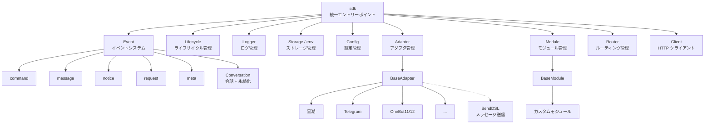

### コアモジュールの説明

| モジュール | 説明 |
|------|------|
| **Event** | イベントシステム。command / message / notice / request / meta の 5 種類のイベント処理と、Conversation 多段会話に対応。|
| **Adapter** | アダプタ管理器。複数プラットフォームのアダプタの登録、起動、停止を管理。|
| **Module** | モジュール管理器。プラグインの登録、ロード、アンロードを管理。依存関係宣言とトポロジカルソートに対応。|
| **Lifecycle** | ライフサイクル管理器。イベント駆動のライフサイクルフックを提供。|
| **Storage** | SQLite をベースとしたキーバリューストレージシステム。一般的な SQL チェーンクエリをサポート。|
| **Config** | TOML 形式の設定ファイル管理。|
| **Logger** | モジュール化されたログシステム。サブロガーをサポート。|
| **Router** | HTTP/WebSocket ルーティング管理。抽象層を介して下層バックエンド（現在は FastAPI + Uvicorn）をカプセル化。デコレータールーティング、ミドルウェア、グループ、リクエスト制限、CORS をサポート。|
| **Client** | 統一された HTTP/WS クライアント（2.8.0 以前は `HttpClient`、互換エイリアスを保持）。抽象層を介して下層リクエストライブラリ（現在は aiohttp）をカプセル化。リクエスト統計、リトライ、ログ、WebSocket クライアント、ErisPulse の例外体系等功能を提供。クライアントとサーバーの WebSocket は `WebSocketConnectionBase` 基底クラスを共有。|

## 初期化プロセス

下図は、`sdk.init()` の完全な初期化プロセスを示しています：

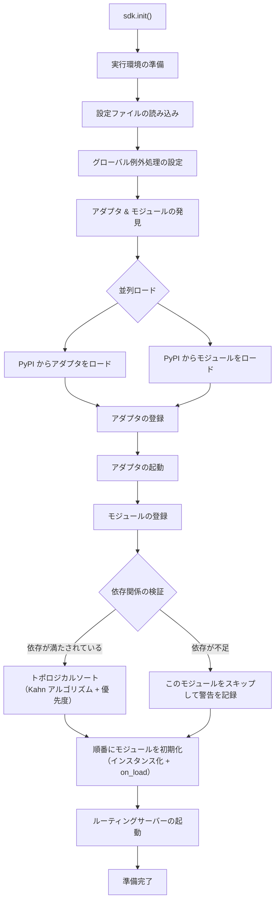

### 初期化段階の詳細

> 完全な初期化の流れの分解（Finder / Loader / Manager / Router）、下層エントリーポイント（`init()` / `init_task()` / `init_sync()`）と手動の完全起動については [起動プロセスと手動制御](advanced/startup.md) を参照してください。

## イベント処理プロセス

下図は、プラットフォームからハンドラへのメッセージの完全な流れを示しています：


### イベント処理の流れの詳細

上記の図は「結果」です。以下は `adapter.emit()` の後でフレームワークが**裏で何をしたか**を分解したものです。これは 3 層の分散の流れです：

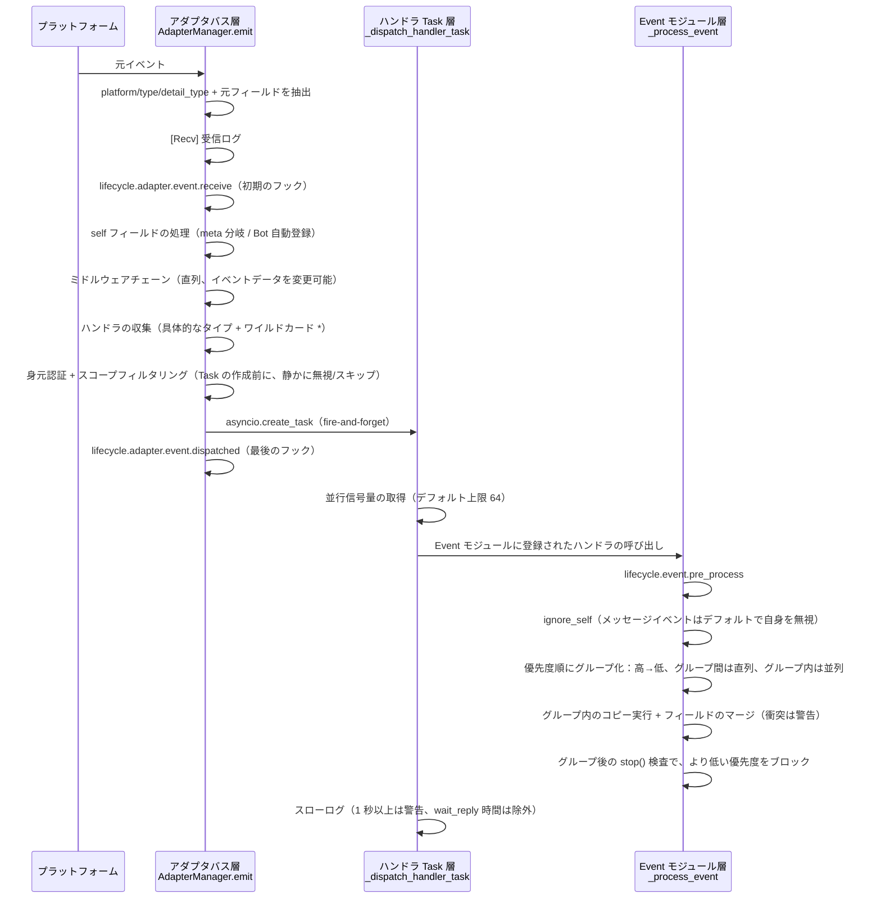

**フレームワークが何をしたか、そしてあなたが介入できるポイント：**

| 段階 | フレームワークが何をしたか | 介入できるポイント |
|------|-------------|-----------|
| 受信 | 標準フィールドを抽出、`{platform}_raw` 元データを保持；`[Recv]` ログを記録 | `adapter.event.receive` を監視して初期イベントを取得 |
| self フィールド | meta イベントは connect/disconnect/heartbeat 分岐を経る；通常のイベントでは Bot を自動登録し、`adapter.bot.online` をトリガー | `adapter.bot.online` / `bot.offline` を監視 |
| ミドルウェア | **直列**実行、戻り値が None でなければイベントデータを置き換え | ミドルウェアを登録してイベントを変更/ブロック |
| 分発収集 | 先に具体的なタイプのハンドラを取得し、次に `*` ワイルドカードハンドラを取得 | — |
| 身元次元 | 分発エントリはユーザー>会話>Bot>アダプタの順に判定し、**拒否された場合はイベント全体を無視** | `ErisPulse.scope.identity` をバインド |
| スコープフィルタリング | モジュールの所有者に従って `scope.is_allowed` を判定（会話レベル>Botレベル>プラットフォームレベル）、**通過しない場合は静かにスキップ** | スコープのホワイトリスト/ブラックリストを設定 |
| スケジューリング | 各マッチするハンドラごとに独立した `asyncio.Task` を作成、`emit()` はハンドラの完了を待たずに即座に返却 | — |
| 優先度 | 高優先度のグループが先に実行；**グループ間は直列、グループ内は並列**（グループ内はイベントのコピーを持ち、フィールドをマージし、衝突は WARNING で警告）、`mark_processed(stop=True)` は**より低い優先度をブロック** | `@command(..., priority=N)` / 登録時に priority を指定 |
| ブロッキング | 各グループの処理後に `event.is_stopped()` をチェックし、ヒットした場合は**より低い優先度を実行しない** | `event.mark_processed(stop=True)` / `event.done()` |

> **よくある誤解**：
> 1. **スコープフィルタリングは静かに**— フィルタリングされたハンドラはエラーもレスポンスもせず、TRACE レベルのログ（`core.scope.denied`）にのみ表示されます。「私のモジュールがメッセージを受け取っていない」場合は、まずスコープのバインディングを確認してください。
> 2. **ハンドラは天然並列**— フレームワークは各ハンドラに独立した Task を作成しており、**自分で `asyncio.create_task` をラップする必要はありません**。
> 3. **同じ優先度グループ内はブロックしない**— `mark_processed(stop=True)` は**より低い優先度のグループのみをブロック**し、同じグループ内で並列実行されたハンドラは途中で中断されません。
> 4. **スローログの閾値は固定 1 秒**— ハンドラの処理時間が 1 秒を超えるとログに WARNING が表示されます（`wait_reply` は処理時間から除外されます）、ただし実行は中断されません。

> スコープ（scope）のモジュール次元の 3 級バインディング、身元認証と出力アクション制限の詳細は [スコープ（scope）](advanced/scope.md) を参照してください。イベントスコープのテキストフィルタリングとコマンドユーザー ACL は [イベント処理入門](getting-started/event-handling.md) を参照してください。並列上限の設定は [設定ガイド](user-guide/configuration.md#フレームワーク設定) を参照してください。

## ライフサイクルイベント

下図は、フレームワークの各コンポーネントのライフサイクルイベントの発生順序を示しています：

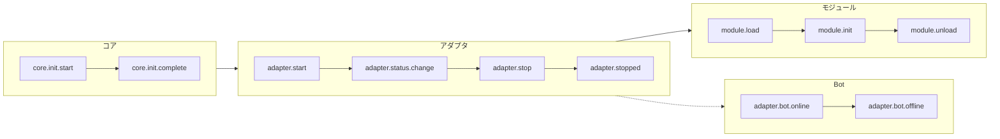

### ライフサイクルイベントの監視

> 完全なイベント監視方法（`lifecycle.on()` / `once()` / `has_handlers()`）、すべてのライフサイクルイベントのリストとデータ形式は [ライフサイクル管理](advanced/lifecycle.md) を参照してください。

## モジュールのロード戦略

ErisPulse は 3 種類のモジュールロード戦略をサポートし、`get_load_strategy()` が返す `ModuleLoadStrategy` で宣言されます：

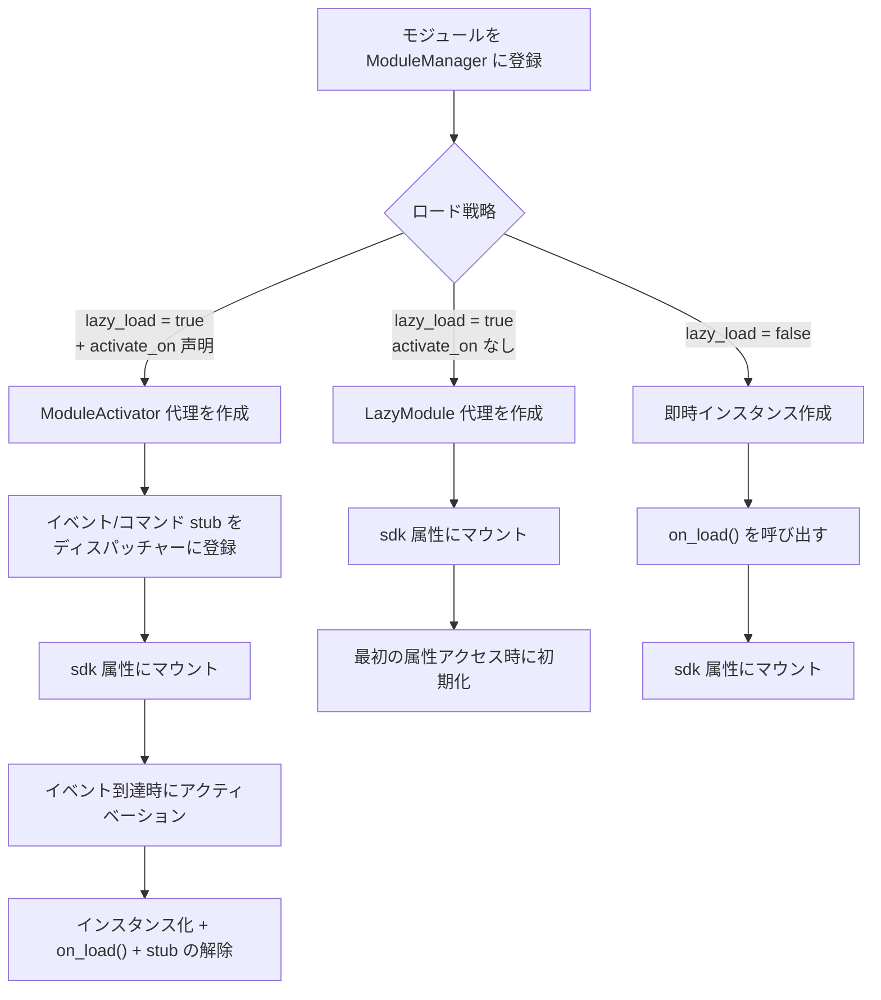

> 詳細は [遅延ロードシステム](advanced/lazy-loading.md)、[ライフサイクル管理](advanced/lifecycle.md) およびモジュールドキュメントを参照してください。

### イベント駆動遅延アクティベーション（`activate_on`）のトリガーアーキテクチャ

> [!NOTE]
> この機能は ErisPulse **2.8.0+** が必要です。

`activate_on` を使用すると、モジュールは**最初のマッチするイベント/コマンドが到達したときに初めてロード**され、常駐メモリを避けると同時にイベントのロスを防ぎます：

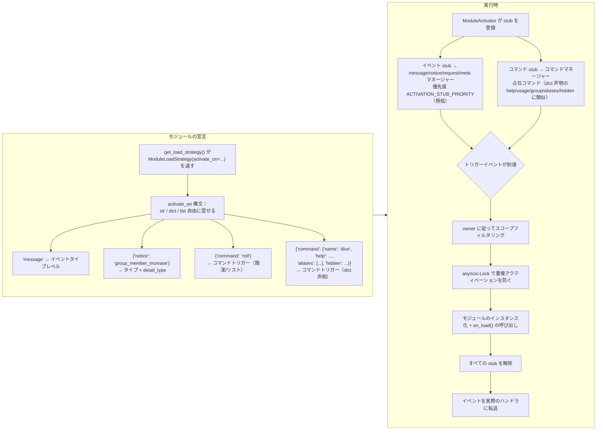

**トリガの意味の要点：**

> 完全な `activate_on` 構文（str / dict / list）、コマンド dict 声明、占位コマンド help 回帰チェーン、スコープフィルタリングと失敗の意味は [遅延ロードシステム](advanced/lazy-loading.md#イベント駆動遅延アクティベーションactivate_on) を参照してください。

## ローカルプラグインフォルダアーキテクチャ

> [!NOTE]
> この機能は ErisPulse **2.8.0+** が必要です。

ローカルプラグイン（`plugins/` ディレクトリ）は、パッケージ化して公開する必要がなく、フレームワークの起動時に自動的に発見され、ロードされます：

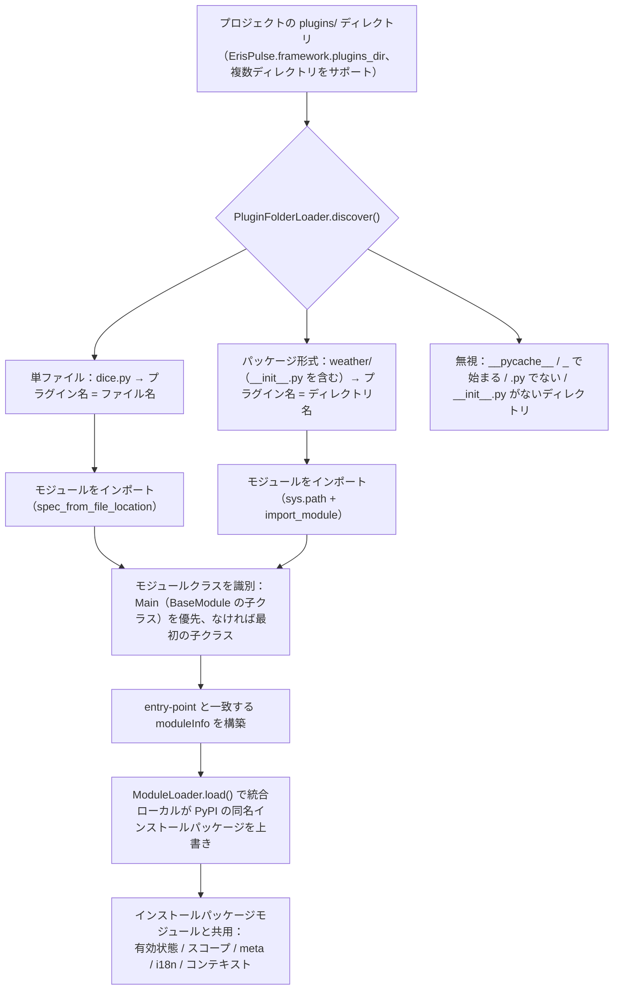

**規約と特性：**

- プラグイン名の出典：単ファイルはファイル名、パッケージ形式はディレクトリ名
- ローカルプラグイン `moduleInfo.meta.source == "plugin_folder"` で、PyPI インストールパッケージモジュールとシームレスに共存
- 同名の場合はローカルが優先（ローカルの上書きデバッグに便利）、無効化された場合は同名の entry-point 条目も削除される

## モジュールのホットリロードアーキテクチャ

ホットリロードは**すべてのモジュールソース**に対して一貫して適用されます：ローカルプラグインはファイル変更を監視して自動的にトリガし、任意のモジュールは `sdk.reload_module()` / `sdk.module.reload()` で手動でリロードできます（PyPI インストールパッケージモジュールは pip でアップグレード後に呼び出すことで有効になります）：

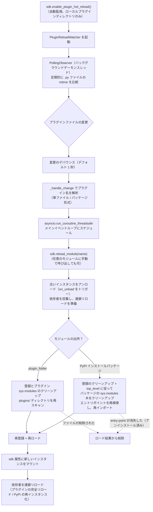

**2 つの出所の違いは発見段階のみ**、登録、ロード、連鎖リロードは完全に同じです：

- **ローカルプラグイン**（`moduleInfo.meta.source == "plugin_folder"`）：`sys.modules` のプラグイン名に対応するクリーンアップ後、`plugins/` ディレクトリを再スキャンします。ファイルが削除された場合は、ロード結果から削除されます。
- **PyPI インストールパッケージ**：`meta.top_level` に従って、`sys.modules` のパッケージのサブツリーをクリーンアップし、エントリポイントの 60 秒キャッシュを突破するためのインポートキャッシュをリフレッシュした後、再検索して再インポートします。entry-point が消失した（pip でアンインストールした）場合は、ロード結果から削除されます。


====
快速上手
====


### 快速开始

# すぐに始める

> **これはあなたの最初の一歩です。** 5 分でゼロから ErisPulse ロボットを立ち上げましょう。

## ErisPulse のインストール

### 1 本レールインストールスクリプト（推奨）

インストールスクリプトは、Docker、Python、uv などの環境を自動的に検出し、最適なインストール方法を選択するよう誘導します。

Windows (PowerShell):
```powershell
irm https://get.erisdev.com/install.ps1 -OutFile install.ps1; powershell -ExecutionPolicy Bypass -File install.ps1
```

macOS / Linux:
```bash
curl -fsSL https://get.erisdev.com/install.sh -o install.sh && chmod +x install.sh && ./install.sh
```

スクリプトは、以下の手順を誘導します：

- **Docker インストール**（Docker が検出された場合に推奨）：イメージソース（Docker Hub / GHCR）、バージョンチャネル（安定版 / プレビュー版）、Dashboard 管理パネルの設定、ポートの設定を選択
- **従来のインストール**：仮想環境の自動作成、ErisPulse のバージョン選択、オプションで Dashboard 管理パネルモジュールのインストール

### Docker を使用する

Docker イメージには、ErisPulse フレームワークと Dashboard 管理パネルが事前インストールされています。

```bash
# docker-compose.yml をダウンロード
curl -O https://raw.githubusercontent.com/ErisPulse/ErisPulse/main/docker-compose.yml

# Dashboard トークンを設定して起動
ERISPULSE_DASHBOARD_TOKEN=your-token docker compose up -d
```

<details>
<summary>Docker Hub が利用できない場合</summary>

GitHub Container Registry のイメージを使用するには、`docker-compose.yml` の image を次のように変更します：

```yaml
image: ghcr.io/erispulse/erispulse:latest
```

</details>

起動後、`http://<host>:8000/Dashboard` にアクセスし、設定したトークンでログインします。

### pip を使用したインストール

Python のバージョンが 3.10 以上であることを確認し、pip を使用してインストールします：

```bash
pip install ErisPulse
```

既に [uv](https://github.com/astral-sh/uv) をインストールしている場合は、`uv pip install ErisPulse` を使用することで、より高速にインストールできます。

## プロジェクトの初期化

### インタラクティブな初期化（推奨）

```bash
epsdk init
```

これにより、インタラクティブなガイドが起動し、以下の手順をガイドします：
- プロジェクト名の設定
- ログレベルの設定
- サーバー設定（ホストとポート）
- アダプターの選択と設定
- プロジェクト構造の作成

### ファスト初期化

```bash
# プロジェクト名を指定する高速モード
epsdk init -q -n my_bot

# または、プロジェクト名のみを指定
epsdk init -n my_bot
```

### 手動でのプロジェクト作成

手動でプロジェクトを作成したい場合は：

```bash
mkdir my_bot && cd my_bot
epsdk init
```

## モジュールのインストール

### CLI によるインストール

```bash
epsdk install Yunhu AIChat
```

### 利用可能なモジュールの確認

```bash
epsdk list-remote
```

### インタラクティブなインストール

パッケージ名を指定しない場合、インタラクティブなインストール画面に移行します。

```bash
epsdk install
```

## プロジェクトの実行

```bash
# 通常実行
epsdk run main.py

# ホットリロードモード（開発時に推奨）
epsdk run main.py --reload
```

## IDE補完の有効化（オプション）

ErisPulse はモジュール/アダプターを動的に発見するため、IDE はデフォルトではプラットフォーム固有のメソッドを補完できません。  
以下のコマンドを実行して型のスタブを生成してください：

```bash
epsdk types
```

生成後、インポートした型を変数の型ヒントとして使用することで、正確な補完が得られます（詳細は [IDE補完ガイド](./getting-started/ide-completion.md) を参照してください）：

```python
from _ep_types import Yunhu
from ErisPulse import sdk

adapter: Yunhu = sdk.adapter.get("yunhu")
await adapter.Send.To("group", "123").Board(...)  # プラットフォーム固有のメソッドの補完
```

## プロジェクト構造

初期化後のプロジェクト構造：

```
my_bot/
├── config/
│   └── config.toml          # 設定ファイル
└── main.py                  # エントリーファイル

```

## 設定ファイル

基本的な `config.toml` 設定：

```toml
[ErisPulse.server]
host = "0.0.0.0"
port = 8000

[ErisPulse.logger]
level = "INFO"

[Yunhu_Adapter]
# アダプターの設定
```

## 次のステップ

ロボットが起動した後、必要に応じて以下を進めてください。

**フレームワークの仕組みを知りたい?**
- [基本概念](getting-started/basic-concepts.md) — アダプター / モジュール / イベントの設計
- [アーキテクチャ概要](architecture.md) — 可視化されたアーキテクチャ図

**もっと多くの機能を実装したい?**
- [一般的なタスクの例](getting-started/common-tasks.md) — ストレージ、スケジューリング、権限制御
- [イベント処理の入門](getting-started/event-handling.md) — メッセージ、通知、リクエストの処理

**独自のモジュール / アダプターを開発したい?**
- [モジュール開発の入門](developer-guide/modules/getting-started.md)
- [アダプター開発の入門](developer-guide/adapters/getting-started.md)

**必要に応じて参照:**
- [設定ファイルの説明](user-guide/configuration.md) · [CLI コマンド](user-guide/cli-reference.md) · [デプロイガイド](user-guide/deployment.md)


### 创建第一个机器人

# 最初のロボットを作成する

このガイドでは、[5 分鐘のクイックスタート](../quick-start.md) をベースに、最初のコマンド処理プログラムを書き、その実行メカニズムを理解します。

> ErisPulse のインストールやプロジェクトの初期化をまだ完了していない場合は、まず [クイックスタート](../quick-start.md) の「インストール」「プロジェクトの初期化」「プロジェクトの実行」の 3 つの手順を完了してください。

## 最初のステップ：最初のコマンドを記述する

`main.py` を開き、シンプルなコマンドハンドラを記述します。

```python
from ErisPulse import sdk
from ErisPulse.Core.Event import command

@command("hello", help="挨拶メッセージを送信します")
async def hello_handler(event):
    """hello コマンドを処理します"""
    user_name = event.get_user_nickname() or "友達"
    await event.reply(f"こんにちは、{user_name}！私は ErisPulse ロボットです。")

@command("ping", help="ロボットがオンラインかどうかをテストします")
async def ping_handler(event):
    """ping コマンドを処理します"""
    await event.reply("Pong！ロボットは正常に動作しています。")

async def main():
    """メインエントリーポイント関数"""
    print("ErisPulse を起動しています...")
    
    # keep_running=True（デフォルト）：フレームワークはブロックして実行を維持し、終了信号（例：Ctrl+C）が受信されるまで待ちます
    await sdk.run(keep_running=True)

if __name__ == "__main__":
    import asyncio
    asyncio.run(main())
```

### `keep_running` パラメータ

`sdk.run(keep_running)` は、フレームワークがブロックして実行を維持するかどうかを制御します。

- **`keep_running=True`（デフォルト）**：`run()` はブロックし続け、終了信号（例：Ctrl+C）が受信されるまで待ちます。これは純粋な bot アプリケーションに適しています。
- **`keep_running=False`**：`run()` は初期化後に即座に返ります。**フレームワークはアンロードされません**——起動されたアダプタ/モジュールはバックグラウンドタスクとしてメッセージイベントの処理を続けます。その後、独自のロジックを実行し、イベントループが終了するまでフレームワークは閉じられません。例：

```python
async def main():
    await sdk.run(keep_running=False)   # 初期化後に即座に返ります
    # フレームワークはバックグラウンドで実行中です。ここでは他の処理を続行できます
    while True:
        await asyncio.sleep(3600)
        print("1時間ごとにチェックします")
```

> `run()` の2つのモードに加えて、`init()`/`uninit()` を使用したライフサイクルの手動制御、個別のアダプタ/ルーティングの起動/停止など、より細かい制御方法もあります。詳細は [起動プロセスと手動制御](../advanced/startup.md) を参照してください。

## 第二ステップ：ロボットの実行

```bash
# 通常実行
epsdk run main.py

# 開発モード（ホットリロードをサポート）
epsdk run main.py --reload
```

## 第三段階：ロボットのテスト

チャットプラットフォームで次のコマンドを送信します：

```
/hello
```

これで、ロボットからの返信が届くはずです。

## コード説明

### コマンドデコレータ

```python
@command("hello", help="挨拶メッセージを送信")
```

- `hello`：コマンド名。ユーザーは `/hello` で呼び出します。
- `help`：コマンドのヘルプ説明。`/help` コマンドで表示されます。

### イベントパラメータ

```python
async def hello_handler(event):
```

`event` パラメータは Event オブジェクトであり、以下を含みます：
- メッセージ内容：`event.get_text()`
- 送信者情報：`event.get_user_id()`、`event.get_user_nickname()`
- プラットフォーム情報：`event.get_platform()`
- グループ情報：`event.get_group_id()`
- 元のデータ：`event.get_raw()`

> 完全な Event オブジェクトのメソッドについては、[Event 包装クラスの詳細](../developer-guide/modules/event-wrapper.md) を参照してください。

### レスポンスの送信

```python
await event.reply("レスポンスの内容")
```

`event.reply()` は、送信者にメッセージを送信するための便利なメソッドです。

## 拡張機能：追加の機能を追加

ErisPulse は、豊富なイベント処理とデータ処理機能を提供します：

- **メッセージの監視**：`@message.on_message()` を使用して、さまざまなメッセージを監視します → [イベント処理の入門](event-handling.md)
- **通知の監視**：`@notice.on_friend_add()` などの通知を監視します → [イベント処理の入門](event-handling.md)
- **データの保存**：`sdk.storage.get/set` を使用してデータを永続化します → [一般的なタスクの例](common-tasks.md)

## よくある質問

### コマンドが反応しない？

1. アダプタが正しく設定されているか確認し、`config/config.toml` 内のアダプタの `status` が `true` であることを確認します。
2. ターミナルのログ出力を確認し、エラー情報（特に `ERROR` レベルのログ）がないか確認します。
3. コマンドのプレフィックスが正しいか確認します（デフォルトは `/` です）。設定ファイルの `[ErisPulse.event.command]` 部分で確認できます。
4. コマンド名のスペルが正しいか、大文字小文字の区別が正しく設定されているか確認します。

### コマンドのプレフィックスを変更するには？

`config.toml` に以下を追加します：

```toml
[ErisPulse.event.command]
prefix = "!"
case_sensitive = false
```

### 複数のプラットフォームをサポートするには？

ErisPulse は OneBot12 標準を用いて、異なるプラットフォームのイベント形式を統一しています。`@command` および `@message` で登録されたハンドラは、すべてのプラットフォームからのイベントを自動的に受け取ります。イベントの元プラットフォームを区別するには、`event.get_platform()` を使用します：

```python
@command("hello")
async def hello_handler(event):
    platform = event.get_platform()
    
    if platform == "yunhu":
        await event.reply("你好！来自云湖")
    elif platform == "telegram":
        await event.reply("Hello! From Telegram")
    else:
        await event.reply("你好！")
```

> 詳細な多プラットフォーム対応のテクニックについては、[よくあるタスクの例](common-tasks.md#多プラットフォーム適応) を参照してください。

## 次のステップ

- [基本概念](basic-concepts.md) - ErisPulse のコアコンセプトを詳しく理解する
- [イベント処理の入門](event-handling.md) - さまざまなイベントの処理方法を学ぶ
- [一般的なタスクの例](common-tasks.md) - より多くの実用的な機能を習得する


### 基础概念

# 基本概念

このガイドでは、ErisPulse のコアコンセプトを紹介し、フレームワークの設計思想と基本的なアーキテクチャを理解するのに役立ちます。

## イベント駆動アーキテクチャ

ErisPulse はイベント駆動アーキテクチャを採用しており、すべての相互作用はイベントを通じて送信および処理されます。

### イベントフロー

```
ユーザーがメッセージを送信
      │
      ▼
プラットフォームが受信
      │
      ▼
アダプタがプラットフォーム固有のイベントを受信
      │
      ▼
OneBot12 標準イベントに変換
      │
      ▼
イベントシステムに送信
      │
      ▼
登録されたハンドラに配信
      │
      ▼
モジュールがイベントを処理
      │
      ▼
アダプタを通じて応答を送信
      │
      ▼
プラットフォームがユーザーに表示
```

### OneBot12 標準

ErisPulse は、コアイベント標準として OneBot12 を使用しています。OneBot12 は、統一されたイベント形式を定義する汎用的なチャットボットアプリケーションインターフェース標準です。

すべてのアダプタは、プラットフォーム固有のイベントを OneBot12 形式に変換し、コードの一貫性を確保します。

## コアコンポーネント

### 1. SDK オブジェクト

SDK はすべての機能の統一エントリーポイントであり、コアコンポーネントへのアクセスを提供します。

```python
from ErisPulse import sdk

# コアモジュールへのアクセス
sdk.storage    # ストレージシステム
sdk.config     # 設定システム
sdk.logger     # ログシステム
sdk.adapter    # アダプタシステム
sdk.module     # モジュールシステム
sdk.router     # ルーティングシステム
sdk.client     # HTTPクライアント
sdk.lifecycle  # ライフサイクルシステム
```

### 2. Event オブジェクト

Event オブジェクトはイベントデータをカプセル化し、便利なアクセスメソッドを提供します。

```python
@command("info")
async def info_handler(event):
    # イベント情報を取得
    event_id = event.get_id()
    user_id = event.get_user_id()
    platform = event.get_platform()
    text = event.get_text()
    
    # 返信を送信
    await event.reply(f"ユーザー: {user_id}, プラットフォーム: {platform}")
```

### 3. アダプタ

アダプタは ErisPulse と外部プラットフォームの間の橋渡しの役割を果たします。

**役割:**
- プラットフォームのネイティブイベントを受信
- OneBot12 標準形式に変換
- 標準形式のイベントをプラットフォームに送信

**例のアダプタ:**
- Yunhu アダプタ：雲湖プラットフォームとの通信
- Telegram アダプタ：Telegram Bot API との通信
- OneBot11 アダプタ：OneBot11 互換アプリとの通信
- Email アダプタ：メールの送受信処理

### 4. モジュール

モジュールは機能拡張の基本単位であり、以下を実現できます：

- イベントハンドラの登録
- ビジネスロジックの実装
- アダプタを呼び出してメッセージを送信
- コアモジュールが提供するサービスの利用

#### モジュール発見メカニズム

ErisPulse は Python の `importlib.metadata.entry_points` を使用して、インストールされたモジュールを発見します。モジュールは `pyproject.toml` でエントリーポイントを宣言します：

```toml
[project.entry-points."erispulse.module"]
MyModule = "my_package:Main"
```

SDK の初期化時に、`erispulse.module` グループのすべてのエントリーポイントをスキャンし、モジュールクラスを `ModuleManager` に登録します。その後、依存関係に基づいてトポロジカルソートを行い、順次初期化されます。

#### 最小限のモジュール

```python
from ErisPulse.Core.Bases import BaseModule
from ErisPulse import sdk

class Main(BaseModule):
    def __init__(self):
        self.sdk = sdk
        self.logger = sdk.logger.get_child("MyModule")

    async def on_load(self, event):
        self.logger.info("モジュールがロードされました")

    async def on_unload(self, event):
        self.logger.info("モジュールがアンロードされました")
```

#### モジュールのライフサイクル

- **登録**: SDK がモジュールクラスを発見し、マネージャに登録
- **ロード**: モジュールのインスタンスを作成し、`on_load(event)` を呼び出す（`event = {"module_name": "MyModule"}`）
- **アンロード**: `on_unload(event)` を呼び出し、リソースをクリーンアップ

#### ロード戦略

`get_load_strategy()` を使ってモジュールのロード動作を宣言します：

```python
from ErisPulse.loaders import ModuleLoadStrategy

class Main(BaseModule):
    @staticmethod
    def get_load_strategy():
        return ModuleLoadStrategy(
            lazy_load=True,   # ラグジュアリー読み込みかどうか（デフォルトは True）
            priority=0        # ロード優先度、数値が大きいほど先に初期化される
        )
```

- **`lazy_load=True`（デフォルト）**: モジュールは `sdk.MyModule` に初めてアクセスしたときに初期化され、起動時間を短縮
- **`lazy_load=False`**: SDK の起動時に即座に初期化され、ライフサイクルイベントを監視する必要があるモジュールや、定期的なタスクを実行するモジュールに適しています
- **`priority`**: 同じ優先度のモジュールは登録順にロードされ、数値が大きいほど先に初期化されます

> ラグジュアリー読み込みの詳細については、[ラグジュアリー読み込みシステム](../advanced/lazy-loading.md)を参照してください。

## イベントの種類

ErisPulse は 5 種類のイベントをサポートしています：

| イベントの種類 | デコレータ | 説明 |
|---------|--------|------|
| メッセージイベント | `@message.on_message()` | ユーザーが送信したメッセージ（プライベートチャット、グループチャット） |
| コマンドイベント | `@command("name")` | コマンドプレフィックスで始まるメッセージ（例：`/hello`） |
| 通知イベント | `@notice.on_friend_add()` など | システム通知（友達追加、グループメンバーの変更など） |
| 要求イベント | `@request.on_friend_request()` など | ユーザーからの要求（友達リクエスト、グループ招待） |
| 元イベント | `@meta.on_connect()` など | システムレベルのイベント（接続、切断、ハートビート） |

> 各イベントの詳細な使用方法とコード例については、[イベント処理の入門](event-handling.md)を参照してください。

## 核心モジュールの説明

### Storage（ストレージ）

SQLite に基づくキー/値ストレージシステムで、永続的なデータを保存します。

```python
# 値の設定
sdk.storage.set("key", "value")

# 値の取得
value = sdk.storage.get("key", "default_value")

# バッチ操作
sdk.storage.set_multi({
    "key1": "value1",
    "key2": "value2"
})

# トランザクション
with sdk.storage.transaction():
    sdk.storage.set("key1", "value1")
    sdk.storage.set("key2", "value2")
```

### Config（設定）

TOML 形式の設定ファイルを管理します。

```python
# 設定の取得
config = sdk.config.getConfig("MyModule", {})

# 設定の設定
sdk.config.setConfig("MyModule", {"key": "value"})

# 嵌套された設定の読み取り
value = sdk.config.getConfig("MyModule.subkey", "default")
```

### Logger（ロガー）

モジュール化されたログシステム。

```python
# ログの記録
sdk.logger.info("これは情報です")
sdk.logger.warning("これは警告です")
sdk.logger.error("これはエラーです")

# 子ロガーの取得
child_logger = sdk.logger.get_child("submodule")
child_logger.info("サブモジュールのログ")
```

**属性アクセスの糖衣構文**

`get_child()` メソッドを使わずに、**属性アクセス**を使ってサブロガーを作成することもできます。これはより簡潔な**糖衣構文**です。

```python
# 属性アクセスでサブロガーを作成
sdk.logger.mymodule.info("モジュールのメッセージ")

# 嵌套されたアクセスもサポート
sdk.logger.mymodule.database.info("データベースのメッセージ")
```

### Router（ルーター）

HTTP および WebSocket のルート管理。FastAPI + Uvicorn をベースに、デコレータルート、ミドルウェア、グループ化、リクエスト制限、CORS をサポートします。

```python
from ErisPulse.Core import HttpRequest

@sdk.router.get("MyModule", "/api")
async def handler(request: HttpRequest):
    data = await request.json()
    return {"status": "ok"}
```

> 完全なルート API（WebSocket、ミドルウェア、レート制限、CORS など）については、[ルートマネージャー](../advanced/router.md)を参照してください。

### Client（ネットワーククライアント）

HTTPリクエスト、WebSocket接続、接続プール管理、自動リトライ、タイムアウト制御、リクエスト統計、ライフサイクルイベントの統合を提供する統一されたネットワーククライアント。

```python
from ErisPulse.Core import client

# HTTPリクエスト
resp = await client.get("https://api.example.com/users")
data = await resp.json()

# リトライとタイムアウト付き
resp = await client.get(url, timeout=30, max_retries=3)

# WebSocket接続
ws = await client.ws_connect("wss://example.com/ws")
async for text in ws.iter_text():
    await ws.send_text(f"Echo: {text}")
```

> 完全なネットワーククライアント API については、[ネットワーククライアント](../advanced/http-client.md)を参照してください。

## SendDSL メッセージ送信

アダプターは、チェーン呼び出し可能なメッセージ送信インターフェースを提供します。

### 基本的な送信

```python
# アダプターのインスタンスを取得
yunhu = sdk.adapter.get("yunhu")

# メッセージを送信
await yunhu.Send.To("user", "U1001").Text("Hello")

# 送信アカウントを指定
await yunhu.Send.Using("bot1").To("group", "G1001").Text("グループメッセージ")
```

### チェーン修飾

```python
# ユーザーにメンション
await yunhu.Send.To("group", "G1001").At("U2001").Text("@メッセージ")

# メッセージに返信
await yunhu.Send.To("group", "G1001").Reply("msg123").Text("返信")

# 全員にメンション
await yunhu.Send.To("group", "G1001").AtAll().Text("公告")
```

### Event への返信メソッド

Event オブジェクトは、便利な返信メソッドを提供します：

```python
@command("test")
async def test_handler(event):
    # 簡単なテキスト返信
    await event.reply("返信内容")
    
    # 画像を送信
    await event.reply("http://example.com/image.jpg", method="Image")
    
    # 音声を送信
    await event.reply("http://example.com/voice.mp3", method="Voice")
```

## ラグドロードシステム

ErisPulse はデフォルトでモジュールのラグドロードを有効にしており、モジュールは `sdk.MyModule` のように初めてアクセスされたときにのみ初期化されます。これにより、起動速度が大幅に向上します。

```python
from ErisPulse.loaders import ModuleLoadStrategy

class Main(BaseModule):
    @staticmethod
    def get_load_strategy():
        return ModuleLoadStrategy(
            lazy_load=True,   # ラグドロードを有効化（デフォルト）
            priority=0        # 加載優先度、数値が大きいほど先に初期化されます
        )
```

**ラグドロードを無効にする必要があるシナリオ（`lazy_load=False`）：**
- ライフサイクルイベントを監視するモジュール（例：`core.init.complete`）
- タイマーまたはバックグラウンドサービスを起動するモジュール
- 他のモジュールがロードされる前に初期化を完了させる必要があるモジュール

> ラグドロードの詳細なメカニズムと注意事項については、[ラグドロードシステム](../advanced/lazy-loading.md)を参照してください。

## 次のステップ

- [イベント処理の入門](event-handling.md) - さまざまなイベントの処理方法を学ぶ
- [一般的なタスクの例](common-tasks.md) - 一般的な機能の実装方法を習得する


### 事件处理入门

# イベント処理入門

このガイドでは、ErisPulse におけるさまざまなイベントの処理方法について説明します。

## イベントタイプ概要

ErisPulse は以下のイベントタイプをサポートしています：

| イベントタイプ | 説明 | 適用シーン |
|---------|------|---------|
| メッセージイベント | ユーザーが送信した任意のメッセージ | チャットボット、コンテンツフィルタ |
| コマンドイベント | コマンドプレフィックスで始まるメッセージ | コマンド処理、機能エントリ |
| 通知イベント | システム通知（友達追加、グループメンバーの変更など） | メッセージの歓迎、ステータス通知 |
| 要求イベント | ユーザーの要求（友達リクエスト、グループ招待） | 要求の自動処理 |
| 元イベント | システムレベルのイベント（接続、ハートビート） | 接続監視、ステータスチェック |

## メッセージイベントの処理

> **ヒント**: IDEの自動補完と型チェックのサポートを得るため、イベントハンドラで `Event` クラスの型アノテーションを使用することを推奨します。

```python
from ErisPulse.Core.Event import Event  # イベント型の注釈に使用
```

### すべてのメッセージを監視

```python
from ErisPulse.Core.Event import message, Event

@message.on_message()
async def message_handler(event: Event):
    text = event.get_text()
    user_id = event.get_user_id()
    sdk.logger.info(f"{user_id} からのメッセージを受信: {text}")
```

### プライベートメッセージを監視

```python
@message.on_private_message()
async def private_handler(event: Event):
    user_id = event.get_user_id()
    await event.reply(f"こんにちは、{user_id}さん！これはプライベートメッセージです。")
```

### グループメッセージを監視

```python
@message.on_group_message()
async def group_handler(event: Event):
    group_id = event.get_group_id()
    user_id = event.get_user_id()
    sdk.logger.info(f"グループ {group_id} 内で {user_id} がメッセージを送信しました")
```

### @メッセージを監視

```python
@message.on_at_message()
async def at_handler(event: Event):
    # @されたユーザーのリストを取得
    mentions = event.get_mentions()
    await event.reply(f"これらのユーザーを@しました: {mentions}")
```

### ワイルドカードと正規表現による監視

4つのメッセージデコレータ（`on_message` / `on_private_message` / `on_group_message` / `on_at_message`）は、`pattern`（globワイルドカード）と `regex`（正規表現）の両方に対応しており、一致しないメッセージは **ハンドラのトリガーになりません**:

```python
# globワイルドカード: * 任意の文字列、? 単一文字、[seq] 文字集合
@message.on_message(pattern="签到*")
async def signin_handler(event: Event):
    await event.reply("サインイン成功")

# 正規表現: 金額をマッチ
@message.on_message(regex=r"\d+\s*元")
async def price_handler(event: Event):
    await event.reply(f"受信した金額: {event.get_text()}")

# pattern と regex 両方指定 → 両方一致する必要がある
@message.on_message(pattern="*元", regex=r"\d+\s*元")
async def combined_handler(event: Event):
    pass
```

`wait_reply` は同様にこの2つのパラメータをサポートします（[返信の待ち機能](../developer-guide/modules/event-wrapper.md#返信の待ち機能)を参照）。

## コマンドイベント処理

### 基本コマンド

```python
from ErisPulse.Core.Event import command

@command("help", help="ヘルプ情報を表示")
async def help_handler(event):
    help_text = """
利用可能なコマンド：
/help - ヘルプを表示
/ping - 接続をテスト
/info - 情報を表示
    """
    await event.reply(help_text)
```

### コマンドのエイリアス

```python
@command(["help", "h"], aliases=["help", "h"], help="ヘルプ情報を表示")
async def help_handler(event):
    await event.reply("ヘルプ情報...")
```

ユーザーは以下のいずれかの方法で呼び出すことができます：
- `/help`
- `/h`
- `/help`

### コマンド引数

```python
@command("echo", help="メッセージを返す")
async def echo_handler(event):
    # コマンド引数を取得
    args = event.get_command_args()
    
    if not args:
        await event.reply("返すメッセージを入力してください")
    else:
        await event.reply(f"あなたが言った: {' '.join(args)}")
```

### コマンドグループ

```python
@command("admin.reload", group="admin", help="モジュールを再読み込み")
async def reload_handler(event):
    await event.reply("モジュールを再読み込みしました")

@command("admin.stop", group="admin", help="ロボットを停止")
async def stop_handler(event):
    await event.reply("ロボットを停止しました")
```

### コマンドの権限とアクセス制御

コマンドの権限は3層に分かれ、上から順に判定されます（**上層が拒否された場合、下層は判定されません**）：

```python
# ① コマンドのACL（ユーザー側の設定）：コマンドごとのユーザーの白黒リスト、拒否時は「権限不足」を返す
# ② master=True —— フレームワークの所有者のみ実行可能（フレームワークが自動でチェック、拒否時は「権限不足」を返す）
@command("restart", master=True, help="モジュールを再起動")
async def restart_handler(event):
    await event.reply("モジュールを再起動しました")

# ③ permission=関数 —— コマンド自身の制御ロジック（Trueを返す場合のみ実行）
def is_admin(event):
    return event.get_user_id() in {"user123", "user456"}

@command("panel", permission=is_admin, help="管理パネル")
async def panel_handler(event):
    await event.reply("管理パネルへようこそ")
```

**コマンドユーザーACL**（`ErisPulse.event.command.acl`）：ユーザーは任意のコマンドにユーザーの白黒リストを設定できます。
コマンド名は正確な一致とglobパターン（例: `"roll*"`）をサポートし、拒否時は「権限不足」を返します：

```toml
# config.toml —— restartコマンドは123456のみ実行可能；666は一律拒否
[ErisPulse.event.command.acl.restart]
allow = ["onebot11:123456"]
deny = ["onebot11:666"]
```

判定順序：`deny`が一致 → 拒否；`allow`が空でないかつ一致しない → 拒否；ACLが設定されていない場合は
`event.command.default_allow`（`false` = 厳格モード、ACLがなければ拒否；`true`の場合は開発者が
`master=True` / `permission`をデフォルトとする）に従います。実行時のAPI（コマンド名はglobパターンをサポート）：

```python
from ErisPulse.Core.Event import command

command.allow_user("restart", "onebot11", "123456")   # 允許リスト
command.deny_user("restart", "onebot11", "666")       # 拒否リスト
command.remove_acl("restart")                          # 白黒リストを削除
command.get_acl("restart")                             # 現在のリストを取得
```

> コマンドハンドラはイベントパッケージからインポートします：`from ErisPulse.Core.Event import command`；
> SDKイベントパッケージからもアクセスできます：`sdk.Event.command`（両者は同一のシングルトンです）。
> モジュール内では通常、コマンドデコレータと共にインポートされます（`from ErisPulse.Core.Event import command`）。

コマンド間 / ユーザー間の**イベントレベル**のアクセス制御（特定のユーザー / グループ / Botのメッセージを受信するか）は、**スコープのアイデンティティ次元**（`scope.identity`）を通じて行います。**モジュールレベル**の可用性（どのモジュールが使えるか）は、**スコープのモジュール次元**（`scope.platforms / bots / sessions`）を通じて行います。
詳しくは[スコープ（scope）](../advanced/scope.md)を参照してください。

> 建議：コマンド内部でビジネスロジックと連動する必要がある場合は`master=True` / `permission`を使用してください。ユーザー / グループによるアクセス制御のみ必要な場合はスコープのアイデンティティ次元を使用し、モジュールの可用性を制御する場合はスコープのモジュール次元を使用してください。

### コマンドの優先度

```python
# 優先度の値が大きいほど、実行が早くなります
@message.on_message(priority=10)
async def high_priority_handler(event):
    await event.reply("高優先度のハンドラ")

@message.on_message(priority=1)
async def low_priority_handler(event):
    await event.reply("低優先度のハンドラ")
```

### 並行イベント処理

ErisPulseのイベントシステムは**同優先度並行、異優先度直列**のスケジューリングモデルを採用しています：

```
イベント到着
    ↓
priority=10 組: [ハンドラC || ハンドラD] 並行 → 結果を結合
    ↓ (中断されていない場合)
priority=0 組: [ハンドラA || ハンドラB] 並行 → 結果を結合
    ↓
...
```

- **同優先度並行**：優先度が同じ複数のハンドラは同時に実行され、スループットが向上します
- **跨級直列**：異なる優先度のグループは順番に実行されます（値が大きいほど先に実行）、高優先度ハンドラが先に実行されることを保証します
- **Copy-On-Write**：ハンドラが変更しない限りコピーを作成せず、ゼロオーバーヘッドを確保します
- **競合処理**：同優先度の複数ハンドラが同じフィールドを変更する場合、最後に変更された値を使用し、警告ログを記録します
- **中断メカニズム**：任意のハンドラが`event.done()`（デフォルト）または`event.done(claim=False)`を呼び出した後、以降の低優先度グループはスキップされます。認領とブロックの違いは下記の[「チェーン制御：認領とブロック」](#チェーン制御認領とブロック)を参照してください。

```python
# 例：同優先度ハンドラが並行実行
@message.on_message(priority=0)
async def handler_a(event):
    # タスクAを処理
    event['result_a'] = process_a()

@message.on_message(priority=0)
async def handler_b(event):
    # handler_aと並行実行
    event['result_b'] = process_b()

# 異優先度直列実行
@message.on_message(priority=10)
async def handler_c(event):
    # 最も優先度が高い、最初に実行
    pass
```

> **並行上限**：すべてのマッチするハンドラのTaskは**即座に作成**されますが、同時に実行される数を制限するシグナルマネージャーを用いています。デフォルトの上限は **64**（`ErisPulse.framework.handler_max_concurrency`、ホットアップデートが可能です）。上限を超えたTaskはシグナルマネージャー上で待ち、前の処理が完了した後に実行されます。イベントの急増時に、これが「圧力調整弁」となります。
>
> **遅延ログ**：ハンドラの処理が1秒以上かかる場合、フレームワークはログにWARNINGを出力します（`handler_slow`）。`wait_reply`の待機時間は処理時間から除外され、ユーザーの返信を待つことで誤った遅延ログが発生することはありません。

## スコープフィルタリング：なぜ私のモジュールはメッセージを受け取らないのか？

イベントが到着した後、2つの**静か**なフィルタリング（返答もエラーも発生しない）が行われます。

1. **アイデンティティ次元**（`ErisPulse.scope.identity`）：イベントが配信エントリに到着した時点で、ユーザー > グループ > Bot > アダプタの順に判定し、受信するか否かを決定します。  
   拒否された**イベント全体**は直接破棄され、コマンドディスパッチャーを含むすべてのハンドラはトリガされません。

2. **モジュール次元**（`ErisPulse.scope`）：イベントが特定のモジュールのハンドラ/コマンドに到着した時点で、セッション > Bot > プラットフォームの順に判定し、そのモジュールが有効かどうかを判断します。**判定に失敗した場合、静かにスキップされます。**

```toml
# 例1：特定のグループのすべてのメッセージを配信しない
[ErisPulse.scope.identity.sessions.onebot11."group_123"]
deny = true

# 例2：特定のBotで MyModule を無効化する
[ErisPulse.scope.bots.onebot11."123456"]
blocked = ["MyModule"]
```

この場合、そのグループのメッセージが到着したとき、`MyModule` のコマンドとイベントハンドラは**どちらもスケジュールされません**。これはバグではなく、フィルタリング機構です。モジュールが反応しない問題を調査する際は、まずスコープのアイデンティティとモジュールのバインディングを確認してください。

- フィルタリングログは **TRACE** レベルでのみ表示されます（`core.scope.identity_denied` / `core.scope.denied`）、デフォルトの INFO レベルでは痕跡は一切見られません。
- フレームワークレベルのハンドラ（例えばコマンドディスパッチャー `scope_exempt=True`）は**モジュール次元**の影響を受けませんが、**アイデンティティ次元**の影響を受けます（イベント全体が破棄されているため）。
- コマンド実行前には3番目のフィルタリングがあります：コマンドユーザー ACL（拒否された場合、「権限不足」と返信します。前節を参照）。
- 4番目のフィルタリングは**イベントオーバーライド**（次節を参照）です。

> スコープの設定、マッチングの構文、実行時の API については [スコープ（scope）](../../advanced/scope.md) を参照してください。

## イベントのオーバーライド：モジュールのコードを変更せずに、任意のイベントタイプの動作を上書き

> [!NOTE]  
> この機能は ErisPulse **2.8.0+** が必要です。

イベントハンドラの登録時に宣言されたパラメータ（`pattern` / `regex` / `master` / `hidden` など）は、単なる**開発者のデフォルト**にすぎません。  
統一されたオーバーライドシステムにより、ユーザーは**イベントタイプ**ごとに任意のモジュールの動作を上書きできます。OneBot12 標準タイプ（meta / message / notice / request）と ErisPulse 拡張タイプ（command）はそれぞれ独自の上書き可能なパラメータを持ちます：

| イベントタイプ | 上書き可能なパラメータ | 機能 |
|---------|-----------|------|
| `message` | `pattern` / `regex` / `detail_types` | テキストのトリガ条件 + メッセージのサブタイプホワイトリスト |
| `notice` | `detail_types` / `pattern` / `regex` | 通知のサブタイプホワイトリスト + テキスト条件 |
| `request` | `detail_types` / `pattern` / `regex` | リクエストのサブタイプホワイトリスト + テキスト条件 |
| `meta` | `detail_types` | 元イベントのサブタイプホワイトリスト（connect / heartbeat など） |
| `command` | `master` / `hidden` / `aliases` / `prefix` / `help` / `usage` | コマンドの実装パラメータ（ユーザーの優先度） |
| `acl`（command専用） | `allow` / `deny` | コマンドのユーザーのホワイトリスト/ブラックリスト（コマンド名の glob による） |

```toml
# message：テキストのトリガ条件を上書き（コード内の条件と AND で作用）
[ErisPulse.event.overrides.message.ChatModule]
pattern = "闲聊*"

# notice：特定の通知サブタイプのみ応答
[ErisPulse.event.overrides.notice.MyModule]
detail_types = ["group_increase"]

# command：実装パラメータを上書き（ユーザーの優先度——開発者のデフォルトを厳しくしたり緩めたりできる）
[ErisPulse.event.overrides.command.MyModule.restart]
master = true
hidden = true

# acl：コマンドのユーザーのホワイトリスト/ブラックリスト（コマンド間の glob）
[ErisPulse.event.overrides.acl."roll*"]
allow = ["onebot11:u_vip"]

# ACLのデフォルト（false = 厳格モード：ACLがない場合は拒否）
acl_default_allow = true
```

実行時API（`from ErisPulse.Core.Event import overrides` または `sdk.Event.overrides`、**タイプのサブネームスペース**——各タイプごとに `set` / `get` / `delete` の三つの操作が対称的）：

```python
from ErisPulse.Core.Event import overrides

overrides.message.set("ChatModule", pattern="闲聊*")   # messageのテキスト条件
overrides.notice.set("MyModule", detail_types=["group_increase"])
overrides.command.set("MyModule", "restart", master=True)  # コマンドパラメータ
overrides.acl.set("roll*", deny=["onebot11:u_bad"])    # コマンドのユーザーのブラックリスト

overrides.message.get("ChatModule")     # {"pattern": "闲聊*"}
overrides.message.delete("ChatModule")  # 開発者のデフォルトに戻す
```

- 上書き条件とハンドラのコード内の条件は**同時に有効**（AND 論理）です。`command` のパラメータは開発者が宣言した内容と**深くマージ**されます（上書きが優先）。
- `detail_types`：イベントに `detail_type` がない場合は許可（未知のイベントを誤って拒否しない）。
- `pattern` / `regex`：テキストがないイベント（connect / heartbeat など）は制約を受けず、直接許可されます。
- `command` の上書きキー `master` は同期的にストレージキー `must_master` にマッピングされます。コマンドの無効化はすべて `acl` deny を通ります。
- 設定の変更は即座に有効になります（ホットアップデート）、形式の検証がアラートされます（未知のパラメータ / 不正な項目は無視されます）。

## リンク制御：認領とブロック

> [!NOTE]
> `event.done()` / `event.mark_processed()` の `claim=` / `stop=` パラメータは、ErisPulse **2.7.1+** が必要です。

ErisPulse では、「認領」と「ブロック」の2つの正交的な意味を分離し、`event.done()` によって統一的に制御することで、コマンド処理の周囲にログ、監査、権限などの観測層を重ねやすくしています。

**2つの概念の正確な定義は以下の通りです：**

- **認領（claim）**：イベントがこのプロセッサによって処理されたことをマークします（`_processed` に書き込みます）。コマンドディスパッチャは、認領済みのイベントを見ると**重複処理をスキップ**します——同じメッセージが複数のコマンドプロセッサによって繰り返し処理されるのを防ぎます。典型的な場面：コマンドがマッチした後に認領し、コマンドディスパッチャが再び介入しないようにします。
- **ブロック（stop）**：イベントが**より低い優先度**のプロセッサに伝播するのを阻止します（`_propagation_stopped` に書き込みます）。低い優先度のプロセッサ（例：`on_message`）は、このイベントを見なくなります。典型的な場面：高い優先度のプロセッサがイベントを完全に処理したので、低い優先度のプロセッサが実行されないようにします。

| `event.done(...)` | 認領 | ブロック | 場面 |
|-------------------|------|------|------|
| `event.done()` | ✔ | ✔ | コマンド / プロセッサが処理を終えた際の標準的な方法 |
| `event.done(stop=False)` | ✔ | ✘ | 認領のみ：低い優先度の観測者（ログ / 統計）は引き続きイベントを見ることができます |
| `event.done(claim=False)` | ✘ | ✔ | ブロックのみ（例：ファイアウォール / 限流）：認領は行わず、重複処理は防ぎません |

`event.done(claim=, stop=)` は `event.mark_processed(claim=, stop=)` のエイリアスであり、両者はパラメータと動作が完全に等価です。

```python
@command("help")
async def help_cmd(event):
    event.done()            # 認領 + ブロック（コマンド処理完了時の標準的な方法）

@message.on_message(priority=50)
async def observer(event):
    event.done(stop=False)  # 認領のみ：低い優先度の処理は継続されます（ログ / 統計）

@message.on_message(priority=100)
async def firewall(event):
    if denied(event):
        event.done(claim=False)  # ブロックのみ：低い優先度の処理は実行されませんが、重複処理は防ぎません
```

### コマンドと返信の block 設定

コマンドがマッチした場合 / `wait_reply` が返信をマッチした場合、デフォルトでは伝播がブロックされます（後方互換性のため）。これを設定で解除することで、低い優先度のプロセッサ（ログ / 監査 / 権限）がこれらのメッセージを観測できるようにできます：

```toml
[ErisPulse.event.command]
block = false   # コマンドメッセージは低い優先度のプロセッサに伝播します

[ErisPulse.event.wait_reply]
block = false   # wait_reply によって消費された返信は低い優先度のプロセッサに伝播します
```

## 通知イベント処理

### 友達追加

```python
from ErisPulse.Core.Event import notice

@notice.on_friend_add()
async def friend_add_handler(event):
    user_id = event.get_user_id()
    nickname = event.get_user_nickname() or "新朋友"
    await event.reply(f"欢迎添加我为好友，{nickname}！")
```

### 群メンバーの増加

```python
@notice.on_group_increase()
async def member_increase_handler(event):
    group_id = event.get_group_id()
    user_id = event.get_user_id()
    await event.reply(f"欢迎新成员 {user_id} 加入群 {group_id}")
```

### 群メンバーの減少

```python
@notice.on_group_decrease()
async def member_decrease_handler(event):
    group_id = event.get_group_id()
    user_id = event.get_user_id()
    await event.reply(f"成员 {user_id} 离开了群 {group_id}")
```

## リクエストイベント処理

### フレンドリクエスト

```python
from ErisPulse.Core.Event import request

@request.on_friend_request()
async def friend_request_handler(event):
    user_id = event.get_user_id()
    comment = event.get_comment()
    
    sdk.logger.info(f"フレンドリクエストを受信: {user_id}, 附言: {comment}")
    
    # アダプタAPIを使ってリクエストを処理できます
    # 具体的な実装は各アダプタのドキュメントを参照してください
```

### グループ招待リクエスト

```python
@request.on_group_request()
async def group_request_handler(event):
    group_id = event.get_group_id()
    user_id = event.get_user_id()
    
    await event.reply(f"グループ {group_id} からの招待を受信しました。送信元: {user_id}")
```

## 元イベント処理

### 接続イベント

```python
from ErisPulse.Core.Event import meta

@meta.on_connect()
async def connect_handler(event):
    platform = event.get_platform()
    sdk.logger.info(f"{platform} プラットフォームが接続されました")

@meta.on_disconnect()
async def disconnect_handler(event):
    platform = event.get_platform()
    sdk.logger.warning(f"{platform} プラットフォームが切断されました")
```

### ハートビートイベント

```python
@meta.on_heartbeat()
async def heartbeat_handler(event):
    platform = event.get_platform()
    sdk.logger.debug(f"{platform} ハートビート検出")
```

### Bot 状態の照会

アダプターが meta イベントを送信すると、フレームワークは自動的に Bot 状態を追跡します。いつでも照会できます：

```python
from ErisPulse import sdk

# 特定の Bot がオンラインかどうかを確認
if sdk.adapter.is_bot_online("telegram", "123456"):
    telegram = sdk.adapter.get("telegram")
    await telegram.Send.To("user", "123456").Text("Bot はオンラインです")

# 現在オンラインのすべての Bot をリストアップ
bots = sdk.adapter.list_bots()
for platform, bot_list in bots.items():
    for bot_id, info in bot_list.items():
        print(f"{platform}/{bot_id}: {info['status']}")

# 完全な状態のサマリーを取得
summary = sdk.adapter.get_status_summary()
```

## インタラクティブ処理

### reply メソッドを使用した返信の送信

`event.reply()` メソッドは、@、返信などの機能を備えた様々な修飾パラメータをサポートしています。

```python
# 簡単な返信
await event.reply("こんにちは")

# 異なるタイプのメッセージの送信
await event.reply("http://example.com/image.jpg", method="Image")  # 画像
await event.reply("http://example.com/voice.mp3", method="Voice")  # 音声

# 1人のユーザーを@する
await event.reply("こんにちは", at_users=["user123"])

# 複数のユーザーを@する
await event.reply("皆さんこんにちは", at_users=["user1", "user2", "user3"])

# メッセージを返信する
await event.reply("返信内容", reply_to="msg_id")

# 全員を@する
await event.reply("お知らせ", at_all=True)

# 組み合わせ：ユーザーの@ + メッセージの返信
await event.reply("内容", at_users=["user1"], reply_to="msg_id")
```

### ユーザーの返信を待つ

```python
@command("ask", help="ユーザーに質問する")
async def ask_handler(event):
    await event.reply("あなたの名前を入力してください:")
    
    # ユーザーの返信を待つ、タイムアウトは30秒
    reply = await event.wait_reply(timeout=30)
    
    if reply:
        name = reply.get_text()
        await event.reply(f"こんにちは、{name}！")
    else:
        await event.reply("タイムアウトしました、もう一度入力してください。")
```

### 検証付きの返信を待つ

```python
@command("age", help="年齢を尋ねる")
async def age_handler(event):
    def validate_age(event_data):
        """年齢が有効かどうかを検証する"""
        try:
            age = int(event_data.get_text())
            return 0 <= age <= 150
        except ValueError:
            return False
    
    await event.reply("あなたの年齢を入力してください (0-150):")
    
    reply = await event.wait_reply(
        timeout=60,
        validator=validate_age
    )
    
    if reply:
        age = int(reply.get_text())
        await event.reply(f"あなたの年齢は {age} 歳です")
    else:
        await event.reply("入力が無効またはタイムアウトしました")
```

### コールバック付きの返信を待つ

```python
@command("confirm", help="操作を確認する")
async def confirm_handler(event):
    async def handle_confirmation(reply_event):
        text = reply_event.get_text().lower()
        
        if text in ["はい", "yes", "y"]:
            await event.reply("操作が確認されました！")
        else:
            await event.reply("操作がキャンセルされました。")
    
    await event.reply("この操作を実行しますか？(はい/いいえ)")
    
    await event.wait_reply(
        timeout=30,
        callback=handle_confirmation
    )
```

### 確認対話 (confirm)

ユーザーの確認または否定を待つ。組み込みの中英確認語を自動的に認識する。

```python
@command("confirm", help="操作を確認する")
async def confirm_handler(event):
    if await event.confirm("この操作を実行しますか？"):
        await event.reply("確認しました、実行中...")
    else:
        await event.reply("キャンセルしました")

# 確認語をカスタマイズ
if await event.confirm("続行しますか？", yes_words={"go", "続行"}, no_words={"stop", "停止"}):
    pass
```

### 選択メニュー (choose)

ユーザーは選択番号または選択肢のテキストを返信することができる。

```python
@command("choose", help="選択する")
async def choose_handler(event):
    choice = await event.choose(
        "色を選択してください：",
        ["赤", "緑", "青"]
    )
    
    if choice is not None:
        colors = ["赤", "緑", "青"]
        await event.reply(f"選択した色は：{colors[choice]}")
    else:
        await event.reply("選択がタイムアウトしました")
```

**マージモード**：`merge_prompt=True` の場合、選択肢はプロンプトメッセージに結合され、`method` で指定された方法で1つのメッセージとして送信されます。

```python
# Markdown で結合されたプロンプト + 選択肢を送信
choice = await event.choose(
    "## 色を選択してください\n{options}\n番号を返信してください",
    ["赤", "緑", "青"],
    method="Markdown",
    merge_prompt=True,
)
```

> `{options}` は選択肢の挿入位置を制御するプレースホルダです。指定しない場合はプロンプトの末尾に追加されます。  
> `placeholder` パラメータでプレースホルダをカスタマイズできます（例：`placeholder="[choices]"`）。  
> `options_format="auto"`（デフォルト）は、`method` に応じて自動的にスタイルを選択します：Markdown→無番号リスト、Html→番号付きリスト、それ以外→テキストリスト。  
> テキスト系メソッド（Text/Markdown/Html など）はデフォルトで選択肢をプロンプト末尾にマージします。非テキスト系メソッド（Image など）はデフォルトで選択肢を別メッセージとして送信します。

### フォーム収集 (collect)

複数ステップでユーザーの入力を収集する。

```python
@command("register", help="登録する")
async def register_handler(event):
    data = await event.collect([
        {"key": "name", "prompt": "名前を入力してください："},
        {"key": "age", "prompt": "年齢を入力してください：", 
         "validator": lambda e: e.get_text().isdigit()},
        {"key": "email", "prompt": "メールアドレスを入力してください："}
    ])
    
    if data:
        await event.reply(f"登録が完了しました！\n名前：{data['name']}\n年齢：{data['age']}\nメール：{data['email']}")
    else:
        await event.reply("登録がタイムアウトまたは入力が無効です")
```

### 任意イベントの待機 (wait_for)

同一ユーザーに限らず、条件を満たす任意のイベントを待つ。

```python
@command("wait_member", help="新メンバーを待つ")
async def wait_member_handler(event):
    await event.reply("グループにメンバーが追加されるのを待っています...")
    
    evt = await event.wait_for(
        event_type="notice",
        condition=lambda e: e.get_detail_type() == "group_member_increase",
        timeout=120
    )
    
    if evt:
        await event.reply(f"新メンバーを歓迎します：{evt.get_user_id()}")
    else:
        await event.reply("タイムアウトしました")
```

### 多段対話 (conversation)

インタラクティブな多段対話コンテキストを作成する。

```python
@command("survey", help="アンケート調査")
async def survey_handler(event):
    conv = event.conversation(timeout=60)
    
    await conv.say("アンケート調査にようこそ！")
    
    while conv.is_active:
        reply = await conv.wait()
        
        if reply is None:
            await conv.say("対話がタイムアウトしました、さようなら！")
            break
        
        text = reply.get_text()
        
        if text == "退出":
            await conv.say("さようなら！")
            break
        
        await conv.say(f"入力内容：{text}、継続するか、'退出'で終了します")
```

### 組み込みの確認語

ErisPulse には中英の確認語が組み込まれています。

- **確認語** (`CONFIRM_YES_WORDS`): はい、yes、y、確認、確定、好、いい、ok、true、対、うん、行、同意、大丈夫...
- **否定語** (`CONFIRM_NO_WORDS`): いいえ、no、n、キャンセル、不、不要、不行、cancel、false、間違い、拒否、できません...

## イベントデータのアクセス

### Event オブジェクトの一般的なメソッド

```python
@command("info")
async def info_handler(event):
    # 基本情報
    event_id = event.get_id()
    event_time = event.get_time()
    event_type = event.get_type()
    detail_type = event.get_detail_type()
    
    # 送信者情報
    user_id = event.get_user_id()
    nickname = event.get_user_nickname()
    
    # メッセージ内容
    message_segments = event.get_message()
    alt_message = event.get_alt_message()
    text = event.get_text()
    
    # グループ情報
    group_id = event.get_group_id()
    
    # ロボット情報
    self_id = event.get_self_user_id()
    self_platform = event.get_self_platform()
    
    # 元データ
    raw_data = event.get_raw()
    raw_type = event.get_raw_type()
    
    # プラットフォーム情報
    platform = event.get_platform()
    
    # メッセージタイプの判定
    is_private = event.is_private_message()
    is_group = event.is_group_message()
    is_at = event.is_at_message()
    
    # コマンド情報
    if event.is_command():
        cmd_name = event.get_command_name()
        cmd_args = event.get_command_args()
        cmd_raw = event.get_command_raw()
```

### プラットフォーム拡張メソッド

内蔵メソッドに加えて、各プラットフォームアダプターはプラットフォーム固有のメソッドを登録し、プラットフォーム特有のデータにアクセスしやすくします。

```python
from ErisPulse.Core.Event import message

@message.on_message()
async def handle_message(event):
    platform = event.get_platform()

    # プラットフォームごとに固有メソッドを呼び出す
    if platform == "telegram":
        chat_type = event.get_chat_type()      # Telegram 固有メソッド
    elif platform == "email":
        subject = event.get_subject()           # メール固有メソッド
```

プラットフォームが特定のメソッドを登録しているかどうか不明な場合は、どのメソッドが登録されているかを確認できます：

```python
from ErisPulse.Core.Event import get_platform_event_methods

methods = get_platform_event_methods("telegram")
# ["get_chat_type", "is_bot_message", ...]
```

> 各プラットフォームが登録する固有メソッドについては、対応する [プラットフォームドキュメント](../platform-guide/) を参照してください。

## イベント処理のベストプラクティス

### 1. 例外処理

```python
@command("process")
async def process_handler(event):
    try:
        # ビジネスロジック
        result = await do_some_work()
        await event.reply(f"結果: {result}")
    except ValueError as e:
        # 予期されたビジネスエラー
        await event.reply(f"パラメータエラー: {e}")
    except Exception as e:
        # 予期されないエラー
        sdk.logger.error(f"処理失敗: {e}")
        await event.reply("処理に失敗しました。後でもう一度お試しください")
```

### 2. ログ記録

```python
@message.on_message()
async def message_handler(event):
    user_id = event.get_user_id()
    text = event.get_text()
    
    sdk.logger.info(f"メッセージを処理中: {user_id} - {text}")
    
    # モジュール独自のログを使用
    from ErisPulse import sdk
    logger = sdk.logger.get_child("MyHandler")
    logger.debug(f"詳細なデバッグ情報")
```

### 3. 条件処理

```python
@message.on_message(priority=0)
async def conditional_handler(event):
    """条件処理 - ハンドラ内部で判断"""
    # 特定のユーザーのメッセージのみ処理
    if event.get_user_id() in ["bot1", "bot2"]:
        return
    
    # 特定のキーワードを含むメッセージのみ処理
    if "キーワード" not in event.get_text():
        return
    
    await event.reply("条件が満たされ、メッセージを処理します")
```

## 次のステップ

- [一般的なタスクの例](common-tasks.md) - 一般的な機能の実装方法を学びます（メッセージ送信の高度な機能：リトライ/タイムアウト/バッチ処理を含む）
- [プラットフォームの機能ガイド](../platform-guide/README.md) - Send DSLのチェーン送信、送信ルール、バッチ構築の完全な説明
- [Eventラッパークラスの詳細](../developer-guide/modules/event-wrapper.md) - Eventオブジェクトの詳細を理解します
- [ユーザー使用ガイド](../user-guide/) - 設定とモジュール管理について学びます


### IDE 补全

# タイプ スタンプ生成（IDE の補完）

ErisPulse はエントリーポイントを介してモジュール/アダプターを動的に発見しますが、エントリーポイントは静的レベルでユーザー定義クラスの具体的な型を把握できません。  
`epsdk types` コマンドは、インストール済みのモジュール/アダプターをスキャンし、タイプ スタンプファイルを生成することで、ユーザーがこれらの型を変数の型注釈として使用し、IDE の補完を得られるようにします。

## 核心設計原則

スタブファイルは**型のみをエクスポート**し、実行時のインスタンスは一切提供しません。

- すべてのインポートは ``TYPE_CHECKING`` の下で行われ、**実行時のオーバーヘッドはゼロ、動作の変更も一切ありません**
- クラス名はエントリーポイント名の PascalCase 形式を採用します（例: ``yunhu`` → ``Yunhu``）。これは ``sdk.adapter.get()`` / ``sdk.module.get()`` に渡す名前に対応しています
- ユーザーはコード内で通常通り ``sdk.module.get(...)`` / ``sdk.adapter.get(...)`` を使用してインスタンスを取得しますが、インポートされた型は**変数の型注釈**にのみ使用します

## 基本的な使い方

プロジェクトのルートディレクトリで実行します：

```bash
epsdk types
```

現在のディレクトリに `_ep_types.py` が生成され、インストール済みのすべてのモジュール/アダプタの型が含まれます。

## コード内での使用方法

```python
from _ep_types import MyModule, Yunhu
from ErisPulse import sdk

# 導入された型を変数の型ヒントとして使用することで、IDE がそのクラスのメソッドを補完します
my_mod: MyModule = sdk.module.get("MyModule")
my_mod.hello()                  # ← IDE が hello を補完

my_adapter: Yunhu = sdk.adapter.get("yunhu")
await my_adapter.Send.To("group", "123").Board(...)   # ← プラットフォーム固有のメソッドを補完
```

## 動作原理

1. `erispulse.adapter` / `erispulse.module` entry-points のスキャン
2. サブプロセスを介して、対象の Python 環境内でインスペクションを行い、各アダプタ/モジュールの実際のクラス情報を収集（モジュールパスと限定名を含む）
3. `.py` ファイルを生成し、以下を含む：
   - `TYPE_CHECKING` の下ではすべての ``from xxx import Yyy as Zzz`` が有効
   - ``Zzz`` は entry-point 名の PascalCase 形式
4. IDE は ``TYPE_CHECKING`` 部分を読み取り、補完を提供する。実行時にはコードは一切実行されない

生成されたスタブの例：

```python
# _ep_types.py（自動生成）
from typing import TYPE_CHECKING

if TYPE_CHECKING:
    # アダプタ
    from MyAdapter.Core import MyAdapter as MyAdapter
    from YunhuAdapter.Core import YunhuAdapter as Yunhu

    # モジュール
    from MyModule.Core import Main as MyModule

    __all__ = ['MyAdapter', 'Yunhu', 'MyModule']
```

## コマンドオプション

| オプション | 説明 |
|------|------|
| `-o, --output PATH` | 出力ファイルのパスを指定します（デフォルト: `./_ep_types.py`） |
| `--force` | 既存のスタブファイルを上書きします |
| `--adapters-only` | アダプターのみをスキャンします |
| `--modules-only` | モジュールのみをスキャンします |

## 再生成のタイミング

- 新しいモジュールやアダプターをインストール/アンインストールした後
- モジュール/アダプターが公開 API を更新した後
- IDEの補完が機能しない、または型が期限切れになった場合

## SendDSL 標準メソッドとの関係

`SendDSL` 基底クラスには、標準の送信メソッド（Text/Image/Voice/Video/File）が既に組み込まれており、どのような方法で取得した `SendDSL` インスタンスでも、これらのメソッドが補完されます。  
`types` コマンドは主に、**プラットフォーム固有のメソッド**（例：雲湖の `Board`、沙盒の `Dice`）および**モジュール固有のメソッド**を補完するために使用されます。


====
模块开发
====


### 模块开发入门

# モジュール開発入門

このガイドでは、ErisPulse モジュールをゼロから作成する方法を説明します。

## プロジェクト構造

標準的なモジュール構造は次のとおりです。

```
MyModule/
├── pyproject.toml
├── README.md
├── LICENSE
└── MyModule/
    ├── __init__.py
    └── Core.py
```

## pyproject.toml の設定

```toml
[project]
name = "ErisPulse-MyModule"
version = "1.0.0"
description = "モジュールの機能説明"
readme = "README.md"
requires-python = ">=3.10"
license = { file = "LICENSE" }
authors = [ { name = "yourname", email = "your@mail.com" } ]
dependencies = []

[project.urls]
"homepage" = "https://github.com/yourname/MyModule"

[project.entry-points."erispulse.module"]
"MyModule" = "MyModule:Main"
```

## __init__.py

```python
from .Core import Main
```

## Core.py - 基礎モジュール

```python
from ErisPulse import sdk
from ErisPulse.Core.Bases import BaseModule
from ErisPulse.Core.Event import command

class Main(BaseModule):
    def __init__(self, sdk):
        self.sdk = sdk
        self.logger = sdk.logger.get_child("MyModule")
        self.storage = sdk.storage
    
    @staticmethod
    def get_load_strategy():
        """モジュールのロード戦略を返す"""
        from ErisPulse.loaders import ModuleLoadStrategy
        return ModuleLoadStrategy(
            lazy_load=True,
            priority=0,
            depends=[],  # オプション：他のモジュールへの依存リスト
            # オプション：イベント駆動の遅延活性化——トリガーを宣言し、最初の一致するイベント/コマンドが到着した時点で自動的にロード
            # activate_on=[{"command": {"name": "hello", "help": "挨拶を送信"}}],
        )
    
    async def on_load(self, event):
        """モジュールがロードされたときに呼び出される"""
        @command("hello", help="挨拶を送信")
        async def hello_command(event):
            name = event.get_user_nickname() or "友達"
            await event.reply(f"こんにちは、{name}！")
        
        self.logger.info("モジュールがロードされました")
    
    async def on_unload(self, event):
        """モジュールがアンロードされたときに呼び出される"""
        self.logger.info("モジュールがアンロードされました")
```

> **設定の読み込み**：上記の基本的な例では設定は使用していません。設定を読み込む必要がある場合は、`ConfigClass` をネストして宣言し、`self.cfg` を通じてリアルタイムに読み取ることを推奨します（[モジュールのコア概念](docs/ja/core-concepts.md#宣言的設定の推奨)を参照）。手動で `_load_config()` を呼び出す旧い書き方は廃止されました。

## テストモジュール

### ローカルテスト

```bash
# プロジェクトディレクトリにモジュールをインストール
epsdk install ./MyModule

# プロジェクトを実行
epsdk run main.py --reload
```

### テストコマンド

コマンドを送信してテストします：

```
/hello
```

## 核心概念

### BaseModule 基底クラス

すべてのモジュールは `BaseModule` を継承し、以下のメソッドを提供する必要があります：

| メソッド | 説明 | 必須 |
|------|------|------|
| `__init__(self, sdk)` | コンストラクタ（フレームワークから `sdk` インスタンスが渡される） | いいえ |
| `get_load_strategy()` | ロード戦略を返す | いいえ |
| `get_meta()` | モジュールの説明メタ情報を返す（オプション） | いいえ |
| `on_load(self, event)` | モジュールがロードされたときに呼び出される | はい |
| `on_unload(self, event)` | モジュールがアンロードされたときに呼び出される | はい |

### モジュール紹介メタ情報

> [!NOTE]
> この機能は ErisPulse **2.8.0+** が必要です。

`get_meta()` を使ってモジュールの紹介メタ情報を宣言します（このモジュールが何をするものか、どのカテゴリに属するかなど）。  
メタ情報はモジュールの**一般的な紹介データ**であり、help モジュール、Dashboard モジュールリスト、モジュールストアなど、さまざまなインターフェースやエコシステムモジュールが利用できます。

`get_load_strategy()` が `ModuleLoadStrategy` を返すのと同様に、**推奨されるのは `ModuleMeta` 設定クラスのインスタンスを返すこと**（属性の型付け、IDE の補完機能）、dict で直接返すこともサポートされています：

```python
class MyModule(BaseModule):
    @staticmethod
    def get_meta() -> ModuleMeta:
        return ModuleMeta(
            name="天気",               # 表示名（デフォルトの登録名）
            description="都市の天気を照会",  # モジュールの概要
            version="1.0.0",
            author="ErisDev",
            group="ツール",               # 機能分類
            tags=["天気", "照会"],
        )
```

互換性のある書き方（dict）：

```python
class MyModule(BaseModule):
    @staticmethod
    def get_meta() -> dict:
        return {
            "name": "天気",
            "description": "都市の天気を照会",
            "version": "1.0.0",
            "author": "ErisDev",
            "group": "ツール",
            "tags": ["天気", "照会"],
        }
```

- `module.get_meta("MyModule")` は、解析済みのメタ情報を読み取ります（クラス宣言 > 登録情報、自動的にこのモジュールのコマンド名が補完されます）。
- `module.get_commands_overview()` は、「モジュールメタ情報 + 登録されたコマンド（エイリアス/グループ/ヘルプ）」を統合し、モジュールごとに整理されたコマンドの概要を提供します。
- コマンドが属するモジュールは、`cmd_info["owner"]` で取得できます（登録時にコンテキストシステムが自動的に注入します）。

#### メタフィールドの i18n 支援

メタ情報のフィールド値は、単純な文字列または i18n ディクショナリ `{"i18n": "key.path", "default": "バックアップテキスト"}`（設定 `description` と同様の約束）で指定できます。  
翻訳キーは `I18nClass` で宣言・登録され、`module.get_meta()` で読み取る際に、自動的に現在の言語に翻訳されます：

```python
class MyModule(BaseModule):
    class I18nClass(BaseI18n):
        meta_description: I18nKey = I18nKey(
            default="Weather lookup",
            zh_CN="都市の天気を照会",
            en="Weather lookup",
        )

    @staticmethod
    def get_meta() -> ModuleMeta:
        return ModuleMeta(
            name="天気",
            description={"i18n": "MyModule.meta_description", "default": "Weather lookup"},
        )
```

### SDK オブジェクト

`sdk` オブジェクトを通じて、コア機能にアクセスします：

```python
from ErisPulse import sdk

sdk.storage    # ストレージシステム
sdk.config     # 設定システム
sdk.logger     # ログシステム
sdk.adapter    # アダプタシステム
sdk.router     # ルーティングシステム
sdk.lifecycle  # ライフサイクルシステム
```

## 次に進む

- [モジュールのコアコンセプト](core-concepts.md) - モジュールアーキテクチャの詳細
- [Eventラッパークラスの詳細](event-wrapper.md) - Eventオブジェクトの学習
- [モジュールのベストプラクティス](best-practices.md) - 高品質なモジュールの開発


### 模块核心概念

# モジュールのコアコンセプト

ErisPulse モジュールのコアコンセプトを理解することは、高品質なモジュールを開発するための基礎です。

## モジュールのライフサイクル

### 加载戦略

```python
from ErisPulse.Core.Bases import BaseModule
from ErisPulse.loaders import ModuleLoadStrategy

class MyModule(BaseModule):
    @staticmethod
    def get_load_strategy():
        """モジュールの加载戦略を返す"""
        return ModuleLoadStrategy(
            lazy_load=True,   # 慣性加载か即時加载か
            priority=0,       # 加载の優先度（数値が大きいほど先に加载）
            depends=["OtherModule"]  # オプション：依存する他のモジュールを宣言
        )
```

> `depends` で宣言されたモジュールが登録されていない場合、現在のモジュールはスキップされ、警告が記録されます。加载順序はトポロジカルソートによって決定され、同レベルでは `priority` の降順にされます。

> [!NOTE]
> **連鎖アンロード / 連鎖リロード**（ErisPulse **2.8.0+**）：他のモジュールに依存しているモジュールをアンロードする場合、それを依存するモジュールは**先に連鎖的にアンロード**されます（日志に連鎖チェーンの説明）。ローカルプラグイン / PyPI からインストールされたモジュールをホットリロードする際、それを依存するモジュールも**連鎖的にリロード**されます。依存者が無効なインスタンス参照を保持したまま実行されないようにします。循環依存を宣言すると、加载時に `RuntimeError` で拒否されます。

### on_load メソッド

モジュール加载時に呼び出され、リソースの初期化とイベントハンドラの登録に使用されます：

```python
async def on_load(self, event):
    # イベントハンドラの登録
    @command("hello", help="挨拶コマンド")
    async def hello_handler(event):
        await event.reply("こんにちは！")
    
    # SDK 内部の HTTP クライアントを使用（接続プールの管理は自動的、手動の session 作成は不要）
    # sdk.client を使用してリクエストを送信
```

### on_unload メソッド

モジュールアンロード時に呼び出され、リソースのクリーンアップに使用されます：

```python
async def on_unload(self, event):
    # 自作リソースのクリーンアップ
    # sdk.client はフレームワークが管理するため、手動で閉じる必要はありません
    
    # イベントハンドラのキャンセル（フレームワークが自動処理）
    self.logger.info("モジュールがアンロードされました")
```

> バックグラウンドタスクの作成とクリーンアップ（`self.spawn()` / フレームワークによるキャンセル）については、[ライフサイクル管理](../../advanced/lifecycle.md#バックグラウンドタスクの所有と自動キャンセル)を参照してください。

### アンロードと完全アンロード（purge）

> [!NOTE]
> この機能は ErisPulse **2.8.0+** が必要です。

`unload()` はデフォルトで**加载の解除**（アンロードインスタンスとリソース）のみを行い、登録の残骸（モジュールクラスとメタ情報）は保持します。モジュールは再発見され、`load()` で再インスタンス化可能で、再登録（`register()`）は不要です。

**完全アンロード**（モジュールクラスの参照を解放し、`sys.modules` をクリーンアップして、プラグインとその排他的な依存が GC で回収できるようにする）が必要な場合は、`purge=True` を渡します：

```python
# 加载の解除のみ：登録の残骸を保持し、いつでも再 `load()` が可能
await sdk.module.unload("MyModule")

# 完全アンロード：登録の残骸と `sys.modules` のクリーンアップ（プラグインフォルダからのみ）
await sdk.module.unload("MyModule", purge=True)
```

| 意味 | `unload()` デフォルト | `unload(purge=True)` |
|------|-----------------|----------------------|
| アンロードインスタンスとリソース（イベント/task/ルート/lifecycle/i18n） | ✅ | ✅ |
| 登録の残骸（モジュールクラスとメタ情報）の保持 | ✅ | ❌ 削除 |
| `sys.modules` のクリーンアップ（プラグインフォルダからのみ） | ❌ | ✅ |
| モジュールクラスの GC 回収 | ❌ | ✅ |
| 再加载 | `load()` で直接利用可能 | 再 `register()` + `load()` が必要 |

> `purge=True` の場合、連鎖アンロードされる依存モジュールも purge されます。アンロード後、フレームワークは `gc.collect()` を実行し、モジュールクラス/インスタンスが回収可能かどうかを確認します。残留参照は日志に警告（含む参照元、DEBUG レベル）として表示されます。

### ライフサイクルの全体像

上記のメソッドを組み合わせると、フレームワークがモジュールの加载とアンロードの際に**背後で行うすべての処理**がわかります：

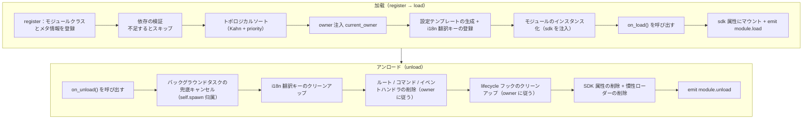

**加载時にフレームワークが自動で行う処理**（`on_load` のみ実装すれば、残りは自動）：

| フェーズ | フレームワークが自動で行う |
|------|-------------|
| owner 注入 | インスタンス化時に `owner_scope` でモジュール名をラップするため、`on_load` で登録したコマンド/イベント/フック/バックグラウンドタスクは**自動的に本モジュールに所有**され、アンロード時に owner に従って一括クリーンアップされる |
| 設定テンプレート | `ConfigClass` を宣言したモジュールは、フレームワークが自動的に `ErisPulse.<ModuleName>` の設定セグメントを生成/埋め込む |
| i18n 翻訳キー | `I18nClass` を宣言したモジュールは、翻訳キーが自動登録され（アンロード時に自動解除） |
| 依存トポロジー | `depends` で宣言した順序に従い、依存されるモジュールが先に加载されるようにする；循環依存は `RuntimeError` で拒否される |
| SDK へのマウント | インスタンス化後に `sdk.<ModuleName>` にマウントされ、`sdk.MyModule.xxx` でアクセス可能になる |

**アンロード時にフレームワークがクリーンアップする処理**（上記の U1→U7 に対応）：`on_unload` 実行後に兜底クリーンアップを行う——バックグラウンドタスクは強制キャンセル（`self.spawn` で作成されたもの、優雅な終了は `on_unload` で実装する）；i18n キー、ルート、コマンド/イベントハンドラ、lifecycle フック、最後に SDK 属性を削除。`purge=True` では追加で登録の残骸と `sys.modules` をクリーンアップ。

> この自動クリーンアップが「`on_load`/`on_unload` のみ実装すれば、手動で unregister する必要がない」という自信の源です——フレームワークは owner 归属によって「誰が登録したか、誰がクリーンアップするか」を一括処理にしています。

## SDK オブジェクト

### コアモジュールへのアクセス

```python
from ErisPulse import sdk

# sdk オブジェクトを介してすべてのコアモジュールにアクセス
sdk.logger.info("ログ")
sdk.storage.set("key", "value")
config = sdk.config.getConfig("MyModule")
```

### モジュール間通信

```python
# 他のモジュールにアクセス
other_module = sdk.OtherModule
result = await other_module.some_method()
```

## 适配器送信メソッドの照会

新しい標準規格では、デフォルト送信メカニズムを実装するために `__getattr__` メソッドのオーバーライドを使用するよう求められており、このため `hasattr` メソッドを用いてメソッドの存在をチェックできなくなりました。`2.3.5` 以降では、送信メソッドを照会する機能が追加されました。

### 対応する送信メソッドの一覧表示

```python
# プラットフォームが対応するすべての送信メソッドを一覧表示
methods = sdk.adapter.list_sends("onebot11")
# 戻り値: ["Text", "Image", "Voice", "Markdown", ...]
```

### メソッドの詳細情報の取得

```python
# 特定のメソッドの詳細情報を取得
info = sdk.adapter.send_info("onebot11", "Text")
# 戻り値:
# {
#     "name": "Text",
#     "parameters": [
#         {"name": "text", "type": "str", "default": null, "annotation": "str"}
#     ],
#     "return_type": "Awaitable[Any]",
#     "docstring": "テキストメッセージを送信..."
# }
```

## 設定管理

### 宣言的な設定（推奨）

v2.5.2 以降、モジュールは `ConfigClass` を使って設定クラスを宣言し、アダプターと同じ設定 Schema システムを使用できます。設定は `self.cfg` を通じてリアルタイムに読み取ることができ、変更後は即座に反映されます：

```python
from dataclasses import dataclass, field
from ErisPulse.Core.Bases import BaseModule
from ErisPulse.Core.Bases import BaseConfig

@dataclass
class MyModuleConfig(BaseConfig):
    api_key: str = field(
        default="",
        metadata={
            "description": {"i18n": "my_module.api_key", "default": "API 密钥"},
            "required": True,
            "secret": True,
            "ui": {"widget": "password", "group": "basic", "order": 1},
        },
    )
    timeout: int = field(
        default=30,
        metadata={
            "description": {"i18n": "my_module.timeout", "default": "超时时间（秒）"},
            "ui": {"widget": "number", "group": "advanced", "order": 2},
        },
    )

class MyModule(BaseModule):
    ConfigClass = MyModuleConfig

    def __init__(self, sdk):
        self.sdk = sdk
        self.logger = sdk.logger.get_child("MyModule")

    async def on_load(self, event):
        self.logger.info("モジュールがロードされました")

    async def on_unload(self, event):
        pass

    async def do_something(self):
        cfg = self.cfg  # 実時読み取り、型安全
        api_key = cfg.api_key
        timeout = cfg.timeout
```

`BaseConfig` は、アダプター、モジュール、外部プロジェクトなど、あらゆる場面で使用できる汎用的な設定基底クラスです。設定フィールドは i18n 多言語説明をサポートしています（詳しくは [i18n ドキュメント](../../advanced/i18n.md#配置字段多语言）をご覧ください）。

### 宣言的翻訳キー（v2.7.0+）

v2.7.0 以降、モジュールは `ConfigClass` を宣言するのと同じように、`I18nClass` というネストされたクラスを使って翻訳キーを一括で宣言できます。フレームワークはロード時に**自動的に**宣言されたすべての翻訳キーを登録し、手動で `i18n.register()` を呼び出す必要がなく、また設定テンプレート生成よりも前に行われます。これにより、設定の説明で参照される i18n キーが利用可能になります。

```python
from ErisPulse.Core.Bases import BaseConfig, BaseI18n, I18nKey

class MyModule(BaseModule):
    # 設定クラス（オプション）
    @dataclass
    class ConfigClass(BaseConfig):
        welcome_msg: str = field(
            default="欢迎",
            metadata={
                "description": {"i18n": "mymodule.welcome_msg", "default": "欢迎消息"},
            },
        )

    # 翻訳キー集合クラス（オプション）
    class I18nClass(BaseI18n):
        # プロパティ名が自動的に完全なキー経路：<モジュール名>.<プロパティ名> に連結されます
        welcome_msg: I18nKey = I18nKey(
            default="Welcome Message",   # 言語に依存しないデフォルト
            zh_CN="欢迎消息",
            zh_TW="歡迎訊息",
            en="Welcome Message",
            ja="ウェルカムメッセージ",
            ru="Приветственное сообщение",
        )
        hello: I18nKey = I18nKey(
            default="Hello, {name}!",
            zh_CN="你好，{name}！",
            zh_TW="你好，{name}！",
            en="Hello, {name}!",
            ja="こんにちは、{name}！",
            ru="Привет, {name}!",
        )
```

詳細は [i18n 推奨書き方](../../advanced/i18n.md#推荐写法通过-i18nclass-声明翻译键-v270) を参照してください。

### 手動で設定を読み取る（廃止済み）

> **廃止済み**：宣言的設定 ([宣言式設定](#宣言式設定)) と `self.cfg` を通じたリアルタイム読み取りを使用してください。

```python
class MyModule(BaseModule):
    def __init__(self, sdk):
        self.sdk = sdk

    def _load_config(self):
        config = self.sdk.config.getConfig("MyModule")
        if not config:
            self.sdk.config.setConfig("MyModule", {"api_key": "", "timeout": 30})
            return {"api_key": "", "timeout": 30}
        return config
```

## ストレージシステム

### 基本的な使用方法

```python
# データを保存
sdk.storage.set("user:123", {"name": "張三"})

# データを取得
user = sdk.storage.get("user:123", {})

# データを削除
sdk.storage.delete("user:123")
```

### トランザクションの使用

```python
# トランザクションを使用してデータの一貫性を確保
with sdk.storage.transaction():
    sdk.storage.set("key1", "value1")
    sdk.storage.set("key2", "value2")
    # いずれかの操作が失敗した場合、すべての変更はロールバックされます
```

## イベント処理

### イベントハンドラの登録

```python
from ErisPulse.Core.Event import command, message

# コマンドの登録
@command("info", help="情報を取得します")
async def info_handler(event):
    await event.reply("これは情報です")

# メッセージハンドラの登録
@message.on_group_message()
async def group_handler(event):
    sdk.logger.info(f"グループメッセージを受け取りました: {event.get_text()}")
```

### イベントハンドラのライフサイクル

フレームワークはイベントハンドラの登録とアンロードを自動的に管理します。`on_load` で登録するだけで済みます。

## ラグロードメカニズム

### 動作原理

```python
# モジュールが初めてアクセスされたときにのみ初期化されます
result = await sdk.my_module.some_method()
# ↑ ここでモジュールの初期化がトリガーされます
```

### 立即ロード

初期化が即座に必要なモジュール（例：リスナー、タイマー）の場合：

```python
@staticmethod
def get_load_strategy():
    return ModuleLoadStrategy(
        lazy_load=False,  # 立即ロード
        priority=100
    )
```

## エラー処理

### 例外のキャッチ

```python
async def handle_event(self, event):
    try:
        # ビジネスロジック
        await self.process_event(event)
    except ValueError as e:
        self.logger.warning(f"パラメータエラー: {e}")
        await event.reply(f"パラメータエラー: {e}")
    except Exception as e:
        self.logger.error(f"処理失敗: {e}")
        raise
```

### ログ記録

```python
# 異なるログレベルを使用
self.logger.debug("デバッグ情報")    # 詳細なデバッグ情報
self.logger.info("実行状態")      # 正常な実行情報
self.logger.warning("警告情報")  # 警告情報
self.logger.error("エラー情報")    # エラー情報
self.logger.critical("致命的エラー") # 致命的エラー
```


### Event 包装类详解

# Event 包装クラスの詳細

Event モジュールは、強力な Event 包装クラスを提供し、イベント処理を簡素化します。

## event パラメータに型注釈を追加する

イベントハンドラの `event` パラメータは **Event 包装クラス**（dict のサブクラス）です。このパラメータに型注釈を付けることを強く推奨します：

```python
from ErisPulse.Core.Event import Event

@message.on_private_message()
async def handler(event: Event):
    text = event.get_text()   # IDE が便利なメソッドをすべて自動補完
    await event.reply(text)   # 静的チェック時に誤字が発見される
```

型注釈を付けない場合、IDE は Event 上のメソッド（`get_text()` / `reply()` / `wait_reply()` / プラットフォーム拡張メソッドなど）を認識できず、すべて手動で記憶して入力する必要があります。

> **注意**：イベントハンドラのコールバックの `event` は **Event 包装クラス**（注釈は `Event`）です。一方、モジュールのライフサイクルメソッド `on_load` / `on_unload` の `event` は普通の **dict**（注釈は `dict`）です。これらは混同しないでください。

## 核心特性

- **完全互換性**：Event は dict を継承しています
- **便利なメソッド**：多数の便利なメソッドを提供しています
- **プロパティアクセス**：イベントフィールドにドット演算子でアクセスできます
- **後方互換性**：すべてのメソッドはオプションです

## 核心フィールドメソッド

```python
from ErisPulse.Core.Event import command

@command("info")
async def info_command(event: Event):
    event_id = event.get_id()
    platform = event.get_platform()
    time = event.get_time()
    print(f"ID: {event_id}, プラットフォーム: {platform}, 時間: {time}")
```

## メッセージイベントメソッド

```python
from ErisPulse.Core.Event import message

@message.on_private_message()
async def private_handler(event: Event):
    text = event.get_text()
    user_id = event.get_user_id()
    nickname = event.get_user_nickname()
    await event.reply(f"こんにちは、{nickname}！")
```

## メッセージタイプの判断

```python
from ErisPulse.Core.Event import message

@message.on_group_message()
async def group_handler(event: Event):
    is_private = event.is_private_message()
    is_group = event.is_group_message()
    is_at = event.is_at_message()
    await event.reply(f"タイプ: {'プライベートチャット' if is_private else 'グループチャット'}")
```

## 回答機能

```python
from ErisPulse.Core.Event import command

@command("ask")
async def ask_command(event: Event):
    await event.reply("あなたの名前を入力してください:")
    reply = await event.wait_reply(timeout=30)
    if reply:
        name = reply.get_text()
        await event.reply(f"こんにちは、{name}！")

@command("price")
async def price_command(event: Event):
    await event.reply("金額を入力してください（例：5元）:")
    # 回答が正規表現に一致しない場合、タイムアウトするまで待機し続ける
    reply = await event.wait_reply(timeout=30, regex=r"\d+\s*元")
    if reply:
        await event.reply(f"金額を受け取りました: {reply.get_text()}")
```

## コマンド情報の取得

```python
from ErisPulse.Core.Event import command

@command("cmdinfo")
async def cmdinfo_command(event: Event):
    cmd_name = event.get_command_name()
    cmd_args = event.get_command_args()
    await event.reply(f"コマンド: {cmd_name}, 引数: {cmd_args}")
```

## 通知イベントメソッド

```python
from ErisPulse.Core.Event import notice

@notice.on_friend_add()
async def friend_add_handler(event: Event):
    await event.reply("友達追加してくれてありがとう！")
```

## 方法速查表

### 核心方法

#### 事件基础信息
- `get_id()` - イベントIDを取得
- `get_time()` - イベントのタイムスタンプ（Unix秒単位）を取得
- `get_type()` - イベントのタイプ（message/notice/request/meta）を取得
- `get_detail_type()` - イベントの詳細タイプ（private/group/friend等）を取得
- `get_platform()` - プラットフォーム名を取得

#### ロボット情報
- `get_self_platform()` - ロボットのプラットフォーム名を取得
- `get_self_user_id()` - ロボットのユーザーIDを取得
- `get_self_account_id()` - ロボットのアカウントID（複数Botモード）を取得
- `get_self_info()` - ロボットの完全な情報辞書を取得

#### 会話識別子
- `get_target_id()` - 統一されたターゲットIDを取得（グループチャットは `group_id`、チャンネルは `channel_id`、プライベートチャットは `user_id` を返す。group → channel → guild → thread → userの順に最初の非空値を返す）
- `get_session_id()` - セッションの唯一の識別子を取得、形式は `{platform}:{detail_type}:{target_id}`

### メッセージイベントメソッド

#### メッセージ内容
- `get_message()` - メッセージセグメントの配列を取得（OneBot12形式）
- `get_alt_message()` - メッセージの代替テキストを取得
- `get_text()` - 純粋なテキスト内容を取得（`get_alt_message()`のエイリアス）
- `get_message_text()` - 純粋なテキスト内容を取得（`get_alt_message()`のエイリアス）

#### 送信者情報
- `get_user_id()` - 送信者のユーザーIDを取得
- `get_user_nickname()` - 送信者のニックネームを取得
- `get_sender()` - 送信者の完全な情報辞書を取得

#### グループ/チャンネル情報
- `get_group_id()` - グループIDを取得（グループメッセージ）
- `get_channel_id()` - チャンネルIDを取得（チャンネルメッセージ）
- `get_guild_id()` - サーバーIDを取得（サーバーメッセージ）
- `get_thread_id()` - トピック/サブチャンネルIDを取得（トピックメッセージ）

#### @メッセージ関連
- `has_mention()` - @ロボットが含まれているか
- `get_mentions()` - すべての@されたユーザーIDのリストを取得

### メッセージタイプ判断

#### 基礎判断
- `is_message()` - メッセージイベントであるか
- `is_private_message()` - プライベートチャットメッセージか
- `is_group_message()` - グループチャットメッセージか
- `is_at_message()` - @メッセージか（`has_mention()`のエイリアス）

### 通知イベントメソッド

#### 通知操作者
- `get_operator_id()` - 操作者のIDを取得
- `get_operator_nickname()` - 操作者のニックネームを取得

#### 通知タイプ判断
- `is_notice()` - 通知イベントであるか
- `is_group_member_increase()` - グループメンバー増加イベント
- `is_group_member_decrease()` - グループメンバー減少イベント
- `is_friend_add()` - 友達追加イベント（`detail_type == "friend_increase"`に一致）
- `is_friend_delete()` - 友達削除イベント（`detail_type == "friend_decrease"`に一致）

### 要求イベントメソッド

#### 要求情報
- `get_comment()` - 要求の付言を取得

#### 要求タイプ判断
- `is_request()` - 要求イベントであるか
- `is_friend_request()` - 友達要求か
- `is_group_request()` - グループ要求か

### 返信機能

#### 基礎返信
- `reply(content, method="Text", at_sender=False, quote=False, at_users=None, reply_to=None, at_all=False, via=None, **kwargs)` - 一般的な返信メソッド
  - `content`: 送信内容（テキスト、URLなど）
  - `method`: 送信方法、デフォルトは "Text"、"Image"/"Voice"/"Video"/"File" など
  - `at_sender`: 送信者を@するか（自動的に user_id を抽出）
  - `quote`: 現在のメッセージを引用して返信するか（自動的に message_id を抽出）
  - `at_users`: @するユーザーIDのリスト、例: `["user1", "user2"]`
  - `reply_to`: 手動で返信するメッセージIDを指定
  - `at_all`: 全員を@するか
  - `**kwargs`: 余分なパラメータ（例: Mentionメソッドの user_id）

- `reply_ob12(message)` - OneBot12メッセージセグメントを使って返信
  - `message`: OneBot12メッセージセグメントのリストまたは辞書、MessageBuilderを使って構築

#### プラットフォーム機能の確認
- `supports(method)` - 現在のプラットフォームが特定の送信方法（例: `"Image"`、`"Voice"`）をサポートしているか確認、`bool`を返す
- `available_methods()` - 現在のプラットフォームで利用可能な送信方法の一覧を取得、メソッド名のリストを返す

#### 転送機能

> **注意**: 転送機能はアダプターのSend DSLによって実装される必要があり、Eventラッパークラス自体は直接の転送メソッドを提供しない。

```python
# メッセージをグループに転送
adapter = sdk.adapter.get(event.get_platform())
target_id = event.get_group_id()  # または他のグループIDを指定
await adapter.Send.To("group", target_id).Text(event.get_text())
```

### 返信待ち機能

- `wait_reply(prompt=None, timeout=60.0, callback=None, validator=None, method="Text", pattern=None, regex=None)` - ユーザーからの返信を待つ
  - `prompt`: プロンプトメッセージ、提供された場合ユーザーに送信される
  - `timeout`: 待ち時間のタイムアウト（秒）、デフォルトは60秒
  - `callback`: 返信を受け取ったときに実行されるコールバック関数
  - `validator`: 返信が有効かどうかを検証する関数
  - `method`: プロンプトメッセージの送信方法、デフォルトは "Text"
  - `pattern`: globワイルドカード（`*` / `?` / `[seq]`）、返信テキストが一致する必要がある、一致しない場合は待機を続ける
  - `regex`: 正規表現、返信テキストが一致する必要がある（`pattern` と `regex` のどちらか一方を選択）、一致しない場合は待機を続ける
  - ユーザーの返信のEventオブジェクトを返す、タイムアウト時は`None`を返す

#### 交互メソッド

- `confirm(prompt=None, timeout=60.0, yes_words=None, no_words=None, method="Text", hint=False)` - 確認対話
  - `True`（確認）/ `False`（否定）/ `None`（タイムアウト）を返す
  - 内部的に中英語の確認語を自動認識し、カスタム語集を指定可能
  - `method`: 送信方法、デフォルトは "Text"、"Image"/"Markdown" などの非テキスト方式もサポート
  - `hint`: プロンプトの末尾に自動的に確認語のヒント（例: "（はい/いいえ）"）を追加するか、デフォルトは`False`

- `choose(prompt, options, timeout=60.0, method="Text", options_format="auto", merge_prompt=False, placeholder="{options}")` - 選択メニュー
  - `options`: 選択肢のテキストリスト
  - 選択肢のインデックス（0ベース）を返す、タイムアウト時は`None`を返す
  - `method`: 送信方法、デフォルトは "Text"、テキスト系メソッド (Text/Markdown/md/Html/h5) はデフォルトで選択肢を末尾にマージ
  - `options_format`: 選択肢のフォーマット（デフォルト: "auto"、methodに応じて自動的に組み込みスタイルを選択）
    - `"auto"`: Markdown→箇条書き（`- 1.選択肢`）、Html→順序付きリスト（`<ol>`）、その他の場合は純粋なテキストリスト
    - `"list"`: 各行に1つずつ、例: ``1. 選択肢A\n2. 選択肢B``
    - `"inline"`: 1行に表示、例: ``1.A | 2.B``
    - `"md"`: Markdownの箇条書き
    - `"html"`: Htmlの順序付きリスト
    - `callable`: 自作の関数、``list[str]``を受け取り``str``を返す
  - `merge_prompt`: 強制的に1つのメッセージにマージして送信するか、デフォルトは`False`
    - `False`（デフォルト）: テキスト系メソッドは自動的にマージ、非テキスト系メソッドはまずpromptを送信してからTextの選択肢を送信
    - `True`: どんなmethodでも1つのメッセージにマージしてユーザーが指定したmethodで送信
  - `placeholder`: 選択肢を挿入する占位符、デフォルトは`{options}`、promptにこのマーカーが含まれる場所に選択肢のテキストを置き換え、空文字に設定すると常に末尾に追加

- `collect(fields, timeout_per_field=60.0)` - フォーム収集
  - `fields`: フィールドのリスト、各項目には`key`、`prompt`、オプション`validator`、オプション`method`が含まれる
  - `{key: value}`の辞書を返す、いずれかのフィールドがタイムアウトすると`None`を返す
  - 各フィールドは`method`キーで送信方法を指定可能、例: 画像を収集する場合 ``{"key": "avatar", "prompt": "プロフィール画像を送ってください", "method": "Image"}``
  - 各フィールドは`options`キー（リスト）をオプションで提供可能、提供された場合、該当フィールドは選択問題になる（`choose`のロジックを自動的に呼び出す）
  - 各フィールドは`options_format`、`merge_prompt`、`placeholder`キーをオプションで提供可能、選択肢のフォーマット、メッセージのマージ動作、占位符を制御

- `wait_for(event_type="message", condition=None, timeout=60.0)` - 任意のイベントを待つ
  - `condition`: 条件関数、`True`を返した場合に一致する
  - 一致するEventオブジェクトを返す、タイムアウト時は`None`を返す

- `conversation(timeout=60.0)` - 複数回対話コンテキストを作成
  - `Conversation`オブジェクトを返す、`say()`/`wait()`/`confirm()`/`choose()`/`collect()`/`stop()`がサポートされる
  - `is_active`属性は対話がアクティブかどうかを示す

#### 交互メソッドの例

**confirm() - 確認対話:**

```python
@command("delete", help="データを削除")
async def delete_handler(event: Event):
    if await event.confirm("すべてのデータを削除してもよろしいですか？"):
        sdk.storage.delete("all_data")
        await event.reply("データを削除しました")
    else:
        await event.reply("キャンセルしました")
```

**confirm() - ヒント付き:**

```python
# hint=True はプロンプトの末尾に "（はい/いいえ）" を追加
if await event.confirm("続行してもよろしいですか？", hint=True):
    await event.reply("続行しました")
# ユーザーが表示する: 続行してもよろしいですか？（はい/いいえ）
```

**choose() - 選択メニュー:**

```python
@command("color", help="色を選択")
async def color_handler(event: Event):
    choice = await event.choose("色を選択してください：", ["赤", "緑", "青"])
    if choice is not None:
        colors = ["赤", "緑", "青"]
        await event.reply(f"選択した色は：{colors[choice]}")
```

**choose() - 選択肢のフォーマットとメッセージのマージ:**

```python
# inline形式：選択肢を1行に表示
choice = await event.choose("選択してください：", ["A", "B", "C"], options_format="inline")
# 出力: 1.A | 2.B | 3.C

# 自作のフォーマット
choice = await event.choose("選択してください：", ["猫", "犬"],
    options_format=lambda opts: " / ".join(opts))
# 出力: 猫 / 犬

# options_format="auto"（デフォルト）：methodに応じて自動的に組み込みスタイルを選択
# Markdown → 箇条書き
choice = await event.choose(
    "## 選択してください", ["猫", "犬"],
    method="Markdown",  # autoは自動的にmdリストを認識
)
# 出力:
# ## 選択してください
# - 1. 猫
# - 2. 犬

# Html → 順序付きリスト
choice = await event.choose(
    "<h2>選択してください</h2>", ["猫", "犬"],
    method="Html", merge_prompt=True,  # autoは自動的にhtmlリストを認識
)
# 出力:
# <h2>選択してください</h2>
# <ol><li>1. 猫</li><li>2. 犬</li></ol>

# マージモード + 占位符
choice = await event.choose(
    "## 選択してください\n{options}\n番号を返信してください",
    ["猫", "犬"],
    method="Markdown", merge_prompt=True,
)

# 自作の占位符
choice = await event.choose(
    "選択してください: [choices]",
    ["猫", "犬"],
    placeholder="[choices]",
)
```

**collect() - フォーム収集:**

```python
@command("register", help="登録")
async def register_handler(event: Event):
    data = await event.collect([
        {"key": "name", "prompt": "お名前を入力してください："},
        {"key": "age", "prompt": "年齢を入力してください：",
         "validator": lambda e: e.get_text().isdigit()},
    ])
    if data:
        await event.reply(f"登録完了！{data['name']}、{data['age']}歳")
```

**非テキストメソッドのreply:**

```python
await event.reply("http://example.com/img.jpg", method="Image")
await event.reply("http://example.com/audio.mp3", method="Voice")

from ErisPulse.Core.Event import MessageBuilder
segments = MessageBuilder.text("この画像を見てください：").image("http://example.com/img.jpg").build()
await event.reply_ob12(segments)
```

> 完全なConversation多回対話の使い方は[Conversation多回対話](../../advanced/conversation.md)を参照してください。

### コマンド情報

#### コマンド基礎
- `get_command_name()` - コマンド名を取得
- `get_command_args()` - コマンド引数のリストを取得
- `get_command_raw()` - コマンドの元のテキストを取得
- `get_command_info()` - 完全なコマンド情報の辞書を取得
- `is_command()` - コマンドか

### 元データ

- `get_raw()` - プラットフォームの元のイベントデータを取得
- `get_raw_type()` - プラットフォームの元のイベントタイプを取得

### プラットフォーム拡張メソッド

アダプターはEventラッパークラスにプラットフォーム固有のメソッドを登録できる。メソッドは対応するプラットフォームのEventインスタンスでのみ利用可能で、他のプラットフォームでアクセスすると`AttributeError`が発生する。

プラットフォームメソッドは`Event.__getattribute__`により、内蔵メソッドよりも優先して有効になるため、`confirm`、`choose`、`collect`、`wait_reply`などの内蔵インタラクティブメソッドを覆い、プラットフォーム特有の実装（例: ボタン、カードなど）を提供できる。内蔵実装は`_builtin_*`関数としてエクスポートされ、覆い書き側で利用可能。

```python
# メールイベント - メールメソッドのみ
event = Event({"platform": "email", "email_raw": {"subject": "Hello"}})
event.get_subject()      # ✅ "Hello"を返す
event.get_chat_type()    # ❌ AttributeError

# Telegramイベント - Telegramメソッドのみ
event = Event({"platform": "telegram", "telegram_raw": {"chat": {"type": "private"}}})
event.get_chat_type()    # ✅ "private"を返す
event.get_subject()      # ❌ AttributeError

# 内蔵メソッドは常に利用可能
event.get_text()         # ✅ どのプラットフォームでも
event.reply("hi")        # ✅ どのプラットフォームでも
```

### 登録されたメソッドの照会

```python
from ErisPulse.Core.Event import get_platform_event_methods

methods = get_platform_event_methods("email")
# ["get_subject", "get_from", ...]
```

### `hasattr` と `dir` のサポート

```python
hasattr(event, "get_subject")   # platform="email"のときのみTrueを返す
"get_subject" in dir(event)     # 同上
```

### 跨プラットフォーム拡張（ワイルドカード）

`register_event_method`と`register_event_mixin`はプラットフォーム名として`"*"`を渡すことができ、登録されたメソッドは**すべてのプラットフォーム**のEventインスタンスで利用可能になる。AI対話、コンテキスト管理など、跨プラットフォームで再利用可能な機能に適している。

```python
from ErisPulse.Core.Event.wrapper import register_event_method

@register_event_method("*")
async def ai_chat(self, prompt: str):
    # selfはEventインスタンス、イベントデータと内蔵メソッドにアクセス可能
    await self.reply(f"AI: {prompt}")
```

登録後、どのプラットフォームのイベントハンドラでも`event.ai_chat(...)`を呼び出すことができる。

メソッドの優先順位（高い順）: プラットフォーム固有メソッド → ワイルドカードメソッド → 内蔵メソッド → 辞書キーアクセス。

> アダプター開発者が拡張メソッドを登録する方法は[イベントシステムAPI - 跨プラットフォーム拡張ワイルドカード](../../api-reference/event-system.md#跨平台扩展通配符)を参照してください。


### 模块开发最佳实践

# モジュール開発のベストプラクティス

このドキュメントでは、ErisPulse モジュール開発におけるベストプラクティスの推奨事項を提供します。

## モジュール設計

### 1. 単一責任原則

各モジュールは1つのコア機能のみを担当するべきです：

```python
# 良い設計：各モジュールは1つの機能のみを担当
class WeatherModule(BaseModule):
    """天気照会モジュール"""
    pass

class NewsModule(BaseModule):
    """ニュース照会モジュール"""
    pass

# 悪い設計：1つのモジュールが複数の無関係な機能を担当
class UtilityModule(BaseModule):
    """天気、ニュース、ジョーク等多个の機能を含む"""
    pass
```

### 2. モジュール命名規則

```toml
[project]
name = "ErisPulse-ModuleName"  # ErisPulse- プレフィックスを使用
```

### 3. 明確な設定管理

宣言的設定（`ConfigClass` + `BaseConfig`）を使用することを推奨します。これにより、型安全、自動テンプレート生成、WebUIフォームサポートなどの機能が得られます：

```python
from dataclasses import dataclass, field
from ErisPulse.Core.Bases import BaseConfig

@dataclass
class MyModuleConfig(BaseConfig):
    api_url: str = field(default="https://api.example.com", metadata={
        "description": {"i18n": "my_module.api_url", "default": "API アドレス"},
    })
    timeout: int = field(default=30, metadata={
        "description": {"i18n": "my_module.timeout", "default": "タイムアウト時間（秒）"},
    })
    cache_ttl: int = field(default=3600, metadata={
        "description": {"i18n": "my_module.cache_ttl", "default": "キャッシュの有効時間（秒）"},
    })

class MyModule(BaseModule):
    ConfigClass = MyModuleConfig

    async def do_something(self):
        cfg = self.cfg  # 型安全、リアルタイム読み取り
        await self._fetch(cfg.api_url, timeout=cfg.timeout)
```

また、[モジュールのコア概念](core-concepts.md#設定管理)に記載されているように、手動で設定ストアを読み書きすることも可能です。

### 宣言的翻訳キー（v2.7.0+）

モジュールは `I18nClass` を使って翻訳キーを一括で宣言することで、フレームワークが自動的にi18nシステムに登録し、手動で `i18n.register()` を呼び出す必要がありません。

```python
from ErisPulse.Core.Bases import BaseI18n, I18nKey

class MyModule(BaseModule):
    class I18nClass(BaseI18n):
        # プレースホルダー付きの業務翻訳キー
        welcome: I18nKey = I18nKey(
            default="Welcome, {name}!",
            zh_CN="ようこそ、{name}！",
            zh_TW="ようこそ、{name}！",
            en="Welcome, {name}!",
            ja="ようこそ、{name}！",
            ru="Добро пожаловать, {name}!",
        )
        # 設定フィールドの説明の翻訳
        api_url: I18nKey = I18nKey(
            default="API URL",
            zh_CN="API アドレス",
            zh_TW="API 位址",
            en="API URL",
            ja="API URL",
            ru="API URL",
        )
```

詳細な使い方は [i18n ドキュメント](../../advanced/i18n.md#推奨書き方-through-i18nclass-宣言翻訳キー-v270) を参照してください。

## 非同期プログラミング

### 1. 非同期ライブラリの使用

```python
# SDK 内蔵の HTTP クライアント（非同期、自動ログと統計機能付き）の使用が推奨
from ErisPulse.Core import client

class MyModule(BaseModule):
    async def fetch_data(self, url):
        resp = await client.get(url)
        return await resp.json()

# sdk.client を直接使用しても同様の効果
from ErisPulse import sdk

class MyModule(BaseModule):
    async def fetch_data(self, url):
        resp = await sdk.client.get(url)
        return await resp.json()

# aiohttp を直接インポートしないこと（フレームワークによる統一管理が難しい）
import aiohttp

class MyModule(BaseModule):
    async def fetch_data(self, url):
        async with aiohttp.ClientSession() as session:
            async with session.get(url) as response:
                return await response.json()

# requests を使用しないこと（同期的でイベントループをブロックする）
import requests

class MyModule(BaseModule):
    def fetch_data(self, url):
        return requests.get(url).json()  # イベントループをブロックする
```

### 2. 正しい非同期操作

```python
from ErisPulse.Core.Event import Event  # event: Event 注釈により IDE の補完が得られる

async def handle_command(self, event: Event):
    # 結果を待つ必要のある処理：直接 await（ライフサイクルが明確）
    result = await self._long_operation()

async def on_load(self, event: dict):
    # バックグラウンドタスク（ポーリング/定時実行/fire-and-forget）：self.spawn() を使用
    # モジュールのアンロード時にフレームワークが on_unload の後にタスクをキャンセルし、
    # self の保持を防ぎ、リソースリークを回避する
    self.spawn(self._poll())
```

> [!NOTE]
> バックグラウンドタスクは `self.spawn()`（ErisPulse **2.8.0+**）を使用することを推奨します。`asyncio.create_task` で作成されるタスクはモジュールに属さず、アンロード時に自動的にキャンセルされません。`self` の参照を保持したままになるため、モジュールのインスタンスが回収されず、ホットリロード時にリソースリークが発生します。詳細は [ライフサイクル管理](../../advanced/lifecycle.md#バックグラウンドタスクの所属と自動キャンセル) を参照してください。

### 3. リソース管理

```python
async def on_load(self, event):
    # SDK クライアントは接続プールを自動的に管理しているため、session を手動で作成する必要はない
    pass
    
async def on_unload(self, event):
    # 自前でクライアントを使用する場合は、リソースの解放を忘れずに
    pass
```

## イベント処理

### 1. Event パッケージクラスの使用

```python
# Event パッケージクラスを使用する便利な方法
@command("info")
async def info_command(event: Event):
    user_id = event.get_user_id()
    nickname = event.get_user_nickname()
    await event.reply(f"こんにちは、{nickname}！")

# ダイクショナリに直接アクセスするのではなく
@command("info")
async def info_command(event: Event):
    user_id = event["user_id"]  # よく分からない、間違いやすい
```

### 2. 懒惰ロードの適切な使用

```python
# 低頻度コマンドモジュール：activate_on トリガを宣言し、最初の一致するコマンドが到着したときに自動的に有効化（怠惰ロードを維持）
class CommandModule(BaseModule):
    @staticmethod
    def get_load_strategy():
        return ModuleLoadStrategy(lazy_load=True, activate_on=[
            {"command": {"name": "dice", "help": "サイコロを振る", "aliases": ["d"]}},
        ])

# 低頻度リスナーモジュール：イベントトリガを宣言し、イベントが到着したときに自動的に有効化
class ListenerModule(BaseModule):
    @staticmethod
    def get_load_strategy():
        return ModuleLoadStrategy(lazy_load=True, activate_on=[
            {"notice": "group_member_increase"},
        ])

# 高頻度トリガ（各メッセージを処理する必要がある）または起動時に即座に準備が必要なモジュール：即時ロード
class HotListenerModule(BaseModule):
    @staticmethod
    def get_load_strategy():
        return ModuleLoadStrategy(lazy_load=False)

# ユーティリティモジュールは怠惰ロードに適している
class UtilityModule(BaseModule):
    @staticmethod
    def get_load_strategy():
        return ModuleLoadStrategy(lazy_load=True)
```

> `activate_on` の完全な構文（イベント三形式 / コマンドの簡易表記と dict 宣言 / help フォールバックチェーン）については、[怠惰ロードモジュールシステム](../../advanced/lazy-loading.md#イベント駆動怠惰有効化activate_on)を参照してください。

### 3. イベントハンドラの登録

```python
async def on_load(self, event):
    # on_load でイベントハンドラを登録
    @command("hello")
    async def hello_handler(event: Event):
        await event.reply("こんにちは！")
    
    @message.on_group_message()
    async def group_handler(event: Event):
        self.logger.info("グループメッセージを受信しました")
    
    # 手動で解除する必要はなく、フレームワークが自動的に処理します
```

## エラー処理

### 1. 例外の分類処理

```python
async def handle_event(self, event: Event):
    try:
        result = await self._process(event)
    except ValueError as e:
        # 予期されたビジネスエラー
        self.logger.warning(f"ビジネス警告: {e}")
        await event.reply(f"パラメータエラー: {e}")
    except aiohttp.ClientError as e:
        # ネットワークエラー（推奨は sdk.client + ClientError による置き換え）
        # 旧コードでは直接 aiohttp を使っても正常に動作しますが、新規コードでは ErisPulse の例外体系の使用を推奨します
        self.logger.error(f"ネットワークエラー: {e}")
        await event.reply("ネットワークリクエストに失敗しました。後でもう一度お試しください。")
    except Exception as e:
        # 予期しないエラー
        self.logger.error(f"未知のエラー: {e}", exc_info=True)
        await event.reply("処理に失敗しました。管理者にお問い合わせください。")
        raise
```

### 2. タイムアウト処理

```python
# 推奨は SDK 内部のクライアント（タイムアウトと再試行機能を内蔵）
from ErisPulse.Core import client
from ErisPulse.Core.Bases.errors import ClientTimeoutError

async def fetch_with_timeout(self, url, timeout=30):
    try:
        resp = await client.get(url, timeout=timeout)
        return await resp.json()
    except ClientTimeoutError:
        self.logger.warning(f"リクエストがタイムアウトしました: {url}")
        raise
```

## ストレージシステム

### 1. トランザクションの使用

```python
# トランザクションを使用してデータの一貫性を確保
async def update_user(self, user_id, data):
    with self.sdk.storage.transaction():
        self.sdk.storage.set(f"user:{user_id}:profile", data["profile"])
        self.sdk.storage.set(f"user:{user_id}:settings", data["settings"])

# ❌ トランザクションを使用しないと、データの一貫性が保証されない
async def update_user(self, user_id, data):
    self.sdk.storage.set(f"user:{user_id}:profile", data["profile"])
    # ここでエラーが発生すると、前の設定はロールバックできない
    self.sdk.storage.set(f"user:{user_id}:settings", data["settings"])
```

### 2. バッチ操作

```python
# バッチ操作を使用してパフォーマンスを向上
def cache_multiple_items(self, items):
    self.sdk.storage.set_multi({
        f"item:{k}": v for k, v in items.items()
    })

# ❌ 複数回の呼び出しは効率が悪い
def cache_multiple_items(self, items):
    for k, v in items.items():
        self.sdk.storage.set(f"item:{k}", v)
```

## ログ記録

### 1. ログレベルの適切な使用

```python
# DEBUG: 詳細なデバッグ情報（開発時のみ）
self.logger.debug(f"入力パラメータ: {params}")

# INFO: 正常な実行情報
self.logger.info("モジュールがロードされました")
self.logger.info(f"リクエストを処理: {request_id}")

# WARNING: 警告情報、主要機能には影響しません
self.logger.warning(f"設定項目 {key} が設定されていません、デフォルト値を使用します")
self.logger.warning("APIのレスポンスが遅い、最適化が必要かもしれません")

# ERROR: エラー情報
self.logger.error(f"APIリクエストに失敗しました: {e}")
self.logger.error(f"イベントの処理に失敗しました: {e}", exc_info=True)

# CRITICAL: 致命的なエラー、即時対応が必要です
self.logger.critical("データベース接続に失敗しました、ロボットが正常に動作できません")
```

### 2. 構造化ログ

```python
# 構造化ログを使用し、解析しやすくします
self.logger.info(f"リクエストを処理: request_id={request_id}, user_id={user_id}, duration={duration}ms")

# ❌ 非構造化ログの使用
self.logger.info(f"リクエストを処理しました、ユーザー {user_id} から、所要時間 {duration} ミリ秒")
```

## パフォーマンス最適化

### 1. キャッシュの使用

```python
class MyModule(BaseModule):
    def __init__(self):
        self._cache = {}
        self._cache_lock = asyncio.Lock()
    
    async def get_data(self, key):
        async with self._cache_lock:
            if key in self._cache:
                return self._cache[key]
            
            # データベースから取得
            data = await self._fetch_from_db(key)
            
            # データをキャッシュ
            self._cache[key] = data
            return data
```

### 2. ブロッキング操作の回避

```python
# 非同期操作を使用
async def process_message(self, event: Event):
    # 非同期処理
    await self._async_process(event)

# ❌ ブロッキング操作
async def process_message(self, event: Event):
    # 同期操作、イベントループをブロック
    result = self._sync_process(event)
```

## セキュリティ

### 1. 敏感データの保護

```python
# 敏感データは設定に保存されます（宣言的 ConfigClass、secret フィールドはログ/エクスポートに含まれません）
from dataclasses import dataclass, field
from ErisPulse.Core.Bases import BaseModule, BaseConfig

@dataclass
class MyModuleConfig(BaseConfig):
    api_key: str = field(
        default="",
        metadata={"description": "API キー", "secret": True},
    )

class MyModule(BaseModule):
    ConfigClass = MyModuleConfig

    def check_api_key(self):
        if not self.cfg.api_key or self.cfg.api_key == "YOUR_API_KEY_HERE":
            raise ValueError("config.toml に有効な API キーを設定してください")

# ❌ 敏感データのハードコーディング
class MyModule(BaseModule):
    API_KEY = "sk-1234567890"  # これを行わないでください！
```

### 2. 入力検証

```python
# ユーザー入力の検証
async def process_command(self, event: Event):
    user_input = event.get_text()
    
    # 入力長さの検証
    if len(user_input) > 1000:
        await event.reply("入力が長すぎます。再度入力してください")
        return
    
    # 入力形式の検証
    if not re.match(r'^[a-zA-Z0-9]+$', user_input):
        await event.reply("入力形式が正しくありません")
        return
```

## テスト

### 1. 単体テスト

```python
import pytest
from ErisPulse.Core.Bases import BaseModule

class TestMyModule:
    def test_config_defaults(self):
        """テストのデフォルト設定"""
        config = MyModule.ConfigClass()
        assert config.timeout == 30
```

### 2. 統合テスト

```python
@pytest.mark.asyncio
async def test_command_handling():
    """コマンド処理のテスト"""
    module = MyModule()
    await module.on_load({})
    
    # コマンドイベントをシミュレート
    event = create_test_command_event("hello")
    await module.handle_command(event)
```

## 部署

### 1. バージョン管理

```toml
[project]
name = "ErisPulse-MyModule"
version = "1.0.0"
```

セマンティックバージョニングに従います：
- MAJOR.MINOR.PATCH
- 主バージョン：互換性のないAPIの変更
- 次バージョン：互換性のある機能の追加
- 修訂番号：互換性のある問題の修正

### 2. READMEのヘッダー

`epsdk create`で生成されたREADMEには、ErisPulseのヘッダー識別子（ロゴ + バッジ行）が既に含まれています。2つの推奨モードがあります：

**モードA — 仅ErisPulseロゴ（デフォルト）：**

```markdown
<div align="center">


# MyModule

**一文で説明**

<p>
  <a href="https://pypi.org/project/ErisPulse-MyModule/"></a>
  <a href="https://pypi.org/project/ErisPulse-MyModule/"></a>
  <a href="./LICENSE"></a>
  <a href="https://github.com/ErisPulse/ErisPulse"></a>
</p>

</div>
```

**モードB — モジュールアイコン × ErisPulseロゴ（独自アイコンがある場合）：**

```markdown
<div align="center">


<span style="font-size:44px;color:#c8c8c8;margin:0 18px;vertical-align:middle;">×</span>


# MyModule
（バッジ行は上記と同様）
</div>
```

GitHubのStarsやDownloadsなどのバッジを必要に応じて追加できます。ロゴはプロジェクトのローカルにダウンロードし（`.github/assets/ErisPulseLogo.png`）、相対パスで参照することもできます。


=====
发布与工具
=====


### 发布模块到模块商店

# リリースとモジュールストアガイド

開発したモジュールやアダプタを ErisPulse モジュールストアに公開し、他のユーザーが簡単に見つけてインストールできるようにします。

## モジュールストアの概要

ErisPulse モジュールストアは、集中管理されたモジュール登録表です。ユーザーは CLI ツールを使用して、コミュニティが提供するモジュールやアダプターを閲覧、検索、インストールできます。

### 一覧表示と発見

```bash
# リモートで利用可能なすべてのパッケージを一覧表示
epsdk list-remote

# モジュールのみを表示
epsdk list-remote -t modules

# アダプターのみを表示
epsdk list-remote -t adapters

# リモートパッケージ一覧を強制的に更新
epsdk list-remote -r
```

また、[ErisPulse 公式サイト](https://www.erisdev.com/#market) にアクセスして、オンラインでモジュールストアを閲覧することもできます。

### 提出可能なタイプ

| タイプ | 説明 | Entry-point 組 |
|------|------|----------------|
| モジュール (Module) | ロボットの機能を拡張し、ビジネスロジックを実装 | `erispulse.module` |
| アダプター (Adapter) | 新しいメッセージプラットフォームに接続 | `erispulse.adapter` |

## 快速配布

全体のプロセスは、3つのステップで完了します：プロジェクトの設定 → PyPI への配布 → モジュールストアへの提出。

### 1. pyproject.toml の設定

プロジェクトのディレクトリに `pyproject.toml` および `README.md` が存在することを確認し、タイプに応じて entry-points を設定してください。

#### モジュール

```toml
[project]
name = "ErisPulse-MyModule"
version = "1.0.0"
description = "モジュールの機能説明"
requires-python = ">=3.10"
license = { text = "MIT" }
authors = [ { name = "yourname" } ]
dependencies = [
    "ErisPulse>=2.0.0",
]

[project.entry-points."erispulse.module"]
"MyModule" = "MyModule:Main"
```

#### アダプター

```toml
[project]
name = "ErisPulse-MyAdapter"
version = "1.0.0"
description = "アダプターの機能説明"
requires-python = ">=3.10"

[project.entry-points."erispulse.adapter"]
"myplatform" = "MyAdapter:MyAdapter"
```

> **注意**：パッケージ名は `ErisPulse-` で始まるようにすることを推奨します。entry-point のキー名（例：`"MyModule"`）は、SDK 内でのモジュールのアクセス名として使用されます。

### 2. PyPI への配布

```bash
# ビルド + 配布（PyPI アカウントが必要）
pip install build twine
python -m build
python -m twine upload dist/*
```

配布に成功したら、インストールを確認します。

```bash
pip install ErisPulse-MyModule
```

### 3. モジュールストアへの提出

[ErisPulse モジュールストア](https://www.erisdev.com/#market) にアクセスし、「モジュールを提出」をクリックして、ログイン後にモジュール情報を入力してください。

対応しているログイン方法：**GitHub**、**Codeberg**、**云湖**、いずれかを選択してください。

入力のポイント：
- モジュール名、説明、リポジトリのアドレス
- 最低 SDK バージョン：不明な場合は、[ErisPulse の最新リリース](https://pypi.org/project/ErisPulse/) のバージョン番号を入力してください。

提出後、即座に有効になります。ユーザーはモジュールソースからインストールできます。モジュールは「未検証」と表示され、メンテナが審査を通過した後、「検証済み」に変更されます。

> **検証ステータスについて**：
> - 「未検証」は、公式の審査をまだ受けていないことを意味するだけで、モジュールに問題があるわけではありません。
> - ユーザーが `epsdk install` を使用して未検証のモジュールをインストールする際には、リスク警告が表示され、確認後にのみインストールが進められます。

### 4. 配布済みモジュールの管理

モジュールストアで「モジュールを提出」をクリックしてログイン後、「マイモジュール」タブに切り替えると、以下の操作が可能です。

- **編集** — モジュールの説明、リポジトリのアドレス、タグなどの情報を変更できます。バージョン番号は PyPI から自動的に同期されます。
- **削除** — モジュールストアからモジュールを削除します（取り消しはできません）。

> 提出したばかりのモジュールは、数分後に「マイモジュール」リストに表示されることがあります。

## モジュールの更新

1. `pyproject.toml` の `version` を更新します。
2. 再びビルドしてアップロードします: `python -m build && python -m twine upload dist/*`
3. モジュールストアは、PyPI 上の最新バージョンを自動的に同期します。

ユーザーは `epsdk upgrade MyModule` コマンドを使用して、モジュールをアップグレードできます。

## リリース前のチェックリスト

PyPI にプッシュする前に、以下の項目を一つずつ確認してください。

### コード品質

- [ ] 公開 API にはすべて型注釈が付いています（関数シグネチャと戻り値）
- [ ] 公開メソッドにはすべてドキュメント文字列（`"""..."""` 形式、`:param` / `:return` / `:raises` を含む）
- [ ] `ruff check` で警告がありません
- [ ] テストカバレッジは 80% 以上
- [ ] `pytest` で全テストケースが通過

### 兼容性

- [ ] `pyproject.toml` に最低 SDK バージョンが宣言されています：`dependencies = ["ErisPulse>=x.y.z"]`
- [ ] Python 3.10 / 3.11 / 3.12 / 3.13 でテスト済み
- [ ] 対象オペレーティングシステム（Windows / Linux / macOS、該当する場合）でテスト済み
- [ ] 循環依存がありません

### 設定

- [ ] 宣言的設定（`ConfigClass` + `BaseConfig` / `BotAccountConfig`）を使用している場合、設定フィールドに `description`（推奨 i18n 形式）と `ui` メタデータがあります
- [ ] i18n 翻訳キーを登録している場合、5 言語すべて（zh-CN / zh-TW / en / ja / ru）をカバーしています
- [ ] 敏感フィールドには `secret=True` が付いています

### ドキュメント

- [ ] `README.md` にインストール手順と基本的な使用例があります
- [ ] `README.md` に設定方法（設定ファイルの例 + 環境変数）を説明しています
- [ ] `CHANGELOG.md` にすべての変更履歴が記録されています
- [ ] アダプターはプラットフォームの機能ドキュメントを更新しています（サポートする Send タイプ、イベントタイプなど）

### リリース

- [ ] `pyproject.toml` のバージョン番号が更新されています
- [ ] ビルドが通っています：`python -m build`
- [ ] PyPI にプッシュされています：`python -m twine upload dist/*`
- [ ] インストールの検証が通っています：`pip install ErisPulse-xxx && epsdk run`

## 開発モードでのテスト

正式リリース前に、編集可能なモードを使用してローカルでテストすることができます。

```bash
epsdk install -e /path/to/MyModule
# または
pip install -e /path/to/MyModule
```

## 常見問題

### パッケージ名は `ErisPulse-` で始める必要がありますか？

必須ではありませんが、強く推奨されます。これにより、PyPI 上で ErisPulse エコシステムのパッケージをユーザーが識別しやすくなります。

### 1 つのパッケージに複数のモジュールを登録できますか？

はい、可能です。`entry-points` に複数のキーと値のペアを設定することで実現できます：

```toml
[project.entry-points."erispulse.module"]
"ModuleA" = "MyPackage:ModuleA"
"ModuleB" = "MyPackage:ModuleB"
```

### 審査にはどのくらい時間がかかりますか？

通常、1〜3営業日で完了します。モジュールストアの「マイモジュール」から、検証の状態を確認できます。

## Dockerイメージによるアプリケーションの配布

アプリケーションがPyPIに公開するのに適していない場合（プライベートな依存関係を含む、または事前設定が必要な環境など）、**GitHub Container Registry (GHCR)** を使ってDockerイメージを公開し、他のユーザーが `docker pull` で簡単に起動できるようにすることができます。

### 適用シーン

- あなたが**完全なロボットアプリケーション**（モジュール + 設定 + 入口スクリプト）を持っていて、ワンクリックで配布したい
- モジュール/アダプターが**プライベートパッケージ**や特別なインストール手順を必要とし、PyPIに適していない
- ユーザーの使用を容易にする**オールインクルーシブな**デプロイメント方式を提供したい

### 1. Dockerfileの作成

ErisPulse公式のイメージをベースに構築し、必要なモジュールを追加するだけです：

```dockerfile
FROM erispulse/erispulse:latest

LABEL org.opencontainers.image.title="ErisPulse-MyModule" \
      org.opencontainers.image.description="モジュールの説明" \
      org.opencontainers.image.url="https://github.com/yourname/ErisPulse-MyModule" \
      org.opencontainers.image.source="https://github.com/yourname/ErisPulse-MyModule"

COPY pyproject.toml README.md ./
COPY MyModule/ ./MyModule/

RUN uv pip install --system -e .
```

モジュールに追加のシステム依存性（例：SSHクライアントなど）が必要な場合は、`RUN uv pip install`の後に追加します：

```dockerfile
RUN apt-get update && apt-get install -y --no-install-recommends \
    openssh-client \
    && rm -rf /var/lib/apt/lists/*
```

> `erispulse/erispulse:latest`にはErisPulse、ErisPulse-Dashboard、Pythonランタイム、およびuvが既に含まれているため、再インストールは不要です。

### 2. GitHub Actionsワークフローの作成

`.github/workflows/docker-publish.yml`に作成します：

```yaml
name: Dockerイメージの公開

on:
  workflow_dispatch:
  push:
    branches:
      - main
    tags:
      - "v*"

permissions:
  contents: read
  packages: write

env:
  REGISTRY: ghcr.io
  IMAGE_NAME: ${{ github.repository_owner }}/my-bot

jobs:
  docker-publish:
    runs-on: ubuntu-latest

    steps:
      - name: コードのチェックアウト
        uses: actions/checkout@v4

      - name: QEMUの設定 (マルチアーキテクチャ対応)
        uses: docker/setup-qemu-action@v3

      - name: Docker Buildxの設定
        uses: docker/setup-buildx-action@v3

      - name: GitHub Container Registryへのログイン
        uses: docker/login-action@v3
        with:
          registry: ${{ env.REGISTRY }}
          username: ${{ github.actor }}
          password: ${{ secrets.GITHUB_TOKEN }}

      - name: Dockerメタデータの抽出
        id: meta
        uses: docker/metadata-action@v5
        with:
          images: ${{ env.REGISTRY }}/${{ env.IMAGE_NAME }}
          tags: |
            type=semver,pattern={{version}}
            type=semver,pattern={{major}}.{{minor}}
            type=raw,value=latest

      - name: Dockerイメージのビルドとプッシュ
        uses: docker/build-push-action@v6
        with:
          context: .
          file: ./Dockerfile
          platforms: linux/amd64,linux/arm64
          push: true
          tags: ${{ steps.meta.outputs.tags }}
          labels: ${{ steps.meta.outputs.labels }}
          cache-from: type=gha
          cache-to: type=gha,mode=max
```

> `GITHUB_TOKEN`はGitHub Actionsによって自動的に提供されるため、手動で秘密鍵を作成する必要はありません。

### 3. ビルドのトリガー

コードをプッシュするか、タグを打つことで自動的にビルドが開始されます：

```bash
# mainブランチにプッシュしてトリガー
git push origin main

# またはタグを打ってトリガー
git tag v1.0.0
git push origin v1.0.0
```

また、GitHubリポジトリの**Actions**ページから手動でトリガーすることもできます。

### 4. イメージを公開に設定

GHCRのイメージはデフォルトで**private**です。他のユーザーがログインせずにプルできるようにするには、GitHubで公開に設定する必要があります：

1. リポジトリにアクセス → **Packages** → 対応するPackageをクリック
2. **Package settings** → **Danger Zone** → **Change visibility** → **Public**

### 5. ユーザーの使用

ビルドが完了すると、ユーザーは `docker run` で1行で起動できます：

```bash
docker run -d \
  --name my-bot \
  -p 8000:8000 \
  -v $(pwd)/config:/app/config \
  -e TZ=Asia/Shanghai \
  -e ERISPULSE_DASHBOARD_TOKEN=your-token \
  --restart unless-stopped \
  ghcr.io/<your-username>/my-bot:latest
```

または `docker-compose.yml` を使用します：

```yaml
services:
  my-bot:
    image: ghcr.io/<your-username>/my-bot:latest
    container_name: my-bot
    ports:
      - "8000:8000"
    volumes:
      - ./config:/app/config
    environment:
      - TZ=Asia/Shanghai
      - ERISPULSE_DASHBOARD_TOKEN=${ERISPULSE_DASHBOARD_TOKEN:-}
    restart: unless-stopped
```

### Docker Hubへの同時公開

ワークフローを拡張して、ログインステップの前にDocker Hubへのログインを追加し、`images`にDocker Hubのアドレスを追加します：

```yaml
      - name: Docker Hubへのログイン
        uses: docker/login-action@v3
        with:
          registry: docker.io
          username: ${{ secrets.DOCKERHUB_USERNAME }}
          password: ${{ secrets.DOCKERHUB_TOKEN }}

      - name: Dockerメタデータの抽出
        id: meta
        uses: docker/metadata-action@v5
        with:
          images: |
            docker.io/<your-dockerhub-username>/my-bot
            ghcr.io/${{ github.repository_owner }}/my-bot
```

> `DOCKERHUB_USERNAME`と`DOCKERHUB_TOKEN`は、リポジトリの**Settings → Secrets**に追加する必要があります。

### Dockerイメージ vs PyPI公開

| 特性 | Dockerイメージ (GHCR) | PyPI公開 |
|------|---------------------|-----------|
| 分布方法 | `docker pull` でワンクリック実行 | `pip install` + 手動設定 |
| 適用範囲 | 完全なアプリケーション/ソリューション | 単一のモジュール/アダプター |
| プライベート依存 | 天然にサポート | プライベートPyPIソースが必要 |
| モジュールストア | 不適切 | モジュールストアに提出可能 |
| マルチアーキテクチャ | amd64/arm64をサポート | アーキテクチャに依存しない |

両方の方法は互いに矛盾しないため、モジュールをモジュールストアにPyPIで公開すると同時に、GHCRでオールインクルーシブなDockerイメージを提供することも可能です。


### CLI 命令参考

# CLI コマンドリファレンス

ErisPulse コマンドラインツール（`epsdk`）は、プロジェクト管理とパッケージ管理機能を提供します。

> **ヒント**：すべてのコマンドは `epsdk <コマンド> --help` で詳細なパラメータ説明を確認できます。

---

## パッケージ管理コマンド

| コマンド | 別名 | パラメータ | 説明 |
|------|------|------|------|
| `install` | `i`, `add` | `[package]... [--upgrade/-U] [--pre] [-e PATH] [--user] [--no-deps] [-t DIR] [--index-url URL] [--extra-index-url URL] [--no-cache-dir] [-r FILE] [-c FILE] [--force-reinstall] [--ignore-installed] [--compile/--no-compile] [--prefix DIR] [--src DIR] [--config-settings SETTINGS] [--no-binary FORMAT] [--only-binary FORMAT] [--prefer-binary] [--build-isolation/--no-build-isolation] [--upgrade-strategy {eager,only-if-needed,to-satisfy-only}] [--break-system-packages] [--no-uv]` | モジュール/アダプターのインストール |
| `uninstall` | `rm`, `remove` | `<package>... [--no-uv]` | モジュール/アダプターのアンインストール |
| `upgrade` | `up` | `[package]... [--force/-f] [--pre] [--no-uv]` | 指定モジュールまたは全モジュールのアップグレード |
| `self-update` | `su`, `update` | `[version] [--pre] [--force/-f] [--no-uv]` | SDK 自体の更新 |

## ディアグノスティクスコマンド

| コマンド | 別名 | パラメータ | 説明 |
|------|------|------|------|
| `doctor` | `diag` | `[--verbose]` | 環境診断とヘルスレポートの出力 |

### install

ErisPulse モジュールまたはアダプターパッケージをインストールします。パッケージ名を指定しない場合は、対話形式のインストール画面に移行します。

**別名：** `i`, `add`

**パラメータ：**

| パラメータ | 短引数 | 説明 |
|------|--------|------|
| `[package]...` | | インストールするパッケージ名。複数指定可 |
| `--upgrade` | `-U` | 最新バージョンにアップグレードしてインストール |
| `--pre` | | プリリリース版のインストールを許可 |
| `--editable` | `-e` | 編集可能なモードでインストール（パスを指定する必要あり） |
| `--user` | | ユーザーの site-packages ディレクトリにインストール |
| `--no-deps` | | 依存関係をインストールしない |
| `--target` | `-t` | 指定ディレクトリにインストール |
| `--index-url` | | PyPI イメージソースの URL |
| `--extra-index-url` | | 追加 PyPI イメージソースの URL（複数指定可） |
| `--no-cache-dir` | | キャッシュディレクトリを使用しない |
| `--requirement` | `-r` | requirements ファイルからインストール |
| `--constraint` | `-c` | 約束ファイルからインストール |
| `--force-reinstall` | | 強制的に再インストール |
| `--ignore-installed` | | 既にインストール済みのパッケージを無視 |
| `--compile` | | インストール後に .pyc ファイルをコンパイル |
| `--no-compile` | | インストール後に .pyc ファイルをコンパイルしない |
| `--prefix` | | 指定プレフィックスディレクトリにインストール |
| `--src` | | 編集可能なインストール時に使用するソースコードディレクトリ |
| `--config-settings` | | ビルドバックエンドに渡す設定（複数指定可） |
| `--no-binary` | | 二進数パッケージの使用を制限（形式は `:all:` のよう） |
| `--only-binary` | | 二進数パッケージのみを使用（形式は `:all:` のよう） |
| `--prefer-binary` | | 二進数パッケージを優先 |
| `--build-isolation` | | ビルドの分離を有効化 |
| `--no-build-isolation` | | ビルドの分離を無効化 |
| `--upgrade-strategy` | | アップグレード戦略：`eager`、`only-if-needed`、`to-satisfy-only` |
| `--break-system-packages` | | システムパッケージマネージャーが管理する Python パッケージを変更可能 |
| `--no-uv` | | uv ではなく pip を使用 |

**例：**

```bash
# 単一モジュールのインストール
epsdk install Weather

# 複数モジュールのインストール
epsdk install Yunhu Weather

# イメージソースからインストールしてアップグレード
epsdk install Weather -U --index-url https://pypi.tuna.tsinghua.edu.cn/simple

# 編集可能なモードでインストール（開発モード）
epsdk install -e ./my-adapter
```

### uninstall

インストール済みの ErisPulse モジュールまたはアダプターパッケージをアンインストールします。パッケージ名を指定しない場合は、対話形式のアンインストール画面に移行します。

**別名：** `rm`, `remove`

**パラメータ：**

| パラメータ | 説明 |
|------|------|
| `<package>...` | アンインストールするパッケージ名。複数指定可 |
| `--no-uv` | uv ではなく pip を使用 |

**例：**

```bash
# 単一モジュールのアンインストール
epsdk uninstall Weather

# 複数モジュールのアンインストール
epsdk uninstall Yunhu Weather
```

### upgrade

インストール済みの ErisPulse コンポーネントをアップグレードします。パッケージ名を指定しない場合は、対話形式で全アップグレードを行います。

**別名：** `up`

**パラメータ：**

| パラメータ | 短引数 | 説明 |
|------|--------|------|
| `[package]...` | | アップグレードするパッケージ名。複数指定可 |
| `--force` | `-f` | 強制アップグレード。確認をスキップ |
| `--pre` | | プリリリース版へのアップグレードを許可 |
| `--no-uv` | | uv ではなく pip を使用 |

**例：**

```bash
# 全パッケージのアップグレード
epsdk upgrade

# 指定パッケージのアップグレード
epsdk upgrade Weather

# 強制アップグレード（確認をスキップ）
epsdk upgrade -f
```

### self-update

ErisPulse SDK 自体を最新版に更新します。

**別名：** `su`, `update`

**パラメータ：**

| パラメータ | 短引数 | 説明 |
|------|--------|------|
| `[version]` | | 更新対象のバージョン番号 |
| `--pre` | | プリリリース版への更新を許可 |
| `--force` | `-f` | 強制更新。確認をスキップ |
| `--no-uv` | | uv ではなく pip を使用 |

**例：**

```bash
# 最新の安定版に更新
epsdk self-update

# 指定バージョンに更新
epsdk self-update 1.2.3

# プリリリース版を許可
epsdk self-update --pre

# 強制更新
epsdk self-update -f
```

---

## 情報照会コマンド

| コマンド | 別名 | パラメータ | 説明 |
|------|------|------|------|
| `list` | `l`, `ls` | `[--type/-t {modules,adapters,all}] [--outdated/-o]` | インストール済みのコンポーネントを表示 |
| `list-remote` | `lsr` | `[--type/-t {modules,adapters,all}] [--refresh/-r]` | リモートリポジトリで利用可能なコンポーネントを表示 |

### list

インストール済みの ErisPulse モジュールとアダプターを表示します。

**別名：** `l`, `ls`

**パラメータ：**

| パラメータ | 短引数 | 説明 |
|------|--------|------|
| `--type` | `-t` | タイプ指定：`modules`、`adapters`、`all`（デフォルト） |
| `--outdated` | `-o` | 更新可能なパッケージのみ表示 |

**例：**

```bash
# インストール済みのすべてのコンポーネントを表示
epsdk list

# モジュールのみ表示
epsdk list -t modules

# アダプターのみ表示
epsdk list -t adapters

# 更新可能なパッケージのみ表示
epsdk list -o
```

### list-remote

リモートリポジトリで利用可能な ErisPulse モジュールとアダプターを表示します。

**別名：** `lsr`

**パラメータ：**

| パラメータ | 短引数 | 説明 |
|------|--------|------|
| `--type` | `-t` | タイプ指定：`modules`、`adapters`、`all`（デフォルト） |
| `--refresh` | `-r` | リモートパッケージリストのキャッシュを強制的に更新 |

**例：**

```bash
# リモートで利用可能なすべてのコンポーネントを表示
epsdk list-remote

# リモートのモジュールのみ表示
epsdk list-remote -t modules

# キャッシュを強制的に更新して表示
epsdk list-remote -r
```

---

## 設定コマンド

| コマンド | 別名 | パラメータ | 説明 |
|------|------|------|------|
| `config` | `cfg`, `conf` | `[name] [--list/-l]` | 対話形式でアダプター/モジュールの宣言的設定項目を設定 |

### config

対話形式でアダプター/モジュールの宣言的設定項目を入力します。アダプター/モジュールが宣言した設定クラス（`ConfigClass` / `AccountConfigClass`）によって、自動的にフォームが生成され、検証が行われ、config.toml を手動で書く必要がありません。

アダプターは追加の多アカウント（botアカウント）管理もサポート：アカウントの追加/編集/削除、および有効化/無効化の切り替え。

**別名：** `cfg`, `conf`

**パラメータ：**

| パラメータ | 短引数 | 説明 |
|------|--------|------|
| `[name]` | | 目標名（アダプタープラットフォーム名またはモジュール名）。空欄の場合は対話形式で選択 |
| `--list` | `-l` | 設定状態を一覧表示するだけ。対話形式には移行しない |

**例：**

```bash
# すべてのアダプター/モジュールの設定状態を表示
epsdk config --list

# 対話形式で目標を選択して設定
epsdk config

# 指定アダプターを直接設定
epsdk config yunhu

# 指定モジュールを直接設定
epsdk config MyModule
```

**説明：**

- 設定状態は4段階に分類されます：`既に準備完了`（検証通過）、`未完成`（必須項目が不足または検証失敗）、`未設定`（未生成）、`設定なし`（目標が設定クラスを宣言していない）
- フィールド値にソースが付いて表示されます：既に設定済みは `（現在:値）`、未設定は schema のデフォルト値が `（デフォルト:値）` として表示されます。直接 Enter を押すとその値を保持します
- `secret` と宣言された鍵類のフィールドは入力時に表示されず、Enter を押すと既に設定された値を保持します
- 対話形式で、1つのフォームが終了すると選択メニューに戻ります（状態は更新済み）、複数の目標を連続して設定でき、空欄で終了します
- グローバルフォームの検証が失敗し、再入力を放棄した場合、今回の対話は中断され、設定は一切書き込まれません（「有効化済みだが設定が不完全」の半完成状態を避ける）
- 保存後、`config/config.toml` に即時書き込まれ、ダッシュボードと実行中の SDK で共通で確認できます。実行中のアダプターが新しいアカウント設定を適用するには、プロセスを再起動する必要があります
- `epsdk install`（対話形式のインストール）と `epsdk init` でアダプターをインストール成功後、設定の宣言を検出すると自動的に本対話に導きます。コマンドラインで直接パッケージ名を指定してインストールする場合は、設定の提示のみ出力されます

---

## 実行制御コマンド

| コマンド | 別名 | パラメータ | 説明 |
|------|------|------|------|
| `run` | `r` | `[script] [--reload]` | 指定スクリプトまたは SDK を実行 |

### run

ErisPulse プロジェクトのスクリプトまたは SDK を実行します。ホットリロードモードもサポート。

**別名：** `r`

**パラメータ：**

| パラメータ | 説明 |
|------|------|
| `[script]` | 実行するスクリプトファイル。指定しない場合は SDK を実行 |
| `--reload` | ホットリロードモードを有効化。ファイルの変更を監視して自動的に再起動 |

**例：**

```bash
# SDK を直接実行
epsdk run

# 指定スクリプトファイルを実行
epsdk run main.py

# ホットリロードモードで実行（ファイル変更で自動再起動）
epsdk run main.py --reload

# SDK のホットリロードモード
epsdk run --reload
```

---

## プロジェクト管理コマンド

| コマンド | 別名 | パラメータ | 説明 |
|------|------|------|------|
| `init` | — | `[--project-name/-n <name>] [--quick/-q] [--force/-f] [--here] [--no-uv]` | ErisPulse プロジェクトを初期化 |
| `create` | — | `{module,adapter} [--name/-n <name>] [--description/-d <desc>] [--author/-a <name>] [--email/-e <mail>] [--homepage <url>] [--output/-o <dir>] [--force/-f]` | モジュール/アダプターのフットスタジプロジェクトを作成 |

### init

新しい ErisPulse プロジェクトを初期化します。対話形式とクイックモードをサポート。

**パラメータ：**

| パラメータ | 短引数 | 説明 |
|------|--------|------|
| `--project-name` | `-n` | プロジェクト名 |
| `--quick` | `-q` | クイックモード。対話形式の向導をスキップ |
| `--force` | `-f` | 既存の設定ファイルを上書き |
| `--here` | | 現在のディレクトリで初期化。サブディレクトリを作成しない |
| `--no-uv` | | uv ではなく pip を使用 |

**例：**

```bash
# 対話形式で初期化
epsdk init

# クイックモードで初期化
epsdk init -q -n my_bot

# 既存の設定ファイルを強制的に上書き
epsdk init -f

# 現在のディレクトリで初期化
epsdk init --here -n my_bot
```

### create

ErisPulse モジュールまたはアダプターのフットスタジプロジェクトを作成します。

**パラメータ：**

| パラメータ | 短引数 | 説明 |
|------|--------|------|
| `{module,adapter}` | | 作成するタイプ：`module` または `adapter` |
| `--name` | `-n` | プロジェクト名（PascalCase） |
| `--description` | `-d` | プロジェクトの説明 |
| `--author` | `-a` | 作者名 |
| `--email` | `-e` | 作者のメールアドレス |
| `--homepage` | | プロジェクトのホームページ URL |
| `--output` | `-o` | 出力ディレクトリ（デフォルトは現在のディレクトリ） |
| `--force` | `-f` | 既存のディレクトリを上書き |
| `--local` | | ローカルプラグインを作成（`module` にのみ有効）：`plugins/<name>/` パッケージ構造を生成し、パッケージングなしでインストール可能 |

**例：**

```bash
# 対話形式で作成（タイプの選択と情報を入力する向導）
epsdk create

# Module プロジェクトを直接作成
epsdk create module -n MyModule

# ローカルプラグインを作成（プロジェクトの plugins/ ディレクトリに配置し、起動時に自動検出、ホットリロード対応）
epsdk create module -n MyModule --local

# Adapter プロジェクトを直接作成
epsdk create adapter -n MyAdapter

# 完全なパラメータ
epsdk create module -n MyModule -d "モジュールの説明" -a "作者" -e "mail@example.com"

# 出力ディレクトリを指定
epsdk create module -n MyModule -o ./projects

# 既存のディレクトリを強制的に上書き
epsdk create module -n MyModule -f
```

---

## 言語コマンド

| コマンド | 別名 | パラメータ | 説明 |
|------|------|------|------|
| `i18n` | `language`, `lang` | `[lang] [--list/-l]` | CLI の表示言語を確認または切り替え |

### i18n

CLI の現在の言語を確認し、サポートされている言語をリストアップし、表示言語を切り替えます。パラメータを指定しない場合は対話形式で選択画面に移行します。

**別名：** `language`, `lang`

**パラメータ：**

| パラメータ | 短引数 | 説明 |
|------|--------|------|
| `[lang]` | | 切り替えたい言語コード（例: `zh-CN`、`en`、`ja`、`ru`） |
| `--list` | `-l` | サポートされているすべての言語をリストアップ |

**例：**

```bash
# 対話形式で言語を選択
epsdk i18n

# 英語に切り替え
epsdk i18n en

# 日本語に切り替え
epsdk i18n ja

# サポートされているすべての言語をリストアップ
epsdk i18n --list
```

---

## タイプストアブコマンド

| コマンド | 別名 | パラメータ | 説明 |
|------|------|------|------|
| `types` | `t`, `stub` | `[--output/-o <path>] [--force] [--adapters-only] [--modules-only]` | IDE の補完を有効にするためのタイプストアブファイルを生成 |

### types

インストール済みの ErisPulse モジュールとアダプターをスキャンし、それらに `.pyi` タイプストアブファイルを生成します。これにより、IDE で正確なコード補完と型検査が可能になります。

**別名：** `t`, `stub`

**パラメータ：**

| パラメータ | 短引数 | 説明 |
|------|--------|------|
| `--output` | `-o` | 出力パス（デフォルトは現在のディレクトリの `ep-stubs/`） |
| `--force` | | 既存のストアブファイルを上書き |
| `--adapters-only` | | アダプターのタイプストアブのみ生成 |
| `--modules-only` | | モジュールのタイプストアブのみ生成 |

> **注意：** `--adapters-only` と `--modules-only` は互いに排他的で、両方指定した場合は後者（`--modules-only`）が有効になります。

**例：**

```bash
# インストール済みのすべてのモジュールとアダプターにタイプストアブを生成
epsdk types

# アダプターのタイプストアブのみ生成
epsdk types --adapters-only

# 指定ディレクトリに出力
epsdk types -o ./typings

# 既存ファイルを強制的に上書き
epsdk types --force
```

---

## グローバルパラメータ

以下のパラメータはすべてのコマンドに適用されます：

| パラメータ | 短引数 | 説明 |
|------|--------|------|
| `--help` | `-h` | ヘルプ情報を表示 |
| `--version` | `-V` | バージョン情報を表示 |
| `--verbose` | `-v` | 詳細な出力を表示（`-vv`/`-vvv` で重ねて使用可） |
| `--no-color` | | カラーアウトプットを無効化（CI / ログ収集に適） |
| `--yes` | `-y` | すべての対話プロンプトを自動的に確認（非対話実行） |

---

## 環境診断

### doctor

> [!NOTE]
> 本コマンドは ErisPulse **2.7.0+** が必要です。

現在の CLI 実行環境を診断し、ヘルスレポートを出力します。"なぜインストールできない / 接続できない" などの問題を診断するのに使用します。

| パラメータ | 説明 |
|------|------|
| `--verbose` | 詳細な診断情報を表示 |

**チェック項目：**
- **Python**：実行環境のバージョンとパス
- **インストールバックエンド**：`uv` か `pip` を使用しているか
- **ターゲット実行環境**：パッケージが実際にインストールされた Python 環境
- **設定ファイル**：`config/config.toml` が存在するか
- **PyPI 接続性**：PyPI にアクセスできるか（発見されたコンポーネント数を表示）
- **システムプロキシ**：プロキシが検出されているか

```bash
# 実行環境の診断
epsdk doctor

# 別名を使用
epsdk diag
```

---

## 対話形式のインストール

`epsdk install` をパッケージ名を指定せずに実行すると、対話形式のインストールに移行します：

```bash
epsdk install
```

対話画面では以下の機能が提供されます：
1. アダプターの選択
2. モジュールの選択
3. カスタムインストール

## 一般的な使用方法

### モジュールのインストール

```bash
# 単一モジュールのインストール
epsdk install Weather

# 複数モジュールのインストール
epsdk install Yunhu Weather

# モジュールのアップグレード
epsdk install Weather -U
```

### コンポーネントの一覧表示

```bash
# すべてのコンポーネントを表示
epsdk list

# アダプターのみ表示
epsdk list -t adapters

# 更新可能なコンポーネントのみ表示
epsdk list -o

# リモートで利用可能なコンポーネントを表示
epsdk list-remote
```

### コンポーネントのアンインストール

```bash
# 単一コンポーネントのアンインストール
epsdk uninstall Weather

# 複数コンポーネントのアンインストール
epsdk uninstall Yunhu Weather
```

### コンポーネントの設定

```bash
# 設定状態を表示
epsdk config --list

# 対話形式で目標を選択して設定
epsdk config

# 指定アダプターを直接設定
epsdk config yunhu
```

### コンポーネントのアップグレード

```bash
# すべてのコンポーネントをアップグレード
epsdk upgrade

# 指定コンポーネントをアップグレード
epsdk upgrade Weather

# 強制アップグレード
epsdk upgrade -f
```

### プロジェクトの実行

```bash
# 普通の実行
epsdk run main.py

# ホットリロードモード
epsdk run main.py --reload
```

### 言語の切り替え

```bash
# 対話形式で言語を選択
epsdk i18n

# 直接英語に切り替え
epsdk i18n en

# サポートされている言語をリストアップ
epsdk i18n --list
```

### タイプストアブの生成

```bash
# すべてのタイプストアブを生成
epsdk types

# モジュールのタイプストアブのみ生成
epsdk types --modules-only
```

### プロジェクトの初期化

```bash
# 対話形式で初期化
epsdk init

# クイックモードで初期化
epsdk init -q -n my_bot
```

### フットスタジの作成

```bash
# 対話形式で作成（タイプの選択と情報を入力する向導）
epsdk create

# Module プロジェクトを直接作成
epsdk create module -n MyModule

# Adapter プロジェクトを直接作成
epsdk create adapter -n MyAdapter

# 完全なパラメータ
epsdk create module -n MyModule -d "モジュールの説明" -a "作者" -e "mail@example.com"

# 強制的に既存のディレクトリを上書き
epsdk create module -n MyModule -f
```


======
API 参考
======


### 核心模块 API

# コアモジュール API

本文書は、ErisPulse コアモジュールの API のクイックリファレンスを提供します。メソッドの署名と簡潔な説明が含まれています。詳細な使い方や例については、各モジュールの「完全ドキュメント」リンクをクリックしてください。

## Storage モジュール

SQLite をベースとしたキー/値ストアシステムで、一般的な SQL チェーンクエリをサポートします。

### 基本操作

```python
from ErisPulse import sdk

sdk.storage.set("key", "value")
value = sdk.storage.get("key", default_value)
keys = sdk.storage.keys()
sdk.storage.delete("key")
```

### バッチ操作

```python
sdk.storage.set_multi({"key1": "val1", "key2": "val2"})
values = sdk.storage.get_multi(["key1", "key2"])
sdk.storage.delete_multi(["key1", "key2"])
```

### トランザクション操作

```python
with sdk.storage.transaction():
    sdk.storage.set("key1", "value1")
    sdk.storage.set("key2", "value2")
```

### 属性アクセス

```python
sdk.storage.my_key          # sdk.storage.get("my_key") と同等
sdk.storage.my_key = "val"  # sdk.storage.set("my_key", "val") と同等
```

### SQL チェーンクエリ

Storage モジュールは、カスタムテーブルの CRUD 操作をサポートするチェーン呼び出しスタイルの一般的な SQL クエリビルダーを提供します。

```python
sdk.storage.CreateTable("users", {
    "id": "INTEGER PRIMARY KEY AUTOINCREMENT",
    "name": "TEXT NOT NULL",
})

sdk.storage.Table("users").Insert({"name": "Alice"}).Execute()
rows = sdk.storage.Table("users").Select("name").Where("id > ?", 0).Execute()
```

> 完全なチェーンクエリ API (Select/Insert/Update/Delete/Where/OrderBy/Limit、AlterTable、トランザクションなど) は、[SQL クエリビルダー](../advanced/sql-builder.md)を参照してください。

### ストレージバックエンド抽象

`StorageManager` は `BaseStorage` 抽象基底クラスを継承し、Redis、MySQL などの他のストレージメディアを拡張可能です。

```python
from ErisPulse.Core.Bases.storage import BaseStorage, BaseQueryBuilder
```

### 非同期インターフェース

Storage と Config モジュールは、非同期メソッド（接頭辞 `a`）を提供し、非同期ハンドラで安全に呼び出すことができます。同期メソッドは引き続き保持され、既存のコードを変更する必要はありません。

```python
# 非同期ストレージ
value = await sdk.storage.aget("key")
await sdk.storage.aset("key", "value")
await sdk.storage.adelete("key")
keys = await sdk.storage.aget_all_keys()
await sdk.storage.aclear()

# 非同期バッチ操作
values = await sdk.storage.aget_multi(["k1", "k2"])
await sdk.storage.aset_multi({"k1": "v1", "k2": "v2"})
await sdk.storage.adelete_multi(["k1", "k2"])

# 非同期設定
value = await sdk.config.agetConfig("MyModule.key")
await sdk.config.asetConfig("MyModule.key", "value")
await sdk.config.aforce_save()
await sdk.config.areload()
```

## Config モジュール

TOML 形式の設定ファイル管理で、ドット区切りのキー経路をサポートします。

### API 概要

| メソッド | 説明 |
|------|------|
| `getConfig(key, default)` | 設定を読み込み、ドット経路 `"MyModule.subkey"` などもサポート |
| `setConfig(key, value, immediate=False)` | 設定を書き込み。`immediate=True` の場合、ファイルに即時保存 |
| `force_save()` | メモリ内の設定をファイルに強制的に書き込み |
| `reload()` | ファイルから再読み込み |
| `agetConfig(key, default)` | 非同期で設定を読み込み |
| `asetConfig(key, value, immediate)` | 非同期で設定を書き込み |
| `aforce_save()` | 非同期で強制保存 |
| `areload()` | 非同期で再読み込み |

### 例

```python
config = sdk.config.getConfig("MyModule", {})
value = sdk.config.getConfig("MyModule.timeout", 30)

sdk.config.setConfig("MyModule", {"key": "value"})
sdk.config.setConfig("MyModule.timeout", 60, immediate=True)
```

> `setConfig` はデフォルトで遅延書き込み（5秒ごとのバッチ保存）を使用します。`immediate=True` を設定すると、設定ファイルに即時永続化されます。設定の変更は `config.set` ライフサイクルイベントをトリガーします。

## Logger モジュール

モジュール化されたログシステムで、Rich をベースにし、サブロガーとモジュールレベルの制御をサポートします。

### 基本的な使い方

```python
sdk.logger.debug("デバッグ情報")
sdk.logger.info("実行情報")
sdk.logger.warning("警告情報")
sdk.logger.error("エラー情報")
sdk.logger.critical("致命エラー")
```

### サブロガー

```python
child_logger = sdk.logger.get_child("MyModule")
child_logger.info("サブモジュールログ")

child_logger.get_child("utils")  # 嵌套もサポート
```

### ログレベル制御

```python
sdk.logger.set_level("DEBUG")                          # グローバルレベル
sdk.logger.set_module_level("MyModule", "DEBUG")       # モジュールレベル

# 使用可能なレベル（低い順）:
# TRACE, DEBUG, INFO, WARNING, ERROR, CRITICAL
# TRACE は最低レベルで、イベントの配信、ルーティング登録などのフレームワーク内部の詳細なデバッグ情報を出力
sdk.logger.set_level("TRACE")                          # 全てのログを有効化
```

### ログサブスクリプション（プッシュモード）

Dashboard などのモジュールが構造化されたログをリアルタイムで受信するための機能で、レベルのフィルタリングと履歴の補送が可能です。

> **低レベルログの明示的なサブスクリプション**：サブスクライバの `min_level` はグローバルなログレベルより低く設定できます。この場合、低レベルのログは**一致するサブスクライバにのみプッシュ**され、コンソールには出力されず、メモリにも書き込まれません。これにより、メインのログストリームが汚染されることを回避できます。
>
> ```python
> # グローバルは INFO ですが、個別に DEBUG ログをサブスクライブできます
> @sdk.logger.handler("debug-tracer", min_level="DEBUG")
> def on_debug(log_data: dict): ...
> ```

```python
# デコレータ方式
@sdk.logger.handler("my-handler", min_level="INFO")
def on_log(log_data: dict):
    # log_data = {
    #     "timestamp": "2026-06-29T22:00:00.123456",
    #     "level": "WARNING", "level_num": 30,
    #     "module": "ErisPulse.Core.adapter",
    #     "message": "厳格モード：...",
    # }
    pass

# 直接呼び出し方式
sdk.logger.handler("my-handler", min_level="INFO")(on_log)
sdk.logger.remove_handler("my-handler")
```

| メソッド | 説明 |
|------|------|
| `handler(id, *, min_level)(func)` | デコレータ/直接呼び出しの両方に対応。`id` が空の場合は関数名を使用。`min_level` はグローバルレベルより低く設定可能（低レベルログはサブスクライバにのみプッシュされ、コンソールやメモリには出力されない）。登録時に履歴ログの補送も自動的に行われる |
| `remove_handler(id)` | サブスクライバを削除 |

### 出力制御

```python
sdk.logger.set_output_file("app.log")
sdk.logger.save_logs("log.txt")
sdk.logger.get_logs("MyModule")
sdk.logger.set_memory_limit(1000)
```

## Adapter モジュール

アダプタマネージャーで、複数プラットフォームのアダプタの登録、起動、停止を管理します。

### API 概要

| メソッド | 説明 |
|------|------|
| `get(platform)` | アダプタインスタンスを取得 |
| `exists(platform)` | アダプタが登録されているか確認 |
| `enable(platform)` / `disable(platform)` | アダプタを有効化/無効化 |
| `is_enabled(platform)` | アダプタが有効化されているか確認 |
| `startup(platforms)` / `shutdown(platforms)` | アダプタを起動/停止 |
| `is_running(platform)` | アダプタが実行中か確認 |
| `list_running()` | 実行中のアダプタをすべてリスト |
| `platforms` | 登録されたプラットフォーム名のリストを取得 |

### アダプタイベント

```python
@sdk.adapter.on("message")
async def handle_message(event):
    pass

@sdk.adapter.on("message", platform="yunhu")
async def handle_yunhu_message(event):
    pass
```

### Bot 状態照会

```python
sdk.adapter.get_bot_info("telegram", "123456")
sdk.adapter.list_bots("telegram")
sdk.adapter.is_bot_online("telegram", "123456")
sdk.adapter.get_status_summary()
```

> 完全なアダプタ管理 API は、[アダプタシステム API](adapter-system.md) を参照してください。

## Module モジュール

モジュールマネージャーで、プラグインの登録、ロード、アンロードを管理します。

### API 概要

| メソッド | 説明 |
|------|------|
| `get(name)` | モジュールインスタンスまたは遅延ロードプロキシを取得（登録済みだがロードされていない場合はプロキシを返す） |
| `exists(name)` | 登録されているか確認 |
| `is_loaded(name)` | ロードされているか確認 |
| `is_enabled(name)` | 有効化されているか確認 |
| `enable(name)` / `disable(name)` | モジュールを有効化/無効化 |
| `load(name)` / `unload(name)` | モジュールをロード/アンロード |
| `list_registered()` | 登録済みモジュールをすべてリスト |
| `list_loaded()` | ロード済みモジュールをすべてリスト |
| `get_info(name)` | モジュール情報を取得 |
| `get_status_summary()` | モジュールの状態概要を取得 |

### 属性アクセス

```python
module = sdk.module.get("ModuleName")
module = sdk.module.ModuleName
module = sdk.ModuleName  # 等価なショートカット
```

## Lifecycle モジュール

イベント駆動のライフサイクルマネージャーで、イベントの送信と監視機能を提供します。

### API 概要

| メソッド | 説明 |
|------|------|
| `on(event, priority=0)` | デコレータでイベントハンドラを登録し、ドットマッチとワイルドカード `*` をサポート |
| `register(event, handler, priority=0)` | 関数形式でハンドラを登録 |
| `unregister(event, handler=None)` | ハンドラを削除 |
| `emit(event, data)` | 非同期でイベントをトリガー |
| `emit_sync(event, data)` | 同期でイベントをトリガー |
| `submit_event(event_type, msg, data, source)` | 標準形式のイベントを送信（旧版と互換性あり） |
| `start_timer(id)` / `stop_timer(id)` | パフォーマンスタイマー |

### 例

```python
@sdk.lifecycle.on("module.init")
async def handle_module_init(event_data):
    print(f"モジュール初期化: {event_data}")

@sdk.lifecycle.on("module")
async def handle_any_module_event(event_data):
    print(f"モジュールイベント: {event_data}")

await sdk.lifecycle.emit("custom.event", {"key": "value"})
```

> 完全な標準イベントリストと詳細な使い方は、[ライフサイクル管理](../advanced/lifecycle.md)を参照してください。

## Router モジュール

HTTP/WebSocket ルーティングマネージャーで、FastAPI + Uvicorn をベースにし、デコレータルーティング、ミドルウェア、グループ、リクエスト制限、CORS をサポートします。

> 完全なルーティング API ドキュメント（デコレータルーティング、WebSocket、ミドルウェア、リクエスト制限、CORS、セキュリティヘッダーなど）は、[ルーティングマネージャー](../advanced/router.md)を参照してください。

### クイックリファレンス

```python
# HTTP ルーティング
@sdk.router.get("MyModule", "/api")
async def handler(request: HttpRequest):
    return {"status": "ok"}

# WebSocket ルーティング
@sdk.router.ws("MyModule", "/ws")
async def ws_handler(ws: WebSocketConnection):
    async for text in ws.iter_text():
        await ws.send_text(f"Echo: {text}")

# ルーティンググループ
group = sdk.router.group("MyModule", prefix="/v1")
@group.get("/users")
async def list_users(request: HttpRequest):
    return {"users": []}
```

## HTTP Client モジュール

統一されたネットワーククライアントで、HTTPリクエスト、WebSocket接続、接続プール管理、自動リトライ、リクエスト統計、ライフサイクルイベントの統合を統合します。

> 完全なネットワーククライアントドキュメント（リクエストメソッド、レスポンスオブジェクト、WebSocketクライアント、例外体系など）は、[ネットワーククライアント](../advanced/http-client.md)を参照してください。

### クイックリファレンス

```python
from ErisPulse.Core import client

# HTTPリクエスト
resp = await client.get("https://api.example.com/users")
data = await resp.json()

# WebSocket
ws = await client.ws_connect("wss://example.com/ws")
async for text in ws.iter_text():
    await ws.send_text(f"Echo: {text}")
```

## SDK デバッグ

### dump_state()

フレームワークの現在の実行状態のスナップショットをエクスポートし、デバッグや診断に使用します。

```python
import json
state = sdk.dump_state()
print(json.dumps(state, indent=2, ensure_ascii=False, default=str))
```

返却される構造には、以下のサブシステムの状態が含まれます：

| フィールド | 説明 |
|------|------|
| `sdk` | SDKの初期化状態、Pythonバージョン、実行プラットフォーム、タイムスタンプ |
| `adapters` | 登録済み/起動済みアダプタのリスト、各プラットフォームのBotのオンライン状態 |
| `modules` | 登録済み/有効化済み/無効化済み/遅延ロード済みのモジュールのリスト |
| `events` | あらゆる種類のイベントハンドラの数（message/notice/request/meta/commands） |
| `router` | サーバーの実行状態、HTTP/WebSocketルートの数 |

> 2.5.2 で追加

## Interaction 交互会話

`sdk.interaction` を使用して、wait_replyの待機とセッションの排他リース（互斥）を管理します。

### 主なメソッド

```python
# 会話の現在の所有者を照会（誰がユーザーと対話しているか）
owner = sdk.interaction.get_owner_of(event)

# 会話の排他リースを宣言（占有されている場合はNoneを返す）
lease = sdk.interaction.acquire(event)
if lease:
    try:
        ...  # 排他的な対話
    finally:
        lease.release()

# コンテキストマネージャー形式（占有されている場合はSessionOccupiedErrorを送出）
with sdk.interaction.hold(event) as lease:
    ...

# 会話の待機統計
sdk.interaction.counts()  # {'waits': 2, 'leases': 1, 'owners': {'Chat': 3}}
```

モジュールのアンロードやアダプタの停止時に、その待機中の待ちは自動的にキャンセルされます（待機側は即座に`None`を返す）、返信がヒットした際には、スコープ権限を自動的に再確認します（ユーザーがブロックされている/モジュールが解除されている場合は待機を終了する）。

> 2.8.0-dev.2 で追加

## Transcript 会話受信箱

各会話の最近のメッセージの自動記録と照会（`sdk.transcript`）で、AI対話や、重複防止などのコンテキスト記憶型モジュールの共通ベースになります。

### 主なメソッド

```python
# 便利な照会（推奨）：現在の会話の最近20件（ユーザーとロボットの両方、時間昇順）
messages = await event.history(20)
for m in messages:
    print(m["role"], ":", m["text"])

# マネージャーAPI
sdk.transcript.append(event, "user", "テキスト")
sdk.transcript.get(event, n=20)
sdk.transcript.clear(event)
```

設定（`ErisPulse.transcript`）：`enabled`（デフォルトで有効）、`max_per_session`（1会話あたりの上限、デフォルト50）、`ttl_hours`（グローバルな有効期限、デフォルト168時間）。データは独立したSQLiteテーブルに保存され、上限を超えた場合や期限切れになった場合は惰性でクリーンアップされます。

> 2.8.0-dev.2 で追加


### 事件系统 API

# イベントシステム API

本文档详细介绍了 ErisPulse 事件系统的 API。

イベントシステムは、プラットフォームのイベントを5つのタイプに分類し、それぞれのタイプに応じて5つのタイプのハンドラに配信します。

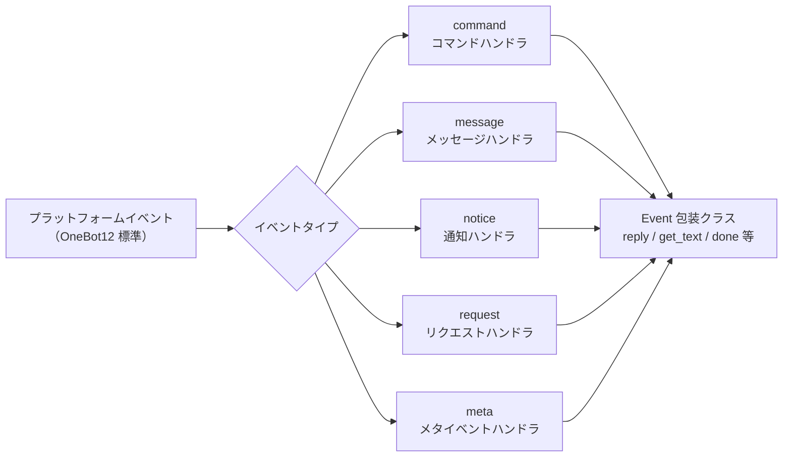

## Command コマンドモジュール

### コマンドの登録

```python
from ErisPulse.Core.Event import command

# 基本的なコマンド
@command("hello", help="挨拶を送信")
async def hello_handler(event):
    await event.reply("你好！")

# 別名付きのコマンド
@command(["help", "h"], aliases=["帮助"], help="ヘルプを表示")
async def help_handler(event):
    pass

# 権限付きのコマンド
def is_admin(event):
    return event.get("user_id") in admin_ids

@command("admin", permission=is_admin, help="管理者コマンド")
async def admin_handler(event):
    pass

# 隠しコマンド
@command("secret", hidden=True, help="秘密コマンド")
async def secret_handler(event):
    pass

# コマンドグループ
@command("admin.reload", group="admin", help="モジュールを再読み込み")
async def reload_handler(event):
    pass
```

### コマンド情報

すべてのコマンド情報の取得APIは、オプションの**セッションコンテキスト**をサポートしています。`event=`（Event または dict）または明示的な `platform=` / `bot_id=` / `session_id=` を渡すことができます（event と重複する場合は明示的なパラメータが優先されます）。つまり、作用域モジュールの次元でフィルタリングし、現在のセッションで利用できないモジュールのコマンドを除外します（詳細は advanced/scope.md を参照してください）。
すべてのパラメータはオプションです。渡さない場合は、既定の全量の動作になります。

```python
# コマンドのヘルプを取得
help_text = command.help()

# セッション感知ヘルプ：現在のセッションで利用可能なコマンドのみを表示
help_text = command.help(event=event)

# 特定のコマンドを取得（有効なパラメータをマージして返す；セッションで利用できない場合は None を返す）
cmd_info = command.get_command("admin")
cmd_info = command.get_command("admin", event=event)

# すべてのコマンドを取得（セッション感知の場合は利用できないモジュールのコマンドをフィルタリング）
all_commands = command.get_commands()
all_commands = command.get_commands(event=event)

# コマンドグループ内のすべてのコマンドを取得（セッション感知フィルタリングもサポート）
admin_commands = command.get_group_commands("admin")
admin_commands = command.get_group_commands("admin", event=event)

# すべての表示可能なコマンドを取得
visible_commands = command.get_visible_commands()

# セッション感知の表示可能なコマンド（event または明示的なキーワードのいずれかで指定可能）
visible_commands = command.get_visible_commands(event=event)
visible_commands = command.get_visible_commands(
    platform=event.get("platform"),
    bot_id=event.get_self_account_id(),
    session_id=event.get_session_id(),
)
```

### レプリを待つ

```python
# ユーザーの返信を待つ
@command("ask", help="ユーザーの情報を尋ねる")
async def ask_command(event):
    reply = await command.wait_reply(
        event,
        prompt="请输入你的名字:",  # 已在上面发送
        timeout=30.0
    )
    
    if reply:
        name = reply.get_text()
        await event.reply(f"你好，{name}！")

# 検証付きの待機レプリ
def validate_age(event_data):
    try:
        age = int(event_data.get_text())
        return 0 <= age <= 150
    except ValueError:
        return False

@command("age", help="ユーザーの年齢を尋ねる")
async def age_command(event):
    await event.reply("请输入你的年龄:")
    
    reply = await command.wait_reply(
        event,
        timeout=60,
        validator=validate_age
    )
    
    if reply:
        age = int(reply.get_text())
        await event.reply(f"你的年龄是 {age} 岁")

# コールバック付きの待機レプリ
async def handle_confirmation(reply_event):
    text = reply_event.get_text().lower()
    if text in ["是", "yes", "y"]:
        await event.reply("操作已确认！")
    else:
        await event.reply("操作已取消。")

@command("confirm", help="操作を確認する")
async def confirm_command(event):
    await command.wait_reply(
        event,
        prompt="请输入'是'或'否':",
        callback=handle_confirmation
    )
```

## Message メッセージモジュール

### メッセージイベント

```python
from ErisPulse.Core.Event import message

# すべてのメッセージを監視
@message.on_message()
async def message_handler(event):
    sdk.logger.info(f"收到消息: {event.get_text()}")

# プライベートメッセージを監視
@message.on_private_message()
async def private_handler(event):
    user_id = event.get_user_id()
    sdk.logger.info(f"私聊来自: {user_id}")

# グループメッセージを監視
@message.on_group_message()
async def group_handler(event):
    group_id = event.get_group_id()
    sdk.logger.info(f"群聊来自: {group_id}")

# @メッセージを監視
@message.on_at_message()
async def at_handler(event):
    mentions = event.get_mentions()
    sdk.logger.info(f"被@的用户: {mentions}")
```

### 条件監視

```python
# 優先度で実行順序を制御
@message.on_message(priority=10)  # 数値が大きいほど優先度が高い
async def high_priority_handler(event):
    pass

# ハンドラ内部で条件フィルタリングを実装
@message.on_message()
async def filtered_handler(event):
    if "关键词" not in event.get_text():
        return
    # キーワードを含むメッセージを処理
    pass
```

## Notice 通知モジュール

### 通知イベント

```python
from ErisPulse.Core.Event import notice

# フレンド追加
@notice.on_friend_add()
async def friend_add_handler(event):
    user_id = event.get_user_id()
    await event.reply("欢迎添加我为好友！")

# フレンド削除
@notice.on_friend_remove()
async def friend_remove_handler(event):
    user_id = event.get_user_id()
    sdk.logger.info(f"好友删除: {user_id}")

# グループメンバー追加
@notice.on_group_increase()
async def member_increase_handler(event):
    user_id = event.get_user_id()
    await event.reply(f"欢迎新成员！")

# グループメンバー削除
@notice.on_group_decrease()
async def member_decrease_handler(event):
    user_id = event.get_user_id()
    sdk.logger.info(f"群成员离开: {user_id}")
```

## Request リクエストモジュール

### リクエストイベント

```python
from ErisPulse.Core.Event import request

# フレンドリクエスト
@request.on_friend_request()
async def friend_request_handler(event):
    user_id = event.get_user_id()
    comment = event.get_comment()
    sdk.logger.info(f"好友请求: {user_id}, 备注: {comment}")

# グループ招待リクエスト
@request.on_group_request()
async def group_request_handler(event):
    group_id = event.get_group_id()
    user_id = event.get_user_id()
    sdk.logger.info(f"群邀请: {group_id}, 来自: {user_id}")
```

## Meta メタイベントモジュール

### メタイベント

```python
from ErisPulse.Core.Event import meta

# 接続イベント
@meta.on_connect()
async def connect_handler(event):
    platform = event.get_platform()
    sdk.logger.info(f"平台 {platform} 连接成功")

# 接続切断イベント
@meta.on_disconnect()
async def disconnect_handler(event):
    platform = event.get_platform()
    sdk.logger.info(f"平台 {platform} 断开连接")

# ハートビートイベント
@meta.on_heartbeat()
async def heartbeat_handler(event):
    sdk.logger.debug("收到心跳")
```

### Bot 状態照会

アダプタが meta イベントを送信した後、フレームワークは自動的に Bot 状態を追跡します。照会 API とライフサイクルイベントの監視については [アダプタシステム API - Bot 状態管理](adapter-system.md#bot-状态管理) を参照してください。

## Event 包装クラス

Event モジュールのイベントハンドラは、dict を継承した Event 包装クラスのインスタンスを受け取り、便利なメソッドを提供します。

### 核心メソッド

```python
# イベント情報を取得
event_id = event.get_id()
event_time = event.get_time()
event_type = event.get_type()
detail_type = event.get_detail_type()
platform = event.get_platform()

# ロボット情報を取得
self_platform = event.get_self_platform()
self_user_id = event.get_self_user_id()
self_info = event.get_self_info()
```

### セッション識別子

```python
# 統一されたターゲット ID：グループチャットは group_id、プライベートチャットは user_id を返すなど
target_id = event.get_target_id()

# セッションの一意識別子、形式: {platform}:{detail_type}:{target_id}
session_id = event.get_session_id()
# 例: "telegram:private:12345"、"qq:group:67890"
```

`get_target_id()` は、`group_id` → `channel_id` → `guild_id` → `thread_id` → `user_id` の順に最初の非空値を返します。これは、コンテキスト管理、ステートの保存など、セッションを一意に識別する必要がある場面に適しています。

### メッセージメソッド

```python
# メッセージ内容を取得
message_segments = event.get_message()
alt_message = event.get_alt_message()
text = event.get_text()

# 送信者の情報を取得
user_id = event.get_user_id()
nickname = event.get_user_nickname()
sender = event.get_sender()

# グループ情報を取得
group_id = event.get_group_id()

# メッセージタイプを判定
is_msg = event.is_message()
is_private = event.is_private_message()
is_group = event.is_group_message()

# @メッセージ関連
is_at = event.is_at_message()
has_mention = event.has_mention()
mentions = event.get_mentions()
```

### コマンド情報

```python
# コマンド情報を取得
cmd_name = event.get_command_name()
cmd_args = event.get_command_args()
cmd_raw = event.get_command_raw()

# それがコマンドかどうかを判定
is_cmd = event.is_command()
```

### レプリ機能

```python
# 基本的なレプリ
await event.reply("这是一条消息")

# 指定された送信方法
await event.reply("http://example.com/image.jpg", method="Image")

# @ユーザーと返信メッセージを含む
await event.reply("你好", at_users=["user1"], reply_to="msg_id")

# @全員
await event.reply("公告", at_all=True)

# プラットフォーム固有の修飾方法を使用（via パラメータ）
await event.reply("看板内容", method="Board",
                  via=[("Expire", 3600), ("ForMember", "114514")])

# 送信チェーンを取得し、自由に修飾方法や送信方法を追加（複数の修飾 / 動作型メソッドに適しています）
await event.send_chain().Expire(3600).Board("看板内容")
await event.send_chain().DismissBoard()

# OneBot12 メッセージセグメントを使用したレプリ
from ErisPulse.Core.Event import MessageBuilder
msg = MessageBuilder().text("Hello").image("url").build()
await event.reply_ob12(msg)

# レプリを待つ
reply = await event.wait_reply(timeout=30)
```

### プラットフォーム能力照会

```python
# 現在のプラットフォームが特定の送信方法をサポートしているか確認
if event.supports("Image"):
    await event.reply(url, method="Image")

# 現在のプラットフォームで利用可能なすべての送信方法をリストアップ
methods = event.available_methods()
# ["Text", "Image", "Voice", "File", ...]
```

### レプリメソッド

`reply()` メソッドは、`method` パラメータで送信タイプを指定し、2つの便利なブール値パラメータもサポートします：

```python
# 簡単なテキストレプリ
await event.reply("你好")

# 送信者を@して返信
await event.reply("你好", at_sender=True)

# 現在のメッセージを引用して返信
await event.reply("收到", quote=True)

# 組み合わせて使用
await event.reply("收到", at_sender=True, quote=True)

# 画像を送信（method パラメータを使用）
if event.supports("Image"):
    await event.reply("http://example.com/img.jpg", method="Image")
else:
    await event.reply("[图片] http://example.com/img.jpg")
```

**パラメータ説明**：

| パラメータ | タイプ | 説明 |
|------|------|------|
| `content` | str | 送信内容 |
| `method` | str | 送信方法、デフォルトは "Text"、"Image"/"Voice"/"Video"/"File" など |
| `at_sender` | bool | 送信者（user_id）を@するかどうか |
| `quote` | bool | 現在のメッセージ（message_id）を引用して返信するかどうか |
| `at_users` | list[str] | @するユーザーのリスト |
| `reply_to` | str | 手動で指定する返信メッセージ ID |
| `at_all` | bool | @全員するかどうか |

### 交互メソッド

```python
# confirm — 確認ダイアログ（True/False/None を返す）
if await event.confirm("确定要执行此操作吗？"):
    await event.reply("已确认")

# Text 以外の方法で確認メッセージを送信
if await event.confirm("http://example.com/image.jpg", method="Image"):
    await event.reply("已确认图片提示")

# choose — 選択メニュー（選択肢のインデックスまたは None を返す）
choice = await event.choose("请选择颜色：", ["红色", "绿色", "蓝色"])

# options_format="auto"（デフォルト）method に応じて自動的にスタイルを選択：
# Markdown→無序リスト（- 1.選択肢）、Html→有序リスト（<ol>）、その他→純粋なテキストリスト
# テキスト系メソッド（Markdown/Html など）はデフォルトで選択肢を末尾にマージ
# merge_prompt=True 任意の method で強制的にマージ可能、placeholder でプレースホルダーをカスタマイズ可能
choice = await event.choose(
    "## 请选择\n{options}", ["A", "B"],
    method="Markdown", merge_prompt=True,
)

# collect — フォーム収集（{key: value} 辞書または None を返す）
data = await event.collect([
    {"key": "name", "prompt": "请输入姓名："},
    {"key": "age", "prompt": "请输入年龄：",
     "validator": lambda e: e.get_text().isdigit()},
    {"key": "avatar", "prompt": "请发送头像：", "method": "Image"},
])

# wait_for — 条件を満たす任意のイベントを待つ
evt = await event.wait_for(event_type="notice", condition=lambda e: ..., timeout=120)

# conversation — 多輪対話コンテキスト
conv = event.conversation(timeout=60)
await conv.say("欢迎！")
```

> 完全な交互メソッドのパラメータ説明とその他の例については [Event 包装クラス详解](../developer-guide/modules/event-wrapper.md) と [Conversation 多輪対話](../advanced/conversation.md) を参照してください。

### ユーティリティメソッド

```python
# _ で始まる内部キーをフィルタリングして辞書に変換
event_dict = event.to_dict()

# 本来のデータを取得
raw = event.get_raw()
raw_type = event.get_raw_type()
```

### リンク制御

`event.done(claim=, stop=)` は「認領」と「阻止」の2つの正交的な意味を統一的に制御します：

- **認領（claim）**：イベントが処理済みであることをマーク（`_processed`）、コマンドディスパッチャーが重複処理をスキップするようにします
- **阻止（stop）**：低優先度のハンドラへのイベント伝播を阻止（`_propagation_stopped`）

```python
# 認領 + 阻止（デフォルト）
event.done()

# 認領のみ、阻止しない（低優先度の観測者はまだイベントを見ることができます）
event.done(stop=False)

# 阻止のみ、認領しない（例：ファイアウォール / 限流）
event.done(claim=False)

# mark_processed が主メソッドで、done はその別名です
event.mark_processed()             # 等価 event.done()
event.mark_processed(stop=False)   # 等価 event.done(stop=False)

# 状態を照会
event.is_processed()  # 既に認領されているか
event.is_stopped()    # 伝播が阻止されているか
```

### プラットフォーム拡張メソッド

アダプタは Event にプラットフォーム固有のメソッドを登録でき、対応するプラットフォームのインスタンス上でのみ使用可能です。

#### ユーザー：プラットフォーム拡張メソッドを使用

アダプタがプラットフォーム固有のメソッドを登録した後、イベントハンドラ内で直接呼び出すことができます。各プラットフォームのメソッドは異なりますので、対応する [プラットフォームドキュメント](../platform-guide/) を参照してください。

```python
from ErisPulse.Core.Event import message

@message.on_message()
async def handle_message(event):
    platform = event.get_platform()

    # プラットフォームに応じて固有メソッドを呼び出す
    if platform == "email":
        subject = event.get_subject()           # メール固有
        attachments = event.get_attachments()   # メール固有
```

#### プラットフォーム登録メソッドの照会

```python
from ErisPulse.Core.Event import get_platform_event_methods

# 指定プラットフォームに登録されたメソッドを照会
methods = get_platform_event_methods("email")
# ["get_subject", "get_from", "get_attachments", ...]

# 動的に判定して呼び出す
for method_name in get_platform_event_methods(event.get_platform()):
    method = getattr(event, method_name)
    print(f"{method_name}: {method()}")
```

#### プラットフォームメソッドの分離

異なるプラットフォームで登録されたメソッドは互いに干渉しません：

```python
# メールイベント - メール固有メソッドのみ
event = Event({"platform": "email", "email_raw": {"subject": "Hello"}})
event.get_subject()      # ✅ "Hello"
event.get_chat_type()    # ❌ AttributeError

# Telegram イベント - Telegram 固有メソッドのみ
event = Event({"platform": "telegram", "telegram_raw": {"chat": {"type": "private"}}})
event.get_chat_type()    # ✅ "private"
event.get_subject()      # ❌ AttributeError
```

#### `hasattr` / `dir` のサポート

```python
hasattr(event, "get_subject")   # 仅当 platform="email" 时返回 True
"get_subject" in dir(event)     # 同上
```

#### アダプタ：プラットフォーム拡張メソッドの登録

アダプタはデコレータを使って Event にプラットフォーム固有のメソッドを登録できます。メソッドの最初の引数は `self`（Event インスタンス）で、イベントデータに自由にアクセスできます。

##### 単一メソッドの登録

```python
from ErisPulse.Core.Event import register_event_method

@register_event_method("email")
def get_subject(self):
    """获取邮件主题"""
    return self.get("email_raw", {}).get("subject", "")

@register_event_method("email")
def get_from(self):
    """获取发件人"""
    return self.get("email_raw", {}).get("from", {})
```

##### バッチ登録（Mixin クラス）

メソッドが多い場合は、Mixin クラスを使って一括登録することを推奨します：

```python
from ErisPulse.Core.Event import register_event_mixin

class EmailEventMixin:
    def get_subject(self):
        return self.get("email_raw", {}).get("subject", "")

    def get_from(self):
        return self.get("email_raw", {}).get("from", {})

    def get_attachments(self):
        return self.get("email_raw", {}).get("attachments", [])

# 一括でメソッドを登録
register_event_mixin("email", EmailEventMixin)
```

##### 戻り値の規則

| 場面 | 戻り値 | ユーザー使用方法 |
|------|--------|------------|
| データを返す（テキスト、辞書など） | 直接戻り値を返す | `subject = event.get_subject()` |
| 操作を実行する（メッセージ送信など） | `asyncio.Task` を返す | `task = event.do_something()` 任意に `await` 可能 |

> **推奨**：データ以外のメソッドは `asyncio.Task` を返すようにし、ユーザーが `await` するかどうかを自由に選択できるようにします。`await` しなくても操作は完了します。

```python
@register_event_method("email")
def forward_email(self, to_address: str):
    """转发邮件 — 返回 Task，用户可自行决定是否 await"""
    import asyncio
    return asyncio.create_task(
        self._do_forward(to_address)
    )

# ユーザーは await して結果を待つことができる
await event.forward_email("user@example.com")

# または await しなくても、バックグラウンドで操作が実行される
event.forward_email("user@example.com")
```

##### メソッドの解除

```python
from ErisPulse.Core.Event import unregister_event_method, unregister_platform_event_methods

# 単一メソッドの解除
unregister_event_method("email", "get_subject")

# 指定プラットフォームの全メソッドの解除（アダプタの shutdown 時に呼び出す）
unregister_platform_event_methods("email")
```

##### 内置メソッドの上書き

`register_event_mixin` / `register_event_method` は Event の内置メソッド（`confirm`、`choose`、`collect`、`wait_reply`、`reply` など）を上書きできます。登録されたプラットフォームメソッドは `Event.__getattribute__` により内置メソッドよりも優先して有効になるため、アダプタはプラットフォーム固有のインタラクティブな実装を提供できます。

内置実装は `_builtin_*` 関数としてエクスポートされ、上書きした方はそれらをバックアップとして呼び出すことができます：

```python
from ErisPulse.Core.Event import register_event_mixin, _builtin_choose

class YunhuEventMixin:
    async def choose(self, prompt, options, timeout=60, method="Text"):
        # 云湖平台使用按钮组件
        buttons = [[{"text": opt} for opt in options]]
        await self.reply(prompt)
        # ...等待按钮回调或文本回复...
        # 回退到内置逻辑
        return await _builtin_choose(self, None, options, timeout, "Text")

register_event_mixin("yunhu", YunhuEventMixin)
```

## 跨プラットフォーム拡張（ワイルドカード）

`register_event_method` と `register_event_mixin` は `"*"` をプラットフォーム名として渡すことができ、登録されたメソッドは**すべてのプラットフォーム**の Event インスタンスで利用可能です。AI チャット、コンテキスト管理など、プラットフォーム間で再利用可能な機能モジュールに適しています。

### 跨プラットフォームメソッドの登録

```python
from ErisPulse.Core.Event.wrapper import register_event_method

@register_event_method("*")
async def ai_chat(self, prompt: str):
    """self 为 Event 实例，可自由访问事件数据和内置方法"""
    await self.reply(f"AI: {prompt}")
```

登録後、すべてのプラットフォームのイベントハンドラで呼び出すことができます：

```python
from ErisPulse.Core.Event import message

@message.on_message()
async def handler(event):
    await event.ai_chat(event.get_text())
```

### メソッドの優先順位

Event メソッドを属性アクセスで取得する際の優先順位は以下の通りです：

1. **プラットフォーム固有メソッド**（現在のプラットフォームの上書き）
2. **ワイルドカードメソッド**（`"*"` で登録された跨プラットフォームメソッド）
3. **内置メソッド**（`reply`、`confirm` 等）
4. **辞書キーのアクセス**

> したがって、ワイルドカードメソッドは内置メソッド（`reply` など）を上書きできますが、同名のプラットフォーム固有メソッドによってさらに上書きされます。

## 優先度システム

イベントハンドラは優先度をサポートし、数値が大きいほど優先度が高くなります：

```python
# 高優先度のハンドラが先に実行されます
@message.on_message(priority=10)
async def high_priority_handler(event):
    pass

# 低優先度のハンドラが後に実行されます
@message.on_message(priority=0)
async def low_priority_handler(event):
    pass
```


====
高级主题
====


### Conversation 多轮对话

# Conversation 多輪対話

`Conversation` クラスは、同一セッション内で複数回の対話を行うための便利なメソッドを提供します。ガイド付き操作、情報収集、対話式の質問応答などに適しています。

## 対話の作成

`Event` オブジェクトの `conversation()` メソッドを使用して作成します：

```python
from ErisPulse.Core.Event import command

@command("quiz")
async def quiz_handler(event):
    conv = event.conversation(timeout=30)

    await conv.say("🎮 知識クイズへようこそ！")

    answer = await conv.choose("第1問：Pythonの開発者は誰ですか？", [
        "Guido van Rossum",
        "James Gosling",
        "Dennis Ritchie",
    ])

    if answer is None:
        await conv.say("タイムアウトしました。また次回お試しください！")
        return

    if answer == 0:
        await conv.say("正解です！")
    else:
        await conv.say("不正解です。正解は Guido van Rossum です。")

    conv.stop()
```

## コア API

### say(content, **kwargs)

メッセージを送信し、`self` を返してメソッドチェーンが可能になります：

```python
await conv.say("1行目").say("2行目").say("3行目")
```

送信方法を指定することもできます：

```python
await conv.say("https://example.com/image.jpg", method="Image")
```

### wait(prompt=None, timeout=None)

ユーザーからの応答を待ち、`Event` オブジェクトまたは `None`（タイムアウト）を返します：

```python
# 簡単な待ち
resp = await conv.wait()
if resp:
    text = resp.get_text()

# プロンプトを送信して待機
resp = await conv.wait(prompt="名前を入力してください：")

# カスタムタイムアウト（対話のデフォルトタイムアウトを上書き）
resp = await conv.wait(prompt="10秒以内に返信してください：", timeout=10)
```

### confirm(prompt=None, **kwargs)

ユーザーの確認（はい/いいえ）を待ち、`True` / `False` / `None`（タイムアウト）を返します：

```python
result = await conv.confirm("すべてのデータを削除してもよろしいですか？")
if result is True:
    await conv.say("削除しました")
elif result is False:
    await conv.say("キャンセルしました")
else:
    await conv.say("タイムアウトしました")
```

確認用語の内包：`はい/yes/y/確認/確定/ok/true/対/うん/行/同意/大丈夫/可能/当然...`

否定用語の内包：`いいえ/no/n/キャンセル/不/不要/ダメ/cancel/false/間違っている/違う/別/拒否...`

### choose(prompt, options, **kwargs)

ユーザーが選択肢から選択するのを待ち、選択肢のインデックス（0ベース）または `None` を返します：

```python
choice = await conv.choose("色を選択してください：", ["赤", "緑", "青"])
if choice is not None:
    colors = ["赤", "緑", "青"]
    await conv.say(f"選択した色は {colors[choice]} です")
```

ユーザーは、番号（`1`/`2`/`3`）または選択肢のテキスト（`赤`）を入力して選択できます。

`options_format="auto"`（デフォルト）は、method に応じて自動的に組み込みのスタイルを選択します：Markdown→箇条書き、Html→番号付きリスト、その他→プレーンテキストリスト。
`"list"`、`"inline"`、`"md"`、`"html"`、またはカスタム関数もサポートします。

`merge_prompt=True` を使用して、プロンプトと選択肢を1つのメッセージに統合することもできます。また、占い文字で選択肢の挿入位置を制御できます（デフォルトは `{options}`、`placeholder` でカスタマイズ可能です）：

```python
choice = await conv.choose(
    "## 選択してください\n{options}",
    ["選択肢A", "選択肢B"],
    method="Markdown",
    merge_prompt=True,
)

# 占い文字のカスタマイズ
choice = await conv.choose(
    "選択してください: [choices]",
    ["選択肢A", "選択肢B"],
    placeholder="[choices]",
)
```

### collect(fields, **kwargs)

複数ステップで情報を収集し、データ辞書または `None` を返します：

```python
data = await conv.collect([
    {"key": "name", "prompt": "名前を入力してください"},
    {"key": "age", "prompt": "年齢を入力してください",
     "validator": lambda e: e.get("alt_message", "").strip().isdigit(),
     "retry_prompt": "年齢は数字で入力してください。再度入力してください"},
    {"key": "city", "prompt": "都市を入力してください"},
])

if data:
    await conv.say(f"登録完了！\n名前: {data['name']}\n年齢: {data['age']}\n都市: {data['city']}")
else:
    await conv.say("登録が中断されました")
```

フィールド設定：

| パラメータ | 説明 | デフォルト値 |
|------|------|--------|
| `key` | フィールドのキー名（必須） | - |
| `prompt` | プロンプトメッセージ | `"{key}を入力してください"` |
| `validator` | 関数、Eventを受け取り、boolを返す | なし |
| `retry_prompt` | 検証失敗時の再入力プロンプト | `"入力が無効です。再度入力してください"` |
| `max_retries` | 最大再試行回数 | 3 |
| `condition` | 条件関数、既に収集されたデータの辞書を受け取り、boolを返す | なし |

**条件付きフィールド**：`condition` を使用して、条件が満たされた場合にのみフィールドを収集する動的フォームを実現できます：

```python
data = await conv.collect([
    {"key": "has_car", "prompt": "車をお持ちですか？（はい/いいえ）"},
    {"key": "car_brand", "prompt": "車種を入力してください",
     "condition": lambda d: d.get("has_car", "").lower() in ("はい", "yes", "y")},
])
```

### stop()

対話を手動で終了し、`is_active` を `False` に設定します：

```python
conv.stop()
```

### is_active

対話がアクティブかどうかを返します：

```python
if conv.is_active:
    await conv.say("対話はまだ進行中です")
```

## アクティブ状態の管理


以下の状態で対話は自動的に非アクティブになります：

1. `stop()` メソッドを呼び出した場合
2. `wait()` がタイムアウトして `None` を返した場合
3. `collect()` が各ステップでタイムアウトまたは再試行回数を超過した場合

非アクティブになると、`wait`/`confirm`/`choose`/`collect` などのすべてのインタラクションメソッドは `None` を即座に返し、ユーザーからの入力を待ち続けません。

## 分岐とジャンプ

### @conv.branch(name) デコレータ

`branch()` を使用して対話の分岐を登録し、`goto()` を使用して分岐間をジャンプできます：

```python
@command("menu")
async def menu_handler(event):
    conv = event.conversation(timeout=60)

    @conv.branch("main")
    async def main_menu():
        await conv.say("=== メインメニュー ===\n1. 本人情報\n2. 設定\n3. 終了")
        resp = await conv.wait()
        if resp is None:
            return
        text = resp.get_text().strip()
        if text == "1":
            await conv.goto("profile")
        elif text == "2":
            await conv.goto("settings")
        elif text == "3":
            await conv.say("さようなら！")
            conv.stop()

    @conv.branch("profile")
    async def profile():
        await conv.say("=== 本人情報 ===\n名前: Alice\n0. 戻る")
        resp = await conv.wait()
        if resp and resp.get_text().strip() == "0":
            await conv.goto("main")

    @conv.branch("settings")
    async def settings():
        await conv.say("=== 設定 ===\n1. 通知のオン/オフ\n0. 戻る")
        resp = await conv.wait()
        if resp and resp.get_text().strip() == "0":
            await conv.goto("main")

    await conv.start()  # 最初に登録された分岐から開始
```

### conv.start(name=None)

対話を開始し、デフォルトでは最初に登録された分岐から開始します：

```python
await conv.start()          # 最初の分岐から開始
await conv.start("settings") # 指定された分岐から開始
```

## コンテキストと永続化

### conv.context

各対話インスタンスには、分岐間で状態を共有するための `context` 辞書が内蔵されています：

```python
@conv.branch("step1")
async def step1():
    conv.context["username"] = resp.get_text().strip()
    await conv.goto("step2")

@conv.branch("step2")
async def step2():
    name = conv.context.get("username", "不明")
    await conv.say(f"こんにちは、{name}さん！")
```

### save() / resume() / clear_saved()

対話は永続化が可能で、タイムアウトや中断後に再開できます：

```python
# 対話状態を保存（通常は手動で呼び出す必要はありません、下記の「自動チェックポイント」参照）
await conv.save()

# ... その後、同じセッションで再開 ...
conv2 = event.conversation()
if await conv2.resume():
    await conv2.say("ようこそ！以前の対話から再開します")
else:
    await conv2.say("以前の対話が見つかりませんでした")

# 保存された対話を削除
await conv.clear_saved()
```

ストアキーには target 次元が含まれており（`conversation:{platform}:{user_id}:{target_id}`）、同一ユーザーの異なるセッション間での対話は互いに上書きされません。`resume()` 時に、`target` を含まない旧形式の保存は自動的に移行されます。

## 自動チェックポイントと再起動時の復元

### 自動保存

以下のようなタイミングでチェックポイントが自動的に維持されます。通常は `save()` を手動で呼び出す必要はありません：

| 時機 | 行動 |
|------|------|
| `goto()` / `start()` による分岐のジャンプ | 自動保存（現在の分岐 + context） |
| `stop()` / `wait()` タイムアウト / `collect()` 失敗 | 自動クリア（対話の終端状態） |

### チェックポイントのTTL

保存はタイムスタンプ付きで、`ErisPulse.interaction.checkpoint_ttl`（デフォルト 24 時間）を超える保存は、復元時に自動的に破棄されます：

```toml
[ErisPulse.interaction]
checkpoint_ttl = 86400  # 秒
```

### 再起動時の自動復元

フレームワークの再起動後、進行中の対話（メモリ内の待機コルーチン）は失われますが、チェックポイントは残ります。`register_resume_handler` を使用して**復元工場**を登録することで、再起動後にそのセッションの最初のメッセージが送信されたときに、自動的に対話を再開できます：

```python
from ErisPulse.Core.Event.wrapper import Conversation

@Conversation.register_resume_handler()  # platform="onebot11" でプラットフォームを限定することも可能
def make_conversation(event) -> Conversation:
    # 工場の役割：対話の再構築とすべての分岐の再登録
    conv = event.conversation(timeout=60)

    @conv.branch("menu")
    async def menu(conv, event):
        ...

    return conv
```

登録後、`menu` 分岐にいたユーザーが再起動前に最初のメッセージを送信すると、フレームワークは自動的に：contextを復元 → そのメッセージを認証 → 保存された分岐から対話を再開します。工場を登録しない場合、このメカニズムは無駄なコストがかかりません。

### 手動復元（自動メカニズムを使わない場合）

```python
@command("continue")
async def continue_handler(event):
    conv = event.conversation()
    # ... 分岐を登録 ...
    if await conv.resume():
        conv.goto(conv.get_current_branch())
```

## 代表的なフロー・パターン

### ガイド付き登録

```python
@command("register")
async def register_handler(event):
    conv = event.conversation(timeout=60)

    await conv.say("ようこそ！登録を開始します。")

    data = await conv.collect([
        {"key": "username", "prompt": "ユーザー名を入力してください（3-20文字）",
         "validator": lambda e: 3 <= len(e.get_text().strip()) <= 20},
        {"key": "email", "prompt": "メールアドレスを入力してください",
         "validator": lambda e: "@" in e.get_text() and "." in e.get_text(),
         "retry_prompt": "メールアドレスの形式が正しくありません。再度入力してください"},
    ])

    if not data:
        await event.reply("登録がキャンセルされました")
        return

    confirmed = await conv.confirm(
        f"登録情報を確認しますか？\nユーザー名: {data['username']}\nメールアドレス: {data['email']}"
    )

    if confirmed:
        await conv.say("✅ 登録完了！")
    else:
        await conv.say("❌ 登録がキャンセルされました")
```

### ループ対話

```python
@command("chat")
async def chat_handler(event):
    conv = event.conversation(timeout=120)
    await conv.say("対話モードに入ります。メッセージを「終了」で終了します。")

    while conv.is_active:
        resp = await conv.wait()
        if resp is None:
            await conv.say("タイムアウトしました。対話が終了します。")
            break

        text = resp.get_text().strip()

        if text == "終了":
            await conv.say("さようなら！")
            conv.stop()
        elif text == "ヘルプ":
            await conv.say("利用可能なコマンド：終了、ヘルプ、状態")
        elif text == "状態":
            await conv.say("対話はアクティブです")
        else:
            await conv.say(f"入力内容：{text}")
```


### MessageBuilder 详解

# MessageBuilder 详解

`MessageBuilder` は ErisPulse が提供する OneBot12 標準のメッセージセグメント構築ツールであり、構造化されたメッセージ内容を構築し、`Send.Raw_ob12()` と共に使用します。

## 導入方法

`MessageBuilder` は以下の2つの導入方法をサポートしています（効果は同じで、1つ目の方法を推奨します）：

```python
from ErisPulse.Core.Event import MessageBuilder        # 推奨、パッケージからのエクスポート
from ErisPulse.Core.Event.message_builder import MessageBuilder  # モジュールを直接インポート
```

## 雙モードメカニズム

MessageBuilder は、Python の descriptor メカニズム（`__get__`）を用いて、クラスレベルとインスタンスレベルの異なる動作を実現する 2 つの使用モードを提供します。クラスからメソッドを呼び出す場合、`__get__` は静的メソッドの実行結果を返します。インスタンスから呼び出す場合、`self` を返すことで、メソッドチェーン（連鎖呼び出し）をサポートします。

### チェーン呼び出しモード（インスタンス）

`MessageBuilder()` をインスタンス化して使用し、各メソッドは `self` を返すため、連鎖呼び出し（メソッドチェーン）が可能で、最後に `.build()` を用いてメッセージセグメントのリストを取得します。

```python
from ErisPulse.Core.Event.message_builder import MessageBuilder

segments = (
    MessageBuilder()
    .text("你好！")
    .image("https://example.com/photo.jpg")
    .build()
)
# [
#     {"type": "text", "data": {"text": "你好！"}},
#     {"type": "image", "data": {"file": "https://example.com/photo.jpg"}}
# ]
```

### 快速構築モード（静的）

クラスから直接メソッドを呼び出すことで、各メソッドは直接メッセージセグメントのリストを返し、単一のメッセージセグメント構築に適しています。

```python
# build() を必要とせず、直接 list[dict] を返します
segments = MessageBuilder.text("你好！")
# [{"type": "text", "data": {"text": "你好！"}}]
```

## メッセージセグメントの種類

| メソッド | タイプ | データパラメータ | 説明 |
|------|------|---------|------|
| `text(text)` | text | `text` | テキストメッセージ |
| `image(file)` | image | `file` | 画像メッセージ |
| `audio(file)` | audio | `file` | 音声メッセージ |
| `video(file)` | video | `file` | 動画メッセージ |
| `file(file, filename?)` | file | `file`, `filename` | ファイルメッセージ |
| `mention(user_id, user_name?)` | mention | `user_id`, `user_name` | ユーザーを@でメンション |
| `at(user_id, user_name?)` | mention | `user_id`, `user_name` | `mention` の別名 |
| `reply(message_id)` | reply | `message_id` | メッセージへの返信 |
| `at_all()` | mention_all | - | 全員を@でメンション |
| `custom(type, data)` | 自定義 | 自定義 | 自定義メッセージセグメント |

## Send との連携

構築されたメッセージセグメントのリストは、`Send.Raw_ob12()` を使用して送信されます：

```python
from ErisPulse import sdk
from ErisPulse.Core.Event.message_builder import MessageBuilder

# チェーンで構築 + 送信
segments = (
    MessageBuilder()
    .mention("user123", "張三")
    .text(" こちらの画像をご覧ください")
    .image("https://example.com/photo.jpg")
    .build()
)
await sdk.adapter.myplatform.Send.To("group", "group456").Raw_ob12(segments)
```

### Event との連携（返信）

```python
from ErisPulse.Core.Event import command

@command("report")
async def report_handler(event):
    await event.reply_ob12(
        MessageBuilder()
        .text("📊 日報集計\n")
        .text("本日完了したタスク: 5\n")
        .text("進行中のタスク: 3")
        .build()
    )
```

## ツールメソッド

### copy()

現在のビルダーをコピーし、同じ基礎内容に基づいて複数のメッセージバリエーションを作成します：

```python
base = MessageBuilder().text("基礎内容").mention("admin")

# 同じプレフィックスに基づいて異なるメッセージを構築
msg1 = base.copy().text(" 変体A").build()
msg2 = base.copy().text(" 変体B").image("img.jpg").build()
```

### clear()

追加されたメッセージセグメントをクリアし、同じビルダーを再利用します：

```python
builder = MessageBuilder()

for user_id in ["user1", "user2", "user3"]:
    builder.clear()
    msg = builder.mention(user_id).text(" 你好！").build()
    await adapter.Send.To("user", user_id).Raw_ob12(msg)
```

### len() / bool()

```python
builder = MessageBuilder()
print(bool(builder))   # False

builder.text("Hello")
print(len(builder))    # 1
print(bool(builder))   # True
```

## 自定义メッセージセグメント

`custom()` メソッドを使用してプラットフォーム拡張メッセージセグメントを追加します：

```python
# プラットフォーム固有のメッセージセグメントを追加
segments = (
    MessageBuilder()
    .text("フォームに記入してください：")
    .custom("yunhu_form", {"form_id": "12345"})
    .build()
)
```

> 自定义メッセージセグメントは、対応するプラットフォームのアダプターでのみ有効であり、他のアダプターは認識できないメッセージセグメントを無視します。

## 完整例

### 複数要素のメッセージ

```python
segments = (
    MessageBuilder()
    .reply(event.get_id())                    # 元のメッセージに返信
    .mention(event.get_user_id())             # 送信者を@する
    .text(" これはあなたのクエリ結果です：\n")             # テキスト
    .image("https://example.com/chart.png")   # 画像
    .text("\n詳細データは添付ファイルをご覧ください：")
    .file("https://example.com/data.csv", filename="data.csv")
    .build()
)
await event.reply_ob12(segments)
```

### 静的ファクトリ + チェーン混合

```python
# 単一のメッセージセグメントを迅速に構築
simple_msg = MessageBuilder.text("シンプルなテキスト")

# チェーンで複雑なメッセージを構築
complex_msg = (
    MessageBuilder()
    .at_all()
    .text(" 📢 お知らせ：")
    .text("今日の午後3時に会議があります")
    .build()
)
```


### HTTP 客户端

# ネットワーククライアント

ErisPulse は、HTTP リクエスト、WebSocket 接続、および接続プール管理を統合した統一されたネットワーククライアントを提供しています。モジュールやアダプタは、**このクライアントを優先して使用する必要があります**。`aiohttp` / `httpx` / `requests` などのサードパーティライブラリを直接インポートしてはいけません。

## 概要

ネットワーククライアントの主な機能：

- **統一されたインターフェース**：`get` / `post` / `put` / `delete` / `patch` / `request` メソッドを提供
- **WebSocket クライアント**：`ws_connect` を使用してクライアント WebSocket 接続を確立
- **自動ログ**：すべてのリクエストが自動的にログと統計情報を記録
- **ライフサイクル統合**：各リクエストで `client.request` ライフサイクルイベントがトリガーされ、WS 接続で `client.ws.connect` イベントがトリガーされる
- **リトライサポート**：自動リトライ回数と間隔を設定可能
- **タイムアウト制御**：接続タイムアウトとリクエストタイムアウトを個別に制御
- **接続プールの再利用**：aiohttp.ClientSession に基づく接続プール管理
- **例外体系**：aiohttp 例外を自動的に ErisPulse 例外 (ClientError 体系) に変換

## 快速開始

### HTTP リクエスト

```python
from ErisPulse.Core import client

# GET リクエスト
resp = await client.get("https://httpbin.org/get")
data = await resp.json()
print(resp.status)  # 200

# POST リクエスト
resp = await client.post(
    "https://httpbin.org/post",
    json={"key": "value"},
)
data = await resp.json()
```

### WebSocket 接続

```python
from ErisPulse.Core import client

ws = await client.ws_connect("wss://example.com/ws")

async for text in ws.iter_text():
    await ws.send_text(f"Echo: {text}")
```

## HttpResponse

すべてのリクエストメソッドは `HttpResponse` オブジェクトを返します：

```python
from ErisPulse.Core import client

resp = await client.get("https://httpbin.org/get")

resp.status       # int - HTTP ステータスコード (例: 200, 404)
resp.reason       # str | None - ステータスの説明 (例: "OK")
resp.headers      # レスポンスヘッダー (大文字小文字を区別しません)
resp.content_type # str | None - Content-Type
resp.url          # 最終URL (リダイレクトにより変化する可能性があります)
resp.raw          # ベースの生のレスポンスオブジェクト (現在は aiohttp.ClientResponse)

# レスポンスボディの読み取り
body = await resp.read()       # bytes
text = await resp.text()       # str
data = await resp.json()       # JSONを解析
text = await resp.text("gbk")  # 指定されたエンコーディング
```

## リクエストメソッド

### GET

```python
from ErisPulse.Core import client

resp = await client.get(
    "https://api.example.com/users",
    params={"page": "1", "limit": "10"},
    headers={"Authorization": "Bearer token"},
)
```

### POST

```python
from ErisPulse.Core import client

# JSONリクエストボディ
resp = await client.post(
    "https://api.example.com/users",
    json={"name": "Alice", "age": 30},
)

# フォームリクエストボディ
resp = await client.post(
    "https://api.example.com/login",
    data={"username": "admin", "password": "123"},
)

# ロウデータ
resp = await client.post(
    "https://api.example.com/upload",
    data=b"raw bytes",
    headers={"Content-Type": "application/octet-stream"},
)

# ファイルアップロード (filesパラメータを使用、aiohttpのインポート不要)
# 形式: {フィールド名: ファイルオブジェクト/bytes/(filename, file)/(filename, file, content_type)}
resp = await client.post(
    "https://api.example.com/upload",
    data={"description": "プロフィール画像"},            # 任意: 普通のフォームフィールドを同時に送信
    files={
        "file": ("photo.png", open("photo.png", "rb"), "image/png"),
    },
)

# 簡易記法: ファイルオブジェクトを直接渡す
resp = await client.post(
    "https://api.example.com/upload",
    files={"file": open("photo.png", "rb")},
)

# メモリ内のデータを直接アップロード (ファイルを保存する必要なし)
import io

resp = await client.post(
    "https://api.example.com/upload",
    files={"file": ("data.txt", io.BytesIO(b"file content"), "text/plain")},
)
```

### PUT / DELETE / PATCH

```python
from ErisPulse.Core import client

resp = await client.put("https://api.example.com/users/1", json={"name": "Bob"})
resp = await client.delete("https://api.example.com/users/1")
resp = await client.patch("https://api.example.com/users/1", json={"age": 31})
```

### 一般的な request

```python
from ErisPulse.Core import client

resp = await client.request(
    "OPTIONS",
    "https://api.example.com/resource",
    headers={"Origin": "https://example.com"},
)
```

## パラメータの説明

### HTTPリクエストパラメータ

| パラメータ | 型 | 説明 |
|------|------|------|
| `url` | `str` | リクエストURL |
| `params` | `dict[str, str]` | クエリパラメータ (オプション) |
| `headers` | `dict[str, str]` | 追加のリクエストヘッダー (オプション) |
| `data` | `Any` | リクエストボディ (フォームまたは生データ) (オプション) |
| `json` | `Any` | JSONリクエストボディ (オプション) |
| `files` | `dict[str, Any]` | ファイルアップロードフィールド (オプション、multipart/form-dataを自動的に構築) |
| `timeout` | `float` | 本次リクエストのタイムアウト (秒) (オプション、デフォルト値を上書き) |
| `max_retries` | `int` | 本次の最大リトライ回数 (オプション、デフォルト値を上書き) |

### ws_connect パラメータ

| パラメータ | 型 | 説明 |
|------|------|------|
| `url` | `str` | WebSocketサーバーのURL |
| `headers` | `dict[str, str]` | 追加のリクエストヘッダー (オプション) |
| `heartbeat` | `float` | ハートビート間隔 (秒) (オプション) |

## タイムアウトとリトライ

```python
from ErisPulse.Core import Client

# カスタムタイムアウトを設定したクライアントを作成
client = Client(
    timeout=60,           # 要求全体のタイムアウト 60秒
    connect_timeout=5,    # 接続のタイムアウト 5秒
    max_retries=3,        # 失敗時に自動でリトライ 3回
    retry_delay=2,        # リトライ間隔 2秒
)

# 単一の要求でタイムアウトをオーバーライド
resp = await client.get("https://slow-api.example.com/data", timeout=120)
```

> [!NOTE]
> クライアントクラスは 2.8.0 以降、`Client` に名前が変更されました（`sdk.client` の属性名は変更されません）。古い名前 `HttpClient` は互換性のエイリアスとして保持されており、古いコードは変更する必要はありません。

## デフォルトのヘッダーをカスタマイズ

```python
client = Client(
    headers={
        "Authorization": "Bearer token",
        "X-App-Id": "my-app",
    },
    user_agent="MyBot/1.0",
)
```

## リクエスト統計

```python
from ErisPulse.Core import client

# 統計を表示
stats = client.stats
# {"total_requests": 42, "total_errors": 1, "total_bytes_sent": 0, "total_bytes_received": 0}

# 統計をリセット
client.reset_stats()
```

## ライフサイクルイベント

### HTTP リクエストイベント

リクエストが完了するたびに `client.request` イベントがトリガーされ、監視に使用できます。

```python
from ErisPulse.Core import lifecycle

@lifecycle.on("client.request")
async def on_request(event_data):
    print(f"{event_data['method']} {event_data['url']} -> {event_data['status']} ({event_data['elapsed']}s)")
```

### WebSocket 接続イベント

WebSocket 接続が確立されたたびに `client.ws.connect` イベントがトリガーされます。

```python
from ErisPulse.Core import lifecycle

@lifecycle.on("client.ws.connect")
async def on_ws_connect(event_data):
    print(f"WS 接続: {event_data['url']}")
```

## コンテキスト管理

```python
# コンテキストマネージャーとして使用し、セッションを自動的に閉じます
async with Client(timeout=30) as client:
    resp = await client.get("https://httpbin.org/get")
    data = await resp.json()
```

## WebSocket クライアント

`client.ws_connect()` を使用して WebSocket クライアント接続を確立し、`ClientWebSocket` オブジェクトを返します。クライアントとサーバーの WebSocket は共通の `WebSocketConnectionBase` 基底クラスを共有し、send/receive/iter インターフェースは完全に一致します。

### 基本的な使用法

```python
from ErisPulse.Core import client

ws = await client.ws_connect("wss://example.com/ws", heartbeat=30)

await ws.send_text("Hello")
await ws.send_bytes(b"\x00\x01\x02")
await ws.send_json({"type": "ping"})
```

### メッセージの受信

#### 高レベル方法（推奨）

メッセージの型を自動的にフィルタリングし、切断時に `WebSocketDisconnect` を送出します：

```python
from ErisPulse.Core import client
from ErisPulse.Core.Bases.errors import WebSocketDisconnect

ws = await client.ws_connect("wss://example.com/ws")

# 単一のメッセージ受信
text = await ws.receive_text()    # str
data = await ws.receive_bytes()   # bytes
obj = await ws.receive_json()     # dict / list

# 反復処理による受信（切断時に自動的に停止）
async for text in ws.iter_text():
    print(text)

async for data in ws.iter_bytes():
    print(data)

async for obj in ws.iter_json():
    print(obj)
```

#### 低レベル方法

`receive()` と `iter_messages()` を使用して、原始的なメッセージ型を処理し、TEXT / BINARY / CLOSE / ERROR を区別できます：

```python
from ErisPulse.Core import client
from ErisPulse.Core.Bases.websocket import WSMessage

ws = await client.ws_connect("wss://example.com/ws")

# 単一のメッセージ受信
msg = await ws.receive()
# msg.type  -> WSMessage.TEXT / WSMessage.BINARY / WSMessage.CLOSE / WSMessage.ERROR
# msg.data  -> str | bytes | None

# 反復処理によるメッセージ受信（CLOSE/ERROR で自動的に停止）
async for msg in ws.iter_messages():
    if msg.type == WSMessage.TEXT:
        print(f"テキスト: {msg.data}")
    elif msg.type == WSMessage.BINARY:
        print(f"バイナリ: {len(msg.data)} bytes")
```

### WSMessage

`WSMessage` は、下層のライブラリに依存しない統一された WebSocket メッセージ型です：

| 属性 | 型 | 説明 |
|------|------|------|
| `type` | `str` | メッセージ型: `WSMessage.TEXT` / `WSMessage.BINARY` / `WSMessage.CLOSE` / `WSMessage.ERROR` |
| `data` | `Any` | メッセージデータ |

### ClientWebSocket 属性

| 属性 | 型 | 説明 |
|------|------|------|
| `url` | `URL` | 接続 URL |
| `headers` | `Headers` | 応答ヘッダー |
| `closed` | `bool` | 接続が閉じられているか |
| `raw` | `object` | 下層の生のオブジェクト (aiohttp.ClientWebSocketResponse) |

### ライフサイクルフック

`サービス側 WebSocketConnection` と同様に、`on_disconnect` と `on_error` コールバックをサポートします：

```python
from ErisPulse.Core import client

ws = await client.ws_connect("wss://example.com/ws")

@ws.on_disconnect
async def handle_disconnect(ws, reason="unknown"):
    print(f"接続が切断されました: {reason}")

@ws.on_error
async def handle_error(ws, error=""):
    print(f"接続エラー: {error}")
```

### 接続の切断

```python
await ws.close(code=1000, reason="Normal closure")
```

## 異常体系

ErisPulse は、統一された異常階層を定義しており、`sdk.client` を介してリクエストを発行すると、自動的に下層の aiohttp 異常が ErisPulse 異常に変換されます。

> **後方互換性**：`aiohttp.ClientSession` を直接使用する旧モジュール/アダプターは完全に影響を受けません。異常変換は `sdk.client` を介してリクエストを発行した場合にのみ有効であり、aiohttp を直接使用するコードは、`aiohttp.ClientError` などの元の異常をキャッチし続けます。両方の方法は共存可能です。

### 異常階層

```
ErisPulseError
├── ClientError                  # すべての HTTP/WS クライアントリクエスト異常の基底クラス
│   ├── ClientConnectionError    # 接続失敗 (DNS 解析失敗、接続拒否、ネットワーク不可達)
│   ├── ClientTimeoutError       # 接続タイムアウトまたはリクエストタイムアウト
│   └── HTTPStatusError          # HTTP 4xx/5xx 状態コードエラー
└── WebSocketError               # WebSocket 異常の基底クラス
    └── WebSocketDisconnect      # WebSocket 接続切断 (クライアントおよびサーバー共通)
```

### 異常のキャッチ

```python
from ErisPulse.Core import client
from ErisPulse.Core.Bases.errors import (
    ClientError,
    ClientConnectionError,
    ClientTimeoutError,
    HTTPStatusError,
    WebSocketDisconnect,
    WebSocketError,
)

# HTTP リクエストの異常処理
try:
    resp = await client.get("https://api.example.com/data")
    data = await resp.json()
except ClientConnectionError:
    print("サーバーに接続できません")
except ClientTimeoutError:
    print("リクエストがタイムアウトしました")
except ClientError as e:
    print(f"リクエストが失敗しました: {e}")

# WebSocket の異常処理
try:
    ws = await client.ws_connect("wss://example.com/ws")
    async for text in ws.iter_text():
        await ws.send_text(f"Echo: {text}")
except WebSocketDisconnect as e:
    print(f"接続が切断されました: code={e.code}, reason={e.reason}")
except WebSocketError as e:
    print(f"WebSocket エラー: {e}")
```

### 統一されたキャッチ

`ClientError` を使用して、すべての HTTP/WS クライアントリクエスト異常を統一的にキャッチします：

```python
from ErisPulse.Core.Bases.errors import ClientError

try:
    resp = await client.get("https://api.example.com/data")
except ClientError as e:
    print(f"クライアントエラー: {e}")
```

### HTTPStatusError

リクエスト後にステータスコードをチェックし、エラーを投げる必要がある場合、手動で使用できます：

```python
from ErisPulse.Core.Bases.errors import HTTPStatusError

resp = await client.get("https://api.example.com/data")
if resp.status >= 400:
    raise HTTPStatusError(resp.status, await resp.text())
```

## アダプターでの使用

アダプターは、グローバルクライアントまたは独自にクライアントインスタンスを作成して、プラットフォームAPIリクエストを送信できます：

```python
from ErisPulse.Core import client
from ErisPulse.Core.Bases import BaseAdapter
from ErisPulse.Core.Bases.errors import ClientError

class MyAdapter(BaseAdapter):
    async def call_api(self, endpoint, **params):
        try:
            resp = await client.post(
                f"https://api.platform.com/{endpoint}",
                json=params,
                headers={"Authorization": f"Bearer {self.token}"},
            )
            return await resp.json()
        except ClientError as e:
            self.logger.error(f"API 調用失敗: {e}")
            raise
```

> `from ErisPulse import sdk` を使用して `sdk.client` を使うこともでき、効果は同じです。

## 最佳実践

1. **グローバルクライアントの優先使用**：`from ErisPulse.Core import client` を使用してグローバルシングルトンを取得し、フレームワークによる統一的な管理と監視を容易にする。
2. **aiohttp の直接インポートを避ける**：`client` を `aiohttp.ClientSession` の代わりに使用し、将来の下層実装の変更時にコードの修正が不要になる。従来の aiohttp を直接使用するコードは正常に動作し続け、両方の方法を同時に使用できる。
3. **ErisPulse の例外体系の使用**：`sdk.client` でリクエストを行う際は `aiohttp.ClientError` ではなく `ClientError` をキャッチし、コードが特定の HTTP ライブラリに依存しないようにする。aiohttp を直接使用する従来のコードには影響しない。
4. **タイムアウトの適切な設定**：API の応答速度に応じて適切なタイムアウト時間を設定し、長時間のブロッキングを避ける。
5. **リトライメカニズムの使用**：不安定な API に対してリトライを有効化し、信頼性を高める。
6. **リクエスト統計の監視**：`sdk.client.stats` または `client.request` のライフサイクルイベントを使用してリクエスト状況を監視する。
7. **WebSocket での高機能メソッドの使用**：`iter_text` / `iter_json` などの高機能メソッドを優先し、メッセージの種類を区別する必要がある場合にのみ `iter_messages` を使用する。


### SQL 查询构建器

# SQL クエリビルダ

ErisPulse の Storage モジュールは、チェーン呼び出しスタイルの一般的な SQL クエリビルダを提供し、カスタムテーブルの作成、クエリ、更新、削除操作をサポートしています。

## アーキテクチャ設計

```
Bases/storage.py                    Core/storage.py
┌─────────────────────┐             ┌──────────────────────────┐
│  BaseStorage (ABC)  │◄────────────│  StorageManager          │
│  BaseQueryBuilder   │             │  (SQLite concrete impl)  │
│    (ABC)            │             │                          │
└─────────────────────┘             │  SQLiteQueryBuilder      │
                                    │  AlterTableBuilder       │
                                    └──────────────────────────┘
```

- `BaseStorage` / `BaseQueryBuilder` は抽象基底クラスであり、他のストレージメディア（Redis、MySQL など）への拡張を可能にする共通インターフェースを定義しています。
- `StorageManager` は現在の SQLite 実装であり、完全に後方互換性を保っています。

## 導入

```python
from ErisPulse import sdk
# または
from ErisPulse.Core import storage

# ABC 基底クラス（型注釈やカスタム実装に使用）
from ErisPulse.Core.Bases.storage import BaseStorage, BaseQueryBuilder
```

## テーブル管理

### テーブルの作成

```python
sdk.storage.CreateTable("users", {
    "id": "INTEGER PRIMARY KEY AUTOINCREMENT",
    "name": "TEXT NOT NULL",
    "age": "INTEGER DEFAULT 0",
    "email": "TEXT"
})
```

### テーブルの存在確認

```python
if sdk.storage.HasTable("users"):
    print("users テーブルは存在します")
```

### テーブルの削除

```python
sdk.storage.DropTable("users")
```

### テーブル構造の変更

```python
# 列の追加
sdk.storage.AlterTable("users").AddColumn("email", "TEXT").Execute()

# テーブルの名前変更
sdk.storage.AlterTable("users").RenameTo("members").Execute()

# 複数の操作をチェーン
sdk.storage.AlterTable("users") \
    .AddColumn("phone", "TEXT") \
    .AddColumn("address", "TEXT") \
    .Execute()
```

## チェーン呼び出しによるクエリ

### データの挿入

```python
# 単一行挿入（辞書を渡す）
sdk.storage.Table("users").Insert({"name": "Alice", "age": 30}).Execute()

# バッチ挿入（辞書のリストを渡す）
sdk.storage.Table("users").InsertMulti([
    {"name": "Bob", "age": 25},
    {"name": "Charlie", "age": 35},
    {"name": "Dave", "age": 40}
]).Execute()
```

### データの取得

> **重要**：`Select()` は `list[tuple]`（タプルのリスト）を返します。辞書ではありません。列の順序に従ってインデックスでアクセスする必要があります。

```python
# 全列を取得
rows = sdk.storage.Table("users").Select().Execute()
# rows: [(1, "Alice", 30), (2, "Bob", 25), ...]

# 指定の列を取得
rows = sdk.storage.Table("users").Select("name", "age").Execute()
# rows: [("Alice", 30), ("Bob", 25), ...]

# インデックスで値を取得
for row in rows:
    name = row[0]   # "Alice"
    age = row[1]    # 30
```

#### タプルを辞書に変換

`ToDict()` をチェーンで呼び出すことを推奨します。SELECT の結果は列名 → 値の辞書で返されます。

```python
# ToDict チェーン：結果は list[dict] で、SELECT * でも列名が自動的に取得されます
rows = sdk.storage.Table("users").Select("name", "age").ToDict().Execute()
# rows: [{"name": "Alice", "age": 30}, {"name": "Bob", "age": 25}, ...]

for row in rows:
    print(row["name"], row["age"])

# ExecuteOne でも同様に機能します
row = sdk.storage.Table("users").Select("name", "age") \
    .Where("id = ?", 1) \
    .ToDict() \
    .ExecuteOne()
# row: {"name": "Alice", "age": 30} または None
```

> `ToDict()` はチェーン呼び出し用のメソッド（self を返す）です。`ToDict()` を呼び出さないチェーンは、既存の `list[tuple]` の動作を保持し、完全に後方互換性を保っています。`copy()` はこのフラグを保持します。

手動で zip を使用する方法（`ToDict()` と同等、チェーンを変更できない場合に使用）：

```python
columns = ["id", "name", "age"]
rows = sdk.storage.Table("users").Select(*columns).Execute()

# 方法1：ループ内で zip
for row in rows:
    record = dict(zip(columns, row))
    print(record["name"], record["age"])

# 方法2：一度に辞書のリストに変換
records = [dict(zip(columns, row)) for row in rows]
```

#### 単一行の取得

```python
row = sdk.storage.Table("users").Select("name", "age") \
    .Where("id = ?", 1) \
    .ExecuteOne()

# row は tuple または None
if row is not None:
    name = row[0]  # "Alice"
    age = row[1]   # 30
```

### 条件のフィルタリング

> `Where(condition, *params)` は、複数のパラメータを渡すことができ、それぞれ `?` 占位符に対応します。

```python
# 単一条件（1つの占位符、1つのパラメータ）
rows = sdk.storage.Table("users").Select("name") \
    .Where("age > ?", 18) \
    .Execute()

# 1つの Where で複数の占位符を使用
rows = sdk.storage.Table("users").Select("name") \
    .Where("age > ? AND age < ?", 20, 40) \
    .Execute()

# Where を複数回呼び出す（AND 接続）
rows = sdk.storage.Table("users").Select("name") \
    .Where("age > ?", 20) \
    .Where("age < ?", 40) \
    .Execute()
```

### ソート、ページング

```python
# 昇順
rows = sdk.storage.Table("users").Select("name", "age") \
    .OrderBy("name") \
    .Execute()

# 降順
rows = sdk.storage.Table("users").Select("name") \
    .OrderBy("age", desc=True) \
    .Execute()

# ページング
rows = sdk.storage.Table("users").Select("name") \
    .OrderBy("id") \
    .Limit(10) \
    .Offset(20) \
    .Execute()
```

### データの更新

```python
# 条件付き更新
sdk.storage.Table("users") \
    .Update({"age": 31}) \
    .Where("name = ?", "Alice") \
    .Execute()

# 全件更新
sdk.storage.Table("users") \
    .Update({"status": "active"}) \
    .Execute()
```

### データの削除

```python
# 条件付き削除
sdk.storage.Table("users") \
    .Delete() \
    .Where("name = ?", "Bob") \
    .Execute()

# 全件削除
sdk.storage.Table("users").Delete().Execute()
```

### 計数と存在確認

```python
# 計数
count = sdk.storage.Table("users").Count()
count = sdk.storage.Table("users").Where("age > ?", 18).Count()

# 存在確認
exists = sdk.storage.Table("users").Where("name = ?", "Alice").Exists()
```

## クエリ条件の再利用

`copy()` を使用してビルダーを深くコピーし、同じ条件を再利用します。

```python
base = sdk.storage.Table("users").Where("age > ?", 20)

# 同じ条件に基づいてクエリ
rows = base.copy().Select("name").OrderBy("name").Limit(5).Execute()

# 同じ条件に基づいて計数
count = base.copy().Count()

# 同じ条件に基づいて存在確認
exists = base.copy().Where("name = ?", "Alice").Exists()
```

## ビルダーのリセット

```python
builder = sdk.storage.Table("users").Select("name").Where("age > ?", 18)
builder.clear()

# クエリの再構築
builder.Select("name", "age").Where("name = ?", "Alice")
rows = builder.Execute()
```

## トランザクションでの使用

チェーン呼び出しはトランザクションに対応しています。

```python
# トランザクションをコミット
with sdk.storage.transaction():
    sdk.storage.Table("users").Insert({"name": "Eve", "age": 22}).Execute()
    sdk.storage.Table("users").Update({"age": 23}).Where("name = ?", "Eve").Execute()

# ロールバックの例
try:
    with sdk.storage.transaction():
        sdk.storage.Table("users").Delete().Where("name = ?", "Alice").Execute()
        raise Exception("force rollback")
except Exception:
    pass
# Alice のレコードは依然存在します
```

## 戻り値の説明

| 操作 | 戻り値の型 | 説明 |
|------|---------|------|
| `Select().Execute()` | `list[tuple]` | 列の順序に従ったタプルのリスト |
| `Select().ExecuteOne()` | `tuple \| None` | 単一行のタプルまたは None |
| `Insert().Execute()` | `int` | 影響を受けた行数 |
| `InsertMulti().Execute()` | `int` | 挿入された行数 |
| `Update().Execute()` | `int` | 影響を受けた行数 |
| `Delete().Execute()` | `int` | 影響を受けた行数 |
| `Count()` | `int` | マッチした行数 |
| `Exists()` | `bool` | 存在するか否か |

### 戻り値の処理例

```python
# Select はタプルを返し、インデックスでアクセス
rows = sdk.storage.Table("users").Select("name", "age").Execute()
first_name = rows[0][0]  # 1行目の1列目 name
first_age = rows[0][1]   # 1行目の2列目 age

# 推奨：列名リスト + zip を使って辞書に変換し、コードの可読性を高める
cols = ["name", "age"]
rows = sdk.storage.Table("users").Select(*cols).Execute()
for row in rows:
    d = dict(zip(cols, row))
    print(d["name"], d["age"])

# ExecuteOne は単一行のタプルまたは None を返す
row = sdk.storage.Table("users").Select("name").Where("id = ?", 1).ExecuteOne()
name = row[0] if row else None

# Insert/Update/Delete は影響を受けた行数を返す
affected = sdk.storage.Table("users").Delete().Where("age < ?", 18).Execute()
print(f"削除された行数: {affected}")
```

## パラメータ化されたクエリ

WHERE のパラメータは `?` 占位符を使用し、`Where()` の引数として個別に渡します（**タプルやリストにはしないでください**）。

```python
# 正しい ✓ — 複数のパラメータを個別に渡す
sdk.storage.Table("users").Where("age > ? AND name = ?", 18, "Alice").Execute()

# 正しい ✓ — Where を複数回呼び出す
sdk.storage.Table("users").Where("age > ?", 18).Where("name = ?", "Alice").Execute()

# 間違っている ✗ — タプルを渡さないでください
sdk.storage.Table("users").Where("age > ? AND name = ?", (18, "Alice")).Execute()
# これはタプル全体を最初の占位符の値として扱います

# 間違っている ✗ — セキュリティリスクがある SQL インジェクション
sdk.storage.Table("users").Where(f"name = '{user_input}'").Execute()
```

### Where のパラメータ渡しルール

```python
# Where(condition: str, *params: Any)
# params は可変引数で、個別に渡してください

# 単一のパラメータ
.Where("name = ?", "Alice")

# 複数のパラメータ
.Where("age > ? AND age < ?", 18, 60)

# LIKE クエリ
.Where("name LIKE ?", "A%")

# IN クエリ（手動で占位符を構築する必要があります）
.Where("name IN (?, ?, ?)", "Alice", "Bob", "Charlie")
```

## カスタムストレージバックエンド

`BaseStorage` と `BaseQueryBuilder` を継承してカスタムストレージバックエンドを実装します。

```python
from ErisPulse.Core.Bases.storage import BaseStorage, BaseQueryBuilder

class MyQueryBuilder(BaseQueryBuilder):
    def Execute(self):
        # 実際の実行ロジックを実装
        ...

    def ExecuteOne(self):
        ...

    def Count(self):
        ...

    def Exists(self):
        ...

class MyStorage(BaseStorage):
    def get(self, key, default=None):
        ...

    def set(self, key, value):
        ...

    # 他の抽象メソッドを実装...
    def Table(self, table_name):
        return MyQueryBuilder(self, table_name)
```


### 路由系统

# ルーティングマネージャー

ErisPulse ルーティングマネージャーは、HTTP および WebSocket ルーティングを統一的に管理し、複数のアダプターによるルーティング登録とライフサイクル管理をサポートします。基盤は抽象化レイヤーを介してカプセル化されており（現在は FastAPI + Uvicorn が使用されています）。

## 概要

ルーティングマネージャーの主な機能：

- **デコレータによるルーティング**：`@http` / `@get` / `@post` / `@put` / `@delete` / `@ws` デコレータによる簡易なルート登録をサポート
- **自動注入**：ルートハンドラは FastAPI の型を明示的にインポートする必要がなく、フレームワークが抽象オブジェクトを自動的に注入
- **ルートグループ化**：プレフィックスとバージョン番号を伴う `RouteGroup` をサポート
- **ルートミドルウェア**：glob パターンマッチングによるリクエストのインターセプトをサポート
- **リクエスト制限**：スライディングウィンドウ方式のリクエスト制限を内蔵
- **CORS 対応**：1 つのコマンドでクロスオリジンリソース共有を有効化
- **セキュリティヘッダー**：レスポンスヘッダーに自動的にセキュリティ関連のヘッダーを追加
- **自動ドキュメント生成**：OpenAPI に基づくインタラクティブなドキュメントを提供
- **WebSocket 対応**：WebSocket 接続の完全な管理、カスタム認証、ライフサイクルフックをサポート
- **ライフサイクル統合**：ErisPulse のライフサイクルシステムと深く統合
- **SSL/TLS 対応**：HTTPS および WSS のセキュア接続をサポート
- **ホームエントリ**：モジュールがルート `/` に登録可能なクイックエントリボタンをサポート、多言語対応も可能

## 抽象型

ErisPulse は、モジュールが FastAPI に直接依存しないようにするためのサーバーサイドの抽象型を提供しています。

| 抽象型 | FastAPI 対応 | 説明 |
|---------|-------------|------|
| `HttpRequest` | `fastapi.Request` | HTTP リクエストをラップした型で、完全に互換性があります |
| `WebSocketConnection` | `fastapi.WebSocket` | WebSocket 接続をラップした型で、ライフサイクルフックを追加で提供します |
| `WebSocketDisconnect` | `fastapi.WebSocketDisconnect` | WebSocket 接続切断時の例外型 |

> `WebSocketConnection` は `WebSocketConnectionBase` を継承しており、クライアント側の WebSocket (`ClientWebSocket`) と同じ send/receive/iter/close インターフェースを共有しています。クライアントとサーバーの WebSocket は、同じビジネスロジックコードを使用できます。
>
> `.raw` 属性を使用することで、下層の FastAPI のネイティブオブジェクトにアクセスできます。FastAPI の型を使用したコードも完全に互換性があります。

## 装饰器ルーティング（推奨）

### HTTP 装飾器

```python
from ErisPulse.Core import router
@router.get("my_module", "/info")
async def get_info(request):
    return {"method": request.method, "path": str(request.url)}

# 抽象型を明示的に指定することも可能
from ErisPulse.Core import HttpRequest

@router.post("my_module", "/data")
async def post_data(request: HttpRequest):
    data = await request.json()
    return {"received": data}

@router.put("my_module", "/data/{item_id}")
async def update_data(request):
    return {"updated": True}

@router.delete("my_module", "/data/{item_id}")
async def delete_data(request):
    return {"deleted": True}
```

> **自動注入ルール**：ハンドラの最初の引数の名前が `request` または `req` であり、FastAPI の型注釈がない場合、フレームワークは自動的に `HttpRequest` を注入します。引数が存在しない、またはリクエスト引数名でないハンドラには影響しません。

### WebSocket 装飾器

```python
from ErisPulse.Core import WebSocketConnection, WebSocketDisconnect

# 基本的な WebSocket
@router.ws("my_module", "/ws")
async def websocket_handler(ws):
    async for msg in ws.iter_text():
        await ws.send_text(f"Echo: {msg}")

# ライフサイクルフック付きの WebSocket
@router.ws("my_module", "/ws/chat")
async def chat(ws: WebSocketConnection):
    @ws.on_disconnect
    async def on_disconnect(ws, reason="unknown"):
        print(f"ユーザーが切断: {reason}")

    @ws.on_error
    async def on_error(ws, error=""):
        print(f"接続エラー: {error}")

    async for msg in ws.iter_text():
        await ws.send_text(f"Echo: {msg}")

# 認証付きの WebSocket
async def ws_auth(ws: WebSocketConnection) -> bool:
    token = ws.query_params.get("token")
    return token == "secret"

@router.ws("my_module", "/secure_ws", auth_handler=ws_auth)
async def secure_ws_handler(ws):
    while True:
        data = await ws.receive_text()
        await ws.send_text(f"Echo: {data}")
```

> **注意**：WebSocket ハンドラと認証ハンドラも自動注入をサポートしています。`WebSocketConnection` を取得するために引数の型注釈は不要です。`fastapi.WebSocket` を型注釈に指定することで、元のオブジェクトを渡すこともできますが、抽象型を使用することを推奨します。

## 伝統的な登録方法

```python
async def hello_handler(request):
    return {"message": "Hello World"}

# 基本的な登録
router.register_http_route(
    module_name="my_module",
    path="/hello",
    handler=hello_handler,
    methods=["GET"],
)

# 限界値制限とドキュメント情報付き
router.register_http_route(
    module_name="my_module",
    path="/api/data",
    handler=data_handler,
    methods=["POST"],
    rate_limit="10/minute",
    summary="データインターフェース",
    tags=["API"],
)
```

### WebSocket 登録

```python
from ErisPulse.Core import WebSocketConnection

async def websocket_handler(ws: WebSocketConnection):
    async for msg in ws.iter_text():
        await ws.send_text(f"Echo: {msg}")

# 基本的な登録
router.register_websocket(
    module_name="my_module",
    path="/ws",
    handler=websocket_handler,
)

# 認証付きの登録（推奨）
async def auth_handler(ws: WebSocketConnection) -> bool:
    token = ws.query_params.get("token")
    return token == "secret"

router.register_websocket(
    module_name="my_module",
    path="/secure_ws",
    handler=websocket_handler,
    auth_handler=auth_handler,
)
```

**パラメータの説明：**

| パラメータ | 説明 | デフォルト値 |
|------|------|--------|
| `module_name` | モジュール名（必須） | - |
| `path` | WebSocket パス | - |
| `handler` | 処理関数 | - |
| `auth_handler` | 認証関数。`False` を返すと接続が自動的に切断されます | `None` |
| `auto_accept` | 自動的に `accept()` を呼び出すかどうか | `True` |

> **推奨**：接続の確認には `auth_handler` を使用してください。`auto_accept` を `False` に設定するのは、接続の流れを完全に制御する必要がある場合に限ってください。

## WebSocket ライフサイクルフック

`WebSocketConnection` は、手動での try/catch なしに、切断とエラーのコールバックを登録することができます。

```python
from ErisPulse.Core import WebSocketConnection

@router.ws("my_module", "/ws")
async def my_ws(ws: WebSocketConnection):
    # デコレータ方式で登録
    @ws.on_disconnect
    async def on_close(ws, reason="unknown"):
        print(f"切断原因: {reason}")

    # 直接呼び出すこともできます
    async def on_err(ws, error=""):
        print(f"エラー: {error}")
    ws.on_error(on_err)

    # 通常の業務ロジック
    async for msg in ws.iter_text():
        await ws.send_text(f"Echo: {msg}")
```

## ルートのグループ化

```python
# プレフィックスを付けてルートグループを作成
group = router.group("my_module", prefix="/v1")

@group.get("/users")
async def list_users(request):
    return {"users": []}

@group.post("/users")
async def create_user(request):
    return {"created": True}

# 実際のパス: /my_module/v1/users
```

## ルーティングミドルウェア

ミドルウェアは、パスに対して glob パターンによるマッチングをサポートしています：

```python
@router.middleware("/my_module/*")
async def auth_middleware(request, call_next):
    token = request.headers.get("Authorization")
    if not token:
        return {"error": "Unauthorized"}
    return await call_next(request)

@router.middleware("/my_module/admin/*")
async def admin_middleware(request, call_next):
    return await call_next(request)
```

## リクエスト関連 ID（X-Request-ID）

2.7.0 以降、すべての HTTP リクエストには、ログ / リクエストの連携を可能にする `X-Request-ID` 関連 ID が含まれます。

- **生成ルール**：クライアントが `X-Request-ID` リクエストヘッダーを送信している場合、それを優先して使用します（分散トレーシングの場面）。それ以外の場合は UUID を自動生成します。
- **レスポンスヘッダー**：レスポンスには `X-Request-ID` が返信され、クライアントがリクエストとログを対応付けることができます。
- **ライフサイクルイベント**：`server.request` および `server.response` イベントのデータに `request_id` フィールドが追加されました。

```python
# モジュール内でリクエストイベントを監視し、request_id でリクエストとレスポンスを連携します
@sdk.lifecycle.on("server.request")
async def on_request(data):
    print(f"[{data['request_id']}] {data['method']} {data['path']}")

@sdk.lifecycle.on("server.response")
async def on_response(data):
    print(f"[{data['request_id']}] -> {data['status_code']}")
```

クライアントは、サービス間のトレースを可能にするために独自の ID を設定できます。

```bash
curl -H "X-Request-ID: my-trace-id" http://localhost:8080/my_module/health
```

## 速率制限

ルーティングに対してスライディングウィンドウアルゴリズムを使用したリクエスト制限を実装します。

```python
@router.get("my_module", "/limited", rate_limit="10/minute")
async def limited_endpoint(request):
    return {"ok": True}

@router.post("my_module", "/submit", rate_limit="5/minute")
async def submit_data(request):
    return {"submitted": True}
```

リクエスト制限の形式：`{回数}/{時間単位}`、例：`10/minute`、`100/hour`。

## CORS 設定

```python
router.setup_cors(
    allow_origins=["https://example.com"],
    allow_methods=["GET", "POST"],
    allow_headers=["*"],
)
```

`config.toml` でも設定可能です：

```toml
[router.cors]
allow_origins = ["https://example.com"]
allow_methods = ["GET", "POST"]
allow_headers = ["*"]
```

## セキュリティヘッダー

```python
router.setup_security_headers()
```

自動的に `X-Content-Type-Options`、`X-Frame-Options`、`X-XSS-Protection` などのセキュリティヘッダーを追加します。

また、`config.toml` で設定することもできます：

```toml
[router.security]
enabled = true
```

## 自動ドキュメント

Router はデフォルトで OpenAPI のインタラクティブなドキュメントを有効にしています：

```python
# ドキュメントの無効化
router.disable_docs()

# ドキュメント情報のカスタマイズ
router.set_docs_info(
    title="My API",
    description="API ドキュメント",
    version="1.0.0"
)
```

## パス処理

ルートパスには、モジュール名が自動的にプレフィックスとして追加され、競合を回避します：

```python
# モジュール "my_module" にパス "/api" を登録
# 実際のアクセスパスは "/my_module/api" になります
router.register_http_route("my_module", "/api", handler)
```

## システムルーティング

ルーティングマネージャーは、以下のシステムルーティングを自動的に提供します。

### ヘルスチェック

```
GET /health
# 戻り値:
{"status": "ok", "service": "ErisPulse Router"}
```

### ルートページ

```
GET /
# ErisPulse ブランドページを返す
```

ルートルーティング `/` は、ErisPulse ブランドページを表示し、ダッシュボードの利用可能性を自動的に検出し、エントリーボタンを追加します。

## ホームページのエントリ

ルーティングマネージャーは、外部モジュールがルートルート `/` にクイックエントリボタンを登録することを許可し、ユーザーが各モジュールの管理ページに迅速にアクセスできるようにします。

### エントリの登録

```python
# 簡単な登録
router.register_home_entry(
    name="マイダッシュボード",
    url="/mymodule/admin",
)

# イコン付きの登録（SVG）
router.register_home_entry(
    name="コンソール",
    url="/console",
    icon_svg='<svg width="18" height="18" viewBox="0 0 24 24" fill="none" stroke="currentColor" stroke-width="1.8"><path d="M4 17l6-6-6-6"/><path d="M12 19h8"/></svg>',
)

# 国際化をサポートする登録（i18n ディクショナリ形式）
router.register_home_entry(
    name={"i18n": "mymodule.home.entry", "default": "マイダッシュボード"},
    url="/mymodule/admin",
)
```

**パラメータの説明：**

| パラメータ | 型 | 説明 | 必須 |
|------|------|------|------|
| `name` | `str` / `dict` | ボタンに表示されるテキスト；`{"i18n": "key", "default": "テキスト"}` ディクショナリを渡すと、国際化が使用されます | はい |
| `url` | `str` | ボタンのリンクアドレス | はい |
| `icon_svg` | `str` | オプションの SVG イコンタグ | いいえ |

### ダッシュボードの自動登録

`sdk.Dashboard` が利用可能であることが検出された場合、ルーティングマネージャーはダッシュボードボタンをエントリリストの先頭に自動的に追加し、手動での登録は不要です。

## ライフサイクルの統合

```python
from ErisPulse.Core import lifecycle

@lifecycle.on("server.start")
async def on_server_start(event):
    print(f"サーバーが起動しました: {event['data']['base_url']}")

@lifecycle.on("server.stop")
async def on_server_stop(event):
    print("サーバーが停止しています...")
```

## 最佳実践

1. **抽象型を優先的に使用する**：`fastapi.Request` / `fastapi.WebSocket` に依存しないように、`HttpRequest` / `WebSocketConnection` を使用する
2. **自動注入を活用する**：ハンドラの最初の引数を `request` または `req` と命名し、型注釈なしで `HttpRequest` を取得できる
3. **module_name を明示的に渡す**：デコレーターの最初の引数には必ずモジュール名を指定し、省略しない
4. **ルートのグループ化を活用する**：同一モジュールの複数のルートは `group()` を使って整理する
5. **セキュリティの配慮**：機密操作には認証メカニズムとセキュリティヘッダーを実装する
6. **適切なリクエスト制限**：高頻度のエンドポイントにはリクエスト制限を設定する
7. **ライフサイクルフックを使用する**：`@ws.on_disconnect` / `@ws.on_error` を使って WebSocket の例外を処理し、手動の try/catch を避ける


### 生命周期管理

# ライフサイクル管理

ErisPulse は、システム各コンポーネントの実行状態を監視し、監査、統計、カスタムロジックなどの拡張機能を実現するための、統一されたフック/ライフサイクルシステムを提供しています。

システムは以下の3種類のトリガ方式をサポートしています：
- `await lifecycle.emit("event", data)` — 精選版、任意のデータを渡す
- `lifecycle.emit_sync("event", data)` — 同期版（非非同期コンテキストで使用）
- `await lifecycle.submit_event("event", ...)` — 旧版と互換性があり、標準イベント形式を自動的に構築する

## イベント処理メカニズム

### ハンドラの登録

```python
from ErisPulse import sdk

# デコレーターモード
@sdk.lifecycle.on("module.load")
async def on_module_load(data):
    print(f"モジュールのロード: {data}")

# プログラミングによる登録
sdk.lifecycle.register("module.load", on_module_load, priority=10)

# 登録の解除
sdk.lifecycle.unregister("module.load", on_module_load)

# 所有者ごとの一括解除（モジュール/アダプターのアンロード時にフレームワークが自動的に呼び出す）
removed = sdk.lifecycle.unregister_by_owner("MyModule")
print(f"クリーンアップしたライフサイクルフック数: {removed}")
```

### 優先度

ハンドラは `priority` パラメータをサポートし、数値が大きいほど先に実行されます（モジュールローダーと同様）：

```python
@sdk.lifecycle.on("adapter.event.receive", priority=10)  # 最初に実行
async def first_handler(data):
    pass

@sdk.lifecycle.on("adapter.event.receive", priority=0)  # 後に実行
async def second_handler(data):
    pass
```

### 点構造イベント

具体的なイベントが発生すると、その親イベントも同時に発生します：
- `module.load` が発生すると、`module` も同時に発生します
- `adapter.event.receive` が発生すると、`adapter.event` と `adapter` も同時に発生します

### ワイルドカード

`*` を登録することで、すべてのイベントをキャッチできます：

```python
@sdk.lifecycle.on("*")
async def on_anything(data):
    print(f"イベントを受信: {data}")
```

### 一回限りの登録（once）

2.7.0 以降、`lifecycle.once()` で登録されたハンドラは**一度実行された後、自動的に登録解除**されます。これは「初回準備完了」のような一回限りのフックに適しています：

```python
@sdk.lifecycle.once("core.init.complete")
async def on_first_ready(data):
    print("初回準備完了、以降は再発生しません")
```

- `on()` と同じ優先度パラメータの意味（`priority` の数値が大きいほど先に実行）
- 自動的に登録解除され、手動での `unregister` は不要
- 同期/非同期のハンドラともサポート

### 監視者の照会（has_handlers）

ホットパスのショートカット処理では、`has_handlers()` を使って監視者が存在するかを事前に確認し、不要なイベントのループ処理やタスクスケジューリングを回避できます：

```python
if sdk.lifecycle.has_handlers("message.sending"):
    await sdk.lifecycle.emit("message.sending", send_ctx)
```

- 精確なイベント名、ワイルドカード `*`、親イベントの3種類のマッチングをカバー
- 監視者が存在しない場合は `False` を返し、`emit` を安全にスキップできます

## フックブレークポイント一覧

プラットフォームからフレームワークへメッセージが届き、処理が完了するまでの典型的なライフサイクルイベントの時系列：

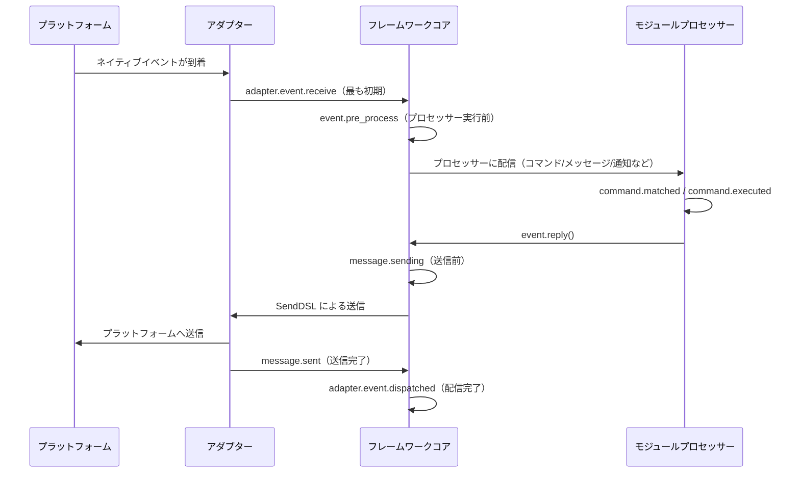

フレームワークには以下のフックブレークポイントが内蔵されており、ユーザーは `@sdk.lifecycle.on()` を使って任意のブレークポイントを監視し、カスタムロジックを実装できます。

### コア初期化

| フック名 | 発生タイミング | データ |
|---------|---------|------|
| `core.init.start` | SDK の初期化開始 | `{}` |
| `core.init.complete` | SDK の初期化完了 | `{"duration": float, "success": bool, "adapters": {"enabled": [str], "disabled": [str]}, "modules": {"enabled": [str], "disabled": [str]}, "error": str(失敗時のみ)}` |
| `core.uninit.complete` | SDK の反初期化完了 | `{"duration": float, "success": bool, "adapters_closed": int, "modules_unloaded": int, "module_properties_cleared": int, "module_properties_to_clear": [str], "error": str(失敗時のみ)}` |

### 設定変更

| フック名 | 発生タイミング | データ |
|---------|---------|------|
| `config.set` | 設定項目が変更された | `{"key": str, "old_value": Any, "new_value": Any}` |
| `config.updated` | 外部で config.toml を編集した後にツリー全体の変更が検出された | `{"old_config": dict, "new_config": dict, "config_file": str}` |

**例：設定監査**

```python
@sdk.lifecycle.on("config.set")
def audit_config(data):
    print(f"[監査] {data['key']}: {data['old_value']} -> {data['new_value']}")
```

### モジュールライフサイクル

| フック名 | 発生タイミング | データ |
|---------|---------|------|
| `module.register` | モジュールクラスがマネージャーに登録された | `{"module_name": str, "success": bool}` |
| `module.load` | モジュールのロード完了（インスタンス化成功） | `{"module_name": str, "success": bool}` |
| `module.init` | モジュールの初期化完了（遅延ロード含む） | `{"module_name": str, "success": bool}` |
| `module.unload` | モジュールのアンロード | `{"module_name": str, "success": bool}` |

### アダプターのライフサイクル

| フック名 | 発生タイミング | データ |
|---------|---------|------|
| `adapter.load` | アダプターの登録完了 | `{"platform": str, "success": bool}` |
| `adapter.start` | アダプターの起動 | `{"platforms": [str]}` |
| `adapter.status.change` | アダプターのステータス変更 | `{"platform": str, "status": str, "retry_count": int, "error": str(失敗時のみ)}` |
| `adapter.stop` | アダプターの停止 | `{"platforms": [str]}` |
| `adapter.stopped` | アダプターの停止完了 | `{"platforms": [str]}` |
| `adapter.bot.online` | Bot のオンライン | `{"platform": str, "bot_id": str, "info": dict, "status": str}` |
| `adapter.bot.offline` | Bot のオフライン | `{"platform": str, "bot_id": str, "status": str}` |

### イベント受信と処理

| フック名 | 発生タイミング | データ |
|---------|---------|------|
| `adapter.event.receive` | 外部プラットフォームのイベントを受信（最も初期） | `{"platform": str, "event_type": str, "raw_event_type": str}` |
| `adapter.event.dispatched` | イベントの配信完了 | `{"platform": str, "event_type": str, "raw_event_type": str, "onebot_handlers_count": int}` |
| `event.pre_process` | イベントプロセッサーの実行前に | `{"event_type": str, "platform": str, "detail_type": str}` |

**例：イベント統計**

```python
event_counter = {}

@sdk.lifecycle.on("adapter.event.receive")
def count_events(data):
    platform = data["platform"]
    event_counter[platform] = event_counter.get(platform, 0) + 1

@sdk.lifecycle.on("adapter.event.dispatched")
def log_unhandled(data):
    if data["onebot_handlers_count"] == 0:
        print(f"[未処理] {data['platform']}/{data['event_type']}")
```

### メッセージ送信

| フック名 | 発生タイミング | データ |
|---------|---------|------|
| `message.sending` | メッセージが送信される直前 | `{"platform": str, "method": str, "detail_type": str, "target_id": str, "bot_id": str}` |
| `message.sent` | メッセージの送信完了 | `{"platform": str, "method": str, "detail_type": str, "target_id": str, "bot_id": str}` |

**例：メッセージ送信監査**

```python
@sdk.lifecycle.on("message.sending")
def log_sending(data):
    print(f"[送信] -> {data['platform']}/{data['detail_type']}/{data['target_id']} via {data['method']}")
```

### コマンドシステム

| フック名 | 発生タイミング | データ |
|---------|---------|------|
| `command.matched` | コマンドがマッチし、実行される直前 | `{"command": str, "args": list[str], "platform": str, "user_id": str}` |
| `command.executed` | コマンドの実行完了 | `{"command": str, "args": list[str], "platform": str, "user_id": str, "success": bool, "error": str(失敗時のみ)}` |

**例：コマンド統計**

```python
@sdk.lifecycle.on("command.matched")
def count_commands(data):
    print(f"[コマンド] /{data['command']} from {data['user_id']}@{data['platform']}")
```

### HTTPルート

| フック名 | 発生タイミング | データ |
|---------|---------|------|
| `server.request` | HTTPリクエストを受け取った | `{"method": str, "path": str, "client_ip": str}` |
| `server.response` | HTTPレスポンスを送信した | `{"method": str, "path": str, "status_code": int, "client_ip": str}` |

**例：リクエストログ**

```python
@sdk.lifecycle.on("server.response")
def log_http(data):
    print(f"[HTTP] {data['method']} {data['path']} -> {data['status_code']}")
```

### WebSocket

| フック名 | 発生タイミング | データ |
|---------|---------|------|
| `server.start` | ルーティングサーバーの起動 | `{"base_url": str, "host": str, "port": int}` |
| `server.stop` | ルーティングサーバーの停止 | `{}` |
| `server.websocket.connect` | WebSocket接続の確立 | `{"path": str, "module_name": str, "client_ip": str}` |
| `server.websocket.disconnect` | WebSocket接続の切断 | `{"path": str, "module_name": str, "reason": str, "error": str(異常時のみ)}` |

**例：WebSocket接続監視**

```python
@sdk.lifecycle.on("server.websocket.connect")
def on_ws_connect(data):
    print(f"[WS] 接続: {data['path']} from {data['client_ip']}")

@sdk.lifecycle.on("server.websocket.disconnect")
def on_ws_disconnect(data):
    print(f"[WS] 切断: {data['path']} ({data['reason']})")
```

## 標準イベント定義

```python
STANDARD_EVENTS = {
    "core": ["init.start", "init.complete", "uninit.complete"],
    "module": ["load", "init", "unload", "register"],
    "adapter": [
        "load", "start", "status.change", "stop", "stopped",
        "event.receive", "event.dispatched",
        "bot.online", "bot.offline",
    ],
    "server": [
        "start", "stop",
        "request", "response",
        "websocket.connect", "websocket.disconnect",
    ],
    "event": ["pre_process"],
    "message": ["sending", "sent"],
    "command": ["matched", "executed"],
    "config": ["set"],
}
```

## 完全な API リファレンス

### 登録と解除

| 方法 | 説明 |
|------|------|
| `@lifecycle.on(event, *, priority=0)` | デコレータによるハンドラの登録 |
| `lifecycle.register(event, handler, *, priority=0)` | プログラム的な登録 |
| `lifecycle.unregister(event, handler=None)` | 登録解除（handler=None の場合、該当イベントの全ハンドラを解除） |

### トリガー

| 方法 | 説明 |
|------|------|
| `await lifecycle.emit(event, data=None)` | 非同期でトリガーし、ハンドラが None 以外を返すと data を変更可能 |
| `lifecycle.emit_sync(event, data=None)` | 同期でトリガーし、非同期ハンドラは create_task でスケジュール |
| `await lifecycle.submit_event(event_type, *, source, msg, data)` | 旧版との互換性用、自動で標準イベント形式を構築 |

### ユーティリティ

| 方法 | 説明 |
|------|------|
| `lifecycle.start_timer(timer_id)` | タイマーを開始 |
| `lifecycle.get_duration(timer_id)` | 経過時間（秒）を取得 |
| `lifecycle.stop_timer(timer_id)` | タイマーを停止し、経過時間を返す |
| `lifecycle.list_hooks()` | 登録済みのすべてのフックとハンドラ数をリストアップ |
| `lifecycle.clear()` | すべてのハンドラとタイマーをクリア |

## モジュールでの使用例

```python
from ErisPulse.Core.Bases import BaseModule
from ErisPulse import sdk

class Main(BaseModule):
    async def on_load(self, event):
        # 簡単なメッセージ統計の実装
        self.msg_count = 0
        
        @sdk.lifecycle.on("adapter.event.receive")
        async def count(data):
            if data["event_type"] == "message":
                self.msg_count += 1
        
        # すべてのコマンドを監視
        @sdk.lifecycle.on("command.matched")
        async def log_cmd(data):
            sdk.logger.info(f"コマンド実行: /{data['command']} by {data['user_id']}")
        
        # 設定変更の監査
        @sdk.lifecycle.on("config.set")
        def audit(data):
            sdk.logger.info(f"設定変更: {data['key']} = {data['new_value']}")
```

## バックグラウンドタスクの所有権と自動キャンセル

> [!NOTE]
> この機能は ErisPulse **2.8.0+** が必要です。

モジュールが作成した asyncio バックグラウンドタスクが `on_unload` でキャンセルされない場合、`self` の参照を保持し、モジュールインスタンスの回収ができない（ホットリロード後に古いインスタンスが残る）可能性があります。フレームワークは以下のバックアップメカニズムを提供しています：

- **`self.spawn(coro)`**（モジュール内で推奨）：タスクは自動的にモジュール名に属し、モジュールのアンロード時にフレームワークは `on_unload` **の後**に未終了のタスクをバックアップでキャンセルし、警告を記録します。
- **`spawn_background(coro)`**（`ErisPulse.runtime`）：現在の `owner_scope` コンテキストを自動的にキャプチャします。`cancel_owner_tasks(owner)` は所有者に属するタスクをキャンセルし、`cancel_all_background_tasks()` は `sdk.uninit()` のバックアップとして使用します。
- **アダプター**：閉じるとき、プラットフォーム名以下のバックグラウンドタスクも同様にバックアップでキャンセルされます。

```python
async def on_load(self, event):
    # 推奨：バックグラウンドタスクは self.spawn() を使用し、アンロード時にフレームワークが自動的にバックアップでキャンセルします
    self.spawn(self._poll())

async def on_unload(self, event):
    # 精密な制御が必要な場合、手動でキャンセルして終了処理を待つことを推奨します
    if self._poll_task:
        self._poll_task.cancel()
        await asyncio.gather(self._poll_task, return_exceptions=True)

async def _poll(self):
    while True:
        await asyncio.sleep(60)
        ...
```

> [!IMPORTANT]
> フレームワークのバックアップは**強制的なキャンセル**（`cancel_owner_tasks`）です。これは `on_unload` の返り値の後に実行されます。したがって、優雅な終了処理が必要なタスク（バッファのフラッシュ、ステートの永続化、接続の閉鎖）は、`on_unload` で手動で `cancel()` し、`await` で終了処理を完了させる必要があります。バックアップが終了処理を保持することを期待しないでください。フレームワークは「`self` を保持するタスクが残らないこと」を保証しますが、「優雅な終了」を保証するものではありません。`await` の結果が必要なタスクは、バックグラウンドタスクに投げることなく、直接 `await` してください。

## 注意事項

1. **プロセッサは同期または非同期のいずれでも使用可能**：システムは自動的に識別し、正しく呼び出します。
2. **データの渡し方**：`emit()` モードでは、プロセッサが None 以外の値を返すと、次のプロセッサに渡される data が変更されます。
3. **イベント名の命名規則**：親イベントのリスナーを使用しやすいよう、ドット構造でイベント名を命名することを推奨します。
4. **エラーの隔離**：単一のプロセッサでの例外は、他のプロセッサの実行に影響しません。
5. **同期トリガーの制限**：`emit_sync()` では、非同期プロセッサは fire-and-forget 方式でスケジュールされ、返り値は返却できません。
6. **ライフサイクルのクリーンアップ**：`sdk.uninit()` を呼び出すと、登録済みのすべてのプロセッサとタイマーがクリーンアップされます。
7. **ロードの優先度**：フレームワークの初期化段階でイベントをリッスンする必要がある場合は、高い優先度を設定し、ラグジュアリー読み込みを無効化することを推奨します。


### 懶加载系统

# ラグジュアリー ロード モジュール システム

ErisPulse SDK は、モジュールを実際に必要になるまで初期化しない強力なラグジュアリー ロード モジュール システムを提供し、アプリケーションの起動速度とメモリ効率を大幅に向上させます。

## 概要

ErisPulse のコア機能の 1 つである遅延ロードモジュールシステムは、以下の方法で動作します。

- **遅延初期化**：モジュールは、初めてアクセスされたときにのみ実際に読み込まれ、初期化されます。
- **透明な使用**：開発者にとって、遅延ロードモジュールは通常のモジュールと使用上ほとんど違いがありません。
- **自動依存管理**：モジュールの依存関係は、使用されるときに自動的に初期化されます。
- **ライフサイクルサポート**：`BaseModule` を継承したモジュールに対しては、ライフサイクルメソッドが自動的に呼び出されます。

## 動作原理

### LazyModule クラス

ラグジュアリー・ロード・システムの中心となるのが `LazyModule` クラスです。これは、最初にアクセスされたときにのみモジュールを実際に初期化するラッパーです。

### 初期化プロセス

モジュールが初めてアクセスされたとき、`LazyModule` は以下の操作を実行します：

1. モジュールクラスの `__init__` パラメータ情報を取得します
2. パラメータに基づいて `sdk` リファレンスを渡すかどうかを決定します
3. モジュールの `moduleInfo` 属性を設定します
4. `BaseModule` を継承したモジュールの場合、`on_load` メソッドを呼び出します
5. `module.init` ライフサイクルイベントをトリガーします

## イベント駆動の遅延起動（activate_on）

> [!NOTE]  
> この機能は ErisPulse **2.8.0以降**が必要です。

`lazy_load=True` のモジュールは、**最初の属性アクセス時**にデフォルトでロードされます。  
モジュールがコマンド/イベントハンドラを登録している場合、従来の方法では `lazy_load=False` にして即時ロードするしかありませんでした。`activate_on` は、**トリガーを宣言し、最初の一致するイベント/コマンドが到着したときにモジュールを自動的に起動**するという第三の選択肢を提供します。これにより、メモリに常駐することなく、トリガーエントリを失うこともありません。

```python
from ErisPulse.loaders import ModuleLoadStrategy

class MyModule(BaseModule):
    @staticmethod
    def get_load_strategy():
        return ModuleLoadStrategy(
            lazy_load=True,
            activate_on=[
                # ---- イベントトリガー（受動的到達、ユーザーの意識を必要としない）----
                "message",                                    # タイプレベル：任意のメッセージイベント
                {"notice": "group_member_increase"},          # タイプ + 単一 detail_type
                {"message": ["private", "group"]},            # タイプ + 複数 detail_type

                # ---- コマンドトリガー（能動的入力、Help に表示されるプレースホルダーコマンド）----
                {"command": "roll"},                          # 略記：コマンド名
                {"command": ["roll", "dice"]},                # コマンド名リスト
                {"command": {                                 # dict 形式で宣言（name は必須）
                    "name": "dice",
                    "help": "サイコロを振る",
                    "usage": "/dice",
                    "group": "娯楽",
                    "aliases": ["d"],
                    "hidden": False,
                }},
            ],
        )
```

### コマンド dict 形式の宣言パラメータ

dict 形式は `@command()` デコレータのユーザーレベルのパラメータを反映し、モジュールのロード前にプレースホルダーコマンドを登録するために使用されます：

| パラメータ | 型 | デフォルト | 説明 |
|-----------|------|------|------|
| `name` | `str` | **必須** | コマンド名；`on_load` での `@command(name)` と一致する必要がある。一致しないと、起動後にプレースホルダーが削除され、コマンドが存在しなくなる。 |
| `help` | `str` | 回帰チェーン | Help に表示される説明；宣言していない場合は回帰チェーンから値を取得（以下参照） |
| `usage` | `str` | 自動生成 | 用法行、デフォルトは `{prefix}{name}` |
| `group` | `str` | `None` | コマンドグループ |
| `aliases` | `list[str]` | `[]` | 別名として同時に登録。**別名の入力でもトリガーとして機能する** |
| `hidden` | `bool` | `False` | `True` の場合、プレースホルダーコマンドも非表示（起動後の実際のコマンドの非表示の意味と一致）；コマンド名を知っているユーザーの入力でもトリガーとして機能する |

**サポートしていない** `priority` / `permission` / `master`：プレースホルダーコマンドの使命はトリガーの起動のみであり、権限チェックは起動後の実際のコマンドが実行する（プレースホルダー段階で権限をブロックすると、「コマンド入力で起動」が無効になる）。

### プレースホルダーコマンドの help 回帰チェーン

モジュールがロードされていない状態で Help に表示されるコマンドの説明は、以下の順序で値を取得します（最初に取得した値が使用されます）：

1. dict 形式で宣言されたコマンドレベルの `help`（最も正確）
2. モジュールの `get_meta()` の `description`
3. モジュールの `__description__` 属性
4. パッケージのメタデータの `Summary`（PyPI パッケージの概要）
5. 一般的なメッセージ：「このコマンドは遅延ロードモジュール X から来ています。初めて使用すると、モジュールが自動的にロードされます」

### トリガーの意味

- **イベント stub**：対応するイベントマネージャーに非常に低い優先度（`ACTIVATION_STUB_PRIORITY`）で登録され、通常のハンドラの後に実行されます。起動後、現在のイベントをモジュールの実際のハンドラに転送します。
- **コマンド stub**：プレースホルダーコマンドを登録します。起動後、プレースホルダーは削除され、実際のコマンドがそのトリガーを引き継ぎます。
- **再入防止**：`asyncio.Lock` を使用して、並行トリガー下で一度だけ起動されるように保証します。
- **スコープフィルタリング**：stub にはモジュールの所有者アイデンティティが含まれており、モジュールが Bot / セッション / プラットフォームに対して有効化されていない場合はトリガーされません。
- **失敗時の意味**：起動に失敗した場合、再試行せず、stub も同時に削除されます。
- **重複排除**：同名のコマンドが略記と dict 形式で混在して宣言された場合、重複を排除します（dict が優先）。dict で `name` が欠落している場合、またはイベントの `detail_type` が dict として誤って記述された場合は、警告を出し無視します。

> アーキテクチャ図と完全な意味については、[アーキテクチャ概要](../architecture.md#イベント駆動の遅延起動activate_on-トリガーアーキテクチャ)を参照してください。

## 懒惰ロードの設定

### グローバル設定

設定ファイルでグローバルな遅延ロードを有効または無効にします：

```toml
[ErisPulse.framework]
enable_lazy_loading = true  # true=遅延ロードを有効にする(デフォルト), false=遅延ロードを無効にする
```

### モジュールレベルの制御

モジュールは `get_load_strategy()` 静的メソッドを実装することで、ロード戦略を制御できます：

```python
from ErisPulse.Core.Bases import BaseModule
from ErisPulse.loaders import ModuleLoadStrategy

class MyModule(BaseModule):
    @staticmethod
    def get_load_strategy():
        """モジュールのロード戦略を返す"""
        return ModuleLoadStrategy(
            lazy_load=False,  # Falseを返すと即時ロード
            priority=100      # ロードの優先度、数値が大きいほど優先度が高い
        )
```

## ラグロードモジュールの使用

### 基本的な使い方

開発者にとって、ラグロードモジュールは通常のモジュールと使用方法にほとんど違いはありません：

```python
# SDKを介してラグロードモジュールにアクセス
from ErisPulse import sdk

# 以下のようにアクセスするとモジュールのラグロードがトリガーされます
result = await sdk.my_module.my_method()
```

### モジュールの取得の統一されたエントリーポイント

SDK属性、モジュールマネージャー属性を通じてアクセスする場合でも、`module.get()`で検索する場合でも、
「登録済みだがまだロードされていない」ラグロードモジュールに対しては、すべて同じラグロードプロキシが返り、
そのプロパティにアクセスすることで初めてモジュールの初期化がトリガーされます：

```python
# 3つの方法で取得できるのはすべてラグロードプロキシです（モジュールがロードされていない場合）、動作は一貫しており、ユーザーには透明です
sdk.my_module          # ロードをトリガーするエントリーポイント
sdk.module.my_module   # 同様にラグロードプロキシを返します
sdk.module.get("my_module")  # これもラグロードプロキシを返します。この操作自体はロードをトリガーしません

# プロキシの任意の属性にアクセスすることで、モジュールの初期化が実際に行われます
result = await sdk.my_module.my_method()
```

`module.get()`は**検索**用のインターフェースであり、ロードをトリガーしません：
- モジュールが既にロード済み → 実際のインスタンスを返します
- モジュールが登録済みだが未ロード → ラグロードプロキシを返します（プロパティにアクセスしたときに初期化されます）
- モジュールが未登録 → `None`を返します

明示的にロードをトリガーするには、`await sdk.load_module("my_module")`を使用してください。

### 非同期初期化

非同期初期化が必要なモジュールについては、まず明示的にロードすることを推奨します：

```python
# まずモジュールを明示的にロード
await sdk.load_module("my_module")

# その後モジュールを使用
result = await sdk.my_module.my_method()
```

### 同期初期化

非同期初期化を必要としないモジュールについては、直接アクセスできます：

```python
# 直接アクセスすると自動的に同期初期化されます
result = sdk.my_module.some_sync_method()
```

## 最佳実践

ロード戦略を選択する際は、以下の決定フローを参考にしてください。


### 懒惰ロード（lazy_load=True）を使用することを推奨する場面

- 他のモジュールによって呼び出されるだけの受動的なユーティリティモジュール（例：データクエリモジュール、フォーマット変換器など）
- コマンド/イベントハンドラを登録しているが高頻度で使用されないモジュール — `activate_on` を使ってトリガを宣言し、最初の一致するイベント/コマンドが到着した際に自動的にアクティベートする。これにより、lazy_loadを放棄せずに済む。

### 懒惰ロードを禁止することを推奨する場面（lazy_load=False）

- 起動時に即座に準備が必要なモジュール（他のモジュールに基礎サービスを提供するコアモジュールなど）
- 高頻度でトリガーされるリスナー（各メッセージごとに処理が必要） — `activate_on` による転送には1回のアクティベートオーバーヘッドがあるため、高頻度の場面では即時ロードした方が直接的
- タイマータスクモジュール
- アプリケーション起動時に初期化が必要なモジュール

> `priority` パラメータは、即時ロードされるモジュール間の初期化順序を制御します。数値が大きいほど先に初期化されます。同じ優先度のモジュールは登録順にロードされます。

## 注意事項

1. モジュールが遅延ロードを使用している場合、ErisPulse内で他のモジュールによって一度も呼び出されない場合、そのモジュールは決して初期化されません。
2. モジュール内にEventの監視など、他のモジュールを積極的に監視するモジュールが含まれている場合、2つの選択肢があります：`activate_on` トリガーを宣言して遅延ロードを維持し、イベントが到達したときに自動的にアクティブ化するか、または即時ロードを必要とすることを宣言する（`lazy_load=False`）か、さもなければモジュールの正常な業務に影響を及ぼす可能性があります。
3. 特殊な要望がない限り、遅延ロードを無効にすることは推奨しません。そうしないと、依存管理やライフサイクルイベントなどの問題が生じる可能性があります。
4. `activate_on` のコマンド dict 声明において、`name` はモジュールの `on_load` で `@command()` によって登録された実際のコマンド名と一致する必要があります。一致しない場合、モジュールがアクティブ化された後にプレースホルダーコマンドが解除され、宣言と実装が一致しないコマンドは存在しません。


### 国际化（i18n）系统

# 国際化 (i18n) システム

ErisPulse v2.5.0 以降、完全な国際化 (i18n) 機能が内蔵されています。フレームワークのコアおよび CLI インターフェースは、システムの言語に応じて表示テキストを自動的に切り替えることができ、外部モジュールが独自の翻訳を登録することも可能です。

## 支援言語

| 言語 | コード | 説明 |
|------|------|------|
| 简体中文 | `zh-CN` | デフォルト言語（フレームワークの原生言語） |
| 繁體中文 | `zh-TW` | 繁体中文（香港/澳门/台湾） |
| English | `en` | 英文（一般的フォールバック言語） |
| 日本語 | `ja` | 日本語 |
| Русский | `ru` | ロシア語 |

## 早速体験

### 環境変数による切り替え

```bash
# Windows PowerShell
$env:ERISPULSE_LANG = "en"
epsdk run

# macOS / Linux
ERISPULSE_LANG=ja epsdk run
```

### 設定ファイルによる切り替え

`config/config.toml` に以下を追加します：

```toml
[ErisPulse.i18n]
language = "zh-TW"
```

`"auto"`（デフォルト値）に設定すると、システム言語を自動検出します。

### コード内で手動で切り替え

```python
from ErisPulse import i18n

# 言語を手動で設定
i18n.set_language("en")
print(i18n.get_language())  # "en"

# 自動検出に戻す
i18n.reset_language()
```

## 言語検出メカニズム

フレームワークは、以下の優先順位でユーザーの言語を検出します：

1. **環境変数 `ERISPULSE_LANG`** — 最も高い優先順位で、テストや一時的な切り替えに使用
2. **Windows API** — `GetUserDefaultLocaleName`（Windowsに限定、Git Bashなどのツールが `LANG` を上書きする影響を受けない）
3. **環境変数** — `LANGUAGE` > `LC_ALL` > `LC_MESSAGES` > `LANG`（Unix/macOSの標準）
4. **システムロケール** — `locale.getlocale()` / `locale.getdefaultlocale()`
5. **デフォルト** — en（英語）

### 近接マッピング原則

検出された言語が正確に一致しない場合、サポートされている言語に近接する原則でマッピングされます：

- `zh-TW`, `zh-HK`, `zh-MO`, `zh-Hant` → **繁体中国語**
- その他のすべての `zh-*`（例: `zh-CN`, `zh-SG`）→ **簡体中国語**
- `en-US`, `en-GB`, `en-AU` など → **英語**
- `ja-JP` → **日本語**
- `ru-RU` → **ロシア語**
- その他の未認識の言語 → **簡体中国語（デフォルト）**

## モジュールでの i18n の使用

独自のモジュールに翻訳テキストを登録することで、多言語をサポートできます。

### 推奨方法：I18nClass を使って翻訳キーを宣言する（v2.7.0+）

v2.7.0 以降、モジュールやアダプターは `ConfigClass` を宣言するのと同じように、ネストされたクラス `I18nClass` を使って翻訳キーを宣言できます。フレームワークはロード時に**自動的に**宣言されたすべての翻訳キーを登録します。手動で `i18n.register()` を呼び出す必要はありません。

```python
from dataclasses import dataclass, field

from ErisPulse.Core.Bases import BaseConfig, BaseI18n, BaseModule, I18nKey


class MyModule(BaseModule):
    # 設定クラス（オプション）
    @dataclass
    class ConfigClass(BaseConfig):
        welcome_msg: str = field(
            default="欢迎",
            metadata={
                # ここでは i18n キー mymodule.welcome_msg を参照
                "description": {"i18n": "mymodule.welcome_msg", "default": "欢迎消息"},
            },
        )

    # 翻訳キー集合クラス（オプション）
    # 宣言されたキーはフレームワークによって自動的に登録され、
    # ConfigClass がデフォルト設定を生成するよりも優先されます
    class I18nClass(BaseI18n):
        # 属性名が自動的に結合されて完全なキー経路 <モジュール名>.<属性名> になります
        welcome_msg: I18nKey = I18nKey(
            default="Welcome Message",   # 言語に依存しないデフォルト値、どの言語にも登録されません
            zh_CN="欢迎消息",
            en="Welcome Message",
            ja="ウェルカムメッセージ",
            ru="Приветственное сообщение",
            zh_TW="歡迎訊息",
        )
        # 业务で使用する他の翻訳キー
        hello: I18nKey = I18nKey(
            default="Hello, {name}!",
            zh_CN="你好，{name}！",
            zh_TW="你好，{name}！",
            en="Hello, {name}!",
            ja="こんにちは、{name}！",
            ru="Привет, {name}!",
        )

        # 完全なキー経路を明示的に指定することもできます（属性名の結合を使わない）
        custom: I18nKey = I18nKey(
            key="mymodule.deep.nested.key",
            default="Default text",
            zh_CN="默认文本",
            zh_TW="預設文本",
            en="Default text",
            ja="デフォルトテキスト",
            ru="Текст по умолчанию",
        )
```

#### なぜ I18nClass が推奨されるのか？

| シナリオ | 手動 i18n.register() | I18nClass 宣言式 |
|------|-----------------------|------------------|
| 設定の説明に参照される i18n キー | 手動で登録する必要があり、設定生成前に登録する必要がある | フレームワークが設定生成前に自動的に登録する |
| 多言語翻訳の宣言 | on_load() 内に散在する | クラス内で一括して宣言され、一目瞭然 |
| キー名の命名の一貫性 | 拼写ミスが発生しやすい | 属性名がキー名の接尾辞として使用され、IDE による補完が可能 |
| アンロード時のクリーンアップ | 手動で unregister_domain() を呼び出す必要がある | フレームワークが統一されたドメインで登録する |

#### I18nClass のキー経路ルール

- **デフォルト**：``<モジュール登録名>.<属性名>`` を完全なキー経路として使用
  - 例：モジュール名が ``MyModule``、属性 ``welcome`` → キー経路 ``MyModule.welcome``
- **明示的**：``I18nKey(key="...")`` パラメータを使って任意のドット区切り経路を指定
  - 深層ネストされたキー名（例：``mymodule.config.basic.token``）に適している

#### アダプターでの使用

アダプターも `I18nClass` をサポートしており、使用方法は完全に同じです：

```python
from ErisPulse.Core import BaseAdapter
from ErisPulse.Core.Bases import BaseConfig, BaseI18n, I18nKey


class MyAdapter(BaseAdapter):
    @dataclass
    class ConfigClass(BaseConfig):
        endpoint: str = field(
            default="",
            metadata={
                # 設定の説明は adapter.MyAdapter.endpoint キーを参照
                "description": {"i18n": "MyAdapter.endpoint", "default": "API 地址"},
            },
        )

    class I18nClass(BaseI18n):
        # 集中して設定の説明に参照されるキーとその他の業務用キーの多言語訳を宣言
        endpoint: I18nKey = I18nKey(
            default="API Endpoint",
            zh_CN="API 地址",
            zh_TW="API 位址",
            en="API Endpoint",
            ja="APIアドレス",
            ru="API адрес",
        )
```

アダプターの `I18nClass` は `__init__` 階段（つまり設定テンプレート生成の前）に自動的に登録され、設定の説明に参照される i18n キーが利用可能になります。

### 手動でカスタム翻訳を登録する（旧方法）

`I18nClass` を使用しない場合、`i18n.register()` を直接呼び出して翻訳テキストを登録することもできます。

```python
from ErisPulse import i18n

# 中文翻訳を登録
i18n.register("zh-CN", {
    "my_module.welcome": "欢迎使用我的模块！",
    "my_module.goodbye": "再见！",
    "my_module.hello": "你好，{name}！",
}, domain="my_module")

# 英文翻訳を登録
i18n.register("en", {
    "my_module.welcome": "Welcome to my module!",
    "my_module.goodbye": "Goodbye!",
    "my_module.hello": "Hello, {name}!",
}, domain="my_module")
```

### 翻訳の使用

```python
from ErisPulse import i18n

# 簡単な翻訳
i18n.t("my_module.welcome")  # 現在の言語が自動的に使用されます

# フォーマットパラメータ付き
i18n.t("my_module.hello", name="Alice")

# デフォルト値を指定（翻訳キーが存在しない場合に返される）
i18n.t("my_module.unknown_key", default="默认文本")
```

### モジュールクラスでの使用

```python
from dataclasses import dataclass, field
from ErisPulse import i18n
from ErisPulse.Core.Bases import BaseConfig, BaseModule

@dataclass
class MyModuleConfig(BaseConfig):
    welcome_msg: str = field(
        default="欢迎",
        metadata={
            "description": {"i18n": "my_module.welcome_msg", "default": "欢迎消息"},
            "ui": {"widget": "text", "group": "basic", "order": 1},
        },
    )

class MyModule(BaseModule):
    ConfigClass = MyModuleConfig

    async def on_load(self, event):
        # 実時で設定を読み取る（各アクセスで最新値が反映される）
        self.logger.info(self.cfg.welcome_msg)
        self.logger.info(i18n.t("my_module.welcome"))

    @command("hello")
    async def hello_handler(self, event):
        name = event.get_user_nickname() or "friend"
        await event.reply(i18n.t("my_module.hello", name=name))

    async def on_unload(self, event):
        pass
```

### 翻訳のアンロード

```python
# ドメイン全体の翻訳をアンロード
i18n.unregister_domain("my_module")
```

---

## 設定フィールドの多言語対応

v2.5.2 以降、設定の Schema は i18n を全面的にサポートします。ユーザーが見られるすべてのテキストフィールドは i18n キーを参照でき、WebUI およびその他の消費者は、現在の言語に応じて自動的に対応するテキストに解析します。

### 対応する i18n フィールド

| フィールド | 位置 | 説明 |
|------|------|------|
| `description` | field metadata | フィールドの説明 |
| `options[].label` | `ui.options` | select コントロールのオプションラベル |
| `placeholder` | `ui.placeholder` | 入力欄のプレースホルダー |
| `group_labels` | `_schema_meta` | グループ表示名（Dashboard のセクションタイトル） |

すべての i18n フィールドは `{"i18n": "key", "default": "テキスト"}` の形式を採用し、純粋な文字列はそのまま透過されます（後方互換性を保つため）。

### i18n フィールドの宣言

すべてのユーザーが見られるテキストフィールドは i18n をサポートします：

```python
from dataclasses import dataclass, field
from ErisPulse.Core.Bases import BaseConfig

@dataclass
class MyAdapterConfig(BaseConfig):
    # description i18n
    token: str = field(
        default="",
        metadata={
            "description": {"i18n": "my_adapter.token", "default": "プラットフォーム Token"},
            "required": True,
            "secret": True,
            "ui": {
                "widget": "password",
                "group": "basic",
                "order": 1,
                # placeholder i18n
                "placeholder": {"i18n": "my_adapter.token.ph", "default": "Token を入力してください"},
            },
        },
    )
    # options label i18n
    mode: str = field(
        default="a",
        metadata={
            "description": {"i18n": "my_adapter.mode", "default": "実行モード"},
            "ui": {
                "widget": "select",
                "group": "basic",
                "order": 2,
                "options": [
                    {"label": {"i18n": "my_adapter.mode.a", "default": "モードA"}, "value": "a"},
                    {"label": {"i18n": "my_adapter.mode.b", "default": "モードB"}, "value": "b"},
                ],
            },
        },
    )

    # group_labels i18n（グループ表示名）
    _schema_meta = {
        "group_labels": {
            "basic": {"i18n": "my_adapter.group.basic", "default": "基本設定"},
        }
    }
```

`default` はバックアップテキストです。翻訳が登録されていない場合、または検索に失敗した場合に表示されます。

### secret 脱敏と設定検証

`"secret": True` とマークされたフィールドは、2.7.0 以降、**脱敏保護**が自動で適用されます：

- **テンプレート生成時の脱敏**：`dataclass_to_toml_with_comments()` が設定テンプレートを生成する際、secret フィールドの実際の値はファイルに書き込まれません（空のプレースホルダーとして表示され、機密情報がディスク上に残らないようにします）。
- **一般的な脱敏ツール**：`redact_secret(value)` は非空値を `***` に置き換え、空値はそのまま返します。これはログ出力などの場面で使用できます。

```python
from ErisPulse.Core.Bases.config_schema import redact_secret

redact_secret("sk-xxxxxx")  # '***'
redact_secret("")           # ''
```

**設定検証**（`validate_config()`）は、`required` の非空チェックに加えて、2.7.0 以降、以下の検証もサポートします：

| 検証項目 | メタデータ | 例 |
|--------|--------|------|
| 型の一致 | フィールドの宣言型 | `int` 型のフィールドに文字列を渡すとエラーになります |
| 列挙制約 | `ui.options` またはトップレベルの `options` | 値は許可されたオプションに属している必要があります |
| 数値範囲 | トップレベルの `min` / `max` | `metadata={"min": 1, "max": 65535}` |

```python
from ErisPulse.Core.Bases.config_schema import validate_config

@dataclass
class C(BaseConfig):
    mode: str = field(default="a", metadata={"ui": {"widget": "select", "options": ["a", "b"]}})
    port: int = field(default=80, metadata={"min": 1, "max": 65535})

errors = validate_config(C(mode="x", port=70000))  # 2つのエラー：列挙制約と範囲制約
```

### 設定の翻訳登録

設定フィールドの i18n キーは、通常の翻訳キーと同じように `i18n.register()` を使って登録できます：

```python
from ErisPulse import i18n

# 登録する中国語（default と同じでも、異なるものでも可）
i18n.register("zh-CN", {
    "my_adapter.token": "プラットフォーム Token",
}, domain="my_adapter")

# 登録する英語
i18n.register("en", {
    "my_adapter.token": "Platform Token",
}, domain="my_adapter")
```
> **推奨方法**：`I18nClass` を使って翻訳キーを宣言し、フレームワークが自動的に登録します（上記「推奨方法」の章を参照）。  
> 手動で `i18n.register()` や `register_config_i18n()` を呼び出す必要はありません。

また、便利な関数 `register_config_i18n()` も提供されており、設定クラスからキーを自動的に抽出して登録できます：

```python
from ErisPulse.Core.Bases.config_schema import register_config_i18n

# 自動的に description.default を zh-CN の翻訳として登録
register_config_i18n(MyAdapterConfig, "zh-CN")

# 手動で英語の翻訳を提供
register_config_i18n(MyAdapterConfig, "en", {
    "my_adapter.token": "Platform Token",
})
```

### WebUI での消費方法

`get_config_schema()` が返す schema では、i18n ディクショナリはそのまま透過されます。WebUI のフロントエンドは、現在の言語に応じて `i18n.t()` を呼び出して解析できます。

i18n をサポートしないフロントエンドに直接文字列を返す必要がある場合、`resolve_config_schema()` を使用します。この関数は、`description`、`options[].label`、`placeholder`、`group_labels` をすべて現在の言語の文字列に解析します：

```python
from ErisPulse.Core.Bases.config_schema import resolve_config_schema

# すべての i18n フィールドが現在の言語の文字列に解析されています
schema = resolve_config_schema(MyAdapterConfig)
print(schema["fields"]["token"]["description"])    # "プラットフォーム Token" または "Platform Token"
print(schema["fields"]["token"]["placeholder"])   # "Token を入力してください" または "Enter Token"
print(schema["fields"]["mode"]["options"][0]["label"])  # "モードA" または "Mode A"
print(schema["group_labels"]["basic"])             # "基本設定" または "Basic"
```

> `BaseConfig`、`BotAccountConfig`、`register_config_i18n()`、`resolve_config_schema()`  
> などの型とツール関数の実際の定義は `ErisPulse.Core.Bases.config_schema` にあります。  
> `ErisPulse.runtime.config_schema` は互換性のための shims として残されています。  
> **推奨は `ErisPulse.Core.Bases` から一括でインポートすること**（i18n 翻訳キーに関連する型は例外で、`ErisPulse.Core.Bases.i18n_schema` にあります）。

## API リファレンス

### I18nManager

#### 核心メソッド

| メソッド | 説明 |
|------|------|
| `t(key, default=None, **kwargs)` | 翻訳テキストを取得する（`gettext()` はエイリアス） |
| `set_language(lang)` | 手動で言語を設定する |
| `get_language()` | 現在の言語を取得する |
| `reset_language()` | 自動検出にリセットし、環境を再検出する |
| `get_supported_languages()` | すべてのサポート言語のリストを取得する |
| `has_translation(key, lang=None)` | 翻訳キーが存在するか確認する |
| `register(lang, translations, domain)` | 自定義翻訳を登録する |
| `unregister_domain(domain)` | 指定されたドメインのすべての翻訳をアンロードする |
| `reload()` | 内部翻訳を再読み込みし、言語を再検出する |

#### `t()` メソッドの詳細

```python
def t(self, key, /, default=None, **kwargs):
```

- `key` — 翻訳キー（位置引数のみ、`**kwargs` の `key=` と衝突しない）
- `default` — 翻訳が存在しない場合に返すデフォルト値、デフォルトは `None`（キー名そのものを返す）
- `**kwargs` — 翻訳値中の `{placeholder}` を埋め込むためのフォーマットパラメータ

例：

```python
# 翻訳定義: "greeting": "你好，{name}！欢迎来到{place}。"
i18n.t("greeting", name="Alice", place="ErisPulse")
# 戻り値: "你好，Alice！欢迎来到ErisPulse。"
```

### BaseI18n / I18nKey（宣言的翻訳キー）

v2.7.0 から、`ErisPulse.Core.Bases` はクラス属性に基づく翻訳キーの宣言ツールを提供しています（`ErisPulse.Core.Bases` から統一的にインポートすることを推奨します）：

> ``I18nKey.default`` は**言語に依存しないデフォルトテキスト**であり、どの言語にも登録されません。  
> 翻訳を有効にするには、少なくとも1つの言語パラメータ（``zh_CN=`` / ``en=`` / ``ja=`` など）を明示的に渡す必要があります。  
> これにより、各国の開発者は `default` を自分の母国語で自由に記入でき、フレームワークはその内容を一切仮定しません。

| 名称 | 説明 |
|------|------|
| `I18nKey(default, *, key=None, zh_CN, zh_TW, en, ja, ru)` | 単一の翻訳キーの宣言、`default` は言語に依存しないデフォルト |
| `BaseI18n` | 翻訳キー集合の基底クラス（`BaseConfig` と命名を揃える）、子クラスはクラス属性で複数の `I18nKey` を宣言する |
| `BaseI18n.register(prefix="", domain="app")` | クラスメソッド：宣言されたすべてのキーを i18n システムに登録する |
| `key` | `I18nKey` のエイリアス（より簡潔な書き方） |

使用例：

```python
from ErisPulse.Core.Bases import BaseI18n, key

class MyKeys(BaseI18n):
    # 簡潔なエイリアス書き方
    hello = key(
        default="Hello",
        zh_CN="你好",
        zh_TW="你好",
        en="Hello",
        ja="こんにちは",
        ru="Привет",
    )
    bye = key(
        default="Bye",
        zh_CN="再见",
        zh_TW="再見",
        en="Bye",
        ja="さようなら",
        ru="До свидания",
    )

# 独立使用（手動で登録）
MyKeys.register(prefix="myapp.", domain="myapp")
```

### SDK インスタンスからのアクセス

```python
from ErisPulse import sdk

# sdk.i18n は直接インポートした i18n と同じオブジェクト
sdk.i18n.set_language("en")
print(sdk.i18n.t("core.sdk.init.starting"))
```

## 実行時設定

### 設定APIを介してi18n設定を読み取る

```python
from ErisPulse.Core.Bases import I18nConfig
from ErisPulse.runtime import get_i18n_config

config = get_i18n_config()
print(config["language"])  # "auto" または具体的な言語コード

# I18nConfig は dataclass であり、設定テンプレートの生成に使用可能
schema = I18nConfig.__dataclass_fields__
```

### 設定項目の説明

`config/config.toml` の `[ErisPulse.i18n]` 部分で：

```toml
[ErisPulse.i18n]
# 表示言語。選択可能な値:
# - "auto"      — システム言語を自動検出（デフォルト）
# - "zh-CN"     — 簡体字中国語
# - "zh-TW"     — 繁体字中国語
# - "en"        — 英語
# - "ja"        — 日本語
# - "ru"        — ロシア語
language = "auto"
```

---

## 最佳実践

### 翻訳キーの命名

ドットで区切られた名前空間形式の命名を推奨します：

```
<モジュール名>.<カテゴリ>.<説明>
```

例：`my_module.command.hello_desc`、`core.adapter.start_failed`

### 多言語のカバー

すべての言語の翻訳を一度に提供する必要はありません。不足している言語は自動的に英語にフォールバックされ、英語もなければキー名そのものが表示されます。

### 動的コンテンツ

ユーザー名、数値などの動的に生成されるコンテンツについては、`{placeholder}` 形式でフォーマットします：

```python
# 翻訳定義
"user_count": "現在オンラインのユーザー：{count} 人"

# 使用
i18n.t("user_count", count=len(users))
```

### ログメッセージ

モジュールがフレームワークの Logger を使用している場合、これらのメッセージも自動的に現在の言語で表示されます：

```python
self.logger.info(i18n.t("my_module.startup"))
```

## CLI i18n との関係

CLI には**独立**した国際化モジュール (`ErisPulse.CLI.i18n`) があり、フレームワークのコアの国際化モジュールとは完全に分離されています。

- **Core i18n** — フレームワークのコアモジュールで使用され、外部モジュールは翻訳を登録できます。
- **CLI i18n** — コマンドラインインターフェース内で使用され、Core と翻訳データを共有しません。

この設計により、CLI の翻訳の変更がフレームワークのコアの安定性に影響を与えることがありません。


### 统一控制面（scope）

# スコープ (scope)

> [!NOTE]  
> この機能は ErisPulse **2.8.0+** が必要です。

スコープは以下の4つの質問に答えます：**どのモジュールが利用可能か、どのイベントを受け取るか、特定のモジュールがどのようなテキストを処理するか、モジュールが外部に何ができるか**。  
制御権はすべてユーザーに委ねられます。モジュール / アダプタ / プロセッサ / 出力呼び出しの登録の**上位**（設定 `ErisPulse.scope` または実行時 `sdk.scope`）で一括して宣言し、イベントパイプラインはエントリ、プロセッサフィルタ、出力ゲートで自動的に読み取り、実行します。

| 維度 | 控制するもの | 拒否される動作 | 設定パス |
|------|---------|---------|---------|
| **① モジュール** | 利用可能なモジュール（プラットフォーム / Bot / セッションの3段階） | 静かに無視（返信せず、認識しない） | `scope.platforms / bots / sessions` |
| **② 身元** | イベントの受信可否（アダプタ / Bot / セッション / ユーザーの4段階） | エントリで完全に破棄（静かに） | `scope.identity.*` |
| **③ 出力** | モジュールがどのような出力呼び出し（メッセージ / API / リクエスト、メソッドレベルのホワイトリスト・ブラックリスト）を発行できるか | 失敗応答（`retcode=34601`） | `scope.actions` |

> **関連システム**：コマンドは特別なメッセージイベントプロセッサであり、そのユーザーブラックリスト・ホワイトリスト（ACL）と実装パラメータの上書きはコマンドシステムが独自に管理します（`ErisPulse.event.command`）。  
> [イベント処理の入門](../getting-started/event-handling.md) と [設定ガイド](../user-guide/configuration.md) を参照してください。

{!--< tips >!--}
1. `from ErisPulse.Core import scope` でシングルトンをインポート（`sdk.scope` は同じオブジェクト）
2. 判定：`scope.is_allowed(...)` / `scope.is_identity_allowed(...)` / `scope.is_action_allowed(...)` はそれぞれ①②③の3つのゲートに対応
3. 読み書き：次元化されたパラメータメソッド（IDEで補完可能）——  
   `scope.set_module(...)` / `scope.set_identity(...)` / `scope.set_action(...)`；  
   また、辞書形式のバックアップメソッドとして `scope.get(path)` / `scope.set(path, v)` / `scope.delete(path)` もあります
4. イベントプロセッサのテキスト条件上書きについては、  
   [イベント処理の入門 · イベント上書き](../getting-started/event-handling.md#イベント覆写不改模块代码覆写任意事件类型的行为) を参照してください；  
   コマンド ACL / パラメータ上書きについては [イベント処理の入門](../getting-started/event-handling.md) を参照してください
{!--< /tips >!--}

## マッチング条目構文（全システム共通）

スコープ内のすべての「名前リスト」（モジュール名、アイデンティティキー、出力条目）は、同一のマッチング構文（`ErisPulse.Core.text_match`）を使用します。

| 構文 | 例 | 説明 |
|------|------|------|
| 精確名 | `"Chat"` | 全値比較、**大文字小文字は区別しない** |
| glob | `"Tool*"`、`"spam_*"` | `*` 任意の文字列 / `?` 1文字 / `[seq]` 文字集合、大文字小文字は区別しない |
| 正規表現 | `"re:^Danger.*"` | `re:` で始まるプレフィックスを宣言し、正規表現 `search` でマッチ、デフォルトで大文字小文字は区別しない |

- 不正な正規表現は**静かにマッチしない**（エラーは発生せず、クラッシュもしない）
- デコレーター引数（`pattern=` / `regex=`）は固定の意味を持つ：`pattern` は glob、`regex` は正規表現のソースコード（`re:` プレフィックスを付けない）；スコープ設定内の正規表現条目は**必ず**`re:` プレフィックスを付ける必要がある

## グローバルデフォルト：`default_allow`

`default_allow` は**グローバルで唯一**のデフォルトスイッチ（デフォルト値は `true`）で、2つの判定次元に統一的に効果を及ぼします：

- **モジュール次元**：どのバインディングにも一致しない場合 → `default_allow` が許可 / 拒否を決定します
- **アイデンティティ次元**：どのポリシーにも一致しない場合 → `default_allow` が許可 / 拒否を決定します

`false` に設定すると「暗黙の拒否」厳格モードが有効になります。つまり、ホワイトリスト方式での管理となり、**明示的に許可されていないものはすべて拒否**されます。

> **例外**：③ 出力次元は `default_allow` の影響を受けません。これは独立した制限スイッチで、デフォルトではすべて許可され、明示的なルールによってのみ制限されます（フレームワーク層の owner が空の呼び出しは常に許可されます）。このように厳格なグローバルモードでも、すべてのモジュールのメッセージ返信が意図せず切断されることはありません。コマンド ACL には独立した `ErisPulse.event.command.default_allow` がデフォルトとして存在し、互いに影響しません。

## 設定ファイル

```toml
[ErisPulse.scope]
default_allow = true        # グローバルなデフォルト（false = 隠式拒否の厳密モード）
cache_size = 1024           # LRU キャッシュサイズ

# ── ① モジュール次元（優先度：セッション > Bot > プラットフォーム）──
[ErisPulse.scope.platforms.onebot11]
modules = ["Chat", "Tool*"]   # ホワイトリスト：正確な名前 / glob / re: 正規表現
blocked = ["re:^Danger"]
[ErisPulse.scope.bots.onebot11."123456"]
modules = ["Chat"]
merge = true                  # プラットフォームレベルのバインディングに追加（デフォルトでは全体を上書き）
[ErisPulse.scope.sessions.onebot11."789012345"]
modules = ["Chat"]

# ── ② 身元次元（優先度：ユーザー > セッション > Bot > アダプター）──
[ErisPulse.scope.identity.adapters.onebot11]
deny = true                   # アダプター全体のイベントをすべて破棄
[ErisPulse.scope.identity.bots.onebot11."123456"]
deny = true
[ErisPulse.scope.identity.sessions.onebot11."g_blocked"]
deny = true
[ErisPulse.scope.identity.users.onebot11]
allow = ["u_admin"]           # ユーザーのキーは glob / re: 正規表現をサポート
deny = ["u_bad", "spam_*"]

# ── ③ 出力次元（デフォルトで全許可、明示的に制限する場合のみ禁止）──
[ErisPulse.scope.actions.MyModule]
send = { deny = true }                                    # 送信を完全に禁止
api = { allow = ["get_*"] }                               # 検索系の標準 API に限定
request = { deny = true }                                 # リクエストの処理を禁止
```

## ① モジュール次元

あるコンテキストの中で、どのモジュールが利用可能かを回答します。デフォルトではすべてが開放されており、設定のバインディングが行われた時点でフィルタリングが開始されます。  
**モジュールとアダプタは、何の変更も必要ありません。**

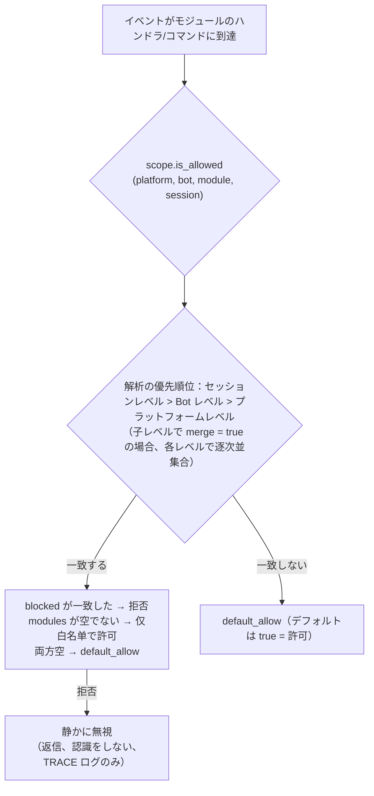

- **解析の優先順位：セッションレベル > Bot レベル > プラットフォームレベル**。高優先度のバインディングは低優先度を**全体的に上書き**します。  
  子レベルのバインディングで `merge = true` と指定した場合、低優先度のバインディングと**各項目の並集合**になります（modules / blocked はそれぞれ独立にマージされ、`merge` 自体は制御キーとして扱われ、項目としてはカウントされません）。
- **静かに無視の意味**：フィルタリングされたモジュールのコマンドやハンドラは、トリガーされず、返信や認識もされません（コマンド間の誤一致を防ぐため）。TRACE レベルのログのみ (`core.scope.denied`) に表示されます。
- **フレームワークレベルのハンドラ**（`scope_exempt=True` または owner が空）は影響を受けません。モジュール名が空（フレームワーク層のリソース）の場合は、常に許可されます。
- **セッション感知のヘルプとコマンド検索**：コマンド検索 API（`command.help` / `get_command` / `get_commands` / `get_group_commands` / `get_visible_commands`、および `module.get_commands_overview`）は、オプションで `event=` または明示的な `platform=` / `bot_id=` / `session_id=` キーワードをサポートします。現在のセッションで利用できないモジュールのコマンドは、結果に含まれなくなります（`get_command` は None を返し、単一コマンドのヘルプは「未登録」として扱われ、静かに無視の動作と一致します）。コンテキストを指定しない場合は、全量の動作を維持します。

### バインディングの継承（merge）

デフォルトでは、全体を上書きする動作が明確で予測可能です。上位レベルのバインディングに**追加**したい場合は、子レベルで `merge = true` を指定します：

```toml
[ErisPulse.scope.platforms.onebot11]
modules = ["Chat", "Tool"]      # プラットフォームレベル：Chat、Tool を許可

[ErisPulse.scope.bots.onebot11."123456"]
modules = ["Music"]
merge = true                    # この Bot で実際の有効なモジュールは ["Chat", "Tool", "Music"] になります
```

- **マージのルール**：`modules` と `blocked` はそれぞれ**並集合**をとります。バインディング内では `blocked` は `modules` よりも優先されます。
- **連鎖的なマージ**：プラットフォーム → Bot → セッションの順に各レベルで独立して `merge` または上書きが決定されます。

## ② 身元次元（イベントの受付）

「誰のイベントを受け取るか」を回答します。拒否されたイベントは**配信の入口で完全に破棄**されます——
ミドルウェアや任意のハンドラ（フレームワークレベルも含む）には一切渡らず、TRACE レベルのログでのみ確認できます（`core.scope.identity_denied`）。

- **解析優先度：ユーザー > 会話 > Bot > アダプタ**、最も具体的に設定された戦略が優先されます。`deny` は `allow` より優先されます
- 各階層のバインディングは二元的な戦略です：`{ allow = true }` または `{ deny = true }`
- ユーザーのキーには glob / 正規表現がサポートされています（例：`"spam_*"` で一括的にスパムユーザーをブロック）
- 一般的な使い方——上位階層で `deny`、個別に `allow` で「例外として許可」する：

```toml
[ErisPulse.scope.identity.adapters.onebot11]
deny = true
[ErisPulse.scope.identity.users.onebot11]
allow = ["u_admin"]   # アダプタ階層で拒否されても、u_admin のイベントは許可されます
```

## ③ 出站次元（制限モジュールが発信する呼び出しを制限）

制約モジュールが**発信する出站動作**：メッセージ送信 / 標準 API 動作 / 要求操作。  
三つの動作はそれぞれ下層の DSL に対応する：`Event.reply` と `Send`（send）、`Api` / `call_api`（api）、  
`Request` の accept/reject（request）。モジュールがイベントハンドラ実行中に発信する呼び出しは  
モジュールの所有者（owner）を含み、この次元が一括して判定する。

### 規則の形態（インライン表）

各動作の規則はインライン表である：`{ allow = [...], deny = true|[...] }`。  
同一の動作には一つの規則しか設定できない（TOML のキーは重複不可、全禁止と細粒度の二択）：

```toml
[ErisPulse.scope.actions.MyModule]
send = { deny = true }                                  # 全ての送信を禁止（Event.reply / Send DSL）
# またはメソッドレベルの細粒度設定：send = { allow = ["Text", "Image*"], deny = ["File"] }
api = { allow = ["get_*"] }                             # 一部の標準 API 動作のみを許可
# または動作レベルのブラックリスト：api = { deny = ["set_*", "leave_*"] }
request = { deny = true }                               # 要求の accept/reject を禁止
```

- `send` の条目は**送信メソッド名**（`Text` / `Image` / `File` ...）と一致する。
- `api` の条目は**標準動作名**（`get_group_info` / `set_group_name` ...）と一致する。
- 条目は正確な名前 / glob / `re:` 正規表現（全システムで共通の構文で、大文字小文字は区別しない）をサポート。
- `allow` に単一の文字列を記述することも可能で、これは単一の条目リストと同等である：`send = { allow = "Text" }`

### 判定の意味

**デフォルトはすべて許可**——設定がなければ、または owner が空（フレームワーク層の内部呼び出し）の場合は許可される。  
設定された規則に従って以下の順序で判定する：

1. `deny = true` → 拒否
2. `deny` リストに呼び出し名が一致 → 拒否
3. `allow` リストが空でないかつ呼び出し名が一致しない（または呼び出しに名前がない）→ 拒否
4. その他の場合は許可

拒否された呼び出しはネットワークリクエストを発生させず、直接標準の失敗レスポンスを返す。  
（`retcode = 34601`、詳細は [api-response §5.3](../standards/api-response.md#53-フレームワーク拡張返却コード34xxx-プラットフォームエラーセグメントの下3桁を独自に定義) を参照）。  
三つの動作は互いに独立しており、そのうち一つだけを制限することも可能。

```python
# 実行時 API
sdk.scope.set_action("MyModule", "send", deny=True)              # 全てのメッセージ送信を禁止
sdk.scope.set_action("MyModule", "send", allow=["Text"])         # テキストのみ送信を許可
sdk.scope.is_action_allowed("MyModule", "send", name="Image")    # False
sdk.scope.is_action_allowed("MyModule", "api", name="get_user_info")  # 規則に従って判定
sdk.scope.delete_action("MyModule", "send")                      # 許可を復元
sdk.scope.get_action("MyModule", "send")                         # その動作の現在の規則を取得
```

## 実行時 API

スコープの実行時 API は 3 層に分かれています：**判定**（3 つの質問）、**次元化された読み書き**（各次元ごとの `set` / `get` / `delete` パラメータ化メソッド、全タイプ注釈付き、IDE による補完可能）、**辞書式のデフォルト**（ドット区切りのパスで任意のセクションに直接アクセス）。

```python
from ErisPulse import sdk

scope = sdk.scope
```

### 判定（3 つの質問）

```python
scope.is_allowed("onebot11", "123456", "Chat")                 # ① モジュール次元
scope.is_allowed("onebot11", "123456", "Chat", "789012345")    # 会話レベルを含む
scope.is_allowed("onebot11", "123456", None)                   # フレームワーク層のリソース -> True

scope.is_identity_allowed("onebot11", "123456", "group_9", "u1")   # ② 身份次元

scope.is_action_allowed("MyModule", "send")                    # ④ 出力次元
scope.is_action_allowed("MyModule", "send", name="Image")      # メソッドレベルの細分化
```

### ① モジュール次元

```python
# バインド（パラメータによって階層が決まる：session_id > bot_id > プラットフォームレベル）
scope.set_module("onebot11", bot_id="123456", modules=["Chat", "Tool*"])
scope.set_module("onebot11", blocked=["re:^Danger"])                       # プラットフォームレベル
scope.set_module("onebot11", bot_id="123456", session_id="g9", modules=["Chat"])  # 会話レベル
scope.set_module("onebot11", bot_id="123456", modules=["Music"], merge=True)      # 既存のエントリと併合
scope.set_module("onebot11", bot_id="123456", modules=["Chat"], persist=False)    # 実行時のみ

# 読み取り / 削除
scope.get_module("onebot11", bot_id="123456")   # {"modules": ["Chat"], "blocked": []}
scope.delete_module("onebot11", bot_id="123456")
```

> `merge=True` は**書き込み時の併合**（該当レベルの既存のバインドとエントリを併合）です。階層間の解析期の `merge = true` 設定キーは上記の[バインド継承](#binding-inheritance-merge)を参照してください。これらは独立したメカニズムです。

### ② 身份次元

```python
# バインド戦略（パラメータによって階層が決まる：user > session > bot > adapter；allow / deny のどちらかを選択）
scope.set_identity("onebot11", user_id="u_bad", deny=True)
scope.set_identity("onebot11", user_id="spam_*", deny=True)    # キーは glob / re: 正規表現をサポート
scope.set_identity("onebot11", bot_id="123456", session_id="g9", allow=True)

# 読み取り / 削除
scope.get_identity("onebot11", user_id="u_bad")   # {"deny": True}
scope.delete_identity("onebot11", user_id="u_bad")
```

### ③ 出力次元

```python
# 制限ルールの設定（allow: str|list; deny: bool|str|list; 全ルールの置換）
scope.set_action("MyModule", "send", deny=True)                    # 全ての送信を禁止
scope.set_action("MyModule", "send", allow=["Text"])               # 送信可能なのはテキストのみ
scope.set_action("MyModule", "api", deny=["set_*", "leave_*"])     # 管理系 API を禁止

# 読み取り / 削除
scope.get_action("MyModule", "send")       # {"allow": ["Text"]} 原始的なルール
scope.delete_action("MyModule", "send")    # 単一のアクションを削除
scope.delete_action("MyModule")            # モジュール全体のアクション制限を削除
```

### 一般

```python
scope.get("platforms")   # 辞書式のデフォルト：ドット区切りのパスで任意のセクションを読み取り
scope.topology()         # 全量の設定ツリー（ダッシュボード用）
scope.stats()
# {"module_calls": .., "module_filtered": .., "identity_checks": .., "identity_denied": ..,
#  "action_checks": .., "action_denied": .., "cache_hits": .., "cache_misses": ..}
scope.reset_stats()
scope.clear()           # 全ての設定をクリア（メモリ内でのみ有効）
```

### 高度：辞書式のドット区切りパスによるデフォルト

次元化されたメソッドは日常的なシナリオをカバーします。任意のノードに直接アクセスする必要がある場合（または将来追加される次元）には、辞書式の API を使用できます。`get` / `set` / `delete` はドット区切りのパスを受け取り、辞書の深いマージと即時読み取りを提供し、`scope[path]` / `scope[path] = v` / `del scope[path]` / `path in scope` のプロトコルを提供します：

```python
scope.set("bots.onebot11.123456", {"modules": ["Chat"], "blocked": []})
scope.set("identity.users.onebot11.u_bad", {"deny": True})
scope.get("actions.MyModule.send")

scope["platforms.onebot11"]        # 読み取り（存在しない場合は KeyError を送出）
scope["platforms.onebot11"] = {...}  # 書き込み
del scope["platforms.onebot11"]      # 削除
"actions.MyModule" in scope          # 存在確認
```

## キャッシュとホットアップデート

- `is_allowed` / `is_identity_allowed` / `is_action_allowed` の結果は **LRU キャッシュ**を付与
  （`scope.cache_size` で調整可能）、`set` / `delete` /
  設定のホットアップデート（`config.updated` / `config.set`）で自動的に無効化
- すべての次元の設定は**即座に有効**となり、再起動は不要
- スコープは「イベントごとに」判断し、イベント間で記憶しない：設定が変更されると、次のイベントから新しいルールに従う

## 設定形式の検証

ロード時およびホットアップデート時に、設定の形式をセクションごとに検証します。型が間違ったセクション（例：`platforms` が文字列として記述されている場合）、不正なアウトバウンドルール（例：`allow` が数値として記述されている場合）、不明なアクション名、不明なトップレベルのキー（例：`alow` がスペルミスされている場合）は、**WARNING** を出力し、対応するセクション／項目は無視されます。それ以外の有効な設定は通常通り有効になります。誤って書いた設定が静かに無効になることはなくなります。

## 一般的質問と注意事項

### 1. 設定の階層と上書き

- モジュール次元：セッションレベル > Bot レベル > プラットフォームレベル、**全体的な上書き**（子レベルで `merge = true` の場合、各項目を並列に結合）。
  「プラットフォームで Chat が許可され、Bot で Music を追加したい」場合は、Bot レベルで `merge = true` を設定するか、両方をリストアップする。
- 身元次元：ユーザー > セッション > Bot > アダプタ、**最も具体的**な設定されたポリシーを適用（例外として許可することも可能）。
- コマンドのユーザーのブラックリスト/ホワイトリスト：正確なコマンド名は glob キーに優先する（`event.command.acl` を参照）。

### 2. モジュール/コマンドが反応しない場合

モジュール自体ではなく、作用域を最初に疑う：

```python
from ErisPulse import sdk

print(sdk.scope.is_allowed(event.get_platform(), bot_id, "MyModule", session_id))
print(sdk.scope.is_identity_allowed(event.get_platform(), bot_id, session_id, user_id))
print(sdk.scope.stats())   # module_filtered / identity_denied > 0 なら、静かにフィルターされたことを示す
```

フィルターは**静かに**行われる（モジュール次元と身元次元では返信しない、ルールを暴露しないようにする）、しかし統計は蓄積される。
コマンド次元で ACL によって拒否された場合は、「権限不足」という明示的な返信が行われる。

### 3. 出力アクションが拒否された場合のトラブルシューティング

```python
from ErisPulse import sdk

print(sdk.scope.get("actions.MyModule"))
print(sdk.scope.stats())   # action_denied > 0 なら、呼び出しがブロックされたことを示す
```

ブロックは**明示的**に行われる：拒否された呼び出しは `retcode = 34601` の標準的な失敗応答を返す（ネットワークリクエストは発生しない）。

### 4. セッション識別子のプラットフォーム間の隔離

`(platform, session_id)` の組み合わせが唯一の識別子である。`scope.sessions.onebot11."789"` は onebot11 でのみ有効で、telegram 上で同じ `789` のセッションには影響しない。身元次元のユーザーのキーも同様である。

## 拓扑ツリー API

`ModuleManager.get_topology()` および `AdapterManager.get_topology()` は、モジュール/アダプターの所属関係データを提供します。  
`sdk.get_topology()` は、スコープを含むデータを一括して取得します。

```python
from ErisPulse import sdk

topology = sdk.get_topology()
# {
#   "modules": {                                   # モジュール → 所有するリソース
#     "Chat": {
#       "loaded": True, "enabled": True,
#       "commands": ["chat", "translate"],
#       "handlers": {"message": 2, "notice": 1},
#       "routes": {"http": ["/Chat/api"], "ws": [], "sse": []},
#       "lifecycle_hooks": 3,
#     }
#   },
#   "adapters": {                                  # アダプター → Bot → スコープ
#     "onebot11": {
#       "status": "started", "enabled": True,
#       "bots": {"123456": {"status": "online", "scope": {...}}},
#       "scope": {"modules": [...], "blocked": [...]},
#     }
#   },
#   "scope": {                                     # スコープ（モジュール / アイデンティティ / 出力アクション）
#     "platforms": {...}, "bots": {...}, "sessions": {...},
#     "identity": {"adapters": {...}, "bots": {...}, "sessions": {...}, "users": {...}},
#     "actions": {...},
#   },
# }
```

- モジュールのトポロジーは、登録されたコマンド、イベントハンドラー、HTTP/WS/SSEルート、およびライフサイクルフックを統合し、モジュールリソースツリーの描画に便利です。
- アダプターのトポロジーは、各アダプターのステータス、所属するBotのステータス、およびプラットフォームレベル/Botレベルのスコープバインディング（モジュール次元）を統合します。


### 归属权（owner）系统

# 所有者（owner）システム

所有権は、モジュールの「プラグインアンドプレイ」の基盤です。モジュールが読み込まれる際に登録されるフレームワークリソースはすべて自動的に所有者に記名され、モジュールのアンロード/無効化時に所有者に基づいて一括で回収されます。モジュールの作者はリソースを宣言するだけで、手動でクリーンアップロジックを書く必要はありません。

> **関連システム**：スコープはイベント配信時に「リソースが有効かどうか」を決定し、所有権はライフサイクル中に「リソースが誰に属するか、誰がアンロード時に回収されるか」を決定します。  
> スコープの詳細は[統一制御面（scope）](scope.md)を参照してください。バックグラウンドタスクの詳細は[ライフサイクル管理](lifecycle.md#バックグラウンドタスクの所有と自動キャンセル)を参照してください。

{!--< tips >!--}
1. 所有権は**登録の瞬間**に `current_owner` に基づいて自動的に記録され、モジュールのコードに変更は一切不要です。
2. アンロード/無効化は同じクリーンアップチェーン（`_cleanup_module_registrations`）を使用し、各ステップで失敗しても警告のみで中断はしません。
3. ユーザー設定のリソース（永続化オーバーライド / スコープルール / コマンドACL）は、モジュールのアンロード時にクリーンアップされません。
{!--< /tips >!--}

## owner コンテキストメカニズム

owner は、コンテキスト変数 `current_owner` を介して `ErisPulse.runtime.context` に渡されます：

```python
from ErisPulse.runtime import owner_scope, get_current_owner

with owner_scope("MyModule"):
    # このスコープ内に登録されたすべてのリソースは自動的に MyModule に属します
    assert get_current_owner() == "MyModule"
```

フレームワークは、以下のタイミングで自動的に owner を注入します（モジュールやアダプターのコードで手動でラップする必要はありません）：

| 時点 | owner 値 | 位置 |
|------|----------|------|
| モジュール `load()` | モジュール名 | インスタンス化 + `on_load` 全体 |
| アダプター `start()` / `restart()` | プラットフォーム名 | アダプター起動全体 |
| `activate_on` ラグジュアリスタブ登録 | モジュール名 | 占位コマンド/ハンドラの登録 |
| イベントハンドラ実行中 | ハンドラ所属モジュール名 | handler / コマンドエントリポイントの再注入 |

実行中の再注入とは、モジュールが `on_load` で宣言したコマンドハンドラが**実行中**に登録型 API（例：`sdk.adapter.on()`、`overrides.*.set(persist=False)`）を呼び出す場合、それらも自動的にこのモジュールに属することを意味します。

## 所属リソースの概要

モジュールがロードコンテキスト内で登録した以下のリソースはすべて所有者として記録され、アンロード/無効化時に自動的にリソースを回収します。

| リソース | 登録方法 | クリーンアップ呼び出し |
|------|----------|----------|
| コマンド | `@command()` / コマンド dict 宣言 | `command.unregister_by_owner()` |
| イベントハンドラ | `@message` / `@notice` / `@request` / `@meta` | `handler.unregister_by_owner()` |
| アダプタイベントリスナー | `sdk.adapter.on()` / `raw=True` | `adapter.unregister_handlers_by_owner()` |
| アダプタミドルウェア | `@sdk.adapter.middleware` | 同上 |
| ルーティング（HTTP/WS/SSE） | `router.http()` / `websocket()` / `sse()` | 名前空間 + owner による二重保証 |
| ルーティングミドルウェア | `@router.middleware()` / `add_middleware()` | `router.unregister_all_by_owner()` |
| Dashboard ホームエントリ | `router.register_home_entry()` | `unregister_home_entries_by_owner()` |
| 自作セッションタイプ | `register_custom_type()` | `unregister_custom_types_by_owner()` |
| バックグラウンドタスク | `self.spawn()` | `cancel_owner_tasks()` |
| ライフサイクルフック | `lifecycle.register()` | `lifecycle.unregister_by_owner()` |
| 主人身源プロバイダ | `master.provider` | `master.unregister_by_owner()` |
| i18n 翻訳キー | `I18nClass` 宣言（domain=モジュール名） | `i18n.unregister_domain()` |
| イベントオーバーライド（実行時） | `overrides.*.set(persist=False)` | `overrides.unregister_by_owner()` |
| 交互セッション（wait_reply 等待 / リース） | `event.wait_reply()` / `sdk.interaction.acquire()` | `interaction.cancel_by_owner()`（待機側は即時キャンセル受信） |
| コンテキストデータ | `runtime/context` は owner ごとに記録 | モジュール単位で正確にクリーンアップ |

アダプタ側の対応するリソース（プラットフォーム名を owner とする）は、アダプタの `shutdown()` / `restart()` 時に `_cleanup_adapter_resources` によって回収され、以下も含まれます：

| リソース | クリーンアップ呼び出し |
|------|----------|
| アダプタ独自の `on()` ハンドラとミドルウェア | `adapter.unregister_handlers_by_owner(platform)` |
| プラットフォームイベントメソッド拡張（`EventMixin`） | `unregister_platform_event_methods(platform)` |
| 自作セッションタイプ | `unregister_custom_types_by_owner(platform)` |
| 交互セッション（該当プラットフォームで保留中の wait_reply / リース） | `interaction.cancel_by_platform(platform)` |
| i18n 翻訳ドメイン（domain=設定キー） | `i18n.unregister_domain(設定キー)` |
| 細粒度の名前空間ルーティング | `router.unregister_all_by_owner(platform)` |

## 卸載/無効化のクリーンアップシーケンス

`unload()` および `disable()` は、同じクリーンアップチェーンを使用します（各ステップで個別に try/except を使用し、失敗してもログに記録され、**後続のクリーンアップを中断しません**）：

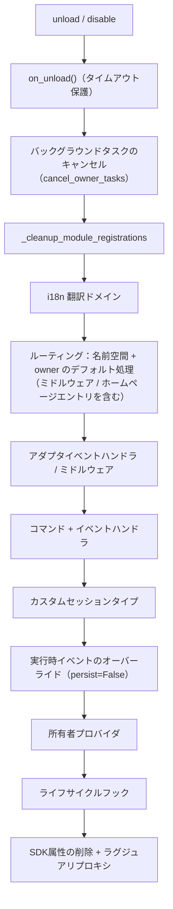

`sdk.uninit()` で終了する際には、以下のグローバルなデフォルト処理が追加されます：すべてのアダプタのシャットダウン → すべてのモジュールの unload → `router.stop()`（ルーティング/ミドルウェア/ホームページエントリのクリア）→ `cancel_all_background_tasks()` → イベントハンドラおよびフックのクリア。

## 設計の境界：アンインストール時にクリーンアップされないリソース

所有権は**モジュールコードが登録したランタイムリソース**のみを回収します。以下のリソースは**ユーザーの設定の意味**（制御権はユーザーにあり、意図的に設定している可能性がある）に属し、モジュールのアンインストール後も設定に従って永続的に保持されます：

| リソース | 意味 | 説明 |
|------|------|------|
| `overrides.*.set(persist=True)` | 永続化されたオーバーライド | 設定ファイルに書き込まれ、再起動後に有効。モジュールのアンインストール時に削除されない（ユーザーが明示的に設定） |
| `scope.set_action()` などのスコープルール | 権限制御面 | ユーザー/Dashboard によって管理され、モジュールのアンインストール時にルールは回収されない |
| `overrides.acl.set(persist=True)` | コマンド ACL | 上記と同じ |
| Conversation `save()` による永続化 | 複数回の対話の保存 | データ資産はクリーンアップされない |

ランタイムに一時的に書き込まれたもの（`persist=False`）は、所有者に従って回収されます。**永続化の有無が「ユーザーの資産」と「モジュールのランタイム状態」の境界線です**。

## モジュール開発者ガイド

### 推奨される書き方

```python
from ErisPulse import sdk
from ErisPulse.Core.Event import command
from ErisPulse.runtime import owner_scope, spawn_background

class MyModule(BaseModule):
    async def on_load(self, event):
        # フレームワークリソース：自動帰属、手動クリーンアップ不要
        self.task = self.spawn(self.polling())      # バックグラウンドタスク
        sdk.router.register_home_entry("私のモジュール", "/my")  # ホームページエントリ

        # モジュール独自リソース：owner_scope に包むことで帰属体系に組み込む
        with owner_scope("MyModule"):
            self.client.on_event(self._handle)      # 仮想のカスタム登録

    async def on_unload(self, event):
        # フレームワークリソースは自動回収済み、owner_scope がカバーしない独自リソースのみクリーンアップ
        await self.client.close()
```

### 注意事項

- **import 時の登録は帰属対象外**：モジュールの最上層（import 時）に登録されたフック/ハンドラーは
  `owner_scope` より前に行われ、フレームワークレベルのリソース（owner=None）として扱われ、**クリーンアップされません**。
  すべて `on_load()` 内で登録してください。
- **カスタム domain の i18n 登録**：`i18n.register(domain=...)` の domain がモジュール名と異なる場合、自動回収されません。domain=モジュール名を維持してください。
- **バックグラウンドタスクは必ず self.spawn() を使用**：裸の `asyncio.create_task` はモジュールに帰属せず、アンロード時にキャンセルされません（詳細は[ライフサイクル管理](lifecycle.md#バックグラウンドタスクの帰属と自動キャンセル)を参照）。
- クリーンアップの「失敗は警告のみ」：1ステップのクリーンアップで異常が発生しても、他のリソースの回収は妨げられません。デバッグ/警告レベルのログで確認でき、トラブルシューティング時には TRACE を有効にしてください。


### 启动流程与手动控制

# スタートフローと手動制御

ErisPulse の `await sdk.run()` / `await sdk.init()` は、一連のスタートフローを「一行のコード」に抽象化しています。しかし、部分的な読み込み、動的な登録、ホットプラグ、カスタムロード戦略の注入など、完全にカスタマイズしたスタートフローが必要な場合は、このフローの内部で何が起こっているのか、そして各ステップをどのように手動で駆動するのかを理解する必要があります。

本文では、スタートフローを個々のステップに分解し、それぞれの役割と呼び出し順序を説明します。また、手動で完全にスタートさせるための例も示します。

> 本文では、[最初のロボット](../getting-started/first-bot.md)を実行済みと仮定し、`sdk.run(keep_running=True/False)` の 2 つのモードについて理解している前提でいます。本文では、`init()` の**内部**のフローの分解、および `init()` / `init_task()` / `init_sync()` などのより下層のエントリーポイントに焦点を当てます。

## SDK トップレベルのエントリーポイント一覧

`run()` の 2 種類の `keep_running` モードに加えて、SDK はいくつかのより低レベルの初期化エントリーポイントを提供しています。これらの違いは、**非同期性、戻り値、および例外のラッピング有無**にあります。

| エントリーポイント | 非同期性 | 戻り値 | 例外処理 | 適用される場面 |
|------|--------|--------|----------|----------|
| `await sdk.run(True)` | async、ブロッキングして維持 | `None`（終了時に自動 `uninit`） | モジュール/アダプターのエラーは捕捉され、プロセスをクラッシュさせない | ボット専用アプリケーション |
| `await sdk.run(False)` | async、ブロッキングしない | `None`（自動リリースしない） | 同上 | 初期化後にカスタムロジックを実行する |
| `await sdk.init()` | async、awaitが必要 | `bool` | 内部でコンポーネントの例外を捕捉し、失敗時は `False` を返す | 手動でライフサイクルを制御（`uninit()` と併用） |
| `sdk.init_task()` | async、Task を返す、ブロッキングしない | `asyncio.Task` | `init()` と同じ | 別の初期化処理を並行実行する、またはイベントループがまだ実行されていない場合 |
| `sdk.init_sync()` | **同期**、現在のスレッドをブロッキング | `bool` | `init()` と同じ | コマンドラインスクリプト、イベントループのない同期エントリーポイント |

> **よくある誤解**：`await sdk.init()` は `await sdk.run(keep_running=False)` と**等価ではありません**。2 つの違いがあります：① `init()` は `bool` を返します（失敗時は `False`）、`run()` は `None` を返します；② `init()` は初期化のみを行い、**自動リリースはしません**、`run()` はイベントループの終了時に自動で `uninit()` を呼び出します。したがって、手動でリリースやカスタムライフサイクルを制御する必要がある場合は、`init()` と `uninit()` を併用してください。

## 鍵路の起動概要

`sdk.init()`（正確にはその内部の `Initializer.init()`）は、以下のようにフレームワーク全体を起動します。

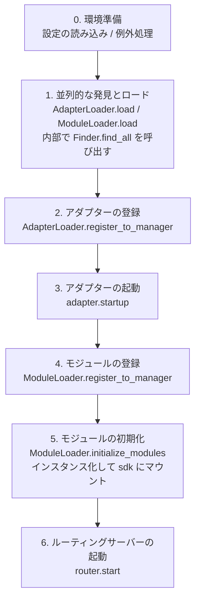

対応するコアコンポーネント：

| 層 | コンポーネント | 機能 |
|----|------|------|
| 発見 | `AdapterFinder` / `ModuleFinder` | インストール済みパッケージの entry-points から**発見**する |
| ロード | `AdapterLoader` / `ModuleLoader` | 発見 + インポート + メタデータの読み取り + 有効/無効の判定を行い、オブジェクトのリストを返す |
| 登録 | `*Loader.register_to_manager` | オブジェクトを対応するマネージャーに登録する |
| 管理 | `sdk.adapter` / `sdk.module` | アダプターやモジュールのインスタンスを管理し、起動/停止のインターフェースを提供する |
| 初期化 | `ModuleLoader.initialize_modules` | モジュールのインスタンスを作成し、`sdk` にマウントする（依存関係のトポロジカルソートを処理する） |
| ルーティング | `sdk.router` | HTTP / WebSocket サーバー |

> **重要**：`Finder` と `Loader` は2つの層です。`Loader` は内部で**既に** `Finder` を保持しています（`AdapterLoader` は `AdapterFinder` を内蔵し、`ModuleLoader` は `ModuleFinder` を内蔵しています）。ほとんどの場面では `Loader` を使用するだけで十分です。"インポートせずにリストアップする"必要がある場合にのみ、`Finder` を個別に使用します。

## 各環節の詳細解説

### 1. 探索層：Finder

Finder は「どのパッケージがアダプター/モジュールを提供しているか」を見つけるだけの役割を持ち、インポートやインスタンス化は行いません。

```python
from ErisPulse.finders import AdapterFinder, ModuleFinder

adapter_finder = AdapterFinder()
module_finder = ModuleFinder()

# すべてのインストール済みのアダプター/モジュールエントリポイントを検索
adapter_entries = adapter_finder.find_all()    # list[EntryPoint]
module_entries = module_finder.find_all()      # list[EntryPoint]

# 名称で個別に検索
entry = module_finder.find_by_name("MyModule")  # EntryPoint | None
```

各 `EntryPoint` は `.load()` を呼び出すことで対応するクラスを得られますが、通常は手動で呼び出す必要はありません。Loader が自動的に行います。

### 2. 加載層：Loader

Loader は Finder をベースに「インポート + メタデータの読み込み + 有効/無効の判定」を行います。

```python
from ErisPulse.loaders import AdapterLoader, ModuleLoader
from ErisPulse import sdk

adapter_loader = AdapterLoader()
module_loader = ModuleLoader()

# load() 内部：finder.find_all() を呼び出し → 各エントリポイントを順次処理 → 三つ組を返す
adapter_objs, enabled_adapters, disabled_adapters = await adapter_loader.load(sdk.adapter)
module_objs, enabled_modules, disabled_modules = await module_loader.load(sdk.module)
```

`load()` が返す三つ組：

| 戻り値 | 意味 |
|--------|------|
| `objs` (`dict`) | 名称 → オブジェクト（アダプタークラス / モジュールラッパー） |
| `enabled` (`list[str]`) | 有効化された名称（設定で無効化されていない） |
| `disabled` (`list[str]`) | 無効化された名称 |

#### 加載失敗時の診断情報

モジュール/アダプターが加載または初期化段階で例外を投げた場合、フレームワークはそのコンポーネントをスキップして他のコンポーネントの加載を継続し、**ユーザーのコードフレームの要約**を出力します。これにより、デフォルトの INFO レベルでもエラー箇所を特定でき、手動で DEBUG モードを有効化する必要がありません。

```
[ERROR] [ModuleLoader] entry-point からモジュール MyModule の加載に失敗しました。スキップしました: 'NoneType' object has no attribute 'platform'
  → MyModule/Core.py:42 in on_load
      adapter = sdk.platform
  → AttributeError: 'NoneType' object has no attribute 'platform'
  → ヒント: ログレベルを DEBUG に上げると完全なスタックトレースが表示されます。モジュール MyModule の実装コードを確認してください。
```

診断情報は `ErisPulse.runtime.diagnostics` モジュールによって生成され、フレームワーク内部のフレームは自動的にフィルタリングされ、ユーザーのコードフレームのみが残されます。カスタム加載ロジックで再利用する場合：

```python
from ErisPulse.runtime import log_diagnostic

try:
    risky_init()
except Exception as e:
    log_diagnostic(e)  # ユーザーコードフレームを自動的に抽出し、ERROR ログに記録
```

このモジュールには `extract_user_frame()`（構造化されたフレーム情報を返す）と `format_diagnostic_block()`（複数行のテキストを返す）という2つの低レベル関数も提供されています。

### 3. 登録層：register_to_manager

Loader が出力したオブジェクトをマネージャーに登録し、`sdk.adapter` / `sdk.module` がそれらを認識できるようにします。

```python
# アダプターの登録（すべて成功した場合に True を返す）
await adapter_loader.register_to_manager(enabled_adapters, adapter_objs, sdk.adapter)

# モジュールの登録
await module_loader.register_to_manager(enabled_modules, module_objs, sdk.module)
```

登録後、アダプターはアダプターマネージャーに、モジュールはモジュールマネージャーに登録されますが、**まだ起動/インスタンス化は行われていません**。

### 4. アダプターの起動

```python
# すべての登録済みアダプターを起動
await sdk.adapter.startup()
# 特定のプラットフォームを指定
await sdk.adapter.startup("yunhu")
await sdk.adapter.startup(["yunhu", "telegram"])
```

> 登録 ≠ 起動。`register_to_manager` は単に登録するだけです。`startup` がアダプターの `start()` を呼び出し、プラットフォームとの接続を確立します。

### 5. モジュールの初期化

モジュールはアダプターに比べて1段階多く、**インスタンス化**して `sdk` にアタッチする必要があります（これにより `sdk.MyModule.xxx` で呼び出せるようになります）。この段階では、モジュール間の依存宣言とトポロジカルソートも処理されます。

```python
success = await module_loader.initialize_modules(
    enabled_modules, module_objs, sdk.module, sdk
)
```

インスタンス化が成功すると、モジュールは `sdk.<ModuleName>` に登録されます。

### 6. ルーティングサーバーの起動

```python
await sdk.router.start(
    host="0.0.0.0",
    port=8000,
    ssl_certfile=None,
    ssl_keyfile=None,
)
```

ルーティングサーバーは、アダプターからの Webhook / WebSocket コールバックを受信します。このサーバーを起動しないと、server モードのアダプターはメッセージを受け取れません。

## 完全な手動起動の例

以下のコードは `await sdk.init()` のコアプロセスと**同等**ですが、各ステップが明示的に公開されており、任意の段階でカスタムロジックを挿入できます：

```python
import asyncio
from ErisPulse import sdk
from ErisPulse.loaders import AdapterLoader, ModuleLoader

async def manual_startup():
    # 0. 環境の準備（設定のロード、グローバル例外処理の登録）
    #    _prepare_environment は init() 内部の前置ステップです。手動プロセスでも最初に呼び出す必要があり、
    #    そうでなければ Loader は設定を読み取れず、すべてのアダプタ/モジュールを無効と誤認します。
    if not await sdk._prepare_environment():
        print("環境準備に失敗しました")
        return False

    # 1. ローダーの作成（内部でそれぞれ Finder を保持）
    adapter_loader = AdapterLoader()
    module_loader = ModuleLoader()

    # 2. 並行的な発見とロード（init() 内部と同じ gather を使用）
    (adapter_objs, enabled_adapters, disabled_adapters), \
    (module_objs, enabled_modules, disabled_modules) = await asyncio.gather(
        adapter_loader.load(sdk.adapter),
        module_loader.load(sdk.module),
    )

    # 3. アダプタの登録
    await adapter_loader.register_to_manager(
        enabled_adapters, adapter_objs, sdk.adapter
    )

    # 4. アダプタの起動
    if enabled_adapters:
        await sdk.adapter.startup()

    # 5. モジュールの登録
    await module_loader.register_to_manager(
        enabled_modules, module_objs, sdk.module
    )

    # 6. モジュールの初期化（インスタンス化 + sdk にマウント）
    if enabled_modules:
        await module_loader.initialize_modules(
            enabled_modules, module_objs, sdk.module, sdk
        )

    # 7. ルーティングサーバーの起動
    await sdk.router.start(host="0.0.0.0", port=8000)

    print("手動起動完了")
    return True

async def main():
    ok = await manual_startup()
    if ok:
        # 実行を維持するためのブロッキング（手動プロセスでは自動的にブロックされません）
        await asyncio.Event().wait()

if __name__ == "__main__":
    asyncio.run(main())
```

### 手動起動が必要な場面

ほとんどの場合、手動起動は必要ありません。`await sdk.run()` は上記のすべてをすでに処理しています。手動起動は以下のケースでのみ価値があります：

- **部分的なロード**：指定されたアダプタ/モジュールのみをロードし、他のものはスキップ
- **動的登録**：実行時に条件に応じて新しいアダプタ/モジュールを登録
- **カスタム順序**：デフォルトのロード順序を変更したい場合（例：特定のモジュールを先に起動してからアダプタを起動）
- **注入戦略**：Loader にカスタムの厳格モードマネージャーやロード戦略などを注入
- **デバッグ/診断**：特定の段階で失敗した際に、手動でプロセスを進め問題を特定

## 実行時細粒度制御

`sdk.run()` を使用して起動した後でも、SDK 全体を再起動することなく、実行時に個々のサブシステムを個別に制御できます。

### アダプタのホット起動・停止

```python
# 接続の修復など、特定のアダプタをホットリスタート（他のプラットフォームには影響しない）
await sdk.adapter.shutdown("yunhu")
await sdk.adapter.startup("yunhu")

# 実行中に新しいプラットフォームを起動
await sdk.adapter.startup("telegram")

# 一時的に特定のプラットフォームをオフラインにする
await sdk.adapter.shutdown("telegram")
```

> `adapter.startup()` は、アダプタが**管理者に登録されている**ことを前提としています。登録は `init()`/`run()` の内部で行われるため、起動**後**の細粒度制御となります。

### ルーター・サーバー

```python
# 一時的に webhook サーバーをオフラインにする
await sdk.router.stop()

# 再度起動（たとえばポートを変更した場合）
await sdk.router.start(host="0.0.0.0", port=9000)
```

### モジュールのオンデマンドロード

```python
# モジュールを手動でロード（遅延ロードされる可能性のあるモジュール）
await sdk.load_module("MyModule")
```

## エレガントなシャットダウン

2.7.0 以降、`sdk.shutdown()` は**プログラムによるエレガントなシャットダウン**を提供します。シャットダウンイベントを設定し、`await sdk.run(keep_running=True)` で待機中のメインループが戻り、`uninit()` が実行されてリソースのクリーンアップが完了します。

```python
# 任意のコルーチン内で呼び出すことで、エレガントな終了をトリガー（run() は待機から戻り、自動的に uninit() が実行される）
sdk.shutdown()
```

典型的な用途：

```python
async def shutdown_after_idle():
    await asyncio.sleep(3600)
    sdk.shutdown()  # 空き状態が1時間続いたらエレガントに終了
```

**シグナル処理**：`run()` 内部では `SIGTERM` / `SIGHUP` ハンドラが登録され、システムシグナルをエレガントなシャットダウンに変換します。これにより、コンテナオーケストレーション（Docker `docker stop`）や `systemd` でサービスを停止した場合、プロセスは強制終了されるのではなく、`uninit()` のクリーンアップを完了します。

- Windows では `loop.add_signal_handler` がサポートされていないため、シグナルハンドラは自動的にスキップされます（`sdk.shutdown()` または Ctrl+C でシャットダウンをトリガーできます）
- `sdk.shutdown()` を繰り返し呼び出しても安全です（イベントが設定された後は、再度呼び出しても無操作になります）

## アンインストールの手順

初期化の逆の操作は `await sdk.uninit()` であり、これは逆の順序でクリーンアップを行います：

1. すべてのアダプターを閉じる（`adapter.shutdown()`）
2. すべてのモジュールをアンロードする
3. すべてのイベントハンドラをクリーンアップする
4. マネージャーと SDK 上のモジュール属性をクリーンアップする

手動で起動する場合、正常に終了するために終了前に `uninit()` を呼び出すことを忘れないでください：

```python
try:
    await asyncio.Event().wait()   # 実行を維持する
finally:
    await sdk.uninit()
```

## 再起動

SDK は、自分でアンインストールする必要のない2つの再起動方法を提供しています。フレームワークが自動的に処理します。

| 方法 | 呼び出し | 挙動 | 適用場面 |
|------|------|------|----------|
| ホット再起動 | `await sdk.restart()` | 同一プロセス内で `uninit()` の後に再び `init()` を呼び出し、アダプタ/モジュールを再読み込み | 設定の再読み込み、モジュールのホットアップデート |
| ハード再起動 | `await sdk.hard_restart()` | `uninit()` の後に**終了コード 42**でプロセスを終了し、外部の監督者によって新しいプロセスが起動される | メモリやリソースリークが疑われる場合、完全にクリーンな再起動が必要な場合 |

```python
# ホット再起動：同一プロセス内で再読み込み（最も一般的）
await sdk.restart()

# ハード再起動：プロセスを終了し、外部の監督者に新しいプロセスの起動を任せる（下記「監督者ガイド」参照）
await sdk.hard_restart()
```

> **2点の注意事項**：
> 1. これらのメソッドはバックグラウンドタスクで再起動を実行します。**`True` が返却されたのは「再起動タスクがスケジュールされた」ことを示すだけで、実際の再起動が完了したわけではありません**。現在のイベントフローを中断しないように、実際の再起動はバックグラウンドで行われます。
> 2. `hard_restart()` の仕組みは、アンロードと設定のフラッシュ後、**終了コード 42**（`HARD_RESTART_EXIT_CODE`）でプロセスを終了することです。**自身で新しいプロセスを起動するものではなく、外部の監督者が終了コード 42 を検知した後に再起動を行う必要があります**。`python main.py` で直接実行し、監督者が存在しない場合、終了コード 42 でプロセスが終了した後、**自動的に再起動されません**（フレームワークは警告が表示されます）。

### ハード再起動はいつ使うべきか？

ハード再起動は単に「より徹底的な再起動」ではなく、以下の場面ではホット再起動よりも適切で、場合によってはより効率的です。

- **バイナリライブラリ（C拡張）の副作用**：ホット再起動は同一プロセス内で行われるため、C拡張、開かれたファイルディスクリプタ、スレッドなどのプロセスレベルのリソースを解放できません。ハード再起動は新しいプロセスを起動するため、これらの副作用は完全にクリアされます。
- **リソースリークの調査**：メモリやハンドルリークが疑われる場合、ハード再起動はクリーンな環境を得ることができます。
- **頻繁な再起動に性能が敏感な場合**：ハード再起動は同一プロセス内でアンロード→再読み込みするオーバーヘッドを省くため、実際にはホット再起動よりも効率的です。

> Dashboard管理パネルの「フレームワーク再起動」機能は、内部的に `hard_restart()` を呼び出しています。

### 終了コード 42 の契約

ハード再起動はプロセス間の協力です：**SDK は終了（コード 42）を担当し、監督者はプロセスの再起動を担当**します。

| 角色 | 挙動 |
|------|------|
| SDK（ハード再起動される際） | `uninit()` → 設定のフラッシュ → `os._exit(42)` |
| 監督者 | 子プロセスの終了コードが 42 であることを検知 → 同一コマンドで再起動 |

> `sdk.is_supervised()` を使用して、現在のプロセスが監督者によって起動されたかどうかを確認できます（環境変数 `ERISPULSE_SUPERVISED` を検出）。CLI `run` コマンドでサブプロセスを起動する際は、このマーカーが自動的に注入されます。systemd / Docker などの外部監督者は注入しないため、`is_supervised()` は `False` を返し、この場合ハード再起動後に「監督者を検出できませんでした」という警告が表示されます。

### 監督者ガイド

あなたの環境に適した監督者を選択し、ハード再起動を有効にしましょう。

#### 1. CLI run コマンド（開発/簡単なデプロイ、推奨）

`epsdk run main.py` には、サブプロセスの終了コードを監視し、42 であれば即座に再起動する監督ループが内蔵されています。他の異常終了コードは指数退避で自動的に再試行されます。`Ctrl+C` は、サブプロセスを優雅に終了し（コード 0 を正常終了と見なし、再起動しない）ます。

```bash
epsdk run main.py
```

#### 2. systemd（Linux サーバー）

`RestartForceExitStatus=42` を設定することで、終了コード 42 も再起動をトリガーします（デフォルトの `on-failure` は非ゼロ終了コードのみ対象）。

```ini
[Service]
ExecStart=/usr/bin/python3 /opt/mybot/main.py
Restart=on-failure
RestartForceExitStatus=42
RestartSec=2
User=mybot
```

#### 3. Docker / docker-compose

コンテナ内の PID 1 がアプリケーションプロセスであるため、終了コード 42 でコンテナが終了します。`restart` ポリシーを使用して自動再起動させましょう。

```yaml
services:
  bot:
    build: .
    restart: unless-stopped   # 42 を含むすべての終了コードで再起動
```

#### 4. PM2（Node 生態系の運用）

```bash
pm2 start main.py --name mybot --interpreter python3
# 42 は終了コードとして PM2 がデフォルトで再起動します。`restart_delay` を設定して、防抖します
pm2 set mybot.restart_delay 2000
```

#### 5. supervisord

```ini
[program:mybot]
command=python3 /opt/mybot/main.py
autorestart=true
exitcodes=0,2,42    # 42 も「正常終了で再起動」扱い
```

#### 6. 純粋な Python によるカスタム監督者

```python
import subprocess, sys, time

while True:
    p = subprocess.Popen([sys.executable, "main.py"])
    code = p.wait()
    if code == 42:          # ハード再起動リクエスト
        time.sleep(0.5)
        continue
    if code == 0:           # 正常終了
        break
    time.sleep(3)           # 異常終了、退避して再試行
```

> **監督者がいない場合の挙動**：`python main.py` で直接実行し、`hard_restart()` を呼び出した場合、プロセスは終了コード 42 で終了し、再起動されません。この場合、上記の監督者をいずれかに接続する必要があります。


====
技术标准
====


### 会话类型标准

# ErisPulse セッションタイプ標準

このドキュメントでは、ErisPulse がサポートするセッションタイプ標準を定義します。これには、受信イベントタイプと送信ターゲットタイプが含まれます。

## 1. 核心概念

### 1.1 受信タイプ && 送信タイプ

ErisPulse は、2 種類のセッションタイプを区別します：

- **受信タイプ（Receive Type）**：受信するイベントの `detail_type` フィールド
- **送信タイプ（Send Type）**：メッセージを送信する際の `Send.To()` メソッドの対象タイプ

### 1.2 タイプのマッピング関係

```
受信タイプ (detail_type)     送信タイプ (Send.To)
─────────────────        ────────────────
private                 →        user
group                   →        group
channel                 →        channel
guild                   →        guild
thread                  →        thread
user                    →        user
```

**重要な点**：
- `private` は受信時のタイプであり、送信時には必ず `user` を使用する必要があります
- `group`、`channel`、`guild`、`thread` は受信時と送信時のタイプが同じです
- システムは自動的にタイプ変換を行います。手動での処理は不要です（つまり、取得した受信タイプをそのまま送信に使用できます）。実際には、これらのことを気にする必要はありません。Event のラッパークラスが存在するため、`event.reply()` メソッドを使用するだけで、タイプ変換を気にする必要はありません。

## 2. 標準的な会話タイプ

### 2.1 OneBot12 標準タイプ

#### private
- **受信タイプ**: `private`
- **送信タイプ**: `user`
- **説明**: 1対1のプライベートチャットメッセージ
- **IDフィールド**: `user_id`
- **対応プラットフォーム**: プライベートチャットをサポートするすべてのプラットフォーム

#### group
- **受信タイプ**: `group`
- **送信タイプ**: `group`
- **説明**: グループチャットメッセージ。Telegram supergroup などのさまざまな形式のグループを含む
- **IDフィールド**: `group_id`
- **対応プラットフォーム**: グループチャットをサポートするすべてのプラットフォーム

#### user
- **受信タイプ**: `user`
- **送信タイプ**: `user`
- **説明**: ユーザータイプ。一部のプラットフォーム（例: Telegram）では、プライベートチャットを `private` ではなく `user` として表示する
- **IDフィールド**: `user_id`
- **対応プラットフォーム**: Telegram など

### 2.2 ErisPulse 拡張タイプ

#### channel
- **受信タイプ**: `channel`
- **送信タイプ**: `channel`
- **説明**: チャンネルメッセージ。複数ユーザーへのブロードキャスト形式のメッセージをサポート
- **IDフィールド**: `channel_id`
- **対応プラットフォーム**: Discord, Telegram, Line など

#### guild
- **受信タイプ**: `guild`
- **送信タイプ**: `guild`
- **説明**: サーバー/コミュニティメッセージ。通常は Discord Guild レベルのイベントに使用
- **IDフィールド**: `guild_id`
- **対応プラットフォーム**: Discord など

#### thread
- **受信タイプ**: `thread`
- **送信タイプ**: `thread`
- **説明**: トピック/サブチャンネルメッセージ。コミュニティ内のサブディスカッションエリアに使用
- **IDフィールド**: `thread_id`
- **対応プラットフォーム**: Discord Threads, Telegram Topics など

## 3. プラットフォームの型マッピング

### 3.1 マッピングの原則

アダプターは、プラットフォームのネイティブ型を ErisPulse 標準型にマッピングします：

```
プラットフォームのネイティブ型 → ErisPulse 標準型 → 送信型
```

### 3.2 一般的なプラットフォームのマッピング例

#### Telegram
```
Telegram 型            ErisPulse 受信型      送信型
─────────────────      ────────────────       ───────────
private                private                user
group                  group                  group
supergroup             group                  group  # group にマッピング
channel                channel                channel
```

#### Discord
```
Discord 型            ErisPulse 受信型      送信型
─────────────────      ────────────────       ───────────
Direct Message         private               user
Text Channel           channel               channel
Guild                  guild                 guild
Thread                 thread                thread
```

#### OneBot11
```
OneBot11 型          ErisPulse 受信型      送信型
─────────────────      ────────────────       ───────────
private              private               user
group                group                 group
discuss              group                 group  # group にマッピング
```

## 4. 自定义型の拡張

### 4.1 自定义型の登録

アダプターは、独自のセッション型を登録することができます。

```python
from ErisPulse.Core.Event import register_custom_type

# 自定义型の登録
register_custom_type(
    receive_type="my_custom_type",
    send_type="custom",
    id_field="custom_id",
    platform="MyPlatform"
)
```

### 4.2 自定义型の使用

登録後、システムは自動的にその型の変換と推論を行います。

```python
# 自动推论
receive_type = infer_receive_type(event, platform="MyPlatform")
# 戻り値: "my_custom_type"

# 送信型への変換
send_type = convert_to_send_type(receive_type, platform="MyPlatform")
# 戻り値: "custom"

# 対応するIDの取得
target_id = get_target_id(event, platform="MyPlatform")
# 戻り値: event["custom_id"]
```

### 4.3 自定义型の解除登録

```python
from ErisPulse.Core.Event import unregister_custom_type

unregister_custom_type("my_custom_type", platform="MyPlatform")
```

## 5. 自動型推論

イベントに明確な `detail_type` フィールドがない場合、システムは存在する ID フィールドに基づいて型を自動的に推論します。

> [!NOTE]
> **2.7.0+ の動作変更**：`detail_type` は**既知の会話タイプ**（標準またはカスタム）である場合にのみ直接採用されます。notice/request イベントの `detail_type`（例：`group_member_increase`、`friend_increase`）は**意味論的サブタイプ**であり、会話タイプではなく、ID フィールドに基づいて正しい会話タイプを推論します。

### 5.1 推論の優先度

```
優先度（高い順）：
1. group_id     → group
2. channel_id   → channel
3. guild_id     → guild
4. thread_id    → thread
5. user_id      → private
```

### 5.2 使用例

```python
# イベントには group_id だけがある
event = {"group_id": "123", "user_id": "456"}
receive_type = infer_receive_type(event)
# 戻り値: "group"（group_id を優先的に使用）

# イベントには user_id だけがある
event = {"user_id": "123"}
receive_type = infer_receive_type(event)
# 戻り値: "private"

# notice イベントの detail_type は意味論的サブタイプであり、2.7.0+ では ID フィールドから推論される
event = {"type": "notice", "detail_type": "group_member_increase", "group_id": "123"}
receive_type = infer_receive_type(event)
# 戻り値: "group"（"group_member_increase" ではなく）
```

## 6. API 使用例

### 6.1 メッセージの送信

```python
from ErisPulse import adapter

# ユーザーに送信
await adapter.myplatform.Send.To("user", "123").Text("Hello")

# グループに送信
await adapter.myplatform.Send.To("group", "456").Text("Hello")

# 自動変換 private → user（推奨されない、互換性の問題が発生する可能性がある）
await adapter.myplatform.Send.To("private", "789").Text("Hello")
# 内部で自動的に Send.To("user", "789") に変換される # 会話タイプとして user を直接使用するのがより良い選択です
```

### 6.2 イベントの返信

```python
from ErisPulse.Core.Event import Event

# Event.reply() は自動的に型変換を処理する
await event.reply("返信内容")
# 内部で正しい送信タイプが自動的に使用される
```

### 6.3 コマンド処理

```python
from ErisPulse.Core.Event import command

@command(name="test")
async def handle_test(event):
    # システムが自動的に会話タイプを処理する
    # group_id か user_id を手動で判断する必要はない
    await event.reply("コマンドの実行に成功しました")
```

## 7. コア API リファレンス

### 7.1 タイプ変換

```python
from ErisPulse.Core.Event import convert_to_send_type, convert_to_receive_type

# 受信タイプ → 送信タイプ
convert_to_send_type("private")  # → "user"
convert_to_send_type("group")    # → "group"

# 送信タイプ → 受信タイプ
convert_to_receive_type("user")   # → "private"
convert_to_receive_type("group")  # → "group"
```

### 7.2 ID フィールドの取得

```python
from ErisPulse.Core.Event import get_id_field, get_receive_type

get_id_field("group")    # → "group_id"
get_id_field("private")  # → "user_id"

get_receive_type("group_id")  # → "group"
get_receive_type("user_id")   # → "private"
```

### 7.3 送信情報の取得

```python
from ErisPulse.Core.Event import get_send_type_and_target_id

event = {"detail_type": "private", "user_id": "123"}
send_type, target_id = get_send_type_and_target_id(event)
# send_type = "user", target_id = "123"

# Send.To() に直接使用
await adapter.Send.To(send_type, target_id).Text("Hello")
```

### 7.4 目標IDの取得

```python
from ErisPulse.Core.Event import get_target_id

event = {"detail_type": "group", "group_id": "456"}
get_target_id(event)  # → "456"
```

## 8. ユーティリティメソッド

```python
from ErisPulse.Core.Event import (
    is_standard_type,
    is_valid_send_type,
    get_standard_types,
    get_send_types,
    clear_custom_types,
)

is_standard_type("private")     # True
is_standard_type("custom_type") # False

is_valid_send_type("user")      # True
is_valid_send_type("invalid")   # False

get_standard_types()  # {"private", "group", "channel", "guild", "thread", "user"}
get_send_types()      # {"user", "group", "channel", "guild", "thread"}

clear_custom_types()                # 全てのカスタムタイプをクリア
clear_custom_types(platform="discord")  # 指定したプラットフォームのカスタムタイプのみをクリア
```

## 9. 最善の実践

### 7.1 アダプタ開発者

1. **標準マッピングの使用**：可能な限り、新しい型を作成するのではなく、標準型にマッピングする。
2. **正しい変換**：送信型と受信型のマッピング関係が正しくなるようにする。
3. **元のデータの保持**：`{platform}_raw` に元のイベント型を保持する。
4. **ドキュメントの説明**：アダプタのドキュメントに型のマッピング関係を説明する。

### 7.2 モジュール開発者

1. **ツールメソッドの使用**：`get_send_type_and_target_id()` などのツールメソッドを使用する。
2. **ハードコーディングの回避**：`if group_id else "private"` のようなコードを書かない。
3. **すべての型を考慮する**：コードは、private/group だけでなく、すべての標準型をサポートするようにする。
4. **柔軟な設計**：イベントラッパーのメソッドを使用する、または直接フィールドにアクセスしないようにする。

### 7.3 型推論

- **`detail_type` を優先する**：明確なフィールドがある場合は、推論を行わない。
- **推論の適切な使用**：明確な型がない場合にのみ使用する。
- **優先順位に注意する**：推論の優先順位を理解し、意図しない結果を避ける。

## 10. よくある質問

### Q1: 送信時に private を user に変換する必要があるのはなぜですか？

A: これは OneBot12 標準の要件です。`private` は受信時の概念であり、送信時には `user` を使用することで意味がより明確になります。

### Q2: 新しい会話タイプをサポートするにはどうすればよいですか？

A: `register_custom_type()` を使用してカスタムタイプを登録するか、または標準タイプの `channel`、`guild` を直接使用します。

### Q3: イベントに detail_type がない場合はどうすればよいですか？

A: システムは存在する ID フィールドに基づいて自動的に推定します。優先順位は以下の通りです：group > channel > guild > thread > user。

### Q4: どのようにアダプターが Telegram supergroup をマッピングしますか？

A: アダプターの変換ロジック内で、`supergroup` を標準の `group` タイプにマッピングします。

### Q5: 電子メールなどの特殊なプラットフォームはどのように扱いますか？

A: 一般的でない、またはプラットフォーム固有のタイプについては、`{platform}_raw` と `{platform}_raw_type` を使用して元のデータを保持し、アダプターで独自に処理します。

## 11. 関連ドキュメント

- [イベント変換規格](event-conversion.md) - イベント変換に関する完全な規格
- [送信メソッド規格](send-method-spec.md) - Send クラスのメソッド命名およびパラメータの規格
- [アダプタ開発ガイド](../developer-guide/adapters/) - アダプタ開発に関する完全なガイド


====
生态模块
====


### ErisPulse-App 安装与使用

# ErisPulse-App

[ErisPulse-App](https://github.com/ErisPulse/ErisPulse-App) は、ErisDev が直接管理する **公式のマルチプラットフォームクライアント**（Android / Windows / Linux / macOS に対応）で、完全にネイティブのグラフィカル管理インターフェースを提供します。スマートフォンやパソコン上で複数のボットインスタンスを作成、実行、管理でき、ターミナルも不要で、個別の Python 環境のインストールも不要です。

> [!IMPORTANT]
> ErisPulse-App は**独立してインストールされるクライアントプログラム**であり、`epsdk install` でインストールされるモジュールではありません。Python 実行環境と ErisPulse SDK が内蔵されており、インストール後すぐに使用できます。**スマートフォンでも直接実行可能です**。

## 機能の概要

- **複数インスタンス管理**：複数のインスタンスを作成 / 起動 / 停止 / 削除、ポートとアクセストークンは自動割り当て、新規環境または既存環境のクローンが可能
- **概要ダッシュボード**：アダプター / モジュール / オンラインのロボット / イベント総数の統計、CPU / メモリ使用量のアラート色変更
- **モジュールストア**：検索とタグによる絞り込み、ワンクリックでのインストール / アップグレード / アンインストール、指定バージョンのインストール、pipのミラーソースとGitパッケージのサポート
- **イベントストリーム + イベントビルダー**：リアルタイムのイベント表示、可視化されたテストイベントの構築とアダプターへの送信
- **監視**：ログ / ライフサイクル / 審計の三合一ビュー
- **コマンド管理**：プレフィックスとエイリアスなどのグローバル設定、起動 / 停止とプラットフォームのホワイトリスト / ブラックリスト
- **ロボットの概要 / 設定 / ファイル管理**：ネイティブインターフェースでインスタンスを直接操作
- **バックグラウンド常駐**：Androidのフォアグラウンドサービスによる保活；Windowsではシステムトレイに最小化、ウィンドウを閉じてもインスタンスを中断しない
- **モジュール動的ウィンドウ**：モジュールが登録したページは自動的にサイドナビゲーションに表示（ダッシュボードと同じグループ）、クリックで直ちにアクセス

## サポート対象プラットフォーム

すべてのプラットフォームのインストーラーは [GitHub Releases](https://github.com/ErisPulse/ErisPulse-App/releases) からダウンロードできます。必要に応じて選択してください：

| プラットフォーム | インストールパッケージ | 説明 |
|------|--------|------|
| Android | `online-*.apk` / `offline-*.apk` | **スマートフォンで直接実行**、PCは不要 |
| Windows | `windows-x64-setup.exe` / `windows-x64.zip` | インストール版 / インストール不要版 |
| Linux | `linux-x64.tar.gz` | 解凍後すぐに使用可能 |
| macOS | `macos-arm64.zip` | Apple Silicon（arm64） |

Flutter コードベースで全プラットフォームをカバーしています。

## インストール方法（Android / スマートフォンで直接実行）

GitHub Releases から APK をダウンロードしてインストールしてください。2 種類のビルドがあります。

| ビルド | 実行時イメージ | 適用場面 |
|------|-----------|---------|
| `erispulse-app-online-*.apk` | 初回起動時にダウンロード | インストールパッケージが小さく、ネットワーク環境が良い場合に適しています |
| `erispulse-app-offline-*.apk` | APK に事前にパッケージ化 | オフラインで自己完結、インストール後にインターネット接続が不要です |

どちらのビルドもインストール手順は同じです。

1. APK をダウンロードしてインストールし、起動時に通知権限を許可してください（バックグラウンドサービスの維持に使用します）
2. ホーム画面に初期化の横長バナーが表示されたら、実行をクリックして最初の初期化を実行してください（進行状況とログの表示が可能です）
3. インスタンスを作成して起動します
4. App 内の管理画面でアダプタとモデルの API キーを設定します

> オフラインパッケージは自己完結型です。インストール後はネットワーク接続が不要です。初回起動時のダウンロードが遅いまたは不安定な場合は、設定ページでダウンロードソースをミラー（ghfast / gh-proxy）に切り替えてください。

### インストール方法（デスクトップ版：Windows / Linux / macOS）

1. [GitHub Releases](https://github.com/ErisPulse/ErisPulse-App/releases) から対応するプラットフォーム用のインストールパッケージをダウンロードしてください。
   （Windows は `setup.exe` または無印の `zip`、Linux は `tar.gz`、macOS は `zip`）
2. インストールして起動します
3. ウェルカムページでインストールする ErisPulse SDK のバージョンを選択してください（デフォルトは最新版です）
4. インスタンスを作成して起動します

---

## 動作原理

```
┌────────────────────────────────────────────────────┐
│  ErisPulse-App (Flutter)                            │
│                                                    │
│  ネイティブ UI ── Dashboard REST / WS API          │
│       │                                            │
│       ├── Android：フォアグラウンドサービス + proot + Ubuntu rootfs│
│       │        + Python + ErisPulse インスタンス     │
│       └── デスクトップ版：内蔵 Python + 直接プロセス管理 │
└────────────────────────────────────────────────────┘
```

- **Android**：インスタンスは、フォアグラウンドサービス（background isolate）によってホストされる proot（ユーザースペース chroot）内で実行されます。UI が閉じても、ロボットは継続的に動作し、クラッシュした場合は自動的に再起動します。
- **デスクトップ版**：インスタンスは、App の直接の子プロセスとして実行されます。Windows では、システムトレイに最小化して常駐（ウィンドウを閉じてもインスタンスは中断されません）。App の再起動後は、まだ実行中のインスタンスの管理を自動的に復元し、終了時にはすべてのインスタンスを一括して停止します。
- すべてのプラットフォームのネイティブ UI は、`127.0.0.1:<port>/Dashboard/*` の REST / WebSocket API を介してインスタンスと通信し、[ErisPulse-Dashboard](dashboard.md) と同じ API を共有します。

## SDKとの関係

- Appに埋め込まれたErisPulse SDK：Android用はUbuntuイメージにパッケージ化され、デスクトップ用はPyPIからインストールされます
  （歓迎ページでバージョンを選択可能、デフォルトは最新版）
- App内のインスタンスとコマンドライン`epsdk`で作成されたインスタンスは同等であり、同じモジュール/アダプタを使用できます
- モジュール開発者は[Dashboardウィンドウ登録API](dashboard.md)を使用してカスタムページを登録できます：
  ウィンドウは自動的にAppのサイドナビゲーションに表示され（Dashboardと同じグループに分類）、クリックすると対応するページがレンダリングされます

---


### Dashboard 使用与视窗注册

# ErisPulse-Dashboard

[ErisPulse-Dashboard](https://pypi.org/project/ErisPulse-Dashboard/) は、ErisDev が直接管理する **Web 管理パネルモジュール** であり、ErisPulse に視覚的な実行時管理インターフェースを提供します。モジュールの起動・停止、設定の編集、ログの表示、イベントストリームの監視などが可能です。

> [!IMPORTANT]
> Dashboard は **ErisPulse フレームワークの組み込み機能ではなく**、個別にインストールする必要があります：
>
> ```bash
> epsdk install Dashboard
> ```

Dashboard は、他の ErisPulse モジュールがサイドバーにカスタム管理ページを登録することもサポートしています。登録後、ユーザーは Dashboard でそのモジュールの専用ウィンドウページに切り替えることができ、追加のフロントエンド開発を必要としません。

> [!NOTE]
> ウィンドウの登録は**オプション機能**です。
>
> - Dashboard モジュールが**インストールされていない**、または**ロードされていない**場合、`sdk.Dashboard.register_view()` を呼び出すと例外が発生します
> - 他のモジュール機能に影響を与えないように、登録コードを `try/except` で囲むことを推奨します
> - 登録前に Dashboard の利用可能性を確認することを推奨します：`hasattr(sdk, 'Dashboard') and sdk.Dashboard`

## 動作原理

```
モジュール on_load()
  → sdk.Dashboard.register_view(...) を呼び出す
  → Dashboard は後端にウィンドウ情報を保存
  → WebSocket でフロントエンドに通知
  → フロントエンドは動的にサイドバーのナビゲーション項目とページコンテナを作成
  → ユーザーがクリックするとモジュールのウィンドウが表示される
```

---

## APIの登録

```python
sdk.Dashboard.register_view(
    id="MyModule",                    # 必須、一意な識別子
    title="私のモジュール",            # 中文名
    title_en="My Module",             # 英文名
    icon_svg='<svg>...</svg>',        # サイドバーのアイコン SVG
    html_content='<div>...</div>',     # ページ HTML 内容
    js_content='function xxx() {}',    # ページ JavaScript ロジック
    css_content='.my-style {}',        # オプションのカスタム CSS
    iframe_url='',                     # iframe モードの URL（html_content と二択）
    loader="loadMyModuleView",         # このページに切り替わる際に呼び出される JS 関数名
    group="group_extensions",          # サイドバーのグループ
    group_title="",                    # カスタムグループの中文名
    group_title_en="",                 # カスタマグループの英文名
)
```

### パラメータの説明

| パラメータ | 型 | 必須 | 説明 |
|------|------|------|------|
| `id` | `str` | はい | ウィンドウの一意な識別子、モジュール名を使用することを推奨 |
| `title` | `str` | いいえ | 中文表示名、デフォルトは `id` を使用 |
| `title_en` | `str` | いいえ | 英文表示名、デフォルトは `title` を使用 |
| `icon_svg` | `str` | いいえ | サイドバーのアイコンの完全な SVG 文字列 |
| `html_content` | `str` | いいえ* | インジェクションモードのページ HTML 内容 |
| `js_content` | `str` | いいえ | ページ JavaScript コード |
| `css_content` | `str` | いいえ | ページのカスタム CSS スタイル |
| `iframe_url` | `str` | いいえ* | iframe モードの URL、設定すると `html_content` は無視される |
| `loader` | `str` | いいえ | ページがアクティブになった際に自動的に呼び出される JS 関数名 |
| `group` | `str` | いいえ | サイドバーのグループ識別子、デフォルトは `group_extensions` |
| `group_title` | `str` | いいえ | カスタムグループの中文タイトル |
| `group_title_en` | `str` | いいえ | カスタムグループの英文タイトル |

> *`html_content` と `iframe_url` のどちらか一方は必ず提供する必要がある。両方指定しない場合、ページは空白になる。

---

## 2 種の注入モード

### モード 1：HTML/JS 注入（推奨）

HTML、JS、CSS の文字列を直接提供し、Dashboard がページに内容を注入します。このモードでは Dashboard のスタイルと完全に一致し、Dashboard が提供する CSS クラス名の使用が推奨されます。

```python
sdk.Dashboard.register_view(
    id="HelloPage",
    title="こんにちはページ", title_en="Hello",
    icon_svg='<svg viewBox="0 0 24 24" fill="none" stroke="currentColor" stroke-width="2"><circle cx="12" cy="12" r="10"/></svg>',
    html_content='<h1 class="page-title">Hello World</h1><div class="card"><div class="card-body">これはサンプルページです</div></div>',
    group="group_tools",
)
```

> API ルート、JS によるインタラクションなどを含む、完全な天気モジュールの例は、下記の [完全なモジュールの例](#完全なモジュールの例) を参照してください。

### モード 2：iframe 埋め込み

独自の HTML ページの URL を提供し（独自にルートを登録する必要があります）、Dashboard が iframe で埋め込みます。完全に独立した UI または複雑なインタラクションが必要な場合に適しています。

```python
sdk.Dashboard.register_view(
    id="MyVisualizer",
    title="データ可視化", title_en="Data Visualizer",
    iframe_url="/MyVisualizer/view",
    group="group_tools",
)
```

> iframe モードでは、認証のために URL に `token` パラメータが自動的に追加されます。

## サイドバーのグループ化

モジュールは、ウィンドウが所属するサイドバーのグループを指定できます。Dashboard には、以下のグループが内蔵されています：

| グループ識別子 | 中文名 | 位置 |
|---------|--------|------|
| `group_overview` | 概観 | 第1グループ |
| `group_events` | イベント | 第2グループ |
| `group_extensions` | 拡張機能 | 第3グループ（デフォルト） |
| `group_system` | システム | 第4グループ |
| `group_tools` | ツール | 第5グループ |

内蔵されたグループ名を指定すると、モジュールのウィンドウはそのグループの末尾に追加されます：

```python
group="group_tools"  # "ツール"グループに追加
```

`group_` で始まらないカスタムグループ名を使用することもできます。Dashboard は自動的に新しいグループを作成します：

```python
group="my_group",
group_title="私のグループ",
group_title_en="My Group",
```

---

## 一般的 CSS クラス名

モジュールウィンドウで HTML インジェクションモードを使用する場合、ダッシュボードで既に用意されている CSS クラス名を使用することで、視覚的な一貫性を保つことができます。

| クラス名 | 用途 |
|------|------|
| `page-title` | ページタイトル、例: `<h1 class="page-title">タイトル</h1>` |
| `card` | カードコンテナ |
| `card-header` | カードのタイトルバー |
| `card-body` | カードのコンテンツ領域 |
| `grid-2` | 2 列のグリッドレイアウト |
| `grid-3` | 3 列のグリッドレイアウト |
| `btn` | 基本ボタン |
| `btn-primary` | 主なボタン（青色） |
| `btn-secondary` | 次要なボタン |
| `btn-icon` | アイコン付きボタン |
| `btn-danger` | 危険な操作を表すボタン |

ダッシュボードは CSS 変数を使ってテーマカラーを制御しており、モジュールウィンドウでも直接参照することができます。

| CSS 変数 | 用途 |
|----------|------|
| `var(--bg-p)` | 主な背景色 |
| `var(--bg-s)` | 次の背景色 |
| `var(--bg-t)` | 3 番目の背景色（カードなど） |
| `var(--tx-p)` | 主な文字色 |
| `var(--tx-s)` | 次の文字色 |
| `var(--tx-t)` | 補助的な文字色 |
| `var(--bd)` | ボーダー色 |
| `var(--accent)` | 強調色 |
| `var(--ok-c)` | 成功色 |
| `var(--er-c)` | エラーカラー |

これらの変数は、ダッシュボードのライト/ダークテーマに応じて自動的に切り替えられ、モジュール側で追加の処理は不要です。

## 認証と API 呼び出し

モジュールウィンドウの JS で、モジュール自身の API を呼び出す際には、Dashboard のトークンを付けて認証を行う必要があります：

```javascript
var token = localStorage.getItem('__ep_tk__');
var resp = await fetch('/YourModule/api/data', {
    headers: { 'Authorization': 'Bearer ' + token }
});
var data = await resp.json();
```

モジュールの API エンドポイントは、トークンの検証を行うかどうかを独自に決定できます。検証が必要な場合は、リクエストヘッダーから抽出できます：

```python
async def _api_data(self, request):
    token = request.headers.get("Authorization", "").replace("Bearer ", "")
    if not token:
        return {"error": "Unauthorized"}, 401
    return {"data": "hello"}
```

## 完全なモジュールの例

以下は、ウィンドウの登録、APIデータの提供、およびアンロード時にリソースをクリーンアップする方法を示す、完全な天気モジュールの例です。

```python
from ErisPulse import sdk
from ErisPulse.Core.Bases import BaseModule
from ErisPulse.Core.Event import command


class Main(BaseModule):
    def __init__(self):
        self.sdk = sdk
        self.logger = sdk.logger.get_child("Weather")
        self.config = self._load_config()

    @staticmethod
    def get_load_strategy():
        from ErisPulse.loaders import ModuleLoadStrategy
        return ModuleLoadStrategy(lazy_load=False, priority=50)

    async def on_load(self, event):
        self._register_routes()
        self._register_dashboard_view()
        self.logger.info("天気モジュールがロードされました")

    async def on_unload(self, event):
        self._unregister_routes()
        if hasattr(self.sdk, 'Dashboard') and self.sdk.Dashboard:
            self.sdk.Dashboard.unregister_view("Weather")
        self.logger.info("天気モジュールがアンロードされました")

    def _load_config(self):
        config = self.sdk.config.getConfig("Weather")
        if not config:
            default = {"city": "北京", "api_key": ""}
            self.sdk.config.setConfig("Weather", default)
            return default
        return config

    def _register_routes(self):
        r = self.sdk.router
        r.register_http_route("Weather", "/api/current",
                              handler=self._api_current, methods=["GET"])

    def _unregister_routes(self):
        r = self.sdk.router
        try:
            r.unregister_http_route("Weather", "/api/current")
        except Exception:
            pass

    async def _api_current(self, request):
        return {
            "city": self.config.get("city", "北京"),
            "temp": 25,
            "humidity": 60,
        }

    def _register_dashboard_view(self):
        try:
            dashboard = self.sdk.Dashboard
            dashboard.register_view(
                id="Weather",
                title="天気", title_en="Weather",
                icon_svg='<svg viewBox="0 0 24 24" fill="none" stroke="currentColor" stroke-width="2"><circle cx="12" cy="12" r="5"/><line x1="12" y1="1" x2="12" y2="3"/><line x1="12" y1="21" x2="12" y2="23"/><line x1="4.22" y1="4.22" x2="5.64" y2="5.64"/><line x1="18.36" y1="18.36" x2="19.78" y2="19.78"/><line x1="1" y1="12" x2="3" y2="12"/><line x1="21" y1="12" x2="23" y2="12"/><line x1="4.22" y1="19.78" x2="5.64" y2="18.36"/><line x1="18.36" y1="5.64" x2="19.78" y2="4.22"/></svg>',
                html_content='''
                    <h1 class="page-title">天気照会</h1>
                    <p style="color:var(--tx-s);margin-bottom:16px">現在の天気情報を表示します</p>
                    <div class="grid-2">
                        <div class="card">
                            <div class="card-header">現在の天気</div>
                            <div class="card-body">
                                <div id="weather-info" style="font-size:14px;color:var(--tx-s)">クリックして更新</div>
                            </div>
                        </div>
                        <div class="card">
                            <div class="card-header">操作</div>
                            <div class="card-body">
                                <button class="btn btn-primary" onclick="refreshWeather()">更新</button>
                            </div>
                        </div>
                    </div>
                ''',
                js_content='''
                    async function loadWeatherView() { await refreshWeather(); }
                    async function refreshWeather() {
                        var el = document.getElementById('weather-info');
                        if (!el) return;
                        el.textContent = '読み込み中...';
                        try {
                            var resp = await fetch('/Weather/api/current', {
                                headers: { 'Authorization': 'Bearer ' + localStorage.getItem('__ep_tk__') }
                            });
                            var data = await resp.json();
                            el.innerHTML = '<p>都市: ' + (data.city || '--') + '</p>' +
                                           '<p>温度: ' + (data.temp || '--') + '°C</p>' +
                                           '<p>湿度: ' + (data.humidity || '--') + '%</p>';
                        } catch (e) {
                            el.textContent = '読み込み失敗: ' + e.message;
                        }
                    }
                ''',
                loader="loadWeatherView",
                group="group_tools",
            )
        except Exception as e:
            self.logger.warning(f"Dashboardウィンドウの登録に失敗しました: {e}")
```

---

## 視窗の登録解除

モジュールのアンロード時に、`unregister_view()` を呼び出して登録済みの視窗をクリーンアップする必要があります。

```python
async def on_unload(self, event):
    if hasattr(self.sdk, 'Dashboard') and self.sdk.Dashboard:
        self.sdk.Dashboard.unregister_view("Weather")
```

登録解除後、Dashboard のフロントエンドは WebSocket を介してサイドバーのナビゲーション項目とページコンテンツをリアルタイムに削除します。ユーザーによるリフレッシュは不要です。

## 注意事項

1. **ロード順序** — Dashboard のロード優先度は `99999`（高優先度）です。あなたのモジュールの優先度はこの値より低くする必要があります（例：`50`）。これにより、Dashboard が先にロード完了するようにします。
2. **防御的プログラミング** — Dashboard モジュールがインストールされていない、またはロードされていない可能性があるため、ウィンドウを登録する際には `try/except` で囲んでください。
3. **リソースのクリーンアップ** — `on_unload` で `unregister_view()` を呼び出し、登録されたウィンドウを削除します。
4. **ID の一意性** — `id` パラメータは、Dashboard 全体で一意である必要があります。モジュール名を直接使用することを推奨します。
5. **SVG アイコン** — `icon_svg` は完全な `<svg>` タグである必要があります。推奨サイズは `viewBox="0 0 24 24"` です。`stroke="currentColor"` を使用して、Dashboard のテーマ色を継承します。
6. **JS 関数名** — `js_content` 内の関数名は一意である必要があります（例：`loadWeatherView`）。他のモジュールとの衝突を避けるためです。
7. **動的更新** — モジュールがウィンドウを登録または解除した後、Dashboard のフロントエンドは WebSocket を使用してサイドバーをリアルタイムに更新します。ページをリフレッシュする必要はありません。


### Takumi 图片渲染

# ErisPulse-Takumi

[ErisPulse-Takumi](https://pypi.org/project/ErisPulse-Takumi/) は ccd2s が維持する **サードパーティの画像レンダリングモジュール** です。[takumi-py](https://github.com/BalconyJH/takumi-py) をベースに、Bot が HTML、ノードツリー、Jinja テンプレート、SVG、アニメーションを画像にレンダリングできるようにします。モジュールには **中英文字体**（Noto Sans SC / Roboto / Source Code Pro）が内蔵されており、追加の設定は不要です。

> [!IMPORTANT]
> Takumi は ErisPulse フレームワークの組み込み機能ではなく、個別にインストールする必要があります：
>
> ```bash
> epsdk install Takumi
> ```

利用シーン：

- データや統計情報をカード画像にレンダリングする
- Markdown / 長文をレイアウトが安定した画像にレンダリングし、プラットフォームのスタイル差異を回避する
- SVG / アニメーションを生成して、動的な視覚効果を実現する
- 中英混排の图文（内蔵フォントで即座に使用可能）

## インストールと有効化

```bash
epsdk install Takumi
```

インストール後、モジュールは自動的に読み込まれます。設定ファイルで有効化を確認してください：

```toml
[Takumi]
enabled = true
```

---

## 快速上手

モジュールが自動的にロードされた後、モジュールマネージャーから取得するか、`sdk` のショートカットを使用します。

```python
from ErisPulse import sdk

takumi = sdk.module.get("Takumi")
# 等価な書き方: takumi = sdk.Takumi
```

### HTML のレンダリング

```python
png = takumi.render_html(
    """
    <div class="card">
      <h1>你好，ErisPulse</h1>
      <p>由 Takumi 渲染</p>
    </div>
    """,
    stylesheets=["""
    .card {
      width: 800px;
      padding: 48px;
      color: white;
      background: #111827;
      font-family: "Noto Sans SC";
    }
    """],
    width=800,
    height=None,   # 内容に応じて高さを自動調整
    lang="zh-CN",
)
```

### ノードツリーのレンダリング

```python
png = takumi.render_node(
    {
        "type": "text",
        "text": "中文和 English 都可直接渲染",
        "style": {"fontSize": 48, "color": "#111827"},
    },
    width=800,
    height=None,
    lang="zh-CN",
)
```

`png` は `bytes` であり、`event.reply(png, method="Image")` を使用して送信できます（詳細は [レンダリング結果の送信](#发送渲染结果) を参照してください）。

## レンダリング API

`sdk.Takumi` は、下層の `takumi_py.Renderer` のすべての機能をラップしています。すべてのレンダリング、測定、SVG、アニメーション、テンプレートメソッドは、`sdk.Takumi` で直接呼び出すことができます。これらのメソッドに対して、モジュールは呼び出し時に**自動的に組み込みのフォントフォールバックスタック**（`takumi.families`）を注入します。`font_families` を手動で渡す必要はありません。明示的に渡した場合は、呼び出し元の設定を尊重します。

### メソッド一覧

| カテゴリ | メソッド | 戻り値 | 説明 |
|------|------|------|------|
| 静的レンダリング | `render_html(html, ...)` | `bytes` | HTML文字列をレンダリング |
| | `render_node(node, ...)` | `bytes` | ノードツリー（dict）をレンダリング |
| | `render_template(name, ctx, ...)` | `bytes` | Jinjaテンプレートをレンダリング |
| | `render_compiled(node, ...)` | `bytes` | 事前コンパイルされたノードをレンダリング |
| SVG出力 | `render_svg_html(html, ...)` | `str` | SVGを出力（HTML入力） |
| | `render_svg_node(node, ...)` | `str` | SVGを出力（ノードツリー入力） |
| | `render_svg_template(name, ctx, ...)` | `str` | SVGを出力（テンプレート入力） |
| | `render_svg_compiled(node, ...)` | `str` | SVGを出力（事前コンパイル入力） |
| アニメーション | `render_animation(scenes, ...)` | `bytes` | 複数フレームアニメーションをエンコード |
| | `render_sequence_at_time(scenes, time_ms, ...)` | `bytes` | シーケンスの特定時間のフレームを取得 |
| 測定 | `measure_node(node, ...)` | `dict` | ノードツリーのレイアウトを測定 |
| | `measure_html(html, ...)` | `dict` | HTMLのレイアウトを測定 |
| | `measure_compiled(node, ...)` | `dict` | 事前コンパイルされたノードを測定 |
| コンパイル | `compile_node(node)` | `CompiledNode` | ノードツリーをコンパイル |
| | `compile_html(html, ...)` | `CompiledNode` | HTMLをコンパイル |
| フォント | `register_font(font)` | `list[str]` | 自定義フォントを登録し、familyリストを返す |
| | `register_fonts(fonts)` | `list[str]` | フォントを一括登録 |

> `CompiledNode` は `resource_urls()` メソッドを公開しており、HTTP(S) 画像参照を事前に検出できるため、リソースの事前準備が可能です。

### 一般的パラメータ

以下のパラメータは、静的レンダリングおよびSVGメソッドに適用されます（アニメーションメソッドには `fps` などがあります。対応する例を参照してください）：

| パラメータ | 型 | デフォルト値 | 説明 |
|------|------|--------|------|
| `stylesheets` | `list[str]` | `None` | ドキュメントレベルのCSS文字列リスト。インラインの `style` はHTMLとともに解析されます |
| `width` | `int \| None` | `1200` | ビューポートの幅（ピクセル）。`None` の場合はレイアウトに基づいて推定されます |
| `height` | `int \| None` | `630` | 画布の高さ（ピクセル）。`None` の場合は内容に応じて自動的に高さが設定されます（[ビューポートと出力形式](#ビューポートと出力形式)を参照） |
| `lang` | `str \| None` | `None` | BCP-47言語タグ（例：`zh-CN`）。テキスト整形と改行に影響します |
| `font_families` | `list[str]` | 自動注入 | フォントフォールバックスタック。便利なメソッドでは組み込みフォントが自動的に注入されます |
| `format` | `str` | `"png"` | 出力形式（[ビューポートと出力形式](#ビューポートと出力形式)を参照） |
| `device_pixel_ratio` | `float` | `1.0` | デバイスピクセル比。出力解像度を制御します |
| `time_ms` | `int` | `0` | アニメーションのサンプリング時刻（ミリ秒） |
| `dithering` | `str` | `"none"` | ドイジングアルゴリズム：`none` / `ordered-bayer` / `floyd-steinberg` |
| `quality` | `int \| None` | `None` | 有損圧縮の品質 |
| `lossless` | `bool \| None` | `None` | 無損圧縮を行うかどうか |
| `images` | `list` | `None` | 今回のレンダリングに使用する画像リソース（`ImageResource` または `(src, bytes)` タプル） |
| `keyframes` | `Mapping` | `None` | 構造化されたキーフレーム。`@keyframes` に記述する必要はありません |
| `options` | `RenderOptions` | — | `RenderOptions(...)` でパラメータをまとめて渡す。上表のフィールドと一致します |

完全なフィールド定義は `takumi_py.RenderOptions` を参照してください。

### ノードツリーの例

```python
png = takumi.render_node(
    {
        "type": "container",
        "style": {"padding": "32px", "backgroundColor": "#111827"},
        "children": [
            {"type": "text", "text": "タイトル", "style": {"fontSize": 32, "color": "white"}},
            {"type": "text", "text": "本文", "style": {"fontSize": 18, "color": "#9ca3af"}},
        ],
    },
    width=800,
    height=None,
    lang="zh-CN",
)
```

### Jinjaテンプレートの例

```python
png = takumi.render_template(
    "card.html.jinja",
    {"title": "Takumi", "subtitle": "Jinja to image"},
    stylesheets=["""
    .card {
      width: 800px;
      padding: 48px;
      color: white;
      background: #111827;
    }
    """],
    width=800,
    height=None,
    lang="zh-CN",
)
```

> `filters={...}` を使用してカスタムJinjaフィルターを注入したり、`environment=...` で完全な `jinja2.Environment` を渡すことができます。テンプレートディレクトリと環境設定は、[takumi-pyのテンプレートドキュメント](https://github.com/BalconyJH/takumi-py/blob/main/docs/guides/templates.md)を参照してください。

### SVG出力の例

```python
svg = takumi.render_svg_html(
    '<div class="card">Hello</div>',
    stylesheets=[".card { width: 800px; color: black; }"],
    width=800,
    height=None,
)
```

### アニメーションの例

```python
from takumi_py import AnimationScene

webp = takumi.render_animation(
    [
        AnimationScene(
            {"type": "container", "style": {"width": "100%", "height": "100%", "backgroundColor": "black"}},
            duration_ms=100,
        ),
        AnimationScene(
            {"type": "container", "style": {"width": "100%", "height": "100%", "backgroundColor": "white"}},
            duration_ms=100,
        ),
    ],
    width=64,
    height=64,
    fps=20,
    format="webp",
)
```

> 各フレームは `AnimationScene(node, duration_ms=...)` で構成され、`duration_ms` は正数でなければなりません。

## ビューポートと出力形式

### 出力形式

| 場合 | `format` の値 |
|------|---------------|
| 静的画像 | `png`（デフォルト） / `jpeg` / `jpg` / `webp` / `ico` / `raw` |
| アニメーション | `webp`（デフォルト） / `apng` / `gif` |

`format="raw"` は、行優先の RGBA バイトストリームを返し、ピクセル単位でのカスタム処理に使用します。

### width と height について

`width` と `height` の役割は非対称です：

- `width` は**ビューポートの幅**であり、テキストとレイアウトはこれに基づいて改行や再レイアウトを行います。**具体的な数値（例：`800`）で固定する必要があります**。そうでないと、画布は内容の自然な幅に引き伸ばされ、テキストが改行せず、サイズが制御不能になります。
- `height` は**画布の高さ**で、内容に応じて伸びます。`height` のデフォルト値は `630` です。`height=None` を渡すと、Takumi は**内容に応じて画布の高さを自動的に伸ばします**（自動ビューポート）。

> [!TIP]
> **推奨の組み合わせ：`width` を固定 + `height=None`**。固定サイズの画布や切り抜き効果が必要な場合にのみ、具体的な `height` を渡してください。

> [!NOTE]
> `width` / `height` のいずれかは技術的に `None` を渡すことで、レイアウトに応じて推定させることも可能です（例：ノードが自身でサイズを宣言している場合）。両方とも渡した場合、出力サイズは確定値になります。

## フォント

### 内蔵フォント

| フォント | family | カテゴリ |
|------|--------|------|
| Noto Sans SC | `Noto Sans SC` | sans-serif |
| Roboto | `Roboto` | sans-serif |
| Roboto Italic | `Roboto` | sans-serif（italic） |
| Source Code Pro | `Source Code Pro` | monospace |
| Source Code Pro Italic | `Source Code Pro` | monospace（italic） |

モジュール属性：

| 属性 | 说明 |
|------|------|
| `takumi.fonts` | 内蔵フォントのファイル名リスト |
| `takumi.families` | 登録済みのフォント family リスト |

### 自動注入

`sdk.Takumi` のすべての描画、測定、SVG、アニメーション、テンプレートメソッドは、`takumi.families` をフォントのフォールバックスタックとして自動的に注入します。直接 `takumi.renderer`（元のインスタンス）を呼び出す場合、または `create_renderer()` で作成された独立したインスタンスを使用する場合は、`font_families=takumi.families` を手動で渡す必要があります。

### 自定義フォント

```python
from takumi_py import FontResource

families = takumi.renderer.register_font(
    FontResource(
        font_bytes,
        name="MyFont",
        weight=400,
        style="normal",
        generic_family="sans-serif",
    )
)
```

`register_font` は登録された family 名のリストを返し、後続の描画時に `font_families` として渡すことができます。

## レンダラーアン instance

### ネイティブレンダラー

`takumi.renderer` は、元の `takumi_py.Renderer` インスタンスです。直接呼び出す場合は、`font_families` を手動で渡す必要があります：

```python
png = takumi.renderer.render_html(
    "<div>你好</div>",
    font_families=takumi.families,
    lang="zh-CN",
)
```

### 独立レンダラー

フォント / 画像 / リソースのキャッシュを分離する必要がある場合（長寿命のプロセス、マルチテナント環境など）、独立した `Renderer` を作成できます。この場合、内蔵フォントは自動的に登録されます：

```python
renderer = takumi.create_renderer(cache_max_bytes=64 * 1024 * 1024)

png = renderer.render_html(
    "<div>独立 Renderer</div>",
    font_families=takumi.families,
    width=800,
    height=None,
    lang="zh-CN",
)
```

`create_renderer()` は `takumi_py.Renderer` のコンストラクター引数を受け取ります：

| 引数 | 型 | デフォルト値 | 説明 |
|------|------|--------|------|
| `load_default_fonts` | `bool` | `False` | takumi-py に付属するフォントをロードするかどうか（内蔵フォントは常にロードされます） |
| `fonts` | `list[FontResource]` | `None` | 追加で登録するカスタムフォント |
| `cache_max_bytes` | `int \| None` | `None` | リソースキャッシュの上限（バイト）；`0` で無効化 |
| `persistent_images` | `list` | `None` | 永続化する画像リソース |

> 独立インスタンスはモジュールのプロキシを経由しないため、統一された内蔵フォントのフォールバックスタックを保持するには、`font_families=takumi.families` を明示的に渡す必要があります。`font_families` を明示的に渡した場合、モジュールは呼び出し元の設定を尊重し、デフォルトのフォールバックスタックを挿入しません。`RenderOptions(font_families=...)` でも同様です。

## レンダリング結果の送信

レンダリングされた画像は `bytes` 形式で取得でき、イベントの返信として直接送信することができます。

```python
from ErisPulse import sdk

takumi = sdk.Takumi
png = takumi.render_html("<div>hello</div>", lang="zh-CN")

# 方法1：Imageメソッドで返信
await event.reply(png, method="Image")

# 方法2：OneBot12メッセージセグメントで返信
from ErisPulse.Core.Event import MessageBuilder
await event.reply_ob12(
    MessageBuilder().image(png).build()
)
```

> 画像の異なるプラットフォームへのラッピングはアダプターによって統一的に処理されます。詳しくは [MessageBuilderの詳細](../advanced/message-builder.md) および [送信メソッドの規格](../standards/send-method-spec.md) を参照してください。

## 設定

```toml
[Takumi]
enabled = true
```

---


====
平台概览
====


### 平台特性与 SendDSL 通用语法

# ErisPulse PlatformFeatures ドキュメント

> ベースラインプロトコル: [OneBot12](https://12.onebot.dev/) 
> 
> 本文ドキュメントは**プラットフォーム固有の機能ガイド**です。以下を含みます：
> - 各アダプターがサポートするSendメソッドのチェーン呼び出し例
> - プラットフォーム固有のイベント/メッセージ形式の説明
> 
> 一般的な使用方法は以下のドキュメントを参照してください：
> - [基本概念](../getting-started/basic-concepts.md)
> - [イベント変換標準](../standards/event-conversion.md)
> - [APIレスポンス規格](../standards/api-response.md)

---

## プラットフォーム固有の機能

このセクションは、各アダプターの開発者が保守し、OneBot12 標準との差異および拡張機能を説明するものです。以下の各プラットフォームの詳細ドキュメントを参照してください：

- [保守説明](maintain-notes.md)

- [雲湖プラットフォームの特徴](yunhu.md)
- [雲湖ユーザープラットフォームの特徴](yunhu_user.md)
- [Telegramプラットフォームの特徴](telegram.md)
- [OneBot11プラットフォームの特徴](onebot11.md)
- [OneBot12プラットフォームの特徴](onebot12.md)
- [メールプラットフォームの特徴](email.md)
- [Kook(開黒啦)プラットフォームの特徴](kook.md)
- [Matrixプラットフォームの特徴](matrix.md)
- [QQ公式ロボットプラットフォームの特徴](qqbot.md)
- [花楓コーヒーショップ](ideaura.md)
- [Discord](discord.md)
- [Webhookプロトコルブリッジ](webhook.md)
- [WeChat公式アカウント](wechatmp.md)

> さらに `sandbox` アダプターもありますが、このアダプターにはプラットフォーム特有のドキュメントを保守する必要はありません。

## 一般的インターフェース

### Sendのチェーン呼び出し
すべてのアダプターは以下の標準的な呼び出し方法をサポートしています。

> **注意:** ドキュメント内の `{AdapterName}` は実際のアダプター名（例: `yunhu`、`telegram`、`onebot11`、`email` など）に置き換える必要があります。

1. 型とIDを指定: `To(type,id).Func()`
   ```python
   # アダプターインスタンスを取得
   my_adapter = adapter.get("{AdapterName}")
   
   # メッセージを送信
   await my_adapter.Send.To("user", "U1001").Text("Hello")
   
   # 例:
   yunhu = adapter.get("yunhu")
   await yunhu.Send.To("user", "U1001").Text("Hello")
   ```
2. IDのみを指定: `To(id).Func()`
   ```python
   my_adapter = adapter.get("{AdapterName}")
   await my_adapter.Send.To("U1001").Text("Hello")
   
   # 例:
   telegram = adapter.get("telegram")
   await telegram.Send.To("U1001").Text("Hello")
   ```
3. 送信アカウントを指定: `Using(account_id)`
   ```python
   my_adapter = adapter.get("{AdapterName}")
   await my_adapter.Send.Using("bot1").To("U1001").Text("Hello")
   
   # 例:
   onebot11 = adapter.get("onebot11")
   await onebot11.Send.Using("bot1").To("U1001").Text("Hello")
   ```
4. 直接呼び出し: `Func()`
   ```python
   my_adapter = adapter.get("{AdapterName}")
   await my_adapter.Send.Text("Broadcast message")
   
   # 例:
   email = adapter.get("email")
   await email.Send.Text("Broadcast message")
   ```

#### 非同期送信と結果処理

Send DSLのメソッドは`asyncio.Task`オブジェクトを返すため、結果を即座に待つかどうかを選択できます。

```python
# アダプターインスタンスを取得
my_adapter = adapter.get("{AdapterName}")

# 結果を待たずに、バックグラウンドでメッセージを送信
task = my_adapter.Send.To("user", "123").Text("Hello")

# 送信結果を取得したい場合は、後で待機します
result = await task
```

#### 送信ルールデコレータ

実際の開発では、送信成功後に後続の処理を実行する、失敗時に自動的に再試行する、タイムアウトでキャンセルする、送信の進行状況を監視するなどが必要になることがよくあります。Send DSLには、ルールをチェーンメソッドで追加できる送信ルールデコレータの仕組みが内蔵されています。

| メソッド | 説明 |
|--------|------|
| `.Hook(callback)` | 送信成功後に実行するコールバック（複数回呼び出し可能） |
| `.Retry(times=1)` | 失敗時に自動的にN回再試行（初回含めて合計N+1回） |
| `.Timeout(seconds)` | 単回送信のタイムアウト、タイムアウト時にキャンセル（Retryと重ねて使用可能） |
| `.Defer(seconds)` | 送信を遅延（プロセス内でのタイマー、永続化されない） |
| `.OnProgress(callback)` | 各段階の進行状況のコールバック、SendContextを渡す |
| `.OnError(callback)` | 最終的に失敗したときのエラーコールバック（1回のみ発動） |

```python
yunhu = adapter.get("yunhu")

# 送信成功後にポイントを減らす
await (yunhu.Send.To("user", "123")
       .Hook(lambda r: deduct_points("123"))
       .Text("消費成功"))

# 失敗時の再試行 + タイムアウト + 進行状況の監視
def on_progress(ctx):
    print(f"段階: {ctx.stage}, 試行: {ctx.attempt + 1}/{ctx.max_attempts}")

task = (yunhu.Send.To("user", "123")
        .Retry(3)              # 最大3回再試行
        .Timeout(10)           # 各試行のタイムアウトは10秒
        .OnProgress(on_progress)
        .OnError(lambda ctx: notify_admin(ctx.error))
        .Text("重要通知"))
```

ルールメソッドは`self`を返すため、送信メソッド（Text/Imageなど）の前に呼び出す必要があります。`SendContext`には、`stage`（pending/sending/retrying/success/failed/timeout）、`attempt`、`elapsed`、`error`、`result`などのフィールドが含まれており、監視に便利です。

#### バッチ構築モード（Build）

1つのチェーンで複数の送信メソッドを構築し、最後に一括して実行します。これは「一気に複数のメッセージを送る」ような場面に適しています。

```python
yunhu = adapter.get("yunhu")

# 複数のメッセージを構築し、一括送信
results = await (yunhu.Send.To("user", "123")
                .Build()                     # 構築モードに入る
                .Text("通知一")
                .Image("pic.jpg")
                .Text("通知二")
                .send_all())                 # 一括実行
# results = [Textの結果, Imageの結果, Textの結果]
```

`.send_all()`はデフォルトで**並列**実行（並行送信、効率が高い）します。メッセージの到着順序を保証する必要がある場合は、`.Sequential()`で逐次実行します。

```python
# 逐次実行（順序を保証）+ 失敗時の再試行
await (yunhu.Send.To("group", "456")
       .Build()
       .Sequential()                # 順番に送信
       .Retry(2)                     # 失敗した項目はそれぞれ再試行
       .Text("第一条").Text("第二条")
       .send_all())
```

バッチ実行では**失敗しても継続**する戦略を採用しています。1つのメッセージが失敗しても他のメッセージの送信は中断されず、失敗したメッセージは自動的に再試行されます。バッチ実行では、全メッセージが成功した後にトリガーされる`Hook`、失敗した場合にトリガーされる`OnError`、進行状況のコールバックである`OnProgress`もサポートしています。

> 詳細なルールとバッチ構築の説明は、[SendDSL 详解](../developer-guide/adapters/send-dsl.md)をご覧ください。

### イベントの監視
3つのイベント監視方法があります。

1. プラットフォーム独自のイベント監視:
   ```python
   from ErisPulse.Core import adapter, logger
   
   @adapter.on("event_type", raw=True, platform="{AdapterName}")
   async def handler(data):
       logger.info(f"{AdapterName}の独自イベントを受信: {data}")
   ```

2. OneBot12標準イベントの監視:
   ```python
   from ErisPulse.Core import adapter, logger

   # OneBot12標準イベントを監視
   @adapter.on("event_type")
   async def handler(data):
       logger.info(f"標準イベントを受信: {data}")

   # 特定プラットフォームの標準イベントを監視
   @adapter.on("event_type", platform="{AdapterName}")
   async def handler(data):
       logger.info(f"{AdapterName}の標準イベントを受信: {data}")
   ```

3. Eventモジュールによるイベント監視:
    `Event`のイベントは`adapter.on()`関数に基づいているため、`Event`が提供するイベント形式はOneBot12標準イベントです。

    ```python
    from ErisPulse.Core.Event import message, notice, request, command

    message.on_message()(message_handler)
    notice.on_notice()(notice_handler)
    request.on_request()(request_handler)
    command("hello", help="送信する挨拶メッセージ", usage="hello")(command_handler)

    async def message_handler(event):
        logger.info(f"メッセージを受信: {event}")
    async def notice_handler(event):
        logger.info(f"通知を受信: {event}")
    async def request_handler(event):
        logger.info(f"リクエストを受信: {event}")
    async def command_handler(event):
        logger.info(f"コマンドを受信: {event}")
    ```

この中で最も推奨されるのは、`Event`モジュールを使用したイベント処理です。`Event`モジュールは豊富なイベントタイプとイベント処理メソッドを提供しているためです。

## 標準フォーマット
参考の便宜上、ここでは簡単なイベントフォーマットを示します。詳細情報が必要な場合は、上記のリンクを参照してください。

> **注意：** 以下のフォーマットは基本的な OneBot12 標準フォーマットです。各アダプターはこの基本フォーマットに拡張フィールドを追加する場合があります。詳細は、各アダプターの特定機能説明を参照してください。

### 標準イベントフォーマット
すべてのアダプターが実装しなければならないイベント変換フォーマット：
```json
{
  "id": "event_123",
  "time": 1752241220,
  "type": "message",
  "detail_type": "group",
  "platform": "example_platform",
  "self": {"platform": "example_platform", "user_id": "bot_123"},
  "message_id": "msg_abc",
  "message": [
    {"type": "text", "data": {"text": "你好"}}
  ],
  "alt_message": "你好",
  "user_id": "user_456",
  "user_nickname": "ExampleUser",
  "group_id": "group_789"
}
```

### 標準レスポンスフォーマット
#### メッセージ送信成功
```json
{
  "status": "ok",
  "retcode": 0,
  "data": {
    "message_id": "1234",
    "time": 1632847927.599013
  },
  "message_id": "1234",
  "message": "",
  "echo": "1234",
  "{platform}_raw": {...}
}
```

#### メッセージ送信失敗
```json
{
  "status": "failed",
  "retcode": 10003,
  "data": null,
  "message_id": "",
  "message": "必要なパラメータが不足しています",
  "echo": "1234",
  "{platform}_raw": {...}
}
```

## 参加貢献

私たちは、より多くの開発者がアダプタのドキュメントの作成とメンテナンスに参加することを歓迎します！以下の手順に従って貢献を提出してください：

1. [ErisPuls](https://github.com/ErisPulse/ErisPulse) リポジトリを Fork します。
2. `docs/platform-features/` ディレクトリに Markdown ファイルを作成し、ファイル名を `<プラットフォーム名>.md` という形式で指定します。
3. 本 `README.md` ファイルに、ご貢献いただいたアダプタへのリンクと関連する公式ドキュメントを追加します。
4. Pull Request を提出します。

ご支援ありがとうございます！

