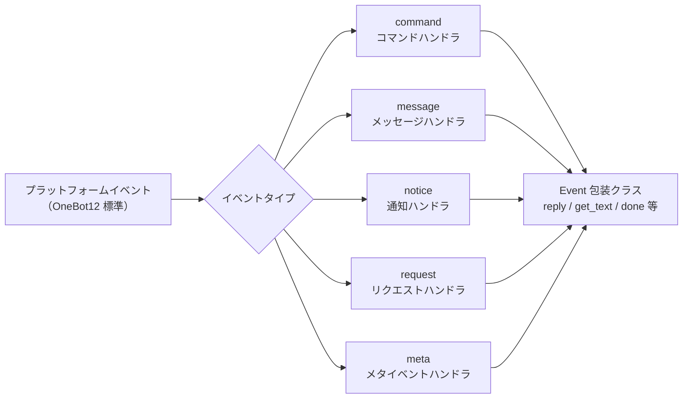

# イベントシステム API

本文档详细介绍了 ErisPulse 事件系统的 API。

イベントシステムは、プラットフォームのイベントを5つのタイプに分類し、それぞれのタイプに応じて5つのタイプのハンドラに配信します。



## Command コマンドモジュール

### コマンドの登録

```python
from ErisPulse.Core.Event import command

# 基本的なコマンド
@command("hello", help="挨拶を送信")
async def hello_handler(event):
    await event.reply("你好！")

# 別名付きのコマンド
@command(["help", "h"], aliases=["帮助"], help="ヘルプを表示")
async def help_handler(event):
    pass

# 権限付きのコマンド
def is_admin(event):
    return event.get("user_id") in admin_ids

@command("admin", permission=is_admin, help="管理者コマンド")
async def admin_handler(event):
    pass

# 隠しコマンド
@command("secret", hidden=True, help="秘密コマンド")
async def secret_handler(event):
    pass

# コマンドグループ
@command("admin.reload", group="admin", help="モジュールを再読み込み")
async def reload_handler(event):
    pass
```

### コマンド情報

すべてのコマンド情報の取得APIは、オプションの**セッションコンテキスト**をサポートしています。`event=`（Event または dict）または明示的な `platform=` / `bot_id=` / `session_id=` を渡すことができます（event と重複する場合は明示的なパラメータが優先されます）。つまり、作用域モジュールの次元でフィルタリングし、現在のセッションで利用できないモジュールのコマンドを除外します（詳細は advanced/scope.md を参照してください）。
すべてのパラメータはオプションです。渡さない場合は、既定の全量の動作になります。

```python
# コマンドのヘルプを取得
help_text = command.help()

# セッション感知ヘルプ：現在のセッションで利用可能なコマンドのみを表示
help_text = command.help(event=event)

# 特定のコマンドを取得（有効なパラメータをマージして返す；セッションで利用できない場合は None を返す）
cmd_info = command.get_command("admin")
cmd_info = command.get_command("admin", event=event)

# すべてのコマンドを取得（セッション感知の場合は利用できないモジュールのコマンドをフィルタリング）
all_commands = command.get_commands()
all_commands = command.get_commands(event=event)

# コマンドグループ内のすべてのコマンドを取得（セッション感知フィルタリングもサポート）
admin_commands = command.get_group_commands("admin")
admin_commands = command.get_group_commands("admin", event=event)

# すべての表示可能なコマンドを取得
visible_commands = command.get_visible_commands()

# セッション感知の表示可能なコマンド（event または明示的なキーワードのいずれかで指定可能）
visible_commands = command.get_visible_commands(event=event)
visible_commands = command.get_visible_commands(
    platform=event.get("platform"),
    bot_id=event.get_self_account_id(),
    session_id=event.get_session_id(),
)
```

### レプリを待つ

```python
# ユーザーの返信を待つ
@command("ask", help="ユーザーの情報を尋ねる")
async def ask_command(event):
    reply = await command.wait_reply(
        event,
        prompt="请输入你的名字:",  # 已在上面发送
        timeout=30.0
    )
    
    if reply:
        name = reply.get_text()
        await event.reply(f"你好，{name}！")

# 検証付きの待機レプリ
def validate_age(event_data):
    try:
        age = int(event_data.get_text())
        return 0 <= age <= 150
    except ValueError:
        return False

@command("age", help="ユーザーの年齢を尋ねる")
async def age_command(event):
    await event.reply("请输入你的年龄:")
    
    reply = await command.wait_reply(
        event,
        timeout=60,
        validator=validate_age
    )
    
    if reply:
        age = int(reply.get_text())
        await event.reply(f"你的年龄是 {age} 岁")

# コールバック付きの待機レプリ
async def handle_confirmation(reply_event):
    text = reply_event.get_text().lower()
    if text in ["是", "yes", "y"]:
        await event.reply("操作已确认！")
    else:
        await event.reply("操作已取消。")

@command("confirm", help="操作を確認する")
async def confirm_command(event):
    await command.wait_reply(
        event,
        prompt="请输入'是'或'否':",
        callback=handle_confirmation
    )
```

## Message メッセージモジュール

### メッセージイベント

```python
from ErisPulse.Core.Event import message

# すべてのメッセージを監視
@message.on_message()
async def message_handler(event):
    sdk.logger.info(f"收到消息: {event.get_text()}")

# プライベートメッセージを監視
@message.on_private_message()
async def private_handler(event):
    user_id = event.get_user_id()
    sdk.logger.info(f"私聊来自: {user_id}")

# グループメッセージを監視
@message.on_group_message()
async def group_handler(event):
    group_id = event.get_group_id()
    sdk.logger.info(f"群聊来自: {group_id}")

# @メッセージを監視
@message.on_at_message()
async def at_handler(event):
    mentions = event.get_mentions()
    sdk.logger.info(f"被@的用户: {mentions}")
```

### 条件監視

```python
# 優先度で実行順序を制御
@message.on_message(priority=10)  # 数値が大きいほど優先度が高い
async def high_priority_handler(event):
    pass

# ハンドラ内部で条件フィルタリングを実装
@message.on_message()
async def filtered_handler(event):
    if "关键词" not in event.get_text():
        return
    # キーワードを含むメッセージを処理
    pass
```

## Notice 通知モジュール

### 通知イベント

```python
from ErisPulse.Core.Event import notice

# フレンド追加
@notice.on_friend_add()
async def friend_add_handler(event):
    user_id = event.get_user_id()
    await event.reply("欢迎添加我为好友！")

# フレンド削除
@notice.on_friend_remove()
async def friend_remove_handler(event):
    user_id = event.get_user_id()
    sdk.logger.info(f"好友删除: {user_id}")

# グループメンバー追加
@notice.on_group_increase()
async def member_increase_handler(event):
    user_id = event.get_user_id()
    await event.reply(f"欢迎新成员！")

# グループメンバー削除
@notice.on_group_decrease()
async def member_decrease_handler(event):
    user_id = event.get_user_id()
    sdk.logger.info(f"群成员离开: {user_id}")
```

## Request リクエストモジュール

### リクエストイベント

```python
from ErisPulse.Core.Event import request

# フレンドリクエスト
@request.on_friend_request()
async def friend_request_handler(event):
    user_id = event.get_user_id()
    comment = event.get_comment()
    sdk.logger.info(f"好友请求: {user_id}, 备注: {comment}")

# グループ招待リクエスト
@request.on_group_request()
async def group_request_handler(event):
    group_id = event.get_group_id()
    user_id = event.get_user_id()
    sdk.logger.info(f"群邀请: {group_id}, 来自: {user_id}")
```

## Meta メタイベントモジュール

### メタイベント

```python
from ErisPulse.Core.Event import meta

# 接続イベント
@meta.on_connect()
async def connect_handler(event):
    platform = event.get_platform()
    sdk.logger.info(f"平台 {platform} 连接成功")

# 接続切断イベント
@meta.on_disconnect()
async def disconnect_handler(event):
    platform = event.get_platform()
    sdk.logger.info(f"平台 {platform} 断开连接")

# ハートビートイベント
@meta.on_heartbeat()
async def heartbeat_handler(event):
    sdk.logger.debug("收到心跳")
```

### Bot 状態照会

アダプタが meta イベントを送信した後、フレームワークは自動的に Bot 状態を追跡します。照会 API とライフサイクルイベントの監視については [アダプタシステム API - Bot 状態管理](adapter-system.md#bot-状态管理) を参照してください。

## Event 包装クラス

Event モジュールのイベントハンドラは、dict を継承した Event 包装クラスのインスタンスを受け取り、便利なメソッドを提供します。

### 核心メソッド

```python
# イベント情報を取得
event_id = event.get_id()
event_time = event.get_time()
event_type = event.get_type()
detail_type = event.get_detail_type()
platform = event.get_platform()

# ロボット情報を取得
self_platform = event.get_self_platform()
self_user_id = event.get_self_user_id()
self_info = event.get_self_info()
```

### セッション識別子

```python
# 統一されたターゲット ID：グループチャットは group_id、プライベートチャットは user_id を返すなど
target_id = event.get_target_id()

# セッションの一意識別子、形式: {platform}:{detail_type}:{target_id}
session_id = event.get_session_id()
# 例: "telegram:private:12345"、"qq:group:67890"
```

`get_target_id()` は、`group_id` → `channel_id` → `guild_id` → `thread_id` → `user_id` の順に最初の非空値を返します。これは、コンテキスト管理、ステートの保存など、セッションを一意に識別する必要がある場面に適しています。

### メッセージメソッド

```python
# メッセージ内容を取得
message_segments = event.get_message()
alt_message = event.get_alt_message()
text = event.get_text()

# 送信者の情報を取得
user_id = event.get_user_id()
nickname = event.get_user_nickname()
sender = event.get_sender()

# グループ情報を取得
group_id = event.get_group_id()

# メッセージタイプを判定
is_msg = event.is_message()
is_private = event.is_private_message()
is_group = event.is_group_message()

# @メッセージ関連
is_at = event.is_at_message()
has_mention = event.has_mention()
mentions = event.get_mentions()
```

### コマンド情報

```python
# コマンド情報を取得
cmd_name = event.get_command_name()
cmd_args = event.get_command_args()
cmd_raw = event.get_command_raw()

# それがコマンドかどうかを判定
is_cmd = event.is_command()
```

### レプリ機能

```python
# 基本的なレプリ
await event.reply("这是一条消息")

# 指定された送信方法
await event.reply("http://example.com/image.jpg", method="Image")

# @ユーザーと返信メッセージを含む
await event.reply("你好", at_users=["user1"], reply_to="msg_id")

# @全員
await event.reply("公告", at_all=True)

# プラットフォーム固有の修飾方法を使用（via パラメータ）
await event.reply("看板内容", method="Board",
                  via=[("Expire", 3600), ("ForMember", "114514")])

# 送信チェーンを取得し、自由に修飾方法や送信方法を追加（複数の修飾 / 動作型メソッドに適しています）
await event.send_chain().Expire(3600).Board("看板内容")
await event.send_chain().DismissBoard()

# OneBot12 メッセージセグメントを使用したレプリ
from ErisPulse.Core.Event import MessageBuilder
msg = MessageBuilder().text("Hello").image("url").build()
await event.reply_ob12(msg)

# レプリを待つ
reply = await event.wait_reply(timeout=30)
```

### プラットフォーム能力照会

```python
# 現在のプラットフォームが特定の送信方法をサポートしているか確認
if event.supports("Image"):
    await event.reply(url, method="Image")

# 現在のプラットフォームで利用可能なすべての送信方法をリストアップ
methods = event.available_methods()
# ["Text", "Image", "Voice", "File", ...]
```

### レプリメソッド

`reply()` メソッドは、`method` パラメータで送信タイプを指定し、2つの便利なブール値パラメータもサポートします：

```python
# 簡単なテキストレプリ
await event.reply("你好")

# 送信者を@して返信
await event.reply("你好", at_sender=True)

# 現在のメッセージを引用して返信
await event.reply("收到", quote=True)

# 組み合わせて使用
await event.reply("收到", at_sender=True, quote=True)

# 画像を送信（method パラメータを使用）
if event.supports("Image"):
    await event.reply("http://example.com/img.jpg", method="Image")
else:
    await event.reply("[图片] http://example.com/img.jpg")
```

**パラメータ説明**：

| パラメータ | タイプ | 説明 |
|------|------|------|
| `content` | str | 送信内容 |
| `method` | str | 送信方法、デフォルトは "Text"、"Image"/"Voice"/"Video"/"File" など |
| `at_sender` | bool | 送信者（user_id）を@するかどうか |
| `quote` | bool | 現在のメッセージ（message_id）を引用して返信するかどうか |
| `at_users` | list[str] | @するユーザーのリスト |
| `reply_to` | str | 手動で指定する返信メッセージ ID |
| `at_all` | bool | @全員するかどうか |

### 交互メソッド

```python
# confirm — 確認ダイアログ（True/False/None を返す）
if await event.confirm("确定要执行此操作吗？"):
    await event.reply("已确认")

# Text 以外の方法で確認メッセージを送信
if await event.confirm("http://example.com/image.jpg", method="Image"):
    await event.reply("已确认图片提示")

# choose — 選択メニュー（選択肢のインデックスまたは None を返す）
choice = await event.choose("请选择颜色：", ["红色", "绿色", "蓝色"])

# options_format="auto"（デフォルト）method に応じて自動的にスタイルを選択：
# Markdown→無序リスト（- 1.選択肢）、Html→有序リスト（<ol>）、その他→純粋なテキストリスト
# テキスト系メソッド（Markdown/Html など）はデフォルトで選択肢を末尾にマージ
# merge_prompt=True 任意の method で強制的にマージ可能、placeholder でプレースホルダーをカスタマイズ可能
choice = await event.choose(
    "## 请选择\n{options}", ["A", "B"],
    method="Markdown", merge_prompt=True,
)

# collect — フォーム収集（{key: value} 辞書または None を返す）
data = await event.collect([
    {"key": "name", "prompt": "请输入姓名："},
    {"key": "age", "prompt": "请输入年龄：",
     "validator": lambda e: e.get_text().isdigit()},
    {"key": "avatar", "prompt": "请发送头像：", "method": "Image"},
])

# wait_for — 条件を満たす任意のイベントを待つ
evt = await event.wait_for(event_type="notice", condition=lambda e: ..., timeout=120)

# conversation — 多輪対話コンテキスト
conv = event.conversation(timeout=60)
await conv.say("欢迎！")
```

> 完全な交互メソッドのパラメータ説明とその他の例については [Event 包装クラス详解](../developer-guide/modules/event-wrapper.md) と [Conversation 多輪対話](../advanced/conversation.md) を参照してください。

### ユーティリティメソッド

```python
# _ で始まる内部キーをフィルタリングして辞書に変換
event_dict = event.to_dict()

# 本来のデータを取得
raw = event.get_raw()
raw_type = event.get_raw_type()
```

### リンク制御

`event.done(claim=, stop=)` は「認領」と「阻止」の2つの正交的な意味を統一的に制御します：

- **認領（claim）**：イベントが処理済みであることをマーク（`_processed`）、コマンドディスパッチャーが重複処理をスキップするようにします
- **阻止（stop）**：低優先度のハンドラへのイベント伝播を阻止（`_propagation_stopped`）

```python
# 認領 + 阻止（デフォルト）
event.done()

# 認領のみ、阻止しない（低優先度の観測者はまだイベントを見ることができます）
event.done(stop=False)

# 阻止のみ、認領しない（例：ファイアウォール / 限流）
event.done(claim=False)

# mark_processed が主メソッドで、done はその別名です
event.mark_processed()             # 等価 event.done()
event.mark_processed(stop=False)   # 等価 event.done(stop=False)

# 状態を照会
event.is_processed()  # 既に認領されているか
event.is_stopped()    # 伝播が阻止されているか
```

### プラットフォーム拡張メソッド

アダプタは Event にプラットフォーム固有のメソッドを登録でき、対応するプラットフォームのインスタンス上でのみ使用可能です。

#### ユーザー：プラットフォーム拡張メソッドを使用

アダプタがプラットフォーム固有のメソッドを登録した後、イベントハンドラ内で直接呼び出すことができます。各プラットフォームのメソッドは異なりますので、対応する [プラットフォームドキュメント](../platform-guide/) を参照してください。

```python
from ErisPulse.Core.Event import message

@message.on_message()
async def handle_message(event):
    platform = event.get_platform()

    # プラットフォームに応じて固有メソッドを呼び出す
    if platform == "email":
        subject = event.get_subject()           # メール固有
        attachments = event.get_attachments()   # メール固有
```

#### プラットフォーム登録メソッドの照会

```python
from ErisPulse.Core.Event import get_platform_event_methods

# 指定プラットフォームに登録されたメソッドを照会
methods = get_platform_event_methods("email")
# ["get_subject", "get_from", "get_attachments", ...]

# 動的に判定して呼び出す
for method_name in get_platform_event_methods(event.get_platform()):
    method = getattr(event, method_name)
    print(f"{method_name}: {method()}")
```

#### プラットフォームメソッドの分離

異なるプラットフォームで登録されたメソッドは互いに干渉しません：

```python
# メールイベント - メール固有メソッドのみ
event = Event({"platform": "email", "email_raw": {"subject": "Hello"}})
event.get_subject()      # ✅ "Hello"
event.get_chat_type()    # ❌ AttributeError

# Telegram イベント - Telegram 固有メソッドのみ
event = Event({"platform": "telegram", "telegram_raw": {"chat": {"type": "private"}}})
event.get_chat_type()    # ✅ "private"
event.get_subject()      # ❌ AttributeError
```

#### `hasattr` / `dir` のサポート

```python
hasattr(event, "get_subject")   # 仅当 platform="email" 时返回 True
"get_subject" in dir(event)     # 同上
```

#### アダプタ：プラットフォーム拡張メソッドの登録

アダプタはデコレータを使って Event にプラットフォーム固有のメソッドを登録できます。メソッドの最初の引数は `self`（Event インスタンス）で、イベントデータに自由にアクセスできます。

##### 単一メソッドの登録

```python
from ErisPulse.Core.Event import register_event_method

@register_event_method("email")
def get_subject(self):
    """获取邮件主题"""
    return self.get("email_raw", {}).get("subject", "")

@register_event_method("email")
def get_from(self):
    """获取发件人"""
    return self.get("email_raw", {}).get("from", {})
```

##### バッチ登録（Mixin クラス）

メソッドが多い場合は、Mixin クラスを使って一括登録することを推奨します：

```python
from ErisPulse.Core.Event import register_event_mixin

class EmailEventMixin:
    def get_subject(self):
        return self.get("email_raw", {}).get("subject", "")

    def get_from(self):
        return self.get("email_raw", {}).get("from", {})

    def get_attachments(self):
        return self.get("email_raw", {}).get("attachments", [])

# 一括でメソッドを登録
register_event_mixin("email", EmailEventMixin)
```

##### 戻り値の規則

| 場面 | 戻り値 | ユーザー使用方法 |
|------|--------|------------|
| データを返す（テキスト、辞書など） | 直接戻り値を返す | `subject = event.get_subject()` |
| 操作を実行する（メッセージ送信など） | `asyncio.Task` を返す | `task = event.do_something()` 任意に `await` 可能 |

> **推奨**：データ以外のメソッドは `asyncio.Task` を返すようにし、ユーザーが `await` するかどうかを自由に選択できるようにします。`await` しなくても操作は完了します。

```python
@register_event_method("email")
def forward_email(self, to_address: str):
    """转发邮件 — 返回 Task，用户可自行决定是否 await"""
    import asyncio
    return asyncio.create_task(
        self._do_forward(to_address)
    )

# ユーザーは await して結果を待つことができる
await event.forward_email("user@example.com")

# または await しなくても、バックグラウンドで操作が実行される
event.forward_email("user@example.com")
```

##### メソッドの解除

```python
from ErisPulse.Core.Event import unregister_event_method, unregister_platform_event_methods

# 単一メソッドの解除
unregister_event_method("email", "get_subject")

# 指定プラットフォームの全メソッドの解除（アダプタの shutdown 時に呼び出す）
unregister_platform_event_methods("email")
```

##### 内置メソッドの上書き

`register_event_mixin` / `register_event_method` は Event の内置メソッド（`confirm`、`choose`、`collect`、`wait_reply`、`reply` など）を上書きできます。登録されたプラットフォームメソッドは `Event.__getattribute__` により内置メソッドよりも優先して有効になるため、アダプタはプラットフォーム固有のインタラクティブな実装を提供できます。

内置実装は `_builtin_*` 関数としてエクスポートされ、上書きした方はそれらをバックアップとして呼び出すことができます：

```python
from ErisPulse.Core.Event import register_event_mixin, _builtin_choose

class YunhuEventMixin:
    async def choose(self, prompt, options, timeout=60, method="Text"):
        # 云湖平台使用按钮组件
        buttons = [[{"text": opt} for opt in options]]
        await self.reply(prompt)
        # ...等待按钮回调或文本回复...
        # 回退到内置逻辑
        return await _builtin_choose(self, None, options, timeout, "Text")

register_event_mixin("yunhu", YunhuEventMixin)
```

## 跨プラットフォーム拡張（ワイルドカード）

`register_event_method` と `register_event_mixin` は `"*"` をプラットフォーム名として渡すことができ、登録されたメソッドは**すべてのプラットフォーム**の Event インスタンスで利用可能です。AI チャット、コンテキスト管理など、プラットフォーム間で再利用可能な機能モジュールに適しています。

### 跨プラットフォームメソッドの登録

```python
from ErisPulse.Core.Event.wrapper import register_event_method

@register_event_method("*")
async def ai_chat(self, prompt: str):
    """self 为 Event 实例，可自由访问事件数据和内置方法"""
    await self.reply(f"AI: {prompt}")
```

登録後、すべてのプラットフォームのイベントハンドラで呼び出すことができます：

```python
from ErisPulse.Core.Event import message

@message.on_message()
async def handler(event):
    await event.ai_chat(event.get_text())
```

### メソッドの優先順位

Event メソッドを属性アクセスで取得する際の優先順位は以下の通りです：

1. **プラットフォーム固有メソッド**（現在のプラットフォームの上書き）
2. **ワイルドカードメソッド**（`"*"` で登録された跨プラットフォームメソッド）
3. **内置メソッド**（`reply`、`confirm` 等）
4. **辞書キーのアクセス**

> したがって、ワイルドカードメソッドは内置メソッド（`reply` など）を上書きできますが、同名のプラットフォーム固有メソッドによってさらに上書きされます。

## 優先度システム

イベントハンドラは優先度をサポートし、数値が大きいほど優先度が高くなります：

```python
# 高優先度のハンドラが先に実行されます
@message.on_message(priority=10)
async def high_priority_handler(event):
    pass

# 低優先度のハンドラが後に実行されます
@message.on_message(priority=0)
async def low_priority_handler(event):
    pass
```

## 関連ドキュメント

- [核心模块 API](core-modules.md) - 核心模块 API
- [适配器系统 API](adapter-system.md) - Adapter 管理 API
- [模块开发指南](../developer-guide/modules/) - 开发自定义模块