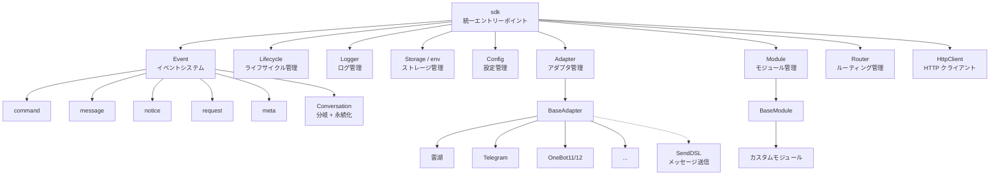
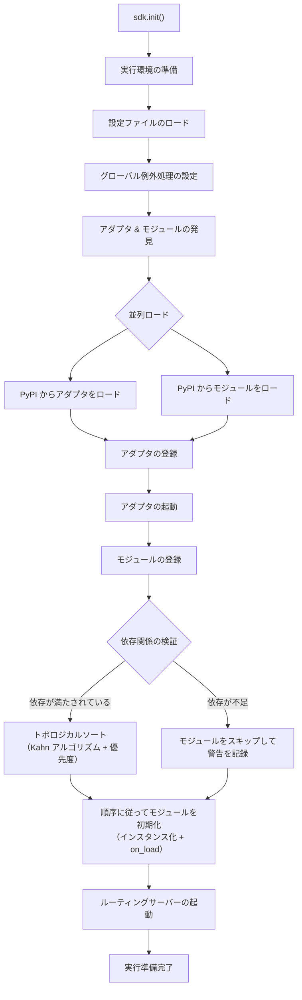
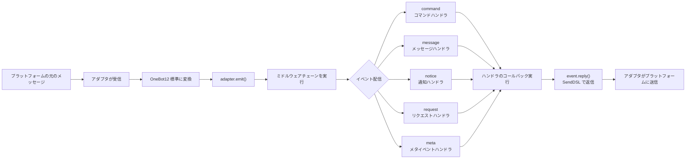
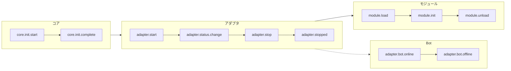
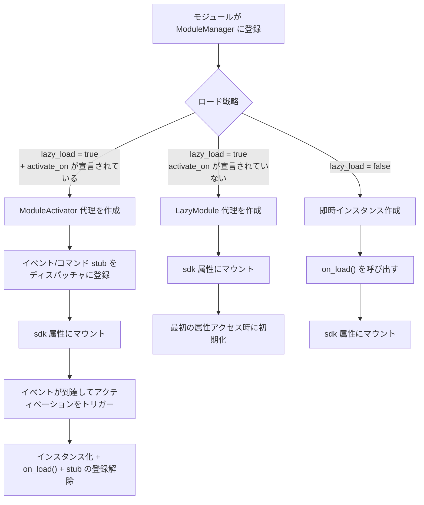
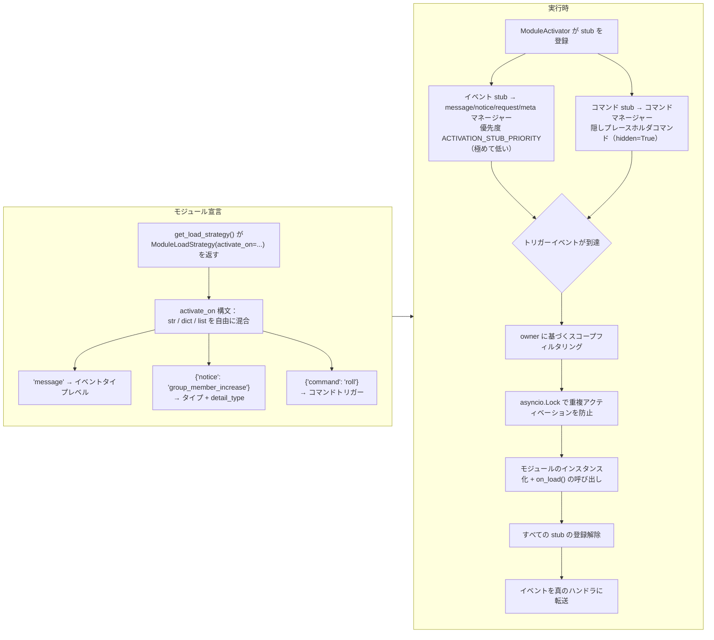
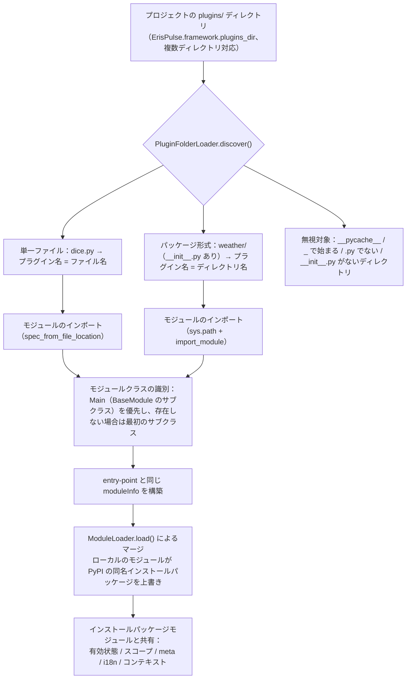
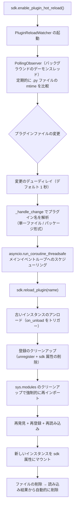

# アーキテクチャ概要

このドキュメントでは、ErisPulse SDK の技術的アーキテクチャを視覚的なチャートを用いて紹介し、フレームワークの設計思想とモジュール間の関係をすばやく理解できるようにします。

docs/ja/quick-start.md

## SDK 核心アーキテクチャ

下図は、SDK のコアモジュールの構成とその関係を示しています：



### コアモジュールの説明

| モジュール | 説明 |
|------|------|
| **Event** | イベントシステム。command / message / notice / request / meta の5種類のイベント処理と、Conversation 多段対話機能を提供します。|
| **Adapter** | アダプタマネージャー。複数プラットフォーム用アダプタの登録、起動、停止を管理します。|
| **Module** | モジュールマネージャー。プラグインの登録、ロード、アンロードを管理し、依存関係の宣言とトポロジカルソートをサポートします。|
| **Lifecycle** | ライフサイクルマネージャー。イベント駆動型のライフサイクルフックを提供します。|
| **Storage** | SQLite に基づくキーバリューストレージシステム。一般的な SQL チェーンクエリをサポートします。|
| **Config** | TOML 形式の設定ファイル管理。|
| **Logger** | モジュール化されたログシステム。サブロガーをサポートします。|
| **Router** | HTTP/WebSocket ルーティング管理。抽象層を介して下位のバックエンド（現在は FastAPI + Uvicorn）をラップし、デコレーターベースのルーティング、ミドルウェア、グループ化、リクエスト制限、CORS をサポートします。|
| **HttpClient** | 統一された HTTP/WS クライアント。抽象層を介して下位のリクエストライブラリ（現在は aiohttp）をラップし、リクエスト統計、リトライ、ログ、WebSocket クライアント、ErisPulse 例外体系などの機能を提供します。クライアントとサーバーの WebSocket は `WebSocketConnectionBase` 基底クラスを共有します。|

## 初期化フロー

下図は `sdk.init()` の完全な初期化プロセスを示しています：



### 初期化フェーズの詳細

1. **環境準備** - TOML 設定ファイルをロードし、グローバル例外処理を設定
2. **並行発見** - 既にインストールされた PyPI パッケージから同時にアダプタとモジュールを発見
3. **アダプタの登録** - 発見されたアダプタをアダプタマネージャーに登録
4. **アダプタの起動** - 各プラットフォームのアダプタを非同期で起動（モジュールの初期化前に、モジュールが即座にメッセージを送信できるようにする）
5. **モジュールの登録** - 発見されたモジュールをモジュールマネージャーに登録
6. **依存関係の検証** - モジュールが宣言した `depends` 依存が登録されているかを確認し、不足している依存を持つモジュールはスキップ
7. **トポロジカルソート** - Kahn アルゴリズムを使用して依存関係に基づいてモジュールのロード順序をソートし、同レベルでは `priority` で降順に並べる
8. **モジュールの初期化** - ソート順に従ってモジュールのインスタンスを作成し、`on_load` ライフサイクルメソッドを呼び出す
9. **ルーティングサーバーの起動** - Uvicorn を使用して FastAPI ルーティングサーバーを起動

[**English**](docs/en/quick-start.md) | [**中文**](docs/ja/quick-start.md) | [**日本語**](docs/ja/quick-start.md)

## イベント処理フロー

下図は、メッセージがプラットフォームからハンドラへと流れる完全なフローを示しています：



### イベント処理の重要なステップ

- **アダプタが受信** - 各プラットフォームのアダプタは WebSocket/Webhook などの方法でネイティブイベントを受信します。
- **OB12 標準化** - プラットフォームのネイティブイベントを統一された OneBot12 標準フォーマットに変換します。
- **ミドルウェア処理** - 登録されたミドルウェア関数を順次実行し、イベントデータを変更できます。
- **イベント配信** - イベントの種類（message/notice/request/meta）に応じて、対応するハンドラに配信します。
- **SendDSL で返信** - ハンドラは `event.reply()` または `SendDSL` のチェーン呼び出しを使って返信を送信します。

## ライフサイクルイベント

下図は、フレームワークの各コンポーネントのライフサイクルイベントの発生順序を示しています：



### ライフサイクルイベントの監視

これらのイベントを `lifecycle.on()` を使って監視し、カスタムロジックを実行することができます：

```python
from ErisPulse import sdk

# すべてのアダプタイベントを監視
@sdk.lifecycle.on("adapter")
async def on_adapter_event(event_data):
    print(f"アダプタイベント: {event_data}")

# モジュールのロード完了を監視
@sdk.lifecycle.on("module.load")
async def on_module_loaded(event_data):
    print(f"モジュールがロードされました: {event_data}")

# Botのオンラインを監視
@sdk.lifecycle.on("adapter.bot.online")
async def on_bot_online(event_data):
    print(f"Botがオンラインになりました: {event_data}")

## モジュールロード戦略

ErisPulse は、`get_load_strategy()` が返す `ModuleLoadStrategy` によって宣言される 3 つのモジュールロード戦略をサポートしています：



> 詳細は [遅延ロードシステム](advanced/lazy-loading.md)、[ライフサイクル管理](advanced/lifecycle.md) およびモジュールドキュメントを参照してください。

### イベント駆動遅延アクティベーション（`activate_on`）トリガー構造

`activate_on` は、モジュールが**最初の一致するイベント/コマンドが到達したときにのみ**ロードされるようにし、常駐メモリを避けると同時にイベントのロスを防ぎます：



**トリガーの意味要点：**

1. **stub 登録**：イベント stub は、対応するイベントマネージャーに極めて低い優先度（`ACTIVATION_STUB_PRIORITY`）で登録され、同種のイベントのすべての通常のハンドラの**後に**実行されるようにします。コマンド stub は隠しプレースホルダコマンドとして登録され、コマンドリストを汚染しません。
2. **スコープフィルタリング**：stub にはモジュールの owner 身分が付与され、該当する Bot / セッション / プラットフォームに対して有効でないモジュールはトリガーされません。
3. **再入防止**：`asyncio.Lock` により、並行イベント下でも一度だけアクティベーションされるようにします。
4. **イベント転送**：アクティベーション完了後、現在のイベントは真のハンドラに転送されます（外側のグループループは、stub の後に登録されたハンドラが二度処理されないことを既に検証済みです）。
5. **失敗時の意味**：アクティベーションが失敗した場合、再試行は行われず、stub も同時に登録解除され、毎回イベントに対して繰り返し試行されるのを防ぎます。

## ローカルプラグインフォルダの構造

ローカルプラグイン（`plugins/` ディレクトリ）は、パッケージ化して配布する必要がなく、フレームワークの起動時に自動的に発見され読み込まれます：



**規約と特徴：**

- プラグイン名の取得方法：単一ファイルはファイル名、パッケージ形式はディレクトリ名
- ローカルプラグインの `moduleInfo.meta.source == "plugin_folder"` であり、PyPI でインストールされたパッケージモジュールとシームレスに共存
- 同名のモジュールが存在する場合、ローカルのモジュールが優先（ローカルの上書きやデバッグに便利）、無効化された場合、同名の entry-point 条目も同時に削除

[**English**](docs/ja/quick-start.md)

## ローカルプラグインのホットリロードアーキテクチャ

ホットリロードはプラグインファイルの変更を監視し、対応するプラグインを自動的に再読み込みします：



[**English**](docs/ja/quick-start.md)