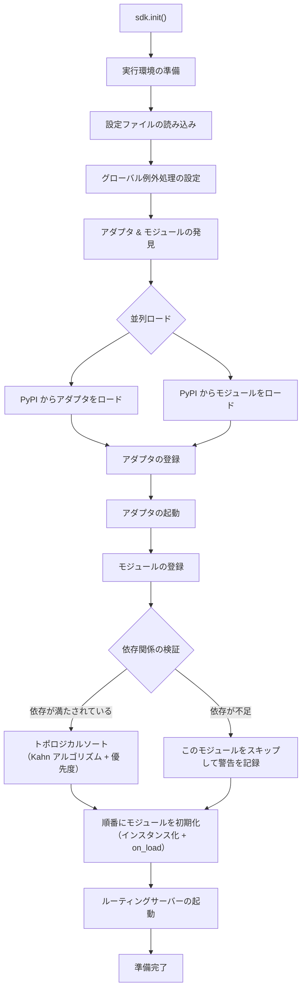
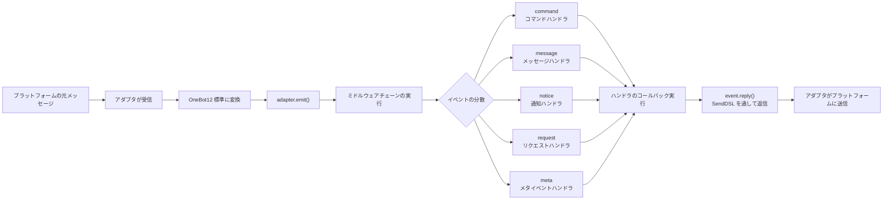
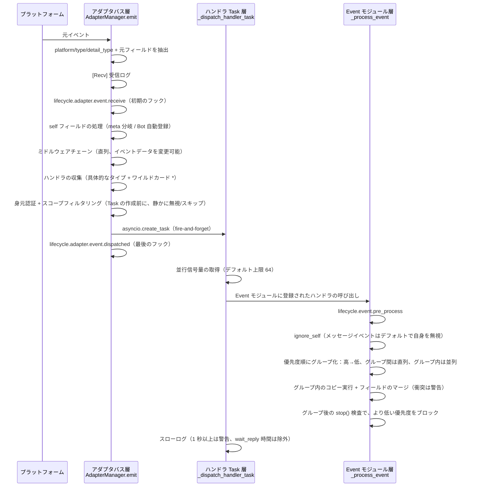
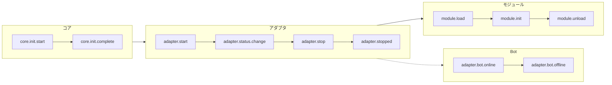
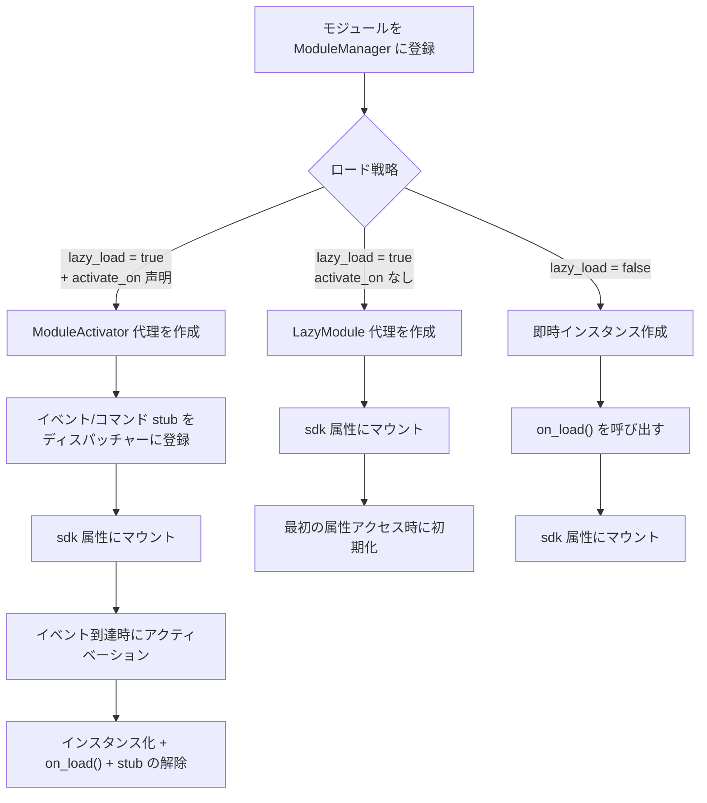
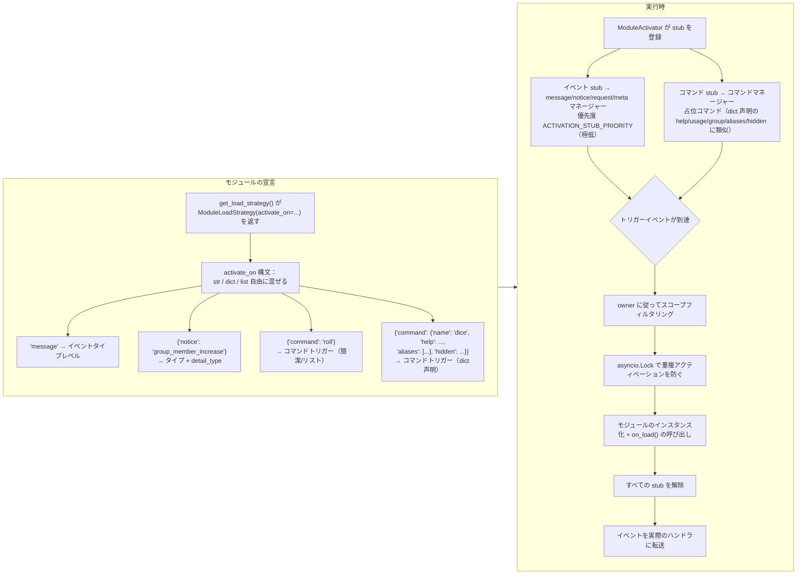
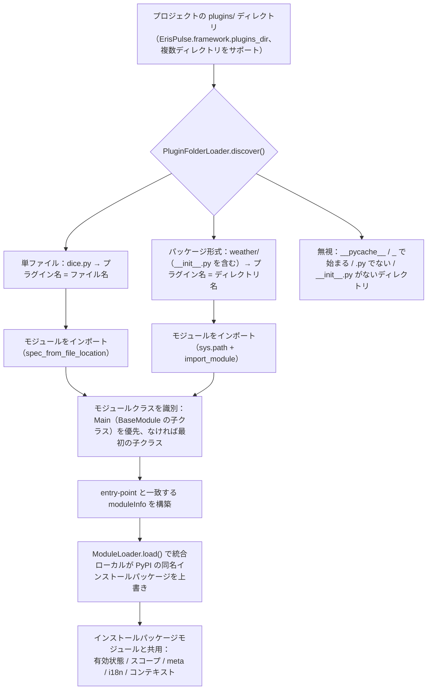

# 架構概要

このドキュメントでは、ErisPulse SDK の技術的アーキテクチャを可視化した図を通じて紹介し、フレームワークの設計思想とモジュール間の関係を素早く理解できるようにします。

## SDK のコアアーキテクチャ

下図は、SDK のコアモジュール構成とその関係を示しています：

### コアモジュールの説明

| モジュール | 説明 |
|------|------|
| **Event** | イベントシステム。command / message / notice / request / meta の 5 種類のイベント処理と、Conversation 多段会話に対応。|
| **Adapter** | アダプタ管理器。複数プラットフォームのアダプタの登録、起動、停止を管理。|
| **Module** | モジュール管理器。プラグインの登録、ロード、アンロードを管理。依存関係宣言とトポロジカルソートに対応。|
| **Lifecycle** | ライフサイクル管理器。イベント駆動のライフサイクルフックを提供。|
| **Storage** | SQLite をベースとしたキーバリューストレージシステム。一般的な SQL チェーンクエリをサポート。|
| **Config** | TOML 形式の設定ファイル管理。|
| **Logger** | モジュール化されたログシステム。サブロガーをサポート。|
| **Router** | HTTP/WebSocket ルーティング管理。抽象層を介して下層バックエンド（現在は FastAPI + Uvicorn）をカプセル化。デコレータールーティング、ミドルウェア、グループ、リクエスト制限、CORS をサポート。|
| **Client** | 統一された HTTP/WS クライアント（2.8.0 以前は `HttpClient`、互換エイリアスを保持）。抽象層を介して下層リクエストライブラリ（現在は aiohttp）をカプセル化。リクエスト統計、リトライ、ログ、WebSocket クライアント、ErisPulse の例外体系等功能を提供。クライアントとサーバーの WebSocket は `WebSocketConnectionBase` 基底クラスを共有。|

## 初期化プロセス

下図は、`sdk.init()` の完全な初期化プロセスを示しています：

### 初期化段階の詳細

> 完全な初期化の流れの分解（Finder / Loader / Manager / Router）、下層エントリーポイント（`init()` / `init_task()` / `init_sync()`）と手動の完全起動については [起動プロセスと手動制御](advanced/startup.md) を参照してください。

## イベント処理プロセス

下図は、プラットフォームからハンドラへのメッセージの完全な流れを示しています：

### イベント処理の流れの詳細

上記の図は「結果」です。以下は `adapter.emit()` の後でフレームワークが**裏で何をしたか**を分解したものです。これは 3 層の分散の流れです：

**フレームワークが何をしたか、そしてあなたが介入できるポイント：**

| 段階 | フレームワークが何をしたか | 介入できるポイント |
|------|-------------|-----------|
| 受信 | 標準フィールドを抽出、`{platform}_raw` 元データを保持；`[Recv]` ログを記録 | `adapter.event.receive` を監視して初期イベントを取得 |
| self フィールド | meta イベントは connect/disconnect/heartbeat 分岐を経る；通常のイベントでは Bot を自動登録し、`adapter.bot.online` をトリガー | `adapter.bot.online` / `bot.offline` を監視 |
| ミドルウェア | **直列**実行、戻り値が None でなければイベントデータを置き換え | ミドルウェアを登録してイベントを変更/ブロック |
| 分発収集 | 先に具体的なタイプのハンドラを取得し、次に `*` ワイルドカードハンドラを取得 | — |
| 身元次元 | 分発エントリはユーザー>会話>Bot>アダプタの順に判定し、**拒否された場合はイベント全体を無視** | `ErisPulse.scope.identity` をバインド |
| スコープフィルタリング | モジュールの所有者に従って `scope.is_allowed` を判定（会話レベル>Botレベル>プラットフォームレベル）、**通過しない場合は静かにスキップ** | スコープのホワイトリスト/ブラックリストを設定 |
| スケジューリング | 各マッチするハンドラごとに独立した `asyncio.Task` を作成、`emit()` はハンドラの完了を待たずに即座に返却 | — |
| 優先度 | 高優先度のグループが先に実行；**グループ間は直列、グループ内は並列**（グループ内はイベントのコピーを持ち、フィールドをマージし、衝突は WARNING で警告）、`mark_processed(stop=True)` は**より低い優先度をブロック** | `@command(..., priority=N)` / 登録時に priority を指定 |
| ブロッキング | 各グループの処理後に `event.is_stopped()` をチェックし、ヒットした場合は**より低い優先度を実行しない** | `event.mark_processed(stop=True)` / `event.done()` |

> **よくある誤解**：
> 1. **スコープフィルタリングは静かに**— フィルタリングされたハンドラはエラーもレスポンスもせず、TRACE レベルのログ（`core.scope.denied`）にのみ表示されます。「私のモジュールがメッセージを受け取っていない」場合は、まずスコープのバインディングを確認してください。
> 2. **ハンドラは天然並列**— フレームワークは各ハンドラに独立した Task を作成しており、**自分で `asyncio.create_task` をラップする必要はありません**。
> 3. **同じ優先度グループ内はブロックしない**— `mark_processed(stop=True)` は**より低い優先度のグループのみをブロック**し、同じグループ内で並列実行されたハンドラは途中で中断されません。
> 4. **スローログの閾値は固定 1 秒**— ハンドラの処理時間が 1 秒を超えるとログに WARNING が表示されます（`wait_reply` は処理時間から除外されます）、ただし実行は中断されません。

> スコープ（scope）のモジュール次元の 3 級バインディング、身元認証と出力アクション制限の詳細は [スコープ（scope）](advanced/scope.md) を参照してください。イベントスコープのテキストフィルタリングとコマンドユーザー ACL は [イベント処理入門](getting-started/event-handling.md) を参照してください。並列上限の設定は [設定ガイド](user-guide/configuration.md#フレームワーク設定) を参照してください。

## ライフサイクルイベント

下図は、フレームワークの各コンポーネントのライフサイクルイベントの発生順序を示しています：

### ライフサイクルイベントの監視

> 完全なイベント監視方法（`lifecycle.on()` / `once()` / `has_handlers()`）、すべてのライフサイクルイベントのリストとデータ形式は [ライフサイクル管理](advanced/lifecycle.md) を参照してください。

## モジュールのロード戦略

ErisPulse は 3 種類のモジュールロード戦略をサポートし、`get_load_strategy()` が返す `ModuleLoadStrategy` で宣言されます：

> 詳細は [遅延ロードシステム](advanced/lazy-loading.md)、[ライフサイクル管理](advanced/lifecycle.md) およびモジュールドキュメントを参照してください。

### イベント駆動遅延アクティベーション（`activate_on`）のトリガーアーキテクチャ

> [!NOTE]
> この機能は ErisPulse **2.8.0+** が必要です。

`activate_on` を使用すると、モジュールは**最初のマッチするイベント/コマンドが到達したときに初めてロード**され、常駐メモリを避けると同時にイベントのロスを防ぎます：

**トリガの意味の要点：**

> 完全な `activate_on` 構文（str / dict / list）、コマンド dict 声明、占位コマンド help 回帰チェーン、スコープフィルタリングと失敗の意味は [遅延ロードシステム](advanced/lazy-loading.md#イベント駆動遅延アクティベーションactivate_on) を参照してください。

## ローカルプラグインフォルダアーキテクチャ

> [!NOTE]
> この機能は ErisPulse **2.8.0+** が必要です。

ローカルプラグイン（`plugins/` ディレクトリ）は、パッケージ化して公開する必要がなく、フレームワークの起動時に自動的に発見され、ロードされます：

**規約と特性：**

- プラグイン名の出典：単ファイルはファイル名、パッケージ形式はディレクトリ名
- ローカルプラグイン `moduleInfo.meta.source == "plugin_folder"` で、PyPI インストールパッケージモジュールとシームレスに共存
- 同名の場合はローカルが優先（ローカルの上書きデバッグに便利）、無効化された場合は同名の entry-point 条目も削除される

## モジュールのホットリロードアーキテクチャ

ホットリロードは**すべてのモジュールソース**に対して一貫して適用されます：ローカルプラグインはファイル変更を監視して自動的にトリガし、任意のモジュールは `sdk.reload_module()` / `sdk.module.reload()` で手動でリロードできます（PyPI インストールパッケージモジュールは pip でアップグレード後に呼び出すことで有効になります）：

**2 つの出所の違いは発見段階のみ**、登録、ロード、連鎖リロードは完全に同じです：

- **ローカルプラグイン**（`moduleInfo.meta.source == "plugin_folder"`）：`sys.modules` のプラグイン名に対応するクリーンアップ後、`plugins/` ディレクトリを再スキャンします。ファイルが削除された場合は、ロード結果から削除されます。
- **PyPI インストールパッケージ**：`meta.top_level` に従って、`sys.modules` のパッケージのサブツリーをクリーンアップし、エントリポイントの 60 秒キャッシュを突破するためのインポートキャッシュをリフレッシュした後、再検索して再インポートします。entry-point が消失した（pip でアンインストールした）場合は、ロード結果から削除されます。