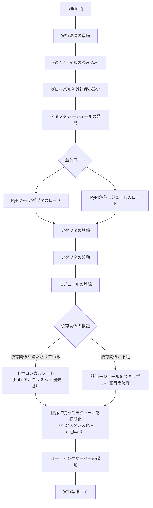
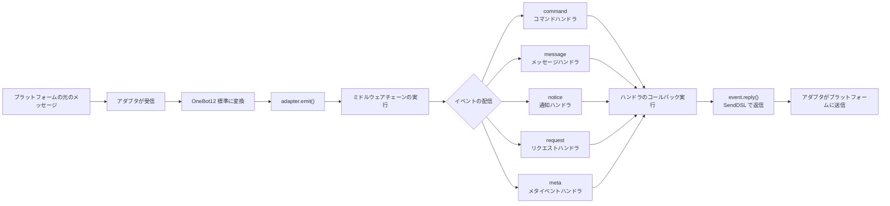
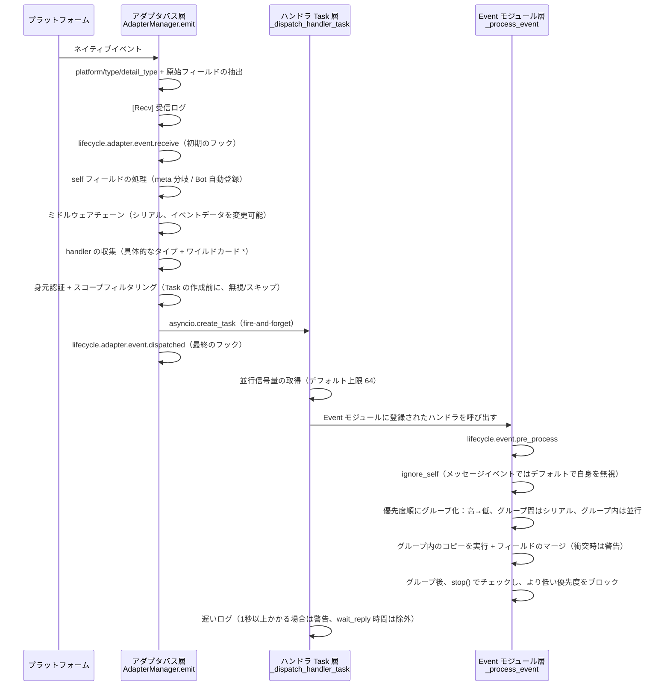
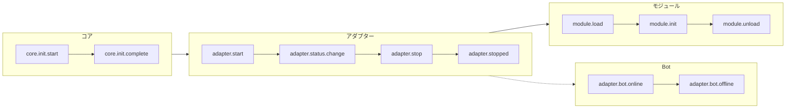
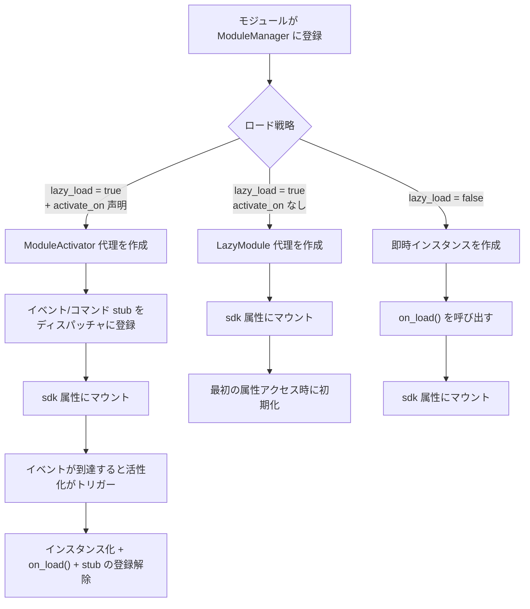
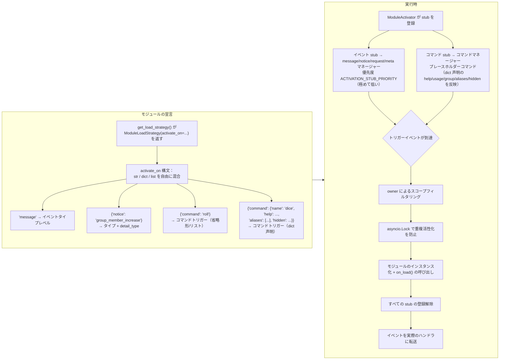
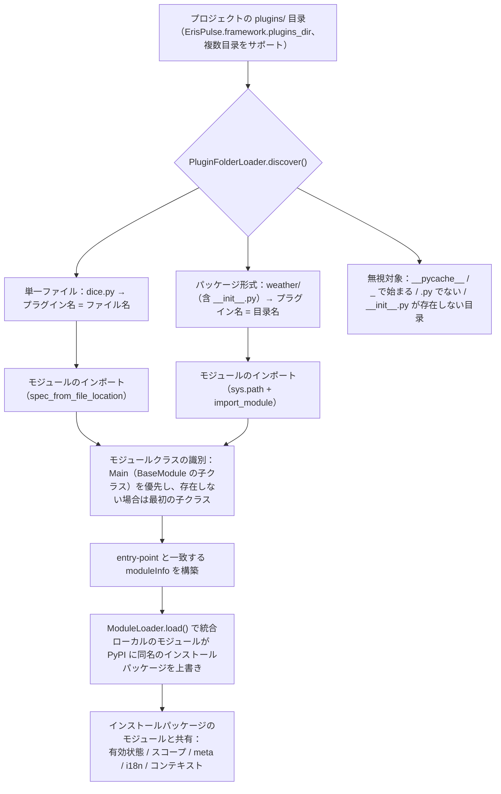
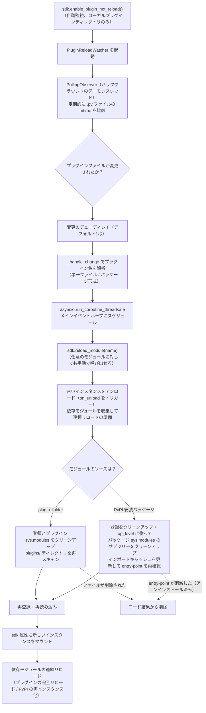

# アーキテクチャ概要

このドキュメントでは、ErisPulse SDK の技術的アーキテクチャを視覚的なチャートを用いて紹介し、フレームワークの設計思想とモジュール間の関係をすばやく理解できるようにします。

docs/ja/quick-start.md

## SDKのコアアーキテクチャ

下図は、SDKのコアモジュール構成とその関係を示しています：

### コアモジュールの説明

| モジュール | 説明 |
|------|------|
| **Event** | イベントシステム。command / message / notice / request / meta の5種類のイベント処理と、Conversationによる多段対話機能を提供します。|
| **Adapter** | アダプタマネージャー。複数プラットフォームのアダプタの登録、起動、停止を管理します。|
| **Module** | モジュールマネージャー。プラグインの登録、ロード、アンロードを管理し、依存関係の宣言とトポロジカルソートをサポートします。|
| **Lifecycle** | ライフサイクルマネージャー。イベント駆動型のライフサイクルフックを提供します。|
| **Storage** | SQLiteベースのキーバリューストレージシステム。一般的なSQLチェーンクエリをサポートします。|
| **Config** | TOML形式の設定ファイル管理。|
| **Logger** | モジュール化されたログシステム。サブロガーをサポートします。|
| **Router** | HTTP/WebSocketルーティング管理。抽象層を介して下位のバックエンド（現在はFastAPI + Uvicorn）をラップし、デコレーターベースのルーティング、ミドルウェア、グループ化、リクエスト制限、CORSをサポートします。|
| **Client** | 統一HTTP/WSクライアント（2.8.0以前は`HttpClient`、互換性のため別名を保持）。抽象層を介して下位のリクエストライブラリ（現在はaiohttp）をラップし、リクエスト統計、リトライ、ログ、WebSocketクライアント、ErisPulse例外体系などの機能を提供します。クライアントとサーバーのWebSocketは`WebSocketConnectionBase`基底クラスを共有します。|

## 初期化プロセス

下図は `sdk.init()` の完全な初期化プロセスを示しています：

### 初期化段階の詳細

> 完全な初期化フローの分解（Finder / Loader / Manager / Router）、下層エントリポイント（`init()` / `init_task()` / `init_sync()`）および手動での完全起動については [起動プロセスと手動制御](advanced/startup.md) を参照してください。

## イベント処理フロー

下の図は、プラットフォームからハンドラへのメッセージの完全な転送経路を示しています：

### イベント処理チェーンの詳細

上記の図は「結果」です。下に `adapter.emit()` を分解すると、フレームワークが**背後で何をしているか**がわかります。これは3層に分かれた配信チェーンです：

**フレームワークが何をし、あなたが介入できるか：**

| 階段 | フレームワークが何をしたか | 介入できるか |
|------|-------------|-----------|
| 受信 | 標準フィールドの抽出、`{platform}_raw` の元データの保持；`[Recv]` ログの書き込み | `adapter.event.receive` を監視して初期イベントを取得 |
| self フィールド | meta イベントは connect/disconnect/heartbeat 分岐；通常のイベントは Bot の自動登録と `adapter.bot.online` のトリガー | `adapter.bot.online` / `bot.offline` を監視 |
| ミドルウェア | **シリアル**に実行し、戻り値が None でなければイベントデータを置換 | ミドルウェアを登録してイベントを変更/ブロック |
| 分配収集 | 先に具体的なタイプの handler を取得し、次に `*` ワイルドカード handler を取得 | — |
| 身元次元 | 分配入口はユーザー>会話>Bot>アダプタの順に判定し、`scope.is_identity_allowed` でイベントを受け取るかを判断し、**拒否された場合はイベント全体を破棄** | `ErisPulse.scope.identity` をバインド |
| スコープフィルタリング | モジュールの所有者に基づいて `scope.is_allowed` を判定（会話レベル>Botレベル>プラットフォームレベル）、**不通過の場合は静かにスキップ** | スコープのホワイトリスト/ブラックリストを設定 |
| スケジューリング | 各マッチする handler に独立した `asyncio.Task` を作成し、`emit()` は handler の完了を待たずに即座に返却 | — |
| 優先度 | 高優先度のグループが先に実行される；**グループ間はシリアル、グループ内は並行**（グループ内の各 handler はイベントのコピーを持ち、フィールドの変更をマージし、衝突時は WARNING を出力） | `@command(..., priority=N)` / 登録時に priority を指定 |
| ブロッキング | 各グループの処理後、`event.is_stopped()` をチェックし、一致した場合は**より低い優先度を実行しない** | `event.mark_processed(stop=True)` / `event.done()` |

> **よくある誤解**：
> 1. **スコープフィルタリングは静かに無視される**——遮断された handler はエラーも返信もせず、TRACE レベルのログ（`core.scope.denied`）にのみ表示される。「私のモジュールがメッセージを受け取っていない」場合は、まずスコープのバインディングを確認。
> 2. **handler は天然に並行実行される**——フレームワークは各 handler に独立した Task を作成しており、**自分で `asyncio.create_task` をラップする必要はない**。
> 3. **同じ優先度のグループ内はブロックされない**——`mark_processed(stop=True)` はより低い優先度のグループをブロックするだけで、同じグループ内で並行実行中の handler は途中で中断されない。
> 4. **遅いログの閾値は固定で1秒**——ハンドラの処理時間が1秒を超えるとログに WARNING を出力する（`wait_reply` の待ち時間は処理時間から除外される）が、実行は中断されない。

> スコープ（scope）のモジュール次元の3段階バインディング、身元認証と出力アクションの制限の詳細は [スコープ（scope）](advanced/scope.md) を参照。イベントスコープのテキストフィルタリングとコマンドユーザー ACL は [イベント処理入門](getting-started/event-handling.md) を参照。並行上限の設定は [設定ガイド](user-guide/configuration.md#フレームワーク設定) を参照。

## ライフサイクルイベント

下図は、フレームワークの各コンポーネントがライフサイクルイベントをどのように発生させるかを示しています：

### ライフサイクルイベントの監視

> 完全なイベント監視メソッド（`lifecycle.on()` / `once()` / `has_handlers()`）、すべてのライフサイクルイベントリストとデータ形式は [ライフサイクル管理](advanced/lifecycle.md) を参照してください。

## モジュールのロード戦略

ErisPulse は、`get_load_strategy()` が返す `ModuleLoadStrategy` によって宣言される 3 つのモジュールロード戦略をサポートしています：

> 詳細については、[遅延ロードシステム](advanced/lazy-loading.md)、[ライフサイクル管理](advanced/lifecycle.md) およびモジュールのドキュメントを参照してください。

### イベント駆動の遅延活性化（`activate_on`）トリガー構造

> [!NOTE]
> この機能には ErisPulse **2.8.0+** が必要です。

`activate_on` により、モジュールは**最初の一致するイベント/コマンドが到達した時点で**のみロードされるようになり、メモリ常駐を回避しながら、イベントのロスを防ぐことができます：

**トリガーの意味要点：**

> 完全な `activate_on` 構文（str / dict / list）、コマンド dict 声明、プレースホルダーコマンドの help フォールバックチェーン、スコープフィルタリング、および失敗時の意味については、[遅延ロードシステム](advanced/lazy-loading.md#イベント駆動の遅延活性化activate_on) を参照してください。

## ローカルプラグインフォルダのアーキテクチャ

> [!NOTE]
> この機能は ErisPulse **2.8.0+** が必要です。

ローカルプラグイン（`plugins/` 目录）はパッケージ化して公開する必要がなく、フレームワークの起動時に自動的に発見・ロードされます：

**規約と特性：**

- プラグイン名の取得方法：単一ファイルはファイル名、パッケージ形式は目录名
- ローカルプラグインの `moduleInfo.meta.source == "plugin_folder"` であり、PyPI でインストールされたパッケージモジュールとシームレスに共存
- 同名のモジュールがある場合、ローカルのモジュールが優先（ローカルでの上書きデバッグが可能）、無効化された場合、同名の entry-point 条目も同時に削除

## モジュールのホットリロードアーキテクチャ

ホットリロードは**すべてのモジュールのソース**に対して一貫しています：ローカルプラグインはファイルの変更を監視して自動的にトリガーされ、任意のモジュールは `sdk.reload_module()` / `sdk.module.reload()` を使って手動でリロードできます（pip でインストールされた PyPI パッケージモジュールは pip によるアップグレード後に呼び出すだけで有効になります）：

**2 種類のソースの違いは発見段階のみ**で、登録、読み込み、連鎖リロードは完全に一貫しています：

- **ローカルプラグイン**（`moduleInfo.meta.source == "plugin_folder"`）：プラグイン名に対応する `sys.modules` をクリーンアップした後、`plugins/` ディレクトリを再スキャンします。ファイルが削除された場合は、ロード結果から削除します。
- **PyPI 安装パッケージ**：`meta.top_level` に従ってパッケージの `sys.modules` のサブツリーをクリーンアップし、インポートキャッシュを更新（entry-point の 60 秒キャッシュを突破）した後、entry-point を再確認して再インポートします。entry-point が消滅した（pip でアンインストールされた）場合は、ロード結果から削除します。