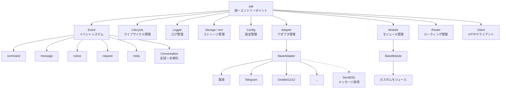
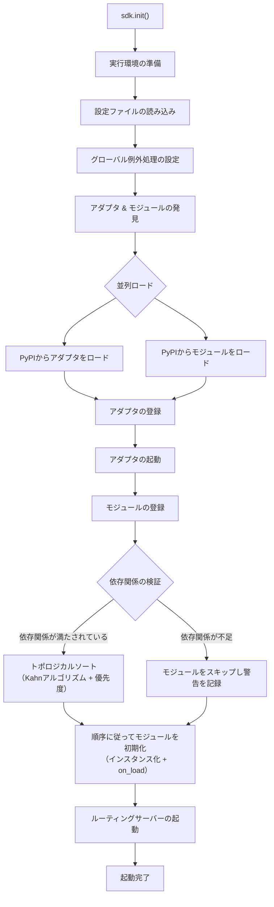
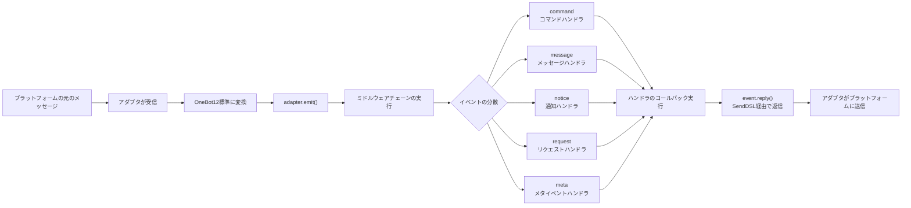
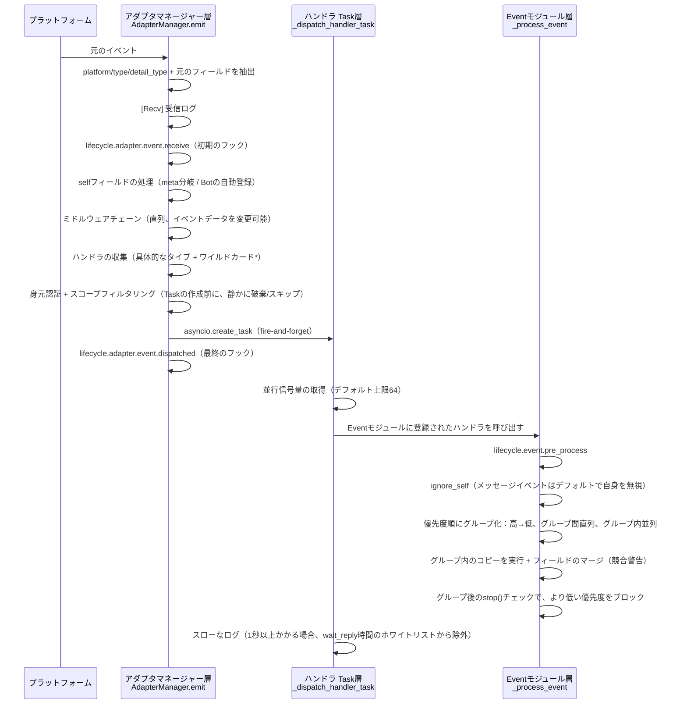
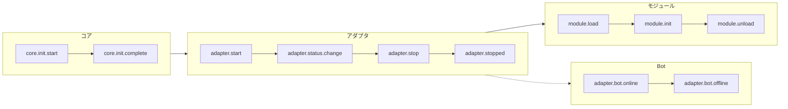
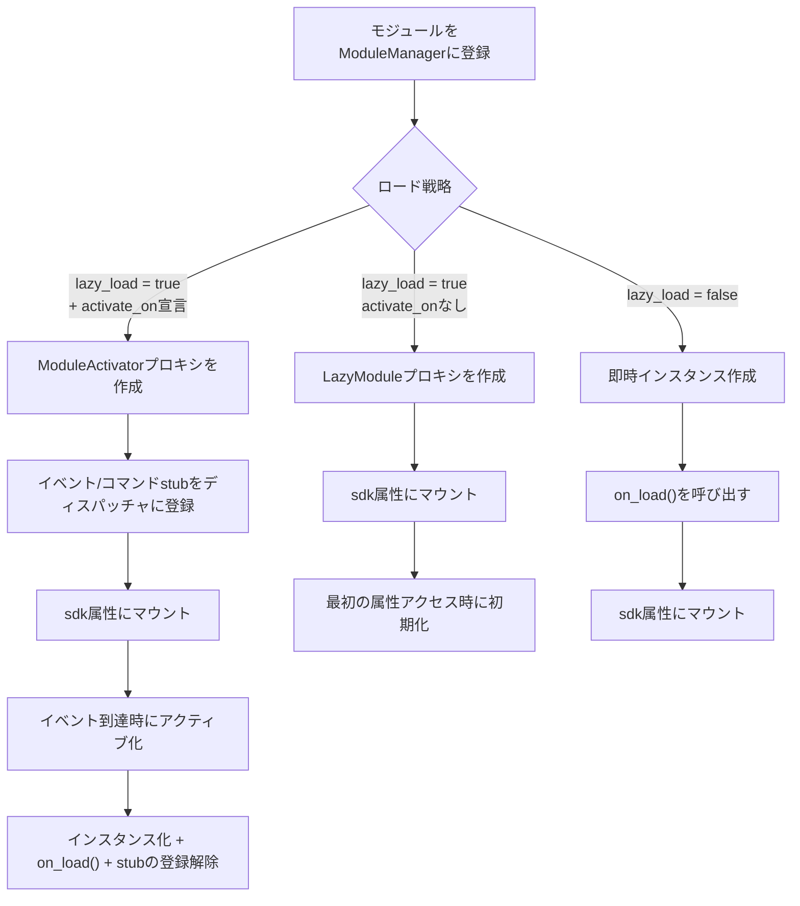
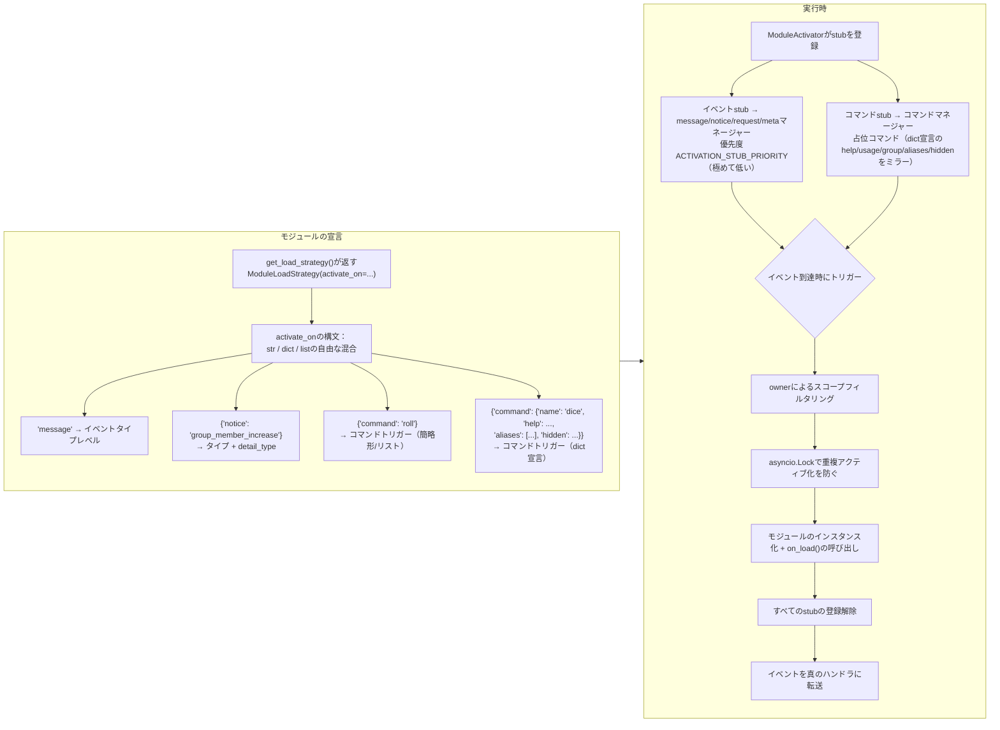
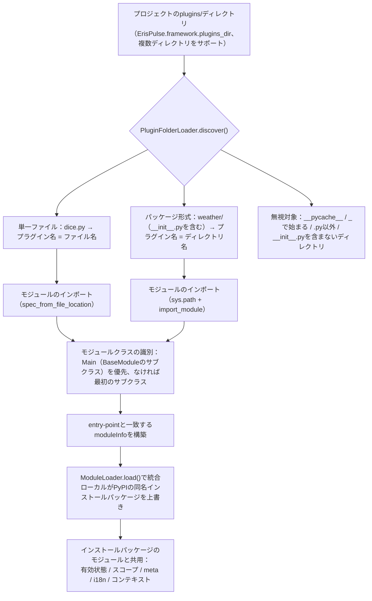
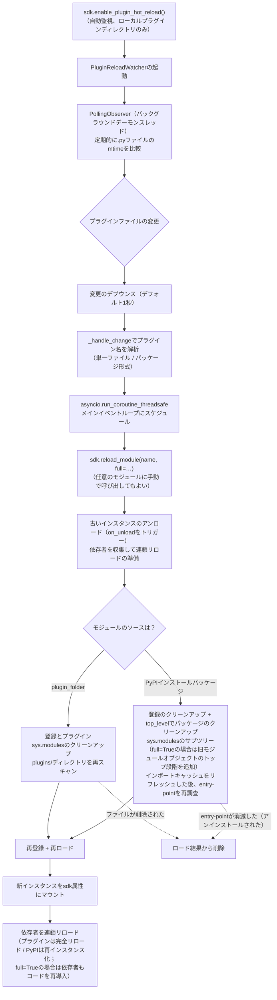

# アーキテクチャ概要

このドキュメントでは、ErisPulse SDK の技術的アーキテクチャを可視化した図解を通じて紹介し、フレームワークの設計思想とモジュール間の関係を迅速に理解できるようにします。

## SDKのコアアーキテクチャ

下図は、SDKのコアモジュール構成とその関係を示しています：

```mermaid
graph TB
    SDK["sdk<br/>統一エントリーポイント"]

    SDK --> Event["Event<br/>イベントシステム"]
    SDK --> Lifecycle["Lifecycle<br/>ライフサイクル管理"]
    SDK --> Logger["Logger<br/>ログ管理"]
    SDK --> Storage["Storage / env<br/>ストレージ管理"]
    SDK --> Config["Config<br/>設定管理"]
    SDK --> AdapterMgr["Adapter<br/>アダプタ管理"]
    SDK --> ModuleMgr["Module<br/>モジュール管理"]
    SDK --> Router["Router<br/>ルーティング管理"]
    SDK --> Client["Client<br/>HTTPクライアント"]
    Event --> Command["command"]
    Event --> Message["message"]
    Event --> Notice["notice"]
    Event --> Request["request"]
    Event --> Meta["meta"]
    Event --> Conversation["Conversation<br/>会話 + 永続化"]

    AdapterMgr --> BaseAdapter["BaseAdapter"]
    BaseAdapter --> P1["雲湖"]
    BaseAdapter --> P2["Telegram"]
    BaseAdapter --> P3["OneBot11/12"]
    BaseAdapter --> PN["..."]

    ModuleMgr --> BaseModule["BaseModule"]
    BaseModule --> CM["カスタムモジュール"]

    BaseAdapter -.-> SendDSL["SendDSL<br/>メッセージ送信"]
```

### コアモジュールの説明

| モジュール | 説明 |
|------|------|
| **Event** | イベントシステム。command / message / notice / request / meta 5種類のイベント処理と、Conversationによる多段階対話処理を提供します。|
| **Adapter** | アダプタマネージャー。複数プラットフォームのアダプタの登録、起動、停止を管理します。|
| **Module** | モジュールマネージャー。プラグインの登録、ロード、アンロードを管理し、依存関係の宣言とトポロジカルソートをサポートします。|
| **Lifecycle** | ライフサイクルマネージャー。イベント駆動型のライフサイクルフックを提供します。|
| **Storage** | SQLiteベースのキーバリューストレージシステム。一般的なSQLチェーンクエリをサポートします。|
| **Config** | TOML形式の設定ファイル管理。|
| **Logger** | モジュール化されたログシステム。サブロガーをサポートします。|
| **Router** | HTTP/WebSocketルーティング管理。FastAPI + Uvicornで抽象化された下層バックエンドをカプセル化し、デコレータールーティング、ミドルウェア、グループ、リクエスト制限、CORSをサポートします。|
| **Client** | 統一HTTP/WSクライアント（2.8.0以前は`HttpClient`、互換性のある別名を保持）。aiohttpで抽象化された下層リクエストライブラリをカプセル化し、リクエスト統計、リトライ、ログ、WebSocketクライアント、ErisPulseの例外体系等功能を提供します。クライアントとサーバーのWebSocketは`WebSocketConnectionBase`基底クラスを共有します。|

## 初期化フロー

下図は`sdk.init()`の完全な初期化プロセスを示しています：

```mermaid
flowchart TD
    A["sdk.init()"] --> B["実行環境の準備"]
    B --> B1["設定ファイルの読み込み"]
    B1 --> B2["グローバル例外処理の設定"]
    B2 --> C["アダプタ & モジュールの発見"]
    C --> D{"並列ロード"}
    D --> D1["PyPIからアダプタをロード"]
    D --> D2["PyPIからモジュールをロード"]
    D1 & D2 --> E["アダプタの登録"]
    E --> E1["アダプタの起動"]
    E1 --> F["モジュールの登録"]
    F --> F1{"依存関係の検証"}
    F1 -->|"依存関係が不足"| F2["モジュールをスキップし警告を記録"]
    F1 -->|"依存関係が満たされている"| F3["トポロジカルソート<br/>（Kahnアルゴリズム + 優先度）"]
    F3 --> G["順序に従ってモジュールを初期化<br/>（インスタンス化 + on_load）"]
    F2 --> G
    G --> H["ルーティングサーバーの起動"]
    H --> K["起動完了"]
```

### 初期化段階の詳細

> 完全な初期化のチェーン分解（Finder / Loader / Manager / Router）、下層エントリーポイント（`init()` / `init_task()` / `init_sync()`）と手動の完全起動については[起動フローと手動制御](advanced/startup.md)を参照してください。

## イベント処理フロー

下図は、プラットフォームからハンドラへのメッセージの完全な流れを示しています：

```mermaid
flowchart LR
    A["プラットフォームの元のメッセージ"] --> B["アダプタが受信"]
    B --> C["OneBot12標準に変換"]
    C --> D["adapter.emit()"]
    D --> E["ミドルウェアチェーンの実行"]
    E --> F{"イベントの分散"}
    F --> G1["command<br/>コマンドハンドラ"]
    F --> G2["message<br/>メッセージハンドラ"]
    F --> G3["notice<br/>通知ハンドラ"]
    F --> G4["request<br/>リクエストハンドラ"]
    F --> G5["meta<br/>メタイベントハンドラ"]
    G1 & G2 & G3 & G4 & G5 --> H["ハンドラのコールバック実行"]
    H --> I["event.reply()<br/>SendDSL経由で返信"]
    I --> J["アダプタがプラットフォームに送信"]
```

### イベント処理チェーンの詳細

上記の図は「結果」です。下に`adapter.emit()`を分解したフレームワークが**裏で何をしたか**を示します。これは3層に分かれた分散チェーンです：

```mermaid
sequenceDiagram
    participant P as プラットフォーム
    participant A as アダプタマネージャー層<br/>AdapterManager.emit
    participant T as ハンドラ Task層<br/>_dispatch_handler_task
    participant E as Eventモジュール層<br/>_process_event

    P->>A: 元のイベント
    A->>A: platform/type/detail_type + 元のフィールドを抽出
    A->>A: [Recv] 受信ログ
    A->>A: lifecycle.adapter.event.receive（初期のフック）
    A->>A: selfフィールドの処理（meta分岐 / Botの自動登録）
    A->>A: ミドルウェアチェーン（直列、イベントデータを変更可能）
    A->>A: ハンドラの収集（具体的なタイプ + ワイルドカード*）
    A->>A: 身元認証 + スコープフィルタリング（Taskの作成前に、静かに破棄/スキップ）
    A->>T: asyncio.create_task（fire-and-forget）
    A->>A: lifecycle.adapter.event.dispatched（最終のフック）
    T->>T: 並行信号量の取得（デフォルト上限64）
    T->>E: Eventモジュールに登録されたハンドラを呼び出す
    E->>E: lifecycle.event.pre_process
    E->>E: ignore_self（メッセージイベントはデフォルトで自身を無視）
    E->>E: 優先度順にグループ化：高→低、グループ間直列、グループ内並列
    E->>E: グループ内のコピーを実行 + フィールドのマージ（競合警告）
    E->>E: グループ後のstop()チェックで、より低い優先度をブロック
    T->>T: スローなログ（1秒以上かかる場合、wait_reply時間のホワイトリストから除外）
```

**フレームワークが何をしたか、そしてあなたが介入できる点：**

| 階段 | フレームワークが何をしたか | 介入できる点 |
|------|-------------|-----------|
| 受信 | 標準フィールドの抽出、{platform}_rawの元データを保持；[Recv]ログを記録 | `adapter.event.receive`を監視して初期イベントを取得 |
| selfフィールド | metaイベントはconnect/disconnect/heartbeat分岐；通常のイベントはBotを自動登録し、`adapter.bot.online`をトリガー | `adapter.bot.online` / `bot.offline`を監視 |
| ミドルウェア | **直列**で実行、None以外の戻り値があればイベントデータを置き換え | ミドルウェアを登録してイベントを変更/ブロック |
| 分散収集 | 先に具体的なタイプのハンドラを取得し、次に`*`ワイルドカードハンドラを取得 | — |
| 身元次元 | 分散入口はユーザー>セッション>Bot>アダプタで判定（`scope.is_identity_allowed`）、**拒否されればイベントは破棄** | `ErisPulse.scope.identity`をバインド |
| スコープフィルタリング | モジュールのownerで判定`scope.is_allowed`（セッションレベル>Botレベル>プラットフォームレベル）、**通過しないと静かにスキップ** | スコープのホワイトリスト/ブラックリストを設定 |
| スケジューリング | 各マッチするハンドラは独立`asyncio.Task`、`emit()`は**ハンドラが完了するまで待たずに**返す | — |
| 優先度 | 高優先度のグループが先に実行；**グループ間直列、グループ内並列**（グループ内の各ハンドラはイベントのコピーを持ち、フィールドの変更をマージ、競合時はWARNINGを出す） | `@command(..., priority=N)` / 登録時にpriorityを指定 |
| ブロック | 各グループの処理後`event.is_stopped()`をチェック、ヒットすると**より低い優先度は実行されない** | `event.mark_processed(stop=True)` / `event.done()` |

> **よくある誤解**：
> 1. **スコープフィルタリングは静か**です。遮断されたハンドラはエラーもレスポンスもせず、TRACEレベルのログ（`core.scope.denied`）にのみ表示されます。「私のモジュールがメッセージを受け取らない」場合は、まずスコープのバインディングを確認してください。
> 2. **ハンドラは天然並列**です。フレームワークは各ハンドラに独立したTaskを用意しているため、**自分で`asyncio.create_task`をラップする必要はありません**。
> 3. **同優先度のグループ内ではブロックされません**。`mark_processed(stop=True)`は、より低い優先度のグループをブロックするだけで、同じグループ内で並列実行されているハンドラは途中で中断されません。
> 4. **スローなログの閾値は固定1秒**です。ハンドラの処理時間が1秒を超えると、ログにWARNINGが出力されます（`wait_reply`待ち時間は処理時間から除外されますが、処理は中断されません）。

> 作用域（scope）のモジュール次元の3段階バインディング、身元認証と出力アクションの制限の詳細は[作用域（scope）](advanced/scope.md)を参照してください。イベント作用域のテキストフィルタリングとコマンドユーザーACLは[イベント処理入門](getting-started/event-handling.md)を参照してください。並列上限の設定は[設定ガイド](user-guide/configuration.md#フレームワーク設定)を参照してください。

## ライフサイクルイベント

下図は、フレームワーク各コンポーネントのライフサイクルイベントの発生順序を示しています：

```mermaid
flowchart LR
    subgraph Core["コア"]
        direction LR
        C1["core.init.start"] --> C2["core.init.complete"]
    end

    subgraph AdapterLife["アダプタ"]
        direction LR
        A1["adapter.start"] --> A2["adapter.status.change"] --> A3["adapter.stop"] --> A4["adapter.stopped"]
    end

    subgraph ModuleLife["モジュール"]
        direction LR
        M1["module.load"] --> M2["module.init"] --> M3["module.unload"]
    end

    subgraph BotLife["Bot"]
        direction LR
        B1["adapter.bot.online"] --> B2["adapter.bot.offline"]
    end

    Core --> AdapterLife
    AdapterLife --> ModuleLife
    AdapterLife -.-> BotLife
```

### ライフサイクルイベントの監視

> 完全なイベント監視方法（`lifecycle.on()` / `once()` / `has_handlers()`）、すべてのライフサイクルイベントリストとデータ形式は[ライフサイクル管理](advanced/lifecycle.md)を参照してください。

## モジュールロード戦略

ErisPulseは3種類のモジュールロード戦略をサポートし、`get_load_strategy()`が返す`ModuleLoadStrategy`で宣言されます：

```mermaid
flowchart TD
    A["モジュールをModuleManagerに登録"] --> B{"ロード戦略"}
    B -->|"lazy_load = true<br/>+ activate_on宣言"| C["ModuleActivatorプロキシを作成"]
    B -->|"lazy_load = true<br/>activate_onなし"| D["LazyModuleプロキシを作成"]
    B -->|"lazy_load = false"| E["即時インスタンス作成"]
    C --> F["イベント/コマンドstubをディスパッチャに登録"]
    F --> G["sdk属性にマウント"]
    G --> H["イベント到達時にアクティブ化"]
    H --> I["インスタンス化 + on_load() + stubの登録解除"]
    D --> J["sdk属性にマウント"]
    J --> K["最初の属性アクセス時に初期化"]
    E --> L["on_load()を呼び出す"]
    L --> M["sdk属性にマウント"]
```

> 詳細は[遅延ロードシステム](advanced/lazy-loading.md)、[ライフサイクル管理](advanced/lifecycle.md)、およびモジュールドキュメントを参照してください。

### イベント駆動型遅延アクティブ化（`activate_on`）のトリガーアーキテクチャ

> [!NOTE]
> この機能はErisPulse **2.8.0+**が必要です。

`activate_on`を使用すると、モジュールは**最初の一致するイベント/コマンドが到達した時点で**ロードされ、常駐メモリを避ける一方で、イベントの損失を防ぎます：

```mermaid
flowchart LR
    subgraph Declare["モジュールの宣言"]
        S1["get_load_strategy()が返す<br/>ModuleLoadStrategy(activate_on=...)"] --> S2["activate_onの構文：<br/>str / dict / listの自由な混合"]
        S2 --> S2a["'message' → イベントタイプレベル"]
        S2 --> S2b["{'notice': 'group_member_increase'}<br/>→ タイプ + detail_type"]
        S2 --> S2c["{'command': 'roll'}<br/>→ コマンドトリガー（簡略形/リスト）"]
        S2 --> S2d["{'command': {'name': 'dice', 'help': ...,<br/>'aliases': [...], 'hidden': ...}}<br/>→ コマンドトリガー（dict宣言）"]
    end

    subgraph Runtime["実行時"]
        R1["ModuleActivatorがstubを登録"] --> R1a["イベントstub → message/notice/request/metaマネージャー<br/>優先度ACTIVATION_STUB_PRIORITY（極めて低い）"]
        R1 --> R1b["コマンドstub → コマンドマネージャー<br/>占位コマンド（dict宣言のhelp/usage/group/aliases/hiddenをミラー）"]
        R1a --> R2{"イベント到達時にトリガー"}
        R1b --> R2
        R2 --> R3["ownerによるスコープフィルタリング"]
        R3 --> R4["asyncio.Lockで重複アクティブ化を防ぐ"]
        R4 --> R5["モジュールのインスタンス化 + on_load()の呼び出し"]
        R5 --> R6["すべてのstubの登録解除"]
        R6 --> R7["イベントを真のハンドラに転送"]
    end

    Declare --> Runtime
```

**トリガーメカニズムの要点：**

> 完全な`activate_on`構文（str / dict / list）、コマンドdict宣言、占位コマンドのhelp回帰チェーン、スコープフィルタリングと失敗の意味は[遅延ロードシステム](advanced/lazy-loading.md#イベント駆動型遅延アクティブactivate_on)を参照してください。

## ローカルプラグインフォルダアーキテクチャ

> [!NOTE]
> この機能はErisPulse **2.8.0+**が必要です。

ローカルプラグイン（`plugins/`ディレクトリ）は、パッケージングや公開を必要とせず、フレームワークの起動時に自動的に発見されロードされます：

```mermaid
flowchart TD
    A["プロジェクトのplugins/ディレクトリ<br/>（ErisPulse.framework.plugins_dir、複数ディレクトリをサポート）"] --> B{"PluginFolderLoader.discover()"}
    B --> C["単一ファイル：dice.py → プラグイン名 = ファイル名"]
    B --> D["パッケージ形式：weather/（__init__.pyを含む）→ プラグイン名 = ディレクトリ名"]
    B --> E["無視対象：__pycache__ / _で始まる / .py以外 / __init__.pyを含まないディレクトリ"]
    C --> F["モジュールのインポート（spec_from_file_location）"]
    D --> G["モジュールのインポート（sys.path + import_module）"]
    F --> H["モジュールクラスの識別：Main（BaseModuleのサブクラス）を優先、なければ最初のサブクラス"]
    G --> H
    H --> I["entry-pointと一致するmoduleInfoを構築"]
    I --> J["ModuleLoader.load()で統合<br/>ローカルがPyPIの同名インストールパッケージを上書き"]
    J --> K["インストールパッケージのモジュールと共用：<br/>有効状態 / スコープ / meta / i18n / コンテキスト"]
```

**規約と特性：**

- プラグイン名の取得元：単一ファイルはファイル名、パッケージ形式はディレクトリ名
- ローカルプラグイン `moduleInfo.meta.source == "plugin_folder"`、PyPIインストールパッケージモジュールとシームレスに共存
- 同名の場合はローカルが優先（ローカルの上書きデバッグに便利）、無効化された場合は同名のentry-point項目も削除される

## モジュールのホットリロードアーキテクチャ

ホットリロードは**すべてのモジュールソース**に対して一貫して適用されます：ローカルプラグインはファイル変更を監視して自動的にトリガし、任意のモジュールは`sdk.reload_module()` / `sdk.module.reload()`で手動でリロードできます（PyPIインストールパッケージモジュールはpipアップデート後に呼び出すことで有効になります）；`sdk.reload_all_modules()` / `sdk.module.reload_all()`で登録済みのすべてのモジュールを一度にリロードできます（pipのバッチアップデート後に呼び出すことですべてのモジュールが有効になります）：

```mermaid
flowchart TD
    A["sdk.enable_plugin_hot_reload()<br/>（自動監視、ローカルプラグインディレクトリのみ）"] --> B["PluginReloadWatcherの起動"]
    B --> C["PollingObserver（バックグラウンドデーモンスレッド）<br/>定期的に.pyファイルのmtimeを比較"]
    C --> D{"プラグインファイルの変更"}
    D --> E["変更のデブウンス（デフォルト1秒）"]
    E --> F["_handle_changeでプラグイン名を解析<br/>（単一ファイル / パッケージ形式）"]
    F --> G["asyncio.run_coroutine_threadsafe<br/>メインイベントループにスケジュール"]
    G --> H["sdk.reload_module(name, full=…)<br/>（任意のモジュールに手動で呼び出してもよい）"]
    H --> I["古いインスタンスのアンロード（on_unloadをトリガー）<br/>依存者を収集して連鎖リロードの準備"]
    I --> J{"モジュールのソースは？"}
    J -->|"plugin_folder"| K["登録とプラグインsys.modulesのクリーンアップ<br/>plugins/ディレクトリを再スキャン"]
    J -->|"PyPIインストールパッケージ"| L["登録のクリーンアップ + top_levelでパッケージのクリーンアップ<br/>sys.modulesのサブツリー（full=Trueの場合は旧モジュールオブジェクトのトップ段階を追加）<br/>インポートキャッシュをリフレッシュした後、entry-pointを再調査"]
    K --> M["再登録 + 再ロード"]
    L --> M
    M --> N["新インスタンスをsdk属性にマウント"]
    N --> O["依存者を連鎖リロード<br/>（プラグインは完全リロード / PyPIは再インスタンス化；<br/>full=Trueの場合は依存者もコードを再導入）"]
    K -.->|"ファイルが削除された"| P["ロード結果から削除"]
    L -.->|"entry-pointが消滅した（アンインストールされた）"| P
```

**2つのソースの違いは発見段階のみ**、登録、ロード、連鎖リロードは完全に一致します：

- **ローカルプラグイン**（`moduleInfo.meta.source == "plugin_folder"`）：プラグイン名に対応する`sys.modules`をクリーンアップした後、`plugins/`ディレクトリを再スキャンします；ファイルが削除された場合はロード結果から削除されます。
- **PyPIインストールパッケージ**：`meta.top_level`に従ってパッケージの`sys.modules`サブツリーをクリーンアップし、インポートキャッシュをリフレッシュ（entry-pointの60秒キャッシュを突破）した後、再調査して再インポートします；entry-pointが消滅した（pipでアンインストールされた）場合はロード結果から削除されます。

**全量リロード（`full=True`）と全体リロード（`reload_all_modules`）：**

- `top_level`メタデータが欠落し、推論できない場合、デフォルトのリロードは**インポートキャッシュをクリーンアップしません**（再インポートで旧モジュールオブジェクトを再利用、いわゆる「偽リロード」）、フレームワークは明示的に警告を出し、`full=True`の使用を推奨します——全量リロードは旧モジュールオブジェクトのトップレベルパッケージ名を追加でクリーンアップし、最新のコードが実行されることを保証します。
- `full=True`の場合はPyPIの依存者も完全リロード（コードを再導入）し、デフォルトモードでは再インスタンス化のみ（既存の意味）。
- リロードはもともと遅延ロードのモジュールを強制的にアクティブ化します（表示されない違いは明示的なログに変更されました）；`reload_all_modules()`は遅延ロード戦略を維持し、リロード前に既にロード済みのモジュールを再アクティブ化します。
- `reload_all_modules()`は依存関係のトポロジカル順序で再ロードし、単一モジュールの失敗は診断を記録してスキップします（全体のロールバックは行われません——on_unloadの副作用は元に戻せないため、単一モジュールのホットリロードの尽力の意味と一致します）；リロード失敗でロールバックされた状況も同様で、ログには旧インスタンスが既に終了した状態であることが明示的に表示されます。