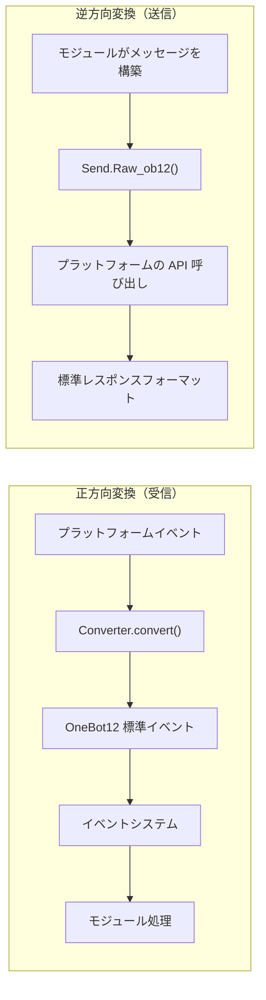

# アダプタ開発入門

このガイドは、ErisPulse アダプタを開発し、新しいメッセージプラットフォームに接続するための手順を紹介します。

## アダプタ概要

### アダプタとは

アダプタは、ErisPulse と各メッセージプラットフォームを橋渡しする役割を担い、以下の機能を提供します：

1. **正方向変換**：プラットフォームのイベントを OneBot12 標準フォーマットに変換する（Converter）
2. **逆方向変換**：OneBot12 メッセージセグメントをプラットフォーム API 呼び出しに変換する（`Raw_ob12`）
3. プラットフォームとの接続管理（WebSocket/WebHook）
4. 統一的な SendDSL メッセージ送信インターフェースの提供

### アダプタのアーキテクチャ



## ディレクトリ構造

標準的なアダプタパッケージ構造は以下の通りです：

```
MyAdapter/
├── pyproject.toml          # プロジェクト設定
├── README.md               # プロジェクト説明
├── LICENSE                 # ライセンス
└── MyAdapter/
    ├── __init__.py          # パッケージエントリ
    ├── Core.py               # アダプタのメインクラス
    └── Converter.py          # イベント変換器
```

## 速習

### 1. プロジェクトの作成

```bash
mkdir MyAdapter && cd MyAdapter
```

### 2. pyproject.toml の作成

```toml
[project]
name = "ErisPulse-MyAdapter"
version = "1.0.0"
description = "MyAdapterプラットフォームアダプタ"
readme = "README.md"
requires-python = ">=3.10"
license = { file = "LICENSE" }
authors = [ { name = "yourname", email = "your@mail.com" } ]

dependencies = [
    "ErisPulse>=2.4.0"  # ErisPulse は aiohttp を内蔵しているため、通常は個別に依存関係を指定する必要はない
]

[project.urls]
"homepage" = "https://github.com/yourname/MyAdapter"

[project.entry-points."erispulse.adapter"]
"MyAdapter" = "MyAdapter:MyAdapter"
```

### 3. アダプタのメインクラスの作成

フレームワークは `ConfigClass` / `AccountConfigClass` を提供し、宣言的に設定を管理します。アダプタは設定クラスを宣言するだけで、自動的にロード、検証、設定テンプレートの生成が行われます。

```python
# MyAdapter/Core.py
from dataclasses import dataclass, field
from ErisPulse.Core import BaseAdapter
from ErisPulse.Core.Bases import BaseConfig

@dataclass
class MyAdapterConfig(BaseConfig):
    """MyAdapter 設定"""
    api_endpoint: str = field(
        default="https://api.example.com",
        metadata={
            "description": {"i18n": "my_adapter.api_endpoint", "default": "API アドレス"},
            "required": False,
            "ui": {"widget": "text", "group": "connection", "order": 1},
        },
    )
    token: str = field(
        default="",
        metadata={
            "description": {"i18n": "my_adapter.token", "default": "プラットフォーム Token"},
            "required": True,
            "secret": True,
            "ui": {"widget": "password", "group": "basic", "order": 2},
        },
    )

class MyAdapter(BaseAdapter):
    ConfigClass = MyAdapterConfig  # 設定クラスを宣言し、フレームワークが自動管理
    
    # __init__ をオーバーライドする必要はない！フレームワークが自動処理：
    # - self.sdk / self.logger が自動設定される
    # - self.cfg は設定をリアルタイムで読み取れる
    # - self.Send / self.Request が自動初期化される
    
    def _setup_converter(self):
        from .Converter import MyPlatformConverter
        return MyPlatformConverter()
```

> ⚠️ **__init__ について**：新バージョンでは `BaseAdapter.__init__(self, sdk=None)` が SDK の参照、ログの初期化、設定のロードを自動的に処理します。ほとんどのアダプタは `__init__` をオーバーライドする必要はありません。詳細は [__init__ 注意事項](#init-注意事项) を参照してください。

> ⚠️ **super().__init__() について**：`BaseAdapter.__init__()` は `Send` と `Request` ファクトリのインスタンスを作成します。これを呼び出さないと、すべてのメッセージ送信とリクエスト操作で `AttributeError` が発生します。詳細は [__init__ 注意事項](#init-注意事项) を参照してください。

### 4. 必須メソッドの実装

```python
class MyAdapter(BaseAdapter):
    # ... __init__ 代码 ...
    
    async def start(self):
        """アダプタの起動（必須実装）"""
        # WebSocket または WebHook ルートを登録
        router.register_websocket(
            module_name="myplatform",
            path="/ws",
            handler=self._ws_handler
        )
        self.logger.info("アダプタが起動しました")
    
    async def shutdown(self):
        """アダプタの停止（必須実装）"""
        router.unregister_websocket(
            module_name="myplatform",
            path="/ws"
        )
        # 接続とリソースのクリーンアップ
        self.logger.info("アダプタが停止しました")
    
    async def call_api(self, endpoint: str, **params):
        """プラットフォーム API の呼び出し（必須実装）"""
        raise NotImplementedError("call_api を実装する必要があります")
```

#### メタイベントの送信

アダプタは Bot のオンライン状態をフレームワークに通知するために、メタイベントを送信する必要があります。`emit_meta()` を使用すれば、1 行で実現できます：

```python
class MyAdapter(BaseAdapter):
    async def _ws_handler(self, websocket):
        bot_id = self._get_bot_id()

        # Bot がオンライン
        await self.emit_meta("connect", bot_id, user_name="MyBot")

        try:
            while True:
                data = await websocket.receive_text()
                event = self.convert(data)
                if event:
                    await self.adapter.emit(event)
        except WebSocketDisconnect:
            pass
        finally:
            # Bot がオフライン
            await self.emit_meta("disconnect", bot_id)
```

> Bot 状態管理とメタイベントの詳細については、[アダプタのベストプラクティス - Bot 状態管理](best-practices.md#bot-状態管理と-meta-イベント) を参照してください。

### 5. Send クラスの実装

`At`/`AtAll`/`Reply` 修飾子はフレームワークの SendDSL 基底クラスに既に実装されています。アダプタは `Raw_ob12` と具体的な送信メソッドを実装するだけで済みます。

フレームワークは以下の重要な補助メソッドを提供しています：
- `self._apply_modifiers(message)` — 修飾子（At/AtAll/Reply）をメッセージセグメントに自動的にマージ
- `self.send_context` — 送信コンテキスト辞書（`target_type`、`target_id`、`account_id`）を取得

```python
import asyncio

class MyAdapter(BaseAdapter):
    # ... 他のコード ...

    class Send(BaseAdapter.Send):

        def Raw_ob12(self, message, **kwargs):
            """
            OneBot12 形式のメッセージを送信する（必須実装）

            _apply_modifiers を使用して修飾子を自動的にマージし、send_context を使用して送信コンテキストを取得する。
            """
            async def _do_send():
                segments = self._apply_modifiers(message)
                return await self._adapter.call_api(
                    endpoint="/send_message",
                    message=segments,
                    **self.send_context,
                    **kwargs
                )
            return asyncio.create_task(_do_send())

        # Text/Image/Voice/Video/File は SendDSL 基底クラスから継承されているため、
        # Raw_ob12 にデフォルトで委譲されるため、再実装する必要はない。
        # プラットフォーム固有のロジックが必要な場合は、個別のメソッドをオーバーライドする：
        # def Text(self, text: str):
        #     return self.Raw_ob12([{"type": "text", "data": {"text": text}}])
```

**メディア送信メソッド（Image/Video/File）の実装のポイント：**

- 基底クラスのデフォルト実装は、`file` パラメータを OneBot12 メッセージセグメントにカプセル化して `Raw_ob12` に渡す。アダプタは `Raw_ob12` でダウンロード/アップロードを処理する必要がある。
- `file` パラメータは `bytes` 二進データと `str` URL の両方に対応する。
- URL を渡した場合は、まずファイルをダウンロードしてからプラットフォームにアップロードする必要がある。
- プラットフォームでは通常、まずアップロード API を呼び出してファイル識別子を取得し、次に送信 API を呼び出す。

**`__getattr__` マジックメソッド：**

- メソッド名の大小文字を区別しない（`Text`、`text`、`TEXT` がすべて呼び出せる）
- 定義されていないメソッドはエラーではなく、エラーメッセージを返す

**`Raw_ob12` メソッド：**

- OneBot12 標準メッセージ形式をプラットフォーム形式に変換して送信する
- `self._apply_modifiers(message)` を使用して At/AtAll/Reply 修飾子を自動的に処理する
- `**self.send_context` を使用して送信先情報とアカウント情報を渡す

### 6. 変換器の実装

```python
# MyAdapter/Converter.py
import time
import uuid

class MyPlatformConverter:
    def convert(self, raw_event):
        """プラットフォームの生イベントを OneBot12 標準形式に変換する"""
        if not isinstance(raw_event, dict):
            return None
        
        onebot_event = {
            "id": str(raw_event.get("event_id", uuid.uuid4())),
            "time": int(time.time()),
            "type": self._convert_event_type(raw_event.get("type")),
            "detail_type": self._convert_detail_type(raw_event),
            "platform": "myplatform",
            "self": {
                "platform": "myplatform",
                "user_id": str(raw_event.get("bot_id", ""))
            },
            "myplatform_raw": raw_event,
            "myplatform_raw_type": raw_event.get("type", "")
        }
        
        return onebot_event
    
    def _convert_event_type(self, event_type):
        """イベントタイプを変換する"""
        type_map = {
            "message": "message",
            "notice": "notice"
        }
        return type_map.get(event_type, "unknown")
    
    def _convert_detail_type(self, raw_event):
        """詳細タイプを変換する"""
        return "private"  # 簡単化のため
```

### 7. Request クラスの実装（リクエスト操作）

プラットフォームが友達リクエスト、グループ招待など Bot が判断を必要とするリクエストに対応している場合、`Request` 内部クラスを実装することができます。

```python
from ErisPulse.Core import BaseAdapter, RequestDSL

class MyAdapter(BaseAdapter):
    # ... Send と他のコード ...

    class Request(RequestDSL):
        """リクエスト操作の実装（友達リクエスト、グループ招待など）"""

        def accept(self, **kwargs):
            """リクエストを承認する"""
            async def _do():
                result = await self._adapter.call_api(
                    endpoint="/set_request",
                    request_id=self._request_id,
                    approve=True,
                    **kwargs,
                )
                return {
                    "status": "ok" if result.get("code") == 0 else "failed",
                    "retcode": result.get("code", 0),
                    "data": None,
                    "message_id": "",
                    "message": result.get("message", ""),
                }
            return self._create_task(_do())

        def reject(self, **kwargs):
            """リクエストを拒否する"""
            async def _do():
                result = await self._adapter.call_api(
                    endpoint="/set_request",
                    request_id=self._request_id,
                    approve=False,
                    **kwargs,
                )
                return {
                    "status": "ok" if result.get("code") == 0 else "failed",
                    "retcode": result.get("code", 0),
                    "data": None,
                    "message_id": "",
                    "message": result.get("message", ""),
                }
            return self._create_task(_do())
```

モジュール開発者が使用する方法：

```python
from ErisPulse.Core.Event import request

@request.on_friend_request()
async def handle_friend_request(event):
    # Event 便利メソッドを使用
    await event.approve()
    # またはアダプタを直接操作
    await adapter.myplatform.Request("req_id").accept()
```

> プラットフォームがリクエスト操作に対応していない場合は、`Request` 内部クラスを実装する必要はありません。基底クラスはデフォルトで `retcode=10002`（対応していない操作）を返します。詳細は [リクエスト操作規格](../../standards/request-action-spec.md) を参照してください。

### 8. パッケージエントリの作成

```python
# MyAdapter/__init__.py
from .Core import MyAdapter
```

## 依存関係の宣言（オプション、2.8.0以降）

アダプタは他のアダプタやモジュールへの依存を宣言し、アダプタ間の連携やオプション機能を実現することができます：

```python
from typing import ClassVar

class MyAdapter(BaseAdapter):
    # 硬的依存：存在しない場合、起動をスキップし、警告と status=skipped-dependency イベントを送る
    depends: ClassVar[dict] = {
        "adapters": ["onebot11"],   # 依存するアダプタ（プラットフォーム名）
        "modules": ["TranslateEngine"],  # 依存するモジュール（登録名）
    }
    # ソフト依存：存在しない場合、起動に影響せず、モジュールのロード/アンロード時にコールバックを受ける（オプション機能モード）
    optional_modules: ClassVar[list] = ["TranslateEngine"]
```

- **起動順序**：モジュールの硬的依存を宣言したアダプタは、モジュールの初期化完了後に起動される
- **ソフト依存の通知**：`optional_modules`（またはモジュールの硬的依存）に含まれるモジュールがロードされたときに `on_dependency_ready(module_name)` を呼び出す；アンロードされたときに `on_dependency_lost(module_name)` を呼び出す（デフォルトは空実装、オーバーライド可能）— 早めのオーバーライドとホットリロードの場面に対応：

```python
async def on_dependency_ready(self, module_name):
    """ソフト依存モジュールの準備完了：対応するオプション機能を有効化"""
    if module_name == "TranslateEngine":
        self._translate = self.sdk.TranslateEngine

async def on_dependency_lost(self, module_name):
    """ソフト依存モジュールの喪失：機能を降格"""
    if module_name == "TranslateEngine":
        self._translate = None
```

> [!NOTE]
> この機能は ErisPulse **2.8.0+** が必要です。

## `__init__` 注意事項

アダプタ開発では、`__init__` のオーバーライドが3つのレベルで必要になる場合があります。以下の各レベルの正しい使い方を紹介します。

### 1. BaseAdapter 層（ほとんどの場合、オーバーライドする必要はない）

`BaseAdapter.__init__(self, sdk=None)` は `Send` / `Request` ファクトリのインスタンスを作成し、以下を自動的に処理します：

- `sdk` パラメータを受け取り、`self.sdk`、`self.logger` を設定
- `ConfigClass` を宣言した場合、`self.cfg` を通じてグローバル設定をリアルタイムで読み取れる
- `AccountConfigClass` を宣言した場合、`self.accounts` を通じて複数アカウントの設定をリアルタイムで読み取れる

**ほとんどの場合、`__init__` をオーバーライドする必要はない**。`ConfigClass` を宣言するだけで済みます：

```python
class MyAdapter(BaseAdapter):
    ConfigClass = MyAdapterConfig  # 設定クラスを宣言するとフレームワークが自動管理
    
    async def start(self):
        cfg = self.cfg  # タイプセーフで、リアルタイムに読み取れる
        ...
```

もし本当にカスタム初期化が必要な場合は、`super().__init__(sdk)` を呼び出すだけです：

```python
class MyAdapter(BaseAdapter):
    ConfigClass = MyAdapterConfig
    
    def __init__(self, sdk=None):
        super().__init__(sdk)  # sdk を渡す
        self.converter = self._setup_converter()
        self.convert = self.converter.convert
```

### 2. Send 内部クラス（ほとんどの場合、オーバーライドする必要はない）

`SendDSL.__init__` は、チェーン呼び出しの状態を渡す（ターゲットタイプ、ターゲットID、アカウントなど）役割を担います。**ほとんどの場合、メソッド（`Raw_ob12`、`Text` など）をオーバーライドするだけで済み、`__init__` をオーバーライドする必要はありません。**

もし本当に必要（例えば、プラットフォーム特有の状態を初期化する）場合は、**すべてのパラメータを透かす必要があります**：

```python
class MyAdapter(BaseAdapter):
    class Send(BaseAdapter.Send):
        # パラメータ：adapter, target_type, target_id, account_id
        def __init__(self, adapter, target_type=None, target_id=None, account_id=None):
            super().__init__(adapter, target_type, target_id, account_id)  # ← 必須透かす
            self._my_state = None  # プラットフォーム特有の初期化
```

**なぜ透かす必要があるのか？** チェーン呼び出しの各ステップは `self.__class__(...)` を通じて新しいインスタンスを作成します：

```python
adapter.Send.To("user", "123")               # → Send(adapter, "user", "123", None)
adapter.Send.To("user", "123").Using("bot1")  # → Send(adapter, "user", "123", "bot1")
```

もし `__init__` のシグネチャが一致しない、または `super()` を呼び出さないと、チェーン呼び出しは中断します。

### 3. Request 内部クラス（ほとんどの場合、オーバーライドする必要はない）

Send と同じです。パラメータは `adapter`, `request_id`, `account_id` です：

```python
class MyAdapter(BaseAdapter):
    class Request(RequestDSL):
        # パラメータ：adapter, request_id, account_id
        def __init__(self, adapter, request_id=None, account_id=None):
            super().__init__(adapter, request_id, account_id)  # ← 必須透かす
            self._my_state = None  # プラットフォーム特有の初期化
```

### まとめ

| レベル | いつオーバーライドするか | 必須なこと |
|------|------------|-----------|
| **BaseAdapter** | カスタム初期化ロジックが必要な場合 | `super().__init__(sdk)` （sdk パラメータを渡す） |
| **Send 内部クラス** | 送信関連の状態を初期化する必要がある場合 | `super().__init__(adapter, target_type, target_id, account_id)` |
| **Request 内部クラス** | リクエスト関連の状態を初期化する必要がある場合 | `super().__init__(adapter, request_id, account_id)` |
| 3つのレベル | ほとんどの場合 | **ConfigClass を宣言するだけで、`__init__` を触らない** |

### 9. 接続情報とルート発見

アダプタがルートを登録すると、フレームワークはすべてのルート情報を記録します。ユーザーは以下の API を使ってアダプタの接続アドレスを確認できます：

```python
from ErisPulse import sdk

# アダプタの完全な接続情報を取得
info = sdk.adapter.get_connection_info("myplatform")
# {
#   "platform": "myplatform",
#   "status": "started",
#   "connection": {
#     "base_url": "http://localhost:8080",
#     "http_routes": [
#       {"path": "/myplatform/webhook", "method": "POST",
#        "url": "http://localhost:8080/myplatform/webhook"}
#     ],
#     "websocket_routes": [
#       {"path": "/myplatform/ws",
#        "url": "ws://localhost:8080/myplatform/ws"}
#     ]
#   }
# }

# すべての名前空間（アダプタ/モジュール）のルートをリストアップ
namespaces = sdk.router.list_namespaces()
# {"myplatform": {"http": ["/myplatform/webhook"], "websocket": ["/myplatform/ws"]}}

# 名前空間の完全な接続 URL を取得
urls = sdk.router.get_module_urls("myplatform")
# {"base_url": "http://localhost:8080", "http": [...], "websocket": [...]}

# 名前空間の詳細なルート情報を取得
routes = sdk.router.get_module_routes("myplatform")
# {"http": [{"path": "/myplatform/webhook", "methods": ["POST"]}],
#  "websocket": [{"path": "/myplatform/ws", "auth": false}]}
```

> **ヒント**：`get_connection_info()` が返す情報は、ユーザーに表示するのに適しています（例：WebUI）。プラットフォーム側のコールバックアドレスや WebSocket 接続アドレスの設定に役立ちます。ルート登録時の `module_name` は、ErisPulse でアダプタを登録する際の `platform` 名と完全に一致している必要があります。一致していないと、ルート発見が正しく関連付けられません。

### 10. SSE (Server-Sent Events) のサポート

ErisPulse はサーバーに依存しない SSE を内蔵しており、モジュールやアダプタは `@sdk.router.sse()` を使って SSE エンドポイントを登録できます。

#### 基本的な使い方

```python
import asyncio
from ErisPulse import sdk

@sdk.router.sse("MyModule", "/events")
async def event_stream(sse):
    """SSE イベントを送信する"""
    count = 0
    while not sse.closed:
        await sse.send({"count": count}, event="update")
        count += 1
        await asyncio.sleep(1)
```

#### リクエストパラメータの使用

ハンドラは `request` パラメータを宣言してクライアントリクエスト情報を取得できます：

```python
@sdk.router.sse("MyModule", "/events")
async def event_stream(request, sse):
    token = request.query_params.get("token")
    if not validate_token(token):
        await sse.close()
        return

    while not sse.closed:
        data = await fetch_data(token)
        await sse.send(data)
        await asyncio.sleep(5)
```

#### SseEmitter API

| メソッド | 説明 |
|------|------|
| `sse.send(data, event=None, id=None, retry=None)` | SSE イベントを送信。str 以外の data は自動的に JSON シリアライズされる |
| `sse.close()` | SSE 接続を優雅に閉じる（安全に呼び出せる、複数回呼び出しても問題ない） |
| `sse.closed` | 接続が閉じられているか |
| `sse.request` | ベースのリクエストオブジェクト（クエリパラメータ、ヘッダーなどを読み取るのに使用） |

#### RouteGroup での使用

```python
api = sdk.router.group("MyModule", "/api", version="1")

@api.sse("/events")
async def events(sse):
    await sse.send({"msg": "hello"})
```

#### ルート発見

SSE ルートは自動的にルート発見 API に含まれます：

```python
# list_namespaces は "sse" キーを含む
sdk.router.list_namespaces()
# {"MyModule": {"http": [...], "websocket": [...], "sse": ["/MyModule/events"]}}

# get_module_routes は streaming: true をマークする
sdk.router.get_module_routes("MyModule")
# {"http": [...], "websocket": [...], "sse": [{"path": "/MyModule/events", "streaming": true}]}

# get_module_urls は完全な URL を生成する
sdk.router.get_module_urls("MyModule")
# {"sse": [{"path": "/MyModule/events", "url": "http://localhost:8080/MyModule/events"}]}
```

> **サーバーに依存しない設計**：`SseEmitter` はコールバックを通じて下層の HTTP フレームワークと解離されている。フレームワークは `register_sse()` と `@sse` デコレータを統一的な登録エントリとして提供しており、アダプタは下層の HTTP フレームワークに直接依存することなく SSE エンドポイントを実装できる。

## 次にやること

- [アダプタのコア概念](core-concepts.md) - アダプタのアーキテクチャを理解する
- [SendDSL 詳解](send-dsl.md) - メッセージ送信を学ぶ
- [変換器の実装](converter.md) - イベント変換を理解する
- [アダプタのベストプラクティス](best-practices.md) - 高品質なアダプタを開発する