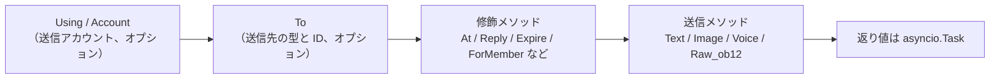
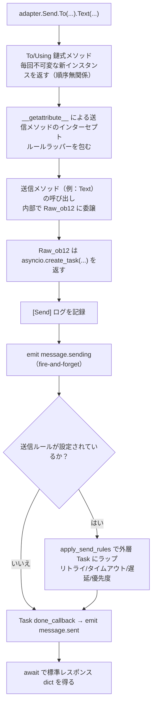

# SendDSL 详解

SendDSL は ErisPulse アダプタが提供する、チェーン呼び出しスタイルのメッセージ送信インターフェースです。

## 基本呼び出し方法

### 1. 型と ID を指定

```python
await adapter.Send.To("group", "123").Text("Hello")
```

### 2. ID を指定のみ

```python
await adapter.Send.To("123").Text("Hello")
```

### 3. 送信アカウントを指定

```python
await adapter.Send.Using("bot1").Text("Hello")
```

### 4. 組み合わせ

```python
await adapter.Send.Using("bot1").To("group", "123").Text("Hello")
```

## メソッドチェーン



## 送信メソッド

すべての送信メソッドは `asyncio.Task` オブジェクトを返します。

### 基本メソッド（基底クラスに内蔵）

以下の標準メソッドは `SendDSL` 基底クラスに内蔵されており、**デフォルトで `Raw_ob12` に委譲**されます。アダプタのサブクラスは実装しなくても直接使用でき、IDE による補完も可能です：

| メソッド名 | 説明 | 戻り値 |
|--------|------|---------|
| `Text(text: str)` | テキストメッセージを送信 | `asyncio.Task` |
| `Image(file: bytes \| str)` | 画像を送信 | `asyncio.Task` |
| `Voice(file: bytes \| str)` | 音声を送信（OneBot12 `audio` メッセージセグメント） | `asyncio.Task` |
| `Video(file: bytes \| str)` | ビデオを送信 | `asyncio.Task` |
| `File(file: bytes \| str, filename: str = None)` | ファイルを送信 | `asyncio.Task` |

アダプタは個々の標準メソッドをオーバーライドして、プラットフォーム固有のロジックを提供できます：

```python
class Send(SendDSL):
    def Raw_ob12(self, message, **kwargs):
        # 必須実装
        ...

    # オプション：Text をオーバーライドしてプラットフォーム固有のロジックを提供
    # def Text(self, text: str):
    #     return self.Raw_ob12([{"type": "text", "data": {"text": text}}])
```

### プロトコルメソッド

| メソッド名 | 説明 | 戻り値 | 必須か |
|--------|------|---------|---------|
| `Raw_ob12(message)` | OneBot12 形式のメッセージを送信 | `asyncio.Task` | **必須実装** |

> **重要**：`Raw_ob12` はアダプタのコアメソッドで、**必須実装**です。これは OneBot12 → プラットフォームの逆変換の統一エントリーポイントです。実装しない場合、基底クラスは error ログを記録し、標準エラー応答（`status: "failed"`, `retcode: 10002`）を返します。標準メソッド（`Text`、`Image` など）はデフォルトで `Raw_ob12` に委譲されます。

### プラットフォーム固有メソッド

アダプタは `Send` サブクラスにプラットフォーム固有の送信メソッドを追加できます（`event.supports()` / `event.available_methods()` で認識されます）：

```python
class Send(SendDSL):
    def Raw_ob12(self, message, **kwargs): ...

    # プラットフォーム固有のメソッド
    def Sticker(self, sticker_id: str):
        return self.Raw_ob12([{"type": "sticker", "data": {"id": sticker_id}}])
```

## 修飾メソッド

修飾メソッドは `self` を返すことで、チェーン呼び出しを可能にします。

### At メソッド

```python
# @1人
await adapter.Send.To("group", "123").At("456").Text("你好")

# @複数人
await adapter.Send.To("group", "123").At("456").At("789").Text("你们好")
```

### AtAll メソッド

```python
# @全員
await adapter.Send.To("group", "123").AtAll().Text("大家好")
```

### Reply メソッド

```python
# メッセージに返信
await adapter.Send.To("group", "123").Reply("msg_id").Text("返信内容")
```

### 修飾の組み合わせ

```python
await adapter.Send.To("group", "123").At("456").Reply("msg_id").Text("返信@メッセージ")
```

### プラットフォーム固有修飾メソッド

`At`/`AtAll`/`Reply` に加えて、アダプタは**プラットフォーム固有の修飾メソッド**を定義できます。このメソッドは**`self` を返すだけで**、デコレータは不要です——フレームワークが自動的に認識します：

- `self`（SendDSL インスタンス）を返す → 修飾メソッド、送信パッケージ/ライフサイクルイベントをトリガーせず、チェーンを継続
- `Task`/`Awaitable` を返す → 送信メソッド

```python
class Send(SendDSL):
    def Raw_ob12(self, message, **kwargs): ...

    # 修飾メソッド：`self` を返す、送信しない
    def Expire(self, seconds: int):
        self._expire = seconds
        return self

    def ForMember(self, user_id: str):
        self._member = user_id
        return self

    # 送信メソッド：`Task` を返す、修飾メソッドの状態に依存
    def Board(self, content: str, **kwargs):
        return self.Raw_ob12([{"type": "board", "data": {"text": content}}])
```

使用：

```python
# 修飾メソッドを連続的にチェーン
await adapter.Send.To("group", "big").Expire(3600).ForMember("114").Board("看板内容")
```

## Eventラッパークラスで修飾メソッドを使用

> [!NOTE]
> `reply(via=)` と `event.send_chain()` は ErisPulse **2.7.0+** が必要です。

`event.reply()` はデフォルトで `at_sender`/`at_users`/`at_all`/`quote` などの内蔵修飾引数のみを公開します。プラットフォーム固有修飾メソッドを使用するには、2つの方法があります：

### 方法1: reply() の via 引数

少量、既知の修飾メソッドに適しています：

```python
await event.reply("看板内容", method="Board",
                  via=[("Expire", 3600), ("ForMember", "114514")])
```

`via` はリストで、各要素は以下のように指定できます：

| 形式 | 等価なチェーン呼び出し |
|------|-------------|
| `"Name"` | `.Name()` |
| `("Name", arg1, arg2)` | `.Name(arg1, arg2)` |
| `("Name", (arg1,), {kw: val})` | `.Name(arg1, kw=val)` |

### 方法2: event.send_chain()

**連続する複数の修飾メソッド**や**内容引数のないアクション型メソッド**（例：取り消し、削除）に適しています。`send_chain()` は `To`/`Using` が設定された送信チェーンを返し、任意の修飾メソッドと送信メソッドを自由に追加できます：

```python
# プラットフォーム固有修飾メソッド + 看板送信
await event.send_chain().Expire(3600).Board("一時間後過期")

# 連続する複数の修飾メソッド
await (event.send_chain()
       .Expire(3600)
       .ForMember("114514")
       .Board("看板内容", content_type="markdown"))

# 内蔵修飾メソッドも使用可能
await event.send_chain().At("123").Reply("msg_id").Text("hi")

# 内容引数のないアクション型メソッド
await event.send_chain().DismissBoard()
```

> `send_chain()` は完全な SendDSL インスタンスを返すため、**すべてのチェーン特性が使用可能**です——修飾メソッドだけでなく、送信ルールやバッチ構築も可能です：

```python
# 送信ルール：リトライ + タイムアウト + 成功コールバック
await (event.send_chain()
       .Retry(3).Timeout(10)
       .Hook(lambda r: print("送信成功"))
       .Text("信頼性のある送信"))

# 遅延送信 + プラットフォーム修飾 + 看板
await event.send_chain().Defer(5).Expire(3600).Board("遅延看板")

# バッチ構築モード
results = await (event.send_chain()
                 .Build()
                 .Text("第一文").Image("pic.jpg").Text("第二文")
                 .send_all())
```

## アカウント管理

### Using メソッド

`Using()` は送信メッセージのアカウントを指定するために使用します。渡された識別子は `_resolve_account()` によって以下の優先順位でマッチします：

1. **アカウント名** — 設定のキー名（例：`"default"`、`"bot1"`）
2. **実行時に注入された bot_id** — イベント変換時に自動的に注入される識別子
3. **任意の str フィールド** — 設定の他の文字列フィールド
4. **デフォルト** — 最初に有効化されたアカウント

```python
# アカウント名を使用
await adapter.Send.Using("account1").To("user", "123").Text("Hello")

# bot_id を使用（イベントの self.user_id から自動注入）
await adapter.Send.Using("bot_123").To("user", "123").Text("Hello")
```

### Account メソッド

`Account` メソッドは `Using` と同等です：

```python
await adapter.Send.Account("account1").To("user", "123").Text("Hello")
```

## 非同期処理

### 結果を待たない

```python
# メッセージはバックグラウンドで送信
task = adapter.Send.To("user", "123").Text("Hello")

# 他の操作を続行
# ...
```

### 結果を待つ

```python
# 直接 await して結果を取得
result = await adapter.Send.To("user", "123").Text("Hello")
print(f"送信結果: {result}")

# Task を保存して後で待つ
task = adapter.Send.To("user", "123").Text("Hello")
# ... 他の操作 ...
result = await task
```

## 送信ルールシステム

SendDSL には、送信ルールデコレータが内蔵されており、チェーンメソッドでルールを追加し、最終送信時に一括適用されます。ルールは一般的な生産シナリオをカバーします：タイムアウト制御、失敗リトライ、成功コールバック、遅延送信、優先度による破棄、進行状況の監視。

ルールメソッドは**`self` を返します**（`At`/`AtAll`/`Reply` と同じように）、送信メソッド（`Text`/`Image` など）の前に呼び出す必要があります。ルールは `To`/`Using`/`Account` で作成された新しいインスタンスに伝播されます。

### ルールメソッド一覧

| メソッド | 説明 |
|--------|------|
| `.Hook(callback)` | 送信成功後に実行するコールバック（複数回呼び出し可能、順序で実行） |
| `.Retry(times=1)` | 失敗時に自動リトライ N 回（初回含む N+1 回） |
| `.Timeout(seconds)` | 単回送信のタイムアウト、タイムアウトで現在の試行をキャンセル（`Retry` と重ねられる） |
| `.Defer(seconds=1.0)` | 送信を遅延（プロセス内タイマー、永続化されない） |
| `.Priority(level, drop_if_busy=False)` | 送信優先度を設定；送信が溜まると破棄される |
| `.OnProgress(callback)` | 各段階の進行状況コールバック（`SendContext` を渡す） |
| `.OnError(callback)` | 最終失敗時のエラーコールバック（1回のみ発動） |

### 送信成功後に実行するロジック（Hook）

```python
# 同期コールバック
await (adapter.Send.To("user", "123")
       .Hook(lambda r: print(f"送信成功、メッセージID: {r['message_id']}"))
       .Text("你好"))

# 異步コールバック
async def deduct_points(result):
    await db.update(user_id="123", points=-1)

await adapter.Send.To("user", "123").Hook(deduct_points).Text("扣积分")
```

Hook は送信が最終的に成功した場合（リトライ成功を含む）にのみ実行されます；失敗、タイムアウト、キャンセルの場合はトリガーされません。

### 失敗自動リトライ（Retry）

```python
# 初回失敗後に 2 回リトライ、合計 3 回試行
result = await adapter.Send.To("user", "123").Retry(2).Text("リトライ付き")
```

リトライのトリガー条件：送信が例外を投げる、送信がタイムアウトする、送信が `status == "failed"` のレスポンスを返す。

### タイムアウト自動キャンセル（Timeout）

```python
# 単回送信が 10 秒を超えるとキャンセル
await adapter.Send.To("user", "123").Timeout(10).Text("タイムアウト付き")

# タイムアウト + リトライ：各試行 10 秒、最大 3 回
await adapter.Send.To("user", "123").Timeout(10).Retry(2).Text("タイムアウトリトライ")
```

### 進行状況監視（OnProgress / OnError）

```python
def on_progress(ctx):
    print(f"段階: {ctx.stage}, 試行: {ctx.attempt + 1}/{ctx.max_attempts}, 経過時間: {ctx.elapsed:.2f}s")
    if ctx.stage == "failed":
        print(f"  エラー: {ctx.error!r}")

async def on_error(ctx):
    await notify_admin(f"送信先 {ctx.target_id} に失敗: {ctx.error!r}")

await (adapter.Send.To("user", "123")
       .Retry(3).Timeout(10)
       .OnProgress(on_progress)
       .OnError(on_error)
       .Text("監視"))
```

`SendContext` に含まれるフィールド：`task_id`、`platform`、`method`、`target_type`、`target_id`、`bot_id`、`stage`、`attempt`、`max_attempts`、`started_at`、`finished_at`、`elapsed`、`error`、`result`、`extra`。

`stage` の可能な値：`pending`、`sending`、`retrying`、`success`、`failed`、`timeout`、`cancelled`、`dropped`。

### 遅延送信（Defer）

```python
# 5 秒後に送信
await adapter.Send.To("user", "123").Defer(5).Text("遅れたメッセージ")
```

> 注意：遅延はプロセス内タイマーで、プロセスの再起動で失われるため、永続化は提供されません。

### 送信優先度と送信済み破棄（Priority）

```python
# 低優先度メッセージ、送信が溜まると自動的に破棄
result = await (adapter.Send.To("user", "123")
               .Priority(-1, drop_if_busy=True)
               .Text("破棄可能な通知"))
# 破棄された場合、result["status"] == "failed"
```

`drop_if_busy` を有効にすると、送信中のタスク数が閾値（デフォルト 64）を超えた場合、直ちに今回の送信を放棄します。`.PriorityThreshold(n)` でグローバル閾値を調整できます。

### ルールの組み合わせとバックグラウンド実行

```python
# メインフローをブロックしない、ルールは有効に動作
task = (adapter.Send.To("user", "123")
        .Hook(lambda r: print("送信成功！"))
        .Retry(3)
        .Timeout(10)
        .OnProgress(on_progress)
        .Text("你好"))

# 他の操作を続行
await handle_next_action()
```

### ルールの伝播

ルールは `To`/`Using`/`Account` で作成された新しいインスタンスに伝播され、チェーン呼び出しでのルールの消失を防ぎます：

```python
# To の前にルールを設定しても、To で作成されたインスタンスに伝播される
builder = adapter.Send.Retry(3).Timeout(10)
send = builder.To("user", "123")  # send は Retry(3) と Timeout(10) を持つ
await send.Text("hi")
```

複数のインスタンスのルールは独立（hooks リストは深くコピーされる）です。

## バッチ構築モード（Build）

単発送信モードに加えて、SendDSL はバッチ構築モードもサポートしています：1 つのチェーンで複数の送信メソッドを書き、最後にまとめて実行します。これは「一気に複数のメッセージを送信」するシナリオに適しています。

### バッチ構築モードの開始

送信メソッドの前に `.Build()` を呼び出すと、`SendBuilder` が返されます。以降の送信メソッド（`Text`/`Image` など）は即時実行されず、送信意図として蓄積されます：

```python
results = await (adapter.Send.To("user", "123")
                 .Build()                    # バッチ構築モードへ
                 .Text("第一文")
                 .Image("pic.jpg")
                 .Text("第二文")
                 .send_all())                 # 統一実行
# results = [Text結果, Image結果, Text結果]
```

`.send_all()` は `asyncio.Task` を返し、await 後に結果リスト（意図の順序）が得られます。

### 並列と直列

デフォルトは**並列**実行（並行送信、総所要時間は最遅の1本分）です。メッセージの到着順を保証する必要がある場合は `.Sequential()` を呼び出します：

```python
# 直列：順番に送信
await (adapter.Send.To("group", "456")
       .Build()
       .Sequential()
       .Text("先に送信").Text("次に送信")
       .send_all())

# 並列（デフォルト、明示的に呼び出しても可）
await (adapter.Send.To("group", "456")
       .Build()
       .Parallel()
       .Text("並列1").Text("並列2")
       .send_all())
```

### 失敗継続とリトライ

バッチ実行は**失敗継続**戦略を採用します：1本が失敗しても他の本の送信は中断されません。`.Retry()` を併用すると、失敗した本は自動的にリトライされます（リトライは1本単位、バッチ全体のリトライではありません）：

```python
await (adapter.Send.To("user", "123")
       .Build()
       .Retry(2)                       # 各本が2回リトライ
       .Text("失敗する可能性がある").Image("失敗する可能性がある")
       .send_all())
```

### バッチ全体のルールとコールバック

ルールはバッチ全体に適用されます：

| メソッド | 説明 |
|--------|------|
| `.Timeout(seconds)` | 各本の送信の単回タイムアウト |
| `.Retry(times)` | 各本の送信が個別にリトライ（失敗継続） |
| `.Defer(seconds)` | バッチ全体の送信を遅延 |
| `.Hook(callback)` | バッチ全体が成功した後にトリガー、`results` リストを受け取る |
| `.OnError(callback)` | バッチに失敗した本がある場合にトリガー、`BatchContext` を受け取る |
| `.OnProgress(callback)` | 各本が完了したときにトリガー、`BatchContext` を受け取る |

```python
def on_progress(ctx):
    print(f"進行: {ctx.completed}/{ctx.total}, 成功 {ctx.succeeded}, 失敗 {ctx.failed}")

async def on_error(ctx):
    print(f"バッチに {ctx.failed} 本の失敗があります")

results = await (adapter.Send.To("user", "123")
               .Build()
               .Retry(2).Timeout(10)
               .OnProgress(on_progress)
               .OnError(on_error)
               .Hook(lambda rs: print("バッチ全体完了"))
               .Text("a").Text("b").Text("c")
               .send_all())
```

`BatchContext` に含まれるフィールド：`task_id`、`total`、`completed`、`succeeded`、`failed`、`stage`、`results`、`errors`、`elapsed`、`extra`。

`stage` の可能な値：`pending`、`sending`、`success`（全成功）、`partial`（一部成功）、`failed`（全失敗）。

### 修飾子とルールの継承

`.Build()` 以前の `At`/`AtAll`/`Reply` 修飾子とルールはバッチ全体に継承され、各メッセージに作用します：

```python
await (adapter.Send.To("group", "456")
       .At("789")                        # 継承：各本に @789 が適用
       .Build()
       .Retry(2)                         # 継承 + 追加：各本が個別にリトライ
       .Text("@あなたの通知")
       .Image("公告図")
       .send_all())
```

`Build` 後でも修飾子を追加できます（バッチ全体に作用）：

```python
await (adapter.Send.To("group", "456")
       .Build()
       .At("111").At("222")             # 追加 @、バッチ全体に作用
       .Text("@複数人")
       .send_all())
```

### バックグラウンド実行

単発送信と同様、`.send_all()` は Task を返し、await せずにバックグラウンドで実行させることもできます：

```python
task = (adapter.Send.To("user", "123")
        .Build()
        .Hook(lambda rs: print("バッチ送信完了"))
        .Text("a").Text("b")
        .send_all())

# メインフローをブロックしない
await do_something_else()
```

## 命名規則

### PascalCase 命名

すべての送信メソッドは大文字頭のキャメルケース（PascalCase）で命名します：

```python
# ✅ 正しい
def Text(self, text: str):
    pass

def Image(self, file: bytes):
    pass

# ❌ 間違っている
def text(self, text: str):
    pass

def send_image(self, file: bytes):
    pass
```

### プラットフォーム固有メソッド

プラットフォーム接頭辞付きのメソッドは推奨されません：

```python
# ✅ 推奨
def Sticker(self, sticker_id: str):
    pass

# ❌ 推奨されない
def TelegramSticker(self, sticker_id: str):
    pass
```

`Raw` メソッドで代用する：

```python
# ✅ 推奨
await adapter.Send.Raw_ob12([{"type": "sticker", ...}])

# ❌ 推奨されない
def TelegramSticker(self, ...):
    pass
```

## 送信チェーンの内部分解

`await adapter.Send.To("group", "123").Text("x")` という1回の呼び出しの背後では、フレームワークが以下の一連の処理を自動的に行います：



**フレームワークが行った各ステップの詳細：**

| 階段 | フレームワークが行ったこと |
|------|-------------|
| チェーンの結合 | `To`/`Using`/`Account` は毎回**不可変な新インスタンスを返し、既に設定されたフィールドを継承**するため、`To(...).Using(...)` と `Using(...).To(...)` は**等価**で、順序は無関係 |
| メソッドのラッパー | 送信メソッド（`Text` など）は `__getattribute__` でインターセプトされ、ラッパーで包まれる。修飾メソッド（`To`/`Using`/`At`/`Retry` など）は**ラッパーされない**。ネストされた `Raw_ob12` 呼び出しは `_in_rule_wrap` マーキングで重複ラッパーを防ぐ |
| Task の作成 | `Raw_ob12` 内部で `asyncio.create_task()` が Task の真の作成点である。`Text()` は同期的にこの Task を返すだけで、**ブロックしない** |
| 送信ログ | `[Send] platform/method -> target` というイベントログを記録（`exclude_levels=["EVENT"]` で非表示に可能） |
| `message.sending` | 送信メソッドが呼び出された直後に、`has_handlers` で短絡的に処理者がある場合のみ fire-and-forget でトリガーされる |
| `message.sent` | Task の `done_callback` にバインドされる——**ルールがある場合、重試の最終結果をカバーし、ない場合は単一の Task 完了** |

### アカウント解決の優先順位

アダプタが内部的に `_resolve_account(account_id)` を呼び出すとき、以下の順序でアカウントに解決されます：

1. 単一アカウントアダプタ（`AccountConfigClass` なし）→ 直接返す
2. アカウント名が `account_id` と正確に一致
3. 各アカウントの `bot_id` フィールドが一致
4. 各アカウントの任意の `str` フィールド値が一致（`enabled`/`name` を除く）
5. デフォルトとして最初に有効化されたアカウント
6. 全て失敗 → `ValueError` を投げる

> あなたが渡した `account_id` は、`Using()` で明示的に指定されたもの > イベントの `self` フィールド（`account_id` は `user_id` より優先され、`event.reply()` で自動的に注入される）> 指定しない（アダプタが最初に有効化されたアカウントをデフォルトとする）。

### 送信ルールエンジン（リトライ/タイムアウト/遅延）

ルールは `Raw_ob12` が Task を返した**後に**外層 Task にラップされ、メインフローには影響しない。重要な事実：

| ルール | 説明 |
|------|------|
| `Retry(n)` | 総試行回数 `n+1` 回；**失敗後は即時再送信、指数バックオフなし** |
| `Timeout(s)` | 単回送信のタイムアウトでキャンセル（`asyncio.wait_for`）、未使用なら再試行 |
| `Defer(s)` | 送信前に sleep で遅延 |
| `Priority(level, drop_if_busy)` | 送信が溜まりすぎた場合、直接 `{status:"failed", retcode:10002, message:"dropped_low_priority"}` を返す |
| `Hook(fn)` | 最終成功時に順番に実行される |
| `on_progress` / `on_error` | 各段階 / 最終失敗時のコールバック |

> **注意**：リトライは「即時再送信」で、退避間隔は含まれない。プラットフォームのリクエスト制限が必要な場合は、`on_error` コールバック内で手動で sleep した後に再送信する必要があります。ルールの成功判定は返り値の `status == "ok"` で行う（`retcode == 0`）。

> 標準レスポンス形式と `retcode` の完全な意味は [API レスポンス規格](../../standards/api-response.md) を参照してください。

## 戻り値

### Task オブジェクト

すべての送信メソッドは `asyncio.Task` を返します。アダプタは `Raw_ob12` を実装するだけでよく、標準メソッド（`Text`/`Image` など）はデフォルトで `Raw_ob12` に委譲されます：

```python
import asyncio

def Raw_ob12(self, message, **kwargs):
    async def _do_send():
        segments = self._apply_modifiers(message)
        return await self._adapter.call_api(
            endpoint="/send_message",
            message=segments,
            **self.send_context,
            **kwargs,
        )
    return asyncio.create_task(_do_send())

# Text/Image/Voice/Video/File は基底クラスから継承され、Raw_ob12 に自動委譲
# 標準メソッドをオーバーライドする場合は、asyncio.Task を返すだけ:
# def Text(self, text: str):
#     return self.Raw_ob12([{"type": "text", "data": {"text": text}}])
```

### 標準化されたレスポンス

`call_api` は標準化されたレスポンスを返す必要があります。`make_response()` / `make_error()` メソッドの使用が推奨されます：

```python
async def call_api(self, endpoint: str, **params):
    try:
        result = await self._do_api_call(endpoint, **params)
        return self.make_response(
            data=result.get("data"),
            message_id=result.get("message_id", ""),
            raw=result,
        )
    except Exception as e:
        return self.make_error(message=str(e))
```

また、手動構築（旧バージョンの方式）もサポートされています（互換性は保証）：

```python
async def call_api(self, endpoint: str, **params):
    return {
        "status": "ok" or "failed",
        "retcode": 0 or error_code,
        "data": {...},
        "message_id": "msg_id" or "",
        "message": "",
        "{platform}_raw": raw_response
    }
```

## 完全な例

### 基本的な使用

```python
from ErisPulse.Core import adapter

my_adapter = adapter.get("myplatform")

# テキスト送信
await my_adapter.Send.To("user", "123").Text("Hello World!")

# 画像送信
await my_adapter.Send.To("group", "456").Image("https://example.com/image.jpg")

# ファイル送信
with open("document.pdf", "rb") as f:
    await my_adapter.Send.To("user", "123").File(f.read())
```

### チェーン呼び出し

```python
# @ユーザー + 返信
await my_adapter.Send.To("group", "456").At("789").Reply("msg123").Text("返信@メッセージ")

# @全員 + 複数修飾
await my_adapter.Send.Using("bot1").To("group", "456").AtAll().Text("公告消息")
```

### ライブラリメッセージとメッセージ構築

`Raw_ob12` は OneBot12 メッセージセグメント → プラットフォーム API 呼び出しの逆変換のコアエントリーポイントです。`MessageBuilder` はそれに伴うチェーンメッセージセグメント構築ツールです。

> 完全な `Raw_ob12` 実装規格、`MessageBuilder` の使用法とコード例は以下のドキュメントを参照してください：
> - [送信メソッド規格 §6 逆変換規格](../../standards/send-method-spec.md#6-逆変換規格onebot12--プラットフォーム)
> - [送信メソッド規格 §11 メッセージビルダー](../../standards/send-method-spec.md#11-メッセージビルダー-messagebuilder)

## 関連ドキュメント

- [アダプタ開発入門](getting-started.md) - アダプタの作成
- [アダプタのコアコンセプト](core-concepts.md) - アダプタアーキテクチャの理解
- [アダプタのベストプラクティス](best-practices.md) - 高品質なアダプタの開発
- [送信メソッド規格](../../standards/send-method-spec.md) - 送信メソッドの完全な規格