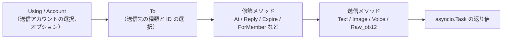
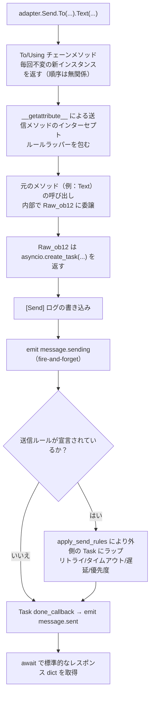

# SendDSL 详解

SendDSL は、ErisPulse アダプターが提供する、連鎖呼び出しスタイルのメッセージ送信インターフェースです。

## 基本的な呼び出し方法

### 1. 型とIDを指定する

```python
await adapter.Send.To("group", "123").Text("Hello")
```

### 2. IDのみを指定する

```python
await adapter.Send.To("123").Text("Hello")
```

### 3. 送信アカウントを指定する

```python
await adapter.Send.Using("bot1").Text("Hello")
```

### 4. 組み合わせて使用する

```python
await adapter.Send.Using("bot1").To("group", "123").Text("Hello")
```

## メソッドチェーン



## 送信方法

すべての送信メソッドは `asyncio.Task` オブジェクトを返します。

### 基本メソッド（基底クラスに内包）

以下に示す標準メソッドは `SendDSL` 基底クラスに内包されており、**デフォルトでは `Raw_ob12` に委譲**されます。アダプタのサブクラスでは、これらのメソッドを再実装する必要がなく、直接使用できます。また、IDE による補完も可能です。

| メソッド名 | 説明 | 戻り値 |
|--------|------|---------|
| `Text(text: str)` | テキストメッセージの送信 | `asyncio.Task` |
| `Image(file: bytes \| str)` | 画像の送信 | `asyncio.Task` |
| `Voice(file: bytes \| str)` | 音声の送信（OneBot12 `audio` 段） | `asyncio.Task` |
| `Video(file: bytes \| str)` | 動画の送信 | `asyncio.Task` |
| `File(file: bytes \| str, filename: str = None)` | ファイルの送信 | `asyncio.Task` |

アダプタは、プラットフォーム固有のロジックを提供するために、標準メソッドを個別にオーバーライドできます：

```python
class Send(SendDSL):
    def Raw_ob12(self, message, **kwargs):
        # 必須実装
        ...

    # オプション：Text をオーバーライドしてプラットフォーム固有のロジックを提供
    # def Text(self, text: str):
    #     return self.Raw_ob12([{"type": "text", "data": {"text": text}}])
```

### プロトコルメソッド

| メソッド名 | 説明 | 戻り値 | 必須か |
|--------|------|---------|---------|
| `Raw_ob12(message)` | OneBot12 形式のメッセージを送信 | `asyncio.Task` | **必須実装** |

> **重要**：`Raw_ob12` はアダプタの中心的なメソッドであり、**必ず実装する必要があります**。これは OneBot12 → プラットフォームへの逆変換の統一エントリポイントです。実装しない場合、基底クラスは error ログを記録し、標準のエラー応答（`status: "failed"`, `retcode: 10002`）を返します。標準メソッド（`Text`、`Image` など）はデフォルトで `Raw_ob12` に委譲されます。

### プラットフォーム特有のメソッド

アダプタは `Send` サブクラスに、プラットフォーム固有の送信メソッドを追加できます（`event.supports()` / `event.available_methods()` で識別されます）：

```python
class Send(SendDSL):
    def Raw_ob12(self, message, **kwargs): ...

    # プラットフォーム特有のメソッド
    def Sticker(self, sticker_id: str):
        return self.Raw_ob12([{"type": "sticker", "data": {"id": sticker_id}}])
```

## 修飾メソッド

修飾メソッドは `self` を返すことで、メソッドチェーンをサポートします。

### At メソッド

```python
# @1人のユーザー
await adapter.Send.To("group", "123").At("456").Text("こんにちは")

# @複数のユーザー
await adapter.Send.To("group", "123").At("456").At("789").Text("こんにちは")
```

### AtAll メソッド

```python
# @全員
await adapter.Send.To("group", "123").AtAll().Text("皆さん、こんにちは")
```

### Reply メソッド

```python
# メッセージへの返信
await adapter.Send.To("group", "123").Reply("msg_id").Text("返信内容")
```

### 修飾の組み合わせ

```python
await adapter.Send.To("group", "123").At("456").Reply("msg_id").Text("返信@メッセージ")
```

### プラットフォーム固有の修飾メソッド

`At` / `AtAll` / `Reply` に加えて、アダプターは**プラットフォーム固有の修飾メソッド**を定義できます。このようなメソッドは**`self` を返すだけ**で、デコレータは必要ありません。フレームワークが自動的に認識します。

- `self`（SendDSL インスタンス）を返す → 修飾メソッド。送信パッケージやライフサイクルイベントはトリガーせず、メソッドチェーンを継続します。
- `Task` / `Awaitable` を返す → 送信メソッド。

```python
class Send(SendDSL):
    def Raw_ob12(self, message, **kwargs): ...

    # 修飾メソッド：self を返す、送信はしない
    def Expire(self, seconds: int):
        self._expire = seconds
        return self

    def ForMember(self, user_id: str):
        self._member = user_id
        return self

    # 送信メソッド：Task を返す、修飾メソッドで設定された状態に依存
    def Board(self, content: str, **kwargs):
        return self.Raw_ob12([{"type": "board", "data": {"text": content}}])
```

使用例：

```python
# 修飾メソッドは連続してメソッドチェーンで使用できます
await adapter.Send.To("group", "big").Expire(3600).ForMember("114").Board("ボードの内容")
```

## Event 包装クラスで修飾メソッドを使用する

> [!NOTE]
> `reply(via=)` と `event.send_chain()` は、ErisPulse **2.7.0+** が必要です。

`event.reply()` はデフォルトで `at_sender`/`at_users`/`at_all`/`quote` などの組み込み修飾パラメータのみ公開します。プラットフォーム固有の修飾メソッドを使用するには、2 通りの方法があります。

### 方法1: reply() の via パラメータ

少量で既知の修飾メソッドに適しています：

```python
await event.reply("看板内容", method="Board",
                  via=[("Expire", 3600), ("ForMember", "114514")])
```

`via` はリストであり、各要素は以下のいずれかの形式です：

| 形式 | 等価な連鎖呼び出し |
|------|-------------|
| `"Name"` | `.Name()` |
| `("Name", arg1, arg2)` | `.Name(arg1, arg2)` |
| `("Name", (arg1,), {kw: val})` | `.Name(arg1, kw=val)` |

### 方法2: event.send_chain()

**複数の修飾メソッド**または**内容パラメータのないアクション型メソッド**（例：取り消し、削除）に適しています。`send_chain()` は `To`/`Using` が設定された送信チェーンを返し、任意の修飾メソッドと送信メソッドを自由に追加できます：

```python
# プラットフォーム固有の修飾メソッド + 看板送信
await event.send_chain().Expire(3600).Board("一時間後に期限切れ")

# 複数の修飾メソッドを連続して使用
await (event.send_chain()
       .Expire(3600)
       .ForMember("114514")
       .Board("看板内容", content_type="markdown"))

# 組み込み修飾メソッドも使用可能
await event.send_chain().At("123").Reply("msg_id").Text("hi")

# 内容パラメータのないアクション型メソッド
await event.send_chain().DismissBoard()
```

> `send_chain()` は完全な SendDSL インスタンスを返すため、**すべての連鎖特性が使用可能**です — 修飾メソッドだけでなく、送信ルールや一括構築も含まれます：

```python
# 送信ルール：再試行 + タイムアウト + 成功時のコールバック
await (event.send_chain()
       .Retry(3).Timeout(10)
       .Hook(lambda r: print("送信成功"))
       .Text("信頼性の高い送信"))

# 遅延送信 + プラットフォーム修飾 + 看板
await event.send_chain().Defer(5).Expire(3600).Board("遅延看板")

# 一括構築モード
results = await (event.send_chain()
                 .Build()
                 .Text("第一句").Image("pic.jpg").Text("第二句")
                 .send_all())
```

## アカウント管理

### Using メソッド

`Using()` は、メッセージの送信に使用するアカウントを指定するために使用されます。渡された識別子は、`_resolve_account()` によって以下の優先順位でマッチされます：

1. **アカウント名** — 設定ファイルのキー名（例: `"default"`、`"bot1"`）
2. **実行時に注入された bot_id** — イベントの変換時に自動的に注入される識別子
3. **任意の str フィールド** — 設定ファイルの他の文字列フィールド
4. **デフォルト** — 最初に有効化されたアカウント

```python
# アカウント名を使用
await adapter.Send.Using("account1").To("user", "123").Text("Hello")

# bot_id を使用（イベント内の self.user_id に相当）
await adapter.Send.Using("bot_123").To("user", "123").Text("Hello")
```

### Account メソッド

`Account` メソッドは `Using` と同等です：

```python
await adapter.Send.Account("account1").To("user", "123").Text("Hello")
```

## 非同期処理

### 結果を待たない

```python
# メッセージはバックグラウンドで送信されます
task = adapter.Send.To("user", "123").Text("Hello")

# 他の操作を続行します
# ...
```

### 結果を待つ

```python
# await を直接使用して結果を取得します
result = await adapter.Send.To("user", "123").Text("Hello")
print(f"送信結果: {result}")

# Task を保存して後で待つ
task = adapter.Send.To("user", "123").Text("Hello")
# ... 他の操作 ...
result = await task
```

## 送信ルールシステム

SendDSL には、ルールデコレータとして一連の送信ルールが組み込まれており、ルールはメソッドチェーンで追加され、最終的な送信時に一括で適用されます。ルールは一般的な生産環境のシナリオをカバーしています：タイムアウト制御、失敗時の再試行、成功時のコールバック、遅延送信、優先度による破棄、進捗監視。

ルールメソッドは**selfを返します**（At/AtAll/Replyと同様）、送信メソッド（Text/Imageなど）の前に呼び出す必要があります。ルールは`To`/`Using`/`Account`によって作成された新しいインスタンスと共に伝播されます。

### ルールメソッド一覧

| メソッド | 説明 |
|--------|------|
| `.Hook(callback)` | 送信が成功した後に実行されるコールバック（複数回呼び出すことができ、順番に実行されます） |
| `.Retry(times=1)` | 失敗時に自動的にN回再試行（最初を含めて合計N+1回） |
| `.Timeout(seconds)` | 単一の送信がタイムアウトした場合、現在の試行をキャンセルします（Retryと重ねて使用できます） |
| `.Defer(seconds=1.0)` | 送信を遅延（プロセス内でのタイマー、永続化されません） |
| `.Priority(level, drop_if_busy=False)` | 送信の優先度を設定；送信が溜まっている場合、破棄することができます |
| `.OnProgress(callback)` | 各段階の進捗コールバック（SendContextを引数として渡されます） |
| `.OnError(callback)` | 最終的に失敗した際のエラーコールバック（1回のみ実行されます） |

### 送信成功後に実行するロジック（Hook）

```python
# 同期コールバック
await (adapter.Send.To("user", "123")
       .Hook(lambda r: print(f"送信成功、メッセージID: {r['message_id']}"))
       .Text("你好"))

# 異步コールバック
async def deduct_points(result):
    await db.update(user_id="123", points=-1)

await adapter.Send.To("user", "123").Hook(deduct_points).Text("扣积分")
```

Hookは、送信が最終的に成功した場合（再試行成功を含む）にのみ実行されます。失敗、タイムアウト、キャンセルの場合はトリガーされません。

### 失敗時の自動再試行（Retry）

```python
# 初回失敗後に2回再試行し、合計3回試行します
result = await adapter.Send.To("user", "123").Retry(2).Text("带重试")
```

再試行のトリガー条件：送信時に例外が発生した場合、送信がタイムアウトした場合、送信が`status == "failed"`のレスポンスを返した場合。

### タイムアウトによる自動キャンセル（Timeout）

```python
# 単一の送信が10秒を超えるとキャンセルされます
await adapter.Send.To("user", "123").Timeout(10).Text("带超时")

# タイムアウト + 再試行：各試行10秒、最大3回
await adapter.Send.To("user", "123").Timeout(10).Retry(2).Text("超时重试")
```

### 進捗監視（OnProgress / OnError）

```python
def on_progress(ctx):
    print(f"段階: {ctx.stage}, 試行: {ctx.attempt + 1}/{ctx.max_attempts}, 耗時: {ctx.elapsed:.2f}s")
    if ctx.stage == "failed":
        print(f"  エラー: {ctx.error!r}")

async def on_error(ctx):
    await notify_admin(f"送信先 {ctx.target_id} に送信失敗: {ctx.error!r}")

await (adapter.Send.To("user", "123")
       .Retry(3).Timeout(10)
       .OnProgress(on_progress)
       .OnError(on_error)
       .Text("监控"))
```

`SendContext` に含まれるフィールド：`task_id`、`platform`、`method`、`target_type`、`target_id`、`bot_id`、`stage`、`attempt`、`max_attempts`、`started_at`、`finished_at`、`elapsed`、`error`、`result`、`extra`。

`stage` の可能な値：`pending`、`sending`、`retrying`、`success`、`failed`、`timeout`、`cancelled`、`dropped`。

### 遅延送信（Defer）

```python
# 5秒後に送信
await adapter.Send.To("user", "123").Defer(5).Text("迟到消息")
```

> 注意：遅延はプロセス内でのタイマーであり、プロセスの再起動で失われます。永続化は提供されません。

### 優先度と送信の破棄（Priority）

```python
# 低優先度のメッセージ。送信キューが溜まっている場合、自動的に破棄されます
result = await (adapter.Send.To("user", "123")
               .Priority(-1, drop_if_busy=True)
               .Text("可放弃的通知"))
# 破棄された場合、result["status"] == "failed"
```

`drop_if_busy`を有効にすると、送信中のタスク数がしきい値（デフォルトは64）を超えた場合、今回の送信を放棄します。`.PriorityThreshold(n)`でグローバルなしきい値を調整できます。

### ルールの組み合わせとバックグラウンド実行

```python
# メインのフローをブロックせず、ルールは正常に適用されます
task = (adapter.Send.To("user", "123")
        .Hook(lambda r: print("送信成功！"))
        .Retry(3)
        .Timeout(10)
        .OnProgress(on_progress)
        .Text("你好"))

# 他の操作を継続実行
await handle_next_action()
```

### ルールの伝播

ルールは`To`/`Using`/`Account`によって作成された新しいインスタンスと共に伝播され、メソッドチェーンの呼び出し中にルールが失われることを防ぎます：

```python
# Toの前にルールを設定しても、Toによって作成されたインスタンスにも伝播されます
builder = adapter.Send.Retry(3).Timeout(10)
send = builder.To("user", "123")  # sendはRetry(3)とTimeout(10)を引き継ぎます
await send.Text("hi")
```

複数のインスタンスのルールは相互に独立しています（hooksリストは深くコピーされます）。

## バッチ構築モード（Build）

単発モードに加えて、SendDSL はバッチ構築モードもサポートしています。1つのチェーンに複数の送信メソッドを書き込み、最後に一括して実行します。これは「一気に複数のメッセージを送信する」場面に適しています。

### 構築モードに入る

送信メソッドの前に `.Build()` を呼び出すと、`SendBuilder` が返されます。以降、送信メソッド（Text/Image など）は即座に実行されず、送信意図として蓄積されます：

```python
results = await (adapter.Send.To("user", "123")
                 .Build()                    # 構築モードに入る
                 .Text("第一句")
                 .Image("pic.jpg")
                 .Text("第二句")
                 .send_all())                 # 一括実行
# results = [Text結果, Image結果, Text結果]
```

`.send_all()` は `asyncio.Task` を返し、await 後に結果リスト（意図の順序で）が得られます。

### 並列と直列

デフォルトでは**並列**実行（並行送信、総所要時間は最遅の1つに近い）されます。メッセージの到着順序を保証する必要がある場合は、`.Sequential()` を呼び出します：

```python
# 直列：順に送信
await (adapter.Send.To("group", "456")
       .Build()
       .Sequential()
       .Text("先発这个").Text("再发这个")
       .send_all())

# 並列（デフォルト、明示的に呼び出しても可）
await (adapter.Send.To("group", "456")
       .Build()
       .Parallel()
       .Text("并发1").Text("并发2")
       .send_all())
```

### 失敗しても続行とリトライ

バッチ実行では**失敗しても続行**の戦略を採用しています。1つの送信が失敗しても、他の送信は中断されません。`.Retry()` と併用すると、失敗した項目は自動的にリトライされます（リトライは個々の送信に作用し、バッチ全体をリトライするものではありません）：

```python
await (adapter.Send.To("user", "123")
       .Build()
       .Retry(2)                       # 各送信がそれぞれ2回リトライ
       .Text("可能失败的").Image("也可能失败的")
       .send_all())
```

### バッチ全体のルールとコールバック

ルールはバッチ全体に適用されます：

| メソッド | 説明 |
|--------|------|
| `.Timeout(seconds)` | 各送信の単一タイムアウト |
| `.Retry(times)` | 各送信が個別にリトライ（失敗しても続行） |
| `.Defer(seconds)` | バッチ全体の送信を遅延 |
| `.Hook(callback)` | バッチ全体が成功した後にトリガーされ、`results` リストを受け取る |
| `.OnError(callback)` | バッチに失敗がある場合にトリガーされ、`BatchContext` を受け取る |
| `.OnProgress(callback)` | 各送信が完了するたびにトリガーされ、`BatchContext` を受け取る |

```python
def on_progress(ctx):
    print(f"進捗: {ctx.completed}/{ctx.total}, 成功 {ctx.succeeded}, 失敗 {ctx.failed}")

async def on_error(ctx):
    print(f"バッチに {ctx.failed} 件の失敗があります")

results = await (adapter.Send.To("user", "123")
               .Build()
               .Retry(2).Timeout(10)
               .OnProgress(on_progress)
               .OnError(on_error)
               .Hook(lambda rs: print("バッチ送信完了"))
               .Text("a").Text("b").Text("c")
               .send_all())
```

`BatchContext` には、`task_id`、`total`、`completed`、`succeeded`、`failed`、`stage`、`results`、`errors`、`elapsed`、`extra` が含まれます。

`stage` の値は次のいずれかです：`pending`、`sending`、`success`（すべて成功）、`partial`（一部成功）、`failed`（すべて失敗）。

### デコレータとルールの継承

`.Build()` の前の At/AtAll/Reply デコレータとルールはバッチ全体に継承され、各メッセージに作用します：

```python
await (adapter.Send.To("group", "456")
       .At("789")                        # 継承：各メッセージに @789 が付与
       .Build()
       .Retry(2)                         # 継承 + 追加：各送信がそれぞれリトライ
       .Text("@你的通知")
       .Image("公告图")
       .send_all())
```

Build 後でもデコレータを追加できます（バッチ全体に作用）：

```python
await (adapter.Send.To("group", "456")
       .Build()
       .At("111").At("222")             # 追加 @、バッチ全体に作用
       .Text("@多人")
       .send_all())
```

### バックグラウンド実行

単発と同じように、`.send_all()` は Task を返し、await せずにバックグラウンドで実行させることもできます：

```python
task = (adapter.Send.To("user", "123")
        .Build()
        .Hook(lambda rs: print("バッチ送信完了"))
        .Text("a").Text("b")
        .send_all())

# 主処理をブロックしない
await do_something_else()
```

## 命名規則

### PascalCase 命名

すべての送信メソッドは大文字で始まるキャメルケース（PascalCase）を使用します：

```python
# ✅ 正しい
def Text(self, text: str):
    pass

def Image(self, file: bytes):
    pass

# ❌ 間違っている
def text(self, text: str):
    pass

def send_image(self, file: bytes):
    pass
```

### プラットフォーム固有のメソッド

プラットフォームのプレフィックスを付けるメソッドの追加は推奨されません：

```python
# ✅ 推奨
def Sticker(self, sticker_id: str):
    pass

# ❌ 推奨されない
def TelegramSticker(self, sticker_id: str):
    pass
```

`Raw` メソッドを使用して代用します：

```python
# ✅ 推奨
await adapter.Send.Raw_ob12([{"type": "sticker", ...}])

# ❌ 推奨されない
def TelegramSticker(self, ...):
    pass
```

## 送信リンクの内部分解

`await adapter.Send.To("group", "123").Text("x")` という1回の処理の裏で、フレームワークは以下の処理をすべて代行しています：



**フレームワークが行った各ステップの内容：**

| 階段 | フレームワークが行ったこと |
|------|-------------|
| チェーンの結合 | `To`/`Using`/`Account` の各呼び出しは**不変の新インスタンスを生成**し、既に設定されたフィールドを継承するため、`To(...).Using(...)` と `Using(...).To(...)` は**等価**で、順序は無関係 |
| メソッドのラッピング | 送信メソッド（`Text` など）は `__getattribute__` でインターセプトされ、ラッパーを包む。修飾メソッド（`To`/`Using`/`At`/`Retry` など）は**ラッピングされない**。ネストされた `Raw_ob12` の呼び出しは、 `_in_rule_wrap` マーカーにより重複ラッピングを防ぐ |
| Task の作成 | `Raw_ob12` 内部の `asyncio.create_task()` が Task の真の作成ポイントである。`Text()` は Task を同期的に返すだけで、**ブロックしない** |
| 送信ログ | `[Send] platform/method -> target` というイベントログを記録する（`exclude_levels=["EVENT"]` で非表示にすることも可能） |
| `message.sending` | 送信メソッドが呼び出された際に**即座に** fire-and-forget でトリガーされる（ハンドラが存在する場合に限る、`has_handlers` による短絡） |
| `message.sent` | Task の `done_callback` にバインドされる——**ルールがある場合は、リトライプロセス全体の最終結果を上書きする**、ルールがない場合は元の Task の完了を意味する |

### アカウント解決の優先順位

アダプター内部で `_resolve_account(account_id)` を呼び出すとき、以下の順序で具体的なアカウントに解決される：

1. 単一アカウントアダプター（`AccountConfigClass` がない）→ 直接返す
2. アカウント名が `account_id` と正確に一致
3. 各アカウントの `bot_id` フィールドが一致
4. 各アカウントの任意の `str` フィールド値が一致（`enabled`/`name` を除外）
5. 最後の手段として、最初の有効なアカウント
6. すべて失敗 → `ValueError` を投げる

> あなたが渡した `account_id` は、`Using()` で明示的に指定されたもの > イベントの `self` フィールド（`account_id` は `user_id` より優先され、`event.reply()` が自動的に注入）> 指定しない（アダプターが最初の有効なアカウントをデフォルトで使用）

### 送信ルールエンジン（リトライ/タイムアウト/遅延）

ルールは `Raw_ob12` が Task を返した**後に**、外側の Task にラップされるため、メインの処理には影響しない。重要な事実：

| ルール | 説明 |
|------|------|
| `Retry(n)` | 総試行回数は `n+1` 回。**失敗後は即座に再送信し、指数バックオフはなし** |
| `Timeout(s)` | 単一送信のタイムアウトはキャンセル（`asyncio.wait_for`）、未使用の場合は再試行 |
| `Defer(s)` | 送信前に遅延 sleep |
| `Priority(level, drop_if_busy)` | 累積が閾値を超えた場合は、即座に `{status:"failed", retcode:10002, message:"dropped_low_priority"}` を返す |
| `Hook(fn)` | 最終的に成功した場合のみ、順序通りに実行される |
| `on_progress` / `on_error` | 各段階および最終的な失敗時のコールバック |

> **注意**：リトライは「即座に再送信」であり、退避間隔は存在しない。プラットフォームのリクエスト制限がある場合は、`on_error` コールバックで sleep した後に手動で再送信を行う必要がある。ルールの成功判定は、返却される dict の `status == "ok"` に基づく（`retcode == 0`）。

> 標準的なレスポンス形式と `retcode` の完全な意味は、[API レスポンス規格](../../standards/api-response.md)を参照してください。

## 戻り値

### Task オブジェクト

すべての送信メソッドは `asyncio.Task` を返します。アダプタは `Raw_ob12` を実装するだけでよく、標準メソッド（Text/Image など）はデフォルトで它に委譲されます：

```python
import asyncio

def Raw_ob12(self, message, **kwargs):
    async def _do_send():
        segments = self._apply_modifiers(message)
        return await self._adapter.call_api(
            endpoint="/send_message",
            message=segments,
            **self.send_context,
            **kwargs,
        )
    return asyncio.create_task(_do_send())

# Text/Image/Voice/Video/File は基底クラスから継承され、自動的に Raw_ob12 に委譲されます。
# 標準メソッドをオーバーライドする場合は、asyncio.Task を返すだけです：
# def Text(self, text: str):
#     return self.Raw_ob12([{"type": "text", "data": {"text": text}}])
```

### 応答の標準化

`call_api` は標準化された応答を返す必要があります。`make_response()` / `make_error()` メソッドを推奨します：

```python
async def call_api(self, endpoint: str, **params):
    try:
        result = await self._do_api_call(endpoint, **params)
        return self.make_response(
            data=result.get("data"),
            message_id=result.get("message_id", ""),
            raw=result,
        )
    except Exception as e:
        return self.make_error(message=str(e))
```

手動で構築することも可能です（旧バージョンの方式も互換性があります）：

```python
async def call_api(self, endpoint: str, **params):
    return {
        "status": "ok" または "failed",
        "retcode": 0 またはエラーコード,
        "data": {...},
        "message_id": "msg_id" または "",
        "message": "",
        "{platform}_raw": raw_response
    }
```

## 完整例

### 基本使用

```python
from ErisPulse.Core import adapter

my_adapter = adapter.get("myplatform")

# テキストの送信
await my_adapter.Send.To("user", "123").Text("Hello World!")

# 画像の送信
await my_adapter.Send.To("group", "456").Image("https://example.com/image.jpg")

# ファイルの送信
with open("document.pdf", "rb") as f:
    await my_adapter.Send.To("user", "123").File(f.read())
```

### チェーン呼び出し

```python
# @ユーザー + リプライ
await my_adapter.Send.To("group", "456").At("789").Reply("msg123").Text("リプライ@のメッセージ")

# @全員 + 複数の修飾
await my_adapter.Send.Using("bot1").To("group", "456").AtAll().Text("お知らせメッセージ")
```

### 原始メッセージとメッセージ構築

`Raw_ob12` は逆変換の中心となるエントリポイントです（OB12 メッセージセグメント → プラットフォーム API 呼び出し）。`MessageBuilder` はそれに伴うチェーン式メッセージセグメント構築ツールです。

> 完全な `Raw_ob12` 実装の規格、`MessageBuilder` の使い方およびコード例については、以下のドキュメントを参照してください：
> - [送信メソッド規格 §6 逆変換規格 (OneBot12 → プラットフォーム)](../../standards/send-method-spec.md#6-逆変換規格onebot12--プラットフォーム)
> - [送信メソッド規格 §11 メッセージビルダー](../../standards/send-method-spec.md#11-メッセージビルダー-messagebuilder)

## 関連ドキュメント

- [アダプター開発の入門](getting-started.md) - アダプターの作成
- [アダプターのコアコンセプト](core-concepts.md) - アダプターのアーキテクチャの理解
- [アダプターのベストプラクティス](best-practices.md) - 高品質なアダプターの開発
- [送信メソッドの仕様](../../standards/send-method-spec.md) - 送信メソッドの完全な仕様