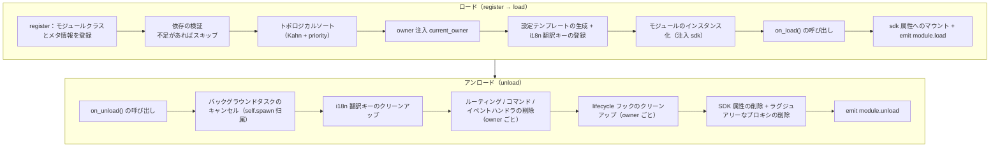

# モジュールのコアコンセプト

ErisPulse モジュールのコアコンセプトを理解することは、高品質なモジュールを開発するための基礎です。

## モジュールのライフサイクル

### 加载戦略

```python
from ErisPulse.Core.Bases import BaseModule
from ErisPulse.loaders import ModuleLoadStrategy

class MyModule(BaseModule):
    @staticmethod
    def get_load_strategy():
        """モジュールのロード戦略を返す"""
        return ModuleLoadStrategy(
            lazy_load=True,   # ラグジュアリーなロード or 即時ロード
            priority=0,       # ロードの優先度（数値が大きいほど先にロードされる）
            depends=["OtherModule"]  # 任意：依存する他のモジュールを宣言
        )
```

> `depends` で宣言したモジュールが登録されていない場合、現在のモジュールはスキップされ、警告が記録されます。ロード順序はトポロジカルソートによって決定され、同レベルでは `priority` 降順に並べ替えられます。

> [!NOTE]
> **連鎖アンロード / 連鎖再ロード**（ErisPulse **2.8.0+**）：他のモジュールに依存しているモジュールをアンロードする際、依存しているモジュールは**先に連鎖的にアンロード**されます（連鎖チェーンのログが表示されます）。ローカルプラグイン / PyPI でインストールされたパッケージのモジュールをホットリロードする場合も、依存しているモジュールは**連鎖的に再ロード**され、依存者が無効なインスタンスを保持したまま実行されないようにします。循環依存を宣言すると、ロード時に `RuntimeError` で拒否されます。

### on_load メソッド

モジュールがロードされる際に呼び出され、リソースの初期化とイベントハンドラの登録に使用されます：

```python
async def on_load(self, event):
    # イベントハンドラの登録
    @command("hello", help="挨拶コマンド")
    async def hello_handler(event):
        await event.reply("こんにちは！")
    
    # SDK 内蔵の HTTP クライアントを使用（接続プールの管理が自動的に行われ、手動で session を作成する必要はありません）
    # sdk.client を使ってリクエストを送信できます
```

### on_unload メソッド

モジュールがアンロードされる際に呼び出され、リソースのクリーンアップに使用されます：

```python
async def on_unload(self, event):
    # 自作リソースのクリーンアップ
    # sdk.client はフレームワークが管理するため、手動で閉じる必要はありません
    
    # イベントハンドラのキャンセル（フレームワークが自動的に処理します）
    self.logger.info("モジュールがアンロードされました")
```

> バックグラウンドタスクの作成とクリーンアップ（`self.spawn()` / フレームワークによるキャンセル）については、[ライフサイクル管理](../../advanced/lifecycle.md#バックグラウンドタスクの所有と自動キャンセル)をご覧ください。

### アンロードと完全アンロード（purge）

> [!NOTE]
> この機能は ErisPulse **2.8.0+** が必要です。

`unload()` はデフォルトで**ロードのキャンセル**（アンロードされたインスタンスとリソース）のみ行いますが、登録のメタデータ（モジュールクラスとメタ情報）は保持します。これにより、モジュールは再び `discover` で検出され、`load()` で再インスタンス化可能で、`register()` を再度行う必要はありません。

**完全アンロード**（モジュールクラスの参照を解放し、`sys.modules` をクリーンアップし、プラグインとその排他的な依存が GC で回収可能になる）が必要な場合は、`purge=True` を渡します：

```python
# ロードのキャンセルのみ：登録のメタデータを保持し、いつでも再 `load()` が可能
await sdk.module.unload("MyModule")

# 完全アンロード：登録のメタデータと `sys.modules` のクリーンアップ（プラグインフォルダからのみ）
await sdk.module.unload("MyModule", purge=True)
```

| 意味 | `unload()` デフォルト | `unload(purge=True)` |
|------|-----------------|----------------------|
| インスタンスとリソースのアンロード（イベント/task/ルーティング/lifecycle/i18n） | ✅ | ✅ |
| 登録のメタデータの保持（モジュールクラスとメタ情報） | ✅ | ❌ 削除 |
| `sys.modules` のクリーンアップ（プラグインフォルダからのみ） | ❌ | ✅ |
| モジュールクラスの GC 回収が可能 | ❌ | ✅ |
| 再ロード | `load()` で直接利用可能 | `register()` + `load()` が必要 |

> `purge=True` の場合、連鎖アンロードされる依存モジュールも purge されます。アンロード後、フレームワークは `gc.collect()` を実行し、モジュールクラス/インスタンスが回収可能かどうかを確認し、残留参照がある場合はログに警告を表示します（参照元を含む、DEBUG レベル）。

### ライフサイクルの全体像

上記のメソッドをまとめて、フレームワークがモジュールのロードとアンロードの際に**背後で行うすべての処理**を示します：



**ロード時にフレームワークが自動で行う処理**（`on_load` のみ記述すれば、残りは自動的に行われます）：

| 環節 | フレームワークが自動で行う |
|------|-------------|
| owner 注入 | インスタンス化時に `owner_scope` でモジュール名をラップするため、`on_load` で登録したコマンド/イベント/フック/バックグラウンドタスクは**自動的にこのモジュールに所属**し、アンロード時に owner ごとに一括でクリーンアップされます |
| 設定テンプレート | `ConfigClass` を宣言したモジュールは、フレームワークが自動的に `ErisPulse.<ModuleName>` 設定セクションを生成/埋め込みます |
| i18n 翻訳キー | `I18nClass` を宣言したモジュールは、翻訳キーが自動的に登録されます（アンロード時に自動的に登録解除されます） |
| 依存トポロジー | `depends` で宣言された順序に従い、依存されているモジュールが先にロードされるようにします。循環依存は `RuntimeError` で拒否されます |
| SDK へのマウント | インスタンス化後、`sdk.<ModuleName>` にマウントされるため、`sdk.MyModule.xxx` でアクセスできます |

**アンロード時にフレームワークが自動でクリーンアップする内容**（上記の U1→U7 に対応）：`on_unload` が実行された後に、バックグラウンドタスクを強制的にキャンセル（`self.spawn` で作成されたタスクは、`on_unload` で適切な終了処理を行う必要があります）、i18n キー、ルーティング、コマンド/イベントハンドラ、lifecycle フック、最後に SDK 属性を削除します。`purge=True` の場合は、登録のメタデータと `sys.modules` のクリーンアップも追加されます。

> これらの自動クリーンアップにより、「`on_load`/`on_unload` のみ記述すれば、手動で unregister する必要がない」という自信が生まれます。フレームワークは owner 归属を利用して、「誰が登録したか、誰がクリーンアップするか」を一括処理にします。

## SDK オブジェクト

### コアモジュールのアクセス

```python
from ErisPulse import sdk

# sdk オブジェクトを介してすべてのコアモジュールにアクセス
sdk.logger.info("ログ")
sdk.storage.set("key", "value")
config = sdk.config.getConfig("MyModule")
```

### モジュール間通信

```python
# 他のモジュールにアクセス
other_module = sdk.OtherModule
result = await other_module.some_method()
```

## アダプタ送信メソッドの照会

新しい標準規格では、デフォルト送信メカニズムを実装するために `__getattr__` メソッドの再定義が要求されているため、`hasattr` メソッドを使用してメソッドの存在をチェックすることはできなくなりました。`2.3.5` 以降では、送信メソッドを照会する機能が追加されました。

### 対応する送信メソッドの一覧表示

```python
# プラットフォームが対応するすべての送信メソッドを取得
methods = sdk.adapter.list_sends("onebot11")
# 戻り値: ["Text", "Image", "Voice", "Markdown", ...]
```

### メソッドの詳細情報の取得

```python
# 特定のメソッドの詳細情報を取得
info = sdk.adapter.send_info("onebot11", "Text")
# 戻り値:
# {
#     "name": "Text",
#     "parameters": [
#         {"name": "text", "type": "str", "default": null, "annotation": "str"}
#     ],
#     "return_type": "Awaitable[Any]",
#     "docstring": "テキストメッセージを送信します..."
# }
```

## 設定管理

### 宣言的設定（推奨）

v2.5.2 以降、モジュールは `ConfigClass` を使って設定クラスを宣言し、アダプターと同じ設定 Schema システムを使用できます。設定は `self.cfg` でリアルタイムに読み取り、変更後は即座に反映されます。

```python
from dataclasses import dataclass, field
from ErisPulse.Core.Bases import BaseModule
from ErisPulse.Core.Bases import BaseConfig

@dataclass
class MyModuleConfig(BaseConfig):
    api_key: str = field(
        default="",
        metadata={
            "description": {"i18n": "my_module.api_key", "default": "API 密钥"},
            "required": True,
            "secret": True,
            "ui": {"widget": "password", "group": "basic", "order": 1},
        },
    )
    timeout: int = field(
        default=30,
        metadata={
            "description": {"i18n": "my_module.timeout", "default": "超时时间（秒）"},
            "ui": {"widget": "number", "group": "advanced", "order": 2},
        },
    )

class MyModule(BaseModule):
    ConfigClass = MyModuleConfig

    def __init__(self, sdk):
        self.sdk = sdk
        self.logger = sdk.logger.get_child("MyModule")

    async def on_load(self, event):
        self.logger.info("モジュールがロードされました")

    async def on_unload(self, event):
        pass

    async def do_something(self):
        cfg = self.cfg  # 実時読み取り、型安全
        api_key = cfg.api_key
        timeout = cfg.timeout
```

`BaseConfig` は、アダプター、モジュール、外部プロジェクトなど、あらゆる場面で使用できる汎用的な設定基底クラスです。設定フィールドには i18n 多言語説明がサポートされています（詳細は [i18n ドキュメント](../../advanced/i18n.md#配置字段多语言) を参照してください）。

### 宣言的翻訳キー（v2.7.0+）

v2.7.0 以降、モジュールは `ConfigClass` を宣言するのと同じように、`I18nClass` というネストされたクラスを使って翻訳キーを一括で宣言できます。フレームワークはロード時に**自動的に**すべての宣言された翻訳キーを登録し、手動で `i18n.register()` を呼び出す必要がなく、また設定テンプレート生成よりも早い段階で登録されるため、設定説明で参照される i18n キーが利用可能であることを保証します。

```python
from ErisPulse.Core.Bases import BaseConfig, BaseI18n, I18nKey

class MyModule(BaseModule):
    # 設定クラス（オプション）
    @dataclass
    class ConfigClass(BaseConfig):
        welcome_msg: str = field(
            default="欢迎",
            metadata={
                "description": {"i18n": "mymodule.welcome_msg", "default": "欢迎消息"},
            },
        )

    # 翻訳キー集合クラス（オプション）
    class I18nClass(BaseI18n):
        # 属性名が自動的に完全なキー経路：<モジュール名>.<属性名> に結合されます
        welcome_msg: I18nKey = I18nKey(
            default="Welcome Message",   # 言語に依存しないデフォルト
            zh_CN="欢迎消息",
            zh_TW="歡迎訊息",
            en="Welcome Message",
            ja="ウェルカムメッセージ",
            ru="Приветственное сообщение",
        )
        hello: I18nKey = I18nKey(
            default="Hello, {name}!",
            zh_CN="你好，{name}！",
            zh_TW="你好，{name}！",
            en="Hello, {name}!",
            ja="こんにちは、{name}！",
            ru="Привет, {name}!",
        )
```

詳細は [i18n 推奨の書き方](../../advanced/i18n.md#推荐写法通过-i18nclass-声明翻译键-v270) を参照してください。

### 手動で設定を読み取る（廃止済み）

> **廃止済み**：宣言的設定 ([宣言式設定の推奨](#宣言式設定の推奨)) と `self.cfg` による実時読み取りに切り替えてください。

```python
class MyModule(BaseModule):
    def __init__(self, sdk):
        self.sdk = sdk

    def _load_config(self):
        config = self.sdk.config.getConfig("MyModule")
        if not config:
            self.sdk.config.setConfig("MyModule", {"api_key": "", "timeout": 30})
            return {"api_key": "", "timeout": 30}
        return config
```

## ストレージシステム

### 基本的な使用方法

```python
# データの保存
sdk.storage.set("user:123", {"name": "張三"})

# データの取得
user = sdk.storage.get("user:123", {})

# データの削除
sdk.storage.delete("user:123")
```

### トランザクションの使用

```python
# トランザクションを使用してデータの一貫性を保証
with sdk.storage.transaction():
    sdk.storage.set("key1", "value1")
    sdk.storage.set("key2", "value2")
    # いずれかの操作が失敗した場合、すべての変更はロールバックされます
```

## イベント処理

### イベントハンドラの登録

```python
from ErisPulse.Core.Event import command, message

# コマンドの登録
@command("info", help="情報を取得します")
async def info_handler(event):
    await event.reply("これは情報です")

# メッセージハンドラの登録
@message.on_group_message()
async def group_handler(event):
    sdk.logger.info(f"グループメッセージを受信しました: {event.get_text()}")
```

### イベントハンドラのライフサイクル

フレームワークはイベントハンドラの登録とアンロードを自動的に管理します。`on_load` で登録するだけで済みます。

## 懒惰ロードメカニズム

### 動作原理

```python
# モジュールが初めてアクセスされたときにのみ初期化されます
result = await sdk.my_module.some_method()
# ↑ ここでモジュールの初期化がトリガーされます
```

### 即時ロード

即時初期化が必要なモジュール（例：リスナー、タイマー）の場合：

```python
@staticmethod
def get_load_strategy():
    return ModuleLoadStrategy(
        lazy_load=False,  # 即時ロード
        priority=100
    )
```

## エラー処理

### 例外のキャッチ

```python
async def handle_event(self, event):
    try:
        # ビジネスロジック
        await self.process_event(event)
    except ValueError as e:
        self.logger.warning(f"パラメータエラー: {e}")
        await event.reply(f"パラメータエラー: {e}")
    except Exception as e:
        self.logger.error(f"処理失敗: {e}")
        raise
```

### ログ記録

```python
# 異なるログレベルを使用
self.logger.debug("デバッグ情報")    # 詳細なデバッグ情報
self.logger.info("実行状態")      # 正常な実行情報
self.logger.warning("警告情報")  # 警告情報
self.logger.error("エラー情報")    # エラー情報
self.logger.critical("致命的なエラー") # 致命的なエラー
```

## 関連ドキュメント

- [モジュール開発の入門](docs/ja/getting-started.md) - 最初のモジュールを作成する
- [Event 包装クラス](docs/ja/event-wrapper.md) - イベント処理の詳細
- [ベストプラクティス](docs/ja/best-practices.md) - 高品質なモジュールを開発する