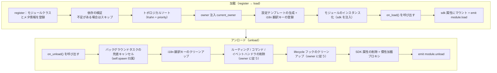

# モジュールの基本概念

ErisPulse モジュールの基本概念を理解することは、高品質なモジュールを作成するための基盤となります。

## モジュールのライフサイクル

### 加载戦略

```python
from ErisPulse.Core.Bases import BaseModule
from ErisPulse.loaders import ModuleLoadStrategy

class MyModule(BaseModule):
    @staticmethod
    def get_load_strategy():
        """モジュールの加載戦略を返す"""
        return ModuleLoadStrategy(
            lazy_load=True,   # 慣性加載にするか即時加載にするか
            priority=0,       # 加載優先度（数値が大きいほど先に加載される）
            depends=["OtherModule"]  # 任意：依存する他のモジュールを宣言
        )
```

> `depends` で宣言されたモジュールが登録されていない場合、現在のモジュールはスキップされ、警告が記録されます。加載順序はトポロジカルソートによって決定され、同じレベルでは `priority` の降順になります。

> [!NOTE]
> **連鎖アンロード / 連鎖再ロード**（ErisPulse **2.8.0+**）：他のモジュールに依存しているモジュールをアンロードする場合、それを依存しているモジュールは**先に連鎖的にアンロードされます**（ログに連鎖チェーンが説明されます）；ローカルプラグインのホットリロードを行うとき、それを依存しているプラグインも**連鎖的に再ロードされます**。依存者が無効なインスタンス参照を保持したまま実行し続けるのを避けるためです。循環依存を宣言した場合、加載時に `RuntimeError` で拒否されます。

### on_load メソッド

モジュールの加載時に呼び出され、リソースの初期化とイベントハンドラの登録に使用されます：

```python
async def on_load(self, event):
    # イベントハンドラの登録
    @command("hello", help="挨拶コマンド")
    async def hello_handler(event):
        await event.reply("こんにちは！")
    
    # SDK 内蔵の HTTP クライアントを使用（接続プールを自動管理し、手動で session を作成する必要はありません）
    # sdk.client でリクエストを送信できます
```

### on_unload メソッド

モジュールのアンロード時に呼び出され、リソースのクリーンアップに使用されます：

```python
async def on_unload(self, event):
    # 自定義リソースのクリーンアップ
    # sdk.client はフレームワークが管理するため、手動で閉じる必要はありません
    
    # イベントハンドラのキャンセル（フレームワークが自動的に処理します）
    self.logger.info("モジュールがアンロードされました")
```

> バックグラウンドタスクの作成とクリーンアップ（`self.spawn()` / フレームワークの兜底キャンセル）については、[ライフサイクル管理](../../advanced/lifecycle.md#バックグラウンドタスクの所有と自動キャンセル)を参照してください。

### アンロードと完全アンロード（purge）

> [!NOTE]
> この機能は ErisPulse **2.8.0+** が必要です。

`unload()` はデフォルトで**加載のキャンセル**（インスタンスとリソースのアンロード）のみを行いますが、登録のスタブ（モジュールクラスとメタ情報）は保持します。そのため、モジュールは再び `discover` で再発見され、`load()` で再インスタンス化され、再 `register()` する必要はありません。

**完全アンロード**（モジュールクラスの参照を解放し、`sys.modules` をクリーンアップして、プラグインとその排他的な依存を GC で回収可能にする）が必要な場合は、`purge=True` を渡します：

```python
# 加載のキャンセルのみ：登録のスタブを保持し、いつでも再 load() が可能です
await sdk.module.unload("MyModule")

# 完全アンロード：登録のスタブと sys.modules のクリーンアップ（プラグインのソース）
await sdk.module.unload("MyModule", purge=True)
```

| 意味 | `unload()` デフォルト | `unload(purge=True)` |
|------|-----------------|----------------------|
| インスタンスとリソースのアンロード（イベント/task/ルーティング/lifecycle/i18n） | ✅ | ✅ |
| 登録のスタブ（モジュールクラスとメタ情報）を保持 | ✅ | ❌ 削除 |
| `sys.modules` のクリーンアップ（プラグインフォルダからのみ） | ❌ | ✅ |
| モジュールクラスが GC で回収可能 | ❌ | ✅ |
| 再加載 | `load()` で直接使用可能 | `register()` + `load()` が必要 |

> `purge=True` の場合、連鎖アンロードされた依存者も purge されます。アンロード後、フレームワークは `gc.collect()` を実行し、モジュールクラス/インスタンスが回収可能かどうかを確認します。残存する参照はログに警告として表示されます（参照元を含む、DEBUG レベル）。

### ライフサイクルの全体像

上記のメソッドをつなげると、フレームワークがモジュールの加載とアンロードを行う際に、**背後で行ってくれるすべての処理**がわかります：



**加載時にフレームワークが自動で行ってくれること**（`on_load` を書くだけで、他の処理は自動的に完了します）：

| フェーズ | フレームワークが自動で行う |
|------|-------------|
| owner 注入 | インスタンス化の間に `owner_scope` でモジュール名をラップするため、`on_load` で登録したコマンド/イベント/フック/バックグラウンドタスクは**自動的にこのモジュールに帰属し**、アンロード時に owner に従って一括でクリーンアップされます |
| 設定テンプレート | `ConfigClass` を宣言したモジュールの場合、フレームワークが自動的に `ErisPulse.<ModuleName>` の設定セクションを生成/埋め込みます |
| i18n 翻訳キー | `I18nClass` を宣言したモジュールの場合、翻訳キーは自動的に登録されます（アンロード時に自動的に登録解除されます） |
| 依存トポロジー | `depends` で宣言された順序に従ってソートされ、依存されるモジュールが先に加載されるようにします；循環依存は `RuntimeError` で拒否されます |
| SDK へのマウント | インスタンス化後に `sdk.<ModuleName>` にマウントされるため、`sdk.MyModule.xxx` でアクセスできます |

**アンロード時にフレームワークが自動でクリーンアップすること**（上記の U1→U7 に対応）：`on_unload` が完了した後に兜底クリーンアップが行われます——バックグラウンドタスクは強制的にキャンセルされます（`self.spawn` で作成されたもの、優雅な終了は `on_unload` で行う必要があります）、i18n キー、ルーティング、コマンド/イベントハンドラ、lifecycle フック、最後に SDK 属性を削除します。`purge=True` の場合は、登録のスタブと `sys.modules` のクリーンアップも追加されます。

> これらの自動クリーンアップが「`on_load`/`on_unload` を書くだけで、手動で unregister する必要がない」という自信の源です——フレームワークは owner 归属を使って「誰が登録したか、誰がクリーンアップするか」をワンクリック式に実現しています。

## SDK オブジェクト

### コアモジュールへのアクセス

```python
from ErisPulse import sdk

# sdk オブジェクトを通じてすべてのコアモジュールにアクセスする
sdk.logger.info("ログ")
sdk.storage.set("キー", "値")
config = sdk.config.getConfig("MyModule")
```

### モジュール間通信

```python
# 他のモジュールにアクセスする
other_module = sdk.OtherModule
result = await other_module.some_method()

## アダプタ送信方法の照会

新しい標準仕様では、フォールバック送信機構を実装するために `__getattr__` メソッドを上書きすることが求められるため、`hasattr` メソッドを使用してメソッドの存在を確認することができなくなりました。バージョン `2.3.5` 以降、送信方法を照会する機能が追加されました。

### サポートされている送信方法のリスト

```python
# プラットフォームがサポートするすべての送信方法を一覧表示する
methods = sdk.adapter.list_sends("onebot11")
# 返回: ["Text", "Image", "Voice", "Markdown", ...]
```

### メソッドの詳細情報の取得

```python
# 特定のメソッドの詳細情報を取得する
info = sdk.adapter.send_info("onebot11", "Text")
# 返回:
# {
#     "name": "Text",
#     "parameters": [
#         {"name": "text", "type": "str", "default": null, "annotation": "str"}
#     ],
#     "return_type": "Awaitable[Any]",
#     "docstring": "テキストメッセージを送信..."
# }

## 設定管理

### 宣言的設定（推奨）

v2.5.2 以降、モジュールは `ConfigClass` を宣言して、アダプターと同じ設定 Schema システムを使用することができます。設定は `self.cfg` を通じてリアルタイムに読み取ることができ、変更後は即座に有効になります：

```python
from dataclasses import dataclass, field
from ErisPulse.Core.Bases import BaseModule
from ErisPulse.Core.Bases import BaseConfig

@dataclass
class MyModuleConfig(BaseConfig):
    api_key: str = field(
        default="",
        metadata={
            "description": {"i18n": "my_module.api_key", "default": "API 密钥"},
            "required": True,
            "secret": True,
            "ui": {"widget": "password", "group": "basic", "order": 1},
        },
    )
    timeout: int = field(
        default=30,
        metadata={
            "description": {"i18n": "my_module.timeout", "default": "超时时间（秒）"},
            "ui": {"widget": "number", "group": "advanced", "order": 2},
        },
    )

class MyModule(BaseModule):
    ConfigClass = MyModuleConfig

    def __init__(self, sdk):
        self.sdk = sdk
        self.logger = sdk.logger.get_child("MyModule")

    async def on_load(self, event):
        self.logger.info("モジュールがロードされました")

    async def on_unload(self, event):
        pass

    async def do_something(self):
        cfg = self.cfg  # 実時読み取り、型安全
        api_key = cfg.api_key
        timeout = cfg.timeout
```

`BaseConfig` は、アダプター、モジュール、外部プロジェクトなど、あらゆる場面で使用できる汎用的な設定基底クラスです。設定フィールドは i18n 多言語説明をサポートしています（詳細は [i18n ドキュメント](../../advanced/i18n.md#設定フィールド多言語) を参照）。

### 宣言的翻訳キー（v2.7.0+）

v2.7.0 以降、モジュールは `ConfigClass` の宣言と同じように、ネストされたクラス `I18nClass` を使って翻訳キーを一括宣言することができます。フレームワークはロード時に**自動的に**すべての宣言された翻訳キーを登録し、手動で `i18n.register()` を呼び出す必要がなく、また設定テンプレート生成よりも早いタイミングで登録されるため、設定説明で参照される i18n キーが利用可能になります。

```python
from ErisPulse.Core.Bases import BaseConfig, BaseI18n, I18nKey

class MyModule(BaseModule):
    # 設定クラス（オプション）
    @dataclass
    class ConfigClass(BaseConfig):
        welcome_msg: str = field(
            default="欢迎",
            metadata={
                "description": {"i18n": "mymodule.welcome_msg", "default": "欢迎消息"},
            },
        )

    # 翻訳キー集合クラス（オプション）
    class I18nClass(BaseI18n):
        # 属性名が自動的に完全なキー・パスに結合されます：<モジュール名>.<属性名>
        welcome_msg: I18nKey = I18nKey(
            default="Welcome Message",   # 言語に依存しないバックアップ
            zh_CN="欢迎消息",
            zh_TW="歡迎訊息",
            en="Welcome Message",
            ja="ウェルカムメッセージ",
            ru="Приветственное сообщение",
        )
        hello: I18nKey = I18nKey(
            default="Hello, {name}!",
            zh_CN="你好，{name}！",
            zh_TW="你好，{name}！",
            en="Hello, {name}!",
            ja="こんにちは、{name}！",
            ru="Привет, {name}!",
        )
```

詳細は [i18n 推奨の書き方](../../advanced/i18n.md#推奨の書き方通过-i18nclass-声明翻译键-v270) を参照してください。

### 手動で設定を読み取る（廃止済み）

> **廃止済み**：宣言的設定（[宣言的設定推奨](#宣言式設定推奨)）と `self.cfg` を通じたリアルタイム読み取りを使用してください。

```python
class MyModule(BaseModule):
    def __init__(self, sdk):
        self.sdk = sdk

    def _load_config(self):
        config = self.sdk.config.getConfig("MyModule")
        if not config:
            self.sdk.config.setConfig("MyModule", {"api_key": "", "timeout": 30})
            return {"api_key": "", "timeout": 30}
        return config
```

## ストレージシステム

### 基本的な使用方法

```python
# データを保存
sdk.storage.set("user:123", {"name": "張三"})

# データを取得
user = sdk.storage.get("user:123", {})

# データを削除
sdk.storage.delete("user:123")
```

### トランザクションの使用

```python
# トランザクションを使用してデータの一貫性を確保
with sdk.storage.transaction():
    sdk.storage.set("key1", "value1")
    sdk.storage.set("key2", "value2")
    # どの操作か失敗した場合、すべての変更はロールバックされます

## イベント処理

### イベントハンドラの登録

```python
from ErisPulse.Core.Event import command, message

# コマンドを登録
@command("info", help="情報を取得")
async def info_handler(event):
    await event.reply("これは情報です")

# メッセージハンドラを登録
@message.on_group_message()
async def group_handler(event):
    sdk.logger.info(f"グループメッセージを受信しました: {event.get_text()}")
```

### イベントハンドラのライフサイクル

フレームワークは自動的にイベントハンドラの登録と登録解除を管理します。`on_load` で登録するだけでよいです。

## レイジー ローディング機構

### 動作原理

```python
# モジュールが初めてアクセスされたときにのみ初期化される
result = await sdk.my_module.some_method()
# ↑ ここでモジュール初期化がトリガーされる
```

### すぐにロード

すぐに初期化する必要があるモジュール（リスナー、タイマーなど）の場合：

```python
@staticmethod
def get_load_strategy():
    return ModuleLoadStrategy(
        lazy_load=False,  # すぐにロード
        priority=100
    )

## エラー処理

### 例外の捕捉

```python
async def handle_event(self, event):
    try:
        # 業務ロジック
        await self.process_event(event)
    except ValueError as e:
        self.logger.warning(f"パラメータエラー: {e}")
        await event.reply(f"パラメータエラー: {e}")
    except Exception as e:
        self.logger.error(f"処理失敗: {e}")
        raise
```

### ログ記録

```python
# ログレベルの使い分け
self.logger.debug("デバッグ情報")    # 詳細なデバッグ情報
self.logger.info("実行状態")        # 正常実行の情報
self.logger.warning("警告情報")    # 警告情報
self.logger.error("エラー情報")    # エラー情報
self.logger.critical("致命的なエラー") # 致命的なエラー

## 関連ドキュメント

- [モジュール開発入門](getting-started.md) - 初めてのモジュールの作成
- [Event ラッパークラス](event-wrapper.md) - イベント処理の詳細
- [ベストプラクティス](best-practices.md) - 高品質モジュールの開発