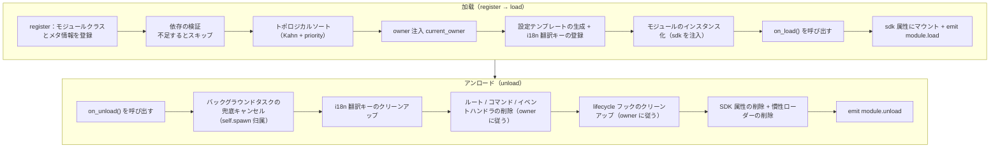

# モジュールのコアコンセプト

ErisPulse モジュールのコアコンセプトを理解することは、高品質なモジュールを開発するための基礎です。

## モジュールのライフサイクル

### 加载戦略

```python
from ErisPulse.Core.Bases import BaseModule
from ErisPulse.loaders import ModuleLoadStrategy

class MyModule(BaseModule):
    @staticmethod
    def get_load_strategy():
        """モジュールの加载戦略を返す"""
        return ModuleLoadStrategy(
            lazy_load=True,   # 慣性加载か即時加载か
            priority=0,       # 加载の優先度（数値が大きいほど先に加载）
            depends=["OtherModule"]  # オプション：依存する他のモジュールを宣言
        )
```

> `depends` で宣言されたモジュールが登録されていない場合、現在のモジュールはスキップされ、警告が記録されます。加载順序はトポロジカルソートによって決定され、同レベルでは `priority` の降順にされます。

> [!NOTE]
> **連鎖アンロード / 連鎖リロード**（ErisPulse **2.8.0+**）：他のモジュールに依存しているモジュールをアンロードする場合、それを依存するモジュールは**先に連鎖的にアンロード**されます（日志に連鎖チェーンの説明）。ローカルプラグイン / PyPI からインストールされたモジュールをホットリロードする際、それを依存するモジュールも**連鎖的にリロード**されます。依存者が無効なインスタンス参照を保持したまま実行されないようにします。循環依存を宣言すると、加载時に `RuntimeError` で拒否されます。

### on_load メソッド

モジュール加载時に呼び出され、リソースの初期化とイベントハンドラの登録に使用されます：

```python
async def on_load(self, event):
    # イベントハンドラの登録
    @command("hello", help="挨拶コマンド")
    async def hello_handler(event):
        await event.reply("こんにちは！")
    
    # SDK 内部の HTTP クライアントを使用（接続プールの管理は自動的、手動の session 作成は不要）
    # sdk.client を使用してリクエストを送信
```

### on_unload メソッド

モジュールアンロード時に呼び出され、リソースのクリーンアップに使用されます：

```python
async def on_unload(self, event):
    # 自作リソースのクリーンアップ
    # sdk.client はフレームワークが管理するため、手動で閉じる必要はありません
    
    # イベントハンドラのキャンセル（フレームワークが自動処理）
    self.logger.info("モジュールがアンロードされました")
```

> バックグラウンドタスクの作成とクリーンアップ（`self.spawn()` / フレームワークによるキャンセル）については、[ライフサイクル管理](../../advanced/lifecycle.md#バックグラウンドタスクの所有と自動キャンセル)を参照してください。

### アンロードと完全アンロード（purge）

> [!NOTE]
> この機能は ErisPulse **2.8.0+** が必要です。

`unload()` はデフォルトで**加载の解除**（アンロードインスタンスとリソース）のみを行い、登録の残骸（モジュールクラスとメタ情報）は保持します。モジュールは再発見され、`load()` で再インスタンス化可能で、再登録（`register()`）は不要です。

**完全アンロード**（モジュールクラスの参照を解放し、`sys.modules` をクリーンアップして、プラグインとその排他的な依存が GC で回収できるようにする）が必要な場合は、`purge=True` を渡します：

```python
# 加载の解除のみ：登録の残骸を保持し、いつでも再 `load()` が可能
await sdk.module.unload("MyModule")

# 完全アンロード：登録の残骸と `sys.modules` のクリーンアップ（プラグインフォルダからのみ）
await sdk.module.unload("MyModule", purge=True)
```

| 意味 | `unload()` デフォルト | `unload(purge=True)` |
|------|-----------------|----------------------|
| アンロードインスタンスとリソース（イベント/task/ルート/lifecycle/i18n） | ✅ | ✅ |
| 登録の残骸（モジュールクラスとメタ情報）の保持 | ✅ | ❌ 削除 |
| `sys.modules` のクリーンアップ（プラグインフォルダからのみ） | ❌ | ✅ |
| モジュールクラスの GC 回収 | ❌ | ✅ |
| 再加载 | `load()` で直接利用可能 | 再 `register()` + `load()` が必要 |

> `purge=True` の場合、連鎖アンロードされる依存モジュールも purge されます。アンロード後、フレームワークは `gc.collect()` を実行し、モジュールクラス/インスタンスが回収可能かどうかを確認します。残留参照は日志に警告（含む参照元、DEBUG レベル）として表示されます。

### ライフサイクルの全体像

上記のメソッドを組み合わせると、フレームワークがモジュールの加载とアンロードの際に**背後で行うすべての処理**がわかります：



**加载時にフレームワークが自動で行う処理**（`on_load` のみ実装すれば、残りは自動）：

| フェーズ | フレームワークが自動で行う |
|------|-------------|
| owner 注入 | インスタンス化時に `owner_scope` でモジュール名をラップするため、`on_load` で登録したコマンド/イベント/フック/バックグラウンドタスクは**自動的に本モジュールに所有**され、アンロード時に owner に従って一括クリーンアップされる |
| 設定テンプレート | `ConfigClass` を宣言したモジュールは、フレームワークが自動的に `ErisPulse.<ModuleName>` の設定セグメントを生成/埋め込む |
| i18n 翻訳キー | `I18nClass` を宣言したモジュールは、翻訳キーが自動登録され（アンロード時に自動解除） |
| 依存トポロジー | `depends` で宣言した順序に従い、依存されるモジュールが先に加载されるようにする；循環依存は `RuntimeError` で拒否される |
| SDK へのマウント | インスタンス化後に `sdk.<ModuleName>` にマウントされ、`sdk.MyModule.xxx` でアクセス可能になる |

**アンロード時にフレームワークがクリーンアップする処理**（上記の U1→U7 に対応）：`on_unload` 実行後に兜底クリーンアップを行う——バックグラウンドタスクは強制キャンセル（`self.spawn` で作成されたもの、優雅な終了は `on_unload` で実装する）；i18n キー、ルート、コマンド/イベントハンドラ、lifecycle フック、最後に SDK 属性を削除。`purge=True` では追加で登録の残骸と `sys.modules` をクリーンアップ。

> この自動クリーンアップが「`on_load`/`on_unload` のみ実装すれば、手動で unregister する必要がない」という自信の源です——フレームワークは owner 归属によって「誰が登録したか、誰がクリーンアップするか」を一括処理にしています。

## SDK オブジェクト

### コアモジュールへのアクセス

```python
from ErisPulse import sdk

# sdk オブジェクトを介してすべてのコアモジュールにアクセス
sdk.logger.info("ログ")
sdk.storage.set("key", "value")
config = sdk.config.getConfig("MyModule")
```

### モジュール間通信

```python
# 他のモジュールにアクセス
other_module = sdk.OtherModule
result = await other_module.some_method()
```

## 适配器送信メソッドの照会

新しい標準規格では、デフォルト送信メカニズムを実装するために `__getattr__` メソッドのオーバーライドを使用するよう求められており、このため `hasattr` メソッドを用いてメソッドの存在をチェックできなくなりました。`2.3.5` 以降では、送信メソッドを照会する機能が追加されました。

### 対応する送信メソッドの一覧表示

```python
# プラットフォームが対応するすべての送信メソッドを一覧表示
methods = sdk.adapter.list_sends("onebot11")
# 戻り値: ["Text", "Image", "Voice", "Markdown", ...]
```

### メソッドの詳細情報の取得

```python
# 特定のメソッドの詳細情報を取得
info = sdk.adapter.send_info("onebot11", "Text")
# 戻り値:
# {
#     "name": "Text",
#     "parameters": [
#         {"name": "text", "type": "str", "default": null, "annotation": "str"}
#     ],
#     "return_type": "Awaitable[Any]",
#     "docstring": "テキストメッセージを送信..."
# }
```

## 設定管理

### 宣言的な設定（推奨）

v2.5.2 以降、モジュールは `ConfigClass` を使って設定クラスを宣言し、アダプターと同じ設定 Schema システムを使用できます。設定は `self.cfg` を通じてリアルタイムに読み取ることができ、変更後は即座に反映されます：

```python
from dataclasses import dataclass, field
from ErisPulse.Core.Bases import BaseModule
from ErisPulse.Core.Bases import BaseConfig

@dataclass
class MyModuleConfig(BaseConfig):
    api_key: str = field(
        default="",
        metadata={
            "description": {"i18n": "my_module.api_key", "default": "API 密钥"},
            "required": True,
            "secret": True,
            "ui": {"widget": "password", "group": "basic", "order": 1},
        },
    )
    timeout: int = field(
        default=30,
        metadata={
            "description": {"i18n": "my_module.timeout", "default": "超时时间（秒）"},
            "ui": {"widget": "number", "group": "advanced", "order": 2},
        },
    )

class MyModule(BaseModule):
    ConfigClass = MyModuleConfig

    def __init__(self, sdk):
        self.sdk = sdk
        self.logger = sdk.logger.get_child("MyModule")

    async def on_load(self, event):
        self.logger.info("モジュールがロードされました")

    async def on_unload(self, event):
        pass

    async def do_something(self):
        cfg = self.cfg  # 実時読み取り、型安全
        api_key = cfg.api_key
        timeout = cfg.timeout
```

`BaseConfig` は、アダプター、モジュール、外部プロジェクトなど、あらゆる場面で使用できる汎用的な設定基底クラスです。設定フィールドは i18n 多言語説明をサポートしています（詳しくは [i18n ドキュメント](../../advanced/i18n.md#配置字段多语言）をご覧ください）。

### 宣言的翻訳キー（v2.7.0+）

v2.7.0 以降、モジュールは `ConfigClass` を宣言するのと同じように、`I18nClass` というネストされたクラスを使って翻訳キーを一括で宣言できます。フレームワークはロード時に**自動的に**宣言されたすべての翻訳キーを登録し、手動で `i18n.register()` を呼び出す必要がなく、また設定テンプレート生成よりも前に行われます。これにより、設定の説明で参照される i18n キーが利用可能になります。

```python
from ErisPulse.Core.Bases import BaseConfig, BaseI18n, I18nKey

class MyModule(BaseModule):
    # 設定クラス（オプション）
    @dataclass
    class ConfigClass(BaseConfig):
        welcome_msg: str = field(
            default="欢迎",
            metadata={
                "description": {"i18n": "mymodule.welcome_msg", "default": "欢迎消息"},
            },
        )

    # 翻訳キー集合クラス（オプション）
    class I18nClass(BaseI18n):
        # プロパティ名が自動的に完全なキー経路：<モジュール名>.<プロパティ名> に連結されます
        welcome_msg: I18nKey = I18nKey(
            default="Welcome Message",   # 言語に依存しないデフォルト
            zh_CN="欢迎消息",
            zh_TW="歡迎訊息",
            en="Welcome Message",
            ja="ウェルカムメッセージ",
            ru="Приветственное сообщение",
        )
        hello: I18nKey = I18nKey(
            default="Hello, {name}!",
            zh_CN="你好，{name}！",
            zh_TW="你好，{name}！",
            en="Hello, {name}!",
            ja="こんにちは、{name}！",
            ru="Привет, {name}!",
        )
```

詳細は [i18n 推奨書き方](../../advanced/i18n.md#推荐写法通过-i18nclass-声明翻译键-v270) を参照してください。

### 手動で設定を読み取る（廃止済み）

> **廃止済み**：宣言的設定 ([宣言式設定](#宣言式設定)) と `self.cfg` を通じたリアルタイム読み取りを使用してください。

```python
class MyModule(BaseModule):
    def __init__(self, sdk):
        self.sdk = sdk

    def _load_config(self):
        config = self.sdk.config.getConfig("MyModule")
        if not config:
            self.sdk.config.setConfig("MyModule", {"api_key": "", "timeout": 30})
            return {"api_key": "", "timeout": 30}
        return config
```

## ストレージシステム

### 基本的な使用方法

```python
# データを保存
sdk.storage.set("user:123", {"name": "張三"})

# データを取得
user = sdk.storage.get("user:123", {})

# データを削除
sdk.storage.delete("user:123")
```

### トランザクションの使用

```python
# トランザクションを使用してデータの一貫性を確保
with sdk.storage.transaction():
    sdk.storage.set("key1", "value1")
    sdk.storage.set("key2", "value2")
    # いずれかの操作が失敗した場合、すべての変更はロールバックされます
```

## イベント処理

### イベントハンドラの登録

```python
from ErisPulse.Core.Event import command, message

# コマンドの登録
@command("info", help="情報を取得します")
async def info_handler(event):
    await event.reply("これは情報です")

# メッセージハンドラの登録
@message.on_group_message()
async def group_handler(event):
    sdk.logger.info(f"グループメッセージを受け取りました: {event.get_text()}")
```

### イベントハンドラのライフサイクル

フレームワークはイベントハンドラの登録とアンロードを自動的に管理します。`on_load` で登録するだけで済みます。

## ラグロードメカニズム

### 動作原理

```python
# モジュールが初めてアクセスされたときにのみ初期化されます
result = await sdk.my_module.some_method()
# ↑ ここでモジュールの初期化がトリガーされます
```

### 立即ロード

初期化が即座に必要なモジュール（例：リスナー、タイマー）の場合：

```python
@staticmethod
def get_load_strategy():
    return ModuleLoadStrategy(
        lazy_load=False,  # 立即ロード
        priority=100
    )
```

## エラー処理

### 例外のキャッチ

```python
async def handle_event(self, event):
    try:
        # ビジネスロジック
        await self.process_event(event)
    except ValueError as e:
        self.logger.warning(f"パラメータエラー: {e}")
        await event.reply(f"パラメータエラー: {e}")
    except Exception as e:
        self.logger.error(f"処理失敗: {e}")
        raise
```

### ログ記録

```python
# 異なるログレベルを使用
self.logger.debug("デバッグ情報")    # 詳細なデバッグ情報
self.logger.info("実行状態")      # 正常な実行情報
self.logger.warning("警告情報")  # 警告情報
self.logger.error("エラー情報")    # エラー情報
self.logger.critical("致命的エラー") # 致命的エラー
```

## 関連ドキュメント

- [モジュール開発入門](getting-started.md) - 最初のモジュールを作成する
- [Event 包装クラス](event-wrapper.md) - イベント処理の詳細
- [ベストプラクティス](best-practices.md) - 高品質なモジュールを開発する