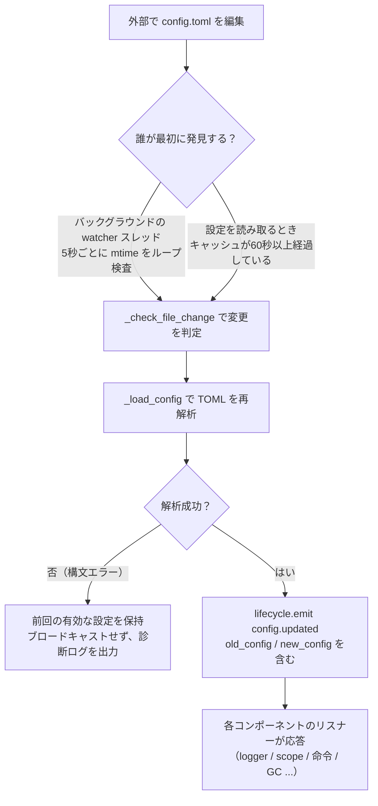

# 設定ファイルの説明
> このドキュメントでは、フレームワークの設定ファイルについて説明します。サードパーティのモジュールに設定が必要な場合は、モジュールのドキュメントを参照してください。

ErisPulse は、プロジェクトの設定を管理するために TOML 形式の設定ファイル `config/config.toml` を使用します。

## 設定ファイルの位置

設定ファイルはプロジェクトのルートディレクトリの `config/` フォルダ内にあります：

```
project/
├── config/
│   └── config.toml
├── main.py
```

## 設定の読み込みエラー処理

フレームワークは `config.toml` を読み込む際に、3 種類のエラー状態を区別し、**操作可能な診断情報**を提供します。デフォルト設定への静的な回帰ではなく、明確なエラーメッセージを出力します。

| エラー状態 | 発生条件 | フレームワークの動作 |
|---------|---------|---------|
| ファイルの欠落 | `config.toml` が存在しない | 初回起動時の正常な動作。空の設定を使用し、警告を出さない |
| TOML 構文エラー | ファイルは存在するが形式が無効（例：クォートの欠落、括弧の未閉じ） | **エラー発生行/列と原因**を出力し、デフォルト設定に回帰する旨を通知 |
| 権限/その他エラー | 読み取り権限なし、IO エラーなど | **明確な原因**を出力し、デフォルト設定に回帰する旨を通知 |

たとえば、誤って `port = 8000`（文字列のクォートが欠けている）と記述した場合、ログには次のような出力がされます：

```
[ERROR] [Config] 設定ファイル config/config.toml に構文エラーが発生しました（第 3 行 第 1 列）: ...
[WARNING] [Config] 設定ファイルの読み込みに失敗しました。前回有効な設定を使用して実行を継続します。今回のファイルの変更は反映されません。修正後、再読み込みまたは再起動してください。
```

このように、**デフォルトの INFO レベル**でも問題をすぐに特定でき、「なぜ設定を変更しても反映されないのか」を混乱させることはありません。

> **実行中に設定ファイルを壊してしまった場合**？ ロボットが実行中、手動で `config.toml` を編集して構文エラーを含む内容にした場合、フレームワークは次回の書き込み（設定のマージ）時に「設定ファイルが破損しました（構文エラー、第 X 行）、マージ書き込みが不可能です。設定ファイルを修正した後、再起動してください」と出力します。混乱を招く「書き込み失敗」ではなく、明確なメッセージが表示されます。書き込み予定の設定項目は保持され、失われることはありません。

## 環境変数による上書き

フレームワークは、環境変数を使用して `ErisPulse.*` の設定項目を**上書き**することをサポートしています（Docker / 容器化 / CI 部署に適しており、`config.toml` を変更する必要はありません）。

命名規則：`ErisPulse.<セクション>.<キー>` のドット区切りパスを、すべて大文字にし、`.` を `_` に置き換え、`ERISPULSE_` をプレフィックスとして付けます：

| 設定項目 | 環境変数 | 例値 |
|--------|---------|--------|
| `ErisPulse.server.port` | `ERISPULSE_SERVER_PORT` | `9000` |
| `ErisPulse.server.host` | `ERISPULSE_SERVER_HOST` | `0.0.0.0` |
| `ErisPulse.logger.level` | `ERISPULSE_LOGGER_LEVEL` | `DEBUG` |
| `ErisPulse.framework.strict_mode` | `ERISPULSE_FRAMEWORK_STRICT_MODE` | `false` |

動作の説明：
- **優先度が最も高い**：環境変数は「設定ファイル」と「デフォルト値」を上書きし、元の値の型に応じて自動的に変換されます（`bool` / `int` / `float` / カンマ区切りの `list` / 文字列）
- **永続化されない**：上書きは実行時にのみ有効であり、`config.toml` には書き戻されません
- **ホットアップデートがサポート**：実行中に環境変数を変更した後、設定監視のリロードを組み合わせることで有効になります

```bash
# Docker 部署の例：config.toml を変更せずに、直接ポートを上書き
ERISPULSE_SERVER_PORT=9000 docker compose up -d
```

> 注：`ErisPulse.server.port` のようなフレームワーク設定は、`get_server_config()` などの API で読み取られるものであり、いずれも環境変数の上書きの影響を受けます。

## 設定のホットアップデート

2.7.0 以降、フレームワークは設定のホットアップデートを**体系的にサポート**しています。外部で `config.toml` を編集した後（バックグラウンドの watcher が 5 秒ごとに変更を検出）や、コードで `setConfig()` を呼び出した後、各コンポーネントは自動的に応答します：

| コンポーネント | ホットアップデート可能な設定 | 行動 |
|------|----------------|------|
| **ログ Logger** | `logger.level` / `log_files` / `log_dir`（セグメントパラメータを含む）/ `memory_limit` / `format` / `exclude_levels` | 自動的に再適用（変更検出付き） |
| **コマンドシステム CommandHandler** | `event.command.prefix` / `case_sensitive` / `allow_space_prefix` / `must_at_bot` | 次のメッセージで即座に有効化 |
| **アダプタの並行処理** | `framework.handler_max_concurrency` | 失効したキャッシュシグナルを再構築 |
| **プロアクティブGC** | `framework.proactive_gc_*` | 設定の変更に即座にGCタスクを再起動し、実行時の調整/無効化/再有効化が可能 |
| **マスターシステム Master** | `master.users` | `is_master()` の毎回のチェックで即時読み取り、再起動は不要 |
| **モジュール/アダプタの設定** | 各々の設定項目 | `on_config_update(old, new)` コールバックをトリガー |

**再起動が必要な設定**（安全にホット切り替えできないため、変更時に「プロセスを再起動後に有効化」の警告が出力されます）：

| 設定 | 理由 |
|------|------|
| `router.cors.*` / `router.security.*` | 中間件はサービス起動時に FastAPI に書き込まれており、実行時に安全なホット切り替えはできない |
| `storage.use_global_db` | SQLite ファイルハンドルは既に実行時に開かれているため、パスの切り替えは安全ではない |

> **途中で編集保存に失敗した？** `config.toml` を編集中に一時的な構文エラーが発生した場合、フレームワークは**前回の有効な設定を保持**し、診断ログを出力します。各コンポーネントに空の設定をブロードキャストしない（`on_config_update` が空値を受け取り誤ってデフォルトに戻らないように）。

### ホットアップデートの内部処理の分解

「設定を変更したが、各コンポーネントはどのように知るのか？」——背後には、検出 → 再ロード → ブロードキャストの処理チェーンがあります：



**2つの検出経路**（どちらか1つで十分で、どちらもバックアップになります）：

| 経路 | 機制 | 発生タイミング |
|------|------|---------|
| バックグラウンド watcher | daemon スレッド `config-watcher` が **5秒** `wait` でファイル `mtime` をループ検査 | 外部でファイルを変更した後、最大5秒以内に |
| 慣性検出 | `getConfig()` を読み取るとき、キャッシュが **60秒**以上経過している場合にファイルを検査 | 次回の設定読み取り時 |

> **フレームワークは自分自身を誤って傷つけない**：`setConfig()` でファイルに書き込む際、フレームワークは「自身が書き込んだ mtime」を記録し、watcher が比較する際にはそれを除外して、**外部での編集のみ**を変更とみなします。

**2種類の設定変更イベント**：

| イベント | 発生元 | データ | 代表的な場面 |
|------|--------|------|---------|
| `config.set` | コード / Dashboard が `setConfig()` を呼び出す | `{key, old_value, new_value}` | 単一キーの書き込み（テンプレート生成、状態記録、実行時の設定変更） |
| `config.updated` | 外部編集後、watcher/慣性検出が捕獲する | `{old_config, new_config, config_file}` | 手動で `config.toml` を編集した場合 |

> `setConfig()` はデフォルトで**5秒遅延してファイルに書き込む**（複数の書き込みを1つにまとめる）。`immediate=True` を指定すると即時書き込み。watcher が外部の変更を検出した後、メモリのキャッシュを更新するだけで、**外部の変更をファイルに書き戻すことはない**。

**自動応答対象リスト**（通常、2種類のイベントを両方サブスクライブし、応答内容は同じ）：

| コンポーネント | 監視 | 応答 |
|------|------|------|
| Logger | `config.set` + `config.updated` | レベル/ファイル/ディレクトリセグメント/メモリ上限/フォーマット/除外レベルを再適用（変更検出付き、変更がない場合は動作しない） |
| Scope | `config.updated` | スコープバインディングのキャッシュを再構築 |
| コマンドシステム | `config.updated` | プレフィックス/大文字小文字/スペースプレフィックス/must_at_bot のパラメータ解析を更新し、次のメッセージで有効化 |
| アダプタの並行処理 | `config.set` + `config.updated` | `handler_max_concurrency` が失効し、シグナルを再構築 |
| プロアクティブGC | `config.set` + `config.updated` | `proactive_gc_*` で即時GCバックグラウンドタスクを再起動 |
| アダプタ | `on_config_update` にルーティング | 各アダプタの `on_config_update(old, new)` コールバック |
| モジュール | `on_config_update` にルーティング | 各モジュールの `on_config_update(old, new)` コールバック |
| ストレージ | `config.updated` | `use_global_db` の変更は**警告のみ**（再起動が必要） |
| ルーティング | `config.updated` | `cors.*` / `security.*` の変更は**警告のみ**（再起動が必要） |

## 完全な設定例

```toml
[ErisPulse.server]
host = "0.0.0.0"
port = 8000
auto_start = true
ssl_certfile = ""
ssl_keyfile = ""

[ErisPulse.master]
# users には2種類の書き方があります（どちらか1つを選択）：
#   グローバルな管理者（すべてのプラットフォームに適用）：users = ["123456", "789012"]
#   プラットフォームごとに管理者を指定：users = { yunhu = ["123456"], telegram = ["789012"] }
users = {}

[ErisPulse.logger]
level = "INFO"
format = "rich"
log_files = []
log_dir = ""
log_rotation = "size"
log_max_size_mb = 10
log_backup_count = 5
log_rotation_when = "midnight"
memory_limit = 1000
exclude_levels = []

[ErisPulse.framework]
enable_lazy_loading = true
uninit_timeout = 30
strict_mode = 0

[ErisPulse.framework.strict_mode_exceptions]
modules = []
adapters = []

[ErisPulse.storage]
use_global_db = false

[ErisPulse.event.command]
prefix = "/"
case_sensitive = true
allow_space_prefix = false
must_at_bot = false

[ErisPulse.event.message]
ignore_self = true

[ErisPulse.i18n]
language = "auto"
```

## サーバー設定

```toml
[ErisPulse.server]
host = "0.0.0.0"
port = 8000
auto_start = true
ssl_certfile = "/path/to/cert.pem"
ssl_keyfile = "/path/to/key.pem"
```

| 設定項目 | 型 | デフォルト値 | 説明 |
|---------|------|---------|------|
| host | string | 0.0.0.0 | 監視するアドレス。0.0.0.0 はすべてのインターフェースを意味します |
| port | integer | 8000 | 監視するポート番号 |
| auto_start | boolean | true | `sdk.init()` 時にルーティングサーバーを自動的に起動するかどうか。`false` に設定するとルーティングサーバーの起動をスキップできます（純粋なイベント/WebUI なしの場面） |
| ssl_certfile | string | 空 | SSL 証明書ファイルのパス |
| ssl_keyfile | string | 空 | SSL 秘密鍵ファイルのパス |

## 主人システム設定

主人システムは「フレームワークの主人」アカウント（例: Bot管理者）を識別するために使用されます。`master.users` には、以下の2種類の記述方法がサポートされています。

```toml
[ErisPulse.master]
# 方法1: グローバルな主人（すべてのプラットフォームに適用）
users = ["123456", "789012"]

# 方法2: プラットフォームごとに主人を指定（dict形式）
# users = { yunhu = ["123456"], telegram = ["789012"] }
```

| 設定項目 | 型 | デフォルト値 | 説明 |
|---------|------|---------|------|
| users | array / object | 空 | 主人アカウントのリスト。`list`形式はグローバルな主人（すべてのプラットフォームに適用）；`dict`形式ではプラットフォームごとに指定（キーはプラットフォーム名、値はそのプラットフォームの主人アカウントのリスト） |

コード中では、`master.is_master(event)` または `master.is_master(platform, user_id)` を使用してチェックします。この各呼び出しは設定をリアルタイムに読み取ります（ホットアップデートがサポートされており、再起動は不要です）：

```python
from ErisPulse.Core import master

if master.is_master(event):
    await event.reply("主人こんにちは")
```

## ログ設定

```toml
[ErisPulse.logger]
level = "INFO"
log_files = []                # 明示的なログファイルリスト（log_dir と排他的、優先度がより高い）
log_dir = ""                  # ログディレクトリ（設定すると自動的に分割ローテーションされる）
log_rotation = "size"         # 分割方法: "size" / "date" / "none"
log_max_size_mb = 10          # size モードの単ファイル上限（MB）
log_backup_count = 5          # 保持する履歴ログファイル数
log_rotation_when = "midnight"  # date モードのローテーション周期: S/M/H/D/midnight
memory_limit = 1000
exclude_levels = ["EVENT"]
```

| 設定項目 | 型 | デフォルト値 | 説明 |
|---------|------|---------|------|
| level | string | INFO | ログレベル：TRACE, DEBUG, INFO, WARNING, ERROR, CRITICAL（TRACE が最低レベルで、フレームワーク内部の詳細なデバッグ情報を出力） |
| format | string | rich | ログ出力形式：`rich`（カラー表示、デフォルト）、`plain`（カラーなしの純粋なテキスト、ログ収集/パイプリダイレクトに適している）、`json`（JSON 構造化、ELK などに適している） |
| log_files | array | 空 | ログ出力ファイルリスト（明示的なパス、分割しない） |
| log_dir | string | 空 | ログ出力ディレクトリ（自動作成）。設定すると、`erispulse.log` に書き込み、`log_rotation` に従って自動的に分割される。`log_files` と排他的で、`log_files` が優先される |
| log_rotation | string | size | 分割方法：`size`（サイズによる）/ `date`（日時による）/ `none`（分割しない） |
| log_max_size_mb | float | 10 | size モードの単ファイルサイズ上限（MB）、上限を超えると `.1`/`.2` のバックアップにローテーションされる |
| log_backup_count | integer | 5 | 保持する履歴ログファイル数、上限を超えた古いバックアップは自動的に削除される |
| log_rotation_when | string | midnight | date モードのローテーション周期：`S`/`M`/`H`/`D`/`midnight`（デフォルトは毎日零時） |
| memory_limit | integer | 1000 | メモリに保持するログの件数 |
| exclude_levels | array | 空 | 指定されたログレベルを除外する。除外されたログレベルのログは**完全に破棄**される（メモリにも書き込まれず、Dashboard などのサブスクライバーにも送信されず、表示されず、ファイルにも書き込まれない）。ホットアップデートがサポートされている |

コード内で動的に切り替えることも可能です：

```python
from ErisPulse.Core import logger

# サイズによる分割：単ファイル 10MB、5 件保持
logger.set_output_dir("logs", rotation="size", max_size_mb=10, backup_count=5)

# 日時による分割：毎日零時にローテーション、7 件保持
logger.set_output_dir("logs", rotation="date", backup_count=7)
```

> [!NOTE]
> `log_dir` および分割関連の設定は、ErisPulse **2.8.0+** が必要です。

> **プライバシー保護**：メッセージの送受信内容は **EVENT レベル**（数値 21）で記録されます。`exclude_levels = ["EVENT"]` を設定すると、バックエンド（例：Dashboard のログパネル）は各グループ/プライベートチャットのメッセージ内容を見ることができなくなりますが、他のログレベルには影響しません。

> [!NOTE]
> `exclude_levels` のこの機能は、ErisPulse **2.8.0+** が必要です。

## フレームワーク設定

```toml
[ErisPulse.framework]
enable_lazy_loading = true
uninit_timeout = 30
strict_mode = 0

[ErisPulse.framework.strict_mode_exceptions]
modules = []
adapters = []
```

| 設定項目 | 型 | デフォルト値 | 説明 |
|---------|------|---------|------|
| enable_lazy_loading | boolean | true | モジュールの遅延ロードを有効にするかどうか |
| uninit_timeout | integer | 30 | エレガントなシャットダウンの合計タイムアウト時間（秒）、これを超えると強制的に終了。0 はタイムアウトを設定しないことを意味する |
| strict_mode | integer | 0 | 厳格モードのレベル、下記「厳格モード」の説明を参照 |
| handler_max_concurrency | integer | 64 | イベントハンドラの最大並行タスク数、大きく設定するとスループットが向上するがメモリ使用量も増加する |
| offline_bot_expiry | integer | 3600 | 離線Botの記録の自動有効期限（秒）、0 は期限切れを設定しないことを意味する |

### プロアクティブGC設定

SDKの初期化後、プロアクティブGCバックグラウンドタスクが起動し、周期的にPython GCと内部リソースの回収（離線Botのクリーンアップなど）を実行します。すべてのパラメータはホットアップデートが可能で、変更時に即座にタスクを再起動します。

| 設定項目 | 型 | デフォルト値 | 説明 |
|---------|------|---------|------|
| proactive_gc_interval | number | 300 | 回収間隔（秒）、小数点をサポート。0 はプロアクティブGCを無効化することを意味する |
| proactive_gc_generation | integer | 0 | 通常の回収世代（0/1/2、0..2に制限）。注意：`gc.collect(2)`は全量回収に等しく、デフォルトの0は軽量を保つ。深い回収は`proactive_gc_full_every`によって周期的にトリガーされる |
| proactive_gc_full_every | integer | 20 | N回の回収ごとに全量回収を行う、0 は周期的な全量回収を無効化することを意味する。全量回収は`proactive_gc_memory_growth_mb`のしきい値によって制約される |
| proactive_gc_memory_growth_mb | integer | 32 | 全量回収のメモリ増加しきい値（MB）：前回の全量回収後のメモリベースライン（優先 tracemalloc、次に RSS）と比較し、この値に達した場合のみ全量回収が実行される。0 はしきい値を設定しないことを意味する |
| proactive_gc_idle_only | boolean | false | 有効化すると、イベントのピーク（未完了のpending handlerが存在）の際にはPython GCをスキップし、停止時間とメッセージ処理の競合を回避する。内部リソースの回収には影響しない |
| proactive_gc_gen0_min | integer | 500 | 通常の回収がトリガーされるgen0のガベージ量の下限：`gc.get_count()[0]`がこの値より低い場合は直接スキップ（空回りのラウンドはほぼゼロのオーバーヘッド）。0 は常に回収することを意味する |

> **2.7.1 変更**：デフォルトの`proactive_gc_generation`は`2`から`0`に調整され、デフォルトの`proactive_gc_full_every`は`0`から`20`に調整されました。以前は`generation=2`は毎回最も重い全量回収を意味していました。新しいデフォルトは回収のカバレッジを維持しながら、空回りのオーバーヘッドを大幅に低減します。明示的に設定された旧値はそのままの意味で動作します。

### 厳格モード

厳格モードは、モジュール/アダプターがロード段階で不正または失敗した場合の処理戦略を制御します。現代のモジュール/アダプターはすべて対応する基底クラス（`BaseModule`/`BaseAdapter`）を継承する必要があります。基底クラスを継承していないコンポーネントはフレームワークのコンテキストシステムとバックアップクリーンアップに影響を与え、リソースリークを引き起こす可能性があります。

> **2.5.2 変更**：デフォルトのレベルは`1`（スキップ）から`0`（緩和）に調整され、新規ユーザーが初めて使用する際に遭遇するロード問題を減らしました。基底クラスを継承していないコンポーネントはWARNINGで提示され、ロードを試みるようになります。以前の動作を復元するには、`strict_mode = 1`を明示的に設定してください。

| レベル | 名称 | 行動 |
|------|------|------|
| 0 | 緩和（デフォルト） | 不正は警告のみ、基底クラスを継承していないコンポーネントもロードを試みる（旧コンポーネントの互換性） |
| 1 | 厳格-スキップ | 基底クラスを継承していないコンポーネントを拒否し、スキップする、他のコンポーネントは正常に起動する |
| 2 | 厳格-致命 | すべての不正（基底クラスを継承していない、ロード失敗、登録失敗、初期化失敗など）を致命的とし、起動チェックポイントで一括して不正リストを出力し、中止する |

各レベルにおいて、「ロード/登録/初期化段階でエラーが発生する」コンポーネント自体のクラッシュは常にスキップされます。違いは以下の通りです：

- **0 → 1**：唯一の動作の変化は「基底クラスを継承していない」コンポーネントが「ロードされる」から「スキップされる」ことになります。
- **1 → 2**：すべての不正（基底クラスを継承していない、ロード失敗、登録失敗、初期化失敗など）が致命的になり、起動チェックポイントで一括して不正リストを出力し、中止されます。

#### 豁免リスト

一部のコンポーネントが一時的に移行できない（例えば、依存する旧モジュールなど）場合、そのコンポーネントを豁免リストに追加し、不正であっても緩和モードで扱い、ロードを継続することができます：

```toml
[ErisPulse.framework.strict_mode_exceptions]
modules = ["SeTu", "SomeLegacyModule"]
adapters = ["OldAdapter"]
```

> あるコンポーネントが厳格モードで拒否された場合、ログにはどのようにロードを復元するか（豁免リストに追加するか、レベルを下げること）が明確に提示されます。

## ストレージ設定

```toml
[ErisPulse.storage]
use_global_db = false
```

| 設定項目 | 型 | デフォルト値 | 説明 |
|---------|------|---------|------|
| use_global_db | boolean | false | グローバルデータベース（パッケージ内）を使用するかどうか（プロジェクト用のデータベースではなく）。`true` の場合、すべてのプロジェクトは ErisPulse パッケージ内の SQLite データベースを共有します。`false`（デフォルト）の場合は、各プロジェクトは `config/` ディレクトリ下の独立したデータベースを使用します。

## イベントの設定

### コマンドの設定

```toml
[ErisPulse.event.command]
prefix = "/"
case_sensitive = true
allow_space_prefix = false
```

| 設定項目 | 型 | デフォルト値 | 説明 |
|---------|------|---------|------|
| prefix | string | / | コマンドのプレフィックス |
| case_sensitive | boolean | true | 大文字小文字を区別するかどうか（`/Help` と `/help` が異なるコマンドになるかどうか） |
| allow_space_prefix | boolean | false | 空白文字をプレフィックスとして許可するかどうか |
| must_at_bot | boolean | false | コマンドを実行するには必ず@botが必要かどうか（プライベートチャットでは制限されない） |

### メッセージの設定

```toml
[ErisPulse.event.message]
ignore_self = true
```

| 設定項目 | 型 | デフォルト値 | 説明 |
|---------|------|---------|------|
| ignore_self | boolean | true | ロボット自身のメッセージを無視するかどうか |

## 国際化設定

```toml
[ErisPulse.i18n]
language = "auto"
```

| 設定項目 | 型 | デフォルト値 | 説明 |
|---------|------|---------|------|
| language | string | auto | フレームワーク内に含まれるテキストの表示言語。`auto` に設定するとシステム言語を自動検出します。具体的な言語コード（`zh-CN`、`zh-TW`、`en`、`ja`、`ru`）を指定することも可能です。 |

## モジュール設定

各モジュールは、設定ファイルで独自の設定を定義できます：

```toml
[MyModule]
api_url = "https://api.example.com"
timeout = 30
enabled = true
```

モジュール内で設定を読み取り、書き込む方法：

```python
from ErisPulse import sdk

# 設定の読み取り
config = sdk.config.getConfig("MyModule", {})
api_url = config.get("api_url", "https://default.api.com")

# 実行時に設定を書き込む（遅延保存）
sdk.config.setConfig("MyModule.timeout", 60)

# ファイルに即時保存
sdk.config.setConfig("MyModule.timeout", 60, immediate=True)
```

> `setConfig` はデフォルトで遅延書き込み（約 5 秒ごとに一括保存）を採用しており、`immediate=True` を設定すると即時永続化されます。設定の変更は `config.set` ライフサイクルイベントをトリガーします。

## コントロール面の設定 (scope)

> [!NOTE]  
> この機能は ErisPulse **2.8.0+** が必要です。

統一コントロール面は、権限/アクセス制御の**唯一**のエントリーポイントです。5次元の設定ツリー：

| 維度 | 設定内容 | 設定パス |
|------|---------|---------|
| ① モジュール | 某プラットフォーム / Bot / セッションでどのモジュールが有効か | `scope.platforms / bots / sessions` |
| ② 身分 | 某ユーザー / グループ / Bot / アダプタのイベントを受信するか | `scope.identity.*` |
| ③ コマンド | 誰が特定のコマンドを実行できるか（コマンド名は glob に対応） | `scope.commands` |
| ④ プロセッサ | 某モジュールのプロセッサをテキストでフィルタリング | `scope.handlers` |
| ⑤ オーバーライド | モジュール/コマンドの実装パラメータを上書き | `scope.overrides` |

```toml
[ErisPulse.scope]
default_allow = true        # グローバルなデフォルト値（false = 隠式拒否の厳密モード）
cache_size = 1024           # LRU キャッシュのサイズ

# ① モジュール次元（優先度：セッション > Bot > プラットフォーム；エントリは正確 / glob / re: 正規表現に対応）
[ErisPulse.scope.platforms.onebot11]
modules = ["Chat", "Tool*"]
blocked = ["re:^Danger"]

# ② 身分次元（優先度：ユーザー > セッション > Bot > アダプタ；各レベルは allow または deny のどちらかを記述）
[ErisPulse.scope.identity.adapters.onebot11]
deny = true                 # このプラットフォームのすべてのイベントをエントリで破棄
[ErisPulse.scope.identity.users.onebot11]
allow = ["u_admin"]         # ユーザー識別子は glob / re: 正規表現に対応
deny = ["u_bad", "spam_*"]

# ③ コマンド次元（ユーザー識別子 "platform:user_id"）
[ErisPulse.scope.commands."roll*"]
allow = ["onebot11:u_vip"]
deny = ["onebot11:u_bad"]

# ④ プロセッサ/テキスト次元（コード内の条件と AND）
[ErisPulse.scope.handlers.MyModule]
pattern = "签到*"

# ⑤ 実装パラメータのオーバーライド（統一コマンド deny はここを通らない）
[ErisPulse.scope.overrides.MyModule.restart]
master = true
hidden = true
```

| 設定項目 | 型 | 説明 |
|---------|------|------|
| `scope.default_allow` | boolean | グローバルなデフォルト値：ルールに一致しないものは許可/拒否（`true`）。モジュール/身分は「ルールなし即拒否」、コマンドは「ACL なし即拒否」 |
| `scope.cache_size` | integer | LRU キャッシュのサイズ（デフォルト 1024） |
| `scope.platforms / bots / sessions` | table | ① モジュールの3段階バインディング：`{modules=[...], blocked=[...]}` |
| `scope.identity.adapters / bots / sessions / users` | table | ② 身分の4段階バインディング：`{allow=true}` / `{deny=true}` |
| `scope.commands.<コマンド名>` | table | ③ コマンド ACL：`{allow=[...], deny=[...]}` |
| `scope.handlers.<module>` | table | ④ テキストフィルタリング：`{pattern="...", regex="..."}` |
| `scope.overrides.<module>[.<command>]` | table | ⑤ 実装パラメータのオーバーライド：`master` / `hidden` / `aliases` / `prefix` など |

> マッチするエントリの統一構文：正確な名前 / glob（`*` `?` `[seq]`）/ `re:` 正規表現、大文字小文字は区別しない。  
> 5次元の詳細と実行時 API（`sdk.scope.bind_module()` / `bind_identity()` / `block_user()` /  
> `allow_user()` / `override()` など）は、[統一コントロール面](../advanced/scope.md)をご覧ください。

## 次のステップ

- [CLI コマンドリファレンス](cli-reference.md) - すべてのコマンドラインコマンドについて学びます
- [開発者ガイド](../developer-guide/) - カスタムモジュールの開発方法を学びます